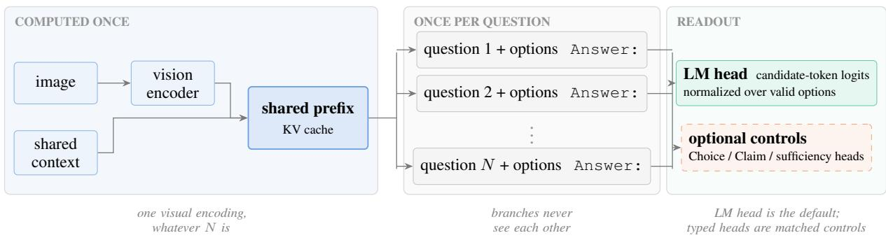
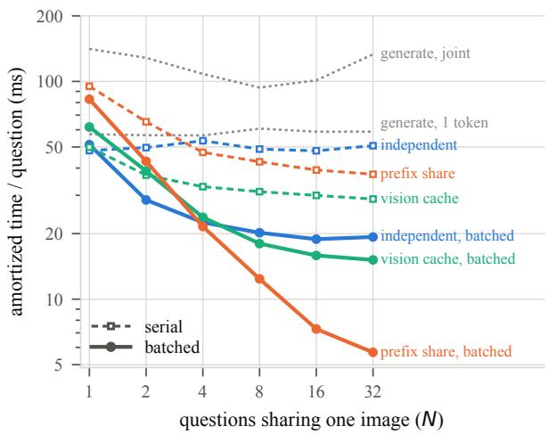
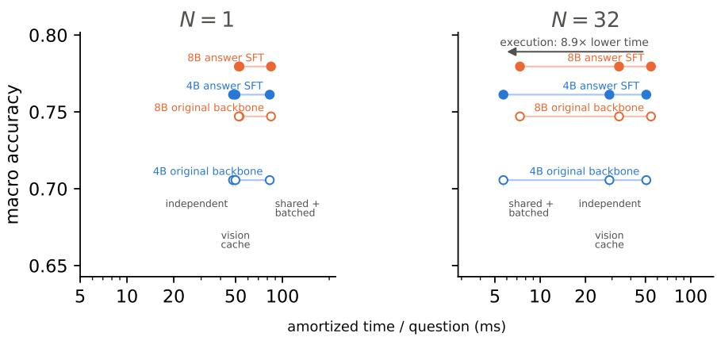
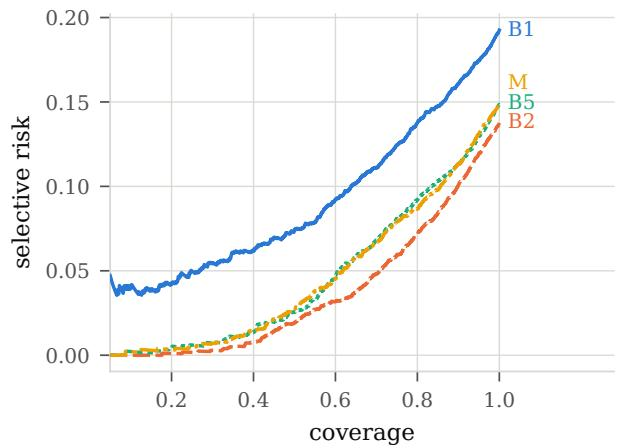

# Visual Jev: Accurate and Efficient Decisions from Shared Visual Context

Guanxu Yu Independent Research guanxu.yu.sv@gmail.com

Yuhang Yao Carnegie Mellon University yuhangya@alumni.cmu.edu

Project: Website • GitHub

## Abstract

Many vision applications ask several independent, forced-choice questions about the same image. Visual Jev encodes the image and public context once, executes isolated question suffixes as a batch, and reads candidate probabilities from the backbone’s LM head. Across four benchmarks, answer-supervised post-training raises equal-weight macro accuracy from 0.706 to 0.761, with the gain concentrated on the two task families represented in training. At N=32 questions per image, shared batched execution is 8.9× faster in warm amortized time than independent serial execution and remains 3.4× faster than an already-batched baseline that recomputes the prefix, at the cost of higher peak memory. A matched typed-head control offers no consistent accuracy advantage over the LMhead readout. The supported design is therefore simple: adapt the backbone for quality, retain the existing readout, and share execution for efficiency.

## 1 Introduction

A growing class of applications asks a vision– language model (VLM) to decide rather than to write: which button cancels an order, whether a banner reports success, or how many seats are free. The candidate set is known at request time, and several independent questions often share the same image. A per-question execution strategy that neither batches questions nor reuses visual context ignores both properties: it decodes free-form text for a fixed-choice decision and recomputes the image for every question. The central systems problem is therefore to answer multiple independent questions about one image efficiently, avoiding repeated visual computation without sacrificing decision quality. Addressing it requires separating the effects of task adaptation, output readout and serving optimization.

Visual Jev is the system that exploits this structure. Its default configuration post-trains the backbone with ordinary answer supervision, reads candidate-token probabilities from the existing LM head, and executes the isolated question suffixes as one batch over a shared visual prefix. Separate batch rows and masks preserve question isolation. Typed decision and evidence-sufficiency heads are controls, not parts of the recommended system. Thus post-training is the quality intervention and shared batched execution is the serving intervention. Figure 1 makes this boundary explicit.

Four benchmarks cover two task families represented in post-training and two held out from it. A matched readout comparison and a crossed reuse–batching experiment keep the quality and serving interventions separate. Answer SFT raises the macro average from 0.706 to 0.761, but the gain is concentrated on the training families; the held-out tasks do not establish broad transfer. The typed head has no consistent advantage over the LM head. At N=32, shared batched execution is 8.9× faster than independent serial execution and 3.4× faster than the already-batched no-reuse path, with a measurable memory cost. Figure 2 shows how the execution benefit changes with the number of questions, while Figure 3 places quality and execution cost on separate axes.

## Contributions.

1. We formulate shared visual decision making as a many-questions-per-image workload with runtime candidate sets, probabilistic outputs and explicit question isolation.

2. We present Visual Jev and a crossed reuse– batching analysis that separates task adaptation and LM-head readout from the serving effects of prefix sharing and batched suffix execution.

3. Controlled experiments show where each choice helps: adaptation improves the trained task families, a specialized head adds no consistent accuracy benefit, and shared batched execution improves efficiency subject to memory and numerical trade-offs.

  
Figure 1: Visual Jev. The image and public context form one cached prefix; each isolated question contributes a suffix, and the suffixes run as a batch. The default readout uses the backbone’s LM head and normalizes candidatetoken logits over the valid options. Typed decision and sufficiency heads are matched experimental controls, shown separately because they are not required by the recommended system.

## 2 Related work

Vision–language models and how they are asked. Instruction-tuned VLMs (Alayrac et al., 2022; Li et al., 2023; Liu et al., 2023; Dai et al., 2023) are usually queried by generation, and the Qwen-VL line we build on (Bai et al., 2023; Wang et al., 2024; Qwen Team, 2025) follows that convention. The backbone we use re-injects visual features into early text layers in the manner of DeepStack (Meng et al., 2024) and positions image tokens with a multi-axis extension of rotary embeddings (Su et al., 2024); both details matter for what can be shared across questions (Section 5.2).

Decision interfaces and typed heads. Classification heads on pretrained encoders are widely used for downstream prediction (Devlin et al., 2019), while text-to-text framing provides a general alternative (Raffel et al., 2020). Visual entailment poses exactly a typed three-way decision over an image and a statement (Xie et al., 2019; Do et al., 2020), so a typed head on a VLM is not a new object. Instruction tuning made the generative route competitive across tasks without task-specific heads (Wei et al., 2022; Sanh et al., 2022), and multiplechoice work has shown that reading option symbols directly is a strong way to query a language model (Robinson et al., 2023). We use a matched comparison to test whether such a head is needed when data, budget and readout position are held fixed.

What candidate sets give away. Converting open answers to options invites shortcuts. Hypothesis-only baselines expose them in inference data (Poliak et al., 2018; Gururangan et al.,

2018); in VQA the analogous problem is answering from the language prior alone (Goyal et al., 2017; Agrawal et al., 2018). Option order is itself a bias (Zheng et al., 2024a; Pezeshkpour and Hruschka, 2024). We shuffle option positions, build distractors from same-type answers, and report a blind baseline per benchmark (Table 1); our first TextVQA conversion failed exactly this check and was rebuilt.

Serving: caching and batching. Prefix reuse, paged key–value memory and continuous batching are the standard levers for throughput (Yu et al., 2022; Kwon et al., 2023; Pope et al., 2023), with structured-program runtimes making shared prefixes explicit (Zheng et al., 2024b), and kernel- and attention-level work reducing the constant factors (Dao et al., 2022; Shazeer, 2019; Ainslie et al., 2023). Our experiment crosses reuse and batching so their contributions can be reported separately, and traces the remaining numerical deviation to mixed precision (Micikevicius et al., 2018).

Knowing when not to answer. Confidence calibration (Guo et al., 2017) and selective prediction (El-Yaniv and Wiener, 2010; Geifman and El-Yaniv, 2017) are the standard tools, and both language and vision–language work has asked whether models know what they know (Kadavath et al., 2022; Rajpurkar et al., 2018; Whitehead et al., 2022). We built an evidence-sufficiency output in that spirit and report in Section A that it detects missing evidence well and still does not improve decisions.

## 3 Visual Jev

An instance is an image I, a public text context S, and a set of questions Q. Each question is answered independently: it may read I, S and its own text, and may not read the other questions or their answers. That isolation is what licenses the shared execution of Section 5.2.

Prompt and output. The shared prefix contains the system turn, image and public context. Each suffix contains one question, its candidates, and a fixed Answer: readout position. Choice accepts a runtime-supplied set of $K \leq 1 6$ candidates; Claim uses the three candidates supported, contradicted and not determined. Larger sets are rejected rather than truncated. Candidate j is represented by the verified single token for its option letter. If $z _ { j }$ is that token’s LM logit, Visual Jev returns

$$
p ( c _ { j } \mid I , S , q ) = { \frac { \exp z _ { j } } { \sum _ { \ell = 1 } ^ { K } \exp z _ { \ell } } } .\tag{1}
$$

The normalization therefore covers only the candidates supplied for that question, while training remains ordinary next-token cross entropy over the full vocabulary.

Isolation and shared execution. Prefix tokenization is verified to be identical for every question. The prefix is prefilled once, its KV state is expanded across question branches, and the rightpadded suffixes run as a single batch. Separate batch rows isolate the suffixes from one another, while attention masks exclude padding. Qwen3-VL re-injects visual features only at image-token positions in its first three text layers; all such positions lie in the cached prefix, so suffix execution requires no additional visual features.

Default and diagnostic readouts. The default system is answer-supervised LoRA with the LMhead readout above. For the matched head control, a layer-normalized hidden state at the same Answer: position feeds either a 16-slot Choice head or a three-way Claim head, trained by cross entropy over valid slots. An additional scalar evidence-sufficiency head is evaluated only in the appendix. These heads share the backbone, data, prompts and step budget with the default system.

## 4 Experimental setup

Benchmarks. We use four benchmarks, two of which post-training never sees. GQA supplies object, attribute and relation questions and is the main source of naturally co-occurring questions per image. SNLI-VE supplies Claim. TextVQA supplies text-in-image reading and TallyQA supplies counting; neither enters training. Open answers are converted to Choice-format candidate sets and are never compared against open-ended leaderboard numbers. Splits are isolated on the original image, so a question, its paraphrase and its variants cannot straddle the line.

<table><tr><td>Evaluation set</td><td>Chance</td><td>Grey</td><td>Sighted</td></tr><tr><td>TextVQA (K=8)</td><td>0.125</td><td>0.369</td><td>0.974</td></tr><tr><td>GQA (converted)</td><td>0.365</td><td>0.585</td><td>0.841</td></tr><tr><td>SNLI-VE (Claim)</td><td>0.333</td><td>0.334</td><td>0.637</td></tr><tr><td>TallyQA (counting, held out)</td><td>0.167</td><td>0.209</td><td>0.357</td></tr></table>

Table 1: How much of each diagnostic subset the option list gives away. The grey-image column is the original instruction-tuned backbone, before any additional task adaptation in this paper, answering with the image replaced by a uniform field. These subsets differ from the benchmark test sets in Table 2.

Candidate-set diagnostics. Table 1 reports a separate diagnostic subset answered with the image replaced by a uniform grey field; its sighted values are therefore not the test-set accuracies in Table 2. The SNLI-VE grey-image result is near chance, which does not rule out other dataset biases. Our first TextVQA conversion was unusable: distractors from a global answer pool made accuracy exceed 99%. We rebuilt it from same-template answers. TallyQA provides a second held-out task with more headroom and a grey-image baseline nearer chance.

Training. The main model is Qwen3-VL-4B-Instruct (Qwen Team, 2025), with the vision tower frozen and LoRA (Hu et al., 2022) applied to the language tower. Training draws from 30,416 GQA Choice items and 9,000 SNLI-VE Claim items for 3,000 updates with batch size 8. Choice examples vary K from 2 to 8 and shuffle option order. We train three seeds for the principal post-trained systems. The 8B scale comparison uses the same data, update budget, precision and visual-token budget. Full optimizer and hardware details appear in Section C.

Evaluation and timing. Accuracy is reported per benchmark and as their equal-weight macro average. Seed summaries are means with the seed standard deviation; test confidence intervals use a cluster bootstrap over parent images. Efficiency uses a synchronized time.perf\_counter interval around each warm benchmark path. Starting from an in-memory decoded image and extracted question records, it includes processor/tokenization, host-to-device transfer and model execution until the path returns; image decode, record construction, disk I/O, network transfer and serving queues are excluded. For $N > 1$ , “time per question” is group completion time divided by N—an amortized throughput measure, not the response latency of an independently arriving request. Measurements use one RTX 5090 in bfloat16, five warm repetitions after two discarded warm-ups, and groups of N questions from the same GQA image.

## 5 Main results

## 5.1 Decision quality

Table 2 separates the four evaluation families rather than pooling their examples.

Task adaptation improves the macro average, primarily on seen families. Reading the untouched 4B backbone through its LM head gives 0.706 macro accuracy. Answer-supervised posttraining raises this to 0.761. The per-benchmark columns delimit that result: most of the change comes from GQA and SNLI-VE, which supply the training data. TextVQA and TallyQA are held out, and their mean accuracies change little. The macro result therefore supports adaptation to the trained decision families, not a general claim of cross-task improvement.

A specialized head is not necessary for the observed gain. Decision CE changes only the supervision and readout: it uses the same backbone, examples, prompts, readout position and update budget as answer SFT, but applies cross entropy to a typed head rather than next-token cross entropy through the full-vocabulary LM head. The two systems both round to 0.761 macro accuracy; their three-seed ranges overlap (0.758–0.764 for answer SFT and 0.760–0.763 for decision CE). We therefore observe no consistent advantage for the decision head under these data, seeds and budgets. This is a design preference for the simpler LMhead system, not evidence that the two training procedures are strictly equivalent.

## 5.2 Execution efficiency

Table 3 crosses two factors: whether computation is reused across the N questions and whether the questions run together. Its accuracy column is computed on 7,532 GQA execution-test questions; it is distinct from the four-benchmark macro accuracy in Table 2. Figure 2 plots the same execution paths across the tested concurrency levels.

  
Figure 2: Warm amortized time per question against the number of questions on one image, log on both axes. Hue is what a path reuses, dash is whether it batches, so the decomposition reads off the figure: the vertical gap within a hue is batching, the gap between hues at one dash is sharing. The metric is group time divided by N, not single-request response latency.

Batching and sharing both contribute. At N=32, independent serial execution takes 50.7 ms per question after amortization. Batching the full sequences without reuse reduces this to 19.3 ms, a 2.6× gain. Reusing the prefix at the same batching level reduces it further to 5.7 ms, a 3.4× gain. Together they yield 8.9× and 176 questions/s instead of 20. The two factors are standard, but the crossed comparison shows how much each contributes on this workload.

The throughput gain has latency and memory conditions. The reported per-question number is total group time divided by N: all 32 answers in the shared batched run complete in about 182 ms, rather than each independently receiving a 5.7 ms response. At N=1, prefix sharing is slower (82.9 ms versus 48.1 ms) because cache construction and expansion have no other question over which to amortize. At N=32, peak allocated memory rises from 8.40 GiB to 10.10 GiB. Shared batched execution is consequently appropriate when several questions about one image are known together and the additional memory is acceptable.

Aggregate accuracy is stable, but predictions are not identical. Five of the six decision paths score 0.9104 and the vision-cache batched path scores 0.9100. Depending on the path, 0–20 of

<table><tr><td>System</td><td>Readout</td><td>Seeds</td><td>GQA</td><td>SNLI-VE</td><td> $\mathrm { \Delta T e x t V Q A ^ { \dagger } }$ </td><td> $\mathrm { T a l l y Q A ^ { \dagger } }$ </td><td>Macro</td></tr><tr><td>4B original backbone</td><td>LM</td><td>1</td><td>0.879</td><td>0.629</td><td>0.974</td><td>0.340</td><td>0.706</td></tr><tr><td>4B answer SFT</td><td>LM</td><td>3</td><td> $0 . 9 1 6 \pm 0 . 0 0 2$ </td><td> $0 . 8 0 8 \pm 0 . 0 0 6$ </td><td> $0 . 9 7 5 \pm 0 . 0 0 2$ </td><td> $0 . 3 4 5 \pm 0 . 0 1 4$ </td><td> $0 . 7 6 1 \pm 0 . 0 0 2$ </td></tr><tr><td>8B original backbone</td><td>LM</td><td>1</td><td>0.885</td><td>0.695</td><td>0.979</td><td>0.429</td><td>0.747</td></tr><tr><td>8B answer SFT</td><td>LM</td><td>3</td><td> $0 . 9 1 9 \pm 0 . 0 0 1$ </td><td> $0 . 8 1 8 \pm 0 . 0 0 3$ </td><td> $0 . 9 7 9 \pm 0 . 0 0 3$ </td><td> $0 . 4 0 2 \pm 0 . 0 2 8$ </td><td> $0 . 7 8 0 \pm 0 . 0 0 8$ </td></tr><tr><td>4B decision CE</td><td>head</td><td>3</td><td> $0 . 9 1 9 \pm 0 . 0 0 1$ </td><td> $0 . 8 0 2 \pm 0 . 0 0 8$ </td><td> $0 . 9 7 3 \pm 0 . 0 0 1$ </td><td> $0 . 3 5 0 \pm 0 . 0 0 4$ </td><td> $0 . 7 6 1 \pm 0 . 0 0 1$ </td></tr><tr><td>+ sufficiency</td><td>head</td><td>1</td><td>0.913</td><td>0.767</td><td>0.971</td><td>0.343</td><td>0.748</td></tr><tr><td>4B decision CE,  $K \leq 4$ </td><td>head</td><td>3</td><td> $0 . 9 1 6 \pm 0 . 0 0 2$ </td><td> $0 . 8 0 1 \pm 0 . 0 1 2$ </td><td> $0 . 6 3 9 \pm 0 . 0 2 2$ </td><td> $0 . 3 0 9 \pm 0 . 0 2 2$ </td><td> $0 . 6 6 6 \pm 0 . 0 0 2$ </td></tr></table>

Table 2: Accuracy per benchmark. † marks a task no post-training in this paper ever saw. The macro average weights the four benchmarks equally, so the largest or easiest cannot carry it. The Readout column gives the output each system is read through, which is the one it was trained for: the backbone’s own LM head, or a decision head. Original backbone denotes the instruction-tuned checkpoint before any additional task adaptation in this paper. ± is the standard deviation across seeds. The last row is the same decision training on data that only ever presented $K \leq 4$ options.
<table><tr><td></td><td></td><td></td><td colspan="3">Decision quality</td><td colspan="3">Amortized time / question (ms)</td><td></td><td></td></tr><tr><td>Path</td><td>Reuses</td><td>Batches</td><td>Accuracy</td><td>Δ</td><td>disagree</td><td>N=1</td><td>N=8</td><td>N=32</td><td>Q/s</td><td>GiB</td></tr><tr><td>independent</td><td></td><td></td><td>0.9104</td><td></td><td></td><td>48.1</td><td>48.9</td><td>50.7</td><td>20</td><td>8.40</td></tr><tr><td>independent</td><td></td><td>yes</td><td>0.9104</td><td>+0.0000</td><td>18/7,532</td><td>51.3</td><td>20.2</td><td>19.3</td><td>52</td><td>9.73</td></tr><tr><td>vision cache</td><td>vision</td><td>—</td><td>0.9104</td><td>+0.0000</td><td>0/7,532</td><td>49.9</td><td>31.2</td><td>28.8</td><td>35</td><td>8.40</td></tr><tr><td>vision cache</td><td>vision</td><td>yes</td><td>0.9100</td><td>-0.0004</td><td>17/7,532</td><td>61.8</td><td>18.0</td><td>15.1</td><td>66</td><td>9.32</td></tr><tr><td>prefix share</td><td>prefix</td><td></td><td>0.9104</td><td>+0.0000</td><td>20/7,532</td><td>95.0</td><td>42.8</td><td>37.5</td><td>27</td><td>8.48</td></tr><tr><td>prefix share</td><td>prefx</td><td>yes</td><td>0.9104</td><td>+0.0000</td><td>14/7,532</td><td>82.9</td><td>12.4</td><td>5.7</td><td>176</td><td>10.10</td></tr><tr><td>generate, 1 token/q</td><td></td><td></td><td></td><td></td><td></td><td>57.3</td><td>60.7</td><td>58.8</td><td>17</td><td>8.44</td></tr><tr><td>generate, joint</td><td></td><td></td><td></td><td></td><td></td><td>141.1</td><td>93.7</td><td>133.3</td><td>8</td><td>8.63</td></tr></table>

Table 3: What sharing buys, what batching buys, and what either costs. Reuses and Batches say what each row shares across the N questions and whether it runs them together. ∆ and the disagreement count are against the independent path on the same items. The generation rows answer by emitting a token, so their accuracy is a different measurement. Times are synchronized warm wall-clock group intervals divided by N. They start from an in-memory decoded image and extracted records, include processor/tokenization, transfers and path execution, and exclude image decode, record construction, disk, network and queueing; they are not independent-request response latencies.

7,532 argmax predictions differ from independent execution. These are close aggregate accuracies, not sample-wise equivalence; Section 6 analyzes the numerical source.

Skipping token generation is not the main saving. Generating one token independently per question costs 58.8 ms at N=32, close to the 50.7 ms independent direct-readout path. Generating all answers in one sequence is slower still because the output tokens are decoded serially. The principal advantage comes from reusing the fixed visual context and batching the independent suffixes.

## 6 Analysis

Why the head control favors the LM readout. The matched comparison in Table 2 assigns the quality improvement to post-training rather than to the output parameterization: answer SFT and decision CE have overlapping seed ranges and neither wins consistently by benchmark. This conclusion is limited to the tested training budget and seeds, but it removes the typed head from the default Visual Jev configuration.

Slot coverage is a constraint on typed heads. The final row of Table 2 uses an earlier training construction in which Choice examples had at most four options. The 16-slot head therefore received no gradient for later slots. On held-out eight-option TextVQA, it scores 0.639 rather than 0.973 after option counts are varied from 2 to 8 during training. This failure is specific to the slot-indexed control— the LM-head readout uses pretrained candidate tokens—and motivates matching option-count coverage whenever a fixed-slot head is used.

Mixed-precision execution explains the path differences. Vision caching without batching is bitwise identical to independent execution, but the deviations are not confined to batched paths: serial prefix sharing also changes a small number of predictions (Tables 3 and 11). Batching without sharing likewise introduces differences, so both batched kernels and the prefix-prefill/cache-fork path can change the numerical trajectory. In float32, the largest probability difference on the shared batched path falls from 1 $. 8 \times 1 0 ^ { - 1 }$ to $1 . 4 \times 1 0 ^ { - 5 }$ and no argmax flips remain. The largest differences occur on examples with very small top-two margins. The evidence therefore supports mixed-precision execution effects, not an exclusive attribution to batching and not sample-wise identity.

  
Figure 3: Quality and execution cost. Hue denotes backbone size; hollow and filled markers denote the original backbone and answer-supervised models. Here, “original” means the instruction-tuned checkpoint before any additional task adaptation in this paper. Within one backbone and training state, horizontal moves change only the execution path. Hollow-to-filled comparisons change training, whereas cross-hue comparisons change model scale and can move both axes. At N=1 sharing adds overhead; at N=32 it lowers amortized time while increasing peak memory as reported in Table 3.

<table><tr><td>Backbone</td><td>Macro</td><td>amort. ms/q</td><td>Q/s</td><td>GiB</td></tr><tr><td>Qwen3-VL-4B</td><td>0.761</td><td>5.7</td><td>176</td><td>10.1</td></tr><tr><td>Qwen3-VL-8B</td><td>0.780</td><td>7.3</td><td>136</td><td>18.1</td></tr></table>

Table 4: What the larger backbone costs, both answer-SFT, both on the shared batched path at N=32 on the same GPU at the same precision and visual budget. Macro accuracy is the mean over three seeds.

Scaling helps, with a separate resource tradeoff. Under the same answer-SFT recipe, the 8B model improves mean macro accuracy by +0.018. Its observed seed range (0.771–0.790) does not overlap the 4B range (0.758–0.764), although three seeds per model do not establish a general scaling law. On the shared batched path, 8B increases amortized time by 29% and peak memory by 80%. Model scale and execution optimization therefore address different axes and are reported separately rather than compared on a common “value” scale. Table 4 gives the underlying measurements, while Figure 3 places the scaling move alongside the execution choices.

Evidence sufficiency is not part of the main system. Adding the answerability head and paired ranking and consistency terms gives 0.748 macro accuracy versus 0.761 for decision CE alone, with the loss concentrated on SNLI-VE. The head detects missing evidence, but does not improve decisions or selective prediction in this evaluation. The full study and matched-budget controls are reported in Section A.

## 7 Conclusion

Visual Jev treats multiple questions about one image as a shared-context workload. Answersupervised post-training improves the fourbenchmark macro average from 0.706 to 0.761, with the gain concentrated on the two training families. Shared batched execution then raises throughput from 20 to 176 questions/s at N=32; its 5.7 ms per-question figure is amortized, and its peak-memory cost is 10.10 GiB rather than 8.40 GiB.

The controls favor the simpler system definition used throughout the paper. Under the tested data, budgets and seeds, a typed decision head shows no consistent advantage over the LM head, while prefix reuse and batching retain their efficiency benefit regardless of readout. Thus the supported design is task adaptation for quality and shared batched execution for efficiency, with specialized heads reserved for applications that demonstrate an independent need for them.

## Limitations

The workload requires co-available questions. The serving gain assumes that several questions about one image are known together. At N=1, prefix construction and cache expansion add overhead rather than save work (Figure 2). For independently arriving requests, forming a batch would introduce queueing latency that our benchmark excludes. The reported 5.7 ms is therefore an amortized throughput measure: the 32-question shared batch completes in about 182 ms, not 5.7 ms per independently arriving request.

One backbone family, two scales, one language. The principal experiments use Qwen3-VL-4B-Instruct, and the scale check uses Qwen3-VL-8B-Instruct. Both freeze the vision tower and apply LoRA to the language tower at a fixed visual-token budget, on English questions with at most 16 candidates. A second architecture family is not tested, and a frozen vision tower may constrain fine-detail tasks.

Task transfer and statistical scope are limited. TextVQA and TallyQA are fully held out from posttraining, but neither shows a clear gain. The results establish improvement on the two trained families, not broad transfer to new visual tasks. Confidence intervals are cluster bootstraps (Efron, 1979) over parent images rather than questions (Koehn, 2004); they cover test sampling, not training randomness. Three-seed spreads are reported separately. Training uses a fixed step budget, and neither schedules nor loss weights were swept exhaustively, so longer or differently tuned runs could change the ordering.

The Choice conversions carry a language prior. With every image replaced by a uniform grey field, the backbone still answers 58.5% of converted GQA questions correctly against 36.5% chance. The SNLI-VE diagnostic is 33.4% against 33.3% chance, but neither check excludes other biases. Holding the question, candidates and gold label fixed makes paired pixel interventions less sensitive to a static text-only preference; it does not guarantee that language priors and visual changes do not interact. Absolute accuracies and intervention differences should therefore both be read with the blind baselines in mind.

The appendix sufficiency study depends on imperfect annotations. Evidence regions are derived from GQA scene graphs rather than humanverified pixel rationales. Scene graphs can omit another instance of the referenced category, relational support can extend beyond the union of object boxes, and coarse boxes can miss a fine-grained target near their edge. These failures can weaken either arm of the paired intervention. In a small manual inspection, five of six triples were unambiguous and one exhibited the granularity issue; a larger human-verified subset is needed to quantify this uncertainty. Moreover, evidence sufficiency is not correctness: the optional head detects whether the observation carries the annotated evidence, but it does not thereby estimate whether the answer is right. Turning that signal into a risk estimate would require correctness supervision of its own.

## Ethics Statement

This work uses four publicly released benchmarks — GQA (Hudson and Manning, 2019), SNLI-VE (Xie et al., 2019), TextVQA (Singh et al., 2019) and TallyQA (Acharya et al., 2019) — under their original terms, together with the images they are built on (Krishna et al., 2017; Young et al., 2014). Those images are photographs of real scenes and include identifiable people; we redistribute none of them and release only the derived question records, the option sets we constructed and the per-example model outputs. We collected no new human annotation and employed no annotators.

The degraded images used in Section A are produced automatically by occluding or blurring regions of existing photographs. They are diagnostic artefacts, not content we present as real, and the construction records which region was altered in every case.

The intended use is a serving pattern, not a decision procedure with consequences for people. We would caution against the obvious misreading: the candidate probability this system returns is not a calibrated probability that the answer is correct, and Section A reports a control showing that a model can be confident on an observation whose evidence has been removed. Deployments that act on these outputs without their own risk calibration would be acting on a number that does not mean what it appears to.

All experiments ran on a single machine with consumer GPUs; the total compute is reported in Section C so the cost can be weighed.

## References

Manoj Acharya, Kushal Kafle, and Christopher Kanan. 2019. TallyQA: Answering complex counting questions. In AAAI Conference on Artificial Intelligence.

Aishwarya Agrawal, Dhruv Batra, Devi Parikh, and Aniruddha Kembhavi. 2018. Don’t just assume; look and answer: Overcoming priors for visual question answering. In IEEE/CVF Conference on Computer Vision and Pattern Recognition (CVPR).

Joshua Ainslie, James Lee-Thorp, Michiel de Jong, Yury Zemlyanskiy, Federico Lebrón, and Sumit Sanghai. 2023. GQA: Training generalized multi-query transformer models from multi-head checkpoints. In Conference on Empirical Methods in Natural Language Processing (EMNLP).

Jean-Baptiste Alayrac, Jeff Donahue, Pauline Luc, Antoine Miech, Iain Barr, Yana Hasson, Karel Lenc, Arthur Mensch, Katherine Millican, Malcolm Reynolds, et al. 2022. Flamingo: A visual language model for few-shot learning. In Advances in Neural Information Processing Systems (NeurIPS).

Jinze Bai, Shuai Bai, Shusheng Yang, Shijie Wang, Sinan Tan, Peng Wang, Junyang Lin, Chang Zhou, and Jingren Zhou. 2023. Qwen-VL: A versatile vision-language model for understanding, localization, text reading, and beyond. arXiv preprint arXiv:2308.12966.

Wenliang Dai, Junnan Li, Dongxu Li, Anthony Meng Huat Tiong, Junqi Zhao, Weisheng Wang, Boyang Li, Pascale Fung, and Steven Hoi. 2023. InstructBLIP: Towards general-purpose visionlanguage models with instruction tuning. In Advances in Neural Information Processing Systems (NeurIPS).

Tri Dao, Daniel Y. Fu, Stefano Ermon, Atri Rudra, and Christopher Ré. 2022. FlashAttention: Fast and memory-efficient exact attention with IO-awareness. In Advances in Neural Information Processing Systems (NeurIPS).

Jacob Devlin, Ming-Wei Chang, Kenton Lee, and Kristina Toutanova. 2019. BERT: Pre-training of deep bidirectional transformers for language understanding. In Conference ofthe North American Chapter ofthe Associationfor Computational Linguistics (NAACL).

Virginie Do, Oana-Maria Camburu, Zeynep Akata, and Thomas Lukasiewicz. 2020. e-SNLI-VE: Corrected visual-textual entailment with natural language explanations. arXiv preprint arXiv:2004.03744.

Bradley Efron. 1979. Bootstrap methods: Another look at the jackknife.

Ran El-Yaniv and Yair Wiener. 2010. On the foundations of noise-free selective classification. Journal of Machine Learning Research.

Yonatan Geifman and Ran El-Yaniv. 2017. Selective classification for deep neural networks. In Advances in Neural Information Processing Systems (NeurIPS).

Yash Goyal, Tejas Khot, Douglas Summers-Stay, Dhruv Batra, and Devi Parikh. 2017. Making the V in VQA matter: Elevating the role of image understanding in visual question answering. In IEEE Conference on Computer Vision and Pattern Recognition (CVPR).

Chuan Guo, Geoff Pleiss, Yu Sun, and Kilian Q. Weinberger. 2017. On calibration of modern neural networks. In International Conference on Machine Learning (ICML).

Suchin Gururangan, Swabha Swayamdipta, Omer Levy, Roy Schwartz, Samuel R. Bowman, and Noah A. Smith. 2018. Annotation artifacts in natural language inference data. In Conference of the North American Chapter of the Association for Computational Linguistics (NAACL).

Edward J. Hu, Yelong Shen, Phillip Wallis, Zeyuan Allen-Zhu, Yuanzhi Li, Shean Wang, Lu Wang, and Weizhu Chen. 2022. LoRA: Low-rank adaptation of large language models. In International Conference on Learning Representations (ICLR).

Drew A. Hudson and Christopher D. Manning. 2019. GQA: A new dataset for real-world visual reasoning and compositional question answering. In IEEE/CVF Conference on Computer Vision and Pattern Recognition (CVPR).

Saurav Kadavath, Tom Conerly, Amanda Askell, Tom Henighan, Dawn Drain, Ethan Perez, Nicholas Schiefer, Zac Hatfield-Dodds, Nova DasSarma, Eli Tran-Johnson, et al. 2022. Language models (mostly) know what they know. arXiv preprint arXiv:2207.05221.

Philipp Koehn. 2004. Statistical significance tests for machine translation evaluation. In Conference on Empirical Methods in Natural Language Processing (EMNLP).

Ranjay Krishna, Yuke Zhu, Oliver Groth, Justin Johnson, Kenji Hata, Joshua Kravitz, Stephanie Chen, Yannis Kalantidis, Li-Jia Li, David A. Shamma, Michael S. Bernstein, and Li Fei-Fei. 2017. Visual genome: Connecting language and vision using crowdsourced dense image annotations. International Journal ofComputer Vision.

Woosuk Kwon, Zhuohan Li, Siyuan Zhuang, Ying Sheng, Lianmin Zheng, Cody Hao Yu, Joseph E. Gonzalez, Hao Zhang, and Ion Stoica. 2023. Efficient memory management for large language model serving with PagedAttention. In ACM Symposium on Operating Systems Principles (SOSP).

Junnan Li, Dongxu Li, Silvio Savarese, and Steven Hoi. 2023. BLIP-2: Bootstrapping language-image pretraining with frozen image encoders and large language models. In International Conference on Machine Learning (ICML).

Haotian Liu, Chunyuan Li, Qingyang Wu, and Yong Jae Lee. 2023. Visual instruction tuning. In Advances in Neural Information Processing Systems (NeurIPS).

Lingchen Meng, Jianwei Yang, Rui Tian, Xiyang Dai, Zuxuan Wu, Jianfeng Gao, and Yu-Gang Jiang. 2024. DeepStack: Deeply stacking visual tokens is surprisingly simple and effective for LMMs. arXiv preprint arXiv:2406.04334.

Paulius Micikevicius, Sharan Narang, Jonah Alben, Gregory Diamos, Erich Elsen, David Garcia, Boris Ginsburg, Michael Houston, Oleksii Kuchaiev, Ganesh Venkatesh, and Hao Wu. 2018. Mixed precision training. International Conference on Learning Representations (ICLR).

Pouya Pezeshkpour and Estevam Hruschka. 2024. Large language models sensitivity to the order of options in multiple-choice questions. In Findings of the Associationfor Computational Linguistics: NAACL.

Adam Poliak, Jason Naradowsky, Aparajita Haldar, Rachel Rudinger, and Benjamin Van Durme. 2018. Hypothesis only baselines in natural language inference. In Joint Conference on Lexical and Computational Semantics (\*SEM).

Reiner Pope, Sholto Douglas, Aakanksha Chowdhery, Jacob Devlin, James Bradbury, Anselm Levskaya, Jonathan Heek, Kefan Xiao, Shivani Agrawal, and Jeff Dean. 2023. Efficiently scaling transformer inference. Proceedings of Machine Learning and Systems (MLSys).

Qwen Team. 2025. Qwen3-VL. Model release. https://huggingface.co/Qwen/ Qwen3-VL-4B-Instruct.

Colin Raffel, Noam Shazeer, Adam Roberts, Katherine Lee, Sharan Narang, Michael Matena, Yanqi Zhou, Wei Li, and Peter J. Liu. 2020. Exploring the limits of transfer learning with a unified text-to-text transformer. Journal ofMachine Learning Research.

Pranav Rajpurkar, Robin Jia, and Percy Liang. 2018. Know what you don’t know: Unanswerable questions for SQuAD. In Annual Meeting of the Association for Computational Linguistics (ACL).

Joshua Robinson, Christopher Michael Rytting, and David Wingate. 2023. Leveraging large language models for multiple choice question answering. In International Conference on Learning Representations (ICLR).

Victor Sanh, Albert Webson, Colin Raffel, Stephen H. Bach, et al. 2022. Multitask prompted training enables zero-shot task generalization. In International Conference on Learning Representations (ICLR).

Noam Shazeer. 2019. Fast transformer decoding: One write-head is all you need.

Amanpreet Singh, Vivek Natarajan, Meet Shah, Yu Jiang, Xinlei Chen, Dhruv Batra, Devi Parikh, and Marcus Rohrbach. 2019. Towards VQA models that can read. In IEEE/CVF Conference on Computer Vision and Pattern Recognition (CVPR).

Jianlin Su, Murtadha Ahmed, Yu Lu, Shengfeng Pan, Wen Bo, and Yunfeng Liu. 2024. RoFormer: Enhanced transformer with rotary position embedding. Neurocomputing.

Peng Wang, Shuai Bai, Sinan Tan, Shijie Wang, Zhihao Fan, Jinze Bai, Keqin Chen, Xuejing Liu, Jialin Wang, Wenbin Ge, Yang Fan, Kai Dang, Mengfei Du, Xuancheng Ren, Rui Men, Dayiheng Liu, Chang Zhou, Jingren Zhou, and Junyang Lin. 2024. Qwen2- VL: Enhancing vision-language model’s perception of the world at any resolution. arXiv preprint arXiv:2409.12191.

Jason Wei, Maarten Bosma, Vincent Y. Zhao, Kelvin Guu, Adams Wei Yu, Brian Lester, Nan Du, Andrew M. Dai, and Quoc V. Le. 2022. Finetuned language models are zero-shot learners. In International Conference on Learning Representations (ICLR).

Spencer Whitehead, Suzanne Petryk, Vedaad Shakib, Joseph Gonzalez, Trevor Darrell, Anna Rohrbach, and Marcus Rohrbach. 2022. Reliable visual question answering: Abstain rather than answer incorrectly. In European Conference on Computer Vision (ECCV).

Ning Xie, Farley Lai, Derek Doran, and Asim Kadav. 2019. Visual entailment: A novel task for fine-grained image understanding. arXiv preprint arXiv:1901.06706.

Peter Young, Alice Lai, Micah Hodosh, and Julia Hockenmaier. 2014. From image descriptions to visual denotations: New similarity metrics for semantic inference over event descriptions. Transactions ofthe Association for Computational Linguistics.

Gyeong-In Yu, Joo Seong Jeong, Geon-Woo Kim, Soojeong Kim, and Byung-Gon Chun. 2022. Orca: A distributed serving system for transformer-based generative models. In USENIX Symposium on Operating Systems Design and Implementation (OSDI).

Chujie Zheng, Hao Zhou, Fandong Meng, Jie Zhou, and Minlie Huang. 2024a. Large language models are not robust multiple choice selectors. In International Conference on Learning Representations (ICLR).

Lianmin Zheng, Liangsheng Yin, Zhiqiang Xie, Chuyue Sun, Jeff Huang, Cody Hao Yu, Shiyi Cao, Christos Kozyrakis, Ion Stoica, Joseph E. Gonzalez, Clark Barrett, and Ying Sheng. 2024b. SGLang: Efficient execution of structured language model programs. In Advances in Neural Information Processing Systems (NeurIPS).

## A Evidence sufficiency: a negative result

Table 5 defines the diagnostic systems used in this appendix, from the original backbone (B1) and decision-CE control (B2) through the optional unknown and sufficiency outputs. Table 6 then compares their in-distribution decision quality and selective metrics. B2 has the highest mean accuracy and lowest AURC; adding the sufficiency objectives does not improve either measure, which motivates keeping them outside the default Visual Jev system. Table 7 gives the corresponding deployment-mix results, which are discussed after the sufficiency and specificity analyses. Abstention has a long line behind it (El-Yaniv and Wiener, 2010; Geifman and El-Yaniv, 2017; Whitehead et al., 2022). We evaluate an evidence-sufficiency output as an optional extension. It detects missing evidence, but it does not improve decisions; on the benchmark set of Table 2, adding it reduces macro accuracy from 0.761 to 0.748.

This is where the trained output earns its place. The question each system is scored on is a single one: given an observation, does it carry the evidence this question needs?

The original backbone, scored through its decision confidence, is near chance on the matched comparison. So are B2 and B4 – not because they are bad models but because neither has an output for this, and their answerability head never receives a gradient. The trained sufficiency head reaches 0.969 for B5 and 0.969 for M.

The paired measurement holds the question fixed and asks whether the score separates the evidencedegraded arm from its equal-area control. On that paired comparison the backbone’s confidence scores 0.633, barely above chance, and the trained head reaches 0.894. Concretely, the sufficiency score falls from 0.998 on the intact image to 0.223 when the evidence region is destroyed, while the control arm stays at 0.861.

The control arm also moves: a drop of 0.137 on a region the question does not depend on means the head responds partly to degradation itself, not purely to missing evidence. The relevant-arm drop is roughly 5.6 times larger, so the signal is mostly question-conditioned, but it is not purely so. Table 8 isolates the capability that the optional head does learn: B5 and M both reach 0.969 AUROC and 0.993 AUPRC when separating intact observations from evidence-degraded ones. This capability is distinct from improving the answer itself. A sufficiency signal can be tracking either of two things. A detector of image degradation moves equally on both arms of a pair and scores 0.5 on the paired AUROC; a detector of missing evidence moves on the relevant arm only. The backbone’s confidence sits close to the degenerate end, the trained head much closer to the useful one, consistently across seeds (Table 9 in the appendix gives the per-seed numbers).

Table 10 separates the degradations by whether training saw them. The head is trained on greyfill occlusion only. On that seen degradation it reaches 0.957 paired AUROC; on blur and downscale, which change the image statistics in quite different ways and were never in the training stream, it reaches 0.861. This Intervention-OOD result is evidence that the head responds to missing evidence beyond one trained corruption. It does not imply transfer of the main decision model to held-out task families, which is evaluated separately in Table 2.

Table 7 evaluates whether the optional sufficiency signal improves selective prediction; Figure 4 plots the same comparison as risk–coverage curves.

The evaluation is the deployment mix: intact observations, evidence-degraded ones, and their equal-area controls, all scored against the original gold label. This is the setting a sufficiency signal exists for – the in-distribution split contains no damaged observations, so nothing there can distinguish the systems.

Reading the table: the plain decision-CE baseline orders this stream better than either system with a sufficiency head. B2 reaches 0.0362 AURC against 0.0456 for the sufficiency variant, and the accuracy-independent confidence AUROC tells the same story (0.839 against 0.813). Adding the answerability score helps B5 and M slightly, but not universally: for B2 the gate changes AURC from 0.0356 to 0.0362. In no case does gating close the gap to the plain B2 confidence baseline.

Why, and why it is not a bug. The two signals target different quantities, and the mix makes the difference bite. A model that abstains whenever the evidence is damaged abstains on items it would have answered correctly anyway: even with the evidence region destroyed, the backbone is still right on roughly three quarters of them, from context and from prior. A confidence signal, which is trained end to end on being right, keeps those. Evidence sufficiency is the right question when the downstream action is re-observe – zoom, re-photograph, ask for a better upload – and the wrong question when the downstream action is trust this answer.

<table><tr><td>ID</td><td>System</td><td>What it isolates</td></tr><tr><td>B1</td><td>backbone, LM-head candidate readout</td><td>generative ability without decision training</td></tr><tr><td>B2</td><td>decision CE</td><td>the effect of decision training</td></tr><tr><td>B3</td><td>B2 + temperature scaling</td><td>conventional post-hoc calibration</td></tr><tr><td>B4</td><td>same data, single unknown slot</td><td>whether an explicit unknown class suffices</td></tr><tr><td>B5</td><td>B2 + answerability BCE</td><td>the effect of adding a head</td></tr><tr><td>M</td><td>full sufficiency variant</td><td>answerability BCE + pair ranking + consistency</td></tr></table>

Table 5: Compared systems. Backbone, trainable parameters, optimiser and step budget are identical across trained rows. B3 is not a separate training run: every reported number is temperature-scaled on a held-out calibration split, so the B2 rows of Table 6 and the B2 confidence row of Table 7 are B3.
<table><tr><td></td><td colspan="4">Decision quality (temperature-scaled)</td><td colspan="2">Selective</td></tr><tr><td>System</td><td>Accuracy</td><td>Macro-F1</td><td>NLL</td><td>Brier</td><td>AURC</td><td>Cov.@5% risk</td></tr><tr><td>B1 backbone</td><td>0.879</td><td>0.890</td><td>0.324</td><td>0.179</td><td>0.038</td><td>0.719</td></tr><tr><td>B2 decision CE</td><td> $0 . 9 1 6 \pm 0 . 0 0 2$ </td><td> $0 . 9 2 3 \pm 0 . 0 0 1$ </td><td> $0 . 2 2 5 \pm 0 . 0 0 1$ </td><td> $0 . 1 2 6 \pm 0 . 0 0 2$ </td><td> $0 . 0 1 5 \pm 0 . 0 0 1$ </td><td> $0 . 8 9 2 \pm 0 . 0 1 4$ </td></tr><tr><td>B4 unknown slot</td><td>0.911</td><td>0.917</td><td>0.231</td><td>0.130</td><td>0.016</td><td>0.885</td></tr><tr><td>B5 +answerable</td><td> $0 . 9 1 2 \pm 0 . 0 0 1$ </td><td> $0 . 9 1 9 \pm 0 . 0 0 1$ </td><td> $0 . 2 3 4 \pm 0 . 0 0 4$ </td><td> $0 . 1 3 2 \pm 0 . 0 0 3$ </td><td> $0 . 0 1 7 \pm 0 . 0 0 2$ </td><td> $0 . 8 8 0 \pm 0 . 0 1 4$ </td></tr><tr><td>M sufficiency</td><td> $0 . 9 1 2 \pm 0 . 0 0 4$ </td><td> $0 . 9 1 8 \pm 0 . 0 0 3$ </td><td> $0 . 2 3 2 \pm 0 . 0 0 6$ </td><td> $0 . 1 3 0 \pm 0 . 0 0 4$ </td><td> $0 . 0 1 6 \pm 0 . 0 0 1$ </td><td> $0 . 8 7 4 \pm 0 . 0 1 5$ </td></tr></table>

Table 6: Main results on the in-distribution test split. ± is the standard deviation across three training seeds where three were run. Temperature, gate and risk threshold are all fitted on a held-out calibration split of images and applied unchanged.

  
Figure 4: Risk–coverage on the deployment mix. Decision training moves the curve a long way; adding a sufficiency head and the paired objectives does not move it further.

Ruling out a budget artefact. There is one confound we had to eliminate before reporting this. B2 has no valid decision label for the evidencedegraded items and therefore never trains on them, while B5 and M carry them with the decision loss masked. Under a fixed step budget that gives B2 more decision-supervised examples. Training the sufficiency variant for the extra steps that equalise decision-supervised exposure does not move the result – the change is 0.0003 AURC against a seed spread of 0.0021: matched, it reaches 0.0453 AURC at 0.850 mix accuracy, against 0.0356 at 0.863 for B2. Holding the step count fixed on both sides rather than the exposure, B2 on the same longer schedule reaches 0.0360. The ordering we report is therefore a property of the objective, not of the training budget.

## B Additional diagnostics

Table 11 gives the 400-readout numerical check behind the path-level analysis: vision caching is exact, while small deviations occur under serial prefix sharing and batched execution. Table 12 describes the paired intervention corpus; 11,371 pairs pass the area-matching and contamination constraints, while 7,603 attempted pairs are rejected. Finally, Table 13 reports every measured concurrency level and shows where the shared batched path begins to amortize its setup cost.

<table><tr><td>System</td><td>Signal</td><td>Mix acc.</td><td>AURC</td><td>Conf. AUROC</td><td>Cov.@5% risk</td></tr><tr><td>B1 backbone</td><td>confidence</td><td>0.8075</td><td>0.0971</td><td>0.7344</td><td>0.072</td></tr><tr><td>B1 backbone</td><td>gate</td><td>0.8075</td><td>0.0893</td><td>0.7529</td><td>0.079</td></tr><tr><td>B2 decision CE</td><td>confidence</td><td> $0 . 8 6 3 5 \pm 0 . 0 0 3 1$ </td><td> $0 . 0 3 5 6 \pm 0 . 0 0 0 9$ </td><td> $0 . 8 3 9 1 \pm 0 . 0 0 3 2$ </td><td> $0 . 6 6 4 \pm 0 . 0 2 4$ </td></tr><tr><td>B2 decision CE</td><td>gate</td><td> $0 . 8 6 3 5 \pm 0 . 0 0 3 1$ </td><td> $0 . 0 3 6 2 \pm 0 . 0 0 1 7$ </td><td> $0 . 8 3 5 9 \pm 0 . 0 0 6 5$ </td><td> $0 . 6 6 5 \pm 0 . 0 3 1$ </td></tr><tr><td>B4 unknown slot</td><td>confidence</td><td>0.8257</td><td>0.0500</td><td>0.8362</td><td>0.595</td></tr><tr><td>B4 unknown slot</td><td>gate</td><td>0.8257</td><td>0.0499</td><td>0.8365</td><td>0.601</td></tr><tr><td>B5 +answerable</td><td>confidence</td><td> $0 . 8 4 7 0 \pm 0 . 0 0 3 9$ </td><td> $0 . 0 4 7 7 \pm 0 . 0 0 3 8$ </td><td> $0 . 8 0 8 5 \pm 0 . 0 1 6 4$ </td><td> $0 . 6 0 3 \pm 0 . 0 5 4$ </td></tr><tr><td>B5 +answerable</td><td>gate</td><td> $0 . 8 4 7 0 \pm 0 . 0 0 3 9$ </td><td> $0 . 0 4 7 1 \pm 0 . 0 0 4 0$ </td><td> $0 . 8 1 3 0 \pm 0 . 0 1 5 3$ </td><td> $0 . 6 1 3 \pm 0 . 0 5 9$ </td></tr><tr><td>M sufficiency</td><td>confidence</td><td> $0 . 8 4 8 6 \pm 0 . 0 0 5 8$ </td><td> $0 . 0 4 6 4 \pm 0 . 0 0 3 2$ </td><td> $0 . 8 1 2 9 \pm 0 . 0 0 7 5$ </td><td> $0 . 6 0 8 \pm 0 . 0 2 9$ </td></tr><tr><td>M sufficiency</td><td>gate</td><td> $0 . 8 4 8 6 \pm 0 . 0 0 5 8$ </td><td> $0 . 0 4 5 6 \pm 0 . 0 0 2 6$ </td><td> $0 . 8 1 9 0 \pm 0 . 0 0 4 3$ </td><td> $0 . 6 0 9 \pm 0 . 0 2 9$ </td></tr><tr><td>M suff., matched</td><td>confidence</td><td> $0 . 8 4 9 6 \pm 0 . 0 1 0 3$ </td><td> $0 . 0 4 5 7 \pm 0 . 0 0 2 4$ </td><td> $0 . 8 1 3 1 \pm 0 . 0 0 6 4$ </td><td> $0 . 5 7 5 \pm 0 . 0 2 2$ </td></tr><tr><td>M suff., matched</td><td>gate</td><td> $0 . 8 4 9 6 \pm 0 . 0 1 0 3$ </td><td> $0 . 0 4 5 3 \pm 0 . 0 0 2 1$ </td><td> $0 . 8 1 5 6 \pm 0 . 0 0 8 1$ </td><td> $0 . 5 7 4 \pm 0 . 0 2 3$ </td></tr><tr><td>M  $\lambda _ { a } { = } 0 . 2 5$ </td><td>confidence</td><td>0.8607</td><td>0.0421</td><td>0.8104</td><td>0.619</td></tr><tr><td>M  $\lambda _ { a } { = } 0 . 2 5$ </td><td>gate</td><td>0.8607</td><td>0.0417</td><td>0.8131</td><td>0.619</td></tr></table>

Table 7: Selective prediction on the deployment mix: intact observations, evidence-degraded ones and their equalarea controls, all scored against the original gold label. Confidence is the temperature-scaled maximum probability; gate adds margin, entropy and the answerability score in a logistic fit on the calibration split. Confidence AUROC measures ordering quality independently of how accurate the system is. ± is the standard deviation across seeds.

<table><tr><td>System</td><td>AUROC</td><td>AUPRC</td></tr><tr><td>B5 +answerable</td><td> $0 . 9 6 9 \pm 0 . 0 0 3$ </td><td> $0 . 9 9 3 \pm 0 . 0 0 1$ </td></tr><tr><td>M sufficiency</td><td> $0 . 9 6 9 \pm 0 . 0 0 2$ </td><td> $0 . 9 9 3 \pm 0 . 0 0 1$ </td></tr></table>

Table 8: Detecting that the observation no longer carries the evidence the question needs. Positives are intact observations, negatives are evidence-degraded ones.

<table><tr><td>Signal</td><td>∆rel.</td><td>∆irr.</td><td>Pair AUROC</td></tr><tr><td>B1 confidence</td><td>+0.027</td><td>+0.001</td><td>0.633</td></tr><tr><td>B5 head, seed 0</td><td>+0.783</td><td>+0.172</td><td>0.887</td></tr><tr><td>B5 head, seed 1</td><td>+0.787</td><td>+0.135</td><td>0.903</td></tr><tr><td>B5 head, seed 2</td><td>+0.807</td><td>+0.142</td><td>0.900</td></tr><tr><td>M head, seed 0</td><td>+0.791</td><td>+0.175</td><td>0.885</td></tr><tr><td>M head, seed 1</td><td>+0.743</td><td>+0.098</td><td>0.903</td></tr><tr><td>M head, seed 2</td><td>+0.789</td><td>+0.139</td><td>0.894</td></tr><tr><td>M, λa =0.25, seed 0</td><td>+0.787</td><td>+0.165</td><td>0.898</td></tr><tr><td>M matched, seed 0</td><td>+0.777</td><td>+0.111</td><td>0.909</td></tr><tr><td>M matched, seed 1</td><td>+0.765</td><td>+0.108</td><td>0.906</td></tr><tr><td>M matched, seed 2</td><td>+0.781</td><td>+0.119</td><td>0.903</td></tr></table>

<table><tr><td>Degradation</td><td>Seen</td><td>∆rel.</td><td>∆irr.</td><td>AUROC</td></tr><tr><td>occlude</td><td>yes</td><td>+0.895</td><td>+0.117</td><td>0.957</td></tr><tr><td>blur</td><td>no</td><td>+0.775</td><td>+0.144</td><td>0.884</td></tr><tr><td>downscale</td><td>no</td><td>+0.657</td><td>+0.150</td><td>0.839</td></tr><tr><td colspan="5">backbone confidence, same items</td></tr><tr><td>occlude</td><td></td><td>+0.023</td><td>-0.002</td><td>0.636</td></tr><tr><td>blur</td><td></td><td>+0.027</td><td>+0.001</td><td>0.638</td></tr><tr><td>downscale</td><td>一</td><td>+0.032</td><td>+0.004</td><td>0.625</td></tr></table>

Table 10: Intervention-OOD. The sufficiency head is trained on grey-fill occlusion only; blur and downscale are never seen in training. Values are means over the seeds of the sufficiency variant.

Table 9: Specificity of the sufficiency signal. ∆rel. is the drop when the evidence region is degraded, ∆irr. the drop when an equal area elsewhere is degraded. A degradation detector moves both equally and scores 0.5 pair AUROC.
<table><tr><td>Path</td><td>max |∆z|</td><td>max |∆p|</td><td>flips</td></tr><tr><td>independent_batch</td><td>7.50e-01</td><td>1.24e-01</td><td>0.0050</td></tr><tr><td>vision_cache</td><td>0.00e+00</td><td>0.00e+00</td><td>0.0000</td></tr><tr><td>vision_cache_batch</td><td>1.00e+00</td><td>1.79e-01</td><td>0.0050</td></tr><tr><td>prefix_share</td><td>7.50e-01</td><td>1.24e-01</td><td>0.0025</td></tr><tr><td>prefix_share_batch</td><td>1.00e+00</td><td>1.79e-01</td><td>0.0000</td></tr></table>

Table 11: Agreement with the independent path over 400 question readouts. Differences are reported on logits and on probabilities because a logit gap at bfloat16 resolution can be large while the decision is unchanged.

<table><tr><td>Property</td><td>Value</td></tr><tr><td>Emitted pairs Rejected attempts</td><td>11,371</td></tr><tr><td rowspan="3">Area ratio, control / evidence (median) Area ratio (5–95%)</td><td>7,603</td></tr><tr><td>1.000</td></tr><tr><td>0.994-1.006</td></tr><tr><td>Evidence area / frame (median) Control px on evidence boxes</td><td>0.091 0</td></tr><tr><td>Control px on same-category boxes</td><td>0</td></tr></table>

Table 12: Measured properties of the paired intervention set. The control arm is area-matched to the evidence region and its overlap with evidence or substitutable objects is zero. Rejected attempts are pairs for which no uncontaminated control of matching area exists.

<table><tr><td colspan="6">Path (ms per question) N=1 N=2 N=4 N=8 N=16 N=32</td></tr><tr><td>independent</td><td>48.1</td><td>49.7</td><td>53.4</td><td>48.9</td><td>48.0 50.7</td></tr><tr><td>independent_batch</td><td>51.3</td><td>28.6</td><td>22.5</td><td>20.2</td><td>18.9 19.3</td></tr><tr><td>vision_cache</td><td>49.9</td><td>37.1</td><td>32.9</td><td>31.2 30.0</td><td>28.8</td></tr><tr><td>vision_cache_batch</td><td>61.8</td><td>38.8</td><td>23.8</td><td>18.0 15.9</td><td>15.1</td></tr><tr><td>prefix_share</td><td>95.0</td><td>65.3</td><td>47.2</td><td>42.8</td><td>39.2 37.5</td></tr><tr><td>prefix_share_batch</td><td>82.9</td><td>43.0</td><td>21.6</td><td>12.4</td><td>7.3 5.7</td></tr><tr><td>gen_one_token_each</td><td>57.3</td><td>56.7</td><td>56.5</td><td>60.7</td><td>58.8 58.8</td></tr><tr><td>gen_compact_joint</td><td>141.1</td><td>128.4</td><td>108.3</td><td>93.7</td><td>101.2 133.3</td></tr></table>

Table 13: Warm amortized time per question as the number of questions on one image grows under the synchronized wall-clock scope of Table 3. Each entry is group time divided by N.

## C Reproduction details

Model and training. The main system uses Qwen3-VL-4B-Instruct in $\mathtt { b f l o a t 1 6 }$ , a frozen vision tower, and LoRA (r=16, α=32, dropout 0.05) on the language tower’s attention and MLP projections. Answer SFT trains no additional head. The diagnostic variants add Choice, Claim and sufficiency heads in float32; the largest such setup has 33.1M trainable parameters. AdamW uses a cosine schedule with 100 warm-up steps, learning rate $1 0 ^ { - 4 }$ for LoRA and $1 0 ^ { - 3 }$ for the heads, gradient clipping at 1.0, batch size 8 with gradient checkpointing, and a visual-token budget of 196 (448 × 448). Each run uses 3,000 updates on one GPU. The 8B comparison changes only backbone size.

Hardware and software. One NVIDIA RTX 5090 (32 GB) per run, PyTorch 2.14 with CUDA 13.0, Transformers 5.17. Training a single variant takes about 45 minutes; peak memory is 14.4 GiB.

Splits. Image-level isolation is enforced on the parent image, so a question, its paraphrase, its permuted-candidate variant and its degraded versions can never straddle the train/test line. The calibration split is a deterministic 30% hash of the parent image identifier, held constant across all systems so that temperatures, gates and risk thresholds are fitted on the same images for every row.

Reproduction. Every run writes its configuration, seed, and raw per-example predictions. All tables and every number quoted in the text are generated from those files by a single script; none are transcribed by hand.