# WHAT SHOULD A SELF-TEACHER SEE? PRIVILEGED CONTEXT DESIGN FOR ON-POLICY SELF-DISTILLATION

Kanghui Tian1,2 Siyuan Liu3 Tianxiang Jiang2 Shuai Dong1 Yizhuo Li4 Tian Ding5 Yuan Guo6 Songze Li1 Haowen Hou4 Congcong Wang7 Yi Wang2,∗

1 Fudan University 2 Shanghai Artificial Intelligence Laboratory

3 Nanjing University 4 Shanghai Jiao Tong University 5 Peking University

6 University of California, Los Angeles 7 Tongji University

## ABSTRACT

More privileged information does not always make a better teacher. We study this tension in on-policy self-distillation (OPSD), where a frozen copy of the base model scores the student’s own rollouts under privileged context, conventionally a complete reference solution that bundles the final answer with one particular reasoning path. Holding the student view and training fixed within each scale, we compare that default against three abstractions compiled offline, a named strategy, a method-independent framing, and a problem category, and against an answeronly control that keeps the destination but removes the path. In the primary runs on competition mathematics, the best intermediate contexts improve the in-domain peak mean over the full solution by 1.4 points at 4B and 1.6 at 8B, while storing an order of magnitude fewer hint tokens. Comparisons across three seeds also show positive mean gains for the framing and category contexts at both scales. Answeronly conditioning remains competitive in the primary runs, within 0.2 points of the full solution at these scales. The preferred context varies with student scale and task. Initial teacher–student KL does not order downstream performance. What a self-teacher should see is therefore not everything it could, but the level of abstraction its student can still act on.

## 1 INTRODUCTION

On-policy self-distillation (OPSD) promises dense reasoning supervision without a more capable online teacher. The student samples a trajectory from the problem alone, and a frozen copy of its initial checkpoint provides next-token distributions at the same prefixes while observing teacheronly information, such as a verified solution (Zhao et al., 2026a). Whereas conventional on-policy distillation typically derives its teacher advantage from greater model capability (Agarwal et al., 2024; Lu & Thinking Machines Lab, 2025), OPSD derives that advantage from information asymmetry, which makes the design of this privileged context part of the supervision mechanism.

More detailed context, however, need not provide more useful supervision: under peak reporting on competition mathematics, replacing the full solution with its final answer alone changes 4B and 8B aggregate scores by less than 0.2 points. A full worked solution supplies an explicit procedure but may anchor the teacher’s guidance to a particular derivation, whereas an abstract hint or bare answer offers less procedural support and more latitude in how the problem is solved. These choices can change which continuations the teacher favors, not merely how strongly its distribution differs from the student’s. This raises a central question: at what level of abstraction should a self-teacher see a reference solution, and how should that choice depend on the student and task?

Prior work demonstrates the value of privileged solutions for self-distillation (Zhao et al., 2026a), while also identifying risks of reduced exploration and reference-path bias (Kaur et al., 2026; Harne et al., 2026). ATESD varies the visible reference prefix while retaining the answer (Han et al., 2026), and a broader reference-type comparison includes abstract hints (Shrestha & Tessier, 2026). A training-free gradient-alignment proxy finds no universally best distillation context, ranking summarized demonstrations above raw ones for its larger student (Armandpour et al., 2026). An open question is how adjacent semantic abstractions without explicit solution steps differ in teaching utility across student scales and tasks.

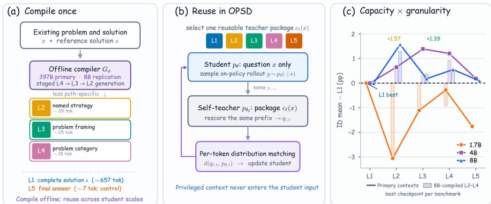

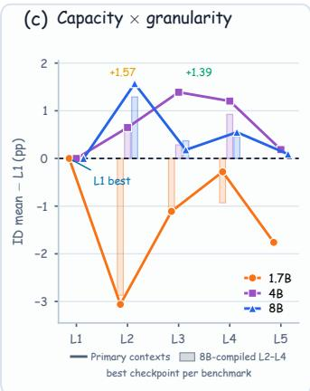  
Figure 1: Study overview. (a) An offline compiler produces reusable contexts from coarse to fine (L4→L3→L2); L1 is the original solution and L5 its final answer. Labels give mean token counts. (b) The student samples y from x alone, while a frozen copy of the base model scores the same prefixes with additional context cℓ(x); only the student is updated. (c) Peak aggregate scores relative to L1 for the primary compiler (solid lines, seed 42) and the single-run Qwen3-8B replication (pale bars), which agree at the family level but not on the best intermediate level. Replications of L1, L3, and L4 across three seeds appear in Table 3.

We study this question through controlled interventions on the context supplied to a fixed selfteacher (Figure 1). Starting from the same problem–solution pairs, an offline compiler constructs three progressively more abstract context packages: a named strategy (L2), a method-independent framing (L3), and a problem category (L4), all generated under contracts that prohibit the final answer. We compare these with the full solution (L1), an answer-only condition (L5), and a control that shortens the reference to a fixed 10% prefix plus the answer without semantic rewriting. Across three Qwen3 student scales (Qwen Team, 2025), we hold the student prompt, frozen teacher checkpoint, training set, rollout procedure, and loss fixed within each scale, and we evaluate on three competition mathematics benchmarks and four transfer benchmarks. We assess context utility through student performance after training and use initial teacher–student KL as a separate diagnostic.

## Our contributions are:

• Concise semantic contexts can outperform full solutions. In the primary runs, the best intermediate context exceeds the full solution by 1.4 and 1.6 points in the 4B and 8B indomain peak means while storing an order of magnitude fewer hint tokens (Table 1). Across three seeds, L3 and L4 show positive mean gains over L1 at 4B and 8B under all four reporting rules. Recompiling the contexts with Qwen3-8B also preserves the peak advantage at the larger scales. The preferred representation varies with student scale and task.

• Answer-only context remains competitive at the larger scales. Answer-only conditioning comes within 0.2 points of the full solution’s in-domain peak mean at 4B and 8B, though it trails by 1.76 points at 1.7B.

• Distributional displacement does not order teaching utility. The full solution induces the largest initial teacher–student KL at every scale, yet does not yield the highest indomain peak mean at 4B or 8B, and item-level analysis shows context redistributing which problems the trained student solves. Privileged context is therefore best judged by the students it trains.

## 2 RELATED WORK

On-Policy Distillation. Knowledge distillation transfers model predictions or reasoning traces (Hinton et al., 2015; Gu et al., 2024; Hsieh et al., 2023), and bootstrapped methods learn from the model’s own successful rationales (Zelikman et al., 2022). On-policy distillation instead supplies token-level teacher feedback on trajectories sampled from the student’s current policy (Agarwal et al., 2024; Lu & Thinking Machines Lab, 2025; Yang et al., 2026b; Hou et al., 2026), with later work refining the objective (Li et al., 2026a; Jin et al., 2026; Luo et al., 2026), conditioning the self-teacher on demonstrations (Shenfeld et al., 2026), or combining it with an external teacher (Yu et al., 2026). Our baseline is OPSD, which conditions the frozen self-teacher on a complete reference solution (Zhao et al., 2026a); that choice of context is the variable we study.

Privileged Information and Reasoning Guidance. When teacher and student start from the same checkpoint, the teacher’s advantage is what it can see, the setting of learning using privileged information, where training-time signals are unavailable at inference (Vapnik & Vashist, 2009; Lopez-Paz et al., 2016); context distillation internalizes prompt-induced behavior into parameters (Snell et al., 2022). The privileged signal takes many forms: feedback and self-generated traces (Hubotter et al.,¨ 2026; Yang et al., 2026a), contextual instructions such as concision (Sang et al., 2026; Ye et al., 2026), recoverable visual or other privileged cues (Tian et al., 2026; Penaloza et al., 2026), and majority-vote pseudo-solutions requiring no external supervision (Li et al., 2026b). It also enters at different stages, through partial references during generation (Wu et al., 2026) or step-level process supervision (Lightman et al., 2024). Given an available solution, teacher-context design asks which parts to expose and in what form.

Reference Exposure. ATESD learns how much of a reference reasoning prefix to expose while retaining the final answer (Han et al., 2026). Complementary analyses examine the supervision induced by reference conditioning, identifying confidence miscalibration (Zhang et al., 2026), longbudget failures (Kaur et al., 2026), and per-token bias toward the supplied solution (Harne et al., 2026). Reference controls distinguish problem-specific information from context-induced teacher behavior (Ichihara et al., 2026). Most directly, Shrestha & Tessier (2026) compare teacher modes and reference types, including a method-level abstract-hint condition, and analyze their alignment with student updates. Armandpour et al. (2026) likewise report no universally best context, ranking summarized above raw demonstrations for their larger student, from a training-free gradientalignment proxy rather than trained outcomes. PS-OPSD recasts the reference as problem-solving structure with a selected path of state transitions (Zhao et al., 2026b). We instead withhold explicit solution steps, training a student on each of three adjacent abstraction levels.

## 3 PRIVILEGED CONTEXT AS A CONTROLLED INTERVENTION

We treat the context package supplied to the teacher as the intervention and evaluate its utility after student training. This section formalizes the comparison, describes on-policy supervision and staged context construction, and specifies the diagnostic tests and controls.

## 3.1 PROBLEM FORMULATION

Let $\mathcal { D } = \{ ( x _ { i } , s _ { i } ) \} _ { i = 1 } ^ { N }$ be a training set of problems and their reference solutions. A context policy $c _ { \ell }$ maps each training problem to a precomputed prompt for the teacher:

$$
c _ { \ell } ( x ) = B _ { \ell } ( x , h _ { \ell } ( x ) ) ,\tag{1}
$$

where $h _ { \ell } ( x )$ is a representation constructed from the problem and its reference solution, and $B _ { \ell }$ is the prompt template that combines the original problem, the representation, and the wording that introduces it. We refer to this introductory wording as the bridge. The student receives x alone; the context policy affects only the supervision supplied by a frozen teacher.

In on-policy supervision, the teacher scores the student’s prefixes, which may depart from the reference derivation, making context representation an empirical design choice.

Our target is the utility of a context after training, rather than a property of the teacher distribution alone. Let $\theta _ { \ell , \xi , k }$ denote the student checkpoint at step $k \in { S }$ , trained from the shared initialization $\theta _ { 0 }$ under context $c _ { \ell }$ and training randomness $\xi ,$ , with the remaining pipeline fixed; $\theta _ { 0 }$ also serves as the frozen teacher checkpoint. For an evaluation benchmark B and a specified reporting rule r, we define

$$
U _ { \mathcal { B } , r } ( c _ { \ell } ; \theta _ { 0 } ) = \mathbb { E } _ { \boldsymbol \xi } [ r ( \{ \mathrm { S c o r e } _ { \mathcal { B } } ( \theta _ { \ell , \boldsymbol \xi , k } ) \} _ { k \in \mathcal { S } } ) ] .\tag{2}
$$

Here, r may report a peak score, a fixed endpoint, or another checkpoint aggregate. Dependence on the fixed training set and pipeline is suppressed. Context design then amounts to maximizing $U _ { B , r }$ over a candidate set of context policies. Our primary comparisons use a fixed context level within each training run and vary that level across runs, asking whether the maximizing representation changes with the student checkpoint, evaluation task, and reporting rule, instead of assuming a universally optimal context; heterogeneous assignment and learned routing enter only as supplementary studies (Section 4.2).

## 3.2 HOW CONTEXT ENTERS ON-POLICY SELF-DISTILLATION

Context changes the teacher’s supervision targets without changing its parameters. At each update, the current student samples a trajectory $y = ( y _ { 1 } , \dots , y _ { T } ) \sim p _ { \theta } ( \cdot \ | \ x )$ , and a frozen copy of the initial checkpoint scores the same trajectory prefixes with privileged context:

$$
\begin{array} { r } { p _ { \theta , t } ( \cdot ) = p _ { \theta } ( \cdot  { | } x , y _ { < t } ) , \qquad q _ { \ell , t } ( \cdot ) = p _ { \theta _ { 0 } } ( \cdot  { | } c _ { \ell } ( x ) , y _ { < t } ) . } \end{array}\tag{3}
$$

At a fixed problem and prefix, changing $c _ { \ell } ( x )$ changes the effective teacher distribution even though $\theta _ { 0 }$ is unchanged.

Every condition uses the same clipped full-vocabulary objective. Writing d for this shared objective, the loss for each trajectory is

$$
\mathcal { L } _ { \ell } ( \theta ; x , y ) = \frac { 1 } { T } \sum _ { t = 1 } ^ { T } d ( q _ { \ell , t } , p _ { \theta , t } ) .\tag{4}
$$

Appendix A.1 gives the exact clipping and reduction. The teacher is frozen and the sampled trajectory is held fixed when differentiating this loss, so a context change can alter both the magnitude and the direction of $- \nabla _ { \theta } \mathcal { L } _ { \ell }$ . Greater teacher–student disagreement need not imply a more useful update.

The context package enters only teacher scoring: the student never receives the hint or bridge, during rollout generation or at evaluation. Within each primary comparison we hold the student initialization, student prompt, frozen teacher checkpoint, training set, rollout procedure, training budget, and loss fixed. What is fixed is the rollout procedure, not the realized trajectories: as students learn under different contexts, their subsequent on-policy trajectories can diverge, and this feedback is part of the end-to-end effect being evaluated. Following Zhao et al. (2026a), the teacher scores with Qwen3’s thinking template while student rollouts use the non-thinking template (Appendix A.1), an interface difference common to L1–L5.

## 3.3 CONSTRUCTING MATCHED SEMANTIC CONTEXTS

We compare representations that vary in their intended specificity to the reference reasoning path (Figure 1(a)). L1 provides the complete reference solution. L2 names a method, theorem, or tool without working through solution steps; L3 gives a method-independent framing of the problem; L4 gives only its mathematical domain and object category. All three contracts prohibit the final answer. L5 provides only the final answer, testing answer-only supervision; the name describes the reference content supplied to the teacher, not the inference the teacher performs from it.

The L1–L4 ordering follows semantic contracts imposed at compilation (Appendix B.1), with realized compliance audited rather than assumed (Table 7). Each of L2–L4 is newly written rather than a truncation of L1, so the ordering is one of intended abstraction rather than nested text, and the comparisons concern these representations as complete context packages.

Staged Semantic Compilation. Let $s ( x )$ denote the existing reference solution and $G _ { \phi }$ an offline compiler. We construct L2–L4 by refining from coarse to fine, each call receiving the problem, the reference solution, and every coarser representation already produced:

$$
h _ { \ell } ( x ) = G _ { \phi } ^ { ( \ell ) } ( x , s ( x ) , \{ h _ { \ell ^ { \prime } } ( x ) \} _ { \ell < \ell ^ { \prime } \leq 4 } ) , \qquad \ell = 4 , 3 , 2 ,\tag{5}
$$

so that $h _ { 4 }$ is compiled from the problem and solution alone. Passing the coarser outputs to finer calls makes the intended semantic boundaries explicit. L1 uses the original solution and L5 extracts its final answer, so neither requires compilation; Appendix B.1 shows all five conditions for one problem.

The primary contexts are compiled with Qwen3.5-397B-A17B (Qwen Team, 2026), and we repeat the same staged contracts with Qwen3-8B in thinking mode to examine dependence on the compiler. Both compilers receive the existing reference solutions, and all contexts are precomputed, so neither compiler is queried during OPSD training.

## 3.4 UTILITY ESTIMATION AND DIAGNOSTIC TESTS

We evaluate context utility through student scores after training under the reporting rule in Equation 2. The L1, L3, and L4 in-domain comparison receives three training seeds at all three scales and four checkpoint aggregation rules, two of them selection-free; L2, L5, the transfer evaluations, and the supplementary controls are single runs, so their scores are individual observations of the quantity inside the expectation rather than estimates of utility averaged across seeds. Where reported, resampling matched items quantifies evaluation uncertainty, not variability across training runs. Peak and selection-free rules define different estimands and are distinguished throughout.

Distributional Discrepancy. We separately measure how much a context changes the frozen base model’s next-token distribution. Within each scale, let $\mu _ { 0 }$ denote the shared empirical distribution of problem–prefix pairs from fixed rollouts of the base model. We compute

$$
D ( c _ { \ell } ) = \mathbb { E } _ { ( \boldsymbol { x } , \boldsymbol { y } _ { < t } ) \sim \mu _ { 0 } } \left[ D _ { \mathrm { K L } } ( q _ { \ell , t } \| \boldsymbol { p } _ { \boldsymbol { \theta } _ { 0 } , t } ) \right] ,\tag{6}
$$

where $p _ { \theta _ { 0 } , t } ( \cdot ) = p _ { \theta _ { 0 } } ( \cdot \mid x , y _ { < t } )$ . Using the same prefixes from the base model across contexts avoids mixing changes induced by context with differences in trained students’ rollout distributions. This diagnostic measures distributional discrepancy; it is not the clipped training objective, an update norm, or a direct measure of teacher quality.

Empirical Predictions. We test three deliberately strong baseline predictions, none of which is assumed by the formulation. Full-solution dominance predicts that L1 yields the greatest downstream utility. Discrepancy-based ordering predicts that contexts with larger $D ( c _ { \ell } )$ also yield greater utility at a fixed student scale, task, and reporting rule. Context invariance holds that one context is preferred across student scales, tasks, and reporting rules; we test it through ranking changes across scales and benchmarks, with item-level gains and losses relative to L1 describing how a given ranking arises.

## 3.5 INTERVENTION VALIDITY AND SCOPE

The design supports controlled comparisons between context packages, not an isolated causal effect of semantic abstraction. Although the source problem–solution pairs and training configuration are matched, the packages can differ in semantic content, length, answer access, and, in the primary runs, bridge wording, and matching the reference solutions does not guarantee equal quality across the generated hints. Accordingly, L1 versus L2–L4 tests whether exposing the complete derivation is preferable to the intermediate packages, comparisons within L2–L4 test the utility of adjacent se mantic roles, and L5 tests supervision from the final answer alone. Within each primary comparison the training recipe is identical across conditions, so context is the only variable; across scales the student and training recipe change together, including the effective batch size (Table 4), which makes the scale comparison one between trained systems rather than parameter count alone. Section 4.2 reports controls that each narrow a specific alternative explanation.

Context Length. We distinguish the size of the reusable hint from the length of the teacher’s context prompt. Under the Qwen3 tokenizer, the primary L2–L4 hints average 38.9, 25.2, and 17.7 tokens against 657.3 for L1, a 16.9–37.1× reduction in stored hint content; including the problem and bridge, the context prompts average 225.5, 212.7, and 203.3 tokens against 835.0, a 3.7–4.1× reduction (Appendix Figure 4(a); Table 6). Both quantify context cost rather than semantic content.

Table 1: In-domain peak Avg@12 (%), primary compiler for L2–L4. All entries are the primary run, seed 42; Table 3 reports replication of L1, L3, and L4 across three seeds. Mean averages separately selected benchmark peaks; Base is evaluated once. Level labels darken with the amount of supplied detail, from L1 (full solution) to L4 (problem category); L5 is the answer-only control and sits off that axis, so it is set in gray italic. Bold marks the highest taught score in each row, excluding Base. The vs. L1 rows give each column’s mean minus the mean for the full solution, green above L1 and red below. Selected steps are listed in Appendix C.3.
<table><tr><td>Model</td><td>Benchmark</td><td>Base</td><td>L1: solution</td><td>L2: strategy</td><td>L3: framing</td><td>L4: category</td><td>L5: answer</td></tr><tr><td rowspan="5">1.7B</td><td>AIME24</td><td>49.72</td><td>57.22</td><td>56.11</td><td>56.94</td><td>59.72</td><td>57.78</td></tr><tr><td>AIME25</td><td>36.39</td><td>43.33</td><td>38.33</td><td>41.39</td><td>43.06</td><td>41.67</td></tr><tr><td>HMMT25</td><td>21.67</td><td>31.11</td><td>28.06</td><td>30.00</td><td>28.06</td><td>26.94</td></tr><tr><td>Mean</td><td>35.93</td><td>43.89</td><td>40.83</td><td>42.78</td><td>43.61</td><td>42.13</td></tr><tr><td>vs. L1</td><td>-7.96</td><td>ref.</td><td>-3.06</td><td>-1.11</td><td>-0.28</td><td>-1.76</td></tr><tr><td rowspan="5">4B</td><td>AIME24 AIME25</td><td>75.00</td><td>76.94</td><td>76.94</td><td>77.50</td><td>76.94</td><td>75.28</td></tr><tr><td>HMMT25</td><td>64.44 41.39</td><td>68.61 44.72</td><td>69.44 45.83</td><td>69.72</td><td>69.17</td><td>70.56</td></tr><tr><td></td><td></td><td></td><td></td><td>47.22</td><td>47.78</td><td>45.00</td></tr><tr><td>Mean vs. Ll</td><td>60.28</td><td>63.43</td><td>64.07</td><td>64.81</td><td>64.63</td><td>63.61</td></tr><tr><td></td><td>-3.15</td><td>ref.</td><td>+0.65</td><td>+1.39</td><td>+1.20</td><td>+0.19</td></tr><tr><td rowspan="4">8B</td><td>AIME24</td><td>75.28</td><td>78.89</td><td>79.72</td><td>79.44</td><td>80.56</td><td>78.61</td></tr><tr><td>AIME25</td><td>66.94</td><td>73.06</td><td>74.17</td><td>71.39</td><td>71.39</td><td>72.78</td></tr><tr><td>HMMT25</td><td>44.17</td><td>48.06</td><td>50.83</td><td>49.72</td><td>49.72</td><td>48.89</td></tr><tr><td>Mean</td><td>62.13</td><td>66.67</td><td>68.24</td><td>66.85</td><td>67.22</td><td>66.76</td></tr><tr><td></td><td>vs. Ll</td><td>-4.54</td><td>ref.</td><td>+1.57</td><td>+0.19</td><td>+0.56</td><td>+0.09</td></tr></table>

Content Audits. Full-corpus scans find no empty hints, generation-error sentinels, or lexical answer matches for either compiler, and a matched audit on 1,200 problems finds no direct answer copying, but does detect answer-equivalent leakage: 1.42% at L2 and 0.33% at L3 for the primary compiler, rising to 4.17% and 2.58% for Qwen3-8B, with L4 at 0.08% and 0.17% (Table 7). Ap pendix B.3 gives the definitions and prompts for this model-assisted audit.

## 4 EXPERIMENTS

Configuration. We train Qwen3-1.7B, 4B, and 8B (Qwen Team, 2025) on the original OPSD pool of 29,434 mathematics problems (Zhao et al., 2026a; Guha et al., 2025) for 200 steps with LoRA (Hu et al., 2021), checkpointing every 25 steps. At each scale, student and frozen self-teacher start from the same checkpoint and the primary L1–L5 runs share the data order, rollout procedure, objective, and training recipe for that scale, with no tuning by context level (Appendices A.1 and B.2). L1 is the baseline using the complete solution, and Base is the unadapted checkpoint.

Avg@12 averages correctness over twelve sampled completions per problem. Following the original OPSD convention, each in-domain (ID) benchmark reports its best Avg@12 across the eight check points, and the ID peak mean averages these separately selected scores on AIME24, AIME25, and HMMT25, so it need not represent any single checkpoint; we also report the selection-free mean at step 200 and full trajectories (Appendix C.3). Transfer evaluation uses the checkpoint at step 200 on MT-AIME2024-7Lang (Son et al., 2025), AutoLogi-EN (Zhu et al., 2025), GPQA-Diamond (Rein et al., 2023), and ZebraLogic-grid (Lin et al., 2025), scored by macro Avg@12 over seven languages, verifier accuracy, Avg@10, and exact puzzle accuracy (Appendix A.2). All score differences are in percentage points.

## 4.1 CONTEXT UTILITY VARIES WITH STUDENT SCALE AND TASK

In-domain Performance. The best intermediate context exceeds the full solution by 1.39 points at 4B and 1.57 at 8B, while L1 keeps the highest peak mean at 1.7B, 0.28 points ahead of L4 (Table 1). In the primary runs, the level achieving the gain does not shift monotonically toward coarser context as scale increases. At step 200, L1 still leads at 1.7B, while at 4B both L2 and L4 reach 62.59 against 60.93 for L1, and at 8B L3 reaches 65.37 against 65.28 (Appendix C.3).

Table 2: No context leads across the whole transfer suite. For each scale and benchmark, Winner is the highest-scoring context at step 200 and ∆ its margin over L1 in percentage points; – marks the two cells where L1 itself wins. Level labels darken with the amount of supplied detail, from L1 (full solution) to L4 (problem category), with the off-axis L5 in gray italic. The last row counts how many distinct contexts win the four benchmarks at that scale. Full scores are in Appendix Table 9.
<table><tr><td></td><td colspan="2">1.7B</td><td colspan="2">4B</td><td colspan="2">8B</td></tr><tr><td>Benchmark</td><td>Winner</td><td>∆</td><td>Winner</td><td>∆</td><td>Winner</td><td>∆</td></tr><tr><td>MT-AIME-7Lang</td><td>L3</td><td>+1.71</td><td>L4</td><td>+2.10</td><td>L2</td><td>+1.71</td></tr><tr><td>GPQA-Diamond</td><td>L3</td><td>+0.81</td><td>L2</td><td>+1.21</td><td>L3</td><td>+1.41</td></tr><tr><td>ZebraLogic</td><td>L1</td><td></td><td>L4</td><td>+0.40</td><td>L3</td><td>+1.70</td></tr><tr><td>AutoLogi</td><td>L4</td><td> $+ 0 . 1 9$ </td><td>L5</td><td>+0.38</td><td>L1</td><td></td></tr><tr><td>Distinct winners</td><td colspan="2">3</td><td colspan="2">3</td><td colspan="2">3</td></tr></table>

Table 3: In-domain replication across scales with three seeds. Each cell is the paired difference from the L1 run of the same seed configuration in percentage points, averaged over seeds 42, 43, and 44, followed by the sample standard deviation of those three paired differences; green favors the intermediate context and red favors L1. Level labels follow the abstraction ramp of Table 1. Per-benchmark peak selects a separate checkpoint per benchmark, and best common selects one checkpoint per run by the mean across three benchmarks. Absolute scores for each seed appear in Appendix C.3.
<table><tr><td rowspan="2">Student</td><td rowspan="2">Contrast</td><td colspan="2">Checkpoint selected by score</td><td colspan="2">Selection-free</td></tr><tr><td>Per-bench. peak</td><td>Best common</td><td>All-ckpt. mean</td><td>Step 200</td></tr><tr><td rowspan="2">1.7B</td><td>L3-L1</td><td> $- 0 . 1 2 \pm 0 . 8 6$ </td><td> $- 0 . 1 2 \pm 0 . 4 7$ </td><td> $- 0 . 1 4 \pm 0 . 7 0$ </td><td> $- 0 . 8 3 \pm 2 . 3 3$ </td></tr><tr><td>L4-L1</td><td> $0 . 0 0 \pm 0 . 3 3$ </td><td> $+ 0 . 0 6 \pm 0 . 0 5$ </td><td> $- 0 . 3 2 \pm 0 . 6 8$ </td><td> $- 1 . 3 3 \pm 2 . 0 4$ </td></tr><tr><td rowspan="2">4B</td><td>L3-L1</td><td> $+ 0 . 7 1 \pm 0 . 6 9$ </td><td> $+ 0 . 9 0 \pm 0 . 2 3$ </td><td> $+ 1 . 0 3 \pm 0 . 1 5$ </td><td> $+ 1 . 6 7 \pm 0 . 7 3$ </td></tr><tr><td>L4-L1</td><td> $+ 0 . 9 6 \pm 0 . 2 1$ </td><td> $+ 1 . 6 4 \pm 0 . 6 0$ </td><td> $+ 1 . 0 1 \pm 0 . 3 2$ </td><td> $+ 1 . 0 5 \pm 1 . 3 2$ </td></tr><tr><td rowspan="2">8B</td><td>L3-L1</td><td> $+ 0 . 2 5 \pm 0 . 6 5$ </td><td> $+ 0 . 6 2 \pm 0 . 4 4$ </td><td> $+ 0 . 4 9 \pm 0 . 3 4$ </td><td> $+ 0 . 2 8 \pm 0 . 3 2$ </td></tr><tr><td>L4-L1</td><td> $+ 0 . 4 9 \pm 0 . 3 7$ </td><td> $+ 0 . 8 0 \pm 0 . 8 1$ </td><td> $+ 0 . 6 2 \pm 0 . 1 3$ </td><td> $+ 0 . 2 2 \pm 1 . 0 5$ </td></tr></table>

Transfer Rankings Vary by Task. At step 200, different transfer tasks favor different contexts (Table 2), and the reversal occurs within one scale: at 1.7B, L3 leads on MT-AIME and GPQA while L1 leads on ZebraLogic. Because every condition shares the checkpoint, this ranking is not an artifact of checkpoint selection.

Answer-only Context. L5 is within 0.2 points of L1’s ID peak mean at 4B and 8B, but trails L1 by 1.76 points at 1.7B (Table 1). Answer access without supplied reasoning is therefore competitive without reaching the highest observed utility: the leading intermediate context exceeds L5 at both larger scales, and on 8B ZebraLogic L3 scores 88.10 against 85.90.

## 4.2 ROBUSTNESS AND ALTERNATIVE EXPLANATIONS

Checkpoint Aggregation and Training Seeds. We replicate the L1, L3, and L4 in-domain comparison with three training seeds at every scale and aggregate each run under four checkpoint rules (Table 3). At 4B and 8B, the mean paired gains of both L3 and L4 over L1 are positive under all four rules, and under the selection-free mean across all checkpoints every individual seed favors both intermediate levels. L4 attains a positive paired peak difference in all three seeds at both scales, whereas L3 does not at 4B seed 43 or 8B seed 44. At 1.7B, the mean paired peak differences are −0.12 and 0.00 points for L3 and L4, respectively; the two selection-free rules favor L1 on average. The endpoint at step 200 carries the largest paired standard deviation in five of the six contrasts. This is the pattern the remaining controls follow: they reproduce the contrast between full and intermediate contexts more consistently than any particular winner among L2–L4.

Compiler Replication. Regenerating L2–L4 with Qwen3-8B, under the same semantic contracts and training conditions, preserves the ID peak ordering between full and intermediate contexts: L1 leads at 1.7B and intermediate contexts exceed it at 4B and 8B, including where compiler and student have the same nominal parameter count. The preferred intermediate changes at 4B, from L3 to L4. The 8B compiler also shows higher L2/L3 answer-equivalent leakage, so the packages are not identical in quality; its L4 leakage is only 0.17%, however, and L4 likewise trails L1 at 1.7B and exceeds it at 4B and 8B (Appendix C.2; Table 7).

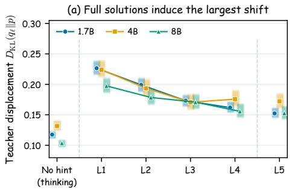

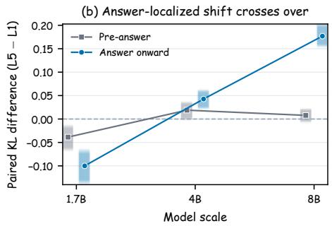  
Figure 2: Distributional discrepancy induced by context at initialization, measured on fixed rollouts from the base model with unclipped full-vocabulary KL (95% bootstrap intervals clustered by problem). (a) Mean teacher-to-student KL per context; the no-hint interface and L5 are reference conditions outside the L1–L4 hierarchy. (b) Paired L5 − L1 differences in pre-answer and answeronward windows around the final \boxed marker (Appendix D.1).

Semantic Rewriting vs. Prefix Truncation. A control using a fixed 10% reference prefix plus the answer, inspired by Han et al. (2026), tests whether shortening the reference without semantic rewriting recovers the observed gains. Run once at 4B, it reaches an ID peak mean of 63.89, above L1 and L5 but below all three intermediate contexts, with L3 and L4 ahead by 0.93 and 0.74 points (Appendix C.2, Table 13). The endpoint comparison is less separated, the prefix reaching 61.67 against L3’s 61.76. Semantic rewriting therefore yields the higher peaks here, and like the other conditions the prefix differs from L2–L4 in answer access as well as length (Section 3.5).

Bridge Wording and Rollout Length. With a bridge shared across levels, every intermediate context exceeds L1 by 1.0–2.3 ID peak points (Table 20), and doubling the rollout budget from 1,024 to 2,048 tokens leaves every intermediate context at or above L1 on the peak mean (Appendix C.3). Neither bridge wording nor the original length limit is therefore sufficient to explain the contrast.

Mixtures and Routing. Heterogeneous context assignment does not consistently improve on a fixed level. Across balanced mixtures and four routing policies, no run exceeds the best fixed-level ID peak, though some exceed the best fixed-level mean at step 200 (Appendix E).

## 4.3 DISTRIBUTIONAL DISCREPANCY DOES NOT ORDER CONTEXT UTILITY

For each scale, the unadapted base model generates two rollouts on each of 600 training problems using the exact student prompt. We rescore identical completion tokens under the student prompt, the L1–L5 teacher packages, and a no-hint teacher-interface reference, computing unclipped fullvocabulary $D _ { \mathrm { K L } } ( q _ { \ell , t } \Vert p _ { \theta _ { 0 } , t } )$ on shared prefixes as in Equation 6 (Appendix D.1).

L1 has the largest mean KL at every scale (Figure 2(a)). Every package displaces the base distribution well beyond the no-hint interface, so the displacement reflects the supplied context rather than the teacher template alone. Intermediate contexts nevertheless achieve higher 4B and 8B ID peak means with smaller initial discrepancies, so these KL values do not monotonically order the observed peak utilities. Training-free analysis points the same way, reporting only weak within-path correlations between teacher–student divergence and the usefulness of the resulting gradient (Ar mandpour et al., 2026).

Answer-Aligned Differences also Vary with Scale. These means average over all token positions, so we also examine the KL around the final answer. On the subset of rollouts aligned at the final boxed answer, the answer-onward L5 − L1 KL difference is −0.100 at 1.7B but +0.043 and +0.177 at 4B and 8B (Figure 2(b)). Answer-only context therefore displaces the answer region less than the full solution at the smallest scale and more at the larger ones, as a localized distributional comparison rather than a measure of answer correctness.

## 4.4 CONTEXT CHANGES WHICH PROBLEMS ARE SOLVED

On MT-AIME, GPQA, and ZebraLogic, we compare L1 with the highest-scoring intermediate condition at step 200 for each scale–task pair. Letting $\hat { a } _ { i } ^ { \mathrm { L 1 } }$ be L1’s fraction of correct completions on item i, items are unsolved $( \hat { a } _ { i } ^ { \mathrm { L 1 } } \in \{ 0 \} ,$ ), hard ((0, 0.25)), medium ([0.25, 0.75)), or easy ([0.75, 1]); ZebraLogic’s binary outcomes populate only the unsolved and easy buckets. The intermediate condition is selected on the same evaluation used for the comparison, so these analyses describe outcome differences rather than test a selection policy.

Gains are Not Uniform across Difficulty Buckets. Intermediate contexts recover some items unsolved by L1 and improve accuracy in the medium bucket, while sometimes reducing accuracy in L1’s easy bucket (Figure 3; Appendix Table 18). To check dependence on using L1 to define difficulty, we also group items by Base success rates, keeping the same thresholds and the same already selected intermediate condition, so only the stratification variable changes. Across the six MT-AIME and GPQA scale–task pairs, differences in the medium bucket remain positive at 1.14–10.12 points, whereas differences in the easy bucket range from −0.77 to +1.65 points.

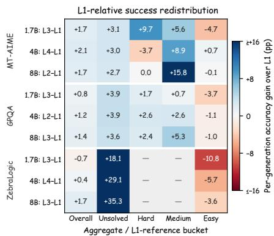

Solved-Set Differences Explain the ZebraLogic Contrast. The fraction of puzzles unsolved by L1 that the selected intermediate rescues rises from 18% at 1.7B to 35% at 8B, while losses on previously solved puzzles shrink. The net accuracy difference changes from −0.70 to +1.70 points (Appendix Figure 8). At 1.7B,

Figure 3: Per-generation accuracy differences at step 200 between L1 and the highest-scoring intermediate context for each scale–task pair, by difficulty bucket under L1. Positive values favor the intermediate context.

therefore, recovering some previously unsolved puzzles is compatible with lower overall accuracy;   
at 8B, the balance of gains and losses favors the intermediate context.

Behavioral Shifts Vary across Scales. We additionally compare model-judged behaviors on matched AIME24 trajectories, selecting the intermediate context by its score on the full AIME24 evaluation at step 200 and including L5 as a separate contrast. Per scale, relative to L1, backtracking rises at 1.7B and falls at 4B and 8B, while explicit correction rises at 1.7B, is unchanged at 4B, and falls at 8B (Table 19); Figure 10 pools these scales into a single aggregate (Appendix D.2). The behavioral shifts differ across scales, so the pooled estimate should not be read as showing behavioral invariance, and neither view supports an account in which intermediate contexts help by consistently increasing observable backtracking or correction.

## 4.5 INTERPRETATION AND LIMITS

One explanation for these patterns is that full solutions and abstract contexts place different demands on the self-teacher. L1 supplies an executed procedure, which may help when the model cannot reconstruct one from a sparse cue but may also anchor its guidance to the reference derivation, whereas L2–L4 leave more of the procedure to the self-teacher when it evaluates prefixes generated by the student. Teacher and student capacity covary through the shared base checkpoint, so varying the compiler does not separate teacher elicitation from the student’s ability to learn from the resulting targets. The analyses at step 200 characterize differences in item-level success and observable reasoning behavior; they do not identify what produces the separately selected peak gains (Section 3.5; Appendix C.4).

## 5 CONCLUSION

More detailed privileged context does not necessarily provide more useful supervision in OPSD. With the rest of the pipeline held fixed, replacing the complete reference solution with a named strategy, a method-independent framing, or a problem category changes which contexts train the strongest students. An abstraction leads at 4B and 8B, by 1.4 and 1.6 in-domain peak points in the primary runs, and the framing and category levels keep positive seed-mean differences there under every reporting rule, while at 1.7B the full solution keeps the primary-run lead. Which abstraction leads shifts with scale and task, answer-only conditioning stays within 0.2 points of the full solution at those two scales, and teacher–student divergence is largest for the full solution at every scale without tracking peak utility. What a self-teacher should see is therefore not everything it could, but the level of abstraction its student can still act on. That makes the reference representation a design choice in its own right, best evaluated by the students it trains.

## REFERENCES

Rishabh Agarwal, Nino Vieillard, Yongchao Zhou, Piotr Stanczyk, Sabela Ramos, Matthieu Geist, and Olivier Bachem. On-policy distillation of language models: Learning from self-generated mistakes. In International Conference on Learning Representations, 2024.

Mohammadreza Armandpour, Fatih Ilhan, David Harrison, Ajay Jaiswal, Duc Nam Hoang, Fartash Faghri, Yizhe Zhang, Minsik Cho, and Mehrdad Farajtabar. Unmasking on-policy distillation: Where it helps, where it hurts, and why. ArXiv, abs/2605.10889, 2026. URL https://api. semanticscholar.org/CorpusID:288256261.

Yuxian Gu, Li Dong, Furu Wei, and Minlie Huang. MiniLLM: Knowledge distillation of large language models. In International Conference on Learning Representations, 2024. URL https: //openreview.net/forum?id=5h0qf7IBZZ.

Etash Guha, Ryan Marten, Sedrick Keh, Negin Raoof, Georgios Smyrnis, Hritik Bansal, Marianna Nezhurina, Jean Mercat, Trung Vu, Zayne Sprague, Ashima Suvarna, Benjamin Feuer, Liangyu Chen, Zaid Khan, Eric Frankel, Sachin Grover, Caroline Choi, Niklas Muennighoff, Shiye Su, Wanjia Zhao, John Yang, Shreyas Pimpalgaonkar, Kartik Sharma, Charlie Cheng-Jie Ji, Yichuan Deng, Sarah Pratt, Vivek Ramanujan, Jon Saad-Falcon, Jeffrey Li, Achal Dave, Alon Albalak, Kushal Arora, Blake Wulfe, Chinmay Hegde, Greg Durrett, Sewoong Oh, Mohit Bansal, Saadia Gabriel, Aditya Grover, Kai-Wei Chang, Vaishaal Shankar, Aaron Gokaslan, Mike A. Merrill, Tatsunori Hashimoto, Yejin Choi, Jenia Jitsev, Reinhard Heckel, Maheswaran Sathiamoorthy, Alexandros G. Dimakis, and Ludwig Schmidt. Openthoughts: Data recipes for reasoning models, 2025. URL https://arxiv.org/abs/2506.04178.

Zihao Han, Tiangang Zhang, Huaibin Wang, and Yilun Sun. Adaptive teacher exposure for selfdistillation in llm reasoning. arXiv preprint arXiv:2605.11458, 2026.

Sarthak Harne, Chinmay Karkar, Yash Pandya, Ahmed Awadallah, and Akshay Nambi. Privileged, but biased: How pi-conditioned teachers break self-distillation. arXiv preprint arXiv:2608.04794, 2026.

Geoffrey Hinton, Oriol Vinyals, and Jeff Dean. Distilling the knowledge in a neural network. arXiv preprint arXiv:1503.02531, 2015.

Wenjin Hou, Shangpin Peng, Weinong Wang, Zheng Ruan, Yue Zhang, Zhenglin Zhou, Mingqi Gao, Yifei Chen, Kaiqi Wang, Hongming Yang, Chengquan Zhang, Zhuotao Tian, Han Hu, Yi Yang, Fei Wu, and Hehe Fan. Uni-OPD: Unifying on-policy distillation with a dual-perspective recipe. arXiv preprint arXiv:2605.03677, 2026.

Cheng-Yu Hsieh, Chun-Liang Li, Chih-Kuan Yeh, Hootan Nakhost, Yasuhisa Fujii, Alexander Ratner, Ranjay Krishna, Chen-Yu Lee, and Tomas Pfister. Distilling step-by-step! outperforming larger language models with less training data and smaller model sizes. In Findings of the Associationfor Computational Linguistics: ACL 2023, 2023.

Edward J. Hu, Yelong Shen, Phillip Wallis, Zeyuan Allen-Zhu, Yuanzhi Li, Shean Wang, Lu Wang, and Weizhu Chen. Lora: Low-rank adaptation of large language models, 2021. URL https: //arxiv.org/abs/2106.09685.

Yuzhen Huang, Yuzhuo Bai, Zhihao Zhu, Junlei Zhang, Jinghan Zhang, Tangjun Su, Junteng Liu, Chuancheng Lv, Yikai Zhang, Jiayi Lei, Yao Fu, Maosong Sun, and Junxian He. C-eval: A multi-level multi-discipline chinese evaluation suite for foundation models. Advances in Neural Information Processing Systems, 36, 2023.

Jonas Hubotter, Frederike L¨ ubeck, Lejs Behric, Anton Baumann, Marco Bagatella, Daniel Marta,¨ Ido Hakimi, Idan Shenfeld, Thomas Kleine Buening, Carlos Guestrin, and Andreas Krause. Reinforcement learning via self-distillation, 2026. URL https://arxiv.org/abs/2601. 20802.

Yuki Ichihara, Naoto Iwase, Mohammad Atif Quamar, and Junpei Komiyama. Privileged solutions or context-induced teacher behavior? dissecting on-policy self-distillation. arXiv preprint arXiv:2608.09228, 2026.

Woogyeol Jin, Taywon Min, Yongjin Yang, Swanand Ravindra Kadhe, Yi Zhou, Dennis Wei, Nathalie Baracaldo, and Kimin Lee. Entropy-aware on-policy distillation of language models. arXiv preprint arXiv:2603.07079, 2026. URL https://arxiv.org/abs/2603.07079.

Simran Kaur, Narutatsu Ri, Yinghui He, Liam Fowl, and Sanjeev Arora. Rethinking on-policy self-distillation for thinking models. arXiv preprint arXiv:2607.05184, 2026. URL https: //arxiv.org/abs/2607.05184.

Yaxuan Li, Yuxin Zuo, Bingxiang He, Jinqian Zhang, Chaojun Xiao, Cheng Qian, Tianyu Yu, Huanang Gao, Wenkai Yang, Zhiyuan Liu, and Ning Ding. Rethinking on-policy distillation of large language models: Phenomenology, mechanism, and recipe. arXiv preprint arXiv:2604.13016, 2026a. URL https://arxiv.org/abs/2604.13016.

Yijiang Li, Bingyang Wang, Yijun Liang, Yunjie Tian, Di Fu, and Nuno Vasconcelos. On-policy self-distillation without any supervision. arXiv preprint arXiv:2608.06296, 2026b.

Hunter Lightman, Vineet Kosaraju, Yura Burda, Harri Edwards, Bowen Baker, Teddy Lee, Jan Leike, John Schulman, Ilya Sutskever, and Karl Cobbe. Let’s verify step by step. In International Conference on Learning Representations, 2024.

Bill Yuchen Lin, Ronan Le Bras, Kyle Richardson, Ashish Sabharwal, Radha Poovendran, Peter Clark, and Yejin Choi. ZebraLogic: On the scaling limits of large language models for logical reasoning. arXiv preprint arXiv:2502.01100, 2025. URL https://arxiv.org/abs/ 2502.01100.

David Lopez-Paz, Leon Bottou, Bernhard Sch´ olkopf, and Vladimir Vapnik. Unifying distillation¨ and privileged information. In International Conference on Learning Representations, 2016.

Kevin Lu and Thinking Machines Lab. On-policy distillation. Thinking Machines Lab: Connectionism, 2025. doi: 10.64434/tml.20251026. https://thinkingmachines.ai/blog/on-policy-distillation.

Feng Luo, Yu-Neng Chuang, Guanchu Wang, Zicheng Xu, Xiaotian Han, Tianyi Zhang, and Vladimir Braverman. Demystifying OPD: Length inflation and stabilization strategies for large language models. arXiv preprint arXiv:2604.08527, 2026. URL https://arxiv.org/abs/ 2604.08527.

Emiliano Penaloza, Dheeraj Vattikonda, Nicolas Gontier, Alexandre Lacoste, Laurent Charlin, and Massimo Caccia. Privileged information distillation for language models. arXiv preprint arXiv:2602.04942, 2026. URL https://arxiv.org/abs/2602.04942.

Qwen Team. Qwen3 technical report. arXiv preprint arXiv:2505.09388, 2025.

Qwen Team. Qwen3.5: Towards native multimodal agents, February 2026. URL https://qwen. ai/blog?id=qwen3.5.

David Rein, Betty Li Hou, Asa Cooper Stickland, Jackson Petty, Richard Yuanzhe Pang, Julien Dirani, Julian Michael, and Samuel R. Bowman. Gpqa: A graduate-level google-proof q&a benchmark. arXiv preprint arXiv:2311.12022, 2023.

Hejian Sang, Yuanda Xu, Zhengze Zhou, Ran He, Zhipeng Wang, and Jiachen Sun. On-policy selfdistillation for reasoning compression. arXiv preprint arXiv:2603.05433, 2026. URL https: //arxiv.org/abs/2603.05433.

Idan Shenfeld, Mehul Damani, Jonas Hubotter, and Pulkit Agrawal. Self-distillation enables con-¨ tinual learning, 2026. URL https://arxiv.org/abs/2601.19897.

Samyak Shrestha and Alexander Tessier. Rethinking privileged information in on-policy selfdistillation, 2026. URL https://arxiv.org/abs/2608.18271.

Charlie Snell, Dan Klein, and Ruiqi Zhong. Learning by distilling context. arXiv preprint arXiv:2209.15189, 2022.

Guijin Son, Jiwoo Hong, Hyunwoo Ko, and James Thorne. Linguistic generalizability of test-time scaling in mathematical reasoning. In Proceedings of the 63rd Annual Meeting of the Associationfor Computational Linguistics (Volume 1: Long Papers), pp. 14333–14368, Vienna, Austria, 2025. Association for Computational Linguistics. doi: 10.18653/v1/2025.acl-long.699. URL https://aclanthology.org/2025.acl-long.699/.

Kanghui Tian, Siyuan Liu, Ziang Yan, Sheng Xia, Shuai Dong, and Yi Wang. Vicur: Visual cues as recoverable privilege for multimodal on-policy distillation, 2026. URL https://arxiv. org/abs/2606.05718.

Vladimir Vapnik and Akshay Vashist. A new learning paradigm: Learning using privileged information. Neural Networks, 22(5-6):544–557, 2009.

Yangzhen Wu, Shanda Li, Zixin Wen, Xin Zhou, Ameet Talwalkar, Yiming Yang, Wenhao Huang, and Tianle Cai. Learn hard problems during RL with reference guided fine-tuning. arXiv preprint arXiv:2603.01223, 2026. URL https://arxiv.org/abs/2603.01223.

Chenxu Yang, Chuanyu Qin, Qingyi Si, Minghui Chen, Naibin Gu, Dingyu Yao, Zheng Lin, Weiping Wang, Jiaqi Wang, and Nan Duan. Self-distilled rlvr, 2026a. URL https://arxiv.org/ abs/2604.03128.

Wenkai Yang, Weijie Liu, Ruobing Xie, Kai Yang, Saiyong Yang, and Yankai Lin. Learning beyond teacher: Generalized on-policy distillation with reward extrapolation, 2026b. URL https: //arxiv.org/abs/2602.12125.

Tianzhu Ye, Li Dong, Xun Wu, Shaohan Huang, and Furu Wei. On-policy context distillation for language models. arXiv preprint arXiv:2602.12275, 2026. URL https://arxiv.org/abs/ 2602.12275.

Xinlei Yu, Gen Li, Qingyi Si, Guibin Zhang, Yuqi Xu, Congcong Wang, Shuai Dong, Kaiwen Tuo, Xiangyu Zeng, Kaituo Feng, Qunzhong Wang, Yang Shi, Xiaobin Hu, Xiangyu Yue, Jiaqi Wang, and Shuicheng Yan. Dopd: Dual on-policy distillation, 2026. URL https://arxiv.org/ abs/2606.30626.

Eric Zelikman, Yuhuai Wu, Jesse Mu, and Noah D. Goodman. STaR: Bootstrapping reasoning with reasoning. Advances in Neural Information Processing Systems, 35, 2022.

Jiaxin Zhang, Xiangyu Peng, Qinglin Chen, Qinyuan Ye, Caiming Xiong, and Chien-Sheng Wu. The illusion of certainty: Decoupling capability and calibration in on-policy distillation. arXiv preprint arXiv:2604.16830, 2026. URL https://arxiv.org/abs/2604.16830.

Siyan Zhao, Zhihui Xie, Mengchen Liu, Jing Huang, Guan Pang, Feiyu Chen, and Aditya Grover. Self-distilled reasoner: On-policy self-distillation for large language models. arXiv preprint arXiv:2601.18734, 2026a.

Xuyang Zhao, Liting Zhang, Zichen Xu, Zhihu Wang, Xu Caiyue, Shiwan Zhao, and Qicheng Li. Is more privileged information better? from solution traces to problem-solving structure in self distilled reasoning, 2026b. URL https://arxiv.org/abs/2608.01589.

Qin Zhu, Fei Huang, Runyu Peng, Keming Lu, Bowen Yu, Qinyuan Cheng, Xipeng Qiu, Xuanjing Huang, and Junyang Lin. AutoLogi: Automated logic reasoning for large language models. arXiv preprint arXiv:2502.16906, 2025. URL https://arxiv.org/abs/2502.16906.

## A TRAINING AND EVALUATION DETAILS

## A.1 TRAINING CONFIGURATION

We specify the exact loss used by our trainer implementation. At each valid completion position, teacher and student logits are divided by the same scoring temperature $\gamma$ and normalized over the full vocabulary:

$$
\bar { q } _ { \ell , t } = \mathrm { s o f t m a x } ( z _ { \ell , t } ^ { q } / \gamma ) , \qquad \bar { p } _ { \theta , t } = \mathrm { s o f t m a x } ( z _ { \theta , t } ^ { p } / \gamma ) .\tag{7}
$$

With the configured generalized-divergence endpoint $\beta = 0$ (Agarwal et al., 2024), the unreduced vocabulary contribution is

$$
u _ { \ell , t , v } = \bar { q } _ { \ell , t } ( v ) \left[ \log \bar { q } _ { \ell , t } ( v ) - \log \bar { p } _ { \theta , t } ( v ) \right] .\tag{8}
$$

Before reduction, the implementation applies an upper clamp to each element of the resulting batch– position–vocabulary tensor:

$$
\mathcal { L } _ { \ell } ( \theta ) = \frac { 1 } { T } \sum _ { t = 1 } ^ { T } \sum _ { v \in \mathcal { V } } \operatorname* { m i n } ( u _ { \ell , t , v } , \tau ) .\tag{9}
$$

Without the clamp this vocabulary sum would be the teacher-to-student forward KL $D _ { \mathrm { K L } } ( { \bar { q } } _ { \ell , t } \| { \bar { p } } _ { \theta , t } ) ;$ with it, the objective is a clipped teacher–student distribution objective rather than an exact KL divergence. Because the clamp precedes the vocabulary sum, it is a vocabulary-component clamp, not a scalar per-token KL clip. The inner sum is the per-position discrepancy $d ( q _ { \ell , t } , p _ { \theta , t } )$ of Equation 4, and prompt and padding positions are masked. The clamp thresholds follow the original OPSD configuration for each student scale (Table 4) and are identical across context conditions; τ is distinct from the gradient-norm cap listed in the same table.

Table 4: Training hyperparameters. Scale-dependent values are shown explicitly; all remaining entries are shared.
<table><tr><td>Hyperparameter</td><td>1.7B</td><td>4B</td><td>8B</td></tr><tr><td>Training examples</td><td>29,434</td><td>29,434</td><td>29,434</td></tr><tr><td>GPU count</td><td>8</td><td>8</td><td>8</td></tr><tr><td>Per-device batch</td><td>4</td><td>4</td><td>2</td></tr><tr><td>Gradient accumulation</td><td>2</td><td>1</td><td>2</td></tr><tr><td>Effective batch</td><td>64</td><td>32</td><td>32</td></tr><tr><td>Optimizer steps</td><td>200</td><td>200</td><td>200</td></tr><tr><td>Checkpoint interval</td><td>25</td><td>25</td><td>25</td></tr><tr><td>Learning rate</td><td> $5 \times 1 0 ^ { - 6 }$ </td><td> $5 \times 1 0 ^ { - 6 }$ </td><td> $5 \times 1 0 ^ { - 6 }$ </td></tr><tr><td>Gradient-norm cap</td><td>0.1</td><td>0.1</td><td>0.1</td></tr><tr><td>LoRA rank / scaling</td><td>64 /128</td><td>64 /128</td><td>64 /128</td></tr><tr><td>Max. training rollout length</td><td>1,024</td><td>1,024</td><td>1,024</td></tr><tr><td>Rollout / scoring temperature</td><td>1.1 /1.1</td><td>1.1 / 1.1</td><td>1.1 / 1.1</td></tr><tr><td>Scoring distribution Vocabulary-component clip τ</td><td>Full vocabulary 0.05</td><td>Full vocabulary 0.05</td><td>Full vocabulary 0.06</td></tr></table>

All scales use rollout sampling with temperature 1.1, top-p 0.95, and top-k 20. These truncation parameters affect generation only; the loss in Equation 9 uses the full vocabulary. The training rollout uses Qwen3’s non-thinking chat template, while the teacher-scoring context uses its thinking template; evaluation enables thinking mode. The teacher is the fixed base model with LoRA disabled. All runs use a single node with 8 NVIDIA H200 GPUs.

## A.2 EVALUATION PROTOCOL

Each AIME24, AIME25, and HMMT25 problem is sampled 12 times at temperature 1.0 with a maximum generation length of 38,912 tokens; Avg@N denotes accuracy averaged over N sampled completions. The main in-domain table reports the best score observed up to step 200 separately for each (model, condition, benchmark) triple, so an average across three benchmarks can combine scores from different checkpoints. Each unadapted Base is evaluated once under identical decoding and requires no checkpoint selection. The peak protocol takes a maximum over eight correlated evaluations per condition and is therefore upwardly biased relative to any single-checkpoint score; Appendix C.3 quantifies the gap between the best score and the score at step 200. Differences quoted in the text are computed from unrounded values and may deviate by up to 0.01 points from differences recomputed from rounded table entries.

The transfer suite spans different forms of distribution shift:

• MT-AIME2024-7Lang (Son et al., 2025): the same 30 AIME problems translated into Chinese, French, Russian, German, Arabic, Japanese, and Korean. We report the macro average of language-specific Avg@12 scores, weighting languages equally.

• AutoLogi-EN (Zhu et al., 2025): 1,575 open-ended arrangement problems scored by the dataset’s executable verifiers, one generation per problem.

• GPQA-Diamond (Rein et al., 2023): 198 graduate-level science questions, ten samples per question (Avg@10).

• ZebraLogic-grid (Lin et al., 2025): 1,000 logic-grid puzzles across 25 grid sizes. The primary metric is exact puzzle accuracy; cell accuracy and difficulty buckets are secondary diagnostics.

C-Eval (Huang et al., 2023) serves as a broad Chinese knowledge and bounded-generation audit; because its result is sensitive to whether a model finishes reasoning within the output budget, it is reported separately from the four reasoning-transfer benchmarks (Table 11).

## B CONTEXT CONSTRUCTION AND AUDITS

## B.1 CONTEXT GENERATION AND A WORKED EXAMPLE

To make the granularity axis concrete, we show all five teacher contexts constructed from the same competition mathematics problem. The student sees only the Problem field; during scoring, the teacher receives the complete package $c _ { \ell } ( x )$ , whose privileged content is $h _ { \ell } ( x )$ . The boxes below show the hint content; the corresponding bridges are reproduced in Appendix B.2. The example is chosen from the training pool used across all conditions. The stored fields are reproduced faithfully: L2–L5 are verbatim, while L1 preserves every reasoning step with Markdown and minor grammar normalized for typesetting. Its step (1) is labeled “powers of the same base” although the rewriting actually unifies the exponent at 1003; we keep the reference wording as stored, since the conditions are compared on the packages the teacher receives.

Problem x   
Let $p = 2 ^ { 3 0 0 9 } , q = 3 ^ { 2 0 0 6 } , \mathrm { a n d } r = 5 ^ { 1 0 0 3 }$ . Which of the following statements is true? (A) $p < q < r$   
(B) $p < r < q \quad ( \mathbf { C } ) q < p < r \quad ( \mathbf { D } ) r < p < q \quad ( \mathbf { E } ) q < r < p$   
L1: complete reference solution $( h _ { 1 } )$   
Given the values: $p = 2 ^ { 3 0 0 9 } , q = 3 ^ { 2 0 0 6 } , r = 5 ^ { 1 0 0 3 }$ . (1) Express p and q in terms of powers of the same   
base: $p = 2 ^ { 3 0 0 9 } \overset { x } { = } 2 ^ { 3 \times 1 0 0 3 } = ( 2 ^ { 3 } ) ^ { 1 0 0 3 } = 8 ^ { 1 0 0 3 } \mathrm { ~ a n d ~ } q = \overset { x } { 3 } ^ { 2 0 0 6 } = 3 ^ { 2 \times 1 0 0 3 } = ( 3 ^ { 2 } ) ^ { 1 \mathrm { { b } } 0 3 } = 9 ^ { 1 0 0 3 }$ . Note:   
$r = 5 ^ { 1 0 0 3 } ~ \mathrm { i s }$ already expressed as a power. (2) Compare the magnitudes: to compare p, q, and r, we now   
look at the factors $\dot { 8 } , 9 ,$ and 5, which are $8 ^ { 1 \dot { 0 } 0 3 } , 9 ^ { 1 0 \dot { 0 } 3 }$ , and $5 ^ { 1 0 0 \vec { 3 } }$ . (3) Analyze the base values: base 8 is   
$8 = 2 ^ { 3 } ;$ ; base 9 is $9 = 3 ^ { 2 } ;$ base 5 is 5. (4) Since the common exponent in all terms is 1003, we compare   
the bases: clearly, $5 < 8 < 9 . ( 5 )$ Therefore, since all exponents are equal, the order of the original terms   
follows the order of their bases: $5 ^ { 1 0 0 3 } < 8 ^ { 1 0 0 3 } < 9 ^ { 1 0 0 3 }$ , so $r < p < q .$ Thus, the true statement is   
$r < p < q ,$ and the answer is D

## L2: named strategy $\left( h _ { 2 } \right)$

Apply the power-of-a-power rule to rewrite each term with a common exponent equal to the greatest common divisor of the original exponents, enabling direct comparison of the resulting bases.

## L3: method-independent framing (h3)

Reframe the terms into a common representational form so that comparison depends on a single varying attribute.

L5: answer only (h5)   
D

L4: problem category (h4)

Elementary algebra: ordering of exponential terms with different bases and exponents.

The intended sequence imposes progressively more restrictive roles: relative to L1, L2 omits the executed derivation and answer while retaining a concrete method; L3 omits method identity and retains only a framing shift; L4 retains only the category. Because L2–L4 are separately generated natural-language packages, these relations are operational boundaries, not literal set-theoretic containment. L5 is not on this axis: it retains only the answer.

The staged prompts that enforce these boundaries follow. L2–L4 are generated in three staged calls per problem, L4 → L3 → L2, so that each later stage sees the already generated higher-abstraction levels and can respect the adjacent boundary. Each call receives the problem and the reference solution (truncated to 4,000 characters and marked as “for your understanding only”).

The primary Qwen3.5-397B-A17B compiler runs at temperature 0.3 with a 512-token output cap. The Qwen3-8B replication uses the same prompt texts and staging but enables Qwen3 thinking mode at temperature 0.6, top-p 0.95, and top-k 20; only final response content is retained, with an 8,192-token ceiling to leave room for internal reasoning. Both variants retry up to three times on transport errors or empty output, but never on length. Because model and decoding mode change together, the replication tests a deployable compiler package rather than isolating parameter count.

The prompts impose no hard length constraint; they give a soft “typical range” and explicitly permit deviation, so length varies with the abstraction level and Table 6 reports the realized distributions. Each prompt also contains positive and negative worked examples and mandatory self-check tests that the model must apply before answering. We summarize the binding constraints below; the complete prompt texts, including worked examples, will be released with the code.

L4 (problem category; generated first)   
Required pattern: ‘‘<Domain>: <noun phrase describing the object /   
concept type>.’’; the noun phrase describes WHAT is asked, not how to   
solve it.   
Must not contain: any solution-action verb (solve, compute, prove,   
derive, convert, use, apply, calculate, count, find, determine,   
...); any method, technique, or theorem name; any thinking pattern   
or cognitive move; any concrete numerical value or the final answer;   
any prepositional clause that smuggles in a method (‘‘via X’’, ‘‘using   
X’’, ‘‘through X’’, ‘‘by X’’, ‘‘based on X’’, ...).   
Self-checks: verb test; ‘‘via X’’-removal test (delete the clause;   
if the remaining sentence no longer classifies the problem, the   
classification was by method and must be rewritten); method-name test.   
Typical length 10--30 tokens; brevity is a feature of L4, not a flaw.

## L3 (method-independent framing; sees L4)

Must be a single cognitive framing shift (e.g., shift to the   
complement, unify into a common representation, seek an invariant),   
not an operation sequence.   
Must not contain: any named method, theorem, or algorithm; two or   
more concrete action verbs (a verb-count test flags an operation   
sequence in disguise); the words ‘‘then’’, ‘‘next’’, ‘‘after’’,   
‘‘subsequently’’; any concrete numerical value or the final answer.   
Transferability self-check: the same sentence must apply unchanged to   
a different problem in the same L4 category that requires a different   
concrete method.   
Typical length 20--60 tokens.

L2 (named strategy; sees L4 and L3)   
Must name at least one specific method, theorem, or tool that a   
student could look up, and may add one short conceptual clause   
explaining why it applies.   
Must not contain: procedural language (‘‘first X, then Y’’, numbered   
steps, ‘‘write down’’, ‘‘carry over’’); any concrete numerical value   
from the problem; any symbolic substitution (‘‘let x = . . .’’); any   
intermediate expression or the final answer. ‘‘Then’’ is permitted   
only to connect two named methods, never two procedural steps.   
Self-checks: sequence-word ban; named-method requirement.   
Typical length 30--90 tokens.

The matched semantic audits of Appendix B.3 evaluate both compilers’ realized hints against these definitions on the same 1,200 problems.

## B.2 TEACHER INTERFACES

Every teacher prompt in the primary runs instantiates one fixed template. With {problem} and {hint} denoting the training fields, the teacher-side user message is

Problem: {problem}   
Here is a {label} for this problem:   
{begin delimiter}   
{hint}   
{end delimiter}   
{transition}

The student-side user message is identical for all conditions and never contains the hint:

Problem: {problem}   
Please reason step by step, and put your final answer within \boxed{}.

Table 5 lists the level-specific label and delimiters, and the five transition texts follow. The sharedbridge control replaces all three elements with the single template of Appendix E, and the routed mixtures reuse the level-specific elements below row by row.

Table 5: Level-specific intro label and hint delimiters. The intro line is always “Here is a {label} for this problem:”.

<table><tr><td>Level</td><td>Label</td><td>Delimiter pair</td><td></td></tr><tr><td>L1</td><td>reference solution</td><td>===</td><td>Reference Solution Begin/End ===</td></tr><tr><td>L2</td><td>strategy hint</td><td></td><td>Strategy Hint Begin/End ===</td></tr><tr><td>L3</td><td>thinking direction</td><td>===</td><td>Thinking Direction Begin/End ===</td></tr><tr><td>L4</td><td>problem category</td><td></td><td>Problem Category Begin/End ===</td></tr><tr><td>L5</td><td>known final answer</td><td></td><td>=== Final Answer Begin/End ===</td></tr></table>

All five transitions end with the same closing sentence, quoted once here and elided as [CLOSE] below:

Shared closing, all levels   
Think step by step, explore different approaches, and don’t be afraid   
to backtrack or reconsider if something doesn’t work out:

The L1–L4 openings are parallel and differ only in the level-appropriate verb chain (understand– arrive, understand–expand, grasp–discover, recall–select); L5 instead directs the teacher to construct a derivation toward a given destination.

L1 transition   
After reading the reference solution above, make sure you truly   
understand the reasoning behind each step --- do not copy or   
paraphrase it. Now, using your own words and independent reasoning,   
arrive at the correct final answer to the problem above. [CLOSE]   
L2 transition   
After reading the strategy hint above, make sure you truly understand   
why this strategy fits the problem --- do not copy or paraphrase it.   
Now, using your own words and independent reasoning, expand this   
strategy into a full derivation and arrive at the final answer to   
the problem above. [CLOSE]   
L3 transition   
After reading the thinking direction above, make sure you truly   
grasp how this direction applies to the problem --- do not copy or   
paraphrase it. Now, using your own words and independent reasoning,   
discover a concrete method along this direction and arrive at the   
final answer to the problem above. [CLOSE]   
L4 transition   
After reading the problem category above, make sure you truly recall   
the standard techniques used for this type of problem --- do not   
copy or paraphrase it. Now, using your own words and independent   
reasoning, select a suitable technique and derive the final answer to   
the problem above. [C L O S E]   
L5 transition   
The known final answer above gives only the destination, not the   
derivation. Do not merely repeat or cite it. Now independently   
construct a complete, valid reasoning path from the problem to that   
answer, justifying every necessary step. [C L O S E]

## B.3 CONTEXT AUDITS

Table 6 reports exact counts under the Qwen3 tokenizer, which is shared across scales. We re port both stored-hint length and the privileged increment, defined as the teacher prompt minus its matched no-hint prompt, because the fixed bridge is a substantial fraction of short contexts. All levels contain 29,434 aligned, nonempty rows with no error sentinels; L5 includes seven proof-target overrides. These reductions concern the teacher-scoring interface once a solution exists, not solution acquisition or end-to-end wall-clock cost.

Table 6: Exact Qwen3-token lengths over all 29,434 training examples. P10 and P90 apply to raw hint content; the last two columns are means. Privileged increment includes the hint and its level specific bridge but excludes the problem and shared chat-template tokens.
<table><tr><td>Context</td><td>Hint mean</td><td>Median</td><td>P10</td><td>P90</td><td>Teacher prompt</td><td>Privileged increment</td></tr><tr><td>L1: solution</td><td>657.3</td><td>630</td><td>322</td><td>1,022</td><td>835.0</td><td>734.4</td></tr><tr><td>L2: strategy</td><td>38.9</td><td>38</td><td>31</td><td>48</td><td>225.5</td><td>124.9</td></tr><tr><td>L3: framing</td><td>25.2</td><td>25</td><td>20</td><td>32</td><td>212.7</td><td>112.2</td></tr><tr><td>L4: category</td><td>17.7</td><td>18</td><td>14</td><td>22</td><td>203.3</td><td>102.7</td></tr><tr><td>L5: answer/target</td><td>6.7</td><td>4</td><td>1</td><td>15</td><td>183.9</td><td>83.4</td></tr></table>

The deterministic scan covers all 29,434 rows from each compiler. For semantic properties, we draw 1,200 unique problem rows with seed 20260719, proportionally stratified over four answer types (numeric, expression or text, multiple choice, and proof target) and four reference-solution length quartiles. The same rows are used for both compilers, each contributing 3,600 audited hints (1,200 problems × three levels). The audit distinguishes direct leakage, which explicitly states the final value, expression, option, or answer, from answer-equivalent leakage, which states a conclusion that determines the final answer without carrying out the intended solution. A useful method alone is not counted as leakage. Boundary compliance additionally requires L2 to name a concrete method without executing a derivation, L3 to provide one method-independent framing without an operation sequence, and L4 to identify the correct domain and objects without recommending an action.

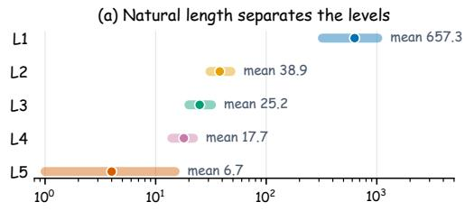  
Hint length (Qwen3 tokens, log scale)

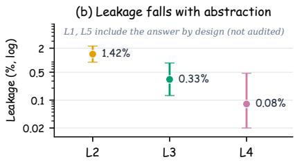  
Figure 4: Primary-compiler context length and answer-leakage audit. (a) Hint length across all 29,434 problems, measured in Qwen3 tokens and shown on a log scale; Table 6 reports summary statistics. (b) Adjudicated answer-equivalent leakage on a stratified sample of 1,200 problems. L1 and L5 contain the answer by design; Table 7 reports matched audits of both compilers.

Two zero-temperature prompt variants independently annotate every compiler–problem triplet. We send the 31 primary-compiler and 67 Qwen3-8B-compiler triplets with at least one disagreement to a third source-only adjudication prompt. This resolves all 2,400 compiler–problem records, with no unresolved cases. All three passes use Qwen3.5-397B-A17B, so the resulting agreement is promptreplication agreement from one model rather than human inter-rater agreement.

Table 7: Matched semantic audits of both compilers on the same 1,200 problem rows after adjudication. Rates are computed over the 1,200 hints at each compiler–level pair. “Core role valid” checks concrete-method presence for L2, single-framing presence for L3, and both domain and object correctness for L4.
<table><tr><td>Compiler</td><td>Level</td><td>Direct</td><td>Answer-equivalent</td><td>Boundary pass</td><td>Core role valid</td></tr><tr><td rowspan="3">397B primary</td><td>L2: strategy</td><td>0/1200</td><td>17/1200 (1.42%)</td><td>98.58%</td><td>100.00%</td></tr><tr><td>L3: framing</td><td>0/1200</td><td>4/1200 (0.33%)</td><td>99.67%</td><td>100.00%</td></tr><tr><td>L4: category</td><td>0/1200</td><td>1/1200 (0.08%)</td><td>99.92%</td><td>100.00%</td></tr><tr><td rowspan="3">8B replication</td><td>L2: strategy</td><td>0/1200</td><td>50/1200 (4.17%)</td><td>95.58%</td><td>99.92%</td></tr><tr><td>L3: framing</td><td>0/1200</td><td>31/1200 (2.58%)</td><td>97.08%</td><td>99.83%</td></tr><tr><td>L4: category</td><td>0/1200</td><td>2/1200 (0.17%)</td><td>98.83%</td><td>99.17%</td></tr></table>

No hint directly copies an answer. The 8B compiler has higher L2/L3 leakage and boundary-failure rates, whereas its L4 context remains low-leakage and follows the scale-dependent direction in Table 12. The L4 result shows that the finding is not confined to the leakier L2/L3 contexts; leakage may still affect individual L2/L3 cells.

Table 8 reports agreement for the two fields with positive adjudicated cases.

Table 8: Prompt-A/B agreement on the two audit fields that contain positive adjudicated cases. For primary-compiler L4, κ = 0 is a prevalence artifact: one prompt assigns no positives and the other assigns only two, despite 99.83% raw agreement.
<table><tr><td></td><td></td><td colspan="2">397B primary</td><td colspan="2">8B replication</td></tr><tr><td>Level</td><td>Field</td><td>Agreement</td><td>κ</td><td>Agreement</td><td>κ</td></tr><tr><td>L2</td><td>Answer leakage</td><td>97.83%</td><td>0.527</td><td>96.75%</td><td>0.695</td></tr><tr><td>L2</td><td>Boundary pass</td><td>97.67%</td><td>0.507</td><td>96.33%</td><td>0.680</td></tr><tr><td>L3</td><td>Answer leākage</td><td>99.58%</td><td>0.614</td><td>98.17%</td><td>0.694</td></tr><tr><td>L3</td><td>Boundary pass</td><td>99.58%</td><td>0.614</td><td>97.92%</td><td>0.673</td></tr><tr><td>L4</td><td>Answer leakage</td><td>99.83%</td><td>0.000</td><td>100.00%</td><td>1.000</td></tr><tr><td>L4</td><td>Boundary pass</td><td>99.83%</td><td>0.000</td><td>99.33%</td><td>0.711</td></tr></table>

The audit release accompanying the code will include sample IDs, prompts, raw outputs, adjudications, and aggregation code.

The two replicated audit passes and the adjudication pass share one block of operational definitions and differ only in the role preamble:

(A) You are a conservative data-quality auditor for mathematical   
reasoning supervision. Apply the operational definitions literally   
and do not infer unstated content.   
(B) You are an adversarial compliance reviewer. Look independently   
for subtle answer-equivalent leakage and boundary drift, but do not   
penalize a hint merely because it is useful. Evaluate each level   
against its absolute definition, not relative to the other hints.   
(C) You are the final independent adjudicator for a mathematical hint   
audit. Resolve the case from the source text alone; you are not shown   
earlier judgments. Be strict about evidence and use ‘uncertain’ only   
when the source wording truly admits two readings.

The shared operational definitions are:

Audit the three hints against their declared definitions. Judge only   
what is actually written in each hint, using the problem, reference   
solution, and ground-truth answer only as verification context.   
ANSWER LEAKAGE:   
- ‘‘direct’’: explicitly states the final value, expression, option,   
or answer.   
- ‘‘equivalent’’: states a conclusion algebraically/logically   
equivalent to the final answer, so the answer is already determined   
without carrying out the intended solution.   
- ‘‘none’’: contains only guidance or classification. A useful   
strategy that makes the problem easier is NOT leakage.   
- ‘‘uncertain’’: evidence is genuinely ambiguous.   
L2 (named strategy): Must identify a concrete method, theorem, rule,   
representation, or tool. May briefly say why it fits. Must not carry   
out problem-specific calculations or a derivation. Must not give a   
multi-step operation sequence or the answer.   
L3 (method-independent framing): Must express one transferable   
cognitive framing shift. Must not name a specific theorem, algorithm,   
or concrete method. Must not prescribe a sequence of operations or   
give the answer.   
L4 (problem category): Must correctly identify the mathematical   
domain and relevant object/concept. Must not recommend a method,   
cognitive move, action sequence, or answer.   
For every false/violation judgment, quote at most two short exact   
spans from the corresponding hint in ‘‘evidence’’. Do not quote the   
reference solution. Set boundary pass from the complete definition,   
not merely from answer leakage. Return JSON only, with exactly the   
requested schema.

The user message supplies the sample ID, problem, ground-truth answer, the reference solution (as verification context, clipped to 24,000 characters), the paired L2/L3/L4 hints, and the required JSON schema. Each level is annotated with answer leakage ∈ {none, direct, equivalent, uncertain}, level-specific boolean boundary fields (L2: concrete method present, problem specific execution, multi step sequence; L3: single framing present, named method present, operation sequence; L4: domain correct, objects correct, method or action present), an overall boundary pass, a confidence grade, and at most two verbatim evidence spans of at most 240 characters. Responses that violate this schema are rejected and retried, so every retained annotation is structurally valid.

## C FULL RESULTS AND ROBUSTNESS

## C.1 FULL EVALUATION RESULTS

Table 9 gives the complete transfer results at step 200 summarized in Section 4.1, and Table 10 expands ZebraLogic into cell accuracy and the Hard and XL subsets. Both are single-run comparisons at a common endpoint; the multi-seed analysis covers the L1, L3, and L4 in-domain comparison (Appendix C.3). Table 11 reports the separately interpreted C-Eval audit, discussed at the end of this subsection.

Table 9: Transfer using the fixed checkpoint at step 200, with the primary compiler for L2–L4. Scores are percentages: MT-AIME reports macro Avg@12 over seven languages, GPQA Avg@10, AutoLogi verifier accuracy, and ZebraLogic exact puzzle accuracy. L5 is the answer-only control. Shading marks the highest and second-highest point estimates within each scale and benchmark, including ties.
<table><tr><td rowspan=1 colspan=8>Model      Condition      MT-AIME-7Lang      AutoLogi      GPQA-Diamond      ZebraLogic</td></tr><tr><td rowspan=1 colspan=1>Base</td><td rowspan=1 colspan=1>42.62</td><td rowspan=1 colspan=1></td><td rowspan=1 colspan=2>86.73</td><td rowspan=1 colspan=1>36.72</td><td rowspan=1 colspan=1></td><td rowspan=1 colspan=1>61.20</td></tr><tr><td rowspan=1 colspan=1>L1</td><td rowspan=1 colspan=1>46.94</td><td rowspan=1 colspan=1></td><td rowspan=1 colspan=2>87.43</td><td rowspan=1 colspan=1>38.54</td><td rowspan=1 colspan=1></td><td rowspan=1 colspan=1>65.10</td></tr><tr><td rowspan=2 colspan=1>L21.7BL3</td><td rowspan=1 colspan=1>46.79</td><td rowspan=1 colspan=1></td><td rowspan=1 colspan=2>86.22</td><td rowspan=1 colspan=1>37.98</td><td rowspan=1 colspan=1></td><td rowspan=1 colspan=1>62.60</td></tr><tr><td rowspan=1 colspan=1>48.65</td><td rowspan=1 colspan=1></td><td rowspan=1 colspan=2>86.54</td><td rowspan=1 colspan=1>39.34</td><td rowspan=1 colspan=1></td><td rowspan=1 colspan=1>64.40</td></tr><tr><td rowspan=1 colspan=1>L4</td><td rowspan=1 colspan=1>47.86</td><td rowspan=1 colspan=1></td><td rowspan=1 colspan=2>87.62</td><td rowspan=1 colspan=1>37.73</td><td rowspan=1 colspan=1></td><td rowspan=1 colspan=1>62.70</td></tr><tr><td rowspan=1 colspan=1>L5</td><td rowspan=1 colspan=1>44.84</td><td rowspan=1 colspan=1></td><td rowspan=1 colspan=2>86.54</td><td rowspan=1 colspan=1>38.18</td><td rowspan=1 colspan=1></td><td rowspan=1 colspan=1>61.30</td></tr><tr><td rowspan=1 colspan=1>Base</td><td rowspan=1 colspan=1>65.87</td><td rowspan=1 colspan=1></td><td rowspan=1 colspan=2>91.75</td><td rowspan=1 colspan=1>53.69</td><td rowspan=1 colspan=1></td><td rowspan=1 colspan=1>82.20</td></tr><tr><td rowspan=1 colspan=1>L1</td><td rowspan=1 colspan=1>67.46</td><td rowspan=1 colspan=1></td><td rowspan=1 colspan=2>92.38</td><td rowspan=1 colspan=1>54.75</td><td rowspan=1 colspan=1></td><td rowspan=1 colspan=1>82.50</td></tr><tr><td rowspan=2 colspan=1>L24BL3</td><td rowspan=1 colspan=1>68.85</td><td rowspan=1 colspan=1></td><td rowspan=1 colspan=2>92.13</td><td rowspan=1 colspan=1>55.96</td><td rowspan=1 colspan=1></td><td rowspan=1 colspan=1>82.10</td></tr><tr><td rowspan=1 colspan=1>67.62</td><td rowspan=1 colspan=1></td><td rowspan=1 colspan=2>92.63</td><td rowspan=1 colspan=1>55.25</td><td rowspan=1 colspan=1></td><td rowspan=1 colspan=1>82.60</td></tr><tr><td rowspan=1 colspan=1>L4</td><td rowspan=1 colspan=1>69.56</td><td rowspan=1 colspan=1></td><td rowspan=1 colspan=2>92.25</td><td rowspan=1 colspan=1>55.51</td><td rowspan=1 colspan=1></td><td rowspan=1 colspan=1>82.90</td></tr><tr><td rowspan=1 colspan=1>L5</td><td rowspan=1 colspan=1>68.21</td><td rowspan=1 colspan=1></td><td rowspan=1 colspan=2>92.76</td><td rowspan=1 colspan=1>53.28</td><td rowspan=1 colspan=1></td><td rowspan=1 colspan=1>82.40</td></tr><tr><td rowspan=1 colspan=1>Base</td><td rowspan=1 colspan=1>70.48</td><td rowspan=1 colspan=1></td><td rowspan=1 colspan=2>92.13</td><td rowspan=1 colspan=1>60.05</td><td rowspan=1 colspan=1></td><td rowspan=1 colspan=1>85.60</td></tr><tr><td rowspan=1 colspan=1>L1</td><td rowspan=1 colspan=1>71.90</td><td rowspan=1 colspan=1></td><td rowspan=1 colspan=1>92.63</td><td rowspan=1 colspan=1></td><td rowspan=1 colspan=1>61.26</td><td rowspan=1 colspan=1></td><td rowspan=1 colspan=1>86.40</td></tr><tr><td rowspan=2 colspan=1>L28BL3</td><td rowspan=1 colspan=1>73.61</td><td rowspan=1 colspan=1></td><td rowspan=1 colspan=1>92.13</td><td rowspan=1 colspan=1></td><td rowspan=1 colspan=1>60.45</td><td rowspan=1 colspan=1></td><td rowspan=1 colspan=1>87.30</td></tr><tr><td rowspan=1 colspan=1>72.70</td><td rowspan=1 colspan=1></td><td rowspan=1 colspan=1>91.87</td><td rowspan=1 colspan=1></td><td rowspan=1 colspan=1>62.68</td><td rowspan=1 colspan=1></td><td rowspan=1 colspan=1>88.10</td></tr><tr><td rowspan=1 colspan=1>L4</td><td rowspan=1 colspan=1>72.74</td><td rowspan=1 colspan=1></td><td rowspan=1 colspan=1>92.13</td><td rowspan=1 colspan=1></td><td rowspan=1 colspan=1>60.51</td><td rowspan=1 colspan=1></td><td rowspan=1 colspan=1>87.60</td></tr><tr><td rowspan=1 colspan=1>L5</td><td rowspan=1 colspan=1>71.43</td><td rowspan=1 colspan=3>91.94</td><td rowspan=1 colspan=1>61.67</td><td rowspan=1 colspan=1></td><td rowspan=1 colspan=1>85.90</td></tr></table>

Table 10: Complete ZebraLogic-grid results at step 200. Puzzle is exact-grid accuracy; Cell measures individual grid entries. Hard and XL are exact-puzzle accuracy on the corresponding subsets. ∆ from Base is the absolute percentage-point change from the same-scale unadapted Base checkpoint. Light-blue/bold shading marks the best and light-gray/underline shading the second-best condition within each model scale.
<table><tr><td>Model</td><td>Condition</td><td>Puzzle</td><td>∆ from Base</td><td>Cell</td><td>Hard</td><td>XL</td></tr><tr><td rowspan="6">1.7B</td><td>Base</td><td>61.20</td><td></td><td>68.88</td><td>48.06</td><td>7.00</td></tr><tr><td>L1</td><td>65.10</td><td>+3.90</td><td>72.74</td><td>53.47</td><td>10.50</td></tr><tr><td>L2</td><td>62.60</td><td>+1.40</td><td>70.41</td><td>49.72</td><td>8.00</td></tr><tr><td>L3</td><td>64.40</td><td>+3.20</td><td>73.09</td><td>53.06</td><td>7.50</td></tr><tr><td>L4</td><td>62.70</td><td>+1.50</td><td>71.48</td><td>50.42</td><td>9.00</td></tr><tr><td>L5</td><td>61.30</td><td>+0.10</td><td>69.84</td><td>47.92</td><td>6.00</td></tr><tr><td rowspan="6">4B</td><td>Base</td><td>82.20</td><td></td><td>84.21</td><td>75.42</td><td>36.50</td></tr><tr><td>L1</td><td>82.50</td><td>+0.30</td><td>84.83</td><td>75.97</td><td>36.00</td></tr><tr><td>L2</td><td>82.10</td><td>-0.10</td><td>83.14</td><td>75.42</td><td>34.00</td></tr><tr><td>L3</td><td>82.60</td><td>+0.40</td><td>85.38</td><td>76.25</td><td>36.00</td></tr><tr><td>L4</td><td>82.90</td><td>+0.70</td><td>85.91</td><td>76.53</td><td>36.00</td></tr><tr><td>L5</td><td>82.40</td><td>+0.20</td><td>84.78</td><td>75.69</td><td>37.50</td></tr><tr><td rowspan="6">8B</td><td>Base</td><td>85.60</td><td></td><td>86.80</td><td>80.14</td><td>41.00</td></tr><tr><td>L1</td><td>86.40</td><td>+0.80</td><td>86.85</td><td>81.53</td><td>44.50</td></tr><tr><td>L2</td><td>87.30</td><td>+1.70</td><td>87.45</td><td>82.64</td><td>46.00</td></tr><tr><td>L3</td><td>88.10</td><td>+2.50</td><td>88.25</td><td>83.89</td><td>46.50</td></tr><tr><td>L4</td><td>87.60</td><td>+2.00</td><td>87.83</td><td>83.06</td><td>47.50</td></tr><tr><td>L5</td><td>85.90</td><td>+0.30</td><td>86.13</td><td>80.97</td><td>43.50</td></tr></table>

C-Eval is a bounded-generation audit rather than a reasoning-transfer benchmark, so it is read on its own. Under a 32,768-token output budget, no training condition improves on the unadapted Base consistently across scales on C-Eval Macro (Table 11). Base is the best condition at 1.7B (69.82 against 69.23 for L1) and at 8B (84.60 against 84.57 for L5); the one condition that exceeds Base anywhere is the answer-only control L5 at 4B, by 0.07 points (80.80 against 80.73), while none of L1–L4 exceeds Base at any scale. Extraction failures rise under every training condition, most sharply at 1.7B, from 0.68% for Base to 3.70% for L2, and the metric charges each failure as an error. Under this protocol, therefore, OPSD training on competition mathematics yields no consistent gain on broad Chinese knowledge questions, and it leaves more responses without a parseable answer. This is why C-Eval is kept apart from the four reasoning-transfer benchmarks in the main text.

Table 11: C-Eval test results with a 32,768-token output budget. Macro is the mean over 52 subjects; Hard Macro covers the official C-Eval Hard subjects. Extraction failures are counted as incorrect in Macro and Micro. Light-blue/bold shading marks the best and light-gray/underline shading the second-best condition within each model scale.
<table><tr><td rowspan=1 colspan=8>Model         Condition         Macro         Micro         Hard Macro         Extraction fail.</td></tr><tr><td rowspan=1 colspan=1>Base</td><td rowspan=1 colspan=2>69.82</td><td rowspan=1 colspan=2>67.97</td><td rowspan=1 colspan=1>73.77</td><td rowspan=1 colspan=1></td><td rowspan=1 colspan=1>0.68</td></tr><tr><td rowspan=1 colspan=1>L1</td><td rowspan=1 colspan=1>69.23</td><td rowspan=1 colspan=1></td><td rowspan=1 colspan=1>67.49</td><td rowspan=1 colspan=1></td><td rowspan=1 colspan=1>73.19</td><td rowspan=1 colspan=1></td><td rowspan=1 colspan=1>1.67</td></tr><tr><td rowspan=2 colspan=1>L21.7BL3</td><td rowspan=1 colspan=1>67.46</td><td rowspan=1 colspan=1></td><td rowspan=1 colspan=1>65.78</td><td rowspan=1 colspan=1></td><td rowspan=1 colspan=1>72.31</td><td rowspan=1 colspan=1></td><td rowspan=1 colspan=1>3.70</td></tr><tr><td rowspan=1 colspan=1>67.86</td><td rowspan=1 colspan=1></td><td rowspan=1 colspan=1>66.25</td><td rowspan=1 colspan=1></td><td rowspan=1 colspan=1>73.35</td><td rowspan=1 colspan=1></td><td rowspan=1 colspan=1>3.04</td></tr><tr><td rowspan=2 colspan=1>L4L5</td><td rowspan=1 colspan=1>67.78</td><td rowspan=1 colspan=1></td><td rowspan=1 colspan=1>66.11</td><td rowspan=1 colspan=1></td><td rowspan=1 colspan=1>73.75</td><td rowspan=1 colspan=1></td><td rowspan=1 colspan=1>3.48</td></tr><tr><td rowspan=1 colspan=2>68.49</td><td rowspan=1 colspan=2>66.85</td><td rowspan=1 colspan=1>72.68</td><td rowspan=1 colspan=1></td><td rowspan=1 colspan=1>2.43</td></tr><tr><td rowspan=1 colspan=1>Base</td><td rowspan=1 colspan=2>80.73</td><td rowspan=1 colspan=1>79.40</td><td rowspan=1 colspan=1></td><td rowspan=1 colspan=1>85.91</td><td rowspan=1 colspan=1></td><td rowspan=1 colspan=1>0.77</td></tr><tr><td rowspan=1 colspan=1>L1</td><td rowspan=1 colspan=1>80.03</td><td rowspan=1 colspan=1></td><td rowspan=1 colspan=1>78.73</td><td rowspan=1 colspan=1></td><td rowspan=1 colspan=1>84.96</td><td rowspan=1 colspan=1></td><td rowspan=1 colspan=1>2.26</td></tr><tr><td rowspan=2 colspan=1>L24BL3</td><td rowspan=1 colspan=1>80.11</td><td rowspan=1 colspan=1></td><td rowspan=1 colspan=1>78.78</td><td rowspan=1 colspan=1></td><td rowspan=1 colspan=1>84.45</td><td rowspan=1 colspan=1></td><td rowspan=1 colspan=1>2.31</td></tr><tr><td rowspan=1 colspan=1>80.09</td><td rowspan=1 colspan=1></td><td rowspan=1 colspan=1>78.76</td><td rowspan=1 colspan=1></td><td rowspan=1 colspan=1>85.21</td><td rowspan=1 colspan=1></td><td rowspan=1 colspan=1>2.21</td></tr><tr><td rowspan=1 colspan=1>L4</td><td rowspan=1 colspan=1>80.52</td><td rowspan=1 colspan=1></td><td rowspan=1 colspan=1>79.14</td><td rowspan=1 colspan=1></td><td rowspan=1 colspan=1>85.18</td><td rowspan=1 colspan=1></td><td rowspan=1 colspan=1>1.77</td></tr><tr><td rowspan=1 colspan=1>L5</td><td rowspan=1 colspan=1>80.80</td><td rowspan=1 colspan=1></td><td rowspan=1 colspan=1>79.37</td><td rowspan=1 colspan=1></td><td rowspan=1 colspan=1>86.28</td><td rowspan=1 colspan=1></td><td rowspan=1 colspan=1>1.96</td></tr><tr><td rowspan=1 colspan=1>Base</td><td rowspan=1 colspan=1>84.60</td><td rowspan=1 colspan=1></td><td rowspan=1 colspan=2>83.61</td><td rowspan=1 colspan=1>88.45</td><td rowspan=1 colspan=1></td><td rowspan=1 colspan=1>0.84</td></tr><tr><td rowspan=1 colspan=1>L1</td><td rowspan=1 colspan=1>84.43</td><td rowspan=1 colspan=1></td><td rowspan=1 colspan=1>83.37</td><td rowspan=1 colspan=1></td><td rowspan=1 colspan=1>88.47</td><td rowspan=1 colspan=1></td><td rowspan=1 colspan=1>1.27</td></tr><tr><td rowspan=2 colspan=1>L28BL3</td><td rowspan=1 colspan=1>84.13</td><td rowspan=1 colspan=1></td><td rowspan=1 colspan=1>82.98</td><td rowspan=1 colspan=1></td><td rowspan=1 colspan=1>87.75</td><td rowspan=1 colspan=1></td><td rowspan=1 colspan=1>1.43</td></tr><tr><td rowspan=1 colspan=1>84.31</td><td rowspan=1 colspan=1></td><td rowspan=1 colspan=1>83.26</td><td rowspan=1 colspan=1></td><td rowspan=1 colspan=1>88.09</td><td rowspan=1 colspan=1></td><td rowspan=1 colspan=1>1.51</td></tr><tr><td rowspan=1 colspan=1>L4</td><td rowspan=1 colspan=1>84.53</td><td rowspan=1 colspan=1></td><td rowspan=1 colspan=1>83.46</td><td rowspan=1 colspan=1></td><td rowspan=1 colspan=1>87.89</td><td rowspan=1 colspan=1></td><td rowspan=1 colspan=1>1.26</td></tr><tr><td rowspan=1 colspan=1>L5</td><td rowspan=1 colspan=1>84.57</td><td rowspan=1 colspan=1></td><td rowspan=1 colspan=2>83.41</td><td rowspan=1 colspan=1>89.40</td><td rowspan=1 colspan=1></td><td rowspan=1 colspan=1>1.17</td></tr></table>

## C.2 CONTEXT CONTROLS

Two controls vary how the privileged context is produced while holding the training pipeline fixed. Table 12 regenerates L2–L4 with Qwen3-8B under the same semantic contracts, so the ordering between full and intermediate contexts can be checked against a second compiler. Table 13 replaces semantic rewriting with a fixed 10% reference prefix plus the answer at 4B, which shortens the context without abstracting it; that comparison matches L2–L4 in neither length nor answer access. Section 4.2 discusses both results.

## C.3 TRAINING ROBUSTNESS

Three checks probe whether the granularity contrast depends on the training budget, the optimization seed, or the checkpoint at which runs are read.

The primary experiments fix the training rollout budget at 1,024 tokens, following the original OPSD configuration. Because sampled completions frequently reach this cap, we verify that the granularity comparison survives a doubled budget: L1–L4 are retrained at 4B with a 2,048-token rollout budget and otherwise identical configuration, then evaluated under the standard in-domain protocol.

Table 14 shows that the doubled budget roughly halves truncation early in training, yet changes each level’s peak mean by at most 0.74 points. Every intermediate context again matches or exceeds L1, while the nominal leader shifts from L3 to L4. The larger budget moves three of four singlecheckpoint peaks earlier and does not improve any endpoint at step 200, suggesting a change in effective training horizon while preserving the family-level ordering. The endpoint is more sensitive to the budget: L2’s mean at step 200 falls from 62.59 to 58.61 even though its peak mean is higher under the larger budget (64.07 to 64.54), so preserving the peak does not imply preserving the endpoint. These runs use one seed at 4B and do not evaluate transfer.

Table 12: Compiler replication using ID peak means. L2–L4 are generated with the primary Qwen3.5-397B-A17B compiler or with Qwen3-8B; L1 requires no compiler and is the shared reference at each scale for both halves, not an additional run. Bold marks the best condition within each compiler block, counting the shared L1 column. The peak ordering between full and intermediate contexts is preserved across compilers, while the preferred intermediate level can change.
<table><tr><td rowspan="2">Student</td><td rowspan="2">L1</td><td colspan="3">397B primary compiler</td><td colspan="3">Qwen3-8B compiler</td></tr><tr><td>L2</td><td>L3</td><td>L4</td><td>L2</td><td>L3</td><td>L4</td></tr><tr><td>1.7B</td><td>43.89</td><td>40.83</td><td>42.78</td><td>43.61</td><td>41.02</td><td>42.78</td><td>42.96</td></tr><tr><td>4B</td><td>63.43</td><td>64.07</td><td>64.81</td><td>64.63</td><td>64.07</td><td>63.71</td><td>64.35</td></tr><tr><td>8B</td><td>66.67</td><td>68.24</td><td>66.85</td><td>67.22</td><td>67.96</td><td>67.04</td><td>67.13</td></tr></table>

Table 13: Comparison of semantic contexts and prefix truncation with Qwen3-4B. ID peak mean averages each benchmark’s best Avg@12 across eight checkpoints, while ID@200 uses step 200. Only the prefix condition is new; the L1–L5 rows repeat the 4B primary runs, whose per-benchmark peaks are in Table 1. The upper block includes the final answer, the lower block prohibits it by design. The comparison matches neither length nor answer access.
<table><tr><td>Condition</td><td>ID peak mean</td><td>ID@200</td></tr><tr><td>L1: complete solution</td><td>63.43</td><td>60.93</td></tr><tr><td>L5: answer only</td><td>63.61</td><td>62.50</td></tr><tr><td>Prefix-10% + answer</td><td>63.89</td><td>61.67</td></tr><tr><td>L2: strategy</td><td>64.07</td><td>62.59</td></tr><tr><td>L3: framing</td><td>64.81</td><td>61.76</td></tr><tr><td>L4: category</td><td>64.63</td><td>62.59</td></tr></table>

Table 14: Robustness to rollout budget at 4B (Avg@12 means across three benchmarks). Peak takes each benchmark’s best checkpoint; single-ckpt selects the one checkpoint with the best mean across three benchmarks (step in parentheses); @200 is the fixed endpoint. Truncation reports the fraction of training rollouts reaching the token cap early (steps ≤50) and late (steps >150) in training. Bold marks the column maximum, including ties. Intermediate levels match or beat L1 on the peak and single-checkpoint means under both budgets.
<table><tr><td></td><td colspan="4">1,024-token rollouts</td><td colspan="4">2,048-token rollouts</td></tr><tr><td>Level</td><td>Peak</td><td>Single-ckpt</td><td>@200</td><td>Trunc. e/l</td><td>Peak</td><td>Single-ckpt</td><td>@200</td><td>Trunc. e/l</td></tr><tr><td>L1</td><td>63.43</td><td>62.31 (125)</td><td>60.93</td><td>57%/77%</td><td>63.43</td><td>63.06 (50)</td><td>60.93</td><td>21%/58%</td></tr><tr><td>L2</td><td>64.07</td><td>63.43 (125)</td><td>62.59</td><td>56%/83%</td><td>64.54</td><td>64.26 (75)</td><td>58.61</td><td>21%/67%</td></tr><tr><td>L3</td><td>64.81</td><td>63.24 (150)</td><td>61.76</td><td>57%/81%</td><td>64.35</td><td>63.70 (175)</td><td>61.48</td><td>22%/52%</td></tr><tr><td>L4</td><td>64.63</td><td>64.63 (125)</td><td>62.59</td><td>55%/77%</td><td>65.37</td><td>64.63 (75)</td><td>61.57</td><td>22%/54%</td></tr></table>

To probe optimization variance directly, L1, L3, and L4 are retrained at all three scales with two additional configurations under Table 4. The primary run uses the default seed 42; the additional runs use seeds 43 and 44, with the trainer, data order, and rollout RNGs changed together and disjoint across configurations. Every run is evaluated with the standard in-domain protocol. Table 15 groups the per-benchmark bests, the peak mean across three benchmarks, and the endpoint at step 200 by configuration, so each block compares runs with the same seed configuration, and reports the paired peak difference from that configuration’s own L1 run.

At 4B and 8B, L4 exceeds its matched L1 peak in all three configurations and L3 does so in four of the six scale–configuration cells, falling level at 4B seed 43 and below at 8B seed 44 (Table 15). Aggregating these runs under the four checkpoint rules of Table 3 preserves the direction at both scales, including when all checkpoints are averaged. At 1.7B the peak differences range from −1.11 to +0.37 points and the selection-free rules favor L1 on average, by 0.14 to 1.33 points.

The endpoint at step 200 is the most sensitive to seed among the four rules, carrying the largest paired standard deviation in five of the six contrasts; the exception is 8B L3, whose peak spread of 0.65 exceeds its endpoint spread of 0.32. Among L3 and L4, the leader is not stable within any scale: at 4B, L3 leads the primary run and L4 leads seeds 43 and 44; at 8B, L4 leads the primary run and seed 44 while L3 leads seed 43. These replications support the contrast between L1 and intermediate contexts at the larger scales, while the ordering among intermediate levels remains unstable. They cover L1, L3, and L4; L2, L5, the transfer evaluations, and the remaining controls are single runs.

Table 15: Replication across training seeds at all three scales (Avg@12). ID peak takes the best checkpoint per benchmark up to step 200 and averages the three; ID@200 is the selection-free endpoint mean. Rows are grouped by seed configuration, so every block compares intermediate contexts against its own L1 run; seed 42 is the primary run of Table 1, and 43 and 44 are the two additional configurations. ∆ is the ID peak difference from the L1 run in the same block. The best scores are not shaded because the configurations do not agree on an intermediate leader.
<table><tr><td>Student</td><td>Seed</td><td>Level</td><td>AIME24</td><td>AIME25</td><td>HMMT25</td><td>ID peak</td><td>∆ vs. L1</td><td>ID@200</td></tr><tr><td rowspan="9">1.7B</td><td rowspan="4">42</td><td>L1</td><td>57.22</td><td>43.33</td><td>31.11</td><td>43.89</td><td></td><td>42.31</td></tr><tr><td>L3</td><td>56.94</td><td>41.39</td><td>30.00</td><td>42.78</td><td>-1.11</td><td>40.00</td></tr><tr><td>L4</td><td>59.72</td><td>43.06</td><td>28.06</td><td>43.61</td><td>-0.28</td><td>39.26</td></tr><tr><td>L1</td><td>55.28</td><td>43.89</td><td>28.61</td><td>42.59</td><td></td><td>38.89</td></tr><tr><td rowspan="3">43</td><td>L3</td><td>57.22</td><td>41.67</td><td>30.00</td><td>42.96</td><td>+0.37</td><td>40.74</td></tr><tr><td>L4</td><td>58.06</td><td>42.22</td><td>28.61</td><td>42.96</td><td>+0.37</td><td>39.81</td></tr><tr><td>L1</td><td>56.39</td><td>41.39</td><td>29.72</td><td>42.50</td><td></td><td>41.11</td></tr><tr><td rowspan="3">44</td><td>L3</td><td>58.33</td><td>41.39</td><td>28.89</td><td>42.87</td><td>+0.37</td><td>39.07</td></tr><tr><td>L4</td><td>57.50</td><td>41.94</td><td>27.78</td><td>42.41</td><td>-0.09</td><td>39.26</td></tr><tr><td>L1</td><td>76.94</td><td>68.61</td><td>44.72</td><td>63.43</td><td></td><td>60.93</td></tr><tr><td rowspan="6">4B</td><td rowspan="3">42</td><td>L3</td><td>77.50</td><td>69.72</td><td>47.22</td><td>64.81</td><td>+1.39</td><td>61.76</td></tr><tr><td>L4</td><td>76.94</td><td>69.17</td><td>47.78</td><td>64.63</td><td>+1.20</td><td>62.59</td></tr><tr><td>L1</td><td>76.67</td><td>69.44</td><td>45.28</td><td>63.80</td><td></td><td>60.83</td></tr><tr><td rowspan="3">43</td><td>L3</td><td>76.39</td><td>68.89</td><td>46.11</td><td>63.80</td><td>0.00</td><td>63.06</td></tr><tr><td>L4</td><td>76.94</td><td>70.28</td><td>46.67</td><td>64.63</td><td>+0.83</td><td>62.78</td></tr><tr><td>L1</td><td>76.11</td><td>68.06</td><td>46.11</td><td>63.43</td><td></td><td>61.39</td></tr><tr><td rowspan="3">44</td><td>L3</td><td>76.67</td><td>70.00</td><td>45.83</td><td>64.17</td><td>+0.74</td><td></td><td>63.33</td></tr><tr><td>L4</td><td>76.94</td><td>69.72</td><td>46.11</td><td></td><td>64.26</td><td>+0.83</td><td>60.93</td></tr><tr><td>L1</td><td>78.89</td><td>73.06</td><td></td><td></td><td></td><td></td><td>65.28</td></tr><tr><td rowspan="6">8B</td><td rowspan="3">42</td><td>L3</td><td>79.44</td><td>71.39</td><td>48.06 49.72</td><td>66.67 66.85</td><td>+0.19</td><td>65.37</td></tr><tr><td>L4</td><td>80.56</td><td>71.39</td><td>49.72</td><td>67.22</td><td>+0.56</td><td>64.63</td></tr><tr><td></td><td></td><td></td><td></td><td></td><td></td><td></td></tr><tr><td rowspan="3">43</td><td>L1 L3</td><td>78.61 78.89</td><td>73.06 73.61</td><td>47.78 49.72</td><td>66.48</td><td>+0.93</td><td>63.61 63.70</td></tr><tr><td>L4</td><td>80.56</td><td>73.06</td><td>48.33</td><td>67.41 67.31</td><td>+0.83</td><td>65.00</td></tr><tr><td></td><td></td><td></td><td></td><td></td><td></td><td></td></tr><tr><td rowspan="4"></td><td rowspan="4">44</td><td>L1</td><td>79.17</td><td>73.06</td><td>48.33</td><td>66.85</td><td></td><td>65.28</td></tr><tr><td>L3</td><td>79.17</td><td>72.22</td><td>48.06</td><td>66.48</td><td>-0.37</td><td>65.93</td></tr><tr><td>L4</td><td>79.72</td><td>71.94</td><td>49.17</td><td>66.94</td><td>+0.09</td><td></td></tr><tr><td></td><td></td><td></td><td></td><td></td><td></td><td>65.19</td></tr></table>

Figure 6 shows in-domain Avg@12 at every checkpoint (steps 25, 50, . . . , 200) on AIME24, AIME25, and HMMT25, with open circles at each curve’s best checkpoint. The benchmark curves are visibly nonmonotonic, which is what motivates reporting peaks and selection-free endpoints side by side. Table 16 lists the step at which each peak in Table 1 occurs. The selected steps are spread across the schedule rather than concentrated at its end, which is the same observation from the tabular side.

Figure 5 shows the logged clipped teacher–student objective as an auxiliary trace. Each condition optimizes against a different teacher target on different on-policy rollouts, so its values are not on a common scale across conditions and cannot be read as evidence that the conditions trained equally well; the curves only indicate that no run diverged.

For each (model, condition, benchmark) triple, define $\Delta _ { 2 0 0 } = \mathrm { A v g } @ 1 2 _ { \mathrm { b e s t < 2 0 0 } } - \mathrm { A v g } @ 1 2 _ { 2 0 0 }$ in percentage points. Table 17 averages this quantity over the three in-domain benchmarks. Across all 45 triples, the median and mean gaps are 1.94 and 2.31 points, respectively. The largest is 5.83 points for 1.7B-L4 on AIME25 (43.06 at step 125 versus 37.22 at step 200). Thus, step 200 is a common, selection-free endpoint and need not coincide with convergence. The OOD comparison remains internally matched because every condition uses the same stopping rule; sensitivity to alternative fixed endpoints remains open.

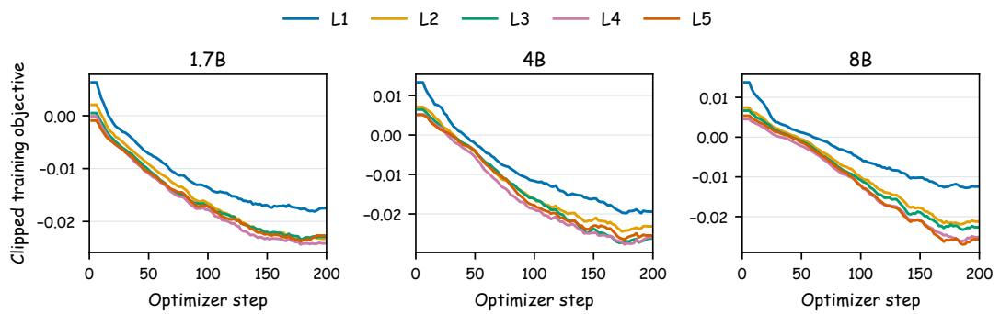  
Figure 5: Logged clipped training objective for each teacher context condition and model scale, under a moving average over five records. Each condition has a different teacher target, so the vertical ordering describes the respective objectives only and is comparable neither across conditions nor to the downstream benchmark ranking.

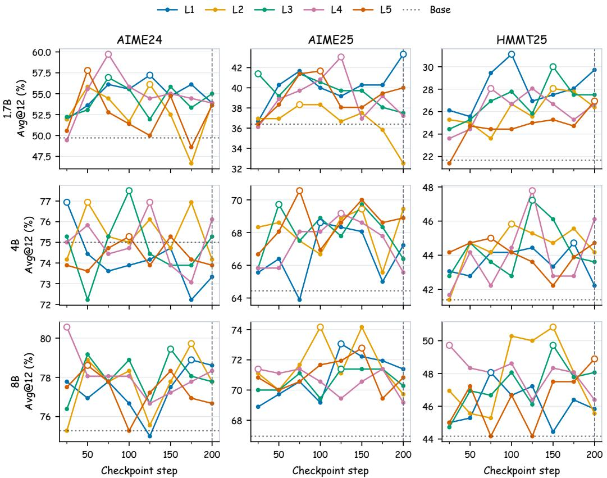  
Figure 6: In-domain Avg@12 vs. checkpoint step for each condition and benchmark, primary run (seed 42), with the unadapted Base score shown for reference. Open circles mark each curve’s maximum through step 200; the dashed vertical line marks the common endpoint used for transfer evaluation. The substantial variation across checkpoints motivates separating in-domain peak reporting from transfer at a fixed checkpoint.

Table 16: Step at which each peak Avg@12 in Table 1 is attained, primary run (seed 42). Checkpoints are taken every 25 steps up to 200.
<table><tr><td>Model</td><td>Benchmark</td><td>L1</td><td>L2</td><td>L3</td><td>L4</td><td>L5</td></tr><tr><td rowspan="3">1.7B</td><td>AIME24</td><td>125</td><td>125</td><td>75</td><td>75</td><td>50</td></tr><tr><td>AIME25</td><td>200</td><td>75</td><td>25</td><td>125</td><td>100</td></tr><tr><td>HMMT25</td><td>100</td><td>150</td><td>150</td><td>75</td><td>200</td></tr><tr><td rowspan="3">4B</td><td>AIME24</td><td>25</td><td>50</td><td>100</td><td>125</td><td>100</td></tr><tr><td>AIME25</td><td>100</td><td>150</td><td>50</td><td>125</td><td>75</td></tr><tr><td>HMMT25</td><td>175</td><td>100</td><td>125</td><td>125</td><td>75</td></tr><tr><td rowspan="3">8B</td><td>AIME24</td><td>175</td><td>175</td><td>150</td><td>25</td><td>50</td></tr><tr><td>AIME25</td><td>125</td><td>100</td><td>125</td><td>25</td><td>150</td></tr><tr><td>HMMT25</td><td>75</td><td>150</td><td>150</td><td>25</td><td>200</td></tr></table>

Table 17: Mean Avg@12 gap between the best checkpoint through step 200 and the endpoint at step 200 (∆ , percentage points), averaged over AIME24, AIME25, and HMMT25. Smaller is closer to the condition’s best checkpoint.
<table><tr><td>Model</td><td>L1</td><td>L2</td><td>L3</td><td>L4</td><td>L5</td></tr><tr><td>1.7B</td><td>1.57</td><td>3.24</td><td>2.78</td><td>4.35</td><td>1.95</td></tr><tr><td>4B</td><td>2.50</td><td>1.48</td><td>3.06</td><td>2.04</td><td>1.11</td></tr><tr><td>8B</td><td>1.39</td><td>3.89</td><td>1.48</td><td>2.59</td><td>1.30</td></tr></table>

## C.4 SCOPE OF THE CONTROLS

This subsection records which controls bound the scope conditions summarized in Section 4.5. Against single-run evidence: replication across three seeds covers L1, L3, and L4 at all three scales (Appendix C.3), while the prefix, bridge, and rollout budget controls center on 4B and the mixture and routing studies are single runs. Against selection by score: the in-domain protocol picks the best of eight checkpoints separately per benchmark, so we report selection-free endpoints and full trajectories in Appendix C.3.

Against bridge wording, which varies with level in the primary runs: the shared-bridge control holds it fixed (Appendix E). Against the confound between semantics and length, which the levels vary together: the prefix control fixes truncation with answer access, though it matches L2–L4 in neither length nor answer access (Appendix C.2). Against compiler identity: the Qwen3-8B replication stays inside the Qwen family and shows higher L2/L3 leakage, and both compilers receive the reference solution, so it broadens the compiler evidence without isolating parameter count.

Against difficulty-bucket artifacts: grouping by Base rather than L1 success rates tests the stratification reference (Section 4.4), but selecting the intermediate condition on the same evaluation used for the difficulty analysis remains a source of selection bias. One model judge supplies both the semantic audits and the trajectory annotations, so replicated prompts bound prompt sensitivity but not judge independence.

Broader validation should extend the comparison to other model families and domains, disentangle semantics from length, and study compilers that construct useful contexts without reference solutions. The scale-dependent ordering motivates studying whether useful context changes as the same student improves, and in-domain scores do not improve monotonically across checkpoints, so multi-round OPSD with online context selection and stability-aware optimization is the natural next setting, and the hierarchy introduced here provides a controlled interface for building it.

## D DIAGNOSTIC ANALYSES

## D.1 DISTRIBUTIONAL DISCREPANCY

We deterministically sample 600 aligned training problems with seed 20260804. For each scale, the unadapted model produces two continuations per problem from the exact OPSD student prompt with thinking disabled, using temperature 1.1, top-p 0.95, top-k 20, and at most 1,024 tokens. Each continuation is held fixed while the same base checkpoint scores it under the student prompt, a thinking-enabled no-hint teacher prompt, and the exact L1–L5 teacher packages. Logits are normalized over the full vocabulary at temperature 1.1; prompts are not truncated. We average token-level measurements within each rollout and divide each continuation into four equal bins by relative position. The analyses of whole trajectories and quartiles use all 3,600 scored rollouts, with 1,200 per scale. Bootstrap intervals in the diagnostic figures resample problems together with their associated rollouts, and therefore quantify evaluation uncertainty conditional on the evaluated runs rather than optimization variability.

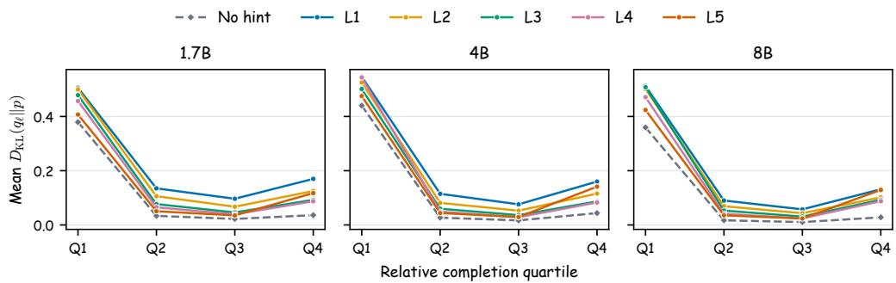  
Figure 7: Temporal geometry at each scale, using rollouts from the exact OPSD student prompt. Curves report mean unclipped full-vocabulary teacher-to-student KL within quartiles of relative completion position, using all 1,200 rollouts at each scale; Q4 is the final quarter of each rollout, not the answer region, and this analysis therefore avoids the boxed-answer filtering above without eliminating truncation bias. The no-hint reference uses the thinking-enabled teacher interface without privileged content. L5 has the smallest mean displacement among L1–L5 through Q2, remains among the smallest in Q3, and has the largest rebound from Q3 to Q4 at every scale, both features that means over whole trajectories hide.

For the follow-up temporal diagnostic, we locate the last \boxed marker by exact decode–reencode token offsets. We define a pre-answer window from up to 32 tokens immediately before the marker and an answer-onward window from the marker through at most 32 tokens, requiring at least eight tokens in each window. This yields 610, 636, and 630 valid rollouts at 1.7B, 4B, and 8B, spanning 358, 371, and 364 problems. The 1,024-token generation limit truncates 505, 488, and 524 of the 1,200 rollouts at the respective scales (40.7–43.7%); most truncated trajectories never reach a boxed answer and are therefore absent from the aligned subset. The subset consequently favors completed trajectories containing a boxed answer.

As an outcome-conditioned check, we repeat the paired answer-onward contrast on the 421, 510, and 499 valid rollouts whose boxed answer matches the reference under a normalized answer-string heuristic. The resulting L5 − L1 contrasts are −0.193, +0.030, and +0.188, preserving the scaledependent sign change. This normalized answer-string check confirms that the sign change persists within apparently correct rollouts; it remains an outcome-composition diagnostic. Figure 7 reports the corresponding quartile-resolved displacement curves.

## D.2 ITEM-LEVEL AND BEHAVIORAL ANALYSIS

The frozen manifest for behavioral analysis contains 120 runs evaluated at step 200 and 55,134 problem–condition records, with eight shards per run and no failures in the deterministic artifact analysis. The manifest predates the later addition of the 4B/8B in-domain Base evaluations, which are used in the main score tables but are not required by the behavioral contrasts between L1 and intermediate contexts. For sampled-answer tasks, per-generation accuracy (reliability) is complemented by coverage (at least one correct generation) and majority-vote consensus; MT-AIME is grouped by source problem for cross-language analysis, and for ZebraLogic the cell-to-exact-puzzle gap measures whether locally correct constraints close into a complete grid. Response length uses a tokenizer-free word/punctuation proxy and is compared only within a benchmark.

For the model-judged behaviors, the frozen manifest requests four generations for each of 30 matched AIME24 problems and 60 matched GPQA problems per scale and available condition. After structural validation, behavior rates use up to four valid generations per problem (5,997 of 6,000 requested annotations overall). Trajectories longer than 24,000 characters retain their beginning and end. The manifest stratifies problems by the reference present when it was frozen: four of the six scale–benchmark groups use Base, while 4B and 8B AIME24 use L1 because their Base artifacts were added later. This stratification only balances problem selection; the reported behavior rates pool across difficulty bins. The judge additionally labels method family, method switching, and answer-before-justification beyond the fields discussed in the main text.

The trajectory judge used in Section 4.4 follows one zero-temperature system prompt:

You are a careful annotator of mathematical and logical reasoning   
trajectories. Judge only the behavior visible in the trajectory.   
Do not reward verbosity and do not infer hidden intent. Return   
one JSON object with exactly these fields: {primary method,   
secondary method, method switch count, verification present,   
backtracking present, explicit error correction, successful recovery,   
answer before justification, premature commitment, reasoning complete,   
brief evidence}   
Definitions:   
- A method switch requires abandoning or materially replacing an   
approach, not routine algebra.   
- successful recovery requires a visible mistake or rejected path   
followed by a valid recovery.   
- answer before justification means a candidate/final answer is stated   
before its supporting derivation.   
- premature commitment means the trajectory commits early and fails to   
adequately test the commitment.   
- Normalize primary method labels, e.g. algebra, geometry, counting,   
number theory, case analysis, contradiction, constraint propagation,   
elimination, scientific knowledge, estimation, other.

The user message contains the problem, the ground-truth answer, the model’s extracted final answer, and the trajectory (truncated as described above). The judge runs at temperature zero with a 500- token response budget, and structurally invalid JSON responses are retried.

These floats support the item-level and behavioral analyses of Section 4.4. Table 18 gives the difficulty-conditioned changes; because its buckets are defined by L1’s own per-item success rate, part of the easy-bucket decline and the unsolved-bucket recovery is expected from regression to the mean, which is why Section 4.4 repeats the grouping with Base success rates. Figure 8 gives the ZebraLogic rescue-versus-regression counts, and Figure 9 separates MT-AIME per-generation reliability from Pass@12 coverage. Table 19 reports the per-scale judged behavior rates and Figure 10 the pooled differences with bootstrap intervals.

Table 18: Difficulty-conditioned redistribution relative to L1 at step 200. Difficulty buckets use L1’s per-item success rate with the thresholds defined in Section 4.4. New solve is the fraction of L1-unsolved evaluation instances for which the comparison condition produces at least one correct sample. Medium and easy report changes in per-generation correctness. MT-AIME difficulty rows treat each translated instance separately.
<table><tr><td>Model</td><td>Benchmark</td><td>Contrast</td><td>Overall ∆</td><td>New solve</td><td>Medium ∆</td><td>Easy ∆</td></tr><tr><td>1.7B</td><td>MT-AIME</td><td>L3-L1</td><td>+1.71</td><td>12.3</td><td>+5.65</td><td>-4.68</td></tr><tr><td>4B</td><td>MT-AIME</td><td>L4-L1</td><td>+2.10</td><td>16.7</td><td>+8.87</td><td>+0.68</td></tr><tr><td>8B</td><td>MT-AIME</td><td>L2-L1</td><td>+1.71</td><td>21.4</td><td>+15.79</td><td>-0.11</td></tr><tr><td>1.7B</td><td>GPQA</td><td>L3-L1</td><td>+0.81</td><td>24.2</td><td>+0.67</td><td>-3.70</td></tr><tr><td>4B</td><td>GPQA</td><td>L2-L1</td><td>+1.21</td><td>25.0</td><td>+2.63</td><td>-1.12</td></tr><tr><td>8B</td><td>GPQA</td><td>L3-L1</td><td>+1.41</td><td>25.6</td><td>+5.26</td><td>-0.96</td></tr><tr><td>1.7B</td><td>ZebraLogic</td><td>L3-L1</td><td>-0.70</td><td>18.1</td><td></td><td>-10.75</td></tr><tr><td>4B</td><td>ZebraLogic</td><td>L4-L1</td><td>+0.40</td><td>29.1</td><td>一</td><td>-5.70</td></tr><tr><td>8B</td><td>ZebraLogic</td><td>L3-L1</td><td>+1.70</td><td>35.3</td><td>1</td><td>-3.59</td></tr></table>

Length does not move in one direction with the gains: selected intermediate responses are usually 4–10% longer than L1 on MT-AIME and GPQA but 3.7% shorter on 8B ZebraLogic. A uniform length effect is therefore ruled out, though length may still contribute on individual tasks.

One contrast case makes the cell-to-puzzle gap concrete. To keep the choice independent of the narrative, we show one case from the predeclared contrast set (winner per-item success ≥ 0.75, loser ≤ 0.25, selected before reading any trajectory). The case is ZebraLogic puzzle lgp-test-4x6-25

ZebraLogic: granularity rotates the solved set  
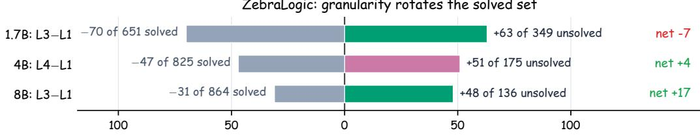  
Puzzles regressed (left) / rescued (right) vs L1  
Figure 8: Whether rotation pays depends on capacity. For each scale, the bars count ZebraLogic puzzles the strongest intermediate condition rescues from L1-unsolved (right, level color) and gives back from L1-solved (left, gray) at step 200. The rescue rate rises with scale (18% to 35% of L1- unsolved puzzles) while regressions shrink, turning a net loss at 1.7B into a net gain of +17 puzzles at 8B.

MT-AIME-7Lang at step 200: reliability and coverage are distinct  
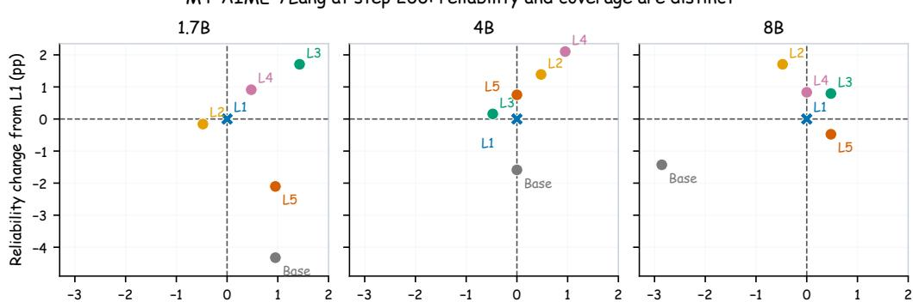  
Coverage / Pass@12 change from L1 (pp)  
Figure 9: MT-AIME-7Lang reliability and coverage at the fixed checkpoint at step 200. Both axes report percentage-point changes from the same-scale L1 condition, so the three panels share a directly comparable coordinate system. The upper-right quadrant improves both per-generation reliability and Pass@12 coverage; points above but left of the origin improve reliability without expanding the set of problems reached by twelve samples.

Table 19: Matched AIME24 behavior at step 200. I∗ is the strongest intermediate condition on the full AIME24 evaluation at step 200 (L3 for 1.7B; L4 for 4B and 8B). Avg@12 uses all 360 samples. Behavior percentages use the judge-stratified subset of 30 problems and up to four valid generations per problem and condition.
<table><tr><td>Model</td><td>Condition</td><td> $\mathbf { A v g } @ 1 2$ </td><td>Complete</td><td>Premature</td><td>Verify</td><td>Backtrack</td><td>Correction</td></tr><tr><td rowspan="3">1.7B</td><td>L1</td><td>53.89</td><td>65.8</td><td>37.5</td><td>69.2</td><td>47.5</td><td>33.3</td></tr><tr><td> ${ \cal I } ^ { * } { = } \mathrm { { \bf { L } } } 3$ </td><td>55.00</td><td>70.0</td><td>31.7</td><td>74.2</td><td>50.0</td><td>40.0</td></tr><tr><td>L5</td><td>53.61</td><td>70.0</td><td>32.5</td><td>69.2</td><td>60.0</td><td>47.5</td></tr><tr><td rowspan="3">4B</td><td>L1</td><td>73.33</td><td>79.2</td><td>19.2</td><td>83.3</td><td>36.7</td><td>28.3</td></tr><tr><td> $I ^ { * } { = } \mathbf { L } 4$ </td><td>76.11</td><td>85.0</td><td>17.5</td><td>85.8</td><td>30.8</td><td>28.3</td></tr><tr><td>L5</td><td>73.89</td><td>80.8</td><td>18.3</td><td>80.8</td><td>41.7</td><td>32.5</td></tr><tr><td rowspan="3">8B</td><td>L1</td><td>78.61</td><td>85.0</td><td>18.3</td><td>87.5</td><td>35.0</td><td>30.0</td></tr><tr><td> $I ^ { * } { = } \mathbf { L } 4$ </td><td>78.33</td><td>86.7</td><td>14.2</td><td>88.3</td><td>30.0</td><td>26.7</td></tr><tr><td>L5</td><td>76.67</td><td>83.2</td><td>16.0</td><td>88.2</td><td>36.1</td><td>35.3</td></tr></table>

Matched AIME24 trajectory behavior   
Complete reasoning   
Premature commitment   
Verification   
Backtracking   
Error correction   
Successful recovery   
Best intermediate − L1   
L5 answer-only − L1   
−10 0 10

Figure 10: Matched AIME24 differences in model-judged behavior rates relative to L1 at step 200, pooled across scales, for the highestscoring intermediate context and for answeronly L5 (95% bootstrap intervals over problems). Pooling buys interval estimates at the cost of resolution by scale; the underlying rates for each scale appear in Table 19.

Behavior-rate difference (pp; 95% CI)

at 8B: four houses with six attribute categories. L3 solves the grid in a 33,912-character trajectory that terminates normally; L1 produces a 67,938-character trajectory, also terminating normally, whose final grid is wrong. Both models make extensive local progress; they differ in whether that progress closes into a unique solution.

Clue 6 states “there are two houses between the photography enthusiast and the person who loves beach vacations,” which in this benchmark’s convention requires positional distance three. The L3 trajectory parses the constraint correctly at first contact (“ifphotography is in house Y, then beach is in Y+3 or Y-3”), which collapses the search space to two placements and lets the remaining deductions close the grid. The L1 trajectory instead adopts a distance-two reading, accepts photography in house 2 with beach in house 4, and ratifies the misreading in its final self-check (“Clue 6: two houses between photography (House 2) and beach (House 4). Yes, Houses 3 between. [. . . ] All clues are satisfied!”).

Because the misread constraint underdetermines the grid, the L1 trajectory reaches its final answer with two cells still unresolved and commits by appeal to uniqueness rather than by deduction:

If I assign House 1: mountain and House 3: cruise, that’s one   
possibility. Alternatively, House 1: cruise and House 3: mountain.   
Both are possible. But since the problem requires a unique solution,   
and I have no more clues, I’ll proceed with one of them. Let me   
choose House 1: mountain and House 3: cruise.

The trajectory verifies each clue against its own misreading, carries the misread constraint through to the end, and then guesses between alternatives it has not resolved. The failing L1 trajectory is twice as long and contains more explicit contradiction and re-derivation episodes (six “contradiction” mentions versus one). In this example, success turns on correct constraint representation and closure, not response length or visible checking activity. The selection rule and the remaining 58 contrast cases are part of the analysis artifact released with the code upon publication.

## E CONTEXT ASSIGNMENT

The 4B prompt-control runs replace every level-specific label, delimiter, and transition (Appendix B.2) with the following text:

Here is additional information for this problem:   
=== Additional Information Begin ===   
{hint}   
=== Additional Information End ===

Use the additional information above to independently solve the   
problem.   
Do not merely copy or cite it. Reason step by step, justify the   
necessary steps, and put the final answer within \boxed{}.

The student prompt is unchanged and never contains the hint. Relative to the primary 4B runs, only the teacher-side wrapper and transition are made common; the underlying L1–L5 contexts, 29,434 training problems, optimizer settings, checkpoint schedule, and evaluators remain fixed.

Table 20: Qwen3-4B shared-bridge and mixture ablations. ID columns report the best Avg@12 up to step 200 (selected step in parentheses); MT-AIME and GPQA use step 200. Mixtures assign one hint per problem.
<table><tr><td>Condition</td><td>AIME24</td><td>AIME25</td><td>HMMT25</td><td>ID mean</td><td>MT-AIME</td><td>GPQA</td></tr><tr><td>Base</td><td>75.00</td><td>64.44</td><td>41.39</td><td>60.28</td><td>65.87</td><td>53.69</td></tr><tr><td>L1: solution</td><td>75.83 (100)</td><td>68.33 (50)</td><td>44.72 (150)</td><td>62.96</td><td>66.75</td><td>55.51</td></tr><tr><td>L2: strategy</td><td>77.22 (150)</td><td>68.89 (150)</td><td>47.50 (150)</td><td>64.54</td><td>69.40</td><td>55.25</td></tr><tr><td>L3: framing</td><td>77.22 (175)</td><td>68.61 (150)</td><td>46.11 (150)</td><td>63.98</td><td>68.57</td><td>55.45</td></tr><tr><td>L4: category</td><td>78.06 (100)</td><td>71.39 (200)</td><td>46.39 (25)</td><td>65.28</td><td>68.57</td><td>55.45</td></tr><tr><td>L5: answer</td><td>76.11 (150)</td><td>70.00 (175)</td><td>45.56 (175)</td><td>63.89</td><td>67.34</td><td>55.61</td></tr><tr><td>Uniform L1-L4</td><td>76.11 (150)</td><td>68.89 (50)</td><td>45.56 (150)</td><td>63.52</td><td>67.74</td><td>55.15</td></tr><tr><td>MidMix L2/L3</td><td>76.67 (50)</td><td>70.83 (125)</td><td>46.39 (175)</td><td>64.63</td><td>69.52</td><td>55.20</td></tr><tr><td>ExtremeMix L1/L4</td><td>75.83 (125)</td><td>69.72 (100)</td><td>46.11 (200)</td><td>63.89</td><td>67.02</td><td>54.75</td></tr></table>

Each mixture contains 29,434 rows with exactly one hint per problem, deterministically under seed 20260720: Uniform uses 7,359 L1, 7,359 L2, 7,358 L3, and 7,358 L4 rows, MidMix 14,717 L2 and 14,717 L3, ExtremeMix 14,717 L1 and 14,717 L4. They test balanced exposure under a fixed example budget, not concatenated contexts. Routed variants reuse these assignments but invoke each row’s source-level wrapper and transition, so an L1 row is formatted exactly as a primary L1 example. Each mixture is trained once at 4B and 8B under the primary configuration for that scale, 200 steps. Routed therefore denotes deterministic prompt construction, not a learned router or test-time selection.

Per-sample policies use Qwen3-4B, the level-specific bridges, and the training configuration of Table 4; only the context assignment varies. The routing signal is the hint advantage $\begin{array} { r l } { \Delta _ { \ell } } & { { } = } \end{array}$ $\overline { { \log q _ { \ell } ( y ) } } - \overline { { \log q _ { \emptyset } ( y ) } }$ , the mean sampled-token log-probability advantage of a hinted teacher over a hint-free teacher baseline $q _ { \emptyset }$ on the same rollout.

We selected it offline on 1,200 training problems with four base-model rollouts each. The absolute student–teacher log-probability gap separates levels weakly (0.306–0.325 nats) and teacher mass on the student’s top-k support saturates above 0.978 even at k=4, whereas $\Delta _ { \ell }$ has a median betweento within-level variance ratio of 4.5 against 1.6 for that gap, and a per-problem argmax stable across rollouts for 78% of problems. Its per-level means (−0.020, −0.027, −0.042, −0.084 for L3, L4, L2, L1) are negative throughout, lowest for L1, and match the fixed-level ordering.

Four policies assign one teacher context per trajectory: (i) learned router: a two-layer classifier over 39 post-rollout features, trained online every ten optimizer steps from oracle labels on the current batch; (ii) likelihood-advantage routing: each step scores all four hinted contexts plus $q _ { \emptyset }$ (five extra no-gradient forwards) and routes by arg maxℓ $\Delta _ { \ell } ;$ (iii) aligned rule: correct rollouts (by a boxedanswer check against the training answer) to L3 and incorrect ones to L4, following the offline difficulty direction; (iv) reversed rule: correct to L3 and incorrect to L1, on the intuition that failure needs the strongest supervision. The rules use no extra teacher forwards.

The shared bridge preserves the separation between L1 and intermediate contexts but moves the nominal leader from L3 to L4: the family-level contrast is stable, the exact L2–L4 ranking is not.

No mixture and no per-sample policy exceeds the best fixed level on the ID peak mean (Tables 20 and 21), including likelihood-advantage routing that computes $\Delta _ { \ell }$ exactly at every step.

On transfer the comparison depends on the reference: MidMix reaches 69.52 on MT-AIME, above the best shared-bridge fixed level (L2, 69.40) but below the best primary-bridge fixed level (L4, 69.56 in Table 9), and no mixture leads on GPQA.

Table 21: Per-sample adaptive granularity selection at 4B (Avg@12). Per-benchmark columns and the ID mean report the best checkpoint up to step 200; ID@200 reports the mean at the fixed endpoint. Fixed L1 and L3 repeat the corresponding Table 1 conditions. No adaptive policy exceeds the best fixed level on the peak mean, and the reversed rule falls below fixed L1.
<table><tr><td>Condition</td><td>AIME24</td><td>AIME25</td><td>HMMT25</td><td>ID mean</td><td>ID@200</td></tr><tr><td>Fixed L1</td><td>76.94</td><td>68.61</td><td>44.72</td><td>63.43</td><td>60.93</td></tr><tr><td>Fixed L3(best fixed)</td><td>77.50</td><td>69.72</td><td>47.22</td><td>64.81</td><td>61.76</td></tr><tr><td>Learned router</td><td>76.67</td><td>71.11</td><td>46.39</td><td>64.72</td><td>62.69</td></tr><tr><td>Likelihood-advantage routing  $( \Delta _ { \ell } )$ </td><td>76.94</td><td>69.44</td><td>46.11</td><td>64.17</td><td>62.87</td></tr><tr><td>Rule: correct→L3, incorrect→L4</td><td>76.11</td><td>70.83</td><td>46.67</td><td>64.54</td><td>62.59</td></tr><tr><td>Rule: correct→L3, incorrect→L1</td><td>75.56</td><td>67.78</td><td>45.83</td><td>63.06</td><td>61.76</td></tr></table>

Several policies improve the fixed endpoint at step 200: five of six routed mixtures exceed the corresponding best fixed-level endpoint by 0.37–0.84 points while one trails by 0.18 (Table 22; Figure 11), and the learned and likelihood-advantage routers exceed fixed L3’s endpoint by 0.93 and 1.11 points while leaving the best observed peak unchanged. Direction matters too: sending incorrect rollouts to L1 rather than L4 lowers the peak mean by 1.48 points and falls below fixed L1. These are single runs, so they suggest reduced sensitivity to the stopping point rather than a higher attainable peak.

(a) Both bridges: L2–L4 beat L1  
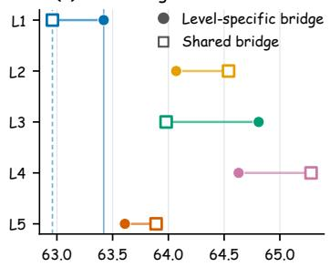

(b) 4B routed mixtures  
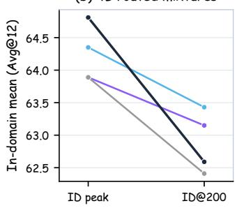

(c) 8B routed mixtures  
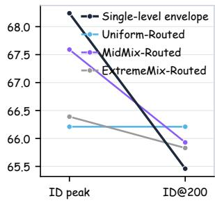  
Figure 11: Controls for prompt wording and mixtures. (a) Shared-bridge replication: 4B in-domain peak mean (Avg@12) for each level under the level-specific and the level-agnostic bridge template. L2–L4 exceed L1 under both templates, so the separation persists under common teacher wording. $\mathbf { ( b , c ) }$ Routed mixtures under the level-specific bridge at 4B and 8B, compared against the singlelevel envelope. Five of the six routed mixtures exceed the best fixed-level endpoint at step 200, while none exceeds the best fixed-level in-domain peak.

4B in-domain peak mean (Avg@12)  
Table 22: Level-conditioned mixture controls. ID peak averages the benchmark-wise best Avg@12 up to step 200; ID@200 averages all three ID benchmarks at the common terminal checkpoint. MT-AIME and GPQA use step 200. The single-level envelope takes the best L1–L5 result independently in each column and may therefore select different levels. Routed rows use the original level-specific bridge associated with each example’s assigned level. Light-blue/bold shading marks the column maximum within scale; light-gray/underline shading marks the second-best.
<table><tr><td>Scale</td><td>Condition</td><td>ID peak</td><td>ID@200</td><td>MT-AIME</td><td>GPQA</td></tr><tr><td rowspan="5">4B</td><td>Base</td><td>60.28</td><td></td><td>65.87</td><td>53.69</td></tr><tr><td>Single-level envelope</td><td>64.81</td><td>62.59</td><td>69.56</td><td>55.96</td></tr><tr><td>Uniform-Routed</td><td>64.35</td><td>63.43</td><td>68.29</td><td>54.85</td></tr><tr><td>MidMix-Routed</td><td>63.89</td><td>63.15</td><td>67.70</td><td>55.30</td></tr><tr><td>ExtremeMix-Routed</td><td>63.89</td><td>62.41</td><td>69.13</td><td>55.05</td></tr><tr><td rowspan="5">8B</td><td>Base</td><td>62.13</td><td></td><td>70.48</td><td>60.05</td></tr><tr><td>Single-level envelope</td><td>68.24</td><td>65.46</td><td>73.61</td><td>62.68</td></tr><tr><td>Uniform-Routed</td><td>66.21</td><td>66.21</td><td>72.22</td><td>61.62</td></tr><tr><td>MidMix-Routed</td><td>67.59</td><td>65.93</td><td>72.90</td><td>61.01</td></tr><tr><td>ExtremeMix-Routed</td><td>66.39</td><td>65.83</td><td>72.26</td><td>61.11</td></tr></table>