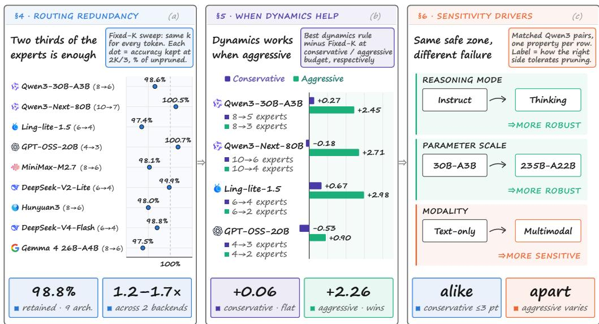
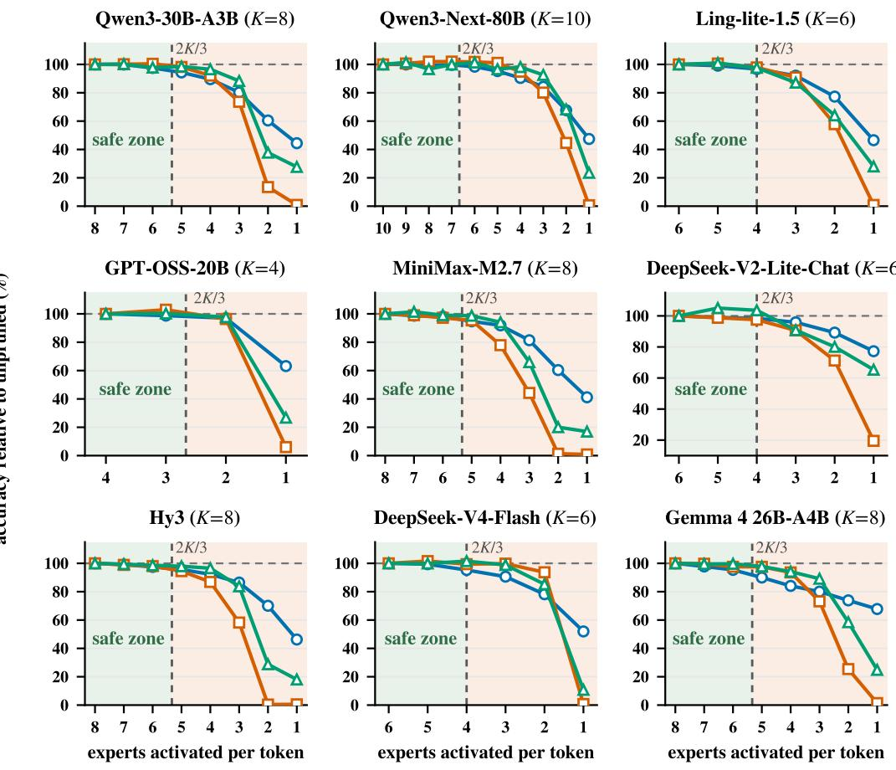
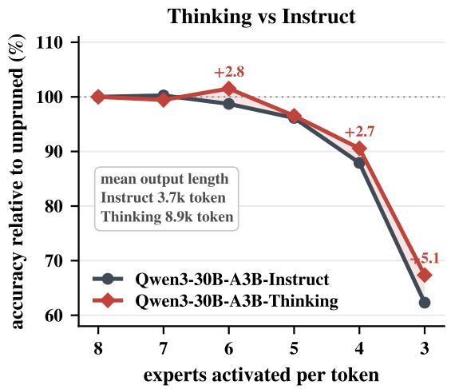
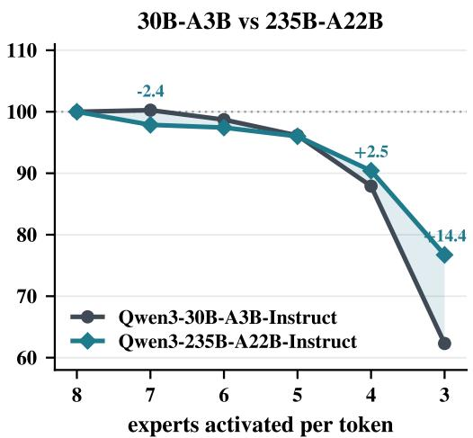
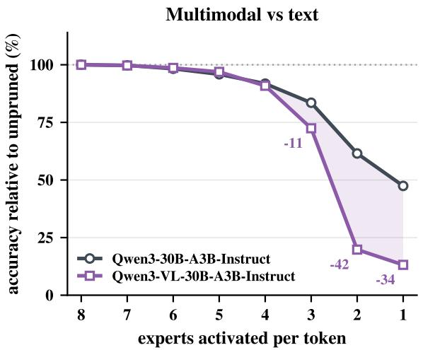
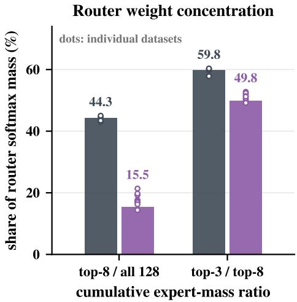

Qwen3-30B-A3B Qwen3-Next-80B Ling-lite-1.5 GPT-OSS-20B MiniMax-M2.7 DeepSeek-V2-Lite Hunyuan3 DeepSeek-V4-Flash Gemma 4 26B-A4B

# YOU ONLY NEED 2/3 OF THE CHOSEN EXPERTS: AN EMPIRICAL STUDY OF DYNAMIC EXPERT PRUNING IN FINE-GRAINED MOE LLMS

Yuanteng Chen1,2,3,\*, Qiwei Lai4,\*, Chen Tianqi1,2,\*, Peisong Wang1,2,†, Yuantian Shao1, Nanxin Zeng2, Zhilei Liu1,2, Chuangyi Li1,2, Jing Liu1,2,3, Jian Cheng1,2,3,†

1 Institute of Automation, Chinese Academy of Sciences

2 School of Artificial Intelligence, University of Chinese Academy of Sciences

3 Zhongguancun Academy 4 University of Science and Technology of China Equal contribution † Corresponding authors

## ABSTRACT

Fine-grained mixture-of-experts (MoE) architectures have become a mainstream design for openweight LLMs, with hundreds of experts and increasingly many selected per token. This shift makes dynamic expert pruning an attractive route to cheaper inference. Yet existing evidence comes largely from coarser architectures and likelihood-scored multiple-choice benchmarks, leaving three central questions insufficiently understood in the fine-grained regime: how redundant per-token expert selection is, how effectively existing pruning methods exploit that redundancy, and what governs a model’s sensitivity to pruning. We fill this gap with a systematic empirical study of twelve finegrained MoE checkpoints spanning nine architecture families, with a core suite of eleven benchmarks covering knowledge QA, mathematics, code generation, and general reasoning. We find that expert selection is far more redundant than the field’s operating points assume: uniformly retaining approximately two thirds of the selected experts preserves 98.8% of unpruned performance on average, requiring only a one-integer change and delivering 1.2 to 1.7× measured speedup across two serving backends. This simple baseline leaves little room for dynamic allocation at conservative budgets: even the best published rules differ from it by less than one percentage point at matched average expert counts. Their value emerges under aggressive pruning, where the best rules recover up to 3.0 points over uniform truncation, with gains concentrated in the generative tasks that suffer the sharpest degradation. This sensitivity to aggressive pruning also depends on the model: larger and thinking models are more resilient, whereas multimodal models are more vulnerable. Together, these findings reveal how much expert computation fine-grained MoE models can dispense with, and establish when dynamic allocation earns its complexity, informing both practical deployment and future pruning methods. Code is available at GitHub.

Figure 1: Overview of our empirical study You only need 2/3 of the chosen experts  

## 1 INTRODUCTION

Scaling a language model has long meant paying for every parameter on every token. Mixtureof-experts (MoE) layers break that coupling, allowing model capacity and per-token computation to scale independently. Fine-grained MoE has since become a mainstream design for open-weight LLMs: expert pools have grown into the hundreds, and the number selected per token has grown with them. Mixtral selects 2 of 8 experts; Qwen3-30B-A3B selects 8 of 128, and Qwen3-Next-80B-A3B selects 10 of 512. This evolution makes routing a richer allocation problem, but also raises a basic question: how much of the computation selected by these routers is actually necessary?

A top-K router assigns the same expert count to every token, whether its scores are sharply peaked or spread across the selected experts. Dynamic expert pruning makes that count adaptive, using the router’s scores to decide how many experts to execute for each token and layer. Fine-grained architectures appear especially suited to this approach: a longer ranked list offers more freedom to prune, and every skipped expert removes an entire feed-forward evaluation. The promise is straightforward: spend expert computation where it matters most. Realising that promise, however, requires knowing how much of the original budget was needed in the first place.

Existing studies have not established that picture for fine-grained MoE. Most pruning rules were developed on coarser architectures and evaluated primarily on likelihood-scored multiple-choice benchmarks. Ranking candidate answers reveals little about whether the same pruning budget preserves a long mathematical derivation or a working program. Methods are also reported in isolation, on different models and at different budgets, so their results do not separate the redundancy already present in the model from the additional benefit of adaptive allocation. What the field lacks is a systematic account of both: how much expert selection can be removed, and when a dynamic rule is needed to remove it. We address this gap through three questions:

Q1. How much redundancy does per-token expert selection carry in fine-grained MoE?

Q2. When does dynamic allocation improve on simply lowering the expert count?

Q3. What governs a model’s sensitivity to expert pruning?

We study twelve checkpoints spanning nine architecture families. Nine models establish the redundancy of expert selection through uniform budget sweeps; four of them also support comparisons of published dynamic rules, and three additional checkpoints probe reasoning mode, parameter scale and modality. Our core evaluation combines four likelihood-scored QA benchmarks with seven generative benchmarks covering mathematics, code and general reasoning. This breadth lets us examine both the cost of pruning and the extent to which that cost depends on what a model is asked to do.

The study yields three central findings, summarised in Figure 1:

• A systematic characterisation of routing redundancy. We show that fine-grained expert selection is far more redundant than the field’s operating points assume. Uniformly retaining approximately two thirds of the selected experts preserves 98.8% of unpruned performance on average across the nine models and three task families. This requires only lowering a single integer: no calibration, no token-specific allocation, and no change to the router’s ranking. Much of the apparent opportunity for dynamic pruning is therefore already captured by the simplest baseline.

• A reassessment of dynamic pruning across budgets. We establish when dynamic allocation earns its complexity beyond simply lowering the expert count. Against this uniform baseline at matched average expert counts, even the best published rules add little under conservative pruning, with margins between −0.53 and +0.67 percentage points. Their advantage emerges once pruning becomes aggressive, where the best rules recover up to 3.0 points and the winning rule changes across models and budgets. The central question for a pruning method is therefore where it improves the quality–compute trade-off, not whether it can match uniform truncation.

• Sensitivity analysis and actionable guidance. We identify how task and model properties shape pruning sensitivity, and translate these findings into guidance for deployment and future method design. Generative tasks deteriorate more sharply than likelihood-scored QA and account for most of the gains from dynamic allocation. Extending this analysis to model properties, we find that larger and thinking models withstand aggressive pruning better, whereas multimodal models are more sensitive; these differences are small at conservative budgets. Together, these results show why choosing a pruning budget requires understanding both the capabilities being evaluated and the model being pruned.

These findings establish a practical starting point for fine-grained MoE inference: capture the abundant redundancy by lowering K uniformly, then use dynamic allocation to push further. For future methods, the opportunity lies in improving that trade-off where uniform truncation begins to fail.

## 2 RELATED WORK

## 2.1 FINE-GRAINED MOE

MoE architectures (Shazeer et al., 2017; Lepikhin et al., 2021; Fedus et al., 2022) have evolved from routing among a few wide experts to combining many narrower ones. Mixtral activates 2 of 8 experts per token, with each expert matching the width of a dense feed-forward network (Jiang et al., 2024). DeepSeekMoE introduced finer expert segmentation together with shared experts, expanding the combinations available to each token (Dai et al., 2024). This design has become mainstream in open-weight LLMs: Qwen3-30B-A3B activates 8 of 128 routed experts (Qwen Team, 2025a) and Qwen3-Next-80B-A3B 10 of 512 (Qwen Team, 2025b), while GLM-5 and MiniMax-M2 each activate 8 of 256 (GLM-5 Team, 2026; MiniMax, 2026). Kimi K3 extends this trend to 16 of 896 routed experts (Kimi Team, 2026).

This evolution changes the scope of expert pruning. On a top-2 router, removing one expert eliminates half of the selected computation; a longer selection offers a much wider range of budgets and ways to allocate them. Router scores have also become more diverse, with softmax gating, sigmoid gating with learned expert biases, and the square root of softplus (DeepSeek-AI, 2026). These changes make fine-grained MoE a compelling setting for revisiting expert redundancy: both the number of selections available to prune and the signals used to prune them have evolved substantially.

## 2.2 DYNAMIC EXPERT PRUNING

Dynamic expert pruning retains the expert pool while reducing the subset executed at inference time. It complements structural pruning, which permanently removes experts from the model altogether (Muzio et al., 2024).

Existing rules draw on different information to make this decision. NAEE compares the second expert’s gate weight with the leading expert’s and skips it when their ratio falls below a calibrated threshold (Lu et al., 2024). DIEP incorporates similarity between expert outputs into this comparison, making retention depend on both router preference and overlap between expert computations (Bai et al., 2025b). Cumulative-probability routing, represented here by DYNROUTE, moves from pairwise comparisons to the selected distribution as a whole: it retains the shortest prefix whose cumulative gate weight reaches a target (Huang et al., 2024). BAN adds a further allocation dimension by combining an offline layer-sensitivity profile with an online token signal, distributing the expert budget across both tokens and depth with fine-grained routers and long-form reasoning in view (Chen et al., 2026). EAC-MoE operates at a different granularity, restricting pruning to prefill and basing its decisions on the traffic received by each expert (Chen et al., 2025).

These approaches provide increasingly rich information for allocating expert computation. Our study examines how much that allocation contributes beyond the redundancy captured by simply lowering K. By comparing representative rules across fine-grained architectures, task families and matched expert budgets, we establish when dynamic allocation improves on uniform truncation and where future methods have the most room to advance.

## 3 EXPERIMENTAL SETUP

Our experiments use the routed expert budget as a common axis for redundancy, dynamic allocation and pruning sensitivity. We combine broad coverage of fine-grained MoE architectures with focused comparisons of model properties, and evaluate knowledge and reasoning across three task families.

## 3.1 ROUTING AND EXPERT BUDGETS

An MoE layer contains E routed expert networks $f _ { 1 } , \ldots , f _ { E }$ and a router. Given a token representation x, the router selects K experts with indices $e _ { 1 } , \ldots , e _ { K }$ , ordered by descending gate weights $w _ { 1 } \ge \cdots \ge w _ { K }$ . The weights are normalised over the selected experts, giving the layer output

$$
\mathrm { M o E } ( { \pmb x } ) = \sum _ { i = 1 } ^ { K } w _ { i } f _ { e _ { i } } ( { \pmb x } ) + \sum _ { j = 1 } ^ { n _ { s } } f _ { j } ^ { \mathrm { s h a r e d } } ( { \pmb x } ) .\tag{1}
$$

Here, $n _ { s }$ denotes the shared experts applied to every token. The native layer executes $K + n _ { s }$ expert networks per token: E buys capacity, K pays for it.

Pruning retains a subset of the selected experts. Let $s ( \pmb { x } , \ell )$ denote their ranks at layer $\ell ,$ with $k ( \pmb { x } , \ell ) \overset {  } { = } | S ( \pmb { x } , \ell ) |$ |. Renormalising the retained weights gives

$$
\widetilde { \mathrm { M o E } } ( { \pmb x } ) = \sum _ { i \in S ( { \pmb x } , \ell ) } \tilde { w } _ { i } f _ { e _ { i } } ( { \pmb x } ) + \sum _ { j = 1 } ^ { n _ { s } } f _ { j } ^ { \mathrm { s h a r e d } } ( { \pmb x } ) , \qquad \tilde { w } _ { i } = \frac { w _ { i } } { \sum _ { j \in S ( { \pmb x } , \ell ) } w _ { j } } .\tag{2}
$$

Uniform truncation, denoted FIXED-K, keeps the top k experts for every token and layer. Dynamic rules determine the retained experts from signals that vary across tokens and layers. Both reduce routed expert execution and its associated data movement, while shared experts continue to process every token. This common formulation lets us distinguish the effect of reducing the budget from the benefit of allocating it dynamically.

## 3.2 MODELS

Our model selection emphasises architectural breadth rather than depth within any single family.   
Table 1 summarises the twelve checkpoints and their roles.

Nine checkpoints span nine architecture families (Ling Team, 2025; OpenAI, 2025; DeepSeek-AI, 2024; Tencent Hy Team, 2026; Gemma Team, 2026), with routed expert pools of 32–512 and native selections of 4–10 experts per token. They include models with and without shared experts, and routers scored by softmax, sigmoid and the square root of softplus. This range lets us examine whether substantial routing redundancy persists across different fine-grained designs. Four core models support both the uniform budget sweeps (§4) and the comparison of dynamic rules (§5); MiniMax-M2.7, DeepSeek-V2-Lite-Chat, Hy3, DeepSeek-V4-Flash and Gemma 4 26B-A4B extend the uniform sweeps to five further architectures.

Three further Qwen3 checkpoints support the analysis of reasoning-mode post-training, parameter scale and modality (Bai et al., 2025a) (§6). All share a routed expert pool of $E = 1 2 8$ and a native selection of $K = 8 .$ , giving these comparisons a common budget axis. Together, the two groups connect routing redundancy to the model properties that shape pruning sensitivity.

## 3.3 TASKS AND EVALUATION

The core evaluation contains eleven benchmarks organised into three task families, covering knowledge mastery, multi-step reasoning and the application of knowledge across domains. Knowledge QA uses likelihood scoring (Gao et al., 2024); the two reasoning families are evaluated through generated answers (Habib et al., 2023).

• Knowledge QA. ARC-Easy, ARC-Challenge (Clark et al., 2018), WinoGrande (Sakaguchi et al., 2019) and OpenBookQA (Mihaylov et al., 2018) assess the model’s command of scientific and commonsense knowledge. We score each candidate answer by its log-likelihood under zero-shot prompting. This family measures how well knowledge survives a smaller budget.

• Mathematical and code reasoning. AIME-24 (Hugging Face H4, 2024), AIME-25 (Math-AI, 2025), MATH-500 (Hendrycks et al., 2021; Lightman et al., 2023), GSM8K (Cobbe et al., 2021) and LiveCodeBench-v6 (Jain et al., 2024) test multi-step reasoning, from grade-school arithmetic to competition mathematics and programming. Successful answers require carrying a derivation through to a solution or producing a working program.

Table 1: Models. Total and active are parameter counts; E is the routed experts per layer, K how many the router natively activates per token, and $n _ { s }$ the shared experts every token passes through.
<table><tr><td>Model</td><td>Total Active</td><td></td><td>E K</td><td></td><td> $\mathbf { \Delta } _ { \mathbf { \lambda } ^ { n _ { s } } }$  Role</td><td></td></tr><tr><td colspan="7">Core models uniform sweeps (§4) and dynamic rules (§5)</td></tr><tr><td>Qwen3-30B-A3B-Instruct (Qwen Team, 2025a)</td><td>30.5B</td><td>3.3B 128</td><td></td><td>8</td><td>0 reference model</td><td></td></tr><tr><td>Qwen3-Next-80B-A3B-Instruct (Qwen Team, 2025b)</td><td>80B</td><td></td><td>3B 512</td><td>10</td><td></td><td>1 widest router</td></tr><tr><td>Ling-lite-1.5-2507 (Ling Team, 2025)</td><td>16.8B</td><td>2.75B</td><td>64</td><td>6</td><td></td><td>2 shared experts</td></tr><tr><td>GPT-OSS-20B (OpenAI, 2025)</td><td>21B</td><td>3.6B</td><td>32</td><td>4</td><td></td><td>0 narrowest router</td></tr><tr><td colspan="7">Additional architectures uniform sweeps only (§4)</td></tr><tr><td>MiniMax-M2.7 (MiniMax, 2026)</td><td>229B</td><td>11B 256</td><td></td><td>8</td><td>0 sigmoid router</td><td rowspan="4"></td></tr><tr><td>DeepSeek-V2-Lite-Chat (DeepSeek-AI, 2024)</td><td>15.7B</td><td>2.4B</td><td>64</td><td>6</td><td>2 earliest fine-grained</td></tr><tr><td>Hy3 (Tencent Hy Team, 2026)</td><td>295B</td><td>21B 192</td><td></td><td>8</td><td>1 largest model</td></tr><tr><td>DeepSeek-V4-Flash-0731 (DeepSeek-AI, 2026)</td><td>165B</td><td>11.5B 256</td><td></td><td>6</td><td>1 sqrt-softplus router</td></tr><tr><td>Gemma 4 26B-A4B (Gemma Team, 2026)</td><td>25.2B</td><td>3.8B 128</td><td></td><td>8</td><td></td><td>1 GELU experts</td></tr><tr><td colspan="7">Single-factor checkpoints one property changed (§6)</td></tr><tr><td>Qwen3-30B-A3B-Thinking (Qwen Team, 2025a)</td><td>30.5B</td><td>3.3B 128</td><td></td><td>8</td><td></td><td>0 reasoning mode</td></tr><tr><td>Qwen3-235B-A22B-Instruct (Qwen Team, 2025a)</td><td>235B</td><td>22B 128</td><td></td><td>8</td><td></td><td></td></tr><tr><td>Qwen3-VL-30B-A3B-Instruct (Bai et al., 2025a)</td><td>30B</td><td></td><td>3B 128</td><td>8</td><td></td><td>0 parameter scale 0 modality</td></tr></table>

• Knowledge and general reasoning. MMLU-Pro (Wang et al., 2024) and GPQA-Diamond (Rein et al., 2023) assess broad subject knowledge and its application to reasoning across domains. They extend the evaluation to graduate-level science and other challenging problems, combining what a model knows with what it can infer.

The modality analysis in §6 adds a nine-dataset multimodal suite and a text QA suite expanded to nine datasets, both listed in Appendix F. Answers range from short factual responses to long derivations and complete programs. This breadth lets us examine whether pruning preserves both knowledge and the ability to use it in a complete solution. We begin in §4 by lowering the expert count uniformly, establishing how much of the native selection these capabilities actually require.

## 4 HOW MUCH ROUTING DOES A FINE-GRAINED MOE ACTUALLY NEED?

How much of a fine-grained router’s selection does inference actually need? We answer this by lowering the expert count uniformly across tokens and layers, without changing the model parameters or the router’s ranking. This one-integer intervention isolates the redundancy already present in the model: whatever quality it preserves at a reduced budget requires no dynamic allocation to recover. It also establishes the baseline that a more elaborate pruning rule must improve upon.

## 4.1 TWO THIRDS OF THE SELECTED EXPERTS ARE ENOUGH

Uniformly retaining ⌈2K/3⌉ experts preserves 98.8% of unpruned performance, averaged over nine models and three task families (Figure 2). Six of the twenty-seven model-family combinations match or exceed their unpruned scores, including mathematical and code reasoning on both Qwen3 models and GPT-OSS-20B. Across architectures with native selections of four to ten experts, substantial savings are therefore available through a one-integer change. Put plainly: throw away roughly the lowest-weight third of the selected experts, and the model barely notices.

The gate-weighted mixture helps explain this tolerance (Equation 2). FIXED-K removes the router’s lowest-weight choices and renormalises the remaining weights, concentrating the mixture on its preferred experts. Removing a third of the selected experts therefore need not remove a third of their contribution. The sweep reveals how little the full selection adds in this regime.

As the budget tightens, this spare capacity runs out. At three of eight experts, Qwen3-30B-A3B retains 73.6% of its mathematical and code reasoning score; at two of six, Ling-lite-1.5 retains

  
Knowledge QA Math & code reasoning Knowledge & general reasoning  
Figure 2: Expert-selection redundancy under uniform truncation. Each panel is one model, with its own native K on the horizontal axis and the budget tightening to the right; curves are the mean over the datasets of a task family, normalised to that family’s score on the unpruned model. The dashed vertical line marks 2K/3.

57.8%. These intermediate budgets already incur substantial losses, even though the models retain much of their ability to solve the tasks.

Further pruning brings a much sharper breakdown, and the same absolute expert count can mean radically different things across models. Keeping two experts leaves Qwen3-30B-A3B at just 13.5% on mathematics and code, but GPT-OSS-20B at 96.3%: two experts are a quarter of the former’s native selection and half of the latter’s. Reducing GPT-OSS-20B to one expert then sends its score to 6.0%. The retained fraction of the native selection is thus essential to interpreting a pruning budget.

## 4.2 KNOWLEDGE SURVIVES WHAT REASONING DOES NOT

Budget tightening also changes which capabilities are most resilient. Knowledge QA declines gradually from the start, while the generative families initially hold steady and then fall sharply. On Qwen3-30B-A3B, knowledge QA retains 97.5% of its unpruned score at six experts, below both generative families. At two experts, that ordering reverses: knowledge QA still retains 60.4%, while mathematical and code reasoning falls to 13.5%. On eight of the nine models, mathematical and code reasoning is the least robust family at the aggressive end.

This reversal separates retaining knowledge from sustaining a complete solution. Knowledge QA tests the model’s command of scientific and commonsense knowledge through short candidate answers. A derivation or program must carry that knowledge through a sequence of dependent steps. Each generated step becomes context for the next, allowing local disruptions to propagate through the rest of the answer. Long-form generation therefore creates repeated opportunities for pruning errors to compound. Evaluating both reveals a distinction that matters for deployment: a model can retain much of what it knows while losing the ability to use it in an extended solution.

Table 2: Measured speedup from uniform truncation at the tested reduced budgets. Throughput ratios are relative to the same unpruned model on each backend, reported separately for prefill and decode. All runs use batch size 4, 1024-token prompts and 256 generated tokens.
<table><tr><td rowspan="2">Model</td><td colspan="3">Operating point</td><td colspan="2">vLLM</td><td colspan="2">HF Transformers</td></tr><tr><td>K</td><td>k</td><td>ρ</td><td>prefill</td><td>decode</td><td>prefll</td><td>decode</td></tr><tr><td>Qwen3-30B-A3B</td><td>8</td><td>5</td><td>0.63</td><td>1.15</td><td>1.18</td><td>1.26</td><td>1.70</td></tr><tr><td>Qwen3-Next-80B</td><td>10</td><td>6</td><td>0.60</td><td>1.25</td><td>1.65</td><td>1.31</td><td>1.73</td></tr><tr><td>Ling-lite-1.5</td><td>6</td><td>4</td><td>0.67</td><td>1.21</td><td>1.38</td><td>1.21</td><td>1.52</td></tr><tr><td>GPT-OSS-20B</td><td>4</td><td>3</td><td>0.75</td><td>1.25</td><td>1.23</td><td>1.24</td><td>1.44</td></tr></table>

## 4.3 FROM ROUTING REDUNDANCY TO INFERENCE SPEED

The redundancy translates into measurable inference gains. Across the four core models at the reduced budgets listed in Table 2, FIXED-K improves decode throughput by 1.18–1.65× on vLLM and 1.44–1.73× on HF Transformers. Prefill also improves, by 1.15–1.25× and 1.21–1.31×, respectively. A simple reduction in the expert count therefore delivers speedups in both a reference implementation and an optimised serving stack.

The backend difference reflects how much expert execution still costs. In our HF Transformers implementation, experts run as separate unfused GEMMs, so truncation removes individual matrix multiplications and their associated overhead. vLLM’s fused MoE kernels already amortise part of that cost, leaving a smaller share for pruning to recover. Even there, Qwen3-Next-80B gains 65% in decode throughput; it achieves the largest decode gain on both backends. The practical return comes from reducing routed expert computation and its associated data movement, with its size determined by the model and serving implementation. These figures belong to FIXED-K, which keeps every token at the same expert count and leaves the expert GEMMs uniformly shaped; a dynamic rule gives each token its own k, which is harder to serve efficiently at a matched average budget.

Takeaway. Fine-grained expert selection is far more redundant than native budgets suggest: a one-integer reduction to roughly two thirds of the selected experts preserves 98.8% ofperformance on average. Its limits emerge under aggressive pruning, where long-form reasoning deteriorates most sharply. This is where dynamic allocation faces its decisive test: can redistributing the same expert budget preserve the reasoning that uniform truncation loses (§5)?

## 5 WHEN DOES DYNAMIC ALLOCATION BEAT UNIFORM PRUNING?

Uniform pruning reveals how much routing is dispensable. Dynamic pruning asks when deciding where to spend the remaining budget starts to matter. We compare four published rules with FIXED-K on four fine-grained MoEs at matched budget tiers. The result is a sharp change in value: adaptation adds almost nothing at conservative budgets, but recovers up to 3.0 points once pruning turns aggressive.

## 5.1 COMPARING ALLOCATION AT MATCHED BUDGETS

We implement four allocation rules in a common router patch on vLLM. Their key difference is the information used to decide which experts to retain. NAEE thresholds an expert’s gate weight relative to the leading expert. DYNROUTE retains the shortest ranked prefix reaching a target cumulative probability mass, renormalised over the native selection. We evaluate DIEP’s similarity-adjusted skipping criterion, generalised to fine-grained routing, together with a variant that damps the simi-

Table 3: Iso-budget comparison, per dataset. Each model is given two budgets, and under each the uniform baseline is paired with the best of the four dynamic rules at that same budget, selected by the mean over all eleven datasets (last column). The superscript is that rule’s margin over the FIXED-K row directly above it. The budget beside a rule is its measured ¯k for generative / QA, since the knob is solved separately per regime (§5.1); rules spending more than 10% over the tier are excluded.
<table><tr><td rowspan="2"></td><td colspan="4">Knowledge QA</td><td colspan="4">Math &amp; code reasoning</td><td colspan="3">Knowledge &amp; general</td><td rowspan="2">Avg</td></tr><tr><td>ARC-c ARC-e WG OBQA MATH AIME24 AIME25 GSM8K LCB MMLU-P GPQA-D</td><td></td><td></td><td></td><td></td><td></td><td></td><td></td><td></td><td></td><td></td></tr><tr><td colspan="10">Qwen3-30B-A3B, natively K=8</td><td></td><td></td><td></td></tr><tr><td>unpruned, k=8</td><td>60.8</td><td></td><td>85.0 73.2 32.0</td><td></td><td>89.6</td><td>74.1</td><td>61.4</td><td>94.4</td><td>41.1</td><td>74.2</td><td>56.6</td><td>67.49</td></tr><tr><td colspan="10">Conservative budget, k ≈ 5 (ρ=0.62)</td><td></td><td></td><td></td></tr><tr><td>FIXED-K, k=5</td><td>54.9</td><td>81.4</td><td>69.5</td><td>31.0</td><td>91.0</td><td>72.1</td><td>55.4</td><td>93.9</td><td>41.7</td><td>73.8</td><td>55.0</td><td>65.43</td></tr><tr><td>DYNROUTE,4.91/5.09</td><td>56.5</td><td>81.4</td><td>71.6</td><td>31.0</td><td>89.6</td><td>73.2</td><td>55.2</td><td>94.2</td><td>41.7</td><td>73.2</td><td>55.1</td><td>65.70+0.27</td></tr><tr><td>Aggressive budget, k ≈3 (ρ=0.38)</td><td>44.6</td><td>71.8</td><td>58.0</td><td>27.0</td><td>80.2</td><td>40.0</td><td>31.1</td><td>88.5</td><td>25.7</td><td>67.0</td><td></td><td></td></tr><tr><td colspan="10">FIXED-K, k=3</td><td></td><td>48.5</td><td>52.95</td></tr><tr><td>BAN,3.14/3.08</td><td>46.1</td><td>72.8</td><td>61.5</td><td>25.8</td><td>88.0</td><td>42.9</td><td>34.0</td><td>90.4</td><td>28.6</td><td>68.8</td><td>50.5</td><td>55.40+2.45</td></tr><tr><td colspan="10">Qwen3-Next-80B, natively K=10</td><td></td><td></td><td></td></tr><tr><td>unpruned, k=10</td><td>63.1</td><td></td><td>86.9 76.2 34.2</td><td></td><td>88.4</td><td>79.7</td><td>67.1</td><td>95.2</td><td>53.1</td><td>82.1</td><td>74.2</td><td>72.75</td></tr><tr><td colspan="10">Conservative budget, k ≈ 6 (ρ=0.60)</td><td></td><td></td><td></td></tr><tr><td>FIXED-K, k=6</td><td>63.1</td><td>85.6</td><td>73.9</td><td>33.6</td><td>90.8</td><td>82.2</td><td>66.6</td><td>95.7</td><td>54.9</td><td>82.1</td><td>76.3</td><td>73.16</td></tr><tr><td>BAN,6.18/6.08</td><td>62.4</td><td>85.7</td><td>74.1</td><td>32.4</td><td>89.2</td><td>82.7</td><td>69.7</td><td>95.3</td><td>54.9</td><td>82.2</td><td>74.2</td><td>72.98-0.18</td></tr><tr><td>Aggressive budget, k ≈ 4 (ρ=0.40)</td><td></td><td></td><td></td><td></td><td></td><td></td><td></td><td></td><td></td><td></td><td></td><td></td></tr><tr><td>FIXED-K, k=4</td><td>55.9</td><td>82.2</td><td>67.2</td><td>30.2</td><td>88.0</td><td>74.8</td><td>58.8</td><td>93.1</td><td>49.1</td><td>80.7</td><td>72.7</td><td>68.43</td></tr><tr><td>BAN, 4.27/4.18</td><td>59.8</td><td>83.5</td><td>67.8</td><td>32.8</td><td>88.6</td><td>79.4</td><td>64.6</td><td>94.4</td><td>57.1</td><td>81.3</td><td>73.2</td><td>71.14+2.71</td></tr><tr><td colspan="10">Ling-lite-1.5, natively K=6</td><td></td><td></td><td></td><td></td></tr><tr><td>unpruned, k=6</td><td>60.2</td><td></td><td>82.3 70.3</td><td>31.6</td><td>89.2</td><td>40.9</td><td>28.1</td><td>91.4</td><td>34.3</td><td>69.4</td><td>56.6</td><td>59.48</td></tr><tr><td>Conservative budget, k ≈ 4 (ρ=0.67)</td><td>58.3</td><td>81.2</td><td></td><td>30.8</td><td></td><td></td><td></td><td></td><td></td><td></td><td></td><td></td></tr><tr><td colspan="10">FIXED-K, k=4</td><td></td><td></td><td>55.6</td><td>57.94</td></tr><tr><td>DYNROUTE, 4.17/4.22</td><td>58.4</td><td>82.0</td><td>66.1 68.4</td><td>30.4</td><td>89.0 90.2</td><td>38.7 40.1</td><td>26.0 26.8</td><td>90.5 90.5</td><td>33.7 32.0</td><td>67.4 67.3</td><td>58.6</td><td>58.61+0.67</td></tr><tr><td>Aggressive budget, k ≈2 (ρ=0.33)</td><td></td><td></td><td></td><td></td><td></td><td></td><td></td><td></td><td></td><td></td><td></td><td></td></tr><tr><td>FIXED-K, k=2</td><td>38.9</td><td>69.6</td><td>57.4</td><td>23.0</td><td>70.4</td><td>5.0</td><td>8.4</td><td>72.4</td><td>8.0</td><td>42.3</td><td>38.4</td><td>39.44</td></tr><tr><td>BAN, 2.05</td><td>42.2</td><td>71.2</td><td>57.1</td><td>24.6</td><td>70.4</td><td>10.2</td><td>11.5</td><td>75.1</td><td>14.9</td><td>47.5</td><td>41.9</td><td>42.42+2.98</td></tr><tr><td colspan="10">GPT-OSS-20B, natively K=4</td><td colspan="3"></td><td></td></tr><tr><td>unpruned, k=4</td><td>45.3</td><td></td><td>77.5 66.9 27.2</td><td></td><td>90.6</td><td>73.7</td><td>71.7</td><td>86.2</td><td>58.3</td><td>74.3</td><td>64.6</td><td>66.94</td></tr><tr><td colspan="10">Conservative budget, k ≈3 (ρ=0.75)</td><td></td><td></td><td></td><td></td></tr><tr><td>FIXED-K, k=3</td><td>44.8</td><td>76.7</td><td>65.4</td><td>27.4</td><td>91.0</td><td>77.4</td><td>74.5</td><td>87.0</td><td>61.7</td><td>73.6</td><td>65.7</td><td>67.75</td></tr><tr><td>DYNROUTE, 2.97</td><td>43.4</td><td>77.8</td><td>65.1</td><td>28.2</td><td>90.0</td><td>77.0</td><td>72.4</td><td>86.6</td><td>62.3</td><td>73.5</td><td>63.1</td><td>67.21-0.53</td></tr><tr><td colspan="10">Aggressive budget, k ≈2 (ρ=0.50)</td><td></td><td></td><td></td><td></td></tr><tr><td>FIXED-K, k=2</td><td>44.3</td><td>75.9</td><td>64.1</td><td>26.0</td><td>86.6</td><td>73.9</td><td>69.4</td><td>88.7</td><td>48.0</td><td>70.5</td><td>65.2</td><td>64.78</td></tr><tr><td>DYNROUTE, 2.07</td><td>42.3</td><td>73.6</td><td>63.1</td><td>26.1</td><td>89.9</td><td>73.7</td><td>71.2</td><td>85.6</td><td>62.5</td><td>70.8</td><td>63.6</td><td>65.69+0.90</td></tr></table>

larity term. BAN combines token-level routing information with a calibrated layer-sensitivity profile.   
The rules and their calibration are detailed in Appendices A and C.

To compare these different signals, we characterise each configuration by its measured average number of active routed experts:

$$
\bar { k } \ = \ \frac { 1 } { | \mathcal T | L } \sum _ { { \bf x } \in \mathcal T } \sum _ { \ell = 1 } ^ { L } k ( { \bf x } , \ell ) , \qquad \rho \ = \ \frac { \bar { k } } { K } .\tag{3}
$$

Here, $\tau$ contains the evaluated tokens and $L$ is the number of MoE layers. We measure $\bar { k }$ inside the router during evaluation. Thresholds are calibrated separately for generation and likelihood-scored QA, since the same setting can spend different budgets in the two regimes. Table 3 reports the realised budgets and pairs FIXED-K with the best eligible rule at each tier, selected by its mean score over all eleven datasets. Configurations exceeding their target budget by more than 10% are excluded from this comparison.

## 5.2 DYNAMIC ALLOCATION PAYS OFF UNDER AGGRESSIVE PRUNING

At conservative budgets, even the best dynamic rule offers little advantage. Across the four models, its margin over FIXED-K ranges from −0.53 to +0.67 points, averaging just +0.06. The redundancy found in §4 therefore leaves little room for a more elaborate allocation: giving every token the same reduced expert count already matches the best tested rules.

Tightening the budget changes this result on every model. At target budgets retaining between one third and one half of the native selection, the best rule gains 2.45 points on Qwen3-30B-A3B, 2.71 on Qwen3-Next-80B, 2.98 on Ling-lite-1.5 and 0.90 on GPT-OSS-20B. The average gain rises to 2.26 points. Allocation now recovers accuracy that uniform truncation loses at the corresponding budget. This is where dynamic pruning earns its place: once the expert budget is tight enough to damage performance, deciding where to spend it becomes consequential.

The budget also changes which allocation rule performs best. On Qwen3-30B-A3B, DYNROUTE has the highest conservative-budget mean, whereas BAN wins under aggressive pruning. BAN achieves the best aggressive-budget result on three of the four models, pointing to calibrated layer sensitivity as a promising signal for allocating scarce expert computation. Together, these results make the budget part of the method comparison: an evaluation at one operating point can miss both the gains from adaptation and the rule that delivers them.

## 5.3 GENERATIVE TASKS REVEAL THE VALUE OF REALLOCATION

The recovery is concentrated on generative tasks. At Qwen3-30B-A3B’s aggressive budget, BAN improves the mean over seven generative datasets by 3.17 points, compared with 1.20 on the four Knowledge QA datasets. Within that mean, MATH-500 rises from 80.2 to 88.0 and Live-CodeBench from 25.7 to 28.6. The same pattern is striking on GPT-OSS-20B: DYNROUTE raises LiveCodeBench from 48.0 to 62.5, a 14.5-point gain within a suite-wide improvement of 0.90 points, since its other datasets already sit close to their unpruned scores at this budget.

These results connect the value of allocation directly to the task split in §4. Generation exposes a sharper loss under uniform pruning and a larger recovery when the remaining budget is distributed dynamically. Knowledge QA alone captures only part of that change. A pruning evaluation dominated by likelihood-scored answers can therefore understate both the cost of reducing the expert count and the benefit of adapting it. Requiring the model to produce a complete derivation, program or answer reveals where the allocation decision has the greatest effect.

Takeaway. Dynamic allocation earns its place under aggressive pruning. At conservative budgets, even the best tested rule remains within a fraction of a point of uniform truncation; at aggressive budgets, the gains reach 3.0 points and concentrate on generative tasks. Budget determines when adaptation pays off, while the evaluation tasks determine how much of that value is visible.

## 6 WHAT GOVERNS A FINE-GRAINED MOE’S SENSITIVITY TO EXPERT PRUNING?

The preceding sections show that both the cost of pruning and the value of dynamic allocation depend on the budget. We now ask which model properties govern the ability to tolerate a tighter budget. We compare reasoning-mode post-training, parameter scale and modality through three pairs drawn from four Qwen3 checkpoints. All have 128 experts and natively select eight; each curve is normalised to its own unpruned performance. Across these comparisons, the main differences emerge under aggressive pruning.

## 6.1 THINKING PRESERVES MORE GENERATIVE CAPABILITY

Reasoning-mode post-training preserves more generative capability as the expert budget tightens. We compare Qwen3-30B-A3B-Thinking with its Instruct counterpart on the four challenging generative datasets in Figure 3: AIME-24, AIME-25, LiveCodeBench and GPQA-Diamond. Their performance retention remains close from eight to five experts. At four experts, the thinking model leads by 2.7 percentage points; at three, its advantage grows to 5.1 points.

The task breakdown in Appendix F locates this advantage in generation, with little difference on Knowledge QA. The thinking model also produces longer outputs, averaging 8.9k tokens per task against Instruct’s 3.7k. It thus combines longer generation with better performance retention under aggressive pruning. The benefit of reasoning-mode post-training becomes visible precisely on the capabilities that §4 found most vulnerable to reducing the expert count.

  
Figure 3: Two matched pairs under uniform truncation, each curve normalised to that model’s own unpruned score. Curves are the mean over the four hardest generative datasets, AIME-24, AIME-25, LiveCodeBench and GPQA-Diamond; annotations give the gap in points where it exceeds two. The axis stops at three experts because below it both members of each pair have collapsed on these tasks, so the remaining differences are not interpretable.

## 6.2 SCALE MATTERS MOST UNDER AGGRESSIVE PRUNING

Parameter scale produces an even larger separation as pruning deepens. On the same four generative datasets, Qwen3-235B-A22B-Instruct holds no advantage over Qwen3-30B-A3B-Instruct from seven to five experts. At four experts, the larger model moves 2.5 points ahead. At three, it retains 76.7% of its unpruned performance while the smaller model retains 62.3%, opening a 14.4-point gap.

As with reasoning mode, the broader task breakdown places the advantage in mathematical, code and general reasoning, with no corresponding gain on Knowledge QA. The extra scale preserves substantially more generative performance once the budget becomes restrictive. A comparison confined to conservative pruning would reveal little of this difference: the benefit emerges when retaining the same number of experts leaves the smaller model substantially more impaired.

## 6.3 MULTIMODAL MODELS ARE MORE SENSITIVE TO AGGRESSIVE PRUNING

The multimodal comparison reveals a sharper decline at tight budgets. Figure 4 compares Qwen3- VL-30B-A3B-Instruct with Qwen3-30B-A3B-Instruct on nine datasets each: multimodal tasks for the former and likelihood-scored QA for the latter. Their normalised curves remain within one percentage point from eight to four experts. At three experts, the multimodal model falls 11 points behind; at two, the gap widens to 42 points. The similar response to conservative pruning gives way to sharply different losses as the budget tightens.

Routing statistics reveal a corresponding difference in weight concentration. We record each router’s full 128-way softmax at every one of the 48 MoE layers, before top-K selection, while the two models run the same suites as above, and aggregate the distributions over evaluated tokens. Both models are measured on prompt tokens, the comparable stage across the pair. Within the selected eight experts, the leading three hold 49.8% of the multimodal model’s routed weight, compared with 59.8% for the text model. Truncating to three therefore discards 50.2% and 40.2% of the selected weight, respectively, before renormalisation. The same retained expert count removes a larger share of routed weight in the multimodal model.

  
Figure 4: Modality, measured on the scores and on the router. Left: uniform truncation on nine datasets a side, the multimodal suite against nine likelihood-scored QA datasets on the text model, each curve normalised to its own unpruned score; annotations give the gap in points. Right: the router’s full 128-way softmax, recorded before top-k selection over all 48 MoE layers and weighted by token count. Dots are the individual datasets.

This difference extends to the full routing distribution: the selected eight experts hold 15.5% of the 128-way softmax mass in the multimodal model and 44.3% in the text model. Per-dataset values do not overlap on either concentration measure, and the direction is consistent across all 48 MoE layers. The flatter routing distribution helps explain why aggressive truncation is more disruptive in the multimodal evaluation.

Takeaway. Model properties matter most once pruning becomes aggressive. Reasoning-mode post-training and parameter scale preserve more generative capability, while the multimodal model loses performance more sharply and distributes routing weight more broadly. The common tolerance at conservative budgets gives way to distinct performance trajectories, making model properties central to deciding how far pruning can go.

## 7 IMPLICATIONS FOR DYNAMIC EXPERT PRUNING

Our results distinguish two sources of gains from expert pruning: redundancy that uniform truncation can remove, and additional capability that dynamic allocation preserves as budgets tighten. This distinction connects the practical choice of a pruning budget to the evaluation and design of allocation rules. Uniform pruning establishes how far expert computation can be reduced; its remaining performance losses reveal where better allocation has something to recover. Building on these findings, we organise our recommendations into three steps: establishing an operating budget with uniform truncation, measuring what a dynamic rule adds on top of it, and designing allocation for the tight budgets where that addition matters.

## 7.1 ESTABLISHING THE BUDGET WITH UNIFORM PRUNING

The broad tolerance observed in §4 makes uniform truncation the natural starting point for budget selection. Retaining ⌈2K/3⌉ experts provides a useful initial operating point across the architectures studied, with the reduction controlled by a single routing parameter. Progressively lowering that count then reveals how much further computation can be reduced and where the model begins to lose capability. The resulting curve establishes what is already achievable before introducing an adaptive allocation rule.

Where to stop on this curve depends on the capabilities the application needs to retain. For workloads involving derivations, programs or open-ended answers, the sweep should track complete generations, which expose the sharper pruning losses seen in §4 and §5. The model comparisons in §6 help interpret how far the curve can extend: larger and thinking checkpoints retain more generative capability under aggressive pruning, while the multimodal checkpoint loses performance more sharply. A budget that preserves one checkpoint’s performance can therefore sit well beyond another’s useful operating range.

## 7.2 EVALUATING THE ADDED VALUE OF DYNAMIC ALLOCATION

Once a target budget pushes uniform truncation into noticeable degradation, the relevant gain is the capability recovered by reallocating that budget. §5 places the clearest gains under aggressive pruning and on generative tasks. Measuring the margin over uniform truncation across budget levels reveals where adaptation becomes useful and how the choice of rule changes. BAN and DYNROUTE provide useful starting candidates, supplying most of the winning dynamic configurations in Table 3.

The common basis for this comparison is the realised average number of activated experts, measured over evaluation tokens and MoE layers. A threshold acquires its budget meaning through the routing distributions it acts on, so that meaning can change with the model and workload. Remeasuring expert use when transferring a setting, and recalibrating when it drifts from the target, keeps the comparison focused on how effectively each rule allocates the available computation.

## 7.3 DESIGNING ALLOCATION FOR TIGHT BUDGETS

The aggressive-budget results also point to layer sensitivity as a promising complement to tokenlevel routing signals: the strongest results under aggressive pruning come from distributing the budget across depth as well as across tokens. The modality comparison in §6 further shows why routing signals need to be interpreted in the context of the target model. Retaining the same number of experts preserves different shares of routing weight in the text and multimodal checkpoints. Together, these observations motivate allocation rules that combine a token’s routing distribution with the layer’s measured response to expert removal.

How that signal is parameterised then determines whether a calibrated setting survives a change of architecture. Expressed as a ratio to the top-1 gate weight, a threshold inherits a bar that moves with the width of the router: the leading expert holds most of the distribution on a top-2 router and a small share of it on a top-10 router, so the same coefficient defines a different rule on each (Appendix C). Cumulative retained mass and per-rank statistics keep their meaning across router widths, allowing a setting calibrated on one fine-grained model to carry to another without being re-derived.

As for the inference gains actually realised, the practical value of these quality improvements depends on the cost of executing the allocation that produces them. Efficient kernel support is needed to execute the selected token–expert assignments while keeping allocation and execution overhead low. This allows the reduction in expert computation from native routing to translate into practical inference savings. Evaluating latency or throughput alongside retained quality then completes the comparison with uniform truncation, showing what the more effective allocation delivers at its actual serving cost.

## 8 CONCLUSION

Our study of dynamic expert pruning in fine-grained MoEs, spanning twelve checkpoints across nine architecture families, shows that routing is far more redundant than the field’s operating points assume. In the nine-model uniform sweep, retaining ⌈2K/3⌉ of the natively selected experts preserves 98.8% of baseline performance on average. Uniform pruning also achieves 1.2–1.7× decoding throughput across the tested serving configurations. A substantial reduction in expert computation is therefore available by changing a single routing parameter.

The value of dynamic allocation emerges when pruning becomes aggressive. At conservative budgets, the best tested rules offer only marginal gains over uniform truncation; at aggressive budgets, they recover up to 3.0 points, with the winning rule changing across models and budgets. Generative tasks reveal this transition most clearly: they suffer sharper losses from expert removal and benefit more from reallocating the remaining computation.

The same shift towards aggressive pruning also makes model properties consequential: larger and thinking models retain more capability, whereas the multimodal checkpoint is more sensitive. These findings establish uniform truncation as the essential reference for dynamic expert pruning. The clearest opportunity for new allocation methods lies in preserving the generative capabilities that uniform truncation begins to lose.

## REFERENCES

Shuai Bai, Yuxuan Cai, Ruizhe Chen, Keqin Chen, Xionghui Chen, Zesen Cheng, Lianghao Deng, Wei Ding, Chang Gao, Chunjiang Ge, Wenbin Ge, Zhifang Guo, Qidong Huang, Jie Huang, Fei Huang, Binyuan Hui, Shutong Jiang, Zhaohai Li, Mingsheng Li, Mei Li, Kaixin Li, Zicheng Lin, Junyang Lin, Xuejing Liu, Jiawei Liu, Chenglong Liu, Yang Liu, Dayiheng Liu, Shixuan Liu, Dunjie Lu, Ruilin Luo, Chenxu Lv, Rui Men, Lingchen Meng, Xuancheng Ren, Xingzhang Ren, Sibo Song, Yuchong Sun, Jun Tang, Jianhong Tu, Jianqiang Wan, Peng Wang, Pengfei Wang, Qiuyue Wang, Yuxuan Wang, Tianbao Xie, Yiheng Xu, Haiyang Xu, Jin Xu, Zhibo Yang, Mingkun Yang, Jianxin Yang, An Yang, Bowen Yu, Fei Zhang, Hang Zhang, Xi Zhang, Bo Zheng, Humen Zhong, Jingren Zhou, Fan Zhou, Jing Zhou, Yuanzhi Zhu, and Ke Zhu. Qwen3-VL technical report. arXiv preprint arXiv:2511.21631, 2025a.

Sikai Bai, Haoxi Li, Jie Zhang, Zicong Hong, and Song Guo. DiEP: Adaptive mixture-ofexperts compression through differentiable expert pruning. In Advances in Neural Information Processing Systems, volume 38, pp. 56090–56115. Curran Associates, Inc., 2025b. doi: 10.52202/085713-1878.

Yonatan Bisk, Rowan Zellers, Ronan Le Bras, Jianfeng Gao, and Yejin Choi. PIQA: Reasoning about physical commonsense in natural language. arXiv preprint arXiv:1911.11641, 2019.

Lin Chen, Jinsong Li, Xiaoyi Dong, Pan Zhang, Yuhang Zang, Zehui Chen, Haodong Duan, Jiaqi Wang, Yu Qiao, Dahua Lin, and Feng Zhao. Are we on the right way for evaluating large visionlanguage models? arXiv preprint arXiv:2403.20330, 2024.

Yuanteng Chen, Yuantian Shao, Peisong Wang, and Jian Cheng. EAC-MoE: Expert-selection aware compressor for mixture-of-experts large language models. In Proceedings of the 63rd Annual Meeting of the Association for Computational Linguistics (Volume 1: Long Papers), pp. 12942– 12963, Vienna, Austria, July 2025. Association for Computational Linguistics. doi: 10.18653/v1/ 2025.acl-long.633.

Yuanteng Chen, Peisong Wang, Yuantian Shao, Nanxin Zeng, Chang Xu, and Jian Cheng. Ban&Pick: Enhancing performance and efficiency of MoE-LLMs via smarter routing. In Proceedings of the 2026 Conference on Empirical Methods in Natural Language Processing, 2026. URL https://arxiv.org/abs/2509.06346. To appear. arXiv:2509.06346.

Christopher Clark, Kenton Lee, Ming-Wei Chang, Tom Kwiatkowski, Michael Collins, and Kristina Toutanova. BoolQ: Exploring the surprising difficulty of natural yes/no questions. arXiv preprint arXiv:1905.10044, 2019.

Peter Clark, Isaac Cowhey, Oren Etzioni, Tushar Khot, Ashish Sabharwal, Carissa Schoenick, and Oyvind Tafjord. Think you have solved question answering? try ARC, the AI2 reasoning challenge. arXiv preprint arXiv:1803.05457, 2018.

Karl Cobbe, Vineet Kosaraju, Mohammad Bavarian, Mark Chen, Heewoo Jun, Lukasz Kaiser, Matthias Plappert, Jerry Tworek, Jacob Hilton, Reiichiro Nakano, Christopher Hesse, and John Schulman. Training verifiers to solve math word problems. arXiv preprint arXiv:2110.14168, 2021.

Damai Dai, Chengqi Deng, Chenggang Zhao, R.X. Xu, Huazuo Gao, Deli Chen, Jiashi Li, Wangding Zeng, Xingkai Yu, Y. Wu, Zhenda Xie, Y.K. Li, Panpan Huang, Fuli Luo, Chong Ruan, Zhifang Sui, and Wenfeng Liang. DeepSeekMoE: Towards ultimate expert specialization in mixture-ofexperts language models. In Proceedings of the 62nd Annual Meeting of the Association for Computational Linguistics (Volume 1: Long Papers), pp. 1280–1297, Bangkok, Thailand, August 2024. Association for Computational Linguistics. doi: 10.18653/v1/2024.acl-long.70.

DeepSeek-AI. DeepSeek-V2: A strong, economical, and efficient mixture-of-experts language model. arXiv preprint arXiv:2405.04434, 2024.

DeepSeek-AI. DeepSeek-V4: Towards highly efficient million-token context intelligence. arXiv preprint arXiv:2606.19348, 2026.

William Fedus, Barret Zoph, and Noam Shazeer. Switch transformers: Scaling to trillion parameter models with simple and efficient sparsity. Journal of Machine Learning Research, 23(120):1–39, 2022. URL https://www.jmlr.org/papers/v23/21-0998.html.

Leo Gao, Jonathan Tow, Baber Abbasi, Stella Biderman, Sid Black, Anthony DiPofi, Charles Foster, Laurence Golding, Jeffrey Hsu, Alain Le Noac’h, Haonan Li, Kyle McDonell, Niklas Muennighoff, Chris Ociepa, Jason Phang, Laria Reynolds, Hailey Schoelkopf, Aviya Skowron, Lintang Sutawika, Eric Tang, Anish Thite, Ben Wang, Kevin Wang, and Andy Zou. The language model evaluation harness. https://doi.org/10.5281/zenodo.12608602, July 2024.

Gemma Team. Gemma 4 technical report. arXiv preprint arXiv:2607.02770, 2026.

GLM-5 Team. GLM-5: from vibe coding to agentic engineering. arXiv preprint arXiv:2602.15763, 2026.

Danna Gurari, Qing Li, Abigale J. Stangl, Anhong Guo, Chi Lin, Kristen Grauman, Jiebo Luo, and Jeffrey P. Bigham. VizWiz grand challenge: Answering visual questions from blind people. arXiv preprint arXiv:1802.08218, 2018.

Nathan Habib, Clementine Fourrier, Hynek Kydl´ ´ıcek, Thomas Wolf, and Lewis Tunstall. LightEval:ˇ A lightweight framework for LLM evaluation. https://github.com/huggingface/ lighteval, 2023.

Dan Hendrycks, Collin Burns, Steven Basart, Andy Zou, Mantas Mazeika, Dawn Song, and Jacob Steinhardt. Measuring massive multitask language understanding. arXiv preprint arXiv:2009.03300, 2020.

Dan Hendrycks, Collin Burns, Saurav Kadavath, Akul Arora, Steven Basart, Eric Tang, Dawn Song, and Jacob Steinhardt. Measuring mathematical problem solving with the MATH dataset. arXiv preprint arXiv:2103.03874, 2021.

Quzhe Huang, Zhenwei An, Nan Zhuang, Mingxu Tao, Chen Zhang, Yang Jin, Kun Xu, Kun Xu, Liwei Chen, Songfang Huang, and Yansong Feng. Harder task needs more experts: Dynamic routing in MoE models. In Proceedings ofthe 62nd Annual Meeting ofthe Associationfor Computational Linguistics (Volume 1: Long Papers), pp. 12883–12895, Bangkok, Thailand, August 2024. Association for Computational Linguistics. doi: 10.18653/v1/2024.acl-long.696.

Drew A. Hudson and Christopher D. Manning. GQA: A new dataset for real-world visual reasoning and compositional question answering. arXiv preprint arXiv:1902.09506, 2019.

Hugging Face H4. AIME 2024. https://huggingface.co/datasets/ HuggingFaceH4/aime\_2024, 2024.

Naman Jain, King Han, Alex Gu, Wen-Ding Li, Fanjia Yan, Tianjun Zhang, Sida Wang, Armando Solar-Lezama, Koushik Sen, and Ion Stoica. LiveCodeBench: Holistic and contamination free evaluation of large language models for code. arXiv preprint arXiv:2403.07974, 2024.

Albert Q. Jiang, Alexandre Sablayrolles, Antoine Roux, Arthur Mensch, Blanche Savary, Chris Bamford, Devendra Singh Chaplot, Diego de las Casas, Emma Bou Hanna, Florian Bressand, Gianna Lengyel, Guillaume Bour, Guillaume Lample, Lelio Renard Lavaud, Lucile Saulnier, ´ Marie-Anne Lachaux, Pierre Stock, Sandeep Subramanian, Sophia Yang, Szymon Antoniak, Teven Le Scao, Theophile Gervet, Thibaut Lavril, Thomas Wang, Timoth´ ee Lacroix, and William´ El Sayed. Mixtral of experts. arXiv preprint arXiv:2401.04088, 2024.

Kimi Team. Kimi K3: Open frontier intelligence. arXiv preprint arXiv:2607.24653, 2026.

Woosuk Kwon, Zhuohan Li, Siyuan Zhuang, Ying Sheng, Lianmin Zheng, Cody Hao Yu, Joseph E. Gonzalez, Hao Zhang, and Ion Stoica. Efficient memory management for large language model serving with PagedAttention. arXiv preprint arXiv:2309.06180, 2023.

Dmitry Lepikhin, HyoukJoong Lee, Yuanzhong Xu, Dehao Chen, Orhan Firat, Yanping Huang, Maxim Krikun, Noam Shazeer, and Zhifeng Chen. GShard: Scaling giant models with conditional computation and automatic sharding. In International Conference on Learning Representations, 2021.

Hunter Lightman, Vineet Kosaraju, Yura Burda, Harri Edwards, Bowen Baker, Teddy Lee, Jan Leike, John Schulman, Ilya Sutskever, and Karl Cobbe. Let’s verify step by step. arXiv preprint arXiv:2305.20050, 2023.

Ling Team. Ling-lite-1.5-2507. https://huggingface.co/inclusionAI/ Ling-lite-1.5-2507, 2025.

Yuan Liu, Haodong Duan, Yuanhan Zhang, Bo Li, Songyang Zhang, Wangbo Zhao, Yike Yuan, Jiaqi Wang, Conghui He, Ziwei Liu, Kai Chen, and Dahua Lin. MMBench: Is your multi-modal model an all-around player? arXiv preprint arXiv:2307.06281, 2023.

Xudong Lu, Qi Liu, Yuhui Xu, Aojun Zhou, Siyuan Huang, Bo Zhang, Junchi Yan, and Hongsheng Li. Not all experts are equal: Efficient expert pruning and skipping for mixture-of-experts large language models. In Proceedings of the 62nd Annual Meeting of the Association for Computational Linguistics (Volume 1: Long Papers), pp. 6159–6172, Bangkok, Thailand, August 2024. Association for Computational Linguistics. doi: 10.18653/v1/2024.acl-long.334.

Ahmed Masry, Do Xuan Long, Jia Qing Tan, Shafiq Joty, and Enamul Hoque. ChartQA: A benchmark for question answering about charts with visual and logical reasoning. arXiv preprint arXiv:2203.10244, 2022.

Math-AI. AIME 2025. https://huggingface.co/datasets/math-ai/aime25, 2025.

Minesh Mathew, Viraj Bagal, Ruben P\` erez Tito, Dimosthenis Karatzas, Ernest Valveny, and C. V´ Jawahar. InfographicVQA. arXiv preprint arXiv:2104.12756, 2021.

Todor Mihaylov, Peter Clark, Tushar Khot, and Ashish Sabharwal. Can a suit of armor conduct electricity? a new dataset for open book question answering. arXiv preprint arXiv:1809.02789, 2018.

MiniMax. The MiniMax-M2 series: Mini activations unleashing max real-world intelligence. arXiv preprint arXiv:2605.26494, 2026.

Alexandre Muzio, Alex Sun, and Churan He. SEER-MoE: Sparse expert efficiency through regularization for mixture-of-experts. arXiv preprint arXiv:2404.05089, 2024.

OpenAI. gpt-oss-120b & gpt-oss-20b model card. arXiv preprint arXiv:2508.10925, 2025.

Qwen Team. Qwen3 technical report. arXiv preprint arXiv:2505.09388, 2025a.

Qwen Team. Qwen3-Next-80B-A3B-Instruct. https://huggingface.co/Qwen/ Qwen3-Next-80B-A3B-Instruct, 2025b.

David Rein, Betty Li Hou, Asa Cooper Stickland, Jackson Petty, Richard Yuanzhe Pang, Julien Dirani, Julian Michael, and Samuel R. Bowman. GPQA: A graduate-level google-proof q&a benchmark. arXiv preprint arXiv:2311.12022, 2023.

Keisuke Sakaguchi, Ronan Le Bras, Chandra Bhagavatula, and Yejin Choi. WinoGrande: An ad versarial winograd schema challenge at scale. arXiv preprint arXiv:1907.10641, 2019.

Maarten Sap, Hannah Rashkin, Derek Chen, Ronan LeBras, and Yejin Choi. SocialIQA: Commonsense reasoning about social interactions. arXiv preprint arXiv:1904.09728, 2019.

Noam Shazeer, Azalia Mirhoseini, Krzysztof Maziarz, Andy Davis, Quoc Le, Geoffrey Hinton, and Jeff Dean. Outrageously large neural networks: The sparsely-gated mixture-of-experts layer. In International Conference on Learning Representations, 2017.

Amanpreet Singh, Vivek Natarajan, Meet Shah, Yu Jiang, Xinlei Chen, Dhruv Batra, Devi Parikh, and Marcus Rohrbach. Towards VQA models that can read. arXiv preprint arXiv:1904.08920, 2019.

Tencent Hy Team. Hy3. https://huggingface.co/tencent/Hy3, 2026.

Yubo Wang, Xueguang Ma, Ge Zhang, Yuansheng Ni, Abhranil Chandra, Shiguang Guo, Weiming Ren, Aaran Arulraj, Xuan He, Ziyan Jiang, Tianle Li, Max Ku, Kai Wang, Alex Zhuang, Rongqi Fan, Xiang Yue, and Wenhu Chen. MMLU-Pro: A more robust and challenging multi-task lan guage understanding benchmark. arXiv preprint arXiv:2406.01574, 2024.

Xiang Yue, Yuansheng Ni, Kai Zhang, Tianyu Zheng, Ruoqi Liu, Ge Zhang, Samuel Stevens, Dongfu Jiang, Weiming Ren, Yuxuan Sun, Cong Wei, Botao Yu, Ruibin Yuan, Renliang Sun, Ming Yin, Boyuan Zheng, Zhenzhu Yang, Yibo Liu, Wenhao Huang, Huan Sun, Yu Su, and Wenhu Chen. MMMU: A massive multi-discipline multimodal understanding and reasoning benchmark for expert AGI. arXiv preprint arXiv:2311.16502, 2023.

Rowan Zellers, Ari Holtzman, Yonatan Bisk, Ali Farhadi, and Yejin Choi. HellaSwag: Can a machine really finish your sentence? arXiv preprint arXiv:1905.07830, 2019.

Kaichen Zhang, Bo Li, Peiyuan Zhang, Fanyi Pu, Joshua Adrian Cahyono, Kairui Hu, Shuai Liu, Yuanhan Zhang, Jingkang Yang, Chunyuan Li, and Ziwei Liu. LMMs-Eval: Reality check on the evaluation of large multimodal models. arXiv preprint arXiv:2407.12772, 2024a.

Yi-Fan Zhang, Huanyu Zhang, Haochen Tian, Chaoyou Fu, Shuangqing Zhang, Junfei Wu, Feng Li, Kun Wang, Qingsong Wen, Zhang Zhang, Liang Wang, Rong Jin, and Tieniu Tan. MME-RealWorld: Could your multimodal LLM challenge high-resolution real-world scenarios that are difficult for humans? arXiv preprint arXiv:2408.13257, 2024b.

## A IMPLEMENTATION

§5 compares four published dynamic expert pruning rules. We reimplemented all four on vLLM (Kwon et al., 2023) and extended them to the fine-grained routers of Table 1, and this appendix documents that work: §A.1 where the rules are applied, §A.2 what each of them computes, §A.3 the offline statistics two of them need, and §A.4 how a knob is turned into the target budget that makes the comparison of §5 an iso-budget one.

## A.1 WHERE THE RULES ARE APPLIED

All four rules are implemented against vLLM. This is a requirement rather than a preference: over half of our suite is long-form generation, and much of it at budgets where a pruned model rambles towards the token limit, so the sweeps reported here are only affordable on a serving stack with paged attention and fused expert kernels. It also means the rules are measured in the setting they would actually be deployed in, which is what makes the throughput discussion of §4.3 meaningful.

The intervention itself is small and sits in one place, at the point where the router’s scores have been computed and the top K experts are about to be handed to the expert kernels. Each rule receives that slice, in descending weight order, and returns how far down it to read; the retained gate weight are then renormalised exactly as in Equation 2. Because the hook is at the selection step rather than inside any model definition, one implementation covers all four architectures. Shared experts are outside it by construction: every token passes through them (Equation 1), no rule can drop them, and they are excluded from the budgets we report, so a ¯k in this paper is always a count of routed experts. Ling-lite-1.5 has two of them, so a ¯k of 2 there costs four expert evaluations and is not comparable with a ¯k of 2 on a model without shared experts. The code is released.

## A.2 THE FOUR RULES AS IMPLEMENTED

Throughout, $w _ { 1 } \ge w _ { 2 } \ge \dots \ge w _ { K }$ are the softmax gate weights of the natively selected experts $e _ { 1 } , \ldots , e _ { K }$ at layer ℓ for one token, and $k _ { \mathrm { m i n } }$ is a floor on the number of experts kept. The floor is not shared across rules: it is part of the published form of some of them and absent from others, and

Table 4: The rules compared in §5, all re-implemented in the one router patch of §A.1. Every rule keeps all E experts resident and changes only how many of the K selected ones are evaluated per token. “Layer budget” is whether the rule can spend differently at different depths; “calib.” whether it needs the offline statistics of §A.3; the last two columns give the floor on kept experts and the single knob the budget solver of §A.4 moves.
<table><tr><td>Rule</td><td>Retention decision conditioned on</td><td>layer budget</td><td>needs calib.</td><td> $k _ { \mathrm { m i n } }$ </td><td>knob</td></tr><tr><td>FIXED-K (baseline)</td><td>a constant k for all tokens</td><td>x</td><td>x</td><td></td><td>k</td></tr><tr><td>NAEE</td><td>gate weight relative to the top-1 expert</td><td>x</td><td>x</td><td>2</td><td>β</td></tr><tr><td>DYNROUTE</td><td>cumulative retained probability mass</td><td>x</td><td>x</td><td></td><td>p</td></tr><tr><td>DIEP</td><td>top-1 ratio scaled by expert similarity</td><td>x</td><td>√</td><td>2</td><td>β</td></tr><tr><td>BAN</td><td>layer sensitivity + token sensitivity</td><td>√</td><td>√</td><td>3</td><td>λ</td></tr></table>

we kept each rule’s own convention rather than imposing one, since changing it changes the rule.   
NAEE and DIEP use $k _ { \mathrm { m i n } } { = } 2$ , BAN uses $k _ { \mathrm { m i n } } { = } 3 .$ , and DYNROUTE has no floor.

NAEE. A flat threshold relative to the leading expert, applied as a prefix. Rank i is kept if it is below the floor, or if no rank from the floor up to and including i has fallen below the threshold:

$$
\ker i \ \Longleftrightarrow \ i \Longleftrightarrow \ \partial _ { \varphi } \quad \mathrm { o r } \quad w _ { j } \geq \beta w _ { 1 } \ \mathrm { f o r } \ a l l \ j \ \mathrm { w i t h } \ k _ { \mathrm { m i n } } \leq j \leq i .\tag{4}
$$

Equivalently, reading down the ranking, retention stops at the first expert whose weight is less than a $\beta$ fraction of the top-1 weight. The rule has one knob, β, and needs no calibration.

DYNROUTE. A threshold on cumulative retained mass rather than on any single pair of experts. The kept set is the shortest prefix of the ranking whose weights reach a target p:

$$
\begin{array} { r } { k ( \pmb { x } , \ell ) = \operatorname* { m i n } \Big \{ i : \sum _ { j \leq i } \hat { w } _ { j } \geq p \Big \} , } \end{array}\tag{5}
$$

falling back to K if the target is never reached. Two readings of wˆ are implemented: the softmax weights as they are, which is the published form, and the same weights renormalised over the K retained ranks first, which makes p a fraction of the mass the router actually routes rather than of the whole distribution. The configurations reported in Table 3 use the renormalised reading, since it is the one whose $p$ keeps its meaning across models with different K. The rule has one knob and needs no calibration.

DIEP. NAEE’s threshold, scaled per expert by how similar that expert is to the leading one. With simℓ(·, ·) a calibrated similarity between expert outputs at layer ℓ and $\overline { { \mathrm { s i m } } } _ { \ell }$ its mean over expert pairs at that layer,

$$
\gamma _ { i } = \Bigl ( \frac { \sin _ { \ell } ( e _ { 1 } , e _ { i } ) } { \sin _ { \ell } } \Bigr ) ^ { \alpha } , \qquad \gamma _ { 1 } \equiv 1 , \qquad \mathrm { k e e p } i \Longleftrightarrow i < k _ { \mathrm { m i n } } \mathrm { o r } w _ { i } \ge \beta \gamma _ { i } w _ { 1 } .\tag{6}
$$

An expert that duplicates the leading one faces a higher bar and is dropped sooner; one that contributes something different is kept on a smaller weight. The exponent α is ours, not the published rule’s, and interpolates: $\alpha { = } 1$ is the rule as published, α=0 removes the similarity term and reduces Equation 6 exactly to Equation 4, and intermediate values damp the spread of $\gamma$ without removing it. Rows marked DIEP-d in Appendix E use $\alpha < 1$ . Whether the threshold is applied per rank independently or as a prefix is also a choice; Appendix C explains why, and reports both.

One limitation of our DIEP rows has to be stated plainly, because it changes how they should be read. The published method pairs this skipping criterion with a differentiable pruning objective; we implement only the criterion. Equation 6 is therefore our generalisation of one component of DIEP to a wide router, and the DIEP rows in Appendix E are evidence about that component under that generalisation, not about the quality DIEP as published can reach. This is also why we do not present those rows as a ranking of the method against the others in the main text.

BAN. The only rule here that varies the budget with depth as well as with the token. It converts two sensitivity signals into an integer expert count. The token signal is how much of the routed mass

the leading three experts hold,

$$
r = \frac { \sum _ { i \leq 3 } w _ { i } } { \sum _ { i \leq K } w _ { i } } , \qquad s _ { \mathrm { t o k } } = \mathrm { c l a m p } \Big ( \frac { r _ { \mathrm { m a x } } - r } { r _ { \mathrm { m a x } } - r _ { \mathrm { m i n } } } , 0 , 1 \Big ) ,\tag{7}
$$

so a token whose distribution is peaked scores low and a flat one scores high. This is combined with a calibrated per-layer sensitivity $s _ { \ell }$ and mapped onto the available range of expert counts:

$$
\begin{array} { r } { s = \mathrm { c l a m p } \Big ( \frac { \lambda } { 2 } \big ( s _ { \ell } + s _ { \mathrm { t o k } } \big ) , 0 , 1 \Big ) , \quad k ( { \pmb x } , \ell ) = \mathrm { c l a m p } \Big ( \mathrm { r o u n d } \big ( k _ { \mathrm { m i n } } + \big ( K - k _ { \mathrm { m i n } } \big ) s \big ) , k _ { \mathrm { m i n } } , K \Big ) . } \end{array}\tag{8}
$$

The single knob $\lambda$ scales the combined sensitivity and therefore the average budget. Note the direction of Equation $7 { : }$ it is the tokens whose routers are least decided that receive the most experts, which is the mechanism §5.2 appeals to, and $r _ { \operatorname* { m i n } } , r _ { \operatorname* { m a x } }$ and $s _ { \ell }$ all come from calibration.

## A.3 OFFLINE CALIBRATION

DIEP and BAN need statistics that cannot be read off a single token’s router output. Both are collected once per checkpoint, before any evaluation, on 512 documents of C4 under HuggingFace Transformers, and stored as an artifact that the serving-time patch loads. No evaluation data is used for calibration, and no evaluation run searches over hyperparameters.

For DIEP the artifact holds, per MoE layer, the pairwise linear CKA between expert outputs on the calibration tokens, which is the sim $1 \ell$ of Equation $^ { 6 , }$ together with its mean over pairs. It also holds a per-layer median of $w _ { 2 } / w _ { 1 }$ , which the published rule uses as a second scaling factor; we fold that level into $\beta$ instead, since $\beta$ is what the budget solver of §A.4 moves, and report the variant that keeps it separately in Appendix $\mathrm { C } .$

For BAN the artifact holds the per-layer sensitivity $s _ { \ell }$ and the range $[ r _ { \operatorname* { m i n } } , r _ { \operatorname* { m a x } } ]$ . The former is obtained by comparing, at each layer in turn, the layer output under full top-K routing against its output when only the leading three experts are kept, measuring the divergence between the resulting next-token distributions, and normalising across layers; the latter is the observed minimum and maximum of r over the calibration tokens.

## A.4 SOLVING EACH KNOB TO A TARGET BUDGET

Every rule is characterised by the budget it spends rather than by its knob (§5.1), so each knob has to be set to hit a target ¯k before the run, not after. Doing this by trial evaluation would be prohibitive: a single configuration of the largest model is a multi-hour run. We therefore solve each knob offline against measured routing statistics.

For NAEE and DYNROUTE the map from knob to average expert count is estimated directly, by replaying the retention criterion over router outputs recorded on the calibration corpus across a grid of knob values, and the value whose predicted average is closest to the target is used. For DIEP the same grid is not available, because the threshold depends on $\gamma ;$ instead the weight distribution is summarised by fitting a Beta survival function to the NAEE sweep, the average under Equation 6 is predicted by integrating that survival function against the calibrated γ distribution, and $\beta$ is found by binary search. For BAN the token sensitivity of Equation 7 is fitted with a Beta distribution and the rounding in Equation 8 is inverted numerically for λ.

Because a threshold is not a budget (§5.1), every knob is solved twice, once against the generative prompt distribution and once against the likelihood-scored one. This is why a rule in Table 3 and in Appendix E carries two measured budgets rather than one. The residual between the solved target and the realised ¯k is what the budget columns of those tables report, and it is the reason rules that overspend their tier by more than 10% are excluded from the main-text comparison rather than quietly compared at a cheaper budget.

## B EVALUATION PROTOCOL: HOW A SWEEP CAN SILENTLY BE WRONG

This appendix records the measurement problems we hit, because each produced results that looked entirely plausible and each invalidates a comparison in a different way.

Comparing at equal hyperparameter rather than equal budget. A threshold is not a budget. The same setting yields a different average expert count depending on the routing distributions it acts on, and those distributions differ between long-form generation and likelihood-scored QA. Two rules run at the same nominal coefficient can therefore be spending different amounts of computation, so a comparison between them reflects the gap in budget as much as the difference in allocation. We solve each rule’s threshold separately in the two regimes and report the measured ¯k for every configuration, so that the comparison in $\ S 5$ is between rules at a matched budget rather than at a matched hyperparameter.

Reference rows that are noisy in the favourable direction. Every margin in §5 is measured against a FIXED-K row, so a FIXED-K row that reads high makes every rule look worse and one that reads low makes every rule look better. Some FIXED-K configurations were measured twice over the course of the study, and the two readings disagree by up to a point. Our convention is to keep the lower of the two, so that no rule can be credited with beating a reference that happened to read high. On Qwen3-30B-A3B the pairs are 74.79 against 74.09 at $k { = } 6$ , 73.67 against 72.81 at $k { = } 5 .$ 57.65 against 56.44 at $k { = } 3$ and 15.80 against 15.74 at $k { = } 2 ;$ on Ling-lite-1.5 they are 59.39 against 58.82 at k=6, 58.90 against 58.38 at $k { = } 5$ , 57.06 against 57.02 at $k { = } 4$ , 52.60 against 51.49 at $k { = } 3$ and 34.50 against 33.47 at $k { = } 2 .$ . In every case the newer reading was the higher one, and in every case we kept the older and lower one. The margins reported in Table 3 are therefore conservative in the direction unfavourable to our own conclusion, which is the direction we want them to err in given that the conclusion is that FIXED-K is hard to beat.

Rules that undershoot the budget rather than overshoot it. The exclusion described in $\ S _ { \mathrm { A } . 4 }$ catches configurations that spend more than their tier. The opposite case also occurs and is not symmetric: a rule spending less than FIXED-K at the same tier, by up to 0.95 experts in the worst case we have, can score below FIXED-K for the trivial reason that it was given less. Ten rows on Qwen3-30B-A3B and two on GPT-OSS-20B are in that position. They are left in Appendix E with their measured budgets visible rather than dropped, since dropping them would hide configurations that a reader may want to see, but a deficit on such a row is not evidence about the rule.

## C GENERALISING A TOP-2 SKIPPING RULE TO TOP-K ROUTING

DIEP was published for a router that selects two experts per token, and the shape of the rule reflects that. With $K { = } 2$ there is exactly one decision to make, whether to keep $e _ { 2 }$ , and exactly one similarity to consult, that between $e _ { 1 }$ and $e _ { 2 }$ . Both the threshold and the calibrated statistic are therefore defined on the rank-2 expert specifically. Applying the rule to a router that selects eight or ten experts requires deciding what the rank-i analogue is, and the choice is not forced by the original.

Our generalisation is the one in Equation 6: every rank $i > 1$ is compared against the leading expert with its own similarity factor $\gamma _ { i }$ , and each rank is judged independently. The alternative we also implemented applies the same per-rank threshold but stops at the first failure, as NAEE does, which keeps the retained set a prefix of the ranking. The two differ whenever a low-similarity expert sits below a high-similarity one: the independent form can keep rank 5 after dropping rank 3, the prefix form cannot. We report the independent form in the main text because it is the more faithful reading of a rule whose whole content is a per-expert comparison, and note that neither choice rescues the rule at the budgets of Table 3.

The rule’s own calibrated level is also rank-2-specific. The published form multiplies the threshold by a per-layer median of w2 $/ w _ { 1 }$ , a quantity with no rank-i analogue that is not simply the distribution of $w _ { i } / w _ { 1 }$ , which changes shape with $K .$ We therefore absorb the level into $\beta$ and let the budget solver of $\ S \mathrm { A . 4 }$ set it, which is also what makes the comparison at matched ¯k possible at all. Keeping the factor explicit and setting $\beta { = } 1$ would stay closer to the original expression, but it pins the operating point to whatever level the calibration statistic implies and leaves no free parameter to solve, so such a configuration could not be placed at a matched budget alongside the other rules.

Two observations from the results, since they bear on the reading of Appendix E rather than on our implementation choices. The similarity term’s contribution is not small: on Qwen3-30B-A3B at the conservative budget, damping it with $\alpha < 1$ moves the suite mean from 54.32 to 61.60, and removing it entirely, which is NAEE, gives 63.92. And the size of the deficit does not track router width in the way one might expect. Against FIXED-K at the conservative budget it is −11.27 on GPT-OSS-20B at K=4 and −11.11 on Qwen3-30B-A3B at K=8, but only −2.38 on Ling-lite-1.5 at K=6 and −2.16 on Qwen3-Next-80B at K=10, the widest router in the set. Whatever our generalisation costs, it is not a simple function of how many experts there are to generalise over, and we do not have a mechanism for the pattern.

Table 5: Uniform truncation, every budget and every dataset, on the four core models. Each row is one value of k applied to all tokens and all layers; the top row of each block is the unpruned model. Scores are each dataset’s primary metric as a percentage and the last column is the unweighted mean over the datasets that were run: a dash marks a cell that was not, and it is left out of that row’s mean. Green rows are above half the native K, where uniform truncation needs no rule to help it; orange rows are at or below it, past the crossover of §5. This table and Table 6 are what Figure 2 is drawn from.
<table><tr><td></td><td colspan="4">Knowledge QA</td><td colspan="4">Math &amp; code reasoning</td><td colspan="3">Knowledge &amp; general</td><td></td></tr><tr><td></td><td>ARC-c ARC-e WG OBQA MATH AIME24 AIME25 GSM8K LCB MMLU-P GPQA-D</td><td></td><td></td><td></td><td></td><td></td><td></td><td></td><td></td><td></td><td></td><td>Avg</td></tr><tr><td colspan="9">Qwen3-30B-A3B-Instruct, natively K=8</td><td></td><td></td><td></td><td></td></tr><tr><td>unpruned, k=8</td><td>60.8</td><td></td><td>85.0 73.2 32.0</td><td></td><td>89.6</td><td>74.1</td><td>61.4</td><td>94.4</td><td>41.1</td><td>74.2</td><td>56.6</td><td>67.49</td></tr><tr><td>FIXED-K, k=7</td><td>60.3</td><td>84.0</td><td>73.2</td><td>33.2</td><td>89.2</td><td>74.6</td><td>61.3</td><td>94.7</td><td>41.3</td><td>74.5</td><td>56.6</td><td>67.54</td></tr><tr><td>FIXED-K, k=6</td><td>59.2</td><td>82.8</td><td>71.3</td><td>31.4</td><td>90.4</td><td>72.8</td><td>59.3</td><td>95.0</td><td>44.6</td><td>74.4</td><td>53.5</td><td>66.79</td></tr><tr><td>FIXED-K, k=5</td><td>54.9</td><td>81.4</td><td>69.5</td><td>31.0</td><td>91.0</td><td>72.1</td><td>55.4</td><td>93.9</td><td>41.7</td><td>73.8</td><td>55.0</td><td>65.43</td></tr><tr><td>FIXED-K, k=4</td><td>51.3</td><td>77.2</td><td>65.1</td><td>31.2</td><td>87.8</td><td>62.5</td><td>47.9</td><td>93.3</td><td>40.6</td><td>72.3</td><td>54.0</td><td>62.11</td></tr><tr><td>FIXED-K, k=3</td><td>44.6</td><td>71.8</td><td>58.0</td><td>27.0</td><td>80.2</td><td>40.0</td><td>31.1</td><td>88.5</td><td>25.7</td><td>67.0</td><td>48.5</td><td>52.95</td></tr><tr><td>FIXED-K, k=2</td><td>28.7</td><td>51.0</td><td>50.6</td><td>21.4</td><td>24.6</td><td>0.0</td><td>0.0</td><td>22.9</td><td>1.1</td><td>22.1</td><td>27.3</td><td>22.70</td></tr><tr><td>FIXED-K, k=1</td><td>22.2</td><td>26.4</td><td>48.9</td><td>14.0</td><td>2.0</td><td>0.0</td><td>0.2</td><td>1.0</td><td>0.0</td><td>7.4</td><td>28.8</td><td>13.72</td></tr><tr><td colspan="9">Qwen3-Next-80B-A3B-Instruct, natively K=10</td><td></td><td></td><td></td><td></td></tr><tr><td>unpruned, k=10</td><td>63.1</td><td></td><td>86.976.2 34.2</td><td></td><td>88.4</td><td>79.7</td><td>67.1</td><td>95.2</td><td>53.1</td><td>82.1</td><td>74.2</td><td>72.75</td></tr><tr><td>FIXED-K, k=9</td><td>63.4</td><td>87.0</td><td>75.7</td><td>34.2</td><td>89.4</td><td>79.4</td><td>68.5</td><td>95.6</td><td>53.1</td><td>82.2</td><td>76.3</td><td>73.16</td></tr><tr><td>FIXED-K, k=8</td><td>63.1</td><td>86.5</td><td>74.5</td><td>34.6</td><td>90.0</td><td>81.8</td><td>68.5</td><td>95.8</td><td>54.9</td><td>82.4</td><td>68.7</td><td>72.80</td></tr><tr><td>FIXED-K, k=7</td><td>63.1</td><td>86.0</td><td>74.6 35.8</td><td></td><td>90.4</td><td>81.8</td><td>68.8</td><td>95.2</td><td>54.9</td><td>82.0</td><td>74.2</td><td>73.35</td></tr><tr><td>FIXED-K, k=6</td><td>63.1</td><td>85.6</td><td>73.933.6</td><td></td><td>90.8</td><td>82.2</td><td>66.6</td><td>95.7</td><td>54.9</td><td>82.1</td><td>76.3</td><td>73.16</td></tr><tr><td>FIXED-K, k=5</td><td>59.6</td><td>84.9</td><td>71.0</td><td>32.6</td><td>90.8</td><td>81.1</td><td>66.0</td><td>94.9</td><td>54.9</td><td>81.8</td><td>69.2</td><td>71.53</td></tr><tr><td>FIXED-K, k=4</td><td>55.9</td><td>82.2</td><td>67.2</td><td>30.2</td><td>88.0</td><td>74.8</td><td>58.8</td><td>93.1</td><td>49.1</td><td>80.7</td><td>72.7</td><td>68.43</td></tr><tr><td>FIXED-K, k=3</td><td>50.0</td><td>77.4</td><td>62.1</td><td>29.8</td><td>87.6</td><td>57.8</td><td>40.8</td><td>86.1</td><td>34.9</td><td>78.0</td><td>66.7</td><td>61.02</td></tr><tr><td>FIXED-K, k=2</td><td>36.8</td><td>61.1</td><td>56.1</td><td>22.2</td><td>69.0</td><td>12.0</td><td>7.7</td><td>75.0</td><td>7.4</td><td>62.3</td><td>44.4</td><td>41.27</td></tr><tr><td>FIXED-K, k=1</td><td>22.4</td><td>35.0</td><td>49.6</td><td>16.4</td><td>1.6</td><td>0.0</td><td>0.0</td><td>0.9</td><td>0.0</td><td>8.5</td><td>28.3</td><td>14.79</td></tr><tr><td colspan="9">Ling-lite-1.5, natively K=6</td><td></td><td></td><td></td><td></td></tr><tr><td>unpruned, k=6</td><td>60.2</td><td>82.3</td><td>70.3 31.6</td><td></td><td>89.2</td><td>40.9</td><td>28.1</td><td>91.4</td><td>34.3</td><td>69.4</td><td>56.6</td><td>59.48</td></tr><tr><td>FIXED-K, k=5</td><td>59.9</td><td>81.9</td><td>69.4</td><td>31.0</td><td>91.0</td><td>43.0</td><td>27.7</td><td>90.3</td><td>33.7</td><td>69.1</td><td>58.1</td><td>59.55</td></tr><tr><td>FIXED-K, k=4</td><td>58.3</td><td>81.2</td><td>66.1</td><td>30.8</td><td>89.0</td><td>38.7</td><td>26.0</td><td>90.5</td><td>33.7</td><td>67.4</td><td>55.6</td><td>57.94</td></tr><tr><td>FIXED-K, k=3</td><td>52.3</td><td>79.4</td><td>63.9</td><td>29.4</td><td>86.0</td><td>31.5</td><td>24.2</td><td>87.5</td><td>28.6</td><td>63.3</td><td>46.5</td><td>53.87</td></tr><tr><td>FIXED-K, k=2</td><td>38.9</td><td>69.6</td><td>57.4</td><td>23.0</td><td>70.4</td><td>5.0</td><td>8.4</td><td>72.4</td><td>8.0</td><td>42.3</td><td>38.4</td><td>39.44</td></tr><tr><td>FIXED-K, k=1</td><td>21.0</td><td>29.0</td><td>48.5</td><td>15.2</td><td>1.2</td><td>0.0</td><td>0.2</td><td>1.0</td><td>0.0</td><td>7.5</td><td>27.8</td><td>13.76</td></tr><tr><td colspan="9">GPT-OSS-20B, natively K=4</td><td></td><td></td><td></td><td></td></tr><tr><td>unpruned, k=4</td><td>45.3</td><td>77.5</td><td></td><td>66.9 27.2</td><td>90.6</td><td>73.7</td><td>71.7</td><td>86.2</td><td>58.3</td><td>74.3</td><td>64.6</td><td>66.94</td></tr><tr><td>FIXED-K, k=3</td><td>44.8</td><td>76.7</td><td>65.4</td><td>27.4</td><td>91.0</td><td>77.4</td><td>74.5</td><td>87.0</td><td>61.7</td><td>73.6</td><td>65.7</td><td>67.74</td></tr><tr><td>FIXED-K, k=2</td><td>44.3</td><td>75.9</td><td>64.1</td><td>26.0</td><td>86.6</td><td>73.9</td><td>69.4</td><td>88.7</td><td>48.0</td><td>70.5</td><td>65.2</td><td>64.79</td></tr><tr><td>FIXED-K, k=1</td><td>23.8</td><td>45.0</td><td>50.2</td><td>18.0</td><td>13.2</td><td>0.4</td><td>0.6</td><td>7.6</td><td>1.1</td><td>11.9</td><td>25.3</td><td>17.92</td></tr></table>

## D FULL RESULTS: UNIFORM TRUNCATION

Tables 5 and 6 give every FIXED-K budget on every dataset for all nine models, which is the data behind Figure 2 and behind the task-family curves discussed in §4. Reading down a block shows the two features the main text draws on: the near-flat region at the top, and the fact that the collapse arrives at a fraction of the native budget rather than at a fixed number of experts, so that k=2 is catastrophic on the K=8 model and almost free on the K=4 one.

## E FULL RESULTS: EVERY RULE AT BOTH BUDGETS

Tables 7 to 10 expand Table 3. For each core model they give every rule we evaluated at each of the two budget tiers, per dataset, with FIXED-K at the head of each tier so that the comparison the main text summarises can be read directly. Table 3 reports the best rule per tier; these tables report all of them, which is what supports two claims made in passing in §5.2. The first is that the ordering of rules changes between the two tiers on the same model. The second is that the spread between rules at a matched budget is wider than the gap between the best rule and FIXED-K, so a comparison that reports one rule against an unpruned baseline, without FIXED-K at the same ¯k, is not measuring what it appears to measure.

Table 6: Uniform truncation, every budget and every dataset, on the five further architectures. Each row is one value of k applied to all tokens and all layers; the top row of each block is the unpruned model. Scores are each dataset’s primary metric as a percentage and the last column is the unweighted mean over the datasets that were run: a dash marks a cell that was not, and it is left out of that row’s mean. Green rows are above half the native K, where uniform truncation needs no rule to help it; orange rows are at or below it, past the crossover of §5. Columns, tints and the reference row follow Table 5.
<table><tr><td rowspan="2"></td><td colspan="3">Knowledge QA</td><td colspan="4">Math &amp; code reasoning</td><td colspan="3">Knowledge &amp; general</td><td rowspan="2">Avg</td></tr><tr><td>ARC-c ARC-e WG OBQA MATH AIME24 AIME25 GSM8K LCB MMLU-P GPQA-D</td><td></td><td></td><td></td><td></td><td></td><td></td><td></td><td></td><td></td></tr><tr><td colspan="10">MiniMax-M2.7, natively K=8</td><td></td></tr><tr><td>unpruned, k=8</td><td>70.1</td><td>86.8 76.2 38.8</td><td>37.8</td><td>90.2</td><td>81.5</td><td>81.7</td><td>91.6</td><td>47.3</td><td>82.0</td><td>85.4</td><td>75.60</td></tr><tr><td>FIXED-K, k=7</td><td>69.7</td><td>86.3</td><td>74.6 74.4 37.4</td><td>89.6 88.8</td><td>80.8 78.3</td><td>82.1</td><td>92.0</td><td>44.0</td><td>81.9 81.5</td><td>87.9 84.3</td><td>75.15</td></tr><tr><td>FIXED-K, k=6</td><td>69.2 66.3</td><td>85.6 84.3</td><td>70.0 37.0</td><td>89.0</td><td>73.2</td><td>80.6 75.8</td><td>91.5 91.7</td><td>42.3 44.6</td><td>80.9</td><td>84.3</td><td>73.99 72.46</td></tr><tr><td>FIXED-K, k=5 FIXED-K, k=4</td><td>63.1</td><td>82.9</td><td>68.0 35.8</td><td>85.4</td><td>54.2</td><td>42.9</td><td>90.1</td><td>33.1</td><td>78.7</td><td>78.8</td><td></td></tr><tr><td></td><td></td><td>75.9</td><td>60.5 32.6</td><td>65.8</td><td>4.2</td><td>10.8</td><td></td><td></td><td></td><td></td><td>64.82</td></tr><tr><td>FIXED-K, k=3</td><td>52.3</td><td></td><td>53.2 22.2</td><td>3.0</td><td></td><td></td><td>83.6</td><td>9.1</td><td>59.4</td><td>51.0</td><td>45.93</td></tr><tr><td>FIXED-K, k=2</td><td>34.9</td><td>53.8</td><td>49.6</td><td></td><td>0.0</td><td>0.0</td><td>2.3</td><td>0.0</td><td>9.4</td><td>24.2</td><td>18.45</td></tr><tr><td>FIXED-K, k=1</td><td>20.6</td><td>26.1</td><td>15.6</td><td>1.4</td><td>0.0</td><td>0.0</td><td>2.0</td><td>0.0</td><td>5.2</td><td>23.2</td><td>13.06</td></tr><tr><td colspan="10">DeepSeek-V2-Lite-Chat, natively K=6</td><td></td></tr><tr><td>unpruned, k=6</td><td>50.9</td><td>80.1</td><td>71.4 36.2</td><td>25.0</td><td></td><td></td><td>63.1</td><td>10.3</td><td>27.4</td><td>28.3</td><td>43.63</td></tr><tr><td>FIXED-K, k=5</td><td>50.3</td><td>79.4</td><td>70.8 35.6</td><td>24.6</td><td></td><td></td><td></td><td>61.7</td><td>10.9 28.2</td><td>30.3</td><td>43.53</td></tr><tr><td>FIXED-K, k=4</td><td>50.3</td><td>79.1</td><td>70.0 35.4</td><td>24.0</td><td></td><td></td><td></td><td>61.7 10.3</td><td>26.9</td><td>30.8</td><td>43.17</td></tr><tr><td>FIXED-K, k=3</td><td>47.6</td><td>77.4</td><td>69.9 33.8</td><td>26.2</td><td></td><td></td><td></td><td>56.1 6.9</td><td>24.3</td><td>26.3</td><td>40.94</td></tr><tr><td>FIXED-K, k=2</td><td>43.1</td><td>73.4</td><td>67.6 28.8</td><td>16.6</td><td></td><td></td><td>47.8</td><td>5.7</td><td>18.8</td><td>25.8</td><td>36.40</td></tr><tr><td>FIXED-K, k=1</td><td>33.6</td><td>63.7</td><td>61.8 25.2</td><td>3.2</td><td></td><td></td><td>14.9</td><td>1.1</td><td>11.1</td><td>25.3</td><td>26.66</td></tr><tr><td colspan="10">Hy3, natively K=8</td></tr><tr><td>unpruned, k=8</td><td>73.4</td><td>88.3</td><td>80.1 50.6</td><td></td><td>81.4</td><td>93.8</td><td>92.1</td><td>95.8 67.4</td><td>86.5</td><td>85.3</td><td>81.34</td></tr><tr><td>FIXED-K, k=7</td><td>72.9</td><td>88.1</td><td>78.5 50.4</td><td></td><td>81.0 93.3</td><td></td><td>89.8</td><td>95.8 65.7</td><td>86.6</td><td>84.3</td><td>80.58</td></tr><tr><td>FIXED-K, k=6</td><td>71.2</td><td>87.6</td><td>77.1 49.0</td><td>81.6</td><td>92.5</td><td>87.9</td><td>96.0</td><td>64.0</td><td>86.6</td><td>82.8</td><td>79.68</td></tr><tr><td>FIXED-K, k=5</td><td>69.9</td><td>86.0</td><td>76.2 47.6</td><td>80.8</td><td>90.6</td><td>82.1</td><td>95.5</td><td>57.7</td><td>86.5</td><td>81.8</td><td>77.70</td></tr><tr><td>FIXED-K, k=4</td><td>66.1</td><td>84.8</td><td>73.6 45.2</td><td>80.2</td><td>82.5</td><td>67.9</td><td>95.3</td><td>48.0</td><td>86.1</td><td>79.8</td><td>73.60</td></tr><tr><td>FIXED-K, k=3</td><td>61.4</td><td>79.8</td><td>67.6 44.0</td><td>74.0</td><td>32.3</td><td>25.6</td><td></td><td>94.7 24.0</td><td>83.9</td><td>60.1</td><td>58.85</td></tr><tr><td>FIXED-K, k=2</td><td>46.5</td><td>66.1</td><td>58.1 34.2</td><td>1.4</td><td>0.0</td><td>0.0</td><td></td><td>0.0</td><td></td><td>24.8</td><td></td></tr><tr><td>FIXED-K, k=1</td><td>25.4</td><td>31.1</td><td>51.0 27.8</td><td>1.6</td><td>0.0</td><td>0.0</td><td>0.8</td><td>0.0</td><td>5.8</td><td>25.2</td><td>25.67 15.33</td></tr><tr><td colspan="10">DeepSeek-V4-Flash-0731, natively K=6</td><td></td></tr><tr><td>unpruned, k=6</td><td>67.3</td><td>87.8 78.8 47.8</td><td></td><td></td><td>88.8</td><td>92.1</td><td>91.7</td><td>75.0</td><td>29.7 86.3</td><td>87.4</td><td>75.69</td></tr><tr><td>FIXED-K, k=5</td><td>66.2</td><td>86.8</td><td>78.1 48.8</td><td></td><td>88.0 92.9</td><td></td><td>93.5</td><td>76.8</td><td>32.0 86.7</td><td>86.9</td><td>76.07</td></tr><tr><td>FIXED-K, k=4</td><td>62.2</td><td>85.2</td><td>75.0 46.0</td><td>85.8</td><td>92.1</td><td>92.9</td><td></td><td>75.7 28.6</td><td>86.5</td><td>89.9</td><td>74.53</td></tr><tr><td>FIXED-K, k=3</td><td>58.0</td><td>81.7</td><td>70.8 44.6</td><td>85.4</td><td>91.0</td><td>89.2</td><td>81.7</td><td>29.1</td><td>85.3</td><td>86.4</td><td>73.02</td></tr><tr><td>FIXED-K, k=2</td><td>48.8</td><td>70.5</td><td>63.1 37.8</td><td>77.8</td><td>74.4</td><td>68.5</td><td>88.7</td><td>44.0</td><td>75.3</td><td>72.7</td><td>65.61</td></tr><tr><td>FIXED-K, k=1</td><td>27.6</td><td>39.3</td><td>52.3 27.2</td><td>1.2</td><td>0.0</td><td>0.0</td><td>1.7</td><td>0.0</td><td>6.1</td><td>12.6</td><td>15.27</td></tr><tr><td colspan="10">Gemma 4 26B-A4B, natively K=8</td><td></td></tr><tr><td>unpruned, k=8</td><td>45.6</td><td>67.2</td><td>56.7 31.6</td><td></td><td>85.2</td><td>91.5</td><td>86.9</td><td>92.2</td><td>78.9 84.6</td><td>80.3</td><td>72.77</td></tr><tr><td>FIXED-K, k=7</td><td>44.3</td><td>65.1</td><td>56.2 31.0</td><td>85.0</td><td>92.1</td><td>87.5 85.4</td><td>92.3</td><td>76.6</td><td>84.9</td><td>79.3</td><td>72.20 70.92</td></tr><tr><td>FIXED-K, k=6 FIXED-K, k=5</td><td>42.6 39.1</td><td>63.6 59.9</td><td>53.9 31.6 53.0 28.8</td><td>84.6 84.8</td><td>89.8 88.8</td><td>84.2</td><td>92.2 92.5</td><td>72.0 73.7</td><td>84.5 84.0</td><td>79.8 77.3</td></table>

Budgets are the measured ¯k of the run, generative and QA solved separately (§A.4). A rule missing from a tier either has no configuration that lands within 10% of it or did not complete; those cases are not silently replaced by a cheaper configuration.

## F FULL RESULTS: THE MATCHED PAIRS

Table 11 gives the per-dataset FIXED-K sweeps behind the two panels of Figure 3, and Tables 12 and 13 the two sides of Figure 4. The reference checkpoint appears in both so that each pair can be read on its own.

Table 7: Every rule at both budget tiers on Qwen3-30B-A3B (K=8), per dataset. Uniform truncation is the first row of each tier so that the two can be read together. The budget beside a rule is its measured ¯k, generative / QA. A dagger marks a configuration that spends more than 10% over its tier: it is shown for completeness but is not an iso-budget comparison and was not eligible for Table 3. The best eligible mean is bold where it beats FIXED-K, which is the row Table 3 carries.
<table><tr><td rowspan="2"></td><td colspan="4">Knowledge QA</td><td colspan="4">Math &amp; code reasoning</td><td colspan="3">Knowledge &amp; general</td><td rowspan="2">Avg</td></tr><tr><td>ARC-c ARC-e WG OBQA MATH AIME24 AIME25 GSM8K LCB MMLU-P</td><td></td><td></td><td></td><td></td><td></td><td></td><td></td><td></td><td></td><td>GPQA-D</td></tr><tr><td>unpruned, k=8</td><td>60.8</td><td></td><td></td><td>85.0 73.2 32.0</td><td>89.6</td><td>74.1</td><td>61.4</td><td>94.4</td><td>41.1</td><td>74.2</td><td>56.6</td><td>67.49</td></tr><tr><td>Conservative budget, k ≈ 5 (ρ=0.62)</td><td></td><td></td><td></td><td></td><td></td><td></td><td></td><td></td><td></td><td></td><td></td><td></td></tr><tr><td>FIXED-K, k=5</td><td>54.9</td><td>81.4</td><td>69.5 31.0</td><td></td><td>91.0</td><td>72.1</td><td>55.4</td><td>93.9</td><td>41.7</td><td>73.8</td><td>55.0</td><td>65.43</td></tr><tr><td>NAEE, 5.13/5.04</td><td>51.5</td><td>80.3</td><td>70.4</td><td>32.6</td><td>81.0</td><td>69.1</td><td>53.6</td><td>92.6</td><td>43.4</td><td>72.5</td><td>56.1</td><td>63.92</td></tr><tr><td>DIEP, 4.84/5.07</td><td>52.6</td><td>79.1</td><td>67.2</td><td>31.2</td><td>81.8</td><td>35.3</td><td>26.5</td><td>92.7</td><td>14.9</td><td>70.2</td><td>46.0</td><td>54.32</td></tr><tr><td>DIEP-d, 4.93/5.08</td><td>51.8</td><td>79.2</td><td>69.1</td><td>30.8</td><td>89.4</td><td>60.9</td><td>49.7</td><td>92.5</td><td>32.0</td><td>71.2</td><td>51.0</td><td>61.60</td></tr><tr><td>DYNROUTE, 4.91/5.09</td><td>56.5</td><td>81.4</td><td>71.6</td><td>31.0</td><td>89.6</td><td>73.2</td><td>55.2</td><td>94.2</td><td>41.7</td><td>73.2</td><td>55.1</td><td>65.70</td></tr><tr><td>BAN,5.00/5.03</td><td>55.3</td><td>81.8</td><td>69.7</td><td>30.6</td><td>90.2</td><td>72.0</td><td>56.5</td><td>94.2</td><td>39.4</td><td>73.9</td><td>55.6</td><td>65.38</td></tr><tr><td>Aggressive budget, k ≈3 (ρ=0.38)</td><td></td><td></td><td></td><td></td><td></td><td></td><td></td><td></td><td></td><td></td><td></td><td></td></tr><tr><td>FIXED-K, k=3</td><td>44.6</td><td>71.8</td><td>58.027.0</td><td></td><td>80.2</td><td>40.0</td><td>31.1</td><td>88.5</td><td>25.7</td><td>67.0</td><td>48.5</td><td>52.95</td></tr><tr><td>NAEE, 2.99/3.06</td><td>41.3</td><td>68.4</td><td>59.7</td><td>27.6</td><td>75.6</td><td>23.2</td><td>16.9</td><td>81.1</td><td>13.7</td><td>57.4</td><td>39.4</td><td>45.85</td></tr><tr><td>DIEP,3.36/3.07†</td><td>38.9</td><td>67.6</td><td>54.0</td><td>23.8</td><td>58.4</td><td>3.3</td><td>6.0</td><td>86.4</td><td>4.6</td><td>59.5</td><td>39.9</td><td>40.22</td></tr><tr><td>DIEP-d, 3.01/3.04</td><td>39.3</td><td>68.8</td><td>56.8</td><td>25.0</td><td>62.8</td><td>5.1</td><td>6.9</td><td>82.3</td><td>4.0</td><td>56.9</td><td>38.4</td><td>40.57</td></tr><tr><td>DYNROUTE, 2.97/3.08</td><td>45.4</td><td>72.9</td><td>61.2</td><td>27.6</td><td>81.8</td><td>36.0</td><td>27.5</td><td>82.6</td><td>22.3</td><td>66.1</td><td>49.0</td><td>52.04</td></tr><tr><td>BAN,3.14/3.08</td><td>46.1</td><td>72.8</td><td>61.5</td><td>25.8</td><td>88.0</td><td>42.9</td><td>34.0</td><td>90.4</td><td>28.6</td><td>68.8</td><td>50.5</td><td>55.40</td></tr></table>

Table 8: Every rule at both budget tiers on Qwen3-Next-80B (K=10), per dataset. Uniform truncation is the first row of each tier so that the two can be read together. The budget beside a rule is its measured ¯k, generative / QA. A dagger marks a configuration that spends more than 10% over its tier: it is shown for completeness but is not an iso-budget comparison and was not eligible for Table 3. The best eligible mean is bold where it beats FIXED-K, which is the row Table 3 carries.
<table><tr><td rowspan="2"></td><td colspan="4">Knowledge QA</td><td colspan="4">Math &amp; code reasoning</td><td colspan="3">Knowledge &amp; general</td><td rowspan="2">Avg</td></tr><tr><td>ARC-c ARC-e WG OBQA MATH AIME24 AIME25 GSM8K LCB MMLU-P</td><td></td><td></td><td></td><td></td><td></td><td></td><td></td><td></td><td></td><td>GPQA-D</td></tr><tr><td>unpruned, k=10</td><td>63.1</td><td>86.9</td><td></td><td>76.2 34.2</td><td>88.4</td><td>79.7</td><td>67.1</td><td>95.2</td><td>53.1</td><td>82.1</td><td>74.2</td><td>72.75</td></tr><tr><td>Conservative budget, k ≈ 6 (ρ=0.60)</td><td></td><td></td><td></td><td></td><td></td><td></td><td></td><td></td><td></td><td></td><td></td><td></td></tr><tr><td>FIXED-K, k=6</td><td>63.1</td><td>85.6</td><td></td><td>73.933.6</td><td>90.8</td><td>82.2</td><td>66.6</td><td>95.7</td><td>54.9</td><td>82.1</td><td>76.3</td><td>73.16</td></tr><tr><td>NAEE,6.16/6.07</td><td>59.8</td><td>83.6</td><td>72.0</td><td>32.6</td><td>89.6</td><td>80.1</td><td>63.0</td><td>95.1</td><td>49.1</td><td>81.2</td><td>69.2</td><td>70.48</td></tr><tr><td>DIEP,6.24/6.13</td><td>61.1</td><td>85.2</td><td>73.6</td><td>32.6</td><td>89.8</td><td>77.4</td><td>62.1</td><td>95.0</td><td>48.0</td><td>81.5</td><td>74.7</td><td>71.00</td></tr><tr><td>DIEP-d, 6.40/6.15</td><td>60.3</td><td>84.9</td><td>73.4</td><td>31.8</td><td>90.4</td><td>79.1</td><td>64.0</td><td>95.0</td><td>53.1</td><td>81.3</td><td>72.7</td><td>71.45</td></tr><tr><td>DYNROUTE, 5.97/6.20</td><td>62.2</td><td>85.7</td><td>73.0</td><td>35.6</td><td>89.6</td><td>83.4</td><td>67.9</td><td>95.1</td><td>50.9</td><td>81.9</td><td>77.3</td><td>72.96</td></tr><tr><td>BAN,6.18/6.08</td><td>62.4</td><td>85.7</td><td></td><td>74.1 32.4</td><td>89.2</td><td>82.7</td><td>69.7</td><td>95.3</td><td>54.9</td><td>82.2</td><td>74.2</td><td>72.98</td></tr><tr><td>Aggressive budget, k ≈4 (ρ=0.40)</td><td></td><td></td><td></td><td></td><td></td><td></td><td></td><td></td><td></td><td></td><td></td><td></td></tr><tr><td>FIXED-K, k=4</td><td>55.9</td><td>82.2</td><td></td><td>67.2 30.2</td><td>88.0</td><td>74.8</td><td>58.8</td><td>93.1</td><td>49.1</td><td>80.7</td><td>72.7</td><td>68.43</td></tr><tr><td>NAEE, 4.17/4.05</td><td>53.0</td><td>79.4</td><td>66.1</td><td>29.8</td><td>90.4</td><td>70.9</td><td>53.4</td><td>93.2</td><td>42.3</td><td>78.7</td><td>70.7</td><td>66.17</td></tr><tr><td>DIEP-d, 4.20/4.08</td><td>52.4</td><td>80.2</td><td>66.8 31.0</td><td></td><td>92.4</td><td>71.7</td><td>53.0</td><td>94.1</td><td>42.9</td><td>80.1</td><td>67.2</td><td>66.53</td></tr><tr><td>DYNROUTE, 4.30/4.08</td><td>57.8</td><td>82.3</td><td>70.8 33.0</td><td></td><td>89.2</td><td>78.5</td><td>62.2</td><td>95.0</td><td>54.3</td><td>81.1</td><td>69.7</td><td>70.35</td></tr><tr><td>BAN,4.27/4.18</td><td>59.8</td><td>83.5</td><td>67.8</td><td>32.8</td><td>88.6</td><td>79.4</td><td>64.6</td><td>94.4</td><td>57.1</td><td>81.3</td><td>73.2</td><td>71.14</td></tr></table>

The two suites of Figure 4 are matched in size rather than in content. The multimodal side is MMMU (Yue et al., 2023), MMBench (Liu et al., 2023), MMStar (Chen et al., 2024), ChartQA (Masry et al., 2022), InfographicVQA (Mathew et al., 2021), TextVQA (Singh et al., 2019), GQA (Hud son & Manning, 2019), VizWiz (Gurari et al., 2018) and MME-RealWorld (Zhang et al., 2024b), scored with Zhang et al. (2024a). The text side keeps the four likelihood-scored datasets of §3.3 and adds BoolQ (Clark et al., 2019), PIQA (Bisk et al., 2019), Social IQa (Sap et al., 2019), MMLU (Hendrycks et al., 2020) and HellaSwag (Zellers et al., 2019), so that both models are read on nine short-answer datasets apiece.

The figures average the four hardest generative datasets, which is a choice made for legibility; these tables allow the same pairs to be read on any column. Two things visible here that the figures compress are worth pointing at. The advantage that reasoning-mode post-training and parameter scale buy at three experts is concentrated in the columns that need a long derivation, and is absent or slightly negative on the four likelihood-scored ones, which is the split §6 attributes it to. And the multimodal collapse below four experts is not uniform across the multimodal suite either. ChartQA falls furthest at every budget, and at two experts the three datasets that require transcribing text out of an image are at or near zero, while the multiple-choice sets still return between a third and a half of their unpruned scores. The pattern is the one §4.2 describes, appearing inside a single suite: what breaks first is the requirement to emit an exact string.

Table 9: Every rule at both budget tiers on Ling-lite-1.5 (K=6), per dataset. Uniform truncation is the first row of each tier so that the two can be read together. The budget beside a rule is its measured ¯k, generative / QA. A dagger marks a configuration that spends more than 10% over its tier: it is shown for completeness but is not an iso-budget comparison and was not eligible for Table 3. The best eligible mean is bold where it beats FIXED-K, which is the row Table 3 carries.
<table><tr><td rowspan="2"></td><td colspan="4">Knowledge QA</td><td colspan="4">Math &amp; code reasoning</td><td colspan="3">Knowledge &amp; general</td><td rowspan="2">Avg</td></tr><tr><td>ARC-c ARC-e WG OBQA MATH AIME24 AIME25 GSM8K LCB MMLU-P</td><td></td><td></td><td></td><td></td><td></td><td></td><td></td><td></td><td></td><td>GPQA-D</td></tr><tr><td>unpruned, k=6</td><td>60.2</td><td>82.3</td><td></td><td>70.3 31.6</td><td>89.2</td><td>40.9</td><td>28.1</td><td>91.4</td><td>34.3</td><td>69.4</td><td>56.6</td><td>59.48</td></tr><tr><td>Conservative budget, k ≈ 4 (ρ=0.67)</td><td></td><td></td><td></td><td></td><td></td><td></td><td></td><td></td><td></td><td></td><td></td><td></td></tr><tr><td>FIXED-K, k=4</td><td>58.3</td><td>81.2</td><td>66.1 30.8</td><td></td><td>89.0</td><td>38.7</td><td>26.0</td><td>90.5</td><td>33.7</td><td>67.4</td><td>55.6</td><td>57.94</td></tr><tr><td>NAEE, 4.06/4.24</td><td>56.3</td><td>81.5</td><td>65.7</td><td>29.4</td><td>87.4</td><td>33.2</td><td>23.3</td><td>87.9</td><td>30.3</td><td>61.9</td><td>53.5</td><td>55.49</td></tr><tr><td>DIEP,4.09/4.08</td><td>56.8</td><td>81.1</td><td>64.4</td><td>29.8</td><td>87.4</td><td>35.1</td><td>24.3</td><td>88.7</td><td>28.0</td><td>63.5</td><td>52.0</td><td>55.55</td></tr><tr><td>DIEP-d, 3.98/4.32</td><td>57.4</td><td>81.6</td><td>67.8 30.4</td><td></td><td>86.2</td><td>34.1</td><td>25.8</td><td>87.9</td><td>32.0</td><td>62.8</td><td>58.1</td><td>56.74</td></tr><tr><td>DYNROUTE, 4.17/4.22</td><td>58.4</td><td>82.0</td><td>68.4 30.4</td><td></td><td>90.2</td><td>40.1</td><td>26.8</td><td>90.5</td><td>32.0</td><td>67.3</td><td>58.6</td><td>58.61</td></tr><tr><td>BAN, 3.97/4.07</td><td>58.0</td><td>81.7</td><td>68.4 30.6</td><td></td><td>89.2</td><td>39.8</td><td>25.9</td><td>89.8</td><td>34.9</td><td>67.8</td><td>55.1</td><td>58.29</td></tr><tr><td>Aggressive budget, k ≈2 (ρ=0.33)</td><td></td><td></td><td></td><td></td><td></td><td></td><td></td><td></td><td></td><td></td><td></td><td></td></tr><tr><td>FIXED-K, k=2</td><td>38.9</td><td></td><td>69.6 57.4 23.0</td><td></td><td>70.4</td><td>5.0</td><td>8.4</td><td>72.4</td><td>8.0</td><td>42.3</td><td>38.4</td><td>39.44</td></tr><tr><td>NAEE, 2.43/2.28†</td><td>46.9</td><td>73.7</td><td>57.2 26.4</td><td></td><td>74.2</td><td>12.0</td><td>11.9</td><td>78.8</td><td>18.9</td><td>48.5</td><td>46.5</td><td>45.00</td></tr><tr><td>DIEP, 2.69/2.25†</td><td>43.9</td><td>73.1</td><td>57.7</td><td>125.8</td><td>77.0</td><td>15.1</td><td>15.9</td><td>84.1</td><td>17.1</td><td>51.1</td><td>40.9</td><td>45.61</td></tr><tr><td>DIEP-d, 2.08/2.05</td><td>43.7</td><td>69.8</td><td>57.8 24.0</td><td></td><td>68.6</td><td>6.4</td><td>9.9</td><td>75.1</td><td>10.9</td><td>42.4</td><td>32.3</td><td>40.08</td></tr><tr><td>DYNROUTE, 2.04/2.10</td><td>44.5</td><td>69.5</td><td>56.6 25.4</td><td></td><td>65.2</td><td>4.2</td><td>7.8</td><td>66.8</td><td>8.0</td><td>38.3</td><td>32.8</td><td>38.10</td></tr><tr><td>BAN, 2.05</td><td>42.2</td><td>71.2</td><td>57.1</td><td>24.6</td><td>70.4</td><td>10.2</td><td>11.5</td><td>75.1</td><td>14.9</td><td>47.5</td><td>41.9</td><td>42.42</td></tr></table>

Table 10: Every rule at both budget tiers on GPT-OSS-20B (K=4), per dataset. Uniform truncation is the first row of each tier so that the two can be read together. The budget beside a rule is its measured ¯k, generative / QA. A dagger marks a configuration that spends more than 10% over its tier: it is shown for completeness but is not an iso-budget comparison and was not eligible for Table 3. The best eligible mean is bold where it beats FIXED-K, which is the row Table 3 carries.
<table><tr><td rowspan="3"></td><td colspan="4">Knowledge QA</td><td colspan="4">Math &amp; code reasoning</td><td colspan="3">Knowledge &amp; general</td><td></td></tr><tr><td>ARC-c ARC-e WG OBQA MATH AIME24 AIME25 GSM8K LCB MMLU-P</td><td></td><td></td><td></td><td></td><td></td><td></td><td></td><td></td><td>GPQA-D</td><td>Avg</td></tr><tr><td>unpruned, k=4</td><td>45.3</td><td>77.5</td><td>66.9</td><td>27.2</td><td>90.6</td><td>73.7</td><td>71.7</td><td>86.2</td><td>58.3</td><td>74.3</td><td>64.6 66.94</td></tr><tr><td>Conservative budget, k ≈ 3 (ρ=0.75)</td><td></td><td></td><td></td><td></td><td></td><td></td><td></td><td></td><td></td><td></td><td></td></tr><tr><td>FIXED-K, k=3</td><td>44.8</td><td>76.7</td><td>65.4 27.4</td><td>91.0</td><td>77.4</td><td>74.5</td><td>87.0</td><td>61.7</td><td>73.6</td><td>65.7</td><td>67.75</td></tr><tr><td>NAEE, 2.97</td><td>40.9</td><td>73.9</td><td>66.0 26.4</td><td>88.8</td><td>73.5</td><td>69.0</td><td>87.2</td><td>58.3</td><td>71.1</td><td>63.1</td><td>65.28</td></tr><tr><td>DIEP, 2.86</td><td>39.2</td><td>73.0</td><td>63.9 22.4</td><td>85.2</td><td>50.4</td><td>44.2</td><td></td><td>86.2 32.0</td><td>67.7</td><td>57.1</td><td>56.47</td></tr><tr><td>DIEP-d, 2.99</td><td>42.8</td><td>75.9</td><td>67.6 27.6</td><td>91.6</td><td>72.4</td><td>65.9</td><td>85.3</td><td>55.4</td><td>71.7</td><td>66.2</td><td>65.67</td></tr><tr><td>DYNROUTE, 2.97</td><td>43.4</td><td>77.8</td><td>65.1 28.2</td><td>90.0</td><td>77.0</td><td>72.4</td><td>86.6</td><td>62.3</td><td>73.5</td><td>63.1</td><td>67.21</td></tr><tr><td>BAN, 3.05</td><td>44.8</td><td>76.8</td><td>66.2 28.0</td><td>92.4</td><td>73.1</td><td>70.4</td><td></td><td>86.9 60.0</td><td>73.4</td><td>60.6</td><td>66.59</td></tr><tr><td>Aggressive budget, k ≈2 (ρ=0.50)</td><td></td><td></td><td></td><td></td><td></td><td></td><td></td><td></td><td></td><td></td><td></td></tr><tr><td>FIXED-K, k=2</td><td>44.3</td><td>75.9</td><td>64.1 26.0</td><td></td><td>86.6 73.9</td><td></td><td>69.4</td><td>88.7 48.0</td><td>70.5</td><td>65.2</td><td>64.78</td></tr><tr><td>NAEE, 2.37†</td><td>36.8</td><td>68.3</td><td>61.4 23.0</td><td>87.2</td><td>76.0</td><td></td><td>71.1</td><td>87.8 53.7</td><td>71.8</td><td>65.7</td><td>63.90</td></tr><tr><td>DIEP, 2.52†</td><td>34.0</td><td>63.9</td><td>58.5 19.4</td><td>85.4</td><td>74.1</td><td>69.6</td><td></td><td>88.6 49.7</td><td>71.9</td><td>65.2</td><td>61.85</td></tr><tr><td>DiEP-d, 2.31†</td><td>42.7</td><td>77.6</td><td>63.8 25.2</td><td>88.2</td><td>74.3</td><td>70.4</td><td>88.3</td><td>49.1</td><td>70.9</td><td>61.6</td><td>64.74</td></tr><tr><td>DYNROUTE, 2.07</td><td>42.3</td><td>73.6</td><td>63.1 126.1</td><td>89.9</td><td>73.7</td><td></td><td>71.2</td><td>85.6 62.5</td><td>70.8</td><td>63.6</td><td>65.69</td></tr><tr><td>BAN,1.99</td><td>44.8</td><td>76.2</td><td>65.0 26.2</td><td></td><td>86.2</td><td>71.5</td><td>66.0</td><td>87.2 40.6</td><td>68.2</td><td>63.1</td><td>63.18</td></tr></table>

## G THROUGHPUT MEASUREMENTS

We time both backends through the generation call a user would make, not through a kernel benchmark. Each measurement fixes a batch size, a prompt length and a number of generated tokens, and every configuration measured at that shape sees the same random prompts. Generation runs to the requested length rather than stopping early, and prefix caching is disabled in vLLM so that one measurement cannot reuse work from another.

The two phases are timed separately by differencing rather than by instrumenting the backends. A run with a single generated token gives prefill alone; the decode rate for a longer run at the same batch size and prompt length is the remaining generated tokens divided by its wall time minus the matching prefill time. Every run is executed once to warm up and then timed repeatedly at a fixed seed, and the reported rate uses the median across trials.

Table 11: The two matched pairs of Figure 3 in full, per dataset. The reference checkpoint is repeated from Table 5 so that each pair can be read without turning back, and the budget tints are the same as in that table. Budgets absent from a block were not run: the thinking model has no k=1 and the 235B model no k=2. Figure 3 averages the four hardest generative columns, AIME-24, AIME-25, LCB and GPQA-D.
<table><tr><td></td><td colspan="3">Knowledge QA</td><td colspan="3">Math &amp; code reasoning</td><td colspan="3"></td><td colspan="3">Knowledge &amp; general</td></tr><tr><td></td><td>ARC-c ARC-e WG OBQA MATH AIME24 AIME25 GSM8K LCB MMLU-P GPQA-D</td><td></td><td></td><td></td><td></td><td></td><td></td><td></td><td></td><td></td><td></td><td>Avg</td></tr><tr><td colspan="10">Qwen3-30B-A3B-Instruct (reference), natively K=8</td></tr><tr><td>unpruned, k=8</td><td>60.8</td><td>85.0</td><td>73.2 32.0</td><td></td><td>89.6</td><td>74.1</td><td>61.4</td><td>94.4</td><td>41.1</td><td>74.2</td><td>56.6</td><td>67.49</td></tr><tr><td>FIXED-K, k=7</td><td>60.3</td><td>84.0</td><td>73.2</td><td>33.2</td><td>89.2</td><td>74.6</td><td>61.3</td><td>94.7</td><td>41.3</td><td>74.5</td><td>56.6</td><td>67.54</td></tr><tr><td>FIXED-K, k=6</td><td>59.2</td><td>82.8</td><td>71.3 31.4</td><td></td><td>90.4</td><td>72.8</td><td>59.3</td><td>95.0</td><td>44.6</td><td>74.4</td><td>53.5</td><td>66.79</td></tr><tr><td>FIXED-K, k=5</td><td>54.9</td><td>81.4</td><td>69.5 31.0</td><td></td><td>91.0</td><td>72.1</td><td>55.4</td><td>93.9</td><td>41.7</td><td>73.8</td><td>55.0</td><td>65.43</td></tr><tr><td>FIXED-K, k=4</td><td>51.3</td><td>77.2</td><td>65.1 31.2</td><td></td><td>87.8</td><td>62.5</td><td>47.9</td><td>93.3</td><td>40.6</td><td>72.3</td><td>54.0</td><td>62.11</td></tr><tr><td>FIXED-K, k=3</td><td>44.6</td><td>71.8</td><td>58.0</td><td>27.0</td><td>80.2</td><td>40.0</td><td>31.1</td><td>88.5</td><td>25.7</td><td>67.0</td><td>48.5</td><td>52.95</td></tr><tr><td>FIXED-K, k=2</td><td>28.7</td><td>51.0</td><td>50.6</td><td>21.4</td><td>24.6</td><td>0.0</td><td>0.0</td><td>22.9</td><td>1.1</td><td>22.1</td><td>27.3</td><td>22.70</td></tr><tr><td>FIXED-K, k=1</td><td>22.2</td><td>26.4</td><td>48.9</td><td>14.0</td><td>2.0</td><td>0.0</td><td>0.2</td><td>1.0</td><td>0.0</td><td>7.4</td><td>28.8</td><td>13.72</td></tr><tr><td colspan="10">Qwen3-30B-A3B-Thinking, natively K=8</td><td></td><td></td><td></td></tr><tr><td>unpruned, k=8</td><td>55.6</td><td></td><td>83.1 72.5 29.8</td><td></td><td>92.8</td><td>88.0</td><td>81.5</td><td>95.5</td><td>64.6</td><td>80.8</td><td>69.2</td><td>73.95</td></tr><tr><td>FIXED-K, k=7</td><td>55.2</td><td>82.2</td><td>72.1 30.0</td><td></td><td>93.2</td><td>88.1</td><td>80.4</td><td>95.7</td><td>62.9</td><td>80.9</td><td>70.2</td><td>73.72</td></tr><tr><td>FIXED-K, k=6</td><td>54.4</td><td>81.1</td><td>69.2</td><td>30.4</td><td>91.8</td><td>86.9</td><td>80.6</td><td>95.5</td><td>65.7</td><td>80.7</td><td>74.7</td><td>73.73</td></tr><tr><td>FIXED-K, k=5</td><td>51.2</td><td>78.3</td><td>67.9</td><td>29.4</td><td>93.4</td><td>84.7</td><td>78.5</td><td>95.8</td><td>59.4</td><td>80.4</td><td>70.2</td><td>71.75</td></tr><tr><td>FIXED-K, k=4</td><td>45.9</td><td>75.0</td><td>64.2</td><td>28.4</td><td>94.0</td><td>79.2</td><td>73.9</td><td>95.6</td><td>54.9</td><td>79.5</td><td>66.7</td><td>68.85</td></tr><tr><td>FIXED-K, k=3</td><td>40.1</td><td>67.8</td><td>56.3 28.0</td><td></td><td>90.0</td><td>61.8</td><td>50.1</td><td>93.3</td><td>30.3</td><td>75.1</td><td>62.1</td><td>59.54</td></tr><tr><td>FIXED-K, k=2</td><td>28.2</td><td>48.6</td><td>53.1</td><td>20.8</td><td>28.0</td><td>0.1</td><td>0.0</td><td>33.1</td><td>0.0</td><td>25.9</td><td>23.7</td><td>23.77</td></tr><tr><td colspan="10">Qwen3-235B-A22B-Instruct, natively K=8</td><td></td><td></td><td></td></tr><tr><td>unpruned, k=8</td><td>59.8</td><td></td><td>83.4 75.4 35.2</td><td></td><td>88.4</td><td>83.3</td><td>71.9</td><td>94.4</td><td>49.7</td><td>78.8</td><td>63.1</td><td>71.22</td></tr><tr><td>FIXED-K, k=7</td><td>59.6</td><td>82.6</td><td>74.7</td><td>33.2</td><td>89.2</td><td>80.0</td><td>69.0</td><td>94.9</td><td>49.7</td><td>78.4</td><td>63.6</td><td>70.45</td></tr><tr><td>FIXED-K, k=6</td><td>57.3</td><td>80.8</td><td>73.2</td><td>33.2</td><td>91.4</td><td>80.8</td><td>68.5</td><td>93.7</td><td>49.7</td><td>77.5</td><td>62.1</td><td>69.84</td></tr><tr><td>FIXED-K, k=5</td><td>56.7</td><td>80.3</td><td>70.6</td><td>32.4</td><td>93.2</td><td>78.3</td><td>66.9</td><td>93.4</td><td>52.0</td><td>77.5</td><td>60.1</td><td>69.22</td></tr><tr><td>FIXED-K, k=4</td><td>52.2</td><td>76.5</td><td>66.033.0</td><td></td><td>91.4</td><td>70.8</td><td>61.9</td><td>90.1</td><td>52.0</td><td>76.2</td><td>57.6</td><td>66.15</td></tr><tr><td>FIXED-K, k=3</td><td>42.1</td><td>68.3</td><td>58.0</td><td>29.6</td><td>86.4</td><td>56.9</td><td>48.8</td><td>89.2</td><td>38.3</td><td>72.6</td><td>61.6</td><td>59.25</td></tr><tr><td>FIXED-K, k=1</td><td>23.7</td><td>27.8</td><td>50.7</td><td>14.2</td><td>1.8</td><td>0.2</td><td>0.0</td><td>1.5</td><td>0.0</td><td>6.2</td><td>28.8</td><td>14.08</td></tr></table>

Table 12: Uniform truncation on the model behind the multimodal side of Figure 4, per dataset. The two sides of that pair are nine datasets each and both are short answers, but they are not the same nine, so they are comparable only through the mean and only relative to each model’s own unpruned row. Tints are the budget regions of Table 5. Seven of the nine sets are the lite subsets.
<table><tr><td colspan="10">Qwen3-VL-30B-A3B-Instruct, nine multimodal datasets, natively K=8</td></tr><tr><td>MMMU MMB MMStar ChartQA InfoVQA TextVQA</td><td></td><td></td><td></td><td></td><td></td><td></td><td>GQA</td><td>VizWiz MME-RW</td><td>Avg</td></tr><tr><td>unpruned, k=8</td><td>58.4</td><td>88.6</td><td>71.7</td><td>78.4</td><td>80.6</td><td>84.4</td><td>72.2 59.1</td><td>52.7</td><td>71.79</td></tr><tr><td>FIXED-K, k=7</td><td>58.2</td><td>90.2 71.1</td><td></td><td>76.4 79.1</td><td></td><td>84.8</td><td>71.4 58.7</td><td>54.2</td><td>71.57</td></tr><tr><td>FIXED-K, k=6</td><td>57.6</td><td>90.2</td><td>71.2</td><td>71.8</td><td>78.9</td><td>82.9</td><td>70.6 60.1</td><td>54.0</td><td>70.81</td></tr><tr><td>FIXED-K, k=5</td><td>56.0</td><td>88.6 69.6</td><td></td><td>68.4</td><td>78.5</td><td>82.8</td><td>70.6 58.8</td><td>52.9</td><td>69.58</td></tr><tr><td>FIXED-K, k=4</td><td>49.9</td><td>90.2 65.0</td><td></td><td>55.4</td><td>73.4</td><td>79.3</td><td>66.8 56.3</td><td>50.9</td><td>65.24</td></tr><tr><td>FIXED-K, k=3</td><td>47.3</td><td>83.3 55.3</td><td></td><td>28.6</td><td>56.0</td><td>58.7</td><td>54.6 44.3</td><td>39.9</td><td>52.00</td></tr><tr><td>FIXED-K, k=2</td><td>29.2</td><td>37.9 25.3</td><td></td><td>0.4</td><td>2.9</td><td>2.5</td><td>8.2 1.2</td><td>20.2</td><td>14.20</td></tr><tr><td>FIXED-K, k=1</td><td>26.2</td><td>15.9</td><td>23.3</td><td>0.0</td><td>0.0</td><td>0.0</td><td>0.0 0.0</td><td>19.7</td><td>9.46</td></tr></table>

FIXED-K is applied here without the router patch of Appendix A. We write a copy of the model configuration with a smaller number of experts per token, so the serving stack selects fewer experts natively and follows the same code path it would for a model published at that width. The speedups therefore carry none of the overhead that a per-token allocation rule would add, which is the distinction §4.3 draws between what the budget buys and what a rule would cost to execute.

## H SINGLE-FACTOR STUDIES: FURTHER DETAIL

§6.3 records routing concentration on prompt tokens, which raises the question of whether the multimodal router’s flatness belongs to the model or to the stage. The VL model’s own generated tokens answer it. Over its decode stage the natively selected eight experts hold 20.5% of the full softmax and the leading three hold 51.7% of those eight, against 15.5% and 49.8% on its prompts. Its routing is therefore somewhat more peaked when generating than when reading, but still far flatter than the text model’s 44.3% and 59.8%. The difference between the two models is a property of the models rather than of the stage at which we record it.

Table 13: Uniform truncation on the model behind the text side of Figure 4, per dataset. The two sides of that pair are nine datasets each and both are short answers, but they are not the same nine, so they are comparable only through the mean and only relative to each model’s own unpruned row. Tints are the budget regions of Table 5. The five datasets after OpenBookQA were measured for this comparison alone and are not part of the suite of §3.3.  
Qwen3-30B-A3B-Instruct, nine likelihood-scored QA datasets, natively $K { = } 8$
<table><tr><td></td><td>ARC-c ARC-e</td><td></td><td>WG</td><td>OBQA BoolQ</td><td></td><td>PIQA SIQA MMLU</td><td></td><td></td><td>HSwag</td><td>Avg</td></tr><tr><td>unpruned, k=8</td><td>60.8</td><td>85.0</td><td>73.2</td><td>32.0</td><td>88.7</td><td>80.1</td><td>54.1</td><td>80.1</td><td>61.2</td><td>68.36</td></tr><tr><td>FIXED-K, k=7</td><td>60.3</td><td>84.0</td><td>73.2</td><td>33.2</td><td>88.3</td><td>79.7</td><td>53.8</td><td>80.0</td><td>61.1</td><td>68.18</td></tr><tr><td>FIXED-K, k=6</td><td>59.2</td><td>82.8</td><td>71.3</td><td>31.4</td><td>86.7</td><td>79.6</td><td>53.5</td><td>79.2</td><td>60.9</td><td>67.18</td></tr><tr><td>FIXED-K, k=5</td><td>54.9</td><td>81.4</td><td>69.5</td><td>31.0</td><td>84.7</td><td>78.7</td><td>51.1</td><td>78.3</td><td>60.2</td><td>65.53</td></tr><tr><td>FIXED-K, k=4</td><td>51.3</td><td>77.2</td><td>65.1</td><td>31.2</td><td>82.1</td><td>76.6</td><td>47.6</td><td>75.3</td><td>58.4</td><td>62.76</td></tr><tr><td>FIXED-K, k=3</td><td>44.6</td><td>71.8</td><td>58.0</td><td>27.0</td><td>75.0</td><td>72.9</td><td>44.3</td><td>67.5</td><td>52.7</td><td>57.09</td></tr><tr><td>FIXED-K, k=2</td><td>28.7</td><td>51.0</td><td>50.6</td><td>21.4</td><td>53.8</td><td>62.0</td><td>36.6</td><td>34.4</td><td>39.9</td><td>42.04</td></tr><tr><td>FIXED-K, k=1</td><td>22.2</td><td>26.4</td><td>48.9</td><td>14.0</td><td>45.6</td><td>51.5</td><td>33.5</td><td>23.8</td><td>25.9</td><td>32.42</td></tr></table>

The size of that difference is also stable across depth. A 1000-sample bootstrap over layers puts the gap in top-eight mass at −26.0 points with a 95% interval of $[ - 3 1 . 1 , - 2 1 . 2 ]$ , and the router’s entropy at +0.70 nats higher in the multimodal model with an interval of [+0.54, +0.85].