# FESTDPO: FEW-STEP GENERATOR ALIGNMENT WITH DIRECT PREFERENCE OPTIMIZATION

Jaewoo Lee\*, 1, 2

Kyuil Sim\*, 1

Hyeongyu Kang1

Kanghoon Lee1

Woocheol Shin1

Jinkyoo Park†, 1, 3

1 KAIST 2 MongooseAI 3 Omelet

## ABSTRACT

Few-step generative models can generate high-fidelity samples within a few function evaluations. Despite this efficiency, generated samples may not exhibit desirable properties. When these properties are difficult to encode as an explicit reward function, direct preference optimization (DPO) can align generative models using pairwise preference feedback without training a separate reward model. However, extending DPO to few-step generative models is challenging because fewstep generative models are generally implicit, making the likelihood evaluation required by DPO intractable. To address this challenge, we introduce Few-step DPO (FestDPO), an extension of DPO for few-step generative models that leverages nonparametric likelihood estimation from empirical samples. By exploiting the fast sampling capabilities of few-step generative models, our approach makes sample-based approximation of DPO loss computationally feasible. Furthermore, the sample-based formulation makes FestDPO agnostic to the model family and sampling procedure. Our toy experiment demonstrates that FestDPO matches the reward-tilted target distribution across four few-step generators. For real-world tasks, we evaluate FestDPO in two domains: text-to-image generation and protein backbone generation. In text-to-image generation, FestDPO outperforms preference optimization baselines in both win rates against the base models and human evaluation scores. In protein backbone generation, it achieves a higher β-sheet fraction and better structural designability than the baselines.

## 1 INTRODUCTION

Recently emerging few-step generative models (Song et al., 2023; Frans et al., 2025; Zhou et al., 2025; Geng et al., 2026; Deng et al., 2026) enable fast generation with high-quality samples. However, generated samples may not satisfy user preferences (Xu et al., 2023; Wu et al., 2023), including undesirable content (Park et al., 2024; Liu et al., 2025) or potentially harmful biological molecules (Das et al., 2021). Encoding these desiderata in an explicit reward function can be difficult, whereas pairwise comparisons provide a way to express preferences for alignment (Christiano et al., 2017; Wirth et al., 2017). Direct Preference Optimization (DPO; Rafailov et al., 2023) provides a solution for aligning generative models with preference pairs, operating without explicit reward models, and avoiding a potentially unstable online reinforcement learning (RL) loop. However, extending DPO to few-step generative models is challenging since the implicit nature of few-step models makes the likelihood evaluation (Ai et al., 2026) required by DPO intractable.

To overcome this limitation, we exploit the inherent sampling efficiency of few-step generative models. We found that the fast sampling speed makes sample-based nonparametric density estimation (Silverman, 2018) computationally feasible. Building on this, we propose Few-step DPO (FestDPO), a direct preference optimization method tailored to few-step generative models. DPO aims to sample from a reward-tilted unnormalized density, where the reward is derived from the Bradley-Terry preference model (Bradley & Terry, 1952). To approximate DPO with few-step generative models, we replace its intractable likelihood terms with sample-based density estimation. The sample-based approach offers a key advantage: FestDPO is agnostic to the sampling procedure

Queen with cat like eyes

Three chairs

... Burger with wheels speeding ...  
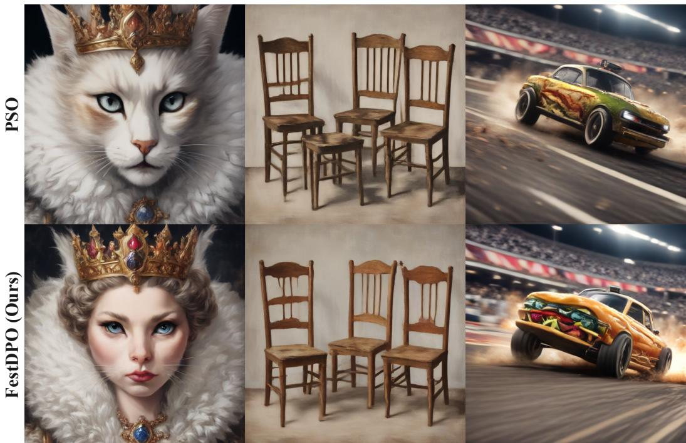  
Figure 1: Qualitative comparison of PSO (Miao et al., 2025) and FestDPO on three text prompts: “a gorgeous queen with cat-like eyes” (Left), “three chairs” (Middle), and “3D digital illustration, burger with wheels speeding on the race track, supercharged, detailed, hyperrealistic, 4K” (Right).

and pre-trained model family, allowing it to be applied to a broad range of few-step generative models without model-specific modifications. For the domains where distance in the original data space fails to reflect underlying structure, such as semantic similarity in images or rotational invariance in protein structures, we estimate densities in the embedding space of a pretrained encoder.

We evaluate FestDPO in a 1-D toy setting, text-to-image generation (Rombach et al., 2022; Esser et al., 2024), and protein backbone generation (Woo et al., 2026), demonstrating effective preference optimization across tasks. In the toy setting, we show that FestDPO learns to sample from the unnormalized target density induced by the latent reward in the Bradley-Terry model across diverse few-step generative models. In text-to-image generation at 512 × 512 resolution, FestDPO achieves the highest win rates among preference optimization baselines when fine-tuning both SDXL-Turbo (Sauer et al., 2024) and SDXL-DMD2 (Yin et al., 2024a), and receives the highest human ratings. Our ablation studies further show that FestDPO is robust to the choice of feature encoder and to the number of samples used for density estimation, indicating that sample-based estimation with a finite number of samples is effective for preference optimization, even in high-dimensional domains such as images and proteins. In protein backbone generation, we demonstrate that FestDPO on a few-step protein backbone generator (Woo et al., 2026) outperforms the baselines in structural designability and control over secondary structure composition of the protein.

## 2 RELATED WORK

## 2.1 FEW-STEP GENERATIVE MODELS

Few-step generative models enable efficient sampling within a few function evaluations, addressing the expensive computational costs of diffusion (Ho et al., 2020; Song et al., 2020) and flow-based models (Liu et al., 2022; Lipman et al., 2022). These models broadly fall into two categories. The first comprises direct noise-to-data mappings, such as VAEs (Kingma & Welling, 2013), GANs (Goodfellow et al., 2020), and recently proposed drifting models (Deng et al., 2026). The second category is flow map models (Song et al., 2023; Kim et al., 2024; Boffi et al., 2024; Frans et al., 2025; Geng et al., 2026; Zhou et al., 2025; Boffi et al., 2026), including distilled generators (Luo et al., 2023; Sauer et al., 2024; Yin et al., 2024b), which learn jump operators between intermediate states between noise and data. Despite advances in sampling speed, many of these models are implicit and do not provide tractable likelihoods (Ai et al., 2026) required by RL and probabilistic inferencebased alignment methods (Uehara et al., 2024; 2025). Noise-to-data generators also do not exhibit denoising trajectories, which are required for score matching-based approaches (Honavar, 2025).

## 2.2 ALIGNMENT

Alignment is a core technique for steering generative models towards desirable output, broadly applied for natural language (Ziegler et al., 2019; Stiennon et al., 2020; Ouyang et al., 2022), images (Black et al., 2024; Fan et al., 2023; Clark et al., 2024; Domingo i Enrich et al., 2025; Kang et al., 2026; Lee et al., 2026c; Lee & Ye, 2026), robotic control (Ren et al., 2025), and scientific design (Gu et al., 2024; Lee et al., 2026b; Su et al., 2026). Many alignment methods rely on an explicit reward function, either predefined or learned from a labeled dataset. DPO (Rafailov et al., 2023) instead optimizes generators directly from offline preference pairs under a Bradley-Terry preference model (Bradley & Terry, 1952), avoiding both an explicit reward model and an online RL loop. However, extending DPO-based alignment methods to emerging few-step generators is not straightforward: prior works often rely on diffusion-specific formulations (Wallace et al., 2024; Yang et al., 2024a; Croitoru et al., 2025; Liu et al., 2026) or require likelihood evaluation on a denoising trajectory (Yang et al., 2024b; Liang et al., 2025; Honavar, 2025; Miao et al., 2025). Our concurrent work, DrPO (Jiang et al., 2026), uses preference pairs to construct drift fields (Deng et al., 2026) for aligning few-step generators, but its connection to the DPO objective remains unestablished. We instead develop a sample-based approximation to DPO and establish its asymptotic consistency, clarifying the corresponding reward-tilted target distribution.

## 2.3 SAMPLING FROM UNNORMALIZED DENSITY

Sampling from unnormalized density has been a fundamental problem of machine learning (Hinton, 2002; LeCun et al., 2006). Given access to reward or energy evaluations, sampling methods can approximate the target distribution through Monte Carlo estimation (Hastings, 1970; Del Moral et al., 2006), or by learning amortized samplers, including GFlowNets (Bengio et al., 2021; 2023; Choi et al., 2025) and diffusion samplers (Zhang & Chen, 2021; Akhound-Sadegh et al., 2024; Havens et al., 2025; 2026). The sampling perspective also applies to alignment: the solution of KL-regularized reward maximization is equivalent to sampling from a reward-tilted unnormalized density (Korbak et al., 2022). Prior methods adopt a sampling perspective to align generative models (Venkatraman et al., 2024; Domingo i Enrich et al., 2025; Lee et al., 2026a) using explicit reward evaluations. FestDPO instead learns a few-step implicit sampler that approximates the reward-tilted distribution from a fixed preference dataset, without evaluating a reward function during training.

## 3 BACKGROUND

## 3.1 PREFERENCE OPTIMIZATION

Given an input $x ,$ , let $y _ { w } \succ y _ { l } \ 1$ x denote a preference for $y _ { w }$ over $y _ { l }$ . Learning from preferences (Christiano et al., 2017; Ziegler et al., 2019) aims to align model behavior with the latent reward $r ^ { \star }$ that governs the preference outcomes. The Bradley–Terry (BT) model (Bradley & Terry, 1952) formulates how the latent reward $r ^ { \star }$ determines preference distribution $p ^ { \star }$

$$
p ^ { \star } \left( y _ { w } \succ y _ { l } \mid x \right) = \sigma \left( r ^ { \star } \left( x , y _ { w } \right) - r ^ { \star } \left( x , y _ { l } \right) \right) ,\tag{1}
$$

where $\sigma$ is the logistic function. Given a pairwise preference dataset ${ \mathcal { D } } ,$ , the standard preference optimization objective is the expected reward with a reverse KL divergence penalty to a reference generative model to mitigate reward over-optimization (Gao et al., 2023):

$$
\mathcal { I } ( \pi ) = \mathbb { E } _ { \boldsymbol { x } \sim \mathcal { D } , \boldsymbol { y } \sim \pi ( \cdot \vert \boldsymbol { x } ) } \left[ r ^ { \star } ( \boldsymbol { x } , \boldsymbol { y } ) \right] - \beta \mathbb { D } _ { \mathrm { K L } } \left[ \pi ( \boldsymbol { y } \mid \boldsymbol { x } ) \middle \Vert \pi _ { \mathrm { r e f } } ( \boldsymbol { y } \mid \boldsymbol { x } ) \right] .\tag{2}
$$

where $\beta > 0$ controls the regularization strength and $\pi , \pi _ { \mathrm { r e f } }$ denotes a policy and fixed reference policy respectively. Early approaches (Stiennon et al., 2020; Ouyang et al., 2022) train a reward model $\hat { r }$ to approximate the latent reward $r ^ { \star }$ by maximizing the likelihood in Equation (1). The policy is then optimized using proximal policy optimization (PPO) (Schulman et al., 2017) with the learned reward model rˆ instead of the latent reward $r ^ { \star }$ . While effective at aligning models with human preferences, online RL with rˆ requires a separate stage to train the reward model and suffers from the instability and hyperparameter sensitivity of online RL (Rafailov et al., 2023).

## 3.2 DIRECT PREFERENCE OPTIMIZATION

DPO (Rafailov et al., 2023) avoids training a separate reward model and an online RL loop by optimizing the generative model directly from preference pairs. DPO objective is derived from the closed-form solution to the KL-regularized objective (Peng et al., 2019; Korbak et al., 2022):

$$
\pi ^ { \star } ( y \mid x ) = \frac { 1 } { Z ( x ) } \pi _ { \mathrm { r e f } } ( y \mid x ) \exp \left( \frac { 1 } { \beta } r ^ { \star } ( x , y ) \right) ,\tag{3}
$$

where $\begin{array} { r } { Z ( x ) = \int \pi _ { \mathrm { r e f } } ( y \mid x ) \exp ( \frac { 1 } { \beta } r ^ { \star } ( x , y ) ) d y } \end{array}$ is the normalizing constant. Then, the latent reward $r ^ { * }$ can be expressed as follows:

$$
r ^ { \star } ( x , y ) = \beta \log \frac { \pi ^ { \star } ( y \mid x ) } { \pi _ { \mathrm { r e f } } ( y \mid x ) } + \beta \log Z ( x ) .\tag{4}
$$

Substituting Equation (4) into the Equation (1) cancels the intractable $Z ( x )$ and yields the DPO objective for a parameterized policy πθ:

$$
\begin{array} { r } { \mathcal { L } _ { \mathrm { D P O } } \left( \theta \right) = - \mathbb { E } _ { \left( x , y _ { w } , y _ { l } \right) \sim \mathcal { D } } \left[ \log \sigma \left( \beta \log \frac { \pi _ { \theta } \left( y _ { w } \mid x \right) } { \pi _ { \mathrm { r e f } } \left( y _ { w } \mid x \right) } - \beta \log \frac { \pi _ { \theta } \left( y _ { l } \mid x \right) } { \pi _ { \mathrm { r e f } } \left( y _ { l } \mid x \right) } \right) \right] . } \end{array}\tag{5}
$$

Minimizing Equation (5) trains π to match the optimal reward-tilted distribution in Equation (3) (see Appendix A for details).

## 4 EXTEND DPO TOWARDS FEW-STEP GENERATIVE MODELS

While DPO offers a promising way to align generative models with preference pairs, its extension to few-step generators remains underexplored. A main challenge is that many few-step generators are implicit models, for which the likelihood evaluation required by the DPO loss is intractable (Ai et al., 2026). Existing DPO extensions for diffusion models rely on Evidence Lower Bound (ELBO)-based likelihood surrogates (Wallace et al., 2024; Yang et al., 2024a) or tractable likelihood evaluation of the denoising transition (Honavar, 2025), which is usually unavailable for few-step implicit generators.

Consequently, extending DPO to few-step generative models requires a new formulation. Given fast sampling and algorithmic diversity, we found that employing sample-based nonparametric estimation to construct a tractable surrogate objective of DPO can lead to the following advantages: (i) making effective use of the computational efficiency of few-step sampling; (ii) being agnostic to the pre-training objective and sampling procedure. These observations lead us to propose Few-step DPO (FestDPO), a sample-based approximation of DPO for few-step generative models.

## 5 METHODS

In this section, we introduce Few-step DPO (FestDPO), a direct preference optimization method tailored to few-step generative models. Figure 2 provides an overview of FestDPO: using samples from the trainable generator and the reference generator, we estimate the intractable likelihoods at $y _ { w }$ and $y _ { l }$ through a sample-based approach. Then, we employ estimated likelihoods to approximate DPO objective, leading to the FestDPO objective in Equation (8). Theoretically, we establish conditions for the FestDPO loss to converge in probability to the DPO loss, and show that the unique minimizer of the FestDPO loss matches the reward-tilted distribution.

## 5.1 FESTDPO

Following Rafailov et al. (2023), our goal is to fine-tune a few-step generator to sample from the reward-tilted unnormalized density defined by the latent reward $r ^ { \star } \colon$

$$
\pi ^ { \star } ( y \mid x ) \propto \pi _ { \mathrm { r e f } } ( y \mid x ) \exp \left( r ^ { \star } ( x , y ) / \beta \right) .\tag{6}
$$

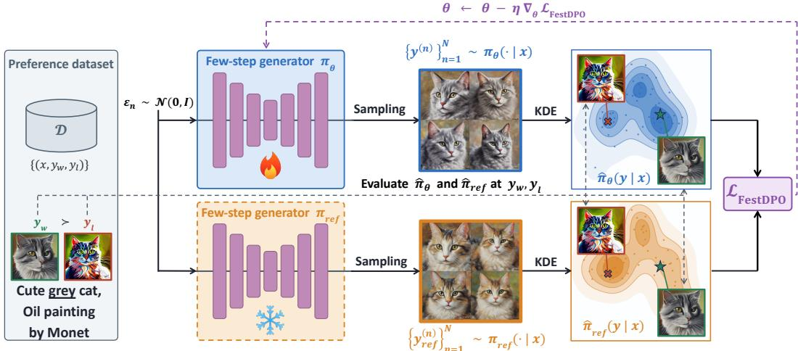  
Figure 2: Overview of FestDPO. For a prompt x and a preference pair $( y _ { w } \succ y _ { l } )$ , we draw N samples from both the trainable policy $\pi _ { \theta }$ and the frozen reference policy $\pi _ { \mathrm { r e f } }$ . We then construct kernel density estimates $\scriptstyle { \hat { \pi } } _ { \theta }$ and $\hat { \pi } _ { \mathrm { r e f } }$ and evaluate them at $y _ { w }$ and $y _ { l }$ . These estimates yield a tractable surrogate for the DPO loss (Equation (8)), which we minimize to align $\pi _ { \theta }$ with the preference data.

To learn a sampler for Equation (6) without exact likelihood evaluation, we approximate the likelihood terms in the DPO loss Equation (5) using sample-based nonparametric density estimation (Silverman, 2018; Liu et al., 2022). Thanks to fast sampling from few-step generative models, sample-based estimation becomes practically feasible. For simplicity, we use kernel density estimation (KDE) to approximate the likelihood $\pi _ { \theta } ( y \mid x )$ as follows:

$$
\hat { \pi } _ { \boldsymbol { \theta } } ( y \mid x ) = { \mathbb E } _ { y ^ { \prime } \sim \pi _ { \boldsymbol { \theta } } } [ k _ { h } \left( y , y ^ { \prime } \right) ] ,\tag{7}
$$

where $k _ { h }$ is a Gaussian kernel with bandwidth h. We estimate the reference density $\pi _ { \mathrm { r e f } }$ analogously. Replacing every likelihood term in Equation (5) with Equation (7) yields a FestDPO loss: a tractable surrogate of DPO loss for few-step implicit generators:

$$
\mathcal { L } _ { \mathrm { F e s t D P O } } ( \theta ) = - \mathbb { E } _ { ( x , y _ { w } , y _ { l } ) \sim \mathcal { D } } \left[ \log \sigma \left( \beta \log \frac { \hat { \pi } _ { \theta } ( y _ { w } \mid x ) } { \hat { \pi } _ { \mathrm { r e f } } ( y _ { w } \mid x ) } - \beta \log \frac { \hat { \pi } _ { \theta } ( y _ { l } \mid x ) } { \hat { \pi } _ { \mathrm { r e f } } ( y _ { l } \mid x ) } \right) \right] .\tag{8}
$$

In practice, we draw N independent noise $\{ \epsilon _ { n } \} _ { n = 1 } ^ { N }$ and pass them through both the trainable generator and the frozen reference generator simultaneously. We use the resulting samples to construct density estimates and evaluate the FestDPO loss on minibatches of preference pairs. Gradients propagate through $f _ { \theta } { } _ { ; }$ , while $f _ { \mathrm { r e f } }$ remains fixed. The resulting gradient signal steers the current generator, pulling it toward the preferred samples while pushing it away from the unpreferred samples.

## 5.2 THEORETICAL ANALYSIS

In this section, we theoretically analyze the connection between FestDPO and DPO. Under the consistency of kernel density estimation, we show that the FestDPO objective asymptotically recovers the DPO objective. We further establish that minimizers of the FestDPO objective are consistent for the DPO minimizer.

Proposition 1 (Asymptotic Equivalence of FestDPO and DPO). Let $\scriptstyle { \hat { \pi } } _ { \theta }$ and $\hat { \pi } _ { r e f }$ be KDEs constructed from N samples with bandwidth $h ,$ using a kernel K satisfying the KDE consistency conditions (Silverman, 2018). Suppose that $h  0$ and $N h ^ { d }  \infty \stackrel { \overrightarrow { a s } } { a s } N  \infty ,$ , and that, for almost every $( x , y _ { w } , y _ { l } )$ under ${ \mathcal { D } } , \pi _ { \theta } ( \cdot | x )$ and $\pi _ { \mathrm { r e f } } ( \cdot \mid x )$ are continuous and strictly positive at $y _ { w }$ and $y _ { l } .$ If the per-example FestDPO losses are uniformly integrable, then

$$
\mathcal { L } _ { \mathrm { F e s t D P O } } ( \theta ) \to \mathcal { L } _ { \mathrm { D P O } } ( \theta ) .\tag{9}
$$

Proposition 1 shows that, as the number of samples from the model and reference increases, the FestDPO objective converges to the DPO objective. We further show that FestDPO minimizer converges to the DPO minimizer, which corresponds to the optimal target distribution induced by the KL-regularized reward maximization objective in Appendix A.

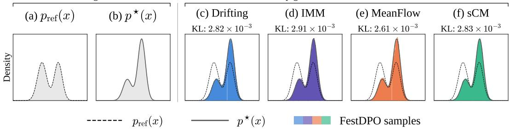  
Figure 3: FestDPO aligns diverse few-step generators. (a) The reference distribution $p _ { \mathrm { r e f } } ( x )$ and (b) the reward-tilted target distribution $p ^ { \star } ( x ) \propto p _ { \mathrm { r e f } } ( x ) \exp ( r ^ { \star } ( x ) )$ . (c)–(f) Distributions of Drifting, IMM, MeanFlow, and sCM fine-tuned with FestDPO. Across all four generators, the fine-tuned distributions closely match $p ^ { \star } ( x )$ , with KL divergences to the target of approximately $3 \times 1 0 ^ { - 3 }$

Reference & Target Distribution

Few-step generators fine-tuned with FestDPO

Proposition 2 (Consistency of the FestDPO Minimizer). Let $( \Theta , d )$ be a metric space. Suppose that the convergence in Proposition 1 holds uniformly over Θ and that the population DPO objective admits a unique, well-separated minimizer $\theta ^ { \star }$ . Then, for any sequence of $o _ { p } ( 1 )$ -approximate minimizers $\hat { \theta } ^ { \star }$ ofthe FestDPO objective,

$$
d ( \hat { \theta } ^ { \star } , \theta ^ { \star } ) \stackrel { p } {  } 0 , \qquad N  \infty .\tag{10}
$$

The detailed derivations for Proposition 1 and 2 are provided in Appendix B and C, respectively.

## 5.3 KERNEL DENSITY ESTIMATION IN FEATURE SPACE

Kernel similarities in raw space may poorly capture the image semantics (Theis et al., 2015) or depend on arbitrary rotations and translations of protein structures (Jumper et al., 2021; Satorras et al., 2021). Motivated by kernel-based distribution matching in embedding spaces (Binkowski´ et al., 2018; Deng et al., 2026; Lee et al., 2026a), we compute kernel similarity in the embedding space of a pretrained encoder ϕ to better reflect semantic and geometric similarities. Specifically, we replace ${ \hat { \pi } } _ { \boldsymbol { \theta } } ( \cdot \mid x )$ in Equation (8) with

$$
\hat { \pi } _ { \boldsymbol { \theta } , \boldsymbol { \phi } } ( y \mid \boldsymbol { x } ) = \mathbb { E } _ { \boldsymbol { y } ^ { \prime } \sim \pi _ { \boldsymbol { \theta } } ( \cdot \mid \boldsymbol { x } ) } \left[ k _ { h } \left( \boldsymbol { \phi } ( \boldsymbol { y } ) , \boldsymbol { \phi } \left( \boldsymbol { y } ^ { \prime } \right) \right) \right]\tag{11}
$$

## 6 EXPERIMENTS

In this section, we evaluate FestDPO in three tasks: a 1D toy setting with diverse few-step generative models, text-to-image generators, and protein backbone generation. These experiments demonstrate that FestDPO is capable of sampling from preference-tilted distributions across tasks, from one-dimensional data to high-resolution images and protein structures on SE(3) manifold. Imple mentation details and hyperparameters for all experiments are provided in Section E

## 6.1 TOY EXPERIMENTS

To evaluate the capability of FestDPO in sampling from a tilted target distribution defined by the latent reward model: $p ^ { \star } ( \dot { x } ) \propto p _ { \mathrm { r e f } } ( x ) \exp ( r ^ { \star } ( \dot { x _ { \rangle } } )$ , we perform a synthetic experiment on a 1D Gaussian Mixture Model. We first pre-train four few-step generators, namely Drifting (Deng et al., 2026), IMM (Zhou et al., 2025), MeanFlow (Geng et al., 2026), and sCM (Lu & Song, 2025). We construct an offline preference dataset by drawing pairs of samples from each pre-trained generator and labeling them with the Bradley-Terry model under $r ^ { \star }$ , and fine-tune each generator with FestDPO on this dataset. As shown in Figure 3, FestDPO closely matches the target distribution across all generators, achieving a KL divergence of approximately $\mathrm { j \times 1 0 ^ { - 3 } }$ , while preserving the multi-modal structure of the target. Detailed descriptions are provided in Appendix E.1.

(a) SDXL-Turbo  
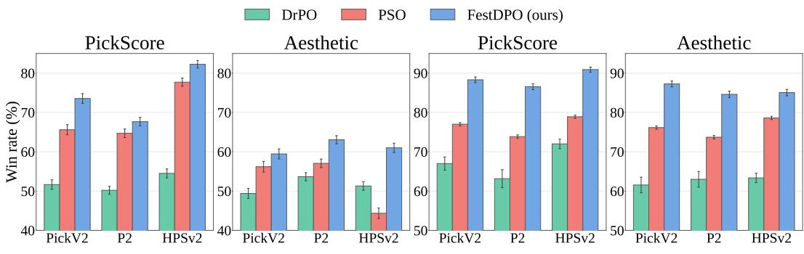  
(b) SDXL-DMD2  
Figure 4: Win rate comparison against (a) SDXL-Turbo and (b) SDXL-DMD2 on Pick-a-Pic v2, Parti-Prompts, and HPSv2 evaluation datasets. Each bar represents the mean win rate (%) of each method for PickScore and Aesthetic score, and error bars denote the standard deviation.

## 6.2 TEXT-TO-IMAGE GENERATION

We evaluate FestDPO for aligning text-to-image models with user preferences. We first describe the experimental setup in Section 6.2.1, then report the main results in Section 6.2.2, and finally present ablation studies in Section 6.2.3.

## 6.2.1 EXPERIMENTAL SETUP

Baselines. We compare FestDPO with PSO (Miao et al., 2025) and DrPO (Jiang et al., 2026), which are the preference optimization methods for fine-tuning a few-step generator from offline preference pairs. We defer a detailed description of the baselines to Appendix D.

Base Models & Preference Dataset. We fine-tune two few-step text-to-image generators: SDXL-Turbo (Sauer et al., 2024) and SDXL-DMD2 (Yin et al., 2024a). All methods are trained on the training split of Pick-a-Pic v2 (Kirstain et al., 2023), an open dataset of text-to-image prompts and preferences of real users over generated images.

Evaluation. We evaluate the generated images using PickScore (Kirstain et al., 2023) and Aesthetic Score (Schuhmann & Beaumont, 2023). We also report pairwise win rates against the corresponding base models. We then evaluate on 500 prompts sampled from each of three sets: the held-out Picka-Pic v2 test split (PickV2), Parti-Prompts (P2; Yu et al., 2022), and the HPSv2 benchmark (Wu et al., 2023). We further conduct a human study on 80 of these prompts, reported in Section 6.2.4.

Feature Encoder. Our default feature extractor is the 340M-parameter Latent-MAE encoder (He et al., 2022) from Drifting Models (Deng et al., 2026). To assess the sensitivity of FestDPO to the choice of feature representation, we further conduct ablations using DINOv2 (Oquab et al., 2023) and CLIP (Radford et al., 2021) features in Section 6.2.3.

## 6.2.2 MAIN RESULTS

We report the win rates of FestDPO, PSO, and DrPO over base models on Pick-a-Pic v2, PartiPrompts, and HPSv2 evaluation datasets in Figure 4. For each base model, we compute the win rate as the percentage of prompts on which the fine-tuned model scores higher than the base model, separately for PickScore and Aesthetic score. FestDPO achieves the highest win rate on every prompt dataset under PickScore and Aesthetic. Figure 5 further shows the anytime performance on SDXL-DMD2. FestDPO rapidly improves PickScore within the first 150 steps and remains stable, whereas both baselines show slower and smaller improvements. We report the absolute scores and win rates on Pick-a-Pic v2, PartiPrompts, and HPSv2 evaluation datasets in Appendix F and provide the qualitative comparison in Appendix G.

## 6.2.3 ABLATION STUDY

In this section, We conduct ablation studies on HPSv2 with SDXL-Turbo. Since FestDPO employs nonparametric density estimation, we first study the effect of the number of samples N used to construct the KDE. As shown in Table 1, increasing N from 8 to 24 improves PickScore, while Aesthetic scores remain approximately stable across N. These results indicate that FestDPO is robust to the choice of N, with even a small number of samples yielding substantial gains over the pretrained model. We further investigate the sensitivity of FestDPO to the feature encoder. Table 2 compares alignment performance using Latent-MAE (Deng et al., 2026), CLIP (Radford et al., 2021), and DINOv2 (Oquab et al., 2023) as pretrained encoders for density estimation. FestDPO achieves comparable performance across all three encoders, demonstrating that its effectiveness is robust to the choice of feature encoder. Results on Pick-a-Pic v2, Parti-Prompts, and HPSv2 are provided in Section F.

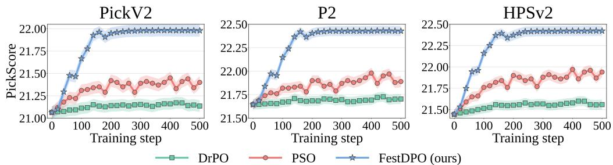  
Figure 5: PickScore of DrPO, PSO, and FestDPO during fine-tuning of SDXL-DMD2 on Pick-a-Pic v2, Parti-Prompts, and HPSv2. Lines and shaded regions denote the mean and standard deviation.

Table 1: Sensitivity analysis on N.  
Table 2: Ablation on the feature encoder ϕ.
<table><tr><td>N</td><td>PickScore ↑ Aesthetic ↑</td><td></td><td>Feature Encoder</td><td>PickScore ↑</td><td>Aesthetic ↑</td></tr><tr><td>N = 8</td><td> $2 3 . 0 6 \pm 1 . 3 2$ </td><td> $6 . 1 3 \pm 0 . 6 8$ </td><td>Latent MAE (default)</td><td> $2 3 . 1 3 \pm 1 . 3 5$ </td><td> $6 . 1 1 \pm 0 . 6 6$ </td></tr><tr><td>N = 12 (default)</td><td> $2 3 . 1 3 \pm 1 . 3 5$ </td><td> $6 . 1 1 \pm 0 . 6 6$ </td><td>CLIP</td><td> $2 3 . 1 7 \pm 1 . 3 5$ </td><td> $6 . 0 8 \pm 0 . 6 4$ </td></tr><tr><td> $N = 2 4$ </td><td> $2 3 . 1 4 \pm 1 . 3 7$ </td><td> $6 . 0 7 \pm 0 . 6 3$ </td><td>DINOv2</td><td> $2 3 . 0 7 \pm 1 . 3 4$ </td><td> $6 . 0 8 \pm 0 . 6 5$ </td></tr></table>

## 6.2.4 HUMAN EVALUATIONS

We conduct a human evaluation study to assess the prompt alignment and aesthetic quality of the generated samples. As shown in Table 3, FestDPO receives the highest ratings for both prompt alignment and aesthetics. The results indicate that human annotators consistently preferred images generated by FestDPO over those from the baselines. Details of the human evaluation protocol are provided in Appendix H.

Table 3: Human evaluation results (mean rating). Best results are in bold.
<table><tr><td>Method</td><td>Align. ↑</td><td>Aesth. ↑</td></tr><tr><td>SDXL-Turbo</td><td>3.683</td><td>3.149</td></tr><tr><td>PSO</td><td>3.767</td><td>3.286</td></tr><tr><td>DrPO</td><td>3.696</td><td>3.158</td></tr><tr><td>FestDPO (ours)</td><td>4.199</td><td>3.860</td></tr></table>

## 6.3 PROTEIN BACKBONE GENERATION

We evaluate FestDPO on few-step protein backbone generation (Woo et al., 2026) to assess the capability of aligning the few-step generative model on the SE(3) manifold.

## 6.3.1 EXPERIMENT SETUP

Base model and baselines. We fine-tune Riemannian MeanFlow (RMF; Woo et al., 2026), a fewstep flow map-based protein backbone generator defined on the SE(3) manifold. Specifically, we fine-tune the RMF-S variant with single-step generation. We employ DrPO (Jiang et al., 2026) as a baseline and exclude PSO (Miao et al., 2025) since extending PSO to flow maps is not trivial.

Evaluation. We optimize two reward functions: (i) self-consistency root mean square distance (scRMSD) for structural designability, and (ii) ratio of β-sheet secondary structure (SS-match). scRMSD evaluates whether a generated protein backbone is realistic. To compute scRMSD, we inverse-fold the generated structure using ProteinMPNN (Dauparas et al., 2022), predict the 3D structure of the resulting sequence with ESMFold (Lin et al., 2023), and calculate the RMSD against the original generated backbone. Motivated by SS rewards in prior works (Huguet et al., 2024; Venkatraman et al., 2025; Su et al., 2026), our second reward encourages the formation of β-sheet secondary structure within the protein. Secondary structures are commonly grouped into α-helices, β-strands, and coils. We use DSSP (Kabsch & Sander, 1983) and P-SEA (Labesse et al., 1997) to assign secondary-structure labels to generated backbones. For each target, we construct a separate offline dataset of 8,000 preference pairs from RMF-S samples, using one-step generation for SSmatch and ten-step generation for scRMSD. Within each pair, we label the sample with higher SSstrand reward or lower scRMSD as preferred. Following Woo et al. (2026), we measure structural similarity between the generated backbones through pairwise TM-score (Zhang & Skolnick, 2004).

Table 4: β-sheet optimization results.
<table><tr><td>Method</td><td> $\beta { \mathrm { - s h e e t } } \ \% \uparrow$ </td><td>TM-diversity ↓</td></tr><tr><td>RMF-S (base)</td><td> $0 . 1 5 3 \pm 0 . 0 0 6$ </td><td> $\mathbf { 0 . 2 8 1 \pm 0 . 0 0 6 }$ </td></tr><tr><td>DrPO</td><td> $0 . 2 1 8 \pm 0 . 0 0 5$ </td><td> $0 . 2 9 4 \pm 0 . 0 0 2$ </td></tr><tr><td>FestDPO</td><td> $\mathbf { 0 . 2 9 5 \pm 0 . 0 1 4 }$ </td><td> $0 . 2 9 2 \pm 0 . 0 0 2$ </td></tr></table>

Table 5: scRMSD optimization results.
<table><tr><td>Method</td><td>scRMSD↓</td><td>TM-diversity ↓</td></tr><tr><td>RMF-S (base)</td><td> $9 . 3 0 3 \pm 0 . 5 4 9$ </td><td> $\mathbf { 0 . 2 8 1 \pm 0 . 0 0 6 }$ </td></tr><tr><td>DrPO</td><td> $9 . 0 1 0 \pm 0 . 3 8 3$ </td><td> $0 . 3 0 5 \pm 0 . 0 0 1$ </td></tr><tr><td>FestDPO</td><td> $\mathbf { 7 . 4 3 5 \pm 0 . 3 8 4 }$ </td><td> $0 . 2 9 4 \pm 0 . 0 0 2$ </td></tr></table>

Figure 6: Qualitative comparison between generated protein backbone structures.

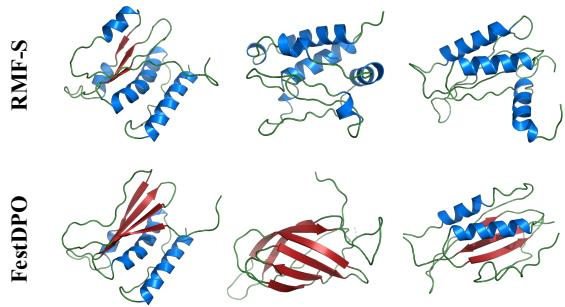

Feature Encoder. We use the pretrained ProteinMPNN encoder (Dauparas et al., 2022) to obtain structural features invariant to global rotations and translations. The encoder remains frozen throughout training and defines the feature space used for kernel density estimation.

## 6.3.2 RESULTS

As illustrated in Table 4 and Table 5, FestDPO achieves a higher β-strand residue fraction and lower scRMSD than both base model and DrPO. FestDPO exhibits better structural diversity than DrPO, although diversity decreases relative to the base model. Figure 6 compares backbones generated by the base model and FestDPO after optimization with the SS-match reward, showing increased $\beta \mathrm { . }$ -sheet content in the generated protein structure.

## 7 DISCUSSION

Conclusion. We introduce FestDPO, a sample-based direct preference optimization method for few-step generative models. FestDPO approximates DPO objective with sample-based nonparametric estimation, exploiting the fast sampling speed of few-step generative models. We theoretically show that the FestDPO objective converges in probability to the DPO objective as the number of samples grows, and that its minimizer is consistent. In a 1-D toy experiment, FestDPO learns to sample from the unnormalized target density across diverse few-step generative models, showing the agnosticism of FestDPO. In text-to-image generation, FestDPO achieves the highest win rates against the base model across Pick-a-Pic v2, Parti-Prompts, and HPSv2 datasets and receives the highest human ratings. In protein backbone generation, FestDPO achieves a higher β-strand fraction and lower scRMSD than both the base model and baseline.

Limitations. FestDPO employs sample-based nonparametric density estimation, which is asymptotically consistent as the number of samples grows. In practice, however, we empirically show that sample-based estimation with finite samples is effective for preference optimization, also in high-dimensional domains such as images and proteins. Since density estimation directly in the high-dimensional data space is challenging, FestDPO performs it in the feature space of a pretrained encoder, which captures the underlying structure of the data. While this design introduces a dependence on the choice of feature encoder, our ablation study shows that FestDPO remains robust across different pretrained encoders.

## REFERENCES

Xinyue Ai, Yutong Kelly He, Albert Gu, Russ Salakhutdinov, Zico Kolter, Nicholas Boffi, and Max Simchowitz. Joint distillation for fast likelihood evaluation and sampling in flow-based models. In International Conference on Learning Representations, volume 2026, pp. 44940–44977, 2026.

Tara Akhound-Sadegh, Jarrid Rector-Brooks, Avishek Joey Bose, Sarthak Mittal, Pablo Lemos, Cheng-Hao Liu, Marcin Sendera, Siamak Ravanbakhsh, Gauthier Gidel, Yoshua Bengio, et al. Iterated denoising energy matching for sampling from boltzmann densities. arXiv preprint arXiv:2402.06121, 2024.

Emmanuel Bengio, Moksh Jain, Maksym Korablyov, Doina Precup, and Yoshua Bengio. Flow network based generative models for non-iterative diverse candidate generation. Advances in neural information processing systems, 34:27381–27394, 2021.

Yoshua Bengio, Salem Lahlou, Tristan Deleu, Edward J Hu, Mo Tiwari, and Emmanuel Bengio. Gflownet foundations. Journal ofMachine Learning Research, 24(210):1–55, 2023.

Mikołaj Binkowski, Danica J Sutherland, Michael Arbel, and Arthur Gretton. Demystifying mmd ´ gans. arXiv preprint arXiv:1801.01401, 2018.

Kevin Black, Michael Janner, Yilun Du, Ilya Kostrikov, and Sergey Levine. Training diffusion models with reinforcement learning. In International Conference on Learning Representations, volume 2024, pp. 4965–4987, 2024.

Nicholas Boffi, Michael Albergo, and Eric Vanden-Eijnden. How to build a consistency model: Learning flow maps via self-distillation. Advances in Neural Information Processing Systems, 38: 33346–33382, 2026.

Nicholas M Boffi, Michael S Albergo, and Eric Vanden-Eijnden. Flow map matching with stochastic interpolants: A mathematical framework for consistency models. arXiv preprint arXiv:2406.07507, 2024.

Ralph Allan Bradley and Milton E Terry. Rank analysis of incomplete block designs: I. the method of paired comparisons. Biometrika, 39(3/4):324–345, 1952.

Sanghyeok Choi, Sarthak Mittal, V´ıctor Elvira, Jinkyoo Park, and Esmeralda S Whitammer. Reinforced sequential monte carlo for amortised sampling. arXiv preprint arXiv:2510.11711, 2025.

Paul F Christiano, Jan Leike, Tom Brown, Miljan Martic, Shane Legg, and Dario Amodei. Deep reinforcement learning from human preferences. Advances in neural information processing systems, 30, 2017.

Kevin Clark, Paul Vicol, Kevin Swersky, and David Fleet. Directly fine-tuning diffusion models on differentiable rewards. In International Conference on Learning Representations, volume 2024, pp. 4793–4822, 2024.

Florinel-Alin Croitoru, Vlad Hondru, Radu Tudor Ionescu, Nicu Sebe, and Mubarak Shah. Curriculum direct preference optimization for diffusion and consistency models. In 2025 IEEE/CVF Conference on Computer Vision and Pattern Recognition (CVPR), pp. 2824–2834. IEEE, 2025.

Payel Das, Tom Sercu, Kahini Wadhawan, Inkit Padhi, Sebastian Gehrmann, Flaviu Cipcigan, Vijil Chenthamarakshan, Hendrik Strobelt, Cicero Dos Santos, Pin-Yu Chen, et al. Accelerated antimicrobial discovery via deep generative models and molecular dynamics simulations. Nature Biomedical Engineering, 5(6):613–623, 2021.

Justas Dauparas, Ivan Anishchenko, Nathaniel Bennett, Hua Bai, Robert J Ragotte, Lukas F Milles, Basile IM Wicky, Alexis Courbet, Rob J de Haas, Neville Bethel, et al. Robust deep learning– based protein sequence design using proteinmpnn. Science, 378(6615):49–56, 2022.

Pierre Del Moral, Arnaud Doucet, and Ajay Jasra. Sequential monte carlo samplers. Journal ofthe Royal Statistical Society Series B: Statistical Methodology, 68(3):411–436, 2006.

Mingyang Deng, He Li, Tianhong Li, Yilun Du, and Kaiming He. Generative modeling via drifting. arXiv preprint arXiv:2602.04770, 2026.

Luc Devroye. Nonparametric density estimation. The L 1 View, 1985.

Carles Domingo i Enrich, Michal Drozdzal, Brian Karrer, and Ricky TQ Chen. Adjoint matching: Fine-tuning flow and diffusion generative models with memoryless stochastic optimal control. In International Conference on Learning Representations, volume 2025, pp. 53791–53846, 2025.

Patrick Esser, Sumith Kulal, Andreas Blattmann, Rahim Entezari, Jonas Muller, Harry Saini, Yam¨ Levi, Dominik Lorenz, Axel Sauer, Frederic Boesel, et al. Scaling rectified flow transformers for high-resolution image synthesis. In Forty-first international conference on machine learning, 2024.

Ying Fan, Olivia Watkins, Yuqing Du, Hao Liu, Moonkyung Ryu, Craig Boutilier, Pieter Abbeel, Mohammad Ghavamzadeh, Kangwook Lee, and Kimin Lee. Dpok: Reinforcement learning for fine-tuning text-to-image diffusion models. Advances in neural information processing systems, 36:79858–79885, 2023.

Kevin Frans, Danijar Hafner, Sergey Levine, and Pieter Abbeel. One step diffusion via shortcut models. In International Conference on Learning Representations, volume 2025, pp. 34668– 34684, 2025.

Leo Gao, John Schulman, and Jacob Hilton. Scaling laws for reward model overoptimization. In International conference on machine learning, pp. 10835–10866. PMLR, 2023.

Zhengyang Geng, Mingyang Deng, Xingjian Bai, Zico Kolter, and Kaiming He. Mean flows for one-step generative modeling. Advances in Neural Information Processing Systems, 38:75460– 75482, 2026.

Ian Goodfellow, Jean Pouget-Abadie, Mehdi Mirza, Bing Xu, David Warde-Farley, Sherjil Ozair, Aaron Courville, and Yoshua Bengio. Generative adversarial networks. Communications of the ACM, 63(11):139–144, 2020.

Siyi Gu, Minkai Xu, Alexander Powers, Weili Nie, Tomas Geffner, Karsten Kreis, Jure Leskovec, Arash Vahdat, and Stefano Ermon. Aligning target-aware molecule diffusion models with exact energy optimization. Advances in neural information processing systems, 37:44040–44063, 2024.

W Keith Hastings. Monte carlo sampling methods using markov chains and their applications. 1970.

Aaron Havens, Benjamin Kurt Miller, Bing Yan, Carles Domingo-Enrich, Anuroop Sriram, Brandon Wood, Daniel Levine, Bin Hu, Brandon Amos, Brian Karrer, et al. Adjoint sampling: Highly scalable diffusion samplers via adjoint matching. arXiv preprint arXiv:2504.11713, 2025.

Aaron Havens, Brian Karrer, and Neta Shaul. Flow sampling: Learning to sample from unnormalized densities via denoising conditional processes. arXiv preprint arXiv:2605.03984, 2026.

Kaiming He, Xinlei Chen, Saining Xie, Yanghao Li, Piotr Dollar, and Ross Girshick. Masked´ autoencoders are scalable vision learners. In 2022 IEEE/CVF conference on computer vision and pattern recognition (CVPR), pp. 15979–15988. IEEE, 2022.

Geoffrey E Hinton. Training products of experts by minimizing contrastive divergence. Neural computation, 14(8):1771–1800, 2002.

Jonathan Ho and Tim Salimans. Classifier-free diffusion guidance. arXiv preprint arXiv:2207.12598, 2022.

Jonathan Ho, Ajay Jain, and Pieter Abbeel. Denoising diffusion probabilistic models. Advances in neural information processing systems, 33:6840–6851, 2020.

Vasant G Honavar. Dspo: Direct score preference optimization for diffusion model alignment. ICLR, 2025.

Edward J Hu, Yelong Shen, Phillip Wallis, Zeyuan Allen-Zhu, Yuanzhi Li, Shean Wang, Lu Wang, and Weizhu Chen. Lora: Low-rank adaptation of large language models. arXiv preprint arXiv:2106.09685, 2021.

Guillaume Huguet, James Vuckovic, Kilian Fatras, Eric Thibodeau-Laufer, Pablo Lemos, Riashat Islam, Cheng-Hao Liu, Jarrid Rector-Brooks, Tara Akhound-Sadegh, Michael Bronstein, et al. Sequence-augmented se (3)-flow matching for conditional protein generation. Advances in neural information processing systems, 37:33007–33036, 2024.

Zhou Jiang, Yandong Wen, and Zhen Liu. Drifting preference optimization for one-step generative models. arXiv preprint arXiv:2606.02521, 2026.

John Jumper, Richard Evans, Alexander Pritzel, Tim Green, Michael Figurnov, Olaf Ronneberger, Kathryn Tunyasuvunakool, Russ Bates, Augustin Zˇ ´ıdek, Anna Potapenko, et al. Highly accurate protein structure prediction with alphafold. nature, 596(7873):583–589, 2021.

Wolfgang Kabsch and Christian Sander. Dictionary of protein secondary structure: pattern recognition of hydrogen-bonded and geometrical features. Biopolymers: Original Research on Biomolecules, 22(12):2577–2637, 1983.

Hyeongyu Kang, Jaewoo Lee, Woocheol Shin, Kiyoung Om, and Jinkyoo Park. Diffusion finetuning via reparameterized policy gradient of the soft q-function. In International Conference on Learning Representations, volume 2026, pp. 78690–78725, 2026.

Dongjun Kim, Chieh-Hsin Lai, WeiHsiang Liao, Naoki Murata, Yuhta Takida, Toshimitsu Uesaka, Yutong He, Yuki Mitsufuji, and Stefano Ermon. Consistency trajectory models: Learning probability flow ode trajectory of diffusion. In International Conference on Learning Representations, volume 2024, pp. 44493–44525, 2024.

Diederik P Kingma and Jimmy Ba. Adam: A method for stochastic optimization. arXiv preprint arXiv:1412.6980, 2014.

Diederik P Kingma and Max Welling. Auto-encoding variational bayes. arXiv preprint arXiv:1312.6114, 2013.

Yuval Kirstain, Adam Polyak, Uriel Singer, Shahbuland Matiana, Joe Penna, and Omer Levy. Picka-pic: An open dataset of user preferences for text-to-image generation. Advances in neural information processing systems, 36:36652–36663, 2023.

Tomasz Korbak, Ethan Perez, and Christopher Buckley. Rl with kl penalties is better viewed as bayesian inference. In Findings of the Association for Computational Linguistics: EMNLP 2022, pp. 1083–1091, 2022.

Gilles Labesse, Nathalie Colloc’h, Joel Pothier, and J-P Mornon. P-sea: a new efficient assignment¨ of secondary structure from cα trace of proteins. Bioinformatics, 13(3):291–295, 1997.

Yann LeCun, Sumit Chopra, Raia Hadsell, M Ranzato, Fujie Huang, et al. A tutorial on energybased learning. Predicting structured data, 1(0), 2006.

Jaewoo Lee, Hyeongyu Kang, Dohyun Kim, Kyuil Sim, Woocheol Shin, Minsu Kim, Taeyoung Yun, Jeongjae Lee, Sanghyeok Choi, Tabitha Edith Lee, et al. Aligning few-step generative models by amortizing sample-based variational inference. arXiv preprint arXiv:2605.26552, 2026a.

Jaewoo Lee, Minsu Kim, Sanghyeok Choi, Inhyuck Song, Sujin Yun, Hyeongyu Kang, Woocheol Shin, Taeyoung Yun, Kiyoung Om, and Jinkyoo Park. Diffusion alignment as variational expectation-maximization. In International Conference on Learning Representations, volume 2026, pp. 31062–31093, 2026b.

Jeongjae Lee and Jong Chul Ye. Pcpo: Proportionate credit policy optimization for preference alignment of image generation models. In International Conference on Learning Representations, volume 2026, pp. 126948–126982, 2026.

Jeongjae Lee, Jinho Chang, Jeongsol Kim, and Jong Chul Ye. Reward score matching: Unifying reward-based fine-tuning for flow and diffusion models. arXiv preprint arXiv:2604.17415, 2026c.

Zhanhao Liang, Yuhui Yuan, Shuyang Gu, Bohan Chen, Tiankai Hang, Mingxi Cheng, Ji Li, and Liang Zheng. Aesthetic post-training diffusion models from generic preferences with step-bystep preference optimization. In 2025 IEEE/CVF Conference on Computer Vision and Pattern Recognition (CVPR), pp. 13199–13208. IEEE, 2025.

Zeming Lin, Halil Akin, Roshan Rao, Brian Hie, Zhongkai Zhu, Wenting Lu, Nikita Smetanin, Robert Verkuil, Ori Kabeli, Yaniv Shmueli, et al. Evolutionary-scale prediction of atomic-level protein structure with a language model. Science, 379(6637):1123–1130, 2023.

Yaron Lipman, Ricky TQ Chen, Heli Ben-Hamu, Maximilian Nickel, and Matt Le. Flow matching for generative modeling. arXiv preprint arXiv:2210.02747, 2022.

Jie Liu, Gongye Liu, Jiajun Liang, Ziyang Yuan, Xiaokun Liu, Mingwu Zheng, Xiele Wu, Qiulin Wang, Menghan Xia, Xintao Wang, et al. Improving video generation with human feedback. Advances in Neural Information Processing Systems, 38:82155–82192, 2026.

Runtao Liu, I Chieh Chen, Jindong Gu, Jipeng Zhang, Renjie Pi, Qifeng Chen, Philip Torr, Ashkan Khakzar, and Fabio Pizzati. Alignguard: scalable safety alignment for text-to-image generation. In 2025 IEEE/CVF International Conference on Computer Vision (ICCV), pp. 17024–17034. IEEE, 2025.

Xingchao Liu, Chengyue Gong, and Qiang Liu. Flow straight and fast: Learning to generate and transfer data with rectified flow. arXiv preprint arXiv:2209.03003, 2022.

Ilya Loshchilov and Frank Hutter. Decoupled weight decay regularization. arXiv preprint arXiv:1711.05101, 2017.

Cheng Lu and Yang Song. Simplifying, stabilizing and scaling continuous-time consistency models. In International Conference on Learning Representations, volume 2025, pp. 50611–50649, 2025.

Weijian Luo, Tianyang Hu, Shifeng Zhang, Jiacheng Sun, Zhenguo Li, and Zhihua Zhang. Diffinstruct: A universal approach for transferring knowledge from pre-trained diffusion models. Advances in Neural Information Processing Systems, 36:76525–76546, 2023.

Zichen Miao, Zhengyuan Yang, Kevin Lin, Ze Wang, Zicheng Liu, Lijuan Wang, and Qiang Qiu. Tuning timestep-distilled diffusion model using pairwise sample optimization. In International Conference on Learning Representations, volume 2025, pp. 13809–13830, 2025.

Maxime Oquab, Timothee Darcet, Th´ eo Moutakanni, Huy Vo, Marc Szafraniec, Vasil Khalidov,´ Pierre Fernandez, Daniel Haziza, Francisco Massa, Alaaeldin El-Nouby, et al. Dinov2: Learning robust visual features without supervision. arXiv preprint arXiv:2304.07193, 2023.

Long Ouyang, Jeffrey Wu, Xu Jiang, Diogo Almeida, Carroll Wainwright, Pamela Mishkin, Chong Zhang, Sandhini Agarwal, Katarina Slama, Alex Ray, et al. Training language models to follow instructions with human feedback. Advances in neural information processing systems, 35: 27730–27744, 2022.

Yong-Hyun Park, Sangdoo Yun, Jin-Hwa Kim, Junho Kim, Geonhui Jang, Yonghyun Jeong, Junghyo Jo, and Gayoung Lee. Direct unlearning optimization for robust and safe text-to-image models. Advances in Neural Information Processing Systems, 37:80244–80267, 2024.

Xue Bin Peng, Aviral Kumar, Grace Zhang, and Sergey Levine. Advantage-weighted regression: Simple and scalable off-policy reinforcement learning. arXiv preprint arXiv:1910.00177, 2019.

David Pollard. A user’s guide to measure theoretic probability, volume 1. Cambridge University Press Cambridge, 2002.

Alec Radford, Jong Wook Kim, Chris Hallacy, Aditya Ramesh, Gabriel Goh, Sandhini Agarwal, Girish Sastry, Amanda Askell, Pamela Mishkin, Jack Clark, et al. Learning transferable visual models from natural language supervision. In International conference on machine learning, pp. 8748–8763. PmLR, 2021.

Rafael Rafailov, Archit Sharma, Eric Mitchell, Christopher D Manning, Stefano Ermon, and Chelsea Finn. Direct preference optimization: Your language model is secretly a reward model. Advances in neural information processing systems, 36:53728–53741, 2023.

Allen Ren, Justin Lidard, Lars Ankile, Anthony Simeonov, Pulkit Agrawal, Anirudha Majumdar, Benjamin Burchfiel, Hongkai Dai, and Max Simchowitz. Diffusion policy policy optimization. In International Conference on Learning Representations, volume 2025, pp. 77288–77329, 2025.

Robin Rombach, Andreas Blattmann, Dominik Lorenz, Patrick Esser, and Bjorn Ommer. High-¨ resolution image synthesis with latent diffusion models. In 2022 IEEE/CVF conference on computer vision and pattern recognition (CVPR), pp. 10674–10685. ieee, 2022.

Vıctor Garcia Satorras, Emiel Hoogeboom, and Max Welling. E (n) equivariant graph neural networks. In International conference on machine learning, pp. 9323–9332. PMLR, 2021.

Axel Sauer, Dominik Lorenz, Andreas Blattmann, and Robin Rombach. Adversarial diffusion distillation. In European Conference on Computer Vision, pp. 87–103. Springer, 2024.

Christoph Schuhmann and Romain Beaumont. Laion-aesthetics, 2022. URL https://laion. ai/blog/laion-aesthetics/. Accessed, pp. 11–10, 2023.

John Schulman, Filip Wolski, Prafulla Dhariwal, Alec Radford, and Oleg Klimov. Proximal policy optimization algorithms. arXiv preprint arXiv:1707.06347, 2017.

Bernard W Silverman. Density estimationfor statistics and data analysis. Routledge, 2018.

Yang Song, Jascha Sohl-Dickstein, Diederik P Kingma, Abhishek Kumar, Stefano Ermon, and Ben Poole. Score-based generative modeling through stochastic differential equations. arXiv preprint arXiv:2011.13456, 2020.

Yang Song, Prafulla Dhariwal, Mark Chen, and Ilya Sutskever. Consistency models. arXiv preprint arXiv:2303.01469, 2023.

Nisan Stiennon, Long Ouyang, Jeffrey Wu, Daniel Ziegler, Ryan Lowe, Chelsea Voss, Alec Radford, Dario Amodei, and Paul F Christiano. Learning to summarize with human feedback. Advances in neural information processing systems, 33:3008–3021, 2020.

Xingyu Su, Xiner Li, Masatoshi Uehara, Sunwoo Kim, Yulai Zhao, Gabriele Scalia, Ehsan Hajiramezanali, Tommaso Biancalani, Degui Zhi, and Shuiwang Ji. Iterative distillation for rewardguided fine-tuning of diffusion models in biomolecular design. In International Conference on Learning Representations, volume 2026, pp. 139443–139469, 2026.

Lucas Theis, Aaron van den Oord, and Matthias Bethge. A note on the evaluation of generative¨ models. arXiv preprint arXiv:1511.01844, 2015.

Masatoshi Uehara, Yulai Zhao, Tommaso Biancalani, and Sergey Levine. Understanding reinforcement learning-based fine-tuning of diffusion models: A tutorial and review. arXiv preprint arXiv:2407.13734, 2024.

Masatoshi Uehara, Yulai Zhao, Chenyu Wang, Xiner Li, Aviv Regev, Sergey Levine, and Tommaso Biancalani. Inference-time alignment in diffusion models with reward-guided generation: Tutorial and review. arXiv preprint arXiv:2501.09685, 2025.

Aad W Van der Vaart. Asymptotic statistics, volume 3. Cambridge university press, 2000.

Siddarth Venkatraman, Moksh Jain, Luca Scimeca, Minsu Kim, Marcin Sendera, Mohsin Hasan, Luke Rowe, Sarthak Mittal, Pablo Lemos, Emmanuel Bengio, et al. Amortizing intractable inference in diffusion models for vision, language, and control. Advances in neural information processing systems, 37:76080–76114, 2024.

Siddarth Venkatraman, Mohsin Hasan, Minsu Kim, Luca Scimeca, Marcin Sendera, Yoshua Bengio, Glen Berseth, and Nikolay Malkin. Outsourced diffusion sampling: Efficient posterior inference in latent spaces of generative models. In Aarti Singh, Maryam Fazel, Daniel Hsu, Simon Lacoste-Julien, Felix Berkenkamp, Tegan Maharaj, Kiri Wagstaff, and Jerry Zhu (eds.), Proceedings of the 42nd International Conference on Machine Learning, volume 267 of Proceedings of Machine Learning Research, pp. 61212–61239. PMLR, 13–19 Jul 2025. URL https://proceedings.mlr.press/v267/venkatraman25a.html.

Bram Wallace, Meihua Dang, Rafael Rafailov, Linqi Zhou, Aaron Lou, Senthil Purushwalkam, Stefano Ermon, Caiming Xiong, Shafiq Joty, and Nikhil Naik. Diffusion model alignment using direct preference optimization. In 2024 IEEE/CVF Conference on Computer Vision and Pattern Recognition (CVPR), pp. 8228–8238. IEEE, 2024.

Frank Wilcoxon. Individual comparisons by ranking methods. Biometrics bulletin, 1(6):80–83, 1945.

Christian Wirth, Riad Akrour, Gerhard Neumann, and Johannes Furnkranz. A survey of preference-¨ based reinforcement learning methods. Journal of Machine Learning Research, 18(136):1–46, 2017.

Dongyeop Woo, Marta Skreta, Seonghyun Park, Kirill Neklyudov, and Sungsoo Ahn. Riemannian meanflow. arXiv preprint arXiv:2602.07744, 2026.

Xiaoshi Wu, Yiming Hao, Keqiang Sun, Yixiong Chen, Feng Zhu, Rui Zhao, and Hongsheng Li. Human preference score v2: A solid benchmark for evaluating human preferences of text-toimage synthesis. arXiv preprint arXiv:2306.09341, 2023.

Jiazheng Xu, Xiao Liu, Yuchen Wu, Yuxuan Tong, Qinkai Li, Ming Ding, Jie Tang, and Yuxiao Dong. Imagereward: Learning and evaluating human preferences for text-to-image generation. Advances in Neural Information Processing Systems, 36:15903–15935, 2023.

Kai Yang, Jian Tao, Jiafei Lyu, Chunjiang Ge, Jiaxin Chen, Weihan Shen, Xiaolong Zhu, and Xiu Li. Using human feedback to fine-tune diffusion models without any reward model. In 2024 IEEE/CVF Conference on Computer Vision and Pattern Recognition (CVPR), pp. 8941–8951. IEEE, 2024a.

Shentao Yang, Tianqi Chen, and Mingyuan Zhou. A dense reward view on aligning text-to-image diffusion with preference. arXiv preprint arXiv:2402.08265, 2024b.

Tianwei Yin, Michael Gharbi, Taesung Park, Richard Zhang, Eli Shechtman, Fredo Durand, and¨ William T Freeman. Improved distribution matching distillation for fast image synthesis. Advances in neural information processing systems, 37:47455–47487, 2024a.

Tianwei Yin, Michael Gharbi, Richard Zhang, Eli Shechtman, Fredo Durand, William T Freeman,¨ and Taesung Park. One-step diffusion with distribution matching distillation. In 2024 IEEE/CVF Conference on Computer Vision and Pattern Recognition (CVPR), pp. 6613–6623. IEEE, 2024b.

Jiahui Yu, Yuanzhong Xu, Jing Yu Koh, Thang Luong, Gunjan Baid, Zirui Wang, Vijay Vasudevan, Alexander Ku, Yinfei Yang, Burcu Karagol Ayan, et al. Scaling autoregressive models for contentrich text-to-image generation. arXiv preprint arXiv:2206.10789, 2(3):5, 2022.

Qinsheng Zhang and Yongxin Chen. Path integral sampler: a stochastic control approach for sampling. arXiv preprint arXiv:2111.15141, 2021.

Yang Zhang and Jeffrey Skolnick. Scoring function for automated assessment of protein structure template quality. Proteins: Structure, Function, and Bioinformatics, 57(4):702–710, 2004.

Linqi Zhou, Stefano Ermon, and Jiaming Song. Inductive moment matching. arXiv preprint arXiv:2503.07565, 2025.

Daniel M Ziegler, Nisan Stiennon, Jeffrey Wu, Tom B Brown, Alec Radford, Dario Amodei, Paul Christiano, and Geoffrey Irving. Fine-tuning language models from human preferences. arXiv preprint arXiv:1909.08593, 2019.

## A OPTIMAL DISTRIBUTION OF THE KL-REGULARIZED OBJECTIVE

Following Rafailov et al. (2023), we first derive the optimal policy of the KL-regularized reward maximization objective.

$$
\operatorname* { m a x } _ { \pi } \mathbb { E } _ { x \sim \mathcal { D } , y \sim \pi ( \cdot | x ) } [ r ( x , y ) ] - \beta \mathbb { D } _ { \mathrm { K L } } \left[ \pi ( y \mid x ) \lVert \pi _ { \mathrm { r e f } } ( y \mid x ) \right]\tag{12}
$$

where $r ^ { \star } ( x , y )$ denotes the latent reward function, $\pi _ { \mathrm { r e f } }$ the reference policy, and π the policy to be optimized. For $\beta > 0$ , the objective in Equation (12) can be rewritten as

$$
\operatorname* { m a x } _ { \pi } \mathbb { E } _ { x \sim \mathcal { D } , y \sim \pi ( \cdot | x ) } [ r ( x , y ) ] - \beta \mathbb { D } _ { \mathrm { K L } } \left[ \pi ( y \mid x ) \lVert \pi _ { \mathrm { r e f } } ( y \mid x ) \right]\tag{13}
$$

$$
= \operatorname* { m a x } _ { \pi } \mathbb { E } _ { x \sim \mathcal { D } } \mathbb { E } _ { y \sim \pi ( \cdot \mid x ) } \left[ r ( x , y ) - \beta \log \frac { \pi ( y \mid x ) } { \pi _ { \mathrm { r e f } } ( y \mid x ) } \right]\tag{14}
$$

$$
= \operatorname* { m i n } _ { \pi } \mathbb { E } _ { x \sim \mathcal { D } } \mathbb { E } _ { y \sim \pi ( \cdot | x ) } \left[ \log \frac { \pi ( y \mid x ) } { \pi _ { \mathrm { r e f } } ( y \mid x ) } - \frac { 1 } { \beta } r ( x , y ) \right]\tag{15}
$$

$$
= \underset { \pi } { \operatorname* { m i n } } \mathbb { E } _ { x \sim \mathcal { D } } \mathbb { E } _ { y \sim \pi ( \cdot | x ) } \left[ \log \frac { \pi ( y \mid x ) } { \frac { 1 } { Z ( x ) } \pi _ { \mathrm { r e f } } ( y \mid x ) \exp \left( \frac { 1 } { \beta } r ( x , y ) \right) } - \log Z ( x ) \right]\tag{16}
$$

where the partition function denotes $\begin{array} { r } { Z ( x ) = \int \pi _ { \mathrm { r e f } } ( y \mid x ) \exp \left( \frac { 1 } { \beta } r ^ { \star } ( x , y ) \right) d y } \end{array}$ . Because the partition function does not depend on the policy π, we can define the closed-form solution as

$$
\pi ^ { \star } ( y \mid x ) = \frac { 1 } { Z ( x ) } \pi _ { \mathrm { r e f } } ( y \mid x ) \exp \left( \frac { 1 } { \beta } r ( x , y ) \right) .\tag{17}
$$

Rearranging Equation (17), the reward can be expressed in terms of the corresponding optimal policy:

$$
r ^ { \star } ( x , y ) = \beta \log \frac { \pi ^ { \star } ( y \mid x ) } { \pi _ { \mathrm { r e f } } ( y \mid x ) } + \beta \log Z ( x ) .\tag{18}
$$

Under the Bradley–Terry preference model, the probability that $y _ { w }$ is preferred over $y _ { l }$ is given by

$$
P ( y _ { w } \succ y _ { l } \mid x ) = \sigma \left( r ^ { \star } ( x , y _ { w } ) - r ^ { \star } ( x , y _ { l } ) \right) .\tag{19}
$$

Substituting Equation (18) into Equation (19), the partition function $Z ( x )$ cancels, yielding

$$
\begin{array} { r } { P ( y _ { w } \succ y _ { l } \mid x ) = \sigma \left[ \beta \log \frac { \pi ^ { \star } ( y _ { w } \mid x ) } { \pi _ { \mathrm { r e f } } ( y _ { w } \mid x ) } - \beta \log \frac { \pi ^ { \star } ( y _ { l } \mid x ) } { \pi _ { \mathrm { r e f } } ( y _ { l } \mid x ) } \right] . } \end{array}\tag{20}
$$

DPO objective is then obtained by parameterizing this preference probability and maximizing its likelihood on the preference dataset. Therefore, under the Bradley–Terry model, DPO objective and the KL-regularized reward maximization objective share the same optimal policy, given by the reward-tilted distribution in Equation (17) (Rafailov et al., 2023).

## B PROOF OF PROPOSITION 1

Proof. For simplicity, define the normalized KDEs using N samples:

$$
\hat { \pi } _ { \boldsymbol { \theta } } ( y \mid \boldsymbol { x } ) = \frac { 1 } { N } \sum _ { n = 1 } ^ { N } k _ { h } \left( \boldsymbol { y } , \boldsymbol { y } ^ { ( n ) } \right) , \quad \hat { \pi } _ { \mathrm { r e f } } ( \boldsymbol { y } \mid \boldsymbol { x } ) = \frac { 1 } { N } \sum _ { n = 1 } ^ { N } k _ { h } \left( \boldsymbol { y } , \boldsymbol { y } _ { \mathrm { r e f } } ^ { ( n ) } \right) ,\tag{21}
$$

where $y ^ { ( n ) } \sim \pi _ { \theta } ( \cdot \mid x )$ and $y _ { \mathrm { r e f } } ^ { ( n ) } \sim \pi _ { \mathrm { r e f } } ( \cdot \mid x )$ , and $k _ { h } ( y , z ) = h ^ { - d } K ( ( y - z ) / h )$ for $y , z \in \mathbb { R } ^ { d }$ where $K$ is a strictly positive bounded Borel kernel satisfying the standard conditions for pointwise KDE consistency (Devroye, 1985; Silverman, 2018).

As $N  \infty$ , suppose the bandwidth h satisfies $h  0 , N h ^ { d }  \infty$ . Under these conditions, for almost every $( x , y _ { w } , y _ { l } ) \sim \mathcal { D }$ at which the corresponding densities are continuous and strictly positive at $y _ { w }$ and $y _ { l }$ , the KDE consistency property (Devroye, 1985; Silverman, 2018) gives

$$
\hat { \pi } _ { \boldsymbol { \theta } } ( y \mid x ) ~ \stackrel { p } {  } ~ \pi _ { \boldsymbol { \theta } } ( y \mid x ) ~ \mathrm { a n d } ~ \hat { \pi } _ { \mathrm { r e f } } ( y \mid x ) ~ \stackrel { p } {  } ~ \pi _ { \mathrm { r e f } } ( y \mid x ) , ~ \mathrm { a s } ~ N  \infty .\tag{22}
$$

By the continuous mapping theorem (Van der Vaart, 2000), the log-density ratios satisfy

$$
\log \frac { \hat { \pi } _ { \theta } ( y _ { w } \mid x ) } { \hat { \pi } _ { \mathrm { r e f } } ( y _ { w } \mid x ) } \xrightarrow { p } \log \frac { \pi _ { \theta } ( y _ { w } \mid x ) } { \pi _ { \mathrm { r e f } } ( y _ { w } \mid x ) } , \quad \log \frac { \hat { \pi } _ { \theta } ( y _ { l } \mid x ) } { \hat { \pi } _ { \mathrm { r e f } } ( y _ { l } \mid x ) } \xrightarrow { p } \log \frac { \pi _ { \theta } ( y _ { l } \mid x ) } { \pi _ { \mathrm { r e f } } ( y _ { l } \mid x ) } ,\tag{23}
$$

Combining the above,

$$
\beta \log \frac { \hat { \pi } _ { \theta } ( y _ { w } \mid x ) } { \hat { \pi } _ { \mathrm { r e f } } ( y _ { w } \mid x ) } - \beta \log \frac { \hat { \pi } _ { \theta } ( y \mid x ) } { \hat { \pi } _ { \mathrm { r e f } } ( y _ { l } \mid x ) } \quad \xrightarrow [ ] { p } \quad \beta \log \frac { \pi _ { \theta } ( y _ { w } \mid x ) } { \pi _ { \mathrm { r e f } } ( y _ { w } \mid x ) } - \beta \log \frac { \pi _ { \theta } ( y \mid x ) } { \pi _ { \mathrm { r e f } } ( y _ { l } \mid x ) } .
$$

Since $z \mapsto - \log \sigma ( z )$ is continuous, the continuous mapping theorem yields

$$
\ell _ { \mathrm { F e s t D P O } } ( x , y _ { w } , y _ { l } ) \stackrel { p } { \to } \ell _ { \mathrm { D P O } } ( x , y _ { w } , y _ { l } ) .\tag{24}
$$

By assumption, the sequence of per-example FestDPO losses is uniformly integrable. For instance, this assumption holds if the corresponding log-density ratios are uniformly bounded in $N ,$ which is guaranteed when the estimated densities are uniformly bounded above and bounded away from zero at the evaluated samples. Together with the convergence in probability established above, this implies convergence in $L ^ { \hat { 1 } }$ (Pollard, 2002):

$$
\mathbb { E } \left[ | \ell _ { \mathrm { F e s t D P O } } ( x , y _ { w } , y _ { l } ) - \ell _ { \mathrm { D P O } } ( x , y _ { w } , y _ { l } ) | \right] \longrightarrow 0 .\tag{25}
$$

Using the inequality $\left| \mathbb { E } [ X ] \right| \leq \mathbb { E } [ \left| X \right| ]$ , we then obtain

$$
| \mathcal { L } _ { \mathrm { F e s t D P O } } ( \theta ) - \mathcal { L } _ { \mathrm { D P O } } ( \theta ) | = | \mathbb { E } \left[ \ell _ { \mathrm { F e s t D P O } } - \ell _ { \mathrm { D P O } } \right] |\tag{26}
$$

$$
\leq \mathbb { E } \left[ | \ell _ { \mathrm { F e s t D P O } } - \ell _ { \mathrm { D P O } } | \right] \longrightarrow 0 .\tag{27}
$$

Hence, the FestDPO objective converges to the DPO objective:

$$
{ \mathcal { L } } _ { \mathrm { F e s t D P O } } ( \theta ) \longrightarrow { \mathcal { L } } _ { \mathrm { D P O } } ( \theta ) .\tag{28}
$$

## C PROOF OF PROPOSITION 2

Proof. Let $\theta ^ { \star } = \arg \operatorname* { m i n } _ { \theta \in \Theta } \mathcal { L } _ { \mathrm { D P O } } ( \theta )$ denote the minimizer of DPO objective. By the assumed uniform version of Proposition 1 and the well-separatedness assumption, we have

$$
\operatorname* { s u p } _ { \theta \in \Theta } \left| \mathcal { L } _ { \mathrm { F e s t D P O } } ( \theta ) - \mathcal { L } _ { \mathrm { D P O } } ( \theta ) \right| \xrightarrow { p } 0 ,\tag{29}
$$

and, for every $\epsilon > 0$

$$
\operatorname* { i n f } _ { \theta : d ( \theta , \theta ^ { \star } ) \geq \epsilon } { \mathcal { L } } _ { \mathrm { D P O } } ( \theta ) > { \mathcal { L } } _ { \mathrm { D P O } } ( \theta ^ { \star } ) ,\tag{30}
$$

where the second condition is the minimization analogue of the condition in Van der Vaart (2000, Theorem 5.7). Since $\hat { \theta } ^ { \star }$ is an $o _ { p } ( 1 )$ -approximate minimizer of FestDPO,

$$
\mathcal { L } _ { \mathrm { F e s t D P O } } ( \hat { \theta } ^ { \star } ) \leq \mathcal { L } _ { \mathrm { F e s t D P O } } ( \theta ^ { \star } ) + o _ { p } ( 1 )\tag{31}
$$

where $o _ { p } ( 1 )$ denotes a sequence of random variables that converges to zero in probability as $N $ $\infty$ . By Equation (29) above,

$$
\mathcal { L } _ { \mathrm { F e s t D P O } } ( \hat { \theta } ^ { \star } ) \leq \mathcal { L } _ { \mathrm { D P O } } ( \theta ^ { \star } ) + o _ { p } ( 1 )\tag{32}
$$

$$
\mathcal { L } _ { \mathrm { D P O } } ( \hat { \theta } ^ { \star } ) - \mathcal { L } _ { \mathrm { D P O } } ( \theta ^ { \star } ) \leq \mathcal { L } _ { \mathrm { D P O } } ( \hat { \theta } ^ { \star } ) - \mathcal { L } _ { \mathrm { F e s t D P O } } ( \hat { \theta } ^ { \star } ) + o _ { p } ( 1 )\tag{33}
$$

$$
\leq \operatorname* { s u p } _ { \theta } | \mathcal { L } _ { \mathrm { F e s t D P O } } ( \theta ) - \mathcal { L } _ { \mathrm { D P O } } ( \theta ) | + o _ { p } ( 1 ) \xrightarrow { \mathrm { ~ P ~ } } 0 .\tag{34}
$$

Since $\theta ^ { \star }$ minimizes the population DPO objective, the left-hand side is nonnegative. Hence,

$$
\begin{array} { r } { \mathcal { L } _ { \mathrm { D P O } } ( \hat { \theta } ^ { \star } ) - \mathcal { L } _ { \mathrm { D P O } } ( \theta ^ { \star } ) \stackrel { p } {  } 0 . } \end{array}\tag{35}
$$

By the well-separatedness condition, this implies (Van der Vaart, 2000)

$$
d ( { \hat { \theta } } ^ { \star } , \theta ^ { \star } ) \stackrel { p } {  } 0 .\tag{36}
$$

## D BASELINE DETAILS

## D.1 PSO

PSO (Miao et al., 2025) fine-tunes a distilled model $p _ { \theta } ( x _ { 0 } \vert c )$ of $N = 1 \sim 4$ steps. Since applying diffusion loss makes blurry outputs, it maximizes a relative margin between a target sample $x _ { 0 } ^ { \tau } \sim$ $p _ { \mathrm { d a t a } }$ and a reference sample $x _ { 0 } ^ { \dot { \rho } } \sim p _ { \theta }$ from the model being tuned, regularized by the pretrained distilled model $p _ { \mathrm { p r e } }$ with weight $\beta \colon$

$$
\mathcal { L } = - \mathbb { E } \left[ \log \sigma \bigg ( \beta \log \frac { p _ { \theta } ( x _ { 0 } ^ { \tau } \mid c ) } { p _ { \mathrm { p r e } } ( x _ { 0 } ^ { \tau } \mid c ) } - \beta \log \frac { p _ { \theta } ( x _ { 0 } ^ { \rho } \mid c ) } { p _ { \mathrm { p r e } } ( x _ { 0 } ^ { \rho } \mid c ) } \bigg ) \right] ,\tag{37}
$$

where $c$ is condition. In Equation (37), Evaluating $p _ { \theta } ( x _ { 0 } \ | \ c )$ would require marginalizing over the intermediate states which is generally intractable. PSO therefore focus on the relative margin to joint likelihoods of whole trajectories. Specifically, the forward diffusion process yields the data trajectory, and the reverse generative process yields the reference one:

$$
\mathcal { L } _ { \mathrm { P S O } } = - \mathbb { E } \left[ \log \sigma \left( \beta \sum _ { n } \left( \log \frac { p _ { \theta } ( x _ { t _ { n - 1 } } ^ { \tau } \mid x _ { t _ { n } } ^ { \tau } , c ) } { p _ { \mathrm { p r e } } ( x _ { t _ { n - 1 } } ^ { \tau } \mid x _ { t _ { n } } ^ { \tau } , c ) } - \log \frac { p _ { \theta } ( x _ { t _ { n - 1 } } ^ { \rho } \mid x _ { t _ { n } } ^ { \rho } , c ) } { p _ { \mathrm { p r e } } ( x _ { t _ { n - 1 } } ^ { \rho } \mid x _ { t _ { n } } ^ { \rho } , c ) } \right) \right) \right] .\tag{38}
$$

PSO makes these transition densities explicit by casting few-step denoising as an MDP with state $( x _ { t _ { n } } , t _ { n } )$ , action $x _ { t _ { n - 1 } } .$ , and Gaussian policy $\dot { \mathcal { N } } ( \mu _ { \theta } , \sigma _ { t _ { n } } ^ { 2 } I )$ . By substituting the MDP action-state conditional distribution, final objective for PSO is

$$
\begin{array} { r l } { \mathcal { L } _ { \mathrm { P S O } } = - \mathbb { E } \Bigg [ \log \sigma \left( - \beta \cdot \displaystyle \sum _ { n = 2 } ^ { N } \left( \left( \left. \epsilon ^ { \tau } - \epsilon _ { \theta } \left( x _ { t _ { n } } ^ { \tau } , t _ { n } , c \right) \right. ^ { 2 } - \left. \epsilon ^ { \tau } - \epsilon _ { \mathrm { p r e } } \left( x _ { t _ { n } } ^ { \tau } , t _ { n } , c \right) \right. ^ { 2 } \right) \right. \right. \Bigg . } \\ { \displaystyle \left. \left. - \frac { 1 } { 2 \sigma _ { t _ { n } } ^ { 2 } } \left( \left. x _ { t _ { n - 1 } } ^ { \rho } - \mu _ { \theta } \left( x _ { t _ { n } } ^ { \rho } , t _ { n } , c \right) \right. ^ { 2 } - \left. x _ { t _ { n - 1 } } ^ { \rho } - \mu _ { \mathrm { p r e } } \left( x _ { t _ { n } } ^ { \rho } , t _ { n } , c \right) \right. ^ { 2 } \right) \right) \right) \Bigg ] \mathrm { , } } \end{array}\tag{39}
$$

In our offline setting, the reference samples are pre-collected offline dataset instead of being drawn from the current model, and their trajectories are approximated by the diffusion forward process. A detailed explanation is provided in Miao et al. (2025).

## D.2 DRPO

DrPO (Jiang et al., 2026) aligns a deterministic one-step generator $x = g _ { \theta } ( \epsilon , c )$ by kernel k. Given positive $A ^ { + }$ and negative feature samples $\mathcal { A } ^ { - }$ , they define a non-parametric (dipole) reward with strength γ:

$$
R _ { \mathrm { d i p o l e } } \left( z \right) = \exp ( E ( z ) ) , \quad E ( z ) = \gamma \sum _ { j = 1 } ^ { M } \left[ k \left( z , a _ { j } ^ { + } \right) - k \left( z , a _ { j } ^ { - } \right) \right] ,\tag{40}
$$

where $a _ { i } ^ { + } \in { \mathcal { A } } ^ { + }$ and $a _ { i } ^ { - } \in \mathcal { A } ^ { - }$ denotes positive and negative sample. Assuming non-negative differentable reward $R ( z )$ , given $x = g _ { \theta } ( \epsilon , c )$ and $z = \phi ( x )$ , the pathwise gradient of the referenceregularized soft RL objective is

$$
\nabla _ { \theta } J = \mathbb { E } _ { \epsilon } \Big [ \Big ( \nabla _ { z } \log R ( z ) + \lambda \big ( \nabla _ { z } \log p _ { \mathrm { p r e } } ( z ) - \nabla _ { z } \log p _ { \theta } ( z ) \big ) \Big ) \nabla _ { \theta } z \Big ] ,\tag{41}
$$

where $\nabla _ { \theta } z = \nabla _ { x } \phi ( x ) \nabla _ { \theta } g _ { \theta } ( \epsilon , c )$ and ϕ denotes the feature encoder. The reward score term reduces to $V _ { \mathrm { p r e f } } = \nabla _ { z }$ log $R _ { \mathrm { d i p o l e } } ( z )$ , and the reference term can be represented by a mean-shift difference between reference features R and current model features $\mathcal { Z } .$ Setting $V _ { \mathrm { D r P O } } = V _ { \mathrm { p r e f } } + \lambda ( \hat { \mu } _ { \mathcal { R } } - \hat { \mu } _ { \mathcal { Z } } )$ the generator is trained as in drifting models by regressing each feature onto a stop-gradient target with velocity scale η:

$$
z _ { i } ^ { \star } = \mathrm { s g } \big ( z _ { i } + \eta V _ { \mathrm { D r P O } } ( z _ { i } ) \big ) , \qquad \mathcal { L } _ { \mathrm { D r P O } } = \frac { 1 } { 2 K } \sum _ { i = 1 } ^ { K } \big \| z _ { i } - z _ { i } ^ { \star } \big \| _ { 2 } ^ { 2 } .\tag{42}
$$

In our offline setting, we replace the online feature sets $\mathcal { A } ^ { + }$ and $A ^ { - }$ with features of positive and negative samples from the dataset. A detailed explanation is provided in Jiang et al. (2026).

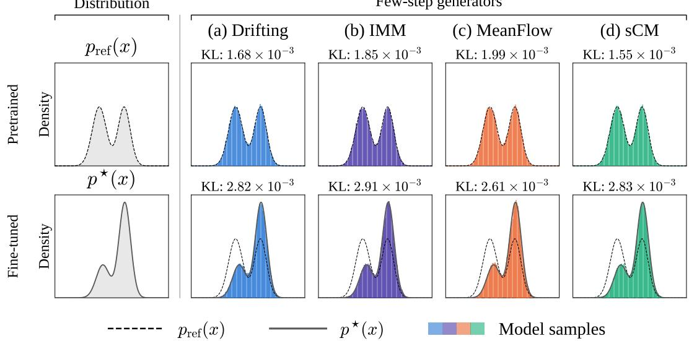  
Figure 7: FestDPO aligns diverse few-step generators with the target distribution. Left of the solid line: the reference distribution $p _ { \mathrm { r e f } } ( x )$ , a mixture of Gaussians, and the reward-tilted target distribution $p ^ { \star } ( x ) \propto p _ { \mathrm { r e f } } ( x ) \exp ( r ^ { \star } ( x ) )$ . Right of the solid line: distributions of (a) Drifting model, (b) IMM, (c) MeanFlow, and (d) sCM) before (top) and after (bottom) fine-tuning with FestDPO. Dashed and solid curves denote $p _ { \mathrm { r e f } } ( x )$ and $p ^ { \star } ( x )$ , respectively. We report the KL divergence (KL) between the fine-tuned and target distributions.

## E EXPERIMENTS DETAILS

## E.1 TOY EXPERIMENTS

Reference, Reward, and Target distribution. The reference distribution $p _ { \mathrm { r e f } } ( x )$ is a twocomponent Gaussian mixture with means $\left( - 0 . 6 2 5 , 0 . 2 5 \right)$ , variances (0.0625, 0.046875), and weights (0.5364, 0.4636). The reward $r ^ { \star } ( x )$ is a Gaussian density $\mathcal { N } ( \bar { x } ; 0 . 5 , 0 . 5 )$ , which peaks slightly to the right of the right mode of $p _ { \mathrm { r e f } } ( x )$ . The target distribution is the reward-tilted distribution $p ^ { \star } ( x ) \propto p _ { \mathrm { r e f } } ( x ) \exp ( r ^ { \star } ( x ) )$ ), which is itself a Gaussian mixture available in closed form. Hence, forward KL divergence is computed against the exact target.

Dataset. For pre-training, we draw $1 0 ^ { 5 }$ i.i.d. samples from $p ( x )$ once and use this fixed dataset for all methods. For fine-tuning, we construct a fixed offline preference dataset of $1 0 ^ { 5 }$ pairs, shared across all methods, by drawing two independent samples from the reference model and labeling them with the Bradley-Terry model, i.e., $y _ { a }$ is preferred with probability $\sigma ( \log r ( y _ { a } ) - \log r ( y _ { b } ) )$

Pre-training. All methods share the same backbone: a time-conditioned residual MLP with 1- dimensional input and output, a 128-dimensional sinusoidal time embedding, SiLU activations, and four residual blocks. The hidden width is 256 (512 for sCM). The pre-training hyperparameters are summarized in Table 6.

Fine-tuning with FestDPO. Both log-densities $\pi _ { \mathrm { r e f } }$ and $\pi _ { \theta }$ are estimated with a Gaussian KDE (Equation (7)): log $\scriptstyle { \hat { \pi } } _ { \theta }$ and log $\hat { \pi } _ { \mathrm { r e f } }$ are computed from N samples respectively. The loss is averaged over multiple KDE bandwidths, listed in Table 7. Averaging over bandwidths at multiple scales provides informative gradients commonly used in kernel-based distribution matching (Binkowski´ et al., 2018). Under this setup, the optimum of the DPO objective with $\beta = 1$ is exactly $p ^ { \star } ( x )$ ∝ $p ( x ) r ( x )$ . The fine-tuning hyperparameters are summarized in Table 7.

Sampling. We use 1 sampling step for Drifting and 4 steps for IMM, MeanFlow, and sCM, both during fine-tuning and at evaluation. All samples are generated with EMA weights, and each reported metric is computed from $1 0 ^ { 5 }$ samples per checkpoint.

Table 6: Pre-training hyperparameters.
<table><tr><td></td><td>Drifting</td><td>IMM</td><td>MeanFlow</td><td>sCM</td></tr><tr><td>Training steps Optimizer</td><td>300k AdamW</td><td>100k RAdam</td><td>300k Adam</td><td>100k AdamW</td></tr><tr><td>Learning rate  $( \beta _ { 1 } , \beta _ { 2 } )$ </td><td> $2 \times 1 0 ^ { - 4 }$  (0.9, 0.95)</td><td> $1 \times 1 0 ^ { - 4 }$  (0.9, 0.999)</td><td> $2 \times 1 0 ^ { - 4 }$  (0.9, 0.999)</td><td> $3 \times 1 0 ^ { - 5 }$  (0.9, 0.99)</td></tr><tr><td>Weight decay</td><td>0.01</td><td>0</td><td>0</td><td>0.01</td></tr><tr><td>Batch size</td><td>1024</td><td>4096</td><td>1024</td><td>16384</td></tr><tr><td>Gradient clip</td><td>2.0</td><td></td><td></td><td>10.0</td></tr><tr><td>EMA decay</td><td>0.999</td><td>0.9999</td><td>0.9999</td><td>0.999</td></tr><tr><td># Parameters</td><td>0.53M</td><td>0.92M</td><td>0.92M</td><td>3.48M</td></tr></table>

Table 7: Fine-tuning hyperparameters of FestDPO.
<table><tr><td></td><td>Drifting</td><td>IMM</td><td>MeanFlow</td><td>SCM</td></tr><tr><td>Fine-tuning steps</td><td>4,000</td><td>4,000</td><td>8,000</td><td>4,000</td></tr><tr><td>Learning rate</td><td> $1 \times 1 0 ^ { - 4 }$ </td><td> $1 \times 1 0 ^ { - 4 }$ </td><td> $3 \times 1 0 ^ { - 5 }$ </td><td> $^ { 1 \times 1 0 ^ { - 4 } } _ { 1 . 0 }$ </td></tr><tr><td>β</td><td>1.0</td><td>1.0</td><td>1.0</td><td></td></tr><tr><td>KDE bandwidths</td><td>0.02 / 0.06 / 0.2</td><td>0.02 / 0.06 / 0.2</td><td>0.01 / 0.03 / 0.1</td><td>0.02 / 0.06 / 0.2</td></tr><tr><td># Samples  $( M = N )$ </td><td>2048</td><td>2048</td><td>8192</td><td>2048</td></tr><tr><td>Pairs per step</td><td>512</td><td>512</td><td>512</td><td>512</td></tr><tr><td>Gradient clip</td><td>1.0</td><td>1.0</td><td>1.0</td><td>1.0</td></tr></table>

## E.2 TEXT-TO-IMAGE GENERATION

## E.2.1 DATASETS DETAILS

In this section, we provide a detailed explanation of the datasets.

Pick-a-Pic v2 (Kirstain et al., 2023): Pick-a-Pic v2 collects human preferences from users of a text-to-image web application, where each sample pairs a prompt with two generated images and a preference label. It provides 851,293 pairs across 58,960 prompts, with images generated by Stable Diffusion 2.1, Dreamlike Photoreal 2.0, and Stable Diffusion XL variants (Rombach et al., 2022) using diverse classifier-free guidance scales (Ho & Salimans, 2022). For evaluation, we use all 500 prompts in the test split.

Parti-Prompts (Yu et al., 2022): Parti-Prompts (P2) is a dataset of 1,632 English prompts designed to probe text-to-image models across a broad range of capabilities. Each prompt is annotated with two labels: a Category, which specifies its broad subject domain, and a Challenge, which identifies the aspect that makes the prompt difficult to render faithfully. For evaluation, we construct a subset of 500 prompts by sampling an equal number of prompts from each category.

HPSv2 (Wu et al., 2023): HPSv2 contains approximately 798K human preference choices over 434K image pairs generated by a variety of text-to-image models, together with real images. It also provides a benchmark of 3,200 prompts evenly divided into four styles: Animation, Conceptart, Painting, and Photo. For evaluation, we sample 125 prompts from each style, resulting in 500 prompts in total.

## E.2.2 IMPLEMENTATION DETAILS

In this section, we describe the experimental setup and implementation details of FestDPO. We apply LoRA (Hu et al., 2021) fine-tuning to the base few-step generator (SDXL-Turbo and SDXL-DMD2), using a rank of 16 and a scaling factor of 1 across all experiments, and conduct all main experiments with single-step generation (NFE = 1). We use the AdamW optimizer (Kingma & Ba, 2014) with a prompt batch size of 512. The learning rate is initialized at $\mathrm { { 3 } \times 1 0 ^ { - 4 } }$ and decayed to $1 \times 1 0 ^ { - 6 }$ following a cosine schedule over the first 300 steps, followed by a constant learning rate of $1 \times$ $1 0 ^ { - 6 }$ . The regularization coefficient $\beta$ is fixed to 0.5 throughout all experiments. For each prompt, FestDPO constructs the KDE from $N = 1 2$ generated samples. Since the density is estimated in the feature space of a pretrained encoder (Latent MAE by default), we find a simple Gaussian kernel to be sufficient, and the kernel bandwidth is tuned separately for each base model. All experiments are conducted on 8 NVIDIA RTX 3090 GPUs. Further details on the hyperparameter settings can be found in Table 8.

Table 8: Hyperparameters for FestDPO.
<table><tr><td></td><td>SDXL-Turbo</td><td>SDXL-DMD2</td></tr><tr><td>KDE bandwidth h</td><td>0.15,0.2</td><td>0.2,0.3</td><td rowspan="4"></td></tr><tr><td> $\beta$ </td><td></td><td>0.5</td></tr><tr><td># of KDE samples N LoRA rank / scale</td><td></td><td>12 16/1</td></tr><tr><td>Optimizer</td><td>AdamW</td><td> $( \beta _ { 1 } = 0 . 9 , \beta _ { 2 } = 0 . 9 9 9 )$ </td></tr><tr><td>Weight decay</td><td></td><td>0.01</td></tr><tr><td>Initial learning rate</td><td> $3 \times 1 0 ^ { - 4 }$ </td><td></td></tr><tr><td>Final learning rate</td><td></td><td></td></tr><tr><td>Gradient clip norm</td><td> $^ { 1 \times 1 0 ^ { - 6 } } _ { 1 . 0 }$ </td><td></td></tr><tr><td>Max steps</td><td></td><td></td></tr><tr><td>Prompt batch size</td><td>512</td><td>1,000</td></tr></table>

Baseline implementation details. Building on the official implementations of PSO and DrPO, we adapt both methods to our offline setting and tune their key hyperparameters as described below.

• PSO (Miao et al., 2025): Pairwise Sample Optimization fine-tunes timestep-distilled diffusion models by increasing the relative likelihood of preferred images over reference images, where the likelihood is approximated by the denoising loss along the diffusion trajectory. Following Miao et al. (2025), we tune the learning rate over $\{ 1 0 ^ { - 5 } , 1 0 ^ { - 4 } \}$ and the regularization coefficient $\beta$ over {1, 10, 50, 100}, and select $L R = \dot { 1 } 0 ^ { - 4 } \mathrm { \ a n d \ } \beta = 1 0$

• DrPO (Jiang et al., 2026): DrPO aligns few-step generators by constructing a drift field from preference pairs, which attracts generated samples toward preferred samples and repels them from dispreferred ones, with a regularization term weighted by λ that keeps the model close to the reference. We tune the learning rate over $\mathrm { \check { \{ 1 0 ^ { - 5 } , 1 0 ^ { - 4 } \} } }$ and λ over {0.1, 0.2, 0.3, 0.5}, and select $L R = 1 0 ^ { - 4 } { \mathrm { ~ a n d ~ } } \lambda = { \overline { { 0 } } } . 1$ . For a fair comparison, we use the same feature encoder (Latent MAE) and kernel bandwidth as FestDPO.

## E.3 PROTEIN BACKBONE GENERATION

Base model and optimization targets. We use the RMF-S variant of Riemannian MeanFlow (Woo et al., 2026) as the base generator and frozen reference model. We fine-tune separate generators for two optimization targets: SS-match, adapted from Su et al. (2026), and self-consistency root mean square deviation (scRMSD). The SS-match reward favors a higher fraction of residues in β-strands. We assign secondary-structure labels using DSSP (Kabsch & Sander, 1983) and group them into helices, strands, and coils. For scRMSD, we use ProteinMPNN (Dauparas et al., 2022) to design an amino-acid sequence for each generated backbone and ESMFold (Lin et al., 2023) to predict its structure. We then compute the Cα RMSD between the generated and predicted backbones after structural alignment, favoring lower values as a proxy for structural designability.

Model checkpoints. We use the RMF-S checkpoint and its accompanying config from the released weights archive1, together with the official Protein-RMF implementation2. For both inverse folding and feature extraction, we use the Cα-only ProteinMPNN checkpoint from the official repository3. This checkpoint uses 48 neighbors and was trained with coordinate noise of 0.20A.˚

The ProteinMPNN encoder remains frozen during FestDPO training. For refolding, we use the facebook/esmfold v1 checkpoint from Hugging Face4.

## E.3.1 PREFERENCE DATASET CONSTRUCTION

For each optimization target, we construct a separate offline preference dataset from a pool of 8,192 backbones of length 128 generated by the frozen RMF-S reference model. Pairs are formed only within the corresponding pool. The preference datasets remain fixed during fine-tuning, which requires no additional reward evaluations or preference annotations.

SS-match. We generate the pool using single-step sampling and score each backbone using the ceiling-normalized P-SEA β-strand fraction. For backbones of length 128, one additional strand residue changes the score by 1/(128-4)≈0.0081. We require a preference gap of at least 2/(128- 4)≈0.0161, corresponding to two residues, to reduce sensitivity to single-residue differences at secondary-structure boundaries. The reference pool has a mean strand fraction of 0.152 with a standard deviation of 0.107.

scRMSD. We generate a separate pool using ten-step sampling to include backbones with better self-consistency than those obtained through single-step generation. Each backbone is scored by its negative scRMSD, so that higher scores indicate stronger self-consistency. The pool has a median scRMSD of 5.30A, and 7.4% of its backbones satisfy the designability criterion of scRMSD below˚ 2.0, A. We require an scRMSD gap of at least 0.1˚ A between paired backbones.˚

Pair construction. We greedily form pairs satisfying the target-specific gap threshold and allow each backbone to appear in at most four pairs, limiting repeated use of individual samples. This procedure yields 8000 pairs per target. Within each pair, the backbone with the higher SS-match score or lower scRMSD is labeled preferred.

## E.3.2 IMPLEMENTATION DETAILS

We fine-tune all 16.35 million parameters of RMF-S without adapters. Fine-tuning and evaluation use single-step generation (K = 1, NFE = 2) with a backbone length of 128 residues. We use AdamW (Loshchilov & Hutter, 2017) with a constant learning rate of $1 0 ^ { - 6 }$ for 1,000 updates, using 64 preference pairs per update. At each update, FestDPO constructs density estimates from 64 samples drawn from the trainable generator and 64 samples drawn from the frozen reference generator. Both sample sets are regenerated at every update. We apply a Gaussian kernel in the 128-dimensional feature space of the frozen ProteinMPNN encoder. Table 9 lists the hyperparameters and candidate values considered. Experiments use a single NVIDIA RTX 5090 GPU and take approximately 2 hours.

Table 9: Hyperparameters and candidate values for FestDPO on protein backbone generation.
<table><tr><td>Hyperparameter</td><td>SS-match</td><td>scRMSD</td></tr><tr><td>KDE bandwidth σ</td><td>0.5</td><td>0.05</td></tr><tr><td>DPO coefficient β</td><td>2000</td><td>20</td></tr><tr><td>Base model KDE samples per update</td><td>64 trainable / 64 reference</td><td>RMF-S</td></tr><tr><td>Optimizer</td><td></td><td>AdamW</td></tr><tr><td>AdamW  $( \beta _ { 1 } , \beta _ { 2 } )$ </td><td></td><td>(0.9,0.999)</td></tr><tr><td>Weight decay</td><td></td><td>10⁻¹2</td></tr><tr><td>Learning rate</td><td></td><td>10⁻⁶</td></tr><tr><td>Gradient clipping norm</td><td></td><td></td></tr><tr><td>Preference pairs per update</td><td></td><td>1000</td></tr><tr><td></td><td></td><td>64</td></tr><tr><td>Training updates</td><td></td><td>1,000</td></tr><tr><td>Backbone length</td><td></td><td>128</td></tr></table>

DrPO baseline. We use a Laplacian kernel for DrPO and consider kernel radii of (0.02, 0.05, 0.2). We tune the reference loss weight λ over the range [0.01, 0.02, 0.05, 0.1, 0.2, 0.5, 1, 2], while fixing the anchor weight at 1.0. Each update uses 64 samples from the trainable generator and 64 reference samples. The remaining training settings, including the learning rate, number of updates, preference batch size, and random seeds, are identical to those used for FestDPO.

## F ADDITIONAL EXPERIMENTAL RESULTS

We evaluate all methods on 500 prompts from each of Pick-a-Pic v2, Parti-Prompts, and HPSv2. For each prompt, we generate images with four different random seeds. In all experiments, we report the mean and standard deviation of PickScore (Kirstain et al., 2023) and Aesthetic score (Schuhmann & Beaumont, 2023) over each prompt set.

## F.1 MAIN RESULTS

Table 10: Main results with SDXL-Turbo on Pick-a-Pic v2, Parti-Prompts, HPSv2.
<table><tr><td></td><td colspan="2">Pick-a-Pic v2</td><td colspan="2">Parti-Prompts</td><td colspan="2">HPSv2</td></tr><tr><td>Method</td><td> $\mathrm { P i c k S c o r e } \uparrow$ </td><td> $_ \mathrm { \mathbf { A e s t h e t i c } \uparrow }$ </td><td>PickScore ↑</td><td> $_ \mathrm { \mathbf { A e s t h e t i c } \uparrow }$ </td><td>PickScore ↑</td><td>Aesthetic ↑</td></tr><tr><td>SDXL-Turbo</td><td> $2 2 . 3 7 \pm 0 . 0 6$ </td><td> $6 . 0 3 \pm 0 . 0 3$ </td><td> $2 2 . 7 8 \pm 0 . 0 4$ </td><td> $5 . 6 9 \pm 0 . 0 2$ </td><td> $2 2 . 8 3 \pm 0 . 0 5$ </td><td> $6 . 0 9 \pm 0 . 0 2$ </td></tr><tr><td>DrPO</td><td> $2 2 . 3 8 \pm 0 . 0 6$ </td><td> $6 . 0 3 \pm 0 . 0 3$ </td><td> $2 2 . 7 8 \pm 0 . 0 4$ </td><td> $5 . 6 9 \pm 0 . 0 2$ </td><td> $2 2 . 8 5 \pm 0 . 0 5$ </td><td> $6 . 0 9 \pm 0 . 0 2$ </td></tr><tr><td>PSO</td><td> $2 2 . 4 6 \pm 0 . 0 6$ </td><td> $6 . 0 6 \pm 0 . 0 2$ </td><td> $2 2 . 8 6 \pm 0 . 0 4$ </td><td> ${ \bf 5 . 7 2 \pm 0 . 0 2 }$  </td><td> ${ \bf 2 3 . 2 2 \pm 0 . 0 5 }$ </td><td> $6 . 0 5 \pm 0 . 0 2$ </td></tr><tr><td>FestDPO</td><td> $\pm 2 . 6 0 \pm { \bf 0 . 0 7 }$ </td><td> ${ \bf 6 . 0 7 \pm 0 . 0 3 }$ </td><td> ${ \bf \ } { \bf \ } 2 . 9 2 \pm { \bf 0 . 0 5 }$ </td><td> ${ \bf 5 . 7 2 \pm 0 . 0 2 }$ </td><td> $2 3 . 1 8 \pm 0 . 0 5$ </td><td> ${ \bf 6 . 1 4 \pm 0 . 0 2 }$ </td></tr></table>

Table 11: Win-rate comparison with SDXL-Turbo on Pick-a-Pic v2, Parti-Prompts, HPSv2.
<table><tr><td></td><td colspan="2">Pick-a-Pic v2</td><td colspan="2">Parti-Prompts</td><td colspan="2">HPSv2</td></tr><tr><td>Method</td><td>PickScore ↑</td><td>Aesthetic ↑</td><td>PickScore ↑</td><td>Aesthetic ↑</td><td>PickScore ↑</td><td>Aesthetic ↑</td></tr><tr><td>DrPO</td><td> $5 1 . 6 5 \pm 1 . 2 1$ </td><td> $4 9 . 4 0 \pm 1 . 2 7$ </td><td> $5 0 . 2 0 \pm 1 . 0 0$ </td><td> $5 3 . 6 5 \pm 1 . 0 2$ </td><td> $5 4 . 5 0 \pm 1 . 1 3$ </td><td> $5 1 . 3 0 \pm 1 . 0 9$ </td></tr><tr><td>PSO</td><td> $6 5 . 6 0 \pm 1 . 2 9$ </td><td> $5 6 . 2 0 \pm 1 . 3 5$ </td><td> $6 4 . 7 0 \pm 1 . 0 9$ </td><td> $5 7 . 0 5 \pm 1 . 0 8$ </td><td> $7 7 . 7 0 \pm 1 . 0 3$ </td><td> $4 4 . 3 5 \pm 1 . 3 3$ </td></tr><tr><td>FestDPO</td><td>_  ${ \bf 7 3 . 5 5 \pm 1 . 2 4 }$ </td><td> ${ \pm } 9 . 4 5 \pm 1 . 2 7$ </td><td> ${ \bf 6 7 . 6 5 \pm 1 . 0 8 }$  </td><td> ${ \bf 6 3 . 0 5 \pm 1 . 0 4 }$  </td><td> ${ \pm } \mathbf { 0 . 2 5 } \pm \mathbf { 0 . 9 6 }$  一</td><td> ${ \bf 6 1 . 0 0 \pm 1 . 1 8 }$ </td></tr></table>

Table 12: Main results with SDXL-DMD2 on Pick-a-Pic v2, Parti-Prompts, HPSv2.
<table><tr><td></td><td colspan="2">Pick-a-Pic v2</td><td colspan="2">Parti-Prompts</td><td colspan="2">HPSv2</td></tr><tr><td>Method</td><td>PickScore ↑ Aesthetic ↑</td><td></td><td>PickScore ↑</td><td>Aesthetic ↑</td><td>PickScore ↑</td><td>Aesthetic ↑</td></tr><tr><td>SDXL-DMD2</td><td> $2 1 . 0 6 \pm 1 . 4 6$ </td><td> $5 . 3 7 \pm 0 . 6 8$ </td><td> $2 1 . 6 5 \pm 1 . 1 7$ </td><td> $5 . 2 5 \pm 0 . 5 7$ </td><td> $2 1 . 4 5 \pm 1 . 2 8$ </td><td> $5 . 5 8 \pm 0 . 6 7$ </td></tr><tr><td>DrPO</td><td> $2 1 . 1 7 \pm 1 . 4 7$ </td><td> $5 . 4 3 \pm 0 . 7 0$ </td><td> $2 1 . 7 3 \pm 1 . 1 9$ </td><td> $5 . 3 1 \pm 0 . 5 7$ </td><td> $2 1 . 6 1 \pm 1 . 3 1$ </td><td> $5 . 6 3 \pm 0 . 6 8$ </td></tr><tr><td>PSO</td><td> $2 1 . 5 8 \pm 1 . 5 4$ </td><td> $5 . 6 6 \pm 0 . 7 0$  </td><td> $2 2 . 0 6 \pm 1 . 3 5$ </td><td> $5 . 5 1 \pm 0 . 6 4$ </td><td> $2 2 . 0 5 \pm 1 . 3 8$ </td><td> $5 . 9 0 \pm 0 . 6 2$ </td></tr><tr><td>FestDPO</td><td> ${ \bf 2 1 . 9 8 \pm 1 . 5 0 }$  </td><td> ${ \bf 5 . 8 7 \pm 0 . 5 7 }$ </td><td> $2 2 . 4 3 \pm 1 . 1 6$ </td><td> ${ \pm } \mathbf { \delta } . 6 5 \pm \mathbf { 0 . } 5 2$ </td><td> $2 2 . 4 2 \pm 1 . 3 2$ </td><td>一  ${ \bf 5 . 9 9 \pm 0 . 5 9 }$ </td></tr></table>

Table 13: Win-rate comparison with SDXL-DMD2 on Pick-a-Pic v2, Parti-Prompts, HPSv2.
<table><tr><td></td><td colspan="2">Pick-a-Pic v2</td><td colspan="2">Parti-Prompts</td><td colspan="2">HPSv2</td></tr><tr><td>Method</td><td>PickScore ↑</td><td>Aesthetic ↑</td><td>PickScore ↑</td><td>Aesthetic ↑</td><td>PickScore ↑</td><td>Aesthetic ↑</td></tr><tr><td>DrPO</td><td> $6 7 . 0 0 \pm 1 . 6 7$ </td><td> $6 1 . 5 5 \pm 1 . 9 8$ </td><td> $6 3 . 1 5 \pm 2 . 2 9$ </td><td> $6 3 . 0 0 \pm 1 . 9 9$ </td><td> $7 2 . 0 0 \pm 1 . 2 1$ </td><td> $6 3 . 3 5 \pm 1 . 1 9$ </td></tr><tr><td>PSO</td><td> $7 7 . 0 0 \pm 0 . 4 2$ </td><td> $7 6 . 1 5 \pm 0 . 4 3$ </td><td> $7 3 . 8 5 \pm 0 . 4 4$ </td><td> $7 3 . 7 0 \pm 0 . 4 4$ </td><td> $7 8 . 9 0 \pm 0 . 4 1$ </td><td> $7 8 . 6 0 \pm 0 . 4 1$ </td></tr><tr><td>FestDPO</td><td> ${ \bf 8 8 . 3 0 \pm 0 . 7 2 }$  </td><td> ${ \bf 8 7 . 2 5 \pm 0 . 7 5 }$ </td><td> ${ \bf 8 6 . 5 5 \pm 0 . 7 6 }$  一</td><td> $\mathbf { 8 4 . 6 0 \pm 0 . 8 1 }$  一</td><td> ${ \bf 9 0 . 9 0 \pm 0 . 6 4 }$  一</td><td> $\mathbf { 8 5 . 0 5 \pm 0 . 8 0 }$ </td></tr></table>

## F.2 NUMBER OF KDE SAMPLES

Since FestDPO employs nonparametric density estimation, we first study the effect of the number of samples N used to construct the KDE. Beyond HPSv2 reported in Table 1, we additionally evaluate on Pick-a-Pic v2 and Parti-Prompts. As shown in Table 14, increasing N from 8 to 24 consistently improves PickScore across all three benchmarks, while Aesthetic scores remain approximately stable. These results indicate that FestDPO is robust to the choice of N, with even a small number of samples yielding substantial gains over the pretrained model.

Table 14: Sensitivity analysis on the number of KDE samples with SDXL-Turbo.
<table><tr><td></td><td colspan="2">Pick-a-Pic v2</td><td colspan="2">Parti-Prompts</td><td colspan="2">HPSv2</td></tr><tr><td># of KDE samples PickScore ↑ Aesthetic ↑</td><td></td><td></td><td>PickScore ↑ Aesthetic ↑</td><td></td><td>PickScore ↑ Aesthetic ↑</td><td></td></tr><tr><td>SDXL-Turbo</td><td> $2 2 . 3 7 \pm 1 . 4 6$ </td><td> $6 . 0 3 \pm 0 . 6 1$ </td><td> $2 2 . 7 8 \pm 1 . 2 0$ </td><td> $5 . 6 9 \pm 0 . 5 7$ </td><td> $2 2 . 8 3 \pm 1 . 2 9$ </td><td> $6 . 0 9 \pm 0 . 6 9$ </td></tr><tr><td> $N = 8$ </td><td> $2 2 . 5 3 \pm 1 . 5 1$ </td><td> $6 . 0 6 \pm 0 . 6 2$ </td><td> $2 2 . 9 1 \pm 1 . 2 4$ </td><td> $5 . 7 4 \pm 0 . 5 8$ </td><td> $2 3 . 0 6 \pm 1 . 3 2$ </td><td> $6 . 1 3 \pm 0 . 6 8$ </td></tr><tr><td> $N = 1 2$ </td><td> $2 2 . 6 0 \pm 1 . 5 2$ </td><td> $6 . 0 7 \pm 0 . 6 2$ </td><td> $2 2 . 9 2 \pm 1 . 2 5$ </td><td> $5 . 7 3 \pm 0 . 5 9$ </td><td> $2 3 . 1 3 \pm 1 . 3 5$ </td><td> $6 . 1 1 \pm 0 . 6 6$ </td></tr><tr><td> $N = 2 4$ </td><td> $2 2 . 6 1 \pm 1 . 5 0$ </td><td> $6 . 0 2 \pm 0 . 6 0$ </td><td> $2 2 . 9 4 \pm 1 . 2 4$ </td><td> $5 . 7 2 \pm 0 . 5 7$ </td><td> $2 3 . 1 4 \pm 1 . 3 7$ </td><td> $6 . 0 7 \pm 0 . 6 3$ </td></tr></table>

## F.3 FEATURE ENCODER FOR KDE

We next conduct an ablation on the feature encoder used for kernel density estimation. Table 15 compares three pretrained encoders: Latent MAE, CLIP, and DINOv2. FestDPO achieves comparable performance across the three pretrained encoders, demonstrating that its effectiveness is robust to the choice of pretrained encoder. We adopt Latent MAE as the default encoder, as it attains consistently strong results on both PickScore and Aesthetic score, and apply the same encoder to DrPO for a fair comparison.

Table 15: Ablation on the feature encoder with SDXL-Turbo.
<table><tr><td></td><td colspan="2">Pick-a-Pic v2</td><td colspan="2">Parti-Prompts</td><td colspan="2">HPSv2</td></tr><tr><td>Feature encoder</td><td>PickScore ↑ Aesthetic ↑</td><td></td><td>PickScore ↑ Aesthetic ↑</td><td></td><td>PickScore ↑ Aesthetic ↑</td><td></td></tr><tr><td>SDXL-Turbo</td><td> $2 2 . 3 7 \pm 1 . 4 6$ </td><td> $6 . 0 3 \pm 0 . 6 1$ </td><td> $2 2 . 7 8 \pm 1 . 2 0$ </td><td> $5 . 6 9 \pm 0 . 5 7$ </td><td> $2 2 . 8 3 \pm 1 . 2 9$ </td><td> $6 . 0 9 \pm 0 . 6 9$ </td></tr><tr><td>Latent MAE</td><td> $2 2 . 6 0 \pm 1 . 5 2$ </td><td> $6 . 0 7 \pm 0 . 6 2$ </td><td> $2 2 . 9 2 \pm 1 . 2 5$ </td><td> $5 . 7 3 \pm 0 . 5 9$ </td><td> $2 3 . 1 3 \pm 1 . 3 5$ </td><td> $6 . 1 1 \pm 0 . 6 6$ </td></tr><tr><td>CLIP</td><td> $2 2 . 6 6 \pm 1 . 4 8$ </td><td> $5 . 9 9 \pm 0 . 5 7$ </td><td> $2 2 . 9 1 \pm 1 . 2 2$ </td><td> $5 . 7 2 \pm 0 . 5 6$ </td><td> $2 3 . 1 7 \pm 1 . 3 5$ </td><td> $6 . 0 8 \pm 0 . 6 4$ </td></tr><tr><td>DINOv2</td><td> $2 2 . 5 4 \pm 1 . 4 9$ </td><td> $6 . 0 2 \pm 0 . 6 1$ </td><td> $2 2 . 9 2 \pm 1 . 2 2$ </td><td> $5 . 7 1 \pm 0 . 5 9$ </td><td> $2 3 . 0 7 \pm 1 . 3 4$ </td><td> $6 . 0 8 \pm 0 . 6 5$ </td></tr></table>

Number of function evaluations (NFE). While our main experiments are reported with 1-step generation, we further examine whether FestDPO remains effective in the few-step regime. As shown in Table 16, FestDPO with two function evaluations (NFE = 2) achieves performance comparable to the 1-step setting, with consistent improvements in PickScore across all three benchmarks. This suggests that FestDPO benefits from the improved sample quality afforded by additional function evaluations.

Table 16: Performance of FestDPO with SDXL-Turbo under different NFE.
<table><tr><td></td><td colspan="2">Pick-a-Pic v2</td><td colspan="2">Parti-Prompts</td><td colspan="2">HPSv2</td></tr><tr><td>NFE</td><td>PickScore ↑ Aesthetic ↑</td><td></td><td>PickScore ↑ Aesthetic ↑</td><td></td><td>PickScore ↑</td><td>Aesthetic ↑</td></tr><tr><td>1</td><td> $2 2 . 6 0 \pm 1 . 5 2$ </td><td> $6 . 0 7 \pm 0 . 6 2$ </td><td> $2 2 . 9 2 \pm 1 . 2 5$ </td><td> $5 . 7 3 \pm 0 . 5 9$ </td><td> $2 3 . 1 3 \pm 1 . 3 5$ </td><td> $6 . 1 1 \pm 0 . 6 6$ </td></tr><tr><td>2</td><td> $2 2 . 6 3 \pm 1 . 4 8$ </td><td> $5 . 9 8 \pm 0 . 5 9$ </td><td> $2 3 . 0 7 \pm 1 . 2 2$ </td><td> $5 . 6 7 \pm 0 . 5 4$ </td><td> $2 3 . 1 4 \pm 1 . 3 3$ </td><td> $6 . 0 6 \pm 0 . 6 7$ </td></tr></table>

## G QUALITATIVE RESULTS

In this section, we present qualitative comparisons of FestDPO with PSO and DrPO for text-toimage generation across three prompts sets: Pick-a-Pic v2, PartiPrompts, and HPS v2. All methods use SDXL-Turbo as the base model.

## G.1 PICK-A-PIC V2

SDXL-Turbo (Base)  

PSO  
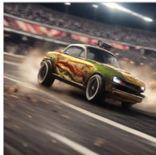

DrPO  

FestDPO (Ours)  
  
3D digital illustration, Burger with wheels speeding on the race track, supercharged, detailed, hyperrealistic, 4K

  
A fat mafia frog wearing a suit smoking a cigar at a bar at night, oil painting , rembrandt

  
A gorgeous queen with cat like eyes

  
Cinematographic photo of an astronaut sitting in a chair, in an alien place, contemplating the stars on a starry night, desolation, dramatic cinematic scene, cinematic light, 4k, high detail

  
Figure 8: Qualitative comparison of FestDPO with PSO and DrPO on Pick-a-Pic V2.

## G.2 PARTI-PROMPTS

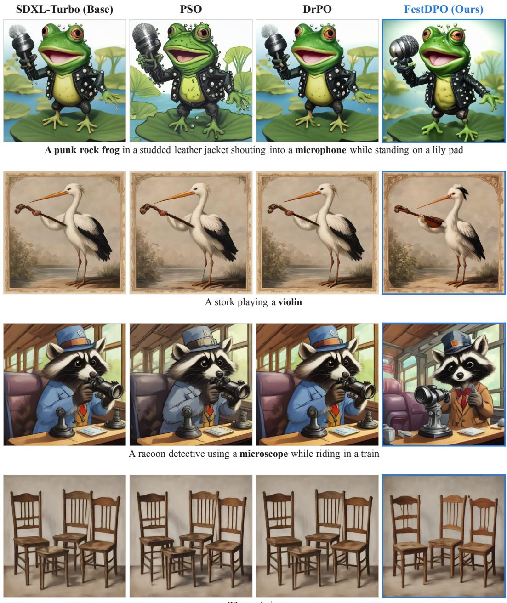  
Three chairs

Figure 9: Qualitative comparison of FestDPO with PSO and DrPO on Parti-Prompts.

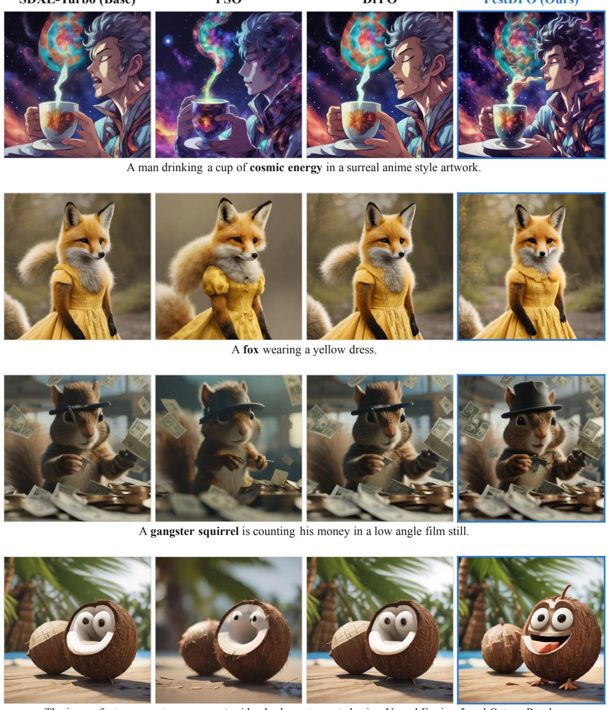

## G.3 HPSV2

SDXL-Turbo (Base)

PSO

DrPO

FestDPO (Ours)

The image features a cartoon coconut with a ko ko nut, created using Unreal Engine 5 and Octane Render.

Figure 10: Qualitative comparison of FestDPO with PSO and DrPO on HPSv2.

## H HUMAN EVALUATION

Evaluation protocol. We conduct the human evaluation using the annotation interface shown in Figure 11. The evaluation includes 80 prompts randomly drawn from the three prompt sets used in our experiments: 29 from Pick-a-Pic v2, 20 from Parti-Prompts, and 31 from HPSv2. For each prompt, annotators are presented with four images generated by SDXL-Turbo, PSO, DrPO, and FestDPO and rate each image on a 1–5 scale for prompt alignment and aesthetics. To prevent annotators from identifying which method generates each image, all images are anonymized. For each annotator, we independently randomize both the prompt order and the arrangement of the four images.

Participants. We recruited 15 annotators from collaborators, lab members, and friends of the authors for the human evaluation. In total, we collected 9,600 ratings (15 annotators × 320 images × 2 evaluation criteria). The median completion time per annotator is about 36 minutes.

Results and reliability. As shown in Table 17, FestDPO achieves the highest mean ratings for both prompt alignment and aesthetics across all three prompt sets. The improvements over all baselines are statistically significant (p < 0.001, Wilcoxon signed-rank test (Wilcoxon, 1945)). The pairwise comparison in Figure 12 further shows consistently higher win rates for FestDPO against all baselines on both criteria. Specifically, FestDPO achieves win rates of 76–84% for prompt alignment and 72–81% for aesthetics against the three baselines. Moreover, all 15 annotators individually assign FestDPO the highest mean rating on both criteria. The mean pairwise Spearman correlation between annotators is 0.35 for prompt alignment and 0.32 for aesthetics. Finally, the mean ratings differ by at most 0.06 across the four display positions, suggesting that the results are not substantially affected by image placement.

3D digital illustration, Burger with wheels speeding on the race track, supercharged, detailed, hyperrealistic, 4K

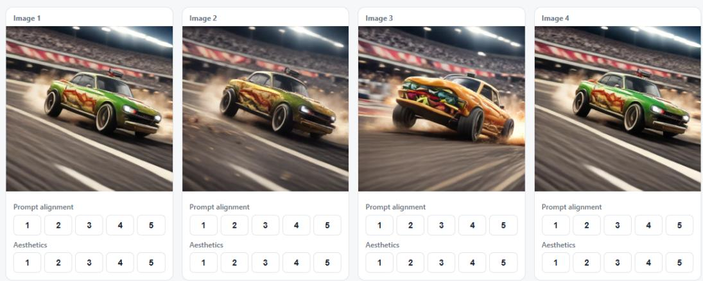  
Figure 11: Screenshot of the annotation interface used for human evaluation. For each text prompt, four images generated by different methods are displayed side by side in randomized order. Anno tators rate each image on a 1–5 scale for prompt alignment and aesthetics.

Table 17: Human evaluation results on Pick-a-Pic v2, Parti-Prompts, HPSv2.
<table><tr><td></td><td colspan="2">Overall</td><td colspan="2">Pick-a-Pic v2</td><td colspan="2">Parti-Prompts</td><td colspan="2">HPSv2</td></tr><tr><td>Method</td><td>Align. ↑</td><td>Aes. ↑</td><td>Align. ↑</td><td>Aes. ↑</td><td>Align. ↑</td><td>Aes. ↑</td><td>Align. ↑</td><td>Aes. ↑</td></tr><tr><td>SDXL-Turbo</td><td>3.683</td><td>3.149</td><td>3.756</td><td>3.248</td><td>3.497</td><td>3.080</td><td>3.735</td><td>3.101</td></tr><tr><td>PSO</td><td>3.767</td><td>3.286</td><td>3.731</td><td>3.156</td><td>3.607</td><td>3.103</td><td>3.903</td><td>3.525</td></tr><tr><td>DrPO</td><td>3.696</td><td>3.158</td><td>3.759</td><td>3.234</td><td>3.520</td><td>3.057</td><td>3.751</td><td>3.151</td></tr><tr><td>FestDPO (ours)</td><td>4.199</td><td>3.860</td><td>4.329</td><td>3.936</td><td>4.137</td><td>3.793</td><td>4.118</td><td>3.832</td></tr></table>

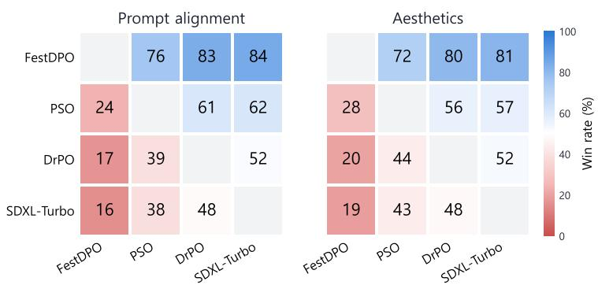  
Figure 12: Pairwise win rates (%) in the human evaluation for prompt alignment and aesthetics. Each entry indicates the percentage of comparisons in which the method on the y-axis is preferred over the method on the x-axis.