# FIONA: ACCELERATING FHE INFERENCE WITHPACKING-AWARE TERNARY WEIGHTS

Yiteng PENG1 Zhibo LIU2 Dongwei XIAO1 Shuai WANG1

1The Hong Kong University of Science and Technology

2State Key Laboratory of Novel Software Technology, Nanjing University {ypengbp,dxiaoad,shuaiw}@cse.ust.hk zhiboliu@nju.edu.cn

## ABSTRACT

Fully homomorphic encryption (FHE) enables neural network inference directly on encrypted inputs, but it remains orders of magnitude slower than plaintext inference. Applying the server’s plaintext weights to encrypted activations involves plaintext–ciphertext multiplications (PMult) and accounts for more than half of inference time in recent systems. Ternary quantization can replace these multiplications with additions and subtractions, but the savings rarely materialize under packed execution. A single PMult applies a weight group fixed by the packing layout and can be avoided only when all its weights share the same ternary value. Ternarizing all groups, however, largely degrades accuracy.

We present FIONA, an offline optimizer that selectively ternarizes weights within a given packing layout based on the estimated effect of ternary conversion on the model’s performance. FIONA encourages a shared ternary value within each weight group and retains full-precision weights for sensitive groups, so ternarized and full-precision paths coexist within a layer. It then compiles these hybrid operators exactly, applying common scaling factors once to accumulated inputs and reusing sums across outputs. Weight ternarization can also narrow the input ranges of downstream polynomials. FIONA fits lower-degree replacements under a cumulative accuracy budget, reducing multiplicative depth and bootstrapping. On VGG11, ViT, and BERT, FIONA reduces PMult operations by 53.4–79.5% and accelerates end-to-end encrypted inference by 2.38×, 1.68×, and 1.84×, respectively, with less than 1% accuracy loss across all three models.

## 1 INTRODUCTION

Cloud-hosted deep learning (DL) services support applications involving sensitive data, such as medical images and private text. Fully homomorphic encryption (FHE) enables these services by letting the server compute directly on encrypted inputs (Gentry, 2009; Cheon et al., 2017; Zhang et al., 2025). The client encrypts its input and sends the ciphertext to the server, which evaluates the model on it using weights that it holds in plaintext and returns an encrypted prediction that only the client can decrypt (Gilad-Bachrach et al., 2016). Despite these benefits, the computational cost of FHE remains a major barrier to deployment. To reduce computational cost, existing FHE-DL systems optimize ciphertext packing and execution flows through convolution packing (Ebel et al., 2025), column and diagonal packing (Zhang et al., 2026), or column-wise input encoding (He et al., 2025); other approaches approximate nonlinear activation operators with polynomials (Ao & Boddeti, 2024; Xie et al., 2026)

However, a major source of this cost is linear computation with plaintext weights, which involves plaintext–ciphertext multiplication (PMult). A recent GPU profile of FHE-protected LLaMA-3- 8B attributes up to 68% of its runtime to such plaintext–ciphertext matrix multiplication (Zhang et al., 2026). Unlike the activations, the weights are plaintext and fixed before any query arrives, so their representation can be optimized offline, and every encrypted operation removed in this way is saved on each later inference. A few approaches do optimize weight computation, yet their designs are tailored to particular encodings or model architectures, through sub-block pruning for

CNNs in SpENCNN (Ran et al., 2023) and block-circulant weights with a matching encoding in PrivCirNet (Xu et al., 2024), so their savings do not automatically carry over to different packing layouts. We therefore study how to reduce weight multiplications by changing weight values under a backend’s existing packing layout.

A ternary weight of +1, −1, or 0 needs no multiplication in a weighted sum, because the server can add the encrypted input to the output, subtract it, or skip it. In our measurement, a weighted sum of 64 ciphertexts is 14.8× faster than the same sum computed with PMult (Table 1). Ternary quantization (Wang et al., 2023; Ma et al., 2024), which restricts each weight to one of these three values times a scaling factor, is therefore a natural starting point for reducing weight multiplications.

However, ternary weights alone do not remove PMult operations, because a backend does not always apply weights one at a time. CKKS (Cheon et al., 2017), the FHE scheme that most encrypted inference systems adopt, packs a vector of values into each ciphertext, and one PMult applies a vector of weights to it. The backend’s packing layout determines which weights share one such vector, and we call each such set of weights an execution group. An addition or a subtraction also acts on a whole ciphertext, so the server can avoid the PMult only when all weights in the group have the same ternary value. We call such a group pure. A group that holds different values, such as +1 and 0, still requires the PMult.

Standard ternary quantization does not account for this structure, and it is ineffective in two respects. Scalar ternary quantization of ResNet-8 leaves only 4.06% of the execution groups pure, so the remaining 95.94% still require a full PMult, and it also reduces CIFAR-10 accuracy from 87.53% to 82.43% (Sec. 3). These observations yield two requirements that are in tension. (1) Grouplevel uniformity. A reduction in cost is obtained per execution group rather than per weight, so the ternary weights of a converted group must share a single value. (2) Selective conversion. Conversion reduces accuracy, so it must be restricted to the groups whose conversion the task can tolerate, and the remaining groups must retain their original full-precision weights.

We present FIONA, an offline optimizer that makes this decision group by group and then compiles the result. FIONA takes a network, its polynomial approximations, and the backend’s packing layout, and produces an execution plan that the server replays on every query. It first trains the weights to encourage each group to adopt a shared ternary value, applying stronger pressure to groups that are less sensitive to ternary conversion and leaving the most sensitive groups unconverted. The measure it uses is a group’s task sensitivity, an estimate of how much the model’s loss would rise if that group were converted. Every group therefore takes one of two routes, a cheap signed route or an ordinary multiplication route, and both coexist within a layer. In addition, weight ternarization can narrow the input ranges of the polynomials used for nonlinear operators. FIONA fits lower-degree replacements and selects those that reduce multiplicative depth, further accelerating encrypted inference.

In summary, this paper makes the following contributions:

• A hybrid weight representation that aligns ternary structure with packed execution. Task sensitivity guides ternarizations in fixed packing groups and retention of full-precision weights to balance encrypted cost and accuracy.

• An exact compilation step that applies one reconstruction factor per signed sum and shares recurring sums across outputs, followed by lower-degree polynomial refitting on the routed model under a cumulative accuracy budget.

• An implementation evaluated on CNN and Transformer models for image and text classification. On VGG11, ViT, and BERT, FIONA removes 53.4% to 79.5% of PMult operations and 37.0% to 57.1% of ciphertext refreshes, making encrypted inference 2.38×, 1.68×, and 1.84× faster than full-precision baselines, with less than 1% accuracy loss.

## 2 PRELIMINARIES

## 2.1 ENCRYPTED DL INFERENCE WITH FHE

Setting. We consider inference between a client that holds a private input and a server that hosts the model. FHE lets the server compute on ciphertexts without access to the secret key, so the encrypted output decrypts to the result of the same computation on the plaintext input (Cheon et al., 2017).

The client encrypts its input, sends it to the server, and decrypts the returned prediction. The server holds the model weights in plaintext, and we call them plaintext weights; the input, the intermediate activations, and the prediction are encrypted.

Threat Model. We assume an honest-but-curious server that follows the prescribed protocol but may try to infer private information from the data it processes. The semantic security of the underlying FHE scheme protects the client’s input values and prediction from the server. Input shapes and padding masks are public metadata.

## 2.2 PACKED CKKS EXECUTION

Ciphertexts and Slots. Among modern FHE schemes (Fan & Vercauteren, 2012; Brakerski et al., 2014; Chillotti et al., 2020), we focus on CKKS (Cheon et al., 2017), which supports approximate arithmetic on vectors of real numbers and is the scheme adopted by most recent work on encrypted neural network inference (Ao & Boddeti, 2024; Ebel et al., 2025; Zhang et al., 2025; 2026). One CKKS ciphertext holds a vector of values rather than a single number, each in its own slot, and one homomorphic operation processes all slots in parallel.

Homomorphic Operations. A computation on CKKS ciphertexts can be represented as an arith metic circuit, that is, a fixed sequence of additions and multiplications which always involves five basic operations. Addition and subtraction (Add, Sub) combine two ciphertexts slot by slot, and a rotation (Rot) cyclically shifts the slots so that values in different slots can be added together. The other two operations are multiplications, and they differ in their second operand. A PMult multiplies a ciphertext slot by slot with a plaintext vector, whereas a ciphertext–ciphertext multiplication (CMult) multiplies two ciphertexts. The weights are plaintext and the activations are encrypted, so a convolution or a matrix multiplication applies its weights with PMult and sums the products with Rot and Add. CMult is needed only where two encrypted values are multiplied, for example, when a polynomial activation squares its input or when attention multiplies the query and key matrices. In our measurement, computing a weighted sum with Add and Sub takes less than one tenth of the time with PMult (Table 1), removing most of the computation cost.

Levels and Bootstrapping. CKKS attaches a scaling factor to each ciphertext, and a multiplication multiplies the factors of its two operands. The evaluator restores the scale by rescaling, which consumes one level from a finite modulus chain fixed at key generation, so a ciphertext supports only a limited number of successive multiplications. The number of levels a circuit needs is its multiplicative depth, that is, the longest chain of dependent multiplications. When a circuit needs more levels than remain available, bootstrapping refreshes the ciphertext at a substantially highe cost than ordinary homomorphic operations (Cheon et al., 2018a;b; Ao & Boddeti, 2024; Ebel et al., 2025). Fewer multiplications reduce arithmetic work, while lower multiplicative depth can reduce bootstrapping operations.

Execution Plan. The operations, plaintext operands, and rescaling and bootstrapping schedule are independent of encrypted input values and fixed before any query arrives. We call this fixed program an execution plan Π. The model provider builds it offline from its training or calibration data, and the server replays it on every query.

## 2.3 PLAINTEXT WEIGHTS UNDER A PACKING LAYOUT

Packed Evaluation of a Linear Layer. To evaluate a convolution or a matrix multiplication, a backend maps tensor elements to ciphertext slots and encodes the layer’s weights as plaintext operands. It applies these operands with PMult and combines the results with Rot and Add (Dathathri et al., 2020; Ran et al., 2023; Zhang et al., 2025). Each PMult acts on the entire packed operand, regardless of the values of the weights inside it.

Packing Layout and Execution Groups. We call this backend-specific mapping a packing layout Γ. For layer l, the layout $\Gamma _ { l }$ specifies which weights share one plaintext operand. We call each such group an execution group and denote the layer’s groups by $\mathcal { G } _ { l }$ . For example, under the convolution layout we evaluate, a group contains the weights on one diagonal of an output-channel block at a fixed kernel position (Sec. 5). The layout determines the granularity at which plaintext weights are applied, so whether a weight multiplication can be simplified depends on the values across the entire execution group.

Ternary Weight Quantization. Ternary quantization replaces each weight with a value in {−1, 0, +1} scaled by a per-output-channel factor, which we call the reconstruction factor, so that, in a weighted sum, a product can become an addition, a subtraction, or a skipped term (Wang et al., 2023; Ma et al., 2024). Since rounding is not differentiable, such networks are trained with quantization-aware training (Jacob et al., 2018) and a straight-through estimator (Bengio et al., 2013) for the rounding step (Sec. 4.1).

## 2.4 POLYNOMIAL OPERATORS

FHE-friendly Polynomial Networks. CKKS evaluates only additions and multiplications, so nonlinear operators, such as ReLU, GELU, Softmax, and the reciprocal square root in LayerNorm, cannot be evaluated directly. Replacing them with a polynomial approximation, or with an alternative using only supported arithmetic, and training the network to tolerate the replacement, is standard practice in non-interactive FHE inference (Ao & Boddeti, 2024; Xie et al., 2026; Zimerman et al., 2024; Nam et al., 2025). We call the resulting graph an FHE-friendly polynomial network. FIONA takes such a network, with its supplied activation and normalization polynomials, as input and opti mizes its weights.

Polynomial Cost and Approximation Range. A polynomial is itself an arithmetic circuit, so its degree and evaluation strategy determine the number of multiplications it performs and the depth it adds. Lower-degree approximations can reduce both and allow more layers to be evaluated within the available levels, but lowering the degree too far increases approximation error and degrades accuracy. Each approximation is fitted over a specified input interval, and at the same error tolerance a narrower interval allows a lower degree. In a network, the interval must cover the values that the operator receives. The preceding layers compute these values from their weights, so changing the weights can narrow the interval and allow a lower degree (Sec. 3.1).

## 3 MOTIVATION

A ternary weight needs no multiplication, but in packed FHE one PMult applies all weights of an execution group at once (Sec. 2.3), so the server can drop the PMult only when every weight in the group takes the same ternary value. Training weights toward this condition, in turn, can reduce model accuracy. We quantify the cost of plaintext weights (Observation 1), the efficiency and accuracy limits of scalar ternarization (Observation 2), and its potential to reduce polynomial cost (Observation 3), and then state what they imply for the design of FIONA.

## 3.1 OBSERVATIONS

Observation 1. Plaintext weights remain a major cost. Fig. 1 breaks down four published FHE inference profiles, covering one CNN and three Transformer models on CPUs and GPUs (Ao & Boddeti, 2024; Zhang et al., 2025; Park et al., 2025; Zhang et al., 2026), into computation with plaintext weights, bootstrapping, and other operations. Computation with plaintext weights takes 51.0–68.0% of the reported inference time, more than half in every profile. On AutoFHE’s ResNet-32, for example, it takes 51.6%, compared with 45.3% for bootstrapping.

Observation 2. Ternary quantization alone rarely removes a PMult. We call an execution group pure when all its weights have the same ternary value, and mixed otherwise. For a pure group, the server replaces the PMult by an Add, a Sub, or a skip of the input ciphertext. A mixed group still needs the PMult (He et al., 2025); splitting it into a positive and a negative part instead requires selector masks and additional operations.

Table 1 compares these paths on a weighted sum of 64 input ciphertexts. With full-precision weights and with mixed ternary groups, the sum takes nearly the same time, 14.16 and 14.15 ms, because both cases use PMult. With pure ternary groups, the sum uses only Add and Sub, and it takes 0.96 ms, 14.8× faster. Splitting mixed groups with sign selectors is slower than the PMult, at 26.51 ms. Whether a group can avoid the PMult is therefore decided by all of its weights together, not by any single weight.

Scalar ternary quantization, which rounds each weight on its own, produces few pure groups. We trained a ResNet-8 on CIFAR-10 with scalar ternary quantization-aware training (QAT (Jacob et al.,

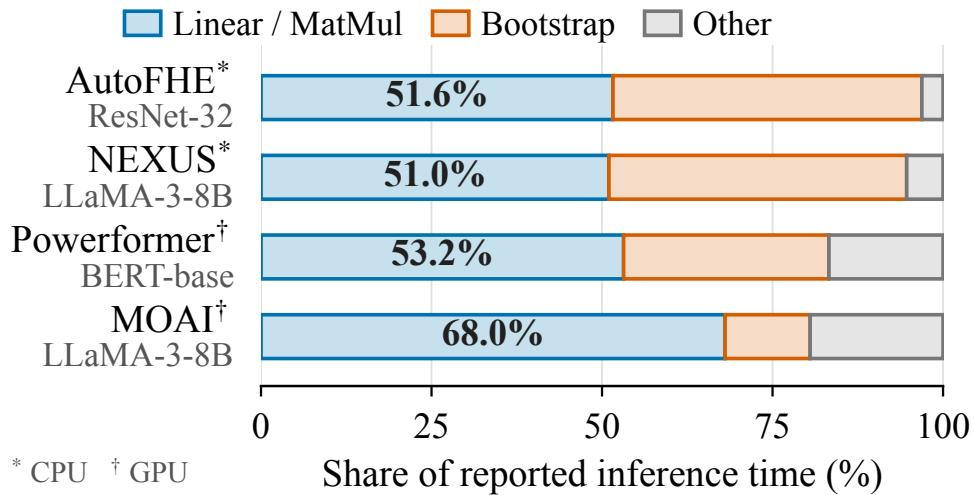  
Figure 1: FHE inference time breakdowns reported in recent work.

Table 1: Kernel latency for a weighted sum of 64 packed inputs $( N = 8 1 9 2 , s c a l e = 2 ^ { 4 0 } )$ . Values are medians of five runs after one warmup.
<table><tr><td>Case</td><td>Path</td><td>Latency</td></tr><tr><td>Full precision</td><td>PMult</td><td>14.16 ms</td></tr><tr><td>mixed ternary</td><td>PMult</td><td>14.15 ms</td></tr><tr><td>pure ternary</td><td>Add/Sub</td><td>0.96 ms</td></tr><tr><td></td><td>Selector split Mask+Add/Sub 26.51 ms</td><td></td></tr></table>

2018)) and split the flattened weights of each output channel into consecutive groups of eight. Of the 9,664 complete groups, 4.06% are pure and 95.94% are mixed. Since a weight’s ternary value is the rounding of its trained value, a group becomes pure only if training moves all of its weights to the same value, and the scalar QAT objective does not encourage this.

Additionally, on CIFAR-10, a full-precision ResNet-8 reaches 87.53% accuracy, and the same model trained with scalar ternary QAT on all weights reaches 82.43%. A partial variant of the same QAT, which ternarizes a fixed random subset of about half the weights and keeps the other weights at full precision, reaches 84.31% on average over three seeds. Partial conversion thus retains more accuracy than full conversion in this comparison.

Observation 3. Ternarization allows lower-degree polynomials. Ternarization also changes the outputs of a linear layer, which are the inputs of the polynomial that follows it. Consider one output, $w ^ { \top } x ,$ with n weights $v \in \mathbb { R } ^ { n }$ and input vector $x \in \mathbb { R } ^ { n }$ . Ternary quantization replaces w with γq, where $q \in \{ - 1 , 0 , + 1 \} ^ { n }$ holds the ternary values and $\begin{array} { r } { \gamma = \frac { 1 } { n } \sum _ { i = 1 } ^ { \bar { n } } | w _ { i } | } \end{array}$ , the mean absolute weight, is the reconstruction factor (Sec. 2.3). If the entries of x are uncorrelated and have the same variance $\sigma _ { x } ^ { 2 } .$ , that is, x has covariance matrix $\sigma _ { x } ^ { 2 } I$ with I the $n \times n$ identity matrix, then

$$
\mathrm { V a r } ( ( \gamma q ) ^ { \top } x ) = \sigma _ { x } ^ { 2 } \gamma ^ { 2 } \| q \| _ { 2 } ^ { 2 } \leq \sigma _ { x } ^ { 2 } \| w \| _ { 2 } ^ { 2 } = \mathrm { V a r } ( w ^ { \top } x ) .\tag{1}
$$

The equalities use $\mathrm { V a r } ( a ^ { \top } x ) = \sigma _ { x } ^ { 2 } \| a \| _ { 2 } ^ { 2 }$ for any fixed $a \in \mathbb { R } ^ { n }$ . The inequality holds because $\| q \| _ { 2 } ^ { 2 } \dot { \le } n$ , as every entry of $q \ \mathrm { i s \ - 1 } , 0 , \mathrm { o r \ + 1 }$ , and because $\begin{array} { r } { n \gamma ^ { 2 } = \frac { 1 } { n } ( \sum _ { i } | \dot { w _ { i } } | ) ^ { 2 } \overset { \cdot } { \le } \sum _ { i } w _ { i } ^ { 2 } } \end{array}$ by the Cauchy–Schwarz inequality (Steele, 2004). The variance of the ternary output is thus at most that of the full-precision output, so the polynomial’s input interval can be narrower, which allows a lower degree at the same error (Sec. 2.4).

We checked this effect at the first ReLU in the first residual block of ResNet-8, comparing the full-precision and the scalar ternary model (Fig. 2). The input radius, the 99.9th percentile of the absolute inputs, decreases from 3.17 to 1.90. For a degree-4 polynomial fitted to ReLU on the corresponding interval, the root mean squared error (RMSE) falls from 0.1169 to 0.0454, and a degree-2 polynomial on the ternary model, with an RMSE of 0.0861, is still more accurate than degree 4 on the full-precision model. At this site, ternarization therefore allows a lower degree at a lower error.

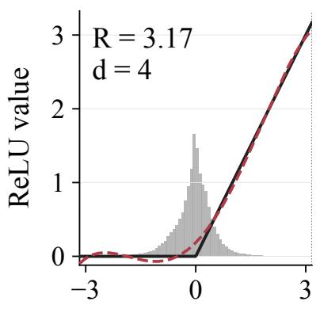  
(a) FP32 baseline

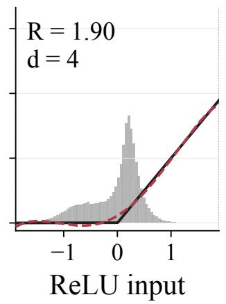  
(b) Ternary same degree

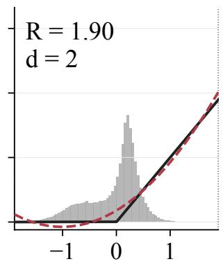  
(c) Ternary lower degree

Figure 2: Input distribution and polynomial fits at the first ReLU in the first residual block of fullprecision and scalar-ternary ResNet-8. The radius R is the 99.9th percentile of absolute sampled inputs. Polynomials approximate ReLU directly by least squares on [−R, R].  
Table 2: Model-side optimization across approaches.
<table><tr><td>Work</td><td>Weight Str. Öpt.</td><td>Relation to packing</td><td>Low-degree design</td></tr><tr><td>SpENCNN (Ran et al., 2023)</td><td>√</td><td>Co-designed</td><td>X</td></tr><tr><td>PrivCirNet (Xu et al., 2024)</td><td>√</td><td>Co-designed</td><td>X</td></tr><tr><td>ENSI (He et al., 2025)</td><td>X</td><td>Co-designed</td><td>X</td></tr><tr><td>AutoFHE (Ao &amp; Boddeti, 2024)</td><td>X</td><td></td><td>√</td></tr><tr><td>ULD-Net (Xie et al., 2026)</td><td>X</td><td></td><td>√</td></tr><tr><td>FIONA</td><td>√</td><td>Given layout</td><td>V</td></tr></table>

Weight Str. Opt.: methods that optimize weight structure to reduce packed linear cost; Packing: relation between weight representation and encoding (—: no joint design); Low-degree design: dedicated methods for low-degree polynomial networks or degree reduction. ✓: covered; ×: not covered.

## 3.2 IMPLICATIONS FOR DESIGN

These observations lead to three design decisions. Observation 1 shows that plaintext weights are the largest cost, and Observation 2 that the unit of saving is the execution group, so FIONA ternarizes weights under the backend’s fixed packing layout and trains each group toward one shared ternary value (Sec. 4.1). Observation 2 additionally shows that converting all groups costs accuracy, so FIONA converts only the groups whose conversion the task tolerates, judged by each group’s task sensitivity, the estimated rise in task loss from converting it, and keeps the original, or raw, weights elsewhere. A layer then mixes pure groups on the Add/Sub path with raw groups on the PMult path, and FIONA compiles both paths exactly (Sec. 4.2). Observation 3 shows that ternarization changes the polynomials’ inputs, so FIONA selects polynomial degrees after the weights are fixed, fitting each polynomial on the converted model’s input range under an accuracy budget (Sec. 4.3).

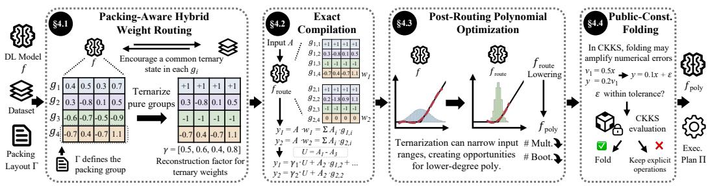  
Figure 3: Overview of FIONA.

## 3.3 POSITIONING OF OUR APPROACH

Existing FHE-DL systems mainly improve packing and dataflow (Ebel et al., 2025; Zhang et al., 2026) or reduce polynomial computation through degree selection and low-degree network training (Ao & Boddeti, 2024; Xie et al., 2026). Among approaches targeting weight computation, SpENCNN co-designs sub-block pruning and packing (Ran et al., 2023), while PrivCirNet uses block-circulant weights with a matching encoding (Xu et al., 2024). ENSI instead executes alreadyternarized linear layers using column-wise packing (He et al., 2025). Table 2 summarizes these optimization choices.

FIONA optimizes weights within the execution groups of a given packing layout. Guided by task sensitivity, it encourages a common ternary state within each group and retains raw weights in selected sensitive groups. The resulting hybrid operators reduce multiplications for nonzero weight contributions while retaining full precision where needed. Exact compilation further reduces repeated reconstruction and accumulation work. With weights fixed, FIONA fits and selects lower-degree polynomials using the resulting input distributions, exploiting the approximation opportunities created by weight optimization.

## 4 DESIGN OF FIONA

Given a polynomial network with plaintext weights and a fixed packing layout Γ, FIONA uses the model provider’s data for training and calibration to construct a CKKS execution plan Π offline. Fig. 3 shows the four stages.

⃝1 Packing-Aware Hybrid Weight Routing. FIONA optimizes the weights with a loss that pushes each execution group toward one shared ternary value, weighting the loss by the group’s task sensitivity, and keeps the raw weights of the most sensitive groups. The output model fixes the ternary/full-precision routes and reconstruction factors. These partially quantized weights, togethe with the supplied activation and normalization polynomials, define the routed model froute.

⃝2 Exact Compilation of Routed Linear Operators. With routes fixed, FIONA rewrites each linear layer in three ways. It applies the reconstruction factors once to a signed sum of input ciphertexts rather than once per input, computes a signed sum once when several outputs share it, and adds an output’s signed and raw results before the rescaling that follows a PMult. Each rewrite is an algebraic identity, so the layer computes the same function with fewer PMult, Add/Sub, and rescaling operations.

⃝3 Post-routing Polynomial Optimization. Then, for the routed model $f _ { \mathrm { r o u t e } } ,$ FIONA fits lowerdegree candidates for the supplied polynomials on a calibration dataset and accepts the replacements that reduce the multiplicative depth within a cumulative accuracy budget, producing $f _ { \mathrm { p o l y } }$

⃝4 Public-Constant Folding and Plan Export. FIONA folds public constants into adjacent operators, keeping the unfolded form wherever a numerically sensitive fold fails an error check against it. It then removes unused operations and exports the final execution plan Π.

## 4.1 PACKING-AWARE HYBRID WEIGHT ROUTING

As Sec. 3.2 concluded, FIONA must make execution groups pure under the fixed packing layout $\Gamma .$ and it must leave the groups whose conversion the task cannot tolerate at their raw weights. This stage does both during training, guided by task sensitivity. We describe the weight representation, the sensitivity estimate, the training objective, and the protection of sensitive groups in turn.

Packing-Aware Weight Representation. During ternary quantization, FIONA computes a public reconstruction factor $\gamma _ { o }$ for each output channel o as the mean absolute value of its weights. Let $W _ { o , i }$ be the ith of the n weights feeding channel o. The reconstruction factor and ternary candidates are

$$
\begin{array} { l } { { \displaystyle \gamma _ { o } = \frac { 1 } { n } \sum _ { i = 1 } ^ { n } | W _ { o , i } | , } } \\ { { \displaystyle q _ { o , i } = \mathrm { c l i p } _ { [ - 1 , 1 ] } \left( \mathrm { r o u n d } \frac { W _ { o , i } } { \gamma _ { o } } \right) , \qquad \widehat { W } _ { o , i } = \gamma _ { o } q _ { o , i } . } } \end{array}\tag{2}
$$

Rounding to the nearest integer and clipping to $[ - 1 , 1 ]$ yields ternary values in $\{ - 1 , 0 , + 1 \}$ . For $\gamma _ { o } = 0$ , we set $q _ { o , i } = 0$ . The layout groups these values and candidate weights into $q _ { g }$ and $\widehat { W } _ { g }$ respectively.

A group g is pure when all its ternary values are identical, i.e., $q _ { g } = h _ { g } { \bf 1 }$ for $h _ { g } \in \{ - 1 , 0 , + 1 \}$ where 1 is the all-ones vector, and mixed otherwise. A pure group can take the signed route. The server adds the input ciphertext when $h _ { g } = + 1$ , subtracts it when $h _ { g } = - 1$ , and skips it when $h _ { g } = 0$ , and it applies the reconstruction factors afterwards. For example, the groups (1, 1, 1, 1) and $( - 1 , - 1 , - 1 , - 1 )$ replace their multiplications by one addition or one subtraction, whereas $( 1 , 0 , 1 , - 1 )$ still requires a vector PMult. Every other group takes the raw route, one PMult by the group’s raw weights. Since a group may span several output channels, its weights may have different reconstruction factors; Sec. 4.2 describes how the compiler applies them as one packed operand.

Task Sensitivity. Both decisions of this stage depend on how much the task loss would rise if a group were converted. FIONA estimates this rise for group $g$ from the candidate weight change $\Delta _ { g } = \widehat { W } _ { g } - W _ { g }$ as

$$
F _ { g } = \sum _ { i \in g } D _ { i } \Delta _ { g , i } ^ { 2 } ,\tag{3}
$$

where $D _ { i }$ estimates the curvature of the task loss with respect to weight i,

$$
D _ { i } = \mathbb { E } _ { \mathrm { d a t a } } \left[ \sum _ { p } \left( x _ { p } ^ { ( i ) } \frac { \partial \ell _ { \mathrm { t a s k } } } { \partial z _ { p } ^ { ( i ) } } \right) ^ { 2 } \right] .\tag{4}
$$

Here $\ell _ { \mathrm { t a s k } }$ is the task loss of one training sample, $\mathbb { E } _ { \mathrm { d a t a } }$ averages over the training samples, and p indexes the uses of weight i within one sample, such as the spatial positions of a convolution or the tokens of a linear layer. At use $p ,$ weight i multiplies the input value $\boldsymbol { x } _ { p } ^ { ( i ) }$ , and the product enters the layer output $z _ { p } ^ { ( i ) }$ , so the summand is the squared contribution of that use to the gradient of the loss with respect to weight i. Thus $D _ { i }$ is a per-use form of the empirical Fisher diagonal, a standard estimate of the loss curvature under parameter changes (Kirkpatrick et al., 2017), and $F _ { g }$ is the resulting second-order estimate, up to a constant factor, of the loss increase caused by $\Delta _ { g }$ (LeCun et al., 1989). We call $F _ { g }$ the task sensitivity of group g (Sec. 1).

Sensitivity-Weighted Homogeneity Loss. To make groups pure, FIONA adds to the task loss a homogeneity loss that rewards agreement among the ternary values within a group. The rounding in Eq. 2 has zero gradient almost everywhere, so the loss uses a soft assignment of each weight to the three states. Let $u _ { i } = W _ { o , i } / \gamma _ { o }$ be weight i divided by its reconstruction factor, so that the rounding rule maps u between $- 1 / 2$ and $1 / \bar { 2 }$ to 0, and smaller and larger values to −1 and +1. FIONA computes $\bar { s } _ { i } ( 0 ) = \sigma ( \kappa ( 1 / 2 - | u _ { i } | ) )$ and $s _ { i } ( \pm 1 ) = \sigma ( \kappa ( \pm u _ { i } - 1 / 2 ) )$ ), where $\sigma$ is the sigmoid function and the fixed slope κ controls how sharply the scores change around these boundaries. The soft assignment of weight i to state c is the normalized score $\begin{array} { r } { p _ { i } ( c ) = s _ { i } ( c ) / \sum _ { c ^ { \prime } \in \{ - 1 , 0 , + 1 \} } s _ { i } ( c ^ { \prime } ) } \end{array}$ It is differentiable in the weight, and it approaches the rounding rule as κ grows.

The homogeneity loss of group g is

$$
\mathcal { L } _ { \mathrm { h o m } , g } = - \frac { 1 } { | g | } \log \sum _ { c \in \{ - 1 , 0 , + 1 \} } \prod _ { i \in g } p _ { i } ( c ) .\tag{5}
$$

If each weight were assigned a state independently according to $p _ { i }$ , the sum would be the probability that all weights of $g$ receive one common state, and the loss is the negative logarithm of this probability per weight. Minimizing it therefore moves the group toward one shared ternary state.

The training objective is

$$
\mathcal { L } = \mathcal { L } _ { \mathrm { t a s k } } + \frac { \lambda _ { \mathrm { g r o u p } } } { \vert \mathcal { G } \vert } \sum _ { g \in \mathcal { G } } a _ { g } \mathcal { L } _ { \mathrm { h o m } , g } .\tag{6}
$$

Here $\mathcal { L } _ { \mathrm { t a s k } }$ is the task loss, $\lambda _ { \mathrm { g r o u p } }$ sets the overall strength of the regularization, and $a _ { g }$ weights group g by its task sensitivity $F _ { g }$ so that less sensitive mixed groups are pushed harder. After each epoch, FIONA normalizes the scores $F _ { g }$ of the groups that were mixed in that epoch by subtracting their mean and dividing by their standard deviation across layers. It maps the normalized scores through a decreasing sigmoid, so a mixed group with lower sensitivity receives a larger $a _ { g }$ . Pure groups receive $a _ { g } = 1$

Protecting Sensitive Pure Groups. The homogeneity loss makes groups pure, but a pure group may still be one whose conversion the task cannot tolerate. FIONA therefore protects the most sensitive pure groups by keeping their raw weights, so that a protected group takes the raw route although it is pure. Protection is decided once per epoch from $F _ { g } ^ { \mathrm { ~ \tiny ~ { ~ \cdot ~ } ~ } }$ averaged over the preceding epoch, within each packing pool, the set of groups across layers that share the same grouping rule and group size under Γ (Table 3). With $\rho _ { \mathrm { P , m a x } }$ the maximum protection ratio, FIONA limits the fraction of groups on the signed route in each pool to $1 - \rho _ { \mathrm { P , m a x } } .$ . If the fraction of pure groups exceeds this limit, it protects the pure groups with the highest $F _ { g }$ until the limit is met; otherwise it protects none. For example, with $\rho _ { \mathrm { P , m a x } } = 0 . 2$ and 90 pure groups among 100, the 10 most sensitive pure groups are protected.

Let H denote the protected groups and $\mathcal { P } _ { \Gamma }$ the pure groups under Γ. The weights used in the forward pass are

$$
\widetilde { W } _ { g } = \left\{ \begin{array} { l l } { \widehat { W } _ { g } , } & { g \in \mathcal { P } _ { \Gamma } \setminus \mathcal { H } , } \\ { W _ { g } , } & { \mathrm { o t h e r w i s e } . } \end{array} \right.\tag{7}
$$

An unprotected pure group thus uses its ternary candidate, and every other group, mixed or protected, uses its raw weights. All groups remain trainable and contribute to the homogeneity loss, including protected groups.

Training Schedule and Output. Training uses $\widetilde { W } _ { g }$ in the forward pass and a straight-through estimator for the rounding in Eq. 2, so that gradients reach the raw weights of every group (Sec. 2.3). Group purity is recomputed on each forward pass, whereas the protected set H and the sensitivity scores used for loss weighting are updated once per epoch and stay fixed within it. After training, FIONA freezes the weights, the routes, and the reconstruction factors. The result, with the supplied polynomials, is the routed model froute.

## 4.2 EXACT COMPILATION OF ROUTED LINEAR OPERATORS

With weights and routes fixed, a linear layer of $f _ { \mathrm { r o u t e } }$ computes each packed output from signed terms (i.e., input ciphertexts that pure groups add or subtract) and raw terms (i.e., input ciphertexts that raw groups multiply). Evaluated term by term, every signed term still needs one PMult by the reconstruction factors, so the signed route would remove no PMult. This stage therefore rewrites the layer in three ways. It applies the reconstruction factors once to an output’s signed sum, the sum of its signed terms; it computes a signed sum once when several outputs share it; and it adds an output’s signed and raw results before the rescaling that follows a PMult. The rewrites preserve the layer’s function over real arithmetic and reduce CKKS operations.

Consider the example in Fig. 3. Two packed outputs $y _ { 1 }$ and $y _ { 2 }$ are computed from four input ciphertexts $A _ { 1 } , \ldots , A _ { 4 }$ , prepared according to the packing layout. In output $y _ { j } , \ g _ { j , i }$ denotes the group applied to $A _ { i }$ and also its vector of raw weights, which multiplies $A _ { i }$ slot by slot, and $\gamma _ { j }$ is the vector of reconstruction factors of the output channels packed in $y _ { j }$ . The groups $g _ { 1 , 1 }$ and g2,1 are pure with $h _ { g } = + 1 , g _ { 1 , 3 }$ and $g _ { 2 , 3 }$ with $h _ { g } = - 1$ , and $g _ { 2 , 4 }$ with $h _ { g } = 0 ;$ the remaining groups take the raw route. The outputs are

$$
\begin{array} { r l } & { y _ { 1 } = \gamma _ { 1 } A _ { 1 } - \gamma _ { 1 } A _ { 3 } + g _ { 1 , 2 } A _ { 2 } + g _ { 1 , 4 } A _ { 4 } , } \\ & { y _ { 2 } = \gamma _ { 2 } A _ { 1 } - \gamma _ { 2 } A _ { 3 } + g _ { 2 , 2 } A _ { 2 } . } \end{array}\tag{8}
$$

where all products are slot-wise and the all-zero group $g _ { 2 , 4 }$ contributes nothing. Evaluated term by term, the two outputs need seven PMult operations, four by reconstruction factors and three by raw groups.

Grouping Reconstruction Operations. Signed terms of the same output share one PMult when they use the same packed reconstruction factors and their input ciphertexts can be added directly in CKKS, that ${ \mathrm { i s } } ,$ at the same slot arrangement, level, and scale. FIONA first forms their signed sum and then applies the factors once. For example, $\gamma _ { 1 } A _ { 1 } - \gamma _ { 1 } A _ { 3 }$ in Eq. 8 becomes $\gamma _ { 1 } ( A _ { 1 } - A _ { 3 } )$ . The same rewrite applies to $y _ { 2 }$ . Each output needs one PMult by its reconstruction factors instead of two, and the total falls from seven to five.

Sharing Signed Sums. Different outputs can also reuse the same signed sum, even when their reconstruction factors differ. With $U = { \bar { A } } _ { 1 } - A _ { 3 }$ , the example becomes

$$
\begin{array} { l } { { y _ { 1 } = \gamma _ { 1 } U + g _ { 1 , 2 } A _ { 2 } + g _ { 1 , 4 } A _ { 4 } , } } \\ { { y _ { 2 } = \gamma _ { 2 } U + g _ { 2 , 2 } A _ { 2 } . } } \end{array}\tag{9}
$$

Computing $U$ once saves one subtraction. Each output then applies its own reconstruction factor to $U .$

To find such reusable sums, FIONA compares pairs of outputs and identifies the signed terms they have in common, namely the same input ciphertexts with the same signs, where the sign of a term is the common ternary value $h _ { g }$ of its group. A sum can also be reused with all signs reversed; for example, an output that needs $A _ { 3 } - A _ { 1 }$ uses −U. For each candidate sum, FIONA estimates the number of Add and Sub operations it removes. For a sum of m input ciphertexts shared by k outputs, it conservatively counts km operations for separate accumulation and $m + k$ for forming the shared sum and accumulating it into the k outputs. The estimated saving is therefore $k m - m - k$ FIONA accepts candidates with a positive estimate and, within one output, at most one of any two overlapping candidates, since using both would add an input ciphertext twice and change the result.

Combining the Signed and Raw Routes. A PMult raises the scale of its result, which CKKS restores by rescaling (Sec. 2.2). In an output such as $y _ { 1 }$ , the PMult by the reconstruction factors and the PMult by each raw group produce results at the same scale when their plaintext operands are encoded at the same scale, so FIONA adds these products first and rescales their sum once, instead of rescaling each product separately.

## 4.3 POST-ROUTING POLYNOMIAL OPTIMIZATION

As observed in Sec. 3.1, weight ternarization narrows the input ranges of downstream polynomials, so a polynomial fitted to the routed model can often have a lower degree, and thus a lower depth, than the supplied one. We call each evaluation of a supplied polynomial in the model a site and write $h _ { s }$ for the polynomial at site s; a site is an activation polynomial or a polynomial inside another operator, such as the inverse-square-root approximation in normalization. This stage fits lower-degree candidates at each site to the inputs the site receives in the current model, and then replaces polynomials site by site, in the order of the depth they can save, accepting a replacement only if the model stays within a cumulative accuracy budget relative to $f _ { \mathrm { r o u t e } }$

## Fitting Candidates to Current Inputs.

Starting from $f = f _ { \mathrm { r o u t e } } ,$ FIONA runs the current model $f ,$ which includes all accepted replacements, on the calibration dataset $\mathcal { D } _ { \mathrm { c a l } }$ and records, for each site $s ,$ the set $\chi _ { s } ( f )$ of values that arrive at the input of $h _ { s } . \mathrm { ~ A ~ }$ candidate for site s is a polynomial $q _ { s } ( x ; \theta )$ of lower degree than $h _ { s } ,$ , including constants and first-degree polynomials, with coefficient vector θ. FIONA fits each candidate to $h _ { s }$ on these inputs by weighted least squares,

$$
\theta ^ { * } = \underset { \theta } { \arg \operatorname* { m i n } } \sum _ { x \in \mathcal { X } _ { s } ( f ) } w _ { s } ( x ) \left\| h _ { s } ( x ) - q _ { s } ( x ; \theta ) \right\| _ { 2 } ^ { 2 } .\tag{10}
$$

Algorithm 1 Post-routing polynomial selection   
Require: Routed model $f _ { \mathrm { r o u t e } } ,$ data $\mathcal { D } _ { \mathrm { c a l } } , \mathcal { D } _ { \mathrm { s e l } }$ , budget ϵ   
1: $f \gets f _ { \mathrm { r o u t e } } ; S \gets \mathrm { G E T P O L Y S } ( f )$   
2: $\dot { b } \gets \mathrm { A C C U R A C Y } \left( f _ { \mathrm { r o u t e } } , \mathcal { D } _ { \mathrm { s e l } } \right)$   
3: while $s \neq \emptyset$ do   
4: $s \gets \mathrm { { N E X T P O L Y } } ( f , S )$   
5: $S \gets S \setminus \{ s \}$   
6: C ← FITCANDIDATES $( f , s , \mathcal { D } _ { \mathrm { c a l } } )$   
7: for each $q \in \mathcal { C } _ { s }$ in depth order do   
8: $f ^ { \prime } \gets f [ s \gets q ]$   
9: if $D ( f ^ { \prime } ) { < } D \bar { ( } f )$ then   
10: $a \gets \mathrm { A C C U R A C Y } ( f ^ { \prime } , \mathcal { D } _ { \mathrm { s e l } } )$   
11: ${ \mathbf i } { \mathbf f } a \geq b - \epsilon$ then   
12: $f \gets f ^ { \prime } ;$ break   
13: return $f _ { \mathrm { p o l y } }  f$

The weight ${ w _ { s } } ( x )$ makes the fitting error measure the error at the output of the operator that contains the site rather than at the output of $h _ { s }$ itself. For an activation polynomial the two coincide, so $w _ { s } ( x ) = 1$ . In normalization they differ. For example, standard LayerNorm computes $\mathbf { y } = { \pmb { \alpha } } \odot$ $\begin{array} { r } { ( { \bf x } - { \bf \dot { \mu } } ) \frac { 1 } { \sqrt { \sigma ^ { 2 } } } + { \beta } } \end{array}$ , where $\mu$ and $\sigma ^ { 2 }$ are the mean and variance of the input x, and α and $\beta$ are the learned weights and biases. When replacing the supplied inverse-square-root polynomial, its fitting error is multiplied by ${ \pmb { \alpha } } \odot ( { \bf x } - { \pmb { \mu } } )$ . We therefore use $w _ { s } ( x ) = \| \dot { \boldsymbol { \alpha } } \odot ( \mathbf { x } - \dot { \boldsymbol { \mu } } ) \| _ { 2 } ^ { 2 }$ to minimize the resulting squared error at the normalization output.

Selecting Replacements by Depth. FIONA guides the selection by the CMult depth of the model, depth(f), the longest chain of dependent CMult operations. Alg. 1 keeps the set $s$ of sites not yet processed and takes from $s$ the site whose candidates could reduce the depth the most. This reduction follows from the candidate degrees alone, so it is known before fitting. Sites with the same reduction are taken in the model’s execution order, and the reductions of the remaining sites are recomputed after each step, since a replacement can change which path through the model is the deepest.

At the chosen site $s ,$ FIONA fits the candidates (Eq. 10) and tries them in increasing order of the resulting model depth. For a candidate $q ,$ let $f ^ { \prime } = { \dot { f } } [ s  q ]$ denote the model after replacing $h _ { s }$ with $q . \mathbf { A }$ candidate is checked for accuracy only if dept $\mathrm { h } \left( f ^ { \prime } \right) < \mathrm { d e p t h } ( f )$ , and it is accepted if the accuracy of $f ^ { \prime }$ on a selection dataset $\tilde { \mathcal { D } } _ { \mathrm { s e l } } \ \mathrm { \bar { ( S e c . \ 5 ) } }$ is at most ϵ below that of $f _ { \mathrm { r o u t e } } ,$ , where ϵ is the accuracy budget. The first accepted candidate replaces $h _ { s } ;$ if none is accepted, $h _ { s }$ stays. Because every candidate is compared with the same reference $f _ { \mathrm { r o u t e } } ,$ the budget bounds the accuracy loss of all accepted replacements together rather than of each one separately. Each site is processed once, and the final model is $f _ { \mathrm { p o l y } }$

## 4.4 PUBLIC-CONSTANT FOLDING AND PLAN EXPORT

A public constant is a value the server holds in plaintext, such as a weight, a reconstruction factor, or a polynomial coefficient. With routes and polynomials fixed, FIONA folds public constants into adjacent operators in two directions.

Folding into the Following Polynomial. For a first-degree operation $t = a x + b$ with public a and b whose output is used only by the polynomial $p ,$ FIONA computes offline the coefficients of the composed polynomial ${ \widetilde p } ( x ) = p ( a x + b )$ , which has the same degree as $p ,$ and evaluates $\widetilde { p }$ on x directly, eliminating the separate PMult of t.

Folding into the Preceding Linear Operator. A multiplication by a public constant can instead be folded into the plaintext operands of the linear operator that produces its input. Suppose $y _ { 1 }$ in Eq. 9 is used only in a subsequent operation $z = a \cdot y _ { 1 }$ , where a is a public constant. We can rewrite this computation as $z = ( a \gamma _ { 1 } ) U + ( a g _ { 1 , 2 } ) A _ { 2 } + ( a g _ { 1 , 4 } ) A _ { 4 }$ . FIONA computes $a \gamma _ { 1 } , a g _ { 1 , 2 } ,$ , and $^ { a g _ { 1 , 4 } }$ offline and uses them in place of the original operands. The rest of the computation is unchanged, and the separate PMult for $a y _ { 1 }$ disappears.

Table 3: Packing layouts of the evaluated models, each taken from the cited work. The “Grouping Rule” states which weights form one execution group (Sec. 2.3), and the “Size” is the number of weights per group.
<table><tr><td>Model</td><td>Grouping rule</td><td>Size</td></tr><tr><td>VGG11</td><td>Diagonal. Group one diagonal within an output-channel block at a fixed kernel 8 position (Ebel et al., 2025).</td><td></td></tr><tr><td>ViT</td><td>Output lane. Group the weights connecting one input feature to a block of con- 4 secutive output features. (Zhang et al., 2025).</td><td></td></tr><tr><td>BERT</td><td>Single weight. Group each weight for an input ciphertext containing one feature 1 column (Zhang et al., 2026).</td><td></td></tr></table>

Checking Numerically Sensitive Folds. Each fold is an algebraic identity, so it leaves $f _ { \mathrm { p o l y } }$ unchanged as a function. However, folding public constants into polynomial coefficients may produce small coefficients whose CKKS encoding errors are amplified by large intermediate values. For these numerically sensitive folds, FIONA compares the folded and unfolded forms offline with the same encrypted inputs and CKKS backend. The maximum absolute errors of the two forms at the output of the folded operator, $E _ { \mathrm { f o l d } }$ and $E _ { \mathrm { k e e p } }$ , are measured against the same full-precision plaintext reference.

When both computations produce valid numerical results, FIONA accepts the folded form conservatively if $E _ { \mathrm { f o l d } } \leq \operatorname* { m a x } ( \eta \bar { E _ { \mathrm { k e e p } } } , \tau _ { s } )$ , where η bounds the error growth relative to the unfolded form, and $\tau _ { s }$ is an absolute tolerance at site s that avoids an overly strict bound when $E _ { \mathrm { k e e p } }$ is very small. We use $\eta = 1 0 \mathrm { a n d } \tau _ { s } = 1 0 ^ { - 4 }$ . If the folded form fails the check, FIONA keeps the unfolded form.

Finally, FIONA removes operations whose outputs are no longer needed and then exports the fixed execution plan Π.

## 5 IMPLEMENTATION AND SETUP

Implementation. We implement FIONA’s offline optimizer in Python, using PyTorch (Paszke et al., 2019) for weight training and polynomial fitting. Encrypted inference uses a C++ executor built on Microsoft SEAL 4.1 (SEAL) and the CKKS bootstrapping implementation from FHE-MP-CNN (Lee et al., 2022), as in NEXUS (Zhang et al., 2025) and MOAI (Zhang et al., 2026). The optimizer exports a plan Π that specifies the weights, polynomials, packed operations, and CKKS rescaling and bootstrapping schedules used by the executor.

Models and Baselines. We evaluate VGG11 (Simonyan & Zisserman, 2014) on CIFAR-10 (Krizhevsky et al., 2009), ViT-S/16 (Dosovitskiy, 2020) on Tiny-ImageNet, and BERT-base (Devlin et al., 2019) on SST-2 (Socher et al., 2013) with sequence length 128. VGG11 and ViT follow ULD-Net’s polynomial activation, normalization and RoPE attention designs (Xie et al., 2026; Su et al., 2024); BERT follows MOAI’s nonlinear approximation strategy (Zhang et al., 2026). For each model, the baseline keeps the raw weights of every layer and uses the supplied polynomials, and FIONA applies the offline optimizations of Sec. 4 to the same architecture. Following prior works (Xie et ${ \mathrm { a l . } } .$ , 2026; Zhang et al., 2026), both variants of VGG11 and ViT are trained from scratch with the polynomials in place, and both variants of BERT are fine-tuned from the same bert-base checkpoint with exact nonlinear functions, which are then replaced by MOAI’s polynomials. The baseline is trained with the task loss alone and the FIONA variant with Eq. 6. Both variants of a model use the same executor and packing layout. Table 3 gives the grouping rule and group size of each layout, and Fig. 4 illustrates the VGG11 and ViT rules. The VGG11 layout uses blocks of eight output channels, and the ViT layout uses blocks of four consecutive output features.

Optimization Settings. To balance accuracy and efficiency, we set the maximum protection ratio $\rho _ { \mathrm { P , m a x } } = 0 . 2 0$ , so that at most 80% of the groups in each packing pool take the signed route after each per-epoch protection decision (Sec. 4.1). As in ULD-Net (Xie et al., 2026), both ViT variants use variance regularization during training to stabilize polynomial normalization.

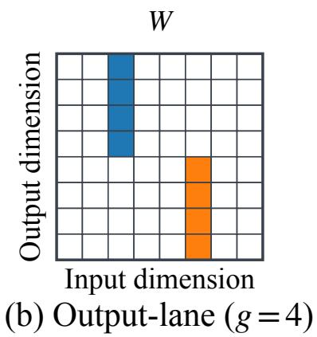

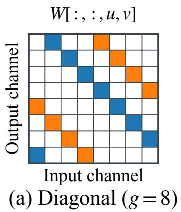

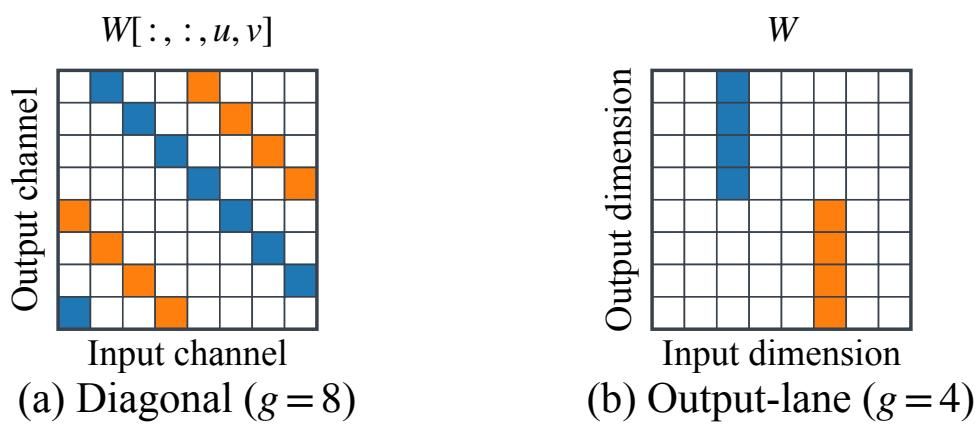  
Figure 4: Grouping rules of Table 3 for (a) VGG11 convolutions at a fixed kernel position $( u , v )$ and (b) ViT linear layers. Each color marks one group and $\mathbf { \vec { \tau } } ^ { 6 6 } \mathbf { \vec { g } } ^ { \prime }$ denotes the group size.

For the polynomial optimization of Sec. 4.3, the calibration dataset $\mathcal { D } _ { \mathrm { c a l } }$ is half of the CIFAR-10 test set for VGG11, half of the Tiny-ImageNet validation set for ViT, and 1,000 SST-2 training examples for BERT; the selection dataset $\mathcal { D } _ { \mathrm { s e l } }$ is the same half of the dataset for VGG11 and ViT, and the SST-2 development set for BERT. The accuracy budget is $\epsilon = 0 . 2 \%$ . The plaintext accuracies in Table 4 are measured on the full CIFAR-10 test set, Tiny-ImageNet validation set, and SST-2 development set, which include $\mathcal { D } _ { \mathrm { s e l } }$

Execution Environment. We run CKKS inference on Intel Xeon Platinum 8592+ CPUs, using 48 cores and 480 GiB of memory per run. Both variants use ring dimension $N = 2 ^ { 1 6 } , 2 ^ { 1 5 }$ slots per ciphertext, and scale $2 ^ { 4 6 }$ , following MOAI’s parameter settings (Zhang et al., 2026). One batch holds 4 images for VGG11, 32 images for ViT, and 256 sequences for BERT; these batch sizes fill the $2 ^ { 1 5 }$ slots of each ciphertext under the packing layout with padding (a BERT ciphertext holds one feature for the 128 tokens of 256 sequences).

Measurements. Latency is the end-to-end time of the execution plan, including layout conversions, plaintext encoding, and bootstrapping. #PMult counts the plaintext–ciphertext multiplications of the plan outside bootstrapping, and #Boot counts bootstrapping operations.

## 6 EVALUATION

This section evaluates FIONA through the following research questions:

• RQ1: How does FIONA compare with full-precision baselines in end-to-end inference latency and model accuracy?

• RQ2: How do packing-aware weight routing and exact linear compilation affect inference cost and accuracy?

• RQ3: How does polynomial optimization affect polynomial approximation and CMult depth?

## 6.1 RQ1: END-TO-END PERFORMANCE

We compare the baseline and its FIONA-optimized counterpart in accuracy, operator cost, and latency.

Overall Efficiency and Accuracy. In Table 4, FIONA accelerates encrypted inference by 2.38× on VGG11, 1.68× on ViT, and 1.84× on BERT relative to each baseline, while the plaintext accuracy loss is less than 1% for all three models. It also reduces #PMult by 53.4–79.5% and #Boot by 37.0–57.1%.

Sources of Execution Time. In Table 5, we compare execution time of five major operator classes. FIONA accelerates plaintext weight linear operators by 2.85×, 1.75×, and 3.98× in VGG11, ViT, and BERT, respectively. These speedups come from the signed route, which replaces the PMult of a pure group by Add and Sub (Sec. 4.1), and exact compilation, which removes reconstruction PMult and Add/Sub (Sec. 4.2).

Table 4: End-to-end encrypted inference of the baseline and the FIONA variant (Sec. 5). #PMult (in millions) and #Boot count one full batch: 4 images for VGG11, 32 images for ViT, and 256 examples for BERT. Amortized latency is the batch time divided by the batch size. Acc. is plaintext accuracy.
<table><tr><td>Model</td><td>Variant</td><td>Acc. (%)</td><td>#PMult (M)</td><td>#Boot</td><td>Amortized latency (s)</td><td>Speedup</td></tr><tr><td rowspan="2">VGG11</td><td rowspan="2">ULD-Net (Xie et al., 2026) FIONA</td><td>87.17</td><td>1.159</td><td>280</td><td>579.61</td><td>1.00×</td></tr><tr><td>86.27</td><td>0.482</td><td>120</td><td>243.10</td><td>2.38×</td></tr><tr><td rowspan="2">ViT</td><td rowspan="2">ULD-Net (Xie et al., 2026)</td><td></td><td>5.542</td><td>4,608</td><td>628.37</td><td>1.00×</td></tr><tr><td>60.02 59.11</td><td>2.582</td><td>2,016</td><td>374.44</td><td>1.68×</td></tr><tr><td rowspan="2">BERT</td><td>FIONA MOAI (Zhang et al., 2026)</td><td>91.06</td><td>86.538</td><td>62,340</td><td>847.92</td><td></td></tr><tr><td>FIONA</td><td>90.37</td><td>17.752</td><td>39,252</td><td>459.95</td><td>1.00× 1.84×</td></tr></table>

Table 5: Amortized time of major operators (s/input), using the batch sizes in Table 4. “Plaintext Weight” covers convolutions and linear layers; “Act” and “Norm” denote activation and normalization. “Ciphertext MatMul” uses two encrypted operands. Times include the plaintext encoding and layout conversions of each operator. N.A. denotes not applicable.
<table><tr><td></td><td>Variant</td><td>Plaintext</td><td></td><td></td><td>Softmax</td><td>Ciphertext MatMul</td></tr><tr><td rowspan="4">Model VGG11</td><td rowspan="4">ULD-Net (Xie et al., 2026)</td><td>Weight</td><td>Act</td><td>Norm</td><td></td><td></td></tr><tr><td>332.95</td><td>1.15</td><td>14.23</td><td>N.A.</td><td>N.A.</td></tr><tr><td>116.78 2.85×</td><td>0.43</td><td>11.73</td><td>N.A.</td><td>N.A.</td></tr><tr><td></td><td>2.67×</td><td>1.21×</td><td>N.A.</td><td>N.A.</td></tr><tr><td rowspan="3">ViT</td><td rowspan="3">ULD-Net (Xie et al., 2026) FIONA</td><td>114.17</td><td>1.46</td><td>17.21</td><td>N.A.</td><td>121.13</td></tr><tr><td>65.06</td><td>0.83</td><td>9.73</td><td>N.A.</td><td>124.24</td></tr><tr><td>1.75×</td><td>1.77×</td><td>1.77×</td><td>N.A.</td><td>0.97×</td></tr><tr><td rowspan="3">BERT</td><td>MOAI (Zhang et al., 2026)</td><td>87.36</td><td>5.51</td><td>15.11</td><td>1.62</td><td>24.42</td></tr><tr><td>FIONA</td><td>21.97</td><td>4.33</td><td>7.22</td><td>0.81</td><td>8.54</td></tr><tr><td>Speedup</td><td>3.98×</td><td>1.27×</td><td>2.09×</td><td>1.99×</td><td>2.86×</td></tr></table>

Activation, normalization, and softmax computations also take less time with FIONA’s polynomial optimization. For example, the polynomial optimization replaces the Softmax exponential of some attention heads by a constant (Sec. 4.3) in BERT, which contributes to the 2.86× speedup in ciphertext matrix multiplication. ViT’s RoPE attention has no Softmax and thus no polynomial for FIONA to replace, so its ciphertext products are the same in both variants.

By reducing CMult depth, FIONA also consumes fewer ciphertext levels and needs 2.33×, 2.29×, and 1.59× fewer bootstrapping operations (#Boot in Table 4). Their total bootstrapping time is 2.04×, 2.15×, and 1.71× lower than the baseline’s for VGG11, ViT, and BERT, respectively. Bootstrapping processes ciphertexts in parallel, so time savings also depend on the parallelism available at each refresh position.

Encrypted versus Plaintext Outputs. At the final output, the RMSE between the decrypted and the plaintext logits is $4 . 2 6 { \times } 1 0 ^ { - 4 } , \hat { 8 } . 7 7 { \times } 1 0 ^ { - 3 }$ , and $3 . 7 4 \dot { \times } 1 0 ^ { - 2 }$ for VGG11, ViT, and BERT, respectively, and the encrypted prediction equals the plaintext prediction for every input of the measured batches. Fig. 5 traces the signed errors through the layers of BERT, the model with the largest RMSE, and shows that the mean stays within $2 . 0 { \times } 1 0 ^ { - 5 }$ of zero across all 12 blocks.

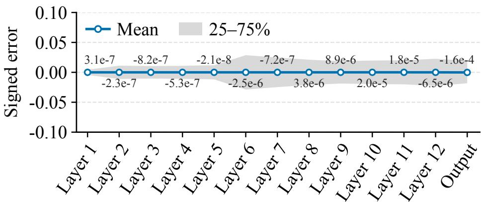  
Figure 5: Signed error (decrypted minus plaintext) for FIONA BERT. Markers and labels show the mean; gray shading spans the 25th–75th percentiles. Statistics cover all 256 inputs at the encoder block outputs (Layer 1–12) and final logits (Output).

Table 6: Weight routing on VGG11. Pure is the percentage of pure groups in the eight convolutional layers. Weight PMult covers these layers and the classifier, and the reduction is relative to the baseline.
<table><tr><td>Training</td><td>Acc. (%)</td><td>Pure (%)</td><td>Weight PMult</td><td>Reduction vs. Full-precision (%)</td></tr><tr><td>Scalar ternary</td><td>84.64</td><td>0.05</td><td>1,152,665</td><td>0.02</td></tr><tr><td>froute</td><td>86.87</td><td>58.88</td><td>477,347</td><td>58.59</td></tr></table>

## 6.2 RQ2: EFFECTIVENESS OF WEIGHT OPTIMIZATION

We first examine whether weight routing creates pure groups and protecting sensitive weights preserves accuracy. We then keep weights and routes fixed in representative linear layers to measure the cost reduction from exact compilation.

Packing-Aware Weight Routing. We compare scalar ternary quantization, which ternarizes each weight on its own (Sec. 3), with FIONA’s weight routing on VGG11. Both models use the polynomials and the packing layout of Sec. 5. After training, we compare accuracy, fraction of pure groups, and weight PMult count, the number of PMult operations by raw weights and reconstruction factors.

Table 6 shows that scalar ternary quantization leaves only 0.05% of the packed groups pure. The mixed groups still require vector PMult, so the weight PMult count remains close to that of the full-precision model. In contrast, FIONA produces 58.88% pure groups and reduces weight PMult counts by 58.59% relative to the full-precision model. Accuracy also improves by 2.23% over scalar ternary quantization.

Protecting sensitive weights. BERT’s single-weight groups make every ternary candidate structurally pure. We fine-tune two models on SST-2 for three epochs, with protection (Sec. 4.1) enabled or disabled. With protection enabled, 20% of the encoder weights remain in full precision.

For each final model, we measure accuracy in three settings (Table 7). Non-Linear uses the original nonlinear operators. For Direct Transfer, we calibrate the encoder approximations on a separate full-precision BERT model fine-tuned on SST-2, then apply them unchanged to the models with protection enabled and disabled. Refitted refits the approximations, at their supplied degrees, to each model’s own inputs, with the weights unchanged.

Table 7 shows that protection improves the Non-Linear accuracy from 88.07% to 91.51%. With directly transferred approximations, the protected model achieves 90.48% accuracy, whereas the unprotected model produces non-finite outputs for all samples in the SST-2 development dataset.

Table 7: Sensitive-weight protection on BERT-base/SST-2. † denotes non-finite outputs on all samples.
<table><tr><td>Protection</td><td>Non-Linear</td><td>Direct Transfer</td><td>Refitted</td></tr><tr><td>Disabled</td><td>88.07%</td><td>0.00%†</td><td>88.30%</td></tr><tr><td>Enabled</td><td>91.51%</td><td>90.48%</td><td>91.51%</td></tr></table>

Table 8: Exact compilation of representative routed linear operators. Time is the mean of three runs after one warm-up per variant. Weight PMult includes raw products and reconstruction, and Add/Sub counts ciphertext additions and subtractions.
<table><tr><td>Model</td><td>Compilation</td><td>Weight PMult</td><td>CKKS Add/Sub</td><td>Rescale</td><td>Time (s)</td></tr><tr><td rowspan="4">VGG11</td><td>Per-contribution</td><td>238,733</td><td>240,333</td><td>960</td><td>30.35</td></tr><tr><td>+ Grouping</td><td>141,268</td><td>240,333</td><td>960</td><td>19.40</td></tr><tr><td>+ Sharing</td><td>141,268</td><td>219,609</td><td>960</td><td>18.92</td></tr><tr><td>+ Combining</td><td>141,268</td><td>219,609</td><td>896</td><td>18.99</td></tr><tr><td rowspan="4">ViT</td><td>Per-contribution</td><td>131,675</td><td>131,291</td><td>767</td><td>12.95</td></tr><tr><td>+ Grouping</td><td>80,762</td><td>131,291</td><td>767</td><td>8.80</td></tr><tr><td>+ Sharing</td><td>80,762</td><td>125,223</td><td>767</td><td>8.76</td></tr><tr><td>+ Combining</td><td>80,762</td><td>125,223</td><td>384</td><td>8.71</td></tr><tr><td rowspan="4">BERT</td><td>Per-contribution</td><td>1,838,483</td><td>1,835,411</td><td>6,144</td><td>64.85</td></tr><tr><td>+ Grouping</td><td>1,062,992</td><td>1,835,411</td><td>6,144</td><td>46.78</td></tr><tr><td>+ Sharing</td><td>1,062,992</td><td>1,699,696</td><td>6,144</td><td>45.19</td></tr><tr><td>+ Combining</td><td>1,062,992</td><td>1,699,696</td><td>3,072</td><td>45.10</td></tr></table>

Refitting brings the accuracy of the unprotected model back to 88.30%, close to its Non-Linear accuracy, while the protected model reaches 91.51%. The protected model therefore retains a 3.21% advantage even when each model uses approximations fitted to its own inputs.

Exact Compilation. For each model, we select a layer with the largest number of weights, namely a 3×3, 512-channel convolution in VGG11, a 384→1536 feed-forward projection in ViT, and a 768→3072 feed-forward projection in BERT. Within each layer, weights and routes remain fixed across the four compilations. The first compilation applies the reconstruction factors separately to each signed term. We then enable, in sequence, the grouping of reconstruction operations, the sharing of signed sums, and the combining of the signed and raw routes (Sec. 4.2). Within each model, all compilations use the same input and output CKKS levels. Time includes the encrypted computation and the plaintext encoding.

As shown in Table 8, exact compilation discussed in Sec. 4.2 gives speedups of 1.60×, 1.49×, and 1.44× on the VGG11, ViT, and BERT layers, respectively. Most of the speedup comes from grouping, which applies each reconstruction factor once to a signed sum and reduces weight PMult counts by 38.67–42.18%. Sharing signed sums further reduces Add/Sub counts by 4.62–8.62% without changing PMult counts, and combining the routes roughly halves the number of rescaling operations in ViT and BERT.

We also compare the decrypted outputs with independent FP64 computations. The maximum absolute error across the tested variants is $5 . 1 \times 1 0 ^ { - 9 }$

## 6.3 RQ3:EFFECTIVENESS OF POLYNOMIAL OPTIMIZATION

Input Range Contraction. We compare the inputs of the supplied polynomials in the baseline and in $f _ { \mathrm { r o u t e } } ,$ and define the input width of a site as the difference between the 1st and 99th percentiles of its input values. Contraction is $1 - w _ { \mathrm { r o u t e } } / w _ { \mathrm { b a s e } } .$ , where $w _ { \mathrm { r o u t e } }$ and $w _ { \mathrm { b a s e } }$ are the widths in $f _ { \mathrm { r o u t e } }$ and in the baseline. We use the width rather than the radius of Sec. 3.1 because the inputs of the normalization and Softmax polynomials are not centered at zero. At an activation site, we measure the width per channel and take the median of the per-channel ratios ${ w _ { \mathrm { r o u t e } } } / { w _ { \mathrm { b a s e } } }$ as the ratio of

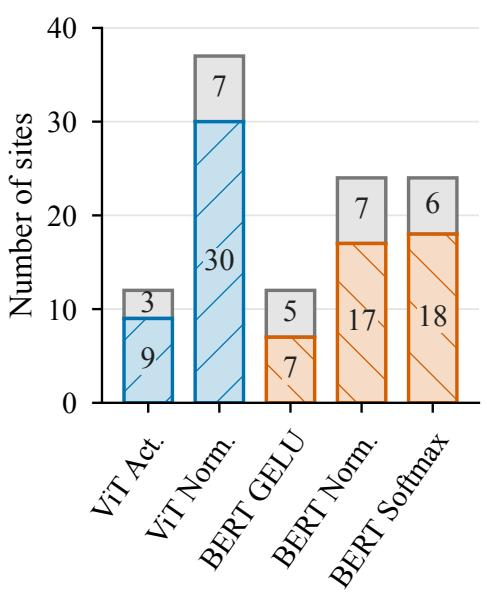  
(a) Site counts

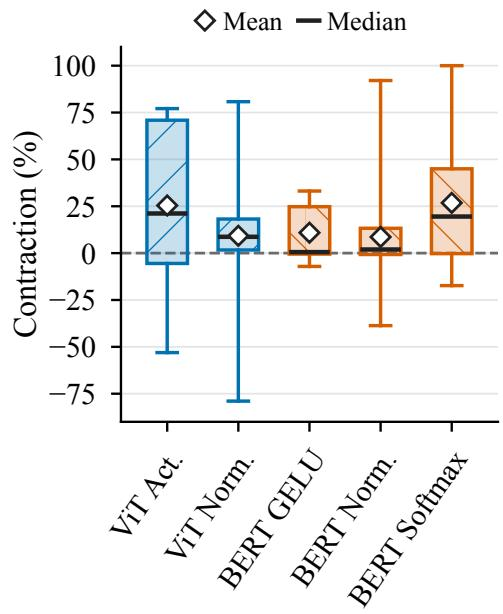  
(b) Contraction magnitude  
Figure 6: Input contraction across polynomial positions. Colored and gray bar segments count contracted and the other positions, respectively. Boxes span the 25th–75th percentiles; lines mark medians, diamonds mark means, and whiskers span the minimum and maximum.

Table 9: Accuracy and polynomial CMult depth before and after polynomial optimization. Act., Norm., and Softmax give the CMult depth of the polynomials of each family summed over its sites, Total sums the families, and ∆ Depth is the relative reduction of Total. Accuracies are on the full Tiny-ImageNet validation set and SST-2 development set.

(a) ViT on Tiny-ImageNet
<table><tr><td>Model</td><td>Acc.</td><td>Act.</td><td>Norm.</td><td>Total</td><td>∆ Depth</td></tr><tr><td> $f _ { \mathrm { r o u t e } }$ </td><td>59.51%</td><td>24</td><td>111</td><td>135</td><td></td></tr><tr><td>fpoly</td><td>59.11%</td><td>14</td><td>48</td><td>62</td><td>54.07%</td></tr></table>

(b) BERT on SST-2
<table><tr><td>Model</td><td>Acc.</td><td>Act.</td><td>Norm.</td><td>Softmax</td><td>Total</td><td>∆ Depth</td></tr><tr><td> $f _ { \mathrm { r o u t e } }$ </td><td>90.48%</td><td>73</td><td>376</td><td>300</td><td>749</td><td></td></tr><tr><td> $f _ { \mathrm { p o l y } }$ </td><td>90.37%</td><td>61</td><td>147</td><td>168</td><td>376</td><td>49.80%</td></tr></table>

the site. At a normalization site, the polynomial takes the scaled variance as input, so the width is measured over these variance values.

As shown in Fig. 6a, the $f _ { \mathrm { r o u t e } }$ has narrower input ranges at 39 of 49 measured sites in ViT and 42 of 60 in BERT. More than half of the sites contract in every operator family. The magnitude varies across sites and operator families as shown in Fig. 6b, with mean contractions of 25.42% for ViT activations and 26.80% for BERT Softmax, which offer opportunities for lower-degree approximation.

Low-Degree Approximation. We next compare lower-degree approximations at the sites with the largest input contraction for activations, normalization, and Softmax exponentials in each model. At each site, we fit candidates of the same degree for the baseline and for $f _ { \mathrm { r o u t e } }$ . Each candidate approximates the polynomial already used by its model, and we measure the mean squared error (MSE) between the candidate and that polynomial over the inputs recorded at the site.

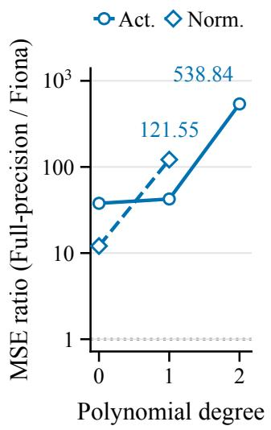  
(a) ViT

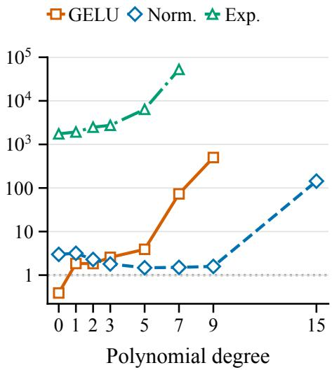  
(b) BERT  
Figure 7: MSE of same-degree fits to the supplied polynomial, each measured on the inputs its model records at the site. The ratio is the baseline MSE divided by the $f _ { \mathrm { r o u t e } } \mathrm { M S E }$

As shown in Fig. 7, the fits on $f _ { \mathrm { r o u t e } }$ have $5 3 8 . 8 4 \times$ and 121.55× lower MSE than the fits on the baseline for the quadratic activation fit and the first-degree normalization fit in ViT, respectively. For BERT, the first-degree GELU and normalization fits have $1 . 8 5 \times$ and $3 . 1 7 \times$ lower MSE. A lower degree can also achieve a smaller error. At the ViT activation site, the first-degree fit on $f _ { \mathrm { r o u t e } }$ has an MSE of $7 . 2 0 \times 1 0 ^ { - 4 }$ , below the $9 . 1 3 \times 1 0 ^ { - 3 }$ of the baseline’s quadratic fit.

Reduction of CMult depth. We compare $f _ { \mathrm { r o u t e } } ,$ which retains the supplied polynomials, with $f _ { \mathrm { p o l y } } .$ which uses the polynomials replaced by FIONA. Both use the same weights optimized by FIONA for each model, and the initially supplied polynomials follow ULD-Net for ViT and MOAI for BERT (Xie et al., 2026; Zhang et al., 2026).

Table 9 shows that polynomial optimization reduces total polynomial CMult depth from 135 to 62 in ViT and from 749 to 376 in BERT, reductions of 54.07% and 49.80%, respectively. Polynomials are replaced at 34 sites in ViT and 31 sites in BERT. Normalization accounts for most of the depth reduction in both models, and BERT also benefits from lower-degree Softmax approximations, whose depth contribution decreases from 300 to 168. In addition, the same procedure under the same budget reduces the total depth of the baselines only to 69 in ViT and 408 in BERT, so the routed weights allow 10.14% and 7.84% lower depth.

## 7 RELATED WORK

FHE compilation and execution. EVA, HECO, and HEIR provide languages and intermediate representations for encrypted computation (Dathathri et al., 2020; Viand et al., 2023; Bian et al., 2024). Fhelipe and HELayers automate tensor packing (Krastev et al., 2024; Aharoni et al., 2023). Orion optimizes convolution mappings and level management (Ebel et al., 2025). NEXUS improves packed matrix multiplication (Zhang et al., 2025), while MOAI combines column and diagonal packing to reduce rotations and avoid layout conversions (Zhang et al., 2026). FIONA uses the selected packing layout to guide weight optimization, then compiles the resulting hybrid representation with common reconstruction and shared signed sums over compatible input ciphertexts.

Weight structure for FHE inference. SpENCNN combines packing with sub-block pruning (Ran et al., 2023). PrivCirNet uses block-circulant weights with a matching encoding (Xu et al., 2024). REDsec executes discretized networks with TFHE (Folkerts et al., 2023), while ENSI uses a specific column encoding for ternary BitLinear matrices (He et al., 2025). FIONA uses task sensitivity to shape weights within fixed packing groups toward a common ternary state. The resulting hybrid operators reduce multiplications for nonzero signed contributions while retaining raw weights in mixed and protected groups.

Polynomial optimization for FHE inference. AutoFHE jointly selects polynomial degrees and bootstrap placement while adapting network weights in full precision (Ao & Boddeti, 2024). SLOTHE selectively approximates components of non-arithmetic functions (Nam et al., 2025), while ULD-Net trains networks with ultra-low-degree polynomial operators (Xie et al., 2026). With weights and routes fixed, FIONA fits lower-degree candidates to the supplied functions on inputs from the current network. It selects replacements that reduce network depth within a cumulative accuracy budget, exploiting approximation opportunities created by weight routing.

## 8 CONCLUSION

We present FIONA, an offline optimizer that reduces FHE inference cost through packing-aware weight optimization and lower-degree polynomials. Experiments on CNN and Transformer models demonstrate speedups with little loss in plaintext accuracy.

## REFERENCES

Ehud Aharoni, Allon Adir, Moran Baruch, Nir Drucker, Gilad Ezov, Ariel Farkash, Lev Greenberg, Ramy Masalha, Guy Moshkowich, Dov Murik, Hayim Shaul, and Omri Soceanu. HeLayers: A tile tensors framework for large neural networks on encrypted data. Proceedings on Privacy Enhancing Technologies, 2023(1):325–342, 2023. doi: 10.56553/popets-2023-0020. URL https://petsymposium.org/popets/2023/popets-2023-0020.php.

Wei Ao and Vishnu Naresh Boddeti. AutoFHE: Automated adaption of cnns for efficient evaluation over fhe. In USENIX Security Symposium, 2024.

Yoshua Bengio, Nicholas Leonard, and Aaron Courville. Estimating or propagating gradients ´ through stochastic neurons for conditional computation. arXiv preprint arXiv:1308.3432, 2013.

Song Bian, Zian Zhao, Zhou Zhang, Ran Mao, Kohei Suenaga, Yier Jin, Zhenyu Guan, and Jianwei Liu. HEIR: A unified representation for cross-scheme compilation of fully homomorphic computation. In 31st Annual Network and Distributed System Security Symposium (NDSS 2024). Internet Society, 2024. doi: 10.14722/ndss.2024.23067. URL https://www.ndss-sympo sium.org/ndss-paper/heir-a-unified-representation-for-cross-sch eme-compilation-of-fully-homomorphic-computation/.

Zvika Brakerski, Craig Gentry, and Vinod Vaikuntanathan. (leveled) fully homomorphic encryption without bootstrapping. ACM Transactions on Computation Theory, 6(3), 2014. doi: 10.1145/26 33600.

Jung Hee Cheon, Andrey Kim, Miran Kim, and Yongsoo Song. Homomorphic encryption for arithmetic of approximate numbers. In International conference on the theory and application of cryptology and information security, pp. 409–437. Springer, 2017.

Jung Hee Cheon, Kyoohyung Han, Andrey Kim, Miran Kim, and Yongsoo Song. Bootstrapping for approximate homomorphic encryption. In Annual International Conference on the Theory and Applications of Cryptographic Techniques, pp. 360–384. Springer, 2018a.

Jung Hee Cheon, Kyoohyung Han, Andrey Kim, Miran Kim, and Yongsoo Song. A full rns variant of approximate homomorphic encryption. In International conference on selected areas in cryptography, pp. 347–368. Springer, 2018b.

Ilaria Chillotti, Nicolas Gama, Mariya Georgieva, and Malika Izabachene. TFHE: Fast fully homo-\` morphic encryption over the torus. Journal ofCryptology, 33:34–91, 2020. doi: 10.1007/s00145 -019-09319-x.

Roshan Dathathri, Blagovesta Kostova, Olli Saarikivi, Wei Dai, Kim Laine, and Madanlal Musuvathi. EVA: An encrypted vector arithmetic language and compiler for efficient homomorphic computation. In ACM SIGPLAN Conference on Programming Language Design and Implementation, pp. 546–561, 2020. doi: 10.1145/3385412.3386023.

Jacob Devlin, Ming-Wei Chang, Kenton Lee, and Kristina Toutanova. Bert: Pre-training of deep bidirectional transformers for language understanding. In Proceedings of the 2019 conference of the North American chapter of the association for computational linguistics: human language technologies, volume 1 (long and short papers), pp. 4171–4186, 2019.

Alexey Dosovitskiy. An image is worth 16x16 words: Transformers for image recognition at scale. arXiv preprint arXiv:2010.11929, 2020.

Austin Ebel, Karthik Garimella, and Brandon Reagen. Orion: A fully homomorphic encryption framework for deep learning. In ACM International Conference on Architectural Support for Programming Languages and Operating Systems, 2025.

Junfeng Fan and Frederik Vercauteren. Somewhat practical fully homomorphic encryption. Cryptology ePrint Archive, Paper 2012/144, 2012. URL https://eprint.iacr.org/2012/144.

Lars Wolfgang Folkerts, Charles Gouert, and Nektarios Georgios Tsoutsos. REDsec: Running encrypted discretized neural networks in seconds. In Network and Distributed System Security Symposium, 2023.

Craig Gentry. Fully homomorphic encryption using ideal lattices. In Proceedings of the forty-first annual ACM symposium on Theory of computing, pp. 169–178, 2009.

Ran Gilad-Bachrach, Nathan Dowlin, Kim Laine, Kristin Lauter, Michael Naehrig, and John Wernsing. Cryptonets: Applying neural networks to encrypted data with high throughput and accuracy. In International conference on machine learning, pp. 201–210. PMLR, 2016.

Zhiyu He, Maojiang Wang, Xinwen Gao, Yuchuan Luo, Lin Liu, and Shaojing Fu. ENSI: Efficient non-interactive secure inference for large language models. arXiv preprint arXiv:2509.09424, 2025.

Benoit Jacob, Skirmantas Kligys, Bo Chen, Menglong Zhu, Matthew Tang, Andrew Howard, Hartwig Adam, and Dmitry Kalenichenko. Quantization and training of neural networks for efficient integer-arithmetic-only inference. In 2018 IEEE/CVF conference on computer vision and pattern recognition, pp. 2704–2713. IEEE, 2018.

James Kirkpatrick, Razvan Pascanu, Neil Rabinowitz, Joel Veness, Guillaume Desjardins, Andrei A Rusu, Kieran Milan, John Quan, Tiago Ramalho, Agnieszka Grabska-Barwinska, et al. Overcoming catastrophic forgetting in neural networks. Proceedings of the national academy of sciences, 114(13):3521–3526, 2017.

Aleksandar Krastev, Nikola Samardzic, Simon Langowski, Srinivas Devadas, and Daniel Sanchez. A tensor compiler with automatic data packing for simple and efficient fully homomorphic encryption. Proceedings of the ACM on Programming Languages, 8(PLDI), 2024. doi: 10.1145/3656382. URL https://people.csail.mit.edu/devadas/pubs/pl di24\_fhelipe.pdf.

Alex Krizhevsky, Geoffrey Hinton, et al. Learning multiple layers of features from tiny images. 2009.

Yann LeCun, John S. Denker, and Sara A. Solla. Optimal brain damage. In Advances in Neural Information Processing Systems, 1989.

Eunsang Lee, Joon-Woo Lee, Junghyun Lee, Young-Sik Kim, Yongjune Kim, Jong-Seon No, and Woosuk Choi. Low-complexity deep convolutional neural networks on fully homomorphic encryption using multiplexed parallel convolutions. In International Conference on Machine Learning, pp. 12403–12422. PMLR, 2022.

Shuming Ma, Hongyu Wang, Lingxiao Ma, Lei Wang, Wenhui Wang, Shaohan Huang, Li Dong, Ruiping Wang, Jilong Xue, and Furu Wei. The era of 1-bit LLMs: All large language models are in 1.58 bits. arXiv preprint arXiv:2402.17764, 2024.

Kevin Nam, Youyeon Joo, Seungjin Ha, and Yunheung Paek. SLOTHE: Lazy approximation of Non-Arithmetic neural network functions over encrypted data. In 34th USENIX Security Symposium (USENIX Security 25), pp. 3083–3102. USENIX Association, 2025. URL https://ww w.usenix.org/conference/usenixsecurity25/presentation/nam-slothe.

Dongjin Park, Eunsang Lee, and Joon-Woo Lee. Powerformer: Efficient and high-accuracy privacypreserving language model with homomorphic encryption. In Proceedings of the 63rd Annual Meeting of the Association for Computational Linguistics (Volume 1: Long Papers), pp. 11090– 11111. Association for Computational Linguistics, 2025. doi: 10.18653/v1/2025.acl-long.543. URL https://aclanthology.org/2025.acl-long.543/.

Adam Paszke, Sam Gross, Francisco Massa, Adam Lerer, James Bradbury, Gregory Chanan, Trevor Killeen, Zeming Lin, Natalia Gimelshein, Luca Antiga, et al. Pytorch: An imperative style, highperformance deep learning library. Advances in neural information processing systems, 32, 2019.

Ran Ran, Xinwei Luo, Wei Wang, Tao Liu, Gang Quan, Xiaolin Xu, Caiwen Ding, and Wujie Wen. SpENCNN: Orchestrating encoding and sparsity for fast homomorphically encrypted neural network inference. In International Conference on Machine Learning, 2023.

SEAL. Microsoft SEAL (release 4.1). https://github.com/Microsoft/SEAL, January 2023. Microsoft Research, Redmond, WA.

Karen Simonyan and Andrew Zisserman. Very deep convolutional networks for large-scale image recognition. arXiv preprint arXiv:1409.1556, 2014.

Richard Socher, Alex Perelygin, Jean Wu, Jason Chuang, Christopher D Manning, Andrew Y Ng, and Christopher Potts. Recursive deep models for semantic compositionality over a sentiment treebank. In Proceedings ofthe 2013 conference on empirical methods in natural language processing, pp. 1631–1642, 2013.

J Michael Steele. The Cauchy-Schwarz master class: an introduction to the art of mathematical inequalities. Cambridge University Press, 2004.

Jianlin Su, Murtadha Ahmed, Yu Lu, Shengfeng Pan, Wen Bo, and Yunfeng Liu. Roformer: Enhanced transformer with rotary position embedding. Neurocomputing, 568:127063, 2024.

Alexander Viand, Patrick Jattke, Miro Haller, and Anwar Hithnawi. HECO: Fully homomorphic encryption compiler. In 32nd USENIX Security Symposium (USENIX Security 23), pp. 4715– 4732. USENIX Association, 2023. URL https://www.usenix.org/conference/us enixsecurity23/presentation/viand.

Hongyu Wang, Shuming Ma, Li Dong, Shaohan Huang, Huaijie Wang, Lingxiao Ma, Fan Yang, Ruiping Wang, Yi Wu, and Furu Wei. BitNet: Scaling 1-bit transformers for large language models. arXiv preprint arXiv:2310.11453, 2023.

Xi Xie, Ran Ran, Jiahui Zhao, Bin Lei, Zhijie Jerry Shi, Wujie Wen, and Caiwen Ding. ULD-Net: Enabling ultra-low-degree fully polynomial networks for homomorphically encrypted inference. In International Conference on Learning Representations, 2026.

Tianshi Xu, Lemeng Wu, Runsheng Wang, and Meng Li. PrivCirNet: Efficient private inference via block circulant transformation. In Advances in Neural Information Processing Systems, volume 37, pp. 111802–111831, 2024. doi: 10.52202/079017-3550. URL https: //papers.nips.cc/paper\_files/paper/2024/hash/ca9873918aa72e90330 41f76e77b5c15-Abstract-Conference.html.

Jiawen Zhang, Xinpeng Yang, Lipeng He, Kejia Chen, Wen-jie Lu, Yinghao Wang, Xiaoyang Hou, Jian Liu, Kui Ren, and Xiaohu Yang. Secure transformer inference made non-interactive. In Network and Distributed System Security Symposium, 2025.

Linru Zhang, Xiangning Wang, Jun Jie Sim, Zhicong Huang, Jiahao Zhong, Huaxiong Wang, Pu Duan, and Kwok-Yan Lam. MOAI: Module-optimizing architecture for non-interactive secure transformer inference. In International Conference on Learning Representations, 2026.

Itamar Zimerman, Allon Adir, Ehud Aharoni, Matan Avitan, Moran Baruch, Nir Drucker, Jenny Lerner, Ramy Masalha, Reut Meiri, and Omri Soceanu. Powersoftmax: Towards secure llm inference over encrypted data. arXiv preprint arXiv:2410.09457, 2024.