# FLEXIWORLD: LEARNING AND PLANNING VIA FLEX-IBLE ACTION CHUNKS ACROSS MULTIPLE TIME SCALES

Shidu Ren1∗, Qilin Gu1∗, Zhenghao Ni1∗, Junhan Sun2, Jiaqi Wang3, Damien Scieur4,5, Yunze Liu6†

1University of Toronto, 2Zhejiang University, 3Tencent Jarvis Lab,

4Mila & Université de Montréal, 5Samsung SAIL, 6Tsinghua University

∗Equal contribution †Corresponding author

€ Project Page § Code Models

## ABSTRACT

Latent world models predict future states for goal-directed planning using action chunks spanning multiple primitive steps. Existing methods typically use fixedlength chunks and either omit goal-conditioned action generation or limit their supervision to short goal spans. We introduce FlexiWorld, a JEPA-based world model that combines mixed-span goal supervision with variable-length action chunks to improve long-horizon control. During training, we sample varying goal spans and randomly partition the actions into variable-length chunks. We jointly train the world model with a causal action encoder that embeds variable-length chunks and an autoregressive actor that generates primitive actions sequentially. Student Forcing reduces exposure bias by training on generated action prefixes. For planning, Actor-Residual Cross-Entropy Method (ARCEM) combines actionresidual search with within-chunk autoregressive feedback and chunk-boundary latent prediction. Across four benchmarks and goal distances, FlexiWorld with ARCEM achieves 89.29% mean success, compared with 83.98% for the strongest baseline. PushT ablations show improved direct control from mixed-span supervision, variable-length chunks, and Student Forcing. Without retraining, FlexiWorld supports different planning chunk lengths: longer chunks accelerate ARCEM by approximately 1.3× on average while maintaining comparable average success.

Training Time  
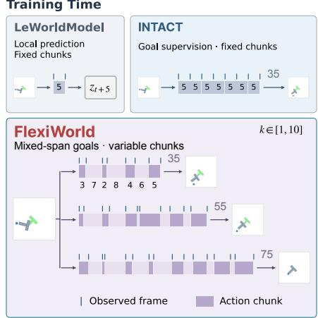

Planning Time  
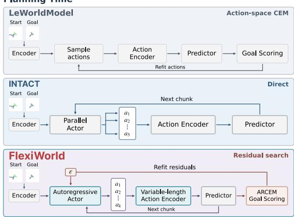

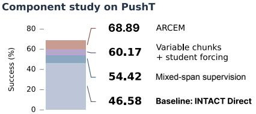

Control success·4-benchmark mean  
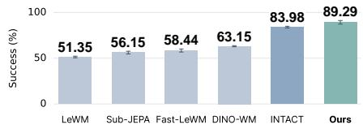  
Figure 1: FlexiWorld: flexible action chunks across multiple time scales. Training and planning interfaces (top), four-benchmark mean success (bottom right), and selected PushT configurations (bottom left). Tables 1 and 4 detail the comparisons.

## 1 INTRODUCTION

Latent world models allow an agent to plan from visual observations by predicting future states before executing actions. World models based on Joint Embedding Predictive Architectures (JEPAs) make these predictions in a learned representation space, without reconstructing future images (Assran et al., 2023; 2025; Maes et al., 2026). By grouping primitive actions into action chunks, a model can predict the state reached after several environment steps in a single transition. A planner selects actions by comparing predicted and goal latent states. Reaching distant goals therefore requires both goal-conditioned action generation and latent prediction over multiple time scales.

Prior work on JEPA-based world models has explored learned dynamics, goal-conditioned action generation, and longer-horizon prediction. LeWorldModel (LeWM) (Maes et al., 2026) predicts local latent transitions and uses the Cross-Entropy Method (CEM) to search for actions at test time. INTACT (Sun et al., 2026) trains a shared actor with local inverse-dynamics and future-goal objectives, enabling action generation without search. VLWM (Du et al., 2026) and Fast-LeWM (Gao & Xu, 2026) extend prediction across multiple action chunks through variable-horizon and paral lel prefix prediction, respectively. VLWM feeds action tokens to a shared predictor and gradually expands its training horizon, allowing a single prediction to span multiple fixed action chunks. Fast-LeWM uses a causal action-prefix encoder to predict multiple future states directly from the same observed latent state, avoiding a sequential chain of latent predictions.

Despite these advances, limitations remain in goal-conditioned action generation and action chunking. LeWM relies on search without learning how to generate actions, while INTACT limits goal supervision to short spans, leaving its actor without direct supervision for more distant goals. Both use fixed-length action chunks, so each predicted transition spans the same number of primitive steps. This fixes the temporal granularity of their transitions, preventing planners from adjusting chunk length to trade predictor calls against temporal resolution. VLWM and Fast-LeWM extend prediction across multiple action chunks while retaining fixed-size chunks. Their flexibility therefore concerns how many action chunks a prediction spans, rather than the primitive-action boundaries of those chunks. Both use CEM without jointly training a goal-conditioned actor, so long-horizon prediction does not directly supervise action generation. Neither combines mixed-span goal supervision with flexible chunking, limiting distant-goal action learning and planning granularity.

We introduce FlexiWorld, a JEPA-based world model that combines mixed-span goal supervision with variable-length action chunks to improve long-horizon control (Figure 1). During training, we vary goal spans and randomly partition trajectories into variable-length action chunks, jointly supervising latent prediction and goal-conditioned action generation across time scales. A causal action encoder represents chunks of different lengths, and an autoregressive actor generates the requested number of primitive actions conditioned on the current latent state and a local or distant goal. Teacher Forcing trains this actor on expert prefixes, whereas planning uses its own generated prefixes, creating exposure bias. We address this mismatch with Student Forcing (SF) (Bengio et al., 2015), which trains on both expert and self-generated prefixes and improves success in our component study. We jointly train the action encoder and actor with the world model, sharing each module’s parameters across chunk lengths.

FlexiWorld’s autoregressive policy supports search-free Direct planning, generating each chunk from the predicted latent state. POPLIN (Wang & Ba, 2019) refines policy outputs with action residuals, predicting a new state before recomputing each subsequent action. We introduce Actor-Residual Cross-Entropy Method (ARCEM), which generalizes this search to autoregressive chunks: perturbed actions condition subsequent outputs within a chunk, while latent states are predicted only at chunk boundaries.

We evaluate FlexiWorld on PushT, OGBench-Cube (Cube), Reacher, and TwoRoom across multiple goal distances. FlexiWorld achieves 89.29% mean success with ARCEM’s test-time search versus 83.98% for INTACT’s strongest configuration, and 86.79% with Direct action generation versus 81.62% for INTACT Direct. A PushT component study finds little change from the architecture alone, but gains from mixed-span goal supervision. Variable-length chunks and Student Forcing also improve success when evaluated separately. Distant-goal action-prediction tests also favor FlexiWorld, while CEM without either actor gives similar success for both models, suggesting the clearest benefit is in goal-conditioned action generation.

The same trained model supports longer action chunks to reduce predictor calls at planning time. Using ten-action rather than five-action chunks makes ARCEM approximately 1.3× faster at 50- and 100-step goals, with comparable four-benchmark mean success and task-dependent gains and losses. Longer chunks also reduce expert-action latent rollout error on PushT and Cube at both distances, although lower error does not consistently improve control. Section 4.4 analyzes these deployment trade-offs.

Our contributions are: (i) We introduce FlexiWorld, jointly learning latent prediction and autoregressive action generation across variable-length chunks with mixed-span goal supervision. (ii) We develop ARCEM, generalizing POPLIN’s action-residual search to autoregressive chunks: perturbed actions condition subsequent generation, with latent prediction only at chunk boundaries. (iii) We benchmark FlexiWorld against JEPA-based baselines under a unified evaluation protocol across four tasks and multiple goal distances, demonstrating improved goal-reaching success.

## 2 RELATED WORK

Latent world models for goal-conditioned control. Latent world models learn dynamics for control (Ha & Schmidhuber, 2018). PlaNet and Dreamer use image reconstruction (Hafner et al., 2019; 2020; 2025), whereas TD-MPC combines latent prediction with value learning (Hansen et al., 2022; 2024). JEPA-based models predict representations without image reconstruction (Bardes et al., 2024; Assran et al., 2025; Maes et al., 2026). DINO-WM (Zhou et al., 2024) uses pre-trained visual features, whereas LeWM (Maes et al., 2026) and Sub-JEPA (Zhao et al., 2026) jointly learn representations and dynamics through Gaussian regularization. GC-IDM learns control from worldmodel features (Nguyen et al., 2026). Qantara (Rakhimov et al., 2026) connects planning, action sampling, and inverse dynamics through bridge-flow training. INTACT (Sun et al., 2026) jointly learns prediction and a shared intent-to-action model for search-free control. Its action encoder and actor use fixed-length chunks, keeping local transition supervision at a fixed duration even when goal spans increase. FlexiWorld varies both transition durations and goal spans.

Temporal abstraction and action chunking. Action chunking sets the temporal granularity of prediction and control. HWM (Zhang et al., 2026) learns variable-duration macro-actions for hierarchical planning, VLWM (Du et al., 2026) varies prediction horizons, and Fast-LeWM (Gao & Xu, 2026) predicts action-prefix outcomes in parallel. In their reported implementations, VLWM and Fast-LeWM retain fixed base action blocks. On the policy side, ACT (Zhao et al., 2023) learns action chunks, while ARP (Zhang et al., 2025) combines autoregression with chunked prediction. BID (Liu et al., 2025) uses guided resampling to balance temporal coherence with reactivity. Adaptive chunking selects execution lengths using action entropy (Liang et al., 2026) or values learned through offline-to-online reinforcement learning (Shin et al., 2026). These approaches either learn multi-scale latent dynamics for search without jointly training a goal-conditioned actor, or organize action generation and execution without jointly learning variable-duration latent dynamics. Flexi-World instead varies chunk boundaries at primitive-action resolution and jointly trains its action encoder, autoregressive actor, and latent predictor over the resulting chunks. Combined with mixedspan goal supervision, this supports goal-conditioned action generation and latent prediction at adjustable temporal granularities.

Policy-guided model predictive control. PETS (Chua et al., 2018) and iCEM (Pinneri et al., 2020) optimize action sequences using learned dynamics; policies can guide such search by proposing or adapting candidate plans. POPLIN (Wang & Ba, 2019) explores action-residual and policyparameter search. Its fixed-rollout variant perturbs a policy rollout, whereas its replanning variant recomputes policy outputs along each perturbed state trajectory. PRISM (Wang et al., 2026) fuses a state-and-goal-conditioned Gaussian action prior with the planner’s initial distribution through a product of Gaussians. INTACT (Sun et al., 2026) preserves a Direct reference during Guarded-A’s local action-space search, without regenerating the actor’s outputs. ARCEM generalizes POPLIN’s action-residual replanning to autoregressive action chunks: each perturbed action conditions subsequent outputs within a chunk, while latent predictions carry its effects across chunks. Earlier residuals thus change the conditional means around which later residuals are applied. Unlike residual RL, which learns controller corrections (Johannink et al., 2018), ARCEM optimizes action residuals at test time without training a residual policy.

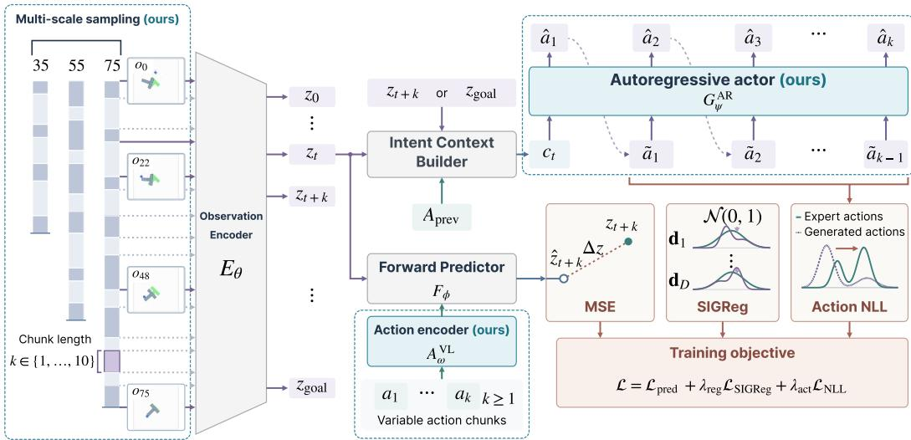  
Figure 2: Joint prediction and action learning in FlexiWorld. Training samples different goal spans and partitions each window into variable-length action chunks paired with their boundary observations. Chunk embeddings condition the predictor on the actions leading to the next boundary latent state. The actor is supervised by expert actions, conditioned on local or final-goal intents and expert or generated action prefixes. Training combines prediction MSE, SIGReg, and action negative log-likelihood (NLL). All modules, including the observation encoder and predictor, are trained jointly.

## 3 METHODOLOGY

## 3.1 METHOD OVERVIEW

FlexiWorld jointly learns latent prediction and goal-conditioned action generation from offline trajectories. Figure 2 shows how training windows with different goal spans are partitioned into variable-length action chunks. The action encoder embeds each chunk, and the predictor combines this embedding with the latent-state history to predict the next boundary latent state. The actor learns to generate the chunk’s actions conditioned on the current latent state and either the next boundary observation or the final goal, expressed through latent-state differences. At deployment, the actor and predictor alternate to construct a Direct plan with chosen chunk lengths, which ARCEM can refine through action residuals.

## 3.2 MULTI-TIME-SCALE TRAINING

FlexiWorld varies both the training goal span and the action chunk length to learn from goals at different temporal distances and transitions of different durations. Given an offline trajectory of pixel observations $\mathbf { } _ { o _ { t } }$ and primitive actions $\pmb { a } _ { t } \in \mathbb { R } ^ { d _ { a } }$ , we sample a window starting at environment step s with goal span $S \in S$ , where $s$ is a finite set of spans. In our experiments, $\mathcal { S } = \{ 3 5 , 5 5 , 7 5 \}$ primitive steps. The window starts with observation $\mathbf { \delta } _ { o _ { s } }$ and uses the recorded observation $\mathbf { \delta } _ { o _ { s + S } }$ $S$ primitive steps later, as its goal. Within this window, we partition the actions into $N = N ( S )$ chunks, using $\bar { N } = 7 , 1 1$ , 15 for the respective spans, so the mean chunk length remains five. Each chunk length $k _ { i }$ sets the duration of one supervised transition. To vary these durations while keeping the window endpoints fixed, we sample the length sequence uniformly from

$$
{ \cal K } _ { S , N } = \left\{ ( k _ { 0 } , \dots , k _ { N - 1 } ) \in { \mathbb Z } ^ { N } : k _ { \operatorname* { m i n } } \leq k _ { i } \leq k _ { \operatorname* { m a x } } , \quad \sum _ { i } k _ { i } = S \right\} \backslash \left\{ ( S / N , \dots , S / N ) \right\} .\tag{1}
$$

This excludes partitions in which every chunk has the same length. The sampled lengths define boundaries $\begin{array} { r } { t _ { i } \stackrel { - } { = } s + \sum _ { r < i } k _ { r } } \end{array}$ for $i = 0 , \ldots , N$ . Each action chunk $A _ { i } = ( a _ { t _ { i } } , \ldots , a _ { t _ { i } + k _ { i } - 1 } )$ together with its starting and ending observations $\mathbf { } o _ { t _ { i } }$ and $\mathbf { } _ { \mathbf { } ^ { O } t _ { i + 1 } }$ , forms a supervised transition. Dif-

ferent partitions therefore provide different intermediate transitions while sharing the same final goal $\pmb { O } _ { s + S }$ . Appendix A.2 gives the sampling implementation.

## 3.3 FLEXIBLE ACTION CHUNKS

To learn from the variable-duration transitions sampled above, FlexiWorld pairs a variable-length action encoder with an autoregressive actor, jointly trained with latent prediction and Student Forcing, described below under joint training.

Action encoding. The action encoder maps each sampled chunk to a fixed-dimensional embedding for the predictor. Following LeWM (Maes et al., 2026), the observation encoder gives $z _ { i } = E _ { \theta } ( o _ { t _ { i } } )$ at each chunk boundary. Our variable-length (VL) causal Transformer action encoder $A _ { \omega } ^ { \mathrm { V L } }$ processes $A _ { i }$ with positional encodings (Vaswani et al., 2017), reads its last valid hidden state, and adds a learned chunk-length embedding. The resulting vector ${ \pmb u } _ { i } = A _ { \omega } ^ { \mathrm { V L } } ( A _ { i } , k _ { i } )$ conditions the predictor $\hat { z } _ { i + 1 } ~ = ~ F _ { \phi } ( \mathcal { H } _ { i } , { \pmb u } _ { i } )$ , where $\mathcal { H } _ { i }$ contains the history of encoded observations and expert chunks during training. The same action encoder supplies the actor’s previous-chunk context $\begin{array} { r } { \mathbf { \dot { b } } _ { i } = A _ { \omega } ^ { \mathrm { V L } } ( A _ { i - 1 } , \mathbf { \bar { k } } _ { i - 1 } ) ; b _ { 0 } } \end{array}$ encodes the action history before the window.

Action generation. Our autoregressive (AR) actor $G _ { \psi } ^ { \mathrm { A R } }$ generates primitive actions, allowing one shared model to produce chunks of different lengths. We retain INTACT’s conditioning scheme (Sun et al., 2026), with local intent $m _ { i } ^ { \mathrm { l o c a l } } = z _ { i + 1 } - z _ { i }$ and final-goal intent $m _ { i } ^ { \mathrm { g o a l } } = \mathrm { s g } ( z _ { N } ) - z _ { i }$ where sg stops gradients at the final-goal occurrence. For either intent $q \in \{$ {local, goal}, the Intent Context Builder in Figure 2 forms the actor context $\pmb { c } _ { i } ^ { q } = [ z _ { i } ; \pmb { m } _ { i } ^ { q } ; z _ { i } \odot \pmb { m } _ { i } ^ { \tilde { q } } ; \pmb { b } _ { i } ]$ , where ⊙ denotes elementwise multiplication. Unlike INTACT’s fixed-width action output, $G _ { \nu } ^ { \mathrm { A R } }$ maps the context and within-chunk prefix to a Gaussian mean $\mu _ { \psi }$ and standard deviation $\sigma _ { \psi }$ . Its conditional action distribution $\pi _ { \psi } ^ { \mathrm { A R } }$ factorizes over primitive actions:

$$
\pi _ { \psi } ^ { \mathrm { A R } } ( A _ { i } \mid \pmb { c } _ { i } ^ { q } ) = \prod _ { j = 0 } ^ { k _ { i } - 1 } \pi _ { \psi } ^ { \mathrm { A R } } ( \pmb { a } _ { t _ { i } + j } \mid \pmb { c } _ { i } ^ { q } , \pmb { A } _ { i < j } ) ,\tag{2}
$$

where $A _ { i < j }$ contains the first $j$ actions and each conditional is a diagonal Gaussian parameterized by $G _ { \psi } ^ { \mathrm { A R } }$ . The length $k _ { i }$ sets the decoding steps, requiring no length token or length-specific head. Encoding executable actions ties predictions to concrete candidate sequences without a separate latent-action decoder.

Joint training. We jointly supervise latent prediction and action generation on the sampled chunks. During planning, the actor conditions on its own earlier actions, which can differ from the expert prefixes used in standard teacher-forced training. Student Forcing addresses this mismatch by mixing expert and generated prefixes, following scheduled sampling (Bengio et al., 2015). For each chunk and intent, we greedily decode $\hat { A } _ { i } ^ { q }$ from $\pmb { c } _ { i } ^ { q }$ and make one sequence-level choice for all within-chunk prefixes:

$$
\begin{array} { r } { \widetilde { A } _ { i } ^ { q } = \left\{ \begin{array} { l l } { \mathrm { s g } ( \hat { A } _ { i } ^ { q } ) , } & { \mathrm { w i t h } \mathrm { p r o b a b i l i t y } p _ { \mathrm { S F } } , } \\ { A _ { i } , } & { \mathrm { o t h e r w i s e } . } \end{array} \right. } \end{array}\tag{3}
$$

At position $j ,$ only the first $j$ actions of this sequence are supplied, while the target remains expert action $\mathbf { \Delta } \mathbf { a } _ { t _ { i } + j }$

$$
\ell _ { i } ^ { q } = - \frac { 1 } { k _ { i } d _ { a } } \sum _ { j = 0 } ^ { k _ { i } - 1 } \log \pi _ { \psi } ^ { \mathrm { A R } } \Big ( { \pmb a } _ { t _ { i } + j } \ | \ c _ { i } ^ { q } , \widetilde { { \cal A } } _ { i < j } ^ { q } \Big ) .\tag{4}
$$

The context $ { \boldsymbol { c } } _ { i } ^ { q }$ stays fixed across prefix choices, with no gradient through generated prefixes. Normalization gives chunks equal weight regardless of length. Averaging over chunks and samples with fixed relative weights for the two intents gives $\mathcal { L } _ { \mathrm { N L L } }$ . We train all modules from random initialization with

$$
\begin{array} { r } { \mathcal { L } = \mathcal { L } _ { \mathrm { p r e d } } + \lambda _ { \mathrm { a c t } } \mathcal { L } _ { \mathrm { N L L } } + \lambda _ { \mathrm { r e g } } \mathcal { L } _ { \mathrm { S I G R e g } } . } \end{array}\tag{5}
$$

Here $\mathcal { L } _ { \mathrm { p r e d } }$ is the mean-squared latent prediction loss, which updates both prediction and target branches. The Sketched-Isotropic-Gaussian Regularizer (SIGReg) (Balestriero & LeCun, 2025; Maes et al., 2026) regularizes boundary latents toward an isotropic Gaussian. Appendix A specifies the loss weights, averaging, and two-pass Student Forcing implementation.

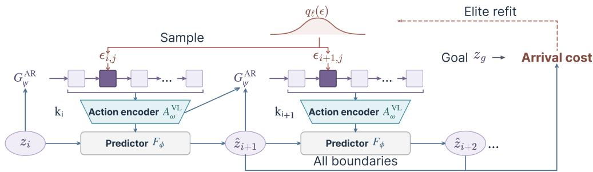  
Figure 3: ARCEM refinement. Residuals modify actions and subsequent actor conditions. Chunk embeddings and predicted states propagate these changes; arrival costs select elites to refit the residual distribution.

## 3.4 DIRECT PLANNING AND ACTOR-RESIDUAL CEM

Direct planning. FlexiWorld generates plans at a chosen chunk length without search or retraining. Following INTACT (Sun et al., 2026), we initialize $\hat { z } _ { 0 } = E _ { \theta } ( o _ { s } )$ and $z _ { g } = E _ { \theta } ( o _ { g } )$ , then alternate the actor and predictor. At boundary i, $G _ { \psi } ^ { \mathrm { A R } }$ decodes $k _ { i }$ conditional means using goal intent $z _ { g } \mathrm { ~ - ~ }$ zˆi and preceding-chunk context. The chunk embedding $A _ { \omega } ^ { \mathrm { V L } } ( A _ { i } , k _ { i } )$ conditions both $F _ { \phi } { ' } \mathfrak { s }$ s nextstate prediction and the next actor call. For a D-action plan, $\textstyle \sum _ { i = 0 } ^ { H - 1 } k _ { i } \ = \ D$ over H predicted transitions. Choosing five-action or ten-action chunks, with a shorter final chunk when needed, changes the rollout resolution: longer chunks require fewer predictor calls but still generate all D actions autoregressively. Reobservation timing is independent of chunk length (Section 4.1).

Actor-residual CEM. The Cross-Entropy Method (CEM) (Rubinstein, 1999; Chua et al., 2018; Pinneri et al., 2020) iteratively samples plans and refits its distribution to low-cost elites. ARCEM generalizes POPLIN’s action-residual recursion (Wang & Ba, 2019) to autoregressive chunks (Figure 3). POPLIN updates states after each perturbed action; ARCEM uses within-chunk prefix feedback and updates latents at boundaries. $\mathrm { A t } \ k = 1$ , candidate generation recovers POPLIN with FlexiWorld’s actor and dynamics, while ARCEM retains its own objective and CEM settings. Chunks require $\lceil D / k \rceil$ predictor calls per D actions, without within-chunk state updates. At position j of chunk i, the candidate’s predicted latent state, goal intent, preceding-chunk embedding, and generated prefix form $\mathbf { } _ { c _ { i , j } }$ . We perturb the actor mean with an action residual:

$$
\begin{array} { r } { { \pmb a } _ { i , j } = { \pmb \mu } _ { \psi } ( { \pmb c } _ { i , j } ) + T { \pmb \epsilon } _ { i , j } . } \end{array}\tag{6}
$$

With all residuals set to zero, this recursion recovers the Direct plan for the same initial context and chunk schedule. Changing chunk length adjusts the frequency of latent prediction while retaining a residual for every primitive action. Temperature T scales residuals in normalized action coordinates, without multiplying by the actor’s predicted standard deviation. We allow predicted arrival before the final chunk by using the closest boundary to the goal:

$$
\mathcal { C } ( \epsilon ) = \operatorname* { m i n } _ { 1 \leq i \leq H } \| \hat { z } _ { i } ( \epsilon ) - z _ { g } \| _ { 2 } ^ { 2 } ,\tag{7}
$$

where ϵ collects all primitive residuals in a candidate plan. ARCEM starts from a standard Gaussian over residual sequences and updates its mean and diagonal covariance from the elites. Each iteration samples new candidates and includes the exact Direct plan, retaining the best candidate across iterations. The lowest-cost plan is returned using the same trained modules as Direct, without additional training.

## 4 EXPERIMENTS

We evaluate whether FlexiWorld improves visual goal-reaching across four benchmarks, which training components contribute to its performance, and whether longer action chunks accelerate planning while maintaining comparable success. We vary planning chunk length using the same trained checkpoints and use action-prediction, frozen-feature, and paired execution diagnostics to examine the gains and remaining limitations.

## 4.1 EXPERIMENTAL SETUP

Datasets. We use offline expert trajectories from the LeWM benchmark (Maes et al., 2026). Its four visual goal-reaching tasks cover planar T-block pushing in PushT, 3D manipulation in OGBench-Cube (Cube; Park et al., 2025), arm configuration matching in Reacher, and navigation through connected rooms in TwoRoom. Each episode starts from a recorded state. Its goal observation lies $D \in \{ 2 5 , 5 0 , 7 5 , 1 0 0 \}$ primitive steps later in that trajectory; D is the goal distance.

Baselines. We compare FlexiWorld with LeWM, Fast-LeWM, Sub-JEPA, DINO-WM, and IN TACT (Maes et al., 2026; Gao & Xu, 2026; Zhao et al., 2026; Zhou et al., 2024; Sun et al., 2026). LeWM, Fast-LeWM, Sub-JEPA, and DINO-WM provide latent world-model baselines for actionspace planning, with DINO-WM using pre-trained visual features. INTACT additionally learns goalconditioned action generation with fixed-length chunks, providing a direct comparison for searchfree control. Table 1 reports each method’s strongest evaluated configuration by overall mean success, and Table 2 compares planning variants of INTACT and FlexiWorld. Baseline configurations and training budgets are detailed in Appendix A.3.

Metrics. Following LeWM, we characterize goal-reaching control by the goal distance and the execution budget. We report success under each environment’s criterion with a budget of 2D primitive steps. The controller executes a D-step plan, then replans once from a new observation if needed. The evaluation protocol specifies 100 episodes per distance and evaluation seed in {0, 1, 42}. Flexi-World uses training seeds {0, 42, 3072}. Appendix A.3 details evaluation coverage and the aggregation of mean success and sample standard deviations.

Implementation details. FlexiWorld trains for two mixed-span epochs using 7, 11, or 15 chunks over goal spans of 35, 55, or 75 primitive steps, respectively, with $k \in \{ 1 , \ldots , 1 0 \}$ and $p _ { \mathrm { S F } } = 0 . 5$ The main comparison uses $k = 5$ and $H = \bar { D } / 5$ , matching LeWM and INTACT; Section 4.4 also evaluates $k = 1 0$ without retraining. Search budgets (candidates per iteration × iterations) are $1 2 8 \times 3$ for ARCEM and Guarded-A. ARCEM uses 16 elites and $\dot { T } = 0 . 2 .$ Appendices A and C detail architectures and budgets.

## 4.2 MAIN RESULTS

Overall performance. FlexiWorld achieves the highest mean success among the compared methods across four tasks and four goal distances (Table 1). Using each method’s strongest evaluated configuration, FlexiWorld with ARCEM reaches 89.29% mean success, compared with 83.98% for INTACT with Guarded-A. FlexiWorld leads on PushT, Cube, and Reacher, with the largest gains over INTACT on the two manipulation tasks, PushT and Cube.

Direct control and planning refinement. FlexiWorld’s advantage is already present without search, and ARCEM further improves its plans (Table 2). FlexiWorld Direct reaches 86.79% mean success, compared with 81.62% for INTACT Direct, and also exceeds INTACT with Guarded-A. With the same FlexiWorld checkpoints and observation budget, ARCEM raises the mean success rate from 86.79% to 89.29% and achieves higher mean success than Guarded-A. Its largest gain over Direct is on PushT, from 60.39% to 68.89%. ARCEM also achieves higher mean success than Guarded-A at comparable measured planning time, with Guarded-A allocated a larger search budget (Appendix C.2).

Distant-goal control. Figure 4 shows stronger Direct control with FlexiWorld on PushT and Cube at longer goal distances. While Direct success is similar at D = 25, FlexiWorld outperforms INTACT on both tasks at each of the three longer distances. At D = 100, success increases from 12.67% to 33.44% on PushT and from 84.67% to 93.78% on Cube. Reacher and TwoRoom show smaller changes near saturation. The 100-step distance exceeds the longest training span of 75 steps, testing composition beyond the training windows. Appendix B reports the complete per-distance results.

## 4.3 ABLATION STUDIES

Variable-length chunks and Student Forcing improve PushT Direct control beyond replacing the action architecture alone (Table 3). With fixed five-action chunks and SF disabled, the new action encoder and autoregressive actor reach 46.08%, compared with 46.58% for the INTACT baseline. Within the new architecture, four single-span variants form a $2 \times 2$ comparison at a 35-step span and six epochs. Variable chunks raise success from 46.08% to 50.83% without SF and from 48.42% to 52.00% with SF. Conversely, SF improves the success rate in both chunking settings. On PushT at $D = 2 5$ , variable chunks without SF reach 88.67%, still below the INTACT baseline’s 90.33%; adding SF raises success to 92.67%. This motivates addressing the training–execution prefix mismatch rather than relying on variable chunks alone: SF exposes the actor to its own generated prefixes while retaining expert actions as targets.

Table 1: Four-distance success rate (%). One-replan success averages four distances; Average also averages tasks. Each method uses its best evaluated configuration: Guarded-A for INTACT, ARCEM for FlexiWorld. Entries are mean ± sample standard deviation (SD) across training seeds for FlexiWorld and evaluation seeds for baselines (Appendix A.3).
<table><tr><td>Method</td><td>PushT</td><td>Cube</td><td>Reacher</td><td>TwoRoom</td><td>Average</td></tr><tr><td>LeWM</td><td> $3 3 . 8 3 { \pm } 0 . 5 2 $ </td><td> $5 1 . 6 7 { \pm 2 . 3 1 }$ </td><td> $7 2 . 0 8 { \pm } 1 . 6 6 $ </td><td> $4 7 . 8 3 { \pm } 0 . 7 2 $ </td><td> $5 1 . 3 5 { \pm } 0 . 8 8$ </td></tr><tr><td>Fast-LeWM</td><td> $4 2 . 4 2 { \pm } 2 . 0 4$ </td><td> $5 5 . 3 3 { \pm } 3 . 8 2 $ </td><td> $7 3 . 1 7 { \pm } 1 . 5 3 $ </td><td> $6 2 . 8 3 { \pm } 1 . 4 6 $ </td><td> $5 8 . 4 4 \pm 1 . 6 7$ </td></tr><tr><td>Sub-JEPA</td><td> $4 0 . 5 8 { \pm } 1 . 2 6 $ </td><td> $5 4 . 3 3 { \pm } 3 . 7 6 $ </td><td> $7 4 . 6 7 { \pm } 1 . 7 7$ </td><td> $5 5 . 0 0 { \pm } 1 . 7 5 $ </td><td> $5 6 . 1 5 { \pm } 1 . 5 1 $ </td></tr><tr><td>DINO-WM</td><td> $3 9 . 0 8 { \pm } 0 . 3 8 $ </td><td> $5 5 . 8 3 { \pm } 3 . 8 4 $ </td><td> $6 6 . 8 3 { \pm } 4 . 3 8 $ </td><td> $9 0 . 8 3 { \pm } 0 . 2 9 $ </td><td> $6 3 . 1 5 { \pm } 0 . 5 9$ </td></tr><tr><td>INTACT</td><td> $5 5 . 1 7 { \pm } 1 . 6 3 $ </td><td> $8 4 . 5 8 { \pm } 2 . 1 8 $ </td><td> $9 8 . 4 2 { \pm } 0 . 5 2 $ </td><td> $\mathbf { 9 7 . 7 5 { \pm } 0 . 7 5 }$ </td><td> $8 3 . 9 8 { \pm } 0 . 9 6 $ </td></tr><tr><td>FlexiWorld</td><td> $\mathbf { 6 8 . 8 9 \pm 4 . 8 0 }$ </td><td> $\mathbf { 9 1 . 9 4 \pm 1 . 5 0 }$ </td><td> $\mathbf { 9 9 . 7 2 \pm 0 . 1 7 }$ </td><td> $9 6 . 6 1 { \pm } 2 . 4 5 $ </td><td> $\mathbf { 8 9 . 2 9 \pm 1 . 9 6 }$ </td></tr></table>

Table 2: Planning performance of INTACT and FlexiWorld. Both models use Direct and Guarded-A; FlexiWorld also uses ARCEM. Success rates (%) follow the aggregation and SD conventions of Table 1. Appendix C reports search budgets and planning times.
<table><tr><td>Model</td><td>Planner</td><td>PushT</td><td>Cube</td><td>Reacher</td><td>TwoRoom</td><td>Average</td></tr><tr><td>INTACT</td><td>Direct Guarded-A</td><td> $4 6 . 5 8 { \pm } 1 . 8 1 $   $5 5 . 1 7 { \pm } 1 . 6 3 $ </td><td> $8 5 . 5 0 { \pm } 2 . 7 8 $   $8 4 . 5 8 { \pm } 2 . 1 8 $ </td><td> $9 8 . 5 8 { \pm } 0 . 9 5 $   $9 8 . 4 2 { \pm } 0 . 5 2 $ </td><td> $9 5 . 8 3 \pm 1 . 4 4$   $\mathbf { 9 7 . 7 5 { \pm } 0 . 7 5 }$ </td><td> $8 1 . 6 2 { \pm } 0 . 7 8$   $8 3 . 9 8 { \pm } 0 . 9 6 $ </td></tr><tr><td rowspan="3">FlexiWorld</td><td>Direct</td><td> $6 0 . 3 9 { \pm } 3 . 9 2 $ </td><td> $9 1 . 3 6 \pm 1 . 5 6$ </td><td> $9 9 . 0 6 { \pm } 0 . 0 5$ </td><td> $9 6 . 3 6 { \pm } 1 . 9 2 $ </td><td> $8 6 . 7 9 { \pm } 1 . 6 5$ </td></tr><tr><td>Guarded-A</td><td> $6 5 . 6 4 \pm 5 . 2 2$ </td><td> $9 0 . 6 9 { \pm 2 . 1 8 }$ </td><td> $9 7 . 8 3 { \pm } 0 . 5 1 $ </td><td> $9 7 . 5 3 { \pm } 1 . 8 9 $ </td><td> $8 7 . 9 2 { \pm } 2 . 2 6 $ </td></tr><tr><td>ARCEM</td><td> $\mathbf { 6 8 . 8 9 \pm 4 . 8 0 }$ </td><td> $\mathbf { 9 1 . 9 4 \pm 1 . 5 0 }$ </td><td> $\mathbf { 9 9 . 7 2 \pm 0 . 1 7 }$ </td><td> $9 6 . 6 1 { \pm } 2 . 4 5 $ </td><td> $\mathbf { 8 9 . 2 9 \pm 1 . 9 6 }$ </td></tr></table>

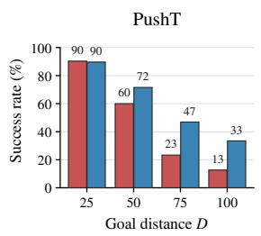

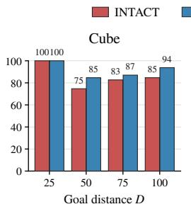

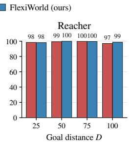

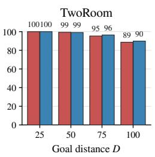  
Figure 4: Direct planning at increasing goal distances. Direct success with one replan across four tasks. Goal distance is in primitive steps; bar labels round success to the nearest percent.

Mixed-span training benefits both architectures, with the full recipe achieving the highest success. With fixed chunks, INTACT reaches 54.42% with mixed spans, versus 46.58% for a 35-step span and 40.92% for a 75-step span. The benefit is therefore not explained by extending the training span alone. With the new architecture, variable chunks, and SF, mixed spans raise success from 52.00% to 60.17%. Removing SF reduces success to 54.42% with the same chunk and span settings. Two mixed-span epochs and six single-span epochs provide similar totals of supervised chunk transitions on PushT. Appendix A.2 details the schedules and additional controls.

## 4.4 PLANNING GRANULARITY AND FURTHER ANALYSIS

Longer chunks accelerate planning. FlexiWorld supports flexible planning granularity at deployment: the same trained model can use different action chunk lengths to trade planning time against control success. Switching from $k = 5$ to $k = 1 0$ gives an average ARCEM speedup of approximately 1.3× at $D \in \{ 5 0 , 1 0 0 \}$ while maintaining similar four-task mean success. Predictor calls halve, but all primitive actions remain autoregressive. Appendix C.1 reports matched protocols, task-level results, and scoring-grid controls. With Reacher and TwoRoom success near saturation, we focus the rollout analysis on PushT and Cube. Within each checkpoint, we compare endpoint latent prediction MSE under identical expert actions: k = 10 reduces this error relative to $k = 5$ at all four tested distances (Appendix D.3).

Table 3: PushT component study. We compare INTACT baselines with our encoder and actor variants. Direct success averages four distances with up to one replan; results are mean ± SD across three evaluation seeds (training seed 0). $\checkmark / -$ mark enabled/disabled; SF denotes Student Forcing $( p _ { \mathrm { S F } } = 0 . 5 )$ . Mixed spans use 35/55/75-step goals for two epochs; single spans use 35-step goals (75 where indicated) for six. Appendix A.2 details evaluation provenance.
<table><tr><td>Variant</td><td>Variable chunks</td><td>Mixed spans</td><td>SF</td><td>Success (%) ↑</td></tr><tr><td>Baseline</td><td></td><td></td><td></td><td>46.58±1.81</td></tr><tr><td>Baseline + 75-step span</td><td></td><td></td><td></td><td>40.92±0.80</td></tr><tr><td>Baseline + mixed spans</td><td>一</td><td>√</td><td></td><td>54.42±0.38</td></tr><tr><td>New architecture</td><td>一</td><td></td><td>一</td><td>46.08±2.43</td></tr><tr><td>Fixed chunks  $+ \operatorname { S F }$ </td><td></td><td></td><td>√</td><td>48.42±0.38</td></tr><tr><td>Variable chunks</td><td>√</td><td></td><td>一</td><td>50.83±1.38</td></tr><tr><td>Variable chunks +  $\mathbf { \partial } \cdot \operatorname { S F }$ </td><td>√</td><td>1</td><td>√</td><td>52.00±0.50</td></tr><tr><td>Mixed spans, without SF</td><td>√</td><td>√</td><td></td><td> $5 4 . 4 2 { \pm } 0 . 9 5 $ </td></tr><tr><td>Full method</td><td>√</td><td>√</td><td>- √</td><td> $\mathbf { 6 0 . 1 7 \pm 1 . 0 4 }$ </td></tr></table>

Action prediction improves over longer horizons. PushT diagnostics show improved long-span action generation alongside gains in frozen-feature probes but comparable actor-free control. To evaluate control without learned action generation, we disable each actor and use the same CEM planner to search actions through its world model, obtaining 40.75% success for FlexiWorld and 40.17% for INTACT. To assess information in the representations, independent ridge probes use frozen current and goal visual features to predict either the recorded temporal gap or the next five expert actions. Temporal-gap $R ^ { 2 }$ rises from 0.565 to 0.603; action-probe $R ^ { 2 ^ { - } }$ is equal or higher at all tested distances (Appendix D). These probes do not use the learned actors. We separately evaluate the actors’ next-five-action predictions against expert actions, using matched observations, goals, and five-action histories. FlexiWorld improves action accuracy and structural correspondence, measured by MAE, $R ^ { 2 }$ , nearest-neighbor overlap, and CKA, at $D \in \{ 5 0 , 7 5 , 1 0 0 \}$ (Figure 7). INTACT’s advantage at $D = 2 5$ suggests a better fit to short goal spans, but FlexiWorld maintains comparable Direct success at this distance while predicting actions better over longer spans.

Limitations and future work. Reliable plan selection and execution remain challenges. On PushT, ARCEM recovers some Direct failures but also loses some Direct successes: retaining the Direct plan among candidates does not guarantee its selection, since ranking uses predicted latent costs rather than actual outcomes (Appendix E). Likewise, SF exposes the actor to generated action prefixes while retaining recorded states and expert targets, leaving recovery from perturbed physica states untested. Future work could investigate state perturbations, training on predicted contexts, and uncertainty-triggered reobservation. The latter adapts physical feedback timing rather than imagined chunk length and should be evaluated against fixed schedules in both success and observation and planning costs (Appendix E.3).

## 5 CONCLUSION

FlexiWorld jointly learns latent dynamics and goal-conditioned action generation across time scales using variable-length action chunks. Across four benchmarks, it enables effective search-free control, and ARCEM further improves success through actor-residual search. Longer chunks reduce planning time with comparable mean success. A single model thus supports distant-goal control and adjustable planning granularity without retraining, balancing planning cost and control performance. Future work will investigate reliable candidate ranking and evaluate FlexiWorld on physical systems.

## REFERENCES

Rishabh Agarwal, Max Schwarzer, Pablo Samuel Castro, Aaron Courville, and Marc G. Bellemare. Deep Reinforcement Learning at the Edge of the Statistical Precipice, 2021. URL https://arxiv.org/ abs/2108.13264.

Marcin Andrychowicz, Filip Wolski, Alex Ray, Jonas Schneider, Rachel Fong, Peter Welinder, Bob McGrew, Josh Tobin, Pieter Abbeel, and Wojciech Zaremba. Hindsight Experience Replay, 2017. URL https: //arxiv.org/abs/1707.01495.

Mahmoud Assran, Quentin Duval, Ishan Misra, Piotr Bojanowski, Pascal Vincent, Michael Rabbat, Yann Le-Cun, and Nicolas Ballas. Self-Supervised Learning from Images with a Joint-Embedding Predictive Architecture, 2023. URL https://arxiv.org/abs/2301.08243.

Mido Assran, Adrien Bardes, David Fan, Quentin Garrido, Russell Howes, Mojtaba Komeili, Matthew Muckley, Ammar Rizvi, Claire Roberts, Koustuv Sinha, Artem Zholus, Sergio Arnaud, Abha Gejji, Ada Martin, Francois Robert Hogan, Daniel Dugas, Piotr Bojanowski, Vasil Khalidov, Patrick Labatut, Francisco Massa, Marc Szafraniec, Kapil Krishnakumar, Yong Li, Xiaodong Ma, Sarath Chandar, Franziska Meier, Yann Le Cun, Michael Rabbat, and Nicolas Ballas. V-JEPA 2: Self-Supervised Video Models Enable Understanding, Prediction and Planning, 2025. URL https://arxiv.org/abs/2506.09985.

Randall Balestriero and Yann LeCun. LeJEPA: Provable and Scalable Self-Supervised Learning Without the Heuristics, 2025. URL https://arxiv.org/abs/2511.08544.

Adrien Bardes, Quentin Garrido, Jean Ponce, Xinlei Chen, Michael Rabbat, Yann LeCun, Mahmoud Assran, and Nicolas Ballas. Revisiting Feature Prediction for Learning Visual Representations from Video, 2024. URL https://arxiv.org/abs/2404.08471.

Samy Bengio, Oriol Vinyals, Navdeep Jaitly, and Noam Shazeer. Scheduled sampling for sequence prediction with recurrent neural networks. arXiv preprint arXiv:1506.03099, 2015. doi: 10.48550/arXiv.1506.03099. URL https://arxiv.org/abs/1506.03099.

Kurtland Chua, Roberto Calandra, Rowan McAllister, and Sergey Levine. Deep Reinforcement Learning in a Handful of Trials using Probabilistic Dynamics Models, 2018. URL https://arxiv.org/abs/ 1805.12114.

Alexey Dosovitskiy, Lucas Beyer, Alexander Kolesnikov, Dirk Weissenborn, Xiaohua Zhai, Thomas Unterthiner, Mostafa Dehghani, Matthias Minderer, Georg Heigold, Sylvain Gelly, Jakob Uszkoreit, and Neil Houlsby. An Image is Worth 16x16 Words: Transformers for Image Recognition at Scale. In International Conference on Learning Representations, 2021. URL https://openreview.net/forum? id=YicbFdNTTy.

Tianqi Du, Qi Zhang, Yifei Wang, and Yisen Wang. Beyond the next step: Variable-length latent world models for long-horizon planning. arXiv preprint arXiv:2606.21775, 2026. doi: 10.48550/arXiv.2606.21775. URL https://arxiv.org/abs/2606.21775.

Yuntian Gao and Xiangyu Xu. Fast LeWorldModel. arXiv preprint arXiv:2606.26217, 2026. doi: 10.48550/ arXiv.2606.26217. URL https://arxiv.org/abs/2606.26217.

Dibya Ghosh, Abhishek Gupta, Ashwin Reddy, Justin Fu, Coline Devin, Benjamin Eysenbach, and Sergey Levine. Learning to Reach Goals via Iterated Supervised Learning, 2021. URL https://arxiv.org/ abs/1912.06088.

David Ha and Jürgen Schmidhuber. World Models, 2018. URL https://arxiv.org/abs/1803. 10122.

Danijar Hafner, Timothy Lillicrap, Ian Fischer, Ruben Villegas, David Ha, Honglak Lee, and James Davidson. Learning Latent Dynamics for Planning from Pixels, 2019. URL https://arxiv.org/abs/1811. 04551.

Danijar Hafner, Timothy Lillicrap, Jimmy Ba, and Mohammad Norouzi. Dream to Control: Learning Behaviors by Latent Imagination, 2020. URL https://arxiv.org/abs/1912.01603.

Danijar Hafner, Jurgis Pasukonis, Jimmy Ba, and Timothy Lillicrap. Mastering diverse control tasks through world models. Nature, 640:647–653, 2025. doi: 10.1038/s41586-025-08744-2. URL https://doi. org/10.1038/s41586-025-08744-2.

Nicklas Hansen, Xiaolong Wang, and Hao Su. Temporal Difference Learning for Model Predictive Control, 2022. URL https://arxiv.org/abs/2203.04955.

Nicklas Hansen, Hao Su, and Xiaolong Wang. TD-MPC2: Scalable, Robust World Models for Continuous Control. In International Conference on Learning Representations, 2024. URL https://openreview. net/forum?id=Oxh5CstDJU.

Peter Henderson, Riashat Islam, Philip Bachman, Joelle Pineau, Doina Precup, and David Meger. Deep Rein forcement Learning that Matters, 2018. URL https://arxiv.org/abs/1709.06560.

Tobias Johannink, Shikhar Bahl, Ashvin Nair, Jianlan Luo, Avinash Kumar, Matthias Loskyll, Juan Aparicio Ojea, Eugen Solowjow, and Sergey Levine. Residual Reinforcement Learning for Robot Control, 2018. URL https://arxiv.org/abs/1812.03201.

Simon Kornblith, Mohammad Norouzi, Honglak Lee, and Geoffrey Hinton. Similarity of Neural Network Representations Revisited, 2019. URL https://arxiv.org/abs/1905.00414.

Balaji Lakshminarayanan, Alexander Pritzel, and Charles Blundell. Simple and Scalable Predictive Uncertainty Estimation using Deep Ensembles, 2017. URL https://arxiv.org/abs/1612.01474.

Yuanchang Liang, Xiaobo Wang, Kai Wang, Shuo Wang, Xiaojiang Peng, Haoyu Chen, David Kim Huat Chua, and Prahlad Vadakkepat. Adaptive action chunking at inference-time for vision-language-action models. In Proceedings of the IEEE/CVF Conference on Computer Vision and Pattern Recognition, 2026. URL https://arxiv.org/abs/2604.04161.

Yuejiang Liu, Jubayer Ibn Hamid, Annie Xie, Yoonho Lee, Max Du, and Chelsea Finn. Bidirectional decoding: Improving action chunking via guided test-time sampling. In International Conference on Learning Representations, 2025. URL https://arxiv.org/abs/2408.17355.

Ilya Loshchilov and Frank Hutter. Decoupled Weight Decay Regularization, 2019. URL https://arxiv. org/abs/1711.05101.

Lucas Maes, Quentin Le Lidec, Damien Scieur, Yann LeCun, and Randall Balestriero. LeWorldModel: Stable end-to-end joint-embedding predictive architecture from pixels. arXiv preprint arXiv:2603.19312, 2026. doi: 10.48550/arXiv.2603.19312. URL https://arxiv.org/abs/2603.19312.

Hoang Nguyen, Xiaohao Xu, and Xiaonan Huang. Latent geometry beyond search: Amortizing planning in world models. arXiv preprint arXiv:2605.08732, 2026. doi: 10.48550/arXiv.2605.08732. URL https: //arxiv.org/abs/2605.08732.

Maxime Oquab, Timothée Darcet, Théo Moutakanni, Huy Vo, Marc Szafraniec, Vasil Khalidov, Pierre Fernandez, Daniel Haziza, Francisco Massa, Alaaeldin El-Nouby, Mahmoud Assran, Nicolas Ballas, Wojciech Galuba, Russell Howes, Po-Yao Huang, Shang-Wen Li, Ishan Misra, Michael Rabbat, Vasu Sharma, Gabriel Synnaeve, Hu Xu, Hervé Jegou, Julien Mairal, Patrick Labatut, Armand Joulin, and Piotr Bojanowski. DI-NOv2: Learning Robust Visual Features without Supervision, 2024. URL https://arxiv.org/abs/ 2304.07193.

Seohong Park, Kevin Frans, Benjamin Eysenbach, and Sergey Levine. OGBench: Benchmarking Offline Goal-Conditioned RL, 2025. URL https://arxiv.org/abs/2410.20092.

Adam Paszke, Sam Gross, Francisco Massa, Adam Lerer, James Bradbury, Gregory Chanan, Trevor Killeen, Zeming Lin, Natalia Gimelshein, Luca Antiga, Alban Desmaison, Andreas Köpf, Edward Yang, Zach DeVito, Martin Raison, Alykhan Tejani, Sasank Chilamkurthy, Benoit Steiner, Lu Fang, Junjie Bai, and Soumith Chintala. PyTorch: An Imperative Style, High-Performance Deep Learning Library, 2019. URL https://arxiv.org/abs/1912.01703.

Cristina Pinneri, Shambhuraj Sawant, Sebastian Blaes, Jan Achterhold, Joerg Stueckler, Michal Rolinek, and Georg Martius. Sample-efficient Cross-Entropy Method for Real-time Planning, 2020. URL https:// arxiv.org/abs/2008.06389.

Ruslan Rakhimov, George Bredis, Yuriy Maksyuta, and Daniil Gavrilov. Qantara: Bridge-flow training for multi-paradigm JEPA control. arXiv preprint arXiv:2607.04978, 2026. doi: 10.48550/arXiv.2607.04978. URL https://arxiv.org/abs/2607.04978.

Stephane Ross, Geoffrey J. Gordon, and J. Andrew Bagnell. A Reduction of Imitation Learning and Structured Prediction to No-Regret Online Learning, 2011. URL https://arxiv.org/abs/1011.0686.

Reuven Rubinstein. The Cross-Entropy Method for Combinatorial and Continuous Optimization. Methodol ogy and Computing in Applied Probability, 1(2):127–190, 1999. doi: 10.1023/A:1010091220143. URL https://doi.org/10.1023/A:1010091220143.

Yongjae Shin, Jongseong Chae, Seongmin Kim, Jongeui Park, and Youngchul Sung. Adaptive action chunking via multi-chunk Q value estimation. arXiv preprint arXiv:2605.10044, 2026. doi: 10.48550/arXiv.2605. 10044. URL https://arxiv.org/abs/2605.10044.

Junhan Sun, Hao Zhao, and Guofeng Zhang. INTACT: Isomorphic intent-to-action learning for search-free world models. arXiv preprint arXiv:2607.26056, 2026. doi: 10.48550/arXiv.2607.26056. URL https: //arxiv.org/abs/2607.26056.

Ashish Vaswani, Noam Shazeer, Niki Parmar, Jakob Uszkoreit, Llion Jones, Aidan N. Gomez, Lukasz Kaiser, and Illia Polosukhin. Attention Is All You Need, 2017. URL https://arxiv.org/abs/1706. 03762.

Tingwu Wang and Jimmy Ba. Exploring model-based planning with policy networks. arXiv preprint arXiv:1906.08649, 2019. doi: 10.48550/arXiv.1906.08649. URL https://arxiv.org/abs/1906. 08649.

Yuhai Wang, Jiawei Xia, Rongxuan Zhou, Xiao Hu, Yongliang Shi, Jing Du, and Yang Ye. PRISM: PRiorguided imagination sampling in world models. arXiv preprint arXiv:2606.07974, 2026. doi: 10.48550/ arXiv.2606.07974. URL https://arxiv.org/abs/2606.07974.

Wancong Zhang, Basile Terver, Artem Zholus, Soham Chitnis, Harsh Sutaria, Mido Assran, Randall Balestriero, Amir Bar, Adrien Bardes, Yann LeCun, and Nicolas Ballas. Hierarchical planning with latent world models. arXiv preprint arXiv:2604.03208, 2026. doi: 10.48550/arXiv.2604.03208. URL https://arxiv.org/abs/2604.03208.

Xinyu Zhang, Yuhan Liu, Haonan Chang, Liam Schramm, and Abdeslam Boularias. Autoregressive action sequence learning for robotic manipulation. IEEE Robotics and Automation Letters, 10(5):4898–4905, 2025. doi: 10.1109/LRA.2025.3550849. URL https://doi.org/10.1109/LRA.2025.3550849.

Kai Zhao, Dongliang Nie, Yuchen Lin, Zhehan Luo, Yixiao Gu, Deng-Ping Fan, and Dan Zeng. Sub-JEPA: Subspace gaussian regularization for stable end-to-end world models. arXiv preprint arXiv:2605.09241, 2026. doi: 10.48550/arXiv.2605.09241. URL https://arxiv.org/abs/2605.09241.

Tony Z. Zhao, Vikash Kumar, Sergey Levine, and Chelsea Finn. Learning fine-grained bimanual manipulation with low-cost hardware. arXiv preprint arXiv:2304.13705, 2023. doi: 10.48550/arXiv.2304.13705. URL https://arxiv.org/abs/2304.13705.

Gaoyue Zhou, Hengkai Pan, Yann LeCun, and Lerrel Pinto. DINO-WM: World models on pre-trained visual features enable zero-shot planning. arXiv preprint arXiv:2411.04983, 2024. doi: 10.48550/arXiv.2411. 04983. URL https://arxiv.org/abs/2411.04983.

## SUPPLEMENTARY MATERIAL

A Implementation and Evaluation Details . 13   
A.1 Architecture and Training . 13   
A.2 Sampling and Training Schedules . 14   
A.3 Baselines and Evaluation Protocol 15   
B FlexiWorld Results by Goal Distance . 16   
C Planning Granularity, Planning Time, and Sensitivity . 16   
C.1 Planning with Five- and Ten-Action Chunks. 16   
C.2 Search Budget and Planning Time . 18   
C.3 Temperature Sensitivity . 19   
D Action and Representation Diagnostics 20   
D.1 Goal-Conditioned Action Predictions . 20   
D.2 Frozen Probes and Actor-Free Planning . .20   
D.3 Within-Model Rollout Error across Chunk Lengths 22   
E Execution Outcomes and Planning Limitations 22   
E.1 Separating Reobservation from Search . . 22   
E.2 A Controlled Search Failure in TwoRoom . 23   
E.3 Training and Deployment Conditions . 24   
E.4 Qualitative Rollouts on PushT and Cube . 24

## A IMPLEMENTATION AND EVALUATION DETAILS

## A.1 ARCHITECTURE AND TRAINING

Shared visual backbone and predictor. The visual encoder $E _ { \theta }$ is a randomly initialized ViT-Tiny (Dosovitskiy et al., 2021) with 14×14 patches and 224×224 images. Visual and action embeddings have 192 dimensions, and the projectors use hidden width 2048 with batch normalization. The predictor $F _ { \phi }$ follows LeWM and INTACT (Maes et al., 2026; Sun et al., 2026), using six causal Transformer layers with model width 192, 16 attention heads of dimension 64, and feed-forward width 2048. It uses dropout 0.1 and learned positional embeddings over at most three latent states. Actions condition each predictor layer through adaptive normalization and residual gates.

Variable-length action encoder. The causal Transformer $A _ { \omega } ^ { \mathrm { V L } }$ replaces the fixed-width action encoder with two layers of width 64, four attention heads, and feed-forward width 256. It projects the last valid action token to 192 dimensions and adds a learned MLP projection of a sinusoidal chunk-length code, yielding one predictor input regardless of the number of primitives in the chunk. The same encoder represents the preceding action chunk for actor conditioning.

Autoregressive actor. The causal Transformer $G _ { \psi } ^ { \mathrm { A R } }$ uses three layers of width 192, four attention heads, and feed-forward width 768. Four conditioning tokens encode the current latent state, intent, their elementwise product, and the previous action chunk. The actor predicts one primitive action at a time from this context and the within-chunk prefix, rather than producing a fixed-width chunk in parallel. Its Gaussian output heads predict a mean and log standard deviation, with the latter clamped to [−5, 2].

Optimization. FlexiWorld uses AdamW (Loshchilov & Hutter, 2019) with learning rate $3 \times 1 0 ^ { - 4 }$ weight decay $1 0 ^ { - 3 }$ , global batch size 256, gradient clipping at norm 1, and bfloat16 precision, with a linear-warmup cosine-annealing learning-rate scheduler. The prediction loss has unit weight and the regularization, local action, and goal action losses have weights 0.02, 0.10, and 0.05. SI

GReg (Balestriero & LeCun, 2025; Maes et al., 2026) uses 1024 projections and 17 quadrature knots. Fixed-chunk INTACT and the long-window control use learning rate $5 \times 1 0 ^ { - 4 }$ . Actions use training-data normalization statistics. The complete model uses no pre-trained visual backbone, target exponential moving average (EMA), or auxiliary temporal loss.

Actor conditioning. The requested chunk length sets the number of decoded primitives, not an additional actor conditioning token. Under the same context, deterministic conditional-mean decoding of a shorter chunk therefore produces a prefix of a longer decode. For Student Forcing, each chunk and intent first receives a greedy decode without gradients. A sample-level Bernoulli draw with probability $p _ { \mathrm { S F } }$ selects these generated primitives or the expert primitives as the within-chunk conditioning sequence. The selected sequence is shifted right, so position $j$ receives only positions $0 , \ldots , j - 1$ , while its target remains expert action $j .$ Latent state, intent, and the preceding-chunk embedding are held fixed between the two passes. The supervised pass updates the actor, action encoder, and attached visual representation without backpropagating through student prefix generation. The local intent retains gradients through both boundary latent states, whereas the goal intent detaches only its final-goal latent. The current latent and the independent prediction targets remain attached.

Loss aggregation. The compact objective in Equation 5 preserves the local and goal action weights above. For $q \in \{ \mathrm { l o c a l } , \mathrm { g o a l } \}$ , define

$$
\mathcal { L } _ { q } = \mathbb { E } \left[ \frac { 1 } { N } \sum _ { i = 0 } ^ { N - 1 } \ell _ { i } ^ { q } \right] , \qquad \mathcal { L } _ { \mathrm { N L L } } = \mathcal { L } _ { \mathrm { l o c a l } } + 0 . 5 \mathcal { L } _ { \mathrm { g o a l } } .
$$

With $\lambda _ { \mathrm { a c t } } = 0 . 1 0$ , the effective weights are therefore 0.10 for local intent and 0.05 for goal intent. The prediction term is

$$
\mathcal { L } _ { \mathrm { p r e d } } = \mathbb { E } \left[ \frac { 1 } { N } \sum _ { i = 0 } ^ { N - 1 } \frac { \lVert \hat { z } _ { i + 1 } - z _ { i + 1 } \rVert _ { 2 } ^ { 2 } } { d _ { z } } \right] .
$$

Here $d _ { z } = 1 9 2$ is the latent dimensionality. The expectations cover sampled spans, windows, partitions, and prefix choices, and are estimated by mini-batch averages. Equation 4 normalizes each chunk’s action NLL by its valid length $k _ { i }$ and action dimension $d _ { a } .$ , excluding padding from both the sum and its denominator. SIGReg is evaluated on boundary latent batches and averaged over boundaries, with $\lambda _ { \mathrm { r e g } } = 0 . 0 2$ . Prediction gradients reach both the predictor and target encoder branches. These definitions retain the original per-chunk weighting rather than weighting longer chunks more heavily.

We retain LeWM’s SIGReg objective to prevent representation collapse, while SF changes only the actor’s conditioning inputs.

## A.2 SAMPLING AND TRAINING SCHEDULES

Using a recorded future observation as a goal connects our sampling to hindsight goal relabeling (Andrychowicz et al., 2017) and supervised goal-reaching (Ghosh et al., 2021). Unlike online trajectory collection in GCSL, our training reuses a fixed offline dataset while varying the supervision span and intermediate chunk boundaries.

Batches use a common training span of 35, 55, or 75 primitive steps, partitioned into $N = 7 , 1 1$ or 15 chunks, respectively. Span groups are mixed in proportion to their available training windows. Within each group, an episode is sampled in proportion to its valid starting points, followed by a starting point and a bounded action partition. Chunk lengths range from one to ten primitives. The partition preserves the selected span and excludes the all-five schedule. Sampling is with replacement, so an epoch specifies the number of sampled windows. Valid-position masking excludes padding from losses. The first chunk uses available expert history, while subsequent chunks use the preceding chunk at its actual length.

We use two mixed-span epochs and six single-span epochs to balance training exposure across the span groups. A mixed epoch samples from all three span groups, whereas a single-span epoch samples from only one. The schedules therefore allocate two passes to each of three groups or six passes to one group. Because the groups contain different numbers of valid windows and chunks per window, this is not an exact match in optimizer updates or compute. On PushT, it gives similar total numbers of supervised chunk transitions. All variants in Tables 3 and 4 use training seed 0. The no-SF mixed-span variant and Full method share the same loader and optimization settings, changing only p from zero to 0.5. The four single-span autoregressive variants form a 2 × 2 comparison of fixed/variable chunks and $p _ { \mathrm { S F } } \in \{ 0 , 0 . 5 \}$ , using the same action architecture, 35-step span, and six-epoch budget. New architecture uses seven fixed five-step chunks with SF disabled, whereas Variable chunks partitions the same span into seven variable-length chunks. Their SF counterparts change only the prefix-training policy. All four results come from a unified re-evaluation with inference chunk length five and 100 episodes per distance and evaluation seed. Each result averages evaluation seeds 0, 1, and 42. No action feedback retains the new encoder and actor parameteriza tion, but replaces within-chunk action-conditioning values with zeros during training and inference. It retains preceding-chunk context and predicts the current chunk in parallel, using variable partitions and no SF. In its independent matched re-evaluation, removing within-chunk action feedback reduces the success rate from 50.92% to 48.83% (Table 4). This control tests action feedback within this architecture, not autoregressive versus parallel actors in general.

Table 4: Extended PushT component study. Success (%) averages four goal distances with one replan. Sample SD is across three evaluation seeds; training settings follow Appendix A.2. Goal spans are in primitive steps. AR denotes autoregressive generation; SF denotes Student Forcing, with generated-prefix probability $p _ { \mathrm { S F } }$
<table><tr><td>Variant</td><td>Goal span</td><td>Action interface</td><td>pSF</td><td>Epochs</td><td>Success (%)</td></tr><tr><td>New architecture</td><td>35</td><td>Fixed, AR</td><td>0</td><td>6</td><td>46.08±2.43</td></tr><tr><td>Fixed chunks + SF</td><td>35</td><td>Fixed, AR</td><td>0.5</td><td>6</td><td>48.42±0.38</td></tr><tr><td>Variable chunks</td><td>35</td><td>Variable, AR</td><td>0</td><td>6</td><td>50.83±1.38</td></tr><tr><td>Variable chunks + SF</td><td>35</td><td>Variable, AR</td><td>0.5</td><td>6</td><td>52.00±0.50</td></tr><tr><td>No action feedback</td><td>35</td><td>Variable, parallel</td><td>0</td><td>6</td><td>48.83±1.94</td></tr><tr><td>INTACT</td><td>35</td><td>Fixed</td><td>一</td><td>6</td><td>46.58±1.81</td></tr><tr><td>Long span</td><td>75</td><td>Fixed</td><td></td><td>6</td><td>40.92±0.80</td></tr><tr><td>Mixed spans (INTACT)</td><td>35/55/75</td><td>Fixed</td><td>一</td><td>2</td><td>54.42±0.38</td></tr><tr><td>Without SF</td><td>35/55/75</td><td>Variable, AR</td><td>0</td><td>2</td><td>54.42±0.95</td></tr><tr><td>Full method</td><td>35/55/75</td><td>Variable, AR</td><td>0.5</td><td>2</td><td>60.17±1.04</td></tr></table>

No action feedback (48.83%) is compared with its independently re-evaluated, matched autoregressive reference (50.92%). The 50.83% Variable chunks result above is from the factorial re-evaluation of the same reference checkpoint, not the matched reference for this comparison.

The additional fixed-interface control distinguishes a single long span from mixed-span supervision: training only at 75 steps reaches 40.92%, compared with 54.42% for mixed spans (Table 4). The remaining component comparisons are discussed in Section 4.3.

## A.3 BASELINES AND EVALUATION PROTOCOL

Baseline models and training budgets. For all baselines, we use the configurations provided by their official implementations, with training-budget and evaluation adaptations specified below. We evaluate LeWM, Fast-LeWM, Sub-JEPA, and PushT DINO-WM with their available models, retaining their respective training budgets. DINO-WM also uses a pre-trained DINOv2 encoder (Zhou et al., 2024; Oquab et al., 2024), whereas FlexiWorld trains from scratch. Our six-epoch INTACT control provides a comparison at a similar supervision budget, detailed in Appendix A.2; the external baselines are not retrained under a common compute budget. Baseline success rates are from our own evaluations under the one-replan protocol below, without substituting published success rates.

Evaluation protocol. Goal observations are recorded at t + D, never rounded to a multiple of five. The main evaluation allows up to 2D primitive actions, with one new observation and replan after the first D actions if needed. Tables label this setting “One replan”. “Strict” uses only the initial Dstep open-loop plan, without a new observation or replan. Success uses the environment predicate and is latched within the budget. On PushT the configured agent-position condition is included. Models receive images rather than privileged state variables, except the released PushT DINO-WM checkpoint, which also uses proprioception. All methods receive the same goal observation and execution budget. The controlled search and timing experiments use the math backend of scaled dot-product attention (Math SDPA) and an evaluation batch size of one.

Seeds and aggregation. FlexiWorld uses training seeds {0, 42, 3072} and evaluation seeds $\{ 0 , 1 , 4 2 \}$ , with 100 episodes per distance and evaluation seed. Baseline entries use one training seed and the same three evaluation seeds. For each FlexiWorld training seed, success is averaged over evaluation seeds and the four distances. Task entries report the mean and sample SD of these three training-seed means. For Average, we first average the four tasks within each training seed, then compute the mean and sample SD. For one-checkpoint controls, we instead report SD across evaluation-seed means. Unless otherwise stated, subsequent control evaluations follow these seed settings and aggregation rules.

DINO-WM uses the author-released checkpoint on PushT and our ten-epoch, pixels-only checkpoints at training seed 0 on Cube, Reacher, and TwoRoom. These task-specific checkpoints follow the one-checkpoint aggregation above; for Average, task means are averaged within each evaluation seed before computing the mean and sample SD.

Run-to-run variability and aggregation choices can affect empirical comparisons (Henderson et al., 2018; Agarwal et al., 2021). The reported SD describes variability across the specified repeats, not a confidence interval or a test of statistical significance.

## B FLEXIWORLD RESULTS BY GOAL DISTANCE

Table 5 expands the main results by goal distance for Direct and ARCEM.

Table 5: FlexiWorld success by goal distance. Success (%) allows one replan. Entries show mean and SD across three training seeds after averaging evaluation seeds. D is measured in primitive steps. The last column averages distances within each training seed before computing SD.
<table><tr><td>Planner</td><td>Task</td><td> $D = 2 5$ </td><td> $D = 5 0$ </td><td> $D = 7 5$ </td><td> $D = 1 0 0$ </td><td>Mean</td></tr><tr><td>Direct</td><td>PushT</td><td> $8 9 . 6 7 { \pm } 1 . 6 7 $ </td><td> $7 1 . 5 6 { \pm } 3 . 9 8 $ </td><td> $4 6 . 8 9 { \pm } 5 . 3 6 $ </td><td> $3 3 . 4 4 \pm 5 . 3 5$ </td><td> $6 0 . 3 9 { \pm } 3 . 9 2 $ </td></tr><tr><td>Direct</td><td>Cube</td><td> $1 0 0 . 0 0 { \pm } 0 . 0 0$ </td><td> $8 4 . 6 7 { \pm } 2 . 4 0 $ </td><td> $8 7 . 0 0 { \pm } 3 . 0 6 \ $ </td><td> $9 3 . 7 8 { \pm } 0 . 8 4$ </td><td> $9 1 . 3 6 { \pm } 1 . 5 6 $ </td></tr><tr><td>Direct</td><td>Reacher</td><td> $9 8 . 1 1 \pm 0 . 1 9$ </td><td> $9 9 . 8 9 { \pm } 0 . 1 9 $ </td><td> $9 9 . 5 6 { \pm } 0 . 1 9$ </td><td> $9 8 . 6 7 { \pm } 0 . 3 3 $ </td><td> $9 9 . 0 6 { \pm } 0 . 0 5$ </td></tr><tr><td>Direct</td><td>TwoRoom</td><td> $1 0 0 . 0 0 { \pm } 0 . 0 0$ </td><td> $9 9 . 1 1 { \pm } 0 . 5 1 $ </td><td> $9 6 . 4 4 { \pm } 3 . 3 6 $ </td><td> $8 9 . 8 9 { \pm } 3 . 8 9 $ </td><td> $9 6 . 3 6 { \pm } 1 . 9 2 $ </td></tr><tr><td>ARCEM</td><td>PushT</td><td> $9 4 . 3 3 { \pm } 2 . 0 8 $ </td><td> $7 8 . 1 1 \pm 4 . 5 5$ </td><td> $5 5 . 0 0 { \pm } 8 . 0 1 $ </td><td> $4 8 . 1 1 \pm 5 . 3 5$ </td><td> $6 8 . 8 9 { \pm 4 . 8 0 }$ </td></tr><tr><td>ARCEM</td><td>Cube</td><td> $1 0 0 . 0 0 { \pm } 0 . 0 0$ </td><td> $8 8 . 7 8 { \pm } 2 . 5 2 $ </td><td> $8 6 . 2 2 { \pm } 3 . 0 2$ </td><td> $9 2 . 7 8 { \pm } 1 . 0 2 $ </td><td> $9 1 . 9 4 \pm 1 . 5 0 $ </td></tr><tr><td>ARCEM</td><td>Reacher</td><td> $9 9 . 8 9 { \pm } 0 . 1 9 $ </td><td> $1 0 0 . 0 0 { \scriptstyle \pm 0 . 0 0 }$ </td><td> $9 9 . 8 9 { \pm } 0 . 1 9 $ </td><td> $9 9 . 1 1 { \pm } 0 . 5 1 $ </td><td> $9 9 . 7 2 { \scriptstyle \pm 0 . 1 7 }$ </td></tr><tr><td>ARCEM</td><td>TwoRoom</td><td> $9 9 . 8 9 { \pm } 0 . 1 9 $ </td><td> $9 8 . 5 6 \pm 1 . 1 7$ </td><td> $9 6 . 2 2 { \pm } 3 . 4 2$ </td><td> $9 1 . 7 8 { \pm } 5 . 0 9$ </td><td> $9 6 . 6 1 { \pm } 2 . 4 5 $ </td></tr></table>

## C PLANNING GRANULARITY, PLANNING TIME, AND SENSITIVITY

## C.1 PLANNING WITH FIVE- AND TEN-ACTION CHUNKS

Matched evaluation. We vary deployment chunk length without changing the learned weights. Direct and ARCEM are evaluated at $k = 5$ and $k = 1 0$ on all four tasks and $D \in \{ 2 5 , 5 0 , 7 5 , 1 0 0 \}$ with identical starts and goals across chunk schedules. Both schedules generate exactly D primitive actions per plan, with $k = 1 0$ using a final five-action chunk at $D = 2 5$ and $D = 7 5$ . Both permit one reobservation after the first plan. The initial expert history and subsequent executed history each contain five primitive actions, independently of the planned chunk length. These matched re-evaluations are reported separately from Table 1.

ARCEM uses additive residuals with no actor-standard-deviation scaling, $T = 0 . 2 , 1 2 8$ candidates, three iterations, and 16 elites for both schedules. Candidate costs use the predicted chunk-boundary states. To distinguish rollout granularity from the set of scoring times, a third ARCEM control retains $k = 5$ rollouts but scores only the boundary times of the $k = 1 0$ schedule, including the final endpoint. Direct has 288 evaluation combinations and ARCEM has 432, including this commongrid control. Table 6 summarizes success by task, Table 7 compares success and planning time by distance, and Table 8 provides the complete task-by-distance results.

Control trade-off. Increasing chunk length leaves ARCEM’s four-task mean close to its $k = 5$ value (89.17% versus 89.29%), but the changes are not uniform. PushT decreases from 68.89% to 67.14%, while TwoRoom increases from 96.61% to 97.72%. Direct is more sensitive on PushT,

Table 6: Planning chunk length and control success. k is the chunk length in primitive actions. Success (%) with one replan averages four goal distances. Mean and sample SD across three training seeds, after averaging evaluation seeds and distances. All rows use the matched chunk-length study; they do not replace the main-result evaluation. †: common scoring grid, retaining five-action rollouts but scoring only the ten-action boundary times.
<table><tr><td>Planner</td><td>k</td><td>PushT</td><td>Cube</td><td>Reacher</td><td>TwoRoom</td><td>Average</td></tr><tr><td>Direct</td><td>5</td><td> $6 0 . 3 9 { \pm } 3 . 9 2 $ </td><td> $9 1 . 3 6 { \pm } 1 . 5 6 $ </td><td> $9 9 . 0 6 { \pm } 0 . 0 5$ </td><td> $9 6 . 3 6 { \pm } 1 . 9 2 $ </td><td> $8 6 . 7 9 { \pm } 1 . 6 5$ </td></tr><tr><td>Direct</td><td>10</td><td> $5 4 . 3 9 { \pm } 1 . 3 5 $ </td><td> $9 1 . 5 0 { \pm } 1 . 3 2 $ </td><td> $9 9 . 2 5 { \pm } 0 . 2 5 $ </td><td> $9 6 . 2 2 { \pm } 1 . 8 8 $ </td><td> $8 5 . 3 4 { \pm } 0 . 9 2 $ </td></tr><tr><td>ARCEM</td><td>5</td><td> $6 8 . 8 9 { \pm } 4 . 8 0 $ </td><td> $9 1 . 9 4 \pm 1 . 5 0 $ </td><td> $9 9 . 7 2 { \scriptstyle \pm 0 . 1 7 }$ </td><td> $9 6 . 6 1 { \pm } 2 . 4 5 $ </td><td> $8 9 . 2 9 { \pm } 1 . 9 6 $ </td></tr><tr><td>ARCEM</td><td>10</td><td> $6 7 . 1 4 \pm 1 . 8 2$ </td><td> $9 2 . 1 1 \pm 1 . 9 3 $ </td><td> $9 9 . 6 9 { \pm } 0 . 0 5 $ </td><td> $9 7 . 7 2 { \pm } 1 . 4 2$ </td><td> $8 9 . 1 7 { \pm } 1 . 0 8 $ </td></tr><tr><td>ARCEM</td><td>5†</td><td> $6 8 . 5 0 { \pm } 4 . 1 3 $ </td><td> $9 1 . 7 2 { \pm } 1 . 8 8 $ </td><td> $9 9 . 6 9 { \pm } 0 . 1 7 \ $ </td><td> $9 6 . 8 3 { \pm } 2 . 1 7 $ </td><td> $8 9 . 1 9 { \pm } 1 . 8 5 $ </td></tr></table>

decreasing from 60.39% to 54.39%, while its other task means change little. The common-grid ARCEM control reaches 89.19% overall, with 68.50% on PushT. Thus ARCEM maintains similar average success with longer chunks, while individual tasks and Direct control remain sensitive to the chunk schedule.

Table 7: Matched success and planning time by goal distance. SR denotes success rate (%), averaged over four tasks with training-seed SD. D is goal distance and k is chunk length, both in primitive steps. Planning time averages per-input median solve times on identical inputs, including encoding but excluding environment execution. Speedup is the ratio of mean planning times, not an episode-runtime ratio.
<table><tr><td>Planner</td><td>D</td><td> $\mathrm { S R } , k = 5$ </td><td> $\mathrm { S R } , k = 1 0 $ </td><td> $\mathrm { m s } , k = 5$ </td><td> $\mathrm { m s } , k = 1 0$ </td><td>Speedup</td></tr><tr><td>Direct</td><td>25</td><td> $9 6 . 9 4 { \pm } 0 . 3 8 $ </td><td> $9 6 . 8 6 { \pm } 0 . 2 5 $ </td><td>64.2</td><td>55.1</td><td>1.17×</td></tr><tr><td>Direct</td><td>50</td><td> $8 8 . 8 1 \pm 1 . 1 8 $ </td><td> $8 7 . 2 8 { \pm } 0 . 8 4$ </td><td>115.6</td><td>92.8</td><td>1.25×</td></tr><tr><td>Direct</td><td>75</td><td> $8 2 . 4 7 { \pm } 2 . 7 0 $ </td><td> $8 1 . 0 0 { \pm } 1 . 3 0 $ </td><td>167.2</td><td>135.1</td><td>1.24×</td></tr><tr><td>Direct</td><td>100</td><td> $7 8 . 9 4 \pm 2 . 5 0 $ </td><td> $7 6 . 2 2 \pm 1 . 9 2$ </td><td>218.4</td><td>172.6</td><td>1.27×</td></tr><tr><td>ARCEM</td><td>25</td><td> $9 8 . 5 3 { \pm } 0 . 5 5 $ </td><td> $9 8 . 8 6 { \pm } 0 . 3 8 $ </td><td>268.8</td><td>221.5</td><td>1.21×</td></tr><tr><td>ARCEM</td><td>50</td><td> $9 1 . 3 6 \pm 1 . 9 9$ </td><td> $9 0 . 7 5 { \pm } 0 . 5 8 $ </td><td>510.9</td><td>393.6</td><td>1.30×</td></tr><tr><td>ARCEM</td><td>75</td><td> $8 4 . 3 3 { \pm } 3 . 0 6 $ </td><td> $8 5 . 1 1 \pm 1 . 3 9$ </td><td>753.3</td><td>588.1</td><td>1.28×</td></tr><tr><td>ARCEM</td><td>100</td><td> $8 2 . 9 4 \pm 2 . 5 1 $ </td><td> $8 1 . 9 4 { \pm } 2 . 0 9$ </td><td>994.4</td><td>760.1</td><td>1.31×</td></tr></table>

Table 8: Chunk-length success by task and goal distance. Matched Direct and ARCEM evaluations with one replan. D is goal distance and k is chunk length, both in primitive steps. Entries give mean success (%) and sample SD across three training seeds after averaging evaluation seeds.
<table><tr><td>Task</td><td>D</td><td> $\mathrm { D i r e c t } , k = 5$ </td><td> $\mathrm { D i r e c t } , k = 1 0$ </td><td> $\mathbf { A R C E M } , k = 5$ </td><td> $\mathrm { A R C E M } , k = 1 0$ </td></tr><tr><td>PushT</td><td>25</td><td> $8 9 . 6 7 { \pm } 1 . 6 7 $ </td><td> $8 8 . 0 0 \pm 1 . 2 0 $ </td><td> $9 4 . 3 3 { \pm } 2 . 0 8 $ </td><td> $9 5 . 4 4 \pm 1 . 5 0 $ </td></tr><tr><td>PushT</td><td>50</td><td> $7 1 . 5 6 { \pm } 3 . 9 8 $ </td><td> $6 4 . 5 6 { \pm } 1 . 3 9$ </td><td> $7 8 . 1 1 \pm 4 . 5 5$ </td><td> $7 4 . 4 4 { \pm } 2 . 8 3 $ </td></tr><tr><td>PushT</td><td>75</td><td> $4 6 . 8 9 { \pm } 5 . 3 6 $ </td><td> $4 1 . 2 2 { \pm } 0 . 6 9$ </td><td> $5 5 . 0 0 { \pm } 8 . 0 1 $ </td><td> $5 6 . 4 4 { \pm } 1 . 5 0 $ </td></tr><tr><td>PushT</td><td>100</td><td> $3 3 . 4 4 \pm 5 . 3 5$ </td><td> $2 3 . 7 8 { \pm } 3 . 9 1 $ </td><td> $4 8 . 1 1 \pm 5 . 3 5$ </td><td> $4 2 . 2 2 { \pm } 5 . 4 2$ </td></tr><tr><td>Cube</td><td>25</td><td> $1 0 0 . 0 0 { \scriptstyle \pm 0 . 0 0 }$ </td><td> $1 0 0 . 0 0 { \scriptstyle \pm 0 . 0 0 }$ </td><td> $1 0 0 . 0 0 { \scriptstyle \pm 0 . 0 0 }$ </td><td> $1 0 0 . 0 0 { \scriptstyle \pm 0 . 0 0 }$ </td></tr><tr><td>Cube</td><td>50</td><td> $8 4 . 6 7 { \pm } 2 . 4 0 $ </td><td> $8 5 . 6 7 { \pm 2 . 4 0 }$ </td><td> $8 8 . 7 8 { \pm } 2 . 5 2 $ </td><td> $8 9 . 2 2 \pm 4 . 6 0 $ </td></tr><tr><td>Cube</td><td>75</td><td> $8 7 . 0 0 { \pm } 3 . 0 6 \ $ </td><td> $8 6 . 6 7 { \pm } 2 . 3 3$ </td><td> $8 6 . 2 2 { \pm } 3 . 0 2$ </td><td> $8 6 . 6 7 { \scriptstyle \pm 3 . 7 1 }$ </td></tr><tr><td>Cube</td><td>100</td><td> $9 3 . 7 8 { \pm } 0 . 8 4$ </td><td> $9 3 . 6 7 { \pm } 0 . 5 8 $ </td><td> $9 2 . 7 8 { \pm } 1 . 0 2 $ </td><td> $9 2 . 5 6 { \pm } 0 . 3 8 $ </td></tr><tr><td>Reacher</td><td>25</td><td> $9 8 . 1 1 { \pm } 0 . 1 9$ </td><td> $9 9 . 4 4 { \pm } 0 . 1 9$ </td><td> $9 9 . 8 9 { \pm } 0 . 1 9 $ </td><td> $1 0 0 . 0 0 { \scriptstyle \pm 0 . 0 0 }$ </td></tr><tr><td>Reacher</td><td>50</td><td> $9 9 . 8 9 { \pm } 0 . 1 9 $ </td><td> $9 9 . 7 8 { \pm } 0 . 3 8 $ </td><td> $1 0 0 . 0 0 { \pm } 0 . 0 0$ </td><td> $9 9 . 8 9 { \pm } 0 . 1 9 $ </td></tr><tr><td>Reacher</td><td>75</td><td> $9 9 . 5 6 { \pm } 0 . 1 9$ </td><td> $9 9 . 5 6 { \pm } 0 . 5 1 $ </td><td> $9 9 . 8 9 { \pm } 0 . 1 9 $ </td><td> $9 9 . 7 8 { \pm } 0 . 3 8 $ </td></tr><tr><td>Reacher</td><td>100</td><td> $9 8 . 6 7 { \pm } 0 . 3 3 $ </td><td> $9 8 . 2 2 { \pm } 0 . 1 9$ </td><td> $9 9 . 1 1 { \pm } 0 . 5 1 $ </td><td> $9 9 . 1 1 { \pm } 0 . 5 1 $ </td></tr><tr><td>TwoRoom</td><td>25</td><td> $1 0 0 . 0 0 { \scriptstyle \pm 0 . 0 0 }$ </td><td> $1 0 0 . 0 0 { \scriptstyle \pm 0 . 0 0 }$ </td><td> $9 9 . 8 9 { \pm } 0 . 1 9 $ </td><td> $1 0 0 . 0 0 { \scriptstyle \pm 0 . 0 0 }$ </td></tr><tr><td>TwoRoom</td><td>50</td><td> $9 9 . 1 1 { \pm } 0 . 5 1 $ </td><td> $9 9 . 1 1 { \pm } 0 . 5 1 $ </td><td> $9 8 . 5 6 \pm 1 . 1 7$ </td><td> $9 9 . 4 4 { \pm } 0 . 3 8 $ </td></tr><tr><td>TwoRoom</td><td>75</td><td> $9 6 . 4 4 { \pm } 3 . 3 6 $ </td><td> $9 6 . 5 6 { \pm } 3 . 0 1 $ </td><td> $9 6 . 2 2 { \pm } 3 . 4 2$ </td><td> $9 7 . 5 6 { \pm 2 . 0 1 } $ </td></tr><tr><td>TwoRoom</td><td>100</td><td> $8 9 . 8 9 { \pm } 3 . 8 9 $ </td><td> $8 9 . 2 2 { \pm } 4 . 0 0 $ </td><td> $9 1 . 7 8 { \pm } 5 . 0 9$ </td><td> $9 3 . 8 9 { \pm } 3 . 3 4 $ </td></tr></table>

## C.2 SEARCH BUDGET AND PLANNING TIME

Pure CEM uses a zero-mean normalized-action proposal with scale 1, 300 candidates, 30 iterations, and 30 elites. Guarded-A (Sun et al., 2026) uses scale 0.25, 128 candidates, three iterations, and 16 elites, retaining the Direct reference. ARCEM searches additive residuals in normalized action coordinates with the latter candidate budget and $T = 0 . 2 .$ Its residual distribution starts with zero mean and unit standard deviation. Each update replaces the distribution with the elite mean and pop ulation standard deviation, clipping the latter to [0.05, 2.0], with no smoothing or residual penalty. The 128 candidates include one slot for the exact Direct plan and one for the best residual candidate retained across iterations. Equal candidate counts need not imply equal computational cost because ARCEM regenerates conditional actions. Table 9 uses matched checkpoints, Math SDPA, batch size, and evaluation cases for success.

At the same budget of 384 candidates, ARCEM outperforms Guarded-A on PushT, Cube, and Reacher, but takes longer per solve. Increasing Guarded-A to six iterations raises its average success from 87.02% to 87.44%, compared with 88.96% for ARCEM. On the matched input cases, six-iteration Guarded-A takes 620.5 ms per solve and ARCEM takes 631.8 ms, placing the two within 1.8% in mean planning time. Figure 5 shows planning time by distance for Direct, ARCEM, and both the three- and six-iteration Guarded-A variants.

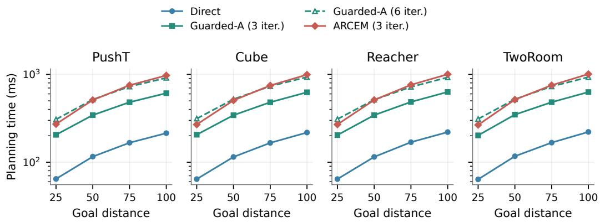  
Figure 5: Planning time by goal distance. FlexiWorld with Direct, ARCEM (three iterations), and Guarded-A (three or six iterations). Curves average per-input median times over both solve stages, including image encoding and planning. The six-iteration run uses the same GPU and input cases. The vertical axis shows per-solve time on a logarithmic scale.

Table 9: Planning success and time with FlexiWorld. Success (%) averages four goal distances with one replan; Average also averages four tasks. Success evaluations share the seed-0 checkpoints, the math backend of scaled dot-product attention (Math SDPA), and batch size one; mean and SD are across the three evaluation seeds. Candidates gives the total search budget per solve across all iterations. Planning time uses identical inputs on one RTX PRO 6000. † denotes six iterations of 128 candidates.
<table><tr><td>Planner</td><td>Candidates</td><td>PushT</td><td>Cube</td><td>Reacher</td><td>TwoRoom</td><td></td><td>Average Time (ms)</td></tr><tr><td>Direct</td><td>0</td><td> $6 0 . 1 7 { \scriptstyle \pm 1 . 0 4 }$ </td><td> $8 9 . 6 7 { \pm } 1 . 8 4 $ </td><td> $9 9 . 0 8 { \pm } 0 . 5 2 $ </td><td> $9 6 . 4 2 { \pm } 1 . 0 1 $ </td><td> $8 6 . 3 3 { \pm } 0 . 5 5 $ </td><td>141.3</td></tr><tr><td>Guarded-A</td><td>384</td><td> $6 3 . 5 0 { \pm } 2 . 1 4 $ </td><td> $8 8 . 6 7 { \pm 2 . 2 7 }$ </td><td> $9 8 . 0 8 { \pm } 1 . 0 1 $ </td><td> $9 7 . 8 3 { \pm } 0 . 3 8 $ </td><td> $8 7 . 0 2 { \pm } 0 . 4 9$ </td><td>414.1</td></tr><tr><td>Guarded-A†</td><td>768</td><td> $6 5 . 8 3 { \pm } 2 . 3 6 $ </td><td> $8 8 . 7 5 { \pm } 1 . 5 6 $ </td><td> $9 7 . 1 7 { \pm } 1 . 0 4 $ </td><td> $9 8 . 0 0 { \pm } 0 . 5 0 \ $ </td><td> $8 7 . 4 4 { \pm } 0 . 7 6 $ </td><td>620.5</td></tr><tr><td>ARCEM</td><td>384</td><td> $6 9 . 6 7 { \pm 2 . 3 8 }$ </td><td> $9 0 . 4 2 { \pm } 2 . 0 4$ </td><td> $9 9 . 5 8 { \pm } 0 . 3 8 $ </td><td> $9 6 . 1 7 { \pm } 1 . 3 8 $ </td><td> $8 8 . 9 6 \pm 0 . 6 7$ </td><td>631.8</td></tr></table>

Planning time is measured with PyTorch 2.7.1 (Paszke et al., 2019), CUDA 12.8, Math SDPA, and batch size one on one RTX PRO 6000. Each shared input case uses three warm-up solves and 20 timed solves with CUDA synchronization. Timing covers encoding and planning, excluding data loading, environment execution, and logging. Second-stage inputs come from a common reference policy. Measurements use identical initial and reobservation input cases, with one case per task and distance at each stage. We take the median of the 20 timed solves for each case, then average these medians over tasks, distances, and both stages. These fixed-input planning-time measurements are separate from episode-level success evaluations.

## C.3 TEMPERATURE SENSITIVITY

We evaluate $T = 0 . 1 0 , 0 . 1 5 , \ldots , 0 . 9 0$ on PushT and TwoRoom, holding checkpoints, sampled starts and goals, $k = 5 ,$ and the search budget fixed. Every temperature covers four goal distances with 100 episodes per cell, for 1,224 completed cells across both tasks. Residuals are additive and are not multiplied by the actor’s predicted standard deviation. Candidate scoring follows the main evaluation, before environment clipping. Table 10 lists the results, and Figure 6 shows the temperature trends.

Modest perturbations preserve control success better than large search radii. PushT scores $6 8 . 8 1 \pm$ $3 . 8 1 \%$ at $T = 0 . 1$ and $6 8 . 8 9 \pm 4 . 8 0 \%$ at the main setting $\bar { T } = 0 . 2 ,$ , falling to $5 8 . 1 4 \pm 1 . 8 5 \%$ at $T = 0 . 9$ . TwoRoom follows the same broad pattern, with $9 6 . 3 6 \pm 2 . 3 3 \% ,$ $9 6 . 6 1 \pm 2 . 4 5 \%$ , and $8 2 . 1 1 \pm 2 . 0 8 \%$ at these temperatures. The differences between adjacent settings do not establish a sharp optimum, but the decline at larger temperatures motivates examining whether perturbed commands remain executable. Appendix E.2 investigates this mismatch at $T = 0 . 8 .$

Table 10: Dense ARCEM temperature sweep. $T$ scales action residuals in normalized coordinates. Success (%) with one replan at $T = 0 . 1 0 , 0 . 1 5 , \ldots , 0 . 9 0$ . Mean and sample SD across three training seeds after averaging three evaluation seeds and four goal distances; 100 episodes per cell. All 1,224 cells are complete, using additive residuals without actor-standard-deviation scaling and the main candidate-scoring rule.
<table><tr><td> $T$ </td><td>PushT</td><td>TwoRoom</td><td> $T$ </td><td>PushT</td><td>TwoRoom</td></tr><tr><td>0.10</td><td> $6 8 . 8 1 { \pm } 3 . 8 1 $ </td><td> $9 6 . 3 6 { \pm } 2 . 3 3 $ </td><td>0.55</td><td> $6 2 . 1 4 { \pm } 3 . 8 9$ </td><td> $9 2 . 0 0 { \pm } 3 . 5 7 \ $ </td></tr><tr><td>0.15</td><td> $6 8 . 4 2 { \pm } 3 . 3 7 $ </td><td> $9 6 . 4 2 { \pm } 2 . 2 5 $ </td><td>0.60</td><td> $6 2 . 5 6 { \pm } 2 . 3 8 $ </td><td> $9 0 . 2 8 { \pm } 3 . 4 3$ </td></tr><tr><td>0.20</td><td> $6 8 . 8 9 { \pm } 4 . 8 0 $ </td><td> $9 6 . 6 1 { \pm } 2 . 4 5 $ </td><td>0.65</td><td> $6 1 . 5 6 { \pm } 3 . 2 6 $ </td><td> $8 8 . 6 4 \pm 2 . 7 7$ </td></tr><tr><td>0.25</td><td> $6 7 . 3 9 { \pm } 4 . 4 8$ </td><td> $9 6 . 4 7 { \pm } 2 . 5 1 $ </td><td>0.70</td><td> $6 0 . 7 2 { \scriptstyle \pm 3 . 1 7 }$ </td><td> $8 7 . 0 6 { \pm } 3 . 1 8$ </td></tr><tr><td>0.30</td><td> $6 7 . 0 6 { \pm } 3 . 3 8 $ </td><td> $9 5 . 9 2 { \pm } 3 . 0 6 $ </td><td>0.75</td><td> $6 0 . 8 3 { \pm } 2 . 9 2$ </td><td> $8 6 . 1 4 \pm 3 . 6 7$ </td></tr><tr><td>0.35</td><td> $6 5 . 5 3 { \pm } 3 . 7 3$ </td><td> $9 5 . 7 5 { \pm } 2 . 9 3 $ </td><td>0.80</td><td> $5 9 . 7 8 { \pm } 3 . 1 3 $ </td><td> $8 4 . 8 3 { \pm } 3 . 0 0 $ </td></tr><tr><td>0.40</td><td> $6 4 . 2 8 { \pm } 3 . 9 6$ </td><td> $9 4 . 9 2 { \pm } 3 . 9 9$ </td><td>0.85</td><td> $5 8 . 8 3 { \pm } 3 . 2 8 $ </td><td> $8 3 . 3 3 { \pm } 3 . 0 1 $ </td></tr><tr><td>0.45</td><td> $6 3 . 8 3 { \pm } 3 . 5 6 $ </td><td> $9 4 . 1 4 \pm 3 . 5 6 $ </td><td>0.90</td><td> $5 8 . 1 4 \pm 1 . 8 5$ </td><td> $8 2 . 1 1 \pm 2 . 0 8$ </td></tr><tr><td>0.50</td><td> $6 3 . 5 3 { \pm } 3 . 3 0 $ </td><td> $9 2 . 8 1 { \pm } 4 . 0 5$ </td><td></td><td></td><td></td></tr></table>

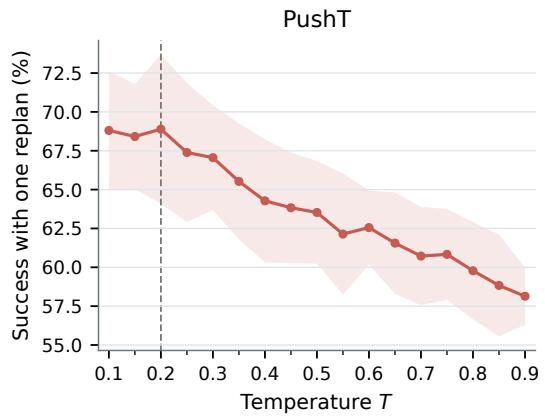

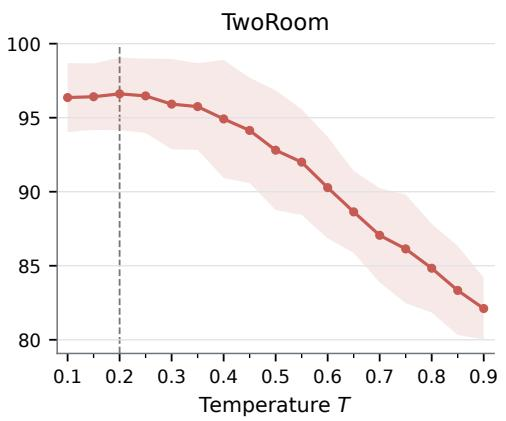  
Figure 6: ARCEM temperature sensitivity at 0.05 resolution. Markers show measured settings from $T = 0 . 1 0 \mathrm { t o } 0 . 9 0$ , with lines connecting the means and bands showing training-seed SD after averaging evaluation seeds and goal distances. Dashed lines mark the main setting $\bar { T } = 0 . 2$ . Both panels use the main candidate-scoring rule and one replan.

## D ACTION AND REPRESENTATION DIAGNOSTICS

## D.1 GOAL-CONDITIONED ACTION PREDICTIONS

We compare INTACT and FlexiWorld on matched PushT examples using three independently trained checkpoints per model, with training seeds {0, 42, 3072}. At $D \in \overline { { \{ 2 5 , 5 0 , 7 5 , \mathrm { { 1 0 0 } } \} } }$ , the shared evaluation set contains 493, 483, 461, and 441 valid examples, respectively. We compute each metric over this set for each checkpoint, then report the mean and sample SD across training seeds. Each actor receives the encoded current observation, goal observation, and preceding five expert actions, and predicts the next five primitive actions. Both actors use conditional means: IN-TACT predicts the five-action chunk jointly, whereas FlexiWorld generates it autoregressively using its own predicted action prefix. This measures action prediction from encoded observations rather than an autoregressive latent rollout. Each sequence is flattened into normalized action coordinates. Mean absolute error (MAE) averages absolute errors over examples and coordinates. We compute $R ^ { 2 }$ as one minus the total squared error divided by the total squared deviation of expert actions from their per-coordinate means, rather than averaging coordinate-wise $R ^ { 2 }$ values. For each example, we find its ten nearest neighbors by Euclidean distance separately in the predicted and expert action matrices, excluding itself. Neighbor overlap is the size of the intersection divided by ten, averaged over examples. Linear centered kernel alignment (CKA) compares the column-centered action matrices (Kornblith et al., 2019).

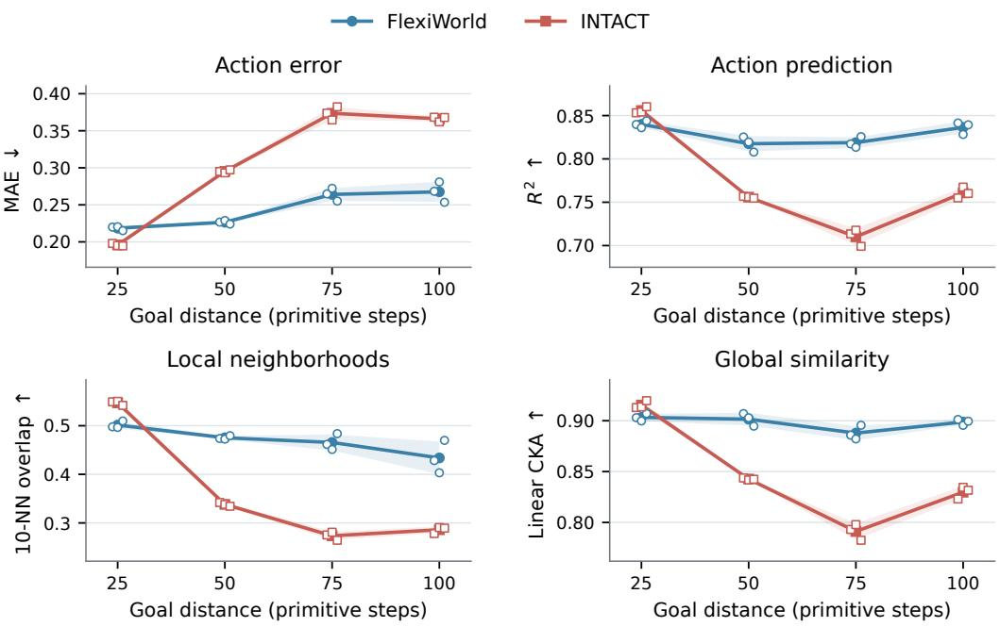  
Figure 7: Goal-conditioned action correspondence on PushT. Lines show means and shaded bands show sample SD across three training seeds. Hollow points show individual checkpoints, slightly offset horizontally for visibility. Both models predict the next five expert actions from matched observations, goals, and preceding expert chunks. Arrows indicate the preferred direction for each metric. INTACT is better at $D = 2 5$ , whereas FlexiWorld is better at $D \in \{ 5 0 , 7 5 , 1 0 0 \}$ on all four mean metrics.

## D.2 FROZEN PROBES AND ACTOR-FREE PLANNING

Frozen-feature probes. Independent ridge regressions assess information in the visual features without using the learned actor. Each probe is fitted separately for each checkpoint at training seeds {0, 42, 3072}, using matched samples across models and checkpoints. Reported means and sample SDs are computed across these three checkpoint-specific fits. Both probes use $[ z _ { 0 } , z _ { g } - z _ { 0 } , z _ { 0 } \odot ( z _ { g } - z _ { 0 } ) ]$ , where $z _ { 0 } = E _ { \theta } ( o _ { s } )$ and $z _ { g } ~ = ~ E _ { \theta } ( o _ { g } )$ Neither probe receives action history. The action probe predicts the next five expert primitives from frozen visual features. It is fitted jointly on samples at $\dot { D } \in \{ 2 5 , 5 0 , 7 5 , 1 0 0 \}$ and evaluated separately at each distance. An episode-disjoint 80/20 split is used for probe fitting and evaluation, not for world-model pretraining. Input coordinates are standardized using fitting-set means and standard deviations, and the ridge coefficient is 0.01. A temporal-distance ridge probe uses the same frozen feature vector to predict the recorded number of primitive steps between the current and goal observations, using the same split procedure, standardization, and ridge coefficient. The probe is fitted jointly across eight distances 5, 10, 15, 25, 35, 50, 75, 100 and evaluated on 256 examples per distance. Its overall $R ^ { \breve { 2 } }$ pools examples across these distances, while Figure 8 reports MAE separately at each distance. Its $\scriptstyle { \hat { R } } ^ { 2 }$ is $0 . 5 6 5 \pm 0 . 0 2 6$ for INTACT and $0 . 6 0 3 \pm \mathrm { { \bar { 0 } } . 0 2 9 }$ for FlexiWorld, measuring prediction of demonstrated time gaps rather than minimum control times. Table 11 reports action-probe scores and representation statistics. Effective rank is the exponential of the entropy of the normalized singular values of the centered current-state latent matrix, and latent standard deviation is averaged over coordinates. Both models retain variation across examples, with lower effective rank for Flexi World. The probes measure information accessible to ridge regression, rather than representation quality for every downstream use.

Table 11: Frozen-feature probes and representation statistics on PushT. Entries report mean and SD across three training seeds on matched samples. The action probe predicts five expert primitives. Effective rank and latent standard deviation (std.) describe the current-state representations. $R ^ { 2 }$ is the coefficient of determination; $D$ is goal distance in primitive steps.
<table><tr><td>Model</td><td>D</td><td>Probe  $R ^ { 2 }$ </td><td>Effective rank</td><td>Latent std.</td></tr><tr><td>INTACT</td><td>25</td><td> $0 . 3 3 2 { \pm } 0 . 0 1 6$ </td><td> $8 1 . 3 { \pm } 9 . 5 $ </td><td> $0 . 9 8 1 { \pm } 0 . 0 1 5$ </td></tr><tr><td>INTACT</td><td>50</td><td> $0 . 3 4 6 { \pm } 0 . 0 2 5$ </td><td> $7 9 . 3 { \pm } 9 . 3 $ </td><td> $0 . 9 8 0 { \pm } 0 . 0 1 7$ </td></tr><tr><td>INTACT</td><td>75</td><td> $0 . 3 7 3 { \pm } 0 . 0 0 3$ </td><td> $7 5 . 1 { \pm } 9 . 0 $ </td><td> $0 . 9 7 6 { \pm } 0 . 0 1 5$ </td></tr><tr><td>INTACT</td><td>100</td><td> $0 . 4 6 3 { \pm } 0 . 0 1 3$ </td><td> $7 2 . 2 { \pm } 8 . 4 $ </td><td> $0 . 9 9 0 { \pm } 0 . 0 1 5$ </td></tr><tr><td>FlexiWorld</td><td>25</td><td> $0 . 3 6 5 { \pm } 0 . 0 1 7$ </td><td> $5 3 . 0 { \pm } 1 2 . 2 $ </td><td> $0 . 9 7 6 { \scriptstyle \pm 0 . 0 1 1 }$ </td></tr><tr><td>FlexiWorld</td><td>50</td><td> $0 . 3 5 9 { \pm } 0 . 0 0 5$ </td><td> $5 2 . 0 { \pm } 1 2 . 1 $ </td><td> $0 . 9 7 3 { \scriptstyle \pm 0 . 0 1 3 }$ </td></tr><tr><td>FlexiWorld</td><td>75</td><td> $0 . 3 7 3 { \pm } 0 . 0 0 3$ </td><td> $4 9 . 4 { \pm } 1 1 . 5 $ </td><td> $0 . 9 6 2 { \scriptstyle \pm 0 . 0 1 3 }$ </td></tr><tr><td>FlexiWorld</td><td>100</td><td> $0 . 4 8 6 { \pm } 0 . 0 1 6$ </td><td> $4 7 . 1 { \pm } 1 1 . 0 \ $ </td><td> $0 . 9 7 2 { \scriptstyle \pm 0 . 0 1 4 }$ </td></tr></table>

Actor-free control. We disable both learned actors and search actions using pure CEM, with 300 candidates, 30 iterations, and 30 elites. On PushT, both models use $k = 5$ at $D \in \{ 2 5 , 5 0 , 7 5 , 1 0 0 \}$ This comparison uses one checkpoint per model at training seed 0. Averaging success over the evaluation repeats and four goal distances gives 40.75% for FlexiWorld and 40.17% for INTACT with one replan, compared with 35.67% and 35.83% after the first plan, respectively. The two models perform similarly when neither actor is used.

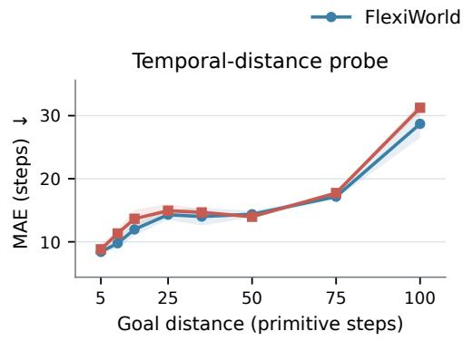

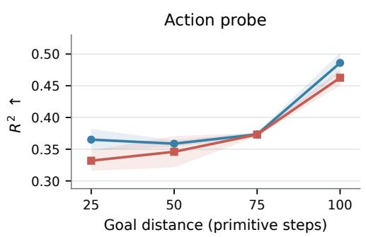  
Figure 8: Frozen-feature probes on PushT. Left: temporal-gap MAE. Right: action $R ^ { 2 }$ from frozen-feature ridge probes. Curves show means and sample SD across three training seeds, using each diagnostic’s matched sample set. The temporal probe predicts demonstrated time gaps, not minimum time to a goal. Neither probe updates the world model.

## D.3 WITHIN-MODEL ROLLOUT ERROR ACROSS CHUNK LENGTHS

Purpose and protocol. On PushT and Cube, this diagnostic compares endpoint prediction at $k = 5$ and $k = 1 0$ within the same checkpoint under identical expert actions. We reuse the episode IDs and starting steps from the matched Direct study in Appendix C.1. Each schedule receives exactly the same normalized expert primitive actions and initial five-action expert history. We roll the predictor forward without intermediate observations, encode the recorded image at $t + D$ with the same checkpoint, and compute mean squared error over visual-latent coordinates at that endpoint. The $k = 1 0$ schedule again uses a final five-action chunk when required. The measurement covers the initial $D / { \mathrm { - s t e p } }$ horizon, not the later replan.

The reported comparison contains 7,200 paired examples across these two tasks, four distances, and the three checkpoints per task from the matched Direct study. For each task, checkpoint, and distance, we average 300 examples before computing the mean and sample SD across checkpoints. Table 12 reports all distances, including $D = 5 0$ and $D = 1 0 0$ discussed in the main text.

Table 12: Expert-action endpoint prediction under two chunk schedules. Latent mean squared error (MSE) after a D-step rollout (k: chunk length in primitive actions), with identical expert primitive actions and no intermediate observations. Mean and sample SD across three training seeds; each seed averages 300 matched examples per task and distance. Changes compare $k = 1 0$ with $k = 5$ within the same model; latent errors are not pooled across tasks.
<table><tr><td>Task</td><td>D</td><td> $\mathrm { M S E } , k = 5$ </td><td> $\mathrm { M S E } , k = 1 0$ </td><td>Relative change</td></tr><tr><td>PushT</td><td>25</td><td>0.0408±0.0017</td><td> $0 . 0 3 9 1 { \scriptstyle \pm 0 . 0 0 2 3 }$ </td><td>-4.13%</td></tr><tr><td>PushT</td><td>50</td><td>0.1604±0.0180</td><td> $0 . 1 5 4 1 { \pm } 0 . 0 1 2 0$ </td><td>-3.90%</td></tr><tr><td>PushT</td><td>75</td><td>0.3532±0.0227</td><td> $0 . 3 1 0 8 { \pm } 0 . 0 3 5 8$ </td><td>-12.00%</td></tr><tr><td>PushT</td><td>100</td><td> $0 . 5 7 9 7 { \scriptstyle \pm 0 . 0 2 4 3 }$ </td><td> $0 . 5 2 9 7 { \scriptstyle \pm 0 . 0 3 8 8 }$ </td><td>-8.61%</td></tr><tr><td>Cube</td><td>25</td><td> $0 . 0 3 1 5 { \scriptstyle \pm 0 . 0 0 1 7 }$ </td><td> $0 . 0 1 7 7 { \scriptstyle \pm 0 . 0 0 1 3 }$ </td><td>-43.70%</td></tr><tr><td>Cube</td><td>50</td><td> $0 . 0 3 5 6 { \scriptstyle \pm 0 . 0 0 2 7 }$ </td><td> $0 . 0 2 7 8 { \scriptstyle \pm 0 . 0 0 0 5 }$ </td><td>-21.93%</td></tr><tr><td>Cube</td><td>75</td><td> $0 . 0 6 0 6 { \scriptstyle \pm 0 . 0 0 6 9 }$ </td><td> $0 . 0 3 8 6 { \pm } 0 . 0 0 1 9$ </td><td>-36.33%</td></tr><tr><td>Cube</td><td>100</td><td> $0 . 0 6 3 9 { \pm } 0 . 0 0 6 1$ </td><td> $0 . 0 4 0 4 { \pm } 0 . 0 0 2 1$ </td><td>-36.74%</td></tr></table>

Effect of chunk length. Ten-action chunks reduce mean expert-action endpoint MSE at every tested distance on PushT and Cube. On PushT, MSE changes from 0.1604 to 0.1541 at $D = 5 0$ and from 0.5797 to 0.5297 at $D = 1 0 0$ , yet Direct success decreases under the longer chunks. Cube combines lower MSE with similar success. Lower error under expert actions need not improve control, which depends on generated actions and candidate selection.

## E EXECUTION OUTCOMES AND PLANNING LIMITATIONS

We analyze when search and reobservation improve execution, then examine candidate-ranking fail ures in a TwoRoom stress test.

## E.1 SEPARATING REOBSERVATION FROM SEARCH

A paired comparison on PushT and Cube separates improvements from search and recovery after reobservation. Both planners use the training-seed-0 checkpoint for each task. The resulting 300 pairs per distance share weights, starts, goals, and execution budgets. ARCEM uses $T = 0 . { \overset { \cdot } { 2 } }$ and scores generated commands before environment clipping.

For each planner, we count first-stage successes, additional second-stage successes, and episodes that remain unsuccessful. Between planners, an ARCEM-only success means that ARCEM succeeds within two stages while Direct fails within both. A Direct-only success is the reverse event. We count recovery after reobservation separately for each planner. Figure 9 reports both decompositions.

On PushT, ARCEM succeeds on 183 evaluations where Direct fails and loses 69 Direct successes, for a net gain of 114 out of 1,200 evaluations. At $D = 2 5 .$ , ARCEM has fewer second-stage rescues than Direct (5 versus 39) because it already succeeds in 283 rather than 230 first-stage evaluations.

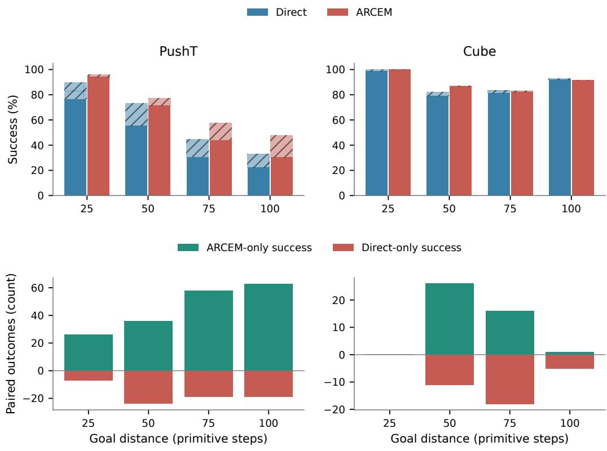  
Figure 9: When reobservation and ARCEM help. Top: solid bars show first-stage success and hatched extensions show additional success after reobservation. Within each distance, the left bar is Direct and the right bar is ARCEM. Bottom: positive counts are ARCEM-only successes and negative counts are Direct-only successes after both stages. Each distance contains 300 paired evaluations.

At $D = 1 0 0$ , first-stage success increases from 67 to 91, and the number subsequently rescued increases from 32 to 52. Search can therefore improve both the initial plan and the final outcome after reobservation.

Cube leaves less room for recovery. At $D = 2 5$ , Direct succeeds in 296 first-stage evaluations and rescues the remaining four. ARCEM succeeds in all 300 in the first stage, so both finish at 100%. Across all distances, ARCEM succeeds in 43 cases where Direct fails, but fails in 34 cases where Direct succeeds. It gains 15 successes at $D = 5 0$ and loses two at $D = 7 5 .$ , while $D = 2 5$ has equal final success. At $D \stackrel { - } { = } 7 5$ , 16 evaluations improve and 18 regress, illustrating how a small aggregate change can conceal many changes in individual outcomes.

ARCEM can replace a successful Direct plan with an unsuccessful one because selection uses predicted latent costs.

## E.2 A CONTROLLED SEARCH FAILURE IN TWOROOM

A high-temperature stress test on TwoRoom examines a mismatch between imagined and executable actions. We use $T ~ = ~ 0 . 8$ at $D \in \{ 7 5 , 1 0 0 \}$ , giving 1,800 evaluations. The mean fraction of selected raw action components exceeding the environment’s bounds is 19.75%. Scoring the original commands while the environment clips them can make a poor physical plan appear favorable.

For the first-stage diagnostic, we replay the candidate pools from all search iterations, including the retained Direct plans, and verify that replay reproduces the selected trajectories. Successful candidates exist for 1,775 of the 1,800 evaluations, but the selected plans succeed in only 878.

Among 667 cases where search loses a first-stage Direct success, 605 involve wall collisions. This localizes much of the failure to candidate ranking rather than absence of a successful proposal.

We then evaluate bounded-action scoring under the full two-stage protocol, keeping temperature and search budget fixed. Candidate actions are clipped in raw coordinates and renormalized for model input before scoring. We rerun CEM with this score in every iteration, updating elite selection and the residual distribution, while retaining the main evaluation’s initial and reobservation history inputs and all other settings. Across the matched evaluations, two-stage success rises from 78.11% to 94.44% at D = 75 and from 69.33% to 90.89% at D = 100.

Figure 10 compares predicted costs and replayed distances for four cases where Direct succeeds but ARCEM fails. For episode 55, search reduces predicted cost from 4.92 to 3.80, yet its closest approach is 57.44 pixels from the goal, outside the 16-pixel success radius. All four selected ARCEM plans have lower predicted cost but worse physical proximity than Direct, with wall collisions on 9–20 execution steps.

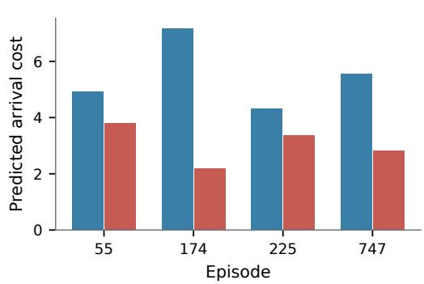

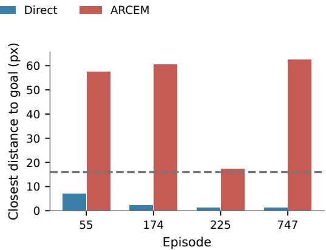  
Figure 10: Search can discard a successful Direct plan. Predicted costs and closest replayed distances for four $D = 7 5$ cases where Direct succeeds and ARCEM at $T = 0 . 8$ fails. Lower predicted cost is preferred. Distances use complete first-plan replay without reobservation. The dashed line marks the 16-pixel success radius.

## E.3 TRAINING AND DEPLOYMENT CONDITIONS

Training uses encoded observations at sampled chunk boundaries, whereas planning feeds predicted latent states and generated chunk histories to later actor calls. Student Forcing exposes the actor to generated within-chunk action prefixes while keeping the latent state, intent, preceding-chunk context, and expert targets fixed. Unlike DAgger (Ross et al., 2011), it does not query an expert on learner-visited states. Training on model-generated contexts and obtaining corrective targets after physical state perturbations are complementary ways to address these differences between training and deployment.

Chunk length controls imagined rollout resolution, while reobservation provides physical feedback during execution. A future controller could use model uncertainty to adapt either decision, for example by using ensemble disagreement (Lakshminarayanan et al., 2017) to trigger reobservation before the current plan ends. Comparisons with fixed schedules could measure the trade-off between success, observation cost, and planning cost.

## E.4 QUALITATIVE ROLLOUTS ON PUSHT AND CUBE

Figures 11 and 12 show success, recovery after reobservation, and persistent failure at $D = 7 5$ with $k = 5 ,$ . At replanning, the actor receives the last five executed action commands, as in the quantitative evaluations. For each task, we show the first recorded example in each category: FlexiWorld Direct succeeds where INTACT fails, Direct succeeds after reobservation, and Direct remains unsuccessful after both plans. Frames after early termination repeat the final recorded state.

Goal image Episode 3078, start 7

Goal image Episode 130, start 28

First recorded frame FlexiWorld Direct success

  
After first plan

  
Final observation

  
Success after reobservation  
Episode 2952, start 114

  
Failure after both plans

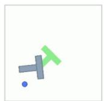

  
Episode 76, start 18

  
Figure 11: PushT: success, recovery, and remaining error. FlexiWorld Direct trajectories. The middle row places the object near its goal in the first plan, then moves the agent closer to its target before success. The bottom row remains unsuccessful after replanning. A trajectory that ends early retains its terminal frame.  
First recorded frame  
FlexiWorld Direct success

  
After first plan  
Success after reobservation

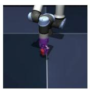  
Final observation

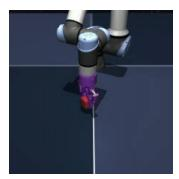

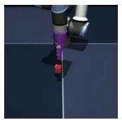  
Episode 840, start 19

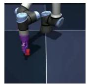  
Failure after both plans

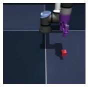

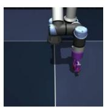

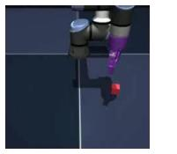  
Episode 221, start 0

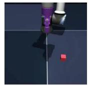

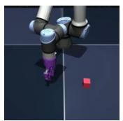

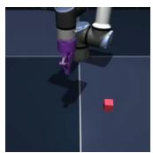

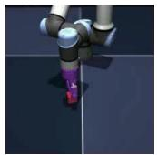  
Figure 12: Cube: successful placement and incomplete recovery. FlexiWorld Direct trajectories. The middle row succeeds after reobservation, while the bottom row leaves the cube away from its goal after both plans. Terminal frames are held as in Figure 11.