# FROM ATTENTION SENSITIVITY TO LAYER ROLE: REVISITING MIXED-PRECISION QUANTIZATION OF TRANSFORMERS

Nafiseh HosseinpourFardi1,∗ Negar Alihadi1,∗ Mahmoudreza Babaei2,3,4 Milad Hosseini5 Adrian Weller6

1Sharif University of Technology, Tehran, Iran 2GISMA University of Applied Sciences, Potsdam, Germany 3BRAINS, Brandenburg Research Center for Applied Intelligent Systems, Potsdam, Germany 4Max Planck Institute for Security and Privacy, Bochum, Germany 5Computer Vision Center (CVC), Barcelona, Spain 6University of Cambridge, United Kingdom

∗Equal contribution.

## ABSTRACT

Most post-training quantization pipelines keep each quantized weight matrix close to its pretrained counterpart, one matrix at a time, and stop there. Whether that proxy tracks what the attention block actually computes, or how errors in the Q, K and V projections compound once they meet inside the softmax, is rarely checked. The obvious fix is to write the objective on the attention output itself, over all three projections at once, and to use that same objective wherever the pipeline needs a signal. That is what JAB does. It defines one scalar loss over the joint Q, K, V weights of a block, evaluated against the block’s real causallymasked attention output, and uses it both to fit the quantized weights (GPTQ warm start, then STE with learnable scales) and to score the block for a multiple-choice knapsack allocation.

On attention-only quantization of Mistral-7B this pays off: at 3 bits JAB recovers 77–90% of the gap between uniform GPTQ and full precision, and its sensitivity estimate tracks an oracle costing 73 forward passes to within a fraction of a perplexity point. Once MLP layers enter the allocation, though, JAB is beaten by a role-aware offset rule that needs no sensitivity estimate at all, both on GPT-2 with QKV and MLP quantized together and on the full Mistral-7B model. With a 3-bit floor, this rule quantizes 96.4% of Mistral-7B’s weights to 4.5 bits per parameter at 6.933 perplexity — within 4.4% of full precision (6.643) at 3.56× compression, 14 GB to 3.93 GB — against 7.158 for JAB at the same budget, and to 3.5 bits at 7.875 (4.57×). Whichever matrix a weight belongs to inside its block matters more than any sensitivity estimate we managed to compute.

Two things came out sideways. Block-local reconstruction turned out to be an unreliable proxy for end-to-end perplexity: in one run a 4.6× improvement in a block’s own objective came with a 32× increase in perplexity, which is why every allocation in this paper is validated end-to-end rather than on local objectives alone. And on attention-only quantization, fine-tuning consistently moved weights farther from their pretrained values while pulling attention outputs closer, with net gains. Post-training seems to recover attention behavior, not weights.

## 1 INTRODUCTION

Large language models (LLMs) face severe memory bottlenecks during inference, and quantization mitigates these costs by mapping real-valued weights to discrete integers (Rakka et al., 2026). Because quantization-aware training (QAT) remains prohibitively resource-intensive, post-training quantization (PTQ) has become the dominant paradigm for efficient compression (Cao & Aref, 2025).

Early quantization methods relied on the inverse Hessian matrix of the Optimal Brain Surgeon (OBS) algorithm, which proved computationally intractable for modern deep networks (Hassibi & Stork, 1990; Liu et al., 2025). GPTQ resolved this by processing weights in blocks via Cholesky decomposition, which made it possible to compress 175-billion-parameter LLMs such as GPT-3, models that are prohibitively expensive to deploy in standard FP16 precision, to 3 or 4 bits efficiently. Building on OBS, GPTQ minimizes a layer-wise weight-reconstruction loss; this local weight-space objective can, however, fail to capture end-to-end Transformer fidelity (Frantar et al., 2023).

Pushing below 4 bits exposes structural vulnerabilities to heavy-tailed activation outliers. Outlier Aware Weight Quantization (OWQ) addresses this by preserving a subset of sensitive weights in higher precision (Lee et al., 2024). To automate variable bit-width allocation under strict budgets, HAWQ-V2 sets bit widths from the average Hessian trace of the task loss, which serves as a measure of parameter sensitivity (Dong et al., 2020), and the resulting assignment is optimized with Multiple-Choice Knapsack Problem (MCKP) solvers (Sinha & Zoltners, 1979; Lee et al., 2026). HAQ learns the allocation instead (Wang et al., 2019).

Moving beyond independent layer-wise optimization, BRECQ introduced block-wise reconstruction to capture cross-layer dependencies (Li et al., 2021). Attention-Aware PTQ (APTQ) narrows the gap for attention layers by folding attention information — the gradients of the non-linear softmax — into its sensitivity estimate to guide optimization, but that criterion is still a weight-space proxy, not the reconstruction objective itself (Guan et al., 2024).

In most PTQ pipelines, then, the objective that reconstructs the quantized weights is not the criterion that sets their bit widths (Appendix A). This disconnect between the sensitivity-estimation criterion and the actual reconstruction loss, which we term the proxy gap, motivates the Joint Attention-Based (JAB) framework: we set out to test whether one objective could do both jobs, produce the weights and set the budget.

JAB (Joint Attention-Based allocation) uses a single loss for both steps. We define $\mathcal { L } _ { \mathrm { J A B } }$ over the concatenated $[ W _ { Q } \ \mid \ W _ { K } \ \mid \ W _ { V } ]$ parameters of a block and evaluate it against that block’s own causally-masked attention output and attention map. We then use it twice. Minimizing it directly produces the weights: a GPTQ warm start, then straight-through fine-tuning with learnable scales. Differentiating it twice, through Hutchinson probes of the Hessian trace, scores the block for an MCKP allocation. We ask whether the same machinery transfers once allocation extends past attention to the MLP and to the whole model.

Findings Attention-only and heterogeneous full-model quantization separate cleanly. On attention-only Mistral-7B, JAB closes most of the gap between uniform GPTQ and full precision at 3 bits, recovering 77–90% of it across all four calibration/evaluation corpus pairings. Its Hessiantrace criterion tracks the end-to-end oracle closely too, and at a small fraction of the model evaluations. The same advantage does not carry over to the MLP or the full model. On GPT-2’s MLP the oracle allocates bits mainly by matrix role rather than depth, and the Hessian criterion does not pick that structure up. On the full Mistral-7B model a seven-parameter role offset rule reaches lower perplexity than JAB at the same parameter-weighted budget, with no sensitivity estimation at all. With a 3-bit floor on every unit, the same rule reaches 6.933 perplexity at 4.5 bits per parameter, within 4.4% of full precision (6.643) at 3.56× compression, and 7.875 at 3.5 bits (4.57×). Two further results bear on block-local refinement. Improving a block’s local reconstruction objective does not guarantee better end-to-end quality: in one experiment a 4.6× reduction in the local objective came with a 32× increase in end-to-end perplexity. And on attention-only quantization, fine-tuning moves the weights farther from their floating-point values while making the attention outputs more accurate, which points to functional recovery mattering more than weight-space fidelity.

## Contributions

• Joint objective for reconstruction and allocation. We introduce JAB: a single joint QKV attention loss used for both quantized-weight refinement and sensitivity-based bit allocation. We also separate the joint from the per-matrix treatment of QKV. The two agree in expectation, but the per-matrix form can underestimate the variability of the true joint loss (Section 2.3).

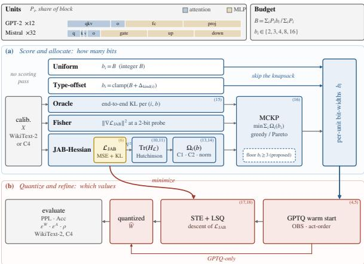  
Figure 1: Overview of the proposed mixed-precision PTQ pipeline. The method separates the process into two stages. (a) Bit allocation: candidate sensitivity criteria determine how many bits each unit receives under a parameter-weighted budget. (b) Quantization and refinement: $\bar { \mathrm { { G P T Q } } }$ provides the initial quantized weights, after which the joint attention loss $\mathcal { L } _ { \mathrm { J A B } }$ is minimized through the quantizer using STE+LSQ.

• Evidence for role-dependent allocation. MLP and full-model experiments show that matrix role can provide a stronger allocation signal than the curvature criterion JAB uses, which motivates a Hessian-free role-based prior (Sections 5 and 6).

• Local-to-global failure mode. We isolate a case where improving a block-local reconstruction objective substantially worsens end-to-end perplexity. Local refinement objectives alone do not guarantee global quality (Section 6.4).

• Attention-space interpretation of refinement. We introduce the amplification factor $\rho ~ =$ $\varepsilon ^ { A } / \varepsilon ^ { W }$ to separate weight fidelity from functional fidelity. Attention-aware refinement can improve the latter while moving the weights farther from their floating-point values (Section 4).

A parallel line of PTQ work improves the quantizer itself rather than the allocation, through activation-aware scaling (Lin et al., 2024; Xiao et al., 2023), learned clipping (Shao et al., 2024), or incoherence processing (Tseng et al., 2024). These are orthogonal to bit allocation and compose with it; we hold the quantizer fixed and vary only how bits are assigned.

## 2 METHOD

## 2.1 LAYER-WISE PTQ

Let $X ~ \in ~ \mathbb { R } ^ { B \times T \times d }$ be a calibration input to one block and $y ~ = ~ x W$ a sublayer with $W \in$ $\mathbb { R } ^ { d _ { \mathrm { i n } } \times d _ { \mathrm { o u t } } } ;$ the QKV projection fuses $\dot { W } ~ = ~ [ W _ { Q } ~ | ~ W _ { K } ~ | ~ \mathrm { { ~ \bf ~ W } _ { V } } ]$ , and attention is $A ( X ) \ =$ softmax $( Q K ^ { \top } / \sqrt { d _ { \mathrm { h e a d } } } + M ) V$ with causal mask M. GPTQ minimizes the local surrogate

$$
\begin{array} { r } { \mathcal { L } ( \widehat { W } ) = \sum _ { x \in \cal { X } } \| x W - x \widehat { W } \| _ { 2 } ^ { 2 } , \qquad H = 2 X ^ { \top } X , } \end{array}\tag{1}
$$

placing each scalar on a symmetric grid with a per-(row, group) scale s,

$$
Q ( w ) = \mathrm { c l i p } \big ( \mathrm { r o u n d } ( w / s ) , - q _ { \mathrm { m a x } } , q _ { \mathrm { m a x } } \big ) \cdot s , \qquad q _ { \mathrm { m a x } } = 2 ^ { b - 1 } - 1 ,\tag{2}
$$

and compensating not-yet-quantized columns with the OBS update (Appendix B.1). H is accumulated by a forward hook on the model in its current state, so block i’s Hessian already reflects blocks $0 , \ldots , i - 1$ being quantized. The solve runs in float64; in float32 the column loop’s repeated division by the inverse-Hessian diagonal makes perplexity non-monotone in the bit-width.

## 2.2 THE JOINT ATTENTION LOSS

Let $A ( X ) , P ( X )$ be the attention output and post-softmax map of the unmodified block, and $\widehat { A } ( X ; w ) , Q ( X ; w )$ those of a differentiable re-implementation evaluated at the quantized $w =$

$\operatorname { \lceil v e c } ( \widehat { W } _ { Q } ) ; \operatorname { v e c } ( \widehat { W } _ { K } ) ; \operatorname { v e c } ( \widehat { W } _ { V } ) \operatorname { \rceil }$ . The joint loss is

$$
\mathcal { L } _ { \mathrm { J A B } } ( w ) = \left\| A ( X ) - \widehat { A } ( X ; w ) \right\| _ { F } ^ { 2 } + \lambda _ { \mathrm { K L } } D _ { \mathrm { K L } } \big ( P \ \| \ Q ( w ) \big ) .\tag{3}
$$

Because the two terms are normalized differently, the effective ratio of KL to MSE is $\mathrm { 1 0 ^ { 3 } \mathrm { - } 1 0 ^ { 4 } }$ at $\lambda _ { \mathrm { K L } } = 0 . 1$ : what is optimized is attention-map distillation with an output-MSE regularizer $( \mathsf { A p } \cdot$ pendix B.2).

## 2.3 WHY ONE JOINT OBJECTIVE RATHER THAN THREE

Attention is bilinear in $( W _ { Q } , W _ { K } )$ : the scores depend on the pair only through $W _ { Q } W _ { K } ^ { \top }$ , whose perturbation contains a cross term $\delta _ { Q } \delta _ { K } ^ { \top }$ that no per-matrix model represents. Treating the three separately is the block-diagonal model $H _ { \mathrm { s e p } }$ of $H _ { \mathcal { L } } = \nabla _ { w } ^ { 2 } \mathcal { L } _ { \mathrm { J A B } }$ , discarding cross-blocks $\Gamma = H _ { \cal L } -$ $H _ { \mathrm { s e p } }$ that are structurally non-zero: $\mathcal { L } _ { \mathrm { J A B } }$ is invariant under $W _ { Q } \mapsto W _ { Q } R , W _ { K } \mapsto W _ { K } R ^ { - \top }$ per head, so $H _ { \mathcal { L } }$ has a null space of dimension at least $n _ { \mathrm { h e a d } } d _ { \mathrm { h e a d } } ^ { 2 }$ (49,152 per GPT-2 block) on which the separable model reports damage where there is none. With a zero-mean rounding residual of variance $\sigma ^ { 2 }$ , the two agree in expectation but not in spread:

$$
\begin{array} { r } { \mathbb { E } [ \Delta \mathcal { L } _ { \mathrm { J A B } } ] = \mathbb { E } [ \Delta \mathcal { L } _ { \mathrm { J A B } } ^ { \mathrm { s e p } } ] , \qquad \mathrm { V a r } [ \Delta \mathcal { L } _ { \mathrm { J A B } } ] - \mathrm { V a r } [ \Delta \mathcal { L } _ { \mathrm { J A B } } ^ { \mathrm { s e p } } ] = \frac { 1 } { 2 } \sigma ^ { 4 } \| \Gamma \| _ { F } ^ { 2 } ~ > ~ 0 . } \end{array}\tag{4}
$$

A per-matrix model is therefore unbiased on average but over-confident about the tail — the wrong profile for allocation, since perplexity is convex and effectively unbounded in the low-bit direction. The argument bears on reconstruction and fine-tuning; for scoring, a trace sees only diagonal blocks and the two coincide (Appendix B.3).

## 2.4 SENSITIVITY AND ALLOCATION

The criterion is the Hessian trace of the same loss w.r.t. the same vector, estimated with Hutchinson’s method (Hutchinson, 1990), Tr $\begin{array} { r } { { \mathbf \Upsilon } \cdot ( H _ { \mathcal { L } } ) \approx \frac { 1 } { n } \sum _ { i } v _ { i } ^ { \top } H _ { \mathcal { L } } v _ { i } } \end{array}$ with Rademacher $v _ { i }$ , each product computed by two chained backward passes (Pearlmutter, 1994). Because $\mathcal { L } _ { \mathrm { J A B } }$ is zero at the float point $w ^ { * }$ the Hessian there reduces to

$$
H _ { \mathcal { L } } ( w ^ { * } ) = 2 J _ { A } ^ { \top } J _ { A } + \lambda _ { \mathrm { K L } } J _ { Q } ^ { \top } \mathcal { T } ( P ) J _ { Q } ,\tag{5}
$$

a squared attention-output Jacobian plus an attention-map Fisher information, not a generic curvature probe. Following HAWQ-V2, the allocator scores each candidate width by

$$
\begin{array} { r } { \begin{array} { l l l } { ( { \bf C 1 } ) } & { \Omega _ { i } ( b ) = \mathrm { T r } ( H _ { i } ) \left. Q _ { b } ( W _ { i } ) - W _ { i } \right. _ { F } ^ { 2 } , } & { \quad ( { \bf C 2 } ) } & { \Omega _ { i } ^ { \mathrm { p r o p } } ( b ) = ( L - i ) \Omega _ { i } ( b ) , } \end{array} } \end{array}\tag{6}
$$

where C2 re-weights by the number of layers an error propagates through. As a bound, the oracle (C3) measures each $( i , b )$ pair’s end-to-end logit KL by quantizing only layer i (≈ 73 model loads). Each layer then chooses $\bar { b _ { i } } \in B = \{ 2 , 3 , 4 , 8 , \bar { 1 6 } \}$ by

$$
\begin{array} { r } { \operatorname* { m i n } \sum _ { i } \Omega _ { i } ( b _ { i } ) \quad \mathrm { s . t . } \quad \sum _ { i } c ( b _ { i } ) \leq B , } \end{array}\tag{7}
$$

solved greedily or on the pooled Pareto frontier (Appendix B.5).

## 2.5 JOINT FINE-TUNING THROUGH THE QUANTIZER

GPTQ solves equation 1, not equation 3. The final stage takes GPTQ’s solution as a warm start and descends $\mathcal { L } _ { \mathrm { J A B } }$ through the quantizer, using the straight-through estimator on weights (Bengio et al., 2013) and the LSQ gradient on the per-(row, group) scales (Esser et al., 2020). Because GPTQ’s output sits exactly on grid points, learning rates are set in units of the mean grid step $\overline { { s } } \ : ( \eta _ { w } = \alpha _ { w } \overline { { s } } ,$ $\eta _ { s } = \alpha _ { s } \overline { { s } } )$ over 200 Adam steps; teacher and student see the same partially-quantized input; a heldout batch gates every write-back; and we log the flip rate, the fraction of weights whose grid position changed, since a stage that changes nothing and one that changes everything can leave perplexity equally unmoved (Appendix B.6).

## 2.6 METRICS

We report perplexity and next-token accuracy under a sliding window, the weight-space error $\varepsilon ^ { W } =$ $\| W - { \widehat { W } } \| _ { F } / \| W \| _ { F }$ , the attention-space error $\varepsilon ^ { A }$ , and the amplification factor $\rho = \overline { { \varepsilon ^ { A } } } / \overline { { \varepsilon ^ { W } } }$ , which separates weight fidelity from functional fidelity (Appendix B.7).

Table 1: Attention-only Mistral-7B at 3 bits, all four calibrate→evaluate pairings $\scriptstyle ( \mathbf { W } = \mathbf { W i k i T e x t - } 2 )$ with the share of the uniform-versus-fp16 gap closed. Full sweep: Appendix E.
<table><tr><td>Pairing</td><td>fp16</td><td>Uniform</td><td>Adaptive</td><td>Gap closed</td><td> $\Delta { \mathrm { ~ A c c . } }$ </td></tr><tr><td>W → W</td><td>4.818</td><td>8.738</td><td>5.228</td><td>89.5%</td><td>+0.031</td></tr><tr><td>C4 → C4</td><td>7.492</td><td>13.506</td><td>8.898</td><td>76.6%</td><td>+0.014</td></tr><tr><td>W → C4</td><td>7.492</td><td>13.575</td><td>8.622</td><td>81.4%</td><td>+0.018</td></tr><tr><td> $\mathrm { C } 4 \to \mathrm { W }$ </td><td>4.818</td><td>8.875</td><td>5.428</td><td>85.0%</td><td>+0.028</td></tr></table>

## 3 EXPERIMENTAL SETUP

We study GPT-2 small (Radford et al., 2019) (124M parameters, 12 blocks) and Mistral-7Bv0.1 (Jiang et al., 2023) (32 layers, grouped-query attention, rotary embeddings). Both use group size 128, activation ordering, λKL = 0.1 unless ablated (except the MLP study, where it is 0 by construction), and 10 Hutchinson probes per layer. The attention-only study quantizes the QKV projection: on GPT-2 it sweeps four criteria over seven budgets with and without fine-tuning, calibrating on WikiText-2 (Merity et al., 2017) or C4 (Raffel et al., 2020); on Mistral-7B it covers all four calibrate→evaluate pairings. The MLP-only study quantizes GPT-2’s c fc and mlp.c proj. The full-model study quantizes all seven linear modules of Mistral-7B. We evaluate GPT-2 on the full WikiText-2 test split and Mistral-7B on 32 windows of 512 tokens, so Mistral perplexities are exact within a study but not comparable to published full-split figures. All results are single-seed. Complete configurations are in Appendix C.

## 4 ATTENTION-ONLY QUANTIZATION

At 7B scale, allocation carries the result On Mistral-7B, adaptive allocation dominates uniform GPTQ at 3 bits in all four corpus pairings, recovering 77–90% of the uniform-versus-fp16 gap and 2–3 accuracy points (Table 1). By 4 bits every method is within 1 -2% of fp16, and refinement is second-order: at 3 bits allocation is worth 3–5 perplexity points and fine-tuning at most 0.17 in either direction. The allocation transfers across corpus mismatch, and the GPT-2 trace ranking is nearly calibration-invariant (Appendix H).

A cheap criterion matches an expensive oracle Across the four GPT-2 budgets ≥ 3.5 bits, the Hutchinson criterion and the ≈ 73-load oracle differ by 0.17 perplexity on average (Table 8). On Mistral, second-order scoring beats a first-order Fisher proxy at 3 bits (5.268 vs. 5.302), while greedy and Pareto solvers are indistinguishable: the score matters, the solver does not.

Mixed precision is not uniformly safe, and the objective says why On GPT-2 at exactly 3.0 bits, adaptive allocation reaches 86.36 against uniform’s 38.35. This follows from the objective. At an average of exactly 3 bits, an assignment with no block below 3 must place every block at 3, which is the uniform solution; the adaptive assignment differs from uniform, so at least one block sits at 2 bits, and one is enough to dominate the total (uniform 2-bit scores 5137.6). Minimizing a sum of $\Omega _ { i } ( b _ { i } )$ , the allocator cannot see that perplexity is convex and unbounded below. Depth re-weighting C2 halves the damage (43.93) at no cost. Mixed precision earns its keep at fractional budgets instead, beating a geometric interpolation between neighboring uniform solutions by 2.2× at 2.5 bits and 1.11× at 3.5 (Appendix E).

Refinement recovers attention behavior, not weights On GPT-2, joint fine-tuning improves 18 of 21 configurations, and does so by moving the weights away from float: at 4 bits $\mathbf { \Pi } _ { \varepsilon } ^ { - } \mathbf { { \cal { W } } }$ rises 19% $( 0 . 1 7 4  0 . 2 0 8 )$ while $\varepsilon ^ { A }$ falls $3 3 \% ( 0 . 2 3 8 \to 0 . 1 6 0 )$ , and both perplexity and accuracy improve. Every GPTQ-only arm has $\rho > 1$ and every fine-tuned arm $\rho < 1$ , with the ordering $\rho _ { \mathrm { G P T Q } } >$ ρMSE-only $> \rho _ { \mathrm { M S E + K L } }$ holding at every budget on both corpora (Appendix G). The attention map is what must be preserved: the KL term supplies 88% of the gain, and MSE-only refinement lowers $\varepsilon ^ { A }$ yet still degrades perplexity.

Table 2: GPT-2 MLP, WikiText-2 perplexity (fp32 control 24.357) at the two budgets with a uniform baseline. Full sweep: Appendix I, Table 11.
<table><tr><td>B (bits)</td><td>Uniform</td><td>JAB (C1)</td><td>Oracle (C3)</td></tr><tr><td>3.0</td><td>53.71</td><td>120.70</td><td>46.15</td></tr><tr><td>4.0</td><td>26.23</td><td>27.46</td><td>26.23</td></tr></table>

## 5 BEYOND ATTENTION: THE MLP

The JAB machinery is not intrinsically tied to the softmax. To test whether it generalizes beyond attention, we apply the same allocation-and-refinement pipeline to the GPT-2 MLP, quantizing mlp.c fc and mlp.c proj with attention kept in fp32; the MLP holds 66.6% of the nonembedding weights against 25.0% for QKV. Two structural differences follow. The two matrices are sequential rather than a jointly coupled projection, so their Hessians are collected in execution order; and there is no attention map to distill, so the KL component is absent (λ = 0) and $\mathcal { L } _ { \mathrm { J A B } }$ reduces to output MSE. The experiment therefore tests which parts of JAB transfer once its attention-specific signal is removed.

The Hessian criterion does not improve over uniform allocation, whereas the oracle does At the two budgets for which a uniform baseline is available, the Hessian criterion performs worse than uniform quantization: 120.70 vs. 53.71 perplexity at 3 bits and 27.46 vs. 26.23 at 4 bits (Table 2). This failure differs qualitatively from the QKV collapse, since the 4-bit allocation contains no unit below 3 bits. The oracle, in contrast, improves on uniform at 3 bits, reaching 46.15, a 14% reduction. Thus, useful allocation structure exists in the MLP, but the Hessian criterion fails to identify it.

The oracle allocates by role, not depth At every fractional budget the oracle returns the sameflat allocation in every block, split only by matrix role: mlp.c fc at b+1 and mlp.c proj at b−1 (Appendix I, Table 12). The criterion cannot find that structure, by construction. One trace over the concatenated block vector is identical for both units of a block, so the only thing that can tell them apart is the perturbation factor of Eq. (6). What the criterion sees instead is a depth gradient rising 4.5×, unlike the QKV trace on the same network, which peaks at block 3 with a 41× spread. Sensitivity profiles are a property of the sublayer, not of the architecture alone.

## 6 FULL-MODEL QUANTIZATION

We now put QKV and MLP under one shared budget, first on GPT-2 small, then on every linear module of Mistral-7B.

## 6.1 GPT-2: QKV AND MLP TOGETHER

The fused QKV projection and both MLP matrices of every GPT-2 block now share one budget: 36 units, 91.7% of block weights, giving 2.21× end-to-end compression at 4 bits against 1.66× for the MLP alone. Four allocators are compared at five budgets, calibrated on C4, GPTQ-only, evaluated on WikiText-2 (fp32 control 24.357) and a disjoint C4 slice with the same ranking (Appendix J.6). Sensitivity tables are normalized per block type first, since raw JAB scores are not commensurate across types. The shared block trace was also replaced by an unbiased per-unit trace in one of the sweeps, but no improvement was obtained.

Role beats curvature once both sublayers share the budget Type-offset needs no scoring pass at all and still leads at the fractional budgets: 64.896 at 3.5 bits and 28.211 at 4.5, against JAB+prop’s 67.337 and 28.694 (Table 3). JAB’s attention-defined sensitivity over-invests in QKV and underfunds the MLP, which now dominates the parameter count; only near saturation, at 6 bits, does uniform win. Two observations carry over to Mistral (Appendix J.5): εA stops tracking perplexity once the MLP shares the budget, and the joint STE stage raises perplexity at every budget, by 16.35× at 3 bits.

Table 3: GPT-2 with QKV and MLP quantized together (C4 calibration, GPTQ-only): WikiText-2 perplexity (fp32 control 24.357) and accuracy at the two budgets that separate the allocators. Full table: Appendix J.5; in-domain C4, same ranking: Appendix J.6.
<table><tr><td rowspan="2">Allocator</td><td colspan="2"> $B = 3 . 5$ </td><td colspan="2"> $B = 4 . 5$ </td></tr><tr><td>PPL</td><td>Acc</td><td>PPL</td><td>Acc</td></tr><tr><td>JAB (C1)</td><td>75.009</td><td>0.296</td><td>29.041</td><td>0.394</td></tr><tr><td>JAB+prop (C2)</td><td>67.337</td><td>0.307</td><td>28.694</td><td>0.397</td></tr><tr><td>Type-offset</td><td>64.896</td><td>0.310</td><td>28.211</td><td>0.395</td></tr></table>

Table 4: Mistral-7B, all seven modules quantized: WikiText-2 perplexity (fp16 control 6.643) and compression of the quantized weights. Budgets B are bits per parameter (Eq. (8)). Left: criteria at fractional budgets; Type-offset needs no scoring pass. Right: uniform quantization, defined only at integer budgets, and the adaptive JAB arm. Best per budget in bold.
<table><tr><td>B (bits/param) Compression</td><td>2.5 6.40×</td><td>3.5 4.57×</td><td>4.5 3.56×</td></tr><tr><td>Type-offset</td><td>6624.3</td><td>32.33</td><td>6.970</td></tr><tr><td>JAB (C1)</td><td>1799.6</td><td>8.570</td><td>7.250</td></tr><tr><td>JAB-norm</td><td>648.0</td><td>109.6</td><td>10.77</td></tr></table>

<table><tr><td>Arm</td><td>B</td><td>Compr.</td><td>PPL</td></tr><tr><td>Uniform</td><td>2.0</td><td>8.00×</td><td>64779.9</td></tr><tr><td>Uniform</td><td>3.0</td><td>5.33×</td><td>9.126</td></tr><tr><td>Uniform</td><td>4.0</td><td>4.00×</td><td>6.998</td></tr><tr><td>JAB adaptive</td><td>4.3</td><td>3.72×</td><td>7.373</td></tr></table>

## 6.2 MISTRAL-7B: ALL SEVEN MODULES TOGETHER

We now quantize every linear module of all 32 Mistral-7B layers under one budget: 224 units, 6.98B parameters, 96.4% of the model.

A parameter-weighted budget The sublayer studies had units of equal size, so per-unit and perparameter costs coincided. Here grouped-query attention makes $\mathrm { k - p r o j }$ and v proj (4.2M) a quarter of $\mathtt { q \mathrm { - } p r o \dot { ] } }$ and o proj (16.8M), while the three SwiGLU matrices hold 58.7M each — a 14× span, with the MLP carrying 80.8% of the weights. A per-unit cost would price those equally, so we define the budget per parameter,

$$
B = \frac { \sum _ { i } P _ { i } b _ { i } } { \sum _ { i } P _ { i } } , \qquad c ( b _ { i } ) = P _ { i } b _ { i } ,\tag{8}
$$

with $P _ { i }$ the parameter count of unit i. On the quantized weights this makes storage $1 6 / B$ times smaller than fp16: 13.96 GB → 3.93 GB (3.56×) at B = 4.5.

Type-offset: a Hessian-free role prior Motivated by the MLP oracle’s role rule, Type-offset gives each unit kind κ a fixed integer offset $\Delta _ { \kappa }$ and assigns

$$
b _ { i } = \mathrm { n e a r e s t } _ { \mathcal { B } } \big ( t ^ { \star } + \Delta _ { \kappa ( i ) } \big ) , \qquad t ^ { \star } = \mathrm { a r g } \mathrm { m i n } \Big | \sum _ { i } c \big ( b _ { i } \big ) - B \sum _ { i } P _ { i } \Big | ,\tag{9}
$$

followed by single-unit moves meeting the budget exactly: seven integers, no scoring pass. We set $\Delta = 0$ for $q , k , v , o , + 1$ for gate and up, −1 for down, transposed from the GPT-2 oracle rather than tuned, and also test JAB-norm, which divides each trace by diag(H ).

## 6.3 LAYER ROLE OUTPERFORMS CURVATURE

The role prior wins at a matched budget At B = 4.5 bits per parameter, Type-offset reaches 6.970 perplexity against 7.250 for JAB and 10.770 for JAB-norm (Table 4). All three realize the same budget to three decimals, 4.500 bits per parameter, but Type-offset computes no Hessian and runs no Hutchinson probes. The curvature information JAB pays for does not buy a better allocation than seven integers. The MLP experiment showed the same thing: there too the end-to-end oracle preferred a flat allocation set by matrix role rather than depth. That it recurs in Mistral-7B, with grouped-query attention, SwiGLU and 58× the parameters, is what makes us read it as a property of heterogeneous transformers rather than of one architecture.

Table 5: Joint refinement of the adaptive $B { = } 4 . 3$ allocation. Block 0 is the only block whose weights change, so refining blocks 0–3 reproduces the full-depth result exactly. Full table: Appendix J.
<table><tr><td>Refinement</td><td>Blocks refined</td><td>Blocks changed</td><td>PPL</td></tr><tr><td>None (GPTQ only)</td><td></td><td></td><td>7.373</td></tr><tr><td>Joint FT</td><td>0-31</td><td>1 (block 0)</td><td>239.52</td></tr><tr><td>Joint FT</td><td>0-3</td><td>1 (block 0)</td><td>239.52</td></tr></table>

Why the JAB criterion misses the role structure JAB computes one Hessian trace for the concatenated parameter vector of each decoder block, so all seven linear modules in a block receive the same trace value. The criterion can separate them only through the perturbation term in Eq. (6). What it does vary over is depth: the trace rises 381× from block 0 to block 31. The oracle’s allocation has no depth structure at all, only a role split, so JAB spends bits along the wrong axis. It distinguishes where a layer sits rather than lemphwhich matrix it is. A per-unit trace would remove this limitation (Appendix J). Section 6.5 removes this limitation and finds the ranking unchanged.

Type-offset is useful, but its offsets are not universally transferable Type-offset degrades sharply below 4.5 bits: at $B = 3 . 5$ the fixed $\Delta _ { \mathrm { d o w n } } = - 1$ offset assigns 2 bits to 30 of the 32 $\mathrm { { d o w n } _ { \mathrm { { p r o j } } } }$ matrices, giving 32.33 perplexity. The GPT-2 MLP experiment pointed to this direction, but Mistral’s $\mathrm { { d o w n } _ { \mathrm { { p r o j } } } }$ receives heavier-tailed inputs, so the same offset need not apply; the floor of Section 6.5 removes the failure entirely. Each candidate offset costs one evaluation, so we report the 4.5-bit result as a floor for the role-prior family, not a tuned choice.

## 6.4 BLOCK-LOCAL OBJECTIVES CAN DIVERGE FROM END-TO-END QUALITY

A locally improved block can substantially degrade the complete model Joint refinement of the adaptive $B = 4 . 3$ allocation reduces the block-local objective of block 0 from 1.85 to $0 . 4 1 \times 1 0 ^ { - 3 }$ a 4.6× improvement. End-to-end perplexity increases from 7.373 for GPTQ-only to $2 3 9 . 5 2 $ after refinement. Refining only blocks 0–3 gives exactly the same perplexity and the same error metrics (Table 5), and in both runs block 0 is the only block whose quantized weights move at all; the other 31 return to their GPTQ grid points.

This is not a failure of the local optimization. The refinement reduces the objective it was given and passes the held-out checkpoint gate. One refined block still raises perplexity 32.5×.

Why block 0 is especially vulnerable Two properties coincide in this block. The adaptive allocator assigns 2 bits to six of its seven linear modules, giving a weight-space error of $\varepsilon ^ { W ^ { \bullet } } = 1 . 0 1 5 \colon$ the quantized block is already farther from its floating-point weights than the zero matrix is, in relative Frobenius error. And the output of block 0 passes through all 31 downstream decoder blocks. Refinement is therefore working on a severely quantized representation at the point of maximum downstream leverage.

We read the failure as follows. Minimizing a block-local objective on a small calibration set can move the weights toward calibration-specific behavior while losing what the downstream network needs. The held-out gate cannot catch this, because it evaluates the same local objective rather than the end-to-end metric.

Granularity matters too. Under uniform 4-bit quantization the same refinement stage changes three blocks and raises perplexity by 1.6× rather than 32.5×, so in these two runs the mismatch is far more severe when low-bit assignments are concentrated.

Implication for refinement The problem is not specific to $\mathcal { L } _ { \mathrm { J A B } } .$ . Any refinement procedure that optimizes a block-local target and validates against that same target gives no guarantee of better end-to-end quality. At minimum, refinement should track a global metric alongside a per-block fliprate diagnostic (Appendix B.6, Eq. (15)), which is what identifies a locally accepted update with outsized downstream effect. The same block also generalizes the 2-bit pathology we prove for GPT-2 in Section 4. The additive objective equation 7 cannot see it, and it appears whenever the allocator is free to concentrate low widths on a single block.

Table 6: Mistral-7B, all seven modules, floor $b _ { i } \geq 3$ and per-unit traces (GPTQ-only; fp16 6.643; uniform 4-bit 6.938; adaptive $B { = } 4 . 3 7 . 2 1 1 )$ . Compression is on the quantized weights. Not comparable to Table 4 (64 vs 128 Hessian batches); see Appendix J.7.
<table><tr><td>B</td><td>Compr.</td><td>JAB (C1)</td><td>JAB-norm</td><td>Type-offset</td></tr><tr><td>3.0</td><td>5.33×</td><td>9.713</td><td>9.713</td><td>9.713</td></tr><tr><td>3.5</td><td>4.57×</td><td>7.514</td><td>8.215</td><td>7.875</td></tr><tr><td>4.5</td><td>3.56×</td><td>7.158</td><td>7.592</td><td>6.933</td></tr></table>

## 6.5 A 3-BIT FLOOR WITH PER-UNIT CURVATURE

Each diagnostic suggests a change: the additive objective cannot see the low-bit cliff, so we impose the floor $b _ { i } \geq 3 ;$ and the shared block trace cannot rank units within a block, so we replace it with an unbiased per-unit trace at no extra cost, partitioning $v ^ { \top } H v$ over each unit’s coordinate range (Appendix J.7).

The floor removes the catastrophic regime No arm now exceeds 9.72, against 32.33 and 109.6 at $B = 3 . 5$ without it; at $B = 3 . 0$ the floor saturates the budget, so all four criteria return the uniform assignment and the identical 9.713. The usable operating points are Type-offset at $B = 3 . 5 ( 7 . 8 7 5 .$ $4 . 5 7 \times )$ and B = 4.5 (6.933, 3.56×): 14 GB reduced to 3.93 GB for 4.4% higher perplexity than fp16.

Per-unit curvature does not change the ranking The traces now discriminate strongly within a block, yet Type-offset still leads at matched $B = 4 . 5 , 6 . 9 3 3$ against 7.158: q and k take 77% of the trace mass while holding 19.2% of the weights, since $\mathcal { L } _ { \mathrm { J A B } }$ is defined on the attention output and map. The limitation is the objective the curvature comes from, not the shared trace this experiment removes (Appendix J.7).

## 7 CONCLUSION

Using one loss for both reconstruction and allocation lets us analyze the two stages of mixedprecision PTQ in a single frame, and on attention it works: adaptive allocation recovers most of the uniform-to-fp16 gap at 7B. Beyond attention it does not transfer. Where units are heterogeneous, matrix role carries more signal than the curvature we computed, and per-unit resolution does not change that, since the curvature comes from an attention objective. Two lessons hold independently of JAB. An additive objective cannot see the low-bit cliff, and a floor $b _ { i } \geq 3$ repairs it at no cost. And a certified local improvement is not evidence of a global one (Appendix K).

Both regimes matter, but not equally. Compression is the reason to quantize, and the ratio moves fastest at the low end: 16/3 is 5.3× against 3.56× at 4.5 bits. Large models are the ones forced to live there, and 3.5 bits is where the curvature criterion is ahead of the role prior (7.51 against 7.87). The regime JAB serves is therefore the one that grows in importance with model size, although we test only to 7B.

## AI USE STATEMENT

In this work, we used generative AI tools (a large language model assistant) for editing and condensing the manuscript text, drafting and checking LaTeX, writing experiment, analysis and plotting code, and cross-checking the numbers reported in the text against our result files. We have not used generative AI tools to produce any experimental result: every number in the paper is computed by our code from the models’ outputs, and every AI-drafted script was run and checked by the authors. We have reviewed all AI-assisted work and take responsibility for the final content of this work, including text, claims or artifacts produced with the aid of generative AI.

## REPRODUCIBILITY STATEMENT

Code, configurations and seeds: anonymous.4open.science/r/. . . -6080. All runs use seed 42 and are single-seed; full hyperparameters are in Appendix C.

## REFERENCES

Yoshua Bengio, Nicholas Leonard, and Aaron Courville. Estimating or propagating gradients´ through stochastic neurons for conditional computation. arXiv preprint arXiv:1308.3432, 2013.

Deyu Cao and Samin Aref. Enhancing ultra-low-bit quantization of large language models through saliency-aware partial retraining. In Modeling Decisionsfor Artificial Intelligence: 22nd Interna tional Conference, pp. 354–383, 2025. doi: 10.1007/978-3-032-00891-6 28.

George B. Dantzig. Discrete-variable extremum problems. Operations Research, 5(2):266–288, 1957.

Zhen Dong, Zhewei Yao, Daiyaan Arfeen, Amir Gholami, Michael W. Mahoney, and Kurt Keutzer. HAWQ-V2: Hessian aware trace-weighted quantization of neural networks. In Advances in Neural Information Processing Systems (NeurIPS), 2020.

Steven K. Esser, Jeffrey L. McKinstry, Deepika Bablani, Rathinakumar Appuswamy, and Dharmendra S. Modha. Learned step size quantization. In International Conference on Learning Representations (ICLR), 2020.

Elias Frantar, Saleh Ashkboos, Torsten Hoefler, and Dan Alistarh. GPTQ: Accurate post-training quantization for generative pre-trained transformers. In International Conference on Learning Representations (ICLR), 2023.

Ziyi Guan, Hantao Huang, Yupeng Su, Hong Huang, Ngai Wong, and Hao Yu. APTQ: Attentionaware post-training mixed-precision quantization for large language models. In ACM/IEEE Design Automation Conference (DAC), 2024.

Babak Hassibi and David G. Stork. Second order derivatives for network pruning: Optimal brain surgeon. In Advances in Neural Information Processing Systems (NeurIPS), pp. 164–171, 1990.

Michael F. Hutchinson. A stochastic estimator of the trace of the influence matrix for laplacian smoothing splines. Communications in Statistics – Simulation and Computation, 19(2):433–450, 1990.

Albert Q. Jiang, Alexandre Sablayrolles, Arthur Mensch, Chris Bamford, Devendra Singh Chaplot, Diego de las Casas, Florian Bressand, Gianna Lengyel, Guillaume Lample, Lucile Saulnier, Lelio Renard Lavaud, Marie-Anne Lachaux, Pierre Stock, Teven Le Scao, Thibaut Lavril, Thomas´ Wang, Timothee Lacroix, and William El Sayed. Mistral 7b.´ arXiv preprint arXiv:2310.06825, 2023.

Diederik P. Kingma and Jimmy Ba. Adam: A method for stochastic optimization. In International Conference on Learning Representations (ICLR), 2015.

Changhun Lee, Jungyu Jin, Taesu Kim, Hyungjun Kim, and Eunhyeok Park. Owq: outlieraware weight quantization for efficient fine-tuning and inference of large language models. In Proceedings of the Thirty-Eighth AAAI Conference on Artificial Intelligence, 2024. doi: 10.1609/aaai.v38i12.29237.

Deokjae Lee, Sihun Chu, and Hyun Oh Song. Q-strata: Hierarchical bit allocation for mixedprecision quantization of mixture-of-experts llms, 2026. URL https://arxiv.org/abs/ 2608.30564.

Yuhang Li, Ruihao Gong, Xu Tan, Yang Yang, Peng Hu, Qi Zhang, Fengwei Yu, Wei Wang, and Shi Gu. BRECQ: Pushing the limit of post-training quantization by block reconstruction. In International Conference on Learning Representations (ICLR), 2021.

Ji Lin, Jiaming Tang, Haotian Tang, Shang Yang, Wei-Ming Chen, Wei-Chen Wang, Guangxuan Xiao, Xingyu Dang, Chuang Gan, and Song Han. AWQ: Activation-aware weight quantization for on-device LLM compression and acceleration. In Proceedings of Machine Learning and Systems (MLSys), 2024.

Jing Liu, Toshiaki Koike-Akino, Ye Wang, Hassan Mansour, and Matthew Brand. Awp: Activationaware weight pruning and quantization with projected gradient descent, 2025. URL https: //arxiv.org/abs/2506.10205.

Stephen Merity, Caiming Xiong, James Bradbury, and Richard Socher. Pointer sentinel mixture models. In International Conference on Learning Representations (ICLR), 2017.

Paul Michel, Omer Levy, and Graham Neubig. Are sixteen heads really better than one? In Advances in Neural Information Processing Systems (NeurIPS), 2019.

Barak A. Pearlmutter. Fast exact multiplication by the Hessian. Neural Computation, 6(1):147–160, 1994.

Alec Radford, Jeffrey Wu, Rewon Child, David Luan, Dario Amodei, and Ilya Sutskever. Language models are unsupervised multitask learners. Technical report, OpenAI, 2019.

Colin Raffel, Noam Shazeer, Adam Roberts, Katherine Lee, Sharan Narang, Michael Matena, Yanqi Zhou, Wei Li, and Peter J. Liu. Exploring the limits of transfer learning with a unified text-to-text transformer. Journal ofMachine Learning Research, 21(140):1–67, 2020.

Mariam Rakka, Marios Fournarakis, Olga Krestinskaya, Jinane Bazzi, Khaled Salama, Fadi Kurdahi, Ahmed Eltawil, and Mohammed Fouda. Mixed-precision quantization for language models: Techniques and prospects. In ACM Comput. Surv., pp. 0360–0300, 2026.

Wenqi Shao, Mengzhao Chen, Zhaoyang Zhang, Peng Xu, Lirui Zhao, Zhiqian Li, Kaipeng Zhang, Peng Gao, Yu Qiao, and Ping Luo. OmniQuant: Omnidirectionally calibrated quantization for large language models. In International Conference on Learning Representations (ICLR), 2024. URL https://arxiv.org/abs/2308.13137.

Prabhakant Sinha and Andris A. Zoltners. The multiple-choice knapsack problem. Operations Research, 27(3):503–515, 1979.

Albert Tseng, Jerry Chee, Qingyao Sun, Volodymyr Kuleshov, and Christopher De Sa. QuIP#: Even better LLM quantization with hadamard incoherence and lattice codebooks. In Proceedings of the 41st International Conference on Machine Learning (ICML), volume 235 of Proceedings of Machine Learning Research, 2024. URL https://arxiv.org/abs/2402.04396.

Kuan Wang, Zhijian Liu, Yujun Lin, Ji Lin, and Song Han. HAQ: Hardware-aware automated quantization with mixed precision. In IEEE/CVF Conference on Computer Vision and Pattern Recognition (CVPR), pp. 8612–8620, 2019.

Guangxuan Xiao, Ji Lin, Mickael Seznec, Hao Wu, Julien Demouth, and Song Han. SmoothQuant: Accurate and efficient post-training quantization for large language models. In International Conference on Machine Learning (ICML), 2023.

Table 7: Relationship between reconstruction objective and importance criterion. JAB closes the gap for attention; the type-offset baseline sidesteps it entirely.
<table><tr><td>Method</td><td>Recon. objective</td><td>Importance criterion</td><td>Same?</td></tr><tr><td>GPTQ (Frantar et al., 2023)</td><td> $\| X W - X { \widehat { W } } \| ^ { 2 } / \mathrm { l a y e r }$ </td><td>N/A (uniform bits)</td><td></td></tr><tr><td>HAWQ-V2 (Dong et al., 2020)</td><td> $\| X W - X { \widehat { W } } \| ^ { 2 } / \mathrm { l a y e r }$ </td><td>Tr(H) of task loss</td><td>No</td></tr><tr><td>APTQ (Guan et al., 2024)</td><td>Weight recon. + attn. grad.</td><td>Hessian trace, weight-space</td><td>Related</td></tr><tr><td>JAB-Hessian (ours)</td><td>Joint QKV attn. loss  $\mathcal { L } _ { \mathrm { J A B } }$ </td><td> $\mathrm { T r } \big ( \boldsymbol { \nabla } ^ { 2 } \mathcal { L } _ { \mathrm { J A B } } \big )$ </td><td>Identical</td></tr><tr><td>Fisher-coupling (ours)</td><td>Joint QKV attn. loss LJAB</td><td> $\| \nabla \mathcal { L } _ { \mathrm { J A B } } \| ^ { 2 } \operatorname { a t } 2$  -bit probe</td><td>First-order</td></tr><tr><td>Oracle (ours)</td><td>Joint QKV attn. loss  $\mathcal { L } _ { \mathrm { J A B } }$ </td><td>End-to-end logit KL</td><td>Bound</td></tr><tr><td>Type-offset (ours)</td><td>Layer-local GPTQ</td><td>Role-based offset table</td><td>Hessian-free</td></tr></table>

## A POSITIONING AGAINST PRIOR WORK

Table 7 contrasts the reconstruction objective each method minimizes with the importance criterion it allocates by. JAB is the only entry for which the two are the same functional; the oracle bounds what any criterion can achieve, and Type-offset (Section 6) sidesteps the question by using no criterion at all.

## B METHOD DETAILS

## B.1 GPTQ CORE

OBS update OBS gives the closed form for rounding weight $w _ { q }$ while optimally compensating the not-yet-quantized weights F:

$$
\delta _ { F } = - \frac { w _ { q } - Q ( w _ { q } ) } { [ H ^ { - 1 } ] _ { q q } } H _ { F , q } ^ { - 1 } ,\tag{10}
$$

i.e. for column i, $\mathrm { e r r } = ( w _ { \mathrm { c o l } } - q _ { \mathrm { c o l } } ) / H ^ { - 1 } [ i , i ]$ and $W [ : , i + 1 : ] \ \mathrm { ~ - = ~ o u t e r } ( \mathrm { e r r } , H ^ { - 1 } [ i , i + 1 : ] )$ . Both standard refinements are used: group-wise scaling and activation ordering $( \mathrm { d i a g } ( H )$ -descending column permutation).

Numerical precision is load-bearing The column loop divides by an inverse-Hessian diagonal $d _ { \mathrm { i n } }$ times per row, so fp32 rounding compounds and produces non-monotone perplexity across bitwidths. GPT-2 can afford a float64 solve; Mistral cannot (float64 is 32× slower on a T4 over a 4096-step loop), so the streaming build accumulates H in float64 but solves in float32 — a caveat carried into Section K.

## B.2 EFFECTIVE WEIGHT OF THE KL TERM

The nominal $\lambda _ { \mathbf { K L } }$ is not the effective weight $\mathcal { L } _ { \mathrm { M S E } }$ takes an element-wise mean over $B \cdot T \cdot d$ entries, whereas ${ \mathcal { L } } _ { \mathrm { K I } }$ uses batchmean, dividing only by B while summing over $B \cdot n _ { \mathrm { h e a d } } \cdot T ^ { 2 }$ The measured ratio $\lambda _ { \mathrm { K L } } \mathcal { L } _ { \mathrm { K L } } / \mathcal { L } _ { \mathrm { M S E } } \mathrm { i s } 1 0 ^ { 3 } { - } 1 0 ^ { 4 } \mathrm { a t } \bar { \lambda } _ { \mathrm { K L } } = 0 . \bar { 1 }$ , so what is optimized is attention-map distillation with an output-MSE regularizer. We keep the implemented convention and quantify it by ablation (Section F), since it carries most of the benefit.

## B.3 WHY ONE JOINT OBJECTIVE RATHER THAN THREE: FULL ARGUMENT

Section 2.3 states the result; this subsection gives the argument.

It cannot be worse The grid is a product set $\mathcal { G } = \mathcal { G } _ { Q } \times \mathcal { G } _ { K } \times \mathcal { G } _ { V } -$ each matrix rounds on its own scales, and no choice for one constrains the others — so any separately obtained triple is feasible for the joint problem and

$$
\operatorname* { m i n } _ { w \in \mathcal { G } } { \mathcal { L } } _ { \mathrm { J A B } } ( w ) \ \leq \ { \mathcal { L } } _ { \mathrm { J A B } } \big ( \widehat { W } _ { Q } ^ { \mathrm { s e p } } , \widehat { W } _ { K } ^ { \mathrm { s e p } } , \widehat { W } _ { V } ^ { \mathrm { s e p } } \big ) .\tag{11}
$$

The content lies in when equation 11 is strict — and in the fact that a separate pipeline does not minimize $\mathcal { L } _ { \mathrm { J A B } }$ at all, but a sum of per-matrix surrogates, so two gaps stack.

What separability discards Partition $H _ { \mathcal { L } }$ into $3 \times 3$ blocks indexed by $Q , K , V$ . Separate treatment is exactly the block-diagonal model $H _ { \mathrm { s e p } } = \mathrm { b l o c k d i a g } ( H _ { Q Q } , H _ { K K } , H _ { V V } )$ , and the error it commits at second order is exactly the cross-blocks,

$$
\Delta \mathcal { L } _ { \mathrm { J A B } } - \Delta \mathcal { L } _ { \mathrm { J A B } } ^ { \mathrm { s e p } } = \delta _ { Q } ^ { \top } H _ { Q K } \delta _ { K } + \delta _ { Q } ^ { \top } H _ { Q V } \delta _ { V } + \delta _ { K } ^ { \top } H _ { K V } \delta _ { V } .\tag{12}
$$

These do not vanish, because attention is bilinear in $\left( W _ { Q } , W _ { K } \right)$ : the scores depend on that pair only through $M = W _ { Q } W _ { K } ^ { \top }$ , and $\widehat { W } _ { Q } \widehat { W } _ { K } ^ { \top } = M + \delta _ { Q } W _ { K } ^ { \top } + W _ { Q } \delta _ { K } ^ { \top } + \delta _ { Q } \delta _ { K } ^ { \top }$ , whose last term no per-matrix model can represent. In the Gauss–Newton form equation 5, $H _ { Q K } = 2 J _ { A } ^ { Q \top } J _ { A } ^ { K } + \lambda _ { \mathrm { K L } } J _ { Q } ^ { Q \top } \mathcal { T } ( P ) J _ { Q } ^ { K }$ $- \mathrm { a }$ Gram cross-block that vanishes only if perturbing $W _ { Q }$ and $W _ { K }$ moved the attention output in orthogonal directions. They do not: both move it through M.

The discarded term is unbounded in relative terms Take one head with $d _ { \mathrm { h e a d } } = 1$ , so $W _ { Q } , W _ { K }$ reduce to vectors $q , k$ and the block depends on them only through $q k ^ { \top } ;$ measure damage by $\| \Delta ( q k ^ { \top } ) \| _ { F } ^ { 2 }$ With $\delta _ { q } \ = \ \varepsilon q$ and $\begin{array} { r } { \delta _ { k } \ = \ - \frac { \varepsilon } { 1 + \varepsilon } k } \end{array}$ the product is reproduced exactly: true damage 0, separable estimate $\Theta ( \varepsilon ^ { 2 } ) \lVert q k ^ { \top } \rVert _ { F } ^ { 2 } - \mathrm { a n }$ infinite relative error at any ε. With $\delta _ { q } = \varepsilon q , \delta _ { k } = \varepsilon k$ the true damage is ≈ $4 \varepsilon ^ { 2 } \lVert q k ^ { \top } \rVert _ { F } ^ { 2 }$ against a separable estimate of $2 \varepsilon ^ { 2 } \lVert q k ^ { \top } \rVert _ { F } ^ { 2 } -$ an underestimate by exactly $2 \times$ . Identical per-matrix perturbation norms; true damage anywhere from zero to twice the separable prediction, decided entirely by relative alignment, which is what a per-matrix model cannot see.

This is not pathological: $\mathcal { L } _ { \mathrm { J A B } }$ is exactly invariant under $W _ { Q } \mapsto W _ { Q } R , W _ { K } \mapsto W _ { K } R ^ { - 7 }$ per head, so $H _ { \mathcal { L } }$ is singular with a null space of dimension at least $n _ { \mathrm { h e a d } } d _ { \mathrm { h e a d } } ^ { 2 } = 4 9$ ,152 per GPT-2 block. Every such direction has nonzero $Q$ and K components, so on it $\delta ^ { \top } H _ { \mathcal { L } } \delta = 0$ while $\delta ^ { \top } H _ { \mathrm { s e p } } \delta > 0$ Nor is the separable model conservative: if $H _ { Q K } \neq 0 ,$ , take $u , v$ with $u ^ { \top } H _ { Q K } v \ : = \ : c \neq 0 ;$ then $( u , v , 0 )$ and $( u , - v , 0 )$ have identical block-diagonal forms while their true forms differ by ±2c, so it over- and under-estimates in equal measure.

Unbiased in the mean, over-confident in the tail Model the rounding residual as zero-mean and uncorrelated with variance $\sigma ^ { 2 } = s ^ { 2 } / 1 2$ . The cross-blocks contribute no diagonal, so $\mathrm { T r } ( H _ { \mathrm { s e p } } ) =$ $\mathrm { T r } ( H _ { \cal L } )$ and $\begin{array} { r } { \mathbb { E } [ \Delta \mathcal { L } _ { \mathrm { J A B } } ] = \frac { \sigma ^ { 2 } } { 2 } \operatorname { T r } ( H _ { \mathcal { L } } ) = \mathbb { E } [ \Delta \mathcal { L } _ { \mathrm { J A B } } ^ { \mathrm { s e p } } ] } \end{array}$ : the two agree exactly in expectation. Their variances do not. With $\Gamma = H _ { \mathscr { L } } - H _ { \mathrm { s e p } }$ , the shared diagonal gives $\| H _ { \mathcal { L } } \| _ { F } ^ { 2 } = \| H _ { \mathrm { s e p } } \| _ { F } ^ { 2 } + \| \Gamma \| _ { F } ^ { 2 }$ , so

$$
\mathrm { V a r } [ \Delta \mathcal { L } _ { \mathrm { J A B } } ] - \mathrm { V a r } [ \Delta \mathcal { L } _ { \mathrm { J A B } } ^ { \mathrm { s e p } } ] = \textstyle { \frac { 1 } { 2 } } \sigma ^ { 4 } \| \Gamma \| _ { F } ^ { 2 } ~ > ~ 0 .
$$

A per-matrix model is thus unbiased on average and systematically over-confident about the tail, by exactly the squared norm of the cross-blocks — the worst profile here, since Section E shows perplexity is convex and effectively unbounded in the low-bit direction, so what an allocator must avoid is the tail, not the mean.

Scope of the argument Two limits matter. First, this bears on the reconstruction and fine-tuning half only: a trace sees only diagonal entries, so $\mathrm { T r } ( H _ { \mathcal { L } } ) = \mathrm { T r } ( H _ { Q Q } ) + \mathrm { T r } ( H _ { K K } ) + \mathrm { T r } ( H _ { V V } \overline { { { ) } } }$ identically, and for the scoring half joint and separate coincide exactly — the criterion’s advantage over HAWQ-V2 lies in which loss the diagonal blocks come from, not in jointness. Second, the argument concerns $\mathcal { L } _ { \mathrm { J A B } }$ , not perplexity, and $\| \Gamma \| _ { F } / \| H _ { \mathcal { L } } \| _ { F }$ was never measured (L5). The decisive test is cheap, and equation 4 predicts its signature: equal means, heavier tail.

## B.4 FISHER-COUPLING

Fisher-coupling (first-order alternative) Since $\nabla _ { w } \mathcal { L } _ { \mathrm { J A B } } ( w ^ { * } ) = 0$ identically, a gradient-based score must be evaluated $o f f$ the float point: Fisher-coupling scores layer i by the squared gradient norm of $\mathcal { L } _ { \mathrm { J A B } }$ at a coarse round-to-nearest 2-bit probe. It is cheaper than a double-backward HVP but is not a decomposition of $H _ { \mathcal { L } } - \mathbf { a }$ first-order proxy taken near the low-bit operating point. Section D compares the two.

## B.5 ALLOCATORS

MCKP is NP-hard and exhaustive search $( 5 ^ { 1 2 }$ here, $5 ^ { 3 2 }$ on Mistral) is intractable, so two heuristics are compared, both consuming the same $\Omega _ { i } ( b )$ table. Greedy: start every layer at the highest width, repeatedly apply the downgrade minimizing $\Delta \Omega / \Delta c$ until the budget is met, then spend leftovers on the best upgrade — the classical fractional-knapsack walk (Dantzig, 1957), optimal only for the continuous relaxation. MCKP/Pareto: restrict each layer’s (b, Ω) points to their Pareto-efficient frontier first, then walk down the pooled frontier by best ratio, matching HAWQ-V2’s formulation more closely.

## B.6 JOINT STE FINE-TUNING: THE FIVE DESIGN DECISIONS

GPTQ solves equation 1, not equation 3. The final stage takes GPTQ’s solution as a warm start and descends $\mathcal { L } _ { \mathrm { J A B } }$ through the quantizer. Five decisions distinguish it from a naive STE loop.

(1) STE on weights, LSQ on scales. Two quantities need two gradient rules: the fake-quantized weight wb of equation 2, and the per-group scale s that defines the grid. The weight uses the straightthrough estimator (Bengio et al., 2013) — gradients pass through the rounding step unchanged — while the scale is a learnable parameter that can widen or narrow the grid, updated with the LSQ gradient (Esser et al., 2020). With $v = w / s$ and $q = \mathrm { c l i p } ( \mathrm { r o u n d } ( v ) , \pm q _ { \mathrm { m a x } } )$

$$
\frac { \partial \widehat { w } } { \partial w } = 1 , \qquad \frac { \partial \widehat { w } } { \partial s } = \left\{ { q - v , \qquad | v | \leq q _ { \mathrm { m a x } } , } \right.\tag{13}
$$

the scale gradient further scaled by $( n _ { w } q _ { \mathrm { m a x } } ) ^ { - 1 / 2 }$ as in LSQ. One scale is kept per (output row, group) rather than per weight: a per-weight scale would let $q _ { i } s _ { i }$ take any real value, silently restoring full precision and defeating the bit-width constraint.

(2) Grid-relative learning rates. GPTQ’s output sits exactly on grid points, so a latent weight must travel $\geq s / 2$ before round(·) changes. Absolute rates are therefore meaningless; we set

$$
\eta _ { w } = \alpha _ { w } \overline { { s } } , \qquad \eta _ { s } = \alpha _ { s } \overline { { s } } ,\tag{14}
$$

with s the mean grid step, $\alpha _ { w } = 0 . 0 5 , \alpha _ { s } = 0 . 0 2$ , cosine-annealed over 200 Adam (Kingma & Ba, 2015) steps.

(3) Teacher and student share the same input. Targets $A ( X ) , P ( X )$ use the block’s float weights on the same X the student sees, taken from the partially-quantized model — GPTQ’s own target $= W _ { \mathrm { f l o a t } } X _ { \mathrm { q u a n t } }$ convention. A parallel all-float trajectory would fold upstream error, which block i cannot fix, into its residual. (4) Held-out checkpoint selection with a commit gate. One calibration batch is held out of the training pool; every 10 steps the current weights are scored on it, the best checkpoint retained, and written back only if it beats the GPTQ-only start. (5) Fliprate diagnostic. Since a stage that changes nothing and one that changes everything can both leave perplexity unmoved, we log

$$
\begin{array} { r } { \mathsf { H i p } _ { i } = \frac { 1 } { d ^ { \prime } } \big | \{ j : \mathrm { r o u n d } ( w _ { j } ^ { \mathrm { G P T Q } } / s _ { j } ) \neq \mathrm { r o u n d } ( w _ { j } ^ { \mathrm { F T } } / s _ { j } ) \} \big | . } \end{array}\tag{15}
$$

Why these decisions matter An earlier build used a fixed absolute rate and recorded a flip rate of 0.000 on eleven of twelve blocks: each step moved weights less than a tenth of the way to the nearest grid boundary, so no quantized value could change regardless of gradient quality. The grid-relative rate of equation 14 over 200 steps raises the flip rate to 0.12–0.18. When fine-tuning through a quantizer warm-started from a grid-exact solution, the learning rate must be expressed in units of the grid, and the flip rate must be logged.

## B.7 EVALUATION METRICS IN FULL

All four are computed in the same quantize-and-evaluate pass, after quantization and any fine-tuning. M1 — Perplexity. $\begin{array} { r } { \mathrm { P P L } = \exp \left( \frac { 1 } { N } \sum _ { i } \mathrm { N L L } _ { i } \right) } \end{array}$ under the sliding-window protocol, only the nonoverlapping target span contributing, so no token is scored twice and every token carries ${ \ge } 5 1 2$ tokens of context. M2 — Next-token top-1 accuracy. $\begin{array} { r } { \operatorname { A c c } = \frac { 1 } { N } \sum _ { i } \mathcal { k } [ \arg \operatorname* { i a x } _ { v } p _ { \theta } ( v | x _ { < i } ) = x _ { i } ] } \end{array}$ on the identical windows, mask and forward pass as M1 — a decision-level metric, insensitive to how mass is spread over the rest of the vocabulary. M3 — Weight-space quantization error. $\varepsilon _ { i } ^ { W } = \| { W } _ { i } - \widehat { W } _ { i } \| _ { F } / \| W _ { i } \| _ { F }$ , block-averaged: pure weight space, no data, and up to normalization exactly what GPTQ’s objective equation 1 and the perturbation term of equation 6 measure. M4 — Attention-space reconstruction error. $\varepsilon _ { i } ^ { A }$ , the relative Frobenius error of the merged pre-c proj attention output, teacher and student evaluated on the same X from the live partially-quantized model, averaged over $| \mathcal { E } | = 8$ fixed 512-token spans.

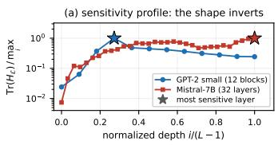

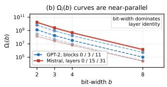  
Figure 2: Sensitivity criterion across both models. (a) Hessian trace per layer, normalized by each model’s maximum, against normalized depth; stars mark the most sensitive layer. The profile is strongly non-uniform in both models (41× spread on GPT-2, 135× on Mistral) but its shape inverts with architecture. (b) The sensitivity tables $\bar { \Omega } _ { i } ( b )$ of equation 6 are near-parallel in both models — a shared, steep sub-4-bit cliff — so bit-width dominates layer identity by orders of magnitude.

Derived — amplification factor. $\rho = \overline { { \varepsilon ^ { A } } } / \overline { { \varepsilon ^ { W } } }$ . M3 and M4 are relative errors of the same form on either side of the attention operator, so $\rho > 1$ means causal softmax attention amplifies the relative weight perturbation it is handed and $\rho < 1$ that it attenuates it. Reporting both makes the report’s premise falsifiable: if attention space is the real objective and weight space only a proxy, then a pipeline optimizing the former should move away from the float weights (M3 up) while moving toward the float attention output (M4 down), and improve M1 and M2 while doing so.

## C EXPERIMENTAL SETUP IN FULL

Models and scope GPT-2 small (Radford et al., 2019) (124M, d=768, 12 blocks) and Mistral-7Bv0.1 (Jiang et al., 2023) (56× larger, 32 layers, d=4096), which additionally uses grouped-query attention, rotary embeddings and a sliding-window mask. In both, only the QKV projection is quantized, so absolute perplexities are not comparable to end-to-end quantized systems.

Runs Three runs are reported, all using group size=128, act order, $\lambda _ { \mathrm { K L } } { = } 0 . 1$ unless ablated, and 10 Hutchinson probes on 2 calibration batches per layer. Run A calibrates and evaluates GPT-2 on WikiText-2 and sweeps criterion × 7 budgets $\times \left\{ \mathrm { G P T Q , + F T } \right\}$ }. Run B calibrates GPT-2 on C4 and evaluates on both corpora, sweeping 5 modes × 5 budgets under all four metrics. Run C sweeps the same 5 modes × 5 budgets on Mistral-7B in all four WikiText-2/C4 calibrate→evaluate pairings, plus a sensitivity-source × allocator cross. Mistral-7B (14.5 GB in fp16) does not fit on a free-tier T4 alongside the float teacher copy the fine-tuning stage requires, so Run C uses a layerstreaming re-implementation: shards are fetched tensor-by-tensor onto the GPU and each decoder layer is materialized on the meta device and discarded after use, at the cost of two passes — score, then quantize-and-evaluate — per configuration. This is why Run C is a re-implementation rather than a re-run.

Evaluation corpora Runs A and B score GPT-2 on the full WikiText-2 (Merity et al., 2017) test split; Run B additionally scores the same weights in-domain on a disjoint C4 (Raffel et al., 2020) validation sample, which is what lets calibration effects be separated from evaluation effects in Sections F and H. Since C4 has no canonical evaluation subset, those absolute perplexities are specific to this draw; and Run C uses 32 windows (≈33k tokens) per configuration, so its perplexities are subset figures — exact within a pairing, not comparable to published Mistral-7B numbers — with $\varepsilon ^ { W } , \varepsilon ^ { A }$ on the streaming pipeline’s raw loss scale.

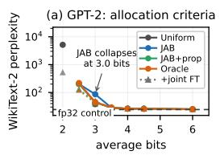

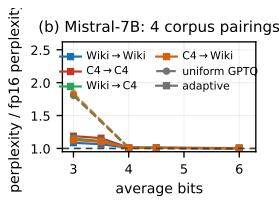

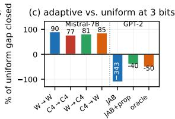  
Figure 3: Bit allocation on the QKV projection. (a) GPT-2: perplexity vs. average bits for four criteria, GPTQ-only (solid) and +joint fine-tuning (dotted). (b) Mistral-7B: perplexity normalized by each pairing’s fp16 baseline, uniform GPTQ vs. Hutchinson-greedy adaptive. (c) Share of the uniform-GPTQ gap recovered by adaptive allocation at 3 bits: Mistral recovers 77–90% in every pairing, while on GPT-2 the same criterion loses 343% (bar clipped), reduced to −40% by the depth re-weighting C2 and −50% by the oracle.

## D THE SENSITIVITY CRITERION

Sensitivity is strongly non-uniform, but its depth profile is architecture-specific All traces are positive, as equation 5 requires, and both models span one to two orders of magnitude across layers (41× on GPT-2, 135× on Mistral), so the flat profile a uniform allocation implicitly assumes is clearly wrong — the QKV analogue of the head-level heterogeneity reported by Michel et al. (2019). The shape, however, does not transfer (Fig. 2(a)): GPT-2 peaks at block 3 of 12 and decays, whereas Mistral rises with depth and peaks at its final layers. This falsifies C2 as a general rule, since the (L − i) weighting of equation 6 protects early layers — which rescues GPT-2 at 3 bits (Section E) but at Mistral scale would suppress exactly the layers the criterion ranks highest.

Bit-width dominates layer identity The per-layer $\Omega _ { i } ( b )$ curves are near-parallel in both models (Fig. 2(b)): dropping from 4 to 3 bits multiplies Ω by roughly 5× and from 3 to 2 by a further 5–7×, almost independently of which layer is scored. This shared cliff is a property of the construction, not of one model, and it means a ratio-based allocator has little to differentiate layers on until the budget forces one below 4 bits — where the choice then matters a great deal.

The ranking is a property of the model, not of the calibration text Traces computed under WikiText-2 (Run A) and C4 (Run B) calibration correlate at r = 0.9995 and induce the same ordering up to one adjacent pair differing by under 1% — not obvious, since both the Hessian and the perturbation term of equation 6 are activation-dependent.

The score matters; the solver does not A better sensitivity estimate pays off only where allocation is genuinely hard, and the choice of solver hardly matters at all. Crossing the two sensitivity sources with the two allocators on Mistral (Wiki→Wiki, joint FT throughout), second-order Hutchinson scoring beats the first-order Fisher proxy at the aggressive 3-bit budget (5.268 vs. 5.302 perplexity, 0.6090 vs. 0.6071 accuracy), whereas greedy and MCKP/Pareto given identical scores are indistinguishable there, and all four combinations lie within 0.007 perplexity at 6 bits. This mirrors the criterion-versus-oracle result of Section E: the double-backward cost is worth paying, the Pareto pre-filter is not.

## E BIT ALLOCATION

Mixed precision helps above 4 bits, ties at 4, and can be catastrophic below On GPT-2 (Table 8, Fig. 3(a)) adaptive allocation improves on uniform 4-bit by −1.18 perplexity at 6 average bits by upgrading high-trace blocks to 8 bits. At exactly 4.0 bits it returns an all-4-bit assignment and reproduces the uniform baseline exactly — correct, since a budget the uniform solution already saturates leaves nothing to trade. At 3.0 bits it instead reaches 86.36 against uniform 3-bit’s 38.35: the allocator is destroying the model.

That failure is a provable consequence of the additive objective Suppose the 3.0-bit assignment contained no block below 3 bits. Then $\textstyle \sum _ { i } b _ { i } \geq 3 6$ , and the budget caps $\textstyle \sum _ { i } b _ { i } \leq 3 6$ , so equality would force $b _ { i } = 3$ everywhere — the uniform assignment and its 38.345. It does not, so the allocation must contain at least one 2-bit block, which Run B confirms by inspection (blocks 0 and 1). One such block suffices: uniform 2-bit GPTQ scores 5137.6, over 200× the fp32 control. Minimizing a sum of $\Omega _ { i } ( b _ { i } )$ , the allocator cannot see that perplexity is convex and effectively unbounded in the low-bit direction, so the downgrade looks ratio-favourable in equation 6 and is not. Consistent with this, the depth re-weighting C2 — which costs nothing and leaves every other budget’s assignment unchanged — halves the damage (43.93 vs. 86.36) simply by making the sacrifice of an early block look expensive.

Table 8: GPT-2 Run A: full WikiText-2 test perplexity across criteria, budgets, and modes. fp32 control 24.357. “–” marks combinations that do not exist. Best per row in bold.
<table><tr><td rowspan="2">bits</td><td colspan="2">Uniform</td><td colspan="2">JAB (C1)</td><td colspan="2">JAB+prop (C2)</td><td colspan="2">Oracle (C3)</td></tr><tr><td>GPTQ</td><td>+FT</td><td>GPTQ</td><td>+FT</td><td>GPTQ</td><td>+FT</td><td>GPTQ</td><td>+FT</td></tr><tr><td></td><td>2.05137.6</td><td>516.8</td><td></td><td></td><td></td><td></td><td></td><td></td></tr><tr><td>2.5</td><td></td><td></td><td>201.7</td><td>126.5</td><td>201.7</td><td>126.5</td><td>218.0</td><td>120.1</td></tr><tr><td>3.0</td><td>38.35</td><td>37.81</td><td>86.36</td><td>48.31</td><td>43.93</td><td>41.99</td><td>45.36</td><td>42.45</td></tr><tr><td>3.5</td><td></td><td></td><td>28.32</td><td>28.38†</td><td>28.32</td><td>28.38†</td><td>28.61</td><td>29.09</td></tr><tr><td>4.0</td><td>26.23</td><td>25.85</td><td>26.23</td><td>25.85</td><td>26.23</td><td>25.85</td><td>26.23</td><td>25.85</td></tr><tr><td>4.5</td><td></td><td>一</td><td>26.20</td><td>25.62</td><td>26.20</td><td>25.62</td><td>25.87</td><td>25.68</td></tr><tr><td>6.0</td><td></td><td>一</td><td>25.05</td><td>24.79</td><td>25.05</td><td>24.79</td><td>25.11</td><td>24.80</td></tr></table>

† the only budget at which fine-tuning hurts; see Section F.

Table 9: Mistral-7B, all four calibrate→evaluate corpus pairings. Upper block: perplexity (lower better). Lower block: next-token top-1 accuracy (higher better). fp16 baselines: PPL 4.818 (WikiText-2 eval) / 7.492 (C4 eval); Acc 0.6257 / 0.5500. “–” marks a flat-bit mode at a fractional budget, left undefined rather than silently rounded. Best per column in bold; ties bolded.
<table><tr><td rowspan="2">Method</td><td colspan="5">Wiki→Wiki</td><td colspan="5">C4→C4</td><td colspan="5">Wiki→C4</td><td colspan="5">C4→Wiki</td></tr><tr><td>3b</td><td>3.5b</td><td>4b</td><td>4.5b</td><td>6b</td><td>3b</td><td>3.5b</td><td>4b</td><td>4.5b</td><td>6b</td><td>3b</td><td>3.5b</td><td>4b</td><td>4.5b</td><td>6b</td><td>3b</td><td>3.5b</td><td>4b</td><td>4.5b</td><td>6b</td></tr><tr><td>Perplexity</td><td></td><td></td><td></td><td></td><td></td><td></td><td></td><td></td><td></td><td></td><td></td><td></td><td></td><td></td><td></td><td></td><td></td><td></td><td></td><td></td></tr><tr><td>Uniform (GPTQ)</td><td>8.738</td><td></td><td>4.855</td><td></td><td>4.822</td><td>13.506</td><td></td><td>7.571</td><td></td><td>7.495</td><td>13.575</td><td></td><td>7.580</td><td></td><td>7.496</td><td>8.875</td><td></td><td>4.870</td><td></td><td>4.820</td></tr><tr><td>Adaptive (Hutch., greedy)</td><td>5.228</td><td>5.129</td><td>4.855</td><td>4.850</td><td>4.834</td><td>8.898</td><td>8.670</td><td>7.571</td><td>7.556</td><td>7.518</td><td>8.622</td><td>8.340</td><td>7.580</td><td>7.577</td><td>7.530</td><td>5.428</td><td>5.302</td><td>4.870</td><td>4.861</td><td>4.839</td></tr><tr><td>Joint (uniform bits)</td><td>8.833</td><td></td><td>4.875</td><td></td><td>4.822</td><td>13.615</td><td></td><td>7.617</td><td></td><td>7.520</td><td>13.658</td><td></td><td>7.624</td><td></td><td>7.496</td><td>8.855</td><td></td><td>4.881</td><td></td><td>4.821</td></tr><tr><td>JAB+Joint (Hutch., greedy)</td><td>5.268</td><td>5.134</td><td>4.875</td><td>4.867</td><td>4.845</td><td>8.732</td><td>8.507</td><td>7.617</td><td>7.595</td><td>7.553</td><td>8.681</td><td>8.373</td><td>7.624</td><td>7.608</td><td>7.561</td><td>5.411</td><td>5.268</td><td>4.881</td><td>4.873</td><td>4.843</td></tr><tr><td>JAB+Joint, no KL</td><td>5.231</td><td>5.121</td><td>4.854</td><td>4.849</td><td>4.835</td><td>8.805</td><td>8.563</td><td>7.575</td><td>7.559</td><td>7.539</td><td>8.582</td><td>8.337</td><td>7.583</td><td>7.575</td><td>7.531</td><td>5.477</td><td>5.293</td><td>4.866</td><td>4.858</td><td>4.838</td></tr><tr><td>Accuracy</td><td></td><td></td><td></td><td></td><td></td><td></td><td></td><td></td><td></td><td></td><td></td><td></td><td></td><td></td><td></td><td></td><td></td><td></td><td></td><td></td></tr><tr><td>Uniform (GPTQ)</td><td>0.5786</td><td></td><td>0.6236</td><td></td><td>0.6252</td><td>0.5094</td><td></td><td>0.5478</td><td></td><td>0.5504</td><td>0.5086</td><td></td><td>0.5486</td><td></td><td>0.5498</td><td>0.5752</td><td></td><td>0.6230</td><td></td><td>0.6256</td></tr><tr><td>Adaptive (Hutch., greedy)</td><td>0.6093</td><td>0.6146</td><td>0.6236</td><td>0.6248</td><td>0.6249</td><td>0.5229</td><td>0.5254</td><td>0.5478</td><td>0.5485</td><td>0.5498</td><td>0.5269</td><td>0.5309</td><td>0.5486</td><td>0.5483</td><td>0.5499</td><td>0.6034</td><td>0.6084</td><td>0.6230</td><td>0.6235</td><td>0.6253</td></tr><tr><td>Joint (uniform bits)</td><td>0.5762</td><td></td><td>0.6230</td><td></td><td>0.6252</td><td>0.5066</td><td></td><td>0.5470</td><td></td><td>0.5494</td><td>0.5067</td><td></td><td>0.5475</td><td></td><td>0.5498</td><td>0.5731</td><td></td><td>0.6232</td><td></td><td>0.6254</td></tr><tr><td>JAB+Joint (Hutch., greedy)</td><td>0.6090</td><td>0.6128</td><td>0.6230</td><td>0.6233</td><td>0.6238</td><td>0.5245</td><td>0.5286</td><td>0.5470</td><td>0.5484</td><td>0.5493</td><td>0.5269</td><td>0.5298</td><td>0.5475</td><td>0.5480</td><td>0.5489</td><td>0.6058</td><td>0.6100</td><td>0.6232</td><td>0.6239</td><td>0.6247</td></tr><tr><td>JAB+Joint, no KL</td><td>0.6112</td><td>0.6145</td><td>0.6240</td><td>0.6249</td><td>0.6245</td><td>0.5245</td><td>0.5286</td><td>0.5473</td><td>0.5483</td><td>0.5493</td><td>0.5272</td><td>0.5307</td><td>0.5488</td><td>0.5489</td><td>0.5499</td><td>0.6033</td><td>0.6079</td><td>0.6235</td><td>0.6226</td><td>0.6246</td></tr></table>

Mixed precision earns its keep at budgets uniform cannot express Its real value is at fractional budgets, where no uniform alternative exists: at 2.5 and 3.5 average bits it beats a geometric interpolation between the neighbouring uniform solutions by 2.2× and 10.7%.

A cheap proxy is competitive with a 73-model-load oracle The oracle C3 costs ≈ 73× the model instantiations of C1 and buys little: across the four budgets ≥ 3.5 bits the mean absolute difference is 0.17 perplexity, with the cheap criterion ahead in half the cases. C3 helps decisively only at 3.0 bits, where it fixes the same 2-bit pathology the free depth re-weighting largely fixes — and neither fixes it as well as declining to use mixed precision there. Above 3.5 bits the allocation is essentially solved, and the residual gap to fp32 lies in the quantizer.

At 7B scale allocation carries the result, and the 3-bit collapse does not reproduce Adaptive allocation dominates uniform GPTQ at 3 bits in all four corpus pairings (Table 9), recovering 77– 90% of the uniform-versus-fp16 perplexity gap (Fig. 3(c)) and 2–3 accuracy points; by 4 bits every method is within 1–2% of fp16 and by 6 bits within 0.5%, the same diminishing-returns pattern as GPT-2. What does not appear is a 3-bit collapse, even though the budget arithmetic applies equally: Mistral’s allocator must also place some layer below 3 bits. The per-layer assignment is unavailable, so we report this as an open discrepancy. Two untested explanations are plausible: with 32 blocks rather than 12, one low-bit layer is a much smaller share of the budget; and GQA shrinks the K/V projections, changing both c(b) and the curvature landscape.

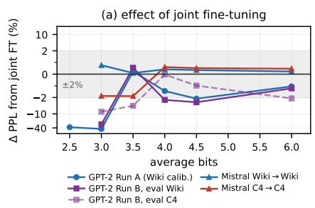

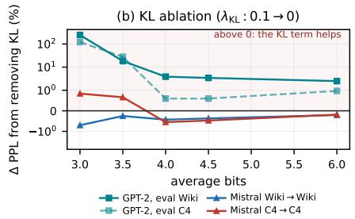  
Figure 4: Joint fine-tuning across models, corpora and budgets, on symmetric-log axes so that both the low-bit and near-lossless regimes are legible. (a) Relative perplexity change from adding the joint STE stage to the same allocation; negative is better, shaded band ±2%. Gains are large exactly where quantization damage is large and shrink to a few percent in the usable regime, where the sign becomes model- and corpus-dependent. (b) The KL ablation, $\lambda _ { \mathrm { K L } } : 0 . 1 \to 0 { \mathrm { : } }$ on GPT-2 removing the term is harmful at every budget on both corpora, catastrophically so below 4 bits; on Mistral, where the stage moves far less, the effect is within ±1% and changes sign.

## F QUANTIZATION METHOD: GPTQ VS. JOINT FINE-TUNING

Fine-tuning helps most where quantization damage is largest On GPT-2 the joint stage improves 18 of the 21 configurations of Table 8. Gains scale with the damage — −45% to −90% below 3 bits — and settle at 1–2% in the usable regime, bringing the best arm (JAB at 6 average bits) to 24.786 against an fp32 control of 24.357. A flip rate of 0.12–0.18 throughout confirms this reflects the deployed weights, not latent shadow weights.

Its one failure is a proxy–objective gap the commit gate cannot see All three exceptions sit at 3.5 average bits, where the gate of Section 2.5(4) certifies an improvement on the held-out attention loss while perplexity worsens slightly. There the allocation holds only 3- and 4-bit blocks, so every block carries substantial error and none is nearly exact; the optimizer has room for large local improvements, some of which trade against the global objective.

Fine-tuning’s instabilities are corpus effects, and they separate cleanly Scoring the identical Run B weights on both corpora isolates cause from symptom. The 3.5-bit anomaly is an evaluationcorpus artifact: in-domain on C4 the sign reverses (−4.5% instead of +0.5%) although nothing about the models changed, so the agreement between Runs A and B here is better read as two measurements sharing an evaluation corpus than as independent confirmation — a caution for any single-corpus ablation. The 3-bit sign flip against Run A is instead a calibration-corpus effect: moving to the matched corpus makes it worse (+60.8% versus +16.1%), so cross-corpus evaluation cannot be the cause. Both are confined to fractional and aggressive budgets.

At 7B scale, refinement is second-order to allocation Fig. 4(a) places every fine-tuning comparison on one axis. On Mistral the correction is marginally negative on WikiText-2 and marginally positive on C4; the magnitudes are what matter, since at 3 bits allocation is worth 3–5 perplexity points and the fine-tuning at most 0.17 either way. From an independent model and codebase this reinforces the central claim — how bits are spent matters more than how the resulting weights are locally refined — subject to two caveats: the LSQ and grid-relative refinements were not re-verified at this scale, and the streaming build’s smaller step budget makes its fine-tuning stage less comparable to GPT-2’s than its allocator is.

The KL term is what makes fine-tuning work Holding bit-widths fixed on GPT-2, removing the attention-map term recovers only −0.052 of the −0.444 total gain, so the KL term supplies 88% of it — consistent with the reduction imbalance of Section 2.2 making the objective effectively attentionmap distillation. Fig. 4(b) sweeps the ablation: dropping the term is worse than keeping it at every budget on both evaluation corpora, catastrophically so below 4 bits. The mechanism is visible in the metrics rather than assumed. MSE-only fine-tuning does reduce attention-output error relative to no fine-tuning $( \varepsilon ^ { A } : 0 . 2 3 8 \to 0 . 1 8 8 \mathrm { a t } 4 \mathrm { b i t s } )$ — it succeeds at the objective it was given — yet perplexity still worsens. Matching the attention output is therefore not sufficient: an unconstrained MSE descent can reach a lower output error through a distribution the downstream stack was never trained against, and the KL term forbids that.

GPT-2, eval Wiki Mistral 3b, W W  
Table 10: GPT-2 Run B (C4 calibration): five pipeline modes, five budgets, four metrics, evaluated on both corpora. $\varepsilon ^ { W }$ is a property of the quantized weights alone and is therefore shared; the amplification factor $\rho = \overline { { \varepsilon ^ { A } } } / \overline { { \varepsilon ^ { W } } }$ is plotted in Fig. 5(b). Controls: WikiText-2 24.357 / 0.4148; C4 30.778 / 0.3786. “–” marks a flat-bit mode at a fractional budget.
<table><tr><td rowspan="2">Mode</td><td rowspan="2"></td><td colspan="3">Evaluated on WikiText-2 (cross-corpus)</td><td colspan="3">Evaluated on C4 (in-domain)</td><td rowspan="2"> $\varepsilon ^ { W }$ </td></tr><tr><td>bits</td><td>PPL</td><td> $\operatorname { A c c }$ </td><td> $\varepsilon ^ { A }$  PPL</td><td> $_ \mathrm { A c c }$ </td><td> $\varepsilon ^ { A }$ </td></tr><tr><td>uniform</td><td>3</td><td>39.338</td><td>0.3612</td><td>0.4711</td><td>54.862</td><td>0.3339</td><td>0.4621</td><td>0.3753</td></tr><tr><td>uniform</td><td>4</td><td>26.536</td><td>0.4038</td><td>0.2382</td><td>33.638</td><td>0.3692</td><td>0.2370</td><td>0.1739</td></tr><tr><td>uniform</td><td>6</td><td>24.488</td><td>0.4140</td><td>0.0695</td><td>30.955</td><td>0.3774</td><td>0.0702</td><td>0.0409</td></tr><tr><td>jab</td><td>3</td><td>80.140</td><td>0.2924</td><td>0.4463</td><td>99.206</td><td>0.2751</td><td>0.4287</td><td>0.4321</td></tr><tr><td>jab</td><td> $3 . 5$ </td><td>29.425</td><td>0.3949</td><td>0.3579</td><td>36.958</td><td>0.3608</td><td>0.3504</td><td>0.2787</td></tr><tr><td>jab</td><td>4</td><td>26.536</td><td>0.4038</td><td>0.2382</td><td>33.631</td><td>0.3692</td><td>0.2370</td><td>0.1739</td></tr><tr><td>jab</td><td>4.5</td><td>26.315</td><td>0.4055</td><td>0.2206</td><td>33.348</td><td>0.3703</td><td>0.2193</td><td>0.1591</td></tr><tr><td>jab</td><td>6</td><td>25.042</td><td>0.4107</td><td>0.1178</td><td>31.528</td><td>0.3751</td><td>0.1145</td><td>0.0908</td></tr><tr><td>joint</td><td>3</td><td>45.653</td><td>0.3456</td><td>0.3208</td><td>88.226</td><td>0.3182</td><td>0.2912</td><td>0.4595</td></tr><tr><td>joint</td><td>4</td><td>25.867</td><td>0.4078</td><td>0.1602</td><td>33.347</td><td>0.3705</td><td>0.1472</td><td>0.2075</td></tr><tr><td>joint</td><td>6</td><td>24.465</td><td>0.4143</td><td>0.0440</td><td>30.953</td><td>0.3773</td><td>0.0414</td><td>0.0492</td></tr><tr><td>adaptive_joint</td><td>3</td><td>57.753</td><td>0.3188</td><td>0.3135</td><td>91.149</td><td>0.2914</td><td>0.2801</td><td>0.5192</td></tr><tr><td>adaptive_joint</td><td>3.5</td><td>29.585</td><td>0.3922</td><td>0.2475</td><td>35.301</td><td>0.3598</td><td>0.2246</td><td>0.3313</td></tr><tr><td>adaptive_joint</td><td>4</td><td>25.867</td><td>0.4078</td><td>0.1602</td><td>33.619</td><td>0.3705</td><td>0.1472</td><td>0.2075</td></tr><tr><td>adaptive_joint</td><td>4.5</td><td>25.478</td><td>0.4105</td><td>0.1474</td><td>33.022</td><td>0.3717</td><td>0.1348</td><td>0.1899</td></tr><tr><td>adaptive_joint</td><td>6</td><td>24.738</td><td>0.4138</td><td>0.0819</td><td>30.838</td><td>0.3757</td><td>0.0748</td><td>0.1064</td></tr><tr><td> $\mathbf { k } 1 0 \left( \lambda _ { \mathrm { K L } } { = } 0 \right)$ </td><td>3</td><td>199.247</td><td>0.2052</td><td>0.4461</td><td>200.900</td><td>0.1970</td><td>0.4157</td><td>0.5554</td></tr><tr><td>kl0</td><td> $3 . 5$ </td><td>34.980</td><td>0.3703</td><td>0.3062</td><td>45.137</td><td>0.3417</td><td>0.2819</td><td>0.3599</td></tr><tr><td>kl0</td><td>4</td><td>26.865</td><td>0.4017</td><td>0.1883</td><td>33.819</td><td>0.3690</td><td>0.1712</td><td>0.2167</td></tr><tr><td>kl0</td><td>4.5</td><td>26.348</td><td>0.4050</td><td>0.1749</td><td>33.219</td><td>0.3707</td><td>0.1593</td><td>0.1978</td></tr><tr><td>kl0</td><td>6</td><td>25.353</td><td>0.4099</td><td>0.0996</td><td>31.136</td><td>0.3750</td><td>0.0908</td><td>0.1133</td></tr></table>

(a) GPT-2: where the error lives  
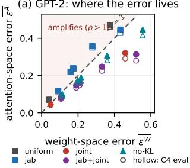

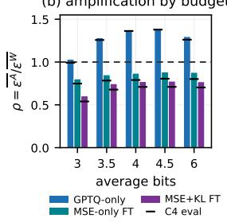  
(b) amplification by budget

(c) accuracy tracks perplexity  
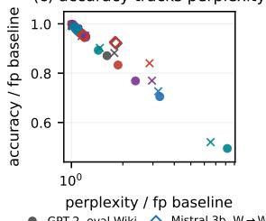  
Figure 5: (a) Attention-space against weight-space error, one point per GPT-2 Run B arm; filled markers WikiText-2 eval, hollow markers C4 eval. Every GPTQ-only arm sits in the shaded amplifying region above the $\rho = 1$ diagonal, every fine-tuned arm below it. (b) The same as the amplification factor $\rho$ by budget: the ordering GPTQ-only > MSE-only $> \mathrm { M S E { + } K I }$ L holds at every budget on both corpora without a crossing. (c) Accuracy against perplexity, each normalized by its own full-precision baseline, pooling GPT-2 Run B with the Mistral-7B 3-bit arms.

Flip rate measures movement, not benefit At a fixed assignment the MSE-only run moves more grid positions than the KL run (0.177 vs. 0.136) while ending 0.392 perplexity worse, so activity and benefit must be logged separately. Benefit is monotone in fine-tuning depth — restricting the stage to the first four blocks lands between GPTQ-only and full-depth — which refutes a compoundingdrift hypothesis: had each block accumulated error against a stale target, a prefix would have beaten full depth.

## G WHERE THE ERROR LIVES, AND WHETHER ACCURACY AGREES

Fine-tuning trades weight fidelity for attention fidelity This measurement most directly tests the report’s premise, and the premise survives. On the flat 4-bit pair, joint fine-tuning moves the weights 19% further from float $( \varepsilon ^ { W } : 0 . 1 7 4 \to 0 . 2 0 8 )$ while moving the attention output 33% closer $( \varepsilon ^ { A } : \bar { 0 . 2 3 8 } \to 0 . 1 6 0 )$ , and both perplexity and accuracy improve; the same trade appears at 3 and 6 bits. A solution measurably worse by the objective GPTQ minimizes is therefore better on the metric that matters and better on the task, so the weight-space objective is not the binding constraint.

The amplification factor separates the two regimes without exception Causal softmax attention amplifies the relative weight perturbation it is handed, and fine-tuning inverts that: every GPTQ-only arm has $\rho > 1$ and every fine-tuned arm $\rho < 1$ , with the ordering ρGPTQ > ρMSE-only > ρMSE+KL holding at every budget on both corpora without a crossing (Fig. 5(a,b)). The single departure — jab at 3 bits, where $\rho$ moves from 1.03 to 0.99 between corpora — is smaller than single-draw Hutchinson estimates at one seed can resolve.

On Mistral the same dissociation is produced by the allocator instead At 3 bits, adaptive allocation attains a lower attention-reconstruction error than uniform on both calibration corpora (1.13 vs. $1 . 5 3 \times 1 0 ^ { - 3 }$ under WikiText-2 calibration, $1 . 3 2 ~ \mathrm { v s . ~ } 1 . 6 5 \times 1 0 ^ { - 3 }$ under C4) while incurring a higher weight error (0.467 vs. 0.433 and 0.474 vs. 0.439) — exactly what spending bits on highcurvature layers implies — and again it is that trade, not weight fidelity, that tracks perplexity and accuracy. The same signature arising through two mechanisms in two independent codebases is stronger evidence than either alone. (Both errors are on the streaming pipeline’s raw scale.)

Accuracy confirms the perplexity ordering Next-token accuracy is almost perfectly rank-inverse to perplexity across all 21 GPT-2 arms (Spearman $\rho _ { s } = - 0 . 9 9 6 \ \mathrm { o n W i k i T e x t - } 2 , - 0 . 9 9 0 \ \mathrm { o n C } 4 )$ , and Fig. 5(c) shows the relation holding across models, corpora and modes once each configuration is normalized by its own full-precision baseline — so the differences above are not artifacts of the likelihood tail. Only two arms reorder by more than one rank, both at budgets already flagged as unstable.

## H CROSS-CORPUS ROBUSTNESS

Quantization cost is a property of calibration and budget, not of the scoring corpus Uniform 4-bit GPTQ costs +8.9% perplexity against the WikiText-2 control and +9.3% against the C4 control despite baselines differing by 6.4 absolute points.

Allocation transfers across corpus mismatch; refinement does not On Mistral, adaptive allocation recovers 81.4% and 85.0% of the uniform gap under corpus mismatch, against 89.5% and 76.6% matched — so the mismatch penalty is smaller than the spread between the two matched pairings (Fig. 3(c)). The sensitivity ranking is therefore a property of the model’s architecture and weight structure rather than an artifact overfit to the calibration text: the functional counterpart of the $r = 0 . 9 9 9 5$ trace correlation measured directly on GPT-2. Fine-tuning behaves oppositely — both of its instabilities are corpus-induced (Section F) — while no allocation result changes sign under either intervention.

## I BEYOND QKV: THE MLP SUBLAYER

The pipeline of Section 2 is not specific to attention: $\mathcal { L } _ { \mathrm { J A B } }$ is a block-level reconstruction loss, and nothing in the Hutchinson estimator, the $\Omega _ { i } ( b )$ table or the allocator refers to a softmax. We therefore ported the whole system to the MLP sublayer, quantizing c fc and $\mathtt { m l p . c . p r o j }$ and leaving all attention weights in fp32. Two changes are structural. First the MLP is two sequential matrices rather than one fused one, so each block contributes two allocation units and two Hessians, of dimension d and $4 d ;$ the second is collected only after the first is quantized, preserving withinblock the sequential property Section 2.1 obtains across blocks. Second, and decisively, the attention map has no MLP analogue: ${ \mathcal { L } } _ { \mathrm { K L } }$ cannot be formed, so $\lambda _ { \mathrm { K L } } = 0$ by construction and the objective reduces to output MSE alone. The KL ablation of Section F is correspondingly vacuous here, and we verified it reproduces the default arm bit-for-bi $( \Delta = 0 . 0 \mathrm { e } + 0 0 )$ .

Table 11: GPT-2 MLP: full WikiText-2 test perplexity, same pipeline, criteria and budgets as Table 8, with c fc and mlp.c proj quantized and attention left in fp32. fp32 control 24.357; budget is average bits per matrix over 24 units. “–” marks combinations that do not exist. Best per row in bold. Contrast the Uniform column with Table 8: here the criterion loses to it at both comparable budgets.
<table><tr><td rowspan="2">bits</td><td colspan="2">Uniform</td><td colspan="2">JAB (C1)</td><td colspan="2">JAB+prop (C2)</td><td colspan="2">Oracle (C3)</td></tr><tr><td>GPTQ</td><td> $+ \mathrm { F T }$ </td><td>GPTQ</td><td>+FT</td><td>GPTQ</td><td> $+ \mathrm { F T }$ </td><td>GPTQ</td><td>+FT</td></tr><tr><td>2.0</td><td>3698.3</td><td>8462.0‡</td><td></td><td></td><td></td><td></td><td></td><td></td></tr><tr><td>2.5</td><td></td><td></td><td>2458.3 1439.6</td><td></td><td>395.7</td><td>248.2</td><td>351.3</td><td>275.1</td></tr><tr><td>3.0</td><td>53.71</td><td>46.45</td><td>120.70</td><td>94.49</td><td>53.71</td><td>46.45</td><td>46.15</td><td>39.13</td></tr><tr><td>3.5</td><td></td><td></td><td>40.12</td><td>37.55</td><td>29.90</td><td>28.80</td><td>28.54</td><td>27.99</td></tr><tr><td>4.0</td><td>26.23</td><td>25.96</td><td>27.46</td><td>26.64</td><td>26.23</td><td>25.96</td><td>26.23</td><td>25.96</td></tr><tr><td>4.5</td><td></td><td></td><td>26.14</td><td>25.89</td><td>26.11</td><td>25.76</td><td>25.60</td><td>25.43</td></tr><tr><td>6.0</td><td>一</td><td>一</td><td>25.68</td><td>25.20</td><td>24.92</td><td>24.98‡</td><td>24.76</td><td>24.68</td></tr></table>

‡ the two budgets at which fine-tuning hurts.

The scope is worth stating, because it inverts. The two MLP matrices hold $8 d ^ { 2 }$ parameters per block against $\mathrm { \dot { Q } K V ^ { \prime } s 3 } d ^ { 2 }$ : 56.6M versus 21.2M on GPT-2, or 66.6% of non-embedding weights against 25.0%. Every result below therefore covers 2.67× more of the model than Table 8, and no MLP budget is reachable by any QKV-only scheme — even 0-bit QKV leaves a larger model than 4-bit MLP. Compression at 4 bits is 1.66× end-to-end, the residue being the 39.4M embedding parameters (32% of GPT-2 small) that no arm in this report touches.

The criterion loses to uniform, and the oracle does not Two budgets admit a uniform baseline, and C1 is beaten at both: 120.70 against 53.71 at 3 bits (2.25× worse) and 27.46 against 26.23 at 4 bits. This is not the 3.0-bit pathology of Section 2.4, whose cause was a 2-bit block entering the allocation; here the 4-bit assignment contains nothing below 3 bits and still loses. Adaptive allocation as implemented is simply harmful on this sublayer. That the oracle C3 beats uniform at 3 bits (46.15 vs. 53.71, a 14% improvement) establishes that exploitable structure exists and that the Hutchinson criterion is failing to find it — a cleaner separation of criterion from ceiling than the QKV sweep affords, where C1 and C3 agree to 0.17 perplexity above 3.5 bits.

The depth profile inverts again, and is far flatter Fig. 2(a) reported a QKV trace peaking at block 3 of 12 and decaying, with a 41× spread. The MLP trace on the same model rises monotonically from block 5 to the last layer and spans only 4.5× (365 → 1543). “Architecture-specific”, the reading offered in Section D, is therefore too coarse: the profile is sublayer-specific, and inverts between two sublayers of one block. This weakens the (L − i) re-weighting of equation 6 further than Fig. 2(a) already does — C2’s advantage over C1 here (e.g. 29.90 vs. 40.12 at 3.5 bits) comes from opposing a depth gradient it was designed to create.

The trace cannot separate the two matrices, by construction A single Hutchinson trace is taken over the concatenated $[ W _ { \mathrm { f c } } \mid W _ { \mathrm { p r o j } } ]$ vector, so Tr(H) is identical for the two units of a block and all discrimination between them falls to the perturbation factor of equation 6. This is the exact MLP analogue of Section 2.3’s observation that the trace sees only diagonal blocks: joint and separate coincide for scoring. Here that identity is not benign, because — unlike Q, K and V — the two MLP matrices have different input dimensions, different input distributions, and, as the oracle shows, genuinely different sensitivities.

The oracle finds a role rule, not a depth rule Table 12 makes the failure concrete, and the oracle’s assignments are the substantive finding of this section. At every fractional budget it returns aflat allocation split by matrix role: c fc at b+1 and mlp.c proj at b−1, with no depth variation whatever (3/2 at 2.5 bits, 4/3 at 3.5, 8/4 at 6). C1 instead spends its budget along depth — at the 4-bit budget it robs c proj in blocks 0–4 down to 3 bits to fund an 8-bit c proj in block 11, and loses 1.23 perplexity against leaving everything at 4. A plausible mechanism is that both factors of $\Omega _ { i } ( b ) = \mathrm { { \bar { T r } } } ( \mathrm { { \bar { H } } } _ { i } ) \lVert \boldsymbol { \dot { Q } } _ { b } ( \mathrm { { \bar { W } } } _ { i } ) - W _ { i } \rVert _ { F } ^ { 2 }$ scale with magnitude while GPTQ’s per-group scales already normalize for it, so the criterion reads activation scale — which grows with depth in a residual stream — as curvature. The measured block reconstruction losses track this directly, rising from 0.033 at block 0 to 0.113 at block 10. A scale-normalized trace $\mathrm { T r } ( H _ { i } ) / \overline { { \mathrm { d i a g } ( H _ { i } ) } }$ is the obvious test and was not run.

Table 12: GPT-2 MLP, bit assignments at the 3.5-bit budget by unit and depth. The oracle’s rule is constant in depth and splits by matrix role; the Hutchinson criterion follows a depth gradient instead and pays 11.6 perplexity for it.
<table><tr><td>Criterion</td><td>Unit</td><td colspan="10">Assignment (blocks 0–11)</td><td>PPL</td><td></td><td></td></tr><tr><td>Oracle (C3)</td><td> $\mathtt { C \_ f c }$ </td><td>4 4</td><td></td><td>4</td><td>4</td><td>4</td><td>4</td><td>4</td><td></td><td>4</td><td>4</td><td>4</td><td>4</td><td>4</td><td>28.54</td></tr><tr><td></td><td>c-proj</td><td>3</td><td>3</td><td>3</td><td>3</td><td>3</td><td></td><td>3</td><td>3</td><td></td><td></td><td>3</td><td>3</td><td>3</td><td></td></tr><tr><td>JAB (C1)</td><td> $\subset _ { - } { \pm } \subset$ </td><td>4 3 3</td><td></td><td></td><td>3</td><td>3</td><td></td><td>3</td><td>4</td><td>4</td><td>マ</td><td>4</td><td>4</td><td>4</td><td>40.12</td></tr><tr><td></td><td>c-proj</td><td>3</td><td>3</td><td>3</td><td>3</td><td>3</td><td>3</td><td></td><td>3</td><td>4</td><td>4</td><td>4</td><td>4</td><td>4</td><td></td></tr></table>

Fine-tuning is inert in the deep layers Section F reports a flip rate of 0.12–0.18 throughout and reads it as evidence the stage reaches deployed weights. The MLP run does not reproduce this. Pooling the 20 fine-tuned sweep arms, the flip rate is exactly zero in blocks 9, 10 and 11 in 15, 12 and 17 arms respectively, against zero occurrences in blocks 0–3; the reconstruction loss is unchanged to six decimals in those blocks, so the commit gate of Section F rejected every one of 200 steps. The signature is the one Section F already attributes to a fixed absolute learning rate, and the deep blocks are precisely those carrying the largest reconstruction error, so the stage fails where it is most needed. The aggregate consequence is that fine-tuning is worth ≈ 1% here against 1–2% on QKV, it hurts at two budgets rather than one, and the depth-restricted control lands at 26.12 between GPTQonly 26.21 and full-depth 25.93 — a much narrower band than the QKV analogue. We report the Objective-3 results on this sublayer as unresolved rather than negative.

What this says about the central claim Section F establishes that the KL attention-map term supplies 88% of the fine-tuning gain, and Fig. 4(b) that removing it is harmful at every budget. The MLP port is the limiting case of that ablation: the term is not down-weighted but structurally absent, and both halves of the pipeline degrade together — the criterion falls behind uniform, and refinement falls to a percent. The honest reading is that what transfers from this work is the attention-specific machinery, not a general-purpose mixed-precision recipe, and that a sublayer without a distributional target to distill against needs a different objective rather than the same one with a term deleted.

What is not measured here A single seed was run for Table 11 $( \lambda _ { \mathrm { K L } } = 0 ,$ , seed 42, full WikiText-2 test split, 242 minutes over 44 quantize-and-evaluate passes), so L1 and L5 apply unchanged. Integer budgets carry no information about allocation in this setting: at 3.0 and 4.0 bits every criterion returns a flat assignment and the four columns of Table 11 coincide exactly, as the budget arithmetic of Section 2.4 requires.

A second, C4-calibrated run does instrument $\varepsilon ^ { W } , \varepsilon ^ { A }$ and $\rho$ A separate MLP sweep, calibrated on C4 rather than WikiText-2 and following Run B’s protocol (four modes, five budgets, scored on both corpora), defines $\varepsilon ^ { A }$ as the relative Frobenius error of the MLP block’s own output — the direct analogue of the attention-output $\varepsilon ^ { A }$ of Section 2.6, with mlp.c proj’s input playing the role QKV’s output plays there — and reports $\rho = \varepsilon ^ { A } / \varepsilon ^ { W }$ alongside it (Table 13).

ρ separates GPTQ-only from fine-tuned arms less cleanly than on QKV GPTQ-only allocation (uniform, jab) has $\rho > 1$ at every budget on both corpora, as on QKV. But the two fine-tuned modes do not fall cleanly below $\rho = 1 \colon \mathrm { j o i n t }$ stays above 1 except at the tightest budget, while adaptive joint dips below 1 at 3, 3.5 and 6 bits but rises back above it at 4 and 4.5, tracking the flat-assignment coincidence with jab noted in Section I rather than the fine-tuning stage itself. The clean, crossing-free separation of Fig. 5(a,b) is therefore a QKV-specific regularity, not a general property of $\rho .$

Table 13: GPT-2 MLP, C4 calibration: four pipeline modes, five budgets, evaluated on both corpora, with the amplification factor $\rho = \varepsilon ^ { A } / \varepsilon ^ { W }$ reported per corpus $( \varepsilon ^ { W }$ is shared). Controls: WikiText-2 24.357/0.4148; C4 32.770/0.3736. Not directly comparable to Table 11, which is calibrated on WikiText-2.
<table><tr><td></td><td></td><td colspan="4">WikiText-2 (cross-corpus)</td><td colspan="4">C4 (in-domain)</td><td rowspan="2"> $\varepsilon ^ { W }$ </td></tr><tr><td>Mode</td><td>bits</td><td>PPL</td><td> $_ \mathrm { A c c }$ </td><td> $\varepsilon ^ { A }$ </td><td>ρ</td><td>PPL</td><td> $_ \mathrm { A c c }$ </td><td> $\varepsilon ^ { A }$ </td><td> $\rho$ </td></tr><tr><td>uniform</td><td>3</td><td>54.152</td><td>0.3241</td><td>0.4749</td><td>1.332</td><td>61.630</td><td>0.3035</td><td>0.4632</td><td>1.299</td><td>0.3565</td></tr><tr><td>uniform</td><td>4</td><td>26.423</td><td>0.4053</td><td>0.2112</td><td>1.349</td><td>34.765</td><td>0.3652</td><td>0.2068</td><td>1.321</td><td>0.1566</td></tr><tr><td>uniform</td><td>6</td><td>24.420</td><td>0.4149</td><td>0.0483</td><td>1.338</td><td>32.648</td><td>0.3734</td><td>0.0472</td><td>1.307</td><td>0.0361</td></tr><tr><td>jab</td><td>3</td><td>600.798</td><td>0.1219</td><td>0.4650</td><td>1.192</td><td>574.850</td><td>0.1188</td><td>0.4457</td><td>1.143</td><td>0.3900</td></tr><tr><td>jab</td><td>3.5</td><td>46.236</td><td>0.3421</td><td>0.3292</td><td>1.273</td><td>54.889</td><td>0.3177</td><td>0.3237</td><td>1.251</td><td>0.2587</td></tr><tr><td>jab</td><td>4</td><td>26.423</td><td>0.4053</td><td>0.2112</td><td>1.349</td><td>34.765</td><td>0.3652</td><td>0.2068</td><td>1.321</td><td>0.1566</td></tr><tr><td>jab</td><td>4.5</td><td>26.237</td><td>0.4065</td><td>0.2009</td><td>1.387</td><td>34.621</td><td>0.3661</td><td>0.1959</td><td>1.353</td><td>0.1448</td></tr><tr><td>jab</td><td>6</td><td>25.499</td><td>0.4103</td><td>0.1113</td><td>1.305</td><td>33.779</td><td>0.3690</td><td>0.1094</td><td>1.283</td><td>0.0853</td></tr><tr><td>joint</td><td>3</td><td>48.121</td><td>0.3331</td><td>0.4199</td><td>1.038</td><td>58.676</td><td>0.3044</td><td>0.4021</td><td>0.994</td><td>0.4045</td></tr><tr><td>joint</td><td>4</td><td>26.055</td><td>0.4054</td><td>0.1951</td><td>1.123</td><td>34.411</td><td>0.3665</td><td>0.1873</td><td>1.078</td><td>0.1738</td></tr><tr><td>joint</td><td>6</td><td>24.434</td><td>0.4143</td><td>0.0469</td><td>1.206</td><td>32.731</td><td>0.3737</td><td>0.0452</td><td>1.162</td><td>0.0389</td></tr><tr><td>adaptive_joint</td><td>3</td><td>157.931</td><td>0.2067</td><td>0.4203</td><td>0.904</td><td>152.766</td><td>0.2195</td><td>0.4015</td><td>0.863</td><td>0.4651</td></tr><tr><td>adaptive_joint</td><td>3.5</td><td>40.772</td><td>0.3474</td><td>0.2864</td><td>0.965</td><td>51.422</td><td>0.3197</td><td>0.2742</td><td>0.924</td><td>0.2967</td></tr><tr><td>adaptive_joint</td><td>4</td><td>26.055</td><td>0.4054</td><td>0.1951</td><td>1.123</td><td>34.411</td><td>0.3665</td><td>0.1873</td><td>1.078</td><td>0.1738</td></tr><tr><td>adaptive_joint</td><td>4.5</td><td>25.920</td><td>0.4062</td><td>0.1847</td><td>1.140</td><td>34.283</td><td>0.3669</td><td>0.1764</td><td>1.089</td><td>0.1620</td></tr><tr><td>adaptive_joint</td><td>6</td><td>25.349</td><td>0.4099</td><td>0.0965</td><td>0.959</td><td>33.503</td><td>0.3689</td><td>0.0914</td><td>0.909</td><td>0.1006</td></tr></table>

The 3-bit allocator failure is far more severe under C4 calibration Table 11’s WikiText-2- calibrated jab arm loses to uniform at 3 bits by 2.25× (120.70 vs. 53.71); under C4 calibration the same criterion at the same budget loses by 11.1× (600.798 vs. 54.152), with adaptive joint similarly worse (157.931 vs. Table 11’s finetuned 94.49). The failure mode is the same one-layer 2-bit collapse described in Section I, but its severity is calibration-corpus dependent in a way the QKV sweep’s $r = 0 . 9 9 9 5$ trace correlation (Section D) did not predict.

## J FULL-MODEL QUANTIZATION: EXTENDED ANALYSIS

Sections D–H quantize the QKV projection and Section I the MLP, each in isolation. We now compose them: every linear module of every Mistral-7B decoder layer is quantized under a single budget, covering 6.98B parameters (96.4% of the model, 224 allocation units). This is the regime practitioners deploy, and it tests three claims that the sublayer studies could only suggest: whether a sensitivity criterion helps once units are heterogeneous, whether block-local refinement remains safe, and whether the 2-bit allocation pathology of Section E is specific to GPT-2.

## J.1 SETTING

Implementation Four Hessians suffice per block: $ { \boldsymbol { q } } ,  { \boldsymbol { k } } ,  { \boldsymbol { v } }$ share the input $\mathrm { R M S N o r m } _ { 1 } ( h )$ and gate, up share RMSNorm (h). They are collected in forward order $q k v  o  \{ \mathsf { g a t e , u p } \} $ down, each after the preceding units are quantized, extending within the block the sequential property of Section 2.1. Weight layout is an explicit per-architecture flag, since nn.Linear stores $( d _ { \mathrm { o u t } } , d _ { \mathrm { i n } } )$ , the transpose of GPT-2’s Conv1D, and a silent transpose would quantize along the wrong axis. Unlike the streaming build of Section 3, this run solves GPTQ in float64 throughout with per-block offloading on a single 96 GB GPU, so the float32-solve caveat of Section 2.1 does not apply. A hand-written block forward reproducing RoPE, RMSNorm, GQA head repetition and SwiGLU is validated against MistralDecoderLayer before any arm runs. Evaluation uses 32 WikiText-2 windows of 512 tokens (fp16 control 6.643), one seed, and 64 Hessian batches.

## J.2 LAYER ROLE OUTPERFORMS CURVATURE

A seven-integer prior beats the Hessian criterion at matched budget At B = 4.5 (Table 4), Type-offset reaches 6.970 against JAB’s 7.250 and JAB-norm’s 10.77 — all three at exactly 4.500 realized bits per parameter — while computing no Hessian, no Hutchinson probe and no scoring pass. This is the second architecture in which role-based allocation matches or beats the learned criterion: the GPT-2 MLP oracle found the same flat, role-split structure under GELU (Section I), and here it prevails under SwiGLU with grouped-query attention and 56× more parameters.

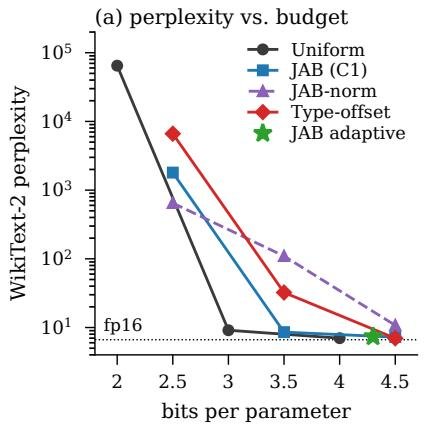

(b) where the budget goes, B = 4.5  
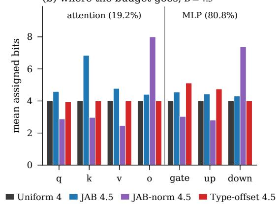  
Figure 6: Full-model quantization of Mistral-7B. (a) Perplexity against bits per parameter, GPTQ only. At B = 4.5 Type-offset is best; the adaptive JAB arm (⋆) spends 4.3 bits per parameter yet scores worse than uniform 4-bit. (b) Mean assigned bits per unit kind at $B = 4 . 5$ . Type-offset is flat within a role and offset between roles; JAB over-buys $\mathrm { k - p r o j }$ , which grouped-query attention makes cheap; JAB-norm assigns 8 bits to every o proj while starving q, $k ,$ v to 2–3 bits.

The sensitivity-driven allocator also fails a weaker test. At B = 4.3 the adaptive JAB arm reaches 7.373, worse than uniform 4-bit (6.998) while spending 7.5% more bits. Uniform 4-bit remains within 0.03 of the best mixed-precision arm at $\bar { B } = 4 . \bar { 5 }$ , so in this regime no allocator we tested improves on uniform quantization per bit spent; what distinguishes them is how much each loses.

Why the criterion cannot find role structure The JAB trace is computed once per block over the concatenated parameter vector, and is therefore identical for all seven units of a layer (e.g. 1478.6 for every unit of block 5). Between units of one block, the criterion can discriminate only through the perturbation factor of Eq. 6. Its dominant signal is instead a depth gradient spanning 381× (59.2 at block 0 to 22,575 at block 31) — the one axis on which the winning allocation has no structure at all. Fig. 6(b) shows the consequence: JAB’s largest purchases are GQA-cheap $\mathrm { k - p r o j }$ units rather than any role. Per-unit traces would remove this limitation at four double-backward passes per block.

Scale normalization trades one bias for another Section I hypothesized that the criterion reads activation magnitude as curvature and proposed normalizing the trace by $\overline { { \mathrm { d i a g } ( H _ { i } ) } }$ . We tested this (JAB-norm). It is worse than JAB at both usable budgets (10.77 vs. 7.250 at $B = 4 . 5 ; 1 0 9 . 6$ vs. 8.570 at $B = 3 . 5 )$ . Dividing by the mean Hessian diagonal rewards units whose input spectrum is flat, and $_ { \mathrm { 0 - p r o j } }$ , fed by the merged attention output, is far flatter than the post-RMSNorm stream feeding q, k, v; JAB-norm consequently assigns 8.0 mean bits to $_ { \mathrm { 0 - p r o j } }$ and 7.4 to down proj while leaving q, k, v at 2.5–3.0. The normalizer exchanges a magnitude bias for a conditioning bias.

The offset sign matters, and is the main open parameter Type-offset degrades sharply at $B =$ 3.5 (32.33). With $\Delta _ { \sf d o w n } = - 1$ , the allocation places 30 of 32 down proj matrices — 25.2% of the quantized weights — at 2 bits, the width that destroys uniform quantization. At $B = 4 . 5$ the grid B absorbs the offset (4 − 1 and 4 + 1 round back to 4) and the budget is instead spent promoting individual gate and up units to 8 bits. SwiGLU’s down proj receives silu(gate $( x ) ) \odot \mathsf { u p } ( x )$ a heavier-tailed input than the post-GELU activation of its GPT-2 counterpart, so the transposed negative offset is plausibly the wrong sign. Because each candidate offset vector costs a single evaluation, fitting $\bar { \Delta }$ is inexpensive; we report the untuned vector, so the $B = 4 . 5$ result is a lower bound on what the family achieves.

Table 14: Joint fine-tuning under full coverage. “Changed” counts blocks whose quantized weights differ from the GPTQ warm start (flip rate $> 0 ,$ , Eq. 15); “Block-0 loss” is that block’s own objective before and after refinement. Restricting refinement to blocks 0–3 reproduces the full-depth result exactly.
<table><tr><td>Allocation, refinement</td><td>Blocks refined</td><td>Changed</td><td>Block-0 loss</td><td>PPL</td></tr><tr><td>Adaptive B=4.3, GPTQ only</td><td></td><td>1</td><td></td><td>7.373</td></tr><tr><td>+ joint FT</td><td>0-31</td><td>1 (0)</td><td> $1 . 8 5  0 . 4 1 \times 1 0 ^ { - 3 }$ </td><td>239.52</td></tr><tr><td>+ joint FT</td><td>0-3</td><td>1 (0)</td><td> $1 . 8 5  0 . 4 1 \times 1 0 ^ { - 3 }$ </td><td>239.52</td></tr><tr><td>+ joint FT,  $\lambda _ { \mathrm { K L } } { = } 0$ </td><td>0-31</td><td>1 (0)</td><td>MSE only</td><td>52.07</td></tr><tr><td>Uniform 4, GPTQ only</td><td></td><td></td><td></td><td>6.998</td></tr><tr><td>+ joint FT</td><td>0-31</td><td>3 (0,3,4)</td><td> $1 . 0  0 . 9 \times 1 0 ^ { - 5 }$ </td><td>11.39</td></tr></table>

## J.3 BLOCK-LOCAL OBJECTIVES CAN DIVERGE FROM END-TO-END QUALITY

Section F identified a gap between the fine-tuning objective and perplexity that the commit gate cannot detect, of under 1% on QKV. Under full coverage the same mechanism produces a 32× degradation, and a depth-restricted control localizes it to a single block (Table 14).

The measurement Refining the adaptive allocation raises perplexity from 7.373 to 239.52. Refining only blocks 0–3 yields 239.52 as well, identical to four decimals together with every weightand activation-error metric. The flip-rate diagnostic explains the coincidence: in both runs block 0 is the only block whose quantized weights change (flip rate 0.043); in the other 31 blocks every weight returns to its GPTQ grid point. Within block 0, the refinement succeeded on its own terms: its objective fell 4.6×, from 1 $. 8 5 \times 1 0 ^ { - 3 } \mathrm { t o } 0 . 4 1 \times 1 0 ^ { - 3 }$ , and the held-out commit gate accepted it. One refined block in 32 multiplied end-to-end perplexity by 32.5.

Mechanism Two conditions coincide at block 0. The adaptive allocator assigns it 2 bits on six of its seven units, giving a mean relative weight error $\varepsilon ^ { W } = \dot { 1 } . 0 1 5$ (1.42 for q proj): the quantized block lies farther from its float weights than the zero matrix does. And block 0’s output feeds all 31 blocks above it, so its residual is the least local quantity in the network. A 200-step descent that reduces this block’s objective on eight calibration batches, from a starting point already beyond the zero-error reference, fits noise with maximal downstream leverage. Severity tracks grid coarseness as this account predicts: on the uniform 4-bit allocation the same stage changes three blocks and degrades perplexity by 1.6× rather than 32×.

Implication beyond JAB Nothing in this mechanism is specific to $\mathcal { L } _ { \mathrm { J A B } }$ . Any post-training pipeline that refines blocks against block-local targets and validates on held-out calibration data admits the same failure, and the local measurement alone places no bound on the global damage. A certified improvement in a block’s own reconstruction objective is therefore not evidence of endto-end improvement. Reporting a global metric per refinement stage, together with a per-block flip rate, is the minimum needed to detect it.

The KL term amplifies an ill-posed refinement On QKV the attention-map term supplies 88% of the fine-tuning gain (Section F). Under full coverage, removing it reduces the damage from 239.52 to 52.07, with the block-0 flip rate falling from 0.043 to 0.034. Both remain far worse than no refinement, so this compares two degraded configurations; it shows that the KL term drives the stage harder, which helps when the stage is well posed and harms when it is not. Its effect is a property of the regime, not of the objective.

## J.4 THE 2-BIT PATHOLOGY IS NOT SPECIFIC TO GPT-2

Section E proved that GPT-2’s 3.0-bit assignment must contain a sub-3-bit block, and recorded as an open discrepancy that no comparable collapse appeared on Mistral. Full coverage resolves it. The adaptive allocation at $B = 4 . 3$ places its only sub-3-bit units in block 0 — six of seven at 2 bits, $\varepsilon ^ { W ^ { \bullet } } = 1 . 0 1 5$ , the only block with $\varepsilon ^ { W } > 1 \doteq$ and the arm loses to uniform while spending more. The earlier absence was a matter of scope rather than of depth or grouped-query attention: with only

QKV quantized, a single 2-bit projection is 1/128 of the quantized weights; with all seven modules under Eq. 8, the allocator can concentrate low widths on one block, and the additive objective of Eq. 7 still cannot represent that perplexity is convex and unbounded in the low-bit direction. The floor $b _ { i } \geq 3$ proposed in Section 7 removes every sub-3-bit unit from this assignment as it does from GPT-2’s; whether it recovers uniform-level quality at 7B is untested.

Scope All results in this section come from one seed. The 0.28 separating Type-offset from JAB at $B = 4 . 5$ and the effects of Section J.3 are large relative to that limitation; the 0.03 separating Type-offset at B = 4.5 from uniform 4-bit is not, and the two differ in budget. Perplexities are exact within this run but computed on a 32-window subset. Beyond block 0, the fine-tuning stage changed no weights in 31 of 32 blocks, the mis-scaled step signature of Section 2.5; refinement is therefore under-exercised here independently of the divergence above, and Type-offset was evaluated without it.

## J.5 GPT-2: QKV+MLP, FULL WIKITEXT-2 TABLE

Role beats curvature once both sublayers share the budget. At the aggressive fractional budgets, Type-offset needs no scoring pass yet leads: 64.896 at 3.5 bits and 28.211 at 4.5, against JAB+prop’s 67.337 and 28.694 (Table 15). JAB’s attention-defined sensitivity over-invests in QKV, a quarter of the quantized weights, and under-funds the MLP, which now dominates the parameter count; Type-offset’s flat role split needs no such trade-off. Only near saturation, at 6 bits, does uniform win (24.546): perplexity is nearly flat there, so a mixed 4-/8-bit average cannot beat a flat assignment, and Type-offset still shifts bits toward the MLP while QKV lags.

Attention error stops tracking perplexity. On QKV alone, attention-output error $\varepsilon ^ { A }$ tracked perplexity closely. Once the MLP shares the budget this relationship breaks: $\varepsilon ^ { \dot { A } }$ sees only QKV and is blind to the MLP, which dominates the quantized weights. Type-offset has the worst $\varepsilon ^ { \bar { A } }$ at 3.5 and 4.5 bits yet the best perplexity, and accuracy tracks perplexity rather than $\varepsilon ^ { A }$ throughout (Table 15). Sublayer damage also compounds: QKV and MLP errors multiply once both are quantized, so at 3 bits the composed model is substantially farther from fp32 than either sublayer alone would suggest — consistent with each MLP being calibrated on an already-quantized attention block.

Block-local fine-tuning wins locally, loses globally. Adding the joint STE stage to uniform assignments raises perplexity at every budget — 16.35× at 3 bits — even as block-reconstruction loss falls several-fold and the held-out gate commits nearly every block. The stage minimizes blockoutput MSE while perplexity is a causal, end-to-end quantity that no block-local loss can see; the held-out gate certifies exactly the updates responsible for the damage. No fine-tuned arm beats its GPTQ-only counterpart: GPTQ-only Type-offset at 4.5 bits (28.211) beats fine-tuned uniform 4-bit (30.65).

## J.6 GPT-2: C4 RESULTS FOR QKV+MLP

Section 6.1 reports the GPT-2 QKV+MLP results on WikiText-2 (Table 15) and states that C4, the in-domain calibration corpus, gives the same ranking. Table 16 gives those C4 numbers in full. Type-offset leads at 3.5 bits (78.239) and 4.5 bits (37.045), uniform wins at 6.0 bits (32.935), and attention error $\varepsilon ^ { A }$ is again uninformative — Type-offset has the worst $\varepsilon ^ { A }$ at 3.5 and 4.5 bits while still leading on perplexity and accuracy — reproducing every qualitative claim of Section 6.1 on a disjoint, in-domain corpus.

## J.7 PER-UNIT TRACES AND THE 3-BIT FLOOR

Estimator With a Rademacher probe v over the concatenated seven-unit vector and $H v$ the existing Hessian-vector product, let $S _ { u }$ be unit u’s coordinate range and $\begin{array} { r } { t _ { u } = \sum _ { j \in S _ { u } } v _ { j } ( H v ) _ { j } } \end{array}$ . Since $\begin{array} { r } { \mathbb { E } [ v _ { j } v _ { k } ] = \delta _ { j k } , \mathbb { E } [ t _ { u } ] = \sum _ { j \in S _ { u } } H _ { j j } = \operatorname { T r } ( H _ { u u } ) } \end{array}$ : the partial sums are unbiased for the diagonalblock traces, and $\textstyle \sum _ { u } t _ { u }$ is exactly the pooled estimate used elsewhere, which we assert at run time. The cross-block terms cancel in the pooled sum but not per unit, so we raise the probe count from 10 to 30; the scoring pass runs once per run, not once per arm.

Table 15: GPT-2 with QKV and MLP quantized together (C4 calibration, GPTQ-only unless noted): WikiText-2 perplexity (fp32 control 24.357), accuracy, attention error $\varepsilon ^ { A }$ , weight error $\varepsilon ^ { W }$ , and $\rho ~ = ~ \varepsilon ^ { A } / \varepsilon ^ { \hat { W } }$ C4 (in-domain, control 32.770) gives the same ranking; full C4 numbers are in Appendix J.6 (Table 16). Best per budget in bold.
<table><tr><td>Allocator</td><td>B</td><td>PPL</td><td>Acc</td><td> $\varepsilon ^ { A }$ </td><td> $\varepsilon ^ { W }$ </td><td> $\rho$ </td></tr><tr><td>Uniform</td><td>3.0</td><td>141.821</td><td>0.232</td><td>0.414</td><td>0.464</td><td>0.892</td></tr><tr><td>JAB</td><td>3.5</td><td>75.009</td><td>0.296</td><td>0.267</td><td>0.383</td><td>0.697</td></tr><tr><td>JAB+prop</td><td>3.5</td><td>67.337</td><td>0.307</td><td>0.320</td><td>0.379</td><td>0.845</td></tr><tr><td>Type-offset</td><td>3.5</td><td>64.896</td><td>0.310</td><td>0.421</td><td>0.303</td><td>1.390</td></tr><tr><td>All (flat)</td><td>4.0</td><td>29.308</td><td>0.393</td><td>0.238</td><td>0.210</td><td>1.137</td></tr><tr><td>JAB</td><td>4.5</td><td>29.041</td><td>0.394</td><td>0.218</td><td>0.188</td><td>1.159</td></tr><tr><td>JAB+prop</td><td>4.5</td><td>28.694</td><td>0.397</td><td>0.194</td><td>0.210</td><td>0.924</td></tr><tr><td>Type-offset</td><td>4.5</td><td>28.211</td><td>0.395</td><td>0.237</td><td>0.144</td><td>1.645</td></tr><tr><td>Uniform</td><td>6.0</td><td>24.546</td><td>0.413</td><td>0.070</td><td>0.048</td><td>1.449</td></tr><tr><td>JAB</td><td>6.0</td><td>26.868</td><td>0.404</td><td>0.071</td><td>0.152</td><td>0.470</td></tr><tr><td>JAB+prop</td><td>6.0</td><td>25.899</td><td>0.407</td><td>0.121</td><td>0.141</td><td>0.859</td></tr><tr><td>Type-offset</td><td>6.0</td><td>27.441</td><td>0.400</td><td>0.245</td><td>0.128</td><td>1.914</td></tr></table>

Table 16: GPT-2 with QKV and MLP quantized together, evaluated on C4 (in-domain; fp32 control 32.770), matching the WikiText-2 results of Table 15. Same allocators, budgets B (bits/parameter), and metrics. Best per budget in bold.
<table><tr><td>Allocator</td><td>B</td><td>PPL</td><td>Acc</td><td> $\varepsilon ^ { A }$ </td><td> $\varepsilon ^ { W }$ </td><td> $\rho$ </td></tr><tr><td>Uniform</td><td>3.0</td><td>155.246</td><td>0.220</td><td>0.400</td><td>0.448</td><td>0.894</td></tr><tr><td>JAB</td><td>3.5</td><td>83.311</td><td>0.279</td><td>0.261</td><td>0.367</td><td>0.711</td></tr><tr><td>JAB+prop</td><td>3.5</td><td>81.408</td><td>0.280</td><td>0.316</td><td>0.371</td><td>0.852</td></tr><tr><td>Type-offset</td><td>3.5</td><td>78.239</td><td>0.287</td><td>0.421</td><td>0.303</td><td>1.390</td></tr><tr><td>All (flat)</td><td>4.0</td><td>39.053</td><td>0.352</td><td>0.237</td><td>0.205</td><td>1.160</td></tr><tr><td>JAB</td><td>4.5</td><td>38.626</td><td>0.355</td><td>0.219</td><td>0.183</td><td>1.195</td></tr><tr><td>JAB+prop</td><td>4.5</td><td>38.132</td><td>0.356</td><td>0.193</td><td>0.206</td><td>0.936</td></tr><tr><td>Type-offset</td><td>4.5</td><td>37.045</td><td>0.357</td><td>0.237</td><td>0.144</td><td>1.642</td></tr><tr><td>Uniform</td><td>6.0</td><td>32.935</td><td>0.373</td><td>0.070</td><td>0.047</td><td>1.496</td></tr><tr><td>JAB</td><td>6.0</td><td>35.725</td><td>0.364</td><td>0.068</td><td>0.149</td><td>0.458</td></tr><tr><td>JAB+prop</td><td>6.0</td><td>34.217</td><td>0.367</td><td>0.120</td><td>0.138</td><td>0.871</td></tr><tr><td>Type-offset</td><td>6.0</td><td>36.334</td><td>0.361</td><td>0.248</td><td>0.128</td><td>1.939</td></tr></table>

JAB-norm Normalizing by diag $\overline { { H _ { i } ) } }$ favors units with flatter input spectra: without the floor it allocates substantially more bits to $o _ { \mathrm { p r o j } }$ while assigning only $2 { - } 3$ bits to $\boldsymbol { q } , \boldsymbol { k } , \boldsymbol { v } ,$ and it performs worse than JAB at both usable budgets, in that run and in the floored run of Table 6.

The trace mass is concentrated on Q and K Median per-unit traces across the 32 blocks are 2081.6 (q), 1245.6 (k), 365.5 (down), 211.0 (v), 160.2 (up), 146.0 (o) and 93.3 (gate). Attention thus receives 85% of the median trace mass while holding 19.2% of the quantized weights. This is a property of the objective rather than of the estimator: $\mathcal { L } _ { \mathrm { J A B } }$ is evaluated on the attention output and post-softmax map, so perturbing an MLP matrix affects it only through the block output term.

Within-block discrimination Where the pooled trace gave one value for all seven units of a block, the per-unit traces in block 5 range from 878.9 for $q _ { \mathrm { p r o j } }$ to 7.5 for ${ \mathrm { g a t e } } _ { \mathrm { p r o j } } ,$ a 117× spread within a single block.

Allocations at $B = 4 . 5$ Mean assigned bits per unit kind, JAB versus Type-offset: q 7.47 vs. 3.97, k 7.38 vs. 4.00, v 4.06 vs. 4.00, o 3.88 vs. 3.97, gate 3.94 vs. 5.12, up 4.09 vs. 4.75, down 4.62 vs. 4.00. JAB spends its surplus lifting q and k to nearly 8 bits; Type-offset spends it on gate and up. Both realize 4.500 bits per parameter exactly, and the second allocation scores 0.225 perplexity lower.

Protocol and comparability One seed, floor $b _ { i } ~ \geq ~ 3$ so the candidate set is {3, 4, 8, 16}, 30 Hutchinson probes, 128 Hessian batches, 32 WikiText-2 windows of 512 tokens. Budgets below the floor are infeasible and were skipped, so this run has no $B = 2 . 5$ column. Because the Hessian batch count differs from the run of Table 4 (128 against 64), absolute perplexities are not interchangeable between the two tables — uniform 4-bit moves from 6.998 to 6.938 — and only within-table comparisons are exact.

## K LIMITATIONS IN FULL

L1. Single-draw trace estimates. Ten Hutchinson probes on 2 batches, no repeated-seed variance report; in particular the block-0/block-1 trace gap driving the 3.0-bit failure is not shown to exceed sampling noise, and neither is the 4.5× MLP depth gradient of Section I.

L2. Scope. Sections D–H quantize the QKV projection and Section I the MLP; Section J composes all seven Mistral-7B modules (96.4% of parameters). The composition was run on Mistral only, so the sublayer interaction is unmeasured on GPT-2. Embeddings and the output head are never quantized, capping end-to-end compression at 1.66× on GPT-2 at 4 bits.

L3. Greedy allocation is unverified at full scale. Its optimality gap was never measured, exhaustive enumeration being intractable, so how much of the 3.0-bit failure is the criterion and how much the solver is unknown; that greedy and MCKP/Pareto agree exactly on Mistral is suggestive, not a proof.

L4. The joint-versus-separate gap is unmeasured. Section 2.3 shows the cross-blocks Γ are structurally non-zero and predicts what a per-matrix baseline would look like, but no Q/K/V-separate arm was run and $\| \Gamma \| _ { F } / \| H _ { \mathcal { L } } \| _ { F }$ was never estimated, so the size of the effect on real blocks is unknown.

L5. The MLP fine-tuning result is confounded. Section I records a zero flip rate in the deepest blocks, the signature Section F attributes to a mis-scaled learning rate. Until the grid step is confirmed to be computed per unit rather than pooled across units of differing input dimension, the weak Objective-3 result there cannot be separated from an optimizer defect.

L6. Single seed; the Mistral halfis convergent evidence, not a replicate. One seed per pairing, a reimplementation not checked against the full GPT-2 validation suite, a float32 rather than float64 solve (Section 2.1), and a different $\varepsilon ^ { W } , \varepsilon ^ { A }$ normalization.