# FROM DATA TO PROGRAM: FAST & DIRECT GENERA-TIVE PROGRAM INFERENCE FROM EMPIRICAL DATA

Simon Kluttermann¨ Carnegie Mellon University

Xueying Ding Carnegie Mellon University

Leman Akoglu Carnegie Mellon University

{sklutter,xding2,lakoglu}@andrew.cmu.edu

## ABSTRACT

Estimating probability densities from a finite set of samples typically requires dataset-specific model fitting. We introduce PRODiGI<sup>1</sup>, a pretrained data-toprogram model that infers an explicit, executable generative program in a single forward pass. Pretrained on synthetic datasets paired with their ground-truth programs, PRODiGI accommodates diverse generative families and data dimensionalities through template prediction and non-autoregressive program parameter decoding. Its inferred programs support direct sampling, density and score evaluation, and inspection independently of the pretrained model. We further introduce program-space fine-tuning, which refines differentiable program parameters by matching generated and empirical samples while keeping model parameters intact. Experiments show that PRODiGI achieves lower average density and score MAE than existing pretrained models, while offering multi-fold speedups over its closest competitors. Program-space fine-tuning further reduces generation MMD by 84%. By turning empirical data into explicit, reusable programs, PRODiGI introduces a new direction for fast, interpretable tabular generative modeling.

## 1 INTRODUCTION

Probability density estimation from finite samples is a fundamental problem in statistical inference that underpins generative modeling. Classical approaches range from parametric estimation, which assumes a distributional family (e.g., Gaussian mixtures), to nonparametric methods such as kernel density estimation (KDE), which make fewer assumptions but may deteriorate in high dimensions.

Several classical generative families are highly expressive: Gaussian Mixture Models (GMMs) are universal density approximators (3); Structural Causal Models (SCMs) capture a broad class of datagenerating processes (1); and by Sklar’s theorem, Copulas can represent any multivariate distribution through its marginals and dependence structure (34). They offer interpretable, often analytically tractable representations, however at a computational cost: Fitting such models from data may require iterative optimization, combinatorial search, or model selection; e.g., EM (5) and component selection for GMMs, causal graph search for SCMs, and dependence estimation for Copulas.

In this work, we take a radically different approach to the estimation of density functions. Capitalizing on the prowess of modern tabular foundation models (TFMs) (18; 12; 13; 32; 38; 28; 7), we pretrain a single encoder-decoder architecture that maps a given dataset (i.e., D = {x<sub>i</sub>}<sup>n</sup><sub>i=1</sub> with i.i.d. samples from a continuous target distribution) directly to its generative program.

Our key inspiration is that TFMs are pretrained on synthetic datasets sampled from diverse data priors, where each dataset originates from a known generative process—what we call a program. Existing TFMs discard this program after sampling the dataset and train on downstream tasks such as classification, regression, or outlier detection. In contrast, we train the model to recover the associated serialized program given a sampled dataset. Our proposed model, PRODiGI (PROgram Discovery for Generative Inference), thus amortizes program inference into pretraining: once pretrained, it infers a generative program from empirical data in a single forward pass (See Figure 1).

PRODiGI introduces key technical innovations, including serialized canonical program templates for GMM, SCM and Copula based data priors, a novel non-autoregressive program decoder, and a program-parameter (rather than model-parameter) based fine-tuning, besides being (to the best of our knowledge) the first pretrained model that maps (empirical) data directly to a (generative) program without explicit model fitting, search, optimization or model selection.

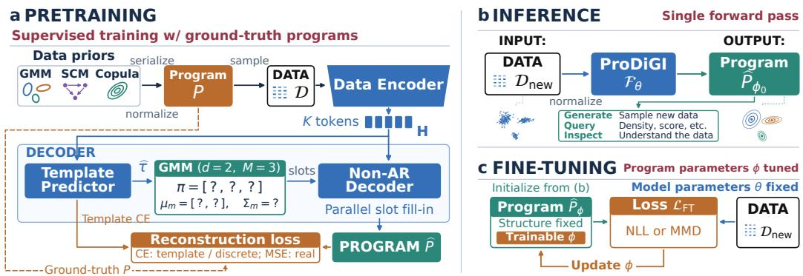  
Figure 1: PRODiGI overview: (a) Pretraining: Data sampled from normalized, serialized programs across diverse priors is encoded for template prediction and non-autoregressive slot filling; (b) Inference: A single forward pass maps input data to a standalone generative program; (c) Finetuning: Inferred program’s differentiable parameters are refined, model parameters remain fixed.

Classical parametric density estimators fit prespecified distribution families, while neural density estimators (NDEs) use neural networks to represent more flexible densities (10; 24; 8; 23). Despite this difference, both classes of estimators are dataset-specific: their parameters must be fitted separately to each dataset, typically by optimizing a likelihood-based objective.

Closest to our work is DiScoFormer (16), a pretrained Transformer that outputs point-wise density and score vector estimates given input samples, but is not natively generative: it requires an external iterative sampler that repeatedly queries its score estimates. In addition, TabPFN’s (14) pretrained classification and regression models can be repurposed for both density estimation and generation through an autoregressive factorization of the joint density into univariate conditionals which, however, requires repeated model evaluations across features. In contrast to these TFMs, PRODiGI is a plug-in density function estimator; it outputs an explicit generative program in a single forward pass, which supports density evaluation and direct sampling. (See Table 1.)

Together, these distinctions position PRODiGI as a new paradigm for tabular generative modeling: As a zero-shot framework that rapidly infers a reusable program that can be directly sampled, queried, and inspected, it bridges modern density estimation with interpretable generative programming. Our main contributions are summarized as follows.

• TFM for Generative Program Inference – without the Fit: We introduce PRODiGI, the first data-to-program pretrained model. Trained to map empirical samples from diverse data priors to underlying generative programs, PRODiGI requires no fitting or optimization at inference time: it infers a generative program from new empirical data in a single forward pass.

• Program Serialization & Normalization: Programs have structure; e.g. GMMs have components, each with mean and covariance of size related to dimensionality. We represent programs with canonically serialized templates, accommodating (i) heterogeneous priors and (ii) varying dimensions. We carefully normalize programs to remove sensitivity to feature location and scale.

• Novel Decoder Architecture: PRODiGI consists of a data encoder and a Non-AutoRegressive (N-AR) program decoder. We depart from next-token-at-a-time decoding for (i) program tokens are not always sequentially dependent (e.g., mean vector entries are independent), and (ii) AR is prone to cascading errors yielding invalid programs. Instead, PRODiGI employs (1) a template prediction head, and (2) a N-AR reconstruction head to fill-in the template slots in parallel.

• Fine-tuning the Program – not the Model: Empirical data can be used for fine-tuning, however, as inference-time data lacks the ground-truth program, instead of traditional fine-tuning of the model’s own parameters, PRODiGI fine-tunes the inferred program’s differentiable parameters, to align its generated samples with the input data using a likelihood or distribution distance loss.

• Fast, Effective Generation and Estimation: PRODiGI offers fast generative modeling at an order-of-magnitude speedup over existing approaches. Beyond direct sampling, its inferred programs support inspection and statistical queries, including analytical evaluation for GMM- and Copula-based programs. Experiments demonstrate effective distribution matching in two-sample tests, as well as accurate point-wise and population-wide statistical estimation.

Table 1: Comparing classical, neural, and pretrained approaches to density and generative modeling. NDEs: class of Neural Density Estimators; DDE: data-driven Deep Density Estimation (27); SNO: Score Neural Operator (21); NS: Neural Statistician (9); NNKDE: pretrained adaptive KDE (37). Last three rows describe capabilities after estimator construction; where direct implies no additional estimation procedure, such as an external sampler, numerical marginalization, etc.
<table><tr><td>Property</td><td>KDE</td><td>GMM</td><td>NDEs</td><td>TabPFN</td><td>DiSco</td><td>DDE</td><td>SNO</td><td>NS</td><td>NNKDE</td><td>Ours</td></tr><tr><td>Zero-shot/No per-dataset fit</td><td>X</td><td>X</td><td>x</td><td>1</td><td>L</td><td>L</td><td></td><td></td><td></td><td></td></tr><tr><td>Explicit structure and param.s</td><td>√</td><td>J</td><td>X</td><td>X</td><td>X</td><td>X</td><td>x</td><td>X</td><td>√</td><td></td></tr><tr><td>Input-free upon construction</td><td>X</td><td>√</td><td>√</td><td>X</td><td>X</td><td>x</td><td>」</td><td>√</td><td>x</td><td></td></tr><tr><td>Pretrn.-model-free upon constr.</td><td>√</td><td>√</td><td>J</td><td>X</td><td>X</td><td>X</td><td>x</td><td>X</td><td>J</td><td></td></tr><tr><td>Multiple output families</td><td>x</td><td>X</td><td>X</td><td>x</td><td>X</td><td>X</td><td>X</td><td>X</td><td>X</td><td></td></tr><tr><td>Direct generation</td><td></td><td></td><td>△</td><td>*</td><td>X</td><td>X</td><td>X</td><td></td><td></td><td></td></tr><tr><td>Direct density estimation</td><td></td><td></td><td>△</td><td>*</td><td></td><td></td><td>x</td><td>X</td><td></td><td></td></tr><tr><td>Direct score estimation</td><td></td><td></td><td>△</td><td>X</td><td></td><td>X</td><td></td><td>X</td><td></td><td></td></tr></table>

Explicit structure refers to kernel, mixture, SCM, or Copula representations, rather than neural weights or latent contexts. Discarding input samples permits retaining a distribution, embedding or latent context. Multiple output families refers to the inferred representation, not the diversity of pretraining distributions. △: architecture dependent; <sup>∗</sup>TabPFN uses autoregressive conditional evaluations, requiring repeated pretrained-model calls.

## 2 RELATED WORK

Density estimation and generative modeling have a broad literature, spanning classical statistical estimators and modern neural approaches. Here we review pretrained statistical models and their comparison to classical and neural estimators, while Appdx. A gives detailed related work.

Pretrained Models for Generation and Estimation. Pretrained models differ substantially in their formulations of what they infer and which tasks they support directly. DiScoFormer (16) is pretrained to predict point-wise densities and score vectors through cross-attention to an input dataset, while generation requires making iterative model calls for score estimates. TabPFN (14) instead repurposes its pretrained classification and regression models through an autoregressive factorization, $\scriptstyle { \hat { p } } ( \mathbf { x } | { \mathcal { D } } ) = \prod _ { j = 1 } ^ { d } { \hat { p } } ( x _ { j } | x _ { < j } , { \mathcal { D } } )$ . Density estimation combines the conditional predictions, while generation samples features sequentially, with repeated model calls.

Other pretrained approaches include DDE (27) and NNKDE (37), which train separate models for each dimensionality. DDE predicts pointwise densities, whereas NNKDE predicts bandwidth matrices for a sample-centered kernel mixture supporting density evaluation, score evaluation, and direct sampling. Score Neural Operator (21) maps distribution embeddings to time-dependent score functions and generates through iterative sampling. In contrast, PRODiGI maps an input dataset to an explicit generative program directly; subsequent sampling and statistical queries execute this program without further calls to the pretrained network.

Comparing Classical, Neural, and Pretrained Statistical Approaches. Table 1 highlights complementary properties of classical, neural, and pretrained approaches. GMMs and conventional NDEs yield input-free estimators but require dataset-specific fitting. KDE and NNKDE provide explicit statistical representations while retaining observations as kernel centers. Among pretrained methods, TabPFN, DiScoFormer, and DDE require the sample context; Neural Statistician and Score Neural Operator can retain summaries instead, but still rely on shared pretrained networks. PRODiGI combines inference without per-dataset optimization, explicit statistical structure, and independence from both the original samples and the pretrained network after construction. It addi tionally predicts programs across multiple prior families, namely GMMs, SCMs, and Copulas.

These properties support fast generation, density estimation, and score-vector estimation: a single forward pass constructs a reusable program that natively supports all three tasks without further pretrained-model evaluations. The distinction concerns both construction and subsequent execution. Fitted GMMs and KDE already support direct sampling and density/score evaluation; PRODiGI combines these capabilities with pretrained inference and an input-free representation. TabPFN requires repeated conditional-model evaluations, while DiScoFormer directly predicts densities and scores but requires an external sampler for generation. Thus, PRODiGI’s computational advantage lies in avoiding per-dataset optimization and repeated pretrained-network calls, with its construction cost amortized over subsequent samples and statistical queries.

## 3 PRODiGI FOR ZERO-SHOT DATA TO PROGRAM

Overview. PRODiGI maps an empirical tabular dataset directly to an executable generative program. Figure 1 outlines pretraining, inference, and fine-tuning stages. Given a dataset $\mathcal { D } = \{ \mathbf { x } _ { i } \} _ { i = 1 } ^ { \bar { n } } ,$ $\mathbf { x } _ { i } \in \mathbb { R } ^ { d }$ , PRODiGI first encodes D into a fixed-size representation, predicts the structural template of the underlying program, and then reconstructs its parameters using a non-autoregressive decoder:

$$
\widehat { P } = \mathcal { F } _ { \boldsymbol { \theta } } ( \mathcal { D } ) = D _ { \boldsymbol { \theta } _ { D } } ( \widehat { \tau } , E _ { \boldsymbol { \theta } _ { E } } ( \mathcal { D } ) ) .\tag{1}
$$

Here, $\widehat { \tau }$ specifies the program family and structural attributes, while $\widehat { P }$ is the resulting concrete generative program. Once inferred, $\bar { \hat { P } }$ can be executed independently of D.

## 3.1 DATA ENCODER

As datasets are unordered collections of samples, we use a Set Transformer (19) for data encoder:

$$
\mathbf { H } = E _ { \theta _ { E } } ( \mathcal { D } ) \in \mathbb { R } ^ { K \times h } ,\tag{2}
$$

where K is the number of representation tokens with dimension h. No positional encoding is applied to the input samples, so that the encoder remains permutation-invariant with respect to their ordering. The resulting K tokens provide a fixed-size representation of a dataset with arbitrary sample size.

## 3.2 PROGRAM TEMPLATE PREDICTION

A program specifies a complete generative process, including its family, structure, and distributional parameters. Because different program families have different structures and numbers of parameters, we represent program structure separately from its concrete values.

We formalize a template as $\boldsymbol { \tau } = \left( \mathbf { f a m } , \mathbf { a } \right)$ , where fam $\in \{ \mathrm { G M M , S C M , C o p u l a } \}$ denotes the data prior family and a represents the discrete attributes that specify its structure. The corresponding concrete program is obtained by instantiating the template with its parameter values.

Heterogeneous Programs. Unlike previous work (14; 16), PRODiGI is trained with programs from three distinct priors, and tackles the challenge of unifying them through structured serialized programs. GMMs contain varying number of components, each with mean and diagonal covariance, in varying dimensions. SCMs are specified by a directed acyclic graph (DAG) among variables with structural equations specifying causal relationships. We materialize the DAG by generating a random acyclic graph, sample the inputs, edge weights, and noise variables from the standard Normal and Uniform distributions, and set the structural equations as the weighted sum followed by a random activation function. Finally, Copulas consist of marginals from a pool of parametric probability functions such as Uniform, Exponential, Student-t, etc. alongside a Gaussian copula. Appdx. B gives detailed descriptions and configurations for the data priors.

Normalization. To remove sensitivity to feature-wise shifts and scaling, we train PRODiGI in standardized coordinates. Crucially, we normalize the generative programs themselves, ensuring consistency between training data and program targets. To this end, we reparameterize each sampled program to target zero mean and unit variance per feature, and then draw training data from it. This uses analytical moments for GMMs and Copula marginals and sample estimates for SCMs. Appdx. C details the transformations to normalize programs from each prior family.

During inference, we standardize each input feature using its empirical mean and standard deviation, infer a normalized program with a single forward pass, and use the same statistics to transform the program back to the original feature coordinates.

Serialization, Templates, and Prediction. For the priors considered here, a GMM template is identified by the dimensionality and the number of mixture components; an SCM template is identified by the dimensionality and maximum number of parents per node; and a Copula template is identified by the dimensionality alone. For example, in a configuration of 50 dimensions using up to 10 components in GMMs and up to 5 parents per variable in SCMs, these choices produce $| \mathcal { T } | = 7 8 6$ templates in total: 500 GMM, 236 SCM, and 50 Copula templates.

To ensure a unique structural representation, we canonically serialize each program by imposing a deterministic ordering of its entities and parameters. As a result, equivalent programs differing only in arbitrary ordering (e.g., GMM components or SCM parent variable indices) map to the same template and slot layout. Appdx. D provides details on program templates, canonical serialization, and tokenization, along with concrete examples.

Prior to decoding, a template prediction head operates on the encoded dataset representation to infer which template to instantiate, denoted as

$$
\widehat { \tau } = T _ { \theta _ { T } } ( { \bf H } ) , \quad \mathrm { w h e r e } \ \tau = ( { \bf f } { \bf a m } , { \bf a } ) , \ \mathrm { a n d \ f a m \in \{ G M M , S C M , C o p u l a \} \ . }\tag{3}
$$

## 3.3 NON-AUTOREGRESSIVE (N-AR) PROGRAM DECODER

Given a template $\tau ,$ its serialized representation defines an ordered sequence of typed fill-in slots,

$$
S _ { \tau } = ( s _ { 1 } , \ldots , s _ { L _ { \tau } } ) ,\tag{4}
$$

where each slot specifies the semantic role and type of a value to be reconstructed. For instance, slots may represent mixture weights and mean entries in GMMs, parent indices and coefficients in SCMs, or marginal families and dependence parameters in Copulas. Each slot is represented by a learned embedding that encodes its semantic identity and canonical position. The slot representations are processed jointly by the decoder $D _ { \theta _ { D } } ( \cdot , \cdot )$ through cross-attending the dataset embedding:

$$
\mathbf { R } = D _ { \theta _ { D } } ( S _ { \tau } ; \mathbf { H } ) \in \mathbb { R } ^ { L _ { \tau } \times h } \ .\tag{5}
$$

Why N-AR Decoding. PRODiGI radically abandons autoregressive decoding; its Transformerbased decoder removes the causal mask and predicts all template slots in parallel. This is appropriate because unlike natural-language sequences, program parameters do not generally have a left-to-right dependency: for example, entries of a GMM mean vector or the marginal choices in a Copula are independently sampled. Nevertheless, self-attention allows the decoder to capture dependencies among slots when needed, such as the structural relationships within an SCM.

In addition, our N-AR decoder avoids the error accumulation of autoregressive decoding, where an early mistake can propagate to subsequent tokens and ultimately produce invalid programs. Because PRODiGI’s decoding is performed against a structurally valid, syntactically typed template, the output remains consistent with the selected program structure.

Specifically, for each slot s, a type-specific prediction head maps its decoder representation $\mathbf { r } _ { s }$ to the corresponding program value:

$$
{ \widehat z } _ { s } = \phi _ { t } ( W _ { t } { \bf r } _ { s } ) , \qquad \mathrm { w h e r e } s \in { \cal S } _ { t } , \mathrm { a n d } t \in \{ \mathrm { c a t , i n t , c o n t } \} ,\tag{6}
$$

where ${ \mathcal { S } } _ { \mathrm { c a t } } , { \mathcal { S } } _ { \mathrm { i n t } }$ , and $S _ { \mathrm { c o n t } }$ denote categorical, integer, and continuous typed slots, respectively, $\phi _ { \mathrm { c a t } } = \phi _ { \mathrm { i n t } } =$ softmax and $\phi _ { \mathrm { c o n t } }$ is the identity. This parallel template-based decoding not only eliminates autoregressive error propagation but also substantially reduces program decoding latency.

## 3.4 TRAINING

We train all three components of PRODiGI, data encoder, template predictor and program decoder, end-to-end to recover the ground-truth program P from empirical data D drawn from P. For each training task, we first sample a generative program uniformly at random from a synthetic prior and then draw i.i.d. samples from that program:

$$
{ \cal P } \sim \mathrm { U n i f } ( { \mathcal P } ) , \qquad { \mathcal D } = \{ { \bf x } _ { i } \} _ { i = 1 } ^ { n } , \quad { \bf x } _ { i } \stackrel { \mathrm { i . i . d . } } { \sim } { \cal P } .\tag{7}
$$

Oracle-template training. The template predictor and parameter decoder are coupled through the template: different templates can imply different types and number of parameters and thus number of slots to decode. Consequently, supervising the decoder through a predicted template would be ill-defined whenever the template prediction is incorrect. Therefore, we provide the ground-truth template $\tau ^ { \star } = \tau ( P )$ to the decoder during training:

$$
{ \bf R } = D _ { \theta _ { D } } \left( S _ { \tau ^ { \star } } , E _ { \theta _ { E } } ( { D } ) \right) .\tag{8}
$$

The template prediction head is trained simultaneously to recover $\tau ^ { \star }$ . During inference, the groundtruth template is not available, for which the predicted τb is used.

Training objective. Letting ${ \mathcal { S } } _ { \mathrm { c a t } } , { \mathcal { S } } _ { \mathrm { i n t } }$ , and $\boldsymbol { S } _ { \mathrm { r e a l } }$ denote categorical, integer, and continuous valued slots in a template, respectively, we optimize

$$
\mathcal { L } = \mathcal { L } _ { \mathrm { t e m p } } + \mathcal { L } _ { \mathrm { i n t } } + \mathcal { L } _ { \mathrm { c a t } } + \mathcal { L } _ { \mathrm { c o n t } } \ .\tag{9}
$$

The first term is the cross-entropy loss for the template classification head, which directly predicts the index of the ground-truth template among the $| \tau |$ plausible templates. The remaining terms supervise the parameters of the ground-truth template, using cross-entropy for categorical and integer slots and mean-squared error for continuous-valued slots.

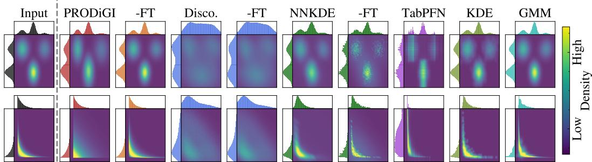  
Figure 2: Example input data vs. baseline generations, with corresponding marginals. Appdx. F presents further examples and case studies.

## 3.5 FINE-TUNING

Conventional supervised fine-tuning adapts pretrained tabular foundation models by updating their weights on labeled downstream data. For unsupervised tasks like density estimation and data generation, however, only empirical samples are available, without labels or ground-truth programs. We introduce program-space fine-tuning, which adapts the parameters of the inferred generative program rather than those ofthe pretrained model itself.

Starting from PRODiGI’s zero-shot prediction, we refine the inferred program’s differentiable parameters ϕ via gradient descent, while keeping the pretrained model weights θ and the inferred program structure fixed. Formally,

$$
\begin{array} { r l } { \widehat { P } _ { \phi _ { 0 } } : = \mathsf { P R O D i G l } ( X _ { \mathrm { n e w } } ; \theta ) , \quad } & { \mathrm { m i n } \left\{ \begin{array} { l l } { - \sum _ { x \in X _ { \mathrm { n e w } } } \log \widehat { P } _ { \phi } ( x ) } & { \mathrm { f o r ~ G M M s ~ \& ~ C o p u l a s , } } \\ { \mathbb { E } _ { \widetilde { X } \sim \widehat { P } _ { \phi } } \left[ \mathcal { L } _ { \mathrm { M M D } } ( X _ { \mathrm { n e w } } , \widetilde { X } ) \right] } & { \mathrm { f o r ~ S C M s } } \end{array} \right. } \end{array}\tag{10}
$$

Starting from the inferred program parameters $\phi _ { 0 } .$ , we minimize the analytical negative loglikelihood (NLL) of the empirical data for GMMs and Copulas, while for SCMs, we minimize the maximum mean discrepancy (MMD) loss (11) between samples $\tilde { X }$ generated by $\widehat { P } _ { \phi }$ and the empirical samples $X _ { \mathrm { n e w } }$ since exact likelihood evaluation is generally intractable. Through this optimization, fine-tuning achieves dataset-specific adaptation using exclusively empirical samples.

Importantly, this fine-tuning paradigm supports refinement across all three program families: component weights, means and covariances in GMMs, functional mechanism parameters in SCMs, and parametric marginals and dependence parameters in Copulas.

Program-space fine-tuning decouples adaptation from the pretrained model. By confining optimization to the substantially smaller parameter space of the inferred generative program, it reduces gradient and optimizer memory and limits the degrees of freedom for dataset-specific tuning. Unlike model-weight fine-tuning, it requires no backpropagation through the pretrained model, while subsequent generation and estimation tasks also operate independently of the model.

## 4 EXPERIMENTS

Baselines. We compare PRODiGI against existing pretrained models DiScoFormer (16), TabPFN (14), and NNKDE (37). DiScoFormer natively supports zero-shot density and score estimation but not generation for which we employ Langevin dynamics (30). TabPFN is natively a zero-shot regressor/classifier; density estimation and sampling are executed auto-regressively, while score vectors are obtained by finite differentiation. NNKDE employs KDE using its zero-shot estimated samplespecific bandwidth matrices. We also fine-tune PRODiGI, DiscoFormer, and NNKDE as prescribed, variants denoted as -FT. Details on task execution mechanisms for pretrained baselines are given in Appdx. E. In addition, we compare these zero-shot models to the classical, also non-training baseline KDE (25) and to the fit-per-dataset GMM (5).

For GMM, we select the number of components (up to 10) using BIC; for KDE, we tune the RBF kernel bandwidth by maximizing held-out data likelihood. Both DiScoFormer and NNKDE are trained on one fixed input dimensionality at a time, therefore, we use a separate model for each $d \in \{ 1 , 2 , 5 , 1 0 , 2 0 , 3 0 , \hat { 4 } 0 , 5 0 \}$ for these baselines and restrict our evaluation to these dimensions.

Tasks and Metrics. We evaluate PRODiGI against baselines on three main tasks: (1) Generation quality via distribution match, (2) Density estimation, and (3) Score (vector) estimation.

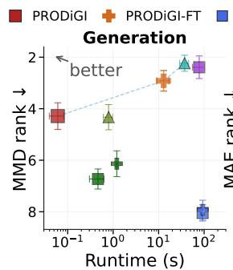

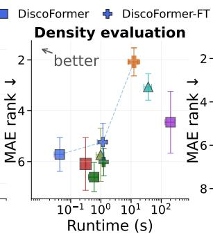

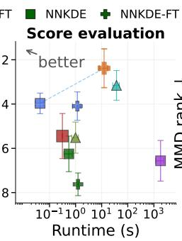

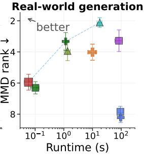  
Figure 3: Performance-Inference time trade-off on Generation, Density, and Score estimation tasks on synthetic (all priors) and real-world data. PRODiGI-FT performs best on density and scoring, while PRODiGI offers the fastest generation, remaining competitive on real-world datasets.

For generation, we use (1.i) the MMD statistic (11) with bandwidth $\scriptstyle \sigma = { \sqrt { d } }$ scaling with the dimension as a distribution match metric, measuring the discrepancy between i.i.d. original samples from $\mathcal { D } _ { \mathrm { i n } } { \sim } P$ and generated samples $\mathcal { D } _ { \mathrm { g e n } } { \sim } \widehat { P } .$ . We also report the (1.ii) rejection rate of a two-sample test as the proportion of datasets where the null hypothesis is rejected. For density estimation, we compute (2.i) $\begin{array} { r } { \mathrm { M A E } _ { \mathrm { d e n s e } } = \frac { 1 } { n } \sum _ { i = 1 } ^ { n } | \log \widehat { f } ( \mathbf { x } _ { i } ) - \log f ( \mathbf { x } _ { i } ) | } \end{array}$ , (2.ii) the negative log likelihood (NLL), and also report (2.iii) the Spearman correlation between the ground truth ranking of test samples by density vs. the ranking based on the estimates. Finally for score estimation, we report $\begin{array} { r } { ( 3 . \mathbf { i } ) \mathrm { M A E } _ { \mathrm { s c o r e } } = \frac { 1 } { n } \sum _ { i = 1 } ^ { n } \| \nabla \log ( \widehat { f } ) ( \mathbf { x } _ { i } ) - \nabla \log ( f ) ( \mathbf { x } _ { i } ) \| _ { 1 } } \end{array}$ , and (3.ii) the cosine similarity to the ground truth vector for directional accuracy. In addition, we report running time for each task on 1000 examples each, as different baselines employ varying procedures per task.

Datasets. We evaluate on 96 datasets from GMM, SCM, and Copula priors and 96 real-world datasets from MacrOData (6), balanced across available dimensions and priors. We discard class labels and labeled anomalies for unsupervised evaluation, and randomly subsample features exceeding pretraining dimensions. We compute empirical MMD for all datasets, while analytical ground-truth densities and score vectors are available only for GMM and Copula priors. For real data, we derive pseudo ground truth from Oracle GMMs with up to 100 components selected by BIC, retaining 37 datasets with indistinguishable GMM-generated and real samples under a two-sample test.

Implementation details. We train PRODiGI using simulated datasets that contain $n { \in } [ 1 0 2 4 , 8 1 9 2 ]$ observations and dimensions $d \in [ 1 , 5 0 ]$ , with 1500 batches per epoch and 48 program-reconstruction tasks per batch. Tasks are balanced across the GMM, SCM, and Copula priors and across their corresponding templates. Encoder $E _ { \theta _ { E } } ( \cdot )$ produces K=20 tokens in $h { = } 5 1 2$ dimensions, consists of four Set Transformer blocks with four attention heads each, and contains 12.6M parameters. Template prediction head $T _ { \theta _ { T } } ( \cdot )$ is a one-layer MLP with 7.9M parameters. Decoder $D _ { \theta _ { D } } ( \cdot , \cdot )$ consists of three Transformer blocks with four attention heads and contains 14.0M parameters. Overall, PRODiGI has |θ|=32.5M trainable parameters. We train for 750 Epochs on 54M distinct programs, which takes 14 days on a H100 GPU, and evaluate each baseline on a l40s-48 GPU.

## 4.1 MAIN RESULTS

Mixed-prior data. Figure 2 compares generated samples on two distinct prior families. Fine-tuning substantially improves PRODiGI’s recovery of clusters and nonlinear structure. DiScoFormer struggles to reproduce the input distributions despite fine-tuning, while NNKDE variants generate overly diffuse samples. TabPFN and KDE closely match the inputs; although KDE simply perturbs observed samples using its tuned bandwidth, while TabPFN incurs substantially higher runtime. GMM struggles to capture skewed marginals smoothly.

Figure 3 and Table 2 show competitive accuracy–runtime tradeoffs for PRODiGI and PRODiGI-FT across generation, density, and score estimation. For generation, PRODiGI achieves lower MMD than DiScoFormer and NNKDE in just 0.06 seconds, approximately 8× faster than the nextfastest method. Fine-tuning reduces MMD by 84% to $0 . 8 9 \ : ( \times 1 0 ^ { - 3 } )$ , approaching the per-datasetfit GMM’s 0.78 at one-third of its runtime. TabPFN and GMM lead in mean MMD and average rank, respectively, but are substantially slower than either PRODiGI variant. Two-sample test rejection rate $( \% p { < } 0 . 0 5 )$ closely mirrors lower MMD scores, with TabPFN (30.2%), GMM (31.3%), and PRODiGI-FT (39.6%) generating statistically indistinguishable distributions for over 60% of datasets. DiscoFormer variants rank lowest despite taking over 80 seconds per generation.

Table 2: Performance comparison across tasks and metrics over all prior families<sup>a</sup>: (1) Generation distribution match via MMD (↓) where $\% p { < } 0 . 0 5$ (↓) denotes the proportion of datasets where the null hypothesis $( H _ { 0 } { \mathrm { : } }$ generated and real distributions are identical) is rejected; (2) Density estimation via point-wise MAE (↓), population-wide Spearman correlation (↑), and NLL of generated data (↓); (3) Score estimation via MAE (↓) and cosine similarity (↑). Average rank (↓) per metric is across methods over all datasets. Time per task (sec.) is averaged over datasets.
<table><tr><td>Metric</td><td></td><td>PRODiGI</td><td>-FT</td><td>|DiscoFormer</td><td>-FT</td><td>NNKDE</td><td>-FT</td><td>TabPFN</td><td>KDE</td><td>GMM</td></tr><tr><td rowspan="4">Genrton</td><td> $\mathbf { M } \mathbf { M } \mathbf { D } \left( \downarrow \right) \times 1 0 ^ { 3 }$  Rank (↓)</td><td> $5 . 4 6 _ { \pm 1 . 4 5 }$ </td><td> $0 . 8 9 _ { \pm 0 . 1 9 }$ </td><td> $4 1 . 3 7 _ { \pm 8 . 2 0 }$ </td><td> $6 7 . 5 8 _ { \pm 1 6 . 5 1 }$ </td><td> $1 9 . 5 1 _ { \pm 2 . 7 7 }$ </td><td> $1 0 . 9 8 _ { \pm 1 . 9 6 }$ </td><td> $\mathbf { 0 . 3 5 _ { \pm 0 . 0 5 } \left( \downarrow \right) }$ </td><td> $5 . 2 4 _ { \pm 0 . 9 5 }$ </td><td> $\underline { { 0 . 7 8 } } \pm \mathbf { 0 . 3 0 }$ </td></tr><tr><td></td><td> $4 . 2 9 _ { \pm 0 . 1 7 }$ </td><td> $2 . 9 2 _ { \pm 0 . 1 3 }$ </td><td> $8 . 0 5 _ { \pm 0 . 1 1 }$ </td><td> $7 . 9 3 _ { \pm 0 . 1 3 }$ </td><td> $6 . 7 3 _ { \pm 0 . 1 3 }$ </td><td> $6 . 1 4 _ { \pm 0 . 1 7 }$ </td><td> $2 . 3 9 _ { \pm 0 . 1 5 }$ </td><td> $4 . 3 3 _ { \pm 0 . 1 6 }$ </td><td> $2 . 2 3 _ { \pm 0 . 1 0 }$ </td></tr><tr><td> $\% p { < } 0 . 0 5 \left( \downarrow \right)$ </td><td>57.3%</td><td>39.6% /</td><td>99.0%</td><td>97.9%</td><td>92.7%</td><td>80.2%</td><td>30.2%</td><td>61.5%</td><td>31.3%</td></tr><tr><td>Time (↓) Rank (↓)</td><td> $\mathbf { 0 . 0 6 _ { \pm 0 . 0 1 } }$   ${ \bf 1 . 0 4 } _ { \pm 0 . 0 2 }$ </td><td> $1 2 . 9 0 _ { \pm 1 . 2 9 }$   $4 . 9 8 _ { \pm 0 . 0 3 }$ </td><td> $9 2 . 7 0 _ { \pm 0 . 1 4 }$   $7 . 6 0 _ { \pm 0 . 0 5 }$ </td><td> $9 3 . 2 7 _ { \pm 0 . 1 4 }$   $8 . 6 0 { \scriptstyle \pm 0 . 0 5 }$ </td><td> $\underline { { 0 . 4 6 _ { \pm 0 . 2 6 } } }$   $2 . 1 5 { \scriptstyle \pm 0 . 0 6 }$ </td><td> $1 . 2 0 { \scriptstyle \pm 0 . 0 2 }$   $3 . 8 6 _ { \pm 0 . 0 5 }$ </td><td> $7 8 . 0 9 _ { \pm 7 . 5 2 }$   $7 . 4 1 _ { \pm 0 . 1 4 }$ </td><td> $0 . 7 9 _ { \pm 0 . 0 6 }$   $3 . 0 2 _ { \pm 0 . 0 6 }$ </td><td> $3 7 . 2 4 _ { \pm 2 . 7 4 }$   $6 . 3 3 _ { \pm 0 . 0 5 }$ </td></tr><tr><td rowspan="8">Dennssity</td><td>MAE (↓)</td><td> $7 . 5 8 _ { \pm 1 . 1 2 }$ </td><td> $\mathbf { 2 . 1 9 _ { \pm 0 . 4 4 } }$ </td><td> $5 . 1 0 _ { \pm 0 . 6 0 }$ </td><td>4.17± 0.50</td><td> $6 . 4 4 _ { \pm 0 . 8 0 }$ </td><td> $6 . 2 5 _ { \pm 0 . 8 0 }$ </td><td> $2 . 3 1 \pm 0 . 1 7$ </td><td> $7 . 1 4 _ { \pm 1 . 0 7 }$ </td><td> $3 . 4 6 _ { \pm 0 . 6 0 }$ </td></tr><tr><td>Rank (↓) Spear. (↑)</td><td> $6 . 0 9 _ { \pm 0 . 3 5 }$   $0 . 6 9 _ { \pm 0 . 0 3 }$ </td><td> $\pm . 0 8 _ { \pm 0 . 1 8 }$ </td><td> $5 . 7 2 _ { \pm 0 . 2 2 }$ </td><td> $5 . 2 3 _ { \pm 0 . 2 5 }$ </td><td> $6 . 6 1 _ { \pm 0 . 1 9 }$ </td><td> $6 . 0 2 _ { \pm 0 . 1 8 }$ </td><td> $4 . 4 5 _ { \pm 0 . 4 1 }$ </td><td> $5 . 7 3 _ { \pm 0 . 3 5 }$ </td><td> $\underline { { 3 . 0 6 } } \pm 0 . 1 7$ </td></tr><tr><td>Rank (↓)</td><td> $5 . 9 3 _ { \pm 0 . 3 7 }$ </td><td> ${ \bf 0 . 9 1 _ { \pm 0 . 0 1 } }$   $\mathbf { 1 . 9 6 _ { \pm 0 . 1 9 } }$ </td><td> $0 . 7 1 _ { \pm 0 . 0 2 }$   $7 . 5 7 _ { \pm 0 . 1 6 }$ </td><td> $0 . 7 4 _ { \pm 0 . 0 2 }$   $6 . 2 1 _ { \pm 0 . 2 1 }$ </td><td> $0 . 8 0 _ { \pm 0 . 0 2 }$   $4 . 9 7 _ { \pm 0 . 2 1 }$ </td><td> $0 . 7 8 _ { \pm 0 . 0 2 }$   $5 . 2 1 _ { \pm 0 . 2 0 }$ </td><td> $0 . 8 4 _ { \pm 0 . 0 1 }$   $4 . 0 3 _ { \pm 0 . 3 4 }$ </td><td> $0 . 7 8 _ { \pm 0 . 0 2 }$   $5 . 5 9 _ { \pm 0 . 3 4 }$ </td><td> $\underline { { 0 . 8 4 } } \pm \mathbf { 0 . 0 2 }$   $\underline { { 3 . 5 4 } } \pm \mathbf { 0 . 2 4 }$ </td></tr><tr><td>NLL (↓)</td><td> $5 . 0 0 _ { \pm 3 . 8 4 }$ </td><td> ${ \bf - 0 . 2 2 _ { \pm 3 . 8 6 } }$ </td><td> $\displaystyle _ { - ^ { \mathrm { ~ \bf ~ b ~ } } } ^ { \mathrm { ~ \bf ~ b ~ } }$ </td><td>_b</td><td> $3 . 8 2 _ { \pm 3 . 8 3 }$ </td><td> $3 . 6 0 _ { \pm 3 . 8 3 }$ </td><td>_b</td><td> $4 . 4 8 _ { \pm 4 . 0 0 }$ </td><td> $\underline { { 0 . 7 2 } } \pm 3 . 8 8$ </td></tr><tr><td>Rank (↓)</td><td> $4 . 1 2 _ { \pm 0 . 2 1 }$ </td><td> ${ \bf 1 . 6 7 _ { \pm 0 . 1 3 } }$ </td><td></td><td>_b</td><td> $4 . 9 2 _ { \pm 0 . 1 2 }$ </td><td> $4 . 0 9 _ { \pm 0 . 1 0 }$ </td><td>_b</td><td> $4 . 1 1 _ { \pm 0 . 2 0 }$ </td><td> $2 . 0 8 _ { \pm 0 . 1 1 }$ </td></tr><tr><td>Time (↓)</td><td> $\underline { { 0 . 3 1 _ { \pm 0 . 0 0 } } }$ </td><td> $1 2 . 3 8 _ { \pm 1 . 6 3 }$ </td><td> ${ \bf 0 . 0 4 } _ { \pm 0 . 0 2 }$ </td><td> $1 . 1 7 _ { \pm 0 . 5 7 }$ </td><td> $0 . 6 0 { \scriptstyle \pm 0 . 3 7 }$ </td><td> $1 . 2 3 _ { \pm 0 . 0 4 }$ </td><td> $2 0 3 . 2 5 _ { \pm 2 3 . 5 0 }$ </td><td> $0 . 9 8 _ { \pm 0 . 1 0 }$ </td><td> $3 6 . 9 2 _ { \pm 3 . 5 2 }$ </td></tr><tr><td>Rank (↓)</td><td> $2 . 9 7 _ { \pm 0 . 0 7 }$ </td><td> $7 . 0 2 _ { \pm 0 . 0 4 }$ </td><td> $\mathbf { 1 . 0 8 _ { \pm 0 . 0 6 } }$ </td><td> $4 . 3 9 _ { \pm 0 . 0 8 }$ </td><td> $2 . 2 8 _ { \pm 0 . 0 9 }$ </td><td> $5 . 8 0 _ { \pm 0 . 0 7 }$ </td><td> $8 . 6 6 _ { \pm 0 . 1 0 }$ </td><td> $4 . 5 9 _ { \pm 0 . 1 6 }$ </td><td> $8 . 2 2 _ { \pm 0 . 0 5 }$ </td></tr><tr><td>MAE (↓) Rank (↓)</td><td>34.44± 10.96</td><td> $3 7 . 3 5 _ { \pm 2 . 0 0 }$ </td><td> $3 5 . 0 4 _ { \pm 1 0 . 6 8 }$ </td><td> $3 4 . 7 4 _ { \pm 1 0 . 4 7 }$ </td><td> $4 1 . 0 5 _ { \pm 1 1 . 8 1 }$ </td><td> $5 4 . 5 6 _ { \pm 1 4 . 4 5 }$ </td><td> $5 5 . 0 7 _ { \pm 2 1 . 6 0 }$ </td><td> $3 7 . 9 3 _ { \pm 1 1 . 2 6 }$ </td><td> ${ \bf 3 4 . 0 6 _ { \pm 1 1 . 1 7 } }$ </td></tr><tr><td rowspan="5">Secre Cos. (↑) Rank (↓)</td><td></td><td> $5 . 4 5 _ { \pm 0 . 3 4 }$ </td><td> $\pm . 3 8 _ { \pm 0 . 2 9 }$ </td><td> $3 . 9 7 _ { \pm 0 . 1 5 }$ </td><td> $4 . 0 9 _ { \pm 0 . 2 1 }$ </td><td> $6 . 2 5 _ { \pm 0 . 2 7 }$ </td><td> $7 . 6 2 _ { \pm 0 . 1 7 }$ </td><td> $6 . 5 6 _ { \pm 0 . 3 1 }$ </td><td> $5 . 5 2 _ { \pm 0 . 2 3 }$ </td><td> $\underline { { 3 . 1 6 } } \pm \mathbf { 0 . 2 2 }$ </td></tr><tr><td></td><td></td><td></td><td></td><td></td><td></td><td></td><td></td><td></td><td></td></tr><tr><td></td><td> $0 . 5 2 _ { \pm 0 . 0 4 }$   $6 . 1 6 _ { \pm 0 . 3 4 }$ </td><td> $\mathbf { 0 . 7 5 _ { \pm 0 . 0 4 } }$ </td><td> $0 . 6 3 _ { \pm 0 . 0 3 }$ </td><td> $0 . 6 3 _ { \pm 0 . 0 3 }$ </td><td> $0 . 5 7 _ { \pm 0 . 0 2 }$ </td><td> $0 . 4 4 _ { \pm 0 . 0 2 }$ </td><td> $0 . 5 6 _ { \pm 0 . 0 2 }$ </td><td> $0 . 5 6 _ { \pm 0 . 0 3 }$ </td><td> $\underline { { 0 . 7 3 } } \pm \mathbf { 0 . 0 3 }$ </td></tr><tr><td></td><td></td><td> $\underline { { 2 . 7 0 \mathrm { \scriptstyle \pm 0 . 2 8 } } }$ </td><td> $4 . 6 2 _ { \pm 0 . 2 0 }$ </td><td> $4 . 3 3 \pm 0 . 2 3$ </td><td> $6 . 1 1 _ { \pm 0 . 2 4 }$ </td><td> $7 . 1 8 _ { \pm 0 . 1 8 }$ </td><td> $5 . 1 7 _ { \pm 0 . 3 3 }$ </td><td> $6 . 0 6 _ { \pm 0 . 3 1 }$ </td><td> $\mathbf { 2 . 6 6 _ { \pm 0 . 1 9 } }$ </td></tr><tr><td>Time (↓)</td><td> $\underline { { 0 . 3 1 _ { \pm 0 . 0 0 } } }$   $2 . 9 8 _ { \pm 0 . 0 7 }$ </td><td> $7 . 0 2 _ { \pm 0 . 0 4 }$ </td><td> $\mathbf { 1 . 0 8 _ { \pm 0 . 0 6 } }$ </td><td> $4 . 3 8 _ { \pm 0 . 0 7 }$ </td><td> $2 . 2 7 _ { \pm 0 . 0 9 }$ </td><td> $5 . 8 0 _ { \pm 0 . 0 7 }$ </td><td> $8 . 6 4 _ { \pm 0 . 0 9 }$ </td><td> $4 . 5 9 _ { \pm 0 . 1 5 }$ </td><td> $3 6 . 9 6 _ { \pm 3 . 5 2 }$   $8 . 2 5 _ { \pm 0 . 0 5 }$ </td></tr><tr><td>Rank (↓)</td><td></td><td></td><td> $1 2 . 3 8 _ { \pm 1 . 6 2 }$ </td><td> ${ \bf 0 . 0 4 } _ { \pm 0 . 0 2 }$ </td><td> $1 . 1 7 _ { \pm 0 . 5 7 }$ </td><td> $0 . 5 5 _ { \pm 0 . 3 2 }$ </td><td> $1 . 2 4 _ { \pm 0 . 0 4 }$ </td><td> $1 8 0 6 . 4 9 _ { \pm 3 0 1 . 7 2 }$ </td><td> $0 . 9 9 _ { \pm 0 . 1 0 }$ </td><td></td></tr></table>

<sup>b</sup> NLL is not reported for DiscoFormer and TabPFN because their local density estimates are not normalized to integrate to one.

In density estimation, PRODiGI-FT leads all reported metrics and average ranks, where fine-tuning reduces MAE from 7.58 to 2.19 and increasing Spearman correlation from 0.69 to 0.91. While TabPFN records a comparable mean MAE (2.31), its higher average rank (4.45 vs. 2.08) indicates lower relative performance across datasets. PRODiGI-FT is also approximately 16× faster than TabPFN and 3× faster than GMM. DiScoFormer offers the fastest density queries but lower accuracy; moreover, its unnormalized local estimates, like ${ \mathrm { T a b P F N } } ^ { * } { \mathrm { s } } ,$ preclude NLL comparison.

For score estimation, PRODiGI-FT achieves the best MAE rank (2.38) and highest mean cosine similarity (0.75), with a cosine rank close to per-dataset-fit GMM’s (2.70 vs. 2.66) at roughly onethird of runtime. NNKDE-FT improves generation MMD but worsens both score metrics, while DiScoFormer-FT provides little improvement in score estimation. TabPFN’s strong generation performance does not extend to scores; it has the highest mean score MAE (55.07) and requires more than 30 minutes, about 146× longer than PRODiGI-FT.

In summary, PRODiGI offers the fastest generation, while PRODiGI-FT leads density estimation and achieves score estimation accuracy comparable to GMM at a fraction of runtime. Although TabPFN and GMM achieve better generation quality, PRODiGI-FT better balances metric performance and execution time across all three evaluated tasks.

Real-world data. To probe the boundaries of our data priors, we extend our evaluation to realworld datasets as a stress test. Figure 4 illustrates two examples (additional examples in Fig. 11): PRODiGI and PRODiGI-FT capture the main density structure and the marginals, inferring copulabased programs with Uniform and Kumaraswamy marginals (see Appdx. F.3 for the inferred and fine-tuned programs.) NNKDE and KDE also recover the broad structure but blur sharp boundaries, while NNKDE-FT yields noisier estimates. DiScoFormer variants distort the marginals, TabPFN produces spurious density spikes, and GMM introduces artificial modes.

Figure 3 (right) shows that PRODiGI remains the fastest generator at 0.06 seconds, while NNKDE-FT and KDE offer competitive intermediate tradeoffs between PRODiGI’s speed and GMM’s generation quality. Fine-tuning reduces PRODiGI’s MMD by approximately 48% and improves recovery of the underlying geometry, achieving lower mean MMD than TabPFN at over 8× faster runtime. Despite fine-tuning gains, real-world distributions with complex manifolds (Figure 11) substantially challenge all methods (Appdx. Table 8). Even per-dataset-fit GMM, which achieves the best mean MMD and average rank, exhibits a two-sample rejection rate of 78.3% on real-world data, up from

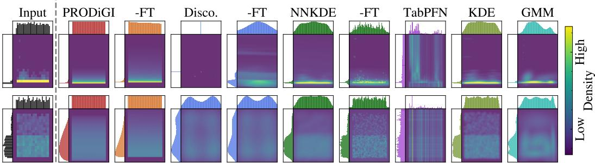  
Figure 4: Example real-world data vs. baseline generations, with corresponding marginals for (top) FinancialBeneficiary and (bottom) FinancialTransaction datasets (also see Fig. 11).

31.3% on mixed-prior data. Further broadening pretraining priors and refining fine-tuning strategies to improve real-world performance remain directions for future work.

## 4.2 ABLATION RESULTS AND ANALYSES

PRODiGI features a non-autoregressive (N-AR) decoder, and normalized and canonically serialized programs for standardized training and deterministic decoding, respectively.

Figure 5 shows that N-AR decoding ensures syntactically valid programs, as well as faster inference. AR decoding, in contrast, cannot guarantee validity and is 44× slower. Program normalization during training enables varying input data scales and lowers generation MMD by 68% on realworld (RW) data. Finally, canonical serialization resolves reconstruction ambiguity; the loss plateaus prematurely without it, as the model struggles to determine module sequence.

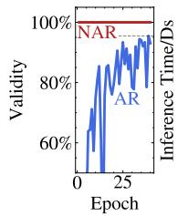

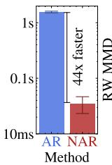

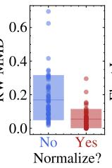

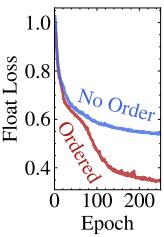  
Figure 5: Ablations of PRODiGI (on 20-dimensional data); left to right: (1) N-AR vs AR decoding validity and speed, (2) generation MMD w/ and w/out normalization, (3) decoding loss w/ and w/out canonical program serialization.

Finally, we analyze performance and runtime across input dimensionality d. Figure 6 (left) shows that the twosample rejection rate increases with d for all methods, reflecting harder distribution matching in higher dimensions. Regarding runtime (Figure 6, middle), PRODiGI and its finetuned variant scale gracefully with d. In contrast, TabPFN’s runtime grows significantly due to its autoregressive mechanism, while DiScoFormer is dominated by its iterative sampling

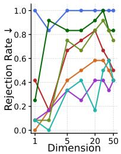

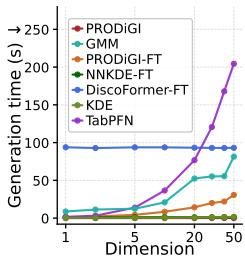

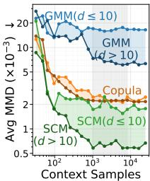  
Figure 6: (left) Two-sample rejection rate vs. input dimensionality d; (middle) Running time vs. d; (right) Average MMD per prior under $d \leq 1 0$ vs. d $> 1 0$ as the number of context samples is increased.

algorithm. In addition, Figure 6 (right) shows that PRODiGI’s inference improves with larger context sample sizes, particularly for high-dimensional inputs. This behavior aligns with standard sample complexity theory, in which the required sample size scales with input dimensionality.

## 5 CONCLUSION

We introduced a data-to-program paradigm through PRODiGI, a model pretrained on diverse data priors to infer executable generative programs from empirical data in one forward pass. At its core, canonical serialization, program normalization, and non-autoregressive template decoding enable effective and efficient training and inference. Experiments show that PRODiGI achieves lower average density and score errors than existing pretrained models while offering multi-fold speedups. Further, its novel program-space fine-tuning adapts only the inferred program parameters with pretrained backbone fixed, improving distribution match by 84%. By mapping data directly to explicit statistical representations, PRODiGI presents a new direction for tabular generative modeling.

## AI USE STATEMENT

In this work, we used generative AI tools to interpret results, implement and debug program code, and edit our research paper to improve readability. The remaining tasks requiring disclosure do not apply to our paper. We have reviewed all AI-assisted work: LLM-generated code was manually verified and tested for correctness. We have made sure that every AI interpretation is accurate and that readability changes do not alter the meaning of our text. We take responsibility for the final content of this work, including text, claims or artifacts produced with the aid of generative AI.

## REPRODUCIBILITY STATEMENT

To support reproducibility, we publish both training and inference code, all used datasets, and the trained PRODiGI checkpoint at https://github.com/psorus/PRODiGI. We further provide detailed results for each baseline in Appendix G.

## REFERENCES

[1] Stephan Bongers, Patrick Forre, Jonas Peters, and Joris M Mooij. Foundations of structural´ causal models with cycles and latent variables. The Annals of Statistics, 49(5):2885–2915, 2021.

[2] Vadim Borisov, Kathrin Seßler, Tobias Leemann, Martin Pawelczyk, and Gjergji Kasneci. Language models are realistic tabular data generators. In The Eleventh International Conference on Learning Representations, 2023.

[3] Miguel A. Carreira-Perpinan. Mode-finding for mixtures of gaussian distributions. IEEE Transactions on Pattern Analysis and Machine Intelligence, 22(11):1318–1323, 2002.

[4] Aaron Clauset, Cosma Rohilla Shalizi, and Mark EJ Newman. Power-law distributions in empirical data. SIAM review, 51(4):661–703, 2009.

[5] Arthur P. Dempster, Nan M. Laird, and Donald B. Rubin. Maximum likelihood from incomplete data via the em algorithm. Journal of the Royal Statistical Society: Series B (Methodological), 39(1):1–38, 1977.

[6] Xueying Ding, Simon Kluttermann, Haomin Wen, Yilong Chen, and Leman Akoglu. MacrO-¨ Data: New benchmarks of thousands of datasets for tabular outlier detection. arXiv Preprint, 2026.

[7] Xueying Ding, Haomin Wen, Simon Kluttermann, and Leman Akoglu. From zero to hero:¨ Advancing zero-shot foundation models for tabular outlier detection. In Proceedings of the 43rd International Conference on Machine Learning (ICML). PMLR, 2026.

[8] Conor Durkan, Artur Bekasov, Iain Murray, and George Papamakarios. Neural spline flows. In Advances in Neural Information Processing Systems, volume 32, 2019.

[9] Harrison Edwards and Amos Storkey. Towards a neural statistician. In International Conference on Learning Representations (ICLR), 2017.

[10] Mathieu Germain, Karol Gregor, Iain Murray, and Hugo Larochelle. Made: Masked autoencoder for distribution estimation. In Proceedings of the 32nd International Conference on Machine Learning, pages 881–889, 2015.

[11] Arthur Gretton, Karsten M. Borgwardt, Malte J. Rasch, Bernhard Scholkopf, and Alexander J.¨ Smola. A kernel two-sample test. In Journal of Machine Learning Research, volume 13, pages 723–773, 2012.

[12] Noah Hollmann, Samuel Muller, Katharina Eggensperger, and Frank Hutter. TabPFN: A trans-¨ former that solves small tabular classification problems in a second. In The Eleventh International Conference on Learning Representations, 2023.

[13] Noah Hollmann, Samuel Muller, Lennart Purucker, Arjun Krishnakumar, Max K¨ orfer, Shi Bin¨ Hoo, Robin Tibor Schirrmeister, and Frank Hutter. Accurate predictions on small data with a tabular foundation model. Nature, 637(8045):319–326, 2025.

[14] Noah Hollmann, Samuel Muller, Lennart Purucker, Arjun Krishnakumar, Max K¨ orfer, Shi Bin¨ Hoo, Robin Tibor Schirrmeister, and Frank Hutter. Accurate predictions on small data with a tabular foundation model. Nature, 637(8045):319–326, 2025.

[15] Regis Houssou, Mihai-Cezar Augustin, Efstratios Rappos, Vivien Bonvin, and Stephan Robert-Nicoud. Generation and simulation of synthetic datasets with copulas. arXiv preprint arXiv:2203.17250, 2022.

[16] Vasily Ilin and Peter Sushko. Discoformer: Plug-in density and score estimation with transformers. In Proceedings ofthe International Conference on Machine Learning (ICML), 2026.

[17] Akim Kotelnikov, Dmitry Baranchuk, Ivan Rubachev, and Artem Babenko. TabDDPM: Modelling tabular data with diffusion models. In Proceedings of the 40th International Conference on Machine Learning, volume 202 of Proceedings of Machine Learning Research, pages 17564–17579. PMLR, 2023.

[18] Sergei O. Kurashkin, Vadim S. Tynchenko, Aleksei S. Borodulin, Vladimir A. Nelyub, Nikolay O. Kalutsky, and Tee Connie. The current generation of tabular foundation models: A critical review. Machine Learning and Knowledge Extraction, 8(8):244, 2026.

[19] Juho Lee, Yoonho Lee, Jungtaek Kim, Adam Kosiorek, Seungjin Choi, and Yee Whye Teh. Set transformer: A framework for attention-based permutation-invariant neural networks. In Kamalika Chaudhuri and Ruslan Salakhutdinov, editors, Proceedings ofthe 36th International Conference on Machine Learning, volume 97 of Proceedings of Machine Learning Research, pages 3744–3753. PMLR, 09–15 Jun 2019.

[20] Daniel Lewandowski, Dorota Kurowicka, and Harry Joe. Generating random correlation matrices based on vines and extended onion method. Journal ofMultivariate Analysis, 100(9):1989– 2001, 2009.

[21] Xinyu Liao, Aoyang Qin, Jacob Seidman, Junqi Wang, Wei Wang, and Paris Perdikaris. Score neural operator: A generative model for learning and generalizing across multiple probability distributions. arXiv preprint arXiv:2410.08549, 2024.

[22] Roger B Nelsen. An introduction to copulas. Springer, 2006.

[23] George Papamakarios, Eric Nalisnick, Danilo Jimenez Rezende, Shakir Mohamed, and Balaji Lakshminarayanan. Normalizing flows for probabilistic modeling and inference. Journal of Machine Learning Research, 22(57):1–64, 2021.

[24] George Papamakarios, Theo Pavlakou, and Iain Murray. Masked autoregressive flow for den sity estimation. In Advances in Neural Information Processing Systems, volume 30, 2017.

[25] Emanuel Parzen. On estimation of a probability density function and mode. The Annals of Mathematical Statistics, 33(3):1065–1076, 1962.

[26] Karl Pearson. Contributions to the mathematical theory of evolution. Philosophical Transactions ofthe Royal Society ofLondon. A, 185:71–110, 1894.

[27] Patrik Puchert, Pedro Hermosilla, Tobias Ritschel, and Timo Ropinski. Data-driven deep density estimation. Neural Computing and Applications, 33(23):16773–16807, 2021.

[28] Jingang Qu, David Holzmuller, Ga¨ el Varoquaux, and Marine Le Morvan. Tabiclv2: A better,¨ faster, scalable, and open tabular foundation model. arXiv preprint arXiv:2602.11139, 2026.

[29] Scott Reed, Yutian Chen, Thomas Paine, Aaron van den Oord, S. M. Ali Eslami, Danilo¨ Rezende, Oriol Vinyals, and Nando de Freitas. Few-shot autoregressive density estimation: Towards learning to learn distributions. In International Conference on Learning Representations (ICLR), 2018.

[30] Gareth O. Roberts and Richard L. Tweedie. Geometric convergence and central limit theorems for multidimensional Hastings and Metropolis algorithms. Biometrika, 83(1):95–110, 1996.

[31] Murray Rosenblatt. Remarks on some nonparametric estimates of a density function. The Annals ofMathematical Statistics, 27(3):832–837, 1956.

[32] Yuchen Shen, Haomin Wen, and Leman Akoglu. FoMo-0D: A foundation model for zero-shot tabular outlier detection. Transactions on Machine Learning Research, 2025.

[33] Juntong Shi, Minkai Xu, Harper Hua, Hengrui Zhang, Stefano Ermon, and Jure Leskovec. TabDiff: A mixed-type diffusion model for tabular data generation. In The Thirteenth International Conference on Learning Representations, 2025.

[34] M Sklar. Fonctions de repartition ´ a n dimensions et leurs marges. In \` Annales de l’ISUP, volume 8, pages 229–231, 1959.

[35] Lei Xu, Maria Skoularidou, Alfredo Cuesta-Infante, and Kalyan Veeramachaneni. Modeling tabular data using conditional GAN. In Advances in Neural Information Processing Systems, volume 32, 2019.

[36] Hengrui Zhang, Jiani Zhang, Balasubramaniam Srinivasan, Zhengyuan Shen, Xiao Qin, Christos Faloutsos, Huzefa Rangwala, and George Karypis. Mixed-type tabular data synthesis with score-based diffusion in latent space. In The Twelfth International Conference on Learning Representations, 2024.

[37] Ruitong Zhang and Ke Deng. Adaptive kernel density estimation with pre-training. In Proceedings of the STAI-X Conference on Statistics and Trustworthy AI for Cross (X)-Domain Acceleration (STAI-X), 2026.

[38] Xiyuan Zhang, Danielle C. Maddix, Junming Yin, Nick Erickson, Abdul Fatir Ansari, Boran Han, Shuai Zhang, Leman Akoglu, Christos Faloutsos, Michael W. Mahoney, Cuixiong Hu, Huzefa Rangwala, George Karypis, and Bernie Wang. Mitra: Mixed synthetic priors for enhancing tabular foundation models. In The Thirty-ninth Annual Conference on Neural Information Processing Systems, 2025.

## APPENDIX

## A EXTENDED RELATED WORK

Density Estimation. Density estimation has a long history, spanning classical statistical estimators and modern neural approaches. Gaussian mixture models (GMMs) date back to Pearson (26) and represent densities as weighted combinations of Gaussian components. Kernel density estimation (KDE) instead constructs a nonparametric estimate by placing smoothing kernels around observed samples (31; 25). Neural density estimators (NDEs) learn flexible density representations through neural networks, including autoregressive models that factorize the joint density into conditional distributions (10), and normalizing flows that transform a simple base distribution through invert ible mappings (23). Conventionally, these approaches construct an estimator separately for each dataset, through parameter fitting or data-dependent smoothing. In contrast, PRODiGI amortizes this construction by mapping empirical samples directly to an explicit generative program.

Tabular Generative Modeling. Tabular generative modeling aims to synthesize records that preserve feature distributions and dependencies across heterogeneous numerical and categorical variables. Representative neural approaches include CTGAN and TVAE (35), which adapt generative adversarial networks and variational autoencoders to tabular data. More recently, TabDDPM (17) and TabDiff (33) develop diffusion processes for numerical and categorical features, while TabSyn (36) performs diffusion in a learned VAE latent space. Language-model-based approaches such as GReaT (2) instead fine-tune pretrained language models on textual representations of table rows and generate records autoregressively. These methods require dataset-specific training or fine-tuning of a neural generator. In comparison, PRODiGI infers an explicit generative program from a new dataset in a single forward pass, at the same time, its current formulation is restricted to continuous distributions and does not support categorical variables.

Pretrained Models for Generation and Estimation. Pretrained tabular models differ substantially in their formulations of what they infer and which operations they support directly. DiScoFormer (16) is trained to predict density values and score vectors at query points through cross-attention to an input dataset; generation requires coupling these predictions with a sampling procedure. TabPFN (14) instead repurposes its pretrained classification and regression models through an autoregressive factorization, $\begin{array} { r } { \hat { p } ( \mathbf { x } \mid \mathcal { D } ) \ : = \ : \prod _ { j = 1 } ^ { d } \hat { p } ( x _ { j } \mid x _ { < j } , \mathcal { D } ) } \end{array}$ . Density evaluation combines the conditional predictions, while generation samples features sequentially, requiring repeated model evaluations.

Other approaches explicitly transfer knowledge across datasets include Neural Statistician (9), which infers a posterior over a dataset-level latent context that conditions a shared neural generator, enabling direct sampling but requiring latent-variable marginalization for density and score evaluation. Few-shot autoregressive image models (29) learn densities conditioned on small support sets and generate samples sequentially. Data-driven deep density estimation (DDE) (27) pretrains on synthetic distributions to predict point-wise densities, using separate models for each dimensionality; sampling and score estimation require additional procedures. Score Neural Operator (21) maps distribution embeddings to time-dependent score functions and supports generation through iterative sampling, without directly predicting density values. Pretrained adaptive KDE (37) instead predicts sample-specific bandwidth matrices, while retaining KDE as the nonparametric estimator, yielding an explicit kernel mixture that supports density and score evaluation and direct sampling, while retaining the observed samples as kernel centers. Like DDE, adaptive KDE requires training a separate model for each dimensionality.

Table 3 summarizes the capabilities of pretrained models relevant to three statistical tasks; data generation, density estimation and score vector estimation.

Table 3: Capabilities relevant to generation/samling, density estimation, and score-vector estimation. Additional procedures are distinguished from direct/native model outputs.
<table><tr><td>Method / Task</td><td>Generation</td><td>Density</td><td>Score vector</td></tr><tr><td>Neural Statistician (9)</td><td>Direct conditional generation</td><td>Numerical latent marginalization</td><td>Numerical marginal-score est.</td></tr><tr><td>DDE (27)</td><td>External sampler</td><td>Direct prediction</td><td>Additional estimation</td></tr><tr><td>Score Neural Operator (21)</td><td>Iterative sampling</td><td>Additional likelihood computation</td><td>Time-conditioned score predictionb</td></tr><tr><td>Adaptive NNKDE (37)</td><td>Direct mixture sampling</td><td>Explicit kernel density</td><td>Analytic score</td></tr><tr><td>TabPFN (14)</td><td>Autoregressive sampling</td><td>Autoregressive product of conditional densities</td><td>Not a native outputa</td></tr><tr><td>DiScoFormer (16)</td><td>External sampler</td><td>Direct prediction</td><td>Direct prediction</td></tr><tr><td>PRODiGI</td><td>Direct program sampling</td><td>Program evaluation</td><td>Program evaluation</td></tr></table>

<sup>a</sup>TabPFN provides conditional probability predictions, not native score vectors; score evaluation requires a separately specified estimation procedure. <sup>b</sup>Score comparisons must match the target density’s noise level and input space; latent-space scores are not directly comparable to input-space scores.

## B DETAILS ON DATA PRIORS

PRODiGI supports three different prior families, Gaussian Mixtures, Structural Causal Models, and Copulas, which we detail as follows.

## B.1 GAUSSIAN MIXTURES

We simulate data by drawing from multivariate GMMs with varying number of components and dimensions. m-components in d dimensions; with centroids $\mu _ { j } ^ { ( k ) } \sim \mathcal { N } ( 0 , 5 )$ and diagonal covariance $\Sigma _ { j j } ^ { ( k ) } \sim \mathcal { U } ( 0 . 5 , 2 )$ for $k \in [ m ]$ and $j \in [ d ]$ .Each component is assigned a random weight $\omega ^ { ( k ) }$ . The weights are sampled such that each weight is at least $1 \% ,$ and the pairwise difference between any two component weights is also at least $\mathrm { \bar { 1 \% } }$ . These constraints become increasingly restrictive as the number of components grows. The remaining degrees of freedom are sampled from a Dirichlet distribution with a randomly selected concentration parameter $\alpha \in [ 0 . 1 , 1 0 . 0 ]$ . We vary $m \in [ 1 , M ]$ and $d \in [ 1 , D ]$ uniformly as we draw new datasets, with $M = 1 0$ and $D = 5 0$

Table 4 provides hyperparameter configurations for sampling datasets from the GMM prior.

Table 4: Hyperparameters for Gaussian Mixture Model (GMM) Data Prior
<table><tr><td>Hyperparameter</td><td>r Values</td><td>Description</td></tr><tr><td>m</td><td>[1, 10]</td><td>Number of mixture components</td></tr><tr><td>d</td><td>[1, 50]</td><td>Dimensionality of data</td></tr><tr><td> $\mu _ { i } ^ { ( k ) }$ </td><td> $\sim \mathcal { N } ( 0 , 5 )$ </td><td>Component means</td></tr><tr><td> $\bar { \Sigma _ { j j } ^ { ( k ) } }$ </td><td>(0.5, 2]</td><td>Diagonal variances</td></tr><tr><td>ω</td><td> $\begin{array} { r } { ( 0 . 0 1 , 1 . 0 - 0 . 0 1 \cdot \frac { m \cdot ( m + 1 ) } { 2 } ] } \end{array}$ </td><td>Component weights</td></tr></table>

## B.2 STRUCTURAL CAUSAL MODELS

Structural causal models (SCMs) represent the generative dependencies among variables through causal graphs and structural equations. An SCM is defined by a directed acyclic graph $G = ( V , \bar { E } )$ where each node $j \in V$ corresponds to a variable, and causal mechanisms linking them.

For SCM data, we first instantiate a causal graph G as a growing random network. We iteratively add new nodes and connect them to k existing nodes. We draw k uniformly from $k \in [ 0 , \mathrm { M P } ]$ and limit the depth of such generated graphs to MD, where MD is drawn uniformly from $\mathrm { \check { M D } } \in [ \mathrm { \check { 1 } } , 5 ]$ Each edge is assigned a random weight $\omega _ { i , j } \in [ 0 . 5 , 1 . 5 ] \cup [ - 1 . 5 , - 0 . 5 ]$ and each node is assigned an activation function $a _ { j } .$ , a random noise factor $\log ( \eta _ { j } ) \sim \mathcal { U } ( - 1 , 0 )$ , two bias variables $b _ { j } ^ { 0 } , b _ { j } ^ { 1 } \sim$ $\mathcal { N } ( 0 , 1 )$ and an output scale $\delta _ { j } \sim \mathcal { U } ( 0 . 5 , 1 . 5 )$ . This allows us to construct a structural equation for each node as

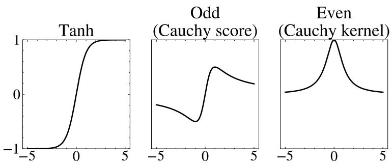  
Figure 7: SCM activation functions used in this paper. We limit our choice to three functions to make sure their behavior is seperable. Odd represents the Cauchy score functions $\frac { x } { 1 + x ^ { 2 } }$ and Even represents the Cauchy kernel $\scriptstyle { \big ( } { \frac { 1 } { 1 + x ^ { 2 } } } { \big ) }$

$$
X _ { j } = \delta _ { j } a _ { j } \left( \sum _ { i \in \mathrm { P a } ( X _ { j } ; G ) } \omega _ { i , j } X _ { i } + s _ { j } ^ { 0 } \right) + \epsilon _ { j } + s _ { j } ^ { 1 } , \qquad \epsilon _ { j } \sim \mathcal { N } ( 0 , \eta _ { j } ) .\tag{11}
$$

where $\operatorname { P a } ( X _ { j } ; G )$ denotes the set of parent (direct cause) variables of $X _ { j }$ in $G .$

Table 5 provides the hyperparameter settings of the SCM priors. We visualize each activation func tion in Figure 7.

Table 5: Hyperparameters for Structural Causal Model (SCM) based Data Priors
<table><tr><td>Hyperparameter</td><td>Values</td><td>Description</td></tr><tr><td>MD</td><td>[1, 5]</td><td>Max. In Degree, Max. number of nodes that directly influence any node</td></tr><tr><td>MP</td><td>[1, 5]</td><td>Max. Path Length, Depth of the graph</td></tr><tr><td> $d$ </td><td>[1, 50]</td><td>Dimensionality of data/Number of nodes</td></tr><tr><td> $w _ { i , j }$ </td><td>[0.5, 1.5] ∪ [−1.5, 0.5]</td><td>Edge factors</td></tr><tr><td> $\eta _ { \dot { \iota } }$ </td><td>[0.1, 1.0]</td><td>Gaussian noise factor besides causal relation.</td></tr><tr><td> $\dot { s } _ { \dot { s } } ^ { 0 }$   $\mathit { \Pi } _ { \mathcal { I } } ^ { s _ { j } }$ </td><td>~N(0,1)</td><td>Shift inside the activation function</td></tr><tr><td> $s _ { j } ^ { 1 }$ </td><td>~N(0,1)</td><td>Shift outside the activation function</td></tr><tr><td> $\delta _ { j }$ </td><td>[0.5, 1.5]</td><td>Node scaling factor</td></tr><tr><td> $\bar { a ( \cdot ) }$ </td><td>{tanh, odd, even}</td><td>Activation function for structural equations</td></tr></table>

## B.3 COPULAS

Real-world univariate features often exhibit skewed, heavy-tailed behavior (4). While SCMs induce non-Gaussian marginals, they do not provide explicit control over feature-wise distributions; we therefore adopt copula models (22; 15). By Sklar’s theorem (34), any joint CDF of continuous variables $\{ X _ { j } \} _ { j = 1 } ^ { d }$ with marginals $F _ { j }$ can be expressed as

$$
F ( x _ { 1 } , \dots , x _ { d } ) = C ( F _ { 1 } ( x _ { 1 } ) , \dots , F _ { d } ( x _ { d } ) ) ,
$$

enabling independent specification of marginals and dependence structure. We sample each feature’s marginal from a diverse pool of parametric distributions (Gaussian, Uniform, Kumaraswamy, Exponential, Student’s t), and use a Gaussian copula for C. Examples of each marginal function are shown in Figure 8. We further sample a correlation matrix $\textbf { \textit { R } } \in \ \mathbb { R } ^ { d \times \breve { d } }$ from the Lewandowski–Kurowicka–Joe (LKJ) distribution (20) to guarantee nontrivial correlation structures even in high dimensions.

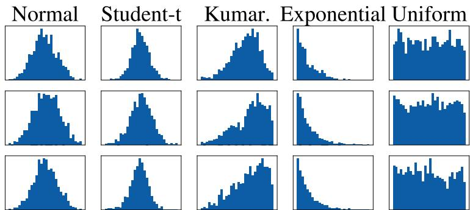  
Figure 8: Examples of each copula marginal used in this paper.

Given $C ( R )$ and $\{ F _ { j } \} _ { j = 1 } ^ { d }$ , data samples are generated by drawing $\mathbf { u } \sim C ( R )$ on $[ 0 , 1 ] ^ { d }$ and transforming $x _ { j } = F _ { j } ^ { - 1 } ( u _ { j } )$ for all $j \in [ d ]$ . We widely vary the marginal families, their parameters, and the copula to synthesize diverse tabular datasets.

Table 6 provides the hyperparameter settings of the Copula priors.

Table 6: Hyperparameters for Copula Data Prior
<table><tr><td>Hyperparameter</td><td>Values</td><td>Description</td></tr><tr><td>C</td><td>Gaussian</td><td>Copula parameter family</td></tr><tr><td>d</td><td>[1,50]</td><td>Dimensionality of data/Number of marginals</td></tr><tr><td>Marginal</td><td>{Uniform, Normal, Exponential, Student t, Kumaraswamy}</td><td>Marginal family for each feature</td></tr><tr><td> $\mu / \sigma$ </td><td>[−5, 5]/[0.5, 2.0]</td><td>Mean/Variance for each marginal</td></tr><tr><td> $\nu$ </td><td>[2.5, 10]</td><td>Degrees of freedom for Student&#x27;s t distribution</td></tr><tr><td> $^ { a , b }$ </td><td>[0.5, 5.0]</td><td>Shape parameters of the Kumaraswamy distribution.</td></tr></table>

## C NORMALIZATION

To remove variation in feature location and scale during training, we normalize each sampled generative program. Specifically, we transform its parameters to target zero mean and unit variance for each generated feature. This transformation uses analytical moments for GMMs and Copula marginals, and sample estimates for SCMs. Normalizing the program itself ensures that the generated data and the target program share the same coordinate system.

During training, we sample training datasets from the normalized programs, which readily generate normalized datasets, and train the model to recover the corresponding normalized program.

During inference, we first standardize each input feature using its empirical mean and standard deviation, then infer a normalized program with a single forward pass. Finally, we apply the inverse transformation to the inferred program using the input dataset’s empirical feature means and standard deviations, restoring the original feature locations and scales.

We describe the transformations for normalizing each prior family below, assuming finite, strictly positive marginal variances.

## C.1 GAUSSIAN MIXTURES

We normalize a GMM using its global mean and feature-wise standard deviations. For component weights $\boldsymbol { \omega } ^ { ( k ) }$ , means $\mu ^ { ( k ) }$ , and diagonal covariance matrices $\pmb { \Sigma } ^ { ( k ) }$ , these are

$$
\begin{array} { l } { { \pmb { \mu } } _ { \mathrm { g l o b } } = \displaystyle \sum _ { k } \omega ^ { ( k ) } { \pmb \mu } ^ { ( k ) } , } \\ { { \pmb \sigma } _ { \mathrm { g l o b } } ^ { 2 } = \displaystyle \sum _ { k } \omega ^ { ( k ) } \left[ \mathrm { d i a g } \big ( { \pmb \Sigma } ^ { ( k ) } \big ) + \big ( { \pmb \mu } ^ { ( k ) } - { \pmb \mu } _ { \mathrm { g l o b } } \big ) ^ { 2 } \right] , } \end{array}\tag{12}
$$

where diag(·) extracts the diagonal as a vector, and vector squares are element-wise. Let $D$ be the diagonal matrix with diagonal $\sigma _ { \mathrm { g l o b } }$ . The normalized component parameters are

$$
\begin{array} { r l } & { \pmb { \mu } _ { \mathrm { n o r m } } ^ { ( k ) } = D ^ { - 1 } \big ( \pmb { \mu } ^ { ( k ) } - \pmb { \mu } _ { \mathrm { g l o b } } \big ) , } \\ & { \pmb { \Sigma } _ { \mathrm { n o r m } } ^ { ( k ) } = D ^ { - 1 } \pmb { \Sigma } ^ { ( k ) } D ^ { - 1 } . } \end{array}\tag{13}
$$

The mixture weights remain unchanged.

## C.2 STRUCTURAL CAUSAL MODELS

For general nonlinear SCMs, feature means and standard deviations are not readily available analytically. We therefore estimate them using 10,000 samples from each sampled SCM, obtaining $\hat { \mu } _ { i }$ and $\hat { \sigma } _ { i }$ for feature i.

For structural equations of the form (See Appendix B.2 for notation.)

$$
X _ { j } = \delta _ { j } a _ { j } \left( \sum _ { i \in \mathrm { P a } ( X _ { j } ; G ) } \omega _ { j , i } X _ { i } + s _ { j } ^ { 0 } \right) + \epsilon _ { j } + s _ { j } ^ { 1 } , \qquad \epsilon _ { j } \sim \mathcal { N } ( 0 , \eta _ { j } ) ,\tag{14}
$$

Substituting $X _ { j } = \hat { \mu } _ { j } + \hat { \sigma } _ { j } X _ { j , \mathrm { n o r m } }$ for the child and $X _ { i } = \hat { \mu } _ { i } + \hat { \sigma } _ { i } X _ { i , \mathrm { n o r m } }$ for each parent $i \in$ $\operatorname { P a } ( X _ { j } ; G )$ yields the normalized parameters:

$$
s _ { j , \mathrm { n o r m } } ^ { 1 } = \frac { s _ { j } ^ { 1 } - \hat { \mu } _ { j } } { \hat { \sigma } _ { j } } , \qquad \delta _ { j , \mathrm { n o r m } } = \frac { \delta _ { j } } { \hat { \sigma } _ { j } } , \qquad \eta _ { j , \mathrm { n o r m } } = \frac { \eta _ { j } } { \hat { \sigma } _ { j } ^ { 2 } } ,\tag{15}
$$

and

$$
\omega _ { j , i , \mathrm { n o r m } } = \omega _ { j , i } \hat { \sigma } _ { i } , \qquad s _ { j , \mathrm { n o r m } } ^ { 0 } = s _ { j } ^ { 0 } + \sum _ { i \in \mathrm { P a } ( X _ { j } ; G ) } \omega _ { j , i } \hat { \mu } _ { i } .\tag{16}
$$

These updates preserve the causal graph and express the structural equations in the normalized coordinates. Because the moments are estimated, the normalized SCM has approximately zero marginal means and unit marginal variances.

## C.3 COPULAS

For a Copula-based joint distribution, we standardize each marginal. Specifically, for each marginal $F _ { i }$ , we analytically compute its mean $\mu _ { i }$ and standard deviation $\sigma _ { i }$ from its sampled parameters, and standardize its quantile function as follows:

$$
F _ { i , \mathrm { n o r m } } ^ { - 1 } ( u ) = \frac { F _ { i } ^ { - 1 } ( u ) - \mu _ { i } } { \sigma _ { i } } .\tag{17}
$$

These strictly increasing affine transformations preserve the Copula.

Uniform, Normal, and Exponential marginals reduce to unique standardized distributions: $\mathcal { U } ( - \sqrt { 3 } , \sqrt { 3 } ) , \mathcal { N } ( 0 , 1 )$ , and $E - 1$ with $E \sim \mathrm { E x p } ( 1 )$ , respectively. Standardized Student-t marginals retain their degrees of freedom $\nu > 2 . 5$ , while affinely transformed Kumaraswamy marginals retain their two shape parameters.

```ini
[GMM][DIMENSIONALITY][2][NUM_COMPONENTS][4]
[START_COMPONENT][0][WEIGHT][0.6647]
[INDEX][0][MEAN][-0.3763][DIAG_STD][0.6549]
[INDEX][1][MEAN][-0.5755][DIAG_STD][0.3401][END_COMPONENT]
[START_COMPONENT][1][WEIGHT][0.2407]
[INDEX][0][MEAN][0.6825][DIAG_STD][0.7333]
[INDEX][1][MEAN][0.9778][DIAG_STD][0.3844]
[END_COMPONENT]
[START_COMPONENT][2][WEIGHT][0.0752]
[INDEX][0][MEAN][1.6824][DIAG_STD][0.7456]
[INDEX][1][MEAN][2.2755][DIAG_STD][0.4177]
[END_COMPONENT]
[START_COMPONENT][3][WEIGHT][0.0194]
[INDEX][0][MEAN][1.6918][DIAG_STD][0.7129]
[INDEX][1][MEAN][2.4417][DIAG_STD][0.4465]
[END_COMPONENT][END_GMM]
```

## D PROGRAM SERIALIZATION AND TOKENIZATION

## D.1 WHAT IS A GENERATIVE PROGRAM?

A generative program is a complete specification of a data-generating process. It consists of a program family, its structural configuration, and the distributional or functional parameters required to instantiate the generator. We consider three heterogeneous program families: Gaussian Mixture Models (GMMs), Structural Causal Models (SCMs), and Copulas.

We represent each program as a structured sequence of tokens, analogous to a domain-specific language (DSL). This representation preserves the semantic role of each parameter while allowing programs with different structures and dimensionalities to be represented in a common format.

## D.2 PROGRAM SERIALIZATION

Each concrete program P is serialized into an ordered sequence

$$
S ( P ) = ( z _ { 1 } , \dots , z _ { L } ) ,
$$

where each element corresponds to a structural field or program parameter. The serialization is designed to be human-readable while providing a canonical representation for the program decoder.

## Example of a GMM Program.

The example specifies a 2-dimensional GMM with four components. Each component has its own mean vector, covariance representation, and mixture weight. Thus, the serialization describes a specific generative model, rather than merely identifying the GMM family.

## Example of an SCM Program.

```ini
[SCM][DIMENSIONALITY][6][MAX_PARENTS][3]
[START_COMPONENT][INDEX][0][FUNCTION][ODD]
[PARENTS][-1][0][ -1][0][ -1][0]
[NOISE][0.1571][SHIFT][0.2789][-0.241][SCALE][2.5983][END_COMPONENT]
[START_COMPONENT][INDEX][1][FUNCTION][EVEN]
[PARENTS][-1][0][ -1][0][ -1][0]
[NOISE][0.1355][SHIFT][0.3286][-2.3577][SCALE][3.7092][END_COMPONENT]
[START_COMPONENT][INDEX][2][FUNCTION][TANH]
[PARENTS][0][-0.5697][4][0.1237][5][0.8932]
[NOISE][0.1316][SHIFT][-0.5354][0.3304][SCALE][1.2897][END_COMPONENT]
[START_COMPONENT][INDEX][3][FUNCTION][ODD]
[PARENTS][1][-0.1624][-1][0][ -1][0]
[NOISE][0.9306][SHIFT][0.0881][-0.085][SCALE][1.0584][END_COMPONENT]
[START_COMPONENT][INDEX][4][FUNCTION][EVEN]
[PARENTS][-1][0][ -1][0][ -1][0]
[NOISE][0.1013][SHIFT][0.7026][-2.051][SCALE][3.5272][END_COMPONENT]
[START_COMPONENT][INDEX][5][FUNCTION][ODD]
[PARENTS][0][-0.4509][1][-0.2481][-1][0]
[NOISE][0.219][SHIFT][-0.076][0.1409][SCALE][2.4045][END_COMPONENT]
[END_SCM]
```

Here, the variables form a DAG: variables 0 and 1 and 4 are root nodes, variable 3 depends on variable 1, variable 5 depends on variables 0 and 1 and variable 2 depends on variables 0 ,4 and 5. The serialization, therefore, specifies both the causal structure and the structural equations.

## Example of a Copula Program.

```ini
[COPULA][DIMENSIONALITY][3]
[START_COMPONENT][INDEX][0][MARGINAL][EXPONENTIAL]
[PARAMS][0][1][0][0][END_COMPONENT]
[START_COMPONENT][INDEX][1][MARGINAL][NORMAL]
[PARAMS][0][1][0][0][END_COMPONENT]
[START_COMPONENT][INDEX][2][MARGINAL][NORMAL]
[PARAMS][0][1][0][0][END_COMPONENT]
[CORRELATIONS]
[0.0748][0.3018][-0.5349]
[END_CORRELATIONS][END_COPULA]
```

This program specifies a 3-dimensional Copula through its dependence structure and three featurewise marginal distributions. In particular, the marginal family and its parameters can differ across dimensions.

## D.3 TEMPLATES

A template captures the structure of a program while leaving its dataset-specific values unspecified. Formally, for a concrete program P, we write

$$
\tau ( P ) = ( f , \mathbf { a } ) ,
$$

where f is the program family and a contains the discrete structural attributes that determine the program layout.

The template induces a sequence of typed fill-in slots,

$$
S _ { \tau } = ( s _ { 1 } , \ldots , s _ { L _ { \tau } } ) ,
$$

where each slot specifies the semantic role and type of a value to be predicted. A concrete program is obtained by filling these slots with the corresponding parameter values.

For example, the GMM program above gives rise to a template of the form

Example of a GMM Template.  
[GMM][DIMENSIONALITY][2][NUM\_COMPONENTS][4]  
[START\_COMPONENT][0][WEIGHT][<float>]  
[INDEX][<int>][MEAN][<float>][DIAG\_STD][<float>]  
[INDEX][<int>][MEAN][<float>][DIAG\_STD][<float>][END\_COMPONENT]  
[START\_COMPONENT][1][WEIGHT][<float>]  
[INDEX][<int>][MEAN][<float>][DIAG\_STD][<float>]  
[INDEX][<int>][MEAN][<float>][DIAG\_STD][<float>]  
[END\_COMPONENT]  
[START\_COMPONENT][2][WEIGHT][<float>]  
[INDEX][<int>][MEAN][<float>][DIAG\_STD][<float>]  
[INDEX][<int>][MEAN][<float>][DIAG\_STD][<float>]  
[END\_COMPONENT]  
[START\_COMPONENT][3][WEIGHT][<float>]  
[INDEX][<int>][MEAN][<float>][DIAG\_STD][<float>]  
[INDEX][<int>][MEAN][<float>][DIAG\_STD][<float>]  
[END\_COMPONENT][END\_GMM]  
The template determines the number, ordering, semantic role, and type of the decoder outputs, while the corresponding concrete program supplies their values.

## D.4 TOKENIZATION

The serialized program is decomposed into typed tokens. Categorical fields, such as GMM,DIMENSIONALITY, and WEIGHT, are represented as symbolic tokens. Discrete quantities, such as DIM, N COMP, and ID, are represented as integer slots. Vector-valued quantities, such as MEAN, are decomposed into one real-valued slot per dimension. Likewise, SCM parent references are represented as integer-valued slots. We also define special Fill-in tokens to encode templates with missing values.

## D.5 CANONICAL ORDERING

Each program family is serialized according to a canonical ordering of its fields and entities. This ensures that each dataset fits only one program in our training distribution and is required to prevent the decoder from regressing to the mean.

We order GMM components by their component weights, while ensuring that two component weights differ by at least 1%, and order the parents of an SCM node. For an example of a model without such a canonical order, see Figure 5 right.

Positional encoding is used for program-decoder slots, but not for the observations in the input dataset. The latter are treated as an unordered set and are encoded by the permutation-invariant Set Transformer.

## D.6 VOCABULARY CONSTRUCTION

We initialize the symbolic vocabulary through a bootstrap procedure. We sample programs from the GMM, SCM, and Copula priors, serialize and tokenize them, and collect the symbols, fields, family names, and entity types that occur. The resulting vocabulary is fixed for training and inference, and each such token is translated into a learnable 512 dimensional vector.

## E BASELINE DETAILS

## E.1 DISCOFORMER

DiscoFormer (16) is a pretrained model for density and score estimation, designed to leverage the structure of analytically tractable distributions. It is trained on a prior over Gaussian Mixture Models (GMMs), using their analytically known log densities and score functions as supervision.

We follow the official implementation of DiscoFormer available at https://github.com/ Vilin97/ensemble-score-matching. Since the authors do not provide pretrained checkpoints, we train a separate DiscoFormer model for each dimensionality considered in our evaluation, d ∈ {1, 2, 5, 10, 20, 30, 40, 50}, using the default hyperparameters.

DiscoFormer natively provides both log-density estimates and score vectors. However, it does not enforce the normalization of the estimated densities, i.e., there is no guarantee that they integrate to one. In our experiments, we observe that this normalization condition is not satisfied. Consequently, the negative log-likelihood (NLL) is not a meaningful metric for the resulting density estimates.

Since DiscoFormer does not directly support sample generation, we use a Langevin chain (30) to generate samples from the provided density and score estimates. We initialize each chain using context points and run 32 parallel chains with a step size of $\eta = 0 . 0 1$ . We discard the first 20,000 iterations as burn-in and subsequently retain every 10-th generated sample.

Furthermore, the original paper describes a fine-tuning procedure for DiscoFormer on a given dataset, which optimizes the model by matching sample scores to those inferred from the corresponding density estimates. While the original paper recommends fine-tuning for up to 3 epochs per dataset, we observe modest improvements with additional training, with gains continuing up to approximately 10 epochs. We therefore report results after 10 epochs of fine-tuning for each dataset.

## E.2 TABPFN

TabPFN (12) is a pretrained transformer model for tabular prediction that performs in-context learning by conditioning on a set of labeled examples. Rather than fitting a separate predictive model for each dataset, TabPFN is pretrained on a large prior over synthetic tabular datasets and uses the resulting prior to make predictions for previously unseen datasets. While TabPFN is designed primarily for supervised tasks such as regression and classification, several unsupervised extensions, including generation and density estimation, have also been proposed.

We follow the official implementation of TabPFN available at https://github.com/ PriorLabs/TabPFN and the TabPFN extensions available at https://github.com/ PriorLabs/tabpfn-extensions. Both generation and density estimation operate by treating a subset of features as inputs and predicting either the conditional density or the value of another feature. By iteratively repeating this procedure until all features have been predicted, TabPFN can generate new samples and estimate densities.

To obtain score vectors, we rely on the density estimates. Since the score is defined as the gradient of the log-likelihood, we estimate it using finite differences between 2 · d density predictions:

$$
( \nabla \log ( f ) ( x ) ) _ { i } \approx { \frac { \log ( f ) ( x + \epsilon \cdot e _ { i } ) - \log ( f ) ( x - \epsilon \cdot e _ { i } ) } { 2 \cdot \epsilon } } ,
$$

where $e _ { i }$ denotes the i-th unit vector. This introduces the hyperparameter ϵ, which we set to $\epsilon = 0 . 1$ While this is a relatively large value for numerical differentiation, we found in preliminary testing that smaller values of ϵ result in score estimates dominated by noise in the density predictions.

The densities produced by TabPFN also do not integrate to one. Consequently, we do not report negative log-likelihood (NLL) values.

TabPFN also supports fine-tuning on individual datasets. However, we found the computational cost of fine-tuning prohibitively high for the scope of our evaluation and therefore use the pretrained model without further fine-tuning.

## E.3 GMM

Gaussian Mixture Models (GMMs) provide a flexible parametric family of density models for which the density, score function, and sampling procedure are all available analytically. We fit a GMM to each dataset and use the resulting model to obtain both density and score estimates. In contrast to the pretrained approaches considered above, the GMM is fitted directly to the data using the EM algorithm (5) and does not involve any pretraining or fine-tuning.

To select the number of mixture components, we consider GMMs with between 1 and 10 components and select the model with the lowest Bayesian Information Criterion (BIC). For each candidate number of components, we use five random initializations and select the resulting model according to the BIC criterion. The selected GMM provides the density and score estimates used in our evaluation. Since both quantities are available analytically for the fitted mixture model, no numerical approximation is required.

For sample generation, we first sample a mixture component according to its fitted mixing weights and then draw a sample from the corresponding Gaussian component.

In contrast to the GMM components predicted by our model, this baseline GMM estimates a full covariance matrix rather than restricting the components to diagonal covariance matrices. This increases the number of parameters for a 50-dimensional GMM with 10 components from 1010 to 13260, and thus our baseline GMMs are significantly more expressive.

## E.4 KDE

Kernel Density Estimation (KDE) provides a non-parametric approach to density estimation by representing the density as a mixture of kernel functions centered at the observed data points.

We select the KDE bandwidth using 5-fold cross-validation. Specifically, we consider bandwidth scaling factors α ∈ {0.1, 0.2, 0.3, 0.5, 0.75, 1.0, 2.0, 3.0, 5.0, 7.5, 10.0} and select the value that maximizes the average log-likelihood on the held-out folds.

The KDE density and score are computed analytically according to the corresponding Gaussian mixture formulation, treating each observed data point as the center of a Gaussian component. Consequently, the density and score expressions follow directly from those of a Gaussian mixture model, with the KDE bandwidth determining the covariance of each component.

To generate new samples, we first select a data point from the observed data uniformly at random and then add Gaussian noise with the selected KDE bandwidth. Thus, each generated sample corresponds to a draw from one of the Gaussian kernels comprising the KDE.

## E.5 NNKDE

Neural Network Guided Kernel Density Estimation (NNKDE) (37) is a non-parametric density estimation method that uses a neural network to predict a local bandwidth for each observed data point. We use the official code and pretrained NNKDE models corresponding to each dimensionality considered in our evaluation, except for a 40-dimensional model, which we train from scratch using the provided code and hyperparameters. Before applying NNKDE, we whiten each dataset using a ZCA whitening transformation and transform the resulting density and score estimates back to the original data space. While the original paper does not propose such a whitening transformation, we found it necessary to achieve competitive performance with NNKDE.

For each training point, the neural network predicts a local covariance matrix, which defines the corresponding Gaussian kernel. The NNKDE density is then obtained as the mixture of these Gaussian kernels, with each training point serving as a kernel center. The density and score are computed analytically from the resulting Gaussian mixture, following the same formulation as for a GMM with a Gaussian component centered at each training point, but with a distinct, locally adapted covariance matrix for each component.

To generate new samples, we first select a training point uniformly at random and then draw Gaussian noise using the corresponding local covariance matrix. The generated sample is given by the selected training point plus this noise, followed by the inverse whitening transformation to map the sample back to the original data space. No fine-tuning is performed.

The NNKDE model also supports dataset-specific fine-tuning through a global bandwidth-scale calibration procedure (Eq. 9–10 in the original paper). Specifically, a single global scale parameter is optimized by minimizing the self-exclusive leave-one-out (LOO) negative log-likelihood (NLL) of the target dataset, thereby rescaling the local bandwidths predicted by the pretrained model. We perform this optimization for 1000 gradient descent steps. This remains computationally inexpensive in our experiments and provides sufficient iterations for the optimization to converge reliably.

## F ADDITIONAL EXPERIMENTS

## F.1 CASE STUDIES

We investigate whether the quality of the reconstructed datasets extends beyond matching the observed data distribution to recovering the underlying distribution parameters. Figure 9 presents several examples of prior dataset reconstructions. In addition to closely approximating the overall dataset distribution, our method accurately recovers the individual GMM components, Copula marginals, and SCM structure.

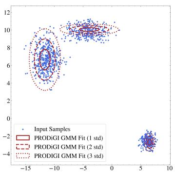  
(a) GMM

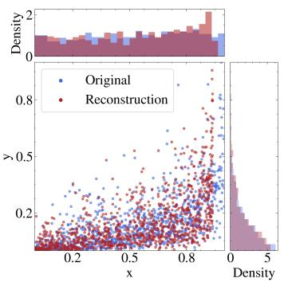  
(b) Copula

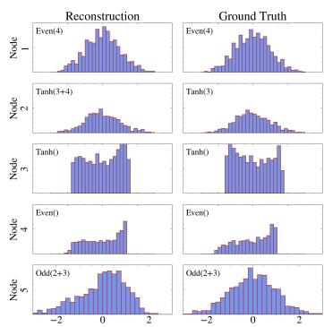  
(c) SCM  
Figure 9: Example inferred programs and generations by PRODiGI for each prior family: (a) A 2-d GMM with 3 components; (b) A 2-d Copula with a uniform and a long-tail marginal, respectively; (c) A 5-d SCM with structural mechanisms odd, even, tanh with (right) ground-truth and (left) inferred parents per node/feature in parentheses (empty implies root variable).

We further investigate cases in which PRODiGI predicts an incorrect prior family. While PRODiGI correctly identifies the prior family for the vast majority of in-distribution examples, Figure 10 shows that approximately 0.13% of cases are assigned to a different prior family. We examine one such example in Figure 10, where the input distribution is generated by a two-dimensional SCM, whereas PRODiGI reconstructs it using a Copula. Despite this discrepancy in prior family, the reconstructed distribution and marginals closely match those of the input. This suggests that these cases may arise from overlap among our prior families rather than from a failure to model the underlying distribution accurately. For example, a one-component GMM with a diagonal covariance matrix can represent the same distribution as a Copula with Gaussian marginals and no dependence. Consistent with this hypothesis, 75% of incorrect prior-family predictions occur on one-dimensional datasets, where different prior families admit greater overlap.

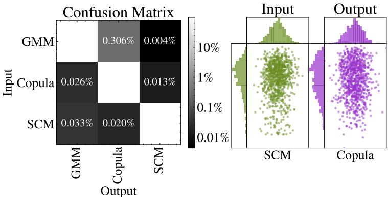  
Figure 10: Predicting the family of the program to be reconstructed is a learned task, PRODiGI may occasionally misclassify the data prior. Such confusion is rare, however, with only 1/744 programs misclassified (left). Despite the misclassification, the model continues to fit the data well (right), suggesting that these errors arise from overlapping data priors rather than priors that are inherently difficult for PRODiGI.

## F.2 REAL-WORLD RESULTS AND EXAMPLES

We evaluate PRODiGI and baselines on 96 datasets extracted from OddBench (6). We ignore labeled anomalies and choose a random subset of features for each dataset to guarantee an equivalent distribution of feature dimensions compared to our in-distribution datasets. A list of all used datasets can be found in Table 7 and in our supplementary material.

We further show examples of the data generation of PRODiGI and baselines in Figure on Real-World datasets in Figure 11.

To obtain approximate ground-truth densities and scores, we fit a Gaussian mixture model (GMM) as described in Appdx. E.3, using a maximum of 100 components per dataset. We retain only datasets for which we fail to reject the null hypothesis when evaluating newly generated samples. This procedure yields 37 datasets with GMM-approximated density and score ground truth.

We quantitatively evaluate our methods on these datasets in Figure 12 and Table 8.

Overall, the MMD values are approximately an order of magnitude higher than those obtained on the prior families (Table 2), indicating that real-world datasets are substantially more challenging for all methods. This is also reflected in the rejection rate: for datasets with 30 or more dimensions, no method generates samples sufficiently similar to the input data to fail our p-test.

Despite this increased difficulty, PRODiGI remains competitive. It generates samples in the shortest amount of time, while PRODiGI-FT achieves the third-lowest average MMD.

Performance on the density and score estimation tasks similarly degrades across methods. Since the ground truth in this setting is derived from a GMM, the GMM baseline has a natural advantage. Nevertheless, its performance is substantially lower than on the prior families, with the Spearman correlation decreasing from 0.84 to 0.67 and the average cosine similarity decreasing from 0.73 to 0.55.

For PRODiGI, we disable SCM templates for density and score estimation because these quantities cannot be computed for this prior family. We retain Copula templates despite expecting them to provide a poor fit to the GMM-derived ground truth. Consequently, PRODiGI generally underperforms baselines that either explicitly model the data using GMMs or are trained exclusively on GMM-generated data. Nevertheless, PRODiGI remains competitive, achieving, for example, the fourth-lowest Score MAE and the second-lowest density NLL.

We further report the distribution of the predicted prior families in Figure 13. While the prior families are not equally prevalent across real-world datasets, each captures characteristics observed in real-world data.

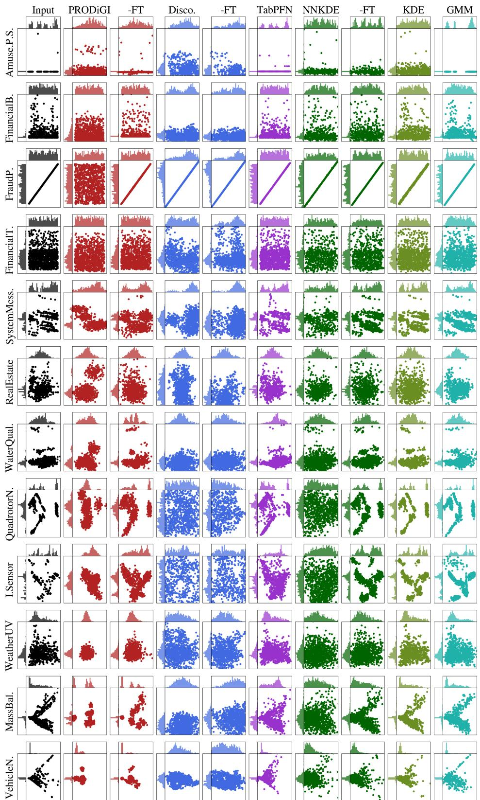  
Figure 11: Example real-world datasets and generations by all methods, including fine-tuned variants. The first six examples are two-dimensional, while the last six are PCA representations of one 5-, 10-, 20-, 30-, 40-, and 50-dimensional dataset each. Real-world manifolds challenge all methods, where PRODiGI-FT notably boosts PRODiGI.

Table 7: OddBench datasets used as Real-World Datasets
<table><tr><td>Dim = 1</td><td>Dim = 2</td><td>Dim = 5</td></tr><tr><td>DifferentialExpression</td><td>AmusementParkSafety</td><td>StudentProgrammePerformance</td></tr><tr><td>TrafficIncident</td><td>MunicipalExpenditure</td><td>AbandonedMineLand</td></tr><tr><td>HeartMurmurDetection</td><td>PlanetaryEmissions</td><td>AutoencoderAnomaly</td></tr><tr><td>AgilePriority</td><td>RxJavaPackage</td><td>RestaurantViolation</td></tr><tr><td>Species Validation</td><td>FinancialBeneficiary</td><td>MaritimeVessel</td></tr><tr><td>VotingRecall</td><td>ServiceErrorLocation</td><td>BusStopPrior</td></tr><tr><td>CallPerformance</td><td>FraudProcessSteps</td><td></td></tr><tr><td>GameItemPassive</td><td></td><td>KidneyDisease</td></tr><tr><td>FishingAnomalies</td><td>FarmerPayments</td><td>SoftwareDevelopmentEffort</td></tr><tr><td>TextMessageSpam</td><td>FinancialTransactionAnomalies</td><td>WaterQualityAssessment</td></tr><tr><td></td><td>SystemMessageAnomalies</td><td>LabTestAbnormality</td></tr><tr><td>NetworkTrafficDOS</td><td>RealEstateBlockType</td><td>HousingConstruction</td></tr><tr><td>NetworkFirewall</td><td>LanguageLocationAnomaly</td><td>NetworkActivity</td></tr><tr><td>Dim = 10 WindmillAnomaly</td><td>Dim = 20</td><td>Dim = 30</td></tr><tr><td>QuadrotorNavigation</td><td>WaterSources</td><td>TravelWeatherScores</td></tr><tr><td>CodeCommitMetrics</td><td>EnvironmentalFlux</td><td>EconomicLifeExpectancy</td></tr><tr><td>BuildingDamage</td><td>IndustrialSensor</td><td>BaseballPitchingAnomalies</td></tr><tr><td>BiologicalClassifications</td><td>EyeTrackingAnomalies</td><td>ProsperLoan</td></tr><tr><td></td><td>CreditRiskAssessment</td><td>FootballPlayerPosition</td></tr><tr><td>ChicagoFoodInspection</td><td>MineAccident</td><td>ChemicalReactionAnalysis</td></tr><tr><td>TreeUsage</td><td>SoccerActions</td><td>EnvironmentalAnomalies</td></tr><tr><td>KickstarterProjects</td><td>MoldProcess</td><td>SatelliteAnomaly</td></tr><tr><td>BarExamPrediction</td><td>ICUPhysiology</td><td>WeatherUVIndex</td></tr><tr><td>BudgetGoal</td><td>BugSeverity</td><td>WorkforceDemographics</td></tr><tr><td>BirdAudioAnomaly</td><td>BuildingInspection</td><td></td></tr><tr><td>RealEstateIrregularity</td><td>CorporateBondDefault</td><td>VolleyballMatch LondonCrimeFraud</td></tr><tr><td>Dim = 40</td><td>Dim = 50</td><td></td></tr><tr><td>MiningProjectOutcome</td><td>CreativeSchoolCertification</td><td></td></tr><tr><td>GamePositionAnomaly</td><td>SystemHealth</td><td></td></tr><tr><td>BoliviaUnpaidLabor</td><td>GalaxyAnomaly</td><td></td></tr><tr><td>SentencingFraud</td><td></td><td></td></tr><tr><td>AdRequestFraud</td><td>GasBenchmark</td><td></td></tr><tr><td>RNASequencingAnomaly</td><td>EmailSpamDetection</td><td></td></tr><tr><td>CodeQualityMetrics</td><td>ElectrocaloricAnomalies</td><td></td></tr><tr><td>DataValidationEntries</td><td>CancerGeneExpression</td><td></td></tr><tr><td>RNAAmplificationEphys</td><td>FinanceJobCategories</td><td></td></tr><tr><td></td><td>SoftwareQualityMetrics</td><td></td></tr><tr><td>CodeDefects</td><td>BugReportNgramIDF</td><td></td></tr><tr><td>SlowlorisAttackDetection</td><td>VehicleNetworkTraffic</td><td></td></tr><tr><td>MassBalanceCheck</td><td>MachineFailureSensors</td><td></td></tr></table>

Both of these results suggest that expanding the set of supported prior families could further improve performance on real-world datasets.

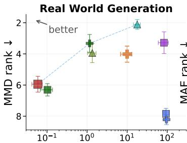  
Runtime (s)

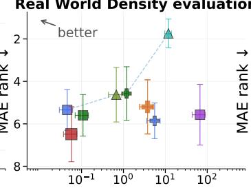  
Runtime (s)

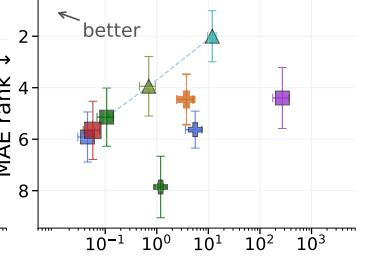  
Runtime (s)  
Figure 12: Performance–inference time trade-off for Generation, Density, and Score Estimation on real-world datasets. PRODiGI ranks among the fastest methods across all tasks, while PRODiGI-FT consistently improves performance on each task. However, the limited coverage of prior families constrains performance on datasets that cannot be adequately described by the available priors.

Table 8: Performance comparison across tasks and metrics on real-world datasets<sup>a</sup>: (1) Generation distribution match via MMD (↓) where $\% p { < } 0 . 0 5 \left( \downarrow \right)$ denotes the proportion of datasets where the null hypothesis $( H _ { 0 } { \mathrm { : } }$ generated and real distributions are identical) is rejected; (2) Density estimation via point-wise MAE (↓), population-wide Spearman correlation (↑), and NLL of generated data (↓); (3) Score estimation via MAE (↓) and cosine similarity (↑). Average rank (↓) per metric is across methods over all datasets. Time (↓) per task (s) is averaged over datasets.
<table><tr><td>Metric</td><td></td><td>PRODiGI</td><td>-FT</td><td>DiscoFormer</td><td>-FT</td><td>NNKDE</td><td>-FT</td><td>TabPFN</td><td>KDE</td><td>GMM</td></tr><tr><td rowspan="3">Genntion</td><td>MMD (↓) ×103 Rank (↓)</td><td> $7 0 . 3 4 _ { \pm 5 . 8 6 }$   $5 . 9 5 _ { \pm 0 . 1 7 }$ </td><td> $3 6 . 7 5 _ { \pm 4 . 5 6 }$   $4 . 0 2 _ { \pm 0 . 1 7 }$ </td><td> $2 5 3 . 3 2 _ { \pm 2 3 . 0 4 }$   $7 . 8 5 _ { \pm 0 . 1 2 }$ </td><td> $2 6 9 . 0 6 _ { \pm 2 2 . 7 6 }$   $8 . 2 2 _ { \pm 0 . 1 1 }$ </td><td>80.67± 9.27  $6 . 3 0 { \scriptstyle \pm 0 . 1 3 }$ </td><td> $\underline { { 3 0 . 9 5 _ { \pm 6 . 1 8 } } }$   $3 . 3 3 _ { \pm 0 . 1 9 }$ </td><td> $4 5 . 1 5 _ { \pm 1 0 . 9 4 }$   $\underline { { 3 . 2 8 } } \pm 0 . 2 3$ </td><td> $6 9 . 3 6 _ { \pm 1 3 . 2 9 }$   $3 . 9 5 _ { \pm 0 . 2 1 }$ </td><td> ${ \bf 1 5 . 5 9 } _ { \pm 3 . 2 7 }$   ${ \bf 2 . 1 1 _ { \pm 0 . 1 0 } }$ </td></tr><tr><td> $\% p { < } 0 . 0 5 \left( \downarrow \right)$ </td><td>100%</td><td>90.2%</td><td>100%</td><td>100%</td><td>100%</td><td>83.7%</td><td>84.8%</td><td>80.4%</td><td>78.3%</td></tr><tr><td>Time (↓) Rank (↓)</td><td>_  $\mathbf { 0 . 0 6 _ { \pm 0 . 0 1 } }$   ${ \bf 1 . 1 3 _ { \pm 0 . 0 4 } }$ </td><td> $9 . 9 7 _ { \pm 1 . 0 3 }$ </td><td> $9 3 . 3 9 _ { \pm 0 . 1 0 }$   $7 . 6 1 _ { \pm 0 . 0 5 }$ </td><td> $9 6 . 0 5 _ { \pm 1 . 8 9 }$ </td><td> $\underline { { 0 . 1 0 _ { \pm 0 . 0 1 } } }$ </td><td> $1 . 1 6 _ { \pm 0 . 0 2 }$ </td><td> $8 3 . 3 9 _ { \pm 7 . 8 6 }$ </td><td> $1 . 3 5 _ { \pm 0 . 1 1 }$ </td><td> $1 7 . 8 4 _ { \pm 1 . 1 4 }$ </td></tr><tr><td rowspan="8">Density</td><td>MAE (↓)</td><td> $3 2 2 \pm 2 3 9$ </td><td> $5 . 0 7 _ { \pm 0 . 0 4 }$   $3 2 2 _ { \pm 2 3 9 }$ </td><td> $3 2 0 \pm 2 3 9$ </td><td> $8 . 6 2 _ { \pm 0 . 0 5 }$   $3 2 0 \pm 2 3 9$ </td><td> $\underline { { 1 . 8 9 } } _ { \pm 0 . 0 4 }$   $3 2 0 \pm 2 3 9$ </td><td> $3 . 6 0 _ { \pm 0 . 0 6 }$   $3 0 7 \pm 2 3 7$ </td><td> $7 . 5 2 _ { \pm 0 . 1 3 }$   $3 2 2 \pm 2 3 9$ </td><td> $3 . 4 1 _ { \pm 0 . 0 6 }$   $3 2 3 \pm 2 3 8$ </td><td> $6 . 1 5 _ { \pm 0 . 0 6 }$   $2 8 4 _ { \pm } _ { 2 1 0 }$ </td></tr><tr><td>Rank (↓) Spear. (↑)</td><td> $6 . 4 9 _ { \pm 0 . 4 3 }$ </td><td> $5 . 2 0 _ { \pm 0 . 4 3 }$ </td><td> $5 . 3 4 _ { \pm 0 . 3 2 }$ </td><td> $5 . 8 6 _ { \pm 0 . 2 8 }$ </td><td> $5 . 6 0 _ { \pm 0 . 3 3 }$ </td><td> $\underline { { 4 . 5 7 } } \pm 0 . 4 2$ </td><td> $5 . 5 7 _ { \pm 0 . 4 8 }$ </td><td> $4 . 6 3 _ { \pm 0 . 4 3 }$ </td><td> ${ \bf 1 . 7 4 _ { \pm 0 . 2 3 } }$ </td></tr><tr><td>Rank (↓)</td><td> $0 . 3 0 { \scriptstyle \pm 0 . 0 4 }$   $7 . 2 9 _ { \pm 0 . 3 6 }$ </td><td> $0 . 4 2 _ { \pm 0 . 0 5 }$   $5 . 8 1 _ { \pm 0 . 3 9 }$ </td><td> $0 . 4 5 _ { \pm 0 . 0 4 }$   $5 . 8 3 _ { \pm 0 . 3 1 }$ </td><td> $0 . 4 8 _ { \pm 0 . 0 5 }$   $5 . 1 7 _ { \pm 0 . 3 9 }$ </td><td>0.51± 0.05  $4 . 7 4 _ { \pm 0 . 2 7 }$ </td><td> $\underline { { 0 . 5 7 } } \pm \mathbf { 0 . 0 5 }$   $4 . 6 9 _ { \pm 0 . 3 8 }$ </td><td> $0 . 4 9 _ { \pm 0 . 0 5 }$   $5 . 2 1 _ { \pm 0 . 4 4 }$ </td><td> $0 . 5 5 _ { \pm 0 . 0 5 }$   $\underline { { 3 . 9 4 _ { \pm 0 . 3 9 } } }$ </td><td> ${ \bf 0 . 6 7 _ { \pm 0 . 0 5 } }$   ${ \bf 2 . 3 1 _ { \pm 0 . 3 3 } }$ </td></tr><tr><td>NLL (↓)</td><td> $1 2 . 2 8 _ { \pm 2 . 8 6 }$ </td><td> $8 . 4 8 _ { \pm 2 . 1 6 }$ </td><td> $\_ { \mathbf { \delta } } ^ { \mathbf { \delta b } }$ </td><td> $\_ { \mathbf { b } }$ </td><td> ${ \bf 1 . 2 1 } _ { \pm 1 . 2 3 }$ </td><td> $1 5 . 2 4 _ { \pm 9 . 1 5 }$ </td><td> $\_ { \mathbf { \delta } } ^ { \mathbf { \delta b } }$ </td><td> $9 . 5 1 _ { \pm 3 . 1 3 }$ </td><td> $3 6 . 1 7 _ { \pm 2 8 . 7 8 }$ </td></tr><tr><td>Rank (↓)</td><td> $4 . 6 9 _ { \pm 0 . 2 7 }$ </td><td> $3 . 7 1 _ { \pm 0 . 2 6 }$ </td><td>_b</td><td>_b</td><td> $\underline { { 3 . 0 0 } } \pm 0 . 2 7$ </td><td> ${ \bf 2 . 9 1 _ { \pm 0 . 2 9 } }$ </td><td>_b</td><td> $3 . 3 4 _ { \pm 0 . 2 4 }$ </td><td> $3 . 3 4 _ { \pm 0 . 2 9 }$ </td></tr><tr><td>Time (↓)</td><td> $\underline { { 0 . 0 6 _ { \pm 0 . 0 1 } } }$ </td><td> $3 . 7 7 _ { \pm 0 . 7 7 }$ </td><td> ${ \bf 0 . 0 5 _ { \pm 0 . 0 2 } }$ </td><td> $5 . 5 6 _ { \pm 4 . 8 5 }$ </td><td> $0 . 1 1 _ { \pm 0 . 0 2 }$ </td><td> $1 . 1 9 _ { \pm 0 . 0 5 }$ </td><td> $6 7 . 1 4 _ { \pm 1 7 . 1 1 }$ </td><td> $0 . 6 7 _ { \pm 0 . 0 8 }$ </td><td> $1 1 . 8 5 _ { \pm 0 . 7 2 }$ </td></tr><tr><td>Rank (↓)</td><td> $2 . 0 0 { \scriptstyle \pm 0 . 0 9 }$ </td><td> $7 . 1 4 _ { \pm 0 . 1 0 }$ </td><td> ${ \bf 1 . 2 9 _ { \pm 0 . 1 3 } }$ </td><td> $4 . 6 6 _ { \pm 0 . 1 7 }$ </td><td> $2 . 7 7 _ { \pm 0 . 0 8 }$ </td><td> $6 . 1 4 _ { \pm 0 . 1 2 }$ </td><td> $7 . 9 7 _ { \pm 0 . 2 0 }$ </td><td> $4 . 5 7 _ { \pm 0 . 1 2 }$ </td><td> $8 . 4 6 _ { \pm 0 . 1 2 }$ </td></tr><tr><td>MAE (↓) Rank (↓)</td><td> $\lvert 4 3 8 7 _ { \pm 3 0 1 8 }$ </td><td></td><td> $4 6 2 9 _ { \pm 3 0 1 1 }$ </td><td></td><td> $4 7 2 9 _ { \pm 3 0 1 2 }$ </td><td></td><td> $4 3 7 6 _ { \pm } _ { 3 0 1 7 }$ </td><td></td><td> $\mathbf { 3 6 1 5 _ { \pm } } _ { 2 3 5 7 }$ </td></tr><tr><td rowspan="5">Score  $\mathrm { C o s . \ ( \uparrow ) }$  Rank (↓)</td><td></td><td></td><td> $4 4 0 5 _ { \pm 3 0 1 7 }$ </td><td></td><td> $4 5 4 3 _ { \pm 3 0 1 3 }$ </td><td></td><td> $1 0 3 8 5 _ { \pm 4 4 0 5 }$ </td><td></td><td> $4 3 6 8 _ { \pm 3 0 1 4 }$ </td><td></td></tr><tr><td></td><td> $5 . 6 6 _ { \pm 0 . 3 8 }$ </td><td> $4 . 4 6 _ { \pm 0 . 3 3 }$ </td><td> $5 . 9 1 _ { \pm 0 . 3 2 }$ </td><td> $5 . 6 3 _ { \pm 0 . 2 4 }$ </td><td> $5 . 1 4 _ { \pm 0 . 3 8 }$ </td><td> $7 . 8 6 _ { \pm 0 . 4 0 }$ </td><td> $4 . 4 0 _ { \pm 0 . 3 9 }$ </td><td> $3 . 9 4 _ { \pm 0 . 3 9 }$ </td><td> $\mathbf { 2 . 0 0 _ { \pm 0 . 3 3 } }$ </td></tr><tr><td></td><td> $0 . 0 7 _ { \pm 0 . 0 2 }$ </td><td> $0 . 1 7 _ { \pm 0 . 0 3 }$ </td><td> $0 . 1 9 _ { \pm 0 . 0 4 }$ </td><td> $0 . 1 6 _ { \pm 0 . 0 3 }$ </td><td> $0 . 2 3 _ { \pm 0 . 0 4 }$ </td><td> $0 . 2 8 _ { \pm 0 . 0 5 }$ </td><td> $0 . 2 4 _ { \pm 0 . 0 4 }$ </td><td> $\underline { { 0 . 3 0 } } \pm \mathbf { 0 . 0 4 }$ </td><td> $\mathbf { 0 . 5 5 _ { \pm 0 . 0 5 } }$ </td></tr><tr><td></td><td> $7 . 0 1 _ { \pm 0 . 3 3 }$ </td><td> $5 . 7 0 _ { \pm 0 . 3 7 }$ </td><td> $5 . 6 0 _ { \pm 0 . 3 3 }$ </td><td> $5 . 9 9 _ { \pm 0 . 3 7 }$ </td><td> $5 . 0 1 _ { \pm 0 . 3 6 }$ </td><td> $4 . 7 9 _ { \pm 0 . 4 3 }$ </td><td> $5 . 0 4 _ { \pm 0 . 4 5 }$ </td><td> $\underline { { 3 . 7 1 _ { \pm 0 . 3 9 } } }$ </td><td> ${ \bf 2 . 1 4 _ { \pm 0 . 2 7 } }$ </td></tr><tr><td>Time (↓)</td><td> $\underline { { 0 . 0 6 _ { \pm 0 . 0 1 } } }$ </td><td> $3 . 7 7 _ { \pm 0 . 7 7 }$ </td><td> ${ \bf 0 . 0 5 _ { \pm 0 . 0 2 } }$ </td><td></td><td></td><td></td><td></td><td></td><td></td></tr><tr><td>Rank (↓)</td><td> $2 . 0 0 { \scriptstyle \pm 0 . 0 9 }$ </td><td></td><td> $7 . 0 3 _ { \pm 0 . 0 9 }$ </td><td> ${ \bf 1 . 2 9 _ { \pm 0 . 1 3 } }$ </td><td> $5 . 5 6 _ { \pm 4 . 8 5 }$   $4 . 6 0 _ { \pm 0 . 1 5 }$ </td><td> $0 . 1 1 _ { \pm 0 . 0 2 }$   $2 . 7 7 _ { \pm 0 . 0 8 }$ </td><td> $1 . 1 9 _ { \pm 0 . 0 5 }$   $5 . 9 4 _ { \pm 0 . 1 1 }$ </td><td> $2 7 2 . 4 0 _ { \pm 9 9 . 6 0 }$   $8 . 2 9 _ { \pm 0 . 1 3 }$ </td><td> $0 . 7 0 { \scriptstyle \pm 0 . 0 8 }$   $4 . 6 3 _ { \pm 0 . 1 3 }$ </td><td> $1 1 . 9 0 _ { \pm 0 . 7 3 }$   $8 . 4 6 _ { \pm 0 . 1 2 }$ </td></tr></table>

<sup>a</sup> Detailed results on individual priors and dimensions are given in Appdx. G.  
<sup>b</sup> NLL is not reported for DiscoFormer and TabPFN because their local density estimates are not normalized to integrate to one.

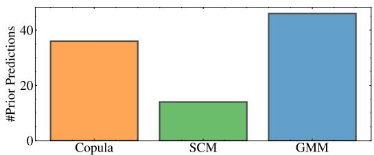  
Figure 13: Distribution of predicted families on Real-World examples. Each Family is predicted between 14 and 46 times, showing that each of our priors helps to model Real-World data more accurately.

## F.3 PRODIGI OUTPUTS

While PRODiGI can generate programs containing thousands of tokens, we restrict the appendix to the two examples shown in Figure 4 for brevity. Both examples generate compact Copula programs.

## PRODiGI Output for the FinancialBeneficiary Dataset

[COPULA][DIMENSIONALITY][2]

[START\_COMPONENT]

[INDEX][0][MARGINAL][UNIFORM]

[PARAMS][-0.0248][1.0000][0.0094][0.0115]

[END\_COMPONENT]

[START\_COMPONENT]

[INDEX][1][MARGINAL][KUMARASWAMY]

[PARAMS][-0.0108][0.8946][0.7638][2.8795]

[END\_COMPONENT]

[CORRELATIONS][0.0026][END\_CORRELATIONS]

[END\_COPULA]

## PRODiGI-FT Output for the FinancialBeneficiary Dataset

[START\_COMPONENT]

[INDEX][0][MARGINAL][UNIFORM]

[PARAMS][-0.0248][1.0000][0.0094][0.0115]

[END\_COMPONENT]

[START\_COMPONENT]

[INDEX][1][MARGINAL][KUMARASWAMY]

[PARAMS][-0.0108][0.8946][0.0951][1.4659]

[END\_COMPONENT]

[CORRELATIONS][-0.0017][END\_CORRELATIONS]

[END\_COPULA]

## PRODiGI Output for the FinancialTransactionAnomalies Dataset

[COPULA][DIMENSIONALITY][2]

[START\_COMPONENT]

[INDEX][0][MARGINAL][UNIFORM]

[PARAMS][-0.0043][1.0083][0.0056][0.0254]

[END\_COMPONENT]

[START\_COMPONENT]

[INDEX][1][MARGINAL][KUMARASWAMY]

[PARAMS][0.0086][0.9578][1.4854][3.6404]

[END\_COMPONENT]

[CORRELATIONS][-0.0012][END\_CORRELATIONS]

[END\_COPULA]

## PRODiGI-FT Output for the FinancialTransactionAnomalies Dataset

[COPULA][DIMENSIONALITY][2]

[START\_COMPONENT]

[INDEX][0][MARGINAL][UNIFORM]

[PARAMS][-0.0043][1.0083][0.0056][0.0254]

[END\_COMPONENT]

[START\_COMPONENT]

[INDEX][1][MARGINAL][KUMARASWAMY]

[PARAMS][0.0086][0.9578][1.2654][4.3308]

[END\_COMPONENT]

[CORRELATIONS][-0.0056][END\_CORRELATIONS]

[END\_COPULA]

## G DETAILED RESULTS

We provide detailed results for each algorithm and metric split across dataset dimensions and prior family in the following tables.

Table 9: Distribution match performance via MMD (↓) and rank, as well as runtime in seconds (↓) and runtime rank for varying data dimensions. Average rank per metric (lower is better) is across methods over test datasets from ALL prior families.  
Table 10: Rejection rate of two-sample tests for distribution match w.r.t. MMD over test datasets from ALL prior families. Tests under generated data that successfully match the input data distribution fail to reject the null (i.e., p > 0.05) that the two samples come from the same distribution.
<table><tr><td>Dimension</td><td>PRODiGI</td><td>PRODiGI-FT</td><td>DiscoFormer</td><td>DiscoFormer-FT</td><td>NNKDE</td><td>NNKDE-FT</td><td>TabPFN</td><td>KDE</td><td>GMM</td></tr><tr><td>Dim 1</td><td>41.7%</td><td>0.0%</td><td>91.7%</td><td>100.0%</td><td>91.7%</td><td>25.0%</td><td>8.3%</td><td>8.3%</td><td>8.3%</td></tr><tr><td>Dim 2</td><td>16.7%</td><td>16.7%</td><td>100.0%</td><td>83.3%</td><td>100.0%</td><td>91.7%</td><td>16.7%</td><td>8.3%</td><td>0.0%</td></tr><tr><td>Dim 5</td><td>66.7%</td><td>41.7%</td><td>100.0%</td><td>100.0%</td><td>91.7%</td><td>83.3%</td><td>33.3%</td><td>75.0%</td><td>33.3%</td></tr><tr><td>Dim 10</td><td>75.0%</td><td>50.0%</td><td>100.0%</td><td>100.0%</td><td>100.0%</td><td>83.3%</td><td>25.0%</td><td>66.7%</td><td>41.7%</td></tr><tr><td>Dim 20</td><td>83.3%</td><td>58.3%</td><td>100.0%</td><td>100.0%</td><td>91.7%</td><td>91.7%</td><td>41.7%</td><td>83.3%</td><td>16.7%</td></tr><tr><td>Dim 30</td><td>66.7%</td><td>58.3%</td><td>100.0%</td><td>100.0%</td><td>100.0%</td><td>100.0%</td><td>41.7%</td><td>91.7%</td><td>50.0%</td></tr><tr><td>Dim 40</td><td>58.3%</td><td>50.0%</td><td>100.0%</td><td>100.0%</td><td>83.3%</td><td>83.3%</td><td>33.3%</td><td>83.3%</td><td>58.3%</td></tr><tr><td>Dim 50</td><td>50.0%</td><td>41.7%</td><td>100.0%</td><td>100.0%</td><td>83.3%</td><td>83.3%</td><td>41.7%</td><td>75.0%</td><td>41.7%</td></tr><tr><td>Overall</td><td>57.3%</td><td>39.6%</td><td>99.0%</td><td>97.9%</td><td>92.7%</td><td>80.2%</td><td>30.2%</td><td>61.5%</td><td>31.2%</td></tr></table>

<table><tr><td>Dimension</td><td>Metric</td><td>|PRODiGI</td><td></td><td>PRODiGI-FT | DiscoFormer</td><td>DiscoFormer-FT</td><td>NNKDE</td><td>NNKDE-FT</td><td>TabPFN</td><td>KDE</td><td>GMM</td></tr><tr><td rowspan="4">Dim 1</td><td>MMD (×103)</td><td>2.81 ± 1.37</td><td> $0 . 3 8 _ { \pm 0 . 1 8 }$ </td><td>91.35± 42.99</td><td> $\begin{array} { c } { 2 7 6 . 7 9 _ { \pm 9 8 . 8 4 } } \\ { 8 . 3 3 _ { \pm 0 . 1 8 } } \end{array}$ </td><td>8.34±1.25</td><td>0.53± 0.28</td><td>0.41± 0.13</td><td>0.20± 0.13</td><td>0.35± 0.18</td></tr><tr><td>Rank</td><td> $4 . 7 5 _ { \pm 0 . 5 5 }$ </td><td> $3 . 0 8 _ { \pm 0 . 3 4 }$ </td><td> $7 . 9 6 _ { \pm 0 . 4 3 } ^ { ^ { \pm } }$ </td><td></td><td> $7 . 0 0 _ { \pm 0 . 2 9 }$ </td><td> $3 . 9 2 _ { \pm 0 . 4 7 }$ </td><td>4.21± 0.48</td><td> $\mathbf { 2 . 7 9 _ { \pm 0 . 4 7 } }$ </td><td> $2 . 9 6 \pm 0 . 3 4$ </td></tr><tr><td>Time</td><td>0.03± 0.00</td><td>1.47± 0.16</td><td>93.28± 0.61</td><td>93.80± 0.61</td><td>0.38± 0.19</td><td>1.17± 0.01</td><td> $1 . 5 2 _ { \pm 0 . 0 2 }$ </td><td>0.11± 0.00</td><td>8.71 ± 0.18</td></tr><tr><td>Time Rank</td><td> ${ \bf 1 . 0 0 _ { \pm 0 . 0 0 } }$ </td><td> $4 . 8 3 \pm 0 . 2 3$ </td><td> $8 . 0 0 { \scriptstyle \pm 0 . 0 0 }$ </td><td> $9 . 0 0 _ { \pm 0 . 0 0 }$ </td><td>3.25± 0.24</td><td> $4 . 2 5 _ { \pm 0 . 1 7 }$ </td><td> $5 . 6 7 _ { \pm 0 . 1 4 }$ </td><td> $2 . 0 0 \pm 0 . 0 0$ </td><td> $7 . 0 0 { \scriptstyle \pm 0 . 0 0 }$ </td></tr><tr><td rowspan="4">Dim 2</td><td>MMD (×103)</td><td> $1 . 3 8 _ { \pm 0 . 9 0 }$ </td><td>0.48± 0.25</td><td> $1 2 . 2 6 { \scriptstyle \pm 3 . 7 9 }$ </td><td> $1 8 . 7 0 _ { \pm 8 . 4 7 }$ </td><td> $6 6 . 3 8 _ { \pm 8 . 5 8 }$ </td><td>8.47± 2.72</td><td>0.15± 0.07</td><td> $0 . 4 5 _ { \pm 0 . 3 3 }$ </td><td>0.09± 0.08</td></tr><tr><td>Rank</td><td> $3 . 2 9 _ { \pm 0 . 3 8 }$ </td><td> $3 . 6 7 _ { \pm 0 . 4 3 }$ </td><td> $7 . 4 2 \pm 0 . 2 5$ </td><td>6.79± 0.48</td><td> $8 . 8 3 _ { \pm 0 . 1 1 }$ </td><td>6.50± 0.22</td><td> $\overline { { 3 . 2 1 } } _ { \pm 0 . 3 9 } ^ { - }$ </td><td> $2 . 7 5 \pm 0 . 2 5$ </td><td> $2 . 5 4 _ { \pm 0 . 2 9 }$ </td></tr><tr><td>Time</td><td>0.04± 0.02</td><td>2.16± 0.24</td><td>92.23± 0.04</td><td>92.78± 0.04</td><td></td><td>1.16± 0.00</td><td> $3 . 1 5 _ { \pm 0 . 0 4 }$ </td><td>0.40± 0.01</td><td>11.35± 0.54</td></tr><tr><td>Time Rank</td><td> $\mathbf { 1 . 0 8 _ { \pm 0 . 0 8 } }$ </td><td> $5 . 0 8 _ { \pm 0 . 0 8 } ^ { - }$ </td><td> $8 . 0 0 { \scriptstyle \pm 0 . 0 0 }$ </td><td> $9 . 0 0 _ { \pm 0 . 0 0 }$ </td><td> $\frac { 0 . 1 6 { \scriptstyle \pm 0 . 0 1 } } { 1 . 9 2 \pm 0 . 0 8 }$ </td><td> $4 . 0 0 _ { \pm 0 . 0 0 }$ </td><td> $5 . 9 2 _ { \pm 0 . 0 8 }$ </td><td> $3 . 0 0 { \scriptstyle \pm 0 . 0 0 }$ </td><td>7.00±0.00</td></tr><tr><td rowspan="4">Dim 5</td><td>MMD (×103)</td><td> $1 1 . 8 4 _ { \pm 6 . 1 9 }$ </td><td> $2 . 2 0 \pm 0 . 9 0$ </td><td> $1 9 . 3 5 _ { \pm 4 . 7 8 }$ </td><td> $1 8 . 3 2 _ { \pm 4 . 7 4 }$ </td><td> $5 . 7 6 _ { \pm 1 . 9 5 }$ </td><td>3.21 ± 0.66</td><td> ${ \bf 0 . 4 7 _ { \pm 0 . 1 3 } }$ </td><td> $1 . 9 5 _ { \pm 0 . 4 8 }$ </td><td>0.48± 0.12</td></tr><tr><td>Rank</td><td> $6 . 0 0 { \scriptstyle \pm 0 . 5 0 }$ </td><td> $3 . 1 2 _ { \pm 0 . 4 1 }$ </td><td> $8 . 3 3 \pm 0 . 1 8$ </td><td> $8 . 2 5 _ { \pm 0 . 2 1 }$ </td><td> $5 . 5 8 _ { \pm 0 . 3 4 }$ </td><td> $5 . 5 8 _ { \pm 0 . 3 4 }$ </td><td> $1 . 9 6 \pm 0 . 1 9$ </td><td> $4 . 4 6 _ { \pm 0 . 4 5 }$ </td><td> $\overline { { 1 . 7 1 } } _ { \pm 0 . 2 2 } ^ { - }$ </td></tr><tr><td>Time</td><td> ${ \bf 0 . 0 3 _ { \pm 0 . 0 0 } }$ </td><td> $4 . 2 7 _ { \pm 0 . 5 1 }$ </td><td> $9 3 . 2 7 _ { \pm 0 . 7 6 }$ </td><td>93.73± 0.72</td><td> $\underline { { 0 . 1 6 _ { \pm 0 . 0 1 } } }$ </td><td>1.16± 0.00</td><td> $1 3 . 8 6 _ { \pm 0 . 2 0 }$ </td><td> $0 . 4 4 _ { \pm 0 . 0 0 }$ </td><td> $\overline { { 1 2 . 4 3 _ { \pm 0 . 6 5 } } }$ </td></tr><tr><td>Time Rank</td><td> ${ \bf 1 . 0 0 _ { \pm 0 . 0 0 } }$ </td><td> $5 . 0 0 { \scriptstyle \pm 0 . 0 0 }$ </td><td> $8 . 0 0 _ { \pm 0 . 0 0 } ^ { - }$ </td><td> $9 . 0 0 _ { \pm 0 . 0 0 }$ </td><td> $2 . 0 0 \pm 0 . 0 0$ </td><td>4.00± 0.00</td><td> $6 . 6 7 _ { \pm 0 . 1 4 }$ </td><td> $3 . 0 0 { \scriptstyle \pm 0 . 0 0 }$ </td><td> $6 . 3 3 { \scriptstyle \pm 0 . 1 4 }$ </td></tr><tr><td rowspan="4">Dim 10</td><td>MMD (×103)</td><td> $1 3 . 1 5 _ { \pm 7 . 9 6 }$ </td><td> $1 . 8 4 \pm 0 . 9 5$ </td><td> $1 1 8 . 7 2 _ { \pm 3 4 . 4 3 }$ </td><td> $1 4 8 . 9 1 _ { \pm 4 3 . 8 7 }$ </td><td> $9 . 3 7 _ { \pm 2 . 9 1 }$ </td><td> $5 . 0 9 _ { \pm 2 . 0 8 }$ </td><td> ${ \bf 0 . 3 7 _ { \pm 0 . 1 2 } }$ </td><td>4.05± 1.63</td><td>0.60± 0.22</td></tr><tr><td>Rank</td><td> $5 . 4 2 _ { \pm 0 . 6 2 }$ </td><td> $2 . 7 9 \pm \mathrm { 0 . 4 5 }$ </td><td> $8 . 3 3 { \scriptstyle \pm 0 . 1 4 }$ </td><td> $8 . 5 0 { \scriptstyle \pm 0 . 1 9 }$ </td><td> $6 . 4 2 _ { \pm 0 . 1 8 }$ </td><td> $4 . 7 5 _ { \pm 0 . 3 6 }$ </td><td> $\mathbf { 1 . 9 6 _ { \pm 0 . 2 4 } }$ </td><td> $4 . 3 3 _ { \pm 0 . 4 1 }$ </td><td>2.50±0.30</td></tr><tr><td>Time</td><td> ${ \bf 0 . 0 9 } _ { \pm 0 . 0 5 }$ </td><td> $8 . 3 8 \pm 0 . 9 9$ </td><td> $9 2 . 7 2 _ { \pm 0 . 4 2 }$ </td><td> $9 3 . 6 9 _ { \pm 0 . 5 1 }$ </td><td>0.19± 0.02</td><td> $1 . 2 9 _ { \pm 0 . 1 2 }$ </td><td> $3 6 . 5 5 _ { \pm 0 . 7 4 }$ </td><td> $0 . 6 1 _ { \pm 0 . 0 5 }$ </td><td> $2 0 . 8 3 _ { \pm 0 . 9 4 }$ </td></tr><tr><td>Time Rank</td><td> $\mathbf { 1 . 0 8 _ { \pm 0 . 0 8 } }$ </td><td> $5 . 0 0 { \scriptstyle \pm 0 . 0 0 }$ </td><td> $8 . 0 0 { \scriptstyle \pm 0 . 0 0 }$ </td><td> $9 . 0 0 _ { \pm 0 . 0 0 }$ </td><td>1.92± 0.08</td><td> $4 . 0 0 _ { \pm 0 . 0 0 }$ </td><td> $7 . 0 0 _ { \pm 0 . 0 0 }$ </td><td> $3 . 0 0 { \scriptstyle \pm 0 . 0 0 }$ </td><td> $6 . 0 0 { \scriptstyle \pm 0 . 0 0 }$ </td></tr><tr><td rowspan="4">Dim 20</td><td>MMD (×103)</td><td> $4 . 4 5 _ { \pm 2 . 4 9 }$ </td><td></td><td></td><td>14.89± 4.68</td><td></td><td> $1 3 . 3 0 { \scriptstyle \pm 3 . 6 4 }$ </td><td>0.23± 0.06</td><td>6.57± 2.12</td><td>0.18± 0.07</td></tr><tr><td>Rank</td><td>4.00± 0.26</td><td> $\begin{array} { c } { 0 . 3 7 _ { \pm 0 . 1 3 } } \\ { 2 . 7 9 _ { \pm 0 . 3 2 } } \end{array}$ </td><td> $\begin{array} { c } { { 2 3 . 5 0 _ { \pm 6 . 7 9 } } } \\ { { 8 . 1 7 _ { \pm 0 . 3 3 } } } \end{array}$ </td><td>7.67± 0.36</td><td> $\begin{array} { c } { { 1 2 . 4 1 \pm 3 . 4 2 } } \\ { { 6 . 9 2 \pm 0 . 2 5 } } \end{array}$ </td><td> $6 . 9 2 _ { \pm 0 . 3 2 }$ </td><td>2.67± 0.45</td><td> $4 . 5 0 _ { \pm 0 . 3 0 }$ </td><td>1.38± 0.13</td></tr><tr><td>Time</td><td> $\mathbf { 0 . 0 5 _ { \pm 0 . 0 0 } }$ </td><td></td><td></td><td></td><td></td><td></td><td></td><td></td><td></td></tr><tr><td>Time Rank</td><td> ${ \bf 1 . 0 0 _ { \pm 0 . 0 0 } }$ </td><td> $1 4 . 2 6 _ { \pm 2 . 1 0 }$   $5 . 0 0 { \scriptstyle \pm 0 . 0 0 }$ </td><td> $9 2 . 7 0 _ { \pm 0 . 1 0 }$   $8 . 0 0 _ { \pm 0 . 0 0 } ^ { - }$ </td><td> $9 3 . 2 2 _ { \pm 0 . 1 0 }$   $9 . 0 0 _ { \pm 0 . 0 0 }$ </td><td> $\frac { 0 . 1 6 { \scriptstyle \pm 0 . 0 1 } } { 2 . 0 0 { \scriptstyle \pm 0 . 0 0 } }$ </td><td> $1 . 1 7 _ { \pm 0 . 0 1 }$   $4 . 0 0 _ { \pm 0 . 0 0 } ^ { - }$ </td><td> $7 6 . 6 9 _ { \pm 1 . 3 8 }$   $7 . 0 0 _ { \pm 0 . 0 0 }$ </td><td> $0 . 7 2 _ { \pm 0 . 0 0 }$   $3 . 0 0 { \scriptstyle \pm 0 . 0 0 }$ </td><td> $5 2 . 4 4 _ { \pm 3 . 3 9 }$   $6 . 0 0 { \scriptstyle \pm 0 . 0 0 }$ </td></tr><tr><td rowspan="4">Dim 30</td><td></td><td> $4 . 3 1 _ { \pm 2 . 2 1 }$ </td><td></td><td> $2 2 . 0 0 { \scriptstyle \pm 8 . 7 9 }$ </td><td></td><td></td><td>18.17± 5.81</td><td></td><td></td><td> $2 . 5 0 { \scriptstyle \pm 1 . 8 6 }$ </td></tr><tr><td>MMD (×103) Rank</td><td> $3 . 8 3 _ { \pm 0 . 2 0 }$ </td><td> $\underline { { 0 . 8 5 } } \pm \mathbf { 0 . 2 8 }$ </td><td> $8 . 1 7 _ { \pm 0 . 3 1 }$ </td><td> $1 5 . 8 6 _ { \pm 6 . 1 7 }$   $7 . 2 5 _ { \pm 0 . 3 8 }$ </td><td> $1 7 . 7 3 _ { \pm 5 . 8 1 }$   $6 . 7 5 _ { \pm 0 . 2 7 }$ </td><td>7.33± 0.36</td><td> $\mathbf { 0 . 5 3 _ { \pm 0 . 1 7 } }$   $\mathbf { 1 . 8 3 _ { \pm 0 . 2 5 } }$ </td><td> $1 1 . 1 2 _ { \pm 4 . 1 6 }$ </td><td> $2 . 1 2 \pm 0 . 2 8$ </td></tr><tr><td>Time</td><td></td><td> $2 . 6 7 _ { \pm 0 . 2 9 }$ </td><td></td><td></td><td></td><td></td><td></td><td> $5 . 0 4 _ { \pm 0 . 4 6 }$ </td><td></td></tr><tr><td>Time Rank</td><td> $\mathbf { 0 . 0 6 _ { \pm 0 . 0 1 } }$  1.00 ± 0.00</td><td> $^ { 2 0 . 0 2 \pm 2 . 7 6 } _ { 5 . 0 0 \pm 0 . 0 0 }$ </td><td> $\begin{array} { c } { 9 2 . 4 0 _ { \pm 0 . 1 2 } } \\ { 7 . 0 0 _ { \pm 0 . 0 0 } } \end{array}$ </td><td> $\begin{array} { c } { { 9 2 . 9 7 _ { \pm 0 . 1 0 } } } \\ { { 8 . 0 0 _ { \pm 0 . 0 0 } } } \end{array}$ </td><td> $\frac { 0 . 2 4 _ { \pm 0 . 0 1 } } { 2 . 0 0 _ { \pm 0 . 0 0 } }$ </td><td> $\begin{array} { c } { 1 . 1 7 _ { \pm 0 . 0 0 } } \\ { 3 . 9 2 _ { \pm 0 . 0 8 } } \end{array}$ </td><td> $1 2 0 . 5 7 _ { \pm 2 . 0 2 }$ </td><td> $1 . 0 5 _ { \pm 0 . 1 2 }$ </td><td> $\begin{array} { c } { 5 5 . 2 1 _ { \pm 3 . 1 7 } } \\ { 6 . 0 0 _ { \pm 0 . 0 0 } } \end{array}$ </td></tr><tr><td rowspan="4">Dim 40</td><td></td><td></td><td></td><td></td><td></td><td></td><td></td><td> $9 . 0 0 _ { \pm 0 . 0 0 }$ </td><td> $3 . 0 8 _ { \pm 0 . 0 8 }$ </td><td></td></tr><tr><td>MMD (×103) Rank</td><td> $4 . 6 1 _ { \pm 2 . 7 2 }$ </td><td> $\frac { 0 . 3 5 _ { \pm 0 . 1 3 } } { 2 . 6 2 _ { \pm 0 . 3 5 } }$ </td><td> $2 1 . 1 7 _ { \pm 1 2 . 2 8 }$ </td><td> $2 2 . 5 1 _ { \pm 1 3 . 3 5 }$ </td><td>22.00±10.53</td><td> $2 4 . 1 4 _ { \pm 1 1 . 1 4 }$ </td><td> ${ \bf 0 . 3 3 _ { \pm 0 . 1 6 } }$ </td><td> $9 . 4 9 _ { \pm 3 . 7 8 }$ </td><td> $1 . 7 3 \pm 1 . 3 3 $ </td></tr><tr><td></td><td> $3 . 4 6 _ { \pm 0 . 2 5 }$ </td><td></td><td> $7 . 6 7 _ { \pm 0 . 3 0 }$ </td><td>8.33± 0.38</td><td> $6 . 1 7 _ { \pm 0 . 3 3 }$ </td><td> $7 . 0 0 _ { \pm 0 . 2 9 }$ </td><td> $\mathbf { 1 . 5 0 _ { \pm 0 . 2 5 } }$ </td><td>5.75± 0.27</td><td>2.50± 0.19</td></tr><tr><td>Time Time Rank</td><td> $\overline { { { \bf 0 . 1 1 _ { \pm 0 . 0 3 } } } }$  1.17 ± 0.11</td><td> $2 1 . 9 8 _ { \pm 3 . 0 8 }$ </td><td>92.42± 0.07  $7 . 0 0 _ { \pm 0 . 0 0 }$ </td><td> $9 2 . 8 9 _ { \pm 0 . 0 4 }$ </td><td> $2 . 2 1 _ { \pm 2 . 0 3 }$  2.08±0.28</td><td> $1 . 3 5 _ { \pm 0 . 1 2 }$ </td><td> $\overline { { 1 6 7 . 9 0 _ { \pm 2 . 6 6 } } }$ </td><td> $\underline { { 1 . 3 3 \pm 0 . 1 6 } }$ </td><td> $\overline { { 5 5 . 5 1 _ { \pm 2 . 5 0 } } }$ </td></tr><tr><td rowspan="4">Dim 50</td><td></td><td></td><td> $4 . 9 2 _ { \pm 0 . 0 8 }$ </td><td></td><td> $8 . 0 0 _ { \pm 0 . 0 0 }$ </td><td></td><td> $3 . 7 5 _ { \pm 0 . 1 2 }$ </td><td> $9 . 0 0 _ { \pm 0 . 0 0 }$ </td><td>3.08± 0.14</td><td> $6 . 0 0 _ { \pm 0 . 0 0 }$ </td></tr><tr><td>MMD (×103) Rank</td><td> $1 . 1 0 { \scriptstyle \pm 0 . 3 9 }$  3.54± 0.27</td><td> $\begin{array} { c } { 0 . 6 5 _ { \pm 0 . 2 5 } } \\ { 2 . 5 8 _ { \pm 0 . 2 7 } } \end{array}$ </td><td> $2 2 . 6 4 \pm 4 . 8 9$  8.33± 0.25</td><td> $^ { 2 4 . 7 1 \pm 5 . 9 0 } _ { \times 3 3 . }$ </td><td> $1 4 . 0 5 _ { \pm 4 . 7 4 }$ </td><td> $1 4 . 9 5 _ { \pm 5 . 0 6 }$  7.08± 0.18</td><td> $\underline { { \mathbf { 0 . 2 7 _ { \pm 0 . 0 9 } } } }$ </td><td> $8 . 1 1 \pm 2 . 9 5$ </td><td> $\frac { 0 . 3 4 \pm 0 . 1 2 } { 2 . 1 7 \pm 0 . 2 6 }$ </td></tr><tr><td></td><td></td><td></td><td></td><td>8.33± 0.18</td><td> $6 . 1 7 _ { \pm 0 . 2 0 }$ </td><td></td><td>1.79± 0.29</td><td> $5 . 0 0 _ { \pm 0 . 1 2 }$ </td><td></td></tr><tr><td>Time Time Rank</td><td> $\mathbf { 0 . 0 8 _ { \pm 0 . 0 1 } }$   ${ \bf 1 . 0 0 _ { \pm 0 . 0 0 } }$ </td><td> $3 0 . 6 7 _ { \pm 4 . 1 3 }$ </td><td> $9 2 . 5 4 _ { \pm 0 . 2 6 }$   $6 . 8 3 _ { \pm 0 . 1 1 }$ </td><td> $9 3 . 1 0 _ { \pm 0 . 2 4 }$ </td><td> $\frac { 0 . 2 2 _ { \pm 0 . 0 1 } } { \sim \sim }$ </td><td> $1 . 1 7 _ { \pm 0 . 0 0 }$ </td><td> $2 0 4 . 4 6 _ { \pm 3 . 1 0 }$ </td><td> $1 . 6 9 _ { \pm 0 . 1 9 }$ </td><td> $8 1 . 4 7 _ { \pm 4 . 0 1 }$ </td></tr><tr><td rowspan="4">Overall</td><td></td><td></td><td> $5 . 0 0 _ { \pm 0 . 0 0 }$ </td><td></td><td> $7 . 8 3 _ { \pm 0 . 1 1 }$ </td><td>2.00±0.00</td><td> $3 . 0 0 _ { \pm 0 . 0 0 }$ </td><td> $9 . 0 0 _ { \pm 0 . 0 0 }$ </td><td> $4 . 0 0 _ { \pm 0 . 0 0 }$ </td><td> $6 . 3 3 _ { \pm 0 . 2 2 }$ </td></tr><tr><td>MMD (×103) Rank</td><td> $5 . 4 6 _ { \pm 1 . 4 5 }$  4.29± 0.17</td><td> $\begin{array} { l } { 0 . 8 9 _ { \pm 0 . 1 9 } } \\ { 2 . 9 2 _ { \pm 0 . 1 3 } } \end{array}$ </td><td> $4 1 . 3 7 _ { \pm 8 . 2 0 }$  8.05 ± 0.11</td><td> $6 7 . 5 8 _ { \pm 1 6 . 5 1 }$  7.93±0.13</td><td> $1 9 . 5 1 _ { \pm 2 . 7 7 }$  6.73±0.13</td><td> $1 0 . 9 8 _ { \pm 1 . 9 6 }$  6.14± 0.17</td><td> $\mathbf { 0 . 3 5 _ { \pm 0 . 0 5 } }$  2.39±0.15</td><td> $5 . 2 4 \pm 0 . 9 5$  4.33± 0.16</td><td> $\frac { 0 . 7 8 _ { \pm 0 . 3 0 } } { 2 . 2 3 _ { \pm 0 . 1 0 } }$ </td></tr><tr><td>Time</td><td></td><td></td><td></td><td></td><td></td><td></td><td></td><td></td><td></td></tr><tr><td>Time Rank</td><td> $\mathbf { 0 . 0 6 _ { \pm 0 . 0 1 } }$   $\mathbf { 1 . 0 4 } _ { \pm 0 . 0 2 } ^ { - }$ </td><td> $1 2 . 9 0 _ { \pm 1 . 2 9 }$   $4 . 9 8 _ { \pm 0 . 0 3 }$ </td><td> $9 2 . 7 0 _ { \pm 0 . 1 4 }$   $7 . 6 0 _ { \pm 0 . 0 5 } ^ { - }$ </td><td>93.27± 0.14 8.60±0.05</td><td> $\underline { { 0 . 4 6 _ { \pm 0 . 2 6 } } }$   $2 . 1 5 _ { \pm 0 . 0 6 }$ </td><td> $1 . 2 0 _ { \pm 0 . 0 2 }$   $3 . 8 6 _ { \pm 0 . 0 5 } ^ { - }$ </td><td> $7 8 . 0 9 _ { \pm 7 . 5 2 }$   $7 . 4 1 _ { \pm 0 . 1 4 }$ </td><td> $0 . 7 9 _ { \pm 0 . 0 6 }$   $3 . 0 2 _ { \pm 0 . 0 6 }$ </td><td> $3 7 . 2 4 _ { \pm 2 . 7 4 }$   $6 . 3 3 _ { \pm 0 . 0 5 }$ </td></tr></table>

<table><tr><td>Dimension</td><td>Metric</td><td>|PRODiGI</td><td></td><td>PRODiGI-FT | DiscoFormer</td><td>DiscoFormer-FT</td><td>NNKDE</td><td>NNKDE-FT</td><td>TabPFN</td><td>KDE</td><td>GMM</td></tr><tr><td rowspan="4">Dim 1</td><td>MMD (×103)</td><td> $5 . 3 1 _ { \pm 2 . 7 0 }$ </td><td> $0 . 4 5 _ { \pm 0 . 3 9 }$ </td><td> $\begin{array} { c } { { 5 9 . 2 3 _ { \pm 4 1 . 1 3 } } } \\ { { 8 . 2 5 _ { \pm 0 . 4 1 } } } \end{array}$ </td><td>76.56±59.00</td><td> $\stackrel { 6 . 7 7 \pm 0 . 9 5 } { 7 . 0 0 _ { \pm 0 . 6 1 } }$ </td><td> $\begin{array} { c } { { 1 . 2 2 _ { \pm 0 . 7 1 } } } \\ { { 4 . 5 0 _ { \pm 0 . 4 3 } } } \end{array}$ </td><td> $\frac { 0 . 2 3 _ { \pm 0 . 1 1 } } { 3 . 0 0 _ { \pm 0 . 3 5 } }$ </td><td> ${ \bf 0 . 0 0 _ { \pm 0 . 0 0 } }$ </td><td> $0 . 6 6 _ { \pm 0 . 4 5 }$ </td></tr><tr><td>Rank</td><td>6.50± 0.25</td><td>2.38± 0.32</td><td></td><td>8.25±0.22</td><td></td><td></td><td></td><td>1.88±0.37</td><td> $3 . 2 5 _ { \pm 0 . 4 1 }$ </td></tr><tr><td>Time</td><td> ${ \bf 0 . 0 3 _ { \pm 0 . 0 0 } }$ </td><td> $1 . 1 2 _ { \pm 0 . 0 1 }$ </td><td> $\begin{array} { c } { 9 2 . 6 1 _ { \pm 0 . 0 7 } } \\ { 8 . 0 0 _ { \pm 0 . 0 0 } } \end{array}$ </td><td> $\begin{array} { c } { 9 3 . 1 8 _ { \pm 0 . 0 8 } } \\ { 9 . 0 0 _ { \pm 0 . 0 0 } } \end{array}$ </td><td>0.18±0.01</td><td> $\begin{array} { l } { 1 . 1 6 _ { \pm 0 . 0 0 } } \\ { 5 . 0 0 _ { \pm 0 . 0 0 } } \end{array}$ </td><td> $1 . 5 6 _ { \pm 0 . 0 4 }$ </td><td>0.11± 0.00</td><td>8.30± 0.05</td></tr><tr><td>Time Rank</td><td> $\mathbf { 1 . 0 0 } _ { \pm 0 . 0 0 }$ </td><td> $4 . 0 0 _ { \pm 0 . 0 0 }$ </td><td></td><td></td><td> $3 . 0 0 { \scriptstyle \pm 0 . 0 0 }$ </td><td></td><td>6.00± 0.00</td><td> $2 . 0 0 \pm 0 . 0 0$ </td><td>7.00±0.00</td></tr><tr><td rowspan="4">Dim 2</td><td>MMD (×103)</td><td> $\begin{array} { c } { 4 . 0 2 _ { \pm 2 . 1 5 } } \\ { 4 . 6 2 _ { \pm 0 . 6 5 } } \end{array}$ </td><td> $^ { 0 . 4 1 \pm 0 . 3 4 } _ { 3 . 3 8 \pm 0 . 6 0 }$ </td><td> $\begin{array} { l } { 1 5 . 2 3 _ { \pm 2 . 6 9 } } \\ { 8 . 0 0 _ { \pm 0 . 3 5 } } \end{array}$ </td><td> $\begin{array} { c } { 8 . 2 4 _ { \pm 2 . 4 3 } } \\ { 6 . 7 5 _ { \pm 0 . 5 4 } } \end{array}$ </td><td>52.62± 17.98</td><td> $\begin{array} { c } { { 8 . 8 3 _ { \pm 2 . 4 9 } } } \\ { { 6 . 2 5 _ { \pm 0 . 2 2 } } } \end{array}$ </td><td> $\frac { 0 . 2 2 \pm 0 . 1 9 } { 2 . 7 5 _ { \pm 0 . 3 8 } }$ </td><td>0.28± 0.24</td><td>0.00± 0.00</td></tr><tr><td>Rank</td><td></td><td></td><td></td><td></td><td>8.75±0.22</td><td></td><td></td><td>2.50±0.18</td><td> $\mathbf { 2 . 0 0 _ { \pm 0 . 3 1 } }$ </td></tr><tr><td>Time</td><td> $\begin{array} { c } { 0 . 0 3 _ { \pm 0 . 0 0 } } \\ { 1 . 0 0 _ { \pm 0 . 0 0 } } \end{array}$ </td><td></td><td></td><td></td><td></td><td></td><td>3.06± 0.06</td><td>0.37± 0.00</td><td>9.34± 0.39</td></tr><tr><td>Time Rank</td><td></td><td> $\begin{array} { l } { 1 . 6 2 _ { \pm 0 . 0 6 } } \\ { 5 . 0 0 _ { \pm 0 . 0 0 } } \end{array}$ </td><td> $\begin{array} { c } { 9 2 . 2 7 _ { \pm 0 . 0 4 } } \\ { 8 . 0 0 _ { \pm 0 . 0 0 } } \end{array}$ </td><td> $\begin{array} { c } { { 9 2 . 8 2 _ { \pm 0 . 0 4 } } } \\ { { 9 . 0 0 _ { \pm 0 . 0 0 } } } \end{array}$ </td><td> $\displaystyle \frac { 0 . 1 6 _ { \pm 0 . 0 2 } } { 2 . 0 0 _ { \pm 0 . 0 0 } }$ </td><td> $\begin{array} { l } { 1 . 1 6 _ { \pm 0 . 0 0 } } \\ { 4 . 0 0 _ { \pm 0 . 0 0 } } \end{array}$ </td><td> $6 . 0 0 _ { \pm 0 . 0 0 }$ </td><td> $3 . 0 0 _ { \pm 0 . 0 0 }$ </td><td> $7 . 0 0 _ { \pm 0 . 0 0 } ^ { - }$ </td></tr><tr><td rowspan="4">Dim 5</td><td> $\mathrm { M M D } \left( \times \mathrm { 1 0 ^ { 3 } } \right)$ </td><td> $2 9 . 6 5 _ { \pm 1 4 . 8 7 }$ </td><td> $4 . 1 3 \pm 2 . 2 2$ </td><td>27.15±11.28</td><td>23.22±9.04</td><td> $1 0 . 4 4 _ { \pm 4 . 7 1 }$ </td><td>3.80±1.08</td><td>0.28± 0.24</td><td> $1 . 3 5 _ { \pm 0 . 4 1 }$ </td><td>0.55± 0.24</td></tr><tr><td>Rank</td><td> $7 . 0 0 { \scriptstyle \pm 1 . 0 6 }$ </td><td> $3 . 6 2 _ { \pm 0 . 6 9 }$ </td><td> $7 . 7 5 _ { \pm 0 . 2 2 } ^ { - }$ </td><td> $8 . 2 5 _ { \pm 0 . 4 1 }$ </td><td> $6 . 2 5 _ { \pm 0 . 2 2 }$ </td><td> $5 . 0 0 _ { \pm 0 . 6 1 }$ </td><td>1.38± 0.32</td><td> $3 . 3 8 _ { \pm 0 . 4 8 }$ </td><td>2.38±0.21</td></tr><tr><td>Time</td><td>0.03± 0.00</td><td> $2 . 2 2 _ { \pm 0 . 1 4 }$ </td><td></td><td>95.46±1.88</td><td></td><td>1.16± 0.01</td><td> $1 3 . 8 0 _ { \pm 0 . 3 1 }$ </td><td> $0 . 4 4 _ { \pm 0 . 0 0 }$ </td><td>9.71 ± 0.33</td></tr><tr><td>Time Rank</td><td> $\mathbf { 1 . 0 0 } _ { \pm 0 . 0 0 }$ </td><td>5.00±0.00</td><td> $\begin{array} { c } { 9 5 . 0 6 _ { \pm 2 . 0 0 } } \\ { 8 . 0 0 _ { \pm 0 . 0 0 } } \end{array}$ </td><td>9.00± 0.00</td><td> $\frac { 0 . 1 6 _ { \pm 0 . 0 3 } } { 2 . 0 0 _ { \pm 0 . 0 0 } }$ </td><td>4.00± 0.00</td><td> $7 . 0 0 { \scriptstyle \pm 0 . 0 0 }$ </td><td> $3 . 0 0 { \scriptstyle \pm 0 . 0 0 }$ </td><td>6.00±0.00</td></tr><tr><td rowspan="4">Dim 10</td><td>MMD (×103)</td><td> $3 3 . 3 9 _ { \pm 2 0 . 2 4 }$ </td><td> $\begin{array} { c } { 0 . 9 6 _ { \pm 0 . 4 0 } } \\ { 2 . 5 0 _ { \pm 0 . 8 3 } } \end{array}$ </td><td> $\begin{array} { c } { { 1 7 3 . 8 4 \pm 6 1 . 9 7 } } \\ { { 8 . 2 5 _ { \pm 0 . 2 2 } } } \end{array}$ </td><td> $\begin{array} { c } { { 2 4 1 . 9 4 _ { \pm 8 9 . 5 6 } } } \\ { { 8 . 2 5 _ { \pm 0 . 4 1 } } } \end{array}$ </td><td> $\begin{array} { c } { { 1 5 . 5 3 _ { \pm 5 . 8 1 } } } \\ { { 6 . 2 5 _ { \pm 0 . 2 2 } } } \end{array}$ </td><td> $\begin{array} { c } { 6 . 9 4 _ { \pm 5 . 0 7 } } \\ { 4 . 0 0 _ { \pm 0 . 6 1 } } \end{array}$ </td><td> $\begin{array} { c } { 0 . 7 2 _ { \pm 0 . 2 2 } } \\ { 2 . 2 5 _ { \pm 0 . 4 1 } } \end{array}$ </td><td>5.24±3.77</td><td> $\frac { 0 . 7 6 _ { \pm 0 . 4 5 } } { 2 . 7 5 _ { \pm 0 . 4 1 } }$ </td></tr><tr><td>Rank</td><td>7.25±0.54</td><td></td><td></td><td></td><td></td><td></td><td></td><td>3.50±0.75</td><td></td></tr><tr><td>Time</td><td> ${ \bf 0 . 0 4 } _ { \pm 0 . 0 0 }$ </td><td></td><td></td><td></td><td></td><td></td><td></td><td></td><td>16.89±1.00</td></tr><tr><td>Time Rank</td><td> $\mathbf { 1 . 0 0 _ { \pm 0 . 0 0 } }$ </td><td> $\begin{array} { l } { 4 . 0 5 _ { \pm 0 . 0 8 } } \\ { 5 . 0 0 _ { \pm 0 . 0 0 } } \end{array}$ </td><td> $\begin{array} { c } { 9 2 . 2 5 _ { \pm 0 . 0 7 } } \\ { 8 . 0 0 _ { \pm 0 . 0 0 } } \end{array}$ </td><td> $\begin{array} { c } { { 9 2 . 8 0 _ { \pm 0 . 0 7 } } } \\ { { 9 . 0 0 _ { \pm 0 . 0 0 } } } \end{array}$ </td><td> $\displaystyle \frac { 0 . 1 9 _ { \pm 0 . 0 2 } } { 2 . 0 0 _ { \pm 0 . 0 0 } }$ </td><td> $\begin{array} { l } { 1 . 1 6 _ { \pm 0 . 0 1 } } \\ { 4 . 0 0 _ { \pm 0 . 0 0 } } \end{array}$ </td><td> $\begin{array} { c } { { 3 6 . 9 9 _ { \pm 1 . 3 6 } } } \\ { { 7 . 0 0 _ { \pm 0 . 0 0 } } } \end{array}$ </td><td> $\begin{array} { c } { 0 . 5 3 _ { \pm 0 . 0 0 } } \\ { 3 . 0 0 _ { \pm 0 . 0 0 } } \end{array}$ </td><td>6.00± 0.00</td></tr><tr><td rowspan="4">Dim 20</td><td>MMD (×103)</td><td> $1 1 . 2 9 _ { \pm 6 . 0 9 }$ </td><td>0.15±0.09</td><td>41.73± 12.68</td><td>28.12±10.32</td><td>18.74±6.94</td><td>19.04± 6.47</td><td> $0 . 2 6 _ { \pm 0 . 1 1 }$ </td><td> $7 . 1 1 \pm 3 . 4 6$ </td><td>0.14± 0.11</td></tr><tr><td>Rank</td><td>4.50± 0.43</td><td>1.75± 0.22</td><td>8.75± 0.22</td><td>8.25±0.22</td><td>6.25± 0.41</td><td>6.25± 0.22</td><td> $3 . 7 5 _ { \pm 0 . 9 6 }$ </td><td>4.00± 0.00</td><td>1.50± 0.25</td></tr><tr><td>Time</td><td> $\mathbf { 0 . 0 5 _ { \pm 0 . 0 1 } }$ </td><td>6.10±0.05</td><td></td><td></td><td></td><td></td><td>78.79±1.17</td><td></td><td></td></tr><tr><td>Time Rank</td><td>1.00± 0.00</td><td>5.00±0.00</td><td> $\begin{array} { c } { 9 2 . 4 7 _ { \pm 0 . 1 5 } } \\ { 8 . 0 0 _ { \pm 0 . 0 0 } } \end{array}$ </td><td> $\begin{array} { c } { 9 2 . 9 4 _ { \pm 0 . 0 8 } } \\ { 9 . 0 0 _ { \pm 0 . 0 0 } } \end{array}$ </td><td> $\displaystyle \frac { 0 . 1 5 _ { \pm 0 . 0 1 } } { 2 . 0 0 _ { \pm 0 . 0 0 } }$ </td><td> $\begin{array} { c } { { 1 . 1 6 _ { \pm 0 . 0 0 } } } \\ { { 4 . 0 0 _ { \pm 0 . 0 0 } } } \end{array}$ </td><td>7.00± 0.00</td><td>0.72± 0.01 3.00± 0.00</td><td> $\begin{array} { c } { 3 7 . 9 7 _ { \pm 3 . 6 1 } } \\ { 6 . 0 0 _ { \pm 0 . 0 0 } } \end{array}$ </td></tr><tr><td rowspan="4">Dim 30</td><td>MMD (×103)</td><td>6.87±5.93</td><td></td><td></td><td></td><td></td><td></td><td></td><td></td><td></td></tr><tr><td>Rank</td><td> $4 . 2 5 _ { \pm 0 . 4 1 }$ </td><td> $\frac { 0 . 4 6 _ { \pm 0 . 3 9 } } { 3 . 0 0 _ { \pm 0 . 5 0 } }$ </td><td> $\begin{array} { c } { { 1 8 . 7 7 _ { \pm 1 5 . 3 2 } } } \\ { { 8 . 7 5 _ { \pm 0 . 2 2 } } } \end{array}$ </td><td> $\begin{array} { c } { { 1 9 . 1 7 _ { \pm 1 6 . 0 4 } } } \\ { { 8 . 0 0 _ { \pm 0 . 3 5 } } } \end{array}$ </td><td> $\begin{array} { c } { { 1 4 . 0 2 _ { \pm 1 1 . 8 6 } } } \\ { { 6 . 2 5 _ { \pm 0 . 2 2 } } } \end{array}$ </td><td> $\begin{array} { c } { { 1 4 . 2 9 _ { \pm 1 1 . 8 3 } } } \\ { { 7 . 0 0 _ { \pm 0 . 3 5 } } } \end{array}$ </td><td> $\begin{array} { c } { 0 . 2 1 _ { \pm 0 . 1 8 } } \\ { 1 . 5 \mathbf { 0 } _ { \pm 0 . 1 8 } } \end{array}$ </td><td> $\begin{array} { l } { { 1 . 1 3 _ { \pm 0 . 8 7 } } } \\ { { 3 . 6 2 _ { \pm 0 . 7 4 } } } \end{array}$ </td><td> $\begin{array} { c } { 5 . 9 3 _ { \pm 5 . 1 4 } } \\ { 2 . 6 2 _ { \pm 0 . 4 8 } } \end{array}$ </td></tr><tr><td>Time</td><td></td><td></td><td></td><td></td><td></td><td></td><td></td><td></td><td></td></tr><tr><td>Time Rank</td><td> $\begin{array} { l } { 0 . 0 6 _ { \pm 0 . 0 1 } } \\ { 1 . 0 0 _ { \pm 0 . 0 0 } } \end{array}$ </td><td> $\begin{array} { l } { \overline { { 8 . 3 2 _ { \pm 0 . 0 7 } } } } \\ { 5 . 0 0 _ { \pm 0 . 0 0 } } \end{array}$ </td><td> $\overline { { 9 2 . 2 3 _ { \pm 0 . 1 0 } } }$ </td><td> $\begin{array} { c } { { \overline { { 9 2 . 7 7 _ { \pm 0 . 0 9 } } } } } \\ { { 8 . 0 0 _ { \pm 0 . 0 0 } } } \end{array}$ </td><td> $\frac { 0 . 2 7 _ { \pm 0 . 0 3 } } { 2 . 0 0 _ { \pm 0 . 0 0 } }$ </td><td> $\begin{array} { l } { 1 . 1 6 _ { \pm 0 . 0 0 } } \\ { 4 . 0 0 _ { \pm 0 . 0 0 } } \end{array}$ </td><td> $\begin{array} { c } { { 1 1 8 . 8 8 _ { \pm 1 . 0 4 } } } \\ { { 9 . 0 0 _ { \pm 0 . 0 0 } } } \end{array}$ </td><td> $\begin{array} { c } { 0 . 9 3 _ { \pm 0 . 0 0 } } \\ { 3 . 0 0 _ { \pm 0 . 0 0 } } \end{array}$ </td><td> $\begin{array} { c } { 4 5 . 3 1 _ { \pm 6 . 1 4 } } \\ { 6 . 0 0 _ { \pm 0 . 0 0 } } \end{array}$ </td></tr><tr><td rowspan="4">Dim 40</td><td>MMD (×103) |</td><td> $1 2 . 5 6 _ { \pm 6 . 5 3 }$ </td><td></td><td> $5 2 . 4 3 _ { \pm 3 1 . 2 0 }$ </td><td>56.60±33.98</td><td></td><td></td><td></td><td></td><td> $4 . 7 3 \pm 3 . 5 5$ </td></tr><tr><td>Rank</td><td> $2 . 8 8 _ { \pm 0 . 5 7 }$ </td><td> ${ \bf 0 . 1 7 _ { \pm 0 . 1 0 } }$  1.88±0.62</td><td> $8 . 0 0 { \scriptstyle \pm 0 . 0 0 }$ </td><td>9.00± 0.00</td><td> $4 4 . 4 3 _ { \pm 2 5 . 4 1 }$   $6 . 2 5 _ { \pm 0 . 2 2 }$ </td><td> $4 5 . 4 1 _ { \pm 2 6 . 1 8 }$   $6 . 7 5 _ { \pm 0 . 2 2 }$ </td><td> $\frac { 0 . 6 2 \pm 0 . 3 7 } { 2 . 2 5 \pm 0 . 5 4 }$ </td><td> $1 3 . 9 8 \pm 7 . 1 5$  5.00±0.00</td><td>3.00± 0.00</td></tr><tr><td>Time</td><td> $\mathbf { 0 . 1 1 _ { \pm 0 . 0 5 } }$ </td><td></td><td></td><td></td><td></td><td></td><td></td><td></td><td></td></tr><tr><td>Time Rank</td><td> $\mathbf { 1 . 0 0 } _ { \pm 0 . 0 0 }$ </td><td> $\overline { { 1 0 . 6 7 _ { \pm 0 . 1 3 } } }$  4.75±0.22</td><td> $\overline { { 9 2 . 4 2 \pm 0 . 0 7 } }$ </td><td> $\overline { { 9 2 . 9 4 _ { \pm 0 . 0 6 } } }$  8.00±0.00</td><td> $\begin{array} { c } { 6 . 4 6 _ { \pm 5 . 5 2 } } \\ { 2 . 7 5 _ { \pm 0 . 6 5 } } \end{array}$ </td><td> $\overline { { 1 . 6 1 _ { \pm 0 . 3 2 } } }$ </td><td> $\begin{array} { c } { { \overline { { { 1 6 1 . 7 4 \pm 4 . 1 7 } } } } } \\ { { 9 . 0 0 \pm \mathrm { { n } \mathrm { { n } } } } } \end{array}$ </td><td> $\frac { 1 . 1 6 _ { \pm 0 . 0 1 } } { - }$  2.75±0.22</td><td> $\begin{array} { c } { { \overline { { 5 0 . 6 3 \pm 3 . 5 6 } } } } \\ { { 6 \mathrm { ~ } 0 0 . \mathrm { ~ } \alpha \mathrm { ~ } \alpha } } \end{array}$  6.00± 0.00</td></tr><tr><td rowspan="4">Dim 50</td><td>MMD (×103)</td><td></td><td> $0 . 0 8 _ { \pm 0 . 0 5 }$ </td><td></td><td></td><td> $7 . 4 1 _ { \pm 2 . 4 4 }$ </td><td></td><td></td><td></td><td>0.04± 0.02</td></tr><tr><td>Rank</td><td> $\begin{array} { c } { 0 . 4 4 _ { \pm 0 . 3 3 } } \\ { 3 . 1 2 _ { \pm 0 . 7 2 } } \end{array}$ </td><td>2.50±0.53</td><td> $\begin{array} { l } { 1 2 . 6 2 _ { \pm 2 . 7 3 } } \\ { 9 . 0 0 _ { \pm 0 . 0 0 } } \end{array}$ </td><td> $\begin{array} { c } { { 1 1 . 4 0 _ { \pm 2 . 4 4 } } } \\ { { 8 . 0 0 _ { \pm 0 . 0 0 } } } \end{array}$ </td><td> $6 . 2 5 _ { \pm 0 . 2 2 }$ </td><td> $\begin{array} { c } { { 7 . 8 7 _ { \pm 2 . 2 8 } } } \\ { { 6 . 7 5 _ { \pm 0 . 2 2 } } } \end{array}$ </td><td> $\frac { 0 . 0 6 _ { \pm 0 . 0 3 } } { 2 . 3 8 _ { \pm 0 . 6 0 } }$ </td><td> $\begin{array} { c } { { 1 . 8 4 _ { \pm 0 . 6 7 } } } \\ { { 4 . 7 5 _ { \pm 0 . 2 2 } } } \end{array}$ </td><td>2.25 ± 0.41</td></tr><tr><td>Time</td><td></td><td></td><td></td><td></td><td></td><td></td><td></td><td></td><td></td></tr><tr><td>Time Rank</td><td> $\mathbf { 0 . 0 5 _ { \pm 0 . 0 1 } }$  1.00± 0.00</td><td> $1 2 . 4 6 _ { \pm 0 . 1 1 }$   $5 . 0 0 _ { \pm 0 . 0 0 }$ </td><td> $9 2 . 0 4 _ { \pm 0 . 0 8 }$  6.75± 0.22</td><td> $\$ 65$  7.75±0.22</td><td>0.19±0.00 2.00±0.00</td><td> $\begin{array} { c } { 1 . 1 7 _ { \pm 0 . 0 0 } } \\ { 3 . 0 0 _ { \pm 0 . 0 0 } } \end{array}$ </td><td> $2 1 4 . 5 6 _ { \pm 3 . 0 4 }$   $9 . 0 0 _ { \pm 0 . 0 0 }$ </td><td>1.49± 0.01 4.00± 0.00</td><td> $8 4 . 0 3 _ { \pm 7 . 4 6 }$   $6 . 5 0 { \scriptstyle \pm 0 . 4 3 }$ </td></tr><tr><td rowspan="4">Overall</td><td>MMD (×103)</td><td>12.94± 3.98</td><td></td><td></td><td></td><td></td><td>13.43± 4.43</td><td> $\mathbf { 0 . 3 2 _ { \pm 0 . 0 8 } }$ </td><td> $3 . 8 7 _ { \pm 1 . 3 6 }$ </td><td>1.60± 0.88</td></tr><tr><td>Rank</td><td>5.02± 0.36</td><td> $\frac { 0 . 8 5 _ { \pm 0 . 3 7 } } { 2 \ c n }$  2.62± 0.23</td><td> $\begin{array} { c } { { 5 0 . 1 3 _ { \pm 1 3 . 6 6 } } } \\ { { 8 . 3 4 _ { \pm 0 . 1 1 } } } \end{array}$ </td><td> $\begin{array} { c } { { 5 8 . 1 5 _ { \pm 1 9 . 2 5 } } } \\ { { 8 . 0 9 _ { \pm 0 . 1 6 } } } \end{array}$ </td><td> $2 1 . 2 5 \pm 5 . 2 3$  6.66± 0.19</td><td>5.81±0.24</td><td>2.41± 0.22</td><td> $3 . 5 8 _ { \pm 0 . 2 3 }$ </td><td>2.47± 0.15</td></tr><tr><td>Time</td><td> $\mathbf { 0 . 0 5 _ { \pm 0 . 0 1 } }$ </td><td> $5 . 8 2 _ { \pm 0 . 7 1 }$ </td><td> $9 2 . 6 7 _ { \pm 0 . 3 0 }$ </td><td> $9 3 . 2 0 _ { \pm 0 . 2 8 }$ </td><td> $\overline { { 0 . 9 7 _ { \pm 0 . 7 8 } } }$ </td><td> $\overline { { 1 . 2 2 _ { \pm 0 . 0 5 } } }$ </td><td> $7 8 . 6 7 _ { \pm 1 3 . 2 2 }$ </td><td> $\underline { { 0 . 7 2 \substack { + 0 . 0 8 } } }$ </td><td> $3 2 . 7 7 _ { \pm 4 . 6 5 }$ </td></tr><tr><td>Time Rank</td><td>1.00± 0.00</td><td> $4 . 8 4 _ { \pm 0 . 0 6 }$ </td><td>7.59± 0.10</td><td> $8 . 5 9 _ { \pm 0 . 1 0 } ^ { - }$ </td><td>2.22± 0.11</td><td>3.97± 0.09</td><td> $7 . 5 0 _ { \pm 0 . 2 2 }$ </td><td> $2 . 9 7 _ { \pm 0 . 0 9 }$ </td><td> $6 . 3 1 _ { \pm 0 . 0 9 }$ </td></tr></table>

Table 11: Distribution match performance via MMD (↓) and rank, as well as runtime in seconds (↓) and runtime rank for varying data dimensions. Average rank per metric (lower is better) is across methods over test datasets from the GMM prior.

Table 12: Distribution match performance via MMD (↓) and rank, as well as runtime in seconds (↓) and runtime rank for varying data dimensions. Average rank per metric (lower is better) is across methods over test datasets from the SCM prior.
<table><tr><td>Dimension</td><td>Metric</td><td>PRODiGI</td><td></td><td>PRODiGI-FT | DiscoFormer</td><td>DiscoFormer-FT</td><td>NNKDE</td><td>NNKDE-FT</td><td>TabPFN</td><td>KDE</td><td>GMM</td></tr><tr><td rowspan="4">Dim 1</td><td>MMD (×103)</td><td>3.07± 2.47  $5 . 2 5 _ { \pm 0 . 6 5 } ^ { ^ { \prime } \pm 2 . 4 7 }$ </td><td> $\begin{array} { c } { 0 . 3 6 _ { \pm 0 . 3 0 } } \\ { 3 . 0 0 _ { \pm 0 . 7 1 } } \end{array}$ </td><td>179.43± 108.64</td><td>538.42±175.53 8.50±0.43</td><td>9.01± 3.47 6.50± 0.25</td><td> $\frac { 0 . 0 0 _ { \pm 0 . 0 0 } } { 2 . 7 5 _ { \pm 0 . 7 2 } }$ </td><td> $\begin{array} { c } { 0 . 4 1 _ { \pm 0 . 2 2 } } \\ { 5 . 0 0 _ { \pm 0 . 9 4 } } \end{array}$ </td><td>0.24± 0.17</td><td>0.00± 0.00</td></tr><tr><td>Rank</td><td></td><td></td><td>8.25± 0.22</td><td></td><td></td><td></td><td></td><td> $3 . 5 0 _ { \pm 0 . 7 5 } ^ { - }$ </td><td>2.25± 0.38</td></tr><tr><td>Time</td><td>0.03± 0.00</td><td>1.55±0.05</td><td>92.65± 0.15</td><td></td><td>0.17± 0.01</td><td>1.18± 0.02</td><td></td><td>0.10± 0.00</td><td>9.31± 0.35</td></tr><tr><td>Time Rank</td><td>1.00 ± 0.00</td><td>5.50±0.25</td><td>8.00± 0.00</td><td> $\begin{array} { c } { 9 3 . 1 3 _ { \pm 0 . 0 9 } } \\ { 9 . 0 0 _ { \pm 0 . 0 0 } } \end{array}$ </td><td>3.00± 0.00</td><td>4.00±0.00</td><td> $\begin{array} { c } { { 1 . 5 1 _ { \pm 0 . 0 3 } } } \\ { { 5 . 5 0 _ { \pm 0 . 2 5 } } } \end{array}$ </td><td>2.00± 0.00</td><td> $7 . 0 0 { \scriptstyle \pm 0 . 0 0 }$ </td></tr><tr><td rowspan="4">Dim 2</td><td>MMD (×103)</td><td>0.02± 0.02</td><td>0.74± 0.64</td><td> $^ { 7 . 5 0 _ { \pm 2 . 7 8 } } _ { 7 . 2 5 _ { \pm 0 . 4 1 } }$ </td><td> $\begin{array} { c } { 2 5 . 7 2 _ { \pm 1 7 . 6 0 } } \\ { 7 . 2 5 _ { \pm 0 . 4 1 } } \end{array}$ </td><td> $8 7 . 6 6 _ { \pm 4 . 7 3 }$ </td><td>5.60±3.88</td><td>0.22± 0.07</td><td>0.04± 0.03</td><td>0.01± 0.01</td></tr><tr><td>Rank</td><td>2.62 + 0.21</td><td>2.88±0.722</td><td></td><td></td><td>9.00± 0.00</td><td>6.25 ± 0.41</td><td> $4 . 5 0 _ { \pm 0 . 5 6 }$ </td><td>2.88±0.37</td><td>2.38± 0.21</td></tr><tr><td>Time</td><td>0.08± 0.05</td><td>1.96± 0.14</td><td>92.26± 0.09</td><td>92.81± 0.09</td><td>0.17± 0.01</td><td>1.16± 0.00</td><td>3.15± 0.05</td><td>0.47± 0.00</td><td>13.08± 0.48</td></tr><tr><td>Time Rank</td><td>1.25 ± 0.22</td><td>5.00± 0.00</td><td> $8 . 0 0 { \scriptstyle \pm 0 . 0 0 }$ </td><td>9.00± 0.00</td><td>1.75± 0.22</td><td>4.00± 0.00</td><td>6.00± 0.00</td><td>3.00±0.00</td><td>7.00± 0.00</td></tr><tr><td rowspan="4">Dim 5</td><td>MMD (×103)</td><td> $1 . 2 7 _ { \pm 0 . 7 0 }$ </td><td> $1 . 3 5 _ { \pm 0 . 7 8 }$ </td><td> $1 5 . 9 3 _ { \pm 7 . 2 7 }$ </td><td> $1 6 . 3 9 _ { \pm 9 . 1 0 }$ </td><td>4.15±1.63</td><td>1.70±0.56</td><td></td><td>1.31 ± 0.50</td><td>0.37± 0.20</td></tr><tr><td>Rank</td><td>5.00± 0.61</td><td> $3 . 5 0 _ { \pm 0 . 7 5 } ^ { - }$ </td><td>8.75±0.22</td><td>8.25±0.22</td><td>6.00± 0.61</td><td>5.25±0.22</td><td> $\frac { 0 . 5 5 _ { \pm 0 . 2 3 } } { 2 . 2 5 _ { \pm 0 . 2 2 } }$ </td><td>4.75± 0.90</td><td>1.25± 0.22</td></tr><tr><td>Time</td><td>0.04± 0.01</td><td> $4 . 2 5 _ { \pm 0 . 1 0 }$ </td><td>92.37± 0.17</td><td>92.82± 0.10</td><td>0.14± 0.01</td><td>1.16± 0.01</td><td>13.88±0.30</td><td>0.44± 0.00</td><td>14.60± 0.49</td></tr><tr><td>Time Rank</td><td>1.00 ± 0.00</td><td> $5 . 0 0 _ { \pm 0 . 0 0 }$ </td><td>8.00± 0.00</td><td>9.00± 0.00</td><td>2.00± 0.00</td><td>4.00± 0.00</td><td>6.25± 0.22</td><td>3.00± 0.00</td><td>6.75± 0.22</td></tr><tr><td rowspan="4">Dim 10</td><td>MMD (×103)</td><td>3.02± 2.38</td><td></td><td></td><td></td><td></td><td></td><td></td><td></td><td>0.57± 0.40</td></tr><tr><td>Rank</td><td>4.00± 1.06</td><td> $\begin{array} { c } { 1 . 0 4 _ { \pm 0 . 7 4 } } \\ { 3 . 0 0 _ { \pm 0 . 6 1 } } \end{array}$ </td><td> $\begin{array} { c } { { 1 0 6 . 4 7 _ { \pm 4 7 . 3 5 } } } \\ { { 8 . 2 5 _ { \pm 0 . 2 2 } } } \end{array}$ </td><td> $\begin{array} { c } { { 1 4 3 . 1 4 _ { \pm 6 2 . 1 5 } } } \\ { { 8 . 7 5 _ { \pm 0 . 2 2 } } } \end{array}$ </td><td> $\begin{array} { c } { { 6 . 8 7 _ { \pm 3 . 4 8 } } } \\ { { 6 . 7 5 _ { \pm 0 . 2 2 } } } \end{array}$ </td><td> $\begin{array} { c } { 4 . 6 4 _ { \pm 2 . 2 9 } } \\ { 5 . 7 5 _ { \pm 0 . 2 2 } } \end{array}$ </td><td> $\begin{array} { c } { 0 . 3 6 _ { \pm 0 . 1 6 } } \\ { 2 . 2 5 _ { \pm 0 . 4 1 } } \end{array}$ </td><td> $\begin{array} { c } { 2 . 4 7 _ { \pm 1 . 1 8 } } \\ { 4 . 5 0 _ { \pm 0 . 2 5 } } \end{array}$ </td><td>1.75±0.22</td></tr><tr><td>Time</td><td>0.20± 0.14</td><td></td><td></td><td></td><td></td><td></td><td></td><td></td><td>23.51± 0.88</td></tr><tr><td>Time Rank</td><td>1.25 ± 0.22</td><td> $9 . 0 4 _ { \pm 0 . 3 4 }$  5.00± 0.00</td><td> $\begin{array} { c } { 9 3 . 7 9 _ { \pm 1 . 0 8 } } \\ { 8 . 0 0 _ { \pm 0 . 0 0 } } \end{array}$ </td><td>94.65±1.11 9.00± 0.00</td><td> $\frac { 0 . 2 3 _ { \pm 0 . 0 6 } } { 1 . 7 5 _ { \pm 0 . 2 2 } }$ </td><td> $\begin{array} { c } { 1 . 5 5 _ { \pm 0 . 3 4 } } \\ { 4 . 0 0 _ { \pm 0 . 0 0 } } \end{array}$ </td><td>35.98±1.12 7.00± 0.00</td><td>0.63± 0.08 3.00± 0.00</td><td>6.00± 0.00</td></tr><tr><td rowspan="4">Dim 20</td><td>MMD (×103)</td><td>0.70± 0.30</td><td></td><td>11.12± 5.16</td><td>9.05± 4.58</td><td>10.71± 5.50</td><td>12.81± 7.11</td><td>0.25± 0.12</td><td>6.93± 3.99</td><td>0.18± 0.12</td></tr><tr><td>Rank</td><td>4.00± 0.35</td><td> $\begin{array} { c } { 0 . 5 6 _ { \pm 0 . 2 7 } } \\ { 4 . 0 0 _ { \pm 0 . 3 5 } } \end{array}$ </td><td>8.25± 0.41</td><td>7.25±0.65</td><td>7.50± 0.25</td><td>7.00± 0.61</td><td>1.75±0.22</td><td>4.00±0.50</td><td>1.25± 0.22</td></tr><tr><td>Time</td><td></td><td></td><td></td><td></td><td></td><td></td><td></td><td></td><td></td></tr><tr><td>Time Rank</td><td>0.04± 0.00 1.00± 0.00</td><td> $\begin{array} { c } { { 1 4 . 5 3 _ { \pm 0 . 1 5 } } } \\ { { 5 . 0 0 _ { \pm 0 . 0 0 } } } \end{array}$ </td><td> $\begin{array} { c } { 9 2 . 7 8 _ { \pm 0 . 0 4 } } \\ { 8 . 0 0 _ { \pm 0 . 0 0 } } \end{array}$ </td><td> $\begin{array} { c } { 9 3 . 3 2 _ { \pm 0 . 0 3 } } \\ { 9 . 0 0 _ { \pm 0 . 0 0 } } \end{array}$ </td><td> $\overline { { \frac { 0 . 1 9 _ { \pm 0 . 0 4 } } { 2 . 0 0 _ { \pm 0 . 0 0 } } } }$ </td><td> $\begin{array} { l } { 1 . 1 9 _ { \pm 0 . 0 2 } } \\ { 4 . 0 0 _ { \pm 0 . 0 0 } } \end{array}$ </td><td>73.96±2.50 7.00±0.00</td><td>0.72± 0.01 3.00±0.0000</td><td>61.81± 2.62 6.00± 0.00</td></tr><tr><td rowspan="4">Dim 30</td><td></td><td></td><td></td><td>6.12± 2.23</td><td></td><td></td><td></td><td></td><td></td><td>0.57± 0.37</td></tr><tr><td>MMD (×103) Rank</td><td>0.78± 0.32 3.50±0.25</td><td> $\frac { 0 . 4 3 _ { \pm 0 . 2 0 } } { 2 . 3 8 _ { \pm 0 . 6 0 } }$ </td><td>7.75±0.54</td><td>5.76±1.94 7.25± 0.74</td><td>12.99± 8.88 6.75±0.65</td><td>12.44± 8.10 7.75±0.41</td><td>0.27± 0.12 2.00± 0.35</td><td>8.15±5.11 5.50± 0.43</td><td>2.12± 0.57</td></tr><tr><td></td><td></td><td></td><td></td><td></td><td></td><td></td><td></td><td></td><td></td></tr><tr><td>Time Time Rank</td><td> $\begin{array} { c } { 0 . 0 4 _ { \pm 0 . 0 0 } } \\ { 1 . 0 0 _ { \pm 0 . 0 0 } } \end{array}$ </td><td> $\begin{array} { c } { 2 0 . 5 3 _ { \pm 0 . 0 4 } } \\ { 5 . 0 0 _ { \pm 0 . 0 0 } } \end{array}$ </td><td> $^ { 9 2 . 2 7 _ { \pm 0 . 1 5 } } _ { ^ { 7 . 0 0 _ { \pm 0 . 0 0 } } }$ </td><td> $\begin{array} { c } { 9 2 . 9 4 _ { \pm 0 . 0 6 } } \\ { 8 . 0 0 _ { \pm 0 . 0 0 } } \end{array}$ </td><td> $\frac { 0 . 2 1 _ { \pm 0 . 0 2 } } { 2 . 0 0 _ { \pm 0 . 0 0 } }$ </td><td> $\begin{array} { c } { { 1 . 1 7 _ { \pm 0 . 0 1 } } } \\ { { 4 . 0 0 _ { \pm 0 . 0 0 } } } \end{array}$ </td><td>128.63± 2.01 9.00±0.00</td><td> $\begin{array} { l } { 0 . 9 3 _ { \pm 0 . 0 1 } } \\ { 3 . 0 0 _ { \pm 0 . 0 0 } } \end{array}$ </td><td> $\begin{array} { c } { { 5 4 . 6 7 _ { \pm 0 . 8 9 } } } \\ { { 6 . 0 0 _ { \pm 0 . 0 0 } } } \end{array}$ </td></tr><tr><td rowspan="4">Dim 40</td><td></td><td></td><td></td><td></td><td></td><td></td><td></td><td></td><td></td><td></td></tr><tr><td>MMD (×103) Rank</td><td> $\begin{array} { c } { { 1 . 0 2 \pm 0 . 3 5 } } \\ { { 3 . 7 5 _ { \pm 0 . 2 2 } } } \end{array}$ </td><td> $\begin{array} { c } { 0 . 7 9 _ { \pm 0 . 2 6 } } \\ { 3 . 2 5 _ { \pm 0 . 2 2 } } \end{array}$ </td><td> $\begin{array} { c } { 8 . 9 1 _ { \pm 3 . 0 3 } } \\ { 6 . 7 5 _ { \pm 0 . 6 5 } } \end{array}$ </td><td> $^ { 8 . 5 8 \pm 2 . 8 0 } _ { 7 . 2 5 \pm 0 . 8 9 }$ </td><td> $\begin{array} { c } { 2 0 . 8 5 _ { \pm 1 0 . 5 8 } } \\ { 7 . 0 0 _ { \pm 0 . 5 0 } } \end{array}$ </td><td> $\begin{array} { c } { { 2 6 . 2 3 _ { \pm 1 3 . 4 3 } } } \\ { { 8 . 0 0 _ { \pm 0 . 5 0 } } } \end{array}$ </td><td> $\begin{array} { c } { 0 . 3 2 _ { \pm 0 . 2 2 } } \\ { 1 . 2 5 _ { \pm 0 . 2 2 } } \end{array}$ </td><td> $\begin{array} { c } { { 1 3 . 7 5 _ { \pm 6 . 9 4 } } } \\ { { 6 . 0 0 _ { \pm 0 . 5 0 } } } \end{array}$ </td><td> $\frac { 0 . 3 6 \pm 0 . 1 1 } { 1 . 7 5 \pm 0 . 2 2 }$ </td></tr><tr><td></td><td></td><td></td><td></td><td></td><td></td><td></td><td></td><td></td><td></td></tr><tr><td>Time Time Rank</td><td> $\begin{array} { c } { 0 . 0 5 _ { \pm 0 . 0 0 } } \\ { 1 . 0 0 _ { \pm 0 . 0 0 } } \end{array}$ </td><td> $\begin{array} { c } { 2 7 . 0 0 _ { \pm 0 . 0 8 } } \\ { 5 . 0 0 _ { \pm 0 . 0 0 } } \end{array}$ </td><td> $^ { 9 2 . 4 9 _ { \pm 0 . 1 4 } } _ { 7 . 0 0 _ { \pm 0 . 0 0 } }$ </td><td> $\begin{array} { c } { 9 2 . 8 8 _ { \pm 0 . 0 4 } } \\ { 8 . 0 0 _ { \pm 0 . 0 0 } } \end{array}$ </td><td> $\frac { 0 . 0 8 _ { \pm 0 . 0 0 } } { 2 . 0 0 _ { \pm 0 . 0 0 } }$ </td><td> $\begin{array} { c } { { 1 . 2 3 _ { \pm 0 . 0 2 } } } \\ { { 4 . 0 0 _ { \pm 0 . 0 0 } } } \end{array}$ </td><td> $\begin{array} { c } { { 1 7 4 . 4 4 _ { \pm 3 . 1 5 } } } \\ { { 9 . 0 0 _ { \pm 0 . 0 0 } } } \end{array}$ </td><td> $\begin{array} { c } { 1 . 1 4 _ { \pm 0 . 0 2 } } \\ { 3 . 0 0 _ { \pm 0 . 0 0 } } \end{array}$ </td><td> $\begin{array} { c } { { 5 3 . 4 8 _ { \pm 2 . 7 8 } } } \\ { { 6 . 0 0 _ { \pm 0 . 0 0 } } } \end{array}$ </td></tr><tr><td rowspan="4">Dim 50</td><td></td><td></td><td></td><td></td><td></td><td></td><td></td><td></td><td></td><td></td></tr><tr><td>MMD (×103) Rank</td><td> $\begin{array} { c } { { 0 . 3 7 _ { \pm 0 . 2 1 } } } \\ { { 3 . 7 5 _ { \pm 0 . 2 2 } } } \end{array}$ </td><td> $\frac { 0 . 2 7 _ { \pm 0 . 1 6 } } { 2 . 5 0 _ { \pm 0 . 5 6 } }$ </td><td> $\begin{array} { c } { { 1 1 . 2 5 _ { \pm 4 . 9 7 } } } \\ { { 8 . 2 5 _ { \pm 0 . 2 2 } } } \end{array}$ </td><td>11.81± 5.25 8.75±0.22</td><td> $\begin{array} { c } { 5 . 7 3 _ { \pm 2 . 8 7 } } \\ { 5 . 7 5 _ { \pm 0 . 2 2 } } \end{array}$ </td><td> $\begin{array} { c } { 6 . 2 4 _ { \pm 3 . 1 2 } } \\ { 7 . 0 0 _ { \pm 0 . 0 0 } } \end{array}$ </td><td>0.21± 0.11 1.50± 0.413</td><td>3.01±1.50 5.25± 0.22</td><td>0.31± 0.18</td></tr><tr><td></td><td></td><td></td><td></td><td></td><td></td><td></td><td></td><td></td><td>2.25± 0.22</td></tr><tr><td>Time Time Rank</td><td>0.06± 0.00 1.00 ± 0.00</td><td> $\begin{array} { c } { { 3 3 . 4 1 _ { \pm 0 . 2 4 } } } \\ { { 5 . 0 0 _ { \pm 0 . 0 0 } } } \end{array}$ </td><td> $\begin{array} { c } { 9 3 . 1 2 _ { \pm 0 . 5 8 } } \\ { 7 . 0 0 _ { \pm 0 . 0 0 } } \end{array}$ </td><td> $\begin{array} { c } { 9 3 . 6 0 _ { \pm 0 . 5 3 } } \\ { 8 . 0 0 _ { \pm 0 . 0 0 } } \end{array}$ </td><td> $\frac { 0 . 2 1 _ { \pm 0 . 0 2 } } { 2 . 0 0 _ { \pm 0 . 0 0 } }$ </td><td> $\begin{array} { c } { { 1 . 1 7 _ { \pm 0 . 0 0 } } } \\ { { 3 . 0 0 _ { \pm 0 . 0 0 } } } \end{array}$ </td><td> $\begin{array} { c } { { 1 9 4 . 4 3 _ { \pm 2 . 9 9 } } } \\ { { 9 . 0 0 _ { \pm 0 . 0 0 } } } \end{array}$ </td><td> $\begin{array} { c } { 1 . 5 0 _ { \pm 0 . 0 2 } } \\ { 4 . 0 0 _ { \pm 0 . 0 0 } } \end{array}$ </td><td> $\begin{array} { c } { { 7 2 . 6 8 _ { \pm 3 . 2 4 } } } \\ { { 6 . 0 0 _ { \pm 0 . 0 0 } } } \end{array}$ </td></tr><tr><td rowspan="4">Overall</td><td>MMD (×103)</td><td></td><td></td><td>43.34±18.31</td><td></td><td>19.75±5.07</td><td>8.71± 2.65</td><td>0.32± 0.06</td><td>4.49±1.45</td><td>0.30± 0.09</td></tr><tr><td>Rank</td><td>1.28± 0.48 3.98± 0.23</td><td>0.69± 0.18 3.06± 0.23</td><td>7.94± 0.18</td><td> $9 4 . 8 6 _ { \pm 3 8 . 5 4 }$  7.91± 0.22</td><td>6.91 ± 0.22</td><td>6.22±0.32</td><td>2.56±0.29</td><td>4.55±0.26</td><td>1.88 ± 0.13</td></tr><tr><td>Time</td><td></td><td>14.04± 1.99</td><td></td><td></td><td>0.17± 0.01</td><td>1.23± 0.05</td><td>78.25±12.94</td><td>0.74± 0.07</td><td>37.89± 4.24</td></tr><tr><td>Time Rank</td><td>0.07± 0.02 1.06± 0.04</td><td>5.06±0.04</td><td> $\begin{array} { c } { { \overline { { 9 2 . 7 2 _ { \pm 0 . 1 8 } } } } } \\ { { 7 . 6 2 _ { \pm 0 . 0 9 } } } \end{array}$ </td><td> $\begin{array} { c } { { \overline { { 9 3 . 2 7 _ { \pm 0 . 1 9 } } } } } \\ { { 8 . 6 2 _ { \pm 0 . 0 9 } } } \end{array}$ </td><td>2.06± 0.08</td><td>3.88±0.06</td><td>7.34± 0.24</td><td>3.00± 0.09</td><td> $6 . 3 4 _ { \pm 0 . 0 8 } ^ { \mathrm { ~ - ~ } }$ </td></tr></table>

Table 13: Distribution match performance via MMD (↓) and rank, as well as runtime in seconds (↓) and runtime rank for varying data dimensions. Average rank per metric (lower is better) is across methods over test datasets from the Copula prior.
<table><tr><td>Dimension</td><td>Metric</td><td>|PRODiGI</td><td></td><td>PRODiGI-FT | DiscoFormer</td><td>DiscoFormer-FT</td><td>NNKDE</td><td>NNKDE-FT</td><td>TabPFN</td><td>KDE</td><td>GMM</td></tr><tr><td rowspan="4">Dim 1</td><td>MMD (×103)</td><td>0.06± 0.03</td><td>0.34± 0.20 3.88±0.37</td><td> $3 5 . 4 0 _ { \pm 1 2 . 6 2 }$ </td><td> $2 1 5 . 4 0 _ { \pm 1 5 9 . 8 7 }$  8.25±0.22</td><td>9.24± 0.44 7.50±0.43</td><td> $\begin{array} { c } { 0 . 3 8 _ { \pm 0 . 1 9 } } \\ { 4 . 5 0 _ { \pm 0 . 9 0 } } \end{array}$ </td><td> $0 . 6 0 _ { \pm 0 . 2 7 }$  4.62 ± 0.27</td><td>0.38± 0.33 3.00± 0.98</td><td>0.40± 0.19</td></tr><tr><td>Rank</td><td>2.50± 0.40</td><td></td><td> $7 . 3 8 _ { \pm 1 . 1 4 }$ </td><td></td><td></td><td></td><td></td><td></td><td>3.38±0.74</td></tr><tr><td>Time</td><td>0.02± 0.00</td><td>1.75± 0.43</td><td>94.58±1.64</td><td>95.07±1.65</td><td>0.78±0.52</td><td>1.16± 0.00</td><td>1.50±0.03</td><td>0.11± .00</td><td>8.53± 0.10</td></tr><tr><td>Time Rank</td><td>1.00± 0.00</td><td>5.00± 0.35</td><td>8.00± 0.00</td><td>9.00± 0.00</td><td>3.75±0.65</td><td>3.75±0.22</td><td>5.50±0.25</td><td>2.00± 0.00</td><td>7.00± 0.00</td></tr><tr><td rowspan="4">Dim 2</td><td>MMD (×103)</td><td>0.09± 0.05</td><td>0.28± 0.16</td><td>14.03±10.29</td><td>22.14±16.97</td><td>58.87±11.96</td><td>10.98± 6.46</td><td>0.00± 0.00</td><td>1.02± 0.89</td><td>0.25± 0.22</td></tr><tr><td>Rank</td><td>2.62± 0.41</td><td>4.75± 0.54</td><td>7.00±0.35</td><td>6.38±1.24</td><td>8.75±0.22</td><td>7.00± 0.35</td><td>2.38 ± 0.54</td><td>2.88±0.62</td><td>3.25± 0.25</td></tr><tr><td>Time</td><td>0.02± 0.00</td><td>2.91 ± 0.50</td><td></td><td>92.72±0.06</td><td></td><td></td><td>3.23± 0.06</td><td>0.38±0.01</td><td>11.62±0.65</td></tr><tr><td>Time Rank</td><td>1.00± 0.00</td><td>5.25± 0.22</td><td> $\begin{array} { c } { 9 2 . 1 7 _ { \pm 0 . 0 6 } } \\ { 8 . 0 0 _ { \pm 0 . 0 0 } } \end{array}$ </td><td>9.00± 0.00</td><td> $\displaystyle \frac { 0 . 1 5 _ { \pm 0 . 0 1 } } { 2 . 0 0 _ { \pm 0 . 0 0 } }$ </td><td> $\begin{array} { c } { 1 . 1 7 _ { \pm 0 . 0 1 } } \\ { 4 . 0 0 _ { \pm 0 . 0 0 } } \end{array}$ </td><td>5.75±0.22</td><td>3.00± 0.00</td><td>7.00± 0.00</td></tr><tr><td rowspan="4">Dim 5</td><td>MMD (×103)</td><td>4.61±1.75</td><td>1.11± 0.62</td><td>14.97±1.68</td><td>15.33±5.38</td><td>2.69± 0.95</td><td>4.12±1.24</td><td>0.57±0.19</td><td>3.18±1.04</td><td>0.51± 0.16</td></tr><tr><td>Rank</td><td>6.00± 0.50</td><td>2.25± 0.41</td><td>8.50±0.25</td><td>8.25± 0.41</td><td>4.50± 0.43</td><td>6.50±0.56</td><td>2.25±0.22</td><td>5.25± 0.41</td><td>1.50± 0.43</td></tr><tr><td>Time</td><td>0.04± 0.01</td><td>6.35± 0.45</td><td>92.37± 0.03</td><td>92.92±0.03</td><td>0.18±0.02</td><td>1.16±0.00</td><td>13.89± 0.40</td><td>0.44± 0.00</td><td>12.97± 0.60</td></tr><tr><td>Time Rank</td><td>1.00 ± 0.00</td><td>5.00± 0.00</td><td>8.00± 0.00</td><td>9.00± 0.00</td><td>2.00± 0.00</td><td>4.00± 0.00</td><td>6.75± 0.22</td><td>3.00± 0.00</td><td>6.25± 0.22</td></tr><tr><td rowspan="4">Dim 10</td><td>MMD (×103)</td><td></td><td></td><td> $\begin{array} { c } { { 7 5 . 8 5 _ { \pm 5 7 . 7 0 } } } \\ { { 8 . 5 0 _ { \pm 0 . 2 5 } } } \end{array}$ </td><td></td><td></td><td></td><td>0.05± 0.04</td><td>4.45± 2.70</td><td></td></tr><tr><td>Rank</td><td> $\begin{array} { c } { { 3 . 0 6 _ { \pm 1 . 1 5 } } } \\ { { 5 . 0 0 _ { \pm 0 . 7 9 } } } \end{array}$ </td><td> $\begin{array} { c } { 3 . 5 1 _ { \pm 2 . 5 3 } } \\ { 2 . 8 8 _ { \pm 0 . 8 4 } } \end{array}$ </td><td></td><td> $\begin{array} { c } { { 6 1 . 6 7 _ { \pm 3 6 . 9 5 } } } \\ { { 8 . 5 0 _ { \pm 0 . 2 5 } } } \end{array}$ </td><td> $\begin{array} { c } { { 5 . 7 0 _ { \pm 3 . 9 7 } } } \\ { { 6 . 2 5 _ { \pm 0 . 4 1 } } } \end{array}$ </td><td> $\begin{array} { c } { { 3 . 7 0 _ { \pm 2 . 5 9 } } } \\ { { 4 . 5 0 _ { \pm 0 . 5 6 } } } \end{array}$ </td><td>1.38±0.21</td><td>5.00± 0.79</td><td> $\frac { 0 . 4 7 _ { \pm 0 . 2 5 } } { 3 . 0 0 _ { \pm 0 . 6 1 } }$ </td></tr><tr><td>Time</td><td>0.04± 0.00</td><td>12.06± 0.65</td><td></td><td>93.61 ± 0.82</td><td>0.15± 0.01</td><td>1.16± 0.00</td><td>36.68±1.28</td><td>0.68±0.12</td><td>22.07± 0.37</td></tr><tr><td>Time Rank</td><td>1.00± 0.00</td><td>5.00± 0.00</td><td> $\begin{array} { c } { 9 2 . 1 1 _ { \pm 0 . 0 7 } } \\ { 8 . 0 0 _ { \pm 0 . 0 0 } } \end{array}$ </td><td>9.00± 0.00</td><td>2.00±0..00</td><td>4.00±0.000</td><td>7.00± 0.00</td><td>3.00± 0.00</td><td>6.00± 0.00</td></tr><tr><td rowspan="4">Dim 20</td><td>MMD (×103)</td><td>1.34± 0.89</td><td>0.41 ± 0.25</td><td>17.66± 9.86</td><td>7.48±1.83</td><td>7.78±3.23</td><td>8.05±3.39</td><td>0.20± 0.09</td><td>5.66±3.50</td><td>0.24± 0.13</td></tr><tr><td>Rank</td><td>3.50± 0.43</td><td>2.62± 0.32</td><td>7.50±0.75</td><td>7.50± 0.75</td><td>7.00±0.35</td><td>7.50± 0.56</td><td>2.50±0.56</td><td>5.50± 0.43</td><td>1.38± 0.21</td></tr><tr><td>Time</td><td>0.05± 0.00</td><td></td><td></td><td></td><td></td><td>1.16± 0.00</td><td></td><td>0.71 ± 0.00</td><td></td></tr><tr><td>Time Rank</td><td>1.00± .0000</td><td> $^ { 2 2 . 1 5 _ { \pm 2 . 7 1 } } _ { 5 . 0 0 _ { \pm 0 . 0 0 } }$ </td><td> $\begin{array} { c } { { 9 2 . 8 5 _ { \pm 0 . 2 2 } } } \\ { { 8 . 0 0 _ { \pm 0 . 0 0 } } } \end{array}$ </td><td> $\begin{array} { c } { 9 3 . 4 1 _ { \pm 0 . 2 3 } } \\ { 9 . 0 0 _ { \pm 0 . 0 0 } } \end{array}$ </td><td> $\overline { { \frac { 0 . 1 5 _ { \pm 0 . 0 2 } } { 2 . 0 0 _ { \pm 0 . 0 0 } } } }$ </td><td>4.00± 0.0000</td><td>77.33± 2.52 7.00± 0.00</td><td>3.00±0.0000</td><td>57.53±1.63 6.00± 0.00</td></tr><tr><td rowspan="4">Dim 30</td><td>MMD (×103)</td><td>5.27±1.91</td><td></td><td>41.10±17.28</td><td></td><td>26.18±7.58</td><td>27.77±7.98</td><td>1.11±0.32</td><td>24.07±7.73</td><td>0.99± 0.32</td></tr><tr><td>Rank</td><td>3.75±0.222</td><td>1.65± 0.52 2.62± 0.32</td><td>8.00± 0.61</td><td>22.65± 6.48 6.50±0.56</td><td>7.25±0.22</td><td>7.25±0.89</td><td>2.00+ 0.61</td><td>6.00±07.61</td><td>1.62± 0.21</td></tr><tr><td>Time</td><td></td><td></td><td></td><td></td><td></td><td></td><td></td><td></td><td></td></tr><tr><td>Time Rank</td><td>0.07± 0.00 1.00± 0.00</td><td>31.21±1.73 5.00± 0.00</td><td>92.70± 0.24 7.00± 0.00</td><td>93.21 ± 0.24 8.00± 0.00</td><td>0.23± 0.01 2.00 ± 0.00</td><td>1.17±0.00 3.75±0.22</td><td>114.19±2.12 9.00±0.00</td><td>1.31 ± 0.33</td><td>65.66± 0.27 6.00± 0.00</td></tr><tr><td rowspan="4">Dim 40</td><td></td><td></td><td></td><td></td><td></td><td></td><td></td><td></td><td>3.25± 0.22</td><td></td></tr><tr><td>MMD (×103) Rank</td><td> $\begin{array} { c } { 0 . 2 4 _ { \pm 0 . 1 8 } } \\ { 3 . 7 5 _ { \pm 0 . 2 2 } } \end{array}$ </td><td> $\frac { 0 . 0 9 _ { \pm 0 . 0 6 } } { 2 . 7 5 _ { \pm 0 . 6 5 } }$ </td><td> $\begin{array} { c } { { 2 . 1 7 _ { \pm 1 . 2 5 } } } \\ { { 8 . 2 5 _ { \pm 0 . 2 2 } } } \end{array}$ </td><td> $\begin{array} { c } { { 2 . 3 5 _ { \pm 1 . 2 2 } } } \\ { { 8 . 7 5 _ { \pm 0 . 2 2 } } } \end{array}$ </td><td> $\begin{array} { l } { 0 . 7 2 _ { \pm 0 . 5 5 } } \\ { 5 . 2 5 _ { \pm 0 . 5 4 } } \end{array}$ </td><td> $\begin{array} { c } { 0 . 7 9 _ { \pm 0 . 6 2 } } \\ { 6 . 2 5 _ { \pm 0 . 2 2 } } \end{array}$ </td><td>0.04± 0.02 1.00± 0.00</td><td>0.75± 0.61 6.25± 0.411</td><td>0.11± 0.07 2.75± 0.02</td></tr><tr><td></td><td></td><td></td><td></td><td></td><td></td><td></td><td></td><td></td><td></td></tr><tr><td>Time Time Rank</td><td> $\frac { 0 . 1 5 _ { \pm 0 . 0 6 } } { 1 . 5 \mathbf { 0 } _ { \pm 0 . 2 5 } }$ </td><td>28.26± 6.11 5.00±0.00</td><td> $\begin{array} { c } { 9 2 . 3 7 _ { \pm 0 . 1 4 } } \\ { 7 . 0 0 _ { \pm 0 . 0 0 } } \end{array}$ </td><td> $\begin{array} { c } { { 9 2 . 8 6 _ { \pm 0 . 1 0 } } } \\ { { 8 . 0 0 _ { \pm 0 . 0 0 } } } \end{array}$ </td><td>0.09± 0.01 1.50 ± 0.25</td><td> $\begin{array} { l } { 1 . 1 9 _ { \pm 0 . 0 1 } } \\ { 3 . 5 0 _ { \pm 0 . 2 5 } } \end{array}$ </td><td>167.51± 4.03 9.00±0.00</td><td>1.68± 0.44 3.50±0.25</td><td> $\begin{array} { c } { { 6 2 . 4 2 _ { \pm 4 . 1 4 } } } \\ { { 6 . 0 0 _ { \pm 0 . 0 0 } } } \end{array}$ </td></tr><tr><td rowspan="4">Dim 50</td><td>MMD (×103)</td><td>2.48± 0.68</td><td></td><td>44.04±3.39</td><td>50.91± 4.76</td><td>29.02±10.18</td><td>30.75±11.01</td><td>0.55± 0.17</td><td></td><td>0.67± 0.20</td></tr><tr><td>Rank</td><td>3.75± 0.22</td><td>1.59± 0.46 2.75±0.22</td><td>7.75±0.54</td><td>8.25± 0.41</td><td>6.50±0.43</td><td>7.50±0.43</td><td>1.50±0.275</td><td>19.46± 5.22 5.00± 0.00</td><td>2.00 ± 0.61</td></tr><tr><td>Time</td><td></td><td></td><td></td><td></td><td></td><td></td><td></td><td></td><td></td></tr><tr><td>Time Rank</td><td>0.12± 0.00 1.00± .0000</td><td>46.13±3.04 5.00± 0.00</td><td>92.48± 0.37 6.75±0.22</td><td>93.04±0.37 7.75±0.22</td><td> $\overline { { \frac { 0 . 2 5 _ { \pm 0 . 0 3 } } { 2 . 0 0 _ { \pm 0 . 0 0 } } } }$ </td><td>1.17 ± 0.00 3.00± .0000</td><td>204.38± 4.17 9.00± 0.007</td><td>2.09± 0.51 4.00± 0.00</td><td>87.71 ± 6.93 6.50± 0.43</td></tr><tr><td rowspan="4">Overall</td><td></td><td></td><td></td><td></td><td></td><td></td><td></td><td></td><td></td><td></td></tr><tr><td>MMD (×103) Rank</td><td> $^ { 2 . 1 4 _ { \pm 0 . 5 1 } } _ { 3 . 8 6 _ { \pm 0 . 2 5 } }$ </td><td>1.13± 0.39 3.06±0.22</td><td> $\begin{array} { c } { { 3 0 . 6 5 _ { \pm 8 . 8 1 } } } \\ { { 7 . 8 6 _ { \pm 0 . 2 3 } } } \end{array}$ </td><td> $\begin{array} { c } { 4 9 . 7 4 _ { \pm 2 3 . 6 8 } } \\ { 7 . 8 0 _ { \pm 0 . 2 6 } } \end{array}$ </td><td> $\begin{array} { c } { { 1 7 . 5 2 _ { \pm 3 . 9 8 } } } \\ { { 6 . 6 2 _ { \pm 0 . 2 6 } } } \end{array}$ </td><td> $\begin{array} { c } { { 1 0 . 8 2 \pm 2 . 7 8 } } \\ { { 6 . 3 8 \pm 0 . 3 0 } } \end{array}$ </td><td>0.39 ± 0.09 2.20 ± 0.24</td><td>7.37± 2.00 4.86± 0.30</td><td>0.45± 0.09 2.36± 0.22</td></tr><tr><td></td><td></td><td></td><td></td><td></td><td></td><td></td><td></td><td></td><td></td></tr><tr><td>Time Time Rank</td><td>0.07± 0.01 1.06 ± 0.04</td><td>18.85± 2.78 5.03±0.05</td><td>92.70± 0.25 7.59±0.10</td><td> $\begin{array} { c } { 9 3 . 3 6 _ { \pm 0 . 2 7 } } \\ { 8 . 5 9 _ { \pm 0 . 1 0 } } \end{array}$ </td><td> $\frac { 0 . 2 5 _ { \pm 0 . 0 7 } } { 2 . 1 6 _ { \pm 0 . 1 4 } }$ </td><td>1.17± 0.00 3.75±0.08</td><td>77.34±12.92 7.38± 0.25</td><td>0.92± 0.15 3.09±0.10</td><td>41.06±5.18 6.34± 0.09</td></tr></table>

Table 14: Density estimation performance via MAE (↓) and rank, as well as runtime in seconds (↓) and runtime rank for varying data dimensions. Average rank per metric (lower is better) is across methods over test datasets from ALL prior families.
<table><tr><td>Dimension</td><td>Metric</td><td>PRODiGI</td><td></td><td></td><td>PRODiGI-FT | DiscoFormer DiscoFormer-FT</td><td>NNKDE</td><td>NNKDE-FT</td><td>TabPFN</td><td>KDE</td><td>GMM</td></tr><tr><td rowspan="4">Dim 1</td><td>MAE</td><td> $0 . 3 4 _ { \pm 0 . 1 5 }$ </td><td> ${ \bf 0 . 1 0 _ { \pm 0 . 0 3 } }$ </td><td> $0 . 4 9 _ { \pm 0 . 0 5 }$ </td><td> $0 . 4 3 _ { \pm 0 . 0 6 }$ </td><td> $0 . 2 1 \pm 0 . 0 3$ </td><td> $0 . 1 9 _ { \pm 0 . 0 1 }$ </td><td> $2 . 3 8 _ { \pm 0 . 0 1 }$ </td><td> $0 . 1 5 _ { \pm 0 . 0 3 }$ </td><td> $0 . 1 2 \pm 0 . 0 2$ </td></tr><tr><td>Rank</td><td> $4 . 2 5 _ { \pm 0 . 8 4 }$ </td><td> $1 . 8 8 _ { \pm 0 . 3 6 } ^ { - }$ </td><td> $7 . 7 5 _ { \pm 0 . 2 3 }$ </td><td> $7 . 0 0 { \scriptstyle \pm 0 . 0 0 }$ </td><td> $4 . 7 5 _ { \pm 0 . 1 5 }$ </td><td> $4 . 5 0 { \scriptstyle \pm 0 . 4 0 }$ </td><td> $9 . 0 0 { \scriptstyle \pm 0 . 0 0 }$ </td><td> $3 . 0 0 _ { \pm 0 . 7 1 }$ </td><td> $2 . 8 8 \substack { \pm 0 . 2 8 }$ </td></tr><tr><td>Time</td><td>0.29± 0.00</td><td>1.48±0.25</td><td>0.03± 0.02</td><td>0.64± 0.06</td><td>0.17± 0.00</td><td> $1 . 1 5 _ { \pm 0 . 0 0 }$ </td><td>3.59±1.48</td><td>0.14± 0.00</td><td>8.42± 0.07</td></tr><tr><td>Time Rank</td><td> $4 . 0 0 _ { \pm 0 . 0 0 }$ </td><td> $7 . 3 8 _ { \pm 0 . 2 5 }$ </td><td> $1 . 2 5 _ { \pm 0 . 2 3 }$ </td><td> $5 . 0 0 _ { \pm 0 . 0 0 }$ </td><td> $2 . 7 5 _ { \pm 0 . 1 5 }$ </td><td> $6 . 6 2 _ { \pm 0 . 1 7 }$ </td><td>7.12± 0.41</td><td> $2 . 0 0 _ { \pm 0 . 1 8 }$ </td><td>8.88± 0.12</td></tr><tr><td rowspan="4">Dim 2</td><td>MAE</td><td>0.61± 0.16</td><td> $\begin{array} { c } { 0 . 2 4 _ { \pm 0 . 0 8 } } \\ { 1 . 8 8 _ { \pm 0 . 2 8 } } \end{array}$ </td><td> $\begin{array} { c } { { 0 . 4 8 _ { \pm 0 . 0 7 } } } \\ { { 4 . 6 2 _ { \pm 0 . 1 7 } } } \end{array}$ </td><td> $\begin{array} { l } { 0 . 5 7 _ { \pm 0 . 0 7 } } \\ { 5 . 8 8 _ { \pm 0 . 2 1 } } \end{array}$ </td><td>0.65± 0.05</td><td>0.66± 0.02</td><td> $\begin{array} { c } { { 1 . 4 7 _ { \pm 0 . 1 9 } } } \\ { { 8 . 8 8 _ { \pm 0 . 1 2 } } } \end{array}$ </td><td> $\frac { 0 . 2 4 _ { \pm 0 . 0 2 } } { 2 . 7 5 _ { \pm 0 . 2 3 } }$ </td><td> $\begin{array} { l } { 0 . 1 9 _ { \pm 0 . 0 4 } } \\ { 2 . 2 5 _ { \pm 0 . 4 6 } } \end{array}$ </td></tr><tr><td>Rank</td><td> $5 . 2 5 _ { \pm 1 . 0 6 }$ </td><td></td><td></td><td></td><td> $7 . 0 0 { \scriptstyle \pm 0 . 2 5 }$ </td><td> $6 . 5 0 { \scriptstyle \pm 0 . 5 6 }$ </td><td></td><td></td><td></td></tr><tr><td>Time</td><td> $0 . 2 9 _ { \pm 0 . 0 0 }$ </td><td> $2 . 2 6 _ { \pm 0 . 3 2 }$ </td><td>0.01</td><td> $0 . 5 6 _ { \pm 0 . 0 0 }$ </td><td> $\underline { { 0 . 1 8 } } \pm 0 . 0 1$ </td><td> $1 . 1 6 _ { \pm 0 . 0 0 }$ </td><td></td><td> $0 . 4 3 _ { \pm 0 . 0 0 }$ </td><td>10.48± 0.55</td></tr><tr><td> ${ \mathrm { T i m e } } \mathrm { R a n k }$ </td><td> $3 . 0 0 _ { \pm 0 . 0 0 }$ </td><td> $7 . 0 0 _ { \pm 0 . 0 0 } ^ { - }$ </td><td> $\begin{array} {^ { \mathbf { 0 . 0 1 } \pm 0 . 0 0 } _ { 1 . 0 0 _ { \pm 0 . 0 0 } } } \\ { 1 . 0 0 _ { \pm 0 . 0 0 } } \end{array}$ </td><td> $5 . 0 0 _ { \pm 0 . 0 0 }$ </td><td> $2 . 0 0 _ { \pm 0 . 0 0 }$ </td><td> $6 . 0 0 _ { \pm 0 . 0 0 }$ </td><td> $\begin{array} { c } { { 5 . 5 1 _ { \pm 0 . 8 2 } } } \\ { { 8 . 1 2 _ { \pm 0 . 1 2 } } } \end{array}$ </td><td> $4 . 0 0 _ { \pm 0 . 0 0 }$ </td><td> $8 . 8 8 _ { \pm 0 . 1 2 }$ </td></tr><tr><td rowspan="4">Dim 5</td><td>MAE</td><td> $3 . 1 9 _ { \pm 1 . 3 4 }$ </td><td>0.62± 0.21</td><td> $1 . 1 9 _ { \pm 0 . 2 9 }$ </td><td>1.11± 0.21</td><td>1.08± 0.21</td><td> $0 . 8 5 _ { \pm 0 . 1 1 }$ </td><td>0.95± 0.07</td><td> $\begin{array} { c } { 0 . 8 3 _ { \pm 0 . 1 2 } } \\ { 4 . 5 0 _ { \pm 0 . 9 2 } } \end{array}$ </td><td> $\begin{array} { c } { 0 . 4 8 _ { \pm 0 . 0 8 } } \\ { 2 . 2 5 _ { \pm 0 . 3 4 } } \end{array}$ </td></tr><tr><td>Rank</td><td> $5 . 7 5 _ { \pm 1 . 1 0 }$ </td><td> $2 . 6 2 _ { \pm 0 . 9 0 }$ </td><td> $6 . 2 5 _ { \pm 0 . 5 5 }$ </td><td> $6 . 3 8 _ { \pm 0 . 6 1 } ^ { - }$ </td><td>6.12± 0.48</td><td> $4 . 3 8 _ { \pm 0 . 4 7 }$ </td><td> $6 . 7 5 _ { \pm 0 . 7 9 }$ </td><td></td><td></td></tr><tr><td>Time</td><td> $0 . 3 0 _ { \pm 0 . 0 0 }$ </td><td> $5 . 3 1 _ { \pm 0 . 7 9 }$ </td><td> ${ \bf 0 . 0 1 _ { \pm 0 . 0 0 } }$ </td><td></td><td> $\underline { { 0 . 1 9 _ { \pm 0 . 0 1 } } }$ </td><td> $1 . 1 6 _ { \pm 0 . 0 0 }$ </td><td> $5 0 . 0 8 _ { \pm 0 . 7 7 }$ </td><td></td><td> $1 1 . 3 4 _ { \pm 0 . 6 7 }$ </td></tr><tr><td>Time Rank</td><td> $3 . 0 0 { \scriptstyle \pm 0 . 0 0 }$ </td><td> $7 . 0 0 _ { \pm 0 . 0 0 } ^ { - }$ </td><td> $\mathbf { 1 . 0 0 } _ { \pm 0 . 0 0 } ^ { - }$ </td><td> $\begin{array} { c } { 0 . 5 7 _ { \pm 0 . 0 1 } } \\ { 4 . 8 8 _ { \pm 0 . 1 2 } } \end{array}$ </td><td> $2 . 0 0 \pm 0 . 0 0$ </td><td> $6 . 0 0 _ { \pm 0 . 0 0 } ^ { - }$ </td><td> $9 . 0 0 _ { \pm 0 . 0 0 } ^ { \mathrm { ~ ~ - ~ } }$ </td><td> $\begin{array} { c } { 0 . 5 3 _ { \pm 0 . 0 1 } } \\ { 4 . 1 2 _ { \pm 0 . 1 2 } } \end{array}$ </td><td> $8 . 0 0 \pm 0 . 0 0$ </td></tr><tr><td rowspan="4">Dim 10</td><td>MAE</td><td> $9 . 3 7 _ { \pm 2 . 8 3 }$ </td><td> $\mathbf { 1 . 0 6 _ { \pm 0 . 3 2 } }$ </td><td> $4 . 0 8 _ { \pm 0 . 9 6 }$ </td><td> $4 . 2 1 _ { \pm 0 . 8 6 }$ </td><td> $2 . 9 3 _ { \pm 0 . 4 9 }$ </td><td> $2 . 6 1 _ { \pm 0 . 2 8 }$ </td><td>1.35± 0.07</td><td> $\overline { { 2 . 3 6 _ { \pm 0 . 2 3 } } }$ </td><td> $\underline { { 1 . 2 3 } } \pm 0 . 2 3$ </td></tr><tr><td>Rank</td><td> $8 . 0 0 _ { \pm 0 . 8 1 }$ </td><td> $2 . 2 5 _ { \pm 0 . 7 9 }$ </td><td> $6 . 0 0 _ { \pm 0 . 6 6 }$ </td><td> $7 . 0 0 _ { \pm 0 . 2 5 }$ </td><td>4.75±0.39</td><td> $5 . 6 2 _ { \pm 0 . 2 5 }$ </td><td>2.50±0.35</td><td> $6 . 1 2 _ { \pm 0 . 8 6 }$ </td><td> $2 . 7 5 _ { \pm 0 . 5 8 }$ </td></tr><tr><td>Time</td><td> $0 . 3 0 _ { \pm 0 . 0 0 }$ </td><td> $7 . 2 4 _ { \pm 1 . 3 3 }$ </td><td></td><td>0.57± 0.01</td><td> $\underline { { 0 . 2 0 _ { \pm 0 . 0 1 } } }$ </td><td> $1 . 1 6 _ { \pm 0 . 0 0 }$ </td><td> $9 9 . 7 4 _ { \pm 1 . 6 1 }$ </td><td> $0 . 7 2 _ { \pm 0 . 0 6 }$ </td><td> $1 9 . 4 8 _ { \pm 1 . 0 6 }$ </td></tr><tr><td>Time Rank</td><td> $3 . 0 0 { \scriptstyle \pm 0 . 0 0 }$ </td><td> $7 . 0 0 { \scriptstyle \pm 0 . 0 0 }$ </td><td> $\stackrel { 0 . 0 1 _ { \pm 0 . 0 0 } } { 1 . 0 0 _ { \pm 0 . 0 0 } }$ </td><td> $4 . 0 0 _ { \pm 0 . 0 0 } ^ { ^ { - } }$ </td><td> $2 . 0 0 \pm 0 . 0 0$ </td><td> $6 . 0 0 { \scriptstyle \pm 0 . 0 0 }$ </td><td> $9 . 0 0 { \scriptstyle \pm 0 . 0 0 }$ </td><td> $5 . 0 0 _ { \pm 0 . 0 0 }$ </td><td> $8 . 0 0 \pm 0 . 0 0$ </td></tr><tr><td rowspan="4">Dim 20</td><td>MAE</td><td> $6 . 2 8 _ { \pm 0 . 6 4 }$ </td><td></td><td> $\begin{array} { c } { { 7 . 0 5 _ { \pm 0 . 7 5 } } } \\ { { 7 . 5 0 _ { \pm 0 . 5 3 } } } \end{array}$ </td><td></td><td>6.21± 0.40</td><td></td><td></td><td> $5 . 7 7 _ { \pm 0 . 4 8 }$ </td><td>2.58± 0.49</td></tr><tr><td>Rank</td><td> $6 . 3 8 _ { \pm 0 . 5 3 }$ </td><td> $\begin{array} { c } { 1 . 4 0 _ { \pm 0 . 3 8 } } \\ { 1 . 6 2 _ { \pm 0 . 2 5 } } \end{array}$ </td><td></td><td> $\begin{array} { c } { { 5 . 5 4 _ { \pm 0 . 8 1 } } } \\ { { 5 . 2 5 _ { \pm 0 . 6 3 } } } \end{array}$ </td><td> $6 . 6 2 _ { \pm 0 . 3 5 }$ </td><td> $\begin{array} { l } { 6 . 2 9 _ { \pm 0 . 4 6 } } \\ { 6 . 6 2 _ { \pm 0 . 3 0 } } \end{array}$ </td><td> $\frac { 1 . 7 9 _ { \pm 0 . 0 7 } } { 1 . 8 8 _ { \pm 0 . 3 3 } }$ </td><td> $6 . 5 0 _ { \pm 0 . 8 8 }$ </td><td> $2 . 6 2 _ { \pm 0 . 2 5 }$ </td></tr><tr><td>Time</td><td> $0 . 3 1 _ { \pm 0 . 0 0 }$ </td><td> $1 4 . 2 9 _ { \pm 3 . 1 6 }$ </td><td>0.01</td><td>0.57± 0.00</td><td> $\overline { { 0 . 2 0 _ { \pm 0 . 0 0 } } }$ </td><td> $\overline { { 1 . 1 7 _ { \pm 0 . 0 0 } } }$ </td><td> $2 0 3 . 3 0 _ { \pm 3 . 2 0 }$ </td><td></td><td></td></tr><tr><td>Time Rank</td><td> $3 . 0 0 { \scriptstyle \pm 0 . 0 0 }$ </td><td> $7 . 0 0 _ { \pm 0 . 0 0 } ^ { - }$ </td><td> $\begin{array} { l } { \pm 0 . 0 0 } \\ { 1 . 0 0 _ { \pm 0 . 0 0 } } \end{array}$ </td><td> $4 . 0 0 _ { \pm 0 . 0 0 } ^ { - }$ </td><td> $2 . 0 0 \pm 0 . 0 0$ </td><td> $6 . 0 0 { \scriptstyle \pm 0 . 0 0 }$ </td><td> $9 . 0 0 _ { \pm 0 . 0 0 } ^ { \mathrm { ~ ~ - ~ } }$ </td><td>0.89± 0.02  $5 . 0 0 _ { \pm 0 . 0 0 } ^ { - }$ </td><td>47.75±3.98  $8 . 0 0 \pm 0 . 0 0$ </td></tr><tr><td rowspan="4">Dim 30</td><td>MAE</td><td>11.30±1.48</td><td></td><td></td><td></td><td> $1 0 . 3 9 _ { \pm 0 . 8 0 }$ </td><td> $1 0 . 1 3 _ { \pm 0 . 8 6 }$ </td><td></td><td></td><td> $^ { 5 . 6 1 \pm 1 . 2 6 } _ { \textrm { o } }$ </td></tr><tr><td>Rank</td><td> $7 . 5 0 { \scriptstyle \pm 0 . 4 7 }$ </td><td> $\frac { 3 . 6 7 _ { \pm 1 . 1 8 } } { 2 . 1 2 _ { \pm 0 . 4 1 } }$ </td><td> $\begin{array} { r } { 7 . 8 8 _ { \pm 1 . 0 9 } } \\ { 4 . 7 5 _ { \pm 0 . 3 9 } } \end{array}$ </td><td> $\begin{array} { c } { 5 . 5 1 _ { \pm 0 . 9 7 } } \\ { 2 . 8 8 _ { \pm 0 . 3 7 } } \end{array}$ </td><td> $7 . 6 2 _ { \pm 0 . 1 7 }$ </td><td> $6 . 8 8 _ { \pm 0 . 3 3 }$ </td><td> $^ { 2 . 8 4 _ { \pm 0 . 2 0 } } _ { 2 . 1 2 \pm 0 . 4 5 }$ </td><td> $^ { 1 2 . 0 3 \pm 1 . 6 2 } _ { - \cdot - }$   $7 . 5 0 { \scriptstyle \pm 0 . 7 1 }$ </td><td> $3 . 6 2 _ { \pm 0 . 5 0 } ^ { - }$ </td></tr><tr><td>Time</td><td></td><td></td><td></td><td></td><td></td><td></td><td></td><td></td><td></td></tr><tr><td>Time Rank</td><td> $\frac { 0 . 3 3 _ { \pm 0 . 0 1 } } { 2 . 5 0 _ { \pm 0 . 2 5 } }$ </td><td> $2 0 . 1 8 _ { \pm 4 . 1 7 }$   $6 . 8 8 _ { \pm 0 . 1 2 }$ </td><td> $\begin{array} { c } { 0 . 2 \mathbf { 0 } _ { \pm 0 . 1 8 } } \\ { 1 . 3 8 _ { \pm 0 . 3 5 } } \end{array}$ </td><td> $5 . 2 0 _ { \pm 4 . 3 3 }$  4.38±0.35</td><td> $\begin{array} { l } { 0 . 3 9 _ { \pm 0 . 1 0 } } \\ { 2 . 2 5 _ { \pm 0 . 1 5 } } \end{array}$ </td><td> $1 . 3 7 _ { \pm 0 . 1 8 }$   $5 . 5 0 { \scriptstyle \pm 0 . 1 8 }$ </td><td> $3 0 5 . 1 1 _ { \pm 6 . 6 8 }$   $9 . 0 0 { \scriptstyle \pm 0 . 0 0 }$ </td><td> $\begin{array} { c } { 1 . 3 4 _ { \pm 0 . 1 8 } } \\ { 5 . 1 2 _ { \pm 0 . 3 3 } } \end{array}$ </td><td> $5 5 . 4 8 _ { \pm 4 . 7 3 }$   $8 . 0 0 \pm 0 . 0 0$ </td></tr><tr><td rowspan="4">Dim 40</td><td>MAE</td><td> $1 2 . 6 7 _ { \pm 1 . 8 2 }$ </td><td> $\underline { { 3 . 6 9 _ { \pm 1 . 1 5 } } }$ </td><td> $1 1 . 0 7 _ { \pm 1 . 4 0 }$ </td><td> $6 . 8 9 _ { \pm 1 . 0 5 }$ </td><td> $1 3 . 6 8 _ { \pm 0 . 9 8 }$ </td><td> $1 3 . 1 8 _ { \pm 1 . 0 5 }$ </td><td> $3 . 2 7 _ { \pm 0 . 2 1 }$ </td><td> $1 5 . 3 7 _ { \pm 1 . 9 6 }$ </td><td> $8 . 7 0 _ { \pm 1 . 7 6 }$ </td></tr><tr><td>Rank</td><td> $6 . 6 2 _ { \pm 0 . 8 5 }$ </td><td> $\underline { { 1 . 8 8 } } \pm 0 . 2 8$ </td><td> $5 . 2 5 _ { \pm 0 . 1 5 }$ </td><td> $3 . 3 8 _ { \pm 0 . 4 3 }$ </td><td> $8 . 0 0 { \scriptstyle \pm 0 . 2 5 }$ </td><td> $6 . 7 5 _ { \pm 0 . 3 4 }$ </td><td> $\mathbf { 1 . 7 5 _ { \pm 0 . 3 4 } }$ </td><td> $7 . 2 5 _ { \pm 0 . 6 8 }$ </td><td> $4 . 1 2 _ { \pm 0 . 5 4 }$ </td></tr><tr><td>Time</td><td></td><td></td><td></td><td></td><td></td><td></td><td></td><td></td><td></td></tr><tr><td>Time Rank</td><td> $\underline { { 0 . 3 3 } } \pm 0 . 0 1$   $2 . 8 8 _ { \pm 0 . 1 2 }$ </td><td> $1 9 . 5 8 \pm 4 . 5 6$   $6 . 8 8 _ { \pm 0 . 1 2 }$ </td><td> ${ \bf 0 . 0 4 } _ { \pm 0 . 0 1 }$   ${ \bf 1 . 0 0 } _ { \pm 0 . 0 0 }$ </td><td> $0 . 6 1 \pm 0 . 0 1$   $3 . 8 8 _ { \pm 0 . 1 2 }$ </td><td>3.07±2.77  $2 . 6 2 \pm 0 . 5 8$ </td><td> $1 . 4 9 _ { \pm 0 . 2 1 }$   $5 . 2 5 _ { \pm 0 . 1 5 }$ </td><td> $4 2 5 . 1 0 { \scriptstyle \pm 4 . 9 2 }$   $9 . 0 0 { \scriptstyle \pm 0 . 0 0 }$ </td><td> $1 . 6 1 _ { \pm 0 . 2 6 }$   $5 . 5 0 { \scriptstyle \pm 0 . 2 5 }$ </td><td> $5 6 . 5 3 _ { \pm 3 . 4 3 }$   $8 . 0 0 \pm 0 . 0 0$ </td></tr><tr><td rowspan="4">Dim 50</td><td>MAE</td><td> $1 6 . 9 0 _ { \pm 5 . 7 3 }$ </td><td></td><td> $8 . 5 2 _ { \pm 1 . 8 8 }$ </td><td> $9 . 1 2 _ { \pm 1 . 8 4 }$ </td><td> $1 6 . 3 5 _ { \pm 2 . 0 8 }$ </td><td> $1 6 . 0 9 _ { \pm 2 . 1 3 }$ </td><td> $\stackrel { 4 . 3 9 } { - } \stackrel { + } { \pm } 0 . 7 1$ </td><td></td><td> $8 . 7 6 _ { \pm 2 . 3 7 }$ </td></tr><tr><td>Rank</td><td> $5 . 0 0 { \scriptstyle \pm 1 . 1 5 }$ </td><td> $\frac { 6 . 7 2 _ { \pm 2 . 1 6 } } { 2 . 3 8 _ { \pm 0 . 3 5 } }$ </td><td> $3 . 6 2 _ { \pm 0 . 2 5 }$ </td><td> $4 . 1 2 _ { \pm 0 . 6 5 }$ </td><td> $8 . 0 0 { \scriptstyle \pm 0 . 3 1 }$ </td><td> $6 . 8 8 _ { \pm 0 . 2 1 }$ </td><td> $2 . 7 5 \substack { \pm 0 . 6 3 }$ </td><td> $\begin{array} { c } { { 2 0 . 3 4 _ { \pm 3 . 6 1 } } } \\ { { 8 . 2 5 _ { \pm 0 . 3 4 } } } \end{array}$ </td><td> $4 . 0 0 { \scriptstyle \pm 0 . 3 1 }$ </td></tr><tr><td>Time</td><td> $\underline { { 0 . 3 4 } } \pm 0 . 0 1$ </td><td></td><td></td><td></td><td>0.37± 0.02</td><td> $1 . 2 1 \pm 0 . 0 2$ </td><td> $5 3 3 . 5 8 _ { \pm 4 . 6 0 }$ </td><td></td><td></td></tr><tr><td>Time Rank</td><td>2.38±0.17</td><td> $\begin{array} { c } { { \overline { { 2 8 . 7 2 \pm 5 . 7 6 } } } } \\ { { 7 . 0 0 _ { \pm 0 . 0 0 } } } \end{array}$ </td><td> $\stackrel { 0 . 0 5 _ { \pm 0 . 0 1 } } { 1 . 0 0 _ { \pm 0 . 0 0 } }$ </td><td> $\stackrel { 0 . 6 2 _ { \pm 0 . 0 1 } } { 4 . 0 0 _ { \pm 0 . 0 0 } }$ </td><td>2.62± 0.17</td><td> $5 . 0 0 _ { \pm 0 . 0 0 }$ </td><td> $9 . 0 0 _ { \pm 0 . 0 0 }$ </td><td> $\overline { { 2 . 2 1 _ { \pm 0 . 3 0 } } }$   $6 . 0 0 _ { \pm 0 . 0 0 }$ </td><td> $8 5 . 8 7 _ { \pm 5 . 1 3 }$   $8 . 0 0 _ { \pm 0 . 0 0 }$ </td></tr><tr><td rowspan="4">Overall</td><td>MAE</td><td></td><td></td><td></td><td></td><td>6.44± 0.80</td><td></td><td></td><td> $7 . 1 4 _ { \pm 1 . 0 7 }$ </td><td> $3 . 4 6 _ { \pm 0 . 6 0 }$ </td></tr><tr><td>Rank</td><td> $\begin{array} { c } { 7 . 5 8 _ { \pm 1 . 1 2 } } \\ { 6 . 0 9 _ { \pm 0 . 3 5 } } \end{array}$ </td><td> $\begin{array} { c } { 2 . 1 9 _ { \pm 0 . 4 4 } } \\ { 2 . 0 8 _ { \pm 0 . 1 8 } } \end{array}$ </td><td> $\begin{array} { c } { 5 . 1 0 _ { \pm 0 . 6 0 } } \\ { 5 . 7 2 _ { \pm 0 . 2 2 } } \end{array}$ </td><td> $\begin{array} { c } { 4 . 1 7 _ { \pm 0 . 5 0 } } \\ { 5 . 2 3 _ { \pm 0 . 2 5 } } \end{array}$ </td><td> $6 . 6 1 _ { \pm 0 . 1 9 }$ </td><td> $\begin{array} { l } { 6 . 2 5 _ { \pm 0 . 8 0 } } \\ { 6 . 0 2 _ { \pm 0 . 1 8 } } \end{array}$ </td><td> $\frac { 2 . 3 1 \pm 0 . 1 7 } { 4 . 4 5 \pm 0 . 4 1 }$ </td><td> $5 . 7 3 _ { \pm 0 . 3 5 }$ </td><td> $\underline { { 3 . 0 6 } } \pm 0 . 1 7$ </td></tr><tr><td>Time</td><td></td><td> $1 2 . 3 8 \pm 1 . 6 3$ </td><td> $\mathbf { 0 . 0 4 } _ { \pm 0 . 0 2 }$ </td><td> $1 . 1 7 { \scriptstyle \pm 0 . 5 7 }$ </td><td> $0 . 6 0 { \scriptstyle \pm 0 . 3 7 }$ </td><td> $1 . 2 3 \pm 0 . 0 4$ </td><td> $2 0 3 . 2 5 { \scriptstyle \pm 2 3 . 5 0 }$ </td><td> $0 . 9 8 _ { \pm 0 . 1 0 }$ </td><td> $3 6 . 9 2 _ { \pm 3 . 5 2 }$ </td></tr><tr><td>Time Rank</td><td> $\frac { 0 . 3 1 \pm 0 . 0 0 } { 2 . 9 7 \pm 0 . 0 7 }$ </td><td> $7 . 0 2 _ { \pm 0 . 0 4 }$ </td><td> $\mathbf { 1 . 0 8 _ { \pm 0 . 0 6 } }$ </td><td> $4 . 3 9 _ { \pm 0 . 0 8 }$ </td><td>2.28± 0.09</td><td> $5 . 8 0 _ { \pm 0 . 0 7 }$ </td><td> $8 . 6 6 _ { \pm 0 . 1 0 }$ </td><td> $4 . 5 9 _ { \pm 0 . 1 6 }$ </td><td> $8 . 2 2 _ { \pm 0 . 0 5 }$ </td></tr></table>

Table 15: Density estimation performance via MAE (↓) and rank, as well as runtime in seconds (↓) and runtime rank for varying data dimensions. Average rank per metric (lower is better) is across methods over test datasets from the GMM prior.
<table><tr><td>Dimension</td><td>Metric</td><td> PRODiGI</td><td></td><td></td><td>PRODiGI-FT | DiscoFormer DiscoFormer-FT</td><td>NNKDE</td><td>NNKDE-FT</td><td>TabPFN</td><td>KDE</td><td>GMM</td></tr><tr><td rowspan="4">Dim 1</td><td>MAE</td><td> $0 . 6 4 _ { \pm 0 . 2 3 }$ </td><td> $0 . 1 6 _ { \pm 0 . 0 5 }$ </td><td>0.54± 0.08</td><td> $0 . 5 1 \pm 0 . 0 7$ </td><td> $0 . 2 3 _ { \pm 0 . 0 5 }$ </td><td> $0 . 1 8 _ { \pm 0 . 0 1 }$ </td><td> $2 . 3 8 _ { \pm 0 . 0 1 }$ </td><td>0.09± 0.01</td><td> $0 . 1 2 \pm 0 . 0 1$ </td></tr><tr><td>Rank</td><td> $6 . 5 0 { \scriptstyle \pm 0 . 4 3 }$ </td><td> $2 . 5 0 \pm 0 . 5 6$ </td><td> $7 . 5 0 _ { \pm 0 . 4 3 } ^ { - }$ </td><td> $7 . 0 0 _ { \pm 0 . 0 0 } ^ { - }$ </td><td>4.75± 0.22</td><td> $4 . 0 0 _ { \pm 0 . 3 5 }$ </td><td> $9 . 0 0 { \scriptstyle \pm 0 . 0 0 }$ </td><td> $\mathbf { 1 . 2 5 _ { \pm 0 . 2 2 } }$ </td><td> $2 . 5 0 { \scriptstyle \pm 0 . 2 5 }$ </td></tr><tr><td>Time</td><td>0.30± 0.00</td><td>1.16±0.02</td><td>0.01± 0.00</td><td>0.56± 0.00</td><td>0.18± 0.01</td><td>1.16± 0.00</td><td>5.20±2.61</td><td>0.13± 0.00</td><td>8.30± 0.05</td></tr><tr><td>Time Rank</td><td> $4 . 0 0 _ { \pm 0 . 0 0 }$ </td><td> $7 . 0 0 _ { \pm 0 . 3 5 } ^ { - }$  —</td><td> $\mathbf { 1 . 0 0 } _ { \pm 0 . 0 0 } ^ { - }$ </td><td> $5 . 0 0 _ { \pm 0 . 0 0 } ^ { - }$ </td><td> $3 . 0 0 { \scriptstyle \pm 0 . 0 0 }$ </td><td> $6 . 5 0 { \scriptstyle \pm 0 . 2 5 }$ </td><td> $7 . 7 5 _ { \pm 0 . 5 4 } ^ { - }$ </td><td>2.00±0.00</td><td> $8 . 7 5 _ { \pm 0 . 2 2 }$ </td></tr><tr><td rowspan="4">Dim 2</td><td>MAE</td><td> $0 . 7 9 _ { \pm 0 . 2 3 }$ </td><td> $0 . 2 2 _ { \pm 0 . 1 2 }$ </td><td> $0 . 4 4 _ { \pm 0 . 0 9 }$ </td><td>0.54± 0.11</td><td> $0 . 6 1 _ { \pm 0 . 0 6 }$ </td><td>0.63± 0.03</td><td> $1 . 4 2 _ { \pm 0 . 2 3 }$ </td><td>0.19± 0.03</td><td>0.10± 0.03</td></tr><tr><td>Rank</td><td> $6 . 5 0 _ { \pm 1 . 6 0 }$ </td><td> $2 . 2 5 \pm 0 . 2 2$ </td><td> $4 . 5 0 _ { \pm 0 . 2 5 } ^ { - }$ </td><td>5.75± 0.41</td><td> $6 . 5 0 { \scriptstyle \pm 0 . 2 5 }$ </td><td> $6 . 2 5 _ { \pm 0 . 7 4 }$ </td><td> $8 . 7 5 _ { \pm 0 . 2 2 }$ </td><td>3.00±0.35</td><td>1.50± 0.43</td></tr><tr><td>Time</td><td> $0 . 2 9 _ { \pm 0 . 0 0 }$ </td><td> $1 . 6 0 _ { \pm 0 . 0 5 }$ </td><td> ${ \bf 0 . 0 1 _ { \pm 0 . 0 0 } }$ </td><td> $0 . 5 6 _ { \pm 0 . 0 0 }$ </td><td> $\underline { { 0 . 1 7 } } _ { \pm 0 . 0 1 }$ </td><td> $1 . 1 6 _ { \pm 0 . 0 0 }$ </td><td> $4 . 6 8 _ { \pm 0 . 7 8 }$ </td><td>0.43± 0.00</td><td> $9 . 3 4 _ { \pm 0 . 3 9 }$ </td></tr><tr><td>Time Rank</td><td>3.00± 0.00</td><td>一  $7 . 0 0 { \scriptstyle \pm 0 . 0 0 }$ </td><td> ${ \bf 1 . 0 0 _ { \pm 0 . 0 0 } }$ </td><td> $5 . 0 0 { \scriptstyle \pm 0 . 0 0 }$ </td><td> $2 . 0 0 \pm 0 . 0 0$ </td><td> $6 . 0 0 { \scriptstyle \pm 0 . 0 0 }$ </td><td> $8 . 0 0 { \scriptstyle \pm 0 . 0 0 }$ </td><td> $4 . 0 0 { \scriptstyle \pm 0 . 0 0 }$ </td><td> $9 . 0 0 _ { \pm 0 . 0 0 }$ </td></tr><tr><td rowspan="4">Dim 5</td><td>MAE</td><td> $5 . 7 4 \text{‰}$ </td><td> $\frac { 0 . 5 7 _ { \pm 0 . 2 2 } } { 2 . 2 5 _ { \pm 0 . 4 1 } }$ </td><td> $\overline { { 1 . 6 5 _ { \pm 0 . 4 9 } } }$ </td><td> $\begin{array} { c } { { 1 . 4 7 _ { \pm 0 . 3 4 } } } \\ { { 6 . 5 0 _ { \pm 0 . 5 6 } } } \end{array}$ </td><td>1.44± 0.32</td><td> $1 . 0 2 _ { \pm 0 . 1 8 }$ </td><td> $\begin{array} { c } { { 0 . 9 7 _ { \pm 0 . 1 3 } } } \\ { { 5 . 2 5 _ { \pm 1 . 1 4 } } } \end{array}$ </td><td>0.73± 0.10</td><td>0.35± 0.11</td></tr><tr><td>Rank</td><td> $7 . 0 0 _ { \pm 1 . 7 3 }$ </td><td></td><td>6.75±0.82</td><td></td><td> $7 . 0 0 _ { \pm 0 . 3 5 }$ </td><td> $5 . 0 0 _ { \pm 0 . 3 5 }$ </td><td></td><td> $3 . 5 0 _ { \pm 0 . 8 3 }$ </td><td> $1 . 7 5 _ { \pm 0 . 4 1 }$ </td></tr><tr><td>Time</td><td> $0 . 3 0 { \scriptstyle \pm 0 . 0 0 }$ </td><td> $3 . 1 6 _ { \pm 0 . 1 4 }$ </td><td> ${ \bf 0 . 0 1 } _ { \pm 0 . 0 0 }$ </td><td></td><td> $\underline { { 0 . 1 8 } } \pm 0 . 0 1$ </td><td>1.16± 0.00</td><td> $5 0 . 9 6 _ { \pm 1 . 2 0 }$ </td><td> $0 . 5 1 _ { \pm 0 . 0 1 }$ </td><td> $9 . 7 1 _ { \pm 0 . 3 3 }$ </td></tr><tr><td>Time Rank</td><td>3.00± 0.00</td><td> $7 . 0 0 _ { \pm 0 . 0 0 }$ </td><td> ${ \bf 1 . 0 0 _ { \pm 0 . 0 0 } }$ </td><td> $\begin{array} { l } { 0 . 5 7 _ { \pm 0 . 0 2 } } \\ { 5 . 0 0 _ { \pm 0 . 0 0 } } \end{array}$ </td><td> $2 . 0 0 _ { \pm 0 . 0 0 }$ </td><td> $6 . 0 0 _ { \pm 0 . 0 0 }$ </td><td> $9 . 0 0 _ { \pm 0 . 0 0 }$ </td><td> $4 . 0 0 _ { \pm 0 . 0 0 }$ </td><td> $8 . 0 0 _ { \pm 0 . 0 0 }$ </td></tr><tr><td rowspan="4">Dim 10</td><td>MAE</td><td> $1 6 . 0 8 _ { \pm 3 . 0 4 }$ </td><td> $\mathbf { 0 . 4 4 _ { \pm 0 . 0 6 } }$ </td><td> $6 . 2 6 _ { \pm 1 . 1 4 }$ </td><td> $_ { - } ^ { 6 . 0 7 _ { \pm 1 . 0 8 } }$ </td><td> $3 . 9 5 _ { \pm 0 . 6 1 }$ </td><td> $3 . 1 6 _ { \pm 0 . 3 5 }$ </td><td> $1 . 4 0 _ { \pm 0 . 1 3 }$ </td><td> $1 . 8 7 _ { \pm 0 . 1 3 }$ </td><td>0.66</td></tr><tr><td>Rank</td><td> $9 . 0 0 _ { \pm 0 . 0 0 }$ </td><td>一  ${ \bf 1 . 0 0 } _ { \pm 0 . 0 0 }$ </td><td> $7 . 7 5 _ { \pm 0 . 2 2 } ^ { - }$ </td><td>7.25± 0.22</td><td> $5 . 7 5 _ { \pm 0 . 2 2 }$ </td><td> $5 . 2 5 _ { \pm 0 . 2 2 }$ </td><td> $3 . 2 5 _ { \pm 0 . 2 2 }$ </td><td> $3 . 7 5 _ { \pm 0 . 2 2 }$ </td><td> $\frac { \mathbf { \upsilon } . \mathbf { 0 0 } \pm 0 . 0 3 } { 2 . 0 0 _ { \pm 0 . 0 0 } }$ </td></tr><tr><td>Time</td><td> $0 . 3 0 { \scriptstyle \pm 0 . 0 0 }$ </td><td> $4 . 2 3 _ { \pm 0 . 0 7 }$ </td><td></td><td></td><td> $\underline { { 0 . 1 9 } } \pm 0 . 0 0$ </td><td> $1 . 1 6 _ { \pm 0 . 0 0 }$ </td><td></td><td></td><td></td></tr><tr><td>Time Rank</td><td> $3 . 0 0 { \scriptstyle \pm 0 . 0 0 }$ </td><td> $7 . 0 0 { \scriptstyle \pm 0 . 0 0 }$ </td><td> $\stackrel { 0 . 0 1 _ { \pm 0 . 0 0 } } { 1 . 0 0 _ { \pm 0 . 0 0 } }$ </td><td> $\begin{array} { c } { 0 . 5 8 _ { \pm 0 . 0 2 } } \\ { 4 . 0 0 _ { \pm 0 . 0 0 } } \end{array}$ </td><td> $\stackrel {  } { \overline { { 2 . 0 0 } } } \pm 0 . 0 0$ </td><td> $6 . 0 0 { \scriptstyle \pm 0 . 0 0 }$ </td><td> $1 0 0 . 9 8 _ { \pm 2 . 6 1 }$   $9 . 0 0 { \scriptstyle \pm 0 . 0 0 }$ </td><td>0.64± 0.01  $5 . 0 0 { \scriptstyle \pm 0 . 0 0 }$ </td><td> $1 6 . 8 9 _ { \pm 1 . 0 0 }$   $8 . 0 0 { \scriptstyle \pm 0 . 0 0 }$ </td></tr><tr><td rowspan="4">Dim 20</td><td>MAE</td><td> $7 . 2 1 _ { \pm 0 . 9 6 }$ </td><td></td><td> $\begin{array} { l } { 8 . 8 4 _ { \pm 0 . 5 7 } } \\ { 8 . 7 5 _ { \pm 0 . 2 2 } } \end{array}$ </td><td></td><td> $7 . 1 1 _ { \pm 0 . 4 1 }$ </td><td>7.32</td><td></td><td> $4 . 6 6 _ { \pm 0 . 0 7 }$ </td><td>1.42 ± 0.22</td></tr><tr><td>Rank</td><td> $6 . 5 0 _ { \pm 0 . 8 3 }$ </td><td> $\begin{array} { l } { 0 . 3 7 _ { \pm 0 . 0 1 } } \\ { 1 . 0 0 _ { \pm 0 . 0 0 } } \end{array}$ </td><td></td><td> $^ { 7 . 4 1 \pm 0 . 7 4 } _ { 6 . 7 5 _ { \pm 0 . 6 5 } }$ </td><td> $6 . 0 0 _ { \pm 0 . 3 5 }$ </td><td> $7 . 0 0 _ { \pm 0 . 3 5 }$ </td><td> $\begin{array} { c } { { 1 . 7 3 _ { \pm 0 . 0 3 } } } \\ { { 2 . 7 5 _ { \pm 0 . 2 2 } } } \end{array}$ </td><td> $4 . 0 0 _ { \pm 0 . 0 0 }$ </td><td> $2 . 2 5 _ { \pm 0 . 2 2 }$ </td></tr><tr><td>Time</td><td> $0 . 3 0 _ { \pm 0 . 0 0 }$ </td><td></td><td> ${ \bf 0 . 0 1 _ { \pm 0 . 0 0 } }$ </td><td></td><td></td><td></td><td></td><td></td><td></td></tr><tr><td>Time Rank</td><td> $3 . 0 0 { \scriptstyle \pm 0 . 0 0 }$ </td><td> $6 . 2 6 _ { \pm 0 . 0 6 }$  一  $7 . 0 0 { \scriptstyle \pm 0 . 0 0 }$ </td><td> ${ \bf 1 . 0 0 _ { \pm 0 . 0 0 } }$ </td><td> $0 . 5 7 _ { \pm 0 . 0 1 }$   $4 . 0 0 _ { \pm 0 . 0 0 }$ </td><td> $\underline { { 0 . 2 0 _ { \pm 0 . 0 1 } } }$   $2 . 0 0 { \scriptstyle \pm 0 . 0 0 }$ </td><td> $1 . 1 7 _ { \pm 0 . 0 0 }$   $6 . 0 0 { \scriptstyle \pm 0 . 0 0 }$ </td><td> $2 0 3 . 6 6 _ { \pm 4 . 4 1 }$   $9 . 0 0 { \scriptstyle \pm 0 . 0 0 }$ </td><td>0.85± 0.00  $5 . 0 0 { \scriptstyle \pm 0 . 0 0 }$ </td><td> $3 7 . 9 7 _ { \pm 3 . 6 1 }$   $8 . 0 0 { \scriptstyle \pm 0 . 0 0 }$ </td></tr><tr><td rowspan="4">Dim 30</td><td>MAE</td><td> $9 . 0 8 _ { \pm 2 . 1 0 }$ </td><td> $\mathbf { 0 . 3 4 _ { \pm 0 . 0 5 } }$ </td><td>7.38± 2.11</td><td></td><td> $9 . 7 6 _ { \pm 1 . 4 9 }$ </td><td> $9 . 4 7 _ { \pm 1 . 6 0 }$ </td><td>2.52± 0.24</td><td></td><td></td></tr><tr><td>Rank</td><td> $7 . 5 0 { \scriptstyle \pm 0 . 8 3 }$ </td><td> $\mathbf { 1 . 0 0 } _ { \pm 0 . 0 0 } ^ { - }$ </td><td> $5 . 7 5 _ { \pm 0 . 2 2 } ^ { - }$ </td><td> $4 . 7 3 \scriptstyle \pm 1 . 8 4$   $3 . 7 5 _ { \pm 0 . 4 1 }$ </td><td> $8 . 0 0 { \scriptstyle \pm 0 . 0 0 }$ </td><td> $7 . 5 0 { \scriptstyle \pm 0 . 4 3 }$ </td><td> $3 . 2 5 _ { \pm 0 . 4 1 }$ </td><td> $7 . 7 1 \pm 0 . 5 9$   $6 . 0 0 { \scriptstyle \pm 0 . 9 4 }$ </td><td> $\frac { 2 . 2 7 _ { \pm 0 . 7 3 } } { 2 . 2 5 _ { \pm 0 . 2 2 } }$ </td></tr><tr><td>Time</td><td> $0 . 3 1 _ { \pm 0 . 0 1 }$ </td><td></td><td></td><td></td><td></td><td></td><td></td><td></td><td></td></tr><tr><td>Time Rank</td><td> $2 . 7 5 _ { \pm 0 . 2 2 }$ </td><td> $8 . 6 3 _ { \pm 0 . 1 9 }$  一  $7 . 0 0 _ { \pm 0 . 0 0 }$ </td><td> $\begin{array} { c } { 0 . 0 1 _ { \pm 0 . 0 0 } } \\ { 1 . 0 0 _ { \pm 0 . 0 0 } } \end{array}$ </td><td> $0 . 5 7 _ { \pm 0 . 0 1 }$   $4 . 0 0 _ { \pm 0 . 0 0 }$ </td><td> $\frac { 0 . 2 7 _ { \pm 0 . 0 1 } } { 2 . 2 5 _ { \pm 0 . 0 9 } }$ </td><td>1.19± 0.02</td><td> $2 9 9 . 6 3 _ { \pm 8 . 6 3 }$   $9 . 0 0 _ { \pm 0 . 0 0 }$ </td><td> $1 . 0 6 _ { \pm 0 . 0 0 }$ </td><td> $4 5 . 3 1 _ { \pm 6 . 1 4 }$ </td></tr><tr><td rowspan="4">Dim 40</td><td>MAE</td><td> $1 1 . 4 7 _ { \pm 3 . 5 1 }$ </td><td></td><td></td><td></td><td></td><td> $6 . 0 0 _ { \pm 0 . 0 0 }$ </td><td></td><td> $5 . 0 0 _ { \pm 0 . 0 0 }$ </td><td> $8 . 0 0 _ { \pm 0 . 0 0 }$ </td></tr><tr><td>Rank</td><td> $6 . 5 0 _ { \pm 1 . 6 4 }$ </td><td> ${ \bf 0 . 4 7 _ { \pm 0 . 0 7 } }$  —  $\mathbf { 1 . 2 5 _ { \pm 0 . 2 2 } }$ </td><td> $\begin{array} { c } { { 1 0 . 7 7 _ { \pm 2 . 6 1 } } } \\ { { 5 . 5 0 _ { \pm 0 . 2 5 } } } \end{array}$ </td><td> $6 . 1 8 _ { \pm 1 . 4 4 }$ </td><td> $1 2 . 7 3 _ { \pm 1 . 6 7 }$   $8 . 2 5 _ { \pm 0 . 4 1 }$ </td><td> $1 2 . 2 4 _ { \pm 1 . 8 0 }$   $7 . 0 0 { \scriptstyle \pm 0 . 6 1 }$ </td><td> $2 . 8 4 _ { \pm 0 . 1 3 }$ </td><td> $1 0 . 2 4 _ { \pm 1 . 1 7 }$ </td><td> $6 . 9 5 _ { \pm 3 . 1 3 }$ </td></tr><tr><td>Time</td><td></td><td></td><td></td><td> $4 . 2 5 _ { \pm 0 . 5 4 }$ </td><td></td><td></td><td> $2 . 5 0 { \scriptstyle \pm 0 . 4 3 }$ </td><td> $5 . 5 0 { \scriptstyle \pm 0 . 5 6 }$ </td><td> $4 . 2 5 _ { \pm 1 . 0 8 }$ </td></tr><tr><td>Time Rank</td><td> $\frac { 0 . 3 2 \pm 0 . 0 1 } { 2 . 7 5 \pm 0 . 2 2 }$ </td><td> $1 0 . 8 1 _ { \pm 0 . 1 3 }$   $6 . 7 5 _ { \pm 0 . 2 2 }$ </td><td> ${ \bf 0 . 0 5 _ { \pm 0 . 0 1 } }$   ${ \bf 1 . 0 0 _ { \pm 0 . 0 0 } }$ </td><td> $0 . 6 1 _ { \pm 0 . 0 1 }$   $3 . 7 5 _ { \pm 0 . 2 2 }$ </td><td> $\stackrel { 6 . 0 2 _ { \pm 5 . 1 3 } } { \sim }$  3.25± 1.08</td><td> $1 . 7 1 _ { \pm 0 . 3 9 }$   $5 . 5 0 { \scriptstyle \pm 0 . 2 5 }$ </td><td> $4 2 3 . 3 1 _ { \pm 3 . 3 7 }$   $9 . 0 0 { \scriptstyle \pm 0 . 0 0 }$ </td><td> $1 . 2 6 _ { \pm 0 . 0 1 }$ </td><td> $5 0 . 6 3 _ { \pm 3 . 5 6 }$   $8 . 0 0 { \scriptstyle \pm 0 . 0 0 }$ </td></tr><tr><td rowspan="4">Dim 50</td><td>MAE</td><td> $1 2 . 8 5 _ { \pm 1 0 . 9 3 }$ </td><td> $\mathbf { 0 . 9 5 _ { \pm 0 . 6 2 } }$ </td><td></td><td></td><td>11.93± 2.40</td><td></td><td></td><td>5.00± 0.35</td><td></td></tr><tr><td>Rank</td><td> $\underline { { 3 . 0 0 } } \pm 1 . 7 3 $ </td><td> $\mathbf { 1 . 7 5 _ { \pm 0 . 2 2 } }$ </td><td> $\begin{array} { c } { { 5 . 2 9 _ { \pm 2 . 6 1 } } } \\ { { 4 . 2 5 _ { \pm 0 . 2 2 } } } \end{array}$ </td><td> $6 . 7 6 \pm 0 . 1 4$  5.25± 0.65</td><td>8.50±0.43</td><td> $1 1 . 6 0 _ { \pm 2 . 5 1 }$  7.25± 0.22</td><td> $2 . 8 6 _ { \pm 0 . 2 9 }$  4.25± 0.65</td><td> $1 0 . 6 5 \pm 1 . 3 9$  7.50± 0.43</td><td> $\frac { 2 . 7 2 \pm 1 . 4 1 } { 3 . 2 5 _ { \pm 0 . 2 2 } }$ </td></tr><tr><td>Time</td><td></td><td></td><td></td><td></td><td></td><td></td><td></td><td></td><td></td></tr><tr><td>Time Rank</td><td> $\displaystyle \frac { 0 . 3 1 \pm 0 . 0 1 } { 2 . 0 0 \pm 0 . 0 0 }$ </td><td> $1 2 . 7 0 { \scriptstyle \pm 0 . 1 9 }$   $7 . 0 0 _ { \pm 0 . 0 0 }$ </td><td> ${ \bf 0 . 0 2 _ { \pm 0 . 0 0 } }$  1.00± 0.00</td><td> $\begin{array} { c } { 0 . 6 2 _ { \pm 0 . 0 2 } } \\ { 4 . 0 0 _ { \pm 0 . 0 0 } } \end{array}$ </td><td> $0 . 4 0 _ { \pm 0 . 0 2 }$   $3 . 0 0 _ { \pm 0 . 0 0 }$ </td><td> $1 . 2 0 { \scriptstyle \pm 0 . 0 0 }$   $5 . 0 0 _ { \pm 0 . 0 0 }$ </td><td> $5 3 2 . 3 2 { \scriptstyle \pm 5 . 8 5 }$   $9 . 0 0 _ { \pm 0 . 0 0 }$ </td><td> $1 . 7 5 _ { \pm 0 . 0 2 }$ </td><td> $8 4 . 0 3 _ { \pm 7 . 4 6 }$   $8 . 0 0 _ { \pm 0 . 0 0 }$ </td></tr><tr><td rowspan="4">Overall</td><td>MAE</td><td></td><td></td><td></td><td></td><td></td><td></td><td></td><td> $6 . 0 0 _ { \pm 0 . 0 0 }$ </td><td></td></tr><tr><td>Rank</td><td>7.98±1.78 6.56±0.53</td><td> $\mathbf { 0 . 4 4 _ { \pm 0 . 0 9 } }$   ${ \bf 1 . 6 2 _ { \pm 0 . 1 4 } }$ </td><td> $\begin{array} { c } { { 5 . 1 5 _ { \pm 0 . 8 5 } } } \\ { { 6 . 3 4 _ { \pm 0 . 3 0 } } } \end{array}$ </td><td> $^ { 4 . 2 1 \pm 0 . 5 9 } _ { - }$  5.81± 0.27</td><td> $5 . 9 7 _ { \pm 0 . 9 5 }$  6.84± 0.25</td><td> $5 . 7 0 { \scriptstyle \pm 0 . 9 5 }$  6.16±0.26</td><td> $2 . 0 1 _ { \pm 0 . 1 3 }$   $4 . 8 8 _ { \pm 0 . 4 7 }$ </td><td> $4 . 5 2 _ { \pm 0 . 7 8 }$  4.31± 0.37</td><td> $\frac { 1 . 8 2 \pm 0 . 5 8 } { \sim \cdots }$  2.47± 0.22</td></tr><tr><td>Time</td><td> $\underline { { 0 . 3 0 } } \pm \underline { { 0 . 0 0 } }$ </td><td> $6 . 0 7 _ { \pm 0 . 7 1 }$ </td><td></td><td></td><td> $0 . 9 5 _ { \pm 0 . 7 2 }$ </td><td> $1 . 2 4 \pm 0 . 0 6$ </td><td> $2 0 2 . 5 9 _ { \pm 3 3 . 0 1 }$ </td><td></td><td></td></tr><tr><td>Time Rank</td><td>2.94± 0.10</td><td> $6 . 9 7 _ { \pm 0 . 0 5 } ^ { - }$ </td><td> $\stackrel { 0 . 0 1 _ { \pm 0 . 0 0 } } { 1 . 0 0 _ { \pm 0 . 0 0 } }$ </td><td> $\begin{array} { c } { 0 . 5 8 _ { \pm 0 . 0 1 } } \\ { 4 . 3 4 _ { \pm 0 . 0 9 } } \end{array}$ </td><td>2.44± 0.16</td><td> $5 . 8 8 _ { \pm 0 . 0 9 }$ </td><td> $8 . 7 2 _ { \pm 0 . 1 1 }$ </td><td> $0 . 8 3 _ { \pm 0 . 0 9 }$   $4 . 5 0 { \scriptstyle \pm 0 . 2 0 }$ </td><td> $3 2 . 7 7 _ { \pm 4 . 6 5 }$   $8 . 2 2 _ { \pm 0 . 0 7 } ^ { \mathrm { ~ - ~ } }$ </td></tr></table>

Table 16: Density estimation performance via MAE (↓) and rank, as well as runtime in seconds (↓) and runtime rank for varying data dimensions. Average rank per metric (lower is better) is across methods over test datasets from the Copula prior.
<table><tr><td>Dimension</td><td>Metric</td><td>PRODiGI</td><td></td><td></td><td>PRODiGI-FT | DiscoFormer DiscoFormer-FT</td><td>NNKDE</td><td>NNKDE-FT</td><td>TabPFN</td><td>KDE</td><td>GMM</td></tr><tr><td rowspan="4">Dim 1</td><td>MAE</td><td> $0 . 0 5 \pm 0 . 0 2$ </td><td> ${ \bf 0 . 0 4 } _ { \pm 0 . 0 1 }$ </td><td> $0 . 4 5 _ { \pm 0 . 0 5 }$ </td><td> $0 . 3 4 _ { \pm 0 . 0 6 }$ </td><td> $0 . 1 8 _ { \pm 0 . 0 2 }$ </td><td> $0 . 1 9 _ { \pm 0 . 0 1 }$ </td><td> $2 . 3 9 _ { \pm 0 . 0 2 }$ </td><td> $0 . 2 0 { \scriptstyle \pm 0 . 0 5 }$ </td><td> $0 . 1 3 _ { \pm 0 . 0 3 }$ </td></tr><tr><td>Rank</td><td> $2 . 0 0 { \scriptstyle \pm 0 . 3 1 }$ </td><td> $1 . 2 5 _ { \pm 0 . 1 2 }$ </td><td>8.00± 0.00</td><td> $7 . 0 0 { \scriptstyle \pm 0 . 0 0 }$ </td><td> $4 . 7 5 _ { \pm 0 . 2 2 }$ </td><td> $5 . 0 0 { \scriptstyle \pm 0 . 6 1 }$ </td><td> $9 . 0 0 { \scriptstyle \pm 0 . 0 0 }$ </td><td> $4 . 7 5 _ { \pm 0 . 6 5 }$ </td><td> $3 . 2 5 _ { \pm 0 . 4 1 }$ </td></tr><tr><td>Time</td><td>0.29± 0.00</td><td>1.79± 0.45</td><td> $\mathbf { 0 . 0 6 _ { \pm 0 . 0 4 } }$ </td><td>0.73± 0.10</td><td>0.17± 0.00</td><td>1.15±0.00</td><td>1.97± 0.84</td><td>0.15± 0.00</td><td> $8 . 5 4 _ { \pm 0 . 1 0 }$ </td></tr><tr><td>Time Rank</td><td> $4 . 0 0 _ { \pm 0 . 0 0 }$ </td><td> $7 . 7 5 _ { \pm 0 . 2 2 }$ </td><td> $\mathbf { 1 . 5 0 _ { \pm 0 . 4 3 } }$ </td><td> $5 . 0 0 _ { \pm 0 . 0 0 }$ </td><td> $2 . 5 0 _ { \pm 0 . 2 5 }$ </td><td> $6 . 7 5 _ { \pm 0 . 2 2 }$ </td><td> $6 . 5 0 _ { \pm 0 . 4 3 }$ </td><td>2.00± 0.35</td><td> $9 . 0 0 _ { \pm 0 . 0 0 }$ </td></tr><tr><td rowspan="4">Dim 2</td><td>MAE</td><td>0.42± 0.16</td><td>0.27± 0.11</td><td> $\begin{array} { c } { 0 . 5 2 _ { \pm 0 . 0 9 } } \\ { 4 . 7 5 _ { \pm 0 . 2 2 } } \end{array}$ </td><td>0.59± 0.08</td><td> $0 . 7 0 { \scriptstyle \pm 0 . 0 8 }$ </td><td>0.68± 0.02</td><td>1.53± 0.29</td><td>0.29± 0.02</td><td>0.29± 0.02</td></tr><tr><td>Rank</td><td> $4 . 0 0 { \scriptstyle \pm 1 . 0 6 }$ </td><td> $\mathbf { 1 . 5 0 } _ { \pm 0 . 4 3 } ^ { }$ </td><td></td><td> $6 . 0 0 _ { \pm 0 . 0 0 } ^ { - }$ </td><td> $7 . 5 0 { \scriptstyle \pm 0 . 2 5 }$ </td><td> $6 . 7 5 _ { \pm 0 . 8 2 } ^ { - }$ </td><td>9.00±0.00</td><td> $2 . 5 0 _ { \pm 0 . 2 5 } ^ { - }$ </td><td> $3 . 0 0 _ { \pm 0 . 6 1 }$ </td></tr><tr><td>Time</td><td>0.30± 0.00</td><td> $2 . 9 1 _ { \pm 0 . 4 3 }$ </td><td> $\stackrel { 0 . 0 1 _ { \pm 0 . 0 0 } } { 1 . 0 0 }$ </td><td></td><td> $\underline { { 0 . 1 9 _ { \pm 0 . 0 1 } } }$ </td><td> $1 . 1 6 _ { \pm 0 . 0 0 }$ </td><td></td><td> $0 . 4 4 _ { \pm 0 . 0 0 }$ </td><td> $\overline { { 1 1 . 6 2 \pm 0 . 6 5 } }$ </td></tr><tr><td>Time Rank</td><td> $3 . 0 0 _ { \pm 0 . 0 0 }$ </td><td> $7 . 0 0 _ { \pm 0 . 0 0 }$ </td><td></td><td> $\begin{array} { l } { 0 . 5 5 _ { \pm 0 . 0 0 } } \\ { 5 . 0 0 _ { \pm 0 . 0 0 } } \end{array}$ </td><td> $2 . 0 0 _ { \pm 0 . 0 0 }$ </td><td> $6 . 0 0 _ { \pm 0 . 0 0 }$ </td><td> $\begin{array} { c } { { 6 . 3 3 \pm 1 . 3 1 } } \\ { { 8 . 2 5 _ { \pm 0 . 2 2 } } } \end{array}$ </td><td> $4 . 0 0 _ { \pm 0 . 0 0 }$ </td><td> $8 . 7 5 _ { \pm 0 . 2 2 } ^ { \ ^ { \scriptstyle + } \ 0 . 0 2 }$ </td></tr><tr><td rowspan="4">Dim 5</td><td>MAE</td><td>0.65± 0.04</td><td> $0 . 6 6 _ { \pm 0 . 3 7 }$ </td><td> $\begin{array} { l } { 0 . 7 4 _ { \pm 0 . 0 6 } } \\ { 5 . 7 5 _ { \pm 0 . 6 5 } } \end{array}$ </td><td>0.76± 0.02</td><td> $0 . 7 2 _ { \pm 0 . 0 5 }$ </td><td> $0 . 6 8 _ { \pm 0 . 0 6 }$ </td><td>0.94± 0.06</td><td> $\phantom { - } 0 . 9 3 _ { \pm 0 . 2 1 }$ </td><td> $\stackrel { 0 . 6 2 \pm 0 . 0 6 } { 2 . 7 5 }$ </td></tr><tr><td>Rank</td><td> $4 . 5 0 _ { \pm 1 . 0 3 }$ </td><td> $\underline { { 3 . 0 0 } } \pm 1 . 7 3$ </td><td></td><td> $6 . 2 5 _ { \pm 1 . 0 8 }$ </td><td> $5 . 2 5 _ { \pm 0 . 6 5 } ^ { - }$ </td><td> $3 . 7 5 _ { \pm 0 . 7 4 }$ </td><td>8.25± 0.22</td><td> $5 . 5 0 _ { \pm 1 . 4 8 } ^ { - }$ </td><td></td></tr><tr><td>Time</td><td> $0 . 3 0 _ { \pm 0 . 0 0 }$ </td><td> $7 . 4 6 _ { \pm 0 . 4 3 }$ </td><td> ${ \bf 0 . 0 1 _ { \pm 0 . 0 0 } }$ </td><td></td><td>0.19± 0.01</td><td> $1 . 1 6 _ { \pm 0 . 0 0 }$ </td><td>49.20± 0.75</td><td></td><td> $1 2 . 9 7 _ { \pm 0 . 6 0 }$ </td></tr><tr><td>Time Rank</td><td> $3 . 0 0 { \scriptstyle \pm 0 . 0 0 }$ </td><td> $7 . 0 0 { \scriptstyle \pm 0 . 0 0 }$ </td><td> $\mathbf { 1 . 0 0 } _ { \pm 0 . 0 0 } ^ { }$ </td><td> $\begin{array} { c } { 0 . 5 6 _ { \pm 0 . 0 0 } } \\ { 4 . 7 5 _ { \pm 0 . 2 2 } } \end{array}$ </td><td> $2 . 0 0 \pm 0 . 0 0$ </td><td> $6 . 0 0 _ { \pm 0 . 0 0 } ^ { - }$ </td><td>9.00± 0.00</td><td> $\begin{array} { c } { 0 . 5 5 _ { \pm 0 . 0 0 } } \\ { 4 . 2 5 _ { \pm 0 . 2 2 } } \end{array}$ </td><td> $8 . 0 0 \pm 0 . 0 0$ </td></tr><tr><td rowspan="4">Dim 10</td><td>MAE</td><td> $2 . 6 7 _ { \pm 0 . 6 1 }$ </td><td> $\underline { { 1 . 6 7 } } \pm 0 . 4 7$ </td><td> $1 . 9 1 _ { \pm 0 . 2 3 }$ </td><td> $2 . 3 4 _ { \pm 0 . 2 4 }$ </td><td> $1 . 9 1 _ { \pm 0 . 2 2 }$ </td><td> $2 . 0 6 _ { \pm 0 . 2 3 }$ </td><td> ${ \bf 1 . 3 0 _ { \pm 0 . 0 7 } }$ </td><td> $2 . 8 5 _ { \pm 0 . 2 9 }$ </td><td> $1 . 8 0 { \scriptstyle \pm 0 . 2 3 }$ </td></tr><tr><td>Rank</td><td> $7 . 0 0 _ { \pm 1 . 4 6 }$ </td><td> $\underline { { 3 . 5 0 _ { \pm 1 . 3 0 } } }$ </td><td> $4 . 2 5 _ { \pm 0 . 4 1 } ^ { - }$ </td><td> $6 . 7 5 _ { \pm 0 . 4 1 }$ </td><td>3.75±0.22</td><td> $6 . 0 0 _ { \pm 0 . 3 5 }$ </td><td> $1 . 7 5 _ { \pm 0 . 4 1 }$ </td><td> $8 . 5 0 _ { \pm 0 . 2 5 }$ </td><td> $\underline { { 3 . 5 0 _ { \pm 1 . 0 3 } } }$ </td></tr><tr><td>Time</td><td> $0 . 3 0 _ { \pm 0 . 0 0 }$ </td><td> $1 0 . 2 5 _ { \pm 1 . 5 9 }$ </td><td>0.01± 0.00</td><td>0.56± 0.00</td><td> $\underline { { 0 . 2 1 } } _ { \pm 0 . 0 2 }$ </td><td> $1 . 1 7 _ { \pm 0 . 0 0 }$ </td><td> $9 8 . 4 9 _ { \pm 1 . 6 7 }$ </td><td> $0 . 8 0 _ { \pm 0 . 1 0 }$ </td><td> $2 2 . 0 7 _ { \pm 0 . 3 7 }$ </td></tr><tr><td>Time Rank</td><td> $3 . 0 0 { \scriptstyle \pm 0 . 0 0 }$ </td><td> $7 . 0 0 { \scriptstyle \pm 0 . 0 0 }$ </td><td> $\mathbf { 1 . 0 0 } _ { \pm 0 . 0 0 } ^ { - }$ </td><td> $4 . 0 0 _ { \pm 0 . 0 0 } ^ { ^ { \scriptstyle \pm } 0 . 0 0 }$ </td><td> $2 . 0 0 \pm 0 . 0 0$ </td><td> $6 . 0 0 { \scriptstyle \pm 0 . 0 0 }$ </td><td> $9 . 0 0 { \scriptstyle \pm 0 . 0 0 }$ </td><td> $5 . 0 0 _ { \pm 0 . 0 0 }$ </td><td>8.00± 0.00</td></tr><tr><td rowspan="4">Dim 20</td><td>MAE</td><td> $5 . 3 5 _ { \pm 0 . 5 4 }$ </td><td> $\underline { { 2 . 4 3 } } \pm 0 . 1 9$ </td><td> $\begin{array} { c } { { 5 . 2 7 _ { \pm 0 . 5 9 } } } \\ { { 6 . 2 5 _ { \pm 0 . 5 4 } } } \end{array}$ </td><td></td><td> $5 . 3 1 _ { \pm 0 . 2 3 }$ </td><td></td><td></td><td>6.88± 0.54</td><td>3.75± 0.49</td></tr><tr><td>Rank</td><td> $6 . 2 5 _ { \pm 0 . 6 5 }$ </td><td> $\overline { { 2 . 2 5 } } _ { \pm 0 . 2 2 } ^ { - 1 . 0 . 1 \sigma }$ </td><td></td><td> $\begin{array} { c } { { 3 . 6 7 _ { \pm 0 . 5 5 } } } \\ { { 3 . 7 5 _ { \pm 0 . 2 2 } } } \end{array}$ </td><td> $7 . 2 5 _ { \pm 0 . 4 1 }$ </td><td> $\begin{array} { c } { { 5 . 2 5 _ { \pm 0 . 3 0 } } } \\ { { 6 . 2 5 _ { \pm 0 . 4 1 } } } \end{array}$ </td><td> $\begin{array} { l } { 1 . 8 4 _ { \pm 0 . 1 3 } } \\ { 1 . 0 0 _ { \pm 0 . 0 0 } } \end{array}$ </td><td> $9 . 0 0 _ { \pm 0 . 0 0 } ^ { ^ { - } }$ </td><td> $3 . 0 0 _ { \pm 0 . 3 5 }$ </td></tr><tr><td>Time</td><td>0.31± 0.00</td><td> $2 2 . 3 2 _ { \pm 2 . 7 5 }$ </td><td>0.01± 0.00</td><td>0.56± 0.00</td><td> $\overline { { 0 . 2 0 _ { \pm 0 . 0 0 } } }$ </td><td> $1 . 1 6 _ { \pm 0 . 0 0 }$ </td><td> $2 0 2 . 9 4 _ { \pm 4 . 6 4 }$ </td><td></td><td></td></tr><tr><td>Time Rank</td><td> $3 . 0 0 { \scriptstyle \pm 0 . 0 0 }$ </td><td> $7 . 0 0 _ { \pm 0 . 0 0 } ^ { - }$ </td><td>1.00± 0.00</td><td> $4 . 0 0 _ { \pm 0 . 0 0 } ^ { - }$ </td><td> $2 . 0 0 \pm 0 . 0 0$ </td><td> $6 . 0 0 { \scriptstyle \pm 0 . 0 0 }$ </td><td> $9 . 0 0 _ { \pm 0 . 0 0 } ^ { \mathrm { ~ ~ - ~ } }$ </td><td> $0 . 9 4 _ { \pm 0 . 0 0 }$   $5 . 0 0 _ { \pm 0 . 0 0 } ^ { - }$ </td><td> $\overline { { 5 7 . 5 3 _ { \pm 1 . 6 2 } } }$   $8 . 0 0 \pm 0 . 0 0$ </td></tr><tr><td rowspan="4">Dim 30</td><td>MAE</td><td> $1 3 . 5 2 _ { \pm 1 . 3 7 }$ </td><td></td><td></td><td></td><td>11.02± 0.34</td><td></td><td>3.16± 0.22</td><td></td><td> $8 . 9 4 _ { \pm 0 . 5 4 }$ </td></tr><tr><td>Rank</td><td> $7 . 5 0 { \scriptstyle \pm 0 . 4 3 }$ </td><td> $\begin{array} { c } { { 7 . 0 0 _ { \pm 0 . 2 1 } } } \\ { { 3 . 2 5 _ { \pm 0 . 2 2 } } } \end{array}$ </td><td> $\begin{array} { l } { 8 . 3 7 _ { \pm 0 . 4 1 } } \\ { 3 . 7 5 _ { \pm 0 . 2 2 } } \end{array}$ </td><td> $\frac { 6 . 3 0 _ { \pm 0 . 2 7 } } { 2 . 0 0 _ { \pm 0 . 0 0 } }$ </td><td>7.25± 0.22</td><td> $\begin{array} { c } { { 1 0 . 8 0 _ { \pm 0 . 3 7 } } } \\ { { 6 . 7 5 , . . . , } } \end{array}$   $6 . 2 5 _ { \pm 0 . 2 2 }$ </td><td>1.00± 0.00</td><td> $^ { 1 6 . 3 5 _ { \pm 0 . 8 8 } } _ { \textrm { c o n } }$   $9 . 0 0 _ { \pm 0 . 0 0 }$ </td><td> $5 . 0 0 { \scriptstyle \pm 0 . 0 0 }$ </td></tr><tr><td>Time</td><td> $\mathbf { 0 . 3 5 _ { \pm 0 . 0 2 } }$ </td><td></td><td></td><td></td><td></td><td></td><td></td><td></td><td></td></tr><tr><td>Time Rank</td><td> $2 . 2 5 \pm 0 . 4 1$ </td><td> $\begin{array} { c } { { 3 1 . 7 3 _ { \pm 1 . 6 4 } } } \\ { { 6 . 7 5 _ { \pm 0 . 2 2 } } } \end{array}$ </td><td> $\frac { 0 . 3 9 _ { \pm 0 . 3 3 } } { 1 . 7 5 _ { \pm 0 . 6 5 } }$ </td><td> $\begin{array} { c } { 9 . 8 3 _ { \pm 8 . 0 2 } } \\ { 4 . 7 5 _ { \pm 0 . 6 5 } } \end{array}$ </td><td> $\begin{array} { c } { 0 . 5 0 _ { \pm 0 . 1 7 } } \\ { 2 . 2 5 _ { \pm 0 . 2 2 } } \end{array}$ </td><td> $1 . 5 5 _ { \pm 0 . 3 3 }$   $5 . 0 0 { \scriptstyle \pm 0 . 0 0 }$ </td><td> $3 1 0 . 6 0 _ { \pm 9 . 4 4 }$   $9 . 0 0 { \scriptstyle \pm 0 . 0 0 }$ </td><td> $\begin{array} { c } { { 1 . 6 2 _ { \pm 0 . 2 9 } } } \\ { { 5 . 2 5 _ { \pm 0 . 6 5 } } } \end{array}$ </td><td> $6 5 . 6 6 _ { \pm 0 . 2 7 }$   $8 . 0 0 \pm 0 . 0 0$ </td></tr><tr><td rowspan="4">Dim 40</td><td>MAE</td><td> $1 3 . 8 7 _ { \pm 0 . 5 4 }$ </td><td> $\underline { { 6 . 9 1 _ { \pm 0 . 3 4 } } }$ </td><td> $1 1 . 3 6 _ { \pm 1 . 0 0 }$ </td><td> $7 . 6 0 _ { \pm 1 . 4 5 }$ </td><td> $1 4 . 6 3 _ { \pm 0 . 7 9 }$ </td><td> $1 4 . 1 2 _ { \pm 0 . 8 3 }$ </td><td> ${ 3 . 7 0 } _ { \pm 0 . 2 5 }$ </td><td></td><td> $1 0 . 4 5 _ { \pm 0 . 9 9 }$ </td></tr><tr><td>Rank</td><td> $6 . 7 5 _ { \pm 0 . 4 1 }$ </td><td> $2 . 5 0 { \scriptstyle \pm 0 . 2 5 }$ </td><td> $5 . 0 0 { \scriptstyle \pm 0 . 0 0 }$ </td><td> $2 . 5 0 \pm 0 . 2 5$ </td><td> $7 . 7 5 _ { \pm 0 . 2 2 }$ </td><td> $6 . 5 0 { \scriptstyle \pm 0 . 2 5 }$ </td><td>1.00± 0.00</td><td> $2 0 . 4 9 _ { \pm 0 . 9 6 }$   $9 . 0 0 _ { \pm 0 . 0 0 }$ </td><td> $4 . 0 0 { \scriptstyle \pm 0 . 0 0 }$ </td></tr><tr><td>Time</td><td> $0 . 3 5 _ { \pm 0 . 0 0 }$ </td><td></td><td></td><td></td><td></td><td></td><td></td><td></td><td></td></tr><tr><td>Time Rank</td><td> $3 . 0 0 { \scriptstyle \pm 0 . 0 0 }$ </td><td> $2 8 . 3 4 \pm 6 . 7 0$   $7 . 0 0 { \scriptstyle \pm 0 . 0 0 }$ </td><td> $\mathbf { 0 . 0 3 _ { \pm 0 . 0 0 } }$   ${ \bf 1 . 0 0 } _ { \pm 0 . 0 0 }$ </td><td> $0 . 6 1 \pm 0 . 0 1$   $4 . 0 0 _ { \pm 0 . 0 0 }$ </td><td>0.12± 0.01  $2 . 0 0 \pm 0 . 0 0$ </td><td> $1 . 2 7 _ { \pm 0 . 0 3 }$   $5 . 0 0 { \scriptstyle \pm 0 . 0 0 }$ </td><td> $4 2 6 . 8 8 _ { \pm 9 . 1 6 }$   $9 . 0 0 { \scriptstyle \pm 0 . 0 0 }$ </td><td> $1 . 9 6 _ { \pm 0 . 4 5 }$   $6 . 0 0 _ { \pm 0 . 0 0 } ^ { - }$ </td><td> $6 2 . 4 2 _ { \pm 4 . 1 4 }$   $8 . 0 0 \pm 0 . 0 0$ </td></tr><tr><td rowspan="4">Dim 50</td><td>MAE</td><td> $2 0 . 9 4 _ { \pm 1 . 9 8 }$ </td><td> $1 2 . 4 9 _ { \pm 1 . 2 4 }$ </td><td> $1 1 . 7 6 _ { \pm 1 . 4 5 }$ </td><td> $\underline { { 1 1 . 4 7 } } { \scriptstyle \pm 3 . 2 8 }$ </td><td> $2 0 . 7 8 _ { \pm 1 . 3 0 }$ </td><td> $2 0 . 5 9 _ { \pm 1 . 3 3 }$ </td><td> $5 . 9 3 _ { \pm 0 . 8 7 }$ </td><td> $3 0 . 0 3 _ { \pm 1 . 8 3 }$ </td><td> $1 4 . 7 9 _ { \pm 1 . 5 3 }$ </td></tr><tr><td>Rank</td><td> $7 . 0 0 { \scriptstyle \pm 0 . 5 0 }$ </td><td> $3 . 0 0 { \scriptstyle \pm 0 . 5 0 }$ </td><td> $3 . 0 0 { \scriptstyle \pm 0 . 0 0 }$ </td><td> $\underline { { 3 . 0 0 } } \pm \ : 0 . 7 9$ </td><td> $7 . 5 0 { \scriptstyle \pm 0 . 2 5 }$ </td><td> $6 . 5 0 { \scriptstyle \pm 0 . 2 5 }$ </td><td> $\mathbf { 1 . 2 5 _ { \pm 0 . 2 2 } }$ </td><td> $9 . 0 0 _ { \pm 0 . 0 0 }$ </td><td>4.75± 0.22</td></tr><tr><td>Time</td><td> $0 . 3 6 _ { \pm 0 . 0 0 }$ </td><td></td><td>0.08± 0.01</td><td></td><td> $0 . 3 4 \pm 0 . 0 1$ </td><td> $\overline { { 1 . 2 3 _ { \pm 0 . 0 3 } } }$ </td><td> $5 3 4 . 8 5 _ { \pm 7 . 0 3 }$ </td><td></td><td></td></tr><tr><td>Time Rank</td><td>2.75±0.22</td><td> $\begin{array} { c } { 4 4 . 7 4 _ { \pm 2 . 1 1 } } \\ { 7 . 0 0 _ { \pm 0 . 0 0 } } \end{array}$ </td><td> ${ \bf 1 . 0 0 _ { \pm 0 . 0 0 } }$ </td><td> $\begin{array} { c } { 0 . 6 2 _ { \pm 0 . 0 2 } } \\ { 4 . 0 0 _ { \pm 0 . 0 0 } } \end{array}$ </td><td>2.25±0.22</td><td> $5 . 0 0 _ { \pm 0 . 0 0 }$ </td><td> $9 . 0 0 _ { \pm 0 . 0 0 }$ </td><td> $2 . 6 6 _ { \pm 0 . 5 0 }$   $6 . 0 0 _ { \pm 0 . 0 0 }$ </td><td> $8 7 . 7 1 _ { \pm 6 . 9 3 }$   $8 . 0 0 _ { \pm 0 . 0 0 }$ </td></tr><tr><td rowspan="4">Overall</td><td>MAE</td><td></td><td></td><td></td><td></td><td></td><td></td><td></td><td> $9 . 7 5 _ { \pm 1 . 8 8 }$ </td><td> $5 . 1 0 { \scriptstyle \pm 0 . 9 6 }$ </td></tr><tr><td>Rank</td><td> $\begin{array} { c } { { 7 . 1 8 _ { \pm 1 . 3 5 } } } \\ { { 5 . 6 2 _ { \pm 0 . 4 3 } } } \end{array}$ </td><td> $\frac { 3 . 9 3 _ { \pm 0 . 7 6 } } { 2 . 5 3 _ { \pm 0 . 3 2 } }$ </td><td> $\begin{array} { c } { 5 . 0 5 _ { \pm 0 . 8 4 } } \\ { 5 . 0 9 _ { \pm 0 . 2 9 } } \end{array}$ </td><td> $\begin{array} { c } { 4 . 1 3 _ { \pm 0 . 8 0 } } \\ { 4 . 6 6 _ { \pm 0 . 3 8 } } \end{array}$ </td><td> $\begin{array} { c } { { 6 . 9 1 { \pm } 1 . 2 9 } } \\ { { 6 . 3 8 { \pm } 0 . 2 8 } } \end{array}$ </td><td> $\begin{array} { l } { 6 . 8 0 _ { \pm 1 . 2 7 } } \\ { 5 . 8 8 _ { \pm 0 . 2 5 } } \end{array}$ </td><td> $\begin{array} { c } { 2 . 6 \mathbf { 0 } _ { \pm 0 . 3 0 } } \\ { 4 . 0 3 _ { \pm 0 . 6 5 } } \end{array}$ </td><td> $7 . 1 6 _ { \pm 0 . 4 7 }$ </td><td> $\underline { { 3 . 6 6 } } \pm 0 . 2 2$ </td></tr><tr><td>Time</td><td> $0 . 3 2 _ { \pm 0 . 0 1 }$ </td><td> $1 8 . 6 9 \pm 2 . 7 5$ </td><td> $\mathbf { 0 . 0 7 } _ { \pm 0 . 0 5 }$ </td><td> $1 . 7 5 { \scriptstyle \pm 1 . 1 4 }$ </td><td>0.24± 0.03</td><td> $^ { 1 . 2 3 \pm 0 . 0 5 } _ { - }$ </td><td> $2 0 3 . 9 1 _ { \pm 3 3 . 4 5 }$ </td><td> $1 . 1 4 _ { \pm 0 . 1 7 }$ </td><td> $^ { 4 1 . 0 7 \pm 5 . 1 8 } _ { \textrm { c o } }$ </td></tr><tr><td>Time Rank</td><td> $3 . 0 0 _ { \pm 0 . 1 0 }$ </td><td> $7 . 0 6 _ { \pm 0 . 0 6 }$ </td><td> ${ \bf 1 . 1 6 _ { \pm 0 . 1 1 } }$ </td><td> $4 . 4 4 _ { \pm 0 . 1 2 }$ </td><td>2.12±0.06</td><td> $5 . 7 2 _ { \pm 0 . 1 1 }$ </td><td>8.59± 0.16</td><td> $4 . 6 9 _ { \pm 0 . 2 4 }$ </td><td> $8 . 2 2 _ { \pm 0 . 0 7 }$ </td></tr></table>

<table><tr><td>Dimension</td><td>Metric</td><td>|PRODiGI</td><td>PRODiGI-FT | DiscoFormer</td><td></td><td>DiscoFormer-FT</td><td>NNKDE</td><td>NNKDE-FT</td><td>TabPFN</td><td>KDE</td><td>GMM</td></tr><tr><td rowspan="4">Dim 1</td><td>Corr</td><td> $\overline { { 0 . 8 2 _ { \pm 0 . 0 6 } } }$  5.21 ± 1.03</td><td> $\frac { 0 . 9 5 _ { \pm 0 . 0 3 } } { 2 . 7 9 _ { \pm 0 . 6 3 } }$ </td><td> $0 . 6 0 _ { \pm 0 . 0 8 }$ </td><td> $\begin{array} { c } { { 0 . 7 4 _ { \pm 0 . 0 9 } } } \\ { { 6 . 4 3 _ { \pm 0 . 6 0 } } } \end{array}$ </td><td> $0 . 9 0 _ { \pm 0 . 0 2 }$ </td><td> $\begin{array} { l } { 0 . 8 8 _ { \pm 0 . 0 3 } } \\ { 5 . 4 3 _ { \pm 0 . 6 7 } } \end{array}$ </td><td> $\overline { { 0 . 8 7 _ { \pm 0 . 0 3 } } }$ </td><td> $0 . 9 4 _ { \pm 0 . 0 2 }$ </td><td> ${ \bf 0 . 9 5 _ { \pm 0 . 0 2 } }$ </td></tr><tr><td>Rank</td><td></td><td></td><td>9.00± 0.00</td><td></td><td>4.57± 0.83</td><td></td><td>5.86± 0.47</td><td>2.71± 0.48</td><td>3.00± 0.61</td></tr><tr><td>Time</td><td> $\begin{array} { l } { 0 . 2 9 _ { \pm 0 . 0 0 } } \\ { 4 . 0 0 _ { \pm 0 . 0 0 } } \end{array}$ </td><td> $\begin{array} { c } { { 1 . 5 0 _ { \pm 0 . 2 9 } } } \\ { { 7 . 4 3 _ { \pm 0 . 2 8 } } } \end{array}$ </td><td> $\begin{array} { c } { { 0 . 0 3 _ { \pm 0 . 0 3 } } } \\ { { 1 . 2 9 _ { \pm 0 . 2 6 } } } \end{array}$ </td><td> $\begin{array} { l } { 0 . 6 5 _ { \pm 0 . 0 7 } } \\ { 5 . 0 0 _ { \pm 0 . 0 0 } } \end{array}$ </td><td> $\begin{array} { c } { 0 . 1 7 _ { \pm 0 . 0 0 } } \\ { 2 . 8 6 _ { \pm 0 . 1 3 } } \end{array}$ </td><td> $\begin{array} { c } { 1 . 1 5 _ { \pm 0 . 0 0 } } \\ { 6 . 7 1 _ { \pm 0 . 1 7 } } \end{array}$ </td><td> $\begin{array} { c } { { 3 . 4 0 _ { \pm 1 . 6 9 } } } \\ { { 7 . 0 0 _ { \pm 0 . 4 5 } } } \end{array}$ </td><td> $\frac { 0 . 1 4 _ { \pm 0 . 0 0 } } { 1 . 8 6 _ { \pm 0 . 1 3 } }$ </td><td> $\begin{array} { l } { 8 . 4 4 _ { \pm 0 . 0 7 } } \\ { 8 . 8 6 _ { \pm 0 . 1 3 } } \end{array}$ </td></tr><tr><td>Time Rank</td><td></td><td></td><td></td><td></td><td></td><td></td><td></td><td></td><td></td></tr><tr><td rowspan="4">Dim 2</td><td>Corr</td><td>0.76± 0.08</td><td> $0 . 9 1 _ { \pm 0 . 0 4 }$ </td><td> $\begin{array} { c } { 0 . 8 0 _ { \pm 0 . 0 4 } } \\ { 7 . 0 0 _ { \pm 0 . 4 3 } } \end{array}$ </td><td> $\begin{array} { c } { 0 . 8 0 _ { \pm 0 . 0 5 } } \\ { 6 . 2 5 _ { \pm 0 . 5 8 } } \end{array}$ </td><td> $\begin{array} { c } { 0 . 9 2 _ { \pm 0 . 0 2 } } \\ { 4 . 0 0 _ { \pm 0 . 3 1 } } \end{array}$ </td><td> $0 . 7 9 _ { \pm 0 . 0 3 }$ </td><td> $\begin{array} { c } { 0 . 7 3 _ { \pm 0 . 0 7 } } \\ { 7 . 1 2 _ { \pm 0 . 8 2 } } \end{array}$ </td><td>0.95± 0.01</td><td>0.93± 0.03</td></tr><tr><td>Rank</td><td>5.69±1.11</td><td> $2 . 8 1 \pm 0 . 6 1$ </td><td></td><td></td><td></td><td>6.50± 0.61</td><td></td><td>2.62± 0.43</td><td>3.00± 0.71</td></tr><tr><td>Time</td><td> $\begin{array} { l } { 0 . 2 9 _ { \pm 0 . 0 0 } } \\ { 3 . 0 0 _ { \pm 0 . 0 0 } } \end{array}$ </td><td> $2 . 2 6 _ { \pm 0 . 3 2 }$ </td><td> $\stackrel { 0 . 0 1 _ { \pm 0 . 0 0 } } { 1 . 0 0 }$ </td><td> $0 . 5 6 _ { \pm 0 . 0 0 }$ </td><td> $\underline { { 0 . 1 8 } } \pm 0 . 0 1$ </td><td> $\begin{array} { l } { 1 . 1 6 _ { \pm 0 . 0 0 } } \\ { 6 . 0 0 _ { \pm 0 . 0 0 } } \end{array}$ </td><td>5.51± 0.82</td><td></td><td> $1 0 . 4 8 _ { \pm 0 . 5 5 }$ </td></tr><tr><td>Time Rank</td><td></td><td> $7 . 0 0 _ { \pm 0 . 0 0 } ^ { - }$ </td><td></td><td>5.00± 0.00</td><td>2.00± 0.00</td><td></td><td>8.12± 0.12</td><td> $\begin{array} { c } { 0 . 4 3 _ { \pm 0 . 0 0 } } \\ { 4 . 0 0 _ { \pm 0 . 0 0 } } \end{array}$ </td><td>8.88± 0.12</td></tr><tr><td rowspan="4">Dim 5</td><td>Corr</td><td></td><td> $\begin{array} { c } { 0 . 9 0 _ { \pm 0 . 0 4 } } \\ { 3 . 0 6 _ { \pm 0 . 9 0 } } \end{array}$ </td><td> $^ { 0 . 8 1 \pm 0 . 0 4 } _ { 7 . 2 5 _ { \pm 0 . 4 6 } }$ </td><td> $\begin{array} { c } { 0 . 8 1 _ { \pm 0 . 0 5 } } \\ { 6 . 8 8 _ { \pm 0 . 5 1 } } \end{array}$ </td><td> $\begin{array} { c } { 0 . 8 8 _ { \pm 0 . 0 2 } } \\ { 5 . 1 2 _ { \pm 0 . 5 1 } } \end{array}$ </td><td> $\stackrel { 0 . 9 0 _ { \pm 0 . 0 1 } } { 4 . 1 2 _ { \pm 0 . 4 5 } }$ </td><td> $\begin{array} { c } { 0 . 8 3 _ { \pm 0 . 0 2 } } \\ { 7 . 0 0 _ { \pm 0 . 6 1 } } \end{array}$ </td><td> $\frac { 0 . 9 2 \pm 0 . 0 1 } { 3 . 1 2 \pm 0 . 6 0 }$ </td><td> $^ { 0 . 9 4 _ { \pm 0 . 0 2 } } _ { 2 . 3 8 _ { \pm 0 . 3 9 } }$ </td></tr><tr><td>Rank</td><td> $\begin{array} { c } { 0 . 6 3 _ { \pm 0 . 1 3 } } \\ { 6 . 0 6 _ { \pm 1 . 1 3 } } \end{array}$ </td><td></td><td></td><td></td><td></td><td></td><td></td><td></td><td></td></tr><tr><td>Time</td><td> $0 . 3 0 { \scriptstyle \pm 0 . 0 0 }$ </td><td> $5 . 3 1 _ { \pm 0 . 7 9 }$ </td><td> ${ \bf 0 . 0 1 } _ { \pm 0 . 0 0 }$ </td><td></td><td></td><td></td><td> $5 0 . 0 8 _ { \pm 0 . 7 7 }$ </td><td>0.53± 0.01</td><td> $\stackrel { 1 1 . 3 4 _ { \pm 0 . 6 7 } } { \mathrm { 8 ~ } }$ </td></tr><tr><td>Time Rank</td><td> $3 . 0 0 _ { \pm 0 . 0 0 }$ </td><td> $7 . 0 0 _ { \pm 0 . 0 0 }$ </td><td> ${ \bf 1 . 0 0 _ { \pm 0 . 0 0 } }$ </td><td> $\begin{array} { c } { 0 . 5 7 _ { \pm 0 . 0 1 } } \\ { 4 . 8 8 _ { \pm 0 . 1 2 } } \end{array}$ </td><td> $\frac { 0 . 1 9 _ { \pm 0 . 0 1 } } { 2 . 0 0 _ { \pm 0 . 0 0 } }$ </td><td> $\begin{array} { c } { 1 . 1 6 _ { \pm 0 . 0 0 } } \\ { 6 . 0 0 _ { \pm 0 . 0 0 } } \end{array}$ </td><td> $9 . 0 0 _ { \pm 0 . 0 0 }$ </td><td> $4 . 1 2 _ { \pm 0 . 1 2 }$ </td><td>8.00± 0.00</td></tr><tr><td rowspan="4">Dim 10</td><td>Corr</td><td> $0 . 5 3 _ { \pm 0 . 1 0 }$ </td><td> ${ \bf 0 . 9 2 _ { \pm 0 . 0 3 } }$ </td><td> $\begin{array} { c } { 0 . 7 0 _ { \pm 0 . 0 4 } } \\ { 7 . 6 2 _ { \pm 0 . 3 0 } } \end{array}$ </td><td> $\underline { { 0 . 6 9 } } _ { \pm 0 . 0 4 }$ </td><td> $\begin{array} { c } { 0 . 8 2 _ { \pm 0 . 0 2 } } \\ { 3 . 8 8 _ { \pm 0 . 3 3 } } \end{array}$ </td><td> $\begin{array} { c } { { 0 . 8 0 _ { \pm 0 . 0 2 } } } \\ { { 5 . 7 5 _ { \pm 0 . 4 2 } } } \end{array}$ </td><td> $\begin{array} { c } { 0 . 8 7 _ { \pm 0 . 0 1 } } \\ { 3 . 2 5 _ { \pm 0 . 7 4 } } \end{array}$ </td><td> $\begin{array} { c } { 0 . 8 3 _ { \pm 0 . 0 3 } } \\ { 4 . 6 2 _ { \pm 0 . 4 3 } } \end{array}$ </td><td> $\frac { 0 . 8 8 _ { \pm 0 . 0 3 } } { 2 . 8 8 _ { \pm 0 . 6 7 } }$ </td></tr><tr><td>Rank</td><td>7.88± 0.41</td><td>1.50 ± 0.18</td><td></td><td>7.62± 0.50</td><td></td><td></td><td></td><td></td><td></td></tr><tr><td>Time</td><td></td><td></td><td></td><td></td><td></td><td></td><td></td><td></td><td></td></tr><tr><td>Time Rank</td><td> $\begin{array} { c } { 0 . 3 0 _ { \pm 0 . 0 0 } } \\ { 3 . 0 0 _ { \pm 0 . 0 0 } } \end{array}$ </td><td> $\begin{array} { c } { 7 . 2 4 _ { \pm 1 . 3 3 } } \\ { 7 . 0 0 _ { \pm 0 . 0 0 } } \end{array}$ </td><td> $\stackrel { 0 . 0 1 _ { \pm 0 . 0 0 } } { 1 . 0 0 }$ </td><td> $\begin{array} { l } { 0 . 5 7 _ { \pm 0 . 0 1 } } \\ { 4 . 0 0 _ { \pm 0 . 0 0 } } \end{array}$ </td><td> $\frac { 0 . 2 0 _ { \pm 0 . 0 1 } } { 2 . 0 0 _ { \pm 0 . 0 0 } }$ </td><td> $\begin{array} { c } { 1 . 1 6 _ { \pm 0 . 0 0 } } \\ { 6 . 0 0 _ { \pm 0 . 0 0 } } \end{array}$ </td><td> $\begin{array} { c } { { 9 9 . 7 4 _ { \pm 1 . 6 1 } } } \\ { { 9 . 0 0 _ { \pm 0 . 0 0 } } } \end{array}$ </td><td> $\begin{array} { l } { 0 . 7 2 _ { \pm 0 . 0 6 } } \\ { 5 . 0 0 _ { \pm 0 . 0 0 } } \end{array}$ </td><td> $\begin{array} { c } { { 1 9 . 4 8 _ { \pm 1 . 0 6 } } } \\ { { 8 . 0 0 _ { \pm 0 . 0 0 } } } \end{array}$ </td></tr><tr><td rowspan="4">Dim 20</td><td>Corr</td><td> $0 . 6 9 _ { \pm 0 . 0 3 }$ </td><td> ${ \bf 0 . 9 1 _ { \pm 0 . 0 3 } }$ </td><td> $0 . 7 4 _ { \pm 0 . 0 3 }$ </td><td></td><td> $0 . 7 8 _ { \pm 0 . 0 2 }$ </td><td> $\underline { { 0 . 7 8 } } \pm 0 . 0 2$ </td><td></td><td> $0 . 7 3 _ { \pm 0 . 0 4 }$ </td><td>0.83± 0.04</td></tr><tr><td>Rank</td><td> $7 . 7 5 { \scriptstyle \pm 0 . 5 8 }$ </td><td> $1 . 3 8 _ { \pm 0 . 1 7 }$ </td><td> $7 . 8 8 _ { \pm 0 . 2 1 }$ </td><td> $\begin{array} { c } { 0 . 7 6 _ { \pm 0 . 0 3 } } \\ { 6 . 0 0 _ { \pm 0 . 3 1 } } \end{array}$ </td><td>4.38± 0.30</td><td> $5 . 0 0 { \scriptstyle \pm 0 . 5 0 }$ </td><td> $\frac { 0 . 8 7 _ { \pm 0 . 0 1 } } { 2 . 0 0 _ { \pm 0 . 3 1 } }$ </td><td>7.12± 0.72</td><td>3.50±0.53</td></tr><tr><td>Time</td><td></td><td></td><td></td><td></td><td></td><td></td><td></td><td></td><td></td></tr><tr><td>Time Rank</td><td> $\begin{array} { l } { 0 . 3 1 _ { \pm 0 . 0 0 } } \\ { 3 . 0 0 _ { \pm 0 . 0 0 } } \end{array}$ </td><td> $\begin{array} { c } { { 1 4 . 2 9 _ { \pm 3 . 1 6 } } } \\ { { 7 . 0 0 _ { \pm 0 . 0 0 } } } \end{array}$ </td><td> $\stackrel { 0 . 0 1 _ { \pm 0 . 0 0 } } { 1 . 0 0 }$ </td><td> $\begin{array} { l } { 0 . 5 7 _ { \pm 0 . 0 0 } } \\ { 4 . 0 0 _ { \pm 0 . 0 0 } } \end{array}$ </td><td> $\frac { 0 . 2 0 _ { \pm 0 . 0 0 } } { 2 . 0 0 _ { \pm 0 . 0 0 } }$ </td><td> $\begin{array} { c } { 1 . 1 7 _ { \pm 0 . 0 0 } } \\ { 6 . 0 0 _ { \pm 0 . 0 0 } } \end{array}$ </td><td> $\begin{array} { c } { { 2 0 3 . 3 0 _ { \pm 3 . 2 0 } } } \\ { { 9 . 0 0 _ { \pm 0 . 0 0 } } } \end{array}$ </td><td> $\begin{array} { l } { 0 . 8 9 _ { \pm 0 . 0 2 } } \\ { 5 . 0 0 _ { \pm 0 . 0 0 } } \end{array}$ </td><td> $\begin{array} { c } { { 4 7 . 7 5 _ { \pm 3 . 9 8 } } } \\ { { 8 . 0 0 _ { \pm 0 . 0 0 } } } \end{array}$ </td></tr><tr><td rowspan="4">Dim 30</td><td>Corr</td><td></td><td> $\stackrel { 0 . 8 9 _ { \pm 0 . 0 4 } } { 1 . 3 8 }$ </td><td> $\begin{array} { c } { 0 . 6 7 _ { \pm 0 . 0 5 } } \\ { 6 . 8 8 _ { \pm 0 . 5 7 } } \end{array}$ </td><td></td><td></td><td></td><td></td><td></td><td></td></tr><tr><td>Rank</td><td> $\begin{array} { c } { 0 . 6 4 _ { \pm 0 . 0 4 } } \\ { 6 . 1 2 _ { \pm 0 . 9 1 } } \end{array}$ </td><td></td><td></td><td> $\begin{array} { l } { 0 . 6 9 _ { \pm 0 . 0 5 } } \\ { 5 . 8 8 _ { \pm 0 . 5 7 } } \end{array}$ </td><td> $\stackrel { 0 . 7 2 \pm 0 . 0 4 } { 5 . 3 8 }$ </td><td> $\begin{array} { l } { 0 . 7 2 _ { \pm 0 . 0 4 } } \\ { 4 . 6 2 _ { \pm 0 . 4 3 } } \end{array}$ </td><td> $\frac { 0 . 8 4 \pm 0 . 0 1 } { 2 . 1 2 \pm 0 . 4 5 }$ </td><td> $\begin{array} { c } { 0 . 6 3 _ { \pm 0 . 0 4 } } \\ { 8 . 2 5 _ { \pm 0 . 3 9 } } \end{array}$ </td><td> $\begin{array} { c } { 0 . 7 3 _ { \pm 0 . 0 6 } } \\ { 4 . 3 8 _ { \pm 0 . 6 8 } } \end{array}$ </td></tr><tr><td>Time</td><td> $\frac { 0 . 3 3 _ { \pm 0 . 0 1 } } { \sim { } _ { \infty } }$ </td><td> $2 0 . 1 8 _ { \pm 4 . 1 7 }$ </td><td></td><td> $5 . 2 0 _ { \pm 4 . 3 3 }$ </td><td> $\stackrel { 0 . 3 9 _ { \pm 0 . 1 0 } } { - } \stackrel { \cdot } { - } \stackrel { \cdot } { - } \stackrel { \cdot } { \pm } 0 . 1 0$ </td><td> $1 . 3 7 { \scriptstyle \pm 0 . 1 8 }$ </td><td> $3 0 5 . 1 1 \pm 6 . 6 8$ </td><td></td><td> $5 5 . 4 8 _ { \pm 4 . 7 3 }$ </td></tr><tr><td>Time Rank</td><td>2.50± 0.25</td><td> $6 . 8 8 _ { \pm 0 . 1 2 }$ </td><td> $\begin{array} { c } { 0 . 2 \mathbf { 0 } _ { \pm 0 . 1 8 } } \\ { 1 . 3 8 _ { \pm 0 . 3 5 } } \end{array}$ </td><td>4.38± 0.35</td><td>2.25± 0.15</td><td>5.50± 0.18</td><td>9.00± 0.00</td><td> $\begin{array} { l } { 1 . 3 4 _ { \pm 0 . 1 8 } } \\ { 5 . 1 2 _ { \pm 0 . 3 3 } } \end{array}$ </td><td>8.00± 0.00</td></tr><tr><td rowspan="4">Dim 40</td><td>Corr</td><td></td><td> $\begin{array} { c } { 0 . 9 \mathbf { 0 } _ { \pm 0 . 0 3 } } \\ { 1 . 4 4 _ { \pm 0 . 1 6 } } \end{array}$ </td><td> $\begin{array} { c } { 0 . 6 6 _ { \pm 0 . 0 5 } } \\ { 7 . 7 5 _ { \pm 0 . 4 2 } } \end{array}$ </td><td> $\begin{array} { l } { 0 . 7 1 _ { \pm 0 . 0 5 } } \\ { 5 . 3 8 _ { \pm 0 . 5 8 } } \end{array}$ </td><td> $\begin{array} { c } { 0 . 7 1 _ { \pm 0 . 0 4 } } \\ { 5 . 8 8 _ { \pm 0 . 4 5 } } \end{array}$ </td><td></td><td></td><td></td><td> $\begin{array} { c } { 0 . 7 4 _ { \pm 0 . 0 5 } } \\ { 4 . 0 0 _ { \pm 0 . 5 0 } } \end{array}$ </td></tr><tr><td>Rank</td><td> $\begin{array} { l } { 0 . 7 0 _ { \pm 0 . 0 5 } } \\ { 5 . 4 4 _ { \pm 1 . 0 3 } } \end{array}$ </td><td></td><td></td><td></td><td></td><td> $\begin{array} { l } { 0 . 7 2 _ { \pm 0 . 0 4 } } \\ { 5 . 0 0 _ { \pm 0 . 4 7 } } \end{array}$ </td><td> $\frac { 0 . 8 4 _ { \pm 0 . 0 1 } } { 2 . 2 5 _ { \pm 0 . 5 5 } }$ </td><td> $\begin{array} { c } { 0 . 6 5 _ { \pm 0 . 0 5 } } \\ { 7 . 8 8 _ { \pm 0 . 3 7 } } \end{array}$ </td><td></td></tr><tr><td>Time</td><td></td><td> $1 9 . 5 8 _ { \pm 4 . 5 6 }$ </td><td>0.04± 0.01</td><td>0.61± 0.01</td><td> $^ { 3 . 0 7 \pm 2 . 7 7 } _ { \sim }$ </td><td> $^ { 1 . 4 9 _ { \pm 0 . 2 1 } } _ { \sim \sim }$ </td><td> $4 2 5 . 1 0 { \scriptstyle \pm 4 . 9 2 }$ </td><td></td><td> $5 6 . 5 3 \pm 3 . 4 3$ </td></tr><tr><td>Time Rank</td><td> $\frac { 0 . 3 3 _ { \pm 0 . 0 1 } } { 2 . 8 8 _ { \pm 0 . 1 2 } }$ </td><td> $6 . 8 8 _ { \pm 0 . 1 2 }$ </td><td> ${ \bf 1 . 0 0 _ { \pm 0 . 0 0 } }$ </td><td>3.88± 0.12</td><td>2.62± 0.58</td><td> $\underline { { 5 . 2 5 _ { \pm 0 . 1 5 } } }$ </td><td> $9 . 0 0 _ { \pm 0 . 0 0 }$ </td><td> $\begin{array} { c } { { 1 . 6 1 _ { \pm 0 . 2 6 } } } \\ { { 5 . 5 0 _ { \pm 0 . 2 5 } } } \end{array}$ </td><td>8.00± 0.00</td></tr><tr><td rowspan="4">Dim 50</td><td>Corr</td><td></td><td> ${ \bf 0 . 9 1 _ { \pm 0 . 0 4 } }$ </td><td> $\underline { { 0 . 6 5 } } _ { \pm 0 . 0 7 }$ </td><td> $\stackrel { 0 . 7 0 _ { \pm 0 . 0 8 } } { - - - - }$ </td><td> $0 . 6 8 _ { \pm 0 . 0 6 }$ </td><td></td><td> $\underline { { 0 . 8 4 } } \pm 0 . 0 2$ </td><td></td><td>0.71± 0.08</td></tr><tr><td>Rank</td><td> $\begin{array} { c } { 0 . 7 4 _ { \pm 0 . 0 7 } } \\ { 3 . 1 9 _ { \pm 0 . 8 1 } } \end{array}$ </td><td>1.44± 0.14</td><td>7.38±0.39</td><td>5.25±0.55</td><td>6.50± 0.68</td><td> $^ { 0 . 6 8 _ { \pm 0 . 0 6 } } _ { \varepsilon \to \gamma \varepsilon }$  5.25± 0.58</td><td>2.88±0.60</td><td> $\begin{array} { c } { 0 . 6 3 _ { \pm 0 . 0 7 } } \\ { 8 . 0 0 _ { \pm 0 . 3 5 } } \end{array}$ </td><td>5.12± 0.60</td></tr><tr><td>Time</td><td></td><td></td><td></td><td></td><td></td><td></td><td></td><td></td><td></td></tr><tr><td>Time Rank</td><td> $\frac { 0 . 3 4 _ { \pm 0 . 0 1 } } { 2 . 3 8 _ { \pm 0 . 1 7 } }$ </td><td> $2 8 . 7 2 _ { \pm 5 . 7 6 }$  7.00± 0.00</td><td> $\begin{array} { c } { 0 . 0 5 _ { \pm 0 . 0 1 } } \\ { 1 . 0 0 _ { \pm 0 . 0 0 } } \end{array}$ </td><td> $\stackrel { 0 . 6 2 _ { \pm 0 . 0 1 } } { 4 . 0 0 _ { \pm 0 . 0 0 } }$ </td><td> $\begin{array} { c } { { 0 . 3 7 _ { \pm 0 . 0 2 } } } \\ { { 2 . 6 2 _ { \pm 0 . 1 7 } } } \end{array}$ </td><td> $\begin{array} { l } { 1 . 2 1 _ { \pm 0 . 0 2 } } \\ { 5 . 0 0 _ { \pm 0 . 0 0 } } \end{array}$ </td><td> $\begin{array} { c } { { 5 3 3 . 5 8 _ { \pm 4 . 6 0 } } } \\ { { 9 . 0 0 _ { \pm 0 . 0 0 } } } \end{array}$ </td><td> $\begin{array} { c } { 2 . 2 1 _ { \pm 0 . 3 0 } } \\ { 6 . 0 0 _ { \pm 0 . 0 0 } } \end{array}$ </td><td> $^ { 8 5 . 8 7 _ { \pm 5 . 1 3 } } _ { \textrm { 8 0 0 } }$  8.00± 0.00</td></tr><tr><td rowspan="4">Overall</td><td> $\mathrm { C o r r }$ </td><td>0.69± 0.03</td><td></td><td> $0 . 7 1 \pm 0 . 0 2$ </td><td></td><td></td><td></td><td></td><td></td><td></td></tr><tr><td>Rank</td><td>5.93± 0.37</td><td> ${ \bf 0 . 9 1 _ { \pm 0 . 0 1 } }$  1.96± 0.19</td><td> $7 . 5 7 _ { \pm 0 . 1 6 }$ </td><td> $0 . 7 4 _ { \pm 0 . 0 2 }$  6.21± 0.21</td><td>0.80± 0.02  $4 . 9 7 _ { \pm 0 . 2 1 }$ </td><td> $\begin{array} { l } { 0 . 7 8 _ { \pm 0 . 0 2 } } \\ { 5 \wedge 1 . . . } \end{array}$   $5 . 2 1 \pm 0 . 2 0$ </td><td> $\frac { 0 . 8 4 \pm 0 . 0 1 } { 4 . 0 3 \pm 0 . 3 4 }$ </td><td> $\stackrel { 0 . 7 8 _ { \pm 0 . 0 2 } } { - }$   $5 . 5 9 _ { \pm 0 . 3 4 }$ </td><td> $\frac { 0 . 8 4 \pm 0 . 0 2 } { 3 . 5 4 \pm 0 . 2 4 }$ </td></tr><tr><td>Time</td><td></td><td></td><td></td><td></td><td></td><td></td><td></td><td></td><td>37.37±3.54</td></tr><tr><td>Time Rank</td><td> $\frac { 0 . 3 1 \pm 0 . 0 0 } { 2 . 9 5 _ { \pm 0 . 0 7 } }$ </td><td> $\begin{array} { c } { { 1 2 . 5 6 { \scriptstyle \pm 1 . 6 4 } } } \\ { { 7 . 0 2 { \scriptstyle \pm 0 . 0 4 } } } \end{array}$ </td><td> $\yen 123,456,7$  1.08± 0.06</td><td>1.18± 0.58 4.38± 0.08</td><td> $\stackrel { 0 . 6 0 \pm 0 . 3 7 } { \sim }$  2.29± 0.09</td><td> $\begin{array} { c } { 1 . 2 4 _ { \pm 0 . 0 4 } } \\ { 5 . 7 9 _ { \pm \ : \mathrm { a } \ : \mathrm { n } 7 } } \end{array}$  5.79±0.07</td><td> $\begin{array} { c } { 2 0 6 . 4 0 _ { \pm 2 3 . 6 6 } } \\ { 8 . 6 7 _ { \pm 0 . 1 0 } } \end{array}$ </td><td> $\begin{array} { l } { 1 . 0 0 _ { \pm 0 . 1 0 } } \\ { 4 \epsilon \gamma _ { \parallel } , } \end{array}$  4.62± 0.16</td><td>8.21± 0.05</td></tr></table>

Table 17: Density estimation performance via Spearman correlation between the overall ranking by estimates and ground-truth (↑) and rank, as well as runtime in seconds (↓) and runtime rank for varying data dimensions. Average rank per metric (lower is better) is across methods over test datasets from ALL prior families.

<table><tr><td>Dimension</td><td>Metric</td><td>|PRODiGI</td><td>PRODiGI-FT |DiscoFormer</td><td></td><td>DiscoFormer-FT</td><td>NNKDE</td><td>NNKDE-FT</td><td>TabPFN</td><td>KDE</td><td>GMM</td></tr><tr><td rowspan="4">Dim 1</td><td>Corr</td><td> $\overline { { 0 . 6 8 _ { \pm 0 . 0 4 } } }$ </td><td> $\stackrel { 0 . 9 1 _ { \pm 0 . 0 4 } } { 3 . 2 5 _ { \pm 0 . 9 6 } }$ </td><td> $\overline { { 0 . 5 0 _ { \pm 0 . 1 1 } } }$ </td><td> $\begin{array} { c } { 0 . 6 4 _ { \pm 0 . 1 4 } } \\ { 7 . 0 0 _ { \pm 0 . 6 1 } } \end{array}$ </td><td> $\overline { { 0 . 9 2 _ { \pm 0 . 0 3 } } }$ </td><td> $\overline { { 0 . 9 0 _ { \pm 0 . 0 2 } } }$ </td><td> $\overline { { 0 . 8 7 _ { \pm 0 . 0 4 } } }$ </td><td> ${ \bf 0 . 9 6 _ { \pm 0 . 0 1 } }$ </td><td>0.95± 0.02</td></tr><tr><td>Rank</td><td> $7 . 5 0 _ { \pm 0 . 2 5 } ^ { - }$ </td><td></td><td>9.00± 0.00</td><td></td><td>3.00± 0.79</td><td> $5 . 0 0 _ { \pm 0 . 6 1 } ^ { - }$ </td><td>5.50±0.56</td><td>2.00± 0.35</td><td>2.75±0.54</td></tr><tr><td>Time</td><td> $0 . 3 0 _ { \pm 0 . 0 0 }$ </td><td> $\begin{array} { c } { { 1 . 1 6 _ { \pm 0 . 0 2 } } } \\ { { 7 . 0 0 _ { \pm 0 . 3 5 } } } \end{array}$ </td><td> $\stackrel { 0 . 0 1 _ { \pm 0 . 0 0 } } { 1 . 0 0 }$ </td><td> $\begin{array} { l } { 0 . 5 6 _ { \pm 0 . 0 0 } } \\ { 5 . 0 0 _ { \pm 0 . 0 0 } } \end{array}$ </td><td> $\begin{array} { l } { 0 . 1 8 _ { \pm 0 . 0 1 } } \\ { 3 . 0 0 _ { \pm 0 . 0 0 } } \end{array}$ </td><td> $\begin{array} { l } { 1 . 1 6 _ { \pm 0 . 0 0 } } \\ { 6 . 5 0 _ { \pm 0 . 2 5 } } \end{array}$ </td><td> $\begin{array} { c } { { 5 . 2 0 _ { \pm 2 . 6 1 } } } \\ { { 7 . 7 5 _ { \pm 0 . 5 4 } } } \end{array}$ </td><td> $\frac { 0 . 1 3 _ { \pm 0 . 0 0 } } { 2 . 0 0 _ { \pm 0 . 0 0 } }$ </td><td> $\begin{array} { c } { { 8 . 3 0 _ { \pm 0 . 0 5 } } } \\ { { 8 . 7 5 _ { \pm 0 . 2 2 } } } \end{array}$ </td></tr><tr><td>Time Rank</td><td>4.00± 0.00</td><td></td><td></td><td></td><td></td><td></td><td></td><td></td><td></td></tr><tr><td rowspan="4">Dim 2</td><td>Corr</td><td>0.67± 0.14</td><td> $\begin{array} { c } { 0 . 9 2 _ { \pm 0 . 0 6 } } \\ { 3 . 1 2 _ { \pm 0 . 8 7 } } \end{array}$ </td><td> $0 . 8 9 _ { \pm 0 . 0 5 }$ </td><td> $\begin{array} { l } { 0 . 8 6 _ { \pm 0 . 0 7 } } \\ { 5 . 7 5 _ { \pm 0 . 8 2 } } \end{array}$ </td><td> $\begin{array} { c } { 0 . 9 5 _ { \pm 0 . 0 2 } } \\ { 4 . 2 5 _ { \pm 0 . 4 1 } } \end{array}$ </td><td> $\begin{array} { c } { 0 . 8 2 _ { \pm 0 . 0 4 } } \\ { 6 . 2 5 _ { \pm 0 . 8 9 } } \end{array}$ </td><td> $0 . 7 5 _ { \pm 0 . 0 7 }$ </td><td>0.98± 0.00</td><td>0.99± 0.00</td></tr><tr><td>Rank</td><td>7.12±1.62</td><td></td><td>6.00± 0.35</td><td></td><td></td><td></td><td>8.00± 0.35</td><td>3.00± 0.50</td><td>1.50± 0.43</td></tr><tr><td>Time</td><td> $\begin{array} { l } { 0 . 2 9 _ { \pm 0 . 0 0 } } \\ { 3 . 0 0 _ { \pm 0 . 0 0 } } \end{array}$ </td><td> $1 . 6 0 { \scriptstyle \pm 0 . 0 5 }$ </td><td> $\stackrel { 0 . 0 1 _ { \pm 0 . 0 0 } } { 1 . 0 0 }$ </td><td> $0 . 5 6 _ { \pm 0 . 0 0 }$ </td><td> $\underline { { 0 . 1 7 } } \pm 0 . 0 1$ </td><td> $\begin{array} { l } { 1 . 1 6 _ { \pm 0 . 0 0 } } \\ { 6 . 0 0 _ { \pm 0 . 0 0 } } \end{array}$ </td><td> $4 . 6 8 _ { \pm 0 . 7 8 }$ </td><td> $\begin{array} { c } { 0 . 4 3 _ { \pm 0 . 0 0 } } \\ { 4 . 0 0 _ { \pm 0 . 0 0 } } \end{array}$ </td><td> $9 . 3 4 _ { \pm 0 . 3 9 }$ </td></tr><tr><td>Time Rank</td><td></td><td> $7 . 0 0 { \scriptstyle \pm 0 . 0 0 }$ </td><td></td><td> $5 . 0 0 { \scriptstyle \pm 0 . 0 0 }$ </td><td>2.00± 0.00</td><td></td><td> $8 . 0 0 { \scriptstyle \pm 0 . 0 0 }$ </td><td></td><td>9.00± 0.00</td></tr><tr><td rowspan="4">Dim 5</td><td>Corr</td><td> $0 . 4 0 { \scriptstyle \pm 0 . 1 9 }$ </td><td> $\begin{array} { l } { 0 . 8 8 _ { \pm 0 . 0 6 } } \\ { 3 . 6 2 _ { \pm 1 . 1 9 } } \end{array}$ </td><td> $\begin{array} { c } { 0 . 7 9 _ { \pm 0 . 0 8 } } \\ { 6 . 5 0 _ { \pm 0 . 4 3 } } \end{array}$ </td><td> $\begin{array} { c } { 0 . 7 8 _ { \pm 0 . 0 9 } } \\ { 7 . 0 0 _ { \pm 0 . 8 7 } } \end{array}$ </td><td> $\begin{array} { l } { 0 . 8 6 _ { \pm 0 . 0 4 } } \\ { 5 . 2 5 _ { \pm 0 . 8 2 } } \end{array}$ </td><td> $\begin{array} { c } { { 0 . 8 9 _ { \pm 0 . 0 2 } } } \\ { { 4 . 2 5 _ { \pm 0 . 6 5 } } } \end{array}$ </td><td> $\begin{array} { c } { 0 . 8 4 _ { \pm 0 . 0 2 } } \\ { 6 . 0 0 _ { \pm 0 . 9 4 } } \end{array}$ </td><td> $\frac { 0 . 9 3 _ { \pm 0 . 0 1 } } { 3 . 5 0 _ { \pm 1 . 0 3 } }$ </td><td> $\stackrel { 0 . 9 8 _ { \pm 0 . 0 0 } } { 1 . 7 5 }$ </td></tr><tr><td>Rank</td><td>7.12±1.62</td><td></td><td></td><td></td><td></td><td></td><td></td><td></td><td></td></tr><tr><td>Time</td><td> $0 . 3 0 { \scriptstyle \pm 0 . 0 0 }$ </td><td> $3 . 1 6 _ { \pm 0 . 1 4 }$ </td><td> ${ \bf 0 . 0 1 } _ { \pm 0 . 0 0 }$ </td><td></td><td></td><td>1.16± 0.00</td><td> $5 0 . 9 6 _ { \pm 1 . 2 0 }$ </td><td>0.51± 0.01</td><td></td></tr><tr><td>Time Rank</td><td> $3 . 0 0 _ { \pm 0 . 0 0 }$ </td><td> $7 . 0 0 _ { \pm 0 . 0 0 }$ </td><td> ${ \bf 1 . 0 0 _ { \pm 0 . 0 0 } }$ </td><td> $\begin{array} { l } { 0 . 5 7 _ { \pm 0 . 0 2 } } \\ { 5 . 0 0 _ { \pm 0 . 0 0 } } \end{array}$ </td><td> $\frac { 0 . 1 8 _ { \pm 0 . 0 1 } } { 2 . 0 0 _ { \pm 0 . 0 0 } }$ </td><td> $6 . 0 0 _ { \pm 0 . 0 0 }$ </td><td> $9 . 0 0 _ { \pm 0 . 0 0 }$ </td><td> $4 . 0 0 _ { \pm 0 . 0 0 }$ </td><td> $\begin{array} { c } { 9 . 7 1 _ { \pm 0 . 3 3 } } \\ { 8 . 0 0 _ { \pm 0 . 0 0 } } \end{array}$ </td></tr><tr><td rowspan="4">Dim 10</td><td>Corr</td><td> $0 . 3 0 _ { \pm 0 . 1 1 }$ </td><td> ${ \bf 0 . 9 7 _ { \pm 0 . 0 1 } }$ </td><td> $\begin{array} { c } { 0 . 6 9 _ { \pm 0 . 0 6 } } \\ { 7 . 0 0 _ { \pm 0 . 3 5 } } \end{array}$ </td><td> $0 . 6 8 _ { \pm 0 . 0 7 }$ </td><td> $\begin{array} { c } { 0 . 8 1 _ { \pm 0 . 0 2 } } \\ { 4 . 7 5 _ { \pm 0 . 2 2 } } \end{array}$ </td><td></td><td> $0 . 8 8 _ { \pm 0 . 0 1 }$ </td><td> $\begin{array} { c } { { 0 . 8 9 _ { \pm 0 . 0 1 } } } \\ { { 3 . 5 0 _ { \pm 0 . 2 5 } } } \end{array}$ </td><td> $\frac { 0 . 9 6 _ { \pm 0 . 0 0 } } { 1 . 5 0 _ { \pm 0 . 2 5 } }$ </td></tr><tr><td>Rank</td><td>9.00± 0.00</td><td>1.50± 0.25</td><td></td><td>6.50± 0.56</td><td></td><td> $^ { 0 . 7 8 _ { \pm 0 . 0 2 } } _ { 6 . 7 5 _ { \pm 0 . 4 1 } }$ </td><td>4.50±1.03</td><td></td><td></td></tr><tr><td>Time</td><td></td><td></td><td></td><td></td><td></td><td></td><td> $1 0 0 . 9 8 _ { \pm 2 . 6 1 }$ </td><td></td><td> $1 6 . 8 9 _ { \pm 1 . 0 0 }$ </td></tr><tr><td>Time Rank</td><td> $\begin{array} { c } { 0 . 3 0 _ { \pm 0 . 0 0 } } \\ { 3 . 0 0 _ { \pm 0 . 0 0 } } \end{array}$ </td><td> $\begin{array} { c } { 4 . 2 3 _ { \pm 0 . 0 7 } } \\ { 7 . 0 0 _ { \pm 0 . 0 0 } } \end{array}$ </td><td> $\stackrel { 0 . 0 1 _ { \pm 0 . 0 0 } } { 1 . 0 0 }$ </td><td> $\begin{array} { c } { 0 . 5 8 _ { \pm 0 . 0 2 } } \\ { 4 . 0 0 _ { \pm 0 . 0 0 } } \end{array}$ </td><td> $\displaystyle \frac { 0 . 1 9 _ { \pm 0 . 0 0 } } { 2 . 0 0 _ { \pm 0 . 0 0 } }$ </td><td> $\begin{array} { c } { 1 . 1 6 _ { \pm 0 . 0 0 } } \\ { 6 . 0 0 _ { \pm 0 . 0 0 } } \end{array}$ </td><td>9.00± 0.00</td><td> $\begin{array} { l } { 0 . 6 4 _ { \pm 0 . 0 1 } } \\ { 5 . 0 0 _ { \pm 0 . 0 0 } } \end{array}$ </td><td>8.00± 0.00</td></tr><tr><td rowspan="4">Dim 20</td><td>Corr</td><td> $0 . 6 9 _ { \pm 0 . 0 5 }$ </td><td> ${ \bf 0 . 9 9 _ { \pm 0 . 0 0 } }$ </td><td> $0 . 7 8 _ { \pm 0 . 0 2 }$ </td><td> $\begin{array} { c } { { 0 . 8 0 _ { \pm 0 . 0 2 } } } \\ { { 6 . 2 5 _ { \pm 0 . 2 2 } } } \end{array}$ </td><td> $0 . 8 1 _ { \pm 0 . 0 2 }$ </td><td> $_ { c a n } ^ { 0 . 8 1 \pm 0 . 0 2 }$ </td><td> $\underline { { 0 . 8 8 } } \pm 0 . 0 1$ </td><td> $\begin{array} { l } { 0 . 8 2 _ { \pm 0 . 0 2 } } \\ { 5 \ 5 0 , \ \hdots } \end{array}$ </td><td></td></tr><tr><td>Rank</td><td> $8 . 7 5 \pm 0 . 2 2$ </td><td> ${ \bf 1 . 0 0 _ { \pm 0 . 0 0 } }$ </td><td> $8 . 0 0 { \scriptstyle \pm 0 . 3 5 }$ </td><td></td><td> $4 . 5 0 _ { \pm 0 . 2 5 }$ </td><td> $6 . 0 0 { \scriptstyle \pm 0 . 5 0 }$ </td><td> $2 . 7 5 _ { \pm 0 . 2 2 }$ </td><td>5.50± 0.83</td><td> $\frac { 0 . 9 3 _ { \pm 0 . 0 2 } } { 2 . 2 5 _ { \pm 0 . 2 2 } }$ </td></tr><tr><td>Time</td><td></td><td></td><td></td><td></td><td></td><td></td><td></td><td></td><td></td></tr><tr><td>Time Rank</td><td> $\begin{array} { l } { 0 . 3 0 _ { \pm 0 . 0 0 } } \\ { 3 . 0 0 _ { \pm 0 . 0 0 } } \end{array}$ </td><td> $\begin{array} { c } { 6 . 2 6 _ { \pm 0 . 0 6 } } \\ { 7 . 0 0 _ { \pm 0 . 0 0 } } \end{array}$ </td><td> $\stackrel { 0 . 0 1 _ { \pm 0 . 0 0 } } { 1 . 0 0 }$ </td><td> $\begin{array} { l } { 0 . 5 7 _ { \pm 0 . 0 1 } } \\ { 4 . 0 0 _ { \pm 0 . 0 0 } } \end{array}$ </td><td> $\frac { 0 . 2 0 _ { \pm 0 . 0 1 } } { 2 . 0 0 _ { \pm 0 . 0 0 } }$ </td><td> $\begin{array} { c } { 1 . 1 7 _ { \pm 0 . 0 0 } } \\ { 6 . 0 0 _ { \pm 0 . 0 0 } } \end{array}$ </td><td> $^ { 2 0 3 . 6 6 \pm 4 . 4 1 } _ { \ 9 . 0 0 \pm 0 . 0 0 }$ </td><td> $\begin{array} { l } { 0 . 8 5 _ { \pm 0 . 0 0 } } \\ { 5 . 0 0 _ { \pm 0 . 0 0 } } \end{array}$ </td><td> $\begin{array} { c } { { 3 7 . 9 7 _ { \pm 3 . 6 1 } } } \\ { { 8 . 0 0 _ { \pm 0 . 0 0 } } } \end{array}$ </td></tr><tr><td rowspan="4">Dim 30</td><td>Corr</td><td></td><td> $\stackrel { 0 . 9 9 _ { \pm 0 . 0 0 } } { 1 . 0 0 _ { \pm 0 . 0 0 } }$ </td><td> $\begin{array} { l } { 0 . 7 9 _ { \pm 0 . 0 5 } } \\ { 5 . 7 5 _ { \pm 0 . 7 4 } } \end{array}$ </td><td></td><td></td><td></td><td></td><td></td><td></td></tr><tr><td>Rank</td><td> $\begin{array} { c } { 0 . 6 5 _ { \pm 0 . 0 8 } } \\ { 8 . 0 0 _ { \pm 0 . 6 1 } } \end{array}$ </td><td></td><td></td><td> $\begin{array} { c } { 0 . 8 1 _ { \pm 0 . 0 5 } } \\ { 4 . 7 5 _ { \pm 0 . 7 4 } } \end{array}$ </td><td> $\stackrel { 0 . 8 1 \pm 0 . 0 2 } { 5 . 7 5 }$ </td><td> $\stackrel { 0 . 8 1 \pm 0 . 0 2 } { 5 . 2 5 }$ </td><td> $\begin{array} { c } { 0 . 8 7 _ { \pm 0 . 0 1 } } \\ { 3 . 0 0 _ { \pm 0 . 6 1 } } \end{array}$ </td><td> $\begin{array} { c } { 0 . 7 5 _ { \pm 0 . 0 3 } } \\ { 8 . 0 0 _ { \pm 0 . 6 1 } } \end{array}$ </td><td> $\frac { 0 . 8 8 _ { \pm 0 . 0 5 } } { 3 . 5 0 _ { \pm 1 . 0 3 } }$ </td></tr><tr><td>Time</td><td> $\stackrel { 0 . 3 1 } { - } \stackrel { 1 } { - } \pm 0 . 0 1$ </td><td> $^ { 8 . 6 3 \pm 0 . 1 9 } _ { - \cdot - }$ </td><td></td><td></td><td> $\underline { { 0 . 2 7 } } \pm 0 . 0 1$ </td><td></td><td></td><td></td><td></td></tr><tr><td>Time Rank</td><td>2.75± 0.22</td><td>7.00± 0.00</td><td> $\stackrel { 0 . 0 1 _ { \pm 0 . 0 0 } } { 1 . 0 0 }$ </td><td> $\begin{array} { l } { 0 . 5 7 _ { \pm 0 . 0 1 } } \\ { 4 . 0 0 _ { \pm 0 . 0 0 } } \end{array}$ </td><td>2.25± 0.22</td><td> $1 . 1 9 { \scriptstyle \pm 0 . 0 2 }$  6.00± 0.00</td><td> $2 9 9 . 6 3 _ { \pm 8 . 6 3 }$  9.00±0.00</td><td> $\begin{array} { l } { 1 . 0 6 _ { \pm 0 . 0 0 } } \\ { 5 . 0 0 _ { \pm 0 . 0 0 } } \end{array}$ </td><td> $4 5 . 3 1 \pm 6 . 1 4$  8.00±0.00</td></tr><tr><td rowspan="4">Dim 40</td><td>Corr</td><td></td><td> $\begin{array} { c } { { 0 . 9 9 _ { \pm 0 . 0 0 } } } \\ { { 1 . 1 2 _ { \pm 0 . 1 1 } } } \end{array}$ </td><td> $\begin{array} { c } { 0 . 7 8 _ { \pm 0 . 0 4 } } \\ { 7 . 0 0 _ { \pm 0 . 6 1 } } \end{array}$ </td><td></td><td></td><td></td><td></td><td></td><td></td></tr><tr><td>Rank</td><td> $\begin{array} { c } { 0 . 7 4 _ { \pm 0 . 0 8 } } \\ { 6 . 8 8 _ { \pm 1 . 5 6 } } \end{array}$ </td><td></td><td></td><td> $\begin{array} { c } { 0 . 8 4 _ { \pm 0 . 0 4 } } \\ { 4 . 7 5 _ { \pm 0 . 6 5 } } \end{array}$ </td><td> $\begin{array} { c } { 0 . 8 1 _ { \pm 0 . 0 1 } } \\ { 6 . 2 5 _ { \pm 0 . 8 2 } } \end{array}$ </td><td> $\begin{array} { l } { 0 . 8 1 _ { \pm 0 . 0 1 } } \\ { 5 . 7 5 _ { \pm 0 . 7 4 } } \end{array}$ </td><td> $\begin{array} { c } { 0 . 8 6 _ { \pm 0 . 0 1 } } \\ { 3 . 2 5 _ { \pm 0 . 8 2 } } \end{array}$ </td><td> $\begin{array} { c } { { 0 . 7 9 _ { \pm 0 . 0 2 } } } \\ { { 7 . 2 5 _ { \pm 0 . 5 4 } } } \end{array}$ </td><td> $\frac { 0 . 8 8 _ { \pm 0 . 0 3 } } { 2 . 7 5 _ { \pm 0 . 2 2 } }$ </td></tr><tr><td>Time</td><td></td><td> $1 0 . 8 1 _ { \pm 0 . 1 3 }$ </td><td></td><td></td><td></td><td></td><td></td><td></td><td></td></tr><tr><td>Time Rank</td><td> $\frac { 0 . 3 2 \pm 0 . 0 1 } { 2 . 7 5 _ { \pm 0 . 2 2 } }$ </td><td> $6 . 7 5 _ { \pm 0 . 2 2 }$ </td><td> $\stackrel { 0 . 0 5 _ { \pm 0 . 0 1 } } { 1 . 0 0 }$ </td><td> $_ { \textrm { -- } } ^ { 0 . 6 1 \pm 0 . 0 1 }$   $3 . 7 5 _ { \pm 0 . 2 2 }$ </td><td> $^ { 6 . 0 2 \pm 5 . 1 3 } _ { \textrm { > } \infty }$  3.25± 1.08</td><td> $1 . 7 1 \pm 0 . 3 9$   $\underline { { 5 . 5 0 _ { \pm 0 . 2 5 } } }$ </td><td> $4 2 3 . 3 1 \pm 3 . 3 7$   $9 . 0 0 _ { \pm 0 . 0 0 }$ </td><td> $\begin{array} { l } { 1 . 2 6 _ { \pm 0 . 0 1 } } \\ { 5 . 0 0 _ { \pm 0 . 3 5 } } \end{array}$ </td><td>50.63±3.56 8.00± 0.00</td></tr><tr><td rowspan="4">Dim 50</td><td>Corr</td><td></td><td></td><td> $0 . 8 3 _ { \pm 0 . 0 3 }$ </td><td></td><td></td><td></td><td></td><td></td><td></td></tr><tr><td>Rank</td><td> $0 . 8 8 _ { \pm 0 . 1 0 }$  3.38±1.62</td><td> ${ \bf 0 . 9 8 _ { \pm 0 . 0 1 } }$  1.38± 0.11</td><td>6.50± 0.43</td><td> $^ { 0 . 9 1 \pm 0 . 0 4 }$  3.75± 0.22</td><td> $\underline { { 0 . 8 3 } } _ { \pm 0 . 0 2 }$  8.00± 0.87</td><td> $\begin{array} { l } { 0 . 8 3 _ { \pm 0 . 0 2 } } \\ { \epsilon \left. \ s n \right. . \left. \begin{array} { r l l } \end{array} \right. } \end{array}$ </td><td> $\stackrel { 0 . 8 9 _ { \pm 0 . 0 1 } } { \ A \  }$  4.25± 0.65</td><td> $^ { 0 . 8 3 _ { \pm 0 . 0 2 } } _ { 7 7 5 , \ldots }$ </td><td> $\frac { 0 . 9 2 _ { \pm 0 . 0 5 } } { 4 . 0 0 _ { \pm 0 . 8 7 } }$ </td></tr><tr><td>Time</td><td></td><td></td><td></td><td></td><td></td><td>6.50± 0.75</td><td></td><td>7.25± 0.41</td><td></td></tr><tr><td>Time Rank</td><td> $\frac { 0 . 3 1 _ { \pm 0 . 0 1 } } { 2 . 0 0 _ { \pm 0 . 0 0 } }$ </td><td> $\begin{array} { c } { 1 2 . 7 0 _ { \pm 0 . 1 9 } } \\ { 7 . 0 0 _ { \pm 0 . 0 0 } } \end{array}$ </td><td> $\begin{array} { c } { 0 . 0 2 _ { \pm 0 . 0 0 } } \\ { 1 . 0 0 _ { \pm 0 . 0 0 } } \end{array}$ </td><td> $\begin{array} { l } { 0 . 6 2 _ { \pm 0 . 0 2 } } \\ { 4 . 0 0 _ { \pm 0 . 0 0 } } \end{array}$ </td><td> $\begin{array} { c } { 0 . 4 0 _ { \pm 0 . 0 2 } } \\ { 3 . 0 0 _ { \pm 0 . 0 0 } } \end{array}$ </td><td> $\begin{array} { l } { 1 . 2 0 _ { \pm 0 . 0 0 } } \\ { 5 . 0 0 _ { \pm 0 . 0 0 } } \end{array}$ </td><td> $\begin{array} { c } { { 5 3 2 . 3 2 _ { \pm 5 . 8 5 } } } \\ { { 9 . 0 0 _ { \pm 0 . 0 0 } } } \end{array}$ </td><td> $\begin{array} { c } { { 1 . 7 5 _ { \pm 0 . 0 2 } } } \\ { { 6 . 0 0 _ { \pm 0 . 0 0 } } } \end{array}$ </td><td> $\begin{array} { c } { 8 4 . 0 3 _ { \pm 7 . 4 6 } } \\ { 8 . 0 0 _ { \pm 0 . 0 0 } } \end{array}$ </td></tr><tr><td rowspan="4">Overall</td><td></td><td></td><td> ${ \bf 0 . 9 5 _ { \pm 0 . 0 1 } }$ </td><td></td><td></td><td></td><td></td><td></td><td></td><td></td></tr><tr><td> $\mathrm { C o r r }$  Rank</td><td> $\underline { { 0 . 6 3 } } \pm 0 . 0 5$  7.22± 0.50</td><td>2.00± 0.29</td><td>0.76±0.03  $6 . 9 7 _ { \pm 0 . 2 4 }$ </td><td> $0 . 7 9 _ { \pm 0 . 0 3 }$  5.72± 0.30</td><td> $\stackrel { 0 . 8 5 _ { \pm 0 . 0 1 } } { - \infty }$  5.22± 0.35</td><td> $\underline { { 0 . 8 3 } } \pm 0 . 0 1$   $5 . 7 2 _ { \pm 0 . 2 8 }$ </td><td> $0 . 8 6 _ { \pm 0 . 0 1 }$  4.66± 0.38</td><td> $\stackrel { 0 . 8 7 _ { \pm 0 . 0 2 } } { - \sim }$   $5 . 0 0 { \scriptstyle \pm 0 . 4 4 }$ </td><td> $\frac { 0 . 9 4 _ { \pm 0 . 0 1 } } { 2 . 5 0 _ { \pm 0 . 2 5 } }$ </td></tr><tr><td>Time</td><td></td><td></td><td></td><td></td><td></td><td></td><td></td><td></td><td></td></tr><tr><td>Time Rank</td><td> $\frac { 0 . 3 0 { \pm } 0 . 0 0 } { 2 . 9 4 { \scriptstyle \pm } 0 . 1 0 }$ </td><td> $^ { 6 . 0 7 \pm 0 . 7 1 } _ { c \mathrm { ~ e ~ m ~ } }$  6.97± 0.05</td><td> $\pm 0 . 0 1 \pm 0 . 0 0$  1.00± 0.00</td><td> $0 . 5 8 { \scriptstyle \pm 0 . 0 1 }$  4.34± 0.09</td><td> $\begin{array} { l } { 0 . 9 5 _ { \pm 0 . 7 2 } } \\ { \gamma _ { \perp , \ A , \ A } } \end{array}$  2.44± 0.16</td><td> $\begin{array} { l } { 1 . 2 4 _ { \pm 0 . 0 6 } } \\ { 5 . 8 8 _ { \pm 0 . 0 9 } } \end{array}$ </td><td> $\begin{array} { c } { { 2 0 2 . 5 9 _ { \pm 3 3 . 0 1 } } } \\ { { 8 . 7 2 _ { \pm 0 1 1 } } } \end{array}$ </td><td> $\begin{array} { c } { 0 . 8 3 _ { \pm 0 . 0 9 } } \\ { 4 . 5 0 _ { \pm 0 . 2 0 } } \end{array}$ </td><td> $^ { 3 2 . 7 7 \pm 4 . 6 5 } _ { \textrm { 8 7 7 } , \textrm { 8 } \cap \textrm { 7 } }$  8.22± 0.07</td></tr></table>

Table 18: Density estimation performance via Spearman correlation between the overall ranking by estimates and ground-truth (↑) and rank, as well as runtime in seconds (↓) and runtime rank for varying data dimensions. Average rank per metric (lower is better) is across methods over test datasets from the GMM prior.

<table><tr><td>Dimension</td><td>Metric</td><td>|PRODiGI</td><td>PRODiGI-FT |DiscoFormer</td><td></td><td>DiscoFormer-FT</td><td>NNKDE</td><td>NNKDE-FT</td><td>TabPFN</td><td>KDE</td><td>GMM</td></tr><tr><td rowspan="4">Dim 1</td><td>Corr</td><td> $\overline { { { \bf 1 . 0 0 _ { \pm 0 . 0 0 } } } }$ </td><td> ${ \bf 1 . 0 0 _ { \pm 0 . 0 0 } }$ </td><td> $\begin{array} { c } { 0 . 7 3 _ { \pm 0 . 0 5 } } \\ { 9 . 0 0 _ { \pm 0 . 0 0 } } \end{array}$ </td><td> $0 . 8 8 _ { \pm 0 . 0 6 }$ </td><td> $\overline { { 0 . 8 8 _ { \pm 0 . 0 3 } } }$ </td><td>0.87± 0.05</td><td> $\overline { { 0 . 8 8 _ { \pm 0 . 0 2 } } }$ </td><td> $0 . 9 2 _ { \pm 0 . 0 4 }$ </td><td> $0 . 9 6 _ { \pm 0 . 0 3 }$ </td></tr><tr><td>Rank</td><td> $2 . 1 7 _ { \pm 0 . 5 4 }$ </td><td> $2 . 1 7 _ { \pm 0 . 5 4 }$ </td><td></td><td>5.67± 0.98</td><td>6.67± 0.27</td><td> $6 . 0 0 _ { \pm 1 . 2 5 } ^ { - }$ </td><td>6.33± 0.72</td><td>3.67± 0.72</td><td> $3 . 3 3 { \scriptstyle \pm 1 . 1 9 }$ </td></tr><tr><td>Time</td><td> $\begin{array} { l } { 0 . 2 9 _ { \pm 0 . 0 0 } } \\ { 4 . 0 0 _ { \pm 0 . 0 0 } } \end{array}$ </td><td> $\begin{array} { c } { 1 . 9 5 _ { \pm 0 . 5 7 } } \\ { 8 . 0 0 _ { \pm 0 . 0 0 } } \end{array}$ </td><td> $\mathbf { \Delta } _ { 1 . 6 7 \pm 0 . 5 4 } ^ { 0 . 0 7 \pm 0 . 0 5 }$ </td><td> $\begin{array} { l } { 0 . 7 8 _ { \pm 0 . 1 2 } } \\ { 5 . 0 0 _ { \pm 0 . 0 0 } } \end{array}$ </td><td> $\begin{array} { c } { 0 . 1 7 _ { \pm 0 . 0 0 } } \\ { 2 . 6 7 _ { \pm 0 . 2 7 } } \end{array}$ </td><td> $\begin{array} { c } { 1 . 1 5 _ { \pm 0 . 0 0 } } \\ { 7 . 0 0 _ { \pm 0 . 0 0 } } \end{array}$ </td><td> $\begin{array} { c } { 1 . 0 0 _ { \pm 0 . 0 4 } } \\ { 6 . 0 0 _ { \pm \mathrm { ~ n ~ o ~ n ~ } } } \end{array}$ </td><td> $\frac { 0 . 1 4 _ { \pm 0 . 0 0 } } { 1 . 6 7 _ { \pm 0 . 2 7 } }$ </td><td> $\begin{array} { c } { 8 . 6 4 _ { \pm 0 . 0 5 } } \\ { 9 . 0 0 _ { \pm 0 . 0 0 } } \end{array}$ </td></tr><tr><td>Time Rank</td><td></td><td></td><td></td><td></td><td></td><td></td><td></td><td></td><td></td></tr><tr><td rowspan="4">Dim 2</td><td>Corr</td><td>0.86± 0.08</td><td> $\frac { 0 . 9 0 { \scriptstyle \pm 0 . 0 7 } } { 2 . 5 0 { \scriptstyle \pm 0 . 8 3 } }$ </td><td> $0 . 7 2 \substack { \pm 0 . 0 4 }$ </td><td> $\begin{array} { c } { 0 . 7 5 _ { \pm 0 . 0 5 } } \\ { 6 . 7 5 _ { \pm 0 . 7 4 } } \end{array}$ </td><td> $\begin{array} { c } { 0 . 8 9 _ { \pm 0 . 0 2 } } \\ { 3 . 7 5 _ { \pm 0 . 4 1 } } \end{array}$ </td><td> $\begin{array} { c } { 0 . 7 5 _ { \pm 0 . 0 3 } } \\ { 6 . 7 5 _ { \pm 0 . 8 2 } } \end{array}$ </td><td> $\begin{array} { c } { 0 . 7 1 _ { \pm 0 . 1 1 } } \\ { 6 . 2 5 _ { \pm 1 . 4 7 } } \end{array}$ </td><td>0.92± 0.02</td><td>0.86± 0.02</td></tr><tr><td>Rank</td><td>4.25±1.14</td><td></td><td>8.00± 0.35</td><td></td><td></td><td></td><td></td><td>2.25± 0.65</td><td>4.50± 0.83</td></tr><tr><td>Time</td><td> $\begin{array} { c } { 0 . 3 0 _ { \pm 0 . 0 0 } } \\ { 3 . 0 0 _ { \pm 0 . 0 0 } } \end{array}$ </td><td> $2 . 9 1 _ { \pm 0 . 4 3 }$ </td><td> $\stackrel { 0 . 0 1 _ { \pm 0 . 0 0 } } { 1 . 0 0 }$ </td><td> $0 . 5 5 { \scriptstyle \pm 0 . 0 0 }$ </td><td> $\underline { { 0 . 1 9 _ { \pm 0 . 0 1 } } }$ </td><td></td><td>6.33± 1.31</td><td></td><td> $\begin{array} { c } { 1 1 . 6 2 _ { \pm 0 . 6 5 } } \\ { 8 . 7 5 _ { \pm 0 . 2 2 } } \end{array}$ </td></tr><tr><td>Time Rank</td><td></td><td> $7 . 0 0 { \scriptstyle \pm 0 . 0 0 }$ </td><td></td><td>5.00± 0.00</td><td>2.00± 0.00</td><td> $\begin{array} { l } { 1 . 1 6 _ { \pm 0 . 0 0 } } \\ { 6 . 0 0 _ { \pm 0 . 0 0 } } \end{array}$ </td><td>8.25± 0.22</td><td> $\begin{array} { l } { 0 . 4 4 _ { \pm 0 . 0 0 } } \\ { 4 . 0 0 _ { \pm 0 . 0 0 } } \end{array}$ </td><td></td></tr><tr><td rowspan="4">Dim 5</td><td>Corr</td><td></td><td> $\begin{array} { c } { 0 . 9 3 _ { \pm 0 . 0 5 } } \\ { 2 . 5 \mathbf { 0 } _ { \pm 1 . 3 0 } } \end{array}$ </td><td> $\begin{array} { c } { 0 . 8 3 _ { \pm 0 . 0 2 } } \\ { 8 . 0 0 _ { \pm 0 . 6 1 } } \end{array}$ </td><td> $\begin{array} { c } { 0 . 8 5 _ { \pm 0 . 0 2 } } \\ { 6 . 7 5 _ { \pm 0 . 5 4 } } \end{array}$ </td><td> $\begin{array} { l } { 0 . 9 0 _ { \pm 0 . 0 2 } } \\ { 5 . 0 0 _ { \pm 0 . 6 1 } } \end{array}$ </td><td> $\begin{array} { c } { 0 . 9 0 _ { \pm 0 . 0 2 } } \\ { 4 . 0 0 _ { \pm 0 . 6 1 } } \end{array}$ </td><td> $\begin{array} { c } { 0 . 8 2 _ { \pm 0 . 0 3 } } \\ { 8 . 0 0 _ { \pm 0 . 3 5 } } \end{array}$ </td><td> $\frac { 0 . 9 1 \pm 0 . 0 2 } { 2 . 7 5 _ { \pm 0 . 5 4 } }$ </td><td> $\begin{array} { l } { 0 . 9 0 _ { \pm 0 . 0 3 } } \\ { 3 . 0 0 _ { \pm 0 . 5 0 } } \end{array}$ </td></tr><tr><td>Rank</td><td> $\begin{array} { l } { 0 . 8 7 _ { \pm 0 . 0 5 } } \\ { 5 . 0 0 _ { \pm 1 . 3 7 } } \end{array}$ </td><td></td><td></td><td></td><td></td><td></td><td></td><td></td><td></td></tr><tr><td>Time</td><td> $0 . 3 0 { \scriptstyle \pm 0 . 0 0 }$ </td><td> $7 . 4 6 _ { \pm 0 . 4 3 }$ </td><td> ${ \bf 0 . 0 1 } _ { \pm 0 . 0 0 }$ </td><td> $0 . 5 6 _ { \pm 0 . 0 0 }$ </td><td></td><td></td><td> $4 9 . 2 0 _ { \pm 0 . 7 5 }$ </td><td></td><td>12.97± 0.60</td></tr><tr><td>Time Rank</td><td> $3 . 0 0 _ { \pm 0 . 0 0 }$ </td><td> $7 . 0 0 _ { \pm 0 . 0 0 } ^ { - }$ </td><td> $\mathbf { 1 . 0 0 } _ { \pm 0 . 0 0 } ^ { - }$ </td><td> $\underline { { 4 . 7 5 _ { \pm 0 . 2 2 } } }$ </td><td> $\frac { 0 . 1 9 _ { \pm 0 . 0 1 } } { 2 . 0 0 _ { \pm 0 . 0 0 } }$ </td><td> $\begin{array} { l } { 1 . 1 6 _ { \pm 0 . 0 0 } } \\ { 6 . 0 0 _ { \pm 0 . 0 0 } } \end{array}$ </td><td> $9 . 0 0 _ { \pm 0 . 0 0 }$ </td><td> $\begin{array} { c } { { 0 . 5 5 _ { \pm 0 . 0 0 } } } \\ { { 4 . 2 5 _ { \pm 0 . 2 2 } } } \end{array}$ </td><td>8.00± 0.00</td></tr><tr><td rowspan="4">Dim 10</td><td>Corr</td><td> $0 . 7 5 _ { \pm 0 . 0 4 }$ </td><td> $\underline { { 0 . 8 6 } } \pm 0 . 0 4$ </td><td> $\begin{array} { c } { 0 . 7 1 _ { \pm 0 . 0 5 } } \\ { 8 . 2 5 _ { \pm 0 . 2 2 } } \end{array}$ </td><td> $\begin{array} { c } { 0 . 7 0 _ { \pm 0 . 0 5 } } \\ { 8 . 7 5 _ { \pm 0 . 2 2 } } \end{array}$ </td><td> $\begin{array} { l } { 0 . 8 3 _ { \pm 0 . 0 4 } } \\ { 3 . 0 0 _ { \pm 0 . 0 0 } } \end{array}$ </td><td> $\begin{array} { c } { 0 . 8 1 _ { \pm 0 . 0 4 } } \\ { 4 . 7 5 _ { \pm 0 . 2 2 } } \end{array}$ </td><td>0.86± 0.02</td><td> $\begin{array} { l } { 0 . 7 6 _ { \pm 0 . 0 4 } } \\ { 5 . 7 5 _ { \pm 0 . 2 2 } } \end{array}$ </td><td> $\stackrel { 0 . 8 1 _ { \pm 0 . 0 4 } } { 4 . 2 5 _ { \pm 0 . 8 9 } }$ </td></tr><tr><td>Rank</td><td>6.75 ± 0.22</td><td>1.50± 0.25</td><td></td><td></td><td></td><td></td><td>2.00± 0.61</td><td></td><td></td></tr><tr><td>Time</td><td></td><td></td><td></td><td></td><td></td><td></td><td></td><td></td><td></td></tr><tr><td>Time Rank</td><td> $\begin{array} { c } { 0 . 3 0 _ { \pm 0 . 0 0 } } \\ { 3 . 0 0 _ { \pm 0 . 0 0 } } \end{array}$ </td><td> $^ { 1 0 . 2 5 _ { \pm 1 . 5 9 } } _ { 7 . 0 0 _ { \pm 0 . 0 0 } }$ </td><td> $\stackrel { 0 . 0 1 _ { \pm 0 . 0 0 } } { 1 . 0 0 }$ </td><td> $\begin{array} { l } { 0 . 5 6 _ { \pm 0 . 0 0 } } \\ { 4 . 0 0 _ { \pm 0 . 0 0 } } \end{array}$ </td><td> $\frac { 0 . 2 1 _ { \pm 0 . 0 2 } } { 2 . 0 0 _ { \pm 0 . 0 0 } }$ </td><td> $\begin{array} { c } { { 1 . 1 7 _ { \pm 0 . 0 0 } } } \\ { { 6 . 0 0 _ { \pm 0 . 0 0 } } } \end{array}$ </td><td> $\begin{array} { c } { 9 8 . 4 9 _ { \pm 1 . 6 7 } } \\ { 9 . 0 0 _ { \pm \mathrm { ~ n ~ o ~ n ~ } } } \end{array}$  ± 0.00</td><td> $\begin{array} { c } { 0 . 8 0 _ { \pm 0 . 1 0 } } \\ { 5 . 0 0 _ { \pm 0 . 0 0 } } \end{array}$ </td><td> $\begin{array} { c } { { \overline { { 2 2 . 0 7 _ { \pm 0 . 3 7 } } } } } \\ { { 8 . 0 0 _ { \pm 0 . 0 0 } } } \end{array}$ </td></tr><tr><td rowspan="4">Dim 20</td><td>Corr</td><td> $0 . 6 8 _ { \pm 0 . 0 4 }$ </td><td> $\frac { 0 . 8 3 \pm 0 . 0 3 } { 1 . 7 5 \pm 0 . 2 2 }$ </td><td> $0 . 7 0 { \scriptstyle \pm 0 . 0 4 }$ </td><td></td><td></td><td></td><td>0.85± 0.02</td><td> $\begin{array} { l } { 0 . 6 5 _ { \pm 0 . 0 4 } } \\ { \times 7 5 \ , } \end{array}$ </td><td>0.74± 0.03</td></tr><tr><td>Rank</td><td> $6 . 7 5 _ { \pm 0 . 8 9 }$ </td><td></td><td>7.75± 0.22</td><td> $\begin{array} { l } { 0 . 7 2 _ { \pm 0 . 0 4 } } \\ { 5 . 7 5 _ { \pm 0 . 5 4 } } \end{array}$ </td><td> $\begin{array} { c } { 0 . 7 5 _ { \pm 0 . 0 4 } } \\ { 4 . 2 5 _ { \pm 0 . 5 4 } } \end{array}$ </td><td> $\begin{array} { c } { 0 . 7 5 _ { \pm 0 . 0 4 } } \\ { 4 . 0 0 _ { \pm 0 . 5 0 } } \end{array}$ </td><td>1.25± 0.22</td><td>8.75± 0.22</td><td>4.75±0.54</td></tr><tr><td>Time</td><td></td><td></td><td></td><td></td><td></td><td></td><td></td><td></td><td></td></tr><tr><td>Time Rank</td><td> $\begin{array} { l } { 0 . 3 1 _ { \pm 0 . 0 0 } } \\ { 3 . 0 0 _ { \pm 0 . 0 0 } } \end{array}$ </td><td> $^ { 2 2 . 3 2 _ { \pm 2 . 7 5 } } _ { 7 . 0 0 _ { \pm 0 . 0 0 } }$ </td><td> $\stackrel { 0 . 0 1 _ { \pm 0 . 0 0 } } { 1 . 0 0 }$ </td><td> $\begin{array} { l } { 0 . 5 6 _ { \pm 0 . 0 0 } } \\ { 4 . 0 0 _ { \pm 0 . 0 0 } } \end{array}$ </td><td> $\frac { 0 . 2 0 _ { \pm 0 . 0 0 } } { 2 . 0 0 _ { \pm 0 . 0 0 } }$ </td><td> $\begin{array} { l } { 1 . 1 6 _ { \pm 0 . 0 0 } } \\ { 6 . 0 0 _ { \pm 0 . 0 0 } } \end{array}$ </td><td> $\begin{array} { c } { { 2 0 2 . 9 4 _ { \pm 4 . 6 4 } } } \\ { { 9 . 0 0 _ { \pm 0 . 0 0 } } } \end{array}$ </td><td> $\begin{array} { l } { 0 . 9 4 _ { \pm 0 . 0 0 } } \\ { 5 . 0 0 _ { \pm 0 . 0 0 } } \end{array}$ </td><td> $\begin{array} { c } { { 5 7 . 5 3 _ { \pm 1 . 6 2 } } } \\ { { 8 . 0 0 _ { \pm 0 . 0 0 } } } \end{array}$ </td></tr><tr><td rowspan="4">Dim 30</td><td>Corr</td><td></td><td> $\frac { 0 . 7 9 _ { \pm 0 . 0 1 } } { 1 . 7 5 _ { \pm 0 . 2 2 } }$ </td><td> $\begin{array} { c } { 0 . 5 5 _ { \pm 0 . 0 1 } } \\ { 8 . 0 0 _ { \pm 0 . 3 5 } } \end{array}$ </td><td></td><td></td><td></td><td></td><td></td><td></td></tr><tr><td>Rank</td><td> $\begin{array} { c } { 0 . 6 3 _ { \pm 0 . 0 3 } } \\ { 4 . 2 5 _ { \pm 1 . 0 8 } } \end{array}$ </td><td></td><td></td><td> $\begin{array} { c } { 0 . 5 7 _ { \pm 0 . 0 1 } } \\ { 7 . 0 0 _ { \pm 0 . 3 5 } } \end{array}$ </td><td> $\begin{array} { l } { 0 . 6 2 _ { \pm 0 . 0 2 } } \\ { 5 . 0 0 _ { \pm 0 . 0 0 } } \end{array}$ </td><td> $\begin{array} { l } { 0 . 6 2 _ { \pm 0 . 0 2 } } \\ { 4 . 0 0 _ { \pm 0 . 0 0 } } \end{array}$ </td><td> $\stackrel { 0 . 8 1 _ { \pm 0 . 0 1 } } { 1 . 2 5 }$ </td><td> $\begin{array} { c } { { 0 . 5 2 _ { \pm 0 . 0 2 } } } \\ { { 8 . 5 0 _ { \pm 0 . 4 3 } } } \end{array}$ </td><td> $\begin{array} { l } { 0 . 5 8 _ { \pm 0 . 0 1 } } \\ { 5 . 2 5 _ { \pm 0 . 6 5 } } \end{array}$ </td></tr><tr><td>Time</td><td> $\mathbf { 0 . 3 5 _ { \pm 0 . 0 2 } }$ </td><td> $3 1 . 7 3 _ { \pm 1 . 6 4 }$ </td><td></td><td> $9 . 8 3 _ { \pm 8 . 0 2 }$ </td><td> $\stackrel { 0 . 5 0 \pm 0 . 1 7 } { - }$ </td><td></td><td></td><td></td><td></td></tr><tr><td>Time Rank</td><td>2.25± 0.41</td><td>6.75± 0.22</td><td> $\frac { 0 . 3 9 _ { \pm 0 . 3 3 } } { 1 . 7 5 _ { \pm 0 . 6 5 } }$ </td><td>4.75±0.65</td><td>2.25± 0.22</td><td> $\begin{array} { l } { 1 . 5 5 _ { \pm 0 . 3 3 } } \\ { 5 . 0 0 _ { \pm 0 . 0 0 } } \end{array}$ </td><td> $3 1 0 . 6 0 _ { \pm 9 . 4 4 }$  9.00± 0.00</td><td> $\begin{array} { l } { 1 . 6 2 _ { \pm 0 . 2 9 } } \\ { 5 . 7 5 _ { \perp , \mathrm { ~ n ~ c ~ z ~ } } } \end{array}$  5.25± 0.65</td><td> $6 5 . 6 6 _ { \pm 0 . 2 7 }$  8.00±0.00</td></tr><tr><td rowspan="4">Dim 40</td><td>Corr</td><td></td><td> $\frac { 0 . 8 0 _ { \pm 0 . 0 1 } } { 1 . 7 5 _ { \pm 0 . 2 2 } }$ </td><td> $\begin{array} { c } { { 0 . 5 4 _ { \pm 0 . 0 3 } } } \\ { { 8 . 5 0 _ { \pm 0 . 2 5 } } } \end{array}$ </td><td></td><td></td><td></td><td></td><td></td><td></td></tr><tr><td>Rank</td><td> $\begin{array} { c } { 0 . 6 6 _ { \pm 0 . 0 3 } } \\ { 4 . 0 0 _ { \pm 0 . 8 7 } } \end{array}$ </td><td></td><td></td><td> $\begin{array} { l } { 0 . 5 9 _ { \pm 0 . 0 3 } } \\ { 6 . 0 0 _ { \pm 0 . 8 7 } } \end{array}$ </td><td> $\begin{array} { c } { 0 . 6 1 _ { \pm 0 . 0 3 } } \\ { 5 . 5 0 _ { \pm 0 . 2 5 } } \end{array}$ </td><td> $\begin{array} { c } { 0 . 6 2 _ { \pm 0 . 0 3 } } \\ { 4 . 2 5 _ { \pm 0 . 2 2 } } \end{array}$ </td><td> $\begin{array} { c } { { 0 . 8 2 _ { \pm 0 . 0 1 } } } \\ { { 1 . 2 5 _ { \pm 0 . 2 2 } } } \end{array}$ </td><td> $\begin{array} { c } { { 0 . 5 2 _ { \pm 0 . 0 2 } } } \\ { { 8 . 5 0 _ { \pm 0 . 2 5 } } } \end{array}$ </td><td> $\begin{array} { l } { 0 . 6 0 _ { \pm 0 . 0 2 } } \\ { 5 . 2 5 _ { \pm 0 . 4 1 } } \end{array}$ </td></tr><tr><td>Time</td><td> $0 . 3 5 { \scriptstyle \pm 0 . 0 0 }$ </td><td></td><td>0.03± 0.00</td><td></td><td></td><td></td><td></td><td></td><td></td></tr><tr><td>Time Rank</td><td> $3 . 0 0 _ { \pm 0 . 0 0 }$ </td><td> $2 8 . 3 4 _ { \pm 6 . 7 0 }$   $7 . 0 0 _ { \pm 0 . 0 0 }$ </td><td> ${ \bf 1 . 0 0 _ { \pm 0 . 0 0 } }$ </td><td> $\stackrel { 0 . 6 1 \pm 0 . 0 1 } { 4 . 0 0 _ { \pm 0 . 0 0 } }$ </td><td> $\frac { 0 . 1 2 \pm 0 . 0 1 } { 2 . 0 0 _ { \pm 0 . 0 0 } }$ </td><td> $\begin{array} { l } { 1 . 2 7 _ { \pm 0 . 0 3 } } \\ { 5 . 0 0 _ { \pm 0 . 0 0 } } \end{array}$ </td><td> $4 2 6 . 8 8 \pm 9 . 1 6$   $9 . 0 0 _ { \pm 0 . 0 0 }$ </td><td> $\begin{array} { c } { 1 . 9 6 _ { \pm 0 . 4 5 } } \\ { 6 . 0 0 _ { \pm 0 . 0 0 } } \end{array}$ </td><td> $\begin{array} { c } { { 6 2 . 4 2 _ { \pm 4 . 1 4 } } } \\ { { 8 . 0 0 _ { \pm 0 . 0 0 } } } \end{array}$ </td></tr><tr><td rowspan="4">Dim 50</td><td>Corr</td><td></td><td></td><td></td><td></td><td></td><td></td><td></td><td></td><td></td></tr><tr><td>Rank</td><td> $\stackrel { 0 . 6 1 } { - } \stackrel { 1 } { = } 0 . 0 2$  3.00± 0.00</td><td> $\mathbf { 0 . 8 4 _ { \pm 0 . 0 6 } }$  1.50± 0.25</td><td> $\stackrel { 0 . 4 6 _ { \pm 0 . 0 4 } } { - }$  8.25± 0.22</td><td> $\stackrel { 0 . 4 9 _ { \pm 0 . 0 4 } } { - - - - - 2 }$  6.75± 0.22</td><td>0.53± 0.05</td><td> $\begin{array} { c } { 0 . 5 3 _ { \pm 0 . 0 5 } } \\ { 4 . 0 0 _ { \pm 0 . 0 0 } } \end{array}$ </td><td> $\frac { 0 . 8 0 _ { \pm 0 . 0 2 } } { \textbf { 1 } s \mathbf { a } }$ </td><td> $\begin{array} { c } { { 0 . 4 3 _ { \pm 0 . 0 5 } } } \\ { { 8 . 7 5 _ { \pm 0 . 2 2 } } } \end{array}$ </td><td> $\stackrel { 0 . 5 0 _ { \pm 0 . 0 4 } } { \sim }$ </td></tr><tr><td></td><td></td><td></td><td></td><td></td><td>5.00± 0.00</td><td></td><td>1.50± 0.25</td><td></td><td>6.25± 0.22</td></tr><tr><td>Time Time Rank</td><td> $\begin{array} { c } { 0 . 3 6 _ { \pm 0 . 0 0 } } \\ { 2 . 7 5 _ { \pm 0 . 2 2 } } \end{array}$ </td><td> $\begin{array} { r } { 4 4 . 7 4 _ { \pm 2 . 1 1 } } \\ { 7 0 0 . . . } \end{array}$ </td><td> $\stackrel { 0 . 0 8 _ { \pm 0 . 0 1 } } { 1 . 0 0 _ { \pm 0 . 0 0 } }$ </td><td> $\begin{array} { l } { 0 . 6 2 _ { \pm 0 . 0 2 } } \\ { 4 . 0 0 _ { \pm 0 . 0 0 } } \end{array}$ </td><td> $\frac { 0 . 3 4 _ { \pm 0 . 0 1 } } { 2 . 2 5 _ { \pm 0 . 2 2 } }$ </td><td> $\begin{array} { l } { 1 . 2 3 _ { \pm 0 . 0 3 } } \\ { 5 . 0 0 _ { \pm 0 . 0 0 } } \end{array}$ </td><td> $\begin{array} { c } { { 5 3 4 . 8 5 _ { \pm 7 . 0 3 } } } \\ { { 9 . 0 0 _ { \pm 0 . 0 0 } } } \end{array}$ </td><td> $\begin{array} { c } { 2 . 6 6 _ { \pm 0 . 5 0 } } \\ { 6 . 0 0 _ { \pm 0 . 0 0 } } \end{array}$ </td><td> $^ { 8 7 . 7 1 \pm 6 . 9 3 } _ { \textrm { o n a n } }$  8.00± 0.00</td></tr><tr><td rowspan="4">Overall</td><td></td><td></td><td>7.00± 0.00</td><td></td><td></td><td></td><td></td><td></td><td></td><td></td></tr><tr><td> $\mathrm { C o r r }$  Rank</td><td> $0 . 7 5 _ { \pm 0 . 0 3 }$  4.60± 0.42</td><td> $\mathbf { 0 . 8 6 _ { \pm 0 . 0 2 } }$  1.92± 0.23</td><td> $0 . 6 5 _ { \pm 0 . 0 2 }$ </td><td> $\stackrel { 0 . 6 9 _ { \pm 0 . 0 3 } } { - - - \cdot }$ </td><td>0.75± 0.03 4.71± 0.22</td><td> $0 . 7 3 { \scriptstyle \pm 0 . 0 3 }$ </td><td> $\frac { 0 . 8 2 \pm 0 . 0 2 } { 3 . 3 9 \pm 0 . 5 3 }$ </td><td> $\stackrel { 0 . 7 0 \pm 0 . 0 4 } { < }$ </td><td>0.74± 0.03 4.61± 0.30</td></tr><tr><td></td><td></td><td></td><td> $8 . 1 9 _ { \pm 0 . 1 3 }$ </td><td>6.71± 0.27</td><td></td><td> $4 . 6 8 _ { \pm 0 . 2 6 }$ </td><td></td><td> $6 . 1 9 _ { \pm 0 . 5 1 }$ </td><td></td></tr><tr><td>Time Time Rank</td><td> $\begin{array} { c } { 0 . 3 2 _ { \pm 0 . 0 1 } } \\ { 2 . 9 7 _ { \pm 0 . 1 0 } } \end{array}$ </td><td> $\begin{array} { c } { { 1 9 . 2 5 \pm 2 . 7 8 } } \\ { {  \ldots c } } \end{array}$  7.06± 0.06</td><td> $\pm 0 . 0 8 _ { \pm 0 . 0 5 }$  1.16± 0.11</td><td> $\begin{array} { l } { 1 . 7 9 _ { \pm 1 . 1 7 } } \\ { 4 . 4 2 _ { \pm 0 . 1 2 } } \end{array}$ </td><td> $\frac { 0 . 2 4 \pm 0 . 0 3 } { 2 . 1 3 \pm 0 . 0 6 }$ </td><td> $\begin{array} { c } { 1 . 2 3 _ { \pm 0 . 0 5 } } \\ { 5 . 7 1 _ { \pm 0 . 1 1 } } \end{array}$ </td><td> $\begin{array} { c } { 2 1 0 . 3 3 _ { \pm 3 3 . 9 1 } } \\ { 8 . 6 1 _ { \pm 0 . 1 6 } } \end{array}$ </td><td> $^ { 1 . 1 7 \pm 0 . 1 7 } _ { _ { A } 7 _ { A } }$  4.74± 0.24</td><td> $4 2 . 1 2 \pm 5 . 2 3$  8.19± 0.07</td></tr></table>

Table 19: Density estimation performance via Spearman correlation between the overall ranking by estimates and ground-truth (↑) and rank, as well as runtime in seconds (↓) and runtime rank for varying data dimensions. Average rank per metric (lower is better) is across methods over test datasets from the Copula prior.

Table 20: Density estimation performance via NLL (↓) and rank, as well as runtime in seconds (↓) and runtime rank for varying data dimensions. Average rank per metric (lower is better) is across methods over test datasets from ALL prior families. We do not report NLL’s for TabPFN and Disco variants, as their predicted densities do not integrate to one.
<table><tr><td>Dimension</td><td>Metric</td><td>PRODiGI</td><td>PRODiGI-FT</td><td>NNKDE</td><td>NNKDE-FT</td><td>KDE</td><td>GMM</td></tr><tr><td rowspan="4">Dim 1</td><td>NLL Rank</td><td> $0 . 6 3 _ { \pm 0 . 2 6 }$   $3 . 8 1 \pm 0 . 5 7$ </td><td> $\underline { { 0 . 5 8 } } \pm 0 . 2 6$   $\mathbf { 2 . 6 9 _ { \pm 0 . 3 5 } }$ </td><td> $0 . 6 6 _ { \pm 0 . 2 7 }$   $4 . 7 5 _ { \pm 0 . 4 1 }$ </td><td> $0 . 5 8 { \scriptstyle \pm 0 . 2 6 }$   $3 . 6 2 _ { \pm 0 . 2 3 }$ </td><td> $0 . 6 1 \pm 0 . 2 5$   $3 . 2 5 _ { \pm 0 . 5 7 }$ </td><td> $\mathbf { 0 . 5 8 _ { \pm 0 . 2 5 } }$   $2 . 8 8 \pm 0 . 3 6$ </td></tr><tr><td></td><td></td><td></td><td></td><td></td><td></td><td></td></tr><tr><td>Time Time Rank</td><td> $\begin{array} { l } { 0 . 2 9 _ { \pm 0 . 0 0 } } \\ { 3 . 0 0 _ { \pm 0 . 0 0 } } \end{array}$ </td><td> $\begin{array} { c } { { 1 . 4 8 _ { \pm 0 . 2 5 } } } \\ { { 4 . 8 8 _ { \pm 0 . 1 2 } } } \end{array}$ </td><td> $\frac { 0 . 1 7 _ { \pm 0 . 0 0 } } { 1 . 8 8 _ { \pm 0 . 1 2 } }$ </td><td> $\begin{array} { c } { { 1 . 1 5 _ { \pm 0 . 0 0 } } } \\ { { 4 . 1 2 _ { \pm 0 . 1 2 } } } \end{array}$ </td><td> $\begin{array} { c } { 0 . 1 4 _ { \pm 0 . 0 0 } } \\ { 1 . 1 2 _ { \pm 0 . 1 2 } } \end{array}$ </td><td> $8 . 4 2 _ { \pm 0 . 0 7 }$ </td></tr><tr><td>NLL</td><td></td><td></td><td></td><td></td><td></td><td> $6 . 0 0 { \scriptstyle \pm 0 . 0 0 }$   ${ \bf 1 . 2 9 _ { \pm 0 . 5 8 } }$ </td></tr><tr><td rowspan="4">Dim 2</td><td>Rank</td><td> $\begin{array} { c } { 1 . 4 6 _ { \pm 0 . 6 0 } } \\ { 3 . 6 2 _ { \pm 0 . 5 7 } } \end{array}$ </td><td> $\begin{array} { c } { 1 . 3 2 _ { \pm 0 . 5 7 } } \\ { 2 . 6 2 _ { \pm 0 . 3 7 } } \end{array}$ </td><td> $\begin{array} { c } { { 1 . 5 5 _ { \pm 0 . 6 5 } } } \\ { { 4 . 5 0 _ { \pm 0 . 3 7 } } } \end{array}$ </td><td> $1 . 5 0 { \scriptstyle \pm 0 . 6 4 }$   $4 . 0 0 _ { \pm 0 . 2 2 }$ </td><td> $\frac { 1 . 3 1 } { 3 . 3 8 } { \pm 0 . 5 8 }$ </td><td> $2 . 8 8 _ { \pm 0 . 3 0 }$ </td></tr><tr><td>Time</td><td></td><td></td><td></td><td></td><td></td><td></td></tr><tr><td>Time Rank</td><td> $\frac { 0 . 2 9 _ { \pm 0 . 0 0 } } { 2 . 0 0 _ { \pm 0 . 0 0 } }$ </td><td> $^ { 2 . 2 6 _ { \pm 0 . 3 2 } } _ { 5 . 0 0 \pm 0 . 0 0 }$ </td><td> $\begin{array} { c } { 0 . 1 8 _ { \pm 0 . 0 1 } } \\ { 1 . 0 0 _ { \pm 0 . 0 0 } } \end{array}$ </td><td> $\begin{array} { c } { 1 . 1 6 _ { \pm 0 . 0 0 } } \\ { 4 . 0 0 _ { \pm 0 . 0 0 } } \end{array}$ </td><td> $\begin{array} { l } { 0 . 4 3 _ { \pm 0 . 0 0 } } \\ { 3 . 0 0 _ { \pm 0 . 0 0 } } \end{array}$ </td><td> $\begin{array} { c } { { 1 0 . 4 8 _ { \pm 0 . 5 5 } } } \\ { { 6 . 0 0 _ { \pm 0 . 0 0 } } } \end{array}$ </td></tr><tr><td>NLL</td><td></td><td></td><td></td><td></td><td></td><td></td></tr><tr><td rowspan="4">Dim 5</td><td>Rank</td><td> $^ { 6 . 3 6 _ { \pm 1 . 4 6 } } _ { 3 . 7 5 _ { \pm 0 . 6 3 } }$ </td><td> $\frac { 4 . 7 6 _ { \pm 1 . 3 4 } } { 2 . 7 5 _ { \pm 0 . 5 2 } }$ </td><td> $\begin{array} { c } { 5 . 0 2 _ { \pm 1 . 4 1 } } \\ { 5 . 0 0 _ { \pm 0 . 3 1 } } \end{array}$ </td><td> $\begin{array} { c } { { 4 . 8 1 _ { \pm 1 . 3 9 } } } \\ { { 4 . 2 5 _ { \pm 0 . 2 9 } } } \end{array}$ </td><td> $4 . 8 0 _ { \pm 1 . 4 7 }$ </td><td> ${ \bf 4 . 4 8 _ { \pm 1 . 4 0 } }$   ${ \bf 1 . 6 2 \mathrm { _ { \pm 0 . 2 5 } } }$ </td></tr><tr><td></td><td></td><td></td><td></td><td></td><td> $3 . 6 2 _ { \pm 0 . 4 7 }$ </td><td></td></tr><tr><td>Time Time Rank</td><td> $\frac { 0 . 3 0 { \pm } 0 . 0 0 } { 2 . 0 0 { \pm } 0 . 0 0 }$ </td><td> $5 . 3 1 \pm 0 . 7 9$ </td><td> $\begin{array} { l } { 0 . 1 9 _ { \pm 0 . 0 1 } } \\ { 1 . 0 0 _ { \pm 0 . 0 0 } } \end{array}$ </td><td> $1 . 1 6 \pm 0 . 0 0$ </td><td>0.53± 0.01</td><td> $1 1 . 3 4 _ { \pm 0 . 6 7 }$ </td></tr><tr><td></td><td></td><td> $5 . 0 0 _ { \pm 0 . 0 0 }$ </td><td></td><td> $4 . 0 0 _ { \pm 0 . 0 0 }$ </td><td> $3 . 0 0 _ { \pm 0 . 0 0 }$ </td><td> $6 . 0 0 { \scriptstyle \pm 0 . 0 0 }$ </td></tr><tr><td rowspan="4">Dim 10</td><td>NLL Rank</td><td> $^ { 1 2 . 8 6 \pm 4 . 4 4 } _ { 5 . 4 4 \pm 0 . 3 5 }$ </td><td> $\frac { 7 . 3 3 _ { \pm 2 . 7 1 } } { 2 . 8 1 _ { \pm 0 . 4 7 } }$ </td><td> $\begin{array} { c } { { 7 . 8 3 _ { \pm 2 . 7 2 } } } \\ { { 3 . 1 9 _ { \pm 0 . 3 3 } } } \end{array}$ </td><td> $\begin{array} { c } { { 7 . 7 3 _ { \pm 2 . 7 9 } } } \\ { { 3 . 5 6 _ { \pm 0 . 2 4 } } } \end{array}$ </td><td> $^ { 7 . 7 8 _ { \pm 2 . 9 0 } } _ { 3 . 8 1 \pm 0 . 4 5 }$ </td><td> $\displaystyle { \begin{array} { l } { 7 . 1 9 _ { \pm 2 . 6 8 } } \\ { 2 . 1 9 _ { \pm 0 . 3 1 } } \end{array} }$ </td></tr><tr><td></td><td></td><td></td><td></td><td></td><td></td><td></td></tr><tr><td>Time Time Rank</td><td> $\frac { 0 . 3 0 { \pm } 0 . 0 0 } { 2 . 0 0 { \pm } 0 . 0 0 }$ </td><td> $\begin{array} { c } { 7 . 2 4 _ { \pm 1 . 3 3 } } \\ { 5 . 0 0 _ { \pm 0 . 0 0 } } \end{array}$ </td><td> ${ \bf 0 . 2 0 _ { \pm 0 . 0 1 } }$ </td><td> $1 . 1 6 _ { \pm 0 . 0 0 }$ </td><td> $\stackrel { 0 . 7 2 _ { \pm 0 . 0 6 } } { 3 . 0 0 _ { \pm 0 . 0 0 } }$ </td><td> $1 9 . 4 8 _ { \pm 1 . 0 6 }$ </td></tr><tr><td>NLL</td><td></td><td></td><td>1.00± 0.00</td><td> $4 . 0 0 { \scriptstyle \pm 0 . 0 0 }$ </td><td></td><td> $6 . 0 0 { \scriptstyle \pm 0 . 0 0 }$ </td></tr><tr><td rowspan="4">Dim 20</td><td>Rank</td><td> $\begin{array} { l } { 8 . 3 9 _ { \pm 4 . 3 1 } } \\ { 3 . 9 4 _ { \pm 0 . 2 9 } } \end{array}$ </td><td> $\begin{array} { c } { 6 . 3 5 _ { \pm 3 . 3 1 } } \\ { 2 . 6 9 _ { \pm 0 . 3 8 } } \end{array}$ </td><td> $\begin{array} { c } { 8 . 2 6 _ { \pm 4 . 0 8 } } \\ { 3 . 9 4 _ { \pm 0 . 2 2 } } \end{array}$ </td><td> $\begin{array} { c } { 8 . 2 5 _ { \pm 4 . 0 8 } } \\ { 3 . 9 4 _ { \pm 0 . 3 4 } } \end{array}$ </td><td> $\begin{array} { c } { { 7 . 8 3 _ { \pm 3 . 9 0 } } } \\ { { 3 . 6 9 _ { \pm 0 . 3 2 } } } \end{array}$ </td><td> $\frac { 6 . 4 7 _ { \pm 3 . 3 8 } } { 2 . 8 1 _ { \pm 0 . 3 3 } }$ </td></tr><tr><td>Time</td><td></td><td></td><td></td><td></td><td></td><td></td></tr><tr><td>Time Rank</td><td> $\frac { 0 . 3 1 \pm 0 . 0 0 } { 2 . 0 0 \pm 0 . 0 0 }$ </td><td> $^ { 1 4 . 2 9 _ { \pm 3 . 1 6 } } _ { 5 . 0 0 _ { \pm 0 . 0 0 } }$ </td><td> $\begin{array} { c } { { \mathbf { 0 . 2 0 } _ { \pm 0 . 0 0 } } } \\ { { \mathbf { 1 . 0 0 } _ { \pm 0 . 0 0 } } } \end{array}$ </td><td>1.17± 0.00</td><td> $\begin{array} { l } { 0 . 8 9 _ { \pm 0 . 0 2 } } \\ { 3 . 0 0 _ { \pm 0 . 0 0 } } \end{array}$ </td><td> $4 7 . 7 5 _ { \pm 3 . 9 8 }$ </td></tr><tr><td>NLL</td><td></td><td></td><td></td><td> $4 . 0 0 { \scriptstyle \pm 0 . 0 0 }$ </td><td></td><td> $6 . 0 0 { \scriptstyle \pm 0 . 0 0 }$ </td></tr><tr><td rowspan="4">Dim 30</td><td>Rank</td><td> $^ { 9 . 2 2 \pm 4 . 1 6 } _ { 3 . 8 8 \pm 0 . 2 5 }$ </td><td> $\begin{array} { c } { 5 . 3 5 _ { \pm 2 . 6 2 } } \\ { 2 . 3 8 _ { \pm 0 . 4 1 } } \end{array}$ </td><td> $\begin{array} { c } { { 8 . 2 8 _ { \pm 3 . 6 6 } } } \\ { { 4 . 0 0 _ { \pm 0 . 2 2 } } } \end{array}$ </td><td> $\begin{array} { c } { 8 . 1 9 _ { \pm 3 . 6 5 } } \\ { 3 . 7 5 _ { \pm 0 . 3 2 } } \end{array}$ </td><td> $\begin{array} { c } { 9 . 6 2 _ { \pm 4 . 1 3 } } \\ { 4 . 3 8 _ { \pm 0 . 4 5 } } \end{array}$ </td><td> $\frac { 6 . 3 0 { \scriptstyle \pm 2 . 9 7 } } { 2 . 6 2 { \scriptstyle \pm 0 . 3 3 } }$ </td></tr><tr><td>Time</td><td></td><td></td><td></td><td></td><td></td><td></td></tr><tr><td>Time Rank</td><td> $\begin{array} { l } { 0 . 3 3 _ { \pm 0 . 0 1 } } \\ { 1 . 6 2 _ { \pm 0 . 1 7 } } \end{array}$ </td><td> $2 0 . 1 8 _ { \pm 4 . 1 7 }$   $5 . 0 0 { \scriptstyle \pm 0 . 0 0 }$ </td><td> $\frac { 0 . 3 9 _ { \pm 0 . 1 0 } } { 1 . 3 8 _ { \pm 0 . 1 7 } }$ </td><td> $\begin{array} { l } { 1 . 3 7 _ { \pm 0 . 1 8 } } \\ { 3 . 6 2 _ { \pm 0 . 1 7 } } \end{array}$ </td><td> $\begin{array} { c } { 1 . 3 4 _ { \pm 0 . 1 8 } } \\ { 3 . 3 8 _ { \pm 0 . 1 7 } } \end{array}$ </td><td>55.48±4.73  $6 . 0 0 { \scriptstyle \pm 0 . 0 0 }$ </td></tr><tr><td>NLL</td><td></td><td></td><td></td><td></td><td></td><td></td></tr><tr><td rowspan="4">Dim 40</td><td>Rank</td><td> $\begin{array} { c } { { 3 8 . 1 8 _ { \pm 1 2 . 2 5 } } } \\ { { 4 . 1 9 _ { \pm 0 . 3 4 } } } \end{array}$ </td><td> $\begin{array} { c } { { 3 1 . 7 5 _ { \pm 1 1 . 5 5 } } } \\ { { 1 . 9 4 _ { \pm 0 . 4 3 } } } \end{array}$ </td><td> $\stackrel { 3 7 . 9 4 } { 4 . 3 1 } _ { \pm 0 . 3 1 }$ </td><td> $\begin{array} { c } { { 3 7 . 7 1 _ { \pm 1 2 . 2 6 } } } \\ { { 3 . 4 4 _ { \pm 0 . 1 4 } } } \end{array}$ </td><td> $\begin{array} { c } { { 3 9 . 3 1 _ { \pm 1 3 . 3 3 } } } \\ { { 4 . 1 9 _ { \pm 0 . 5 2 } } } \end{array}$ </td><td> $\frac { 3 5 . 4 5 _ { \pm 1 1 . 8 8 } } { 2 . 9 4 _ { \pm 0 . 3 7 } }$ </td></tr><tr><td>Time</td><td></td><td></td><td></td><td></td><td></td><td></td></tr><tr><td>Time Rank</td><td> $\begin{array} { c } { 0 . 3 3 _ { \pm 0 . 0 1 } } \\ { 1 . 8 8 _ { \pm 0 . 1 2 } } \end{array}$ </td><td> $\begin{array} { c } { 1 9 . 5 8 _ { \pm 4 . 5 6 } } \\ { 4 . 8 8 _ { \pm 0 . 1 2 } } \end{array}$ </td><td> $\stackrel { 3 . 0 7 \pm 2 . 7 7 } { 1 . 5 \mathbf { 0 } }$ </td><td> $\frac { 1 . 4 9 _ { \pm 0 . 2 1 } } { 3 . 2 5 _ { \pm 0 . 1 5 } }$ </td><td> $\stackrel { 1 . 6 1 } { 3 . 5 0 } _ { \pm 0 . 2 5 } ^ { \pm 0 . 2 6 }$ </td><td> $\begin{array} { c } { { 5 6 . 5 3 _ { \pm 3 . 4 3 } } } \\ { { 6 . 0 0 _ { \pm 0 . 0 0 } } } \end{array}$ </td></tr><tr><td>NLL</td><td></td><td></td><td> $2 8 . 0 1 _ { \pm 1 1 . 5 2 }$ </td><td></td><td></td><td></td></tr><tr><td rowspan="4">Dim 50</td><td>Rank</td><td> $^ { 2 7 . 3 8 \pm 1 1 . 0 6 } _ { 3 . 5 0 _ { \pm 0 . 4 1 } }$ </td><td> $^ { 2 4 . 5 \mathbf { 0 } _ { \pm 1 0 . 2 7 } } _ { 2 . 5 \mathbf { 0 } _ { \pm 0 . 3 7 } }$ </td><td> $4 . 1 2 _ { \pm 0 . 3 0 }$ </td><td> $2 7 . 8 9 _ { \pm 1 1 . 4 7 }$   $3 . 5 0 _ { \pm 0 . 1 2 }$ </td><td> $\begin{array} { c } { { 3 1 . 5 7 _ { \pm 1 2 . 3 3 } } } \\ { { 4 . 6 2 _ { \pm 0 . 4 1 } } } \end{array}$ </td><td> $\frac { 2 4 . 7 3 \pm 1 0 . 4 6 } { 2 . 7 5 _ { \pm 0 . 3 2 } }$ </td></tr><tr><td></td><td></td><td></td><td></td><td></td><td></td><td></td></tr><tr><td>Time</td><td> $\begin{array} { c } { { 0 . 3 4 _ { \pm 0 . 0 1 } } } \\ { { 1 . 3 8 _ { \pm 0 . 1 7 } } } \end{array}$ </td><td> $2 8 . 7 2 _ { \pm 5 . 7 6 }$ </td><td> $\frac { 0 . 3 7 _ { \pm 0 . 0 2 } } { 1 . 6 2 \pm 0 . 1 7 }$ </td><td> $1 . 2 1 _ { \pm 0 . 0 2 }$ </td><td> $2 . 2 1 _ { \pm 0 . 3 0 }$ </td><td> $8 5 . 8 7 _ { \pm 5 . 1 3 }$ </td></tr><tr><td>Time Rank</td><td></td><td> $5 . 0 0 { \scriptstyle \pm 0 . 0 0 }$ </td><td></td><td> $3 . 0 0 { \scriptstyle \pm 0 . 0 0 }$ </td><td> $4 . 0 0 { \scriptstyle \pm 0 . 0 0 }$ </td><td> $6 . 0 0 { \scriptstyle \pm 0 . 0 0 }$ </td></tr><tr><td rowspan="4">Overall</td><td>NLL</td><td></td><td> ${ \bf - 0 . 2 2 _ { \pm 3 . 8 6 } }$ </td><td> $\begin{array} { c } { { 3 . 8 2 _ { \pm 3 . 8 3 } } } \\ { { 4 . 9 2 _ { \pm 0 . 1 2 } } } \end{array}$ </td><td> $\begin{array} { c } { 3 . 6 0 _ { \pm 3 . 8 3 } } \\ { 4 . 0 9 _ { \pm 0 . 1 0 } } \end{array}$ </td><td> $4 . 4 8 _ { \pm 4 . 0 0 }$ </td><td> $\underline { { 0 . 7 2 } } \pm 3 . 8 8$ </td></tr><tr><td>Rank</td><td> $\begin{array} { c } { 5 . 0 0 _ { \pm 3 . 8 4 } } \\ { 4 . 1 2 _ { \pm 0 . 2 1 } } \end{array}$ </td><td> ${ \bf 1 . 6 7 _ { \pm 0 . 1 3 } }$ </td><td></td><td></td><td> $4 . 1 1 _ { \pm 0 . 2 0 }$ </td><td> $2 . 0 8 _ { \pm 0 . 1 1 }$ </td></tr><tr><td></td><td></td><td></td><td></td><td></td><td></td><td></td></tr><tr><td>Time Time Rank</td><td> ${ \bf 0 . 3 1 _ { \pm 0 . 0 0 } }$  1.98± 0.06</td><td> $1 2 . 3 8 { \scriptstyle \pm 1 . 6 3 }$   $4 . 9 7 _ { \pm 0 . 0 2 }$ </td><td> $\underline { { 0 . 6 0 \mathrm { _ { \pm 0 . 3 7 } } } }$   ${ \bf 1 . 3 0 _ { \pm 0 . 0 8 } }$ </td><td> $1 . 2 3 { \scriptstyle \pm 0 . 0 4 }$  3.75± 0.06</td><td> $0 . 9 8 _ { \pm 0 . 1 0 }$   $3 . 0 0 { \scriptstyle \pm 0 . 1 1 }$ </td><td> $3 6 . 9 2 _ { \pm 3 . 5 2 }$   $6 . 0 0 { \scriptstyle \pm 0 . 0 0 }$ </td></tr></table>

Table 21: Density estimation performance via NLL (↓) and rank, as well as runtime in seconds (↓) and runtime rank for varying data dimensions. Average rank per metric (lower is better) is across methods over test datasets from the GMM prior. We do not report NLL’s for TabPFN and Disco variants, as their predicted densities do not integrate to one.
<table><tr><td>Dimension</td><td>Metric</td><td>PRODiGI</td><td>PRODiGI-FT</td><td>NNKDE</td><td>NNKDE-FT</td><td>KDE</td><td>GMM</td></tr><tr><td rowspan="4">Dim 1</td><td>NLL Rank</td><td> $0 . 9 6 _ { \pm 0 . 4 5 }$   $5 . 1 2 _ { \pm 0 . 5 1 }$ </td><td> $0 . 8 6 _ { \pm 0 . 4 6 }$ </td><td> $0 . 9 1 _ { \pm 0 . 4 9 }$   $4 . 3 8 _ { \pm 0 . 6 0 }$ </td><td> $0 . 8 4 _ { \pm 0 . 4 6 }$   $3 . 3 8 _ { \pm 0 . 2 1 }$ </td><td> ${ \bf 0 . 8 3 _ { \pm 0 . 4 5 } }$   $2 . 1 2 _ { \pm 0 . 5 7 }$ </td><td> $\underline { { 0 . 8 3 } } \pm 0 . 4 6$ </td></tr><tr><td></td><td></td><td> $3 . 3 8 _ { \pm 0 . 2 1 }$ </td><td></td><td></td><td></td><td> $2 . 6 2 \pm 0 . 3 2$ </td></tr><tr><td>Time Time Rank</td><td> $\begin{array} { l } { 0 . 3 0 _ { \pm 0 . 0 0 } } \\ { 3 . 0 0 _ { \pm 0 . 0 0 } } \end{array}$ </td><td> $\begin{array} { c } { { 1 . 1 6 _ { \pm 0 . 0 2 } } } \\ { { 4 . 7 5 _ { \pm 0 . 2 2 } } } \end{array}$ </td><td> $\frac { 0 . 1 8 _ { \pm 0 . 0 1 } } { 2 . 0 0 _ { \pm 0 . 0 0 } }$ </td><td> $\begin{array} { c } { { 1 . 1 6 _ { \pm 0 . 0 0 } } } \\ { { 4 . 2 5 _ { \pm 0 . 2 2 } } } \end{array}$ </td><td> $\begin{array} { c } { 0 . 1 3 _ { \pm 0 . 0 0 } } \\ { 1 . 0 0 _ { \pm 0 . 0 0 } } \end{array}$ </td><td> $\begin{array} { l } { 8 . 3 0 _ { \pm 0 . 0 5 } } \\ { 6 . 0 0 _ { \pm 0 . 0 0 } } \end{array}$ </td></tr><tr><td>NLL</td><td></td><td></td><td></td><td></td><td></td><td></td></tr><tr><td rowspan="4">Dim 2</td><td>Rank</td><td> $\begin{array} { c } { 2 . 3 5 _ { \pm 0 . 8 8 } } \\ { 4 . 1 2 _ { \pm 1 . 0 4 } } \end{array}$ </td><td> $^ { 2 . 0 8 \pm 0 . 8 8 } _ { 2 . 3 8 \pm 0 . 4 8 }$ </td><td> $^ { 2 . 4 1 \pm 0 . 9 7 } _ { 4 . 8 8 \pm 0 . 4 5 }$ </td><td> $\begin{array} { c } { 2 . 3 2 _ { \pm 0 . 9 7 } } \\ { 4 . 1 2 _ { \pm 0 . 2 7 } } \end{array}$ </td><td> $\frac { 2 . 0 2 _ { \pm 0 . 9 1 } } { 3 . 1 2 _ { \pm 0 . 3 7 } }$ </td><td> $\pm . \mathbf { 0 0 } _ { \pm 0 . 9 1 }$   $\mathbf { 2 . 3 8 _ { \pm 0 . 4 8 } }$ </td></tr><tr><td>Time</td><td></td><td></td><td></td><td></td><td></td><td></td></tr><tr><td>Time Rank</td><td> $\frac { 0 . 2 9 _ { \pm 0 . 0 0 } } { 2 . 0 0 _ { \pm 0 . 0 0 } }$ </td><td> $\begin{array} { c } { 1 . 6 0 _ { \pm 0 . 0 5 } } \\ { 5 . 0 0 _ { \pm 0 . 0 0 } } \end{array}$ </td><td> $\begin{array} { c } { 0 . 1 7 _ { \pm 0 . 0 1 } } \\ { 1 . 0 0 _ { \pm 0 . 0 0 } } \end{array}$ </td><td> $\begin{array} { c } { 1 . 1 6 _ { \pm 0 . 0 0 } } \\ { 4 . 0 0 _ { \pm 0 . 0 0 } } \end{array}$ </td><td> $\begin{array} { l } { 0 . 4 3 _ { \pm 0 . 0 0 } } \\ { 3 . 0 0 _ { \pm 0 . 0 0 } } \end{array}$ </td><td> $\begin{array} { c } { 9 . 3 4 _ { \pm 0 . 3 9 } } \\ { 6 . 0 0 _ { \pm 0 . 0 0 } } \end{array}$ </td></tr><tr><td>NLL</td><td></td><td></td><td></td><td></td><td></td><td></td></tr><tr><td rowspan="4">Dim 5</td><td>Rank</td><td> $\stackrel { 7 . 2 6 _ { \pm 1 . 9 7 } } { 5 . 0 0 _ { \pm 0 . 8 7 } }$ </td><td> $\begin{array} { c } { 3 . 8 5 _ { \pm 1 . 7 7 } } \\ { 3 . 0 0 _ { \pm 0 . 0 0 } } \end{array}$ </td><td> $\begin{array} { c } { { 4 . 4 2 _ { \pm 1 . 8 9 } } } \\ { { 4 . 7 5 _ { \pm 0 . 5 4 } } } \end{array}$ </td><td> $\begin{array} { c } { 4 . 0 0 _ { \pm 1 . 8 0 } } \\ { 4 . 0 0 _ { \pm 0 . 3 5 } } \end{array}$ </td><td> $\frac { 3 . 7 6 _ { \pm 1 . 8 0 } } { 2 . 7 5 _ { \pm 0 . 4 1 } }$ </td><td> ${ \bf 3 . 5 1 } _ { \pm 1 . 7 8 }$ </td></tr><tr><td></td><td></td><td></td><td></td><td></td><td></td><td> ${ \bf 1 . 5 0 { _ \mathrm { \pm 0 . 4 3 } } }$ </td></tr><tr><td>Time</td><td> $\frac { 0 . 3 0 { \pm } 0 . 0 0 } { 2 . 0 0 { \pm } 0 . 0 0 }$ </td><td> $3 . 1 6 _ { \pm 0 . 1 4 }$ </td><td>0.18± 0.01</td><td>1.16± 0.00</td><td>0.51± 0.01</td><td> $\begin{array} { c } { 9 . 7 1 _ { \pm 0 . 3 3 } } \\ { 6 . 0 0 _ { \pm 0 . 0 0 } } \end{array}$ </td></tr><tr><td>Time Rank</td><td></td><td> $5 . 0 0 _ { \pm 0 . 0 0 }$ </td><td> $\mathbf { 1 . 0 0 } _ { \pm 0 . 0 0 }$ </td><td> $4 . 0 0 _ { \pm 0 . 0 0 }$ </td><td> $3 . 0 0 _ { \pm 0 . 0 0 }$ </td><td></td></tr><tr><td rowspan="4">Dim 10</td><td>NLL Rank</td><td> $\begin{array} { c } { { 1 3 . 9 2 _ { \pm 7 . 9 2 } } } \\ { { 6 . 0 0 _ { \pm 0 . 0 0 } } } \end{array}$ </td><td> $\begin{array} { c } { { 3 . 6 9 _ { \pm 3 . 2 0 } } } \\ { { 2 . 2 5 _ { \pm 0 . 4 1 } } } \end{array}$ </td><td> $\begin{array} { c } { 4 . 7 0 _ { \pm 3 . 4 4 } } \\ { 3 . 7 5 _ { \pm 0 . 4 1 } } \end{array}$ </td><td> $^ { 4 . 4 1 \pm 3 . 5 3 } _ { 3 . 7 5 \pm 0 . 4 1 }$ </td><td> $\begin{array} { c } { { 3 . 9 7 _ { \pm 3 . 4 4 } } } \\ { { 2 . 7 5 _ { \pm 0 . 2 2 } } } \end{array}$ </td><td> $\frac { 3 . 7 7 \pm 3 . 2 7 } { 2 . 5 0 \pm 0 . 2 5 }$ </td></tr><tr><td></td><td></td><td></td><td></td><td></td><td></td><td></td></tr><tr><td>Time</td><td> $\frac { 0 . 3 0 { \pm } 0 . 0 0 } { 2 . 0 0 { \pm } 0 . 0 0 }$ </td><td> $\begin{array} { l } { 4 . 2 3 _ { \pm 0 . 0 7 } } \\ { 5 . 0 0 _ { \pm 0 . 0 0 } } \end{array}$ </td><td> ${ \bf 0 . 1 9 } _ { \pm 0 . 0 0 }$ </td><td> $1 . 1 6 _ { \pm 0 . 0 0 }$ </td><td></td><td> $1 6 . 8 9 _ { \pm 1 . 0 0 }$ </td></tr><tr><td>Time Rank NLL</td><td></td><td></td><td>1.00± 0.00</td><td> $4 . 0 0 { \scriptstyle \pm 0 . 0 0 }$ </td><td> $\stackrel { 0 . 6 4 _ { \pm 0 . 0 1 } } { 3 . 0 0 _ { \pm 0 . 0 0 } }$ </td><td> $6 . 0 0 { \scriptstyle \pm 0 . 0 0 }$ </td></tr><tr><td rowspan="4">Dim 20</td><td>Rank</td><td> $\begin{array} { c } { { 1 2 . 1 5 _ { \pm 7 . 1 6 } } } \\ { { 4 . 2 5 _ { \pm 0 . 5 2 } } } \end{array}$ </td><td> $\begin{array} { c } { 8 . 5 8 _ { \pm 5 . 3 5 } } \\ { 2 . 2 5 _ { \pm 0 . 6 2 } } \end{array}$ </td><td> $\begin{array} { c } { { 1 1 . 8 5 _ { \pm 6 . 6 2 } } } \\ { { 4 . 0 0 _ { \pm 0 . 3 1 } } } \end{array}$ </td><td> $\begin{array} { c } { { 1 1 . 9 0 { \scriptstyle \pm 6 . 6 4 } } } \\ { { 4 . 5 0 { \scriptstyle \pm 0 . 5 3 } } } \end{array}$ </td><td> $\begin{array} { c } { { 1 0 . 7 8 _ { \pm 6 . 2 3 } } } \\ { { 3 . 2 5 _ { \pm 0 . 1 2 } } } \end{array}$ </td><td> $\frac { 8 . 9 2 \pm 5 . 5 3 } { 2 . 7 5 _ { \pm 0 . 3 8 } }$ </td></tr><tr><td>Time</td><td></td><td></td><td></td><td></td><td></td><td></td></tr><tr><td>Time Rank</td><td> $\frac { 0 . 3 0 _ { \pm 0 . 0 0 } } { 2 . 0 0 _ { \pm 0 . 0 0 } }$ </td><td> $\begin{array} { l } { 6 . 2 6 _ { \pm 0 . 0 6 } } \\ { 5 . 0 0 _ { \pm 0 . 0 0 } } \end{array}$ </td><td> $\begin{array} { c } { { \displaystyle { \bf 0 . 2 0 _ { \pm 0 . 0 1 } } } } \\ { { \displaystyle { \bf 1 . 0 0 _ { \pm 0 . 0 0 } } } } \end{array}$ </td><td>1.17± 0.00</td><td> $\begin{array} { l } { 0 . 8 5 _ { \pm 0 . 0 0 } } \\ { 3 . 0 0 _ { \pm 0 . 0 0 } } \end{array}$ </td><td> $3 7 . 9 7 _ { \pm 3 . 6 1 }$ </td></tr><tr><td>NLL</td><td></td><td></td><td></td><td> $4 . 0 0 { \scriptstyle \pm 0 . 0 0 }$ </td><td></td><td> $6 . 0 0 { \scriptstyle \pm 0 . 0 0 }$ </td></tr><tr><td rowspan="4">Dim 30</td><td>Rank</td><td> $\begin{array} { c } { 5 . 5 1 _ { \pm 4 . 7 7 } } \\ { 3 . 6 2 _ { \pm 0 . 1 1 } } \end{array}$ </td><td> $^ { 1 . 9 5 _ { \pm 1 . 6 9 } } _ { 2 . 8 8 _ { \pm 0 . 5 4 } }$ </td><td> $\begin{array} { c } { 5 . 5 5 _ { \pm 4 . 8 1 } } \\ { 3 . 8 8 _ { \pm 0 . 3 2 } } \end{array}$ </td><td> $\begin{array} { c } { 5 . 5 7 _ { \pm 4 . 8 2 } } \\ { 4 . 1 2 _ { \pm 0 . 5 4 } } \end{array}$ </td><td> $\begin{array} { l } { 4 . 3 2 _ { \pm 3 . 7 4 } } \\ { 3 . 3 8 _ { \pm 0 . 1 1 } } \end{array}$ </td><td> $\frac { 3 . 0 1 \pm 2 . 6 0 } { 3 . 1 2 \pm 0 . 3 2 }$ </td></tr><tr><td>Time</td><td></td><td></td><td></td><td></td><td></td><td></td></tr><tr><td>Time Rank</td><td> $\frac { 0 . 3 1 \pm 0 . 0 1 } { 1 . 7 5 \pm 0 . 2 2 }$ </td><td> $8 . 6 3 _ { \pm 0 . 1 9 }$   $5 . 0 0 { \scriptstyle \pm 0 . 0 0 }$ </td><td> $\begin{array} { c } { { 0 . 2 7 _ { \pm 0 . 0 1 } } } \\ { { 1 . 2 5 _ { \pm 0 . 2 2 } } } \end{array}$ </td><td> $1 . 1 9 _ { \pm 0 . 0 2 }$   $4 . 0 0 { \scriptstyle \pm 0 . 0 0 }$ </td><td> $\begin{array} { l } { 1 . 0 6 _ { \pm 0 . 0 0 } } \\ { 3 . 0 0 _ { \pm 0 . 0 0 } } \end{array}$ </td><td>45.31± 6.14  $6 . 0 0 { \scriptstyle \pm 0 . 0 0 }$ </td></tr><tr><td>NLL</td><td></td><td></td><td></td><td> $1 7 . 0 0 _ { \pm 8 . 7 2 }$ </td><td></td><td></td></tr><tr><td rowspan="4">Dim 40</td><td>Rank</td><td> $\begin{array} { c } { { 1 7 . 8 3 _ { \pm 9 . 2 5 } } } \\ { { 4 . 5 0 _ { \pm 0 . 5 3 } } } \end{array}$ </td><td> $\begin{array} { c } { 9 . 5 2 _ { \pm 5 . 0 3 } } \\ { 2 . 2 5 _ { \pm 0 . 6 2 } } \end{array}$ </td><td> $\begin{array} { c } { { 1 7 . 1 2 _ { \pm 8 . 7 8 } } } \\ { { 4 . 2 5 _ { \pm 0 . 5 2 } } } \end{array}$ </td><td>3.50± 0.18</td><td> $\begin{array} { c } { { 1 5 . 3 2 _ { \pm 7 . 9 3 } } } \\ { { 3 . 0 0 _ { \pm 0 . 3 1 } } } \end{array}$ </td><td> $\frac { 1 5 . 0 4 _ { \pm 8 . 3 8 } } { 3 . 5 0 _ { \pm 0 . 5 3 } }$ </td></tr><tr><td>Time</td><td></td><td></td><td></td><td></td><td></td><td></td></tr><tr><td>Time Rank</td><td> $\stackrel { 0 . 3 2 _ { \pm 0 . 0 1 } } { 1 . 7 5 }$ </td><td> $\begin{array} { c } { { 1 0 . 8 1 _ { \pm 0 . 1 3 } } } \\ { { 4 . 7 5 _ { \pm 0 . 2 2 } } } \end{array}$ </td><td> $\stackrel { 6 . 0 2 \pm 5 . 1 3 } { 2 . 0 0 }$ </td><td> $\begin{array} { c } { { 1 . 7 1 _ { \pm 0 . 3 9 } } } \\ { { 3 . 5 0 _ { \pm 0 . 2 5 } } } \end{array}$ </td><td> $\frac { 1 . 2 6 \pm 0 . 0 1 } { 3 . 0 0 _ { \pm 0 . 3 5 } }$ </td><td> $5 0 . 6 3 _ { \pm 3 . 5 6 }$   $6 . 0 0 { \scriptstyle \pm 0 . 0 0 }$ </td></tr><tr><td>NLL</td><td></td><td> $\underline { { 1 9 . 6 6 } } \pm 1 7 . 0 3$ </td><td></td><td></td><td></td><td></td></tr><tr><td rowspan="4">Dim 50</td><td>Rank</td><td> $^ { 1 9 . 6 6 \pm 1 7 . 0 3 } _ { 2 . 8 8 _ { \pm 0 . 5 4 } }$ </td><td> $3 . 1 2 _ { \pm 0 . 3 2 }$ </td><td> $\begin{array} { c } { { 2 1 . 9 5 _ { \pm 1 9 . 0 1 } } } \\ { { 4 . 1 2 _ { \pm 0 . 5 4 } } } \end{array}$ </td><td>21.83±18.91  $3 . 6 2 _ { \pm 0 . 1 1 }$ </td><td> $^ { 2 1 . 9 0 \pm 1 8 . 9 7 } _ { 3 . 8 8 \pm 0 . 3 2 }$ </td><td>19.85± 17.19  $3 . 3 8 _ { \pm 0 . 1 1 }$ </td></tr><tr><td></td><td></td><td></td><td></td><td></td><td></td><td></td></tr><tr><td>Time</td><td> $\stackrel { 0 . 3 1 _ { \pm 0 . 0 1 } } { 1 . 0 0 _ { \pm 0 . 0 0 } }$ </td><td> $1 2 . 7 0 _ { \pm 0 . 1 9 }$ </td><td> $\frac { 0 . 4 0 _ { \pm 0 . 0 2 } } { 2 . 0 0 _ { \pm 0 . 0 0 } }$ </td><td> $\begin{array} { c } { 1 . 2 0 _ { \pm 0 . 0 0 } } \\ { 3 . 0 0 _ { \pm 0 . 0 0 } } \end{array}$ </td><td> $\begin{array} { c } { { 1 . 7 5 _ { \pm 0 . 0 2 } } } \\ { { 4 . 0 0 _ { \pm 0 . 0 0 } } } \end{array}$ </td><td> $8 4 . 0 3 _ { \pm 7 . 4 6 }$ </td></tr><tr><td>Time Rank</td><td></td><td> $5 . 0 0 { \scriptstyle \pm 0 . 0 0 }$ </td><td></td><td></td><td></td><td> $6 . 0 0 { \scriptstyle \pm 0 . 0 0 }$ </td></tr><tr><td rowspan="4">Overall</td><td>NLL</td><td> $- 0 . 5 5 { \scriptstyle \pm 5 . 1 4 }$ </td><td> $\mathbf { - 8 . 1 5 _ { \pm 5 . 2 4 } }$ </td><td></td><td> $- 2 . 7 8 _ { \pm 5 . 0 9 }$ </td><td> $- 3 . 9 8 _ { \pm 5 . 1 1 }$ </td><td> $- 6 . 8 0 { \scriptstyle \pm 5 . 2 9 }$ </td></tr><tr><td>Rank</td><td> $4 . 6 2 _ { \pm 0 . 3 3 }$ </td><td> ${ \bf 1 . 6 9 _ { \pm 0 . 1 6 } }$ </td><td> $^ { - 2 . 4 7 \pm 5 . 0 9 } _ { 5 . 1 9 _ { \pm 0 . 1 2 } }$ </td><td> $4 . 3 8 _ { \pm 0 . 1 3 }$ </td><td> $3 . 0 0 _ { \pm 0 . 2 0 }$ </td><td> $2 . 1 2 _ { \pm 0 . 1 4 }$ </td></tr><tr><td>Time</td><td></td><td></td><td></td><td></td><td></td><td></td></tr><tr><td>Time Rank</td><td> ${ \bf 0 . 3 0 _ { \pm 0 . 0 0 } }$   $\underline { { 1 . 9 4 } } \pm 0 . 1 0$ </td><td> $6 . 0 7 _ { \pm 0 . 7 1 }$  4.94± 0.04</td><td> $0 . 9 5 _ { \pm 0 . 7 2 }$  1.41± 0.14</td><td> $1 . 2 4 _ { \pm 0 . 0 6 }$   $3 . 8 4 _ { \pm 0 . 0 8 }$ </td><td> $\underline { { 0 . 8 3 } } \pm 0 . 0 9$   $2 . 8 8 _ { \pm 0 . 1 4 }$ </td><td> $3 2 . 7 7 { \scriptstyle \pm 4 . 6 5 }$   $6 . 0 0 { \scriptstyle \pm 0 . 0 0 }$ </td></tr></table>

Table 22: Density estimation performance via NLL (↓) and rank, as well as runtime in seconds (↓) and runtime rank for varying data dimensions. Average rank per metric (lower is better) is across methods over test datasets from the Copula prior. We do not report NLL’s for TabPFN and Disco variants, as their predicted densities do not integrate to one.
<table><tr><td>Dimension</td><td>Metric</td><td>PRODiGI</td><td>PRODiGI-FT</td><td>NNKDE</td><td>NNKDE-FT</td><td>KDE</td><td>GMM</td></tr><tr><td rowspan="4">Dim 1</td><td>NLL Rank</td><td> $\underline { { 0 . 3 0 } } \pm \mathbf { 0 . 1 2 }$   $2 . 5 0 { \scriptstyle \pm 0 . 4 0 }$ </td><td> ${ \bf 0 . 3 0 _ { \pm 0 . 1 2 } }$ </td><td> $0 . 4 1 _ { \pm 0 . 1 5 }$ </td><td> $0 . 3 3 { \scriptstyle \pm 0 . 1 3 }$   $3 . 8 8 _ { \pm 0 . 3 7 }$ </td><td> $0 . 3 9 _ { \pm 0 . 1 3 }$   $4 . 3 8 _ { \pm 0 . 6 0 }$ </td><td> $0 . 3 2 _ { \pm 0 . 1 3 }$ </td></tr><tr><td></td><td></td><td> $\mathbf { 2 . 0 0 _ { \pm 0 . 4 7 } }$ </td><td> $5 . 1 2 _ { \pm 0 . 5 1 }$ </td><td></td><td></td><td> $3 . 1 2 _ { \pm 0 . 6 2 }$ </td></tr><tr><td>Time Time Rank</td><td> $\begin{array} { l } { 0 . 2 9 _ { \pm 0 . 0 0 } } \\ { 3 . 0 0 _ { \pm 0 . 0 0 } } \end{array}$ </td><td> $\begin{array} { c } { 1 . 7 9 _ { \pm 0 . 4 5 } } \\ { 5 . 0 0 _ { \pm 0 . 0 0 } } \end{array}$ </td><td> $\frac { 0 . 1 7 _ { \pm 0 . 0 0 } } { 1 . 7 5 _ { \pm 0 . 2 2 } }$ </td><td> $\begin{array} { c } { { 1 . 1 5 _ { \pm 0 . 0 0 } } } \\ { { 4 . 0 0 _ { \pm 0 . 0 0 } } } \end{array}$ </td><td> $\begin{array} { c } { 0 . 1 5 _ { \pm 0 . 0 0 } } \\ { 1 . 2 5 _ { \pm 0 . 2 2 } } \end{array}$ </td><td> $\begin{array} { l } { 8 . 5 4 _ { \pm 0 . 1 0 } } \\ { 6 . 0 0 _ { \pm 0 . 0 0 } } \end{array}$ </td></tr><tr><td>NLL</td><td></td><td></td><td></td><td></td><td></td><td></td></tr><tr><td rowspan="4">Dim 2</td><td>Rank</td><td> $\frac { 0 . 5 7 _ { \pm 0 . 4 9 } } { 3 . 1 2 _ { \pm 0 . 3 2 } }$ </td><td> $\begin{array} { c } { 0 . 5 7 _ { \pm 0 . 4 9 } } \\ { 2 . 8 8 _ { \pm 0 . 5 4 } } \end{array}$ </td><td> $\begin{array} { c } { 0 . 7 0 _ { \pm 0 . 6 1 } } \\ { 4 . 1 2 _ { \pm 0 . 5 4 } } \end{array}$ </td><td> $\begin{array} { c } { 0 . 6 9 _ { \pm 0 . 6 0 } } \\ { 3 . 8 8 _ { \pm 0 . 3 2 } } \end{array}$ </td><td> $0 . 6 0 { \scriptstyle \pm 0 . 5 2 }$   $3 . 6 2 _ { \pm 0 . 1 1 }$ </td><td> $0 . 5 8 { \scriptstyle \pm 0 . 5 0 }$   $3 . 3 8 _ { \pm 0 . 1 1 }$ </td></tr><tr><td></td><td></td><td></td><td></td><td></td><td></td><td></td></tr><tr><td>Time Time Rank</td><td> $\frac { 0 . 3 0 _ { \pm 0 . 0 0 } } { 2 . 0 0 _ { \pm 0 . 0 0 } }$ </td><td> $\begin{array} { c } { 2 . 9 1 _ { \pm 0 . 4 3 } } \\ { 5 . 0 0 _ { \pm 0 . 0 0 } } \end{array}$ </td><td> $\begin{array} { c } { { \mathbf { 0 . 1 9 } _ { \pm 0 . 0 1 } } } \\ { { \mathbf { 1 . 0 0 } _ { \pm 0 . 0 0 } } } \end{array}$ </td><td> $\begin{array} { c } { 1 . 1 6 _ { \pm 0 . 0 0 } } \\ { 4 . 0 0 _ { \pm 0 . 0 0 } } \end{array}$ </td><td> $\begin{array} { l } { 0 . 4 4 _ { \pm 0 . 0 0 } } \\ { 3 . 0 0 _ { \pm 0 . 0 0 } } \end{array}$ </td><td> $\begin{array} { c } { { 1 1 . 6 2 _ { \pm 0 . 6 5 } } } \\ { { 6 . 0 0 _ { \pm 0 . 0 0 } } } \end{array}$ </td></tr><tr><td>NLL</td><td></td><td></td><td></td><td></td><td></td><td></td></tr><tr><td rowspan="4">Dim 5</td><td>Rank</td><td> $\frac { 5 . 4 7 _ { \pm 2 . 0 6 } } { 2 . 5 0 _ { \pm 0 . 2 5 } }$ </td><td> $5 . 6 7 _ { \pm 1 . 9 1 }$ </td><td> $\begin{array} { c } { { 5 . 6 3 _ { \pm 2 . 0 5 } } } \\ { { 5 . 2 5 _ { \pm 0 . 2 2 } } } \end{array}$ </td><td> $\begin{array} { c } { 5 . 6 2 _ { \pm 2 . 0 4 } } \\ { 4 . 5 0 _ { \pm 0 . 4 3 } } \end{array}$ </td><td>5.84± 2.21</td><td> ${ \pm . 4 5 _ { \pm 2 . 0 6 } }$ </td></tr><tr><td></td><td></td><td> $\underline { { 2 . 5 0 } } \pm 1 . 0 3$ </td><td></td><td></td><td> $4 . 5 0 { \scriptstyle \pm 0 . 5 6 }$ </td><td> ${ \bf 1 . 7 5 _ { \pm 0 . 2 2 } }$ </td></tr><tr><td>Time</td><td> $\frac { 0 . 3 0 { \pm } 0 . 0 0 } { 2 . 0 0 { \pm } 0 . 0 0 }$ </td><td> $7 . 4 6 _ { \pm 0 . 4 3 }$ </td><td></td><td> $1 . 1 6 \pm 0 . 0 0$ </td><td></td><td> $1 2 . 9 7 _ { \pm 0 . 6 0 }$ </td></tr><tr><td>Time Rank</td><td></td><td> $5 . 0 0 _ { \pm 0 . 0 0 }$ </td><td> $\begin{array} { l } { 0 . 1 9 _ { \pm 0 . 0 1 } } \\ { 1 . 0 0 _ { \pm 0 . 0 0 } } \end{array}$ </td><td> $4 . 0 0 _ { \pm 0 . 0 0 }$ </td><td> $\begin{array} { l } { 0 . 5 5 _ { \pm 0 . 0 0 } } \\ { 3 . 0 0 _ { \pm 0 . 0 0 } } \end{array}$ </td><td> $6 . 0 0 { \scriptstyle \pm 0 . 0 0 }$ </td></tr><tr><td rowspan="4">Dim 10</td><td>NLL Rank</td><td> $\begin{array} { c } { { 1 1 . 7 9 _ { \pm 3 . 9 3 } } } \\ { { 4 . 8 8 _ { \pm 0 . 5 7 } } } \end{array}$ </td><td> $\begin{array} { c } { { 1 0 . 9 7 _ { \pm 3 . 5 3 } } } \\ { { 3 . 3 8 _ { \pm 0 . 7 4 } } } \end{array}$ </td><td> $\frac { 1 0 . 9 6 _ { \pm 3 . 5 9 } } { 2 . 6 2 _ { \pm 0 . 3 2 } }$ </td><td> $\begin{array} { c } { { 1 1 . 0 6 _ { \pm 3 . 6 2 } } } \\ { { 3 . 3 8 _ { \pm 0 . 2 1 } } } \end{array}$ </td><td> $\begin{array} { c } { { 1 1 . 6 0 _ { \pm 3 . 8 1 } } } \\ { { 4 . 8 8 _ { \pm 0 . 4 5 } } } \end{array}$ </td><td> $\begin{array} { c } { { { \bf 1 0 . 6 1 _ { \pm 3 . 5 1 } } } } \\ { { { \bf 1 . 8 8 _ { \pm 0 . 5 1 } } } } \end{array}$ </td></tr><tr><td></td><td></td><td></td><td></td><td></td><td></td><td></td></tr><tr><td>Time</td><td> $\frac { 0 . 3 0 { \pm } 0 . 0 0 } { 2 . 0 0 { \pm } 0 . 0 0 }$ </td><td> $1 0 . 2 5 _ { \pm 1 . 5 9 }$ </td><td> ${ \bf 0 . 2 1 } _ { \pm 0 . 0 2 }$ </td><td> $1 . 1 7 _ { \pm 0 . 0 0 }$ </td><td></td><td> $2 2 . 0 7 _ { \pm 0 . 3 7 }$ </td></tr><tr><td>Time Rank NLL</td><td></td><td> $5 . 0 0 { \scriptstyle \pm 0 . 0 0 }$ </td><td>1.00± 0.00</td><td> $4 . 0 0 { \scriptstyle \pm 0 . 0 0 }$ </td><td> $\stackrel { 0 . 8 0 _ { \pm 0 . 1 0 } } { 3 . 0 0 _ { \pm 0 . 0 0 } }$ </td><td> $6 . 0 0 { \scriptstyle \pm 0 . 0 0 }$ </td></tr><tr><td rowspan="4">Dim 20</td><td>Rank</td><td> $\begin{array} { c } { 4 . 6 2 _ { \pm 4 . 0 0 } } \\ { 3 . 6 2 _ { \pm 0 . 1 1 } } \end{array}$ </td><td> $\frac { 4 . 1 2 \pm 3 . 5 7 } { 3 . 1 2 \pm 0 . 3 2 }$ </td><td> $\begin{array} { c } { 4 . 6 6 _ { \pm 4 . 0 4 } } \\ { 3 . 8 8 _ { \pm 0 . 3 2 } } \end{array}$ </td><td> $^ { 4 . 6 0 _ { \pm 3 . 9 9 } } _ { 3 . 3 8 _ { \pm 0 . 1 1 } }$ </td><td> $\begin{array} { c } { 4 . 8 7 _ { \pm 4 . 2 2 } } \\ { 4 . 1 2 _ { \pm 0 . 5 4 } } \end{array}$ </td><td> $\begin{array} { c } { 4 . 0 2 _ { \pm 3 . 4 8 } } \\ { 2 . 8 8 _ { \pm 0 . 5 4 } } \end{array}$ </td></tr><tr><td>Time</td><td></td><td></td><td></td><td></td><td></td><td></td></tr><tr><td>Time Rank</td><td> $\frac { 0 . 3 1 \pm 0 . 0 0 } { 2 . 0 0 \pm 0 . 0 0 }$ </td><td> $^ { 2 2 . 3 2 \pm 2 . 7 5 } _ { 5 . 0 0 \pm 0 . 0 0 }$ </td><td> $\begin{array} { c } { { \mathbf { 0 . 2 0 } _ { \pm 0 . 0 0 } } } \\ { { \mathbf { 1 . 0 0 } _ { \pm 0 . 0 0 } } } \end{array}$ </td><td>1.16± 0.00</td><td> $\begin{array} { l } { 0 . 9 4 _ { \pm 0 . 0 0 } } \\ { 3 . 0 0 _ { \pm 0 . 0 0 } } \end{array}$ </td><td> $5 7 . 5 3 _ { \pm 1 . 6 2 }$ </td></tr><tr><td>NLL</td><td></td><td></td><td></td><td> $4 . 0 0 { \scriptstyle \pm 0 . 0 0 }$ </td><td></td><td> $6 . 0 0 { \scriptstyle \pm 0 . 0 0 }$ </td></tr><tr><td rowspan="4">Dim 30</td><td>Rank</td><td> $\begin{array} { c } { { 1 2 . 9 3 _ { \pm 6 . 3 0 } } } \\ { { 4 . 1 2 _ { \pm 0 . 4 5 } } } \end{array}$ </td><td> $\begin{array} { c } { 8 . 7 5 _ { \pm 4 . 3 3 } } \\ { 1 . 8 8 _ { \pm 0 . 5 1 } } \end{array}$ </td><td> $\begin{array} { c } { { 1 1 . 0 0 { \scriptstyle \pm 5 . 1 8 } } } \\ { { 4 . 1 2 { \scriptstyle \pm 0 . 2 7 } } } \end{array}$ </td><td> $1 0 . 8 2 _ { \pm 5 . 1 7 }$   $3 . 3 8 _ { \pm 0 . 2 1 }$ </td><td> $1 4 . 9 2 _ { \pm 6 . 3 3 }$   $5 . 3 8 { \scriptstyle \pm 0 . 5 4 }$ </td><td> $\frac { 9 . 6 0 _ { \pm 4 . 8 1 } } { 2 . 1 2 _ { \pm 0 . 4 5 } }$ </td></tr><tr><td>Time</td><td></td><td></td><td></td><td></td><td></td><td></td></tr><tr><td>Time Rank</td><td> $\begin{array} { c } { { \mathbf { 0 . 3 5 _ { \pm 0 . 0 2 } } } } \\ { { \mathbf { 1 . 5 0 _ { \pm 0 . 2 5 } } } } \end{array}$ </td><td> $3 1 . 7 3 _ { \pm 1 . 6 4 }$   $5 . 0 0 { \scriptstyle \pm 0 . 0 0 }$ </td><td> $\frac { 0 . 5 0 { \scriptstyle \pm 0 . 1 7 } } { 1 . 5 0 { \scriptstyle \pm 0 . 2 5 } }$ </td><td> $\begin{array} { c } { { 1 . 5 5 _ { \pm 0 . 3 3 } } } \\ { { 3 . 2 5 _ { \pm 0 . 2 2 } } } \end{array}$ </td><td> $\begin{array} { c } { { 1 . 6 2 _ { \pm 0 . 2 9 } } } \\ { { 3 . 7 5 _ { \pm 0 . 2 2 } } } \end{array}$ </td><td>65.66± 0.27  $6 . 0 0 { \scriptstyle \pm 0 . 0 0 }$ </td></tr><tr><td>NLL</td><td></td><td></td><td></td><td></td><td></td><td></td></tr><tr><td rowspan="4">Dim 40</td><td>Rank</td><td> $^ { 5 8 . 5 2 _ { \pm 1 7 . 5 5 } } _ { 3 . 8 8 _ { \pm 0 . 3 7 } }$ </td><td> $\begin{array} { c } { { 5 3 . 9 7 _ { \pm 1 6 . 1 8 } } } \\ { { 1 . 6 2 _ { \pm 0 . 5 4 } } } \end{array}$ </td><td> $\begin{array} { c } { { 5 8 . 7 6 _ { \pm 1 7 . 7 1 } } } \\ { { 4 . 3 8 _ { \pm 0 . 3 2 } } } \end{array}$ </td><td> $^ { 5 8 . 4 1 \pm 1 7 . 6 2 } _ { 3 . 3 8 \pm 0 . 2 1 }$ </td><td> $\begin{array} { c } { { 6 3 . 3 1 _ { \pm 1 8 . 9 7 } } } \\ { { 5 . 3 8 _ { \pm 0 . 5 4 } } } \end{array}$ </td><td> $\frac { 5 5 . 8 6 \pm 1 6 . 9 0 } { 2 . 3 8 \pm 0 . 3 2 }$ </td></tr><tr><td>Time</td><td></td><td></td><td></td><td></td><td></td><td></td></tr><tr><td>Time Rank</td><td> $\displaystyle \frac { 0 . 3 5 _ { \pm 0 . 0 0 } } { 2 . 0 0 _ { \pm 0 . 0 0 } }$ </td><td> $^ { 2 8 . 3 4 \pm 6 . 7 0 } _ { 5 . 0 0 \pm 0 . 0 0 }$ </td><td> $\begin{array} { l } { 0 . 1 2 _ { \pm 0 . 0 1 } } \\ { 1 . 0 0 _ { \pm 0 . 0 0 } } \end{array}$ </td><td> $\begin{array} { l } { 1 . 2 7 _ { \pm 0 . 0 3 } } \\ { 3 . 0 0 _ { \pm 0 . 0 0 } } \end{array}$ </td><td> $\begin{array} { c } { { 1 . 9 6 _ { \pm 0 . 4 5 } } } \\ { { 4 . 0 0 _ { \pm 0 . 0 0 } } } \end{array}$ </td><td> $\begin{array} { c } { { 6 2 . 4 2 _ { \pm 4 . 1 4 } } } \\ { { 6 . 0 0 _ { \pm 0 . 0 0 } } } \end{array}$ </td></tr><tr><td>NLL</td><td> $3 5 . 1 0 { \scriptstyle \pm 1 3 . 0 1 }$ </td><td></td><td></td><td></td><td></td><td></td></tr><tr><td rowspan="4">Dim 50</td><td>Rank</td><td> $4 . 1 2 _ { \pm 0 . 4 5 }$ </td><td> $^ { 2 9 . 3 3 _ { \pm 1 0 . 9 6 } } _ { 1 . 8 8 _ { \pm 0 . 5 1 } }$ </td><td> $\begin{array} { c } { { 3 4 . 0 8 _ { \pm 1 2 . 2 7 } } } \\ { { 4 . 1 2 _ { \pm 0 . 2 7 } } } \end{array}$ </td><td> $3 3 . 9 4 _ { \pm 1 2 . 2 5 }$   $3 . 3 8 _ { \pm 0 . 2 1 }$ </td><td> $^ { 4 1 . 2 5 \pm 1 4 . 1 9 } _ { 5 . 3 8 \pm 0 . 5 4 }$ </td><td> $2 9 . 6 2 \pm 1 1 . 3 9$   $2 . 1 2 _ { \pm 0 . 4 5 }$ </td></tr><tr><td></td><td></td><td></td><td></td><td></td><td></td><td></td></tr><tr><td>Time</td><td> $\frac { 0 . 3 6 _ { \pm 0 . 0 0 } } { 1 . 7 5 _ { \pm 0 . 2 2 } }$ </td><td> $4 4 . 7 4 _ { \pm 2 . 1 1 }$ </td><td> $\begin{array} { c } { { 0 . 3 4 _ { \pm 0 . 0 1 } } } \\ { { 1 . 2 5 _ { \pm 0 . 2 2 } } } \end{array}$ </td><td> $1 . 2 3 _ { \pm 0 . 0 3 }$ </td><td> $2 . 6 6 _ { \pm 0 . 5 0 }$ </td><td> $8 7 . 7 1 _ { \pm 6 . 9 3 }$ </td></tr><tr><td>Time Rank</td><td></td><td> $5 . 0 0 { \scriptstyle \pm 0 . 0 0 }$ </td><td></td><td> $3 . 0 0 { \scriptstyle \pm 0 . 0 0 }$ </td><td> $4 . 0 0 { \scriptstyle \pm 0 . 0 0 }$ </td><td> $6 . 0 0 { \scriptstyle \pm 0 . 0 0 }$ </td></tr><tr><td rowspan="4">Overall</td><td>NLL</td><td> $1 0 . 5 4 _ { \pm 5 . 5 3 }$ </td><td> $\mathbf { 7 . 7 0 { \scriptstyle \pm 5 . 3 1 } }$ </td><td> $\begin{array} { c } { { 1 0 . 1 1 \pm 5 . 5 0 } } \\ { { 4 . 6 6 _ { \pm 0 . 2 0 } } } \end{array}$ </td><td> $\begin{array} { c } { 9 . 9 7 _ { \pm 5 . 4 9 } } \\ { 3 . 8 1 _ { \pm 0 . 1 4 } } \end{array}$ </td><td> $1 2 . 9 4 \pm 5 . 7 7$ </td><td> $\underline { { 8 . 2 3 } } \pm 5 . 3 7$ </td></tr><tr><td>Rank</td><td> $3 . 6 2 _ { \pm 0 . 2 4 }$ </td><td> $\mathbf { 1 . 6 6 _ { \pm 0 . 2 1 } }$ </td><td></td><td></td><td> $5 . 2 2 _ { \pm 0 . 2 1 }$ </td><td> $\underline { { 2 . 0 3 } } \pm \mathbf { 0 . 1 7 }$ </td></tr><tr><td>Time</td><td></td><td></td><td></td><td></td><td></td><td></td></tr><tr><td>Time Rank</td><td> $\underline { { 0 . 3 2 \pm 0 . 0 1 } }$   $2 . 0 3 { \scriptstyle \pm 0 . 0 8 }$ </td><td> $1 8 . 6 9 _ { \pm 2 . 7 5 }$   $5 . 0 0 { \scriptstyle \pm 0 . 0 0 }$ </td><td> ${ \bf 0 . 2 4 _ { \pm 0 . 0 3 } }$   ${ \bf 1 . 1 9 _ { \pm 0 . 0 7 } }$ </td><td> $1 . 2 3 { \scriptstyle \pm 0 . 0 5 }$  3.66± 0.08</td><td> $1 . 1 4 _ { \pm 0 . 1 7 }$   $3 . 1 2 _ { \pm 0 . 1 5 }$ </td><td> $4 1 . 0 7 _ { \pm 5 . 1 8 }$   $6 . 0 0 { \scriptstyle \pm 0 . 0 0 }$ </td></tr></table>

<table><tr><td>Dimension</td><td>Metric</td><td>PRODiGI</td><td></td><td>PRODiGI-FT | DiscoFormer</td><td>DiscoFormer-FT</td><td>NNKDE</td><td>NNKDE-FT</td><td>TabPFN</td><td>KDE</td><td>GMM</td></tr><tr><td rowspan="4">Dim 1</td><td>MAE Rank</td><td> $\begin{array} { l } { 4 . 6 6 _ { \pm 2 . 9 9 } } \\ { 4 . 6 9 _ { \pm 1 . 0 2 } } \end{array}$ </td><td> $\begin{array} { l } { 1 . 0 0 _ { \pm 0 . 3 8 } } \\ { 2 . 4 4 _ { \pm 0 . 4 7 } } \end{array}$ </td><td> $\begin{array} { c } { { 3 . 1 5 _ { \pm 1 . 1 1 } } } \\ { { 5 . 2 5 _ { \pm 0 . 2 3 } } } \end{array}$ </td><td> $\begin{array} { c } { 3 . 3 3 _ { \pm 1 . 1 8 } } \\ { 5 . 8 8 _ { \pm 0 . 4 1 } } \end{array}$ </td><td>1.86± 0.45 3.38± 0.35</td><td> $1 8 . 6 1 _ { \pm 4 . 9 7 }$  9.00± 0.00</td><td>6.48±1.42 7.25± 0.58</td><td>3.62 ± 0.71  $\underline { { 1 . 8 4 } } \pm 0 . 3 1$ </td><td> $1 . 9 0 { \scriptstyle \pm 0 . 5 7 }$  3.50±0.79</td></tr><tr><td></td><td></td><td></td><td></td><td></td><td></td><td></td><td></td><td></td><td></td></tr><tr><td>Time</td><td>0.29± 0.00</td><td> $\underline { { 1 . 4 8 } } \pm 0 . 2 5$ </td><td>0.03± 0.02</td><td></td><td> $0 . 1 7 _ { \pm 0 . 0 0 }$ </td><td> $\begin{array} { c } { { 1 . 1 5 _ { \pm 0 . 0 0 } } } \\ { { 6 . 5 0 _ { \pm 0 . 1 8 } } } \end{array}$ </td><td>2.05± 0.63</td><td></td><td> $\begin{array} { l } { 8 . 4 2 _ { \pm 0 . 0 7 } } \\ { 9 . 0 0 _ { \pm 0 . 0 0 } } \end{array}$ </td></tr><tr><td>Time Rank</td><td>4.00± 0.00</td><td>7.38± 0.25</td><td>1.25± 0.23</td><td> $\begin{array} { l } { 0 . 6 4 _ { \pm 0 . 0 6 } } \\ { 5 . 0 0 _ { \pm 0 . 0 0 } } \end{array}$ </td><td>2.75 ± 0.10</td><td></td><td>7.12± 0.33</td><td> $\displaystyle \frac { 0 . 1 5 _ { \pm 0 . 0 0 } } { 2 . 0 0 _ { \pm 0 . 1 8 } }$ </td><td></td></tr><tr><td rowspan="4">Dim 2</td><td>MAE</td><td> $\frac { 1 9 . 3 4 \pm 7 . 7 9 } { 5 . 1 9 \pm 0 . 9 8 }$ </td><td>16.26± 7.20</td><td> $\begin{array} { c } { 2 8 . 4 5 _ { \pm 1 3 . 8 5 } } \\ { 4 . 3 8 _ { \pm 0 . 3 5 } } \end{array}$ </td><td> $^ { 2 7 . 9 4 \pm 1 3 . 0 6 } _ { 5 . 1 2 \pm 0 . 4 5 }$ </td><td>25.51± 12.48</td><td>102.51± 53.97</td><td>53.68±33.29</td><td>25.84±12.87</td><td> $2 8 . 6 4 _ { \pm 1 5 . 1 5 }$ </td></tr><tr><td>Rank</td><td></td><td>2.94± 0.70</td><td></td><td></td><td>3.88±0.67</td><td>9.00± 0.00</td><td>7.38± 0.35</td><td>3.62± 0.47</td><td>3.50±0.98</td></tr><tr><td>Time</td><td> $\begin{array} { c } { 0 . 2 9 _ { \pm 0 . 0 0 } } \\ { 3 . 0 0 _ { \pm 0 . 0 0 } } \end{array}$ </td><td></td><td>0.01 ± 0.00</td><td></td><td>0.18± 0.01</td><td></td><td> $7 . 2 4 _ { \pm 0 . 2 8 }$ </td><td> $0 . 4 4 _ { \pm 0 . 0 0 }$ </td><td>10.48± 0.55</td></tr><tr><td>Time Rank</td><td></td><td> $_ { 7 . 0 0 _ { \pm 0 . 0 0 } } ^ { 2 . 2 6 _ { \pm 0 . 3 2 } }$ </td><td>1.00± 0.00</td><td> $\begin{array} { l } { 0 . 5 6 _ { \pm 0 . 0 0 } } \\ { 5 . 0 0 _ { \pm 0 . 0 0 } } \end{array}$ </td><td>2.00 ± 0.00</td><td> $\begin{array} { l } { 1 . 1 6 _ { \pm 0 . 0 0 } } \\ { 6 . 0 0 _ { \pm 0 . 0 0 } } \end{array}$ </td><td>8.00±0.00</td><td>4.00±0.00</td><td>9.00± 0.00</td></tr><tr><td rowspan="4">Dim 5</td><td>MAE</td><td>9.26±5.48</td><td>12.98±10.68</td><td>4.11± 1.40</td><td> $4 . 1 0 _ { \pm 1 . 4 7 }$ </td><td> $5 . 4 4 _ { \pm 1 . 8 0 }$ </td><td>6.22± 2.24</td><td> $7 . 0 2 _ { \pm 2 . 5 2 }$ </td><td> $3 . 9 2 \pm 1 . 2 4$ </td><td>2.48± 0.81</td></tr><tr><td>Rank</td><td> $5 . 3 1 _ { \pm 1 . 0 0 }$ </td><td>2.31± 0.91</td><td>4.25± 0.55</td><td> $4 . 1 2 _ { \pm 0 . 6 7 }$ </td><td>6.75±0.49</td><td>7.25± 0.34</td><td> $7 . 0 0 { \scriptstyle \pm 0 . 8 8 }$ </td><td>4.88±0.37</td><td>3.12±0.78</td></tr><tr><td>Time</td><td>0.30±0.00</td><td>5.31± 0.79</td><td>0.01± 0.00</td><td>0.57 ± 0.01</td><td></td><td></td><td>50.91 ± 0.57</td><td>0.54± 0.01</td><td>11.34± 0.67</td></tr><tr><td>Time Rank</td><td>3.00± 0.00</td><td>7.00± 0.00</td><td>1.00± 0.000</td><td>4.75± 0.15</td><td> $\frac { 0 . 1 9 _ { \pm 0 . 0 1 } } { 2 . 0 0 _ { \pm 0 . 0 0 } }$ </td><td> $\begin{array} { c } { 1 . 1 6 _ { \pm 0 . 0 0 } } \\ { 6 . 0 0 _ { \pm 0 . 0 0 } } \end{array}$ </td><td>9.00± 0.00</td><td>4.25± 0.15</td><td>8.00± 0.00</td></tr><tr><td rowspan="4">Dim 10</td><td>MAE</td><td>86.74±71.88</td><td>176.95±163.39</td><td>72.70±61.94</td><td> $\mathbf { 7 0 . 3 2 _ { \pm 5 9 . 6 8 } }$ </td><td> $7 9 . 8 7 _ { \pm 6 8 . 6 4 }$ </td><td>92.98±77.09</td><td>168.90±153.09</td><td>76.32± 65.34</td><td>73.86± 66.01</td></tr><tr><td>Rank</td><td>7.62±0.30</td><td>3.25+1.203</td><td>3.88±0.54</td><td> $4 . 3 8 _ { \pm 0 . 7 9 }$ </td><td> $4 . 8 8 _ { \pm 0 . 3 3 }$ </td><td>8.00± 0.35</td><td>5.38± 1.06</td><td>5.12± 0.48</td><td>2.50 ± 0.31</td></tr><tr><td>Time</td><td>0.30±0.00</td><td>7.24±1.33</td><td></td><td></td><td> $\underline { { 0 . 2 0 _ { \pm 0 . 0 1 } } }$ </td><td></td><td>199.61 ± 2.93</td><td></td><td>19.48±1.06</td></tr><tr><td>Time Rank</td><td>3.00± 0.00</td><td>7.00± 0.00</td><td> $\overline  { { \begin{array} { l } { 0 . 0 1 _ { \pm 0 . 0 0 } } \\ { 1 . 0 0 _ { \pm 0 . 0 0 } } \end{array} } }$ </td><td> $\begin{array} { l } { 0 . 5 7 _ { \pm 0 . 0 1 } } \\ { 4 . 0 0 _ { \pm 0 . 0 0 } } \end{array}$ </td><td>2.00 ± 0.00</td><td> $\begin{array} { l } { \overline { { 1 . 1 6 _ { \pm 0 . 0 0 } } } } \\ { 6 . 0 0 _ { \pm 0 . 0 0 } } \end{array}$ </td><td>9.00±0.00</td><td> $\begin{array} { l } { 0 . 7 3 _ { \pm 0 . 0 6 } } \\ { 5 . 0 0 _ { \pm 0 . 0 0 } } \end{array}$ </td><td>8.00± 0.00</td></tr><tr><td rowspan="4">Dim 20</td><td>MAE</td><td>43.20±15.08</td><td>27.48±10.05</td><td>65.39± 30.02</td><td>65.92±30.05</td><td>90.35±35.16</td><td>94.20±37.18</td><td></td><td>74.59±31.32</td><td>62.10± 30.06</td></tr><tr><td>Rank</td><td>5.00± 0.61</td><td>2.12± 0.62</td><td>2.88± 0.21</td><td>4.00± 0.25</td><td>8.12± 0.21</td><td>8.38± 0.30</td><td> $\begin{array} { c } { { 7 6 . 9 5 _ { \pm 3 2 . 1 4 } } } \\ { { 6 . 2 5 _ { \pm 0 . 6 8 } } } \end{array}$ </td><td>6.25± 0.23</td><td>2.00 ± 0.31</td></tr><tr><td>Time</td><td></td><td></td><td></td><td></td><td></td><td></td><td></td><td></td><td></td></tr><tr><td>Time Rank</td><td> $\begin{array} { c } { 0 . 3 1 _ { \pm 0 . 0 0 } } \\ { 3 . 0 0 _ { \pm 0 . 0 0 } } \end{array}$ </td><td>14.29± 3.16 7.00± 0.00</td><td> $\stackrel { 0 . 0 1 _ { \pm 0 . 0 0 } } { 1 . 0 0 _ { \pm 0 . 0 0 } }$ </td><td> $\begin{array} { l } { 0 . 5 7 _ { \pm 0 . 0 0 } } \\ { 4 . 0 0 _ { \pm 0 . 0 0 } } \end{array}$ </td><td> $\frac { 0 . 2 1 } { 2 . 0 0 } { \pm } 0 . 0 0$ </td><td> $\begin{array} { c } { 1 . 1 6 _ { \pm 0 . 0 0 } } \\ { 6 . 0 0 _ { \pm 0 . 0 0 } } \end{array}$ </td><td>867.92±15.25 9.00± 0.00</td><td> $\begin{array} { l } { 0 . 9 0 _ { \pm 0 . 0 2 } } \\ { 5 . 0 0 _ { \pm 0 . 0 0 } } \end{array}$ </td><td> $\begin{array} { c } { { 4 7 . 7 5 _ { \pm 3 . 9 8 } } } \\ { { 8 . 0 0 _ { \pm 0 . 0 0 } } } \end{array}$ </td></tr><tr><td rowspan="4">Dim 30</td><td>MAE</td><td></td><td></td><td>38.59±10.74</td><td></td><td></td><td></td><td></td><td></td><td>35.23± 11.43</td></tr><tr><td>Rank</td><td> $\begin{array} { c } { 4 1 . 1 1 _ { \pm 1 0 . 5 1 } } \\ { 6 . 0 0 _ { \pm 0 . 9 4 } } \end{array}$ </td><td> $\begin{array} { l } { 1 8 . 6 3 _ { \pm 8 . 9 8 } } \\ { 1 . 6 2 _ { \pm 0 . 4 7 } } \end{array}$ </td><td></td><td> $3 8 . 5 3 _ { \pm 1 0 . 7 6 }$  3.38± 0.47</td><td>48.69± 10.53 8.25±0.23</td><td>46.91± 10.51</td><td> $\begin{array} { c } { { 4 5 . 2 3 _ { \pm 1 0 . 0 7 } } } \\ { { 5 . 0 0 _ { \pm 0 . 9 8 } } } \end{array}$ </td><td>45.18±10.57</td><td>3.38±0.50</td></tr><tr><td>Time</td><td></td><td></td><td>3.62± 0.17</td><td></td><td></td><td>7.12± 0.21</td><td></td><td>6.62±0.43</td><td></td></tr><tr><td>Time Rank</td><td>0.33± 0.01 2.50±0.25</td><td>20.18±4.16 6.88± 0.12</td><td> $\begin{array} { c } { 0 . 2 0 _ { \pm 0 . 1 8 } } \\ { 1 . 3 8 _ { \pm 0 . 3 5 } } \end{array}$ </td><td>5.20± 4.33</td><td>0.39± 0.09</td><td> $\begin{array} { c } { { 1 . 3 7 _ { \pm 0 . 1 8 } } } \\ { { 5 . 5 0 _ { \pm 0 . 1 8 } } } \end{array}$ </td><td>2113.34±36.52</td><td>1.35± 0.18</td><td>55.60±4.75</td></tr><tr><td rowspan="4">Dim 40</td><td></td><td></td><td></td><td></td><td>4.38±0.35</td><td>2.25±0.15</td><td></td><td>9.00± 0.00</td><td>5.12± 0.33</td><td>8.00±0.00</td></tr><tr><td>MAE Rank</td><td>46.54±36.97 4.94±0.93</td><td> $\begin{array} { c } { { 3 7 . 1 3 _ { \pm 3 2 . 2 7 } } } \\ { { 2 . 0 6 _ { \pm 0 . 9 3 } } } \end{array}$ </td><td>48.10±39.88</td><td> $\begin{array} { c } { 4 8 . 3 0 _ { \pm 4 0 . 1 4 } } \\ { 2 . 8 8 _ { \pm 0 . 3 7 } } \end{array}$ </td><td> $^ { 5 3 . 4 6 \pm 4 1 . 3 8 } _ { 7 . 7 5 \pm 0 . 4 2 }$ </td><td> $\begin{array} { c } { { 5 2 . 1 6 _ { \pm 4 0 . 8 5 } } } \\ { { 6 . 2 5 _ { \pm 0 . 3 9 } } } \end{array}$ </td><td>54.70±41.88</td><td>52.88± 42.26</td><td>49.21 ± 41.09</td></tr><tr><td></td><td></td><td></td><td>3.38±0.30</td><td></td><td></td><td></td><td>6.88± 0.78</td><td>7.00± 0.50</td><td>3.88± 0.37</td></tr><tr><td>Time Time Rank</td><td> $\frac { 0 . 3 4 _ { \pm 0 . 0 1 } } { 2 . 8 8 _ { \pm 0 . 1 2 } }$ </td><td>19.57± 4.56</td><td>0.04± 0.01</td><td>0.61 ± 0.01</td><td>2.70± 2.42</td><td> $\begin{array} { c } { { 1 . 5 0 _ { \pm 0 . 2 0 } } } \\ { { 5 . 3 8 _ { \pm 0 . 1 7 } } } \end{array}$ </td><td>4106.05±69.01</td><td>1.61 ± 0.26</td><td>56.62±3.42</td></tr><tr><td rowspan="4">Dim 50</td><td></td><td></td><td>6.88± 0.12 8.36±2.83</td><td>1.00 ± 0.00</td><td>3.88±0.12</td><td>2.62± 0.58</td><td></td><td>9.00±0.00</td><td>5.38± 0.25</td><td>8.00±0.00</td></tr><tr><td>MAE Rank</td><td> $\begin{array} { c } { 2 4 . 6 4 _ { \pm 1 0 . 4 0 } } \\ { 4 . 8 1 _ { \pm 1 . 1 7 } } \end{array}$ </td><td></td><td>19.82±8.02</td><td> $1 9 . 4 5 _ { \pm 7 . 9 4 }$ </td><td>23.22±7.71</td><td>22.90±7.73</td><td>27.64±7.29</td><td>22.87±7.80</td><td>19.04±8.01</td></tr><tr><td></td><td></td><td>2.31 ± 0.90</td><td>4.12 ± 0.37</td><td>3.00±0.34</td><td>7.00±0.31</td><td>6.00± 0.40</td><td>7.38± 0.92</td><td>7.00±7.40</td><td>3.38± 0.30</td></tr><tr><td>Time Time Rank</td><td>0.34± 0.01</td><td> $2 8 . 6 9 _ { \pm 5 . 7 5 }$ </td><td>0.05± 0.01</td><td> $0 . 6 2 _ { \pm 0 . 0 1 }$ </td><td>0.37± 0.02</td><td>1.23± 0.00</td><td>7104.80±90.39</td><td>2.21 ± 0.30</td><td>85.99± 5.12</td></tr><tr><td rowspan="4">Overall</td><td></td><td>2.50±0.18</td><td>7.00± 0.00</td><td>1.00±0.000.00</td><td> $4 . 0 0 { \scriptstyle \pm 0 . 0 0 }$ </td><td>2.50± 0.18</td><td>5.00± 0.00</td><td>9.00±0.00</td><td>6.00± 0.00</td><td>8.00± 0.00</td></tr><tr><td>MAE Rank</td><td>34.44±10.96</td><td>37.35± 22.00</td><td>35.04±10.68 3.97±0.158</td><td> $3 4 . 7 4 _ { \pm 1 0 . 4 7 }$ </td><td>41.05±11.81</td><td>54.56±14.45</td><td>55.07±21.60</td><td>37.93±11.26</td><td>34.06± 11.17</td></tr><tr><td></td><td>5.45±0.34</td><td>2.38± 0.29</td><td></td><td>4.09± 0.21</td><td> $6 . 2 5 _ { \pm 0 . 2 7 }$ </td><td>7.62± 0.17</td><td>6.56± 0.31</td><td> $5 . 5 2 _ { \pm 0 . 2 3 }$ </td><td>3.16± 0.22</td></tr><tr><td>Time Time Rank</td><td> $\frac { 0 . 3 1 \pm 0 . 0 0 } { 2 . 9 8 \pm 0 . 0 7 }$ </td><td>12.38±1.62 7.02± 0.04</td><td>0.04± 0.02 1.08 ± 0.06</td><td>1.17± 0.57 4.38± 0.07</td><td>0.55± 0.32 2.27±0.09</td><td>1.24± 0.04 5.80± 0.07</td><td>1806.49± 301.72 8.64±0.09</td><td>0.99± 0.10 4.59± 0.15</td><td>36.96±3.52 8.25± 0.05</td></tr></table>

Table 23: Score estimation performance via MAE (↓) and rank, as well as runtime in seconds (↓) and runtime rank for varying data dimensions. Average rank per metric (lower is better) is across methods over test datasets from ALL prior families.

Table 24: Score estimation performance via MAE (↓) and rank, as well as runtime in seconds (↓) and runtime rank for varying data dimensions. Average rank per metric (lower is better) is across methods over test datasets from the GMM prior.
<table><tr><td>Dimension</td><td>Metric</td><td>PRODiGI</td><td>PRODiGI-FT | DiscoFormer</td><td></td><td>DiscoFormer-FT</td><td>NNKDE</td><td>NNKDE-FT</td><td>TabPFN</td><td>KDE</td><td>GMM</td></tr><tr><td rowspan="4">Dim 1</td><td>MAE</td><td>9.05± 5.11</td><td> $\begin{array} { c } { { 1 . 8 3 _ { \pm 0 . 4 6 } } } \\ { { 3 . 2 5 _ { \pm 0 . 7 4 } } } \end{array}$ </td><td> $\begin{array} { l } { 4 . 6 5 _ { \pm 1 . 9 4 } } \\ { 5 . 2 5 _ { \pm 0 . 2 2 } } \end{array}$ </td><td>4.98± 2.03</td><td> $\begin{array} { c } { 2 . 4 6 _ { \pm 0 . 7 7 } } \\ { 3 . 0 0 _ { \pm 0 . 5 0 } } \end{array}$ </td><td>22.28+</td><td>6.89±2.76</td><td> $\frac { 1 . 8 2 \pm 0 . 5 7 } { 1 . 7 5 _ { \pm 0 . 4 1 } }$ </td><td>1.69± 0.50</td></tr><tr><td>Rank</td><td> $7 . 5 0 _ { \pm 0 . 2 5 } ^ { - }$ </td><td></td><td></td><td>6.25 ± 0.22</td><td></td><td> $\begin{array} { c } { { \scriptstyle \stackrel { \angle \angle \ldots \angle 0 \pm 9 . \mathrm { { 1 2 } } } { 9 . 0 0 _ { \pm 0 . 0 0 } } } } \end{array}$ </td><td>6.50±1.03</td><td></td><td>2.50± 0.56</td></tr><tr><td>Time</td><td>0.30± 0.00</td><td>1.16± 0.02</td><td>0.01± 0.00</td><td>0.56± 0.00</td><td>0.18±0.01</td><td>1.16±0.00</td><td>2.73±1.14</td><td>0.14±0.00</td><td>8.30±0.05</td></tr><tr><td>Time Rank</td><td>4.00± 0.00</td><td> $7 . 0 0 _ { \pm 0 . 3 5 } ^ { - }$ </td><td>1.00± 0.00</td><td> $5 . 0 0 _ { \pm 0 . 0 0 } ^ { - }$ </td><td>3.00±0.00</td><td>6.50±0.25</td><td> $7 . 5 0 _ { \pm 0 . 4 3 } ^ { - }$ </td><td> $\overline { { 2 . 0 0 _ { \pm } } } 0 . 0 0$ </td><td> $9 . 0 0 _ { \pm 0 . 0 0 }$ </td></tr><tr><td rowspan="4">Dim 2</td><td>MAE</td><td>5.94± 2.95</td><td> $2 . 5 2 \pm 1 . 2 9$ </td><td> $3 . 4 2 _ { \pm 1 . 6 8 }$ </td><td>3.99±1.91</td><td>3.03±1.40</td><td>18.47±7.87</td><td>4.72±1.95</td><td> $2 . 5 4 _ { \pm 1 . 2 4 }$ </td><td>1.51± 0.76</td></tr><tr><td>Rank</td><td> $6 . 1 2 _ { \pm 1 . 3 5 }$ </td><td> $2 . 8 8 \pm 0 . 9 1$ </td><td> $4 . 0 0 _ { \pm 0 . 3 5 }$ </td><td> $5 . 7 5 _ { \pm 0 . 5 4 }$ </td><td> $4 . 7 5 \pm \mathrm { 0 . 7 4 }$ </td><td> $9 . 0 0 _ { \pm 0 . 0 0 } ^ { \mathrm { ~ - ~ } }$ </td><td>7.00±0.61</td><td>4.00±0.79</td><td> $\mathbf { 1 . 5 0 _ { \pm 0 . 4 3 } }$ </td></tr><tr><td>Time</td><td>0.29± 0.00</td><td> $1 . 6 0 \pm 0 . 0 5$ </td><td>0.01± 0.00</td><td> $0 . 5 6 _ { \pm 0 . 0 0 }$ </td><td>0.17± 0.01</td><td>1.16± 0.00</td><td>6.79± 0.15</td><td>0.43± 0.00</td><td>9.35± 0.39</td></tr><tr><td>Time Rank</td><td>3.00± 0.00</td><td> $7 . 0 0 _ { \pm 0 . 0 0 }$ </td><td> ${ \bf 1 . 0 0 _ { \pm 0 . 0 0 } }$ </td><td> $5 . 0 0 { \scriptstyle \pm 0 . 0 0 }$ </td><td>2.00± 0.00</td><td> $6 . 0 0 _ { \pm 0 . 0 0 }$ </td><td>8.00±0.00</td><td> $4 . 0 0 _ { \pm 0 . 0 0 }$ </td><td>9.00± 0.00</td></tr><tr><td rowspan="4">Dim 5</td><td>MAE</td><td></td><td> $\begin{array} { c } { 1 . 9 3 _ { \pm 0 . 8 8 } } \\ { 1 . 6 2 _ { \pm 0 . 2 1 } } \end{array}$ </td><td> $\begin{array} { c } { { 5 . 3 9 _ { \pm 2 . 3 1 } } } \\ { { 5 . 2 5 _ { \pm 0 . 6 5 } } } \end{array}$ </td><td> $\begin{array} { c } { 5 . 7 3 _ { \pm 2 . 4 8 } } \\ { 5 . 7 5 _ { \pm 0 . 4 1 } } \end{array}$ </td><td> $\begin{array} { c } { 6 . 1 4 _ { \pm 2 . 6 0 } } \\ { 6 . 0 0 _ { \pm 0 . 7 9 } } \end{array}$ </td><td> $\begin{array} { c } { 8 . 5 5 _ { \pm 3 . 7 3 } } \\ { 8 . 0 0 _ { \pm 0 . 3 5 } } \end{array}$ </td><td> $\begin{array} { c } { { 5 . 4 5 _ { \pm 2 . 1 9 } } } \\ { { 5 . 2 5 _ { \pm 1 . 2 4 } } } \end{array}$ </td><td> $4 . 8 0 { \scriptstyle \pm 1 . 9 7 }$ </td><td> $\frac { 1 . 9 4 \pm 0 . 8 8 } { 1 . 7 5 \pm 0 . 4 1 }$ </td></tr><tr><td>Rank</td><td> $\begin{array} { c } { 1 5 . 6 8 _ { \pm 9 . 9 0 } } \\ { 6 . 8 8 _ { \pm 1 . 5 6 } } \end{array}$ </td><td></td><td></td><td></td><td></td><td></td><td></td><td>4.50±0.56</td><td></td></tr><tr><td>Time</td><td> $\begin{array} { l } { 0 . 3 0 _ { \pm 0 . 0 0 } } \\ { 3 . 0 0 _ { \pm 0 . 0 0 } } \end{array}$ </td><td> $3 . 1 6 _ { \pm 0 . 1 4 }$ </td><td> $\begin{array} { c } { 0 . 0 1 _ { \pm 0 . 0 0 } } \\ { 1 . 0 0 1 _ { \pm \infty } } \end{array}$ </td><td> $0 . 5 7 _ { \pm 0 . 0 2 }$ </td><td></td><td></td><td>52.12± 0.72</td><td>0.52± 0.01</td><td></td></tr><tr><td>Time Rank</td><td></td><td>7.00± 0.00</td><td>1.00± 0.00</td><td>5.00± 0.00</td><td> $\frac { 0 . 1 8 { \scriptstyle \pm 0 . 0 1 } } { 2 . 0 0 \pm 0 . 0 0 }$ </td><td> $\begin{array} { c } { { 1 . 1 6 _ { \pm 0 . 0 0 } } } \\ { { 6 . 0 0 _ { \pm 0 . 0 0 } } } \end{array}$ </td><td>9.00±0.00</td><td>4.00± 0.00</td><td> $\begin{array} { c } { 9 . 7 1 _ { \pm 0 . 3 3 } } \\ { 8 . 0 0 _ { \pm 0 . 0 0 } } \end{array}$ </td></tr><tr><td rowspan="4">Dim 10</td><td>MAE</td><td> $1 5 . 1 6 _ { \pm 4 . 8 4 }$ </td><td> ${ \bf 1 . 8 3 _ { \pm 0 . 6 4 } }$ </td><td> $9 . 4 3 _ { \pm 3 . 4 9 }$ </td><td> $9 . 5 0 { \scriptstyle \pm 3 . 5 2 }$ </td><td> $9 . 3 4 _ { \pm 3 . 4 8 }$ </td><td>16.36± 6.18</td><td>6.70±2.33</td><td>9.17±3.59</td><td> $\frac { 3 . 8 4 \pm 1 . 3 9 } { 2 . 0 0 \pm 0 . 0 0 }$ </td></tr><tr><td>Rank</td><td>8.25±0.22</td><td>1.00 ± 0.00</td><td>5.00± 0.61</td><td>6.00± 0.61</td><td>5.00± 0.35</td><td>8.75±0.22</td><td>4.00±0.87</td><td>5.00± 0.61</td><td></td></tr><tr><td>Time</td><td></td><td></td><td></td><td></td><td></td><td></td><td> $2 0 0 . 5 3 _ { \pm 4 . 8 0 }$ </td><td></td><td></td></tr><tr><td>Time Rank</td><td> $\begin{array} { l } { 0 . 3 0 _ { \pm 0 . 0 0 } } \\ { 3 . 0 0 _ { \pm 0 . 0 0 } } \end{array}$ </td><td> $\begin{array} { c } { 4 . 2 3 _ { \pm 0 . 0 7 } } \\ { 7 . 0 0 _ { \pm 0 . 0 0 } } \end{array}$ </td><td> $\stackrel { 0 . 0 1 _ { \pm 0 . 0 0 } } { 1 . 0 0 _ { \pm 0 . 0 0 } }$ </td><td> $\begin{array} { c } { 0 . 5 8 _ { \pm 0 . 0 2 } } \\ { 4 . 0 0 _ { \pm 0 . 0 0 } } \end{array}$ </td><td> $\frac { 0 . 1 9 _ { \pm 0 . 0 0 } } { 2 . 0 0 _ { \pm 0 . 0 0 } }$ </td><td> $\begin{array} { c } { { 1 . 1 6 _ { \pm 0 . 0 0 } } } \\ { { 6 . 0 0 _ { \pm 0 . 0 0 } } } \end{array}$ </td><td>9.00± 0.00</td><td> $\begin{array} { l } { 0 . 6 5 _ { \pm 0 . 0 1 } } \\ { 5 . 0 0 _ { \pm 0 . 0 0 } } \end{array}$ </td><td> $\begin{array} { c } { { 1 6 . 9 0 { \scriptstyle \pm 1 . 0 0 } } } \\ { { 8 . 0 0 { \scriptstyle \pm 0 . 0 0 } } } \end{array}$ </td></tr><tr><td rowspan="4">Dim 20</td><td>MAE</td><td></td><td> $\begin{array} { c } { 5 . 8 8 _ { \pm 4 . 2 5 } } \\ { 1 . 0 0 _ { \pm 0 . 0 0 } } \end{array}$ </td><td> $\begin{array} { c } { 2 9 . 0 1 _ { \pm 1 9 . 9 6 } } \\ { 3 . 2 5 _ { \pm 0 . 2 2 } } \end{array}$ </td><td> $\begin{array} { c } { 2 9 . 5 2 _ { \pm 2 0 . 3 2 } } \\ { 4 . 2 5 _ { \pm 0 . 2 2 } } \end{array}$ </td><td> $\begin{array} { c } { { 6 4 . 1 2 _ { \pm 4 6 . 1 2 } } } \\ { { 8 . 0 0 _ { \pm 0 . 0 0 } } } \end{array}$ </td><td></td><td></td><td> $\overline { { 4 0 . 3 1 \pm 2 8 . 5 9 } }$ </td><td> $\overline { { \frac { 2 2 . 8 1 \pm 1 6 . 9 4 } { 2 . 0 0 \pm 0 . 0 0 } } }$ </td></tr><tr><td>Rank</td><td> $\begin{array} { c } { { 3 8 . 0 8 \pm 2 6 . 8 1 } } \\ { { 6 . 0 0 \pm 0 . 3 5 } } \end{array}$ </td><td></td><td></td><td></td><td></td><td> $\begin{array} { c } { { 7 2 . 6 0 { \scriptstyle \pm 5 2 . 7 5 } } } \\ { { 9 . 0 0 { \scriptstyle \pm 0 . 0 0 } } } \end{array}$ </td><td> $\begin{array} { c } { { 4 1 . 9 1 _ { \pm 3 1 . 0 5 } } } \\ { { 5 . 0 0 _ { \pm 0 . 7 1 } } } \end{array}$ </td><td></td><td></td></tr><tr><td>Time</td><td></td><td></td><td>0.01± 0.00</td><td>0.57± 0.01</td><td></td><td></td><td>876.52±18.37</td><td> $0 . 8 5 _ { \pm 0 . 0 0 }$ </td><td>37.98±3.61</td></tr><tr><td>Time Rank</td><td> $\begin{array} { l } { 0 . 3 1 _ { \pm 0 . 0 0 } } \\ { 3 . 0 0 _ { \pm 0 . 0 0 } } \end{array}$ </td><td> $\begin{array} { c } { 6 . 2 6 _ { \pm 0 . 0 6 } } \\ { 7 . 0 0 _ { \pm 0 . 0 0 } } \end{array}$ </td><td>1.00± 0.00</td><td> $4 . 0 0 _ { \pm 0 . 0 0 } ^ { - }$ </td><td> $\frac { 0 . 2 1 \pm 0 . 0 1 } { 2 . 0 0 \pm 0 . 0 0 }$ </td><td> $\begin{array} { l } { 1 . 1 7 _ { \pm 0 . 0 0 } } \\ { 6 . 0 0 _ { \pm 0 . 0 0 } } \end{array}$ </td><td>9.00±0.00</td><td>5.00± 0.00</td><td>8.00±0.00</td></tr><tr><td rowspan="4">Dim 30</td><td>MAE</td><td>41.99±13.63</td><td>3.09 ± 0.67</td><td>19.69± 4.25</td><td>19.53± 4.22</td><td>36.82± 8.89</td><td>33.70± 8.06</td><td>33.90± 8.52</td><td></td><td>12.84± 2.33</td></tr><tr><td>Rank</td><td> $7 . 2 5 _ { \pm 0 . 8 9 }$ </td><td> $\mathbf { 1 . 0 0 } _ { \pm 0 . 0 0 } ^ { - }$ </td><td> $4 . 0 0 _ { \pm 0 . 0 0 } ^ { }$ </td><td> $3 . 0 0 { \scriptstyle \pm 0 . 0 0 }$ </td><td> $7 . 7 5 _ { \pm 0 . 2 2 }$ </td><td> $7 . 2 5 _ { \pm 0 . 2 2 }$ </td><td>6.25±0.82</td><td> $\begin{array} { c } { { 3 0 . 2 3 _ { \pm 6 . 6 7 } } } \\ { { 6 . 5 0 _ { \pm 0 . 7 5 } } } \end{array}$ </td><td>2.00± 0.00</td></tr><tr><td>Time</td><td>0.31 ± 0.01</td><td>8.63± 0.19</td><td>0.01± 0.00</td><td> $\overline { { 0 . 5 7 _ { \pm 0 . 0 1 } } }$ </td><td>0.28± 0.01</td><td>1.19± 0.02</td><td>2103.25±57.34</td><td></td><td> $\overline { { 4 5 . 3 6 _ { \pm 6 . 1 3 } } }$ </td></tr><tr><td>Time Rank</td><td> $2 . 7 5 _ { \pm 0 . 2 2 }$ </td><td> $7 . 0 0 _ { \pm 0 . 0 0 }$ </td><td> ${ \bf 1 . 0 0 _ { \pm 0 . 0 0 } }$ </td><td> $4 . 0 0 _ { \pm 0 . 0 0 }$ </td><td> $2 . 2 5 \pm 0 . 2 2$ </td><td>6.00±0.00</td><td>9.00±0.00</td><td>1.06± 0.00  $5 . 0 0 { \scriptstyle \pm 0 . 0 0 }$ </td><td>8.00±0.00</td></tr><tr><td rowspan="4">Dim 40</td><td>MAE</td><td>8.68± 4.35</td><td>1.22± 0.41</td><td></td><td>5.88± 2.08</td><td>12.43±3.93</td><td> $\overline { { 1 1 . 2 0 _ { \pm 3 . 5 3 } } }$ </td><td>13.70± 4.28</td><td></td><td>5.67±1.85</td></tr><tr><td>Rank</td><td> $5 . 6 2 _ { \pm 1 . 3 8 } ^ { - }$ </td><td> $\bar { 1 . 1 2 } _ { \pm 0 . 1 1 } ^ { \pm 0 . 4 1 }$ </td><td> $\begin{array} { l } { 6 . 0 0 _ { \pm 2 . 1 1 } } \\ { 3 . 7 5 _ { \pm 0 . 4 1 } } \end{array}$ </td><td> $3 . 2 5 _ { \pm 0 . 4 1 } ^ { ^ { \scriptstyle + \infty } }$ </td><td> $8 . 5 0 _ { \pm 0 . 2 5 } ^ { - }$ </td><td> $7 . 0 0 _ { \pm 0 . 3 5 }$ </td><td>6.50±1.35</td><td> $\begin{array} { c } { 9 . 7 1 _ { \pm 2 . 9 9 } } \\ { 5 . 7 5 _ { \pm 0 . 2 2 } } \end{array}$ </td><td>3.50±0.56</td></tr><tr><td>Time</td><td>0.32± 0.01</td><td></td><td>0.05± 0.01</td><td></td><td></td><td>1.72± 0.38</td><td></td><td>1.26± 0.01</td><td></td></tr><tr><td>Time Rank</td><td> $\underline { { 2 . 7 5 _ { \pm 0 . 2 2 } } }$ </td><td> $\begin{array} { c } { { 1 0 . 8 1 _ { \pm 0 . 1 3 } } } \\ { { 6 . 7 5 _ { \pm 0 . 2 2 } } } \end{array}$ </td><td> $\mathbf { 1 . 0 0 } _ { \pm 0 . 0 0 } ^ { - }$ </td><td> $\begin{array} { c } { 0 . 6 1 _ { \pm 0 . 0 1 } } \\ { 3 . 7 5 _ { \pm 0 . 2 2 } } \end{array}$ </td><td> $\begin{array} { c } { 5 . 2 8 _ { \pm 4 . 4 8 } } \\ { 3 . 2 5 _ { \pm 1 . 0 8 } } \end{array}$ </td><td> $5 . 7 5 _ { \pm 0 . 2 2 } ^ { ^ { - } }$ </td><td>4154.51± 88.32 9.00± 0.00</td><td> $4 . 7 5 _ { \pm 0 . 2 2 } ^ { \pm 0 . 0 1 }$ </td><td>50.75±3.53  $8 . 0 0 { \scriptstyle \pm 0 . 0 0 }$ </td></tr><tr><td rowspan="4">Dim 50</td><td>MAE</td><td> $9 . 7 5 \pm 8 . 0 2$ </td><td></td><td> $5 . 4 1 _ { \pm 2 . 3 1 }$ </td><td>5.12± 2.31</td><td>11.17± 2.83</td><td>10.71 ± 2.97</td><td>19.46±3.54</td><td> $1 0 . 2 0 { \scriptstyle \pm 2 . 3 6 }$ </td><td></td></tr><tr><td>Rank</td><td>3.38±1.62</td><td> $\begin{array} { c } { 1 . 3 0 _ { \pm 0 . 7 2 } } \\ { 1 . 3 8 _ { \pm 0 . 1 1 } } \end{array}$ </td><td> $4 . 7 5 _ { \pm 0 . 2 2 } ^ { - }$ </td><td>3.75 ±0.22</td><td>7.50±0.25</td><td> $6 . 7 5 _ { \pm 0 . 4 1 }$ </td><td>8.25±0.65</td><td> $6 . 5 0 _ { \pm 0 . 5 6 }$ </td><td> $\frac { 4 . 2 4 \pm 1 . 6 8 } { 2 . 7 5 }$ </td></tr><tr><td>Time</td><td> $\underline { { 0 . 3 1 _ { \pm 0 . 0 1 } } }$ </td><td> $1 2 . 7 0 _ { \pm 0 . 1 9 }$ </td><td> $\mathbf { 0 . 0 2 _ { \pm 0 . 0 0 } }$ </td><td>0.62± 0.02</td><td></td><td></td><td>7057.41 ± 142.96</td><td></td><td></td></tr><tr><td>Time Rank</td><td>2.25±0.22</td><td>7.00± 0.00</td><td>1.00± 0.00</td><td> $4 . 0 0 _ { \pm 0 . 0 0 } ^ { - }$ </td><td> $0 . 4 0 _ { \pm 0 . 0 3 }$   $2 . 7 5 _ { \pm 0 . 2 2 }$ </td><td> $1 . 2 3 _ { \pm 0 . 0 0 }$   $5 . 0 0 _ { \pm 0 . 0 0 } ^ { - }$ </td><td>9.00±0.00</td><td> $1 . 7 5 \pm 0 . 0 2$  6.00± 0.00</td><td> $\begin{array} { c } { { 8 4 . 1 4 _ { \pm 7 . 4 4 } } } \\ { { 8 \ c h . \ } } \end{array}$  8.00± 0.00</td></tr><tr><td rowspan="4">Overall</td><td>MAE</td><td></td><td> $2 . 4 5 _ { \pm 0 . 6 4 }$ </td><td> $\begin{array} { c } { 1 0 . 3 8 _ { \pm 3 . 0 5 } } \\ { 4 . 4 1 _ { \pm 0 . 1 9 } } \end{array}$ </td><td> $1 0 . 5 3 \pm 3 . 1 0$ </td><td>18.19±6.92</td><td></td><td>16.59± 4.75</td><td> $1 3 . 6 0 _ { \pm 4 . 4 0 }$ </td><td></td></tr><tr><td>Rank</td><td> $\begin{array} { c } { { 1 8 . 0 4 _ { \pm 4 . 8 2 } } } \\ { { 6 . 3 8 _ { \pm 0 . 4 6 } } } \end{array}$ </td><td>1.66± 0.21</td><td></td><td>4.75±0.26</td><td>6.31±0.36</td><td> $\begin{array} { c } { { 2 4 . 2 3 _ { \pm 7 . 7 5 } } } \\ { { 8 . 0 9 _ { \pm 0 . 1 8 } } } \end{array}$ </td><td>6.09± 0.40</td><td>5.06± 0.34</td><td> $\frac { 6 . 8 2 \pm 2 . 5 0 } { 2 . 2 5 }$ </td></tr><tr><td>Time</td><td></td><td> $6 . 0 7 _ { \pm 0 . 7 1 }$ </td><td> ${ \bf 0 . 0 1 _ { \pm 0 . 0 0 } }$ </td><td> $\overline { { 0 . 5 8 _ { \pm 0 . 0 1 } } }$ </td><td> $0 . 8 6 _ { \pm 0 . 6 3 }$ </td><td> $^ { 1 . 2 4 \pm 0 . 0 6 } _ { - \textrm { c a s } }$ </td><td></td><td> $0 . 8 3 _ { \pm 0 . 0 8 }$ </td><td> $3 2 . 8 1 _ { \pm 4 . 6 6 }$ </td></tr><tr><td>Time Rank</td><td> $\frac { 0 . 3 0 _ { \pm 0 . 0 0 } } { 2 . 9 7 _ { \pm 0 . 0 9 } }$ </td><td> $6 . 9 7 _ { \pm 0 . 0 5 }$ </td><td>1.00± 0.0000</td><td>4.34± 0.09</td><td> $\underline { { 2 . 4 1 } } _ { \pm 0 . 1 6 } ^ { - }$ </td><td>5.91± 0.08</td><td> $\begin{array} { c } { { 1 8 0 6 . 7 3 _ { \pm 4 2 5 . 3 5 } } } \\ { { 8 . 6 9 _ { \pm 0 . 1 1 } } } \end{array}$ </td><td>4.47± 0.20</td><td> $8 . 2 5 _ { \pm 0 . 0 8 }$ </td></tr></table>

Table 25: Score estimation performance via MAE (↓) and rank, as well as runtime in seconds (↓) and runtime rank for varying data dimensions. Average rank per metric (lower is better) is across methods over test datasets from the Copula prior.
<table><tr><td>Dimension</td><td>Metric</td><td>PRODiGI</td><td>PRODiGI-FT | DiscoFormer</td><td></td><td>DiscoFormer-FT</td><td>NNKDE</td><td>NNKDE-FT</td><td>TabPFN</td><td>KDE</td><td>GMM</td></tr><tr><td rowspan="4">Dim 1</td><td>MAE Rank</td><td>0.26± 0.16  $\bar { 1 . 8 8 _ { \pm 0 . 3 2 } }$ </td><td> $\begin{array} { c } { 0 . 1 7 _ { \pm 0 . 0 9 } } \\ { 1 . 6 2 _ { \pm 0 . 1 1 } } \end{array}$ </td><td>1.64  $5 . 2 5 _ { \pm 0 . 4 1 } ^ { }$ </td><td> $\begin{array} { l } { 1 . 6 8 _ { \pm 0 . 1 9 } } \\ { 5 . 5 0 _ { \pm 0 . 7 5 } } \end{array}$ </td><td>1.26± 0.19  $3 . 7 5 _ { \pm 0 . 4 1 } ^ { \cdot \cdot \cdot }$ </td><td>14.94±2.95</td><td>6.08± 0.64 8.00± 0.00</td><td>1.85± 0.27  $5 . 5 0 _ { \pm 0 . 2 5 }$ </td><td>2.10±1.00  $\overline { { 4 . 5 0 _ { \pm 1 . 3 0 } } }$ </td></tr><tr><td></td><td></td><td></td><td></td><td></td><td></td><td> $9 . 0 0 _ { \pm 0 . 0 0 } ^ { - }$ </td><td></td><td></td><td></td></tr><tr><td>Time</td><td> $\begin{array} { c } { { 0 . 2 9 _ { \pm 0 . 0 0 } } } \\ { { 4 . 0 0 _ { \pm 0 . 0 0 } } } \end{array}$ </td><td> $1 . 7 9 _ { \pm 0 . 4 5 }$ </td><td> $\pm 0 . 0 6 _ { \pm 0 . 0 4 }$ </td><td> $0 . 7 3 _ { \pm 0 . 1 0 }$ </td><td> $0 . 1 7 _ { \pm 0 . 0 0 }$ </td><td></td><td> $1 . 3 8 _ { \pm 0 . 2 2 }$ </td><td> $\underline { { 0 . 1 5 } } \pm \mathbf { 0 . 0 0 }$ </td><td> $8 . 5 4 \pm 0 . 1 0$ </td></tr><tr><td>Time Rank</td><td></td><td>7.75±0.22</td><td> $\bar { 1 . 5 0 _ { \pm 0 . 4 3 } }$ </td><td> $5 . 0 0 _ { \pm 0 . 0 0 }$ </td><td> $2 . 5 0 _ { \pm 0 . 2 5 } ^ { - }$ </td><td> $\begin{array} { c } { { 1 . 1 5 _ { \pm 0 . 0 0 } } } \\ { { 6 . 5 0 _ { \pm 0 . 2 5 } } } \end{array}$ </td><td> $6 . 7 5 _ { \pm 0 . 4 1 } ^ { - }$ </td><td>2.00± 0.35</td><td>9.00±0.00</td></tr><tr><td rowspan="4">Dim 2</td><td>MAE</td><td> $\frac { 3 2 . 7 4 \pm 1 2 . 0 0 } { 4 . 2 5 \pm 1 . 2 4 }$ </td><td> $2 9 . 9 9 _ { \pm 1 0 . 5 4 }$ </td><td> $5 3 . 4 8 _ { \pm 2 1 . 2 4 }$ </td><td> $5 1 . 8 8 _ { \pm 1 9 . 8 0 }$ </td><td> $4 7 . 9 8 _ { \pm 1 9 . 2 0 }$ </td><td> $1 8 6 . 5 5 _ { \pm 8 9 . 7 7 }$ </td><td> $1 0 2 . 6 4 _ { \pm 5 6 . 8 4 }$ </td><td> $4 9 . 1 4 \pm 1 9 . 7 4$ </td><td> $\begin{array} { c } { { 5 5 . 7 6 _ { \pm 2 3 . 4 4 } } } \\ { { 5 . 5 0 _ { \pm 1 . 3 0 } } } \end{array}$ </td></tr><tr><td>Rank</td><td></td><td>3.00±1.06</td><td>4.75± 0.54</td><td>4.50± 0.56</td><td>3.00± 0.94</td><td>9.00± 0.00</td><td>7.75± 0.22</td><td>3.25± 0.41</td><td></td></tr><tr><td>Time</td><td> $\begin{array} { c } { 0 . 3 0 _ { \pm 0 . 0 0 } } \\ { 3 . 0 0 _ { \pm 0 . 0 0 } } \end{array}$ </td><td></td><td></td><td></td><td></td><td></td><td></td><td></td><td></td></tr><tr><td>Time Rank</td><td></td><td> $\begin{array} { c } { 2 . 9 2 _ { \pm 0 . 4 3 } } \\ { 7 . 0 0 _ { \pm 0 . 0 0 } } \end{array}$ </td><td> $\stackrel { 0 . 0 1 _ { \pm 0 . 0 0 } } { 1 . 0 0 }$ </td><td> $\begin{array} { l } { 0 . 5 5 _ { \pm 0 . 0 0 } } \\ { 5 . 0 0 _ { \pm 0 . 0 0 } } \end{array}$ </td><td> $\displaystyle \frac { 0 . 1 9 _ { \pm 0 . 0 1 } } { 2 . 0 0 _ { \pm 0 . 0 0 } }$ </td><td> $\begin{array} { l } { 1 . 1 6 _ { \pm 0 . 0 0 } } \\ { 6 . 0 0 _ { \pm 0 . 0 0 } } \end{array}$ </td><td> $\begin{array} { c } { 7 . 6 8 _ { \pm 0 . 4 3 } } \\ { 8 . 0 0 _ { \pm 0 . 0 0 } } \end{array}$ </td><td> $\begin{array} { l } { 0 . 4 5 _ { \pm 0 . 0 0 } } \\ { 4 . 0 0 _ { \pm 0 . 0 0 } } \end{array}$ </td><td> $\begin{array} { c } { { 1 1 . 6 2 _ { \pm 0 . 6 5 } } } \\ { { 9 . 0 0 _ { \pm 0 . 0 0 } } } \end{array}$ </td></tr><tr><td rowspan="4">Dim 5</td><td>MAE</td><td>2.85±1.32</td><td>24.04± 19.86</td><td>2.84</td><td>2.48±1.07</td><td>4.74±2.44</td><td>3.88±1.85</td><td>8.58± 4.39</td><td>3.03±1.38</td><td>3.01± 1.30</td></tr><tr><td>Rank</td><td> $3 . 7 5 _ { \pm 0 . 5 4 } ^ { ^ { - } }$ </td><td>3.00± 1.736</td><td> $\frac { \underline { { \triangle } } . 0 9 \pm 1 . 2 9 } { 3 . 2 5 \underline { { \mathstrut } } _ { \pm 0 . 5 4 } }$ </td><td> $\mathbf { \widetilde { 2 . 5 0 _ { \pm 0 . 5 6 } } }$ </td><td> $7 . 5 0 _ { \pm 0 . 2 5 } ^ { - }$ </td><td>6.50±0.25</td><td>8.75±0.22</td><td>5.25± 0.41</td><td>4.50±1.15</td></tr><tr><td>Time</td><td>0.30± 0.00</td><td></td><td></td><td></td><td></td><td></td><td></td><td>0.56± 0.00</td><td>12.98±0.60</td></tr><tr><td>Time Rank</td><td>3.00±0.00</td><td> $\begin{array} { c } { { 7 . 4 6 _ { \pm 0 . 4 3 } } } \\ { { 7 . 0 0 _ { \pm 0 . 0 0 } } } \end{array}$ </td><td> $\stackrel { 0 . 0 1 _ { \pm 0 . 0 0 } } { 1 . 0 0 _ { \pm 0 . 0 0 } }$ </td><td> $\begin{array} { l } { 0 . 5 6 _ { \pm 0 . 0 0 } } \\ { 4 . 5 0 _ { \pm 0 . 2 5 } } \end{array}$ </td><td> $\frac { 0 . 1 9 _ { \pm 0 . 0 1 } } { 2 . 0 0 _ { \pm 0 . 0 0 } }$ </td><td> $\begin{array} { c } { { 1 . 1 6 _ { \pm 0 . 0 0 } } } \\ { { 6 . 0 0 _ { \pm 0 . 0 0 } } } \end{array}$ </td><td> $\begin{array} { c } { { 4 9 . 7 0 _ { \pm 0 . 2 2 } } } \\ { { 9 . 0 0 _ { \pm 0 . 0 0 } } } \end{array}$ </td><td>4.50± 0.25</td><td>8.00±0.00</td></tr><tr><td rowspan="4">Dim 10</td><td>MAE</td><td>158.33±134.48</td><td>352.06±302.42</td><td>135.96±115.48</td><td>131.14±11.29</td><td>150.41±127.84</td><td>169.60±144.22</td><td>331.09± 283.89</td><td>143.47±121.69</td><td>143.89± 122.37</td></tr><tr><td>Rank</td><td>7.00± 0.35</td><td> $5 . 5 0 { \scriptstyle \pm 1 . 7 9 }$ </td><td>2.75± 0.41</td><td>2.75± 0.89</td><td>4.75±0.54</td><td> $7 . 2 5 _ { \pm 0 . 4 1 } ^ { - }$ </td><td>6.75±1.67</td><td>5.25±0.74</td><td>3.00± 0.50</td></tr><tr><td>Time</td><td></td><td> $\overline { { 1 0 . 2 5 _ { \pm 1 . 5 9 } } }$ </td><td> $\overline { { { \bf 0 . 0 1 _ { \pm 0 . 0 0 } } } }$ </td><td> $\overline { { 0 . 5 6 _ { \pm 0 . 0 0 } } }$ </td><td></td><td> $\frac { 1 . 1 7 _ { \pm 0 . 0 0 } } { \ c \ n }$ </td><td>198.69± 3.29</td><td>0.81± 0.10</td><td> $\overline { { 2 2 . 0 7 _ { \pm 0 . 3 7 } } }$ </td></tr><tr><td>Time Rank</td><td> $\begin{array} { c } { 0 . 3 0 _ { \pm 0 . 0 0 } } \\ { 3 . 0 0 _ { \pm 0 . 0 0 } } \end{array}$ </td><td>7.00±0.00</td><td>1.00 ± 0.00</td><td>4.00±0.00</td><td> $\overline { { \frac { 0 . 2 1 \pm 0 . 0 1 } { 2 . 0 0 \pm 0 . 0 0 } } }$ </td><td>6.00± 0.00</td><td>9.00±0.00</td><td>5.00± 0.00</td><td>8.00± 0.00</td></tr><tr><td rowspan="4">Dim 20</td><td>MAE</td><td></td><td> $\frac { 4 9 . 0 8 _ { \pm 1 2 . 3 4 } } { 3 . 2 5 _ { \pm 0 . 9 6 } }$ </td><td> $1 0 1 . 7 6 _ { \pm 5 0 . 4 5 }$ </td><td>102.33± 50.37</td><td> $\begin{array} { c } { { 1 1 6 . 5 9 _ { \pm 4 9 . 7 3 } } } \\ { { 8 . 2 5 _ { \pm 0 . 4 1 } } } \end{array}$ </td><td> $\begin{array} { c } { 1 1 5 . 8 1 _ { \pm 5 0 . 1 3 } } \\ { 7 . 7 5 _ { \pm 0 . 4 1 } } \end{array}$ </td><td> $\begin{array} { c } { { 1 1 1 . 9 9 _ { \pm 5 0 . 5 3 } } } \\ { { 7 . 5 0 _ { \pm 0 . 7 5 } } } \end{array}$ </td><td>108.87± 50.18</td><td>101.40±50.55</td></tr><tr><td>Rank</td><td> $\begin{array} { c } { { 4 8 . 3 1 _ { \pm 1 3 . 3 1 } } } \\ { { 4 . 0 0 _ { \pm 0 . 9 4 } } } \end{array}$ </td><td></td><td>2.50±0.25</td><td>3.75± 0.41</td><td></td><td></td><td></td><td>6.00± 0.35</td><td>2.00± 0.61</td></tr><tr><td>Time</td><td></td><td></td><td></td><td></td><td></td><td></td><td></td><td>0.95± 0.00</td><td>57.53±1.63</td></tr><tr><td>Time Rank</td><td> $\begin{array} { c } { 0 . 3 1 _ { \pm 0 . 0 0 } } \\ { 3 . 0 0 _ { \pm 0 . 0 0 } } \end{array}$ </td><td> $^ { 2 2 . 3 2 _ { \pm 2 . 7 5 } } _ { 7 . 0 0 _ { \pm 0 . 0 0 } }$ </td><td> $\stackrel { 0 . 0 1 _ { \pm 0 . 0 0 } } { 1 . 0 0 _ { \pm 0 . 0 0 } }$ </td><td> $\begin{array} { l } { 0 . 5 6 _ { \pm 0 . 0 0 } } \\ { 4 . 0 0 _ { \pm 0 . 0 0 } } \end{array}$ </td><td> $\frac { 0 . 2 1 _ { \pm 0 . 0 0 } } { 2 . 0 0 _ { \pm 0 . 0 0 } }$ </td><td> $\begin{array} { l } { 1 . 1 6 _ { \pm 0 . 0 0 } } \\ { 6 . 0 0 _ { \pm 0 . 0 0 } } \end{array}$ </td><td> $\begin{array} { c } { { \overline { { 8 5 9 . 3 1 _ { \pm 2 3 . 5 6 } } } } } \\ { { 9 . 0 0 _ { \pm 0 . 0 0 } } } \end{array}$ </td><td>5.00±0.00</td><td>8.00± 0.00</td></tr><tr><td rowspan="4">Dim 30</td><td>MAE</td><td>40.23±15.98</td><td>34.16±14.18</td><td>57.49±16.27</td><td></td><td>60.56±17.15</td><td>60.12±17.01</td><td></td><td>60.13±17.04</td><td>57.62±16.33</td></tr><tr><td>Rank</td><td>4.75±1.39</td><td>2.25± 0.82</td><td>3.25± 0.22</td><td> $\overline { { 5 7 . 5 2 _ { \pm 1 6 . 2 9 } } }$ </td><td>8.75± 0.22</td><td>7.00± 0.35</td><td> $\overline { { 5 6 . 5 7 _ { \pm 1 6 . 3 9 } } }$ </td><td>6.75± 0.41</td><td>4.75± 0.22</td></tr><tr><td>Time</td><td>0.35± 0.02</td><td></td><td></td><td></td><td></td><td></td><td></td><td></td><td></td></tr><tr><td>Time Rank</td><td>2.25± 0.41</td><td> $\begin{array} { c } { { \overline { { 3 1 . 7 2 \pm 1 . 6 5 } } } } \\ { { 6 . 7 5 \pm 0 . 2 2 } } \end{array}$ </td><td> $\frac { 0 . 3 9 _ { \pm 0 . 3 3 } } { 1 . 7 5 _ { \pm 0 . 6 5 } }$ </td><td> $\begin{array} { c } { 9 . 8 3 _ { \pm 8 . 0 2 } } \\ { 4 . 7 5 _ { \pm 0 . 6 5 } } \end{array}$ </td><td> $\begin{array} { c } { { 0 . 4 9 _ { \pm 0 . 1 6 } } } \\ { { 2 . 2 5 _ { \pm 0 . 2 2 } } } \end{array}$ </td><td> $\begin{array} { l } { 1 . 5 5 _ { \pm 0 . 3 3 } } \\ { 5 . 0 0 _ { \pm 0 . 0 0 } } \end{array}$ </td><td>2123.44± 44.66 9.00± 0.00</td><td>1.63± 0.29 5.25±0.65</td><td>65.84± 0.30 8.00±0.00</td></tr><tr><td rowspan="4">Dim 40</td><td>MAE</td><td></td><td></td><td></td><td></td><td></td><td></td><td></td><td></td><td></td></tr><tr><td>Rank</td><td> $\frac { 8 4 . 4 1 \pm 6 8 . 7 8 } { 4 . 2 5 _ { \pm 1 . 1 4 } }$ </td><td> $7 3 . 0 5 \pm 5 9 . 3 3$  3.00±1.73</td><td> $9 0 . 2 0 { \scriptstyle \pm 7 3 . 9 7 }$  3.00± 0.35</td><td> $\begin{array} { c } { 9 0 . 7 2 \pm 7 4 . 4 4 } \\ { 2 . 5 0 _ { \pm 0 . 5 6 } } \end{array}$ </td><td> $\begin{array} { c } { 9 4 . 4 9 _ { \pm 7 7 . 4 2 } } \\ { 7 . 0 0 _ { \pm 0 . 6 1 } } \end{array}$ </td><td> $\begin{array} { c } { { 9 3 . 1 2 \pm 7 6 . 3 2 } } \\ { { 5 . 5 0 _ { \pm 0 . 4 3 } } } \end{array}$ </td><td> $\begin{array} { c } { 9 5 . 7 0 _ { \pm 7 8 . 4 8 } } \\ { 7 . 2 5 _ { \pm 0 . 7 4 } } \end{array}$ </td><td>96.05±78.77 8.25±0.41</td><td>92.75±76.17 4.25 ± 0.41</td></tr><tr><td>Time</td><td></td><td></td><td></td><td></td><td></td><td></td><td></td><td></td><td></td></tr><tr><td>Time Rank</td><td> $\begin{array} { c } { 0 . 3 5 _ { \pm 0 . 0 0 } } \\ { 3 . 0 0 _ { \pm 0 . 0 0 } } \end{array}$ </td><td>28.32± 6.71 7.00± 0.00</td><td> ${ \bf 0 . 0 3 _ { \pm 0 . 0 0 } }$  1.00 ± 0.00</td><td> $\stackrel { 0 . 6 1 _ { \pm 0 . 0 1 } } { 4 . 0 0 _ { \pm 0 . 0 0 } }$ </td><td> $\underline { { 0 . 1 2 } } \pm 0 . 0 1$ </td><td> $\begin{array} { l } { 1 . 2 9 _ { \pm 0 . 0 3 } } \\ { 5 . 0 0 _ { \pm 0 . 0 0 } } \end{array}$ </td><td>4057.58±100.37</td><td>1.97± 0.45</td><td>62.48± 4.15</td></tr><tr><td rowspan="4">Dim 50</td><td></td><td></td><td></td><td>34.23±12.16</td><td></td><td>2.00±0.00</td><td></td><td>9.00±0.00</td><td>6.00± 0.00</td><td>8.00± 0.00</td></tr><tr><td>MAE Rank</td><td>39.54±16.03  $6 . 2 5 _ { \pm 1 . 3 4 }$ </td><td>15.42± 2.56</td><td></td><td> $\frac { 3 3 . 7 9 _ { \pm 1 2 . 0 0 } } { 2 . 2 5 _ { \pm 0 . 4 1 } }$ </td><td>35.26±12.53</td><td>35.09±12.47</td><td>35.82±12.91</td><td>35.55±12.54</td><td>33.85±12.02</td></tr><tr><td></td><td></td><td> $3 . 2 5 \pm { 1 . 6 7 }$ </td><td> $3 . 5 0 { \scriptstyle \pm 0 . 5 6 }$ </td><td></td><td> $6 . 5 0 _ { \pm 0 . 4 3 }$ </td><td> $5 . 2 5 _ { \pm 0 . 4 1 }$ </td><td>6.50±1.60</td><td>7.50±0.56</td><td>4.00± 0.35</td></tr><tr><td>Time Time Rank</td><td> $\begin{array} { c } { 0 . 3 6 _ { \pm 0 . 0 0 } } \\ { 2 . 7 5 _ { \pm 0 . 2 2 } } \end{array}$ </td><td>44.68±2.10  $7 . 0 0 _ { \pm 0 . 0 0 } ^ { \mathrm { ~ ~ } }$ </td><td>0.08± 0.01 1.00± 0.00</td><td> $\overline { { 0 . 6 2 _ { \pm 0 . 0 2 } } }$ </td><td> $\frac { 0 . 3 5 _ { \pm 0 . 0 1 } } { 2 . 2 5 _ { \pm 0 . 2 2 } }$ </td><td>1.23±0.01  $5 . 0 0 _ { \pm 0 . 0 0 } ^ { ^ { - } }$ </td><td>7152.20±105.46</td><td>2.68± 0.50</td><td>87.83± 6.91</td></tr><tr><td rowspan="4">Overall</td><td></td><td></td><td></td><td></td><td></td><td></td><td></td><td>9.00± 0.00</td><td>6.00±0.00</td><td>8.00± 0.00</td></tr><tr><td>MAE Rank</td><td>50.84± 20.98  $4 . 5 2 _ { \pm 0 . 4 4 }$ </td><td> $\begin{array} { c } { { 7 2 . 2 5 _ { \pm 4 3 . 1 3 } } } \\ { { 3 . 1 1 _ { \pm 0 . 5 1 } } } \end{array}$ </td><td>59.70±20.22</td><td> $5 8 . 9 4 \pm 1 9 . 8 0 $ </td><td> $6 3 . 9 1 _ { \pm 2 1 . 8 5 }$ </td><td> $8 4 . 8 9 _ { \pm 2 6 . 7 9 }$  7.16± 0.26</td><td>93.56±41.85 7.03± 0.45</td><td>62.26±21.23 5.97± 0.30</td><td>61.30±21.13</td></tr><tr><td></td><td></td><td></td><td> $3 . 5 3 _ { \pm 0 . 2 2 } ^ { - }$ </td><td>3.44±0.30</td><td> $6 . 1 9 _ { \pm 0 . 4 0 }$ </td><td></td><td></td><td></td><td>4.06± 0.35</td></tr><tr><td>Time Time Rank</td><td> $\underline { { 0 . 3 2 } } _ { \pm 0 . 0 1 }$  3.00±0.10</td><td> $1 8 . 6 8 \pm 2 . 7 5$  7.06±0.06</td><td> $\mathbf { 0 . 0 7 } _ { \pm 0 . 0 5 }$  1.16±0.11</td><td> $1 . 7 5 \pm 1 . 1 4$  4.41± 0.12</td><td> $\frac { 0 . 2 4 _ { \pm 0 . 0 3 } } { \sim \textrm { i } \Omega }$  2.12± 0.06</td><td> $^ { 1 . 2 3 _ { \pm 0 . 0 5 } } _ { 5 . 6 9 _ { + 0 . 1 0 } }$ </td><td> $1 8 0 6 . 2 5 \pm 4 2 8 . 0 3$  8.59± 0.15</td><td> $1 . 1 5 \pm 0 . 1 7$  4.72±0.23</td><td> $4 1 . 1 1 { \scriptstyle \pm 5 . 1 8 }$  8.25 ± 0.08</td></tr></table>

<table><tr><td>Dimension</td><td>Metric</td><td>PRODiGI</td><td></td><td></td><td>PRODiGI-FT |DiscoFormer DiscoFormer-FT</td><td>NNKDE</td><td>NNKDE-FT</td><td>TabPFN</td><td>KDE</td><td>GMM</td></tr><tr><td rowspan="4">Dim 1</td><td>Cosine</td><td> $\begin{array} { c } { 0 . 5 4 _ { \pm 0 . 1 3 } } \\ { 4 . 9 4 _ { \pm 0 . 8 8 } } \end{array}$ </td><td> $\begin{array} { c } { { \mathbf { 0 . 6 8 _ { \pm 0 . 1 3 } } } } \\ { { 3 . 1 2 _ { \pm 0 . 6 7 } } } \end{array}$ </td><td> $\begin{array} { l } { 0 . 4 6 _ { \pm 0 . 1 1 } } \\ { 6 . 2 5 _ { \pm 0 . 4 6 } } \end{array}$ </td><td> $\begin{array} { l } { { 0 . 4 9 _ { \pm 0 . 1 2 } } } \\ { { 5 . 5 0 _ { \pm 0 . 7 7 } } } \end{array}$ </td><td> $\begin{array} { c } { 0 . 5 9 _ { \pm 0 . 1 0 } } \\ { 4 . 3 8 _ { \pm 0 . 5 8 } } \end{array}$ </td><td> $\begin{array} { c } { 0 . 1 4 _ { \pm 0 . 0 2 } } \\ { 8 . 3 1 _ { \pm 0 . 4 6 } } \end{array}$ </td><td>0.39± 0.08</td><td> $\begin{array} { c } { 0 . 6 5 _ { \pm 0 . 1 0 } } \\ { 3 . 3 8 _ { \pm 0 . 6 4 } } \end{array}$ </td><td> $\underline { { 0 . 6 5 } } \pm 0 . 1 2$ </td></tr><tr><td>Rank</td><td></td><td></td><td></td><td></td><td></td><td></td><td>6.12± 0.48</td><td></td><td>3.00± 0.47</td></tr><tr><td>Time</td><td>0.29± 0.00</td><td> $1 . 4 8 _ { \pm 0 . 2 5 }$ </td><td>0.03± 0.02</td><td> $\overline { { 0 . 6 4 _ { \pm 0 . 0 6 } } }$ </td><td>0.17± 0.00</td><td>1.15± 0.00</td><td>2.05± 0.63</td><td> $\frac { 0 . 1 5 _ { \pm 0 . 0 0 } } { \sim \sim }$ </td><td>8.42± 0.07</td></tr><tr><td>Time Rank</td><td>4.00± 0.00</td><td>7.38± 0.25</td><td>1.25± 0.23</td><td>5.00± 0.00</td><td>2.75± 0.15</td><td>6.50± 0.18</td><td>7.12± 0.33</td><td>2.00± 0.18</td><td>9.00± 0.00</td></tr><tr><td rowspan="4">Dim 2</td><td>Cosine</td><td> $\begin{array} { l } { 0 . 5 9 _ { \pm 0 . 1 1 } } \\ { 5 . 6 9 _ { \pm 1 . 1 0 } } \end{array}$ </td><td> $\begin{array} { c } { 0 . 8 \mathbf { 0 } _ { \pm 0 . 0 8 } } \\ { 3 . 3 1 _ { \pm 0 . 8 2 } } \end{array}$ </td><td> $\begin{array} { l } { 0 . 6 6 _ { \pm 0 . 0 9 } } \\ { 5 . 3 8 _ { \pm 0 . 3 9 } } \end{array}$ </td><td> $\begin{array} { c } { 0 . 6 3 _ { \pm 0 . 0 9 } } \\ { 6 . 0 0 _ { \pm 0 . 5 3 } } \end{array}$ </td><td> $\begin{array} { c } { 0 . 7 5 _ { \pm 0 . 0 6 } } \\ { 3 . 7 5 _ { \pm 0 . 6 6 } } \end{array}$ </td><td> $\begin{array} { c } { { 0 . 2 2 _ { \pm 0 . 0 2 } } } \\ { { 8 . 7 5 _ { \pm 0 . 1 5 } } } \end{array}$ </td><td> $\begin{array} { l } { 0 . 5 4 _ { \pm 0 . 0 5 } } \\ { 5 . 8 8 _ { \pm 0 . 6 2 } } \end{array}$ </td><td> $\begin{array} { l } { 0 . 7 6 _ { \pm 0 . 0 6 } } \\ { 3 . 5 0 _ { \pm 0 . 4 0 } } \end{array}$ </td><td> $\frac { 0 . 7 7 _ { \pm 0 . 0 8 } } { 2 . 7 5 _ { \pm 0 . 8 1 } }$ </td></tr><tr><td>Rank</td><td></td><td></td><td></td><td></td><td></td><td></td><td></td><td></td><td></td></tr><tr><td>Time</td><td> $0 . 2 9 _ { \pm 0 . 0 0 }$ </td><td> $2 . 2 6 _ { \pm 0 . 3 2 }$ </td><td> ${ \bf 0 . 0 1 } _ { \pm 0 . 0 0 }$ </td><td> $0 . 5 6 _ { \pm 0 . 0 0 }$ </td><td> $\underline { { 0 . 1 8 } } \pm 0 . 0 1$ </td><td>1.16± 0.00</td><td></td><td></td><td>10.48± 0.55</td></tr><tr><td>Time Rank</td><td>3.00± 0.00</td><td>7.00± 0.00</td><td>1.00± 0.00</td><td>5.00± 0.00</td><td>2.00± 0.00</td><td>6.00± 0.00</td><td> $\begin{array} { c } { 7 . 2 4 _ { \pm 0 . 2 8 } } \\ { 8 . 0 0 _ { \pm 0 . 0 0 } } \end{array}$ </td><td> $\begin{array} { l } { 0 . 4 4 _ { \pm 0 . 0 0 } } \\ { 4 . 0 0 _ { \pm 0 . 0 0 } } \end{array}$ </td><td>9.00± 0.00</td></tr><tr><td rowspan="4">Dim 5</td><td>Cosine</td><td>0.56± 0.10</td><td> ${ \bf 0 . 9 0 _ { \pm 0 . 0 3 } }$ </td><td> $\begin{array} { c } { 0 . 7 2 _ { \pm 0 . 0 6 } } \\ { 4 . 7 5 _ { \pm 0 . 3 4 } } \end{array}$ </td><td> $\begin{array} { c } { 0 . 7 2 _ { \pm 0 . 0 6 } } \\ { 4 . 8 8 _ { \pm 0 . 6 9 } } \end{array}$ </td><td> $\begin{array} { c } { 0 . 6 3 _ { \pm 0 . 0 3 } } \\ { 6 . 7 5 _ { \pm 0 . 4 9 } } \end{array}$ </td><td>0.62± 0.04</td><td> $\begin{array} { c } { 0 . 5 7 _ { \pm 0 . 0 7 } } \\ { 6 . 8 8 _ { \pm 0 . 9 8 } } \end{array}$ </td><td> $\begin{array} { c } { 0 . 7 7 _ { \pm 0 . 0 4 } } \\ { 4 . 1 2 _ { \pm 0 . 5 1 } } \end{array}$ </td><td> $\frac { 0 . 8 4 _ { \pm 0 . 0 6 } } { 3 . 2 5 _ { \pm 0 . 7 9 } }$ </td></tr><tr><td>Rank</td><td>5.31 ± 1.22</td><td>1.94± 0.44</td><td></td><td></td><td></td><td>7.12± 0.28</td><td></td><td></td><td></td></tr><tr><td>Time</td><td> $\begin{array} { c } { 0 . 3 0 _ { \pm 0 . 0 0 } } \\ { 3 . 0 0 _ { \pm 0 . 0 0 } } \end{array}$ </td><td></td><td> $\pm 0 . 0 1 \pm 0 . 0 0$ </td><td></td><td></td><td>1.16± 0.00</td><td></td><td></td><td></td></tr><tr><td>Time Rank</td><td></td><td> $\begin{array} { c } { 5 . 3 1 _ { \pm 0 . 7 9 } } \\ { 7 . 0 0 _ { \pm 0 . 0 0 } } \end{array}$ </td><td>1.00± 0.00</td><td> $\begin{array} { c } { 0 . 5 7 _ { \pm 0 . 0 1 } } \\ { 4 . 7 5 _ { \pm 0 . 1 5 } } \end{array}$ </td><td> $\frac { 0 . 1 9 _ { \pm 0 . 0 1 } } { 2 . 0 0 _ { \pm 0 . 0 0 } }$ </td><td>6.00± 0.00</td><td> $\begin{array} { c } { 5 0 . 9 1 _ { \pm 0 . 5 7 } } \\ { 9 . 0 0 _ { \pm 0 . 0 0 } } \end{array}$ </td><td> $\begin{array} { c } { { 0 . 5 4 _ { \pm 0 . 0 1 } } } \\ { { 4 . 2 5 _ { \pm 0 . 1 5 } } } \end{array}$ </td><td> $\begin{array} { c } { 1 1 . 3 4 _ { \pm 0 . 6 7 } } \\ { 8 . 0 0 _ { \pm 0 . 0 0 } } \end{array}$ </td></tr><tr><td rowspan="4">Dim 10</td><td>Cosine</td><td></td><td> $\frac { 0 . 7 6 \pm 0 . 1 0 } { 2 . 6 2 \pm 1 . 0 0 }$ </td><td> $\begin{array} { c } { 0 . 6 0 _ { \pm 0 . 0 5 } } \\ { 4 . 8 8 _ { \pm 0 . 6 9 } } \end{array}$ </td><td> $\begin{array} { l } { 0 . 6 0 _ { \pm 0 . 0 5 } } \\ { 4 . 6 2 _ { \pm 0 . 6 6 } } \end{array}$ </td><td> $\begin{array} { c } { 0 . 6 0 _ { \pm 0 . 0 3 } } \\ { 5 . 1 2 _ { \pm 0 . 4 5 } } \end{array}$ </td><td>0.51± 0.03</td><td> $\begin{array} { c } { 0 . 6 8 _ { \pm 0 . 0 6 } } \\ { 4 . 7 5 _ { \pm 0 . 8 8 } } \end{array}$ </td><td> $\begin{array} { l } { 0 . 6 3 _ { \pm 0 . 0 7 } } \\ { 5 . 6 2 _ { \pm 0 . 7 1 } } \end{array}$ </td><td> $\begin{array} { c } { 0 . 8 \mathbf { 0 } _ { \pm 0 . 0 6 } } \\ { 2 . 1 2 _ { \pm 0 . 2 8 } } \end{array}$ </td></tr><tr><td>Rank</td><td> $\begin{array} { c } { { 0 . 3 9 _ { \pm 0 . 0 4 } } } \\ { { 8 . 3 8 _ { \pm 0 . 3 9 } } } \end{array}$ </td><td></td><td></td><td></td><td></td><td>6.88±0.45</td><td></td><td></td><td></td></tr><tr><td>Time</td><td></td><td></td><td></td><td></td><td></td><td></td><td></td><td></td><td></td></tr><tr><td>Time Rank</td><td> $\begin{array} { c } { 0 . 3 0 _ { \pm 0 . 0 0 } } \\ { 3 . 0 0 _ { \pm 0 . 0 0 } } \end{array}$ </td><td> $^ { 7 . 2 4 _ { \pm 1 . 3 3 } } _ { 7 . 0 0 _ { \pm 0 . 0 0 } }$ </td><td> $\stackrel { 0 . 0 1 _ { \pm 0 . 0 0 } } { 1 . 0 0 _ { \pm 0 . 0 0 } }$ </td><td> $\begin{array} { l } { 0 . 5 7 _ { \pm 0 . 0 1 } } \\ { 4 . 0 0 _ { \pm 0 . 0 0 } } \end{array}$ </td><td> $\frac { 0 . 2 0 _ { \pm 0 . 0 1 } } { 2 . 0 0 _ { \pm 0 . 0 0 } }$ </td><td> $\begin{array} { l } { 1 . 1 6 _ { \pm 0 . 0 0 } } \\ { 6 . 0 0 _ { \pm 0 . 0 0 } } \end{array}$ </td><td> $\begin{array} { c } { { 1 9 9 . 6 1 _ { \pm 2 . 9 3 } } } \\ { { 9 . 0 0 _ { \pm 0 . 0 0 } } } \end{array}$ </td><td> $\begin{array} { l } { 0 . 7 3 _ { \pm 0 . 0 6 } } \\ { 5 . 0 0 _ { \pm 0 . 0 0 } } \end{array}$ </td><td> $\begin{array} { c } { { 1 9 . 4 8 _ { \pm 1 . 0 6 } } } \\ { { 8 . 0 0 _ { \pm 0 . 0 0 } } } \end{array}$ </td></tr><tr><td rowspan="4">Dim 20</td><td>Cosine</td><td></td><td>0.81± 0.07</td><td> $\begin{array} {^ { 0 . 7 0 _ { \pm 0 . 0 4 } } } \\ { 3 . 7 5 _ { \pm 0 . 5 8 } } \end{array}$ </td><td> $\begin{array} { c } { 0 . 7 0 _ { \pm 0 . 0 4 } } \\ { 4 . 2 5 _ { \pm 0 . 3 9 } } \end{array}$ </td><td></td><td> $\begin{array} { c } { 0 . 5 3 _ { \pm 0 . 0 3 } } \\ { 7 . 2 5 _ { \pm 0 . 5 5 } } \end{array}$ </td><td> $\begin{array} { c } { 0 . 6 5 _ { \pm 0 . 0 6 } } \\ { 4 . 8 8 _ { \pm 0 . 6 5 } } \end{array}$ </td><td> $\begin{array} { c } { 0 . 5 0 _ { \pm 0 . 0 8 } } \\ { 7 . 6 2 _ { \pm 0 . 5 6 } } \end{array}$ </td><td> $\frac { 0 . 7 7 _ { \pm 0 . 0 6 } } { 2 . 0 0 _ { \pm 0 . 1 8 } }$ </td></tr><tr><td>Rank</td><td> $\begin{array} { c } { { 0 . 5 4 _ { \pm 0 . 0 9 } } } \\ { { 6 . 6 2 _ { \pm 0 . 7 3 } } } \end{array}$ </td><td>1.62± 0.39</td><td></td><td></td><td> $\begin{array} { c } { 0 . 5 3 _ { \pm 0 . 0 3 } } \\ { 7 . 0 0 _ { \pm 0 . 3 5 } } \end{array}$ </td><td></td><td></td><td></td><td></td></tr><tr><td>Time</td><td></td><td></td><td></td><td></td><td></td><td></td><td></td><td></td><td></td></tr><tr><td>Time Rank</td><td> $\begin{array} { c } { 0 . 3 1 _ { \pm 0 . 0 0 } } \\ { 3 . 0 0 _ { \pm 0 . 0 0 } } \end{array}$ </td><td> $^ { 1 4 . 2 9 \pm 3 . 1 6 } _ { 7 . 0 0 _ { \pm 0 . 0 0 } }$ </td><td> $\stackrel { 0 . 0 1 _ { \pm 0 . 0 0 } } { 1 . 0 0 }$ </td><td> $\begin{array} { l } { 0 . 5 7 _ { \pm 0 . 0 0 } } \\ { 4 . 0 0 _ { \pm 0 . 0 0 } } \end{array}$ </td><td> $\frac { 0 . 2 1 \pm 0 . 0 0 } { 2 . 0 0 \pm 0 . 0 0 }$ </td><td> $\begin{array} { l } { 1 . 1 6 _ { \pm 0 . 0 0 } } \\ { 6 . 0 0 _ { \pm 0 . 0 0 } } \end{array}$ </td><td> $\begin{array} { c } { 8 6 7 . 9 2 _ { \pm 1 5 . 2 5 } } \\ { 9 . 0 0 _ { \pm 0 . 0 0 } } \end{array}$ </td><td> $\begin{array} { l } { 0 . 9 0 _ { \pm 0 . 0 2 } } \\ { 5 . 0 0 _ { \pm 0 . 0 0 } } \end{array}$ </td><td> $\begin{array} { c } { { 4 7 . 7 5 _ { \pm 3 . 9 8 } } } \\ { { 8 . 0 0 _ { \pm 0 . 0 0 } } } \end{array}$ </td></tr><tr><td rowspan="4">Dim 30</td><td>Cosine</td><td>0.46± 0.11</td><td>0.68± 0.11</td><td> $\begin{array} { l } { 0 . 6 2 _ { \pm 0 . 0 8 } } \\ { 3 . 5 0 _ { \pm 0 . 4 3 } } \end{array}$ </td><td>0.62± 0.08</td><td></td><td></td><td></td><td></td><td></td></tr><tr><td>Rank</td><td>6.88±0.51</td><td> $3 . 2 5 _ { \pm 0 . 8 4 }$ </td><td></td><td>3.00± 0.25</td><td> $\begin{array} { c } { { 0 . 4 8 _ { \pm 0 . 0 5 } } } \\ { { 7 . 2 5 _ { \pm 0 . 2 9 } } } \end{array}$ </td><td> $^ { 0 . 4 8 \pm 0 . 0 6 } _ { 6 . 3 8 \pm 0 . 3 9 }$ </td><td> $\begin{array} { l } { 0 . 6 3 _ { \pm 0 . 0 4 } } \\ { 3 . 8 8 _ { \pm 0 . 9 6 } } \end{array}$ </td><td> $\begin{array} { c } { { 0 . 3 9 _ { \pm 0 . 0 9 } } } \\ { { 8 . 5 0 _ { \pm 0 . 2 5 } } } \end{array}$ </td><td> $\frac { 0 . 6 5 _ { \pm 0 . 0 9 } } { 2 . 3 8 _ { \pm 0 . 1 7 } }$ </td></tr><tr><td>Time</td><td></td><td> $2 0 . 1 8 _ { \pm 4 . 1 6 }$ </td><td></td><td></td><td></td><td></td><td></td><td></td><td></td></tr><tr><td>Time Rank</td><td> $\frac { 0 . 3 3 _ { \pm 0 . 0 1 } } { 2 . 5 0 _ { \pm 0 . 2 5 } }$ </td><td>6.88±0.12</td><td> $\begin{array} { c } { 0 . 2 \mathbf { 0 } _ { \pm 0 . 1 8 } } \\ { 1 . 3 8 _ { \pm 0 . 3 5 } } \end{array}$ </td><td> $\begin{array} { c } { 5 . 2 0 _ { \pm 4 . 3 3 } } \\ { 4 . 3 8 _ { \pm 0 . 3 5 } } \end{array}$ </td><td> $\begin{array} { c } { { 0 . 3 9 _ { \pm 0 . 0 9 } } } \\ { { 2 . 2 5 _ { \pm 0 . 1 5 } } } \end{array}$ </td><td> $\begin{array} { c } { { 1 . 3 7 _ { \pm 0 . 1 8 } } } \\ { { 5 . 5 0 _ { \pm 0 . 1 8 } } } \end{array}$ </td><td> $\begin{array} { c } { 2 1 1 3 . 3 4 _ { \pm 3 6 . 5 2 } } \\ { 9 . 0 0 _ { \pm 0 . 0 0 } } \end{array}$ </td><td> $\begin{array} { c } { 1 . 3 5 _ { \pm 0 . 1 8 } } \\ { 5 . 1 2 _ { \pm 0 . 3 3 } } \end{array}$ </td><td> $\begin{array} { c } { 5 5 . 6 0 _ { \pm 4 . 7 5 } } \\ { 8 . 0 0 _ { \pm 0 . 0 0 } } \end{array}$ </td></tr><tr><td rowspan="4">Dim 40</td><td>Cosine</td><td></td><td> $\underline { { \mathbf { 0 . 7 2 _ { \pm 0 . 1 0 } } } }$ </td><td> $\begin{array} { c } { 0 . 6 3 _ { \pm 0 . 0 8 } } \\ { 4 . 0 0 _ { \pm 0 . 3 5 } } \end{array}$ </td><td>0.64± 0.08</td><td></td><td></td><td></td><td></td><td>0.66± 0.09</td></tr><tr><td>Rank</td><td> $\begin{array} { c } { 0 . 5 1 _ { \pm 0 . 1 1 } } \\ { 6 . 4 4 _ { \pm 0 . 8 2 } } \end{array}$ </td><td> $\mathbf { 2 . 3 1 } _ { \pm 0 . 5 9 } ^ { - }$ </td><td></td><td>3.38±0.35</td><td> $\begin{array} { c } { 0 . 5 0 _ { \pm 0 . 0 5 } } \\ { 7 . 7 5 _ { \pm 0 . 3 9 } } \end{array}$ </td><td> $\begin{array} { c } { 0 . 5 1 _ { \pm 0 . 0 5 } } \\ { 6 . 6 2 _ { \pm 0 . 4 7 } } \end{array}$ </td><td> $\begin{array} { l } { 0 . 5 9 _ { \pm 0 . 0 6 } } \\ { 3 . 5 0 _ { \pm 1 . 0 2 } } \end{array}$ </td><td> $\begin{array} { c } { 0 . 4 3 _ { \pm 0 . 0 9 } } \\ { 7 . 6 2 _ { \pm 0 . 4 3 } } \end{array}$ </td><td>3.38± 0.53</td></tr><tr><td>Time</td><td></td><td></td><td></td><td></td><td></td><td></td><td></td><td></td><td></td></tr><tr><td>Time Rank</td><td> $\frac { 0 . 3 4 _ { \pm 0 . 0 1 } } { 2 . 8 8 _ { \pm 0 . 1 2 } }$ </td><td> $1 9 . 5 7 _ { \pm 4 . 5 6 }$   $\underline { { 6 . 8 8 _ { \pm 0 . 1 2 } } }$ </td><td> $\begin{array} { l } { 0 . 0 4 _ { \pm 0 . 0 1 } } \\ { 1 . 0 0 _ { \pm 0 . 0 0 } } \end{array}$ </td><td> $0 . 6 1 \pm 0 . 0 1$  3.88±0.12</td><td> $\begin{array} { c } { 2 . 7 0 _ { \pm 2 . 4 2 } } \\ { 2 . 6 2 _ { \pm 0 . 5 8 } } \end{array}$ </td><td> $\begin{array} { c } { { 1 . 5 0 _ { \pm 0 . 2 0 } } } \\ { { 5 . 3 8 _ { \pm 0 . 1 7 } } } \end{array}$ </td><td> $\begin{array} { c } { 4 1 0 6 . 0 5 _ { \pm 6 9 . 0 1 } } \\ { 9 . 0 0 _ { \pm 0 . 0 0 } } \end{array}$ </td><td> $\begin{array} { c } { { 1 . 6 1 _ { \pm 0 . 2 6 } } } \\ { { 5 . 3 8 _ { \pm 0 . 2 5 } } } \end{array}$ </td><td>56.62±3.42 8.00± 0.00</td></tr><tr><td rowspan="4">Dim 50</td><td>Cosine</td><td></td><td>0.63± 0.13</td><td> $\begin{array} { c } { 0 . 6 3 _ { \pm 0 . 1 0 } } \\ { 4 . 5 0 _ { \pm 0 . 3 5 } } \end{array}$ </td><td></td><td></td><td></td><td></td><td></td><td></td></tr><tr><td>Rank</td><td> $\begin{array} { l } { 0 . 5 5 _ { \pm 0 . 1 3 } } \\ { 5 . 0 6 _ { \pm 1 . 0 0 } } \end{array}$ </td><td> $3 . 4 4 _ { \pm 0 . 9 8 }$ </td><td></td><td> $\frac { 0 . 6 5 _ { \pm 0 . 1 0 } } { 3 . 0 0 _ { \pm 0 . 4 0 } }$ </td><td> $\begin{array} { c } { 0 . 4 7 _ { \pm 0 . 0 6 } } \\ { 6 . 8 8 _ { \pm 0 . 3 3 } } \end{array}$ </td><td> $\begin{array} { c } { 0 . 4 8 _ { \pm 0 . 0 6 } } \\ { 6 . 1 2 _ { \pm 0 . 4 8 } } \end{array}$ </td><td> $\begin{array} { l } { 0 . 4 4 _ { \pm 0 . 0 4 } } \\ { 5 . 5 0 _ { \pm 1 . 0 6 } } \end{array}$ </td><td> $\begin{array} { c } { { 0 . 3 9 _ { \pm 0 . 0 8 } } } \\ { { 8 . 1 2 _ { \pm 0 . 3 7 } } } \end{array}$ </td><td> $\stackrel { 0 . 6 6 \pm 0 . 1 0 } { 2 . 3 8 } \frac { \ d } { \ d t }$ </td></tr><tr><td>Time</td><td>0.34± 0.01</td><td> $2 8 . 6 9 _ { \pm 5 . 7 5 }$ </td><td></td><td>0.62± 0.01</td><td></td><td>1.23± 0.00</td><td></td><td></td><td>85.99± 5.12</td></tr><tr><td>Time Rank</td><td>2.50± 0.18</td><td>7.00± 0.00</td><td> $\begin{array} { c } { 0 . 0 5 _ { \pm 0 . 0 1 } } \\ { 1 . 0 0 _ { \pm 0 . 0 0 } } \end{array}$ </td><td>4.00± 0.00</td><td> $\begin{array} { c } { { 0 . 3 7 _ { \pm 0 . 0 2 } } } \\ { { 2 . 5 0 _ { \pm 0 . 1 8 } } } \end{array}$ </td><td>5.00± 0.00</td><td> $\begin{array} { c } { { 7 1 0 4 . 8 0 _ { \pm 9 0 . 3 9 } } } \\ { { 9 . 0 0 _ { \pm 0 . 0 0 } } } \end{array}$ </td><td> $\begin{array} { c } { 2 . 2 1 _ { \pm 0 . 3 0 } } \\ { 6 . 0 0 _ { \pm 0 . 0 0 } } \end{array}$ </td><td>8.00± 0.00</td></tr><tr><td rowspan="4">Overall</td><td>Cosine</td><td>0.52± 0.04</td><td></td><td></td><td></td><td></td><td></td><td></td><td></td><td></td></tr><tr><td>Rank</td><td>6.16± 0.34</td><td> $\begin{array} { c } { 0 . 7 5 _ { \pm 0 . 0 4 } } \\ { 2 . 7 0 _ { \pm 0 . 2 8 } } \end{array}$ </td><td> $\begin{array} { c } { 0 . 6 3 _ { \pm 0 . 0 3 } } \\ { 4 . 6 2 _ { \pm 0 . 2 0 } } \end{array}$ </td><td> $\begin{array} { c } { 0 . 6 3 _ { \pm 0 . 0 3 } } \\ { 4 . 3 3 _ { \pm 0 . 2 3 } } \end{array}$ </td><td> $\begin{array} { c } { 0 . 5 7 _ { \pm 0 . 0 2 } } \\ { 6 . 1 1 _ { \pm 0 . 2 4 } } \end{array}$ </td><td> $\begin{array} { c } { { 0 . 4 4 _ { \pm 0 . 0 2 } } } \\ { { 7 . 1 8 _ { \pm 0 . 1 8 } } } \end{array}$ </td><td> $\begin{array} { l } { 0 . 5 6 _ { \pm 0 . 0 2 } } \\ { 5 . 1 7 _ { \pm 0 . 3 3 } } \end{array}$ </td><td> $\begin{array} { c } { 0 . 5 6 _ { \pm 0 . 0 3 } } \\ { 6 . 0 6 _ { \pm 0 . 3 1 } } \end{array}$ </td><td> $\frac { 0 . 7 3 _ { \pm 0 . 0 3 } } { 2 . 6 6 _ { \pm 0 . 1 9 } }$ </td></tr><tr><td>Time</td><td> $\underline { { 0 . 3 1 _ { \pm 0 . 0 0 } } }$ </td><td> $1 2 . 3 8 _ { \pm 1 . 6 2 }$ </td><td>0.04± 0.02</td><td>1.17±0.57</td><td> $\overline { { 0 . 5 5 _ { \pm 0 . 3 2 } } }$ </td><td> $1 . 2 4 _ { \pm 0 . 0 4 }$ </td><td></td><td>0.99± 0.10</td><td>36.96±3.52</td></tr><tr><td>Time Rank</td><td> $2 . 9 8 _ { \pm 0 . 0 7 }$ </td><td> $7 . 0 2 _ { \pm 0 . 0 4 }$ </td><td>1.08± 0.06</td><td>4.38±0.07</td><td>2.27± 0.09</td><td>5.80± 0.07</td><td> $\begin{array} { c } { { 1 8 0 6 . 4 9 _ { \pm 3 0 1 . 7 2 } } } \\ { { 8 . 6 4 _ { \pm 0 . 0 9 } } } \end{array}$ </td><td>4.59± 0.15</td><td>8.25± 0.05</td></tr></table>

Table 26: Score estimation performance via cosine similarity between score vector estimates and ground-truth (↑) and rank, as well as runtime in seconds (↓) and runtime rank for varying data dimensions. Average rank per metric (lower is better) is across methods over test datasets from ALL prior families.

<table><tr><td>Dimension</td><td>Metric</td><td>PRODiGI</td><td></td><td></td><td>PRODiGI-FT | DiscoFormer DiscoFormer-FT</td><td>NNKDE</td><td>NNKDE-FT</td><td>TabPFN</td><td>KDE</td><td>GMM</td></tr><tr><td rowspan="4">Dim 1</td><td>Cosine</td><td> $\begin{array} { c } { 0 . 3 5 _ { \pm 0 . 0 8 } } \\ { 6 . 8 8 _ { \pm 0 . 8 7 } } \end{array}$ </td><td> $\begin{array} { c } { 0 . 6 2 _ { \pm 0 . 1 5 } } \\ { 3 . 2 5 _ { \pm 1 . 1 4 } } \end{array}$ </td><td> $\begin{array} { c } { { 0 . 4 5 _ { \pm 0 . 1 0 } } } \\ { { 6 . 2 5 _ { \pm 0 . 4 1 } } } \end{array}$ </td><td> $\begin{array} { c } { 0 . 4 5 _ { \pm 0 . 1 0 } } \\ { 6 . 7 5 _ { \pm 0 . 6 5 } } \end{array}$ </td><td> $\begin{array} { c } { 0 . 7 0 _ { \pm 0 . 1 0 } } \\ { 3 . 0 0 _ { \pm 0 . 0 0 } } \end{array}$ </td><td> $\begin{array} { c } { 0 . 1 5 _ { \pm 0 . 0 2 } } \\ { 8 . 8 8 _ { \pm 0 . 1 1 } } \end{array}$ </td><td> $\begin{array} { l } { 0 . 5 1 _ { \pm 0 . 0 9 } } \\ { 5 . 5 0 _ { \pm 0 . 5 6 } } \end{array}$ </td><td> $\begin{array} { c } { 0 . 7 6 _ { \pm 0 . 0 6 } } \\ { 2 . 0 0 _ { \pm 0 . 6 1 } } \end{array}$ </td><td> $\frac { 0 . 7 3 _ { \pm 0 . 0 8 } } { \gamma \ \varepsilon \alpha }$ </td></tr><tr><td>Rank</td><td></td><td></td><td></td><td></td><td></td><td></td><td></td><td></td><td>2.50± 0.43</td></tr><tr><td>Time</td><td> $0 . 3 0 _ { \pm 0 . 0 0 }$ </td><td> $\overline { { 1 . 1 6 _ { \pm 0 . 0 2 } } }$ </td><td> $\overline { { \mathbf { 0 . 0 1 } _ { \pm 0 . 0 0 } } }$ </td><td> $\overline { { 0 . 5 6 _ { \pm 0 . 0 0 } } }$ </td><td>0.18± 0.01</td><td>1.16± 0.00</td><td> $\begin{array} { c } { 2 . 7 3 _ { \pm 1 . 1 4 } } \\ { 7 . 5 0 _ { \pm 0 . 4 3 } } \end{array}$ </td><td>0.14± 0.00</td><td>8.30± 0.05</td></tr><tr><td>Time Rank</td><td>4.00± 0.00</td><td>7.00± 0.35</td><td>1.00± 0.00</td><td>5.00± 0.00</td><td>3.00± 0.00</td><td>6.50± 0.25</td><td></td><td>2.00± 0.00</td><td>9.00± 0.00</td></tr><tr><td rowspan="4">Dim 2</td><td>Cosine</td><td> $\begin{array} { c } { 0 . 5 0 _ { \pm 0 . 1 6 } } \\ { 6 . 8 8 _ { \pm 1 . 5 6 } } \end{array}$ </td><td> $\begin{array} { c } { 0 . 8 7 _ { \pm 0 . 0 9 } } \\ { 3 . 3 8 _ { \pm 1 . 0 8 } } \end{array}$ </td><td> $\begin{array} { c } { 0 . 8 6 _ { \pm 0 . 0 5 } } \\ { 4 . 5 0 _ { \pm 0 . 2 5 } } \end{array}$ </td><td> $\stackrel { 0 . 8 1 _ { \pm 0 . 0 7 } } { 5 . 2 5 _ { \pm 0 . 6 5 } }$ </td><td> $\begin{array} { l } { 0 . 8 7 _ { \pm 0 . 0 2 } } \\ { 4 . 5 0 _ { \pm 1 . 0 3 } } \end{array}$ </td><td>0.26± 0.02</td><td> $\begin{array} { c } { 0 . 6 1 _ { \pm 0 . 0 7 } } \\ { 6 . 5 0 _ { \pm 0 . 7 5 } } \end{array}$ </td><td> $\frac { 0 . 9 0 _ { \pm 0 . 0 1 } } { 4 . 0 0 _ { \pm 0 . 6 1 } }$ </td><td> $\begin{array} { l } { 0 . 9 7 _ { \pm 0 . 0 1 } } \\ { 1 . 5 0 _ { \pm 0 . 4 3 } } \end{array}$ </td></tr><tr><td>Rank</td><td></td><td></td><td></td><td></td><td></td><td>8.50± 0.25</td><td></td><td></td><td></td></tr><tr><td>Time</td><td> $0 . 2 9 _ { \pm 0 . 0 0 }$ </td><td> $1 . 6 0 \pm 0 . 0 5$ </td><td> ${ \bf 0 . 0 1 } _ { \pm 0 . 0 0 }$ </td><td> $0 . 5 6 _ { \pm 0 . 0 0 }$ </td><td> $\underline { { 0 . 1 7 } } \pm 0 . 0 1$ </td><td>1.16± 0.00</td><td>6.79± 0.15</td><td></td><td>9.35± 0.39</td></tr><tr><td>Time Rank</td><td>3.00± 0.00</td><td>7.00± 0.00</td><td>1.00± 0.00</td><td>5.00± 0.00</td><td>2.00± 0.00</td><td>6.00± 0.00</td><td>8.00±0.00</td><td> $\begin{array} { c } { 0 . 4 3 _ { \pm 0 . 0 0 } } \\ { 4 . 0 0 _ { \pm 0 . 0 0 } } \end{array}$ </td><td>9.00± 0.00</td></tr><tr><td rowspan="4">Dim 5</td><td>Cosine</td><td></td><td> $\frac { 0 . 9 1 \pm 0 . 0 4 } { 2 . 1 2 \pm 0 . 5 7 }$ </td><td> $\begin{array} { l } { 0 . 7 3 _ { \pm 0 . 0 9 } } \\ { 5 . 2 5 _ { \pm 0 . 4 1 } } \end{array}$ </td><td> $\begin{array} { c } { 0 . 7 1 _ { \pm 0 . 1 0 } } \\ { 6 . 2 5 _ { \pm 0 . 4 1 } } \end{array}$ </td><td> $\begin{array} { c } { 0 . 6 9 _ { \pm 0 . 0 3 } } \\ { 6 . 0 0 _ { \pm 0 . 7 9 } } \end{array}$ </td><td> $\begin{array} { c } { 0 . 6 2 _ { \pm 0 . 0 7 } } \\ { 7 . 7 5 _ { \pm 0 . 2 2 } } \end{array}$ </td><td> $\begin{array} { c } { 0 . 7 2 _ { \pm 0 . 0 8 } } \\ { 4 . 7 5 _ { \pm 1 . 2 4 } } \end{array}$ </td><td> $\begin{array} { c } { 0 . 8 3 _ { \pm 0 . 0 4 } } \\ { 4 . 0 0 _ { \pm 0 . 7 9 } } \end{array}$ </td><td> $\stackrel { 0 . 9 7 _ { \pm 0 . 0 1 } } { 1 . 7 5 }$ </td></tr><tr><td>Rank</td><td> $\begin{array} { c } { { 0 . 4 2 _ { \pm 0 . 1 7 } } } \\ { { 7 . 1 2 _ { \pm 1 . 6 2 } } } \end{array}$ </td><td></td><td></td><td></td><td></td><td></td><td></td><td></td><td></td></tr><tr><td>Time</td><td> $\begin{array} { c } { 0 . 3 0 _ { \pm 0 . 0 0 } } \\ { 3 . 0 0 _ { \pm 0 . 0 0 } } \end{array}$ </td><td> $^ { 3 . 1 6 \pm 0 . 1 4 } _ { 7 \sim \alpha }$ </td><td> $\pm 0 . 0 1 \pm 0 . 0 0$ </td><td></td><td></td><td></td><td></td><td></td><td></td></tr><tr><td>Time Rank</td><td></td><td>7.00± 0.00</td><td>1.00± 0.00</td><td> $\begin{array} { l } { 0 . 5 7 _ { \pm 0 . 0 2 } } \\ { 5 . 0 0 _ { \pm 0 . 0 0 } } \end{array}$ </td><td> $\frac { 0 . 1 8 \pm 0 . 0 1 } { 2 . 0 0 \pm 0 . 0 0 }$ </td><td> $\begin{array} { l } { 1 . 1 6 _ { \pm 0 . 0 0 } } \\ { 6 . 0 0 _ { \pm 0 . 0 0 } } \end{array}$ </td><td> $^ { 5 2 . 1 2 \pm 0 . 7 2 } _ { \begin{array} { 9 . 0 0 \pm 0 . 0 0 } \end{array} }$ </td><td> $\begin{array} { l } { 0 . 5 2 _ { \pm 0 . 0 1 } } \\ { 4 . 0 0 _ { \pm 0 . 0 0 } } \end{array}$ </td><td> $\begin{array} { c } { 9 . 7 1 _ { \pm 0 . 3 3 } } \\ { 8 . 0 0 _ { \pm 0 . 0 0 } } \end{array}$ </td></tr><tr><td rowspan="4">Dim 10</td><td>Cosine</td><td></td><td> $\pm 0 . 9 8 _ { \pm 0 . 0 1 }$ </td><td> $\begin{array} { l } { 0 . 6 0 _ { \pm 0 . 0 8 } } \\ { 6 . 2 5 _ { \pm 0 . 8 9 } } \end{array}$ </td><td> $\begin{array} { c } { 0 . 6 0 _ { \pm 0 . 0 8 } } \\ { 6 . 2 5 _ { \pm 0 . 4 1 } } \end{array}$ </td><td> $\begin{array} { c } { 0 . 6 2 _ { \pm 0 . 0 4 } } \\ { 6 . 0 0 _ { \pm 0 . 5 0 } } \end{array}$ </td><td> $^ { 0 . 4 8 \pm 0 . 0 4 } _ { 7 . 7 5 _ { \pm 0 . 5 4 } }$ </td><td></td><td> $\begin{array} { c } { 0 . 7 8 _ { \pm 0 . 0 4 } } \\ { 3 . 7 5 _ { \pm 0 . 2 2 } } \end{array}$ </td><td></td></tr><tr><td>Rank</td><td> $\begin{array} { c } { 0 . 4 1 _ { \pm 0 . 0 5 } } \\ { 8 . 2 5 _ { \pm 0 . 6 5 } } \end{array}$ </td><td>1.00± 0.00</td><td></td><td></td><td></td><td></td><td> $\begin{array} { c } { 0 . 8 3 _ { \pm 0 . 0 2 } } \\ { 3 . 7 5 _ { \pm 0 . 6 5 } } \end{array}$ </td><td></td><td> $\frac { 0 . 9 6 \pm 0 . 0 0 } { 2 . 0 0 \pm 0 . 0 0 }$ </td></tr><tr><td>Time</td><td></td><td></td><td></td><td></td><td></td><td></td><td></td><td></td><td></td></tr><tr><td>Time Rank</td><td> $\begin{array} { c } { 0 . 3 0 _ { \pm 0 . 0 0 } } \\ { 3 . 0 0 _ { \pm 0 . 0 0 } } \end{array}$ </td><td> $\begin{array} { c } { 4 . 2 3 _ { \pm 0 . 0 7 } } \\ { 7 . 0 0 _ { \pm 0 . 0 0 } } \end{array}$ </td><td> $\stackrel { 0 . 0 1 _ { \pm 0 . 0 0 } } { 1 . 0 0 _ { \pm 0 . 0 0 } }$ </td><td> $\begin{array} { c } { 0 . 5 8 _ { \pm 0 . 0 2 } } \\ { 4 . 0 0 _ { \pm 0 . 0 0 } } \end{array}$ </td><td> $\frac { 0 . 1 9 _ { \pm 0 . 0 0 } } { 2 . 0 0 _ { \pm 0 . 0 0 } }$ </td><td> $\begin{array} { l } { 1 . 1 6 _ { \pm 0 . 0 0 } } \\ { 6 . 0 0 _ { \pm 0 . 0 0 } } \end{array}$ </td><td> $\begin{array} { c } { 2 0 0 . 5 3 _ { \pm 4 . 8 0 } } \\ { 9 . 0 0 _ { \pm 0 . 0 0 } } \end{array}$ </td><td> $\begin{array} { l } { 0 . 6 5 _ { \pm 0 . 0 1 } } \\ { 5 . 0 0 _ { \pm 0 . 0 0 } } \end{array}$ </td><td> $\begin{array} { c } { { 1 6 . 9 0 _ { \pm 1 . 0 0 } } } \\ { { 8 . 0 0 _ { \pm 0 . 0 0 } } } \end{array}$ </td></tr><tr><td rowspan="4">Dim 20</td><td>Cosine</td><td>0.78± 0.03</td><td> $\begin{array} { c } { { \mathbf { 0 . 9 9 } _ { \pm 0 . 0 0 } } } \\ { { \mathbf { 1 . 0 0 } _ { \pm 0 . 0 0 } } } \end{array}$ </td><td> $\begin{array} { c } { 0 . 7 8 _ { \pm 0 . 0 1 } } \\ { 4 . 7 5 _ { \pm 0 . 7 4 } } \end{array}$ </td><td> $\begin{array} { c } { 0 . 7 8 _ { \pm 0 . 0 1 } } \\ { 4 . 7 5 _ { \pm 0 . 4 1 } } \end{array}$ </td><td> $\begin{array} { c } { { 0 . 5 9 _ { \pm 0 . 0 2 } } } \\ { { 7 . 7 5 _ { \pm 0 . 2 2 } } } \end{array}$ </td><td> $\begin{array} { c } { 0 . 5 8 _ { \pm 0 . 0 2 } } \\ { 8 . 7 5 _ { \pm 0 . 2 2 } } \end{array}$ </td><td></td><td> $\begin{array} { c } { 0 . 7 0 _ { \pm 0 . 0 4 } } \\ { 6 . 7 5 _ { \pm 0 . 8 9 } } \end{array}$ </td><td> $\frac { 0 . 9 3 _ { \pm 0 . 0 1 } } { 2 . 0 0 _ { \pm 0 . 0 0 } }$ </td></tr><tr><td>Rank</td><td>4.75±0.54</td><td></td><td></td><td></td><td></td><td></td><td> $\begin{array} { c } { 0 . 7 9 _ { \pm 0 . 0 3 } } \\ { 4 . 5 0 _ { \pm 0 . 7 5 } } \end{array}$ </td><td></td><td></td></tr><tr><td>Time</td><td></td><td></td><td></td><td></td><td></td><td></td><td></td><td></td><td></td></tr><tr><td>Time Rank</td><td> $\begin{array} { c } { 0 . 3 1 _ { \pm 0 . 0 0 } } \\ { 3 . 0 0 _ { \pm 0 . 0 0 } } \end{array}$ </td><td> $\begin{array} { c } { 6 . 2 6 _ { \pm 0 . 0 6 } } \\ { 7 . 0 0 _ { \pm 0 . 0 0 } } \end{array}$ </td><td> $\stackrel { 0 . 0 1 _ { \pm 0 . 0 0 } } { 1 . 0 0 }$ </td><td> $\begin{array} { l } { 0 . 5 7 _ { \pm 0 . 0 1 } } \\ { 4 . 0 0 _ { \pm 0 . 0 0 } } \end{array}$ </td><td> $\frac { 0 . 2 1 \pm 0 . 0 1 } { 2 . 0 0 \pm 0 . 0 0 }$ </td><td> $\begin{array} { c } { 1 . 1 7 _ { \pm 0 . 0 0 } } \\ { 6 . 0 0 _ { \pm 0 . 0 0 } } \end{array}$ </td><td> $\begin{array} { c } { 8 7 6 . 5 2 _ { \pm 1 8 . 3 7 } } \\ { 9 . 0 0 _ { \pm 0 . 0 0 } } \end{array}$ </td><td> $\begin{array} { l } { 0 . 8 5 _ { \pm 0 . 0 0 } } \\ { 5 . 0 0 _ { \pm 0 . 0 0 } } \end{array}$ </td><td> $\begin{array} { c } { { 3 7 . 9 8 _ { \pm 3 . 6 1 } } } \\ { { 8 . 0 0 _ { \pm 0 . 0 0 } } } \end{array}$ </td></tr><tr><td rowspan="4">Dim 30</td><td>Cosine</td><td></td><td>0.99± 0.00</td><td>0.83± 0.02</td><td>0.84± 0.02</td><td></td><td> $\begin{array} { c } { 0 . 6 3 _ { \pm 0 . 0 2 } } \\ { 7 . 2 5 _ { \pm 0 . 4 1 } } \end{array}$ </td><td></td><td></td><td></td></tr><tr><td>Rank</td><td> $\begin{array} { c } { 0 . 7 5 _ { \pm 0 . 0 4 } } \\ { 5 . 5 0 _ { \pm 0 . 2 5 } } \end{array}$ </td><td> ${ \bf 1 . 0 0 _ { \pm 0 . 0 0 } }$ </td><td>4.25± 0.22</td><td>3.25± 0.22</td><td> $\stackrel { 0 . 6 2 \pm 0 . 0 1 } { 7 . 7 5 }$ </td><td></td><td> $\begin{array} { l } { 0 . 7 3 _ { \pm 0 . 0 4 } } \\ { 5 . 7 5 _ { \pm 1 . 0 8 } } \end{array}$ </td><td> $\begin{array} { c } { { 0 . 6 3 _ { \pm 0 . 0 2 } } } \\ { { 8 . 2 5 _ { \pm 0 . 4 1 } } } \end{array}$ </td><td> $\frac { 0 . 9 0 _ { \pm 0 . 0 2 } } { 2 . 0 0 _ { \pm 0 . 0 0 } }$ </td></tr><tr><td>Time</td><td>0.31± 0.01</td><td></td><td></td><td></td><td></td><td></td><td></td><td></td><td></td></tr><tr><td>Time Rank</td><td> $2 . 7 5 _ { \pm 0 . 2 2 }$ </td><td> $\begin{array} { c } { 8 . 6 3 _ { \pm 0 . 1 9 } } \\ { 7 . 0 0 _ { \pm 0 . 0 0 } } \end{array}$ </td><td> $\stackrel { 0 . 0 1 _ { \pm 0 . 0 0 } } { 1 . 0 0 _ { \pm 0 . 0 0 } }$ </td><td> $\begin{array} { l } { 0 . 5 7 _ { \pm 0 . 0 1 } } \\ { 4 . 0 0 _ { \pm 0 . 0 0 } } \end{array}$ </td><td> $\frac { 0 . 2 8 _ { \pm 0 . 0 1 } } { 2 . 2 5 _ { \pm 0 . 2 2 } }$ </td><td> $\begin{array} { l } { 1 . 1 9 _ { \pm 0 . 0 2 } } \\ { 6 . 0 0 _ { \pm 0 . 0 0 } } \end{array}$ </td><td> $\begin{array} { c } { 2 1 0 3 . 2 5 _ { \pm 5 7 . 3 4 } } \\ { 9 . 0 0 _ { \pm 0 . 0 0 } } \end{array}$ </td><td> $\begin{array} { l } { 1 . 0 6 _ { \pm 0 . 0 0 } } \\ { 5 . 0 0 _ { \pm 0 . 0 0 } } \end{array}$ </td><td> $\begin{array} { c } { 4 5 . 3 6 _ { \pm 6 . 1 3 } } \\ { 8 . 0 0 _ { \pm 0 . 0 0 } } \end{array}$ </td></tr><tr><td rowspan="4">Dim 40</td><td>Cosine</td><td></td><td> $\stackrel { \mathbf { 0 . 9 9 } } { . } _ { - } ^ { \mathbf { \Phi } _ { \pm 0 . 0 0 } }$ </td><td> $\begin{array} { c } { 0 . 8 4 _ { \pm 0 . 0 4 } } \\ { 4 . 2 5 _ { \pm 0 . 4 1 } } \end{array}$ </td><td> $\begin{array} { c } { 0 . 8 5 _ { \pm 0 . 0 4 } } \\ { 3 . 7 5 _ { \pm 0 . 2 2 } } \end{array}$ </td><td></td><td></td><td></td><td></td><td></td></tr><tr><td>Rank</td><td> $\begin{array} { c } { 0 . 8 1 _ { \pm 0 . 0 7 } } \\ { 4 . 6 2 _ { \pm 0 . 9 9 } } \end{array}$ </td><td>1.12± 0.11</td><td></td><td></td><td> $\begin{array} { c } { 0 . 6 2 _ { \pm 0 . 0 3 } } \\ { 8 . 7 5 _ { \pm 0 . 2 2 } } \end{array}$ </td><td> $\begin{array} { c } { 0 . 6 4 _ { \pm 0 . 0 3 } } \\ { 7 . 7 5 _ { \pm 0 . 2 2 } } \end{array}$ </td><td> $\begin{array} { c } { 0 . 7 1 _ { \pm 0 . 0 8 } } \\ { 5 . 7 5 _ { \pm 1 . 2 4 } } \end{array}$ </td><td> $\begin{array} { c } { { 0 . 6 9 _ { \pm 0 . 0 3 } } } \\ { { 6 . 5 0 _ { \pm 0 . 2 5 } } } \end{array}$ </td><td> $\frac { 0 . 9 1 _ { \pm 0 . 0 2 } } { 2 . 5 0 _ { \pm 0 . 2 5 } }$ </td></tr><tr><td>Time</td><td></td><td> $1 0 . 8 1 _ { \pm 0 . 1 3 }$ </td><td></td><td> $0 . 6 1 _ { \pm 0 . 0 1 }$ </td><td></td><td></td><td></td><td></td><td></td></tr><tr><td>Time Rank</td><td> $\frac { 0 . 3 2 \pm 0 . 0 1 } { 2 . 7 5 _ { \pm 0 . 2 2 } }$ </td><td> $\underline { { 6 . 7 5 _ { \pm 0 . 2 2 } } }$ </td><td> $\bullet ^ { 0 . 0 5 _ { \pm 0 . 0 1 } }$  1.00± 0.00</td><td> $\underline { { 3 . 7 5 _ { \pm 0 . 2 2 } } }$ </td><td> $\begin{array} { c } { { 5 . 2 8 _ { \pm 4 . 4 8 } } } \\ { { 3 . 2 5 _ { \pm 1 . 0 8 } } } \end{array}$ </td><td> $\begin{array} { c } { 1 . 7 2 _ { \pm 0 . 3 8 } } \\ { 5 . 7 5 _ { \pm 0 . 2 2 } } \end{array}$ </td><td> $\begin{array} { c } { 4 1 5 4 . 5 1 _ { \pm 8 8 . 3 2 } } \\ { 9 . 0 0 _ { \pm 0 . 0 0 } } \end{array}$ </td><td> $\begin{array} { l } { { 1 . 2 6 { \scriptstyle \pm 0 . 0 1 } } } \\ { { 4 . 7 5 { _ { \pm 0 . 2 2 } } } } \end{array}$ </td><td>50.75±3.53 8.00±0.00</td></tr><tr><td rowspan="4">Dim 50</td><td>Cosine</td><td></td><td> $\pm 0 . 9 8 _ { \pm 0 . 0 1 }$ </td><td> $\begin{array} { c } { { 0 . 8 9 _ { \pm 0 . 0 3 } } } \\ { { 4 . 7 5 _ { \pm 0 . 2 2 } } } \end{array}$ </td><td></td><td></td><td></td><td></td><td></td><td></td></tr><tr><td>Rank</td><td> $\frac { 0 . 9 2 \pm 0 . 0 7 } { 2 . 6 2 \pm 0 . 9 7 }$ </td><td> ${ \bf 1 . 3 8 } _ { \pm 0 . 1 1 } ^ { - }$ </td><td></td><td> $\begin{array} { c } { { 0 . 9 0 _ { \pm 0 . 0 3 } } } \\ { { 3 . 7 5 _ { \pm 0 . 2 2 } } } \end{array}$ </td><td> $_ { 7 . 5 0 _ { \pm 0 . 2 5 } } ^ { 0 . 6 2 _ { \pm 0 . 0 4 } }$ </td><td> $\begin{array} { c } { 0 . 6 3 _ { \pm 0 . 0 4 } } \\ { 7 . 0 0 _ { \pm 0 . 6 1 } } \end{array}$ </td><td> $\begin{array} { c } { 0 . 4 6 _ { \pm 0 . 0 7 } } \\ { 8 . 0 0 _ { \pm 0 . 8 7 } } \end{array}$ </td><td> $\begin{array} { c } { 0 . 6 3 _ { \pm 0 . 0 3 } } \\ { 7 . 2 5 _ { \pm 0 . 4 1 } } \end{array}$ </td><td> $^ { 0 . 9 2 \pm 0 . 0 2 } _ { 2 . 7 5 _ { \pm 0 . 2 2 } }$ </td></tr><tr><td>Time</td><td> $\frac { 0 . 3 1 _ { \pm 0 . 0 1 } } { \sim }$ </td><td> $1 2 . 7 0 _ { \pm 0 . 1 9 }$ </td><td></td><td></td><td></td><td>1.23± 0.00</td><td></td><td></td><td>84.14±7.44</td></tr><tr><td>Time Rank</td><td>2.25± 0.22</td><td>7.00±0.00</td><td> $\stackrel { \mathbf { 0 . 0 2 } } { 1 . 0 0 } _ { \pm 0 . 0 0 }$ </td><td> $\begin{array} { l } { 0 . 6 2 _ { \pm 0 . 0 2 } } \\ { 4 . 0 0 _ { \pm 0 . 0 0 } } \end{array}$ </td><td> $\begin{array} { c } { { 0 . 4 0 _ { \pm 0 . 0 3 } } } \\ { { 2 . 7 5 _ { \pm 0 . 2 2 } } } \end{array}$ </td><td>5.00± 0.00</td><td> $\begin{array} { c } { { 7 0 5 7 . 4 1 _ { \pm 1 4 2 . 9 6 } } } \\ { { 9 . 0 0 _ { \pm 0 . 0 0 } } } \end{array}$ </td><td> $\begin{array} { c } { { 1 . 7 5 _ { \pm 0 . 0 2 } } } \\ { { 6 . 0 0 _ { \pm 0 . 0 0 } } } \end{array}$ </td><td>8.00±0.00</td></tr><tr><td rowspan="4">Overall</td><td>Cosine</td><td>0.62± 0.05</td><td>0.92± 0.03</td><td></td><td></td><td></td><td></td><td></td><td></td><td></td></tr><tr><td>Rank</td><td>5.83± 0.47</td><td>1.78± 0.27</td><td> $\begin{array} { l } { 0 . 7 5 _ { \pm 0 . 0 3 } } \\ { 5 . 0 3 _ { \pm 0 . 2 2 } } \end{array}$ </td><td> $\begin{array} { l } { 0 . 7 4 _ { \pm 0 . 0 3 } } \\ { 5 . 0 0 _ { \pm 0 . 2 7 } } \end{array}$ </td><td> $\begin{array} { c } { 0 . 6 7 _ { \pm 0 . 0 2 } } \\ { 6 . 4 1 _ { \pm 0 . 3 7 } } \end{array}$ </td><td> $\begin{array} { c } { 0 . 5 0 _ { \pm 0 . 0 3 } } \\ { 7 . 9 5 _ { \pm 0 . 1 7 } } \end{array}$ </td><td> $\begin{array} { l } { 0 . 6 7 _ { \pm 0 . 0 3 } } \\ { 5 . 5 6 _ { \pm 0 . 3 9 } } \end{array}$ </td><td> $\begin{array} { l } { 0 . 7 4 _ { \pm 0 . 0 2 } } \\ { 5 . 3 1 _ { \pm 0 . 4 1 } } \end{array}$ </td><td> $\frac { 0 . 9 1 _ { \pm 0 . 0 2 } } { 2 . 1 2 \pm 0 . 1 2 }$ </td></tr><tr><td>Time</td><td>0.30± 0.00</td><td> $6 . 0 7 _ { \pm 0 . 7 1 }$ </td><td>0.01± 0.00</td><td>0.58± 0.01</td><td> $0 . 8 6 _ { \pm 0 . 6 3 }$ </td><td>1.24± 0.06</td><td></td><td>0.83± 0.08</td><td>32.81± 4.66</td></tr><tr><td>Time Rank</td><td> $2 . 9 7 _ { \pm 0 . 0 9 }$ </td><td>6.97± 0.05</td><td>1.00± 0.00</td><td>4.34±0.09</td><td>2.41± 0.16</td><td>5.91 ± 0.08</td><td> $\begin{array} { c } { { 1 8 0 6 . 7 3 _ { \pm 4 2 5 . 3 5 } } } \\ { { 8 . 6 9 _ { \pm 0 . 1 1 } } } \end{array}$ </td><td>4.47± 0.20</td><td>8.25± 0.08</td></tr></table>

Table 27: Score estimation performance via cosine similarity between score vector estimates and ground-truth (↑) and rank, as well as runtime in seconds (↓) and runtime rank for varying data dimensions. Average rank per metric (lower is better) is across methods over test datasets from the GMM prior.

<table><tr><td>Dimension</td><td>Metric</td><td>PRODiGI</td><td></td><td></td><td>PRODiGI-FT | DiscoFormer DiscoFormer-FT</td><td>NNKDE</td><td>NNKDE-FT</td><td>TabPFN</td><td>KDE</td><td>GMM</td></tr><tr><td rowspan="4">Dim 1</td><td>Cosine</td><td> $\begin{array} { c } { 0 . 7 3 _ { \pm 0 . 2 1 } } \\ { 3 . 0 0 _ { \pm 0 . 6 8 } } \end{array}$ </td><td> $\begin{array} { c } { 0 . 7 3 _ { \pm 0 . 2 1 } } \\ { 3 . 0 0 _ { \pm 0 . 6 8 } } \end{array}$ </td><td> $\begin{array} { c } { { 0 . 4 7 _ { \pm 0 . 2 0 } } } \\ { { 6 . 2 5 _ { \pm 0 . 8 2 } } } \end{array}$ </td><td> $\begin{array} { c } { { 0 . 5 4 _ { \pm 0 . 2 1 } } } \\ { { 4 . 2 5 _ { \pm 1 . 0 8 } } } \end{array}$ </td><td> $\begin{array} { c } { 0 . 4 8 _ { \pm 0 . 1 5 } } \\ { 5 . 7 5 _ { \pm 0 . 6 5 } } \end{array}$ </td><td> $\begin{array} { c } { 0 . 1 4 _ { \pm 0 . 0 4 } } \\ { 7 . 7 5 _ { \pm 0 . 8 2 } } \end{array}$ </td><td> $\begin{array} { c } { 0 . 2 7 _ { \pm 0 . 0 8 } } \\ { 6 . 7 5 _ { \pm 0 . 6 5 } } \end{array}$ </td><td> $\begin{array} { c } { 0 . 5 3 _ { \pm 0 . 1 7 } } \\ { 4 . 7 5 _ { \pm 0 . 5 4 } } \end{array}$ </td><td> $\begin{array} { c } { { 0 . 5 7 _ { \pm 0 . 2 1 } } } \\ { { 3 . 5 0 _ { \pm 0 . 7 5 } } } \end{array}$ </td></tr><tr><td>Rank</td><td></td><td></td><td></td><td></td><td></td><td></td><td></td><td></td><td></td></tr><tr><td>Time</td><td> $0 . 2 9 _ { \pm 0 . 0 0 }$ </td><td> $\overline { { 1 . 7 9 _ { \pm 0 . 4 5 } } }$ </td><td>0.06± 0.04</td><td> $\overline { { 0 . 7 3 _ { \pm 0 . 1 0 } } }$ </td><td> $\stackrel { 0 . 1 7 _ { \pm 0 . 0 0 } } { \sim }$ </td><td>1.15± 0.00</td><td>1.38± 0.22</td><td> $\frac { 0 . 1 5 _ { \pm 0 . 0 0 } } { \sim \sim }$ </td><td>8.54± 0.10</td></tr><tr><td>Time Rank</td><td>4.00± 0.00</td><td>7.75± 0.22</td><td>1.50± 0.43</td><td>5.00± 0.00</td><td>2.50± 0.25</td><td>6.50±0.25</td><td>6.75± 0.41</td><td>2.00± 0.35</td><td>9.00± 0.00</td></tr><tr><td rowspan="4">Dim 2</td><td>Cosine</td><td> $\frac { 0 . 6 9 _ { \pm 0 . 1 3 } } { 4 . 5 0 _ { \pm 1 . 3 0 } }$ </td><td> $\begin{array} { c } { { 0 . 7 3 _ { \pm 0 . 1 2 } } } \\ { { 3 . 2 5 _ { \pm 1 . 2 4 } } } \end{array}$ </td><td> $\begin{array} { c } { 0 . 4 6 _ { \pm 0 . 1 0 } } \\ { 6 . 2 5 _ { \pm 0 . 4 1 } } \end{array}$ </td><td> $\begin{array} { c } { 0 . 4 5 _ { \pm 0 . 1 1 } } \\ { 6 . 7 5 _ { \pm 0 . 6 5 } } \end{array}$ </td><td> $\mathbf { \Delta } _ { 3 . 0 0 \pm 0 . 6 1 } ^ { 0 . 6 2 \pm 0 . 0 7 }$ </td><td> $\begin{array} { l } { 0 . 1 8 _ { \pm 0 . 0 3 } } \\ { \ 0 \sim \infty } \end{array}$ </td><td> $\begin{array} { l } { 0 . 4 7 _ { \pm 0 . 0 6 } } \\ { 5 . 2 5 _ { \pm 0 . 8 9 } } \end{array}$ </td><td> $\mathbf { \Lambda } _ { 3 . 0 \mathbf { 0 } _ { \pm 0 . 3 5 } } ^ { 0 . 6 2 _ { \pm 0 . 0 7 } }$ </td><td> $\begin{array} { c } { 0 . 5 7 _ { \pm 0 . 0 9 } } \\ { 4 . 0 0 _ { \pm 1 . 2 7 } } \end{array}$ </td></tr><tr><td>Rank</td><td></td><td></td><td></td><td></td><td></td><td>9.00± 0.00</td><td></td><td></td><td></td></tr><tr><td>Time</td><td> $0 . 3 0 { \scriptstyle \pm 0 . 0 0 }$ </td><td> $2 . 9 2 _ { \pm 0 . 4 3 }$ </td><td> ${ \bf 0 . 0 1 } _ { \pm 0 . 0 0 }$ </td><td> $0 . 5 5 _ { \pm 0 . 0 0 }$ </td><td> $\underline { { 0 . 1 9 _ { \pm 0 . 0 1 } } }$ </td><td>1.16± 0.00</td><td></td><td></td><td>11.62± 0.65</td></tr><tr><td>Time Rank</td><td>3.00± 0.00</td><td>7.00± 0.00</td><td>1.00± 0.00</td><td>5.00± 0.00</td><td>2.00± 0.00</td><td>6.00± 0.00</td><td> $\begin{array} { c } { 7 . 6 8 _ { \pm 0 . 4 3 } } \\ { 8 . 0 0 _ { \pm 0 . 0 0 } } \end{array}$ </td><td> $\begin{array} { c } { 0 . 4 5 _ { \pm 0 . 0 0 } } \\ { 4 . 0 0 _ { \pm 0 . 0 0 } } \end{array}$ </td><td>9.00±0.00</td></tr><tr><td rowspan="4">Dim 5</td><td>Cosine</td><td>0.70± 0.07</td><td> $\begin{array} { c } { 0 . 8 9 _ { \pm 0 . 0 4 } } \\ { 1 . 7 5 _ { \pm 0 . 6 5 } } \end{array}$ </td><td> $\begin{array} { c } { 0 . 7 2 _ { \pm 0 . 0 6 } } \\ { 4 . 2 5 _ { \pm 0 . 4 1 } } \end{array}$ </td><td> $\frac { 0 . 7 4 _ { \pm 0 . 0 6 } } { 3 . 5 0 _ { \pm 0 . 9 0 } }$ </td><td> $\begin{array} { c } { { 0 . 5 8 _ { \pm 0 . 0 4 } } } \\ { { 7 . 5 0 _ { \pm 0 . 2 5 } } } \end{array}$ </td><td>0.63± 0.05</td><td> $\begin{array} { c } { 0 . 4 2 _ { \pm 0 . 0 3 } } \\ { 9 . 0 0 _ { \pm 0 . 0 0 } } \end{array}$ </td><td> $\begin{array} { c } { 0 . 7 0 _ { \pm 0 . 0 5 } } \\ { 4 . 2 5 _ { \pm 0 . 6 5 } } \end{array}$ </td><td> $\begin{array} { c } { 0 . 7 2 _ { \pm 0 . 0 7 } } \\ { 4 . 7 5 _ { \pm 1 . 0 8 } } \end{array}$ </td></tr><tr><td>Rank</td><td>3.50±1.30</td><td></td><td></td><td></td><td></td><td>6.50± 0.25</td><td></td><td></td><td></td></tr><tr><td>Time</td><td>0.30± 0.00</td><td></td><td> $\pm 0 . 0 1 \pm 0 . 0 0$ </td><td></td><td></td><td></td><td></td><td></td><td></td></tr><tr><td>Time Rank</td><td>3.00± 0.00</td><td> $\begin{array} { c } { 7 . 4 6 _ { \pm 0 . 4 3 } } \\ { 7 . 0 0 _ { \pm 0 . 0 0 } } \end{array}$ </td><td>1.00± 0.00</td><td> $\begin{array} { c } { 0 . 5 6 _ { \pm 0 . 0 0 } } \\ { 4 . 5 0 _ { \pm 0 . 2 5 } } \end{array}$ </td><td> $\frac { 0 . 1 9 _ { \pm 0 . 0 1 } } { 2 . 0 0 _ { \pm 0 . 0 0 } }$ </td><td> $\begin{array} { l } { 1 . 1 6 _ { \pm 0 . 0 0 } } \\ { 6 . 0 0 _ { \pm 0 . 0 0 } } \end{array}$ </td><td> $^ { 4 9 . 7 0 _ { \pm 0 . 2 2 } } _ { 9 . 0 0 _ { \pm 0 . 0 0 } }$ </td><td> $\begin{array} { c } { 0 . 5 6 _ { \pm 0 . 0 0 } } \\ { 4 . 5 0 _ { \pm 0 . 2 5 } } \end{array}$ </td><td> $\begin{array} { c } { { 1 2 . 9 8 _ { \pm 0 . 6 0 } } } \\ { { 8 . 0 0 _ { \pm 0 . 0 0 } } } \end{array}$ </td></tr><tr><td rowspan="4">Dim 10</td><td>Cosine</td><td></td><td> $\begin{array} { c } { { 0 . 5 4 _ { \pm 0 . 1 2 } } } \\ { { 4 . 2 5 _ { \pm 1 . 6 3 } } } \end{array}$ </td><td> $\begin{array} { l } { 0 . 6 0 _ { \pm 0 . 0 6 } } \\ { 3 . 5 0 _ { \pm 0 . 4 3 } } \end{array}$ </td><td> $\frac { 0 . 6 0 _ { \pm 0 . 0 6 } } { 3 . 0 0 _ { \pm 0 . 5 0 } }$ </td><td> $\begin{array} { c } { 0 . 5 8 _ { \pm 0 . 0 5 } } \\ { 4 . 2 5 _ { \pm 0 . 4 1 } } \end{array}$ </td><td> $\begin{array} { c } { 0 . 5 4 _ { \pm 0 . 0 4 } } \\ { 6 . 0 0 _ { \pm 0 . 3 5 } } \end{array}$ </td><td></td><td> $_ { 7 . 5 0 _ { \pm 0 . 4 3 } } ^ { 0 . 4 8 _ { \pm 0 . 0 7 } }$ </td><td> $\stackrel { 0 . 6 4 _ { \pm 0 . 0 5 } } { 2 . 2 5 }$ </td></tr><tr><td>Rank</td><td> $\begin{array} { c } { 0 . 3 8 _ { \pm 0 . 0 8 } } \\ { 8 . 5 0 _ { \pm 0 . 4 3 } } \end{array}$ </td><td></td><td></td><td></td><td></td><td></td><td> $\begin{array} { l } { 0 . 5 3 _ { \pm 0 . 0 7 } } \\ { 5 . 7 5 _ { \pm 1 . 4 7 } } \end{array}$ </td><td></td><td></td></tr><tr><td>Time</td><td></td><td></td><td></td><td></td><td></td><td></td><td></td><td></td><td></td></tr><tr><td>Time Rank</td><td> $\begin{array} { c } { 0 . 3 0 _ { \pm 0 . 0 0 } } \\ { 3 . 0 0 _ { \pm 0 . 0 0 } } \end{array}$ </td><td> $^ { 1 0 . 2 5 _ { \pm 1 . 5 9 } } _ { 7 . 0 0 _ { \pm 0 . 0 0 } }$ </td><td> $\stackrel { 0 . 0 1 _ { \pm 0 . 0 0 } } { 1 . 0 0 _ { \pm 0 . 0 0 } }$ </td><td> $\begin{array} { c } { 0 . 5 6 _ { \pm 0 . 0 0 } } \\ { 4 . 0 0 _ { \pm 0 . 0 0 } } \end{array}$ </td><td> $\frac { 0 . 2 1 _ { \pm 0 . 0 1 } } { 2 . 0 0 _ { \pm 0 . 0 0 } }$ </td><td> $\begin{array} { c } { 1 . 1 7 _ { \pm 0 . 0 0 } } \\ { 6 . 0 0 _ { \pm 0 . 0 0 } } \end{array}$ </td><td> $\begin{array} { c } { { 1 9 8 . 6 9 _ { \pm 3 . 2 9 } } } \\ { { 9 . 0 0 _ { \pm 0 . 0 0 } } } \end{array}$ </td><td> $\stackrel { 0 . 8 1 _ { \pm 0 . 1 0 } } { 5 . 0 0 _ { \pm 0 . 0 0 } }$ </td><td> $\begin{array} { c } { { 2 2 . 0 7 _ { \pm 0 . 3 7 } } } \\ { { 8 . 0 0 _ { \pm 0 . 0 0 } } } \end{array}$ </td></tr><tr><td rowspan="4">Dim 20</td><td>Cosine</td><td>0.31± 0.08</td><td> $\begin{array} { c } { { \mathbf { 0 . 6 2 } _ { \pm 0 . 0 4 } } } \\ { { 2 . 2 5 _ { \pm 0 . 6 5 } } } \end{array}$ </td><td> $\stackrel { 0 . 6 1 } { 2 . 7 5 } _ { \pm 0 . 5 4 } ^ { \pm 0 . 0 4 }$ </td><td> $\begin{array} { c } { 0 . 6 1 _ { \pm 0 . 0 4 } } \\ { 3 . 7 5 _ { \pm 0 . 5 4 } } \end{array}$ </td><td> $\begin{array} { c } { { 0 . 4 7 _ { \pm 0 . 0 3 } } } \\ { { 6 . 2 5 _ { \pm 0 . 4 1 } } } \end{array}$ </td><td> $\begin{array} { c } { { 0 . 4 8 _ { \pm 0 . 0 3 } } } \\ { { 5 . 7 5 _ { \pm 0 . 2 2 } } } \end{array}$ </td><td> $\begin{array} { l } { 0 . 5 1 _ { \pm 0 . 0 5 } } \\ { 5 . 2 5 _ { \pm 1 . 0 2 } } \end{array}$ </td><td> $\begin{array} { c } { { 0 . 3 1 _ { \pm 0 . 0 7 } } } \\ { { 8 . 5 0 _ { \pm 0 . 2 5 } } } \end{array}$ </td><td> $\frac { 0 . 6 1 _ { \pm 0 . 0 4 } } { 2 . 0 0 _ { \pm 0 . 3 5 } }$ </td></tr><tr><td>Rank</td><td>8.50±0.25</td><td></td><td></td><td></td><td></td><td></td><td></td><td></td><td></td></tr><tr><td>Time</td><td></td><td></td><td></td><td></td><td></td><td></td><td></td><td></td><td></td></tr><tr><td>Time Rank</td><td> $\begin{array} { c } { 0 . 3 1 _ { \pm 0 . 0 0 } } \\ { 3 . 0 0 _ { \pm 0 . 0 0 } } \end{array}$ </td><td> $^ { 2 2 . 3 2 \pm 2 . 7 5 } _ { 7 . 0 0 _ { \pm 0 . 0 0 } }$ </td><td> $\stackrel { 0 . 0 1 _ { \pm 0 . 0 0 } } { 1 . 0 0 }$ </td><td> $\begin{array} { c } { 0 . 5 6 _ { \pm 0 . 0 0 } } \\ { 4 . 0 0 _ { \pm 0 . 0 0 } } \end{array}$ </td><td> $\frac { 0 . 2 1 \pm 0 . 0 0 } { 2 . 0 0 \pm 0 . 0 0 }$ </td><td> $\begin{array} { l } { 1 . 1 6 _ { \pm 0 . 0 0 } } \\ { 6 . 0 0 _ { \pm 0 . 0 0 } } \end{array}$ </td><td> $\begin{array} { c } { 8 5 9 . 3 1 _ { \pm 2 3 . 5 6 } } \\ { 9 . 0 0 _ { \pm 0 . 0 0 } } \end{array}$ </td><td> $\begin{array} { l } { 0 . 9 5 _ { \pm 0 . 0 0 } } \\ { 5 . 0 0 _ { \pm 0 . 0 0 } } \end{array}$ </td><td> $\begin{array} { c } { { 5 7 . 5 3 _ { \pm 1 . 6 3 } } } \\ { { 8 . 0 0 _ { \pm 0 . 0 0 } } } \end{array}$ </td></tr><tr><td rowspan="4">Dim 30</td><td>Cosine</td><td>0.16± 0.04</td><td>0.36± 0.04</td><td> $\frac { 0 . 4 1 \pm 0 . 0 4 } { 2 . 7 5 }$ </td><td> $\stackrel { 0 . 4 0 _ { \pm 0 . 0 4 } } { \sim }$ </td><td></td><td></td><td></td><td></td><td>0.40± 0.04</td></tr><tr><td>Rank</td><td>8.25±0.22</td><td> $5 . 5 0 _ { \pm 0 . 5 6 }$ </td><td></td><td>2.75± 0.41</td><td> $\begin{array} { c } { { 0 . 3 3 _ { \pm 0 . 0 3 } } } \\ { { 6 . 7 5 _ { \pm 0 . 2 2 } } } \end{array}$ </td><td> $\begin{array} { c } { { 0 . 3 3 _ { \pm 0 . 0 3 } } } \\ { { 5 . 5 0 _ { \pm 0 . 2 5 } } } \end{array}$ </td><td> $\begin{array} { c } { 0 . 5 2 _ { \pm 0 . 0 3 } } \\ { 2 . 0 0 _ { \pm 0 . 8 7 } } \end{array}$ </td><td> $\begin{array} { c } { 0 . 1 5 _ { \pm 0 . 0 3 } } \\ { 8 . 7 5 _ { \pm 0 . 2 2 } } \end{array}$ </td><td>2.75± 0.22</td></tr><tr><td>Time</td><td> $\underline { { \mathbf { 0 . 3 5 _ { \pm 0 . 0 2 } } } }$ </td><td></td><td></td><td></td><td></td><td></td><td></td><td></td><td></td></tr><tr><td>Time Rank</td><td>2.25± 0.41</td><td> $\begin{array} { c } { { 3 1 . 7 2 _ { \pm 1 . 6 5 } } } \\ { { 6 . 7 5 _ { \pm 0 . 2 2 } } } \end{array}$ </td><td> $\frac { 0 . 3 9 _ { \pm 0 . 3 3 } } { 1 . 7 5 _ { \pm 0 . 6 5 } }$ </td><td> $\begin{array} { c } { 9 . 8 3 _ { \pm 8 . 0 2 } } \\ { 4 . 7 5 _ { \pm 0 . 6 5 } } \end{array}$ </td><td> $\begin{array} { c } { { 0 . 4 9 _ { \pm 0 . 1 6 } } } \\ { { 2 . 2 5 _ { \pm 0 . 2 2 } } } \end{array}$ </td><td> $\begin{array} { c } { 1 . 5 5 _ { \pm 0 . 3 3 } } \\ { 5 . 0 0 _ { \pm 0 . 0 0 } } \end{array}$ </td><td> $\begin{array} { c } { 2 1 2 3 . 4 4 _ { \pm 4 4 . 6 6 } } \\ { 9 . 0 0 _ { \pm 0 . 0 0 } } \end{array}$ </td><td> $\begin{array} { c } { { 1 . 6 3 _ { \pm 0 . 2 9 } } } \\ { { 5 . 2 5 _ { \pm 0 . 6 5 } } } \end{array}$ </td><td> $\begin{array} { c } { { 6 5 . 8 4 _ { \pm 0 . 3 0 } } } \\ { { 8 . 0 0 _ { \pm 0 . 0 0 } } } \end{array}$ </td></tr><tr><td rowspan="4">Dim 40</td><td>Cosine</td><td></td><td> $\underline { { 0 . 4 4 _ { \pm 0 . 0 2 } } }$ </td><td> $\begin{array} {^ { 0 . 4 2 _ { \pm 0 . 0 3 } } } \\ { { 3 . 7 5 _ { \pm 0 . 5 4 } } } \end{array}$ </td><td></td><td></td><td>0.38± 0.02</td><td></td><td></td><td></td></tr><tr><td>Rank</td><td> $\begin{array} { c } { { 0 . 2 2 _ { \pm 0 . 0 2 } } } \\ { { 8 . 2 5 _ { \pm 0 . 2 2 } } } \end{array}$ </td><td>3.50± 0.83</td><td></td><td> $\begin{array} { c } { 0 . 4 3 _ { \pm 0 . 0 3 } } \\ { 3 . 0 0 _ { \pm \mathrm { ~ n ~ e ~ 1 ~ } } } \end{array}$  3.00± 0.61</td><td> $\begin{array} { c } { { 0 . 3 7 _ { \pm 0 . 0 2 } } } \\ { { 6 . 7 5 _ { \pm 0 . 2 2 } } } \end{array}$ </td><td>5.50± 0.43</td><td> $\begin{array} { c } { { 0 . 4 7 _ { \pm 0 . 0 2 } } } \\ { { 1 . 2 5 _ { \pm 0 . 2 2 } } } \end{array}$ </td><td> $\begin{array} { c } { { 0 . 1 7 _ { \pm 0 . 0 2 } } } \\ { { 8 . 7 5 _ { \pm 0 . 2 2 } } } \end{array}$ </td><td> $\begin{array} { c } { 0 . 4 1 _ { \pm 0 . 0 3 } } \\ { 4 . 2 5 _ { \pm 0 . 8 2 } } \end{array}$ </td></tr><tr><td>Time</td><td>0.35± 0.00</td><td> $2 8 . 3 2 _ { \pm 6 . 7 1 }$ </td><td></td><td> $0 . 6 1 _ { \pm 0 . 0 1 }$ </td><td></td><td></td><td></td><td></td><td></td></tr><tr><td>Time Rank</td><td>3.00± 0.00</td><td> $7 . 0 0 _ { \pm 0 . 0 0 }$ </td><td> $\pm 0 . 0 3 _ { \pm 0 . 0 0 }$  1.00± 0.00</td><td> $4 . 0 0 _ { \pm 0 . 0 0 }$ </td><td> $\frac { 0 . 1 2 \pm 0 . 0 1 } { 2 . 0 0 \pm 0 . 0 0 }$ </td><td> $\begin{array} { l } { 1 . 2 9 _ { \pm 0 . 0 3 } } \\ { 5 . 0 0 _ { \pm 0 . 0 0 } } \end{array}$ </td><td> $\begin{array} { c } { { 4 0 5 7 . 5 8 _ { \pm 1 0 0 . 3 7 } } } \\ { { 9 . 0 0 _ { \pm 0 . 0 0 } } } \end{array}$ </td><td> $\begin{array} { c } { { 1 . 9 7 _ { \pm 0 . 4 5 } } } \\ { { 6 . 0 0 _ { \pm 0 . 0 0 } } } \end{array}$ </td><td>62.48± 4.15 8.00± 0.00</td></tr><tr><td rowspan="4">Dim 50</td><td>Cosine</td><td></td><td>0.28± 0.06</td><td> $\begin{array} { c } { 0 . 3 7 _ { \pm 0 . 0 6 } } \\ { 4 . 2 5 _ { \pm 0 . 6 5 } } \end{array}$ </td><td></td><td></td><td></td><td></td><td></td><td></td></tr><tr><td>Rank</td><td> $\begin{array} { c } { { 0 . 1 9 _ { \pm 0 . 0 3 } } } \\ { { 7 . 5 0 _ { \pm 0 . 2 5 } } } \end{array}$ </td><td>5.50±1.30</td><td></td><td> $\begin{array} { c } { { 0 . 4 0 _ { \pm 0 . 0 6 } } } \\ { { 2 . 2 5 _ { \pm 0 . 5 4 } } } \end{array}$ </td><td> $\begin{array} { c } { 0 . 3 3 _ { \pm 0 . 0 4 } } \\ { 6 . 2 5 _ { \pm 0 . 4 1 } } \end{array}$ </td><td> $\begin{array} { l } { 0 . 3 3 _ { \pm 0 . 0 4 } } \\ { 5 . 2 5 _ { \pm 0 . 4 1 } } \end{array}$ </td><td> $\begin{array} { c } { { \mathbf { 0 . 4 1 } _ { \pm 0 . 0 1 } } } \\ { { 3 . 0 0 _ { \pm 0 . 7 9 } } } \end{array}$ </td><td> $\begin{array} { c } { 0 . 1 6 _ { \pm 0 . 0 3 } } \\ { 9 . 0 0 _ { \pm 0 . 0 0 } } \end{array}$ </td><td> $\frac { 0 . 4 0 _ { \pm 0 . 0 5 } } { 2 . 0 0 _ { \pm 0 . 5 0 } }$ </td></tr><tr><td>Time</td><td> $^ { 0 . 3 6 _ { \pm 0 . 0 0 } } _ { \textnormal { a } , \textnormal { m e r } }$ </td><td> $4 4 . 6 8 _ { \pm 2 . 1 0 }$ </td><td></td><td>0.62± 0.02</td><td></td><td>1.23± 0.01</td><td></td><td></td><td>87.83± 6.91</td></tr><tr><td>Time Rank</td><td>2.75±0.22</td><td>7.00±0.00</td><td> $\begin{array} { l } { 0 . 0 8 _ { \pm 0 . 0 1 } } \\ { 1 . 0 0 _ { \pm 0 . 0 0 } } \end{array}$ </td><td>4.00±0.00</td><td> $\frac { 0 . 3 5 _ { \pm 0 . 0 1 } } { 2 . 2 5 _ { \pm 0 . 2 2 } }$ </td><td>5.00± 0.00</td><td> $\begin{array} { c } { { 7 1 5 2 . 2 0 _ { \pm 1 0 5 . 4 6 } } } \\ { { 9 . 0 0 _ { \pm 0 . 0 0 } } } \end{array}$ </td><td>2.68±0.50 6.00± 0.00</td><td>8.00±0.00</td></tr><tr><td rowspan="4">Overall</td><td>Cosine</td><td></td><td>0.57± 0.05</td><td></td><td></td><td></td><td>0.38± 0.03</td><td></td><td></td><td></td></tr><tr><td>Rank</td><td> $\begin{array} { c } { { 0 . 4 2 _ { \pm 0 . 0 5 } } } \\ { { 6 . 5 0 _ { \pm 0 . 4 7 } } } \end{array}$ </td><td>3.62±0.43</td><td> $\begin{array} { c } { 0 . 5 1 _ { \pm 0 . 0 4 } } \\ { 4 . 2 2 _ { \pm 0 . 3 1 } } \end{array}$ </td><td> $\begin{array} { l } { 0 . 5 2 _ { \pm 0 . 0 4 } } \\ { 3 . 6 6 _ { \pm 0 . 3 4 } } \end{array}$ </td><td> $\begin{array} { c } { { 0 . 4 7 _ { \pm 0 . 0 3 } } } \\ { { 5 . 8 1 _ { \pm 0 . 2 9 } } } \end{array}$ </td><td>6.41± 0.26</td><td> $\begin{array} { c } { 0 . 4 5 _ { \pm 0 . 0 2 } } \\ { 4 . 7 8 _ { \pm 0 . 5 2 } } \end{array}$ </td><td> $\begin{array} { c } { { 0 . 3 9 _ { \pm 0 . 0 5 } } } \\ { { 6 . 8 1 _ { \pm 0 . 4 2 } } } \end{array}$ </td><td> $\frac { 0 . 5 4 _ { \pm 0 . 0 4 } } { 3 . 1 9 _ { \pm 0 . 3 3 } }$ </td></tr><tr><td>Time</td><td>0.32± 0.01</td><td> $1 8 . 6 8 _ { \pm 2 . 7 5 }$ </td><td>0.07± 0.05</td><td></td><td> $\underline { { 0 . 2 4 } } \pm 0 . 0 3$ </td><td> $1 . 2 3 \pm 0 . 0 5$ </td><td></td><td>1.15± 0.17</td><td>41.11± 5.18</td></tr><tr><td>Time Rank</td><td>3.00± 0.10</td><td> $7 . 0 6 _ { \pm 0 . 0 6 }$ </td><td>1.16± 0.11</td><td> $\begin{array} { l } { \overline { { 1 . 7 5 _ { \pm 1 . 1 4 } } } } \\ { 4 . 4 1 \cdot \textnormal { c r } } \end{array}$  4.41± 0.12</td><td>2.12± 0.06</td><td> $5 . 6 9 _ { \pm 0 . 1 0 }$ </td><td> $\begin{array} { c } { { 1 8 0 6 . 2 5 _ { \pm 4 2 8 . 0 3 } } } \\ { { 8 . 5 9 _ { \perp 0 . 1 5 } } } \end{array}$ </td><td>4.72± 0.23</td><td>8.25± 0.08</td></tr></table>

Table 28: Score estimation performance via cosine similarity between score vector estimates and ground-truth (↑) and rank, as well as runtime in seconds (↓) and runtime rank for varying data dimensions. Average rank per metric (lower is better) is across methods over test datasets from the Copula prior.

Table 29: Distribution match performance via MMD (↓) and rank, as well as runtime in seconds (↓) and runtime rank for varying data dimensions. Average rank per metric (lower is better) across methods over real-world test datasets.
<table><tr><td>Dimension</td><td>Metric</td><td>PRODiGI</td><td>PRODiGI-FT | DiscoFormer</td><td></td><td>DiscoFormer-FT</td><td>NNKDE</td><td>NNKDE-FT</td><td>TabPFN</td><td>KDE</td><td>GMM</td></tr><tr><td rowspan="3">Dim 1</td><td>MMD (×103) Rank</td><td> $4 1 . 7 9 _ { \pm 1 5 . 4 7 }$   $5 . 9 0 { \scriptstyle \pm 0 . 6 2 }$ </td><td>6.39± 2.24  $3 . 8 5 _ { \pm 0 . 6 8 } ^ { - }$ </td><td> $1 8 4 . 4 8 _ { \pm 6 6 . 9 2 }$   $8 . 6 0 \pm 0 . 1 5$ </td><td> $2 1 3 . 0 3 _ { \pm 8 1 . 6 6 }$   $8 . 3 0 _ { \pm 0 . 2 0 }$ </td><td>19.72± 3.36 5.80± 0.28</td><td>6.30±3.40  $3 . 1 0 { \scriptstyle \pm 0 . 5 4 }$ </td><td>7.59± 3.51  $3 . 7 0 { \scriptstyle \pm 0 . 5 5 }$ </td><td> ${ \bf 5 . 0 3 _ { \pm 2 . 5 2 } }$   $\phantom { - } 2 . 7 0 _ { \pm 0 . 2 1 }$ </td><td>5.93± 3.09 3.05 ± 0.34</td></tr><tr><td>Time</td><td>0.04± 0.01</td><td>1.22±0.06</td><td>93.20± 0.14</td><td>93.87± 0.15</td><td>0.08±0.00</td><td>1.13± 0.00</td><td>2.12± 0.23</td><td>0.22± 0.02</td><td> $8 . 3 4 _ { \pm 0 . 1 0 }$ </td></tr><tr><td>Time Rank</td><td> ${ \bf 1 . 1 0 _ { \pm 0 . 0 9 } }$ </td><td> $4 . 7 0 \pm \mathrm { 0 . 1 4 }$ </td><td> $8 . 0 0 { \scriptstyle \pm 0 . 0 0 }$ </td><td>9.00±0.00</td><td>2.00± 0.14</td><td> $4 . 3 0 { \scriptstyle \pm 0 . 1 4 }$ </td><td> $6 . 0 0 { \scriptstyle \pm 0 . 0 0 }$ </td><td>2.90± 0.09</td><td> $7 . 0 0 { \scriptstyle \pm 0 . 0 0 }$ </td></tr><tr><td rowspan="4">Dim 2</td><td>MMD (×103)</td><td> $6 5 . 6 0 _ { \pm 1 2 . 6 8 }$ </td><td> $1 8 . 1 9 _ { \pm 8 . 0 4 }$ </td><td> $7 4 . 6 9 _ { \pm 1 6 . 1 2 }$ </td><td></td><td></td><td> $8 . 5 3 _ { \pm 2 . 7 5 }$ </td><td> $\underline { { 4 . 8 6 _ { \pm 1 . 4 8 } } }$ </td><td> $8 . 7 3 _ { \pm 5 . 7 1 }$ </td><td> $2 . 9 4 _ { \pm 0 . 8 4 }$ </td></tr><tr><td>Rank</td><td> $6 . 4 2 _ { \pm 0 . 6 3 } ^ { - }$ </td><td> $4 . 4 2 _ { \pm 0 . 5 3 }$ </td><td> $6 . 9 2 _ { \pm 0 . 3 0 } ^ { - }$ </td><td> $\begin{array} { c } { 8 8 . 6 5 _ { \pm 2 3 . 0 6 } } \\ { 7 . 1 7 _ { \pm 0 . 4 2 } } \end{array}$ </td><td> $\begin{array} { c } { { 1 6 5 . 0 3 _ { \pm 3 9 . 6 5 } } } \\ { { 8 . 2 5 _ { \pm 0 . 2 9 } } } \end{array}$ </td><td></td><td> $\overline { { 3 . 0 4 } } _ { \pm 0 . 3 0 } ^ { \pm }$ </td><td>2.38±0.50</td><td></td></tr><tr><td></td><td></td><td></td><td></td><td></td><td></td><td> $3 . 4 6 _ { \pm 0 . 5 1 }$ </td><td></td><td></td><td> $2 . 9 6 \pm 0 . 3 4$ </td></tr><tr><td>Time Time Rank</td><td> ${ \bf 0 . 0 4 } _ { \pm 0 . 0 1 }$ </td><td> $1 . 8 4 _ { \pm 0 . 1 5 }$ </td><td>93.22± 0.17</td><td> $9 3 . 9 3 _ { \pm 0 . 1 9 }$ </td><td> $\underline { { 0 . 0 8 } } \pm 0 . 0 0$ </td><td> $1 . 1 4 _ { \pm 0 . 0 1 }$ </td><td> $3 . 4 2 _ { \pm 0 . 0 7 }$ </td><td> $0 . 4 7 _ { \pm 0 . 0 5 }$ </td><td> $\overline { { 1 0 . 2 9 _ { \pm 0 . 3 9 } } }$ </td></tr><tr><td rowspan="4">Dim 5</td><td></td><td> $\mathbf { 1 . 0 8 _ { \pm 0 . 0 8 } }$ </td><td> $5 . 0 0 { \scriptstyle \pm 0 . 0 0 }$ </td><td> $8 . 0 0 { \scriptstyle \pm 0 . 0 0 }$ </td><td> $9 . 0 0 _ { \pm 0 . 0 0 }$ </td><td> $1 . 9 2 \pm 0 . 0 8$ </td><td> $4 . 0 0 { \scriptstyle \pm 0 . 0 0 }$ </td><td> $6 . 0 0 { \scriptstyle \pm 0 . 0 0 }$ </td><td>3.00± 0.00</td><td> $7 . 0 0 { \scriptstyle \pm 0 . 0 0 }$ </td></tr><tr><td>MMD (×103)</td><td> $\begin{array} { c } { { 7 9 . 2 4 _ { \pm 1 7 . 4 9 } } } \\ { { 6 . 8 2 _ { \pm 0 . 3 6 } } } \end{array}$ </td><td> $5 7 . 4 2 _ { \pm 1 6 . 5 6 }$ </td><td> $1 3 1 . 4 0 _ { \pm 4 1 . 8 5 }$ </td><td> $\begin{array} { c } { { 1 7 1 . 9 9 _ { \pm 5 7 . 9 1 } } } \\ { { 8 . 2 7 _ { \pm 0 . 2 9 } } } \end{array}$ </td><td> $4 5 . 1 4 _ { \pm 1 1 . 6 8 }$ </td><td> $\frac { 2 0 . 4 1 _ { \pm 8 . 3 8 } } { 3 . 2 3 _ { \pm 0 . 3 7 } }$ </td><td> $\begin{array} { c } { { 3 3 . 7 6 _ { \pm 1 4 . 2 3 } } } \\ { { 3 . 4 1 _ { \pm 0 . 7 9 } } } \end{array}$ </td><td> $6 8 . 4 7 _ { \pm 4 1 . 0 9 }$ </td><td> $1 7 . 6 8 _ { \pm 8 . 3 2 }$ </td></tr><tr><td>Rank</td><td></td><td> $4 . 8 2 _ { \pm 0 . 7 4 } ^ { - }$ </td><td> $7 . 2 7 _ { \pm 0 . 2 9 }$ </td><td></td><td> $5 . 6 4 _ { \pm 0 . 2 3 }$ </td><td></td><td></td><td>3.41 ± 0.65</td><td>2.14± 0.20</td></tr><tr><td>Time</td><td> ${ \bf 0 . 0 3 _ { \pm 0 . 0 0 } }$ </td><td> $2 . 9 9 \pm _ { 0 . 5 5 }$ </td><td> $\begin{array} { c } { { 9 2 . 9 6 _ { \pm 0 . 1 2 } } } \\ { { 8 . 0 0 _ { \pm 0 . 0 0 } } } \end{array}$ </td><td> $9 3 . 5 1 _ { \pm 0 . 1 2 }$ </td><td> $\underline { { 0 . 0 8 } } \pm 0 . 0 0$ </td><td> $1 . 1 3 _ { \pm 0 . 0 0 }$ </td><td> $1 5 . 7 9 _ { \pm 0 . 2 9 }$ </td><td> $0 . 7 0 { \scriptstyle \pm 0 . 0 2 }$ </td><td> $1 2 . 8 4 _ { \pm 0 . 4 2 }$ </td></tr><tr><td rowspan="4">Dim 10</td><td>Time Rank</td><td> ${ \bf 1 . 0 0 _ { \pm 0 . 0 0 } }$ </td><td> $5 . 0 0 { \scriptstyle \pm 0 . 0 0 }$ </td><td></td><td>9.00± 0.00</td><td>2.00± 0.00</td><td> $4 . 0 0 { \scriptstyle \pm 0 . 0 0 }$ </td><td>6.91± 0.09</td><td>3.00± 0.00</td><td>6.09± 0.09</td></tr><tr><td>MMD (×103)</td><td> $6 6 . 0 4 _ { \pm 1 1 . 6 1 }$ </td><td> $2 4 . 9 2 _ { \pm 4 . 7 9 }$ </td><td> $\begin{array} { c } { 2 4 9 . 0 1 _ { \pm 4 4 . 1 3 } } \\ { 8 \mathrm { { 0 0 } . } } \end{array}$ </td><td> $3 3 8 . 5 6 _ { \pm 3 7 . 0 8 }$ </td><td></td><td> $\underline { { 8 . 4 3 } } \pm 2 . 7 1$ </td><td></td><td> $1 2 . 4 6 _ { \pm 2 . 9 1 }$ </td><td> ${ \bf 7 . 3 0 _ { \pm 2 . 5 6 } }$ </td></tr><tr><td>Rank</td><td>6.45± 0.37</td><td> $4 . 5 5 _ { \pm 0 . 2 0 }$ </td><td>8.00± 0.18</td><td> $8 . 8 2 _ { \pm 0 . 1 2 }$ </td><td> $^ { 4 4 . 6 9 _ { \pm 7 . 0 8 } } _ { 5 . 9 1 \pm 0 . 2 4 }$ </td><td>2.36± 0.32</td><td> $\begin{array} { c } { { 3 1 . 4 3 _ { \pm 1 6 . 6 0 } } } \\ { { 3 . 4 5 _ { \pm 0 . 7 0 } } } \end{array}$ </td><td>3.45±0.45</td><td>2.00± 0.26</td></tr><tr><td>Time</td><td>0.06± 0.02</td><td> $5 . 0 1 _ { \pm 0 . 7 2 }$ </td><td> $9 3 . 7 2 _ { \pm 0 . 4 2 }$ </td><td> $9 4 . 2 8 _ { \pm 0 . 4 1 }$ </td><td></td><td> $1 . 1 3 _ { \pm 0 . 0 0 }$ </td><td> $3 7 . 9 6 _ { \pm 0 . 5 3 }$ </td><td> $0 . 8 5 _ { \pm 0 . 0 5 }$ </td><td>12.76±0.74</td></tr><tr><td rowspan="4">Dim 20</td><td>Time Rank</td><td>1.09± 0.09</td><td>5.00± 0.00</td><td>8.00±0.00</td><td>9.00±0.00</td><td> $\frac { 0 . 0 8 _ { \pm 0 . 0 0 } } { 1 . 9 1 _ { \pm 0 . 0 9 } }$ </td><td>4.00± 0.00</td><td>7.00± 0.00</td><td>3.00± 0.00</td><td>6.00± 0.00</td></tr><tr><td>MMD (×103)</td><td>63.03± 12.47</td><td>29.76±5.59</td><td>246.50± 29.94</td><td>259.38±30.70</td><td> $3 8 . 5 4 _ { \pm 7 . 2 4 }$ </td><td>19.67±6.79</td><td>32.82±18.00</td><td>61.64± 23.32</td><td>11.03± 4.66</td></tr><tr><td>Rank</td><td>6.08± 0.25</td><td>4.17± 0.26</td><td>8.00± 0.20</td><td>8.75± 0.12</td><td>5.50±0.34</td><td>3.17± 0.47</td><td>2.50± 0.71</td><td>4.67±0.59</td><td>2.17± 0.20</td></tr><tr><td>Time</td><td>0.09± 0.03</td><td>11.37±1.31</td><td>94.23± 0.48</td><td></td><td>0.15±0.07</td><td>1.28± 0.14</td><td></td><td></td><td>15.58±1.19</td></tr><tr><td rowspan="4">Dim 30</td><td>Time Rank</td><td>1.08± 0.08</td><td>5.08± 0.08</td><td>7.92± 0.08</td><td> $1 0 9 . 1 4 _ { \pm 1 3 . 8 7 }$  9.00± 0.00</td><td>2.00± 0.12</td><td>3.17± 0.11</td><td>84.39± 2.80 7.08± 0.08</td><td> $\begin{array} { c } { { 1 . 2 7 _ { \pm 0 . 1 1 } } } \\ { { 3 . 7 5 _ { \pm 0 . 1 7 } } } \end{array}$ </td><td>5.92± 0.08</td></tr><tr><td>MMD (×103)</td><td></td><td></td><td></td><td></td><td></td><td></td><td></td><td></td><td></td></tr><tr><td>Rank</td><td>74.69± 22.46 5.92±0.42</td><td> $\frac { 5 1 . 9 1 } { 3 . 7 5 } \pm 1 9 . 0 0$ </td><td> $\begin{array} { c } { { 2 6 7 . 8 9 _ { \pm 8 4 . 7 2 } } } \\ { { 7 . 9 2 _ { \pm 0 . 3 2 } } } \end{array}$ </td><td>239.97± 74.38</td><td>84.98±27.34</td><td>53.01± 18.81</td><td>71.14± 46.89</td><td>65.43±29.71</td><td>23.92±11.49</td></tr><tr><td></td><td></td><td></td><td></td><td>7.83±0.35</td><td>6.67± 0.32</td><td>3.83±0.68</td><td>3.75± 0.69</td><td>3.75± 0.44</td><td>1.58± 0.22</td></tr><tr><td rowspan="4">Dim 40</td><td>Time</td><td>0.06± 0.00</td><td> $^ { 1 4 . 8 6 \pm 1 . 9 3 } _ { 5 . 2 5 _ { \pm 0 . 1 2 } }$ </td><td> $\begin{array} { c } { { \overline { { 9 3 . 1 3 _ { \pm 0 . 1 4 } } } } } \\ { { 7 . 0 8 _ { \pm 0 . 0 8 } } } \end{array}$ </td><td> $\begin{array} { c } { 9 4 . 8 5 _ { \pm 1 . 1 8 } } \\ { 8 . 0 8 _ { \pm 0 . 0 8 } } \end{array}$ </td><td> $\frac { 0 . 0 9 _ { \pm 0 . 0 0 } } { 1 . 8 3 _ { \pm 0 . 1 1 } }$ </td><td> $\begin{array} { c } { 1 . 1 3 _ { \pm 0 . 0 0 } } \\ { 3 . 2 5 _ { \pm 0 . 1 2 } } \end{array}$ </td><td>123.86±4.13</td><td> $\begin{array} { l } { 1 . 7 9 _ { \pm 0 . 1 7 } } \\ { 3 . 7 5 _ { \pm 0 . 1 2 } } \end{array}$ </td><td>22.27±1.77</td></tr><tr><td>Time Rank</td><td> $\mathbf { 1 . 1 7 _ { \pm 0 . 1 1 } }$ </td><td></td><td></td><td></td><td></td><td></td><td>8.83±0.16</td><td></td><td>5.75±0.12</td></tr><tr><td>MMD (×103)</td><td></td><td> $4 8 . 7 9 _ { \pm 9 . 4 5 }$ </td><td></td><td> $4 3 6 . 1 9 _ { \pm 5 6 . 0 6 }$ </td><td> $8 9 . 7 0 _ { \pm 8 . 2 8 }$ </td><td> $\frac { 3 1 . 2 9 _ { \pm 6 . 3 5 } } { 3 . 4 2 _ { \pm 0 . 5 8 } }$ </td><td> $\begin{array} { c } { { 6 8 . 9 7 _ { \pm 2 1 . 6 8 } } } \\ { { 3 . 3 3 _ { \pm 0 . 5 8 } } } \end{array}$ </td><td>157.63±53.04</td><td>14.49± 2.32</td></tr><tr><td>Rank</td><td> $^ { 7 7 . 4 4 \pm 1 1 . 5 1 } _ { 5 . 4 2 \pm 0 . 4 3 }$ </td><td>3.42± 0.28</td><td> $\begin{array} { c } { { 4 6 4 . 0 2 _ { \pm 5 7 . 5 8 } } } \\ { { 8 . 3 3 _ { \pm 0 . 4 0 } } } \end{array}$ </td><td>8.00±0.24</td><td>6.08± 0.32</td><td></td><td></td><td>5.58±0.42</td><td>1.42 ± 0.18</td></tr><tr><td rowspan="4"></td><td>Time</td><td></td><td> $^ { 2 0 . 6 3 \pm 2 . 6 7 } _ { 5 . 2 5 \pm 0 . 1 2 }$ </td><td> $\begin{array} { c } { { \overline { { 9 3 . 3 5 _ { \pm 0 . 1 5 } } } } } \\ { { 7 . 0 0 _ { \pm 0 . 0 0 } } } \end{array}$ </td><td></td><td></td><td></td><td></td><td></td><td></td></tr><tr><td>Time Rank</td><td> $\stackrel { 0 . 0 7 _ { \pm 0 . 0 0 } } { 1 . 2 5 }$ </td><td></td><td></td><td> $\begin{array} { c } { { \overline { { 9 4 . 2 3 _ { \pm 0 . 2 1 } } } } } \\ { { 8 . 0 0 _ { \pm 0 . 0 0 } } } \end{array}$ </td><td> $\frac { 0 . 1 4 _ { \pm 0 . 0 5 } } { 1 . 7 5 _ { \pm 0 . 1 2 } }$ </td><td> $\begin{array} { c } { 1 . 1 4 _ { \pm 0 . 0 1 } } \\ { 3 . 0 8 _ { \pm 0 . 0 8 } } \end{array}$ </td><td> $\begin{array} { c } { { 1 6 6 . 0 6 \pm 2 . 4 8 } } \\ { { 9 . 0 0 _ { \pm 0 . 0 0 } } } \end{array}$ </td><td> $\begin{array} { c } { { \overline { { 2 . 4 7 _ { \pm 0 . 2 2 } } } } } \\ { { 3 . 9 2 _ { \pm 0 . 0 8 } } } \end{array}$ </td><td> $^ { 2 6 . 3 8 \pm 2 . 0 1 } _ { 5 . 7 5 \pm 0 . 1 2 }$ </td></tr><tr><td>MMD (×103)</td><td></td><td></td><td></td><td></td><td></td><td></td><td></td><td></td><td></td></tr><tr><td>Rank</td><td> $\begin{array} { c } { 9 0 . 5 0 _ { \pm 2 0 . 4 2 } } \\ { 4 . 6 7 _ { \pm 0 . 3 6 } } \end{array}$ </td><td> $\frac { 5 2 . 2 8 _ { \pm 1 5 . 2 0 } } { 3 . 2 5 _ { \pm 0 . 4 1 } }$ </td><td> $\begin{array} { c } { { 3 8 6 . 5 5 _ { \pm 6 3 . 3 2 } } } \\ { { 7 . 8 3 _ { \pm 0 . 3 7 } } } \end{array}$ </td><td> $\begin{array} { c } { { 3 9 3 . 0 6 _ { \pm 6 3 . 1 3 } } } \\ { { 8 . 6 7 _ { \pm 0 . 1 4 } } } \end{array}$ </td><td> $\begin{array} { c } { { 1 4 1 . 4 6 _ { \pm 3 0 . 5 1 } } } \\ { { 6 . 4 2 _ { \pm 0 . 1 4 } } } \end{array}$ </td><td> $\begin{array} { c } { 9 3 . 1 2 _ { \pm 3 4 . 9 5 } } \\ { 3 . 9 2 _ { \pm 0 . 5 6 } } \end{array}$ </td><td> $\begin{array} { c } { { 1 0 2 . 2 6 _ { \pm 5 4 . 6 6 } } } \\ { { 3 . 1 7 _ { \pm 0 . 7 2 } } } \end{array}$ </td><td> $\begin{array} { c } { { 1 5 9 . 9 7 _ { \pm 4 9 . 9 9 } } } \\ { { 5 . 3 3 _ { \pm 0 . 4 0 } } } \end{array}$ </td><td> $\begin{array} { c } { { 3 9 . 3 2 _ { \pm 1 7 . 8 3 } } } \\ { { 1 . 7 5 _ { \pm 0 . 2 1 } } } \end{array}$ </td></tr><tr><td rowspan="4"></td><td>Time</td><td></td><td> $1 9 . 3 6 _ { \pm 3 . 7 1 }$ </td><td></td><td></td><td></td><td></td><td> $2 1 0 . 5 4 _ { \pm 6 . 6 5 }$ </td><td></td><td> $3 1 . 8 6 _ { \pm 5 . 2 7 }$ </td></tr><tr><td>Time Rank</td><td> $\stackrel { 0 . 0 7 _ { \pm 0 . 0 1 } } { 1 . 2 5 }$ </td><td>5.17±0.11</td><td> $\begin{array} { c } { { \overline { { 9 3 . 2 6 _ { \pm 0 . 1 3 } } } } } \\ { { 7 . 0 0 _ { \pm 0 . 0 0 } } } \end{array}$ </td><td> $\begin{array} { c } { 9 3 . 8 8 _ { \pm 0 . 1 3 } } \\ { 8 . 0 0 _ { \pm 0 . 0 0 } } \end{array}$ </td><td> $\frac { 0 . 1 0 { \scriptstyle \pm 0 . 0 1 } } { 1 . 7 5 \pm 0 . 1 2 }$ </td><td> $\begin{array} { c } { 1 . 1 5 _ { \pm 0 . 0 0 } } \\ { 3 . 1 7 _ { \pm 0 . 1 1 } } \end{array}$ </td><td>9.00± 0.00</td><td> $\begin{array} { c } { { \overline { { 2 . 7 3 _ { \pm 0 . 3 5 } } } } } \\ { { 3 . 8 3 _ { \pm 0 . 1 1 } } } \end{array}$ </td><td>5.83± 0.11</td></tr><tr><td></td><td></td><td></td><td></td><td></td><td></td><td></td><td></td><td></td><td></td></tr><tr><td>MMD (×103) Rank</td><td> $^ { 7 0 . 3 4 \pm 5 . 8 6 } _ { 5 . 9 5 \pm 0 . 1 7 }$ </td><td> $\begin{array} { c } { { 3 6 . 7 5 _ { \pm 4 . 5 6 } } } \\ { { 4 . 0 2 _ { \pm 0 . 1 7 } } } \end{array}$ </td><td> $\begin{array} { c } { 2 5 3 . 3 2 _ { \pm 2 3 . 0 4 } } \\ { 7 . 8 5 _ { \pm 0 . 1 2 } } \end{array}$ </td><td>269.06+  $8 . 2 2 _ { \pm 0 . 1 1 } ^ { }$ </td><td> $8 0 . 6 7 _ { \pm 9 . 2 7 }$ </td><td> $\frac { 3 0 . 9 5 _ { \pm 6 . 1 8 } } { 3 . 3 3 _ { \pm 0 . 1 9 } }$ </td><td> $4 5 . 1 5 _ { \pm 1 0 . 9 4 }$ </td><td> $6 9 . 3 6 _ { \pm 1 3 . 2 9 }$ </td><td>15.59 ± 3.27</td></tr><tr><td rowspan="4">Overall</td><td></td><td></td><td></td><td></td><td></td><td> $6 . 3 0 _ { \pm 0 . 1 3 } ^ { }$ </td><td></td><td>3.28± 0.23</td><td>3.95 ± 0.21</td><td> $\mathbf { 2 . 1 1 } _ { \pm 0 . 1 0 } ^ { \mathrm { ~ - ~ } }$ </td></tr><tr><td>Time Time Rank</td><td>0.06± 0.01  ${ \bf 1 . 1 3 _ { \pm 0 . 0 4 } }$ </td><td>9.97± 1.03</td><td>93.39± 0.10 7.61± 0.05</td><td> $9 6 . 0 5 _ { \pm 1 . 8 9 }$  8.62± 0.05</td><td>0.10±0.01 1.89± 0.04</td><td>1.16± 0.02 3.60± 0.06</td><td> $8 3 . 3 9 _ { \pm 7 . 8 6 }$  7.52±0.13</td><td> $1 . 3 5 _ { \pm 0 . 1 1 }$  3.41± 0.06</td><td> $1 7 . 8 4 _ { \pm 1 . 1 4 }$   $6 . 1 5 _ { \pm 0 . 0 6 }$ </td></tr><tr></table>

<table><tr><td>Dimension</td><td>PRODiGI</td><td>PRODiGI-FT</td><td>DiscoFormer</td><td>DiscoFormer-FT</td><td>NNKDE</td><td>NNKDE-FT</td><td>TabPFN</td><td>KDE</td><td>GMM</td></tr><tr><td>Dim 1</td><td>100.0%</td><td>60.0%</td><td>100.0%</td><td>100.0%</td><td>100.0%</td><td>50.0%</td><td>60.0%</td><td>50.0%</td><td>40.0%</td></tr><tr><td>Dim 2</td><td>100.0%</td><td>66.7%</td><td>100.0%</td><td>100.0%</td><td>100.0%</td><td>58.3%</td><td>66.7%</td><td>41.7%</td><td>50.0%</td></tr><tr><td>Dim 5</td><td>100.0%</td><td>90.9%</td><td>100.0%</td><td>100.0%</td><td>100.0%</td><td>81.8%</td><td>72.7%</td><td>63.6%</td><td>63.6%</td></tr><tr><td>Dim 10</td><td>100.0%</td><td>100.0%</td><td>100.0%</td><td>100.0%</td><td>100.0%</td><td>72.7%</td><td>90.9%</td><td>81.8%</td><td>72.7%</td></tr><tr><td>Dim 20</td><td>100.0%</td><td>100.0%</td><td>100.0%</td><td>100.0%</td><td>100.0%</td><td>100.0%</td><td>83.3%</td><td>100.0%</td><td>100.0%</td></tr><tr><td>Dim 30</td><td>100.0%</td><td>100.0%</td><td>100.0%</td><td>100.0%</td><td>100.0%</td><td>100.0%</td><td>100.0%</td><td>100.0%</td><td>91.7%</td></tr><tr><td>Dim 40</td><td>100.0%</td><td>100.0%</td><td>100.0%</td><td>100.0%</td><td>100.0%</td><td>100.0%</td><td>100.0%</td><td>100.0%</td><td>100.0%</td></tr><tr><td>Dim 50</td><td>100.0%</td><td>100.0%</td><td>100.0%</td><td>100.0%</td><td>100.0%</td><td>100.0%</td><td>100.0%</td><td>100.0%</td><td>100.0%</td></tr><tr><td>Overall</td><td>100.0%</td><td>90.2%</td><td>100.0%</td><td>100.0%</td><td>100.0%</td><td>83.7%</td><td>84.8%</td><td>80.4%</td><td>78.3%</td></tr></table>

Table 30: Rejection rate of two-sample tests for distribution match w.r.t. MMD over test datasets over real-world test datasets.. Tests under generated data that successfully match the input data dis tribution fail to reject the null $( \mathrm { i } . \mathrm { e } . , p > 0 . 0 5 )$ that the two samples come from the same distribution.

Table 31: Density estimation performance via MAE (↓) and rank, as well as runtime in seconds (↓) and runtime rank for varying data dimensions. Average rank per metric (lower is better) across methods over real-world test datasets.
<table><tr><td>Dimension</td><td>Metric</td><td>|PRODiGI</td><td>PRODiGI-FT | DiscoFormer</td><td></td><td>DiscoFormer-FT</td><td>NNKDE</td><td>NNKDE-FT</td><td>TabPFN</td><td>KDE</td><td>GMM</td></tr><tr><td rowspan="4">Dim 1</td><td>MAE</td><td> $1 0 3 5 _ { \pm 7 9 1 }$  6.10± 0.68</td><td> $\begin{array} { c } { { 1 0 3 5 _ { \pm 7 9 1 } } } \\ { { 4 . 3 0 _ { \pm 0 . 7 5 } } } \end{array}$ </td><td> $\begin{array} { c } { { 1 0 3 7 _ { \pm 7 9 1 } } } \\ { { 5 . 7 0 _ { \pm 0 . 6 0 } } } \end{array}$ </td><td>1037± 791</td><td> $\begin{array} { c } { { 1 0 3 7 _ { \pm 7 9 1 } } } \\ { { 5 . 8 0 _ { \pm 0 . 6 3 } } } \end{array}$ </td><td> $\frac { 9 9 1 } { 3 . 7 0 } \pm 7 8 9$ </td><td> $1 0 3 7 _ { \pm 7 9 0 }$ </td><td> $1 0 4 5 _ { \pm } _ { 7 8 9 }$ </td><td>933± 695</td></tr><tr><td>Rank</td><td></td><td></td><td></td><td>6.30± 0.45</td><td></td><td></td><td>6.20± 0.88</td><td>4.50± 0.93</td><td>2.40± 0.62</td></tr><tr><td>Time</td><td>0.04± 0.01</td><td> $\begin{array} { c } { { 1 . 2 2 _ { \pm 0 . 0 6 } } } \\ { { 7 . 4 0 _ { \pm 0 . 3 2 } } } \end{array}$ </td><td> $\stackrel { 0 . 0 2 _ { \pm 0 . 0 1 } } { 1 . 3 0 _ { \pm 0 . 2 8 } }$ </td><td> $\begin{array} { c } { 0 . 6 8 _ { \pm 0 . 0 6 } } \\ { 5 . 3 0 _ { \pm 0 . 2 8 } } \end{array}$ </td><td> $0 . 0 8 _ { \pm 0 . 0 0 }$ </td><td> $1 . 1 3 _ { \pm 0 . 0 0 }$ </td><td> $1 . 0 7 _ { \pm 0 . 0 2 }$ </td><td> $\begin{array} { c } { { 0 . 2 7 _ { \pm 0 . 0 2 } } } \\ { { 3 . 9 0 _ { \pm 0 . 0 9 } } } \end{array}$ </td><td>8.34± 0.10</td></tr><tr><td>Time Rank</td><td>2.00±0.14</td><td></td><td></td><td></td><td>2.80± 0.13</td><td>7.00± 0.20</td><td>6.30± 0.14</td><td></td><td>9.00±0.00</td></tr><tr><td rowspan="4">Dim 2</td><td>MAE</td><td>5±1</td><td>3±1</td><td> $3 _ { \pm 1 }$ </td><td> $\begin{array} { c } { { 3 _ { \pm 1 } } } \\ { { 5 . 3 3 _ { \pm 0 . 4 2 } } } \end{array}$ </td><td> $5 . 5 6 { \scriptstyle \pm 0 . 6 9 }$ </td><td>3±1</td><td>3±1</td><td>3±1</td><td>2±1</td></tr><tr><td>Rank</td><td>6.78± 0.86</td><td>5.00± 0.83</td><td> $4 . 6 7 _ { \pm 0 . 4 7 }$ </td><td></td><td></td><td> $4 . 5 6 _ { \pm 0 . 8 2 } ^ { - }$ </td><td> $7 . 2 2 \pm 0 . 6 8$ </td><td>4.44± 0.86</td><td> $1 . 4 4 _ { \pm 0 . 2 8 }$ </td></tr><tr><td>Time</td><td>0.04± 0.02</td><td> $\overline { { 2 . 0 2 _ { \pm 0 . 1 6 } } }$ </td><td> ${ \bf 0 . 0 4 } _ { \pm 0 . 0 2 }$ </td><td> $0 . 5 6 _ { \pm 0 . 0 0 }$ </td><td> $0 . 0 8 _ { \pm 0 . 0 0 }$ </td><td> $1 . 1 5 _ { \pm 0 . 0 1 }$ </td><td> $4 . 1 4 _ { \pm 0 . 0 8 }$ </td><td> $0 . 5 7 _ { \pm 0 . 0 6 }$ </td><td>10.38± 0.47</td></tr><tr><td>Time Rank</td><td>1.89 ± 0.19</td><td>7.00± 0.00</td><td> $1 . 3 3 _ { \pm 0 . 2 2 }$ </td><td>4.22± 0.14</td><td> $2 . 7 8 _ { \pm 0 . 1 4 }$ </td><td>6.00± 0.00</td><td>8.00± 0.00</td><td>4.78± 0.14</td><td>9.00± 0.00</td></tr><tr><td rowspan="4">Dim 5</td><td>MAE</td><td> $4 8 \pm 2 6$ </td><td>48±27</td><td> $4 9 \pm 2 7$ </td><td>49±27</td><td>49±27</td><td>48±28</td><td> $4 6 \pm 2 7$ </td><td> $4 6 \pm 2 7$ </td><td>41± 25</td></tr><tr><td>Rank</td><td> $6 . 1 4 _ { \pm 1 . 1 7 }$ </td><td>6.43± 0.85</td><td> $6 . 5 7 _ { \pm 0 . 2 8 } ^ { - }$ </td><td> $6 . 5 7 _ { \pm 0 . 4 9 }$ </td><td> $6 . 1 4 _ { \pm 0 . 6 5 }$ </td><td> $4 . 7 1 _ { \pm 1 . 1 0 }$ </td><td>2.71± 0.52</td><td> $3 . 8 6 _ { \pm 0 . 6 2 }$ </td><td> $\mathbf { 1 . 8 6 _ { \pm 0 . 3 7 } }$ </td></tr><tr><td>Time</td><td>0.03± 0.00</td><td>2.84± 0.82</td><td></td><td> $0 . 5 9 _ { \pm 0 . 0 2 }$ </td><td> $0 . 0 8 _ { \pm 0 . 0 0 }$ </td><td>1.14± 0.00</td><td>52.27± 0.96</td><td>0.79± 0.04</td><td>12.14± 0.39</td></tr><tr><td>Time Rank</td><td>1.86± 0.13</td><td> $7 . 0 0 _ { \pm 0 . 0 0 }$ </td><td> $\frac { 0 . 0 3 _ { \pm 0 . 0 2 } } { 1 . 2 9 _ { \pm 0 . 2 6 } }$ </td><td> $4 . 1 4 _ { \pm 0 . 1 3 }$ </td><td> $2 . 8 6 _ { \pm 0 . 1 3 }$ </td><td> $6 . 0 0 _ { \pm 0 . 0 0 }$ </td><td>9.00±0.00</td><td> $4 . 8 6 _ { \pm 0 . 1 3 }$ </td><td>8.00±0.00</td></tr><tr><td rowspan="4">Dim 10</td><td>MAE</td><td>111± 73</td><td> $1 1 9 _ { \pm 8 3 }$ </td><td> $1 0 6 _ { \pm 6 9 }$ </td><td> $1 0 7 _ { \pm 6 9 }$ </td><td> $1 0 6 _ { \pm 7 1 }$ </td><td> $1 0 7 _ { \pm 7 2 }$ </td><td> $1 0 3 _ { \pm 7 1 }$ </td><td> $1 0 3 _ { \pm 6 9 }$ </td><td> ${ \bf 9 7 _ { \pm 7 0 } }$ </td></tr><tr><td>Rank</td><td>7.33± 0.98</td><td>5.67± 1.44</td><td> $6 . 3 3 { \scriptstyle \pm 1 . 3 6 }$ </td><td> $6 . 6 7 _ { \pm 1 . 1 9 }$ </td><td> $6 . 0 0 { \scriptstyle \pm 0 . 0 0 }$ </td><td> $5 . 6 7 _ { \pm 1 . 0 9 }$ </td><td>3.00± 0.82</td><td> $3 . 3 3 { \scriptstyle \pm 0 . 5 4 }$ </td><td>1.00± 0.00</td></tr><tr><td>Time</td><td>0.03± 0.00</td><td>3.98±1.09</td><td></td><td></td><td></td><td>1.14± 0.00</td><td></td><td></td><td>11.86± 0.86</td></tr><tr><td>Time Rank</td><td>1.67± 0.27</td><td> $7 . 0 0 _ { \pm 0 . 0 0 }$ </td><td> $\begin{array} { c } { 0 . 1 3 _ { \pm 0 . 1 0 } } \\ { 1 . 6 7 _ { \pm 0 . 5 4 } } \end{array}$ </td><td> $\begin{array} { c } { 0 . 9 6 _ { \pm 0 . 2 5 } } \\ { 5 . 0 0 _ { \pm 0 . 4 7 } } \end{array}$ </td><td> $\frac { 0 . 0 8 _ { \pm 0 . 0 0 } } { 2 . 6 7 _ { \pm 0 . 2 7 } }$ </td><td> $5 . 6 7 _ { \pm 0 . 2 7 } ^ { - }$ </td><td>104.85± 0.40 9.00± 0.00</td><td>0.88± 0.19  $4 . 3 3 _ { \pm 0 . 2 7 } ^ { - }$ </td><td>8.00± 0.00</td></tr><tr><td rowspan="4">Dim 20</td><td>MAE</td><td>24±6</td><td>20±4</td><td> $1 7 _ { \pm 3 }$ </td><td>18±2</td><td>17±3</td><td> $1 7 _ { \pm 3 }$ </td><td></td><td>25±3</td><td>4±2</td></tr><tr><td>Rank</td><td> $5 . 0 0 { \scriptstyle \pm 1 . 6 3 }$ </td><td>4.00±1.63</td><td> $5 . 0 0 { \scriptstyle \pm 0 . 4 7 }$ </td><td> $6 . 3 3 \pm 0 . 2 7$ </td><td> $5 . 3 3 { \scriptstyle \pm 1 . 1 9 }$ </td><td> $6 . 0 0 { \scriptstyle \pm 1 . 2 5 }$ </td><td> $5 . { \frac { 1 6 \pm 4 } { 6 7 \pm 1 . 5 2 } }$ </td><td> $6 . 6 7 _ { \pm 1 . 1 9 }$ </td><td>1.00± 0.00</td></tr><tr><td>Time</td><td>0.22± 0.09</td><td></td><td></td><td></td><td></td><td></td><td></td><td></td><td></td></tr><tr><td>Time Rank</td><td>2.33± 0.27</td><td> $1 2 . 1 7 _ { \pm 2 . 3 1 }$  7.00± 0.00</td><td> $\begin{array} { c } { { \overline { { 0 . 1 3 _ { \pm 0 . 1 0 } } } } } \\ { { 1 . 0 0 _ { \pm 0 . 0 0 } } } \end{array}$ </td><td>58.00± 46.89 5.33± 1.09</td><td> $\begin{array} { c } { 0 . 3 8 _ { \pm 0 . 2 4 } } \\ { 3 . 0 0 _ { \pm 0 . 4 7 } } \end{array}$ </td><td> $\begin{array} { l } { 1 . 7 1 _ { \pm 0 . 4 7 } } \\ { 5 . 0 0 _ { \pm 0 . 0 0 } } \end{array}$ </td><td>210.63±4.12 9.00± 0.00</td><td>1.21± 0.30  $5 . 0 0 _ { \pm 0 . 8 2 } ^ { - }$ </td><td>18.03±1.42 7.33±0.54</td></tr><tr><td rowspan="4">Dim 30</td><td>MAE</td><td>24±6</td><td>17±2</td><td>10±2</td><td></td><td>11± 6</td><td>14±8</td><td>16</td><td>17±1</td><td></td></tr><tr><td>Rank</td><td>8.50± 0.35</td><td> $6 . 5 0 _ { \pm 0 . 3 5 } ^ { - }$ </td><td> $3 . 0 0 _ { \pm 1 . 4 1 }$ </td><td> $\underline { { \underline { { 8 } } } } \pm 3$ </td><td> $\underline { { 3 . 0 0 _ { \pm 0 . 7 1 } } }$ </td><td> $5 . 0 0 _ { \pm 1 . 4 1 } ^ { - }$ </td><td> $7 . 0 0 _ { \pm 0 . 7 1 } ^ { \pm 6 }$ </td><td> $7 . 0 0 _ { \pm 1 . 4 1 } ^ { - }$ </td><td> $\begin{array} { c } { { 7 _ { \pm 5 } } } \\ { { 2 . 0 0 _ { \pm 0 . 7 1 } } } \end{array}$ </td></tr><tr><td>Time</td><td></td><td></td><td></td><td></td><td></td><td></td><td></td><td></td><td></td></tr><tr><td>Time Rank</td><td>0.07± 0.01  $2 . 5 0 _ { \pm 0 . 3 5 }$ </td><td> $\overline { { 1 4 . 7 3 _ { \pm 4 . 3 8 } } }$  7.50± 0.35</td><td>0.01± 0.00  ${ \bf 1 . 0 0 _ { \pm 0 . 0 0 } }$ </td><td> $\overline { { 0 . 5 6 _ { \pm 0 . 0 1 } } }$   $4 . 0 0 _ { \pm 0 . 0 0 }$ </td><td> $0 . 0 9 _ { \pm 0 . 0 0 }$   $2 . 5 0 _ { \pm 0 . 3 5 }$ </td><td>1.14± 0.01  $5 . 5 0 _ { \pm 0 . 3 5 }$ </td><td>304.96± 12.44 9.00±0.00</td><td> $\overline { { 1 . 6 7 _ { \pm 0 . 5 8 } } }$   $5 . 5 0 _ { \pm 0 . 3 5 }$ </td><td>23.86± 2.84 7.50± 0.35</td></tr><tr><td rowspan="4">Dim 40</td><td>MAE</td><td> $1 0 7 _ { \pm 0 }$ </td><td>89±0</td><td>72±0</td><td> $7 3 _ { \pm 0 }$ </td><td>73±0</td><td> $7 3 _ { \pm 0 }$ </td><td>169± 0</td><td>81±0</td><td>0±0</td></tr><tr><td>Rank</td><td> $8 . 0 0 { \scriptstyle \pm 0 . 0 0 }$ </td><td> $7 . 0 0 { \scriptstyle \pm 0 . 0 0 }$ </td><td> $2 . 0 0 _ { \pm 0 . 0 0 }$ </td><td>3.00±0.00</td><td> $5 . 0 0 _ { \pm 0 . 0 0 } ^ { - }$ </td><td> $4 . 0 0 _ { \pm 0 . 0 0 } ^ { - }$ </td><td> $9 . 0 0 _ { \pm 0 . 0 0 }$ </td><td> $6 . 0 0 { \scriptstyle \pm 0 . 0 0 }$ </td><td> ${ \bf 1 . 0 0 _ { \pm 0 . 0 0 } }$ </td></tr><tr><td></td><td></td><td></td><td></td><td></td><td></td><td></td><td></td><td></td><td></td></tr><tr><td>Time Time Rank</td><td> $0 . 0 9 _ { \pm 0 . 0 0 }$  3.00± 0.00</td><td> $3 . 6 7 _ { \pm 0 . 0 0 }$  —  $7 . 0 0 _ { \pm 0 . 0 0 }$ </td><td> ${ \bf 0 . 0 1 _ { \pm 0 . 0 0 } }$   ${ \bf 1 . 0 0 _ { \pm 0 . 0 0 } }$ </td><td> $\overline { { 0 . 5 6 _ { \pm 0 . 0 0 } } }$   $4 . 0 0 _ { \pm 0 . 0 0 }$ </td><td> $\underline { { 0 . 0 8 _ { \pm 0 . 0 0 } } }$   $2 . 0 0 _ { \pm 0 . 0 0 }$ </td><td> $\overline { { 1 . 1 3 _ { \pm 0 . 0 0 } } }$   $6 . 0 0 _ { \pm 0 . 0 0 }$ </td><td>379.81± 0.00  $9 . 0 0 _ { \pm 0 . 0 0 }$ </td><td> $\overline { { 0 . 7 1 _ { \pm 0 . 0 0 } } }$ </td><td> $1 5 . 4 8 _ { \pm 0 . 0 0 }$ </td></tr><tr><td rowspan="4">Overall</td><td></td><td></td><td></td><td> $3 2 0 \pm 2 3 9$ </td><td></td><td></td><td> $3 0 7 \pm 2 3 7$ </td><td></td><td> $5 . 0 0 _ { \pm 0 . 0 0 }$ </td><td> $8 . 0 0 _ { \pm 0 . 0 0 }$   $2 8 4 \pm 2 1 0$ </td></tr><tr><td>MAE Rank</td><td> $3 2 2 \pm 2 3 9$  6.49± 0.43</td><td> $3 2 2 \pm 2 3 9$  5.20±0.43</td><td> $5 . 3 4 _ { \pm 0 . 3 2 }$ </td><td> $3 2 0 \pm 2 3 9$   $5 . 8 6 _ { \pm 0 . 2 8 }$ </td><td> $3 2 0 \pm 2 3 9$   $5 . 6 0 _ { \pm 0 . 3 3 }$ </td><td> $4 . 5 7 _ { \pm 0 . 4 2 }$ </td><td> $3 2 2 \pm 2 3 9$   $5 . 5 7 _ { \pm 0 . 4 8 }$ </td><td> $3 2 3 \pm 2 3 8$   $4 . 6 3 _ { \pm 0 . 4 3 }$ </td><td> $1 . 7 4 _ { \pm 0 . 2 3 }$ </td></tr><tr><td>Time</td><td></td><td></td><td></td><td></td><td></td><td></td><td></td><td></td><td></td></tr><tr><td>Time Rank</td><td>0.06± 0.01 2.00± 0.09</td><td>3.77± 0.77  $7 . 1 4 _ { \pm 0 . 1 0 }$ </td><td> ${ \bf 0 . 0 5 _ { \pm 0 . 0 2 } }$   ${ \bf 1 . 2 9 _ { \pm 0 . 1 3 } }$ </td><td> $5 . 5 6 _ { \pm 4 . 8 5 }$   $4 . 6 6 _ { \pm 0 . 1 7 }$ </td><td>0.11± 0.02  $2 . 7 7 _ { \pm 0 . 0 8 } ^ { - }$ </td><td>1.19± 0.05  $6 . 1 4 _ { \pm 0 . 1 2 }$ </td><td> $6 7 . 1 4 _ { \pm 1 7 . 1 1 }$   $7 . 9 7 _ { \pm 0 . 2 0 } ^ { - }$ </td><td> $0 . 6 7 _ { \pm 0 . 0 8 }$   $4 . 5 7 _ { \pm 0 . 1 2 }$ </td><td>11.85± 0.72  $8 . 4 6 _ { \pm 0 . 1 2 }$ </td></tr></table>

Table 32: Density estimation performance via Spearman correlation between the overall ranking by estimates and ground-truth (↑) and rank, as well as runtime in seconds (↓) and runtime rank for varying data dimensions. Average rank per metric (lower is better) across methods over real-world test datasets.
<table><tr><td>Dimension</td><td>Metric</td><td>PRODiGI</td><td>PRODiGI-FT | DiscoFormer</td><td></td><td>DiscoFormer-FT</td><td>NNKDE</td><td>NNKDE-FT</td><td>TabPFN</td><td>KDE</td><td>GMM</td></tr><tr><td rowspan="4">Dim 1</td><td>Corr</td><td>0.24± 0.09</td><td>0.41 ± 0.10</td><td> $\overline { { 0 . 3 1 _ { \pm 0 . 0 9 } } }$ </td><td> $0 . 3 7 _ { \pm 0 . 1 1 }$  6.15± 0.67</td><td> $0 . 5 1 _ { \pm 0 . 1 1 }$ </td><td>0.74± 0.09</td><td> $0 . 4 3 _ { \pm 0 . 1 1 }$  5.30± 0.72</td><td>0.60± 0.13 3.05± 0.70</td><td>0.49± 0.12</td></tr><tr><td>Rank</td><td> $6 . 6 5 _ { \pm 0 . 6 7 }$ </td><td> $5 . 2 0 _ { \pm 0 . 6 4 }$ </td><td> $6 . 7 5 _ { \pm 0 . 5 4 }$ </td><td></td><td> $4 . 6 0 _ { \pm 0 . 3 8 }$ </td><td> $\mathbf { 2 . 8 0 _ { \pm 0 . 5 6 } }$ </td><td></td><td></td><td> $4 . 5 0 _ { \pm 0 . 7 4 }$ </td></tr><tr><td>Time</td><td>0.04± 0.01</td><td>1.22± 0.06</td><td> $\stackrel { 0 . 0 2 _ { \pm 0 . 0 1 } } { 1 . 3 0 _ { \pm 0 . 2 8 } }$ </td><td>0.68± 0.06</td><td>0.08± 0.00</td><td>1.13± 0.00</td><td>1.07± 0.02</td><td>0.27± 0.02</td><td>8.34± 0.10</td></tr><tr><td>Time Rank</td><td>2.00± 0.14</td><td> $7 . 4 0 _ { \pm 0 . 3 2 }$ </td><td></td><td> $5 . 3 0 _ { \pm 0 . 2 8 }$ </td><td> $2 . 8 0 _ { \pm 0 . 1 3 }$ </td><td> $7 . 0 0 _ { \pm 0 . 2 0 }$ </td><td> $6 . 3 0 _ { \pm 0 . 1 4 }$ </td><td> $3 . 9 0 _ { \pm 0 . 0 9 }$ </td><td>9.00± 0.00</td></tr><tr><td rowspan="4">Dim 2</td><td>Corr</td><td>0.40± 0.08</td><td>0.59± 0.08</td><td>0.54± 0.06</td><td> $0 . 5 3 { \scriptstyle \pm 0 . 0 6 }$ </td><td>0.54± 0.06</td><td> $0 . 5 7 _ { \pm 0 . 0 6 }$ </td><td>0.54± 0.09</td><td> $\frac { 0 . 6 4 _ { \pm 0 . 0 5 } } { 3 . 3 3 _ { \pm 0 . 7 4 } }$ </td><td>0.76± 0.07</td></tr><tr><td>Rank</td><td>7.50±0.43</td><td> $5 . 2 2 \pm 0 . 7 3$ </td><td> $5 . 6 7 _ { \pm 0 . 6 5 }$ </td><td> $5 . 4 4 _ { \pm 0 . 7 4 }$ </td><td> $4 . 7 8 _ { \pm 0 . 8 0 }$ </td><td> $5 . 6 7 _ { \pm 0 . 6 5 }$ </td><td> $5 . 7 2 _ { \pm 0 . 9 3 }$ </td><td></td><td> ${ \bf 1 . 6 7 \substack { \pm 0 . 2 7 } }$ </td></tr><tr><td>Time</td><td>0.04± 0.02</td><td>2.02± 0.16</td><td>0.04± 0.02</td><td>0.56± 0.00</td><td>0.08± 0.00</td><td></td><td>4.14± 0.08</td><td> $0 . 5 7 _ { \pm 0 . 0 6 }$ </td><td>10.38± 0.47</td></tr><tr><td>Time Rank</td><td>1.89 ± 0.19</td><td>7.00± 0.00</td><td>1.33± 0.22</td><td>4.22 ± 0.14</td><td> $2 . 7 8 _ { \pm 0 . 1 4 } ^ { - }$ </td><td> $\begin{array} { l } { 1 . 1 5 _ { \pm 0 . 0 1 } } \\ { 6 . 0 0 _ { \pm 0 . 0 0 } } \end{array}$ </td><td> $8 . 0 0 _ { \pm 0 . 0 0 } ^ { - }$ </td><td> $4 . 7 8 _ { \pm 0 . 1 4 } ^ { - }$ </td><td>9.00± 0.00</td></tr><tr><td rowspan="4">Dim 5</td><td>Corr</td><td> $0 . 2 5 _ { \pm 0 . 0 7 }$ </td><td>0.40± 0.08</td><td>0.44± 0.06</td><td>0.44± 0.06</td><td>0.50± 0.10</td><td> $\begin{array} { c } { 0 . 4 3 _ { \pm 0 . 1 1 } } \\ { 5 . 4 3 _ { \pm 0 . 8 3 } } \end{array}$ </td><td>0.57± 0.10</td><td>0.52± 0.09</td><td>0.67± 0.05</td></tr><tr><td>Rank</td><td>7.79±1.05</td><td> $6 . 0 0 { \scriptstyle \pm 0 . 6 4 }$ </td><td> $6 . 1 4 _ { \pm 0 . 4 3 } ^ { }$ </td><td> $5 . 7 1 _ { \pm 0 . 7 5 }$ </td><td> $5 . 0 7 _ { \pm 0 . 5 9 } ^ { - }$ </td><td></td><td> $\overline { { 4 . 0 0 _ { \pm } } } _ { 0 . 9 9 }$ </td><td> $3 . 4 3 _ { \pm 0 . 5 7 }$ </td><td> $1 . 4 3 _ { \pm 0 . 2 8 } ^ { - }$ </td></tr><tr><td>Time</td><td>0.03± 0.00</td><td>2.84± 0.82</td><td> $\underline { { 0 . 0 3 } } \pm 0 . 0 2$ </td><td> $0 . 5 9 _ { \pm 0 . 0 2 }$ </td><td>0.08± 0.00</td><td>1.14± 0.00</td><td>52.27± 0.96</td><td> $\overline { { 0 . 7 9 _ { \pm 0 . 0 4 } } }$ </td><td>12.14± 0.39</td></tr><tr><td>Time Rank</td><td>1.86± 0.13</td><td>7.00± 0.00</td><td> ${ \bf 1 . 2 9 } _ { \pm 0 . 2 6 }$ </td><td> $4 . 1 4 _ { \pm 0 . 1 3 }$ </td><td> $2 . 8 6 _ { \pm 0 . 1 3 }$ </td><td> $6 . 0 0 { \scriptstyle \pm 0 . 0 0 }$ </td><td>9.00± 0.00</td><td> $4 . 8 6 _ { \pm 0 . 1 3 }$ </td><td>8.00± 0.00</td></tr><tr><td rowspan="4">Dim 10</td><td>Corr</td><td>0.35± 0.15</td><td>0.23± 0.19</td><td> $\begin{array} { l } { 0 . 3 0 _ { \pm 0 . 1 7 } } \\ { 5 . 8 3 _ { \pm 0 . 7 6 } } \end{array}$ </td><td> $\begin{array} { l } { 0 . 3 3 _ { \pm 0 . 1 7 } } \\ { 5 . 1 7 _ { \pm 0 . 8 9 } } \end{array}$ </td><td>0.32± 0.18</td><td>0.29± 0.20</td><td>0.40± 0.16</td><td>0.26± 0.21</td><td>0.58± 0.10</td></tr><tr><td>Rank</td><td>5.83±1.67</td><td> $7 . 5 0 _ { \pm 0 . 4 1 }$ </td><td></td><td></td><td> $5 . 5 0 _ { \pm 0 . 4 1 } ^ { - }$ </td><td> $4 . 6 7 _ { \pm 1 . 3 6 } ^ { - }$ </td><td>3.33±1.09</td><td>6.17± 0.95</td><td>1.00± 0.00</td></tr><tr><td>Time</td><td>0.03± 0.00</td><td>3.98±1.09</td><td></td><td></td><td></td><td></td><td></td><td>0.88</td><td></td></tr><tr><td>Time Rank</td><td>1.67± 0.27</td><td>7.00± 0.00</td><td> $\begin{array} { c } { 0 . 1 3 _ { \pm 0 . 1 0 } } \\ { 1 . 6 7 _ { \pm 0 . 5 4 } } \end{array}$ </td><td> $\begin{array} { l } { 0 . 9 6 _ { \pm 0 . 2 5 } } \\ { 5 . 0 0 _ { \pm 0 . 4 7 } } \end{array}$ </td><td> $\frac { 0 . 0 8 _ { \pm 0 . 0 0 } } { 2 . 6 7 _ { \pm 0 . 2 7 } }$ </td><td>1.14±0.00  $5 . 6 7 _ { \pm 0 . 2 7 }$ </td><td>104.85± 0.40 9.00±0.00</td><td> $4 . 3 3 _ { \pm 0 . 2 7 }$ </td><td> $\begin{array} { c } { { 1 1 . 8 6 \pm 0 . 8 6 } } \\ { { 8 . 0 0 _ { \pm 0 . 0 0 } } } \end{array}$ </td></tr><tr><td rowspan="4">Dim 20</td><td>Corr</td><td>0.30± 0.08</td><td>0.17± 0.09</td><td> $0 . 6 6 _ { \pm 0 . 1 1 }$ </td><td></td><td> $0 . 6 7 _ { \pm 0 . 1 1 }$ </td><td> $0 . 6 6 _ { \pm 0 . 1 0 }$ </td><td>0.63± 0.08</td><td> $\overline { { 0 . 5 2 _ { \pm 0 . 0 7 } } }$ </td><td>0.95± 0.03</td></tr><tr><td>Rank</td><td>8.33± 0.27</td><td> $8 . 6 7 _ { \pm 0 . 2 7 }$ </td><td>5.00± 0.82</td><td> $\frac { 0 . 7 0 _ { \pm 0 . 1 0 } } { 3 . 0 0 _ { \pm 0 . 8 2 } }$ </td><td> $3 . 6 7 _ { \pm 0 . 2 7 } ^ { - }$ </td><td> $4 . 6 7 _ { \pm 0 . 2 7 }$ </td><td>5.33± 0.98</td><td>5.33± 1.36</td><td>1.00± 0.00</td></tr><tr><td>Time</td><td>0.22± 0.09</td><td></td><td></td><td></td><td></td><td></td><td></td><td></td><td></td></tr><tr><td>Time Rank</td><td>2.33± 0.27</td><td> $^ { 1 2 . 1 7 _ { \pm 2 . 3 1 } } _ { 7 . 0 0 _ { \pm 0 . 0 0 } }$ </td><td> $\begin{array} { c } { 0 . 1 3 _ { \pm 0 . 1 0 } } \\ { 1 . 0 0 _ { \pm 0 . 0 0 } } \end{array}$ </td><td> $\begin{array} { c } { { 5 8 . 0 0 _ { \pm 4 6 . 8 9 } } } \\ { { 5 . 3 3 _ { \pm 1 . 0 9 } } } \end{array}$ </td><td>0.38± 0.24  $3 . 0 0 _ { \pm 0 . 4 7 } ^ { ^ { - } }$ </td><td> $\begin{array} { l } { 1 . 7 1 _ { \pm 0 . 4 7 } } \\ { 5 . 0 0 _ { \pm 0 . 0 0 } } \end{array}$ </td><td>210.63± 4.12  $9 . 0 0 _ { \pm 0 . 0 0 }$ </td><td> $\begin{array} { l } { 1 . 2 1 _ { \pm 0 . 3 0 } } \\ { 5 . 0 0 _ { \pm 0 . 8 2 } } \end{array}$ </td><td> $^ { 1 8 . 0 3 _ { \pm 1 . 4 2 } } _ { 7 . 3 3 _ { \pm 0 . 5 4 } }$ </td></tr><tr><td rowspan="4">Dim 30</td><td></td><td>0.34± 0.09</td><td>0.67± 0.08</td><td>0.65± 0.10</td><td></td><td></td><td></td><td></td><td>0.45± 0.14</td><td>0.76± 0.17</td></tr><tr><td>Corr Rank</td><td>8.00± 0.71</td><td>2.50±1.06</td><td> $3 . 5 0 _ { \pm 0 . 3 5 } ^ { - }$ </td><td> $\frac { 0 . 7 4 _ { \pm 0 . 1 5 } } { 2 . 0 0 _ { \pm 0 . 0 0 } }$ </td><td> $0 . 5 3 _ { \pm 0 . 1 7 }$   $5 . 0 0 { \scriptstyle \pm 0 . 0 0 }$ </td><td>0.49± 0.20  $7 . 0 0 { \scriptstyle \pm 0 . 7 1 }$ </td><td> $\begin{array} { c } { { 0 . 2 9 _ { \pm 0 . 1 3 } } } \\ { { 8 . 5 0 _ { \pm 0 . 3 5 } } } \end{array}$ </td><td> $6 . 5 0 _ { \pm 0 . 3 5 }$ </td><td>2.00± 0.71</td></tr><tr><td></td><td></td><td></td><td></td><td></td><td></td><td></td><td></td><td></td><td></td></tr><tr><td>Time Time Rank</td><td>0.07± 0.01 2.50±0.35</td><td> $1 4 . 7 3 _ { \pm 4 . 3 8 }$  7.50± 0.35</td><td>0.01± 0.00  $\mathbf { 1 . 0 0 } _ { \pm 0 . 0 0 } ^ { - }$ </td><td> $0 . 5 6 _ { \pm 0 . 0 1 }$ </td><td> $0 . 0 9 _ { \pm 0 . 0 0 }$   $2 . 5 0 { \scriptstyle \pm 0 . 3 5 }$ </td><td>1.14± 0.01  $5 . 5 0 { \scriptstyle \pm 0 . 3 5 }$ </td><td>304.96±12.44 9.00±0.00</td><td>1.67± 0.58</td><td>23.86±2.84 7.50±0.35</td></tr><tr><td rowspan="4">Dim 40</td><td></td><td></td><td></td><td></td><td> $4 . 0 0 { \scriptstyle \pm 0 . 0 0 }$ </td><td></td><td></td><td></td><td>5.50±0.35</td><td></td></tr><tr><td>Corr Rank</td><td>0.11± 0.00  $8 . 0 0 _ { \pm 0 . 0 0 }$ </td><td>0.01± 0.00</td><td> $\begin{array} { l } { 0 . 5 6 _ { \pm 0 . 0 0 } } \\ { 3 . 0 0 _ { \pm 0 . 0 0 } } \end{array}$ </td><td>0.62± 0.00</td><td> $0 . 5 2 _ { \pm 0 . 0 0 }$ </td><td> $\begin{array} { l } { 0 . 5 0 _ { \pm 0 . 0 0 } } \\ { 5 . 0 0 _ { \pm 0 . 0 0 } } \end{array}$ </td><td> $\begin{array} { c } { 0 . 4 3 _ { \pm 0 . 0 0 } } \\ { 7 . 0 0 _ { \pm 0 . 0 0 } } \end{array}$ </td><td>0.48± 0.00</td><td>1.00± 0.00</td></tr><tr><td></td><td></td><td> $9 . 0 0 _ { \pm 0 . 0 0 }$ </td><td></td><td>2.00± 0.00</td><td> $4 . 0 0 _ { \pm 0 . 0 0 }$ </td><td></td><td></td><td> $6 . 0 0 _ { \pm 0 . 0 0 } ^ { - }$ </td><td>1.00± 0.00</td></tr><tr><td>Time Time Rank</td><td>0.09± 0.00 3.00± 0.00</td><td> $3 . 6 7 _ { \pm 0 . 0 0 }$ </td><td>0.01± 0.00</td><td> $0 . 5 6 _ { \pm 0 . 0 0 }$ </td><td> $\underline { { 0 . 0 8 } } \pm \mathbf { 0 . 0 0 }$ </td><td>1.13± 0.00</td><td>379.81± 0.00</td><td>0.71± 0.00</td><td>15.48± 0.00</td></tr><tr><td rowspan="4">Overall</td><td></td><td></td><td>7.00± 0.00</td><td> ${ \bf 1 . 0 0 } _ { \pm 0 . 0 0 }$ </td><td> $4 . 0 0 { \scriptstyle \pm 0 . 0 0 }$ </td><td> $2 . 0 0 \pm \mathbf { 0 . 0 0 }$ </td><td> $6 . 0 0 { \scriptstyle \pm 0 . 0 0 }$ </td><td>9.00±0.00</td><td> $5 . 0 0 _ { \pm 0 . 0 0 }$ </td><td>8.00± 0.00</td></tr><tr><td>Corr Rank</td><td> $0 . 3 0 _ { \pm 0 . 0 4 }$  7.29± 0.00</td><td>0.42± 0.05</td><td>0.45± 0.04</td><td> $0 . 4 8 _ { \pm 0 . 0 5 }$ </td><td>0.51 ± 0.05</td><td> $0 . 5 7 _ { \pm 0 . 0 5 }$ </td><td>0.49± 0.05</td><td>0.55± 0.05</td><td>0.67± 0.05</td></tr><tr><td></td><td></td><td> $5 . 8 1 _ { \pm 0 . 3 9 }$ </td><td>5.83± 0.31</td><td> $5 . 1 7 _ { \pm 0 . 3 9 }$ </td><td> $4 . 7 4 _ { \pm 0 . 2 7 }$ </td><td> $4 . 6 9 _ { \pm 0 . 3 8 }$ </td><td> $5 . 2 1 _ { \pm 0 . 4 4 }$ </td><td> $\underline { { 3 . 9 4 _ { \pm 0 . 3 9 } } }$ </td><td> $2 . 3 1 _ { \pm 0 . 3 3 }$ </td></tr><tr><td>Time Time Rank</td><td>0.06± 0.01  $\overline { { 2 . 0 0 _ { \pm } } } _ { 0 . 0 9 }$ </td><td>3.77± 0.77 7.14± 0.10</td><td>0.05± 0.02  ${ \bf 1 . 2 9 _ { \pm 0 . 1 3 } }$ </td><td>5.56±4.85  $4 . 6 6 _ { \pm 0 . 1 7 }$ </td><td>0.11± 0.02  $2 . 7 7 _ { \pm 0 . 0 8 }$ </td><td>1.19± 0.05  $6 . 1 4 _ { \pm 0 . 1 2 }$ </td><td>67.14±17.11  $7 . 9 7 _ { \pm 0 . 2 0 }$ </td><td>0.67± 0.08  $4 . 5 7 _ { \pm 0 . 1 2 }$ </td><td>11.85± 0.72 8.46± 0.12</td></tr></table>

Table 33: Density estimation performance via NLL (↓) and rank, as well as runtime in seconds (↓) and runtime rank for varying data dimensions. Average rank per metric (lower is better) across methods over real-world test datasets. We do not report NLL’s for TabPFN and Disco variants, as their predicted densities do not integrate to one.
<table><tr><td>Dimension</td><td>Metric</td><td>PRODiGI</td><td>PRODiGI-FT</td><td>NNKDE</td><td>NNKDE-FT</td><td>KDE</td><td>GMM</td></tr><tr><td rowspan="4">Dim 1</td><td>NLL</td><td> $\frac { 1 . 2 6 _ { \pm 0 . 1 2 } } { 3 . 5 0 _ { \pm 0 . 5 5 } }$ </td><td> $1 . 2 9 _ { \pm 0 . 2 0 }$ </td><td> ${ \bf 1 . 1 4 _ { \pm 0 . 0 9 } }$ </td><td> $4 9 . 3 0 _ { \pm 2 8 . 9 8 }$ </td><td> $1 1 . 3 7 _ { \pm 8 . 7 9 }$ </td><td> $1 0 5 . 0 5 _ { \pm 9 6 . 9 5 }$ </td></tr><tr><td>Rank</td><td></td><td> $\pm . 4 0 _ { \pm 0 . 4 0 }$ </td><td> $3 . 8 0 { \scriptstyle \pm 0 . 5 6 }$ </td><td> $4 . 4 0 _ { \pm 0 . 4 3 }$ </td><td> $2 . 8 0 { \scriptstyle \pm 0 . 5 6 }$ </td><td> $4 . 1 0 _ { \pm 0 . 4 1 }$ </td></tr><tr><td>Time</td><td> $\stackrel { 0 . 0 4 _ { \pm 0 . 0 1 } } { 1 . 1 0 _ { \pm 0 . 0 9 } }$ </td><td> $\begin{array} { c } { { 1 . 2 2 _ { \pm 0 . 0 6 } } } \\ { { 4 . 7 0 _ { \pm 0 . 1 4 } } } \end{array}$ </td><td> $0 . 0 8 { \scriptstyle \pm 0 . 0 0 }$ </td><td> $\begin{array} { c } { { 1 . 1 3 _ { \pm 0 . 0 0 } } } \\ { { 4 . 3 0 _ { \pm 0 . 1 4 } } } \end{array}$ </td><td> $0 . 2 7 _ { \pm 0 . 0 2 }$ </td><td> $8 . 3 4 _ { \pm 0 . 1 0 }$ </td></tr><tr><td>Time Rank NLL</td><td> $4 . 0 2 _ { \pm 0 . 8 1 }$ </td><td></td><td> $\underline { { 1 . 9 0 _ { \pm 0 . 0 9 } } }$   $1 . 9 0 { \scriptstyle \pm 0 . 3 6 }$ </td><td> $1 . 5 3 { \scriptstyle \pm 0 . 3 9 }$ </td><td> $3 . 0 0 _ { \pm 0 . 0 0 }$ </td><td> $6 . 0 0 _ { \pm 0 . 0 0 }$   $\mathbf { 1 . 4 8 _ { \pm 0 . 3 9 } }$ </td></tr><tr><td rowspan="4">Dim 2</td><td>Rank</td><td> $5 . 0 0 { \scriptstyle \pm 0 . 4 7 }$ </td><td> $\begin{array} { c } { 2 . 3 8 _ { \pm 0 . 4 9 } } \\ { 4 . 1 1 _ { \pm 0 . 5 3 } } \end{array}$ </td><td> $3 . 7 8 \pm 0 . 4 7$ </td><td> $2 . 8 9 _ { \pm 0 . 3 7 }$ </td><td> $\frac { 1 . 5 1 \pm 0 . 3 4 } { 2 . 6 7 \pm 0 . 3 5 }$ </td><td> $\mathbf { 2 . 5 6 _ { \pm 0 . 4 5 } }$ </td></tr><tr><td>Time</td><td> $\stackrel { 0 . 0 4 _ { \pm 0 . 0 2 } } { 1 . 1 1 _ { \pm 0 . 1 0 } }$ </td><td></td><td></td><td> $1 . 1 5 _ { \pm 0 . 0 1 }$ </td><td> $0 . 5 7 _ { \pm 0 . 0 6 }$ </td><td> $1 0 . 3 8 _ { \pm 0 . 4 7 }$ </td></tr><tr><td>Time Rank</td><td></td><td> $\begin{array} { c } { 2 . 0 2 _ { \pm 0 . 1 6 } } \\ { 5 . 0 0 _ { \pm 0 . 0 0 } } \end{array}$ </td><td> $\stackrel { 0 . 0 8 \pm 0 . 0 0 } { 1 . 8 9 }$ </td><td> $4 . 0 0 { \scriptstyle \pm 0 . 0 0 }$ </td><td> $3 . 0 0 { \scriptstyle \pm 0 . 0 0 }$ </td><td> $6 . 0 0 { \scriptstyle \pm 0 . 0 0 }$ </td></tr><tr><td>NLL Rank</td><td> $1 2 . 3 9 _ { \pm 2 . 6 9 }$   $4 . 7 1 \pm 0 . 5 6$ </td><td> $5 . 7 5 { \scriptstyle \pm 1 . 2 0 }$   $3 . 5 7 _ { \pm 0 . 5 7 }$ </td><td> $^ { 3 . 2 8 _ { \pm 0 . 8 3 } } _ { 2 . 4 3 _ { \pm 0 . 4 6 } }$ </td><td> $\underline { { 4 . 7 0 \pm 1 . 9 4 } }$   $2 . 7 1 \pm 0 . 6 0$ </td><td> $^ { 5 . 2 6 _ { \pm 1 . 5 1 } } _ { 3 . 7 9 _ { \pm 0 . 2 8 } }$ </td><td> $9 . 0 6 _ { \pm 3 . 0 6 }$   $3 . 7 9 _ { \pm 0 . 7 8 }$ </td></tr><tr><td>Dim 10</td><td>Time Time Rank NLL Rank Time</td><td>0.03± 0.00  $\mathbf { 1 . 0 0 } _ { \pm 0 . 0 0 }$   $1 5 . 2 3 _ { \pm 0 . 6 2 }$   $5 . 6 7 _ { \pm 0 . 2 7 }$   ${ \bf 0 . 0 3 _ { \pm 0 . 0 0 } }$ </td><td> $2 . 8 4 _ { \pm 0 . 8 2 }$   $5 . 0 0 _ { \pm 0 . 0 0 }$   $1 0 . 2 9 _ { \pm 0 . 5 1 }$   $4 . 3 3 _ { \pm 0 . 2 7 }$   $3 . 9 8 _ { \pm 1 . 0 9 }$ </td><td> $\frac { 0 . 0 8 _ { \pm 0 . 0 0 } } { 2 . 0 0 _ { \pm 0 . 0 0 } }$   $\begin{array} { c } { { 3 . 6 6 \pm 2 . 9 9 } } \\ { { 2 . 3 3 \pm 0 . 3 6 } } \end{array}$ </td><td> $1 . 1 4 _ { \pm 0 . 0 0 }$   $4 . 0 0 _ { \pm 0 . 0 0 }$   $7 . 6 7 _ { \pm 3 . 3 4 }$   $2 . 8 3 _ { \pm 0 . 9 5 }$ </td><td> $\begin{array} { c } { 0 . 7 9 _ { \pm 0 . 0 4 } } \\ { 3 . 0 0 _ { \pm 0 . 0 0 } } \end{array}$   $\underline { { 3 . 6 9 } } \pm 2 . 6 4$   $2 . 5 0 _ { \pm 0 . 2 4 }$ </td><td> $1 2 . 1 4 _ { \pm 0 . 3 9 }$   $6 . 0 0 _ { \pm 0 . 0 0 }$   $7 . 1 8 _ { \pm 5 . 8 6 }$   $3 . 3 3 _ { \pm 1 . 1 1 }$ </td></tr><tr><td>Dim 20</td><td>Time Rank NLL Rank</td><td> $\mathbf { 1 . 0 0 } _ { \pm 0 . 0 0 }$   $\begin{array} { c } { 2 6 . 5 1 _ { \pm 2 . 3 1 } } \\ { 6 . 0 0 _ { \pm 0 . 0 0 } } \end{array}$ </td><td> $5 . 0 0 { \scriptstyle \pm 0 . 0 0 }$   $2 1 . 6 5 _ { \pm 2 . 8 4 }$ </td><td> $2 . 0 0 { \scriptstyle \pm 0 . 0 0 }$   ${ \bf 2 . 3 9 _ { \pm 1 . 9 5 } }$ </td><td> $4 . 0 0 { \scriptstyle \pm 0 . 0 0 }$   $2 . 6 2 \pm 2 . 1 4$ </td><td> $3 . 0 0 { \scriptstyle \pm 0 . 0 0 }$   $2 0 . 0 0 { \scriptstyle \pm 4 . 4 3 }$ </td><td> $6 . 0 0 { \scriptstyle \pm 0 . 0 0 }$   $1 2 . 0 8 _ { \pm 5 . 6 3 }$ </td></tr><tr><td>Dim 30</td><td></td><td></td><td></td><td></td><td></td><td></td><td></td></tr><tr><td>Dim 40</td><td></td><td></td><td></td><td></td><td></td><td></td><td></td></tr><tr><td></td><td></td><td></td><td></td><td></td><td></td><td></td><td></td></tr><tr><td>Overall</td><td></td><td></td><td></td><td></td><td></td><td></td><td></td></tr><tr><td></td><td></td><td></td><td></td><td></td><td></td><td></td><td></td></tr><tr><td></td><td></td><td></td><td></td><td></td><td></td><td></td><td></td></tr><tr><td></td><td></td><td></td><td></td><td></td><td></td><td></td><td></td></tr><tr><td></td><td></td><td></td><td></td><td></td><td></td><td></td><td></td></tr><tr><td></td><td></td><td></td><td> $4 . 6 7 _ { \pm 0 . 2 7 }$ </td><td> ${ \bf 1 . 5 0 { _ \mathrm { \pm } } } _ { 0 . 2 4 }$ </td><td> $\underline { { 1 . 8 3 } } \pm 0 . 1 4$ </td><td> $4 . 3 3 \pm 0 . 2 7$ </td><td> $2 . 6 7 _ { \pm 0 . 2 7 }$ </td></tr><tr><td></td><td></td><td></td><td></td><td></td><td></td><td></td><td></td></tr><tr><td></td><td>Time</td><td></td><td> $1 2 . 1 7 _ { \pm 2 . 3 1 }$ </td><td></td><td></td><td></td><td></td></tr><tr><td></td><td></td><td> $\stackrel { 0 . 2 2 } { 1 . 3 3 } _ { \pm 0 . 2 7 } ^ { }$ </td><td></td><td> $\frac { 0 . 3 8 _ { \pm 0 . 2 4 } } { 2 . 0 0 _ { \pm 0 . 4 7 } }$ </td><td> $1 . 7 1 _ { \pm 0 . 4 7 }$ </td><td> $\begin{array} { c } { 1 . 2 1 _ { \pm 0 . 3 0 } } \\ { 3 . 3 3 _ { \pm 0 . 5 4 } } \end{array}$ </td><td> $1 8 . 0 3 _ { \pm 1 . 4 2 }$ </td></tr><tr><td></td><td>Time Rank</td><td></td><td> $5 . 3 3 _ { \pm 0 . 2 7 }$ </td><td></td><td> $3 . 3 3 _ { \pm 0 . 2 7 }$ </td><td></td><td> $5 . 6 7 _ { \pm 0 . 2 7 }$ </td></tr><tr><td></td><td>NLL</td><td> $4 2 . 0 9 _ { \pm 2 . 6 1 }$ </td><td> $3 5 . 5 3 _ { \pm 4 . 9 7 }$ </td><td></td><td></td><td></td><td></td></tr><tr><td></td><td></td><td></td><td></td><td> ${ \pm 2 . 6 4 } _ { \pm 8 . 9 4 }$ </td><td> $\underline { { 1 2 . 8 0 _ { \pm 9 . 0 5 } } }$ </td><td> $3 2 . 3 8 _ { \pm 5 . 9 8 }$ </td><td> $1 6 . 1 1 _ { \pm 6 . 2 5 }$ </td></tr><tr><td></td><td>Rank</td><td> $5 . 0 0 _ { \pm 0 . 7 1 }$ </td><td> $5 . 5 0 _ { \pm 0 . 3 5 }$ </td><td> ${ \bf 1 . 7 5 _ { \pm 0 . 1 8 } }$ </td><td> $2 . 2 5 _ { \pm 0 . 5 3 }$ </td><td> $4 . 5 0 _ { \pm 0 . 3 5 }$ </td><td> $2 . 0 0 { \scriptstyle \pm 0 . 7 1 }$ </td></tr><tr><td></td><td>Time</td><td> ${ \bf 0 . 0 7 } _ { \pm 0 . 0 1 }$ </td><td> $1 4 . 7 3 _ { \pm 4 . 3 8 }$ </td><td> $\underline { { 0 . 0 9 } } \pm 0 . 0 0$ </td><td> $1 . 1 4 _ { \pm 0 . 0 1 }$ </td><td> $1 . 6 7 _ { \pm 0 . 5 8 }$ </td><td> $2 3 . 8 6 _ { \pm 2 . 8 4 }$ </td></tr><tr><td></td><td>Time Rank</td><td> ${ \bf 1 . 5 0 { _ \mathrm { \pm } } 0 . 3 5 }$ </td><td> $5 . 5 0 { \scriptstyle \pm 0 . 3 5 }$ </td><td> ${ \bf 1 . 5 0 { \scriptstyle \pm 0 . 3 5 } }$ </td><td> $3 . 5 0 { \scriptstyle \pm 0 . 3 5 }$ </td><td> $3 . 5 0 { \scriptstyle \pm 0 . 3 5 }$ </td><td> $5 . 5 0 { \scriptstyle \pm 0 . 3 5 }$ </td></tr><tr><td></td><td>NLL</td><td></td><td></td><td></td><td></td><td></td><td></td></tr><tr><td></td><td>Rank</td><td> $8 4 . 9 0 _ { \pm 0 . 0 0 }$ </td><td> $5 8 . 1 9 _ { \pm 0 . 0 0 }$ </td><td> ${ \bf 1 1 . 1 2 _ { \pm 0 . 0 0 } }$ </td><td> $1 1 . 9 2 _ { \pm 0 . 0 0 }$ </td><td> $4 4 . 6 6 _ { \pm 0 . 0 0 }$ </td><td> $8 3 . 4 5 _ { \pm 0 . 0 0 }$ </td></tr><tr><td></td><td></td><td> $6 . 0 0 { \scriptstyle \pm 0 . 0 0 }$ </td><td> $4 . 0 0 { \scriptstyle \pm 0 . 0 0 }$ </td><td> $\mathbf { 1 . 0 0 } _ { \pm 0 . 0 0 }$ </td><td> $2 . 0 0 { \scriptstyle \pm 0 . 0 0 }$ </td><td> $3 . 0 0 { \scriptstyle \pm 0 . 0 0 }$ </td><td> $5 . 0 0 { \scriptstyle \pm 0 . 0 0 }$ </td></tr><tr><td></td><td>Time</td><td> $0 . 0 9 _ { \pm 0 . 0 0 }$ </td><td> $3 . 6 7 _ { \pm 0 . 0 0 }$ </td><td> ${ \bf 0 . 0 8 _ { \pm 0 . 0 0 } }$ </td><td> $1 . 1 3 _ { \pm 0 . 0 0 }$ </td><td> $0 . 7 1 _ { \pm 0 . 0 0 }$ </td><td> $1 5 . 4 8 _ { \pm 0 . 0 0 }$ </td></tr><tr><td></td><td>Time Rank</td><td> $2 . 0 0 { \scriptstyle \pm 0 . 0 0 }$ </td><td> $5 . 0 0 { \scriptstyle \pm 0 . 0 0 }$ </td><td> $\mathbf { 1 . 0 0 } _ { \pm 0 . 0 0 }$ </td><td> $4 . 0 0 { \scriptstyle \pm 0 . 0 0 }$ </td><td> $3 . 0 0 { \scriptstyle \pm 0 . 0 0 }$ </td><td> $6 . 0 0 { \scriptstyle \pm 0 . 0 0 }$ </td></tr><tr><td></td><td>NLL</td><td> $1 2 . 2 8 _ { \pm 2 . 8 6 }$ </td><td> $8 . 4 8 _ { \pm 2 . 1 6 }$ </td><td> ${ \bf 1 . 2 1 _ { \pm 1 . 2 3 } }$ </td><td> $1 5 . 2 4 _ { \pm 9 . 1 5 }$ </td><td> $9 . 5 1 _ { \pm 3 . 1 3 }$ </td><td> $3 6 . 1 7 _ { \pm 2 8 . 7 8 }$ </td></tr><tr><td></td><td>Rank</td><td></td><td> $3 . 7 1 _ { \pm 0 . 2 6 }$ </td><td> ${ \underline { { 3 . 0 0 } } } _ { \pm 0 . 2 7 }$ </td><td></td><td></td><td></td></tr><tr><td></td><td></td><td> $4 . 6 9 _ { \pm 0 . 2 7 }$ </td><td></td><td></td><td> ${ \bf 2 . 9 1 _ { \pm 0 . 2 9 } }$ </td><td> $3 . 3 4 _ { \pm 0 . 2 4 }$ </td><td> $3 . 3 4 _ { \pm 0 . 2 9 }$ </td></tr><tr><td></td><td>Time</td><td> $\mathbf { 0 . 0 6 _ { \pm 0 . 0 1 } }$ </td><td> $3 . 7 7 _ { \pm 0 . 7 7 }$ </td><td> $\underline { { 0 . 1 1 } } \pm \mathrm { 0 . 0 2 }$ </td><td> $1 . 1 9 _ { \pm 0 . 0 5 }$ </td><td> $0 . 6 7 _ { \pm 0 . 0 8 }$ </td><td> $1 1 . 8 5 _ { \pm 0 . 7 2 }$ </td></tr><tr><td></td><td></td><td></td><td></td><td></td><td></td><td></td><td></td></tr><tr><td></td><td></td><td></td><td></td><td></td><td></td><td></td><td></td></tr><tr><td></td><td>Time Rank</td><td> ${ \bf 1 . 1 4 _ { \pm 0 . 0 6 } }$ </td><td> $4 . 9 7 _ { \pm 0 . 0 6 }$ </td><td> $\underline { { 1 . 8 9 } } \pm 0 . 0 7$ </td><td> $4 . 0 0 { \scriptstyle \pm 0 . 0 7 }$ </td><td> $3 . 0 6 _ { \pm 0 . 0 6 }$ </td><td> $5 . 9 4 _ { \pm 0 . 0 4 }$ </td></tr><tr><td></td><td></td><td></td><td></td><td></td><td></td><td></td><td></td></tr><tr><td></td><td></td><td></td><td></td><td></td><td></td><td></td><td></td></tr></table>

Table 34: Score estimation performance via MAE (↓) and rank, as well as runtime in seconds (↓) and runtime rank for varying data dimensions. Average rank per metric (lower is better) across methods over real-world test datasets.
<table><tr><td>Dimension</td><td>Metric</td><td>PRODiGI</td><td>PRODiGI-FT | DiscoFormer</td><td></td><td>DiscoFormer-FT</td><td>NNKDE</td><td>NNKDE-FT</td><td>TabPFN</td><td>KDE</td><td>GMM</td></tr><tr><td rowspan="4">Dim 1</td><td>MAE</td><td> $\begin{array} { c } { { 1 4 3 6 2 \pm 9 8 7 2 } } \\ { { 6 . 3 0 _ { \pm 0 . 4 5 } } } \end{array}$ </td><td> $\begin{array} { c } { { 1 4 3 6 1 { \scriptstyle \pm 9 8 7 1 } } } \\ { { 4 . 9 0 { \scriptstyle \pm 0 . 5 0 } } } \end{array}$ </td><td> $\overline { { 1 4 3 6 1 _ { \pm 9 8 7 2 } } }$ </td><td> $^ { 1 4 3 6 1 \pm 9 8 7 2 } _ { 5 . 7 0 _ { \pm 0 . 4 7 } }$ </td><td> $\begin{array} { c } { { 1 4 3 6 1 \pm 9 8 7 2 } } \\ { { 4 . 4 0 _ { \pm 0 . 8 6 } } } \end{array}$ </td><td> $\frac { 1 3 2 5 1 _ { \pm 9 7 4 0 } } { 7 . 0 0 _ { \pm 0 . 9 9 } }$ </td><td> $^ { 1 4 3 5 8 \pm 9 8 6 9 } _ { \textrm { 4 7 0 . } }$ </td><td> $1 4 3 4 4 _ { \pm 9 8 5 9 }$ </td><td> $1 1 8 5 9 _ { \pm 7 6 4 3 }$ </td></tr><tr><td>Rank</td><td></td><td></td><td></td><td></td><td></td><td></td><td>4.70± 0.57</td><td>3.70±0.85</td><td>2.60±0.79</td></tr><tr><td>Time</td><td> $\frac { 0 . 0 4 _ { \pm 0 . 0 1 } } { 2 . 0 0 _ { \pm 0 . 1 4 } }$ </td><td> $\begin{array} { c } { 1 . 2 2 _ { \pm 0 . 0 6 } } \\ { 7 . 0 0 _ { \pm 0 . 3 2 } } \end{array}$ </td><td> $\stackrel { 0 . 0 2 _ { \pm 0 . 0 1 } } { 1 . 3 0 _ { \pm 0 . 2 8 } }$ </td><td> $\begin{array} { l } { 0 . 6 8 _ { \pm 0 . 0 6 } } \\ { 5 . 2 0 _ { \pm 0 . 1 9 } } \end{array}$ </td><td> $0 . 0 8 _ { \pm 0 . 0 0 }$ </td><td> $1 . 1 3 _ { \pm 0 . 0 0 }$ </td><td> $1 . 2 7 _ { \pm 0 . 0 6 }$ </td><td> $0 . 3 1 _ { \pm 0 . 0 2 }$ </td><td> $8 . 3 5 _ { \pm 0 . 1 0 }$ </td></tr><tr><td>Time Rank</td><td></td><td></td><td></td><td></td><td>2.80± 0.13</td><td>6.40± 0.25</td><td>7.40± 0.15</td><td>3.90± 0.09</td><td>9.00± 0.00</td></tr><tr><td rowspan="4">Dim 2</td><td>MAE</td><td>162±98</td><td>170±98</td><td>511± 291</td><td>320±140</td><td>240±105</td><td>5297±3254</td><td>164±99</td><td> $\frac { 1 6 2 \pm 9 9 } { 3 . 8 9 \pm 0 . 6 7 }$ </td><td>46± 16</td></tr><tr><td>Rank</td><td> $6 . 1 1 _ { \pm 0 . 7 1 }$ </td><td> $4 . 7 8 _ { \pm 0 . 8 3 }$ </td><td> $5 . 5 6 _ { \pm 0 . 5 2 }$ </td><td> $5 . 3 3 _ { \pm 0 . 5 2 }$ </td><td>4.22± 0.49</td><td> $8 . 2 2 _ { \pm 0 . 7 3 }$ </td><td> $4 . 7 8 _ { \pm 0 . 9 1 }$ </td><td></td><td> $\mathbf { 0 . 1 1 } _ { \pm 0 . 6 2 } ^ { - }$ </td></tr><tr><td>Time</td><td></td><td></td><td>0.04± 0.02</td><td></td><td></td><td>1.15± 0.01</td><td>6.84± 0.12</td><td></td><td>10.38± 0.47</td></tr><tr><td>Time Rank</td><td> $\frac { 0 . 0 4 _ { \pm 0 . 0 2 } } { 1 . 8 9 _ { \pm 0 . 1 9 } }$ </td><td> $_ { 7 . 0 0 _ { \pm 0 . 0 0 } } ^ { 2 . 0 3 _ { \pm 0 . 1 6 } }$ </td><td> $1 . 3 3 _ { \pm 0 . 2 2 } ^ { - }$ </td><td> $\begin{array} { c } { { \overline { { 0 . 5 6 _ { \pm 0 . 0 0 } } } } } \\ { { 4 . 2 2 \pm 0 . 1 4 } } \end{array}$ </td><td> $^ { 0 . 0 8 _ { \pm 0 . 0 0 } } _ { 2 . 7 8 _ { \pm 0 . 1 4 } }$ </td><td> $6 . 0 0 _ { \pm 0 . 0 0 } ^ { - }$ </td><td> $8 . 0 0 _ { \pm 0 . 0 0 } ^ { - }$ </td><td> $\begin{array} { l } { 0 . 5 9 _ { \pm 0 . 0 7 } } \\ { 4 . 7 8 _ { \pm 0 . 1 4 } } \end{array}$ </td><td> $9 . 0 0 _ { \pm 0 . 0 0 } ^ { - }$ </td></tr><tr><td rowspan="4">Dim 5</td><td>MAE</td><td>711± 382</td><td>710±382</td><td>852±382</td><td> $\begin{array} { c } { { 8 6 0 _ { \pm 3 7 8 } } } \\ { { 6 . 2 9 _ { \pm 0 . 4 8 } } } \end{array}$ </td><td>850±386</td><td> $\begin{array} { c } { { 5 1 8 3 _ { \pm 2 8 4 0 } } } \\ { { 7 . 4 3 _ { \pm 0 . 8 3 } } } \end{array}$ </td><td>707±375</td><td> $\stackrel { 7 1 1 } { 4 . 7 1 } _ { \pm 1 . 0 2 }$ </td><td>689± 373</td></tr><tr><td>Rank</td><td> $5 . 8 6 _ { \pm 1 . 0 6 }$ </td><td> $4 . 2 9 _ { \pm 0 . 7 7 } ^ { - }$ </td><td> $6 . 0 0 _ { \pm 0 . 4 5 }$ </td><td></td><td> $4 . 8 6 _ { \pm 0 . 6 8 }$ </td><td></td><td>3.29 ± 0.87</td><td></td><td> $2 . 2 9 _ { \pm 0 . 7 5 }$ </td></tr><tr><td>Time</td><td> ${ \bf 0 . 0 3 _ { \pm 0 . 0 0 } }$ </td><td></td><td></td><td></td><td></td><td></td><td>52.66± 2.28</td><td></td><td></td></tr><tr><td>Time Rank</td><td> $\underline { { 1 . 8 6 _ { \pm 0 . 1 3 } } }$ </td><td> $^ { 2 . 8 4 _ { \pm 0 . 8 2 } } _ { 7 . 0 0 \pm 0 . 0 0 }$ </td><td> $\frac { 0 . 0 3 _ { \pm 0 . 0 2 } } { 1 . 2 9 _ { \pm 0 . 2 6 } }$ </td><td> $\begin{array} { l } { 0 . 5 9 _ { \pm 0 . 0 2 } } \\ { 4 . 0 0 _ { \pm 0 . 0 0 } } \end{array}$ </td><td> $^ { 0 . 0 8 _ { \pm 0 . 0 0 } } _ { 2 . 8 6 \pm 0 . 1 3 }$ </td><td> $\begin{array} { l } { 1 . 1 4 _ { \pm 0 . 0 0 } } \\ { 6 . 0 0 _ { \pm 0 . 0 0 } } \end{array}$ </td><td>9.00± 0.00</td><td> $\begin{array} { l } { 0 . 8 1 _ { \pm 0 . 0 4 } } \\ { 5 . 0 0 _ { \pm 0 . 0 0 } } \end{array}$ </td><td> $\begin{array} { c } { { 1 2 . 3 0 _ { \pm 0 . 3 8 } } } \\ { { 8 . 0 0 _ { \pm 0 . 0 0 } } } \end{array}$ </td></tr><tr><td rowspan="4">Dim 10</td><td>MAE</td><td> $1 0 9 5 _ { \pm 8 2 5 }$ </td><td> $\begin{array} { c } { 1 2 8 6 _ { \pm 9 8 0 } } \\ { 4 . 0 0 _ { \pm 0 . 9 4 } } \end{array}$ </td><td> $2 3 2 1 _ { \pm 9 6 9 }$ </td><td> $\begin{array} { l } { { 1 9 7 5 _ { \pm 8 3 2 } } } \\ { { 5 . 0 0 _ { \pm 0 . 4 7 } } } \end{array}$ </td><td></td><td> $\begin{array} { c } { { 4 7 5 9 4 _ { \pm 2 9 4 4 9 } } } \\ { { 9 . 0 0 _ { \pm 0 . 0 0 } } } \end{array}$ </td><td>989±729</td><td></td><td> $\begin{array} { c } { { 8 7 5 _ { \pm 6 6 9 } } } \\ { { 1 . 0 0 _ { \pm 0 . 0 0 } } } \end{array}$ </td></tr><tr><td>Rank</td><td> $4 . 6 7 _ { \pm 1 . 4 4 }$ </td><td></td><td> $5 . 6 7 _ { \pm 1 . 0 9 } ^ { ^ { - } }$ </td><td></td><td> $\begin{array} { c } { 3 8 0 4 _ { \pm 1 7 2 0 } } \\ { 7 . 0 0 _ { \pm 0 . 8 2 } } \end{array}$ </td><td></td><td>5.00±0.94</td><td> $\frac { 9 3 9 _ { \pm 6 9 8 } } { 3 . 6 7 _ { \pm 0 . 9 8 } }$ </td><td></td></tr><tr><td>Time</td><td> $\overline { { \mathbf { 0 . 0 3 _ { \pm 0 . 0 0 } } } }$ </td><td> $\overline { { 3 . 9 8 _ { \pm 1 . 0 9 } } }$ </td><td> $\overline { { 0 . 1 3 _ { \pm 0 . 1 0 } } }$ </td><td></td><td>0.08± 0.00</td><td></td><td>202.13± 10.89</td><td>0.91± 0.20</td><td> $\overline { { 1 1 . 8 7 _ { \pm 0 . 8 6 } } }$ </td></tr><tr><td>Time Rank</td><td>1.67 ± 0.27</td><td> $7 . 0 0 _ { \pm 0 . 0 0 } ^ { - }$ </td><td> $1 . 6 7 _ { \pm 0 . 5 4 } ^ { - }$ </td><td> $\begin{array} { l } { 0 . 9 6 _ { \pm 0 . 2 5 } } \\ { 5 . 0 0 _ { \pm 0 . 4 7 } } \end{array}$ </td><td>2.67± 0.27</td><td> $\overline { { 1 . 1 4 _ { \pm 0 . 0 0 } } }$ </td><td>9.00± 0.00</td><td>4.67± 0.54</td><td>8.00±0.00</td></tr><tr><td rowspan="4">Dim 20</td><td>MAE</td><td></td><td> $\underline { { \underline { { 2 6 } } } } \pm 5$ </td><td> $2 0 0 _ { \pm 9 1 }$ </td><td> $\begin{array} { c } { { 1 2 3 _ { \pm 4 0 } } } \\ { { 5 . 0 0 _ { \pm 0 . 8 2 } } } \end{array}$ </td><td></td><td></td><td></td><td></td><td>14±8</td></tr><tr><td>Rank</td><td> $\begin{array} { c } { { 2 7 _ { \pm 6 } } } \\ { { 5 . 0 0 _ { \pm 0 . 9 4 } } } \end{array}$ </td><td></td><td> $5 . 3 3 _ { \pm 1 . 3 6 }$ </td><td></td><td> $^ { 7 0 8 _ { \pm 3 5 4 } } _ { 7 . 3 3 _ { \pm 0 . 5 4 } }$ </td><td> $\begin{array} { c } { { 1 2 9 9 _ { \pm 5 8 7 } } } \\ { { 8 . 6 7 _ { \pm 0 . 2 7 } } } \end{array}$ </td><td> $\begin{array} { c } { { 3 2 _ { \pm 9 } } } \\ { { 5 . 6 7 _ { \pm 1 . 3 6 } } } \end{array}$ </td><td> $\begin{array} { c } { { 3 2 _ { \pm 9 } } } \\ { { 4 . 0 0 _ { \pm 0 . 8 2 } } } \end{array}$ </td><td>1.00± 0.00</td></tr><tr><td>Time</td><td></td><td> $1 2 . 1 7 _ { \pm 2 . 3 1 }$ </td><td> ${ \bf 0 . 1 3 _ { \pm 0 . 1 0 } }$ </td><td> $5 8 . 0 0 _ { \pm 4 6 . 8 9 }$ </td><td></td><td></td><td>841.28±91.00</td><td></td><td> $1 8 . 2 0 _ { \pm 1 . 5 1 }$ </td></tr><tr><td>Time Rank</td><td> $\frac { 0 . 2 2 \pm 0 . 0 9 } { 2 . 3 3 \pm 0 . 2 7 }$ </td><td>7.00±0.00</td><td>1.00± 0.00</td><td>5.33± 1.09</td><td> $\begin{array} { c } { { 0 . 3 6 _ { \pm 0 . 2 3 } } } \\ { { 3 . 0 0 _ { \pm 0 . 4 7 } } } \end{array}$ </td><td> $\begin{array} { l } { 1 . 7 1 _ { \pm 0 . 4 7 } } \\ { 5 . 0 0 _ { \pm 0 . 0 0 } } \end{array}$ </td><td>9.00±0.00</td><td> $\begin{array} { c } { 1 . 2 2 _ { \pm 0 . 3 0 } } \\ { 5 . 0 0 _ { \pm 0 . 8 2 } } \end{array}$ </td><td>7.33± 0.54</td></tr><tr><td rowspan="4">Dim 30</td><td>MAE</td><td> $2 4 \pm 6$ </td><td> $2 7 _ { \pm 4 }$ </td><td></td><td> $5 7 _ { \pm 1 }$ </td><td></td><td></td><td></td><td></td><td>9±6</td></tr><tr><td>Rank</td><td>2.50± 0.35</td><td>4.50±0.35</td><td> $\begin{array} { c } { { 8 8 _ { \pm 5 } } } \\ { { 8 . 0 0 _ { \pm 0 . 0 0 } } } \end{array}$ </td><td>6.00± 0.00</td><td> $\begin{array} { c } { { 8 3 _ { \pm 6 } } } \\ { { 7 . 0 0 _ { \pm 0 . 0 0 } } } \end{array}$ </td><td> $\begin{array} { c } { { 1 2 3 _ { \pm 1 9 } } } \\ { { 9 . 0 0 _ { \pm 0 . 0 0 } } } \end{array}$ </td><td> $\displaystyle { 3 . \frac { 2 4 } { 5 0 _ { \pm 1 . 0 6 } } }$ </td><td> $\begin{array} { c } { { 2 5 _ { \pm 5 } } } \\ { { 3 . 5 0 _ { \pm 0 . 3 5 } } } \end{array}$ </td><td>1.00± 0.00</td></tr><tr><td>Time</td><td> $\underline { { 0 . 0 7 _ { \pm 0 . 0 1 } } }$ </td><td></td><td> $\overline { { { \bf 0 . 0 1 } _ { \pm 0 . 0 0 } } }$ </td><td> $\overline { { 0 . 5 6 _ { \pm 0 . 0 1 } } }$ </td><td></td><td></td><td></td><td></td><td> $2 3 . 9 4 _ { \pm 2 . 8 7 }$ </td></tr><tr><td>Time Rank</td><td>2.50±0.35</td><td> $\begin{array} { c } { { \overline { { 1 4 . 7 2 \pm 4 . 3 8 } } } } \\ { { 7 . 5 0 _ { \pm 0 . 3 5 } } } \end{array}$ </td><td>1.00± 0.00</td><td>4.00± 0.00</td><td> $\stackrel { 0 . 0 9 _ { \pm 0 . 0 0 } } { 2 . 5 0 _ { \pm 0 . 3 5 } }$ </td><td> $\begin{array} { l } { 1 . 1 4 _ { \pm 0 . 0 1 } } \\ { 5 . 5 0 _ { \pm 0 . 3 5 } } \end{array}$ </td><td> $\overline { { 1 7 7 5 . 1 4 \pm 2 7 1 . 4 8 } }$  9.00±0.00</td><td> $\overline { { 1 . 6 7 _ { \pm 0 . 5 8 } } }$  5.50±0.35</td><td>7.50±0.35</td></tr><tr><td rowspan="4">Dim 40</td><td>MAE</td><td></td><td> $\overline { { 5 6 _ { \pm 0 } } }$ </td><td>112±0</td><td> $\overline { { 8 1 _ { \pm 0 } } }$ </td><td> $\overline { { 8 9 _ { \pm 0 } } }$ </td><td>102± 0</td><td></td><td> $\overline { { 5 6 _ { \pm 0 } } }$ </td><td>0± 0</td></tr><tr><td>Rank</td><td> $\begin{array} { c } { { 5 6 _ { \pm 0 } } } \\ { { 5 . 0 0 _ { \pm 0 . 0 0 } } } \end{array}$ </td><td>4.00± 0.00</td><td> $9 . 0 0 _ { \pm 0 . 0 0 } ^ { \mathrm { ~ - ~ } }$ </td><td>6.00± 0.00</td><td> $7 . 0 0 _ { \pm 0 . 0 0 } ^ { - }$ </td><td> $8 . 0 0 _ { \pm 0 . 0 0 }$ </td><td> $\underline { { { 3 4 } } } { \pm 0 }$ </td><td>3.00± 0.00</td><td>1.00± 0.00</td></tr><tr><td>Time</td><td>0.09± 0.00</td><td></td><td> ${ \bf 0 . 0 1 _ { \pm 0 . 0 0 } }$ </td><td>0.56± 0.00</td><td> $\underline { { 0 . 0 8 } } \pm 0 . 0 0$ </td><td>1.13± 0.00</td><td> $2 4 1 0 . 6 2 _ { \pm 0 . 0 0 }$ </td><td> $0 . 7 1 _ { \pm 0 . 0 0 }$ </td><td>15.50± 0.00</td></tr><tr><td>Time Rank</td><td>3.00± 0.00</td><td>3.67±0.00  $7 . 0 0 { \scriptstyle \pm 0 . 0 0 }$ </td><td>1.00± 0.00</td><td>4.00± 0.00</td><td>2.00 ± 0.00</td><td>6.00± 0.00</td><td>9.00±0.00</td><td>5.00± 0.00</td><td> $8 . 0 0 { \scriptstyle \pm 0 . 0 0 }$ </td></tr><tr><td rowspan="4">Overall</td><td>MAE</td><td>4387±3018</td><td>4405±3017</td><td> $4 6 2 9 _ { \pm 3 0 1 1 }$ </td><td>4543± 3013</td><td>4729± 3012</td><td>10385± 4405</td><td>4376±3017</td><td>4368±3014</td><td>3615± 2357</td></tr><tr><td>Rank</td><td> $5 . 6 6 _ { \pm 0 . 3 8 }$ </td><td> $4 . 4 6 _ { \pm 0 . 3 3 }$ </td><td> $5 . 9 1 _ { \pm 0 . 3 2 }$ </td><td> $5 . 6 3 _ { \pm 0 . 2 4 }$ </td><td> $5 . 1 4 _ { \pm 0 . 3 8 }$ </td><td> $7 . 8 6 _ { \pm 0 . 4 0 }$ </td><td> $4 . 4 0 _ { \pm 0 . 3 9 } ^ { - }$ </td><td> $\underline { { 3 . 9 4 } } \pm \mathrm { 0 . 3 9 }$ </td><td> $\mathbf { 2 . 0 0 _ { \pm 0 . 3 3 } }$ </td></tr><tr><td>Time</td><td>0.06± 0.01</td><td> $3 . 7 7 _ { \pm 0 . 7 7 }$ </td><td>0.05± 0.02</td><td> $\overline { { 5 . 5 6 _ { \pm 4 . 8 5 } } }$ </td><td>0.11 ± 0.02</td><td>1.19± 0.05</td><td>272.40±99.60</td><td> $0 . 7 0 { \scriptstyle \pm 0 . 0 8 }$ </td><td> $1 1 . 9 0 { \scriptstyle \pm 0 . 7 3 }$ </td></tr><tr><td>Time Rank</td><td> $2 . 0 0 \pm 0 . 0 9$ </td><td> $7 . 0 3 _ { \pm 0 . 0 9 }$ </td><td> ${ \bf 1 . 2 9 } _ { \pm 0 . 1 3 } ^ { - }$ </td><td> $4 . 6 0 _ { \pm 0 . 1 5 }$ </td><td>2.77± 0.08</td><td> $5 . 9 4 _ { \pm 0 . 1 1 }$ </td><td>8.29± 0.13</td><td> $4 . 6 3 _ { \pm 0 . 1 3 }$ </td><td> $8 . 4 6 _ { \pm 0 . 1 2 }$ </td></tr></table>

Table 35: Score estimation performance via cosine similarity between score vector estimates and ground-truth (↑) and rank, as well as runtime in seconds (↓) and runtime rank for varying data dimensions. Average rank per metric (lower is better) across methods over real-world test datasets.
<table><tr><td>Dimension</td><td>Metric</td><td>PRODiGI</td><td></td><td>PRODiGI-FT | DiscoFormer</td><td>DiscoFormer-FT</td><td>NNKDE</td><td>NNKDE-FT</td><td>TabPFN</td><td>KDE</td><td>GMM</td></tr><tr><td rowspan="4">Dim 1</td><td>Cosine</td><td>0.04± 0.03</td><td> $\begin{array} { l } { 0 . 1 7 _ { \pm 0 . 0 7 } } \\ { 6 . 0 5 _ { \pm 0 . 4 6 } } \end{array}$ </td><td> $\begin{array} { c } { 0 . 1 3 _ { \pm 0 . 0 5 } } \\ { 6 . 3 5 _ { \pm 0 . 3 6 } } \end{array}$ </td><td>0.04± 0.02</td><td>0.24± 0.07</td><td> $0 . 3 7 _ { \pm 0 . 1 2 }$ </td><td>0.29± 0.10</td><td>0.49± 0.10</td><td>0.42± 0.11</td></tr><tr><td>Rank</td><td>7.05 ± 0.50</td><td></td><td></td><td> $7 . 3 5 _ { \pm 0 . 3 2 }$ </td><td> $4 . 7 0 { \scriptstyle \pm 0 . 6 5 }$ </td><td>4.05± 0.85</td><td> $4 . 9 0 _ { \pm 0 . 6 7 } ^ { - }$ </td><td>2.00±0.60</td><td>2.55± 0.36</td></tr><tr><td>Time</td><td>0.04± 0.01</td><td>1.22± 0.06</td><td> ${ \bf 0 . 0 2 _ { \pm 0 . 0 1 } }$ </td><td>0.68± 0.06</td><td>0.08± 0.00</td><td> $1 . 1 3 \pm 0 . 0 0$ </td><td> $1 . 2 7 { \scriptstyle \pm 0 . 0 6 }$ </td><td>0.31± 0.02</td><td> $8 . 3 5 _ { \pm 0 . 1 0 }$ </td></tr><tr><td>Time Rank</td><td> $2 . 0 0 \pm 0 . 1 4$ </td><td> $7 . 0 0 { \scriptstyle \pm 0 . 3 2 }$ </td><td>1.30± 0.28</td><td> $5 . 2 0 _ { \pm 0 . 1 9 }$ </td><td> $2 . 8 0 _ { \pm 0 . 1 3 }$ </td><td>6.40± 0.25</td><td>7.40±0.15</td><td> $3 . 9 0 _ { \pm 0 . 0 9 }$ </td><td>9.00± 0.00</td></tr><tr><td rowspan="4">Dim 2</td><td>Cosine</td><td>0.10± 0.04</td><td>0.28± 0.05</td><td>0.26± 0.08</td><td>0.25± 0.07</td><td>0.27± 0.07</td><td> $\underline { { 0 . 3 7 } } \pm 0 . 0 8$ </td><td>0.23± 0.06</td><td>0.35± 0.07</td><td>0.61± 0.10</td></tr><tr><td>Rank</td><td>7.28± 0.65</td><td> $4 . 6 7 _ { \pm 0 . 7 2 }$ </td><td> $5 . 3 3 { \scriptstyle \pm 0 . 7 2 }$ </td><td> $5 . 5 0 { \scriptstyle \pm 0 . 6 6 }$ </td><td> $5 . 0 6 _ { \pm 0 . 8 6 }$ </td><td>4.67± 0.96</td><td> $6 . 7 2 _ { \pm 0 . 6 4 }$ </td><td> $3 . 6 7 _ { \pm 0 . 5 4 }$ </td><td> ${ \bf 2 . 1 1 _ { \pm 0 . 5 5 } }$ </td></tr><tr><td>Time</td><td>0.04± 0.02</td><td>2.03± 0.16</td><td> ${ \bf 0 . 0 4 } _ { \pm 0 . 0 2 }$ </td><td> $0 . 5 6 _ { \pm 0 . 0 0 }$ </td><td>0.08± 0.00</td><td> $1 . 1 5 _ { \pm 0 . 0 1 }$ </td><td>6.84± 0.12</td><td>0.59± 0.07</td><td>10.38± 0.47</td></tr><tr><td>Time Rank</td><td>1.89± 0.19</td><td> $7 . 0 0 _ { \pm 0 . 0 0 }$ </td><td>1.33 ± 0.22</td><td>4.22± 0.14</td><td> $2 . 7 8 _ { \pm 0 . 1 4 }$ </td><td>6.00±0.00</td><td>8.00±0.00</td><td> $4 . 7 8 _ { \pm 0 . 1 4 }$ </td><td>9.00± 0.00</td></tr><tr><td rowspan="4">Dim 5</td><td>Cosine</td><td>0.06± 0.03</td><td>0.18± 0.05</td><td> $\begin{array} { c } { 0 . 1 8 _ { \pm 0 . 0 8 } } \\ { 5 . 2 1 _ { \pm 0 . 7 7 } } \end{array}$ </td><td>0.18± 0.08</td><td>0.20± 0.06</td><td>0.20± 0.05</td><td>0.30± 0.05</td><td>0.23± 0.06</td><td>0.31± 0.06</td></tr><tr><td>Rank</td><td> $8 . 2 1 _ { \pm 0 . 2 6 }$ </td><td> $5 . 7 1 _ { \pm 0 . 8 7 }$ </td><td></td><td> $5 . 7 9 _ { \pm 1 . 0 3 } ^ { \ }$ </td><td> $5 . 1 4 _ { \pm 0 . 3 1 }$ </td><td> $4 . 7 1 _ { \pm 0 . 7 7 }$ </td><td> $\underline { { 3 . 1 4 _ { \pm 1 . 0 6 } } }$ </td><td> $4 . 1 4 _ { \pm 0 . 7 4 }$ </td><td> $2 . 9 3 _ { \pm 0 . 8 5 }$ </td></tr><tr><td>Time</td><td>0.03± 0.00</td><td>2.84± 0.82</td><td></td><td>0.59± 0.02</td><td>0.08± 0.00</td><td>1.14± 0.00</td><td>52.66±2.28</td><td>0.81 ± 0.04</td><td>12.30± 0.38</td></tr><tr><td>Time Rank</td><td>1.86± 0.13</td><td> $7 . 0 0 { \scriptstyle \pm 0 . 0 0 }$ </td><td> $\frac { 0 . 0 3 _ { \pm 0 . 0 2 } } { 1 . 2 9 _ { \pm 0 . 2 6 } }$ </td><td> $4 . 0 0 _ { \pm 0 . 0 0 } ^ { - }$ </td><td> $2 . 8 6 _ { \pm 0 . 1 3 }$ </td><td>6.00± 0.00</td><td> $9 . 0 0 _ { \pm 0 . 0 0 }$ </td><td> $5 . 0 0 _ { \pm 0 . 0 0 }$ </td><td>8.00±0.00</td></tr><tr><td rowspan="4">Dim 10</td><td>Cosine</td><td>0.15± 0.04</td><td>0.09 ± 0.05</td><td>0.30± 0.17</td><td>0.27± 0.15</td><td>0.34± 0.21</td><td>0.28± 0.16</td><td>0.15± 0.11</td><td>0.12± 0.04</td><td>0.69 ± 0.08</td></tr><tr><td>Rank</td><td>4.00±1.25</td><td> $6 . 3 3 { \scriptstyle \pm 1 . 1 9 }$ </td><td> $5 . 3 3 { \scriptstyle \pm 1 . 1 9 }$ </td><td> $5 . 6 7 _ { \pm 0 . 2 7 } ^ { - }$ </td><td> $5 . 0 0 { \scriptstyle \pm 1 . 8 9 }$ </td><td> $6 . 0 0 { \scriptstyle \pm 0 . 8 2 }$ </td><td>5.00±1.70</td><td> $6 . 3 3 { \scriptstyle \pm 1 . 3 6 }$ </td><td> ${ \bf 1 . } 3 3 _ { \pm 0 . 2 7 }$ </td></tr><tr><td>Time</td><td>0.03± 0.00</td><td>3.98±1.09</td><td></td><td>0.96± 0.25</td><td>0.08± 0.00</td><td></td><td></td><td></td><td>11.87± 0.86</td></tr><tr><td>Time Rank</td><td>1.67± 0.27</td><td> $7 . 0 0 _ { \pm 0 . 0 0 }$ </td><td> $\begin{array} { c } { 0 . 1 3 _ { \pm 0 . 1 0 } } \\ { 1 . 6 7 _ { \pm 0 . 5 4 } } \end{array}$ </td><td> $5 . 0 0 _ { \pm 0 . 4 7 } ^ { - }$ </td><td> $2 . 6 7 _ { \pm 0 . 2 7 }$ </td><td> $\begin{array} { l } { 1 . 1 4 _ { \pm 0 . 0 0 } } \\ { 5 . 3 3 _ { \pm 0 . 2 7 } } \end{array}$ </td><td> $\begin{array} { c } { { 2 0 2 . 1 3 _ { \pm 1 0 . 8 9 } } } \\ { { 9 . 0 0 _ { \pm 0 . 0 0 } } } \end{array}$ </td><td> $\begin{array} { c } { 0 . 9 1 _ { \pm 0 . 2 0 } } \\ { 4 . 6 7 _ { \pm 0 . 5 4 } } \end{array}$ </td><td>8.00±0.00</td></tr><tr><td rowspan="4">Dim 20</td><td>Cosine</td><td>0.04± 0.01</td><td>0.07± 0.03</td><td></td><td></td><td>0.10± 0.07</td><td></td><td>0.26± 0.03</td><td></td><td>0.88± 0.07</td></tr><tr><td>Rank</td><td> $6 . 3 3 _ { \pm 1 . 1 9 }$ </td><td> $7 . 0 0 _ { \pm 1 . 2 5 }$ </td><td> $\begin{array} { l } { 0 . 1 2 _ { \pm 0 . 0 8 } } \\ { 5 . 0 0 _ { \pm 0 . 9 4 } } \end{array}$ </td><td> $\begin{array} { l } { 0 . 1 4 _ { \pm 0 . 0 9 } } \\ { 5 . 0 0 _ { \pm 1 . 4 1 } } \end{array}$ </td><td> $6 . 0 0 _ { \pm 0 . 9 4 }$ </td><td> $\begin{array} { c } { 0 . 0 9 _ { \pm 0 . 0 7 } } \\ { 7 . 0 0 _ { \pm 0 . 9 4 } } \end{array}$ </td><td>3.33±1.09</td><td> $\begin{array} { l } { 0 . 1 4 _ { \pm 0 . 0 1 } } \\ { 4 . 3 3 _ { \pm 1 . 0 9 } } \end{array}$ </td><td>1.00± 0.00</td></tr><tr><td>Time</td><td>0.22± 0.09</td><td>12.17± 2.31</td><td></td><td>58.00± 46.89</td><td>0.36± 0.23</td><td></td><td></td><td></td><td></td></tr><tr><td>Time Rank</td><td>2.33± 0.27</td><td> $7 . 0 0 _ { \pm 0 . 0 0 } ^ { - }$ </td><td> $\begin{array} { c } { 0 . 1 3 _ { \pm 0 . 1 0 } } \\ { 1 . 0 0 _ { \pm 0 . 0 0 } } \end{array}$ </td><td> $5 . 3 3 _ { \pm 1 . 0 9 } ^ { - }$ </td><td> $3 . 0 0 _ { \pm 0 . 4 7 } ^ { - }$ </td><td> $\begin{array} { l } { 1 . 7 1 _ { \pm 0 . 4 7 } } \\ { 5 . 0 0 _ { \pm 0 . 0 0 } } \end{array}$ </td><td> $\begin{array} { c } { { 8 4 1 . 2 8 _ { \pm 9 1 . 0 0 } } } \\ { { 9 . 0 0 _ { \pm 0 . 0 0 } } } \end{array}$ </td><td>1.22± 0.30 5.00± 0.82</td><td>18.20±1.51  $7 . 3 3 _ { \pm 0 . 5 4 }$ </td></tr><tr><td rowspan="4">Dim 30</td><td>Cosine</td><td></td><td>0.03± 0.02</td><td></td><td></td><td>0.15± 0.09</td><td></td><td></td><td>0.04± 0.00</td><td>0.88± 0.08</td></tr><tr><td>Rank</td><td> $\begin{array} { l } { 0 . 0 2 _ { \pm 0 . 0 1 } } \\ { 6 . 5 0 _ { \pm 1 . 0 6 } } \end{array}$ </td><td> $5 . 5 0 _ { \pm 2 . 4 7 } ^ { \pm 0 . 0 2 }$ </td><td> $\begin{array} { c } { 0 . 1 6 _ { \pm 0 . 1 0 } } \\ { 6 . 0 0 _ { \pm 2 . 1 2 } } \end{array}$ </td><td> $\frac { 0 . 2 2 _ { \pm 0 . 1 4 } } { 5 . 0 0 _ { \pm 2 . 1 2 } }$ </td><td> $5 . 5 0 _ { \pm 1 . 0 6 } ^ { - }$ </td><td> $\begin{array} { c } { { 0 . 1 5 _ { \pm 0 . 0 9 } } } \\ { { 5 . 5 0 _ { \pm 0 . 3 5 } } } \end{array}$ </td><td>0.03± 0.00  $5 . 5 0 { \scriptstyle \pm 1 . 0 6 }$ </td><td> $4 . 5 0 _ { \pm 1 . 0 6 } ^ { - }$ </td><td>1.00 ± 0.00</td></tr><tr><td>Time</td><td></td><td></td><td>0.01± 0.00</td><td></td><td></td><td></td><td></td><td></td><td></td></tr><tr><td>Time Rank</td><td> $\frac { 0 . 0 7 _ { \pm 0 . 0 1 } } { 2 . 5 0 _ { \pm 0 . 3 5 } }$ </td><td>14.72± 4.38  $7 . 5 0 _ { \pm 0 . 3 5 }$ </td><td> $\mathbf { 1 . 0 0 } _ { \pm 0 . 0 0 } ^ { ^ { \scriptstyle \pm } }$ </td><td> $\begin{array} { l } { 0 . 5 6 _ { \pm 0 . 0 1 } } \\ { 4 . 0 0 _ { \pm 0 . 0 0 } } \end{array}$ </td><td>0.09± 0.00  $2 . 5 0 _ { \pm 0 . 3 5 }$ </td><td> $\begin{array} { l } { 1 . 1 4 _ { \pm 0 . 0 1 } } \\ { 5 . 5 0 _ { \pm 0 . 3 5 } } \end{array}$ </td><td> $\begin{array} { c } { { 1 7 7 5 . 1 4 _ { \pm 2 7 1 . 4 8 } } } \\ { { 9 . 0 0 _ { \pm 0 . 0 0 } } } \end{array}$ </td><td> $\begin{array} { l } { 1 . 6 7 _ { \pm 0 . 5 8 } } \\ { 5 . 5 0 _ { \pm 0 . 3 5 } } \end{array}$ </td><td>23.94± 2.87 7.50±0.35</td></tr><tr><td rowspan="4">Dim 40</td><td>Cosine</td><td>0.01± 0.00</td><td>0.03± 0.00</td><td>0.10± 0.00</td><td>0.11± 0.00</td><td>0.14± 0.00</td><td>0.15± 0.00</td><td>0.00± 0.00</td><td>0.02± 0.00</td><td>1.00± 0.00</td></tr><tr><td>Rank</td><td>8.00± 0.00</td><td> $6 . 0 0 _ { \pm 0 . 0 0 }$ </td><td> $5 . 0 0 _ { \pm 0 . 0 0 }$ </td><td> $4 . 0 0 _ { \pm 0 . 0 0 }$ </td><td> $3 . 0 0 _ { \pm 0 . 0 0 }$ </td><td>2.00± 0.00</td><td> $9 . 0 0 _ { \pm 0 . 0 0 }$ </td><td> $7 . 0 0 _ { \pm 0 . 0 0 }$ </td><td>1.00± 0.00</td></tr><tr><td>Time</td><td></td><td></td><td></td><td></td><td></td><td></td><td></td><td></td><td></td></tr><tr><td>Time Rank</td><td>0.09± 0.00 3.00± 0.00</td><td>3.67± 0.00  $7 . 0 0 { \scriptstyle \pm 0 . 0 0 }$ </td><td>0.01± 0.00 1.00± 0.00</td><td>0.56± 0.00 4.00± 0.00</td><td>0.08± 0.00  $\overline { { 2 . 0 0 } } \pm 0 . 0 0$ </td><td>1.13± 0.00  $6 . 0 0 { \scriptstyle \pm 0 . 0 0 }$ </td><td>2410.62± 0.00  $9 . 0 0 _ { \pm 0 . 0 0 }$ </td><td>0.71 ± 0.00</td><td>15.50± 0.00  $8 . 0 0 { \scriptstyle \pm 0 . 0 0 }$ </td></tr><tr><td rowspan="4">Overall</td><td>Cosine</td><td>0.07± 0.02</td><td> $0 . 1 7 _ { \pm 0 . 0 3 }$ </td><td>0.19± 0.04</td><td> $0 . 1 6 _ { \pm 0 . 0 3 }$ </td><td>0.23± 0.04</td><td> $0 . 2 8 _ { \pm 0 . 0 5 }$ </td><td> $0 . 2 4 _ { \pm 0 . 0 4 }$ </td><td> $5 . 0 0 _ { \pm 0 . 0 0 }$  0.30± 0.04</td><td>0.55± 0.05</td></tr><tr><td>Rank</td><td>7.01± 0.33</td><td> $5 . 7 0 \pm \mathrm { 0 . 3 7 }$ </td><td>5.60± 0.33</td><td> $5 . 9 9 _ { \pm 0 . 3 7 }$ </td><td> $5 . 0 1 _ { \pm 0 . 3 6 }$ </td><td> $4 . 7 9 _ { \pm 0 . 4 3 }$ </td><td> $5 . 0 4 _ { \pm 0 . 4 5 }$ </td><td> $\underline { { 3 . 7 1 \pm 0 . 3 9 } }$ </td><td>2.14± 0.27</td></tr><tr><td>Time</td><td>0.06± 0.01</td><td>3.77±0.77</td><td>0.05± 0.02</td><td>5.56± 4.85</td><td>0.11± 0.02</td><td>1.19± 0.05</td><td>272.40±99.60</td><td>0.70± 0.08</td><td>11.90± 0.73</td></tr><tr><td>Time Rank</td><td>2.00± 0.09</td><td> $7 . 0 3 _ { \pm 0 . 0 9 }$ </td><td> ${ \bf 1 . 2 9 _ { \pm 0 . 1 3 } }$ </td><td> $4 . 6 0 _ { \pm 0 . 1 5 }$ </td><td> $2 . 7 7 _ { \pm 0 . 0 8 }$ </td><td> $5 . 9 4 _ { \pm 0 . 1 1 }$ </td><td> $8 . 2 9 _ { \pm 0 . 1 3 }$ </td><td> $4 . 6 3 _ { \pm 0 . 1 3 }$ </td><td> $8 . 4 6 _ { \pm 0 . 1 2 }$ </td></tr></table>