# FRONTIER LEARNING: TRAINING LLM REASONERS AT THE EDGE OF CAPABILITY

Robin Faro∗   
University of Basel   
Basel, Switzerland   
robin.faro@unibas.ch

Ilija Bogunovic† University of Basel Basel, Switzerland

Shyam Sundhar Ramesh∗ University College London London, UK shyam.ramesh.22@ucl.ac.uk

Aurelien Lucchi† University of Basel Basel, Switzerland

## ABSTRACT

Reinforcement Learning-based post-training of Large Language Models (LLM) has been successfully applied to improve their reasoning capabilities. Existing pipelines primarily finetune LLMs on a fixed pool of problems specified prior to training using the GRPO loss. This is fundamentally limiting, as learning signal arises only when policy rollouts mix successes and failures, causing the useful portion of any fixed pool to quickly become stale as the model improves. To address this, we propose frontier learning, an open-ended post-training approach in which procedural generators are used online to continually produce informative training problems. It treats the generator’s task-specific parameters as a search space and uses a regret signal to prioritize and explore frontier difficulty levels in order to focus training at the edge of the model’s evolving reasoning capabilities. Across several reasoning tasks and model families, our approach consistently achieves higher relative gains over fixed-pool baselines, demonstrating that effective posttraining requires not only selecting useful problems, but continually generating them at the edge of capability.

## 1 INTRODUCTION

Recent advancements in the post-training of Large Language Models (LLM) have led to drastic gains in their reasoning capabilities (Ouyang et al., 2022; Lightman et al., 2023; Rafailov et al., 2023; Lambert et al., 2025; Guo et al., 2025). Among various post-training techniques, Reinforcement learning (RL) has emerged as a powerful paradigm, especially for structured reasoning domains such as math and logical reasoning (Guo et al., 2025; Shao et al., 2024), wherein rewards are assigned in a deterministic manner using rule-based or programmatic reward functions. This has enabled RL-based post-training to mitigate standard pitfalls such as reward hacking and yield improved reasoning performance.

Standard RL-based post-training pipelines fine-tune LLMs on afixed pool ofproblems often using Group Relative Policy Optimization (GRPO) (Guo et al., 2025; Shao et al., 2024). However, a limitation of the GRPO objective is that it provides no optimization signal for problems whose sampled responses all receive the same reward. To address this, recent methods filter or reweight problems within the fixed pool to concentrate optimization on more informative samples (Foster et al., 2025; Yu et al., 2025; Bae et al., 2025). Such approaches are ultimately limited by the coverage of the fixed problem pool and become ineffective once the policy can reliably solve every problem in the dataset. This raises a fundamental question: How should the training distribution adapt online to the model’s evolving capability?

To address this, we propose to construct the training batch in an online manner using problems generated from a procedural data generator (Stojanovski et al., 2025; Chen et al., 2025a; Xu et al.,

2026), which are capable of synthesizing reasoning tasks at scale. In particular, procedural data generators expose task-specific attributes defining the problem structure and allow one to produce a virtually unbounded stream of training problems. However, the exposed parameters usually do not provide an explicit or monotonic measure of difficulty: different combinations can interact in complex ways, and the difficulty of a configuration is ultimately relative to the capacities of the policy. Given this, we introduce frontier learning, an open-ended RL post-training approach that continually constructs new training data at the edge of the model’s evolving capability using the procedural data generator of a given reasoning task. Our approach actively identifies difficulty levels, defined through the task-specific attributes, that generate problems which are solvable enough to produce signal but not yet reliably solved by the current policy and hence, enables continual post-training using GRPO on a given reasoning task (see Figure 1).

Related work: RL-based posttraining (Guo et al., 2025; Shao et al., 2024; Hu et al., 2025; Team et al., 2025) has shown that deterministic rule-based rewards can elicit strong reasoning. However, GRPO provides no useful signal when all rollouts for a prompt are correct or incorrect (Zheng et al., 2025; Zhang et al., 2026b; Le et al., 2026). Recent filtering and reweighting methods therefore concentrate training on informative prompts (Foster et al., 2025; Yu et al., 2025; Bae et al., 2025; Li et al., 2025b; Gu et al., 2026; Cai et al., 2026; Li et al., 2025a), but remain limited by the coverage of the available problem pool. Curriculum and learnability-based methods (Bengio et al., 2009; Graves et al., 2017; Matiisen et al., 2017; Oudeyer et al., 2007; Willems et al., 2020) similarly priori-

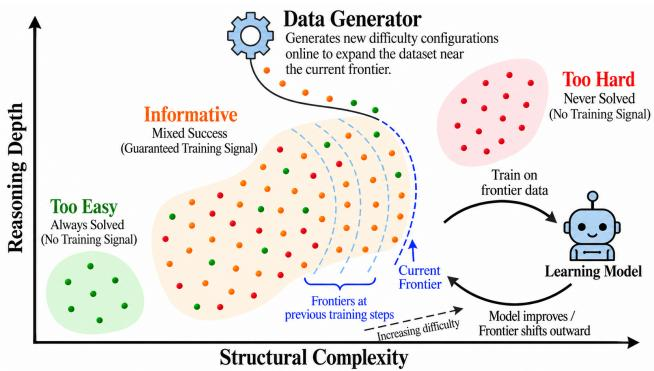  
Figure 1: Frontier learning with procedural data generation. Levels vary along task-specific difficulty dimensions, here abstracted as structural complexity and reasoning depth. As the model improves, its frontier of capabilities shifts outward; frontier learning uses procedural generation to continually construct training data near this moving region.

tize examples near the learner’s ability, while problem-generation methods (Luo et al., 2025; Dai et al., 2026; Sundaram et al., 2026; Zhao et al., 2025) expand the supply of training problems offline or through self-play. Frontier learning instead uses procedural generators online to explore task-specific difficulty levels, estimates level-wise regret, and mutates, explores new levels to continuously track the model’s moving capability frontier. Prior work in unsupervised environment design (Dennis et al., 2020; Jiang et al., 2021; Parker-Holder et al., 2022; Campero et al., 2021) has explored training in online procedural generation environments, including navigation and control tasks. In contrast, our work focuses on post-training of LLMs on reasoning tasks. We discuss related work in detail in Appendix A.

Contributions: Our main contributions are as follows. (i) We formalize frontier learning, an open-ended RL post-training approach that uses a procedural generator online to adapt the training curriculum to the model’s evolving capability. It treats the generator’s task-specific attributes as a multidimensional space of levels, without assuming that they induce a known or monotonic difficulty ordering. (ii) We design three online mechanisms that together keep the training distribution at the capability frontier: a dynamic level buffer that maintains a set of frontier levels, a regret-based priority signal that identifies and prioritizes frontier levels using only the GRPO rollouts already collected, and random exploration with state-dependent mutation that continually scouts for new frontier levels and admits them to the buffer. (iii) We instantiate frontier learning within GRPO and show that it outperforms fixed-pool, domain-randomization and adaptive-sampling baselines across five puzzle, math and graph reasoning tasks and three model families. The gains are largest over long training horizons, where frontier learning keeps improving after the baselines plateau (71.8 vs 33.3 on DICE), and ablations show that regret-guided mutation drives this expansion.

## 2 BACKGROUND

We address the challenge of post-training a large language model (LLM), denoted by $\pi _ { \theta } .$ , on a given reasoning task. This typically entails finetuning the LLM using Reinforcement Learning with Verifiable Rewards (RLVR) based on a fixed offline dataset D, comprising problems specific to the given reasoning task, and a reward function $r ( \cdot , \cdot )$ . The problems admit verifiable correct answers, and the reward function r is designed to evaluate the correctness of a response $y$ for any problem $x \in \mathcal { D }$ . The objective in RLVR is to optimize the expected reward attained by policy πθ on problems sampled from $\mathcal { D } .$ Concretely, we define it as $J ( \theta ) \stackrel { - } { = } \mathbb { E } _ { x \sim \mathcal { D } , y \sim \pi _ { \theta } ( . | x ) } [ r ( x , y ) ]$

Standard RLVR pipelines optimize $J ( \theta )$ via Group Relative Policy Optimization (GRPO) (Shao et al., 2024; Guo et al., 2025), which constructs advantages from within-group reward comparisons, and avoids training a separate value network to assign the same (Schulman et al., 2017). Specifically, for a given problem x, the policy $\pi _ { \theta }$ generates n individual responses $\{ y _ { 1 } , \ldots , y _ { n } \}$ . Then, the advantage of response i given the rewards $\{ \bar { r } _ { i } = r ( x , y _ { i } ) \} _ { i = 1 } ^ { n }$ is calculated as follows:

$$
A _ { i } = \frac { r _ { i } - \mu } { \sigma _ { r } + \epsilon } , \qquad \mu = \frac { 1 } { n } \sum _ { i } r _ { i } , \quad \sigma _ { r } = \mathrm { M A D } ( \{ r _ { i } \} ) = \frac { 1 } { n } \sum _ { i } | r _ { i } - \mu | .\tag{1}
$$

Here, following Dai et al. (2026), we use the mean absolute deviation (MAD) in the denominator rather than standard deviation. This is to ensure the update magnitude of a single problem, determined by the sum of absolute advantages $\begin{array} { r } { \frac { 1 } { n } \sum _ { i } | A _ { i } | . } \end{array}$ , remains constant. This avoids disadvantaging problems at the capability frontier (all but one rollout wrong), whose absolute advantages are low when defined using the standard deviation (see Dai et al. (2026, Theorems-1,2)). Given the assigned advantages, GRPO optimizes the following clipped surrogate objective:

$$
J _ { \mathrm { G R P O } } ( \theta ) = \mathbb { E } _ { x \sim \mathcal { D } , y _ { i } \sim \pi _ { \theta } ( \cdot | x ) } \left[ \frac { 1 } { n } \sum _ { i = 1 } ^ { n } \frac { 1 } { | y _ { i } | } \sum _ { t = 1 } ^ { | y _ { i } | } \left( \operatorname* { m i n } \left( r _ { i , t } \hat { A } _ { i , t } , \mathrm { c l i p } ( r _ { i , t } , 1 - \varepsilon , 1 + \varepsilon ) \hat { A } _ { i , t } \right) \right) \right] .\tag{2}
$$

Despite the success of standard RLVR pipelines to improve the reasoning capabilities of LLMs, they still suffer from the following limitation when built upon a fixed dataset.

Gradient collapse: A well-documented failure mode of GRPO with fixed training data (Foster et al., 2025; Bae et al., 2025; Yu et al., 2025; Ramesh et al., 2025) is the zero gradient phenomenon wherein rollouts to a problem are all correct or all wrong. Proposed mitigations filter or resample within a fixed problem pool to increase the proportion of non-zero gradient problems in the training batch (Li et al., 2025b; Chen et al., 2025b; Wang et al., 2025; Zhou et al., 2025; Panaganti et al., 2026; Gu et al., 2026). Such strategies assume informative problems already exist in the data pool and merely need to be identified from the data. The issues with such an assumption are twofold: (i) The predetermined static data might contain very low or no informative training problems, as the problems might be too easy or too hard for the given policy. (ii) Even if the dataset is designed to be informative for the policy at its initial state, as training progresses, the policy’s capability improves. And once its capability reaches a certain threshold, the trained policy drifts beyond the utility of the static dataset for GRPO training. Specifically, it would have already mastered all problems in the dataset, leading to continual zero-gradient exposure and no further learning progress. This exposes a fundamental bottleneck in GRPO post-training and points to a structural gap in standard RLVR pipelines: the training data must adapt online to the model’s evolving capability.

## 3 FRONTIER LEARNING

In this section, we propose and formalize frontier learning, an open-ended post-training approach that allows continuous adaptation of the training data by sampling appropriate problems from procedural data generators. We begin by discussing the notion of procedural data generators upon which this approach is built.

## 3.1 PROCEDURAL DATA GENERATION

Structured reasoning domains like logic, math, puzzles, etc., consist of tasks such as countdown, ARC, geometry (Stojanovski et al., 2025) that can be generated and verified in a rule-based or programmatic manner. In such tasks, each problem is produced by an underlying procedure specified by explicit rules that samples the terms, constraints, or values defining the problem. Such procedurally generated data has been increasingly incorporated in LLM post-training pipelines, especially to improve their general reasoning ability.

Given a procedural data generator, one can specify certain task-specific attributes used by the generator to construct problems of a certain reasoning task for training. In particular, we define a certain attribute combination as a level $\ell \in { \mathcal { L } } .$ , where $\mathcal { L }$ is the set of all such attribute combinations, which can be intuitively regarded as a structured difficulty class from which arbitrarily many problems can be drawn.

As a concrete example, consider the COUNTDOWN arithmetic task. A problem consists of a set of input numbers and a target number and the task is to produce an arithmetic expression that uses the input numbers to obtain the target. Here, the level l will specify the number of inputs, the range of those inputs, the range of the target, and the allowed arithmetic operations. For example, one configuration may generate puzzles with four operands sampled from [1, 10] and targets in [20, 100], while another may generate puzzles with six operands sampled from [1, 100] and targets in [100, 1000]. Sampling $x \sim l$ then produces one concrete puzzle from the corresponding level. Appendix B provides an additional visual example for SOKOBAN.

Although prior works incorporate data generated by such procedural generators into their pipelines, they primarily use their generative capacity only offline. They draw batches from a fixed dataset, presampled from a distribution over $\bar { \mathcal { L } }$ specified prior to training. This distribution reflects the practitioner’s assumptions about the model’s capability but still leaves both the levels and the generated problems fixed for the entire run. As noted in Section 2, such a dataset faces the same bottleneck as that of a fixed human-curated dataset for GRPO post-training, as it can only capture the informative levels in $\mathcal { L }$ according to the policy’s initial capability and might fail to adapt online to the current policy’s capability.

## 3.2 OBJECTIVE FOR OPEN-ENDED POST-TRAINING

We consider the open-ended post-training framework, in which the objective is to continuously stream informative samples, w.r.t. the current policy, into the training distribution using data generated by a procedural generator. This entails actively navigating and exploring the set of levels ${ \mathcal { L } } ,$ corresponding to the given procedural generator, to track the policy’s evolving capability frontier. Here, the capability frontier is defined as the band of levels that comprises informative problems and contributes to learning progress. This is especially challenging, as this band of informative levels is a thin, moving slice within L during training. The vast majority of levels are either too easy or too difficult. Hence, sampling uniformly from the set of all levels $\mathcal { L }$ and filtering would be highly sub-optimal.

Hence, an effective approach for this framework must choose which levels to sample from at each step so as to maximize the capability of the final policy. We measure the performance of an approach tackling this framework by the following objective, evaluated at the end of T training steps:

$$
J ( \theta ) = \mathbb { E } _ { \ell \sim \mathcal { L } , \boldsymbol { x } \sim \ell , \boldsymbol { y } \sim \pi _ { \theta } ( \cdot | \boldsymbol { x } ) } [ r ( \boldsymbol { x } , \boldsymbol { y } ) ] .\tag{3}
$$

Here, the objective measures the expected performance of the trained policy on instances drawn uniformly from levels $\ell \in { \mathcal { L } } .$ . In practice, we estimate $J ( \theta )$ using a held-out set of levels unseen during training, thereby also assessing the agent’s ability to generalize.

In order to effectively perform in the open-ended post-training framework and maximize Equation (3), we delineate three core requirements any approach should satisfy. First, the approach must identify the capability frontier. Second, it must track this frontier over time, maintaining training pressure on levels that are currently near the edge of this frontier and deprioritizing those that have become consistently solved. Third, it must continuously expand the training distribution, by introducing new levels into the distribution that are not yet present but may lie beyond the current frontier.

## 3.3 COMPONENTS OF FRONTIER LEARNING

Next, we detail our proposed frontier learning approach, aimed to tackle the open-ended post-training framework discussed in Section 3.2.

Frontier learning addresses the core requirements detailed in Section 3.2 through three tightly coupled online mechanisms operating on a dynamic level buffer B, a fixed-capacity set of levels continuously

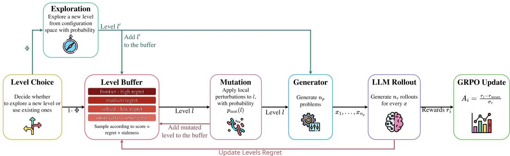

Figure 2: One iteration of frontier learning with GRPO. At each step, the algorithm initially constructs the level batch with a mix of exploratory levels and high-regret frontier levels sampled from the buffer. A level sampled from the buffer is locally mutated with probability $p _ { \mathrm { m u t } } ( \ell )$ , by perturbing its attributes in order to evaluate and potentially extend the policy’s capability frontier. The resulting level batch is then passed through the generator to construct the training batch of problems for the GRPO update. The resulting rewards and regret estimates are then used for future level selection.

replenished and pruned throughout training. In particular, it uses a regret-based priority signal to identify levels with remaining learning potential and concentrates sampling on the current frontier. Moreover, it conducts exploration to continuously scout L for informative levels that exist beyond the buffer. Finally, it also performs state-dependent mutation to perturb the attributes of frontier levels and incorporate levels at incrementally harder difficulties into the level buffer B. We summarize our approach in Figure 2. The following subsections define each mechanism in turn.

## 3.3.1 REGRET AND PRIORITY

We define regret at two levels of granularity: per problem x and per level ℓ.

Problem-wise regret: For a problem x drawn from level ℓ, the policy generates n rollouts with s successes. Two quantities characterise the policy’s behaviour on x: the solvability indicator $\mathbf { 1 } [ s \geq 1 ]$ which is 1 if the policy solves x at all and 0 otherwise, and the empirical success rate $s ( x ) = s / n$ The problem-level regret is their difference:

$$
\rho ( x ) = 1 [ s \geq 1 ] - s ( x ) .\tag{4}
$$

Regret is zero for impossible problems $( s = 0$ , no gradient signal exists) and for fully mastered ones $( s ( x ) = 1$ , solvability and success rate coincide), and is strictly positive only in the productive regime where gradient signal flows.

Level-wise regret: The regret of a level ℓ is the expected problem-wise regret over problems drawn from its generator:

$$
\begin{array} { r } { \mathcal { R } ( \ell ) = \mathbb { E } _ { x \sim \ell } \big [ \rho ( x ) \big ] = \mathbb { E } _ { x \sim \ell } \Big [ \mathbf { 1 } [ s \geq 1 ] - s ( x ) \Big ] . } \end{array}\tag{5}
$$

Crucially, a level accumulates high regret if and only if many of its problems are solvable but not yet reliably solved, i.e., many problems lie in the informative band. A level where most problems are either impossible or already mastered yields low $\mathcal { R } ( \ell )$ regardless of a few outliers, correctly reflecting limited learning potential.

In practice, we estimate $\mathcal { R } ( \ell )$ by tracking the moving window of problems Wl sampled from ℓ:

$$
\hat { \rho } ( \ell ) = \frac { 1 } { | \mathcal { W } _ { \ell } | } \sum _ { x \in \mathcal { W } _ { \ell } } \rho ( x ) .\tag{6}
$$

Here, $\rho ( x )$ is computed directly from the n rollouts collected on x during the rollout phase, and hence no additional rollouts are required. As the policy improves across problems from $\bar { \ell } , \hat { \rho } ( \ell )$ falls automatically, and the buffer starts prioritizing harder levels that have newly entered the informative band.

Priority score: Each level is assigned a priority score that adds a staleness correction to regret:

$$
P ( \ell , t ) = \mathcal { R } ( \ell ) + \lambda _ { s } \cdot ( t - t _ { \ell } ) ,\tag{7}
$$

where $t _ { \ell }$ is the last step at which level ℓ was sampled. The staleness term ensures all levels in the buffer are periodically revisited and helps detect changes in the policy’s capability on dormant levels.

## 3.3.2 REGRET-GUIDED SAMPLING WITH EXPLORATION

At each training step t, a batch of $n \ell$ levels is assembled as follows: All $n _ { \ell }$ slots are initially drawn from the dynamic level buffer B by a Zipfian distribution over priority scores $P ( \ell , t )$ , concentrating training on the current capability frontier while preserving diversity across the buffer. Each slot is then independently replaced with probability ϕ with a random level sampled uniformly from ${ \mathcal { L } } .$ This ensures that the expected fraction of exploratory levels in the current training batch is ϕ. Moreover, this helps the training batch to stay anchored at the productive frontier, while also exploring continuously for more difficult levels beyond the current buffer to avoid stagnation.

## 3.3.3 STATE-DEPENDENT MUTATION

It is important to expand the buffer with frontier levels at incrementally harder difficulties so that it remains continually informative. However, neither regret nor exploration systematically target the boundary of the model’s current capability. Mutation fills this gap by applying a small, undirected perturbation to existing buffer levels to produce new levels in their local neighbourhood.

At every step t, each level ℓ that was sampled from the buffer and not replaced with a random level due to exploration is mutated with a probability that depends on its current difficulty class defined w.r.t. the average empirical success rate of its problems $\begin{array} { r } { \dot { \hat { s } } ( \ell ) = \frac { 1 } { | \mathcal { W } | } \sum _ { x \in \mathcal { W } _ { \ell } } { s ( x ) } } \end{array}$ in the last W :

$$
p _ { \mathrm { m u t } } ( \ell ) = \left\{ \begin{array} { l l } { p _ { \mathrm { i n f } } } & { \hat { s } ( \ell ) \in ( 0 . 0 5 , 0 . 9 5 ) \ ( \mathrm { i n f o r m a t i v e } ) } \\ { p _ { \mathrm { e a s y } } } & { \hat { s } ( \ell ) > 0 . 9 5 \ ( \mathrm { t o o \ e a s y } ) } \\ { p _ { \mathrm { h a r d } } } & { \hat { s } ( \ell ) < 0 . 0 5 \ ( \mathrm { t o o d i f f c u l t } ) } \end{array} \right.\tag{8}
$$

with $p _ { \mathrm { i n f } } > p _ { \mathrm { e a s y } } \ge p _ { \mathrm { h a r d } }$ . This concentrates mutation effort on informative levels, while still allowing easy levels to potentially produce new harder variants and enabling impossible levels to produce easier variants in a limited manner so as not to populate the buffer with a lot of impossible levels.

The combined effect of state-dependent mutation probabilities is that the buffer evolves to track the model’s improving capability as informative frontier levels are continuously allowed to seed variants at incrementally higher difficulties.

## 4 ALGORITHM

In this section, we present an instantiation of our frontier learning approach with GRPO in Algorithm 1. In particular, Algorithm 1 comprises of three tightly coupled operations at each step, namely, assembling a regret-guided training batch using a procedural data generator, updating the policy via GRPO, and refreshing the regret state using the newly observed returns (illustrated in Figure 2). We describe the main components of Algorithm 1 below.

Grid seeding initialisation (line 1): The buffer is populated by grid seeding, wherein L is partitioned along each attribute axis into an equal number of cells and one level is sampled uniformly from each cell. This guarantees broad coverage of the difficulty spectrum from the very first step, preventing the cold-start collapse that occurs when random seeding places all initial levels in a single difficulty band.

Batch assembly (lines 3–10): The batch is assembled from $n _ { \ell }$ replay levels drawn from B by Zipfian sampling over priority scores $P ( \ell , t )$ (see Equation (7)). Then, each sampled level is independently considered for exploration: with probability ϕ, we draw a candidate $\ell ^ { \prime } \sim \dot { \mathrm { U n i f o r m } } ( \mathcal { L } )$ , check whether $\ell ^ { \prime } \notin \mathcal { B }$ , and, if novel, admitted to the buffer B and used in place of the original replay level. Then, each non-replaced replay level is offered to the mutator: with probability $p _ { \mathrm { m u t } } ( \ell )$ (Equation (8)), a single at tribute is perturbed to produce a candidate child level l′. If l′ is novel, it is admitted to the buffer B and used in place of the original replay level. The constructed batch is then passed on to the procedural gen erator. When $| B | = \bar { B _ { \mathrm { m a x } } }$ , admitting a new level evicts the level with the lowest priority score $P ( \ell , t )$

Rollout and policy update (lines 11–15): For each active level ℓ in the batch, $n _ { p }$ problems $x \sim \ell$ are generated using the procedural generator and n rollouts are sampled from the current policy for each problem x. The full batch is then used to update θ via GRPO (Equation (1)).

Buffer update (lines 16–18): After the policy update, returns from every trained level are appended to its rolling window and regret $\mathcal { R } ( \ell )$ and priority $P ( \ell , t )$ are recomputed from Equations (5) and (7). Hence, the buffer’s priority scores constantly reflects the updated policy’s capability frontier, and levels with low regret are immediately deprioritised and the priority shifts towards the new frontier levels with high regret at the next batch assembly.

Algorithm 1 Frontier Learning with GRPO   
Require: Level space ${ \overline { { \mathcal { L } } } } ,$ reward r, policy $\pi _ { \theta } ,$ buffer capacity $B _ { \mathrm { m a x } } .$ , initial regret $\mathcal { R } _ { 0 } .$ , explore   
fraction $\phi ,$ staleness coeff. $\lambda _ { s } ,$ , mutation probs. $p _ { \mathrm { i n f } } , p _ { \mathrm { e a s y } } , p _ { \mathrm { h a r d } }$   
1: Initialise B by grid seeding $\mathcal { L } ;$ set $\mathcal { R } ( \ell ) \dot {  } \mathcal { R } _ { 0 }$ and $P ( \ell , 0 ) \gets \mathcal { R } ( \ell )$ for all $\ell \in B$   
2: for $t = 1 , \dots , T$ do   
3: Sample $n _ { \ell }$ levels from B by Zipfian sampling over priority scores $P ( \ell , t )$   
4: $\mathcal { L } _ { \mathrm { n e w } }  \emptyset$   
5: for each sampled ℓ do   
6: With prob. $\phi ,$ draw $\ell ^ { \prime } \sim \mathcal { L } ;$ if $\ell ^ { \prime } \notin B ,$ admit $\ell ^ { \prime } ,$ add it to ${ \mathcal { L } } _ { \mathrm { n e w } }$ , replace $\ell \gets \ell ^ { \prime }$ ▷ Explore   
7: end for   
8: for each sampled $\ell \notin \mathcal { L } _ { \mathrm { n e w } }$ do   
9: With prob. $p _ { \mathrm { m u t } } ( \ell )$ , perturb $\ell  \ell ^ { \prime } ;$ if ℓ′ ∈ B / , admit $\ell ^ { \prime } ,$ replace $\ell \gets \ell ^ { \prime }$ ▷ Mutate   
10: end for   
11: for each sampled ℓ do   
12: Draw $n _ { p }$ problems with n rollouts each: x $\sim \ell , \{ y _ { i } \sim \pi _ { \theta } ( \cdot \mid x ) \} _ { i = 1 } ^ { n _ { r } }$   
13: Compute $r _ { i } = r ( x , y _ { i } )$   
14: end for   
15: Update $\theta$ with GRPO on $\{ ( x , y _ { i } , r _ { i } ) \}$ ▷ Eq. 1   
16: for each sampled ℓ do   
17: Append rewards to ${ \boldsymbol { \ell } } { \boldsymbol { \mathbf { \mathit { s } } } }$ rolling window; update $\mathcal { R } ( \ell )$ and $P ( \ell , t )$ ▷ Eqs. 4–7   
18: end for   
19: end for   
20: return $\pi _ { \theta }$

## 5 EXPERIMENTS

We evaluate our proposed frontier learning with GRPO (Algorithm 1) on five procedurally generated reasoning tasks drawn from Reasoning Gym (Stojanovski et al., 2025), each parameterised in a structured level space ${ \mathcal { L } } ,$ spanning three domains. In the puzzle domain, COUNTDOWN requires combining numbers via basic arithmetic to reach a target (difficulty grows with operands count, their magnitude, and the target range), and SOKOBAN requires planning box-pushing moves on a grid (harder problems have larger grids, more boxes, and deeper solution traces). Concerning the math domain, we include DICE, a discrete probability task in which the model must compute the exact probability of a target out come when rolling a set of multi-sided dice (where difficulty is controlled by the number of dice and their face count), and DECIMAL ARITHMETIC, which consists of fixed-precision multi-term decimal calculations, scaling in difficulty with term count, decimal places, and required precision. Finally, in the graph domain, LARGEST ISLAND requires the model to identify the largest connected component of 1-valued cells in a binary grid and report its area. Difficulty scales with grid dimensions and the number of islands, requiring the model to trace connected components over increasingly large graphs.

Models and training protocol: We experiment with two model variants from the Qwen3 family (Yang et al., 2025), chosen to explore the effectiveness of frontier learning across two different starting capability regimes. The pre-trained only Qwen3-4B-Base is used for COUNTDOWN, DICE, and DECIMAL ARITHMETIC. For SOKOBAN, we use the instruction-tuned Qwen3-4B with thinking mode enabled, since such puzzles require more sustained multi-step reasoning and therefore benefit from a larger reasoning budget. To assess whether the effectiveness of frontier learning generalizes across model families and model sizes, we additionally conduct experiments on COUNTDOWN using Llama-3.2-3B-Instruct (Grattafiori et al., 2024) and on LARGEST ISLAND using Olmo3-7B-Instruct (Olmo et al., 2025). For COUNTDOWN, SOKOBAN, and DECIMAL ARITHMETIC, models are trained for $T = 2 0 0 \mathrm { G R P O }$ steps, while for DICE and LARGEST ISLAND we extend the training horizon to $T = 5 0 0 \mathrm { G R P O }$ steps, in order to analyze how our method behaves under prolonged training. Full implementation details and hyperparameters are reported in Appendix D, while a detailed accounting of the used compute is provided in Appendix H.

Baselines: We compare frontier learning against four representative alternatives for selecting training levels from procedural generators. Three of them rely on a fixed level buffer seeded once before training via grid seeding, introducing no new levels during training, and hence isolating the effect of having a fixed pool of levels in contrast to growing it. In particular, Uniform samples uniformly from the seeded buffer without any priority, providing a clean upper bound on what structured initial coverage alone can achieve. Both SEC (Chen et al., 2025b) and PLR (Jiang et al., 2021) attempt instead to recreate a curriculum within the fixed initial buffer by assigning priority scores to levels and sampling more frequently from those estimated to be most productive. SEC estimates productivity by using the absolute GRPO advantage estimated from previous rollouts, while PLR uses the same level-wise regret signal $\mathcal { R } ( \ell )$ as frontier learning (Eq. 5). On the other hand, Domain Randomization (DR) samples fresh levels at every step from the same coverage-aware seeding grid used to initialize the other baselines, with no memory or replay, thereby testing unguided exploration of the level space.

Evaluation: For each task, we pre-define a fixed set of evaluation levels $\ell _ { v } \sim \mathcal { L } ,$ each associated with a total of 200 unique problems $x _ { v a l }$ . Each level’s configuration is excluded from grid initialization, uniform exploration, and mutation admission. Thus, neither the evaluation instances nor their exact generator configurations are encountered during training. Levels are ordered by a task-specific difficulty heuristic derived from their configuration attributes, yielding a spectrum that we partition into three bins (Easy, Medium, Hard); full definitions and the bin partition are given in Appendix C. The primary metric is accuracy: the mean greedy-decoding accuracy across all evaluation levels, averaged over four seeds.

## 5.1 RESULTS

Performance under the standard training budget: We first evaluate frontier learning on COUNT-DOWN, DECIMAL ARITHMETIC, and SOKOBAN using the standard budget of 200 GRPO steps. As shown in Table 1, frontier learning achieves the highest average final performance on all three tasks.

The clearest improvement is observed on COUNTDOWN, where frontier learning reaches $5 0 . 9 \pm 0 . 5 \%$ accuracy, compared with $4 4 . 7 \pm 1 . 7$ for the strongest baseline, while the overall gains are smaller on SOKOBAN and DECIMAL ARITHMETIC.

Table 1: Accuracy (%) on the fixed anchor evaluation set after 200 training steps. Best result per task in bold; second-best underlined.

The per-difficulty results, shown in Figure 7, provide a more detailed view of these differences. On SOKOBAN, frontier learning’s largest gain is concentrated on easier configurations that are not yet fully mastered, while more advanced levels remain

<table><tr><td></td><td colspan="2"> $P u z z l e$ </td><td>Math</td></tr><tr><td>Task</td><td>Countdown</td><td>Sokoban</td><td>Dec. Arith.</td></tr><tr><td>Model</td><td>Qwen3-4B-Base Qwen3-4B Qwen3-4B-Bas</td><td></td><td></td></tr><tr><td colspan="4">Method</td></tr><tr><td>Domain Rand.</td><td> ${ \underline { { 4 4 . 7 } } } \pm 1 . 7$ </td><td> $3 7 . 6 { \scriptstyle \pm 2 . 6 }$ </td><td> $\underline { { 3 1 . 0 \pm 2 . 8 } }$ </td></tr><tr><td>Uniform</td><td> $\overline { { 4 4 . 2 } } \overline { { \pm } } 4 . 0$ </td><td> $3 9 . 5 { \scriptstyle \pm 1 . 3 }$ </td><td> $\overline { { 2 8 . 0 } } \pm 2 . 6$ </td></tr><tr><td>SEC</td><td> $4 0 . 1 \overline { { \pm } } 8 . \dot { 1 }$ </td><td> $3 4 . 3 { \scriptstyle \pm 6 . 6 }$ </td><td> $2 9 . 1 { \pm } 4 . 1 $ </td></tr><tr><td>PLR</td><td> $4 4 . 3 \overline { { \pm 2 . 9 } }$ </td><td> $4 1 . 1 \overline { { \pm } } 3 . 9$ </td><td> $2 7 . 5 \pm 2 . 9$ </td></tr><tr><td>Frontier Learning (ours)</td><td> $\mathbf { 5 0 . 9 } _ { \pm 0 . 5 } ^ { - }$ </td><td> $4 5 . 2 _ { \pm 1 . 9 }$ </td><td> $3 4 . 7 _ { \pm 3 . 6 } ^ { - }$ </td></tr><tr><td>Relative gain vs 2nd (%)</td><td> $\mathbf { + 1 3 . 9 }$ </td><td>+10.0</td><td>+11.9</td></tr></table>

largely unproductive. On DECIMAL ARITHMETIC, the improvement is concentrated on Easy and Medium levels, whereas all methods remain effectively tied on Hard configurations. These results show that frontier learning successfully identifies where the model has the greatest remaining room for improvement and concentrates training on those configurations. Appendix E reports the full learning curves for all methods on these tasks.

Long-horizon frontier expansion on DICE: We next extend training on DICE from 200 to 500 GRPO steps to test whether frontier learning continues to track the model’s improving capabilities over a longer horizon. In addition to the baselines introduced above, we include DAPO-style dynamic-filtering baseline (Yu et al., 2025) and an ACE-GRPO sampling baseline (Cai et al., 2026). DAPO discards rollout groups whose rewards are uniformly correct or uniformly incorrect. Because this filtering can consume multiple rollout groups for each optimizer update, we match DAPO to the total rollout budget of the other methods, corresponding to 256k rollouts, rather than to 500 optimizer updates. ACE-GRPO instead prioritizes replay-buffer levels using its Learnability Potential score.

Table 2: Accuracy (%) on DICE for the baselines, Frontier Learning and its components ablation. Best result in bold; secondbest within each block underlined.
<table><tr><td>Method</td><td>Accuracy</td></tr><tr><td>Domain Rand. Uniform SEC</td><td> $2 3 . 4 _ { \pm 4 . 7 }$   $3 1 . 9 \overline { { \pm } } 1 . 5$   $\underline { { 3 3 . 3 } } \underline { { + 1 . 2 } }$ </td></tr><tr><td>PLR ACE-GRPO DAPO</td><td> $\overline { { 3 1 . 2 } } \overline { { \pm } } 1 . 9$   $3 3 . 2 { \scriptstyle \pm 2 . 1 }$  25.4±5.9</td></tr><tr><td>Frontier Learning (ours) Component ablations</td><td> $7 1 . 8 \overline { { \pm } } 6 . 2$ </td></tr><tr><td>Unif+Explore</td><td> $3 0 . 8 { \scriptstyle \pm 1 . 3 }$ </td></tr><tr><td>Unif+FlatMut Unif+Explore+FlatMut PLR+Explore</td><td> $4 7 . 1 \overline { { \pm } } 1 0 . 8$   $3 6 . 9 _ { \pm 2 . 9 }$ </td></tr></table>

Figure 8 shows that the standard baselines improve during the first approximately 100–200 steps and subsequently plateau. Frontier learning instead continues improving throughout the longer training horizon, reaching $7 1 . 8 \pm 6 . 2 \%$ accuracy after 500 steps. The strongest standard baseline, SEC, reaches $3 3 . 3 \pm 1 . { \overline { { 2 } } } { }$ , while ACE-GRPO reaches $3 3 . 2 \pm { \hat { 2 } } . 1$ and the rollout-matched DAPO baseline reaches $2 5 . 4 \pm 5 . 9$

Additionally, Figure 10 separates performance by difficulty. Frontier learning reaches near-perfect performance on Easy and Medium configurations while making substantial progress on regions that remain almost entirely unsolved by the baselines. In particular, it reaches 72.6% on Hard levels and 20.7% on Extra-hard levels while all the standard baselines remain under 5.5% on such categories. The long-horizon improvement is therefore not limited to further optimizing already-mastered configurations, but reflects continued expansion of the model’s capability frontier. Appendix F provides the per-difficulty learning curves, showing how performance across the individual difficulty bins evolves throughout training. We reuse this same experimental setup to run a sweep across step sizes for two baselines, reported in Appendix G.2.

Component ablation: We ablate buffer growth, random exploration, mutation, and regret-based pri oritization under the same 500-step DICE protocol. All ablations use a dynamic buffer. PLR+Explore removes mutation, PLR+Mut removes random exploration, the Uniform variants remove regret-based prioritization, and FlatMut replaces state-dependent mutation with a level-independent probability.

Table 2 shows that buffer growth alone is insufficient: PLR+Explore reaches only $3 3 . 5 \pm 1 . 8 .$ By contrast, PLR+Mut reaches $6 2 . 5 \pm 4 . 5 ,$ , showing that mutation-driven expansion is key to moving beyond the seeded difficulty range. Mutation alone is also insufficient: Unif+FlatMut reaches 47.1 ± 10.8, substantially below PLR+Mut, indicating that regret-guided prioritization makes mutation more effective by focusing replay and subsequent mutations on informative levels. The full method reaches $7 1 . 8 { \pm } 6 . 2 ,$ with random exploration providing a further gain, especially on Hard and Extra-hard levels.

Generalization across model families and sizes: To assess whether frontier learning remains effective outside the Qwen3 family and the 4B model size, we train Llama-3.2-3B-Instruct on COUNTDOWN under the standard 200-step budget and Olmo3-7B-Instruct on LARGEST ISLAND under the extended 500-step budget. Table 3 shows that frontier learning attains the best accuracy in both settings. The per-difficulty learning curves for LARGEST ISLAND (Figure 3) mirror the DICE results

Table 3: Accuracy (%) on COUNTDOWN and LARGEST ISLAND. Best result per task in bold; second-best underlined.
<table><tr><td>Task</td><td>Countdown</td><td>Largest Island</td></tr><tr><td>Model</td><td colspan="2">Llama-3.2-3B-Instruct Olmo3-7B-Instruct</td></tr><tr><td>Method</td><td></td><td></td></tr><tr><td>Domain Rand.</td><td> $\frac { 3 3 . 8 \pm 1 . 9 } { \cdot \cdot }$ </td><td> $4 5 . 2 { \scriptstyle \pm 1 . 8 }$ </td></tr><tr><td>Uniform</td><td> ${ \overline { { 2 5 . 3 } } } { \overline { { \pm } } } 4 . 7$ </td><td>45.3±3.4</td></tr><tr><td>SEC</td><td> $2 9 . 5 { \overline { { \pm } } } 1 . 6 \ $ </td><td>48.3±4.7</td></tr><tr><td>PLR</td><td> $2 9 . 0 { \scriptstyle \pm 1 . 8 }$ </td><td>52.0±5.3</td></tr><tr><td>ACE-GRPO</td><td> $3 1 . 4 { \pm } 1 . 9$ </td><td>45.3±5.5</td></tr><tr><td>Frontier learning (ours)</td><td> $3 9 . 2 _ { \pm 1 . 3 } ^ { - }$ </td><td>73.7±3.3</td></tr><tr><td>Relative gain vs 2nd (%)</td><td>+16.0</td><td>+41.7</td></tr></table>

shown in Figure 9: all methods saturate on Easy levels, but on Medium and Hard levels the baselines plateau after roughly 200 steps while frontier learning continues to improve until the end of training, reaching 84.0% and 47.2% respectively against at most 54.0% and 18.2% for any baseline. These results indicate that the gains of frontier learning are not tied to a particular model family, scale, or task domain. We additionally use the Llama COUNTDOWN setting for the hyperparameter sensitivity analysis in Appendix G.1.

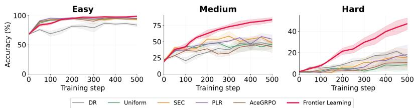  
Figure 3: Per-difficulty accuracy (%) on LARGEST ISLAND with Olmo3-7B-Instruct over 500 GRPO steps. All methods saturate on Easy levels, but only frontier learning keeps improving on Medium and Hard levels throughout training, while the baselines plateau after roughly 200 steps.

## 6 CONCLUSIONS

We formalize frontier learning, a novel open-ended RL post-training approach that adapts the training curricula for finetuning LLMs on reasoning tasks using a procedural generator. We design three online mechanisms for our approach, namely, a dynamic level buffer to maintain a set of frontier levels, a regret-based priority signal to identify and prioritize the frontier levels and exploration, mutation to constantly scout and incorporate new frontier levels into the buffer. Together, they ensure the training distribution is constantly adapted online to the model’s evolving capability. We instantiate our approach within the GRPO objective and empirically demonstrate that our approach consistently outperforms baselines on several puzzle, math and graph tasks.

Our approach is limited to a procedural generator equipped with continuous or discrete task-specific parameters. Extending frontier learning to tasks where problem instances cannot be procedurally generated remains an interesting avenue for future work.

## REFERENCES

Sanghwan Bae, Jiwoo Hong, Min Young Lee, Hanbyul Kim, JeongYeon Nam, and Donghyun Kwak. Online difficulty filtering for reasoning oriented reinforcement learning. arXiv preprint arXiv:2504.03380, 2025.

Longtian Bao, Jianyou Wang, Yang Zhang, Youze Zheng, and Ramamohan Paturi. Question begets question: Self-evolving curriculum for reinforcement fine-tuning on competition mathematics, 2026. URL https://arxiv.org/abs/2608.01522.

Yoshua Bengio, Jérôme Louradour, Ronan Collobert, and Jason Weston. Curriculum learning. In Proceedings of the 26th Annual International Conference on Machine Learning, pp. 41–48, 2009.

Yuzhu Cai, Zexi Liu, Xinyu Zhu, Cheng Wang, and Siheng Chen. Acegrpo: Adaptive curriculum enhanced group relative policy optimization for autonomous machine learning engineering, 2026. URL https://arxiv.org/abs/2602.07906.

Andres Campero, Roberta Raileanu, Heinrich Küttler, Joshua B Tenenbaum, Tim Rocktäschel, and Edward Grefenstette. Learning with AMIGo: Adversarially motivated intrinsic goals. In International Conference on Learning Representations, 2021.

Jiangjie Chen, Qianyu He, Siyu Yuan, Aili Chen, Zhicheng Cai, Weinan Dai, Hongli Yu, Qiying Yu, Xuefeng Li, Jiaze Chen, Hao Zhou, and Mingxuan Wang. Enigmata: Scaling logical reasoning in large language models with synthetic verifiable puzzles. arXiv preprint arXiv:2505.19914, 2025a.

Xiaoyin Chen, Jiarui Lu, Minsu Kim, Dinghuai Zhang, Jian Tang, Alexandre Piché, Nicolas Gontier, Yoshua Bengio, and Ehsan Kamalloo. Self-evolving curriculum for llm reasoning. arXiv preprint arXiv:2505.14970, 2025b.

Yanqi Dai, Yuxiang Ji, Xiao Zhang, Yong Wang, Xiangxiang Chu, and Zhiwu Lu. Harder is better: Boosting mathematical reasoning via difficulty-aware GRPO and multi-aspect question reformulation. arXiv preprint arXiv:2601.20614, 2026.

Michael Dennis, Natasha Jaques, Eugene Vinitsky, Alexandre Bayen, Stuart Russell, Andrew Critch, and Sergey Levine. Emergent complexity and zero-shot transfer via unsupervised environment design. In Advances in Neural Information Processing Systems, volume 33, 2020.

Thomas Foster, Anya Sims, Johannes Forkel, Mattie Fellows, and Jakob Foerster. Learning to reason at the frontier of learnability. arXiv preprint arXiv:2502.12272, 2025.

Aaron Grattafiori, Abhimanyu Dubey, Abhinav Jauhri, Abhinav Pandey, Abhishek Kadian, Ahmad Al-Dahle, Aiesha Letman, Akhil Mathur, Alan Schelten, Alex Vaughan, Amy Yang, Angela Fan, Anirudh Goyal, Anthony Hartshorn, Aobo Yang, Archi Mitra, Archie Sravankumar, Artem Korenev, Arthur Hinsvark, Arun Rao, Aston Zhang, Aurelien Rodriguez, Austen Gregerson, Ava Spataru, Baptiste Roziere, Bethany Biron, Binh Tang, Bobbie Chern, Charlotte Caucheteux, Chaya Nayak, Chloe Bi, Chris Marra, Chris McConnell, Christian Keller, Christophe Touret, Chunyang Wu, Corinne Wong, Cristian Canton Ferrer, Cyrus Nikolaidis, Damien Allonsius, Daniel Song, Danielle

Pintz, Danny Livshits, Danny Wyatt, David Esiobu, Dhruv Choudhary, Dhruv Mahajan, Diego Garcia-Olano, Diego Perino, Dieuwke Hupkes, Egor Lakomkin, Ehab AlBadawy, Elina Lobanova, Emily Dinan, Eric Michael Smith, Filip Radenovic, Francisco Guzmán, Frank Zhang, Gabriel Synnaeve, Gabrielle Lee, Georgia Lewis Anderson, Govind Thattai, Graeme Nail, Gregoire Mialon, Guan Pang, Guillem Cucurell, Hailey Nguyen, Hannah Korevaar, Hu Xu, Hugo Touvron, Iliyan Zarov, Imanol Arrieta Ibarra, Isabel Kloumann, Ishan Misra, Ivan Evtimov, Jack Zhang, Jade Copet, Jaewon Lee, Jan Geffert, Jana Vranes, Jason Park, Jay Mahadeokar, Jeet Shah, Jelmer van der Linde Jennifer Billock, Jenny Hong, Jenya Lee, Jeremy Fu, Jianfeng Chi, Jianyu Huang, Jiawen Liu, Jie Wang, Jiecao Yu, Joanna Bitton, Joe Spisak, Jongsoo Park, Joseph Rocca, Joshua Johnstun, Joshua Saxe, Junteng Jia, Kalyan Vasuden Alwala, Karthik Prasad, Kartikeya Upasani, Kate Plawiak, Ke Li, Kenneth Heafield, Kevin Stone, Khalid El-Arini, Krithika Iyer, Kshitiz Malik, Kuenley Chiu, Kunal Bhalla, Kushal Lakhotia, Lauren Rantala-Yeary, Laurens van der Maaten, Lawrence Chen, Liang Tan, Liz Jenkins, Louis Martin, Lovish Madaan, Lubo Malo, Lukas Blecher, Lukas Landzaat, Luke de Oliveira, Madeline Muzzi, Mahesh Pasupuleti, Mannat Singh, Manohar Paluri Marcin Kardas, Maria Tsimpoukelli, Mathew Oldham, Mathieu Rita, Maya Pavlova, Melanie Kambadur, Mike Lewis, Min Si, Mitesh Kumar Singh, Mona Hassan, Naman Goyal, Narjes Torabi, Nikolay Bashlykov, Nikolay Bogoychev, Niladri Chatterji, Ning Zhang, Olivier Duchenne, Onur Çelebi, Patrick Alrassy, Pengchuan Zhang, Pengwei Li, Petar Vasic, Peter Weng, Prajjwal Bhargava, Pratik Dubal, Praveen Krishnan, Punit Singh Koura, Puxin Xu, Qing He, Qingxiao Dong, Ragavan Srinivasan, Raj Ganapathy, Ramon Calderer, Ricardo Silveira Cabral, Robert Stojnic, Roberta Raileanu, Rohan Maheswari, Rohit Girdhar, Rohit Patel, Romain Sauvestre, Ronnie Polidoro, Roshan Sumbaly, Ross Taylor, Ruan Silva, Rui Hou, Rui Wang, Saghar Hosseini, Sahana Chennabasappa, Sanjay Singh, Sean Bell, Seohyun Sonia Kim, Sergey Edunov, Shaoliang Nie, Sharan Narang, Sharath Raparthy, Sheng Shen, Shengye Wan, Shruti Bhosale, Shun Zhang, Simon Vandenhende, Soumya Batra, Spencer Whitman, Sten Sootla, Stephane Collot, Suchin Gururangan, Sydney Borodinsky, Tamar Herman, Tara Fowler, Tarek Sheasha, Thomas Georgiou, Thomas Scialom, Tobias Speckbacher, Todor Mihaylov, Tong Xiao, Ujjwal Karn, Vedanuj Goswami, Vibhor Gupta, Vignesh Ramanathan, Viktor Kerkez, Vincent Gonguet, Virginie Do, Vish Vogeti, Vítor Albiero, Vladan Petrovic, Weiwei Chu, Wenhan Xiong, Wenyin Fu, Whitney Meers, Xavier Martinet, Xiaodong Wang, Xiaofang Wang, Xiaoqing Ellen Tan, Xide Xia, Xinfeng Xie, Xuchao Jia, Xuewei Wang, Yaelle Goldschlag, Yashesh Gaur, Yasmine Babaei, Yi Wen, Yiwen Song, Yuchen Zhang, Yue Li, Yuning Mao, Zacharie Delpierre Coudert, Zheng Yan, Zhengxing Chen, Zoe Papakipos, Aaditya Singh, Aayushi Srivastava, Abha Jain, Adam Kelsey, Adam Shajnfeld, Adithya Gangidi, Adolfo Victoria, Ahuva Goldstand, Ajay Menon, Ajay Sharma, Alex Boesenberg, Alexei Baevski, Allie Feinstein, Amanda Kallet, Amit Sangani, Amos Teo, Anam Yunus, Andrei Lupu, Andres Alvarado, Andrew Caples, Andrew Gu, Andrew Ho, Andrew Poulton, Andrew Ryan, Ankit Ramchandani, Annie Dong, Annie Franco, Anuj Goyal, Aparajita Saraf, Arkabandhu Chowdhury, Ashley Gabriel, Ashwin Bharambe, Assaf Eisenman, Azadeh Yazdan, Beau James, Ben Maurer, Benjamin Leonhardi, Bernie Huang, Beth Loyd, Beto De Paola, Bhargavi Paranjape, Bing Liu, Bo Wu, Boyu Ni, Braden Hancock, Bram Wasti, Brandon Spence, Brani Stojkovic, Brian Gamido, Britt Montalvo, Carl Parker, Carly Burton, Catalina Mejia, Ce Liu, Changhan Wang, Changkyu Kim, Chao Zhou, Chester Hu, Ching-Hsiang Chu, Chris Cai, Chris Tindal, Christoph Feichtenhofer, Cynthia Gao, Damon Civin, Dana Beaty, Daniel Kreymer, Daniel Li, David Adkins, David Xu, Davide Testuggine, Delia David, Devi Parikh, Diana Liskovich, Didem Foss, Dingkang Wang, Duc Le, Dustin Holland, Edward Dowling, Eissa Jamil, Elaine Montgomery, Eleonora Presani, Emily Hahn, Emily Wood, Eric-Tuan Le, Erik Brinkman, Esteban Arcaute, Evan Dunbar, Evan Smothers, Fei Sun, Felix Kreuk, Feng Tian, Filippos Kokkinos, Firat Ozgenel, Francesco Caggioni, Frank Kanayet, Frank Seide, Gabriela Medina Florez, Gabriella Schwarz, Gada Badeer, Georgia Swee, Gil Halpern, Grant Herman, Grigory Sizov, Guangyi, Zhang, Guna Lakshminarayanan, Hakan Inan, Hamid Shojanazeri, Han Zou, Hannah Wang, Hanwen Zha, Haroun Habeeb, Harrison Rudolph, Helen Suk, Henry Aspegren, Hunter Goldman, Hongyuan Zhan, Ibrahim Damlaj, Igor Molybog Igor Tufanov, Ilias Leontiadis, Irina-Elena Veliche, Itai Gat, Jake Weissman, James Geboski, James Kohli, Janice Lam, Japhet Asher, Jean-Baptiste Gaya, Jeff Marcus, Jeff Tang, Jennifer Chan, Jenny Zhen, Jeremy Reizenstein, Jeremy Teboul, Jessica Zhong, Jian Jin, Jingyi Yang, Joe Cummings Jon Carvill, Jon Shepard, Jonathan McPhie, Jonathan Torres, Josh Ginsburg, Junjie Wang, Ka Wu, Kam Hou U, Karan Saxena, Kartikay Khandelwal, Katayoun Zand, Kathy Matosich, Kaushik Veeraraghavan, Kelly Michelena, Keqian Li, Kiran Jagadeesh, Kun Huang, Kunal Chawla, Kyle Huang, Lailin Chen, Lakshya Garg, Lavender A, Leandro Silva, Lee Bell, Lei Zhang, Liangpeng Guo, Licheng Yu, Liron Moshkovich, Luca Wehrstedt, Madian Khabsa, Manav Avalani, Manish

Bhatt, Martynas Mankus, Matan Hasson, Matthew Lennie, Matthias Reso, Maxim Groshev, Maxim Naumov, Maya Lathi, Meghan Keneally, Miao Liu, Michael L. Seltzer, Michal Valko, Michelle Restrepo, Mihir Patel, Mik Vyatskov, Mikayel Samvelyan, Mike Clark, Mike Macey, Mike Wang, Miquel Jubert Hermoso, Mo Metanat, Mohammad Rastegari, Munish Bansal, Nandhini Santhanam, Natascha Parks, Natasha White, Navyata Bawa, Nayan Singhal, Nick Egebo, Nicolas Usunier, Nikhil Mehta, Nikolay Pavlovich Laptev, Ning Dong, Norman Cheng, Oleg Chernoguz, Olivia Hart, Omkar Salpekar, Ozlem Kalinli, Parkin Kent, Parth Parekh, Paul Saab, Pavan Balaji, Pedro Rittner, Philip Bontrager, Pierre Roux, Piotr Dollar, Polina Zvyagina, Prashant Ratanchandani, Pritish Yuvraj, Qian Liang, Rachad Alao, Rachel Rodriguez, Rafi Ayub, Raghotham Murthy, Raghu Nayani, Rahul Mitra, Rangaprabhu Parthasarathy, Raymond Li, Rebekkah Hogan, Robin Battey, Rocky Wang, Russ Howes, Ruty Rinott, Sachin Mehta, Sachin Siby, Sai Jayesh Bondu, Samyak Datta, Sara Chugh, Sara Hunt, Sargun Dhillon, Sasha Sidorov, Satadru Pan, Saurabh Mahajan, Saurabh Verma, Seiji Yamamoto, Sharadh Ramaswamy, Shaun Lindsay, Shaun Lindsay, Sheng Feng, Shenghao Lin, Shengxin Cindy Zha, Shishir Patil, Shiva Shankar, Shuqiang Zhang, Shuqiang Zhang, Sinong Wang, Sneha Agarwal, Soji Sajuyigbe, Soumith Chintala, Stephanie Max, Stephen Chen, Steve Kehoe, Steve Satterfield, Sudarshan Govindaprasad, Sumit Gupta, Summer Deng, Sungmin Cho, Sunny Virk, Suraj Subramanian, Sy Choudhury, Sydney Goldman, Tal Remez, Tamar Glaser, Tamara Best, Thilo Koehler, Thomas Robinson, Tianhe Li, Tianjun Zhang, Tim Matthews, Timothy Chou, Tzook Shaked, Varun Vontimitta, Victoria Ajayi, Victoria Montanez, Vijai Mohan, Vinay Satish Kumar, Vishal Mangla, Vlad Ionescu, Vlad Poenaru, Vlad Tiberiu Mihailescu, Vladimir Ivanov, Wei Li, Wenchen Wang, Wenwen Jiang, Wes Bouaziz, Will Constable, Xiaocheng Tang, Xiaojian Wu, Xiaolan Wang, Xilun Wu, Xinbo Gao, Yaniv Kleinman, Yanjun Chen, Ye Hu, Ye Jia, Ye Qi, Yenda Li, Yilin Zhang, Ying Zhang, Yossi Adi, Youngjin Nam, Yu, Wang, Yu Zhao, Yuchen Hao, Yundi Qian, Yunlu Li, Yuzi He, Zach Rait, Zachary DeVito, Zef Rosnbrick, Zhaoduo Wen, Zhenyu Yang, Zhiwei Zhao, and Zhiyu Ma. The llama 3 herd of models, 2024. URL https://arxiv.org/abs/2407.21783.

Alex Graves, Marc G Bellemare, Jacob Menick, Rémi Munos, and Koray Kavukcuoglu. Automated curriculum learning for neural networks. In Proceedings ofthe 34th International Conference on Machine Learning, pp. 1311–1320. PMLR, 2017.

Zhengyao Gu, Jonathan Light, Raul Astudillo, Ziyu Ye, Langzhou He, Henry Peng Zou, Wei Cheng, Santiago Paternain, Philip S. Yu, and Yisong Yue. Actor-curator: Co-adaptive curriculum learning via policy-improvement bandits for RL post-training. arXiv preprint arXiv:2602.20532, 2026.

Xinyu Guan, Li Lyna Zhang, Yifei Liu, Ning Shang, Youran Sun, Yi Zhu, Fan Yang, and Mao Yang. rstar-math: Small llms can master math reasoning with self-evolved deep thinking. 2025. URL https://arxiv.org/abs/2501.04519.

Daya Guo, Dejian Yang, Haowei Zhang, Junxiao Song, Peiyi Wang, Qihao Zhu, Runxin Xu, Ruoyu Zhang, Shirong Ma, Xiao Bi, Xiaokang Zhang, Xingkai Yu, Yu Wu, Z. F. Wu, Zhibin Gou, Zhihong Shao, Zhuoshu Li, Ziyi Gao, Aixin Liu, Bing Xue, Bingxuan Wang, Bochao Wu, Bei Feng, Chengda Lu, Chenggang Zhao, Chengqi Deng, Chong Ruan, Damai Dai, Deli Chen, Dongjie Ji, Erhang Li, Fangyun Lin, Fucong Dai, Fuli Luo, Guangbo Hao, Guanting Chen, Guowei Li, H. Zhang, Hanwei Xu, Honghui Ding, Huazuo Gao, Hui Qu, Hui Li, Jianzhong Guo, Jiashi Li, Jingchang Chen, Jingyang Yuan, Jinhao Tu, Junjie Qiu, Junlong Li, J. L. Cai, Jiaqi Ni, Jian Liang, Jin Chen, Kai Dong, Kai Hu, Kaichao You, Kaige Gao, Kang Guan, Kexin Huang, Kuai Yu, Lean Wang, Lecong Zhang, Liang Zhao, Litong Wang, Liyue Zhang, Lei Xu, Leyi Xia, Mingchuan Zhang, Minghua Zhang, Minghui Tang, Mingxu Zhou, Meng Li, Miaojun Wang, Mingming Li, Ning Tian, Panpan Huang, Peng Zhang, Qiancheng Wang, Qinyu Chen, Qiushi Du, Ruiqi Ge, Ruisong Zhang, Ruizhe Pan, Runji Wang, R. J. Chen, R. L. Jin, Ruyi Chen, Shanghao Lu, Shangyan Zhou, Shanhuang Chen, Shengfeng Ye, Shiyu Wang, Shuiping Yu, Shunfeng Zhou, Shuting Pan, S. S. Li, Shuang Zhou, Shaoqing Wu, Tao Yun, Tian Pei, Tianyu Sun, T. Wang, Wangding Zeng, Wen Liu, Wenfeng Liang, Wenjun Gao, Wenqin Yu, Wentao Zhang, W. L. Xiao, Wei An, Xiaodong Liu, Xiaohan Wang, Xiaokang Chen, Xiaotao Nie, Xin Cheng, Xin Liu, Xin Xie, Xingchao Liu, Xinyu Yang, Xinyuan Li, Xuecheng Su, Xuheng Lin, X. Q. Li, Xiangyue Jin, Xiaojin Shen, Xiaosha Chen, Xiaowen Sun, Xiaoxiang Wang, Xinnan Song, Xinyi Zhou, Xianzu Wang, Xinxia Shan, Y. K. Li, Y. Q. Wang, Y. X. Wei, Yang Zhang, Yanhong Xu, Yao Li, Yao Zhao, Yaofeng Sun, Yaohui Wang, Yi Yu, Yichao Zhang, Yifan Shi, Yiliang Xiong, Ying He, Yishi Piao, Yisong Wang, Yixuan Tan, Yiyang Ma, Yiyuan Liu, Yongqiang Guo, Yuan Ou, Yuduan

Wang, Yue Gong, Yuheng Zou, Yujia He, Yunfan Xiong, Yuxiang Luo, Yuxiang You, Yuxuan Liu, Yuyang Zhou, Y. X. Zhu, Yanping Huang, Yaohui Li, Yi Zheng, Yuchen Zhu, Yunxian Ma, Ying Tang, Yukun Zha, Yuting Yan, Z. Z. Ren, Zehui Ren, Zhangli Sha, Zhe Fu, Zhean Xu, Zhenda Xie, Zhengyan Zhang, Zhewen Hao, Zhicheng Ma, Zhigang Yan, Zhiyu Wu, Zihui Gu, Zijia Zhu, Zijun Liu, Zilin Li, Ziwei Xie, Ziyang Song, Zizheng Pan, Zhen Huang, Zhipeng Xu, Zhongyu Zhang, and Zhen Zhang. Deepseek-r1 incentivizes reasoning in llms through reinforcement learning. Nature, 645(8081):633–638, 2025. ISSN 1476-4687. doi: 10.1038/s41586-025-09422-z. URL http://dx.doi.org/10.1038/s41586-025-09422-z.

Arian Hosseini, Xingdi Yuan, Nikolay Malkin, Aaron Courville, Alessandro Sordoni, and Rishabh Agarwal. V-star: Training verifiers for self-taught reasoners. 2024. URL https://arxiv. org/abs/2402.06457.

Jian Hu, Jason Klein Liu, Haotian Xu, and Wei Shen. REINFORCE++: Stabilizing critic-free policy optimization with global advantage normalization. arXiv preprint arXiv:2501.03262, 2025.

Chengsong Huang, Wenhao Yu, Xiaoyang Wang, Hongming Zhang, Zongxia Li, Ruosen Li, Jiaxin Huang, Haitao Mi, and Dong Yu. R-zero: Self-evolving reasoning llm from zero data, 2026. URL https://arxiv.org/abs/2508.05004.

Minqi Jiang, Edward Grefenstette, and Tim Rocktäschel. Prioritized level replay. In International Conference on Machine Learning, pp. 4940–4950. PMLR, 2021.

Valentin Lacombe, Valentin Quesnel, and Damien Sileo. Reasoning core: A scalable procedural data generation suite for symbolic pre-training and post-training, 2026. URL https://arxiv. org/abs/2603.02208.

Nathan Lambert, Jacob Morrison, Valentina Pyatkin, Shengyi Huang, Hamish Ivison, Faeze Brahman, Lester James V. Miranda, Alisa Liu, Nouha Dziri, Shane Lyu, Yuling Gu, Saumya Malik, Victoria Graf, Jena D. Hwang, Jiangjiang Yang, Ronan Le Bras, Oyvind Tafjord, Chris Wilhelm, Luca Soldaini, Noah A. Smith, Yizhong Wang, Pradeep Dasigi, and Hannaneh Hajishirzi. Tulu 3: Pushing frontiers in open language model post-training. 2025. URL https://arxiv.org/ abs/2411.15124.

Thanh-Long V Le, Myeongho Jeon, Kim Vu, Viet Lai, and Eunho Yang. No prompt left behind: Exploiting zero-variance prompts in LLM reinforcement learning via entropy-guided advantage shaping. In The Fourteenth International Conference on Learning Representations, 2026.

Renda Li, Hailang Huang, Fei Wei, Feng Xiong, Yong Wang, and Xiangxiang Chu. Adacurl: Adaptive curriculum reinforcement learning with invalid sample mitigation and historical revisiting, 2025a. URL https://arxiv.org/abs/2511.09478.

Ziniu Li, Congliang Chen, Tianyun Yang, Tian Ding, Ruoyu Sun, Ge Zhang, Wenhao Huang, and Zhi-Quan Luo. Knapsack rl: Unlocking exploration of llms via optimizing budget allocation. arXiv preprint arXiv:2509.25849, 2025b.

Hunter Lightman, Vineet Kosaraju, Yura Burda, Harri Edwards, Bowen Baker, Teddy Lee, Jan Leike, John Schulman, Ilya Sutskever, and Karl Cobbe. Let’s verify step by step. In The twelfth international conference on learning representations, 2023.

Bo Liu, Simon Yu, Yiding Jiang, Ao Qu, Andrew Zhao, Zichen Liu, Junsu Kim, Zijian Zhou, Seungone Kim, Tongzheng Ren, Mickel Liu, Hanfei Yu, Zhaorun Chen, Weiyan Shi, Paul Pu Liang, Luke Zettlemoyer, Yejin Choi, and Natasha Jaques. Spade: Self-play in adaptive synthetic executable environments, 2026. URL https://arxiv.org/abs/2608.19197.

Junteng Liu, Yuanxiang Fan, Zhuo Jiang, Han Ding, Yongyi Hu, Chi Zhang, Yiqi Shi, Shitong Weng, Aili Chen, Shiqi Chen, Yunan Huang, Mozhi Zhang, Pengyu Zhao, Junjie Yan, and Junxian He. Synlogic: Synthesizing verifiable reasoning data at scale for learning logical reasoning and beyond, 2025a. URL https://arxiv.org/abs/2505.19641.

Mingjie Liu, Shizhe Diao, Ximing Lu, Jian Hu, Xin Dong, Yejin Choi, Jan Kautz, and Yi Dong. Prorl: Prolonged reinforcement learning expands reasoning boundaries in large language models, 2025b. URL https://arxiv.org/abs/2505.24864.

Haipeng Luo, Qingfeng Sun, Can Xu, Pu Zhao, Jianguang Lou, Chongyang Tao, Xiubo Geng, Qingwei Lin, Shifeng Chen, Yansong Tang, and Dongmei Zhang. Wizardmath: Empowering mathematical reasoning for large language models via reinforced evol-instruct. 2025. URL https://arxiv.org/abs/2308.09583.

Tambet Matiisen, Avital Oliver, Taco Cohen, and John Schulman. Teacher-student curriculum learning. arXiv preprint arXiv:1707.00183, 2017.

Team Olmo, Allyson Ettinger, Amanda Bertsch, Bailey Kuehl, David Graham, David Heineman, Dirk Groeneveld, Faeze Brahman, Finbarr Timbers, Hamish Ivison, Jacob Morrison, Jake Poznanski, Kyle Lo, Luca Soldaini, Matt Jordan, Mayee Chen, Michael Noukhovitch, Nathan Lambert, Pete Walsh, Pradeep Dasigi, Robert Berry, Saumya Malik, Saurabh Shah, Scott Geng, Shane Arora, Shashank Gupta, Taira Anderson, Teng Xiao, Tyler Murray, Tyler Romero, Victoria Graf, Akari Asai, Akshita Bhagia, Alexander Wettig, Alisa Liu, Aman Rangapur, Chloe Anastasiades, Costa Huang, Dustin Schwenk, Harsh Trivedi, Ian Magnusson, Jaron Lochner, Jiacheng Liu, Lester James V. Miranda, Maarten Sap, Malia Morgan, Michael Schmitz, Michal Guerquin, Michael Wilson, Regan Huff, Ronan Le Bras, Rui Xin, Rulin Shao, Sam Skjonsberg, Shannon Zejiang Shen, Shuyue Stella Li, Tucker Wilde, Valentina Pyatkin, Will Merrill, Yapei Chang, Yuling Gu, Zhiyuan Zeng, Ashish Sabharwal, Luke Zettlemoyer, Pang Wei Koh, Ali Farhadi, Noah A. Smith, and Hannaneh Hajishirzi. Olmo 3, 2025. URL https://arxiv.org/abs/2512.13961.

Pierre-Yves Oudeyer, Frédéric Kaplan, and Verena V Hafner. Intrinsic motivation systems for autonomous mental development. IEEE Transactions on Evolutionary Computation, 11(2):265– 286, 2007.

Long Ouyang, Jeff Wu, Xu Jiang, Diogo Almeida, Carroll L. Wainwright, Pamela Mishkin, Chong Zhang, Sandhini Agarwal, Katarina Slama, Alex Ray, John Schulman, Jacob Hilton, Fraser Kelton, Luke Miller, Maddie Simens, Amanda Askell, Peter Welinder, Paul Christiano, Jan Leike, and Ryan Lowe. Training language models to follow instructions with human feedback. 2022. URL https://arxiv.org/abs/2203.02155.

Kishan Panaganti, Zhenwen Liang, Wenhao Yu, Haitao Mi, and Dong Yu. Group distributionally robust optimization-driven reinforcement learning for LLM reasoning. arXiv preprint arXiv:2601.19280, 2026.

Jack Parker-Holder, Minqi Jiang, Michael Dennis, Mikayel Samvelyan, Jakob Foerster, Edward Grefenstette, and Tim Rocktäschel. Evolving curricula with regret-based environment design. In Proceedings of the 39th International Conference on Machine Learning, 2022.

Rafael Rafailov, Archit Sharma, Eric Mitchell, Stefano Ermon, Christopher D Manning, and Chelsea Finn. Direct preference optimization: Your language model is secretly a reward model. arXiv preprint arXiv:2305.18290, 2023.

Shyam Sundhar Ramesh, Xiaotong Ji, Matthieu Zimmer, Sangwoong Yoon, Zhiyong Wang, Haitham Bou Ammar, Aurelien Lucchi, and Ilija Bogunovic. Multi-task GRPO: Reliable LLM reasoning across tasks. arXiv preprint arXiv:2602.05547, 2025.

John Schulman, Filip Wolski, Prafulla Dhariwal, Alec Radford, and Oleg Klimov. Proximal policy optimization algorithms. arXiv preprint arXiv:1707.06347, 2017.

Zhihong Shao, Peiyi Wang, Qihao Zhu, Runxin Xu, Junxiao Song, Xiao Bi, Haowei Zhang, Mingchuan Zhang, Y. K. Li, Y. Wu, and Daya Guo. Deepseekmath: Pushing the limits of mathematical reasoning in open language models. arXiv preprint arXiv:2402.03300, 2024.

Zafir Stojanovski, Oliver Stanley, Joe Sharratt, Richard Jones, Abdulhakeem Adefioye, Jean Kaddour, and Andreas Köpf. Reasoning gym: Reasoning environments for reinforcement learning with verifiable rewards. arXiv preprint arXiv:2505.24760, 2025. URL https://arxiv.org/abs/ 2505.24760.

Shobhita Sundaram, John Quan, Ariel Kwiatkowski, Kartik Ahuja, Yann Ollivier, and Julia Kempe. Teaching models to teach themselves: Reasoning at the edge of learnability. arXiv preprint arXiv:2601.18778, 2026.

Kimi Team, Angang Du, Bofei Gao, Bowei Xing, Changjiu Jiang, Cheng Chen, Cheng Li, Chenjun Xiao, Chenzhuang Du, Chonghua Liao, Chuning Tang, Congcong Wang, Dehao Zhang, Enming Yuan, Enzhe Lu, Fengxiang Tang, Flood Sung, Guangda Wei, Guokun Lai, Haiqing Guo, Han Zhu, Hao Ding, Hao Hu, Hao Yang, Hao Zhang, Haotian Yao, Haotian Zhao, Haoyu Lu, Haoze Li, Haozhen Yu, Hongcheng Gao, Huabin Zheng, Huan Yuan, Jia Chen, Jianhang Guo, Jianlin Su, Jianzhou Wang, Jie Zhao, Jin Zhang, Jingyuan Liu, Junjie Yan, Junyan Wu, Lidong Shi, Ling Ye, Longhui Yu, Mengnan Dong, Neo Zhang, Ningchen Ma, Qiwei Pan, Qucheng Gong, Shaowei Liu, Shengling Ma, Shupeng Wei, Sihan Cao, Siying Huang, Tao Jiang, Weihao Gao, Weimin Xiong, Weiran He, Weixiao Huang, Weixin Xu, Wenhao Wu, Wenyang He, Xianghui Wei, Xianqing Jia, Xingzhe Wu, Xinran Xu, Xinxing Zu, Xinyu Zhou, Xuehai Pan, Y. Charles, Yang Li, Yangyang Hu, Yangyang Liu, Yanru Chen, Yejie Wang, Yibo Liu, Yidao Qin, Yifeng Liu, Ying Yang, Yiping Bao, Yulun Du, Yuxin Wu, Yuzhi Wang, Zaida Zhou, Zhaoji Wang, Zhaowei Li, Zhen Zhu, Zheng Zhang, Zhexu Wang, Zhilin Yang, Zhiqi Huang, Zihao Huang, Ziyao Xu, Zonghan Yang, and Zongyu Lin. Kimi k1.5: Scaling reinforcement learning with llms. 2025. URL https://arxiv.org/abs/2501.12599.

Zhenting Wang, Guofeng Cui, Yu-Jhe Li, Kun Wan, and Wentian Zhao. Dump: Automated distribution-level curriculum learning for rl-based llm post-training. 2025. URL https: //arxiv.org/abs/2504.09710.

Lucas Willems, Salem Lahlou, and Yoshua Bengio. Mastering rate based curriculum learning. arXiv preprint arXiv:2008.06456, 2020.

Wei Xiong, Chenlu Ye, Baohao Liao, Hanze Dong, Xinxing Xu, Christof Monz, Jiang Bian, Nan Jiang, and Tong Zhang. Reinforce-ada: An adaptive sampling framework under non-linear RL objectives. arXiv preprint arXiv:2510.04996, 2025.

Caijun Xu, Changyi Xiao, Zhongyuan Peng, Xinrun Wang, and Yixin Cao. SCALER: Synthetic scalable adaptive learning environment for reasoning. arXiv preprint arXiv:2601.04809, 2026.

An Yang, Anfeng Li, Baosong Yang, Beichen Zhang, Binyuan Hui, Bo Zheng, Bowen Yu, Chang Gao, Chengen Huang, Chenxu Lv, Chujie Zheng, Dayiheng Liu, Fan Zhou, Fei Huang, Feng Hu, Hao Ge, Haoran Wei, Huan Lin, Jialong Tang, Jian Yang, Jianhong Tu, Jianwei Zhang, Jianxin Yang, Jiaxi Yang, Jing Zhou, Jingren Zhou, Junyang Lin, Kai Dang, Keqin Bao, Kexin Yang, Le Yu, Lianghao Deng, Mei Li, Mingfeng Xue, Mingze Li, Pei Zhang, Peng Wang, Qin Zhu, Rui Men, Ruize Gao, Shixuan Liu, Shuang Luo, Tianhao Li, Tianyi Tang, Wenbiao Yin, Xingzhang Ren, Xinyu Wang, Xinyu Zhang, Xuancheng Ren, Yang Fan, Yang Su, Yichang Zhang, Yinger Zhang, Yu Wan, Yuqiong Liu, Zekun Wang, Zeyu Cui, Zhenru Zhang, Zhipeng Zhou, and Zihan Qiu. Qwen3 technical report. 2025. URL https://arxiv.org/abs/2505.09388.

Qiying Yu, Zheng Zhang, Ruofei Zhu, Yufeng Yuan, Xiaochen Zuo, Yu Yue, Weinan Dai, Tiantian Fan, Gaohong Liu, Lingjun Liu, Xin Liu, Haibin Lin, Zhiqi Lin, Bole Ma, Guangming Sheng, Yuxuan Tong, Chi Zhang, Mofan Zhang, Wang Zhang, Hang Zhu, Jinhua Zhu, Jiaze Chen, Jiangjie Chen, Chengyi Wang, Hongli Yu, Yuxuan Song, Xiangpeng Wei, Hao Zhou, Jingjing Liu, Wei-Ying Ma, Ya-Qin Zhang, Lin Yan, Mu Qiao, Yonghui Wu, and Mingxuan Wang. Dapo: An open-source llm reinforcement learning system at scale. 2025. URL https://arxiv.org/ abs/2503.14476.

Shijie Zhang, Zheng Xiao, Shiyu Liu, Guohao Sun, Kevin Zhang, Xiang Guo, Rujun Guo, Shaoyu Liu, Wangxiao Zhao, and Guanjun Jiang. Clpo: Curriculum learning meets policy optimization for llm reasoning, 2026a. URL https://arxiv.org/abs/2509.25004.

Zhi Zhang, Zhen Han, Costas Mavromatis, Qi Zhu, Yunyi Zhang, Sheng Guan, Dingmin Wang, Xiong Zhou, Shuai Wang, Soji Adeshina, Vassilis Ioannidis, and Huzefa Rangwala. Train less, learn more: Adaptive efficient rollout optimization for group-based reinforcement learning. arXiv preprint arXiv:2602.14338, 2026b.

Andrew Zhao, Yiran Wu, Yang Yue, Tong Wu, Quentin Xu, Yang Yue, Matthieu Lin, Shenzhi Wang, Qingyun Wu, Zilong Zheng, and Gao Huang. Absolute zero: Reinforced self-play reasoning with zero data. 2025. URL https://arxiv.org/abs/2505.03335.

Haizhong Zheng, Yang Zhou, Brian R Bartoldson, Bhavya Kailkhura, Fan Lai, Jiawei Zhao, and Beidi Chen. Act only when it pays: Efficient reinforcement learning for LLM reasoning via selective rollouts. arXiv preprint arXiv:2506.02177, 2025.

Jingyu Zhou, Lu Ma, Hao Liang, Chengyu Shen, Bin Cui, and Wentao Zhang. DARO: Difficultyaware reweighting policy optimization. arXiv preprint arXiv:2510.09001, 2025.

## A ADDITIONAL RELATED WORK

Adaptive sampling and curricula in RLVR. The zero-gradient failure mode of GRPO has motivated methods that concentrate rollout compute on informative problems (Zheng et al., 2025; Zhang et al., 2026b; Le et al., 2026; Xiong et al., 2025). Sampling for Learnability (Foster et al., 2025) and DAPO (Yu et al., 2025) prioritise prompts with mixed rollout outcomes, with theoretical support for targeting intermediate-difficulty problems provided by Bae et al. (2025). Other approaches adapt rollout allocation, task sampling, or difficulty-group weighting (Li et al., 2025b; Ramesh et al., 2025; Chen et al., 2025b; Wang et al., 2025; Zhou et al., 2025; Panaganti et al., 2026). Working with a fixed problem pool, AdaCuRL schedules difficulty buckets with historical revisitation (Li et al., 2025a), while Actor-Curator trains a neural curator to select problems according to estimated policy improvement (Gu et al., 2026). AceGRPO additionally constructs and prioritises training tasks from intermediate execution states (Cai et al., 2026). Frontier learning instead searches a procedural generator’s configuration space, using configuration-level regret to determine where new training problems should be generated.

Adaptive procedural generation. Procedural reasoning frameworks such as Reasoning Gym (Stojanovski et al., 2025), SynLogic (Liu et al., 2025a), and Reasoning Core (Lacombe et al., 2026) provide scalable generators of verifiable reasoning problems with controllable task parameters or difficulty, enabling training distributions beyond fixed datasets. Recent work has begun adapting such distributions to the evolving policy. SCALER (Xu et al., 2026) generates problems at difficulty levels that it raises or lowers according to the model’s current accuracy. This relies on a predefined ordering of difficulty levels. Frontier learning considers a different setting in which the generator exposes a multidimensional configuration space whose parameters need not induce a known or monotonic difficulty ordering.

Unsupervised environment design and learnability. Frontier learning is also related to unsupervised environment design (UED), where the training environment evolves with the policy. PAIRED generates environments according to protagonist–antagonist regret (Dennis et al., 2020), while PLR prioritises previously encountered levels according to learning-potential estimates (Jiang et al., 2021). More closely related algorithmically, ACCEL (Parker-Holder et al., 2022) mutates high-regret levels to generate new environments near the agent’s evolving capability frontier. Frontier learning builds on this replay-and-editing principle in RLVR, estimating regret from groups of binary, verifiable rollout outcomes and aggregating it across problems from each procedural configuration. These configuration-level statistics guide replay alongside state-dependent mutation and exploration of unseen configurations. This signal is also related to learnability-based curricula (Oudeyer et al., 2007; Graves et al., 2017; Matiisen et al., 2017; Foster et al., 2025; Chen et al., 2025b); unlike symmetric mixed-outcome criteria such as the binary-reward SEC score, our regret prioritises the outer edge of the productive region and uses it not only for sampling but also to determine where the configuration space should expand.

LLM-based problem and environment generation. A complementary line of work uses LLMs themselves to generate or transform training problems (Luo et al., 2025; Dai et al., 2026; Hosseini et al., 2024; Guan et al., 2025; Sundaram et al., 2026). Several recent methods couple generation directly to the learner’s evolving capabilities. CLPO uses the learner itself to simplify hard problems and diversify intermediate-difficulty problems through answer-preserving rewriting (Zhang et al., 2026a). Absolute Zero (Zhao et al., 2025) jointly learns to propose and solve tasks through self-play, while R-Zero (Huang et al., 2026) co-evolves a Challenger and Solver, rewarding the Challenger for proposing tasks near the edge of the Solver’s capability. Question-begets-Question (Bao et al., 2026) instead repeatedly selects problems that the current model can mostly solve and uses a teacher to generate new variants for subsequent RL training. SPADE (Liu et al., 2026) uses an LLM Environment Designer to generate executable environments and optimises generation using the Reasoning Agent’s performance gap with and without privileged hints. These methods adapt task generation itself to the learner, typically through an LLM proposer, teacher, or environment designer. Frontier learning instead searches an existing procedural generator’s explicit configuration space, trading generation flexibility for inexpensive and interpretable exploration and mutation without an LLM-based proposal or rewriting stage.

## B PROCEDURAL GENERATOR

Figure 4 illustrates how the Sokoban procedural generator produces levels of varying difficulty by scaling three configuration attributes: grid size (the side length of the square playable area), number of boxes to push onto goals, and maximum solution depth (the minimum number of moves required).

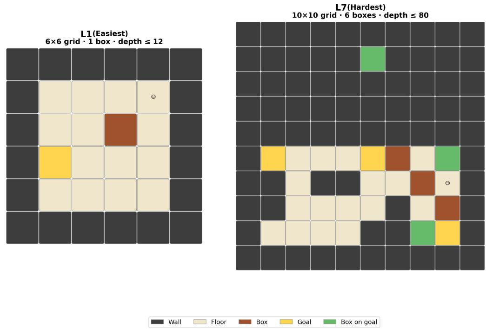  
Figure 4: Example Sokoban levels at the two extremes of the anchor ladder. Left: ${ \mathrm { L 1 } } - { \mathrm { g r i d } } \ { \mathrm { 6 } } { \times } { \mathrm { 6 } } ,$ , 1 box, depth $\leq 1 2$ . Right: L7 — grid $1 0 \times 1 0 ,$ , 6 boxes, depth $\leq 8 0 .$ . Colours: dark grey = wall, beige = floor, brown = box, yellow = goal, green = box on goal.

## C ANCHOR LEVELS DEFINITION

Table 4 gives the full per-level specification for every task. Countdown uses a monotone ladder co-scaling all attributes. Sokoban levels cover distinct combinations of grid size, box count, and solution depth without enforcing a strict monotone ordering on any single axis (difficulty in Sokoban is non-monotone: a smaller grid with more boxes can be harder than a larger one with fewer). Dice is a Cartesian product over two independent axes. Decimal Arithmetic jointly scales three axes.

Table 4: Full anchor-level specifications, grouped into Easy/Medium/Hard (and Extra Hard for Dice) difficulty bins used throughout the paper. Countdown: num = num\_numbers, mv = max\_value, mt = max\_target. Sokoban: grid is square; d = max\_depth. Decimal: dp = decimal\_places, pr = precision, t = terms. Largest Island: grid = rows×cols; isl = num\_islands; sz = island\_size.
<table><tr><td>Task</td><td>Level</td><td>Bin</td><td colspan="3">Config</td></tr><tr><td>Countdown</td><td>1</td><td>Easy</td><td>num=3</td><td>mv=20</td><td>mt=80</td></tr><tr><td rowspan="12"></td><td>2</td><td>Easy</td><td>3</td><td>40</td><td>150</td></tr><tr><td>3</td><td>Easy</td><td>3-4</td><td>60</td><td>250</td></tr><tr><td>4</td><td>Medium</td><td>4</td><td>80</td><td>350</td></tr><tr><td>5</td><td>Medium</td><td>4-5</td><td>100</td><td>500</td></tr><tr><td>6</td><td>Medium</td><td>5</td><td>120</td><td>800</td></tr><tr><td>7</td><td>Hard</td><td>5-6</td><td>150</td><td>1200</td></tr><tr><td>8</td><td>Hard</td><td>6</td><td>180</td><td>2000</td></tr><tr><td>9 10</td><td>Hard</td><td>6</td><td>220</td><td>3500</td></tr><tr><td>1</td><td>Hard</td><td>6</td><td>300</td><td>5000</td></tr><tr><td></td><td>Easy</td><td>grid=6</td><td>boxes=1</td><td>d12</td></tr><tr><td>2</td><td>Easy</td><td>7</td><td>1</td><td>20</td></tr><tr><td>3 4</td><td>Easy Medium</td><td>8</td><td>2</td><td>30</td></tr><tr><td>Sokoban 5</td><td>Medium</td><td></td><td>9 2</td><td>45</td></tr><tr><td></td><td></td><td></td><td>8 3</td><td>45</td></tr><tr><td>6 7</td><td>Hard</td><td>10</td><td>4</td><td>65</td></tr><tr><td>1</td><td>Hard</td><td>10</td><td>6</td><td>80</td></tr><tr><td></td><td>Easy</td><td>num_dice=2</td><td>faces=8</td><td></td></tr><tr><td rowspan="14">Dice</td><td>2</td><td>Easy</td><td>2</td><td>10</td><td></td></tr><tr><td>3</td><td>Easy</td><td>2</td><td>16</td><td></td></tr><tr><td>4</td><td>Easy</td><td>2</td><td>20</td><td></td></tr><tr><td>5</td><td>Medium</td><td>3</td><td>8</td><td></td></tr><tr><td>6</td><td>Medium</td><td>3</td><td>10</td><td></td></tr><tr><td>7</td><td>Medium</td><td>3</td><td>16</td><td></td></tr><tr><td>8</td><td>Medium</td><td>3</td><td>20</td><td></td></tr><tr><td>9</td><td>Hard</td><td>4</td><td>8</td><td></td></tr><tr><td>10</td><td>Hard</td><td>4</td><td>10</td><td></td></tr><tr><td>11</td><td>Hard</td><td>4</td><td>16</td><td></td></tr><tr><td>12</td><td>Hard</td><td>4</td><td>20</td><td></td></tr><tr><td>13</td><td>Extra Hard</td><td>5</td><td>8</td><td></td></tr><tr><td>14</td><td>Extra Hard</td><td>5</td><td>10</td><td></td></tr><tr><td>15</td><td>Extra Hard</td><td>5</td><td>16</td><td></td></tr><tr><td>16</td><td>Extra Hard</td><td>5</td><td>20</td><td></td></tr><tr><td rowspan="10">Decimal Arith.</td><td>1</td><td>Easy</td><td>dp=4</td><td>pr=8</td><td>t=4</td></tr><tr><td>2</td><td>Easy</td><td>4</td><td>12</td><td>6</td></tr><tr><td>3</td><td>Easy</td><td>6</td><td>12</td><td>6</td></tr><tr><td>4</td><td>Medium</td><td>6</td><td>18</td><td>10</td></tr><tr><td>5</td><td>Medium</td><td>10</td><td>18</td><td>10</td></tr><tr><td>6</td><td>Medium</td><td>10</td><td>24</td><td>14</td></tr><tr><td>7</td><td>Hard</td><td>14</td><td>18</td><td>10</td></tr><tr><td>8</td><td>Hard</td><td>14</td><td>24</td><td>18</td></tr><tr><td>9</td><td>Hard</td><td>18</td><td>24</td><td>14</td></tr><tr><td>1</td><td></td><td></td><td></td><td>sz=3</td></tr><tr><td rowspan="10">Largest Island</td><td>2</td><td>Easy</td><td>grid=8×10 9×12</td><td>isl=2 2</td><td>4</td></tr><tr><td>3</td><td>Easy Easy</td><td>10×14</td><td>3</td><td>4</td></tr><tr><td>4</td><td>Medium</td><td>11×15</td><td>3</td><td>5</td></tr><tr><td>5</td><td>Medium</td><td>12×16</td><td>4</td><td>5</td></tr><tr><td>6</td><td>Medium</td><td>13×17</td><td>4</td><td>6</td></tr><tr><td></td><td></td><td></td><td></td><td></td></tr><tr><td>7</td><td>Hard</td><td>14×18</td><td>5</td><td>6</td></tr><tr><td>8</td><td>Hard</td><td>15×18</td><td>5</td><td>7</td></tr><tr><td>9</td><td>Hard</td><td>15×18</td><td>6</td><td>6</td></tr><tr><td>10</td><td>Hard</td><td>15×18</td><td>6</td><td>7</td></tr></table>

## D IMPLEMENTATION DETAILS AND HYPERPARAMETERS

Tables 5 and 6 report the full set of hyperparameters used in all experiments. All runs using Qwen3- 4B-Base or LLaMA3.2 set a maximum response length of 2048 tokens, while for SOKOBAN we use Qwen3-4B (thinking mode) with a response length of 4096 tokens to accommodate its extended chain-of-thought reasoning budget. All methods are run with 4 random seeds (42, 123, 314, 999). All the runs are performed on H200 or GH200 GPUs, ensuring that experiments belonging to the same task family are run on the same GPU type.

Table 5: GRPO training hyperparameters (shared across all methods and tasks).
<table><tr><td>Hyperparameter</td><td>Symbol</td><td>Value</td></tr><tr><td>Learning rate</td><td rowspan="6"> $n _ { r }$ </td><td>10⁻⁶</td></tr><tr><td>Train batch size</td><td>64</td></tr><tr><td>Rollouts per problem</td><td>8</td></tr><tr><td>PPO mini-batch size</td><td>16</td></tr><tr><td>PPO micro-batch size per GPU</td><td>8</td></tr><tr><td>Max problem length (tokens)</td><td>1024</td></tr><tr><td>Max response length — base model (tokens)</td><td>2048</td></tr><tr><td>Max response length — thinking model (tokens)</td><td>4096</td></tr><tr><td>KL coefficient</td><td> $\beta _ { \mathrm { K L } }$   $0 | 1 0 ^ { - 4 \dagger }$ </td></tr><tr><td>Evaluation batch size</td><td>128</td></tr><tr><td></td><td>4</td></tr><tr><td>Random seeds</td><td></td></tr><tr><td>Clip low</td><td></td></tr><tr><td>Clip high</td><td>0.2</td></tr><tr><td> $\epsilon _ { l o w }$ </td><td> $\epsilon _ { h i g h }$   $0 . 2 \ : | \ : 0 . 2 8 ^ { \dagger }$ </td></tr></table>

†A small KL loss and an asymmetric ("clip-higher") PPO clipping range are applied for long-training stabilization only for the 500 steps runs (across all methods), preventing entropy collapse over extended training horizons Liu et al. (2025b).

Table 6: Frontier Learning curriculum hyperparameters.
<table><tr><td>Hyperparameter</td><td>Symbol</td><td>Value</td></tr><tr><td>Buffer and sampling</td><td></td><td>4</td></tr><tr><td>Levels per step Problems per level</td><td> $n \ell$ </td><td>16</td></tr><tr><td>Buffer capacity</td><td> $n _ { p }$   $B _ { \mathrm { m a x } }$ </td><td>100</td></tr><tr><td>Seed levels Seed sampling mode</td><td></td><td>8 grid</td></tr><tr><td>Sampling strategy Zipf temperature</td><td> $T _ { z }$ </td><td>Zipf 1.0</td></tr><tr><td>Staleness coefficient</td><td> $\lambda _ { s }$ </td><td>0.05</td></tr><tr><td>Informative success-rate interval</td><td></td><td>[0.05-0.95]</td></tr><tr><td>Regret signal</td><td></td><td></td></tr><tr><td>Rolling window size Initial Regret</td><td> $n _ { w }$ </td><td>16</td></tr><tr><td></td><td> $R _ { 0 }$ </td><td>0.5</td></tr><tr><td>Exploration</td><td></td><td></td></tr><tr><td>Explore fraction</td><td> $\phi$ </td><td>0.3</td></tr><tr><td>State-dependent mutation probabilities</td><td></td><td></td></tr><tr><td>Informative</td><td> $p _ { \mathrm { i n f } }$ </td><td>0.4</td></tr><tr><td>Too easy (mastered)</td><td></td><td>0.25</td></tr><tr><td>Too difficult (impossible)</td><td> $p _ { \mathrm { e a s y } }$ </td><td>0.02</td></tr><tr><td>Unseen (never sampled)</td><td> $p _ { \mathrm { h a r d } }$ </td><td>0.0</td></tr><tr><td></td><td> $p _ { \mathrm { u n s } }$ </td><td></td></tr><tr><td>SEC (baseline)</td><td></td><td></td></tr><tr><td>EMA coefficient</td><td>α</td><td>0.1</td></tr></table>

## E LEARNING CURVES

Figure 5 shows accuracy learning curves for Countdown, Decimal Arithmetic and Sokoban over the standard training budget of 200 GRPO steps.  
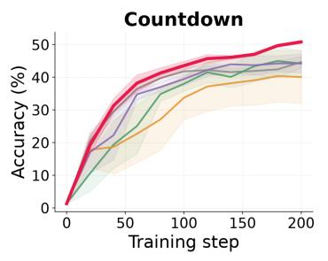

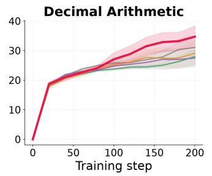  
DR Uniform SEC PLR Frontier Learning

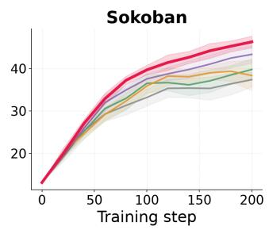  
Figure 5: Accuracy (%) on the fixed anchor evaluation sets over 200 GRPO steps for COUNTDOWN, SOKOBAN, and DECIMAL ARITHMETIC.

## F PER-DIFFICULTY ACCURACY BREAKDOWN

Figure 6 reports the learning curves across the three tasks over 200 GRPO steps across the difficulties bins, while Figure 7 breaks down the final validation performance by difficulty. On COUNTDOWN and DECIMAL ARITHMETIC, the gains from Frontier Learning are concentrated primarily on the Easy and Medium bins, whereas performance on the Hard bin remains largely comparable acros methods. A similar pattern emerges on SOKOBAN, where Frontier Learning achieves its largest improvements on the easier configurations, with smaller gains as difficulty increases.

This behavior is consistent with the objective of Frontier Learning: prioritizing levels that lie near the model’s current learning frontier, where additional training is most likely to yield improvement, rather than allocating substantial compute to levels that are either already mastered or currently too difficult to solve reliably. Importantly, this frontier is not fixed, but shifts as the model’s capabilities improve. This is illustrated by the extended training results in Figure 9, where Frontier Learning continues to improve throughout the 500-step training horizon, progressively reaching substantially higher validation accuracy on harder tasks. These results suggest that, as training progresses, the set of learnable configurations expands toward harder regions of the level space.

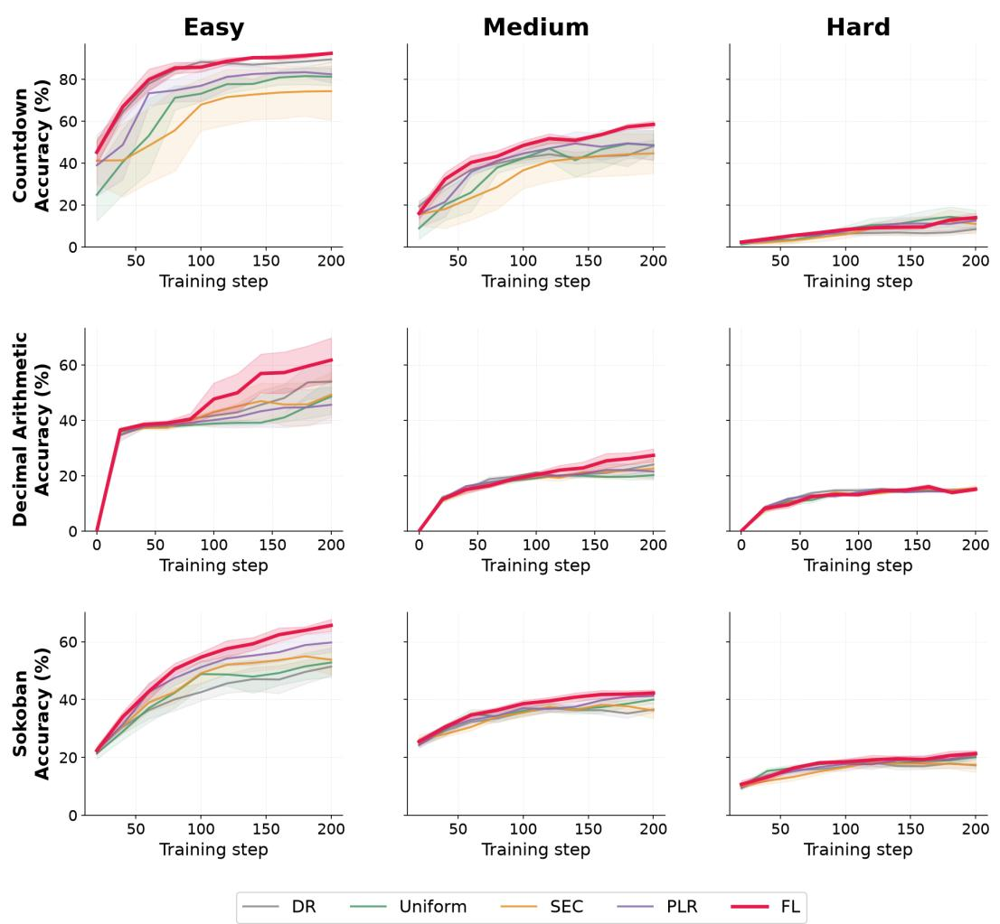  
Figure 6: Validation accuracy across the three difficulty bins throughout the full training horizon for COUNTDOWN, SOKOBAN, and DECIMAL ARITHMETIC.

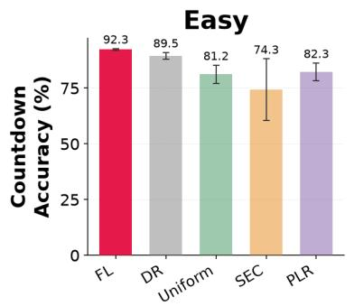

Medium  
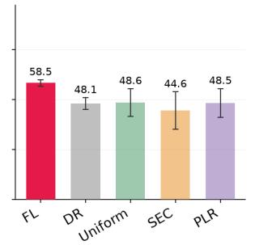

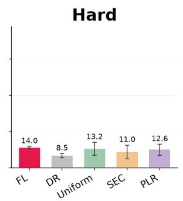

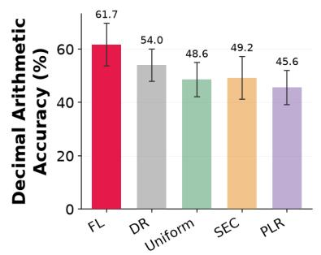

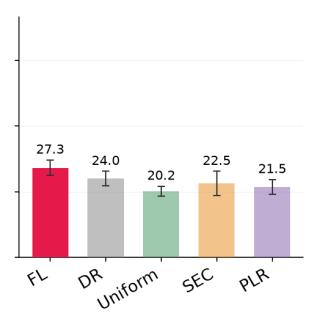

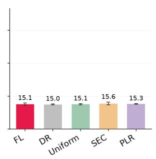

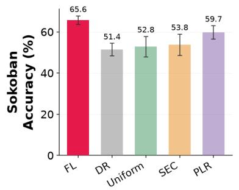

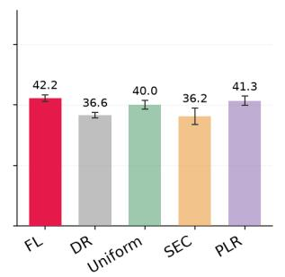

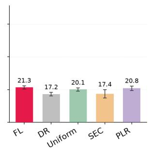  
Figure 7: Final validation accuracy per difficulty bin for COUNTDOWN, SOKOBAN, and DECIMAL ARITHMETIC.

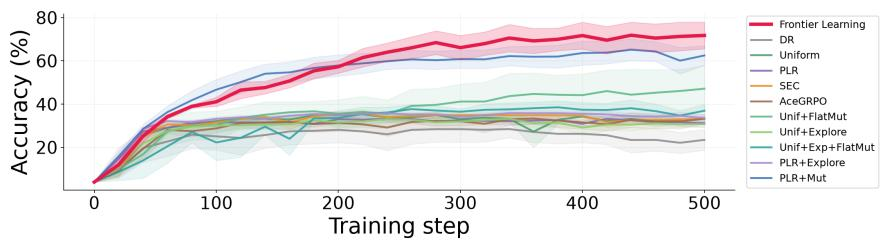  
Figure 8: Long-horizon DICE learning curves over 500 GRPO steps. DAPO is omitted from the step-based curves because it is matched by total rollout budget rather than optimizer updates.

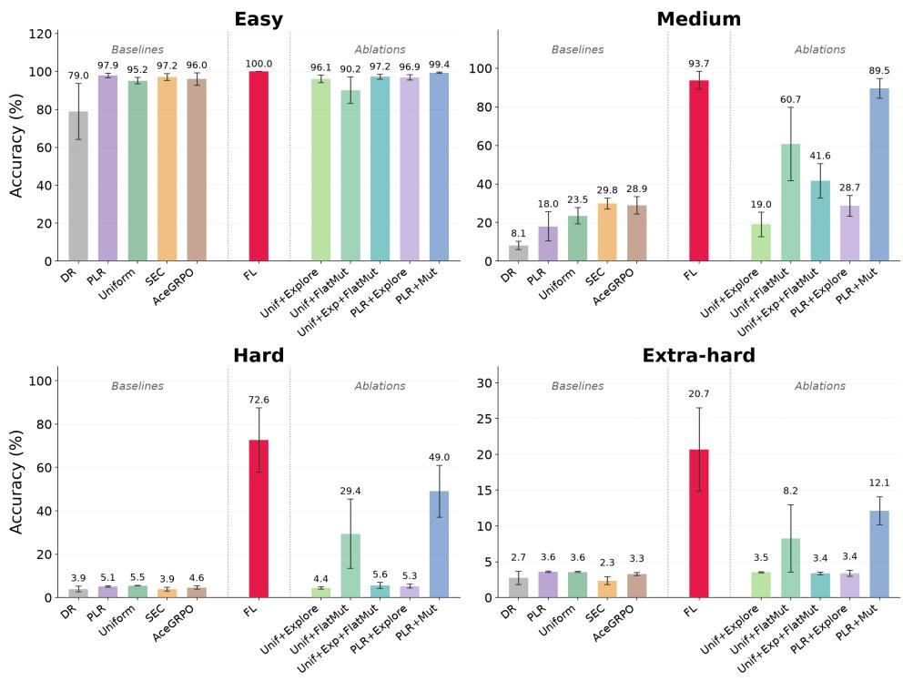

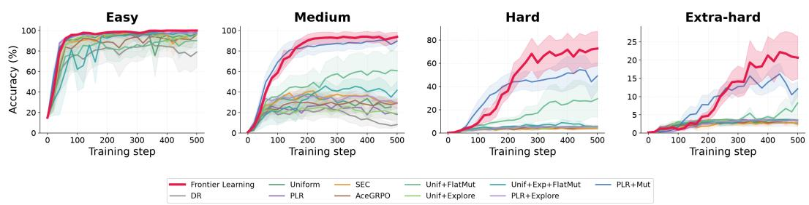  
Figure 9: Validation accuracy across the four difficulty bins throughout the full training horizon for DICE.  
Figure 10: Final validation accuracy per difficulty bin for DICE

## G HYPERPARAMETER SENSITIVITY

## G.1 FRONTIER LEARNING

We additionally study the sensitivity of frontier learning to the staleness coefficient $\lambda _ { s }$ and the informative success-rate interval defined in Equation 8. We conduct this ablation on the same Llama-3.2-3B-Instruct COUNTDOWN setting used for the cross-model-family evaluation in the main paper. Table 7 reports the results.

Performance remains within a narrow range across the tested configurations. In particular, varying either the staleness coefficient or the informative success-rate interval leads to only modest changes relative to the default configuration, suggesting that frontier learning is not highly sensitive to these hyperparameters around the chosen defaults.

Table 7: Hyperparameter sensitivity on COUNTDOWN using Llama-3.2-3B-Instruct.
<table><tr><td>Variant</td><td>Accuracy (%)</td></tr><tr><td>Default frontier learning</td><td> $3 9 . 2 \pm 1 . 3$ </td></tr><tr><td> $\lambda _ { s } = 0 . 0 2$ </td><td> $4 0 . 7 \pm 1 . 1$ </td></tr><tr><td>Informative interval = [0.10, 0.90]</td><td> $4 0 . 5 \pm 0 . 8$ </td></tr><tr><td>Informative interval = [0.02, 0.98]</td><td> $3 9 . 8 \pm 1 . 0$ </td></tr><tr><td> $\lambda _ { s } = 0$ </td><td> $3 8 . 8 \pm 1 . 4$ </td></tr></table>

## G.2 STEP SIZE SENSITIVITY OF THE BASELINES

To rule out an under-tuned learning rate as an explanation for frontier learning’s gains, we swept the learning rate on DICE (500 steps, seed 42) for two representative baselines: SEC, the best-performing baseline in Table 2, and Uniform, a non-regret-based method (fixed pool, uniform sampling, no prioritization signal). We swept $\{ 5 \times 1 0 ^ { - 7 } , 9 \times 1 0 ^ { - 7 } , 1 \times 1 0 ^ { - 6 } , 2 \times \overset { \cdot } { 1 } 0 ^ { - 6 } , 5 \times 1 0 ^ { - 6 } , 5 \times \overset { \cdot } { 1 0 } ^ { - 5 } \}$ holding every other hyperparameter fixed. As it can be observed in Fig. 11 our paper’s learning rate, $1 \times 1 0 ^ { - 6 }$ , is the best- or joint-best-performing value for both methods. Larger learning rates $( \geq 2 \times 1 0 ^ { - 6 } )$ are uniformly worse and increasingly unstable, collapsing to near-zero accuracy by $2 \times 1 0 ^ { - 6 } – 5 \times 1 0 ^ { - 5 } ;$ ; no value we tested lifts either baseline’s final accuracy above ≈35%, well below frontier learning’s performance under the same protocol.

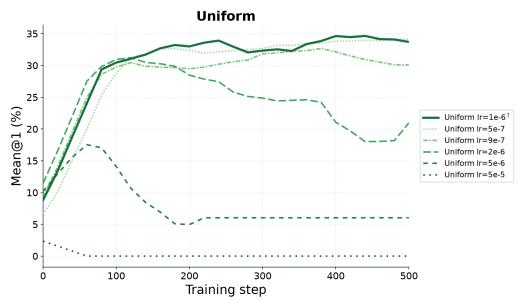

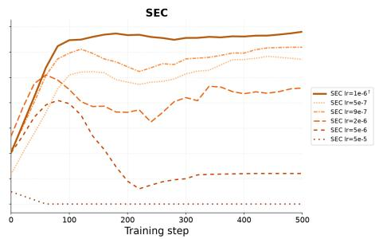  
Figure 11: Learning-rate sweep on DICE (seed 42) for Uniform and SEC, the non-regret-based baseline and the best-performing baseline in Table 2, respectively. †Denotes the learning rate used for the main paper’s results $( 1 \times \bar { 1 0 } ^ { - 6 } )$ . No swept value raises either baseline’s final accuracy above ≈35%, indicating that an under-tuned learning rate does not explain the gap to frontier learning.

## H COMPUTE ACCOUNTING.

200-step experiments: We first report end-to-end compute for the 200-step experiments on SOKOBAN, COUNTDOWN, and DECIMAL ARITHMETIC. All methods use the same number of optimizer updates, prompts, rollouts per prompt, and maximum response length. Across these tasks, frontier learning has comparable wall-clock cost to the baselines and does not systematically generate longer responses.

Table 8: End-to-end compute accounting on Sokoban (200 steps).
<table><tr><td>Method</td><td></td><td>Runtime (h) Response length (tokens) Accuracy (%)</td><td></td></tr><tr><td>Domain Rand.</td><td> $1 5 . 4 { \pm } 2 . 0 $ </td><td> $3 8 3 8 \pm 3 3$ </td><td> $3 7 . 6 { \pm } 2 . 6 $ </td></tr><tr><td>PLR</td><td> $1 4 . 8 { \pm } 1 . 8 $ </td><td> $3 6 9 8 { \pm } 1 0 3$ </td><td> $4 1 . 1 { \pm } 3 . 9 $ </td></tr><tr><td>Uniform</td><td> $1 5 . 1 { \pm } 1 . 8 $ </td><td> $3 7 6 1 { \pm } 5 1$ </td><td> $3 9 . 5 { \pm } 1 . 3 $ </td></tr><tr><td>SEC</td><td> $1 4 . 8 { \pm } 1 . 8 $ </td><td> $3 7 0 9 { \pm } 8 1$ </td><td> $3 4 . 3 { \pm } 6 . 6 $ </td></tr><tr><td>Frontier Learning (ours)</td><td> $1 4 . 2 { \pm } 1 . 7 $ </td><td> $3 5 2 9 { \pm } 4 9$ </td><td> $4 5 . 2 { \pm } 1 . 9 $ </td></tr></table>

Table 9: End-to-end compute accounting on Countdown (200 steps).
<table><tr><td>Method</td><td></td><td>Runtime (h) Response length (tokens) Accuracy (%)</td><td></td></tr><tr><td>Domain Rand.</td><td> $1 7 . 4 { \pm } 0 . 1 $ </td><td> $1 5 3 8 { \pm } 1 4$ </td><td> $4 4 . 7 { \pm } 1 . 7 $ </td></tr><tr><td>PLR</td><td> $1 1 . 3 { \pm } 0 . 3 $ </td><td> $1 5 2 1 { \pm } 4 4$ </td><td> $4 4 . 3 { \pm } 2 . 9 $ </td></tr><tr><td>Uniform</td><td> $1 1 . 8 { \pm } 0 . 3 $ </td><td> $1 5 4 6 { \pm } 5 0 $ </td><td> $4 4 . 2 { \pm } 4 . 0 $ </td></tr><tr><td>SEC</td><td> $1 1 . 2 { \pm } 0 . 4 $ </td><td> $1 4 4 6 { \pm } 6 5$ </td><td> $4 0 . 1 { \pm } 8 . 1 $ </td></tr><tr><td>Frontier Learning (ours)</td><td> $1 1 . 7 { \pm } 0 . 5 $ </td><td> $1 2 6 9 { \pm } 2 8$ </td><td> $5 0 . 9 { \pm } 0 . 5 $ </td></tr></table>

Table 10: End-to-end compute accounting on Decimal Arithmetic (200 steps).
<table><tr><td>Method</td><td></td><td>Runtime (h) Response length (tokens) Accuracy (%)</td><td></td></tr><tr><td>Domain Rand.</td><td> $4 . 3 { \pm } 1 . 1$ </td><td> $8 3 7 \pm 3 1$ </td><td> $3 1 . 0 { \pm } 2 . 8 $ </td></tr><tr><td>PLR</td><td> $6 . 0 { \pm } 1 . 1 $ </td><td> $6 7 7 { \pm } 3 0 $ </td><td> $2 7 . 5 { \pm } 2 . 9 $ </td></tr><tr><td>Uniform</td><td> $5 . 7 { \pm } 1 . 0 $ </td><td> $6 4 2 { \pm } 3 3$ </td><td> $2 8 . 0 { \pm } 2 . 6 $ </td></tr><tr><td>SEC</td><td> $6 . 1 { \pm } 1 . 2 $ </td><td> $6 6 5 { \pm } 5 4$ </td><td> $2 9 . 1 { \pm } 4 . 1$ </td></tr><tr><td>Frontier Learning (ours)</td><td> $4 . 2 { \pm } 1 . 1$ </td><td> $7 5 8 { \pm } 5 0 $ </td><td> $3 4 . 7 { \pm } 3 . 6 $ </td></tr></table>

Long-horizon compute on DICE: The 500-step DICE experiment reveals a different regime. Although all methods except DAPO use the same number of optimizer updates, prompts, rollouts per prompt, and maximum response length, realized wall-clock cost differs substantially. Frontier learning requires $2 7 . 8 \pm 0 . 6$ hours, compared with $1 8 . 7 \pm 1 . \cdot$ 1 hours for PLR, and produces $1 3 8 3 \pm 2 6$ tokens per response on average, compared with $8 7 7 \pm 6 5$ for PLR.

This increase in response length is consistent with the outward movement of the learning frontier observed in the per-difficulty analysis. After 500 steps, frontier learning has nearly saturated Easy and Medium configurations and reaches 72.6% on Hard and 20.7% on Extra-hard levels, whereas no standard baseline exceeds 5.5% on these harder categories. As frontier learning acquires the ability to engage with these more difficult configurations, its sampled problems induce longer reasoning traces. The additional wall-clock cost is therefore partly a consequence of the capability expansion produced during training, rather than simply a larger nominal training budget.

However, this additional runtime does not explain frontier learning’s performance advantage. As shown in Table 12, looking at the wall-clock time corresponding to PLR’s complete 500-step run (i.e. the fastest baseline) frontier learning already reaches $6 \mathrm { \bar { 8 } } . 0 \pm \mathrm { \bar { 5 } } . 5 \%$ accuracy. Moreover, PLR+Mut produces even longer responses (1426 ± 14 tokens) and requires slightly more wall-clock time $( 2 8 . 5 \pm 0 . 3$ hours) than frontier learning, while attaining lower final performance. Thus, neither longer generations nor greater realized wall-clock compute alone account for the gains of frontier learning.

Long horizon compute on LARGEST ISLAND: Unlike on DICE, frontier learning’s runtime and response length on LARGEST ISLAND are not elevated relative to the baselines: both sit in the middle of the range they span (Table 13), so, also in this case, frontier learning’s accuracy advantage cannot be attributed to spending more wall-clock time or producing longer responses.

Table 11: End-to-end compute accounting on Dice (500 steps).
<table><tr><td>Method</td><td></td><td>Runtime (h) Response length (tokens) Accuracy (%)</td><td></td></tr><tr><td>Baselines</td><td></td><td></td><td></td></tr><tr><td>Domain Rand.</td><td> $1 9 . 4 { \pm } 1 . 9 $ </td><td> $9 0 7 { \pm } 1 0 4 $ </td><td> $2 3 . 4 \pm 4 . 7$ </td></tr><tr><td>PLR</td><td> $1 8 . 7 { \pm } 1 . 1 $ </td><td> $8 7 7 { \pm } 6 5$ </td><td> $3 1 . 2 { \pm } 1 . 9 $ </td></tr><tr><td>Uniform</td><td> $2 0 . 8 { \pm } 1 . 9 $ </td><td> $9 9 4 { \pm } 1 0 8 $ </td><td> $3 1 . 9 { \pm } 1 . 5 $ </td></tr><tr><td>SEC</td><td> $1 8 . 9 { \pm } 2 . 3 $ </td><td> $8 6 6 \pm 1 2 9$ </td><td> $3 3 . 3 { \pm } 1 . 2 $ </td></tr><tr><td>ACE-GRPO</td><td> $2 2 . 0 { \pm } 0 . 8 $ </td><td> $1 0 6 3 { \pm } 4 5$ </td><td> $3 3 . 2 { \pm } 2 . 1 $ </td></tr><tr><td>Component ablations</td><td></td><td></td><td></td></tr><tr><td>Unif+Explore</td><td> $2 0 . 4 { \pm } 1 . 8 $ </td><td> $9 7 4 { \pm } 1 0 5 $ </td><td> $3 0 . 8 { \pm } 1 . 3 $ </td></tr><tr><td>Unif+FlatMut</td><td> $2 2 . 6 { \pm } 1 . 3 $ </td><td> $1 0 9 9 \pm 7 2$ </td><td> $4 7 . 1 { \pm } 1 0 . 8 $ </td></tr><tr><td>Unif+Exp+FlatMut</td><td> $2 0 . 1 { \pm } 1 . 8 $ </td><td> $9 4 1 { \pm } 1 1 0 $ </td><td> $3 6 . 9 { \pm } 2 . 9$ </td></tr><tr><td>PLR+Explore</td><td> $2 4 . 3 { \pm } 0 . 8 $ </td><td> $1 1 9 0 { \pm } 4 5 $ </td><td> $3 3 . 5 { \pm } 1 . 8 $ </td></tr><tr><td>PLR+Mut</td><td> $2 8 . 5 { \pm } 0 . 3 $ </td><td> $1 4 2 6 { \pm } 1 4$ </td><td> $6 2 . 5 { \pm } 4 . 5 $ </td></tr><tr><td>frontier learning(ours)</td><td> $2 7 . 8 { \pm } 0 . 6 $ </td><td> $1 3 8 3 { \pm } 2 6$ </td><td> $7 1 . 8 { \pm } 6 . 2 $ </td></tr></table>

Table 12: Dice performance at matched PLR compute time (18.7 hours).
<table><tr><td>Method</td><td>Accuracy (%)</td></tr><tr><td>DR</td><td> $2 5 . 4 \pm 3 . 7$ </td></tr><tr><td>PLR</td><td> ${ \bf 3 1 . 2 \pm 1 . 9 }$ </td></tr><tr><td>Uniform</td><td> $3 2 . 2 { \pm } 1 . 7 $ </td></tr><tr><td>SEC</td><td> $3 3 . 5 { \pm } 1 . 6 $ </td></tr><tr><td>AceGRPO</td><td> $3 1 . 8 { \pm } 3 . 3 $ </td></tr><tr><td>Frontier Learning (ours) Unif+FlatMut</td><td> ${ \bf 6 8 . 0 \pm 5 . 5 }$ </td></tr><tr><td></td><td> $4 3 . 7 { \pm } 9 . 8 $ </td></tr><tr><td>Unif+Explore</td><td> $3 1 . 9 { \pm } 1 . 7 $ </td></tr><tr><td>Unif+Exp+FlatMut</td><td> $3 7 . 1 \pm 3 . 4 $ </td></tr><tr><td>PLR+Explore</td><td> $3 4 . 8 { \pm } 1 . 2 $ </td></tr><tr><td>PLR+Mut</td><td> $6 0 . 7 { \pm } 4 . 3 $ </td></tr></table>

Table 13: End-to-end compute accounting on Largest Island (500 steps, Olmo-3-7B-Instruct).
<table><tr><td>Method</td><td></td><td>Runtime (h) Response length (tokens) Accuracy (%)</td><td></td></tr><tr><td>Domain Rand.</td><td> $6 3 . 2 { \pm } 0 . 3 $ </td><td> $1 5 7 8 { \pm } 2 9$ </td><td> $4 5 . 2 { \pm } 1 . 8 $ </td></tr><tr><td>PLR</td><td> $4 4 . 3 { \pm } 6 . 0 $ </td><td> $1 2 7 6 { \pm } 9 6$ </td><td> $5 2 . 0 { \pm } 5 . 3 $ </td></tr><tr><td>Uniform</td><td> $5 3 . 1 { \pm } 2 . 5 $ </td><td> $1 1 3 2 \pm 1 2 5$ </td><td> $4 5 . 3 { \pm } 3 . 4 $ </td></tr><tr><td>SEC</td><td> $4 4 . 4 { \pm } 7 . 1 $ </td><td> $1 2 1 8 { \pm } 1 0 2$ </td><td> $4 8 . 3 { \pm } 4 . 7 $ </td></tr><tr><td>ACE-GRPO</td><td> $4 3 . 8 { \pm } 4 . 7 $ </td><td> $1 2 4 3 { \pm } 1 0 6$ </td><td> $4 5 . 3 { \pm } 5 . 5 $ </td></tr><tr><td>frontier learning (ours)</td><td> $5 2 . 4 { \pm } 0 . 7 $ </td><td> $1 4 9 8 { \pm } 6$ </td><td> $7 3 . 7 { \pm } 3 . 3 $ </td></tr></table>