# First Learn, Then Memorize: The Spectral Bias of Diffusion Models

Raphaël Urfin\*1, Tony Bonnaire2, Giulio Biroli1, and Marc Mézard3

1Laboratoire de Physique de l’École normale supérieure, ENS, Université PSL, CNRS, Sorbonne Université, Université Paris Cité, F-75005 Paris, France

2Université Paris-Saclay, CNRS, Institut d’Astrophysique Spatiale, 91405 Orsay, France 3Department of Computing Sciences, Bocconi University, Milano, Italy

## Abstract

Diffusion models trained on a finite dataset first learn to generate novel, high-quality samples and only much later collapse onto their training set. We identify the mechanism behind this separation of timescales and the object that probes it. The training dynamics of the score function are governed— exactly, and at any width—by the Gram matrix of the Neural Tangent Kernel (NTK) evaluated on the noisy training data, so the timescales of generalization and of memorization must be encoded in its spectrum. We show that they are, and that the structure responsible has no analogue in standard kernel settings. The use of multiple noise realizations per sample (m noised copies at a fixed noise level) in the score-matching loss is what restructures the Gram matrix spectrum into two distinct parts. The first, of large eigenvalues, carries the global features of the target distribution and is present already for m = 1. The second, which the repeated noising creates, consists of the smallest eigenvalues and is supported on eigenvectors aligned with the sample-specific noise directions; it sets a memorization timescale parametrically larger in the training set size n. We establish this picture on two fronts. Analytically, we solve the spectrum in the lazy high-dimensional limit for both linear (n ≍ d) and polynomial (n ≍ dk) sample complexities, and prove through a bias–variance decomposition that the first bulk minimizes the approximation error while the second drives the error associated with memorization. Empirically, we show the same two-bulk structure in Convolutional NTKs on CelebA and in finite-width U-Nets trained well beyond the lazy regime, and we make the link causal: truncating the Gram matrix at rank r tunes the generalization–memorization transition, and an L2 penalty targeting the second bulk suppresses memorization in feature-learning U-Nets.

Keywords: Diffusion Models | Lazy Regime | Memorization

## 1 Introduction

Generative diffusion models [73, 40, 76] have established a new state of the art in high-dimensional data generation, achieving unprecedented success across modalities ranging from image [70] and video generation [54] to applications in the natural sciences [66, 51]. Rooted in the principles of out-of-equilibrium statistical mechanics, these models operate via two stochastic processes: aforward process that progressively degrades the data into white noise, and a reverse-time generative process, called the backward process, which generates new samples by simulating a diffusion process driven by a drift vector field, called the score function [42, 80], defined precisely as the gradient of the logarithm of the noisy data marginals. Recently, this paradigm has been unified under the broader framework of stochastic interpolants [3, 52, 53], where the noising process can be arbitrary and the generative dynamics can be recast as a deterministic flow.

Despite their empirical success, we still lack a rigorous theoretical understanding of how the training dynamics finds a score that captures the intrinsic structure of the target distribution. In particular, it remains unclear how highly overparametrized models of the score generate novel, high-quality samples without simply memorizing the finite training set. One prominent line of explanation is implicit dynamical regularization [15, 24]. The learning dynamics is governed by a strict separation of timescales: a fast timescale, $\tau _ { \mathrm { g e n } } ,$ during which the model learns the underlying structural features required to generate high-quality samples, and a much longer timescale, τ , at which the network memorizes the dataset. Here, we identify the mechanism behind this separation of timescales, and the object that reveals it: the spectrum of the Gram matrix of the Neural Tangent Kernel (NTK).

Generative diffusion and our setting. Standard diffusion models transport a target distribution $P _ { 0 }$ on $\mathbb { R } ^ { d }$ to Gaussian white noise $\mathcal { N } ( 0 , \bar { \mathbf { I } _ { d } } )$ via an Ornstein–Uhlenbeck (OU)forward process dx ${ \mathbf { \Gamma } } = - \mathbf { x } \mathrm { d } t { \mathbf { \Gamma } } + { \mathbf { \Gamma } }$ $\sqrt { 2 } \operatorname { d } \mathbf { W } ( t )$ , where $\mathbf { W } ( t )$ is a standard Wiener process. Exact time-reversal of this process corresponds to using a guiding force field which is the exact score function $\mathbf { s } _ { \mathrm { e x a c t } } ( \mathbf { x } , t ) = \nabla _ { \mathbf { x } }$ log $\bar { P } _ { t } ( { \bf x } )$ [5, 38], where $P _ { t }$ is the marginal density at time t. Following Hyvärinen [42] and Vincent [80], generation is performed by using a parametrized score function $\mathbf { s } ( \mathbf { x } , t )$ . Given a dataset $\mathcal { D } = \{ \mathbf { x } ^ { \nu } \} _ { \nu = 1 , \dots , n }$ consisting of n i.i.d. samples from $P _ { 0 } ,$ , one learns this score function by minimizing the Denoising Score Matching (DSM) loss. $\mathrm { A t }$ fixed $t , ^ { 1 }$ it reads

$$
\mathcal { L } _ { \mathrm { D S M } } ( \mathbf { s } ) = \frac { 1 } { 2 n d } \sum _ { \nu = 1 } ^ { n } \mathbb { E } _ { \boldsymbol \xi } \bigg [ \bigg \| \mathbf { s } ( e ^ { - t } \mathbf { x } ^ { \nu } + \sqrt { \Delta _ { t } } \pmb \xi ) + \frac { \pmb \xi } { \sqrt { \Delta _ { t } } } \bigg \| ^ { 2 } \bigg ] ,\tag{1}
$$

where $\Delta _ { t } = 1 - e ^ { - 2 t }$ and the expectation is over $\pmb { \xi } \sim \mathcal { N } ( 0 , \mathbf { I } _ { d } )$ . Its global minimizer is the empirical score, the score of the noised empirical distribution [65, 13, 50], which inevitably collapses the backward trajectories onto the training samples unless n grows exponentially with the intrinsic data dimension [13, 1].

The expectation in (1) is never performed exactly. Training proceeds by stochastic gradient descent over batches of the n samples, drawing a fresh noise $\boldsymbol { \xi }$ each time a sample is visited. Each sample is thus seen with m different noise realizations, m being the number of epochs. For the sake of our analysis, we replace the expectation by a finite sum. This will be useful to make comparisons with standard supervised learning, corresponding to $m = 1 .$ , and allows us to recover (1) taking $m  \infty$ . We attach to each sample $\mathbf { x } ^ { \nu }$ a set of m noise realizations $\{ \pmb { \xi } ^ { \nu \alpha } \} _ { \alpha = 1 , \dots , m } ,$ , drawn once and then fixed throughout training, and consider the empirical loss

$$
\mathcal { L } _ { \mathrm { t r a i n } } ( \mathbf { s } ) = \frac { 1 } { 2 d n m } \sum _ { \nu = 1 } ^ { n } \sum _ { \alpha = 1 } ^ { m } \left. \mathbf { s } ( \mathbf { Y } ^ { \nu \alpha } ) + \frac { \pmb { \xi } ^ { \nu \alpha } } { \sqrt { \Delta _ { t } } } \right. ^ { 2 } , \qquad \mathbf { Y } ^ { \nu \alpha } = e ^ { - t } \mathbf { x } ^ { \nu } + \sqrt { \Delta _ { t } } \pmb { \xi } ^ { \nu \alpha } .\tag{2}
$$

While this resembles a regression problem, it is a non-standard one: the score is evaluated on $N = n m$ points $\mathbf { Y } ^ { \nu \alpha }$ that are correlated, forming clusters of m points around each clean sample $e ^ { - t } \mathbf { x } ^ { \nu }$ . The number of repetitions m is the parameter that controls this cluster structure, and it interpolates between two problems that are usually treated separately: at $m = 1$ every training input carries its own independent noise, the clusters are single points, and (2) is an ordinary supervised kernel regression on n examples with i.i.d. label noise; as $m  \infty$ , instead, the within-cluster average reproduces the exact noise expectation, $\mathcal { L } _ { \mathrm { t r a i n } } \to \mathcal { L } _ { \mathrm { D S M } } ,$ and the minimizer is the empirical score. Generalization is measured by the standard test loss

$$
\mathcal { L } _ { \mathrm { t e s t } } ( \mathbf { s } ) = \frac { 1 } { 2 d } \mathbb { E } _ { \mathbf { x } , \pm } \Bigg [ \bigg \| \mathbf { s } ( e ^ { - t } \mathbf { x } + \sqrt { \Delta _ { t } } \pmb { \xi } ) + \frac { \pmb { \xi } } { \sqrt { \Delta _ { t } } } \bigg \| ^ { 2 } \Bigg ] ,\tag{3}
$$

where the expectation is taken over both fresh noises and fresh samples. We further decompose the test loss over the realizations of the learned score as $\begin{array} { r } { \mathcal { L } _ { \mathrm { t e s t } } = \frac { 1 } { 2 } \left( C _ { t } + \mathcal { B } ^ { \hat { 2 } } + \mathcal { V } \right) } \end{array}$ , with a bias term $\dot { B } ^ { 2 }$ and a variance term V given by

$$
\mathcal { B } ^ { 2 } = \frac { 1 } { d } \mathbb { E } _ { \mathbf { y } } \left[ \left\| \mathbf { s } _ { \mathrm { e x a c t } } ( \mathbf { y } ) - \langle \mathbf { s } _ { \mathcal { D } , \theta _ { 0 } } ( \mathbf { y } ) \rangle \right\| ^ { 2 } \right] , \quad \mathcal { V } = \frac { 1 } { d } \mathbb { E } _ { \mathbf { y } } \left[ \left. \left\| \mathbf { s } _ { \mathcal { D } , \theta _ { 0 } } ( \mathbf { y } ) - \langle \mathbf { s } _ { \mathcal { D } , \theta _ { 0 } } ( \mathbf { y } ) \rangle \right\| ^ { 2 } \right. \right] ,\tag{4}
$$

where ${ \bf s } _ { \mathcal { D } , \pmb { \theta } _ { 0 } }$ denotes the minimizer of the training loss $\mathcal { L } _ { \mathrm { t r a i n } }$ for a given dataset D and initialization $\theta _ { 0 }$ of the parameters. Here, $\mathbb { E } _ { \mathbf { y } }$ is the average over test samples $\mathbf { y } \sim P _ { t } ,$ whereas $\langle \cdot \rangle$ denotes the average over the realizations of the training set, and of other sources of randomness such as $\pmb { \theta } _ { 0 }$ . The constant $C _ { t }$ depends only on the data distribution and is independent of the learned score (see Appendix D.8).

In practice the score is a neural network ${ \bf s } _ { \theta }$ and (2) is minimized by variants of gradient descent [69, 47]. Here we focus on the gradient flow ${ \mathrm { d } \pmb { \theta } } / { \mathrm { d } \tau } = - d ^ { 2 } \nabla _ { \pmb { \theta } } \mathcal { L } _ { \mathrm { t r a i n } } ( \pmb { \theta } )$ of the training loss (2); the factor $d ^ { 2 }$ is chosen so that the high-dimensional limit is well defined. We shall occasionally add to the loss (2) an $L _ { 2 }$ penalty $\frac { \gamma } { 2 n m d } \lVert \pmb { \theta } \rVert ^ { 2 }$ of strength $\gamma ;$ as shown in Appendix $_ { \mathrm { A . 4 . 1 } }$ this amounts to shifting the Gram matrix introduced below by $\gamma \mathbf { I } _ { N }$ . The relevant scale for that ridge is $n m / d ,$ and we will use the rescaled ridge $\widetilde { \gamma } = \gamma d / ( n m )$ . The corresponding evolution of the function sθ reads

$$
\dot { \mathbf { s } } _ { \theta } ( \mathbf { y } ) = - d ^ { 2 } \sum _ { \nu , \alpha } K _ { \tau } ( \mathbf { y } , \mathbf { Y } ^ { \nu \alpha } ) \nabla _ { \mathbf { s } } \mathcal { L } _ { \mathrm { t r a i n } } ( \mathbf { s } _ { \theta } ( \mathbf { Y } ^ { \nu \alpha } ) ) = \frac { - d } { n m } \sum _ { \nu , \alpha } K _ { \tau } ( \mathbf { y } , \mathbf { Y } ^ { \nu \alpha } ) \left( \mathbf { s } _ { \theta } ( \mathbf { Y } ^ { \nu \alpha } ) + \frac { \xi ^ { \nu \alpha } } { \sqrt { \Delta _ { t } } } \right) ,
$$

for any test point $\mathbf { y } \in \mathbb { R } ^ { d } .$ , where $K _ { \tau } ( \mathbf x , \mathbf y ) = \nabla _ { \pmb \theta } \mathbf s _ { \pmb \theta } ( \mathbf x ) \cdot \nabla _ { \pmb \theta } \mathbf s _ { \pmb \theta } ( \mathbf y )$ is the neural tangent kernel (NTK) of the model $[ 4 3 , 1 9 ,$ 26]. Taken at pairs of training points, the NTK defines the $N \times N$ Gram matrix $\mathbf { G } ^ { \nu \alpha , \mu \beta }$ = $K _ { \tau } ( \mathbf { Y } ^ { \nu \alpha } , \mathbf { Y } ^ { \mu \beta } )$ , which closes the dynamics on the training set and hence dictates the whole trajectory.2 It is therefore natural to expect the distinct timescales of generalization and memorization to be encoded in its spectrum [84, 17, 15, 24], which makes it possible to probe the mechanism underpinning memorization.

Main contributions. The picture supported by our results is that the Gram matrix of a diffusion model is a different object from the one encountered in standard supervised learning. In the latter case each training point carries its own independent input, whereas in denoising score matching each clean sample is presented with $m > 1$ independent noise realizations, so the Gram matrix is built on clusters of correlated points. This repetition leads to new features. It restructures the spectrum of the Gram matrix into two well-separated parts: a generalization part of large eigenvalues, already present in standard supervised learning, whose modes encode the global features of the target distribution; and a new memorization part, made of the smallest eigenvalues and absent at $m = 1$ , whose modes encode the sample-specific noise directions. Since the training dynamics learns spectral modes in order of decreasing eigenvalue, this gap translates directly into the separation of timescales between $\tau _ { \mathrm { g e n } }$ and $\tau _ { \mathrm { m e m } }$ . We establish this picture analytically and numerically.

• Theoretical characterization of the spectral hierarchy. We provide a precise characterization of the spectral properties of the Gram matrix in the high-dimensional limit d $\gg 1$ , in the lazy regime [19], covering both the linear $( n \asymp d )$ and polynomial $( n \asymp d ^ { k } )$ sample complexity regimes (see Fig. 1). In both, the generalization part is associated with the timescales over which the model captures the global features of the target distribution by learning successive approximations of the score function, while the memorization part leads to a timescale that is parametrically larger in the training set size $n ,$ effectively delaying the onset of memorization.

• Bias–variance decomposition. In the linear regime, we derive closed-form equations for the bias and the variance of the score estimator in the large-d limit. We find that, contrary to the supervised learning case $m = 1 .$ , in diffusion models where each sample is noised m > 1 times, the behavior of the bias changes: the contribution of the memorization part leads to a Θ(1) bias instead of vanishing at large sample complexity.

• Validation on realistic settings. We validate our predictions on CelebA images using Convolutional NTKs in the lazy regime and finite-width U-Net architectures. We show that the two-part structure persists beyond the lazy regime. To assess the role of the two parts of the spectrum, we show that the truncation rank r of the Gram matrix is a control knob for the generalization–memorization transition, and that a targeted $L _ { 2 }$ regularization of the memorization part suppresses memorization in feature-learning U-Nets, establishing a direct link between this spectral component and memorization.

Related work. State-of-the-art image models are known to reproduce a non-negligible part of their training data [18, 74, 75]. Further works examined how this phenomenon is influenced by factors such as data distribution, model architecture, and training procedure [33, 85, 15, 24], as well as which samples are memorized first [61]. The emergence of memorization in the reverse generative trajectories has been analyzed under the exact empirical score hypothesis by Biroli et al. [13], Achilli et al. [1], Ventura et al. [78], who showed that avoiding collapse onto the training data requires the sample complexity to scale exponentially with the intrinsic data dimension [2, 28]. To explain why diffusion models often avoid this collapse in practice, recent literature has uncovered several sources of regularization. It has been shown that architectural biases and limited network capacity constrain memorization [45, 44, 8, 16], while a finite learning rate prevents the network from collapsing to the exact empirical score [83]. Closely related to our setting, several works have highlighted the beneficial role of early stopping in preventing memorization [49, 8, 15, 24], even though it may be insufficient [25]. The performance of neural networks in the lazy regime has been studied rigorously in the supervised learning setting [31, 59, 63]. These analyses rely on the spectrum of the Gram matrix associated with the NTK operator. In the polynomial regime $n \asymp d ^ { \bar { k } }$ the non-linear Gram matrix is equivalent to a deterministic polynomial matrix whose spectrum can be analyzed rigorously [23, 57, 64]. Recent works have begun to study how this picture changes in the diffusion setting. Closest to ours, Latourelle-Vigeant et al. [48] analyze denoising score matching in the lazy regime and also find a transition from generalization to memorization. They work, however, with the exact expectation over the noise and with the infinite-dimensional kernel operator rather than the Gram matrix. Han et al. [36] instead leverage these results to derive bounds on the training dynamics of twolayer neural networks on the score-matching task. An extended discussion can be found in Appendix C.

## 2 Analytical results

Notation and assumptions. We write N = nm for the cardinality of the training set. $\mathbf { I } _ { d }$ is the identity in dimension d and ${ \bf 1 } _ { m }$ the all-ones vector in dimension m (likewise ${ \mathbf { I } } _ { N }$ and ${ \bf 1 } _ { N } )$ , and $\mathbf { B } _ { m } = \mathbf { I } _ { n } \otimes \mathbf { 1 } _ { m } \mathbf { 1 } _ { m } ^ { \top }$ . We set $\pmb { \Sigma } = \mathbb { E } _ { P _ { 0 } } [ \mathbf { x x } ^ { \top } ] \in \mathbb { R } ^ { d \times d }$ for the data covariance and $\mathbf { v } _ { \lambda }$ for its eigenvector associated with the eigenvalue λ. We assume that the data are of the form ${ \bf x } = \Sigma ^ { 1 / 2 } { \bf z }$ , where z has independent zero-mean, unit-variance, sub-Gaussian entries, with a covariance Σ such that $\lambda _ { \operatorname* { m a x } } ( \Sigma ) = O ( 1 )$ and $\operatorname { T r } ( \Sigma ) / d$ converges to a constant denoted by $\sigma ^ { 2 }$ as $d \to \infty$ . We focus on inner-product kernels of the form $K ( \mathbf x , \mathbf y ) = f ( \mathbf x ^ { \top } \mathbf y / d )$ , where f is a smooth function. A canonical example is provided by the NTK of a multilayer neural network in the infinite-width limit, given in Appendix A.

Lazy regime. In the following we consider the infinite-width limit, with the initialization scaling for which the network enters the lazy regime [43, 19, 26]: the weights barely move, the NTK freezes to a deterministic kernel $K _ { \tau } = K$ , and the dynamics above becomes linear. Assuming that $\mathbf { s } _ { \pmb { \theta } ( 0 ) } = 0$ at initialization, it integrates to (see Appendix A.4)

$$
\mathbf { s } _ { \pmb { \theta } ( \tau ) } ( \mathbf { x } ) = K ( \mathbf { x } , \mathbf { Y } ) ^ { \top } \mathbf { G } ^ { - 1 } \left( \mathbf { I } _ { N } - e ^ { - \frac { d \tau } { n m } \mathbf { G } } \right) \left( - \frac { \pmb { \xi } } { \sqrt { \Delta _ { t } } } \right) ,\tag{5}
$$

where $K ( \mathbf { x } , \mathbf { Y } ) \in \mathbb { R } ^ { N }$ collects the kernel evaluations between the test point x and the training set. The filter ${ \bf I } _ { N } - e ^ { - d \tau { \bf G } / n m }$ activates spectral modes in decreasing eigenvalue order, so fixing a training time τ is equivalent to imposing a spectral cutoff $\lambda _ { c } \sim n m / ( d \tau )$ . A bulk of eigenvalues at λ is therefore learned on the timescale $\tau _ { \lambda } \sim n m / ( d \lambda )$ , and a gap in the spectrum becomes a separation of timescales.

## 2.1 Linear regime: structure of the Gram matrix

Linear equivalent. Following El Karoui [23], we extend the linear equivalence of non-linear Gram matrices to correlated data points $\{ \mathbf { Y } ^ { \nu \alpha } \} _ { 1 \leq \nu \leq n } ^ { 1 \leq \alpha \leq m }$ . As n, d → ∞ with $n / d \to \psi _ { n }$ and $m = O ( 1 )$ , the Gram matrix $\mathbf { G } ^ { \nu \alpha , \mu \beta } = f ( \mathbf { Y } ^ { \nu \alpha \top } \mathbf { Y } ^ { \mu \beta } / d )$ is spectrally equivalent to

$$
\mathbf { G } _ { \mathrm { l i n } } = \mu _ { I } \mathbf { I } _ { N } + \mu _ { B } \mathbf { B } _ { m } + \mu _ { 0 } \mathbf { 1 } _ { N } \mathbf { 1 } _ { N } ^ { \top } + \mu _ { 1 } { \frac { \mathbf { Y } ^ { \top } \mathbf { Y } } { d } } ,\tag{6}
$$

with more details given in Appendix D.1. Crucially, in comparison to the standard case $m = 1$ , the noisy repetition of clean data points induces a novel regularization term $\mu _ { B } \mathbf { B } _ { m }$ . This term accounts for the intra-sample correlations across different noise realizations and is the primary driver of the spectral separation between generalization and memorization. Figure 1 (middle) shows, at m $= 4 ,$ the convergence of the spectrum of the non-linear Gram matrix (colored continuous lines) to the linear equivalent (6) (black dashed line) as d grows.

Spectral properties of the Gram matrix. We now characterize the spectral properties of the linearized Gram matrix. The term $\mu _ { 0 } \mathbf { 1 } _ { N } \mathbf { 1 } _ { N } ^ { \top }$ induces a single outlier eigenvalue at $n m \mu _ { 0 } ,$ which is not relevant for our results and will not be discussed further. The remainder of the spectrum is determined by the Stieltjes transform $\begin{array} { r } { q ( z ) = \frac { 1 } { N } \operatorname { T r } ( \mathbf G - z \mathbf I _ { N } ) ^ { - 1 } } \end{array}$ . Using the replica method $[ 6 2 ]$ , we derive a set of self-consistent equations for $q ( z )$ in Appendix D.5. They allow us to characterize the spectrum of the Gram matrix in the high-dimensional regime.

Theorem 2.1 (Spectrum of the Gram matrix). Let the empirical spectral density of Σ converge to $\rho _ { \pmb { \Sigma } } .$ , and take $d , n $ ∞ atfixed $\psi _ { n } = n / d ,$ , then $\psi _ { n } \gg 1$ . For each eigenvalue λ of Σ, let $\lambda _ { t } = \dot { e } ^ { - 2 t } \lambda + \Delta _ { t }$ . The spectrum of $\mathbf { G } - \mu _ { 0 } \mathbf { 1 } _ { N } \mathbf { 1 } _ { N } ^ { \top }$ consists of two bulks of d eigenvalues each:

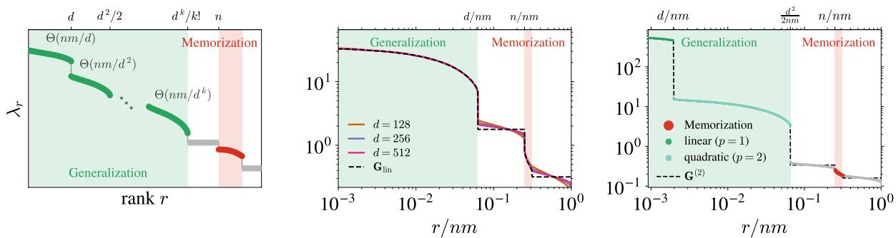  
Figure 1: Gram matrix spectrum. Eigenvalues $\lambda _ { r }$ in decreasing order against their rank. (Left) Sketch of the spectrum predicted by Theorem 2.3 for the Gram matrix $\mathbf { G } ^ { \nu \alpha , \mu \beta } = f ( \mathbf { \breve { Y } } ^ { \nu \alpha \top } \mathbf { Y } ^ { \mu \beta } / d )$ . (Middle) Spectrum of G with isotropic $\mathbf { \bar { { \Sigma } } } = \sigma ^ { 2 } \mathbf { I } _ { d } , \dot { t } = 0 . 1 , m = 4 , \psi _ { n } = 4$ and $f$ the NTK of a two-layer ReLU network (Appendix A.8) in the linear regime at several values of $d ;$ the dashed black curve is the linear equivalent $\mathbf { G } _ { \mathrm { l i n } }$ of (6) at $d = 5 1 2$ . (Right) Quadratic regime $n = 2 d ^ { 2 } \mathrm { { a t } } d = 6 4 ;$ the dashed black curve is the polynomial equivalent of Theorem 2.3. Details in Appendix D.7.

• generalization bulk: $\lambda _ { \mathrm { g e n } } \simeq \mu _ { 1 } \psi _ { n } m \lambda _ { t } = \Theta ( n m / d ) .$

• memorization bulk: $\lambda _ { \mathrm { m e m } } \simeq \mu _ { I } + \mu _ { B } ( m - 1 ) \Delta _ { t } / \lambda _ { t } = \Theta ( m ) ,$

and two atoms: $\mu _ { I }$ with weight $( m - 1 - 1 / \psi _ { n } ) / m$ and $\bar { \mu } = \mu _ { I } + m \mu _ { B }$ with weight $( 1 - 1 / \psi _ { n } ) / m$

While the generalization bulk is present in standard kernels $( m = 1 )$ , the multi-noise setting $( m > 1 )$ triggers the emergence of the memorization bulk, cf. Fig. 1. To understand why these components correspond to distinct learning regimes, we must first examine their associated eigenvectors.

Proposition 2.1 (Eigenvectors of the Gram matrix). For $\psi _ { n } \gg 1$ and every eigenvalue λ of Σ with associated eigenvector $\mathbf { v } _ { \lambda } ,$ , the eigenvectors of G associated with the two bulks of Theorem 2.1 are asymptotically

$$
\mathbf { u } _ { 1 } ^ { \nu \alpha } \propto \mathbf { v } _ { \lambda } ^ { \top } \mathbf { Y } ^ { \nu \alpha } , \qquad \mathbf { u } _ { 2 } ^ { \nu \alpha } \propto \mathbf { v } _ { \lambda } ^ { \top } \left[ ( m e ^ { - 2 t } \lambda + \Delta _ { t } ) \sqrt { \Delta _ { t } } \xi _ { \perp } ^ { \nu \alpha } - ( m - 1 ) \Delta _ { t } \bar { \mathbf { Y } } ^ { \nu } \right] ,\tag{7}
$$

with $\begin{array} { r } { \bar { \mathbf { Y } } ^ { \nu } = \frac { 1 } { m } \sum _ { \beta } \mathbf { Y } ^ { \nu \beta } } \end{array}$ and $\begin{array} { r } { \pmb { \xi } _ { \perp } ^ { \nu \alpha } = \pmb { \xi } ^ { \nu \alpha } - \frac { 1 } { m } \sum _ { \beta } \pmb { \xi } ^ { \nu \beta } } \end{array}$ . The eigenvectors of the two atoms are the $\varphi \otimes \mathbf { 1 } _ { m } / \sqrt { m }$ with $\varphi \in \mathrm { K e r } ( \bar { \mathbf Y } )$ ) and the elements of Ke $\operatorname { r } ( \mathbf { Y } ) \cap \operatorname { K e r } ( \mathbf { B } _ { m } ) ;$ ; they do not contribute to the estimated score.

Theorem 2.1 and Proposition 2.1 reveal a spectral hierarchy. The eigenvectors of the two bulks have a transparent interpretation. The generalization modes $\mathbf { u } _ { 1 }$ are the projections of the training points on the principal directions $\mathbf { v } _ { \lambda }$ of the data covariance, so learning them fits the component of the score carried by the population covariance, exactly as a standard kernel does at $m = 1$ . The memorization modes $\mathbf { u } _ { 2 }$ contain $\pmb { \xi } _ { \perp }$ , the noise components that distinguish the different realizations of the same data point, capturing the irregularity of the empirical score close to each data point. These two bulks are separated by a wide spectral gap: the generalization bulk scales as $\Theta ( n m / d )$ , while the memorization bulk remains $\Theta ( m )$ Because of the filtering of Eq. (5), this gap enforces a strict separation of timescales: the generalization modes are learned first whereas the memorization ones are learned much later, on a timescale that is parametrically larger in n.

## 2.2 Linear regime: bias–variance decomposition

To get a sharper understanding of the phenomenon we now turn to the bias–variance decomposition of the estimator of the score. In the high-dimensional limit, we derive closed-form equations for the bias and the variance of the kernel ridge predictor,

$$
{ \bf s } _ { \gamma } ( { \bf y } ) = { \cal K } ( { \bf y } , { \bf Y } ) ^ { \top } \big ( { \bf G } + \gamma { \bf I } _ { N } \big ) ^ { - 1 } \left( - \frac { \xi } { \sqrt { \Delta _ { t } } } \right) ,\tag{8}
$$

where Y and $\boldsymbol { \xi }$ are the noisy data and noises used during training.

Theorem 2.2 (Bias and variance of the kernel ridge predictor). In the limit $n , d \to \infty$ atfixed $\psi _ { n } = n / d ,$ with $m = O ( 1 )$ and $\boldsymbol { \Sigma } = \sigma ^ { 2 } \mathbf { I } _ { d } ,$ the bias and the variance (4) of the kernel ridge predictor (8) concentrate, and are given by a closed system of algebraic equations stated in Appendix D.9.

We use the ridge regularization as a proxy for the gradient flow dynamics in $\tau ,$ studying the evolution of the equations of Theorem 2.2 as a function of γ˜ through the equivalence $\tilde { \gamma } \Leftrightarrow 1 / \tau [ 4 ]$ . As shown in the left panel of Fig. 2, both ridge and gradient flow show qualitatively the same evolution; we therefore study the closed-form equations on the kernel ridge estimator as a function of $\tilde { \gamma }$ and infer the training-time behavior from it. Solving these equations numerically gives the scalings of the bias and the variance as a function of $\psi _ { n }$ and t that can be read off Fig. 2 (middle) and Fig. 11.

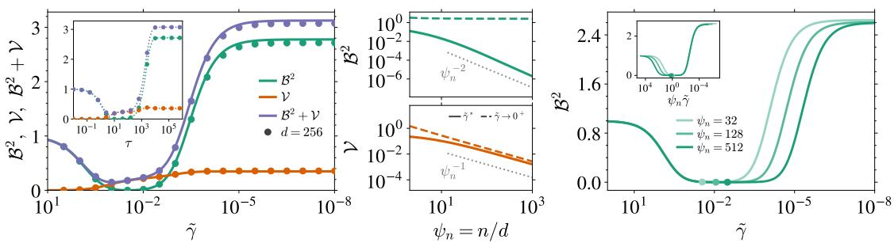  
Figure 2: Bias–variance decomposition. $B ^ { 2 } , \nu$ and $B ^ { 2 } + \nu$ for the kernel $f ( u ) = \mathbb { E } [ \operatorname { t a n h } ( z _ { 1 } )$ tanh(z2)], with $( z _ { 1 } , z _ { 2 } )$ unit-variance Gaussians of correlation u (Appendix A.8), at $\sigma ^ { 2 } = 1 , m = \bar { 4 }$ and $t = 0 . 1$ . (Left) Vs. the rescaled ridge $\tilde { \gamma }$ at $\psi _ { n } = 8$ , axis reversed to show the correspondence with training time; the inset shows the same vs. the training time τ of (5). Solid lines: Theorem $2 . 2 ;$ markers: experiments at $d \bar { = } 2 5 6 ;$ in the inset, markers and dotted line are the finite-d gradient flow. (Middle) $B ^ { 2 }$ (top) and V (bottom) vs. $\psi _ { n } ,$ for the optimal ridge $\tilde { \gamma } ^ { \ast } =$ arg minγ˜ $\mathcal { L } _ { \mathrm { t e s t } }$ (solid) and the ridgeless limit $\tilde { \gamma } \to 0 ^ { + }$ (dashed). (Right) $B ^ { 2 }$ vs. γ˜ for several $\psi _ { n } ,$ dots marking $\tilde { \gamma } ^ { \ast } ;$ the inset shows the same vs. $\psi _ { n } \tilde { \gamma }$ . Details in Appendix D.10.

Result 2.1 (Scalings of the bias and the variance). Let m $> 1$ and $1 / ( m \psi _ { n } ) \ll t \ll 1$

• Ridgeless, $\tilde { \gamma } \to \operatorname { 0 } ^ { + } : B ^ { 2 } = \Theta ( t ^ { - 2 } )$ , independently of $\psi _ { n } ,$ and $\mathcal { V } = \Theta ( \psi _ { n } ^ { - 1 } t ^ { - 2 } )$

• Optimal ridge, $\widetilde \gamma ^ { * } \colon B ^ { 2 } = \Theta ( \psi _ { n } ^ { - 2 } t ^ { - 2 } )$ and $\mathcal { V } = \Theta ( \psi _ { n } ^ { - 1 } t ^ { - 1 } )$

At the end of training, i.e. $\tilde { \gamma } \to 0 ^ { + }$ , the test loss is dominated by a persistent $\mathrm { b i a s } ^ { 3 }$ that does not vanish with the sample complexity and that diverges as the diffusion time $t  0 .$ . On the other hand, when the model is optimally early-stopped (equivalently, at the optimal ridge γ˜∗), the bias vanishes with the sample complexity at fixed $t ,$ like the variance, as illustrated in Fig. 2 (middle). In the right panel of Fig. 2, the bias starts to rise at γ˜ ∝ $1 / \psi _ { n }$ (inset), i.e. when the ridge $\gamma$ falls to the $O ( 1 )$ eigenvalues of the memorization bulk. Below this value the ridge is too small to damp these modes: the regularization no longer acts on the memorization bulk, which is the source of the persistent bias.

## 2.3 Polynomial scaling

These results can be extended beyond the linear regime under a few additional assumptions (see $\mathsf { A p - }$ pendix D.7). In the polynomial regime $d ^ { k } \ll n \ll d ^ { k + 1 }$ , the analogue of the linear equivalent (6) is a polynomial equivalent, with the spectrum below, sketched in Fig. 1 (left) and shown at finite d in Fig. 1 (right).

Theorem 2.3 (Spectrum of the Gram matrix, polynomial regime). In the limit $d , n  \infty$ with $d ^ { k } \ll n \ll d ^ { k + 1 }$ and $m = O ( 1 )$ , the spectrum of G consists, besides two atoms (see Appendix $D . 7 ) .$ , of:

• $f o r$ each degree $p \in \{ 1 , \ldots , k \}$ , a group of $\Theta ( d ^ { p } / p ! )$ eigenvalues $\Theta ( n m / d ^ { p } )$ (generalization sub-bulks);

• a bulk $o f \Theta ( d ^ { k } / k ! )$ eigenvalues $\Theta ( m )$ , independent of n and absent at $m = 1$ (memorization bulk).

See Appendix D.7 for the precise statement. Since a mode of eigenvalue λ is learned on the timescale $\tau _ { \lambda } \sim n m / ( d \lambda )$ , the generalization sub-bulks are learned degree by degree, on timescales $\tau _ { p } \sim d ^ { p - 1 }$ : at $m = 1$ this is the classical hierarchical picture of kernel regression [31], in which low-order moments of the data are learned first and higher-order statistics later [68, 10]. Data repetition $( m > 1 )$ preserves this hierarchy but adds the memorization bulk at $\Theta ( m )$ , learned on $\tau _ { \mathrm { m e m } } \sim n / d .$ As in the linear regime, memorization is delayed relative to every degree the model can learn, by a factor that grows with the sample complexity. Note that, strictly speaking, full memorization—the ability of the learned score to reproduce the training samples—requires n to grow faster than any power of $d , \operatorname { i . e . } n \gg d ^ { k }$ for every fixed k. At any finite k only an approximation of the empirical score can be learned, and memorization and overfitting are correspondingly partial [63, 48].

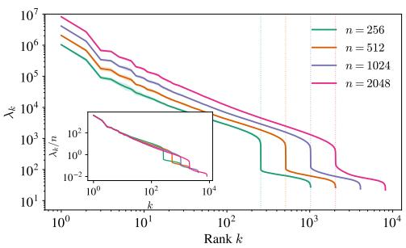

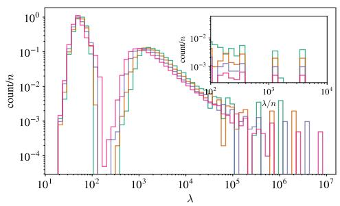  
Figure 3: Structure of the generalization and memorization bulks in the CNTK spectrum on CelebA. $( L e f t )$ Ordered eigenvalues for several n at $m = 4 .$ The dotted lines indicate $r = n ,$ . Inset: Same, rescaled by n. (Right) Eigenvalue histogram with counts rescaled by n. Inset: collapse of the top eigenvalues under rescaling by n. $s = 0 . 0 5$ , averaged over 10 training sets.

## 3 Experiments

Data, noising process, and model. We work with the CelebA face dataset [55], which we convert to grayscale, downsample to $3 2 \times 3 2$ pixels, and standardize. For computational convenience, our experiments adopt a flow-matching parametrization [53, 52, 3] in which the noising process is the linear interpolant4 ${ \bf Y } _ { s } ^ { \nu \hat { \alpha } } = \left( 1 - s \right) { \bf x } ^ { \nu } + \bar { s } \hat { \xi } ^ { \nu \alpha } { } _ { \mathrm { { } } }$ , with $s \in [ 0 , 1 ]$ , between a clean data point $\mathbf { x } ^ { \nu } \sim P _ { 0 }$ and an independent Gaussian noise $\pmb { \xi } ^ { \nu \alpha } \sim \mathcal { N } ( 0 , \mathbf { I } _ { d } )$ . The regression targets are the conditional velocities $\pmb { \xi } ^ { \nu \alpha } - \mathbf { x } ^ { \nu }$ Throughout the section, we use n clean images and m independent noise realizations per data point such that the empirical Gram matrix $\mathbf { G } ^ { \nu \alpha , \mu \beta } = K ( \mathbf { Y } _ { s } ^ { \nu \alpha } , \mathbf { Y } _ { s } ^ { \mu \beta } )$ has size $N \times N$ with $N = n m$ . We take the velocity model to be a depth-D vanilla convolutional neural network (CNN) with $3 \times 3$ filters and ReLU activations, and a final readout layer. Our choice is motivated by the existence of a closed-form Convolutional Neural Tangent Kernel (CNTK) in the infinite-width (lazy) limit [6]. This allows us to replace the network by its kernel predictor, whose Gram matrix is computed in closed form rather than from parameter gradients (see Appendix $\mathrm { A } . 7 )$ . We then test whether these spectral properties persist in the feature-learning regime by training a finite-width U-Net in Sect. 3.2.

Gram-matrix eigendecomposition and truncated kernel regression. At every flow time $s ,$ we approximate the top-r eigenpairs of the Gram matrix G via the randomized method of Halko et al. [35] in which, for memory efficiency, the full Gram matrix is never materialized. Keeping only the top r modes of G defines the spectrally truncated estimator $\hat { \mathbf { v } } _ { r }$ of the velocity field $\mathbb { E } [ \pmb { \xi } - \mathbf { x } _ { 0 } \mid \mathbf { Y } _ { s } = \mathbf { x } ] .$ , and approximately corresponds to early stopping of training in the lazy regime at $\tau \sim n m / ( d \lambda _ { r } )$ , cf. Eq. (5). More details can be found in Appendix E.2.

Metrics. To quantify the ability of the approximated velocity field to memorize, we adopt the firstto-second nearest-neighbor ratio criterion used in several previous studies [85, 33, 15] and compute the fraction $f _ { \mathrm { m e m } } \in [ 0 , 1 ]$ of samples x˜ generated by the backward dynamics that are memorized. We initialize the trajectories at $\tilde { \mathbf { x } } _ { 1 } \in \overline { { \left\{ \xi ^ { \mu \alpha } \right\} } } .$ ; our experiment can therefore be viewed as a long-time version of the U-turn protocol of Sclocchi et al. [71], Behjoo and Chertkov [11]. As a measure of the quality of the generated images, we also report the Fréchet Inception Distance [FID, 39] between 2,048 samples generated from fresh noise and 2,048 held-out test images. See Appendix E.1 for more details.

## 3.1 Lazy regime: Gram matrix for real data

Structure of the Gram matrix spectrum in CelebA. Figure 3 displays the spectrum of the CNTK Gram matrix computed from noised images of CelebA at fixed $s = 0 . 0 5$ . It exhibits the two-bulk structure predicted by Theorem 2.1, including a component absent in the standard $m = 1$ case (see Appendix E.2 for the scaling with m). The first bulk of large eigenvalues behaves like that of a classical Gram matrix: at fixed m, the top eigenvalues scale linearly with n and collapse once rescaled (see insets). This generalization bulk contains n eigenvalues rather than the d predicted for sub-Gaussian data in the proportional regime, a known feature of image statistics [17]. This likely reflects the strong anisotropy and low intrinsic dimension of natural images, whose covariance spectrum decays as a power law. For such data, the bulks of Theorem 2.3 are not well separated and can merge [82]. The key qualitative phenomenon nonetheless persists: the spectrum is partitioned into a first bulk scaling with $n ,$ and a second which is independent of it. We show below that they correspond to generalization and memorization, respectively.

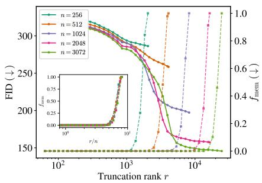

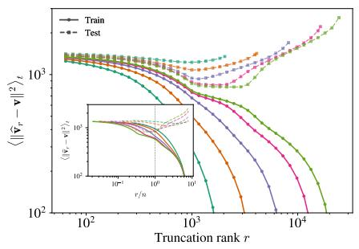

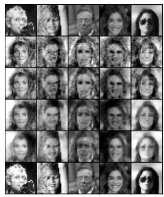  
Figure 4: Spectrally truncated kernel regression and generalization–memorization transition. $( L e f t )$ FID (solid) and $f _ { \mathrm { m e m } }$ (dashed) vs. truncation rank r for several n. Inset: $f _ { \mathrm { m e m } }$ vs. $r / n .$ (Middle) Time-averaged $L _ { 2 }$ training (solid) and test (dashed) losses; the inset shows the same curves against $r / n .$ . (Right) Top row: training images. Rows $2 { \mathrm { - } } 6 { \mathrm { : } }$ generated samples $( n = 3 0 7 2 )$ starting from a fixed training noise associated with the top-row clean image at $r \in$ {2048, 4096, 8192, 16384, $N = n m \}$

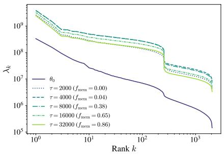

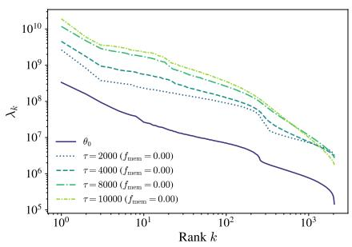  
Figure 5: Training-time-dependent empirical Gram eigenspectrum of a U-Net. Eigenvalues of the empirical Gram matrix computed for several training times τ at $s = 0 . 2 3$ for $( L e f t )$ the unregularized dynamics, and $( R i g h t )$ the $L _ { 2 }$ -regularized dynamics.

Generalization–memorization transition in truncated kernel regression. Figure 4 varies the truncation rank r of the CNTK Gram matrix on CelebA for $n \in \{ 2 5 6 , 5 1 2$ , 1024, 2048, 3072} and $m = 8 .$ . At small $r ,$ the FID (left panel) of samples generated with the truncated velocity field $\hat { \mathbf { v } } _ { r }$ decreases steadily while $f _ { \mathrm { m e m } }$ (in inset) stays near zero. For small $n ,$ however, $f _ { \mathrm { m e m } }$ rises before the FID reaches its minimum: the estimator starts memorizing training points before it produces plausible images. As n grows, the FID drops at roughly the same r but reaches lower minima, saturating beyond n = 2048. In this regime, the rank-r approximated velocity generates CelebA-like samples without copying any training point over a growing range of r. The threshold marking the onset of generalization is therefore essentially independent of $n ,$ whereas the memorization threshold scales linearly with $n ,$ as shown by the inset, where rescaling r by n makes all curves collapse. The train and test losses (middle panel) exhibit the same pattern: the training error decreases monotonically with $r ,$ while the test error develops a clean minimum around r ≈ n for n sufficiently large, in agreement with Sect. 2. The right panel illustrates this transition at fixed $n = 3 0 7 2 { \mathrm { : } }$ integrating the trajectories backward yields blurry reconstructions at small $r ,$ which sharpen as r grows. Across an entire intermediate regime, the model produces new samples, that differ from their paired training images (top row) in gender, accessories and hairstyles. At larger r, these features are progressively morphed into those of the associated training image, until eventually, at $r = N = n m$ (last row), every column reproduces its training image. These three diagnostics agree on a transition from generalization to memorization as r increases, confirming the role of the successive bulks of eigenvalues in the CNTK Gram matrix in separating the two phases. This behavior is in agreement with the previous findings of Bonnaire et al. [15]: as the two bulks of eigenvalues are learned on different timescales, they create a dynamical separation between a generalization and a memorization phase, whose timescale ratio is proportional to $n .$

## 3.2 Feature-learning regime and training-time-dependent NTK

We now investigate whether the spectral properties persist beyond the lazy regime, when the kernel evolves throughout training. To this end, we train a finite-width U-Net in the feature-learning regime on $n = 2 5 6$ CelebA images with $m = 8$ and track the eigenvalues of its empirical NTK Gram matrix, shown in the left panel of Fig. 5. At initialization, the spectrum displays the same two-bulk structure as the CNTK, with a gap at r ≈ n. While eigenvalue amplitudes shift non-monotonically during training, the bulk separation persists and the spectral gap even sharpens for $\tau > 0$ . Strikingly, even though training spans the entire generalization–memorization transition (with $f _ { \mathrm { m e m } }$ going from 0 to 0.86), the shape of the spectrum (two bulks with a gap at n) is preserved. This suggests that our analysis and the crucial role of the spectral bias we exhibit extend beyond the lazy regime. To further connect the second bulk to memorization, we perform an $L _ { \mathrm { 2 } } \mathrm { - r e g u l a r i z e d }$ training with a regularization parameter set to the n-th eigenvalue of the Gram matri $\mathbf { \Delta x , }$ tracked dynamically during training at each flow time s (right panel of Fig. 5). This procedure therefore effectively damps the modes with eigenvalues below $\lambda _ { n }$ and has two striking consequences: $f _ { \mathrm { m e m } }$ remains exactly zero over 10,000 training steps (compared to ≈ 0.5 with no regularization) without sacrificing the test loss (see Appendix E.3), and the second bulk gets progressively smoothed out during training. This is consistent with memorization being indeed controlled by this second component and provides a spectral interpretation of the findings of Baptista et al. [8], according to which regularization suppresses memorization in diffusion models.

## 4 Conclusion and limitations

We analyze the spectrum of the Gram matrix that governs the lazy training dynamics of diffusion models and identify two well-separated bulks: a generalization bulk, already present in standard kernel regression, and a memorization bulk created by the repetition of each training sample with several noise realizations— specific to diffusion models. The two bulks are separated by a spectral gap that grows with the training set size $n ,$ leading to a separation of training timescales. We establish this structure analytically for both linear and polynomial sample complexities and, in the linear regime, derive closed-form equations for the bias and the variance: the generalization bulk yields a bias and a variance that vanish with the sample complexity, whereas the memorization bulk contributes a Θ(1) bias that has no counterpart in the supervised setting. Experiments on CelebA with the convolutional NTK exhibit the same spectral hierarchy, and a spectral truncation controls the generalization–memorization transition. The two-bulk structure further persists in a finite-width U-Net trained in the feature-learning regime, suggesting that this spectral mechanism is a general property of diffusion models.

Limitations. Our analytical results rely on several assumptions: the lazy regime, a fixed diffusion time $t ,$ and a finite number m of noise realizations frozen throughout training. While the experiments strongly suggest that the mechanism extends well beyond these hypotheses, a rigorous treatment of the feature-learning regime remains open. Finally, the gap between the predicted and observed numbers of generalization eigenvalues calls for more realistic data models.

## Acknowledgment

During the writing of this work, we became aware that Hugo Latourelle-Vigeant, Sinho Chewi, Aram-Alexandre Pooladian, John Sous and Theodor Misiakiewicz Latourelle-Vigeant et al. [48] had also been investigating the memorization–generalization transition in the lazy regime. Their work is close to ours but quite complementary. Both works agree on the resulting theoretical picture. RU thanks Arie Wortsman for insightful discussions on kernel regression and anisotropic data. GB acknowledges support from the French government under the management of ANR: PEPR-IA (project MAGICALL ANR-25- PEIA-0004) and PR[AI]RIE-PSAI (ANR-23-IACL- 0008). This work was performed using HPC resources from GENCI-IDRIS (Grants 2026-AD011016319R1 & 2026-A0201016159).

## References

[1] Beatrice Achilli, Enrico Ventura, Gianluigi Silvestri, Bao Pham, Gabriel Raya, Dmitry Krotov, Carlo Lucibello, and Luca Ambrogioni. Losing dimensions: Geometric memorization in generative diffusion, 2024. URL https://arxiv.org/abs/2410.08727.

[2] Beatrice Achilli, Luca Ambrogioni, Carlo Lucibello, Marc Mézard, and Enrico Ventura. Memorization and generalization in generative diffusion under the manifold hypothesis. Journal of Statistical Mechanics: Theory and Experiment, 2025(7):073401, jul 2025. doi: 10.1088/1742-5468/ade136. URL https://doi.org/10.1088/1742-5468/ade136.

[3] Michael Albergo, Nicholas M. Boffi, and Eric Vanden-Eijnden. Stochastic interpolants: A unifying framework for flows and diffusions. Journal ofMachine Learning Research, 26(209):1–80, 2025. URL http://jmlr.org/papers/v26/23-1605.html.

[4] Alnur Ali, J. Zico Kolter, and Ryan J. Tibshirani. A continuous-time view of early stopping for least squares regression. In Kamalika Chaudhuri and Masashi Sugiyama, editors, Proceedings of the Twenty-Second International Conference on Artificial Intelligence and Statistics, volume 89 of Proceedings of Machine Learning Research, pages 1370–1378. PMLR, 16–18 Apr 2019. URL https: //proceedings.mlr.press/v89/ali19a.html.

[5] Brian D.O. Anderson. Reverse-time diffusion equation models. Stochastic Processes and their Applications, 12(3):313–326, 1982. ISSN 0304-4149. doi: https://doi.org/10.1016/0304-4149(82)90051-5. URL https://www.sciencedirect.com/science/article/pii/0304414982900515.

[6] Sanjeev Arora, Simon Du, Wei Hu, Zhiyuan Li, Russ R Salakhutdinov, and Ruosong Wang. On exact computation with an infinitely wide neural net. In H. Wallach, H. Larochelle, A. Beygelzimer, F. d'Alché-Buc, E. Fox, and R. Garnett, editors, Advances in Neural Information Processing Systems, volume 32. Curran Associates, Inc., 2019. URL https://proceedings.neurips.cc/paper\_ files/paper/2019/file/dbc4d84bfcfe2284ba11beffb853a8c4-Paper.pdf.

[7] Francis Bach. Polynomial magic iii: Hermite polynomials. https://francisbach.com/ hermite-polynomials/, 2023. Accessed: 2025-10-09.

[8] Ricardo Baptista, Agnimitra Dasgupta, Nikola B. Kovachki, Assad Oberai, and Andrew M. Stuart. Memorization and regularization in generative diffusion models, 2025. URL https://arxiv. org/abs/2501.15785.

[9] Jean Barbier, Florent Krzakala, Nicolas Macris, Léo Miolane, and Lenka Zdeborová. Optimal errors and phase transitions in high-dimensional generalized linear models. Proceedings of the National Academy ofSciences, 116:5451–5460, 2019.

[10] Lorenzo Bardone, Claudia Merger, and Sebastian Goldt. A theory of statistics in diffusion models, from easy to hard. In Proceedings of the 43rd International Conference on Machine Learning, Proceedings of Machine Learning Research. PMLR, 2026.

[11] Hamidreza Behjoo and Michael Chertkov. U-turn diffusion. Entropy, 27(4):343, March 2025. ISSN 1099-4300. doi: 10.3390/e27040343. URL http://dx.doi.org/10.3390/e27040343.

[12] Alberto Bietti and Julien Mairal. On the inductive bias of neural tangent kernels. In H. Wallach, H. Larochelle, A. Beygelzimer, F. d'Alché-Buc, E. Fox, and R. Garnett, editors, Advances in Neural Information Processing Systems, volume 32. Curran Associates, Inc., 2019. URL https://proceedings.neurips.cc/paper\_files/paper/2019/file/ c4ef9c39b300931b69a36fb3dbb8d60e-Paper.pdf.

[13] Giulio Biroli, Tony Bonnaire, Valentin de Bortoli, and Marc Mézard. Dynamical regimes of diffusion models. Nature Communications, 15(9957), 2024. doi: 10.1038/s41467-024-9957-y. URL https: //www.nature.com/articles/s41467-024-9957-y. Open access.

[14] Antoine Bodin and Nicolas Macris. Model, sample, and epoch-wise descents: exact solution of gradient flow in the random feature model. In Advances in Neural Information Processing Systems, 2021.

[15] Tony Bonnaire, Raphaël Urfin, Giulio Biroli, and Marc Mezard. Why diffusion models don’t memorize: The role of implicit dynamical regularization in training. In The Thirty-ninth Annual Conference on Neural Information Processing Systems, 2026. URL https://openreview.net/forum?id= BSZqpqgqM0.

[16] Sam Buchanan, Druv Pai, Yi Ma, and Valentin De Bortoli. On the edge of memorization in diffusion models. Advances in Neural Information Processing Systems, 38:96113–96157, 2026.

[17] Abdulkadir Canatar, Blake Bordelon, and Cengiz Pehlevan. Spectral bias and task-model alignment explain generalization in kernel regression and infinitely wide neural networks. Nature communications, 12(1):2914, 2021.

[18] Nicholas Carlini, Jamie Hayes, Milad Nasr, Matthew Jagielski, Vikash Sehwag, Florian Tramèr, Borja Balle, Daphne Ippolito, and Eric Wallace. Extracting training data from diffusion models. In Proceedings ofthe 32nd USENIX Conference on Security Symposium, SEC ’23, USA, 2023. USENIX Association. ISBN 978-1-939133-37-3.

[19] Lenaic Chizat, Edouard Oyallon, and Francis Bach. On lazy training in differentiable programming, 2020. URL https://arxiv.org/abs/1812.07956.

[20] Youngmin Cho and Lawrence Saul. Kernel methods for deep learning. In Advances in Neural Information Processing Systems, volume 22, 2009.

[21] Hugo Cui, Florent Krzakala, Eric Vanden-Eijnden, and Lenka Zdeborova. Analysis of learning a flow-based generative model from limited sample complexity. In The Twelfth International Conference on Learning Representations, 2024. URL https://openreview.net/forum?id=ndCJeysCPe.

[22] Stéphane D’Ascoli, Maria Refinetti, Giulio Biroli, and Florent Krzakala. Double trouble in double descent: Bias and variance(s) in the lazy regime. In Hal Daumé III and Aarti Singh, editors, Proceedings of the 37th International Conference on Machine Learning, volume 119 of Proceedings of Machine Learning Research, pages 2280–2290. PMLR, 13–18 Jul 2020. URL https://proceedings. mlr.press/v119/d-ascoli20a.html.

[23] Noureddine El Karoui. The spectrum of kernel random matrices. The Annals of Statistics, 38(1):1–50, February 2010. doi: 10.1214/08-AOS648. URL https://doi.org/10.1214/08-AOS648.

[24] Alessandro Favero, Antonio Sclocchi, and Matthieu Wyart. Bigger isn’t always memorizing: Early stopping overparameterized diffusion models, 2025.

[25] Jerome Garnier-Brun, Luca Biggio, Davide Beltrame, Marc Mézard, and Luca Saglietti. Biased generalization in diffusion models, 2026. URL https://arxiv.org/abs/2603.03469.

[26] Mario Geiger, Stefano Spigler, Arthur Jacot, and Matthieu Wyart. Disentangling feature and lazy training in deep neural networks. Journal of Statistical Mechanics: Theory and Experiment, 2020(11): 113301, November 2020. ISSN 1742-5468. doi: 10.1088/1742-5468/abc4de. URL http://dx.doi. org/10.1088/1742-5468/abc4de.

[27] Anand Jerry George, Rodrigo Veiga, and Nicolas Macris. Denoising score matching with random features: Insights on diffusion models from precise learning curves, 2025. URL https://arxiv. org/abs/2502.00336.

[28] Anand Jerry George, Rodrigo Veiga, and Nicolas Macris. Analysis of diffusion models for manifold data. In 2025 IEEE International Symposium on Information Theory (ISIT), pages 1–6, 2025. doi: 10.1109/ISIT63088.2025.11195641.

[29] Federica Gerace, Bruno Loureiro, Florent Krzakala, Marc Mezard, and Lenka Zdeborova. Generalisation error in learning with random features and the hidden manifold model. In Hal Daumé III and Aarti Singh, editors, Proceedings of the 37th International Conference on Machine Learning, volume 119 of Proceedings of Machine Learning Research, pages 3452–3462. PMLR, 13–18 Jul 2020. URL https://proceedings.mlr.press/v119/gerace20a.html.

[30] Cédric Gerbelot, Alia Abbara, and Florent Krzakala. Asymptotic errors for teacher-student convex generalized linear models (or: How to prove kabashima’s replica formula). IEEE Transactions on Information Theory, 69:1824–1852, 2023.

[31] Behrooz Ghorbani, Song Mei, Theodor Misiakiewicz, and Andrea Montanari. Linearized twolayers neural networks in high dimension. The Annals ofStatistics, 49(2):1029–1054, Apr 2021. doi: 10.1214/20-AOS2001. URL https://doi.org/10.1214/20-AOS2001.

[32] Sebastian Goldt, Bruno Loureiro, Galen Reeves, Florent Krzakala, Marc Mézard, and Lenka Zdeborová. The gaussian equivalence of generative models for learning with shallow neural networks, 2021. URL https://arxiv.org/abs/2006.14709.

[33] Xiangming Gu, Chao Du, Tianyu Pang, Chongxuan Li, Min Lin, and Ye Wang. On memorization in diffusion models. Transactions on Machine Learning Research, 2025. ISSN 2835-8856. URL https: //openreview.net/forum?id=D3DBqvSDbj.

[34] Francesco Guerra and Fabio Lucio Toninelli. The thermodynamic limit in mean field spin glass models. Communications in Mathematical Physics, 230:71–79, 2002.

[35] N. Halko, P. G. Martinsson, and J. A. Tropp. Finding structure with randomness: Probabilistic algorithms for constructing approximate matrix decompositions. SIAM Review, 53(2):217–288, 2011. doi: 10.1137/090771806. URL https://doi.org/10.1137/090771806.

[36] Yinbin Han, Meisam Razaviyayn, and Renyuan Xu. Neural network-based score estimation in diffusion models: Optimization and generalization. In The Twelfth International Conference on Learning Representations, 2024. URL https://openreview.net/forum?id=h8GeqOxtd4.

[37] Yinbin Han, Meisam Razaviyayn, and Renyuan Xu. Neural network-based score estimation in diffusion models: Optimization and generalization, 2026. URL https://arxiv.org/abs/2401. 15604v4. Extended version of the ICLR 2024 paper.

[38] UG Haussmann and E Pardoux. Time reversal of diffusions. The Annals of Probability, 14(4):1188–1205, 1986. doi: 10.1214/aop/1176992362.

[39] Martin Heusel, Hubert Ramsauer, Thomas Unterthiner, Bernhard Nessler, and Sepp Hochreiter. Gans trained by a two time-scale update rule converge to a local nash equilibrium, 2017.

[40] Jonathan Ho, Ajay Jain, and Pieter Abbeel. Denoising diffusion probabilistic models, 2020.

[41] Hong Hu and Yue M. Lu. Universality laws for high-dimensional learning with random features. IEEE Transactions on Information Theory, 69(3):1932–1964, 2023. doi: 10.1109/TIT.2022.3217698.

[42] Aapo Hyvärinen. Estimation of non-normalized statistical models by score matching. Journal of Machine Learning Research, 6(24):695–709, 2005. URL http://jmlr.org/papers/v6/ hyvarinen05a.html.

[43] Arthur Jacot, Franck Gabriel, and Clement Hongler. Neural tangent kernel: Convergence and generalization in neural networks. In S. Bengio, H. Wallach, H. Larochelle, K. Grauman, N. Cesa-Bianchi, and R. Garnett, editors, Advances in Neural Information Processing Systems, volume 31. Curran Associates, Inc., 2018. URL https://proceedings.neurips.cc/paper\_files/paper/2018/ file/5a4be1fa34e62bb8a6ec6b91d2462f5a-Paper.pdf.

[44] Zahra Kadkhodaie, Florentin Guth, Eero P Simoncelli, and Stéphane Mallat. Generalization in diffusion models arises from geometry-adaptive harmonic representations. In The Twelfth International Conference on Learning Representations, 2024. URL https://openreview.net/forum?id= ANvmVS2Yr0.

[45] Mason Kamb and Surya Ganguli. An analytic theory of creativity in convolutional diffusion models. In Forty-second International Conference on Machine Learning, 2025. URL https://openreview. net/forum?id=ilpL2qACla.

[46] W. F. Kibble. An extension of a theorem of mehler’s on hermite polynomials. Mathematical Proceedings of the Cambridge Philosophical Society, 41(1):12–15, June 1945. ISSN 0305-0041, 1469-8064. doi: 10.1017/S0305004100022313.

[47] Diederik P. Kingma and Jimmy Ba. Adam: A method for stochastic optimization. In Yoshua Bengio and Yann LeCun, editors, ICLR (Poster), 2015.

[48] Hugo Latourelle-Vigeant, Sinho Chewi, Aram-Alexandre Pooladian, John Sous, and Theodor Misiakiewicz. Generalization, memorization, and overfitting for diffusion models trained in the lazy high-dimensional regime, 2026. URL https://arxiv.org/abs/2608.23938.

[49] Puheng Li, Zhong Li, Huishuai Zhang, and Jiang Bian. On the generalization properties of diffusion models, 2025. URL https://arxiv.org/abs/2311.01797.

[50] Sixu Li, Shi Chen, and Qin Li. A good score does not lead to a good generative model, 2024. URL https://arxiv.org/abs/2401.04856.

[51] T. Li, L. Biferale, F. Bonaccorso, and et al. Synthetic lagrangian turbulence by generative diffusion models. Nat Mach Intell, 6:393–403, 2024. doi: 10.1038/s42256-024-00810-0. URL https://doi. org/10.1038/s42256-024-00810-0.

[52] Yaron Lipman, Ricky T. Q. Chen, Heli Ben-Hamu, Maximilian Nickel, and Matthew Le. Flow matching for generative modeling. In The Eleventh International Conference on Learning Representations, 2023. URL https://openreview.net/forum?id=PqvMRDCJT9t.

[53] Xingchao Liu, Chengyue Gong, and Qiang Liu. Flow straight and fast: Learning to generate and transfer data with rectified flow, 2022. URL https://arxiv.org/abs/2209.03003.

[54] Yixin Liu, Kai Zhang, Yuan Li, Zhiling Yan, Chujie Gao, Ruoxi Chen, Zhengqing Yuan, Yue Huang, Hanchi Sun, Jianfeng Gao, Lifang He, and Lichao Sun. Sora: A review on background, technology, limitations, and opportunities of large vision models, 2024.

[55] Ziwei Liu, Ping Luo, Xiaogang Wang, and Xiaoou Tang. Deep learning face attributes in the wild. In Proceedings of the 2015 IEEE International Conference on Computer Vision (ICCV), ICCV ’15, page 3730–3738, USA, 2015. IEEE Computer Society. ISBN 9781467383912. doi: 10.1109/ICCV.2015.425. URL https://doi.org/10.1109/ICCV.2015.425.

[56] Cosme Louart, Zhenyu Liao, and Romain Couillet. A random matrix approach to neural networks. The Annals ofApplied Probability, 28(2):1190–1248, 2018. doi: 10.1214/17-AAP1328.

[57] Yue M. Lu and Horng-Tzer Yau. An Equivalence Principle for the Spectrum of Random Inner-Product Kernel Matrices with Polynomial Scalings. arXiv e-prints, art. arXiv:2205.06308, May 2022. doi: 10.48550/arXiv.2205.06308.

[58] Song Mei and Andrea Montanari. The generalization error of random features regression: Precise asymptotics and double descent curve, 2020. URL https://arxiv.org/abs/1908.05355.

[59] Song Mei, Theodor Misiakiewicz, and Andrea Montanari. Generalization error of random feature and kernel methods: Hypercontractivity and kernel matrix concentration. Applied and Computational Harmonic Analysis, 59:3–84, 2022.

[60] Claudia Merger and Sebastian Goldt. Generalization dynamics of linear diffusion models, 2026. URL https://arxiv.org/abs/2505.24769.

[61] Claudia Merger and Sebastian Goldt. Local coverage governs memorization in diffusion models, 2026. URL https://arxiv.org/abs/2606.14390.

[62] Marc Mézard, Giorgio Parisi, and Miguel Angel Virasoro. Spin Glass Theory and Beyond: An Introduction to the Replica Method and Its Applications, volume 9 of Lecture Notes in Physics. World Scientific Publishing Company, Singapore, 1987.

[63] Theodor Misiakiewicz. Spectrum of inner-product kernel matrices in the polynomial regime and multiple descent phenomenon in kernel ridge regression. arXiv preprint arXiv:2204.10425, 2022.

[64] Parthe Pandit, Zhichao Wang, and Yizhe Zhu. Universality of kernel random matrices and kernel regression in the quadratic regime, 2025. URL https://arxiv.org/abs/2408.01062.

[65] Jakiw Pidstrigach. Score-based generative models detect manifolds. In Alice H. Oh, Alekh Agarwal, Danielle Belgrave, and Kyunghyun Cho, editors, Advances in Neural Information Processing Systems, 2022. URL https://openreview.net/forum?id=AiNrnIrDfD9.

[66] I. Price, A. Sanchez-Gonzalez, F. Alet, and et al. Probabilistic weather forecasting with machine learning. Nature, 637:84–90, 2025. doi: 10.1038/s41586-024-08252-9. URL https://doi.org/10. 1038/s41586-024-08252-9.

[67] Ali Rahimi and Benjamin Recht. Random features for large-scale kernel machines. In J. Platt, D. Koller, Y. Singer, and S. Roweis, editors, Advances in Neural Information Processing Systems, volume 20. Curran Associates, Inc., 2007. URL https://proceedings.neurips.cc/paper\_ files/paper/2007/file/013a006f03dbc5392effeb8f18fda755-Paper.pdf.

[68] Fabiola Ricci, Lorenzo Bardone, and Sebastian Goldt. Feature learning from non-gaussian inputs: the case of independent component analysis in high dimensions. In Forty-second International Conference on Machine Learning, 2025. URL https://openreview.net/forum?id=kmg7hweySi.

[69] Herbert Robbins and Sutton Monro. A stochastic approximation method. The annals of mathematical statistics, pages 400–407, 1951.

[70] Robin Rombach, Andreas Blattmann, Dominik Lorenz, Patrick Esser, and Björn Ommer. Highresolution image synthesis with latent diffusion models, 2021.

[71] Antonio Sclocchi, Alessandro Favero, and Matthieu Wyart. A phase transition in diffusion models reveals the hierarchical nature of data, 2024.

[72] J.W. Silverstein and Z.D. Bai. On the empirical distribution of eigenvalues of a class of large dimensional random matrices. Journal of Multivariate Analysis, 54(2):175–192, 1995. ISSN 0047- 259X. doi: https://doi.org/10.1006/jmva.1995.1051. URL https://www.sciencedirect.com/ science/article/pii/S0047259X85710512.

[73] Jascha Sohl-Dickstein, Eric Weiss, Niru Maheswaranathan, and Surya Ganguli. Deep unsupervised learning using nonequilibrium thermodynamics. In Francis Bach and David Blei, editors, Proceedings of the 32nd International Conference on Machine Learning, volume 37 of Proceedings of Machine Learning Research, pages 2256–2265, Lille, France, 07–09 Jul 2015. PMLR. URL https://proceedings.mlr. press/v37/sohl-dickstein15.html.

[74] Gowthami Somepalli, Vasu Singla, Micah Goldblum, Jonas Geiping, and Tom Goldstein. Diffusion art or digital forgery? investigating data replication in diffusion models. In Proceedings of the IEEE/CVF Conference on Computer Vision and Pattern Recognition, 2023.

[75] Gowthami Somepalli, Vasu Singla, Micah Goldblum, Jonas Geiping, and Tom Goldstein. Understanding and mitigating copying in diffusion models. Advances in Neural Information Processing Systems, 36:47783–47803, 2023.

[76] Yang Song and Stefano Ermon. Generative modeling by estimating gradients of the data distribution. In H. Wallach, H. Larochelle, A. Beygelzimer, F. d'Alché-Buc, E. Fox, and R. Garnett, editors, Advances in Neural Information Processing Systems, volume 32. Curran Associates, Inc., 2019. URL https://proceedings.neurips.cc/paper\_files/paper/2019/file/ 3001ef257407d5a371a96dcd947c7d93-Paper.pdf.

[77] Michel Talagrand. The parisi formula. Annals of mathematics, pages 221–263, 2006.

[78] Enrico Ventura, Beatrice Achilli, Gianluigi Silvestri, Carlo Lucibello, and Luca Ambrogioni. Manifolds, random matrices and spectral gaps: The geometric phases of generative diffusion. In The Thirteenth International Conference on Learning Representations, 2025. URL https://openreview. net/forum?id=KlN00vQEY2.

[79] M. Vilucchio, Y. Dandi, M. P. Rossignol, C. Gerbelot, and F. Krzakala. Asymptotics of non-convex generalized linear models in high-dimensions: A proof of the replica formula. arXiv preprint arXiv:2502.20003, 2025.

[80] Pascal Vincent. A connection between score matching and denoising autoencoders. Neural Computation, 23(7):1661–1674, 2011. doi: 10.1162/NECO\_a\_00142.

[81] Binxu Wang and Cengiz Pehlevan. An analytical theory of spectral bias in the learning dynamics of diffusion models. Advances in Neural Information Processing Systems, 38:95865–95963, 2026. URL https://arxiv.org/abs/2503.03206.

[82] Arie Wortsman and Bruno Loureiro. Kernel ridge regression under power-law data: spectrum and generalization, 2025. URL https://arxiv.org/abs/2510.04780.

[83] Yu-Han Wu, Pierre Marion, Gérard Biau, and Claire Boyer. Taking a big step: Large learning rates in denoising score matching prevent memorization, 2025.

[84] Yuan Yao, Lorenzo Rosasco, and Andrea Caponnetto. On early stopping in gradient descent learning. Constructive approximation, 26(2):289–315, 2007.

[85] TaeHo Yoon, Joo Young Choi, Sehyun Kwon, and Ernest K. Ryu. Diffusion probabilistic models generalize when they fail to memorize. In ICML 2023 Workshop on Structured Probabilistic Inference & Generative Modeling, 2023. URL https://openreview.net/forum?id=shciCbSk9h.

# First Learn, Then Memorize: The Spectral Bias of Diffusion Models

Raphaël Urfin, Tony Bonnaire, Giulio Biroli, Marc Mézard

## Appendix

This appendix provides detailed derivations and additional results supporting the main text. Sect. A reviews the Neural Tangent Kernel framework and gives explicit expressions of the kernel for common architectures. Sect. B shows the equivalence between the Ornstein–Uhlenbeck process used in Sect. 2 and the rectified-flow interpolant used in Sect. 3. Sect. C discusses related work in more depth and the differences with this work. Sect. D then contains the proofs of the analytical results of Sect. 2. Finally, Sect. E gives the numerical details of Sect. 3, for both the closed-form CNTK and the finite-width U-Net.

## A Neural Tangent Kernel

In this section we present in more detail the lazy regime and the Neural Tangent Kernel.

## A.1 Introduction

Consider a parametric family of functions $\mathbf { s } _ { \pmb { \theta } } : \mathbb { R } ^ { d }  \mathbb { R } ^ { d ^ { \prime } }$ with $\pmb \theta \in \mathbb { R } ^ { P }$ and a training set $\{ \mathbf { x } ^ { \nu } , \mathbf { y } ^ { \nu } \} _ { \nu }$ with $\mathbf { x } ^ { \nu } \in \mathbb { R } ^ { d }$ and $\mathbf { y } ^ { \nu } \in \mathbb { R } ^ { d ^ { \prime } }$ . Trained under gradient flow on the square loss $\begin{array} { r } { \mathcal L ( \pmb { \theta } ) = \frac { 1 } { 2 } \sum _ { \nu } \lVert \mathbf s _ { \theta } ( \mathbf x ^ { \nu } ) - \mathbf y ^ { \nu } \rVert ^ { 2 } } \end{array}$ , the parameters evolve as $\dot { \pmb { \theta } } = - \nabla _ { \pmb { \theta } } \mathcal { L } ( \pmb { \theta } )$ , which induces dynamics in function space

$$
\frac { \mathrm { d } } { \mathrm { d } \tau } { \bf s } _ { \theta ( \tau ) } ( { \bf x } ) = - \sum _ { \nu } K \left( \theta ( \tau ) ; { \bf x } , { \bf x } ^ { \nu } \right) \cdot \left( { \bf s } _ { \theta ( \tau ) } ( { \bf x } ^ { \nu } ) - { \bf y } ^ { \nu } \right) ,\tag{9}
$$

where the matrix-valued Neural Tangent Kernel is

$$
K ( \pmb { \theta } ; \mathbf x , \mathbf x ^ { \prime } ) _ { k , k ^ { \prime } } = \sum _ { i = 1 } ^ { P } \partial _ { \pmb \theta _ { i } } \mathbf s _ { \pmb \theta } ( \mathbf x ) _ { k } \partial _ { \pmb \theta _ { i } } \mathbf s _ { \pmb \theta } ( \mathbf x ^ { \prime } ) _ { k ^ { \prime } } , \qquad k , k ^ { \prime } \in \{ 1 , \dots , d ^ { \prime } \} .\tag{10}
$$

A priori the kernel (10) depends on the current parameters $\pmb \theta ( \tau )$ and is therefore a stochastic, timedependent operator. The crucial observation of Jacot et al. [43] is that in the infinite-width limit, with the appropriate variance scaling at initialization, the kernel converges to a deterministic limit $K ^ { \star } ( { \bf x } , { \bf x } ^ { \prime } )$ , and the deviation of the parameters from their initial value vanishes: $\| \pmb \theta ( \tau ) - \pmb \theta ( 0 ) \|  0$ . In this lazy regime, the dynamics on s becomes a linear kernel flow with the constant kernel $K ^ { \star }$

## A.2 Lazy regime and linearization

The lazy regime can equivalently be stated as a first-order linearization around the initialization [19]:

$$
\begin{array} { r } { \mathbf { s } _ { \pmb { \theta } } ( \mathbf { x } ) \ : \simeq \ : \mathbf { s } _ { \pmb { \theta } ( 0 ) } ( \mathbf { x } ) \ : + \ : \nabla _ { \pmb { \theta } } \mathbf { s } _ { \pmb { \theta } ( 0 ) } ( \mathbf { x } ) \cdot \big ( \pmb { \theta } - \pmb { \theta } ( 0 ) \big ) . } \end{array}\tag{11}
$$

The features $\nabla _ { \pmb \theta } \mathbf { s } _ { \pmb \theta ( 0 ) } ( \mathbf { x } ) \in \mathbb { R } ^ { d ^ { \prime } \times P }$ are random at initialization and frozen throughout training. Training the network is equivalent to ridgeless linear regression on these random features, and the associated kernel is exactly the NTK at initialization (10) evaluated at $\pmb \theta ( 0 )$

## A.3 Vector-valued outputs and decomposable kernels

For a score-matching task one needs a vector-valued output $( d ^ { \prime } = d )$ . For the standard NTK parametrizations of fully-connected and convolutional networks, the matrix-valued NTK has the convenient decomposable form

$$
K ( { \bf x } , { \bf x ^ { \prime } } ) _ { k , k ^ { \prime } } = K _ { \mathrm { s c a l } } ( { \bf x } , { \bf x ^ { \prime } } ) \delta _ { k , k ^ { \prime } } ,\tag{12}
$$

i.e. a scalar kernel $K _ { \mathrm { s c a l } } ( { \bf x } , { \bf x } ^ { \prime } )$ tensored with the identity in output space. This factorization holds whenever the output layer is fully connected with i.i.d. initialization and no output-coupling structure, and it reduces the spectral analysis of the matrix-valued kernel to that of the scalar kernel: the operator K acts diagonally across output coordinates and its eigenvalues are d-fold copies of the eigenvalues of $K _ { \mathrm { s c a l } }$ . In what follows, we therefore present only the scalar kernels.

## A.4 Kernel gradient flow

We derive here the closed-form solution (5) of the main text. The argument is the standard lazy-regime computation of Jacot et al. [43], adapted to the DSM loss (13); its only difference is that the regression target is the frozen noise $- \xi / \sqrt { \Delta _ { t } }$ rather than a label.

Recall the training loss (2) at fixed noise level,

$$
\mathcal { L } _ { \mathrm { t r a i n } } ( \theta ) = \frac { 1 } { 2 n m d } \sum _ { \nu = 1 } ^ { n } \sum _ { \alpha = 1 } ^ { m } \left\| \mathbf { s } _ { \theta } ( \mathbf { Y } ^ { \nu \alpha } ) + \frac { \xi ^ { \nu \alpha } } { \sqrt { \Delta _ { t } } } \right\| ^ { 2 } , \qquad \mathbf { Y } ^ { \nu \alpha } = e ^ { - t } \mathbf { x } ^ { \nu } + \sqrt { \Delta _ { t } } \xi ^ { \nu \alpha } ,\tag{13}
$$

and the gradient flow ${ \mathrm { d } \pmb { \theta } } / { \mathrm { d } \tau } = - d ^ { 2 } \nabla _ { \pmb { \theta } } \mathcal { L } _ { \mathrm { t r a i n } } ( \pmb { \theta } )$ . Differentiating,

$$
\nabla _ { \theta } \mathcal { L } _ { \mathrm { t r a i n } } ( \theta ) = \frac { 1 } { n m d } \sum _ { \nu , \alpha } \nabla _ { \theta } \mathbf { s } _ { \theta } \big ( \mathbf { Y } ^ { \nu \alpha } \big ) ^ { \top } \left( \mathbf { s } _ { \theta } \big ( \mathbf { Y } ^ { \nu \alpha } \big ) + \frac { \pmb { \xi } ^ { \nu \alpha } } { \sqrt { \Delta _ { t } } } \right) ,
$$

so that, by the chain rule, the induced evolution of the function at an arbitrary point $\mathbf { y } \in \mathbb { R } ^ { d }$ is

$$
\dot { \mathbf { s } } _ { \theta } ( \mathbf { y } ) = \nabla _ { \theta } \mathbf { s } _ { \theta } ( \mathbf { y } ) \cdot \frac { \mathrm { d } \theta } { \mathrm { d } \tau } = - \frac { d } { n m } \sum _ { \nu , \alpha } K _ { \tau } ( \mathbf { y } , \mathbf { Y } ^ { \nu \alpha } ) \left( \mathbf { s } _ { \theta } ( \mathbf { Y } ^ { \nu \alpha } ) + \frac { \xi ^ { \nu \alpha } } { \sqrt { \Delta _ { t } } } \right) ,\tag{14}
$$

with $K _ { \tau } ( \mathbf x , \mathbf y ) = \nabla _ { \pmb \theta } \mathbf s _ { \pmb \theta } ( \mathbf x ) \cdot \nabla _ { \pmb \theta } \mathbf s _ { \pmb \theta } ( \mathbf y )$ the NTK at training time τ. The factor $d ^ { 2 }$ of the learning rate combines with the normalization $1 / ( n m d )$ of the loss into the rate $d / ( n m )$ ) appearing in (5); with this choice the generalization eigenvalues $\Theta ( n m / d )$ are learned on times $\tau = O ( 1 )$

In the infinite-width (lazy) limit, $K _ { \tau } = K$ is constant. By the decomposable structure (12) the d output components decouple and it suffices to treat each of them separately; we therefore drop the output index and regard all quantities below as vectors in $\mathbb { R } ^ { N } , N = n m$ , indexed by the pair (να).

Let $\mathbf { \bar { f } } ( \tau ) \in \mathbb { R } ^ { N }$ collect the values of the score on the training points, $\bar { \mathbf { f } _ { \nu \alpha } } ( \tau ) = \mathbf { s } _ { \pmb { \theta } ( \tau ) } ( \mathbf { Y } ^ { \nu \alpha } )$ , let $\Xi _ { \nu \alpha } =$ $\xi ^ { \nu \alpha } / \sqrt { \Delta _ { t } } ,$ and let $\mathbf { G } \in \mathbb { R } ^ { N \times N } , \mathbf { G } ^ { \mu \beta , \nu \alpha } = K ( \mathbf { Y } ^ { \mu \beta } , \mathbf { Y } ^ { \nu \alpha } )$ , be the Gram matrix. Taking $\mathbf { y } = \mathbf { Y } ^ { \mu \beta }$ in (14) gives a closed system,

$$
\dot { \mathbf { f } } = - \frac { d } { n m } \mathbf { G } \left( \mathbf { f } + \boldsymbol { \Xi } \right) .\tag{15}
$$

With the initialization $\mathbf { s } _ { \pmb { \theta } ( 0 ) } = 0 .$ , integrating gives

$$
\mathbf { f } ( \tau ) = - \left( \mathbf { I } _ { N } - e ^ { - \frac { d \tau } { n m } \mathbf { G } } \right) \boldsymbol { \Xi } .\tag{16}
$$

The training loss along the flow is therefore $\begin{array} { r } { \mathcal { L } _ { \mathrm { t r a i n } } ( \pmb { \theta } ( \tau ) ) = \frac { 1 } { 2 n m d } \operatorname { T r } \left( e ^ { - \frac { 2 d \tau } { n m } \mathbf { G } } \Xi \Xi ^ { \top } \right) } \end{array}$ , summed over output components.

For a general test point $\mathbf { y } ,$ , integrating from 0 to τ with $\mathbf { s } _ { \pmb { \theta } ( 0 ) } ( \mathbf { y } ) = 0$ gives

$$
\mathbf { s } _ { \pmb { \theta } ( \tau ) } ( \mathbf { y } ) = - \frac { d } { n m } K ( \mathbf { y } , \mathbf { Y } ) ^ { \top } \int _ { 0 } ^ { \tau } e ^ { - \frac { d \sigma } { n m } \mathbf { G } } \mathrm { d } \sigma \Xi\tag{17}
$$

$$
= - K ( \mathbf { y } , \mathbf { Y } ) ^ { \top } \mathbf { G } ^ { - 1 } \left( \mathbf { I } _ { N } - e ^ { - \frac { d \tau } { n m } \mathbf { G } } \right) \varXi\tag{18}
$$

$$
= - K ( \mathbf { y } , \mathbf { Y } ) ^ { \top } \varphi _ { \tau } ( \mathbf { G } ) \dag \Xi ,\tag{19}
$$

where $\varphi _ { \tau } ( \lambda ) = \big ( 1 - e ^ { - \frac { d \tau } { n m } \lambda } \big ) / \lambda$ is the gradient-flow spectral filter and $K ( \mathbf { y } , \mathbf { Y } ) \in \mathbb { R } ^ { N }$ has entries $K ( \mathbf { y } , \mathbf { Y } ^ { \nu \alpha } )$ Recalling $\Xi = \xi / \sqrt { \Delta _ { t } }$ , this is exactly (5).

Diagonalizing $\begin{array} { r } { \mathbf G = \sum _ { \lambda } \lambda \mathbf u _ { \lambda } \mathbf u _ { \lambda } ^ { \top } } \end{array}$ , with $\mathbf { u } _ { \lambda }$ the unit eigenvectors of G, turns (17) into a filter acting mode by mode. Since $\varphi _ { \tau } ( \lambda ) \simeq 1 / \lambda$ for $\lambda \gg n m / ( d \tau )$ and $\varphi _ { \tau } ( \lambda ) \simeq d \tau / ( n m )$ for $\lambda \ll n m / ( d \tau )$ , at training time τ

the modes above

$$
\lambda _ { c } \ \sim \ \frac { n m } { d \tau }
$$

have been learned — their coefficient has saturated at the ridgeless value $1 / \lambda$ — whereas those below are still essentially untouched. This is the spectral cutoff of Sect. 2: fixing a training time is equivalent, up to the width of the crossover, to a hard spectral cutoff at $\lambda _ { c } ,$ and a mode of eigenvalue λ is learned on the timescale $\tau _ { \lambda } \sim n m / ( d \lambda )$ . Letting $\tau  \infty$ recovers the ridgeless kernel interpolator $\mathbf { s } _ { \infty } ( \mathbf { y } ) = - K ( \mathbf { y } , \mathbf { Y } ) ^ { \top } \mathbf { G } ^ { + } \pmb { \xi } / \sqrt { \Delta _ { t } } .$ , with ${ \bf G } ^ { + }$ the Moore–Penrose pseudo-inverse; adding an $L _ { 2 }$ penalty instead replaces G by ${ \bf G } + \gamma { \bf I } _ { N } ,$ , as discussed in Sect. A.4.1 below.

## A.4.1 The role of regularization

Adding an $L _ { 2 }$ penalty $\frac { \gamma } { 2 n m d } \lVert \pmb { \theta } \rVert ^ { 2 }$ to the loss (13) amounts to shifting the Gram matrix by $\gamma \mathbf { I } _ { N }$ in (5),

$$
{ \bf s } _ { \pmb { \theta } ( \tau ) } ( { \bf y } ) = K ( { \bf y } , { \bf Y } ) ^ { \top } ( { \bf G } + \gamma { \bf I } _ { N } ) ^ { - 1 } \left( { \bf I } _ { N } - e ^ { - \frac { d ( { \bf G } + \gamma { \bf I } _ { N } ) \tau } { n m } } \right) \left( - \frac { \pmb { \xi } } { \sqrt { \Delta _ { t } } } \right) .\tag{20}
$$

Derivation. In the lazy regime the model is linear in its parameters around the initialization ${ \pmb \theta } ( 0 )$ that we assume to be equal $\tan \mathrm { 0 }$ for simplicity, at which $\mathbf { s } _ { \pmb { \theta } ( 0 ) } = 0$ . As in Sect. A.4 we treat one output component at a time and write $\mathbf { s } _ { \pmb { \theta } } ( \mathbf { y } ) = \pmb { \Phi } ( \mathbf { y } ) \pmb { \theta } .$ , with $\Phi ( \mathbf { y } ) = \nabla _ { \theta } \mathbf { s } _ { \theta } ( \mathbf { y } )$ the (constant) feature map, $\Phi _ { \mathbf { Y } } \in \mathbb { R } ^ { N \times | \pmb { \theta } | }$ its rows at the training points, so that $K ( \mathbf { y } , \mathbf { Y } ) = \Phi _ { \mathbf { Y } } \Phi ( \mathbf { y } ) ^ { \top }$ and $\mathbf { G } = \Phi _ { \mathbf { Y } } \boldsymbol { \Phi } _ { \mathbf { Y } } ^ { \top }$ . With the penalty, the gradient flow $\begin{array} { r l } & { \mathrm { d } \pmb { \theta } / \mathrm { d } \tau = - d ^ { 2 } \overset {  } { \nabla } \overset { } { \theta } \big ( \mathcal { L } _ { \mathrm { t r a i n } } + \frac { \gamma } { 2 n m d } \| \pmb { \theta } \| ^ { 2 } \big ) } \end{array}$ reads

$$
\frac { \mathrm { d } \theta } { \mathrm { d } \tau } = - \frac { d } { n m } \Big [ \Phi _ { \mathbf { Y } } ^ { \top } \big ( \Phi _ { \mathbf { Y } } \theta + \Xi \big ) + \gamma \theta \Big ] , \qquad \Xi = \frac { \xi } { \sqrt { \Delta _ { t } } } .\tag{21}
$$

Since $\pmb \theta ( 0 ) = 0$ and the right-hand side lies in the row space of $\Phi _ { \mathbf { Y } }$ whenever θ does, $\pmb \theta ( \tau ) = \pmb \Phi _ { \mathbf { Y } } ^ { \top } \mathbf { a } ( \tau )$ for some $\mathbf { a } ( \tau ) \in \mathbb { R } ^ { N }$ . Substituting and using $\boldsymbol { \Phi } _ { \mathbf { Y } } \boldsymbol { \Phi } _ { \mathbf { Y } } ^ { \top } = \mathbf { G }$ gives $\begin{array} { r } { \Phi _ { \mathbf { Y } } ^ { \top } \dot { \mathbf { a } } = - \frac { d } { n m } \Phi _ { \mathbf { Y } } ^ { \top } \big [ ( \mathbf { G } + \gamma \mathbf { I } _ { N } ) \mathbf { a } + \boldsymbol { \Xi } \big ] } \end{array}$ , which is solved by

$$
\dot { \mathbf { a } } = - \frac { d } { n m } \big [ ( \mathbf { G } + \gamma \mathbf { I } _ { N } ) \mathbf { a } + \Xi \big ] , \qquad \mathbf { a } ( \tau ) = - ( \mathbf { G } + \gamma \mathbf { I } _ { N } ) ^ { - 1 } \bigg ( \mathbf { I } _ { N } - e ^ { - \frac { d \tau } { n m } ( \mathbf { G } + \gamma \mathbf { I } _ { N } ) } \bigg ) \Xi .\tag{22}
$$

Finally $\begin{array} { r } { \mathbf { s } _ { \pmb { \theta } ( \tau ) } ( \mathbf { y } ) = \pmb { \Phi } ( \mathbf { y } ) \pmb { \Phi } _ { \mathbf { Y } } ^ { \top } \mathbf { a } ( \tau ) = K ( \mathbf { y } , \mathbf { Y } ) ^ { \top } \mathbf { a } ( \tau ) . } \end{array}$ , which is (20). $\mathrm { A t } \tau \to \infty$ it reduces to kernel ridge regression with ridge $\gamma , K ( \mathbf { y } , \mathbf { Y } ) ^ { \top } ( \mathbf { G } + \gamma \mathbf { I } _ { N } ) ^ { - 1 } ( - \Xi ) ,$ i.e. (8).

A regularization strength m $\ll \gamma \ll \psi _ { n } m$ suppresses the low eigenvalues and thus prevents overfitting, as early stopping does: the window sits between the memorization bulk, at $\Theta ( m )$ , and the generalization bulk, at $\Theta ( \psi _ { n } m )$

Throughout the bias–variance analysis it is convenient to measure the ridge in units of $m \psi _ { n } = N / d ,$ the scale of the generalization eigenvalues, and we write

$$
\tilde { \gamma } ~ = ~ \frac { \gamma } { m \psi _ { n } }\tag{23}
$$

for the resulting rescaled ridge.

## A.5 Two-layer fully-connected network

Consider the two-layer network

$$
f _ { \pmb \theta } ( \mathbf x ) = \frac { 1 } { \sqrt { p } } \mathbf a ^ { \top } \sigma \left( \frac { \mathbf W \mathbf x } { \sqrt { d } } \right) , \qquad \mathbf W \in \mathbb R ^ { p \times d } , \quad \mathbf a \in \mathbb R ^ { p } ,\tag{24}
$$

with i.i.d. Gaussian initialization $\mathbf { W } _ { i j } , \mathbf { a } _ { i } \sim { \mathcal { N } } ( 0 , 1 )$ and a pointwise activation σ. In the limit $p  \infty ,$ the NTK splits into two contributions, coming from the gradients with respect to the second-layer and

first-layer weights respectively, and converges to the deterministic limit

$$
K ^ { \star } ( \mathbf { x } , \mathbf { x } ^ { \prime } ) = \underbrace { \mathbb { E } _ { \mathbf { w } \sim \mathcal { N } ( 0 , \mathbf { I } _ { d } ) } \left[ \sigma \left( \frac { \mathbf { w } ^ { \top } \mathbf { x } } { \sqrt { d } } \right) \sigma \left( \frac { \mathbf { w } ^ { \top } \mathbf { x } ^ { \prime } } { \sqrt { d } } \right) \right] } _ { K _ { \sigma } ( \mathbf { x } , \mathbf { x } ^ { \prime } ) } + \underbrace { \frac { \mathbf { x } ^ { \top } \mathbf { x } ^ { \prime } } { d } \mathbb { E } _ { \mathbf { w } \sim \mathcal { N } ( 0 , \mathbf { I } _ { d } ) } \left[ \sigma ^ { \prime } \left( \frac { \mathbf { w } ^ { \top } \mathbf { x } } { \sqrt { d } } \right) \sigma ^ { \prime } \left( \frac { \mathbf { w } ^ { \top } \mathbf { x } ^ { \prime } } { \sqrt { d } } \right) \right] } _ { K _ { \sigma ^ { \prime } } ( \mathbf { x } , \mathbf { x } ^ { \prime } ) } .\tag{25}
$$

The first term $K _ { \sigma }$ is the so-called conjugate (or NNGP) kernel; the second is the tangent kernel of the first layer.

For inputs of comparable norm $\| \mathbf { x } \| ^ { 2 } , \| \mathbf { x } ^ { \prime } \| ^ { 2 } \asymp d ,$ both expectations (25) depend only on the normalized inner products $\mathbf { x } ^ { \top } \mathbf { x } ^ { \prime } \hat { \vert } d , \Vert \mathbf { x } \Vert ^ { 2 } / d , \Vert \mathbf { x } ^ { \prime } \Vert ^ { 2 } / d .$ . When $\| \mathbf { x } \| ^ { 2 } = \| \mathbf { x } ^ { \prime } \| ^ { 2 } =$ d exactly, $K ^ { \star }$ is a pure dot-product kernel,

$$
\begin{array} { r } { K ^ { \star } ( { \bf x } , { \bf x } ^ { \prime } ) = f \left( \frac { { \bf x } ^ { \top } { \bf x } ^ { \prime } } { d } \right) , } \end{array}\tag{26}
$$

for some scalar function f depending on σ.

For $\sigma ( u ) = \mathrm { m a x } ( u , 0 ) ~ \mathrm { ( R e L U ) }$ , an explicit closed-form computation of the Gaussian integrals in (25) yields

$$
K ^ { \star } ( { \bf x } , { \bf x } ^ { \prime } ) = \frac { \| { \bf x } \| \| { \bf x } ^ { \prime } \| } { d } f _ { \mathrm { R e L U } } \left( \frac { { \bf x } ^ { \top } { \bf x } ^ { \prime } } { \| { \bf x } \| \| { \bf x } ^ { \prime } \| } \right) , \qquad f _ { \mathrm { R e L U } } ( u ) = \frac { \sqrt { 1 - u ^ { 2 } } + 2 u ( \pi - \operatorname { a r c c o s } u ) } { 2 \pi } ,\tag{27}
$$

where the two terms come from $\begin{array} { r } { \mathbb { E } [ \sigma ( z _ { 1 } ) \sigma ( z _ { 2 } ) ] = \frac { \sqrt { 1 - u ^ { 2 } } + u ( \pi - \operatorname { a r c c o s } u ) } { 2 \pi } } \end{array}$ and $\begin{array} { r } { \mathbb { E } [ \sigma ^ { \prime } ( z _ { 1 } ) \sigma ^ { \prime } ( z _ { 2 } ) ] = \frac { \pi - \operatorname { a r c c o s } u } { 2 \pi } } \end{array}$ for standard Gaussians $( z _ { 1 } , z _ { 2 } )$ of correlation u $[ 2 0 ] .$ . The function $f _ { \mathrm { R e L U } }$ is smooth on $( - 1 , 1 )$ , with $f _ { \mathrm { R e L U } } ( 0 ) = 1 / ( 2 \pi )$ and $f _ { \mathrm { R e L U } } ^ { \prime } ( 0 ) = 1 / 2$ . With the He-normalized activation ${ \sqrt { 2 } } \operatorname* { m a x } ( u , 0 )$ used in our experiments (Sect. A.8) the kernel is multiplied by 2.

## A.6 Multilayer fully-connected network

For a depth-L fully-connected network with widths $d = n _ { 0 } , n _ { 1 } , \dots , n _ { L } = d ^ { \prime }$ and activations $\sigma _ { \iota }$

$$
\alpha ^ { ( 0 ) } ( \mathbf { x } ) \ = \ \mathbf { x } , \tilde { \alpha } ^ { ( \ell + 1 ) } ( \mathbf { x } ) \ = \ \frac { 1 } { \sqrt { n _ { \ell } } } \mathbf { W } ^ { ( \ell ) } \alpha ^ { ( \ell ) } ( \mathbf { x } ) + \mathbf { b } ^ { ( \ell ) } , \qquad \alpha ^ { ( \ell ) } \ = \ \sigma \big ( \tilde { \alpha } ^ { ( \ell ) } \big ) ,\tag{28}
$$

with i.i.d. weights $\mathcal { N } ( 0 , 1 )$ , biases $\mathcal { N } ( 0 , \beta ^ { 2 } )$ , and output $\tilde { \alpha } ^ { ( L ) } ( \mathbf { x } )$ , the conjugate and tangent kernels are computed by a coupled recursion on $\ell = 1 , \ldots , L \left[ 4 3 \right]$ . Writing $\Sigma ^ { ( \ell ) } ( \dot { { \bf x } } , \dot { { \bf x } ^ { \prime } } )$ for the covariance of the pre-activations at the two inputs, define the $2 \times 2$ covariance matrix at layer ℓ,

$$
\begin{array} { r } { { \Sigma } ^ { ( \ell ) } ( \mathbf { x } , \mathbf { x } ^ { \prime } ) = \left( { \Sigma } ^ { ( \ell ) } ( \mathbf { x } , \mathbf { x } ) \right. \quad { \Sigma } ^ { ( \ell ) } ( \mathbf { x } , \mathbf { x } ^ { \prime } ) } \\ { { \Sigma } ^ { ( \ell ) } ( \mathbf { x } ^ { \prime } , \mathbf { x } ) \quad { \Sigma } ^ { ( \ell ) } ( \mathbf { x } ^ { \prime } , \mathbf { x } ^ { \prime } ) \Big ) , } \end{array}\tag{29}
$$

which collects the covariances of the pre-activations $\tilde { \alpha } ^ { ( \ell ) }$ . The recursion is

$$
\Sigma ^ { ( 1 ) } ( { \bf x } , { \bf x } ^ { \prime } ) = \frac { { \bf x } ^ { \top } { \bf x } ^ { \prime } } { d } + \beta ^ { 2 } ,\tag{30}
$$

$$
\Sigma ^ { ( \ell + 1 ) } ( \mathbf { x } , \mathbf { x } ^ { \prime } ) = \mathbb { E } _ { ( u , v ) \sim \mathcal { N } ( 0 , \Sigma ^ { ( \ell ) } ( \mathbf { x } , \mathbf { x } ^ { \prime } ) ) } \big [ \sigma ( u ) \sigma ( v ) \big ] + \beta ^ { 2 } ,\tag{31}
$$

$$
\dot { \Sigma } ^ { ( \ell + 1 ) } ( \mathbf { x } , \mathbf { x } ^ { \prime } ) = \mathbb { E } _ { ( u , v ) \sim \mathcal { N } ( 0 , \Sigma ^ { ( \ell ) } ( \mathbf { x } , \mathbf { x } ^ { \prime } ) ) } \big [ \sigma ^ { \prime } ( u ) \sigma ^ { \prime } ( v ) \big ] ,\tag{32}
$$

for $\ell = 1 , \dots , L - 1$ , where $\beta ^ { 2 }$ is the bias variance. The conjugate kernel is $K _ { \mathrm { c o n i } } ^ { \star } = \Sigma ^ { ( L ) }$ , and the NTK follows from $\Theta ^ { ( 1 ) } = \Sigma ^ { ( 1 ) }$ and $\Theta ^ { ( \ell + 1 ) } = \Theta ^ { ( \ell ) } \dot { \Sigma } ^ { ( \ell + 1 ) } + \Sigma ^ { ( \ell + 1 ) }$ , i.e. from the unrolled product

$$
K ^ { \star } ( { \bf x } , { \bf x ^ { \prime } } ) = \sum _ { \ell = 1 } ^ { L } \Sigma ^ { ( \ell ) } ( { \bf x } , { \bf x ^ { \prime } } ) \prod _ { \ell ^ { \prime } = \ell + 1 } ^ { L } \dot { \Sigma } ^ { ( \ell ^ { \prime } ) } ( { \bf x } , { \bf x ^ { \prime } } ) .\tag{33}
$$

At $L = 2$ and $\beta = 0$ this is $\Sigma ^ { ( 1 ) } \dot { \Sigma } ^ { ( 2 ) } + \Sigma ^ { ( 2 ) }$ , i.e. (25). For a homogeneous activation such as ReLU, both $\Sigma ^ { ( \ell ) }$ and $\dot { \Sigma } ^ { ( \ell ) }$ admit closed forms in terms of arc-cosine kernels, leading to a fully explicit (yet recursive) formula for $K ^ { \star }$

## A.7 Convolutional neural networks

Let the inputs lie in $\mathbb { R } ^ { C _ { 0 } \times P }$ with P pixels and $C _ { 0 }$ channels. A depth-L CNN is built from convolutional layers

$$
\tilde { \alpha } _ { c , p } ^ { ( \ell + 1 ) } ( { \bf x } ) = \frac { 1 } { \sqrt { C _ { \ell } \left| Q \right| } } \sum _ { c ^ { \prime } = 1 } ^ { C _ { \ell } } \sum _ { q \in Q } W _ { c , c ^ { \prime } , q } ^ { ( \ell ) } \alpha _ { c ^ { \prime } , p + q } ^ { ( \ell ) } ( { \bf x } ) , \qquad \alpha ^ { ( \ell ) } = \sigma ( \tilde { \alpha } ^ { ( \ell ) } ) ,\tag{34}
$$

with i.i.d. weights $W _ { c , c ^ { \prime } , q } ^ { ( \ell ) } \sim \mathcal { N } ( 0 , 1 )$ , patch support $\mathcal { Q } \subset \mathbb { Z } ^ { k } \left( k = 1 , 2 \mathrm { i n } 1 \mathrm { - D } / 2 \mathrm { - D } \right) .$ , and periodic boundary conditions. The readout aggregates the $C _ { L } \times P$ last-layer activations into the d′-dimensional output.

Define the layer-ℓ pre-activation covariance tensor $\begin{array} { r } { \pmb { \Sigma } ^ { ( \ell ) } ( \mathbf { x } , \mathbf { x } ^ { \prime } ) \in \mathbb { R } ^ { P \times P } , \ell \geq 1 , } \end{array}$ , by $\begin{array} { r } { \Sigma _ { p , p ^ { \prime } } ^ { ( \ell ) } ( \mathbf { x } , \mathbf { x } ^ { \prime } ) = } \end{array}$ $\begin{array} { r } { \frac { 1 } { C _ { \ell } } \sum _ { c } \mathbb { E } [ \tilde { \alpha } _ { c , p } ^ { ( \ell ) } ( \mathbf { x } ) \tilde { \alpha } _ { c , p ^ { \prime } } ^ { ( \ell ) } ( \mathbf { x } ^ { \prime } ) ] } \end{array}$ , and let $\pmb { \Sigma } ^ { ( 0 ) }$ be the input overlap below. In the infinite-channel limit $( C _ { \ell } \to \infty$ jointly), the recursion is

$$
\pmb { \Sigma } _ { p , p ^ { \prime } } ^ { ( 0 ) } ( \mathbf { x } , \mathbf { x } ^ { \prime } ) = \frac { 1 } { C _ { 0 } } \sum _ { c = 1 } ^ { C _ { 0 } } x _ { c , p } x _ { c , p ^ { \prime } } ^ { \prime } , \qquad \pmb { \Sigma } _ { p , p ^ { \prime } } ^ { ( 1 ) } ( \mathbf { x } , \mathbf { x } ^ { \prime } ) = \frac { 1 } { | \mathscr { Q } | } \sum _ { q \in \mathscr { Q } } \pmb { \Sigma } _ { p + q , p ^ { \prime } + q } ^ { ( 0 ) } ( \mathbf { x } , \mathbf { x } ^ { \prime } ) ,\tag{35}
$$

$$
\Sigma _ { p , p ^ { \prime } } ^ { ( \ell + 1 ) } ( { \bf x } , { \bf x } ^ { \prime } ) = \frac { 1 } { | \mathcal { Q } | } \sum _ { q \in \mathcal { Q } } \mathcal { T } \big [ \Sigma ^ { ( \ell ) } \big ] _ { p + q , p ^ { \prime } + q } ( { \bf x } , { \bf x } ^ { \prime } ) , \qquad \ell \ge 1 ,\tag{36}
$$

the input $\pmb { \alpha } ^ { ( 0 ) } = \mathbf { x }$ entering the first layer without activation, and where $\tau$ and $\dot { \tau }$ are defined as $\mathcal { T } [ \Sigma ] _ { p , p ^ { \prime } } = \mathbb { E } _ { ( u , v ) \sim \mathcal { N } ( 0 , \Sigma _ { \{ p , p ^ { \prime } \} } ) } [ \sigma ( u ) \sigma ( v ) ]$ with $\begin{array} { r } { \Sigma _ { \{ p , p ^ { \prime } \} } = \big ( \Sigma _ { p ^ { \prime } , p } ^ { \Sigma _ { p , p ^ { \prime } } } \big ) } \end{array}$ , and similarly for $\dot { \tau }$ with $\sigma ^ { \prime }$ in place of σ.

The convolutional NTK [6] of the pre-activations is the tensor $\Theta ^ { ( \ell ) } \in \mathbb { R } ^ { P \times P }$ defined by $\Theta ^ { ( 1 ) } = \Sigma ^ { ( 1 ) }$ and

$$
\Theta _ { p , p ^ { \prime } } ^ { ( \ell + 1 ) } ( \mathbf { x } , \mathbf { x } ^ { \prime } ) = \frac { 1 } { | \mathcal { Q } | } \sum _ { q \in \mathcal { Q } } \Big ( \Theta ^ { ( \ell ) } \odot \dot { \mathcal { T } } \big [ \Sigma ^ { ( \ell ) } \big ] \Big ) _ { p + q , p ^ { \prime } + q } ( \mathbf { x } , \mathbf { x } ^ { \prime } ) + \Sigma _ { p , p ^ { \prime } } ^ { ( \ell + 1 ) } ( \mathbf { x } , \mathbf { x } ^ { \prime } ) ,\tag{37}
$$

with ⊙ the entrywise product. Because the patch average acts on the product $\Theta ^ { ( \ell ) } \odot \dot { T } [ \Sigma ^ { ( \ell ) } ]$ , the recursion does not unroll into a product of layer-wise factors as in (33). The readout acts on the last activations $\pmb { \alpha } ^ { ( L ) } = \sigma ( \tilde { \pmb { \alpha } } ^ { ( L ) } )$ , whose NTK tensor is $\bar { \Theta } ^ { ( L ) } = \Theta ^ { ( L ) } \odot \dot { \mathcal { T } } [ \Sigma ^ { ( L ) } ] + \mathcal { T } [ \Sigma ^ { ( L ) } ]$ . The scalar NTK is then obtained by applying the readout to $\bar { \Theta } ^ { ( L ) }$ . For the two main readout choices, the CNTKs are

$$
K _ { \mathrm { f l a t } } ^ { \star } ( { \bf x } , { \bf x } ^ { \prime } ) = \frac { 1 } { P } \sum _ { p = 1 } ^ { P } \bar { \Theta } _ { p , p } ^ { ( L ) } ( { \bf x } , { \bf x } ^ { \prime } ) ( \mathrm { f l a t t e n } + \mathrm { l i n e a r } ) ,\tag{38}
$$

$$
K _ { \mathrm { G A P } } ^ { \star } ( { \bf x } , { \bf x ^ { \prime } } ) = \frac { 1 } { P ^ { 2 } } \sum _ { p , p ^ { \prime } = 1 } ^ { P } \bar { \Theta } _ { p , p ^ { \prime } } ^ { ( L ) } ( { \bf x } , { \bf x ^ { \prime } } ) \quad ( \mathrm { G l o b a l ~ A v e r a g e ~ P o o l i n g } ) .\tag{39}
$$

## A.8 Kernels used in the numerical experiments

We collect here the kernels used in the numerical experiments of the analytical section. In all the synthetic experiments the data are isotropic Gaussian, $\begin{array} { r } { \Sigma = \mathbf { \hat { I } } _ { d } \left( \sigma ^ { 2 } = 1 \right) } \end{array}$ , so that $\dot { \Gamma } _ { t } = 1$ , and the kernel constants $\mu _ { I } , \mu _ { B } , \mu _ { 0 } , \mu _ { 1 }$ of Theorem D.1 are computed from the same f at the same t.

Two-layer ReLU NTK. We use the NTK of a two-layer network with the He-normalized activation $\sigma ( z ) = \sqrt { 2 } \operatorname* { m a x } ( 0 , z )$ , both layers trained. In terms of the arc-cosine kernels of Cho and Saul [20],

$$
f ( u ) = \kappa _ { 1 } ( u ) + u \kappa _ { 0 } ( u ) , \qquad \kappa _ { 1 } ( u ) = \frac { \sqrt { 1 - u ^ { 2 } } + u ( \pi - \operatorname { a r c c o s } u ) } { \pi } , \qquad \kappa _ { 0 } ( u ) = 1 - \frac { \operatorname { a r c c o s } u } { \pi } ,\tag{40}
$$

where $\kappa _ { 1 } ( u ) = \mathbb { E } [ \sigma ( z _ { 1 } ) \sigma ( z _ { 2 } ) ]$ and $\kappa _ { 0 } ( u ) = \mathbb { E } [ \sigma ^ { \prime } ( z _ { 1 } ) \sigma ^ { \prime } ( z _ { 2 } ) ]$ for standard Gaussians $\left( z _ { 1 } , z _ { 2 } \right)$ of correlation u. Its Taylor coefficients at the origin are $f ( 0 ) = 1 / \pi , f ^ { \prime } ( 0 ) = 1$ and $f ^ { \prime \prime } ( 0 ) = 3 / \pi ;$ the activation is not odd, so $\mu _ { 0 } \neq 0$ and the rank-one outlier at ≃ nmµ0 is present and removed as in Theorem 2.1. Since the arc-cosine kernels are defined only for $| u | \leq 1$ , the noised points are projected onto the sphere of radius $\sqrt { d }$ in the kernel argument, $f ( { \hat { \mathbf { Y } } } ^ { \nu \alpha { \top } } { \hat { \mathbf { Y } } } ^ { \mu \beta } / d )$ with $\begin{array} { r } { \hat { \mathbf { y } } = \sqrt { d } \mathbf { y } / \lVert \mathbf { y } \rVert . \mathrm { A t } \sigma ^ { 2 } = 1 } \end{array}$ this changes the arguments by $O ( d ^ { - 1 / 2 } )$ and makes $\mathbf { G }$ an exact inner-product kernel matrix.

Dual kernel of tanh. The bias–variance theory and the kernel ridge experiments use

$$
f ( u ) = \mathbb { E } \big [ \operatorname { t a n h } ( z _ { 1 } ) \operatorname { t a n h } ( z _ { 2 } ) \big ] , \qquad f ^ { \prime } ( u ) = \mathbb { E } \big [ \operatorname { t a n h } ^ { \prime } ( z _ { 1 } ) \operatorname { t a n h } ^ { \prime } ( z _ { 2 } ) \big ] .\tag{41}
$$

This is the infinite-width limit of the random-features kernel of Sect. D.12, rather than an NTK, and it is an inner-product kernel of the form assumed throughout. The activation is odd, hence $f ( 0 ) = f ^ { \prime \prime } ( 0 ) = 0$ and $\mu _ { 0 } = 0$ exactly. In the finite-d experiments the kernel arguments are projected onto the sphere as above (Sect. D.10); scores are not rescaled.

Convolutional NTK. The CelebA experiments use the closed-form infinite-width NTK of a depth-D CNN with $3 \times 3$ filters, ReLU activations and ${ \tt a 1 \times 1 }$ readout, computed with the recursion of Sect. A.7; implementation details are in Sect. E.2.

Empirical NTK of a U-Net. In the feature-learning experiments the kernel is the finite-width NTK $\nabla _ { \pmb { \theta } } \mathbf { v } _ { \pmb { \theta } } ( \mathbf { x } ) \cdot \nabla _ { \pmb { \theta } } \mathbf { v } _ { \pmb { \theta } } ( \mathbf { y } )$ of the U-Net at training time τ , estimated by random projections as described in Sect. E.3.

## B Equivalence between the Ornstein–Uhlenbeck and rectified-flow interpolants

## B.1 Time reparametrization

The analytical part (Sect. 2) is formulated for the variance-preserving Ornstein–Uhlenbeck (OU) process

$$
{ \bf Y } _ { t } ^ { \nu \alpha } = e ^ { - t } { \bf x } ^ { \nu } + \sqrt { \Delta _ { t } } \pmb { \xi } ^ { \nu \alpha } ,\tag{42}
$$

with $\Delta _ { t } ~ = ~ 1 { - } e ^ { - 2 t }$ and t going from 0 to $\infty ,$ while the experimental section (Sect. 3) uses the rectified-flow (RF) interpolant

$$
{ \bf Y } _ { s } ^ { \nu \alpha } = ( 1 - s ) { \bf x } ^ { \nu } + s \pmb { \xi } ^ { \nu \alpha } ,\tag{43}
$$

with the time s going from 0 to 1. Both processes interpolate between the data distribution $P _ { 0 } \left( t = 0 \right.$ or $s = 0 )$ and a standard Gaussian distribution $\mathcal { N } ( 0 , \mathbf { I } _ { d } ) \bar { ( t \to \infty \mathrm { o r } s = 1 ) }$ , through different interpolants. Both are of the form

$$
\mathbf { Y } ^ { \nu \alpha } = a \mathbf { x } ^ { \nu } + b \pmb { \xi } ^ { \nu \alpha }\tag{44}
$$

with $a , b \in [ 0 , 1 ] \colon ( a , b ) = ( e ^ { - t } , \sqrt { \Delta _ { t } } )$ with $a ^ { 2 } + b ^ { 2 } = 1$ for OU, and $( a , b ) = ( 1 - s , s )$ for RF, which is not variance-preserving. The two are related by a change of time and a global rescaling of the inputs,

$$
{ \bf Y } _ { s } ^ { \nu \alpha } = c _ { s } { \bf Y } _ { t ( s ) } ^ { \nu \alpha } , \qquad c _ { s } = \sqrt { ( 1 - s ) ^ { 2 } + s ^ { 2 } } , \qquad e ^ { - t ( s ) } = \frac { 1 - s } { c _ { s } } , \qquad \Delta _ { t ( s ) } = \frac { s ^ { 2 } } { c _ { s } ^ { 2 } } , \qquad\tag{45}
$$

with the same data and noises. For an inner-product kernel the rescaling only changes the kernel, $f ( \mathbf { Y } _ { s } ^ { \top } \mathbf { Y } _ { s } ^ { \prime } / d ) = f _ { s } ( \mathbf { Y } _ { t ( s ) } ^ { \top } \mathbf { Y } _ { t ( s ) } ^ { \prime } / d )$ with $f _ { s } ( u ) = f ( c _ { s } ^ { 2 } u )$ , so that the RF Gram matrix at time s is the OU Gram matrix at time $\dot { t } ( s )$ built with the kernel $f _ { s }$

## B.2 Substitution rule

All quantities appearing in the linear-equivalent theorem (Theorem D.1) and hence in the spectrum analysis (Theorem 2.1) depend on the OU process only through the scalar quantities $( e ^ { - t } , \sqrt { \Delta _ { t } } )$ and the kernel $f .$ By (45), the results for RF at time s are those for OU at time $t ( s )$ with the kernel $f _ { s } ;$ equivalently, they are obtained from the OU formulas with the substitution

$$
e ^ { - t } \longleftrightarrow 1 - s , \sqrt { \Delta _ { t } } \longleftrightarrow s ,\tag{46}
$$

provided the identity $e ^ { - 2 t } + \Delta _ { t } = 1$ is not used, i.e. keeping $\Gamma = ( 1 - s ) ^ { 2 } \sigma ^ { 2 } + s ^ { 2 }$ wherever $\Gamma _ { t }$ appears.

## B.3 Relation between score and velocity field

The OU and RF parametrizations differ in which target the network learns: the OU formulation trains a score model $\mathrm { o n } - \pmb { \xi } / \sqrt { \Delta _ { t } } ,$ , while the RF formulation trains a velocity model on $\boldsymbol { \xi } - \mathbf { x } ^ { \nu }$ . The two targets are related by the algebraic identity

$$
\mathbf { v } ^ { * } ( \mathbf { x } _ { s } , s ) \ = \ - { \frac { \mathbf { x } _ { s } + s \mathbf { s } ^ { * } ( \mathbf { x } _ { s } , s ) } { 1 - s } } , \qquad \mathbf { s } ^ { * } ( \mathbf { x } _ { s } , s ) \ = \ - { \frac { ( 1 - s ) \mathbf { v } ^ { * } ( \mathbf { x } _ { s } , s ) + \mathbf { x } _ { s } } { s } } ,\tag{47}
$$

which follows from Tweedie’s formula applied to either parametrization. This is a one-to-one affine map between the trained predictors, so the spectral analysis of G controls the training dynamics of both equivalently.

## C Extended discussion of related work

This section discusses related work in more depth.

## C.1 Effect of the architecture and training dynamics

To move beyond the empirical score, a recent line of work studies the effect of parametrizing the score with a neural network. The simplest such parametrization is a linear one, and it has been analyzed at both ends of the sample-complexity spectrum. Merger and Goldt [60] work in the proportional regime $n \asymp d$ and characterize the overfitting of the empirical risk minimizer for data with a power-law covariance. Wang and Pehlevan [81], at the other end, work in the population limit and follow the training dynamics, again for power-law data; they exhibit a spectral bias, the modes associated with the largest eigenvalues being learned first. The same sequential picture survives beyond linear models: Bardone et al. [10], for a two-layer network, show that the statistics of the data distribution are learned successively during training. Closer to the present setting, George et al. [27] and Bonnaire et al. [15] both take the score to be a random-features network [67], an architecture whose infinite-width limit is a kernel method — see Appendix D.12 for the correspondence between random-features networks and the kernels used here. George et al. [27] compute the learning curves of the empirical risk minimizer, while Bonnaire et al. [15] characterize the training dynamics and its timescales. We discuss the latter work at greater length in the next subsection.

## C.2 Discussion of Bonnaire et al. [15]

The phenomenon this paper analyzes was identified independently by Bonnaire et al. [15] and Favero et al. [24]: a diffusion model trained on a finite dataset passes through a long window during which it generalizes, and only memorizes its training set much later, so that early stopping suffices to avoid memorization. Both papers establish that the width of that window grows with the number of samples n.

Bonnaire et al. [15] characterize the two timescales $\tau _ { \mathrm { g e n } }$ and $\tau _ { \mathrm { m e m } }$ within a specific analytically tractable architecture, a random-features network [67]. In that model the two timescales are read off the curvature of the loss at initialization. Since the loss is quadratic in the trainable weights, the Hessian at the origin governs the whole gradient flow: a direction of curvature λ relaxes on a timescale $1 / \lambda$ . The authors find that its spectrum splits into fast directions, learned first, and slow directions, learned much later, and the gap between the two groups of eigenvalues is what opens the window between $\tau _ { \mathrm { g e n } }$ and $\tau _ { \mathrm { m e m } } .$ . The connection with the present analysis is direct: for a quadratic loss the Hessian in parameter space and the Gram matrix in sample space are $\Phi ^ { \top }$ Φ and $\Phi \Phi ^ { \top }$ for the same feature matrix $\Phi ,$ and therefore have the same non-zero spectrum up to normalization. Favero et al. [24] reach the same phenomenology from a kernel argument, stated for an arbitrary isotropic kernel.

The question addressed here is whether the same phenomenology can be established directly on the spectrum of the Gram matrix $\mathbf { G } ^ { \nu \alpha , \mu \beta } = K ( \mathbf { Y } ^ { \nu \alpha } , \mathbf { Y } ^ { \mu \beta } )$ . This object is defined for any architecture, since the time-dependent neural tangent kernel exists whether or not training is lazy; what the lazy regime adds is that it is constant along training, which is what makes a closed-form analysis possible, while outside it the same matrix can still be measured, as we do in Sect. 3. This is indeed the case: the separation of timescales is read off that spectrum (Theorem 2.1), through the two bulks located at $\Theta ( n m / d )$ and $\Theta ( m )$ , and hence the ratio $\tau _ { \mathrm { m e m } } / \tau _ { \mathrm { g e n } } \sim \psi _ { n }$

## C.3 Concurrent work: Latourelle-Vigeant et al. [48]

The closest work to this paper is the concurrent study of Latourelle-Vigeant et al. [48]. They also study the training dynamics of neural networks trained in the lazy regime on the score-matching task, in the linear regime $n \asymp d .$ The main difference is that we fix the number of times each data point is noised to $1 \leq m <$ ∞ and study the associated Gram matrix, while they take $m = \infty$ and focus on the infinite-dimensional kernel operator $\kappa$ on a vector-valued RKHS

$$
( K f ) ( \mathbf x ) = \int \mathrm { d } \mathbf y p _ { t } ^ { \mathrm { e m p } } ( \mathbf y ) K ( \mathbf x , \mathbf y ) f ( \mathbf y ) ,\tag{48}
$$

where $p _ { t } ^ { \mathrm { e m p } } ( \mathbf { y } )$ is the noisy empirical distribution. They derive closed-form equations for the whole gradient-flow trajectory. Moreover, they characterize the generated distribution, which allows them to distinguish overfitting of the empirical score from memorization. Another difference is that they do not compute the bias–variance decomposition, which is an important part of our work.

Three-timescale picture. Instead of our two-timescale picture they describe three timescales: on $\tau =$ $O ( d )$ the model generalizes, as seen from a decrease in the test loss, then on timescales $\tau = O ( n )$ the test loss starts to increase again. On $\tau = d ^ { 1 + \Theta ( 1 ) }$ ) the model starts to overfit without yet memorizing, and finally it memorizes on timescales of order $\tau = d ^ { \omega ( 1 ) }$

Linear versus polynomial regime. Their analysis is confined to the linear scaling $n \asymp d .$ Our Sect. 2.3 and Fig. 1 (right) show that the picture survives at $n \asymp d ^ { k } \colon$ : generalization splits into k sub-bulks indexed by polynomial degree, while memorization remains a single $\Theta ( m )$ , n-independent component.

Empirical evidence. Their numerical experiments use synthetic Gaussian data throughout, whereas our experiments of Sect. 3 use a CNTK on CelebA and a finite-width U-Net outside the lazy regime.

## C.4 Discussion of Han et al. [36]

Han et al. [36, 37] study the training of a two-layer fully-connected ReLU network by gradient descent to learn the score, and establish a minimax-optimal generalization bound for the resulting estimator. Their starting point is that the statistical literature on diffusion models is algorithm-agnostic: it assumes the empirical risk is minimized exactly, and says nothing about whether gradient descent on a non-convex network actually reaches such a minimizer. They close that gap by showing that the evolution of the trained network can be approximated by a sequence of localized kernel regression problems, and by deriving an early-stopping rule at which the minimax rate is attained. The extended version [37] adds that explicit stopping rule together with the resulting estimation bound, neither of which appears in the ICLR 2024 paper [36], and an experiment generating financial tabular data on a credit-default dataset.

Two differences in the setting are worth noting. Their network takes the diffusion time as an input, so the score is learned jointly across noise levels, whereas we work at fixed t and study the spectrum of the Gram matrix at that noise level. Their sampling procedure draws N i.i.d. triples $( t _ { j } , \mathbf { x } _ { 0 , j } , \mathbf { x } _ { t _ { j } } ) .$ , so that each clean sample is drawn afresh and used once, at one diffusion time, with one noise realization, which cannot lead to memorization. In our notation this is $m = 1$ . We warn the reader that m denotes the network width in Han et al. [36], whereas here it denotes the number of noise realizations per clean sample.

## D Proofs of the analytical results

## D.1 Assumptions

We assume that the data are of the form ${ \bf x } = \pmb { \Sigma } ^ { 1 / 2 } { \bf z }$ , where z has independent zero-mean, unit-variance, sub-Gaussian entries, with a covariance Σ such that $\lambda _ { \operatorname* { m a x } } ( \Sigma ) = O ( 1 )$ and $\operatorname { T r } ( \Sigma ) / d$ converges to a constant denoted by $\sigma ^ { 2 }$ as $d \to \infty$ . We focus on inner-product kernels of the form $K ( \mathbf x , \mathbf y ) = f ( \mathbf x ^ { \top } \mathbf { \bar { y } } / d )$ , where $f$ is

a smooth function. A canonical example is provided by the NTK of a multilayer neural network in the infinite-width limit.

To derive our results for the polynomial scaling regime $( n \asymp d ^ { k } )$ , we further assume that the kernel admits a diagonal representation in the basis of orthogonal polynomials:

$$
K ( \mathbf x , \mathbf y ) = \sum _ { p \geq 0 } \sum _ { | \boldsymbol j | = p } \frac { \mu _ { p } } { d ^ { p } \boldsymbol j ! } \psi _ { p } ^ { j } ( \mathbf x ) \psi _ { p } ^ { j } ( \mathbf y ) ,\tag{49}
$$

where $\{ \psi _ { p } ^ { j } \}$ are the (monic, unnormalized) polynomials obtained by orthogonalizing the monomials in $L ^ { 2 } ( P _ { t } )$ (see Lemma D.2 for the formal definition). This assumption implies that these polynomials are the eigenfunctions of the kernel. For the uniform distribution on the sphere $\mathbb { S } ^ { d - 1 } ( { \sqrt { d } } )$ , every dot-product kernel is diagonal in the spherical harmonics, with eigenvalues depending only on the degree [12, 31]; for the isotropic Gaussian $\hat { \mathcal { N } } ( 0 , \sigma ^ { 2 } \mathbf { I } _ { d } )$ the degree-only form holds asymptotically in $d ,$ the mixing between degrees $( \mathbf { \hat { e } . g . \ ( x ^ { \top } y ) ^ { 2 } }$ contains degree-0 terms) being subleading.

## D.2 Notation

Indices $\nu = 1 , \ldots , n$ label the clean samples, $\alpha = 1 , \ldots , m$ the noise realizations and $i = 1 , \ldots , d$ the coordinates. We write $N \ = \ n m$ for the cardinality of the training set. $\mathbf { I } _ { d }$ is the identity matrix in dimension $d , \mathbf { 1 } _ { m }$ the all-ones vector in dimension m (likewise for $\bar { N ) }$ and $\mathbf { B } _ { m } = \mathbf { I } _ { n } \otimes \mathbf { 1 } _ { m } \mathbf { 1 } _ { m } ^ { \top }$ is m times the projector on $U = \{ \mathbf { v } ^ { \nu \alpha } \in \mathbb { R } ^ { n m } \ :$ ∀ν, α, β, $\mathbf { v } ^ { \nu \alpha } = \mathbf { v } ^ { \nu \beta } \}$ . We write $d _ { 1 } = O ( d _ { 2 } )$ when $d _ { 1 } / d _ { 2 }$ remains bounded as $d _ { 1 } , d _ { 2 } \to \infty , d _ { 1 } = \Theta ( d _ { 2 } )$ when both $d _ { 1 } / d _ { 2 }$ and $d _ { 2 } / d _ { 1 }$ remain bounded, and $d _ { 1 } \asymp d _ { 2 }$ when $d _ { 1 } / d _ { 2 }$ converges to a positive constant. The data distribution at $t = 0$ is denoted $P _ { 0 }$ while the noisy distribution at time $t > 0$ is denoted $P _ { t }$ . We introduce $\pmb { \Sigma } = \mathbb { E } _ { P _ { 0 } } [ \mathbf { x x } ^ { \top } ] \in \mathbb { R } ^ { d \times d }$ the data covariance and denote $\mathbf { v } _ { \lambda } \in \mathbb { R } ^ { d }$ its eigenvector associated with the eigenvalue λ. We write $\Delta _ { t } = 1 - e ^ { - 2 t }$ for the noise variance, ${ \pmb { \Sigma } } _ { t } = e ^ { - 2 t } { \pmb { \Sigma } } + \Delta _ { t } { \bf I } _ { d }$ for the covariance at noise level t and $\lambda _ { t } = e ^ { - 2 t } \lambda + \Delta _ { t }$ for the eigenvalue of $\Sigma _ { t }$ associated with ${ \mathbf v } _ { \lambda } ; \boldsymbol { \sigma } ^ { 2 } = \mathrm { T r } ( \Sigma ) / d$ and $\Gamma _ { t } = \mathrm { T r } ( \Sigma _ { t } ) / d = e ^ { - 2 t } \sigma ^ { 2 } + \Delta _ { t }$ . Finally $\psi _ { n } = n / d$ is the sample complexity and $\tilde { \gamma } = \gamma / ( m \psi _ { n } )$ the ridge rescaled by $N / d ,$ the scale of the generalization eigenvalues.

## D.3 Proof of the linear equivalent of the Gram matrix

We first state the linear-equivalence theorem referred to in the main text.

Theorem D.1 (Linear Equivalent of the Gram Matrix with Repeated Data). Consider the Gram matrix $\mathbf { G } \in \mathbb { R } ^ { N \times N } \left( N = n m \right)$ defined by $\begin{array} { r } { \mathbf { G } ^ { \nu \alpha , \mu \beta } = f \left( \frac { \sum _ { i = 1 } ^ { d } \mathbf { Y } _ { i } ^ { \nu \alpha } \mathbf { Y } _ { i } ^ { \mu \beta } } { d } \right) } \end{array}$ , with training samples ${ \bf Y } ^ { \nu \alpha } = e ^ { - t } { \bf x } ^ { \nu } + \sqrt { \Delta _ { t } } \pmb { \xi } ^ { \nu \alpha }$ In the limit $n , d \to \infty$ with $n / d \to \psi _ { n }$ and $m = { \cal O } ( 1 )$ , the matrix G is asymptotically equivalent in spectrum to:

$$
\mathbf { G } _ { \mathrm { l i n } } = \mu _ { I } \mathbf { I } _ { N } + \mu _ { B } \mathbf { B } _ { m } + \mu _ { 0 } \mathbf { 1 } _ { N } \mathbf { 1 } _ { N } ^ { \top } + \mu _ { 1 } { \frac { \mathbf { Y } ^ { \top } \mathbf { Y } } { d } } ,\tag{50}
$$

where $\mathbf { B } _ { m } = \mathbf { I } _ { n } \otimes \mathbf { 1 } _ { m } \mathbf { 1 } _ { m } ^ { \top }$ and the coefficients are given by:

$$
\begin{array} { r l } & { \mu _ { I } = f ( \sigma ^ { 2 } e ^ { - 2 t } + \Delta _ { t } ) - f ( \sigma ^ { 2 } e ^ { - 2 t } ) - \Delta _ { t } f ^ { \prime } ( 0 ) , \quad \qquad \quad \mu _ { B } = f ( \sigma ^ { 2 } e ^ { - 2 t } ) - f ( 0 ) - \sigma ^ { 2 } e ^ { - 2 t } f ^ { \prime } ( 0 ) , } \\ & { \mu _ { 1 } = f ^ { \prime } ( 0 ) , \qquad \quad \mu _ { 0 } = f ( 0 ) + \frac { 1 } { 2 d ^ { 2 } } f ^ { \prime \prime } ( 0 ) \operatorname { T r } ( \Sigma _ { t } ^ { 2 } ) . } \end{array}
$$

Proof. Write $a = ( \nu , \alpha ) \in [ n ] \times [ m ]$ for the $N =$ nm training indices, and

$$
q ^ { a b } = \frac { 1 } { d } \sum _ { i = 1 } ^ { d } { \bf Y } _ { i } ^ { a } { \bf Y } _ { i } ^ { b } , \qquad { \bf Y } ^ { \nu \alpha } = e ^ { - t } { \bf x } ^ { \nu } + \sqrt { \Delta _ { t } } \xi ^ { \nu \alpha } ,
$$

with $\mathbf { x } ^ { \nu } \overset { \mathrm { i . i . d . } } { \sim } P _ { 0 }$ and $\xi ^ { \nu \alpha } \overset { \mathrm { i . i . d . } } { \sim } \mathcal { N } ( 0 , \mathbf { I } _ { d } )$ , so that ${ \bf G } ^ { a b } = f ( q ^ { a b } )$ . Three index regimes have to be distinguished, according to how much randomness the pair $( a , b )$ shares: $a = b ; a \neq b$ within one cluster $( \nu = \mu , \alpha \neq \beta )$ ; and different clusters $( \nu \ne \mu )$

Step 1: uniform control of the overlaps.

Lemma D.1. Under the assumptions of Sect. D there is a constant $C ,$ depending only on the sub-Gaussian norm of $P _ { 0 }$ and on $\lambda _ { \operatorname* { m a x } } ( \pmb { \Sigma } )$ , such that with probability $1 - o ( 1 )$

$$
\operatorname* { m a x } _ { a } \left| q ^ { a a } - \Gamma _ { t } \right| \ \leq \ C \sqrt { \frac { \log d } { d } } , \qquad \operatorname* { m a x } _ { \nu , \alpha \neq \beta } \left| q ^ { \nu \alpha , \nu \beta } - \sigma ^ { 2 } e ^ { - 2 t } \right| \ \leq \ C \sqrt { \frac { \log d } { d } } ,\tag{51}
$$

$$
\operatorname* { m a x } _ { \nu \neq \mu } \left| q ^ { \nu \alpha , \mu \beta } \right| \ \leq \ C \sqrt { \frac { \log d } { d } } .\tag{52}
$$

Each of the three families consists of quadratic forms in independent sub-Gaussian vectors, so each entry obeys a Bernstein-type bound with sub-exponential tails at scale $d ^ { - 1 / 2 } ;$ a union bound over the $O ( d ^ { \bar { 2 } } )$ pairs costs the factor ${ \sqrt { \log d } } .$ . The centering constants are the means: $\mathbb { E } [ q ^ { a a } ] = \mathrm { T r } ( \Sigma _ { t } ) / d = \Gamma _ { t } .$ $\mathbb { E } [ q ^ { \nu \alpha , \dot { \nu } \beta } ] = e ^ { - 2 t } \operatorname { T r } ( \Sigma ) / d = \dot { \sigma ^ { 2 } } e ^ { - 2 t }$ for $\alpha \neq \beta$ (the two noises are independent, only $\mathbf { x } ^ { \nu }$ is shared), and $\mathbb { E } \bar { [ } q ^ { \nu \alpha , \mu \beta } \bar { ] } = 0 \mathrm { f o r } \nu \not = \mu$

We assume throughout that f is three times continuously differentiable on a neighborhood of $[ - \delta , \Gamma _ { t } +$ $\delta ]$ for some $\delta > 0$ , which is where Lemma D.1 confines every overlap. All the expansions below are taken on the event of Lemma D.1.

Step 2: the three regimes. On the diagonal, $f ( q ^ { a a } ) = f ( \Gamma _ { t } ) + f ^ { \prime } ( \Gamma _ { t } ) ( q ^ { a a } - \Gamma _ { t } ) + O ( d ^ { - 1 } \log d ) |$ , so the diagonal of G equals $f ( \Gamma _ { t } ) { \mathbf { I } } _ { N }$ up to a diagonal matrix D. Within a cluster, likewise, $f ( q ^ { \nu \alpha , \nu \beta } ) =$ $f ( \sigma ^ { 2 } e ^ { - \stackrel { \smile } { 2 t } } ) + f ^ { \prime } ( \sigma ^ { 2 } e ^ { - \stackrel {  } { 2 t } } ) ( q ^ { \nu \stackrel {  } { \alpha } , \stackrel {  } { \nu \beta } } - \sigma ^ { 2 } e ^ { - 2 t } ) + O ( \stackrel { \smile } { d } ^ { - 1 } \log d )$ , so the same-cluster off-diagonal part equals $f ( \sigma ^ { 2 } e ^ { - 2 t } ) ( { \bf B } _ { m } - { \bf I } _ { N } )$ up to a block-diagonal matrix E with n blocks of size $m \times m$ . Across clusters the overlaps are small and we expand at the origin,

$$
f ( q ^ { a b } ) \ = \ f ( 0 ) + f ^ { \prime } ( 0 ) q ^ { a b } + \frac { 1 } { 2 } f ^ { \prime \prime } ( 0 ) ( q ^ { a b } ) ^ { 2 } + R ^ { a b } , \qquad | R ^ { a b } | \ \le \ \frac { 1 } { 6 } \operatorname* { s u p } _ { | u | \le \delta } | f ^ { \prime \prime \prime } ( u ) | \cdot | q ^ { a b } | ^ { 3 } .
$$

Collecting the exact (non-remainder) pieces in the basis $\{ \mathbf { I } _ { N } , \mathbf { B } _ { m } - \mathbf { I } _ { N } , \mathbf { 1 } _ { N } \mathbf { 1 } _ { N } ^ { \top } - \mathbf { B } _ { m } , \mathbf { Y } ^ { \top } \mathbf { Y } / d \}$ and using $\mathbb { E } [ ( q ^ { a b } ) ^ { 2 } ] = \operatorname { T r } ( \Sigma _ { t } ^ { 2 } ) / \dot { d } ^ { 2 }$ for $\nu \neq \mu$ gives exactly $\mathbf { G } _ { \mathrm { l i n } }$ with the four constants $\mu _ { I } , \mu _ { B } , \mu _ { 0 } , \mu _ { 1 }$ of the statement.

Step 3: operator-norm bookkeeping. It remains to bound the residuals. D is diagonal and E is block diagonal with blocks of fixed size $m = O ( 1 )$ , so their operator norms are controlled entrywise,

$$
\| { \bf D } \| _ { \mathrm { o p } } = \operatorname* { m a x } _ { a } | { \bf D } ^ { a a } | = O \big ( \sqrt { \log d / d } \big ) , \qquad \| { \bf E } \| _ { \mathrm { o p } } \leq m \operatorname* { m a x } _ { a \neq b } | { \bf E } ^ { a b } | = O \big ( \sqrt { \log d / d } \big ) .
$$

For the third-order remainder R the Frobenius norm suffices, because $N \asymp d \colon$

$$
\Vert { \bf R } \Vert _ { \mathrm { o p } } \ \le \ \Vert { \bf R } \Vert _ { F } \ \le \ N \operatorname* { m a x } _ { \nu \neq \mu } | R ^ { a b } | \ = \ O \big ( d \cdot ( \log d / d ) ^ { 3 / 2 } \big ) \ = \ O \big ( d ^ { - 1 / 2 } \log ^ { 3 / 2 } d \big ) .
$$

The quadratic term is the one place where entrywise bounds are not enough. The matrix $\mathbf { Q } ^ { ( 2 ) }$ with entries $( q ^ { a b } ) ^ { \bar { 2 } }$ for $\nu \neq \mu$ has entries of order $1 / d$ and dimension $N \asymp d , \mathbf { s o } \Vert \mathbf { Q } ^ { ( 2 ) } - \mathbb { E } \mathbf { Q } ^ { ( 2 ) } \Vert _ { F } = O ( 1 )$ : the Frobenius bound does not vanish, and $\mathbf { Q } ^ { ( 2 ) }$ concentrates around $\frac { \mathrm { T r } ( \pmb { \Sigma } _ { t } ^ { 2 } ) } { d ^ { 2 } } \big ( \pmb { 1 } _ { N } \pmb { 1 } _ { N } ^ { \top } - \mathbf { B } _ { m } \big )$ . Nonetheless, as in El Karoui [23], one can prove that $\lVert \mathbf { Q } ^ { ( 2 ) } - \mathbb { E } \mathbf { Q } ^ { ( 2 ) } \rVert _ { \mathrm { o p } } = o ( 1 )$

Step 4: conclusion. Summing the four contributions,

$$
\| { \bf G } - { \bf G } _ { \mathrm { l i n } } \| _ { \mathrm { o p } } = O \big ( d ^ { - 1 / 2 } \log ^ { 3 / 2 } d \big ) + o ( 1 ) = o ( 1 ) \qquad \mathrm { w i t h ~ p r o b a b i l i t y ~ } 1 - o ( 1 ) .
$$

By Weyl’s inequality every eigenvalue of G is within $o ( 1 )$ of the corresponding eigenvalue of $\mathbf { G } _ { \mathrm { l i n } } ;$ in particular the two empirical spectral distributions have the same weak limit, and any eigenvalue of $\mathbf { G } _ { \mathrm { l i n } }$ separated from the rest of its spectrum by a gap bounded away from zero is tracked individually. This is the sense in which G and $\mathbf { G } _ { \mathrm { l i n } }$ are used interchangeably in the rest of the appendix. □

## D.4 Spectrum of the Gram matrix

We now state Theorem 2.1 of the main text in full.

Theorem D.2 (Spectral Distribution of the Gram Matrix). Let the empirical spectral density of the data covariance Σ converge to $\rho _ { \pm } ( \lambda )$ . In the high-dimensional limit $d , n  \infty$ with $n / d \to \psi _ { n }$ , the Stieltjes transform

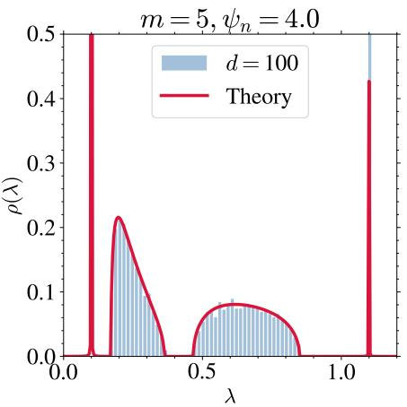

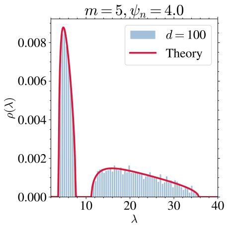

Figure 6: Empirical histogram of the eigenvalues of $\mathbf { G } _ { \mathrm { l i n } }$ for d = 100 (blue) averaged over 10 runs and the analytical prediction obtained by solving the equations on the Stieltjes transform for $m = 5 , \psi _ { n } = 4 . 0$ and $t ~ = ~ 0 . 1$ for $\begin{array} { r } { \bar { \rho } _ { \Sigma } ( \lambda ) = \frac { 1 } { 2 } \delta ( \lambda - 1 ) + \frac { 1 } { 2 } \delta ( \lambda - 0 . \bar { 1 } ) } \end{array}$ and for the kernel parameters $\mu _ { 1 } = 1 , \mu _ { I } = 0 . 1 , \mu _ { B } = 0 . 2 .$ The left and right panels corresponds to different ranges of λ.  
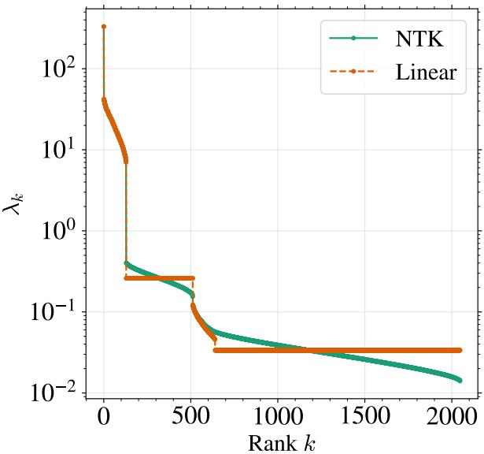  
Figure 7: Comparison between the linear equivalent and the non-linear NTK spectrum in finite dimension for d = 128, ψ = 4, $m = 4 ,$ , and $t = 0 . 1$

$\begin{array} { r } { q ( z ) = \frac { 1 } { N } \operatorname { T r } ( \mathbf G - z \mathbf I _ { N } ) ^ { - 1 } } \end{array}$ and the auxiliary order parameter $r ( z ) \ : o f$ (59) solve the system

$$
z - \mu _ { I } - m \mu _ { B } + \frac { 1 } { m r } = \int \mathrm { d } \rho _ { \Sigma } ( \lambda ) \frac { \mu _ { 1 } \Delta _ { t } + m \mu _ { 1 } e ^ { - 2 t } \lambda } { 1 + \mu _ { 1 } e ^ { - 2 t } \psi _ { n } m ^ { 2 } \lambda r + \mu _ { 1 } \psi _ { n } m \Delta _ { t } q } ,\tag{53}
$$

$$
z - \mu _ { I } + \frac { m - 1 } { m ( q - r ) } = \int \mathrm { d } \rho _ { \Sigma } ( \lambda ) \frac { \mu _ { 1 } \Delta _ { t } } { 1 + \mu _ { 1 } e ^ { - 2 t } \psi _ { n } m ^ { 2 } \lambda r + \mu _ { 1 } \psi _ { n } m \Delta _ { t } q } .\tag{54}
$$

In the large-data regime $( \psi _ { n } \gg 1 ) _ { \ell }$ , the spectral density $\rho ( \omega ) o f { \bf G } - \mu _ { 0 } \mathbf { 1 } _ { N } \mathbf { 1 } _ { N } ^ { \top }$ , in the spectral variable $\omega ,$ admits a decomposition into four distinct components:

$$
\rho ( \omega ) \approx \underbrace { \frac { m - 1 - 1 / \psi _ { n } } { m } \delta ( \omega - \mu _ { I } ) + \frac { 1 - 1 / \psi _ { n } } { m } \delta ( \omega - \bar { \mu } ) } _ { a t o m s } + \underbrace { \frac { 1 } { \psi _ { n } m } \rho _ { 1 } ( \omega ) } _ { g e n e r a l i z a t i o n \ : b u l k } + \underbrace { \frac { 1 } { \psi _ { n } m } \rho _ { 2 } ( \omega ) } _ { m e m o r i z a t i o n \ : b u l k } ,\tag{55}
$$

where ${ \bar { \mu } } = m \mu _ { B } + \mu _ { I }$ . To every eigenvalue λ of Σ there correspond two eigenvalues of G, with the following

asymptotic scalings, where $\lambda _ { t } = e ^ { - 2 t } \lambda + \Delta _ { i }$ t is the associated eigenvalue of $\pmb { \Sigma } _ { t } = e ^ { - 2 t } \pmb { \Sigma } + \Delta _ { t } \pmb { \mathrm { I } } _ { d } \colon$

• Generalization bulk: $\lambda _ { \mathrm { g e n } } ( \lambda ) \simeq \mu _ { 1 } \psi _ { n } m \lambda _ { t } = \Theta ( n m / d ) .$

• Memorization bulk: $\begin{array} { r } { \lambda _ { \mathrm { m e m } } ( \lambda ) \simeq \mu _ { I } + \frac { \mu _ { B } ( m - 1 ) \Delta _ { t } } { \lambda _ { t } } = \Theta ( m ) . } \end{array}$

The proof of this theorem is presented in the next two subsections. In Sect. D.5, we derive the selfconsistent equations on the Stieltjes transform of G, while in Sect. D.6 we establish the result on the asymptotic spectrum of G. An example of the spectrum for $\Sigma \neq \mathbf { I } _ { d }$ is presented in Fig. 6, while the convergence of the two bulks $\rho _ { 1 } , \rho _ { 2 }$ is presented in Fig.7 and Fig. 8.

## D.5 Replica computation of the Stieltjes transform of the Gram matrix

The replica method, and in what sense our results are exact. In our context, we frequently need to compute the expected logarithm of a partition function Z that arises from the Gaussian integral representation of the resolvent, $\begin{array} { r l } { \mathbf { e . g . } , \mathcal { Z } \propto \int \mathrm { d } \phi e ^ { - \frac { 1 } { 2 } \phi ^ { \top } \mathbf { M } \phi } } \end{array}$ , where M is a random matrix of interest. To compute such expectations of logarithms of random variables, we employ the replica method [62]. The method rests on the identity

$$
\log { \mathcal { Z } } = \operatorname* { l i m } _ { s  0 } { \frac { { \mathcal { Z } } ^ { s } - 1 } { s } } .\tag{56}
$$

Evaluating the integer moments $\mathbb { E } [ \mathcal { Z } ^ { s } ]$ for $s \in  { \mathbb { N } } ,$ one then continues the result analytically to $s \to 0$ . This is the replica method of statistical physics, a non-rigorous technique with a wide range of applications, notably in statistical learning and the theory of neural networks [22]. The replica method is widely believed to yield exact asymptotic predictions, as has been established rigorously for a wide range of problems $[ 3 4 , 7 7 , 9 , 3 0 ]$ . More precisely, our results rely on a so-called replica-symmetry (RS) assumption. The RS ansatz is known to hold for the trace of rational functions of random matrices, where it has been shown to yield the exact same results as rigorous methods such as linear pencils [14, 27, 15, 79].

We first derive the self-consistent equations on the Stieltjes transform of G.

Proof. Since G and $\mathbf { G } _ { \mathrm { l i n } }$ have asymptotically the same spectrum, we replace the non-linear Gram matrix by its linear equivalent. We compute the Stieltjes transform $\begin{array} { r } { q ( z ) = \frac { \bf \delta _ { 1 } } { N } \mathrm { T r } ( { \bf G } _ { \mathrm { l i n } } - z { \bf I } _ { N } ) ^ { - 1 } } \end{array}$ of the linearequivalent Gram matrix

$$
\mathbf { G } _ { \mathrm { l i n } } = \mu _ { I } \mathbf { I } _ { N } + \mu _ { B } \mathbf { B } _ { m } + \mu _ { 0 } \mathbf { 1 } _ { N } \mathbf { 1 } _ { N } ^ { \top } + \mu _ { 1 } { \frac { \mathbf { Y } ^ { \top } \mathbf { Y } } { d } } .
$$

The rank-one spike $\mu _ { 0 } \mathbf { 1 } _ { N } \mathbf { 1 } _ { N } ^ { \top }$ contributes a single outlier eigenvalue outside the bulk; we omit it from the replica calculation.

For $\Im z > 0$ , write

$$
q ( z ) = \frac { 2 } { N } \partial _ { z } \log \mathcal { Z } ( z ) , \qquad \mathcal { Z } ( z ) = \int \mathrm { d } \phi e ^ { - \frac { 1 } { 2 } \phi ^ { \top } ( \mathbf { G } _ { \mathrm { l i n } } - z \mathbf { I } _ { N } ) \phi } .
$$

Introducing s replicas $\{ \phi ^ { a } \} _ { a = 1 } ^ { s }$ and absorbing the identity term into a shifted spectral parameter $z - \mu _ { I } ,$

$$
\mathbb { E } _ { X , \Xi } [ \mathcal { Z } ^ { s } ] = \int \prod _ { a } \mathrm { d } \phi ^ { a } e ^ { \frac { 1 } { 2 } ( z - \mu _ { I } ) \phi ^ { a } \cdot \phi ^ { a } } e ^ { - \frac { \mu _ { B } } { 2 } \phi ^ { a } ^ { \top } \mathbf { B } _ { m } \phi ^ { a } } \mathbb { E } _ { Y } \left[ e ^ { - \frac { \mu _ { 1 } } { 2 d } \phi ^ { a \top } \mathbf { Y } ^ { \top } \mathbf { Y } \phi ^ { a } } \right] .\tag{57}
$$

Gaussian average over Y. With sample-index pair $( \nu , \alpha ) \in [ n ] \times [ m ]$ and $\mathbf { v } = \mathbf { 1 } _ { m }$ , the second moment of Y is

$$
\mathbf { K } _ { i j } ^ { \nu \nu ^ { \prime } , \alpha \alpha ^ { \prime } } = \mathbb { E } \left[ \mathbf { Y } _ { i } ^ { \nu \alpha } \mathbf { Y } _ { j } ^ { \nu ^ { \prime } \alpha ^ { \prime } } \right] = e ^ { - 2 t } \sum _ { i j } \mathbf { v } ^ { \alpha } \mathbf { v } ^ { \alpha ^ { \prime } } \delta ^ { \nu \nu ^ { \prime } } + \Delta _ { t } \delta _ { i j } \delta ^ { \nu \nu ^ { \prime } } \delta ^ { \alpha \alpha ^ { \prime } } .
$$

Setting $\begin{array} { r } { \mathbf { A } _ { i j } ^ { \nu \nu ^ { \prime } , \alpha \alpha ^ { \prime } } = \delta _ { i j } \sum _ { a } \phi _ { \nu \alpha } ^ { a } \phi _ { \nu ^ { \prime } \alpha ^ { \prime } } ^ { a } } \end{array}$ and using the Gaussian identity $\mathbb { E } _ { Y } \left[ e ^ { - { \frac { \mu _ { 1 } } { 2 d } } \mathrm { T r } ( \mathbf { Y } ^ { \top } \mathbf { A } \mathbf { Y } ) } \right] = e ^ { - { \frac { 1 } { 2 } } \log \operatorname* { d e t } \left( \mathbf { I } _ { d } + { \frac { \mu _ { 1 } } { d } } \mathbf { K } \mathbf { A } \right) }$ we obtain

$$
\mathbb { E } _ { X , \Xi } [ \mathcal { Z } ^ { s } ] = \int \prod _ { a } \mathrm { d } \phi ^ { a } e ^ { \frac { z - \mu _ { I } } { 2 } \phi ^ { a } \cdot \phi ^ { a } } e ^ { - \frac { \mu _ { B } } { 2 } \phi ^ { a } \mathbf { ^ { \top } } \mathbf { B } _ { m } \phi ^ { a } } e ^ { - \frac { 1 } { 2 } \log \operatorname * { d e t } \left( \mathbf { I } _ { d } + \frac { \mu _ { 1 } } { d } \mathbf { K } \mathbf { A } \right) } .\tag{58}
$$

Order parameters. Introduce the overlaps and their Lagrange-multiplier conjugates

$$
\begin{array} { r } { { \bf Q } ^ { a b } = \frac { 1 } { n m } \phi ^ { a } \cdot \phi ^ { b } , \qquad { \bf R } ^ { a b } = \frac { 1 } { n m ^ { 2 } } \phi _ { \nu \alpha } ^ { a } { \bf v } ^ { \alpha } { \bf v } ^ { \alpha ^ { \prime } } \phi _ { \nu \alpha ^ { \prime } } ^ { b } , } \end{array}\tag{59}
$$

via the identity

$$
1 ~ = ~ \int \mathrm { d } \mathbf { Q } \mathrm { d } \hat { \mathbf { Q } } \mathrm { d } \mathbf { R } \mathrm { d } \hat { \mathbf { R } } e ^ { \frac { 1 } { 2 } \hat { \mathbf { Q } } ^ { a b } ( n m \mathbf { Q } ^ { a b } - \phi ^ { a } \cdot \phi ^ { b } ) + \frac { 1 } { 2 } \hat { \mathbf { R } } ^ { a b } ( n m ^ { 2 } \mathbf { R } ^ { a b } - \phi _ { \nu \alpha } ^ { a } \mathbf { v } ^ { \alpha } \mathbf { v } ^ { \alpha ^ { \prime } } \phi _ { \nu \alpha ^ { \prime } } ^ { b } ) } .\tag{60}
$$

The $\mathbf { B } _ { m }$ and K-determinant terms then become functions of $\mathbf { Q }$ , R only:

$$
e ^ { - { \frac { \mu _ { B } } { 2 } } \phi ^ { a \top } \mathbf { B } _ { m } \phi ^ { a } } e ^ { - { \frac { 1 } { 2 } } \log \operatorname* { d e t } ( \mathbf { I } + { \frac { \mu _ { 1 } } { d } } \mathbf { K A } ) } = e ^ { - { \frac { \mu _ { B } n m ^ { 2 } } { 2 } } \operatorname { T r } \mathbf { R } } e ^ { - { \frac { 1 } { 2 } } \log \operatorname* { d e t } \left( \mathbf { I } + { \frac { \mu _ { 1 } } { d } } ( e ^ { - 2 t } n m ^ { 2 } \Sigma \mathbf { R } + n m \Delta _ { t } \mathbf { I } _ { d } \mathbf { Q } ) \right) } .\tag{61}
$$

The remaining ϕ-integral is Gaussian:

$$
\int \mathrm { d } \phi ^ { a } ~ e ^ { - { \frac { 1 } { 2 } } { \hat { \mathbf { Q } } } ^ { a b } \phi ^ { a } \cdot \phi ^ { b } - { \frac { 1 } { 2 } } { \hat { \mathbf { R } } } ^ { a b } \phi _ { \nu \alpha } ^ { a } v ^ { \alpha } v ^ { \alpha ^ { \prime } } \phi _ { \nu \alpha ^ { \prime } } ^ { b } }  = e ^ { - { \frac { n } { 2 } } \log \operatorname* { d e t } ( { \hat { \mathbf { Q } } } ^ { a b } \delta _ { \alpha \alpha ^ { \prime } } + { \hat { \mathbf { R } } } ^ { a b } \mathbf { v } ^ { \alpha } \mathbf { v } ^ { \alpha ^ { \prime } } ) } .\tag{62}
$$

Replica-symmetric ansatz. Set $\mathbf { Q } ^ { a b } = q \delta ^ { a b } , \hat { \mathbf { Q } } ^ { a b } = \hat { q } \delta ^ { a b } , \mathbf { R } ^ { a b } = r \delta ^ { a b } , \hat { \mathbf { R } } ^ { a b } = \hat { r } \delta ^ { a b }$ for all $a , b .$ . The matrix $\hat { q } \delta _ { \alpha \alpha ^ { \prime } } + \hat { r } \mathbf { v } ^ { \alpha } \mathbf { v } ^ { \alpha ^ { \prime } }$ has eigenvalues qˆ (multiplicity $m - 1 )$ and $\hat { q } +$ mrˆ (multiplicity 1), so

$$
\log \operatorname * { d e t } ( \hat { q } \delta _ { \alpha \alpha ^ { \prime } } + \hat { r } v ^ { \alpha } v ^ { \alpha ^ { \prime } } ) = ( m - 1 ) \log \hat { q } + \log ( \hat { q } + m \hat { r } ) .
$$

Replacing the determinant over Σ by an integral against its spectral measure $\rho _ { \pmb { \Sigma } }$ and dividing by $s d ,$ the per-replica action reads

$$
\begin{array} { l } { { S ( q , \hat { q } , r , \hat { r } ) ~ = ~ - ~ m \psi _ { n } \left( z - \mu _ { I } \right) q ~ + ~ \psi _ { n } ( m - 1 ) \log \hat { q } ~ + ~ \psi _ { n } \log ( \hat { q } + m \hat { r } ) ~ } } \\ { { ~ - ~ \psi _ { n } m q \hat { q } ~ - ~ \psi _ { n } m ^ { 2 } \hat { r } r ~ + ~ \mu _ { B } \psi _ { n } m ^ { 2 } r } } \\ { { ~ + ~ \displaystyle \int \mathrm { d } \rho _ { \Sigma } ( \lambda ) \log \left( 1 + \mu _ { 1 } \big ( e ^ { - 2 t } \psi _ { n } m ^ { 2 } \lambda r + \psi _ { n } m \Delta _ { t } q \big ) \right) . } } \end{array}\tag{63}
$$

Saddle-point equations. Stationarity $\partial _ { \hat { q } } S = \partial _ { \hat { r } } S = \partial _ { q } S = \partial _ { r } S = 0$ gives

$$
m q = \frac { m - 1 } { \hat { q } } + \frac { 1 } { \hat { q } + m \hat { r } } ,\tag{64}
$$

$$
m r \ : = \ : \frac { 1 } { \hat { q } + m \hat { r } } ,\tag{65}
$$

$$
( z - \mu _ { I } ) + \hat { q } = \int \mathrm { d } \rho _ { \Sigma } ( \lambda ) \ \frac { \mu _ { 1 } \Delta _ { t } } { 1 + \mu _ { 1 } e ^ { - 2 t } \psi _ { n } m ^ { 2 } \lambda r + \mu _ { 1 } \psi _ { n } m \Delta _ { t } q } ,\tag{66}
$$

$$
\hat { r } \ = \ \mu _ { B } \ + \ \int \mathrm { d } \rho _ { \Sigma } ( \lambda ) \ \frac { \mu _ { 1 } e ^ { - 2 t } \lambda } { 1 + \mu _ { 1 } e ^ { - 2 t } \psi _ { n } m ^ { 2 } \lambda r + \mu _ { 1 } \psi _ { n } m \Delta _ { t } q } .\tag{67}
$$

These four equations on $( q , r , \hat { q } , \hat { r } )$ can be reduced to the two equations on $( q , r )$ by eliminating q, ˆ rˆ.

## D.6 Asymptotic spectrum of the Gram matrix

There are two ways to obtain the scaling and the structure of the spectrum of G: from the replica equations, and directly from linear-algebra arguments, the latter also giving the eigenvectors. We assume without loss of generality that $\mu _ { I } = 0$ since it only amounts to a constant shift in the spectrum.

## D.6.1 Derivation from the replica equations

We solve the replica equations perturbatively to obtain the structure and the scalings of the spectrum of $\mathbf { G } _ { \mathrm { l i n } }$

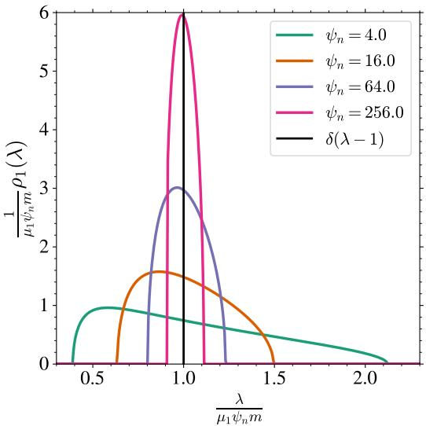

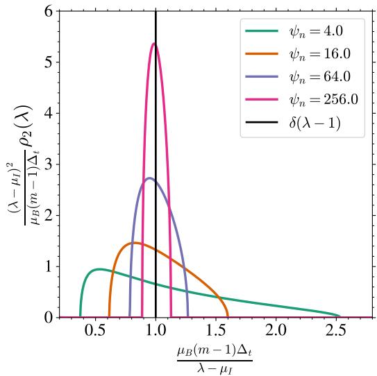  
Figure 8: Analytical solutions of the rescaled bulks $\rho _ { 1 } , \rho _ { 2 }$ for different values of $\psi _ { n }$ for $m = 5$ , t = 0.1, $\pmb { \Sigma } = \mathbf { I } _ { d }$ $\mu _ { 1 } =$ $1 . 0 , \mu _ { B } = 0 . 2 , \mu _ { I } = 0 . 1 , \mu _ { 0 } = 0 . 0$ and the asymptotic limit $\delta ( \lambda - 1 )$ ).

Peak at $z = m \mu _ { B }$ . Assume $z = m \mu _ { B } + \epsilon$ with $\epsilon \ll$ 1 and plug in the ansatz $\begin{array} { r } { q = - \frac { q _ { 0 } } { \epsilon } } \end{array}$ and $r = - \frac { r _ { 0 } } { \epsilon }$ . Then

$$
\frac { 1 } { m r } = m \hat { r } + \hat { q } = m \mu _ { B } - z + \int \mathrm { d } \rho _ { \Sigma } ( \lambda ) \frac { \mu _ { 1 } ( e ^ { - 2 t } \lambda m + \Delta _ { t } ) } { 1 + \mu _ { 1 } e ^ { - 2 t } \psi _ { n } m ^ { 2 } \lambda r + \mu _ { 1 } \psi _ { n } m \Delta _ { t } q }\tag{68}
$$

$$
- \epsilon ( 1 + \int \mathrm { d } \rho _ { \Sigma } ( \lambda ) \frac { \mu _ { 1 } ( e ^ { - 2 t } \lambda m + \Delta _ { t } ) } { \mu _ { 1 } e ^ { - 2 t } \psi _ { n } m ^ { 2 } \lambda r _ { 0 } + \mu _ { 1 } \psi _ { n } m \Delta _ { t } q _ { 0 } } )\tag{69}
$$

and thus

$$
m q = \frac { m - 1 } { \hat { q } } + m r = \frac { m - 1 } { \int \mathrm { d } \rho _ { \Sigma } ( \lambda ) \frac { \mu _ { 1 } \Delta _ { t } } { 1 + \mu _ { 1 } e ^ { - 2 t } \psi _ { n } m ^ { 2 } \lambda r + \mu _ { 1 } \psi _ { n } m \Delta _ { t } q } - z } + m r\tag{70}
$$

$$
- \frac { 1 } { \epsilon } ( 1 + \int \mathrm { d } \rho _ { \Sigma } ( \lambda ) \frac { \mu _ { 1 } ( e ^ { - 2 t } \lambda m + \Delta _ { t } ) } { \mu _ { 1 } e ^ { - 2 t } \psi _ { n } m ^ { 2 } \lambda r _ { 0 } + \mu _ { 1 } \psi _ { n } m \Delta _ { t } q _ { 0 } } ) ^ { - 1 }\tag{71}
$$

at first order

$$
q = - \frac { 1 } { m } \frac { 1 } { \epsilon }\tag{72}
$$

$$
r = - \frac { 1 } { m } \frac { 1 } { \epsilon }\tag{73}
$$

i.e. there are n eigenvalues at this peak. Inserting $q = - 1 / ( m \epsilon )$ back into the equation for $q ,$ the integral reduces to $1 / \psi _ { n }$ and expanding $( \bar { 1 } + 1 / \psi _ { n } ) ^ { - 1 } \simeq \bar { 1 } - 1 / \psi _ { n }$ gives the correction

$$
q = - \frac { 1 } { \epsilon } ( \frac { 1 } { m } - \frac { 1 } { m \psi _ { n } } )\tag{74}
$$

The correction yields $n - d$ eigenvalues.

Peak at $z = 0 ,$ . Assume $\begin{array} { r } { q = \frac { - q _ { 0 } } { z } } \end{array}$ and $\begin{array} { r } { r = \frac { - r _ { 0 } } { z } } \end{array}$

$$
\frac { 1 } { m r } = m \hat { r } + \hat { q } = m \mu _ { B } - z + \int \mathrm { d } \rho _ { \Sigma } ( \lambda ) \frac { \mu _ { 1 } ( e ^ { - 2 t } \lambda m + \Delta _ { t } ) } { 1 + \mu _ { 1 } e ^ { - 2 t } \psi _ { n } m ^ { 2 } \lambda r + \mu _ { 1 } \psi _ { n } m \Delta _ { t } q } \sim m \mu _ { B } + O ( z )\tag{75}
$$

hence

$$
m q = \frac { m - 1 } { \hat { q } }\tag{76}
$$

$$
= \frac { m - 1 } { \int \mathrm { d } \rho _ { \Sigma } ( \lambda ) \frac { \mu _ { 1 } \Delta _ { t } } { 1 + \mu _ { 1 } e ^ { - 2 t } \psi _ { n } m ^ { 2 } \lambda r + \mu _ { 1 } \psi _ { n } m \Delta _ { t } q } - z }\tag{77}
$$

$$
= \frac { m - 1 } { \frac { z } { - \psi _ { n } m q _ { 0 } } - z }\tag{78}
$$

This yields at first order

$$
q _ { 0 } = 1 - \frac { 1 } { \psi _ { n } m } - \frac { 1 } { m } .\tag{79}
$$

i.e. there are nm − n − d eigenvalues at the peak.

Bulk at $z = O ( \psi _ { n } m )$ . We solve the equations perturbatively, using the fact that at leading order $q \sim \frac { - 1 } { z }$ and $m r = \frac { - 1 } { z }$ . Denote $z = \psi _ { n } m \tilde { z }$ . Then one has $\begin{array} { r } { m q = \frac { m - 1 } { \hat { q } } \dot { + } m r \ } \end{array}$

$$
m q = \frac { m - 1 } { \int \mathrm { d } \rho _ { \Sigma } ( \lambda ) \frac { \mu _ { 1 } \Delta _ { t } } { 1 + \mu _ { 1 } e ^ { - 2 t } \psi _ { n } m ^ { 2 } \lambda r + \mu _ { 1 } \psi _ { n } m \Delta _ { t } q } - z }\tag{80}
$$

$$
\begin{array} { r } { + \frac { \mathbf { \lambda } ^ { \bot } } { \int \mathrm { d } \rho _ { \Sigma } ( \lambda ) \frac { \mu _ { 1 } ( e ^ { - 2 t } \lambda m + \Delta _ { t } ) } { 1 + \mu _ { 1 } e ^ { - 2 t } \psi _ { n } m ^ { 2 } \lambda r + \mu _ { 1 } \psi _ { n } m \Delta _ { t } q } + m \mu _ { B } - z } } \end{array}\tag{81}
$$

$$
= \frac { m - 1 } { \int \mathrm { d } \rho _ { \Sigma } ( \lambda ) \frac { \mu _ { 1 } \Delta _ { t } } { 1 - \mu _ { 1 } e ^ { - 2 t } \lambda / \tilde { z } - \mu _ { 1 } \Delta _ { t } / \tilde { z } } - z } + \frac { 1 } { \int \mathrm { d } \rho _ { \Sigma } ( \lambda ) \frac { \mu _ { 1 } ( e ^ { - 2 t } \lambda m + \Delta _ { t } ) } { 1 - \mu _ { 1 } e ^ { - 2 t } \lambda / \tilde { z } - \mu _ { 1 } \Delta _ { t } / \tilde { z } } + m \mu _ { B } - z } ,\tag{82}
$$

$$
\sim - \frac { m - 1 } { z } \left( 1 + \frac { 1 } { z } \int \mathrm { d } \rho _ { \Sigma } \frac { \mu _ { 1 } \Delta _ { t } \tilde { z } } { \tilde { z } - \mu _ { 1 } \left( e ^ { - 2 t } \lambda + \Delta _ { t } \right) } \right)\tag{83}
$$

$$
- \frac { 1 } { z } \left( 1 + \frac { m } { z } \left( \mu _ { B } + \int \mathrm { d } \rho _ { \Sigma } \frac { \mu _ { 1 } ( e ^ { - 2 t } \lambda + \Delta _ { t } / m ) \tilde { z } } { \tilde { z } - \mu _ { 1 } ( e ^ { - 2 t } \lambda + \Delta _ { t } ) } \right) \right)\tag{84}
$$

$$
= - \frac { m } { z } - \frac { m } { z ^ { 2 } } \left( \mu _ { B } + \int \mathrm { d } \rho _ { \Sigma } \frac { \mu _ { 1 } ( e ^ { - 2 t } \lambda + \Delta _ { t } ) \tilde { z } } { \tilde { z } - \mu _ { 1 } ( e ^ { - 2 t } \lambda + \Delta _ { t } ) } \right)\tag{85}
$$

Hence at first order

$$
q = - \frac { 1 } { z } - \frac { 1 } { z ^ { 2 } } \left( \mu _ { B } + \int \mathrm { d } \rho _ { \Sigma } \frac { \mu _ { 1 } ( e ^ { - 2 t } \lambda + \Delta _ { t } ) \tilde { z } } { \tilde { z } - \mu _ { 1 } ( e ^ { - 2 t } \lambda + \Delta _ { t } ) } \right)\tag{86}
$$

$$
= - \frac { 1 } { z } - \frac { 1 } { z ^ { 2 } } \left( \mu _ { B } + \int \mathrm { d } \bar { \rho } \frac { \bar { \lambda } \tilde { z } } { z - \bar { \lambda } } \right)\tag{87}
$$

$$
= - { \frac { 1 } { z } } - { \frac { 1 } { \psi _ { n } m z ^ { 2 } } } \left( \psi _ { n } m \mu _ { B } + \int \mathrm { d } { \bar { \rho } } { \frac { { \bar { \lambda } } z } { z - { \bar { \lambda } } } } \right)\tag{88}
$$

by denoting $\bar { \lambda } = \psi _ { n } m \mu _ { 1 } ( e ^ { - 2 t } \lambda + \Delta _ { t } )$ . Then

$$
\frac { 1 } { q } = - z + \mu _ { B } + \frac { 1 } { \psi _ { n } m } \int \mathrm { d } \bar { \rho } \frac { \bar { \lambda } z } { z - \bar { \lambda } }\tag{89}
$$

We match this with a Bai–Silverstein equation [72]. For $\mathbf { Z } \in \mathbb { R } ^ { N \times d }$ with i.i.d. standard Gaussian entries and aspect ratio $c = d / N$ , the Stieltjes transform $v ( z )$ of the spectral density of ${ \bf Z } { \bf \Sigma } ^ { \prime } { \bf Z } ^ { \top } / d ,$ with $\Sigma ^ { \prime } =$ $\mu _ { 1 } ( e ^ { - 2 \hat { t } } \pmb { \Sigma } + \Delta _ { t } \mathbf { I } _ { d } )$ of spectral density $\rho ^ { \prime } ,$ satisfies

$$
\frac { 1 } { v ( z ) } = - z + \int \frac { \mathrm { d } \rho ^ { \prime } ( \lambda ^ { \prime } ) \lambda ^ { \prime } } { 1 + \lambda ^ { \prime } v ( z ) / c } \sim - z + \int \frac { \mathrm { d } \rho ^ { \prime } ( \lambda ^ { \prime } ) \lambda ^ { \prime } z } { z - \lambda ^ { \prime } / c } = - z + c \int \frac { \mathrm { d } \bar { \rho } ( \bar { \lambda } ) \bar { \lambda } z } { z - \bar { \lambda } } ,\tag{90}
$$

at first order, using $v \sim - 1 / z$ . With $c = 1 / { \left( \psi _ { n } m \right) }$ , this is the equation above: the density has total mass $1 / ( \psi _ { n } m )$ , i.e. d eigenvalues as expected, and at leading order the generalization bulk is the non-zero

spectrum of

$$
\mu _ { 1 } \frac { \mathbf { Z } ( e ^ { - 2 t } \Sigma + \Delta _ { t } \mathbf { I } _ { d } ) \mathbf { Z } ^ { \top } } { d } , \qquad \mathbf { Z } \sim \mathcal { N } ( 0 , \mathbf { I } _ { N \times d } ) ,\tag{91}
$$

the constant $\mu _ { B }$ being an $O ( 1 )$ shift, below the resolution of this expansion since the bulk has width $\Theta ( { \sqrt { \psi _ { n } m } } )$

Bulk at $z = O ( m )$ To study the second bulk, we assume $z = m \tilde { z }$ where $\tilde { z } = O ( 1 )$ . In this regime the leading-order behavior of the Stieltjes transforms is fixed by the two atoms found above: the atom at 0 carries a fraction $\begin{array} { r } { 1 - \frac { 1 } { m } - \frac { 1 } { \psi _ { n } m } } \end{array}$ of the spectrum and the atom at mµB a fraction $\begin{array} { r } { \frac { 1 } { m } ( 1 - \frac { 1 } { \psi _ { n } } ) } \end{array}$ , so that

$$
q \sim - \frac { 1 } { z } \Big ( 1 - \frac { 1 } { m } \Big ) + \frac { 1 } { m ( m \mu _ { B } - z ) } , \qquad m r \sim \frac { 1 } { m \mu _ { B } - z } .\tag{92}
$$

(Note that $q \sim - 1 / z ,$ , which would correspond to putting all the mass at the origin, is not consistent with the weight $\begin{array} { r } { q _ { 0 } = 1 - \frac { 1 } { m } - \frac { 1 } { \psi _ { n } m } } \end{array}$ obtained in the previous paragraph; keeping the correct weight is what produces the factor $m - 1$ below.) We expand the saddle-point equation $\begin{array} { r } { m q = \frac { m - 1 } { \hat { q } } + \frac { 1 } { \hat { q } + m \hat { r } } } \end{array}$ by substituting the expressions for qˆ and rˆ and keeping terms up to $O ( \frac { 1 } { \psi _ { n } } )$

$$
\begin{array} { l } { q = \displaystyle \frac { m - 1 } { m } \frac { 1 } { - z + \int \mathrm { d } \rho _ { \Sigma } ( \lambda ) \frac { 1 } { 1 + \mu _ { 1 } \psi _ { m } m ( e ^ { - 2 t } \lambda m r + \Delta _ { t } q ) } } } \\ { + \displaystyle \frac { 1 } { m } \frac { 1 } { m \mu _ { B } - z + \int \mathrm { d } \rho _ { \Sigma } ( \lambda ) \frac { \mu _ { 1 } ( e ^ { - 2 t } \lambda m + \Delta _ { t } ) } { 1 + \mu _ { 1 } \psi _ { m } m ( e ^ { - 2 t } \lambda m r + \Delta _ { t } q ) } } } \\ { \approx \displaystyle \frac { - 1 } { z } \Big ( 1 - \frac { 1 } { m } \Big ) + \frac { 1 } { m ( m \mu _ { B } - z ) } } \\ { - \frac { 1 } { m \psi _ { n } z ( m \mu _ { B } - z ) } \int \mathrm { d } \rho _ { \Sigma } ( \lambda ) \frac { m e ^ { - 2 t } \lambda z ^ { 2 } + \Delta _ { t } z ^ { 2 } + ( m - 1 ) \Delta _ { t } ( m \mu _ { B } - z ) ^ { 2 } } { m e ^ { - 2 t } \lambda z + \Delta _ { t } z - ( m - 1 ) \Delta _ { t } ( m \mu _ { B } - z ) } } \end{array}\tag{93}
$$

(94)

To find the density $\rho ( \omega )$ in the spectral variable $\omega ,$ we use the Stieltjes inversion formula $\rho ( \omega ) =$ $\begin{array} { r } { \frac { 1 } { \pi } \operatorname* { l i m } _ { \epsilon  0 ^ { + } } \operatorname { I m } [ q ( \omega + i \bar { \epsilon } ) ] } \end{array}$ . The imaginary part is generated by the pole in the integrand where the denominator $D ( \lambda , \omega ) = m e ^ { - 2 t } \lambda \omega + \bar { \Delta } _ { t } \omega - ( m - 1 ) \bar { \Delta } _ { t } ( m \mu _ { B } - \omega ) = \bar { m \omega } \lambda _ { t } - m ( m - 1 ) \bar { \Delta } _ { t } \mu _ { B }$ vanishes, with $\lambda _ { t } = e ^ { - 2 t } \lambda + \Delta _ { t }$ . This occurs at:

$$
\lambda ^ { * } ( \omega ) = e ^ { 2 t } \Delta _ { t } \left( \frac { ( m - 1 ) \mu _ { B } } { \omega } - 1 \right)\tag{95}
$$

equivalently $\omega = ( m - 1 ) \mu _ { B } \Delta _ { t } / \lambda _ { t } ,$ , in agreement with the memorization eigenvalue $\lambda _ { \mathrm { m e m } } ( \lambda ) ( \mathrm { a t } \mu _ { I } = 0 )$ obtained by the linear-algebra route in Sect. D.6.2 below.

Applying the Sokhotski–Plemelj theorem Im $\begin{array} { r } { . \frac { 1 } { x - i \epsilon } = \pi \delta ( x ) } \end{array}$ and using $| \partial _ { \lambda } D | = m \omega e ^ { - 2 t }$ at the pole, we obtain, since at $\lambda = \lambda ^ { * } ( \omega )$ the numerator reduces to $( m - 1 ) \Delta _ { t } m \mu _ { B } ( m \mu _ { B } - \omega )$

$$
\rho ( \omega ) = \frac { e ^ { 2 t } \Delta _ { t } ( m - 1 ) \mu _ { B } } { \psi _ { n } m \omega ^ { 2 } } \rho _ { \Sigma } \left( e ^ { 2 t } \Delta _ { t } \left( \frac { ( m - 1 ) \mu _ { B } } { \omega } - 1 \right) \right)\tag{96}
$$

which is exactly the pushforward of $\rho _ { \pmb { \Sigma } }$ by the map $\lambda \mapsto ( m - 1 ) \mu _ { B } \Delta _ { t } / \lambda _ { t } .$ , carrying total mass

$$
\int \mathrm { d } \omega \rho ( \omega ) = \frac { 1 } { \psi _ { n } m } ,\tag{97}
$$

i.e. exactly d eigenvalues. Restoring the shift $\mu _ { I }$ amounts to replacing ω by $\omega - \mu _ { I }$ in (96).

Conclusion. The density of eigenvalues is composed of

• a delta peak at $\lambda = 0$ with $n m - n - d$ eigenvalues, the null space of G due to its finite rank;

• a bulk at $\lambda = \Theta ( m )$ with d eigenvalues, whose density is given by (96);

• a delta peak at $\lambda = \mu _ { B } m$ with $n - d$ eigenvalues;

• a bulk at $\lambda = \Theta ( \psi _ { n } m )$ with d eigenvalues, which is that of the population kernel operator of the noisy distribution $P _ { t }$

## D.6.2 Derivation with linear algebra arguments

In this subsection we derive the eigenvalues and eigenvectors of the linearized Gram matrix. Besides re-deriving the eigenvalues of Theorem D.2, this route gives the eigenvectors, and proves the following proposition, which restates Proposition 2.1 of the main text.

Proposition D.1 (Eigenvectors of the Gram matrix). For $\psi _ { n } \gg$ 1 and every eigenvalue $\lambda o f \Sigma$ with associated eigenvector $\mathbf { v } _ { \lambda . }$ , the eigenvectors ofG associated with the generalization and the memorization bulks ofTheorem D.2 are, at leading order,

$$
\mathbf { u } _ { 1 } ^ { \nu \alpha } \propto \mathbf { v } _ { \lambda } ^ { \top } \mathbf { Y } ^ { \nu \alpha } , \qquad \mathbf { u } _ { 2 } ^ { \nu \alpha } \propto \mathbf { v } _ { \lambda } ^ { \top } \left[ ( m e ^ { - 2 t } \lambda + \Delta _ { t } ) \sqrt { \Delta _ { t } } \xi _ { \perp } ^ { \nu \alpha } - ( m - 1 ) \Delta _ { t } \bar { \mathbf { Y } } ^ { \nu } \right] ,\tag{98}
$$

with $\begin{array} { r } { \bar { \mathbf { Y } } ^ { \nu } = \frac { 1 } { m } \sum _ { \beta } \mathbf { Y } ^ { \nu \beta } } \end{array}$ and $\begin{array} { r } { \pmb { \xi } _ { \perp } ^ { \nu \alpha } = \pmb { \xi } ^ { \nu \alpha } - \frac { 1 } { m } \sum _ { \beta } \pmb { \xi } ^ { \nu \beta } } \end{array}$ . The eigenvectors of the two atoms are the $\varphi \otimes \mathbf { 1 } _ { m } / \sqrt { m }$ with $\varphi \in \mathop { \mathrm { K e r } } ( \bar { \mathbf Y } )$ and the elements $o f \mathrm { K e r } ( \mathbf { Y } ) \cap \mathrm { K e r } ( \mathbf { B } _ { m } )$ ; they do not contribute to the estimated score.

Proof. As above we set $\mu _ { I } = 0 _ { \it { 1 } }$ , which only shifts the whole spectrum by $\mu _ { I }$ , and we drop the rank-one term $\mu _ { 0 } \mathbf { 1 } _ { N } \mathbf { 1 } _ { N } ^ { \top } ,$ which contributes a single outlier outside the bulk. We are left with the spectrum of the nm × nm matrix

$$
\mathbf { G } = \mu _ { B } \mathbf { B } _ { m } + \mu _ { 1 } { \frac { \mathbf { Y } ^ { \top } \mathbf { Y } } { d } }\tag{99}
$$

Let $\mathbf { e } _ { \nu \alpha }$ denote the canonical orthonormal basis, where $\nu \in \{ 1 , \ldots , n \}$ and $\alpha \in \{ 1 , \ldots , m \}$ . We define the n block-averaged vectors

$$
\mathbf { u } ^ { \nu } = \frac { 1 } { \sqrt { m } } \sum _ { \alpha = 1 } ^ { m } \mathbf { e } _ { \nu \alpha }\tag{100}
$$

which are orthonormal.

We introduce the d feature vectors $\phi _ { i }$

$$
\phi _ { i } = \sqrt { m } e ^ { - t } \sum _ { \nu } \mathbf { x } _ { i } ^ { \nu } \mathbf { u } ^ { \nu } + \sqrt { \Delta _ { t } } \sum _ { \nu , \alpha } \pmb { \xi } _ { i } ^ { \nu \alpha } \mathbf { e } _ { \nu \alpha }\tag{101}
$$

where $\mathbf { x } ^ { \nu } \sim \mathcal { N } ( 0 , \pmb { \Sigma } )$ and $\pmb { \xi } ^ { \nu \alpha } \sim \mathcal { N } ( 0 , \mathbf { I } _ { d } )$ are mutually independent. We can write our Gram matrix as

$$
\mathbf { G } = \mu _ { B } m \sum _ { \nu } \mathbf { u } ^ { \nu } ( \mathbf { u } ^ { \nu } ) ^ { \top } + \frac { \mu _ { 1 } } { d } \sum _ { i } \phi _ { i } \phi _ { i } ^ { \top }\tag{102}
$$

We study the asymptotic spectrum in the limit d ≫ 1 and $\psi _ { n } = n / d \gg 1 _ { . }$ , keeping m finite. Let λ and $\mathbf { v } _ { i } ^ { \lambda }$ denote the eigenvalues and eigenvectors of the covariance matrix Σ.

Because m is finite, the block-averaged noise is not negligible. We split the noise into its block-average and a transverse component:

$$
\eta _ { i } ^ { \nu } = \frac { 1 } { \sqrt { m } } \sum _ { \alpha = 1 } ^ { m } \xi _ { i } ^ { \nu \alpha } , \qquad \xi _ { i , \perp } ^ { \nu \alpha } = \xi _ { i } ^ { \nu \alpha } - \frac { 1 } { \sqrt { m } } \eta _ { i } ^ { \nu }\tag{103}
$$

By definition, $\textstyle \sum _ { \alpha } \xi _ { i , \perp } ^ { \nu \alpha } = 0$ . Projecting onto the eigenbasis of $\Sigma ,$ we define the coordinates:

$$
z ^ { \lambda \nu } = { \frac { 1 } { \sqrt \lambda } } \sum _ { i } \mathbf { v } _ { i } ^ { \lambda } \mathbf { x } _ { i } ^ { \nu } , \qquad { \bar { t } } ^ { \lambda \nu } = \sum _ { i } \mathbf { v } _ { i } ^ { \lambda } \eta _ { i } ^ { \nu } , \qquad s ^ { \lambda \nu \alpha } = \sum _ { i } \mathbf { v } _ { i } ^ { \lambda } \pmb { \xi } _ { i , { \perp } } ^ { \nu \alpha }\tag{104}
$$

By Gaussianity and the orthogonality of the $\mathbf { v } _ { i } ^ { \lambda } ,$ the variables $z ^ { \lambda \nu }$ and $\bar { t } ^ { \nu }$ are independent $\mathcal { N } ( 0 , 1 )$ . The transverse variables $\boldsymbol s ^ { \lambda \nu \alpha }$ are centered, orthogonal to the all-ones vector in $\alpha ,$ and satisfy

$$
\mathbb { E } [ s ^ { \lambda \nu \alpha } s ^ { \lambda \nu \beta } ] = \delta _ { \alpha \beta } - \frac { 1 } { m }\tag{105}
$$

Thus, for large $\begin{array} { r } { n , \sum _ { \nu , \alpha } ( s ^ { \lambda \nu \alpha } ) ^ { 2 } \simeq n ( m - 1 ) } \end{array}$

For each eigenvalue $\lambda ,$ we define three normalized vectors:

$$
\mathbf { U } ^ { \lambda } = \frac { 1 } { \sqrt { n } } \sum _ { \nu } z ^ { \lambda \nu } \mathbf { u } ^ { \nu }\tag{106}
$$

$$
\mathbf { X } ^ { \lambda } = \frac { 1 } { \sqrt { n } } \sum _ { \nu } \bar { t } ^ { \lambda \nu } \mathbf { u } ^ { \nu }\tag{107}
$$

$$
\mathbf { P } ^ { \lambda } = \frac { 1 } { \sqrt { n ( m - 1 ) } } \sum _ { \nu , \alpha } s ^ { \lambda \nu \alpha } \mathbf { e } _ { \nu \alpha }\tag{108}
$$

Because $z , \ { \bar { t } } ,$ and s are independent and we are in the high-dimensional limit $n \gg 1$ , the family $\{ \mathbf { U } ^ { \lambda } , \mathbf { X } ^ { \lambda } , \mathbf { P } ^ { \lambda } \} _ { \lambda \in \mathrm { S p e c } ( \Sigma ) }$ is asymptotically orthonormal. Furthermore, different λ sectors do not mix at leading order.

We compute the overlaps of the feature vectors $\phi _ { i }$ with our basis. By standard concentration of measure, we find:

$$
\phi _ { i } ^ { \top } \mathbf { U } ^ { \lambda } \simeq \sqrt { m n \lambda } e ^ { - t } \mathbf { v } _ { i } ^ { \lambda }\tag{109}
$$

$$
\phi _ { i } ^ { \top } \mathbf { X } ^ { \lambda } \simeq \sqrt { n \Delta _ { t } } \mathbf { v } _ { i } ^ { \lambda }\tag{110}
$$

$$
\phi _ { i } ^ { \top } \mathbf { P } ^ { \lambda } \simeq \sqrt { n ( m - 1 ) \Delta _ { t } } \mathbf { v } _ { i } ^ { \lambda }\tag{111}
$$

Let $\kappa = \mu _ { 1 } \frac { n } { d }$ . The operator $\mu _ { B } \mathbf { B } _ { m }$ acts as $\mu _ { B } m \mathrm { d i a g } ( 1 , 1 , 0 )$ on the subspace $( \mathbf { U } ^ { \lambda } , \mathbf { X } ^ { \lambda } , \mathbf { P } ^ { \lambda } )$ , because $\mathbf { P } ^ { \lambda }$ is entirely transverse to the block structure. The sample covariance part yields a rank-one update. Defining the vector $\mathbf { w } _ { \lambda } = ( \sqrt { m \lambda } e ^ { - t } , \sqrt { \Delta _ { t } } , \sqrt { ( m - 1 ) \Delta _ { t } } ) ^ { \top }$ , the operator G projected onto this $3 \times 3$ subspace is asymptotically:

$$
\mathbf { M } _ { \lambda } ^ { ( 3 ) } \simeq \mu _ { B } m \left( \begin{array} { l l l } { { 1 } } & { { 0 } } & { { 0 } } \\ { { 0 } } & { { 1 } } & { { 0 } } \\ { { 0 } } & { { 0 } } & { { 0 } } \end{array} \right) + \kappa \mathbf { w } _ { \lambda } \mathbf { w } _ { \lambda } ^ { \top }\tag{112}
$$

To block-diagonalize this system, we introduce $D _ { \lambda } = m \lambda e ^ { - 2 t } + \Delta _ { t }$ and rotate the parallel sector into a mode coupled to the perturbation and an orthogonal mode:

$$
\Phi ^ { \lambda } = \frac { \sqrt { m \lambda } e ^ { - t } \mathbf { U } ^ { \lambda } + \sqrt { \Delta _ { t } } \mathbf { X } ^ { \lambda } } { \sqrt { D _ { \lambda } } }\tag{113}
$$

$$
\Phi _ { \perp } ^ { \lambda } = \frac { \sqrt { \Delta _ { t } } \mathbf { U } ^ { \lambda } - \sqrt { m \lambda } e ^ { - t } \mathbf { X } ^ { \lambda } } { \sqrt { D _ { \lambda } } }\tag{114}
$$

By construction, $\pmb { \Phi } _ { \bot } ^ { \lambda }$ is orthogonal to $\mathbf { w } _ { \lambda }$ and remains an exact eigenvector of G with eigenvalue $\mu _ { B } m$ The non-trivial spectrum is governed by the $2 \times 2$ matrix acting on the remaining coupled subspace $( \boldsymbol { \Phi } ^ { \lambda } , \mathbf { P } ^ { \lambda } )$ :

$$
\pmb { \mathscr { M } } ^ { \lambda } \simeq \left( \begin{array} { c c } { \mu _ { B } m + \kappa D _ { \lambda } } & { \kappa \sqrt { ( m - 1 ) \Delta _ { t } D _ { \lambda } } } \\ { \kappa \sqrt { ( m - 1 ) \Delta _ { t } D _ { \lambda } } } & { \kappa ( m - 1 ) \Delta _ { t } } \end{array} \right)\tag{115}
$$

The characteristic equation for $\mathbf { \mathcal { M } } ^ { \lambda }$ yields two eigenvalues for each $\lambda , \lambda _ { \mathrm { g e n } } ( \lambda )$ (upper sign) and $\lambda _ { \mathrm { { m e m } } } ( \lambda )$ (lower sign):

$$
\begin{array} { l } { \displaystyle \lambda _ { \mathrm { g e n / m e m } } ( \lambda ) = \frac { \mu _ { B } m + \kappa ( D _ { \lambda } + ( m - 1 ) \Delta _ { t } ) } { 2 } } \\ { \displaystyle \quad \quad \pm \frac { 1 } { 2 } \sqrt { \left[ \mu _ { B } m + \kappa ( D _ { \lambda } - ( m - 1 ) \Delta _ { t } ) \right] ^ { 2 } + 4 \kappa ^ { 2 } ( m - 1 ) \Delta _ { t } D _ { \lambda } } } \end{array}\tag{116}
$$

In the strict limit $\kappa = \mu _ { 1 } \frac { n } { d } \gg 1$ , we can expand these roots to isolate the dominant scaling:

$$
\lambda _ { \mathrm { g e n } } ( \lambda ) = \mu _ { 1 } \frac { n m } { d } \left( e ^ { - 2 t } \lambda + \Delta _ { t } \right) + \frac { \mu _ { B } D _ { \lambda } } { e ^ { - 2 t } \lambda + \Delta _ { t } } + O \left( \frac { d } { n } \right)\tag{117}
$$

$$
\lambda _ { \mathrm { m e m } } ( \lambda ) = \frac { \mu _ { B } ( m - 1 ) \Delta _ { t } } { e ^ { - 2 t } \lambda + \Delta _ { t } } + O \left( \frac { d } { n } \right)\tag{118}
$$

This confirms that the spectrum separates into a large bulk scaling with $\psi _ { n } = n / d ,$ which depends on

the signal covariance $\Sigma ,$ and a smaller memorization bulk whose eigenvalues $\lambda _ { \mathrm { { m e m } } } ( \lambda )$ are related to the spectrum of Σ via the exact mapping:

$$
\lambda _ { \mathrm { m e m } } ( \lambda ) = \frac { \mu _ { B } ( m - 1 ) \Delta _ { t } } { \lambda e ^ { - 2 t } + \Delta _ { t } }\tag{119}
$$

Eigenvectors. We have established that for each covariance mode λ, the operator $\begin{array} { r } { \mathbf { G } = \mu _ { B } \mathbf { B } _ { m } + \mu _ { 1 } \frac { \mathbf { Y } ^ { \top } \mathbf { Y } } { d } } \end{array}$ acts non-trivially on the three-dimensional subspace spanned by the asymptotically orthonormal vectors $( \mathbf { U } ^ { \lambda } , \mathbf { X } ^ { \lambda } , \mathbf { P } ^ { \lambda } )$ introduced above, the sample covariance acting as a rank-one perturbation along $\mathbf { w } _ { \lambda }$ . We now construct the eigenvectors of G explicitly and relate them to the raw signal components $\mathbf { x } _ { i } ^ { \nu }$ and noise components $\pmb { \xi } _ { i } ^ { \nu \mathrm { \check { \alpha } } }$

The direction orthogonal to the perturbation $\mathbf { w } _ { \lambda }$ within the parallel subspace $( \mathbf { U } ^ { \lambda } , \mathbf { X } ^ { \lambda } )$ remains an exact eigenvector of G with the unshifted eigenvalue $\mu _ { B } m$ . With $\mathbf { \hat { { \cal D } } } _ { \lambda } = m \lambda e ^ { - 2 \hat { t } } + \Delta _ { t }$ as above, this vector is

$$
\Phi _ { \perp } ^ { \lambda } = \frac { \sqrt { \Delta _ { t } } \mathbf { U } ^ { \lambda } - \sqrt { m \lambda } e ^ { - t } \mathbf { X } ^ { \lambda } } { \sqrt { D _ { \lambda } } }\tag{120}
$$

We now substitute the definitions of $\mathbf { U } ^ { \lambda }$ and $\mathbf { X } ^ { \lambda }$ in terms of the raw coordinates $\begin{array} { r } { z ^ { \lambda \nu } = \frac { 1 } { \sqrt { \lambda } } \sum _ { i } \mathbf { v } _ { i } ^ { \lambda } \mathbf { x } _ { i } ^ { \nu } } \end{array}$ and $\begin{array} { r } { \bar { t } ^ { \lambda \nu } = \sum _ { i } \mathbf { v } _ { i } ^ { \lambda } \pmb { \eta } _ { i } ^ { \nu } } \end{array}$ , where $\begin{array} { r } { \pmb { \eta } _ { i } ^ { \nu } = \frac { 1 } { \sqrt { m } } \sum _ { \alpha } \pmb { \xi } _ { i } ^ { \nu \alpha } } \end{array}$ is the block-averaged noise.

$$
\Phi _ { \perp } ^ { \lambda } = \frac { 1 } { \sqrt { n D _ { \lambda } } } \sum _ { i = 1 } ^ { d } \mathbf { v } _ { i } ^ { \lambda } \sum _ { \nu = 1 } ^ { n } \left( \sqrt { \frac { \Delta _ { t } } { \lambda } } \mathbf { x } _ { i } ^ { \nu } - \sqrt { m \lambda } e ^ { - t } \eta _ { i } ^ { \nu } \right) \mathbf { u } ^ { \nu }\tag{121}
$$

The remaining two eigenvectors are orthogonal linear combinations of the coupled parallel state $\Phi ^ { \lambda }$ and the transverse noise state $\mathbf { P } ^ { \lambda }$ , parametrized by a mixing angle $\theta _ { \lambda }$ (we call them ${ \bf E } _ { \lambda , \pm }$ , rather than $\mathbf { u } ,$ to avoid a clash with the block-averaged basis $\mathbf { u } ^ { \nu } ; \mathbf { E } _ { \lambda , + } \propto \mathbf { u } _ { 1 }$ and $\mathbf { E } _ { \lambda , - } \propto \mathbf { u } _ { 2 }$ are the eigenvectors of Proposition D.1, with eigenvalues $\lambda _ { \mathrm { g e n } } ( \lambda )$ and $\lambda _ { \mathrm { { m e m } } } ( \lambda )$ respectively):

$$
\mathbf { E } _ { \lambda , + } = \cos \theta _ { \lambda } \boldsymbol { \Phi } ^ { \lambda } + \sin \theta _ { \lambda } \mathbf { P } ^ { \lambda }\tag{122}
$$

$$
\mathbf { E } _ { \lambda , - } = - \sin \theta _ { \lambda } \Phi ^ { \lambda } + \cos \theta _ { \lambda } \mathbf { P } ^ { \lambda }\tag{123}
$$

where $\begin{array} { r } { \Phi ^ { \lambda } = \frac { 1 } { \sqrt { D _ { \lambda } } } \left( \sqrt { m \lambda } e ^ { - t } \mathbf { U } ^ { \lambda } + \sqrt { \Delta _ { t } } \mathbf { X } ^ { \lambda } \right) } \end{array}$

The angle is determined by the effective $2 \times 2$ block $\mathbf { \mathcal { M } } ^ { \lambda }$ . In the asymptotic limit $n / d \gg 1$ , the coupling parameter $\kappa = \mu _ { 1 } \frac { n } { d }  \infty .$ , and the mixing angle simplifies to:

$$
\cos \theta _ { \lambda } \approx \sqrt { \frac { D _ { \lambda } } { D _ { \lambda } + ( m - 1 ) \Delta _ { t } } } , \qquad \sin \theta _ { \lambda } \approx \sqrt { \frac { ( m - 1 ) \Delta _ { t } } { D _ { \lambda } + ( m - 1 ) \Delta _ { t } } }\tag{124}
$$

Substituting the asymptotic angle into $\mathbf { E } _ { \lambda , + } ,$ we obtain:

$$
\mathbf { E } _ { \lambda , + } \approx \frac { 1 } { \sqrt { D _ { \lambda } + ( m - 1 ) \Delta _ { t } } } \left( \sqrt { D _ { \lambda } } \Phi ^ { \lambda } + \sqrt { ( m - 1 ) \Delta _ { t } } \mathbf { P } ^ { \lambda } \right)\tag{125}
$$

Expanding $\Phi ^ { \lambda }$ , the $\sqrt { D _ { \lambda } }$ factor cancels:

$$
\mathbf { E } _ { \lambda , + } \propto \sqrt { m \lambda } e ^ { - t } \mathbf { U } ^ { \lambda } + \sqrt { \Delta _ { t } } \mathbf { X } ^ { \lambda } + \sqrt { ( m - 1 ) \Delta _ { t } } \mathbf { P } ^ { \lambda }\tag{126}
$$

We now expand this entirely into the raw variables. Recall that $\begin{array} { r } { s ^ { \lambda \nu \alpha } = \sum _ { i } \mathbf { v } _ { i } ^ { \lambda } \pmb { \xi } _ { i , \perp } ^ { \nu \alpha } } \end{array}$ , where $\xi _ { i , \perp } ^ { \nu \alpha }$ is the transverse noise.

$$
\mathbf { E } _ { \lambda , + } \propto \frac { 1 } { \sqrt { n } } \sum _ { i = 1 } ^ { d } \mathbf { v } _ { i } ^ { \lambda } \sum _ { \nu = 1 } ^ { n } \left( \sqrt { m } e ^ { - t } \mathbf { x } _ { i } ^ { \nu } \mathbf { u } ^ { \nu } + \sqrt { \Delta _ { t } } \eta _ { i } ^ { \nu } \mathbf { u } ^ { \nu } + \sqrt { \Delta _ { t } } \sum _ { \alpha = 1 } ^ { m } \xi _ { i , \perp } ^ { \nu \alpha } \mathbf { e } _ { \nu \alpha } \right)\tag{127}
$$

Recognizing that the block-averaged noise and transverse noise reconstruct the full noise vector exactly $\begin{array} { r } { ( \eta _ { i } ^ { \nu } \mathbf { u } ^ { \breve { \nu } } + \sum _ { \alpha } \xi _ { i , \perp } ^ { \nu \alpha } \mathbf { e } _ { \nu \alpha } = \sum _ { \alpha } \xi _ { i } ^ { \nu \alpha } \mathbf { e } _ { \nu \alpha } ) } \end{array}$ , the term in parentheses is precisely the empirical data vector $\phi _ { i }$

Thus,

$$
\mathbf { E } _ { \lambda , + } \propto \frac { 1 } { \sqrt { n } } \sum _ { i = 1 } ^ { d } \mathbf { v } _ { i } ^ { \lambda } \phi _ { i }\tag{128}
$$

Using the orthogonal rotation, the eigenvector corresponding to the memorization bulk is:

$$
\mathbf { E } _ { \lambda , - } \approx \frac { 1 } { \sqrt { D _ { \lambda } + ( m - 1 ) \Delta _ { t } } } \left( \sqrt { ( m - 1 ) \Delta _ { t } } \Phi ^ { \lambda } - \sqrt { D _ { \lambda } } \mathbf { P } ^ { \lambda } \right)\tag{129}
$$

Dropping the overall normalization and substituting the basis vectors, we express this mode in terms of the raw variables:

$$
\mathbf { E } _ { \lambda , - } \propto \sum _ { i = 1 } ^ { d } { \mathbf { v } _ { i } ^ { \lambda } } \sum _ { \nu = 1 } ^ { n } \left[ \sqrt { ( m - 1 ) \Delta _ { t } } \left( \sqrt { m } e ^ { - t } { \mathbf { x } _ { i } ^ { \nu } } + \sqrt { \Delta _ { t } } { \boldsymbol { \eta } _ { i } ^ { \nu } } \right) \mathbf { u } ^ { \nu } - \frac { D _ { \lambda } } { \sqrt { m - 1 } } \sum _ { \alpha = 1 } ^ { m } \xi _ { i , \perp } ^ { \nu \alpha } \mathbf { e } _ { \nu \alpha } \right] \xi _ { i , \perp } ^ { \nu \alpha } \mathbf { u } ^ { \nu }\tag{130}
$$

This proves Proposition D.1. Indeed $\begin{array} { r } { \mathbf { E } _ { \lambda , + } \propto \frac { 1 } { \sqrt { n } } \sum _ { i } \mathbf { v } _ { i } ^ { \lambda } \phi _ { i } } \end{array}$ has components $\mathbf { v } _ { \lambda } ^ { \top } \mathbf { Y } ^ { \nu \alpha }$ , which is $\mathbf { u } _ { 1 }$ . For $\mathbf { E } _ { \lambda , - } ,$ using $\begin{array} { r } { \mathbf { u } ^ { \nu } = \frac { 1 } { \sqrt { m } } \sum _ { \alpha } \mathbf { e } _ { \nu \alpha } } \end{array}$ and $\eta _ { i } ^ { \nu } = \sqrt { m } \bar { \xi } _ { i } ^ { \nu }$ , the bracket has $( \nu \alpha )$ component $\sqrt { ( m - 1 ) \Delta _ { t } } \bar { \mathbf Y } ^ { \nu } -$ $\frac { D _ { \lambda } } { \sqrt { m - 1 } } \pmb { \xi } _ { \perp } ^ { \nu \alpha }$ once projected on $\mathbf { v } _ { \lambda } ;$ multiplying by $- \sqrt { ( m - 1 ) \Delta _ { t } }$ gives $D _ { \lambda } \sqrt { \Delta _ { t } } \pmb { \xi } _ { \bot } ^ { \nu \alpha } - ( m - 1 ) \Delta _ { t } \bar { \mathbf { Y } } ^ { \nu }$ , which is $\mathbf { u } _ { 2 }$ with $D _ { \lambda } = m e ^ { - 2 t } \lambda + \Delta _ { t }$ . Finally $\Phi _ { \perp } ^ { \lambda }$ and the kernel of G give the eigenvectors of the two atoms.

The atoms do not contribute to the estimated score. By (5), the k-th coordinate of the estimator is $\mathbf { s } ^ { k } ( \mathbf { y } ) = K ( \mathbf { y } , \mathbf { Y } ) ^ { \top } h _ { \tau } ( \mathbf { G } ) \left( - \pmb { \xi } _ { k } / \sqrt { \Delta _ { t } } \right)$ , where $\pmb { \xi } _ { k } \in \mathbb { R } ^ { N }$ collects the k-th coordinates of the training noises and $h _ { \tau } ( \lambda ) = ( 1 - e ^ { - d \tau \lambda / ( n m ) } ) / \lambda ( \mathrm { o r } h ( \lambda ) = 1 / ( \lambda + \gamma )$ with a ridge). Let P be the orthogonal projector on an eigenspace $E$ of $\mathbf { G } _ { \mathrm { l i n } }$ on which $\mathbf { G } _ { \mathrm { l i n } }$ acts as c I. The contribution of E to the estimator is

$$
\mathbf { s } _ { E } ^ { k } ( \mathbf { y } ) = - \frac { h _ { \tau } ( c ) } { \sqrt { \Delta _ { t } } } K ( \mathbf { y } , \mathbf { Y } ) ^ { \top } \mathbf { P } \boldsymbol { \xi } _ { k } ,\tag{131}
$$

which vanishes at every τ and every ridge as soon as $\mathbf { P } K ( \mathbf { y } , \mathbf { Y } ) = 0$ . We now restore the rank-one term and take the full linear equivalent $\mathbf { G } _ { \mathrm { l i n } } = \mu _ { I } \mathbf { I } _ { N } + \mu _ { B } \mathbf { B } _ { m } + \mu _ { 0 } \mathbf { 1 } _ { N } \mathbf { 1 } _ { N } ^ { \top } + \mu _ { 1 } \mathbf { Y } ^ { \top } \mathbf { Y } / d ,$ and the linearized test kernel $K _ { \mathrm { l i n } } ( \mathbf { y } , \mathbf { Y } ) = \mu _ { 0 } \mathbf { 1 } _ { N } + \mu _ { 1 } \mathbf { Y } ^ { \top } \mathbf { y } / d ,$ valid for a test point y independent of the training set since $\mathbf { y } ^ { \top } \mathbf { Y } ^ { \nu \alpha } / d = O ( \ddot { d } ^ { - 1 / 2 } )$

• Atom at $\bar { \mu } = \mu _ { I } + m \mu _ { B }$ . For $\varphi \in \mathbb { R } ^ { n } , \mathbf { G } _ { \mathrm { l i n } } ( \varphi \otimes \mathbf { 1 } _ { m } ) = \bar { \mu } \varphi \otimes \mathbf { 1 } _ { m } + \mu _ { 0 } m ( \mathbf { 1 } _ { n } ^ { \top } \varphi ) \mathbf { 1 } _ { N } + \mu _ { 1 } m \mathbf { Y } ^ { \top } \bar { \mathbf { Y } } \varphi / d .$ The eigenspace is therefore $E _ { \mathrm { p a r } } = \{ \varphi \otimes \mathbf { 1 } _ { m } : \varphi \in \mathrm { K e r } ( \bar { \mathbf { Y } } ) , \ \mathbf { 1 } _ { n } ^ { \top } \varphi = 0 \}$ . The second condition, which comes from the rank-one term, removes a single dimension out of $n - d$ and leaves the weight of the atom unchanged. For $\pmb { \varphi } \otimes \mathbf { 1 } _ { m } \in E _ { \mathrm { p a r } }$

$$
( \varphi \otimes \mathbf { 1 } _ { m } ) ^ { \top } K _ { \mathrm { l i n } } ( \mathbf { y } , \mathbf { Y } ) = \mu _ { 0 } m \mathbf { 1 } _ { n } ^ { \top } \pmb \varphi + \frac { \mu _ { 1 } m } { d } \mathbf { y } ^ { \top } \bar { \mathbf { Y } } \pmb \varphi = 0 .\tag{132}
$$

• Atom at $\mu _ { I }$ . For $\begin{array} { r } { \psi \in E _ { \mathrm { t r a n s } } = \mathrm { K e r } ( \mathbf { Y } ) \cap \mathrm { K e r } ( \mathbf { B } _ { m } ) , \mathbf { B } _ { m } \psi = 0 \mathrm { m e a n s } \sum _ { \alpha } \psi ^ { \nu \alpha } = 0 } \end{array}$ for every $\nu ,$ hence $\mathbf { 1 } _ { N } ^ { \top } \psi = 0 .$ , and $\mathbf { Y } \psi = 0 ;$ thus $\mathbf { G } _ { \mathrm { l i n } } \psi = \mu _ { I } \psi$ and

$$
{ \boldsymbol { \psi } } ^ { \top } K _ { \mathrm { l i n } } ( \mathbf { y } , \mathbf { Y } ) = \mu _ { 0 } \mathbf { 1 } _ { N } ^ { \top } { \boldsymbol { \psi } } + { \frac { \mu _ { 1 } } { d } } \mathbf { y } ^ { \top } \mathbf { Y } { \boldsymbol { \psi } } = 0 .\tag{133}
$$

For the linearized kernel both atoms therefore contribute exactly zero to the estimated score, for every training time and every ridge. The non-linear remainder $K _ { \mathrm { r e s } } \stackrel { \cdot } { = } K - K _ { \mathrm { l i n } }$ has entries $f ( \mathbf { y } ^ { \top } \mathbf { Y } ^ { \nu \alpha } / d ) \stackrel { - } { - }$ $f ( 0 ) - \breve { f } ^ { \prime } ( 0 ) \mathbf { y } ^ { \top } \mathbf { Y } ^ { \nu \alpha } / d \breve { = } O ( \breve { d } ^ { - 1 } )$ . Its mean over the entries is $\simeq f ^ { \prime \prime } ( 0 ) \mathbf { y } ^ { \top } \pmb { \Sigma } _ { t } \mathbf { y } / ( 2 d ^ { 2 } )$ , i.e. proportional to $\mathbf { 1 } _ { N }$ , and is annihilated by both projectors, since ${ \bf 1 } _ { N } \perp E _ { \mathrm { p a r } }$ and ${ \mathbf { 1 } } _ { N } \perp E _ { \mathrm { t r a n s } }$ . Its fluctuating part has norm $O ( \sqrt { N } / d ) = O ( \sqrt { m \psi _ { n } / d } ) .$ ; if it is asymptotically uncorrelated with $\mathbf { P } \xi _ { k . }$ , its contribution is of the same order and vanishes as $d \to \infty$ at fixed $\psi _ { n }$ and $m .$ □

## D.7 Derivation of the spectrum in the polynomial scaling

For the polynomial regime we assume that the eigenfunctions of the kernel are given by a family of orthogonal polynomials.

Lemma D.2. Let P be a probability measure on $\mathbb { R } ^ { d }$ with finite moments of all orders. Assume further that the space of multivariate polynomials is dense in $L ^ { 2 } ( P )$ . Then, there exists a countable family of polynomials $\big \{ \psi _ { p } ^ { j } \big \} _ { j \in \mathbb { N } ^ { d } } ,$ where $p = | j |$ denotes the total degree, thatforms an orthogonal basis of $L ^ { 2 } ( P )$

Proof. We equip $L ^ { 2 } ( P )$ with the inner product $\begin{array} { r } { \langle f , g \rangle = \int _ { \mathbb { R } ^ { d } } f ( x ) g ( x ) \mathrm { d } P ( x ) } \end{array}$ . Let $\pmb { j } = ( j _ { 1 } , \dots , j _ { d } ) \in \mathbb { N } ^ { d }$ be a multi-index, with total degree $\begin{array} { r } { p = | \boldsymbol { j } | = \sum _ { i = 1 } ^ { d } j _ { i } } \end{array}$ . Because $P$ has finite moments of all orders, every monomial $x ^ { j } = x _ { 1 } ^ { j _ { 1 } } \cdot \cdot \cdot x _ { d } ^ { j _ { d } }$ belongs to $L ^ { 2 } ( P )$

To construct an orthogonal basis, we establish a strict well-ordering on the set of multi-indices $\mathbb { N } ^ { d }$ . We choose the graded lexicographic order, denoted $\mathbf { b y } \prec$ . For two multi-indices $j , l ,$ , we say $j \prec l \mathrm { i f } | j | < | l |$ or if $| j | = | l |$ and the first non-zero entry in the difference $j - l$ is negative.

We now apply the Gram–Schmidt orthogonalization process to the sequence of monomials ordered by $\prec ,$ by induction along ≺ (every multi-index has finitely many predecessors).

Let $\mathbf { \dot { 0 } } = ( 0 , \dots , 0 )$ . For the base case (where $p = 0 )$ , we define:

$$
\psi _ { 0 } ^ { \mathbf { 0 } } ( x ) = 1 .\tag{134}
$$

For the inductive step, let $\boldsymbol { j } \in  { \mathbb { N } } ^ { d }$ with total degree $p = | j |$ . Assume we have constructed a mutually orthogonal set of polynomials $\{ \psi _ { q } ^ { l } ( x ) \} _ { l \prec j ^ { \prime } }$ where $q = | l |$ . We define the polynomial corresponding to $j$ by projecting the monomial $x ^ { j }$ onto the orthogonal complement of the span of all preceding polynomials:

$$
\psi _ { p } ^ { j } ( x ) = x ^ { j } - \sum _ { l \prec j } \frac { \langle x ^ { j } , \psi _ { q } ^ { l } \rangle } { \langle \psi _ { q } ^ { l } , \psi _ { q } ^ { l } \rangle } \psi _ { q } ^ { l } ( x ) .\tag{135}
$$

By construction, $\psi _ { p } ^ { j } ( x )$ is a polynomial of total degree p with leading term $x ^ { j }$ , and $\langle \psi _ { p } ^ { j } , \psi _ { q } ^ { l } \rangle = 0$ for all $l \prec j$

This process yields a countable family of mutually orthogonal polynomials. Because the span of this family equals the span of all multivariate monomials, and polynomials are dense in $L ^ { 2 } ( P )$ , this family $\big \{ \psi _ { p } ^ { j } \big \} _ { j \in \mathbb { N } ^ { d } }$ is an orthogonal basis of $L ^ { 2 } ( P )$ □

Remark. The orthogonal basis $\{ \psi _ { p } ^ { j } \}$ constructed above reduces to classicalfamiliesfor the standard data distributions: products of one-dimensional Hermite polynomialsfor the standard Gaussian [7], and spherical harmonicsfor data uniform on the sphere.

This kernel form is natural because, for data uniform on the sphere, every dot-product kernel is diagonalized by spherical harmonics [31, 12].

We first derive a polynomial equivalent of the Gram matrix in the regime $d ^ { k + 1 } \gg n \gg d ^ { k }$ for a kernel satisfying the diagonal hypothesis (49), with $\psi _ { p } ^ { j }$ the polynomials of Lemma D.2.

Proposition D.2 (Polynomial Equivalent of the Gram matrix). In the regime $d ^ { k + 1 } \gg n \gg d ^ { k } \gg 1$ , the Gram matrix is equivalent to

$$
\mathbf { G } = \mu _ { I } ^ { > k } \mathbf { I } _ { N } + \mu _ { B } ^ { > k } \mathbf { B } _ { m } + \sum _ { p = 0 } ^ { k } \sum _ { | j | = p } \frac { \mu _ { p } } { d ^ { p } j ! } \psi _ { p } ^ { j } ( \mathbf { Y } ) \psi _ { p } ^ { j } ( \mathbf { Y } ) ^ { \top }\tag{136}
$$

with the constants defined as

$$
\mu _ { B } ^ { > k } = \sum _ { p > k } \frac { \mu _ { p } } { d ^ { p } } \mathbb { E } _ { \mathbf { Y } , \mathbf { Y ^ { \prime } } } \left[ \sum _ { | \mathbf { j } | = p } \frac { \psi _ { p } ^ { j } ( \mathbf { Y } ) \psi _ { p } ^ { j } ( \mathbf { Y ^ { \prime } } ) } { \mathbf { \substack { j } ! } } \right] ,
$$

$$
\mu _ { I } ^ { > k } = \sum _ { p > k } \frac { \mu _ { p } } { d ^ { p } } \mathbb { E } _ { \mathbf { Y } } \left[ \sum _ { | j | = p } \frac { \psi _ { p } ^ { j } ( \mathbf { Y } ) ^ { 2 } } { j ! } \right] - \mu _ { B } ^ { > k } ,\tag{137}
$$

with $\mathbf { Y } , \mathbf { Y } ^ { \prime }$ two conditionally independent same-cluster noisy copies $( i . e . ,$ , sharing the underlying $\mathbf { x } ^ { \nu }$ but with independent noise $\xi )$

Proof. We split the kernel by polynomial degree at the cutoff k:

$$
K = K _ { \le k } + K _ { > k } , \qquad K _ { \le k } ( { \bf x } , { \bf y } ) : = \sum _ { p = 0 } ^ { k } \sum _ { \vert j \vert = p } \frac { \mu _ { p } } { d ^ { p } j ! } \psi _ { p } ^ { j } ( { \bf x } ) \psi _ { p } ^ { j } ( { \bf y } ) ,\tag{138}
$$

which induces $\mathbf { G } = \mathbf { G } _ { < k } + \mathbf { G } _ { > k }$ . The low-degree part is, by construction, exactly the explicit double sum in the statement. We must therefore show that, in operator norm,

$$
\mathbf { G } _ { > k }  \mu _ { I } ^ { > k } \mathbf { I } _ { N } \ + \ \mu _ { B } ^ { > k } \mathbf { B } _ { m }\tag{139}
$$

We treat the three index regimes (diagonal, same cluster, distinct clusters) separately.

Recall $\mathbf { B } _ { m } = \mathbf { I } _ { n } \otimes \mathbf { 1 } _ { m } \mathbf { 1 } _ { m } ^ { \top }$ has entries $( \mathbf { B } _ { m } ) _ { ( \nu \alpha ) , ( \mu \beta ) } = \mathbf { 1 } \{ \nu = \mu \}$ . The matrix $\mu _ { I } ^ { > \bar { k } } \mathbf { I } _ { N } + \mu _ { B } ^ { > \bar { k } } \mathbf { B } _ { m }$ takes the value $\mu _ { I } ^ { > k } + \mu _ { B } ^ { > k }$ on the diagonal, $\mu _ { B } ^ { > k }$ on the same-cluster off-diagonal, and 0 on cross-cluster pairs. We verify each.

Diagonal entries. For $\left( \nu , \alpha \right) = \left( \mu , \beta \right)$

$$
\left( \mathbf { G } _ { > k } \right) _ { ( \nu \alpha ) , ( \nu \alpha ) } = K _ { > k } ( \mathbf { Y } ^ { \nu \alpha } , \mathbf { Y } ^ { \nu \alpha } ) = \sum _ { p > k } \frac { \mu _ { p } } { d ^ { p } } \sum _ { | j | = p } \frac { \psi _ { p } ^ { j } ( \mathbf { Y } ^ { \nu \alpha } ) ^ { 2 } } { j ! } .
$$

Each summand is a function of the single sample $\mathbf { Y } ^ { \nu \alpha }$ alone. By the law of large numbers in $L ^ { 2 } ( P _ { t } )$ , the inner sum $\begin{array} { r } { \sum _ { | j | = p } \psi _ { p } ^ { j } ( \mathbf { Y } ^ { \nu \alpha } ) ^ { 2 } / j ! } \end{array}$ concentrates around its expectation under $\mathbf { Y } ^ { \nu \alpha } \sim P _ { t }$ , with fluctuations a factor $\sqrt { 1 / d ^ { p } }$ smaller than the mean (since the rank of the Mercer block at degree p is $\sim d ^ { p } / p ! )$ . Summing over $p > k$ and dividing by $d ^ { p }$ leaves the deterministic value

$$
\left( { \bf G } _ { > k } \right) _ { ( \nu \alpha ) , ( \nu \alpha ) } = \mu _ { I } ^ { > k } + \mu _ { B } ^ { > k } + o _ { P } ( 1 )
$$

uniformly in $( \nu , \alpha )$

Same-cluster off-diagonal entries. For $\nu = \mu , \alpha \neq \beta , \mathbf { Y } ^ { \nu \alpha }$ and $\mathbf { Y } ^ { \nu \beta }$ share the underlying $\mathbf { x } ^ { \nu }$ but are conditionally independent given $\mathbf { x } ^ { \nu }$ (through the noise ξ):

$$
\left( \mathbf { G } _ { > k } \right) _ { ( \nu \alpha ) , ( \nu \beta ) } \ = \ K _ { > k } ( \mathbf { Y } ^ { \nu \alpha } , \mathbf { Y } ^ { \nu \beta } ) \ = \ \sum _ { p > k } \frac { \mu _ { p } } { d ^ { p } } \sum _ { | j | = p } \frac { \psi _ { p } ^ { j } ( \mathbf { Y } ^ { \nu \alpha } ) \psi _ { p } ^ { j } ( \mathbf { Y } ^ { \nu \beta } ) } { j ! } .
$$

Conditional on $\mathbf { x } _ { } ^ { \nu } .$ , each summand has expectation $\mathbb { E } [ \psi _ { p } ^ { j } ( \mathbf { Y } ^ { \nu \alpha } ) \vert \mathbf { x } ^ { \nu } ] \cdot \mathbb { E } [ \psi _ { p } ^ { j } ( \mathbf { Y } ^ { \nu \beta } ) \vert \mathbf { x } ^ { \nu } ]$ . Marginalizing over $\mathbf { x } _ { } ^ { \nu } ,$ , this is precisely the joint expectation appearing in the definition of $\mu _ { B } ^ { > k }$ . The same concentration argument as for the diagonal entries gives, uniformly in $\nu , \alpha \neq \beta ,$

$$
\left( { \bf G } _ { > k } \right) _ { ( \nu \alpha ) , ( \nu \beta ) } = \mu _ { B } ^ { > k } + o _ { P } ( 1 ) .
$$

Cross-cluster entries. For $ { \boldsymbol \nu } \ne  { \boldsymbol \mu } , { \mathbf Y } ^ {  { \boldsymbol \nu } \alpha }$ and $\mathbf { Y } ^ { \mu \beta }$ are fully independent. By orthogonality of $\{ \psi _ { p } ^ { j } \} _ { p \ge 1 }$ to constants in $L ^ { 2 } ( P _ { t } ) , \mathbb { E } [ \psi _ { p } ^ { j } ( \mathbf { Y } ) ] = 0$ for all $p \geq 1$ , and therefore for $p > k \geq 1 .$

$$
\mathbb { E } \left[ \left( \mathbf { G } _ { > k } \right) _ { ( \nu \alpha ) , ( \mu \beta ) } \right] = \sum _ { p > k } \frac { \mu _ { p } } { d ^ { p } } \sum _ { | j | = p } \frac { \mathbb { E } [ \psi _ { p } ^ { j } ( \mathbf { Y } ) ] ^ { 2 } } { j ! } = 0 .
$$

Hence the cross-cluster entries are mean-zero. Since $\mathbf { Y } ^ { \nu \alpha }$ and $\mathbf { Y } ^ { \mu \beta }$ are independent and the $\psi _ { p } ^ { j }$ are orthogonal in $L ^ { 2 } ( P _ { t } )$ , all the cross terms $( p , j ) \neq ( q , l )$ vanish in the second moment, which is therefore a sum of squares:

$$
\mathrm { V a r } \big [ ( { \bf G } _ { > k } ) _ { ( \nu \alpha ) , ( \mu \beta ) } \big ] = \sum _ { p > k } \frac { \mu _ { p } ^ { 2 } } { d ^ { 2 p } } \sum _ { | j | = p } \frac { \big ( c _ { p } ^ { j } \big ) ^ { 2 } } { ( j ! ) ^ { 2 } } \sim \sum _ { p > k } \frac { C _ { p } } { d ^ { p } } ,
$$

where $c _ { p } ^ { j } = \mathbb { E } _ { \mathbf { y } \sim P _ { t } } [ \psi _ { p } ^ { j } ( \mathbf { y } ) ^ { 2 } ]$ and the last estimate uses that there are $\Theta ( d ^ { p } / p ! )$ multi-indices of degree $p .$ Let $\mathbf { G } _ { > k } ^ { \mathrm { c r o s s } } \in \mathbb { R } ^ { N \times N }$ denote the matrix obtained from $\mathbf { G } _ { > k }$ by zeroing out the diagonal and same-cluster

blocks; its entries are mean-zero and weakly correlated. By the standard operator-norm bound for random matrices with i.i.d.-like entries of variance $\sigma ^ { 2 } .$ , we have $\| \mathbf { G } _ { > k } ^ { \mathrm { c r o s s } } \| _ { \mathrm { o p } } \leq C \sqrt { N \sigma ^ { 2 } }$ . Substituting $N = n m$ and $\sigma ^ { 2 } \sim 1 / d ^ { p }$ for the dominant degree $p = k + 1$

$$
\| { \bf G } _ { > k } ^ { \mathrm { c r o s s } } \| _ { \mathrm { o p } } \ \lesssim \ \sqrt { \frac { n m } { d ^ { k + 1 } } } = \ \sqrt { m \cdot \frac { n } { d ^ { k + 1 } } } .
$$

The hypothesis $n \ll d ^ { k + 1 }$ then gives $\| \mathbf { G } _ { > k } ^ { \mathrm { c r o s s } } \| _ { \mathrm { o p } } = o _ { d } ( 1 )$

The entries of $\mathbf { G } _ { > k }$ on the diagonal, same-cluster off-diagonal and cross-cluster blocks match those of $\mu _ { I } ^ { > k } \mathbf { I } _ { N } + \mu _ { B } ^ { > k } \mathbf { B } _ { m }$ up to fluctuations of order $o _ { P } ( 1 )$ entrywise on the structured part, and up to a residual matrix with operator norm $o _ { d } ( 1 )$ on the cross-cluster part. The structured residual fluctuations are themselves of operator norm $o _ { d } ( 1 )$ (by the same $\sqrt { N \sigma ^ { 2 } }$ bound applied to each cluster block). Therefore

$$
\left\| \mathbf { G } _ { > k } - \mu _ { I } ^ { > k } \mathbf { I } _ { N } - \mu _ { B } ^ { > k } \mathbf { B } _ { m } \right\| _ { \mathrm { o p } } = o _ { d } ( 1 ) ,
$$

which combined with $\mathbf { G } = \mathbf { G } _ { \leq k } + \mathbf { G } _ { > k }$ proves the claimed operator-norm equivalence.

Theorem D.3 (Spectrum of the Gram matrix, polynomial regime). Let $c _ { p } ^ { j } = \mathbb { E } _ { \mathbf { y } \sim P _ { t } } [ \psi _ { p } ^ { j } ( \mathbf { y } ) ^ { 2 } ]$ and $c _ { X , p } ^ { j } =$ $\mathbb { E } _ { \mathbf { x } \sim P _ { 0 } ; \pmb { \xi } , \pmb { \xi } ^ { \prime } \sim \mathcal { N } ( \mathbf { 0 } , \mathbf { I } _ { d } ) } [ \psi _ { p } ^ { j } ( e ^ { - t } \mathbf { x } + \sqrt { \Delta _ { t } } \pmb { \xi } ) \psi _ { p } ^ { j } ( e ^ { - t } \mathbf { x } + \sqrt { \Delta _ { t } } \pmb { \xi } ^ { \prime } ) ]$ . In the scaling $d ^ { k + 1 } \gg n \gg d ^ { k }$ with $m = O ( 1 )$ , the spectrum of the Gram matrix has the following structure:

• for every $p \in \{ 1 , \ldots , k \}$ , a group of $\Theta ( d ^ { p } / p ! )$ eigenvalues of order nm $/ d ^ { p }$ , with eigenvectors asymptotically $\psi _ { p } ^ { j } ( \mathbf { Y } ) ,$

• a bulk $o f \Theta ( d ^ { k } / k ! )$ eigenvalues $\mu _ { I } ^ { > k } + \mu _ { B } ^ { > k } ( m - 1 ) \big ( 1 - c _ { X , k } ^ { j } / c _ { k } ^ { j } \big )$ , with eigenvectors $\Lambda _ { \perp } ^ { j } \frac { 1 } { m } \mathbf { B } _ { m } \psi _ { k } ^ { j } ( \mathbf { Y } ) -$ $\begin{array} { r } { \Lambda _ { \parallel } ^ { j } ( \mathbf { I } _ { N } - \frac { 1 } { m } \mathbf { B } _ { m } ) \psi _ { k } ^ { j } ( \mathbf { Y } ) } \end{array}$ , where $\begin{array} { r } { \Lambda _ { \parallel } ^ { j } = \frac { \mu _ { k } } { j ! } \left( \frac { c _ { k } ^ { j } } { m } + \frac { m - 1 } { m } c _ { X , k } ^ { j } \right) } \end{array}$ and $\begin{array} { r } { \Lambda _ { \perp } ^ { j } = \frac { \mu _ { k } } { j ! } \big ( 1 - \frac { 1 } { m } \big ) \left( c _ { k } ^ { j } - c _ { X , k } ^ { j } \right) } \end{array}$ (at $k = 1$ andfor Gaussian data, $c _ { X , 1 } / c _ { 1 } = e ^ { - 2 t }$ and this is the memorization bulk of Theorem D.2)

• a spike at $m \mu _ { B } ^ { > k }$ with, at leading order, $n - d ^ { k } / k !$ eigenvalues;

• an atom at $\lambda = \mu _ { I } ^ { > k }$ with $n m - n - d ^ { k } / k !$ eigenvalues.

Proof. Case $p < k .$ The rank of the term $\begin{array} { r l } { \sum _ { p = 0 } ^ { k - 1 } \sum _ { j } \frac { \mu _ { p } } { d ^ { p } j ! } \psi _ { p } ^ { j } ( { \bf Y } ) \psi _ { p } ^ { j } ( { \bf Y } ) ^ { \top } } & { { } } \end{array}$ is not extensive in the dimension of $\mathbf { G } ,$ so this part can only generate spikes. Moreover the vectors $\psi _ { p } ^ { j } ( \mathbf { Y } ) , \psi _ { q } ^ { l } ( \mathbf { Y } )$ for $( p , j ) \neq ( q , l )$ are asymptotically orthogonal in the large-n limit $\psi _ { p } ^ { j } ( \mathbf { Y } ) ^ { \top } \psi _ { q } ^ { l } ( \mathbf { Y } ) \sim n m \mathring { \mathbb { E } } _ { \mathbf { y } \sim P _ { t } } [ \psi _ { p } ^ { \dot { j } } ( \mathbf { y } ) \psi _ { q } ^ { l } ( \mathbf { y } ) ] = n m c _ { p } ^ { j } \delta _ { p , q } \delta ^ { j , l }$ Hence, this term will generate spikes in the spectrum with eigenvectors $\psi _ { p } ^ { j } ( { \bf Y } )$ and eigenvalues $\mu _ { I } ^ { > k } +$ $\frac { c _ { p } ^ { j } \mu _ { p } n m } { d ^ { p } j ! } + O ( 1 )$ . For each $p \in \{ 1 , \ldots , k - 1 \}$ , there are $\Theta ( d ^ { p } / p ! )$ such eigenvectors. Because of the term $\mu _ { B } ^ { > k } \mathbf { B } _ { m }$ , the $2 \times 2$ reduction below applies to every degree $p \leq k \colon$ at each $p < k$ it also produces $\Theta ( d ^ { p } / p ! )$ eigenvalues $\mu _ { I } ^ { > k } + \mu _ { B } ^ { > k } ( m - 1 ) ( 1 - c _ { X , p } ^ { j } / c _ { p } ^ { j } )$ , which are negligible in number compared with the $\Theta ( d ^ { k } / k ! )$ ones of degree k and are removed from the atom counts at subleading order. The case $p = k$ is treated below.

Case $p = k .$ We now focus on

$$
\mathbf { G } = \mu _ { I } ^ { > k } \mathbf { I } _ { N } + \mu _ { B } ^ { > k } \mathbf { B } _ { m } + \sum _ { j } \frac { \mu _ { k } } { d ^ { k } { j ! } } \psi _ { k } ^ { j } ( \mathbf { Y } ) \psi _ { k } ^ { j } ( \mathbf { Y } ) ^ { \top }\tag{140}
$$

As in the linear case, we observe that in the asymptotic regime

$$
\left[ \sum _ { j } \frac { \mu _ { k } } { d ^ { k } j ! } \psi _ { k } ^ { j } ( { \mathbf { Y } } ^ { \nu \alpha } ) \psi _ { k } ^ { j } ( { \mathbf { Y } } ^ { \nu ^ { \prime } \alpha ^ { \prime } } ) \right] \psi _ { k } ^ { l } ( { \mathbf { Y } } ^ { \nu ^ { \prime } \alpha ^ { \prime } } ) \sim \frac { n m \mu _ { k } } { d ^ { k } l ! } c _ { k } ^ { l } \psi _ { k } ^ { l } ( { \mathbf { Y } } ^ { \nu \alpha } )\tag{141}
$$

$$
\left[ \sum _ { j } \frac { \mu _ { k } } { d ^ { k } j ! } \psi _ { k } ^ { j } ( \mathbf { Y } ^ { \nu \alpha } ) \psi _ { k } ^ { j } ( \mathbf { Y } ^ { \nu ^ { \prime } \alpha ^ { \prime } } ) \right] \frac { 1 } { m } \mathbf { B } _ { m } \psi _ { k } ^ { l } ( \mathbf { Y } ^ { \nu ^ { \prime } \alpha ^ { \prime } } ) \sim \frac { n m \mu _ { k } } { d ^ { k } l ! } \left( \frac { c _ { k } ^ { l } } { m } + \frac { m - 1 } { m } c _ { X , k } ^ { l } \right) \psi _ { k } ^ { l } ( \mathbf { Y } ^ { \nu \alpha } )\tag{142}
$$

where the sums over $( \nu ^ { \prime } , \alpha ^ { \prime } )$ are implicit, and we used that $c _ { X , k } ^ { l }$ is by definition the covariance of two noisy copies of the same clean sample. Up to the shift $\mu _ { I } ^ { > k }$ , the Gram matrix on the space spanned by

$\begin{array} { r l } { { \{ \frac { 1 } { m } \mathbf { B } _ { m } \psi _ { k } ^ { j } ( \mathbf { Y } ) , ( \mathbf { I } _ { N } - \frac { 1 } { m } \mathbf { B } _ { m } ) \psi _ { k } ^ { j } ( \mathbf { Y } ) \} } } & { { } } \end{array}$ reads

$$
\begin{array} { r l } & { ( ^ { m \mu _ { B } ^ { > k } + \frac { n m \mu _ { k } } { d ^ { k } j ! } } ( \frac { c _ { k } ^ { j } } { m } + \frac { m - 1 } { m } c _ { X , k } ^ { j } ) \quad \frac { n m \mu _ { k } } { d ^ { k } j ! } \frac { m - 1 } { m } ( c _ { k } ^ { j } - c _ { X , k } ^ { j } ) ) } \\ & { \qquad \frac { n m \mu _ { k } } { d ^ { k } j ! } ( \frac { c _ { k } ^ { j } } { m } + \frac { m - 1 } { m } c _ { X , k } ^ { j } ) \qquad \frac { n m \mu _ { k } } { d ^ { k } j ! } \frac { m - 1 } { m } ( c _ { k } ^ { j } - c _ { X , k } ^ { j } ) ) } \\ & { = ( ^ { m \mu _ { B } ^ { > k } + \frac { n m } { d ^ { k } } \Lambda _ { \parallel } ^ { j } } \quad \frac { n m } { d ^ { k } } \Lambda _ { \perp } ^ { j } ) } \\ &  \qquad \frac { n m } { d ^ { k } } \Lambda _ { \parallel } ^ { j } \quad \frac { n m } { d ^ { k } } \Lambda _ { \perp } ^ { j } \end{array}\tag{143}
$$

(144)

Its trace is $\begin{array} { r } { m \mu _ { B } ^ { > k } + \frac { n m } { d ^ { k } } ( \Lambda _ { \parallel } ^ { j } + \Lambda _ { \perp } ^ { j } ) } \end{array}$ and its determinant $m \mu _ { B } ^ { > k } \frac { n m } { d ^ { k } } \Lambda _ { \perp } ^ { j }$ , with $\Lambda _ { \parallel } ^ { j } + \Lambda _ { \perp } ^ { j } = \mu _ { k } c _ { k } ^ { j } / { j ! }$ . For $n m / d ^ { k } \gg 1$ , diagonalizing it yields, at leading order, the eigenvector $\psi _ { k } ^ { j } ( \mathbf { Y } ) / \sqrt { n m c _ { k } ^ { j } }$ with eigenvalue

$$
\mu _ { I } ^ { > k } + \frac { n m \mu _ { k } c _ { k } ^ { j } } { d ^ { k } j ! } + m \mu _ { B } ^ { > k } \frac { \Lambda _ { \parallel } ^ { j } } { \Lambda _ { \parallel } ^ { j } + \Lambda _ { \perp } ^ { j } } ,\tag{145}
$$

and the eigenvector $\Lambda _ { \perp } ^ { j } \frac { 1 } { m } { \bf B } _ { m } \psi _ { k } ^ { j } - \Lambda _ { \parallel } ^ { j } ( { \bf I } _ { N } - \frac { 1 } { m } { \bf B } _ { m } ) \psi _ { k } ^ { j }$ with eigenvalue

$$
\mu _ { I } ^ { > k } + m \mu _ { B } ^ { > k } \frac { \Lambda _ { \perp } ^ { j } } { \Lambda _ { \perp } ^ { j } + \Lambda _ { \parallel } ^ { j } } = \mu _ { I } ^ { > k } + \mu _ { B } ^ { > k } ( m - 1 ) \left( 1 - \frac { c _ { X , k } ^ { j } } { c _ { k } ^ { j } } \right) .\tag{146}
$$

Each of these two bulks has $\Theta ( d ^ { k } / k ! )$ eigenvalues. As a check, at $k = 1$ and for isotropic Gaussian data with $\sigma ^ { 2 } = 1 , \psi _ { 1 } ^ { e _ { i } } ( \mathbf { y } ) = y _ { i } , c _ { 1 } = \Gamma _ { t } = 1$ and $c _ { X , 1 } = e ^ { - 2 t }$ , so that the second eigenvalue is $\mu _ { I } + \mu _ { B } ( m - 1 ) \Delta _ { t }$ the memorization bulk of Theorem D.2.

## D.8 Bias–variance decomposition

We record here the decomposition used in Sect. 2.2 of the main text and in the two subsections below.

Write $\mathbf { y } = e ^ { - t } \mathbf { x } + \sqrt { \Delta _ { t } } \pmb { \xi }$ for a fresh test point, whose law is $P _ { t } ,$ and let $\mathbf { s } _ { \mathrm { e x a c t } } ( \mathbf { y } ) = \nabla _ { \mathbf { y } }$ log $P _ { t } ( \mathbf { y } )$ Differentiating $\begin{array} { r } { P _ { t } ( \mathbf { y } ) = \int \mathrm { d } P _ { 0 } ( \mathbf { x } ) \mathcal { N } ( \mathbf { y } ; e ^ { - t } \mathbf { x } , \bar { \Delta _ { t } } \mathbf { I } _ { d } ) } \end{array}$ under the integral sign gives Tweedie’s identity

$$
\mathbb { E } \big [ \pmb { \xi } \big | \mathbf { y } \big ] = - \sqrt { \Delta _ { t } } \mathbf { s } _ { \mathrm { e x a c t } } ( \mathbf { y } ) .\tag{147}
$$

Let ${ \bf s } _ { \mathcal { D } , \theta _ { 0 } }$ be the learned score and $\langle \cdot \rangle$ the average over the training set and the initialization, both independent of the test pair $\mathbf { \Psi } ( \mathbf { x } , \pmb { \xi } )$ . Adding and subtracting $\mathbf { s } _ { \mathrm { e x a c t } } ( \mathbf { y } )$ in the test loss (3),

$$
2 \mathcal { L } _ { \mathrm { t e s t } } = \frac { 1 } { d } \mathbb { E } _ { \mathbf { x } , \boldsymbol { \xi } } \bigg \langle \Big \lVert \big [ \mathbf { s } _ { \mathcal { D } , \theta _ { 0 } } ( \mathbf { y } ) - \mathbf { s } _ { \mathrm { e x a c t } } ( \mathbf { y } ) \big ] + \Big [ \mathbf { s } _ { \mathrm { e x a c t } } ( \mathbf { y } ) + \frac { \boldsymbol { \xi } } { \sqrt { \Delta _ { t } } } \Big ] \Big \rVert ^ { 2 } \bigg \rangle .\tag{148}
$$

The cross term vanishes: conditionally on y the first bracket is a function of y and of $( \mathcal { D } , \pmb { \theta } _ { 0 } )$ alone, while the second has conditional mean zero by (147). Splitting what remains of the first bracket into its mean and its fluctuation produces the two terms (4) of the main text, and

$$
\mathcal { L } _ { \mathrm { t e s t } } = \frac { 1 } { 2 } \big ( C _ { t } + \mathcal { B } ^ { 2 } + \mathcal { V } \big ) , \qquad C _ { t } = \frac { 1 } { d } \mathbb { E } _ { \mathbf { x } , \pm } \Big \| \mathbf { s } _ { \mathrm { e x a c t } } \big ( \mathbf { y } \big ) + \frac { \pmb { \xi } } { \sqrt { \Delta _ { t } } } \Big \| ^ { 2 } .\tag{149}
$$

The constant $C _ { t }$ is the Bayes error of the denoising problem at noise level t and it is the value taken by $\mathcal { L } _ { \mathrm { t e s t } }$ at the exact score. It does not depend on the estimator. Using (147) once more, $\begin{array} { r } { C _ { t } = \frac { 1 } { d \Delta _ { t } } \mathbb { E } \mathrm { \mathrm { ~ T r } C o v } ( \pmb { \xi } | \mathbf { y } ) } \end{array}$ that is

$$
C _ { t } = \frac { 1 } { \Delta _ { t } } - \frac { 1 } { d } \mathbb { E } _ { \mathbf { y } \sim P _ { t } } \big \lVert \mathbf { s } _ { \mathrm { e x a c t } } ( \mathbf { y } ) \big \rVert ^ { 2 } .\tag{150}
$$

Let us specialize to the case $P _ { 0 } = \mathcal { N } ( 0 , \Sigma )$ . One has that $P _ { t } = \mathcal { N } ( 0 , \Sigma _ { t } )$ with ${ \pmb { \Sigma } } _ { t } = e ^ { - 2 t } { \pmb { \Sigma } } + { \pmb { \Delta } } _ { t } { \bf I } _ { d } .$ hence $\mathbf { s } _ { \mathrm { e x a c t } } \mathbf { \hat { ( } y ) } = - \Sigma _ { t } ^ { - 1 } \mathbf { y }$ and $\mathbb { E } _ { \mathbf { y } \sim P _ { t } } \lVert \mathbf { s } _ { \mathrm { e x a c t } } ( \mathbf { y } ) \rVert ^ { 2 } = \mathrm { T r } ( \Sigma _ { t } ^ { - 1 } )$ . Equation (150) becomes

$$
C _ { t } = \frac { 1 } { \Delta _ { t } } - \frac { \mathrm { T r } ( \Sigma _ { t } ^ { - 1 } ) } { d } = \frac { e ^ { - 2 t } } { d } \sum _ { \lambda \in \mathrm { S p e c } ( \Sigma ) } \frac { \lambda } { \Delta _ { t } \lambda _ { t } } , \qquad \lambda _ { t } = e ^ { - 2 t } \lambda + \Delta _ { t } .\tag{151}
$$

For isotropic data, $\pmb { \Sigma } = \sigma ^ { 2 } \mathbf { I } _ { d } ,$ , every $\lambda _ { t }$ equals $\Gamma _ { t }$ and

$$
C _ { t } = \frac { \sigma ^ { 2 } e ^ { - 2 t } } { \Delta _ { t } \Gamma _ { t } } .\tag{152}
$$

## D.9 Derivation of Theorem 2.2: fixed-point equations in the kernel limit

We derive here the closed-form equations of Theorem 2.2, used in Sect. 2.2. We set $\psi _ { n } = n / d ,$ and the data are isotropic, $\pmb { \Sigma } = \sigma ^ { 2 } \mathbf { I } _ { d }$ . We first state the equations at $\sigma ^ { 2 } = 1$ , where $\Gamma _ { t } = e ^ { - 2 t } + \Delta _ { t } = 1 ;$ ; the general case reduces exactly to this one (see the remark after Theorem $\mathrm { D . 4 } )$ . We write γ for the ridge and $\mu _ { 1 } = f ^ { \prime } ( 0 )$ $\mu _ { I } = f ( 1 ) - f \dot { ( } e ^ { - 2 t ) } - \Delta _ { t } f ^ { \prime } ( 0 ) , \mu _ { B } = f ( e ^ { - 2 t } ) - f ( 0 ) - e ^ { - 2 t } f ^ { \prime } ( 0 ) , \bar { \mu } = \mu _ { I } + m \mu _ { B }$ for the kernel constants of Theorem 2.1.

Theorem D.4 (Bias and variance of the kernel ridge predictor). Under the assumptions above, let $w _ { 1 } =$ me $^ { - 2 t } + \Delta _ { t } , c _ { 1 } = \bar { \mu } , w _ { 2 } = \Delta _ { t }$ and $c _ { 2 } = \mu _ { I }$ . The bias and the variance (4) are

$$
\ B ^ { 2 } = ( b - 1 ) ^ { 2 } , \qquad \nu = \frac { \mu _ { 1 } T _ { 4 } } { \Delta _ { t } } - b ^ { 2 } ,\tag{153}
$$

where b and $T _ { 4 }$ are given as follows.

1. Ridge $\tilde { \gamma } > 0$ . Let $\bar { q } = 1 / \tilde { \gamma }$ and

$$
L _ { a } ( \hat { r } ) = 1 + \frac { \mu _ { 1 } w _ { a } \hat { r } + c _ { a } \hat { q } } { \psi _ { n } m } , g ( \hat { r } ) = \frac { 1 } { L _ { 1 } } + \frac { m - 1 } { L _ { 2 } } , R ( \hat { r } ) = \frac { \mu _ { 1 } } { m } \left( \frac { w _ { 1 } } { L _ { 1 } } + \frac { ( m - 1 ) w _ { 2 } } { L _ { 2 } } \right) .\tag{154}
$$

Then

$$
b = { \frac { \mu _ { 1 } { \bar { r } } g ( { \bar { r } } ) } { m } } , \qquad T _ { 4 } = { \frac { - \Phi ^ { \prime } ( { \bar { r } } ) } { { \bar { r } } ^ { - 2 } + R ^ { \prime } ( { \bar { r } } ) } } , \qquad \Phi ( { \bar { r } } ) = { \frac { g } { m } } - { \frac { \mu _ { 1 } \Delta _ { t } } { m ^ { 2 } } } { \bar { r } } g ^ { 2 } ,\tag{155}
$$

where r¯ solves $1 / \bar { r } = \tilde { \gamma } + R ( \bar { r } )$

2. Ridgeless limit $\tilde { \gamma } \to 0 ^ { + }$ . For any $\varrho > 0 ,$ , let $q = 1 / \varrho$ and

$$
e _ { a } ( r ) = \mu _ { 1 } r w _ { a } + q c _ { a } , g ( r ) = { \frac { 1 } { e _ { 1 } } } + { \frac { m - 1 } { e _ { 2 } } } , R ( r ) = \mu _ { 1 } \psi _ { n } \left( { \frac { w _ { 1 } } { e _ { 1 } } } + { \frac { ( m - 1 ) w _ { 2 } } { e _ { 2 } } } \right) .\tag{156}
$$

Then (155) holds with r¯ replaced by the solution r of $1 / r = \varrho + R ( r ) , b = \mu _ { 1 } \psi _ { n } r g ( r )$ and $\Phi ( r ) = \psi _ { n } g -$ $\mu _ { 1 } \Delta _ { t } \psi _ { n } ^ { 2 } r g ^ { 2 }$ . The result does not depend on $\varrho .$

Case 1 is Theorem 2.2 of the main text. The index $a = 1$ refers to the average of the m noisy copies of a clean sample and $a = 2$ to the $m - 1$ directions orthogonal to it; $c _ { 1 }$ and $c _ { 2 }$ are the two atoms of Theorem D.2. For $m = 1$ only the terms with $a = 1$ remain.

Reduction of $\boldsymbol { \Sigma } = \sigma ^ { 2 } \mathbf { I } _ { d }$ to $\sigma ^ { 2 } = 1$ . Let $\Gamma _ { t } = \sigma ^ { 2 } e ^ { - 2 t } + \Delta _ { t }$ and define $t ^ { \prime }$ by $e ^ { - 2 t ^ { \prime } } = \sigma ^ { 2 } e ^ { - 2 t } / \Gamma _ { t } ,$ so that $\Delta _ { t ^ { \prime } } = 1 - e ^ { - 2 t ^ { \prime } } = \Delta _ { t } / \Gamma _ { t }$ . With $\mathbf { x } ^ { \prime } = \mathbf { x } / \sigma ,$ which has covariance ${ \mathbf { I } } _ { d } ,$

$$
\mathbf { Y } ^ { \nu \alpha } = e ^ { - t } \mathbf { x } ^ { \nu } + \sqrt { \Delta _ { t } } \pmb { \xi } ^ { \nu \alpha } = \sqrt { \Gamma _ { t } } \left( e ^ { - t ^ { \prime } } \mathbf { x } ^ { \prime \nu } + \sqrt { \Delta _ { t ^ { \prime } } } \pmb { \xi } ^ { \nu \alpha } \right) = \sqrt { \Gamma _ { t } } \mathbf { Y } ^ { \prime \nu \alpha } ,\tag{157}
$$

where $\mathbf { Y ^ { \prime } }$ is the noised data of the $\sigma ^ { 2 } = 1$ problem at time $t ^ { \prime } ,$ with the same noises $\xi .$ Hence:

• the Gram matrix is unchanged, $f ( \mathbf { Y } ^ { \top } \mathbf { Y } / d ) = \tilde { f } ( \mathbf { Y } ^ { \prime \top } \mathbf { Y } ^ { \prime } / d )$ with $\tilde { f } ( u ) = f ( \Gamma _ { t } u )$ , and so are the ridge $\gamma$ and the training time τ ;

• the target $- \pmb { \xi } / \sqrt { \Delta _ { t } } = \Gamma _ { t } ^ { - 1 / 2 } \big ( - \pmb { \xi } / \sqrt { \Delta _ { t ^ { \prime } } } \big )$ and the exact score $\mathbf { s } _ { \mathrm { e x a c t } } ( \mathbf { y } ) = - \mathbf { y } / \Gamma _ { t } = \Gamma _ { t } ^ { - 1 / 2 } \mathbf { s } _ { \mathrm { e x a c t } } ^ { \prime } ( \mathbf { y } ^ { \prime } )$ are both rescaled by $\Gamma _ { t } ^ { - 1 / 2 } ,$ , so that the predictor, its bias and its variance are those of the $\sigma ^ { 2 } = 1$ problem, with $B ^ { 2 }$ and V multiplied by $1 / \Gamma _ { t }$

Therefore, independently of the Gaussian-equivalence argument (which also extends to general $\sigma ^ { 2 }$ with modified coefficients, see the end of the proof of Proposition D.3), Theorem D.4 holds for $\boldsymbol { \Sigma } = \sigma ^ { 2 } \mathbf { I } _ { d }$ with t replaced by $t ^ { \prime } , f$ by ${ \tilde { f } } ,$ and $B ^ { 2 }$ , V divided by $\Gamma _ { t } .$ . In the original variables the kernel constants of $\tilde { f }$ are

exactly those of Theorem D.1 at general $\sigma ^ { 2 } .$

$$
\begin{array} { r l r } & { } & { \tilde { \mu } _ { I } = f ( \Gamma _ { t } ) - f ( \sigma ^ { 2 } e ^ { - 2 t } ) - \Delta _ { t } f ^ { \prime } ( 0 ) = \mu _ { I } , \quad } \\ & { } & { \tilde { \mu } _ { B } = f ( \sigma ^ { 2 } e ^ { - 2 t } ) - f ( 0 ) - \sigma ^ { 2 } e ^ { - 2 t } f ^ { \prime } ( 0 ) = \mu _ { B } , \qquad \tilde { \mu } _ { 1 } = \Gamma _ { t } f ^ { \prime } ( 0 ) , \quad } \end{array}\tag{158}
$$

$$
\tilde { w } _ { 1 } = ( m \sigma ^ { 2 } e ^ { - 2 t } + \Delta _ { t } ) / \Gamma _ { t }
$$

$$
\tilde { w } _ { 2 } = \Delta _ { t } / \Gamma _ { t }
$$

$$
C _ { t ^ { \prime } } ^ { \prime } = e ^ { - 2 t ^ { \prime } } / \Delta _ { t ^ { \prime } }
$$

$$
C _ { t ^ { \prime } } ^ { \prime } / \Gamma _ { t } = \sigma ^ { 2 } e ^ { - 2 t } / ( \Delta _ { t } \Gamma _ { t } )
$$

Proof. We take the data isotropic and Gaussian, $\mathbf { x } ^ { \nu } \sim \mathcal { N } ( 0 , \mathbf { I } _ { d } )$ , and treat the case $\sigma ^ { 2 } = 1 .$ ; general $\sigma ^ { 2 }$ follows from the reduction below. The proof has four steps: we reduce the predictor to a linear map, use isotropy to fix its mean, and compute its first two moments with deterministic equivalents for the resolvent.

Step 1: linear structure. By Theorem D.1 (or, equivalently, the Gaussian equivalence of Proposition D.3), the Gram matrix can be replaced by its linear equivalent, and the test kernel by $K ( \mathbf { y } , \mathbf { Y } ) \simeq \mu _ { 1 } { \mathbf { Y } } ^ { \top } \mathbf { y } / d$ for a test point $\mathbf { y } \sim P _ { t }$ independent of the training set. The rank-one terms $\mu _ { 0 } \mathbf { 1 } _ { N } \mathbf { 1 } _ { N } ^ { \top }$ and $\mu _ { 0 } \mathbf { 1 } _ { N }$ change the normalized traces below by $O ( 1 / d )$ and are dropped. With $\mathbf { E } = ( \mu _ { I } + \gamma ) \mathbf { I } _ { N } + \mu _ { B } \mathbf { B } _ { m }$ and ${ \bf R } = ( { \bf G } + \gamma { \bar { \bf I } } _ { N } ) ^ { - 1 }$

$$
\begin{array} { c } { { \displaystyle { \bf G } + \gamma { \bf I } _ { N } = { \bf E } + \frac { \mu _ { 1 } } { d } { \bf Y } ^ { \top } { \bf Y } } , } \\ { { \displaystyle { \bf s } ( { \bf y } ) = K ( { \bf y } , { \bf Y } ) ^ { \top } { \bf R } \Big ( - \frac { \xi } { \sqrt { \Delta _ { t } } } \Big ) ^ { \top } = - { \bf A } { \bf y } } , \qquad { \bf A } = \frac { \mu _ { 1 } } { d \sqrt { \Delta _ { t } } } \xi { \bf R } { \bf Y } ^ { \top } \in \mathbb { R } ^ { d \times d } , } \end{array}\tag{159}
$$

where $\mathbf { Y } , \pmb { \xi } \in \mathbb { R } ^ { d \times N }$ stack the noised training points and their noises as columns. The predictor is thus linear in the test point. The d rows $\mathbf { y } _ { i } \in \mathbb { R } ^ { N }$ of Y are i.i.d. $\mathcal { N } ( 0 , \mathbf { C } )$ with

$$
\begin{array} { r } { { \bf C } = e ^ { - 2 t } { \bf B } _ { m } + \Delta _ { t } { \bf I } _ { N } , } \end{array}\tag{160}
$$

since $\mathbb { E } [ \mathbf { Y } _ { i } ^ { \nu \alpha } \mathbf { Y } _ { i } ^ { \mu \beta } ] = \delta _ { \nu \mu } ( e ^ { - 2 t } + \Delta _ { t } \delta _ { \alpha \beta } )$ . The matrices C and E are diagonal in the same orthonormal basis: on the n block-average directions $\mathbf { 1 } _ { m } / \sqrt { m }$ they take the values w1 = me $^ { - 2 t } + \Delta _ { t }$ and $c _ { 1 } + \gamma = \bar { \mu } + \gamma ,$ and on the $n ( m - 1 )$ ) directions transverse to them the values $w _ { 2 } = \Delta _ { t }$ and $c _ { 2 } + \gamma = \mu _ { I } + \gamma$ . This is the decoupling into the two channels of the statement.

Step 2: isotropy. The joint law of $( \mathbf { Y } , \pmb { \xi } )$ ( is invariant under $( \mathbf { Y } , \pmb { \xi } ) \mapsto ( \mathbf { O } \mathbf { Y } , \mathbf { O } \pmb { \xi } )$ for any orthogonal $\mathbf { O } \in O ( d )$ , under which R is unchanged and $\mathbf { A } \mapsto \mathbf { O A O } ^ { \top }$ . Hence $\langle \mathbf { A } \rangle$ commutes with every rotation, and

$$
\langle \mathbf { A } \rangle = b \mathbf { I } _ { d } , \qquad b = \frac 1 d \langle \operatorname { T r } \mathbf { A } \rangle .\tag{161}
$$

This is the isotropic form of the mean predictor, obtained here without an ansatz. Since $\mathbf { s } _ { \mathrm { e x a c t } } ( \mathbf { y } ) = - \mathbf { y }$ and $\mathbb { E } [ \mathbf { y } \mathbf { y } ^ { \top } ] = \mathbf { I } _ { d } .$ , the definitions (4) give

$$
B ^ { 2 } = ( b - 1 ) ^ { 2 } , \qquad \psi = \frac { 1 } { d } \langle \mathrm { T r } \mathrm { \bf A } \mathrm { \bf A } ^ { \top } \rangle - b ^ { 2 } = \frac { \mu _ { 1 } T _ { 4 } } { \Delta _ { t } } - b ^ { 2 } , \qquad T _ { 4 } = \frac { \mu _ { 1 } } { d ^ { 3 } } \langle \mathrm { T r } \left( \xi \mathrm { \bf R } \mathbf { Y } ^ { \top } \mathrm { \bf Y } \mathrm { \bf R } \xi ^ { \top } \right) \rangle ,\tag{162}
$$

which is (153), with b and $T _ { 4 }$ the first two moments of A. It remains to compute them.

Step 3: the resolvent. Since ${ \mathbf G } + \gamma { \mathbf I } _ { N }$ is a deterministic matrix plus a sample covariance of d i.i.d. Gaussian vectors in $\mathbb { R } ^ { N }$ , with $N / d = m \psi _ { n }$ fixed, its resolvent has the deterministic equivalent $[ 7 2 , 5 6 ]$

$$
\mathbf { R } \simeq { \bar { \mathbf { R } } } = \left( \mathbf { E } + { \frac { \mu _ { 1 } \mathbf { C } } { 1 + \delta } } \right) ^ { - 1 } , \qquad \delta = { \frac { \mu _ { 1 } } { d } } \operatorname { T r } \left( \mathbf { C } { \bar { \mathbf { R } } } \right) ,\tag{163}
$$

in the sense that $\textstyle { \frac { 1 } { d } } \operatorname { T r } ( \mathbf { M } \mathbf { R } ) - { \frac { 1 } { d } } \operatorname { T r } ( \mathbf { M } \bar { \mathbf { R } } ) \to 0$ for deterministic M of bounded norm; we also use the leave-one-out identity $\begin{array} { r } { { \bf { R } } { \bf { y } } _ { i } = { \bf { \bar { R } } } _ { - i } { \bf { y } } _ { i } / ( 1 + \frac { \mu _ { 1 } } { d } { \bf { y } } _ { i } ^ { \top } { \bf { R } } _ { - i } { \bf { y } } _ { i } ) } \end{array}$ , with ${ \mathbf { R } _ { - i } }$ the resolvent without row i and $\begin{array} { r } { \frac { \mu _ { 1 } } { d } { \bf y } _ { i } ^ { \top } { \bf R } _ { - i } { \bf y } _ { i }  \delta } \end{array}$ . In the joint eigenbasis of C and E, R¯ is diagonal with entries $( c _ { a } + \gamma + \mu _ { 1 } w _ { a } / ( 1 + \delta ) ) ^ { - 1 }$ Writing $\gamma = m \psi _ { n } \tilde { \gamma } = m \psi _ { n } / \bar { q }$ and setting

$$
\bar { r } = \frac { { \bar { q } } } { 1 + \delta } ,\tag{164}
$$

these entries are $\bar { q } / ( m \psi _ { n } L _ { a } ( \bar { r } ) )$ with $L _ { a }$ as in (154). Hence $\begin{array} { r } { \frac { 1 } { d } \mathrm { T r } \bar { \bf R } = \bar { q } g ( \bar { r } ) / m , } \end{array}$ and the equation for δ becomes $\delta = \mu _ { 1 } \psi _ { n } \big ( w _ { 1 } \bar { R } _ { 1 } + ( m - 1 ) w _ { 2 } \bar { R } _ { 2 } \big ) = \bar { q } R ( \bar { r } ) , \mathrm { i . e . } 1 / \bar { r } = \widetilde ( 1 + \delta ) / \bar { q } = \widetilde \gamma + R ( \bar { r } )$ : this is the fixed point of the statement.

Step 4: the two moments. Row by row, $( \mathbf { y } _ { i } , \pmb { \xi } _ { i } )$ is a centered Gaussian pair with $\mathbb { E } [ \pmb { \xi } _ { i } \mathbf { y } _ { i } ^ { \top } ] = \sqrt { \Delta _ { t } } \mathbf { I } _ { N . }$ , so that

$$
\begin{array} { r } { \pmb { \xi } = \sqrt { \Delta _ { t } } \mathbf { Y } \mathbf { C } ^ { - 1 } + \mathbf { H } , } \end{array}\tag{165}
$$

with the rows of H i.i.d. $\mathcal { N } ( 0 , \mathbf { I } _ { N } - \Delta _ { t } \mathbf { C } ^ { - 1 } )$ and independent of $\mathbf { Y , }$ hence of R.

• Bias. The H part of $\begin{array} { r } { \mathrm { T r } ( \pmb { \xi } \mathbf { R } \mathbf { Y } ^ { \top } ) = \sum _ { i } \pmb { \xi } _ { i } ^ { \top } \mathbf { R } \mathbf { y } _ { i } } \end{array}$ has zero mean, and by the leave-one-out identity $\mathbf { y } _ { i } ^ { \top } \mathbf { C } ^ { - 1 } \mathbf { R } \mathbf { y } _ { i } \simeq \mathrm { T r } ( \mathbf { C } ^ { - 1 } \mathbf { C } \bar { \mathbf { R } } ) / ( 1 + \delta ) = \mathrm { T r } \bar { \mathbf { R } } / ( 1 + \delta )$ . Thus

$$
b = \frac { \mu _ { 1 } } { d ^ { 2 } \sqrt { \Delta _ { t } } } d \sqrt { \Delta _ { t } } \frac { \mathrm { T r } \bar { \bf R } } { 1 + \delta } = \frac { \mu _ { 1 } \bar { q } g } { m ( 1 + \delta ) } = \frac { \mu _ { 1 } \bar { r } g ( \bar { r } ) } { m } .\tag{166}
$$

• Second moment. Let $\mathbf { R } _ { \varepsilon } = \left( \mathbf { E } + ( 1 - \varepsilon ) { \frac { \mu _ { 1 } } { d } } \mathbf { Y } ^ { \top } \mathbf { Y } \right) ^ { - 1 }$ . Since $\begin{array} { r } { \partial _ { \varepsilon } { \bf R } _ { \varepsilon } | _ { 0 } = { \bf R } \frac { \mu _ { 1 } } { d } { \bf Y } ^ { \top } { \bf Y } { \bf R } , } \end{array}$

$$
\left. T _ { 4 } = \partial _ { \varepsilon } S ( \varepsilon ) \right| _ { \varepsilon = 0 } , \qquad S ( \varepsilon ) = \frac { 1 } { d ^ { 2 } } \big \langle \operatorname { T r } \big ( \pmb { \xi } \mathbf { R } _ { \varepsilon } \pmb { \xi } ^ { \top } \big ) \big \rangle ,\tag{167}
$$

which only involves first-order traces. Using the decomposition of ξ and, for the Y part, Sherman– Morrison, $\mathbf { y } _ { i } ^ { \top } \mathbf { C } ^ { - 1 } \mathbf { R } _ { \varepsilon } \mathbf { C } ^ { - 1 } \mathbf { y } _ { i } \simeq \operatorname { T r } ( \mathbf { C } ^ { - 1 } \bar { \mathbf { R } } _ { \varepsilon } ) - \frac { \mu _ { \varepsilon } } { d } ( \operatorname { T r } \bar { \mathbf { R } } _ { \varepsilon } ) ^ { 2 } \hat { / } ( 1 + \delta _ { \varepsilon } )$ with $\mu _ { \varepsilon } = ( 1 - \varepsilon ) \mu _ { 1 }$ , the terms in $\mathrm { T r } ( \mathbf { C } ^ { - 1 } \bar { \mathbf { R } } _ { \varepsilon } )$ cancel between the two parts and

$$
S ( \varepsilon ) = \frac { 1 } { d } \mathrm { T r } \bar { \bf R } _ { \varepsilon } - \frac { \Delta _ { t } \mu _ { \varepsilon } } { d ^ { 2 } } \frac { ( \mathrm { T r } \bar { \bf R } _ { \varepsilon } ) ^ { 2 } } { 1 + \delta _ { \varepsilon } } = \bar { q } \left( \frac { g } { m } - \frac { \mu _ { \varepsilon } \Delta _ { t } } { m ^ { 2 } } \bar { r } _ { \varepsilon } g ^ { 2 } \right) ,\tag{168}
$$

where $\bar { r } _ { \varepsilon }$ and $g$ are those of Step 3 with $\mu _ { 1 }$ replaced by $\mu _ { \varepsilon }$ . All these quantities depend on $\mu _ { \varepsilon }$ and $\bar { r } _ { \varepsilon }$ only through $\rho = \mu _ { \varepsilon } \bar { r } _ { \varepsilon } ,$ except for the fixed point, which reads $1 \hat { / } \rho = 1 / ( \mu _ { \varepsilon } \bar { q } ) ^ { \setminus } + h ( \rho ) / m$ with $h = w _ { 1 } / L _ { 1 } + ( m - 1 ) w _ { 2 } / L _ { 2 }$ . Differentiating it at $\varepsilon = 0$ gives $\partial _ { \varepsilon } \rho = - \big [ \mu _ { 1 } \bar { q } ( \rho ^ { - 2 } + h ^ { \prime } ( \rho ) / m ) \big ] ^ { - 1 }$ , and $S = \bar { q } \tilde { \Phi } ( \rho )$ with $\tilde { \Phi } ( \rho ) = g / m - \Delta _ { t } \rho g ^ { 2 } / m ^ { 2 }$ , so that

$$
T _ { 4 } = \bar { q } \tilde { \Phi } ^ { \prime } ( \rho ) \partial _ { \varepsilon } \rho = - \frac { \tilde { \Phi } ^ { \prime } ( \rho ) } { \mu _ { 1 } \left( \rho ^ { - 2 } + h ^ { \prime } ( \rho ) / m \right) } = - \frac { \Phi ^ { \prime } ( \bar { r } ) } { \bar { r } ^ { - 2 } + R ^ { \prime } ( \bar { r } ) } ,\tag{169}
$$

the last form following from $\Phi ( \bar { r } ) = \tilde { \Phi } ( \mu _ { 1 } \bar { r } )$ and $\begin{array} { r } { R ( \bar { r } ) = \frac { \mu _ { 1 } } { m } h ( \mu _ { 1 } \bar { r } ) } \end{array}$ . This is (155).

Test loss. Combining with (149) and ${ C _ { t } = e ^ { - 2 t } / \Delta _ { t } }$

$$
\mathcal { L } _ { \mathrm { t e s t } } = \frac { 1 } { 2 } \big ( C _ { t } + B ^ { 2 } + \mathcal { V } \big ) = \frac { 1 - 2 \Delta _ { t } b + \mu _ { 1 } T _ { 4 } } { 2 \Delta _ { t } } .\tag{170}
$$

Ridgeless limit. ${ \bf A s } \tilde { \gamma }  0 ^ { + } , \bar { q }  \infty$ and $\bar { r } = \bar { q } r$ with r finite. Then $L _ { a } \simeq \bar { q } e _ { a } / ( \psi _ { n } m )$ with $e _ { a } =$ $\mu _ { 1 } r w _ { a } + c _ { a } ,$ so that $g = ( \psi _ { n } m / \bar { q } ) g _ { 0 }$ $R = R _ { 0 } / \bar { q }$ and $\Phi = \Phi _ { 0 } / { \bar { q } } ,$ where $g _ { 0 } , R _ { 0 } , \Phi _ { 0 }$ are the functions of (156) at $q = 1$ . The fixed point becomes $1 / r = 1 + R _ { 0 } ( r )$ , and $b = \mu _ { 1 } \psi _ { n } r g _ { 0 }$ and $T _ { 4 } = - \Phi _ { 0 } ^ { \prime } / ( r ^ { - 2 } + R _ { 0 } ^ { \prime } )$ , which is item 2 of the statement with $\varrho = q = 1$ . The equations are invariant under $r \mapsto r / \varrho , q = 1 / \varrho ,$ which is why the result does not depend on the gauge $\varrho .$

Derivatives. The derivatives entering $T _ { 4 }$ follow from the chain rule. In the ridge parametrization (154), with $\partial L _ { a } = \mu _ { 1 } w _ { a } / ( \psi _ { n } m )$

$$
g ^ { \prime } = - \frac { \partial L _ { 1 } } { L _ { 1 } ^ { 2 } } - \frac { ( m - 1 ) \partial L _ { 2 } } { L _ { 2 } ^ { 2 } } , \quad R ^ { \prime } = - \frac { \mu _ { 1 } } { m } \left[ \frac { w _ { 1 } \partial L _ { 1 } } { L _ { 1 } ^ { 2 } } + \frac { ( m - 1 ) w _ { 2 } \partial L _ { 2 } } { L _ { 2 } ^ { 2 } } \right] ,
$$

$$
\Phi ^ { \prime } = \frac { g ^ { \prime } } { m } - \frac { \mu _ { 1 } \Delta _ { t } } { m ^ { 2 } } \big ( g ^ { 2 } + 2 \bar { r } g g ^ { \prime } \big ) ,\tag{171}
$$

(172)

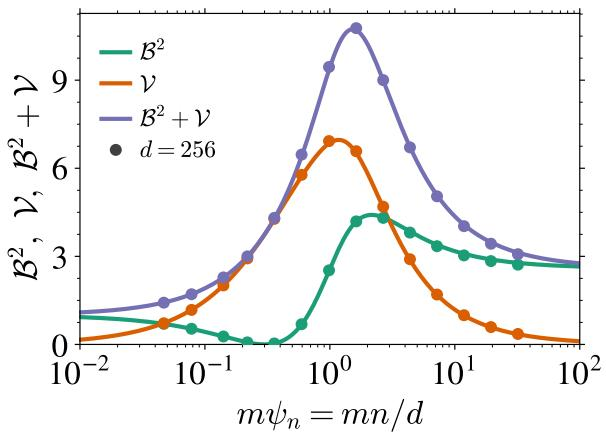

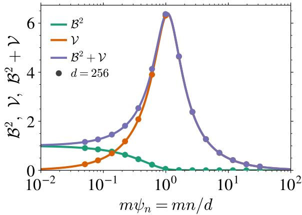  
Figure 9: Bias and variance against the sample complexity. $B ^ { 2 } , \nu$ and $B ^ { 2 } + \nu$ against $m \psi _ { n } = m n / d$ for the ridgeless estimator $\tilde { \gamma } \to 0 ^ { + } , \mathrm { a t } t = 0 . 1 , \bar { \sigma } ^ { 2 } = 1$ , with the kernel of Figure 2, for $m = 4 \left( l e f t \right)$ and $m = 1 \left( r i g h t \right)$ . Solid lines are the equations of Theorem 2.2; markers are experiments at $d = 2 5 6$

and in the ridgeless parametrization (156),

$$
g ^ { \prime } = - { \frac { \mu _ { 1 } w _ { 1 } } { e _ { 1 } ^ { 2 } } } - { \frac { ( m - 1 ) \mu _ { 1 } w _ { 2 } } { e _ { 2 } ^ { 2 } } } , \quad R ^ { \prime } = - \mu _ { 1 } ^ { 2 } \psi _ { n } \left[ { \frac { w _ { 1 } ^ { 2 } } { e _ { 1 } ^ { 2 } } } + { \frac { ( m - 1 ) w _ { 2 } ^ { 2 } } { e _ { 2 } ^ { 2 } } } \right] ,
$$

$$
\Phi ^ { \prime } = \psi _ { n } g ^ { \prime } - \mu _ { 1 } \Delta _ { t } \psi _ { n } ^ { 2 } \big ( g ^ { 2 } + 2 r g g ^ { \prime } \big ) .\tag{173}
$$

(174)

## D.10 Numerical check of Theorem 2.2

This subsection documents the finite-dimensional experiments performed for kernel ridge regression.

Setup. Data are isotropic, $\mathbf { x } ^ { \nu } \sim \mathcal { N } ( 0 , \mathbf { I } _ { d } )$ and ${ \bf Y } ^ { \nu \alpha } = e ^ { - t } { \bf x } ^ { \nu } + \sqrt { \Delta _ { t } } \pmb { \xi } ^ { \nu \alpha }$ with m noise realizations per data point, so that $\Sigma _ { t } = \mathbf { I } _ { d }$ and the exact score is $\mathbf { s } _ { \mathrm { e x a c t } } ( \mathbf { y } ) = - \mathbf { y }$ . The kernel is the dual activation $f ( u ) \overset { \vartriangle } { = } \mathbb { E } [ \sigma ( \boldsymbol { z } _ { 1 } ) \sigma ( \boldsymbol { z } _ { 2 } ) ]$ ] of $\sigma =$ tanh at correlation u. Since f is a kernel only for $| u | \leq 1 .$ , and at finite d the norms $\| \mathbf { Y } ^ { \nu \alpha } \| ^ { 2 } / d$ fluctuate around their limit $\Gamma _ { t } = 1$ , the rows are rescaled to the sphere of radius $\sqrt { d }$ in the kernel argument only.

Bias and variance. With $n _ { D }$ independent training sets and $n _ { z }$ fresh test points, writing $\bar { \bf s } ( { \bf y } )$ for the average of the $n _ { D }$ predictors,

$$
{ \widehat { \boldsymbol { \gamma } } } ( \mathbf { y } ) = { \frac { 1 } { d \left( n _ { D } - 1 \right) } } \sum _ { i = 1 } ^ { n _ { D } } \left\| \mathbf { s } _ { i } ( \mathbf { y } ) - { \bar { \mathbf { s } } } ( \mathbf { y } ) \right\| ^ { 2 } , \qquad { \widehat { \boldsymbol { B } } } ^ { 2 } ( \mathbf { y } ) = { \frac { 1 } { d } } { \big \| } \mathbf { s } _ { \mathrm { e x a c t } } ( \mathbf { y } ) - { \bar { \mathbf { s } } } ( \mathbf { y } ) { \big \| } ^ { 2 } - { \frac { { \widehat { \boldsymbol { \gamma } } } ( \mathbf { y } ) } { n _ { D } } } ,\tag{175}
$$

both averaged over the $n _ { z }$ test points. The $1 / ( n _ { D } - 1 )$ and the $- \widehat { \mathcal { V } } / n _ { D }$ subtraction make the two estimators unbiased at any $n _ { D }$ , so that neither the variance nor the bias is inflated by the finite number of realizations.

Parameters. The sweeps at fixed $\psi _ { n }$ of Figure 2 (left panel and inset) use $\psi _ { n } = 8 , n _ { z } = 5 1 2$ test points and $d \in \{ 6 4 , 1 2 8 , 2 5 6 \}$ , with $n _ { D } = 1 6$ training sets for $m = 1$ and $n _ { D } = 1 6 , 1 2 , 8$ for m $\ i = 4$ at $d = 6 4$ , 128, 256 respectively, while the sweep over the budget $m \psi _ { n }$ of Figure 9 uses $n _ { z } = 1 0 2 4$ and $n _ { D }$ between 32 at the smallest N and 8 at the largest.

Error bars. The error bars drawn on every finite-d point are a delete-one jackknife over the $n _ { D }$ realizations of the dataset.

Early stopping versus ridging. Fixing a training time τ in (5) imposes a spectral cutoff $\lambda _ { c } \sim n m / ( d \tau )$ whereas a ridge cuts at $\lambda \sim \gamma .$ Equating the two cutoffs gives γKRR $= m \psi _ { n } / \tau ,$ that is $\tilde { \gamma } = 1 / \tau$ on the scale of Theorem 2.2 — the same calibration under which Ali et al. [4] bound the risk of gradient flow by that of ridge regression along the whole path, for least squares with no assumption on the design. Figure 10 tests that identification by drawing the analytical $\hat { \mathscr { L } } _ { \mathrm { t e s t } } , \hat { \mathscr { B } } ^ { 2 }$ and $\nu { \sf a t } \tilde { \gamma } = 1 / \tau$ against the measured gradient flow at τ . The ridge looks therefore like a faithful proxy for early stopping for the values of the observables and for the scaling of the timescales.

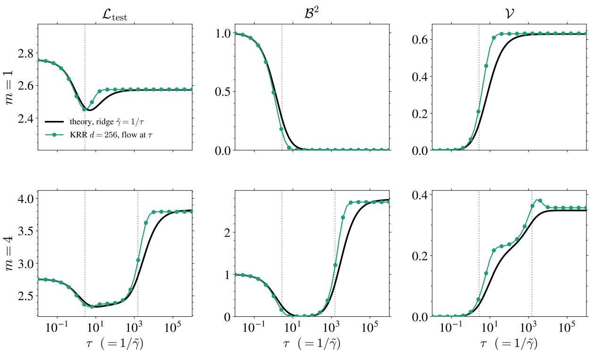

Figure 10: The ridge as a proxy for early stopping. $\mathcal { L } _ { \mathrm { t e s t } } , B ^ { 2 }$ and V against the training time $\tau ,$ at $m = 1$ (top) and $m = 4$ (bottom). Black: the theory of Theorem $2 . 2$ evaluated at $\tilde { \gamma } = 1 / \tau$ . Green: kernel gradient flow of (5) measured at finite $d = 2 5 6 , \psi _ { n } = 8 ,$ , averaged over 16 $( m = 1 )$ and $8 ( m = 4 )$ realizations of the dataset and 512 test points. Dotted verticals are $\tau _ { \mathrm { g e n } }$ and $\tau _ { \mathrm { m e m } } .$ Panels are scaled independently: at $m = 1$ the bias vanishes whereas at $m = 4$ it saturates at Θ(1).  
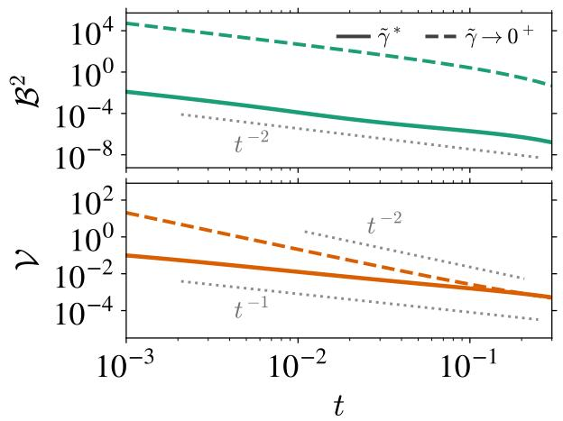  
Figure 11: Scalings with $t . ~ B ^ { 2 } ~ ( t o p )$ and V (bottom) against t at $\psi _ { n } = 1 0 ^ { 3 }$ and $m = 4 ,$ where $1 / ( m \psi _ { n } ) \ll t \ll 1$ , for the optimally ridged estimator $\widetilde { \gamma } ^ { \ast }$ (solid) and the ridgeless one $\tilde { \gamma } \to 0 ^ { + }$ (dashed), with the kernel of Fig. 2. Lines are the equations of Theorem 2.2.

## D.11 Small-t behavior of the bias and the variance

Theorem 2.2 holds at a fixed noise level, and most figures are drawn at $t = 0 . 1$ . Since memorization is a small-t phenomenon, we record here how $B ^ { 2 }$ and V behave as $t \to 0 ( \mathrm { F i g . 1 1 } )$ .

What collapses at small t. Expanding the constants of Theorem D.1 as $\Delta _ { t }  0 .$

$$
\mu _ { I } = \Delta _ { t } \iota + { \cal O } ( \Delta _ { t } ^ { 2 } ) , \quad \iota = f ^ { \prime } ( \sigma ^ { 2 } ) - f ^ { \prime } ( 0 ) , \qquad \mu _ { B } \to \mu _ { B } ^ { 0 } = f ( \sigma ^ { 2 } ) - f ( 0 ) - \sigma ^ { 2 } f ^ { \prime } ( 0 ) ,\tag{176}
$$

so that, at $\sigma ^ { 2 } = 1$ where $\lambda _ { t } = 1$ , the memorization eigenvalue of Theorem D.2 becomes

$$
\lambda _ { \mathrm { m e m } } = \mu _ { I } + { \frac { \mu _ { B } ( m - 1 ) \Delta _ { t } } { \lambda _ { t } } } \simeq \Delta _ { t } \bigl ( \iota + ( m - 1 ) \mu _ { B } ^ { 0 } \bigr ) .\tag{177}
$$

It vanishes linearly in $\Delta _ { t } ,$ while the generalization eigenvalue $\lambda _ { \mathrm { g e n } } = \mu _ { 1 } \psi _ { n } m \lambda _ { t }$ stays $\Theta ( \psi _ { n } m )$ : the two bulks separate further and further as the noise level drops. The memorization modes become both arbitrarily slow to learn and arbitrarily ill-conditioned for the ridgeless predictor, and the scalings below are the quantitative form of that second statement.

Result D.1 (Small-t scalings of the bias and the variance). Let $\sigma ^ { 2 } = 1$ and $\Delta _ { t } = 1 - e ^ { - 2 t } \simeq 2 t ,$ , and write $s = m \psi _ { n } \Delta _ { t }$

1. Ridgeless, $\Delta _ { t }  0$ at fixed $\psi _ { n }$ and m.

$m = 1 \colon B ^ { 2 }$ is independent of t, and $\psi _ { n } \Delta _ { t } \nu  1$ as $\psi _ { n }  \infty$

$m > 1 : B ^ { 2 } \simeq R _ { \psi _ { n } } ^ { 2 } / \Delta _ { t } ^ { 2 }$ and $\mathcal { V } \simeq c _ { m , \psi _ { n } } / ( \psi _ { n } \Delta _ { t } ^ { 2 } )$ , where the prefactors depend on $\psi _ { n }$ only through $O ( 1 / \psi _ { n } )$ corrections, with limits

$$
\begin{array} { r l } & { \cal R = \displaystyle \operatorname* { l i m } _ { \psi _ { n } \to \infty } { \cal R } _ { \psi _ { n } } = \frac { ( m - 1 ) \mu _ { B } ^ { 0 } } { \iota + ( m - 1 ) \mu _ { B } ^ { 0 } } \in ( 0 , 1 ) , } \\ & { c _ { m } = \displaystyle \operatorname* { l i m } _ { \psi _ { n } \to \infty } c _ { m , \psi _ { n } } = \frac { m ( m - 1 ) \iota ^ { 2 } ( \mu _ { B } ^ { 0 } ) ^ { 2 } } { \left( \iota + ( m - 1 ) \mu _ { B } ^ { 0 } \right) ^ { 4 } } . } \end{array}\tag{178}
$$

2. Optimal ridge, $\Delta _ { t }  0$ and $\psi _ { n }  \infty$ at fixed $s ,$ for every m: $\tilde { \gamma } ^ { * } = \mu _ { 1 } / s$ and

$$
\mathcal { B } ^ { 2 } = \frac { 1 } { ( 1 + s ) ^ { 2 } } , \qquad \mathcal { V } = \frac { s } { ( 1 + s ) ^ { 2 } } , \qquad \mathcal { B } ^ { 2 } + \mathcal { V } = \frac { 1 } { 1 + s } .\tag{179}
$$

3. The window of Result 2.1. For $m > 1$ and $1 / ( m \psi _ { n } ) \ll t \ll 1$ , i.e. $s \gg 1$ with $\Delta _ { t } \ll 1$ , items 1 and 2 give $B ^ { 2 } \simeq R ^ { 2 } / \Delta _ { t } ^ { 2 } = \Theta ( t ^ { - 2 } )$ and $\mathcal { V } \simeq c _ { m } / ( \psi _ { n } \Delta _ { t } ^ { 2 } ) = \Theta ( \psi _ { n } ^ { - 1 } t ^ { - 2 } )$ without ridge, and $B ^ { 2 } \simeq s ^ { - 2 } = \Theta ( \psi _ { n } ^ { - 2 } t ^ { - 2 } )$ and $\mathcal { V } \simeq \acute { s } ^ { - 1 } = \Theta ( \dot { \psi } _ { n } ^ { - 1 } t ^ { - 1 } )$ at the optimal ridge. In the opposite regime $s \ll 1$ the optimally ridged estimator returns $B ^ { 2 } \to 1$ and $\nu \simeq s \mathrm { : }$ it predicts almost nothing.

The ridgeless prefactors. Take the ridgeless parametrization (156) with $\varrho = 1$ (the result does not depend on this choice) and let $\Delta _ { t }  0$ with (176). Then $w _ { 1 } \to m , c _ { 1 } \to m \mu _ { B } ^ { 0 } , w _ { 2 } = \Delta _ { t }$ and $c _ { 2 } = \Delta _ { t } \iota ,$ so that $e _ { 1 } \to m ( \mu _ { 1 } r + \mu _ { B } ^ { 0 } )$ and $e _ { 2 } = \Delta _ { t } ( \mu _ { 1 } r + \iota )$ . The order parameter equation becomes independent of $t ,$

$$
\frac { 1 } { r } = 1 + \mu _ { 1 } \psi _ { n } \left( \frac { 1 } { \mu _ { 1 } r + \mu _ { B } ^ { 0 } } + \frac { m - 1 } { \mu _ { 1 } r + \ i } \right) ,\tag{180}
$$

whereas $g = G / \Delta _ { t } + O ( 1 )$ with $G = ( m - 1 ) / ( \mu _ { 1 } r + \iota )$ is dominated by the transverse directions. Hence $b ~ = ~ \mu _ { 1 } \psi _ { n } r g$ diverges as $R _ { \psi _ { n } } / \Delta _ { t }$ with $R _ { \psi _ { n } } ~ = ~ \mu _ { 1 } \psi _ { n } r G$ . As $\psi _ { n }  \infty$ the solution of (180) is $r \simeq \iota \mu _ { B } ^ { 0 } / [ \mu _ { 1 } \psi _ { n } ( \iota + ( m - \tilde { 1 ) } \bar { \mu } _ { B } ^ { 0 } ) ]$ , which gives the value of R in (178); $B ^ { 2 } = ( b - 1 ) ^ { 2 } \simeq R _ { \psi _ { \mathrm { s } } } ^ { 2 } / \Delta _ { t } ^ { 2 }$ . For the variance, $\Phi = \psi _ { n } g - \mu _ { 1 } \Delta _ { t } \psi _ { n } ^ { 2 } r g ^ { 2 }$ is also $\Theta ( 1 / \Delta _ { t } )$ , so that both terms of $\gamma = \mu _ { 1 } T _ { 4 } / \Delta _ { t } - b ^ { 2 }$ are $\Theta ( \Delta _ { t } ^ { - 2 } )$ Their leading parts in $1 / \psi _ { n }$ are both equal to $G ^ { \acute { 2 } } / ( \mu _ { B } ^ { 0 - 1 } + ( m - 1 ) \iota ^ { - 1 } ) ^ { 2 }$ and cancel, and the next order, obtained by expanding (180) to $O ( \psi _ { n } ^ { - 2 } )$ , gives ${ \psi _ { n } } \Delta _ { t } ^ { 2 } \mathcal { V }  c _ { m } . \mathrm { A t } m = 1$ there are no transverse directions: $w _ { 1 } = 1$ and $c _ { 1 } \stackrel { \cdot } { = } \mu _ { I } + \bar { \mu } _ { B } = f ( 1 ) - f ( 0 ) \stackrel { \cdot } { - } f ^ { \prime } ( 0 )$ are exactly independent of $t ,$ hence so is $B ^ { 2 }$ , and only the $1 / \Delta _ { t }$ in front of $T _ { 4 }$ survives, which gives $\psi _ { n } \Delta _ { t } \nu  1$

Why the ridged branch is a function of s alone. The last item of Result D.1 is not only read off the numerics: it follows from Theorem D.4 in four steps, in the limit $\Delta _ { t }  0$ at fixed $s = m \psi _ { n } \Delta _ { t }$ , hence $\psi _ { n } m = s / \Delta _ { t }  \infty$

First, the two channel denominators saturate. With $w _ { 1 } = m e ^ { - 2 t } + \Delta _ { t }  m , c _ { 1 } = \bar { \mu }  m \mu _ { * } ^ { 2 } , w _ { 2 } = \Delta _ { t }$

and $c _ { 2 } = \mu _ { I } = \Delta _ { t } \iota + O ( \Delta _ { t } ^ { 2 } )$ , equation (154) gives

$$
L _ { 1 } - 1 = \frac { m \Delta _ { t } } { s } \Big ( \mu _ { 1 } \bar { r } + \frac { \mu _ { * } ^ { 2 } } { \tilde { \gamma } } \Big ) , \qquad L _ { 2 } - 1 = \frac { \Delta _ { t } ^ { 2 } } { s } \Big ( \mu _ { 1 } \bar { r } + \frac { \iota } { \tilde { \gamma } } \Big ) ,\tag{181}
$$

so $L _ { 1 } , L _ { 2 } \to 1$ as soon as $\tilde { \gamma } \gg \mu _ { * } ^ { 2 } / \psi _ { n }$ . Second, the fixed point becomes explicit: $g $ m and $R \to \mu _ { 1 } .$ , so $1 / \bar { r } = \tilde { \gamma } + R ( \bar { r } )$ collapses to $\bar { r } = ( \tilde { \gamma } + \mu _ { 1 } ) ^ { - 1 }$ and

$$
b = \frac { \mu _ { 1 } \bar { r } g } { m } = \frac { \mu _ { 1 } } { \tilde { \gamma } + \mu _ { 1 } } , \qquad \mathcal { B } ^ { 2 } = ( b - 1 ) ^ { 2 } = \frac { \tilde { \gamma } ^ { 2 } } { ( \tilde { \gamma } + \mu _ { 1 } ) ^ { 2 } } .\tag{182}
$$

Third, the trace. From $L _ { 1 } ^ { \prime } = { \mu _ { 1 } m \Delta _ { t } } / { s }$ and $L _ { 2 } ^ { \prime } = \mu _ { 1 } \Delta _ { t } ^ { 2 } / s$ one gets $g ^ { \prime } \to - \mu _ { 1 } m \Delta _ { t } / s ,$ hence $R ^ { \prime } \to 0 ,$ $\bar { r } ^ { - 2 } + R ^ { \prime } \to ( \tilde { \gamma } + \mu _ { 1 } ) ^ { 2 }$ and $\Phi ^ { \prime } \to - \mu _ { 1 } \Delta _ { t } ( 1 + 1 / s )$ , so that $\mu _ { 1 } T _ { 4 } / \Delta _ { t } = \mu _ { 1 } ^ { 2 } ( 1 + 1 / s ) / ( \tilde { \gamma } + \mu _ { 1 } ) ^ { 2 }$ and

$$
\mathcal { V } = \frac { \mu _ { 1 } T _ { 4 } } { \Delta _ { t } } - b ^ { 2 } = \frac { \mu _ { 1 } ^ { 2 } } { s ( \tilde { \gamma } + \mu _ { 1 } ) ^ { 2 } } .\tag{183}
$$

Equations (182) and (183) are stronger than Result D.1: the whole ridge curve, not only its minimum, depends on $\psi _ { n } ,$ m and t through s alone, and $B ^ { 2 }$ does not depend on s at all. Fourth, the optimum. The excess risk is

$$
B ^ { 2 } + \gamma = \frac { \tilde { \gamma } ^ { 2 } + \mu _ { 1 } ^ { 2 } / s } { ( \tilde { \gamma } + \mu _ { 1 } ) ^ { 2 } } ,\tag{184}
$$

whose derivative is proportional to $( \tilde { \gamma } + \mu _ { 1 } ) ( \mu _ { 1 } \tilde { \gamma } - \mu _ { 1 } ^ { 2 } / s )$ and vanishes at $\tilde { \gamma } ^ { \ast } = \mu _ { 1 } / s ;$ substituting gives (179).

## D.12 Link between kernels and random features

Any dot-product kernel $\begin{array} { r } { K ( \mathbf x , \mathbf y ) = f ( \frac { \mathbf x ^ { \top } \mathbf y } { d } ) } \end{array}$ can be written as the infinite-width limit of a random-features model [67] $\begin{array} { r } { K ( \mathbf { x } , \mathbf { y } ) = \underset { p  \infty } { \operatorname* { l i m } } \frac { 1 } { p } \sum _ { i = 1 } ^ { p } \sigma ( \frac { \mathbf { w } _ { i } ^ { \top } \mathbf { x } } { \sqrt { d } } ) \sigma ( \frac { \mathbf { w } _ { i } ^ { \top } \mathbf { y } } { \sqrt { d } } ) } \end{array}$ with $\mathbf { W } \sim { \mathcal { N } } ( 0 , \mathbf { I } _ { p \times d } )$ and an activation σ that depends on $f .$ We show below that the large-p limit of the Gram matrix of the random-features network on our dataset yields the same linear equivalent as Theorem D.1. The difference with Bonnaire et al. [15] is that they take the number of noises $m  \infty$ first, whereas we keep $m = O ( 1 )$ . The results of this section are presented for $\pmb { \Sigma } = \mathbf { I } _ { d }$ but extend to arbitrary covariance. We first recall the choice of activation realizing a given dot-product kernel.

Lemma D.3. For any dot-product kernel $\begin{array} { r } { K ( \mathbf { x } , \mathbf { y } ) = f ( \frac { \mathbf { x } ^ { \top } \mathbf { y } } { d } ) } \end{array}$ , there exists an activationfunction σ such that

$$
K ( \mathbf { x } , \mathbf { y } ) = \mathbb { E } _ { \mathbf { w } \sim \mathcal { N } ( 0 , \mathbf { I } _ { d } ) } [ \sigma ( \frac { \mathbf { w } ^ { \top } \mathbf { x } } { \sqrt { d } } ) \sigma ( \frac { \mathbf { w } ^ { \top } \mathbf { y } } { \sqrt { d } } ) ]\tag{185}
$$

Proof. Assume that $f$ can be expanded as a Taylor series $\begin{array} { r } { f ( u ) = \sum _ { k > 0 } a _ { k } u ^ { k } } \end{array}$ with $a _ { k } \geq 0 ^ { 5 }$ and that σ can be expanded on a basis of Hermite polynomials $\begin{array} { r } { \sigma ( u ) = \sum _ { k \geq 0 } b _ { k } \overline { { H } } _ { k } \tilde { ( u ) } } \end{array}$ . By Mehler’s formula [46],

$$
\mathbb { E } _ { \mathbf { w } } [ \sigma ( \frac { \mathbf { w } ^ { \top } \mathbf { x } } { \sqrt { d } } ) \sigma ( \frac { \mathbf { w } ^ { \top } \mathbf { y } } { \sqrt { d } } ) ] = \sum _ { k > 0 } b _ { k } ^ { 2 } k ! \left( \frac { \mathbf { x } ^ { \top } \mathbf { y } } { d } \right) ^ { k } ,\tag{186}
$$

hence it suffices to choose the Hermite coefficients of σ such that $\forall k \geq 0 , b _ { k } ^ { 2 } k ! = a _ { k }$

We then derive a Gaussian Equivalence Principle (GEP) [29, 32] for the random-features model.

Proposition D.3 (Gaussian equivalence for the random-features model). Assume $\mu _ { 0 } ^ { \prime } = \mathbb { E } _ { \mathcal { N } ( 0 , 1 ) } [ \sigma ( u ) ] = 0$ In the proportional regime $p \asymp n \asymp d \gg 1$ , the random-features model $\sigma ( { \frac { \mathbf { W } \mathbf { Y } } { \sqrt { d } } } )$ is equivalent to the Gaussian

$$
\mu _ { 1 } ^ { \prime } \frac { \mathbf { W } \mathbf { Y } } { \sqrt { d } } + \mu _ { * } ^ { \prime } \pmb { \Omega }\tag{187}
$$

with $\Omega \in \mathbb { R } ^ { p \times m n }$ with Gaussian entries and covariance $\Xi [ \Omega _ { i } ^ { \nu \alpha } \Omega _ { j } ^ { \nu ^ { \prime } \alpha ^ { \prime } } ] = \delta _ { i j } \delta ^ { \nu \nu ^ { \prime } } \left( \delta ^ { \alpha \alpha ^ { \prime } } + \kappa _ { t } ( 1 - \delta ^ { \alpha \alpha ^ { \prime } } ) \right)$ with $\begin{array} { r } { \mu _ { 1 } ^ { \prime } = \mathbb { E } [ \sigma ( z ) z ] , \mu _ { * } ^ { \prime 2 } = \mathbb { E } [ \sigma ^ { 2 } ( z ) ] - \mu _ { 1 } ^ { \prime 2 } a n d \kappa _ { t } = \frac { 1 } { \mu _ { * } ^ { \prime 2 } } \mathbb { E } _ { u , v , w } [ ( \sigma ( e ^ { - t } u + \sqrt { \Delta _ { t } } v ) - \mu _ { 1 } ^ { \prime } e ^ { - t } u ) ( \sigma ( e ^ { - t } u + \sqrt { \Delta _ { t } } w ) - \mu _ { * } ^ { \prime 2 } e ^ { - t } ) ] . } \end{array}$ $\mu _ { 1 } ^ { \prime } e ^ { - t } u ) ]$

Proof. According to the Gaussian Equivalence Principle, $\sigma ( { \frac { \mathbf { W } \mathbf { Y } } { \sqrt { d } } } )$ and $\frac { \mathbf { W } \mathbf { Y } } { \sqrt { d } }$ are jointly Gaussian; hence, to characterize their statistics, it suffices to compute their covariance.

For each $i \in [ p ] , \nu \in [ n ] , \alpha \in [ m ]$ , define the pre-activation

$$
\mathbf { z } _ { i } ^ { \nu \alpha } = \frac { 1 } { \sqrt { d } } \sum _ { k = 1 } ^ { d } \mathbf { W } _ { i k } \mathbf { Y } _ { k } ^ { \nu \alpha } .
$$

Conditioned on $\mathbf { Y , }$ the $\mathbf { z } _ { i } ^ { \nu \alpha }$ are jointly centered Gaussian with

$$
\mathbb { E } \left[ \mathbf { z } _ { i } ^ { \nu \alpha } \mathbf { z } _ { j } ^ { \nu ^ { \prime } \alpha ^ { \prime } } \Big | \mathbf { Y } \right] = \delta _ { i j } \frac { \mathbf { Y } ^ { \nu \alpha } \cdot \mathbf { Y } ^ { \nu ^ { \prime } \alpha ^ { \prime } } } { d } .
$$

Define the centered nonlinearity

$$
\tilde { \Omega } ( z ) : = \frac { \sigma ( z ) - \mu _ { 1 } ^ { \prime } z } { \mu _ { * } ^ { \prime } } , \qquad \mu _ { 1 } ^ { \prime } = \mathbb { E } _ { z \sim \mathcal { N } ( 0 , 1 ) } [ z \sigma ( z ) ] , \quad ( \mu _ { * } ^ { \prime } ) ^ { 2 } = \mathbb { E } [ \sigma ( z ) ^ { 2 } ] - ( \mu _ { 1 } ^ { \prime } ) ^ { 2 } .
$$

Direct calculation, using the assumption $\mu _ { 0 } ^ { \prime } = \mathbb { E } [ \sigma ] = 0$ and Stein’s identity $\mathbb { E } [ z \sigma ( z ) ] = \mathbb { E } [ \sigma ^ { \prime } ( z ) ]$ for $z \sim \mathcal { N } ( 0 , 1 )$ , gives the orthonormality conditions

$$
\mathbb { E } _ { z } [ \tilde { \Omega } ( z ) ] = 0 , \qquad \mathbb { E } _ { z } [ z \tilde { \Omega } ( z ) ] = 0 , \qquad \mathbb { E } _ { z } [ \tilde { \Omega } ( z ) ^ { 2 } ] = 1 .
$$

Setting $\Omega _ { i } ^ { \nu \alpha } = \tilde { \Omega } ( \mathbf { z } _ { i } ^ { \nu \alpha } )$ yields

$$
\begin{array} { r } { \sigma \left( \frac { ( { \bf W } { \bf Y } ) _ { i } ^ { \nu \alpha } } { \sqrt { d } } \right) = \mu _ { 1 } ^ { \prime } \frac { ( { \bf W } { \bf Y } ) _ { i } ^ { \nu \alpha } } { \sqrt { d } } + \mu _ { * } ^ { \prime } \Omega _ { i } ^ { \nu \alpha } . } \end{array}\tag{188}
$$

This equality holds pointwise, not just asymptotically. We still need to show that Ω behaves as a Gaussian matrix with a specific covariance in the proportional regime; we verify the covariance below and invoke the GEP for the equivalence as Gaussian objects. Let us compute $\mathbb { E } [ \bar { \Omega _ { i } ^ { \nu \alpha } } \Omega _ { j } ^ { \nu ^ { \prime } \alpha ^ { \prime } } ]$ case by case.

Different rows of W $( i ~ \neq ~ j )$ . The rows $\mathbf { w } _ { i } , \mathbf { w } _ { j }$ are independent, so $\mathbf { z } _ { i } ^ { \nu \alpha } , \mathbf { z } _ { j } ^ { \nu ^ { \prime } \alpha ^ { \prime } }$ are conditionally independent and $\mathbb { E } [ \Omega _ { i } ^ { \nu \alpha } \Omega _ { j } ^ { \nu ^ { \prime } \alpha ^ { \prime } } ] = \mathbb { E } [ \tilde { \Omega } ( \mathbf { z } _ { i } ^ { \nu \alpha } ) ] \mathbb { E } [ \tilde { \Omega } ( \mathbf { z } _ { j } ^ { \nu ^ { \prime } \alpha ^ { \prime } } ) ] = 0$ . This produces the prefactor $\delta _ { i j }$

Different clusters $( i = j , \nu \neq \nu ^ { \prime } )$ . The overlap $\mathbf { Y } ^ { \nu \alpha } \cdot \mathbf { Y } ^ { \nu ^ { \prime } \alpha ^ { \prime } } / d$ vanishes asymptotically (by independence of $\mathbf { x } ^ { \nu } , \mathbf { x } ^ { \nu ^ { \prime } }$ and Gaussian concentration), so $\mathbf { z } _ { i } ^ { \nu \alpha }$ and $\mathbf { z } _ { i } ^ { \nu ^ { \prime } \tilde { \alpha ^ { \prime } } }$ are asymptotically independent. Then $\mathbb { E } [ \Omega _ { i } ^ { \nu \alpha } \Omega _ { i } ^ { \nu ^ { \prime } \alpha ^ { \prime } } ]  \mathbb { E } [ \tilde { \Omega } ( z ) ] ^ { 2 } = 0 ,$ giving the prefactor $\delta ^ { \nu \nu ^ { \prime } }$

Diagonal $( i = j , \nu = \nu ^ { \prime } , \alpha = \alpha ^ { \prime } )$ . Same Gaussian, $\mathbb { E } [ \tilde { \Omega } ( z ) ^ { 2 } ] = 1$

Same cluster, different noise copies $( i = j , \nu = \nu ^ { \prime } , \alpha \neq \alpha ^ { \prime } )$ . The overlap concentrates around

$$
\frac { { \bf Y } ^ { \nu \alpha } \cdot { \bf Y } ^ { \nu \alpha ^ { \prime } } } { d } \xrightarrow { d  \infty } e ^ { - 2 t } \sigma ^ { 2 } = e ^ { - 2 t }
$$

(the last equality assumes $\sigma ^ { 2 } = 1 ;$ the general isotropic case is discussed at the end of this proof). Conditional on $\mathbf { Y } , ( \mathbf { z } _ { i } ^ { \nu \alpha } , \mathbf { z } _ { i } ^ { \nu \alpha ^ { \prime } } )$ is a centered Gaussian pair with unit marginal variance and correlation $\rho = e ^ { - 2 t }$ . We realize this pair as

$$
\begin{array} { r } { \mathbf { z } _ { i } ^ { \nu \alpha } = e ^ { - t } u + \sqrt { \Delta _ { t } } v , \qquad \mathbf { z } _ { i } ^ { \nu \alpha ^ { \prime } } = e ^ { - t } u + \sqrt { \Delta _ { t } } w , } \end{array}
$$

with $u , v , w \stackrel { \mathrm { i . i . d . } } { \sim } \mathcal { N } ( 0 , 1 )$ . Then

$$
\begin{array} { r } { ( \mu _ { * } ^ { \prime } ) ^ { 2 } \mathbb { E } \left[ \pmb { \Omega } _ { i } ^ { \nu \alpha } \pmb { \Omega } _ { i } ^ { \nu \alpha ^ { \prime } } \right] = \mathbb { E } \left[ ( \sigma ( z ) - \mu _ { 1 } ^ { \prime } z ) ( \sigma ( z ^ { \prime } ) - \mu _ { 1 } ^ { \prime } z ^ { \prime } ) \right] . } \end{array}\tag{189}
$$

Expand the product and use Stein’s lemma at correlation $\rho = e ^ { - 2 t }$ , which gives $\begin{array} { r } { \mathbb { E } [ z ^ { \prime } \sigma ( z ) ] = \rho \mathbb { E } [ \sigma ^ { \prime } ( z ) ] = } \end{array}$

$\rho \mu _ { 1 } ^ { \prime }$ and similarly $\mathbb { E } [ z \sigma ( z ^ { \prime } ) ] = \rho \mu _ { 1 } ^ { \prime }$ :

$$
\begin{array} { r l } & { \mathbb { E } [ ( \sigma ( z ) - \mu _ { 1 } ^ { \prime } z ) ( \sigma ( z ^ { \prime } ) - \mu _ { 1 } ^ { \prime } z ^ { \prime } ) ] = \mathbb { E } [ \sigma ( z ) \sigma ( z ^ { \prime } ) ] \ - \ 2 \mu _ { 1 } ^ { \prime } \rho \mu _ { 1 } ^ { \prime } \ + \ ( \mu _ { 1 } ^ { \prime } ) ^ { 2 } \mathbb { E } [ z z ^ { \prime } ] } \\ & { \qquad = \mathbb { E } [ \sigma ( z ) \sigma ( z ^ { \prime } ) ] - ( \mu _ { 1 } ^ { \prime } ) ^ { 2 } \rho . } \end{array}
$$

The proposition defines $\kappa _ { t }$ via the integrand $\begin{array} { r l } & { ( \sigma ( e ^ { - t } u + \sqrt { \Delta _ { t } } v ) - \mu _ { 1 } ^ { \prime } e ^ { - t } u ) ( \sigma ( e ^ { - t } u + \sqrt { \Delta _ { t } } w ) - \mu _ { 1 } ^ { \prime } e ^ { - t } u ) . } \end{array}$ which subtracts only $\mu _ { 1 } ^ { \prime } e ^ { - t } u$ from each factor instead of the full $\mu _ { 1 } ^ { \prime } z .$ The two definitions coincide because the missing $\mu _ { 1 } ^ { \prime } \sqrt { \Delta _ { t } } \bar { v }$ and $\mu _ { 1 } ^ { \prime } \sqrt { \Delta _ { t } } w$ pieces cancel: they are mean-zero, mutually independent, and each of them is independent of the remaining terms in the cross expectation. Concretely, expanding the product

$$
( \sigma ( z ) - \mu _ { 1 } ^ { \prime } e ^ { - t } u - \mu _ { 1 } ^ { \prime } \sqrt { \Delta _ { t } } v ) ( \sigma ( z ^ { \prime } ) - \mu _ { 1 } ^ { \prime } e ^ { - t } u - \mu _ { 1 } ^ { \prime } \sqrt { \Delta _ { t } } w )
$$

and taking expectation, the cross terms involving v or w alone vanish (because v is independent of u and w, and $\mathbb { E } [ v ] = 0 ;$ similarly for w), and the term $( \mu _ { 1 } ^ { \prime } ) ^ { 2 } \Delta _ { t }$ vw vanishes by $\mathbb { E } [ v w ] = 0$ . Hence (189) equals

$$
\mathbb { E } \left[ ( \sigma ( e ^ { - t } u + \sqrt { \Delta _ { t } } v ) - \mu _ { 1 } ^ { \prime } e ^ { - t } u ) ( \sigma ( e ^ { - t } u + \sqrt { \Delta _ { t } } w ) - \mu _ { 1 } ^ { \prime } e ^ { - t } u ) \right] = ( \mu _ { * } ^ { \prime } ) ^ { 2 } \kappa _ { t } ,
$$

which is the definition of $\kappa _ { t }$ in the proposition. So $\mathbb { E } [ \Omega _ { i } ^ { \nu \alpha } \Omega _ { i } ^ { \nu \alpha ^ { \prime } } ] = \kappa _ { t }$ for $\alpha \neq \alpha ^ { \prime }$

Combining the four cases:

$$
\mathbb { E } [ \Omega _ { i } ^ { \nu \alpha } \Omega _ { j } ^ { \nu ^ { \prime } \alpha ^ { \prime } } ] = \delta _ { i j } \delta ^ { \nu \nu ^ { \prime } } \left( \delta ^ { \alpha \alpha ^ { \prime } } + \kappa _ { t } \left( 1 - \delta ^ { \alpha \alpha ^ { \prime } } \right) \right) .
$$

This is the claimed covariance.

General isotropic data $\boldsymbol { \Sigma } = \sigma ^ { 2 } \boldsymbol { \mathbf { I } } _ { d }$ . The same computation goes through with two changes: the preactivations have marginal variance $\| \mathbf { Y } ^ { \nu \alpha } \| ^ { 2 } / d  \Gamma _ { t } ^ { \bullet } = \sigma ^ { 2 } e ^ { - 2 \stackrel { \smile } { t } } + \Delta _ { t }$ instead of 1, and two copies of the same clean sample have correlation $\rho = \sigma ^ { 2 } e ^ { - 2 t } / \Gamma _ { t }$ instead of $e ^ { - 2 t }$ . The Gaussian equivalence then holds with $\mu _ { 1 } ^ { \prime } , \mu _ { * } ^ { \prime }$ and $\kappa _ { t }$ computed for $z \sim \mathcal { N } ( 0 , \Gamma _ { t } )$ and pairs of correlation $\rho ,$ and the resulting constants of the Gram matrix, $\mu _ { I } = \mu _ { * } ^ { \prime 2 } ( 1 - \kappa _ { t } ) , \mu _ { B } = \mu _ { * } ^ { \prime 2 } \kappa _ { t }$ and $\bar { \mu } _ { 1 } = { \mu ^ { \prime } } _ { 1 } ^ { 2 } ,$ , are exactly those of Theorem D.1 at general $\sigma ^ { 2 }$ . The equations of Theorem D.4 therefore hold with these constants; equivalently, the exact reduction to $\sigma ^ { 2 } = 1$ stated after Theorem D.4 applies.

The Gaussian Equivalence Principle of Gerace et al. [29], Goldt et al. [32], Hu and Lu [41], Mei and Montanari [58] asserts that, in the proportional regime $p \asymp n \asymp d ,$ all asymptotic statistics of $\sigma ( \mathbf { W Y } / \sqrt { d } )$ coincide with those obtained by replacing Ω by a centered Gaussian matrix with the same covariance. Combining with the exact decomposition above gives the claimed distributional equivalence $\sigma ( \mathbf { W Y } / \sqrt { d } ) \overset { \mathrm { ~ d ~ } } { \sim } \mu _ { 1 } ^ { \prime } \mathbf { W Y } / \sqrt { d } + \mu _ { * } ^ { \prime } \Omega ^ { \mathrm { G a u s s } }$ , where $\Omega ^ { \mathrm { G a u s s } }$ has the prescribed covariance and is otherwise jointly Gaussian.

Proposition D.4. In the overparametrized regime p $\gg n \asymp d \gg 1$ , the Gram matrix of the random-features model $\begin{array} { r } { \mathbf { G } _ { \mathrm { R F } } = \frac { 1 } { p } \sum _ { i = 1 } ^ { p } \sigma ( \frac { \mathbf { W } _ { i } \mathbf { Y } } { \sqrt { d } } ) ^ { \top } \sigma ( \frac { \mathbf { W } _ { i } \mathbf { Y } } { \sqrt { d } } ) } \end{array}$ converges to

$$
\mu _ { I } \mathbf { I } _ { N } + \mu _ { B } \mathbf { B } _ { m } + \mu _ { 1 } { \frac { \mathbf { Y } ^ { \top } \mathbf { Y } } { d } }\tag{190}
$$

with $\mu _ { I } = \mu ^ { \prime } { } _ { * } ^ { 2 } ( 1 - \kappa _ { t } ) , \mu _ { B } = \mu ^ { \prime } { } _ { * } ^ { 2 } \kappa _ { t } , \mu _ { 1 } = \mu ^ { \prime } { } _ { 1 } ^ { 2 } .$

Proof. Replace the random features by their Gaussian equivalent and the sum over hidden units by an expectation over W and Ω.

$$
\mathbf { G } _ { \mathrm { R F } } ^ { \nu \alpha , \nu ^ { \prime } \alpha ^ { \prime } } = \mathbb { E } _ { \mathbf { W } , \Omega } \left[ \left( \mu _ { 1 } ^ { \prime } \frac { \mathbf { W } ^ { \top } \mathbf { Y } ^ { \nu \alpha } } { \sqrt { d } } + \mu _ { * } ^ { \prime } \pmb { \Omega } ^ { \nu \alpha } \right) \left( \mu _ { 1 } ^ { \prime } \frac { \mathbf { W } ^ { \top } \mathbf { Y } ^ { \nu ^ { \prime } \alpha ^ { \prime } } } { \sqrt { d } } + \mu _ { * } ^ { \prime } \pmb { \Omega } ^ { \nu ^ { \prime } \alpha ^ { \prime } } \right) \right]\tag{191}
$$

$$
\mathbf { \mu } = { \mu ^ { \prime } } _ { 1 } ^ { 2 } \frac { \mathbf { Y } ^ { \nu \alpha } \cdot \mathbf { Y } ^ { \nu ^ { \prime } \alpha ^ { \prime } } } { d } + { \mu ^ { \prime } } _ { * } ^ { 2 } \mathbb { E } [ \Omega ^ { \nu \alpha } \Omega ^ { \nu ^ { \prime } \alpha ^ { \prime } } ]\tag{192}
$$

$$
= \mu ^ { \prime } _ { 1 } ^ { 2 } \frac { \mathbf { Y } ^ { \nu \alpha } \cdot \mathbf { Y } ^ { \nu ^ { \prime } \alpha ^ { \prime } } } { d } + \mu ^ { \prime } _ { * } ^ { 2 } \left( \delta ^ { \nu \nu ^ { \prime } } \delta ^ { \alpha \alpha ^ { \prime } } + \kappa _ { t } \delta ^ { \nu \nu ^ { \prime } } ( 1 - \delta ^ { \alpha \alpha ^ { \prime } } ) \right) .\tag{193}
$$

Hence

$$
\mathbf { G } _ { \mathrm { R F } } = { \mu ^ { \prime } } _ { 1 } ^ { 2 } { \frac { \mathbf { Y } ^ { \top } \mathbf { Y } } { d } } + { \mu ^ { \prime } } _ { * } ^ { 2 } ( 1 - \kappa _ { t } ) \mathbf { I } _ { N } + { \mu ^ { \prime } } _ { * } ^ { 2 } \kappa _ { t } \mathbf { B } _ { m } .\tag{194}
$$

The infinite-width limit of the Gram matrix of a random-features network is thus consistent with the linear equivalent of the Gram matrix of the associated kernel.

The same Gaussian Equivalence Principle also accounts for the finite-width, infinite-m limit studied by Bonnaire et al. [15]. These authors work with the Hessian of the loss at initialization,

$$
\mathbf { U } ^ { i j } = \frac { 1 } { n } \sum _ { \nu = 1 } ^ { n } \mathbb { E } _ { \pmb { \xi } } \left[ \sigma \left( \frac { ( \mathbf { W } ( e ^ { - t } \mathbf { x } ^ { \nu } + \sqrt { \Delta _ { t } } \pmb { \xi } ) ) _ { i } } { \sqrt { d } } \right) \sigma \left( \frac { ( \mathbf { W } ( e ^ { - t } \mathbf { x } ^ { \nu } + \sqrt { \Delta _ { t } } \pmb { \xi } ) ) _ { j } } { \sqrt { d } } \right) \right] ,\tag{195}
$$

a $p \times p$ matrix in feature space whose counterpart at finite m is

$$
\mathbf { U } ^ { i j } ( m ) = \frac { 1 } { n m } \sum _ { \nu = 1 } ^ { n } \sum _ { \alpha = 1 } ^ { m } \sigma \left( \frac { ( \mathbf { W } \mathbf { Y } ^ { \nu \alpha } ) _ { i } } { \sqrt { d } } \right) \sigma \left( \frac { ( \mathbf { W } \mathbf { Y } ^ { \nu \alpha } ) _ { j } } { \sqrt { d } } \right) ,\tag{196}
$$

so that $\mathbf { U } = \operatorname* { l i m } _ { m \to \infty } \mathbf { U } ( m )$ . Replacing the features by their Gaussian equivalent,

$$
\mathbf { U } ^ { i j } ( m ) = \frac { 1 } { n m } \sum _ { \nu = 1 } ^ { n } \sum _ { \alpha = 1 } ^ { m } \left( \mu _ { 1 } ^ { \prime } \frac { ( \mathbf { W Y } ) _ { i } ^ { \nu \alpha } } { \sqrt { d } } + \mu _ { * } ^ { \prime } \Omega _ { i } ^ { \nu \alpha } \right) \left( \mu _ { 1 } ^ { \prime } \frac { ( \mathbf { W Y } ) _ { j } ^ { \nu \alpha } } { \sqrt { d } } + \mu _ { * } ^ { \prime } \Omega _ { j } ^ { \nu \alpha } \right) ,\tag{197}
$$

and the three groups of terms average separately. In the Gaussian equivalent Ω is centered and uncorrelated with $\mathbf { W Y } / { \sqrt { d } } ,$ so the two cross terms vanish,

$$
\frac { \mu _ { 1 } ^ { \prime } \mu _ { * } ^ { \prime } } { n m } \sum _ { \nu , \alpha } \frac { ( \mathbf { W } \mathbf { Y } ) _ { i } ^ { \nu \alpha } } { \sqrt { d } } \Omega _ { j } ^ { \nu \alpha } \longrightarrow 0 .\tag{198}
$$

The Ω–Ω term pairs every copy with itself and never with another, so the cross-copy covariance $\kappa _ { t }$ is never probed and

$$
\frac { \mu ^ { \prime } { } _ { * } ^ { 2 } } { n m } \sum _ { \nu , \alpha } \Omega _ { i } ^ { \nu \alpha } \Omega _ { j } ^ { \nu \alpha } \longrightarrow \mu ^ { \prime } { } _ { * } ^ { 2 } \delta _ { i j } .\tag{199}
$$

The average of the linear part over the copies becomes an expectation over $\pmb { \xi } \sim \mathcal { N } ( 0 , \mathbf { I } _ { d } )$ at fixed W and fixed data, which gives

$$
\frac { \mu _ { 1 } ^ { \prime 2 } } { n m d } \sum _ { \nu , \alpha } ( \mathbf { W Y } ) _ { i } ^ { \nu \alpha } ( \mathbf { W Y } ) _ { j } ^ { \nu \alpha } \longrightarrow \mu _ { 1 } ^ { \prime 2 } \left[ \Delta _ { t } \frac { ( \mathbf { W W } ^ { \top } ) _ { i j } } { d } + e ^ { - 2 t } \frac { ( \mathbf { W } \hat { \Sigma } \mathbf { W } ^ { \top } ) _ { i j } } { d } \right] ,\tag{200}
$$

with $\begin{array} { r } { \hat { \mathbf { \xi } } \hat { \mathbf { \xi } } = \frac { 1 } { n } \sum _ { \nu } \mathbf { x } ^ { \nu } ( \mathbf { x } ^ { \nu } ) ^ { \top } } \end{array}$ the empirical covariance of the clean samples. Collecting the three pieces, and using $\mu _ { 1 } = { \mu ^ { \prime } } _ { 1 } ^ { 2 }$ together with $\mu _ { * } ^ { \prime 2 } = \mu _ { I } + \mu _ { B }$ from the proposition above,

$$
\mathbf { U } ~ = ~ \mu _ { 1 } \frac { \mathbf { W } \hat { \mathbf { \Sigma } } _ { t } \mathbf { W } ^ { \top } } { d } ~ + ~ \left( \mu _ { I } + \mu _ { B } \right) \mathbf { I } _ { p } , \qquad \hat { \Sigma } _ { t } = e ^ { - 2 t } \hat { \Sigma } + \Delta _ { t } \mathbf { I } _ { d } .\tag{201}
$$

Equation (201) is the feature-space mirror of the linear equivalent of Theorem D.1, and it reproduces the two-group spectrum from which Bonnaire et al. [15] read off the two timescales: $\mathbf { W } \hat { \mathbf { \Sigma } } _ { t } \mathbf { W } ^ { \top } / d$ has rank $d ,$ so U carries d large eigenvalues, the fast directions, above a plateau of $p - d$ eigenvalues pinned exactly at $\mu _ { I } + \mu _ { B } ,$ , the slow ones.

The comparison with the finite-m Gram matrix is then transparent. Since $\kappa _ { t }$ drops out, $\mu _ { I }$ and $\mu _ { B }$ enter (201) only through their sum: the $m = \infty$ Hessian has exactly the structure of our own Gram matrix at $m = 1$ , where $\mathbf { B } _ { m } = \mathbf { I } _ { N }$ and $\mathbf { G } _ { \mathrm { l i n } } = ( \mu _ { I } + \mu _ { B } ) \mathbf { I } _ { N } + \mu _ { 1 } \mathbf { Y } ^ { \top } \mathbf { Y } / d$ . What $m > 1$ does is resolve that single degenerate plateau into the three objects of Theorem $\mathrm { D } . 2 { : }$ the atom at $\mu _ { I }$ , the atom at $\bar { \mu } = \mu _ { I } + m \mu _ { B }$ and the memorization bulk at $\mu _ { I } + \mu _ { B } ( m - 1 ) \Delta _ { t } / \lambda _ { t }$ , each of which depends on $\mu _ { I }$ and $\mu _ { B }$ separately and therefore on the cross-copy correlation $\kappa _ { t } .$ . Averaging over the copies before forming the matrix, as the $m = \infty$ limit does, removes precisely the structure that the memorization bulk lives on.

## E Experimental details

## E.1 General comments

Code. A reference implementation of all the numerical experiments will be made available upon publication of the paper.

Generation. Once the velocity field $\hat { \mathbf { v } } ( \mathbf { x } _ { s } , s )$ is estimated (either by a U-Net or by the spectrally truncated estimator $\hat { \mathbf { v } } _ { r } )$ on a uniform grid of S time slices $\{ s _ { k } \} _ { k = 0 } ^ { S - 1 } \dot { \subset } [ 0 , 1 ]$ , we generate samples by integrating the rectified-flow ODE

$$
\frac { \mathrm { d } \tilde { \mathbf { x } } _ { s } } { \mathrm { d } s } = \hat { \mathbf { v } } ( \tilde { \mathbf { x } } _ { s } , s ) , \qquad \tilde { \mathbf { x } } _ { 1 } \sim \mathcal { N } ( 0 , \mathbf { I } _ { d } ) ,\tag{202}
$$

backward with an Euler scheme on the same S slices used at training. For the truncation experiment, at each timestep, the cross-kernel $K ( \tilde { \mathbf { x } } _ { s _ { k } } , \mathbf { Y } _ { s _ { k } } )$ between the current iterate and the noised training anchors is evaluated through the same closed-form NTK recursion and the velocity is computed with a single matrix-vector product against the precomputed coefficients $\pmb { \alpha } _ { r }$ of the truncated estimator $\hat { \mathbf { v } } _ { r }$ of (203), i.e. $K ( \tilde { \mathbf { x } } _ { s _ { k } } , \mathbf { Y } _ { s _ { k } } ) \bar { \alpha _ { r } } ( s _ { k } )$

Details on $f _ { \mathrm { m e m } } .$ . For each generated sample $\tilde { \mathbf { x } } _ { 0 }$ with the backward dynamics, let $d _ { \mathrm { N N } } .$ and $d _ { \mathrm { N N _ { 2 } } }$ denote the cosine distances to its first and second nearest neighbors in the training set $\{ \mathbf { x } ^ { \nu } \} _ { \nu = 1 } ^ { n }$ . We declare $\tilde { \mathbf { x } } _ { 0 }$ memorized whenever $\begin{array} { r } { \frac { d _ { \mathrm { N N } _ { 1 } } ( \tilde { \mathbf { x } } _ { 0 } ) } { d _ { \mathrm { N N } _ { 2 } } ( \tilde { \mathbf { x } } _ { 0 } ) } < \frac { 1 } { 3 } . } \end{array}$ , and we define $f _ { \mathrm { m e m } } \in [ 0 , 1 ]$ as the fraction of generated samples that meet this condition among 2048 generated samples. We emphasize that $f _ { \mathrm { m e m } }$ is evaluated on backward trajectories starting from training noises $\tilde { \mathbf { x } } _ { 1 } \in \{ \hat { \pmb { \xi } } ^ { \mu \alpha } \}$ and can therefore be viewed as a long-time version of the U-turn protocol from Behjoo and Chertkov [11], Sclocchi et al. [71]. A model that has learned the correct population velocity field should produce an image that resembles those of the data manifold but is distinct from its associated clean image, therefore producing $f _ { \mathrm { m e m } } = 0 ,$ , while a model in the memorization regime should fall back onto the clean training image and lead to $f _ { \mathrm { m e m } } = 1$

## E.2 Closed-form CNTK computation and top-r eigendecomposition

Kernel recursion. We follow the depth-D recursion of Arora et al. [6], described in Sect. $_ { \mathrm { A . 7 } }$ and implemented in the authors’ CNTK repository, except we use a $1 \times 1$ readout which is equivalent to the flatten+linear output up to a $1 / P$ normalization with $P = L ^ { 2 }$ which is a global multiplicative constant that is absorbed in the kernel-regression predictors.

Top-r eigenvalues. For $N = n m < 1 0 ^ { 4 }$ , we materialize the empirical Gram matrix $\mathbf { G } \in \mathbb { R } ^ { N \times N }$ and call a standard Lanczos solver (ARPACK package) to find its eigenvalues. For $N > 1 0 ^ { 4 }$ , we use the randomized SVD method from Halko et al. [35] with a matrix-free linear operator that evaluates matrixvector products in chunks without ever forming G explicitly. We use an oversampling of $p = 1 0$ columns and a second-order $( q = 2 )$ power iteration, i.e. $( q + 2 ) ( r + p )$ ≈ 4r matrix-vector products in total to compute the top-r eigenvalues.

Spectrally truncated estimator. Writing the resulting decomposition as $\mathbf { G } \approx \mathbf { U } _ { r } \mathbf { A } _ { r } \mathbf { U } _ { r } ^ { \top }$ , with ${ \mathbf { U } } _ { r }$ collecting in column the top-r eigenvectors of G and Λr the corresponding descending-ordered eigenvalues, the spectrally truncated kernel regression estimator of the velocity field used in Sect. 3 is

$$
\hat { \mathbf { v } } _ { r } ( \mathbf { x } , s ) = K ( \mathbf { x } , \mathbf { Y } ) \alpha _ { r } = K ( \mathbf { x } , \mathbf { Y } ) \mathbf { U } _ { r } \mathbf { \Lambda } _ { r } ^ { - 1 } \mathbf { U } _ { r } ^ { \top } \mathbf { V } ,\tag{203}
$$

where $\mathbf { V } \in \mathbb { R } ^ { N \times d }$ stacks the training target velocities.

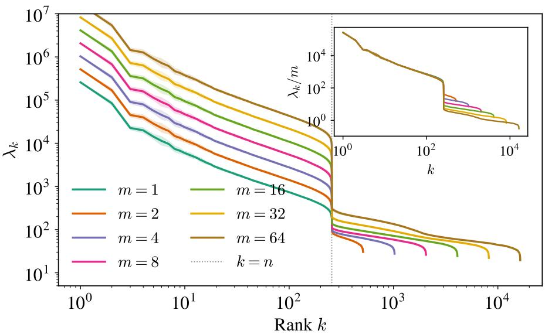  
Figure 12: Ordered eigenvalues for several m at fixed $n = 2 5 6$ and their rescaling by m in the inset. Spectra obtained $\mathrm { a t } s = 0 . 0 5$ and averaged over 10 realizations of the training set.

Truncation rank and training time. Truncating at rank r is equivalent to fixing a training time. The gradient-flow filter of (5) activates the modes above $\lambda _ { c } \sim n m / ( d \tau )$ and leaves the others untouched, so discarding every eigenvalue below $\lambda _ { r }$ is the hard-threshold counterpart of stopping at $\tau \sim n m / ( d \lambda _ { r } )$ This is what makes the truncation rank of Sect. 3 a proxy for the training time, and the generalization to memorization transition it produces the same one that the theory of Sect. 2 describes as a function of $\tau .$ The three rules (truncation, gradient flow, ridge) differ in the shape of the filter, not in the order in which they activate the modes; the paragraph Early stopping versus ridging of Sect. D.10 quantifies how far the ridge and the flow depart from one another.

Scaling with m of the CNTK. Figure 12 displays the evolution of the CNTK spectrum for several values of $m \in \{ 1 , 2 , 4 , 8 , 1 6 , 3 2 , 6 4 \}$ at fixed $n = 2 5 6$ . The entire spectrum shifts with m: the first bulk linearly in $m ,$ , in agreement with the theoretical prediction, and the second bulk sub-linearly, as emphasized by the inset. The figure also shows the absence of the memorization bulk at $m = 1$ , where the standard single-bulk spectrum is recovered.

## E.3 U-Net training and empirical NTK on a finite-width network

At the end of Sect. 3, we compute the spectrum of the time-dependent empirical NTK $\begin{array} { r l } { \left( \mathrm { e N T K } \right) K ( \pmb { \theta } ; \mathbf { x } , \mathbf { x } ^ { \prime } ) = } \end{array}$ $\begin{array} { r l } { \sum _ { i , k } \partial _ { \theta _ { i } } \mathbf { v } _ { \pmb { \theta } } ^ { ( k ) } ( \mathbf { x } ) \partial _ { \theta _ { i } } \mathbf { v } _ { \pmb { \theta } } ^ { ( k ) } ( \mathbf { x } ^ { \prime } ) } & { { } } \end{array}$ of a U-Net architecture.

U-Net architecture and training. The model follows the implementation of Bonnaire et al. [15] with three residual blocks, base width $W = 3 2$ and channel multipliers {1, 2, 4}, trained on CelebA with $n = 2 5 6$ images and $m = 8$ noise realizations per data point. The model is trained on the rectified-flow objective with Adam at a learning rate of $1 0 ^ { - 4 }$ for a total of $\tau = 6 0 0 0 0$ steps.

Empirical NTK estimator. Materializing the full Jacobian $\partial _ { \pmb { \theta } } \mathbf { v } _ { \pmb { \theta } } ( \mathbf { x } ) \in \mathbb { R } ^ { d \times | \pmb { \theta } | }$ is intractable, so we use a Hutchinson-style projection estimator of the empirical NTK matrix

$$
K _ { \mathrm { e N T K } } \approx \frac { 1 } { n _ { \mathrm { p r o j } } } \sum _ { r = 1 } ^ { n _ { \mathrm { p r o j } } } \langle \nabla _ { \pmb { \theta } } ( \mathbf { w } _ { r } ^ { \top } \mathbf { v } _ { \pmb { \theta } } ( \mathbf { x } ) ) , \nabla _ { \pmb { \theta } } ( \mathbf { w } _ { r } ^ { \top } \mathbf { v } _ { \pmb { \theta } } ( \mathbf { x } ^ { \prime } ) ) \rangle ,\tag{204}
$$

with $\mathbf { w } _ { r } \sim \mathcal { N } ( 0 , \mathbf { I } _ { d } )$ and $n _ { \mathrm { p r o j } } = 1 6$ . Each scalar $\mathbf { w } _ { r } ^ { \top } \mathbf { v } _ { \theta } ( \mathbf { x } )$ is differentiated with a single reverse-mode pass so that the full Jacobian is never formed. The resulting gradients are batched over data points and contracted into the kernel in chunks.

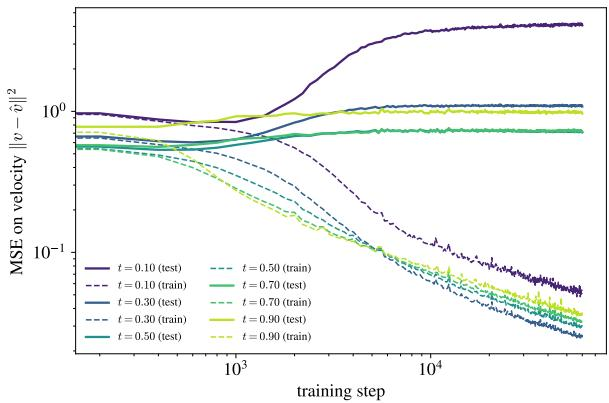

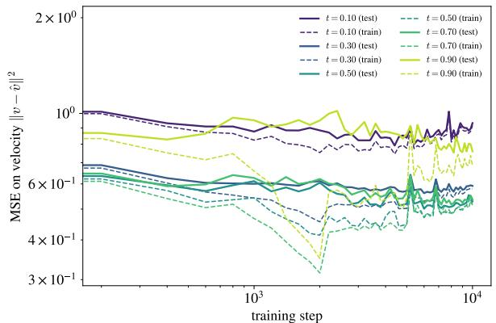  
Figure 13: Training and test losses along training for the $( L e f t )$ unregularized and $( R i g h t )$ regularized dynamics of Fig. 5.

Regularized rectified-flow training. We train the velocity network $\mathbf { v } _ { \pmb { \theta } }$ on the training set $\bigl \{ \bigl ( \mathbf { x } ^ { \nu } , \pmb { \xi } ^ { \nu \alpha } \bigr ) \bigr \}$ with a spectrum-aware Tikhonov penalty

$$
\mathcal { L } ( \pmb { \theta } ) = \frac { 1 } { n m d } \sum _ { \nu = 1 } ^ { n } \sum _ { \alpha = 1 } ^ { m } \mathbb { E } _ { s } \left\| \mathbf { v } _ { \pmb { \theta } } ( \mathbf { Y } _ { s } ^ { \nu \alpha } , s ) - ( \pmb { \xi } ^ { \nu \alpha } - \mathbf { x } ^ { \nu } ) \right\| _ { 2 } ^ { 2 } + \frac { \gamma _ { s , \tau } } { n m d ^ { 2 } } \| \pmb { \theta } \| _ { 2 } ^ { 2 } ,\tag{205}
$$

where $\mathbf { Y } _ { s } ^ { \nu \alpha } = ( 1 - s ) \mathbf { x } ^ { \nu } + s \pmb { \xi } ^ { \nu \alpha }$ , and $\gamma _ { s , \tau }$ is the regularization parameter, chosen as the n-th eigenvalue of the empirical NTK Gram matrix $\mathbf { G } _ { \tau } ( s ) \in \mathbb { R } ^ { n m \times n m }$ evaluated on the full training set at flow-matching time s. The additional $1 / d$ factor in the prefactor of the regularization converts the traced-eNTK eigenvalues we measure into those of the full NTK under the output-isotropy assumption (12). In the linearization around $\theta _ { 0 } ,$ the stationarity of Eq. (205) is equivalent to a kernel-ridge problem $( \mathbf G ( s ) + \gamma \mathbf I ) \boldsymbol \alpha = \mathbf V .$ . A regularization of amplitude $\gamma _ { s , \tau } = \lambda _ { n }$ then damps the contributions of the eigenmodes of G below the n-th. As the eNTK drifts with training time in the feature-learning regime, the parameter $\gamma _ { s , \ast }$ τ has to be tracked. At step 0 we eigendecompose $\mathbf { G } ( s )$ on the current parameters $\theta _ { 0 }$ for each s in the discrete grid of size $S ,$ and refresh every $\Delta \tau =$ 1000 training steps by repeating the same procedure on $\pmb \theta ( \tau )$ . In Fig. 13, we display the evolution of the train and test errors corresponding to the training runs of Fig. 5. Without regularization (left panel), the test loss increases sharply at large training time, together with a steep rise in memorization, whereas with the regularization (right panel) the network stays close to the configuration of optimal test loss.

## E.4 Computational resources

All experiments were run on NVIDIA H100 GPUs: a single GPU for $n < 2 0 4 8$ and four GPUs in parallel for $n \geq 2 0 4 8$ . As an example, the truncation experiment (kernel regression and generation) for $n = 2 0 4 8$ takes about 4 hours on four GPUs.

## F LLM usage

We describe here the precise role played by large language models (LLMs) in the preparation of this work.

Code. LLMs were used to write and debug parts of the code, both for the numerical experiments and for the scripts producing the figures of this paper.

Writing and presentation. LLMs were used for copy-editing throughout: correcting grammar, finding typographical errors, and harmonizing notation, style and cross-referencing across sections.

Proof assistant. LLMs were used as a proof assistant: to check derivations step by step, to look for errors in the proofs, and to write the code performing the numerical verifications of the analytical results.

Responsibility. Every LLM-assisted derivation was checked independently and thoroughly by the authors, and every suggested edit was reviewed before inclusion. The authors take full responsibility for the content, the originality and the scientific integrity of this work, including any remaining errors.