# GENMEM: GENERATIVE SYMBOLIC MEMORY FOR SELF-EVOLVING HARNESS

Xinke Jiang<sup>1,2,3,\*</sup>, Tao Feng<sup>\*</sup>, Weixuan Xu<sup>1,\*</sup>, Zhixin Zhang<sup>1,2,3</sup>, Zhibang Yang<sup>1,2,3</sup>, Wentao Zhang, Runchuan Zhu<sup>1</sup>, Xu Chu<sup>2,3,4,†</sup>, Junfeng Zhao<sup>2,3,†</sup>, Yasha Wang<sup>1,5,†</sup>

<sup>1</sup>National Engineering Research Center of Software Engineering, Peking University, Beijing, China <sup>2</sup>School of Computer Science, Peking University, Beijing, China

<sup>3</sup>Key Laboratory of High Confidence Software Technologies, Ministry of Education, Beijing, China <sup>4</sup>Center on Frontiers of Computing Studies, Peking University, Beijing, China

<sup>5</sup>Peking University Information Technology Institute (Tianjin Binhai), Tianjin, China

<sup>\*</sup>Equal contribution. <sup>†</sup>Corresponding authors. {xinkejiang, yangzb}@stu.pku.edu.cn

## ABSTRACT

Long-term memory supports the self-evolution of LLM agents by retaining experience and skills across tasks and enabling their retrieval, reuse, and revision in subsequent long-horizon decision-making. Yet existing memory management approaches remain limited to discriminative retrieval and to address the sparse, hierarchical, and highly redundant structure of reusable experience: only a small, task-dependent subset of trajectories and memories warrants retention, retrieval, or revision. Learning these operations is further complicated by sparse, delayed, and indirect task-level feedback, with weak supervision across the memory lifecycle. Moreover, continual memory evolution introduces an architectural tension as addressing invariance: stored experience is perpetually revised, yet the addressing interface consumed by learned retrieval policies must remain stable. To address, we present GENMEM, which reformulates memory management as generative symbolic addressing. Its core mechanism is the Symbolic Identifier (SID), a multi-level discrete token tuple drawn from a Cartesian-product address space that factorizes a million-scale sparse memory space using fewer than one hundred discrete symbols. Instead of generating ever-changing raw content, the memory agent learns to generate SIDs, while memory evolution rewrites the payload at a fixed address without shifting the address itself. Architecturally, GENMEM couples a MemRetriever and a MemEvolver within a multi-agent harness, trained via GRPO with dense process and outcome rewards with two-channels optimization. Under offline memory evolution, experiments spanning ALFWorld, WebShop, multi-hop QA, medical reasoning, and deep research evaluate GENMEM against strong memory-augmented baselines. Beyond accuracy, we find that SIDs exhibit emergent neuro-symbolicproperties: they can be interleaved with natural-language tokens and are compositional—combining multiple SIDs composes their stored experiences to address novel situations not covered by any single entry.

## 1 INTRODUCTION

Long-term memory enables self-evolving LLM agents to retain reusable experience and skills across tasks, supporting long-horizon decision-making (Wang et al., 2023; Hong et al., 2023; Zhang et al., 2026c). Unlike encyclopedic knowledge, such experience-centric memory is action-oriented, contextconditioned, and continuously evolving (Zhang et al., 2024). The central question therefore shifts from which memory most resembles a query to which experience best advances the agent’s current strategy—a question that must remain answerable even as the experiences themselves evolve. Despite promising progress (Zheng et al., 2026; Zhang et al., 2025; 2026b), existing memory-augmented agents (Chhikara et al., 2025; Xu et al., 2025) remain largely anchored to a dense retrieval paradigm:

they access experience through discriminative scoring, with learned addressing coupled to content representations. Despite these advances, two fundamental challenges remain:

❶ Sparsity Challenge. Experience is highly redundant: across the memory lifecycle (acquisition, organization, retrieval, and evolution), only a small fraction carries reusable value; only a narrow region is relevant to any given query; and refinement is concentrated on repeatedly exercised entries. The experiences that generalize tend to cluster around shared sub-skills—for instance, distinct web-navigation tasks may all reuse a “search-then-filter” routine—yet flat dense stores do not explicitly encode this structure, treating entries uniformly and diluting key associations as the bank grows (Zhang et al., 2024). Appendix B.1 details these sparsity dimensions. Supervision compounds the problem: an experience’s utility emerges only through delayed, indirect task outcomes, so reliance on sparse terminal rewards (Zhang et al., 2026b; Ma et al., 2026) makes it difficult to assign supervision to individual memory operations.

❷ Address Variance Challenge. A deeper architectural tension arises when experience continuously evolves (Figure 1): the content at an address changes, but the address itself must remain stable. A self-evolving agent refines SOPs, merges redundant skills, and discards outdated procedures—yet the memory system must remain reliably addressable throughout. When retrieval relies on representations derived from current memory content, each revision can silently change which queries reach an entry, even when the entry still serves the same functional role (Appendix B.2). We term the requirement to preserve an entry’s address across such revisions addressing invariance. Satisfying it demands decoupling where from what:

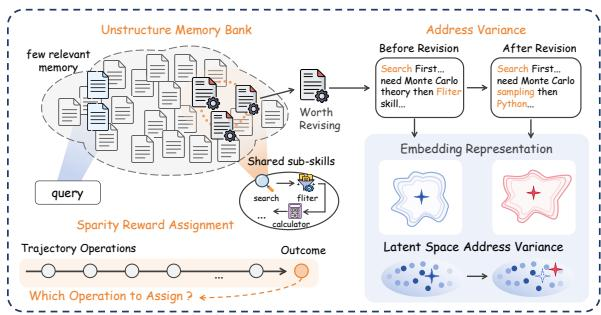  
Figure 1: Two challenges in evolving experience memory. Left: Reusable experience is sparse and organized around shared sub-skills, while delayed task rewards hinder credit assignment. Right: Content updates can shift embedding-based retrieval, motivating stable addresses that remain invariant as experience evolves.

stable discrete coordinates identify functional regions of experience space, while text behind those coordinates remains freely editable. This decoupling reframes what agent should learn: not particular content versions that become outdated with each revision, but a persistent mapping from a problem to functional role of required experience.

Our key motivation draws on a recurring principle: structured and sparse architectures exploit hidden regularities in high-dimensional spaces—LoRA through low-rank updates, MoE through sparse activation, and Engram through conditional knowledge storage (Hu et al., 2022; Fedus et al., 2022; Cheng et al., 2026). Analogously, reusable experience concentrates in sparse, hierarchically structured regions amid substantial redundancy, motivating selective addressing that remains stable as content evolves. We therefore propose GENMEM, a generative symbolic memory framework that unifies memory access and update targeting through Symbolic Identifier (SID) generation. Each SID is a hierarchical discrete token tuple encoding mutually orthogonal categorical axes (e.g., task domain, tool modality, and strategy pattern), decomposing the vast experience space within a Cartesian-product address space. Constructed offline via context-aware RQ-KMeans, SIDs organize functionally proximate experiences through shared prefixes (Lee et al., 2022; Rajput et al., 2023). The memory agent generates target SIDs from its current context for selective access, while online revisions update payloads in place, preserving existing SID assignments under fixed codebooks.

Concretely, GENMEM couples two memory agents in a closed loop: MemRetriever generates a SID and rewrites the retrieved experience into task-adaptive support; 1. a multi-agent harness executes the task using this support; and MemEvolver distills the resulting trajectory and generates an update SID for insertion or revision. The pipeline comprises alignment pretraining, mid-training, GRPO post-training, and online self-evolution. The first two stages teach SID generation and its integration with reasoning; GRPO combines process and outcome rewards with two-channels optimization, providing fine-grained supervision beyond sparse terminal feedback. During online self-evolution, the agents continue refining memory through the same stable SID interface with model parameters and codebooks fixed. Our contributions are fourfold:

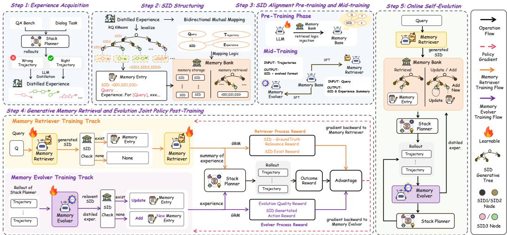  
Figure 2: Overview of GENMEM.

• We propose GENMEM, the first generative symbolic addressing framework for evolving experience memory, unifying memory retrieval and evolution through SID generation over a sparse, hierarchically structured space (Section 2).

• We instantiate this framework as a closed-loop system coupling MemRetriever, a multi-agent harness, and MemEvolver, with staged training using process and outcome rewards with twochannel optimization to support online memory evolution (Sections 2–3).

• Experiments across embodied planning, web navigation, search-augmented QA, medical reasoning and deep research evaluate GENMEM against strong memory-agent baselines (Section 4).

• We identify an emergent neuro-symbolic property that SIDs can be manipulated like natural language and exhibit compositionality that combining multiple SIDs enabling agent to address novel situations not covered by any individual memory entry (Section 5).

## 2 GENMEM: SYMBOLIC MEMORY ADDRESSING SYSTEM

GENMEM unifies memory retrieval and evolution through a shared symbolic address space, enabling selective access to structured experience while preserving stable addresses under content updates.

❶ Memory Symbolic Identifier Definition. Let $\mathcal { M } = \{ \mathbf { m } _ { i } \} _ { i = 1 } ^ { \mathrm { N } }$ denote the external memory bank, where each entry $\mathbf { m } _ { i } = ( \mathbf { x } _ { i } , \mathbf { z } _ { i } )$ pairs a textual experience payload $\mathbf { x } _ { i }$ with a Symbolic Identifier (SID) as $\mathbf { z } _ { i }$ . We define each SID as a tuple of L discrete symbols as:

$$
\begin{array} { r } { \mathbf { z } _ { i } = ( \mathbf { s } _ { i } ^ { 1 } , \ldots , \mathbf { s } _ { i } ^ { L } ) \in \mathcal { Z } , \quad \mathcal { Z } = [ \mathbf { N } _ { 1 } ] \times \cdots \times [ \mathbf { N } _ { L } ] , \quad \mathbf { s } _ { i } ^ { \ell } \in [ \mathbf { N } _ { \ell } ] , } \end{array}\tag{1}
$$

where $[ \mathbf { N } _ { \ell } ] = \{ 1 , \dots , \mathbf { N } _ { \ell } \}$ indexes the symbols at level ℓ. Given a context c, a symbolic addressing policy generates $\mathbf { z } = \mathbf { A D D R } _ { \theta } ( \mathbf { c } )$ , and lookup returns the associated payload $\mathbf { x } \doteq \mathbf { L o o K U P } ( \mathcal { M } , \mathbf { z } )$ The context c may be a query, a trajectory, or a newly distilled experience, allowing the same address space to support retrieval and update targeting.

In GENMEM, SIDs represent $\Pi _ { \ell = 1 } ^ { L } \mathbf { N } _ { \ell }$ possible addresses using $\sum _ { \ell = 1 } ^ { L } \mathbf { N } _ { \ell }$ level-specific symbols, with shared prefixes organizing experience hierarchically for selective access. Crucially, a SID identifies a memory slot rather than a particular content version: online revisions transform $\left( \mathbf { x } _ { i } , \mathbf { z } _ { i } \right) \xrightarrow { E \nu o l \nu e } \left( \mathbf { x } _ { i } ^ { \prime } , \mathbf { z } _ { i } \right)$ , allowing experience to evolve while its address remains stable.

❷ Experience Acquisition and SID Construction. We construct the initial memory bank through a gradient-free cold start. Across datasets spanning diverse task domains, the multi-agent harness StackPlanner (Zhang et al., 2026a) generates multiple trajectories for each training query. An LLM extractor compares correct, failed, and unverified attempts using available reference answers or environment feedback. It distils reusable procedures and failure lessons while preserving uncertainty where the traces lack evidence. The resulting summaries form the seed set $\mathcal { X } _ { \mathrm { s e e d } }$ (Appendix D.1).

To obtain discrete addresses that the memory agents can generate, we quantize continuous experience representations into SID sequences. First, we encode each summary $\mathbf { x } _ { i }$ via a frozen text encoder:

$$
\begin{array} { r } { \mathbf { e } _ { i } = f _ { \mathrm { e n c } } ( p _ { \mathrm { e n c } } \oplus \mathbf { x } _ { i } ) \in \mathbb { R } ^ { d } , } \end{array}\tag{2}
$$

where the prefix $p _ { \mathrm { e n c } }$ emphasizes reusable strategies, applicability conditions, and procedures. This semantic embedding $\mathbf { e } _ { i }$ encourages the resulting addresses to reflect shared problem-solving patterns rather than surface-level textual similarity.

We then construct the discrete address space by fitting RQ-KMeans to the seed embeddings (Deng et al., 2025): At the first level, K-means clusters the embeddings into ${ \bf N } _ { 1 }$ groups; the resulting cluster centers form the first codebook. Each embedding is assigned to its nearest center, whose index becomes the first SID symbol. We then subtract this center from the embedding and fit the next codebook to the remaining residuals. Repeating this procedure yields $L$ codebooks, with successive levels capturing information not represented by earlier ones. Formally, let $\mathcal { C } ^ { ( \ell ) } = \{ \mathbf { c } _ { j } ^ { ( \ell ) } \} _ { j = 1 } ^ { N _ { \ell } }$ denote the resulting cluster centers at level ℓ. Starting from $\mathbf { r } _ { i } ^ { ( 1 ) } = \mathbf { e } _ { i } .$ , the Euclidean form of code assignment and residual updating is

$$
\begin{array} { r } { \mathbf { s } _ { i } ^ { \ell } = \underset { j \in [ \mathbf { N } _ { \ell } ] } { \arg \operatorname* { m i n } } \big \| \mathbf { r } _ { i } ^ { ( \ell ) } - \mathbf { c } _ { j } ^ { ( \ell ) } \big \| _ { 2 } ^ { 2 } , \quad \mathbf { r } _ { i } ^ { ( \ell + 1 ) } = \mathbf { r } _ { i } ^ { ( \ell ) } - \mathbf { c } _ { \mathbf { s } _ { i } ^ { \ell } } ^ { ( \ell ) } , \quad \ell = 1 , \ldots , L . } \end{array}\tag{3}
$$

The sequence of selected center indices $\mathbf z _ { i } = ( \mathbf s _ { i } ^ { 1 } , \ldots , \mathbf s _ { i } ^ { L } )$ forms the SID. Shared prefixes group experiences with common quantized representations, while later symbols provide finer distinctions. This yields structured addresses without requiring a separate symbol for every memory entry. In GENMEM, we use codebook sizes (48, 16, 8, 8), yielding 49,152 possible addresses from 80 tokens, and summarize multiple experience texts assigned to the same SID into a single memory entry. The codebooks are fixed after construction. Appendix C.1 reports the codebook comparisons and the three-level prefix-prompt experiment, distinguishing these settings from Euclidean formulation above.

❸ Generative Memory Retrieval and Evolution. Given the SID-indexed bank M, MemRetriever and MemEvolver implement generative read–write operations around StackPlanner (Figure 2).

• Memory Retrieval. MemRetriever generates an address $\mathbf { z } _ { r }$ from the query and reasoning context, retrieves the associated experience, and rewrites it into task-adaptive support $\tilde { \mathbf { x } } _ { r }$

• Memory Execution. StackPlanner executes the task using this support, producing an answer $\hat { y }$ and an execution trajectory $\tau .$

• Memory Evolution. MemEvolver distils the trajectory, generates an update address $\mathbf { z } _ { e } ,$ , and consults the associated entry to determine an operation o and updated payload $\tilde { \mathbf { x } } _ { e }$

For a query $q ,$ the closed memory loop comprises three steps:

$$
\begin{array} { r l } { R e t r i e \nu e : } & { ( \mathbf { z } _ { r } , \tilde { \mathbf { x } } _ { r } ) = \mathbf { M E M R E T R I E V E R } ( q , \mathcal { M } ) , } \\ { E x e c u t e : } & { ( \hat { y } , \tau ) = \mathbf { S T A C K P L A N E R } ( q , \tilde { \mathbf { x } } _ { r } ) , } \\ { E \nu o l \nu e : } & { \mathcal { M } ^ { \prime } = \mathbf { U P D A T E } \left( \mathcal { M } ; \mathbf { M E M E V O L V E R } ( \tau , \mathcal { M } ) \right) . } \end{array}\tag{4}
$$

Here, MemEvolver returns an update tuple $\left( o , \mathbf { z } _ { e } , \tilde { \mathbf { x } } _ { e } \right)$ , specifying the operation, target SID, and updated payload. The operation $o \in \{ \mathrm { i n s e r t } , \tt r e v i s e  \}$ either adds a new entry or updates an existing one. Revision supports retention, consolidation, and deletion through unchanged, merged, or empty payloads, respectively.

## 3 MEMORY POLICY OPTIMIZATION AND SELF-EVOLUTION

Building on the symbolic addressing system, we develop MemRetriever and MemEvolver through four stages: SID alignment pretraining, memory-operation mid-training, joint policy optimization, and online self-evolution. The first three stages teach the agents to generate, use, and update symbolic memory; the final stage applies these learned policies to continually evolve the memory bank.

❶ SID Alignment Pretraining. We first align task contexts and experience content with the constructed SID space through five text–SID mappings. The forward mappings $q \mapsto \mathbf { z } , \tau \mapsto \mathbf { z } ,$ and x 7→ z teach address generation, while the reverse mappings $\mathbf z \mapsto \mathbf x$ and z 7→ d associate SIDs with experience content and natural-language semantic descriptions d, respectively. For an input context c and target SID $\mathbf { z } = ( s ^ { 1 } , \ldots , s ^ { L } )$ , the forward loss and combined alignment objective are

$$
\mathcal { L } _ { \mathrm { S I D } } ( \mathbf { c } , \mathbf { z } ) = - \sum _ { \ell = 1 } ^ { L } \log p _ { \boldsymbol { \theta } } \big ( s ^ { \ell } \mid \mathbf { c } , s ^ { 1 : \ell - 1 } \big ) , \quad \mathbf { c } \in \{ q , \tau , \mathbf { x } \} ,\tag{5}
$$

$$
\begin{array} { r } { \mathcal { L } _ { \mathrm { p r e } } = \lambda _ { q } \mathcal { L } _ { q  \mathbf { z } } + \lambda _ { \tau } \mathcal { L } _ { \tau  \mathbf { z } } + \lambda _ { x } \mathcal { L } _ { \mathbf { x }  \mathbf { z } } + \lambda _ { \mathbf { z }  \mathbf { x } } \mathcal { L } _ { \mathbf { z }  \mathbf { x } } + \lambda _ { \mathbf { z }  \mathbf { d } } \mathcal { L } _ { \mathbf { z }  \mathbf { d } } , } \end{array}\tag{6}
$$

where the coefficients weight the contributions of the respective mappings specified in Appendix B.5. This stage establishes bidirectional associations between symbolic addresses and experience, providing the pretrained checkpoints for subsequent MemRetriever and MemEvolver training.

❷ Memory-Operation Mid-Training. SID alignment establishes associations between symbolic addresses and experience, but effective memory use requires the model to incorporate these addresses into reasoning and action. We therefore construct ReAct-style trajectories to train MemRetriever and MemEvolver separately from the pretrained checkpoints, teaching each policy to reason about memory, invoke SID-based operations, and use the returned experience. Specifically,

• For MemRetriever, role-specific prompts guide it to reason about the current task, generate a retrieval SID, inspect the retrieved experience, and rewrite it into task-adaptive support.

• For MemEvolver, the prompts guide the model to analyze an execution trajectory, identify transferable lessons, generate an update SID, and revise addressed experience or propose a new entry.

We apply rejection sampling to retain trajectories that satisfy interaction format and task-correctness criteria. Then we apply a stronger teacher model to provide distillation targets for the reasoning traces and role-specific outputs: experience rewriting for MemRetriever and experience evolution for MemEvolver. Using a standard next-token objective, we fine-tune each policy on the resulting demonstrations, turning isolated SID prediction into executable memory read–write behavior.

❸ Joint Policy Post-Training. To align memory operations with downstream objectives and alleviate sparse feedback, we jointly optimize MemRetriever and MemEvolver from their mid-trained initialization. For both agents, the process reward evaluates SID accuracy and the strategic quality of generated experience. The outcome reward supplies their rewritten or evolved experience to StackPlanner and measures downstream task performance:

• Process reward. We evaluate memory operations through

$$
R _ { \mathrm { p r o c e s s } } = R _ { \mathrm { f o r m a t } } + R _ { \mathrm { s t r a t e g y } } + R _ { \mathrm { S I D } } ,\tag{7}
$$

where $R _ { \mathrm { f o r m a t } }$ checks SID validity, R<sub>SID</sub> rewards code-level agreement with the ground-truth SID, and $R _ { \mathrm { s t r a t e g y } }$ uses the backbone as an LLM judge with privileged access to $y ^ { \star }$ to assess the strategic usefulness of the rewritten or evolved experience.

• Outcome reward. We compare StackPlanner’s answers with and without memory support through a contrastive reward setting:

$$
R _ { \mathrm { o u t } } = r _ { \mathrm { t a s k } } \bigl ( \hat { y } _ { \mathrm { m e m } } , y ^ { \star } \bigr ) - r _ { \mathrm { t a s k } } \bigl ( \hat { y } _ { \mathrm { n o \ - m e m } } , y ^ { \star } \bigr ) + \alpha _ { \mathrm { p a r t i a l } } \mathbb { I } [ \mathrm { b o t h \ a n s w e r s \ a r e \ c o r r e c t } ] ,\tag{8}
$$

where $\alpha _ { \mathrm { p a r t i a l } } > 0$ provides a partial-credit bonus only when both executions succeed.

For optimization, we adopt GRPO (Shao et al., 2024), sampling G outputs $\{ u _ { i } \} _ { i = 1 } ^ { G }$ per context and normalizing advantages separately for the proxy and audit channels. For either channel, we minimize

$$
\mathcal { L } _ { \mathrm { G R P O } } = - \mathbb { E } \left[ \frac { 1 } { G } \sum _ { i = 1 } ^ { G } \frac { 1 } { | u _ { i } | } \sum _ { t = 1 } ^ { | u _ { i } | } \Bigl ( \operatorname* { m i n } \bigl ( \rho _ { i , t } \hat { A } _ { i } , \mathrm { c l i p } ( \rho _ { i , t } , 1 - \epsilon , 1 + \epsilon ) \hat { A } _ { i } \bigr ) - \beta D _ { \mathrm { K L } } ^ { i , t } \Bigr ) \right] ,\tag{9}
$$

where $\rho _ { i , t }$ is the token-level importance ratio relative to the rollout policy, ${ \hat { A } } _ { i }$ is the group-normalized reward from $R _ { \mathrm { o u t } } + R _ { \mathrm { p r o c e s s } } { } _ { \mathrm { . } }$ , and $D _ { \mathrm { K I } } ^ { i , t }$ penalizes divergence from the reference policy. Reward components and implementation details to verify are discussed in Appendix C.3–C.3.3.

❹ Online Memory Self-Evolution. After training, model parameters, encoder, and SID codebooks are frozen. The three modules form a closed loop on a stream of new queries: MemRetriever generates a SID and fetches task-adaptive support, StackPlanner executes, and MemEvolver generates an update address and distils the trajectory into an updated payload. An insert populates an unoccupied SID slot, whereas a revise updates an existing entry. In both cases, the target SID is generated by MemEvolver, not recomputed by encoding and quantizing the updated payload. We run this loop for T steps until the memory bank converges. Adaptation proceeds entirely through external memory: payloads are added or revised within the fixed SID space, requiring neither gradient updates nor reassignment of existing addresses. The update rule and design rationale are provided in Appendices C.2 and C.4, respectively.

## 4 EXPERIMENTS

We evaluate GENMEM through two research questions: (RQ1) Does GENMEM improve downstream task performance compared with existing memory-augmented and RL-based methods? (RQ2) Can online memory evolution improve performance over time while maintaining stable SID addressing?

## 4.1 EXPERIMENTAL SETUP

❶ Datasets and Metrics. We evaluate GENMEM on interactive decision-making and searchaugmented question answering. A separate GPQA experiment examines the contribution of symbolic SID information (Section 5).

• ALFWorld (Shridhar et al., 2021): a household environment that evaluates sequential decisionmaking under natural-language instructions across Pick, Look, Clean, Heat, Cool, and Pick2 tasks. For ALFWorld, we report per-subtask and overall success rates (%).

• WebShop (Yao et al., 2022): a simulated e-commerce environment in which agents search for, inspect, and purchase products that satisfy user-specified requirements. For WebShop, we report task score and success rate (%).

• Search-augmented QA: following SkillRL (Xia et al., 2026), we evaluate on six questionanswering benchmarks, using 2WikiMultiHopQA and HotpotQA for in-domain evaluation and Bamboogle, MuSiQue, NQ, and TriviaQA for out-of-domain evaluation. For search-augmented QA, we report F1 (%).

• Deep Research, Code, and SQL: we further evaluate whether experience acquired in the source domains transfers to out-of-domain tasks involving long-horizon information seeking over web and document sources, code generation, and SQL query generation; see Appendix E.1.

Results for ALFWorld and WebShop are in Table 1, and search-augmented QA results in Table 2.   
Benchmark coverage, comparison settings, and metric definitions are in Appendix E.1–E.2.

❷ Baselines. We compare against the methods that appear in the two main result tables:

• Closed-source LLMs: GPT-4o and Gemini-2.5-Pro, representing frontier proprietary capabilities.

• Prompt-based agentic / memory methods: ReAct (Yao et al., 2023), Reflexion (Shinn et al., 2023), Mem0 (Chhikara et al., 2025), MemP (Fang et al., 2025), ExpeL (Zhao et al., 2024), SimpleMem (Liu et al., 2026), IRCOT (Trivedi et al., 2023), and TCRAG (Jiang et al., 2025).

• RL-based methods: RLOO (Ahmadian et al., 2024) and GRPO (Shao et al., 2024) for the embodied and web-task experiments; ReSearch (Chen et al., 2025a), Search-R1 (Jin et al., 2025), AEPO (Dong et al., 2025a), ARPO (Dong et al., 2025b), MEM1 (Zhou et al., 2025), ZeroSearch (Sun et al., 2025), and AgenticRAG-R1 (Jiang et al., 2026a) for search-augmented QA.

• Memory-augmented RL methods: MemRL (Zhang et al., 2026b), EvolveR (Wu et al., 2025), Mem0+GRPO (Chhikara et al., 2025), SimpleMem+GRPO (Liu et al., 2026), SkillRL (Xia et al., 2026), SkillGraph (Li et al., 2026), AgentOCR (Feng et al., 2026), and Skill0 (Lu et al., 2026b), representing the current state of the art included in our comparison tables.

• Skill-based Search methods: EvolveR, SkillRL, SkillGraph, AgentOCR, Skill0, Skill-SD (Wang et al., 2026b), SAPO (Zhang et al., 2026d), and SDAR (Lu et al., 2026a) for search-augmented QA.

❸ Implementation and Training. StackPlanner, MemRetriever, and MemEvolver all use Qwen2.5- 7B-Instruct (Bai et al., 2023) as the backbone LLM. We construct four SID codebooks using context aware RQ-KMeans with sizes (48, 16, 8, 8), yielding 49,152 possible leaf addresses. The memory modules undergo SID alignment pretraining for 17,465 steps with a batch size of 48, followed by supervised mid-training on ReAct-style CoT traces for 157 steps with an effective batch size of

Table 1: Main results on ALFWorld and WebShop. ALFWorld reports per-subtask and overall success rates (%); WebShop reports task score and success rate (%).
<table><tr><td></td><td colspan="6">ALFWorld Success Rate (%)</td><td colspan="2">WebShop</td></tr><tr><td>Method</td><td>Pick</td><td>Look</td><td>Clean</td><td>Heat</td><td>Cool Pick2</td><td></td><td>Score</td><td>Succ.</td></tr><tr><td colspan="9">Closed-source LLMs (absolute scores)</td></tr><tr><td>GPT-40</td><td>75.3</td><td>60.8</td><td>31.2</td><td>56.7</td><td>21.6</td><td>49.8</td><td>31.8</td><td>23.7</td></tr><tr><td> $\mathrm { G e m i n i } { - 2 . 5 – P r o }$ </td><td>92.8</td><td>63.3 62.1</td><td>69.0</td><td>26.6</td><td>58.7</td><td>60.3</td><td>42.5</td><td>35.9</td></tr><tr><td colspan="9">Prompt-based Agentic or Memory-based Methods (∆ vs. ReAct)</td></tr><tr><td>ReAct</td><td> $4 8 . 5 \Delta 0 . 0$ </td><td> $3 5 . 4 \Delta 0 . 0$ </td><td> $3 4 . 3 \triangle 0 . 0$ </td><td> $1 3 . 2 \triangle 0 . 0 \triangle$ </td><td> $1 8 . 2 \triangle 0 . 0$ </td><td> $1 7 . 6 \triangle 0 . 0$ </td><td> $3 1 . 2 \triangle 0 . 0$ </td><td> $4 6 . 2 \triangle 0 . 0$   $1 9 . 5 \Delta 0 . 0$ </td></tr><tr><td>Reflexion</td><td> $6 2 . 0 \Delta + 1 3 . 5$ </td><td> $4 1 . 6 \triangle + 6 . 2$ </td><td> $4 4 . 9 \triangle \substack { + 1 0 . 6 }$ </td><td> $3 0 . 9 \triangle + 1 7 . 7$ </td><td> $3 6 . 3 \triangle + 1 8 . 1$   $2 3 . 8 \triangle + 6 . 2$ </td><td> $4 2 . 7 \triangle + 1 1 . 5$ </td><td> $5 8 . 1 \Delta \substack { + 1 1 . 9 }$ </td><td> $2 8 . 8 \triangle _ { + 9 . 3 }$ </td></tr><tr><td>Mem0</td><td> $5 4 . 0 \Delta \phi . 5 .$ </td><td> $5 5 . 0 \triangle _ { } + 1 9 . 6 \triangle _ { }$ </td><td> $2 6 . 9 \Delta . 7 . 4$ </td><td> $3 6 . 4 \Delta \substack { + 2 3 . 2 }$ </td><td> $2 0 . 8 \triangle + 2 . 6$ </td><td> $7 . 6 9 \Delta \cdot 9 . 9$   $3 3 . 6 \triangle + 2 . 4$ </td><td> $2 3 . 9 \triangle . 2 2 . 3$ </td><td> $2 . 0 0 \triangle _ { - 1 7 . 5 }$ </td></tr><tr><td>MemP</td><td> $5 4 . 3 \triangle + 5 . 8 $ </td><td> $3 8 . 5 \triangle + 3 . 1$ </td><td> $4 8 . 1 \triangle + 1 3 . 8$ </td><td> $5 6 . 2 \Delta \substack { + 4 3 . 0 }$ </td><td> $3 2 . 0 \triangle + 1 3 . 8 $ </td><td> $1 6 . 7 \Delta \cdot 0 . 9$   $4 1 . 4 \triangle + 1 0 . 2 \triangle$ </td><td> $2 5 . 3 \triangle . 2 0 . 9$ </td><td> $6 . 4 0 \triangle \triangle . 1 3 . 1$ </td></tr><tr><td>ExpeL</td><td> $2 1 . 0 \Delta . 2 7 . 5$ </td><td> $6 7 . 0 \triangle + 3 1 . 6$ </td><td> $5 5 . 0 \Delta _ { + 2 0 . 7 }$ </td><td> $5 2 . 0 \Delta + 3 8 . 8 $ </td><td> $1 1 . 0 \Delta . 7 . 2$ </td><td> $6 . 0 0 \triangle . 1 1 . 6$ </td><td> $4 6 . 3 \triangle + 1 5 . 1$   $3 0 . 9 \triangle . 1 5 . 3$ </td><td> $1 1 . 2 \triangle . 8 . 3$ </td></tr><tr><td>SimpleMem GENMEM</td><td> $6 4 . 5 \triangle + 1 6 . 0$ </td><td> $3 3 . 3 \Delta \cdot 2 . 1$ </td><td> $2 0 . 0 \triangle . 1 4 . 3$ </td><td> $1 2 . 5 \Delta . 0 . 7 $ </td><td> $3 3 . 3 \triangle + 1 5 . 1$ </td><td> $3 . 8 4 \triangle . 1 3 . 8 \triangle$ </td><td> $2 9 . 7 \triangle _ { - 1 . 5 }$   $3 3 . 2 \triangle . 1 3 . 0$ </td><td> $8 . 5 9 \triangle . 1 0 . 9$ </td></tr><tr><td colspan="9"> $9 1 . 7 \Delta + 4 3 . 2$   $8 3 . 3 \triangle + 4 7 . 9$   $7 1 . 0 \Delta + 3 6 . 7$ </td></tr><tr><td></td><td></td><td></td><td>RL-based Methods (∆ vs. MemRL)</td><td></td><td></td><td></td><td></td><td></td></tr><tr><td>RLOO GRPO</td><td> $8 7 . 6 \triangle + 2 4 . 8 $   $9 0 . 8 \Delta + 2 8 . 0$ </td><td> $7 8 . 2 \Delta + 3 9 . 7$   $6 6 . 1 \Delta \substack { + 2 7 . 6 }$ </td><td> $8 7 . 3 \triangle + 6 5 . 1$   $8 9 . 3 \triangle + 6 7 . 1$ </td><td> $8 1 . 3 \triangle + 6 8 . 8$   $7 4 . 7 \Delta + 6 2 . 2$ </td><td> $7 1 . 9 \Delta + 6 3 . 9$   $7 2 . 5 \triangle + 6 4 . 5$ </td><td> $4 8 . 9 \triangle + 4 8 . 9$   $7 5 . 5 \triangle + 5 4 . 1$   $6 4 . 7 \Delta + 6 4 . 7$   $7 7 . 6 \Delta + 5 6 . 2$ </td><td> $8 0 . 3 \triangle + 5 0 . 8 $   $7 9 . 3 \triangle + 4 9 . 8$ </td><td> $6 5 . 7 \Delta \cdot 5 6 . 5$   $6 6 . 1 \Delta \substack { + 5 6 . 9 }$ </td></tr><tr><td colspan="9">Memory-Augmented RL-based Methods (∆ vs. MemRL)</td></tr><tr><td></td><td> $6 2 . 8 \Delta 0 . 0$ </td><td> $3 8 . 5 \Delta 0 . 0$ </td><td> $2 2 . 2 \Delta 0 . 0$ </td><td> $1 2 . 5 \Delta 0 . 0$ </td><td> $8 . 0 0 \triangle 0 . 0 . 0 $   $0 . 0 0 \Delta 0 . 0 0$ </td><td> $2 1 . 4 \Delta 0 . 0$ </td><td> $2 9 . 5 \Delta 0 . 0$ </td><td> $9 . 2 \triangle 0 . 0$ </td></tr><tr><td>MemRL EvolveR</td><td> $6 4 . 9 \triangle + 2 . 1$ </td><td> $3 3 . 3 \Delta . 5 . 2$ </td><td> $4 6 . 4 \Delta + 2 4 . 2$ </td><td> $1 3 . 3 \triangle + 0 . 8$ </td><td> $3 3 . 3 \triangle + 2 5 . 3$ </td><td> $3 3 . 3 \triangle + 3 3 . 3 \triangle$ </td><td> $4 3 . 8 \triangle + 2 2 . 4$   $4 2 . 5 \triangle + 1 3 . 0$ </td><td> $1 7 . 6 \Delta + 8 . 4$ </td></tr><tr><td>Mem0+GRPO</td><td> $7 8 . 1 \Delta + 1 5 . 3$ </td><td> $5 4 . 8 \Delta \substack { - 1 6 . 3 }$ </td><td> $5 6 . 1 \Delta \substack { + 3 3 . 9 }$ </td><td> $3 1 . 0 \triangle + 1 8 . 5 $ </td><td> $6 5 . 0 \Delta \Delta + 5 7 . 0$ </td><td> $2 6 . 9 \Delta \substack { + 2 6 . 9 }$   $5 4 . 7 \Delta \substack { + 3 3 . 3 }$ </td><td> $5 8 . 1 \Delta \substack { + 2 8 . 6 }$ </td><td> $3 7 . 5 \Delta + 2 8 . 3 $ </td></tr><tr><td>SimpleMem+GRPO</td><td> $8 9 . 5 \triangle + 2 6 . 7 $ </td><td> $6 3 . 6 \Delta \phi 2 5 . 1$ </td><td> $6 0 . 0 \Delta + 3 7 . 8$ </td><td> $5 0 . 0 \Delta _ { + 3 7 . 5 }$ </td><td> $6 4 . 9 \Delta \omega 4 5 6 . 9$ </td><td> $2 6 . 3 \triangle + 2 6 . 3$ </td><td> $6 2 . 5 \triangle + 4 1 . 1$   $6 7 . 8 \triangle + 3 8 . 3$ </td><td> $4 6 . 9 \triangle + 3 7 . 7$ </td></tr><tr><td>SkillRL</td><td> $\underline { { 9 7 . 9 \Delta } } + 3 5 . 1$ </td><td> $7 1 . 4 \Delta + 3 2 . 9$ </td><td> $9 0 . 0 \Delta + 6 7 . 8$ </td><td> $\mathbf { 9 0 . 0 } \Delta _ { + 7 7 . 5 }$ </td><td> $9 5 . 5 \triangle + 8 7 . 5$ </td><td> $\underline { { 8 7 . 5 } } \Delta + 8 7 . 5$ </td><td> $\underline { { 8 9 . 9 } } \Delta + 6 8 . 5$   $8 5 . 2 \Delta + 5 5 . 7$ </td><td> $\underline { { 7 2 . 7 } } \Delta + 6 3 . 5$ </td></tr><tr><td>AgentOCR</td><td> $9 5 . 6 \triangle + 3 2 . 8 $ </td><td> $9 6 . 2 \Delta + 5 7 . 7$ </td><td> $7 8 . 1 \Delta + 5 5 . 9$ </td><td> $7 3 . 2 \Delta + 6 0 . 7$ </td><td> $7 2 . 4 \Delta + 6 4 . 4$ </td><td> $7 2 . 0 \Delta + 7 2 . 0$   $8 1 . 2 \triangle + 5 9 . 8$ </td><td> $7 8 . 6 \Delta + 4 9 . 1$ </td><td> $5 9 . 3 \triangle + 5 0 . 1 $ </td></tr><tr><td>Skill0</td><td> ${ \bf 1 0 0 . 0 } \Delta _ { + 3 7 . 2 }$ </td><td> $8 5 . 8 \Delta + 4 7 . 3$ </td><td> $9 4 . 6 \Delta + 7 2 . 4$ </td><td> $8 1 . 9 \triangle _ { + 6 9 . 4 }$ </td><td> $8 5 . 7 \Delta + 7 7 . 7$ </td><td> $8 0 . 1 \triangle + 8 0 . 1$ </td><td> $8 9 . 8 \triangle + 6 8 . 4 $   $8 5 . 3 \Delta + 5 5 . 8$ </td><td> $7 1 . 9 \Delta + 6 2 . 7$ </td></tr><tr><td>GENMEM (RL)</td><td> $9 5 . 8 \triangle + 3 3 . 0$ </td><td> $\mathbf { 1 0 0 } \Delta \substack { + 6 1 . 5 }$ </td><td> $9 6 . 8 \triangle + 7 4 . 6$ </td><td> $\underline { { 8 8 . 7 } } \Delta + 7 6 . 2$ </td><td> $\underline { { 9 0 . 5 } } \Delta + 8 2 . 5$ </td><td> $\mathbf { 8 8 . 2 } \Delta \substack { + 8 8 . 2 }$ </td><td> $\mathbf { 9 3 . 6 } \Delta \substack { + 7 2 . 2 }$   $\mathbf { 9 0 . 8 } \Delta \substack { + 6 1 . 3 }$ </td><td> $\mathbf { 8 2 . 8 } \Delta \substack { + 7 3 . 6 }$ </td></tr></table>

32. Both stages use cross-entropy loss and AdamW with cosine learning-rate decay, with initial learning rates of $1 \times 1 0 ^ { - 5 }$ and $2 \times 1 0 ^ { - 6 }$ , respectively. We then jointly optimize MemRetriever and MemEvolver with GRPO for 130 steps. For StackPlanner, we train the policy model by adopting Harness-RL (Jiang et al., 2026b) to train the planning policy with GRPO in a blackbox-Harness manner. Memory-module training uses eight NVIDIA A100 80GB GPUs with DeepSpeed ZeRO-3, and rollouts are generated using vLLM. Further training details are provided in the appendix, including oracle-assisted StackPlanner diagnostics in Appendix G.3.

## 4.2 MAIN RESULTS (RQ1)

❶ Experience Retrieval. Table 4 shows that GENMEM achieves the highest candidate and final Top-1/Top-5 hit rates. Under the same candidate budget and BGE reranking protocol, its final Top-5 hit rate reaches 13.15%, compared with 10.28% for SkillRouter, 12.52% for TF-IDF, and 2.89% for Qwen3-Embedding-0.6B. These results highlight the limitations of similarity-based skill retrieval: useful experience must match a task’s strategic needs, which textual similarity alone may not capture. The gains over SkillRouter further support the effect of generative addressing, suggesting that SID alignment enables GENMEM to strategically relevant experience.

❷ Downstream Task Performance. Tables 1 and 2 show that GENMEM improves task performance on ALFWorld, WebShop, and search-augmented QA both before and after Harness-RL training of StackPlanner. Compared with the corresponding memory-free baselines, GENMEM yields average gains of 17.0 and 15.3 percentage points before and after training, respectively. It also outperforms memory-augmented baselines, exceeding SDAR, the second-best method, by 3.7 percentage points on average token F1. These improvements suggest that the retrieved experience provides useful support for downstream task execution and complements the gains from planning-policy optimization. Generalization to unseen domains and harness: Table 3 applies GENMEM to four benchmarks and three agent harnesses. Cross-benchmark transfer. On unseen datasets from related task families, Research yields consistent gains of 2%. Search ranges from a 1% decrease under TCRAG to a 1% gain under OpenHands Harness (Wang et al., 2025).

## 4.3 ONLINE SELF-EVOLUTION (RQ2)

We evaluate continual improvement on a held-out query stream disjoint from the initial memory bank, with model parameters, SID encoder, and codebooks frozen throughout. For each query, the system retrieves, executes, and scores the answer against the reference before passing the trajectory to the update policy; the resulting insert or revise is applied before the next query arrives. The reference is used for evaluation only and never enters the update prompt. The stream is partitioned into consecutive blocks; a fixed probe set is evaluated after each block without writing to the bank during probing. Table 4 reports retrieval hit rates and downstream task accuracy for four methods as the memory bank evolves over T steps.

Table 2: Search-based QA results (Qwen2.5-7B; F1, %). 2Wiki and HotpotQA are in-domain; the remaining benchmarks are out-of-domain.
<table><tr><td></td><td colspan="2">In-Domain F1 (%)</td><td colspan="4">Out-of-Domain F1 (%)</td><td>Overall</td></tr><tr><td>Method</td><td>2Wiki</td><td>HotpotQA</td><td>Bamboogle</td><td>MuSiQue</td><td>NQ</td><td>TriviaQA</td><td>Avg.</td></tr><tr><td colspan="8">Prompt-based Agentic or Memory-based Methods (∆ vs. ReAct)</td></tr><tr><td>Base CoT</td><td> $2 5 . 4 1 \Delta . 2 . 1 0$ </td><td> $2 6 . 6 3 \triangle . 1 6 . 1 8$ </td><td> $1 7 . 8 6 \triangle . 9 . 7 7$ </td><td> $1 2 . 1 5 \triangle . 7 . 1 9$ </td><td> $1 9 . 7 2 \Delta \textrm { - } 1 0 . 2 9$ </td><td> $4 9 . 0 8 \triangle . 5 . 4 7$ </td><td> $2 5 . 1 \Delta . 8 . 5$ </td></tr><tr><td></td><td> $2 3 . 5 5 \triangle . 3 . 9 6$ </td><td> $2 9 . 1 0 \Delta \triangle . 1 3 . 7 1$ </td><td> $3 7 . 5 6 \Delta + 9 . 9 3 $ </td><td> $1 4 . 3 5 \triangle . 4 . 9 9$ </td><td> $2 2 . 4 7 \Delta . 7 . 5 4$ </td><td> $4 9 . 3 3 \triangle . 5 . 2 2$ </td><td> $2 9 . 4 \Delta \cdot 4 . 2$ </td></tr><tr><td>FS-RAG</td><td> $1 7 . 7 1 \triangle . 9 . 8 0$ </td><td> $2 9 . 2 1 \triangle . 1 3 . 6 0$ </td><td> $1 6 . 8 6 \triangle \triangle - 1 0 . 7 7$ </td><td> $1 0 . 7 4 \triangle - 8 . 6 0$ </td><td> $1 6 . 8 2 \triangle _ { - 1 3 . 1 9 }$ </td><td> $3 5 . 0 2 \triangle _ { } . 1 9 . 5 3$ </td><td> $2 1 . 1 \triangle . 1 2 . 5$ </td></tr><tr><td>FL-RAG</td><td> $1 9 . 7 8 \Delta . 7 . 7 3$ </td><td> $3 4 . 4 2 \triangle . 8 . 3 9$ </td><td> $2 4 . 1 0 \triangle . 3 . 5 3$ </td><td> $1 2 . 4 6 \Delta \AA - 6 . 8 8$ </td><td> $1 9 . 7 2 \triangle . 1 0 . 2 9$ </td><td> $4 2 . 6 6 \triangle \triangle \mathrm { - 1 1 . 8 9 }$ </td><td> $2 5 . 5 \Delta . 8 . 1$ </td></tr><tr><td>ReAct</td><td> $2 7 . 5 1 \Delta 0 . 0 0$ </td><td> $4 2 . 8 1 \triangle 0 . 0 0$ </td><td> $2 7 . 6 3 \triangle 0 . 0 0$ </td><td> $1 9 . 3 4 \triangle _ { 0 . 0 0 }$ </td><td> $3 0 . 0 1 \triangle 0 . 0 0$ </td><td> $5 4 . 5 5 \Delta 0 . 0 0$ </td><td> $3 3 . 6 \triangle 0 . 0$ </td></tr><tr><td>IRCoT TCRAG</td><td> $3 6 . 4 5 \triangle + 8 . 9 4$ </td><td> $2 6 . 2 9 \triangle . 1 6 . 5 2$ </td><td> $2 1 . 9 0 \Delta . 5 . 7 3$ </td><td> $8 . 3 9 \triangle . 1 0 . 9 5$ </td><td> $1 9 . 6 3 \triangle _ { } . 1 0 . 3 8$ </td><td> $4 9 . 4 3 \triangle . 5 . 1 2$ </td><td> $2 7 . 0 \Delta . 6 . 6$ </td></tr><tr><td></td><td> $2 9 . 7 0 \Delta + 2 . 1 9$ </td><td> $4 0 . 8 3 \triangle \scriptscriptstyle - 1 . 9 8$ </td><td> $2 5 . 1 3 \Delta \AA \AA . 2 . 5 0$ </td><td> $1 7 . 5 6 \Delta _ {  { - } 1 . 7 8 }$ </td><td> $2 9 . 0 1 \triangle \lrcorner 1 . 0 0$ </td><td> $5 4 . 7 8 \Delta + 0 . 2 3$ </td><td> $3 2 . 8 \triangle . 0 . 8$ </td></tr><tr><td>GENMEM</td><td> $4 2 . 9 1 \triangle + 1 5 . 4 0$ </td><td> $3 5 . 8 3 \triangle . 9 8$ </td><td> $2 2 . 2 1 \triangle . 5 . 4 2$ </td><td> $1 9 . 8 5 \triangle + 0 . 5 1$ </td><td> $3 3 . 8 8 \Delta + 3 . 8 7$ </td><td> $4 7 . 6 2 \triangle . 6 . 9 3$ </td><td> $3 3 . 7 \triangle + 0 . 1$ </td></tr><tr><td colspan="8">RL-based Methods (∆ vs. ReSearch)</td></tr><tr><td>ReSearch</td><td> $3 0 . 0 3 \triangle 0 . 0 0$ </td><td> $3 0 . 3 9 \Delta 0 . 0 0$ </td><td> $3 0 . 4 2 \triangle 0 . 0 0$ </td><td> $1 2 . 5 8 \triangle 0 . 0 0$ </td><td> $2 3 . 6 9 \triangle 0 . 0 0$ </td><td> $4 8 . 2 5 \triangle 0 . 0 0$ </td><td> $2 9 . 2 \Delta 0 . 0$ </td></tr><tr><td>Search-R1</td><td> $3 5 . 0 3 \triangle + 5 . 0 0$ </td><td> $3 8 . 8 9 \Delta + 8 . 5 0$ </td><td> $4 2 . 0 4 \triangle + 1 1 . 6 2$ </td><td> $1 9 . 0 8 \Delta + 6 . 5 0$ </td><td> $2 9 . 5 9 \Delta + 5 . 9 0$ </td><td> $5 5 . 9 1 \Delta + 7 . 6 6$ </td><td> $3 6 . 8 \triangle \triangle \mathrm { ~ + } 7 . 6$ </td></tr><tr><td>AEPO</td><td> $1 9 . 8 8 \triangle _ { - 1 0 . 1 5 }$ </td><td> $1 3 . 8 5 \triangle _ { - 1 6 . 5 4 }$ </td><td> $1 3 . 2 4 \Delta . 1 7 . 1 8$ </td><td> $5 . 8 5 \Delta . 6 . 7 3$ </td><td> $9 . 9 3 \Delta . 1 3 . 7 6$ </td><td> $1 7 . 5 3 \triangle . 3 0 . 7 2$ </td><td> $1 3 . 4 \triangle . 1 5 . 8$ </td></tr><tr><td>ARPO</td><td> $3 0 . 7 1 \Delta \mathrm { + 0 . 6 8 }$ </td><td> $2 5 . 2 0 \Delta . 5 . 1 9$ </td><td> $3 2 . 9 4 \Delta + 2 . 5 2$ </td><td> $1 2 . 7 1 \triangle + 0 . 1 3$ </td><td> $1 7 . 8 0 \triangle . 5 . 8 9$ </td><td> $4 0 . 1 6 \triangle \ z \mathrm { - } 8 . 0 9$ </td><td> $2 6 . 6 \Delta . 2 . 6$ </td></tr><tr><td>Mem1</td><td> $2 5 . 2 9 \Delta - 4 . 7 4$ </td><td> $2 9 . 9 8 \triangle . 0 . 4 1$ </td><td> $3 6 . 5 0 \Delta + 6 . 0 8$ </td><td> $1 4 . 1 3 \triangle + 1 . 5 5$ </td><td> $2 6 . 3 8 \Delta + 2 . 6 9$ </td><td> $5 1 . 0 4 \Delta { + 2 . 7 9 }$ </td><td> $3 0 . 6 \triangle + 1 . 4$ </td></tr><tr><td> $\mathrm { Z e r o S e a r c h }$ </td><td> $3 5 . 2 \triangle + 5 . 1 7$ </td><td> $3 4 . 6 \triangle + 4 . 2 1$ </td><td> $2 7 . 8 \triangle . 2 . 6 2$ </td><td> $1 8 . 4 \triangle + 5 . 8 2$ </td><td> $4 3 . 6 \triangle + 1 9 . 9 1$ </td><td> $6 1 . 8 \Delta \substack { + 1 3 . 5 5 }$ </td><td> $3 6 . 9 \Delta { + } 7 . 7$ </td></tr><tr><td> $\mathbf { A g e n t i c R A G - R 1 }$ </td><td> $3 8 . 3 4 \triangle + 8 . 3 1$ </td><td> $4 5 . 1 5 \triangle + 1 4 . 7 6$ </td><td> $4 9 . 2 1 \Delta + 1 8 . 7 9$ </td><td> $2 2 . 0 1 \Delta + 9 . 4 3$ </td><td> $2 3 . 6 0 \triangle . 0 . 0 9$ </td><td> $5 8 . 4 5 \triangle + 1 0 . 2 0 $ </td><td> $3 9 . 5 \triangle + 1 0 . 3 $ </td></tr><tr><td colspan="8">Memory-Augmented RL-based Methods (∆ vs. EvolveR)</td></tr><tr><td>EvolveR</td><td> $4 2 . 0 \triangle 0 . 0$ </td><td> $3 8 . 2 \triangle 0 . 0$ </td><td> $5 4 . 4 \Delta 0 . 0$ </td><td> $1 5 . 6 \Delta 0 . 0$ </td><td> $4 3 . 5 \Delta 0 . 0$ </td><td> $6 3 . 4 \Delta 0 . 0$ </td><td> $4 2 . 9 \triangle 0 . 0$ </td></tr><tr><td>SkillRL</td><td> $4 0 . 3 \triangle _ { - 1 . 7 }$ </td><td> $4 3 . 2 \triangle + 5 . 0$ </td><td> $7 3 . 8 \triangle _ { + 1 9 . 4 }$ </td><td> $2 0 . 2 \triangle + 4 . 6$ </td><td> $4 5 . 9 \triangle + 2 . 4$ </td><td> $6 3 . 3 \Delta { \scriptscriptstyle - 0 . 1 }$ </td><td> $4 7 . 8 \triangle { + 4 . 9 }$ </td></tr><tr><td>SkillGraph</td><td> $4 3 . 4 \triangle _ { + 1 . 4 }$ </td><td> $4 4 . 7 \triangle + 6 . 5$ </td><td> $7 2 . 6 \triangle + 1 8 . 2$ </td><td> $1 9 . 5 \triangle + 3 . 9$ </td><td> $4 8 . 0 \triangle + 4 . 5$ </td><td> $6 3 . 8 \triangle _ { + 0 . 4 }$ </td><td> $4 8 . 7 \triangle + 5 . 8$ </td></tr><tr><td>AgentOČR</td><td> $3 8 . 3 \Delta . 3 . 7 $ </td><td> $4 0 . 8 \triangle { \scriptscriptstyle { + 2 . 6 } }$ </td><td> $3 6 . 8 \triangle \triangle \sphericalangle 1 7 . 6$ </td><td> $1 5 . 7 \triangle + 0 . 1$ </td><td> $4 3 . 1 \triangle . 0 . 4$ </td><td> $6 1 . 0 \Delta \cdot 2 . 4$ </td><td> $3 9 . 3 \triangle . 3 . 6 $ </td></tr><tr><td>Skill0</td><td> $3 8 . 3 \Delta . 3 . 7 $ </td><td> $4 0 . 0 \triangle \triangle + 1 . 8$ </td><td> $6 6 . 9 \triangle + 1 2 . 5$ </td><td> $1 6 . 4 \triangle + 0 . 8$ </td><td> $4 2 . 7 \Delta . 0 . 8$ </td><td> $6 1 . 1 \Delta \cdot 2 . 3$ </td><td> $4 4 . 2 \triangle + 1 . 3$ </td></tr><tr><td>Skill-SD</td><td> $4 2 . 1 \triangle + 0 . 1$ </td><td> $4 4 . 3 \triangle + 6 . 1$ </td><td> $6 9 . 0 \triangle + 1 4 . 6 $ </td><td> $2 0 . 2 \triangle + 4 . 6$ </td><td> $4 7 . 1 \triangle { + 3 . 6 }$ </td><td> $6 4 . 5 \triangle \triangle 1 . 1$ </td><td> $4 7 . 9 \triangle + 5 . 0$ </td></tr><tr><td>SAPO</td><td> $4 5 . 2 \triangle + 3 . 2$ </td><td> $4 5 . 0 \triangle + 6 . 8$ </td><td> $4 6 . 4 \Delta \textrm { - } 8 . 0$ </td><td> $1 8 . 3 \triangle + 2 . 7$ </td><td> ${ \underline { { 4 8 . 4 } } } \Delta + 4 . 9$ </td><td> $6 8 . 9 \Delta \cdot + 5 . 5$ </td><td> $4 5 . 4 \triangle . + 2 . 5$ </td></tr><tr><td>SDAR</td><td> $4 8 . 4 \Delta + 6 . 4$ </td><td> $4 3 . 8 \triangle + 5 . 6 $ </td><td> $\underline { { 7 3 . 0 } } \Delta + 1 8 . 6$ </td><td> $1 9 . 6 \triangle + 4 . 0$ </td><td> $4 6 . 3 \triangle + 2 . 8$ </td><td> $6 3 . 5 \triangle + 0 . 1 $ </td><td> $\underline { { 4 9 . 1 } } \Delta + 6 . 2$ </td></tr><tr><td>GENMEM (RL)</td><td> ${ \pm } 4 . 8 \Delta + 1 2 . 8$ </td><td> $\pm 2 . 9 \Delta + 1 4 . 7$ </td><td> $6 4 . 6 \triangle \triangle + 1 0 . 2 \triangle$ </td><td> $2 3 . 5 \triangle _ { + 7 . 9 }$ </td><td> $\mathbf { 5 0 . 1 } \Delta \substack { + 6 . 6 }$ </td><td> $7 0 . 7 \triangle + 7 . 3$ </td><td> ${ \pmb 5 } 2 . { \bf 8 } \Delta _ { + 9 . 9 }$ </td></tr></table>

<table><tr><td></td><td colspan="4">StackPlanner</td><td colspan="4">TCRAG</td><td colspan="4">OpenHands</td></tr><tr><td>Method</td><td>Search</td><td>Research</td><td>SQL</td><td>Code</td><td>Search</td><td>Research</td><td>SQL</td><td>Code</td><td>Search</td><td>Research</td><td>SQL</td><td>Code</td></tr><tr><td>Skill-free</td><td>58.0</td><td>49.96</td><td>78.0</td><td>74.0</td><td>56.0</td><td>48.88</td><td>80.0</td><td>62.0</td><td>57.0</td><td>51.48</td><td>79.0</td><td>72.0</td></tr><tr><td>+ GENMEM Skills</td><td>58.0△0.0</td><td>52.03△+2.07</td><td>83.0Δ+5.0</td><td>75.0∆+1.0</td><td>55.0Δ-1.0</td><td>50.92∆+2.04</td><td>81.0△+1.0</td><td>63.0Δ+1.0</td><td>58.0Δ+1.0</td><td>53.60△+2.12</td><td>81.0Δ+2.0</td><td>74.0Δ+2.0</td></tr></table>

Table 3: Skill transfer across held-out benchmarks and agent harnesses under DeepSeek-V4-Flash. Scores and parenthesized changes over the skill-free settings are in %; bold marks the better result within each harness.

❶ Addressing stability and retrieval quality across evolution. As evolution progresses, GENMEM’s retrieval hit rates and task accuracy rise steadily across checkpoints: Candidate Hit improves from 20.25% at t=0 to 25.58% at t=9, and Task ACC climbs from 30.56% to 36.20%, demonstrating that the refined payloads translate into better downstream support. In contrast, the three content-coupled baselines—whose dense-embedding or TF-IDF indices must be rebuilt from the latest payloads at each checkpoint—show limited gains or outright degradation: embedding drift redirects queries to incorrect entries, offsetting any benefit from improved content. This divergence empirically confirms the addressing invariance property (Challenge 2): SID addresses absorb content churn, allowing agent to harvest full benefit of evolution, while content-coupled addressing suffers catastrophic drift.

❷ Evolution dynamics. Figure 3 visualizes how the memory bank changes over the evolution stream: (a) SID lineage traces memory retrieval, revision, and reuse across successive queries, highlighting cross-case evolution: memories revised from one case are subsequently reused to help solve another; (b) update concentration, showing the cumulative share of events against the fraction of active SIDs. Curves closer to the upper-left corner indicate stronger concentration; (c) per-block breakdown of insert vs. content-changing revise vs. retention, showing that MemEvolver writes selectively rather than indiscriminately; and (d) average payload edit distance, quantifying how much existing entries are rewritten. Together with Table 4, these statistics show that substantial content churn occurs throughout evolution—yet only GENMEM translates this churn into consistent performance gains.

Table 4: Retrieval hit rates (%) and downstream task accuracy (%) across evolution checkpoints. Dense methods rebuild indices at each step; SID addresses are frozen by construction.
<table><tr><td>Method</td><td>Metric</td><td>t=0</td><td>t=1</td><td>t=2</td><td>t=3</td><td>t=4</td><td>t=5</td><td>t=6</td><td>t=7</td><td>t=8</td><td>t=9</td></tr><tr><td>Qwen3-Emb</td><td>Cand. Hit Hit@1 Hit@5 Task ACC</td><td>8.41 0.19 2.89 28.53</td><td>8.79 0.28 3.17 28.91</td><td>8.32 0.19 2.80 28.62</td><td>9.07 0.37 3.36 29.10</td><td>8.60 0.28 3.08 28.74</td><td>8.04 0.19 2.71 28.31</td><td>8.51 0.28 2.99 28.65</td><td>7.85 0.19 2.61 28.12</td><td>8.13 0.28 2.80 28.46</td><td>7.66 0.19 2.52 27.98</td></tr><tr><td>TF-IDF</td><td>Cand. Hit Hit@1 Hit@5 Task ACC</td><td>18.47 2.36 12.52 30.02</td><td>19.03 2.64 12.99 30.58</td><td>20.06 3.01 13.74 31.46</td><td>19.31 2.73 13.18 30.91</td><td>19.78 2.92 13.55 31.18</td><td>20.34 3.20 14.02 31.72</td><td>19.59 2.83 11.27 29.30</td><td>19.97 3.01 13.64 31.26</td><td>19.41 2.73 13.08 30.73</td><td>19.69 2.92 13.36 31.08</td></tr><tr><td>SkillRouter</td><td>Cand. Hit Hit@1 Hit@5 Task ACC</td><td>15.79 6.62 10.28 28.74</td><td>16.26 6.81 10.65 29.12</td><td>15.98 6.53 10.37 28.93</td><td>16.54 7.00 10.93 29.48</td><td>16.17 6.72 10.56 29.21</td><td>15.61 6.34 10.09 28.86</td><td>16.08 6.62 12.47 30.84</td><td>15.33 6.16 9.91 28.79</td><td>15.70 6.44 10.19 29.07</td><td>15.14 6.06 9.72 28.95</td></tr><tr><td>GENMEM</td><td>Cand. Hit Hit@1 Hit@5 Task ACC</td><td>20.25 7.00 13.15 30.56</td><td>20.91 7.37 13.71 31.10</td><td>20.63 7.19 13.43 30.88</td><td>21.84 7.93 14.55 32.14</td><td>22.68 8.40 15.20 32.83</td><td>22.21 8.12 13.92 31.49</td><td>23.52 9.05 16.04 33.68</td><td>24.36 9.52 16.79 34.76</td><td>23.99 9.24 16.51 34.39</td><td>25.58 10.08 17.63 36.20</td></tr></table>

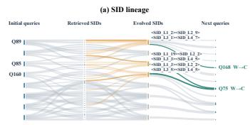

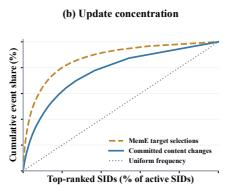

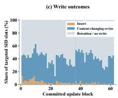

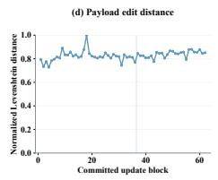  
Figure 3: Memory bank evolution dynamics over the query stream: SID lineage, SID update concentration, operation-type distribution, and payload edit distance.

## 5 SIDS AS SYMBOLIC LANGUAGE: COMPOSITION& EMERGENT REASONING

A central claim of GENMEM is that SIDs are not opaque lookup keys but informative symbolic tokens that carry task-relevant structure. We test this on GPQA (Rein et al., 2023) by varying the depth of SID prefixes supplied without experience text, then comparing complete SIDs with rewritten and directly retrieved experience. Appendix G.5 specifies the input conditions. Using MemRetriever, we generate k SIDs per query with beam size $k \in \{ 1 , 5 , 1 0 \}$ and make two comparisons:

• Symbolic information scaling: the model receives the raw query alone, then progressively deeper SID prefixes $- L _ { 1 } , L _ { 1 } – L _ { 2 } , L _ { 1 } – L _ { 3 }$ , and the complete $L _ { \mathrm { 1 } } { - } L _ { \mathrm { 4 } }$ address, appended as token sequences. No experience text is provided; model must reason from symbolic addresses alone.

• Experience representation: the complete SIDs are used to retrieve stored experience, which is either rewritten into task-adaptive support or supplied directly. Both conditions access the memory bank, testing the contribution of rewriting rather than experience generation from SID tokens alone.

Observations. Figure 4 shows that accuracy increases with SID depth at each beam setting, from 48.32% for the raw query to 54.06–54.66% with complete addresses. This gain of 5.74–6.34 percentage points occurs without experience text, supporting the usefulness of symbolic input in this evaluation. Rewritten experience reaches 55.65–56.91%, while directly retrieved experience reaches 56.09–56.63%. Rewriting scores higher only at $k = 1 0$ , so neither text condition consistently dominates. The additional gains suggest that experience text supplies useful detail beyond the addresses, without establishing generalization to unseen SID combinations.

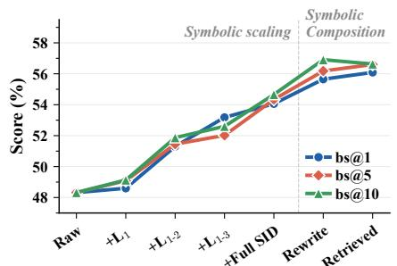  
Figure 4: GPQA accuracy with SID prefixes and experience text.

## 6 CONCLUSION, LIMITATIONS AND FUTURE WORK

GENMEM demonstrates that reformulating memory as generative symbolic addressing rather than discriminative retrieval, can resolve the sparsity and invariance–evolution tension: SID generation over a hierarchical address space keeps addresses stable while content is refined, enabling longhorizon self-evolution without catastrophic addressing drift. Experiments across embodied planning, web navigation, and multi-hop QA evaluate this design against strong memory-augmented agents, and we further observe that SIDs are compositional: combining addresses composes their stored experiences to reach novel situations no single entry covers.

Limitations and Future Directions. Two practical limitations stand out: ❶ some leaf codes attract disproportionate traffic, creating uneven utilization across the codebook, and ❷ cold-start noise in early trajectories can propagate into the SID space. Both point to a natural extension—adaptive codebook allocation with a background revisit policy that proactively evolves under-exercised subtrees, equalizing the address tree without violating frozen-address invariance. A second direction concerns SID–text-token interleaving: because SIDs share the decoder substrate with natural-language tokens, the compositional behaviors observed in Section 5 suggest that SIDs could serve as first-class orchestration tokens rather than the lookup indexs in long, multi-tool workflows, turning the memory bank into a programmable symbolic layer for complex task planning.

## AI USE STATEMENT

Large language models were used for language polishing, literature discovery, synthetic trajectory construction, figure-design assistance, and AI-assisted programming. LLMs helped generate candidate agent trajectories from public benchmark tasks, compare successful and failed executions, and distill reusable strategies and failure-recovery lessons into the experience memory; they also provided visual drafts, code suggestions, and debugging support. All AI-assisted trajectories, distilled experiences, figures, citations, and code were reviewed and verified by the authors, with benchmark verifiers, environment feedback, automated tests, and human inspection used as appropriate to validate generated artifacts and the qualitative cases reported in the paper. The research questions, methodology, experimental design, analyses, and conclusions were determined by the authors.

## ETHICS STATEMENT

All experiments use publicly available benchmarks, such as ALFWorld, WebShop, GPQA, BIRD, SWE-bench Verified, and DeepResearch Bench, under their respective licenses and terms. The study involves no human or animal subjects and uses no private user conversations. Agent trajectories and reusable experiences are generated from benchmark tasks using author-designed protocols and LLM assistance rather than collected from real users. Interactive and software-engineering tasks are executed in benchmark environments or isolated workspaces to limit unintended effects on external systems.

## REPRODUCIBILITY STATEMENT

The appendix reports dataset versions and splits, memory-construction statistics, prompts, model and decoding configurations, tool and token budgets, training settings, baseline implementations, and evaluation procedures. The method and objectives are described in Sections 2–3; the general experimental protocol is documented in Appendix E; the cross-domain memory split and overlap checks are reported in Appendix; and the complete prompts are provided in Appendix I.

## REFERENCES

Arash Ahmadian, Chris Cremer, Matthias Gallé, Marzieh Fadaee, Julia Kreutzer, Olivier Pietquin, Ahmet Ustun, and Sara Hooker. Back to basics: Revisiting REINFORCE style optimization for learning from human feedback in LLMs. arXiv preprint arXiv:2402.14740, 2024.

Jinze Bai, Shuai Bai, Yunfei Chu, Zeyu Cui, Kai Dang, Xiaodong Deng, Yang Fan, Wenbin Ge, Yu Han, Fei Huang, Binyuan Hui, Luo Ji, Mei Li, Junyang Lin, Runji Lin, Dayiheng Liu, Gao Liu, Chengqiang Lu, Keming Lu, Jianxin Ma, Rui Men, Xingzhang Ren, Xuancheng Ren, Chuanqi Tan, Sinan Tan, Jianhong Tu, Peng Wang, Shijie Wang, Wei Wang, Shengguang Wu, Benfeng Xu, Jin Xu, An Yang, Hao Yang, Jian Yang, Shusheng Yang, Yang Yao, Bowen Yu, Hongyi Yuan, Zheng Yuan, Jianwei Zhang, Xingxuan Zhang, Yichang Zhang, Zhenru Zhang, Chang

Zhou, Jingren Zhou, Xiaohuan Zhou, and Tianhang Zhu. Qwen technical report, 2023. URL https://arxiv.org/abs/2309.16609.

Mingyang Chen, Linzhuang Sun, Tianpeng Li, Haoze Sun, Yijie Zhou, Chenzheng Zhu, Haofen Wang, Jeff Z. Pan, Wen Zhang, Huajun Chen, Fan Yang, Zenan Zhou, and Weipeng Chen. Research: Learning to reason with search for LLMs via reinforcement learning. arXiv preprint arXiv:2503.19470, 2025a.

Zijian Chen, Xueguang Ma, Shengyao Zhuang, Ping Nie, Kai Zou, Andrew Liu, Joshua Green, Kshama Patel, Ruoxi Meng, Mingyi Su, et al. Browsecomp-plus: A more fair and transparent evaluation benchmark of deep-research agent. arXiv preprint arXiv:2508.06600, 2025b.

Xin Cheng, Rui Tian, Wangding Zeng, Damai Dai, Qinyu Chen, Bingxuan Wang, Zhenda Xie, Kezhao Huang, Xingkai Yu, Chengqi Deng, Shangyan Zhou, Chenggang Zhao, Zhewen Hao, Yukun Li, Han Zhang, Zhengyan Zhang, Yixu Wei, M.Y. Xu, Huishuai Zhang, Dongyan Zhao, and Wenfeng Liang. Conditional memory via scalable lookup: A new axis of sparsity for large language models. arXiv preprint arXiv:2601.07372, 2026. URL https://arxiv.org/abs/2601.07372.

Prateek Chhikara, Dev Khant, Saket Aryan, Taranjeet Singh, and Deshraj Yadav. Mem0: Building production-ready ai agents with scalable long-term memory. arXiv preprint arXiv:2504.19413, 2025.

Nicola de Cao, Gautier Izacard, Sebastian Riedel, and Fabio Petroni. Autoregressive entity retrieval. In Proceedings of the 2021 Conference of the North American Chapter of the Association for Computational Linguistics (NAACL), 2021.

Jiaxin Deng, Shiyao Wang, Kuo Cai, Lejian Ren, Qigen Hu, Weifeng Ding, Qiang Luo, and Guorui Zhou. OneRec: Unifying retrieve and rank with generative recommender and iterative preference alignment. arXiv preprint arXiv:2502.18965, 2025.

Guanting Dong, Licheng Bao, Zhongyuan Wang, Kangzhi Zhao, Xiaoxi Li, Jiajie Jin, Jinghan Yang, Hangyu Mao, Fuzheng Zhang, Kun Gai, Guorui Zhou, Yutao Zhu, Ji-Rong Wen, and Zhicheng Dou. Agentic entropy-balanced policy optimization. arXiv preprint arXiv:2510.14545, 2025a.

Guanting Dong, Hangyu Mao, Kai Ma, Licheng Bao, Yifei Chen, Zhongyuan Wang, Zhongxia Chen, Jiazhen Du, Huiyang Wang, Fuzheng Zhou, Guorui Zhou, Yutao Zhu, Ji-Rong Wen, and Zhicheng Dou. Agentic reinforced policy optimization. arXiv preprint arXiv:2507.19849, 2025b.

Mingxuan Du, Benfeng Xu, Chiwei Zhu, Licheng Zhang, Xiaorui Wang, and Zhendong Mao. Deepresearch bench: A comprehensive benchmark for deep research agents. In International Conference on Learning Representations, volume 2026, pp. 42414–42448, 2026.

Runnan Fang, Yuan Liang, Xiaobin Wang, Jialong Wu, Shuofei Qiao, Pengjun Xie, Fei Huang, Huajun Chen, and Ningyu Zhang. Memp: Exploring agent procedural memory. arXiv preprint arXiv:2508.06433, 2025. ACL 2026 Findings.

William Fedus, Barret Zoph, and Noam Shazeer. Switch transformers: Scaling to trillion parameter models with simple and efficient sparsity. Journal ofMachine Learning Research, 23(120):1–39, 2022.

Lang Feng, Fuchao Yang, Feng Chen, Xin Cheng, Haiyang Xu, Zhenglin Wan, Ming Yan, and Bo An. Agentocr: Reimagining agent history via optical self-compression. In Proceedings of the 64th Annual Meeting of the Association for Computational Linguistics (Volume 1: Long Papers), pp. 5067–5086, 2026.

Sirui Hong, Mingchen Zhuge, Jiaqi Chen, Xiawu Zheng, Yuheng Cheng, Ceyao Zhang, Jinlin Wang, Zili Wang, Steven Ka Shing Yau, Zijuan Lin, Liyang Zhou, Chenyu Ran, Lingfeng Xiao, Chenglin Wu, and Jürgen Schmidhuber. MetaGPT: Meta programming for a multi-agent collaborative framework. arXiv preprint arXiv:2308.00352, 2023.

Edward J. Hu, Yelong Shen, Phillip Wallis, Zeyuan Allen-Zhu, Yuanzhi Li, Shean Wang, Lu Wang, and Weizhu Chen. LoRA: Low-rank adaptation of large language models. arXiv preprint arXiv:2106.09685, 2022.

Xinke Jiang, Yue Fang, Rihong Qiu, Haoyu Zhang, Yongxin Xu, Hao Chen, Wentao Zhang, Ruizhe Zhang, Yuchen Fang, Xu Chu, et al. Tc-rag: Turing-complete rag’s case study on medical llm systems. ACL oral 2025, 2025.

Xinke Jiang, Yue Fang, Zhibang Yang, Jiaran Gao, Zhixin Zhang, Tao Feng, Rihong Qiu, Wentao Zhang, Hongxin Ding, Ruizhe Zhang, Yongxin Xu, Yuheng Huang, Xu Chu, Junfeng Zhao, and Yasha Wang. Agenticrag-r1: Agentic reinforcement learning with stack memory for multi-step reasoning, retrieval and memorizing. arXiv preprint arXiv:2608.29622, 2026a.

Xinke Jiang, Zhixin Zhang, Zhibang Yang, Jiaran Gao, Rihong Qiu, Shijin Chen, Xu Chu, Junfeng Zhao, and Yasha Wang. Harness-rl: Black-box reinforcement learning with action-args decoupling for central-agent multi-agent harnesses, 2026b. URL https://arxiv.org/abs/2608. 29641.

Carlos E Jimenez, John Yang, Alexander Wettig, Shunyu Yao, Kexin Pei, Ofir Press, and Karthik Narasimhan. Swe-bench: Can language models resolve real-world github issues? In International Conference on Learning Representations, volume 2024, pp. 54107–54157, 2024.

Bowen Jin, Hansi Zeng, Zhenrui Yue, Jinsung Yoon, Sercan Arik, Dong Wang, Hamed Zamani, and Jiawei Han. Search-r1: Training LLMs to reason and leverage search engines with reinforcement learning. arXiv preprint arXiv:2503.09516, 2025.

Doyup Lee, Chiheon Kim, Saehoon Kim, Minsu Cho, and Wook-Shin Han. Autoregressive image generation using residual quantization. In Proceedings ofthe IEEE/CVF Conference on Computer Vision and Pattern Recognition (CVPR), 2022.

Jinyang Li, Binyuan Hui, Ge Qu, Jiaxi Yang, Binhua Li, Bowen Li, Bailin Wang, Bowen Qin, Ruiying Geng, Nan Huo, et al. Can llm already serve as a database interface? a big bench for large-scale database grounded text-to-sqls. Advances in Neural Information Processing Systems, 36:42330–42357, 2023.

Xiaoyuan Li, Moxin Li, Keqin Bao, Yubo Ma, Wenjie Wang, Dayiheng Liu, and Fuli Feng. SkillGraph: Skill-augmented reinforcement learning for agents via evolving skill graphs. arXiv preprint arXiv:2605.12039, 2026.

Jiaqi Liu, Yaofeng Su, Peng Xia, Siwei Han, Zeyu Zheng, Cihang Xie, Mingyu Ding, and Huaxiu Yao. SimpleMem: Efficient lifelong memory for LLM agents. arXiv preprint arXiv:2601.02553, 2026.

Zhengxi Lu, Zhiyuan Yao, Zhuowen Han, Zi-Han Wang, Jinyang Wu, Qi Gu, Xunliang Cai, Weiming Lu, Jun Xiao, Yueting Zhuang, et al. Self-distilled agentic reinforcement learning. arXiv preprint arXiv:2605.15155, 2026a.

Zhengxi Lu, Zhiyuan Yao, Jinyang Wu, Chengcheng Han, Qi Gu, Xunliang Cai, Weiming Lu, Jun Xiao, Yueting Zhuang, and Yongliang Shen. SKILL0: In-context agentic reinforcement learning for skill internalization. arXiv preprint arXiv:2604.02268, 2026b.

Weitao Ma, Xiaocheng Feng, Lei Huang, Xiachong Feng, Zhanyu Ma, Jun Xu, Jiuchong Gao, Jinghua Hao, Renqing He, and Bing Qin. Fine-mem: Fine-grained feedback alignment for long-horizon memory management. arXiv preprint arXiv:2601.08435, 2026.

Jingwei Ni, Yihao Liu, Xinpeng Liu, Yutao Sun, Mengyu Zhou, Pengyu Cheng, Dexin Wang, Erchao Zhao, Xiaoxi Jiang, and Guanjun Jiang. Trace2skill: Distill trajectory-local lessons into transferable agent skills. arXiv preprint arXiv:2603.25158, 2026.

Shashank Rajput, Nikhil Mehta, Anima Singh, Raghunandan H. Keshavan, Trung Vu, Lukasz Heldt, Lichan Hong, Yi Tay, Vinh Q. Tran, Jonah Samost, Maciej Kula, Ed H. Chi, and Maheswaran Sathiamoorthy. Recommender systems with generative retrieval. In Advances in Neural Information Processing Systems (NeurIPS), 2023.

David Rein, Betty Li Hou, Asa Cooper Stickland, Jackson Petty, Richard Yuanzhe Pang, Julien Dirani, Julian Michael, and Samuel R. Bowman. Gpqa: A graduate-level google-proof q&a benchmark, 2023. URL https://arxiv.org/abs/2311.12022.

Zhihong Shao, Peiyi Wang, Qihao Zhu, Runxin Xu, Junxiao Song, Xiao Bi, Haowei Zhang, Mingchuan Zhang, Y.K. Li, Y. Wu, and Daya Guo. DeepSeek-Math: Pushing the limits of mathematical reasoning in open language models. arXiv preprint arXiv:2402.03300, 2024.

Noah Shinn, Federico Cassano, Beck Labash, Ashwin Gopinath, Karthik Narasimhan, and Shunyu Yao. Reflexion: Language agents with verbal reinforcement learning. In Advances in Neural Information Processing Systems (NeurIPS), 2023.

Mohit Shridhar, Xingdi Yuan, Marc-Alexandre Côté, Yonatan Bisk, Adam Trischler, and Matthew Hausknecht. ALFWorld: Aligning text and embodied environments for interactive learning. In International Conference on Learning Representations (ICLR), 2021.

Theodore R. Sumers, Shunyu Yao, Karthik Narasimhan, and Thomas L. Griffiths. Cognitive architectures for language agents. Transactions on Machine Learning Research, 2024.

Hao Sun, Zile Qiao, Jiayan Guo, Xuanbo Fan, Yingyan Hou, Yong Jiang, Pengjun Xie, Fei Huang, and Yan Zhang. Zerosearch: Incentivize the search capability of LLMs without searching. arXiv preprint arXiv:2505.04588, 2025.

Yi Tay, Vinh Q. Tran, Mostafa Dehghani, Jianmo Ni, Dara Bahri, Harsh Mehta, Donald Metzler, et al. Transformer memory as a differentiable search index. In Advances in Neural Information Processing Systems (NeurIPS), 2022.

Harsh Trivedi, Niranjan Balasubramanian, Tushar Khot, and Ashish Sabharwal. Interleaving retrieval with chain-of-thought reasoning for knowledge-intensive multi-step questions, 2023.

Aaron van den Oord, Oriol Vinyals, and Koray Kavukcuoglu. Neural discrete representation learning. In Advances in Neural Information Processing Systems (NeurIPS), 2017.

Chenxi Wang, Zhuoyun Yu, Xin Xie, Wuguannan Yao, Runnan Fang, Shuofei Qiao, Kexin Cao, Guozhou Zheng, Xiang Qi, Peng Zhang, and Shumin Deng. SkillX: Automatically constructing skill knowledge bases for agents. In Proceedings ofthe 43rd International Conference on Machine Learning (ICML), 2026a.

Guanzhi Wang, Yuqi Xie, Yunfan Jiang, Ajay Mandlekar, Chaowei Xiao, Yuke Zhu, Linxi Fan, and Anima Anandkumar. Voyager: An open-ended embodied agent with large language models. arXiv preprint arXiv:2305.16291, 2023.

Hao Wang, Guozhi Wang, Han Xiao, Yufeng Zhou, Yue Pan, Jichao Wang, Ke Xu, Yafei Wen, Xiaohu Ruan, Xiaoxin Chen, et al. Skill-sd: Skill-conditioned self-distillation for multi-turn llm agents. arXiv preprint arXiv:2604.10674, 2026b.

Xingyao Wang, Boxuan Li, Yufan Song, Frank F. Xu, Xiangru Tang, Mingchen Zhuge, Jiayi Pan, Yueqi Song, Bowen Li, Jaskirat Singh, Hoang H. Tran, Fuqiang Li, Ren Ma, Mingzhang Zheng, Bill Qian, Yanjun Shao, Niklas Muennighoff, Yizhe Zhang, Binyuan Hui, Junyang Lin, Robert Brennan, Hao Peng, Heng Ji, and Graham Neubig. Openhands: An open platform for ai software developers as generalist agents, 2025. URL https://arxiv.org/abs/2407.16741.

Rong Wu, Xiaoman Wang, Jianbiao Mei, Pinlong Cai, Daocheng Fu, Cheng Yang, Licheng Wen, Xuemeng Yang, Yufan Shen, Yuxin Wang, and Botian Shi. EvolveR: Self-evolving LLM agents through an experience-driven lifecycle. arXiv preprint arXiv:2510.16079, 2025. Accepted by ICML 2026.

Peng Xia, Jianwen Chen, Hanyang Wang, Jiaqi Liu, Kaide Zeng, Yu Wang, Siwei Han, Yiyang Zhou, Xujiang Zhao, Haifeng Chen, Zeyu Zheng, Cihang Xie, and Huaxiu Yao. SkillRL: Evolving agents via recursive skill-augmented reinforcement learning. arXiv preprint arXiv:2602.08234, 2026.

Wujiang Xu, Zujie Liang, Kai Mei, Hang Gao, Juntao Tan, and Yongfeng Zhang. A-mem: Agentic memory for llm agents, 2025. URL https://arxiv.org/abs/2502.12110.

Shunyu Yao, Howard Chen, John Yang, and Karthik Narasimhan. WebShop: Towards scalable real-world web interaction with grounded language agents. In Advances in Neural Information Processing Systems (NeurIPS), 2022.

Shunyu Yao, Jeffrey Zhao, Dian Yu, Nan Du, Izhak Shafran, Karthik Narasimhan, and Yuan Cao. ReAct: Synergizing reasoning and acting in language models. In International Conference on Learning Representations (ICLR), 2023.

Guibin Zhang, Muxin Fu, and Shuicheng Yan. Memgen: Weaving generative latent memory for self-evolving agents. arXiv preprint arXiv:2509.24704, 2025.

Ruizhe Zhang, Xinke Jiang, Zhibang Yang, Zhixin Zhang, Jiaran Gao, Yuzhen Xiao, Tao Feng, Yue Fang, Yuxuan Liu, Ruiqing Li, Hongbin Lai, Huheng Huang, Xu Chu, Junfeng Zhao, and Yasha Wang. Stackplanner: A centralized hierarchical multi-agent system with task-experience memory management, 2026a. URL https://arxiv.org/abs/2601.05890.

Shengtao Zhang, Jiaqian Wang, Ruiwen Zhou, Junwei Liao, Yuchen Feng, Zhuo Li, Yujie Zheng, Weinan Zhang, Ying Wen, Zhiyu Li, Feiyu Xiong, Yutao Qi, Bo Tang, and Muning Wen. Memrl: Self-evolving agents via runtime reinforcement learning on episodic memory. arXiv preprint arXiv:2601.03192, 2026b.

Yuxiang Zhang, Jiangming Shu, Ye Ma, Xueyuan Lin, Shangxi Wu, and Jitao Sang. Memory as action: Autonomous context curation for long-horizon agentic tasks, 2026c. URL https: //arxiv.org/abs/2510.12635.

Zeyu Zhang, Xiaohe Bo, Chen Ma, Rui Li, Xu Chen, Quanyu Dai, Jieming Zhu, Zhenhua Dong, and Ji-Rong Wen. A survey on the memory mechanism of large language model based agents. arXiv preprint arXiv:2404.13501, 2024.

Zhiwei Zhang, Yudi Lin, Nikki Lijing Kuang, Linlin Wu, Xiaomin Li, Songtao Liu, and Fenglong Ma. Co-evolving skill generation and policy optimization. arXiv preprint arXiv:2606.08755, 2026d.

Andrew Zhao, Daniel Huang, Quentin Xu, Matthieu Lin, Yong-Jin Liu, and Gao Huang. ExpeL: LLM agents are experiential learners. In Proceedings ofthe AAAI Conference on Artificial Intelligence (AAAI), 2024.

YanZhao Zheng, ZhenTao Zhang, Chao Ma, YuanQiang Yu, JiHuai Zhu, Yong Wu, Tianze Xu, Baohua Dong, Hangcheng Zhu, Ruohui Huang, and Gang Yu. SkillRouter: Skill routing for LLM agents at scale. arXiv preprint arXiv:2603.22455, 2026.

Zijian Zhou, Ao Qu, Zhaoxuan Wu, Sunghwan Kim, Alok Prakash, Daniela Rus, Jinhua Zhao, Bryan Kian Hsiang Low, and Paul Pu Liang. MEM1: Learning to synergize memory and reasoning for efficient long-horizon agents. arXiv preprint arXiv:2506.15841, 2025.

## A RELATED WORK

Memory-Augmented LLM Agents. Memory-augmented LLM agents accumulate and reuse experience across tasks to support long-horizon reasoning and continual adaptation (Zhang et al., 2024; Sumers et al., 2024). Existing work explores both how experience is organized and how memory is managed. Reflexion (Shinn et al., 2023) and ExpeL (Zhao et al., 2024) distill past interactions into verbal reflections and reusable insights without gradient updates, while SimpleMem (Liu et al., 2026) and MemP (Fang et al., 2025) curate compact memory representations. Mem0 (Chhikara et al., 2025) and A-MEM (Xu et al., 2025) further investigate structured memory management through graph-based organization or associative linking. At the skill level, SkillRL (Xia et al., 2026) and SkillGraph (Li et al., 2026) organize reusable knowledge into hierarchical or graphstructured banks. Trace2Skill (Ni et al., 2026) consolidates execution trajectories into portable skill directories, while SkillX (Wang et al., 2026a) constructs three-tiered hierarchies of strategic plans, functional skills, and atomic operations. Beyond memory organization, MemRL (Zhang et al., 2026b), Memory-as-Action (Zhang et al., 2026c), and MemGen (Zhang et al., 2025) introduce learned mechanisms for memory utilization, control, or generation. SKILL0 (Lu et al., 2026b) takes a complementary approach by internalizing skills into model parameters. Despite these advances, richer memory organization does not by itself provide a model with a structured address space that it can learn to navigate: similarity-based access remains sensitive to how experiences are represented, and semantic resemblance need not reflect their strategic utility in the current context. SkillRouter (Zheng et al., 2026) further highlights the sensitivity of skill selection to the information exposed during retrieval. Learning which memories to access and refine also remains challenging when supervision is derived primarily from delayed task outcomes, which provide limited credit assignment to individual memory operations.

Generative Retrieval and Discrete Representations. Generative retrieval formulates information access as autoregressive identifier generation, allowing a model to directly predict the target of retrieval. DSI (Tay et al., 2022) generates document identifiers from queries, while GENRE (de Cao et al., 2021) retrieves entities by generating their names. TIGER (Rajput et al., 2023) extends identifier generation to recommendation using semantic IDs constructed through residual quantization. These methods build on discrete representation learning: VQ-VAE (van den Oord et al., 2017) maps continuous representations to learned codebook entries, and RQ-VAE (Lee et al., 2022) progressively quantizes residual information into sequences of discrete codes. Such representations provide compact identifiers with coarse-to-fine semantic structure, enabling autoregressive access through shared code prefixes. However, generating identifiers for indexed content does not by itself resolve the requirements of an evolving experience bank, where entries must be selectively inserted, revised, consolidated, or removed. When semantic identifiers depend on content representations, revisions can create tension between preserving learned addresses and maintaining their semantic coherence. Existing retrieval formulations therefore leave open how to jointly support stable context-to-address mappings and targeted content updates through a shared generative interface.

## B FORMAL FOUNDATIONS AND SID REPRESENTATION

This appendix collects formal definitions and analysis underlying the design choices in the main text.

## B.1 THE SPARSITY STRUCTURE OF EXPERIENCE SPACE

A central insight of this work is that experience space is inherently sparse—a property that existing dense memory systems fail to exploit. We identify four distinct sparsity dimensions that collectively motivate generative symbolic addressing.

Value Sparsity. Let $\mathcal { T } _ { q } = \{ \tau ^ { ( 1 ) } , \dots , \tau ^ { ( K ) } \}$ denote a set of K trajectories generated for query q. Define the experience value of a trajectory as its contribution to the generalizable experience base:

$$
v ( \tau ^ { ( k ) } ) = \mathbb { E } _ { q ^ { \prime } \sim \mathcal { D } } \big [ \Delta r ( q ^ { \prime } , \mathcal { M } \cup \mathcal { E } ( \tau ^ { ( k ) } ) ) - \Delta r ( q ^ { \prime } , \mathcal { M } ) \big ] ,
$$

where $\mathcal { E } ( \tau )$ denotes experience distilled from $\tau$ and $\Delta r$ denotes task performance improvement. In practice, $v ( \tau ^ { ( k ) } )$ is high only for a small fraction of trajectories—those that exhibit novel, generalizable strategies or capture failure patterns not previously recorded.

Structural Sparsity. Even among high-value experiences, the experience space exhibits strong structural regularity. Formally, let $\ \bar { \{ }  e _ { i } \bar { \ } _ { i = 1 } ^ { N }$ be the semantic embeddings of all experience entries. These embeddings lie approximately on a low-dimensional manifold:

$$
\dim \left( \operatorname { s p a n } \{ e _ { i } \} _ { i = 1 } ^ { N } \right) \ \ll \ N ,
$$

because many experiences share latent structural components—task categories, sub-task types, tooluse patterns—even when their surface-level descriptions differ. This structural sparsity means that the effective address space of experience is far smaller than its raw cardinality. This is precisely the principle behind RQ-KMeans-based SID construction: the multi-level codebook exploits structural sparsity to represent $N _ { 1 } \times N _ { 2 } \times \cdots \times N _ { L }$ distinct experience regions using only $N _ { 1 } + N _ { 2 } + \cdots + N _ { I }$ codebook entries.

Access Sparsity. Semantic similarity does not by itself determine whether a memory will help an agent solve a task. Let $c = ( q , h _ { t } , \mathrm { e n v } )$ denote the execution context, comprising the query, the agent’s working state, and the environmental state. We define the execution utility of a memory $m _ { i }$ as $\begin{array} { r } { u ( c , m _ { i } ) ^ { - } = \mathbb { E } _ { \tau \sim \pi ( \cdot | c , m _ { i } ) } [ r ( \tau , q ) ] } \end{array}$ , the expected task reward when the execution policy π uses that memory. Access sparsity is the assumption that only a small subset of the memory bank exceeds a given utility threshold for any particular context. Formally, $| \mathcal { R } ^ { * } ( c ) | \ll | \mathcal { M } |$ , where $\mathcal { R } ^ { * } ( c ) = \{ m _ { i } \in \mathcal { M } : u ( c , m _ { i } ) > \epsilon \}$ and $\epsilon > 0$

Evolution sparsity (update). Only a small subset of experiences—those repeatedly exercised by frequent queries—warrant refinement; blanket updates waste compute and blur useful entries. Effective memory systems must therefore learn selective evolution, deciding not only how to update an entry but also whether to leave it untouched through a content-preserving revise operation (§2).

These four sparsity dimensions together motivate designing experience memory around sparse, structured, generative addressing rather than dense global retrieval—realized concretely through the SID framework (§2).

## B.2 RETRIEVAL UTILITY AND ADDRESS STABILITY

Retrieval utility. A similarity score measures agreement between representations; it does not by itself specify the value of a memory for task execution. For example, two experiences may describe similar tasks but prescribe different actions. Ranking memories by sim $( \bar { f _ { q } } ( q ) , f _ { m } ( x _ { i } ) )$ therefore need not produce the same ordering as ranking them by the execution utility $u ( c , m _ { i } )$ defined in Appendix B.1. This is a distinction between objectives, not an inherent limitation of discriminative retrieval. A scoring model can also condition on the execution context and be trained with task feedback. In GENMEM, process and outcome rewards train the memory policies to select and rewrite experience for downstream use (Section 3); symbolic addressing alone does not ensure useful retrieval.

Address stability. If a retrieval score depends on an embedding of the current payload, revising that payload and recomputing its embedding can change its rank for the same query, even when its role is unchanged. GENMEM separates the address from the payload: a revision changes $( x _ { i } , z _ { i } )$ to $( x _ { i } ^ { \prime } , z _ { i } )$ , preserving the SID used for lookup and update targeting (Section 2). With the addressing policy and codebooks fixed, a payload revision does not by itself change the SID generated for an unchanged input context. It can still change how useful the retrieved content is. This design does not imply that vector-based stores cannot support stable identifiers or targeted updates; GenMem uses a shared, generatable SID interface for both reading and writing memory.

## B.3 SID AS A GENERATIVE TOKEN SEQUENCE

An SID $\textbf { z } = ~ ( s ^ { 1 } , \ldots , s ^ { L } )$ consists of L level-specific tokens, each identifying an entry in the corresponding codebook. Token identities are distinct across levels, even when their numerical

indices coincide. The four-level configuration in Section 2 therefore represents each address with four tokens, from <SID\_L1\_X> to <SID\_L4\_W>.

Conditioned on context $\mathbf { c } ,$ the addressing policy generates the sequence autoregressively,

$$
p _ { \boldsymbol \theta } ( \mathbf { z } \mid \mathbf { c } ) = \prod _ { \boldsymbol \ell = 1 } ^ { L } p _ { \boldsymbol \theta } ( s ^ { \boldsymbol \ell } \mid \mathbf { c } , s ^ { 1 } , \ldots , s ^ { \boldsymbol \ell - 1 } ) .\tag{10}
$$

MemRetriever conditions address generation on the query and available reasoning context, whereas MemEvolver uses the execution trajectory to select an update address. In both cases, the generated SID identifies a memory slot whose payload is accessed by lookup. Offline quantization constructs the initial addresses; the learned policy subsequently generates addresses for retrieval or revision. Summary generation and payload revision are separate operations performed after lookup.

Figure 5 illustrates discrete sequence representations at a conceptual level. GENMEM applies this principle to textual experiences, using the sequence as an address rather than a lossless encoding of the associated text.

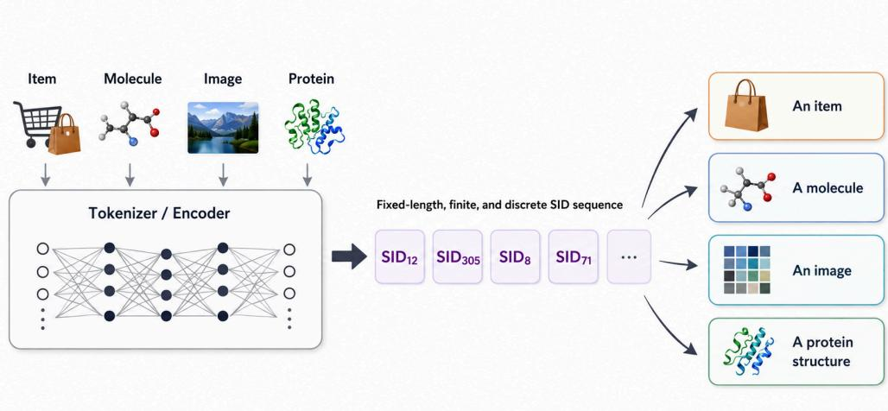  
Figure 5: Discrete token sequences as object representations. In GENMEM, a text encoder and RQ-KMeans map seed experiences to SID addresses (Section 2). Other object types illustrate the general concept and are not evaluated in this work.

## B.4 EMBEDDING RECONSTRUCTION FROM SIDS

The SID $\mathbf z _ { i } = ( s _ { i } ^ { 1 } , \dots , s _ { i } ^ { L } )$ constructed in Section 2 selects one centroid from each codebook. Their sum approximates the original experience embedding $\mathbf { e } _ { i } ;$ it does not reconstruct the experience text. Using the residual recurrence in Eq. 14, the reconstruction after ℓ levels is

$$
\hat { \mathbf { e } } _ { i } ^ { ( \ell ) } = \sum _ { h = 1 } ^ { \ell } \mathbf { c } _ { s _ { i } ^ { h } } ^ { ( h ) } , \qquad \mathbf { r } _ { i } ^ { ( \ell + 1 ) } = \mathbf { e } _ { i } - \hat { \mathbf { e } } _ { i } ^ { ( \ell ) } , \quad \ell = 1 , \dots , L .\tag{11}
$$

Writing $\hat { \mathbf { e } } _ { i } = \hat { \mathbf { e } } _ { i } ^ { ( L ) }$ , the per-entry Euclidean reconstruction error is

$$
\varepsilon _ { i } = \left\| \mathbf { e } _ { i } - { \hat { \mathbf { e } } } _ { i } \right\| _ { 2 } = \left\| \mathbf { r } _ { i } ^ { ( L + 1 ) } \right\| _ { 2 } .\tag{12}
$$

Each successive codebook is fitted to the residuals left by the preceding levels. The Euclidean fitting objective minimizes mean squared residual error over the fitting set, but nearest-centroid assignment alone does not guarantee a decrease for every entry at every level. In particular, the selected centroid need not be closer to an incoming residual than the zero vector is. We therefore do not assume per-entry monotonic error reduction. Equation 12 defines an unnormalized Euclidean norm; its relationship to the reported reconstruction loss depends on the aggregation and normalization settings noted in Appendix C.1.

Reconstruction characterizes the offline quantization of seed embeddings, not online memory evolution. MemEvolver generates the target SID for an update, and the experience text at that address can subsequently change without re-encoding it or changing the SID (Appendix C.2).

## B.5 SID ALIGNMENT MAPPINGS

SID alignment pretraining (Section 3) connects queries $q ,$ execution trajectories $\tau ,$ and experience texts x to the constructed address space. Each target SID is a complete sequence $\mathbf { z } = ( s ^ { 1 } , \bar { } . . . , s ^ { L } )$ . The five mappings comprise three address-generation tasks and two text-generation tasks:

1. Query $ \mathbf { S I D } ( q \mapsto \mathbf { z } )$ . Predict the SID of the experience associated with the query in the training pair.

2. Trajector ${ \bf \nabla } \ y  { \bf S I D } ( \tau \mapsto { \bf z } )$ . Predict the SID associated with the experience distilled from the trajectory. This task learns an address association, not an insert or revise decision.

3. $\mathbf { E x p e r i e n c e \to S I D \left( x \mapsto z \right) }$ . Predict the SID assigned to an experience by offline construction.

4. SID → Experience $( \mathbf { z } \mapsto \mathbf { x } )$ . Generate the experience text associated with the SID in the training pair.

5. SID → Description $( \mathbf { z } \mapsto \mathbf { d } )$ . Generate a natural-language semantic description d associated with the SID.

The reverse mappings train text generation conditioned on an address. They do not invoke memory\_lookup; tool-mediated retrieval and memory evolution are taught during memoryoperation mid-training (Section 3).

SID compositionality. Shared SID prefixes identify common sequences of selected centroids, while later symbols encode the remaining residuals (Appendix C.1). The alignment tasks associate these structured addresses with task contexts and experience content. Neither the codebook construction nor the alignment objective assigns a fixed semantic role, such as task domain or tool type, to an individual level. Whether the learned SID structure supports reasoning is examined empirically in Section 5, rather than assumed from the mapping tasks alone.

## C ADDITIONAL METHOD DETAILS

## C.1 RQ-KMEANS DETAILS

This section specifies the notation and Euclidean formulation of SID construction in Section 2, then reports the prefix and codebook comparisons used to examine the design.

Prefix-guided encoding. Let $N _ { \mathrm { s e e d } } = | \mathcal { X } _ { \mathrm { s e e d } } |$ denote the number of experience summaries before SID-based consolidation. We encode each summary as $\mathbf { e } _ { i } = f _ { \mathrm { e n c } } ( p _ { \mathrm { e n c } } \oplus \mathbf { x } _ { i } ) \in \mathbb { R } ^ { d }$ , where $f _ { \mathrm { e n c } }$ is frozen, d is the embedding dimension, and ⊕ denotes text concatenation. The instruction prefix $p _ { \mathrm { e n c } }$ is reproduced in Appendix I.4; its Query field is filled with the extracted rich\_summary. It emphasizes reusable procedures, applicability conditions, verification, and failure recovery. Thus, context enters through the experience summary, rather than through a separate concatenation of raw queries and trajectories.

Codebook fitting and assignment. At level $\ell \in \{ 1 , \ldots , L \}$ , the codebook $\mathcal { C } ^ { ( \ell ) } = \{ \mathbf { c } _ { j } ^ { ( \ell ) } \} _ { j = 1 } ^ { N _ { \ell } }$ contains $N _ { \ell }$ centroids in $\mathbb { R } ^ { d }$ . Starting with ${ \bf r } _ { i } ^ { ( 1 ) } = { \bf e } _ { i }$ , the Euclidean formulation fits each codebook to the incoming residuals using the K-Means objective

$$
\mathcal { L } _ { \ell } ( \mathcal { C } ^ { ( \ell ) } ) = \frac { 1 } { N _ { \mathrm { s e e d } } } \sum _ { i = 1 } ^ { N _ { \mathrm { s e e d } } } \operatorname* { m i n } _ { j \in [ N _ { \ell } ] } \big \| \mathbf { r } _ { i } ^ { ( \ell ) } - \mathbf { c } _ { j } ^ { ( \ell ) } \big \| _ { 2 } ^ { 2 } ,\tag{13}
$$

where $\left[ N _ { \ell } \right] = \left\{ 1 , \ldots , N _ { \ell } \right\}$ . The fitted centroids determine a code and the residual passed to the next level,

$$
\begin{array} { r } { s _ { i } ^ { \ell } = \underset { j \in [ N _ { \ell } ] } { \arg \operatorname* { m i n } } \big \| \mathbf { r } _ { i } ^ { ( \ell ) } - \mathbf { c } _ { j } ^ { ( \ell ) } \big \| _ { 2 } ^ { 2 } , ~ } \\ { \mathbf { r } _ { i } ^ { ( \ell + 1 ) } = \mathbf { r } _ { i } ^ { ( \ell ) } - \mathbf { c } _ { s _ { i } ^ { \ell } } ^ { ( \ell ) } . ~ } \end{array}\tag{14}
$$

The resulting SID is $\mathbf z _ { i } = ( s _ { i } ^ { 1 } , \dots , s _ { i } ^ { L } )$ . Codebooks are fitted sequentially and then held fixed during online operation. Equations 13–14 specify the Euclidean form, not the Spherical or Weighted variants listed below.

Capacity and utilization. An L-level configuration has address capacity $K _ { \mathrm { a d d } }$ <sub>r</sub> and level-specific SID vocabulary size $V _ { \mathrm { S I D } }$ given by

$$
K _ { \mathrm { a d d r } } = \prod _ { \ell = 1 } ^ { L } N _ { \ell } , \qquad V _ { \mathrm { S I D } } = \sum _ { \ell = 1 } ^ { L } N _ { \ell } .\tag{15}
$$

Capacity counts possible addresses, not populated memory entries. For $N _ { \mathrm { e v a l } }$ encoded summaries, let $\mathbf { \bar { \mathcal { P } } } _ { \ell } = \{ ( s _ { i } ^ { 1 } , \dots , s _ { i } ^ { \ell } ) : 1 \le i \le N _ { \mathrm { e v a l } } \}$ be the set of observed prefixes. Single-code utilization and cumulative prefix utilization are

$$
U _ { \ell } = \frac { | \{ s _ { i } ^ { \ell } : 1 \le i \le N _ { \mathrm { e v a l } } \} | } { N _ { \ell } } , \qquad U _ { 1 : \ell } = \frac { | \mathcal { P } _ { \ell } | } { \prod _ { h = 1 } ^ { \ell } N _ { h } } .\tag{16}
$$

The used-leaf count is $| { \mathcal { P } } _ { L } | ,$ , and leaf utilization is $U _ { 1 : L } ;$ utilization values are reported as percentages. The evaluation set need not be the full fitting set, so its size must be specified separately from $N _ { \mathrm { s e e d } }$ Per-entry Euclidean reconstruction error is defined in Appendix B.4.

Unique-code ratio. For a non-empty evaluation set, let $\begin{array} { r } { n _ { \mathbf { z } } = \sum _ { i = 1 } ^ { N _ { \mathrm { e v a l } } } \mathbb { I } [ \mathbf { z } _ { i } = \mathbf { z } ] } \end{array}$ count the summaries assigned to a complete SID z. We use unique-code ratio (UCR) to denote the number of distinct complete SIDs per encoded summary,

$$
\mathrm { U C R } = \frac { | \mathcal { P } _ { L } | } { N _ { \mathrm { e v a l } } } = \frac { \sum _ { \mathbf { z } \in \mathcal { Z } } \mathbb { I } [ n _ { \mathbf { z } } > 0 ] } { N _ { \mathrm { e v a l } } } , \qquad \mathcal { Z } = \prod _ { \ell = 1 } ^ { L } [ N _ { \ell } ] .\tag{17}
$$

UCR characterizes address sharing across experiences. Unlike leaf utilization, its denominator is the sample count rather than address capacity: $\mathrm { U C R } = ( K _ { \mathrm { a d d r } } / N _ { \mathrm { e v a l } } ) U _ { 1 : L }$ . It is not the fraction of summaries assigned to singleton leaves, which is $N _ { \mathrm { e v a l } } ^ { - 1 } \sum _ { \mathbf { z } } \mathbb { I } [ n _ { \mathbf { z } } = 1 ]$

Assignment balance. Utilization measures whether codes are used, not how evenly assignments are distributed. For level ℓ, define the empirical code probabilities and entropy by

$$
p _ { \ell j } = \frac { 1 } { N _ { \mathrm { e v a l } } } \sum _ { i = 1 } ^ { N _ { \mathrm { e v a l } } } \mathbb { I } [ s _ { i } ^ { \ell } = j ] , \qquad H _ { \ell } = - \sum _ { j = 1 } ^ { N _ { \ell } } p _ { \ell j } \log p _ { \ell j } ,\tag{18}
$$

with 0 log $0 = 0$ and natural logarithms. The normalized entropy and effective code count reported in Figure 8 are

$$
H _ { \ell } ^ { \mathrm { n o r m } } = \frac { H _ { \ell } } { \log N _ { \ell } } , \qquad N _ { \ell } ^ { \mathrm { e f f } } = \exp ( H _ { \ell } ) .\tag{19}
$$

The normalization assumes $N _ { \ell } > 1$ and accounts for differences in codebook size. The effective code count expresses assignment entropy as an equivalent number of equally frequent codes.

Distribution uniformity index (DUI). An entropy-based distribution uniformity index measures assignment balance by averaging normalized entropy across quantization levels,

$$
\mathrm { D U I } _ { \mathrm { e n t r o p y } } = \frac { 1 } { L } \sum _ { \ell = 1 } ^ { L } H _ { \ell } ^ { \mathrm { n o r m } } = \frac { 1 } { L } \sum _ { \ell = 1 } ^ { L } \frac { - \sum _ { j = 1 } ^ { N _ { \ell } } p _ { \ell j } \log p _ { \ell j } } { \log N _ { \ell } } .\tag{20}
$$

Each level contributes equally, irrespective of its codebook size. This definition measures marginal assignment balance, not statistical independence or semantic orthogonality between SID levels.

Inter-level code independence (ICR). To quantify statistical independence between SID levels, let $p ( \mathbf { z } ) = n _ { \mathbf { z } } / N _ { \mathrm { e v a l } }$ be the empirical joint distribution of complete SIDs. Its joint entropy and total correlation are

$$
H _ { \mathrm { j o i n t } } = - \sum _ { \mathbf { z } \in \mathcal { Z } } p ( \mathbf { z } ) \log p ( \mathbf { z } ) , \qquad T = \sum _ { \ell = 1 } ^ { L } H _ { \ell } - H _ { \mathrm { j o i n t } } .\tag{21}
$$

Total correlation measures the discrepancy between the joint distribution and the product of its marginals. We propose an entropy-based independence ratio,

$$
\mathrm { I C R } _ { \mathrm { e n t r o p y } } = \frac { H _ { \mathrm { j o i n t } } } { \sum _ { \ell = 1 } ^ { L } H _ { \ell } } = 1 - \frac { T } { \sum _ { \ell = 1 } ^ { L } H _ { \ell } } , \qquad \sum _ { \ell = 1 } ^ { L } H _ { \ell } > 0 .\tag{22}
$$

Higher values indicate less cross-level dependence relative to the total marginal entropy. If all marginal entropies vanish, we leave the ratio undefined and report the collapsed assignment separately. This statistic concerns dependence among code assignments, not semantic orthogonality. It is computed from the empirical joint distribution and can be sensitive to sparse sampling of the address space. The entropy-based ratio is a proposed diagnostic, distinct from the original ICR scores reported in the configuration comparison.

Offline quantization cost. For the Euclidean formulation in Appendix C.1, one assignment pass at level ℓ compares each of the $N _ { \mathrm { s e e d } }$ residuals with $N _ { \ell }$ centroids in $\mathbf { \widetilde { \mathbb { R } } } ^ { d }$ . With $T _ { \mathrm { K M } }$ K-Means iterations per level, the total assignment cost during fitting is

$$
C _ { \mathrm { f i t , a s s i g n } } = O \left( N _ { \mathrm { s e e d } } d T _ { \mathrm { K M } } \sum _ { \ell = 1 } ^ { L } N _ { \ell } \right) .\tag{23}
$$

Once the codebooks are fitted, assigning a SID to one already computed embedding costs

$$
C _ { \mathrm { q u a n t i z e } } = O \left( d \sum _ { \ell = 1 } ^ { L } N _ { \ell } \right) .\tag{24}
$$

The codebooks store $d \textstyle \sum _ { \ell = 1 } ^ { L } N _ { \ell }$ scalar coordinates. These counts exclude text encoding, experience extraction, and LLM decoding; they are not end-to-end latency estimates. In particular, Eq. 24 does not describe online SID generation, which is performed by the learned memory policy.

## C.2 ONLINE MEMORY SELF-EVOLUTION

RQ-KMeans assigns addresses to the seed experiences during offline construction. During online memory self-evolution, MemEvolver generates the target SID for both insert and revise. The updated payload is not re-encoded and quantized to determine its update address.

Memory updates. Let $\mathcal { M } _ { t }$ be the memory bank before online update $t ,$ and $\tau _ { t }$ the newly completed execution trajectory. With model parameters and codebooks fixed, MemEvolver generates an update address, consults the associated entry, and returns an update tuple. Using the interface in Section 2, we write

$$
\big ( o _ { t } , \mathbf { z } _ { e , t } , \tilde { \mathbf { x } } _ { e , t } \big ) = \mathbf { M } \mathbf { E } \mathbf { M } \mathbf { E } \mathbf { v } \mathbf { O } \mathbf { L } \mathbf { V } \mathbf { E } \big ( \tau _ { t } , \mathcal { M } _ { t } \big ) , \qquad o _ { t } \in \{ \mathrm { i n s e r t } , \mathrm { r e v i } \mathbf { s } \mathrm { e } \} .\tag{25}
$$

Here $o _ { t }$ is the operation, $\mathbf { z } _ { e , t } \in \mathcal { Z }$ is the target SID, and $\tilde { \mathbf { x } } _ { e , t }$ is the updated payload. These are the quantities $\left( o , \mathbf { z } _ { e } , \tilde { \mathbf { x } } _ { e } \right)$ defined in the main text, indexed by update step t. An insert populates an unoccupied SID slot; a revise updates an existing entry. Neither operation reassigns the SID of an existing entry.

Addressing invariance. Write $\mathcal { M } _ { t } [ \mathbf { z } ]$ for the payload at address z, using ∅ when no experience is stored. Applying the update changes only the addressed payload,

$$
\mathcal { M } _ { t + 1 } [ \mathbf { z } ] = \left\{ \begin{array} { l l } { \tilde { \mathbf { x } } _ { e , t } , } & { \mathbf { z } = \mathbf { z } _ { e , t } , } \\ { \mathcal { M } _ { t } [ \mathbf { z } ] , } & { \mathbf { z } \neq \mathbf { z } _ { e , t } . } \end{array} \right.\tag{26}
$$

Revision supports retention, consolidation, and deletion through unchanged, merged, or empty payloads, respectively. These are outcomes of revise, not additional operation labels. Offline consolidation of seed experiences sharing an SID uses the SID-leaf synthesis prompt (Appendix I.3); online consolidation is handled by MemEvolver’s revision at the target SID. Addressing invariance means that content changes do not reassign existing SIDs. It does not guarantee that the revised content remains useful for every query that previously retrieved it.

## C.3 REWARD DESIGN DETAILS

The reward decomposition follows Section 3. Process feedback evaluates the generated SID and the experience supplied by the memory policy. Outcome feedback measures the change in StackPlanner performance relative to execution without memory support. For either MemRetriever or MemEvolver, the scalar reward used in the main-text formulation is

$$
R = \underbrace { R _ { \mathrm { f o r m a t } } + R _ { \mathrm { s t r a t e g y } } + R _ { \mathrm { S I D } } } _ { R _ { \mathrm { p r o c e s s } } } + R _ { \mathrm { o u t } } .\tag{27}
$$

SID validity, SID agreement, and experience quality are distinct criteria. A valid address can be irrelevant to the task, and a correct address does not ensure that the generated experience is useful.

## C.3.1 PROCESS REWARD

The process reward $R _ { \mathrm { p r o c } } = R _ { \mathrm { f o r m a t } } + R _ { \mathrm { s t r a t e g y } }$ decomposes as follows:

$R _ { \mathrm { f o r m a t } }$ (format validity). A binary reward checking structural correctness of the model’s output:

• The generated SID must be a valid token sequence within the codebook vocabulary (L tokens, each in the correct range $[ 1 , N _ { \ell } ] )$ .

• The operation field must be one of two permitted values, insert or revise.

• The output must conform to the expected structured format (e.g., JSON wrapper with designated fields).

$R _ { \mathrm { f o r m a t } } = 1$ if all checks pass, 0 otherwise.

$R _ { \mathrm { s t r a t e g y } }$ (strategic quality). A continuous reward assessing strategic soundness of the model’s retrieval or evolution decision, instantiated per module:

• MemRetriever: evaluates SID targeting accuracy (whether the addressed region contains relevant experiences) and rewrite helpfulness (whether the support signal aids downstream planning), scored by an LLM auditor on [0, 1].

• MemEvolver: instantiated as $R _ { \mathrm { e v o } } = r _ { \mathrm { f a i t h f u l } } + r _ { \mathrm { l o c } } + r _ { \mathrm { o p } }$ (see §C.3.2 for full definitions).

## C.3.2 EVOLUTION REWARD

The evolution reward $R _ { \mathrm { e v o } }$ evaluates memory update quality along three axes: faithfulness of the distilled experience $\tilde { x } _ { e }$ to the trajectory, correctness of the update $\mathrm { S I D } z _ { e } .$ , and appropriateness of the operation o. It decomposes as:

$$
R _ { \mathrm { e v o } } = r _ { \mathrm { f a i t h f u l } } ( \tau , \tilde { x } _ { e } ) + r _ { \mathrm { l o c } } \big ( \tilde { x } _ { e } , z _ { e } , \mathcal { M } \big ) + r _ { \mathrm { o p } } \big ( o , z _ { e } , \mathcal { M } \big ) .\tag{28}
$$

$r _ { \mathrm { f a i t h f u l } } ( \tau , \tilde { x } _ { e } )$ : Faithfulness reward. Measures whether $\tilde { x } _ { e }$ accurately reflects the strategies in the source trajectory τ without hallucination or critical omissions.

$r _ { \mathrm { l o c } } ( \tilde { x } _ { e } , z _ { e } , \mathcal { M } )$ : Localization reward. Evaluates whether $z _ { e }$ correctly identifies the semantic region where $\tilde { x } _ { e }$ belongs, i.e., whether the addressed neighborhood contains thematically related experiences.

$r _ { \mathrm { o p } } ( o , z _ { e } , \mathcal { M } )$ : Operation reward. Assesses whether $o \in \{ { \mathrm { i n s e r t } } , { \mathrm { r e v i s e } } \}$ is appropriate for the current memory state at $z _ { e } { \mathrm { - } } e . \mathrm { g } .$ , revise for an existing entry and insert for a new entry. Retaining, merging, and clearing content are outcomes of revision.

Relationship to main-text reward hierarchy. In the main-text post-training formulation (§3), rewards are organized as:

$$
\begin{array} { r l } & { R \quad = \alpha _ { \mathrm { p r o c } } R _ { \mathrm { p r o c } } + \alpha _ { \mathrm { o u t } } R _ { \mathrm { o u t } } } \\ & { R _ { \mathrm { p r o c } } = R _ { \mathrm { f o r m a t } } + R _ { \mathrm { s t r a t e g y } } } \end{array}
$$

$R _ { \mathrm { e v o } }$ is the instantiation of $R _ { \mathrm { s t r a t e g y } }$ for MemEvolver, decomposing strategic quality into faithfulness, localization, and operation-appropriateness sub-signals. For MemRetriever, $R _ { \mathrm { s t r a t e g y } }$ evaluates SID accuracy and rewrite relevance (§C.3.1). $R _ { \mathrm { f o r m a t } }$ is shared across both modules, checking structural validity (valid SID tokens, well-formed JSON output).

## C.3.3 OUTCOME REWARD

For the same query, let $\hat { y } _ { \mathrm { m e m } }$ and $\hat { y } _ { \mathrm { n o - m e m } }$ denote StackPlanner’s outputs with the generated experience and without memory support. The benchmark task scorer $r _ { \mathrm { t a s k } }$ evaluates both outputs against the reference answer or environment success criterion. Following Eq. 8,

$$
\begin{array} { r } { R _ { \mathrm { o u t } } = r _ { \mathrm { t a s k } } ( \hat { y } _ { \mathrm { m e m } } , y ^ { \star } ) - r _ { \mathrm { t a s k } } ( \hat { y } _ { \mathrm { n o - m e m } } , y ^ { \star } ) } \\ { + \alpha _ { \mathrm { p a r t i a l } } \mathbb { I } [ \mathrm { b o t h e x e c u t i o n s ~ s u c c e e d } ] . } \end{array}\tag{29}
$$

Here $\alpha _ { \mathrm { p a r t i a l } } > 0$ is the bonus for preserving a successful outcome when the baseline already succeeds. It is not the task scorer’s partial-credit rule. For binary task scores, this expression gives 1 when only the memory-supported execution succeeds, −1 when only the baseline succeeds, $\alpha _ { \mathrm { p a r t i a l } }$ when both succeed, and 0 when both fail. Thus, $R _ { \mathrm { o u t } }$ measures comparative utility rather than absolute task accuracy. The with-memory and no-memory rollout prompts are reproduced in Appendix I.5.

Implementation details to verify. The equations above align the appendix with the main-text reward specification. Exact SID scoring and eligibility rules, the strategic-quality judge inputs and score scaling, benchmark scorers, $\alpha _ { \mathrm { p a r t i a l } }$ , and handling of unavailable outcome feedback require confirmation from the training implementation. The supplied plotting scripts construct total reward as outcome reward plus ten times the sum of SID and semantic rewards. This plotted aggregation is not sufficient evidence for the reward passed to GRPO, and its correspondence with Eq. 27 remains to be checked.

## C.4 DESIGN CHOICES AND RATIONALE

Fixed SID addressing and editable memory content. RQ-KMeans constructs the initial SID space from seed embeddings, after which the codebooks remain fixed (Section 2). Online adaptation changes the memory bank rather than the codebooks or model parameters. Addressing invariance additionally requires that existing SIDs are retained when their payloads change, as specified by Eq. 26. MemEvolver generates the target address; revised text is not re-quantized to assign a replacement SID. This separation permits experience to be updated without invalidating its address. It does not ensure that every revision remains relevant to earlier queries, or that the fixed address space represents all future experience equally well.

Memory-operation mid-training and joint policy post-training. Mid-training teaches the policies how to use SIDs within complete memory interactions, using teacher-provided reasoning traces and role-specific outputs under a next-token objective (Section 3). Post-training evaluates the resulting behaviour through SID, strategic-quality, and outcome rewards (Section 3). Demonstrations specify how to perform an operation; task feedback assesses whether the resulting support helps StackPlanner. The KL term in Eq. 9 regularizes deviation from the reference policy and is distinct from the supervised teacher targets used in mid-training.

Insertion and revision. The two-operation interface separates adding an entry from modifying an existing one (Section 2). Revision includes retention: if the trajectory provides no useful change, MemEvolver can emit revise with $\tilde { \mathbf { x } } _ { e , t } = \mathcal { M } _ { t } [ \mathbf { z } _ { e , t } ]$ , leaving the addressed payload unchanged. Consolidation and deletion likewise use revised or empty payloads rather than separate action labels. This interface allows selective updates without requiring a distinct keep action, but does not guarantee that the policy identifies the appropriate update. That behaviour must be assessed through update traces and downstream evaluation, not inferred from the operation vocabulary alone.

## C.5 STABLE ADDRESSES AND EDITABLE MEMORY CONTENT

Let $\mathbf { x } _ { t } = \mathcal { M } _ { t } [ \mathbf { z } ]$ denote the payload stored at an occupied address z at time t. During cold-start construction, experiences assigned to the same complete SID are consolidated into a single entry. During online evolution, MemEvolver selects a target SID and updates its payload according to Equation 26. Each occupied address therefore holds one current experience text.

An insert operation populates an empty address, while revise updates an existing entry. Revision encompasses retention, merging, and deletion through unchanged, merged, or empty payloads, respectively. As illustrated in Figure 6, revisions can incorporate new procedures, correct earlier errors, or refine applicability conditions without changing the SID or the codebooks.

This invariance concerns the address, not the meaning or utility of its contents. SID levels likewise have no predefined interpretation as domains, tools, or strategies: they arise from successive residual quantization. Shared prefixes indicate common codebook assignments, but do not establish independent semantic axes. The GPQA evaluation examines whether these prefixes provide useful task information.

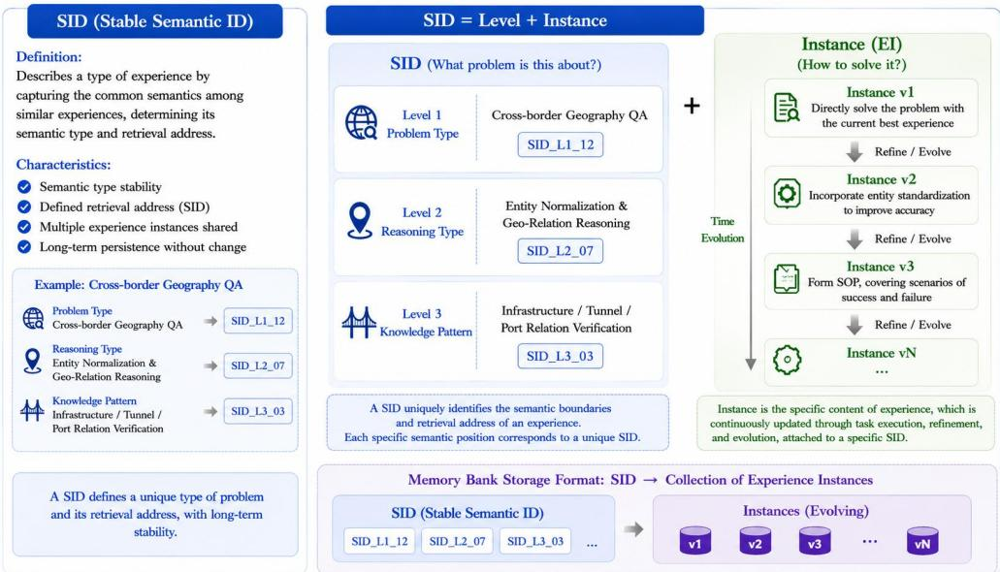  
Figure 6: Conceptual illustration of SID-addressed memory and experience evolution. The illustrated versions represent successive contents at the same address. Semantic categories and the three-level SID are illustrative; the implemented system uses four residual-quantization levels without predefined semantic roles.

## D MEMORY BANK CONSTRUCTION AND STATISTICS

## D.1 COLD-START EXPERIENCE GENERATION

The cold-start stage constructs the seed experience bank before memory-policy training (Section 2). Let $\mathcal { D } _ { \mathrm { t r a i n } }$ denote the set of training queries and $y _ { q } ^ { \star }$ the reference answer for query $q ,$ with $y _ { q } ^ { \star } = \emptyset$ when no reference answer is available. The notation below describes the information passed through trajectory collection, assessment, and extraction; these stages do not update model parameters.

Trajectory collection. For each query $q ,$ StackPlanner generates $K _ { q }$ attempts. We represent each recorded attempt and the resulting trajectory group as

$$
\tau _ { q } ^ { ( k ) } = ( \xi _ { q } ^ { ( k ) } , \hat { y } _ { q } ^ { ( k ) } , g _ { q } ^ { ( k ) } ) , \qquad \mathcal { T } ( q ) = \{ \tau _ { q } ^ { ( k ) } \} _ { k = 1 } ^ { K _ { q } } ,\tag{30}
$$

where $\xi _ { q } ^ { ( k ) }$ is the recorded sequence of reasoning steps, actions, and observations, $\hat { y } _ { q } ^ { ( k ) }$ is the final answer, and $g _ { q } ^ { ( k ) }$ contains any environment reward or completion signals. Missing feedback is

represented by $g _ { q } ^ { ( k ) } = \emptyset$ , not by a failure label. The generation prompts request supporting evidence and verification steps so that subsequent extraction can refer to what the agent actually did.

Outcome and evidence assessment. The summarization prompts assess each attempt against the available reference answer or environment feedback. We denote retained assessment information by

$$
\begin{array} { r l r l } & { } & { \boldsymbol { A } ( \boldsymbol { q } ) = \big \{ \big ( \tau _ { q } ^ { ( k ) } , d _ { q } ^ { ( k ) } , b _ { q } ^ { ( k ) } \big ) \big \} _ { k = 1 } ^ { K _ { q } } , } & & { d _ { q } ^ { ( k ) } \in \{ \mathrm { s u c c e s s } , \mathrm { f a i l u r e } , \mathrm { u n v e r i f i e d } \} , } \end{array}\tag{31}
$$

where $d _ { q } ^ { ( k ) }$ records whether the available evaluation evidence establishes success, establishes failure, or leaves the outcome unverified. For interactive tasks, a success claim requires an observed environment signal. The textual record $b _ { q } ^ { ( k ) }$ captures decisive steps, supporting evidence, failure indications, and low-evidence caveats from the single-trajectory summary. It is not a scalar quality score. Outcome and evidence quality are distinct: a correct final answer without a documented procedure can still be marked as low-evidence. Failed and unverified attempts are retained for comparison, without inventing missing steps or treating uncertain outcomes as verified ones.

Experience extraction. An LLM extractor $\mathcal { E }$ uses the query, its available reference, and the assessed attempts to produce a set of textual experience summaries,

$$
{ \mathcal { X } } ( q ) = { \mathcal { E } } \left( q , y _ { q } ^ { \star } , { \mathcal { A } } ( q ) \right) .\tag{32}
$$

Each $x \in \mathcal { X } ( q )$ describes a reusable procedure or lesson, retaining its applicability conditions, decision rules, verification checks, and failure-recovery strategies. Successful attempts supply supported procedures; failed attempts reveal breakdowns and possible remedies; unverified attempts retain their uncertainty. This comparison is what we mean by contrastive distillation: text extraction from contrasting outcomes, not optimization of a contrastive loss. Aggregating the extracted summarie gives

$$
\mathcal { X } _ { \mathrm { s e e d } } = \bigcup _ { q \in \mathcal { D } _ { \mathrm { t r a i n } } } \mathcal { X } ( q ) .\tag{33}
$$

These summaries are the inputs $x _ { i }$ to the encoder and SID construction in Section 2. The singletrajectory and multi-trajectory prompts defining the assessment and extraction content are reproduced in Appendix I.2.

## D.2 MEMORY BANK DATA STATISTICS

This section reports the composition, scale, and compression statistics of the memory bank.

Overall pipeline. Raw skill crawling yields 171,820 entries; cluster-level deduplication reduces this to 16,384 canonical skills. Combined with SOP and factual trajectories, the pre-summary bank contains 138,243 entries, compressed into 16,416 final summaries via the LLM summarization stage (§2).

We first examine the composition of the pre-summary memory bank. As shown in Table 5, SOP and factual experience constitute the majority of the retained entries, while skill experience provides a smaller but complementary source.

Table 5: Composition of the 138,243 pre-summary experience entries.
<table><tr><td>Type</td><td></td><td>Count Proportion</td></tr><tr><td>SOP experience</td><td>62,967</td><td>45.55%</td></tr><tr><td>Factual experience</td><td>58,892</td><td>42.60%</td></tr><tr><td>Skills experience</td><td>16,384</td><td>11.85%</td></tr></table>

We next report the source distribution of the retained experience entries. Table 6 shows that the memory bank draws from a broad collection of interactive, reasoning, and search-oriented datasets rather than being dominated by a single source.

Table 6: Number of retained experience entries by source after rollout generation, filtering, and experience distillation.
<table><tr><td>Source</td><td>Count Source</td><td></td><td>Count</td></tr><tr><td>WebShop</td><td>30,000</td><td>HotpotQA</td><td>9,044</td></tr><tr><td>Skills</td><td>16,384</td><td>NQ</td><td>8,080</td></tr><tr><td>ALFWorld</td><td>12,007</td><td>GSM8K</td><td>7,188</td></tr><tr><td>2WikiMultiHopQA</td><td>11,336</td><td>MATH</td><td>6,892</td></tr><tr><td>TriviaQA</td><td>9,892</td><td>HealthBench</td><td>5,216</td></tr><tr><td>PopQA</td><td>9,596</td><td>GPQA</td><td>1,664</td></tr><tr><td>MuSiQue</td><td>9,312</td><td>DeepConsult</td><td>566</td></tr><tr><td>Bamboogle</td><td>500</td><td>DeepResearchGym</td><td>566</td></tr></table>

To characterize the effect of compression, Table 7 reports entry-length statistics before and after clustering and summarization. The pipeline substantially reduces both typical and extreme entry lengths, together with the overall text volume.

Table 7: Percentile statistics of entry length (characters) at each pipeline stage.
<table><tr><td>Stage</td><td>P50</td><td>P95</td><td>P99</td><td>Max</td></tr><tr><td>Skills (raw crawl)</td><td>4,748</td><td>20,720</td><td>40,253</td><td>5,425,092</td></tr><tr><td>Skills (post-cluster)</td><td>2,298</td><td>2,942</td><td>3,412</td><td>5,415</td></tr><tr><td>Memory (pre-summary)</td><td>8,131</td><td>20,208</td><td>26,071</td><td>123,653</td></tr><tr><td>Memory (post-summary)</td><td>3,116</td><td>10,274</td><td>19,075</td><td>50,204</td></tr></table>

Total text volume: $\sim 1 . 0 7 5 \times 1 0 ^ { 9 }$ characters pre-summary, ${ \sim } 1 . 1 8 \times 1 0 ^ { 8 }$ post-summary (≈9.1× compression).

We further quantify how many raw experiences are consolidated into each final summary. As shown in Table 8, each summary merges $4 . 5 2$ raw entries on average, while a small number of summaries aggregate substantially larger groups.

Table 8: Distribution of the number of raw entries merged into each summary.
<table><tr><td>Mean</td><td>P50</td><td>P90</td><td>P95</td><td>P99</td><td>Max</td></tr><tr><td>4.52</td><td>3</td><td>10</td><td>14</td><td>28</td><td>316</td></tr></table>

Finally, Table 9 characterizes the remaining long-summary tail after compression. Most summaries remain compact, with only a small fraction exceeding the larger character thresholds.

Table 9: Fraction of summaries at or above each character threshold.
<table><tr><td>Threshold</td><td>Count</td><td>Fraction</td></tr><tr><td>≥4,096 chars</td><td>5,370</td><td>17.56%</td></tr><tr><td>≥8,192 chars</td><td>2,368</td><td>7.74%</td></tr><tr><td>≥16,384 chars</td><td>601</td><td>1.97%</td></tr><tr><td>≥32,768 chars</td><td>12</td><td>0.039%</td></tr></table>

## E EXPERIMENTAL DATASETS AND EVALUATION PROTOCOLS

## E.1 EVALUATION BENCHMARKS

Table 10 maps the evaluation benchmarks to the main-text results and their reported metrics. ALF-World and WebShop are in-domain interactive tasks. For search-augmented question answering, 2WikiMultiHopQA and HotpotQA are in-domain benchmarks, whereas Bamboogle, MuSiQue, Natural Questions, and TriviaQA are out-of-domain benchmarks. We further evaluate cross-domain generalization on BrowseComp-Plus (Chen et al., 2025b) for search, DeepResearch Bench (Du et al., 2026) for research, BIRD (Li et al., 2023) for SQL generation, and SWE-bench Verified (Jimenez et al., 2024) for software engineering. GPQA is used separately for the symbolic reasoning experiment in Section 5.

Table 10: Evaluation benchmarks and metric correspondence. In-domain and out-of-domain designations follow the evaluation protocol in the main text. GPQA is used separately for the symbolic reasoning analysis.
<table><tr><td>Benchmark</td><td>Evaluation role</td><td>Reported metric</td></tr><tr><td>ALFWorld</td><td>interactive task</td><td>Subtask and overall success rate</td></tr><tr><td>WebShop</td><td>interactive task</td><td>Task score and success rate</td></tr><tr><td>2WikiMultiHopQA (2Wiki) HotpotQA</td><td>In-domain QA In-domain QA</td><td>Answer F1 Answer F1</td></tr><tr><td>Bamboogle</td><td></td><td>Answer F1</td></tr><tr><td></td><td>Out-of-domain QA</td><td></td></tr><tr><td>MuSiQue</td><td>Out-of-domain QA</td><td>Answer F1</td></tr><tr><td>Natural Questions (NQ)</td><td>Out-of-domain QA</td><td>Answer F1</td></tr><tr><td>TriviaQA</td><td>Out-of-domain QA</td><td>Answer F1</td></tr><tr><td>BrowseComp-Plus</td><td>Out-of-domain search</td><td>Exact-match accuracy</td></tr><tr><td>DeepResearch Bench</td><td>Out-of-domain research</td><td>RACE</td></tr><tr><td>BIRD</td><td>Out-of-domain SQL</td><td>Execution accuracy</td></tr><tr><td>SWE-bench Verified</td><td>Out-of-domain code</td><td>Resolved rate</td></tr><tr><td>GPQA</td><td>Symbolic reasoning</td><td>Answer accuracy</td></tr></table>

The SID retrieval evaluation is distinct from these downstream benchmarks. Table 18 reports 2,000 evaluation examples for each MemRetriever configuration and 735 for MemEvolver. The latter comprise 590 merge\_existing and 145 insert\_new examples (Table 22); these are evaluation categories, not additional memory operations. Memory-bank construction counts are reported separately in Appendix D.2 and should not be interpreted as evaluation-set sizes.

Details to complete. Exact benchmark versions, splits, evaluated sample counts, and overlap checks against the seed bank remain to be documented. The proposed Deep Research, Code, and SQL transfer evaluations are not specified by named datasets and completed result tables in the current draft, so they are not included in Table 10.

## E.2 EVALUATION METRICS

Downstream task performance. For an evaluation set of n episodes, let $b _ { j } ~ \in ~ \{ 0 , 1 \}$ denote benchmark-verified task success. The success rate is

$$
\mathrm { S R } = \frac { 1 0 0 } { n } \sum _ { j = 1 } ^ { n } b _ { j } .\tag{34}
$$

For ALFWorld, success is determined by the environment, not by matching an answer string. The Pick, Look, Clean, Heat, Cool, and Pick2 columns apply this measure to the corresponding task subsets; the All column reports overall success. WebShop reports both task score and success rate. The score averages graded task rewards, whereas success counts completed tasks satisfying the benchmark’s success criterion. The exact score normalization and overall aggregation used by each baseline source remain part of the reproduction checks in Appendix F.1.

QA F1 and symbolic reasoning accuracy. For answer token precision $P _ { j }$ and recall $Q _ { j }$ on example $j ,$ token F1 is $F _ { 1 , j } = 2 P _ { j } Q _ { j } / ( \bar { P } _ { j } + Q _ { j } )$ , with zero assigned when there is no token overlap. The QA tables report the mean example-level F1 as a percentage. Answer normalization, multiple-reference handling, and empty-answer conventions must follow the evaluation script used for each dataset and remain to be recorded. The Avg. column in Table 2 summarizes the six dataset-level scores, rather than pooling all questions into a single evaluation set. The GPQA experiment instead reports answer accuracy, computed as in Eq. 34 with $b _ { j }$ indicating a correct answer choice; it is not a retrieval hit rate.

Candidate and final retrieval hit rates. Let $\mathbf { z } _ { j } ^ { \star }$ be the reference SID for evaluation example j, and let $A _ { j , k }$ contain the first k predicted addresses under a specified ranking. Define

$$
H \ @ k ( \boldsymbol { A } ) = \frac { 1 0 0 } { n } \sum _ { j = 1 } ^ { n } \mathbb { I } [ \mathbf { z } _ { j } ^ { \star } \in \mathcal { A } _ { j , k } ] .\tag{35}
$$

Candidate Hit applies this criterion to the full candidate set before reranking. R@k in Table 18 uses the beam-search ranking, whereas HR@k uses the reranked list. In Table 4, final Hit@k is computed on the reranked list for all methods. These single-reference hit rates measure whether the target is present, not the fraction of returned memories judged relevant; they are not precision@k.

Independent level and cumulative prefix accuracy. For $\textbf { z } = ~ ( s ^ { 1 } , \ldots , s ^ { L } )$ , write $\begin{array} { r l } { \mathbf { z } _ { 1 : \ell } } & { { } = } \end{array}$ $( s ^ { 1 } , \bar { \ldots } , s ^ { \ell } )$ . The two hierarchical metrics in Tables 20 and 21 are

$$
H _ { \ell } @ k = \frac { 1 0 0 } { n } \sum _ { j = 1 } ^ { n } \mathbb { I } [ \exists \mathbf { z } \in \mathcal { A } _ { j , k } : s ^ { \ell } = s _ { j } ^ { \star , \ell } ] ,
$$

$$
H _ { 1 : \ell } @ k = \frac { 1 0 0 } { n } \sum _ { j = 1 } ^ { n } \mathbb { I } [ \exists \mathbf { z } \in \mathcal { A } _ { j , k } : \mathbf { z } _ { 1 : \ell } = \mathbf { z } _ { j , 1 : \ell } ^ { \star } ] .\tag{36}
$$

Independent accuracy requires a match only at level ℓ. Cumulative accuracy requires all first ℓ symbols to match within the same candidate. $\mathrm { A t } \ell = L ,$ cumulative accuracy equals full-SID hit rate. Table 16 reports cumulative Top-5 accuracy after reranking, matching the corresponding rows of Table 21; its ROUGE-L and LLM-Judge values assess generated experience text separately and are not percentages of correct SIDs. The judge rubric and score normalization remain to be documented.

Reporting scope. The MemEvolver update-type breakdown reports SID retrieval performance within each operation category, not accuracy of choosing insert versus revise. Training rewards are also distinct from held-out task metrics. No statistical-significance claim is made here without repeated-run results and a specified testing procedure.

Cross-domain evaluation metrics. BrowseComp-Plus is evaluated using normalized exact-match accuracy. DeepResearch Bench is evaluated using RACE. BIRD is evaluated using execution accuracy, obtained by executing the predicted and reference SQL queries on the same database and comparing their returned results. SWE-bench Verified is evaluated using resolved rate under the official evaluation harness.

## E.3 ONLINE EVALUATION PROTOCOL

The online evaluation uses a strict temporal split. We construct the initial bank and fit the SID codebooks using only the training portion of each benchmark; the held-out portion is then presented once as an ordered query stream. We keep the stream order fixed for every method and repeat the evaluation over the same random seeds used for decoding. The online checkpoint starts with the same bank, model weights, encoder, and codebooks as the frozen-bank control. No gradient update, codebook refit, or access to held-out answers is permitted during memory updates.

For each incoming query $q _ { t } ,$ the system generates one SID, retrieves the addressed support, and executes StackPlanner to obtain an answer $\hat { y } _ { t }$ and trajectory $\tau _ { t }$ . We score $( q _ { t } , \hat { y } _ { t } )$ immediately, then run the evolution policy on $\tau _ { t }$ and apply its emitted insert or revise operation to obtain $\mathcal { M } _ { t + 1 }$ Every fixed-size stream block is followed by evaluation on a disjoint probe set sampled once before the online run; probing is read-only and therefore cannot alter subsequent memory states. We store the bank snapshot and all operation logs at each probe point.

The primary curve plots probe task performance against the cumulative number of processed stream queries. We additionally report memory precision@k, SID prefix hit rate at each level, and operation frequencies (insertion, content-changing revision, and content-preserving revision). The frozen-bank control follows the identical query and probe schedule but skips the write step. Paired differences between the two curves quantify the contribution of online evolution, while bootstrap intervals over tasks and stream seeds provide uncertainty estimates.

## F BASELINES, IMPLEMENTATION, AND TRAINING DETAILS

## F.1 COMPARISON METHODS AND SETTINGS

ALFWorld and WebShop. Table 1 compares GPT-4o and Gemini-2.5-Pro; the prompt-based or memory-based methods ReAct, Reflexion, Mem0, MemP, ExpeL, and SimpleMem; the RL baselines RLOO and GRPO; and the memory-augmented RL methods MemRL, EvolveR, Mem0+GRPO, SimpleMem+GRPO, SkillRL, SkillGraph, AgentOCR, SIRI, and Skill0. The GENMEM and GENMEM (RL) rows distinguish the configurations before and after Harness-RL training of StackPlanner, as described in Section 4.2.

Search-augmented QA. Table 2 includes Base and CoT prompting, FS-RAG, FL-RAG, ReAct, IR-CoT, and TCRAG; the RL methods ReSearch, Search-R1, AEPO, ARPO, KBPO, Mem1, ZeroSearch, and AgenticRAG-R1; and EvolveR, SkillRL, SkillGraph, AgentOCR, Skill0, Skill-SD, SAPO, and SDAR. Method citations are provided in Section 4.1. Entries marked – are unavailable results, not zero scores, and should not enter performance rankings or averages.

Experience retrieval. The comparison in Table 4 uses Qwen3-Embedding-0.6B, TF-IDF, SkillRouter-Embedding-0.6B, and GENMEM with up to 50 candidates followed by BGE reranking to Top-5. All methods therefore share the same candidate budget and reranking protocol, enabling a matched-budget comparison of candidate and final retrieval hit rates.

Reproduction scope. The Qwen2.5-7B-Instruct backbone in Section 4.1 refers to the three GEN-MEM modules; Table 2 is labelled as a Qwen2.5-7B comparison. Neither statement establishes identical models or inference budgets for every baseline, particularly the proprietary models in Table 1. Per-row provenance (reported results or local reruns), checkpoint versions, retrieval settings, token and tool-call budgets, decoding parameters, and random seeds remain to be recorded before the comparisons can be described as controlled reproductions.

## F.2 TRAINING HYPERPARAMETERS

We use Qwen2.5-7B-Instruct as the backbone for both memory policies and optimize them with GRPO during post-training. The SID codebook is fixed to the four-level configuration $4 8 \times 1 6 \times 8 \times 8$ Unless otherwise specified, all post-training runs use the hyperparameters summarized in Table 11.

Table 11: Hyperparameters for reinforcement learning
<table><tr><td>Hyperparameter</td><td>Value</td></tr><tr><td>Backbone model</td><td>Qwen2.5-7B-Instruct</td></tr><tr><td>SID codebook  $( N _ { 1 } \times N _ { 2 } \times N _ { 3 } \times N _ { 4 } )$ </td><td> $4 8 \times 1 6 \times 8 \times 8$ </td></tr><tr><td>Learning rate (alignment) Learning rate (GRPO)</td><td> $2 \times 1 0 ^ { - 5 }$ </td></tr><tr><td>Global Batch size</td><td> $3 \times 1 0 ^ { - 5 }$ </td></tr><tr><td>GRPO group size G</td><td>256</td></tr><tr><td>GRPO rollout batch size</td><td>8</td></tr><tr><td>KL coefficientβ</td><td>32</td></tr><tr><td>Training steps (GRPO)</td><td>0.04 200</td></tr></table>

## G ADDITIONAL EXPERIMENTS AND ANALYSIS

## G.1 RQ-KMEANS EVALUATION METRICS AND CONFIGURATION ANALYSIS

Prefix-prompt comparison. Table 12 compares encoding with and without the prefix, holding the seed bank, encoder, and reported Weighted setting $( w = 0 . 5 )$ fixed. This experiment uses a three-level 48 $\times 2 4 \times 2 4$ codebook, not the four-level $4 \bar { 8 } \times 1 6 \times 8 \times 8$ configuration used in the main system. Under this three-level setting, the prefix reduces the reported reconstruction loss but also slightly reduces leaf occupancy. It is not a direct ablation of prefix guidance in the final four-level system.

Table 12: Prefix-prompt comparison with a three-level $4 8 \times 2 4 \times 2 4$ codebook and the reported Weighted setting $( w \ : = \ : 0 . 5 )$ . The encoder and seed bank are held fixed. Values and rounded differences are transcribed from the supplied experiment summary; raw-precision outputs remain to be checked.
<table><tr><td>Metric</td><td>Prefix</td><td>No prefix</td><td>Δ</td></tr><tr><td>Test reconstruction loss ↓</td><td>0.000332</td><td>0.000392</td><td>-15.27%</td></tr><tr><td>Single-code utilization (L1/L2/L3) ↑</td><td>100/100/100%</td><td>100/100/100%</td><td>0</td></tr><tr><td>Cumulative L1+L2 utilization ↑</td><td>84.72%</td><td>83.25%</td><td> $+ 1 . 4 8 \mathrm { p p }$ </td></tr><tr><td>Leaf-combination utilization ↑</td><td>23.75%</td><td>23.93%</td><td>−0.18 pp</td></tr><tr><td>Used leaves</td><td>6,567</td><td>6,617</td><td>-50</td></tr><tr><td>DUI uniformity ↑</td><td>0.8929</td><td>0.8730</td><td>+0.0199</td></tr><tr><td>ICR (independent-code rate) ↑</td><td>1.1487</td><td>1.1422</td><td>+0.0064</td></tr><tr><td>SID uniqueness ↑</td><td>47.50%</td><td>47.87%</td><td>-0.36 pp</td></tr><tr><td>RQ-KMeans training time</td><td>77.6 s</td><td>73.6 s</td><td> $+ 4 . 0 \ : s$ </td></tr></table>

RQ-KMeans codebook configuration analysis. We compare 40 codebook configurations spanning two to four quantization levels and address capacities from 27,648 to 147,456 (Table 13). Each configuration is evaluated under three reported distance settings (Euclidean, Spherical, Weighted w = 0.5), giving 120 combinations fitted on the same 138,243 pre-merge embeddings. The comparison examines the trade-off between address capacity, SID vocabulary size, and quantization quality, reporting reconstruction loss, leaf utilization, SID uniqueness, and DUI.

Table 13: Codebook search space. Each tuple lists the codebook sizes $( N _ { 1 } , \dots , N _ { L } )$ ; counts in parentheses give the number of configurations at each depth.
<table><tr><td>Quantization depth Codebook configurations</td><td colspan="3"></td></tr><tr><td>Two levels (3)</td><td colspan="3"> $2 5 6 \times 2 5 6 ,$   $3 2 0 \times 2 5 6 ,$  384×256</td></tr><tr><td rowspan="6">Three levels (30)</td><td> $4 8 \times 2 4 \times 2 4 ,$   $4 8 \times 3 2 \times 3 2 ,$ </td><td> $6 4 \times 3 2 \times 2 4 ,$   $6 4 \times 3 2 \times 3 2 ,$ </td><td> $6 4 \times 4 0 \times 2 0$ </td></tr><tr><td> $6 4 \times 4 8 \times 2 0 ,$ </td><td> $6 4 \times 4 8 \times 2 4 ,$   $7 2 \times 2 4 \times 1 6 ,$ </td><td> $7 2 \times 3 2 \times 2 4 ,$   $8 0 \times 3 2 \times 1 6$ </td></tr><tr><td> $8 0 \times 3 2 \times 2 0 ,$   $8 0 \times 3 2 \times 3 2 ,$ </td><td> $8 0 \times 4 0 \times 2 4 ,$ </td><td> $8 0 \times 4 8 \times 1 6 ,$   $8 8 \times 4 0 \times 8$ </td></tr><tr><td> $9 6 \times 2 4 \times 2 4 ,$   $9 6 { \times } 3 2 { \times } 1 6 ,$ </td><td> $9 6 \times 3 2 \times 2 4 ,$ </td><td> $9 6 \times 4 0 \times 1 6 ,$   $9 6 \times 4 0 \times 2 4$ </td></tr><tr><td> $9 6 \times 4 8 \times 1 6 ,$   $9 6 \times 4 8 \times 2 4 ,$ </td><td> $1 2 8 \times 2 4 \times 1 6 ,$ </td><td> $1 2 8 \times 2 4 \times 2 4 ,$   $1 2 8 { \times } 3 2 { \times } 1 6$ </td></tr><tr><td> $1 2 8 \times 3 2 \times 2 4 ,$   $1 2 8 \times 4 0 \times 1 6 ,$ </td><td> $1 2 8 \times 4 0 \times 2 4 ,$   $1 4 4 \times 4 0 \times 2 4 ,$ </td><td> $1 9 2 \times 3 2 \times 2 4$ </td></tr><tr><td rowspan="2">Four levels (7)</td><td> $4 8 \times 1 6 \times 8 \times 8 ,$   $4 8 \times 2 4 \times 1 6 \times 8 ,$ </td><td> $6 4 \times 1 6 \times 8 \times 8 ,$ </td><td> $6 4 \times 1 6 \times 1 6 \times 8$ </td></tr><tr><td> $6 4 \times 2 4 \times 8 \times 8 ,$   $8 0 \times 1 6 \times 8 \times 8 ,$ </td><td> $9 6 { \times } 1 6 { \times } 8 { \times } 8$ </td><td></td></tr></table>

Distance Metric Comparison. Table 14 summarizes each distance setting across the 40 architectures. The standard deviation describes variation across architectures, not uncertainty across repeated random seeds. Reconstruction loss is reported in units of $\times 1 0 ^ { - 4 }$

Table 14: Distance-setting comparison, with mean ± standard deviation across 40 architectures. Loss is reported in $\times 1 0 ^ { - 4 }$
<table><tr><td>Distance</td><td> $\mathbf { R e c o n . L o s s ( \times 1 0 ^ { - 4 } ) }$ </td><td> $\mathbf { L e a f ~ U t i l . } \left( \% \right)$ </td><td>Uniqueness Ratio</td><td> $\mathbf { A v g . D U I } \left( \% \right)$ </td></tr><tr><td>Euclidean</td><td> $3 . 3 8 \pm 0 . 0 9$ </td><td> $1 4 . 9 2 \pm 3 . 6 8$ </td><td> $0 . 0 7 6 5 \pm 0 . 0 2 4 1$ </td><td> $5 6 . 5 3 \pm 3 . 7 1$ </td></tr><tr><td>Spherical</td><td> $5 . 9 8 \pm 1 . 6 0$ </td><td> $5 . 1 4 \pm 6 . 2 8$ </td><td> $0 . 0 2 7 0 \pm 0 . 0 3 7 5$ </td><td> $8 1 . 9 0 \pm 1 . 9 3 $ </td></tr><tr><td>Weighted  $\scriptstyle ( w = 0 . 5 )$ </td><td> $3 . 3 2 \pm 0 . 1 0$ </td><td> $4 9 . 1 5 \pm 8 . 8 9$ </td><td> $0 . 2 5 2 3 \pm 0 . 0 7 1 9$ </td><td> $8 8 . 3 6 \pm 2 . 0 4$ </td></tr></table>

Selected configuration vs. competitors. Table 15 compares the selected configuration $( 4 8 \times 1 6 \times$ $8 \times 8 ,$ reported Weighted setting $w = 0 . 5 )$ with five alternatives in the 40K–60K capacity band. This is a trade-off between vocabulary size and the reported quantization metrics, rather than a claim that one configuration is best on every measure.

Table 15: Configuration comparison within the 40K–60K capacity band. The selected configuration (bold) uses the fewest SID tokens among the configurations shown. Loss is reported in $\times 1 0 ^ { - 4 }$
<table><tr><td>Codebook</td><td>L</td><td>Capacity</td><td>Vocab Size</td><td>Recon.  $( \times 1 0 ^ { - 4 } )$ </td><td>Leaf Util. (%)</td><td>Uniq. Ratio</td><td>DUI (%)</td></tr><tr><td>48×16×8×8</td><td>4</td><td>49,152</td><td>80</td><td>3.48</td><td>62.22</td><td>0.2212</td><td>90.70</td></tr><tr><td>128×24×16</td><td>3</td><td>49,152</td><td>168</td><td>3.31</td><td>64.25</td><td>0.2284</td><td>89.48</td></tr><tr><td>96×24×24</td><td>3</td><td>55,296</td><td>144</td><td>3.34</td><td>56.71</td><td>0.2268</td><td>88.74</td></tr><tr><td>72×32×24</td><td>3</td><td>55,296</td><td>128</td><td>3.36</td><td>51.26</td><td>0.2051</td><td>88.44</td></tr><tr><td>96×32×16</td><td>3</td><td>49,152</td><td>144</td><td>3.34</td><td>57.49</td><td>0.2044</td><td>87.53</td></tr><tr><td>64×40×20</td><td>3</td><td>51,200</td><td>124</td><td>3.36</td><td>52.93</td><td>0.1960</td><td>88.13</td></tr></table>

Configuration trade-offs. The reported Weighted setting has higher mean leaf utilization than the Euclidean setting (49.15% versus 14.92%), with similar reported reconstruction loss (3.32 versus 3.38, in units of 10<sup>−4</sup>). These aggregate results compare distance settings; they do not isolate the effect of hierarchy depth. Within Table 15, the selected four-level configuration represents 49,152 possible addresses with 80 SID tokens, compared with 124–168 tokens for the listed three-level alternatives. Its leaf utilization is 62.22%, but its reported reconstruction loss is higher than that of every listed alternative. The configuration therefore favors a smaller vocabulary rather than minimum reconstruction error. These measurements do not establish effects on catastrophic forgetting, training convergence, or downstream task accuracy.

## G.2 PRETRAINING AND MID-TRAINING RETRIEVAL ANALYSIS

This section systematically compares SID retrieval quality across pretraining (PT) and mid-training (MT) stages for both the legacy 3-level and current 4-level codebooks. We evaluate MemRetriever and MemEvolver under beam search and reranking, reporting recall at multiple cutoffs and per-level hit rates. All retrieval evaluations use uniformly sampled training examples from the six search benchmarks listed in Table 3, together with ALFWorld and WebShop.

Table 16 gives the SID alignment and experience-reconstruction scores omitted from the main text to conserve space.

Table 16: SID alignment accuracy (%) at each cumulative hierarchical level, measured at Top-5 after reranking. For SID→experience reconstruction, ROUGE-L and LLM-Judge scores are reported separately.
<table><tr><td>Component</td><td> $L _ { 1 }$ </td><td> $\scriptstyle { L _ { 1 } - L _ { 2 } }$ </td><td> $\boldsymbol { L } _ { 1 } { - } \boldsymbol { L } _ { 3 }$  </td><td> $\scriptstyle L _ { 1 } - L _ { 4 }$ </td></tr><tr><td>MemRetriever (query→SID)</td><td>40.90</td><td>13.00</td><td>6.30</td><td>3.75</td></tr><tr><td>MemEvolver (traj→SID)</td><td>40.41</td><td>11.29</td><td>3.27</td><td>1.36</td></tr><tr><td colspan="5">SID→experience rewrite ROUGE-L: 0.53 LLM-Judge: 0.57</td></tr></table>

Model abbreviations used throughout:

• PT-3L: Pretrained MemRetriever (MemR) with 3-level codebook $( 4 8 \times 2 4 \times 2 4 )$

• PT-4L: Pretrained MemR with 4-level codebook $( 4 8 \times 1 6 \times 8 \times 8 )$

• MT-3L: Mid-trained MemR with 3-level codebook $( 4 8 \times 2 4 \times 2 4 )$

• MT-4L-Full: Mid-trained 4-level COT MemR with full-sequence beam decoding.

• MT-4L-SID: Mid-trained 4-level COT MemR with SID-only beam decoding.

• MT-4L-MemE: Mid-trained 4-level COT MemEvolver (MemE) with training-isomorphic schema.

Codebook configuration Table 17 compares the two codebook configurations. The 4-level factorization offers a larger theoretical address space with shorter per-level vocabularies, reducing per-token prediction entropy during autoregressive SID generation.

Table 17: Codebook configuration: 3-level vs. 4-level SID.
<table><tr><td>Property</td><td>3-Level</td><td>4-Level</td></tr><tr><td>Number of levels</td><td>3</td><td>4</td></tr><tr><td>L1 size</td><td>48</td><td>48</td></tr><tr><td>L2 size</td><td>24</td><td>16</td></tr><tr><td>L3 size</td><td>24</td><td>8</td></tr><tr><td>L4 size</td><td></td><td>84</td></tr><tr><td>SID tokens per address</td><td>3</td><td></td></tr><tr><td>Theoretical capacity</td><td> $4 8 \times 2 4 \times 2 4 = 2 7 , 6 4 8$ </td><td> $4 8 \times 1 6 \times 8 \times 8 = 4 9 , 1 5 2$ </td></tr></table>

Full SID Retrieval Results Table 18 reports end-to-end SID retrieval performance across all six configurations, measuring beam-search recall (R@k) and reranking hit rate (HR@k) after dense rescoring.

Table 18: Full SID retrieval results across PT and MT configurations. R@k: beam recall; HR@k: reranking hit rate.
<table><tr><td>Model</td><td>N</td><td>Avg Cand.</td><td>R@1</td><td>R@5</td><td>R@10</td><td>R@20 R@50 HR@1 HR@5</td><td></td><td></td><td></td></tr><tr><td>PT-3L (48×24×24)</td><td>2000</td><td>49.98</td><td>1.15</td><td>4.30</td><td>7.30</td><td>11.25</td><td>20.80</td><td>2.25</td><td>4.85</td></tr><tr><td>PT-4L  $( 4 8 \times 1 6 \times 8 \times 8 )$ </td><td>2000</td><td>49.57</td><td>1.40</td><td>4.95</td><td>7.90</td><td>13.40</td><td>20.25</td><td>7.00</td><td>13.15</td></tr><tr><td>MT-3L MemR  $( 4 8 \times 2 4 \times 2 4 )$ </td><td>2000</td><td>29.43</td><td>0.75</td><td>1.75</td><td>2.90</td><td>5.05</td><td>10.85</td><td>2.95</td><td>5.35</td></tr><tr><td>MT-4L COT MemR (Full Beam)</td><td>2000</td><td>33.72</td><td>0.40</td><td>1.05</td><td>1.50</td><td>2.20</td><td>4.90</td><td>1.85</td><td>3.10</td></tr><tr><td>MT-4L COT MemR (SID-only)</td><td>2000</td><td>50.00</td><td>0.35</td><td>1.15</td><td>1.80</td><td>3.35</td><td>6.80</td><td>2.25</td><td>3.75</td></tr><tr><td>MT-4L COT MemE</td><td>735</td><td>50.00</td><td>0.14</td><td>0.54</td><td></td><td></td><td>5.31</td><td>0.68</td><td>1.36</td></tr></table>

SID Decoding Configurations Table 19 compares greedy decoding, deterministic beam search, and beam sampling. Deterministic beam search uses no random sampling. Increasing its beam width from 5 to 20 raises Recall@5 from 7.93% to 8.53%, while reported latency increases from 121.0 to 406.1 ms. None of the sampled configurations exceeds the highest deterministic Recall@5 in this comparison.

Beam-search hit rates. Table 20 reports per-level independent and cumulative prefix hit rates under beam search. Each level is evaluated independently (left) or cumulatively from L1 through Lℓ (right), at cutoffs Top-1/5/50.

Rerank Hit Rates Table 21 reports per-level and cumulative metrics after reranking (Beam@50 candidates rescored to Top-1 and Top-5).

MemE Update-Type Breakdown Table 22 retains the original evaluation labels and values. The label merge\_existing targets already-populated slots and corresponds to a merging outcome of revise, while insert\_new targets unpopulated leaves and corresponds to insert.

SID Depth Selection: 3-Level vs. 4-Level We compare a 3-level configuration $( N _ { 1 } , N _ { 2 } , N _ { 3 } ) =$ (48, 24, 24) against a 4-level configuration $( N _ { 1 } , N _ { 2 } , \bar { N _ { 3 } , N _ { 4 } } ) = ( 4 8 , 1 6 , 8 , \bar { 8 } )$ under identical training conditions (global batch size 48, 500-step moving average).

As shown in Figure 7, the 4-level SID achieves consistently lower training loss throughout alignment pretraining, converging faster and to a lower plateau. Finer factorization provides the autoregressive decoder with shorter per-level prediction targets and sharper categorical distributions, reducing per-token entropy. This motivates the adoption of the 4-level SID as the default configuration.

SID Codebook Utilization Analysis We analyze token-level utilization of the 4-level codebook (48, 16, 8, 8) across the 138,243 pre-merge entries. Figure 8 reports the share of memories assigned to each token index per level, with normalized entropy and effective code counts.

Table 19: SID decoding configurations and retrieval results. Top-1 SID and Recall@5 are percentages; latency is reported in milliseconds. Greedy decoding returns one candidate, so its two retrieval scores coincide. Temperature and top-p entries are transcribed as reported and do not imply sampling in the deterministic rows. Bold denotes the best value in each result column, including ties.
<table><tr><td></td></tr><tr><td>Decoding</td><td>Beam</td><td>Top-k Temp.</td><td></td><td>Top-p Top-1 SID</td><td>Recall@5 Latency</td><td></td></tr><tr><td>Greedy</td><td>1</td><td>0</td><td>1.0</td><td>1.0</td><td>1.87</td><td>1.87 35.7</td></tr><tr><td>Beam deterministic</td><td>5</td><td>0 0</td><td>1.0 1.0</td><td>1.0 1.0</td><td>2.93 7.93 2.93</td><td>121.0</td></tr><tr><td>Beam deterministic Beam deterministic</td><td>10 20</td><td>0</td><td>1.0</td><td>1.0 3.13</td><td>8.27 8.53</td><td>221.1 406.1</td></tr><tr><td></td><td></td><td></td><td></td><td></td><td></td><td></td></tr><tr><td>Beam sample</td><td>5</td><td>0 5</td><td>0.7</td><td>0.9</td><td>2.53</td><td>6.53 121.5</td></tr><tr><td>Beam sample</td><td>5</td><td>10</td><td>0.7 0.7</td><td>0.9</td><td>2.73</td><td>7.27 121.8</td></tr><tr><td>Beam sample</td><td>5</td><td>20</td><td>0.7</td><td>0.9</td><td>2.47 7.07</td><td>121.9</td></tr><tr><td>Beam sample</td><td>5 5</td><td>20</td><td>0.3</td><td>0.9</td><td>2.93</td><td>6.87 122.0</td></tr><tr><td>Beam sample</td><td>5</td><td>20</td><td>0.5</td><td>0.9</td><td>2.73</td><td>7.73 122.0</td></tr><tr><td>Beam sample</td><td>5</td><td>20</td><td>1.0</td><td>0.9 0.9</td><td>2.87</td><td>7.40 122.0</td></tr><tr><td>Beam sample</td><td>10</td><td>20</td><td>0.7</td><td>0.9</td><td>2.60</td><td>5.67 122.1</td></tr><tr><td>Beam sample</td><td>20</td><td>20</td><td>0.7</td><td>0.9</td><td>3.13 3.07</td><td>7.27 224.3</td></tr><tr><td>Beam sample</td><td>5</td><td>20</td><td>0.7</td><td>0.8</td><td>2.67</td><td>8.27 413.6</td></tr><tr><td>Beam sample</td><td></td><td>20</td><td>0.7</td><td>0.95</td><td></td><td>6.60 121.8</td></tr><tr><td>Beam sample</td><td>5</td><td></td><td></td><td></td><td>2.53</td><td>6.20 122.0</td></tr></table>

Table 20: Beam search hit rates (%) across PT and MT configurations. Left: per-level independent accuracy. Right: cumulative prefix accuracy (L1 through Lℓ must all match). L4 is N/A for 3-level models.
<table><tr><td rowspan="2">Model</td><td rowspan="2">Cutoff</td><td colspan="4">Per-Level Independent (%)</td><td colspan="4">Cumulative Prefix (%)</td></tr><tr><td>L1</td><td>L2</td><td>L3</td><td>L4</td><td>L1</td><td>L1+L2</td><td>L1...L3</td><td>L1...L4</td></tr><tr><td rowspan="2">PT-3L</td><td>Top-1</td><td>31.85</td><td>24.80</td><td>14.00</td><td></td><td>31.85</td><td>7.85</td><td>1.15</td><td></td></tr><tr><td>Top-5</td><td>53.85</td><td>35.40</td><td>26.60</td><td></td><td>53.85</td><td>18.50</td><td>4.30</td><td></td></tr><tr><td rowspan="2"></td><td>Top-50</td><td>88.20</td><td>69.55</td><td>67.05</td><td></td><td>88.20</td><td>49.95</td><td>20.80</td><td></td></tr><tr><td>Top-1</td><td>22.05</td><td>26.75</td><td>31.65</td><td>33.60</td><td>22.05</td><td>7.10</td><td>2.95</td><td>1.40</td></tr><tr><td rowspan="2">PT-4L</td><td>Top-5</td><td>44.25</td><td>42.30</td><td>47.50</td><td>52.05</td><td>44.25</td><td>18.80</td><td>9.05</td><td>4.95</td></tr><tr><td>Top-50</td><td>85.55</td><td>78.60</td><td>81.25</td><td>84.10</td><td>85.55</td><td>52.65</td><td>32.05</td><td>20.25</td></tr><tr><td rowspan="2">MT-3L</td><td>Top-1</td><td>14.40</td><td>23.80</td><td>16.60</td><td></td><td>14.40</td><td>3.70</td><td>0.75</td><td></td></tr><tr><td>Top-5</td><td>22.95</td><td>28.50</td><td>23.00</td><td></td><td>22.95</td><td>7.50</td><td>1.75</td><td></td></tr><tr><td rowspan="2">MT-4L-Full</td><td>Top-50</td><td>66.35</td><td>56.45</td><td>59.65</td><td></td><td>66.35</td><td>29.00</td><td>10.85</td><td></td></tr><tr><td>Top-1</td><td>14.15 26.20</td><td>20.20 27.05</td><td>24.80 37.90</td><td>25.30 35.95</td><td>14.15 26.20</td><td>2.90 7.00</td><td>1.05 2.50</td><td>0.40</td></tr><tr><td rowspan="2"></td><td>Top-5 Top-50</td><td>65.20</td><td>57.30</td><td>69.90</td><td>70.30</td><td>65.20</td><td>25.30</td><td>11.25</td><td>1.05 4.90</td></tr><tr><td></td><td>14.30</td><td>20.10</td><td>25.40</td><td>25.40</td><td>14.30</td><td>3.05</td><td></td><td></td></tr><tr><td rowspan="2">MT-4L-SID</td><td>Top-1 Top-5</td><td>32.20</td><td>29.10</td><td>42.10</td><td>40.40</td><td>32.20</td><td>8.70</td><td>1.00 3.10</td><td>0.35</td></tr><tr><td>Top-50</td><td>72.35</td><td>65.55</td><td>77.75</td><td>76.85</td><td>72.35</td><td>32.30</td><td>14.95</td><td>1.15 6.80</td></tr><tr><td rowspan="2">MT-4L-MemE</td><td></td><td>16.60</td><td>19.73</td><td>23.27</td><td>25.31</td><td>16.60</td><td>3.67</td><td>0.41</td><td></td></tr><tr><td>Top-1</td><td></td><td>26.26</td><td>41.09</td><td>42.99</td><td>33.88</td><td>7.62</td><td>1.77</td><td>0.14</td></tr><tr><td rowspan="2"></td><td>Top-5</td><td>33.88</td><td></td><td></td><td></td><td></td><td></td><td></td><td>0.54</td></tr><tr><td>Top-50</td><td>77.55</td><td>57.69</td><td>75.37</td><td>87.62</td><td>77.55</td><td>30.20</td><td>12.24</td><td>5.31</td></tr></table>

## Key observations:

• High overall utilization. All four levels achieve normalized entropy ≥ 0.97, indicating that the RQ-KMeans construction distributes memories broadly across the codebook rather than collapsing onto a few dominant codes. The effective code counts—43.3/48 at L1, 15.6/16 at L2, 7.9/8 at L3, and 7.9/8 at L4—confirm that nearly all codebook entries are actively used.

• Mild imbalance at L1. While L2–L4 are close to uniform, L1 exhibits moderate variation (range ≈0.1%–4.1% vs. the 2.08% uniform baseline). A small number of L1 tokens (e.g., indices 6 and 52) are under-utilized, reflecting the inherent non-uniformity of task-domain frequencies in the seed data. This motivates the long-tail evolution direction discussed in the Future Work (Section 7).

Table 21: Rerank hit rates (%) (Beam@50 rescored by dense reranker). Layout matches Table 20. L4 is N/A for 3-level models.
<table><tr><td rowspan="2">Model</td><td rowspan="2">Cutoff</td><td colspan="4">Per-Level Independent (%)</td><td colspan="4">Cumulative Prefix (%)</td></tr><tr><td>L1</td><td>L2</td><td>L3</td><td>L4</td><td>L1</td><td>L1+L2</td><td>L1...L3</td><td>L1...L4</td></tr><tr><td>PT-3L</td><td>Top-1 Top-5</td><td>31.80 59.55</td><td>22.05 39.25</td><td>12.60 28.80</td><td></td><td>31.80 59.55</td><td>7.20 19.35</td><td>2.25 4.85</td><td></td></tr><tr><td>PT-4L</td><td>Top-1 Top-5</td><td>26.45 54.45</td><td>28.45 50.25</td><td>32.60 57.35</td><td>32.60 59.85</td><td>26.45 54.45</td><td>11.25 25.70</td><td>8.25 16.40</td><td>7.00 13.15</td></tr><tr><td>MT-3L</td><td>Top-1 Top-5</td><td>20.05 42.80</td><td>24.55 36.60</td><td>15.85 34.15</td><td></td><td>20.05 42.80</td><td>6.50 15.10</td><td>2.95 5.35</td><td></td></tr><tr><td>MT-4L-Full</td><td>Top-1 Top-5</td><td>16.60 40.05</td><td>21.20 35.45</td><td>25.55 48.00</td><td>24.45 48.65</td><td>16.60 40.05</td><td>4.65 12.10</td><td>2.40 5.35</td><td>1.85 3.10</td></tr><tr><td>MT-4L-SID</td><td>Top-1 Top-5</td><td>17.60 40.90</td><td>21.00 37.70</td><td>24.95 49.60</td><td>25.00 49.65</td><td>17.60 40.90</td><td>5.10 13.00</td><td>2.85 6.30</td><td>2.25 3.75</td></tr><tr><td>MT-4L-MemE</td><td>Top-1 Top-5</td><td>16.87 40.41</td><td>19.46 30.88</td><td>23.81 45.71</td><td>22.99 50.88</td><td>16.87 40.41</td><td>3.54 11.29</td><td>1.09 3.27</td><td>0.68 1.36</td></tr></table>

Table 22: MemE retrieval performance by update-operation type.
<table><tr><td>Type</td><td>N</td><td>R@1</td><td>R@5</td><td>R@50</td><td>Avg Cand.</td></tr><tr><td>merge_existing</td><td>590</td><td>0.169</td><td>0.339</td><td>5.763</td><td>50.00</td></tr><tr><td>insert_new</td><td>145</td><td>0.000</td><td>1.379</td><td>3.448</td><td>50.00</td></tr><tr><td>Total</td><td>735</td><td>0.136</td><td>0.544</td><td>5.306</td><td>50.00</td></tr></table>

• Finer levels are more balanced. As the codebook size decreases from 48 (L1) to 8 (L3/L4), the per-token distribution converges toward uniform, consistent with the residual quantization design: later levels partition progressively smaller residual spaces where the variance is more evenly spread.

These results validate the Cartesian-product design: the 4-level factorization (48×16×8×8 = 49,152 addressable regions) achieves high utilization without balancing regularization during construction.

## G.3 TRAINING DYNAMIC

Figure 9 shows training loss during mid-training for both MemRetriever and MemEvolver. This stage fine-tunes the alignment checkpoint on ReAct-style chain-of-thought traces with embedded SID generation. Both modules converge smoothly, confirming that mid-training successfully bridges SID alignment and GRPO post-training without instability.

Figure 10 presents the MemRetriever GRPO post-training curves, tracking both eligibility rates and reward signals over the course of training.

Figure 11 reports the corresponding MemEvolver GRPO diagnostics, covering answer eligibility, retrieval hits, SID matching, and the reward signals used to train the evolution policy.

StackPlanner RL training diagnostics. We report LoRA training diagnostics for StackPlanner on Search, ALFWorld, and WebShop. The Search and WebShop runs optimize the central agent with oracle memory and oracle actions, respectively. The ALFWorld run instead optimizes the Interactor while keeping the central agent frozen. It uses mixed memory conditions, with four oracle-assisted and four no-memory rollouts per query. These curves describe task-execution training, not MemRetriever/MemEvolver training or held-out performance of the complete GENMEM system.

The runs contain 159, 65, and 131 training steps, covering 3,776, 1,035, and 1,042 training queries on Search, ALFWorld, and WebShop, respectively. Search and WebShop use four rollouts per query; ALFWorld uses eight, yielding 8,280 rollouts over one complete epoch and 65 optimizer updates. For Search, we retain the committed training lineage and exclude three superseded log records. The horizontal axis denotes the logged training-step counter for each run.

L2 token distribution (normalized entropy = 0.9900, effective codes = 15.56/16)  
Training Loss Comparison (Global Batch 48, 500-Step Mean)  
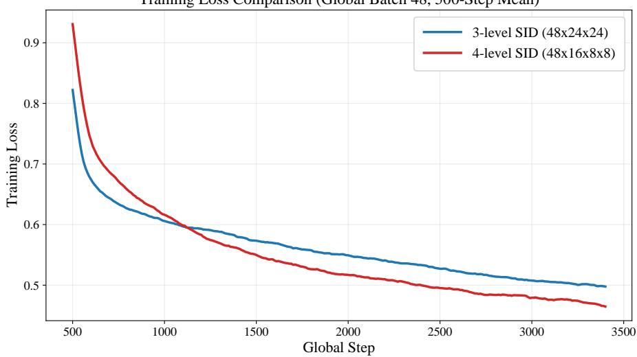  
Figure 7: Alignment pretraining loss: 3-level vs. 4-level SID (500-step moving average, batch size 48). The 4-level SID converges faster and to a lower plateau.  
SID codebook utilization across all four layers Pre-merge memory bank: 138,243 valid memories; codebook sizes 48 × 16 × 8 × 8 L1 token distribution (normalized entropy = 0.9734, effective codes = 43.30/48)

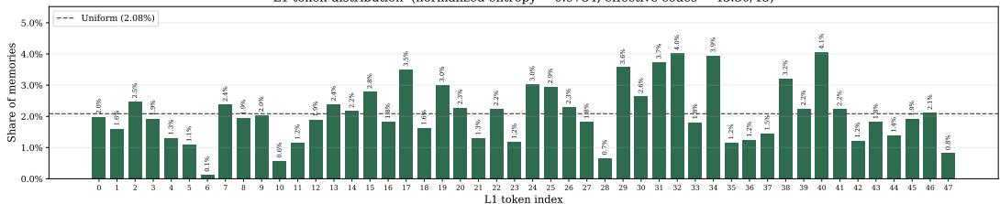

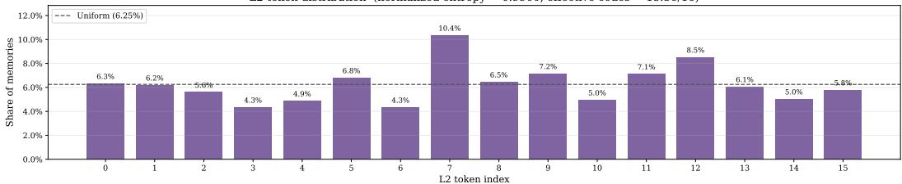

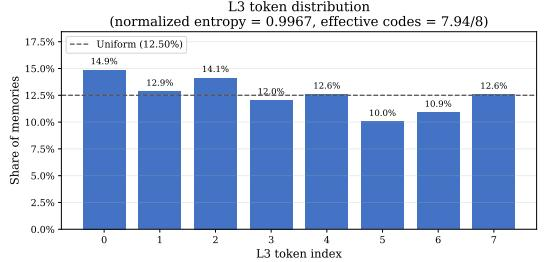

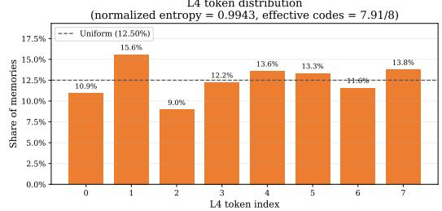  
Figure 8: SID codebook utilization across four levels (138,243 pre-merge entries). Bars show the fraction assigned to each token index; dashed line = uniform baseline. Normalized entropy and effective code counts annotated per level.

As shown in Figure 12, light lines denote per-step values and dark lines trailing means, using taskspecific smoothing windows: rollout-weighted 10-step for Search, unweighted 5-step for ALFWorld, and unweighted 10-step for WebShop. Shorter prefixes are used before a full window is available. Loss normalization differs across tasks, so loss magnitudes are not directly comparable. Each column represents a single run without across-seed uncertainty estimates.

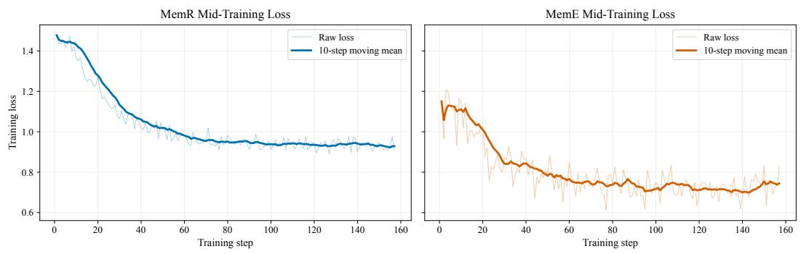  
Figure 9: Mid-training loss for MemRetriever (left) and MemEvolver (right). Both converge smoothly on ReAct-style traces with embedded SID generation.

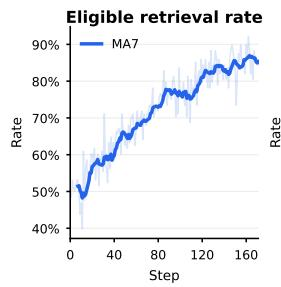

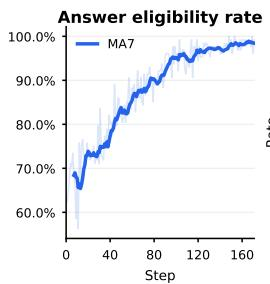

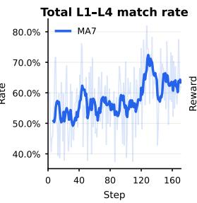

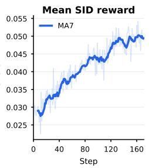

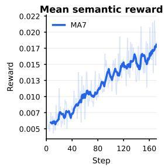

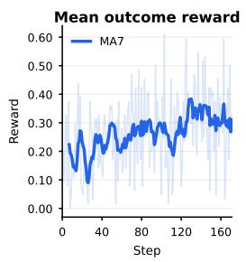

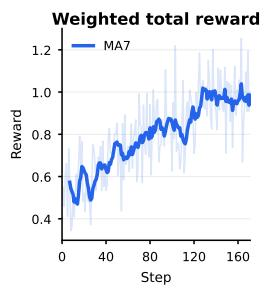  
Figure 10: MemRetriever GRPO post-training curves (MA7-smoothed), tracking three eligibility rates and four reward signals over training steps. All metrics show steady improvement, confirming that GRPO effectively optimizes both SID targeting accuracy and downstream task utility.

Search reward is token F1, whereas the interactive tasks use their logged task rewards. The sampled training queries change across steps, and the GRPO surrogate losses are not supervised cross-entropy losses. Consequently, these curves alone neither establish held-out improvements nor isolate the contribution of learned memory. They are not used to populate the main result tables. De-identified per-step data and the plotting script are retained with the manuscript sources.

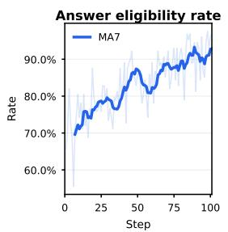

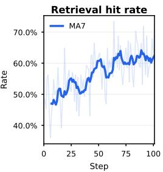

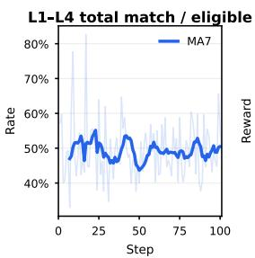

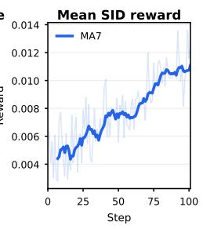

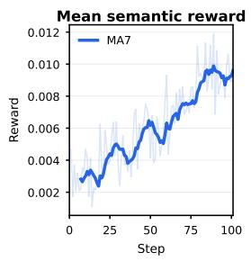

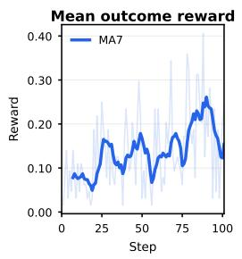

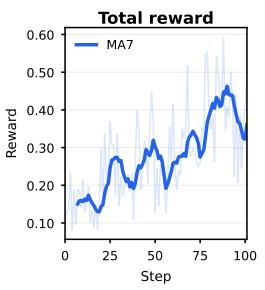  
Figure 11: MemEvolver GRPO post-training curves (MA7-smoothed). The first two panels report answer eligibility and retrieval hits, respectively, each divided by the total number of rollouts. The remaining panels track SID matching, SID and semantic rewards, outcome reward, and total reward.

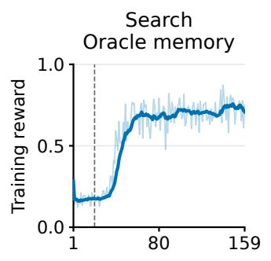

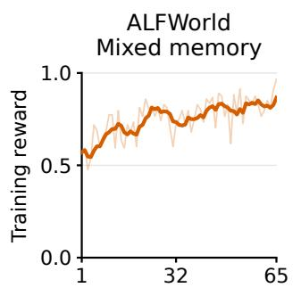

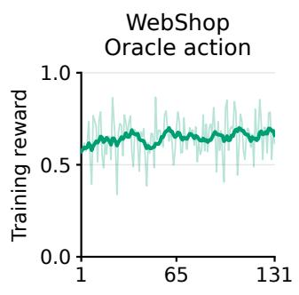

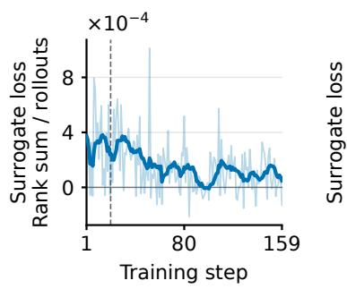

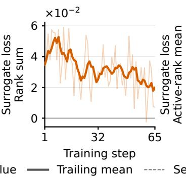

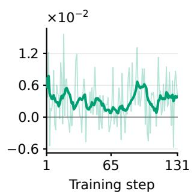  
Training diagnostics only; one run per task. Held-out scores not shown.

Figure 12: StackPlanner RL training diagnostics. Search and WebShop use oracle-assisted centralagent training, while ALFWorld trains the Interactor with a 1:1 mixture of oracle-assisted and no-memory rollouts. Top panels show mean training reward and bottom panels show logged GRPO surrogate loss. The dashed line marks the Search restart after checkpoint 20.

## G.4 ABLATION STUDY

Table 23 provides a component-level analysis of GENMEM under the same self-evolution setting. We evaluate each variant on 200 samples for three complete evolution rounds, while modifying one component at a time.

Table 23: Ablation of key GENMEM components.
<table><tr><td>Variant</td><td>description</td><td>Avg. Accuracy</td><td>Token F1</td></tr><tr><td>GENMEM</td><td>full</td><td>49.5</td><td>52.1</td></tr><tr><td>w/o MemEvolver</td><td>frozen memory bank</td><td>46.5</td><td>46.8</td></tr><tr><td>w/o discriminative retrieval</td><td>TF-IDF + evolution</td><td>40.5</td><td>43.4</td></tr><tr><td>w/o discriminative retrieval</td><td>embedding + evolution</td><td>37.0</td><td>41.2</td></tr><tr><td>w/o MemRetriever</td><td>query only, no memory</td><td>41.0</td><td>45.2</td></tr><tr><td>w/o RL post-training</td><td>MT MemRetriever + MT MemEvolver</td><td>38.5</td><td>42.6</td></tr><tr><td>w/o beam search</td><td>greedy SID decoding</td><td>42.0</td><td>45.7</td></tr></table>

Table 23 isolates the contribution of each major component under the same three-round self-evolution protocol. The w/o MemEvolver variant freezes the memory bank, removing experience refinement while retaining memory retrieval. The w/ discriminative retrieval variant replaces generative SID retrieval with a content-based retriever, instantiated using an embedding model or TF-IDF, while keeping memory evolution unchanged. The w/o MemRetriever variant removes memory access entirely and feeds only the original query to the task model. The w/o RL post-training variant uses the pretrained MemRetriever and MemEvolver checkpoints without reinforcement-learning optimization. Finally, the w/o beam search variant replaces beam-based SID generation with greedy decoding.

Together, these variants separate the effects of experience evolution, symbolic retrieval, policy optimization, and decoding strategy. In particular, full vs. w/o MemEvolver measures the benefit of iterative memory refinement; full vs. w/ discriminative retrieval measures the effect of generative SID-based retrieval under the same evolution process; and full vs. w/o MemRetriever measures the overall contribution of external memory access.

## G.5 GPQA EVALUATION PROTOCOL

The GPQA experiment tests whether SID tokens support downstream reasoning without access to experience text, and whether rewriting retrieved experience improves its utility. We compare seven input conditions and report answer accuracy in Figure 4.

Experimental conditions. For each query, MemRetriever generates k candidate SIDs with beam size $k \in \{ 1 , 5 , 1 0 \}$ . Symbolic inputs follow level-first order: all first-level tokens precede the secondlevel tokens, followed by subsequent levels where applicable. Each condition supplies the query together with the following information.

1. Raw: no additional information.

2. $+ L _ { \mathrm { 1 } } \mathrm { ; }$ first-level SID tokens only.

3. $+ L _ { 1 } . . L _ { 2 } \mathrm { { : } }$ : the first two SID levels.

4. $+ L _ { 1 } . . L _ { 3 } { : }$ the first three SID levels.

5. +Full SID: complete four-level SIDs, without experience text.

6. +Rewrite: a task-adaptive rewrite of experience retrieved using the complete SIDs.

7. +Retrieved Memory: experience text retrieved using the complete SIDs, without rewriting.

Conditions 1–5 vary SID depth without providing a memory payload. Conditions 5–7 compare complete symbolic addresses with rewritten and unmodified experience text. Both text conditions access the memory bank. Rewrite follows the lookup-then-rewrite procedure in Section 2, so it does not measure reconstruction of experience from SID tokens alone.

Results and interpretation. Complete SIDs improve accuracy from the raw-query baseline of 48.32% to 54.06–54.66% across the three beam settings, corresponding to 5.74–6.34 percentage points. Rewritten experience reaches 55.65–56.91%, compared with 56.09–56.63% for directly retrieved text. Direct retrieval performs better at k = 1 and k = 5; rewriting performs better at $k = 1 0 .$ The comparison therefore supports the utility of SID input in this evaluation, with no consistent advantage from rewriting retrieved text. Independent semantic axes and generalization to unseen SID combinations remain unestablished. Assessing these properties requires additiona controls, including held-out combinations and shuffled or reassigned SID tokens.

## H CASE STUDIES

We present three representative cases from the trained GENMEM system (40 initial MemRetriever training steps, 23.5 hours). Each case shows the complete execution trace of MemRetriever, Stack-Planner, and/or MemEvolver.

## H.1 SYMBOLIC REASONING AND ONLINE EVOLUTION TRACES

The following qualitative cases illustrate how SIDs can be manipulated as structured symbols and how the same memory address can accumulate more reliable experience during online evolution. We transcribe the operation, intermediate memories, and generated result so that each example can be read as a complete case rather than as a schematic diagram. These examples clarify the operation semantics but do not replace the quantitative evaluation.

Symbolic Case 1: Address Fusion (A + B → C)   
Inputs. Two source experiences are addressed by   
<SID\_L1\_33><SID\_L2\_4><SID\_L3\_14><SID\_L4\_6> and   
<SID\_L1\_32><SID\_L2\_23><SID\_L3\_10><SID\_L4\_2>. The first records a   
failure caused by relying on a single source (e.g., Wikipedia) when checking a director’s birth   
date. The second records a related failure in which conflicting source data led to an incorrect   
date. Both entries therefore emphasize multi-source verification and arithmetic or timeline   
checks.   
Operation. The fusion prompt asks the model to combine the shared problem type, evidence   
requirements, failure modes, and reusable procedures, while rejecting unsupported facts and   
avoiding a simple concatenation of the two entries.   
Output. The generated experience is written to   
<SID\_L1\_6><SID\_L2\_2><SID\_L3\_5><SID\_L4\_6> and states: use multiple   
authoritative sources (official biographies, film databases, and public records), cross-check   
dates against the person’s work and career timeline, resolve source conflicts in favor of the   
more reliable source, and confirm the final answer with at least two independent references.   
Interpretation. The target is not a textual concatenation of the two sources. The model   
extracts their common verification structure and writes it to a new symbolic address, showing   
how multiple addresses can provide ingredients for a reusable experience.

Symbolic Case 2: Address Decomposition (C → A, B)

Target. The target experience at <SID\_L1\_25><SID\_L2\_13><SID\_L3\_2><SID\_L4\_4> concerns identifying a person’s main occupation and returning a concise, normalized description. Its abstract procedure is to identify the entity, obtain a short biography, extract the key occupation label, and normalize multiple occupations when necessary. Operation. A judge compares candidate source pairs according to shared or complementary skills. The selected pair is A=<SID\_L1\_14><SID\_L2\_13><SID\_L3\_2><SID\_L4\_4> and B=<SID\_L1\_25><SID\_L2\_2><SID\_L3\_7><SID\_L4\_4>. A contributes entity disambiguation for generic roles or names; B contributes structured biographical search and normalized occupation extraction.

Output. The reconstructed target C’=<SID\_L1\_25><SID\_L2\_13><SID\_L3\_2> preserves the target task and makes the supporting steps explicit: identify ambiguous entities or occupations, disambiguate with context or authoritative sources, extract the most specific supported occupation, and return it in a standardized form.

Interpretation. Decomposition retrieves complementary subskills rather than copying one memory entry. The resulting card preserves the target task while making the supporting operations explicit and reusable.

Online Evolution Case: <SID\_L1\_6><SID\_L2\_19><SID\_L3\_7><SID\_L4\_2>   
This case follows one literary-question memory through iterations 0, 3, and 5. The address   
remains fixed while the payload is revised after new trajectories.   
Iteration 0.   
The initial experience says that literary-work questions require identifying the work,   
author, and relevant characters, then checking the requested details against the   
original text. It warns that secondary summaries can mix up similar characters and   
names.   
Iteration 3.   
A later trajectory adds an explicit source hierarchy: recall the canonical work and   
character first, consult the original text or an authoritative literary reference, and   
reject conclusions supported only by secondary analysis when the original and the   
reference disagree.   
Iteration 5.   
The evolved entry specializes the rule for questions about characters and roles.   
It requires extracting the exact name and role from the primary text, checking   
the surrounding context and timeline, and re-running the original-text verification   
whenever the character identity is ambiguous.   
Interpretation. The iterations show selective revision rather than blind appending. Each   
update retains the transferable literary-analysis procedure, removes ambiguity, and adds   
verification requirements learned from the new trajectory. The case therefore illustrates the   
invariance–evolution trade-off: content is corrected and enriched without invalidating the   
learned address used to retrieve it.

Case 1: Factual Retrieval and Multi-hop Reasoning   
Query: “Simpleton Tunnel links Italy with which country?”   
MemRetriever execution:   
• Memory Lookup: ⟨SID\_L1\_56⟩⟨SID\_L2\_1⟩⟨SID\_L3\_1⟩⟨SID\_L4\_6   
• Retrieved experience:   
– Problem addressed: Handling geographic-name queries; quickly identifying target   
place-name entities and query intent (geographic location, administrative division,   
historical changes, transportation, surrounding facilities, neighborhood districts, etc.).   
– Practice: Strictly follow standard geographic naming conventions; precisely match   
official administrative divisions and geographic information; avoid confusing collo  
quial or informal names; support multi-language translation and phonetic/approximate   
name variants.   
Rewritten experience: Recognize place-name misspellings (especially for cross-border   
infrastructure like tunnels and bridges). Practice: Parse the target entity in the question, note   
common spelling variants; search standard names and key evidence (location, endpoints);   
identify the two connected countries (excluding the one already given); output the other   
country as the answer.   
StackPlanner execution:   
Input: [Query] + [Rewritten experience]   
Reasoning: The user asks about the “Simpleton Tunnel” (likely “Simplon Tunnel”) con  
necting Italy to another country. Since the question concerns external factual information, a   
web-search verification is appropriate.

• Dispatches Research Agent: Search for the correct name of “Simplon Tunnel” and the countries it connects, focusing on basic infrastructure linking Italy to neighboring countries.

• Research Agent findings:

– Simplon Tunnel – Wikipedia: “connects Brig and Domodossola, Italy, through the Alps” (score=0.891)

– Simplon Pass – Wikipedia: “connects Brig in the canton of Valais with Domodossola in Piedmont (Italy)” (score=0.788)

• Research report returned to lead agent: The correct name is the Simplon Tunnel (German: Simplontunnel; Italian: Traforo del Sempione). It connects Brig, Switzerland and Domodossola, Italy, under the Lepontine Alps. Length: 19.8 km, 1906–1982 the world’s longest railway tunnel. Construction: started 1898, completed with two singletrack bores 15 years apart. Purpose: high-altitude trans-border freight and passenger rail. Connected countries: Switzerland (Valais) and Italy (Piedmont).

## Answer: Switzerland

## Case 2: Mathematical Reasoning + Memory Evolution

Query: “A coach is arranging a starting 5-player lineup for a basketball team. There are 12 players in total, and Ace and Zeppo must be in the starting lineup. How many different lineups are there?”

## StackPlanner execution:

• Input: [Query]

• Reasoning: The user asks: given two players already confirmed as starters, how many ways to form the remaining lineup. This is a fixed-element combination counting problem; prior experience can be directly applied.

• Dispatches Research Agent: Calculate the number of ways to choose 3 starters from the remaining 10 players given Ace and Zeppo are fixed.

• Research findings:

– Fixed starters: 2 (Ace, Zeppo)

– Remaining player pool: 10

– Additional players to select: 3

– Selection order does not affect the result → use combination

– C(10, 3) = 120

• Conclusion: There are 120 different starting lineups.

MemEvolver execution:

• MemE Lookup: ⟨SID\_L1\_3⟩⟨SID\_L2\_8⟩⟨SID\_L3\_4⟩⟨SID\_L4\_2⟩

• Retrieved experience at this SID: Handling combination counting problems. Practice: Compute the number of selectable objects and the number still to be chosen; determine whether order matters; if order-independent, use C(n, k).

Rewritten (evolved) experience: Handle fixed-member combination selection problems (e.g., fixed starting players, fixed candidates, fixed seat positions). Practice: Identify which members are already fixed, so they need not be re-selected; update the remaining candidate count and remaining selection count; determine if the problem is combination or permutation; if order-independent, use $C ( \boldsymbol n , \boldsymbol k ) ;$ ; output the final count and verify that it satisfies all constraints.

## Answer: 120

## Case 3: Memory Evolution at an Unpopulated Leaf

Query: “Ian won \$100 in a lottery. He decided to use it to pay off debts. First he paid Colin \$20; then he paid Helen double what he paid Colin; finally he paid Benedict half what he paid Helen. How much does Ian have left?”

StackPlanner execution:

• Input: [Query]

• Reasoning: The user asks about the remaining amount after sequential payments involving proportional relationships. This requires step-by-step sequential computation.

• Dispatches Research Agent: Compute Ian’s remaining balance after three payments.

• Research findings:

– Initial amount: \$100

– Payment to Colin: \$20

– Payment to Helen: 20 × 2 = \$40

– Payment to Benedict: 40 ÷ 2 = \$20

– Total paid: 20 + 40 + 20 = \$80

• Conclusion: Remaining = 100 − 80 = \$20.

MemEvolver execution:

• MemE Lookup: ⟨SID\_L1\_20⟩⟨SID\_L2\_11⟩⟨SID\_L3\_0⟩⟨SID\_L4\_3⟩

• Retrieved experience at this SID: Leaf unpopulated—no existing experience stored.

Newly inserted experience: Handle problems involving initial amounts, sequential payments, and proportional relationships between payment amounts. Practice: First record the initial amount; describe each payment in order following the problem statement; for proportional terms like “double” or “half,” always compute from the immediately preceding payment amount; complete one payment at a time, updating the remaining balance; finally output the remaining amount and verify that all payment amounts sum correctly.

Answer: \$20

## I FULL PROMPT SPECIFICATIONS

For completeness and reproducibility, this appendix collects the verbatim prompts used across the GENMEM pipeline: experience generation, trajectory summarization, skill-cluster and SID-leaf synthesis, embedding generation, StackPlanner outcome-reward rollouts, the MemRetriever (MemR) runtime, and the MemEvolver (MemE) runtime. Placeholders in braces (e.g., {question}) are filled at runtime.

## I.1 EXPERIENCE GENERATION PROMPTS

General-purpose datasets   
You are solving a benchmark training question.   
Answer the question as accurately as possible. Use StackPlanner tools   
or subagents only when they are genuinely useful.   
Leave a compact, observable solve trace before the final answer so   
this run can be distilled into reusable experience later.   
For factual, entity-comparison, multi-hop, or time-sensitive questions,   
do not answer from a bare guess. Verify the key entities/attributes   
with available tools or with explicit evidence from the provided   
context. If no tool is needed or available, still write the evidence/   
checks you used.

Use this visible structure:   
Evidence:   
- <key fact, calculation, or tool result used>   
Verification:   
- <answer-format check, entity disambiguation, arithmetic check, or   
uncertainty note>   
Question:   
{question}   
Return your final answer in this exact trailing form:   
Final answer: <answer>

WebShop   
You are collecting a WebShop benchmark experience.   
Goal: satisfy the shopping instruction by selecting the best matching   
product or product option.   
You must use the available WebShop benchmark tools when they exist:   
1. call ‘webshop\_search‘ with a query and the full instruction,   
2. call ‘webshop\_inspect‘ on promising ASINs,   
3. call ‘webshop\_select‘ with the final ASIN and selected options to   
obtain the benchmark reward/success signal.   
If these tools are not available, explicitly say the result is an   
offline selection and do not claim verified success.   
Shopping instruction:   
{question}   
Available metadata excerpt:   
{metadata}   
Focus on reusable SOP details: query formulation, attribute filtering,   
price/option matching, product-page verification, final selection,   
and the observed reward/success signal.   
Return your final answer in this exact trailing form:   
Final answer: <product id / asin / selected product>

## ALFWorld

You are collecting an ALFWorld/TextWorld household-task experience.   
Goal: complete the embodied household task. The ALFWorld tools are   
enabled in this StackPlanner session.   
You must call the tools; do not produce an offline plan before trying   
them.   
1. call ‘alfworld\_reset‘ with the task filename,   
2. inspect the returned observation and admissible commands,   
3. call ‘alfworld\_step‘ repeatedly with admissible commands until the   
environment returns done/won, or until progress is clearly blocked,   
4. report the final score/done/won signal.   
Only mark the result as offline/unverified if ‘alfworld\_reset‘ itself   
returns an explicit tool error. If a prior memory says tools were   
unavailable, ignore that memory for this run.   
Task/environment description:   
{question}

Available metadata excerpt:   
{metadata}   
Use ALFWorld-style action thinking: inspect the room, find relevant   
objects, open/close containers if needed, take objects, navigate to   
target receptacles, put/use/clean/heat/cool as required, and verify   
completion from the environment score/done/won fields. Preserve   
reusable SOP details and common failure checks.   
Return your final answer in this exact trailing form:   
Final answer: <completed / failure reason with final score/done/won>

## I.2 TRAJECTORY SUMMARIZATION PROMPTS

Single-trajectory summary   
You compress agent execution traces into faithful, reusable trajectory   
summaries.   
Return only valid JSON. All values must be strings. Use exactly these   
fields:   
run\_id, evaluation, prediction, trajectory\_summary, decisive\_steps,   
evidence\_or\_calculation, success\_signal, failure\_signal,   
low\_evidence\_notes.   
Rules:   
- Preserve what the run actually did; do not invent tools, sources,   
calculations, or evidence.   
- trajectory\_summary should be a numbered step list, not a one-line   
abstract.   
- decisive\_steps should name the step(s) that most affected the final   
answer.   
- evidence\_or\_calculation should record the concrete evidence,   
equation, lookup, environment observation, or answer-format check   
visible in the run.   
- success\_signal should explain why the run is reusable if it is   
correct; otherwise say no verified success trajectory exists.   
- failure\_signal should explain the likely divergence if the run is   
wrong/unverified/low-evidence; for correct runs, record realistic   
residual risks.   
- If the run only has a direct final answer, mark it low-evidence   
instead of pretending a procedure was observed.

## Multi-trajectory summary

You extract rich, reusable experience from repeated benchmark attempts.   
Return only valid JSON. All values must be strings. Use exactly these   
fields:   
skill\_name, problem\_type, problem\_addressed, applicability,   
preconditions, procedure, decision\_rules, verification\_checks,   
failure\_recovery, anti\_patterns, practice, lessons\_learned,   
success\_experience, failure\_reflection, steps\_summary, summary,   
retrieval\_cues, failure\_modes, verification, evidence.   
Write a useful memory for a future agent, not a generic checklist.   
Requirements:   
- Use the ground truth/reference as the anchor.

- Compare correct, failed, and unverified trajectories.   
- Treat a citation as evidence only when the visible source content directly supports the claim; preserve low-evidence caveats instead of upgrading weak or tangential sources into verified facts.   
- success\_experience should be 2-4 short paragraphs when enough   
evidence exists: what correct trajectories actually did, what was decisive, what variation is safe, and how to reuse it.   
- failure\_reflection should be 2-4 short paragraphs when failures exist: wrong predictions, divergence point, likely root cause, warning signs, and exact repair protocol.   
- summary should be 3-6 compact paragraphs with these ideas: outcome contrast, success pattern, failure pattern, reusable recipe,   
verification gates.   
- procedure and practice should be executable enough for a future agent to follow.   
- Do not claim success for WebShop/ALFWorld/offline interactive tasks without a real reward or environment signal.   
- Do not average the attempts into vague advice; preserve the contrast that made the group informative.

## Interactive-dataset rich summary

Generate a reusable rich summary memory for one real interactive benchmark run.   
Return only valid JSON with exactly one string field: rich\_summary. This rich\_summary is the main text embedded by RQK, so it must be model-written, diverse, and reusable rather than a fixed field dump. Requirements:   
- Ground the memory in the actual run data, tool observations, and environment reward/done/won/success signals.   
- Write natural field-note prose, not a repeated template with the same labels for every sample.   
- Preserve a portable SOP: what to inspect first, how to choose actions/products, what gates prove success, and what warning signs should trigger repair.   
- For WebShop, include search-query strategy, attribute/option/price checks, product-page verification, final select behavior, and reward/ success evidence when visible.   
- For ALFWorld, include reset/task-file context, observation/   
admissible-command use, navigation/object/container operations, final score/done/won evidence, and failure checks when progress stalls. Preserve the original task verb: if the task says "look at", do not rewrite it as a "take" task; describe any take action only as an observed final action.   
- Do not claim success unless the payload includes a verified reward/ success/won signal.   
- Do not invent counterfactual mechanics.   
- Do not copy raw JSON or full transcripts; distill them into   
actionable memory.   
- Do not merely restate the exact target ASIN/file as the skill. The reusable part is the decision process.   
- Keep it compact enough for retrieval: usually 4-8 short paragraphs or tight bullets, 350-900 words.   
Payload:   
{rich\_json}

## I.3 SKILL-CLUSTER AND SID-LEAF SYNTHESIS PROMPTS

Skill-cluster synthesis   
You are synthesizing reusable agent skill memories for RQ-KMeans   
training.   
Below are skill records that were assigned to the same semantic   
cluster. They may mention   
different repositories, file paths, brands, specific commands, or   
reference files. Your task is   
to extract the shared, reusable problem-solving pattern and remove   
case-specific details.   
Write one generalized experience record that:   
1. Captures the common problem type and when to use it.   
2. Preserves reusable procedures, decision rules, verification checks,   
and pitfalls.   
3. Keeps important technology/domain names only when they are common   
to the cluster.   
4. Avoids source paths, sample ids, one-off repository names,   
reference filenames, and long command dumps.   
5. Is diverse and broadly reusable, not a vague label.   
Return ONLY a valid JSON object with these string fields:   
skill\_name, problem\_type, problem\_addressed, applicability,   
preconditions, procedure,   
decision\_rules, practice, lessons\_learned, verification\_checks,   
retrieval\_cues, summary   
Cluster metadata:   
- cluster\_id: {cluster\_id}   
original\_records: {record\_count}   
- unique\_descriptions: {unique\_count}   
1 top\_categories: {categories}   
top\_skill\_names: {skill\_names}   
SID-leaf experience merge   
You are an expert at synthesizing problem-solving experiences. Below   
are {n} experience summaries that all belong to the same semantic   
cluster (SID: {sid}). They describe similar types of problems and   
strategies.   
Your task: Merge them into ONE comprehensive experience summary that:   
1. Captures the common problem type and core strategy   
2. Preserves the most useful specific techniques and decision rules   
3. Includes both success patterns and failure pitfalls if mentioned   
4. Is concise but complete --- no redundancy   
Output ONLY the merged experience summary, no preamble.

## I.4 EMBEDDING GENERATION PREFIX

RQ-KMeans embedding prefix   
Instruct: Encode the following agent experience as a reusable problem  
solving memory for semantic retrieval and SID clustering. Focus on the   
problem type, reusable skill, preconditions, procedure, decision   
rules, verification checks, outcome, and failure recovery. Prefer

semantic problem-solving patterns over dataset names, run ids, wording   
artifacts, or incidental entities unless they are essential to the   
skill.   
Query: {rich\_summary}

## I.5 STACKPLANNER OUTCOME-REWARD PROMPTS

The StackPlanner is prompted as the LangGraph lead agent during outcome-reward rollouts. The {memory\_section} placeholder is filled with the with-memory or the baseline block shown below.

WebShop rollout   
Solve this WebShop product-identification task. Use web\_search when   
useful. Identify the single product that best satisfies every   
requested attribute. Return only its 10-character ASIN (for example   
B012345678), with no explanation.   
{memory\_section}WebShop request:   
{query}   
# ---- {memory\_section} with-memory variant ----   
Retrieved reusable memory:   
{retrieved\_experience}   
# ---- {memory\_section} baseline variant ----   
No retrieved memory is provided.

## ALFWorld rollout

Solve this ALFWorld task by interacting with the real TextWorld   
environment. First call alfworld\_reset with exactly the task\_file and   
split shown below. Then repeatedly choose one command exactly from the   
latest admissible\_commands and call alfworld\_step. Re-plan from every   
observation. Continue until a tool response returns won=true, or stop   
after 30 step calls. Do not invent internal PDDL identifiers and do   
not merely print an action plan; only tool-executed environment   
success counts.   
{memory\_section}Task request:   
{task\_request}   
task\_file: {alfworld\_task\_file}   
split: {alfworld\_split}

General QA (counterfactual baseline)   
Solve the question using your normal capabilities. No retrieved memory   
is provided. Return only the final answer and no explanation.   
Question:   
{query}

## I.6 MEMRETRIEVER AND MEMEVOLVER RUNTIME PROMPTS

MemRetriever system prompt   
You are MemRetriever, a memory retrieval agent.   
For every query, choose exactly one four-layer Semantic ID (SID) in   
the exact form <SID\_L1\_X><SID\_L2\_Y><SID\_L3\_Z><SID\_L4\_W>, then make   
exactly one memory\_lookup call whose sid\_list contains only that SID.   
You may reason briefly in <think>...</think>. After the tool response,   
output exactly one non-empty <answer>...</answer> containing a   
concise, actionable summary of the retrieved experience. Do not call   
the tool again, output multiple SIDs, or copy the entire memory. If no   
relevant memory is returned, output <answer>No relevant experience   
found.</answer>

## memory\_lookup tool description

```yaml
type: function
function:
name: memory_lookup
description: >-
Look up experience memories from the memory bank using Semantic
IDs (SIDs). Returns the top-k most relevant experience summaries for
each SID provided.
parameters:
type: object
properties:
sid_list:
type: array
items:
type: string
description: >-
A one-element list containing the canonical four-layer SID
selected by MemRetriever. Example: ["<SID_L1_5><SID_L2_3><SID_L3_2><
SID_L4_7>"]. Do NOT use natural-language descriptions, multiple SIDs,
or partial SIDs as values.
required:
- sid_list
```

## LLM relevance judge prompt

Judge whether the retrieved reusable experience is useful for the   
query.   
Rubric: 2 = directly useful: it contains a task-specific strategy,   
evidence, constraints, or procedure that would materially help answer   
the query;   
1 = only broad task-type relevance: it is directionally related but   
generic;   
0 = unrelated, misleading, or too generic to help.   
Do not reward a shared dataset label by itself. Judge the actual   
content.   
Return strict JSON only: {"score": 0, "reason": "short reason"}.   
QUERY:   
{query}   
CONTENT:   
{retrieved\_experience}

MemEvolver system prompt   
You are MemEvolver, a memory evolution agent.   
Given an execution trajectory, you update the memory bank with evolved   
experience:   
1. <think>: Analyse the trajectory thoroughly -- understand what task   
was attempted, what knowledge domain it covers, what succeeded and   
failed, and hypothesise which SID cluster captures this domain best.   
Consider the trajectory’s implicit lessons.   
2. <tool\_call>: Call memory\_lookup with your chosen SID to retrieve   
the existing experience.   
3. <think>: Compare the trajectory’s insights against the retrieved   
experience -- identify what is already captured, what is new, what is   
contradicted, and how to merge them. If no existing experience is   
found, derive the experience entirely from the trajectory.   
4. <answer>: Produce an evolved experience that synthesises the old   
memory with new insights from the trajectory. The evolved experience   
should be reusable: general enough to transfer to similar future tasks,   
specific enough to be actionable. Do not copy the trajectory verbatim   
-- distil the transferable lessons.