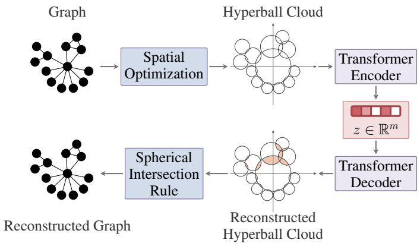
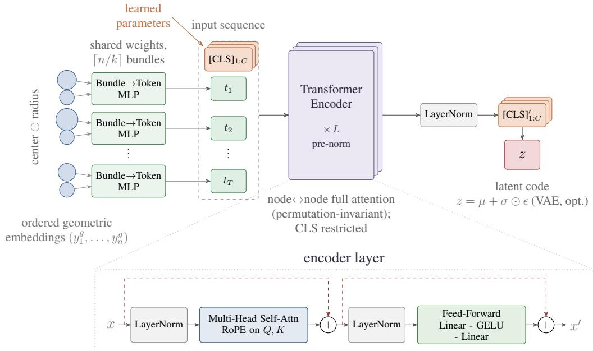
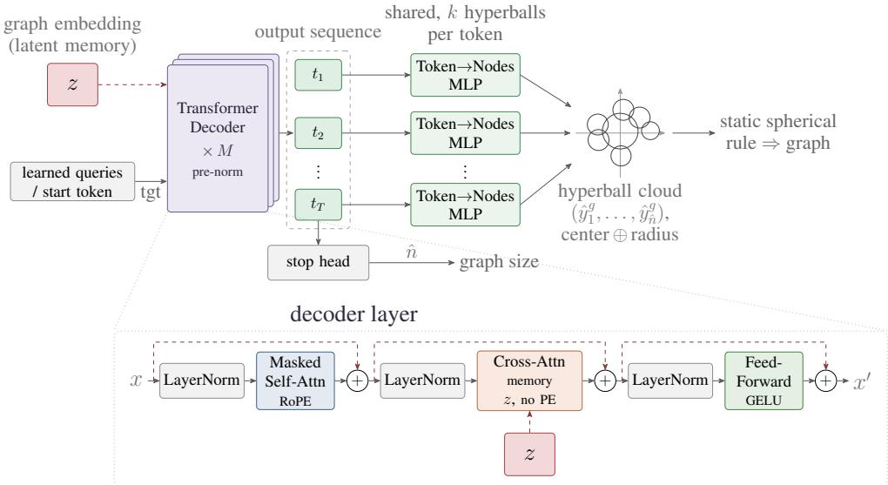
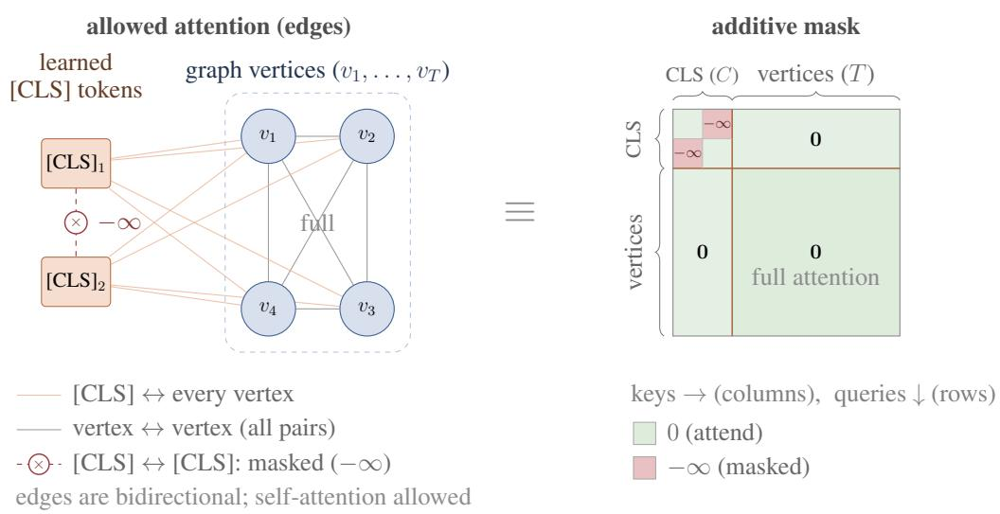
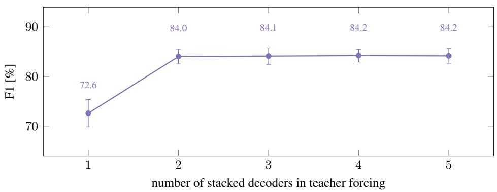
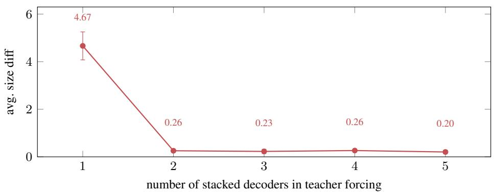
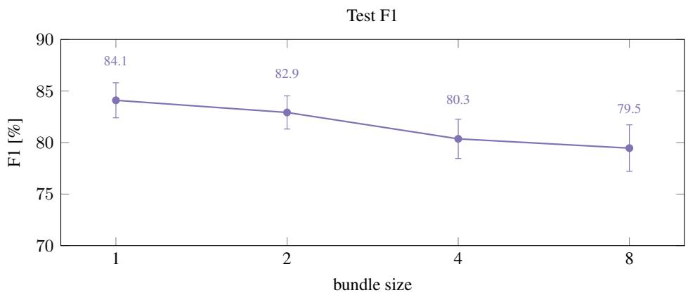
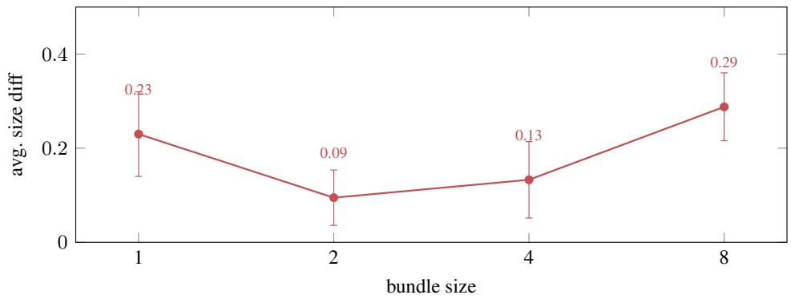

# GEOGAE: SCALABLE GRAPH-LEVEL AUTOENCOD-ING VIA HYPERBALL CLOUD REPRESENTATIONS

Radosław Nowak   
Institute of Theoretical and Applied Informatics   
Polish Academy of Sciences

Bogusz Stefanczyk´ IDEAS Research Institute

Paweł Wawrzynski´ IDEAS Research Institute

Anna Bielawska IDEAS Research Institute

Maciej Sanocki Faculty of Mathematics, Informatics and Mechanics Warsaw University of Technology

## ABSTRACT

Embedding structured objects into Euclidean spaces has enabled a wide range of successful machine learning applications. Such objects include words, documents, image patches, time series, and graph nodes. In contrast, embedding entire graphs remains a challenging problem. Existing methods either sustain the original order of the graph nodes or match the output nodes to the input ones, both of which create scalability issues. In this work, we propose a graph representation as a cloud of hyperballs, which allows us to define a specific—typically unique—node ordering. Based on this representation, we propose GeoGAE, an autoencoder, in which the Transformer encoder translates a hyperball cloud into a graph-level embedding, and the Transformer decoder translates the graph-level embedding back into the graph. This formulation enables the model to capture both the global graph structure and local relational patterns. We evaluate our method on multiple graph datasets, spanning various domains. The results demonstrate effectiveness of our method in encoding and reconstructing graphs from their embeddings.

## 1 INTRODUCTION

Fixed-size embeddings have proven very useful in a number of domains. Token embeddings are invaluable for natural language processing (Su et al., 2024). Image embeddings are indispensable for image generation (Ramesh et al., 2022). Time series embeddings are a useful tool in prediction (Foumani et al., 2024). Embeddings are especially useful if any object in its domain can be reconstructed from its fixed-size vector representation. Then, the generation, transformation and optimization of these objects boil down to an equivalent operation in R<sup>m</sup>, for a fixed m.

The field of graph neural networks (GNNs; Corso et al. 2024; Khemani et al. 2024) provides a plethora of methods for conditional graph generation (Ayadi et al., 2024; Bian et al., 2024; Gao et al., 2025; Hou et al., 2024; Ketata et al., 2025; Li et al., 2025; Liu et al., 2025; Wang et al., 2025; Wen & Yu, 2025; Wesego, 2025; You et al., 2024; Zhou et al., 2024). However, the main purpose of these methods is typically to generate a diverse set of graphs possessing certain properties, rather than to reconstruct a specific, unique graph from a given latent embedding. While some of these methods (Wesego, 2025; You et al., 2024; Zhou et al., 2024) use node (and edge) embeddings as an auxiliary graph representation that could be padded to form a graph-level vector, this approach establishes a strict limit on the graph size.

Few works focus on a reversible, scalable transformation of fixed-size vectors into graphs. Methods proposed by Małkowski et al. (2023) and Bresson et al. (2026) include the node order in the graph embedding. In contrast, Winter et al. (2021) and Krzakala et al. (2025) ensure the graph embedding is independent of the node order, but at the cost of requiring complex matching mechanisms between the input and output graph nodes.

In this paper, we bridge this gap by designing a graph representation as a cloud of hyperballs in Euclidean space. This allows us to define a unique order of nodes. Our proposed graph-level autoencoder, intuitively described in Figure 1, uses the Transformer encoder to transform the sequence of nodes represented that way into a fixed-size embedding, and the Transformer decoder to transform the embedding back to the sequence of hyperballs. The hyperballs are translated into the discrete graph structure with a static rule. While representing nodes in 2- or 3-dimensional Euclidean space is a technique applied for molecular graph generation (Ketata et al., 2025), we generalize the dimensionality to any $d \in \mathbb { N }$

Contributions. The main contributions of this work are threefold:

1. Continuous Hyperball Representation: We introduce a continuous graph representation as hyperball clouds in Euclidean space, enabling canonical and deterministic node ordering.

2. Scalable Graph Autoencoder: We propose GeoGAE, a Transformer-based autoencoder that compresses variable-sized hyperball clouds into fixed-size latent vectors $z \in \mathbb { R } ^ { m }$ and reconstructs original graph topologies using a static geometric rule.

3. Empirical Superiority: We conduct extensive evaluations across diverse benchmark domains, demonstrating that GeoGAE achieves state-of-the-art topology reconstruction and scales to large graphs where existing baselines suffer from out-of-memory errors or severe degradation.

## 2 RELATED WORK

Graph to vector models. Graph-level representation learning aims to encode an entire graph into a fixed-dimensional vector for tasks such as classification or regression (Khoshraftar & An, 2024). A standard approach involves processing the graph through message-passing GNN layers (Velickoviˇ c et al., 2018; Xu et al., 2019; Chen et al., 2020) and applying a readout or pooling oper-´ ation to aggregate node-level features into a global embedding. This includes simple pooling (e.g., sum, mean) Kipf & Welling (2016), attention-based pooling (Lee et al., 2019), or hierarchical coarsening strategies (Ying et al., 2018; Zhang et al., 2019; Ma et al., 2019). An alternative strategy introduces virtual nodes connected to all other nodes to directly capture global graph properties (Li et al., 2017; Xu et al., 2019; Brossard et al., 2021).

While these methods excel at predictive downstream tasks, their aggregation mechanisms inherently compress and entangle structural information, creating a severe information bottleneck. This irreversible loss of precise topological detail renders standard pooling and virtual node architectures poorly suited for exact graph reconstruction from the latent space. In contrast, our proposed GeoGAE framework replaces lossy aggregation with a reversible hyperball cloud representation, explicitly designed to preserve exact graph topology within a fixed-size vector.

  
Figure 1: Overview of GeoGAE. The discrete input graph is first mapped into a continuous hyperball cloud representation via spatial optimization and deterministic node ordering. A Transformer encoder then compresses this sequence into a fixed-size graph-level embedding $z ~ \in ~ \mathbb { R } ^ { m }$ . In the decoding path, a Transformer decoder reconstructs the hyperball cloud from the latent vector, and the final discrete graph topology is exactly recovered using a static spherical intersection rule.

Graph generation. While the primary focus of GeoGAE is autoencoding, our decoder effectively functions as a continuous-to-discrete graph generator. Most contemporary graph generation methods aim to learn the data distribution to sample novel structures, rather than exactly reconstructing specific inputs. Early approaches, such as GraphRNN (You et al., 2018), generated adjacency matrices sequentially using recurrent architectures. Recently, diffusion models have dominated the field (Liu et al., 2023), generating adjacency matrices similarly to images (Liu et al., 2025), or utilizing autoregressive denoising steps (Kong et al., 2023). Several methods also generate node coordinates in Euclidean (Gao et al., 2025; You et al., 2024) or non-Euclidean spaces (Fu et al., 2024), while others apply continuous-time diffusion over discrete states (Xu et al., 2024). However, unlike our framework, which establishes a deterministic and reversible mapping between a unique graph and its latent embedding, these generative models primarily map prior noise distributions to graph distributions, making them unsuitable for exact topology preservation.

Graph autoencoders with embeddings in $\mathbb { R } ^ { n \times d }$ . These architectures implement the general structure of Variational Autoencoder (VAE: Kingma & Welling 2014), with an encoder that transforms the input graph into a matrix of embeddings of its nodes. A decoder performs the reverse transformation. Both encoder and decoder can take the form of message-passing GNN (Imrie et al., 2020; Huang et al., 2022; Hou et al., 2024).

Graph autoencoders with embeddings in $\mathbb { R } ^ { m }$ . Our goal in this paper is to transform graphs of various sizes to embeddings of fixed size, $m ,$ and transform these embeddings back to graphs. A simple way to achieve it is to assume that the number of vertices is bounded by a fixed $n _ { \mathrm { m a x } }$ and one of the autoencoders from the previous paragraph with an embedding of size $n _ { \mathrm { m a x } } \times$ d with some kind of padding for smaller graphs. This idea is applied in GraphVAE (Simonovsky & Komodakis, 2018) for small graphs with $n _ { \mathrm { m a x } }$ up to 38. Hy & Kondor (2021) introduced MGVAE – an autoencoder whose encoder recursively identifies clusters in the graph, and replace them with nodes of a higher order graph. Eventually the input graph is reduced to a fixed size embedding. The decoder recursively unpacks this embedding to the input graph. Małkowski et al. (2023) presented ReGAE, an autoencoder where the encoder recursively rolls up growing parts of the adjacency matrix into a vector in $\mathbb { R } ^ { m }$ , and the decoder, also recursively, unrolls the input matrix. While this architecture is able to reconstruct graphs with even thousands nodes, it is not node permutation equivariant which potentially leads to accuracy losses. In PIGVAE (Winter et al., 2021) and GRALE (Krzakala et al., 2025), the Transformer encoder produces permutation equivariant graph-level embedding and a similar decoder reconstructs the graph. These designs raise the problem of assigning the output nodes to the input ones. PIGVAE leverages a learnable assigning modules fed with the graph embedding. GRALE extends this idea by combining an optimal-transport-based reconstruction loss with a Sinkhorn-based matcher which significantly improved stability and expressivity. GraViti (Bresson et al., 2026) use a similar Transformer based architecture and simply resigns from node ordering equivariance. In this paper, we dodge the problem of node order equivariance by introducing an usually unique node order. Also, we use iteratively the transformer decoder to produce the output graph of an arbitrary size.

## 3 METHOD

## 3.1 FORMAL PROBLEM DESCRIPTION

We consider undirected, unweighted graphs without self-loops. Formally, a graph is defined by a set of vertices, V, and a set of edges $E \subseteq \{ { \bar { \{ \bar { \{ \psi } } }   , u \} | v , u \in V , v \neq { \bar { u } } \}$ . We denote $n = | V |$ and optionally consider features of vertices and edges. Given a set G of such graphs and a target dimension $m \in \mathbb { N } .$ our objective is to learn an encoder : $\mathcal { G }  \mathbb { R } ^ { m }$ that compresses the graph into a fixed-size vector $z \in \bar { \mathbb { R } ^ { m } }$ , and a decoder : $\mathbb { R } ^ { m } \to \mathcal { G }$ that reconstructs this graph. Both mappings are end-to-end trained neural networks to minimize a reconstruction error, generalizing effectively to unseen graphs.

## 3.2 MODEL OVERVIEW

Our proposed framework, GeoGAE, is illustrated in Figure 1. The pipeline first maps an input graph into a continuous hyperball cloud representation (details described in Section 3.3), where each hyperball corresponds to a graph node. Next, a Transformer encoder compresses this geometric sequence into a fixed-size latent vector $z \in \mathbb { R } ^ { m }$ , constructed by concatenating C learned class ([CLS]) tokens. Because these class tokens attend to the graph nodes without inter-[CLS] attention, each token is encouraged to specialize in capturing distinct topological properties.

In the decoding phase, a Transformer decoder interprets the latent embedding z to sequentially reconstruct the hyperball cloud. Finally, the reconstructed cloud is mapped back into a discrete graph using the static spherical intersection rule (Section 3.3). The entire architecture is trained end-to-end to encourage exact topological reconstruction.

## 3.3 HYPERBALL CLOUD

Let us consider representing graphs in a Euclidean space (Agrawal et al., 2021; Nowak et al., 2024). In this formulation, graph nodes are mapped to spatial objects whose geometric distances reflect the underlying topological distances. The following proposition demonstrates that such a representation can be topologically lossless.

Proposition 1. A graph with n vertices can be losslessly represented as n hyperballs of equal size in an $n ^ { 2 }$ -dimensional space, such that two nodes are adjacent if and only if their corresponding hyperballs intersect.

The proof of Proposition 1 is provided in Appendix A.

While lossless representation using equal-sized hyperballs is theoretically guaranteed, it requires an excessively high-dimensional space $( n ^ { 2 } )$ . This dimensionality bottleneck can be dramatically reduced by allowing hyperball radii to vary. Consider the hub topology in Figure 1, where a central node connects to 10 neighbors, with only one pair of neighbors being mutually adjacent. If all 11 nodes were represented by equal-sized hyperballs, packing 10 balls around the central one in low dimensions would geometrically force unwanted overlaps among the neighbors. Allowing variable radii bypasses this packing constraint, enabling exact, lossless representation even in lowdimensional space.

Translation of a Graph to a Hyperball Cloud. Graph nodes can be embedded in an Euclidean space as follows. Let $d \in \mathbb { N }$ be the dimension of this space, and $x _ { 1 } ^ { g } , \ldots , x _ { n } ^ { g } \in \mathbb { R } ^ { d }$ be the geometric embeddings of the nodes. Let $x ^ { g }$ denote the matrix that gathers them. An embedding $\boldsymbol { x } _ { i } ^ { g } = [ x _ { i , 1 } ^ { c } , \ldots , x _ { i , d - 1 } ^ { c } , r _ { i } ]$ represents a hyperball in (d − 1)-dimensional space with center $\boldsymbol { x } _ { i } ^ { c }$ and radius $f ( r _ { i } )$ , where $f : \mathbb { R } \to \mathbb { R } _ { + }$ is a strictly increasing function (e.g., Softplus). Adjacent nodes correspond to intersecting balls, whereas non-adjacent nodes correspond to disjoint ones. The geometric embeddings are obtained by minimizing the loss function $\mathcal { L } _ { \mathrm { s p h e r e } } .$

$$
x ^ { g } = \arg \operatorname* { m i n } _ { x ^ { g } } \mathcal { L } _ { \mathrm { s p h e r e } } ( x ^ { g } )\tag{1}
$$

$$
p _ { i , j } = \sigma { \left( \frac { 0 . 7 5 \left( f ( r _ { i } ) + f ( r _ { j } ) \right) - \left\| x _ { i } ^ { c } - x _ { j } ^ { c } \right\| } { T } \right) }\tag{2}
$$

$$
\mathcal { L } _ { \mathrm { s p h e r e } } ( x ^ { g } ) = \sum _ { i , j } - \widehat { \alpha } _ { i , j } ( 1 - \widehat { p } _ { i , j } ) ^ { \gamma } \log ( \widehat { p } _ { i , j } ) ,\tag{3}
$$

where ∥·∥ denotes the standard $L _ { 2 }$ Euclidean norm, σ is the sigmoid function, $T > 0$ is a temperature scaling constant. The topological distance between nodes i and j is denoted by $D _ { i , j }$ . The target probability $\widehat { p } _ { i , j }$ and class weight $\widehat { \alpha } _ { i , j }$ are defined as $\widehat { p } _ { i , j } = p _ { i , j }$ and $\widehat { \alpha } _ { i , j } = \alpha$ for adjacent nodes $( D _ { i , j } \ = \ 1 )$ , and $\widehat { p } _ { i , j } \ : = \ : 1 - p _ { i , j }$ and $\widehat { \alpha } _ { i , j } \ : = \ : 1 \ : - \ : \alpha$ otherwise. The loss $\mathcal { L } _ { \mathrm { s p h e r e } }$ treats hyperball intersection as a binary edge classification task. The class weight α mitigates class imbalance by prioritizing positive (adjacent) pairs, while the focusing parameter $\gamma$ down-weights well-classified node pairs to concentrate optimization on topologically ambiguous cases.

The optimization objective (3) is invariant to rigid Euclidean transformations (translations and rotations); hence, its solution is not unique. To establish a canonical, permutation-invariant representation, we normalize the resulting geometric embeddings through the following steps:

1. We center the point cloud by shifting the coordinates such that the mean of all hyperball centers is zero $\bar { ( \sum _ { i } x _ { i } ^ { c } = 0 ) }$

2. We perform Singular Value Decomposition (SVD) on the centered spatial coordinates to find the principal axes, and re-express the embeddings within this new coordinate system.

3. To resolve reflectional ambiguities along the principal axes, we evaluate the third moment (skewness) of the projected coordinates. Specifically, for any axis $k \in \{ 1 , \ldots , d - 1 \}$ , if $\textstyle \sum _ { i } ( x _ { i , k } ^ { c } ) ^ { 3 } < 0$ , we negate the k-th coordinate across all node embeddings.

Barring highly symmetrical graph topologies, this deterministic normalization yields a unique set of geometric embeddings for any given graph. In our experiments we choose the smallest geometric embedding size which scores 100% F1 on all dataset graphs.

Translation of Hyperball Cloud to Graph. Geometric embeddings that minimize (3) enable determining if there is an edge between the i-th and j-th node using a direct intersection rule. Given the hyperball centers $x _ { i } , x _ { j }$ and their raw radii $r _ { i } , r _ { j }$ , the margin is calculated as the difference between the scaled sum of the radii and the Euclidean distance between the centers:

$$
m _ { i , j } = 0 . 7 5 ( f ( r _ { i } ) + f ( r _ { j } ) ) - \| x _ { i } - x _ { j } \| _ { 2 }
$$

where $f$ denotes the softplus function. The decoding rule is then strictly defined by the sign of the margin:

$$
\mathrm { i f } \ m _ { i , j } > 0 , \mathrm { t h e n t h e r e \ i s \ a n \ e d g e ; \ e l s e , n o t . }\tag{4}
$$

During training, the margin $m _ { i , j }$ is scaled and forms logits for the binary cross-entropy and focal loss terms. At inference, the rule explicitly relies on the geometric intersection $( m _ { i , j } > 0 )$ , eliminating the need to optimize an arbitrary threshold on the training set.

## 3.4 NODE ORDERING AND BUNDLES

Node ordering. The node ordering procedure begins by computing the geometric center (mean) of all hyperball centers. The first node in the sequence is chosen as the one whose hyperball center is closest to this global center. The consecutive nodes are then selected greedily by minimizing a distance to the previously selected node, and an additional penalty. Specifically, the Euclidean distance between ball centers is scaled by the average of their radii, and incremented by a scaled base-2 logarithm of the candidate node’s distance to the global center. This ensures that nodes are ordered primarily by their relative spatial proximity and sizes, with a slight preference for nodes closer to the center of the entire structure. Algorithm 1 in Appendix B presents the details of this procedure. Its result is denoted by $( y _ { 1 } ^ { g } , \ldots , y _ { n } ^ { g } )$

Bundles. To ensure scalability and mitigate the quadratic computational complexity inherent to the self-attention mechanism in Transformers, consecutive nodes from the ordered sequence are grouped into contiguous blocks called bundles of size $b \in \mathbb N$ . When the total number of nodes N is not evenly divisible by $b ,$ the remaining slots in the final bundle are padded by repeating the geometric embedding of the last node. Each bundle of b geometric embeddings in $\mathbb { R } ^ { \boldsymbol { b } \times \boldsymbol { d } }$ is flattened and projected into a single $d _ { \mathrm { t o k } }$ -dimensional sequence token using a trainable Multilayer Perceptron (MLP) (Bundle → Token). This enables nodes within a single bundle to be processed by the encode and generated by the decoder simultaneously. For smaller datasets where scalability is not a bottleneck, we set $b = 1$ , which bypasses bundling and represents each node with an individual token. See Appendix B.2 for exact tensor dimensions and decoder de-bundling details.

## 3.5 ARCHITECTURE

Encoder. The encoder of GeoGAE (Figure 2) compresses the input graph into a fixed-size latent representation through a streamlined pipeline. First, the graph is mapped into a hyperball cloud, deterministically ordered, and grouped into $T = \lceil n / b \rceil$ contiguous bundles of size b (Sections 3.3–3.4). An MLP, denoted $\phi ,$ maps each bundle into a sequence token (details provided in Appendix B.2). To preserve relative positional information without explicit absolute position embeddings, Rotary Positional Embeddings (RoPE) are applied directly to queries and keys within each self-attention layer. The sequence is prepended with C trainable [CLS] tokens and processed by the Transformer encoder (attention masking details are provided in Appendix B.3). Finally, the output representations of the C [CLS] tokens are extracted and concatenated to form the global graph embedding $z \in \mathbb { R } ^ { m }$ , optionally followed by a VAE reparameterization.

  
Figure 2: Geometric graph transformer encoder. The input graph is represented as an ordered sequence of hyperballs and mapped into sequence tokens. A full, permutation-invariant self-attention mechanism processes these tokens alongside C dedicated [CLS] tokens. The output representations of the [CLS] tokens are concatenated to yield the global graph embedding $z \in { \hat { \mathbb { R } } } ^ { m }$

Decoder. The Transformer decoder (Figure 3) reconstructs the hyperball cloud by conditioning on the latent vector z via cross-attention over sequence queries. Instead of a standard linear-softmax head, a prediction module ψ (detailed in Appendix B.2) processes each decoder output token to yield two distinct outputs: (i) a matrix of b geometric node embeddings containing their spatial centers and radii, and (ii) b independent binary stopping logits. Each logit corresponds to an individual node within the bundle and predicts whether it terminates the graph. This per-node stopping mechanism provides exact node-level precision, allowing the model to halt generation and cleanly truncate the final bundle when the graph size is not a multiple of b.

## 3.6 MULTI-LAYER TEACHER FORCING

Transformer decoders are typically trained via teacher forcing, utilizing the right-shifted ground truth sequence—achieved by prepending a special ‘start’ vector—to predict the full target sequence terminating with an ‘end’ vector. However, this paradigm is notoriously susceptible to exposure bias; the absence of ground truth data during inference causes cascading errors when the model is conditioned on its own flawed predictions.

To counteract this unwanted byproduct, we propose an iterative refinement strategy by stacking the decoder $K \in \mathbb { N }$ times (with weight sharing of the instances). The base instance is conditioned on the right-shifted target sequence, while each successive instance takes the output sequence of the underlying layer, similarly right-shifted by prepending the ‘start’ vector, as its input. All K instances are jointly supervised to output the complete sequence ending with the ‘end’ vector, effectively bridging the gap between the training and inference regimes.

## 3.7 NODE AND EDGE ATTRIBUTES

When present, node attributes are concatenated into each node’s geometric embedding before bundling – this effectively widens the input that ϕ consumes. On the other side, the decoder produces output tokens, which are then consumed by a separate MLP trained to reconstruct each node’s attributes.

  
Figure 3: Geometric graph transformer decoder. Acts as a generative module that reconstructs the graph. It uses the latent vector z as context (latent memory) within its cross-attention layers, combining it with learned queries. The decoder generates a sequence of output tokens. Next, Multilayer Perceptron heads (Token→Nodes MLP) map these tokens back into a hyperball cloud. Concurrently, a dedicated stop head predicts the target graph size, and a geometric mechanism (static spherical rule) reconstructs the final edges between the nodes.

<table><tr><td>Dataset</td><td>Graphs</td><td>Avg. nodes</td><td>Avg. edges</td></tr><tr><td>MUTAG AIDS</td><td>188 2,000</td><td>17.90 15.69</td><td>19.80 16.20</td></tr><tr><td>IMDB-BIN</td><td>1,000</td><td>19.77</td><td>96.53</td></tr><tr><td>QM9</td><td>129,433</td><td>18.03</td><td>18.63</td></tr><tr><td>SYNTHETIC NEW</td><td>300</td><td>100.00</td><td>196.25</td></tr><tr><td>COLLAB</td><td>5,000</td><td>74.49</td><td>2,457.78</td></tr><tr><td>REDDIT-BIN</td><td>2,000</td><td>429.63</td><td>497.75</td></tr></table>

Table 1: Basic statistics of datasets used in our benchmark.

Edge attributes are consumed directly by the encoder’s self-attention, in every layer, rather than as a per-token input channel. When a pair of tokens is connected via an edge, the edge attribute is concatenated into the token’s key, and then consumed by a dedicated per-layer linear projection that is taught to correct the key, and the value only for those pairs. In the inference mode, the decoder, after deconstructing the adjacency matrix of the output graph uses a separate MLP, which for each connected pairs of tokens, takes a vector of their sum and absolute difference as an input, and produces a vector of their edge attribute. During the training process, the decoder uses the ground truth graph edges.

The total loss minimized in the training of our proposed architecture is specified in Appendix B.

## 4 EXPERIMENTAL STUDY

We evaluate GeoGAE across seven benchmark datasets spanning chemical, social, and synthetic domains. Our experiments assess topological and feature reconstruction fidelity, scalability on large graphs, and the impact of key architectural choices via ablations.

<table><tr><td>Dataset</td><td>tok-d</td><td>emb</td><td>geom-d</td><td>encod</td><td>decod</td><td>lr</td><td>enc-h</td><td>dec-h</td><td>batch</td></tr><tr><td>MUTAG</td><td>64</td><td>128</td><td>4</td><td> $\overline { { 1 0 2 4 \times 4 } }$ </td><td> $2 5 6 \times 2$ </td><td>1e-3</td><td>8</td><td>1</td><td>2</td></tr><tr><td>AIDS</td><td>64</td><td>192</td><td>6</td><td> $1 0 2 4 \times 4$ </td><td> $5 1 2 \times 2$ </td><td>1e-3</td><td>8</td><td>1</td><td>32</td></tr><tr><td>IMDB-BIN</td><td>64</td><td>192</td><td>6</td><td> $5 1 2 \times 8$ </td><td> $1 0 2 4 \times 6$ </td><td>1e-3</td><td>2</td><td>1</td><td>32</td></tr><tr><td>QM9</td><td>64</td><td>192</td><td>4</td><td> $1 0 2 4 \times 6$ </td><td> $1 0 2 4 \times 4$ </td><td>1e-3</td><td>4</td><td>4</td><td>256</td></tr><tr><td>SYNTH. NEW</td><td>64</td><td>192</td><td>6</td><td> $2 0 4 8 \times 8$ </td><td> $1 0 2 4 \times 2$ </td><td>5e-4</td><td>8</td><td>4</td><td>8</td></tr><tr><td>COLLAB</td><td>96</td><td>576</td><td>9</td><td> $2 5 6 \times 8$ </td><td> $2 0 4 8 \times 4$ </td><td>1e-3</td><td>4</td><td>1</td><td>32</td></tr><tr><td>REDDIT-BIN</td><td>144</td><td>1728</td><td>9</td><td> $5 1 2 \times 4$ </td><td> $1 0 2 4 \times 4$ </td><td>1e-3</td><td>6</td><td>4</td><td>16</td></tr></table>

Table 2: Hyperparameters of GeoGAE: tok-d – token dimension, emb – graph embedding size (integer multiple of tok-d), geom-d – dimension of the geometric embedding, encod – width and depth (width × number of layers) of the encoder hidden layers, decod – width and depth (width × number of layers) of the decoder hidden layers, lr – learning rate, enc-h – number of attention heads in the encoder, dec-h – number of attention heads in the decoder, batch – batch size. All datasets except REDDIT-BINARY use a bundle size of 1; REDDIT-BINARY uses a bundle size of 4.

Benchmarks. We use seven datasets of graphs of various nature, including social, chemical and synthetic ones. Along with their basic statistics, they are listed in Table 1 and characterized more broadly in Appendix C. These datasets provide the raw graph structures, which we process to benchmark our model’s ability to generate graph-level embeddings and reconstruct the input graphs. We divide these datasets into training, validation, and test subsets in a 70:15:15 ratio.

Baselines. Among the autoencoders capable of generalizing to unseen graphs—meaning they can be trained on one dataset and evaluated on another—are PIGVAE (Winter et al., 2021), ReGAE (Małkowski et al., 2023), and GRALE (Krzakala et al., 2025). Our experiments aim to train these models to encode and reconstruct graph topologies using a training subset, verifying their performance on a held-out test subset.

## 4.1 TRAINING

For each dataset, graph embedding dimensions were scaled proportionally with average graph complexity, with GeoGAE latent sizes aligned directly with ReGAE to ensure a fair comparison on high-capacity architectures (Table 2). Hyperparameters for all baselines were systematically optimized via dataset-specific random search, as detailed in Tables 2, 9, 10, and 11. For PIGVAE and GRALE, embedding sizes were explicitly included in hyperparameter tuning; larger latent dimensions degraded performance or induced training instability. Throughout all experiments, the temperature parameter in Eq. 2 was fixed at T = 0.4.

To guarantee statistical reliability, all models were trained and evaluated across five independent runs using distinct fixed seeds and pre-computed data splits. We report the mean and standard deviation across these runs.

## 4.2 RESULTS

Table 3 summarizes the edge reconstruction F1 scores, weighted by vertex count across test graphs. GeoGAE consistently matches or outperforms baseline architectures on smaller graphs while demonstrating superior scalability on larger benchmarks. On complex, high-density datasets such as REDDIT-BINARY and COLLAB, GeoGAE achieves 56.5% and 90.9% F1, respectively, whereas PIGVAE, ReGAE, and GRALE suffer from training instability or degenerate into trivial predictions (e.g., predicting all 0s or 1s).

Table 4 reports joint topology and feature reconstruction performance, using F1 for discrete attributes and RMSE for continuous properties. While baselines suffer severe trade-offs, such as GRALE’s high feature error on QM9 (5.4 node RMSE) or PIGVAE’s topological collapse (25.6% F1), GeoGAE maintains a robust balance. On AIDS, GeoGAE achieves superior feature fidelity across both categorical (85.0% edge F1) and continuous attributes (0.8 node RMSE) without sacrificing topology (80.4% F1). Comprehensive ablation studies evaluating key architectural components are provided in Appendix F.

<table><tr><td>Dataset\method</td><td> $\mathrm { P I G V A E } \left[ \% \right]$ </td><td> $\mathrm { R e G A E } \left[ \% \right]$ </td><td> $\mathrm { G R A L E } \left[ \% \right]$ </td><td> $\mathrm { G e o G A E } \left[ \% \right]$ </td></tr><tr><td>MUTAG AIDS IMDB-BIN QM9 SYNTHETIC NEW</td><td> $\overline { { 4 3 . 5 \pm 1 4 . 9 } }$   $6 0 . 2 \pm 4 . 9$   $8 7 . 3 \pm 2 . 0$   $0 . 0 \pm 0 . 0$   $0 . 4 \pm 0 . 6$   $5 2 . 2 \pm 5 . 0$ </td><td> $6 0 . 1 \pm 3 . 5$   $8 3 . 6 \pm 2 . 6$   $9 0 . 0 \pm 2 . 6$   ${ \bf 9 9 . 9 \pm 0 . 0 }$   $1 6 . 1 \pm 3 . 0$   $7 8 . 0 \pm 2 . 4 \dagger$ </td><td> $6 . 9 \pm 3 . 8$   $1 . 2 \pm 0 . 6$   $5 4 . 8 \pm 7 . 7$   $9 8 . 6 \pm 0 . 5$   $7 . 3 \pm 0 . 7$  OOM</td><td> $\mathbf { 6 1 . 3 \pm 5 . 4 }$   ${ \bf 8 4 . 1 \pm 1 . 7 }$   ${ \bf 9 4 . 0 \pm 1 . 0 }$   $9 9 . 4 \pm 0 . 2 $   ${ \bf 5 0 . 1 \pm 0 . 4 }$ </td></tr></table>

Table 3: Comparison of methods: F1 score on the test set. After ± we put the standard deviation. †Score from 3 seeds, other 2 got NaN loss. ‡Score taken as reported in the original paper, due to training instability.
<table><tr><td rowspan=2 colspan=1>Method</td><td rowspan=2 colspan=1>Dataset</td><td rowspan=2 colspan=1>Topo F1 [%]</td><td rowspan=2 colspan=1>Node F1 [%]</td><td rowspan=2 colspan=1>Node RMSE</td><td rowspan=2 colspan=1>Edge F1 [%]</td><td></td></tr><tr><td rowspan=1 colspan=1>Edge RMSE</td></tr><tr><td rowspan=1 colspan=1>PIGVAE</td><td rowspan=1 colspan=1>MUTAGAIDSQM9</td><td rowspan=1 colspan=1> $\overline { { 1 8 . 0 \pm 9 . 7 } }$  $4 1 . 9 \pm 2 . 9$  $2 5 . 6 \pm 1 5 . 9$ </td><td rowspan=1 colspan=1> $6 6 . 3 \pm 9 . 5$  $5 6 . 7 \pm 1 4 . 6$ N/A</td><td rowspan=1 colspan=1>N/A $1 . 5 \pm 0 . 3$  ${ \bf 0 . 5 \pm 0 . 0 }$ </td><td rowspan=1 colspan=1> $\overline { { 7 \mathbf { 1 . 2 \pm 2 2 . 8 } } }$  $7 7 . 7 \pm 6 . 3$ N/A</td><td rowspan=1 colspan=1>N/AN/A0.1 ± 0.0</td></tr><tr><td rowspan=1 colspan=1>GRALE</td><td rowspan=1 colspan=1>MUTAGAIDSQM9</td><td rowspan=1 colspan=1> $\overline { { 2 0 . 1 \pm 1 8 . 3 } }$  $0 . 1 \pm 0 . 1$  ${ \bf 9 4 . 1 \pm 0 . 7 \dagger }$ </td><td rowspan=1 colspan=1> $\overline { { 7 6 . 6 \pm 2 5 . 1 } }$  $8 . 3 \pm 1 . 1$ N/A</td><td rowspan=1 colspan=1>N/A $4 . 3 \pm 0 . 3$  $5 . 4 \pm 0 . 0 \dagger$ </td><td rowspan=1 colspan=1> $\overline { { 5 6 . 3 \pm 1 5 . 7 } }$  $3 5 . 5 \pm 1 . 1$ N/A</td><td rowspan=1 colspan=1>N/AN/A $6 . 8 \pm 0 . 3 \dagger$ </td></tr><tr><td rowspan=1 colspan=1>GeoGAE</td><td rowspan=1 colspan=1>MUTAGAIDSQM9</td><td rowspan=1 colspan=1> $\mathbf { 6 2 . 3 \pm 3 . 0 }$  ${ \bf 8 0 . 4 \pm 2 . 6 }$  $9 1 . 3 \pm 1 . 2$ </td><td rowspan=1 colspan=1> $\overline { { 7 5 . 5 \pm 5 . 9 } }$  ${ \bf 6 2 . 2 \pm 5 . 3 }$ N/A</td><td rowspan=1 colspan=1>N/A ${ \bf 0 . 8 \pm 0 . 1 }$  ${ \bf 0 . 5 \pm 0 . 0 }$ </td><td rowspan=1 colspan=1> $\overline { { 5 8 . 7 \pm 2 . 8 } }$  ${ \bf 8 5 . 0 \pm 1 . 7 }$ N/A</td><td rowspan=1 colspan=1>N/AN/A $0 . 3 \pm 0 . 1$ </td></tr></table>

Table 4: Comparison of methods: Topological, Node Features, and Edge Features reconstruction quality on the test set. F1 (higher is better) scores the categorical (one-hot) part of a feature block; RMSE (lower is better) scores its continuous part. N/A indicates that a metric is not applicable due to the nature of the features in a given dataset: F1 is N/A for purely continuous features (e.g., QM9 nodes and edges), while RMSE is N/A for purely categorical features (e.g., MUTAG node features, and edge features for MUTAG and AIDS). After ± we put the standard deviation. † denotes score obtained from 4 seeds, 1 seed got NaN loss.

<table><tr><td>Dataset</td><td>Mean size error</td><td>Dataset</td><td>Mean size error</td></tr><tr><td>MUTAG</td><td> $\overline { { 0 . 1 2 \pm 0 . 0 8 } }$ </td><td>AIDS</td><td> $\overline { { 0 . 2 3 \pm 0 . 0 9 } }$ </td></tr><tr><td>IMDB-BIN</td><td> $0 . 2 7 \pm 0 . 0 5$ </td><td>QM9</td><td> $0 . 0 1 \pm 0 . 0 0$ </td></tr><tr><td>SYNTHETIC NEW REDDIT-BIN</td><td> $0 . 0 0 \pm 0 . 0 0$   $1 6 . 2 5 \pm 1 . 5 0$ </td><td>COLLAB</td><td> $1 . 4 5 \pm 0 . 3 4$ </td></tr></table>

Table 5: GeoGAE: Mean size error — the average absolute size difference between the target and predicted graphs over the average target graph size. Calculated for experiments for pure graph topology deconstruction, without features encoding and decoding enabled.

Unlike existing baselines that assume fixed node bounds, GeoGAE dynamically predicts graph cardinality. As detailed in Table 5, the resulting node-count errors remain minimal across all datasets (e.g., 0.00 on QM9 and 0.23 on AIDS). To strictly penalize dimension mismatches, predicted or target adjacency matrices with incorrect sizes are zero-padded prior to computing the F1 score.

## 5 CONCLUSIONS

In this paper, we introduced GeoGAE, a scalable graph-level autoencoder grounded in a novel hyperball cloud representation. By mapping discrete topologies into continuous geometric space with deterministic node ordering, GeoGAE resolves the longstanding node-matching bottleneck and size limitations of existing models. Integrated with a Transformer architecture, our framework successfully compresses variable-sized graphs into fixed-dimensional vectors $z \in \mathbb { R } ^ { m }$ while enabling highfidelity topological reconstruction. Across diverse benchmarks, GeoGAE matches or exceeds stateof-the-art performance on most datasets, demonstrating unprecedented scalability on large graphs where prior methods fail. This establishes a robust foundation for latent-space graph generation, transformation, and optimization.

Limitations. Mapping a discrete graph to a hyperball cloud requires solving a continuous optimization problem per graph, which adds a pre-processing overhead. This, however is done only once per dataset, and can be considered a new node’s feature. While our canonical ordering effectively mitigates the permutation ambiguity for most topologies, highly symmetrical graphs can remain sensitive to minor spatial perturbations during SVD normalization and greedy ordering. Scaling to large graphs introduces challenges in precise graph size prediction and topology preservation under node bundling. Addressing end-to-end differentiable hyperball initialization and symmetry-aware ordering remains a promising direction for future work.

## REPRODUCIBILITY STATEMENT

We have made all efforts to ensure the full reproducibility of both our theoretical claims and empirical results.

Theoretical Reproducibility: The mathematical guarantee that any graph can be losslessly represented as a set of intersecting hyperballs is formally stated in Proposition 1, with a constructive proof provided in Appendix A. The deterministic node ordering mechanism is explicitly detailed in Algorithm 1 (Appendix B.1).

## Empirical Reproducibility:

• Hyperparameters & Training: All hyperparameters for GeoGAE and the baseline methods (PIGVAE, ReGAE, GRALE) are comprehensively documented in Tables 2, 9, 10, and 11, respectively. We explicitly report batch sizes, embedding dimensions, network depths, learning rates, and weight decays.

• Compute & Infrastructure: The exact hardware specifications (including NVIDIA A100 GPUs and AMD EPYC processors) and software environments utilized across four computational clusters are detailed in Appendix D (Table 7). To aid in reproducing our training pipelines, we report the estimated end-to-end execution times per dataset on a single A100 GPU in Table 8 (e.g., ∼38 hours for QM9 with feature decoding).

• Codebase: The complete source code, environment specifications, and training scripts with execution instructions are provided in the supplementary materials.

## LLM USAGE STATEMENT

In accordance with the ICLR 2027 Policy on AI Assistance, we disclose the use of Large Language Models (LLMs) during the preparation of this work:

• Writing and Editing: LLMs were utilized as writing assistants to refine grammar, improve sentence flow, format LaTeX tables, and ensure stylistic consistency across the manuscript.

• Literature Discovery: LLMs were employed to assist in discovery and literature search for relevant baseline methodologies and related work in geometric deep learning. All retrieved citations and statements were manually verified for accuracy by the authors.

• Code Execution & Implementation: LLMs assisted in the implementation phase by suggesting code refactoring for PyTorch modules, generating boilerplate code for data loading, and aiding in the debugging of minor implementation details.

Author Responsibility: We emphasize that no LLMs were used to generate the core scientific contributions, mathematical proofs (including Proposition 1), or conceptual designs. All baseline comparisons, experimental evaluations, and final interpretations were exclusively conceived, executed, and verified by the authors. The authors take full responsibility for the original content, code correctness, and scientific validity of this article.

## ACKNOWLEDGMENTS

We gratefully acknowledge the Polish high-performance computing infrastructure PLGrid (HPC Center: ACK Cyfronet AGH) for providing computational resources and support under grant no. PLG/2025/018560 and PLG/2026/019802.

## REFERENCES

Akshay Agrawal, Alnur Ali, and Stephen Boyd. Minimum-distortion embedding. Foundations and Trends in Machine Learning, 14(3):211–378, 2021.

Sirine Ayadi, Leon Hetzel, Johanna Sommer, Fabian Theis, and Stephan Gunnemann. Unified guid-¨ ance for geometry-conditioned molecular generation. In Advances in Neural Information Processing Systems, volume 37, pp. 138891–138924, 2024.

Tian Bian, Yifan Niu, Heng Chang, Divin Yan, Junzhou Huang, Yu Rong, Tingyang Xu, Jia Li, and Hong Cheng. Hierarchical graph latent diffusion model for conditional molecule generation. In International Conference on Information and Knowledge Management, pp. 130–140, 2024.

Roman Bresson, Konstantinos Divriotis, Johannes F. Lutzeyer, Iakovos Evdaimon, and Michalis Vazirgiannis. GraViti: Graph-level variational autoencoders with relaxed permutation invariance, 2026. arXiv:2605.16668.

Remy Brossard, Oriel Frigo, and David Dehaene. Graph convolutions that can finally model local´ structure, 2021.

Ming Chen, Zhewei Wei, Zengfeng Huang, Bolin Ding, and Yaliang Li. Simple and deep graph convolutional networks. In International Conference on Machine Learning (ICML), 2020.

Djork-Arne Clevert, Thomas Unterthiner, and Sepp Hochreiter. Fast and accurate deep network´ learning by exponential linear units (elus). In International Conference on Learning Representations (ICLR), 2016.

Gabriele Corso, Hannes Stark, Stefanie Jegelka, et al. Graph neural networks. Nature Reviews Methods Primers, 4(1):17, 2024.

Asim Kumar Debnath, Rosa L. Lopez de Compadre, Gargi Debnath, Alan J. Shusterman, and Corwin Hansch. Structure-activity relationship of mutagenic aromatic and heteroaromatic nitro compounds: Correlation with molecular orbital energies and hydrophobicity. Journal of Medicinal Chemistry, 34(2):786–797, 1991. doi: 10.1021/jm00106a046.

Peter C. Fishburn. On the sphericity and cubicity of graphs. Journal of Combinatorial Theory, Series B, 35:309–318, 1983.

Navid Mohammadi Foumani, Chang Wei Tan, Geoffrey I. Webb, Hamid Rezatofighi, and Mahsa Salehi. Series2vec: similarity-based self-supervised representation learning for time series classification. In Data Mining and Knowledge Discovery (ECML PKDD), 2024.

Xingcheng Fu, Yisen Gao, Yuecen Wei, Qingyun Sun, Hao Peng, Jianxin Li, and Xianxian Li. Hyperbolic geometric latent diffusion model for graph generation. In International Conference on Machine Learning (ICML), pp. 14102–14124, 2024.

Yisen Gao, Xingcheng Fu, Qingyun Sun, Jianxin Li, and Xianxian Li. Toward a unified geometry understanding: Riemannian diffusion framework for graph generation and prediction. In Advances in Neural Information Processing Systems (NeurIPS), 2025.

D. Hou et al. Dag-aware variational autoencoder for social propagation graph generation. In Proceedings ofthe AAAI Conference on Artificial Intelligence, 2024.

Yinan Huang, Xingang Peng, Jianzhu Ma, and Muhan Zhang. 3dlinker: An E(3) equivariant variational autoencoder for molecular linker design. In International Conference on Machine Learning (ICML), volume 162 of Proceedings ofMachine Learning Research, pp. 9280–9294, 2022.

Truong Son Hy and Risi Kondor. Multiresolution equivariant graph variational autoencoder, 2021. arXvi:2106.00967.

Fergus Imrie, Anthony R. Bradley, Mihaela van der Schaar, and Charlotte M. Deane. Deep generative models for 3d linker design. Journal of Chemical Information and Modeling, 60(4):1983– 1995, 2020.

Mohamed Amine Ketata, Nicholas Gao, Johanna Sommer, Tom Wollschlager, and Stephan¨ Gunnemann. Lift your molecules: Molecular graph generation in latent euclidean space. In¨ International Conference on Learning Representations (ICLR), 2025.

Bhavesh Khemani, Sagar Patil, Ketan Kotecha, et al. A review of graph neural networks: concepts, architectures, techniques, challenges, datasets, applications, and future directions. Journal of Big Data, 11(1):18, 2024.

Shima Khoshraftar and Aijun An. A survey on graph representation learning methods. ACM Transactions on Intelligent Systems and Technology, 15(1), 2024.

Diederik P. Kingma and Max Welling. Auto-Encoding Variational Bayes. In International Conference on Learning Representations (ICLR), 2014.

Thomas N Kipf and Max Welling. Semi-supervised classification with graph convolutional networks. IEEE Transactions on Neural Networks, 5(1):61–80, 2016.

Lingkai Kong, Jiaming Cui, Haotian Sun, Yuchen Zhuang, B. Aditya Prakash, and Chao Zhang. Autoregressive diffusion model for graph generation. In International Conference on Machine Learning, pp. 17391–17408. PMLR, 2023.

Nils M. Kriege, Fredrik D. Johansson, and Christopher Morris. A survey on graph kernels. Applied Network Science, 5(1), 2020.

Paul Krzakala, Gabriel Melo, Charlotte Laclau, Florence d’Alche Buc, and R´ emi Flamary. The quest´ for the GRAph Level autoEncoder (GRALE). In Advances in Neural Information Processing Systems (NeurIPS), volume 38, 2025.

Junhyun Lee, Inyeop Lee, and Jaewoo Kang. Self-attention graph pooling. In International Conference on Machine Learning (ICML), 2019.

Junying Li, Deng Cai, and Xiaofei He. Learning graph-level representation for drug discovery, 2017.

Mufei Li, Viraj Shitole, Eli Chien, Changhai Man, Zhaodong Wang, Srinivas, Ying Zhang, Tushar Krishna, and Pan Li. LayerDAG: A layerwise autoregressive diffusion model for directed acyclic graph generation. In International Conference on Learning Representations (ICLR), 2025.

Chengyi Liu, Wenqi Fan, Yunqing Liu, Jiatong Li, Hang Li, Hui Liu, Jiliang Tang, and Qing Li. Generative diffusion models on graphs: Methods and applications. In International Joint Conference on Artificial Intelligence (IJCAI), pp. 6702–6711, 2023.

Xinyang Liu, Yilin He, Bo Chen, and Mingyuan Zhou. Advancing graph generation through beta diffusion. In International Conference on Learning Representations (ICLR), 2025.

Yao Ma, Suhang Wang, Charu C. Aggarwal, and Jiliang Tang. Graph convolutional networks with eigenpooling. In International Conference on Knowledge Discovery & Data Mining, pp. 723– 731, 2019.

Hiroshi Maehara. On the sphericity of the graphs of semiregular polyhedra. Discrete Mathematics, 58:311–315, 1986.

Adam Małkowski, Jakub Grzechocinski, and Paweł Wawrzy ´ nski. Regae: Graph autoencoder based´ on recursive neural networks. In International Conference on Neural Information Processing, pp. 263–274, 2023.

Christopher Morris, Nils M. Kriege, Franka Bause, Kristian Kersting, Petra Mutzel, and Marion Neumann. TUDataset: A collection of benchmark datasets for learning with graphs. In ICML 2020 Workshop on Graph Representation Learning and Beyond (GRL+ 2020), 2020.

Radosław Nowak, Adam Małkowski, Daniel Cieslak, Piotr Sok ´ oł, and Paweł Wawrzy ´ nski. Graph ´ vertex embeddings: Distance, regularization and community detection. In International Conference on Computational Science (ICCS), pp. 43–57, 2024.

Raghunathan Ramakrishnan, Pavlo O. Dral, Matthias Rupp, and O. Anatole von Lilienfeld. Quantum chemistry structures and properties of 134 kilo molecules. Scientific Data, 1(1):1–7, 2014.

Aditya Ramesh, Prafulla Dhariwal, Alex Nichol, Casey Chu, and Mark Chen. Hierarchical textconditional image generation with clip latents, 2022. arXiv:2204.06125.

Kaspar Riesen and Horst Bunke. Iam graph database repository for graph based pattern recognition and machine learning. In Structural, Syntactic, and Statistical Pattern Recognition, volume 5342 of Lecture Notes in Computer Science, pp. 287–297. Springer, 2008.

Martin Simonovsky and Nikos Komodakis. GraphVAE: Towards generation of small graphs using variational autoencoders. In International Conference on Artificial Neural Networks (ICANN), 2018.

Jianlin Su, Murtadha Ahmed, Yu Lu, Shengfeng Pan, Wen Bo, and Yunfeng Liu. Roformer: Enhanced transformer with rotary position embedding. Neurocomputing, 568:127063, 2024. ISSN 0925-2312.

Petar Velickoviˇ c, Guillem Cucurull, Arantxa Casanova, Adriana Romero, Pietro Li´ o, and Yoshua\` Bengio. Graph attention networks. In International Conference on Learning Representations (ICLR), 2018.

Zichong Wang, Zhipeng Yin, and Wenbin Zhang. A unified framework for fair graph generation: Theoretical guarantees and empirical advances. In Advances in Neural Information Processing Systems (NeurIPS), 2025.

Weihuang Wen and Tianshu Yu. HyperPLR: Hypergraph generation through projection, learning, and reconstruction. In International Conference on Learning Representations (ICLR), 2025.

Daniel Wesego. Graph representation learning with diffusion generative models. In Advances in Neural Information Processing Systems, 2025.

Robin Winter, Frank Noe, and Djork-Arn´ e Clevert. Permutation-invariant variational autoencoder´ for graph-level representation learning. In Advances in Neural Information Processing Systems (NeurIPS), volume 34, pp. 9559–9573, 2021.

Keyulu Xu, Weihua Hu, Jure Leskovec, and Stefanie Jegelka. How powerful are graph neural networks? In International Conference on Learning Representations (ICLR), 2019.

Zhe Xu, Ruizhong Qiu, Yuzhong Chen, Huiyuan Chen, Xiran Fan, Menghai Pan, Zhichen Zeng, Mahashweta Das, and Hanghang Tong. Discrete-state continuous-time diffusion for graph generation. In Advances in Neural Information Processing Systems 37: Annual Conference on Neural Information Processing Systems (NeurIPS 2024), pp. 79704–79740, 2024.

Pinar Yanardag and SVN Vishwanathan. Deep graph kernels. In ACM SIGKDD international conference on knowledge discovery and data mining, pp. 1365–1374, 2015.

Rex Ying, Jiaxuan You, Christopher Morris, Xiang Ren, William L. Hamilton, and Jure Leskovec. Hierarchical graph representation learning with differentiable pooling. In Neural Information Processing Systems (NeurIPS), 2018.

Jiaxuan You, Rex Ying, Xiang Ren, William L. Hamilton, and Jure Leskovec. GraphRNN: Generating realistic graphs with deep auto-regressive models. In International Conference on Machine Learning (ICML), pp. 5694–5703, 2018.

Yuning You, Ruida Zhou, Jiwoong Park, Haotian Xu, Chao Tian, Zhangyang Wang, and Yang Shen. Latent 3d graph diffusion. In International Conference on Learning Representations (ICLR), 2024.

Zhen Zhang, Jiajun Bu, Martin Ester, Jianfeng Zhang, Chengwei Yao, Zhi Yu, and Can Wang. Hierarchical graph pooling with structure learning, 2019.

Cai Zhou, Xiyuan Wang, and Muhan Zhang. Unifying generation and prediction on graphs with latent graph diffusion. In Advances in Neural Information Processing Systems, volume 37, pp. 61963–61999, 2024.

## A PROOF OF PROPOSITION 1

The proof is by construction. The radius of each ball is $0 . 5 { \sqrt { 2 n - 1 } }$ . The center of each ball is a vector of 0s and exactly n 1s. If two nodes are adjacent, they share 1 at a single coordinate; if they are not, they do not share any 1s; only two balls may share 1 at the same coordinate. The center of the first ball is $[ 1 , \ldots , 1 , 0 , \ldots , 0 ]$ . The center of i-th ball is constructed as follows. For adjacent balls $1 , \ldots , i - 1$ , we copy their 1s at lowest coordinates at which they do not share 1 with other balls. The remaining 1s are set at coordinates starting from $( i \cdot n + 1 ) { \cdot } \mathrm { t h }$

For this coordination we need at most $n ^ { 2 }$ coordinates.

If the nodes are adjacent, the distance between their corresponding ball centers is $\sqrt { 2 n - 2 }$ , thus they intersect. If they are not adjacent, the distance is ${ \sqrt { 2 n } } .$ , thus they do not intersect. □

For more results on graph sphericity, see (Fishburn, 1983; Maehara, 1986).

## B DETAILS OF THE GEOGAE ARCHITECTURE

## B.1 ORDERING NODES

Algorithm 1 presents details of the node ordering. Note that due to normalization of embeddings, ${ \bar { x } } = \mathbf { 0 } .$

```latex
Algorithm 1: Ordering nodes
1: Input: Geometric embeddings $( x _ { 1 } ^ { g } , \ldots , x _ { n } ^ { g } )$ where $\boldsymbol { x } _ { j } ^ { c }$ and $r _ { j }$ denote the ball center and radius
of the j-th node.
2: $\textstyle { \bar { x } } \gets { \frac { 1 } { n } } \sum _ { k = 1 } ^ { n } x _ { k } ^ { c }$
3: π(1) ← arg min<sub>j∈{1,...,n}</sub> ∥x<sup>c</sup><sub>j</sub> − x¯∥
4: $y _ { 1 } ^ { g } = x _ { \pi ( 1 ) } ^ { g }$
5: $\mathbb { A }  \{ 1 , . . . , n \} \backslash \{ \pi ( 1 ) \}$
6: for $i = 2 , \ldots , n$ do
7: π(i) ← arg min<sub>j∈A</sub> $\begin{array} { r } { \left( \frac { \| x _ { j } ^ { c } - x _ { \pi ( i - 1 ) } ^ { c } \| } { 0 . 5 \left( f \left( r _ { j } \right) + f \left( r _ { \pi ( i - 1 ) } \right) \right) } + \frac { \log _ { 2 } \| x _ { j } ^ { c } - \bar { x } \| } { 1 0 } \right) } \end{array}$
8: $y _ { i } ^ { g } = x _ { \pi ( i ) } ^ { g }$
9: $\mathbb { A }  \mathbb { A } \setminus \{ \pi ( i ) \}$
10: end for
11: return $( y _ { 1 } ^ { g } , \ldots , y _ { n } ^ { g } )$
```

## B.2 FORMAL MECHANICS OF NODE BUNDLING

Given an ordered sequence of node embeddings $Y = ( y _ { 1 } ^ { g } , \dots , y _ { n } ^ { g } ) \in \mathbb { R } ^ { n \times d _ { \mathrm { g e o m } } }$ , the bundling procedure operates as follows:

1. Padding: If n (mod $b ) \neq 0 , n _ { \mathrm { p a d } } = b - ( n \ ( \mathrm { m o d } \ b ) )$ copies of the final node $y _ { n } ^ { g }$ are appended to $Y ,$ , yielding a padded sequence of length $n ^ { \prime } = \left\lceil n / b \right\rceil \cdot b$

2. Reshaping & Projection: The padded matrix is reshaped into $T = n ^ { \prime } / b$ bundle blocks of shape $[ T , \boldsymbol { \breve { b } } \cdot \boldsymbol { d } ]$ and mapped via an ML $\mathrm { P } , \phi : \mathbb { R } ^ { b \cdot d }  \mathbf { \bar { \mathbb { R } } } ^ { d _ { \mathrm { t o k } } }$ , to form the encoder sequence tokens $[ t _ { 1 } , \dots , t _ { T } ]$

3. Decoding: In the decoder path, each generated token is mapped via an MLP, $\psi : \mathbb { R } ^ { d _ { \mathrm { t o k } } } $ $\mathbb { R } ^ { b \cdot d } \times \mathbb { R } ^ { \breve { b } }$ , into b raw geometric embeddings alongside b stopping logits used to accurately truncate any padded nodes in the final bundle.

## B.3 MASKING ENCODER TOKENS

Details of masking in the encoder attention are presented in Figure 4. We make sure class tokens do not attend to each other – this results in each of them is forced to learn a meaningful informa-

  
Figure 4: Encoder self-attention mask. The token sequence is $\bigl [ \mathsf { \Gamma } [ \mathsf { C I S } ] _ { 1 } , \ldots , \mathsf { \Gamma } [ \mathsf { C I S } ] _ { C } , v _ { 1 } , \ldots , v _ { T } \bigr ]$ Each [CLS] token attends to every graph vertex and every vertex attends back (global read/write), and vertices attend to one another over the complete set of pairs, so node–node attention is fully connected and permutation-invariant. The only forbidden interactions are between distinct [CLS] tokens, which are removed with an additive −∞ entry; self-attention on the diagonal is kept. Left: the allowed attention edges. Right: the equivalent additive mask, whose $[ \mathsf { C L S } ] \times [ \mathsf { C L S } ]$ off-diagonal block is masked while all [CLS]–vertex and vertex–vertex blocks are zero.

tion about the rest of the tokens in a different way. Intuitively, the encoder may learn to transform different class tokens into orthogonal characteristics of the graph.

## B.4 OPTIMIZATION OBJECTIVE

The total objective function optimized during training is a combination of: a geometric reconstruction loss, hyperball reconstruction loss, an end of output sequence (EOS) loss, an optional Kullback-Leibler (KL) divergence regularization, and optional node and edge features’ reconstruction losses. Crucially, to mitigate exposure bias (as described in Section 3.6), the losses are accumulated over all K iterative layers of the decoder.

Let $\hat { x } _ { i } ^ { ( k ) } = [ \hat { x } _ { i } ^ { c , ( k ) } , \hat { r } _ { i } ^ { ( k ) } ]$ denote the geometric node embedding predicted at the k-th decoder layer, split into its center and raw radius as in Section 3.3, and let

$$
m _ { i , j } ^ { ( k ) } = 0 . 7 5 \big ( f ( \hat { r } _ { i } ^ { ( k ) } ) + f ( \hat { r } _ { j } ^ { ( k ) } ) \big ) - \lVert \hat { x } _ { i } ^ { c , ( k ) } - \hat { x } _ { j } ^ { c , ( k ) } \rVert\tag{5}
$$

be the predicted margin between nodes i and $j .$ . We treat edge existence as a binary classification problem on $p _ { i , j } ^ { ( k ) } = \sigma ( m _ { i , j } ^ { ( k ) } / T )$ against $A _ { i , j } , T > 0$ is constant, using the same focal-loss construction as in Eq. $( 1 ) ( \widehat { p } _ { i j } ^ { ( k ) } , \alpha _ { t }$ defined analogously, substituting $A _ { i , j }$ for $D _ { i , j } = 1 )$ :

$$
\mathcal { L } _ { \mathrm { g e o } } ^ { ( k ) } = \frac { 1 } { { \binom { n } { 2 } } } \sum _ { 1 \le i < j \le n } - \alpha _ { t } ( 1 - \widehat { p } _ { i j } ^ { ( k ) } ) ^ { \gamma } \log ( \widehat { p } _ { i j } ^ { ( k ) } ) .\tag{6}
$$

To improve the reconstruction of the original embeddings to preserve the structure of the generated embeddings, we also concurrently use the Huber loss:

$$
\mathcal { L } _ { \mathrm { e m b } } ^ { ( k ) } = \frac { 1 } { n } \sum _ { i = 1 } ^ { n } H _ { \delta } \big ( \hat { x } _ { i } ^ { ( k ) } - x _ { i } \big ) , \qquad H _ { \delta } ( z ) = \left\{ \begin{array} { l l } { \frac { 1 } { 2 } z ^ { 2 } } & { | z | \leq \delta } \\ { \delta \big ( | z | - \frac { 1 } { 2 } \delta \big ) } & { \mathrm { o t h e r w i s e } } \end{array} \right.\tag{7}
$$

Concurrently, the model must accurately predict the graph size. The decoder predicts stop-token logits for each generated node slot. We treat this as a binary classification problem where the groundtruth target $y _ { i } \in \{ 0 , 1 \}$ is 1 if the slot index meets or exceeds the actual graph size, and 0 otherwise.

Given the significant class imbalance (mostly non-stop tokens), we evaluate the predictions using Focal Loss. Following the standard notation, let $q _ { i } \in [ 0 , 1 ]$ be the model’s estimated probability for the i-th token being a stop token. We formally define $\widehat { q } _ { i }$ and $\eta _ { i }$ as:

$$
\widehat { q } _ { i } = \left\{ \begin{array} { l l } { q _ { i } } & { \mathrm { i f ~ } y _ { i } = 1 } \\ { 1 - q _ { i } } & { \mathrm { o t h e r w i s e } } \end{array} \right. , \quad \eta _ { i } = \left\{ \begin{array} { l l } { \eta } & { \mathrm { i f ~ } y _ { i } = 1 } \\ { 1 - \eta } & { \mathrm { o t h e r w i s e } } \end{array} \right. ,\tag{8}
$$

where $\eta \in [ 0 , 1 ]$ is a weighting factor for the positive class. The stopping loss is then concisely formulated as:

$$
\mathcal { L } _ { \mathrm { s t o p } } ^ { ( k ) } = \frac { 1 } { n } \sum _ { i = 1 } ^ { n } - \eta _ { i } ( 1 - \widehat { q } _ { i } ) ^ { \gamma } \log ( \widehat { q } _ { i } ) ,\tag{9}
$$

with $\gamma \geq 0$ serving as a focusing parameter that smoothly down-weights the loss for easily classified examples.

Optionally, when the model is configured to decode node, and edge features, we use the following feature reconstruction losses:

$$
\mathcal { L } _ { \mathrm { n f e a t } } ^ { ( k ) } = \frac { 1 } { n } \sum _ { i = 1 } ^ { n } H _ { 1 } ( \hat { c } _ { i } ^ { ( k ) } - c _ { i } ) + \mathrm { C E } ( \hat { \bar { c } } _ { i } ^ { ( k ) } , \bar { c } _ { i } )\tag{10}
$$

$$
\mathcal { L } _ { \mathrm { e f e a t } } = \frac { 1 } { \vert E \vert } \sum _ { ( i , j ) \in E } H _ { 1 } ( \hat { e } _ { i j } ^ { ( k ) } - e _ { i j } ) + \mathrm { C E } ( \hat { \bar { e } } _ { i j } ^ { ( k ) } , \bar { e } _ { i j } )\tag{11}
$$

where $c _ { i } \left( e _ { i j } \right)$ and $\hat { c } _ { i } ^ { ( k ) } ( \hat { e } _ { i j } ^ { ( k ) } )$ are continuous node (edge) features and their reconstructions, $\bar { c } _ { i } \left( \bar { e } _ { i j } \right)$ and $\hat { \bar { c } } _ { i } ^ { ( k ) } ( \hat { \bar { e } } _ { i i } ^ { ( k ) } )$ are 1-hot encodings of discrete node (edge) features and their reconstructions, $H _ { 1 }$ is the Huber loss $( 7 )$ , and CE is the standard Cross-Entropy loss.

The total loss for a single graph is given by an averaging the geometric embedding reconstruction loss $\mathcal { L } _ { \mathrm { e m b } } ^ { ( k ) }$ altogether with the geometric and stopping losses across all K instances of the decoder, and adding the KL divergence ${ \mathcal { L } } _ { \mathrm { K I } }$ between the approximate posterior and the standard Gaussian prior, weighted by a linear warmup $\beta ( t )$ from 0 to a target scale over the first training epochs:

$$
\mathcal { L } _ { \mathrm { t o t a l } } = \beta ( t ) \mathcal { L } _ { \mathrm { K L } } + \frac { 1 } { K } \sum _ { k = 1 } ^ { K } \left( \mathcal { L } _ { \mathrm { e m b } } ^ { ( k ) } + \rho \mathcal { L } _ { \mathrm { g e o } } ^ { ( k ) } + \mathcal { L } _ { \mathrm { s t o p } } ^ { ( k ) } \right) + \lambda _ { \mathrm { f e a t } } \left( \sum _ { k = 1 } ^ { K } \mathcal { L } _ { \mathrm { n f e a t } } ^ { ( k ) } + \mathcal { L } _ { \mathrm { e f e a t } } \right) .\tag{12}
$$

We divide the presented losses into: KL-div loss: ${ \mathcal { L } } _ { \mathrm { K L } }$ , topological losses: $\mathcal { L } _ { \mathrm { e m b } } ^ { ( k ) } , \mathcal { L } _ { \mathrm { g e o } } ^ { ( k ) } , \mathcal { L } _ { \mathrm { s t o p } } ^ { ( k ) }$ , and feature reconstruction losses: $\mathcal { L } _ { \mathrm { n f e a t } } , \mathcal { L } _ { \mathrm { e f e a t } }$ . When VAE is disabled, the loss: ${ \mathcal { L } } _ { \mathrm { K I } }$ is not used; When features decoding is disabled, feature losses: $\mathcal { L } _ { \mathrm { n f e a t } } , \mathcal { L } _ { \mathrm { e f e a t } }$ are also not present in the $\mathcal { L } _ { \mathrm { t o t a l } } . \rho$ is a hyperparameter.

In practice, each component of the topological loss is additionally rescaled every batch to match the mean loss magnitude across components (capped) before the static weights above are applied, so that no single term dominates the gradient purely by raw scale. During batch processing, $\mathcal { L } _ { \mathrm { t o t a l } }$ is averaged across all graphs in the batch.

## C BENCHMARK DATASETS

The datasets used in the experimental study are MUTAG (Debnath et al., 1991), AIDS (Riesen & Bunke, 2008), IMDB-BINARY (Kriege et al., 2020), QM9 (Ramakrishnan et al., 2014), and SYN THETIC NEW (Morris et al., 2020), COLLAB, REDDIT-BINARY (Yanardag & Vishwanathan, 2015). They are characterized in Table 6.

## D HARDWARE AND COMPUTATIONAL RUNTIME

All experiments and hyperparameter optimizations were conducted across high-performance computing infrastructure, primarily leveraging two computational allocation grants on the supercomputer equipped with NVIDIA A100 GPUs (80GB). Due to job scheduling limits and queue constraints on the primary cluster, secondary computational environments (detailed in Table 7) were utilized in parallel to distribute the workload.

<table><tr><td colspan="1" rowspan="1">Dataset</td><td colspan="3" rowspan="1">Domain and graph construction</td><td colspan="5" rowspan="1">Task</td><td colspan="2" rowspan="1">Classes/targets</td><td colspan="2" rowspan="1">Providednode/edgeinformation</td></tr><tr><td colspan="1" rowspan="23">MUTAGAIDSIMDB-BINARYQM9SYNTHE-TIC NEWCOLLABREDDIT-BINARY</td><td colspan="3" rowspan="20">Molecular compounds; mutagenicityclassificationMolecular compounds; anti-HIV ac-tivity classificationMovie collaboration ego-networks.Nodes are actors; an edge connectsactors appearing in the same movie.Graphs come from Action and Ro-mance movies.Small organic molecules. Nodesare atoms and edges are chemicalbonds; optimized 3-D coordinatesand quantum-chemical propertiesare supplied. Molecules contain H,C, N, O and F, with at most ninenon-hydrogen atoms.Artificial graphs designed  forcontrolled graph-classification ex-periments. Each graph has exactly100 vertices and approximately 196edges.Scientific    collaboration    ego-</td><td colspan="5" rowspan="2">Graphclassifi-cationGraph</td><td colspan="2" rowspan="1">2classes2</td><td colspan="2" rowspan="1">Nodes: 7 dis-crete atom types;edges: 4 bondtypesNodes:      dis-</td></tr><tr><td colspan="5" rowspan="2">cationGraph</td><td colspan="2" rowspan="2">classes2</td><td colspan="2" rowspan="1">crete labels +</td></tr><tr><td colspan="2" rowspan="1">continuousattributes; edges:4 bond typesNo native node</td></tr><tr><td colspan="5" rowspan="1">classifi-</td><td colspan="2" rowspan="1">classes</td><td colspan="2" rowspan="1">labels, node at-</td></tr><tr><td colspan="5" rowspan="1">cationGraph-</td><td colspan="2" rowspan="1">Multiple</td><td colspan="2" rowspan="1">tributes, edge la-bels, or edge at-tributesAtom types/fea-</td></tr><tr><td colspan="5" rowspan="1">level</td><td colspan="2" rowspan="1">contin-</td><td colspan="2" rowspan="4">tures, bond typesand 3-D coordi-natesDiscrete node</td></tr><tr><td colspan="1" rowspan="1">bonds;</td><td colspan="1" rowspan="1">rdinates</td><td colspan="5" rowspan="1">regres-</td><td colspan="2" rowspan="1">uous</td></tr><tr><td colspan="5" rowspan="2">sionGraph</td><td colspan="2" rowspan="1">targets</td></tr><tr><td colspan="2" rowspan="1">2</td></tr><tr><td colspan="5" rowspan="2">classifi-cation</td><td colspan="2" rowspan="1">classes</td><td colspan="2" rowspan="5">labels and one-dimensionalcontinuous node</td></tr><tr><td colspan="3" rowspan="7"></td><td colspan="2" rowspan="7"></td></tr><tr><td></td><td colspan="3" rowspan="3"></td></tr><tr><td></td><td colspan="1" rowspan="2"></td></tr><tr><td colspan="2" rowspan="1"></td></tr><tr><td colspan="2" rowspan="3"></td><td></td><td></td></tr><tr><td colspan="3" rowspan="1"></td><td></td><td></td></tr><tr><td colspan="2" rowspan="1">attributes;   no</td></tr><tr><td colspan="4" rowspan="2">Graph</td><td colspan="2" rowspan="1"></td><td colspan="2" rowspan="1"></td><td colspan="2" rowspan="2">edge labelsNo native node</td></tr><tr><td colspan="2" rowspan="1"></td><td colspan="2" rowspan="1">3</td><td colspan="1" rowspan="1"></td></tr><tr><td colspan="3" rowspan="4">and edges represent co-authorship.Graph labels correspond to threephysics research fields.Reddit discussion graphs. Nodes rep-resent users; edges represent interac-tions/replies in a discussion thread.The two classes group discussionsfrom different types of subreddits.</td><td colspan="2" rowspan="1">class</td><td colspan="4" rowspan="1">ssifi-</td><td colspan="2" rowspan="1">classes</td><td colspan="1" rowspan="1">or</td><td colspan="1" rowspan="4">or edgefea-tures/labelsNo native nodeor edge fea-tures/labels</td></tr><tr><td colspan="5" rowspan="1">cationGraph</td><td colspan="2" rowspan="1">2</td><td></td></tr><tr><td colspan="5" rowspan="1">classifi-</td><td colspan="2" rowspan="1">classes</td><td></td></tr><tr><td colspan="5" rowspan="1">cation</td><td colspan="2" rowspan="1"></td><td></td></tr><tr><td colspan="1" rowspan="1">Clustername</td><td colspan="1" rowspan="1">GPUde-vice</td><td colspan="1" rowspan="1">GPUdriverversion</td><td colspan="1" rowspan="1">CPU device</td><td colspan="1" rowspan="1">Operating system</td><td colspan="13" rowspan="1">TotalRAM</td></tr><tr><td colspan="1" rowspan="1">Cluster 1</td><td colspan="1" rowspan="1">NVIDIAA100PCIe80GB</td><td colspan="1" rowspan="1">565.57.01</td><td colspan="1" rowspan="1">AMD EPYC7713 64-CoreProcessor</td><td colspan="1" rowspan="1">Linux-6.8.0-64-generic-x86_64-with-glibc2.39</td><td colspan="13" rowspan="1">2048GB</td></tr><tr><td colspan="1" rowspan="1">Cluster 2</td><td colspan="1" rowspan="1">DGXA100920-23687-2531-001</td><td colspan="1" rowspan="1">580.173.02</td><td colspan="1" rowspan="1">AMD EPYC7742 64-CoreProcessor</td><td colspan="1" rowspan="1">Linux-5.15.0-1107-nvidia-with-glibc2.34</td><td colspan="13" rowspan="1">1024GB</td></tr><tr><td colspan="1" rowspan="1">Cluster 3</td><td colspan="1" rowspan="1">AMDRadeonRX 9070XT (Navi48)</td><td colspan="1" rowspan="1">Mesa26.2.2   /ROCm7.8.0</td><td colspan="1" rowspan="1">AMD Ryzen9 9950X3D16-Core Pro-cessor</td><td colspan="1" rowspan="1">Linux-6.18.49-1-MANJARO-x86_64-with-glibc2.44</td><td colspan="13" rowspan="1">64 GB</td></tr><tr><td colspan="1" rowspan="1">Cluster 4</td><td colspan="1" rowspan="1">NVIDIARTXPRO 500BlackwellGenera-tion</td><td colspan="1" rowspan="1">580.173.02</td><td colspan="1" rowspan="1">Intel(R)Core(TM)Ultra 5 235H14-Core Pro-cessor</td><td colspan="1" rowspan="1">Linux-7.0.0-28-generic-x86_64-with-glibc2.39</td><td colspan="13" rowspan="1">30 GB</td></tr></table>

Table 6: Datasets

Table 7: Specification of the computational clusters used in the experiments.

Across the entire research lifecycle—encompassing preliminary model explorations, hyperparameter sweeps, baseline evaluations, and ablation studies—the total compute expenditure accumulated to approximately 32,000 GPU-hours (20,000 and 12,000 GPU-hours across the two respective allocation grants). To ensure full transparency and reproducibility, the estimated end-to-end execution times required to complete a full benchmark evaluation (averaged over 5 independent random seeds per dataset) on a single NVIDIA A100 GPU are summarized in Table 8.

<table><tr><td>Dataset</td><td>No features</td><td>With feature decoding</td></tr><tr><td>MUTAG</td><td>≈ 24 min</td><td>≈ 25 min</td></tr><tr><td>AIDS</td><td>≈ 2h 55 min</td><td>≈ 18h 4 min</td></tr><tr><td>IMDB-BIN</td><td>≈ 1h 50 min</td><td>N/A</td></tr><tr><td>SYNTHETIC NEW</td><td>≈ 44 min</td><td>N/A</td></tr><tr><td>COLLAB</td><td>≈ 23h 37 min</td><td>N/A</td></tr><tr><td>QM9</td><td>≈ 29h 16 min</td><td>≈ 38h 16 min</td></tr><tr><td>REDDIT-BIN</td><td>≈ 21h 39 min</td><td>N/A</td></tr></table>

Table 8: Runtime comparison for GeoGAE across datasets with and without feature decoding, calculated on Cluster 1. We report results averaged over 5 seeds. N/A denotes where computations were not applicable (datasets with no node or edge features).

## E SETUP OF GRALE, PIGVAE, REGAE

Authors of all three of the methods presented as baseline for GeoGAE, have shared reference implementation of their algorithms, and these implementations were utilized in calculating their scores. For all four of the evaluated algorithms, the dataset reading, splitting, training loop, metrics calculation and reporting code was common to ensure fair reporting. The hyperparameters reported in Tables 9, 10 and 11 were determined using automatic parameter hypertuning algorithm, separately for each algorithm and dataset, only exceptions being REDDIT-BIN and COLLAB for which, due to limited computational capacity, parameters were taken from the original papers or tuned manually. The best results for PIGVAE and GRALE are obtained for relatively small graph embedding sizes. Surprisingly, for larger embedding sizes, the scores for these architectures are worse.

<table><tr><td rowspan=1 colspan=1>Dataset</td><td rowspan=1 colspan=1>emb</td><td rowspan=1 colspan=1>hid</td><td rowspan=1 colspan=1>ppf-h</td><td rowspan=1 colspan=1>heads</td><td rowspan=1 colspan=1>layers</td><td rowspan=1 colspan=1>k-ls</td><td rowspan=1 colspan=1>p-ls</td><td rowspan=1 colspan=1>lr</td><td rowspan=1 colspan=1>w-decay</td></tr><tr><td rowspan=1 colspan=1>MUTAG</td><td rowspan=1 colspan=1>64</td><td rowspan=1 colspan=1>128</td><td rowspan=1 colspan=1>512</td><td rowspan=1 colspan=1>4</td><td rowspan=1 colspan=1>4</td><td rowspan=1 colspan=1>1e-3</td><td rowspan=1 colspan=1>1e-1</td><td rowspan=1 colspan=1>1e-4</td><td rowspan=1 colspan=1>0.0</td></tr><tr><td rowspan=6 colspan=1>AIDSIMBD-BINQM9SYNTHETICCOLLABREDDIT-BIN</td><td rowspan=1 colspan=1>64</td><td rowspan=1 colspan=1>128</td><td rowspan=1 colspan=1>512</td><td rowspan=1 colspan=1>4</td><td rowspan=1 colspan=1>4</td><td rowspan=1 colspan=1>1e-3</td><td rowspan=1 colspan=1>1e-1</td><td rowspan=1 colspan=1>1e-4</td><td rowspan=1 colspan=1>0.0</td></tr><tr><td rowspan=1 colspan=1>16</td><td rowspan=1 colspan=1>256</td><td rowspan=1 colspan=1>512</td><td rowspan=1 colspan=1>4</td><td rowspan=1 colspan=1>4</td><td rowspan=1 colspan=1>1e-2</td><td rowspan=1 colspan=1>1e-1</td><td rowspan=1 colspan=1>1e-4</td><td rowspan=1 colspan=1>1e-4</td></tr><tr><td rowspan=2 colspan=1>3216</td><td rowspan=1 colspan=1>128</td><td rowspan=1 colspan=1>256</td><td rowspan=1 colspan=1>2</td><td rowspan=1 colspan=1>1</td><td rowspan=1 colspan=1>1e-3</td><td rowspan=1 colspan=1>5e-1</td><td rowspan=1 colspan=1>1e-4</td><td rowspan=1 colspan=1>0.0</td></tr><tr><td rowspan=1 colspan=1>256</td><td rowspan=1 colspan=1>256</td><td rowspan=1 colspan=1>8</td><td rowspan=1 colspan=1>4</td><td rowspan=1 colspan=1>1e-2</td><td rowspan=1 colspan=1>1.0</td><td rowspan=1 colspan=1>1e-4</td><td rowspan=1 colspan=1>0.0</td></tr><tr><td rowspan=1 colspan=1>32</td><td rowspan=1 colspan=1>128</td><td rowspan=1 colspan=1>256</td><td rowspan=1 colspan=1>2</td><td rowspan=1 colspan=1>1</td><td rowspan=1 colspan=1>1e-3</td><td rowspan=1 colspan=1>5e-1</td><td rowspan=1 colspan=1>1e-4</td><td rowspan=1 colspan=1>0.0</td></tr><tr><td rowspan=1 colspan=1>32</td><td rowspan=1 colspan=1>128</td><td rowspan=1 colspan=1>256</td><td rowspan=1 colspan=1>2</td><td rowspan=1 colspan=1>1</td><td rowspan=1 colspan=1>1e-3</td><td rowspan=1 colspan=1>5e-1</td><td rowspan=1 colspan=1>1e-4</td><td rowspan=1 colspan=1>0.0</td></tr></table>

Table 9: Hyperparameters of PIGVAE: emb – graph embedding size, hid – hidden layer size, ppfh – transformer layer size, heads – number of transformer heads, layers – number of transformer encoder/decoder layers, k-ls – kld loss scale, p-ls – permutation loss scale, lr – learning rate, wdecay – weight decay.

<table><tr><td rowspan=1 colspan=1>Dataset</td><td rowspan=1 colspan=1>emb</td><td rowspan=1 colspan=1>encod</td><td rowspan=1 colspan=1>decod</td><td rowspan=1 colspan=1>block</td><td rowspan=1 colspan=1>l-r</td><td rowspan=1 colspan=1>w-decay</td></tr><tr><td rowspan=1 colspan=1>MUTAG</td><td rowspan=1 colspan=1>160</td><td rowspan=1 colspan=1>2048</td><td rowspan=1 colspan=1>2048</td><td rowspan=1 colspan=1>4</td><td rowspan=1 colspan=1>3e-4</td><td rowspan=1 colspan=1>1e-3</td></tr><tr><td rowspan=5 colspan=1>AIDSIMBD-BINQM9SYNTHETICCOLLAB</td><td rowspan=1 colspan=1>160</td><td rowspan=1 colspan=1>2048</td><td rowspan=1 colspan=1>2048</td><td rowspan=1 colspan=1>4</td><td rowspan=1 colspan=1>3e-4</td><td rowspan=1 colspan=1>1e-3</td></tr><tr><td rowspan=1 colspan=1>160</td><td rowspan=1 colspan=1>2048</td><td rowspan=1 colspan=1>4096</td><td rowspan=1 colspan=1>4</td><td rowspan=1 colspan=1>5e-4</td><td rowspan=1 colspan=1>1e-4</td></tr><tr><td rowspan=2 colspan=1>160160</td><td rowspan=2 colspan=1>10242048</td><td rowspan=1 colspan=1>1024</td><td rowspan=1 colspan=1>32</td><td rowspan=1 colspan=1>3e-4</td><td rowspan=1 colspan=1>1e-3</td></tr><tr><td rowspan=1 colspan=1>4096</td><td rowspan=1 colspan=1>8</td><td rowspan=1 colspan=1>1e-3</td><td rowspan=1 colspan=1>1e-3</td></tr><tr><td rowspan=1 colspan=1>604</td><td rowspan=1 colspan=1>2048, 1536</td><td rowspan=1 colspan=1>4096</td><td rowspan=1 colspan=1>16</td><td rowspan=1 colspan=1>3e-4</td><td rowspan=1 colspan=1>1e-3</td></tr><tr><td rowspan=1 colspan=1>REDDIT-BIN</td><td rowspan=1 colspan=1>1720</td><td rowspan=1 colspan=1>4096</td><td rowspan=1 colspan=1>6144</td><td rowspan=1 colspan=1>64</td><td rowspan=1 colspan=1>1e-4</td><td rowspan=1 colspan=1>1e-4</td></tr></table>

Table 10: Hyperparameters of ReGAE: emb – embedding size, encod – sizes of encoder hidden layers, decod – sizes of decoder hidden layers, block – block size, l-r – learning rate, w-decay – weight decay of optimizer. For all experiments we set 0.5 as the mask weight and 0.2 as the embedding norm weight for the loss calculation. We use ELU (Clevert et al., 2016) as the activation function.

## F ABLATION STUDY

In this section, we conduct a comprehensive ablation study to evaluate the impact of key architectural choices and training strategies on GeoGAE’s ability to reconstruct graph topologies. We evaluate these variations on three datasets containing both node and edge features: MUTAG, AIDS, and QM9. The quantitative results of these experiments are summarized in Table 12 and visually supported by Figure 5, and Figure 6.

Multi-layer Teacher Forcing and Exposure Bias. Autoregressive Transformer decoders are notoriously susceptible to exposure bias during inference, as they must rely on their own potentially flawed predictions instead of ground-truth tokens. We hypothesized that our multi-layer teacher forcing strategy (stacking the decoder K times) mitigates this issue. To isolate its effect, we evaluated the model using only a single decoder iteration (K = 1) and compared it against our default setting (K = 3). As shown in Table 12, reducing the iterations to one causes a drastic collapse in performance. For instance, the topological F1 score on the AIDS dataset drops from 84.12% to 72.59%. More importantly, the model completely loses its ability to correctly predict the target graph size, with the average size difference skyrocketing from 0.23 to 4.67. Figure 5 further illustrates this phenomenon across different values of K on the AIDS dataset. The reconstruction performance and size prediction stabilize strictly at K = 2. This proves that a small number of iterative refinement steps is both crucial and sufficient to eliminate cascading errors during graph generation.

Impact of Variational Regularization (VAE). Next, we investigated the effect of enabling the full Variational Autoencoder (VAE) formulation. Adding the Kullback-Leibler (KL) divergence loss forces the latent space to conform to a standard Gaussian prior, which is typically desired for generative sampling.However, our results indicate that this regularization slightly degrades the exact topology reconstruction capability. Across all three tested datasets, the purely deterministic model outperforms the VAE variant in reconstruction accuracy. For example, on the QM9 dataset, the topological F1 score decreases from 99.38% to 95.88% when VAE is enabled. This highlights a natural trade-off in graph autoencoders between achieving exact deterministic reconstruction (autoencoding) and maintaining a smooth, sampleable latent space (generation).

<table><tr><td>Dataset</td><td>Layers</td><td>|Heads|</td><td>|Node Dim</td><td>Edge Dim</td><td></td><td>|Latent|Matcher|</td><td>LR</td><td>[Dropout</td><td>Batch</td></tr><tr><td>MUTAG</td><td>3</td><td>8</td><td> $\overline { { 6 4 \times 6 4 } }$ </td><td>null×64</td><td>256</td><td>Soft</td><td>1e-4</td><td>0.0</td><td>64</td></tr><tr><td>AIDS</td><td>7</td><td>8</td><td> $1 2 8 \times 1 2 8$ </td><td> $1 2 8 \times 1 2 8$ </td><td>128</td><td>Soft</td><td>2e-5</td><td>0.1</td><td>8</td></tr><tr><td>IMDB-BIN</td><td>3</td><td>4</td><td> $6 4 \times 6 4$ </td><td> $3 2 \times 3 2$ </td><td>64</td><td>Sink</td><td>2e-5</td><td>0.0</td><td>4</td></tr><tr><td>QM9</td><td>6</td><td>8</td><td> $6 4 \times 1 2 8$ </td><td>64×64</td><td>128</td><td>Sink</td><td>1e-4</td><td>0.0</td><td>256</td></tr><tr><td>SYNTH. NEW</td><td>5</td><td>8</td><td> $6 4 \times 6 4$ </td><td> $3 2 \times 3 2$ </td><td>64</td><td>Sink</td><td>1e-4</td><td>0.0</td><td>8</td></tr><tr><td>COLLAB</td><td>3</td><td>4</td><td> $6 4 \times 1 2 8$ </td><td> $6 4 \times 6 4$ </td><td>64</td><td>Sink</td><td>1e-4</td><td>0.0</td><td>1</td></tr><tr><td>REDDIT-BIN</td><td>2</td><td>2</td><td> $6 4 \times 1 2 8$ </td><td> $6 4 \times 6 4$ </td><td>128</td><td>Sink</td><td>1e-4</td><td>0.0</td><td>1</td></tr></table>

Table 11: Hyperparameters of GRALE: Layers – number of Evoformer layers, Heads – attention heads, Node/Edge Dim – hidden × model dimension, Latent – graph embedding dimension $( d _ { g } ) _ { \ l }$ Matcher – node matching operator (Sink: Sinkhorn, Soft: SoftSort), LR – learning rate, Dropout – attention/MLP dropout, Batch – batch size.
<table><tr><td rowspan=1 colspan=1>Configuration</td><td rowspan=1 colspan=1>Dataset</td><td rowspan=1 colspan=1>F1 [%]</td><td rowspan=1 colspan=1>Avg. size diff</td></tr><tr><td rowspan=1 colspan=1>Baseline results</td><td rowspan=1 colspan=1>MUTAGAIDSQM9</td><td rowspan=1 colspan=1> $\overline { { 6 1 . 2 9 \pm 5 . 3 9 } }$  $8 4 . 1 2 \pm 1 . 6 7$  $9 9 . 3 8 \pm 0 . 1 8$ </td><td rowspan=1 colspan=1> $\overline { { 0 . 1 2 \pm 0 . 0 8 } }$  $0 . 2 3 \pm 0 . 0 9$  $0 . 0 0 \pm 0 . 0 0$ </td></tr><tr><td rowspan=1 colspan=1>Using VAE</td><td rowspan=1 colspan=1>MUTAGAIDSQM9</td><td rowspan=1 colspan=1> $\overline { { 6 0 . 7 8 \pm 2 . 0 1 } }$  $8 2 . 1 7 \pm 1 . 9 8$  $9 5 . 8 8 \pm 4 . 7 6$ </td><td rowspan=1 colspan=1> $\overline { { 0 . 2 4 \pm 0 . 1 2 } }$  $0 . 6 1 \pm 0 . 1 6$  $0 . 0 0 \pm 0 . 0 0$ </td></tr><tr><td rowspan=1 colspan=1>Using only one stacked decoder</td><td rowspan=1 colspan=1>MUTAGAIDSQM9</td><td rowspan=1 colspan=1> $\overline { { 5 1 . 7 2 \pm 2 . 9 1 } }$  $7 2 . 5 9 \pm 2 . 7 5$  $9 8 . 9 3 \pm 0 . 1 7$ </td><td rowspan=1 colspan=1> $4 . 7 6 \pm 1 . 6 9$  $4 . 6 7 \pm 0 . 5 9$  $0 . 0 0 \pm 0 . 0 0$ </td></tr><tr><td rowspan=2 colspan=1>With encoded features, without decoding them</td><td rowspan=2 colspan=1>MUTAGAIDSQM9</td><td rowspan=1 colspan=1> $\overline { { 6 3 . 6 1 \pm 2 . 8 5 } }$  $8 6 . 0 0 \pm 3 . 6 3$ </td><td rowspan=2 colspan=1> $\overline { { 0 . 0 9 \pm 0 . 0 9 } }$  $0 . 3 1 \pm 0 . 1 2$  $0 . 0 0 \pm 0 . 0 0$ </td></tr><tr><td rowspan=1 colspan=1> $9 8 . 8 9 \pm 0 . 3 2 $ </td></tr></table>

Table 12: The table presents results of ablation study experiments in comparison with the base GeoGAE results.

Influence of Node and Edge Features on Topology. Also, we examined whether encoding node and edge attributes helps the model comprehend the underlying graph structure better, even when the decoder is not explicitly tasked with reconstructing these features. In the “with features, w/o feature decoding” configuration, the encoder processes the graph’s attributes, but the feature reconstruction losses $( \bar { \mathcal { L } } _ { n f e a t } , \bar { \mathcal { L } } _ { c f e a t } )$ are disabled. Interestingly, we observe a consistent improvement in topological F1 scores across the datasets when side information is provided (e.g., MUTAG improves from 61.29% to 63.61%, and AIDS from 84.12% to 86.00%). This suggests that chemical or structural attributes act as strong auxiliary signals. They implicitly regularize the topological representation, helping the encoder to construct a more robust geometric embedding even for purely structural tasks.

Impact of Bundle Size. We evaluate the impact of bundle size $b \in \{ 1 , 2 , 4 , 8 \}$ on graph reconstruction quality (Figure 6). Conceptually, increasing b reduces sequence length $\bar { T } = \bar { \lceil n / b \rceil }$ , which mitigates exposure bias during autoregressive decoding. However, packing multiple node embed dings into a single token creates an information bottleneck. Empirically, the topological F1 score degrades monotonically as b increases, dropping from 84.1% at b = 1 to 79.5% at b = 8. In contrast, the graph size prediction error reaches its minimum at $b = 2 ( 0 . 0 9 \mathrm { v s . 0 . 2 3 } \mathrm { a t } b = 1 )$ ). Because the primary objective of GeoGAE is high-fidelity topological reconstruction, and an average size error of 0.23 nodes is practically negligible, we select b = 1 as our default configuration. Larger bundle sizes (b > 1) are reserved as a trade-off mechanism when scaling to very large graphs.

Test F1  


Avg. size diff  
  
Figure 5: Effect of the number of stacked decoders in teacher forcing on AIDS test performance: F1 score (left) and average node-count (size) difference (right). Error bars show ± 1 standard deviation over 5 seeds.



Avg. size diff  
  
Figure 6: Effect of bundle size on test performance on AIDS dataset: F1 score (left) and average node-count (size) difference (right). Error bars show ± 1 standard deviation over 5 seeds.