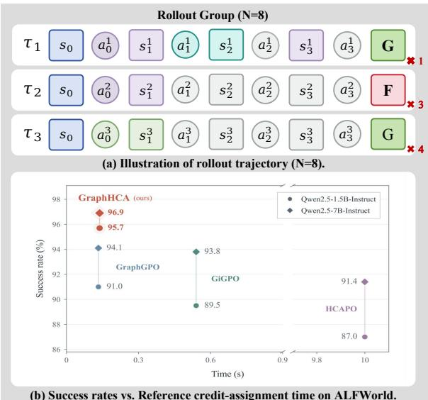
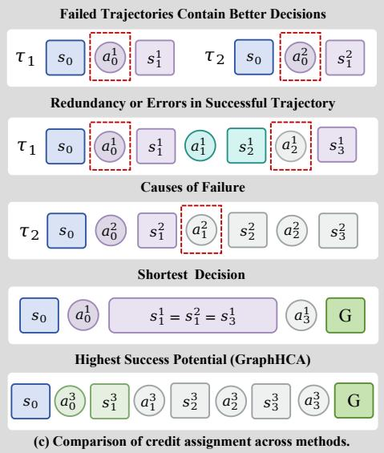
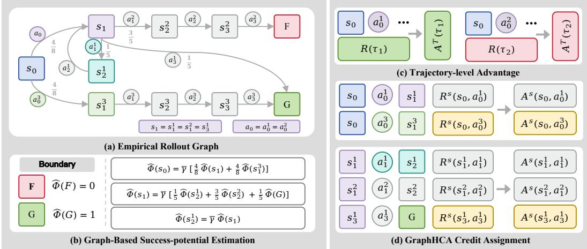
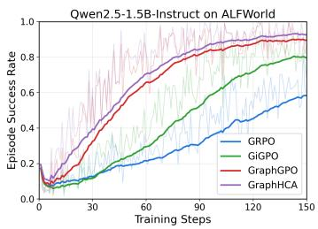
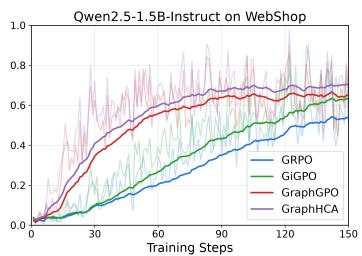
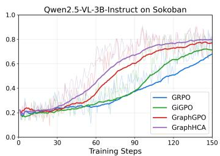
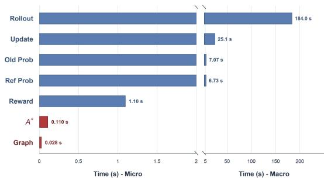
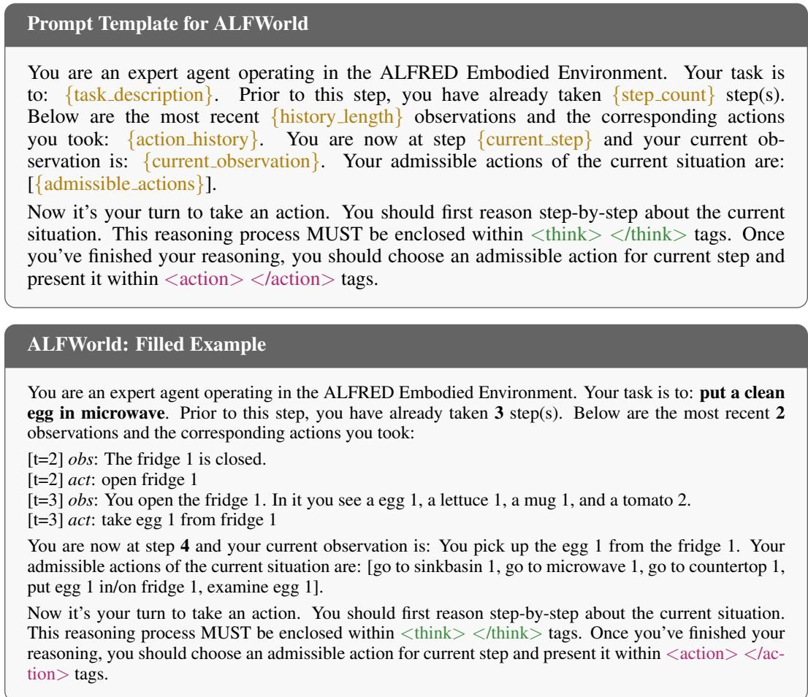
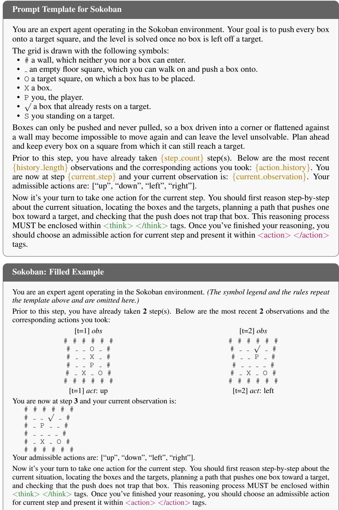

# GRAPHHCA: CLOSED-FORM HINDSIGHT CREDIT AS-SIGNMENT FOR LONG-HORIZON LLM AGENTS

Haodong Zhu1,2∗ Yangyang Ren1,2∗ Changbai Li1 Sheng Xu3† Linlin Yang3 Haiguang Liu2 Baochang Zhang1,4

1Beihang University 2Zhongguancun Academy 3Communication University of China 4Hangzhou Innovation Institute of Beihang University

## ABSTRACT

Group-based reinforcement learning (RL) has advanced large language models (LLMs) and is increasingly extending to agentic tasks, where sparse terminal rewards make step-level credit assignment essential. Existing methods assign credit from what follows an action in sampled rollouts, but do not explicitly capture its retrospective relation to the realized outcome. Hindsight credit assignment (HCA) instead attributes credit through the ratio of hindsight to behavior-policy probabilities, but estimating the hindsight distribution requires an auxiliary model or an extra pass. To address this estimation bottleneck, we propose GraphHCA, a model-free realization of HCA that eliminates explicit hindsight-distribution estimation. For terminal-goal tasks with deterministic transitions, Bayes’ rule reduces the hindsight ratio to a ratio of behavior-policy success probabilities at consecutive states. Taking logs yields a state-wise success potential, whose increment across a transition provides step-level credit. GraphHCA estimates this potential from pooled rollouts through a discounted recursion on the induced transition graph, which admits a unique fixed point on any directed graph. The resulting step-level signal is combined with the trajectory-level advantage, requiring neither a learned hindsight model nor an extra forward pass and recovering GRPO when the step-level weight is zero. Among all compared baselines, GraphHCA achieves state-of-the-art results on ALFWorld and WebShop at both LLM scales, and on Sokoban with a vision-language agent. For example, on ALFWorld it improves overall success rate by up to 24.6 points over GRPO and by up to 4.7 points over the strongest step-level baseline.

## 1 INTRODUCTION

Large language models (LLMs) are increasingly deployed as controllers of interactive agents (Achiam et al., 2023; Team, 2023; Guo et al., 2025), performing embodied household tasks (Shridhar et al., 2021), navigating web and mobile environments (Yao et al., 2022; Rawles et al., 2023), and invoking external tools for complex reasoning (Yao et al., 2023; Shinn et al., 2023; Schick et al., 2023). These tasks typically require long-horizon interaction and sequential decision making over large natural-language action spaces.

A fundamental challenge in applying reinforcement learning (RL) (Sutton et al., 1998; 1999) to such agents is the sparsity of outcome-based rewards. Many agentic tasks provide only a scalar reward at the end of an episode, leaving intermediate actions without direct supervision. This gives rise to the credit assignment problem: determining how a terminal outcome should be attributed to the individual decisions that produced it. The problem becomes increasingly difficult as interaction horizons and action spaces grow.

Conventional actor–critic methods address credit assignment through learned value estimates (Schulman et al., 2017), but training a critic at LLM scale is computationally expensive and particularly challenging under sparse rewards. Group-based methods instead sample a group of rollouts for each task, as illustrated in Fig. 1(a), and estimate advantages directly from their outcomes without an explicit critic. GRPO (Shao et al., 2024), for example, assigns the same trajectory-level advantage to all actions within a rollout, so intermediate decisions are not distinguished by their individual contributions to the final outcome. This coarse attribution has motivated step-level variants: GiGPO (Feng et al., 2025) compares transitions from shared states using the outcomes of their respective rollouts, whereas GraphGPO (Cheng et al., 2026) scores transitions by shortest-path progress in the pooled rollout graph. Although these methods provide finer-grained signals, their credit is still derived primarily from forward evidence contained in sampled continuations, without explicitly modeling the retrospective relation between an intermediate action and the realized outcome. As illustrated in Fig. 1(c), a failed rollout may still contain useful intermediate decisions, while a successful rollout may include redundant or erroneous ones; likewise, shortest-path progress need not identify the continuation with the highest empirical expected success. HCA (Harutyunyan et al., 2019) attributes credit retrospectively through the hindsight-to-policy ratio, but estimating the hindsight distribution is expensive: it requires either an auxiliary model or, as in HCAPO (Tan et al., 2026), an extra outcome-conditioned policy pass. Fig. 1(b) shows that the additional model pass of HCAPO raises its credit-assignment time to about 10 seconds, the highest among all methods. We therefore face a dilemma: step-level credit is either cheap but only forward-looking (Fig. 1(c)), or retrospective but too expensive to obtain (Fig. 1(b)).

  
Figure 1: Comparison of credit-assignment principles. (a) Illustration of rollout trajectory (N=8). Squares and circles denote states and actions; matching non-gray state colors indicate identical states. (b) ALFWorld success rates versus reference credit-assignment time. (c) Comparison of credit assignment across methods, highlighting the limitations of relying solely on trajectory outcomes or shortest paths.

Our key observation is that, in terminal-goal tasks with deterministic transitions, the hindsight ratio admits a closed-form expression, so it need not be estimated by an auxiliary model or an extra forward pass. By Bayes’ rule, it reduces to the ratio of behavior-policy success probabilities at the successor and current states, eliminating the need to model the hindsight distribution explicitly and thus avoiding the outcome-conditioned pass that makes HCAPO’s credit-assignment time the highest in Fig. 1(b). We define the logarithm of this state-wise success probability as the success potential, whose change across a transition corresponds to the log hindsight ratio and serves as a dense step-level credit signal. Hindsight credit assignment is thus reduced from estimating a distribution over the combinatorial action space to estimating a single scalar per state.

Having reduced hindsight credit to estimating a single state-wise scalar, the remaining challenge is to estimate that scalar from a finite group of sampled rollouts. We therefore propose GraphHCA, a model-free realization of HCA that estimates the success potential directly from sampled rollouts, as illustrated in Fig. 2. Because each rollout observes only one sampled continuation at a visited state, GraphHCA pools a group of rollouts into a shared transition graph, merges identical states, and propagates terminal outcomes according to empirical action frequencies. To recover the path-length information lost through state merging, we introduce a propagation discount, which also makes the resulting expectation backup contractive and guarantees a unique fixed point even on cyclic graphs. The resulting potential differences provide transition-level credit, which is standardized among actions leaving the same state and combined with the trajectory-level advantage for policy optimization. GraphHCA thus extracts dense hindsight credit from rollouts already collected for training, without learning an auxiliary hindsight model or requiring an additional outcome-conditioned forward pass, and reduces to GRPO when the step-level term is disabled. Our contributions are summarized as follows:

  
Figure 2: Overview of GraphHCA. (a) Rollouts are merged into a graph where identical states share a node and edges carry action frequencies. (b) The success probability Φˆ is the fixed point of a discounted recursion with ${ \hat { \Phi } } ( F ) = 0$ and ${ \hat { \Phi } } ( G ) = 1$ . (c) The trajectory-level advantage $A ^ { T } ( \tau )$ is shared by all steps of τ. (d) GraphHCA takes the increment of log Φˆ as the step reward Rs and standardizes it among transitions sharing a source state to obtain As.

• Closed-form hindsight credit. We show that, for terminal-goal tasks with deterministic transitions, HCA reduces to state-wise success probabilities, replacing hindsightdistribution estimation with a single scalar per state.

• Model-free graph estimation. We estimate this scalar directly from pooled rollouts through a discounted expectation recursion on the transition graph, with a unique fixed point on arbitrary directed graphs, and requires no learned critic, auxiliary hindsight model, or extra forward pass.

• Consistent empirical gains. Across ALFWorld (Shridhar et al., 2021), WebShop (Yao et al., 2022), and 6 × 6 Sokoban (Schrader, 2018), GraphHCA achieves the best performance among all compared baselines across both LLM scales and the vision-language setting. For example, GraphHCA improves success by up to 24.6 points over GRPO and by up to 4.7 points over the strongest step-level baseline on ALFWorld.

## 2 RELATED WORK

RL for LLM agents. Reinforcement learning has become a central paradigm for LLM post-training, progressing from RL from human feedback (Ziegler et al., 2019; Stiennon et al., 2020; Ouyang et al., 2022; Bai et al., 2022; Rafailov et al., 2023) to RL with verifiable rewards (Guo et al., 2025; Kimi Team, 2025; Shao et al., 2024), with automatically checkable feedback supporting reasoning, code, search, and tool use (Le et al., 2022; Jin et al., 2025; Qian et al., 2025). For long-horizon LLM agents in interactive environments (Yao et al., 2023; Shinn et al., 2023; Schick et al., 2023; Shridhar et al., 2021; Yao et al., 2022; Rawles et al., 2023; Yang et al., 2024b; Trivedi et al., 2024), early approaches often relied on learned critics, including PPO-style and agent-specific hierarchical or search-augmented methods (Schulman et al., 2017; Peng et al., 2019; Zhou et al., 2024; Putta et al.,

2024; Bai et al., 2024). At LLM scale, however, critic training is costly and unstable under sparse terminal rewards, motivating critic-free advantage estimation from sampled rollouts.

Step-level credit assignment. Group-based methods replace learned critics with rollout statistics, but GRPO (Shao et al., 2024) broadcasts a single trajectory-level advantage across steps. Efforts to refine credit follow two main directions. Dense shaping adds stepwise signals: process reward models (Lightman et al., 2024) require extra supervision, intrinsic rewards (Wang et al., 2026) rely on surrogate objectives, and potential-based shaping (Ng et al., 1999) specifies a policy-invariant reward form but leaves the potential unspecified. Rollout-based methods use forward evidence from sampled continuations: GiGPO (Feng et al., 2025) compares transitions from shared states, while GraphGPO (Cheng et al., 2026) scores shortest-path progress on pooled rollout graphs. Hindsight credit assignment (HCA) (Harutyunyan et al., 2019) instead formalizes outcome-conditioned credit through the hindsight-to-policy ratio, but estimating the hindsight distribution typically requires an auxiliary model or an extra outcome-conditioned policy pass (Tan et al., 2026). GraphHCA removes this bottleneck by deriving the ratio in closed form for deterministic terminal-goal tasks and estimating the resulting state-wise success potential directly from pooled rollouts.

## 3 PRELIMINARIES

RL for long-horizon LLM agents. We model an interactive agent task as a finite-horizon decision process. Let x denote the task instruction and $s _ { t }$ the environment state at step t. At each step, the LLM policy πθ samples a natural-language action $a _ { t } \sim \pi _ { \theta } ( \cdot \ | \ s _ { t } , x )$ , after which the environment transitions to $s _ { t + 1 }$ . A rollout yields $\tau = ( s _ { 0 } , a _ { 0 } , \ldots , a _ { T - 1 } , s _ { T } )$ under the behavior policy $q ( a \mid s , x ) = \pi _ { \theta _ { \mathrm { o l d } } } ( a \mid s , x )$ and receives the terminal reward $R ( \tau ) = \mathbf { 1 } [ s _ { T } \in \mathcal { G } ]$ ], where $\mathcal { G }$ and $\dot { \mathcal { F } }$ denote the goal and failure sets. Since all rollouts within a group share the same task $x ,$ we suppress this common conditioning below and write $q ( a \mid s )$ and $\pi _ { \theta } ( a \mid s )$ for brevity. Maximizing $J ( \theta ) = \mathbb { E } _ { \tau \sim \pi _ { \theta } } [ R ( \tau ) ]$ gives the policy gradient $\begin{array} { r } { \nabla _ { \theta } J ( \theta ) = \mathbb { E } _ { \tau \sim \pi _ { \theta } } \left[ \sum _ { t = 0 } ^ { T - 1 } A _ { t } \nabla _ { \theta } \log \pi _ { \theta } ( a _ { t } \mid s _ { t } ) \right] } \end{array}$ which requires a per-step advantage $A _ { t } .$ , whereas the terminal reward reveals only whether the task succeeded, not which intermediate decisions should receive credit for the outcome.

Group-based advantage estimation. Classically, $A _ { t }$ is estimated by a learned critic (Schulman et al., 2017), which is costly and can be unstable at LLM scale. Group-based methods instead derive advantages directly from rollout statistics. GRPO (Shao et al., 2024) samples N trajectories per task under q and assigns the standardized terminal return

$$
A ^ { \mathrm { T } } ( \tau _ { i } ) = \frac { R ( \tau _ { i } ) - \mu _ { R } } { \sigma _ { R } }\tag{1}
$$

to every step of $\tau _ { i } ,$ leaving intermediate credit dependent on subsequent decisions. For finer credit, GiGPO (Feng et al., 2025) compares transitions from shared states using their trajectory outcomes, while GraphGPO (Cheng et al., 2026) scores transitions by shortest-path progress on the pooled rollout graph. Both still derive credit from forward evidence in sampled futures, without explicitly conditioning the action distribution on the realized outcome.

Hindsight credit assignment. HCA (Harutyunyan et al., 2019) takes a retrospective view, defining step-level credit through the relation between an action and a realized future outcome. Its hindsight distribution $h ( \boldsymbol { a } _ { t } \mid \boldsymbol { s } _ { t } , \boldsymbol { s } _ { k } )$ gives the probability of taking $a _ { t }$ at $s _ { t }$ conditioned on later reaching $s _ { k }$ . The ratio to the behavior policy,

$$
\rho ( s _ { t } , a _ { t } , s _ { k } ) = \frac { h ( a _ { t } \mid s _ { t } , s _ { k } ) } { q ( a _ { t } \mid s _ { t } ) } ,\tag{2}
$$

upweights actions whose probability increases under outcome conditioning and downweights those whose probability decreases. Its practical difficulty lies in estimating $h ,$ , which classical HCA learns with an auxiliary model over the action space, while HCAPO (Tan et al., 2026) approximates it through an additional outcome-conditioned pass of the policy LLM.

## 4 METHOD

We propose GraphHCA, as illustrated in Fig. 2, a model-free realization of hindsight credit assignment (HCA) for long-horizon LLM agents. Our key observation is that, for terminal-goal task with deterministic transitions, the hindsight ratio admits a closed form in terms of state-wise success probabilities. We define the logarithm of this success probability as the success potential, estimate it model-free on a pooled rollout graph, and use its transition differences as step-level credit for policy optimization. The following subsections derive the potential (Sec. 4.1), estimate it on the rollout graph (Sec. 4.2), integrate it into policy optimization (Sec. 4.3), and analyze its properties (Sec. 4.4). The detailed algorithm is presented in Appendix A.

## 4.1 THE SUCCESS POTENTIAL FROM BAYESIAN HINDSIGHT

Hindsight as success-posterior inference. We specialize HCA to terminal-goal tasks with binary outcomes. Let $\mathcal { G }$ and $\bar { \mathcal F }$ denote the terminal goal and failure sets, and let $G = { \bar { \{ s _ { T } \in { \mathcal { G } } \} } }$ denote the success event. Rather than conditioning on an arbitrary future state $s _ { k }$ , we condition on $G ,$ , so that $h ( a _ { t } \mid s _ { t } , s _ { k } )$ becomes the success-conditioned posterior $h ( a \mid s , G )$ . By Bayes’ rule,

$$
h ( a \mid s , G ) = \frac { q ( a \mid s ) P ( G \mid s , a ) } { P ( G \mid s ) } , \qquad P ( G \mid s ) = \sum _ { a } q ( a \mid s ) P ( G \mid s , a ) .\tag{3}
$$

Here, $P ( G \mid s )$ is the marginal probability of eventual success from s. For the exact analysis, we assume that the conditional probability of eventual success under $q$ depends only on the current environment state, independently of the preceding history and time step. Under deterministic transitions, each action a uniquely determines a successor $\dot { s _ { a } ^ { \prime } } = f ( s , a )$ ; together with the preceding assumption, this gives $P ( \bar { G } \mid \bar { s } , a ) = P ( G \mid s _ { a } ^ { \prime } )$ . The action-dependent likelihood in the hindsight posterior is therefore characterized by the success probability of its successor state.

The success potential. Define the state-wise success probability

$$
\Phi ( s ) = P ( G \mid s ) , \qquad \Phi ( s ) = 1 { \mathrm { ~ f o r ~ } } s \in { \mathcal { G } } , \quad \Phi ( s ) = 0 { \mathrm { ~ f o r ~ } } s \in { \mathcal { F } } ,\tag{4}
$$

and its log-scale success potential

$$
\Psi ( s ) = \log \operatorname* { m a x } \{ \Phi ( s ) , \epsilon \} , \qquad \epsilon \in ( 0 , 1 ) .\tag{5}
$$

The floor only keeps the logarithmic representation finite when $\Phi ( s ) = 0$ and does not alter the underlying success probability. Under the terminal reward $R ( \tau ) = \mathbf { \dot { 1 } } [ s _ { T } \in \mathcal G ]$ , Φ is also the value function of the behavior policy $q .$

Proposition 4.1 (Closed-form hindsight ratio). Under the preceding assumption and deterministic transitions, the success probability at any non-terminal state satisfies

$$
\Phi ( s ) = \sum _ { a } q ( a \mid s ) \Phi ( s _ { a } ^ { \prime } ) = \mathbb { E } _ { a \sim q } [ \Phi ( s _ { a } ^ { \prime } ) ] .\tag{6}
$$

For any state with $\Phi ( s ) > 0$ and action with $q ( a \mid s ) > 0$ , the hindsight ratio specialized to the success event admits the closedform

$$
\rho ( s , a ) = \frac { h ( a \mid s , G ) } { q ( a \mid s ) } = \frac { P ( G \mid s , a ) } { P ( G \mid s ) } = \frac { \Phi ( s _ { a } ^ { \prime } ) } { \Phi ( s ) } .\tag{7}
$$

The closed form in Eq. (7) avoids explicit estimation of the hindsight distribution. Using the floored potential Ψ in Eq. (5), we define the step credit $\ell ( s , a )$ as

$$
\ell ( s , a ) = \Psi \big ( s _ { a } ^ { \prime } \big ) - \Psi \big ( s \big ) .\tag{8}
$$

This credit remains finite when the underlying potential vanishes and equals log $\rho ( s , a )$ whenever the floor is inactive at both $s$ and $s _ { a } ^ { \prime } .$ Thus, hindsight credit assignment reduces to estimating the scalar state potential $\Phi .$ . When the floor is inactive, the resulting additive credit admits the loglikelihood-ratio interpretation analyzed in Sec. 4.4.

## 4.2 MODEL-FREE ESTIMATION ON THE ROLLOUT GRAPH

Pooled rollout graph. The marginalization Eq. (6) characterizes the exact success probability Φ, but sampled rollouts reveal only a subset of the available transitions. Following Cheng et al. (2026), we pool the rollout group into a shared graph, merging identical environment states across rollouts and time steps. Each realized transition $s \stackrel { a } {  } s _ { a } ^ { \prime }$ is assigned the empirical weight $\hat { q } ( a \mid $ $s ) = n ( s , a ) / n ( s )$ , where $n ( s )$ counts visits to s and $n ( s , a )$ those on which action a is taken. Pooling enables evidence sharing across trajectories, but merging repeated occurrences of the same state removes their temporal positions and hence their path-length information. Consequently, an undiscounted backup may assign no cost to additional transitions or detours. We therefore define the graph value through the discounted expectation recursion

$$
\begin{array} { r } { \hat { \Phi } ( s ) = \bar { \gamma } \mathbb { E } _ { a \sim \hat { q } } \bigl [ \hat { \Phi } ( s _ { a } ^ { \prime } ) \bigr ] , \qquad \bar { \gamma } \in ( 0 , 1 ) , } \end{array}\tag{9}
$$

with boundary values $\hat { \Phi } = 1$ on $\mathcal { G }$ and $\hat { \Phi } = 0$ on $\mathcal { F }$ . Unlike the exact recursion Eq. $( 6 ) , \bar { \gamma }$ is not inherited from the task objective, but acts as a propagation discount that restores sensitivity to path length after state merging. The resulting $\hat { \Phi }$ is a discounted empirical surrogate for Φ, aggregating visits with potentially different interaction histories and remaining horizons.

Proposition 4.2 (Contraction and convergence). For any directed graph, including graphs with cycles, the operator in Eq. (9) is a γ¯-contraction in the sup norm. Hence, iteration from any initialization converges geometrically to a unique fixed point $\hat { \Phi } ,$ corresponding to the $\bar { \gamma } .$ -discounted expected terminal success under the empirical policy qˆ.

Using the fixed point $\hat { \Phi } ,$ , we define the graph success potential $\hat { \Psi } ( s ) = \log \operatorname* { m a x } \{ \hat { \Phi } ( s ) , \epsilon \}$ and the corresponding raw transition credit

$$
\hat { \ell } ( s , a ) = \hat { \Psi } ( s _ { a } ^ { \prime } ) - \hat { \Psi } ( s ) \in [ - \log ( 1 / \epsilon ) , \log ( 1 / \epsilon ) ] .\tag{10}
$$

## 4.3 POLICY OPTIMIZATION

Step-level advantage. We take the graph credit of Sec. 4.2 as the reward of a realized transition, $R ^ { \mathrm { s } } ( s _ { t } , a _ { t } ) = \hat { \ell } ( s _ { t } , a _ { t } )$ . Following the state-level grouping of (Feng et al., 2025), we standardize it within the group $B _ { s }$ of all transitions leaving the same state s across the $N$ rollouts,

$$
A ^ { \mathrm { s } } ( s _ { t } , a _ { t } ) = \frac { R ^ { \mathrm { s } } ( s _ { t } , a _ { t } ) - \mu _ { \mathcal { B } _ { s _ { t } } } } { \sigma _ { \mathcal { B } _ { s _ { t } } } } , \qquad \mu _ { \mathcal { B } _ { s } } = \mathrm { m e a n } _ { \mathcal { B } _ { s } } ( R ^ { \mathrm { s } } ) , \quad \sigma _ { \mathcal { B } _ { s } } = \mathrm { s t d } _ { \mathcal { B } _ { s } } ( R ^ { \mathrm { s } } ) .\tag{11}
$$

We set $A ^ { \mathrm { s } } = 0$ at singleton states $( | B _ { s } | = 1 )$ . For both trajectory- and state-level normalization, we also assign zero advantages to groups with zero variance. For groups with positive variance, standardization preserves the ordering induced by $\hat { \ell }$ and therefore ranks the sampled actions from a common state by their successor potential $\hat { \Psi } ( s _ { a } ^ { \prime } )$

Combined objective. We add the step term to the trajectory-level advantage $A ^ { \mathrm { T } } ( \tau )$ of Eq. (1),

$$
\hat { A } _ { t } = A ^ { \mathrm { T } } ( \tau ) + w _ { \mathrm { s } } A ^ { \mathrm { s } } ( s _ { t } , a _ { t } ) , \qquad w _ { \mathrm { s } } \geq 0 ,\tag{12}
$$

the two being complementary, since $A ^ { \mathrm { T } }$ anchors the update to task success and stays defined at singleton states while $A ^ { \mathrm { s } }$ densifies credit within a trajectory. Using ${ \hat { A } } _ { t }$ for the policy update at step t, we optimize the clipped surrogate with a reference-KL penalty,

$$
\mathcal { I } ( \theta ) = \mathbb { E } \Bigg [ \frac { 1 } { \sum _ { i } T _ { i } } \sum _ { i = 1 } ^ { N } \sum _ { t } \operatorname* { m i n } \Big ( \varrho _ { i , t } ( \theta ) \hat { A } _ { i , t } , \ \mathrm { c l i p } \left( \varrho _ { i , t } ( \theta ) , 1 - \varepsilon , 1 + \varepsilon \right) \hat { A } _ { i , t } \Big ) \Bigg ] - \beta _ { \mathrm { K L } } D _ { \mathrm { K L } } \big ( \pi _ { \theta } \| \pi _ { \mathrm { r e f } } \big ) ,\tag{13}
$$

with $\varrho _ { i , t } ( \theta ) \ = \ \pi _ { \theta } ( a _ { i , t } \ \mid \ s _ { i , t } ) / \pi _ { \theta _ { \mathrm { o l d } } } ( a _ { i , t } \ \mid \ s _ { i , t } )$ . Setting $w _ { \mathrm { s } } ~ = ~ 0$ recovers GRPO exactly, so GraphHCA is a strict, model-free refinement of it, adding no model of its own since $\hat { \Psi }$ is read directly off the pooled graph, whose $\hat { \Phi }$ draws on the whole group including sub-paths of failed trajectories that never reach the goal on their own.

## 4.4 PROPERTIES OF THE GRAPHHCA CREDIT

We further establish that the exact credit is the log-likelihood ratio to the hindsight posterior when the floor is inactive (Proposition 4.3), and that the graph credit separates from GraphGPO’s distance surrogate by aggregation rather than by reachability (Proposition 4.4). Proofs are in Appendix B.

Proposition 4.3 (Hindsight KL identity and bounded step credit). Under the assumptions ofProposition 4.1, fix a non-terminal state s such that $\Phi ( s ) \geq \epsilon$ ϵ and $\Phi ( s _ { a } ^ { \prime } ) \geq \epsilon f o r$ every action with q(a | $s ) > 0$ . Then, on the support of $\cdot _ { q ( \cdot \mid s ) }$ , Proposition 4.1 gives $\ell ( s , a ) = \log [ h ( a \mid s , G ) / q ( a \mid s ) ]$ Therefore,

$$
\begin{array} { r } { \mathbb { E } _ { a \sim q ( \cdot \mid s ) } \left[ \ell ( s , a ) \right] = - \mathrm { K L } \big ( q ( \cdot \mid s ) \big | \big | h ( \cdot \mid s , G ) \big ) \le 0 , } \end{array}\tag{14}
$$

with equality if and only $i f q ( \cdot \mid s ) = h ( \cdot \mid s , G )$ . Independently, for the empirical graph, $\hat { \Phi } ( s ) \in$ $[ 0 , \bar { \gamma } ]$ at every interior node. Whether or not the floor is active, it gives $\hat { \Psi } ( s ) \in [ \log \epsilon , 0 ]$ and $| \hat { \ell } ( s , a ) | \leq \log ( 1 / \epsilon )$

Proposition 4.4 (Expectation versus best-case aggregation). Let $R ^ { \mathrm { G } } ( s , a , s _ { a } ^ { \prime } )$ denote GraphGPO’s step reward, and $R ^ { \mathrm { G } } ( s , a , s _ { a } ^ { \prime } ) \propto \bar { \gamma } ^ { d ( s _ { a } ^ { \prime } ) + c ( s , a ) }$ . d(·) the shortest-path distance to G on the empirical graph, and adopt the unit-cost setting of (Cheng et al., 2026). Replacing the expectation in Eq. (9) by a maximum under the same boundary defines the fixed point $\Phi ^ { \mathrm { { \bar { m a x } } } }$ , and

$$
\hat { \Phi } ( s ) \le \Phi ^ { \mathrm { m a x } } ( s ) = \bar { \gamma } ^ { d ( s ) } ( s g o a l - r e a c h a b l e ) ,\tag{15}
$$

with equality if and only if qˆ is supported on the argmax successors at s and downstream. The two credits are therefore one backup under two aggregations, ˆℓ ranking the actions at s by $\hat { \Psi } ( s _ { a } ^ { \prime } )$ and $R ^ { \mathrm { G } }$ by $d ( s _ { a } ^ { \prime } )$

Under the floor-inactive conditions of Proposition 4.3, the exact step credit has a log-likelihood-ratio interpretation relative to the hindsight posterior. Proposition 4.4 further distinguishes GraphHCA from GraphGPO by their aggregation rules: GraphHCA evaluates successors through empirical expected continuation values, whereas GraphGPO relies on shortest-path distance and thus reflects a best-case continuation. Consequently, GraphHCA remains sensitive to transition frequencies and can distinguish equidistant successors whose distance-based scores coincide. HCAPO (Tan et al., 2026) targets the same hindsight ratio through an additional outcome-conditioned policy evaluation, while GraphHCA obtains its credit directly from the pooled rollout graph without an auxiliary hindsight model.

## 5 EXPERIMENTS

## 5.1 EXPERIMENTAL SETUP

Benchmarks. We evaluate GraphHCA on three challenging multi-turn agentic benchmarks: ALF-World (Shridhar et al., 2021) and WebShop (Yao et al., 2022) for LLM agents, and the $6 \times 6$ Sokoban game (Schrader, 2018) for a vision-language model (VLM) agent. Following prior work (Feng et al., 2025; Cheng et al., 2026), we report the success rate on ALFWorld, the task score and success rate on WebShop, and the success rate on Sokoban, averaged over three random seeds for all RL methods. Detailed descriptions of the three benchmarks are provided in Appendix C.

Implementation Details. Following Cheng et al. (2026), we use Qwen2.5-1.5B-Instruct and Qwen2.5-7B-Instruct (Yang et al., 2024a) as the base LLMs and Qwen2.5-VL-3B-Instruct (Bai et al., 2025) as the base VLM. The agent keeps only the two most recent interaction steps as memory and emits its reasoning in <think> tags before the action in <action> tags (Wei et al., 2022). All methods share the same training hyperparameters: group size $N = 8 ,$ , learning rate $1 \times 1 0 ^ { - 6 }$ , and 150 update steps. GraphHCA adds three quantities of its own: the propagation discount $\bar { \gamma } = 0 . 9 5$ of Eq. (9), failure floor $\stackrel { \cdot } { \epsilon } = 1 \times 1 0 ^ { - 2 }$ of Eq. (10), and dense weight $w _ { \mathrm { s } } = 1$ of Eq. (12). Appendix D reports the more configurations.

## 5.2 MAIN RESULTS

LLM Agents on ALFWorld and WebShop. As shown in Table 1, GraphHCA achieves the best overall ALFWorld success rate and the best result on both WebShop metrics at both model scales.

  
(a) ALFWorld

  
(b) WebShop

  
(c) Sokoban  
Figure 3: Training success rate over update steps on ALFWorld and WebShop with Qwen2.5-1.5B-Instruct, and on Sokoban with Qwen2.5-VL-3B-Instruct. GraphHCA converges faster and reaches higher final success than the fine-grained credit-assignment baselines across all three environments.

Table 1: Test performance on ALFWorld and WebShop. For ALFWorld, we report the average success rate (%) for each subtask and the overall result. For WebShop, we report the average task score and the average success rate (%). RL results are averaged over three random seeds. The best performance in each column is highlighted in bold.
<table><tr><td rowspan="2">Type</td><td rowspan="2">Method</td><td colspan="7">ALFWorld</td><td colspan="2">WebShop</td></tr><tr><td>Pick</td><td>Clean</td><td>Cool</td><td>Look</td><td>Heat</td><td>Pick2</td><td>All</td><td>Score</td><td>Succ.</td></tr><tr><td colspan="10">Closed-Source Models</td></tr><tr><td>Prompting</td><td>GPT-40</td><td>75.3</td><td>60.8</td><td>31.2</td><td>56.7</td><td>21.6</td><td>49.8</td><td>48.0</td><td>31.8</td><td>23.7</td></tr><tr><td>Prompting</td><td>Gemini-2.5-Pro</td><td>92.8</td><td>63.3</td><td>62.1</td><td>69.0</td><td>26.6</td><td>58.7</td><td>60.3</td><td>42.5</td><td>35.9</td></tr><tr><td colspan="10">Qwen2.5-1.5B-Instruct</td></tr><tr><td>Prompting</td><td>Qwen2.5</td><td>5.9</td><td>5.5</td><td>3.3</td><td>9.7</td><td>4.2</td><td>0.0</td><td>4.1</td><td>23.1</td><td>5.2</td></tr><tr><td>Prompting</td><td>ReAct</td><td>17.4</td><td>20.5</td><td>15.7</td><td>6.2</td><td>7.7</td><td>2.0</td><td>12.8</td><td>40.1</td><td>11.3</td></tr><tr><td>Prompting</td><td>Reflexion</td><td>35.3</td><td>22.2</td><td>21.7</td><td>13.6</td><td>19.4</td><td>3.7</td><td>21.8</td><td>55.8</td><td>21.9</td></tr><tr><td>RL Training</td><td>PPO</td><td> $6 4 . 8 { \scriptstyle \pm 3 . 5 }$ </td><td> $4 0 . 5 { \scriptstyle \pm 6 . 9 }$ </td><td> $5 7 . 1 { \pm } 4 . 9$ </td><td>60.6±6.6</td><td> $4 6 . 4 _ { \pm 4 . 0 }$ </td><td>47.4±1.9</td><td> $5 4 . 4 { \scriptstyle \pm 3 . 1 }$ </td><td> $7 3 . 8 { \scriptstyle \pm 3 . 0 }$ </td><td>51.5±2.9</td></tr><tr><td>RL Training</td><td>RLOO</td><td> $8 8 . 3 { \scriptstyle \pm 3 . 0 }$ </td><td> $5 2 . 8 { \scriptstyle \pm 8 . 6 }$ </td><td> $7 1 . 0 { \scriptstyle \pm 5 . 9 }$ </td><td> $6 2 . 8 { \scriptstyle \pm 8 . 7 }$ </td><td> $6 6 . 4 _ { \pm 5 . 5 }$ </td><td> $5 6 . 9 { \scriptstyle \pm 4 . 7 }$ </td><td> $6 9 . 7 _ { \pm 2 . 5 }$ </td><td></td><td>73.9±5.6 52.1±6.7</td></tr><tr><td>RL Training</td><td>GRPO</td><td> $8 8 . 2 { \scriptstyle \pm 2 . 9 }$ </td><td> $7 2 . 6 { \scriptstyle \pm 1 5 . 9 }$ </td><td> $6 7 . 5 { \scriptstyle \pm 7 . 5 }$ </td><td> $4 3 . 3 _ { \pm 1 8 . 3 }$ </td><td> $7 6 . 6 { \scriptstyle \pm 0 . 4 }$ </td><td> $5 1 . 6 { \scriptstyle \pm 9 . 5 }$ </td><td>71.1±1.6</td><td></td><td>|81.9±3.5 64.1±2.3</td></tr><tr><td>RL Training</td><td>EMPG</td><td>85.5</td><td>33.5</td><td>78.9</td><td>76.2</td><td>74.7</td><td>69.1</td><td>73.7</td><td>80.4</td><td>60.8</td></tr><tr><td>RL Training</td><td>GiGPO</td><td>97  $7 . 6 { \scriptstyle \pm 2 . 4 }$ </td><td> $9 3 . 7 _ { \pm 1 . 3 }$ </td><td> ${ \bf 8 9 . 4 } _ { \pm 0 . 6 }$ </td><td> $6 5 . 6 { \scriptstyle \pm 3 . 1 }$ </td><td> $9 5 . 0 { \scriptstyle \pm 5 . 0 }$ </td><td> $8 0 . 6 { \scriptstyle \pm 6 . 9 }$ </td><td> $8 9 . 5 { \scriptstyle \pm 1 . 2 }$ </td><td> $8 5 . 2 { \scriptstyle \pm 0 . 8 }$ </td><td> $7 4 . 2 { \scriptstyle \pm 0 . 8 }$ </td></tr><tr><td>RL Training</td><td>HCAPO</td><td>88  $. 6 _ { \pm 7 . 0 }$ </td><td> $9 7 . 6 _ { \pm 1 . 8 }$ </td><td> $8 4 . 2 _ { \pm 0 . 0 }$ </td><td> $7 5 . 0 _ { \pm 0 . 0 }$ </td><td> $9 0 . 7 _ { \pm 6 . 9 }$ </td><td> $7 4 . 2 _ { \pm 6 . 9 }$ </td><td> $8 7 . 0 _ { \pm 4 . 1 }$ </td><td> $8 3 . 8 _ { \pm 0 . 7 }$ </td><td> $6 8 . 5 _ { \pm 1 . 0 }$ </td></tr><tr><td>RL Training</td><td>GraphGPO</td><td>95  $. 6 _ { \pm 4 . 4 }$ </td><td> $9 7 . 6 _ { \pm 2 . 4 }$ </td><td> $8 3 . 5 _ { \pm 3 . 5 }$ </td><td> $7 1 . 3 _ { \pm 8 . 8 }$ </td><td> $\mathbf { 9 7 . 6 _ { \pm 2 . 4 } }$ </td><td> $8 6 . 6 _ { \pm 2 . 3 }$ </td><td>91  $. 0 { \scriptstyle \pm 2 . 0 }$ </td><td> $8 8 . 1 _ { \pm 0 . 2 }$ </td><td> ${ \bf 8 1 . 3 _ { \pm 0 . 8 } }$ </td></tr><tr><td>RL Training</td><td>GraphHCA</td><td> $\mathbf { 1 0 0 . 0 _ { \pm 0 . 0 } }$ </td><td> $\mathbf { 1 0 0 . 0 _ { \pm 0 . 0 } }$ </td><td> $8 5 . 7 _ { \pm 0 . 7 }$ </td><td> $\mathbf { 8 9 . 9 } _ { \pm 2 . 4 }$ </td><td> $9 6 . 7 _ { \pm 3 . 3 }$ </td><td> ${ \bf 9 5 . 8 _ { \pm 4 . 2 } }$ </td><td> $\mathbf { 9 5 . 7 _ { \pm 1 . 2 } }$ </td><td> $\mathbf { 8 9 . 3 _ { \pm 0 . 1 } }$ </td><td> ${ \bf 8 1 . 3 _ { \pm 0 . 8 } }$ </td></tr><tr><td colspan="10">Qwen2.5-7B-Instruct</td></tr><tr><td>Prompting</td><td>Qwen2.5</td><td>33.4</td><td>21.6</td><td>19.3</td><td>6.9</td><td>2.8</td><td>3.2</td><td>14.8</td><td>26.4</td><td>7.8</td></tr><tr><td>Prompting</td><td>ReAct</td><td>48.5</td><td>35.4</td><td>34.3</td><td>13.2</td><td>18.2</td><td>17.6</td><td>31.2</td><td>46.2</td><td>19.5</td></tr><tr><td>Prompting</td><td>Reflexion</td><td>62.0</td><td>41.6</td><td>44.9</td><td>30.9</td><td>36.3</td><td>23.8</td><td>42.7</td><td>58.1</td><td>28.8</td></tr><tr><td>RL Training</td><td>PPO</td><td> $9 2 . 3 _ { \pm 4 . 0 }$ </td><td> $6 4 . 0 { \scriptstyle \pm 8 . 4 }$ </td><td> $\mathbf { 9 2 . 5 _ { \pm 2 . 4 } }$ </td><td> $8 9 . 5 _ { \pm 7 . 0 }$ </td><td> $8 0 . 3 _ { \pm 2 . 0 }$ </td><td> $6 8 . 8 { \scriptstyle \pm 8 . 3 }$ </td><td> $8 0 . 4 _ { \pm 2 . 7 }$ </td><td> $8 1 . 4 _ { \pm 3 . 1 }$ </td><td> $6 8 . 7 _ { \pm 5 . 1 }$ </td></tr><tr><td>RL Training</td><td>RLOO</td><td>87  $. 6 { \pm } 4 . 3$ </td><td> $7 8 . 2 { \scriptstyle \pm 8 . 3 }$ </td><td> $8 7 . 3 { \scriptstyle \pm 5 . 8 }$ </td><td> $8 1 . 3 { \scriptstyle \pm 7 . 6 }$ </td><td> $7 1 . 9 { \scriptstyle \pm 5 . 2 }$ </td><td> $4 8 . 9 { \scriptstyle \pm 8 . 4 }$ </td><td> $7 5 . 5 { \scriptstyle \pm 4 . 6 }$ </td><td> $8 0 . 3 { \scriptstyle \pm 3 . 2 }$ </td><td> $6 5 . 7 _ { \pm 4 . 0 }$ </td></tr><tr><td>RL Training</td><td>GRPO</td><td> $8 8 . 2 _ { \pm 5 . 9 }$ </td><td> $7 1 . 2 _ { \pm 9 . 6 }$ </td><td> $7 0 . 0 { \scriptstyle \pm 5 . 0 }$ </td><td> $5 0 . 0 _ { \pm 1 2 . 5 }$ </td><td> $6 4 . 3 _ { \pm 2 . 4 }$ </td><td> $7 3 . 7 _ { \pm 1 0 . 5 }$ </td><td></td><td> $8 2 . 3 _ { \pm 2 . 7 }$ </td><td> $7 5 . 4 _ { \pm 2 . 7 }$ </td></tr><tr><td>RL Training</td><td>EMPG</td><td>92.9</td><td>75.2</td><td>74.8</td><td>86.3</td><td>73.7</td><td>65.3</td><td> $^ { 7 3 . 4 _ { \pm 0 . 8 } } _ { 7 8 . 5 }$ </td><td>81.0</td><td>69.3</td></tr><tr><td>RL Training</td><td>GiGPO</td><td> $\mathbf { 1 0 0 . 0 2 } 0 2 0 . 0$ </td><td> $9 2 . 3 { \scriptstyle \pm 7 . 7 }$ </td><td> $8 5 . 0 { \scriptstyle \pm 0 . 0 }$ </td><td> $8 1 . 3 { \scriptstyle \pm 6 . 3 }$ </td><td> $\mathbf { 9 7 . 6 } _ { \pm 2 . 4 }$ </td><td> $9 4 . 7 _ { \pm 0 . 1 }$ </td><td> $9 3 . 8 { \scriptstyle \pm 0 . 8 }$ </td><td> $8 6 . 9 { \scriptstyle \pm 3 . 9 }$ </td><td>82.0±3.1</td></tr><tr><td>RL Training</td><td>HCAPO</td><td> $9 9 . 1 _ { \pm 1 . 3 }$ </td><td> $9 7 . 3 { \pm } 1 . 9$ </td><td> $9 0 . 8 { \scriptstyle \pm 6 . 6 }$ </td><td> $9 0 . 3 { \scriptstyle \pm 2 . 0 }$ </td><td> $8 1 . 8 { \scriptstyle \pm 8 . 8 }$ </td><td> $8 1 . 9 _ { \pm 1 0 . 0 }$ </td><td> $9 1 . 4 { \pm } 2 . 3 $ </td><td> $8 5 . 1 { \pm } 1 . 3 $ </td><td> $7 3 . 8 { \scriptstyle \pm 2 . 8 }$ </td></tr><tr><td>RL Training</td><td> $\mathrm { G r a p h G P O }$ </td><td> $9 8 . 5 { \scriptstyle \pm 1 . 5 }$ </td><td> $9 8 . 1 { \scriptstyle \pm 2 . 7 }$ </td><td> $8 7 . 5 { \scriptstyle \pm 3 . 5 }$ </td><td> $6 8 . 8 { \scriptstyle \pm 8 . 8 }$ </td><td> $9 5 . 2 { \scriptstyle \pm 0 . 0 }$ </td><td> $9 7 . 4 { \scriptstyle \pm 3 . 7 }$ </td><td> $9 4 . 1 { \pm } 0 . 6 $ </td><td>88.6±3.9</td><td> $8 2 . 0 { \scriptstyle \pm 3 . 1 }$ </td></tr><tr><td>RL Training GraphHCA</td><td></td><td> $\mathbf { 1 0 0 . 0 2 } 0 2 0 . 0$ </td><td> $\mathbf { 1 0 0 . 0 2 } 0 _ { \pm 0 . 0 }$ </td><td> $8 6 . 7 \pm 2 . 9$ </td><td> ${ \bf 9 5 . 8 _ { \pm 7 . 2 } }$ </td><td> $9 6 . 8 { \scriptstyle \pm 2 . 8 }$ </td><td> $\mathbf { 9 8 . 3 _ { \pm 3 . 0 } }$ </td><td> ${ \bf 9 6 . 9 { \scriptstyle \pm 0 . 8 } }$ </td><td> ${ \bf 9 0 . 5 { \scriptstyle \pm 0 . 8 } }$ </td><td> ${ \mathbf { 8 2 . 4 } } _ { \pm 1 . 2 }$ </td></tr></table>

It improves over the trajectory-level baseline GRPO by 24.6 and 23.5 points of overall ALFWorld success and by 17.2 and 7.0 points of WebShop success rate for the 1.5B and 7B models respectively. Against the closest baselines GiGPO, HCAPO, and GraphGPO, it still improves overall ALFWorld success by 4.7 to 8.7 points at 1.5B and by 2.8 to 5.5 points at 7B, so the gain comes from the credit rule itself. The largest gains appear on Look and Pick2, the two longest-horizon subtasks, where it leads the best 1.5B baseline by 13.7 and 9.2 points, while the near-saturated Cool and Heat remain comparable. Figures 3a and 3b show the success rate over training steps. GraphHCA achieves the highest success rate over most of training on both ALFWorld and WebShop. It also learns fastest, reaching the final success of GRPO in about a third of the training steps. The success potential provides informative credit when successful rollouts are still rare, which accelerates early learning.

Table 2: Test performance of VLM agents using Qwen2.5-VL-3B-Instruct on the interactive game environment Sokoban. We report the average success rate (%) over three random seeds.
<table><tr><td></td><td>Qwen2.5-VL</td><td>GRPO</td><td>GiGPO</td><td>GraphGPO</td><td>GraphHCA</td></tr><tr><td>Type</td><td>Prompting</td><td>RL Training</td><td>RL Training</td><td>RL Training</td><td>RL Training</td></tr><tr><td>Sokoban [6×6]</td><td>11.7</td><td> $7 1 . 1 _ { \pm 3 . 9 }$ </td><td> $7 9 . 0 _ { \pm 3 . 1 }$ </td><td> $8 1 . 6 _ { \pm 4 . 0 3 }$ </td><td> $\mathbf { 8 4 . 0 _ { \pm 1 . 2 } }$ </td></tr></table>

Table 3: Ablation over the power-mean order ω of Eq. (16) with Qwen2.5-1.5B-Instruct on Alf-World: success rate (%) averaged over three random seeds. The per-column best is in bold.

<table><tr><td>ω</td><td>Pick</td><td>Clean</td><td>Cool</td><td>Look</td><td>Heat</td><td>Pick2</td><td>All</td></tr><tr><td>1 (GraphHCA)</td><td> $\mathbf { 1 0 0 . 0 } _ { \pm 0 . 0 }$  </td><td> $\mathbf { 1 0 0 . 0 } _ { \pm 0 . 0 }$ </td><td> $8 5 . 7 _ { \pm 0 . 7 }$ </td><td> $\mathbf { 8 9 . 9 } _ { \pm 2 . 4 }$  </td><td> $9 6 . 7 _ { \pm 3 . 3 }$  </td><td> ${ \bf 9 5 . 8 _ { \pm 4 . 2 } }$  </td><td> $\mathbf { 9 5 . 7 } _ { \pm 1 . 2 }$ </td></tr><tr><td>5</td><td> $9 8 . 5 { \scriptstyle \pm 2 . 1 }$ </td><td> $\mathbf { 1 0 0 . 0 2 0 . 0 }$ </td><td> $\mathbf { 9 0 . 0 2 } \mathbf { \mathrm { 7 . 1 } }$ </td><td> $8 7 . 5 { \scriptstyle \pm 1 7 . 7 }$ </td><td> $\mathbf { 1 0 0 . 0 2 } 0 2 0 . 0$ </td><td> $8 6 . 8 { \scriptstyle \pm 1 1 . 2 }$ </td><td> $9 5 . 3 { \scriptstyle \pm 4 . 5 }$ </td></tr><tr><td>10</td><td> $9 2 . 9 _ { \pm 1 0 . 1 }$ </td><td> $9 5 . 5 { \scriptstyle \pm 6 . 4 }$ </td><td> $8 5 . 9 { \scriptstyle \pm 1 . 2 }$ </td><td> $7 0 . 9 { \scriptstyle \pm 5 . 9 }$ </td><td> $8 5 . 1 _ { \pm 1 4 . 3 }$ </td><td> $9 1 . 2 { \scriptstyle \pm 2 . 4 }$ </td><td> $9 1 . 8 { \scriptstyle \pm 5 . 5 }$ </td></tr><tr><td>max  $( \omega  \infty )$ </td><td> $8 9 . 7 _ { \pm 2 . 1 }$ </td><td> $9 8 . 1 _ { \pm 2 . 7 }$ </td><td> $7 7 . 5 { \scriptstyle \pm 3 . 5 }$ </td><td> $7 5 . 0 { \scriptstyle \pm 0 . 0 }$ </td><td> $9 5 . 2 _ { \pm 0 . 0 }$ </td><td> $8 6 . 9 _ { \pm 3 . 7 }$ </td><td> $9 0 . 1 _ { \pm 1 . 1 }$ </td></tr><tr><td>GraphGPO</td><td> $9 5 . 6 { \pm } 4 . 4$ </td><td> $9 7 . 6 { \scriptstyle \pm 2 . 4 }$ </td><td> $8 3 . 5 { \scriptstyle \pm 3 . 5 }$ </td><td> $7 1 . 3 { \scriptstyle \pm 8 . 8 }$ </td><td> $9 7 . 6 { \scriptstyle \pm 2 . 4 }$ </td><td> $8 6 . 6 { \scriptstyle \pm 2 . 3 }$ </td><td> $9 1 . 0 { \scriptstyle \pm 2 . 0 }$ </td></tr></table>

VLM Agent on Sokoban. On Sokoban, where observations are rendered images rather than text, GraphHCA attains a success rate of 84.0%, outperforming GRPO by 12.9 points, GiGPO by 5.0, and GraphGPO by 2.4 (Table 2). It is also the most stable across seeds, with a standard deviation of 1.2 against 3.1 or more for every RL baseline. Figure 3c shows where this gain arises: all four methods stay near a 0.2 success rate for the first twenty updates, GraphHCA is the first to leave that plateau, and the resulting margin holds to the end of training.

## 5.3 ABLATION STUDY

Computational overhead. GraphHCA introduces no additional learned model and operates solely on the pooled rollout graph constructed from the sampled trajectories. Graph construction requires a single pass over the observed transitions, and each sweep of the graph backup in Eq. (9) likewise scales linearly with the graph size, without additional model inference or gradient computation. As shown in Figure 4, rollout and policy update dominate the iteration time at 184.0 s and 25.1 s, respectively, whereas graph construction and step-level advantage computation require only 0.028 s and 0.110 s. Together, the GraphHCAspecific computation accounts for only 0.062%

  
Figure 4: Per-iteration runtime breakdown of the training stages. Blue bars denote stages shared by all group-based methods, while red bars denote the overhead of GraphHCA.

of the measured per-iteration runtime, providing dense step-level credit with negligible overhead.

Expectation versus best-case aggregation. Proposition 4.4 relates the difference between Graph HCA and GraphGPO to their aggregation of successor values. To isolate this factor within the same training pipeline, we replace the expectation in Eq. (9) with a qˆ-weighted power mean,

$$
\begin{array} { r } { \hat { \Phi } _ { \omega } ( s ) = \bar { \gamma } \left( \mathbb { E } _ { a \sim \hat { q } } \left[ \hat { \Phi } _ { \omega } ( s _ { a } ^ { \prime } ) ^ { \omega } \right] \right) ^ { 1 / \omega } , \qquad \omega \in [ 1 , \infty ) , } \end{array}\tag{16}
$$

while keeping the boundary conditions, numerical floor, and credit computation unchanged. At $\omega = 1$ , Eq. (16) recovers the original expectation backup of GraphHCA; increasing ω progressively emphasizes high-valued successors, and $\omega  \infty$ yields the max backup whose fixed point is $\bar { \gamma } ^ { d ( s ) }$ on goal-reachable states, which is ranking-equivalent to GraphGPO’s shortest-path criterion. As shown in Table 3, overall success decreases from 95.7% at $\omega = 1$ to 95.3% at $\omega = 5 , 9 1 . 8 \%$ at $\omega = 1 0 ,$ and 90.1% under max aggregation. The max variant closely matches GraphGPO at 91.0%. These results are consistent with Proposition 4.4 and indicate that retaining empirical transition frequencies through expectation provides more informative credit than reducing each state to its best observed continuation. Appendix D.2 reports the more ablations.

## 6 CONCLUSION

We presented GraphHCA, a model-free framework that derives dense step-level credit from the HCA hindsight ratio and estimates it directly from pooled rollout graph. By reducing hindsight credit to state-wise success potentials, GraphHCA avoids auxiliary critics, hindsight models, and additional outcome-conditioned policy evaluations while remaining lightweight in practice. Extensive experiments on ALFWorld, WebShop, and Sokoban show consistent improvements over GRPO and existing step-level baselines across language and vision-language settings. Overall, GraphHCA provides a simple and effective way to extract finer-grained supervision from rollouts already collected for policy optimization.

## REFERENCES

Josh Achiam, Steven Adler, Sandhini Agarwal, Lama Ahmad, Ilge Akkaya, Florencia Leoni Aleman, Diogo Almeida, Janko Altenschmidt, Sam Altman, Shyamal Anadkat, et al. Gpt-4 technical report. arXiv preprint arXiv:2303.08774, 2023.

Arash Ahmadian, Chris Cremer, Matthias Galle, Marzieh Fadaee, Julia Kreutzer, Olivier Pietquin,´ Ahmet Ust ¨ un, and Sara Hooker. Back to basics: Revisiting reinforce style optimization for learn-¨ ing from human feedback in LLMs. In ACL 2024, 2024.

Hao Bai, Yifei Zhou, Jiayi Pan, Mert Cemri, Alane Suhr, Sergey Levine, and Aviral Kumar. DigiRL: Training in-the-wild device-control agents with autonomous reinforcement learning. In NeurIPS 2024, 2024.

Shuai Bai, Keqin Chen, Xuejing Liu, Jialin Wang, Wenbin Ge, Sibo Song, Kai Dang, Peng Wang, Shijie Wang, Jun Tang, Humen Zhong, Yuanzhi Zhu, Ming-Hsuan Yang, Zhaohai Li, Jianqiang Wan, Pengfei Wang, Wei Ding, Zheren Fu, Yiheng Xu, Jiabo Ye, Xi Zhang, Tianbao Xie, Zesen Cheng, Hang Zhang, Zhibo Yang, Haiyang Xu, and Junyang Lin. Qwen2. 5-vl technical report. arXiv preprint arXiv:2502.13923, 2025.

Yuntao Bai, Andy Jones, Kamal Ndousse, Amanda Askell, Anna Chen, Nova DasSarma, Dawn Drain, Stanislav Fort, Deep Ganguli, Tom Henighan, et al. Training a helpful and harmless assistant with reinforcement learning from human feedback. arXiv:2204.05862, 2022.

Xin Cheng, Shuo He, Lang Feng, Haiyang Xu, Ming Yan, Lei Feng, and Bo An. Beyond trajectory-level attribution: Graph-based credit assignment for agentic reinforcement learning. arXiv:2605.26684, 2026.

Lang Feng, Zhenghai Xue, Tingcong Liu, and Bo An. Group-in-group policy optimization for LLM agent training. In NeurIPS 2025, 2025.

Daya Guo, Dejian Yang, Haowei Zhang, Junxiao Song, Ruoyu Zhang, Runxin Xu, Qihao Zhu, Shirong Ma, Peiyi Wang, Xiao Bi, et al. Deepseek-R1: Incentivizing reasoning capability in LLMs via reinforcement learning. arXiv preprint arXiv:2501.12948, 2025.

Anna Harutyunyan, Will Dabney, Thomas Mesnard, Mohammad Gheshlaghi Azar, Bilal Piot, Nicolas Heess, Hado van Hasselt, Gregory Wayne, Satinder Singh, Doina Precup, and Remi Munos.´ Hindsight credit assignment. In NeurIPS 2019, 2019.

Bowen Jin, Hansi Zeng, Zhenrui Yue, Jinsung Yoon, Sercan Arik, Dong Wang, Hamed Zamani, and Jiawei Han. Search-R1: Training LLMs to reason and leverage search engines with reinforcement learning. arXiv:2503.09516, 2025.

Kimi Team. Kimi k1.5: Scaling reinforcement learning with LLMs. arXiv:2501.12599, 2025.

Wouter Kool, Herke van Hoof, and Max Welling. Buy 4 reinforce samples, get a baseline for free! In ICLR 2019 Workshop, 2019.

Hung Le, Yue Wang, Akhilesh Deepak Gotmare, Silvio Savarese, and Steven Chu-Hong Hoi. CodeRL: Mastering code generation through pretrained models and deep reinforcement learning. In NeurIPS 2022, 2022.

Hunter Lightman, Vineet Kosaraju, Yuri Burda, Harrison Edwards, Bowen Baker, Teddy Lee, Jan Leike, John Schulman, Ilya Sutskever, and Karl Cobbe. Let’s verify step by step. In ICLR 2024, 2024.

Andrew Y. Ng, Daishi Harada, and Stuart Russell. Policy invariance under reward transformations: Theory and application to reward shaping. In ICML 1999, 1999.

Long Ouyang, Jeffrey Wu, Xu Jiang, Diogo Almeida, Carroll L. Wainwright, Pamela Mishkin, Chong Zhang, Sandhini Agarwal, Katarina Slama, Alex Ray, John Schulman, Jacob Hilton, Fraser Kelton, Luke Miller, Maddie Simens, Amanda Askell, Peter Welinder, Paul F. Christiano, Jan Leike, and Ryan Lowe. Training language models to follow instructions with human feedback. NeurIPS 2022, 2022.

Xue Bin Peng, Aviral Kumar, Grace Zhang, and Sergey Levine. Advantage-weighted regression: Simple and scalable off-policy reinforcement learning. arXiv:1910.00177, 2019.

Pranav Putta, Edmund Mills, Naman Garg, Sumeet Ramesh Motwani, Chelsea Finn, Divyansh Garg, and Rafael Rafailov. Agent Q: Advanced reasoning and learning for autonomous AI agents. arXiv:2408.07199, 2024.

Cheng Qian, Emre Can Acikgoz, Qi He, Hongru Wang, Xiusi Chen, Dilek Hakkani-Tur, Gokhan¨ Tur, and Heng Ji. ToolRL: Reward is all tool learning needs. NeruIPS 2025, 2025.

Rafael Rafailov, Archit Sharma, Eric Mitchell, Christopher D. Manning, Stefano Ermon, and Chelsea Finn. Direct preference optimization: Your language model is secretly a reward model. In NeurIPS 2023, 2023.

Christopher Rawles, Alice Li, Daniel Rodriguez, Oriana Riva, and Timothy Lillicrap. Android in the Wild: A large-scale dataset for android device control. In NeurIPS 2023 Datasets and Benchmarks Track, 2023.

Timo Schick, Jane Dwivedi-Yu, Roberto Dess\`ı, Roberta Raileanu, Maria Lomeli, Eric Hambro, Luke Zettlemoyer, Nicola Cancedda, and Thomas Scialom. Toolformer: Language models can teach themselves to use tools. In NeurIPS 2023, 2023.

Max-Philipp B. Schrader. gym-sokoban. https://github.com/mpSchrader/ gym-sokoban, 2018.

John Schulman, Filip Wolski, Prafulla Dhariwal, Alec Radford, and Oleg Klimov. Proximal policy optimization algorithms. arXiv preprint arXiv:1707.06347, 2017.

Zhihong Shao, Peiyi Wang, Qihao Zhu, Runxin Xu, Junxiao Song, Mingchuan Zhang, Y. K. Li, Y. Wu, and Daya Guo. Deepseekmath: Pushing the limits of mathematical reasoning in open language models. arXiv:2402.03300, 2024.

Noah Shinn, Federico Cassano, Ashwin Gopinath, Karthik Narasimhan, and Shunyu Yao. Reflexion: Language agents with verbal reinforcement learning. NeurIPS 2023, 2023.

Mohit Shridhar, Xingdi Yuan, Marc-Alexandre Cotˆ e, Yonatan Bisk, Adam Trischler, and Matthew J.´ Hausknecht. ALFWorld: Aligning text and embodied environments for interactive learning. In ICLR 2021, 2021.

Nisan Stiennon, Long Ouyang, Jeffrey Wu, Daniel M. Ziegler, Ryan Lowe, Chelsea Voss, Alec Radford, Dario Amodei, and Paul Christiano. Learning to summarize with human feedback. In NeurIPS 2020, 2020.

Richard S Sutton, Andrew G Barto, et al. Reinforcement learning: An introduction, volume 1. MIT press Cambridge, 1998.

Richard S Sutton, David McAllester, Satinder Singh, and Yishay Mansour. Policy gradient methods for reinforcement learning with function approximation. NeurIPS 1999, 1999.

Hui-Ze Tan, Xiao-Wen Yang, Hao Chen, Jie-Jing Shao, Yi Wen, Yuteng Shen, Weihong Luo, Xiku Du, Lan-Zhe Guo, and Yu-Feng Li. Hindsight credit assignment for long-horizon LLM agents. arXiv:2603.08754, 2026.

Gemini Team. Gemini: a family of highly capable multimodal models. arXiv preprint arXiv:2312.11805, 2023.

Harsh Trivedi, Tushar Khot, Mareike Hartmann, Ruskin Manku, Vinty Dong, Edward Li, Shashank Gupta, Ashish Sabharwal, and Niranjan Balasubramanian. AppWorld: A controllable world of apps and people for benchmarking interactive coding agents. In ACL 2024, 2024.

Jiawei Wang, Jiacai Liu, Yuqian Fu, Yingru Li, Xintao Wang, Yuan Lin, Yu Yue, Lin Zhang, Yang Wang, and Ke Wang. Harnessing uncertainty: Entropy-modulated policy gradients for longhorizon LLM agents. In ICML 2026, 2026.

Jason Wei, Xuezhi Wang, Dale Schuurmans, Maarten Bosma, Brian Ichter, Fei Xia, Ed Chi, Quoc Le, and Denny Zhou. Chain-of-thought prompting elicits reasoning in large language models. In NeurIPS 2022, 2022.

An Yang, Baosong Yang, Beichen Zhang, Binyuan Hui, Bo Zheng, Bowen Yu, Chengyuan Li, Dayiheng Liu, Fei Huang, Haoran Wei, Huan Lin, Jian Yang, Jianhong Tu, Jianwei Zhang, Jianxin Yang, Jiaxi Yang, Jingren Zhou, Junyang Lin, Kai Dang, Keming Lu, Keqin Bao, Kexin Yang, Le Yu, Mei Li, Mingfeng Xue, Pei Zhang, Qin Zhu, Rui Men, Runji Lin, Tianhao Li, Tingyu Xia, Xingzhang Ren, Xuancheng Ren, Yang Fan, Yang Su, Yichang Zhang, Yu Wan, Yuqiong Liu, Zeyu Cui, Zhenru Zhang, and Zihan Qiu. Qwen2.5 technical report. arXiv preprint arXiv:2412.15115, 2024a.

John Yang, Carlos E. Jimenez, Alexander Wettig, Kilian Lieret, Shunyu Yao, Karthik Narasimhan, and Ofir Press. SWE-agent: Agent-computer interfaces enable automated software engineering. In NeurIPS 2024, 2024b.

Shunyu Yao, Howard Chen, John Yang, and Karthik Narasimhan. WebShop: Towards scalable real-world web interaction with grounded language agents. In NeurIPS 2022, 2022.

Shunyu Yao, Jeffrey Zhao, Dian Yu, Nan Du, Izhak Shafran, Karthik R Narasimhan, and Yuan Cao. ReAct: Synergizing reasoning and acting in language models. In ICLR 2023, 2023.

Yifei Zhou, Andrea Zanette, Jiayi Pan, Sergey Levine, and Aviral Kumar. ArCHer: Training language model agents via hierarchical multi-turn RL. In ICML 2024, 2024.

Daniel M. Ziegler, Nisan Stiennon, Jeffrey Wu, Tom B. Brown, Alec Radford, Dario Amodei, Paul F. Christiano, and Geoffrey Irving. Fine-tuning language models from human preferences. arXiv preprint arXiv:1909.08593, 2019.

## APPENDIX

## A ALGRITHOM

Algorithm 1 Pseudo-code for GraphHCA   
Require: Initial policy $\pi _ { \theta } ,$ , task distribution $p ( X )$ , propagation discount $\bar { \gamma } ,$ numerical floor ϵ, group   
size N, maximum horizon $T$   
1: for each training step do   
2: $\theta _ { \mathrm { o l d } }  \theta$   
// Multi-step rollout   
3: Sample task $x \sim p ( X )$   
4: Roll out N trajectories under $\pi _ { \theta _ { \mathrm { o l d } } }$ until termination or step $T$   
// Graph estimation   
5: Construct the pooled rollout graph and empirical weights ${ \hat { q } } ( a \mid s )$   
6: Compute $\hat { \Phi }$ by iterating Eq. (9)   
7: Compute Ψ(ˆ s) = log max $\{ \hat { \Phi } ( s ) , \epsilon \}$   
// Hindsight credit assignment   
8: Compute $\hat { \ell } _ { t } = \hat { \Psi } \big ( s _ { t + 1 } \big ) - \hat { \Psi } \big ( s _ { t } \big )$   
9: Compute same-state advantages $A _ { t } ^ { \mathrm { s } }$ by Eq. (11)   
// Policy optimization   
10: trajectory-level advantages $A ^ { \mathrm { T } }$   
11: Compute $\hat { A } _ { t }$ by Eq. (12)   
12: Update $\theta$ using the objective in Eq. (13)   
13: end for

Algorithm 1 summarizes the GraphHCA training procedure. At each step, a group of rollouts is aggregated into a shared transition graph, from which the discounted graph value and transitionlevel hindsight credit are computed. The resulting same-state step advantage is combined with the episode-level advantage for policy optimization. GraphHCA requires neither a learned critic nor an auxiliary hindsight model or additional outcome-conditioned policy evaluation, as all step-level credit is derived from rollouts already collected for training. The computational overhead of these graph operations is negligible compared with rollout generation and policy optimization, as shown in Figure 4.

## B PROOFS

This appendix provides proofs for the four propositions in Sec. 4: the closed-form hindsight ratio (Sec. B.1), the contraction and convergence of the graph backup (Sec. B.2), the hindsight KL identity and bounded graph credit (Sec. B.3), and the relation between expectation-based and best-case aggregation (Sec. B.4). We first fix the notation shared across these proofs.

Exact quantities. Consider a terminal-goal task with deterministic transitions $s _ { a } ^ { \prime } = f ( s , a )$ and terminal reward $R ( \tau ) = \mathbf { 1 } [ s _ { T } \in \mathcal G ]$ . For the exact quantities, we adopt the state-sufficiency assumption in Sec. 4.1. Trajectories are generated by the behavior policy q, and $G = \{ s _ { T } \in \mathcal { G } \}$ denotes the success event. For any state s, define

$$
\Phi ( s ) = P ( G \mid s ) , \qquad \Phi ( s ) = 1 { \mathrm { ~ f o r ~ } } s \in { \mathcal { G } } , \quad \Phi ( s ) = 0 { \mathrm { ~ f o r ~ } } s \in { \mathcal { F } } .\tag{17}
$$

The corresponding log-scale success potential is

$$
\Psi ( s ) = \log \operatorname* { m a x } \{ \Phi ( s ) , \epsilon \} , \qquad \epsilon \in ( 0 , 1 ) .\tag{18}
$$

We write $h ( a \mid s , G ) = P ( a \mid s , G )$ for the success-conditioned hindsight distribution.

Empirical graph quantities. For empirical graph quantities, identical environment states are pooled as in Sec. 4.2, and each observed action is weighted by its empirical frequency

$$
{ \hat { q } } ( a \mid s ) = { \frac { n ( s , a ) } { n ( s ) } } .\tag{19}
$$

Let V denote the set of graph nodes. We define the backup operator $\mathcal { T } : \mathbb { R } ^ { \mathcal { V } }  \mathbb { R } ^ { \mathcal { V } }$ by

$$
( \mathcal { T } \phi ) ( s ) = \left\{ \begin{array} { l l } { 1 , } & { s \in \mathcal { G } , } \\ { 0 , } & { s \in \mathcal { F } , } \\ { \bar { \gamma } \displaystyle \sum _ { a } \hat { q } ( a \mid s ) \phi ( s _ { a } ^ { \prime } ) , } & { \mathrm { o t h e r w i s e } . } \end{array} \right.\tag{20}
$$

A fixed point of T therefore satisfies exactly the discounted graph recursion in Eq. (9) together with its terminal boundary conditions. We denote this fixed point by $\hat { \Phi }$ and define the corresponding graph success potential as Ψ( ˆ s) = log max $\{ \hat { \Phi } ( s ) , \epsilon \}$

## B.1 CLOSED-FORM HINDSIGHT RATIO (PROPOSITION 4.1)

Deterministic transitions identify the successor state, whose continuation success probability is independent of the preceding history and time step under the state-sufficiency assumption.

Lemma B.1 (Successor identity). Under the assumptions of Proposition 4.1, for any non-terminal state s and action a with $q ( a \mid s ) > 0$

$$
P ( G \mid s , a ) = \Phi ( s _ { a } ^ { \prime } ) .\tag{21}
$$

Proof. Under deterministic transitions, taking action a at state s leads to the unique successor $s _ { a } ^ { \prime } =$ $f ( s , a )$ . By the state-sufficiency assumption, all histories reaching $s _ { a } ^ { \prime }$ have the same conditional probability of eventual success under $q ,$ irrespective of the time step. Therefore,

$$
P ( G \mid s , a ) = P ( G \mid s _ { a } ^ { \prime } ) = \Phi ( s _ { a } ^ { \prime } ) .\tag{22}
$$

Proof of Proposition 4.1. For any non-terminal state s, marginalizing over the first action gives

$$
\Phi ( s ) = P ( G \mid s )\tag{23}
$$

$$
= \sum _ { a } q ( a \mid s ) P ( G \mid s , a )\tag{24}
$$

$$
= \sum _ { a } q ( a \mid s ) \Phi ( s _ { a } ^ { \prime } ) = \mathbb { E } _ { a \sim q ( \cdot \mid s ) } { \bigl [ } \Phi ( s _ { a } ^ { \prime } ) { \bigr ] } ,\tag{25}
$$

where the third equality follows from Lemma B.1. This proves Eq. (6).

For any state with $\Phi ( s ) > 0$ , Bayes’ rule gives

$$
h ( a \mid s , G ) = P ( a \mid s , G ) = { \frac { q ( a \mid s ) P ( G \mid s , a ) } { P ( G \mid s ) } } .\tag{26}
$$

For actions in the support of $q ( \cdot \mid s )$ , dividing by $q ( a \mid s )$ and applying Lemma B.1 yields

$$
\rho ( s , a ) = \frac { P ( a \mid s , G ) } { q ( a \mid s ) } = \frac { P ( G \mid s , a ) } { P ( G \mid s ) } = \frac { \Phi ( s _ { a } ^ { \prime } ) } { \Phi ( s ) } ,\tag{27}
$$

which proves $\mathrm { E q . } ( 7 )$

The corresponding log-scale credit is $\boldsymbol { \ell } ( s , a ) = \boldsymbol { \Psi } \big ( s _ { a } ^ { \prime } \big ) - \boldsymbol { \Psi } \big ( s \big )$ . Whenever the floor in Eq. (5) is inactive at both states, Eq. (7) gives

$$
\ell ( s , a ) = \log \rho ( s , a ) .\tag{28}
$$

Independently of whether the floor is active, the potential differences telescope along any realized trajectory:

$$
\sum _ { t = 0 } ^ { T - 1 } \ell ( s _ { t } , a _ { t } ) = \sum _ { t = 0 } ^ { T - 1 } \left[ \Psi ( s _ { t + 1 } ) - \Psi ( s _ { t } ) \right] = \Psi ( s _ { T } ) - \Psi ( s _ { 0 } ) .\tag{29}
$$

## B.2 CONTRACTION AND CONVERGENCE (PROPOSITION 4.2)

ProofofProposition 4.2. Let $\phi _ { 1 } , \phi _ { 2 } \in \mathbb { R } ^ { \mathcal { V } }$ . For terminal states, $\mathcal { T } \phi _ { 1 } = \mathcal { T } \phi _ { 2 }$ by definition. For any non-terminal state s,

$$
\left| ( { \mathcal T } \phi _ { 1 } ) ( s ) - ( { \mathcal T } \phi _ { 2 } ) ( s ) \right| = { \bar { \gamma } } \left| \sum _ { a } { \hat { q } } ( a \mid s ) \left[ \phi _ { 1 } ( s _ { a } ^ { \prime } ) - \phi _ { 2 } ( s _ { a } ^ { \prime } ) \right] \right|\tag{30}
$$

$$
\leq \bar { \gamma } \sum _ { a } \hat { q } ( a \mid s ) \big | \phi _ { 1 } ( s _ { a } ^ { \prime } ) - \phi _ { 2 } ( s _ { a } ^ { \prime } ) \big |\tag{31}
$$

$$
\leq { \bar { \gamma } } \| \phi _ { 1 } - \phi _ { 2 } \| _ { \infty } .\tag{32}
$$

Taking the supremum over $s \in \mathcal V$ gives

$$
\begin{array} { r } { \| T \phi _ { 1 } - T \phi _ { 2 } \| _ { \infty } \leq \bar { \gamma } \| \phi _ { 1 } - \phi _ { 2 } \| _ { \infty } . } \end{array}\tag{33}
$$

Since $\bar { \gamma } \in ( 0 , 1 )$ , T is a contraction on the complete metric space $( \mathbb { R } ^ { \nu } , \| \cdot \| _ { \infty } )$ . Banach’s fixed-point theorem therefore guarantees a unique fixed point $\hat { \Phi } .$ , and for any initialization $\phi _ { 0 }$

$$
\lVert \mathcal { T } ^ { k } \phi _ { 0 } - \hat { \Phi } \rVert _ { \infty } \leq \bar { \gamma } ^ { k } \lVert \phi _ { 0 } - \hat { \Phi } \rVert _ { \infty } ,\tag{34}
$$

which establishes geometric convergence, independently of whether the graph contains cycles.

It remains to identify the fixed point. Let κ = inf $\{ t \geq 0 : s _ { t } \in \mathcal { G } \cup \mathcal { F } \}$ be the termination time of a graph rollout generated by $a _ { t } \sim \hat { q } ( \cdot \mid s _ { t } )$ , and define

$$
\tilde { \Phi } ( s ) = \mathbb { E } _ { \hat { q } } [ \bar { \gamma } ^ { \kappa } \mathbf { 1 } \{ s _ { \kappa } \in \mathcal { G } \} \mathbf { 1 } \{ \kappa < \infty \} \mid s _ { 0 } = s ] .\tag{35}
$$

The terminal boundary gives $\tilde { \Phi } = 1$ on $\mathcal { G }$ and $\tilde { \Phi } = 0$ on ${ \mathcal F } .$ . For any non-terminal $s ,$ conditioning on the first action yields

$$
\tilde { \Phi } ( s ) = \bar { \gamma } \sum _ { a } \hat { q } ( a \mid s ) \tilde { \Phi } ( s _ { a } ^ { \prime } ) ,\tag{36}
$$

so $\begin{array} { r } { { \cal T } \tilde { \Phi } = \tilde { \Phi } } \end{array}$ . By uniqueness of the fixed point, $\tilde { \Phi } = \hat { \Phi }$ . Hence, $\hat { \Phi }$ is exactly the γ¯-discounted expected terminal success under the empirical graph policy qˆ. □

## B.3 HINDSIGHT KL IDENTITY AND BOUNDED STEP CREDIT (PROPOSITION 4.3)

Proof of Proposition 4.3. Fix a state satisfying the conditions of Proposition 4.3. The floor in Eq. (5) is inactive at s and at every successor reached with positive probability under q. For every action in the support of $q ( \cdot \mid s )$ ), Proposition 4.1 gives

$$
\ell ( s , a ) = \log { \frac { h ( a \mid s , G ) } { q ( a \mid s ) } } .\tag{37}
$$

Taking expectation under $q ( \cdot \mid s )$ yields

$$
\mathbb { E } _ { a \sim q ( \cdot | s ) } [ \ell ( s , a ) ] = \sum _ { a : a ( a \mid s ) > 0 } q ( a \mid s ) \log { \frac { h ( a \mid s , G ) } { q ( a \mid s ) } }\tag{38}
$$

$$
= - \mathrm { K L } ( q ( \cdot \mid s ) \parallel h ( \cdot \mid s , G ) ) \leq 0 ,\tag{39}
$$

where equality holds if and only if $\langle q ( \cdot \mid s ) = h ( \cdot \mid s , G )$ almost everywhere.

Independently, for the empirical graph, the terminal boundary and the discounted backup imply $0 \leq \hat { \Phi } ( s ) \leq 1$ for every graph node. Whether or not the floor is active, it gives

$$
\begin{array} { r } { \hat { \Psi } ( s ) = \log \operatorname* { m a x } \{ \hat { \Phi } ( s ) , \epsilon \} \in [ \log \epsilon , 0 ] . } \end{array}\tag{40}
$$

Therefore, for every observed transition,

$$
| \hat { \ell } ( s , a ) | = | \hat { \Psi } ( s _ { a } ^ { \prime } ) - \hat { \Psi } ( s ) | \leq \log ( 1 / \epsilon ) ,\tag{41}
$$

which proves the boundedness of the graph credit.

## B.4 EXPECTATION VERSUS BEST-CASE AGGREGATION (PROPOSITION 4.4)

Under the unit-cost convention of Cheng et al. (2026), define the max-aggregation counterpart of T by

$$
( \mathcal T ^ { \operatorname* { m a x } } \phi ) ( s ) = \left\{ \begin{array} { l l } { 1 , } & { s \in \mathcal G , } \\ { 0 , } & { s \in \mathcal F , } \\ { \bar { \boldsymbol { \gamma } } \operatorname* { m a x } _ { a : n ( s , a ) > 0 } \phi ( s _ { a } ^ { \prime } ) , } & { \mathrm { o t h e r w i s e } . } \end{array} \right.\tag{42}
$$

For any $\phi _ { 1 } , \phi _ { 2 } \in \mathbb { R } ^ { \nu }$ , the terminal values cancel, while for any non-terminal state s,

$$
\big | ( \mathcal T ^ { \operatorname* { m a x } } \phi _ { 1 } ) ( s ) - ( \mathcal T ^ { \operatorname* { m a x } } \phi _ { 2 } ) ( s ) \big | \leq \bar { \gamma } \operatorname* { m a x } _ { a : n ( s , a ) > 0 } \big | \phi _ { 1 } ( s _ { a } ^ { \prime } ) - \phi _ { 2 } ( s _ { a } ^ { \prime } ) \big | \leq \bar { \gamma } \| \phi _ { 1 } - \phi _ { 2 } \| _ { \infty } .\tag{43}
$$

Hence, $\tau { \mathrm { m a x } }$ is $\mathbf { a } \ \bar { \gamma }$ -contraction in the sup norm and therefore admits a unique fixed point, denoted Φmax

Proof of Proposition 4.4. For any $\phi$ and non-terminal state s,

$$
( \mathcal T \phi ) ( s ) = \bar { \gamma } \sum _ { a } \hat { q } ( a \mid s ) \phi ( s _ { a } ^ { \prime } ) \leq \bar { \gamma } \operatorname* { m a x } _ { a : n ( s , a ) > 0 } \phi ( s _ { a } ^ { \prime } ) = ( \mathcal T ^ { \operatorname* { m a x } } \phi ) ( s ) .\tag{44}
$$

Both operators are monotone. Starting from the same initialization therefore gives ${ { \mathcal { T } } ^ { k } } { { \phi } _ { 0 } } ~ \le$ $( \tau ^ { \mathrm { m a x } } ) ^ { \mathbf { \hat { k } } } \phi _ { 0 }$ for every k, and taking $k \to \infty$ yields

$$
\hat { \Phi } ( s ) \leq \Phi ^ { \mathrm { m a x } } ( s ) .\tag{45}
$$

It remains to identify $\Phi ^ { \mathrm { m a x } }$ . Let $d ( s )$ denote the shortest-path distance from s to $\mathcal { G }$ on the empirical graph, with $d ( s ) = { \dot { 0 } }$ for $s \in \mathcal G$ . For every goal-reachable non-terminal state,

$$
d ( s ) = 1 + \operatorname* { m i n } _ { a : n ( s , a ) > 0 } d ( s _ { a } ^ { \prime } ) .\tag{46}
$$

Define $v ( s ) = \bar { \gamma } ^ { d ( s ) }$ for goal-reachable states and $v ( s ) = 0$ otherwise. The terminal conditions give $v = 1$ on $\mathcal { G }$ and $v = 0$ on F. For every goal-reachable non-terminal state,

$$
( \mathcal { T } ^ { \operatorname* { m a x } } v ) ( s ) = \bar { \gamma } \operatorname* { m a x } _ { a : n ( s , a ) > 0 } \bar { \gamma } ^ { d ( s _ { a } ^ { \prime } ) }\tag{47}
$$

$$
\begin{array} { r l } { \mathbf { \sigma } } & { { } = { \bar { \gamma } } ^ { 1 + \operatorname* { m i n } _ { a : n ( s , a ) > 0 } d ( s _ { a } ^ { \prime } ) } } \end{array}\tag{48}
$$

$$
= \bar { \gamma } ^ { d ( s ) } = v ( s ) ,\tag{49}
$$

where the second equality follows from $\bar { \gamma } \in ( 0 , 1 )$ . If s is not goal-reachable, none of its observed successors is goal-reachable, so $( \mathcal T ^ { \operatorname* { m a x } } v ) ( s ) \stackrel { } { = } 0 = v ( s )$ . Thus, v is a fixed point of $\tau ^ { \mathrm { m a x } }$ , and uniqueness implies

$$
\Phi ^ { \mathrm { m a x } } ( s ) = \bar { \gamma } ^ { d ( s ) } \qquad \mathrm { f o r e v e r y g o a l - r e a c h a b l e } s .\tag{50}
$$

To characterize equality, define $\Delta ( s ) = \Phi ^ { \mathrm { m a x } } ( s ) - \hat { \Phi } ( s ) \geq 0$ . For any non-terminal state,

$$
\Delta ( s ) = \bar { \gamma } \left[ \operatorname * { m a x } _ { a } \Phi ^ { \mathrm { m a x } } ( s _ { a } ^ { \prime } ) - \sum _ { a } \hat { q } ( a \mid s ) \hat { \Phi } ( s _ { a } ^ { \prime } ) \right]\tag{51}
$$

$$
= \bar { \gamma } \left[ \operatorname* { m a x } _ { a } \Phi ^ { \mathrm { m a x } } ( s _ { a } ^ { \prime } ) - \sum _ { a } \hat { q } ( a \mid s ) \Phi ^ { \mathrm { m a x } } ( s _ { a } ^ { \prime } ) \right] + \bar { \gamma } \sum _ { a } \hat { q } ( a \mid s ) \Delta ( s _ { a } ^ { \prime } ) .\tag{52}
$$

Both terms are non-negative. Hence, $\Delta ( s ) = 0$ if and only if ${ \hat { q } } ( \cdot \mid s )$ is supported on maximizing successors and $\Delta ( s _ { a } ^ { \prime } ) \bar { = } 0$ for every successor reached with positive probability. Recursively applying the same argument gives the stated equality condition at s and along its qˆ-reachable continuation.

Finally, for a fixed state s, $\hat { \Psi } ( s )$ is independent of the action, so $\hat { \ell } ( s , a ) = \hat { \Psi } ( s _ { a } ^ { \prime } ) - \hat { \Psi } ( s )$ orders the observed actions by their successor potential $\hat { \Psi } ( s _ { a } ^ { \prime } )$ . Under unit transition cost, GraphGPO uses

$$
R ^ { \mathrm { G } } ( s , a , s _ { a } ^ { \prime } ) \propto \bar { \gamma } ^ { d ( s _ { a } ^ { \prime } ) + 1 } ,\tag{53}
$$

which favors smaller $d ( s _ { a } ^ { \prime } )$ because $\bar { \gamma } \in ( 0 , 1 )$ . Since $\Phi ^ { \mathrm { m a x } } ( s _ { a } ^ { \prime } ) = \bar { \gamma } ^ { d ( s _ { a } ^ { \prime } ) }$ , GraphGPO’s shortestpath score is ranking-equivalent to the max-aggregation counterpart, whereas GraphHCA evaluates successors through the empirical expectation under ${ \hat { q } } .$ This establishes the expectation-versus-bestcase distinction. □

## C BENCHMARK DETAILS AND COMPARED METHODS

ALFWorld. ALFWorld (Shridhar et al., 2021) aligns the ALFRED household task suite with an interactive text simulator, so the agent must carry out long-horizon, multi-step decision making from textual observations alone. It contains 3,827 task instances spanning six categories of common household activity, namely Pick, Clean, Cool, Look, Heat, and Pick2, which differ in how many subgoals a task requires and therefore in how long the chain of decisions to be credited is. At each turn the agent receives a text description of the room together with its inventory, and emits a template action for navigation, object manipulation, or interaction with a receptacle. Reward is granted only once the full instruction is satisfied, and we report the success rate on each of the six categories as well as the overall success rate.

WebShop. WebShop (Yao et al., 2022) is a large-scale web-based interactive environment that places the agent in a realistic online shopping scenario over more than 1.1 million real product pages and approximately 12,000 human-written user instructions. Given an instruction that names a target product with its desired attributes and a price constraint, the agent issues search queries, browses result pages, opens candidate products, selects attribute options, and finally purchases one item. An episode is scored by how well the purchased item matches the requested attributes, and it counts as a success when that score is maximal, so we report the average task score alongside the average success rate.

Sokoban. Sokoban (Schrader, 2018) is an interactive puzzle game in which the agent pushes boxes onto target squares of a grid. We adopt the $6 \times 6$ configuration and present each state as a rendered image, so the policy is a vision-language model that grounds its plan in pixels rather than in text. The game is a stringent test of multi-step planning because pushes are irreversible: a box driven against a wall or into a corner can make the level unsolvable, and the agent receives no signal until the episode ends. We report the average success rate.

Compared Methods. Under an identical agent framework and protocol, we compare Graph-HCA against closed-source LLMs (GPT-4o (Achiam et al., 2023), Gemini-2.5-Pro (Team, 2023)), prompting-based agents (the base Qwen2.5 checkpoint, ReAct (Yao et al., 2023), Reflexion (Shinn et al., 2023)), critic-based RL (PPO (Schulman et al., 2017)), and critic-free group-based RL (RLOO (Kool et al., 2019; Ahmadian et al., 2024), GRPO (Shao et al., 2024), EMPG (Wang et al., 2026), GiGPO (Feng et al., 2025), HCAPO (Tan et al., 2026), GraphGPO (Cheng et al., 2026)). The last family is the closest comparison, as GiGPO, HCAPO, and GraphGPO differ from GraphHCA only in how step-level credit is obtained. On Sokoban we compare against its group-based members GRPO, GiGPO, and GraphGPO.

## D IMPLEMENTATION DETAILS AND HYPERPARAMETER SENSITIVITY

## D.1 TRAINING CONFIGURATION

All experiments are conducted for 150 training steps across all benchmarks and model configurations. For experiments using Qwen2.5-1.5B-Instruct and Qwen2.5-VL-3B-Instruct, training is performed on 4 NVIDIA A100 GPUs with 80 GB memory each. For experiments using the larger Qwen2.5-7B-Instruct model, we employ 8 NVIDIA A100 GPUs with 80 GB memory each to accommodate the increased computational and memory requirements.

## D.2 MORE ABLATIONS

Composition of the two advantage terms. Equation Eq. (12) combines the trajectory-level advantage $A ^ { \mathrm { T } }$ with the state-level advantage As. Table 4 examines their complementarity by removing each term in turn and varying the weight $w _ { \mathrm { s } }$ . Setting $w _ { \mathrm { s } } = 0$ recovers GRPO and reduces overall success from 95.7% to $7 1 . 1 \bar { \% } ,$ a drop of 24.6 points. Using $A ^ { \mathrm { s } }$ alone achieves 92.5%, but remains 3.2 points below the full objective, consistent with the role of $A ^ { \mathrm { T } }$ in providing trajectory-level supervision, including at singleton states where $A ^ { \mathrm { s } } ~ = ~ 0$ . Among the mixed settings, performance increases from 93.4% at $w _ { \mathrm { s } } ~ = ~ 0 . 5$ to 94.9% at $w _ { \mathrm { s } } ~ = ~ 0 . 7$ and peaks at 95.7% with the default $w _ { \mathrm { s } } ~ = ~ 1$ . These results support the complementary roles of the two advantage terms rather than either term subsuming the other.

Table 4: ALFWorld ablation on the composition of the combined advantage of Eq. (12) with Qwen2.5-1.5B-Instruct: per-subtask and overall success rate (%) over three random seeds. The upper block removes one of the two terms, where $w _ { \mathrm { s } } = 0$ recovers GRPO exactly (reproduced from Table 1). The lower block keeps both and varies their relative weight around the default $w _ { \mathrm { s } } = 1$ (highlighted). The per-column best is in bold.
<table><tr><td>Advantage</td><td>Pick</td><td>Clean</td><td>Cool</td><td>Look</td><td>Heat</td><td>Pick2</td><td>All</td></tr><tr><td> $A ^ { \mathrm { T } } \ \mathrm { o n l y } \ ( w _ { \mathrm { s } } = 0 , \mathrm { G R P O } )$   $A ^ { \mathrm { s t e p } } \ \mathrm { o n l y }$ </td><td> $8 8 . 2 { \scriptstyle \pm 2 . 9 }$   $9 7 . 1 _ { \pm 0 . 0 5 }$ </td><td> $7 2 . 6 _ { \pm 1 5 . 9 }$ </td><td> $6 7 . 5 { \scriptstyle \pm 7 . 5 }$   $8 2 . 5 { \scriptstyle \pm 2 . 5 }$ </td><td> $4 3 . 3 _ { \pm 1 8 . 3 }$   $8 1 . 2 5 _ { \pm 6 . 3 }$ </td><td> $7 6 . 6 { \scriptstyle \pm 0 . 4 }$ </td><td> $5 1 . 6 { \scriptstyle \pm 9 . 5 }$ </td><td> $7 1 . 1 { \pm } 1 . 6$ </td></tr><tr><td> $w _ { \mathrm { s } } = 0 . 5$ </td><td> $\mathbf { 1 0 0 . 0 } _ { \pm 0 . 0 }$ </td><td> $\mathbf { 1 0 0 . 0 } _ { \pm 0 . 0 }$ </td><td></td><td></td><td> $\mathbf { 9 7 . 6 _ { \pm 2 . 4 } }$ </td><td> $8 4 . 2 _ { \pm 5 . 3 }$ </td><td> $9 2 . 5 { \scriptstyle \pm 0 . 4 }$ </td></tr><tr><td> $w _ { \mathrm { s } } = 0 . 7$ </td><td> $\mathbf { 1 0 0 . 0 2 0 . 0 }$ </td><td> $\mathbf { 1 0 0 . 0 } _ { \pm 0 . 0 }$   $\mathbf { 1 0 0 . 0 2 } 0 2 0 . 0$ </td><td> $8 2 . 5 { \scriptstyle \pm 2 . 5 }$   ${ \bf 9 5 . 0 _ { \pm 5 . 0 } }$ </td><td> $6 8 . 8 { \scriptstyle \pm 6 . 3 }$   $7 7 . 1 { \scriptstyle \pm 1 0 . 4 }$ </td><td> $9 5 . 2 _ { \pm 0 . 0 }$   $9 2 . 9 { \scriptstyle \pm 7 . 2 }$ </td><td> $9 2 . 1 _ { \pm 2 . 6 }$   $9 3 . 8 { \scriptstyle \pm 0 . 9 }$ </td><td> $9 3 . 4 _ { \pm 0 . 5 }$   $9 4 . 9 { \scriptstyle \pm 0 . 4 }$ </td></tr><tr><td></td><td></td><td></td><td></td><td></td><td></td><td></td><td></td></tr><tr><td> $w _ { \mathrm { s } } = 1 \left( \mathrm { d e f a u l t } \right)$ </td><td> $\mathbf { 1 0 0 . 0 } _ { \pm 0 . 0 }$  </td><td> $\mathbf { 1 0 0 . 0 } _ { \pm 0 . 0 }$ </td><td> $8 5 . 7 _ { \pm 0 . 7 }$ </td><td> $\mathbf { 8 9 . 9 } _ { \pm 2 . 4 }$ </td><td> $9 6 . 7 _ { \pm 3 . 3 }$ </td><td> ${ \bf 9 5 . 8 _ { \pm 4 . 2 } }$ </td><td> $\mathbf { 9 5 . 7 } _ { \pm 1 . 2 }$ </td></tr></table>

Table 5: ALFWorld ablation over the propagation discount γ¯ of Eq. (9) with Qwen2.5-1.5B-Instruct: per-subtask and overall success rate (%) over three random seeds. The default $\bar { \gamma } = 0 . 9 5$ is highlighted. Small γ¯ drives the potential toward the distance surrogate ${ \bar { \gamma } } ^ { d ( s ) }$ of Eq. (15). The per-column best is in bold.
<table><tr><td>γ</td><td>Pick</td><td>Clean</td><td>Cool</td><td>Look</td><td>Heat</td><td>Pick2</td><td>All</td></tr><tr><td>0.55</td><td> $9 6 . 4 _ { \pm 3 . 6 }$ </td><td> $9 5 . 5 { \scriptstyle \pm 4 . 6 }$ </td><td> $8 5 . 8 { \scriptstyle \pm 0 . 8 }$ </td><td> $7 9 . 2 _ { \pm 4 . 2 }$ </td><td> $\mathbf { 9 7 . 6 _ { \pm 2 . 4 } }$ </td><td> $9 0 . 2 { \scriptstyle \pm 4 . 5 }$ </td><td> $9 0 . 7 _ { \pm 3 . 2 }$ </td></tr><tr><td>0.75</td><td> $9 8 . 6 { \scriptstyle \pm 1 . 5 }$ </td><td> $\mathbf { 1 0 0 . 0 2 } 0 2 0 . 0$ </td><td> ${ \bf 8 7 . 5 } _ { \pm 2 . 5 }$ </td><td> $8 7 . 5 { \scriptstyle \pm 0 . 0 }$ </td><td> $\mathbf { 9 7 . 6 { \scriptstyle \pm 2 . 4 } }$ </td><td> $9 2 . 1 { \scriptstyle \pm 2 . 7 }$ </td><td> $9 3 . 3 { \scriptstyle \pm 1 . 6 }$ </td></tr><tr><td>0.95 (default)</td><td> $\mathbf { 1 0 0 . 0 } _ { \pm 0 . 0 }$ </td><td> $\mathbf { 1 0 0 . 0 } _ { \pm 0 . 0 }$ </td><td> $8 5 . 7 _ { \pm 0 . 7 }$ </td><td> $\mathbf { 8 9 . 9 } _ { \pm 2 . 4 }$ </td><td> $9 6 . 7 _ { \pm 3 . 3 }$ </td><td> ${ \bf 9 5 . 8 _ { \pm 4 . 2 } }$ </td><td> $\mathbf { 9 5 . 7 } _ { \pm 1 . 2 }$ </td></tr></table>

Effect of the propagation discount. A small propagation discount $\bar { \gamma }$ in Eq. (9) can weaken credit assignment through two related mechanisms. First, stronger discounting gives greater relative weight to short successful continuations, allowing path length to outweigh differences in success probability. Even before clipping, the potential can therefore favor a shorter but less reliable route over a longer, more reliable one. Second, discounting interacts with the floor $\epsilon = 1 0 ^ { - 2 }$ in $\hat { \Psi } ( s ) = \log \operatorname* { m a x } \{ \hat { \Phi } ( s ) , \epsilon \}$ . By Eq. (15), $\hat { \Phi } ( s ) \le \bar { \gamma } ^ { d ( s ) }$ , so states with $d ( s ) >$ log $\epsilon / \log \bar { \gamma }$ are necessarily clipped to log ϵ. This occurs from distances of 8 and 17 steps for $\bar { \gamma } = 0 . 5 5$ and 0.75, respectively, well within the rollout horizon $T = 5 0$ , erasing potential differences between clipped states. For $\bar { \gamma } = 0 . 9 5$ , the discount factor remains above the floor over $T$ steps $( \bar { \gamma } ^ { T } \approx 0 . 0 7 7 > \epsilon ) .$ although low success probabilities can still trigger clipping. Table 5 is consistent with these mechanisms: overall success rises from 90.7% to 93.3% and 95.7% as $\bar { \gamma }$ increases from 0.55 to 0.75 and 0.95. We therefore set $\bar { \gamma } = 0 . 9 5$ , which reduces distance bias and clipping caused by propagation depth while retaining the contraction guarantee of Proposition 4.2.

Sensitivity to the numerical floor. The floor ϵ keeps $\hat { \Psi } ( s ) = \log \operatorname* { m a x } \{ \hat { \Phi } ( s ) , \epsilon \}$ finite when $\hat { \Phi } ( s )$ approaches zero. Under the default $\bar { \gamma } = 0 . 9 5$ and $T = 5 0$ , the attenuation over the full horizon is $\bar { \gamma } ^ { T } \approx 0 . 0 7 7 .$ , which exceeds every tested floor. The floor therefore never clips a state because of its propagation depth, and it binds only states whose continuations rarely or never reach the goal. Changing ϵ thus shifts the potential of these failure states, while the potential of every state with $\hat { \Phi } ( s ) \geq 1 0 ^ { - 2 }$ remains unchanged. Consistent with this analysis, Table 6 reports overall success of $9 5 . 7 \% , 9 4 . 1 \%$ , and 94.9% for $\overline { { \epsilon } } = 1 0 ^ { - 2 } , 1 0 ^ { - 4 }$ , and $1 0 ^ { - 6 }$ , a variation of at most 1.6 points that is comparable to the standard deviation across seeds. These results indicate that ϵ acts as a numerical safeguard rather than a sensitive hyperparameter, provided that it stays below $\bar { \gamma } ^ { T }$

## E PROMPT TEMPLATES

Figures 5, 6, and 7 present the prompt template and an illustrative filled example for ALFWorld, WebShop, and Sokoban, respectively. All three instantiate a common schema: the agent is given the task instruction, the step count, at most the two most recent observation-action pairs, and the current observation with its admissible actions, and is asked to reason before committing to a single action. They diverge only where the environment demands it, Sokoban adding a symbol legend and a warning that pushes are irreversible, and offering a fixed set of four moves rather than a statedependent action set. Gold text denotes template placeholders, while green and magenta mark the reasoning and action delimiters, respectively.

Table 6: ALFWorld ablation over the failure floor ϵ of Eq. (10) with Qwen2.5-1.5B-Instruct: persubtask and overall success rate (%) over three random seeds. The default $\epsilon = 1 0 ^ { - 2 }$ is highlighted. The per-column best is in bold.
<table><tr><td>E</td><td>Pick</td><td>Clean</td><td>Cool</td><td>Look</td><td>Heat</td><td>Pick2</td><td>All</td></tr><tr><td> $1 0 ^ { - 6 }$ </td><td> $\mathbf { 1 0 0 . 0 } _ { \pm 0 . 0 }$ </td><td> $\mathbf { 1 0 0 . 0 } _ { \pm 0 . 0 }$ </td><td> $\mathbf { 9 0 . 0 _ { \pm 0 . 0 } }$ </td><td> $8 1 . 3 _ { \pm 6 . 3 }$ </td><td> $9 5 . 3 { \scriptstyle \pm 4 . 8 }$ </td><td> $8 9 . 5 { \scriptstyle \pm 5 . 3 }$ </td><td> $9 4 . 9 _ { \pm 2 . 0 }$ </td></tr><tr><td> $1 0 ^ { - 4 }$ </td><td> $9 8 . 6 { \scriptstyle \pm 1 . 5 }$ </td><td> $\mathbf { 1 0 0 . 0 } _ { \pm 0 . 0 }$ </td><td> ${ \bf 9 0 . 0 _ { \pm 1 0 . 0 } }$ </td><td> $8 7 . 5 { \scriptstyle \pm 0 . 0 }$ </td><td> $\mathbf { 9 7 . 6 _ { \pm 2 . 4 } }$ </td><td> $9 2 . 1 _ { \pm 2 . 6 }$ </td><td> $9 4 . 1 _ { \pm 1 . 2 }$ </td></tr><tr><td> $1 0 ^ { - 2 }$  (default)</td><td> $\mathbf { 1 0 0 . 0 } _ { \pm 0 . 0 }$  </td><td> $\mathbf { 1 0 0 . 0 } _ { \pm 0 . 0 }$ </td><td> $8 5 . 7 _ { \pm 0 . 7 }$ </td><td> $\mathbf { 8 9 . 9 } _ { \pm 2 . 4 }$  </td><td> $9 6 . 7 _ { \pm 3 . 3 }$  </td><td> ${ \bf 9 5 . 8 _ { \pm 4 . 2 } }$  </td><td> $\mathbf { 9 5 . 7 } _ { \pm 1 . 2 }$  </td></tr></table>

  
Figure 5: Prompt template and illustrative filled example for ALFWorld.

  
Figure 6: Prompt template and illustrative filled example for WebShop.

  
Figure 7: Prompt template and illustrative filled example for Sokoban.