# GUIDE-FBO: GUIDANCE VIA UNCERTAINTY INTERVENTION AND DISTRIBUTIONAL EXCHANGE FOR FEDERATED BAYESIAN OPTIMIZATION

Jintao Wei Chenxi Li Songhao Wang†

College of Business, Southern University of Science and Technology Shenzhen, China

## ABSTRACT

Federated Bayesian Optimization (FBO) enables distributed agents to collaboratively optimize expensive black-box objectives without sharing raw local observations. However, effective knowledge transfer remains challenging under communication constraints and task heterogeneity. We propose GUIDE-FBO, in which agents exchange compact distributions over the locations of their respective optima inferred from local Gaussian process (GP) posteriors, rather than raw observations, query points, or surrogate parameters. The server merges and reweights these distributional components before returning a subset to each agent. Each agent then constructs a Federated Interventional GP (FI-GP), which preserves the local posterior mean and spatially rescales its covariance for local decision making. For the upper confidence bound (UCB) instantiation, GUIDE-UCB, we prove that any bounded FI-GP uncertainty intervention preserves the leading-order cumulative regret rate of standard GP-UCB. When the transferred distributions place greater support near an optimum than in a suboptimal region, selecting the latter requires greater local posterior uncertainty. Experiments on 12 synthetic benchmarks and three real-world optimization tasks show that GUIDE-FBO remains effective across settings ranging from homogeneous to severely heterogeneous. Ablation results highlight the importance of spatially localized uncertainty intervention, while the communication analysis shows that GUIDE-FBO exchanges only compact distributional messages.

## 1 INTRODUCTION

Optimizing expensive black-box functions is a ubiquitous challenge across domains ranging from hyperparameter tuning in automated machine learning (AutoML) and drug discovery to advanced manufacturing control. In these settings, the mapping from queries x to observations y lacks a closed-form expression, and evaluations are costly in terms of time or budget (Shahriari et al., 2016) Bayesian Optimization (BO) is a prominent methodology for such sample-efficient optimization. By employing a probabilistic surrogate model, typically a Gaussian Process (GP) (Seeger, 2004), to approximate the objective function and utilizing an acquisition function to guide the search, BO quantifies uncertainty to strategically balance exploration and exploitation, enabling efficient global optimization within a limited evaluation budget (Wang et al., 2023a).

Recently, BO has been extended to distributed environments characterized by data silos and privacy concerns, termed Federated Bayesian Optimization (FBO) (Dai et al., 2020). We focus on federated multi-task BO. In this context, N agents aim to accelerate the optimization of related but heterogeneous local objective functions $\{ f _ { n } ( \mathbf { x } ) \} _ { n = 1 } ^ { N }$ through knowledge transfer, without revealing their raw local observations. This setting arises in dose optimization across multiple clinical centers, where evaluations are costly and safety is critical. Differences among institutions and patient populations require personalized decisions (O'Quigley et al., 1990; Yu et al., 2015; Willard et al., 2025). Similar applications appear in federated hyperparameter tuning and robotic controller optimization (Marco et al., 2016; Khodak et al., 2021).

However, transforming this immense potential into practice presents fundamental challenges. An FBO method must keep raw local observations private while addressing two central issues: (I) Task Heterogeneity: Objective functions can be distinct $( f _ { n } \neq f _ { m } )$ , meaning blind aggregation risks negative transfer; and (II) Communication Cost: Bandwidth is often limited, necessitating lightweight interaction protocols (Dai et al., 2020; Al Kontar, 2024). Existing methods typically trade off these requirements. Federated Thompson Sampling (FTS) (Dai et al., 2020) and its differentially private distributed exploration variant (DP-FTS-DE) (Dai et al., 2021) exchange random feature representations of local GP surrogates, whose communication cost grows with the approximation dimension. Federated Many-Task BO (FMTBO) (Zhu et al., 2024) communicates lightweight GP hyperparameter information, but such sparse model-level summaries provide limited guidance for local sequential search. Constrained Gaussian Process (CGP) methods (Chen et al., 2025) instead transfer selected high-potential queries. Under task heterogeneity, however, a point that is promising for one task may not be promising for another, making such point-level transfer fragile. These limitations motivate a fundamental question: What information should be exchanged to enable lightweight and effective knowledge transfer across heterogeneous tasks without exposing raw local observations?

To answer this question, we propose GUIDE-FBO, which uses a distributional representation of where the agents' optima are likely to lie as the information carrier. Specifically, each agent transfers a distribution over the location of its optimum, as inferred from its GP posterior. The server receives and merges spatially redundant distributional components, reweights the merged set, and sends a subset of the resulting components to each agent. Each agent then converts the received components into a spatially varying scaling function for its local GP posterior covariance, yielding the Federated Interventional GP (FI-GP) for local BO decision making. The underlying philosophy is to direct each agent toward globally supported promising regions, thereby reducing redundant evaluations and improving sample efficiency across the federated system. Meanwhile, communication costs are lowered by transmitting only compact distribution parameters.

Our main contributions are summarized as follows:

• We propose GUIDE-FBO, which exchanges compact distributions over the locations of agents’ optima inferred from local GP posteriors. The server merges, reweights, and redistributes these distributions to provide global guidance with lightweight communication.

• We introduce FI-GP, which preserves the local GP posterior mean and spatially rescales its covariance according to the received distributions. It supports standard BO acquisition functions. For GUIDE-UCB, we prove the same leading-order cumulative regret rate as standard GP-UCB under bounded uncertainty intervention and show that informative transferred distributions raise the local uncertainty required to select a suboptimal point.

• GUIDE-FBO achieves the best average rank across all three heterogeneity levels on 12 synthetic benchmarks and remains effective on three real-world tasks. Ablation and communication analyses further support the proposed mechanism and its communication efficiency.

## 2 RELATED WORK AND PROBLEM SETUP

## 2.1 RELATED WORK

We categorize existing federated and collaborative BO methods according to where shared knowledge enters the optimization pipeline.

The first category preserves a local surrogate fitted exclusively to private observations and uses external knowledge to coordinate query selection. In FTS (Dai et al., 2020), agents select query points using their own GPs or GP sample paths transferred from other agents using random Fourier features (Rahimi and Recht, 2007). DP-FTS-DE (Dai et al., 2021) extends this framework with differential privacy and distributed exploration. Beyond sampled function exchange, Yue et al. (2025) combines agents' local query proposals through a consensus matrix whose weights vary over time, gradually shifting from peer collaboration to personalized search. Liu et al. (2026) trains local classifiers on pairwise preferences generated by acquisition functions, aggregates their parameters, and uses the resulting global classifier as an implicit acquisition function.

The second category incorporates shared knowledge into the predictive modeling process used for acquisition optimization. FMTBO (Zhu et al., 2024) shares local GP hyperparameters, estimates task relatedness from predictive rankings, and combines local and aggregated surrogate predictions through a federated ensemble acquisition function. CGP methods (Chen et al., 2025) receive promising designs from selected collaborators, filter them according to their consistency with local evidence, and use the accepted designs to construct a constrained GP surrogate. Other methods communicate compact symbolic regression models while retaining local GP uncertainty estimates (Wang et al., 2025), or aggregate local GP surrogates through a Wasserstein barycenter to form a central predictive model (Zhan et al., 2025).

GUIDE-FBO differs in how transferred knowledge is integrated into local decision making. Rather than directly coordinating query proposals or conditioning and combining predictive models, GUIDE preserves the local posterior mean and uses the received distributions only to spatially rescale its covariance for the current decision. The resulting FI-GP serves as an auxiliary decision posterior, while the underlying local GP remains fitted exclusively to private observations.

## 2.2 FEDERATED MULTI-TASK BAYESIAN OPTIMIZATION

We consider a federated system with a central server and N distributed agents, following the standard federated setting (McMahan et al., 2017). Each agent $n \in \{ 1 , \ldots , N \}$ owns a black-box objective function $f _ { n } : \mathcal { X } \overset { \cdot } {  } \mathbb { R }$ over a shared compact domain $\mathcal { X } \subseteq \dot { \mathbb { R } } ^ { d }$ . The local objectives are related but may be heterogeneous. For each agent, let $\mathbf { x } _ { n } ^ { * }$ denote an optimum of $f _ { n }$ over $x ,$ with

$$
\mathbf { x } _ { n } ^ { * } \in \arg \operatorname* { m a x } _ { \mathbf { x } \in \mathcal { X } } f _ { n } ( \mathbf { x } ) , \qquad n = 1 , \dots , N .
$$

At the start of round $t \geq 1$ , agent n has the private observation set $\mathcal { D } _ { n , t - 1 } = \mathcal { D } _ { n , 0 } \cup \{ ( \mathbf { x } _ { n , i } , y _ { n , i } ) \} _ { i = 1 } ^ { t - 1 }$ where $y _ { n , i } = f _ { n } ( \mathbf { x } _ { n , i } ) + \epsilon _ { n , i } .$ The corresponding pre-query local GP posterior is denoted by $p _ { n , t - 1 } : = p ( f _ { n } \mid \mathcal { D } _ { n , t - 1 } ) = \mathcal { G P } ( \mu _ { n , t - 1 } , k _ { n , t - 1 } )$ , with posterior mean $\mu _ { n , t - 1 }$ , covariance function $k _ { n , t - 1 }$ , and posterior standard deviation $\sigma _ { n , t - 1 }$ . After selecting ${ \bf x } _ { n , t }$ and observing $y _ { n , t } .$ the local dataset is updated as $\mathcal { D } _ { n , t } = \mathcal { D } _ { n , t - 1 } \cup \{ ( \mathbf { x } _ { n , t } , y _ { n , t } ) \}$ , yielding the updated local posterior $p _ { n , t }$ Importantly, raw observations remain local and are never shared with the server or other agents. The goal of federated multi-task BO is to establish a collaborative mechanism that exchanges abstract knowledge through the server and accelerates each agent's search for its optimum $\mathbf { x } _ { n } ^ { * }$

## 3 METHODOLOGY

GUIDE-FBO proceeds in three stages. First, agents upload compact distributions over the locations of their optima. Second, the server aggregates and redistributes these distributional components. Third, each agent uses the received components to construct an FI-GP for local decision making.

At round t, GUIDE-FBO constructs the current guidance from the pre-query local posterior $p _ { n , t - 1 }$ Newly constructed guidance quantities are indexed by $t ;$ within a fixed round, the index is omitted when no ambiguity arises.

## 3.1 OPTIMUM DISTRIBUTION EXTRACTION

GUIDE-FBO represents transferable knowledge by the posterior distribution over the location of agent n's optimum, denoted by $p ( \mathbf { x } _ { n } ^ { * } \mid \mathcal { D } _ { n , t - 1 } )$ . For agent n at round t, since $p ( \mathbf { x } _ { n } ^ { * } \mid \mathcal { D } _ { n , t - 1 } )$ induced by $\scriptstyle p _ { n , t - 1 }$ is not available in closed form, we approximate it through posterior sampling. Specifically, we draw M posterior sample paths $\{ \widehat { f } _ { n , t } ^ { ( m ) } \} _ { m = 1 } ^ { M }$ from $p _ { n , t - 1 }$ and maximize each sampled function to obtain candidate optimum locations $\widehat { \mathbf { x } } _ { n , t } ^ { ( m ) } \in \arg \operatorname* { m a x } _ { \mathbf { x } \in \mathcal { X } } \widehat { f } _ { n , t } ^ { ( m ) } ( \mathbf { x } )$

The resulting set $\mathcal { C } _ { n , t } = \{ \widehat { \mathbf { x } } _ { n , t } ^ { ( m ) } \} _ { m = 1 } ^ { M }$ provides a Monte Carlo approximation of where agent n's optimum may lie. We use orthogonal random features to obtain scalable approximate posterior sample paths, with details deferred to Appendix I. To compactly approximate this potentially multimodal distribution over optimum locations, we fit a Dirichlet process Gaussian mixture model (DPGMM) (Rasmussen, 1999) to the sampled optimum locations:

$$
q _ { n , t } ( \mathbf { x } ^ { * } ) = \sum _ { k = 1 } ^ { K _ { n , t } } \pi _ { n , k } \mathcal { N } \big ( \mathbf { x } ^ { * } \mid \pmb { \mu } _ { n , k } , \pmb { \Sigma } _ { n , k } \big ) .
$$

Here, $K _ { n , t }$ denotes the number of active mixture components at round t. The mixture weight $\pi _ { n , k }$ reflects the posterior support assigned to the k-th component, while the mean $\textstyle \mu _ { n , k }$ and covariance $\Sigma _ { n , k }$ specify its center and spatial spread. This distributional representation converts discrete samples of optimum locations into a compact, transferable summary of promising regions.

To further reduce the communication cost, we use diagonal covariance matrices for the DPGMM components. Under the default uplink budget, GUIDE-FBO uploads only one representative component, selected as the component with the largest mixture weight, $k _ { n } ^ { \dagger } \in \arg \operatorname* { m a x } _ { k } \pi _ { n , k }$ . Figure 1 provides an overview of the complete optimum distribution extraction process.

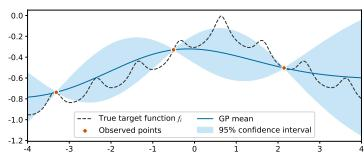

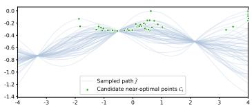

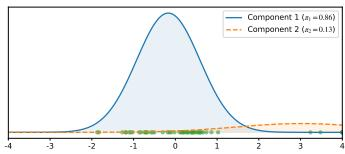  
Figure 1: Optimum distribution extraction. A local GP posterior (left) generates candidate optimum locations from posterior sample paths (middle). A DPGMM models their spatial distribution, and its dominant component is selected as the compact distributional message for communication (right).

The mixture weight, however, reflects the posterior support assigned to a component rather than how promising the corresponding region is under the local surrogate. We therefore attach a conservative value score based on the local lower confidence bound (LCB), $\mathrm { L C B } _ { n , t }$ 二 $\mu _ { n , t - 1 } ( \pmb { \mu } _ { n , k _ { n } ^ { \dagger } } ) - \kappa \sigma _ { n , t - 1 } ( \pmb { \mu } _ { n , k _ { n } ^ { \dagger } } )$ , where $\mu _ { n , t - 1 } ( \cdot )$ and $\sigma _ { n , t - 1 } ( \cdot )$ denote the posterior mean and standard deviation of the local GP before round t, respectively, and $\kappa > 0$ controls the uncertainty penalty. The LCB therefore favors components with high predicted objective values and low local posterior uncertainty.

To account for scale differences across heterogeneous local objectives, we standardize the value estimate as $v _ { n , t } = ( \mathrm { L C B } _ { n , t } - \bar { y } _ { n , t - 1 } ) / \widehat { \sigma } _ { n , t - 1 } ^ { y }$ , where $\bar { y } _ { n , t - 1 }$ and $\widehat { \sigma } _ { n , t - 1 } ^ { y }$ are the empirical mean and standard deviation of the local observations available before round t. Agent n then uploads $\Phi _ { n , t } = \left( \pi _ { n , k _ { n } ^ { \dagger } } , \mu _ { n , k _ { n } ^ { \dagger } } , \Sigma _ { n , k _ { n } ^ { \dagger } } , v _ { n , t } \right)$ to the server.

## 3.2 SERVER-SIDE COMPONENT MERGING AND REWEIGHTING

At round $t ,$ the server receives the uploaded components $\{ \Phi _ { n , t } \} _ { n = 1 } ^ { N }$ . Broadcasting all received components would incur a downlink cost that grows with the number of agents. GUIDE-FBO therefore returns only a limited subset to each agent, making it important to avoid spending this budget on spatially redundant components.

The server consequently first merges components that represent nearby regions. Write the received components as $\{ ( \bar { \pi } _ { n } , \bar { \pmb { \mu _ { n } } } , \pmb { \Sigma _ { n } } , v _ { n } ) \} _ { n = 1 } ^ { N }$ . The server measures the distance between two component centers using the root-mean-square (RMS) Euclidean distance dRMS $( \pmb { \mu } _ { n } , \pmb { \mu } _ { m } ) = \sqrt { \| \pmb { \mu } _ { n } - \pmb { \mu } _ { m } \| _ { 2 } ^ { 2 } / d }$ where $d = \dim ( { \mathcal { X } } )$ , and performs complete-linkage clustering using these centers. Specifically, the distance between two clusters is $D ( \mathbb { Z } _ { a } , \mathbb { Z } _ { b } ) = \mathrm { m a x } _ { n \in \mathbb { Z } _ { a } , m \in \mathbb { Z } _ { b } } d _ { \mathrm { R M S } } ( \pmb { \mu } _ { n } , \pmb { \mu } _ { m } )$ . Starting from singleton clusters, the closest pair is merged whenever $D ( \mathbb { Z } _ { a } , \mathbb { Z } _ { b } ) \leq \delta _ { \mathrm { m e r g e } }$ , where $\delta _ { \mathrm { m e r g e } } \geq 0$ is the spatial merging threshold, until no eligible pair remains.

Each resulting cluster $\mathcal { T } _ { \ell }$ is represented by a moment-matched Gaussian component:

$$
\pi _ { \ell } ^ { \prime } = \sum _ { n \in \mathbb { Z } _ { \ell } } \pi _ { n } , \quad \quad \mu _ { \ell } ^ { \prime } = \frac { \sum _ { n \in \mathbb { Z } _ { \ell } } \pi _ { n } \mu _ { n } } { \pi _ { \ell } ^ { \prime } } , \quad \quad \Sigma _ { \ell } ^ { \prime } = \frac { \sum _ { n \in \mathbb { Z } _ { \ell } } \pi _ { n } \left[ \boldsymbol { \Sigma } _ { n } + ( \mu _ { n } - \mu _ { \ell } ^ { \prime } ) ( \mu _ { n } - \mu _ { \ell } ^ { \prime } ) ^ { \top } \right] } { \pi _ { \ell } ^ { \prime } } .
$$

Its value score is aggregated using the same mixture weighted average, $\begin{array} { r } { v _ { \ell } ^ { \prime } = ( \pi _ { \ell } ^ { \prime } ) ^ { - 1 } \sum _ { n \in \mathbb { Z } _ { \ell } } \pi _ { n } v _ { n } } \end{array}$ Under the default diagonal covariance implementation, only the diagonal entries of $\Sigma _ { \ell } ^ { \prime }$ are retained.

Because $\pi _ { \ell } ^ { \prime }$ reflects accumulated posterior support but not the estimated quality of the corresponding region, the server further reweights the merged components using their value scores as $\begin{array} { r } { \omega _ { \ell } = \pi _ { \ell } ^ { \prime } \exp ( v _ { \ell } ^ { \prime } / \tau _ { t } ) / \sum _ { j = 1 } ^ { L _ { t } } \pi _ { j } ^ { \prime } \exp ( v _ { j } ^ { \prime } / \tau _ { t } ) } \end{array}$ , where $\tau _ { t }$ is the adaptive temperature parameter in the current round. Thus, ωe balances accumulated posterior support with the conservative value score. Figure 2 summarizes this server-side transformation from the received components to the merged and reweighted global component set.

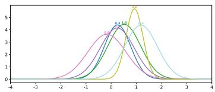

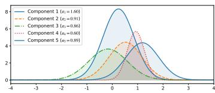

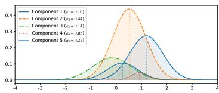  
Figure 2: Server-side component processing: received local components (left), moment-matched components after spatial merging (middle), and value-aware reweighted global components (right).

The resulting compact global component set is $B _ { t } = \{ ( \omega _ { \ell } , \pmb { \mu } _ { \ell } ^ { \prime } , \pmb { \Sigma } _ { \ell } ^ { \prime } ) \} _ { \ell = 1 } ^ { L _ { t } }$ , where $L _ { t } \ \leq \ N$ and $\omega _ { \ell }$ reflects the global importance of each merged component as a promising region. Sending the same subset to every agent could concentrate their parallel searches on the same few regions. To maintain diversity across agents, the server independently samples up to $P$ components without replacement for each agent according to $\{ \omega _ { \ell } \} _ { \ell = 1 } ^ { L _ { t } }$ , retaining their global weights. The resulting guidance packet sent to agent n is $\Psi _ { n , t } = \{ ( \omega _ { n , p } , \pmb { \mu } _ { n , p } , \pmb { \Sigma } _ { n , p } ) \} _ { p = 1 } ^ { P _ { t } }$ , where $P _ { t } = \operatorname* { m i n } \{ P , L _ { t } \}$

## 3.3 FEDERATED INTERVENTIONAL GAUSSIAN PROCESS

The final stage integrates the received guidance $\Psi _ { n , t }$ into agent n's local decision making. Because the exchanged components indicate where promising regions may lie but do not provide objectivevalue information, FI-GP preserves the local posterior mean and lets federated guidance act only through uncertainty. We refer to this as a mean-preserving uncertainty intervention.

Given $\Psi _ { n , t } = \{ ( \omega _ { n , p } , \pmb { \mu } _ { n , p } , \pmb { \Sigma } _ { n , p } ) \} _ { p = 1 } ^ { P _ { t } }$ , agent n first constructs a spatial guidance field

$$
G _ { n , t } ( { \bf x } ) = \sum _ { p = 1 } ^ { P _ { t } } \omega _ { n , p } \exp \left( - { \frac { 1 } { 2 } } ( { \bf x } - { \pmb \mu } _ { n , p } ) ^ { \top } { \pmb \Sigma } _ { n , p } ^ { - 1 } ( { \bf x } - { \pmb \mu } _ { n , p } ) \right) .
$$

Each component contributes most strongly around its center, with $\omega _ { n , p }$ controlling its influence and $\Sigma _ { n , p }$ determining its spatial extent. $G _ { n , t }$ is a nonnegative guidance field rather than a probability density. Because each Gaussian-shaped term lies in (0, 1] and the retained global weights satisfy $\begin{array} { r } { \sum _ { p = 1 } ^ { P _ { t } } \omega _ { n , p } \leq 1 } \end{array}$ , we have $0 \leq G _ { n , t } ( \mathbf { x } ) \leq 1$

We then convert this spatial guidance field into a spatially varying uncertainty scaling function, $S _ { n , t } ( { \bf x } ) = 1 + \lambda _ { t } G _ { n , t } ( { \bf x } )$ , where ${ \lambda _ { t } } = { \lambda _ { \operatorname* { m a x } } } / { \sqrt { t } }$ controls the intervention strength. It follows that $1 \leq S _ { n , t } ( \mathbf { x } ) \leq 1 + \lambda _ { t }$ , so the intervention can only expand local posterior uncertainty. The $1 / \sqrt { t }$ decay gives federated guidance greater influence early in optimization and gradually reduces it as local evidence accumulates.

Let $\mu _ { n , t - 1 } ( \mathbf { x } )$ and $k _ { n , t - 1 } ( \mathbf { x } , \mathbf { x } ^ { \prime } )$ denote the mean and covariance functions of the local GP posterior before round t. FI-GP keeps the local posterior mean unchanged and spatially rescales its covariance to form the round-t decision posterior:

$$
\widetilde { \mu } _ { n , t } ( \mathbf { x } ) = \mu _ { n , t - 1 } ( \mathbf { x } ) , \qquad \widetilde { k } _ { n , t } ( \mathbf { x } , \mathbf { x } ^ { \prime } ) = S _ { n , t } ( \mathbf { x } ) k _ { n , t - 1 } ( \mathbf { x } , \mathbf { x } ^ { \prime } ) S _ { n , t } ( \mathbf { x } ^ { \prime } ) .
$$

This rescaling preserves positive semidefiniteness and hence defines a valid GP covariance, as shown in Appendix B.3. We denote the resulting FI-GP decision posterior by $\widetilde { p } _ { n , t } .$ Accordingly, its standard deviation satisfies $\widetilde { \sigma } _ { n , t } ( \mathbf { x } ) = S _ { n , t } ( \mathbf { x } ) \sigma _ { n , t - 1 } ( \mathbf { x } )$ . This decision posterior is used only for query selection; the fitted local GP remains unchanged and continues to be updated solely from local observations. Figure 3 illustrates this mean-preserving uncertainty intervention.

Importantly, the absolute effect of federated guidance is further modulated by local posterior uncertainty: $\dot { \widetilde { \sigma } } _ { n , t } ( \mathbf { x } ) - \sigma _ { n , t - 1 } ( \mathbf { x } ) = \lambda _ { t } G _ { n , t } ( \mathbf { x } ) \bar { \sigma _ { n , t - 1 } } ( \mathbf { x } )$ . Thus, for the same guidance intensity, the intervention has a smaller absolute effect where the local GP is already more certain.

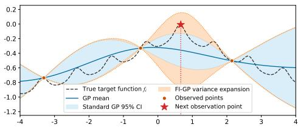  
Figure 3: Federated interventional decision making. FI-GP preserves the local posterior mean while expanding uncertainty around regions supported by federated guidance to guide the next query.

For acquisition-based rules such as UCB and noisy expected improvement (NEI), agent n selects $\mathbf { x } _ { n , t } \in \arg \operatorname* { m a x } _ { \mathbf { x } \in \mathcal { X } } \alpha ( \mathbf { x } ; \widetilde { p } _ { n , t } )$ . For Thompson sampling (TS), the agent applies the same uncertainty scaling to a local posterior sample path and optimizes the resulting path. Thus, the same uncertainty intervention can be combined with different BO decision rules.

The complete GUIDE-FBO procedure is summarized in Algorithm 1 in Appendix A.

## 4 THEORETICAL ANALYSIS

We analyze GUIDE-UCB under two guidance regimes. First, under arbitrary bounded guidance, including inaccurate or misleading guidance, we establish whether GUIDE-UCB preserves the regret rate of standard GP-UCB. Second, under informative guidance, we characterize the local posterior uncertainty that a suboptimal point must retain to be selected.

For agent n, let $r _ { n , t } = f _ { n } ( \mathbf { x } _ { n } ^ { * } ) - f _ { n } ( \mathbf { x } _ { n , t } )$ denote its instantaneous regret and $\begin{array} { r } { R _ { n , T } = \sum _ { t = 1 } ^ { T } r _ { n , t } } \end{array}$ its cumulative regret. Using the FI-GP uncertainty scaling defined in Section 3.3, GUIDE-UCB selects

$$
\mathbf { x } _ { n , t } \in \arg \operatorname* { m a x } _ { \mathbf { x } \in \mathcal { X } } \mu _ { n , t - 1 } ( \mathbf { x } ) + \sqrt { \beta _ { t } } \big ( 1 + \lambda _ { t } G _ { n , t } ( \mathbf { x } ) \big ) \sigma _ { n , t - 1 } ( \mathbf { x } ) .\tag{1}
$$

Our analysis relies on the standard simultaneous GP confidence event used in GP-UCB and kernelized bandit analyses (Srinivas et al., 2010; Chowdhury and Gopalan, 2017). The guidance field is uniformly bounded as $0 \leq G _ { n , t } ( \mathbf { x } ) \leq G _ { \operatorname* { m a x } }$ , with $G _ { \mathrm { m a x } } = 1$ being a valid bound under the normalized weighting used in GUIDE-FBO; see Remark B.1. Formal confidence conditions, auxiliary results, and complete proofs are provided in Appendix B.

Theorem 1 (Cumulative regret under arbitrary bounded guidance). Under Assumption B.1, suppose that the standard cumulative posterior variance bound in Lemma B.2 holds, $\begin{array} { r } { \sum _ { t = 1 } ^ { T } \sigma _ { n , t - 1 } ^ { 2 } ( \mathbf { x } _ { n , t } ) \leq } \end{array}$ $C _ { \gamma \gamma _ { n , T } }$ , where $\gamma _ { n , T }$ is the standard maximum information-gain (log-determinant) complexity term associated with the local kernel of agent n. $I f \lambda _ { t } = \lambda _ { \operatorname* { m a x } } / \sqrt { t } .$ for some fxed $\lambda _ { \operatorname* { m a x } } \geq 0$ , then, with probability at least $1 - \delta ,$ every agent n satisies

$$
R _ { n , T } \leq \sqrt { \beta _ { T } C _ { \gamma } \gamma _ { n , T } } \sqrt { 4 T + 4 \lambda _ { \operatorname* { m a x } } G _ { \operatorname* { m a x } } ( 2 \sqrt { T } - 1 ) + \lambda _ { \operatorname* { m a x } } ^ { 2 } G _ { \operatorname* { m a x } } ^ { 2 } ( 1 + \log T ) } .\tag{2}
$$

Consequently, $R _ { n , T } = \mathcal { O } ( \sqrt { T \beta _ { T } \gamma _ { n , T } } )$

Theorem 1 shows that GUIDE-UCB preserves the leading-order cumulative regret rate of standard GP-UCB under arbitrary bounded guidance. In Eq. 2, the guidance-dependent terms grow only as $\sqrt { T }$ and log $T ,$ compared with the leading $T$ term inside the square root. Thus, bounded guidance affects the regret bound only through lower-order terms. A fixed intervention strength $\lambda _ { t } \equiv \lambda$ also preserves the same leading-order regret rate up to a constant factor; see Appendix B.6.

Proposition 1 (Selection threshold under informative guidance). Under Assumption B.1, fix an agent n and round t, and suppose that $\lambda _ { t } \geq 0 .$ If GUIDE-UCB selects a suboptimal point ${ \bf x } _ { n , t }$ with $\begin{array} { r } { \bar { \Delta _ { n } } ( \mathbf { x } _ { n , t } ) : = f _ { n } ( \mathbf { x } _ { n } ^ { * } ) - f _ { n } ( \bar { \mathbf { x } _ { n , t } } ) > 0 , } \end{array}$ then

$$
\sigma _ { n , t - 1 } ( \mathbf { x } _ { n , t } ) \geq \frac { \Delta _ { n } ( \mathbf { x } _ { n , t } ) + \lambda _ { t } \sqrt { \beta _ { t } } G _ { n , t } ( \mathbf { x } _ { n } ^ { * } ) \sigma _ { n , t - 1 } ( \mathbf { x } _ { n } ^ { * } ) } { \sqrt { \beta _ { t } } \big ( 2 + \lambda _ { t } G _ { n , t } ( \mathbf { x } _ { n , t } ) \big ) } .\tag{3}
$$

If, in addition, $G _ { n , t } ( \mathbf { x } _ { n } ^ { * } ) \ \geq \ c$ and $G _ { n , t } ( \mathbf { x } _ { n , t } ) \leq \varepsilon _ { G }$ for some $c > 0$ and $\varepsilon _ { G } ~ \geq ~ 0$ , then under ${ \lambda _ { t } } = { \lambda _ { \operatorname* { m a x } } } / { \sqrt { t } }$ with $\lambda _ { \operatorname* { m a x } } \geq 0 ,$

$$
\sigma _ { n , t - 1 } ( \mathbf { x } _ { n , t } ) \geq \frac { \Delta _ { n } ( \mathbf { x } _ { n , t } ) + \frac { \lambda _ { \operatorname* { m a x } } c } { \sqrt { t } } \sqrt { \beta _ { t } } \sigma _ { n , t - 1 } ( \mathbf { x } _ { n } ^ { * } ) } { \sqrt { \beta _ { t } } \left( 2 + \frac { \lambda _ { \operatorname* { m a x } } \varepsilon _ { G } } { \sqrt { t } } \right) } .
$$

Proposition 1 gives a necessary local uncertainty condition for selecting a suboptimal point under informative guidance. When the guidance is large near the agent's optimum and small at a suboptimal candidate, that candidate can be selected only if it retains sufficiently large local posterior uncertainty. In particular, when $\varepsilon _ { G }$ is negligible, the lower bound on the required uncertainty exceeds the standard GP-UCB counterpart $\Delta _ { n } ( \mathbf { x } _ { n , t } ) / ( 2 \sqrt { \beta _ { t } } )$ by approximately $\lambda _ { \operatorname* { m a x } } c \sigma _ { n , t - 1 } ( \mathbf { x } _ { n } ^ { * } ) / ( 2 \sqrt { t } )$ . Thus, when guidance favors the optimum over a suboptimal candidate, the latter can be selected only if it remains sufficiently uncertain under the local GP.

## 5 EXPERIMENTS

## 5.1 EXPERIMENTAL SETUP

Baselines. We compare GUIDE-FBO against nine competitive methods from three categories. The first category contains non-collaborative BO methods, including TS (Thompson, 1933), UCB (Srinivas et al., 2010), and NEI (Letham et al., 2019; Balandat et al., 2020). The second category contains classical FBO methods, including FTS (Dai et al., 2020) and its distributed exploration variant FTS-DE (Dai et al., 2021). The third category contains recent federated and collaborative BO methods, including FMTBO (Zhu et al., 2024) and the CGP family (CGP-TS, CGP-UCB, and CGP-NEI) (Chen et al., 2025). We instantiate GUIDE-FBO with the same three local acquisition rules, yielding GUIDE-TS, GUIDE-UCB, and GUIDE-NEI. These variants use the same distributional exchange and uncertainty intervention mechanism and differ only in the local acquisition function.

Benchmarks and heterogeneity. We evaluate all methods on 12 synthetic benchmark functions and three real-world tasks. Landmine Detection (Xue et al., 2007) uses 29 landmine fields as agents that tune support vector machines with radial basis function kernels; Activity Recognition (Anguita et al., 2013) uses 30 subjects as agents that tune logistic-regression classifiers; and FedHPO-Bench (FedHPO) (Wang et al., 2023b) uses Cora, CiteSeer, and PubMed as three graph convolutional network hyperparameter-optimization tasks evaluated with the official surrogates. For each synthetic benchmark and experimental run, the local objectives are generated from a common base function using independently sampled random shifts and rotations for different agents. The same realized objectives are used by all compared methods within each run. Level 1 uses no transformation; Level 2 uses $( \delta _ { \mathrm { s h i f t } } , \delta _ { \mathrm { r o t } } ) = \dot { ( } 0 . 0 5 , 0 . \dot { 1 } )$ ; and Level 3 uses (0.3, 1.0), corresponding to homogeneous, mild, and severe heterogeneity, respectively. Complete task construction and heterogeneity details are provided in Appendix C.3.

Protocol and metrics. All experiments use 30 initial evaluations per agent and 50 BO rounds and are repeated over 10 independent runs. Synthetic experiments use $N = 1 6$ agents with Gaussian observation noise of standard deviation 0.1, while the real-world tasks use their natural numbers of agents. For synthetic benchmarks, we report simple regret averaged across agents. For Landmine Detection, we report the area under the receiver operating characteristic curve (AUC), while Activity Recognition and FedHPO use validation accuracy. Higher values are better for all real-world metrics. Complete benchmark definitions and implementation details are provided in Appendix C.

## 5.2 MAIN RESULTS

Synthetic benchmarks. Table 1 shows that GUIDE achieves strong aggregate performance across all three heterogeneity levels. GUIDE-UCB obtains the best average rank over the 12 synthetic benchmarks at Levels 1–3, with ranks of 1.33, 1.58, and 2.58, respectively, while GUIDE-NEI ranks second with 2.42, 2.17, and 3.42. Matched acquisition comparisons further isolate the contribution of GUIDE itself: GUIDE-UCB improves upon UCB on $1 2 { \dot { / } } 1 2 , 1 1 / 1 2$ , and 8/12 benchmarks from Levels 1–3; GUIDE-NEI improves upon NEI on 12/12, 11/12, and 9/12; and GUIDE-TS improves upon TS on 12/12, 12/12, and 8/12. These results show that the benefit of GUIDE extends across different acquisition rules rather than being specific to one of them.

At Levels 1 and 2, where the empirical mean pairwise Spearman correlations of objective rankings are 1.000 and 0.557, respectively, GUIDE-UCB and GUIDE-NEI frequently reach lower-regret regions earlier and maintain favorable convergence trajectories as more local observations are collected. This pattern reflects the mechanism of GUIDE: FI-GP increases local posterior uncertainty around regions supported by the transferred distributions, allowing them to be explored earlier when they remain plausible under the local posterior.

At Level 3, the mean pairwise Spearman correlation of objective rankings decreases to 0.081, indicating that useful information is substantially less transferable across agents. GUIDE-UCB and GUIDE-NEI nevertheless retain the first and second best average ranks, although their advantages become smaller and more task dependent. Two design features limit the influence of mismatched guidance. First, the intervention strength decays over time, so federated guidance gradually gives way to local evidence. Second, the uncertainty increment is proportional to local posterior uncertainty, so guidance has little effect where the local GP is already confident. Negative transfer can nevertheless occur on individual tasks under severe heterogeneity. Detailed results and convergence analyses are provided in Appendix D.

Table 1: Average rank across 12 synthetic benchmarks under three heterogeneity levels, computed from the final average simple regret over 10 independent runs. Lower is better; best and second-best results are shown in bold and underlined.
<table><tr><td>Heterogeneity</td><td>TS</td><td>UCB</td><td>NEI</td><td>FTS</td><td>FTS-DE</td><td>FMTBO</td><td>CGP-TS</td><td>CGP-UCB</td><td>CGP-NEI</td><td>GUIDE-TS</td><td>GUIDE-UCB</td><td>GUIDE-NEI</td></tr><tr><td>Level 1: (0, 0)</td><td>11.33</td><td>7.00</td><td>5.50</td><td>10.42</td><td>9.83</td><td>5.75</td><td>10.17</td><td>4.25</td><td>2.75</td><td>7.25</td><td>1.33</td><td>2.42</td></tr><tr><td>Level 2: (0.05, 0.1)</td><td>10.67</td><td>6.17</td><td>5.33</td><td>10.25</td><td>10.75</td><td>5.58</td><td>10.25</td><td>4.67</td><td>3.08</td><td>7.50</td><td>1.58</td><td>2.17</td></tr><tr><td>Level 3: (0.3, 1.0)</td><td>9.17</td><td>4.83</td><td>5.42</td><td>11.08</td><td>10.33</td><td>3.67</td><td>8.33</td><td>4.25</td><td>6.75</td><td>8.17</td><td>2.58</td><td>3.42</td></tr></table>

Real-world tasks. Table 2 shows that a GUIDE variant achieves the highest final mean performance on each real-world task, although the differences among the leading methods are small on Activity Recognition and FedHPO. GUIDE-UCB obtains the highest AUC on Landmine Detection, while GUIDE-NEI obtains the highest validation accuracy on Activity Recognition and FedHPO and the best average rank of 1.67. Moreover, GUIDE-UCB has higher final mean performance than UCB, and GUIDE-NEI than NEI, on all three tasks. By contrast, GUIDE-TS improves over TS only on Landmine Detection and has an average rank of 9.67 across the three tasks. Complete convergence trajectories are provided in Appendix D.4.

Table 2: Results on three real-world federated optimization benchmarks, averaged over 10 independent runs. Higher task performance and lower average rank are better; best and second-best results are shown in bold and underlined.
<table><tr><td>Task</td><td>TS</td><td>UCB</td><td>NEI</td><td>FTS</td><td>FTS-DE</td><td>FMTBO</td><td>CGP-TS</td><td>CGP-UCB</td><td>CGP-NEI</td><td>GUIDE-TS</td><td>GUIDE-UCB</td><td>GUIDE-NEI</td></tr><tr><td>Landmine Detection (AUC)</td><td>0.803987</td><td>0.805593</td><td>0.805508</td><td>0.804052</td><td>0.801349</td><td>0.805970</td><td>0.805247</td><td>0.806501</td><td>0.805218</td><td>0.805001</td><td>0.806604</td><td>0.806452</td></tr><tr><td>Activity Recognition (Acc.)</td><td>0.987787</td><td>0.987821</td><td>0.987804</td><td>0.987800</td><td>0.987739</td><td>0.987891</td><td>0.987701</td><td>0.987959</td><td>0.987990</td><td>0.987754</td><td>0.987938</td><td>0.987994</td></tr><tr><td>FedHPO (Acc.)</td><td>0.850968</td><td>0.850973</td><td>0.851145</td><td>0.850439</td><td>0.851098</td><td>0.851049</td><td>0.850766</td><td>0.851262</td><td>0.851068</td><td>0.850853</td><td>0.851178</td><td>0.851271</td></tr><tr><td>Average rank</td><td>9.67</td><td>6.33</td><td>5.67</td><td>10.00</td><td>9.33</td><td>5.33</td><td>10.00</td><td>2.33</td><td>5.33</td><td>9.67</td><td>2.67</td><td>1.67</td></tr></table>

## 5.3 ABLATION AND COMMUNICATION EFFICIENCY

Ablation study. Table 3 examines the contribution of the main components of GUIDE-UCB. Under Level 2 heterogeneity, Full GUIDE-UCB achieves the best average rank of 1.50 and remains in the top two on all four representative benchmarks. The largest degradation occurs when the spatially varying uncertainty intervention is replaced by uniform uncertainty scaling: its average rank increases to 6.25, close to Vanilla UCB at 6.75. The absolute results show the same pattern. On Ackley, Full GUIDE-UCB, Uniform uncertainty scaling, and Vanilla UCB obtain 8.4785, 19.1366, and 19.4350, respectively; on Rastrigin, the corresponding values are 58.3082, 80.3952, and 80.4771. These results indicate that, among the tested Level 2 ablations, the spatial localization of the uncertainty intervention is the strongest factor distinguishing GUIDE-UCB from a uniform increase in posterior uncertainty.

The effects of the remaining modules are smaller and more task dependent. Multimodal belief modeling, value-aware reweighting, component merging, and agent-specific sampling contribute to the aggregate performance of the complete method, although individual ablations can outperform Full GUIDE-UCB on particular functions. Appendix E further shows that the relative importance of these components changes under stronger heterogeneity. At Level 3, Full GUIDE-UCB retains the best aggregate rank of 2.50, whereas removing value-aware reweighting gives the worst rank of 5.25. This suggests that value-aware server reweighting becomes more important when cross-agent agreement is weak.

Table 3: Ablation study of GUIDE-UCB on four synthetic benchmarks under Level 2 heterogeneity. Final average simple regret over 10 runs is reported; lower is better. The best and second-best results in each row are shown in bold and underlined, respectively.
<table><tr><td>Benchmark</td><td>Vanilla UCB</td><td>Single-Gaussian belief</td><td>w/o value-aware reweighting</td><td>merging</td><td>sampling</td><td>w/o component w/o agent-specific Uniform uncertainty scaling</td><td>Full GUIDE-UCB</td></tr><tr><td>Ackley</td><td>19.4350</td><td>8.6510</td><td>8.4753</td><td>8.5349</td><td>8.4855</td><td>19.1366</td><td>8.4785</td></tr><tr><td>Rastrigin</td><td>80.4771</td><td>60.2355</td><td>59.1892</td><td>59.9796</td><td>60.0268</td><td>80.3952</td><td>58.3082</td></tr><tr><td>Zakharov</td><td>49.8750</td><td>25.5947</td><td>22.9307</td><td>25.3701</td><td>21.5431</td><td>52.0749</td><td>22.1717</td></tr><tr><td>Michalewicz</td><td>6.1248</td><td>5.9494</td><td>5.9814</td><td>5.9650</td><td>5.8771</td><td>6.1078</td><td>5.8629</td></tr><tr><td>Average rank</td><td>6.75</td><td>4.50</td><td>2.75</td><td>3.75</td><td>2.50</td><td>6.25</td><td>1.50</td></tr></table>

Communication efficiency. Table 4 shows that GUIDE-FBO obtains its optimization gains with a compact communication message. Under the default synthetic setting with $d = 1 0$ and $P = 5$ GUIDE-FBO communicates at most 127 scalars per agent per BO round, compared with 212 for CGP, 1000 for FTS, and 4000 for FTS-DE. FMTBO has the lowest communication cost among the collaborative baselines, requiring only 14 scalars per round. This lower communication volume, however, is accompanied by weaker aggregate optimization performance than GUIDE-UCB on the synthetic benchmarks, while both GUIDE-UCB and GUIDE-NEI achieve higher final mean performance than FMTBO on all three real-world tasks. Overall, GUIDE provides a favorable tradeoff between preserving spatial information about promising regions and limiting communication cost.

Table 4: Communication cost per agent per round for d = 10. GUIDE-FBO uses diagonal covariance and downloads at most $P = 5$ components per round.
<table><tr><td></td><td>FTS</td><td>FTS-DE</td><td>FMTBO</td><td>CGP</td><td>GUIDE</td></tr><tr><td>Uplink</td><td>500</td><td>2000</td><td>12</td><td>12</td><td>22</td></tr><tr><td>Downlink</td><td>500</td><td>2000</td><td>2</td><td>200</td><td>≤ 105</td></tr><tr><td>Total</td><td>1000</td><td>4000</td><td>14</td><td>212</td><td>≤ 127</td></tr></table>

## 5.4 ADDITIONAL ANALYSES

The additional experiments further examine the sensitivity and computational efficiency of GUIDE. The Level 3 sensitivity study in Appendix F shows that, on the tested benchmarks, GUIDE remains stable across moderate choices of M, P, and $\delta _ { \mathrm { m e r g e } } ,$ while overly strong uncertainty intervention degrades performance. These results suggest that the default configuration is not narrowly tuned to a single parameter setting. The runtime study in Appendix H shows that GUIDE introduces additional computation relative to independent BO, but remains more efficient than the corresponding CGP variants on most Level 2 synthetic benchmarks. In applications with expensive objective evaluations this optimizer-side overhead may constitute a smaller fraction of the total optimization cost

## 6 CONCLUSION

GUIDE-FBO approaches federated Bayesian optimization from the perspective of what should be communicated across heterogeneous agents. By representing local search information as distributions over optimum locations, it separates global knowledge exchange from local surrogate fitting and uses transferred information only to spatially rescale posterior uncertainty during local decision making. This intervention can be combined with UCB, NEI, and TS without redesigning their local decision rules. Our analysis of GUIDE-UCB establishes the same leading-order regret rate as GP-UCB under bounded federated guidance and shows that, when guidance is sufficiently stronger near the optimum than at a suboptimal point, the latter can be selected only if it remains sufficiently uncertain under the local GP. Experiments further demonstrate the value of this mechanism across heterogeneous tasks. Although GUIDE-FBO avoids sharing raw local observations, the current framework does not provide a formal privacy guarantee for the exchanged distributional information. Future work could incorporate differential privacy into local distribution release or server aggregation while studying how privacy noise interacts with federated guidance.

## AI USE STATEMENT

In this work, we used generative AI tools to provide critical ingredients for proving mathematical claims, design or provide feedback on research methodology and experiments, implement methods and assist with translation.

We did not use generative AI tools to generate synthetic datasets, develop theoretical models or conceptual frameworks, formulate mathematical claims, assist in writing proofs, propose or refine hypotheses, clean or reformat datasets, or interpret experimental results. Qualitative and thematic data analysis is not applicable to this work.

We additionally used generative AI tools to create or edit software code, search for information, improve the readability of the manuscript, and propose or refine the paper title and keywords.

All AI-assisted work was reviewed by the authors. Mathematical claims and proofs were independently checked, experimental interpretations were verified against the reported results, and AI-assisted code was reviewed and tested. We take full responsibility for the final content of this work, including any text, claims, or artifacts produced with the aid of generative AI

## REPRODUCIBILITY STATEMENT

Detailed experimental settings, benchmark construction, data processing, and GUIDE-FBO hyperparameters are provided in Appendix C. Full assumptions and proofs for the theoretical results are given in Appendix B. The complete source code and experiment scripts are publicly available at ht tps : //github.com/JintaoWEI/GUIDE-FBO-Federated-Bayesian-Optimization.

## REFERENCES

Bobak Shahriari, Kevin Swersky, Ziyu Wang, Ryan P. Adams, and Nando de Freitas. Taking the human out of the loop: A review of Bayesian optimization. Proceedings of the IEEE, 104(1): 148–175, 2016.

Matthias Seeger. Gaussian processes for machine learning. International Journal of Neural Systems, 14(2):69–106, 2004.

Xilu Wang, Yaochu Jin, Sebastian Schmitt, and Markus Olhofer. Recent advances in Bayesian optimization. ACM Computing Surveys, 55(13s):1–36, 2023a.

Zhongxiang Dai, Bryan Kian Hsiang Low, and Patrick Jaillet. Federated Bayesian optimization via Thompson sampling. In Advances in Neural Information Processing Systems, volume 33, pages 9687–9699, 2020.

John O'Quigley, Margaret Pepe, and Lloyd Fisher. Continual reassessment method: A practical design for phase 1 clinical trials in cancer. Biometrics, 46(1):33–48, 1990.

Shipeng Yu, Faisal Farooq, Alexander van Esbroeck, Glenn Fung, Vikram Anand, and Balaji Krishnapuram. Predicting readmission risk with institution-specific prediction models. Artificial Intelligence in Medicine, 65(2):89–96, 2015.

James Willard, Shirin Golchi, Erica EM Moodie, Bruno Boulanger, and Bradley P Carlin. Bayesian optimization for personalized dose-finding trials with combination therapies. Journal of the Royal Statistical Society Series C: Applied Statistics, 74(2):373–390, 2025.

Alonso Marco, Philipp Hennig, Jeannette Bohg, Stefan Schaal, and Sebastian Trimpe. Automatic LQR tuning based on Gaussian process global optimization. In 2016 IEEE international conference on robotics and automation (ICRA), pages 270–277. IEEE, 2016.

Mikhail Khodak, Renbo Tu, Tian Li, Liam Li, Maria-Florina F Balcan, Virginia Smith, and Ameet Talwalkar. Federated hyperparameter tuning: Challenges, baselines, and connections to weightsharing. In Advances in Neural Information Processing Systems, volume 34, pages 19184–19197, 2021.

Raed Al Kontar. Collaborative and federated black-box optimization: A Bayesian optimization perspective. In 2024 IEEE International Conference on Big Data (BigData), pages 7854–7859. IEEE, 2024.

Zhongxiang Dai, Bryan Kian Hsiang Low, and Patrick Jaillet. Differentially private federated Bayesian optimization with distributed exploration. In Advances in Neural Information Processing Systems, volume 34, pages 9125–9139, 2021.

Hangyu Zhu, Xilu Wang, and Yaochu Jin. Federated many-task Bayesian optimization. IEEE Trans. Evol. Comput., 28(4):980–993, 2024.

Qiyuan Chen, Liangkui Jiang, Hantang Qin, and Raed Al Kontar. Multi-agent collaborative Bayesian optimization via constrained Gaussian processes. Technometrics, 67(1):32–45, 2025.

Ali Rahimi and Benjamin Recht. Random features for large-scale kernel machines. In Advances in Neural Information Processing Systems, volume 20, pages 1177–1184, 2007.

Xubo Yue, Yang Liu, Albert S Berahas, Blake N Johnson, and Raed Al Kontar. Collaborative and distributed Bayesian optimization via consensus. IEEE Transactions on Automation Science and Engineering, 22:11343–11355, 2025.

Qiqi Liu, Yaochu Jin, and Guodong Chen. Optimization of an implicit acquisition function for federated Bayesian many-task optimization. IEEE Trans. Evol. Comput., 30(3):1068–1082, 2026.

Xilu Wang, Kaifeng Yang, Peng Liao, Mengxuan Zhang, and Yaochu Jin. Efficient federated Bayesian optimization with symbolic regression model. In 2025 IEEE Congress on Evolutionary Computation (CEC), pages 1–9. IEEE, 2025.

Donglin Zhan, Haoting Zhang, Rhonda Righter, Zeyu Zheng, and James Anderson. Collaborative Bayesian optimization via Wasserstein barycenters. In 2025 IEEE 64th Conference on Decision and Control (CDC), pages 6284–6291. IEEE, 2025.

Brendan McMahan, Eider Moore, Daniel Ramage, Seth Hampson, and Blaise Aguera y Arcas. Communication-efficient learning of deep networks from decentralized data. In Proceedings of the 20th International Conference on Artificial Intelligence and Statistics, volume 54 of Proceedings of Machine Learning Research, pages 1273–1282, 2017.

Carl Edward Rasmussen. The infinite Gaussian mixture model. In Advances in Neural Information Processing Systems, volume 12, pages 554–560. MIT Press, 1999.

Niranjan Srinivas, Andreas Krause, Sham M. Kakade, and Matthias W. Seeger. Gaussian process optimization in the bandit setting: No regret and experimental design. In Proceedings of the 27th International Conference on Machine Learning, pages 1015–1022, 2010.

Sayak Ray Chowdhury and Aditya Gopalan. On kernelized multi-armed bandits. In International Conference on Machine Learning, volume 70 of Proceedings of Machine Learning Research, pages 844–853. PMLR, 2017.

William R Thompson. On the likelihood that one unknown probability exceeds another in view of the evidence of two samples. Biometrika, 25(3/4):285–294, 1933.

Benjamin Letham, Brian Karrer, Guilherme Ottoni, and Eytan Bakshy. Constrained Bayesian Optimization with Noisy Experiments. Bayesian Analysis, 14(2):495–519, 2019.

Maximilian Balandat, Brian Karrer, Daniel Jiang, Samuel Daulton, Ben Letham, Andrew G Wilson, and Eytan Bakshy. BoTorch: A framework for efficient monte-carlo Bayesian optimization. In Advances in Neural Information Processing Systems, volume 33, pages 21524–21538, 2020.

Ya Xue, Xuejun Liao, Lawrence Carin, and Balaji Krishnapuram. Multi-task learning for classification with Dirichlet process priors. Journal of Machine Learning Research, 8(2):35–63, 2007.

Davide Anguita, Alessandro Ghio, Luca Oneto, Xavier Parra, and Jorge Luis Reyes-Ortiz. A public domain dataset for human activity recognition using smartphones. In Proceedings of the 21st European Symposium on Artificial Neural Networks, Computational Intelligence and Machine Learning, pages 437–442, 2013.

Zhen Wang, Weirui Kuang, Ce Zhang, Bolin Ding, and Yaliang Li. FedHPO-bench: A benchmark suite for federated hyperparameter optimization. In Proceedings of the 40th International Conference on Machine Learning, volume 202 of Proceedings of Machine Learning Research, pages 35908–35948, 2023b.

Nikolaus Hansen, Steffen Finck, Raymond Ros, and Anne Auger. Real-Parameter Black-Box Optimization Benchmarking 2009: Noiseless Functions Definitions. Technical Report RR-6829, INRIA, 2009.

Nikolaus Hansen, Anne Auger, Raymond Ros, Olaf Mersmann, Tea Tušar, and Dimo Brockhoff. COCO: A platform for comparing continuous optimizers in a black-box setting. Optimization Methods and Software, 36(1):114–144, 2021.

Felix X. Yu, Ananda Theertha Suresh, Krzysztof Marcin Choromanski, Daniel N. Holtmann-Rice, and Sanjiv Kumar. Orthogonal random features. In Advances in Neural Information Processing Systems, volume 29, pages 1975–1983, 2016.

## APPENDIX CONTENTS

A. Complete GUIDE-FBO Pseudocode   
B. Theoretical Assumptions, Lemmas, and Proofs   
C. Benchmarks, Heterogeneity, Metrics, and Experimental Settings   
D. Complete Experimental Results and Convergence Trajectories   
E. Ablation Study Details   
F. Sensitivity Analysis   
G. Communication Cost Analysis   
H. Computational Efficiency Analysis   
I. Orthogonal Random Features for Posterior-Optimum Sampling

## A COMPLETE GUIDE-FBO PSEUDOCODE

The complete optimization procedure is given in Algorithm 1. The three stages correspond directly to optimum distribution extraction, server-side component merging and reweighting, and FI-GP-based local decision making.

Algorithm 1 GUIDE-FBO   
Require: Agents $\{ 1 , \ldots , N \}$ , initial local datasets $\{ \mathcal { D } _ { n , 0 } \} _ { n = 1 } ^ { N }$ , total rounds $T ,$ posterior-optimum   
samples M, downlink packet size $P ,$ merge threshold $\delta _ { \mathrm { { m e r g e } } } ,$ guidance strength $\lambda _ { \mathrm { m a x } }$   
Ensure: Best observed local incumbents $\{ \mathbf { x } _ { n } ^ { \mathrm { b e s t } } \} _ { n = 1 } ^ { N }$   
1: for each agent n in parallel do   
2: Fit the initial local $\mathrm { G P }$ posterior $p _ { n , 0 } : = p ( f _ { n } \mid \mathcal { D } _ { n , 0 } )$   
3: end for   
4: for $t = 1 , \dots , T$ do   
Optimum distribution extraction   
5: for each agent n in parallel do   
6: Draw $\breve { M }$ posterior sample paths from $\scriptstyle p _ { n , t - 1 }$ and collect candidate optima $\mathcal { C } _ { n , t }$   
7: Fit a DPGMM $q _ { n , t } ( \mathbf { x } ^ { * } )$ to $\mathcal { C } _ { n , t }$   
8: Select $k _ { n } ^ { \dagger } \in$ arg max ${ \mathrm { . } } k \pi { \mathrm { , } } k$ and compute the standardized conservative value score $v _ { n , t }$   
9: Upload $\Phi _ { n , t } = ( \pi _ { n , k _ { n } ^ { \dagger } } , \mu _ { n , k _ { n } ^ { \dagger } } , \Sigma _ { n , k _ { n } ^ { \dagger } } , v _ { n , t } )$   
10: end for   
Server-side component merging and reweighting   
11: Cluster uploaded components using complete linkage with threshold $\delta _ { \mathrm { m e r g e } }$   
12: Moment-match each cluster $\mathcal { T } _ { \ell }$ to obtain $( \pi _ { \ell } ^ { \prime } , \mu _ { \ell } ^ { \prime } , \Sigma _ { \ell } ^ { \prime } , v _ { \ell } ^ { \prime } ) _ { \ell = 1 } ^ { L _ { t } }$   
13: Compute $\omega _ { \ell } \propto \pi _ { \ell } ^ { \prime } \exp ( v _ { \ell } ^ { \prime } / \tau _ { t } )$ and form $B _ { t } = \{ ( \omega _ { \ell } , \pmb { \mu } _ { \ell } ^ { \prime } , \pmb { \Sigma } _ { \ell } ^ { \prime } ) \} _ { \ell = 1 } ^ { L _ { t } }$   
14: for each agent n do   
15: Set $\bar { P _ { t } = }$ min $\{ P , L _ { t } \}$   
16: Sample $P _ { t }$ components without replacement from $B _ { t }$ according to $\{ \omega _ { \ell } \} _ { \ell = 1 } ^ { L _ { t } }$   
17: Send $\Psi _ { n , t } = \{ ( \omega _ { n , p } , \pmb { \mu } _ { n , p } , \pmb { \Sigma } _ { n , p } ) \} _ { p = 1 } ^ { P _ { t } }$   
18: end for   
Federated interventional decision making   
19: for each agent n in parallel do   
20: Construct $G _ { n , t } ( \mathbf { x } )$ and $S _ { n , t } ( { \bf x } ) = 1 + \lambda _ { t } G _ { n , t } ( { \bf x } )$ , where ${ \lambda _ { t } } = { \lambda _ { \operatorname* { m a x } } } / { \sqrt { t } }$   
21: Construct $\widetilde { p } _ { n , t }$ by preserving the mean of $p _ { n , t - 1 }$ and spatially scaling its covariance   
22: Select ${ \bf x } _ { n , t }$ using the chosen local BO decision rule under $\widetilde { p } _ { n , t }$   
23: Evaluate $y _ { n , t } = f _ { n } ( \mathbf { x } _ { n , t } ) + \epsilon _ { n , t }$   
24: Update $\mathcal { D } _ { n , t } = \mathcal { D } _ { n , t - 1 } \cup \{ ( \mathbf { x } _ { n , t } , y _ { n , t } ) \}$ and refit $p _ { n , \ast }$ t   
25: end for   
26: end for   
27: return $\mathbf { x } _ { n } ^ { \mathrm { b e s t } } \in$ arg max $\mathbf { \widetilde { \Gamma } } ( \mathbf { x } , y ) { \in } \mathcal { D } _ { n , T } \mathrm { ~ } \mathcal { Y }$ for each agent n

## B THEORETICAL ASSUMPTIONS, LEMMAS, AND PROOFS

This appendix states the confidence conditions and structural properties used in Section 4, establishes the auxiliary results required by the analysis, and provides the complete proofs. Throughout, round t starts from the local posterior conditioned on $\mathcal { D } _ { n , t - 1 }$ , while all guidance and decision quantities constructed during that round carry index t. For theoretical clarity, we additionally restore the round index on all received guidance-component parameters in this appendix.

Assumption B.1 (Local GP confidence event). Let $\{ \beta _ { t } \} _ { t \ge 1 }$ be a positive and nondecreasing sequence. With probability at least $1 - \delta$ , the following event holds simultaneously for all agents $n \in [ N ]$ rounds $t \geq 1$ , and points $\mathbf { x } \in \mathcal { X }$

$$
| f _ { n } ( \mathbf { x } ) - \mu _ { n , t - 1 } ( \mathbf { x } ) | \leq \sqrt { \beta _ { t } } \sigma _ { n , t - 1 } ( \mathbf { x } ) .
$$

Assumption B.1 is the standard simultaneous confidence event used in GP-UCB and kernelized bandit analyses (Srinivas et al., 2010; Chowdhury and Gopalan, 2017). Sufficient RKHS and noise conditions are provided in Section B.1.

Remark B.1 (Nonnegativity and boundedness of the GUIDE field). For agent n at round t, the GUIDE field is

$$
G _ { n , t } ( \mathbf { x } ) = \sum _ { p = 1 } ^ { P _ { t } } \omega _ { n , t , p } \exp \left( - \frac { 1 } { 2 } ( \mathbf { x } - \pmb { \mu } _ { n , t , p } ) ^ { \top } \pmb { \Sigma } _ { n , t , p } ^ { - 1 } ( \mathbf { x } - \pmb { \mu } _ { n , t , p } ) \right) ,
$$

where $\omega _ { n , t , p } \geq 0$ and $\Sigma _ { n , t , p } \succ 0$ . Each Gaussian guidance factor lies in (0, 1], and therefore

$$
0 \leq G _ { n , t } ( \mathbf { x } ) \leq \sum _ { p = 1 } ^ { P _ { t } } \omega _ { n , t , p } .
$$

Under the normalized global reweighting and retained-weight downlink protocol,

$$
\sum _ { p = 1 } ^ { P _ { t } } \omega _ { n , t , p } \leq 1
$$

for every agent n and round t. Hence,

$$
G _ { \operatorname* { m a x } } : = \operatorname* { s u p } _ { \substack { n \in [ N ] , t \geq 1 , \mathbf { x } \in \mathcal { X } } } G _ { n , t } ( \mathbf { x } ) \leq 1 .
$$

Lemma B.1 (Instantaneous regret decomposition). Under Assumption B.1, for any nonnegative intervention strength $\lambda _ { t } ,$ the GUIDE-UCB rule in Eq. 1 satisfies, for every agent n and round t,

$$
r _ { n , t } \leq \sqrt { \beta _ { t } } \Big [ 2 \sigma _ { n , t - 1 } ( { \bf x } _ { n , t } ) + \lambda _ { t } G _ { n , t } ( { \bf x } _ { n , t } ) \sigma _ { n , t - 1 } ( { \bf x } _ { n , t } ) - \lambda _ { t } G _ { n , t } ( { \bf x } _ { n } ^ { * } ) \sigma _ { n , t - 1 } ( { \bf x } _ { n } ^ { * } ) \Big ] .
$$

Lemma B.1 is the one-step inequality underlying both theoretical results. For the cumulative regret bound, the final nonpositive term is discarded. For the informative-guidance result, it is retained to characterize how guidance around $\mathbf { x } _ { n } ^ { * }$ changes the selection threshold of suboptimal points.

## B.1 SUFFICIENT CONDITIONS FOR THE LOCAL CONFIDENCE EVENT

The main analysis is stated directly in terms of Assumption B.1. A standard set of sufficient conditions is given below.

Assumption B.2 (Compact domain and bounded kernels). The decision domain X’ is compact. For every agent n, the kernel $k _ { n }$ is bounded on the diagonal:

$$
k _ { n } ( \mathbf { x } , \mathbf { x } ) \leq 1 , \quad \quad \forall \mathbf { x } \in { \mathcal { X } } .
$$

Assumption B.3 (RKHS-bounded local objectives). For every agent $n ,$ the objective $f _ { n }$ belongs to the RKHS $\mathcal { H } _ { k _ { n } }$ induced by $k _ { n }$ and satisfies

$$
\| f _ { n } \| _ { \mathcal { H } _ { k _ { n } } } \leq B _ { n } .
$$

Let $B = \operatorname* { m a x } _ { n \in [ N ] } B _ { n }$

Assumption B.4 (Sub-Gaussian observation noise). At round t, agent n observes

$$
y _ { n , t } = f _ { n } ( \mathbf x _ { n , t } ) + \epsilon _ { n , t } ,
$$

where $\epsilon _ { n , t }$ is conditionally R€-sub-Gaussian with respect to the filtration generated by the observation history.

Under Assumptions B.2-B.4, standard kernelized-bandit concentration results imply Assumption B.1 for an appropriate nondecreasing confidence sequence $\{ \beta _ { t } \} _ { t \ge 1 }$ (Srinivas et al., 2010; Chowdhury and Gopalan, 2017). A union bound over the N agents yields simultaneous validity across the federation.

As is standard in kernelized-bandit analyses, the theoretical local posterior is formed using a fixed kernel $k _ { n }$ and a fixed positive regularization parameter $\sigma _ { \mathrm { g p } } ^ { 2 } > 0 .$ This parameter determines the posterior variance and the log-determinant complexity term used below; it does not impose a Gaussian distribution on the actual observation noise, which remains conditionally $R _ { \epsilon }$ -sub-Gaussian as specified in Assumption B.4. In the empirical implementation, kernel hyperparameters are estimated from the local observations.

## B.2 MAXIMUM INFORMATION GAIN

The optimization procedure starts from a nonempty initial local dataset $\mathcal { D } _ { n , 0 }$ . To keep the theoretical notation consistent with the round convention in Section 2.2, we condition the sequential analysis on this initial dataset.

Let ${ \mathcal { X } } _ { n , 0 } = \{ \mathbf { x } : ( \mathbf { x } , y ) \in { \mathcal { D } } _ { n , 0 } \}$ denote the initial design locations of agent n. For the fixed theoretical kernel $k _ { n }$ and GP regularization parameter $\sigma _ { \mathrm { g p } } ^ { 2 } > 0$ , define the covariance function after conditioning on the initial dataset as

$$
\begin{array} { r l r } {  { k _ { n } ^ { ( 0 ) } ( \mathbf { x } , \mathbf { x } ^ { \prime } ) = k _ { n } ( \mathbf { x } , \mathbf { x } ^ { \prime } ) } } \\ & { } & { - k _ { n } ( \mathbf { x } , \mathscr { X } _ { n , 0 } ) ( \mathbf { K } _ { n , 0 } + \sigma _ { \mathrm { g p } } ^ { 2 } \mathbf { I } ) ^ { - 1 } k _ { n } ( \mathscr { X } _ { n , 0 } , \mathbf { x } ^ { \prime } ) , } \end{array}
$$

where

$$
\begin{array} { r } { \mathbf { K } _ { n , 0 } = \left[ k _ { n } ( \mathbf { x } , \mathbf { x } ^ { \prime } ) \right] _ { \mathbf { x } , \mathbf { x } ^ { \prime } \in \mathcal { X } _ { n , 0 } } . } \end{array}
$$

Thus, $k _ { n } ^ { ( 0 ) }$ is precisely the covariance of the local GP posterior available before the first BO round. Subsequent posterior variances $\sigma _ { n , t - 1 } ^ { 2 } ( \mathbf { x } )$ are obtained by further conditioning this initial posterior on the BO observations collected in rounds $1 , \ldots , t - 1$

For a finite query set $A = \left\{ \mathbf { x } _ { 1 } , \dotsc , \mathbf { x } _ { T } \right\} \subset \mathcal { X }$ , define

$$
\mathbf { K } _ { n , A } ^ { ( 0 ) } = \left[ k _ { n } ^ { ( 0 ) } ( \mathbf { x } , \mathbf { x } ^ { \prime } ) \right] _ { \mathbf { x } , \mathbf { x } ^ { \prime } \in A } .
$$

The maximum information gain conditional on the initial dataset is

$$
\gamma _ { n , T } ^ { ( 0 ) } = \frac { 1 } { 2 } \operatorname* { m a x } _ { \substack { A \subset \mathcal { X } : | A | = T } } \log \operatorname* { d e t } \left( \mathbf { I } + \sigma _ { \mathrm { g p } } ^ { - 2 } \mathbf { K } _ { n , A } ^ { ( 0 ) } \right) .
$$

For comparison, let

$$
\gamma _ { n , T } = \frac { 1 } { 2 } \operatorname* { m a x } _ { A \subset \mathcal { X } : | A | = T } \log \operatorname* { d e t } \left( \mathbf { I } + \sigma _ { \mathrm { g p } } ^ { - 2 } \mathbf { K } _ { n , A } \right) ,
$$

where

$$
\mathbf { K } _ { n , A } = \left[ k _ { n } ( \mathbf { x } , \mathbf { x } ^ { \prime } ) \right] _ { \mathbf { x } , \mathbf { x } ^ { \prime } \in A } .
$$

This is the standard maximum information-gain, or equivalently log-determinant complexity, quantity used in GP-UCB and kernelized-bandit analyses (Srinivas et al., 2010; Chowdhury and Gopalan, 2017).

Conditioning on the initial observations cannot increase covariance. Therefore, for every finite A,

$$
{ \bf K } _ { n , A } ^ { ( 0 ) } \preceq { \bf K } _ { n , A } ,
$$

which implies

$$
\gamma _ { n , T } ^ { ( 0 ) } \leq \gamma _ { n , T } .\tag{4}
$$

Consequently, the standard information-gain complexity $\gamma _ { n , T }$ remains a valid upper bound after accounting for the initial local dataset.

Under a Gaussian observation model, the log-determinant quantities above coincide with the corresponding mutual information between noisy observations and latent function values. The analysis here only requires their log-determinant forms and therefore does not require Gaussian observation noise.

Lemma B.2 (Cumulative posterior variance). Under Assumption B.2, for any adaptively selected sequence $\{ { \bf x } _ { n , t } \} _ { t = 1 } ^ { T }$ generated after conditioning on $\mathcal { D } _ { n , 0 }$

$$
\sum _ { t = 1 } ^ { T } \sigma _ { n , t - 1 } ^ { 2 } ( \mathbf { x } _ { n , t } ) \leq C _ { \gamma } \gamma _ { n , T } ^ { ( 0 ) } \leq C _ { \gamma } \gamma _ { n , T } ,
$$

where

$$
C _ { \gamma } = \frac { 2 } { \log \left( 1 + \sigma _ { \mathrm { g p } } ^ { - 2 } \right) } .
$$

Proof. Let

$$
u _ { t } = \sigma _ { n , t - 1 } ^ { 2 } ( \mathbf { x } _ { n , t } ) .
$$

Since conditioning cannot increase posterior variance and $k _ { n } ( \mathbf { x } , \mathbf { x } ) \leq 1$ under Assumption B.2, we have $u _ { t } \in [ 0 , 1 ]$ . By concavity of $u \stackrel { \cdot } { \mapsto } \log ( 1 + \sigma _ { \mathrm { g p } } ^ { - 2 } u )$ on [0, 1],

$$
\log \left( 1 + \sigma _ { \mathrm { g p } } ^ { - 2 } u _ { t } \right) \geq u _ { t } \log \left( 1 + \sigma _ { \mathrm { g p } } ^ { - 2 } \right) ,
$$

and hence

$$
u _ { t } \leq \frac { \log \left( 1 + \sigma _ { \mathrm { g p } } ^ { - 2 } u _ { t } \right) } { \log \left( 1 + \sigma _ { \mathrm { g p } } ^ { - 2 } \right) } .
$$

For the realized BO query sequence, define the kernel matrix under the initial-data-conditioned covariance as

$$
\mathbf { K } _ { n , 1 : T } ^ { ( 0 ) } = \left[ k _ { n } ^ { ( 0 ) } ( \mathbf { x } _ { n , s } , \mathbf { x } _ { n , t } ) \right] _ { s , t = 1 } ^ { T } .
$$

The standard sequential determinant identity, now applied after conditioning on $\mathcal { D } _ { n , 0 } ,$ gives

$$
\frac { 1 } { 2 } \log \operatorname* { d e t } \left( \mathbf { I } + \sigma _ { \operatorname { g p } } ^ { - 2 } \mathbf { K } _ { n , 1 : T } ^ { ( 0 ) } \right) = \frac { 1 } { 2 } \sum _ { t = 1 } ^ { T } \log \left( 1 + \sigma _ { \operatorname { g p } } ^ { - 2 } \sigma _ { n , t - 1 } ^ { 2 } ( \mathbf { x } _ { n , t } ) \right) .
$$

Therefore,

$$
\begin{array} { r l r } {  { \sum _ { t = 1 } ^ { T } \sigma _ { n , t - 1 } ^ { 2 } ( \mathbf { x } _ { n , t } ) \le \frac { 2 } { \log ( 1 + \sigma _ { \mathrm { g p } } ^ { - 2 } ) } \frac { 1 } { 2 } \log \operatorname* { d e t } ( \mathbf { I } + \sigma _ { \mathrm { g p } } ^ { - 2 } \mathbf { K } _ { n , 1 : T } ^ { ( 0 ) } ) } } \\ & { } & { \le C _ { \gamma } \gamma _ { n , T } ^ { ( 0 ) } } \\ & { } & { \le C _ { \gamma } \gamma _ { n , T } , } \end{array}
$$

where the final inequality follows from Eq. 4.

## B.3 VALIDITY AND VARIANCE SCALING OF FI-GP

Lemma B.3 (FI-GP covariance validity and variance scaling). Let the local GP posterior of agent n before round t be

$$
f _ { n } ( \mathbf { x } ) \mid \mathcal { D } _ { n , t - 1 } \sim \mathcal { G P } \left( \mu _ { n , t - 1 } ( \mathbf { x } ) , k _ { n , t - 1 } ( \mathbf { x } , \mathbf { x } ^ { \prime } ) \right) .
$$

For $\lambda _ { t } \geq 0 ,$ deine

$$
S _ { n , t } ( { \bf x } ) = 1 + \lambda _ { t } G _ { n , t } ( { \bf x } )
$$

and

$$
\widetilde { k } _ { n , t } ( \mathbf { x } , \mathbf { x } ^ { \prime } ) = S _ { n , t } ( \mathbf { x } ) k _ { n , t - 1 } ( \mathbf { x } , \mathbf { x } ^ { \prime } ) S _ { n , t } ( \mathbf { x } ^ { \prime } ) .
$$

Then ${ \widetilde { k } } _ { n , \astrosun }$ t is a valid positive-semidefinite covariance kernel. Moreover, the FI-GP decision posterior preserves the local posterior mean and satisfies

$$
\widetilde { \mu } _ { n , t } ( \mathbf { x } ) = \mu _ { n , t - 1 } ( \mathbf { x } ) , \qquad \widetilde { \sigma } _ { n , t } ( \mathbf { x } ) = S _ { n , t } ( \mathbf { x } ) \sigma _ { n , t - 1 } ( \mathbf { x } ) .
$$

Proof. Consider an arbitrary finite set $\mathbf { X } = \{ \mathbf { x } _ { 1 } , \ldots , \mathbf { x } _ { q } \}$ . Let

$$
\mathbf { K } = [ k _ { n , t - 1 } ( \mathbf { x } _ { i } , \mathbf { x } _ { j } ) ] _ { i , j = 1 } ^ { q }
$$

and define

$$
\mathbf { D } _ { S } = \operatorname { d i a g } \left( S _ { n , t } ( \mathbf { x } _ { 1 } ) , \ldots , S _ { n , t } ( \mathbf { x } _ { q } ) \right) .
$$

The covariance matrix induced by $\widetilde { k } _ { n , t }$ is

$$
\widetilde { \mathbf { K } } = \mathbf { D } _ { S } \mathbf { K } \mathbf { D } _ { S } .
$$

Since $\mathbf { K } \succeq 0$ , for every vector $\mathbf { a } \in \mathbb { R } ^ { q }$

$$
\mathbf { a } ^ { \top } \widetilde { \mathbf { K } } \mathbf { a } = ( \mathbf { D } _ { S } \mathbf { a } ) ^ { \top } \mathbf { K } ( \mathbf { D } _ { S } \mathbf { a } ) \geq 0 .
$$

Thus, $\widetilde { \mathbf { K } } \succeq 0$ for every finite set X, and $\widetilde { k } _ { n , t }$ is a valid covariance kernel.

The FI $\mathrm { \bf G P }$ mean is defined to equal the local posterior mean. For the marginal variance,

$$
\begin{array} { r l } & { \widetilde { \sigma } _ { n , t } ^ { 2 } ( \mathbf { x } ) = \widetilde { k } _ { n , t } ( \mathbf { x } , \mathbf { x } ) } \\ & { \qquad = S _ { n , t } ^ { 2 } ( \mathbf { x } ) { k } _ { n , t - 1 } ( \mathbf { x } , \mathbf { x } ) } \\ & { \qquad = S _ { n , t } ^ { 2 } ( \mathbf { x } ) \sigma _ { n , t - 1 } ^ { 2 } ( \mathbf { x } ) . } \end{array}
$$

By Remark B.1 and $\lambda _ { t } \geq 0$ , we have $S _ { n , t } ( { \bf x } ) \geq 1$ . Taking square roots gives

$$
\widetilde { \sigma } _ { n , t } ( \mathbf { x } ) = S _ { n , t } ( \mathbf { x } ) \sigma _ { n , t - 1 } ( \mathbf { x } ) .
$$

## B.4 PROOF OF LEMMA B.1

Proof. Fix an arbitrary agent n and round t, and define

$$
S _ { n , t } ( { \bf x } ) = 1 + \lambda _ { t } G _ { n , t } ( { \bf x } ) .
$$

By the GUIDE-UCB selection rule in Eq. 1,

$$
\begin{array} { r } { \mu _ { n , t - 1 } ( \mathbf { x } _ { n , t } ) + \sqrt { \beta _ { t } } S _ { n , t } ( \mathbf { x } _ { n , t } ) \sigma _ { n , t - 1 } ( \mathbf { x } _ { n , t } ) \geq \mu _ { n , t - 1 } ( \mathbf { x } _ { n } ^ { * } ) + \sqrt { \beta _ { t } } S _ { n , t } ( \mathbf { x } _ { n } ^ { * } ) \sigma _ { n , t - 1 } ( \mathbf { x } _ { n } ^ { * } ) . } \end{array}
$$

Rearranging gives

$$
\begin{array} { r l r } & { } & { \mu _ { n , t - 1 } ( \mathbf { x } _ { n } ^ { * } ) - \mu _ { n , t - 1 } ( \mathbf { x } _ { n , t } ) \leq \sqrt { \beta _ { t } } \Big [ S _ { n , t } ( \mathbf { x } _ { n , t } ) \sigma _ { n , t - 1 } ( \mathbf { x } _ { n , t } ) } \\ & { } & { \qquad - S _ { n , t } ( \mathbf { x } _ { n } ^ { * } ) \sigma _ { n , t - 1 } ( \mathbf { x } _ { n } ^ { * } ) \Big ] . } \end{array}
$$

Under Assumption B.1,

and

$$
f _ { n } ( \mathbf { x } _ { n } ^ { * } ) \leq \mu _ { n , t - 1 } ( \mathbf { x } _ { n } ^ { * } ) + \sqrt { \beta _ { t } } \sigma _ { n , t - 1 } ( \mathbf { x } _ { n } ^ { * } )
$$

$$
f _ { n } ( \mathbf { x } _ { n , t } ) \geq \mu _ { n , t - 1 } ( \mathbf { x } _ { n , t } ) - \sqrt { \beta _ { t } } \sigma _ { n , t - 1 } ( \mathbf { x } _ { n , t } ) .
$$

Consequently,

$$
\begin{array} { r l } & { r _ { n , t } = f _ { n } ( \mathbf { x } _ { n } ^ { * } ) - f _ { n } ( \mathbf { x } _ { n , t } ) } \\ & { \qquad \leq \mu _ { n , t - 1 } ( \mathbf { x } _ { n } ^ { * } ) - \mu _ { n , t - 1 } ( \mathbf { x } _ { n , t } ) + \sqrt { \beta _ { t } } \sigma _ { n , t - 1 } ( \mathbf { x } _ { n } ^ { * } ) + \sqrt { \beta _ { t } } \sigma _ { n , t - 1 } ( \mathbf { x } _ { n , t } ) } \\ & { \qquad \leq \sqrt { \beta _ { t } } \Big [ S _ { n , t } ( \mathbf { x } _ { n , t } ) \sigma _ { n , t - 1 } ( \mathbf { x } _ { n , t } ) - S _ { n , t } ( \mathbf { x } _ { n } ^ { * } ) \sigma _ { n , t - 1 } ( \mathbf { x } _ { n } ^ { * } ) } \\ & { \qquad + \sigma _ { n , t - 1 } ( \mathbf { x } _ { n } ^ { * } ) + \sigma _ { n , t - 1 } ( \mathbf { x } _ { n , t } ) \Big ] . } \end{array}
$$

Substituting $S _ { n , t } ( { \bf x } ) = 1 + \lambda _ { t } G _ { n , t } ( { \bf x } )$ yields

$$
\begin{array} { r l r } & { } & { r _ { n , t } \leq \sqrt { \beta _ { t } } \Big [ 2 \sigma _ { n , t - 1 } ( { \bf x } _ { n , t } ) + \lambda _ { t } G _ { n , t } ( { \bf x } _ { n , t } ) \sigma _ { n , t - 1 } ( { \bf x } _ { n , t } ) } \\ & { } & { \qquad - \lambda _ { t } G _ { n , t } ( { \bf x } _ { n } ^ { * } ) \sigma _ { n , t - 1 } ( { \bf x } _ { n } ^ { * } ) \Big ] , } \end{array}
$$

which proves Lemma B.1.

## B.5 PROOF OF THEOREM 1

Proof. Fix an arbitrary agent n. By Lemma B.1, and because $\lambda _ { t } \geq 0$ and $G _ { n , t } ( \mathbf { x } _ { n } ^ { * } ) \geq 0$ , discarding the final nonpositive term gives

$$
r _ { n , t } \leq \sqrt { \beta _ { t } } \left( 2 + \lambda _ { t } G _ { n , t } ( \mathbf { x } _ { n , t } ) \right) \sigma _ { n , t - 1 } ( \mathbf { x } _ { n , t } ) .
$$

By Remark B.1, $G _ { n , t } ( \mathbf { x } _ { n , t } ) \leq G _ { \mathrm { m a x } }$ . Using ${ \lambda _ { t } } = { \lambda _ { \operatorname* { m a x } } } / { \sqrt { t } }$ with $\lambda _ { \operatorname* { m a x } } \ge 0$

$$
r _ { n , t } \leq \sqrt { \beta _ { t } } \left( 2 + \frac { \lambda _ { \operatorname* { m a x } } G _ { \operatorname* { m a x } } } { \sqrt { t } } \right) \sigma _ { n , t - 1 } ( \mathbf { x } _ { n , t } ) .
$$

Since $\{ \beta _ { t } \} _ { t \ge 1 }$ is nondecreasing under Assumption B.1,

$$
R _ { n , T } \leq \sqrt { \beta _ { T } } \sum _ { t = 1 } ^ { T } \left( 2 + \frac { \lambda _ { \operatorname* { m a x } } G _ { \operatorname* { m a x } } } { \sqrt { t } } \right) \sigma _ { n , t - 1 } ( \mathbf { x } _ { n , t } ) .
$$

Applying Cauchy-Schwarz to the complete product gives

$$
R _ { n , T } \leq \sqrt { \beta _ { T } } \sqrt { \sum _ { t = 1 } ^ { T } \left( 2 + \frac { \lambda _ { \operatorname* { m a x } } G _ { \operatorname* { m a x } } } { \sqrt { t } } \right) ^ { 2 } }
$$

$$
\times \sqrt { \sum _ { t = 1 } ^ { T } \sigma _ { n , t - 1 } ^ { 2 } ( \mathbf { x } _ { n , t } ) } .
$$

Applying Lemma B.2 yields

$$
R _ { n , T } \leq \sqrt { \beta _ { T } C _ { \gamma } \gamma _ { n , T } } \sqrt { \sum _ { t = 1 } ^ { T } \left( 2 + \frac { \lambda _ { \operatorname* { m a x } } G _ { \operatorname* { m a x } } } { \sqrt { t } } \right) ^ { 2 } } .
$$

The remaining coefficient satisfies

$$
\begin{array} { r l r } {  { \sum _ { t = 1 } ^ { T } ( 2 + \frac { \lambda _ { \operatorname* { m a x } } G _ { \operatorname* { m a x } } } { \sqrt { t } } ) ^ { 2 } = 4 T + 4 \lambda _ { \operatorname* { m a x } } G _ { \operatorname* { m a x } } \sum _ { t = 1 } ^ { T } t ^ { - 1 / 2 } } } \\ & { } & \\ & { } & { \quad + \lambda _ { \operatorname* { m a x } } ^ { 2 } G _ { \operatorname* { m a x } } ^ { 2 } \sum _ { t = 1 } ^ { T } t ^ { - 1 } } \\ & { } & \\ & { } & { \quad \leq 4 T + 4 \lambda _ { \operatorname* { m a x } } G _ { \operatorname* { m a x } } ( 2 \sqrt { T } - 1 ) } \\ & { } & { \quad + \lambda _ { \operatorname* { m a x } } ^ { 2 } G _ { \operatorname* { m a x } } ^ { 2 } ( 1 + \log T ) , } \end{array}
$$

where

$$
\sum _ { t = 1 } ^ { T } t ^ { - 1 / 2 } \leq 2 \sqrt { T } - 1 , \qquad \sum _ { t = 1 } ^ { T } t ^ { - 1 } \leq 1 + \log T .
$$

Combining these inequalities gives

$$
R _ { n , T } \leq \sqrt { \beta _ { T } C _ { \gamma } \gamma _ { n , T } } \sqrt { 4 T + 4 \lambda _ { \operatorname* { m a x } } G _ { \operatorname* { m a x } } ( 2 \sqrt { T } - 1 ) + \lambda _ { \operatorname* { m a x } } ^ { 2 } G _ { \operatorname* { m a x } } ^ { 2 } ( 1 + \log T ) } .
$$

For fixed $\lambda _ { \mathrm { m a x } }$ and $G _ { \mathrm { m a x } } .$ , the guidance-dependent $\sqrt { T }$ and log $T$ terms are lower order than the leading T term inside the second square root. Therefore,

$$
R _ { n , T } = \mathcal { O } \left( \sqrt { T \beta _ { T } \gamma _ { n , T } } \right) .
$$

## B.6 CONSTANT INTERVENTION STRENGTH

For a fixed intervention strength $\lambda _ { t } \equiv \lambda$ with $\lambda \geq 0$ , Lemma B.1 and Remark B.1 imply

$$
r _ { n , t } \leq \sqrt { \beta _ { t } } ( 2 + \lambda G _ { \operatorname* { m a x } } ) \sigma _ { n , t - 1 } ( \mathbf { x } _ { n , t } ) .
$$

Using the monotonicity of $\beta _ { t }$ , Cauchy-Schwarz, and Lemma B.2,

$$
\begin{array} { r c l } { R _ { n , T } \le ( 2 + \lambda G _ { \operatorname* { m a x } } ) \sqrt { \displaystyle \beta _ { T } } \displaystyle \sum _ { t = 1 } ^ { T } \sigma _ { n , t - 1 } ( \mathbf { x } _ { n , t } ) } \\ { \le ( 2 + \lambda G _ { \operatorname* { m a x } } ) \sqrt { T \displaystyle \beta _ { T } \displaystyle \sum _ { t = 1 } ^ { T } \sigma _ { n , t - 1 } ^ { 2 } ( \mathbf { x } _ { n , t } ) } } \\ { \le ( 2 + \lambda G _ { \operatorname* { m a x } } ) \sqrt { T \displaystyle \beta _ { T } C _ { \gamma } \gamma _ { n , T } } . } \end{array}
$$

Hence, for any fixed $\lambda \geq 0$ , the intervention changes only the constant factor in the regret bound and remains sublinear whenever $\beta _ { T } \gamma _ { n , T } = o ( T )$ ·

## B.7 PROOF OF PROPOSITION 1

Proof. Fix an arbitrary agent n and round t. Let ${ \bf x } _ { n , t }$ be a selected suboptimal point, so that

$$
\begin{array} { r } { \Delta _ { n } ( \mathbf { x } _ { n , t } ) = f _ { n } ( \mathbf { x } _ { n } ^ { * } ) - f _ { n } ( \mathbf { x } _ { n , t } ) = r _ { n , t } > 0 . } \end{array}
$$

Starting from Lemma B.1,

$$
\begin{array} { r l r } & { } & { \Delta _ { n } ( \mathbf { x } _ { n , t } ) \leq \sqrt { \beta _ { t } } \Big [ 2 \sigma _ { n , t - 1 } ( \mathbf { x } _ { n , t } ) + \lambda _ { t } G _ { n , t } ( \mathbf { x } _ { n , t } ) \sigma _ { n , t - 1 } ( \mathbf { x } _ { n , t } ) } \\ & { } & { - \left. \lambda _ { t } G _ { n , t } ( \mathbf { x } _ { n } ^ { * } ) \sigma _ { n , t - 1 } ( \mathbf { x } _ { n } ^ { * } ) \right] . } \end{array}
$$

Rearranging gives

$$
\begin{array} { r } { \sqrt { \beta _ { t } } \left( 2 + \lambda _ { t } G _ { n , t } ( \mathbf { x } _ { n , t } ) \right) \sigma _ { n , t - 1 } ( \mathbf { x } _ { n , t } ) \geq \Delta _ { n } ( \mathbf { x } _ { n , t } ) + \lambda _ { t } \sqrt { \beta _ { t } } G _ { n , t } ( \mathbf { x } _ { n } ^ { * } ) \sigma _ { n , t - 1 } ( \mathbf { x } _ { n } ^ { * } ) . } \end{array}
$$

Because $\beta _ { t } > 0$ and $\lambda _ { t } \geq 0$ , the denominator below is strictly positive. Therefore,

$$
\sigma _ { n , t - 1 } ( \mathbf { x } _ { n , t } ) \geq \frac { \Delta _ { n } ( \mathbf { x } _ { n , t } ) + \lambda _ { t } \sqrt { \beta _ { t } } G _ { n , t } ( \mathbf { x } _ { n } ^ { * } ) \sigma _ { n , t - 1 } ( \mathbf { x } _ { n } ^ { * } ) } { \sqrt { \beta _ { t } } \left( 2 + \lambda _ { t } G _ { n , t } ( \mathbf { x } _ { n , t } ) \right) } .
$$

If $G _ { n , t } ( \mathbf { x } _ { n } ^ { * } ) \geq { c }$ and $G _ { n , t } ( \mathbf { x } _ { n , t } ) \leq \varepsilon _ { G }$ for some $c > 0$ and $\varepsilon _ { G } \geq 0$ , then under ${ \lambda _ { t } } = { \lambda _ { \operatorname* { m a x } } } / { \sqrt { t } }$ with $\lambda _ { \operatorname* { m a x } } \geq 0$

$$
\sigma _ { n , t - 1 } ( \mathbf { x } _ { n , t } ) \geq \frac { \Delta _ { n } ( \mathbf { x } _ { n , t } ) + \frac { \lambda _ { \operatorname* { m a x } } c } { \sqrt { t } } \sqrt { \beta _ { t } } \sigma _ { n , t - 1 } ( \mathbf { x } _ { n } ^ { * } ) } { \sqrt { \beta _ { t } } \left( 2 + \frac { \lambda _ { \operatorname* { m a x } } \varepsilon _ { G } } { \sqrt { t } } \right) } .
$$

This proves Proposition 1.

Comparison with standard GP-UCB. Setting $\lambda _ { t } = 0$ in Eq. 3 recovers the standard GP-UCB selection threshold $\Delta _ { n } ( \mathbf x _ { n , t } ) / ( 2 \sqrt { \beta _ { t } } )$ . For $\lambda _ { t } > 0$ , direct comparison with the bound under $G _ { n , t } ( \mathbf { x } _ { n } ^ { * } ) \geq c$ and $G _ { n , t } ( \mathbf { x } _ { n , t } ) \leq \varepsilon _ { G }$ shows that the GUIDE-UCB threshold is strictly larger whenever

$$
2 \sqrt { \beta _ { t } } c \sigma _ { n , t - 1 } ( \mathbf { x } _ { n } ^ { * } ) > \varepsilon _ { G } \Delta _ { n } ( \mathbf { x } _ { n , t } ) .
$$

Thus, the increase in the selection threshold occurs when guidance near the agent's optimum is sufficiently strong relative to the guidance assigned to the competing suboptimal point.

## B.8 GEOMETRIC INTERPRETATION OF INFORMATIVE GUIDANCE

The informative-guidance condition admits a direct geometric interpretation. If a received component $p ^ { \dagger }$ lies within Mahalanobis radius $\rho$ of the agent's optimum, then $G _ { n , t } ( \mathbf { x } _ { n } ^ { * } ) \geq \omega _ { n , t , p ^ { \dagger } } \exp ( - \bar { \rho } ^ { 2 } / 2 )$ Conversely, if a suboptimal point x has Mahalanobis distance at least $R _ { \mathrm { t a i l } }$ from every received component, then, because the retained weights sum to at most one, $G _ { n , t } ( \mathbf { x } ) \leq \exp ( - R _ { \mathrm { t a i l } } ^ { 2 } / 2 )$ Hence, the conditions $G _ { n , t } ( \mathbf { x } _ { n } ^ { * } ) \geq c$ and $G _ { n , t } ( \mathbf { x } ) \leq \varepsilon _ { G }$ arise naturally when the received guidance places substantial support near the agent's optimum while the suboptimal candidate lies in the tails of the received components.

## C BENCHMARKS, HETEROGENEITY, METRICS, AND EXPERIMENTAL SETTINGS

## C.1 SYNTHETIC BENCHMARKS

Table 5 summarizes the 12 synthetic functions. We convert minimization functions to maximization by negating the function value where necessary. The implementation follows the corresponding BoTorch test-function implementations where available (Balandat et al., 2020), together with the Sphere, Weierstrass, Ellipsoid, and Zakharov implementations used in our code. The dimensions and search domains used in the experiments are reported explicitly in Table 5.

Table 5: Synthetic benchmark functions. All objectives are evaluated as maximization problems.
<table><tr><td>Function</td><td>Dim.</td><td>Domain</td><td>Maximum</td><td>Landscape</td></tr><tr><td>Ackley</td><td>10</td><td> $[ - 3 2 . 7 6 8 , 3 2 . 7 6 8 ] ^ { 1 0 }$ </td><td>0</td><td>Multimodal</td></tr><tr><td>Levy</td><td>10</td><td> $[ - 1 0 , 1 0 ] ^ { 1 0 }$ </td><td>0</td><td>Multimodal</td></tr><tr><td>Griewank</td><td>10</td><td> $[ - 6 0 0 , 6 0 \dot { 0 } ] ^ { 1 0 }$ </td><td>0</td><td>Multimodal</td></tr><tr><td>Rastrigin</td><td>10</td><td> $[ - 5 . 1 2 , 5 . 1 \dot { 2 } ] ^ { 1 0 }$ </td><td>0</td><td>Highly multimodal</td></tr><tr><td>Weierstrass</td><td>10</td><td> $[ - 0 . 5 , 0 . 5 ] ^ { \mathrm { i 0 } }$ </td><td>0</td><td>Irregular multimodal</td></tr><tr><td>Ellipsoid</td><td>10</td><td> $[ - 5 . 1 2 , 5 . 1 \dot { 2 } ] ^ { 1 0 }$ </td><td>0</td><td>Ill-conditioned</td></tr><tr><td>Sphere</td><td>10</td><td> $[ - 5 , 5 ] ^ { 1 0 }$ </td><td>0</td><td>Unimodal</td></tr><tr><td>Zakharov</td><td>10</td><td> $[ - 5 , 5 ] ^ { 1 0 }$ </td><td>0</td><td>Plate-shaped</td></tr><tr><td>Rosenbrock</td><td>10</td><td> $[ - 2 . \dot { 0 } 4 8 , 2 . 0 4 8 ] ^ { 1 0 }$ </td><td>0</td><td>Narrow curved valley</td></tr><tr><td>Michalewicz</td><td>10</td><td> $[ 0 , \pi ] ^ { 1 0 }$ </td><td>9.66</td><td>Multimodal with steep valleys</td></tr><tr><td>Powell</td><td>10</td><td> $| \bar { - } 5 , \bar { 5 } | ^ { 1 0 }$ </td><td>0</td><td>Non-separable</td></tr><tr><td>Styblinski-Tang</td><td>10</td><td> $[ - 5 , 5 ] ^ { 1 0 }$ </td><td>391.66</td><td>Multimodal, separable</td></tr></table>

For Powell, we optimize a 10-dimensional search vector as implemented in our experiments; because the objective is evaluated in complete four-variable blocks, the first eight coordinates are active when $d = 1 0$ , while the remaining two do not affect the function value.

All synthetic BO variables are represented in normalized search coordinates before local modeling and server-side component merging. The original domains in Table 5 define the underlying black-box functions, while the merging threshold $\delta _ { \mathrm { m e r g e } }$ is applied in the normalized search space.

## C.2 REAL-WORLD FEDERATED OPTIMIZATION TASKS

Landmine Detection. The Landmine dataset (Xue et al., 2007) contains 29 binary classification tasks corresponding to 29 landmine fields, with each field treated as one FBO agent. For each field, the BO objective is evaluated using fixed three-fold stratified cross-validation on the local training data. Each queried configuration trains a support vector machine (SVM) with a radial basis function (RBF) kernel, with feature standardization fitted separately within each training fold. The optimized hyperparameters are

$$
C _ { \mathrm { S V M } } \in [ 1 0 ^ { - 4 } , 1 0 ] , \qquad \gamma _ { \mathrm { R B F } } \in [ 1 0 ^ { - 2 } , 1 0 ] ,
$$

both decoded on logarithmic scales. The BO objective is the mean area under the receiver operating characteristic curve (AUC) across the cross-validation folds.

Activity Recognition Using Mobile Phone Sensors. Following FTS (Dai et al., 2020), we use the Human Activity Recognition Using Smartphones dataset from the University of California, Irvine (UCI) Machine Learning Repository. The dataset contains measurements from 30 subjects performing six activities, represented by 561 features. Each subject is treated as one FBO agent. The official partitions are merged, and the samples of each subject are divided into a stratified $5 0 \bar { / } 5 0$ local training and validation split for each experimental replication. The features are further standardized using statistics from the local training split only.

Each BO query specifies three logistic regression hyperparameters:

$$
B \in [ 2 0 , 6 0 ] , \qquad \lambda _ { \mathrm { L } 2 } \in [ 1 0 ^ { - 6 } , 1 ] , \qquad \eta \in [ 1 0 ^ { - 2 } , 1 0 ^ { - 1 } ] ,
$$

where B is the mini-batch size, $\lambda _ { \mathrm { L 2 } }$ is the L2 regularization parameter, and η is the learning rate. Each query trains a fresh linear classifier with 561 inputs and 6 outputs for 100 epochs using Stochastic Gradient Descent and cross-entropy loss. The BO objective is validation accuracy.

FedHPO. We use FedHPO-Bench (Wang et al., 2023b) to construct a federated hyperparameter optimization benchmark. Cora, CiteSeer, and PubMed are treated as three outer FBO agents, with each agent corresponding to a separate Graph Convolutional Network (GCN) hyperparameter optimization task under Federated Averaging (FedAvg). BO operates in a normalized search space, and each query is decoded according to the official FedHPO-Bench configuration space. Objective values are obtained from the official surrogate models using validation accuracy. We use full client participation and the highest available training-round fidelity.

## C.3 SYNTHETIC TASK HETEROGENEITY AND EMPIRICAL SIMILARITY

Task construction. Generating related benchmark instances through transformations of a common base function is standard practice in black-box optimization. In particular, BBOB and COCO use search-space translations and rotations to generate different instances of benchmark functions (Hansen et al., 2009; 2021). Similar constructions have also been adopted in collaborative BO. For example, Chen et al. (2025) introduces agent heterogeneity by translating a common base function,

$$
f _ { n } ( { \bf x } ) = f _ { \mathrm { b a s e } } ( { \bf x } + \psi _ { n } ) ,
$$

where $\psi _ { n }$ is sampled from a ball whose radius is proportional to the search-domain width.

Following this general principle, we combine agent-specific translations and rotations to control the degree of task heterogeneity. All variables are first represented in the normalized BO domain. For agent n, we define

$$
f _ { n } ( { \bf x } ) = f _ { \mathrm { b a s e } } \left( { \bf R } _ { n } ( { \bf x } - { \bf z } _ { n } ) \right) ,
$$

where $\mathbf { z } _ { n }$ controls the displacement of the landscape and ${ \mathbf { R } } _ { n }$ applies a rotation that, for nonrotationally-invariant functions, also changes the coordinate interactions.

Let 1 and u denote the lower and upper bounds of the normalized search domain. The shift vector is sampled as

$$
\mathbf { z } _ { n } \sim { \mathcal { N } } \left( \mathbf { 0 } , \left( { \frac { \delta _ { \mathrm { s h i f t } } \| \mathbf { u } - \mathbf { l } \| _ { 2 } } { \sqrt { d } } } \right) ^ { 2 } \mathbf { I } \right) .
$$

Hence,

$$
\sqrt { \mathbb { E } \| { \mathbf { z } _ { n } } \| _ { 2 } ^ { 2 } } = \delta _ { \mathrm { s h i f t } } \| { \mathbf { u } } - 1 \| _ { 2 } ,
$$

SO $\delta _ { \mathrm { s h i f t } }$ directly controls the root-mean-square shift magnitude relative to the domain scale.

For the rotation, we draw $\mathbf { A } _ { n } \in \mathbb { R } ^ { d \times d }$ with independent standard Gaussian entries and construct the skew-symmetric matrix

$$
\mathbf { H } _ { n } = \mathbf { A } _ { n } - \mathbf { A } _ { n } ^ { \top } .
$$

We then define

$$
\mathbf { R } _ { n } = \exp \left( \delta _ { \mathrm { r o t } } \mathbf { H } _ { n } \right) .
$$

Since the matrix exponential of a skew-symmetric matrix is orthogonal, ${ \mathbf { R } } _ { n }$ is a valid rotation matrix.   
The parameter $\delta _ { \mathrm { r o t } }$ controls the strength of the rotation.

We consider three regimes:

$$
\begin{array} { r l } { \mathrm { L e v e l ~ 1 : } } & { ( \delta _ { \mathrm { s h i f t } } , \delta _ { \mathrm { r o t } } ) = ( 0 , 0 ) , } \\ { \mathrm { L e v e l ~ 2 : } } & { ( \delta _ { \mathrm { s h i f t } } , \delta _ { \mathrm { r o t } } ) = ( 0 . 0 5 , 0 . 1 ) , } \\ { \mathrm { L e v e l ~ 3 : } } & { ( \delta _ { \mathrm { s h i f t } } , \delta _ { \mathrm { r o t } } ) = ( 0 . 3 , 1 . 0 ) . } \end{array}
$$

Level 1 contains identical local objectives, Level 2 introduces mild heterogeneity, and Level 3 applies substantially stronger transformations. For every experimental replication, the same agent-specific transformations are used by all compared methods.

Empirical task similarity. The transformation parameters specify how tasks are generated but do not directly quantify the similarity of the resulting objective landscapes. We therefore complement them with a rank-based empirical similarity measure.

For each benchmark b, heterogeneity level l, and experimental replication r, we generate a common scrambled Sobol probe set

$$
\chi _ { \mathrm { p r o b e } } = \{ { \bf x } _ { q } \} _ { q = 1 } ^ { Q } , \qquad Q = 4 0 9 6 ,
$$

over the normalized search domain using a fixed Sobol seed of zero. For agent $n ,$ we evaluate its noise-free latent objective on all probe points and form

$$
\mathbf { v } _ { n } ^ { ( b , \ell , r ) } = \left[ f _ { n } ( \mathbf { x } _ { 1 } ) , \ldots , f _ { n } ( \mathbf { x } _ { Q } ) \right] .
$$

For every pair of agents $n < m$ , their similarity is measured by the Spearman rank correlation

$$
\rho _ { n , m } ^ { ( b , \ell , r ) } = \rho _ { \mathrm { S } } \left( \mathbf { v } _ { n } ^ { ( b , \ell , r ) } , \mathbf { v } _ { m } ^ { ( b , \ell , r ) } \right) .
$$

The mean similarity of one benchmark realization is

$$
\mathrm { S i m } _ { b , \ell , r } = \frac { 2 } { N ( N - 1 ) } \sum _ { n < m } \rho _ { n , m } ^ { ( b , \ell , r ) } .
$$

Finally, we average over the $B = 1 2$ synthetic benchmarks and $R = 1 0$ experimental realizations:

$$
{ \overline { { \operatorname { S i m } _ { \ell } } } } = { \frac { 1 } { B R } } \sum _ { b = 1 } ^ { B } \sum _ { r = 1 } ^ { R } \operatorname { S i m } _ { b , \ell , r } .
$$

Spearman correlation measures agreement in the relative ranking of common candidate locations and is insensitive to differences in objective scale. We use it only to characterize the generated task heterogeneity.

Table 6: Mean pairwise Spearman correlation between the 16 agent objectives. Each benchmark entry is averaged over 10 task realizations, and Overall additionally averages across the 12 benchmarks. Higher values indicate greater agreement in candidate rankings.

<table><tr><td>Benchmark</td><td>Level 1</td><td>Level 2</td><td>Level 3</td></tr><tr><td>Ackley</td><td>1.000</td><td>0.485</td><td>0.027</td></tr><tr><td>Levy</td><td>1.000</td><td>0.450</td><td>0.076</td></tr><tr><td>Griewank</td><td>1.000</td><td>0.861</td><td>0.155</td></tr><tr><td>Rastrigin</td><td>1.000</td><td>0.489</td><td>0.136</td></tr><tr><td>Weierstrass</td><td>1.000</td><td>0.464</td><td>0.005</td></tr><tr><td>Ellipsoid</td><td>1.000</td><td>0.740</td><td>0.120</td></tr><tr><td>Sphere</td><td>1.000</td><td>0.861</td><td>0.155</td></tr><tr><td>Zakharov</td><td>1.000</td><td>0.527</td><td>0.013</td></tr><tr><td>Rosenbrock</td><td>1.000</td><td>0.676</td><td>0.115</td></tr><tr><td>Michalewicz</td><td>1.000</td><td>0.034</td><td>-0.001</td></tr><tr><td>Powell</td><td>1.000</td><td>0.635</td><td>0.046</td></tr><tr><td>Styblinski-Tang</td><td>1.000</td><td>0.466</td><td>0.124</td></tr><tr><td>Overall</td><td>1.000</td><td>0.557</td><td>0.081</td></tr></table>

The empirical similarities clearly separate the three heterogeneity regimes. Level 1 is exactly homogeneous, Level 2 retains moderate agreement in candidate rankings, and Level 3 exhibits only weak average agreement across agents.

## C.4 EVALUATION METRICS

For a synthetic objective, let $f _ { n } ^ { * } = f _ { n } ( \mathbf { x } _ { n } ^ { * } )$ denote the optimal value of agent n, and let $f _ { n , t } ^ { \mathrm { b e s t } }$ denote its best noise-free value observed through round t. The simple regret is

$$
s _ { n , t } = f _ { n } ^ { * } - f _ { n , t } ^ { \mathrm { b e s t } } ,
$$

and the reported average simple regret is

$$
\overline { { s } } _ { t } = \frac { 1 } { N } \sum _ { n = 1 } ^ { N } s _ { n , t } .
$$

Lower values are better.

For Landmine Detection, the reported performance is AUC averaged across the 29 agents. For Activity Recognition and FedHPO, the reported performance is validation accuracy averaged across their agents. Higher values are better for these real-world metrics. For convergence plots, we use the lower-is-better metrics $1 - \mathrm { A U C }$ and 1 — Accuracy. The main text reports the original AUC and accuracy values.

Average ranks are computed independently within each benchmark and then averaged over the corresponding benchmark set.

## C.5 SHARED EXPERIMENTAL SETTINGS

All compared methods use identical search domains, per-agent evaluation budgets, and repetition seeds within each benchmark. For a fair comparison, all baseline methods use the hyperparameter settings recommended in their original papers or official implementations. For synthetic experiments, all methods except FTS-DE use the same Collaborative Latin Hypercube Sampling (CLHS) initialization following Chen et al. (2025). FTS-DE retains the initialization prescribed by its Distributed Exploration mechanism (Dai et al., 2021), which assigns agents to different search subregions during initialization. Synthetic experiments use $N = 1 6$ agents, 30 initial observations per agent, 50 BO rounds, and Gaussian observation noise with standard deviation 0.1. The real-world experiments use their natural task counts: 29 agents for Landmine Detection, 30 agents for Activity Recognition, and 3 agents for FedHPO. Each experiment uses 30 initial evaluations per agent and 50 BO rounds, and the complete federated experiment is repeated independently 10 times.

GUIDE-FBO configuration. GUIDE-FBO introduces four principal tunable hyperparameters: the number of posterior-optimum samples $M ,$ the downlink packet size $P ,$ the merging threshold $\delta _ { \mathrm { { m e r g e } } } ,$ and the maximum guidance strength $\lambda _ { \mathrm { m a x } }$ . Unless otherwise stated, the same configuration is used across all benchmarks without benchmark-specific tuning. The remaining quantities in Table 7 are fixed modeling or implementation choices.

Table 7: Default configuration of GUIDE-FBO. The same settings are used across benchmarks unless otherwise stated.
<table><tr><td>Parameter</td><td>Setting</td></tr><tr><td>Posterior-optimum samples M</td><td>500</td></tr><tr><td>ORF features  $D _ { \mathrm { O R F } }$ </td><td>500</td></tr><tr><td>DPGMM covariance</td><td>Diagonal</td></tr><tr><td>LCB coefficient κ</td><td>1.0</td></tr><tr><td>Merge threshold  $\delta _ { \mathrm { m e r g e } }$ </td><td>0.05</td></tr><tr><td>Downlink packet size  $P$ </td><td>5</td></tr><tr><td>Maximum guidance strength  $\lambda _ { \mathrm { m a x } }$ </td><td> $1 . 0$ </td></tr><tr><td>Guidance schedule  $\lambda _ { t }$ </td><td> $\lambda _ { \operatorname* { m a x } } / \sqrt { t }$ </td></tr></table>

The server-side softmax temperature is determined automatically from the spread of the standardized component scores rather than treated as an independently tuned hyperparameter. Specifically, letting

$$
\Delta v _ { t } = \operatorname* { m a x } _ { \ell } v _ { \ell } ^ { \prime } - \operatorname* { m i n } _ { \ell } v _ { \ell } ^ { \prime } ,
$$

we use

$$
\tau _ { t } = \left\{ \begin{array} { l l } { \operatorname* { m a x } \{ 0 . 1 \Delta v _ { t } , 1 0 ^ { - 2 } \} , } & { \Delta v _ { t } > 1 0 ^ { - 6 } , } \\ { 1 0 ^ { - 2 } , } & { \mathrm { o t h e r w i s e } . } \end{array} \right.
$$

The local surrogate is implemented as a fixed-noise GP with an ARD Matérn- $- 5 / 2$ kernel, whose hyperparameters are fitted by maximizing the exact marginal likelihood. The ORF posterior-path approximation follows the corresponding Matérn- ${ \it \cdot } 5 / 2$ spectral construction described in Appendix I.

## D COMPLETE EXPERIMENTAL RESULTS AND CONVERGENCE TRAJECTORIES

This section reports the complete numerical results and convergence trajectories underlying Section 5.2. For each synthetic heterogeneity level, we report the final average simple regret on all 12 benchmark functions and the corresponding trajectories over the 50 BO rounds. We then report the trajectories for the three real-world tasks. All curves show the mean over 10 independent runs, with shaded regions denoting ±1 standard error of the mean.

$$
\begin{array} { r l } { \mathrm { D . 1 } } & { { } \mathrm { L E V E L : } \delta _ { \mathrm { s h i f t } } = 0 \mathrm { A N D } \delta _ { \mathrm { r o t } } = 0 } \end{array}
$$

Table 8: Complete synthetic results under Level 1 (Homogeneous). Entries report the final mean average simple regret over 10 independent runs. Lower is better. The best and second-best results in each row are shown in bold and underlined, respectively.
<table><tr><td>Benchmark</td><td>TS</td><td>UCB</td><td>NEI</td><td>FTS</td><td>FTS-DE</td><td>FMTBO</td><td>CGP-TS</td><td>CGP-UCB</td><td>CGP-NEI</td><td>GUIDE-TS</td><td>GUIDE-UCB</td><td>GUIDE-NEI</td></tr><tr><td>Ackley</td><td>19.4789</td><td>19.3082</td><td>18.4994</td><td>19.4870</td><td>19.6941</td><td>19.0814</td><td>19.5242</td><td>8.7013</td><td>6.5675</td><td>18.6182</td><td>4.4896</td><td>5.2015</td></tr><tr><td>Levy</td><td>24.9042</td><td>11.9439</td><td>10.5159</td><td>23.0893</td><td>23.5361</td><td>9.3873</td><td>22.9011</td><td>3.7128</td><td>2.6747</td><td>11.6750</td><td>1.5865</td><td>1.9122</td></tr><tr><td>Griewank</td><td>47.1321</td><td>14.1117</td><td>13.3126</td><td>43.9996</td><td>15.4063</td><td>11.3637</td><td>43.2063</td><td>6.3414</td><td>4.9622</td><td>23.2003</td><td>4.9517</td><td>6.3052</td></tr><tr><td>Rastrigin</td><td>105.6477</td><td>80.4791</td><td>79.9759</td><td>102.8319</td><td>103.4912</td><td>81.3840</td><td>102.9572</td><td>62.0303</td><td>59.7812</td><td>90.3331</td><td>53.4890</td><td>54.6122</td></tr><tr><td>Weierstrass</td><td>13.5724</td><td>12.8962</td><td>11.8821</td><td>13.5131</td><td>13.5052</td><td>12.2728</td><td>13.5183</td><td>8.0722</td><td>8.0706</td><td>12.4086</td><td>3.2670</td><td>3.7779</td></tr><tr><td>Ellipsoid</td><td>146.4074</td><td>117.5092</td><td>87.9959</td><td>138.8153</td><td>137.5396</td><td>81.6766</td><td>140.1417</td><td>26.8736</td><td>24.0600</td><td>98.2097</td><td>1.7311</td><td>3.0529</td></tr><tr><td>Sphere</td><td>23.9937</td><td>14.8929</td><td>11.2488</td><td>23.4224</td><td>21.1340</td><td>9.8874</td><td>22.6427</td><td>3.9151</td><td>2.9221</td><td>11.6519</td><td>0.6487</td><td>1.0040</td></tr><tr><td>Zakharov</td><td>60.3082</td><td>47.1536</td><td>46.0734</td><td>58.7893</td><td>60.6199</td><td>46.2480</td><td>59.6063</td><td>48.3546</td><td>45.0008</td><td>44.7664</td><td>15.6653</td><td>22.4356</td></tr><tr><td>Rosenbrock</td><td>376.8339</td><td>110.0299</td><td>105.3660</td><td>363.1293</td><td>270.5447</td><td>111.8808</td><td>340.1700</td><td>90.6186</td><td>73.0144</td><td>162.5873</td><td>45.4639</td><td>51.9817</td></tr><tr><td>Michalewicz</td><td>6.3605</td><td>5.8237</td><td>5.8773</td><td>6.4475</td><td>6.2028</td><td>6.2124</td><td>6.4715</td><td>5.2263</td><td>5.0059</td><td>6.3292</td><td>5.2700</td><td>5.2798</td></tr><tr><td>Powell</td><td>677.0909</td><td>139.5000</td><td>123.8940</td><td>716.2145</td><td>707.2955</td><td>116.0112</td><td>651.4241</td><td>195.2524</td><td>116.9121</td><td>329.9346</td><td>38.6966</td><td>38.7592</td></tr><tr><td>Styblinski-Tang</td><td>156.5159</td><td>107.2154</td><td>103.6553</td><td>156.2315</td><td>155.8989</td><td>103.3376</td><td>153.1554</td><td>62.7248</td><td>56.2330</td><td>150.9906</td><td>99.6545</td><td>102.8457</td></tr></table>

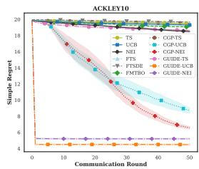  
(a) Ackley

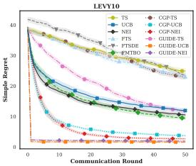  
(b) Levy

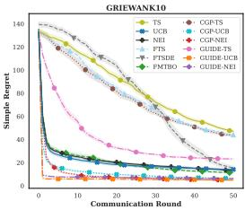  
(c) Griewank

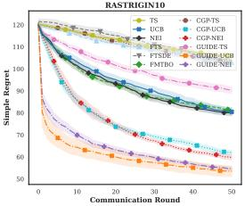  
(d) Rastrigin

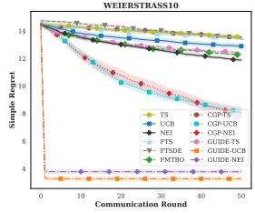

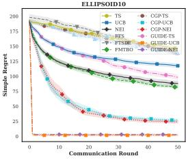  
(e) Weierstrass

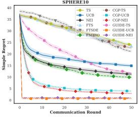

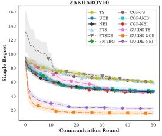  
(g) Sphere  
(h) Zakharov

(f) Ellipsoid  
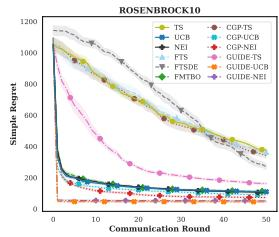  
(i) Rosenbrock

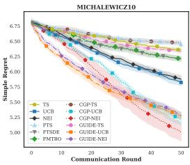  
(j) Michalewicz

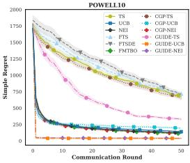  
(k) Powell

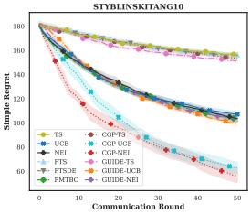  
(1) Styblinski-Tang  
Figure 4: Convergence trajectories for all 12 synthetic functions under Level 1 (Homogeneous). Curves show the mean average simple regret over 10 independent runs, and shaded regions denote ±1 standard error of the mean across runs. Lower is better.

Level 1 represents the fully aligned setting. All agents optimize the same latent objective, and the empirical mean pairwise Spearman correlation is 1.000. GUIDE-UCB achieves the best average rank of 1.33 and obtains the lowest final average simple regret on 10 of the 12 benchmarks. GUIDE-NEI ranks second overall with an average rank of 2.42 and is among the two best methods on nine benchmarks. Moreover, GUIDE-UCB, GUIDE-NEI, and GUIDE-TS each outperform their matched independent acquisition rule on all 12 functions.

The numerical gaps are also large on several benchmarks. UCB and GUIDE-UCB obtain final regrets of 117.5092 and 1.7311 on Ellipsoid, 14.8929 and 0.6487 on Sphere, 47.1536 and 15.6653 on Zakharov, 110.0299 and 45.4639 on Rosenbrock, and 139.5000 and 38.6966 on Powell. GUIDE-UCB also obtains 4.4896 on Ackley and 1.5865 on Levy, compared with 8.7013 and 3.7128 for CGP-UCB. These results show that, when the local objectives are fully aligned, exchanging distributions over the locations of the agents' optima can substantially reduce simple regret within a fixed evaluation budget.

The convergence trajectories in Figure 4 make this effect more apparent. Except on Michalewicz and Styblinski-Tang, GUIDE-UCB and GUIDE-NEI separate from most competing methods relatively early and remain in the lowest-regret group over much of the subsequent optimization horizon. This behavior is consistent with the mechanism of GUIDE. Because the agents optimize the same objective, their uploaded components are more likely to concentrate around the same promising regions. Server-side merging can therefore combine consistent information from different agents. FI-GP then increases local posterior uncertainty selectively around these regions without changing the local posterior mean. The resulting FI-GP makes these globally supported regions more attractive to UCB and NEI when they remain plausible under the local posterior, which can lead them to be evaluated earlier.

GUIDE-TS shows a smaller visual advantage. Unlike UCB and NEI, TS selects each query by maximizing a random sample path drawn from FI-GP. Federated guidance changes the distribution from which this path is sampled, but the realized path can still attain its maximum elsewhere. This additional sampling variability makes the effect of spatial guidance less consistent across rounds. GUIDE-TS still improves upon independent TS on all 12 functions, but does not show the same clear early separation as GUIDE-UCB and GUIDE-NEI.

Michalewicz and Styblinski-Tang are the two main exceptions. Michalewicz contains multiple steep valleys, so its high-quality regions are spatially narrow. Region-level guidance is less useful when its spatial support does not closely match the relevant valley. Since the tasks are identical at Level 1, the high-potential points transferred by CGP are directly relevant to every agent, which provides a favorable setting for point-level transfer. CGP-NEI and CGP-UCB accordingly obtain 5.0059 and 5.2263, compared with 5.2700 and 5.2798 for GUIDE-UCB and GUIDE-NEI.

Styblinski-Tang has many competing local basins with similar structure. Because several local basins can remain plausible, a distribution over optimum locations may provide a less precise signal than a directly transferred high-quality point. Under Level 1, where all agents optimize exactly the same objective, directly transferring a good point can be more efficient because the same point is useful to every agent. This favors the point-level transfer used by CGP. CGP-NEI and CGP-UCB obtain final regrets of 56.2330 and 62.7248, while GUIDE-UCB and GUIDE-NEI obtain 99.6545 and 102.8457. These two exceptions show that, even when the tasks are identical, the most effective form of transferred information still depends on the geometry of the objective.

## D.2 LEVEL 2: δshift = 0.05 AND δrot = 0.1

Level 2 introduces mild task heterogeneity, with the empirical mean pairwise Spearman correlation decreasing from 1.000 to 0.557. GUIDE-UCB remains the strongest aggregate method with an average rank of 1.58. It achieves the lowest final regret on 9 benchmarks and ranks among the top two methods on 11 of the 12 functions. GUIDE-NEI ranks second overall at 2.17, is the best method on Zakharov and Powell, and appears among the top two methods on 10 functions. Relative to their matched independent baselines, GUIDE-UCB and GUIDE-NEI improve on 11 of the 12 functions, while GUIDE-TS improves on all 12.

Large absolute differences remain on several benchmarks. UCB and GUIDE-UCB obtain 19.4350 and 8.4785 on Ackley, 113.6023 and 13.1331 on Ellipsoid, 14.2443 and 2.2689 on Sphere, and

Table 9: Complete synthetic results under Level 2 (Mild heterogeneity). Entries report the final mean average simple regret over 10 independent runs. Lower is better. The best and second-best results in each row are shown in bold and underlined, respectively.
<table><tr><td>Benchmark</td><td>TS</td><td>UCB</td><td>NEI</td><td>FTS</td><td>FTS-DE</td><td>FMTBO</td><td>CGP-TS</td><td>CGP-UCB</td><td>CGP-NEI</td><td>GUIDE-TS</td><td>GUIDE-UCB</td><td>GUIDE-NEI</td></tr><tr><td>Ackley</td><td>19.5136</td><td>19.4350</td><td>18.7628</td><td>19.5511</td><td>19.7171</td><td>18.9928</td><td>19.5347</td><td>10.1460</td><td>10.9368</td><td>18.8906</td><td>8.4785</td><td>9.5379</td></tr><tr><td>Levy</td><td>24.3585</td><td>11.0529</td><td>10.1363</td><td>23.4060</td><td>25.8641</td><td>9.7791</td><td>24.2127</td><td>4.3481</td><td>3.5741</td><td>12.7145</td><td>3.2816</td><td>3.3482</td></tr><tr><td>Griewank</td><td>44.4283</td><td>13.5953</td><td>11.9247</td><td>44.1421</td><td>26.2381</td><td>11.3470</td><td>43.6216</td><td>7.1888</td><td>7.1002</td><td>24.8356</td><td>6.3000</td><td>7.8444</td></tr><tr><td>Rastrigin</td><td>101.5417</td><td>80.4771</td><td>78.9030</td><td>101.4711</td><td>101.7745</td><td>80.9836</td><td>103.0048</td><td>64.6460</td><td>62.5459</td><td>88.0868</td><td>58.3082</td><td>60.1472</td></tr><tr><td>Weierstrass</td><td>13.4680</td><td>12.9344</td><td>12.1369</td><td>13.4517</td><td>13.6576</td><td>12.5151</td><td>13.5531</td><td>8.9999</td><td>9.3717</td><td>12.7340</td><td>6.6966</td><td>6.8316</td></tr><tr><td>Ellipsoid</td><td>139.8685</td><td>113.6023</td><td>86.7074</td><td>139.5091</td><td>130.8015</td><td>78.4957</td><td>136.6720</td><td>37.2115</td><td>29.1808</td><td>91.6564</td><td>13.1331</td><td>13.3723</td></tr><tr><td>Sphere</td><td>21.6883</td><td>14.2443</td><td>10.2896</td><td>23.9013</td><td>20.9801</td><td>9.0656</td><td>21.6460</td><td>4.5267</td><td>3.3859</td><td>11.3485</td><td>2.2689</td><td>2.5063</td></tr><tr><td>Zakharov</td><td>62.9710</td><td>49.8750</td><td>48.2225</td><td>62.7988</td><td>62.9958</td><td>47.6923</td><td>62.7797</td><td>50.1082</td><td>47.1746</td><td>48.4994</td><td>22.1717</td><td>21.8975</td></tr><tr><td>Rosenbrock</td><td>385.1965</td><td>97.8257</td><td>104.8257</td><td>365.1723</td><td>356.7614</td><td>107.8170</td><td>392.6816</td><td>98.7769</td><td>83.6536</td><td>183.4833</td><td>55.2114</td><td>59.3597</td></tr><tr><td>Michalewicz</td><td>6.6497</td><td>6.1248</td><td>6.1995</td><td>6.5934</td><td>6.5978</td><td>6.4469</td><td>6.6054</td><td>6.1800</td><td>6.1802</td><td>6.5636</td><td>5.8629</td><td>5.8783</td></tr><tr><td>Powell</td><td>701.0029</td><td>157.3605</td><td>126.0791</td><td>746.8994</td><td>853.3029</td><td>117.3149</td><td>710.5802</td><td>205.5435</td><td>116.5086</td><td>348.1294</td><td>94.6703</td><td>74.3549</td></tr><tr><td>Styblinski-Tang</td><td>159.3047</td><td>114.4204</td><td>114.9073</td><td>160.0953</td><td>162.8046</td><td>119.9616</td><td>157.4158</td><td>127.6079</td><td>109.7452</td><td>158.4985</td><td>123.2241</td><td>116.9887</td></tr></table>

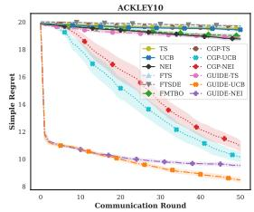  
(a) Ackley

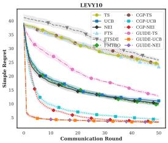  
(b) Levy

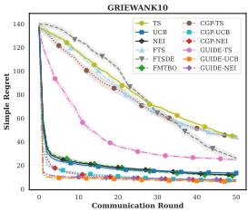  
(c) Griewank

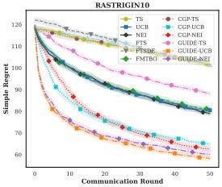  
(d) Rastrigin

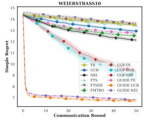  
(e) Weierstrass

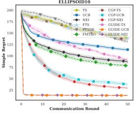

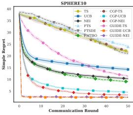

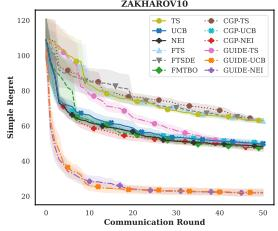  
(g) Sphere  
(h) Zakharov

(f) Ellipsoid  
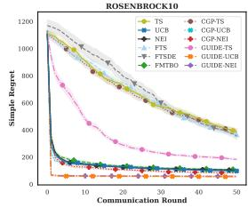  
(i) Rosenbrock

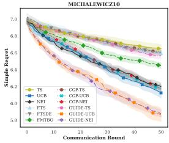  
(j) Michalewicz

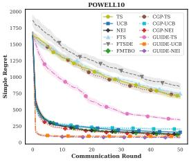  
(k) Powell

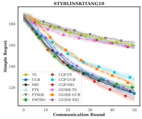  
(1) Styblinski-Tang  
Figure 5: Convergence trajectories for all 12 synthetic functions under Level 2 (Mild heterogeneity). Curves show the mean average simple regret over 10 independent runs, and shaded regions denote ±1 standard error of the mean across runs. Lower is better.

97.8257 and 55.2114 on Rosenbrock. On Zakharov, GUIDE-NEI obtains 21.8975, compared with 47.1746 for CGP-NEI and 47.6923 for FMTBO. On Powell, GUIDE-NEI obtains 74.3549, compared with 116.5086 for CGP-NEI and 117.3149 for FMTBO. The benefit of exchanging distributions over the locations of the agents’ optima therefore remains substantial after moderate shifts and rotations are introduced.

The trajectories in Figure 5 retain much of the qualitative pattern observed at Level 1. GUIDE-UCB and GUIDE-NEI show a particularly clear lead on Ackley, Levy, Weierstrass, Ellipsoid, Sphere, and Zakharov, where their curves separate visibly from the main competing methods during the optimization process. On Griewank, Rastrigin, Rosenbrock, Michalewicz, and Powell, the two GUIDE variants also reach competitive or leading low-regret regions, but the gap from the strongest baselines is smaller. Styblinski-Tang remains the main exception. Compared with Level 1, GUIDE still reaches low-regret regions earlier on most benchmarks, but its lead over the strongest baselines becomes smaller on several functions.

This difference follows directly from the task construction. At Level 1, the distributions transferred by different agents refer to the same underlying objective and therefore tend to support the same promising regions. At Level 2, the shifts move these regions and the rotations change the local geometry of non-rotationally-invariant objectives. A promising region for one agent may therefore no longer align exactly with the corresponding region of another agent. Since these transformations are still moderate, useful spatial structure can remain shared across agents. GUIDE transfers distributions over promising regions, so a small spatial mismatch does not invalidate the shared information as easily as it can invalidate a single transferred design.

The change on Michalewicz is especially informative. Under Level 1, CGP-NEI and CGP-UCB outperform the GUIDE variants, whereas under Level 2 GUIDE-UCB and GUIDE-NEI obtain the two lowest final regrets of 5.8629 and 5.8783. A likely explanation is that point-level transfer is most effective when the narrow high-quality valleys of different agents are closely aligned. Once mild shifts and rotations are introduced, a high-quality design from one agent can fall outside the corresponding valley of another agent. GUIDE instead transfers a distribution over a promising region, making the transferred information less dependent on exact point alignment. This broader spatial representation is therefore better suited to the mild mismatch introduced at Level 2.

Michalewicz also illustrates the distinction between global task similarity and local transferability. Its Level 2 mean pairwise Spearman correlation is only 0.034, yet GUIDE-UCB and GUIDE-NEI obtain the two best final results. The Spearman correlation measures ranking agreement over the full search space, whereas GUIDE acts on the spatial support of promising regions. A low global correlation can therefore coexist with useful shared structure near high-value regions.

Styblinski-Tang remains the main exception. Its many competing local basins make it difficult for a regional distribution to indicate one clearly preferred search direction. Under Level 1, point-level transfer is especially effective because a good point identified by one agent is directly useful to all others. After the Level 2 transformations are introduced, this exact point correspondence becomes weaker. This is visible in the final results. CGP-UCB changes from 62.7248 at Level 1 to 127.6079 at Level 2, while CGP-NEI changes from 56.2330 to 109.7452. The corresponding GUIDE-UCB results are 99.6545 and 123.2241, and the GUIDE-NEI results are 102.8457 and 116.9887. GUIDE is therefore still not the best method on Styblinski–Tang at Level 2, but its performance deteriorates much less than the two CGP variants as mild heterogeneity is introduced. On this benchmark, the smaller degradation of GUIDE suggests that distributional guidance is less sensitive to mild spatial misalignment than point-level transfer.

$$
\mathrm { D } . 3 \quad \mathrm { L E V E L } 3 \colon \delta _ { \mathrm { s h i f t } } = 0 . 3 \mathrm { ~ A N D ~ } \delta _ { \mathrm { r o t } } = 1 . 0
$$

Table 10: Complete synthetic results under Level 3 (Severe heterogeneity). Entries report the final mean average simple regret over 10 independent runs. Lower is better. The best and second-best results in each row are shown in bold and underlined, respectively.
<table><tr><td>Benchmark</td><td>TS</td><td>UCB</td><td>NEI</td><td>FTS</td><td>FTS-DE</td><td>FMTBO</td><td>CGP-TS</td><td>CGP-UCB</td><td>CGP-NEI</td><td>GUIDE-TS</td><td>GUIDE-UCB</td><td>GUIDE-NEI</td></tr><tr><td>Ackley</td><td>20.4047</td><td>20.5073</td><td>20.4203</td><td>20.4080</td><td>20.3972</td><td>20.2383</td><td>20.3699</td><td>20.3380</td><td>20.4331</td><td>20.3552</td><td>20.1739</td><td>20.1161</td></tr><tr><td>Levy</td><td>37.5643</td><td>24.3700</td><td>25.5279</td><td>41.1159</td><td>40.0354</td><td>25.0598</td><td>34.5967</td><td>24.6258</td><td>30.4253</td><td>34.2904</td><td>20.8306</td><td>23.6984</td></tr><tr><td>Griewank</td><td>67.8144</td><td>28.8836</td><td>26.9351</td><td>72.7054</td><td>74.5664</td><td>27.0838</td><td>65.7857</td><td>21.7611</td><td>30.0882</td><td>68.9316</td><td>21.2957</td><td>29.7074</td></tr><tr><td>Rastrigin</td><td>106.3844</td><td>95.6377</td><td>96.0487</td><td>110.2650</td><td>111.8623</td><td>95.4028</td><td>108.3831</td><td>96.2275</td><td>100.1082</td><td>104.5270</td><td>90.8849</td><td>94.0912</td></tr><tr><td>Weierstrass</td><td>13.6349</td><td>13.1439</td><td>12.7244</td><td>13.6075</td><td>13.6386</td><td>12.8031</td><td>13.4763</td><td>12.9093</td><td>12.8169</td><td>13.4107</td><td>12.8443</td><td>12.4937</td></tr><tr><td>Ellipsoid</td><td>157.2353</td><td>162.9886</td><td>138.9518</td><td>172.5919</td><td>167.3659</td><td>120.5134</td><td>156.5689</td><td>134.2802</td><td>151.8904</td><td>149.4864</td><td>127.6623</td><td>127.9452</td></tr><tr><td>Sphere</td><td>24.1755</td><td>22.4991</td><td>19.2331</td><td>26.1404</td><td>26.1197</td><td>15.6632</td><td>22.9534</td><td>18.3412</td><td>21.1273</td><td>24.0913</td><td>17.6787</td><td>17.9497</td></tr><tr><td>Zakharov</td><td>196.5950</td><td>101.9986</td><td>1061.0835</td><td>1095.3250</td><td>139.9111</td><td>542.0744</td><td>167.0674</td><td>103.6758</td><td>601.0594</td><td>128.2162</td><td>92.9444</td><td>307.8536</td></tr><tr><td>Rosenbrock</td><td>911.4690</td><td>257.8472</td><td>316.0209</td><td>1036.4767</td><td>1056.0210</td><td>294.0791</td><td>873.7124</td><td>299.9545</td><td>457.7168</td><td>919.0478</td><td>321.9631</td><td>331.0628</td></tr><tr><td>Michalewicz</td><td>7.6120</td><td>7.3490</td><td>7.4127</td><td>7.6202</td><td>7.6026</td><td>7.4742</td><td>7.6412</td><td>7.3963</td><td>7.3846</td><td>7.6373</td><td>7.3793</td><td>7.4323</td></tr><tr><td>Powell</td><td>1397.4194</td><td>681.4695</td><td>793.8595</td><td>1683.7471</td><td>1659.8198</td><td>751.6538</td><td>1267.8210</td><td>718.8015</td><td>1046.9279</td><td>1419.2525</td><td>685.3075</td><td>656.6218</td></tr><tr><td>Styblinski-Tang</td><td>199.0988</td><td>157.1972</td><td>149.6469</td><td>206.1874</td><td>207.4384</td><td>148.3097</td><td>193.8517</td><td>169.4907</td><td>157.8670</td><td>196.6009</td><td>165.9432</td><td>149.2083</td></tr></table>

Level 3 introduces much stronger task heterogeneity. The larger translations move the promising regions of different agents farther apart, while the stronger rotations can substantially change the geometry of non-rotationally-invariant objectives. The empirical mean pairwise Spearman correlation decreases to 0.081. The agents therefore share much less directly transferable spatial information than under Levels 1 and 2.

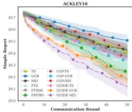  
(a) Ackley

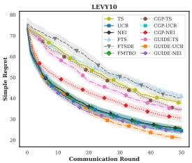  
(b) Levy

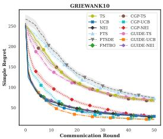  
(c) Griewank

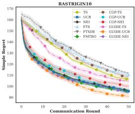  
(d) Rastrigin

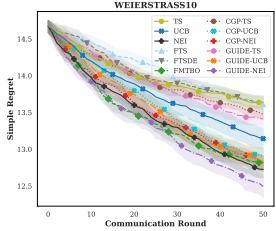  
(e) Weierstrass

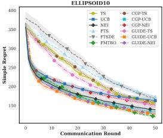  
(f) Ellipsoid

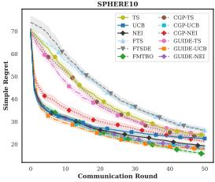

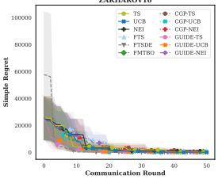

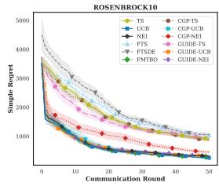  
(i) Rosenbrock

(h) Zakharov  
(g) Sphere  
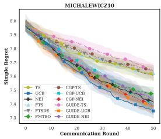  
(j) Michalewicz

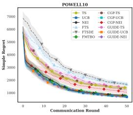  
(k) Powell

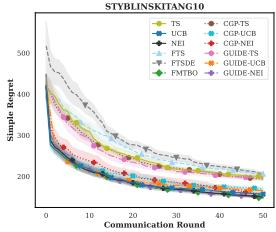  
(1) Styblinski-Tang  
Figure 6: Convergence trajectories for all 12 synthetic functions under Level 3 (Severe heterogeneity). Curves show the mean average simple regret over 10 independent runs, and shaded regions denote ±1 standard error of the mean across runs. Lower is better.

This setting is particularly difficult for point-level knowledge transfer. A promising design found by one agent may no longer lie in a promising region for another agent after the stronger shifts and rotations. The CGP results illustrate this limitation. CGP-TS and CGP-UCB only slightly improve their average ranks over independent TS and UCB, from 9.17 to 8.33 and from 4.83 to 4.25, respectively. In contrast, CGP-NEI has an average rank of 6.75, worse than 5.42 for independent NEI. Point-level transfer therefore no longer provides a consistent advantage when the agents' optima are poorly aligned.

FMTBO becomes more competitive in this regime and achieves an average rank of 3.67, the best result among the non-GUIDE methods. It is also the best method on Ellipsoid, Sphere, and Styblinski-Tang. Unlike methods that transfer particular promising locations, FMTBO communicates model-level information through GP hyperparameters and estimates task relatedness from predictive rankings. Such information does not require the optimum of one agent to occur at nearly the same location as the optimum of another agent. This weaker dependence on exact spatial alignment helps explain why FMTBO becomes relatively more competitive at Level 3.

Despite the severe heterogeneity, GUIDE-UCB retains the best aggregate rank of 2.58, while GUIDE-NEI ranks second at 3.42. GUIDE-UCB is among the top two methods on 8 of the 12 benchmarks and obtains the lowest final regret on Levy, Griewank, Rastrigin, and Zakharov. GUIDE-NEI is best on Ackley, Weierstrass, and Powell. The complete trajectories in Figure 6 show a much less uniform advantage than at Levels 1 and 2. The leading curves overlap and cross more frequently, and GUIDE no longer separates early from the other methods on most benchmarks. This is expected because the received distributions now contain more information that is useful to some agents but less relevant to others.

Two mechanisms help GUIDE remain robust in this regime. First, the strength of federated guidance decays according to ${ \lambda _ { t } } = { \lambda _ { \operatorname* { m a x } } } / { \sqrt { t } }$ . Global information therefore has its largest influence when local observations are scarce, while its influence gradually decreases as each agent collects more evidence about its own objective. The direct influence of global guidance therefore decreases over rounds, allowing local evidence to play a larger role later in the optimization.

Second, FI-GP leaves the local posterior mean unchanged and rescales only the posterior uncertainty. The absolute uncertainty increment at x is $\lambda _ { t } G _ { n , t } ( \mathbf { x } ) \sigma _ { n , t - 1 } ( \mathbf { x } )$ . Global guidance therefore has a large effect mainly where the federation provides strong support and the local GP remains uncertain. If a region has already been sufficiently explored locally, its posterior uncertainty is typically smaller, so even strong global guidance produces only a limited intervention. If local evaluations also indicate poor performance, the low posterior mean is preserved. Such a region is therefore unlikely to be selected solely because it is globally recommended.

The remaining failures also follow this interpretation. On Rosenbrock, independent UCB obtains 257.8472, compared with 321.9631 for GUIDE-UCB. Its narrow curved valley makes transferred spatial guidance particularly sensitive to strong translations and rotations. On Michalewicz, UCB obtains 7.3490, while GUIDE-UCB obtains 7.3793. The difference is much smaller, but the steep and narrow high-quality regions again leave little tolerance for spatial mismatch. These cases show that negative transfer can still occur on individual tasks. The main Level 3 result is that GUIDE retains the best aggregate rank despite these task-specific failures.

## D.4 REAL-WORLD CONVERGENCE TRAJECTORIES

Figure 7 reports the complete convergence trajectories corresponding to Table 2. For visualization, we use 1 — AUC for Landmine Detection and 1 — Accuracy for Activity Recognition and FedHPO, so lower values are better.

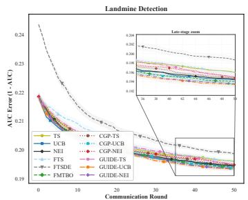  
(a) Landmine Detection

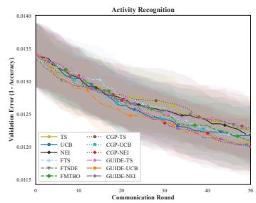  
(b) Activity Recognition

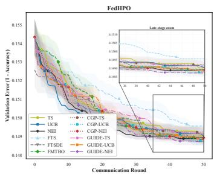  
(c) FedHPO  
Figure 7: Convergence trajectories on the three real-world federated optimization tasks. Curves show the mean transformed error metric over 10 independent runs, and shaded regions denote ±1 standard error of the mean. Lower is better.

On the three real-world tasks, the strongest methods often finish within a narrow performance range, while the matched comparisons remain consistently favorable for GUIDE-UCB and GUIDE-NEI.

On Landmine Detection, GUIDE-UCB achieves the highest final mean AUC of 0.806604, followed by CGP-UCB at 0.806501 and GUIDE-NEI at 0.806452. Independent UCB obtains 0.805593. The convergence trajectories remain close during the earlier rounds, while GUIDE-UCB gradually moves to the best mean performance later in the optimization horizon. Unlike many Level 1 synthetic benchmarks, there is no clear early separation from the strongest baselines.

Activity Recognition is much more tightly clustered. GUIDE-NEI obtains the highest final mean validation accuracy of 0.987994, followed by CGP-NEI at 0.987990 and CGP-UCB at 0.987959. GUIDE-UCB obtains 0.987938, compared with 0.987821 for independent UCB. All leading methods remain within a narrow accuracy range over most of the BO horizon. This task therefore shows that GUIDE remains competitive, but does not exhibit a large practical separation among the strongest methods under the tested budget.

FedHPO shows a similar narrow final range. GUIDE-NEI obtains the highest mean accuracy of 0.851271, followed by CGP-UCB at 0.851262. GUIDE-UCB obtains 0.851178, compared with

0.850973 for independent UCB, while independent NEI obtains 0.851145. The trajectories fluctuate more during the earlier rounds and become increasingly concentrated later.

Across the three tasks, GUIDE-NEI achieves the best average rank of 1.67, while GUIDE-UCB ranks third at 2.67. Both variants improve upon their matched independent baselines on all three tasks. GUIDE-TS has an average rank of 9.67, so the real-world evidence is strongest for the UCB and NEI instantiations.

The absolute gaps among the strongest methods are small on Activity Recognition and FedHPO, so the results indicate comparable performance among the leading methods rather than clear superiority over every collaborative baseline.

## E ABLATION STUDY DETAILS

We conduct the ablation study using GUIDE-UCB on the same four representative benchmarks, namely Ackley, Rastrigin, Zakharov, and Michalewicz. The main study uses Level 2 heterogeneity, while the same configurations are additionally evaluated under Level 3 to examine whether their effects persist as cross-agent transferability decreases. All configurations use the same local GP models, posterior sampling procedure, initialization, evaluation budget, UCB decision rule, and repetition seeds. The Level 2 final results are reported in Table 3 in the main text.

Ablation variants. “Vanilla UCB"removes the complete federated distributional-exchange and uncertainty-intervention pipeline and performs standard local UCB optimization independently for each agent. It serves as a reference for measuring the overall benefit of federated guidance.

“Single-Gaussian belief"replaces the DPGMM-based representation with a single diagonal Gaussian fitted directly to all posterior-optimum samples, while retaining the same posterior sampling procedure and uploaded message format. This variant removes the multimodal representation of the distribution over optimum locations while preserving the remaining GUIDE pipeline.

“w/o value-aware reweighting" removes the standardized conservative value score from the server weights, such that the merged components are weighted only by their normalized mixture masses.

“w/o component merging" skips server-side clustering and moment matching while retaining valueaware reweighting and subsequent component sampling. Thus, the original uploaded components directly enter the downstream weighting and redistribution procedure.

“w/o agent-specific sampling" samples one global subset of at most P components and broadcasts the same subset to all agents. The packet size and weighted sampling distribution are kept identical to those of the full method, so this variant removes only the agent-specific stochastic redistribution.

“Uniform uncertainty scaling" retains the complete distributional-exchange pipeline but removes the spatial localization of FI-GP. Specifically, the spatially varying guidance field ${ \bf \tilde { \cal G } } _ { n , t } ( { \bf x } )$ is replaced at the intervention stage by its domain-averaged value

$$
\bar { G } _ { n , t } = \frac { 1 } { Q } \sum _ { q = 1 } ^ { Q } G _ { n , t } ( \mathbf { z } _ { q } ) ,
$$

where $\{ \mathbf { z } _ { q } \} _ { q = 1 } ^ { Q }$ is a fixed quasi-uniform set over X. The corresponding uncertainty scaling becomes

$$
S _ { n , t } ^ { \mathrm { u n i } } ( \mathbf { x } ) = 1 + \lambda _ { t } \bar { G } _ { n , t } .
$$

This preserves the average magnitude of the uncertainty intervention while removing its spatial variation, thereby separating spatially targeted guidance from a uniform increase in exploration.

## E.1 LEVEL 2 ABLATION RESULTS

Table 3 and Figure 8 reveal a clear difference between spatial uncertainty intervention and a generic increase in posterior uncertainty. Full GUIDE-UCB achieves the best average rank of 1.50. Removing agent-specific sampling gives an average rank of 2.50, followed by removing value-aware reweighting at 2.75, removing component merging at 3.75, and replacing the DPGMM with a single Gaussian at 4.50. Uniform uncertainty scaling and Vanilla UCB give the two weakest aggregate results, with average ranks of 6.25 and 6.75.

The strongest effect comes from spatial localization. Full GUIDE-UCB, Uniform uncertainty scaling, and Vanilla UCB obtain final regrets of 8.4785, 19.1366, and 19.4350 on Ackley, and 58.3082, 80.3952, and 80.4771 on Rastrigin. On Zakharov, the corresponding values are 22.1717, 52.0749, and 49.8750, while on Michalewicz they are 5.8629, 6.1078, and 6.1248. The trajectories show the same pattern. Uniform uncertainty scaling stays close to Vanilla UCB on Ackley and Rastrigin and loses most of the early convergence advantage of Full GUIDE-UCB.

This ablation isolates an important part of FI-GP. The uniform variant keeps the complete distributional-exchange pipeline and preserves the average magnitude of the intervention, but removes its spatial variation. Its weak performance shows that a uniform increase in uncertainty is not sufficient. The main benefit comes from increasing uncertainty selectively in regions supported by the transferred distributions. FI-GP increases exploration around regions supported by the received distributions while leaving other parts of the search space much less affected.

The remaining ablations have smaller and more task-dependent effects. Replacing the DPGMM with a single Gaussian gives an average rank of 4.50. A single Gaussian can represent one broad promising region but cannot retain multiple separated modes when the posterior samples support several possible optimum locations. Component merging removes redundant components so that multiple entries in the limited downlink packet do not repeatedly represent the same region. Removing this step increases the average rank to 3.75.

Agent-specific sampling and value-aware reweighting affect the result less uniformly under Level 2. Removing agent-specific sampling gives the second-best average rank of 2.50 and even obtains 21.5431 on Zakharov, compared with 22.1717 for the full method. Removing value-aware reweighting obtains 8.4753 on Ackley, compared with 8.4785 for Full GUIDE-UCB. These reversals show that neither mechanism must improve every individual function. Value-aware reweighting makes component selection more selective, while agent-specific sampling gives different agents different subsets of the global components.

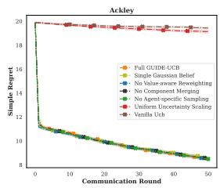  
(a) Ackley

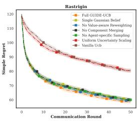  
(b) Rastrigin

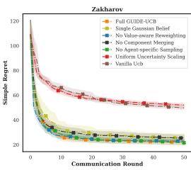  
(c) Zakharov

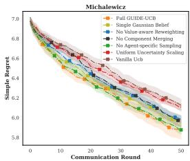  
(d) Michalewicz  
Figure 8: Convergence trajectories for the GUIDE-UCB ablation study under Level 2 heterogeneity. Curves show the mean average simple regret over 10 independent runs, and shaded regions denote ±1 standard error of the mean across runs. Lower is better.

## E.2 LEVEL 3 ABLATION RESULTS

Under Level 3 heterogeneity, the ablation results become much more benchmark dependent. Full GUIDE-UCB nevertheless retains the best aggregate rank of 2.50. The Single-Gaussian variant ranks second at 3.00, followed by the variants without agent-specific sampling and component merging at 3.75 and 4.00. Uniform uncertainty scaling obtains 4.50, Vanilla UCB obtains 5.00, and removing value-aware reweighting gives the weakest aggregate rank of 5.25.

The best ablation variant now differs across functions. Removing value-aware reweighting is best on Ackley with 20.1612, while Full GUIDE-UCB obtains 20.1739. Uniform uncertainty scaling is best on Rastrigin at 90.2925, followed by the variant without agent-specific sampling at 90.7210 and Full GUIDE-UCB at 90.8849. Full GUIDE-UCB is best on Zakharov at 92.9444, whereas Vanilla UCB is best on Michalewicz at 7.3490. The Level 3 trajectories consequently overlap much more than their Level 2 counterparts.

The most notable change is the role of value-aware reweighting. Removing it gives an average rank of 2.75 at Level 2 but the worst rank of 5.25 at Level 3. Strong heterogeneity means that the server receives distributions from objectives that agree much less with one another. In this setting, mixture mass alone is not enough to distinguish a component that is merely frequent in posterior samples from one that is also supported by favorable local function values. The value-aware score provides this additional filter. Its effect is not uniform, as shown by the strong Ackley result without reweighting, but it becomes more important for avoiding weak aggregate performance across different tasks.

The Single-Gaussian variant ranks second overall, suggesting that the additional benefit of multimodal representation is relatively modest in this Level 3 study. Uniform uncertainty scaling is best on Rastrigin, showing that spatial localization is not beneficial on every individual function. Under severe heterogeneity, filtering unreliable transferred components becomes more important because the received spatial information is less consistently relevant to each local objective.

Full GUIDE-UCB achieves the best Level 3 average rank of 2.50 despite not being the best variant on every benchmark. Its advantage is therefore primarily one of robustness across different objective landscapes.

Table 11: Ablation study of GUIDE-UCB on four representative synthetic benchmarks under Level 3 heterogeneity. Entries report the final mean average simple regret over 10 independent runs; lower is better. The last row reports the average rank across the four benchmarks. The best and second-best results are shown in bold and underlined, respectively.
<table><tr><td>Benchmark</td><td>Vanilla UCB</td><td>Single-Gaussian belief</td><td>w/o value-aware reweighting</td><td>merging</td><td>sampling</td><td>w/o component w/o agent-specific Uniform uncertainty scaling</td><td>Full GUIDE-UCB</td></tr><tr><td>Ackley</td><td>20.5073</td><td>20.2321</td><td>20.1612</td><td>20.2473</td><td>20.2122</td><td>20.4661</td><td>20.1739</td></tr><tr><td>Rastrigin</td><td>95.6377</td><td>92.1619</td><td>94.3347</td><td>92.5862</td><td>90.7210</td><td>90.2925</td><td>90.8849</td></tr><tr><td>Zakharov</td><td>101.9986</td><td>95.9903</td><td>109.8422</td><td>96.5643</td><td>98.2310</td><td>103.0493</td><td>92.9444</td></tr><tr><td>Michalewicz</td><td>7.3490</td><td>7.3529</td><td>7.5093</td><td>7.3660</td><td>7.4075</td><td>7.4026</td><td>7.3793</td></tr><tr><td>Average rank</td><td>5.00</td><td>3.00</td><td>5.25</td><td>4.00</td><td>3.75</td><td>4.50</td><td>2.50</td></tr></table>

  
(a) Ackley

  
(b) Rastrigin

  
(c) Zakharov

  
(d) Michalewicz  
Figure 9: Convergence trajectories for the GUIDE-UCB ablation study under Level 3 heterogeneity. Curves show the mean average simple regret over 10 independent runs, and shaded regions denote ±1 standard error of the mean across runs. Lower is better.

## F SENSITIVITY ANALYSIS

We evaluate the sensitivity of GUIDE-UCB under Level 3 heterogeneity on Rastrigin and Michalewicz. Level 3 has the lowest empirical task similarity (Sim = 0.081) and therefore provides a demanding setting for examining whether the main GUIDE hyperparameters remain well behaved when crossagent agreement is weak. We vary one parameter at a time while keeping all remaining settings fixed.

The tested parameters are the number of posterior-optimum samples M, the downlink packet size P, the maximum intervention strength $\lambda _ { \operatorname* { m a x } } .$ and the component merging threshold $\delta _ { \mathrm { m e r g e } }$ . The complete parameter grids are reported in Table 12.

Table 13 reports the final average simple regret for each parameter setting. For each parameter group, only the parameter under study is varied, while all remaining hyperparameters are fixed at their default values. Figures 10 and 11 show the corresponding convergence trajectories over the complete BO horizon.

Table 12: Hyperparameter grids used in the Level 3 sensitivity analysis. Bold entries denote the default settings.
<table><tr><td>Parameter</td><td>Tested values</td><td>Default</td></tr><tr><td>posterior-optimum samples M</td><td>{100, 250, 500, 750, 1000}</td><td>500</td></tr><tr><td>Downlink packet size  $\bar { P }$ </td><td>{1, 3, 5, 8, 10}</td><td>5</td></tr><tr><td>Maximum guidance  $\lambda _ { \mathrm { m a x } }$ </td><td>{0.25, 0.5, 1.0, 2.0}</td><td>1.0</td></tr><tr><td>Merging threshold  $\delta _ { \mathrm { m e r g e } }$ </td><td>{0.01, 0.02, 0.03, 0.04, 0.05}</td><td>0.05</td></tr></table>

Table 13: Sensitivity results of GUIDE-UCB on Rastrigin and Michalewicz under Level 3 heterogeneity. Entries report the final mean average simple regret over 10 independent runs; lower is better.
<table><tr><td>Parameter</td><td>Value</td><td>Rastrigin</td><td>Michalewicz</td></tr><tr><td>M</td><td>100</td><td>92.6392</td><td>7.3885</td></tr><tr><td></td><td>250</td><td>91.9958</td><td>7.4102</td></tr><tr><td></td><td>500</td><td>90.8849</td><td>7.3793</td></tr><tr><td></td><td>750</td><td>91.3377</td><td>7.3489</td></tr><tr><td></td><td>1000</td><td>93.1664</td><td>7.3473</td></tr><tr><td> $P$ </td><td>1</td><td>92.5324</td><td>7.3935</td></tr><tr><td></td><td>3</td><td>91.4631</td><td>7.3586</td></tr><tr><td></td><td>5</td><td>90.8849</td><td>7.3793</td></tr><tr><td></td><td>8</td><td>93.0066</td><td>7.3982</td></tr><tr><td></td><td>10</td><td>93.2827</td><td>7.3982</td></tr><tr><td> $\lambda _ { \mathrm { m a x } }$ </td><td>0.25</td><td>90.7113</td><td>7.3563</td></tr><tr><td></td><td>0.5</td><td>92.1546</td><td>7.3841</td></tr><tr><td></td><td>1.0</td><td>90.8849</td><td>7.3793</td></tr><tr><td></td><td>2.0</td><td>95.0430</td><td>7.4711</td></tr><tr><td> $\delta _ { \mathrm { m e r g e } }$ </td><td>0.01</td><td>89.8604</td><td>7.3847</td></tr><tr><td></td><td>0.02</td><td>90.5706</td><td>7.3613</td></tr><tr><td></td><td>0.03</td><td>90.4103</td><td>7.3823</td></tr><tr><td></td><td>0.04</td><td>89.5435</td><td>7.4494</td></tr><tr><td></td><td>0.05</td><td>90.8849</td><td>7.3793</td></tr></table>

The effect of M differs between the two benchmarks. On Rastrigin, $M = 5 0 0$ gives the lowest final regret of 90.8849, while increasing the sample size to 750 and 1000 gives 91.3377 and 93.1664, respectively. Michalewicz shows the opposite tendency, with final regrets of 7.3489 and 7.3473 at $\dot { M } = 7 \dot { 5 } 0$ and $M = 1 0 0 0$ , compared with 7.3793 at $M = 5 0 0$ . Increasing M beyond 500 therefore does not provide a consistent benefit across the two benchmarks. A moderate number of posterior-optimum samples is sufficient for Rastrigin, while Michalewicz benefits slightly from a finer Monte Carlo approximation of the distribution over optimum locations.

The packet size P also shows a task-dependent optimum. Rastrigin performs best at $P = 5 ,$ with a final regret of 90.8849, whereas Michalewicz performs best at ${ \bar { P } } = 3$ , with 7.3586. Increasing the packet size further degrades both benchmarks. $\mathrm { A t } \ : P = 8$ and $P = 1 0$ , Rastrigin reaches 93.0066 and 93.2827, while Michalewicz reaches 7.3982 for both settings. A larger packet gives each agent access to more global components, but under severe heterogeneity some of these additional components may correspond to regions that are poorly aligned with the local objective. Increasing $P$ therefore does not necessarily improve the quality of the guidance. Moderate packet sizes also keep the communication cost bounded while limiting the amount of potentially conflicting global information received by each agent.

The clearest common pattern appears for $\lambda _ { \operatorname* { m a x } } .$ Among the tested values, $\lambda _ { \operatorname* { m a x } } = 0 . 2 5$ gives the lowest final regret on both benchmarks, with 90.7113 on Rastrigin and 7.3563 on Michalewicz.

  
(a) Posterior-optimum samples M

  
(b) Packet size P

  
(c) Guidance strength $\lambda _ { \mathrm { m a x } } ( \mathrm { d } )$

  
δmerge

Figure 10: Sensitivity of GUIDE-UCB to its main hyperparameters on Rastrigin under Level 3 heterogeneity. Curves show the mean average simple regret over 10 independent runs, and shaded regions denote ±1 standard error of the mean across runs. Lower is better.  
  
(a) Posterior-optimum samples M

  
(b) Packet size P

  
(c) Guidance strength $\lambda _ { \mathrm { m a x } } ( \mathrm { d } )$ Merging threshold δmerge

  
Figure 11: Sensitivity of GUIDE-UCB to its main hyperparameters on Michalewicz under Level 3 heterogeneity. Curves show the mean average simple regret over 10 independent runs, and shaded regions denote ±1 standard error of the mean across runs. Lower is better.

In contrast, the strongest intervention, $\lambda _ { \operatorname* { m a x } } = 2 . 0$ , gives the worst result on both benchmarks, reaching 95.0430 and 7.4711, respectively. The results show that strong federated guidance is undesirable when cross-agent agreement is weak. Increasing posterior uncertainty too aggressively gives transferred information too much influence on the local decision. A weaker intervention is sufficient to exploit useful global information while leaving more weight to the local posterior.

The merging threshold $\delta _ { \mathrm { m e r g e } }$ has no common optimum across the two benchmarks. Rastrigin achieves its lowest final regret of 89.5435 at $\delta _ { \mathrm { m e r g e } } = 0 . 0 4$ , whereas Michalewicz achieves its lowest value of 7.3613 at $\bar { \delta } _ { \mathrm { m e r g e } } = 0 . 0 2$ . This difference is expected because the threshold controls the spatial resolution of the global representation. A larger value merges more nearby components and produces a coarser representation of the promising regions, while a smaller value retains finer spatial distinctions. The preferred resolution therefore depends on the geometry of the objective.

Overall, the sensitivity study does not favor uniformly larger parameter settings. Increasing $M , P ;$ or $\lambda _ { \mathrm { m a x } }$ does not consistently reduce final regret, and the preferred merging threshold is task dependent. The most consistent finding is that excessively strong uncertainty intervention should be avoided under severe heterogeneity.

## G COMMUNICATION COST ANALYSIS

We measure communication by the number of scalar values transmitted per agent per BO round. Independent TS, UCB, and NEI do not communicate. The following accounting uses the default synthetic setting $d = 1 0 , D _ { \mathrm { R F F } } = 5 0 0$ , diagonal GUIDE covariance, and $P = 5$

FTS and FTS-DE. FTS uploads and downloads a $D _ { \mathrm { R F F } }$ -dimensional random feature weight representation, giving 500 scalars in each direction. Under the four-region distributed-exploration implementation of FTS-DE, the corresponding cost is $4 D _ { \mathrm { R F F } } = 2 0 0 0$ scalars in each direction.

FMTBO. FMTBO uploads two GP hyperparameters and ten ranking-related values, and receives two updated hyperparameters. Its uplink and downlink costs are therefore 12 and 2 scalars, respectively.

CGP family. Each CGP agent uploads one d-dimensional design point, one LCB value, and one posterior-mean value, for a total of $\stackrel { \cdot } { d } + 2 = 1 2$ scalars. Each agent receives 20 design points, giving 20d = 200 downlink scalars.

GUIDE-FBO. With a diagonal covariance, one uploaded component contains a d-dimensional mean, a d-dimensional covariance vector, one mixture weight, and one standardized value score. Hence,

$$
C _ { \mathrm { u p } } ^ { \mathrm { G U I D E } } = 2 d + 2 = 2 2 .
$$

Each downlink component contains a mean, diagonal covariance, and global guidance weight. Therefore,

$$
C _ { \mathrm { d o w n } } ^ { \mathrm { G U I D E } } = P _ { t } ( 2 d + 1 ) \le P ( 2 d + 1 ) = 5 \times 2 1 = 1 0 5 .
$$

Thus, the total communication cost is at most 127 scalars per agent per round under the default setting For a full covariance implementation, the covariance contribution becomes $d ( d + 1 ) / 2$ scalars per component when only the symmetric entries are transmitted. The resulting communication costs under the default diagonal-covariance implementation are summarized in Table 4.

## H COMPUTATIONAL EFFICIENCY ANALYSIS

We report the mean wall-clock time per independent run for each method using the same software environment and hardware. Experiments are executed on an AMD Ryzen 9 7945HX platform with 32 logical processors and 16 physical cores. Reported times are averaged over the repeated runs and measured in seconds.

Table 14: Mean wall-clock time per independent run on the synthetic benchmarks under Level 2 heterogeneity, averaged over 10 runs. Unit: seconds.
<table><tr><td>Benchmark</td><td>TS</td><td>UCB</td><td>NEI</td><td>FTS</td><td>FTS-DE</td><td>FMTBO</td><td>CGP-TS</td><td>CGP-UCB</td><td>CGP-NEI</td><td>GUIDE-TS</td><td>GUIDE-UCB</td><td>GUIDE-NEI</td></tr><tr><td>Ackley</td><td>129.51</td><td>143.48</td><td>269.34</td><td>141.88</td><td>148.32</td><td>160.56</td><td>252.10</td><td>411.90</td><td>1811.38</td><td>267.19</td><td>275.87</td><td>402.82</td></tr><tr><td>Levy</td><td>111.27</td><td>125.76</td><td>262.50</td><td>133.12</td><td>124.19</td><td>256.59</td><td>237.84</td><td>263.90</td><td>765.01</td><td>215.37</td><td>217.87</td><td>499.63</td></tr><tr><td>Griewank</td><td>85.13</td><td>99.67</td><td>279.07</td><td>118.16</td><td>113.43</td><td>242.71</td><td>246.30</td><td>253.81</td><td>773.83</td><td>179.68</td><td>185.57</td><td>344.68</td></tr><tr><td>Rastrigin</td><td>120.42</td><td>163.72</td><td>290.74</td><td>128.78</td><td>121.39</td><td>297.36</td><td>265.75</td><td>359.93</td><td>1221.39</td><td>227.67</td><td>262.98</td><td>555.44</td></tr><tr><td>Weierstrass</td><td>126.20</td><td>140.59</td><td>250.92</td><td>141.79</td><td>149.75</td><td>171.29</td><td>246.86</td><td>347.38</td><td>1050.71</td><td>266.59</td><td>267.94</td><td>677.94</td></tr><tr><td>Ellipsoid</td><td>175.70</td><td>164.10</td><td>306.68</td><td>161.63</td><td>153.78</td><td>246.67</td><td>304.80</td><td>326.98</td><td>892.53</td><td>249.66</td><td>253.14</td><td>624.32</td></tr><tr><td>Sphere</td><td>167.19</td><td>174.37</td><td>327.94</td><td>178.33</td><td>164.62</td><td>266.78</td><td>257.60</td><td>275.84</td><td>814.01</td><td>223.04</td><td>234.56</td><td>534.97</td></tr><tr><td>Zakharov</td><td>115.02</td><td>113.23</td><td>224.83</td><td>115.94</td><td>120.83</td><td>225.49</td><td>242.18</td><td>240.12</td><td>449.03</td><td>233.55</td><td>240.50</td><td>562.81</td></tr><tr><td>Rosenbrock</td><td>65.79</td><td>78.15</td><td>172.91</td><td>78.58</td><td>89.00</td><td>154.95</td><td>154.68</td><td>163.35</td><td>333.75</td><td>194.66</td><td>201.80</td><td>439.28</td></tr><tr><td>Michalewicz</td><td>114.72</td><td>166.72</td><td>267.53</td><td>131.72</td><td>137.26</td><td>195.98</td><td>231.74</td><td>368.63</td><td>1406.76</td><td>264.11</td><td>294.16</td><td>742.14</td></tr><tr><td>Powell</td><td>82.17</td><td>90.78</td><td>186.99</td><td>97.34</td><td>107.10</td><td>167.66</td><td>185.97</td><td>185.55</td><td>296.17</td><td>227.31</td><td>234.32</td><td>477.27</td></tr><tr><td>Styblinski-Tang</td><td>83.22</td><td>88.35</td><td>216.58</td><td>101.46</td><td>106.42</td><td>183.35</td><td>224.13</td><td>274.83</td><td>1048.93</td><td>206.32</td><td>219.41</td><td>548.39</td></tr></table>

The synthetic objectives are inexpensive to evaluate, so the reported wall-clock times primarily reflect the computational overhead of the BO algorithms themselves. Averaged across the 12 Level 2 benchmarks, UCB, GUIDE-UCB, and CGP-UCB require approximately 129.1, 240.7, and 289.4 seconds per complete run, respectively. GUIDE-UCB is faster than CGP-UCB on 9 of the 12 benchmarks.

For the NEI family, GUIDE-NEI and CGP-NEI require approximately 534.1 and 905.3 seconds on average, respectively, with GUIDE-NEI being faster on 9 of the 12 benchmarks. GUIDE therefore introduces clear additional computation relative to independent local BO, mainly from posterioroptimum sampling, distribution fitting, and server-side processing, while remaining less expensive than the corresponding CGP variants on most of the tested benchmarks.

This additional computation is a practical cost when objective evaluations themselves are inexpensive. In expensive black-box applications, however, simulation, model training, or physical experimentation may dominate the total optimization time, in which case optimizer-side computation can represent a smaller fraction of the end-to-end cost. The relative runtime impact therefore depends on the expense of the application being optimized.

## I ORTHOGONAL RANDOM FEATURES FOR POSTERIOR-OPTIMUM SAMPLING

GUIDE uses random Fourier features (Rahimi and Recht, 2007) with an orthogonal-block construction inspired by Yu et al. (2016) to generate approximate posterior paths. The local GP provides the posterior mean, while a Bayesian linear feature model provides the stochastic residual.

Feature representation. For a fixed agent and round, let l and $\sigma _ { f } ^ { 2 }$ denote the fitted local GP's ARD lengthscales and output variance, and define $\Lambda = \mathrm { d i a g } ( \ell )$ . We suppress the agent and round indices on the feature map for readability. Direction vectors ${ \bf q } _ { j }$ are obtained from rows of orthogonal matrices generated by QR decomposition of independent standard Gaussian matrices. For each direction, draw independent $\begin{array} { r } { \bar { u _ { j } } \sim \chi _ { d } ^ { 2 } , \bar { v _ { j } } \sim \chi _ { 5 } ^ { 2 } } \end{array}$ , and $b _ { j } \sim \mathrm { U n i f } [ 0 , 2 \pi )$ , and define

$$
\omega _ { j } = \sqrt { u _ { j } } \sqrt { \frac { 5 } { v _ { j } } } \Lambda ^ { - 1 } \mathbf { q } _ { j } , \qquad \phi _ { j } ( \mathbf { x } ) = \sqrt { \frac { 2 \sigma _ { f } ^ { 2 } } { D _ { \mathrm { O R F } } } } \cos ( \omega _ { j } ^ { \top } \mathbf { x } + b _ { j } ) .
$$

The Student- ${ \cdot } t _ { 5 }$ radial scaling and ARD transformation follow the spectral parameterization of the local Matérn- ${ \it - 5 / 2 }$ kernel. The resulting feature map approximates its stationary covariance through $k ( \mathbf { x } , \mathbf { x } ^ { \prime } ) \approx \phi ( \dot { \mathbf { x } } ) ^ { \top } \phi ( \mathbf { x } ^ { \prime } )$

Posterior paths. We sample feature weights from their Gaussian posterior under the Bayesian linear feature model. Let $\widetilde { \mathbf { w } } _ { n , t } ^ { ( m ) }$ denote such a draw conditioned on $\mathcal { D } _ { n , t - 1 }$ , and let $\mu _ { w , n , t - 1 }$ denote the corresponding posterior weight mean. To retain the fitted local GP posterior mean, we construct

$$
\widehat { f } _ { n , t } ^ { ( m ) } ( \mathbf { x } ) = \mu _ { n , t - 1 } ( \mathbf { x } ) + \phi ( \mathbf { x } ) ^ { \top } \left( \widetilde { \mathbf { w } } _ { n , t } ^ { ( m ) } - \pmb { \mu } _ { w , n , t - 1 } \right) .
$$

Conditional on the fitted model and feature map, the residual has zero mean. Thus, the paths preserve the local $\mathrm { G P }$ posterior mean while approximating its posterior covariance through the feature model.

Optimum distribution extraction and TS decisions. For optimum distribution extraction, we generate M paths with independent posterior weight draws, sharing a feature map and a uniformly sampled candidate set $\mathcal { X } _ { \mathrm { c a n d } } \subset \mathcal { X }$ . We obtain optimum-location samples as

$$
\widehat { \mathbf { x } } _ { n , t } ^ { ( m ) } \in \arg \operatorname* { m a x } _ { \mathbf { x } \in \mathcal { X } _ { \mathrm { c a n d } } } \widehat { f } _ { n , t } ^ { ( m ) } ( \mathbf { x } ) ,
$$

and use these samples to fit the local DPGMM.

For GUIDE-TS, a fresh posterior weight draw defines a path whose centered residual is scaled by the guidance multiplier:

$$
\widetilde { f } _ { n , t } ( \mathbf { x } ) = \mu _ { n , t - 1 } ( \mathbf { x } ) + S _ { n , t } ( \mathbf { x } ) \left( \widehat { f } _ { n , t } ( \mathbf { x } ) - \mu _ { n , t - 1 } ( \mathbf { x } ) \right) .
$$

This path is optimized over $\mathcal { X }$ using continuous acquisition optimization. For GUIDE-UCB and GUIDE-NEI, the feature sampler is used for optimum distribution extraction, while acquisition evaluation uses the intervened local GP posterior. All features and sampled paths remain on the agent; only the selected distributional component is uploaded.