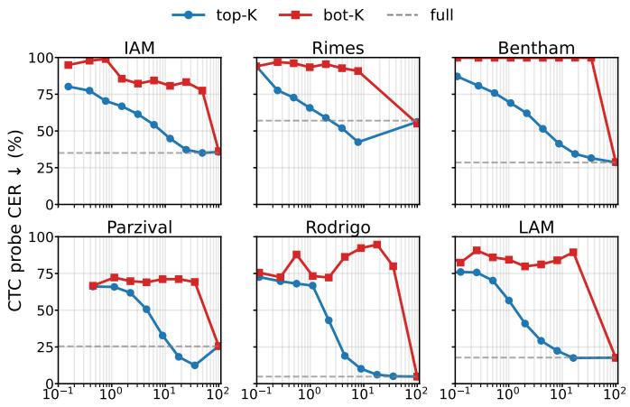
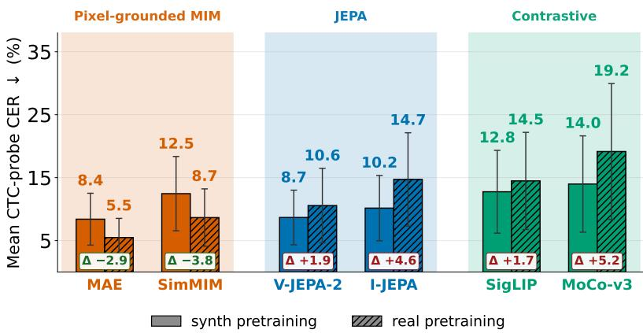
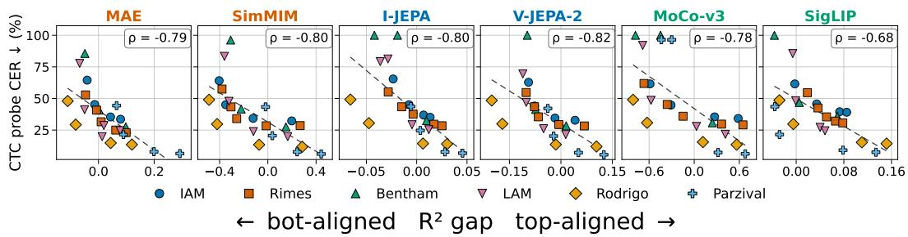
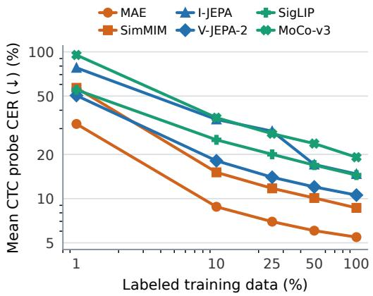
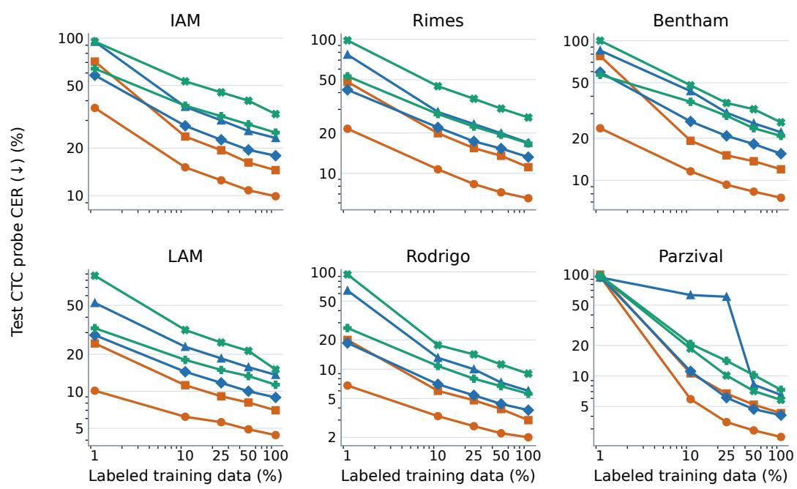

# Handwritten Text Recognition Lives in the High-Pixel Variance Subspace

Carlos Garrido-Munoz Jorge Calvo-Zaragoza University of Alicante, Spain {carlos.garrido,jorge.calvo}@ua.es

## Abstract

In self-supervised pretraining for Handwritten Text Recognition (HTR), pixel reconstruction methods tend to outperform contrastive ones, a pattern that sits awkwardly with recent evidence that pixel reconstruction yields uninformative features for natural-image classification. We argue this discrepancy is not an accident but a consequence of how HTR signal is distributed in pixel space. By probing the input distribution directly, we show that HTR’s discriminative content is concentrated in the high-variance pixel subspace and is essentially absent from the low-variance one, the inverse of the structure observed for image classification. Under this view, the right SSL family becomes predictable: objectives that preserve high-variance pixel content should transfer best. We test this prediction across six SSL methods spanning three families (pixel-grounded MIM, JEPA-style, and contrastive image–image and image–text), under matched encoder, data, and evaluation protocols on six handwriting benchmarks across five languages. In the full-label setting, pixel-grounded SSL produces the lowest CER on every benchmark and every probe, exposes per-position character information that other families recover only via the readout, and is the only family that benefits from real-data pretraining. Pixel-grounded representations are also more label-efficient. A geometric property of the encoder, its alignment with the high-variance pixel subspace, predicts CER within every SSL method we test. With a pretrained LLM decoder, a frozen pixelgrounded encoder is already competitive with fully fine-tuned supervised baselines, and full fine-tuning beats them on the mean and ranks first or second on every benchmark. These results challenge the prevailing view that pixel reconstruction wastes capacity on irrelevant detail: whether reconstruction is wasted depends on where the discriminative signal lives in the input.

## 1 Introduction

Handwritten Text Recognition (HTR) aims to transcribe handwritten content into machine-readable text, supporting applications from the digitization of historical archives to form automation and document retrieval. Despite notable advances in recent years [26], performance still hinges on the availability of large quantities of labeled real handwriting, which are expensive to collect and often unavailable for the long tail of historical, regional, and low-resource scripts [25, 49]. The vast variability in human handwriting such as writing style, ligatures, slant, ink, paper, and degradation means that systems trained on one writer or one historical period generalize poorly to others, leaving the field perpetually data-hungry [26]. Synthetic data is the natural response to this shortage: rendered from a pool of fonts at essentially zero annotation cost, it can be produced in arbitrary quantities and made multilingual by construction. Yet synthetic handwriting fails to reproduce the subtle nuances of real handwriting, and models trained only on synthetic data exhibit a pronounced synthetic-to-real gap that does not close without seeing real samples. This gap is precisely the regime in which representation quality matters most, since no decoder, language prior, or test-time augmentation can recover information the encoder did not learn to expose.

Self-supervised pretraining (SSL) [31, 37, 36, 10] is the standard tool for closing this kind of gap, with three families dominating the literature: (1) reconstruction-based methods, also known as Masked Image Modeling (MIM), which reconstruct masked content in pixel space [31, 59]; (2) contrastive methods, which optimize an instance-discrimination loss in either an image–image [30, 16, 17] or an image–text [52, 62] setting; and (3) embedding-predictive architectures, of which Joint-Embedding Predictive Architectures (JEPA) [36, 6] are the canonical instance, predicting the representations of masked regions in a learned latent space.

In HTR, the existing SSL literature does not provide a clean answer to the question of which family is best, nor a principled understanding of why [49]. Comparisons across studies are difficult to interpret because pretraining data, evaluation protocols, and probe choices vary substantially across methods [49, 65, 3]. This question matters because the broader self-supervised literature has converged on the intuition that pixel-space reconstruction does not yield representations useful for perception [9]: the underlying assumption is that semantic tasks depend on high-level abstractions, and that recovering low-level pixel detail is incidental to that goal: that capacity spent on such detail is capacity wasted. This view has driven the field toward JEPA-style methods [36, 6, 12, 7], which by construction predict in a learned latent space and discard pixel-level reconstruction altogether. In this paper, we ask whether the same assumption holds for transcription tasks, where the unit of recognition is a character rather than an object category. We use HTR as a testbed and, to do so rigorously, adapt JEPA methods to handwriting for the first time. Our central argument, however, is sharper: HTR is structurally different from semantic understanding tasks, and the signal that determines the transcription lives, paradoxically, in exactly the low-level detail that JEPA discards. The very content the field’s dominant philosophy treats as noise is, on HTR, the signal itself. We show that pixel-grounded methods outperform JEPA-style and contrastive ones across all six benchmarks and every SSL protocol we test, and we explain why through a measurable property of the encoder: alignment with the high-variance pixel subspace, which correlates strongly with downstream CER.

## Contributions:

(C1) A structural account of why pixel-grounded SSL is the right objective for HTR. The HTR signal lives in the high-variance pixel subspace, the inverse of natural-image classification, and an encoder’s alignment with that subspace predicts its probe CER within every SSL method we test. (C2) The first adaptation of JEPA-style methods to text recognition. We adapt I-JEPA and V-JEPA-2 to HTR as the first test of the JEPA philosophy outside its validated domain. (C3) The first rigorous, line-level SSL comparison for HTR. We evaluate six SSL methods spanning three families (Pixel-MIM, JEPA-style, Contrastive) under same encoder, data, and evaluation protocols across six benchmarks in five languages, in both synthetic and real pretraining regimes. Findings from this comparison are summarized in the abstract and detailed in Sec. 5.

## 2 Related Work

## 2.1 Handwritten Text Recognition.

HTR has long been dominated by recurrent architectures: bidirectional LSTMs [29, 32] trained with the Connectionist Temporal Classification (CTC) objective [28] held the state of the art on standard benchmarks for over a decade [5, 56, 55, 2]. Attention-based encoder-decoder models [8] later emerged as strong alternatives [33, 35, 1, 20], and a comparative analysis by Michael et al. [46] provides a detailed account of these sequence-to-sequence approaches. The introduction of Vision Transformers [22] reshaped the field by enabling more scalable visual encoders, used either in pure encoder-decoder pipelines [38, 47, 48, 57] or paired with CTC decoding [58, 19, 13]. Modern HTR systems built on Transformer encoders depend heavily on large labeled corpora for pretraining [38, 21], which is the bottleneck this paper addresses. Self-supervised learning is the standard tool for relaxing this dependence, and a growing body of work has applied it to text recognition [61, 49, 3]. The next subsection reviews this literature in detail.

## 2.2 Self-supervised pretraining

Three families of visual self-supervised pretraining are now standard. Reconstruction-based methods, also known as Masked Image Modeling (MIM), reconstruct masked image content either in pixel space [31, 59] or in a discrete token space [11]. Embedding-prediction methods, of which Joint-Embedding Predictive Architectures (JEPA) [36] are the canonical instance, predict the representations of masked regions in a learned latent space [6, 12, 7]. Contrastive methods optimize an instancediscrimination loss in either an image–image [30, 16, 17] or an image–text [52, 62] setting. The relative merits of these families depend strongly on the downstream task. Balestriero and Lecun [9] have recently argued that pixel-space reconstruction concentrates a model’s capacity on a subspace of the data that explains pixel variance but is uninformative for perception, making MIM ill-suited to natural-image classification under linear probing. This argument has driven the field toward JEPA-style methods, which by construction predict in a learned latent space rather than in pixel space. We revisit this argument in the HTR setting and find the opposite structure: the high-variance pixel subspace of handwritten line images is precisely where the discriminative signal lives, so the property that hurts MIM on classification is the property that benefits it on transcription.

## 2.3 Self-supervised pretraining for text recognition

Prior SSL work in text recognition [49] has explored three of the four families introduced above. Pixel-grounded MIM has been the dominant route for visual SSL in TR: TextDIAE [54] pretrains a ViT encoder with masking, blurring, and debinarization pretext tasks; DualMAE [51] decouples visual and semantic feature learning with a dual masked autoencoder; MaskOCR [44] uses vertical strip masking to respect the horizontal flow of text lines; and DiG [60] combines SimMIM-style reconstruction with contrastive learning. Image–image contrastive methods adapt MoCo-style [17] instance discrimination by reorganizing the contrastive unit: SeqCLR [3] contrasts at the frame level, PerSec [40] at the stroke–semantic level, ChaCo [65] at the character level, CMT-Co [64] via character-movement pretext, and RCLSTR [63] via textual relations; SimAN [43] replaces the contrastive objective with a generative one. Image–text contrastive pretraining has not been adapted to TR as an SSL objective: existing work uses CLIP only as a frozen pretrained model, either fine-tuned for STR [66] or fused into an existing recognizer [4]. JEPA-style pretraining is fully absent: no published work adapts I-JEPA [6], V-JEPA-2 [7], or any embedding-prediction objective to text recognition, in either the scene or handwritten setting.

Our work supplies a structural account, grounded in the variance geometry of handwritten text-line images, and tests it under matched conditions across six methods [31, 59, 6, 7, 17, 62], including the first study of JEPA-style methods on HTR.

## 3 HTR signal lives in the top-variance subspace

Balestriero and Lecun [9] argue that for natural-image classification, the discriminative signal lives in the low-variance directions of the input pixel distribution, not the high-variance ones. They support this empirically on TinyImageNet, where classifiers trained on the bottom-variance components of the input outperform those trained on the top-variance ones (Fig. 1 of [9]). Pixel-space reconstruction objectives are therefore misallocated for classification: the L2 reconstruction loss is dominated by the high-variance pixel directions that the classifier does not need, so the encoder is forced to spend capacity on representations the downstream task discards. This argument has driven recent work toward JEPA-style methods that predict in latent space rather than pixel space [6], on the assumption that the variance structure of natural-image classification is the variance structure of perception.

HTR has the opposite structure. A handwritten line image is almost entirely ink against background, and the discriminative signal is the configuration of strokes; the directions of greatest pixel variance across a dataset are precisely the strokes the recognizer needs to read. We hypothesize that HTR signal lives in the high-variance pixel subspace and is absent from the low-variance one.

To test this, we adapt the projection-then-probe protocol of Balestriero and Lecun [9] from classification to HTR. For each dataset, we compute pixel-PCA on its training images and form two reconstructions per image: one using the smallest set of high-variance principal components (top-K) capturing a fraction p of the total variance, and one using the smallest set of low-variance components matching the same variance budget (bot-K). We train an identical BiLSTM–CTC probe on each reconstruction; full construction details are in App. A.

The result reverses the finding of Balestriero and Lecun [9] for natural-image classification: the top-variance probe approaches the full-image baseline once p exceeds a small threshold, while the bot-variance probe remains near ceiling regardless of how much variance is retained (Fig. 1). Qualitative reconstructions agree: only the top-variance subspace preserves legible text (Fig. 2). The asymmetry is large and consistent across six benchmarks spanning five languages and several historical periods, indicating that handwriting recognition is the inverse of natural-image classification: the discriminative signal concentrates in the high-variance pixel subspace.

The structural account predicts that SSL families whose features preserve high-variance pixel content should transfer better to HTR than families that discard it. The remainder of the paper tests this prediction across six methods drawn from three SSL families.

  
K (% of components kept, log)

Figure 1: HTR signal lives in the high-variance pixel subspace. CTC probe CER as a function of the fraction of pixel principal components retained, on six real handwriting benchmarks. Top-K projections (blue) recover the full-image baseline (dashed) using only the highvariance directions; bot-K projections (red) remain near ceiling. The asymmetry is the inverse of the structure reported by Balestriero and Lecun [9] for natural-image classification.
<table><tr><td colspan="2"></td><td colspan="2">IAM Rimes</td><td>Bentham</td><td>Parzival</td><td>Rodrigo</td><td>LAM</td></tr><tr><td>orig</td><td></td><td>the well-kn</td><td>6n vous remerc</td><td>uhat</td><td>diende finer werden</td><td>don Alfonso N</td><td>cer</td></tr><tr><td>top 80%</td><td></td><td></td><td></td><td></td><td>duende üiner werden</td><td></td><td></td></tr><tr><td>bot 80%</td><td></td><td></td><td></td><td></td><td></td><td></td><td></td></tr></table>

Figure 2: Top-K vs. bot-K PCA reconstructions of HTR line images. Per dataset, the top-K row uses the fewest high-variance pixel-PCA components capturing 80% of total variance; the bot-K row uses as many low-variance components as needed to match the same variance budget. Only the top-K reconstruction preserves legible text. This is the inverse of natural-image classification [9].

## 4 Methods

We compare six SSL methods spanning three families, under two pretraining regimes and three evaluation protocols. Loss functions and per-method hyperparameters are reported in the appendix.

## 4.1 SSL families

We choose two canonical instances per family rather than test every text-recognition adaptation, since our goal is to characterize the behavior of the underlying SSL objective rather than of any particular TR-specific recipe. Each instance below is the foundation that subsequent TR adaptations build on.

Pixel-grounded. Pixel-grounded methods, also known as Masked Image Modeling (MIM), reconstruct masked image content directly in pixel space. The reconstruction loss is computed pixel-wise, so its gradient is dominated by the directions of largest pixel variance and the encoder is required to retain high-variance content [9, 10]. We use MAE [31] and SimMIM [59]: MAE encodes only visible patches and reconstructs masked ones with a lightweight decoder, while SimMIM encodes all patches (masked ones replaced with a learned token) and reconstructs through a linear projection.

JEPA-style. JEPA-style methods predict the representations of masked regions in a learned latent space rather than in pixel space [36, 6]. Because the loss never sees pixels, the encoder can discard high-variance pixel content as long as it is also unpredictable in the latent space. No prior work has adapted I-JEPA, V-JEPA, or any embedding-prediction objective to text recognition. We therefore test the two canonical instances directly: I-JEPA [6] and V-JEPA-2 [7]. We feed both methods vertical patches of the line image, treating them as the patches (I-JEPA) or frames (V-JEPA-2) of the original input formats, to keep input conditions matched with the other families. Full adaptation details are in Appendix B.3.

Contrastive (image–image). Image–image contrastive methods optimize an instancediscrimination loss between two augmented views of the same image [30, 16], rewarding invariance to augmentations and suppressing augmentation-induced pixel variance by construction. We use MoCo-v3 [17] as the canonical modern image–image contrastive recipe. Sequence-aware TR variants such as SeqCLR [3], PerSec [40], ChaCo [65], CMT-Co [64], and RCLSTR [63] reorganize the contrastive unit (frame, character, subword) but inherit the underlying MoCo-style image–image objective; testing MoCo-v3 directly characterizes that shared foundation.

Contrastive (image–text). Image–text contrastive methods pull line images with the same transcription toward the same representation, regardless of writer or style [52, 62]. We use SigLIP [62], the only method in our comparison with access to transcription-level supervision during pretraining.

## 4.2 Evaluation protocols

We evaluate each pretrained encoder under three protocols, reporting Character Error Rate (CER) on the test split of each benchmark, using the best validation checkpoint. The visual-only protocols (Linear–CTC, BiLSTM–CTC) freeze the encoder and read out from its features without a language prior, isolating what the encoder itself exposes. Each probe is trained on the real training split of each benchmark and evaluated on its test split. The LLM-based protocol (LLaVA-style familiy [41, 39, 42]) connects the encoder to a pretrained causal language model; we report it under both encoder-frozen training (Stage 1) and full fine-tuning (Stage 2).

Linear+CTC. A single linear projection from frozen encoder features to character logits, trained with a CTC objective [28]. This is the strictest probe: with no temporal smoothing or language prior, its CER reflects what the encoder exposes at each spatial position.

BiLSTM+CTC. A bidirectional LSTM head over frozen features, followed by a linear projection and CTC objective [28]. The BiLSTM provides sequence-level integration that the linear probe lacks; comparing the two probes (see Sec. 5.2) tells us how much character information is exposed per-position versus reconstructed by the readout.

Pretrained LLM (multi-stage fine-tuning). A linear projector connects the encoder to a pretrained causal language model. We pretrain the LM from scratch on a multilingual subset of CC100 [18] covering English, French, Italian, Spanish, and German, sized to match the decoder of TrOCR-B [38]. Following the standard LP-then-FT recipe of modern decoder-only vision–language models [41, 39, 42], we train the readout in three stages. In Stage 1 (alignment), the encoder and the LM are frozen, and only the projector is trained on synthetic image–label pairs to align the visual feature space with the LM’s embedding space. In Stage 2 (encoder-frozen fine-tuning), the projector and the LM are jointly fine-tuned on each real dataset’s training split, with the encoder still frozen. In Stage 3 (full fine-tuning), the encoder is unfrozen and trained jointly with the projector and the LM at a lower learning rate. We report this protocol under two configurations: an encoder-frozen configuration (Stages 1+2) and a full fine-tuning configuration (Stages 1+2+3).

## 4.3 Experimental setup

Encoder. We use a single ViT-B-scale backbone (113.55M parameters) across all six SSL methods. ViT-B is the standard architectural scale in modern SSL benchmarks [31, 59, 6, 62] and matches the encoder used by TrOCR-B [38], making our results directly comparable to supervised baselines. Following Lyu et al. [44], we use vertical strip patch embedding to match line geometry; this is the only architectural concession to the HTR domain. Implementation details are in Appendix B.

Decoder. For the LLM-based protocol (Sec. 4.2), we use a single decoder shared across all SSL methods. The decoder is a 200M-parameter causal LM, sized to match TrOCR-B’s, pretrained from scratch on a multilingual subset of CC100 [18] covering the five languages of our benchmarks. Per-stage hyperparameters and training schedules are in Appendix F.

Data. Real handwriting comes from six benchmarks covering five languages and historical periods from medieval to modern: IAM [45] (English), RIMES [34] (French), Bentham [15] (19th-century English), LAM [14] (Italian), Rodrigo [53] (16th-century Spanish), and Parzival [23] (medieval German). We use the canonical line-level train/val/test splits for each benchmark (totals and details in Appendix C). Synthetic line images are rendered from approximately 3,000 handwritten fonts paired with multilingual text from Project Gutenberg [27], yielding 2.5M lines per language balanced across English, French, Italian, Spanish, and German (12.5M lines total). Rendering details (font sampling, line-length distribution, augmentation) are in Appendix C.

Pretraining regimes. We pretrain each SSL method under two regimes. In the synthetic regime, the encoder is pretrained on the 12.5M-line synthetic corpus. In the real regime, the encoder is pretrained on the union of the six benchmarks’ training splits. Comparing the two regimes tests whether the relative behavior of SSL families is intrinsic to the family or specific to the pretraining distribution.

## 5 Results

Pixel-grounded SSL produces the strongest encoder for HTR by every measure we test, and the structural account of Sec. 3 explains why. We document this through five complementary experiments: a frozen-encoder probe across families (Sec. 5.1), an analysis of per-position structure preservation (Sec. 5.2), a geometric account that ties encoder features to CER (Sec. 5.3), a comparison against fully supervised state-of-the-art HTR baselines (Sec. 5.4), and an evaluation of label efficiency under limited supervision (Sec. 5.5).

## 5.1 Pixel-grounded SSL produces the most readable encoder

Pixel-grounded SSL produces the lowest probe CER under both pretraining regimes. We freeze each pretrained encoder and train a one-layer BiLSTM–CTC probe per benchmark; the probe is the most direct measurement of encoder quality available, since it removes language priors and decoder capacity from the picture. Fig. 3 reports the mean test CER across the six real HTR datasets for every method, in both synthetic and real pretraining regimes. Under real pretraining, pixel-grounded SSL is on top: MAE reaches 5.5% mean CER and SimMIM 8.7%, followed by V-JEPA-2 (10.6%), then SigLIP (14.5%) and I-JEPA (14.7%), with MoCo-v3 last (19.2%).

Only pixel-grounded SSL benefits from real-data pretraining; every other family degrades. The ∆ values in Fig. 3 report each method’s synth-to-real shift in mean CER. MAE and SimMIM improve substantially when SSL is run on real handwriting (MAE: −2.9 pp; SimMIM: −3.8 pp). The other four methods worsen instead: V-JEPA-2 (+1.9 pp), SigLIP (+1.7 pp), I-JEPA (+4.6 pp), and MoCo-v3 (+5.2 pp). The structural account explains the asymmetry: pixel-grounded objectives are aligned with the variance directions that carry the HTR signal, so more real handwriting helps the encoder. The other families’ objectives either ignore (JEPA) or actively suppress (contrastive) the high-variance pixel content, and exposing them to more real handwriting at SSL time amplifies the misalignment.

## 5.2 Pixel-grounded encoders preserve sequential structure

Pixel-grounded encoders expose per-position character information; everything else needs the readout to recover it. A BiLSTM in the readout can recover per-position character information that the encoder did not encode itself, by integrating over the sequence. To separate what the encoder exposes from what the readout reconstructs, we replace the BiLSTM with a single linear layer trained

  
Figure 3: Frozen-encoder BiLSTM–CTC probe CER, mean across six benchmarks. Solid bars: synthetic pretraining; hatched bars: real pretraining. ∆ values report the synth-to-real shift in mean CER. Only pixel-grounded methods improve with real-data $\mathrm { S S L } ;$ JEPA and contrastive methods degrade. Error bars span the per-benchmark range.

per spatial position (Linear–CTC protocol) and report the gap $\Delta = \mathbf { I }$ inear CER − BiLSTM CER. A small $\Delta$ means the encoder already exposes character information at each position. A large $\Delta$ means the encoder’s per-position output is uninformative and the readout must do the work.  
Table 1: Frozen-encoder BiLSTM–CTC test CER $( \% , \downarrow )$ , with Linear–CTC rescue gap ∆ (in pp, in red). Real-pretrained encoders. Bold = best per column, underline = 2nd best.
<table><tr><td>Method</td><td>Family</td><td>IAM</td><td>Rimes</td><td>Bentham</td><td>LAM</td><td>Rodrigo</td><td>Parzival</td><td> $\operatorname { A v g } .$ </td></tr><tr><td>MAE [31]</td><td>Pixel-MIM</td><td> $9 . 9 ( + 8 . 8 ) $ </td><td> ${ \bf 6 . 5 } ( + 8 . 7 ) $ </td><td> $7 . 5 \ : ( + 6 . 4 )$ </td><td> $4 . 4 ( + 4 . 1 )$ </td><td> $2 . \mathbf { 0 } \left( + 2 . 9 \right)$ </td><td> $2 . 5 \ : ( + 3 . 4 )$ </td><td> $5 . 5 ( + 5 . 7 )$ </td></tr><tr><td>SimMIM [59]</td><td>Pixel-MIM</td><td> $\underline { { 1 4 . 5 } } ( + 8 . 3 )$ </td><td> $\underline { { 1 1 . 1 } } \left( + 9 . 6 \right)$ </td><td> $\underline { { 1 2 . 0 ( + 7 . 8 ) } }$ </td><td> $\underline { { 7 . 0 } } ( + 1 2 . 3 )$ </td><td> $\underline { { 3 . 0 } } ( + 2 . 9 )$ </td><td> $4 . 3 \ : ( + 2 1 . 1 )$ </td><td> $\underline { { 8 . 7 } } ( + 1 0 . 3 )$ </td></tr><tr><td>I-JEPA [6]</td><td>JEPA</td><td> $2 3 . 2 \ : ( + 3 4 . 5 )$ </td><td> $1 6 . 9 \left( + 4 1 . 5 \right)$ </td><td> $2 2 . 1 \ : ( + 4 0 . 4 )$ </td><td> $1 3 . 6 \left( + 4 3 . 6 \right)$ </td><td> $6 . 0 \left( + 3 7 . 6 \right)$ </td><td> $6 . 5 \ : ( + 3 6 . 3 )$ </td><td> $1 4 . 7 \ : ( + 3 9 . 0 )$ </td></tr><tr><td>V-JEPA-2 [7]</td><td>JEPA</td><td> $1 7 . 9 \left( + 2 6 . 8 \right)$ </td><td> $1 3 . 2 \left( + 3 0 . 1 \right)$ </td><td> $1 5 . 5 \left( + 2 9 . 4 \right)$ </td><td> $8 . 9 \left( + 2 4 . 9 \right)$ </td><td> $3 . 8 \ : ( + 1 7 . 2 )$ </td><td> $\underline { { 4 . 1 } } ( + 3 1 . 3 )$ </td><td> $1 0 . 6 \left( + 2 6 . 6 \right)$ </td></tr><tr><td>SigLIP [62]</td><td>Contrastive</td><td> $2 5 . 1 \ : ( + 2 6 . 0 )$ </td><td> $1 6 . 7 \ : ( + 3 4 . 7 )$ </td><td> $2 0 . 8 \left( + 3 3 . 0 \right)$ </td><td> $1 1 . 3 \ : ( + 2 5 . 0 )$ </td><td> $5 . 6 \left( + 2 1 . 5 \right)$ </td><td> $7 . 3 \left( + 3 6 . 8 \right)$ </td><td> $1 4 . 5 \ : ( + 2 9 . 5 )$ </td></tr><tr><td>MoCo-v3 [17]</td><td>Contrastive</td><td> $3 2 . 9 \left( + 5 0 . 7 \right)$ </td><td> $2 6 . 1 \ : ( + 6 3 . 1 )$ </td><td> $2 6 . 0 ( + 6 6 . 1 )$ </td><td> $1 5 . 0 \left( + 6 9 . 9 \right)$ </td><td> $9 . 0 \left( + 5 8 . 6 \right)$ </td><td> $5 . 8 \left( + 4 6 . 2 \right)$ </td><td> $1 9 . 2 \ : ( + 5 9 . 1 ) $ </td></tr></table>

The rescue gap separates the families as cleanly as the BiLSTM CER itself. Pixel-grounded encoders need almost no rescue: MAE has a 5.7 pp average gap, SimMIM 10.3 pp. JEPA encoders need substantially more (V-JEPA-2: 26.6 pp; I-JEPA: 39.0 pp), and contrastive encoders the most (SigLIP: 29.5 pp; MoCo-v3: 59.1 pp). MAE’s per-position output is the most informative on every benchmark, both in raw CER and in the size of the rescue gap. MoCo-v3’s per-position output is the least informative: a linear probe on its frozen features reaches CERs far from the BiLSTM ceiling, and most of the transcription quality on the BiLSTM line is reconstructed by the readout itself. The structural account predicts this directly: an encoder that preserves the high-variance pixel subspace, which carries the stroke content, exposes character information at every spatial position the readout can read.

## 5.3 Encoder–subspace alignment explains CER

We now ask whether the same property explains the encoder-level results: do encoders whosefeatures carry more of the high-variance pixel content achieve lower CER? We extend the linear-probing methodology of Balestriero and Lecun [9] from natural-image classification to HTR encoders. Their analysis projected images onto top-K or bot-K pixel-PCA subspaces and showed that classifiers trained on the bottom subspace outperform those trained on the top. We apply the same projectionthen-probe construction at the encoder level: instead of asking how well a classifier reads characters from each subspace, we ask how well the encoder’s features themselves can be linearly recovered from each subspace.

Construction of the $R ^ { 2 } { \bf - g a p . }$ . For each frozen encoder E and each dataset D, and for each variance threshold $p \in \{ 0 . 1 0 , 0 . 2 5 , 0 . 5 0 , 0 . 7 5 , 0 . 9 0 \}$ , we define matched-variance top and bot pixel-PCA subspaces $V _ {  { \mathrm { t o p } } _ { p } }$ and $V _ { \mathrm { b o t } _ { \mathit { \tau } } }$ such that they retain equal total variance (p fraction of the total). Each line image x is projected onto each subspace; we then fit a linear regressor from each projection to the encoder’s image-level features and report its coefficient of determination $R ^ { 2 }$ . The $\dot { R } ^ { 2 } { \cdot } \mathrm { g a p }$ is the differences of the thresholds:

$$
\mathrm { R } ^ { 2 } \mathrm { - g a p } ( \mathcal { E } , \mathcal { D } ) = R _ { \mathrm { t o p } _ { p } } ^ { 2 } ( \mathcal { E } , \mathcal { D } ) - R _ { \mathrm { b o t } _ { p } } ^ { 2 } ( \mathcal { E } , \mathcal { D } ) .
$$

A positive gap means the encoder’s features are easier to predict from the high-variance pixel directions than from the matched-energy low-variance ones; the encoder geometrically prefers the directions in which the HTR signal lives.

Better alignment with the high-variance pixel subspace produces lower CER, within every encoder we test. Fig. 4 plots the per-dataset $R ^ { 2 } { \cdot } \mathrm { g a p }$ against the encoder’s frozen BiLSTM–CTC probe CER on that dataset, one panel per SSL method. Within every encoder, datasets with higher $\dot { R } ^ { 2 } { \cdot } \mathrm { g a p }$ have lower CER, and the relationship is uniformly strong: it holds for the encoders that win at HTR $( \mathbf { \bar { M } A E } ,$ SimMIM), for the encoders that lose (MoCo-v3, SigLIP), and for everything in between. Regardless of the SSL objective that produced the features, the alignment of those features with the high-variance pixel subspace tracks downstream HTR performance. This closes the structural account: the encoder property identified in Sec. 3 as the operative one for HTR is also the property that empirically predicts an encoder’s CER, across families.

  
Figure 4: Encoder–pixel-variance alignment predicts CER, within every encoder. For each SSL method (one panel), we plot the per-dataset R2-gap $( R _ { \mathrm { t o p } } ^ { 2 } - R _ { \mathrm { b o t } } ^ { 2 }$ , integrated across thresholds p) against the encoder’s frozen BiLSTM–CTC probe CER. Marker shape denotes the dataset. Spearman ρ shown per panel; the relationship is strong and consistent across all six methods, including those with poor overall HTR performance.

## 5.4 SSL encoders compete with supervised SOTA HTR

The probes of Sec. 5.1–5.3 measure properties of the encoder in isolation. They show that pixelgrounded encoders preserve what HTR readouts need, but leave open whether this advantage translates to a complete HTR system competitive with the supervised state of the art. We test this with the LLaVA-style three-stage pipeline of Sec. 4.2 under two configurations: an encoder-frozen configuration (Stage 1 alignment on synthetic data, then Stage 2 fine-tuning of the projector and LM on each real dataset), which isolates the contribution of the SSL representation; and a full fine-tuning configuration that adds Stage 3, unfreezing the encoder and training the entire system. To ensure equal training conditions, all supervised baselines (CRNN, $\mathrm { D T r O C R _ { B } , \mathrm { \bar { T r O C R } _ { B } ) } }$ follow the same data schedule: full supervised training on our 12.5M-line synthetic corpus, followed by full fine-tuning on each real dataset’s training split. Both configurations are reported in Table 2.

A frozen pixel-grounded encoder is already competitive with supervised SOTA, and full finetuning beats it. Under the encoder-frozen configuration, MAE achieves 5.1% mean CER, lower than CRNN (5.5%), $\mathrm { D T r O C R _ { B } } \left( 5 . 6 \% \right)$ , and the no-SSL control (5.7%), and within 0.4 pp of $\mathrm { T r O C R } _ { \mathrm { B } }$ (4.7%), the strongest supervised baseline. The encoder receives no gradient updates at any point in this configuration. Under full fine-tuning, MAE reaches 4.5% mean CER, the lowest result in the table and below $\mathrm { T r O C R _ { B } } ^ { , } \mathrm { s } ~ 4 . 7 \%$ , and ranks first or second in every column. The gain from the encoder-frozen to the full fine-tuning configuration is small for MAE (−0.6 pp on the mean), confirming that its frozen representation was already close to ceiling; SimMIM, JEPA, and contrastive encoders gain more from full fine-tuning (1.0 to 1.1 pp on the mean), consistent with the rescue-gap finding of Sec. 5.2 that their representations require more downstream work to be useful.

The family ordering is preserved across both configurations. MAE is first under both encoderfrozen and full fine-tuning; SimMIM and V-JEPA-2 sit in the middle; SigLIP is last among SSL methods. The LLM decoder lowers absolute CER uniformly across encoders but does not reorder them, indicating that the language prior cannot recover information the encoder did not expose. The advantage of pixel-grounded SSL is therefore intrinsic to the representation, not an artifact of decoder capacity or training protocol.

Table 2: Test CERs $( \% , \downarrow )$ . All baselines train on synthetic data, then fine-tune on each real dataset. $\mathrm { T r O C R } _ { \mathrm { B } }$ inherits a checkpoint pretrained on ∼684M images [38]; others start from scratch. SSL encoders are pretrained on real handwriting beforehand. Superscripts: improvement (−pp) over encoder-frozen (stages 1+2). Bold = best, underline = 2nd.
<table><tr><td>Method</td><td>IAM</td><td>Rimes</td><td>Bentham</td><td>LAM</td><td>Rodrigo Parzival</td><td></td><td>Mean</td></tr><tr><td colspan="8">SUPERVISED BASELINES</td></tr><tr><td>CRNN [50]</td><td>7.4</td><td>4.9</td><td>9.6</td><td>5.6</td><td>2.8</td><td>2.8</td><td>5.5</td></tr><tr><td>DTrOCRB [24]</td><td>7.6</td><td>4.6</td><td>8.3</td><td>4.2</td><td>2.6</td><td>6.6</td><td>5.6</td></tr><tr><td> $\mathrm { T r O C R _ { B } } \ [ 3 8 ]$ </td><td>6.3</td><td>3.8</td><td>6.9</td><td>3.5</td><td>2.2</td><td>5.5</td><td>4.7</td></tr><tr><td colspan="8">NO SSL</td></tr><tr><td>Random init.</td><td>7.0</td><td>5.1</td><td>7.8</td><td>6.7</td><td>2.4</td><td>5.1</td><td>5.7</td></tr><tr><td colspan="8">Pixel-MIM</td></tr><tr><td>MAE [31]</td><td> ${ \underline { { 6 . 9 } } } ^ { ( - 0 . 9 ) }$ </td><td> $4 . 2 ^ { ( - 0 . 3 ) }$ </td><td> ${ \pmb 5 . \pmb 6 ^ { ( - 0 . 4 ) } }$ </td><td> $4 . 0 ^ { ( - 0 . 2 ) }$ </td><td> $\mathbf { 1 . 9 ^ { ( - 0 . 5 ) } }$ </td><td> $4 . 6 ^ { ( - 0 . 9 ) }$ </td><td> ${ \pmb 4 . 5 } ^ { ( - 0 . 6 ) }$ </td></tr><tr><td>SimMIM [59]</td><td> $\overline { { 1 2 . 7 } } ^ { ( - 3 . 2 ) }$ </td><td> $\overline { { 6 . 8 } } ^ { ( - 1 . 0 ) }$ </td><td> $1 0 . 8 ^ { ( - 1 . 1 ) }$ </td><td> $\overline { { 6 . 7 } } ^ { ( - 0 . 4 ) }$ </td><td> $3 . 5 ^ { ( - 0 . 4 ) }$ </td><td> $\overline { { 8 . 2 } } ^ { ( - 0 . 6 ) }$ </td><td> $8 . 1 ^ { ( - 1 . 1 ) }$ </td></tr><tr><td colspan="8">JEPA</td></tr><tr><td>I-JEPA [6]</td><td> $1 8 . 8 ^ { ( - 2 . 7 ) }$ </td><td> $9 . 3 ^ { ( - 0 . 3 ) }$ </td><td> $1 9 . 3 ^ { ( - 0 . 7 ) }$ </td><td> $1 0 . 4 ^ { ( - 0 . 1 ) }$ </td><td> $5 . 6 ^ { ( - 0 . 5 ) }$ </td><td> $1 1 . 4 ^ { ( - 0 . 3 ) }$ </td><td> $1 2 . 5 ^ { ( - 0 . 7 ) }$ </td></tr><tr><td>V-JEPA-2 [7]</td><td> $1 4 . 3 ^ { ( - 1 . 7 ) }$ </td><td> $7 . 8 ^ { ( - 0 . 5 ) }$ </td><td> $1 3 . 7 ^ { ( - 1 . 4 ) }$ </td><td> $8 . 3 ^ { ( - 0 . 5 ) }$ </td><td> $4 . 1 ^ { ( - 1 . 1 ) }$ </td><td> $8 . 5 ^ { ( - 1 . 2 ) }$ </td><td> $9 . 5 ^ { ( - 1 . 0 ) }$ </td></tr><tr><td colspan="8">Contrastive</td></tr><tr><td>SigLIP [62]</td><td> $2 2 . 9 ^ { ( - 1 . 2 ) }$ </td><td> $1 2 . 1 ^ { ( - 0 . 2 ) }$ </td><td> $2 0 . 6 ^ { ( - 0 . 2 ) }$ </td><td> $1 2 . 6 ^ { ( - 0 . 1 ) }$ </td><td> $8 . 1 ^ { ( - 0 . 1 ) }$ </td><td> $1 3 . 6 ^ { ( - 0 . 9 ) }$ </td><td> $1 5 . 0 ^ { ( - 0 . 4 ) }$ </td></tr><tr><td>MoCo-v3 [17]</td><td> $1 3 . 9 ^ { ( - 3 . 8 ) }$ </td><td> $7 . 5 ^ { ( - 0 . 4 ) }$ </td><td> $1 2 . 0 ^ { ( - 0 . 6 ) }$ </td><td> $5 . 8 ^ { ( - 0 . 0 ) }$ </td><td> $3 . 4 ^ { ( - 0 . 0 ) }$ </td><td> $7 . 9 ^ { ( - 0 . 6 ) }$ </td><td> $8 . 4 ^ { ( - 0 . 9 ) }$ </td></tr></table>

## 5.5 Pixel-grounded SSL needs fewer labels

We test whether pixel-grounded SSL retains its advantage when transcription labels are scarce. For each encoder pretrained on real handwriting, we freeze its weights and train the same BiLSTM readout with CTC loss on nested subsets containing 1%, 10%, 25%, 50%, or 100% of the labeled training data. Figure 5 reports mean test CER across the real HTR benchmarks; per benchmark results appear in Appendix E.

  
Figure 5: Label efficiency of frozen SSL encoders. Mean test CER $( \% , \downarrow )$ of probes with a BiLSTM readout and CTC loss trained on nested labeled subsets, averaged equally over all real HTR benchmarks. Orange denotes pixel reconstruction methods, blue JEPA methods, and green contrastive methods; markers distinguish methods within each family. Both axes are logarithmic.

Pixel reconstruction remains more label-efficient. MAE has the lowest mean CER at every label budget. From 10% onward, SimMIM ranks second, so both pixel reconstruction methods outperform the JEPA and contrastive methods under the same amount of supervision. At 10% of labels, MAE reaches 8.8% mean CER, below the 10.6% achieved by the strongest JEPA or contrastive method even with 100% of labels. The gap therefore reflects more than an advantage at full supervision: information useful for transcription can be extracted from pixel reconstruction features with fewer labeled examples. The consistent advantage across label budgets supports pixel reconstruction as an effective objective for learning HTR representations when transcription labels are limited.

## 6 Conclusion

Pixel-grounded SSL wins on every measure we test for HTR, and the structural account of Sec. 3 explains why: HTR’s discriminative signal lives in the high-variance pixel subspace, the inverse of natural-image classification. The pattern is sharpened by an asymmetry in the synth-to-real shift: pixel-grounded methods are the only family that benefits from real-data SSL, while JEPA-style and contrastive methods degrade when given the same real handwriting. The same encoder-level alignment property explains why: the encoder’s geometric preference for the high-variance pixel subspace is what makes more real handwriting useful, and it predicts CER within every encoder we test, regardless of family. These results challenge a dominant assumption in self-supervised vision: that pixel reconstruction wastes capacity on detail irrelevant to perception. The assumption holds for tasks whose signal lives in low-variance pixel directions, but not for transcription, where the high-variance stroke detail JEPA-style methods discard is the signal itself. The same argument should apply to other tasks whose discriminative content lives in high-variance pixel directions, such as scene text recognition and music notation recognition; we leave systematic verification to future work. Beyond the structural account, our pipeline produces a state-of-the-art HTR system: under matched training conditions, our MAE-pretrained encoder paired with a pretrained LLM decoder achieves 4.5% mean CER across six benchmarks (vs. TrOCR-B’s 4.7%) and ranks first or second on every benchmark.

Limitations. We test a single encoder scale (ViT-B) and a single seed per experiment. Our benchmarks are Latin-script only; whether the structural account holds for non-Latin scripts (Arabic, Chinese, Devanagari) is untested. The account also predicts the same logic for other high-variancesignal transcription tasks (scene text, optical music recognition, mathematical expression recognition), which we do not test directly.

## Acknowledgments and Disclosure of Funding

This research was supported by the Spanish Ministry of Science and Innovation through the LEMUR research project (PID2023-148259NB-I00), funded by MCIU/AEI/10.13039/501100011033/FEDER, EU, and the European Social Fund Plus (FSE+). The first author was supported by grant CIACIF/2021/465 from the Programa I+D+i de la Generalitat Valenciana.

## References

[1] Abdelrahman Abdallah, Mohamed A. Hamada, and Daniyar Nurseitov. Attention-based fully gated cnn-bgru for russian handwritten text. Journal ofImaging, 2020.

[2] Haikal El Abed, Volker Märgner, and Michael Blumenstein. International Conference on Frontiers in Handwriting Recognition (ICFHR 2010) - Competitions Overview. 2010.

[3] Aviad Aberdam, Ron Litman, Shahar Tsiper, Oron Anschel, Ron Slossberg, Shai Mazor, R. Manmatha, and Pietro Perona. Sequence-to-sequence contrastive learning for text recognition. In Proceedings ofthe IEEE/CVF Conference on Computer Vision and Pattern Recognition (CVPR), pages 15302–15312, 2021.

[4] Aviad Aberdam, David Bensaïd, Alona Golts, Roy Ganz, Oren Nuriel, Royee Tichauer, Shai Mazor, and Ron Litman. CLIPTER: Looking at the bigger picture in scene text recognition. In Proceedings of the IEEE/CVF International Conference on Computer Vision (ICCV), pages 21706–21717, 2023.

[5] Jose Carlos Aradillas, Juan Jose Murillo-Fuentes, and Pablo M. Olmos. Boosting offline handwritten text recognition in historical documents with few labeled lines. IEEE Access, 2021.

[6] Mahmoud Assran, Quentin Duval, Ishan Misra, Piotr Bojanowski, Pascal Vincent, Michael Rabbat, Yann LeCun, and Nicolas Ballas. Self-supervised learning from images with a joint-embedding predictive architecture. In Proceedings ofthe IEEE/CVF Conference on Computer Vision and Pattern Recognition (CVPR), pages 15619–15629, 2023.

[7] Mahmoud Assran, Adrien Bardes, David Fan, Quentin Garrido, Russell Howes, Matthew Muckley, Aaqib Rizvi, Caner Roberts, Koustuv Sinha, Artem Zholus, et al. V-JEPA 2: Self-supervised video models enable understanding, prediction and planning. arXiv preprint arXiv:2506.09985, 2025.

[8] Dzmitry Bahdanau, Kyunghyun Cho, and Yoshua Bengio. Neural machine translation by jointly learning to align and translate. In Yoshua Bengio and Yann LeCun, editors, 3rd International Conference on Learning Representations, ICLR 2015, San Diego, CA, USA, May 7-9, 2015, Conference Track Proceedings, 2015.

[9] Randall Balestriero and Yann Lecun. How learning by reconstruction produces uninformative features for perception. In Proceedings of the 41st International Conference on Machine Learning, volume 235 of Proceedings ofMachine Learning Research, pages 2566–2585. PMLR, 21–27 Jul 2024.

[10] Randall Balestriero, Mark Ibrahim, Vlad Sobal, Ari Morcos, Shashank Shekhar, Tom Goldstein, Florian Bordes, Adrien Bardes, Gregoire Mialon, Yuandong Tian, Avi Schwarzschild, Andrew Gordon Wilson, Jonas Geiping, Quentin Garrido, Pierre Fernandez, Amir Bar, Hamed Pirsiavash, Yann LeCun, and Micah Goldblum. A cookbook of self-supervised learning, 2023. URL https://arxiv.org/abs/2304.12210.

[11] Hangbo Bao, Li Dong, Songhao Piao, and Furu Wei. BEiT: BERT pre-training of image transformers. In International Conference on Learning Representations (ICLR), 2022.

[12] Adrien Bardes, Quentin Garrido, Jean Ponce, Xinlei Chen, Michael Rabbat, Yann LeCun, Mahmoud Assran, and Nicolas Ballas. Revisiting feature prediction for learning visual representations from video. Transactions on Machine Learning Research, 2024.

[13] Killian Barrere, Yann Soullard, Aurélie Lemaitre, and Bertrand Coüasnon. A light transformer-based architecture for handwritten text recognition. In Document Analysis Systems. Springer International Publishing, 2022.

[14] Silvia Cascianelli, Vittorio Pippi, Maarand Martin, Marcella Cornia, Lorenzo Baraldi, Kermorvant Christopher, and Rita Cucchiara. The lam dataset: A novel benchmark for line-level handwritten text recognition. In ICPR, 2022.

[15] Tim Causer and Valerie Wallace. Building a volunteer community: Results and findings from transcribe bentham. Digital Humanities Quarterly, 6(2), 2012.

[16] Ting Chen, Simon Kornblith, Mohammad Norouzi, and Geoffrey Hinton. A simple framework for contrastive learning of visual representations. In International Conference on Machine Learning (ICML), pages 1597–1607, 2020.

[17] Xinlei Chen, Saining Xie, and Kaiming He. An empirical study of training self-supervised vision transformers. In Proceedings of the IEEE/CVF International Conference on Computer Vision (ICCV), pages 9640–9649, 2021.

[18] Alexis Conneau, Kartikay Khandelwal, Naman Goyal, Vishrav Chaudhary, Guillaume Wenzek, Francisco Guzmán, Edouard Grave, Myle Ott, Luke Zettlemoyer, and Veselin Stoyanov. Unsupervised cross-lingual representation learning at scale. In Dan Jurafsky, Joyce Chai, Natalie Schluter, and Joel Tetreault, editors, Proceedings ofthe 58th Annual Meeting ofthe Associationfor Computational Linguistics, pages 8440– 8451, Online, July 2020. Association for Computational Linguistics.

[19] Denis Coquenet, Clément Chatelain, and Thierry Paquet. Dan: A segmentation-free document attention network for handwritten document recognition. IEEE Transactions on Pattern Analysis and Machine Intelligence, 45:8227–8243, 2022.

[20] Denis Coquenet, Clement Chatelain, and Thierry Paquet. End-to-End Handwritten Paragraph Text Recognition Using a Vertical Attention Network . IEEE Transactions on Pattern Analysis & Machine Intelligence, 45(01):508–524, 2023. ISSN 1939-3539.

[21] Daniel Hernandez Diaz, Reeve Ingle, Siyang Qin, Alessandro Bissacco, and Yasuhisa Fujii. Rethinking text line recognition models. arXiv, 2021.

[22] Alexey Dosovitskiy, Lucas Beyer, Alexander Kolesnikov, Dirk Weissenborn, Xiaohua Zhai, Thomas Unterthiner, Mostafa Dehghani, Matthias Minderer, Georg Heigold, Sylvain Gelly, Jakob Uszkoreit, and Neil Houlsby. An image is worth 16x16 words: Transformers for image recognition at scale. ArXiv, abs/2010.11929, 2020.

[23] Andreas Fischer, Markus Wuthrich, Marcus Liwicki, Volkmar Frinken, Horst Bunke, Gabriel Viehhauser, and Michael Stolz. Automatic transcription of handwritten medieval documents. In 2009 15th International Conference on Virtual Systems and Multimedia, pages 137–142, 2009.

[24] Masato Fujitake. Dtrocr: Decoder-only transformer for optical character recognition. arXiv.org, 2023.

[25] Carlos Garrido-Munoz and Jorge Calvo-Zaragoza. On the generalization of handwritten text recognition models. In Proceedings ofthe IEEE/CVF Conference on Computer Vision and Pattern Recognition (CVPR), pages 15275–15286, June 2025.

[26] Carlos Garrido-Munoz, Antonio Rios-Vila, and Jorge Calvo-Zaragoza. Handwritten text recognition: A survey. IEEE Transactions on Pattern Analysis and Machine Intelligence, pages 1–20, 2025. doi: 10.1109/TPAMI.2025.3646002.

[27] Martin Gerlach and Francesc Font-Clos. A standardized project gutenberg corpus for statistical analysis of natural language and quantitative linguistics. CoRR, abs/1812.08092, 2018.

[28] A. Graves, Santiago Fernández, Faustino J. Gomez, and J. Schmidhuber. Connectionist temporal classifica tion: labelling unsegmented sequence data with recurrent neural networks. ICML, 2006.

[29] Alex Graves and Jürgen Schmidhuber. Framewise phoneme classification with bidirectional lstm and other neural network architectures. Neural Networks, 18(5):602–610, 2005. ISSN 0893-6080. IJCNN 2005.

[30] Kaiming He, Haoqi Fan, Yuxin Wu, Saining Xie, and Ross Girshick. Momentum contrast for unsupervised visual representation learning. In Proceedings of the IEEE/CVF Conference on Computer Vision and Pattern Recognition (CVPR), pages 9729–9738, 2020.

[31] Kaiming He, Xinlei Chen, Saining Xie, Yanghao Li, Piotr Dollár, and Ross Girshick. Masked autoencoders are scalable vision learners. In Proceedings ofthe IEEE/CVF Conference on Computer Vision and Pattern Recognition (CVPR), pages 16000–16009, 2022.

[32] Sepp Hochreiter and Jürgen Schmidhuber. Long short-term memory. Neural Comput., 9(8):1735–1780, 1997. doi: 10.1162/NECO.1997.9.8.1735. URL https://doi.org/10.1162/neco.1997.9.8.1735.

[33] D. M. Kass and Ekta Vats. Attentionhtr: Handwritten text recognition based on attention encoder-decoder networks. ArXiv, abs/2201.09390, 2022.

[34] Christopher Kermorvant and Jérôme Louradour. Handwritten mail classification experiments with the rimes database. In International Conference on Frontiers in Handwriting Recognition, ICFHR 2010, Kolkata, India, 16-18 November 2010, pages 241–246. IEEE Computer Society, 2010. doi: 10.1109/ICFHR.2010.45. URL https://doi.org/10.1109/ICFHR.2010.45.

[35] Lalita Kumari, Sukhdeep Singh, Vaibhav Varish Singh Rathore, Anuj Sharma, Lalita Kumari, Sukhdeep Singh, Vaibhav Varish Singh Rathore, and Anuj Sharma. Lexicon and attention based handwritten text recognition system. 2022.

[36] Yann LeCun. A path towards autonomous machine intelligence. Technical report, OpenReview, 2022. URL https://openreview.net/forum?id=BZ5a1r-kVsf. Version 0.9.2, 2022-06-27.

[37] Yann LeCun, Yoshua Bengio, and Geoffrey Hinton. Deep learning. nature, 521(7553):436, 2015.

[38] Minghao Li, Tengchao Lv, Jingye Chen, Lei Cui, Yijuan Lu, Dinei Florencio, Cha Zhang, Zhoujun Li, and Furu Wei. Trocr: Transformer-based optical character recognition with pre-trained models. Proceedings of the ... AAAI Conference on Artificial Intelligence, 2023.

[39] Ji Lin, Hongxu Yin, Wei Ping, Yao Lu, Pavlo Molchanov, Andrew Tao, Huizi Mao, Jan Kautz, Mohammad Shoeybi, and Song Han. VILA: On pre-training for visual language models. In Proceedings of the IEEE/CVF Conference on Computer Vision and Pattern Recognition (CVPR), pages 26679–26689, 2024.

[40] Hao Liu, Bin Wang, Zhimin Bao, Mobai Xue, Sheng Kang, Deqiang Jiang, Yinsong Liu, and Bo Ren. Perceiving stroke-semantic context: Hierarchical contrastive learning for robust scene text recognition. In Proceedings ofthe AAAI Conference on Artificial Intelligence, volume 36, pages 1702–1710, 2022.

[41] Haotian Liu, Chunyuan Li, Qingyang Wu, and Yong Jae Lee. Visual instruction tuning. In Advances in Neural Information Processing Systems, 2023.

[42] Zhijian Liu, Ligeng Zhu, Baifeng Shi, Zhuoyang Zhang, Yuming Lou, Shang Yang, Haocheng Xi, Shiyi Cao, Yuxian Gu, Dacheng Li, Xiuyu Li, Yunhao Fang, Yukang Chen, Cheng-Yu Hsieh, De-An Huang, An-Chieh Cheng, Vishwesh Nath, Jinyi Hu, Sifei Liu, Ranjay Krishna, Daguang Xu, Xiaolong Wang, Pavlo Molchanov, Jan Kautz, Hongxu Yin, Song Han, and Yao Lu. NVILA: Efficient frontier visual language models. In Proceedings ofthe IEEE/CVF Conference on Computer Vision and Pattern Recognition (CVPR), 2025.

[43] Canjie Luo, Lianwen Jin, and Jingdong Chen. SimAN: Exploring self-supervised representation learning of scene text via similarity-aware normalization. In Proceedings ofthe IEEE/CVF Conference on Computer Vision and Pattern Recognition (CVPR), pages 1039–1048, 2022.

[44] Pengyuan Lyu, Chengquan Zhang, Shanshan Liu, Meina Qiao, Yangliu Xu, Liang Wu, Kun Yao, Junyu Han, Errui Ding, and Jingdong Wang. MaskOCR: Text recognition with masked encoder-decoder pretraining. arXiv preprint arXiv:2206.00311, 2022.

[45] Urs-Viktor Marti and Horst Bunke. The iam-database: an english sentence database for offline handwriting recognition. International Journal on Document Analysis and Recognition, 2002.

[46] Johannes Michael, R. Labahn, Tobias Grüning, and Jochen Zöllner. Evaluating sequence-to-sequence models for handwritten text recognition. IEEE International Conference on Document Analysis and Recognition, 2019.

[47] Saleh Momeni and B. BabaAli. A transformer-based approach for arabic offline handwritten text recognition. arXiv.org, 2023.

[48] Aly Mostafa, Omar Mohamed, Ali Ashraf, Ahmed Elbehery, Salma Jamal, Ghada Khoriba, and A. Ghoneim. Ocformer: A transformer-based model for arabic handwritten text recognition. 2021 International Mobile, Intelligent, and Ubiquitous Computing Conference (MIUCC), 2021.

[49] Carlos Penarrubia, Jose J Valero-Mas, and Jorge Calvo-Zaragoza. Self-supervised learning for text recognition: A critical survey. International Journal of Computer Vision, 133(9):6221–6250, 2025.

[50] Joan Puigcerver. Are multidimensional recurrent layers really necessary for handwritten text recognition? In 14th IAPR International Conference on Document Analysis and Recognition, ICDAR 2017, Kyoto, Japan, November 9-15, 2017, pages 67–72. IEEE, 2017. doi: 10.1109/ICDAR.2017.20.

[51] Zhi Qiao, Zhilong Ji, Ye Yuan, and Jinfeng Bai. Decoupling visual-semantic features learning with dual masked autoencoder for self-supervised scene text recognition. In Document Analysis and Recognition — ICDAR 2023, volume 14188 of Lecture Notes in Computer Science, pages 261–279. Springer, 2023.

[52] Alec Radford, Jong Wook Kim, Chris Hallacy, Aditya Ramesh, Gabriel Goyal, Sandhini Agarwal, Girish Sastry, Amanda Askell, Pamela Mishkin, Jack Clark, Gretchen Krueger, and Ilya Sutskever. Learning transferable visual models from natural language supervision. In International Conference on Machine Learning (ICML), pages 8748–8763, 2021.

[53] Nicolas Serrano, Francisco Castro, and Alfons Juan. The RODRIGO database. In Nicoletta Calzolari, Khalid Choukri, Bente Maegaard, Joseph Mariani, Jan Odijk, Stelios Piperidis, Mike Rosner, and Daniel Tapias, editors, Proceedings ofthe Seventh International Conference on Language Resources and Evaluation (LREC’10), Valletta, Malta, May 2010. European Language Resources Association (ELRA).

[54] Mohamed Ali Souibgui, Sanket Biswas, Andres Mafla, Ali Furkan Biten, Alicia Fornés, Yousri Kessentini, Josep Lladós, Lluis Gomez, and Dimosthenis Karatzas. Text-DIAE: A self-supervised degradation invariant autoencoder for text recognition and document enhancement. In Proceedings ofthe AAAI Conference on Artificial Intelligence, volume 37, pages 2330–2338, 2023.

[55] Joan Andreu Sánchez, Verónica Romero, A. Toselli, and E. Vidal. Icfhr2014 competition on handwritten text recognition on transcriptorium datasets (htrts). 2014 14th International Conference on Frontiers in Handwriting Recognition, 2014.

[56] Joan-Andreu Sánchez, Verónica Romero, A. Toselli, M. Villegas, and E. Vidal. Icdar2017 competition on handwritten text recognition on the read dataset. 2017 14th IAPR International Conference on Document Analysis and Recognition (ICDAR), 2017.

[57] C. Wick, Jochen Zöllner, and Tobias Grüning. Transformer for handwritten text recognition using bidirectional post-decoding. ICDAR, 2021.

[58] Christoph Wick, Jochen Zöllner, and Tobias Grüning. Rescoring sequence-to-sequence models for text line recognition with ctc-prefixes. arXiv: Computer Vision and Pattern Recognition, 2021.

[59] Zhenda Xie, Zheng Zhang, Yue Cao, Yutong Lin, Jianmin Bao, Zhuliang Yao, Qi Dai, and Han Hu. SimMIM: A simple framework for masked image modeling. In Proceedings ofthe IEEE/CVF Conference on Computer Vision and Pattern Recognition (CVPR), pages 9653–9663, 2022.

[60] Mingkun Yang, Minghui Liao, Pu Lu, Jing Wang, Shenggao Zhu, Hualin Luo, Qi Tian, and Xiang Bai. Reading and writing: Discriminative and generative modeling for self-supervised text recognition. In Proceedings ofthe 30th ACM International Conference on Multimedia (MM ’22), pages 4214–4223, 2022.

[61] Mingkun Yang, Minghui Liao, Pu Lu, Jing Wang, Shenggao Zhu, Hualin Luo, Qingzhen Tian, and X. Bai. Reading and writing: Discriminative and generative modeling for self-supervised text recognition. ACM Multimedia, 2022.

[62] Xiaohua Zhai, Basil Mustafa, Alexander Kolesnikov, and Lucas Beyer. Sigmoid loss for language image pre-training. In Proceedings of the IEEE/CVF International Conference on Computer Vision (ICCV), pages 11975–11986, 2023.

[63] Jinglei Zhang, Tiancheng Lin, Yi Xu, Kai Chen, and Rui Zhang. RCLSTR: Relational contrastive learning for scene text recognition. In Proceedings ofthe 31st ACM International Conference on Multimedia (MM ’23), pages 5764–5775, 2023.

[64] Xiaoyi Zhang, Jiapeng Wang, Lianwen Jin, Yujin Ren, and Yang Xue. CMT-Co: Contrastive learning with character movement task for handwritten text recognition. In Proceedings of the Asian Conference on Computer Vision (ACCV), pages 3104–3120, 2022.

[65] Xiaoyi Zhang, Tianwei Wang, Jiapeng Wang, Lianwen Jin, Canjie Luo, and Yang Xue. ChaCo: Character contrastive learning for handwritten text recognition. In International Conference on Frontiers in Handwriting Recognition (ICFHR), volume 13639 of Lecture Notes in Computer Science, pages 345–359. Springer, 2022.

[66] Shuai Zhao, Ruijie Quan, Linchao Zhu, and Yi Yang. CLIP4STR: A simple baseline for scene text recognition with pre-trained vision-language model. IEEE Transactions on Image Processing, 33:6893– 6904, 2024. doi: 10.1109/TIP.2024.3512354.

## Appendix: Contents

A Pixel-PCA construction details 15   
B SSL encoder pretraining 16   
B.1 MAE. 17   
B.2 SimMIM. 17   
B.3 I-JEPA (and JEPA adaptation to HTR). . 17   
B.4 V-JEPA-2. 18   
B.5 SigLIP. 19   
B.6 MoCo-v3 (sequential variant). . 19   
C Handwritten Text Recognition datasets 20   
D CTC probes 20   
E Evaluation with limited labels 21   
F VLM pipeline (Stages 1, 2, and 3) 22   
G Evaluation protocol and baselines 22   
H Compute and reproducibility 23

This appendix gathers the construction, training, and evaluation details that support the experiments reported in the main paper. We begin with the pixel-PCA protocol that underlies our variance sweeps (Sec. A), then describe the shared self-supervised encoder setup and the per-family training recipes (Sec. B). We continue with the datasets (Sec. C), the two CTC probes that read out from frozen encoders (Sec. D), and the three-stage vision-language pipeline used for the SOTA numbers (Sec. F). Finally, Sections G and H document our evaluation protocol, compute budget, and reproducibility commitments.

## A Pixel-PCA construction details

This appendix describes the pixel-PCA construction used to produce the matched-variance top-K and bot-K reconstructions of Sec. 3 and the $R ^ { 2 } { \cdot } \mathrm { g a p }$ of Sec. 5.3.

Setup. Let $\mathcal { D } = \{ x _ { i } \} _ { i = 1 } ^ { N }$ denote the training line images of a dataset, each rescaled to a fixed canvas of $H = 6 4$ pixels tall by $\mathrm { \bar { \it W } = 1 0 2 4 }$ pixels wide, converted to grayscale, normalized to [0, 1], and flattened to a vector $x _ { i } \in \mathbb { R } ^ { d }$ with $d = H W = 6 5 { , } 5 3 6$ . The dataset mean $\begin{array} { r } { \pmb { \mu } = \frac { 1 } { N } \sum _ { i } x _ { i } } \end{array}$ is computed on the training split only; centering by $\pmb { \mu }$ before eigendecomposition ensures the recovered directions capture between-image variance rather than the DC offset shared by all line images.

Eigendecomposition. We form the empirical pixel covariance

$$
\Sigma \ = \ { \frac { 1 } { N - 1 } } { \sum _ { i = 1 } ^ { N } ( x _ { i } - \pmb { \mu } ) ( x _ { i } - \pmb { \mu } ) ^ { \top } } ,
$$

and compute its eigendecomposition $\pmb { \Sigma } = V \pmb { \Lambda } V ^ { \top }$ . Because $N \ll d ,$ , we use the dual (Gram-matrix) formulation: the eigenvectors of the $N \times N$ Gram matrix $G _ { i j } = ( x _ { i } - \pmb { \mu } ) ^ { \top } ( x _ { j } - \pmb { \mu } )$ map to the top-N eigenvectors of $\pmb { \Sigma }$ at a fraction of the cost. This yields orthonormal eigenvectors $V = [ v _ { 1 } , \ldots , v _ { d } ]$ (the eigen-images) and eigenvalues $\lambda _ { 1 } \geq \lambda _ { 2 } \geq \cdot \cdot \cdot \geq \lambda _ { d } \geq 0$

Matched-variance subspace selection. Let $\begin{array} { r } { \Lambda _ { \mathrm { t o t } } = \sum _ { j = 1 } ^ { d } \lambda _ { j } } \end{array}$ denote the total pixel variance. For a target variance fraction $p \in ( 0 , 1 )$ , we select the smallest top and bot subspaces for which each retain at least a fraction p of $\Lambda _ { \mathrm { t o t } } \mathrm { : }$

$$
k ( p ) = \mathrm { m i n } \Bigl \{ K : \sum _ { j = 1 } ^ { K } \lambda _ { j } \ge p \Lambda _ { \mathrm { t o t } } \Bigr \} , \qquad k ^ { \prime } ( p ) = \mathrm { m i n } \Bigl \{ K : \sum _ { j = d - K + 1 } ^ { d } \lambda _ { j } \ge p \Lambda _ { \mathrm { t o t } } \Bigr \} .
$$

The corresponding subspaces are $\begin{array} { r l r } { V _ { \mathrm { t o p } } ( p ) } & { { } = } & { \mathrm { s p a n } \big \{ v _ { 1 } , \dotsc , v _ { k ( p ) } \big \} } \end{array}$ and $\begin{array} { r l } { V _ { \mathrm { b o t } } ( p ) \quad } & { { } = } \end{array}$ span $\{ v _ { d - k ^ { \prime } ( p ) + 1 } , . . . , v _ { d } \}$ . Empirically, $k ( p ) ~ \ll ~ k ^ { \prime } ( p )$ at every p we tested, reflecting the heavy-tailed eigenvalue spectrum of handwriting line images.

Reconstruction. Each image is reconstructed by projecting the centered image onto the chosen subspace and re-adding the dataset mean: $x _ { p } ^ { \mathrm { t o p } } = \pmb { \mu } + \Pi _ { V _ { \mathrm { t o p } } ( p ) } ( x - \pmb { \mu } )$ , and analogously $x _ { p } ^ { \mathrm { b o t } }$ , where $\Pi _ { V } = V V ^ { \top }$ is the orthogonal projector onto V. Reconstructions are clipped to [0, 1] before being fed to the downstream probe, so the probe sees in-distribution images rather than out-of-range residuals.

Thresholds. The variance-sweep figure (Fig. 1) reports probe CER at $p \in$ $\{ 0 . 0 5 , 0 . 1 0 , 0 . 2 0 , 0 . 3 0 , 0 . 5 0 , 0 . 7 0 , 0 . \dot { 9 } 0 \}$ ; the qualitative reconstructions (Fig. 2) use $p = 0 . 8 0$ . The $R ^ { 2 } { \cdot } \mathrm { g a p }$ of Sec. 5.3 averages over $p \in \{ 0 . 1 0 , 0 . 2 5 , 0 . 5 0 , 0 . 7 5 , 0 . 9 0 \}$

Probe training. For every (dataset, p, mode $\in \{ \mathrm { t o p } , \mathrm { b o t } , \mathrm { f u l l } \} )$ combination, we train a freshly initialised one-layer BiLSTM–CTC head per dataset on the reconstructed images using the real image-label pairs, with the same training schedule as the BiLSTM–CTC protocol of Sec. D. PCA is fit exclusively on training images so validation and test data never enter the basis.

## B SSL encoder pretraining

We pretrain six self-supervised encoder methods representing three different families with the same backbone, the same input pipeline, and the same optimizer recipe, varying only the family-specific loss and prediction head. We first describe the shared setup held fixed across all families, then the per-family deviations.

Image preprocessing. All line images are resized while preserving aspect ratio to fit within a 64 × 1024 canvas, padded on the right with white to fill the canvas (left-aligned), and converted to grayscale. The fraction of lines longer than 1024 pixels at $H = 6 4$ is below 0.5% across all six datasets; these lines are truncated at the right edge of the canvas.

Training-time augmentation. On real handwriting pretraining and on supervised stages we apply a fixed augmentation pipeline at training time only. The pipeline mixes geometric perturbations (small random affine transforms covering rotation, translation, scale, and shear; an occasional perspective warp; a low-probability elastic deformation, with white fill on introduced regions), pixel-level perturbations (mild Gaussian blur, brightness and contrast jitter, and low-amplitude additive Gaussian noise), random ink dilation or erosion with small kernels applied at low probability, and a lowprobability cutout that erases small rectangular regions and fills them with the page background. Validation and test sets receive no augmentation, and synthetic images are not augmented because their generator already exposes substantial font, ink, and background variation.

Backbone. Each encoder is a Vision Transformer [22] that consumes full-height vertical patches as in [44] of width $p _ { w } = 4$ pixels (rather than the usual square patches), so each patch covers $H \times p _ { w } = 6 4 \times 4 = 2 5 6$ pixels and a line yields $T = W / p _ { w } \dot { = } 2 5 \dot { 6 }$ patches. Position information is provided by 1D rotary position embeddings along the time axis. The encoder is QK-Norm, LayerScale, and SwiGLU stabilised, and we use no class token; image-level features (used by SigLIP and $\mathbf { M o C o - v } 3$ for their projection heads) are obtained by mean-pooling across the 256 patch tokens. The MLP ratio is 4.0 throughout, and unless otherwise stated the paper reports the base size.

Vocabulary. The character vocabulary consists of 94 characters (Latin letters, digits, and common punctuation) shared across all six datasets, plus a single CTC blank symbol.

Pretraining data. We use two regimes. The real regime is a balanced union of the six real HTR datasets (IAM, Rimes, Bentham, LAM, Rodrigo, Parzival) plus Saint-Gall and Washington as auxiliary real handwriting, sampled with a low-temperature schedule so each dataset contributes equally. Saint-Gall and Washington are excluded from test evaluation; they enter only the SSL pretraining stage to broaden the pixel distribution. Supervised baselines do not have an analogous pretraining stage, so the question of inclusion does not arise for them. The synth regime consists of pre-generated synthetic handwriting line images at the same resolution, rendered from Gutenberg [27] text in five languages (English, Spanish, French, German, Italian) with the same temperature-balanced schedule across languages; each language contributes roughly two million lines, for ten million in total. Both regimes use identical augmentation, identical optimizer recipe, identical image size, batch size, scheduler, and epoch budget.

Common optimizer recipe. We optimise with AdamW $( \beta _ { 1 } = 0 . 9 , \beta _ { 2 } = 0 . 9 5$ , weight decay 0.1), gradient clipping at norm 5.0, and a linear warmup of 10,000 steps to a peak learning rate followed by cosine decay to zero over the remaining steps. The peak learning rate is $3 \times 1 0 ^ { - 4 }$ for masked-image modeling and JEPA families, and $6 \times \mathrm { { 1 0 ^ { - 4 } } }$ for the contrastive SigLIP family. The total budget is 500 epochs of 2,000 optimiser steps each, totalling roughly 106 updates. Effective batch size is 32 at base and 64 at large, using gradient accumulation when memory required it. All training is in bfloat16 mixed precision.

Checkpoint selection. We checkpoint by best validation of an inline encoder-quality CTC probe trained on IAM features and evaluated every few epochs; the released checkpoint corresponds to the best inline probe CER seen during training. This inline probe serves as a stopping/checkpointing signal during pretraining only; downstream evaluation across all six benchmarks happens with separate per-dataset probes (Sec. D) and the VLM pipeline (Sec. F).

## B.1 MAE.

MAE is the canonical pixel-grounded masked image modeling family [31]: predict the missing patches of an image in pixel space. The encoder is the shared vertical-patch ViT described above. The decoder is a small four-block transformer with hidden dimension 256 and eight attention heads (4.5M parameters at base), and it predicts the pixel intensities of the masked patches. We use random patch masking at a 75% rate, so the encoder processes only the visible 25% of patches while the decoder receives the encoder outputs together with learned mask tokens at the masked positions. The training objective is mean squared error on the pixel block of each masked patch only; we do not normalise target pixels, predicting raw intensities directly.

## B.2 SimMIM.

SimMIM is also a pixel-grounded masked image modeling family [59], but with a lightweight singlelayer linear projection in place of MAE’s transformer decoder. The encoder is the same vertical-patch ViT, and in contrast to MAE the masked patches are kept at the encoder input as learnable mask tokens. The mask predictor is a single linear projection from encoder hidden states to pixel intensities of each masked patch. We use random patch masking at a 60% rate and an L1 reconstruction loss on masked patches only.

## B.3 I-JEPA (and JEPA adaptation to HTR).

I-JEPA is a joint-embedding predictive architecture [6]: it predicts feature-space representations of masked target patches from feature-space representations of an unmasked context. The original formulation targets square natural images with a 2D patch grid, samples target blocks as random rectangles in 2D, and samples a single context block per image. None of these choices transfers cleanly to long, single-row line images, where the only meaningful axis is left-to-right and where 2D rectangular masks would span multiple words horizontally while leaving full character height visible at the top and bottom of the image. We adapt I-JEPA to HTR along three axes: input geometry, masking strategy, and loss aggregation.

Input geometry. We treat each line image as a 1D sequence of T = 256 full-height vertical patches (Sec. B), not as a 2D grid; the encoder, the target encoder, and the predictor all operate on a single time axis with 1D rotary positional encodings. There is no 2D positional grid, no class token, and no separate spatial pooling. Compared to the original 2D I-JEPA, we drop both the global-context prefix (the original samples a large context block then crops, which is ill-defined on long aspect ratios) and the 2D block sampler.

Masking strategy. For each line we sample $( M = 4 )$ independent target masks; this matches the multi-block recipe later popularised by V-JEPA. Each target mask is a single contiguous 1D span whose width, expressed as a fraction of T, is drawn uniformly from [0.15, 0.25], and whose left edge is drawn uniformly over the valid positions. We then form a single context mask by taking the complement of the union of the four target masks. Because target spans overlap freely, the context can be small (we observed roughly 30–50% of the line in expectation); we do not enforce a minimum context size. This differs from canonical I-JEPA in three ways: (i) we sample multiple disjoint targets per image rather than one, (ii) we do not crop a separate context block, and (iii) all spans are 1D rather than 2D rectangles. Bidirectional self-attention is used inside both the encoder and the predictor; we did not find a benefit from causal masking on the context side, consistent with the original I-JEPA results.

Predictor. The predictor is a six-block transformer of hidden dimension 384 and six attention heads (about 11.6M parameters at base). It receives the context tokens projected from the encoder’s hidden dimension into the predictor’s 384-dimensional space, followed by one learnable [MASK] token per masked target patch with the corresponding 1D RoPE position. The full sequence (context tokens plus target placeholders) is processed jointly so masked positions can attend to the available context. The predictor’s output at each target placeholder is then mapped back to the encoder’s hidden dimension with a single linear projection before the loss.

Targets. Target representations come from an exponential moving average copy of the encoder, updated each step as $\bar { \theta }  m \bar { \theta } + ( 1 - m )$ θ with a constant momentum m = 0.9999 (we do not ramp m). Targets are extracted from the EMA encoder’s final layer, then instance-normalised along the embedding dimension before the loss; this prevents trivial solutions in which the predictor matches feature scale rather than direction.

Instance normalisation matters. Per-patch instance normalisation of the EMA targets is essential: without it, both I-JEPA and V-JEPA-2 collapse early in training on HTR data. The loss saturates near zero within a few thousand steps, the predictor learns the trivial statistics of the target distribution (mean and scale of the embedding vector), and the encoder’s outputs become low-rank and effectively constant across patches. We observed this collapse consistently on both synthetic and real handwriting; instance-normalising targets along the embedding dimension before computing the loss eliminates the collapse and recovers stable training. We report all I-JEPA and V-JEPA-2 numbers with instance normalisation enabled.

Loss. The training objective is the L1 distance between predictor outputs and EMA targets, summed over masked positions and averaged first within each target mask and then across the four target masks of an image. We use L1 rather than smooth-L1 (the original I-JEPA’s choice); we did not find a difference at this scale. Gradients flow only through the online encoder and predictor; the EMA target encoder receives no gradients (stop-gradient).

Optimisation. Same as the shared SSL recipe of Sec. B: AdamW, peak lr $3 \times 1 0 ^ { - 4 }$ , 10,000 warmup steps, cosine decay, 500 epochs of 2,000 steps each.

## B.4 V-JEPA-2.

V-JEPA-2 [7] sits in the same JEPA framework as I-JEPA and inherits everything from Sec. B.3: the 1D vertical-patch input geometry, the multi-block masking strategy with four independent contiguous target spans of width drawn uniformly from [0.15, 0.25], the bidirectional encoder, the EMA target encoder with constant momentum m = 0.999, instance-normalised targets, and the L1 loss aggregated within and across target masks. Despite its name we do not treat the line image as a video; the input is still the 1D sequence of vertical patches, since “frames” would not be meaningful for a single static line image. Three deviations from I-JEPA distinguish V-JEPA-2.

Multi-layer concatenated targets. Where I-JEPA matches the EMA encoder’s final-layer feature at each masked patch, V-JEPA-2 matches the channel-wise concatenation of the EMA encoder’s last four transformer-block outputs (layers 9 through 12 of the 12-block base encoder). Each layer’s output is instance-normalised along its embedding dimension separately before concatenation, so the four sub-targets contribute on the same scale. The predictor’s output dimension is $4 \times d _ { \mathrm { e n c } }$ rather than $d _ { \mathrm { e n c } }$ , and the L1 loss is computed against the full concatenated target. This roughly quadruples the target dimensionality and provides denser supervision per masked patch at the cost of a larger predictor output projection.

Deeper predictor. The predictor is a twelve-block transformer of hidden dimension 384 and six attention heads (about 17.0M parameters at base), doubled in depth from I-JEPA’s six-block predictor. Predictor input format (context tokens plus per-target learnable [MASK] tokens with 1D RoPE positions) and back-projection to the target dimension are unchanged.

Auxiliary context-side loss. A small auxiliary L1 loss is applied at the unmasked context positions: the predictor sees the context and is also asked to reproduce the EMA targets at those same context positions (rather than at the masked target positions only). The auxiliary loss is computed against the same multi-layer concatenated EMA targets and weighted by a position-distance factor that gives more weight to context positions adjacent to masked spans. We linearly warm up the auxiliary-loss weight from zero over an early training window so the main JEPA prediction objective stabilises first; the warm-up window length matches the LR warmup window used by the optimiser. Apart from these three changes, masking, EMA, and optimisation are identical to I-JEPA (Sec. B.3).

## B.5 SigLIP.

SigLIP is a sigmoid contrastive image and text pretraining family [62]. The image encoder is the same vertical-patch ViT as the MIM and JEPA families, with patch features mean-pooled across the 256 patches into a single image embedding. The text encoder is a six-layer causal transformer of the same width as the image encoder, operating on BPE-8192 tokenised text; the final token’s hidden state is the text embedding. Both modalities are linearly projected to a shared 256-dimensional space and L2-normalised, and similarity is the dot product scaled by a learned temperature. At base, the image encoder, text encoder, and projection heads together total about 228M parameters.

The training objective is the SigLIP loss [62], namely a per-pair sigmoid cross-entropy with positives on the diagonal of the batch similarity matrix and a learned temperature scalar initialised at 0.07 and clamped to a maximum of 100. Each line image is paired with its ground-truth transcript; when augmentation is enabled the image is augmented while the text is the unmodified transcript, and we do not mine hard negatives or shuffle captions. The optimiser recipe matches the MIM family with a higher peak learning rate of $6 \times 1 0 ^ { - 4 }$

## B.6 MoCo-v3 (sequential variant).

MoCo-v3 is a momentum contrastive image-only pretraining family [17]. We adapt it to sequential line images via a window-level positive pairing. Each image yields two augmented views (the same augmentation pipeline applied twice independently), and each view is divided into four contiguous windows along the time axis. The positive for a given window in one view is the window at the same horizontal position in the other view, while all other windows in the batch serve as negatives. This is the digital-image-grounded variant of MoCo-v3 with a sequential prior, and it allows contrastive learning on long line images without collapsing to image-level matching.

The projection head is a three-layer MLP with hidden dimension 4096 and output dimension 256, with batch normalisation and GELU on the hidden layers, a linear last layer, and L2-normalised outputs. An EMA copy of the encoder and projection head with momentum near 0.999 serves as the momentum encoder; negatives come from the current batch and we use no separate queue. The temperature is 0.2 for the real regime and 1.0 for the synth regime: the larger and more uniform synth distribution produces more easily separable embeddings, and we observed early-training collapse at $\tau = 0 . 2$ on synth (loss saturates near zero within a few thousand steps); $\tau = 1 . 0$ was the smallest temperature in {0.2, 0.5, 1.0} that avoided this collapse, and we did not tune further. The training objective is the InfoNCE loss between the projected query (online encoder) and the projected key (momentum encoder) at matched windows, symmetrised across the two views.

## C Handwritten Text Recognition datasets

We evaluate on six benchmarks spanning five languages and several centuries (Table 3). All datasets use the canonical train, validation, and test splits from prior published work, and test data never enters PCA fitting, encoder pretraining, probe training, or VLM fine-tuning.

Table 3: HTR benchmarks used for evaluation. Splits are the canonical ones from prior published work; line counts are reported in thousands.
<table><tr><td>Dataset</td><td>Language</td><td>Period</td><td>Train</td><td>Val</td><td>Test</td></tr><tr><td>IAM</td><td>English</td><td>modern</td><td>11.5K</td><td>1.1K</td><td>2.9K</td></tr><tr><td>Rimes</td><td>French</td><td>modern</td><td>10.5K</td><td>1.0K</td><td>0.8K</td></tr><tr><td>Bentham</td><td>English</td><td>19th century</td><td>9.2K</td><td>1.4K</td><td>0.9K</td></tr><tr><td>LAM</td><td>Italian</td><td>17th–19th century</td><td>19.8K</td><td>2.5K</td><td>2.5K</td></tr><tr><td>Rodrigo</td><td>Spanish</td><td>16th century</td><td>9.0K</td><td>1.0K</td><td>0.5K</td></tr><tr><td>Parzival</td><td>Middle High German</td><td>13th century</td><td>2.2K</td><td>0.3K</td><td>1.3K</td></tr></table>

Synthetic data The synthetic pretraining corpus consists of roughly 12.5M handwriting line images at the same resolution, rendered from Gutenberg [27] text in five languages (English, French, German, Spanish, Italian; about 2.5M lines per language). The generation pipeline varies font (about a thousand handwriting fonts), font size, ink intensity, paper background, slant, baseline jitter, and inter-word spacing. Synthetic data is used only for pretraining encoders and alignment for encoder-decoder.

<table><tr><td rowspan=10 colspan=1>EnglishFrenchGermanItalianSpanish</td><td rowspan=1 colspan=1>I- think he&#x27;ll help me get some boolks -on papers an games.</td><td rowspan=1 colspan=1>He made his first voyage in 1607, represent ing the Muscovy</td></tr><tr><td rowspan=1 colspan=1>the lower air-passages.</td><td rowspan=1 colspan=1>and made a great buginegg of re-getting the table.</td></tr><tr><td rowspan=1 colspan=1>l&#x27;ayant fait appeler: voüs aves eù raison, lüi dit-il avec</td><td rowspan=1 colspan=1>∥ la contempla, silencieux, pendant quelques instants.</td></tr><tr><td rowspan=1 colspan=1></td><td rowspan=1 colspan=1>Une fataLité bizarre,</td></tr><tr><td rowspan=1 colspan=1>offt notwendig haben verhängt werden müissen: Dan lieber</td><td rowspan=1 colspan=1>ebenso auch meinen Karawanenfhrer Gul Mohammed.</td></tr><tr><td rowspan=1 colspan=1>weil er in diesem Augenblick nicht s neben sich dulden konnte.</td><td rowspan=1 colspan=1>Gut, daB cr allcin bcim BegicBen ist; nicmand kann schen,</td></tr><tr><td rowspan=1 colspan=1>foc vedeto ogge ln mouarchia forte, noi deboli; un</td><td rowspan=2 colspan=1>indicava la via    tutto risolvere.corversazioni milaresi.</td></tr><tr><td rowspan=1 colspan=1>S lei anbbrividisce allo stesso brivido.</td></tr><tr><td rowspan=1 colspan=1>Fundamos pues un Ateneo cuyas sesiones se efectuaban en casa de los &quot;dos</td><td rowspan=1 colspan=1>Habia est ado t oda ta mañana esperando</td></tr><tr><td rowspan=1 colspan=1>se reir un no sé qué de Petulante y Propocrtiro.</td><td rowspan=1 colspan=1>sólo ouedaba &amp;l pobre vagabundo d&amp; años antes y&amp;ndo</td></tr></table>

Figure 6: Synthetic handwriting samples used for SSL pretraining. Two examples per language (English, French, German, Italian, Spanish) drawn from our synthetic corpus, rendered from CulturaX and Gutenberg text with handwriting fonts and per-line variation in font, ink intensity, paper background, slant, baseline jitter, and inter-word spacing. Each sample is a 64 × 1024 grayscale line image, the same resolution used by all SSL methods during pretraining.

## D CTC probes

We use two CTC probes throughout the paper, both applied on top of frozen encoder features and operating at the character level (vocabulary size |V| = 94 characters plus one CTC blank symbol; the same character tokenizer is used for every dataset). Each probe emits one logit vector per encoder patch, so the CTC alignment is per-frame and CER is computed directly on the decoded string.

The Linear-CTC probe is a single linear projection from frozen encoder embeddings to logits per patch, with no nonlinearity, no recurrence, and no attention; it has zero sequence-modeling capacity by design and serves as a readout-bottleneck test of how decodable each patch’s feature is on its own. With D · 95 parameters, this is about 73K at base The BiLSTM-CTC probe adds a single bidirectional LSTM layer with hidden size 256 between the frozen encoder and the linear classifier; it has just enough sequential capacity to bridge a non-text-aligned encoder feature sequence to a

CTC-decodable output, while still being shallow enough that its score reflects the encoder rather than the head. The BiLSTM-CTC probe contains about 2.15M at base size.

Both probes are trained with Adam at learning rate $1 0 ^ { - 3 }$ (no weight decay), gradient clipping at 1.0, batch size 64, for 100 epochs without early stopping, and we report the best validation CER reached during training. The CTC blank index is the vocabulary size, decoding is greedy CTC at the character level, and the encoder is frozen with EMA weights loaded when the family provides them. We use the official train, validation, and test splits, image size 1024 × 64, no augmentation at probe time, and a single fixed random seed.

Reading the rescue gap. The Linear-CTC minus BiLSTM-CTC CER gap measures how much sequential modelling capacity the BiLSTM adds on top of the encoder’s features. A small gap means the encoder features are already text-aligned (the linear head suffices), and a large gap means the encoder features need sequence modelling to be decodable.

## E Evaluation with limited labels

Protocol. We freeze each encoder pretrained on real handwriting and train the same BiLSTM readout with CTC loss on nested subsets containing 1%, 10%, 25%, 50%, or 100% of each benchmark’s labeled training examples. All other probe settings follow the main experiments. We report test character error rate (CER, %) for every method, benchmark, and label budget in Figure 7.

Results. MAE has the lowest CER in 29 of the 30 benchmark and label budget settings. The exception is Parzival at 1% labels, where all methods have high error and I-JEPA obtains 93.8% CER compared with 95.6% for MAE. At budgets of 10% or more, MAE and SimMIM have the two lowest CER values on IAM, Rimes, Bentham, LAM, and Rodrigo. On Parzival, V-JEPA-2 ranks second at 25%, 50%, and 100% labels.

  
Figure 7: Label efficiency on individual HTR benchmarks. Test CER (%) of BiLSTM CTC probes trained with 1%, 10%, 25%, 50%, or 100% of the labeled examples. Each curve uses a frozen encoder pretrained on real handwriting. Orange denotes pixel ground methods, blue JEPA, and green contrastive objectives; markers identify individual methods.

## F VLM pipeline (Stages 1, 2, and 3)

For the SOTA pipeline numbers we wrap the frozen SSL encoders into a LLaVA-style decoder-only vision and language model. The frozen pretrained SSL encoder (114M parameters at base, 403M at large) produces a sequence of 256 image patch features. A two-layer MLP modality projector (about 7.3M parameters at base) maps encoder features to the decoder’s hidden dimension. The decoder is a pretrained causal language model with twelve transformer layers, hidden dimension 1024, sixteen heads, rotary positions, and weight-tied token embedding (about 218M parameters at base); it is pretrained on multilingual CC-100 text [18] (English, Spanish, French, German, Italian) under a standard next-token cross-entropy objective with the same Byte-Pair Encoding with a vocab of 8192 used everywhere else. The BPE-8192 tokenizer is built on the same multilingual CC-100 [18] corpus before LM pretraining.

The decoder receives the projected image features as a left context (the “image prefix”) followed by the BPE-tokenised transcript; attention is causal, and the training loss is cross-entropy on transcript tokens only, with positions in the image prefix masked from the loss.

Stage 1 (alignment, synthetic only). Decoder warmstart with the encoder and the LM frozen and the projector trained on synthetic data only, for 125 epochs of 2,000 steps. This stage acts as a label-supervised projector warm-start for Stages 2 and 3, aligning the visual feature space with the LM embedding space.

Stage 2 (encoder-frozen fine-tuning). Encoder frozen, decoder unfrozen, projector unfrozen. Here we follow the probe-then-finetune [41, 39, 42]. We per-dataset fine-tune on the real training split for 40 epochs at a learning rate of $5 \times 1 0 ^ { - 5 }$ on the decoder and projection, with batch size 32 at base and 16 at large. Per-dataset warmup steps reflect dataset size: roughly 1,000 for IAM, 1,700 for Rimes, 1,400 for Bentham, 600 for Parzival, 3,100 for Rodrigo, and 3,900 for LAM.

Stage 3 (full fine-tuning). Encoder unfrozen with a low encoder learning-rate multiplier of 0.05, decoder learning rate $2 \times 1 0 ^ { - 6 }$ , projection $5 \times 1 0 ^ { - 6 }$ , peak base learning rate $5 \times 1 0 ^ { - 6 } .$ We train for 20 epochs with no teacher-forcing noise, no label smoothing, and real augmentation enabled. The optimiser is reinitialised from scratch (a fresh schedule starting from the Stage 2 checkpoint).

## G Evaluation protocol and baselines

We evaluate using Character Error Rate (CER), defined as the Levenshtein distance between prediction and reference divided by the reference length and averaged uniformly across the test set; lower is better. For both probes and the VLM pipeline we pick the checkpoint that minimises validation CER and report that checkpoint’s test CER. Decoding is greedy CTC for the probes and greedy autoregressive decoding (no beam search) for the VLM, and we did not tune decoding hyperparameters. Probe and VLM evaluation are reported on the raw transcript with no case folding and no punctuation stripping.

Supervised baselines. The supervised baselines in Table 2 differ in their pretraining starting points, which we disclose here for transparency. TrOCR-B [38] is initialised from the publicly released TrOCR-B checkpoint, which was pretrained on roughly 684M synthetic printed-text line images derived from PDF documents and Wikipedia text, and is then fine-tuned on our synthetic corpus and on each real dataset under our matched protocol. Our synthetic corpus contains 12.5M handwriting line images, so TrOCR-B begins our pipeline with substantially more pretraining exposure than the SSL methods, which see only the unlabeled real handwriting at SSL time and our 12.5M synthetic lines at the supervised stage. DTrOCR [24] does not have a publicly released checkpoint, so we initialise it from scratch and train it under the same matched protocol (full SFT on our synthetic corpus, then per-dataset full fine-tuning on real data). CRNN [50] is also trained from scratch under the matched protocol. The SSL methods and the no-SSL Random init. row are likewise trained from scratch using the commong backbone except for the SSL pretraining stage, which uses only the unlabeled real handwriting.

## H Compute and reproducibility

Hardware. Experiments were carried out on one RTX 5090 (32 GB). Pretraining is single-GPU throughout, with no data-parallel or model-parallel training, and all training is in bfloat16 mixed precision.

Total compute. The aggregate compute, broken down by stage, is as follows: SSL pretraining across the six families and two regimes at base, plus selected encoders at large, takes about 1,500 GPU-hours; the cross-encoder CTC probes (twelve encoders, six datasets, two probes) about 300 GPU-hours; the VLM pipeline (Stages 1, 2, 3 on the real side) about 700 GPU-hours; and the PCA and variance-sweep CTC probes about 30 GPU-hours. The total is approximately 2,500 GPU-hours.