# IMPROVING TEST-TIME SCALING WITH ADAPTIVE LOOPED TRANSFORMERS

Yichen You∗1, Tianyu Fu∗1, Aosong Feng∗2, Xingtai Lv1, Xuefei Ning†1, Ning Ding†1, Yu Wang†1

1Tsinghua University 2Yale University

## ABSTRACT

Looped transformers have demonstrated promising parameter efficiency by reusing layers for latent computation. Prior studies compare looped and nonlooped models at matched parameters or per-token FLOPs. However, to the best of our knowledge, whether looping improves test-time scaling as outputs grow longer remains underexplored. Through post-training looped transformers, we study the accuracy–compute slope, measured as the accuracy gain per doubling of test-time decoding FLOPs. We find that existing looped transformers often yield steeper slopes than their non-looped baseline, yet underperform it at matched compute. While fixed-depth looping spends extra iterations on every token, our analysis show that many tokens do not benefit from extra iterations. We therefore propose TaH2, which enables the model to focus extra iterations on the tokens that benefit from looping. It jointly post-trains the backbone and an iteration decider through lookahead depth supervision, which uses online labels indicating whether further iteration improves the prediction. TaH2 improves both the efficiency and attainable accuracy of test-time scaling. On challenging AIME benchmarks, TaH2 improves the accuracy–compute slope by 53% (2.74 vs. 1.79) over the non-looped baseline, exceeding the baseline’s peak accuracy by about 3.4 points at matched test-time compute. As the maximum iteration depth increases, existing looped models largely plateau, while TaH2’s gain over the non-looped baseline continues to grow from +2.8 points at depth 2 to +3.9 points at depth 8.

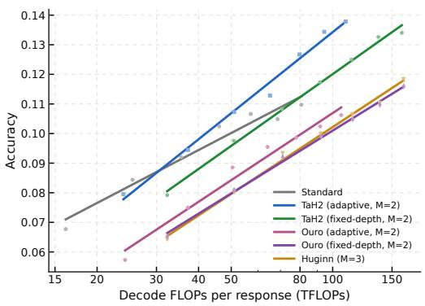  
(a) Test-time scaling

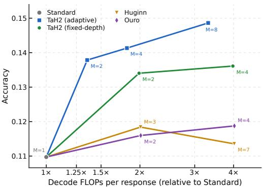  
(b) Iteration-depth scaling  
Figure 1: TaH2 improves both test-time and iteration-depth scaling. Mean AIME24–26 accuracy over 32 samples for 1.7B models post-trained from the same checkpoint. (a) Output-token cutoffs sweep 4K–16K; lines are fitted trends. (b) Accuracy at a 16K cutoff as the depth ceiling M grows.

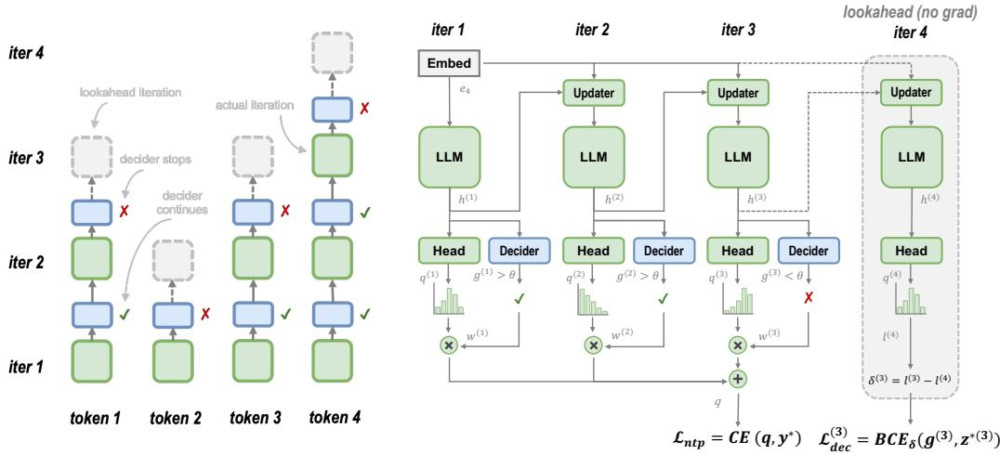  
Figure 2: TaH2’s architecture and training scheme. Left: the decider decides whether to continue after each iteration. Right: the updater reinjects token embeddings at each iteration, and stopping probabilities weight per-iteration predictions. All modules share parameters across iterations. The decider receives online depth supervision after each iteration; the no-gradient lookahead supplies the target at the stopping point and is omitted at inference.

## 1 INTRODUCTION

Test-time scaling improves language model reasoning by spending additional inference compute (Jaech et al., 2024; Guo et al., 2025; Snell et al., 2024). This computation can support longer chains of thought in token space (Muennighoff et al., 2025), or repeated applications of shared layers in latent space, as in looped transformers (Dehghani et al., 2019; Geiping et al., 2025a; Zhu et al., 2025). Parameter sharing makes additional depth possible without increasing model size, but each iteration still incurs decoding cost. Prior scaling studies compare looped and non-looped models at matched parameter counts or per-token FLOPs (Prairie et al., 2026; Schwethelm et al., 2026b; Wang et al., 2026b). These comparisons do not establish whether looping improves accuracy– compute scaling as output-token budgets increase. We study this question through post-training, a practical way to introduce recurrence into pretrained LLMs without training a looped model from scratch (McLeish et al., 2025; Chen et al., 2025b; Fu et al., 2025b).

Using the same pretrained checkpoint and post-training data, we compare Standard (the non-looped baseline) with two principal looped architectures: full-stack recurrence in Ouro (at fixed depth or with its adaptive exit gate), and middle-block recurrence in Huginn (Zhu et al., 2025; Geiping et al., 2025a; Huang et al., 2026a). By varying the output-token cutoff up to 16K at test time, we measure the scaling slope as the accuracy gain per doubling of decoding FLOPs. In this post-training setting, fixed-depth and adaptive Ouro (maximum iteration depth M = 2) and Huginn (M = 3) yield steeper scaling slopes than Standard (2.12, 2.27 and 2.26 versus 1.79), yet remain less accurate over the overlapping compute range (Figure 1a). This motivates our central question:

## How to post-train looped LLMs to outperform non-looped LLMs at the same test-time compute?

Fixed-depth iteration spends extra compute on every token, although many tokens gain little or even get worse (Section 3.2). Ouro’s adaptive exit gate improves compute efficiency, but not enough to surpass Standard. We introduce TaH2 to improve test-time scaling by learning which tokens benefit from additional iterations and allocating depth accordingly. The backbone and an iteration decider are jointly post-trained through lookahead depth supervision: depth labels are derived online from changes in prediction loss, and a cost-sensitive loss supervises each depth decision (Figure 2). Unlike TaH’s staged training with offline mismatch labels (Fu et al., 2025b), TaH2 supervises depth decisions using actual iteration gains measured on the current backbone throughout training. In addition, an updater provides input injection between iterations (Geiping et al., 2025a), and stopping probabilities weight the predictions across executed depths (Zeng et al., 2026).

We post-train Qwen3-Base models (Yang et al., 2025) on general-domain data and evaluate them on math, code, QA and tool use benchmarks. On AIME24–26 at 1.7B, TaH2 improves the accuracy– compute slope by 53% over the non-looped baseline (2.74 vs. 1.79 points per doubling of decoding FLOPs). With evaluation extended to 32K tokens, TaH2 exceeds Standard’s peak accuracy by about 3.4 points at matched decoding FLOPs (Figure 4b). Existing looped models largely plateau as iteration depth increases, while TaH2’s gain over the non-looped baseline grows from +2.8 points at M = 2 to +3.9 points at M = 8 (Figure 1b). TaH2’s gains persist at larger scales (4B and 8B) and generalise beyond math to code, QA and tool use (Table 3).

We summarise our contributions as follows.

• Test-Time Scaling of Looped Models. We study how looping changes accuracy–compute scaling and find that, although post-trained looped models often yield steeper slopes, they underperform Standard at matched test-time compute.

• Adaptive Looped Post-training. We propose TaH2, which jointly post-trains the backbone and an iteration decider, directly supervising depth decisions with online labels indicating whether further iteration improves prediction.

• Improved Test-Time and Depth Scaling. On challenging AIME benchmarks, TaH2 yields a steeper accuracy–compute slope than Standard and achieves about 3.4 points higher accuracy at matched compute when Standard plateaus. As the maximum iteration depth increases from 2 to 8, its gain over Standard grows from +2.8 points to +3.9 points.

## 2 RELATED WORK

Test-time scaling. Test-time compute can be increased by producing more tokens or repeatedly applying a shared block in latent space. Token-based methods generate longer chains of thought (Jaech et al., 2024; Guo et al., 2025), with reasoning length controlled through test-time budget forcing or RL (Muennighoff et al., 2025; Aggarwal & Welleck, 2025). They also explore multiple reasoning paths through repeated sampling (Brown et al., 2024) or tree search (Snell et al., 2024; Wu et al., 2024b). In latent space, latent optimization replaces intermediate text with continuous representations (Hao et al., 2024; Li et al., 2025), while looped transformers repeatedly apply shared layers before generating each token (Geiping et al., 2025a; Zhu et al., 2025). We study how looping changes accuracy–compute scaling as output budgets increase, comparing post-trained looped and non-looped models at matched decoding FLOPs (Section 3).

Looped transformers. Looped transformers increase effective depth through parameter sharing (Dehghani et al., 2019; Yang et al., 2023; Saunshi et al., 2025). Architectures differ in the span they repeat: Huginn loops a middle block (Geiping et al., 2025a), Ouro the full stack (Zhu et al., 2025), and Loopies individual layers (Gao et al., 2026). Recent scaling studies examine recurrence under matched parameter counts (Prairie et al., 2026), matched per-token FLOPs (Schwethelm et al., 2026b), or both, as in SMELT (Wang et al., 2026b). Recurrence can also be introduced into pretrained non-looped models through layer sharing (Bae et al., 2024) or curriculum-based adap tation (McLeish et al., 2025). TaH2 builds on this post-training setting to learn token-dependent iteration depths.

Adaptive computation. Adaptive computation can operate along width, by selecting experts within layers (Fedus et al., 2022), or depth, through early exit (Schuster et al., 2022), layer skipping (Raposo et al., 2024) or variable iteration counts (Graves, 2016; Banino et al., 2021). Within looped models, methods differ in how they learn token-dependent iteration depth. MoR trains routers under capacity constraints (Bae et al., 2025), while pondering methods combine prediction loss with budget or confidence penalties (Li et al., 2026a; Song et al., 2026; Zeng et al., 2026). Other approaches learn stopping decisions from terminal rewards (Kuo et al., 2026) or explicit labels: TaH uses offline mismatch labels in separate training stages (Fu et al., 2025b), and Ouro’s second stage supervises its gate with token-level loss improvements while freezing the backbone (Zhu et al., 2025). TaH2 jointly post-trains the backbone and decider through lookahead depth supervision, deriving online token-level labels from measured iteration gains along decider-selected routes. Appendix E provides further comparisons and discusses scaling, state design and serving.

## 3 TEST-TIME SCALING OF CURRENT LOOPED TRANSFORMERS

We formalise the recurrent computation of looped transformers and empirically show the test-time scaling behavior of existing looped transformers.

## 3.1 PRELIMINARIES

We use subscript t for token position and superscript (m) for iteration index. We focus on models that repeat all L Transformer layers, denoting the shared Transformer backbone by $\mathcal { F } _ { \theta }$ and the embedding at token position t by $\mathbf { e } _ { t }$ . Let $\mathbf { h } _ { t } ^ { ( m ) }$ denote the hidden state at token position t after iteration m. Starting from $\mathbf { h } _ { t } ^ { ( 0 ) } = \mathbf { e } _ { t }$ , the basic forward pass applies the backbone at each iteration m and computes next-token probabilities:

$$
{ \bf h } _ { t } ^ { ( m ) } = \mathcal { F } _ { \boldsymbol { \theta } } \Big ( { \bf h } _ { t } ^ { ( m - 1 ) } \Big ) , \qquad { \bf q } _ { t } ^ { ( m ) } = \mathrm { s o f t m a x } \Big ( { \bf W } _ { \mathrm { o u t } } { \bf h } _ { t } ^ { ( m ) } \Big ) ,\tag{1}
$$

Here $\mathbf { W _ { \mathrm { o u t } } }$ is the output projection. Ouro follows this recurrence (Zhu et al., 2025). Huginn repeats only a middle block, with input injection at each iteration (Geiping et al., 2025a). Let $m _ { t } \in \{ 1 , \ldots , M \}$ denote the executed depth of token t, where M is the maximum iteration depth. Fixed-depth models use $m _ { t } = M$ for all tokens; Standard is the non-looped baseline with $m _ { t } = 1$ Adaptive models choose $m _ { t }$ per token, as Ouro does with a learned exit gate.

## 3.2 TEST-TIME SCALING BEHAVIOUR

Setup. We post-train Standard, Ouro (M = 2) and Huginn (M = 3) from Qwen3-1.7B-Base on same data with a 16K context. Huginn runs at fixed depth; Ouro is evaluated both at fixed depth and with its exit gate, trained afterwards on the frozen backbone (Appendix A.2). We measure mean AIME24–26 accuracy with 32 samples per problem, sweeping output-token cutoffs from 4K to 16K in 2K increments. We fit accuracy linearly against $\log _ { 2 }$ of the decoding FLOPs per response (Appendix A.4.2). Further settings appear in Section 5.1.

Results. Fixed-depth Ouro, adaptive Ouro and Huginn yield slopes of 2.12, 2.27 and 2.26 accuracy points per compute doubling, versus 1.79 for Standard (Figure 1a), suggesting larger accuracy gains from latent computation as test-time compute increases. Yet all three remain less accurate than Standard over the overlapping compute range; the exit gate lowers Ouro’s decoding cost but does not close the gap. Recurrence has proven effective in pretraining, as in Ouro and Huginn, but our results point to a gap when it is introduced only in post-training:

Post-trained looped models gain accuracy faster as test-time compute increases, yet underperform the non-looped baseline at matched compute.

Analysis and motivation. To examine how fixeddepth iteration affects individual tokens, we compare next-token losses after the first and final iterations on the validation set. Figure 3 shows the loss reduction from iterations 1 → 2 for Ouro and 1 → 3 for Huginn. Both distributions concentrate near zero, and a substantial fraction of tokens obtain worse prediction loss after the additional iterations. For Ouro and Huginn, respectively, 52.3% and 33.5% of tokens change by at most $1 0 ^ { - 3 }$ while 21.7% and 15.9% become worse by more than this threshold.

Fixed-depth looping therefore spends additional iterations on many tokens that gain little or even get worse. Ouro’s exit gate improves efficiency but still underperforms Standard at matched compute. Its backbone is trained only at full depth, causing a train–inference mismatch under early exit. This motivates learning token-dependent depth jointly with the backbone, supervised by measured loss reductions.

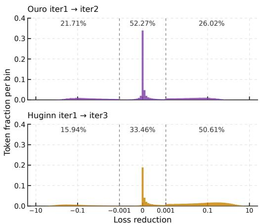  
Figure 3: Token-level loss reduction from the first to final iteration in Ouro and Huginn. The three regions report the fractions of tokens that become worse, change little, or improve.

## 4 TAH2: POST-TRAINING ADAPTIVE LOOPED MODELS

Building on Section 3, TaH2 learns token-dependent depth through joint post-training of the backbone and decider. We describe its architecture and training scheme below.

## 4.1 ARCHITECTURE

TaH2 comprises a shared Transformer backbone, a learned input-injection updater, and a token-level iteration decider. The updater and decider add fewer than $3 \%$ parameters at every scale we study (Table 7). Each iteration executes all L backbone layers using extended duo-causal attention.

Extended duo-causal attention. We extend TaH’s duo-causal attention (Fu et al., 2025b) to support training-time lookahead. At depth $m ,$ , token t attends to executed KV states at positions $s \leq t$ and depths $j \ \leq \ m$ . During training, stopped tokens take an additional no-gradient iteration for supervision. Lookahead queries cannot attend to other tokens’ lookahead states; all other attention follows the duo-causal rule (Appendix A.2.1).

Learned state update. The first iteration takes the token embedding $\mathbf { e } _ { t }$ as input. Subsequent iterations use a learned input-injection updater (Geiping et al., 2025a), modifying Equation 1 to

$$
\mathbf { h } _ { t } ^ { ( m + 1 ) } = \mathcal { F } _ { \boldsymbol { \theta } } \left( \mathcal { U } _ { \psi } \left( \mathbf { e } _ { t } , \mathbf { h } _ { t } ^ { ( m ) } \right) \right) .\tag{2}
$$

Here $\mathcal { U } _ { \psi }$ is a small normalised MLP that reinjects the input embedding while mapping the previous final-layer state back to the backbone input space (Appendix A.2).

Iteration decider and output. After iteration $m < M$ , a lightweight decider predicts a conditional continue probability

$$
g _ { t } ^ { ( m ) } = \mathcal { D } _ { \phi } \Big ( \mathbf { e } _ { t } , \mathbf { h } _ { t } ^ { ( m ) } , \mathrm { T o p K } ( \mathbf { q } _ { t } ^ { ( m ) } ) \Big ) \in ( 0 , 1 ) .\tag{3}
$$

With exit threshold $\tau _ { \mathrm { e x i t } }$ , token t stops at the first depth where $g _ { t } ^ { ( m ) } < \tau _ { \mathrm { e x i t } }$ and otherwise runs to M. The continue probabilities induce stopping weights over the executed depths (Graves, 2016; Zeng et al., 2026), with the final executed iteration absorbing the remaining mass:

$$
\omega _ { t } ^ { ( m ) } = \left\{ \begin{array} { l l } { ( 1 - g _ { t } ^ { ( m ) } ) \prod _ { j < m } g _ { t } ^ { ( j ) } , } & { m < m _ { t } , } \\ { \prod _ { j < m _ { t } } g _ { t } ^ { ( j ) } , } & { m = m _ { t } , } \end{array} \right. \quad \quad \mathbf { q } _ { t } = \sum _ { m = 1 } ^ { m _ { t } } \omega _ { t } ^ { ( m ) } \mathbf { q } _ { t } ^ { ( m ) } .\tag{4}
$$

Training is on-policy with respect to depth selection: tokens follow the current decider’s decisions under the same rule used at inference. In contrast, Ouro trains at full depth before applying early exit at inference (Zhu et al., 2025), while TaH trains under an oracle policy and uses learned decisions at inference (Fu et al., 2025b).

## 4.2 TRAINING WITH LOOKAHEAD DEPTH SUPERVISION

TaH2 jointly trains the backbone, updater and decider, with the decider learning online how many iterations each token should execute. At each iteration, lookahead depth supervision uses the measured change in prediction loss to supervise whether the token should continue (Figure 2, right).

Online continuation labels. For each supervised token t, let $a _ { t } ^ { ( m ) } = \mathbf { 1 } [ m _ { t } \geq m ]$ indicate whether it actually executes iteration m. For tokens with $a _ { t } ^ { ( m ) } = 1$ and $m < M$ , we measure iteration gains using the per-iteration predictions $\mathbf { q } _ { t } ^ { ( m ) }$ . For target token $y _ { t } ^ { * }$ , the corresponding prediction loss and gain from another iteration are

$$
\ell _ { t } ^ { ( m ) } = - \log \mathbf { q } _ { t } ^ { ( m ) } [ y _ { t } ^ { \ast } ] , \qquad \delta _ { t } ^ { ( m ) } = \ell _ { t } ^ { ( m ) } - \ell _ { t } ^ { ( m + 1 ) } .\tag{5}
$$

Positive gains favour continuing; negative gains favour stopping. For tokens that stop before $M$ , a no-gradient lookahead supplies the next-iteration loss for supervision.

Let $c _ { t } ^ { ( m ) } \in \{ 0 , 1 \}$ be the target continue label after iteration $m ,$ with $c _ { t } ^ { ( 0 ) } = 1$ for all supervised tokens. At iteration $m ,$ we rank positive gains among tokens with $a _ { t } ^ { ( m ) } = 1$ and $c _ { t } ^ { ( m - 1 ) } = 1$ and

select the largest gains until they account for a fraction $\rho$ of the total. The smallest selected gain defines the computed cutoff $\delta _ { \mathrm { c u t } } ^ { ( m ) }$ , giving

$$
c _ { t } ^ { ( m ) } = a _ { t } ^ { ( m ) } c _ { t } ^ { ( m - 1 ) } { \bf 1 } \Big [ \delta _ { t } ^ { ( m ) } \geq \delta _ { \mathrm { c u t } } ^ { ( m ) } \Big ] .\tag{6}
$$

Once a token receives a stop label, its later labels remain zero. These labels supervise the decider, whose decisions determine $a _ { t } ^ { ( m + 1 ) }$ . Coverage $\rho$ retains most of the positive gain while excluding marginal improvements that can produce noisy labels.

Joint objective. We combine next-token prediction loss with cost-sensitive supervision of the decider. The joint objective is

$$
\mathcal { L } _ { \mathrm { S F T } } = \underbrace { \frac { 1 } { N } \sum _ { t } - \log \mathbf { q } _ { t } [ y _ { t } ^ { * } ] } _ { \mathrm { n e x t : t o k e n ~ p r e d i c t i o n ~ l o s s } } + \alpha _ { D } \underbrace { \frac { 1 } { N } \sum _ { m = 1 } ^ { M - 1 } \sum _ { t : a _ { t } ^ { ( m ) } = 1 } w _ { t } ^ { ( m ) } \mathrm { B C E } \Big ( g _ { t } ^ { ( m ) } , c _ { t } ^ { ( m ) } \Big ) } _ { \mathrm { c o s t - s e n s i t i v e ~ d e c i d e r ~ l o s s } } ,\tag{7}
$$

where N is the number of supervised tokens and $\mathbf { q } _ { t }$ is the stopping-weighted mixture in Equation 4. At iteration m, we supervise the decider on all tokens with $a _ { t } ^ { ( m ) } = 1$ , using cost-sensitive weights $w _ { t } ^ { ( m ) }$ computed from ${ | \delta _ { t } ^ { ( m ) } - \delta _ { \mathrm { c u t } } ^ { ( m ) } }$ | to strengthen supervision farther from the cutoff. We set coverage $\rho = 0 . 9 9$ and the decider-loss coefficient $\alpha _ { D } = 0 . 0 5 ;$ further details are provided in Appendix D.

## 5 EXPERIMENTS

## 5.1 SETUP

We summarise the key configuration here; full details are in Appendix A.

Models and baselines. We use Qwen3-{1.7B, 4B, 8B}-Base (Yang et al., 2025) as backbones. We use the 1.7B model in Section 5.2, and the 4B and 8B models in Section 5.3. We compare TaH2 with the following baselines: (1) Standard, the single-pass model (M = 1); (2) TaH2-fixed, a variant of TaH2 without a decider that executes all M iterations at every token position; (3) Ouro, which loops all L layers and carries the hidden state directly across iterations (Zhu et al., 2025); and (4) Huginn, which loops a middle span of layers, reinjects the pre-loop representation through an input adapter, and uses a fixed depth (Geiping et al., 2025a). All variants at a given scale use the same Qwen3 initialization and post-training recipe. We train and evaluate TaH2-fixed and Ouro at M = 2, 4, and Huginn at M = 3, 7; looping 14 of the 28 layers gives Huginn the same effective depths of 2 and 4 full-model passes, respectively. Figure 4a reports mean iteration depth in units of a full L-layer pass.

Training setup. Training data combine math, code and QA prompts from AM-Qwen3-Distilled (am-team, 2025) with tool use samples from Nemotron-Agentic-v1 (NVIDIA, 2025). For the experiments in Section 5.2, we use 273K prompts with responses regenerated by Qwen3-8B, the bestperforming teacher in our comparison of downstream student accuracy (Appendix B.1). We train for three epochs with a 16,384-token context, totalling 3.4B training tokens. Section 5.3 uses the original responses generated by Qwen3-235B-A22B and fixes the training budget at TPP = 2 tokens per parameter for every model size. A validation set of 1,000 samples randomly drawn from the training mixture is used for loss and token-level analyses.

Evaluation setup. We evaluate on math (AIME24–26, AMC23, MATH500 (Lightman et al., 2023), OlympiadBench (He et al., 2024), and IMO-AnswerBench (IMO-AB) (Luong et al., 2025)), QA (GPQA (Rein et al., 2023) and SuperGPQA (SGPQA) (M-A-P Team et al., 2025)), code (HumanEval (Chen et al., 2021), MBPP (Austin et al., 2021), and LiveCodeBench v6 (LCB) (Jain et al., 2024)), and tool use (BFCL v3 (Patil et al., 2025)). We use zero-shot CoT with temperature 0.6, top-p 0.95, top-k 20, and a default maximum generation length of 32K tokens. We report avg@32 on the primary math benchmarks and use fewer samples per problem on larger benchmarks (Appendix A.3). The decider threshold is $\tau _ { \mathrm { e x i t } } = 0 . 5$ for TaH2.

Table 1: Accuracy (%) of Qwen3-1.7B models across ten benchmarks. Olympiad: OlympiadBench; HE: HumanEval. Bold/underline indicate the best/second-best accuracy per row; subscripts show gains over Standard in points. FLOPs/token is total decoding FLOPs divided by total generated tokens across benchmarks, relative to Standard.
<table><tr><td rowspan="2">Domain</td><td rowspan="2">Benchmark</td><td>Std.</td><td colspan="2">Huginn</td><td colspan="2">Ouro</td><td colspan="2">TaH2-fixed</td><td colspan="3">TaH2</td></tr><tr><td>M=1</td><td>M=3</td><td>M=7</td><td>M=2</td><td>M=4</td><td>M=2</td><td>M=4</td><td>M=2</td><td>M=4</td><td>M=8</td></tr><tr><td rowspan="6">math</td><td>AIME24</td><td>11.0</td><td>13.9</td><td>10.6</td><td>10.5</td><td>14.5</td><td>15.7</td><td>14.3</td><td>15.7</td><td>16.3</td><td>16.3</td></tr><tr><td>AIME25</td><td>13.0</td><td>14.2</td><td>14.0</td><td>13.9</td><td>13.4</td><td>15.0</td><td>15.4</td><td>16.5</td><td>16.9</td><td>17.9</td></tr><tr><td>AIME26</td><td>11.9</td><td>11.8</td><td>13.3</td><td>11.0</td><td>10.3</td><td>13.2</td><td>13.8</td><td>14.3</td><td>14.2</td><td>14.5</td></tr><tr><td>AMC23</td><td>45.3</td><td>45.8</td><td>49.0</td><td>45.9</td><td>45.9</td><td>51.1</td><td>52.2</td><td>50.7</td><td>50.9</td><td>52.8</td></tr><tr><td>MATH500</td><td>75.2</td><td>74.4</td><td>75.2</td><td>75.1</td><td>73.5</td><td>76.1</td><td>78.5</td><td>78.1</td><td>78.6</td><td>79.3</td></tr><tr><td>Olympiad</td><td>40.4</td><td>40.6</td><td>40.4</td><td>37.9</td><td>37.6</td><td>42.1</td><td>44.0</td><td>43.8</td><td>44.1</td><td>47.4</td></tr><tr><td rowspan="2">code</td><td>HE</td><td>63.6</td><td>61.7</td><td>64.2</td><td>61.2</td><td>58.2</td><td>63.8</td><td>65.2</td><td>66.8</td><td>65.2</td><td>72.6</td></tr><tr><td>MBPP</td><td>70.2</td><td>70.3</td><td>69.3</td><td>69.6</td><td>67.3</td><td>70.8</td><td>71.3</td><td>71.8</td><td>72.3</td><td>74.4</td></tr><tr><td>QA</td><td>GPQA</td><td>31.5</td><td>33.7</td><td>33.4</td><td>34.0</td><td>31.2</td><td>31.9</td><td>32.8</td><td>33.1</td><td>33.0</td><td>32.0</td></tr><tr><td>tool use</td><td>BFCL</td><td>15.3</td><td>15.6</td><td>14.8</td><td>14.3</td><td>12.1</td><td>14.6</td><td>15.5</td><td>15.3</td><td>17.4</td><td>17.9</td></tr><tr><td>Avg.</td><td></td><td>37.7</td><td>38.2</td><td>38.4</td><td>37.3</td><td>36.4</td><td>39.4</td><td>40.3</td><td>40.6/+2.9</td><td>40.9/+3.2</td><td>42.5/+4.8</td></tr><tr><td colspan="2">FLOPs/token</td><td>1.00×</td><td>1.90×</td><td>3.72×</td><td>1.91×</td><td>3.75×</td><td>1.99×</td><td>3.97×</td><td>1.21×</td><td>1.47×</td><td>2.37×</td></tr></table>

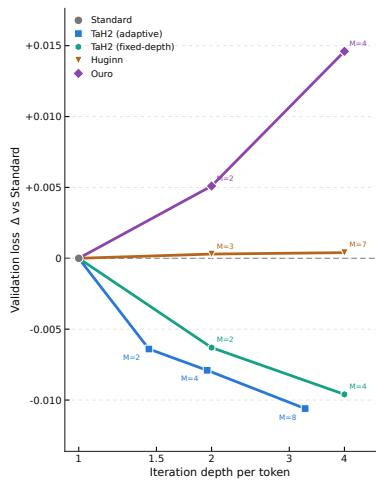  
(a) Final validation loss versus iteration depth.

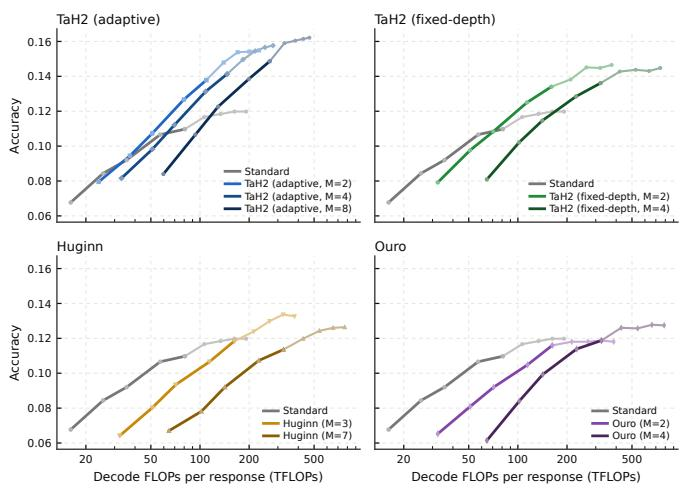  
(b) Mean AIME24–26 accuracy versus decoding FLOPs.  
Figure 4: Depth and test-time scaling at 1.7B. (a) Each marker denotes a model trained with the labelled depth ceiling M; lower is better. (b) Dark segments show output-token cutoffs within 16K; light segments extend beyond it to 32K.

## 5.2 PERFORMANCE

At 1.7B, TaH2 improves accuracy across domains. Its performance continues to improve with iteration depth, while its test-time scaling yields a steeper slope and higher accuracy at matched compute than Standard.

Depth scaling. Raising the depth ceiling benefits TaH2 but not the existing looped methods. On validation loss (Figure 4a), Ouro and Huginn remain at or above Standard at every ceiling, whereas both TaH2 variants lower the loss further as M grows, with adaptive TaH2 reaching the lowest loss (−0.0106 versus Standard at M = 8); this advantage persists throughout training (Appendix C.1). Across the ten benchmarks (Table 1), TaH2’s average gain over Standard grows from +2.9 points at M = 2 to +4.8 at M = 8, whereas Huginn and Ouro stay close to Standard; Figure 1b shows the same trend on AIME24–26.

<table><tr><td></td><td colspan="3">Batch size = 1</td><td colspan="3">Batch size = 4</td></tr><tr><td>Metric</td><td>Std.</td><td>TaH2- fixed</td><td>TaH2</td><td>Std.</td><td>TaH2- fixed</td><td>TaH2</td></tr><tr><td>GFLOPs/tok</td><td>7.04</td><td>14.09</td><td>8.59</td><td>7.04</td><td>14.09</td><td>8.59</td></tr><tr><td>vs. Std.</td><td>1.00×</td><td>2.00×</td><td>1.22×</td><td>1.00×</td><td>2.00×</td><td>1.22×</td></tr><tr><td>Latency(s)</td><td>139.8</td><td>328.7</td><td>187.0</td><td>220.3</td><td>483.3</td><td>285.4</td></tr><tr><td>vs. Std.</td><td>1.00×</td><td>2.35×</td><td>1.34×</td><td>1.00×</td><td>2.19×</td><td>1.30×</td></tr><tr><td>Tokens/s</td><td>202.3</td><td>89.8</td><td>144.3</td><td>507.6</td><td>229.9</td><td>376.2</td></tr><tr><td>vs. Std.</td><td>1.00×</td><td>0.44×</td><td>0.71×</td><td>1.00×</td><td>0.45×</td><td>0.74×</td></tr></table>

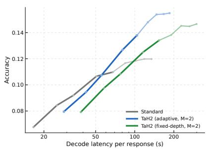  
Table 2: Runtime efficiency on AIME26. Ratios are to Std. at the same batch size; GFLOPs/token is the decode cost per generated token (Appendix A.4.1).  
Figure 5: Accuracy versus mean endto-end latency. Lighter segments extend beyond the 16K training length.

Table 3: Accuracy (%) at 4B and 8B. Subscripts give gains over Standard in points.
<table><tr><td colspan="5">4B</td><td colspan="2">8B</td></tr><tr><td></td><td>Domain Benchmark Std.</td><td></td><td>TaH2</td><td>Std.</td><td></td><td>TaH2</td></tr><tr><td rowspan="6">math</td><td>AIME24</td><td>52.0</td><td>57.7</td><td>66.4</td><td></td><td>70.8</td></tr><tr><td>AIME25</td><td>40.3</td><td>43.1</td><td>52.0</td><td></td><td>55.9</td></tr><tr><td>AIME26</td><td>45.5</td><td>52.4</td><td>60.9</td><td></td><td>63.4</td></tr><tr><td>AMC23</td><td>88.6</td><td>89.2</td><td>93.5</td><td></td><td>96.6</td></tr><tr><td>Olymp.</td><td>67.0</td><td>68.4</td><td>73.3</td><td></td><td>74.4</td></tr><tr><td>IMO-AB</td><td>31.2</td><td>33.8</td><td>40.3</td><td></td><td>42.0</td></tr><tr><td>code</td><td>LCB</td><td>35.4</td><td>37.3</td><td>42.1</td><td></td><td>44.4</td></tr><tr><td>QA</td><td>SGPQA</td><td>28.6</td><td>30.5</td><td></td><td>38.0</td><td>39.2</td></tr><tr><td>tool use BFCL</td><td></td><td>29.2</td><td>33.6</td><td></td><td>38.0</td><td>39.4</td></tr><tr><td>Avg.</td><td></td><td>46.4</td><td> $\mathbf { 4 9 . 6 } _ { I + 3 . 2 }$ </td><td></td><td>56.1</td><td> $5 8 . 5 _ { / + 2 . 4 }$ </td></tr></table>

Table 4: Design choices at 1.7B. Each row varies one aspect from TaH2 (default in gray ).
<table><tr><td colspan="4">Variant AIME24 AIME25 AIME26</td><td>Avg.</td></tr><tr><td>TaH2</td><td>15.7</td><td>16.5</td><td>14.3</td><td>15.5</td></tr><tr><td>Depth labels (TaH2:</td><td>Iteration gain)</td><td></td><td></td><td></td></tr><tr><td>Top-1 mismatch</td><td>14.1</td><td>16.5</td><td>12.6</td><td>14.4/-1.1</td></tr><tr><td>Decider loss weights (TaH2:</td><td></td><td>Cost-sensitive)</td><td></td><td></td></tr><tr><td>Uniform</td><td>12.9</td><td>11.6</td><td>11.3</td><td>11.9/-3.6</td></tr><tr><td>Gain coverage (TaH2:</td><td>ρ= 0.99 )</td><td></td><td></td><td></td></tr><tr><td>ρ=1</td><td>14.0</td><td>13.4</td><td>13.5</td><td>13.6/-1.9</td></tr><tr><td>Training decisions (TaH2:</td><td>Deterministic)</td><td></td><td></td><td></td></tr><tr><td>Sampled</td><td>14.4</td><td>16.3</td><td>12.0</td><td>14.2/-1.3</td></tr><tr><td colspan="3">Updater (TaH2: Learned)</td><td></td><td></td></tr><tr><td>Top-100 embedding</td><td>13.3</td><td>14.1</td><td>12.7</td><td>13.4/-2.1</td></tr><tr><td>Output (TaH2: Stopping-weighted mixture)</td><td></td><td></td><td></td><td></td></tr><tr><td>Final iteration</td><td>15.4</td><td>15.4</td><td>12.7</td><td>14.5/-1.0</td></tr></table>

Test-time scaling. As decoding FLOPs increase, TaH2 improves accuracy more efficiently than baselines and reaches a higher peak accuracy. Within the 16K training length (Figure 1a), TaH2 at M = 2 gains 2.74 points per doubling of decoding FLOPs, compared with 2.12–2.42 for other looped models and 1.79 for Standard. Extending evaluation to 32K (Figure 4b), Standard saturates at 12.0% with 191.7 TFLOPs per response, whereas TaH2 reaches 15.4% at the same compute, 3.4 points higher. Larger ceilings (M = 4, 8) raise peak accuracy further, while M = 2 offers the best accuracy–compute trade-off among the three. Appendix C.2 further shows these scaling curves on each benchmark. TaH2 also improves parallel scaling through majority voting: AIME24–26 cons@32 reaches 27.3–29.3% for M = 2–8, versus 21.9% for Standard (Appendix C.3).

Runtime efficiency and real-world test-time scaling. We serve all models with an extended Mini-SGLang engine that batches requests at different iteration depths in a shared forward pass (Appendix A.3). Although TaH2 adds 22% decoding FLOPs per token and 30–34% end-to-end latency relative to Standard (Table 2), it still achieves better test-time scaling and higher attainable accuracy in actual serving (Figure 5).

## 5.3 ADDITIONAL SCALES

We further evaluate TaH2 (M = 2) on 4B and 8B backbones (Table 3). TaH2 outperforms Standard on every benchmark at both sizes, raising average accuracy by 3.2 points at 4B and 2.4 points at 8B. On challenging AIME math, TaH2 improves by up to 6.9 points at 4B and 4.4 points at 8B.

## 5.4 DESIGN CHOICE EXPLORATION

We examine the training and architectural choices of TaH2 at 1.7B with M = 2. Table 4 reports AIME24–26 accuracy under the 32K evaluation setting.

Training scheme. (1) Depth labels. We compare gain-based labels with top-1 mismatch labels, which label a token to continue when its top-1 prediction differs from the target, as in TaH (Fu et al., 2025b). Mismatch labels reduce average accuracy by 1.1 points, as they only reflect whether the current prediction is correct, not whether further iteration actually improves it. (2) Decider loss weights. Weighting all decisions uniformly instead of by gain magnitude causes the largest drop, 3.6 points, and lowers accuracy on all three benchmarks. (3) Gain coverage. Retaining all positive gains $( \rho = 1 )$ reduces average accuracy by 1.9 points, supporting the filtering of marginal gains to reduce label noise. (4) Training decisions. Sampling rather than thresholding continuation decisions during training reduces average accuracy by 1.3 points. This suggests that consistent token selection across training and inference helps each depth specialise.

Model architecture. (1) Updater. We replace the learned updater with the probability-weighted sum of the top-100 token embeddings (Fu et al., 2025b). This alternative reduces average accuracy by 2.1 points, supporting learned state updates. (2) Output. Using only the final prediction reduces average accuracy by 1.0 point, supporting the stopping-weighted mixture.

## 5.5 FURTHER ANALYSIS

Decider–gain alignment. For TaH2 $( M = 2 )$ at 1.7B, we group validation tokens by continue probability and measure the mean loss reduction from a second iteration (Figure 6). Tokens with probabilities near zero show negative or negligible gains, while mean gain increases with continue probability overall. At the decision threshold of 0.5, the corresponding loss reduction is near zero. These results support the decider’s ability to direct additional iterations towards tokens that benefit more from them.

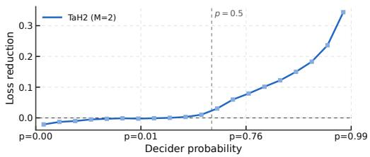  
Figure 6: Mean loss reduction from a second iteration versus the decider’s continue probability for TaH2 (M = 2) on the validation set.

Token-level depth allocation. We visualise token-level iteration depths in sampled responses from OlympiadBench, HumanEval and GPQA (Appendix C.4). In the math and code examples, mathematical expressions and final code use fewer iterations than the preceding natural-language reasoning, whereas the QA example maintains greater depth throughout.

Cross-iteration attention. We examine attention across iterations in three representative heads on validation sequences (Appendix C.5). We find that different attention heads learn distinct iteration preferences: attending primarily to first-iteration states, later-iteration states, or both.

## 6 CONCLUSION

In this paper, we study the test-time scaling of looped transformers introduced through post-training. Existing looped models yield steeper accuracy–compute slopes than their non-looped baseline, yet remain less accurate at matched compute. We therefore introduce TaH2, which post-trains adaptive looped transformers by jointly training the backbone and an iteration decider through lookahead depth supervision. On AIME, TaH2 improves the slope by 53% and exceeds Standard’s peak accuracy by about 3.4 points at matched compute. Its gain over Standard grows from 2.8 to 3.9 points as the maximum iteration depth increases from 2 to 8, and extends to larger models (4B and 8B) and other domains (code, QA and tool use).

Limitations. (1) TaH2 incurs more training FLOPs than standard SFT (Appendix A.4.3). But note that post-training requires substantially less compute than pretraining, making TaH2 a practical way to add adaptive depth to existing models. (2) Our method is studied only under SFT; we leave its extension to on-policy distillation and reinforcement learning for future work.

## AI USE STATEMENT

In this work, we used generative AI tools for polishing the paper text. We have not used generative AI tools for research ideation, methodology or experimental design, method implementation, result interpretation, etc.; the remaining required-disclosure tasks are not applicable to this work. We have reviewed all AI-assisted work: all AI-assisted text was checked by the authors against the experimental records and cited sources.

## ETHICS STATEMENT

This study trains and evaluates language models on publicly available reasoning data and benchmarks; it does not involve human subjects or sensitive personal data.

## REPRODUCIBILITY STATEMENT

All experiments use publicly available base models and data. Section 4 specifies the model family and objective; Appendices A and D give the full loss, architecture and baseline definitions, FLOPs accounting, training hyper-parameters and evaluation protocol. Training and evaluation code, configuration files, and checkpoints will be released upon publication.

## REFERENCES

a-m-team. Am-qwen3-distilled. https://huggingface.co/datasets/a-m-team/ AM-Qwen3-Distilled, 2025.

Pranjal Aggarwal and Sean Welleck. L1: Controlling How Long A Reasoning Model Thinks With Reinforcement Learning. arXiv preprint arXiv:2503.04697, 2025. URL https://arxiv. org/abs/2503.04697.

Awni Altabaa, Siyu Chen, John Lafferty, and Zhuoran Yang. Unlocking Out-of-Distribution Generalization in Transformers via Recursive Latent Space Reasoning. arXiv preprint arXiv:2510.14095, 2025. URL https://arxiv.org/abs/2510.14095.

Jacob Austin, Augustus Odena, Maxwell Nye, Maarten Bosma, Henryk Michalewski, David Dohan, Ellen Jiang, Carrie Cai, Michael Terry, Quoc Le, et al. Program synthesis with large language models. arXiv preprint arXiv:2108.07732, 2021.

Sangmin Bae, Adam Fisch, Hrayr Harutyunyan, Ziwei Ji, Seungyeon Kim, and Tal Schuster. Relaxed Recursive Transformers: Effective Parameter Sharing with Layer-wise LoRA. arXiv preprint arXiv:2410.20672, 2024. URL https://arxiv.org/abs/2410.20672.

Sangmin Bae, Yujin Kim, Reza Bayat, Sungnyun Kim, Jiyoun Ha, Tal Schuster, Adam Fisch, Hrayr Harutyunyan, Ziwei Ji, Aaron Courville, and Se-Young Yun. Mixture-of-Recursions: Learning Dynamic Recursive Depths for Adaptive Token-Level Computation. arXiv preprint arXiv:2507.10524, 2025. URL https://arxiv.org/abs/2507.10524.

Junyeob Baek, Mingyu Jo, Minsu Kim, Mengye Ren, Yoshua Bengio, and Sungjin Ahn. Generative Recursive Reasoning. arXiv preprint arXiv:2605.19376, 2026. URL https://arxiv.org/ abs/2605.19376.

Andrea Banino, Jan Balaguer, and Charles Blundell. PonderNet: Learning to Ponder. arXiv preprint arXiv:2107.05407, 2021. URL https://arxiv.org/abs/2107.05407.

Hugh Blayney, Alvaro Arroyo, Johan Obando-Ceron, Pablo Samuel Castro, Aaron Courville,´ Michael M. Bronstein, and Xiaowen Dong. A Mechanistic Analysis of Looped Reasoning Language Models. arXiv preprint arXiv:2604.11791, 2026. URL https://arxiv.org/abs/ 2604.11791.

Bradley Brown, Jordan Juravsky, Ryan Ehrlich, Ronald Clark, Quoc V. Le, Christopher Re, and Aza-´ lia Mirhoseini. Large Language Monkeys: Scaling Inference Compute with Repeated Sampling. arXiv preprint arXiv:2407.21787, 2024. URL https://arxiv.org/abs/2407.21787.

Guanxu Chen, Dongrui Liu, and Jing Shao. Loop as a Bridge: Can Looped Transformers Truly Link Representation Space and Natural Language Outputs? arXiv preprint arXiv:2601.10242, 2026a. URL https://arxiv.org/abs/2601.10242.

Lingjiao Chen, Jared Quincy Davis, Boris Hanin, Peter Bailis, Ion Stoica, Matei Zaharia, and James Zou. Are More LLM Calls All You Need? Towards Scaling Laws of Compound Inference Systems. arXiv preprint arXiv:2403.02419, 2024. URL https://arxiv.org/abs/2403. 02419.

Lizhang Chen, Jonathan Li, Chen Liang, Ni Lao, and Qiang Liu. Training-Free Looped Transformers. arXiv preprint arXiv:2605.23872, 2026b. URL https://arxiv.org/abs/2605. 23872.

Mark Chen, Jerry Tworek, Heewoo Jun, Qiming Yuan, Henrique Ponde de Oliveira Pinto, Jared Kaplan, Harri Edwards, Yuri Burda, Nicholas Joseph, Greg Brockman, et al. Evaluating large language models trained on code. arXiv preprint arXiv:2107.03374, 2021.

Mouxiang Chen, Binyuan Hui, Zeyu Cui, Jiaxi Yang, Dayiheng Liu, Jianling Sun, Junyang Lin, and Zhongxin Liu. Parallel Scaling Law for Language Models. arXiv preprint arXiv:2505.10475, 2025a. URL https://arxiv.org/abs/2505.10475.

Tieyuan Chen, Xiaodong Chen, Haoxing Chen, Zhenzhong Lan, Weiyao Lin, and Jianguo Li. DND: Boosting Large Language Models with Dynamic Nested Depth. arXiv preprint arXiv:2510.11001, 2025b. URL https://arxiv.org/abs/2510.11001.

Wei-Lin Chen, Liqian Peng, Tian Tan, Chao Zhao, Blake JianHang Chen, Ziqian Lin, Alec Go, and Yu Meng. Think Deep, Not Just Long: Measuring LLM Reasoning Effort via Deep-Thinking Tokens. arXiv preprint arXiv:2602.13517, 2026c. URL https://arxiv.org/abs/2602. 13517.

Mostafa Dehghani, Stephan Gouws, Oriol Vinyals, Jakob Uszkoreit, and Łukasz Kaiser. Universal transformers. In International Conference on Learning Representations (ICLR), 2019.

Chunyuan Deng, Yizhe Zhang, Rui-Jie Zhu, Yuanyuan Xu, Jiarui Liu, T. S. Eugene Ng, and Hanjie Chen. LT2: Linear-Time Looped Transformers. arXiv preprint arXiv:2605.20670, 2026. URL https://arxiv.org/abs/2605.20670.

Mostafa Elhoushi, Akshat Shrivastava, Diana Liskovich, Basil Hosmer, Bram Wasti, Liangzhen Lai, Anas Mahmoud, Bilge Acun, Saurabh Agarwal, Ahmed Roman, Ahmed A Aly, Beidi Chen, and Carole-Jean Wu. LayerSkip: Enabling Early Exit Inference and Self-Speculative Decoding. arXiv preprint arXiv:2404.16710, 2024. URL https://arxiv.org/abs/2404.16710.

Ying Fan, Anej Svete, and Kangwook Lee. Bridging the Gap Between Latent and Explicit Reasoning with Looped Transformers. arXiv preprint arXiv:2606.31779, 2026. URL https://arxiv. org/abs/2606.31779.

William Fedus, Barret Zoph, and Noam Shazeer. Switch transformers: Scaling to trillion parameter models with simple and efficient sparsity. Journal ofMachine Learning Research, 23(120):1–39, 2022. URL https://jmlr.org/papers/v23/21-0998.html.

Markus Frey, Behzad Shomali, Ali Hamza Bashir, David Berghaus, Joachim Koehler, and Mehdi Ali. Adaptive Loops and Memory in Transformers: Think Harder or Know More? arXiv preprint arXiv:2603.08391, 2026. URL https://arxiv.org/abs/2603.08391.

Hengyu Fu, Tianyu Guo, Zixuan Wang, Hanlin Zhu, Jason D. Lee, Jiantao Jiao, Stuart Russell, and Song Mei. DiscoLoop: Looping Discrete Embeddings and Continuous Hidden States for Multihop Reasoning. arXiv preprint arXiv:2607.00341, 2026a. URL https://arxiv.org/abs/ 2607.00341.

Rao Fu, Zixuan Yang, Jiankun Zhang, Jing Ma, Hechang Chen, Yu Li, and Yi Chang. Simply Stabilizing the Loop via Fully Looped Transformer. arXiv preprint arXiv:2605.18797, 2026b. URL https://arxiv.org/abs/2605.18797.

Tianyu Fu, Yi Ge, Yichen You, Enshu Liu, Zhihang Yuan, Guohao Dai, Shengen Yan, Huazhong Yang, and Yu Wang. R2r: Efficiently navigating divergent reasoning paths with small-large model token routing. arXiv preprint arXiv:2505.21600, 2025a.

Tianyu Fu, Yichen You, Zekai Chen, Guohao Dai, Huazhong Yang, and Yu Wang. Think-at-Hard: Dynamic Looped Transformers for Improved Reasoning. arXiv preprint arXiv:2511.08577, 2025b. URL https://arxiv.org/abs/2511.08577.

Zitian Gao, Yilong Chen, Yihao Xiao, Xinyu Yang, Ran Tao, Joey Zhou, and Bryan Dai. Loop the Loopies! arXiv preprint arXiv:2607.16051, 2026. URL https://arxiv.org/abs/2607. 16051.

Renee Ge, Qianli Liao, and Tomaso Poggio. Hierarchical Reasoning Models: Perspectives and Misconceptions. arXiv preprint arXiv:2510.00355, 2025. URL https://arxiv.org/abs/ 2510.00355.

Jonas Geiping, Sean McLeish, Neel Jain, John Kirchenbauer, Siddharth Singh, Brian R. Bartoldson, Bhavya Kailkhura, Abhinav Bhatele, and Tom Goldstein. Scaling up Test-Time Compute with Latent Reasoning: A Recurrent Depth Approach. arXiv preprint arXiv:2502.05171, 2025a. URL https://arxiv.org/abs/2502.05171.

Jonas Geiping, Xinyu Yang, and Guinan Su. Efficient Parallel Samplers for Recurrent-Depth Models and Their Connection to Diffusion Language Models. arXiv preprint arXiv:2510.14961, 2025b. URL https://arxiv.org/abs/2510.14961.

Alex Graves. Adaptive computation time for recurrent neural networks. arXiv preprint arXiv:1603.08983, 2016.

Xinyu Guan, Li Lyna Zhang, Yifei Liu, Ning Shang, Youran Sun, Yi Zhu, Fan Yang, and Mao Yang. rStar-Math: Small LLMs Can Master Math Reasoning with Self-Evolved Deep Thinking. arXiv preprint arXiv:2501.04519, 2025. URL https://arxiv.org/abs/2501.04519.

Daya Guo, Dejian Yang, Haowei Zhang, Junxiao Song, Ruoyu Zhang, Runxin Xu, Qihao Zhu, Shirong Ma, Peiyi Wang, Xiao Bi, et al. Deepseek-r1: Incentivizing reasoning capability in llms via reinforcement learning. arXiv preprint arXiv:2501.12948, 2025.

Shibo Hao, Sainbayar Sukhbaatar, DiJia Su, Xian Li, Zhiting Hu, Jason Weston, and Yuandong Tian. Training large language models to reason in a continuous latent space. arXiv preprint arXiv:2412.06769, 2024.

Chaoqun He, Renjie Luo, Yuzhuo Bai, Shengding Hu, Zhen Leng Thai, Junhao Shen, Jinyi Hu, Xu Han, Yujie Huang, Yuxiang Zhang, et al. Olympiadbench: A challenging benchmark for promoting agi with olympiad-level bilingual multimodal scientific problems. arXiv preprint arXiv:2402.14008, 2024.

Amr Hegazy, Amr Alanwar, and Mostafa Elhoushi. Gated Recurrent Transformers: Expressive Depth through Recurrent Modulation. arXiv preprint arXiv:2608.15062, 2026. URL https: //arxiv.org/abs/2608.15062.

Benhao Huang, Chufan Shi, Junlin Chen, Shicheng Wen, Zhengzhong Liu, Eric Xing, and Xuezhe Ma. Towards Looped Models Done Right—Part I: Topology, Input Injection, Recurrent-State Design, 2026a. Project page. Accessed: 2026-09-14.

Zihao Huang, Jundong Zhou, Xingwei Qu, Qiyang Min, and Ge Zhang. ConceptMoE: Adaptive Token-to-Concept Compression for Implicit Compute Allocation. arXiv preprint arXiv:2601.21420, 2026b. URL https://arxiv.org/abs/2601.21420.

DeLesley Hutchins, Imanol Schlag, Yuhuai Wu, Ethan Dyer, and Behnam Neyshabur. Blockrecurrent transformers. Advances in Neural Information Processing Systems, 35:33248–33261, 2022.

Aaron Jaech, Adam Kalai, Adam Lerer, Adam Richardson, Ahmed El-Kishky, Aiden Low, Alec Helyar, Aleksander Madry, Alex Beutel, Alex Carney, et al. Openai o1 system card. arXiv preprint arXiv:2412.16720, 2024.

Naman Jain, King Han, Alex Gu, Wen-Ding Li, Fanjia Yan, Tianjun Zhang, Sida Wang, Armando Solar-Lezama, Koushik Sen, and Ion Stoica. Livecodebench: Holistic and contamination free evaluation of large language models for code. arXiv preprint arXiv:2403.07974, 2024.

Ahmadreza Jeddi, Marco Ciccone, and Babak Taati. LoopFormer: Elastic-Depth Looped Transformers for Latent Reasoning via Shortcut Modulation. arXiv preprint arXiv:2602.11451, 2026. URL https://arxiv.org/abs/2602.11451.

Ferdinand Kapl, Emmanouil Angelis, Kaitlin Maile, Johannes von Oswald, and Stefan Bauer. From Growing to Looping: A Unified View of Iterative Computation in LLMs. arXiv preprint arXiv:2602.16490, 2026. URL https://arxiv.org/abs/2602.16490.

Aayush Karan and Yilun Du. Reasoning with Sampling: Your Base Model is Smarter Than You Think. arXiv preprint arXiv:2510.14901, 2025. URL https://arxiv.org/abs/2510. 14901.

Bum Jun Kim, Kohei Hayashi, Shunsuke Kamiya, Masanori Koyama, Yusuke Iwasawa, and Yutaka Matsuo. Looped Transformers with Source-Centered State Evolution. arXiv preprint arXiv:2607.27656, 2026. URL https://arxiv.org/abs/2607.27656.

Dahyun Kim, Chanjun Park, Sanghoon Kim, Wonsung Lee, Wonho Song, Yunsu Kim, Hyeonwoo Kim, Yungi Kim, Hyeonju Lee, Jihoo Kim, Changbae Ahn, Seonghoon Yang, Sukyung Lee, Hyunbyung Park, Gyoungjin Gim, Mikyoung Cha, Hwalsuk Lee, and Sunghun Kim. SO-LAR 10.7B: Scaling Large Language Models with Simple yet Effective Depth Up-Scaling. arXiv preprint arXiv:2312.15166, 2023. URL https://arxiv.org/abs/2312.15166.

Gunn Kim. Dynamical phase selection controls compute scaling in looped transformers. arXiv preprint arXiv:2608.26556, 2026. URL https://arxiv.org/abs/2608.26556.

Jonas Knupp, Jan Hendrik Metzen, Jeremias Bohn, Georg Groh, and Kristian Kersting. Depth-Recurrent Attention Mixtures: Giving Latent Reasoning the Attention it Deserves. arXiv preprint arXiv:2601.21582, 2026. URL https://arxiv.org/abs/2601.21582.

Aran Komatsuzaki, Joan Puigcerver, James Lee-Thorp, Carlos Riquelme Ruiz, Basil Mustafa, Joshua Ainslie, Yi Tay, Mostafa Dehghani, and Neil Houlsby. Sparse Upcycling: Training Mixture-of-Experts from Dense Checkpoints. arXiv preprint arXiv:2212.05055, 2022. URL https://arxiv.org/abs/2212.05055.

Hsun-Yu Kuo, El Mahdi Chayti, Patrik Reizinger, Wieland Brendel, and Martin Jaggi. Stabilizing Extrapolation in Looped Transformers via Learned Stochastic Stopping. arXiv preprint arXiv:2606.29983, 2026. URL https://arxiv.org/abs/2606.29983.

Asher Labovich. Stability and Generalization in Looped Transformers. arXiv preprint arXiv:2604.15259, 2026. URL https://arxiv.org/abs/2604.15259.

Ryan Lee, Jacob Biloki, Edward J. Hu, and Jonathan May. Sparse Layers are Critical to Scaling Looped Language Models. arXiv preprint arXiv:2605.09165, 2026. URL https://arxiv. org/abs/2605.09165.

He Li, Feichen Song, Boyi Zeng, Shixiang Song, Zhiqin John Xu, Ziwei He, and Zhouhan Lin. PonderLM-3: Adaptive Token-Wise Pondering with Differentiable Masking. arXiv preprint arXiv:2603.02023, 2026a. URL https://arxiv.org/abs/2603.02023.

Jindong Li, Yali Fu, Li Fan, Jiahong Liu, Yao Shu, Chengwei Qin, Menglin Yang, Irwin King, and Rex Ying. Implicit reasoning in large language models: A comprehensive survey. arXiv preprint arXiv:2509.02350, 2025.

Shuzhen Li, Yifan Zhang, Jiacheng Guo, Quanquan Gu, and Mengdi Wang. DeepLoop: Depth Scaling for Looped Transformers. arXiv preprint arXiv:2607.13491, 2026b. URL https:// arxiv.org/abs/2607.13491.

Yulin Li, Tengyao Tu, Li Ding, Junjie Wang, Huiling Zhen, Yixin Chen, Yong Li, and Zhuotao Tian. Efficient Reasoning with Balanced Thinking. arXiv preprint arXiv:2603.12372, 2026c. URL https://arxiv.org/abs/2603.12372.

Hunter Lightman, Vineet Kosaraju, Yura Burda, Harri Edwards, Bowen Baker, Teddy Lee, Jan Leike, John Schulman, Ilya Sutskever, and Karl Cobbe. Let’s verify step by step. arXiv preprint arXiv:2305.20050, 2023.

Ruhai Lin, Yiyang Guo, Rui-Jie Zhu, Hao Ye, and Jason K. Eshraghian. Allocating Recurrent Compute in Looped Language Models. arXiv preprint arXiv:2608.18230, 2026. URL https: //arxiv.org/abs/2608.18230.

Aiwei Liu, Cheng Shi, Chuhan Wu, Ci Lei, Di Lu, Donald He, Fan Zhang, Fanhao Kong, Feifei Zhang, Guan Wang, Haicheng Wang, Haoyu Liu, Houjin Yu, Jiachen Ding, Jiayi Feng, Jie Zhou, Jijun Chi, Jindi Shi, Jing Lei, Junjie Zhang, Laiyi Li, Le Tian, Linhao Zhang, Miao Fan, Sijun Zhang, Wei Jia, Weiwei Shi, Wenhan Li, Wentao Zhao, Wenteng Liang, Xiao Zhou, Xiaojin Zhou, Xihuai Wang, Xinyu Gao, Xuanliang Wang, Xuyang Ao, Yang Yu, Yangxiu You, Yinuo Zhao, Yufei Kuang, Yufei Wang, Yuan Liu, Yuan Liu, Yuwen Chen, Zhencong Tian, Zhongyin Zhao, Zilin Yu, and Zitao Wang. Hidden Decoding at Scale: Latent Computation Scaling for Large Language Models. arXiv preprint arXiv:2607.08186, 2026. URL https://arxiv. org/abs/2607.08186.

Joe Logan. Per-Token Fixed-Point Convergence in Depth-Recurrent Transformers. arXiv preprint arXiv:2607.14427, 2026. URL https://arxiv.org/abs/2607.14427.

Thang Luong, Dawsen Hwang, Hoang H. Nguyen, Golnaz Ghiasi, Yuri Chervonyi, Insuk Seo, Junsu Kim, Garrett Bingham, Jonathan Lee, Swaroop Mishra, Alex Zhai, Clara Huiyi Hu, Henryk Michalewski, Jimin Kim, Jeonghyun Ahn, Junhwi Bae, Xingyou Song, Trieu H. Trinh, Quoc V. Le, and Junehyuk Jung. Towards robust mathematical reasoning. In Proceedings of the 2025 Conference on Empirical Methods in Natural Language Processing, pp. 35418–35442. Association for Computational Linguistics, 2025. doi: 10.18653/v1/2025.emnlp-main.1794. URL https://aclanthology.org/2025.emnlp-main.1794/.

Xingtai Lv, Li Sheng, Kaiyan Zhang, Yichen You, Siyan Gao, Xueheng Luo, Yuxin Zuo, Yuchen Fan, Junlin Yang, Ganqu Cui, Bingning Wang, Fan Yang, Youbang Sun, Ning Ding, and Bowen Zhou. Post-trained MoE can skip half experts via self-distillation. arXiv preprint arXiv:2605.18643, 2026. URL https://arxiv.org/abs/2605.18643.

M-A-P Team, Xinrun Du, Yifan Yao, Kaijing Ma, Bingli Wang, Tianyu Zheng, et al. SuperGPQA: Scaling LLM evaluation across 285 graduate disciplines. arXiv preprint arXiv:2502.14739, 2025. URL https://arxiv.org/abs/2502.14739.

Sean McLeish, Ang Li, John Kirchenbauer, Dayal Singh Kalra, Brian R. Bartoldson, Bhavya Kailkhura, Avi Schwarzschild, Jonas Geiping, Tom Goldstein, and Micah Goldblum. Teaching Pretrained Language Models to Think Deeper with Retrofitted Recurrence. arXiv preprint arXiv:2511.07384, 2025. URL https://arxiv.org/abs/2511.07384.

Amirkeivan Mohtashami, Matteo Pagliardini, and Martin Jaggi. Cotformer: A chain-ofthought driven architecture with budget-adaptive computation cost at inference. arXiv preprint arXiv:2310.10845, 2023.

Ibraheem Muhammad Moosa, Suhas Lohit, Ye Wang, Moitreya Chatterjee, and Wenpeng Yin. Understanding Dynamic Compute Allocation in Recurrent Transformers. arXiv preprint arXiv:2602.08864, 2026. URL https://arxiv.org/abs/2602.08864.

Sajad Movahedi, Vera Milovanovic, Shlomo Libo Feigin, Alexander Theus, Thomas Hofmann, ´ Valentina Boeva, T. Konstantin Rusch, and Antonio Orvieto. Fixed-Point Reasoners: Stable and Adaptive Deep Looped Transformers. arXiv preprint arXiv:2606.18206, 2026. URL https://arxiv.org/abs/2606.18206.

Niklas Muennighoff, Zitong Yang, Weijia Shi, Xiang Lisa Li, Li Fei-Fei, Hannaneh Hajishirzi, Luke Zettlemoyer, Percy Liang, Emmanuel Candes, and Tatsunori Hashimoto. s1: Simple test-time\` scaling. arXiv preprint arXiv:2501.19393, 2025. URL https://arxiv.org/abs/2501. 19393.

NVIDIA. Nemotron-agentic-v1. https://huggingface.co/datasets/nvidia/ Nemotron-Agentic-v1, 2025.

James O’Neill and Fergal Reid. Looped Latent Attention: Cross-Loop KV Compression for Looped Transformers. arXiv preprint arXiv:2607.15456, 2026. URL https://arxiv.org/abs/ 2607.15456.

Abhishek Panwar, Maheep Singh, and Saksham Bansal. Think Deep, Speak Once: Relit, A Recursive Latent Implicit Transformer Framework. arXiv preprint arXiv:2608.08113, 2026. URL https://arxiv.org/abs/2608.08113.

Francesco Pappone, Donato Crisostomi, and Emanuele Rodola. Two-Scale Latent Dynamics\` for Recurrent-Depth Transformers. arXiv preprint arXiv:2509.23314, 2025. URL https: //arxiv.org/abs/2509.23314.

Taekhyun Park, Yongjae Lee, Dohee Kim, and Hyerim Bae. LoopUS: Recasting Pretrained LLMs into Looped Latent Refinement Models. arXiv preprint arXiv:2605.11011, 2026. URL https: //arxiv.org/abs/2605.11011.

Shishir G Patil, Huanzhi Mao, Charlie Cheng-Jie Ji, Fanjia Yan, Vishnu Suresh, Ion Stoica, and Joseph E Gonzalez. The berkeley function calling leaderboard (bfcl): From tool use to agentic evaluation of large language models. In International Conference on Machine Learning (ICML), 2025.

Andrei Cristian Popescu, Haitz Saez de Oc ´ ariz Borde, and Pietro Li ´ o. Looped Language Models\` Improve Compositional Tool Calling. arXiv preprint arXiv:2608.18171, 2026a. URL https: //arxiv.org/abs/2608.18171.

Andrei Cristian Popescu, Haitz Saez de Oc´ ariz Borde, and Pietro Li´ o. Adaptive Depth in Looped\` Transformers: Diagnosing Learned Halting Gates and Trajectory Readouts. arXiv preprint arXiv:2607.20519, 2026b. URL https://arxiv.org/abs/2607.20519.

Hayden Prairie, Zachary Novack, Taylor Berg-Kirkpatrick, and Daniel Y. Fu. Parcae: Scaling Laws For Stable Looped Language Models. arXiv preprint arXiv:2604.12946, 2026. URL https: //arxiv.org/abs/2604.12946.

Xingwei Qu, Shaowen Wang, Zihao Huang, Kai Hua, Fan Yin, Rui-Jie Zhu, Jundong Zhou, Qiyang Min, Zihao Wang, Yizhi Li, Tianyu Zhang, He Xing, Zheng Zhang, Yuxuan Song, Tianyu Zheng, Zhiyuan Zeng, Chenghua Lin, Ge Zhang, and Wenhao Huang. Dynamic Large Concept Models: Latent Reasoning in an Adaptive Semantic Space. arXiv preprint arXiv:2512.24617, 2025. URL https://arxiv.org/abs/2512.24617.

David Raposo, Sam Ritter, Blake Richards, Timothy Lillicrap, Peter Conway Humphreys, and Adam Santoro. Mixture-of-Depths: Dynamically allocating compute in transformer-based language models. arXiv preprint arXiv:2404.02258, 2024. URL https://arxiv.org/abs/2404. 02258.

David Rein, Betty Li Hou, Asa Cooper Stickland, Jackson Petty, Richard Yuanzhe Pang, Julien Dirani, Julian Michael, and Samuel R Bowman. Gpqa: A graduate-level google-proof q&a benchmark. arXiv preprint arXiv:2311.12022, 2023.

Zirui Ren and Ziming Liu. Are Your Reasoning Models Reasoning or Guessing? A Mechanistic Analysis of Hierarchical Reasoning Models. arXiv preprint arXiv:2601.10679, 2026. URL https://arxiv.org/abs/2601.10679.

Nikunj Saunshi, Nishanth Dikkala, Zhiyuan Li, Sanjiv Kumar, and Sashank J. Reddi. Reasoning with Latent Thoughts: On the Power of Looped Transformers. arXiv preprint arXiv:2502.17416, 2025. URL https://arxiv.org/abs/2502.17416.

Tal Schuster, Adam Fisch, Jai Gupta, Mostafa Dehghani, Dara Bahri, Vinh Tran, Yi Tay, and Donald Metzler. Confident adaptive language modeling. Advances in Neural Information Processing Systems, 35:17456–17472, 2022.

Kristian Schwethelm, Daniel Rueckert, and Georgios Kaissis. Depth-adaptive Inference of Looped Language Models via Continuous Depth Batching. arXiv preprint arXiv:2608.09444, 2026a. URL https://arxiv.org/abs/2608.09444.

Kristian Schwethelm, Daniel Rueckert, and Georgios Kaissis. How Much Is One Recurrence Worth? Iso-Depth Scaling Laws for Looped Language Models. arXiv preprint arXiv:2604.21106, 2026b. URL https://arxiv.org/abs/2604.21106.

Mark Shapiro. Retrofitting Recurrent Depth into a Pretrained Language Model: Installation, Extrapolation, Transfer, and Retention at Two Parameter Budgets. arXiv preprint arXiv:2608.11233, 2026. URL https://arxiv.org/abs/2608.11233.

Rituraj Sharma and Tu Vu. Dense Supervision Is Not Enough: The Readout Blind Spot in Looped Language Models. arXiv preprint arXiv:2606.24898, 2026. URL https://arxiv.org/ abs/2606.24898.

Xuan Shen, Yizhou Wang, Yufa Zhou, Xiangxi Shi, Pu Zhao, Yanzhi Wang, and Jiuxiang Gu. Efficient Reasoning with Hidden Thinking. arXiv preprint arXiv:2501.19201, 2025. URL https://arxiv.org/abs/2501.19201.

Behzad Shomali, Markus Frey, David Berghaus, Joachim Koehler, and Mehdi Ali. LoopMTP: A looped transformer guided by latent multi-token prediction. arXiv preprint arXiv:2608.03624, 2026. URL https://arxiv.org/abs/2608.03624.

Charlie Snell, Jaehoon Lee, Kelvin Xu, and Aviral Kumar. Scaling LLM Test-Time Compute Optimally can be More Effective than Scaling Model Parameters. arXiv preprint arXiv:2408.03314, 2024. URL https://arxiv.org/abs/2408.03314.

Shixiang Song, He Li, Zitong Wang, Boyi Zeng, Feichen Song, Yixuan Wang, Zhiqin John Xu, Ziwei He, and Zhouhan Lin. AdaPonderLM: Gated Pondering Language Models with Token-Wise Adaptive Depth. arXiv preprint arXiv:2603.01914, 2026. URL https://arxiv.org/ abs/2603.01914.

Ayhan Suleymanzade, Chanhyuk Lee, Floor Eijkelboom, Nicholas M. Boffi, ˙Ismail ˙Ilkan Ceylan, and Jinwoo Kim. Thinking with Looped Flows. arXiv preprint arXiv:2609.11801, 2026. URL https://arxiv.org/abs/2609.11801.

Victor Conchello Vendrell, Arnau Padres Masdemont, Niccolo Grillo, Jordi Ros-Giralt, Arash Be-\` hboodi, and Fabio Valerio Massoli. Memory-Efficient Looped Transformer: Decoupling Compute from Memory in Looped Language Models. arXiv preprint arXiv:2605.07721, 2026. URL https://arxiv.org/abs/2605.07721.

Ivan Viakhirev, Kirill Borodin, Amirah Almutairi, Serguei Barannikov, Maxim Abramov, and Grach Mkrtchian. Think Shallow, Solve Deep: Controlling Recurrent Dynamics for Reliable Test-Time Depth. arXiv preprint arXiv:2608.18222, 2026. URL https://arxiv.org/abs/2608. 18222.

Shaowen Wang, Bingrui Li, Ge Zhang, Wenhao Huang, Shen Yan, and Jian Li. On the Residual Scaling of Looped Transformers: Stability and Transferability. arXiv preprint arXiv:2606.18524, 2026a. URL https://arxiv.org/abs/2606.18524.

Shaowen Wang, Ge Zhang, Kairong Luo, Yuhao Wu, Shaofan Liu, Jiaheng Liu, Wenhao Huang, Shen Yan, and Jian Li. SMELT: Scaling Laws for Compute-Matched MoE Looped Transformers. arXiv preprint arXiv:2609.01343, 2026b. URL https://arxiv.org/abs/2609.01343.

Wenlong Wang and Fergal Reid. Looped Transformers under the Jacobian Lens: Does the Global Workspace Survive Recurrence? arXiv preprint arXiv:2609.01924, 2026. URL https:// arxiv.org/abs/2609.01924.

Yuxiang Wang, Kunyu Feng, Yingda Shen, Haoning Xu, Junyu Wang, and Zhizheng Wu. Recur-Trace: Adaptive Latent Reasoning with Loop-Time Memory. arXiv preprint arXiv:2609.03379, 2026c. URL https://arxiv.org/abs/2609.03379.

Bohong Wu, Mengzhao Chen, Xiang Luo, Shen Yan, Qifan Yu, Fan Xia, Tianqi Zhang, Hongrui Zhan, Zheng Zhong, Xun Zhou, Siyuan Qiao, and Xingyan Bin. Parallel Loop Transformer for Efficient Test-Time Computation Scaling. arXiv preprint arXiv:2510.24824, 2025a. URL https://arxiv.org/abs/2510.24824.

Chengyue Wu, Yukang Gan, Yixiao Ge, Zeyu Lu, Jiahao Wang, Ye Feng, Ying Shan, and Ping Luo. LLaMA Pro: Progressive LLaMA with Block Expansion. arXiv preprint arXiv:2401.02415, 2024a. URL https://arxiv.org/abs/2401.02415.

Yangzhen Wu, Zhiqing Sun, Shanda Li, Sean Welleck, and Yiming Yang. Inference Scaling Laws: An Empirical Analysis of Compute-Optimal Inference for Problem-Solving with Language Models. arXiv preprint arXiv:2408.00724, 2024b. URL https://arxiv.org/abs/2408. 00724.

Yuyang Wu, Yifei Wang, Ziyu Ye, Tianqi Du, Stefanie Jegelka, and Yisen Wang. When more is less: Understanding chain-of-thought length in llms. arXiv preprint arXiv:2502.07266, 2025b.

Xin Xu, Tong Yu, Xiang Chen, Haoliang Wang, Julian McAuley, and Saayan Mitra. ThinkRouter: Efficient Reasoning via Routing Thinking between Latent and Discrete Spaces. arXiv preprint arXiv:2602.11683, 2026. URL https://arxiv.org/abs/2602.11683.

Ziyi Xu. Mini-SGLang: Efficient inference engine in a nutshell. LMSYS Org blog, December 2025. URL https://www.lmsys.org/blog/2025-12-17-minisgl/.

An Yang, Anfeng Li, Baosong Yang, Beichen Zhang, Binyuan Hui, Bo Zheng, Bowen Yu, Chang Gao, Chengen Huang, Chenxu Lv, et al. Qwen3 technical report. arXiv preprint arXiv:2505.09388, 2025.

Jian Yang, Shawn Guo, Wei Zhang, Tianyu Zheng, Yaxin Du, Haau-Sing Li, Jiajun Wu, Yue Song, Yan Xing, Qingsong Cai, Zelong Huang, Chuan Hao, Ran Tao, Xianglong Liu, Wayne Xin Zhao, Mingjie Tang, Weifeng Lv, Ming Zhou, and Bryan Dai. LoopCoder-v2: Only Loop Once for Efficient Test-Time Computation Scaling. arXiv preprint arXiv:2606.18023, 2026a. URL https://arxiv.org/abs/2606.18023.

Liu Yang, Kangwook Lee, Robert Nowak, and Dimitris Papailiopoulos. Looped transformers are better at learning learning algorithms. arXiv preprint arXiv:2311.12424, 2023.

Xiao-Wen Yang, Ziyu Han, Xi-Hua Zhang, Wen-Da Wei, Jie-Jing Shao, Lan-Zhe Guo, and Yu-Feng Li. Stabilizing Recurrent Dynamics for Test-Time Scalable Latent Reasoning in Looped Language Models. arXiv preprint arXiv:2605.26733, 2026b. URL https://arxiv.org/ abs/2605.26733.

Chengting Yu, Xiaobo Shu, Yadao Wang, Yizhen Zhang, Haoyi Wu, Jiaang Li, Rujiao Long, Ziheng Chen, Yuchi Xu, Wenbo Su, and Bo Zheng. MeSH: Memory-as-State-Highways for Recursive Transformers. arXiv preprint arXiv:2510.07739, 2025. URL https://arxiv.org/abs/ 2510.07739.

Mingqian Yu, Wenpeng Zhang, and Peilin Zhao. T-LoopFormer: Token-Level Elastic-Depth Looped Transformers for Latent Reasoning With Dynamic Routing. arXiv preprint arXiv:2609.15160, 2026a. URL https://arxiv.org/abs/2609.15160.

Zhenxuan Yu, Takeshi Kojima, Yutaka Matsuo, and Yusuke Iwasawa. CHASE: Cache-Hole-Adapted Skip Exit for Looped State-Space Language Models. arXiv preprint arXiv:2607.10110, 2026b. URL https://arxiv.org/abs/2607.10110.

Boyi Zeng, Shixiang Song, Siyuan Huang, Yixuan Wang, He Li, Ziwei He, Xinbing Wang, Zhiyu Li, and Zhouhan Lin. Pretraining language models to ponder in continuous space. arXiv preprint arXiv:2505.20674, 2025.

Boyi Zeng, Yiqin Hao, He Li, Shixiang Song, Feichen Song, Zitong Wang, Siyuan Huang, Yi Xu, Ziwei He, Xinbing Wang, and Zhouhan Lin. Pretraining with Token-Level Adaptive Latent Chain-of-Thought. arXiv preprint arXiv:2602.08220, 2026. URL https://arxiv.org/ abs/2602.08220.

Haozhou Zhang. Chain-of-Thought and Compressed Looped Transformers: A Memory-Budget Separation. arXiv preprint arXiv:2605.30757, 2026. URL https://arxiv.org/abs/ 2605.30757.

Tong Zhang, Junhao Hu, Yun Peng, and Tao Xie. When Does Recurrence Become an Algorithm? Convergence Selection in Weight-Tied Looped Transformers. arXiv preprint arXiv:2607.20594, 2026. URL https://arxiv.org/abs/2607.20594.

Rui-Jie Zhu, Zixuan Wang, Kai Hua, Tianyu Zhang, Ziniu Li, Haoran Que, Boyi Wei, Zixin Wen, Fan Yin, He Xing, Lu Li, Jiajun Shi, Kaijing Ma, Shanda Li, Taylor Kergan, Andrew Smith, Xingwei Qu, Mude Hui, Bohong Wu, Qiyang Min, Hongzhi Huang, Xun Zhou, Wei Ye, Jiaheng Liu, Jian Yang, Yunfeng Shi, Chenghua Lin, Enduo Zhao, Tianle Cai, Ge Zhang, Wenhao Huang, Yoshua Bengio, and Jason Eshraghian. Scaling Latent Reasoning via Looped Language Models. arXiv preprint arXiv:2510.25741, 2025. URL https://arxiv.org/abs/2510.25741.

## A ADDITIONAL EXPERIMENT SETUPS

## A.1 TRAINING RECIPE

## A.1.1 HYPER-PARAMETERS

Table 5: Training hyper-parameters shared by all variants at a given scale.
<table><tr><td>Hyper-parameter</td><td>Value</td></tr><tr><td>global batch (samples)</td><td>128</td></tr><tr><td>sequence length</td><td>16384</td></tr><tr><td>learning rate</td><td> $4 \times 1 0 ^ { - 5 }$ </td></tr><tr><td>max gradient norm</td><td>1.0</td></tr><tr><td>epochs</td><td>3</td></tr><tr><td>warmup ratio</td><td>0.03</td></tr><tr><td>learning-rate scheduler</td><td>cosine</td></tr><tr><td>minimum learning-rate ratio</td><td>0.1</td></tr><tr><td>TPP</td><td>2</td></tr><tr><td>precision</td><td>bf16</td></tr><tr><td>coverage  $\rho / \alpha _ { D }$  / threshold  $\tau _ { \mathrm { e x i t } }$ </td><td>0.99 / 0.05 / 0.5</td></tr></table>

## A.1.2 TRAINING DATA

Main experiments. For the 1.7B experiments (Section 5.2), we regenerate responses to the AM-Qwen3-Distilled and Nemotron-Agentic-v1 prompts (a-m-team, 2025; NVIDIA, 2025) with Qwen3-8B. We choose this teacher because it gives the most accurate student among the teachers we compare (Appendix B.1).

Additional scales. For the experiments in Section 5.3, we train the 4B and 8B backbones on the original AM-Qwen3-Distilled responses from Qwen3-235B-A22B (a-m-team, 2025), covering math, code and QA, together with tool use samples from Nemotron-Agentic-v1 (NVIDIA, 2025). We exclude samples whose combined prompt and response exceed 16,384 tokens. The 4B and 8B models are trained on 8B and 16B tokens, respectively. At each size, TaH2 uses $M \ : = \ : 2$ and the same training recipe as Standard.

## A.2 ARCHITECTURE AND BASELINE DETAILS

We detail the updater and decider introduced in Section 4.1, followed by the baseline implementations summarised in Table 6.

## A.2.1 ARCHITECTURE DEFINITIONS

Extended duo-causal attention. Following TaH (Fu et al., 2025b), each iteration keeps its own KV cache, and a query at token t and depth m attends to executed states at positions $s \leq t$ and depths $j \le m ( \mathrm { F i g u r e } 7 )$ . Concatenating the per-iteration caches into one sequence turns this rule into a block-structured mask, so training and prefill process all tokens in parallel. During training, a stopped token also computes a no-gradient lookahead iteration. Lookahead queries cannot attend to other tokens’ lookahead states, but can attend to their executed states under the duo-causal rule. Self-attention is retained, and all other attention follows the same position and depth constraints.

Qwen3 MLP. The updater and decider each use a Qwen3 SwiGLU MLP, written as $B { \mathrm { : } }$

$$
\mathcal { B } ( \mathbf { x } ) = \mathbf { W } _ { \mathrm { d o w n } } \big [ \mathrm { S i L U } ( \mathbf { W } _ { \mathrm { g a t e } } \mathbf { x } ) \odot \left( \mathbf { W } _ { \mathrm { u p } } \mathbf { x } \right) \big ] ,\tag{8}
$$

where ⊙ denotes elementwise multiplication. We write RN for RMSNorm and $[ \cdot ; \cdot ]$ for concatenation. The two MLPs, $\scriptstyle B _ { \mathrm { u } }$ and $ { { \mathcal { B } } } _ { \mathrm { d } }$ , have separate weights, and each RN operation has its own learned scale.

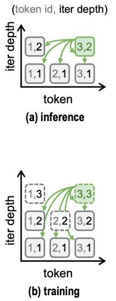

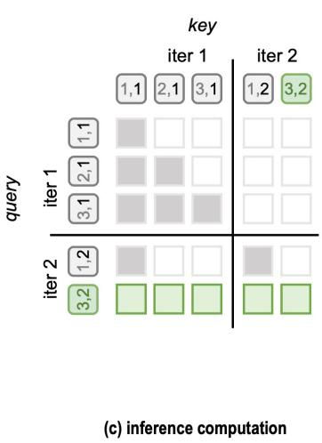

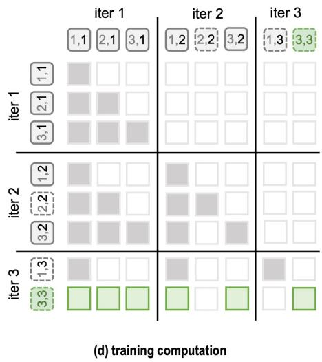  
Figure 7: Extended duo-causal attention in TaH2. Each cell denotes a (token id, iteration depth) pair; green arrows and cells show the keys visible to token 3. (a, b) Executed depths at inference and training; dashed cells are no-gradient lookahead iterations used only for depth supervision. $( \mathrm { c } , \mathrm { d } )$ The corresponding attention masks over concatenated per-iteration KV caches, where shaded cells are visible. Lookahead queries cannot attend to other tokens’ lookahead states; all other attention fol lows the duo-causal rule.

Updater. The updater fuses the original token embedding with the current hidden state and produces the next iteration’s input:

$$
\begin{array} { r } { \mathbf { x } _ { \mathrm { u } , t } ^ { ( m ) } = \mathbf { W } _ { \mathrm { u } } [ \mathrm { R N } ( \mathbf { e } _ { t } ) ; \mathrm { R N } ( \mathbf { h } _ { t } ^ { ( m ) } ) ] , } \\ { \mathcal { U } _ { \psi } ( \mathbf { e } _ { t } , \mathbf { h } _ { t } ^ { ( m ) } ) = \mathrm { R N } \Big ( \mathcal { B } _ { \mathrm { u } } \Big ( \mathrm { R N } ( \mathbf { x } _ { \mathrm { u } , t } ^ { ( m ) } ) \Big ) \Big ) . } \end{array}\tag{9}
$$

Decider. The decider combines the same embedding and hidden state with the largest prediction probabilities to predict whether to continue:

$$
\begin{array} { r l } & { \mathbf { x } _ { \mathrm { d } , t } ^ { ( m ) } = \mathbf { W } _ { \mathrm { d } } [ \mathrm { R N } ( \mathbf { e } _ { t } ) ; \mathrm { R N } ( \mathbf { h } _ { t } ^ { ( m ) } ) ; \mathrm { R N } ( \mathrm { T o p K } ( \mathbf { q } _ { t } ^ { ( m ) } ) ) ] , } \\ & { g _ { t } ^ { ( m ) } = \sigma \Big ( \mathbf { W } _ { \mathrm { s c o r e } } \ \mathrm { R N } \Big ( \mathcal { B } _ { \mathrm { d } } ( \mathbf { x } _ { \mathrm { d } , t } ^ { ( m ) } ) \Big ) \Big ) . } \end{array}\tag{10}
$$

Here $\sigma$ is the sigmoid function, and $\mathrm { T o p K }$ returns probability values in descending order (2,048 values for the 1.7B model). All projections are bias-free, and both modules share their parameters across iterations.

Baseline implementations. All baselines are post-trained from the same Qwen3-1.7B-Base checkpoint using the same data, sample order, training recipe and evaluation protocol as TaH2. Our Ouro and Huginn implementations adapt their architectures to this setting rather than reproduce the released checkpoints; neither uses TaH2’s updater, decider or online supervision.

TaH2-fixed. This variant retains TaH2’s updater, replaces extended duo-causal attention with causal attention and removes the decider. Every token executes all M iterations. The model is trained with next-token prediction loss on the uniformly averaged distribution, $\begin{array} { r } { \mathbf q _ { t } = \frac { 1 } { M } \sum _ { m = 1 } ^ { M } \mathbf q _ { t } ^ { ( m ) } } \end{array}$

Ouro. Our implementation loops the entire backbone, passing the hidden state unchanged to the next iteration as in Equation 1, and follows the two-stage training of Zhu et al. (2025). To avoid gate col lapse in post-training, where every token exits after the first iteration, we simplify Stage I by removing the exit gate and uniformly averaging the per-iteration losses, $\begin{array} { r } { \mathcal { L } _ { \mathrm { O u r o } } = \frac { 1 } { N } \sum _ { t } \frac { \bar { 1 } } { M } \sum _ { m = 1 } ^ { \bar { M } } \ell _ { t } ^ { ( m ) } } \end{array}$ with every token executing M iterations. Unless otherwise stated, Ouro results use this fixed-depth model.

Stage II follows the original gate training (Zhu et al., 2025, Section 3.4). From the Stage I checkpoint at $M = 2$ , we freeze the backbone and train a linear exit gate $\boldsymbol { \lambda } _ { t } ^ { ( m ) } = \sigma ( \mathbf { w } _ { \mathrm { e x i t } } ^ { \top } \mathbf { s } \mathbf { g } [ \mathbf { h } _ { t } ^ { ( m ) } ] )$ ), where $\mathrm { s g } [ \cdot ]$ stops gradients. With all iterations executed, the gate is supervised by the soft target $\tilde { c } _ { t } ^ { ( m ) } =$ $\sigma \big ( k ( I _ { t } ^ { ( m ) } - \gamma ) \big )$ , where $I _ { t } ^ { ( m ) } = \operatorname* { m a x } \big ( 0 , \mathrm { s g } [ \ell _ { t } ^ { ( m ) } - \ell _ { t } ^ { ( m + 1 ) } ] \big )$ :

$$
\mathcal { L } _ { \mathrm { g a t e } } = \frac { 1 } { M } \sum _ { m = 1 } ^ { M - 1 } \frac { 1 } { N } \sum _ { t } \mathrm { B C E } \Big ( 1 - \lambda _ { t } ^ { ( m ) } , \tilde { c } _ { t } ^ { ( m ) } \Big ) ,\tag{11}
$$

using the original $k = 5 0$ and $\gamma = 0 . 0 0 5$ . Training settings follow our main post-training setup (Appendix A.1.1), except for a learning rate of $1 0 ^ { - 4 }$ and a single epoch. At inference, the original Q-exit rule stops each token at the first depth whose cumulative exit probability reaches $q = 0 . 5$ Prefill executes all iterations; during decoding, an early-exiting token skips the remaining iterations and reuses its last executed KV entries for deeper ones (Zhu et al., 2025).

Huginn. Following the middle-block recurrence of Geiping et al. (2025a), our 28-layer backbone repeats layers 8–21 (14 layers). Layers 1–7 are evaluated once to produce $\mathbf { z } _ { t } .$ . After iteration $m ,$ an input adapter combines $\mathbf { z } _ { t }$ with the middle-block output $\mathbf { r } _ { t } ^ { ( m ) }$ to form the next input:

$$
\begin{array} { r } { \mathbf { u } _ { t } ^ { ( m + 1 ) } = \mathbf { a } \odot \mathbf { r } _ { t } ^ { ( m ) } + \mathbf { v } \odot \mathbf { W } _ { \mathrm { i n } } \mathbf { z } _ { t } , \qquad \mathbf { v } = \mathrm { s o f t p l u s } ( \mathbf { b } _ { \mathrm { i n } } ) , \quad \mathbf { a } = \exp \big ( - \mathbf { v } \odot \exp ( \mathbf { b } _ { \mathrm { r e t } } ) \big ) , } \end{array}\tag{12}
$$

where $\mathbf { b } _ { \mathrm { i n } }$ and $\mathbf { b } _ { \mathrm { r e t } }$ are learned bias vectors, a and v control state retention and input injection. The adapter adds $d ^ { 2 } + 2 d = 4 . 2 0 \mathbf { M }$ parameters for hidden dimension $d = 2 0 4 8 ( 0 . 2 \hat { 4 } \% )$ ). Every token executes M iterations of the middle block, after which layers 22–28 and the LM head produce the prediction used for next-token cross-entropy. This gives an effective depth of $1 4 + 1 4 M$ layers: Huginn at $M = 3 .$ , 7 matches the 56 and 112 layers executed by Ouro at $M = 2 , 4$ , respectively.

## A.2.2 ARCHITECTURE SUMMARY AND PARAMETER COUNTS

Table 6 summarises the architectures; Table 7 separates the updater and decider parameters at each scale. Together, they account for less than 3% of total parameters.

Table 6: Architectures used in the 1.7B comparison. Added parameters are reported as counts and fractions of total model parameters.
<table><tr><td>Model</td><td>Loop scope</td><td>Depth allocation</td><td>Added module</td><td>Added params</td></tr><tr><td>Standard</td><td>none (M = 1)</td><td></td><td></td><td>0</td></tr><tr><td>TaH2</td><td>all L layers</td><td>per-token adaptive</td><td>updater + decider</td><td>46.2M (2.6%)</td></tr><tr><td>TaH2-fixed</td><td>all L layers</td><td>fixed</td><td>updater</td><td>21.0M (1.2%)</td></tr><tr><td>Ouro (fixed-depth)</td><td>all L layers</td><td>fixed</td><td></td><td>0</td></tr><tr><td>Ouro (adaptive)</td><td>all L layers</td><td>per-token adaptive</td><td>exit gate</td><td>2.0K (&lt;0.001%)</td></tr><tr><td>Huginn</td><td>layers 8–21</td><td>fixed</td><td>input adapter</td><td>4.2M (0.24%)</td></tr></table>

Table 7: Updater and decider parameters across backbone scales. Counts include projections, MLPs and RMSNorm scales and are rounded independently. Percentages are relative to total model parameters.
<table><tr><td>Scale</td><td>Backbone</td><td>Updater</td><td>Decider</td><td>Total added</td><td>Added (%)</td></tr><tr><td>1.7B</td><td>1720.57M</td><td>20.98M</td><td>25.18M</td><td>46.16M</td><td>2.61%</td></tr><tr><td>4B</td><td>4022.47M</td><td>32.78M</td><td>39.33M</td><td>72.11M</td><td>1.76%</td></tr><tr><td>8B</td><td>8190.74M</td><td>83.90M</td><td>100.68M</td><td>184.59M</td><td>2.20%</td></tr></table>

## A.3 EVALUATION PROTOCOL

Validation loss and the token-level analyses of Section 5.5 use a fixed validation set of 1,000 samples randomly drawn from the training mixture and excluded from training, scored under teacher forcing. Test-time scaling curves sweep the output-token cutoff and re-evaluate truncated responses; each figure specifies its cutoff range. For the 4K–16K curves in Figure 1a, linear fits of accuracy against log decoding FLOPs yield $R ^ { 2 } = 0 . 9 9 7$ for Ouro, 0.994 for Huginn and 0.955 for Standard. We estimate decoding FLOPs from the serving engine’s depth and token records as described in Appendix A.4.

Table 8: Benchmarks used in this paper. The default output-token limit is 32K.
<table><tr><td>Benchmark</td><td></td><td>Domain #Problems Metric</td><td></td><td>Subset</td></tr><tr><td>AIME24 / AIME25 / AIME26</td><td>math</td><td>30 / 30 / 30avg @32</td><td></td><td></td></tr><tr><td>AMC23</td><td>math</td><td></td><td>40 avg@32</td><td></td></tr><tr><td>MATH500 (Lightman et al., 2023)</td><td>math</td><td></td><td>500 avg@4</td><td></td></tr><tr><td>OlympiadBench (He et al., 2024)</td><td>math</td><td></td><td>675 avg@4</td><td></td></tr><tr><td>IMO-AnswerBench</td><td>math</td><td></td><td>400avg @4</td><td></td></tr><tr><td>GPQA (Rein et al., 2023)</td><td>QA</td><td></td><td>198 avg@8</td><td>Diamond</td></tr><tr><td>SuperGPQA</td><td>QA</td><td>7,050 avg@4</td><td></td><td>Hard</td></tr><tr><td>HumanEval (Chen et al., 2021)</td><td>code</td><td></td><td>164 avg@8</td><td></td></tr><tr><td>MBPP (Austin et al., 2021)</td><td>code</td><td></td><td>378avg@8</td><td></td></tr><tr><td>LiveCodeBench v6 (Jain et al., 2024) code</td><td></td><td></td><td>175 avg@4</td><td></td></tr><tr><td>BFCL v3 (Patil et al., 2025)</td><td>tool use</td><td></td><td>800 avg@1(greedy) Multi-turn</td><td></td></tr></table>

Runtime measurement. We extend Mini-SGLang (Xu, 2025) to batch requests at different iteration depths in a shared forward pass, following continuous depth batching (Schwethelm et al., 2026a). Once a request completes the iterations for its current token, it proceeds to decode the next token without waiting for other requests to finish their iterations. We evaluate the 30 AIME26 problems with a 32K output-token limit on a single A800-80GB GPU, using bfloat16 and temperature 0.6; batch sizes 1 and 4 use one and four samples per problem, respectively. Table 2 reports decoding GFLOPs per generated token, computed from the per-call costs in Appendix A.4.1, together with mean end-to-end latency and aggregate output-token throughput. All results use the same evaluation seed.

## A.4 COMPUTE ACCOUNTING

This section defines the decoding FLOPs reported throughout the paper and the corresponding training cost. Section A.4.1 fixes the conventions and per-call costs, and Sections A.4.2 and A.4.3 give compact forms of decoding and training FLOPs before expanding each term.

## A.4.1 PRELIMINARIES

Conventions. We count model matrix-multiplication FLOPs, with a multiply-add as two operations. Elementwise operations (normalization, activations, softmax, top-k selection and the stoppingweighted mixture), sampling, memory traffic and serving overhead are excluded. A linear map from a to b features therefore costs 2ab FLOPs per token.

Notation. The L-layer backbone has hidden width $d ,$ total key–value width $d _ { \mathrm { k } } ,$ and MLP width $d _ { \mathrm { f f } } .$ and V is the vocabulary size. For the Qwen3 models used here, the query width $n _ { \mathrm { h } } d _ { \mathrm { h e a d } }$ equals d. The TaH2 updater and decider have MLP widths $d _ { \mathrm { u } }$ and $d _ { \mathrm { d } } .$ , and the decider receives the k largest prediction probabilities (Appendix A.2.1). Token t executes $m _ { t } \le M$ iterations.

Per-call costs. One backbone pass, one LM-head call, and one call of each TaH2 module cost

$$
\begin{array} { r l r } & { \mathrm { F L O P s } _ { \mathrm { b b } } = L \big [ 4 d ( d + d _ { \mathrm { k v } } ) + 6 d d _ { \mathrm { f f } } \big ] , } & { \mathrm { F L O P s } _ { \mathrm { b e a d } } = 2 d V , } \\ & { \mathrm { F L O P s } _ { \mathrm { u p d } } = 4 d ^ { 2 } + 6 d d _ { \mathrm { u } } , } & { \mathrm { F L O P s } _ { \mathrm { d e c i d e r } } = 2 d ( 2 d + k ) + 6 d d _ { \mathrm { d } } + 2 d . } \end{array}\tag{13}
$$

In $\mathrm { F L O P s } _ { \mathrm { b b } } , 4 d ( d + d _ { \mathrm { k v } } )$ covers the query, key, value and output projections and $6 d d _ { \mathrm { f f } }$ the three SwiGLU matrices. The updater applies $\mathbf { W } _ { \mathrm { u } } ( 2 d  d )$ and $\scriptstyle B _ { \mathrm { u } }$ , and the decider applies ${ \bf W } _ { \textrm { d } } ( 2 d + k $ $d ) , B _ { \mathrm { d } }$ and ${ \bf W } _ { \mathrm { s c o r e } } ( d \to \bar { 1 ) }$ . Attention cost depends on context length: a query that attends to S keys adds $\operatorname { F L O P s } _ { \mathrm { a t t n } } ( S ) = 4 L d S$ for the $Q K ^ { \top }$ and attention-weighted value products. Table 9 lists all per-call costs for the 1.7B model; the backbone pass dominates, and the updater and decider each cost less than 2% of it.

Table 9: Per-call matrix-multiplication FLOPs for Qwen3-1.7B $( L = 2 8 , d = 2 0 4 8 , d _ { \mathrm { k v } } = 1 0 2 4 ,$ $d _ { \mathrm { f f } } = 6 1 4 4 , V = 1 5 1 , 9 3 6 , k = d _ { \mathrm { u } } = d _ { \mathrm { d } } = 2 0 4 8 )$
<table><tr><td>Component</td><td>FLOPs per call</td><td>1.7B (GFLOPs)</td></tr><tr><td>Backbone pass</td><td> $L [ 4 d ( d + d _ { \mathbf { k } \mathbf { v } } ) + 6 d d _ { \mathbf { f } } ]$ </td><td>2.819</td></tr><tr><td>LM head</td><td> $2 d V$ </td><td>0.622</td></tr><tr><td>Attention, per visible key</td><td> $4 L d$ </td><td> $2 . 2 9 \times 1 0 ^ { - 4 }$ </td></tr><tr><td>TaH2 updater</td><td> $4 d ^ { 2 } + 6 d d _ { \mathrm { u } }$ </td><td>0.042</td></tr><tr><td>TaH2 decider</td><td> $2 d ( 2 d + k ) + 6 d d _ { \mathrm { d } } + 2 d$ </td><td>0.050</td></tr><tr><td>Huginn input adapter</td><td> $2 d ^ { 2 }$ </td><td>0.008</td></tr></table>

## A.4.2 DECODING FLOPS

Compact form. For TaH2, summing over token positions processed during decoding gives

$$
\begin{array} { r l r } { \mathrm { F L O P s } _ { \mathrm { d e c } } = \displaystyle \sum _ { t } \Big [ \displaystyle \sum _ { m = 1 } ^ { m _ { t } } \mathrm { F L O P s } _ { \mathrm { p a s s } } ( t , m ) + ( m _ { t } - 1 ) \mathrm { F L O P s } _ { \mathrm { u p d } } } & { } & \\ { + \displaystyle \operatorname* { m i n } ( m _ { t } , M - 1 ) \mathrm { F L O P s } _ { \mathrm { d e c i d e r } } \Big ] , } \end{array}\tag{14}
$$

where $\mathrm { F L O P s } _ { \mathrm { p a s s } } ( t , m )$ includes the backbone, attention and LM head. The updater prepares each iteration after the first, and the decider is not called after the final permitted iteration.

Positions and visible keys. Consider one response with a P-token prompt. Its first output token is sampled from the prefill, which we exclude, so decoding processes positions $t = 1 , \ldots , N$ , where N is the number of output tokens minus one. Prompt position $j$ keeps KV streams for $r _ { j }$ iterations. Under extended duo-causal attention, a query at position t and depth m sees every KV entry from earlier positions at depths up to m, together with its own entries from depths 1 to m:

$$
S _ { t } ^ { ( m ) } = \sum _ { j = 1 } ^ { P } \operatorname* { m i n } ( r _ { j } , m ) + \sum _ { u < t } \operatorname* { m i n } ( m _ { u } , m ) + m .\tag{15}
$$

Expanded form. Each pass applies the LM head, whose per-depth predictions feed the decider and the stopping-weighted mixture, so $\mathrm { F L O P s } _ { \mathrm { p a s s } } ( t , \hat { m _ { \it } } ) = \mathrm { \dot { F L O P s } _ { \mathrm { b b } } + \mathrm { F L O P s } _ { \mathrm { h e a d } } + }$ $\mathrm { F L O P s } _ { \mathrm { a t t n } } ( S _ { t } ^ { ( m ) } )$ . Substituting into Equation 14 gives

$$
\begin{array} { l } { \mathrm { F L O P s } _ { \mathrm { d e c } } ^ { \mathrm { T a H 2 } } = \displaystyle \sum _ { t = 1 } ^ { N } \left[ m _ { t } \big ( \mathrm { F L O P s } _ { \mathrm { b b } } + \mathrm { F L O P s } _ { \mathrm { h e a d } } \big ) + 4 L d \sum _ { m = 1 } ^ { m _ { t } } S _ { t } ^ { ( m ) } \qquad } \\ { \qquad + ( m _ { t } - 1 ) \mathrm { F L O P s } _ { \mathrm { u p d } } + \operatorname* { m i n } ( m _ { t } , M - 1 ) \mathrm { F L O P s } _ { \mathrm { d e c i d e r } } \right] . } \end{array}\tag{16}
$$

Baselines. Fixed-depth models execute all M iterations at every position. Under causal attention, earlier positions expose only their base stream, so a query at depth m attends to $P + t - 1 + m \mathrm { k e y s } ;$ when every iteration keeps its own KV stream, it attends to $\dot { P } + t$ keys. TaH2-fixed uses causal attention and applies the LM head and updater as TaH2 does. Ouro and Huginn keep one KV stream per iteration and apply the LM head only after the final iteration; Huginn executes $7 + 1 4 M + 7$ of the 28 layers and its input adapter once per core iteration. This gives

(17)

$$
\begin{array} { r l } & { \displaystyle \mathrm { F L O P s } _ { \mathrm { d e c } } ^ { \mathrm { S t a n d a r d } } = \sum _ { t = 1 } ^ { N } \big [ \mathrm { F L O P s } _ { \mathrm { b b } } + \mathrm { F L O P s } _ { \mathrm { h e a d } } + 4 L d \left( P + t \right) \big ] , } \\ & { \displaystyle \mathrm { F L O P s } _ { \mathrm { d e c } } ^ { \mathrm { T a H 2 - f i x e d } } = \sum _ { t = 1 } ^ { N } \Big [ M \big ( \mathrm { F L O P s } _ { \mathrm { b b } } + \mathrm { F L O P s } _ { \mathrm { h e a d } } \big ) + ( M - 1 ) \mathrm { F L O P s } _ { \mathrm { u p d } } } \\ & { \qquad + 4 L d \sum _ { m = 1 } ^ { M } ( P + t - 1 + m ) \Big ] , } \end{array}\tag{18}
$$

$$
\mathrm { F L O P s _ { d e c } ^ { O u r o } } = \sum _ { t = 1 } ^ { N } \left[ M \mathrm { F L O P s _ { b b } } + \mathrm { F L O P s _ { h e a d } } + 4 L d M ( P + t ) \right] ,\tag{19}
$$

$$
\begin{array} { r l r } { \mathrm { F L O P s } _ { \mathrm { d e c } } ^ { \mathrm { H u g i n n } } = \displaystyle \sum _ { t = 1 } ^ { N } \Big [ \frac { 1 4 + 1 4 M } { 2 8 } \big ( \mathrm { F L O P s } _ { \mathrm { b b } } + 4 L d ( P + t ) \big ) } & { } & \\ { + \mathrm { F L O P s } _ { \mathrm { h e a d } } + 2 M d ^ { 2 } \Big ] . } \end{array}\tag{20}
$$

## A.4.3 TRAINING FLOPS

Compact form. Approximating backward cost as twice the corresponding forward cost,

$$
\mathrm { F L O P s } _ { \mathrm { t r a i n } } \approx 3 \mathrm { F L O P s } _ { \mathrm { f o r w a r d } } + \mathrm { F L O P s } _ { \mathrm { l a b e l } } ,\tag{21}
$$

where $\mathrm { F L O P s } _ { \mathrm { f o r w a r d } }$ includes all gradient-tracked forward computation, including the LM head, updater and decider, and $\mathrm { F L O P s } _ { \mathrm { l a b e l } }$ includes all additional no-gradient computation for online labels, including context reconstruction and auxiliary-module calls. All models share the same training implementation, so implementation-level choices such as activation checkpointing are not counted and the comparison reflects only algorithmic differences.

Per-depth counts. Consider a training sequence of $T$ tokens. Let $N _ { m } = | \{ t : m _ { t } \geq m \} |$ be the number of tokens that execute iteration $m ,$ , with $N _ { 1 } = T$ , and let $\begin{array} { r } { A _ { m } = \sum _ { t : m _ { t } \geq m } S _ { t } ^ { ( m ) } } \end{array}$ be the number of query–key pairs at depth m. Here $S _ { t } ^ { ( m ) }$ follows Equation 15 without the prompt term, because training attends over the whole sequence.

Gradient-tracked forward. Every executed iteration runs the backbone and LM head with gradients, the updater prepares iterations 2 to M, and the decider runs after iterations 1 to $M - 1 \colon$

$$
\begin{array} { r } { \mathrm { F L O P s } _ { \mathrm { f o r w a r d } } = \displaystyle \sum _ { m = 1 } ^ { M } \Big [ N _ { m } \big ( \mathrm { F L O P s } _ { \mathrm { b b } } + \mathrm { F L O P s } _ { \mathrm { h e a d } } \big ) + 4 L d A _ { m } \Big ] } \\ { + \displaystyle \sum _ { m = 2 } ^ { M } N _ { m } \mathrm { F L O P s } _ { \mathrm { u p d } } + \sum _ { m = 1 } ^ { M - 1 } N _ { m } \mathrm { F L O P s } _ { \mathrm { d e c i d e r } } . } \end{array}\tag{22}
$$

The decider loss reuses the decider outputs of this pass and adds no further calls.

Label computation. Online labels require the next-iteration loss of every token that stops. After iteration $m < M$ , a no-gradient lookahead therefore applies the updater, backbone and LM head at depth $m + 1$ . Under extended duo-causal attention, a stopped token’s lookahead query must also see the depth- $( m + 1 )$ KV of earlier tokens that continue. The lookahead reconstructs this context by re-running all $N _ { m }$ tokens that executed iteration m, rather than only the $N _ { m } - N _ { m + 1 }$ tokens that stop:

$$
\mathrm { F L O P s } _ { \mathrm { l a b e l } } = \sum _ { m = 1 } ^ { M - 1 } \Big [ N _ { m } \big ( \mathrm { F L O P s } _ { \mathrm { u p d } } + \mathrm { F L O P s } _ { \mathrm { b b } } + \mathrm { F L O P s } _ { \mathrm { h e a d } } \big ) + 4 L d \tilde { A } _ { m + 1 } \Big ] ,\tag{23}
$$

where $\tilde { A } _ { m + 1 }$ counts each lookahead query as if its token continued.

Baselines. Baselines compute no labels, so $\mathrm { F L O P s } _ { \mathrm { l a b e l } } = 0$ , and every token executes all iterations, so $N _ { m } = T$ . Standard has one backbone pass and one LM head per token. Ouro applies the LM head at every iteration because its objective supervises each exit, Huginn applies it once after the coda, and TaH2-fixed applies it at every iteration together with M − 1 updater calls. Their attention pairs follow the fixed-depth key counts of Section A.4.2 with $P = 0$

Training cost of the 1.7B runs. Table 10 evaluates these expressions for all 1.7B models, each trained for 6,402 steps of 128 sequences (three epochs). For TaH2, we use the average iteration count per token logged during training. The label lookahead accounts for 20–24% of the training FLOPs of TaH2. At M = 2, TaH2 costs 1.87× Standard, below TaH2-fixed (2.01×) and Ouro (2.00×) at the same ceiling.

Table 10: Training FLOPs $( 1 0 ^ { 1 8 } )$ of the 1.7B post-training runs, split into the terms of Equation 21. Fwd. + bwd. reports 3 FLOPsforward.
<table><tr><td>Model</td><td>M</td><td>Fwd. + bwd.</td><td>Label</td><td>Total</td><td>vs. Standard</td></tr><tr><td>Standard</td><td>1</td><td>41.8</td><td>一</td><td>41.8</td><td>1.00×</td></tr><tr><td rowspan="2">Huginn</td><td>3</td><td>77.7</td><td>一</td><td>77.7</td><td>1.86×</td></tr><tr><td>7</td><td>149.3</td><td>一</td><td>149.3</td><td>3.57×</td></tr><tr><td rowspan="2">Ouro</td><td>2</td><td>83.6</td><td>一</td><td>83.6</td><td>2.00×</td></tr><tr><td>4</td><td>167.1</td><td>一</td><td>167.1</td><td>4.00×</td></tr><tr><td rowspan="2">TaH2-fixed</td><td>2</td><td>84.0</td><td>一</td><td>84.0</td><td>2.01×</td></tr><tr><td>4</td><td>168.4</td><td>一</td><td>168.4</td><td>4.03×</td></tr><tr><td rowspan="3">TaH2</td><td>2</td><td>62.8</td><td>15.2</td><td>78.1</td><td>1.87×</td></tr><tr><td>4</td><td>87.6</td><td>26.7</td><td>114.3</td><td>2.73×</td></tr><tr><td>8</td><td>164.2</td><td>52.0</td><td>216.2</td><td>5.17×</td></tr></table>

## B ADDITIONAL EXPERIMENTAL RESULTS

## B.1 TEACHER SELECTION

We compare Qwen3-8B, Qwen3-32B and Qwen3-235B-A22B as teachers, using responses generated from the same prompts. We fine-tune Qwen3-1.7B-Base (Standard) on each response set with an identical training recipe and evaluate with a 32K output limit, temperature 0.6, top-p 0.95 and topk 20. The 8B teacher yields the highest mean student accuracy on AIME24–26 (Table 11), exceeding the 32B and 235B teachers by 1.63 and 1.80 points, respectively. We therefore use Qwen3-8B as the teacher for all main experiments.

Table 11: AIME accuracy (%) for Qwen3-1.7B-Base students trained on responses from different teachers. All evaluations use avg@32 and a 32K output-token limit.
<table><tr><td>Teacher</td><td>AIME24</td><td>AIME25</td><td>AIME26</td><td>Mean</td></tr><tr><td>Qwen3-8B</td><td>11.04</td><td>13.02</td><td>11.87</td><td>11.98</td></tr><tr><td>Qwen3-32B</td><td>9.69</td><td>11.98</td><td>9.38</td><td>10.35</td></tr><tr><td>Qwen3-235B-A22B</td><td>10.42</td><td>9.90</td><td>10.21</td><td>10.18</td></tr></table>

## B.2 INFERENCE DEPTH OUTSIDE THE TRAINING CEILING

We evaluate the M = 8 checkpoint with the inference ceiling lowered to 4 or raised to 12, without retraining. Table 12 reports AIME24–26 accuracy and mean realized depth. Lowering the ceiling to 4 reduces accuracy by 2.7–3.1 points across AIME24–26. Raising it to 12 leaves accuracy essentially unchanged while increasing mean depth by 20–27%. Additional depth at inference therefore neither breaks the model nor improves it beyond the trained ceiling.

Table 12: Effects of changing the inference depth ceiling. M denotes the training ceiling; the upper group provides reference models evaluated at their training ceilings. Accuracy (%) uses avg@32; Avg. is the mean across AIME24–26.
<table><tr><td>Model</td><td>Inference ceiling</td><td>AIME24</td><td>AIME25</td><td>AIME26</td><td>Avg.</td><td>Mean depth</td></tr><tr><td>Standard</td><td>1</td><td>11.0</td><td>13.0</td><td>11.9</td><td>12.0</td><td>1.00</td></tr><tr><td>TaH2 (M = 2)</td><td>2</td><td>15.7</td><td>16.5</td><td>14.3</td><td>15.5</td><td>1.23</td></tr><tr><td>TaH2 (M = 4)</td><td>4</td><td>16.3</td><td>16.9</td><td>14.2</td><td>15.8</td><td>1.49</td></tr><tr><td>TaH2 (M = 8)</td><td>4</td><td>13.6</td><td>15.1</td><td>11.4</td><td>13.4</td><td>1.55</td></tr><tr><td>TaH2 (M = 8)</td><td>8</td><td>16.3</td><td>17.9</td><td>14.5</td><td>16.2</td><td>2.22</td></tr><tr><td>TaH2 (M = 8)</td><td>12</td><td>16.9</td><td>17.2</td><td>14.5</td><td>16.2</td><td>2.72</td></tr></table>

## C ADDITIONAL ANALYSIS

## C.1 VALIDATION LOSS DURING POST-TRAINING

Figure 8 shows validation loss throughout post-training at 1.7B. Both TaH2 variants maintain lower loss than Standard, with greater iteration depth yielding further reductions and adaptive TaH2 attaining the lowest final loss.

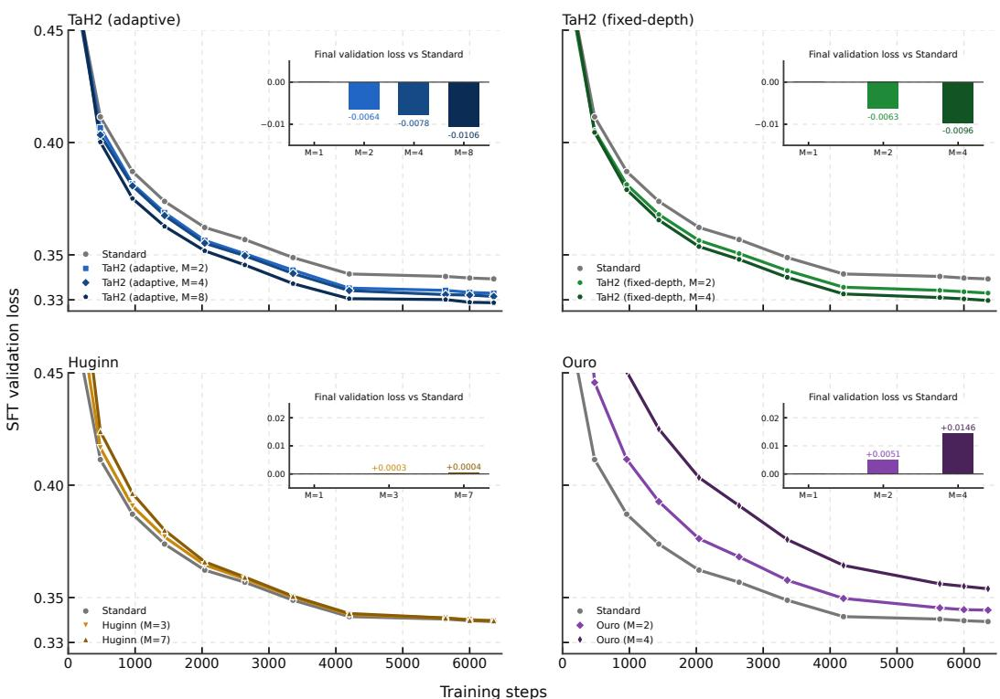  
Figure 8: Validation loss during post-training at 1.7B. Insets show final loss differences from Standard; negative values indicate improvements.

## C.2 PER-BENCHMARK TEST-TIME SCALING

Figure 9 shows test-time scaling on each of the six math benchmarks. We use output-token cutoffs of 4K, 6K, 8K, 12K, 16K, 20K, 24K, 28K and 32K, matching the sampling grid of Figure 4b.

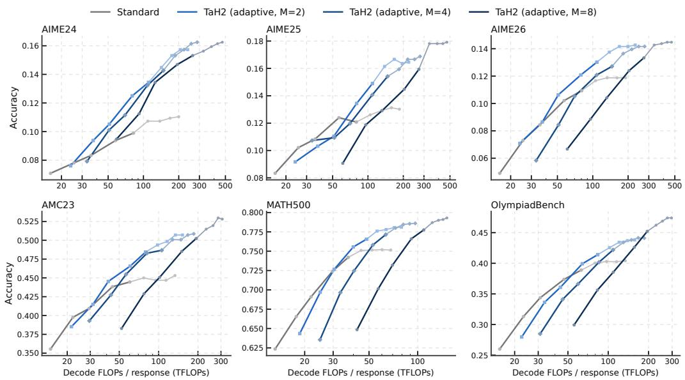  
Figure 9: Per-benchmark test-time scaling on the six math benchmarks at 1.7B. Each panel compares Standard with TaH2 at $M \in \{ 2 , 4 , 8 \}$ using the same nine output-token cutoffs as Figure 4b. Dark segments extend through 16K and light segments through 32K.

## C.3 PARALLEL TEST-TIME SCALING

Test-time compute can also scale in parallel, by sampling several responses and aggregating them with majority voting. Figure 10 measures this axis with cons@n on AIME24–26: for each problem, we vote over n of the 32 recorded full-length responses, drawn without replacement and averaged over random draws, and count decoding FLOPs as n times the mean per-response cost. TaH2 at $M = 2$ reaches 27.3% at $n = 3 2$ compared with 21.9% for Standard, and its curve stays above every fixed-depth baseline at matched FLOPs.

## C.4 TOKEN-LEVEL DEPTH ALLOCATION

Figure 11 shows iteration depths in three sampled correct responses. The math and code examples show a clear shift from deeper natural-language reasoning to shallower mathematical expressions and final code. Mean depth falls from 2.46 to 1.29 in OlympiadBench and from 3.31 to 1.04 in HumanEval across the displayed spans. The GPQA example retains substantial depth through its concluding explanation. These cases suggest that depth allocation reflects local response content and the stage of reasoning.

## C.5 CROSS-ITERATION ATTENTION

We examine three representative heads of TaH2 (M = 8) on 100 randomly sampled validation sequences under teacher forcing, retaining the decider’s actual routes. For queries at iteration 8, Figure 12 shows distinct preferences for first-iteration states, later-iteration states, or both. Figure 13 visualises these patterns over the first 128 response positions with the original context preserved.

## D FULL FORMULATION OF LOOKAHEAD DEPTH SUPERVISION

Continuation labels and gain coverage. The continue target $c _ { t } ^ { ( m ) }$ indicates whether token t should execute another iteration, whereas $m _ { t }$ records how many iterations token t executes under the current decider. As in Section 4.2, $a _ { t } ^ { ( m ) } = \mathbf { 1 } [ m _ { t } \geq m ]$ records whether supervised token t executes iteration m. These labels are recomputed from the current backbone on every training batch and do not determine the routes used in that forward pass. We initialise $c _ { t } ^ { ( 0 ) } = 1$ for every supervised token and compute the loss reduction $\delta _ { t } ^ { ( m ) } = \ell _ { t } ^ { ( \bar { m } ) } - \ell _ { t } ^ { ( m + 1 ) }$ as in Equation 5. For a token that stops, a no-gradient lookahead supplies its next-iteration loss.

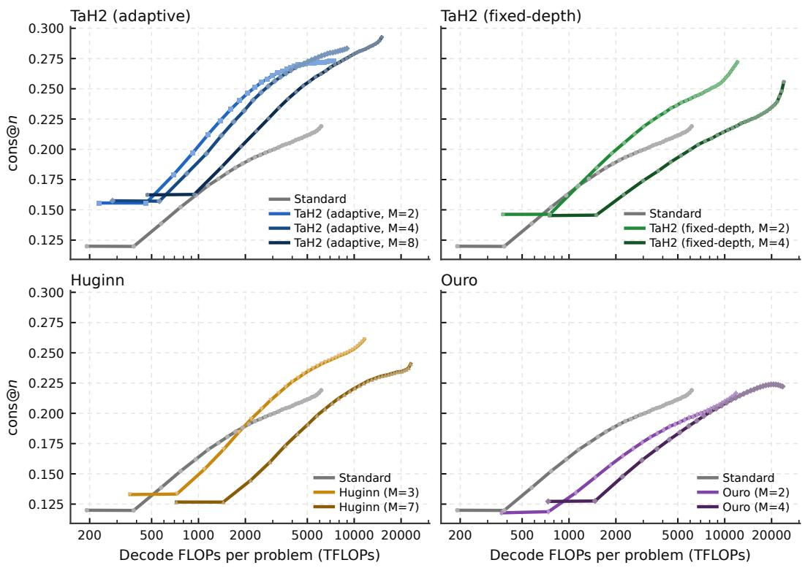  
Figure 10: Parallel test-time scaling: mean AIME24–26 cons@n versus decoding FLOPs per problem for $n = 1 , \ldots , 3 2$ , one model family per panel with Standard for reference.

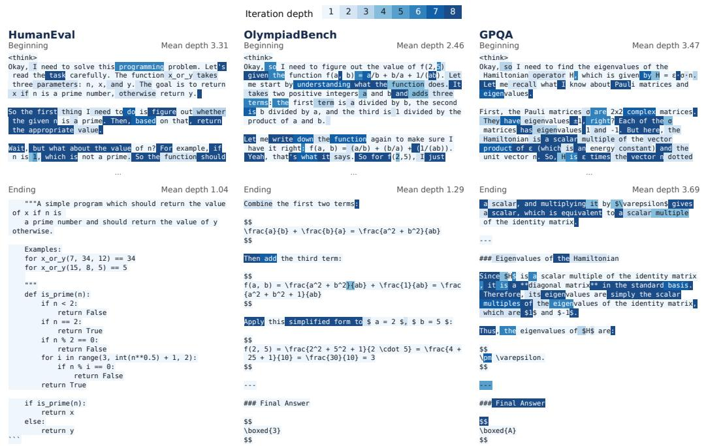  
Figure 11: Token-level iteration depth in sampled correct responses from OlympiadBench, HumanEval and GPQA. Darker shading indicates more iterations; mean depths refer to the displayed spans.

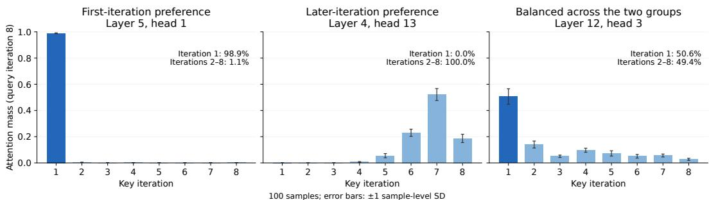  
Figure 12: Attention mass by key iteration for three representative heads at query iteration 8. Bars show means over 100 sequences; error bars indicate one sample-level standard deviation. Queries are averaged within each sequence first.

At iteration $m ,$ collect the positive gains of tokens with $a _ { t } ^ { ( m ) } = 1$ and $c _ { t } ^ { ( m - 1 ) } = 1$ across dataparallel ranks and sort them as $\delta _ { [ 1 ] } ^ { ( m ) } \geq \cdots \geq \delta _ { [ n ] } ^ { ( m ) } > 0$ , where [i] denotes gain rank and n is the number of positive gains. The coverage cutoff is

$$
i _ { \mathrm { c o v } } = \operatorname* { m i n } \Big \{ i : \sum _ { i ^ { \prime } = 1 } ^ { i } \delta _ { [ i ^ { \prime } ] } ^ { ( m ) } \geq \rho \sum _ { i ^ { \prime } = 1 } ^ { n } \delta _ { [ i ^ { \prime } ] } ^ { ( m ) } \Big \} , \qquad \delta _ { \mathrm { c u t } } ^ { ( m ) } = \delta _ { [ i _ { \mathrm { c o v } } ] } ^ { ( m ) } .\tag{24}
$$

Equation 6 assigns continue labels to gains at or above this cutoff, including ties. Thus $\rho$ specifies a fraction of total positive gain, not a fraction of tokens. As an exception to Equation $^ { 6 , }$ if there are no positive gains, we set $\delta _ { \mathrm { c u t } } ^ { ( m ) } = 0$ only for weight computation and assign zero continue labels at this and all later iterations.

Cost-sensitive weights. For tokens with $a _ { t } ^ { ( m ) } = 1$ , the per-token weights are

$$
w _ { t } ^ { ( m ) } = \left\{ \begin{array} { l l } { \mathrm { c l i p } \Big ( | \delta _ { t } ^ { ( m ) } - \delta _ { \mathrm { c u t } } ^ { ( m ) } | , 1 0 ^ { - 6 } , 1 \Big ) , } & { c _ { t } ^ { ( m - 1 ) } = 1 , } \\ { 1 0 ^ { - 6 } , } & { c _ { t } ^ { ( m - 1 ) } = 0 . } \end{array} \right.\tag{25}
$$

The fixed lower bound preserves a small supervision weight near the cutoff and for tokens already labelled to stop; the upper bound limits the influence of large loss changes. Labels, cutoffs and weights are treated as constants during backpropagation.

Class balancing and joint loss. At each iteration, we count stop and continue labels among tokens with $a _ { t } ^ { ( m ) } = 1$ , pooling counts across data-parallel ranks. The positive-class balancing weight $\beta ^ { ( m ) }$ is their stop-to-continue count ratio; it is set to one if either class is absent. The BCE in Equation 7 is therefore

$$
\mathrm { B C E } \Big ( g _ { t } ^ { ( m ) } , c _ { t } ^ { ( m ) } \Big ) = - \beta ^ { ( m ) } c _ { t } ^ { ( m ) } \log g _ { t } ^ { ( m ) } - ( 1 - c _ { t } ^ { ( m ) } ) \log ( 1 - g _ { t } ^ { ( m ) } ) .\tag{26}
$$

The coverage cutoff and class-balancing weights are calculated from each batch, with the clipping bounds above fixed throughout the experiments.

## E ADDITIONAL RELATED WORK

This section extends Section 2, grouped by test-time compute, recurrent design, adaptive depth and serving.

Test-time scaling. Token-based scaling further differs in how it controls reasoning length and selects candidates. Within a sequence, online confidence adjusts reasoning budgets (Li et al., 2026c), while analyses of overthinking show that longer chains are not uniformly better (Wu et al., 2025b).

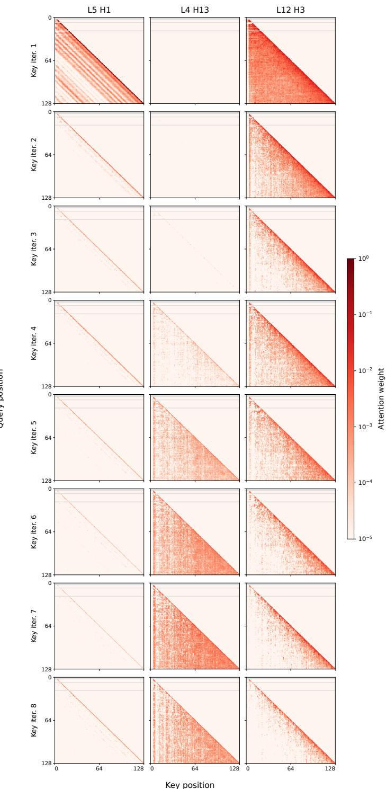  
Figure 13: Attention maps for the same heads, with columns indexing heads and rows indexing key iterations. Each query position is averaged over sequences that reach iteration 8. All panels share a logarithmic colour scale; grey marks positions with no executed queries. Prompt keys are omitted without renormalising attention.

Across candidates, process-reward search (Guan et al., 2025), likelihood-based sampling (Karan & Du, 2025) and effort-aware sample scheduling (Chen et al., 2026c) guide exploration; call-count studies examine the non-monotone returns of additional LLM calls (Chen et al., 2024). Within latent representations, methods compress multimodal reasoning (Shen et al., 2025), supervise parallel latent blocks (Fan et al., 2026), switch between latent and discrete reasoning by confidence (Xu et al., 2026), or add hidden sequence positions (Liu et al., 2026). ParScale instead adds parallel computation through multiple streams sharing model parameters (Chen et al., 2025a).

Recurrent architectures. Recurrent architectures differ in what they repeat and retain. Universal Transformers share transformations across depth (Dehghani et al., 2019), whereas block-recurrent Transformers carry recurrent state across sequence blocks (Hutchins et al., 2022). Within depth recurrence, studies of growing and looping examine which blocks to repeat (Kapl et al., 2026); Loopies repeats individual layers, offering an alternative to middle-block and full-stack recurrence (Gao et al., 2026). Pondering models feed predictions back as embeddings (Zeng et al., 2025), CoT Former interleaves intermediate representations as additional tokens (Mohtashami et al., 2023), and recursive reasoners refine latent states on structured tasks (Ge et al., 2025; Ren & Liu, 2026; Baek et al., 2026; Altabaa et al., 2025). Theory examines the expressivity and memory requirements of repeated computation relative to explicit CoT (Saunshi et al., 2025; Zhang, 2026).

Scaling under resource constraints. Scaling results depend on which resources are held fixed as recurrence increases. Parcae studies compute allocation at fixed unique parameter count, allowing effective depth and per-token computation to grow (Prairie et al., 2026). Iso-Depth instead fixes effective depth and quantifies the capacity retained when independent blocks are replaced by shared iterations (Schwethelm et al., 2026b). Sparse-layer studies examine how expert routing affects the cost of parameter sharing (Lee et al., 2026), and Loopies compares layer-looped MoE models under matched wall-clock training budgets (Gao et al., 2026). SMELT matches per-token FLOPs, total non-embedding parameters and KV cache, then fits separate pretraining scaling laws for looped and non-looped MoE models (Wang et al., 2026b). Architectural syntheses likewise distinguish parameter efficiency from computational cost (Huang et al., 2026a). Our comparison varies outputtoken budgets after post-training and measures reasoning accuracy against decoding FLOPs per response, complementing these architectural and pretraining studies.

Depth scaling and stability. Increasing the depth used during training and executing more iterations than were seen during training are distinct settings. Ouro, Parcae and STARS report saturation or degradation when inference extends beyond the trained depth regime (Zhu et al., 2025; Prairie et al., 2026; Yang et al., 2026b); RecurTrace, TaH and code-model studies also document non-monotone returns from additional iterations (Wang et al., 2026c; Fu et al., 2025b; Yang et al., 2026a). Stability methods, including STARS, modify residual scaling, input injection or recurrent dynamics (Li et al., 2026b; Wang et al., 2026a; Fu et al., 2026b; Yang et al., 2026b; Labovich, 2026), while readout analyses show that per-loop supervision constrains only the state variables exposed to the readout (Sharma & Vu, 2026). Mechanistic studies distinguish state convergence from predictive improvement (Blayney et al., 2026; Viakhirev et al., 2026), examining two-scale dynamics (Pappone et al., 2025), dynamical regimes (Kim, 2026; Zhang et al., 2026), Jacobian structure (Wang & Reid, 2026) and links between latent and verbal reasoning (Chen et al., 2026a). Our depth-scaling experiments increase the maximum iteration depth used in training; Appendix B.2 examines inference beyond it.

Recurrent states and output aggregation. State design determines which information remains available across iterations. Memory highways (Yu et al., 2025) and depth attention (Knupp et al., 2026) expose earlier states, while anchored injection (Kim et al., 2026), discrete–continuous channels (Fu et al., 2026a) and gated modulation (Hegazy et al., 2026) alter state updates. Other work changes the repeated computation through mixer-only loops (Lin et al., 2026), multi-token guidance (Shomali et al., 2026) or denoising objectives (Suleymanzade et al., 2026). For output aggregation, PonderLM-3 weights hidden states by predicted depth probabilities (Li et al., 2026a); Adaptive Latent CoT and Adaptive Loops and Memory use halting probabilities to combine intermediate states (Zeng et al., 2026; Frey et al., 2026). TaH2 uses input injection between iterations and mixes output distributions across executed depths, with the final depth absorbing the remaining stopping mass.

Post-training recurrence into pretrained LLMs. Conversion methods differ in how they preserve and adapt pretrained computation, paralleling upcycling into MoE or deeper models (Komatsuzaki et al., 2022; Kim et al., 2023; Wu et al., 2024a). Beyond the conversions in Section 2, path-preserving initialisation retains single-pass behaviour (Shapiro, 2026), a trainable recurrent module can be attached to a frozen backbone (Panwar et al., 2026), and middle layers can be repeated without training (Chen et al., 2026b). Retrofitted recurrence has been evaluated on math and compositional tool use (McLeish et al., 2025; Popescu et al., 2026a). DND learns selective re computation with routing regularisation and target selection ratios (Chen et al., 2025b); TaH trains a decider from offline mismatch labels in a separate stage (Fu et al., 2025b). TaH2 instead jointly adapts the backbone and decider using online supervision of iteration gains.

Dimensions of adaptive computation. Adaptive architectures select computation within layers or across depth. Along width, sparse MoE routing selects experts for each token (Fedus et al., 2022); ZEDA further varies expert activation through zero-expert injection and self-distillation (Lv et al., 2026). Its token-level visualisations show reduced computation for mathematical expressions and code fragments relative to natural-language reasoning, relating compute allocation to response content. Along depth, LayerSkip enables early exits (Elhoushi et al., 2024), while MoD routes selected tokens through each layer (Raposo et al., 2024). Other approaches change computation by routing to larger models (Fu et al., 2025a) or grouping tokens into concepts (Huang et al., 2026b; Qu et al., 2025).

Adaptive iteration depth. Within looped models, depth decisions differ in granularity and timing. LoopFormer follows a user-specified sequence budget (Jeddi et al., 2026); T-LoopFormer and PonderLM-3 predict token depths from initial states (Yu et al., 2026a; Li et al., 2026a); ANIRA compares such initial allocation with decisions after each iteration (Moosa et al., 2026). Training signals provide a separate distinction. AdaPonderLM trains iterative gates with a compute penalty (Song et al., 2026), whereas RL-Halting uses terminal rewards to learn sequence-level stopping (Kuo et al., 2026). Explicit gain supervision is also used by Ouro’s second-stage gate and RecurTrace’s separately trained sequence-level head (Zhu et al., 2025; Wang et al., 2026c); TaH2 derives token-level targets online from the evolving backbone during joint training. Alternatives use a learned confidence head (Park et al., 2026) or convergence-based stopping rules (Geiping et al., 2025a; Logan, 2026; Movahedi et al., 2026; Pappone et al., 2025). Gate collapse has been reported for Ouro, Recur-Trace and retrofitted models (Zhu et al., 2025; Wang et al., 2026c; Shapiro, 2026) under particular objectives and training settings, and we observe it for Ouro’s Stage I in our post-training setting (Appendix A.2.1). Controlled diagnoses examine how jointly learned gates affect training trajectories (Popescu et al., 2026b), while analyses of hierarchical recurrent models find settings where fixed maximum depth outperforms adaptive halting (Ge et al., 2025).

Serving adaptive depth. Whether FLOPs savings become wall-clock gains depends on execution. Continuous depth batching schedules tokens at different depths in shared passes (Bae et al., 2024; Schwethelm et al., 2026a), cross-loop parallelism and diffusion-style samplers overlap iterations across tokens (Wu et al., 2025a; Geiping et al., 2025b), and cross-loop KV sharing or compression bounds memory (Vendrell et al., 2026; Deng et al., 2026; O’Neill & Reid, 2026). CHASE adapts training to the missing states left by skipped iterations under early exit (Yu et al., 2026b). We report decoding FLOPs as the primary metric and verify throughput with a depth-batched engine (Section 5.2).