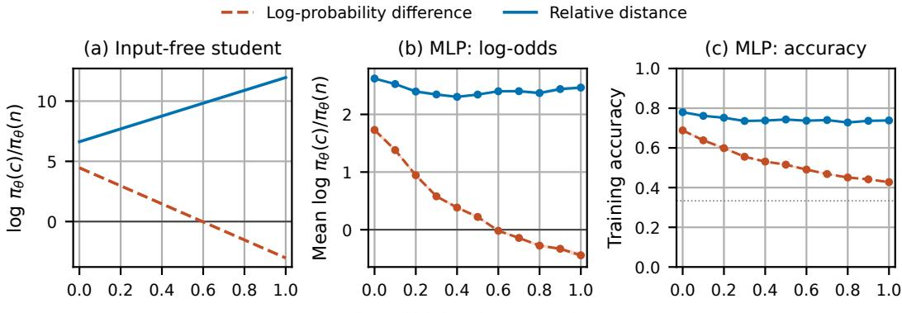
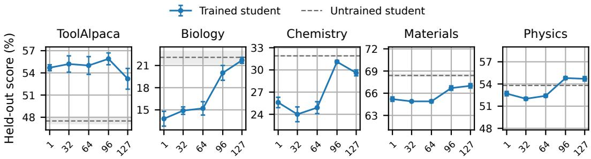
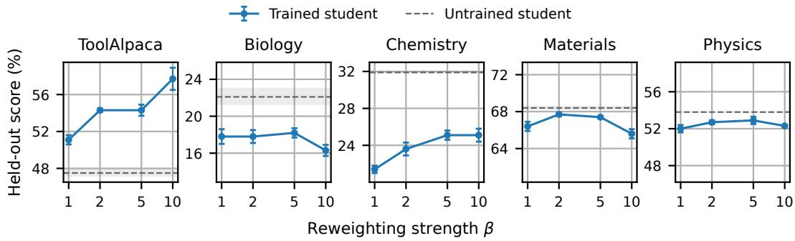
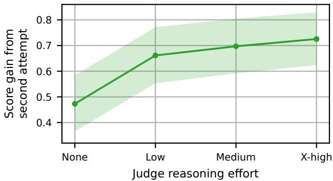

# INDUCTIVE FEEDBACK FOR MIXED-POLICY DISTILLATION

Amir Moeini1,2 \* Huaijiang Zhu1 † Daniel Havir1 Shangtong Zhang2

1Alquist Robotics 2University of Virginia

## ABSTRACT

Verbal feedback can identify errors and prescribe corrections, providing rich supervision for language-model post-training even when reliable programmatic verifiers are unavailable. Such feedback, often generated by a capable model, can be used to condition the teacher in on-policy distillation, which trains the student to match the teacher’s predictions on student-generated rollouts. However, this approach can transfer teacher preferences that the feedback did not motivate, while leaving much of the feedback’s guidance unused. We find that both problems come from the standard on-policy distillation objective, specifically the divergence it minimizes and the distribution it uses as its target. Our proposed method addresses both limitations. First, to isolate the information conveyed by the feedback from the teacher’s inherent preferences, we treat verbal feedback as evidence for or against the hypothesis that a particular token comes next at a given prefix. We then adopt a probabilistic confirmation framework which uniquely determines an ordering over the vocabulary based on the teacher’s predictions before and after it receives feedback. Using a confirmation score consistent with this ordering, we construct a target distribution within a trust region of the student. Second, to learn from guidance that student rollouts can leave unused, we derive a simple shared-rollout estimator of a symmetric divergence between the student and target distributions over rollouts, reusing student and feedback-conditioned teacher rollouts in both directions through importance weighting. Empirical evaluations show that our method outperforms the common on-policy distillation recipe and a recent contrastive variant on knowledge-based and agentic benchmarks.

## 1 INTRODUCTION

Reinforcement learning (RL) is widely used for post-training language models, improving their reasoning and instruction-following abilities and enabling them to acquire new skills. A central challenge is assigning credit to individual decisions (Lightman et al., 2024; Kazemnejad et al., 2025). Methods such as GRPO (Shao et al., 2024) convert each rollout’s scalar reward into a groupnormalized advantage and cascade it across the rollout’s tokens. This coarsely reinforces every token in a higher-rewarded rollout, including steps that did not contribute to the outcome. On-policy distillation (OPD) can provide an alternative way to construct advantages for policy updates (Lu & Thinking Machines Lab, 2025). The student is the model being trained, and the teacher is the model whose next-token predictions provide supervision. OPD constructs token-specific advantages from differences between the teacher’s and student’s next-token predictions along student-generated rollouts. These advantages draw on the knowledge encoded in the teacher’s distribution to guide the student’s decisions. A useful special case is when the teacher is the student model itself, conditioned on privileged information such as a reference solution or execution feedback (Hubotter et al., 2026). ¨ The teacher then converts this text-based privileged information into a learning signal in the form of token-level advantages.

One particularly useful form of privileged information is verbal feedback written by an LLM judge (Zheng et al., 2023). Such feedback is widely used to evaluate language models (Liu et al., 2023; Dubois et al., 2024) and to refine their rollouts at inference time (Madaan et al., 2023; Shinn et al., 2023). It is also a valuable source of supervision for post-training. Where tasks lack reliable programmatic verifiers, a capable judge offers a practical alternative, assessing rollouts against taskspecific criteria and communicating its findings through verbal feedback. Even when outcome rewards are available, verbal feedback still offers a richer basis for learning. Such feedback can connect specific parts of a rollout to the criteria they satisfy or violate, explaining both where credit belongs and why. It thereby preserves information lost in reward aggregation and provides stepspecific guidance that learning from a single scalar reward must infer across repeated rollouts (Xu et al., 2026a).

These properties make verbal feedback a natural form of privileged information for OPD. A judge first evaluates the student’s rollout and writes feedback; the teacher then conditions on that feedback to provide token-level supervision for the student. Whereas standard OPD draws its training signal from the teacher’s own expertise, here the judge supplies the guidance and the teacher interprets it. This gives us two additional ways to scale supervision: increasing the judge’s model size or its test-time compute. Because feedback is communicated through text, frontier models can serve as judges even when their token probabilities for the original task are unavailable. Furthermore, the teacher is conditioned on the student’s rollout and performs no further reasoning about the rollout or the criteria, whereas the judge can spend additional test-time compute reasoning about both, improving its feedback and thereby the token-level training signal the teacher provides. These ways of improving feedback are orthogonal to using a stronger teacher, which can provide better tokenlevel supervision by interpreting that feedback more effectively. In this paper, we therefore focus on verbal feedback from an LLM judge as the privileged information, aiming to improve the student’s behavior without requiring that feedback at inference. However, applying OPD in this setting can transfer teacher preferences unrelated to the feedback’s guidance and leave much of that guidance unused.

First, OPD can transfer too much of the teacher’s behavior. The teacher and student can disagree strongly on tokens that have little to do with either the verbal feedback or solving the task. For example, stylistic preferences acquired during training can lead them to assign very different probabilities to choices of phrasing and formatting (Pan et al., 2026). Such differences can arise even in self-distillation, where the teacher may average the student’s parameters over its training history (Hubotter et al., 2026). Direct matching turns these discrepancies into training signals, pushing the¨ student to adopt the teacher’s habits or limitations along with the behavior we want it to learn. We want to transfer the change the feedback induces in the teacher’s predictions. To this end, we turn to probabilistic confirmation, treating the feedback as evidence about the hypothesis that a particular token comes next. The teacher’s prediction without feedback supplies the prior probability of that hypothesis, while its prediction conditioned on the feedback supplies the posterior. This interpretation suggests a natural consistency requirement: if the evidence favors one token more strongly than another, it should favor the first token’s complement (the event that any other token is chosen) less strongly than the second token’s complement. Prior methods use log-probability contrasts (Pan et al., 2026; Yu et al., 2026). Applied to our verbal feedback setup, this contrast scores each token by the change in its log-probability under the teacher when feedback is added. However, this score can violate the consistency requirement. Requiring this consistency, along with the other axioms of Crupi & Tentori (2013), determines the confirmation score up to a strictly increasing transformation. Our confirmation score measures how far the feedback moves a token’s probability toward zero or one, relative to the distance it had left to travel. We then construct a target that maximizes the expected confirmation score within a trust region around the student’s current distribution. The resulting target reweights the student’s own next-token probabilities with multiplicative weights that boost or discount tokens according to their scores and stay neutral when the feedback offers no guidance.

Second, OPD can still use too little of the feedback, because student rollouts limit where it can provide supervision. Verbal feedback can provide evaluative information about what is right or wrong in a student rollout and prescriptive guidance on how to improve it. Compared with feedback that only identifies an error, prescriptive guidance can more efficiently rule out competing hypotheses about what a successful rollout requires (Xu et al., 2026a). However, OPD draws on this guidance only through the teacher’s predictions at prefixes generated by the student (Lu & Thinking Machines Lab,

2025). The feedback can influence these predictions while the prefix remains compatible with the suggested correction, but may become irrelevant once the student’s rollout takes a different path (Talaei et al., 2026). As a result, only a few token positions may carry the feedback’s corrective signal, leaving much of its prescriptive content unused. Distilling rollouts from the feedback-conditioned teacher draws on the feedback’s full prescriptive content to gradually shape the student’s distribution along the suggested correction. By the time the student learns to take the corrective step, it has already received supervision on how to continue. We bring both sources of supervision together through a simple shared-rollout estimator of a symmetric divergence between the student and target distributions over rollouts. Using the balance heuristic (Veach & Guibas, 1995), we share every student and teacher rollout across both directions, with importance ratios accounting for the pooled sampling distribution, yielding a provable bound on gradient variance.

Our contributions are as follows.

• A distillation target anchored to the student. We construct a target that isolates the change induced by verbal feedback from the teacher’s pre-existing preferences. We use probabilistic confirmation (Crupi & Tentori, 2013) to score this change and reweight the student’s own distribution within a trust region. The target equals the student when feedback leaves the teacher’s predictions unchanged and bounds each token’s reweighting, helping stabilize training (Section 3).

• A symmetric objective with shared rollouts. To learn from guidance that student rollouts leave unused, we derive a shared-rollout estimator of a symmetric divergence between the student and target rollout distributions. Every student and feedback-conditioned teacher rollout contributes to both directions, providing supervision along the student’s behavior and the teacher’s suggested corrections. Under the student–target mixture used in our analysis, pooling prevents arbitrarily large importance weights from amplifying individual updates and gives a bound on gradient variance (Section 4; Appendix B.3).

• Empirical gains on knowledge and agentic benchmarks. We evaluate our method on trivia, embodied, scientific, and tool-use benchmarks against SDPO, which follows standard feedback-conditioned OPD (Hubotter et al., 2026), and W2S-OPD, a recent con-¨ trastive variant (Yu et al., 2026). Our method improves over both baselines (Section 5.2).

We discuss additional related work in Appendix A.

## 2 PRELIMINARIES

Notation. A rollout $y = ( y _ { 1 } , \dotsc , y _ { T } )$ is a complete token sequence generated by a policy given a prompt x. We use v to denote a candidate next token from the vocabulary. At position t, an autoregressive policy π gives the next-token distribution $\pi ( \cdot \mid x , y _ { < t } )$ at prefix $y _ { < t }$ . The prefix probability is $\begin{array} { r } { \bar { \pi } ( y _ { < t } \mid x ) \bar { \bf \Phi } = \prod _ { s < t } \pi ( y _ { s } \mid x , y _ { < s } ) } \end{array}$ , and the complete rollout has probability $\pi ( y$ | $\begin{array} { r } { x ) = \prod _ { t = 1 } ^ { T } \pi ( y _ { t } \mid x , y _ { < t } ) } \end{array}$ . The student policy is $\pi _ { \theta }$ , with parameters $\theta .$ The operator $\operatorname { s g } ( \cdot )$ preserves its input’s value but blocks gradients through it.

For distributions a and b over the same sample space, $\mathrm { K L } ( a \| b ) = \mathbb { E } _ { z \sim a } [ \log ( a ( z ) / b ( z ) ) ]$ ] denotes their Kullback–Leibler divergence. We use this notation for both next-token distributions and distributions over rollouts.

Policy gradients and token-level credit. Given a scalar reward $R ( x , y )$ for each rollout, the expected-reward objective is $J ( \theta ) = \mathbb { E } _ { y \sim \pi _ { \theta } ( . | x ) } [ R ( x , y ) ]$ . Policy-gradient methods optimize this objective using

$$
\nabla _ { \theta } J ( \theta ) = \mathbb { E } _ { y \sim \pi _ { \theta } ( \cdot | x ) } \left[ \sum _ { t } A _ { t } \nabla _ { \theta } \log \pi _ { \theta } ( y _ { t } \mid x , y _ { < t } ) \right] ,\tag{1}
$$

where $A _ { t }$ estimates the return following token $y _ { t }$ relative to a baseline that does not depend on that token. The advantage assigns credit by comparing the chosen token with the alternatives at that prefix. With one reward per rollout, methods such as GRPO (Shao et al., 2024) use one groupnormalized reward as the advantage of every token in a rollout. Such an update identifies which rollouts performed better, but does not distinguish the token choices responsible for that difference.

On-policy distillation. A teacher’s next-token predictions provide one source of token-level supervision. On-policy distillation (OPD) samples rollouts from the student and, at each prefix visited, pulls the student’s next-token distribution toward that of a teacher policy $\pi _ { T }$ over the same vocabulary (Agarwal et al., 2024; Lu & Thinking Machines Lab, 2025):

$$
\mathcal { L } _ { \mathrm { O P D } } ( \boldsymbol { \theta } ) = \mathbb { E } _ { \boldsymbol { y } \sim \mathrm { s g } [ \pi _ { \boldsymbol { \theta } } ( \cdot | \boldsymbol { x } ) ] } \left[ \sum _ { t } \mathrm { K L } \big ( \pi _ { \boldsymbol { \theta } } ( \cdot | \boldsymbol { x } , \boldsymbol { y } _ { < t } ) \big | \big | \pi _ { T } ( \cdot | \boldsymbol { x } , \boldsymbol { y } _ { < t } ) \big ) \right] .\tag{2}
$$

This ordering of the KL arguments is called reverse $\mathrm { K L } .$ and the opposite ordering is called forward KL. At a fixed prefix, minimizing reverse KL corresponds to a policy-gradient update with tokenlevel advantage log $\pi _ { T } ( y _ { t } \mid x , y _ { < t } ) - \log \pi _ { \theta } ( y _ { t } \mid x , y _ { < t } )$ in equation 1; its magnitude has no uniform bound.

Distillation from verbal feedback. A teacher can make more informed predictions using context that the student lacks at inference, such as a reference solution, execution feedback, or verbal feedback. Conditioning the student’s own model on such information can therefore make it a useful teacher (Hubotter et al., 2026; Zhao et al., 2026; Penaloza et al., 2026). In our setting, the student¨ generates a rollout $y ^ { s } \sim \pi _ { \boldsymbol { \theta } } ( \cdot \mid x )$ , and an LLM judge $\mathcal { I }$ assesses it against the task’s criteria and returns verbal feedback $F = \mathcal { T } ( \dot { x } , y ^ { s } )$ . The prompt, student rollout, and feedback form a training example $( x , y ^ { s } , F )$ . The teacher conditions on this example and the current prefix to produce a nexttoken distribution that serves as the student’s distillation target. The judge therefore need not expose token probabilities or share the student’s vocabulary. The student’s predictions use only the prompt and prefix.

## 3 FEEDBACK AS EVIDENCE: A CORRECTED DISTILLATION TARGET

Standard feedback-conditioned OPD uses the teacher’s next-token distribution directly as its distillation target. Matching that distribution can turn teacher-student differences in phrasing or formatting into training signals even when they are unrelated to the feedback or task (Pan et al., 2026; Yu et al., 2026). We compare the teacher’s predictions with and without feedback, holding the prompt x, student rollout $y ^ { s }$ , and prefix $y _ { < t }$ fixed. For each candidate token v, define:

$$
\mathbb { P } _ { \mathrm { p o s t } } ( v ) = \pi _ { T } ( v \mid x , y ^ { s } , F , y _ { < t } ) , \qquad \mathbb { P } _ { \mathrm { p r i o r } } ( v ) = \pi _ { T } ( v \mid x , y ^ { s } , y _ { < t } ) .\tag{3}
$$

This comparison isolates the change attributable to the feedback. To turn this change into a supervision signal, we treat the feedback as evidence about the hypothesis that v is the next token. The teacher supplies the prior probability $\mathbb { P } _ { \mathrm { p r i o r } } ( v )$ and posterior probability $\mathbb { P } _ { \mathrm { p o s t } } ( v )$ of that hypothesis. A confirmation score $S ( v )$ quantifies how strongly the feedback supports or opposes that hypothesis.

Choosing the confirmation score. One candidate for the confirmation score is the log-probability contrast log $\mathbb { P } _ { \mathrm { p o s t } } ( v ) - \log \mathbb { P } _ { \mathrm { p r i o r } } ( v )$ , used in prior methods (Ho & Salimans, 2022; Pan et al., 2026; Yu et al., 2026). To select our score, we use the partial-entailment framework of Crupi & Tentori (2013), which characterizes the scores satisfying four conditions, stated here for next-token hypotheses (the general probability-model form is in Appendix B.1):

(A0) Probability dependence. The score is a function of the token’s probabilities with and with out feedback: $S ( v ) = \sigma ( \mathbb { P } _ { \mathrm { p o s t } } ( v ) , \mathbb { P } _ { \mathrm { p r i o r } } ( v ) )$ .

(A1) Monotonicity. At a fixed prior $\mathbb { P } _ { \mathrm { p r i o r } } ( v )$ , the score strictly increases with $\mathbb { P } _ { \mathrm { p o s t } } ( v )$

(A2) Ratio dependence under disconfirmation. If $\mathbb { P } _ { \mathrm { p o s t } } ( v ) \le \mathbb { P } _ { \mathrm { p r i o r } } ( v )$ , the score depends only on the fraction of the prior probability that remains, $\dot { \mathbb { P } } _ { \mathrm { p o s t } } ( \dot { v } ) / \mathbb { P } _ { \mathrm { p r i o r } } ( v )$

(A3) Complementarity. For any tokens v and $v ^ { \prime } .$ , the ordering of their scores reverses for their complements: $\dot { S } ( v ) \geq S \dot { ( } v ^ { \prime } )$ if and only if $S ( \bar { v } ) \le S ( \breve { \bar { v } } ^ { \prime } )$ , where v¯ is the hypothesis that the next token is anything other than v. Complement scores use the same rule, $S ( \bar { v } ) =$ $\sigma ( 1 - \mathbb { P } _ { \mathrm { p o s t } } ( v ) , 1 - \mathbf { \bar { \mathbb { P } } } _ { \mathrm { p r i o r } } ( v ) )$

A0 and A1 hold for both the probability difference and the log-probability difference. A2 retains the log-ratio’s dependence on the probability ratio when feedback lowers a token’s probability. A3 requires the confirmation scores of tokens and their complements to rank in reverse order: if one token has a higher score than another, its complement must have a lower score than the other token’s complement.

  
Fraction of high-prior examples  
Figure 1: The log-probability difference can make the student prefer a wrong token even when feedback reinforces the correct one. In a synthetic three-token task, we compare two scores for constructing training targets by reweighting the student’s probabilities. Both variants minimize reverse KL to their respective targets and differ only in the confirmation score. We vary the fraction of high-prior examples (horizontal axis), on which feedback raises the teacher’s probability of the correct token c from 95% to 98% and of a wrong token n from 1% to 1.2%. The log-probability difference scores n higher because $n \mathrm { { : } }$ proportional increase is larger. Our relative-distance score measures each increase as a fraction of the probability left to gain, giving c the higher score. (a) Student log-odds of c over n under exact optimization of a single distribution shared across examples. (b) Mean log-odds across training examples for an MLP student. Negative log-odds indicate a preference for the wrong token. (c) Fraction of training examples on which the MLP assigns the highest probability to c among the three tokens; the dotted line marks random-choice accuracy $( 1 / 3 )$ . Panels (b,c) show means ± standard errors over five paired seeds. Experimental details and the connection to A3 are in Appendix C.

Theorem 1 (Crupi & Tentori, 2013) A scoringfunction satisfies A0–A3for all probability models ifand only ifit is a strictly increasing transformation ofthe relative distance. Applied to the teacher’s predictions, $S ( v ) = \psi ( d ( v ) )$ with ψ strictly increasing and, for $0 < \mathbb { P } _ { \mathrm { p r i o r } } ( v ) < 1$

$$
d ( v ) = \left\{ \begin{array} { l l } { \displaystyle \frac { \mathbb { P } _ { \mathrm { p o s t } } ( v ) - \mathbb { P } _ { \mathrm { p r i o r } } ( v ) } { 1 - \mathbb { P } _ { \mathrm { p r i o r } } ( v ) } } & { i f \mathbb { P } _ { \mathrm { p o s t } } ( v ) \geq \mathbb { P } _ { \mathrm { p r i o r } } ( v ) , } \\ { \displaystyle \frac { \mathbb { P } _ { \mathrm { p o s t } } ( v ) - \mathbb { P } _ { \mathrm { p r i o r } } ( v ) } { \mathbb { P } _ { \mathrm { p r i o r } } ( v ) } } & { o t h e r w i s e . } \end{array} \right.\tag{4}
$$

The relative distance measures how far the feedback moves a token’s probability toward zero or one, relative to the distance it had left to travel. For an increase, the probability gained is divided by $1 - \mathbb { P } _ { \mathrm { p r i o r } } ( v )$ ; for a decrease, the signed change is divided by $\mathbb { P } _ { \mathrm { p r i o r } } ( v )$ . The theorem fixes the ranking and leaves the numerical scale free. We take ψ to be the identity, giving a signed score $S = \bar { d \in [ - 1 , 1 ] }$ that is zero when the feedback leaves the token’s probability unchanged.

The log-probability difference satisfies A0–A2 but violates A3. For example, it ranks a token whose probability increases from 0.01 to 0.02 above one whose probability increases from 0.40 to 0.60. Scoring their complements gives the same order, whereas A3 requires the reverse. The relativedistance score gives reverse rankings as required (Appendix B.1). A strictly increasing transformation preserves the log-ratio’s rankings, so rescaling cannot repair this failure. Figure 1 shows that this violation can reverse the student’s preference for the correct token, even under exact optimization.

Constructing the target. We now use the confirmation score to specify how the student’s predictions should change. At each prefix, we use the current student’s next-token distribution as a reference. For a reweighting strength $\beta > 0 .$ , we choose the corrected target $\pi ^ { \mathrm { c o r r } }$ to maximize the expected score while penalizing KL divergence from this reference. This gives a KL-regularized trust-region problem over candidate next-token distributions π:

$$
\pi ^ { \mathrm { { c o r r } } } ( \cdot \mid x , y ^ { s } , F , y _ { < t } ) = \arg \operatorname* { m a x } _ { \pi } \left\{ \mathbb { E } _ { v \sim \pi } [ S ( v ) ] - \frac { 1 } { \beta } \mathrm { K L } ( \pi \mid | \pi _ { \theta } ( \cdot \mid x , y _ { < t } ) ) \right\} .\tag{5}
$$

This improvement step (Rafailov et al., 2023) has a closed-form solution that reweights the student’s own next-token probabilities, with normalizing constant $Z _ { t }$ :

$$
\begin{array} { r } { \pi ^ { \mathrm { { c o r r } } } ( v \mid x , y ^ { s } , F , y _ { < t } ) = \mathrm { s g } \left[ \frac { \pi _ { \theta } ( v \mid x , y _ { < t } ) \exp \{ \beta S ( v ) \} } { Z _ { t } } \right] , } \\ { Z _ { t } = \displaystyle \sum _ { v } \pi _ { \theta } ( v \mid x , y _ { < t } ) \exp \{ \beta S ( v ) \} . } \end{array}\tag{6}
$$

Before normalization, positive scores upweight tokens, negative scores downweight them, and a zero score leaves the student’s probability for that token unchanged. A token that the feedback fully confirms or refutes receives a weight of $e ^ { \beta } \mathrm { o r } e ^ { - \beta }$ , respectively. The target therefore starts from the student’s own predictions and adjusts them according to how the feedback changes the teacher’s predictions.

Properties of the target. When the feedback leaves the teacher’s entire next-token distribution unchanged at a prefix, $\mathbb { P } _ { \mathrm { p o s t } } = \mathbb { P } _ { \mathrm { p r i o r } }$ and $S \ : = \ : 0$ . The target then equals the current student’s next-token distribution, so the prefix contributes no local distillation gradient. Moreover, because $S \in [ - 1 , 1 ]$

$$
e ^ { - 2 \beta } \leq \frac { \pi ^ { \mathrm { c o r r } } ( v \mid x , y ^ { s } , F , y _ { < t } ) } { \pi _ { \theta } ( v \mid x , y _ { < t } ) } \leq e ^ { 2 \beta }\tag{7}
$$

for every token in the student’s support (Appendix B.2). Each target probability therefore remains within a fixed multiplicative factor of the current student’s probability, providing control over the strength of the distillation signal.

The corrected target can be used with different distillation objectives. For example, under reverse KL OPD, it yields a policy-gradient update with bounded token-level advantage $\beta ( S ( v ) -$ $\mathbb { E } _ { v ^ { \prime } \sim \pi _ { \theta } ( \cdot | x , y < t ) } [ S ( \bar { v ^ { \prime } } ) ] \rangle$ (Appendix B.2). In the next section, we combine this corrected target with a shared objective to also learn from guidance that student rollouts leave unused.

## 4 A SHARED OBJECTIVE FOR STUDENT AND TEACHER ROLLOUTS

Standard OPD concentrates supervision on prefixes the student actually visits. A student rollout can leave most of the feedback unused even when the teacher understands the suggested correction. While the student’s prefix remains compatible with that correction, feedback can shift the teacher’s predictions toward continuations that carry it out. Once the student rollout takes a different path, the feedback may become less relevant to the prefixes that follow (Talaei et al., 2026). Its prescrip tive content may therefore affect only a few token positions, consistent with findings that useful supervision in OPD can be concentrated at relatively few token positions (Xie et al., 2026; Xu et al., 2026b). We add feedback-conditioned teacher rollouts to provide supervision along the suggested corrections. We derive a shared-rollout estimator of a symmetric divergence over rollouts using the balance heuristic (Veach & Guibas, 1995), with every student and teacher rollout contributing to both directions and importance ratios accounting for the pooled sampling distribution.

A rollout-level objective. Fix a training example $( x , y ^ { s } , F )$ . The corrected next-token targets define a rollout distribution $\pi ^ { \mathrm { c o r r } } ( \cdot \mid x , y ^ { s } , F )$ . We want to retain OPD supervision at prefixes visited by the student while also supervising it at prefixes generated by the corrected policy. Combining the reverse and forward KL terms provides both sources of supervision, giving the Jeffreys divergence:

$$
\begin{array} { r l } & { \mathrm { J } \big ( \pi _ { \theta } , \pi ^ { \mathrm { c o r r } } \big ) = \mathrm { K L } \big ( \pi _ { \theta } ( \cdot  { \mid } x )  { \big \| } \pi ^ { \mathrm { c o r r } } ( \cdot  { \mid } x , y ^ { s } , F ) \big ) } \\ & { \phantom { { = } } + \mathrm { K L } \big ( \pi ^ { \mathrm { c o r r } } ( \cdot  { \mid } x , y ^ { s } , F )  { \big \| } \pi _ { \theta } ( \cdot  { \mid } x ) \big ) , } \end{array}\tag{8}
$$

averaged over training examples. By the KL chain rule,

$$
\begin{array} { r l } & { \mathrm { J } ( \pi _ { \theta } , \pi ^ { \mathrm { c o r r } } ) = \mathbb { E } _ { y \sim \pi _ { \theta } ( \cdot \vert x ) } \Biggl [ \displaystyle \sum _ { t } \mathrm { K L } \bigl ( \pi _ { \theta } ( \cdot \vert x , y _ { < t } ) \bigr \Vert \pi ^ { \mathrm { c o r r } } ( \cdot \vert x , y ^ { s } , F , y _ { < t } ) \bigr ) \Biggr ] } \\ & { \qquad + \mathbb { E } _ { y \sim \pi ^ { \mathrm { c o r r } } ( \cdot \vert x , y ^ { s } , F ) } \Biggl [ \displaystyle \sum _ { t } \mathrm { K L } \bigl ( \pi ^ { \mathrm { c o r r } } ( \cdot \vert x , y ^ { s } , F , y _ { < t } ) \bigr \Vert \pi _ { \theta } ( \cdot \vert x , y _ { < t } ) \bigr ) \Biggr ] . } \end{array}\tag{9}
$$

The reverse term is the OPD loss equation 2 with $\pi ^ { \mathrm { c o r r } }$ as the target, providing supervision at prefixes the student currently visits. The forward term provides supervision at prefixes generated by $\pi ^ { \mathrm { c o r r } }$ shaping the student’s predictions even along rollouts it cannot yet reliably generate.

One pool for both directions. With separate pools, student rollouts estimate only the reverse KL term, and rollouts from the corrected policy estimate only the forward KL term. We share every rollout across both terms, with importance weights recovering the prefix distribution required by each term (Veach & Guibas, 1995; Hesterberg, 1995). We generate each rollout entirely from $\pi _ { \theta }$ with probability λ or from $\pi ^ { \mathrm { c o r r } }$ with probability $1 - \lambda .$ for a fixed $0 < \lambda < 1$ . The source is chosen once per rollout, giving the rollout distribution $\begin{array} { r } { m ( \cdot \mid x , y ^ { s } , F ) = \lambda \pi _ { \theta } ( \cdot \mid x ) + ( 1 - \lambda ) \pi ^ { \operatorname { c o r r } } ( \cdot \mid x , y ^ { s } , F ) } \end{array}$ Its prefix probabilities are

$$
m ( y _ { < t } \mid x , y ^ { s } , F ) = \lambda \pi _ { \theta } ( y _ { < t } \mid x ) + ( 1 - \lambda ) \pi ^ { \operatorname { c o r r } } ( y _ { < t } \mid x , y ^ { s } , F ) .
$$

Sampling from this mixture requires no custom decoder to combine the rollout sources $( \mathsf { A p } \cdot$ pendix D). We recover each term of equation 9 by weighting prefixes from this mixture with the appropriate importance ratio:

$$
w _ { \mathrm { r e v } } ( y _ { < t } ) = \frac { \pi _ { \theta } ( y _ { < t } \mid x ) } { m ( y _ { < t } \mid x , y ^ { s } , F ) } \leq \frac { 1 } { \lambda } , \qquad w _ { \mathrm { f w d } } ( y _ { < t } ) = \frac { \pi ^ { \mathrm { c o r r } } ( y _ { < t } \mid x , y ^ { s } , F ) } { m ( y _ { < t } \mid x , y ^ { s } , F ) } \leq \frac { 1 } { 1 - \lambda } .\tag{10}
$$

Because the mixture contains both policies, the importance ratios are bounded by construction. These bounds avoid the arbitrarily large ratios that can arise from a direct importance ratio between the two policies. Applying the change of sampling distribution to each term of equation 9 gives the shared-rollout form

$$
\begin{array} { r l } & { \mathrm { J } \big ( \pi _ { \theta } , \pi ^ { \mathrm { c o r r } } \big ) = \mathbb { E } _ { y \sim m ( \cdot \vert x , y ^ { s } , F ) } \sum _ { t } \Big [ w _ { \mathrm { r e v } } \big ( y _ { < t } \big ) \mathrm { K L } \big ( \pi _ { \theta } ( \cdot \vert x , y _ { < t } ) \big \Vert \pi ^ { \mathrm { c o r r } } ( \cdot \vert x , y ^ { s } , F , y _ { < t } ) \big ) } \\ & { \qquad + w _ { \mathrm { f w d } } \big ( y _ { < t } \big ) \mathrm { K L } \big ( \pi ^ { \mathrm { c o r r } } ( \cdot \vert x , y ^ { s } , F , y _ { < t } ) \big \Vert \pi _ { \theta } ( \cdot \vert x , y _ { < t } ) \big ) \Big ] . } \end{array}\tag{11}
$$

As in OPD, training uses a semi-gradient, holding the target, sampled prefixes, and importance ratios fixed while differentiating the token losses.

At each position, sharing rollouts gives each term a strictly larger asymptotic effective sample size than separate pools with the same rollout allocation, unless the student and target prefix distributions have disjoint support. The bounded importance ratios also give a variance bound for the estimated semi-gradient with respect to the student’s parameters. Appendix B.3 establishes both results.

For efficient rollout generation, we use the feedback-conditioned teacher as a proposal for the corrected target. Appendix D describes the resulting importance weights and implementation details.

## 5 RESULTS

Having isolated the benefit of the confirmation score under reverse KL alone (Figure 1), we now evaluate the corrected target together with our shared-rollout objective. These experiments assess how the complete method learns from verbal feedback across knowledge and agentic benchmarks.

## 5.1 EXPERIMENTAL SETUP

Benchmarks. Trivia Fantasy tests whether the student can acquire 20 fictional facts initially unknown to both the student and teacher, with all new factual information supplied through the judge’s feedback. On some questions, the student initially assigns near-zero probability to the correct answer. We measure acquisition through recall on the training questions without feedback.

We also evaluate on three benchmarks with held-out tasks. EmbodiedEval is our internal benchmark of an embodied planner’s compliance with behavioral criteria, none of which have programmatic verifiers. ToolAlpaca (Tang et al., 2023) tests tool use on APIs absent from training, and SciKnow-Eval (Feng et al., 2024) tests Level-3 scientific reasoning across four domains. Dataset construction, splits, and scoring are detailed in Appendix F.1.

Training. We compare methods under a common supervision interface in which an LLM judge provides verbal feedback during training. Within each benchmark, all methods share the student initialization, feedback judge, training data, and optimizer settings. We train each method for 200 steps or until the evaluation score plateaus. Unless stated otherwise, the ablations use the same setup. Model choices, hyperparameters, and implementation details are given in Appendix F.

Evaluation and reporting. On ToolAlpaca and SciKnowEval, we follow SDPO’s avg@16: each held-out question is answered 16 times, and the reported score averages the per-question accuracies. Each entry in Table 1 is the mean of three checkpoint evaluations, with a 95% confidence interval from the t-distribution with two degrees of freedom. We evaluate the base model with frozen weights and report the mean with a t-based 95% confidence interval over independent passes. Sampling settings, evaluation intervals, and the number of base-model evaluation passes are listed in Table 3.

Baselines. Self-Distillation Policy Optimization (SDPO) (Hubotter et al., 2026) learns from priv-¨ ileged information by matching a feedback-conditioned self-teacher on student-generated rollouts. We adapt it to our judge’s verbal feedback and use the frozen-initial-teacher variant considered in the original work. Weak-to-Strong On-Policy Distillation (W2S-OPD) (Yu et al., 2026) constructs a proxy teacher by applying a contrastive log-probability shift to a frozen copy of the initial student. We adapt its contrast pair to compare the same teacher with and without the judge’s verbal feedback along student-generated rollouts.

## 5.2 MAIN RESULTS

<table><tr><td rowspan="2">Method</td><td rowspan="2">Trivia Fantasy</td><td rowspan="2">EmbodiedEval</td><td colspan="4">SciKnowEval (L3)</td><td rowspan="2">ToolAlpaca</td></tr><tr><td>Chem.</td><td>Phys.</td><td>Biology</td><td>Materials</td></tr><tr><td>Base model</td><td> $2 . 8 \pm 1 . 9$ </td><td> $5 7 . 3 \pm 2 . 0$ </td><td> $3 1 . 9 \pm 0 . 3$ </td><td> $5 3 . 8 \pm 0 . 1$ </td><td> $2 2 . 1 \pm 4 . 1$ </td><td> $6 8 . 4 \pm 0 . 8$ </td><td> $4 7 . 6 \pm 1 . 7$ </td></tr><tr><td>SDPO</td><td> $6 1 . 0 \pm 7 . 1$ </td><td> $7 3 . 7 \pm 1 . 0$ </td><td> $3 5 . 9 \pm 3 . 4$ </td><td> $5 4 . 9 \pm 1 . 9$ </td><td> $2 7 . 5 \pm 0 . 7$ </td><td> $7 3 . 2 \pm 0 . 3$ </td><td> $5 9 . 5 \pm 0 . 5$ </td></tr><tr><td>W2S-OPD</td><td> $4 1 . 7 \pm 7 . 2$ </td><td> $6 0 . 8 \pm 4 . 2$ </td><td> $3 5 . 0 \pm 1 . 1$ </td><td> $5 4 . 8 \pm 0 . 4$ </td><td> $2 7 . 3 \pm 1 . 9$ </td><td> $7 2 . 1 \pm 0 . 4$ </td><td> $5 9 . 7 \pm 2 . 0 $ </td></tr><tr><td>Ours</td><td> ${ \bf 9 8 . 3 \pm 2 . 9 }$ </td><td> ${ \bf 8 2 . 1 \pm 3 . 0 }$ </td><td> ${ \bf 5 0 . 2 \pm 2 . 9 }$ </td><td> ${ \bf 6 6 . 9 \pm 1 . 6 }$ </td><td> ${ \bf 2 8 . 2 \pm 1 . 8 }$ </td><td> ${ \bf 7 3 . 7 \pm 1 . 5 }$ </td><td> ${ \bf 6 1 . 9 \pm 2 . 4 }$ </td></tr></table>

Table 1: Our method achieves the highest mean score across all benchmarks and SciKnowEval subjects. Scores (%; higher is better) are means with 95% confidence intervals; the highest mean in each column is bold. Trained-model scores are averaged over three checkpoint evaluations; basemodel scores are averaged over independent evaluation passes (Section 5.1).

Our method achieves the highest mean score across all four benchmarks, including each SciKnow-Eval subject (Table 1). The largest gain is on Trivia Fantasy, where accuracy rises from the base model’s 2.8% to 98.3%, compared with 61.0% for SDPO and 41.7% for W2S-OPD. This nearperfect accuracy demonstrates that the student can learn the judge’s answer key through verbal feedback interpreted by a teacher that initially lacks those facts.

The gains also extend to held-out tasks. On EmbodiedEval, the mean pass rate rises from SDPO’s 73.7% to 82.1%, reducing the mean task failure rate by roughly a third. On SciKnowEval, our method exceeds the stronger baseline by 14.3 percentage points in chemistry and 12.0 in physics. Physics is particularly informative: both baselines stay within 1.1 points of the base model’s 53.8%, whereas our method reaches 66.9%.

The gains are smaller in biology, materials science, and tool use: 0.7, 0.5, and 2.2 percentage points over the stronger baseline, respectively. The reported confidence intervals overlap in these comparisons, so the methods are less clearly separated on these tasks.

## 5.3 ABLATIONS

We study rollout allocation and target reweighting in 100-step ToolAlpaca training runs, using the setup in Section 5.1 and seeded evaluation sampling. ToolAlpaca measures performance on the trained task, while the four SciKnowEval Level-3 subjects measure zero-shot transfer.

  
Student rollouts per step (of 128)  
Figure 2: A pool of 96 student and 32 teacher rollouts gives the highest mean ToolAlpaca score while keeping transfer scores near the untrained student. The x-axis shows the number of student rollouts per step out of a fixed total of 128; the remaining rollouts come from the teacher. We train on ToolAlpaca for 100 steps. The left panel evaluates held-out ToolAlpaca tasks; the others evaluate zero-shot transfer to SciKnowEval. Scores average accuracy over 16 sampled rollouts per question. Points show means over three checkpoints; error bars show standard errors. Dashed lines and shaded bands show the untrained student (mean ± standard error over three independent evaluation passes).

  
Figure 3: Stronger feedback reweighting improves ToolAlpaca, with mixed effects on transfer. We vary the reweighting strength β of the corrected target and train on ToolAlpaca for 100 steps. The left panel evaluates held-out ToolAlpaca tasks; the others evaluate zero-shot transfer to Sci-KnowEval. Scores average accuracy over 16 sampled rollouts per question. Points and error bars show the mean ± standard error over three checkpoint evaluations. Dashed lines and shaded bands show the untrained student (mean ± standard error over three independent evaluation passes).

Rollout allocation. We vary the student share λ of the rollout pool in Section 4 over $\lambda \in$ {1/128, 1/4, 1/2, 3/4, 127/128}, keeping the total rollout budget fixed.

Every tested mixture improves ToolAlpaca, but similar task scores can conceal substantially different transfer costs (Figure 2). ToolAlpaca varies by only 2.7 percentage points across the sweep, while biology and chemistry vary by 7.9 and 7.1 points, respectively.

With a quarter of the pool drawn from the teacher $( \lambda = 3 / 4 )$ , ToolAlpaca reaches its highest mean score, 55.9%, and every SciKnowEval subject stays within 2.1 points of the untrained student. Increasing the teacher share beyond this point provides no further gain on ToolAlpaca and lowers performance on all four transfer subjects. At the other extreme, using just one teacher rollout per 128 still improves ToolAlpaca by 5.7 points over the untrained student.

Reweighting strength. We vary the reweighting strength β of the corrected target in Section 3 over $\beta \in \{ 1 , 2 , 5 , 1 0 \}$ .

At the same 100-step training budget, increasing $\beta$ from 1 to 10 raises ToolAlpaca accuracy from 51.1% to 57.7%, a gain of 6.6 percentage points (Figure 3). The improvement is uneven: $\beta = 2$ and $\beta = 5$ both reach 54.3%, followed by a further gain at $\beta = 1 0$

The effect of reweighting strength on transfer varies by subject. Chemistry improves by 3.7 points from $\beta = 1$ to 10, and physics changes little, whereas biology and materials decline at the upper end of the sweep. Transfer scores remain below the untrained student across the sweep.

## ACKNOWLEDGMENTS

This work is supported in part by the US National Science Foundation under the awards III-2128019, SLES-2331904, and CAREER-2442098, the Commonwealth Cyber Initiative’s Central Virginia Node under awards VV-1Q26-001, VV-1Q27-007, and VV-1Q27005, 4-VA at UVA, a Cisco Faculty Research Award, and a Google Research Award. We thank Craig Friedman from AWS for providing support in obtaining compute resources for the project.

## REFERENCES

Rishabh Agarwal, Nino Vieillard, Yongchao Zhou, Piotr Stanczyk, Sabela Ramos, Matthieu Geist,´ and Olivier Bachem. On-policy distillation of language models: Learning from self-generated mistakes. In International Conference on Learning Representations, 2024. arXiv:2306.13649.

Anton Baumann, Akmal Ashirmatov, Leo Schmidt-Traub, Frederike Lubeck, Jonas H ¨ ubotter,¨ Thomas Kleine Buening, and Andreas Krause. On repulsive and attractive teachers: Separating correctness from behavior in self-distillation. arXiv Preprint, 2026. arXiv:2609.21561.

Vincenzo Crupi and Katya Tentori. Confirmation as partial entailment: A representation theorem in inductive logic. Journal ofApplied Logic, 11(4):364–372, 2013. doi: 10.1016/j.jal.2013.03.002. Erratum: J. Applied Logic 12(2):230–231, 2014, doi:10.1016/j.jal.2014.02.001.

Yann Dubois, Percy Liang, and Tatsunori Hashimoto. Length-controlled AlpacaEval: A simple debiasing of automatic evaluators. In Proceedings of the Conference on Language Modeling, 2024. URL https://openreview.net/forum?id=CybBmzWBX0.

Kehua Feng, Keyan Ding, Weijie Wang, Xiang Zhuang, Zeyuan Wang, Ming Qin, Yu Zhao, Jianhua Yao, Qiang Zhang, and Huajun Chen. SciKnowEval: Evaluating multi-level scientific knowledge of large language models. arXiv Preprint, 2024. URL https://arxiv.org/abs/2406. 09098v2. arXiv:2406.09098.

Qiangqiang He, Jin Li, and MingCai Chen. Calibrating teacher–student discrepancy for on-policy distillation. arXiv Preprint, 2026. arXiv:2609.21619.

Tim Hesterberg. Weighted average importance sampling and defensive mixture distributions. Technometrics, 1995. doi: 10.1080/00401706.1995.10484303.

Jonathan Ho and Tim Salimans. Classifier-Free Diffusion Guidance. arXiv Preprint, 2022.

Jonas Hubotter, Frederike L ¨ ubeck, Lejs Behric, Anton Baumann, Marco Bagatella, Daniel Marta,¨ Ido Hakimi, Idan Shenfeld, Thomas Kleine Buening, Carlos Guestrin, and Andreas Krause. Reinforcement Learning via Self-Distillation. In Proceedings of the International Conference on Machine Learning, 2026.

Amirhossein Kazemnejad, Milad Aghajohari, Eva Portelance, Alessandro Sordoni, Siva Reddy, Aaron Courville, and Nicolas Le Roux. VinePPO: Refining credit assignment in RL training of LLMs. In Proceedings ofthe International Conference on Machine Learning, 2025.

Jongwoo Ko, Tianyi Chen, Sungnyun Kim, Tianyu Ding, Luming Liang, Ilya Zharkov, and Se-Young Yun. DistiLLM-2: A contrastive approach boosts the distillation of LLMs. In Proceedings ofthe International Conference on Machine Learning, 2025. arXiv:2503.07067.

Woosuk Kwon, Zhuohan Li, Siyuan Zhuang, Ying Sheng, Lianmin Zheng, Cody Hao Yu, Joseph E. Gonzalez, Hao Zhang, and Ion Stoica. Efficient memory management for large language model serving with PagedAttention. In Proceedings ofthe 29th Symposium on Operating Systems Principles (SOSP), pp. 611–626. ACM, 2023. doi: 10.1145/3600006.3613165.

Aristotelis Lazaridis, Dylan Bates, Aman Sharma, Brian King, Vincent Lu, and Jack FitzGerald. EDGE-OPD: Internalizing privileged context with evidence guided on-policy distillation. arXiv Preprint, 2026. arXiv:2605.23493.

Lillian Lee. On the effectiveness of the skew divergence for statistical language analysis. In Thomas S. Richardson and Tommi S. Jaakkola (eds.), Proceedings of the Eighth International Workshop on Artificial Intelligence and Statistics, volume R3 of Proceedings of Machine Learning Research, pp. 176–183. PMLR, 2001. URL https://proceedings.mlr.press/r3/ lee01a.html.

Gengsheng Li, Mao Zheng, Mingyang Song, Ruiqi Liu, Tianyu Yang, Jie Sun, Qiyong Zhong, Haiyun Guo, Junfeng Fang, Dan Zhang, and Jinqiao Wang. On-policy distillation with curriculum turn-level guidance for multi-turn agents. arXiv Preprint, 2026. arXiv:2606.15912.

Hunter Lightman, Vineet Kosaraju, Yuri Burda, Harrison Edwards, Bowen Baker, Teddy Lee, Jan Leike, John Schulman, Ilya Sutskever, and Karl Cobbe. Let’s Verify Step by Step. In International Conference on Learning Representations, 2024.

Yang Liu, Dan Iter, Yichong Xu, Shuohang Wang, Ruochen Xu, and Chenguang Zhu. G-Eval: NLG evaluation using GPT-4 with better human alignment. In Proceedings ofthe Conference on Empirical Methods in Natural Language Processing, 2023.

Kevin Lu and Thinking Machines Lab. On-policy distillation. Thinking Machines Lab: Connectionism, 2025. doi: 10.64434/tml.20251026. https://thinkingmachines.ai/blog/on-policy-distillation.

Aman Madaan, Niket Tandon, Prakhar Gupta, Skyler Hallinan, Luyu Gao, Sarah Wiegreffe, Uri Alon, Nouha Dziri, Shrimai Prabhumoye, Yiming Yang, Shashank Gupta, Bodhisattwa Prasad Majumder, Katherine Hermann, Sean Welleck, Amir Yazdanbakhsh, and Peter Clark. Self-Refine: Iterative refinement with self-feedback. In Advances in Neural Information Processing Systems, 2023.

Leyi Pan, Shuchang Tao, Yunpeng Zhai, Lingzhe Zhang, Zhaoyang Liu, Bolin Ding, Aiwei Liu, and Lijie Wen. RLCSD: Reinforcement learning with contrastive on-policy self-distillation. arXiv Preprint, 2026.

Emiliano Penaloza, Dheeraj Vattikonda, Nicolas Gontier, Alexandre Lacoste, Laurent Charlin, and Massimo Caccia. Privileged information distillation for language models. In Proceedings of the International Conference on Machine Learning, 2026. arXiv:2602.04942.

Rafael Rafailov, Archit Sharma, Eric Mitchell, Christopher D Manning, Stefano Ermon, and Chelsea Finn. Direct preference optimization: Your language model is secretly a reward model. In Advances in Neural Information Processing Systems, 2023.

Zhihong Shao, Peiyi Wang, Qihao Zhu, Runxin Xu, Junxiao Song, Xiao Bi, Haowei Zhang, Mingchuan Zhang, Y. K. Li, Y. Wu, and Daya Guo. DeepSeekMath: Pushing the Limits of Mathematical Reasoning in Open Language Models. arXiv Preprint, 2024.

Guobin Shen, Lei Huang, Xiang Cheng, Chenxiao Zhao, Jindong Li, Dongcheng Zhao, and Xing Yu. From generic correlation to input-specific credit in on-policy self distillation. arXiv Preprint, 2026.

Idan Shenfeld, Mehul Damani, Jonas Hubotter, and Pulkit Agrawal. Self-distillation enables con-¨ tinual learning. In Proceedings of the International Conference on Machine Learning, 2026. arXiv:2601.19897.

Guangming Sheng, Chi Zhang, Zilingfeng Ye, Xibin Wu, Wang Zhang, Ru Zhang, Yanghua Peng, Haibin Lin, and Chuan Wu. HybridFlow: A flexible and efficient RLHF framework. In Proceedings of the Twentieth European Conference on Computer Systems (EuroSys), pp. 1279–1297. ACM, 2025. doi: 10.1145/3689031.3696075.

Noah Shinn, Federico Cassano, Ashwin Gopinath, Karthik Narasimhan, and Shunyu Yao. Reflexion: Language agents with verbal reinforcement learning. In Advances in Neural Information Processing Systems, 2023.

Mohammad Shoeybi, Mostofa Patwary, Raul Puri, Patrick LeGresley, Jared Casper, and Bryan Catanzaro. Megatron-LM: Training multi-billion parameter language models using model parallelism. arXiv Preprint, 2019. arXiv:1909.08053.

Yuda Song, Lili Chen, Fahim Tajwar, Remi Munos, Deepak Pathak, J. Andrew Bagnell, Aarti Singh, ´ and Andrea Zanette. Expanding the capabilities of reinforcement learning via text feedback. In Proceedings of the International Conference on Machine Learning, 2026. arXiv:2602.02482.

Shayan Talaei, Agam Bhatia, Arshia Soltani Moakhar, Jonas Hubotter, Amin Saberi, and Azalia¨ Mirhoseini. Speculative self-distillation enables efficient knowledge internalization, 2026. URL https://openreview.net/forum?id=HczpgMR6S3.

Qiaoyu Tang, Ziliang Deng, Hongyu Lin, Xianpei Han, Qiao Liang, Boxi Cao, and Le Sun. ToolAlpaca: Generalized tool learning for language models with 3000 simulated cases. arXiv Preprint, 2023. URL https://arxiv.org/abs/2306.05301. arXiv:2306.05301.

Eric Veach and Leonidas J. Guibas. Optimally combining sampling techniques for Monte Carlo rendering. In Proceedings of the International Conference on Computer Graphics and Interactive Techniques, 1995. doi: 10.1145/218380.218498.

Yan Xie, Sijie Zhu, Tiansheng Wen, Bo Chen, and Yifei Wang. On the position bias of on-policy distillation, 2026. URL https://arxiv.org/abs/2606.22600.

Wanqiao Xu, Allen Nie, Ruijie Zheng, Aditya Modi, Adith Swaminathan, and Ching-An Cheng. Formalizing learning from language feedback with provable guarantees. In Proceedings of the International Conference on Machine Learning, 2026a. arXiv:2506.10341.

Yuanda Xu, Hejian Sang, Zhengze Zhou, Ran He, Zhipeng Wang, and Alborz Geramifard. TIP: Token importance in on-policy distillation, 2026b. URL https://arxiv.org/abs/2604. 14084.

An Yang, Anfeng Li, Baosong Yang, Beichen Zhang, Binyuan Hui, Bo Zheng, Bowen Yu, Chang Gao, Chengen Huang, Chenxu Lv, Chujie Zheng, Dayiheng Liu, Fan Zhou, Fei Huang, Feng Hu, Hao Ge, Haoran Wei, Huan Lin, Jialong Tang, Jian Yang, Jianhong Tu, Jianwei Zhang, Jianxin Yang, Jiaxi Yang, Jing Zhou, Jingren Zhou, Junyang Lin, Kai Dang, Keqin Bao, Kexin Yang, Le Yu, Lianghao Deng, Mei Li, Mingfeng Xue, Mingze Li, Pei Zhang, Peng Wang, Qin Zhu, Rui Men, Ruize Gao, Shixuan Liu, Shuang Luo, Tianhao Li, Tianyi Tang, Wenbiao Yin, Xingzhang Ren, Xinyu Wang, Xinyu Zhang, Xuancheng Ren, Yang Fan, Yang Su, Yichang Zhang, Yinger Zhang, Yu Wan, Yuqiong Liu, Zekun Wang, Zeyu Cui, Zhenru Zhang, Zhipeng Zhou, and Zihan Qiu. Qwen3 technical report. arXiv Preprint, 2025. arXiv:2505.09388.

Yuxiao Yang, Xiaoyun Wang, and Weitong Zhang. OGLS-SD: On-policy self-distillation with outcome-guided logit steering for LLM reasoning. arXiv Preprint, 2026. arXiv:2605.12400.

Fangxu Yu, Weijia Xu, Michael Xu, Tianyi Zhou, and Zinan Lin. Weak-to-strong on-policy distillation, 2026. URL https://arxiv.org/abs/2607.26246.

Siyan Zhao, Zhihui Xie, Mengchen Liu, Jing Huang, Guan Pang, Feiyu Chen, and Aditya Grover. Self-distilled reasoner: On-policy self-distillation for large language models. In Proceedings of the International Conference on Machine Learning, 2026. arXiv:2601.18734.

Lianmin Zheng, Wei-Lin Chiang, Ying Sheng, Siyuan Zhuang, Zhanghao Wu, Yonghao Zhuang, Zi Lin, Zhuohan Li, Dacheng Li, Eric P. Xing, Hao Zhang, Joseph E. Gonzalez, and Ion Stoica. Judging LLM-as-a-Judge with MT-Bench and Chatbot Arena. In Advances in Neural Information Processing Systems, 2023.

## A RELATED WORK

On-policy distillation has emerged as an efficient approach to language-model post-training, matching a teacher’s predictions along the student’s own rollouts (Yang et al., 2025; Lu & Thinking Machines Lab, 2025). Instead of distilling a separate teacher, the student can supervise itself when given privileged information such as demonstrations or reference solutions (Zhao et al., 2026; Shenfeld et al., 2026). Conditioning the teacher on verbal feedback extends this approach to learning from critiques of the student’s behavior (Hubotter et al., 2026; Song et al., 2026). Our work sep- ¨ arates the feedback’s guidance from the teacher’s existing preferences and learns from corrections that student rollouts may fail to follow.

To separate useful guidance from teacher preferences, prior work removes signals shared across questions (Shen et al., 2026) or compares predictions conditioned on correct and incorrect solutions (Pan et al., 2026; Yang et al., 2026). Concurrent work uses teachers to encourage or discourage behaviors (Baumann et al., 2026) and adjusts predictions for differences between teacher and student contexts (He et al., 2026). Our comparison holds the question and response fixed and changes only the feedback. As with prior targets that reweight a fixed model’s predictions using log-probability differences (Yu et al., 2026), it requires no correctness labels. We instead reweight the student’s current predictions using a bounded confirmation score that ranks tokens and their complements in reverse order (Crupi & Tentori, 2013). Other work matches the teacher’s predictions only where privileged information increases the generated token’s probability (Lazaridis et al., 2026); we use both increases and decreases to construct the target. The target equals the student when feedback leaves the teacher’s predictions unchanged.

Combining student and teacher rollouts provides supervision at prefixes the student rarely visits (Lazaridis et al., 2026). Prior work chooses the KL direction according to which model generated each response or dialogue turn (Ko et al., 2025; Li et al., 2026). Our estimator instead shares every student and target rollout across both KL directions, with separate importance ratios recovering the prefix distribution required by each direction.

## B PROOFS AND DERIVATIONS

Appendix notation. For the rollout analysis, let $\pi _ { \mathrm { t a r } }$ denote a target policy, such as the teacher distribution, the W2S-OPD target (Yu et al., 2026), or our corrected target $\pi ^ { \mathrm { c o r r } }$ . Throughout the appendix, we abbreviate the student and target policies as $q = \pi _ { \theta }$ and $p = \pi _ { \mathrm { t a r } }$ and suppress the fixed conditioning context $( x , y ^ { s } , F )$ . At a prefix $u = y _ { < t }$ , write $q _ { t } = \pi _ { \theta } ( \cdot \mid x , u )$ and $p _ { t } = \pi _ { \mathrm { t a r } } ( \cdot \ |$ $x , y ^ { s } , F , u )$ for the next-token distributions, and $q ( u ) = \pi _ { \theta } ( u \mid x ) , p ( u ) = \pi _ { \mathrm { t a r } } ( u \mid x , y ^ { s } , F )$ , and $m ( u ) = m ( u \mid x , y ^ { s } , F )$ for prefix probabilities. The notation $u \sim q , u \sim p ,$ or $u \sim m$ refers to the corresponding prefix law at a fixed position, while $q _ { \mathrm { s e q } } , p _ { \mathrm { s e q } }$ , and $m _ { \mathrm { s e q } }$ denote complete-rollout distributions. We write $w _ { q } = w _ { \mathrm { r e v } }$ and $w _ { p } = w _ { \mathrm { f w d } }$ for the importance ratios in equation 10, and $p ^ { \mathrm { c o r r } } = \pi ^ { \mathrm { c o r r } }$ for the corrected target, using the same token, prefix, and rollout conventions. For the feedback-conditioned teacher, write $\pi _ { F } ( \cdot \mid u ) : = \pi _ { T } ( \cdot \mid x , y ^ { s } , F , u )$ for its next-token distribution and $\pi _ { F } ( u )$ for its prefix probability.

At each fixed prefix, we also abbreviate the teacher’s prior and posterior probabilities as $b ( v ) =$ $\mathbb { P } _ { \mathrm { p r i o r } } ( v )$ and $\dot { f } ( v ) = \mathbb { P } _ { \mathrm { p o s t } } ( v )$ , respectively. We use these shorthands throughout the appendix.

## B.1 CONFIRMATION AXIOMS AND THE RELATIVE-DISTANCE SCORE

We state the abstract probability conditions used to select the score; applying that score to teacher predictions requires only $f ( v )$ and $b ( v )$ . Let H, E be nontrivial events in a finite event space, and let P be a probability law that assigns positive mass to each atom. Write $C _ { P } ( H , E )$ for the confirmation score of hypothesis H given evidence E. The following conditions are imposed across all such event spaces, events, and laws:

(A0) There is a common function σ such that $C _ { P } ( H , E ) = \sigma ( P ( H \mid E ) , P ( H ) )$

(A1) For every $b \in ( 0 , 1 ) , \sigma ( a , b )$ is strictly increasing in $a \in [ 0 , 1 ]$

(A2) If $\cdot P ( H \mid E ) \leq P ( H ) , \operatorname { t h e n } C _ { P } ( H , E ) = C _ { P } ( E , H ) .$

(A3) $C _ { P } ( H _ { 1 } , E ) \ge C _ { P } ( H _ { 2 } , E )$ if and only if ${ \cal C } _ { P } ( H _ { 1 } ^ { c } , E ) \le { \cal C } _ { P } ( H _ { 2 } ^ { c } , E )$

Connection to the cited theorem. These conditions specialize the representation theorem of Crupi & Tentori (2013), incorporating its 2014 erratum. Their formality condition permits dependence on the triple $( P ( H \cap E ) , \dot { P } ( H ) , \dot { P } ( E ) )$ . Our A0 implies theirs by taking $g ( j , \bar { h } , e ) = \sigma \bar { ( } j / e , h )$ ; A1 implies their ordering condition at fixed H and $P _ { \mathrm { : } }$ , and $_ { \mathrm { A } 2 - \mathrm { A } 3 }$ coincide with theirs.

Under our A0, A2 is equivalent to ratio dependence on the disconfirmation branch, as stated in the main text. Ratio dependence implies A2 because $P ( H \mid E ) / P ( H ) = P ( E \mid H ) / P ( E )$ Conversely, fix $r \in [ 0 , \bar { 1 } ]$ and any two priors $b _ { 1 } , b _ { 2 } \in \mathsf { ( 0 , 1 ) }$ . Choose $e > 0$ smaller than both $( 1 - b _ { i } ) / ( 1 - r b _ { i } )$ . For each i, the assignments $P ( H ) = b _ { i } , P ( E ) = e ,$ , and $P ( H \cap E ) = r b _ { i } e$ are coherent. A2 gives $\sigma ( r b _ { i } , b _ { i } ) = \sigma ( r e , e )$ , so the score depends only on r. If $r = 0 .$ , take H and E disjoint; all nonempty atoms still have positive mass.

The cited theorem therefore implies that $\sigma$ is a strictly increasing transformation of the relative distance in equation 4. Conversely, every such transformation satisfies our A0–A3, establishing Theorem 1.

Why the log-ratio fails complementarity. Consider three tokens with

$$
b = ( 0 . 0 1 , 0 . 4 0 , 0 . 5 9 ) , \qquad f = ( 0 . 0 2 , 0 . 6 0 , 0 . 3 8 ) .\tag{12}
$$

For the first two tokens, the log-ratio scores satisfy log(0.02/0.01) = log $2 \_ >$ log $1 . 5 ~ =$ $\log ( 0 . 6 0 / 0 . 4 0 )$ . Their complements have the same ordering: $\log ( 0 . 9 8 / 0 . 9 9 ) > \log ( 0 . 4 0 / 0 . 6 0 )$ This violates A3. A strictly increasing transformation cannot change either ordering. These distributions also admit a common evidence event: choose $P ( E ) = \mathrm { \bar { 1 } } / 4 , P ( v , E ) = \bar { f } ( v ) / 4$ , and $P ( v , E ^ { c } ) = b ( v ) - f ( v ) / 4$ , which are all positive. In contrast, relative distance gives scores $1 / 9 9 \ < \ 1 / 3$ for the two tokens and $- 1 / 9 9 > - 1 / 3$ for their complements. More generally, $d ( 1 - f , 1 - b ) = - d ( f , b )$

## B.2 PROPERTIES OF THE CORRECTED TARGET

At a fixed nonterminal prefix, let $\bar { q } = \operatorname { s g } ( q _ { t } )$ denote the student distribution held fixed when constructing the target, and write $p ^ { \mathrm { c o r r } }$ for the corrected next-token distribution. Assume $\bar { q } ( v ) > 0$ and $0 < b ( \bar { v } ) < 1$ over the vocabulary. For a fixed score S, the normalized target in equation 6 satisfies

$$
\mathbb { E } _ { v \sim \pi } [ S ( v ) ] - { \frac { 1 } { \beta } } \mathrm { K L } ( \pi \parallel \bar { q } ) = { \frac { 1 } { \beta } } \log Z _ { t } - { \frac { 1 } { \beta } } \mathrm { K L } ( \pi \parallel p ^ { \mathrm { c o r r } } ) .\tag{13}
$$

Nonnegativity of KL proves that $p ^ { \mathrm { c o r r } }$ solves equation 5. For $S = d ,$ , the score lies in $[ - 1 , 1 ]$ , so $e ^ { - \beta } \leq \overline { { Z } } _ { t } \leq \overline { { e ^ { \beta } } }$ . Substitution into equation 6 gives equation 7. If $f ( v ) = b ( v )$ for every token, then $S \equiv 0 , Z _ { t } = 1$ , and $p ^ { \mathrm { c o r r } } = \bar { q } . \mathrm { A t } \bar { q } = \bar { q } .$ , both token KL terms, including their skew versions, are minimized and have zero local gradient when the target is held fixed. At absorbing end-of-sequence prefixes, the end-of-sequence token is repeated deterministically and contributes zero loss.

Policy-gradient form of the token KL terms. Let z be the logits of $q _ { t }$ , so that $q _ { t } ( v ) = \mathrm { s o f t m a x } ( z )$ v and $\bar { \partial { q _ { t } ( v ) } } / \partial z _ { k } = q _ { t } ( v ) \left( { { \bf 1 } } [ v = k ] - q _ { t } ( k ) \right)$ ). For a fixed target p and $\ell ( v ) = \log q _ { t } ( v ) - \log p ( \bar { v } )$

$$
\frac { \partial } { \partial z _ { k } } \mathrm { K L } ( q _ { t } \parallel p ) = q _ { t } ( k ) \left[ \ell ( k ) - \mathbb { E } _ { q _ { t } } [ \ell ] \right] , \qquad \frac { \partial } { \partial z _ { k } } \mathrm { K L } ( p \parallel q _ { t } ) = q _ { t } ( k ) - p ( k ) .\tag{14}
$$

With $p = p ^ { \mathrm { c o r r } }$ and $q _ { t } = \bar { q }$ at the evaluation point, $\ell ( v ) = - \beta S ( v ) + \log Z _ { t }$ , so the first expression equals $- \beta \bar { q } ( k ) \big ( S ( k ) - \mathbb { E } _ { \bar { q } } [ S ] \big ) \ = \ - \beta \partial \mathbb { E } _ { q _ { t } } [ S ] / \partial z _ { k }$ , treating $S$ as fixed. The semi-gradient of the reverse term is therefore $- \beta$ times the policy gradient of the expected score, with per-token advantage $\beta ( S ( k ) - \mathbb { E } _ { \bar { q } } [ S ] ) \in [ - 2 \beta , 2 \beta ]$ . The second expression equals $\bar { q } ( k ) \big ( 1 - e ^ { \beta \bar { S } ( k ) } / Z _ { t } \big )$ so descending the forward term applies the advantage $e ^ { \beta S ( k ) } / Z _ { t } - 1$ , which increases with S, has zero mean under ${ \bar { q } } ,$ and is bounded by equation 7. The chain rule through $z = z ( \theta )$ carries both statements to parameter gradients.

## B.3 POOLED ESTIMATOR AND GRADIENT VARIANCE

Fix the conditioning context $( x , y ^ { s } , F )$ , a finite vocabulary, and a common finite horizon $T$ with absorbing end-of-sequence padding. Sample fresh rollouts from $m _ { \mathrm { s e q } } = \lambda q _ { \mathrm { s e q } } + ( 1 - \lambda ) p _ { \mathrm { s e q } }$ . At each position, $q , p ,$ , and $m \bar { = } \lambda q + \bar { ( } 1 - \lambda \bar { ) } p$ denote the corresponding prefix laws, with importance

ratios defined where $m ( u ) > 0$ . The KL and gradient results assume common rollout support and finite token gradients; the change-of-measure and ESS identities allow arbitrary support.

For autoregressive rollout distributions, lo $\begin{array} { r } { \small \int ( q _ { \mathrm { s e q } } ( y ) / p _ { \mathrm { s e q } } ( y ) ) = \sum _ { t } \log ( q _ { t } ( y _ { t } ) / p _ { t } ( y _ { t } ) ) } \end{array}$ . Taking expectation under $q _ { \mathrm { s e q } }$ and conditioning on each prefix gives

$$
\mathrm { K L } \big ( q _ { \mathrm { s e q } } \parallel p _ { \mathrm { s e q } } \big ) = \sum _ { t } \mathbb { E } _ { u \sim q } \mathbb { E } _ { v \sim q _ { t } } \left[ \log \frac { q _ { t } ( v ) } { p _ { t } ( v ) } \right] = \sum _ { t } \mathbb { E } _ { u \sim q } \big [ \mathrm { K L } ( q _ { t } \parallel p _ { t } ) \big ] .\tag{15}
$$

Interchanging q and p proves equation 9. For any integrable prefix function h and component $\ell \in$ $\begin{array} { r } { \{ q , p \} , \mathbb { E } _ { u \sim m } ^ { \sim } [ \bar { w } _ { \ell } ( u ) \hat { h } ( \bar { u } ) ] = \sum _ { u } \ell ( u ) h ( u ) = \mathbb { E } _ { u \sim \ell } [ h ( \bar { u } ) ] } \end{array}$ ]. Applying this change of measure to each token divergence proves equation 11.

Second moment of the combined gradient. Fix a position t and let $g _ { q } ( u ) = \nabla _ { \theta } \mathrm { K L } ( q _ { t } \| p _ { t } )$ and $g _ { p } ( u ) = \nabla _ { \theta } \mathrm { K L } ( p _ { t } \| q _ { t } )$ be the unweighted token gradients at prefix u, with the target held fixed. Their second moments are finite under the preceding assumptions; use the Euclidean norm. Holding the importance weights fixed, the combined contribution is $G ( u ) = w _ { q } ( u ) g _ { q } ( u ) + w _ { p } ( u ) g _ { p } ( u )$ Define $\mathsf { \bar { r } } ( u ) = \lambda w _ { q } \bar { ( } u )$ ; then $1 - r ( u ) = ( 1 - \lambda ) w _ { p } ( u )$ and

$$
G ( u ) = r ( u ) \frac { g _ { q } ( u ) } { \lambda } + ( 1 - r ( u ) ) \frac { g _ { p } ( u ) } { 1 - \lambda } .\tag{16}
$$

For $\lambda ~ = ~ 1 / 2 , ~ G / 2$ is a convex combination of the two component gradients, so $\| G \| \quad \leq$ 2 max $\{ \| g _ { q } \| , \| g _ { p } \| \}$ . More generally, convexity of the squared norm in equation 16, followed by $m r = \lambda q$ and $m ( 1 - r ) = ( 1 - \lambda ) p .$ , gives

$$
\mathbb { E } _ { m } \| \boldsymbol { G } \| ^ { 2 } \leq B : = \frac { \mathbb { E } _ { q } \| g _ { q } \| ^ { 2 } } { \lambda } + \frac { \mathbb { E } _ { p } \| g _ { p } \| ^ { 2 } } { 1 - \lambda } .\tag{17}
$$

The multiplicative factors depend only on the mixture proportions. The same argument applies to the skew token gradients in Appendix D.

Variance of rollout updates. Restore the position index and write $B _ { t }$ for the bound in equation 17. A rollout contributes $\begin{array} { r } { H ( Y ) ~ = ~ \sum _ { t = 1 } ^ { T } G _ { t } ( Y _ { < t } ) } \end{array}$ . Minkowski’s inequality gives $\mathbb { E } _ { m _ { \mathrm { s e q } } } \lVert H \rVert ^ { 2 } \ \leq$ $( \sum _ { t } \sqrt { B _ { t } } ) ^ { 2 }$ . For N independent rollouts from $m _ { \mathrm { s e q } }$ , let $\begin{array} { r } { \widehat { H } _ { N } = N ^ { - 1 } \sum _ { i = 1 } ^ { N } H ( Y _ { i } ) } \end{array}$ and $\mu = \mathbb { E } _ { m _ { \mathrm { s e q } } } H$ The sum of the coordinate variances of their average satisfies

$$
\mathbb { E } \Vert \widehat { H } _ { N } - \mu \Vert ^ { 2 } = \frac { \mathbb { E } _ { m _ { \mathrm { s e q } } } \Vert H \Vert ^ { 2 } - \Vert \mu \Vert ^ { 2 } } { N } \leq \frac { \left( \sum _ { t } \sqrt { B _ { t } } \right) ^ { 2 } - \Vert \mu \Vert ^ { 2 } } { N } \leq \frac { T } { N } \sum _ { t } B _ { t } .\tag{18}
$$

The last inequality uses Cauchy–Schwarz. This bound allows arbitrary correlations between positions within a rollout. It also holds for independent rollouts with fixed source counts $N _ { q } = \lambda \bar { N }$ and $N _ { p } = ( 1 - \lambda ) N$ : stratifying by source removes the nonnegative between-source contribution to the variance of the iid mixture estimator.

Asymptotic ESS gain. Fix a position and define the overlap between the student and target prefix distributions by

$$
\kappa : = \sum _ { u : m ( u ) > 0 } \frac { q ( u ) p ( u ) } { m ( u ) } = \mathbb { E } _ { u \sim p } [ w _ { q } ( u ) ] = \mathbb { E } _ { u \sim q } [ w _ { p } ( u ) ] .\tag{19}
$$

For either component $\ell \in \{ q , p \} , \mathbb { E } _ { m } [ w _ { \ell } ] = 1$ . Multiplying $m = \lambda q + ( 1 - \lambda ) p$ by $q / m$ and summing over prefixes gives $\lambda \mathbb { E } _ { m } [ w _ { q } ^ { 2 } ] + ( 1 - \lambda ) \kappa = 1$ ; interchanging the components gives $( 1 -$ $\lambda ) \mathbb { E } _ { m } [ w _ { p } ^ { 2 } ] + \lambda \kappa = 1$ . Thus the population ESS fractions are

$$
\begin{array} { r l } & { \rho _ { q } : = \frac { ( \mathbb { E } _ { m } [ w _ { q } ] ) ^ { 2 } } { \mathbb { E } _ { m } [ w _ { q } ^ { 2 } ] } = \frac { \lambda } { 1 - ( 1 - \lambda ) \kappa } \geq \lambda , } \\ & { \rho _ { p } : = \frac { ( \mathbb { E } _ { m } [ w _ { p } ] ) ^ { 2 } } { \mathbb { E } _ { m } [ w _ { p } ^ { 2 } ] } = \frac { 1 - \lambda } { 1 - \lambda \kappa } \geq 1 - \lambda . } \end{array}\tag{20}
$$

Nonnegativity gives $\kappa \geq 0$ , and $\mathbb { E } _ { m } [ w _ { q } ^ { 2 } ] \ge ( \mathbb { E } _ { m } [ w _ { q } ] ) ^ { 2 } = 1$ gives $\kappa \leq 1$ . Whenever the prefix distributions overlap, $\kappa > 0$ , so both inequalities in equation 20 are strict. For $\lambda = 1 / 2$ , both fractions equal $1 / ( 2 - \kappa )$

For N independent prefixes $U _ { i } \ \sim \ m$ , write $w _ { i } ~ = ~ w _ { \ell } ( U _ { i } )$ . The empirical statistic is $\mathrm { { E S S } } _ { N } ~ =$ $( \textstyle \sum _ { i = 1 } ^ { N } w _ { i } ) ^ { 2 } / \textstyle \sum _ { i = 1 } ^ { N } w _ { i } ^ { 2 }$ , defined as zero if all sampled ratios vanish. Since the importance ratios are bounded, the law of large numbers gives $\mathrm { E S S } _ { N } / \bar { N } \to \rho \varrho$ almost surely. The same limits hold for fixed source counts whose proportions converge to λ and $1 - \lambda ,$ , by applying the law of large numbers within each source.

In separate pools with these proportions, each term uses only its own source with unit importance ratios, giving ESS fractions λ and $1 - \lambda$ . Sharing therefore strictly improves both asymptotic ESS fractions whenever $\kappa > 0 .$

## B.4 TOKEN-LEVEL SKEW DIVERGENCE

Condition on fixed $( x , y ^ { s } , F )$ and a finite horizon, and let $q$ and $p$ have common support. For two distributions $a , b ,$ define

$$
K _ { \alpha } ( a \parallel b ) : = \mathrm { K L } \big ( a \parallel ( 1 - \alpha ) b + \alpha a \big ) , \qquad 0 < \alpha < 1 .\tag{21}
$$

The mixture is at least αa pointwise, and convexity of KL in its second argument gives

$$
0 \leq K _ { \alpha } ( a \parallel b ) \leq \operatorname* { m i n } \{ \log ( 1 / \alpha ) , ( 1 - \alpha ) \mathrm { K L } ( a \parallel b ) \} .\tag{22}
$$

For a finite vocabulary and common support, continuity gives $K _ { \alpha } ( a \parallel b ) \to \mathrm { K L } ( a \parallel b )$ as $\alpha  0$ Summing the token KL terms under their respective visitation laws, or equivalently using the ideal mixture and weights in equation 10, yields

$$
0 \leq \mathcal { L } _ { \alpha } \leq \left( 1 - \alpha \right) \mathbf { J } ( q , p ) , \qquad \operatorname* { l i m } _ { \alpha \to 0 } \mathcal { L } _ { \alpha } = \mathbf { J } ( q , p ) ,\tag{23}
$$

where $\mathcal { L } _ { \alpha }$ denotes equation 27 with generic target p. Taking $p = p ^ { \mathrm { c o r r } }$ gives the method’s ideal skew objective.

To distinguish skewing next-token distributions from skewing distributions over rollouts, consider the mixture $M _ { \alpha } ^ { \mathrm { r e v } } = \bar { \alpha q } _ { \mathrm { s e q } } + ( 1 - \alpha ) p _ { \mathrm { s e q } }$ . Bayes’ rule gives its next-token conditional as

$$
M _ { \alpha , t } ^ { \mathrm { r e v } } = \widetilde { \lambda } _ { t } q _ { t } + ( 1 - \widetilde { \lambda } _ { t } ) p _ { t } , \qquad \widetilde { \lambda } _ { t } = \frac { \alpha q ( y _ { < t } ) } { \alpha q ( y _ { < t } ) + ( 1 - \alpha ) p ( y _ { < t } ) } .\tag{24}
$$

The chain rule then gives

$$
\operatorname { K L } \bigl ( q _ { \mathrm { s e q } } \parallel M _ { \alpha } ^ { \mathrm { r e v } } \bigr ) = \sum _ { t } \mathbb { E } _ { y _ { < t } \sim q } \bigl [ \operatorname { K L } \bigl ( q _ { t } \parallel M _ { \alpha , t } ^ { \mathrm { r e v } } \bigr ) \bigr ] ,\tag{25}
$$

with the forward term obtained by interchanging q and p. Applying equation 22 to the rollout distributions bounds the sum of these two rollout-level terms by $2 \log ( 1 / \alpha )$ , independently of the horizon. Moreover, $M _ { \alpha , t } ^ { \mathrm { r e v } } \geq \widetilde { \lambda } _ { t } q _ { t }$ implies

$$
0 \leq \mathrm { K L } \big ( q _ { t } \| M _ { \alpha , t } ^ { \mathrm { r e v } } \big ) \leq - \log \widetilde { \lambda } _ { t } \longrightarrow 0 \quad \mathrm { a s } \frac { q ( y _ { < t } ) } { p ( y _ { < t } ) } \longrightarrow \infty .\tag{26}
$$

The analogous suppression holds for the forward term when the prefix increasingly favors $p .$ Keeping the token coefficient at α removes this dependence on accumulated prefix evidence; its divergence bound applies separately at each position.

## C SYNTHETIC PREFERENCE-REVERSAL EXPERIMENT

Construction and A3. We prescribe teacher priors b and posteriors f over a correct token $c ,$ a wrong token n, and a third token o. In $( c , n , o )$ order, ordinary examples use $b = ( 0 . 4 0 , 0 . 0 1 , 0 . 5 9 )$ and $\bar { f } = ( 0 . 6 0 , 0 . 0 1 2 , 0 . 3 8 8 )$ ; high-prior examples, a fraction $\eta ,$ use $b = ( 0 . 9 5 , 0 . 0 1 , 0 . 0 4 )$ and $f = ( 0 . 9 8 , 0 . 0 1 2 , 0 . 0 0 8 )$ . In the latter, the complements of c and n retain 0.4 and approximately 0.998 of their prior probabilities. Under A0– $. \mathrm { A } 2 , S ( { \bar { c } } ) < S ( { \bar { n } } )$ ; A3 therefore requires $S ( c ) > S ( n )$ The log-probability difference instead gives $0 . 0 3 1 < \dot { 0 } . 1 8 2$ , whereas relative distance gives $0 . 6 0 0 >$ 0.002.

From scores to updates. Both methods use $p _ { i } ( v ) \propto q _ { \mathrm { o l d } } ( v \mid x _ { i } ) e ^ { S _ { i } ( v ) } ( \beta = 1 )$ , where $q _ { \mathrm { o l d } }$ is a fixed copy of the current student, and minimize mean reverse KL toward these targets. The score controls the change in target odds:

$$
\log { \frac { p _ { i } ( c _ { i } ) } { p _ { i } ( n _ { i } ) } } - \log { \frac { q _ { \mathrm { o l d } } ( c _ { i } \mid x _ { i } ) } { q _ { \mathrm { o l d } } ( n _ { i } \mid x _ { i } ) } } = S _ { i } ( c _ { i } ) - S _ { i } ( n _ { i } ) .
$$

Thus, on high-prior examples, the log-probability difference shifts relative preference toward the wrong token.

Exact optimization (panel a). A single shared token distribution starts uniform and undergoes $K = 2 0$ exact updates. Minimizing mean reverse KL gives the normalized geometric mean of the targets, yielding $\bar { \log [ { q _ { K } ( c ) / q _ { K } ( n ) } ] } ^ { - } = K { \mathbb E } _ { \eta } [ S ( c ) - S ( \bar { n } ) ]$ ]. The log-probability difference reverses preference at $\eta \approx 0 . 5 9 6$ . Every strictly increasing transformation of relative distance ranks c above n in both example types, keeping these log-odds positive. The plotted relative-distance curves use the identity scale $S = d .$

Neural training (panels b,c). We fix 1,000 inputs $x _ { i } \sim \mathcal { N } ( 0 , I _ { 3 2 } )$ with independently permuted token roles per example. Across $\eta ,$ inputs and roles remain fixed and high-prior sets are nested, with exactly 1,000η examples. A 32–128–3 MLP with GELU trains with Adam (learning rate $1 0 ^ { - 3 }$ no weight decay, batch size 64) for 50 rounds of 25 updates. Targets are rebuilt between rounds and held fixed within each; optimizer state persists. Initialization and batch order are paired across methods for each of five seeds. Panel (b) averages $\log [ q ( c _ { i } \mid x _ { i } ) / q ( n _ { i } \mid x _ { i } ) ]$ over training examples; panel (c) reports three-token argmax accuracy. Curves show means ± standard errors across seeds, evaluated on this fixed training set.

## D PRACTICAL IMPLEMENTATION

Bounded token divergences. To limit the magnitude of each token loss, we replace each KL term by an α-skew divergence (Lee, 2001). Define $m _ { t } ^ { \mathrm { r e v } } = ( 1 - \alpha ) p _ { t } ^ { \mathrm { c o r r } } + \alpha q _ { t }$ and $m _ { t } ^ { \mathrm { f w \bar { d } } } = ( 1 - \alpha ) q _ { t } + \alpha p _ { t } ^ { \mathrm { c o r \bar { r } } }$ The ideal pooled loss becomes

$$
\mathcal { L } _ { \alpha } = \mathbb { E } _ { y \sim m _ { \mathrm { s e q } } } \sum _ { t } \Big [ w _ { q } ( y _ { < t } ) \mathrm { K L } ( q _ { t } \| m _ { t } ^ { \mathrm { r e v } } ) + w _ { p } \mathrm { c o r r } ( y _ { < t } ) \mathrm { K L } ( p _ { t } ^ { \mathrm { c o r r } } \| m _ { t } ^ { \mathrm { f w d } } ) \Big ] ,\tag{27}
$$

where $m _ { \mathrm { s e q } } = \lambda q _ { \mathrm { s e q } } + ( 1 - \lambda ) p _ { \mathrm { s e q } } ^ { \mathrm { c o r r } }$ and the weights are given by equation 10. We use $\alpha = 0 . 0 1$ at every prefix. Each unweighted token divergence is at most $\log ( 1 / \alpha ) ;$ ; the ideal loss is bounded above by $( 1 - \alpha ) \mathrm { J } ( q , p ^ { \mathrm { c o r r } } )$ and recovers Jeffreys divergence as $\alpha  0$ . Keeping α fixed at each token avoids the cap on the full-rollout loss and diminishing conditional losses that can arise from skewing distributions over rollouts. Appendix B.4 derives this distinction; Table 2 compares the skew and unskewed objective values for perturbed neural policies.

Efficient rollouts. For each training example $( x , y ^ { s } , F )$ , we reuse $y ^ { s }$ as the student rollout in the pool and generate rollouts from the feedback-conditioned teacher $\pi _ { F }$ . Because the feedback is written about $y ^ { s }$ , supervising the student at the prefixes of $y ^ { s }$ places the feedback’s assessment where it applies. Sampling teacher rollouts from $\pi _ { F }$ rather than from $p ^ { \mathrm { c o r r } }$ lets the student and both teacher-branch scores be computed afterward in batched passes over the pool instead of at every decoding step; $\pi _ { F }$ then serves as the proposal for the forward term, whose target remains $p ^ { \mathrm { c o r r } }$

The implemented weights use the mixture denominator $m _ { \mathrm { r a w } } ( u ) = \lambda q ( u ) + ( 1 - \lambda ) \pi _ { F } ( u )$ , evaluated with the feedback context for each rollout. The reverse weight is $q ( u ) / m _ { \mathrm { r a w } } ( u )$ , which keeps the pointwise bound $1 / \lambda$ . The forward weight is min $\{ p ^ { \mathrm { c o r r } } ( u ) \bar { / } m _ { \mathrm { r a w } } ( \bar { u } ) , \bar { c } _ { \mathrm { I S } } \}$ , clipped at cIS because πF is a proposal for $p ^ { \mathrm { c o r r } }$ rather than one of its mixture components. With $\lambda = 1 / 2$ and $c _ { \mathrm { I S } } = 2 $ clipping touched about $1 \%$ of forward weights on average in each of three EmbodiedEval training runs, and at most $4 . 2 \%$ in any single update (Appendix E).

Vocabulary approximation. Both token losses sum over the full vocabulary at each supervised prefix. We obtain top-k probabilities from each teacher branch and compute the score on their union $U = \mathcal { V } _ { k } ^ { f } \cup \mathcal { V } _ { k } ^ { b }$ . A probability missing from one branch is assigned a common positive floor, and the score is set to zero outside U. The resulting target remains normalized over the full vocabulary: its normalizer is $\begin{array} { r } { Z _ { t } \ = \ \sum _ { v \in U } \bar { q } ( v ) e ^ { \beta S ( v ) } + \bar { 1 } - \bar { \sum } _ { v \in U } \bar { q } ( v ) } \end{array}$ , and its probabilities outside U are $\bar { q } ( v ) / Z _ { t }$ . This form permits analytic evaluation of the remaining vocabulary contribution to each loss; the approximation is in the teacher-derived score.

Gradient convention. Gradients flow through the explicit occurrences of q in both token divergences, including their skew mixtures. The corrected target, its normalizer, the sampled prefixes, and the importance weights are held fixed. Training therefore uses a semi-gradient of the token losses.

Numerical comparison for perturbed neural policies. Table 2 reports the relative value gap $\delta _ { \alpha } =$ $( \mathrm { J } - \mathcal { L } _ { \alpha } ) / \mathrm { J }$ , for $\mathrm {  ~ J ~ } > 0 ,$ , at $\alpha = 0 . 0 1$ for neural autoregressive policy pairs. The pairs use random networks with an eight-token context; p is a parameter perturbation of $q ,$ calibrated in $\mathrm { K L } ( q _ { t } \parallel p _ { t } )$ on student prefixes.
<table><tr><td>Policy pair</td><td>Vocabulary size, horizon</td><td>Relative gap</td></tr><tr><td>Neural, KL calibration 0.02 nats</td><td>32,768, 512</td><td>2.0%</td></tr><tr><td>Neural, KL calibration 0.5 nats</td><td>32,768, 512</td><td>3.3%</td></tr></table>

Table 2: Relative reduction from unskewed Jeffreys for perturbed neural policies. Entries are Monte Carlo estimates using 4,096 rollouts per policy, shared prefixes for both objectives, and exact vocabulary sums.

## E FORWARD-WEIGHT CLIPPING ON EMBODIEDEVAL

We measured forward importance-weight clipping in three training runs on EmbodiedEval, using raw-teacher rollouts with $\lambda = 1 / 2$ and $c _ { \mathrm { I S } } = 2$ . The mean clipping rates were 1.11%, 0.96%, and 1.02%; the largest recorded rate across the three runs was 4.19%. Rates are computed as the fraction of valid token prefixes in the rollouts whose forward weight exceeds 2, averaged over microbatches.

## F EXPERIMENTAL DETAILS

## F.1 BENCHMARKS

Trivia Fantasy. This synthetic benchmark contains 20 fictional facts, each stating where an object is located. A simulated user poses a 10-option multiple-choice question about each fact. Neither the student nor the teacher initially knows the answers, which exist only in the judge’s answer key; all task information reaches the student through the judge’s feedback. The student assigns nearzero probability to the correct option on some questions. Once its rollout commits to an incorrect option, the feedback-conditioned teacher tends to continue from that choice, leaving only the few preceding tokens to carry the correction. Evaluation measures recall of the taught facts by checking the selected option against the answer key, without feedback or a judge.

EmbodiedEval. This internal benchmark evaluates the vision-language planner of an embodied robot that moves and performs tasks in a human-centric environment. The planner acts through tool calls in three-turn conversations with a simulated user and must comply with detailed behavioral guidelines. Training conversations are drawn in equal proportion from two pools of 1,751 and 2,014 scenarios. Evaluation uses 12 held-out suites of 20 tasks each, targeting common failure cases. A task passes when the suite’s judge detects no violation, and the reported score is the mean pass rate across suites. Assessing compliance requires reasoning about the task, available actions, and observations; enabling judge reasoning makes its feedback more useful for revising rollouts (Figure A.1). None of these criteria have programmatic verifiers, motivating our use of verbal feedback in this setting.

ToolAlpaca. ToolAlpaca (Tang et al., 2023) pairs natural-language requests and API specifications with the required tool calls. Its original corpus was generated through simulated interactions with diverse APIs, function names, parameter schemas, and user intents. We use SDPO’s static callprediction adaptation and released split (Hubotter et al., 2026), with 4,046 training requests and 68 ¨ held-out requests involving tools absent from training. SDPO’s scorer checks the predicted function names and arguments against the reference calls.

  
Figure A.1: Mean score difference between teacher rollouts generated with and without feedback on EmbodiedEval (10 repetitions). Most of the increase comes from enabling judge reasoning, with smaller gains at higher effort. Shading shows 95% confidence intervals.

SciKnowEval. We use the Level-3 scientific reasoning subsets of SciKnowEval (Feng et al., 2024), covering deduction, quantitative calculation, and prediction in biology, chemistry, physics, and materials science. We retain SDPO’s released per-domain splits (Hubotter et al., 2026): 450, 1,890,¨ 720, and 841 training questions, respectively, with held-out sizes listed in Table 3. Questions are multiple-choice, and evaluation scores the extracted final option.

## F.2 TRAINING AND IMPLEMENTATION

Tables 3 and 4 list the settings shared by all methods on each benchmark and the settings specific to each method.

Feedback handling. When no correction is needed, the judge returns a fixed acknowledgement, which we omit from the teacher’s context. The EmbodiedEval evaluation judge is Gemini 3.1 Pro.

Input format. On SciKnowEval and ToolAlpaca, the prompt is limited to 2,048 tokens and the model’s thinking mode is disabled, as in SDPO.

Baseline implementation. For SDPO, the student retains its ordinary task context, while the teacher receives the judge’s feedback in addition to the task context and sampled prefix, without a separate previous-attempt summary. Its vocabulary approximation represents the remaining probability mass with a single tail bucket. The baseline importance weights in Table 4 are held fixed during differentiation; $\pi _ { \mathrm { b e h } }$ is the policy that generated the rollout, and W2S-OPD’s anchor $\pi _ { 0 }$ is the frozen initial student evaluated under the student’s ordinary context. W2S-OPD’s target $\widetilde { p } _ { \mathrm { W 2 S } }$ reweights $\pi _ { 0 } ( v )$ by $[ f ( v ) / b ( v ) ] ^ { 0 . 7 5 }$ on the intersection of the anchor’s and both teacher branches’ top-20 lists, each augmented with the sampled token. We renormalize this subset to preserve its anchor mass; other retained anchor probabilities remain unchanged.

Compute. We implement all methods in verl (Sheng et al., 2025), using Megatron-LM (Shoeybi et al., 2019) for training and vLLM (Kwon et al., 2023) for generation and teacher scoring, and run them on NVIDIA A100 and RTX PRO 6000 GPUs. Rollout generation runs asynchronously with training, with synchronization and reuse settings listed in Table 3.

<table><tr><td></td><td>Trivia Fantasy</td><td>EmbodiedEval</td><td>SciKnowEval (L3)</td><td>ToolAlpaca</td></tr><tr><td>Student</td><td>Qwen3.5-2B</td><td>Qwen3.5-4B</td><td>Qwen3.5-4B</td><td>Qwen3.5-4B</td></tr><tr><td>Training set</td><td>20 questions</td><td>3,765 scenarios</td><td>450–1,890 per sub- 4,046 requests ject</td><td></td></tr><tr><td>Evaluation set</td><td>20 questions</td><td>12 suites × 20 tasks 50  / 210 / 80  / 94 68 requests</td><td>(bio. / chem. / phys.</td><td></td></tr><tr><td>Learning rate</td><td> $1 0 ^ { - 6 }$ </td><td> $1 0 ^ { - 6 }$ </td><td>/ mat.)  $1 0 ^ { - 7 }$ </td><td> $5 \times 1 0 ^ { - 7 }$ </td></tr><tr><td>Warmup steps</td><td>5</td><td>50</td><td>50</td><td>50</td></tr><tr><td>Sequences per up- 512 date</td><td></td><td>128</td><td>128</td><td>128</td></tr><tr><td>Updates per weight 5 sync</td><td></td><td>4</td><td>4</td><td>4</td></tr><tr><td>Rollout reuse</td><td>until stale, least- until stale, least- once used first</td><td>used first</td><td></td><td>once</td></tr><tr><td>Generation limit</td><td>at most 64 thinking 3 user turns</td><td>256 tokens per turn, 512 tokens per call, 4,096 tokens, think- 4,096 tokens, think-</td><td>ing off</td><td>ing off</td></tr><tr><td>Judge reference Judge reasoning ef- low</td><td>answer key</td><td>behavioral criteria</td><td>correct option</td><td>reference calls</td></tr><tr><td>fort</td><td></td><td>low</td><td>low</td><td>low</td></tr><tr><td>User simulator</td><td>Lite</td><td>Gemini 2.5 Flash- Gemini 2.5 Flash- Lite</td><td>一</td><td></td></tr><tr><td>Evaluation metric Evaluation</td><td>accuracy</td><td>mean suite pass rate avg@ 16</td><td></td><td>avg@16</td></tr><tr><td>pling</td><td>sam- T = 1, top-p 0.95</td><td> $T = 1 , \mathrm { t o p } { \cdot } p 0 . 9 5$ </td><td> $\begin{array} { r l r } { T } & { { } = } & { 0 . 6 , } \end{array}$  top-  $p \ 0 . 9 5 , \ \leq 4 { , } 0 9 6$  kens</td><td> $\begin{array} { r l r } { T } & { { } = } & { 0 . 6 , } \end{array}$  top- to- p 0.95, ≤4,096 to- kens</td></tr><tr><td>Evaluation interval 10 (steps)</td><td></td><td>10</td><td>20</td><td>20</td></tr><tr><td>Base-model passes</td><td>16</td><td>5</td><td>3</td><td>3</td></tr></table>

Table 3: Settings shared by all methods on each benchmark. All methods use Adam with weight decay 0.01, gradient-norm clipping at 1, a constant learning rate after linear warmup, training sampling at temperature 1 and top- $\cdot p 0 . 9 5 ,$ , and Gemini 3.7 Flash at temperature 1 as the feedback judge. A rollout becomes stale once the policy that generated it is more than four weight synchronizations old.

<table><tr><td></td><td>Ours</td><td>W2S-OPD</td></tr><tr><td>Teacher Teacher contexts Training rollouts</td><td>frozen initial student frozen initial student with and without feedback with feedback student and teacher, λ = student only</td><td>frozen initial student with and without feedback student only</td></tr><tr><td>Token divergence Target</td><td>α-skew Jeffreys,  $\alpha = 0 . 0 1$  reverse KL corrected target equation 6, feedback-conditioned  $\beta = 1 0$  teacher</td><td>reverse KL pw2s, contrast strength 0.75, anchor π0</td></tr><tr><td>Importance weights</td><td>prefix weights equation 10, per forward weight clipped at min  $\{ 2 , \pi _ { \theta } / \pi _ { \mathrm { b e h } } \}$   $c _ { \mathrm { I S } } = 2$ </td><td>token, per token, min  $\{ 2 , \pi _ { \theta } / \pi _ { \mathrm { b e h } } \}$ </td></tr><tr><td colspan="3">Shared by all three: top-20 predictions from each teacher query, augmented with the sampled token; the student&#x27;s top-20 tokens from each tensor-parallel vocabulary partition added to the support; log- probability floor —14 for tokens missing from a teacher&#x27;s list; no entropy bonus; per-token losses summed over response tokens and divided by the microbatch size times the maximum response length.</td></tr></table>

Table 4: Method-specific settings.