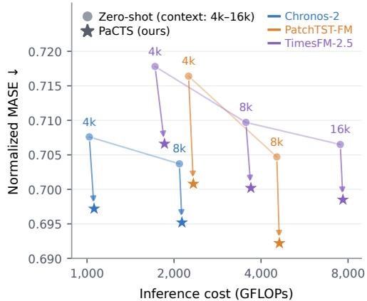
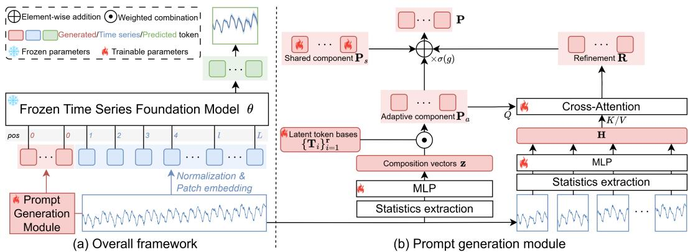
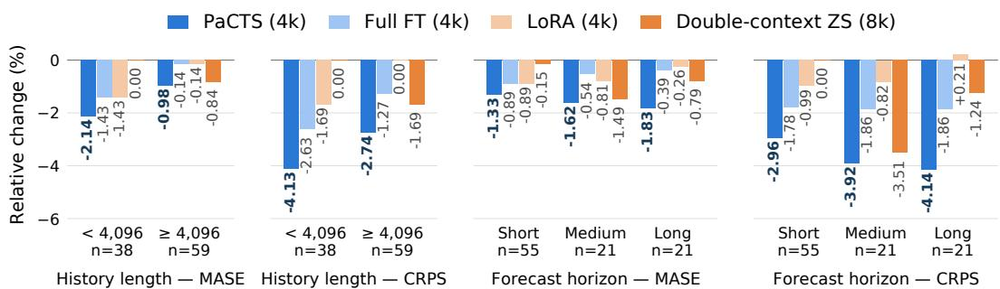
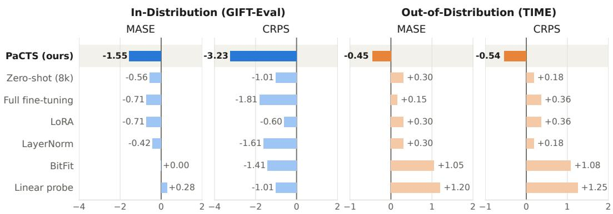
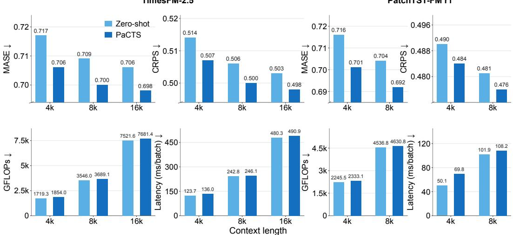

# INSTANCE-ADAPTIVE PROMPTS AS CONTEXT FOR TIME-SERIES FOUNDATION MODELS

Zehao Xiao1 Shifeng Xie1,2 Lei Zan1 Jianfeng Zhang3 Lujia Pan3 Ievgen Redko1 Malik Tiomoko1 Keli Zhang1

1Huawei Noah’s Ark Lab, Paris, France 2LIPADE, Universite Paris Cit´ e, Paris, France´ 3Huawei Noah’s Ark Lab, Shenzhen, China

## ABSTRACT

Longer histories can improve time-series foundation models (TSFMs), but require substantially higher inference cost. We therefore ask whether contextual information can be provided more efficiently through a compact set of learned token embeddings. We introduce PaCTS, which generates a small set of instanceadaptive latent prompts in the form of continuous embedding tokens conditioned on the visible context. These prompts serve as compact context surrogates for frozen TSFMs. PaCTS constructs them from instance-specific global statistics and further refines them with segment-level temporal information, capturing both global characteristics and local temporal variations. The prompt module is jointly trained and deployed across heterogeneous time series with the frozen backbone. Extensive experiments demonstrate the effectiveness of prompts as context, consistently improving forecasting across context lengths and model architectures. With a shorter input context, PaCTS can outperform the same frozen backbone using double context while requiring substantially less inference computation. Compared with weight-space adaptation methods, PaCTS achieves stronger improvements and better out-of-distribution generalization. Code will be released at https://github.com/zzzx1224/PaCTS.

## 1 INTRODUCTION

Foundation models (FMs) have achieved remarkable success in language (Achiam et al., 2023; Team et al., 2023; Liu et al., 2024a) and vision tasks (Dosovitskiy et al., 2020; Radford et al., 2021), demonstrating the ability of large-scale pretraining to deliver strong performance and generalization across tasks (Bommasani et al., 2021). Recently, time-series foundation models (TSFMs) have emerged as a general approach to address unique challenges of large-scale temporal data (Woo et al., 2024; Auer et al., 2025; Podest et al., 2026; Khwaja et al., 2026; Xie et al., 2026a). Pretrained on diverse temporal data, these models achieve strong forecasting performance across datasets and domains without task-specific training (Ansari et al., 2025; Das et al., 2024; Meyer et al., 2026).

  
Figure 1: PaCTS improves forecasting at lower additional cost than extending context.

TSFMs identify temporal patterns and forecast future values based on historical context. Providing more history is therefore a natural way to supply additional context to the model. However, processing longer histories increases inference cost, even with patch-based tokenization (Das et al., 2024; Ansari et al., 2025; Woo et al., 2024). As Figure 1 shows, increasing context length substantially raises inference FLOPs across three TSFMs on GIFT-Eval, while yielding only modest reductions in MASE.

Moreover, extending the context is not always an option. Many time series are too short to provide additional history (Makridakis et al., 2018; Aksu et al., 2024), and sometimes longer inputs may exceed the context window supported by the pretrained backbone (Ansari et al., 2025; Wen et al., 2026). We therefore ask: can we provide afrozen TSFM with compact, informative context derived from the available history to improve forecasting?

In this paper, we propose Prompts as Context for Time Series (PaCTS), which provides compact, informative context to frozen TSFMs through instance-adaptive latent prompts. These prompts are continuous embedding tokens adapted to each time series and prepended to the time-series patch tokens. Our key perspective is to treat prompts as compact context, delivering forecasting benefits comparable to those of much longer histories through a learned summary of the input history, while keeping pretrained weights frozen. PaCTS combines a shared, learned static prompt with an adaptive component generated from global statistics of the input. The static component captures information shared across training series, while the adaptive component conditions the prompt on the current series. Segment-level features further incorporate local temporal information into the prompts. The entire prompt module is jointly trained on heterogeneous time series. Once trained, it generates instance-adaptive prompts for new series without further parameter updates. Although parameterefficient, PaCTS is trained for shared use across datasets rather than separate adaptation to each target dataset.

We train and evaluate PaCTS on GIFT-Eval across multiple pretrained TSFM architectures and context lengths. With trainable prompt parameters amounting to only less than 0.15% of the corresponding pretrained model parameters and little additional inference computation, PaCTS consistently reduces forecasting error, as shown in Figure 1. Moreover, it achieves competitive and even better forecasting than doubling the historical context, with substantially lower inference cost. By introducing adaptive prompts in the input space, PaCTS achieves better forecasting performance than weight-space adaptation alternatives and generalizes well to unseen distributions without further tuning. These results demonstrate the effectiveness of learned prompts as context surrogates for time-series forecasting.

## 2 RELATED WORK

Transformer-based time-series foundation models. Large-scale pretraining has enabled TSFMs to forecast across datasets and domains without task-specific training (Liang et al., 2024). These models employ different representations of historical observations. Chronos (Ansari et al., 2024) discretizes individual values into tokens, whereas patch-based approaches group consecutive observations to reduce sequence length. Following the use of patching in PatchTST (Nie et al., 2023), patch-based representations have been widely adopted by TSFMs, including MOMENT (Goswami et al., 2024), Moirai (Woo et al., 2024), TimesFM (Das et al., 2024), and Timer (Liu et al., 2024b). Recent models further explore mixture-of-experts architectures (Liu et al., 2026) and hierarchical attention (Sun et al., 2025). Both decoder-only models, such as Moirai 2.0 (Liu et al., 2025a), and encoder-only models, such as Chronos-2 (Ansari et al., 2025) and PatchTST-FM (Wen et al., 2026), achieve strong forecasting performance. Our work builds on pretrained TSFMs and studies compact learned context rather than changes to their backbone architectures.

TSFM post-training. Pretrained forecasting models can be adapted through full fine-tuning or parameter-efficient updates (Xie et al., 2026b). LoRA (Hu et al., 2022) learns low-rank weight updates, while selectively fine-tuning only updates subsets of pretrained parameters. For TSFMs, Beyond LoRA (Gupta et al., 2024) studies BitFit, LayerNorm tuning, VeRA, and FourierFT. Other work investigates multi-scale fine-tuning (Qiao et al., 2026a) and compares full fine-tuning with LoRA across forecasting datasets (Laglil et al., 2026). Reinforcement-learning-based post-training has also been explored through feedback-driven policy optimization in TimeHF (Qi et al., 2025) and forecasting-oriented reinforcement fine-tuning in TimeRFT (Li et al., 2026). GTN-R regularizes RL post-training by increasing predictive mass around training targets while encouraging diversity within their neighborhoods (Zhang et al., 2026). Some other methods leave the backbone frozen. TFMAdapter fits instance-level covariate-aware corrections (Dange & Sarawagi, 2025), while TS-Memory distills retrieval-based corrections into a parametric memory (Lyu et al., 2026). Our approach keeps the pretrained backbone frozen and trains an efficient prompt module in input space. Although parameter-efficient, it targets a shared prompt module trained across heterogeneous time series and reused without target-specific fine-tuning.

Input-space conditioning. Prompt tuning (Lester et al., 2021) and prefix-tuning (Li & Liang, 2021) are first proposed for conditioning frozen language models through learned continuous prompts. Visual prompt tuning (Jia et al., 2022) extends prompts to vision Transformers. CoOp (Zhou et al., 2022b), CoCoOp (Zhou et al., 2022a) and the subsequent works (Khattak et al., 2023; Xiao et al., 2024) learn static and input-conditioned prompts for vision-language models. Inspired by multimodal prompt tuning, UniCast (Park et al., 2025) incorporates visual and textual representations into time series prompts. CoSPOT (Choi et al., 2026) combines spectral prompts with aligned time-series features in a frozen LLM for online forecasting. Gen-P-Tuning (Liu et al., 2025b) generates cross-channel prompts to adapt frozen univariate models to multivariate healthcare tasks. In another direction, following the idea of in-context learning, TimesFM-ICF (Faw et al., 2025) trains a forecaster to use related time-series examples supplied in context. Motivated by context compression in LLM (Mu et al., 2023; Chevalier et al., 2023), PaCTS directly learns latent prompts from the target time series as compact context surrogates for frozen TSFMs. The prompt module is trained across heterogeneous series and used without dataset-specific tuning, aiming to provide the forecasting benefit of longer histories at little additional inference cost.

## 3 METHOD

Let $f _ { \theta }$ denote a pretrained TSFM with frozen parameters θ. Given a univariate context $\mathbf { x } \ =$ $( x _ { 1 } , \dots , x _ { T } ) \in \mathbb { R } ^ { \bar { T } }$ with T time steps, the model first normalizes the input, partitions it into $\begin{array} { r } { L = { \frac { T } { P } } } \end{array}$ patches of size P, and maps them to token embeddings $\mathbf { E } = ( \mathbf { e } _ { 1 } , \dots , \mathbf { e } _ { L } ) \in \mathbb { R } ^ { L \times d }$ , where d is the model dimension. A Transformer backbone then produces a probabilistic forecast over the future H time steps:

$$
\begin{array} { r } { \hat { \mathbf { y } } = f _ { \theta } \big ( \mathbf { E } ( \mathbf { x } ) \big ) \in \mathbb { R } ^ { Q \times H } , } \end{array}\tag{1}
$$

where Q denotes the number of predicted quantiles.

For a frozen TSFM, extending the context x is the most direct way to expose the model to additional historical information. However, doing so lengthens the token sequence E and substantially increases inference cost, while the benefit of additional history is often limited. Moreover, longer contexts are not always available: many time series are inherently short (Makridakis et al., 2018; Aksu et al., 2024), and some backbones are trained with a finite context budget (Ansari et al., 2025; Wen et al., 2026), beyond which additional history may be discarded or even become harmful. We therefore ask whether forecasting-relevant information can instead be supplied through a second, more compact input channel.

To this end, we propose PaCTS, a lightweight post-training approach that supplies forecastingrelevant information through $M \ll L$ instance-adaptive latent prompt tokens, which are continuous embeddings generated from the visible context. Prepended to the time-series embeddings, these prompts serve as compact context surrogates and improve forecasting without the cost of substantially extending the input context. They are generated adaptively from the visible context and condition the frozen TSFM without modifying its pretrained parameters. Figure 2 illustrates the overall framework.

## 3.1 LATENT PROMPTS AS CONTEXT SURROGATES

To construct compact context surrogates for the frozen TSFM, we introduce M learnable embedding tokens $\mathbf { P } = ( \mathop { \bf p } _ { 1 } ^ { \scriptscriptstyle \perp } , \scriptscriptstyle . . . , \mathbf { p } _ { M } ) \in \mathbb { R } ^ { \breve { M } \times d }$ , which we refer to as latent prompts. These prompts are continuous vectors in the time-series embedding space. Following the prompt-tuning paradigm in language and vision models (Lester et al., 2021; Zhou et al., 2022b;a), we prepend them to the patch embeddings, yielding

$$
\hat { \bf y } = f _ { \boldsymbol \theta } \big ( [ { \bf P } ; { \bf E } ] \big ) ,\tag{2}
$$

where $[ \cdot ; \cdot ]$ denotes concatenation along the sequence dimension.

During training, only the parameters associated with latent prompt generation are optimized, while all pretrained TSFM parameters θ remain frozen. The prompt tokens act as compact conditioning signals that supply forecasting-relevant information to the frozen model and thereby influence the predictions. Since the prompts are prepended rather than substituted for existing tokens, the complete visible context is retained. With $\bar { M } \ll L$ , the latent prompts serve as efficient context surrogates with substantially lower computational overhead than extending the historical context.

  
Figure 2: Overview of PaCTS. (a) A lightweight prompt generation module maps the context to instance-adaptive latent prompts: continuous vectors prepended to the time-series embeddings. (b) Global context statistics determine a weighted combination of learnable prompt basis patterns, yielding the adaptive component ${ \bf P } _ { a } ( { \bf x } )$ . Segment-level statistics are encoded with relative-position embeddings and retrieved through cross-attention to produce a refinement $\mathbf { R } ( \mathbf { x } )$ . The adaptive component and its refinement are combined, gated, and added to the shared component ${ \bf P } _ { s }$ to form the final prompts.

Position encoding. Transformer-based TSFMs use positional encodings to represent the temporal order of the input tokens. To preserve the original positional structure of the time-series tokens, we assign all prompt tokens with position index 0, treating them as position-agnostic conditioning signals rather than additional temporal observations. The original time-series tokens retain their original positional indices.

## 3.2 INSTANCE-ADAPTIVE PROMPT GENERATION

In its simplest form, P is a set of learnable latent prompt tokens shared across all inputs. Such a static prompt can capture regularities shared by the training corpus, but must accommodate heterogeneous time series with substantially different sampling frequencies, trends, seasonalities, and noise characteristics. A fixed prompt may therefore fail to capture instance-specific variations and overfit to training regularities, limiting its generalization to unseen series. To address this limitation, we decompose the prompt into shared and input-adaptive components:

$$
\mathbf { P } ( \mathbf { x } ) = \underbrace { \mathbf { P } _ { s } } _ { \mathrm { s h a r e d } } + \sigma ( g ) \cdot \underbrace { \mathbf { P } _ { a } ( \mathbf { x } ) } _ { \mathrm { s a m p l e - a d a p t i v e } } ,\tag{3}
$$

where $\sigma ( g )$ is a sigmoid gate with a trainable scalar $g$ controlling the magnitude of the adaptive component. The shared component $\mathbf { P } _ { s } \in \mathbb { R } ^ { M \times d }$ is a free parameter matrix learned across inputs and initialized using the mean patch embedding of the training data, placing the initial prompts near typical time-series token representations. The adaptive component ${ \mathbf { P } } _ { a } ( { \mathbf { x } } )$ is input-dependent and tailors the prompts to the characteristics of each input series.

To generate ${ \mathbf { P } } _ { a } ( { \mathbf { x } } )$ , we extract a compact feature vector $\mathbf { s } \in \mathbb { R } ^ { N _ { s } }$ from the input series, comprising scale-invariant statistics that characterize its distributional and temporal structure, including trend, variability, autocorrelation, and noise level. Their definitions are provided in Appendix B. All statistics are computed non-parametrically in normalized space, ensuring invariance to the location and scale of the input series.

Since s is low-dimensional, directly predicting all $M \times d$ entries of the adaptive prompt would require a large output layer. We therefore factorize the generation through a latent prompt basis consisting of r learnable patterns $\{ \mathbf { T } _ { 1 } , \ldots , \mathbf { T } _ { r } \} \subset \mathbb { R } ^ { M \times d }$

$$
\mathbf { P } _ { a } ( \mathbf { x } ) \ : = \ : \sum _ { i = 1 } ^ { r } z _ { i } \cdot \mathbf { T } _ { i } , \qquad \mathbf { z } = \mathrm { M L P } ( \mathbf { s } ) \in \mathbb { R } ^ { r } ,\tag{4}
$$

where a small MLP maps the statistics to a composition vector z that determines how the basis patterns are combined. This parameterization keeps the generator compact and confines instance-dependent variation to a learned low-dimensional prompt subspace.

The compact statistics capture forecasting-relevant distributional and temporal characteristics of the input series with little computational overhead, as they are computed non-parametrically and remain low-dimensional. Integrating instance-specific statistics into prompt generation further enables the prompt to adapt to each series at inference time, promoting generalization across heterogeneous inputs and mitigating overfitting to training data.

## 3.3 SEGMENT-LEVEL PROMPT REFINEMENT

The global statistics used to generate ${ \mathbf { P } } _ { a } ( { \mathbf { x } } )$ summarize the entire context. However, they may overlook local changes that matter for forecasting, such as recent shifts in trend or variability, particularly for long contexts. To capture such temporal variation while keeping the prompts compact, we refine the adaptive prompts using segment-level information.

To do so, we extract up to $S$ contiguous, non-overlapping segments from the visible context, working backward from the most recent observation. The segment length adapts to the available history, subject to a minimum length for reliable statistics. Shorter histories therefore yield fewer segments. For each segment, we compute the same set of statistics used by the global prompt generator on the normalized series and encode them with a small MLP. We further add learned relative-position embeddings to distinguish earlier and more recent segments. This yields a $d _ { a }$ -dimensional descriptor for each segment. Stacking these descriptors forms the sequence $\mathbf { H } ( \mathbf { x } ) \in \mathbb { R } ^ { S \times d _ { a } }$ , with unused segment slots masked out.

The adaptive prompts then retrieve relevant local information through multi-head cross-attention:

$$
{ \bf R } ( { \bf x } ) = \mathrm { C r o s s A t t n } \big ( { \bf P } _ { a } ( { \bf x } ) , { \bf H } ( { \bf x } ) , { \bf H } ( { \bf x } ) \big ) ,\tag{5}
$$

where ${ \mathbf { P } } _ { a } ( { \mathbf { x } } )$ are projected into queries and $\mathbf { H } ( \mathbf { x } )$ are projected into keys and values. The attention module projects its output back to the model dimension, yielding $\mathbf { R } ( \mathbf { x } ) \in \mathbb { R } ^ { M \times d }$ . We add this refinement to the adaptive component to obtain the final prompts:

$$
\mathbf { P } ( \mathbf { x } ) = \mathbf { P } _ { s } + \sigma ( g ) \cdot \left[ \mathbf { P } _ { a } ( \mathbf { x } ) + \mathbf { R } ( \mathbf { x } ) \right] .\tag{6}
$$

The output projection of the cross-attention module is initialized to zero, so the refinement initially leaves the global adaptive prompts unchanged. For inputs with at most one valid segment, we set $\mathbf { R } ( \mathbf { x } ) = \mathbf { 0 }$ , retaining the global adaptive prompts.

This refinement allows the prompts to combine instance-level characteristics with temporally localized information without increasing the number of prompt tokens. The same compact prompt configuration can therefore accommodate histories of different lengths, supporting joint training across heterogeneous series.

## 3.4 TRAINING

We train PaCTS jointly across heterogeneous time-series datasets while keeping the pretrained TSFM frozen. For quantile forecasting, we optimize the pinball loss over each sample’s valid forecast positions:

$$
\mathcal { L } = \frac { 1 } { Q | \mathcal { H } | } \sum _ { q = 1 } ^ { Q } \sum _ { t \in \mathcal { H } } \rho _ { \tau _ { q } } \big ( \tilde { y } _ { t } - \hat { \tilde { y } } _ { t } ^ { ( q ) } \big ) ,\tag{7}
$$

where $\tau _ { q }$ denotes the q-th quantile level, $\rho _ { \tau } ( u ) = \operatorname* { m a x } ( \tau u , ( \tau - 1 ) u )$ , and H contains the valid forecast positions of the sample. The targets $\tilde { y } _ { t }$ and predictions $\hat { \tilde { y } } _ { t } ^ { ( q ) }$ are expressed in the backbone’s normalized space.

Training samples may have different forecast horizons or missing target values. We therefore mask invalid and padded positions and normalize each sample’s loss by its own number of valid positions. This prevents samples with shorter valid horizons from being down-weighted by padding. The training objective is averaged over samples in each batch.

Only the parameters of the shared prompts, the instance-adaptive generator, and the segmentrefinement module are optimized. All pretrained backbone parameters θ remain frozen. For each backbone, a single prompt module is trained across datasets and generates instance-adaptive latent prompts at inference time without further parameter updates.

## 4 EXPERIMENTS

## 4.1 EXPERIMENTAL SETUP

Benchmarks and data splits. We evaluate PaCTS on two time series benchmarks, GIFT-Eval (Aksu et al., 2024) and TIME (Qiao et al., 2026b). GIFT-Eval serves as our primary benchmark, consisting of 35 datasets with 97 configurations defined by task and forecast horizon. Training, validation, and test sets follow the standard time-based splitting of GIFT-Eval: the first 80% of each series for training, the next 10% for validation, and the final 10% for testing, preserving temporal ordering and preventing data leakage. We train a single prompt module jointly across all datasets and evaluate it across all test sets. To assess generalization ability, we evaluate the GIFT-trained module directly on TIME, which contains 98 forecasting tasks from 50 datasets with no dataset overlap with GIFT-Eval, without further tuning. Dataset configuration and split construction are provided in Appendix A.

Backbones and baselines. We use Chronos-2 (Ansari et al., 2025) as the primary backbone and further evaluate PaCTS on PatchTST-FM (Wen et al., 2026) and TimesFM-2.5 (Das et al., 2024) to examine its applicability across encoder-only and decoder-only models.

To assess the effectiveness of PaCTS as a post-training approach, we compare it on Chronos-2 against the zero-shot backbone and five adaptation baselines: full fine-tuning, LoRA (Hu et al., 2022), LayerNorm-only tuning (Zhao et al., 2024), BitFit (Zaken et al., 2022), and linear probing (Kumar et al., 2022). Full fine-tuning and LoRA follow the official Chronos-2 training recipes. The remaining baselines use the same training pipeline while updating only their respective parameter subsets. For other backbones, we compare PaCTS with the zero-shot model under the same evaluation protocol.

Evaluation protocol and metrics. For evaluation, we measure point and probabilistic forecasting accuracy using mean absolute scaled error (MASE) and continuous ranked probability score (CRPS), respectively. Following the benchmark protocol, we normalize scores by the corresponding seasonalnaive baseline and aggregate across forecasting configurations using the geometric mean. We train the prompt module in a univariate setting and evaluate PaCTS and the baselines under the univariate protocol. We additionally evaluate the same module under the multivariate protocol without retraining and report the results separately. For inference efficiency, we measure FLOPs, GPU memory, and latency compared to the zero-shot baseline.

Training and implementation. We keep the backbone frozen and jointly train a single prompt module across datasets for each backbone and context-length setting. Our default configuration uses M = 10 latent prompt tokens, a rank r = 4 adaptive generator, and up to S = 16 segments for prompt refinement. We optimize the training parameters by AdamW with learning rate 0.001 and select checkpoints using validation loss. Each trained module is shared across evaluation tasks without task-specific adaptation. More details are in Appendix C. All codes will be available.

## 4.2 RESULTS

Main forecasting results. Table 1 compares PaCTS with the zero-shot Chronos-2 backbone and five adaptation baselines on GIFT-Eval. At both context lengths of 4,096 and 8,192, PaCTS improves over the zero-shot backbone on both MASE and CRPS and achieves the lowest average scores among the compared methods. Full fine-tuning and LoRA improve both metrics at both context lengths, but their gains are smaller than those of PaCTS. The other methods primarily improve CRPS, with more limited or no gains in MASE. These results demonstrate the effectiveness of PaCTS as a post-training approach, improving both point and probabilistic forecasting while keeping the backbone frozen.

Prompts as context surrogates. We next examine whether PaCTS can match longer-context forecasting at a lower inference cost. Table 1 shows that PaCTS at 4,096 steps achieves lower mean MASE and CRPS than the zero-shot backbone and all five adaptation baselines using twice the context length, 8,192 steps.

Table 1: Forecasting performance on GIFT-Eval across 97 configurations under the univariate protocol based on Chronos-2. Adaptation results are averaged over three seeds. PaCTS achieves best performance across both context lengths and metrics, even lower MASE and CRPS than the zero-shot and five adaptation baselines with twice the context length (PaCTS 4,096 vs. others 8,192).
<table><tr><td rowspan="2">Method</td><td colspan="4">Context length 4,096</td><td colspan="4">Context length 8,192</td></tr><tr><td>MASE↓</td><td>∆(%)</td><td>CRPS↓</td><td>∆(%)</td><td>MASE↓</td><td>∆(%)</td><td>CRPS↓</td><td>∆(%)</td></tr><tr><td>Chronos-2 zero-shot</td><td>0.708</td><td></td><td>0.496</td><td></td><td>0.704</td><td></td><td>0.491</td><td></td></tr><tr><td>Linear probing</td><td>0.710</td><td>+0.28</td><td>0.491</td><td>-1.01</td><td>0.705</td><td>+0.14</td><td>0.485</td><td>-1.22</td></tr><tr><td>BitFit</td><td>0.708</td><td>0.00</td><td>0.489</td><td>-1.41</td><td>0.704</td><td>0.00</td><td>0.485</td><td>-1.22</td></tr><tr><td>LayerNorm-only</td><td>0.705</td><td>-0.42</td><td>0.488</td><td>-1.61</td><td>0.701</td><td>-0.43</td><td>0.483</td><td>-1.63</td></tr><tr><td>Full fine-tuning</td><td>0.703</td><td>-0.71</td><td>0.487</td><td>-1.81</td><td>0.698</td><td>-0.85</td><td>0.482</td><td>-1.83</td></tr><tr><td>LoRA</td><td>0.703</td><td>-0.71</td><td>0.493</td><td>-0.60</td><td>0.699</td><td>-0.71</td><td>0.488</td><td>-0.61</td></tr><tr><td>PaCTS</td><td>0.697</td><td>-1.55</td><td>0.480</td><td>-3.23</td><td>0.695</td><td>-1.28</td><td>0.478</td><td>-2.65</td></tr></table>

Table 2: Forecasting performance and inference costs of Chronos-2 on GIFT-Eval. Compared with the pretrained model at doubled context length, our method achieves better forecasting performance at lower inference cost, with only 0.128% additional parameters, demonstrating the effectiveness of latent prompts as context surrogates.
<table><tr><td>Method (context)</td><td>MASE↓</td><td>CRPS↓</td><td>GFLOPs↓</td><td>Memory (MiB) ↓</td><td>Latency (ms) ↓</td><td>Params (M)</td></tr><tr><td>Zero-shot (4,096)</td><td>0.708</td><td>0.496</td><td>1,018.4</td><td>651.3</td><td>40.4</td><td>119.478</td></tr><tr><td>Zero-shot (8,192)</td><td>0.704</td><td>0.491</td><td>2,087.4</td><td>809.4</td><td>75.0</td><td>119.478</td></tr><tr><td>PaCTS (4,096)</td><td>0.697</td><td>0.480</td><td>1,057.9</td><td>660.7</td><td>47.4</td><td>119.631</td></tr><tr><td>∆ vs. zero-shot (8,192)</td><td>-0.99%</td><td>-2.24%</td><td>-49.32%</td><td>-18.37%</td><td>-36.80%</td><td>+0.128%</td></tr></table>

Table 2 further reports inference costs for inputs that fill the context window. Compared with zero-shot inference at 8,192 steps, PaCTS at 4,096 steps reduces FLOPs by 49.3%, peak GPU memory by 18.4%, and latency by 36.8%. At the same context length of 4,096, prompt generation and processing add only 3.9% FLOPs and 1.4% memory, with a latency overhead of 17.3%. The prompt module adds only 153,286 trainable parameters, increasing the total model size by 0.128%. These results support the effectiveness of latent prompts as context surrogates, achieving competitive and even better average forecasting accuracy with a shorter visible history and lower inference cost.

Ablations on prompt generation. We also evaluate the contributions of instance-adaptive prompt generation and segment-level refinement using Chronos-2 at a context length of 4,096. As shown in Table 3, static prompts improve CRPS but provide little improvement in MASE. Conditioning the prompts on the input improves both metrics, and adding segment-level refinement yields further gains. These results support the complementary roles of instance-level conditioning and local temporal information in constructing adaptive and effective context surrogates.

Table 3: Ablations on prompt generation. Prompt module is tuned based on Chronos-2 at 4,096 steps. Both adaptive generation and segment refinement improves forecasting.
<table><tr><td>Variant</td><td>MASE↓</td><td>CRPS↓</td></tr><tr><td>Zero-shot</td><td>0.708</td><td>0.496</td></tr><tr><td>Static prompts</td><td>0.707</td><td>0.490</td></tr><tr><td>+ Adaptive generation</td><td>0.704</td><td>0.486</td></tr><tr><td>+ Segment refinement</td><td>0.697</td><td>0.480</td></tr></table>

Effects of history length and forecast horizon. We further examine how the gains of PaCTS vary across history lengths and forecast horizons on GIFT-Eval. We evaluate PaCTS, LoRA, and full fine-tuning with a context length of 4,096 steps on GIFT-Eval configurations grouped separately by history length and forecasting horizon, and compare them with pretrained Chronos-2 with the same and double context length.

As shown in the left two panels of Figure 3, doubling the context length improves performance primarily in the longer-history group (≥ 4, 096 steps), while providing no improvement in the shorterhistory group (< 4, 096 steps) since the available history is already covered by the original context window. LoRA and full fine-tuning also exhibit distinct behavior across these groups. Their gains are larger on shorter histories, with limited MASE improvements on longer histories. In contrast, PaCTS improves both metrics and outperforms zero-shot inference with double the context length in both groups, supporting the effectiveness of latent prompts as context surrogates.

  
Figure 3: Effects of history length and forecast horizon. The bars show percentage changes in MASE and CRPS relative to zero-shot Chronos-2 at 4,096 steps. Negative values indicate improvements. The left two panels group configurations by history lengths, and the right two by forecasting horizons. PaCTS performs consistently better than other methods and double-context zero-shot forecasts. Detailed numbers are in Appendix D.

  
Figure 4: In-distribution and out-of-distribution generalization performance comparisons. Relative changes in MASE and CRPS are measured against zero-shot Chronos-2 at 4,096 steps. Among the compared methods, PaCTS achieves the best in-distribution performance on GIFT-Eval and is the only method that improves both metrics over zero-shot inference on the TIME benchmark.

Across forecasting horizons, the MASE gains of LoRA and full fine-tuning diminish in the longhorizon group, and LoRA even yields worse CRPS than the pretrained baseline. Doubling the context length provides good gains for medium and long horizons, but only marginal gains for short ones. In contrast, PaCTS outperforms both adaptation baselines and double-context inference on both metrics across all three horizon groups, which demonstrates consistent benefits across different forecasting lengths.

Generalization to unseen data. We next evaluate the generalization ability of PaCTS to unseen data after adaptation. We directly apply the prompt module trained on GIFT-Eval to TIME without further training or tuning, with 4,096 steps context length. As shown in Figure 4, PaCTS is the only method that achieves lower MASE and CRPS on TIME than the original pretrained Chronos-2. In contrast, all five weight-space adaptation baselines yield higher errors on both metrics, indicating that their improvements on GIFT-Eval do not carry over to TIME. Notably, increasing context length of the original pretrained model to 8,192 also fails to improve either metric. The results demonstrate that the proposed prompts as context yields good generalization ability.

Multivariate forecasting. We further extend the evaluation of PaCTS, trained under the univariate setting, to multivariate forecasting on GIFT-Eval and TIME using the official inference protocol of Chronos-2, without additional training or tuning. As shown in Table 4, PaCTS improves both MASE and CRPS at both context lengths on GIFT-Eval. It also yields modest improvements over zero-shot forecasting on the out-of-distribution benchmark TIME, further supporting its generalization ability. Moreover, PaCTS at 4,096 steps outperforms zero-shot Chronos-2 at 8,192 steps on both metrics on both benchmarks. These results show that latent prompts learned under the univariate setting remain effective as context surrogates for multivariate forecasting.

Table 4: Extension to multivariate forecasting with univariate-trained prompts. PaCTS is trained only on the GIFT-Eval training split under the univariate setting and evaluated directly using the official multivariate inference protocol of Chronos-2, without additional training or tuning. GIFT-Eval and TIME serve as in-distribution and out-of-distribution benchmarks, respectively. The univariatetrained prompts improve both metrics on both benchmarks.  
(a) In-distribution results on GIFT-Eval
<table><tr><td colspan="3">Context 4,096</td><td colspan="2">Context 8,192</td></tr><tr><td>Method</td><td>MASE↓</td><td>CRPS↓</td><td>MASE↓</td><td>CRPS↓</td></tr><tr><td>Zero-shot</td><td>0.701</td><td>0.488</td><td>0.698</td><td>0.485</td></tr><tr><td>PaCTS</td><td>0.695</td><td>0.478</td><td>0.690</td><td>0.473</td></tr></table>

(b) Out-of-distribution results on TIME
<table><tr><td rowspan="2">Method</td><td colspan="2">Context 4,096</td><td colspan="2">Context 8,192</td></tr><tr><td>MASE↓</td><td>CRPS↓</td><td>MASE↓</td><td>CRPS↓</td></tr><tr><td>Zero-shot</td><td>0.659</td><td>0.555</td><td>0.663</td><td>0.557</td></tr><tr><td>PaCTS</td><td>0.655</td><td>0.553</td><td>0.658</td><td>0.554</td></tr></table>

  
Figure 5: Forecasting performance (top) and computational costs (bottom) across backbones on GIFT-Eval. Lower values are better for all metrics. As with Chronos-2, shorter-context PaCTS achieves competitive or better performance than longer-context zero-shot baselines, with substantially lower computational costs.

Results across backbones. We further evaluate PaCTS on encoder-only (PatchTST-FM (Wen et al., 2026)) and decoder-only (TimesFM-2.5 (Das et al., 2024)) backbones. As shown in Figure 5, PaCTS reduces MASE and CRPS at every evaluated context length, including contexts of up to 16,384 steps for TimesFM-2.5. Across both backbones, shorter-context PaCTS achieves lower MASE and competitive CRPS compared with zero-shot inference using double context length. Against zero-shot inference at roughly twice the context length, PaCTS at 4,096 steps lowers MASE by 0.43% on PatchTST-FM and 0.42% on TimesFM-2.5, using around 51% and 52% of the GFLOPs, respectively. On TimesFM-2.5, PaCTS at 8,192 steps further improves MASE and CRPS over zero-shot inference at 16,384 steps by 0.85% and 0.60%, using only 49% of the GFLOPs. The efficiency results in the second row show that PaCTS adds less than 8% FLOPs at the same context length, while using only about half FLOPs of zero-shot inference with double context length. The results demonstrate the applicability of latent prompts as context surrogates across backbones. More detailed numbers are provided in Appendix D.

## 5 CONCLUSION

We present a lightweight approach that uses learned input-space prompts as context surrogates for frozen time-series foundation models, improving forecasting without explicitly processing substantially longer histories or updating backbone parameters. Across GIFT-Eval and TIME, the approach provides consistent gains, favorable accuracy–compute trade-offs, and better out-of-distribution transfer than weight-space adaptation, while also extending across multiple TSFM architectures and to multivariate inference. Our current study nevertheless has several limitations: the prompts are trained only under the univariate setting, leaving multivariate prompt training unexplored, and their ability to replace additional context depends on the context-scaling behavior of the underlying backbone. Future work can investigate prompt learning directly in multivariate settings and more general context-surrogate mechanisms across broader TSFM architectures.

## REFERENCES

Josh Achiam, Steven Adler, Sandhini Agarwal, Lama Ahmad, Ilge Akkaya, Florencia Leoni Aleman, Diogo Almeida, Janko Altenschmidt, Sam Altman, Shyamal Anadkat, et al. Gpt-4 technical report. arXiv preprint arXiv:2303.08774, 2023.

Taha Aksu, Gerald Woo, Juncheng Liu, Xu Liu, Chenghao Liu, Silvio Savarese, Caiming Xiong, and Doyen Sahoo. Gift-eval: A benchmark for general time series forecasting model evaluation. arXiv preprint arXiv:2410.10393, 2024.

Abdul Fatir Ansari, Lorenzo Stella, Caner Turkmen, Xiyuan Zhang, Pedro Mercado, Huibin Shen, Oleksandr Shchur, Syama Sundar Rangapuram, Sebastian Pineda Arango, Shubham Kapoor, et al. Chronos: Learning the language of time series. arXiv preprint arXiv:2403.07815, 2024.

Abdul Fatir Ansari, Oleksandr Shchur, Jaris Kuken, Andreas Auer, Boran Han, Pedro Mercado,¨ Syama Sundar Rangapuram, Huibin Shen, Lorenzo Stella, Xiyuan Zhang, et al. Chronos-2: From univariate to universal forecasting. arXiv preprint arXiv:2510.15821, 2025.

Andreas Auer, Patrick Podest, Daniel Klotz, Sebastian Bock, G¨ unter Klambauer, and Sepp Hochreiter.¨ TiRex: Zero-shot forecasting across long and short horizons with enhanced in-context learning. In The Thirty-Ninth Annual Conference on Neural Information Processing Systems, 2025. URL https://arxiv.org/abs/2505.23719.

Rishi Bommasani, Drew A Hudson, Ehsan Adeli, Russ Altman, Simran Arora, Sydney von Arx, Michael S Bernstein, Jeannette Bohg, Antoine Bosselut, Emma Brunskill, et al. On the opportunities and risks of foundation models. arXiv preprint arXiv:2108.07258, 2021.

Alexis Chevalier, Alexander Wettig, Anirudh Ajith, and Danqi Chen. Adapting language models to compress contexts. In Proceedings of the 2023 Conference on Empirical Methods in Natural Language Processing, pp. 3829–3846, 2023.

Seungyoon Choi, Hyunchul Kim, Jae-Gil Lee, and Chanyoung Park. Compositional spectral prompts for llm-based online time series forecasting. arXiv preprint arXiv:2609.02093, 2026.

Afrin Dange and Sunita Sarawagi. Tfmadapter: Lightweight instance-level adaptation of foundation models for forecasting with covariates. In Proceedings of the 34th ACM International Conference on Information and Knowledge Management, pp. 498–507, 2025.

Abhimanyu Das, Weihao Kong, Rajat Sen, and Yichen Zhou. A decoder-only foundation model for time-series forecasting. In Proceedings ofthe 41st International Conference on Machine Learning, pp. 10148–10167, 2024.

Alexey Dosovitskiy, Lucas Beyer, Alexander Kolesnikov, Dirk Weissenborn, Xiaohua Zhai, Thomas Unterthiner, Mostafa Dehghani, Matthias Minderer, Georg Heigold, Sylvain Gelly, et al. An image is worth 16x16 words: Transformers for image recognition at scale. arXiv preprint arXiv:2010.11929, 2020.

Matthew Faw, Rajat Sen, Yichen Zhou, and Abhimanyu Das. In-context fine-tuning for time-series foundation models. In International Conference on Machine Learning, pp. 16355–16374. PMLR, 2025.

Mononito Goswami, Konrad Szafer, Arjun Choudhry, Yifu Cai, Shuo Li, and Artur Dubrawski. Moment: A family of open time-series foundation models. In International Conference on Machine Learning, pp. 16115–16152. PMLR, 2024.

Divij Gupta, Anubhav Bhatti, and Surajsinh Parmar. Beyond lora: Exploring efficient fine-tuning techniques for time series foundational models. arXiv preprint arXiv:2409.11302, 2024.

Edward J Hu, Yelong Shen, Phillip Wallis, Zeyuan Allen-Zhu, Yuanzhi Li, Shean Wang, Liang Wang, Weizhu Chen, et al. Lora: Low-rank adaptation of large language models. Iclr, 1(2):3, 2022.

Menglin Jia, Luming Tang, Bor-Chun Chen, Claire Cardie, Serge Belongie, Bharath Hariharan, and Ser-Nam Lim. Visual prompt tuning. In European conference on computer vision, pp. 709–727. Springer, 2022.

Muhammad Uzair Khattak, Hanoona Rasheed, Muhammad Maaz, Salman Khan, and Fahad Shahbaz Khan. Maple: Multi-modal prompt learning. In 2023 IEEE/CVF Conference on Computer Vision and Pattern Recognition (CVPR), pp. 19113–19122. IEEE, 2023.

Emaad Khwaja, Chris Lettieri, Gerald Woo, Eden Belouadah, Marc Cenac, Guillaume Jarry, Enguerrand Paquin, Xunyi Zhao, Viktoriya Zhukov, Othmane Abou-Amal, et al. Toto 2.0: Time series forecasting enters the scaling era. arXiv preprint arXiv:2605.20119, 2026.

Ananya Kumar, Aditi Raghunathan, Robbie Jones, Tengyu Ma, and Percy Liang. Fine-tuning can distort pretrained features and underperform out-of-distribution. arXiv preprint arXiv:2202.10054, 2022.

Morad Laglil, Bertrand Pracca, Emilie Devijver, and Eric Gaussier. Foundation models and fine-tuning: Toward a new generation of models for time series forecasting. arXiv preprint arXiv:2607.23146, 2026.

Brian Lester, Rami Al-Rfou, and Noah Constant. The power of scale for parameter-efficient prompt tuning. In Proceedings of the 2021 conference on empirical methods in natural language processing, pp. 3045–3059, 2021.

Siyang Li, Yize Chen, Zijie Zhu, Yuxin Pan, Yan Guo, Ming Huang, and Hui Xiong. Timerft: Stimulating generalizable time series forecasting for tsfms via reinforcement finetuning. arXiv preprint arXiv:2605.00015, 2026.

Xiang Lisa Li and Percy Liang. Prefix-tuning: Optimizing continuous prompts for generation. In Proceedings ofthe 59th Annual Meeting ofthe Associationfor Computational Linguistics and the 11th International Joint Conference on Natural Language Processing (Volume 1: Long Papers), pp. 4582–4597, 2021.

Yuxuan Liang, Haomin Wen, Yuqi Nie, Yushan Jiang, Ming Jin, Dongjin Song, Shirui Pan, and Qingsong Wen. Foundation models for time series analysis: A tutorial and survey. In Proceedings ofthe 30th ACM SIGKDD conference on knowledge discovery and data mining, pp. 6555–6565, 2024.

Aixin Liu, Bei Feng, Bing Xue, Bingxuan Wang, Bochao Wu, Chengda Lu, Chenggang Zhao, Chengqi Deng, Chenyu Zhang, Chong Ruan, et al. Deepseek-v3 technical report. arXiv preprint arXiv:2412.19437, 2024a.

Chenghao Liu, Taha Aksu, Juncheng Liu, Xu Liu, Hanshu Yan, Quang Pham, Silvio Savarese, Doyen Sahoo, Caiming Xiong, and Junnan Li. Moirai 2.0: When less is more for time series forecasting. arXiv preprint arXiv:2511.11698, 2025a.

Mingzhu Liu, Angela Chen, and George Chen. Generalized prompt tuning: Adapting frozen univariate time series foundation models for multivariate healthcare time series. In Machine Learning for Health (ML4H), pp. 668–679. PMLR, 2025b.

Yong Liu, Haoran Zhang, Chenyu Li, Xiangdong Huang, Jianmin Wang, and Mingsheng Long. Timer: Generative pre-trained transformers are large time series models. arXiv preprint arXiv:2402.02368, 2024b.

Yong Liu, Xingjian Su, Shiyu Wang, Haoran Zhang, Haixuan Liu, Yuxuan Wang, Zhou Ye, Yang Xiang, Jianmin Wang, and Mingsheng Long. Timer-s1: A billion-scale time series foundation model with serial scaling. arXiv preprint arXiv:2603.04791, 2026.

Sisuo Lyu, Siru Zhong, Tiegang Chen, Weilin Ruan, Qingxiang Liu, Taiqiang Lv, Qingsong Wen, Raymond Chi-Wing Wong, and Yuxuan Liang. Ts-memory: Plug-and-play memory for time series foundation models. In Proceedings of the 32nd ACM SIGKDD Conference on Knowledge Discovery and Data Mining V. 2, pp. 3562–3572, 2026.

Spyros Makridakis, Evangelos Spiliotis, and Vassilios Assimakopoulos. The m4 competition: Results, findings, conclusion and way forward. International Journal of forecasting, 34(4):802–808, 2018.

Lucas Meyer, Claudio Sole, Huikan Xiang, Nicolas Li, Lucas Franceschino, Arnau Quera-Bofarull, Maarten P. Scholl, Joachim Fainberg, and Geoffrey Negiar.´ t : A time-series foundation model for forecasting with context, 2026. URL https://arxiv.org/abs/2609.24559.

Jesse Mu, Xiang Li, and Noah Goodman. Learning to compress prompts with gist tokens. Advances in Neural Information Processing Systems, 36:19327–19352, 2023.

Yuqi Nie, Nam H Nguyen, Phanwadee Sinthong, and Jayant Kalagnanam. A time series is worth 64 words: Long-term forecasting with transformers. In The Eleventh International Conference on Learning Representations, 2023.

Sehyuk Park, Soyeon Caren Han, and Eduard Hovy. Unicast: A unified multimodal prompting framework for time series forecasting. arXiv e-prints, pp. arXiv–2508, 2025.

Patrick Podest, Marco Pichler, Elias Burger, Levente Z¨ olyomi, Bernhard Voggenberger, Wilhelm´ Berghammer, Daniel Klotz, Sebastian Bock, G ¨ unter Klambauer, and Sepp Hochreiter. TiRex-2:¨ Generalizing TiRex to multivariate data and streaming, 2026. URL https://arxiv.org/ abs/2607.01204.

Yongzhi Qi, Hao Hu, Dazhou Lei, Jianshen Zhang, Zhengxin Shi, Yulin Huang, Zhengyu Chen, Xiaoming Lin, and Zuo-Jun Max Shen. Timehf: Billion-scale time series models guided by human feedback. arXiv preprint arXiv:2501.15942, 2025.

Zhongzheng Qiao, Chenghao Liu, Yiming Zhang, Ming Jin, Quang Pham, Qingsong Wen, Ponnuthu rai Suganthan, Xudong Jiang, and Savitha Ramasamy. Multi-scale finetuning for encoder-based time series foundation models. Advances in Neural Information Processing Systems, 38:22313– 22345, 2026a.

Zhongzheng Qiao, Sheng Pan, Anni Wang, Viktoriya Zhukova, Yong Liu, Xudong Jiang, Qingsong Wen, Mingsheng Long, Ming Jin, and Chenghao Liu. It’s time: Towards the next generation of time series forecasting benchmarks. arXiv preprint arXiv:2602.12147, 2026b.

Alec Radford, Jong Wook Kim, Chris Hallacy, Aditya Ramesh, Gabriel Goh, Sandhini Agarwal, Girish Sastry, Amanda Askell, Pamela Mishkin, Jack Clark, et al. Learning transferable visual models from natural language supervision. In International conference on machine learning, pp. 8748–8763. PmLR, 2021.

Yinbo Sun, Yuchen Fang, Zhibo Zhu, Jia Li, Yu Liu, Qiwen Deng, Jun Zhou, Hang Yu, Xingyu Lu, and Lintao Ma. Xihe: Scalable zero-shot time series learner via hierarchical interleaved block attention. arXiv preprint arXiv:2510.21795, 2025.

Gemini Team, Rohan Anil, Sebastian Borgeaud, Jean-Baptiste Alayrac, Jiahui Yu, Radu Soricut, Johan Schalkwyk, Andrew M Dai, Anja Hauth, Katie Millican, et al. Gemini: a family of highly capable multimodal models. arXiv preprint arXiv:2312.11805, 2023.

Yunshi Wen, Wesley M Gifford, Chandra Reddy, Lam M Nguyen, Jayant Kalagnanam, and Anak Agung Julius. Revisiting the generic transformer: Deconstructing a strong baseline for time series foundation models. arXiv preprint arXiv:2602.06909, 2026.

Gerald Woo, Chenghao Liu, Akshat Kumar, Caiming Xiong, Silvio Savarese, and Doyen Sahoo. Unified training of universal time series forecasting transformers. In Forty-first International Conference on Machine Learning, 2024.

Zehao Xiao, Jiayi Shen, Mohammad Mahdi Derakhshani, Shengcai Liao, and Cees GM Snoek. Any-shift prompting for generalization over distributions. In 2024 IEEE/CVF Conference on Computer Vision and Pattern Recognition (CVPR), pp. 13849–13860. IEEE, 2024.

Shifeng Xie, Bahaeddine Abdessalem, Zehao Xiao, Youssef Attia El Hili, Ambroise Odonnat, Zhiwei Dong, Lei Zan, Themis Palpanas, Jianfeng Zhang, Lujia Pan, Keli Zhang, and Malik Tiomoko. Tabby: An open pretraining recipe for time series foundation models, 2026a. URL https://arxiv.org/abs/2609.13956.

Shifeng Xie, Ambroise Odonnat, Zehao Xiao, Lei Zan, Malik Tiomoko, Lujia Pan, Themis Palpanas, Boris N Oreshkin, Chenghao Liu, and Keli Zhang. Post-training in time series foundation models: A unifying framework. arXiv preprint arXiv:2607.20002, 2026b.

Elad Ben Zaken, Yoav Goldberg, and Shauli Ravfogel. Bitfit: Simple parameter-efficient fine-tuning for transformer-based masked language-models. In Proceedings ofthe 60th Annual Meeting ofthe Association for Computational Linguistics (Volume 2: Short Papers), pp. 1–9, 2022.

Jianqi Zhang, Xingyu Zhang, Zeen Song, Changwen Zheng, Fanjiang Xu, and Wenwen Qiang. Ground-truth neighborhood regularization for reinforcement learning post-training of time series foundation models. arXiv preprint arXiv:2608.08010, 2026.

Bingchen Zhao, Haoqin Tu, Chen Wei, Jieru Mei, and Cihang Xie. Tuning layernorm in attention: Towards efficient multi-modal llm finetuning. In International Conference on Learning Representations, volume 2024, pp. 28995–29009, 2024.

Kaiyang Zhou, Jingkang Yang, Chen Change Loy, and Ziwei Liu. Conditional prompt learning for vision-language models. In Proceedings of the IEEE/CVF conference on computer vision and pattern recognition, pp. 16816–16825, 2022a.

Kaiyang Zhou, Jingkang Yang, Chen Change Loy, and Ziwei Liu. Learning to prompt for visionlanguage models. International journal ofcomputer vision, 130(9):2337–2348, 2022b.

## APPENDIX

## A DATASETS AND EVALUATION PROTOCOL

Training and test configurations. GIFT-Eval (Aksu et al., 2024) comprises 35 datasets in the setting considered here. Prompt training pools 48 dataset–frequency tasks, while the main evaluation aggregates 97 dataset–frequency–horizon configurations. A configuration, rather than a dataset, is the unit of metric aggregation. For each backbone and context-length setting, we train one prompt module on the pooled training tasks and test it for every corresponding test configuration, without dataset-specific fine-tuning.

Temporal boundaries. The data loader first withholds the test portion of each series. To prevent overlap with the official evaluation windows on short series, the available prefix for a series of length T is truncated at

$$
T _ { \mathrm { a v a i l } } = \mathrm { m i n } ( \lfloor 0 . 9 T \rfloor , T - \ell _ { \mathrm { t e s t } } ) ,\tag{8}
$$

where $\ell _ { \mathrm { t e s t } }$ is the length covered by that task’s official test windows. The first $\left\lfloor 0 . 8 9 T _ { \mathrm { a v a i l } } \right\rfloor$ observations are available to the training sampler, and the remainder of the available prefix supplies validation targets. Validation contexts may include earlier training observations, but validation forecast targets begin after the training boundary. This construction is approximately an 80/10/10 temporal split on long series and uses a stricter cutoff where a proportional split would intrude into an official test window.

Transfer benchmark. TIME (Qiao et al., 2026b) contains 98 forecasting tasks from 50 datasets with no dataset overlap with GIFT-Eval. We apply the GIFT-trained prompt module directly to TIME without updating either the module or the backbone. The same transfer question is evaluated for the other adaptation baselines. Therefore, GIFT-Eval test results measure in-distribution performance while TIME evaluates transferring to out-of-distribution datasets.

Metrics. We follow the GIFT-Eval evaluation protocol and report mean absolute scaled error (MASE) and CRPS (Aksu et al., 2024). Let $\mathcal { T } _ { c }$ contain all valid forecast positions across windows and variates in test set c. For window $i ,$ let $x _ { i , 1 : L _ { i } }$ be its observed history, $s _ { i }$ its seasonal period, y the target, and $\hat { y } _ { i t } ^ { ( q ) }$ the predicted q-quantile. The seasonal scale and test-set MASE are

$$
d _ { i } = \frac { 1 } { L _ { i } - s _ { i } } \sum _ { t = s _ { i } + 1 } ^ { L _ { i } } | x _ { i t } - x _ { i , t - s _ { i } } | ,\tag{9}
$$

$$
\mathrm { M A S E } _ { c } = \frac { 1 } { | \mathcal { T } _ { c } | } \sum _ { ( i , t ) \in \mathbb { Z } _ { c } } \frac { | y _ { i t } - \hat { y } _ { i t } ^ { ( 0 . 5 ) } | } { d _ { i } } .\tag{10}
$$

The metric labeled CRPS by GIFT-Eval is the mean weighted sum quantile loss over ${ \mathcal { Q } } =$ $\{ 0 . 1 , 0 . 2 , \ldots , 0 . 9 \}$ . With $\rho _ { q } ( \dot { u } ) = u \big ( q - \mathbf { 1 } \{ u < 0 \} \big )$ , it is computed as

$$
\mathrm { C R P S } _ { c } = \frac { 1 } { | \mathscr { Q } | } \sum _ { q \in \mathscr { Q } } \frac { 2 \sum _ { ( i , t ) \in \mathscr { T } _ { c } } \rho _ { q } \bigl ( y _ { i t } - \hat { y } _ { i t } ^ { ( q ) } \bigr ) } { \sum _ { ( i , t ) \in \mathscr { T } _ { c } } | y _ { i t } | } .\tag{11}
$$

Thus, quantile losses and absolute targets are pooled across valid positions within each test set before their ratio is taken.

Following the GIFT-Eval leaderboard, we divide each test-set score by the Seasonal Naive score computed using the same metric, then take the geometric mean over all 97 test sets C:

$$
G _ { m } ( { \mathcal C } ) = \exp \left[ \frac { 1 } { | { \mathcal C } | } \sum _ { c \in { \mathcal C } } \log \left( \frac { m _ { c } } { m _ { c } ^ { \mathrm { S N } } } \right) \right] , \qquad m \in \{ \mathrm { M A S E } , \mathrm { C R P S } \} .\tag{12}
$$

We use the same MASE and quantile-based CRPS metrics for TIME, following its official windowlevel aggregation protocol (Qiao et al., 2026b).

Table 5: Ten input statistics used by the prompt generator.
<table><tr><td>No.</td><td>Feature</td><td>Implementation</td></tr><tr><td>1</td><td>Mean</td><td>Mean of observed values</td></tr><tr><td>2</td><td>Standard deviation</td><td>Clipped above at 10</td></tr><tr><td>3</td><td>Minimum</td><td>Clipped to [−10, 10]</td></tr><tr><td>4</td><td>Maximum</td><td>Clipped to [—10, 10]</td></tr><tr><td>5</td><td>Half-window change</td><td>Second-half mean minus first-half mean; [—5, 5]</td></tr><tr><td>6</td><td>Mean first difference</td><td>Consecutive observed pairs; [—5, 5]</td></tr><tr><td>7</td><td>Std. first difference</td><td>Consecutive observed pairs; clipped at 10</td></tr><tr><td>8</td><td>Lag-one autocorrelation</td><td>Clipped to [−1, 1]</td></tr><tr><td>9</td><td>Observed fraction</td><td>Observed length divided by input width</td></tr><tr><td>10</td><td>Log length</td><td> $\log ( 1 + n _ { \mathrm { o b s } } ) / 1 0$ </td></tr></table>

## B STATISTICS OF PROMPT CONSTRUCTION

The generator computes ten statistics from the normalized visible input, using the observation mask to exclude missing or padded values. Table 5 lists the implemented features. The same extractor is applied to the full context and to each valid segment. The statistics include changes across time and lag-one dependence. In the segment branch, the configured seasonal period can affect segment granularity, and the ordered segment descriptors retain local temporal variation. All statistics are computed non-parametrically and are invariant to the location and scale of the original series.

## C TRAINING AND ADAPTATION BASELINES

Prompt optimization. The default adaptive generator has rank $r = 4 .$ , and the prompt module uses $M = 1 0$ tokens and up to $S = 1 6$ segments. We use temperature-based task sampling with probability proportional to $\hat { N } _ { k } ^ { 0 . 2 }$ , where $N _ { k }$ is the number of univariate series entries retained for task k. Within each sampled entry, we draw eight training windows when valid prediction origins are available. For each task, we retain at most the number of source-series records specified in the table before expanding multivariate records into univariate entries. We optimize the parameters with AdamW at learning rate $1 0 ^ { - 3 }$ and select checkpoints by validation loss. The reported prompt runs use an effective batch size of 48 for at most 12 epochs. The quantile loss is normalized by each sample’s number of valid forecast positions before averaging across samples, so a shorter valid horizon is not down-weighted by padding. For PaCTS, all backbone parameters remain frozen.

For segment extraction, the reference width is $W = \operatorname* { m a x } ( 1 , \lfloor C / S \rfloor )$ , where $C$ is the configured context length. In the adaptive-horizon setting, the minimum segment length is min(W, max $( { \bar { L } } _ { \operatorname* { m i n } } , p ) )$ , where $L _ { \operatorname* { m i n } } = 4 8$ and $p$ is the configured seasonal period if greater than one, or the forecast horizon otherwise. The actual segment length also depends on the available history and cannot exceed its observed length. The cross-attention module uses width 64 and four heads.

We prepend the prompts before the Transformer layers while retaining the original time-series tokens and their zero-shot positions. The prompt tokens are assigned position ID of 0. All three backbones use the same statistics-to-basis MLP with two hidden layers of width 32 and the same segmentrefinement design. The rank-four basis is initialized from a zero-mean Gaussian with standard deviation $1 0 ^ { - 3 }$ , and the shared prompts are initialized from the mean visible input-token embedding of the corresponding backbone’s training data.

Baseline optimization. On Chronos-2, full fine-tuning and LoRA follow the official Chronos2Pipeline.fit() training procedure. LayerNorm-only tuning, BitFit, and linear probing use the same pipeline, restricting the optimizer to the selected parameter subset. All five baselines use an effective batch size of 256 and train for 5,000 optimizer steps. Validation is performed every 100 steps, and the best validation checkpoint is selected. Table 6 lists the updated parameter subsets and learning rates.

Table 6: Chronos-2 adaptation baseline settings. Every row uses the official fit pipeline, 5,000 optimizer steps, and batch size 256.
<table><tr><td>Method</td><td>Updated parameters</td><td>Learning rate</td></tr><tr><td>Full fine-tuning</td><td>All backbone parameters</td><td> $1 0 ^ { - 6 }$ </td></tr><tr><td>LoRA</td><td>Rank 8,  $\alpha = 1 6 ;$  attention and output layers</td><td> $1 0 ^ { - 5 }$ </td></tr><tr><td>LayerNorm-only</td><td>Layer-normalization parameters</td><td> $1 0 ^ { - 3 }$ </td></tr><tr><td>BitFit</td><td>Selected bias parameters</td><td> $1 0 ^ { - 3 }$ </td></tr><tr><td>Linear probe</td><td>Output patch embedding</td><td> $1 0 ^ { - 3 }$ </td></tr></table>

Table 7: Detailed results of in-distribution and out-of-distribution generalization comparisons. PaCTS achieves the best in-distribution performance on GIFT-Eval and is the only method that improves both metrics over zero-shot inference on the out-of-distribution TIME benchmark.
<table><tr><td></td><td></td><td colspan="4">GIFT-Eval</td><td colspan="4">TIME</td></tr><tr><td>Method</td><td>Context steps</td><td>MASE</td><td>∆(%)</td><td>CRPS</td><td>∆(%)</td><td>MASE</td><td>∆(%)</td><td>CRPS</td><td>∆(%)</td></tr><tr><td>Zero-shot</td><td>4,096</td><td>0.708</td><td></td><td>0.496</td><td></td><td>0.664</td><td></td><td>0.558</td><td></td></tr><tr><td>Zero-shot</td><td>8,192</td><td>0.704</td><td>-0.56</td><td>0.491</td><td>-1.01</td><td>0.666</td><td>+0.30</td><td>0.559</td><td>+0.18</td></tr><tr><td>Full fine-tuning</td><td>4,096</td><td>0.703</td><td>-0.71</td><td>0.487</td><td>-1.81</td><td>0.665</td><td>+0.15</td><td>0.560</td><td>+0.36</td></tr><tr><td>LoRA</td><td>4,096</td><td>0.703</td><td>-0.71</td><td>0.493</td><td>-0.60</td><td>0.666</td><td>+0.30</td><td>0.560</td><td>+0.36</td></tr><tr><td>LayerNorm-only</td><td>4,096</td><td>0.705</td><td>-0.42</td><td>0.488</td><td>-1.61</td><td>0.666</td><td>+0.30</td><td>0.559</td><td>+0.18</td></tr><tr><td>BitFit</td><td>4,096</td><td>0.708</td><td>0.00</td><td>0.489</td><td>-1.41</td><td>0.671</td><td>+1.05</td><td>0.564</td><td>+1.08</td></tr><tr><td>Linear probe</td><td>4,096</td><td>0.710</td><td>+0.28</td><td>0.491</td><td>-1.01</td><td>0.672</td><td>+1.20</td><td>0.565</td><td>+1.25</td></tr><tr><td>PaCTS</td><td>4,096</td><td>0.697</td><td>-1.55</td><td>0.480</td><td>-3.23</td><td>0.661</td><td>-0.45</td><td>0.555</td><td>-0.54</td></tr></table>

## D ADDITIONAL EXPERIMENTAL RESULTS

Detailed results of in-distribution and out-of-distribution generalization comparisons. Table 7 lists the absolute scores underlying the GIFT-Eval and TIME comparison. Every adapted row uses a checkpoint trained on GIFT-Eval. The zero-shot rows evaluate pretrained Chronos-2 without adaptation.

Effects of history length. Table 8 reports detailed results for all 97 GIFT-Eval configurations, grouped by the median available history length of their dataset. Each score is the seasonal-naivenormalized geometric mean within the indicated group. As discussed in Figure 3, PaCTS improves both metrics and outperforms adaptation baselines and zero-shot inference with double the context length in both groups, supporting the effectiveness of latent prompts as context surrogates.

Effects of Forecast horizon. Table 9 partitions the same 97 configurations by forecast horizon and reports detailed scores. The groups are defined following the official definition of GIFT-Eval (Aksu et al., 2024). Each score is the seasonal-naive-normalized geometric mean within the indicated group. As discussed in Figure 3, PaCTS outperforms both adaptation baselines and double-context inference again on both metrics across all three horizon groups, which demonstrates consistent benefits across different forecasting lengths.

Results across backbones. We also provide the detailed results based on PatchTSTFM-r1 (Wen et al., 2026) and TimesFM-2.5 (Das et al., 2024) in Tables 10 and 11, respectively. Compared with the zero-shot pretrained baseline, PaCTS achieves better performance on both backbones across both metrics at each context length on GIFT-Eval.

We also evaluate the efficiency of PaCTS on the two backbones. Table 12 shows the configurations and trainable parameters for each backbone, where PaCTS introduce less than 0.2% additional parameters for each backbone. Tables 13–15 compare PaCTS at context C with zero-shot inference at C and 2C. The conclusion is similar as that for Chronos-2. Relative to zero-shot inference at about doubled context, PaCTS reduces GFLOPs by 48.57% on PatchTST-FM r1 at 4,096 steps, and by 47.72% and 50.95% on TimesFM-2.5 at 4,096 and 8,192 steps, respectively, with consistently

Table 8: Detailed comparisons of different history lengths on GIFT-Eval.
<table><tr><td></td><td></td><td></td><td> ${ \mathrm { H i s t o r y } } < 4 , 0 9 6 \left( n = 3 8 \right)$  CRPS</td><td>MASE</td><td> ${ \mathrm { H i s t o r y } } \geq 4 , 0 9 6 \left( n = 5 9 \right)$ </td></tr><tr><td>Method</td><td>Context steps</td><td>MASE</td><td></td><td></td><td>CRPS</td></tr><tr><td>Zero-shot</td><td>4,096</td><td>0.700</td><td>0.533 0.533</td><td>0.712 0.706</td><td>0.474 0.466</td></tr><tr><td>Zero-shot</td><td>8,192</td><td>0.700</td><td></td><td></td><td></td></tr><tr><td>LoRA</td><td>4,096</td><td>0.690</td><td>0.524 0.519</td><td>0.711</td><td>0.474</td></tr><tr><td>Full fine-tuning</td><td>4,096</td><td>0.690</td><td>0.511</td><td>0.711 0.705</td><td>0.468 0.461</td></tr><tr><td>PaCTS</td><td>4,096</td><td>0.685</td><td></td><td></td><td></td></tr></table>

Table 9: Detailed comparisons of different forecast horizons on GIFT-Eval.
<table><tr><td></td><td></td><td>Short MASE</td><td> $( n = 5 5 )$  CRPS</td><td> $\mathrm { M e d i u m } \left( n = 2 1 \right)$  MASE</td><td>CRPS</td><td> $\mathrm { L o n g } \left( n = 2 1 \right)$ </td><td></td></tr><tr><td>Method</td><td>Context steps</td><td></td><td>0.506</td><td></td><td></td><td>MASE</td><td>CRPS</td></tr><tr><td>Zero-shot Zero-shot</td><td>4,096 8,192</td><td>0.676 0.675</td><td>0.506</td><td>0.740 0.729</td><td>0.485 0.468</td><td>0.763 0.757</td><td>0.483 0.477</td></tr><tr><td></td><td></td><td></td><td></td><td></td><td></td><td></td><td></td></tr><tr><td>Full fine-tuning</td><td>4,096</td><td>0.670</td><td>0.497</td><td>0.736</td><td>0.476</td><td>0.760</td><td>0.474</td></tr><tr><td>LoRA</td><td>4,096</td><td>0.670</td><td>0.501</td><td>0.734</td><td>0.481</td><td>0.761</td><td>0.484</td></tr><tr><td>PaCTS</td><td>4,096</td><td>0.667</td><td>0.491</td><td>0.728</td><td>0.466</td><td>0.749</td><td>0.463</td></tr></table>

Table 10: GIFT-Eval performance of PatchTST-FM at different context lengths. The 8,192-step model window reserves a 128-step masked forecast span for the 96-step horizon, leaving 8,064 context steps.
<table><tr><td rowspan="2">Context</td><td colspan="3">MASE↓</td><td colspan="3">CRPS↓</td></tr><tr><td>Zero-shot</td><td>PaCTS</td><td>∆(%)</td><td>Zero-shot</td><td>PaCTS</td><td>∆(%)</td></tr><tr><td>4,096</td><td>0.716</td><td>0.701</td><td>-2.09</td><td>0.490</td><td>0.484</td><td>-1.22</td></tr><tr><td>8,064</td><td>0.704</td><td>0.692</td><td>-1.70</td><td>0.481</td><td>0.476</td><td>-1.04</td></tr></table>

Table 11: GIFT-Eval performance of TimesFM-2.5 at matched context lengths.
<table><tr><td rowspan="2">Context</td><td colspan="3">MASE↓</td><td colspan="3">CRPS↓</td></tr><tr><td>Zero-shot</td><td>PaCTS</td><td>∆(%)</td><td>Zero-shot</td><td>PaCTS</td><td>∆(%)</td></tr><tr><td>4,096</td><td>0.717</td><td>0.706</td><td>-1.53</td><td>0.514</td><td>0.507</td><td>-1.36</td></tr><tr><td>8,192</td><td>0.709</td><td>0.700</td><td>-1.27</td><td>0.506</td><td>0.500</td><td>-1.19</td></tr><tr><td>16,384</td><td>0.706</td><td>0.698</td><td>-1.13</td><td>0.503</td><td>0.498</td><td>-0.99</td></tr></table>

better MASE and competitive CRPS. Peak memory and observed latency also decrease in all three comparisons.

Table 12: Prompt-module configurations in the cross-backbone experiments. The trainable fraction is relative to the parameter counts of each frozen backbone.
<table><tr><td>Backbone</td><td>Width d</td><td>Context lengths</td><td>Trainable parameters</td><td>Trainable fraction</td></tr><tr><td>Chronos-2</td><td>768</td><td>4,096 / 8,192</td><td>153,286</td><td>0.128%</td></tr><tr><td>PatchTST-FM</td><td>1,024</td><td>4,096 / 8,064</td><td>199,110</td><td>0.077%</td></tr><tr><td>TimesFM-2.5</td><td>1,280</td><td>4,096 / 8,192 / 16,384</td><td>244,934</td><td>0.106%</td></tr></table>

Table 13: GIFT-Eval performance and inference costs of PatchTST-FM r1.
<table><tr><td>Method (context)</td><td>MASE↓</td><td>CRPS↓</td><td>GFLOPs↓</td><td>Memory (MiB)↓</td><td>Latency (ms)↓</td><td>Params (M)</td></tr><tr><td>Zero-shot (4,096)</td><td>0.716</td><td>0.490</td><td>2,245.5</td><td>1,199.4</td><td>50.1</td><td>257.896</td></tr><tr><td>Zero-shot (8,064)</td><td>0.704</td><td>0.481</td><td>4,536.8</td><td>1,370.8</td><td>101.9</td><td>257.896</td></tr><tr><td>PaCTS (4,096)</td><td>0.701</td><td>0.484</td><td>2,333.1</td><td>1,211.2</td><td>69.8</td><td>258.095</td></tr><tr><td>∆ vs. zero-shot (8,064)</td><td>-0.43%</td><td>+0.62%</td><td>-48.57%</td><td>-11.64%</td><td>-31.50%</td><td>+0.08%</td></tr></table>

Table 14: GIFT-Eval performance and inference costs of TimesFM-2.5 at the 4,096-step comparison point.
<table><tr><td>Method (context)</td><td>MASE↓</td><td>CRPS↓</td><td>GFLOPs↓</td><td>Memory (MiB)↓</td><td>Latency (ms)↓</td><td>Params (M)</td></tr><tr><td>Zero-shot (4,096)</td><td>0.717</td><td>0.514</td><td>1,719.3</td><td>1,006.7</td><td>123.6</td><td>231.289</td></tr><tr><td>Zero-shot (8,192)</td><td>0.709</td><td>0.506</td><td>3,546.0</td><td>1,099.5</td><td>242.7</td><td>231.289</td></tr><tr><td>PaCTS (4,096)</td><td>0.706</td><td>0.507</td><td>1,854.0</td><td>1,015.6</td><td>135.9</td><td>231.534</td></tr><tr><td>∆ vs. zero-shot (8,192)</td><td>-0.42%</td><td>+0.20%</td><td>-47.72%</td><td>-7.63%</td><td>-43.98%</td><td>+0.11%</td></tr></table>

Table 15: GIFT-Eval performance and inference costs of TimesFM-2.5 at longer contexts.
<table><tr><td>Method (context)</td><td>MASE↓</td><td>CRPS↓</td><td>GFLOPs↓</td><td>Memory (MiB)↓</td><td>Latency (ms)↓</td><td>Params (M)</td></tr><tr><td>Zero-shot (8,192)</td><td>0.709</td><td>0.506</td><td>3,546.0</td><td>1,099.5</td><td>242.7</td><td>231.289</td></tr><tr><td>Zero-shot (16,384)</td><td>0.706</td><td>0.503</td><td>7,521.6</td><td>1,286.7</td><td>480.3</td><td>231.289</td></tr><tr><td>PaCTS (8,192)</td><td>0.700</td><td>0.500</td><td>3,689.1</td><td>1,108.8</td><td>246.0</td><td>231.534</td></tr><tr><td>∆ vs. zero-shot (16,384)</td><td>-0.85%</td><td>-0.60%</td><td>-50.95%</td><td>-13.83%</td><td>-48.77%</td><td>+0.11%</td></tr></table>