# INTERFERENCE BEYOND GEOMETRYIN CONCEPT EXTRACTION

Valérie Costa University of Alberta, Amii Harvard University

Bahareh Tolooshams University of Alberta, Amii Canada CIFAR AI Chair

## ABSTRACT

Interference is commonly treated as geometric overlap between learned features. We introduce effective interference, which combines feature geometry and code statistics to capture realized interactions, distinguishing constructive from destructive interference and frequent weak interactions from rare strong ones. Under local fixed-support assumptions, we characterize how architectural constraints shape interference through four mechanisms: feature orthogonalization, bias compensation, gain adaptation, and encoder-decoder separation. Experiments with sparse autoencoders show that constrained architectures selectively reduce overlap among co-active features, while bias, gain, and encoder freedom allow constructive crosscontributions to remain. Together, these results show that interference in learned representations depends not only on feature geometry, but also on how features are used and on the architecture that produces their codes.

## 1 INTRODUCTION

Mechanistic interpretability (Sharkey et al., 2025; Bereska & Gavves, 2024; Conmy et al., 2023) seeks to understand the internal mechanisms of large neural networks. Central to this goal is understanding how structure in data is encoded within these models. Two complementary hypotheses have emerged as a foundation for this effort: the linear representation hypothesis, in which concepts are represented as directions in activation space (Mikolov et al., 2013; Park et al., 2024; Jiang et al., 2024; Costa et al., 2025), and the superposition hypothesis, which proposes that sparse representations allow neural networks to encode more concepts than the dimensionality of their hidden representations (Elhage et al., 2022; Arora et al., 2018; Klindt et al., 2026).

Under superposition, an overcomplete collection of concept directions cannot be mutually orthogonal and must overlap. This overlap is commonly called interference: an inevitable cost of gaining representational capacity at the expense of feature separation (Elhage et al., 2022; Bereska & Gavves, 2024; Stevinson et al., 2026; Scherlis et al., 2022). Existing measures treat interference geometrically through pairwise cosine similarity (Kong et al., 2026; Gong et al., 2026) neuron capacity (Scherlis et al., 2022), or mutual coherence (Tropp, 2004), motivating methods that promote orthogonality among extracted concepts (Korznikov et al., 2025; Miller et al., 2026; Till, 2024; Costa et al., 2025).

However, recent observations challenge this view: features with sparse or weakly correlated codes may overlap with little interference (Scherlis et al., 2022; Gurnee et al., 2023), whereas correlated concepts may exploit overlap constructively (Prieto et al., 2026). Overlap may also encode meaningful rather than incidental relationships (Ivanov et al., 2026; Kantamneni & Tegmark, 2025; Gurnee & Tegmark, 2024), including cyclic structures such as days of the week and months of the year (Engels et al., 2025; Stevinson et al., 2026). Together, these observations suggest that a geometric measure of interference is incomplete without accounting for how concepts are used across the data.

Codes provide precisely this missing data-dependent information: unlike the concept dictionary, which is shared across inputs, a code specifies for each input which concepts are active and at what magnitude. Their support captures when concepts co-activate and therefore which geometric overlaps are realized. In contrast, a pairwise geometric measure assigns the same weight to an overlap regardless of whether the corresponding concepts frequently co-activate or never do. Their magnitude, in turn, captures how much a realized overlap contributes. Even when two concepts co-activate, the strength of their interaction depends on their activation magnitudes.

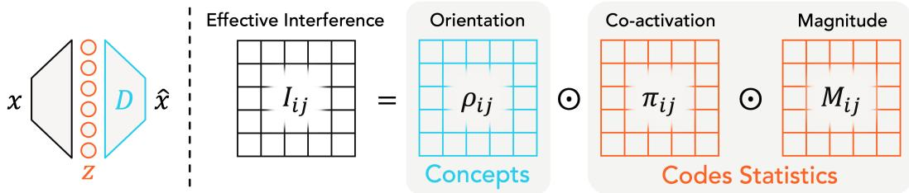  
Figure 1: Effective interference is a joint property of concept geometry and code statistics. It factors as $I _ { i j } = \rho _ { i j } \pi _ { i j } M _ { i j }$ , where $\rho _ { i j } = d _ { i } ^ { \top } d _ { j }$ captures the geometric overlap between dictionary elements $d _ { i } , d _ { j }$ , while $\pi _ { i j } \bar { M } _ { i j } = \mathbb { E } [ z _ { i } z _ { j } ]$ captures how their corresponding codes $z _ { i } , z _ { j }$ are used across the data, through co-activation frequency $\pi _ { i j }$ and conditional magnitude $M _ { i j }$

Interference is therefore fundamentally a joint property of concept geometry and code statistics (Figure 1). This distinction is particularly important for sparse autoencoders (SAEs) used in mechanistic interpretability (Huben et al., 2024; Gao et al., 2025; Bussmann et al., 2024; Rajamanoharan et al., 2024b; Zhu et al., 2026): codes are not observed directly, but inferred from model activations by an encoder. How the encoder is parameterized, through weight tying, bias, or relaxed norm constraints, therefore affects the interference it realizes. We summarize our main contributions below:

• Effective interference. We define effective interference from pairwise cross-contributions in the reconstruction, combining feature geometry with how the corresponding codes are used across the data. Its factorization into orientation, co-activation frequency, and conditional magnitude separates the geometric and statistical factors underlying realized interactions.

• Encoder-dependent interference regimes. Under local fixed-support conditions, we derive an encoder-consistency balance among self-response mismatch, directional incoming cross-talk, bias compensation, and residual coupling, and show how architectural degrees of freedom accommodate this balance through four non-exclusive routes: local orthogonalization, conditional bias compensation, encoder-gain adaptation, and encoder-decoder duality.

• Controlled validation in SAEs. We validate our theoretical predictions across SAE families trained on Pythia-160M activations (Biderman et al., 2023), showing that architectural constraints give rise to distinct and consistent interference regimes through orthogonalization, bias, gain, and encoder-decoder freedom. Similar patterns appear in SAEs trained on MNIST and in independently trained language-model SAEs, illustrating how effective interference captures interactions among SAE features that geometric measures alone do not.

## 2 RELATED WORK

Measuring interference. Under superposition (Elhage et al., 2022), concept directions overlap, yet interference is measured almost exclusively through geometry, depending only on the dictionary. This geometric view treats interference as a cost, motivating global overlap penalties (Korznikov et al., 2025), conditional orthogonalization of co-active concepts (Costa et al., 2025), and geometric design and evaluation (Lee et al., 2025). Interference patterns also transfer across models and can be exploited by adversarial examples, linking them to network vulnerabilities (Stevinson et al., 2026; Gorton & Lewis, 2025; Gong et al., 2026). Few works consider the accompanying code statistics. Exceptions formulate superposition information-theoretically (Bereska et al., 2025), study concept co-occurrence (Li et al., 2025), use co-activation to identify causally relevant concepts (Deng et al., 2026), or assess monosemanticity via latent coherence (Filus et al., 2026). Tolooshams et al. (2025) show that Fourier-neural-operator SAEs admit broader geometric correlations because their functional codes specify where and how concepts are expressed rather than only their magnitude; in our framework, this may keep effective interference low despite geometric correlation. Ivanov et al. (2026) distinguish incidental overlap between unrelated concepts (Lecomte et al., 2023) from structural interference reflecting relationships in the data distribution (Kantamneni & Tegmark, 2025; Gurnee & Tegmark, 2024). Conditional orthogonalization (Costa et al., 2025) recognizes co-activation but modifies inference rather than measuring interference. We instead measure interference jointly via concept geometry and code statistics.

Superposition. Prior work studies superposition through generative models with prescribed sparse features and code distributions, asking how they are represented in lower-dimensional spaces (Chowdhury & Weiner, 2026). Tied bottleneck autoencoders show that sparsity permits more features than hidden dimensions at the cost of interference (Elhage et al., 2022), while subsequent theory characterizes the capacity of finite-dimensional representations to encode and compute with features (Garg et al., 2026; Hänni et al., 2024; Adler & Shavit, 2024; Borobia et al., 2026). Prieto et al. (2026) further show that co-activation statistics shape interference patterns to reflect data structure. We study the complementary inverse question: without positing a generative model, we start from model activations and ask what interference structure an extractor recovers.

Concept extraction and sparse autoencoders. Concept-based interpretability extracts directions from neural activations (Doshi-Velez & Kim, 2017; Kim et al., 2018). ACE (Ghorbani et al., 2019), ICE (Zhang et al., 2021), and CRAFT (Fel et al., 2023b) can be viewed as dictionary learning (Mairal et al., 2009; Agarwal et al., 2014; Fel et al., 2023a), while newer methods extract features locally (Hindupur et al., 2025; Shafran et al., 2026). Building on sparsity as an interpretability prior (Mairal et al., 2014; Ribeiro et al., 2016; Lipton, 2018), SAEs likewise learn concept dictionaries with sparse codes. They are widely used in mechanistic interpretability (Huben et al., 2024; Gao et al., 2025; Bussmann et al., 2024), with applications beyond language in vision and science (Pach et al., 2025; Fel et al., 2026; Adams et al., 2025; Gujral et al., 2025; Simon & Zou, 2025; Nair et al., 2026). This broad use has focused attention on how architecture and optimization shape recovered concepts. Hindupur et al. (2025) show that SAE projections encode distinct data assumptions, emphasizing alignment between the encoder and target structure. This has motivated architectures for temporal structure (Lubana et al., 2026; Bhalla et al., 2026) and concept hierarchies (Park et al., 2024), as well as objectives such as Matryoshka (Bussmann et al., 2025) for feature absorption (Chanin et al., 2024).

Theory of sparse autoencoders. Sparse autoencoders are closely related to sparse coding, or dictionary learning (Olshausen & Field, 1997). Classical recovery theory gives conditions under which gradient-based methods recover a ground-truth dictionary in shallow SAEs (Agarwal et al., 2014; Chatterji & Bartlett, 2017; Papyan et al., 2017; Rangamani et al., 2018; Nguyen et al., 2019) and deep unrolled architectures (Tolooshams & Ba, 2022), typically assuming independent sparse codes and dictionary incoherence (Donoho & Huo, 2001). Recent SAE analyses identify limits to concept recovery (Klindt et al., 2026), including insufficient sparsity (Cui et al., 2026), nonidentifiability and spurious partial minima (Tang et al., 2025), and instability across runs yielding different dictionaries and codes (Nelson et al., 2026; Fel et al., 2025; Paulo & Belrose, 2026). Our closest connection is Dorrell (2026), who avoids generative ground truth and derive optimality constraints for $\ell _ { 1 }$ -regularized dictionary learning that explain splitting and absorption (Chanin et al., 2024). We define interactions within a learned additive representation and study how an amortized encoder accommodates them across supports, yielding a frequency-magnitude interference profile and directional encoder-decoder cross-talk not captured by prior optimality constraints.

## 3 EFFECTIVE INTERFERENCE IN ADDITIVE REPRESENTATIONS

Notation. Lowercase $^ { a , }$ bold lowercase a, and uppercase A denote scalars, vectors, and matrices, respectively; $\mathbf { a } _ { i }$ is the i-th column of A. We use ⊙ for the Hadamard product, $[ a ] _ { + } : = \operatorname* { m a x } \{ a , 0 \}$ and $[ a ] _ { - } : = \operatorname* { m i n } \{ a , 0 \}$ . For a vector z $\langle , \mathrm { s u p p } ( z ) = \{ i : z _ { i } \neq 0 \}$ , and z is k-sparse if $| \operatorname { s u p p } ( z ) | = k$ Given a support $S , z _ { S }$ and $D _ { S }$ restrict z to entries in $S$ and D to columns in S. We call x a model activation and $z ( x )$ its code, and use “directions”, “features” and “concepts” interchangeably.

Consider an additive representatio

$$
{ \widehat { \pmb x } } = D z ( { \pmb x } ) = \sum _ { i = 1 } ^ { p } d _ { i } z _ { i } ( { \pmb x } )\tag{3.1}
$$

where $\pmb { x } \sim P , \pmb { D } \in \mathbb { R } ^ { m \times p }$ contains p nonzero concepts, and $\pmb { z } ( \pmb { x } ) \in \mathbb { R } ^ { p }$ their input-dependent codes. We distinguish potential interactions, determined by dictionary geometry, from interactions realized by the codes across the data. We assume $\mathbb { E } \| d _ { i } z _ { i } ( \mathbf { \bar { x } } ) \| _ { 2 } ^ { 2 } < \infty$ for all i and, unless stated otherwise, nonnegative active codes and normalized concepts $\| \dot { d } _ { i } \| _ { 2 } = 1$ . Beyond these conditions, we assume nothing about how the codes are obtained, their sparsity, or the data-generating distribution P.

Definition 3.1 (Effective interference). For two distinct features $i \neq j ,$ define their sample-wise interaction as $\iota _ { i j } ( { \pmb x } ) : = ( { \pmb d } _ { i } ^ { \top } { \pmb d } _ { j } ) z _ { i } ( { \pmb x } ) z _ { j } ( { \pmb x } )$ . Their effective interference is the expected interaction

$$
I _ { i j } : = \mathbb { E } [ \iota _ { i j } ( { \pmb x } ) ] = ( { \pmb d _ { i } ^ { \top } } { \pmb d _ { j } } ) \mathbb { E } [ z _ { i } ( { \pmb x } ) z _ { j } ( { \pmb x } ) ] .\tag{3.2}
$$

Effective interference captures the realized, code-weighted interaction between learned features, and is symmetric $( \mathrm { i . e . , } I _ { i j } = I _ { j i } )$ . Importantly, it is an expected component cross-term within a chosen decomposition. These pairwise interactions can be collected into a matrix (Figure 1), whose offdiagonal entries measure pairwise feature interactions and whose diagonal entries capture individual feature contributions. This distinction follows from the reconstruction-energy decomposition

$$
\mathbb { E } \| \widehat { \pmb x } \| _ { 2 } ^ { 2 } = \sum _ { i = 1 } ^ { p } E _ { i } + \sum _ { i = 1 } ^ { p } \sum _ { j \neq i } I _ { i j } = \sum _ { i = 1 } ^ { p } E _ { i } + 2 \sum _ { i < j } I _ { i j } ,\tag{3.3}
$$

where $E _ { i } : = \mathbb { E } \| d _ { i } z _ { i } ( \pmb { x } ) \| _ { 2 } ^ { 2 }$ and $I _ { i j }$ denote individual and pairwise contributions, respectively. Thus, $I _ { i j } > 0$ increases reconstruction energy relative to the individual contributions and is constructive, whereas $I _ { i j } < 0$ is destructive. These terms do not by themselves imply benefit or harm to reconstruction error or downstream behaviour. Moreover, this terminology describes how components combine within xb, not their effect on reconstruction error: the sign of $I _ { i j }$ alone does not determine the change in $\begin{array} { r } { \mathbb { E } \| \widehat { \pmb x } - \pmb x \| _ { 2 } ^ { 2 } = \mathbb { E } \| \widehat { \pmb x } \| _ { 2 } ^ { 2 } - 2 \mathbb { E } [ \pmb x ^ { \top } \widehat { \pmb x } ] + \mathbb { E } \| \pmb x \| _ { 2 } ^ { 2 } } \end{array}$ , since the alignment term $- 2 \mathbb { E } [ \pmb { x } ^ { \top } \widehat { \pmb { x } } ]$ also contributes.

As a joint geometric–statistical quantity, effective interference has three useful properties on support awareness, reparameterization invariance, and sign under nonnegative coding (see Proposition D.1). Within this formulation, geometry determines interaction orientation, whereas codes determine whether and how strongly it is realized. Hence, unlike cosine similarity, effective interference is support-aware and scale-aware, offered by the code statistics.

Interference profile. The second moment $\mathbb { E } [ z _ { i } z _ { j } ]$ combines how often two features co-activate with how large their components are when they do. To separate these effects, define

$$
a _ { i } : = { \bf 1 } \{ z _ { i } \neq 0 \} , \quad \quad \quad \pi _ { i j } : = \mathrm { P r } ( a _ { i } = 1 , a _ { j } = 1 ) , \quad \quad \quad \rho _ { i j } : = d _ { i } ^ { \top } d _ { j } ,\tag{3.4}
$$

where $a _ { i }$ is the activation indicator, $\pi _ { i j }$ is the pair’s co-activation frequency, and $\rho _ { i j }$ is its geometric orientation. For $\pi _ { i j } > 0$ , let $M _ { i j } : = \bar { \mathbb { E } } [ z _ { i } z _ { j } \mid \bar { a } _ { i } = 1 , a _ { j } = 1 ]$ . Hence, effective interference can be factorized. For every pair with $\pi _ { i j } > 0$ , the effective interference can be factorized as follows:

$$
\boxed { I _ { i j } = \rho _ { i j } \ \pi _ { i j } \ M _ { i j } }\tag{3.5}
$$

If $\pi _ { i j } = 0$ , then $I _ { i j } = 0$ and the conditional magnitude $M _ { i j }$ need not be defined. We call $\Pi _ { i j } : =$ $( \rho _ { i j } , \pi _ { i j } , M _ { i j } )$ the pair’s effective-interference profile. $I _ { i j }$ measures its average contribution, while $\Pi _ { i j }$ distinguishes geometric orientation, interaction exposure, and conditional magnitude. Consequently, equal values of $I _ { i j }$ may arise from frequent weak co-activation or rare strong co-activation.

To compare interference across representations, we separate positive and negative pairwise contributions and define the normalized signed interferences

$$
\mathcal { Z } _ { + } : = \frac { \mathbb { E } \Big [ 2 \sum _ { i < j } [ \iota _ { i j } ( \pmb { x } ) ] _ { + } \Big ] } { \mathbb { E } [ \| \hat { \pmb { x } } \| _ { 2 } ^ { 2 } ] } , \qquad \mathcal { Z } _ { - } : = \frac { \mathbb { E } \Big [ 2 \sum _ { i < j } [ \iota _ { i j } ( \pmb { x } ) ] _ { - } \Big ] } { \mathbb { E } [ \| \hat { \pmb { x } } \| _ { 2 } ^ { 2 } ] } , \qquad \mathcal { T } _ { \mathrm { n e t } } : = \mathcal { Z } _ { + } + \mathcal { Z } _ { - } .\tag{3.6}
$$

The signed terms distinguish constructive from destructive interference, while $\mathcal { T } _ { \mathrm { n e t } }$ captures their net effect and may vanish through cancellation even when both are large.

Overall, the interference profile distinguishes several regimes that a single geometric or aggregate statistic conflates. Large $| \rho _ { i j } |$ together with $\pi _ { i j }$ ≈ 0 describes unrealized overlap: the directions admit interaction, but their supports prevent it. Large $\pi _ { i j }$ and small $M _ { i j }$ describe frequent weak interactions, whereas small $\pi _ { i j }$ and large $M _ { i j }$ describe rare strong interactions.

## 4 HOW SPARSE AUTOENCODERS HANDLE INTERFERENCE

The effective-interference profile characterizes how features interact in a learned representation. The architecture and optimization of the extractor determine which profiles arise. Consider a typical amortized SAE architecture (Huben et al., 2024; Bricken et al., 2023; Gao et al., 2025),

$$
\begin{array} { r } { z = \sigma ( \boldsymbol { W } ^ { \top } \boldsymbol { x } + b ) , \qquad \widehat { \boldsymbol { x } } = D z , } \end{array}\tag{4.1}
$$

where $W$ and D are the encoder and decoder weights, b is the encoder bias, and σ is a sparsifying nonlinearity. Unlike normalized concepts in D, encoder weights W need not be normalized. An

SAE shapes interference at two levels: encoder scores together with σ determine the support and hence $\pi _ { i j } .$ , while the encoder and decoder govern interactions among co-active features and hence $\rho _ { i j }$ and $M _ { i j }$ . We study the latter on a fixed support, so our conclusions are local to an active region and, for gradient dynamics, to updates that preserve the support. Within a fixed support S, the encoder is locally affine: (4.2)

$$
z _ { S } = W _ { S } ^ { \top } { \pmb x } + { \pmb b } _ { S } , \qquad { \pmb z } _ { S ^ { c } } = 0 .\tag{4.2}
$$

Rather than optimizing codes separately for each input, an SAE predicts them with a shared encoder. The map in (4.2) thus amortizes fixed-support least squares across inputs. Proposition 4.1 sets code-optimality condition for each input example. We treat this condition as an ideal target, and develops this section’s analyses for when the code-optimality gap is small. This code-optimality gap relates to amortization gap, and can be small for in-distribution data (Margossian & Blei, 2024) (Section 5 further investigates this in SAEs).

Proposition 4.1 (Code-optimality condition). For afixed decoder D and support S, any interior least-squares optimum satisfies

$$
\begin{array} { r } { D _ { S } ^ { \top } r = 0 , \qquad r : = x - D _ { S } z _ { S } . } \end{array}\tag{4.3}
$$

For nonnegative codes, interior means $z _ { i } > 0 \forall i \in S .$

Code optimality is a decoder condition: it constrains D given the codes, but not the encoder $W$ We therefore require an encoder consistency identity (Proposition 4.2). Let $\alpha _ { i } ~ = ~ \| \pmb { w } _ { i } \| _ { 2 }$ and $\gamma _ { i j } : = \pmb { w } _ { i } ^ { \top } \pmb { d } _ { j } / \| \bar { \pmb { w } } _ { i } \| _ { 2 }$ be the cosine similarity between ${ \pmb w } _ { i }$ and $d _ { j }$ , so that w⊤i $\mathbf { \bar { \mathbf { d } } } _ { j } = \alpha _ { i } \gamma _ { i j }$ . Unlike $D ^ { \top } D$ , which captures interactions among reconstruction components, $W ^ { \top } D$ couples encoder and decoder directions and is asymmetric.

Proposition 4.2 (Encoder consistency identity). Suppose the encoder is locally affine as in (4.2). For every activefeature $i \in S ,$

$$
0 = ( \alpha _ { i } \gamma _ { i i } - 1 ) z _ { i } + \sum _ { j \neq i } \alpha _ { i } \gamma _ { i j } z _ { j } + b _ { i } + \pmb { w } _ { i } ^ { \top } \pmb { r } .\tag{4.4}
$$

Consequently,for every i with $\mathrm { P r } ( a _ { i } = 1 ) > 0 ,$

$$
0 = \underbrace { ( \alpha _ { i } \gamma _ { i i } - 1 ) \mathbb { E } [ z _ { i } \mid a _ { i } = 1 ] } _ { s e l f r e s p o n s e m i s m a t e h } + \underbrace { \sum _ { j \neq i } \alpha _ { i } \gamma _ { i j } \mathbb { E } [ z _ { j } \mid a _ { i } = 1 ] } _ { i n c o m i n g c r o s s - t a l k } + \underbrace { b _ { i } } _ { c o m p e n s t i o n } + \underbrace { \mathbb { E } [ w _ { i } ^ { \top } r \mid a _ { i } = 1 ] } _ { r e s i d u a l c o u p l i n g } ,\tag{4.5}
$$

where $\gamma _ { i i }$ and $\gamma _ { i j }$ are encoder-decoder self-alignment and cross-alignment, respectively. The encoder gain $\alpha _ { i }$ rescales the entire response of encoder i, including its self-response, incoming cross-talk, and residual coupling. With the code-optimality condition, Proposition 4.2 exposes which architectural terms can accommodate interactions. Its incoming cross-talk is directional: the effect of feature $j$ on the encoder score of feature i depends on ${ \pmb w } _ { i } ^ { \top } { d } _ { j }$ . This contrasts with the symmetric decoder interference, $I _ { i j } = ( d _ { i } ^ { \top } { d } _ { j } ) \mathbb { E } [ z _ { i } z _ { j } ]$ . Moreover, for tied weights, (4.3) removes the residual coupling term in (4.5), but not generally for an untied encoder, since $D _ { S } ^ { \top } r = 0$ does not imply $W _ { S } ^ { \top } r = 0$

To isolate the role of each term in the encoder-consistency balance, we begin with a tied, unitnorm, bias-free baseline and relax one constraint at a time by introducing bias, encoder gain, and independent encoder directions. Holding the remaining degrees of freedom fixed allows each change in interference to be attributed to a specific accommodation mechanism. These settings serve as analytical controls rather than assumptions about practical SAEs.

Route I: constrained local orthogonalization. Consider the tied and normalized $\alpha _ { i } = 1 , \gamma _ { i i } = 1$ $\gamma _ { i j } = \rho _ { i j }$ , and bias-free $b = 0$ setting. Under the fixed-support code optimality condition per input (4.3), the encoder-consistency condition (4.4) gives

$$
( D _ { S } ^ { \top } D _ { S } - I ) z _ { S } = 0 .\tag{4.6}
$$

For a single input, this only constrains $D _ { S } ^ { \top } D _ { S } - I$ along the observed code vector $z _ { S }$ . However, if the code vectors observed on support S span $\mathbb { R } ^ { | S | }$ , the condition must hold in every direction and therefore implies $\pmb { D } _ { S } ^ { \top } \pmb { D } _ { S } = \pmb { I }$ . Thus, tied normalized SAEs are driven toward orthogonality among concepts that co-activate, rather than across the entire overcomplete dictionary.

The same local orthogonalizing tendency can be seen directly from the training dynamics. For two active features $S = \check { \{ i , j \} }$ , define $\Delta ( \bar { D _ { S } } ) : = \| D _ { S } ^ { \top } D _ { S } - \bar { I } \| _ { F } ^ { 2 } = 2 \rho _ { i j } ^ { 2 }$ , where the second equality follows from unit-norm columns.

Proposition 4.3 (Local orthogonalization for two active features). Consider the tied, normalized, bias-free model with fixed support $S = \{ i , j \}$ and loss ${ \frac { 1 } { 2 } } \| { \widehat { \pmb x } } - { \pmb x } \| _ { 2 } ^ { 2 } .$ Let $D _ { S } ^ { + }$ denote the active dictionary after one gradient step of size η, followed by column normalization. Then

$$
\Delta ( D _ { S } ^ { + } ) - \Delta ( D _ { S } ) = - 8 \eta \rho _ { i j } ^ { 2 } \| z _ { i } d _ { i } - z _ { j } d _ { j } \| _ { 2 } ^ { 2 } + { \cal O } ( \eta ^ { 2 } ) .\tag{4.7}
$$

Hence, $i f \rho _ { i j } \neq 0$ and $z _ { i } d _ { i } \neq z _ { j } d _ { j }$ , a gradient step cannot increase $\Delta ( D _ { S } )$ to first order.

Equation (4.7) identifies an orthogonalizing contribution on examples where the pair is jointly active. Thus, $\pi _ { i j }$ controls the frequency of this direct two-feature contribution, although other support states can also change the pairwise angle. The dynamics therefore predict selective orthogonalization of frequently co-active directions, not global dictionary orthogonalization. Proposition 4.3 concerns one-example gradient descent with a support-preserving step. Section 5 further shows experiments with higher $k ,$ batch updates, and Adam optimizer where this predicted tendency still remains.

Route II: conditional bias compensation. We next retain tied, unit-norm encoder-decoder weights but allow a learned encoder bias. Tying implies $\alpha _ { i } = 1 , \gamma _ { i i } = 1$ , and $\gamma _ { i j } = \rho _ { i j }$ for $i \neq j$ . Hence, the self-response mismatch vanishes, while fixed-support code optimality removes residual coupling. We obtain the following population-level condition:

$$
\hat { b } _ { i } = - \sum _ { j \neq i } \rho _ { i j } \mathbb { E } [ z _ { j } \mid a _ { i } = 1 ] .\tag{4.8}
$$

Thus, a shared bias can compensate for the mean incoming cross-talk on examples where feature i is active. It cannot generally cancel the sample-wise cross-talk separately for every input.

Route III: encoder-gain adaptation. We next keep the encoder direction tied to its corresponding decoder direction, but allow the encoder norm to vary: ${ \pmb w } _ { i } = \alpha _ { i } { \pmb d } _ { i }$ , with $\alpha _ { i } > 0$ . Consequently, $\gamma _ { i i } = 1$ and $\gamma _ { i j } = \rho _ { i j }$ . In this setting, fixed-support code optimality also gives ${ \pmb w } _ { i } ^ { \top } { \pmb r } = 0$ . The conditional balance (Proposition 4.2) therefore gives the following estimate on the encoder gain

$$
\hat { \alpha } _ { i } = \left( 1 + \frac { \sum _ { j \neq i } \rho _ { i j } \mathbb { E } [ z _ { j } \mid a _ { i } = 1 ] } { \mathbb { E } [ z _ { i } \mid a _ { i } = 1 ] } \right) ^ { - 1 } .\tag{4.9}
$$

Thus, positive mean incoming cross-talk predicts $\alpha _ { i } < 1$ , whereas negative incoming cross-talk predicts $\alpha _ { i } > 1$ , provided the denominator is positive. Encoder gain rescales both the self-response and incoming cross-talk, providing an alternative to decoder angular orthogonalization. This behaviour manifests itself in the unnormalized learning dynamics (Proposition F.1): the two-feature angular dynamics depend on both the pair’s cosine similarity and its weight norm.

Route IV: encoder-decoder duality. Untying separates decoder interaction from inference crosstalk. For each pair, $( \rho _ { i j } , \pi _ { i j } M _ { i j } )$ describes decoder interaction, while ${ \pmb w } _ { i } ^ { \top } { \pmb d } _ { j } = \alpha _ { i } \gamma _ { i j }$ is the directed cross-gain through which decoder feature j enters encoder score i. Fixed-support least squares admits a biorthogonal encoder (D.9), with targets $\alpha _ { i } \gamma _ { i i } = 1$ and $\alpha _ { i } \gamma _ { i j } = 0 ~ \mathrm { f o r } ~ j \neq i .$ Because different supports induce different duals, a shared encoder can only approximate these targets jointly. We therefore predict small $| \alpha _ { i } \gamma _ { i j } |$ for pairs with large $\pi _ { i j } M _ { i j }$ even when $\rho _ { i j } > 0$ , particularly when residual coupling is small. When $\alpha _ { i }$ is bounded away from zero, this also predicts $\gamma _ { i j }$ near zero. Thus, untying can preserve constructive effective interference while suppressing incoming cross-talk, reflecting the roles of encoders as feature detectors and decoders as reconstruction components (Bricken et al., 2024; Rajamanoharan et al., 2024a; Nanda, 2023).

The four routes are controlled limits of the same balance and are not mutually exclusive. A practical encoder may distribute accommodation across decoder geometry, encoder gain, encoder-decoder alignment, bias, and residual coupling. We now show how these signatures recur across SAE families.

## 5 RESULTS

We evaluate whether the architectural degrees of freedom identified in Section 4 predict the interference structure learned by SAEs. Our experiments use TopK (Gao et al., 2025; Makhzani & Frey, 2013), JumpReLU (Rajamanoharan et al., 2024b), BatchTopK (Bussmann et al., 2024), and Matryoshka (Bussmann et al., 2025) SAEs trained on Pythia-160M-deduped residual-stream activations at layer 8 with dictionary width $p = 1 6 { , } 3 8 4$ and sparsity $k = 4 0$ . For additional results and experimental details, see Sections I and J, respectively.

A)

$$
\sum _ { j \neq j } \rho _ { i j } ^ { 2 }
$$

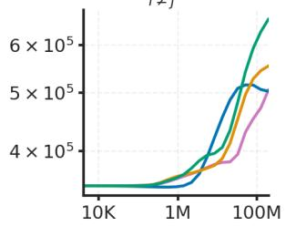

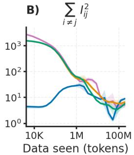

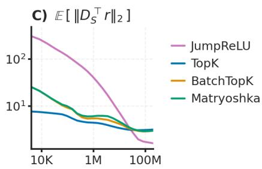

Figure 2: Geometric and effective interference have distinct training dynamics. A) Global geometric overlap rises, whereas B) effective interference falls from its peak. Consistent with Proposition 4.3, this reflects selective orthogonalization of co-active pairs, reducing realized interactions without globally orthogonalizing the dictionary. C) Residual coupling declines but remains nonzero, so fixed-support code optimality (Proposition 4.1) is approached only approximately (see Figure 7 for joint distribution of decoder orientation $\rho _ { i j }$ and co-activation-weighted magnitude $\pi _ { i j } M _ { i j } $ ).  
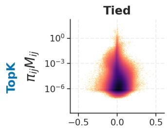

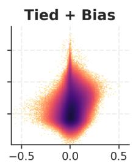

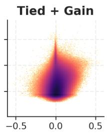  
ρij

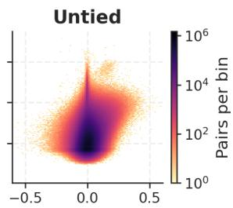  
Figure 3: Architectural freedom shifts co-active feature pairs toward constructive decoder interactions. Joint distributions of orientation $\rho _ { i j }$ and co-activation-weighted magnitude $\pi _ { i j } M _ { i j }$ . In the tied, normalized, bias-free model, pairs with large $\pi _ { i j } M _ { i j }$ concentrate near $\rho _ { i j } = 0 ,$ consistent with local orthogonalizing pressure. With bias, encoder-gain freedom, or an untied encoder, some of these pairs extend toward positive $\rho _ { i j }$ . This pattern recurs across other SAEs (Figure 8).

How to interpret the results. We do not rank SAE families by absolute interference. Instead, each family tests the same mechanisms by measuring how untying, encoder bias, and gain adaptation alter interference and encoder-decoder cross-talk. The evidence lies in the direction and recurrence of these within-family changes, not absolute differences across sparsifiers.

We employ the code statistics on activation frequency and magnitude, $\pi _ { i j } M _ { i j }$ , together with the orientation entry $\rho _ { i j }$ to show how pairwise interaction is allocated between the decoder and codes. For when encoder gain is enabled, we report $\alpha _ { i }$ and encoder-decoder cross-alignment $\gamma _ { i j }$

Constrained SAEs suppress realized interactions without globally orthogonalizing. Proposition 4.3 predicts support-local rather than global orthogonalizing pressure. Across SAE families, global squared geometric overlap increases during training, whereas squared effective interference falls from its peak (Figure 2A-B). Thus, the dictionary need not become globally orthogonal for realized interactions to decrease; code statistics determine which overlaps matter. This behaviour is consistent with selective pressure on co-active pairs and refines the global orthogonality picture suggested by the linear representation hypothesis (Costa et al., 2025). The code-optimality gap $\mathbb { E } [ \| D _ { S } ^ { \top } r \| _ { 2 } ]$ also decreases but remains nonzero (Figure 2C), showing that fixed-support optimality is an increasingly accurate, but still approximate, description of the learned codes. This behaviour is aligned with prior investigations of amortization gap in SAEs (O’Neill et al., 2025).

Architectural freedom enables constructive decoder interactions. The joint interference profiles in Figure 3 reveal a common effect of relaxing architectural constraints. In the tied, normalized, bias-free model, pairs with large $\pi _ { i j } M _ { i j }$ concentrate near $\rho _ { i j } = 0$ or shift toward negative. Adding bias or encoder gain, or untying the encoder, allows such pairs to extend toward positive $\rho _ { i j }$ and therefore retain constructive effective interference. These profiles establish the common decoder behaviour but do not identify how each architecture accommodates the resulting interactions; the encoder-consistency balance (4.5) provides this distinction.

With bias, the predicted $\hat { b } _ { i }$ closely matches the learned $b _ { i }$ across SAE families (Figure 4A), supporting compensation of mean incoming cross-talk. TopK and BatchTopK lie closest to equality, whereas Matryoshka and JumpReLU deviate more and correlate less. Because $\hat { b } _ { i } - b _ { i }$ equals the residual-coupling term in this controlled setting, these deviations indicate a less exact fixed-support approximation: its mean magnitude is 0.11 − 0.14 for Matryoshka and JumpReLU against $0 . 0 4 - 0 . 0 5$ for TopK and BatchTopK. With encoder gain, $\hat { \alpha } _ { i }$ similarly tracks the learned $\alpha _ { i }$ (Figure 4B), with the same ordering $( 0 . 1 1 - 0 . 1 5$ versus $0 . 0 3 - 0 . 0 6 )$ . Positive mean incoming cross-talk predicts $\alpha _ { i } ~ < ~ 1$ , allowing the encoder to attenuate its self-response and incoming cross-talk without changing decoder normalization. This mechanism parallels Prieto et al. (2026), who observe increased constructive interference on toy models trained with weight decay. Similarly, by training an unnormalized decoder, a smaller decoder norms relax the pressure toward local orthogonality (Proposition F.1), allowing positively aligned directions to constructively reconstruct.

Untying shifts decoder pairs toward positive alignment $\rho _ { i j }$ and increases positive effective interference $I _ { i j }$ (Figure 5 left), showing that decoder overlap need not be reduced to control inference cross-talk. The pairwise profiles reveal the mechanism: pairs with large $\pi _ { i j } M _ { i j }$ exhibit a pronounced tilt toward positive $\rho _ { i j } .$ , while their encoder-decoder cross-gains $\alpha _ { i } \gamma _ { i j } = \pmb { w } _ { i } ^ { \top } \pmb { d } _ { j }$ remain thin and concentrated near zero (Figure 5 right). Untying therefore separates reconstruction from inference: the decoder retains constructive interactions, while the encoder limits how decoded feature $j$ enters the score of feature $i .$ This pattern is consistent with approximate supportconditional biorthogonalization, although these pairwise distributions do not establish exact duality on every support.

Architectural freedom reallocates interference handling. We decompose the normalized off-diagonal contribution into constructive $\mathcal { T } _ { + }$ and destructive $\mathcal { T } _ { - }$ terms, with $\mathcal { T } _ { \mathrm { n e t } } = \mathcal { T } _ { + } + \mathcal { T } _ { - } \mathrm { ( \dot { F i g u r e } \ 6 ) }$ . This separation is essential: in the tied baseline, sizable positive and negative contributions largely cancel, particularly for JumpReLU, so a small net value does not imply weak feature interactions. Within every SAE family, introducing bias, encoder gain, or independent encoder directions shifts the balance toward positive net interference relative to the tied baseline, although the intermediate variants are not strictly ordered because the accommodation mechanisms interact rather than combine additively. Untying produces the largest constructive contribution across all four families: $\mathcal { T } _ { + } + | \mathcal { T } _ { - } |$ accounts for roughly 40–50% of reconstruction energy, while the net contribution remains approximately 15–25%. Effective interference is therefore not a small residual effect, nor something SAEs generally minimize; architectural constraints determine whether cross-feature interactions are canceled or retained constructively. This refines a purely geometric view of the LRH (Park et al., 2024): interference depends not only on dictionary overlap, but also on which features are jointly used. Finally, we demonstrate the generality of these interference signatures beyond our main setting using raw MNIST images (Section J.3.1) and pre-trained language-model SAEs (Section J.3.2).

A) Tied + Bias  
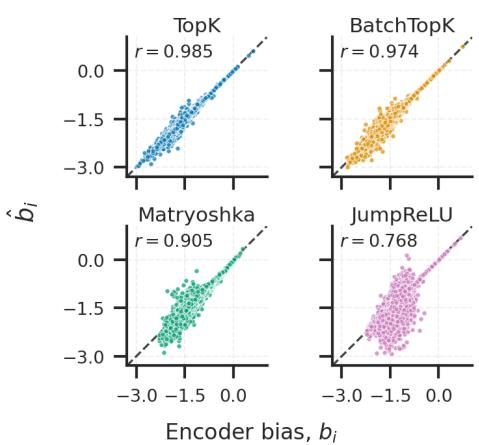

B) Tied + Gain  
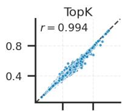

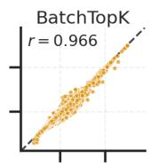

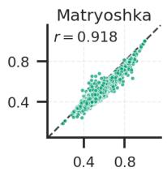

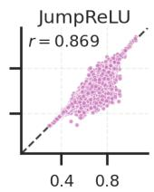  
Encoder gain, α

Figure 4: Bias and encoder gain compensate mean incoming cross-talk. Each point is a feature; horizontal axes show learned parameters and vertical axes their encoderbalance predictions. A) In tied + bias models, $\hat { b } _ { i }$ from (4.8) closely matches $b _ { i }$ . B) In tied + gain models, $\hat { \alpha } _ { i }$ from (4.9) tracks $\alpha _ { i }$ . Dashed lines indicate equality and $r$ is Pearson correlation. This behaviour appears across other SAEs (Figure 9).  
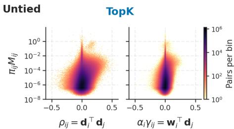  
Figure 5: Untying separates decoder interactions from encoder cross-talk. Joint distributions of co-activation-weighted magnitude $\pi _ { i j } M _ { i j }$ against decoder orientation $\rho _ { i j }$ and cross-gain $\alpha _ { i } \gamma _ { i j } = \pmb { w } _ { i } ^ { \top } \pmb { d } _ { j }$ Pairs with large $\pi _ { i j } M _ { i j }$ tilt toward positive decoder alignment, while their cross-gains concentrate near zero.

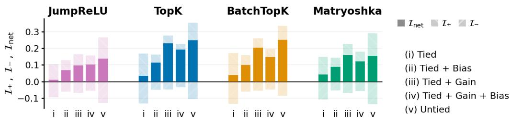  
Figure 6: SAE reconstruction contains substantial signed effective interference. Constructive $\mathcal { T } _ { + }$ destructive $\mathcal { L } _ { - }$ , and net $\mathcal { T } _ { \mathrm { n e t } }$ contributions across architectural variants and SAE families. Sizable positive and negative terms can cancel, so small net interference does not imply weak interactions. Relative to the tied case, architectural freedom generally shifts the balance toward higher interference.

Illustrating the interference profile across support size k and dictionary width $p .$ As a diagnostic example, we vary k and $p$ in TopK SAEs (Figure 10). Let $\tilde { p }$ denote the number of utilized features, accounting for features that never activate. The mean co-activation frequency $\overline { { \pi } } _ { i j }$ closely follows the reference $k ( k { - } 1 ) \big / \tilde { p } ( \tilde { p } { - } 1 )$ (Section D.5). At fixed $p ,$ increasing k raises $\overline { { \pi } } _ { i j }$ while reducing the mean conditional magnitude $\overline { { M } } _ { i j }$ . Mean absolute decoder overlap $\overline { { | \rho _ { i j } | } }$ also generally decreases in the biased, gain-adaptive, and untied variants. Net interference $\mathcal { T } _ { \mathrm { n e t } }$ , however, has no universal monotonic trend, indicating that increased co-activation can be offset by weaker magnitudes and signed geometric contributions. At fixed k, increasing p spreads co-activation across more pairs, reducing $\overline { { \pi } } _ { i j } .$ , while $\overline { { M } } _ { i j }$ and $\overline { { | \rho _ { i j } | } }$ change less in most settings. The largest tied configurations also show elevated FVU and are therefore interpreted cautiously. This illustrative experiment shows how the interference profile separates compensating statistical and geometric changes without asserting a universal scaling law.

## 6 CONCLUSION

Discussion and limitations. Effective interference measures realized pairwise cross-contributions within a learned additive decomposition, allowing us to study how SAE architectures allocate reconstruction energy and which interaction regimes they favor. It does not characterize interactions among latent ground-truth concepts, as studied by Prieto et al. (2026), nor is it invariant to phenomena such as splitting or absorption; identifying these requires evidence beyond $I _ { i j }$ and aligned decompositions across extractors. More generally, effective interference diagnoses energy allocation, not representation quality: constructive and destructive describe cross-term signs without implying reconstruction quality, semantic interpretability, causal relevance, or downstream behaviour.

Our theory is local to fixed supports and approximates a shared amortized encoder by per-input code optimality. This approximation can be accurate in-distribution (Margossian & Blei, 2024) but degrade under distribution shift (O’Neill et al., 2025), consistent with our small but nonzero measured gaps. Similarly, our local orthogonalization proposition considers two active features and a small, support-preserving gradient step, and thus does not establish global convergence or cover larger supports, minibatch training, adaptive optimizers, or support transitions. Overall, our experiments support the proposed compensation and orthogonalization mechanisms without uniquely identifying a single mechanism.

Conclusion. Interference is not a property of feature geometry alone, but of geometry together with how features co-activate. We formalized this interaction as effective interference and showed that SAE architectures realize distinct interference regimes: constrained encoders tend to orthogonalize co-active features, whereas bias, gain, and encoder freedom allow constructive cross-contributions to remain. These results provide a framework for characterizing how architectural choices shape the interactions realized by learned representations, without treating any single interference regime as universally preferable.

## ACKNOWLEDGMENTS

V.C. and B.T. would like to thank Demba Ba, Sohini Gupta, and members of NeuBahar Lab for helpful discussions and feedback. V.C. and B.T. acknowledge funding from the Canada CIFAR AI Chairs Program and Alberta Machine Intelligence Institute (Amii). B.T. acknowledges support of Natural Sciences and Engineering Research Council of Canada (NSERC), RGPIN-2026-05959.

## REFERENCES

Etowah Adams, Liam Bai, Minji Lee, Yiyang Yu, and Mohammed AlQuraishi. From mechanistic interpretability to mechanistic biology: Training, evaluating, and interpreting sparse autoencoders on protein language models. In Forty-second International Conference on Machine Learning, 2025. URL https://openreview.net/forum?id=zdOGBRQEbz.

Micah Adler and Nir Shavit. On the complexity of neural computation in superposition. arXiv preprint arXiv:2409.15318, 2024.

Alekh Agarwal, Animashree Anandkumar, Prateek Jain, Praneeth Netrapalli, and Rashish Tandon. Learning sparsely used overcomplete dictionaries. In Maria Florina Balcan, Vitaly Feldman, and Csaba Szepesvári (eds.), Proceedings of The 27th Conference on Learning Theory, volume 35 of Proceedings of Machine Learning Research, pp. 123–137, Barcelona, Spain, 13–15 Jun 2014. PMLR. URL https://proceedings.mlr.press/v35/agarwal14a.html.

Sanjeev Arora, Yuanzhi Li, Yingyu Liang, Tengyu Ma, and Andrej Risteski. Linear algebraic structure of word senses, with applications to polysemy. Transactions of the Association for Computational Linguistics, 6:483–495, 2018.

Leonard Bereska and Stratis Gavves. Mechanistic interpretability for AI safety - a review. Transactions on Machine Learning Research, 2024. ISSN 2835-8856. URL https://openreview. net/forum?id=ePUVetPKu6.

Leonard Bereska, Zoe Tzifa-Kratira, Reza Samavi, and Stratis Gavves. Superposition as lossy compression — measure with sparse autoencoders and connect to adversarial vulnerability. Transactions on Machine Learning Research, 2025. ISSN 2835-8856. URL https://openreview. net/forum?id=qaNP6o5qvJ.

Usha Bhalla, Alex Oesterling, Claudio Mayrink Verdun, Himabindu Lakkaraju, and Flavio Calmon. Temporal sparse autoencoders: Leveraging the sequential nature of language for interpretability. In The Fourteenth International Conference on Learning Representations, 2026. URL https: //openreview.net/forum?id=bojVI4l9Kn.

Stella Biderman, Hailey Schoelkopf, Quentin Anthony, Herbie Bradley, Kyle O’Brien, Eric Hallahan, Mohammad Aflah Khan, Shivanshu Purohit, USVSN Sai Prashanth, Edward Raff, Aviya Skowron, Lintang Sutawika, and Oskar van der Wal. Pythia: A suite for analyzing large language models across training and scaling, 2023. URL https://arxiv.org/abs/2304.01373.

Joseph Bloom, Curt Tigges, Anthony Duong, and David Chanin. Saelens. https://github. com/decoderesearch/SAELens, 2024.

Hector Borobia, Elies Seguí-Mas, and Guillermina Tormo-Carbó. Linear-readout floors and threshold recovery in computation in superposition. arXiv preprint arXiv:2605.01192, 2026.

Trenton Bricken, Adly Templeton, Joshua Batson, Brian Chen, Adam Jermyn, Tom Conerly, Nick Turner, Cem Anil, Carson Denison, Amanda Askell, Robert Lasenby, Yifan Wu, Shauna Kravec, Nicholas Schiefer, Tim Maxwell, Nicholas Joseph, Zac Hatfield-Dodds, Alex Tamkin, Karina Nguyen, Brayden McLean, Josiah E Burke, Tristan Hume, Shan Carter, Tom Henighan, and Christopher Olah. Towards monosemanticity: Decomposing language models with dictionary learning. Transformer Circuits Thread, 2023. https://transformer-circuits.pub/2023/monosemanticfeatures/index.html.

Trenton Bricken, Jonathan Marcus, Siddharth Mishra-Sharma, Meg Tong, Ethan Perez, Mrinank Sharma, Kelley Rivoire, Thomas Henighan, and Adam Jermyn. Using dictionary learning features as classifiers. 2024. URL https://transformer-circuits.pub/2024/ features-as-classifiers/index.html.

Bart Bussmann, Patrick Leask, and Neel Nanda. Batchtopk sparse autoencoders. In NeurIPS 2024 Workshop on Scientific Methods for Understanding Deep Learning, 2024. URL https: //openreview.net/forum?id=d4dpOCqybL.

Bart Bussmann, Noa Nabeshima, Adam Karvonen, and Neel Nanda. Learning multi-level features with matryoshka sparse autoencoders. In Aarti Singh, Maryam Fazel, Daniel Hsu, Simon Lacoste-Julien, Felix Berkenkamp, Tegan Maharaj, Kiri Wagstaff, and Jerry Zhu (eds.), Proceedings of the 42nd International Conference on Machine Learning, volume 267 of Proceedings ofMachine Learning Research, pp. 6077–6101. PMLR, 13–19 Jul 2025.

David Chanin, James Wilken-Smith, Tomáš Dulka, Hardik Bhatnagar, and Joseph Isaac Bloom. A is for absorption: Studying feature splitting and absorption in sparse autoencoders. In Interpretable AI: Past, Present and Future, 2024. URL https://openreview.net/forum? id=Wzav8fesTL.

Niladri S Chatterji and Peter L Bartlett. Alternating minimization for dictionary learning: Local convergence guarantees. arXiv preprint arXiv:1711.03634, 2017.

Mriganka Basu Roy Chowdhury and Eric McLaughlin Weiner. Effects of sparsity and superposition on loss in simple autoencoders, 2026. URL https://arxiv.org/abs/2606.18538.

Tom Conerly, Adly Templeton, Trenton Bricken, Jonathan Marcus, and Tom Henighan. Update on how we train SAEs. Transformer Circuits Thread, April 2024.

Arthur Conmy, Augustine N. Mavor-Parker, Aengus Lynch, Stefan Heimersheim, and Adrià Garriga-Alonso. Towards automated circuit discovery for mechanistic interpretability. In Thirty-seventh Conference on Neural Information Processing Systems, 2023. URL https://openreview. net/forum?id=89ia77nZ8u.

Valérie Costa, Thomas Fel, Ekdeep Singh Lubana, Bahareh Tolooshams, and Demba E. Ba. From flat to hierarchical: Extracting sparse representations with matching pursuit. In The Thirty-ninth Annual Conference on Neural Information Processing Systems, 2025. URL https://openreview. net/forum?id=Ll5miDx8KB.

Jingyi Cui, Qi Zhang, Yifei Wang, and Yisen Wang. On the limits of sparse autoencoders: A theoretical framework and reweighted remedy. In The Fourteenth International Conference on Learning Representations, 2026. URL https://openreview.net/forum?id=DSOTgzeH3w.

Ruixuan Deng, Xiaoyang Hu, Miles Gilberti, Shane Storks, Aman Taxali, Mike Angstadt, Chandra Sripada, and Joyce Chai. Sparse feature coactivation reveals causal semantic modules in large language models. In Proceedings of the 64th Annual Meeting of the Association for Computational Linguistics (Volume 1: Long Papers), pp. 3419–3451, 2026.

D.L. Donoho and X. Huo. Uncertainty principles and ideal atomic decomposition. IEEE Transactions on Information Theory, 47(7):2845–2862, 2001. doi: 10.1109/18.959265.

William Dorrell. How optimality structures sparse dictionaries: A theory for understanding sae representations. arXiv preprint arXiv:2606.02385, 2026.

Finale Doshi-Velez and Been Kim. Towards a rigorous science of interpretable machine learning. arXiv preprint arXiv:1702.08608, 2017.

Scott C Douglas, Shun-ichi Amari, and S-Y Kung. On gradient adaptation with unit-norm constraints. IEEE Transactions on Signal processing, 48(6):1843–1847, 2002.

Nelson Elhage, Tristan Hume, Catherine Olsson, Nicholas Schiefer, Tom Henighan, Shauna Kravec, Zac Hatfield-Dodds, Robert Lasenby, Dawn Drain, Carol Chen, Roger Grosse, Sam McCandlish, Jared Kaplan, Dario Amodei, Martin Wattenberg, and Christopher Olah. Toy models of superposition, 2022. URL https://arxiv.org/abs/2209.10652.

Josh Engels, Eric Michaud, Isaac Liao, Wes Gurnee, and Max Tegmark. Not all language model features are one-dimensionally linear. In International Conference on Learning Representations, volume 2025, pp. 84591–84622, 2025.

Thomas Fel, Victor Boutin, Louis Béthune, Rémi Cadène, Mazda Moayeri, Léo Andéol, Mathieu Chalvidal, and Thomas Serre. A holistic approach to unifying automatic concept extraction and concept importance estimation. Advances in Neural Information Processing Systems, 36: 54805–54818, 2023a.

Thomas Fel, Agustin Picard, Louis Bethune, Thibaut Boissin, David Vigouroux, Julien Colin, Rémi Cadène, and Thomas Serre. Craft: Concept recursive activation factorization for explainability. In Proceedings of the IEEE/CVF conference on computer vision and pattern recognition, pp. 2711–2721, 2023b.

Thomas Fel, Ekdeep Singh Lubana, Jacob S. Prince, Matthew Kowal, Victor Boutin, Isabel Papadimitriou, Binxu Wang, Martin Wattenberg, Demba E. Ba, and Talia Konkle. Archetypal SAE: Adaptive and stable dictionary learning for concept extraction in large vision models. In Forty-second International Conference on Machine Learning, 2025. URL https: //openreview.net/forum?id=9v1eW8HgMU.

Thomas Fel, Binxu Wang, Michael Lepori, Matthew Kowal, Andrew Lee, Randall Balestriero, Sonia Joseph, Ekdeep Singh Lubana, Talia Konkle, Demba Ba, et al. Into the rabbit hull: From task-relevant concepts in dino to minkowski geometry. In International Conference on Learning Representations, volume 2026, pp. 154538–154584, 2026.

Katarzyna Filus et al. Measuring monosemanticity in sparse autoencoders via latent activation coherence. arXiv preprint arXiv:2607.17770, 2026.

Leo Gao, Stella Biderman, Sid Black, Laurence Golding, Travis Hoppe, Charles Foster, Jason Phang, Horace He, Anish Thite, Noa Nabeshima, Shawn Presser, and Connor Leahy. The pile: An 800gb dataset of diverse text for language modeling, 2020. URL https://arxiv.org/abs/2101. 00027.

Leo Gao, Tom Dupre la Tour, Henk Tillman, Gabriel Goh, Rajan Troll, Alec Radford, Ilya Sutskever, Jan Leike, and Jeffrey Wu. Scaling and evaluating sparse autoencoders. In The Thirteenth International Conference on Learning Representations, 2025. URL https://openreview. net/forum?id=tcsZt9ZNKD.

Nikhil Garg, Jon Kleinberg, and Kenny Peng. How many features can a language model store under the linear representation hypothesis? In Steve Hanneke and Tor Lattimore (eds.), Proceedings of Thirty Ninth Conference on Learning Theory, volume 336 of Proceedings ofMachine Learning Research, pp. 5358–5376. PMLR, 29 Jun–03 Jul 2026.

Amirata Ghorbani, James Wexler, James Y Zou, and Been Kim. Towards automatic concept-based explanations. In Advances in Neural Information Processing Systems, pp. 9273–9282, 2019.

Bofan Gong, Shiyang Lai, James Evans, and Dawn Song. Signal in the noise: Polysemantic interference transfers and predicts cross-model influence. In The Fourteenth International Conference on Learning Representations, 2026. URL https://openreview.net/forum?id= tYeuz2LwVU.

Liv Gorton and Owen Lewis. Adversarial examples are not bugs, they are superposition. In Mechanistic Interpretability Workshop at NeurIPS 2025, 2025. URL https://openreview. net/forum?id=z0YTS0FExr.

Onkar Gujral, Mihir Bafna, Eric Alm, and Bonnie Berger. Sparse autoencoders uncover biologically interpretable features in protein language model representations. Proceedings of the National Academy ofSciences, 122(34):e2506316122, 2025.

Wes Gurnee and Max Tegmark. Language models represent space and time. In The Twelfth International Conference on Learning Representations, 2024. URL https://openreview. net/forum?id=jE8xbmvFin.

Wes Gurnee, Neel Nanda, Matthew Pauly, Katherine Harvey, Dmitrii Troitskii, and Dimitris Bertsimas. Finding neurons in a haystack: Case studies with sparse probing. Transactions on Machine Learning Research, 2023. ISSN 2835-8856. URL https://openreview.net/forum? id=JYs1R9IMJr.

Kaarel Hänni, Jake Mendel, Dmitry Vaintrob, and Lawrence Chan. Mathematical models of computation in superposition. arXiv preprint arXiv:2408.05451, 2024.

Sai Sumedh R. Hindupur, Ekdeep Singh Lubana, Thomas Fel, and Demba E. Ba. Projecting assumptions: The duality between sparse autoencoders and concept geometry. In The Thirtyninth Annual Conference on Neural Information Processing Systems, 2025. URL https:// openreview.net/forum?id=SoA8rMxDaF.

Robert Huben, Hoagy Cunningham, Logan Smith, Aidan Ewart, and Lee Sharkey. Sparse autoencoders find highly interpretable features in language models. In International Conference on Learning Representations, volume 2024, pp. 7827–7845, 2024.

Georgi Ivanov, Narmeen Oozeer, Shivam Raval, Tasana Pejovic, Shriyash Upadhyay, and Amir Abdullah. Spectral superposition: A theory of feature geometry. arXiv preprint arXiv:2602.02224, 2026.

Yibo Jiang, Goutham Rajendran, Pradeep Kumar Ravikumar, Bryon Aragam, and Victor Veitch. On the origins of linear representations in large language models. In Ruslan Salakhutdinov, Zico Kolter, Katherine Heller, Adrian Weller, Nuria Oliver, Jonathan Scarlett, and Felix Berkenkamp (eds.), Proceedings of the 41st International Conference on Machine Learning, volume 235 of Proceedings ofMachine Learning Research, pp. 21879–21911. PMLR, 21–27 Jul 2024. URL https://proceedings.mlr.press/v235/jiang24d.html.

Subhash Kantamneni and Max Tegmark. Language models use trigonometry to do addition. In ICLR 2025 Workshop on Building Trust in Language Models and Applications, 2025. URL https://openreview.net/forum?id=CqViN4dQJk.

Adam Karvonen, Can Rager, Johnny Lin, Curt Tigges, Joseph Bloom, David Chanin, Yeu-Tong Lau, Eoin Farrell, Callum McDougall, Kola Ayonrinde, et al. Saebench: A comprehensive benchmark for sparse autoencoders in language model interpretability. arXiv preprint arXiv:2503.09532, 2025.

Been Kim, Martin Wattenberg, Justin Gilmer, Carrie Cai, James Wexler, Fernanda Viegas, et al. Interpretability beyond feature attribution: Quantitative testing with concept activation vectors (tcav). In International conference on machine learning, pp. 2668–2677. PMLR, 2018.

Diederik P Kingma and Jimmy Ba. Adam: A method for stochastic optimization. arXiv preprint arXiv:1412.6980, 2014.

David Klindt, Charles O’Neill, Patrik Reizinger, Harald Maurer, and Nina Miolane. A unifying framework from neural superposition to sparse interpretable codes. Nature Machine Intelligence, pp. 1–13, 2026.

Linghao Kong, Inimai Subramanian, Yonadav G Shavit, Micah Adler, Dan Alistarh, and Nir N Shavit. Expand neurons, not parameters. In Forty-third International Conference on Machine Learning, 2026. URL https://openreview.net/forum?id=cYxavyv2C7.

Anton Korznikov, Andrey Galichin, Alexey Dontsov, Oleg Rogov, Elena Tutubalina, and Ivan Oseledets. Ortsae: Orthogonal sparse autoencoders uncover atomic features. arXiv preprint arXiv:2509.22033, 2025.

Victor Lecomte, Kushal Thaman, Rylan Schaeffer, Naomi Bashkansky, Trevor Chow, and Sanmi Koyejo. What causes polysemanticity? an alternative origin story of mixed selectivity from incidental causes. arXiv preprint arXiv:2312.03096, 2023.

Sewoong Lee, Adam Davies, Marc E. Canby, and Julia Hockenmaier. Evaluating and designing sparse autoencoders by approximating quasi-orthogonality. In Second Conference on Language Modeling, 2025. URL https://openreview.net/forum?id=XhdNFeMclS.

Yuxiao Li, Eric J. Michaud, David D. Baek, Joshua Engels, Xiaoqing Sun, and Max Tegmark. The geometry of concepts: Sparse autoencoder feature structure. Entropy, 27(4):344, March 2025. ISSN 1099-4300. doi: 10.3390/e27040344. URL http://dx.doi.org/10.3390/e27040344.

Zachary C Lipton. The mythos of model interpretability: In machine learning, the concept of interpretability is both important and slippery. Queue, 16(3):31–57, 2018.

Ekdeep Singh Lubana, Can Rager, Sai Sumedh R. Hindupur, Valérie Costa, Oam Patel, Sonia Krishna Murthy, Thomas Fel, Greta Tuckute, Daniel Wurgaft, Eric Bigelow, Demba E. Ba, Melanie Weber, and Aaron Mueller. Priors in time: Missing inductive biases for language model interpretability. In The Fourteenth International Conference on Learning Representations, 2026. URL https: //openreview.net/forum?id=4J2e3nWiC8.

Julien Mairal, Francis Bach, Jean Ponce, and Guillermo Sapiro. Online dictionary learning for sparse coding. In Proceedings of the 26th annual international conference on machine learning, pp. 689–696, 2009.

Julien Mairal, Francis Bach, and Jean Ponce. Sparse modeling for image and vision processing. Foundations and Trends in Computer Graphics and Vision, 8(2-3):85–283, 2014.

Alireza Makhzani and Brendan Frey. K-sparse autoencoders. arXiv preprint arXiv:1312.5663, 2013.

Charles C. Margossian and David M. Blei. Amortized variational inference: When and why? In Negar Kiyavash and Joris M. Mooij (eds.), Proceedings of the Fortieth Conference on Uncertainty in Artificial Intelligence, volume 244 of Proceedings of Machine Learning Research, pp. 2434–2449. PMLR, 15–19 Jul 2024. URL https://proceedings.mlr.press/v244/ margossian24a.html.

Tomas Mikolov, Wen-tau Yih, and Geoffrey Zweig. Linguistic regularities in continuous space word representations. In Lucy Vanderwende, Hal Daumé III, and Katrin Kirchhoff (eds.), Proceedings ofthe 2013 Conference ofthe North American Chapter ofthe Associationfor Computational Linguistics: Human Language Technologies, pp. 746–751, Atlanta, Georgia, June 2013. Association for Computational Linguistics. URL https://aclanthology.org/N13-1090/.

Moritz Miller, Florent Draye, and Bernhard Schölkopf. Superposition without interference? towards isolated interventions via almost orthogonal features in language models, 2026. URL https: //arxiv.org/abs/2602.04718.

Akira A Nair, Jaehyun Joo, Jonghyun Lee, Lina Takemaru, Yidi Huang, Manu Shivakumar, Matthew Eric Lee, Jaesik Kim, Sokratis Apostolidis, and Dokyoon Kim. Interpreting genomic language models using sparse autoencoders. In Forty-third International Conference on Machine Learning, 2026. URL https://openreview.net/forum?id=boBP35BB2U.

Neel Nanda. Open source replication & commentary on anthropic’s dictionary learning paper. AI Alignment Forum, October 23th 2023. URL https://www.alignmentforum.org/posts/fKuugaxt2XLTkASkk/ open-source-replication-and-commentary-on-anthropic-s.

Walter Nelson, Theofanis Karaletsos, and Francesco Locatello. Toward identifiable sparse autoencoders. In Forty-third International Conference on Machine Learning, 2026. URL https://openreview.net/forum?id=miLK9YcxtA.

Thanh V Nguyen, Raymond KW Wong, and Chinmay Hegde. On the dynamics of gradient descent for autoencoders. In The 22nd International Conference on Artificial Intelligence and Statistics, pp. 2858–2867. PMLR, 2019.

Bruno A Olshausen and David J Field. Sparse coding with an overcomplete basis set: A strategy employed by v1? Vision research, 37(23):3311–3325, 1997.

Charles O’Neill, Alim Gumran, and David Klindt. Compute optimal inference and provable amortisation gap in sparse autoencoders. In Aarti Singh, Maryam Fazel, Daniel Hsu, Simon Lacoste-Julien, Felix Berkenkamp, Tegan Maharaj, Kiri Wagstaff, and Jerry Zhu (eds.), Proceedings of the 42nd International Conference on Machine Learning, volume 267 of Proceedings of Machine Learning Research, pp. 46877–46896. PMLR, 13–19 Jul 2025. URL https://proceedings.mlr.press/v267/o-neill25a.html.

Mateusz Pach, Shyamgopal Karthik, Quentin Bouniot, Serge Belongie, and Zeynep Akata. Sparse autoencoders learn monosemantic features in vision-language models. In The Thirty-ninth Annual Conference on Neural Information Processing Systems, 2025. URL https://openreview. net/forum?id=DaNnkQJSQf.

Vardan Papyan, Jeremias Sulam, and Michael Elad. Working locally thinking globally: Theoretical guarantees for convolutional sparse coding. IEEE Transactions on Signal Processing, 65(21): 5687–5701, 2017.

Kiho Park, Yo Joong Choe, and Victor Veitch. The linear representation hypothesis and the geometry of large language models. In Forty-first International Conference on Machine Learning, 2024. URL https://openreview.net/forum?id=UGpGkLzwpP.

Gonçalo Paulo and Nora Belrose. Sparse autoencoders trained on the same data learn different features. In The Fourteenth International Conference on Learning Representations, 2026. URL https://openreview.net/forum?id=EjInprGpk9.

Lucas Prieto, Edward Stevinson, Melih Barsbey, Tolga Birdal, and Pedro A. M. Mediano. From data statistics to feature geometry: How correlations shape superposition. In The Fourteenth International Conference on Learning Representations, 2026. URL https://openreview. net/forum?id=7akSRQS5Xh.

Senthooran Rajamanoharan, Arthur Conmy, Lewis Smith, Tom Lieberum, Vikrant Varma, János Kramár, Rohin Shah, and Neel Nanda. Improving dictionary learning with gated sparse autoencoders. arXiv preprint arXiv:2404.16014, 2024a.

Senthooran Rajamanoharan, Tom Lieberum, Nicolas Sonnerat, Arthur Conmy, Vikrant Varma, János Kramár, and Neel Nanda. Jumping ahead: Improving reconstruction fidelity with jumprelu sparse autoencoders. arXiv preprint arXiv:2407.14435, 2024b.

Akshay Rangamani, Anirbit Mukherjee, Amitabh Basu, Ashish Arora, Tejaswini Ganapathi, Sang Chin, and Trac D. Tran. Sparse coding and autoencoders. In 2018 IEEE International Symposium on Information Theory (ISIT), pp. 36–40, 2018. doi: 10.1109/ISIT.2018.8437533.

Marco Tulio Ribeiro, Sameer Singh, and Carlos Guestrin. " why should i trust you?" explaining the predictions of any classifier. In Proceedings of the 22nd ACM SIGKDD international conference on knowledge discovery and data mining, pp. 1135–1144, 2016.

Adam Scherlis, Kshitij Sachan, Adam S. Jermyn, Joe Benton, and Buck Shlegeris. Polysemanticity and capacity in neural networks. CoRR, abs/2210.01892, 2022. URL https://doi.org/10. 48550/arXiv.2210.01892.

Or David Shafran, Shaked Ronen, Omri Fahn, Shauli Ravfogel, Atticus Geiger, and Mor Geva. From directions to regions: Decomposing activations in language models via local geometry. In Fortythird International Conference on Machine Learning, 2026. URL https://openreview. net/forum?id=Tz7n7pX9cO.

Lee Sharkey, Bilal Chughtai, Joshua Batson, Jack Lindsey, Jeffrey Wu, Lucius Bushnaq, Nicholas Goldowsky-Dill, Stefan Heimersheim, Alejandro Ortega, Joseph Isaac Bloom, Stella Biderman, Adrià Garriga-Alonso, Arthur Conmy, Neel Nanda, Jessica Mary Rumbelow, Martin Wattenberg, Nandi Schoots, Joseph Miller, William Saunders, Eric J Michaud, Stephen Casper, Max Tegmark, David Bau, Eric Todd, Atticus Geiger, Mor Geva, Jesse Hoogland, Daniel Murfet, and Thomas Mc Grath. Open problems in mechanistic interpretability. Transactions on Machine Learning Research, 2025. ISSN 2835-8856. URL https://openreview.net/forum?id=91H76m9Z94. Survey Certification.

Elana Simon and James Zou. Interplm: discovering interpretable features in protein language models via sparse autoencoders. Nature methods, 22(10):2107–2117, 2025.

Xiangchen Song, Aashiq Muhamed, Yujia Zheng, Lingjing Kong, Zeyu Tang, Mona T. Diab, Virginia Smith, and Kun Zhang. Mechanistic interpretability should prioritize feature consistency in sparse autoencoders. In Maria Liakata, Viviane P. Moreira, Jiajun Zhang, and David Jurgens (eds.), Proceedings ofthe 64th Annual Meeting ofthe Associationfor Computational Linguistics (Volume

1: Long Papers), pp. 2172–2210, San Diego, California, United States, July 2026. Association for Computational Linguistics. ISBN 979-8-89176-390-6. doi: 10.18653/v1/2026.acl-long.99. URL https://aclanthology.org/2026.acl-long.99/.

Edward Stevinson, Lucas Prieto, Melih Barsbey, and Tolga Birdal. Adversarial vulnerability from interference between features in superposition. In Forty-third International Conference on Machine Learning, 2026. URL https://openreview.net/forum?id=fD6c4bD7sR.

Yiming Tang, Harshvardhan Saini, Zhaoqian Yao, Yizhen Liao, Qianxiao Li, Mengnan Du, and Dianbo Liu. On the theoretical foundation of sparse dictionary learning in mechanistic interpretability. arXiv preprint arXiv:2512.05534, 2025.

Gemma Team, Morgane Riviere, Shreya Pathak, Pier Giuseppe Sessa, Cassidy Hardin, Surya Bhupatiraju, Léonard Hussenot, Thomas Mesnard, Bobak Shahriari, Alexandre Ramé, et al. Gemma 2: Improving open language models at a practical size. arXiv preprint arXiv:2408.00118, 2024.

Demian Till. Do sparse autoencoders find "true features", 2024. URL https://www.lesswrong.com/posts/QoR8noAB3Mp2KBA4B/ do-sparse-autoencoders-find-true-features.

Bahareh Tolooshams and Demba E. Ba. Stable and interpretable unrolled dictionary learning. Transactions on Machine Learning Research, 2022. ISSN 2835-8856. URL https: //openreview.net/forum?id=e3S0Bl2RO8.

Bahareh Tolooshams, Ailsa Shen, and Anima Anandkumar. Mechanistic interpretability with sparse autoencoder neural operators. arXiv preprint arXiv:2509.03738, 2025.

Ivana Tošic and Pascal Frossard. Dictionary learning. ´ IEEE Signal Processing Magazine, 28(2): 27–38, 2011.

Joel A Tropp. Greed is good: Algorithmic results for sparse approximation. IEEE Transactions on Information theory, 50(10):2231–2242, 2004.

Ruihan Zhang, Prashan Madumal, Tim Miller, Krista A Ehinger, and Benjamin IP Rubinstein. Invertible concept-based explanations for cnn models with non-negative concept activation vectors. In Proceedings ofthe AAAI Conference on Artificial Intelligence, volume 35, pp. 11682–11690, 2021.

Xudong Zhu, Mohammad Mahdi Khalili, and Zhihui Zhu. Abstopk: Rethinking sparse autoencoders for bidirectional features. In The Fourteenth International Conference on Learning Representations, 2026. URL https://openreview.net/forum?id=EEs6I4cO7S.

## A APPENDIX - AI USE STATEMENT

Authors used generative AI tools to assist with polishing and improving the writing of the manuscript, including clarity and readability.

We used Claude Code to adapt our existing SAE implementation, training procedure, and evaluation metrics, originally developed and validated on MNIST, to run at scale on cached Pythia activations. The underlying architectures, training objective, and evaluation quantities were fixed beforehand.

We also used GPT-5.6 to obtain feedback on the manuscript, including suggestions on the organization of the results and overall write-up. We did not use generative AI tools for research formulation, experimental or methodological design, derivations, or theoretical development. We reviewed all AI-assisted work and take responsibility for the final content of this work, including text, claims, and artifacts produced with the aid of generative AI.

## B APPENDIX - REPRODUCIBILITY STATEMENT

Appendix I provides the complete experimental setup, including the model and data, training budget, architectures, initialization, optimization, and constraints. It also reports holdout reconstruction, sparsity, and dead-feature statistics for all runs (Table 2). Complete proofs of all formal results are provided in the appendix.

The SAEBench experiments (Section J.3.2) use publicly released checkpoints and SAEBench’s own evaluation pipeline. We identify the checkpoints by model, layer, and sparsity target, allowing these results to be reproduced directly from public artifacts.

## C APPENDIX - ETHICS STATEMENT

Interpretability is an important component of developing and auditing reliable AI systems, as it can help researchers understand model representations, identify failure modes, and evaluate unintended behaviour. Sparse autoencoders are used for this purpose by extracting human-interpretable features from neural network activations. Our work highlights a consideration for this approach: the extent to which SAE features are separable depends on architectural choices that may otherwise appear incidental. We therefore view our results as supporting more cautious interpretation of individual SAE features and interventions based on them.

Our experiments use publicly released pretrained models, datasets, and SAE checkpoints. No new data were collected and no human subjects were involved. The language corpora are web-derived and may contain personal or biased content, but our analysis is restricted to aggregate geometric statistics and does not inspect or attempt to recover individual examples or sensitive attributes. As with interpretability research more broadly, the methods studied here could in principle contribute to model analysis or reverse engineering; however, our work does not introduce new capabilities for eliciting model behaviour or recovering training data, and we do not identify additional direct risks beyond those associated with existing interpretability methods.

## D APPENDIX - EFFECTIVE INTERFERENCE

The effective interference has the following properties.

Proposition D.1 (Properties of effective interference). For distinctfeatures $i \neq j \colon$

1. Support awareness. $I f \mathrm { P r } ( z _ { i } \neq 0 , z _ { j } \neq 0 ) = 0 ,$ , then $I _ { i j } = 0 _ { ; }$ , irrespective of $\mathbf { \bar { \Sigma } } d _ { i } ^ { \top } d _ { j }$

2. Reparameterization invariance. For positive scalars $\beta _ { i } ,$ , the transformations $d _ { i } \mapsto \beta _ { i } d _ { i }$ and $z _ { i } \mapsto z _ { i } / \beta _ { i }$ leave every component $\mathbf { } d _ { i } z _ { i }$ and hence every $I _ { i j }$ unchanged.

3. Sign under nonnegative coding. $I f z _ { i } , z _ { j } \geq 0$ and the pair co-activates with nonzero probability, then $I _ { i j }$ has the sign of $\mathbf { \bar { \Sigma } } _ { \mathbf { \Phi } } d _ { i } ^ { \top } \mathbf { \Phi } _ { \mathbf { \bar { \Sigma } } } d _ { j }$

## D.1 RELATION TO GEOMETRIC MEASURES

Effective interference recovers geometric measures only under restrictive code statistics. Suppose that $\mathbb { E } [ z _ { i } z _ { j } ] = s$ for every $i \neq j$ . Then

$$
I _ { i j } = s ( \pmb { d } _ { i } ^ { \top } \pmb { d } _ { j } ) ,\tag{D.1}
$$

so the off-diagonal effective-interference matrix is proportional to the off-diagonal Gram matrix. Purely geometric interference therefore implicitly assumes that the code second moments contain no pair-specific information. In the binary, unit-normalized case, $M _ { i j } = 1$ , and effective interference instead reduces to cosine similarity weighted by the probability of co-activation. This makes explicit the role of latent statistics in models of superposition (Elhage et al., 2022; Prieto et al., 2026).

Mutual coherence plays a different role. For normalized directions, let

$$
\mu : = \operatorname* { m a x } _ { k \neq \ell } | d _ { k } ^ { \top } d _ { \ell } | .\tag{D.2}
$$

Under nonnegative coding,

$$
| I _ { i j } | \leq \mu \pi _ { i j } M _ { i j } .\tag{D.3}
$$

Coherence therefore gives a support-agnostic worst-case geometric bound, rather than a measure of the interaction realized by a particular representation (Donoho & Huo, 2001; Tropp, 2004). The bound is loose when co-activation concentrates on pairs whose geometric overlap is far below the global maximum, mirroring the distinction between worst-case geometric recovery conditions and data-dependent behaviour in sparse coding and dictionary learning (Mairal et al., 2009; Tošic &´ Frossard, 2011).

## D.2 NONNEGATIVE CODES

Our formulation and results consider nonnegative codes. For signed codes, one can replace the nonnegative profile by

$$
M _ { i j } ^ { \mathrm { s i g n e d } } : = \mathbb { E } [ z _ { i } z _ { j } \mid a _ { i } = a _ { j } = 1 ] , \qquad A _ { i j } : = \mathbb { E } [ | z _ { i } z _ { j } | \mid a _ { i } = a _ { j } = 1 ] ,\tag{D.4}
$$

where now $A _ { i j }$ is the conditional magnitude. When $A _ { i j } > 0$ , we define the signed code alignment as

$$
\kappa _ { i j } : = \frac { M _ { i j } ^ { \mathrm { s } } } { A _ { i j } } \in [ - 1 , 1 ] , \qquad I _ { i j } = \rho _ { i j } \pi _ { i j } \kappa _ { i j } A _ { i j } .\tag{D.5}
$$

Under nonnegative coding, $\kappa _ { i j } = 1$ and the original profile is recovered. We do not explore this setting in the paper and leave for future work.

## D.3 OPTIMALITY AND CONSISTENCY

Proposition 4.1 (Code-optimality condition). For a fixed decoder D and support $S ,$ any interior least-squares optimum satisfies

$$
\begin{array} { r } { D _ { S } ^ { \top } r = 0 , \qquad r : = x - D _ { S } z _ { S } . } \end{array}\tag{4.3}
$$

For nonnegative codes, interior means $z _ { i } > 0 \forall i \in S .$

Proof. For fixed support $S ,$ the least-squares objective is

$$
\mathcal { L } ( \boldsymbol { z } _ { S } ) = \frac { 1 } { 2 } \left\| \boldsymbol { x } - \boldsymbol { D } _ { S } \boldsymbol { z } _ { S } \right\| _ { 2 } ^ { 2 } .\tag{D.6}
$$

At an interior optimum, the first-order optimality condition requires

$$
\nabla _ { z _ { S } } \mathcal { L } = - D _ { S } ^ { \top } \left( { \pmb x } - { \pmb D } _ { S } { \pmb z } _ { S } \right) = - D _ { S } ^ { \top } { \pmb r } = 0 .\tag{D.7}
$$

Hence,

$$
\begin{array} { r } { D _ { S } ^ { \top } r = 0 . } \end{array}\tag{D.8}
$$

For nonnegative codes, interiority ensures that no inequality constraint is active, i.e., $z _ { i } > 0$ for all $i \in S$ , so the unconstrained first-order condition applies1. ■

Proposition 4.2 (Encoder consistency identity). Suppose the encoder is locally affine as in (4.2). For every activefeature $i \in S ,$

$$
0 = ( \alpha _ { i } \gamma _ { i i } - 1 ) z _ { i } + \sum _ { j \neq i } \alpha _ { i } \gamma _ { i j } z _ { j } + b _ { i } + \pmb { w } _ { i } ^ { \top } \pmb { r } .\tag{4.4}
$$

Consequently,for every i with $\mathrm { P r } ( a _ { i } = 1 ) > 0 ,$

$$
0 = \underbrace { ( \alpha _ { i } \gamma _ { i i } - 1 ) \mathbb { E } [ z _ { i } \mid a _ { i } = 1 ] } _ { s e l f r e s p o n s e m i s m a t e h } + \underbrace { \sum _ { j \neq i } \alpha _ { i } \gamma _ { i j } \mathbb { E } [ z _ { j } \mid a _ { i } = 1 ] } _ { i n c o m i n g c r o s s - t a l k } + \underbrace { b _ { i } } _ { c o m p e n s a t i o n } + \underbrace { \mathbb { E } [ w _ { i } ^ { \top } r \mid a _ { i } = 1 ] } _ { r e s i d u a l c o u p l i n g } ,\tag{4.5}
$$

Proof. Substitute $\pmb { x } = D z + \pmb { r }$ into $z _ { i } = \pmb { w } _ { i } ^ { \top } \pmb { x } + b _ { i }$ on the active region, separate the $j = i$ term, and take the conditional expectation. ■

## D.4 ENCODER-DECODER DUALITY

Consider an untied encoder. The decoder Gram $D ^ { \top } D$ continues to determine decoder geometry, whereas the cross-Gram $W ^ { \top } D$ determines inference cross-talk. These two matrices need not have the same off-diagonal structure.

When $D _ { S }$ has full column rank, the least-squares code and its support-specific linear encoder are

$$
\begin{array} { r } { z _ { S } ^ { * } = ( D _ { S } ^ { \top } D _ { S } ) ^ { - 1 } D _ { S } ^ { \top } \boldsymbol { x } , \quad \quad W _ { S } ^ { * } = D _ { S } ( D _ { S } ^ { \top } D _ { S } ) ^ { - 1 } , \quad \quad ( W _ { S } ^ { * } ) ^ { \top } D _ { S } = I , } \end{array}\tag{D.9}
$$

where $W _ { S } ^ { * }$ is the ideal encoder conditioned on current active support.

## D.5 AVERAGE CO-ACTIVATION PROBABILITY PAIRS UNDER UNIFORMLY DISTRIBUTED SUPPORT

Here we derive the average co-activation probability pairs when the support is uniformly chosen across data examples. For a k-sparse autoencoder. Assume support is uniformly distributed across all features. For activation indicator $a _ { i } ,$ a k-sparse code satisfy

$$
\sum _ { i \ne j } a _ { i } a _ { j } = \left( \sum _ { i } a _ { i } \right) ^ { 2 } - \sum _ { i } a _ { i } = k ( k - 1 ) ,\tag{D.10}
$$

resulting in sum co-activation pair probability of

$$
\sum \pi _ { i j } = \mathbb { E } [ a _ { i } a _ { j } ] = k ( k - 1 ) .\tag{D.11}
$$

The average co-activation probability pairs from $\tilde { p }$ total used features (i.e., $\tilde { p } \ = \ p - \ $ $\#$ dead neurons) would be

$$
\overline { { \pi _ { i j } } } = \frac { 1 } { \tilde { p } ( \tilde { p } - 1 ) } \sum \pi _ { i j } = \frac { k ( k - 1 ) } { \tilde { p } ( \tilde { p } - 1 ) }\tag{D.12}
$$

where $\tilde { p } ( \tilde { p } - 1 )$ are number of ordered pairs from $\tilde { p }$ features.

## E APPENDIX - PROOF OF PROPOSITION 4.3

Proposition 4.3 (Local orthogonalization for two active features). Consider the tied, normalized, bias-free model with fixed support $S = \{ i , j \}$ and loss $\begin{array} { r } { \frac 1 2 \| \widehat { \pmb x } - \pmb x \| _ { 2 } ^ { 2 } . } \end{array}$ . Let $D _ { { S } } ^ { + }$ denote the active dictionary after one gradient step of size η, followed by column normalization. Then

$$
\Delta ( D _ { S } ^ { + } ) - \Delta ( D _ { S } ) = - 8 \eta \rho _ { i j } ^ { 2 } \| z _ { i } d _ { i } - z _ { j } d _ { j } \| _ { 2 } ^ { 2 } + { \cal O } ( \eta ^ { 2 } ) .\tag{4.7}
$$

Hence, $i f \rho _ { i j } \neq 0$ and $z _ { i } d _ { i } \neq z _ { j } d _ { j }$ , a gradient step cannot increase $\Delta ( D _ { S } )$ to first order.

Proof. Since $S = \{ i , j \}$ and the concept directions are unit norm, the quantity $\Delta ( D _ { S } )$ reduces to

$$
\Delta ( D _ { S } ) = 2 ( { d _ { i } ^ { \top } d _ { j } } ) ^ { 2 } = 2 \rho _ { i j } ^ { 2 } .\tag{E.1}
$$

It is therefore sufficient to characterize the first-order change in $\rho _ { i j }$ induced by one gradient step followed by column normalization.

In the tied, normalized and bias-free setting $( b _ { i } = 0 )$ , the active codes satisfy

$$
z _ { i } = { d _ { i } ^ { \top } } { \pmb x } , \qquad z _ { j } = { d _ { j } ^ { \top } } { \pmb x } ,\tag{E.2}
$$

and the reconstruction is

$$
\hat { \pmb { x } } = { \pmb d } _ { i } z _ { i } + { \pmb d } _ { j } z _ { j } .\tag{E.3}
$$

We first derive the normalized update of each active feature, then use it to obtain the corresponding dynamics of $\rho _ { i j }$ and, consequently, of $\Delta ( D _ { S } )$ .

Normalized update. Let $g _ { k } : = \nabla _ { d _ { k } } \mathcal { L }$ denote the gradient with respect to an active feature $d _ { k } . \mathrm { A }$ gradient step of size $\eta$ gives $d _ { k } - \eta g _ { k }$ , which is subsequently projected back onto the unit sphere by column normalization. Expanding this normalized update to first order in η yields

$$
\pmb { d } _ { k } ^ { + } = \pmb { d } _ { k } - \eta ( \pmb { I } - \pmb { d } _ { k } \pmb { d } _ { k } ^ { \top } ) \pmb { g } _ { k } + O ( \eta ^ { 2 } ) .\tag{E.4}
$$

Thus, normalization removes the radial component of the gradient, and only its component tangent to the unit sphere contributes to the first-order evolution of the feature direction. We refer to Appendix G for the derivation of this expansion.

Projected gradients. The next step is to replace the gradients in the normalized update by their expressions for the tied, bias-free model. As derived in Appendix H, for each active feature $\scriptstyle d _ { k }$ , we have

$$
{ \pmb g } _ { k } = ( \hat { \pmb x } - { \pmb x } ) z _ { k } + \alpha _ { k } { \pmb x } { \pmb d } _ { k } ^ { \top } ( \hat { \pmb x } - { \pmb x } )\tag{E.5}
$$

Using Equation (E.2), Equation (E.3) and the fact that $\alpha _ { k } = 1$ , we get

$$
\begin{array} { l } { { { \pmb g } _ { i } = ( { \pmb d } _ { i } z _ { i } + { \pmb d } _ { j } z _ { j } - { \pmb x } ) z _ { i } + { \pmb x } { \pmb d } _ { i } ^ { \top } ( { \pmb d } _ { i } z _ { i } + { \pmb d } _ { j } z _ { j } - { \pmb x } ) } } \\ { { = { \pmb d } _ { i } z _ { i } ^ { 2 } + { \pmb d } _ { j } z _ { i } z _ { j } - { \pmb x } z _ { i } + { \pmb x } \left( z _ { i } + \rho _ { i j } z _ { j } - z _ { i } \right) } } \\ { { = { \pmb d } _ { i } z _ { i } ^ { 2 } + { \pmb d } _ { j } z _ { i } z _ { j } + { \pmb x } \left( \rho _ { i j } z _ { j } - z _ { i } \right) , } } \end{array}\tag{E.6}
$$

where we used $\| d _ { i } \| _ { 2 } = 1$ . Projecting the gradient onto the tangent space of the unit sphere and using

$$
\begin{array} { r } { ( I - d _ { i } d _ { i } ^ { \top } ) d _ { i } = 0 , \qquad ( I - d _ { i } d _ { i } ^ { \top } ) d _ { j } = d _ { j } - \rho _ { i j } d _ { i } , } \end{array}\tag{E.7}
$$

we obtain

$$
( I - d _ { i } d _ { i } ^ { \top } ) g _ { i } = ( d _ { j } - \rho _ { i j } d _ { i } ) z _ { i } z _ { j } + \left( x - d _ { i } ( d _ { i } ^ { \top } x ) \right) ( \rho _ { i j } z _ { j } - z _ { i } )\tag{E.8}
$$

$$
= ( d _ { j } - \rho _ { i j } d _ { i } ) z _ { i } z _ { j } + ( x - d _ { i } z _ { i } ) \left( \rho _ { i j } z _ { j } - z _ { i } \right) .\tag{E.9}
$$

By symmetry,

$$
( I - d _ { j } d _ { j } ^ { \top } ) \pmb { g } _ { j } = ( \pmb { d } _ { i } - \rho _ { i j } \pmb { d } _ { j } ) z _ { i } z _ { j } + ( \pmb { x } - z _ { j } \pmb { d } _ { j } ) ( \rho _ { i j } z _ { i } - z _ { j } ) .\tag{E.10}
$$

Correlation dynamics. We now use the projected gradients to characterize how the correlation between the two active directions evolves after one normalized gradient step. Recall that $\rho _ { i j } = d _ { i } ^ { \top } d _ { j }$ Therefore, using the first-order normalized update in Equation (E.4), the correlation after the update is

$$
( d _ { i } ^ { + } ) ^ { \top } d _ { j } ^ { + } = d _ { i } ^ { \top } d _ { j } - \eta d _ { i } ^ { \top } ( I - d _ { j } d _ { j } ^ { \top } ) g _ { j } - \eta d _ { j } ^ { \top } ( I - d _ { i } d _ { i } ^ { \top } ) g _ { i } + O ( \eta ^ { 2 } ) .\tag{E.11}
$$

Substituting Equation (E.9) and Equation (E.10) yields the two symmetric contributions

$$
d _ { i } ^ { \top } ( I - d _ { j } d _ { j } ^ { \top } ) { \bf g } _ { j } = ( 1 - \rho _ { i j } ^ { 2 } ) z _ { i } z _ { j } + ( z _ { i } - z _ { j } \rho _ { i j } ) ( \rho _ { i j } z _ { i } - z _ { j } ) ,\tag{E.12}
$$

$$
\begin{array} { r } { d _ { j } ^ { \top } ( I - d _ { i } d _ { i } ^ { \top } ) \pmb { \mathscr { g } } _ { i } = ( 1 - \rho _ { i j } ^ { 2 } ) z _ { i } z _ { j } + ( z _ { j } - z _ { i } \rho _ { i j } ) ( \rho _ { i j } z _ { j } - z _ { i } ) . } \end{array}\tag{E.13}
$$

Noticing that these two contributions are equal, summing them yields

$$
( d _ { i } ^ { + } ) ^ { \top } d _ { j } ^ { + } = \rho _ { i j } - 2 \eta \left( ( 1 - \rho _ { i j } ^ { 2 } ) z _ { i } z _ { j } + ( z _ { i } - z _ { j } \rho _ { i j } ) ( \rho _ { i j } z _ { i } - z _ { j } ) \right) + O ( \eta ^ { 2 } )\tag{E.14}
$$

$$
= \rho _ { i j } - 2 \eta \left( z _ { i } z _ { j } - \rho _ { i j } ^ { 2 } z _ { i } z _ { j } + \rho _ { i j } z _ { i } ^ { 2 } - z _ { i } z _ { j } - \rho _ { i j } ^ { 2 } z _ { i } z _ { j } + \rho _ { i j } z _ { j } ^ { 2 } \right) + O ( \eta ^ { 2 } )\tag{E.15}
$$

$$
= \rho _ { i j } - 2 \eta \left( \rho _ { i j } z _ { i } ^ { 2 } + \rho _ { i j } z _ { j } ^ { 2 } - 2 \rho _ { i j } ^ { 2 } z _ { i } z _ { j } \right) + O ( \eta ^ { 2 } )\tag{E.16}
$$

$$
= \rho _ { i j } - 2 \eta \rho _ { i j } \left( z _ { i } ^ { 2 } + z _ { j } ^ { 2 } - 2 \rho _ { i j } z _ { i } z _ { j } \right) + O ( \eta ^ { 2 } )\tag{E.17}
$$

$$
= \rho _ { i j } - 2 \eta \rho _ { i j } \left( z _ { i } ^ { 2 } \| \pmb { d } _ { i } \| _ { 2 } ^ { 2 } + z _ { j } ^ { 2 } \| \pmb { d } _ { j } \| _ { 2 } ^ { 2 } - 2 z _ { i } z _ { j } \pmb { d } _ { i } ^ { \top } \pmb { d } _ { j } \right) + O ( \eta ^ { 2 } )\tag{E.18}
$$

$$
= \rho _ { i j } - 2 \eta \rho _ { i j } \left\| z _ { i } \pmb { d } _ { i } - z _ { j } \pmb { d } _ { j } \right\| _ { 2 } ^ { 2 } + O ( \eta ^ { 2 } ) .\tag{E.19}
$$

Finally, substituting the correlation dynamics into $\Delta ( D _ { S } ) = 2 \rho _ { i j } ^ { 2 }$ gives

$$
\Delta ( D _ { S } ^ { + } ) - \Delta ( D _ { S } ) = 2 \big ( ( d _ { i } ^ { + } ) ^ { \top } d _ { j } ^ { + } \big ) ^ { 2 } - 2 \rho _ { i j } ^ { 2 }\tag{E.20}
$$

$$
= 2 \left( \rho _ { i j } - 2 \eta \rho _ { i j } \left. z _ { i } d _ { i } - z _ { j } d _ { j } \right. _ { 2 } ^ { 2 } + O ( \eta ^ { 2 } ) \right) ^ { 2 } - 2 \rho _ { i j } ^ { 2 }\tag{E.21}
$$

$$
= - 8 \eta \rho _ { i j } ^ { 2 } \left. z _ { i } d _ { i } - z _ { j } d _ { j } \right. _ { 2 } ^ { 2 } + O ( \eta ^ { 2 } ) .\tag{E.22}
$$

The first-order term is of order $\eta \rho _ { i j } ^ { 2 }$ , while the remainder is of order $\eta ^ { 2 }$ . Writing the remainder as $R ( \eta ) = O ( \eta ^ { 2 } )$ , there exist constants $C > 0$ and $\eta _ { 0 } > 0$ such that

$$
| R ( \eta ) | \leq C \eta ^ { 2 } , \qquad 0 < \eta < \eta _ { 0 } .\tag{E.23}
$$

Hence,

$$
\Delta ( D _ { S } ^ { + } ) - \Delta ( D _ { S } ) \leq - 8 \eta \rho _ { i j } ^ { 2 } \left. z _ { i } d _ { i } - z _ { j } d _ { j } \right. _ { 2 } ^ { 2 } + C \eta ^ { 2 } .\tag{E.24}
$$

Therefore, the difference is non-positive whenever

$$
C \eta ^ { 2 } \leq 8 \eta \rho _ { i j } ^ { 2 } \left. z _ { i } d _ { i } - z _ { j } d _ { j } \right. _ { 2 } ^ { 2 } ,\tag{E.25}
$$

or equivalently,

$$
\eta \leq \frac { 8 } { C } \rho _ { i j } ^ { 2 } \left. z _ { i } d _ { i } - z _ { j } d _ { j } \right. _ { 2 } ^ { 2 } .\tag{E.26}
$$

Provided $\| z _ { i } d _ { i } - z _ { j } d _ { j } \| _ { 2 } ^ { 2 } > 0$ , this quantity is a strictly positive constant for fixed $z _ { i } , z _ { j } , d _ { i } , d _ { j }$ Thus, under the assumption $\eta \ll \rho _ { i j } ^ { 2 }$ and for sufficiently small $\eta < \eta _ { 0 }$ , the above bound is satisfied. Consequently, the negative first-order term dominates the $O ( \eta ^ { 2 } )$ remainder, and

$$
\Delta ( D _ { S } ^ { + } ) - \Delta ( D _ { S } ) \leq 0 .\tag{E.27}
$$

This proves the result.

## F APPENDIX - PROPOSITION F.1

Proposition F.1 (Local orthogonalization without normalization). Consider the tied, bias-free setting with active support $S = \{ i , \bar { j } \}$ and $z _ { i } z _ { j } > 0$ . Let

$$
n _ { k } = \| d _ { k } \| _ { 2 } , \qquad \tilde { d } _ { k } = \frac { d _ { k } } { n _ { k } } , \qquad \tilde { z } _ { k } = \tilde { d } _ { k } ^ { \top } { \pmb x } = \frac { z _ { k } } { n _ { k } } , \qquad \rho _ { i j } = \tilde { d } _ { i } ^ { \top } \tilde { d } _ { j } ,
$$

and let $\tilde { D }$ denote the column-normalized version of D. After one gradient step of size η applied to the unnormalized dictionary D,

$$
\Delta ( \tilde { D } _ { S } ^ { + } ) - \Delta ( \tilde { D } _ { S } ) = - 8 \eta \rho _ { i j } \left[ \rho _ { i j } ( \tilde { z } _ { i } ^ { 2 } + \tilde { z } _ { j } ^ { 2 } ) + \tilde { z } _ { i } \tilde { z } _ { j } \left( ( n _ { i } ^ { 2 } + n _ { j } ^ { 2 } ) ( 1 - \rho _ { i j } ^ { 2 } ) - 2 \right) \right] + { \cal O } ( \eta ^ { 2 } ) ,\tag{F.1}
$$

where $D ^ { + }$ is the updated, unnormalized dictionary and ${ \tilde { D } } ^ { + }$ its column-normalized version.

Consequently, for sufficiently small $\eta , \Delta ( \tilde { D } _ { S } )$ is guaranteed to be non-increasing to first order whenever

$$
\begin{array} { r } { \left\{ \begin{array} { l l } { n _ { i } ^ { 2 } + n _ { j } ^ { 2 } > \displaystyle \frac { 2 } { 1 + \rho _ { i j } } , 0 < \rho _ { i j } < 1 , } \\ { n _ { i } ^ { 2 } + n _ { j } ^ { 2 } < \displaystyle \frac { 2 } { 1 + \rho _ { i j } } , - 1 < \rho _ { i j } < 0 . } \end{array} \right. } \end{array}\tag{F.2}
$$

At $\rho _ { i j } = 0 ,$ the first-order change vanishes; at $\rho _ { i j } = 1$ , the two directions remain positively collinear.   
The case $\rho _ { i j } = - 1$ is incompatible with $z _ { i } z _ { j } > 0 f o r$ nonzero tied codes.

Importantly, the gradient update itself is performed on the unnormalized dictionary D. We evaluate the resulting change through its column-normalized version $\tilde { D }$ because we are interested in the evolution of the angle between feature directions, independently of changes in their column norms.

Proof. Since we are interested in the angular dynamics, we track the normalized feature directions. After one gradient step on the unnormalized dictionary,

$$
\tilde { \pmb { d } } _ { i } ^ { + } = \frac { \pmb { d } _ { i } ^ { + } } { \lVert \pmb { d } _ { i } ^ { + } \rVert _ { 2 } } = \frac { \pmb { d } _ { i } - \eta \nabla _ { \pmb { d } _ { i } } \mathcal { L } } { \lVert \pmb { d } _ { i } - \eta \nabla _ { \pmb { d } _ { i } } \mathcal { L } \rVert _ { 2 } } .\tag{F.3}
$$

Dividing the numerator and denominator by $n _ { i }$ and using Equation (G.6) gives

$$
\tilde { d } _ { i } ^ { + } = \frac { \tilde { d } _ { i } - \frac { \eta } { n _ { i } } \nabla _ { d _ { i } } \mathcal { L } } { \Vert \tilde { d } _ { i } - \frac { \eta } { n _ { i } } \nabla _ { d _ { i } } \mathcal { L } \Vert _ { 2 } }\tag{F.4}
$$

$$
= \left( \tilde { d } _ { i } - \frac { \eta } { n _ { i } } \nabla _ { d _ { i } } \mathcal { L } \right) \left( 1 + \frac { \eta } { n _ { i } } \tilde { d } _ { i } ^ { \top } \nabla _ { d _ { i } } \mathcal { L } + O ( \eta ^ { 2 } ) \right)\tag{F.5}
$$

$$
= \tilde { d } _ { i } - \frac { \eta } { n _ { i } } \left( I - \tilde { d } _ { i } \tilde { d } _ { i } ^ { \top } \right) \nabla _ { d _ { i } } \mathcal { L } + O ( \eta ^ { 2 } ) .\tag{F.6}
$$

Th $^ { 1 5 , }$ to first order, only the component of the gradient orthogonal to $\tilde { d } _ { i }$ changes the feature direction, while the radial component changes only its norm.

Substituting the gradient from Equation (H.10) yields

$$
\nabla _ { d _ { i } } \mathcal { L } = ( \hat { \pmb { x } } - \pmb { x } ) z _ { i } + \pmb { x } \pmb { d } _ { i } ^ { \top } ( \hat { \pmb { x } } - \pmb { x } )\tag{F.7}
$$

$$
= \left( z _ { i } { d _ { i } } + z _ { j } { d _ { j } } - { \pmb x } \right) z _ { i } + { \pmb x } { d _ { i } ^ { \top } } \left( z _ { i } { d _ { i } } + z _ { j } { d _ { j } } - { \pmb x } \right)\tag{F.8}
$$

$$
= z _ { i } ^ { 2 } d _ { i } + z _ { i } z _ { j } d _ { j } - z _ { i } x + x \left( z _ { i } n _ { i } ^ { 2 } + z _ { j } n _ { i } n _ { j } \rho _ { i j } - z _ { i } \right)\tag{F.9}
$$

$$
= z _ { i } ^ { 2 } { d _ { i } } + z _ { i } z _ { j } { d _ { j } } + \left[ ( n _ { i } ^ { 2 } - 2 ) z _ { i } + n _ { i } n _ { j } \rho _ { i j } z _ { j } \right] x .\tag{F.10}
$$

We now project each term separately. First, since $d _ { i } = n _ { i } { \tilde { d } } _ { i }$

$$
\Big ( I - \tilde { d } _ { i } \tilde { d } _ { i } ^ { \top } \Big ) z _ { i } ^ { 2 } d _ { i } = z _ { i } ^ { 2 } \Big ( I - \tilde { d } _ { i } \tilde { d } _ { i } ^ { \top } \Big ) n _ { i } \tilde { d } _ { i } = 0 .\tag{F.11}
$$

Second,

$$
\Big ( I - \tilde { d } _ { i } \tilde { d } _ { i } ^ { \top } \Big ) z _ { i } z _ { j } d _ { j } = z _ { i } z _ { j } \Big ( I - \tilde { d } _ { i } \tilde { d } _ { i } ^ { \top } \Big ) n _ { j } \tilde { d } _ { j }\tag{F.12}
$$

$$
\begin{array} { r l } & { = n _ { j } z _ { i } z _ { j } \left( \tilde { d } _ { j } - \tilde { d } _ { i } \tilde { d } _ { i } ^ { \top } \tilde { d } _ { j } \right) = n _ { j } z _ { i } z _ { j } \left( \tilde { d } _ { j } - \rho _ { i j } \tilde { d } _ { i } \right) . } \end{array}\tag{F.13}
$$

Finally,

$$
\left( I - \tilde { d } _ { i } \tilde { d } _ { i } ^ { \top } \right) \boldsymbol { x } \left[ ( n _ { i } ^ { 2 } - 2 ) z _ { i } + n _ { i } n _ { j } \rho _ { i j } z _ { j } \right] = \left[ \boldsymbol { x } - \tilde { d } _ { i } \left( \tilde { d } _ { i } ^ { \top } \boldsymbol { x } \right) \right] \left[ ( n _ { i } ^ { 2 } - 2 ) z _ { i } + n _ { i } n _ { j } \rho _ { i j } z _ { j } \right]\tag{F.14}
$$

$$
= \Big ( x - \tilde { z } _ { i } \tilde { d } _ { i } \Big ) \left[ ( n _ { i } ^ { 2 } - 2 ) z _ { i } + n _ { i } n _ { j } \rho _ { i j } z _ { j } \right] .\tag{F.15}
$$

Therefore,

$$
\left( I - \tilde { d } _ { i } \tilde { d } _ { i } ^ { \top } \right) \nabla _ { d _ { i } } \mathcal { L } = n _ { j } z _ { i } z _ { j } \left( \tilde { d } _ { j } - \rho _ { i j } \tilde { d } _ { i } \right) + \left[ ( n _ { i } ^ { 2 } - 2 ) z _ { i } + n _ { i } n _ { j } \rho _ { i j } z _ { j } \right] \left( x - \tilde { z } _ { i } \tilde { d } _ { i } \right) .\tag{F.16}
$$

Substituting this expression into the first-order update of the normalized direction gives

$$
\tilde { d } _ { i } ^ { + } = \tilde { d } _ { i } - \frac { \eta } { n _ { i } } \biggl [ n _ { j } z _ { i } z _ { j } \left( \tilde { d } _ { j } - \rho _ { i j } \tilde { d } _ { i } \right) + \left[ ( n _ { i } ^ { 2 } - 2 ) z _ { i } + n _ { i } n _ { j } \rho _ { i j } z _ { j } \right] \left( { \pmb x } - { \tilde { z } } _ { i } \tilde { d } _ { i } \right) \biggr ] + O ( \eta ^ { 2 } ) .\tag{F.17}
$$

By symmetry, the corresponding update for atom $j$ is

$$
\tilde { d } _ { j } ^ { + } = \tilde { d } _ { j } - \frac { \eta } { n _ { j } } \left[ n _ { i } z _ { i } z _ { j } \left( \tilde { d } _ { i } - \rho _ { i j } \tilde { d } _ { j } \right) + \left[ ( n _ { j } ^ { 2 } - 2 ) z _ { j } + n _ { i } n _ { j } \rho _ { i j } z _ { i } \right] \left( { \pmb x } - \tilde { z } _ { j } \tilde { d } _ { j } \right) \right] + O ( \eta ^ { 2 } ) .\tag{F.18}
$$

Given the required inner products,

$$
\tilde { d } _ { j } ^ { \top } \left( \tilde { d } _ { j } - \rho _ { i j } \tilde { d } _ { i } \right) = 1 - \rho _ { i j } ^ { 2 } , \qquad \tilde { d } _ { j } ^ { \top } \left( x - \tilde { z } _ { i } \tilde { d } _ { i } \right) = \tilde { z } _ { j } - \rho _ { i j } \tilde { z } _ { i } ,\tag{F.19}
$$

$$
\tilde { d } _ { i } ^ { \top } \left( \tilde { d } _ { i } - \rho _ { i j } \tilde { d } _ { j } \right) = 1 - \rho _ { i j } ^ { 2 } , \qquad \tilde { d } _ { i } ^ { \top } \left( x - \tilde { z } _ { j } \tilde { d } _ { j } \right) = \tilde { z } _ { i } - \rho _ { i j } \tilde { z } _ { j } .\tag{F.20}
$$

We can now compute the first-order evolution of the normalized correlation $\rho _ { i j } = \tilde { d } _ { i } ^ { \top } \tilde { d } _ { j }$ . Using

$$
\rho _ { i j } ^ { + } = ( \tilde { d } _ { i } ^ { + } ) ^ { \top } \tilde { d } _ { j } ^ { + } ,\tag{F.21}
$$

and keeping only first-order terms in $\eta ,$ we get

$$
\begin{array} { r l } { \rho _ { 1 } ^ { + } = \rho _ { 4 } + \frac { 8 } { 8 \pi } [ \frac { \pi } { 1 6 } [ \alpha _ { 1 } ^ { 2 } z _ { 2 } \mathrm { ~ d } \vec { { d } } ^ { 2 } ( \vec { a } _ { 2 } - \rho _ { 4 } \vec { a } _ { 1 } \vec { a } _ { 1 } ) + [ ( \alpha _ { 1 } ^ { 2 } - 2 ) z _ { 2 } + 2 \alpha _ { 2 } \mu _ { 2 } \nu _ { 4 } z _ { 2 } ] \vec { d } _ { 1 } ^ { \prime } ( \alpha _ { 1 } - z _ { 4 } \vec { a } _ { 2 } \vec { a } _ { 1 } ) ] } & { } \\ { - \frac { \alpha _ { 1 } } { 9 \pi } [ \exp ( \frac { \pi } { 1 6 } ( \alpha _ { 1 } ^ { 2 } - \sigma _ { 2 } \vec { a } _ { 1 } \vec { a } _ { 2 } ) ) + [ ( \alpha _ { 2 } ^ { 2 } - 2 ) z _ { 3 } + \nu _ { 4 } \alpha _ { 2 } \rho _ { 2 } z _ { 1 } ] \vec { d } ^ { \prime } ( \alpha _ { 1 } - z _ { 2 } \vec { a } _ { 2 } \vec { a } _ { 1 } ) ] } & { } \\ { = \rho _ { 9 } - \rho _ { 1 5 } ( \frac { \pi } { 1 6 } ( \frac { \alpha _ { 1 } } { 1 6 } + \frac { \alpha _ { 2 } } { 3 \pi } ) ) ( 1 - \rho _ { 1 5 } ^ { 2 } ) } & { } \\ { \pi [ ( \alpha _ { 2 } ^ { 2 } - 2 ) z _ { 1 } \exp \rho _ { 2 } z _ { 2 } ] [ ( \vec { a } _ { 2 } - \rho _ { 1 6 } ) z _ { 2 } ] z _ { 2 } [ z _ { 3 } \rho _ { 2 } \vec { a } _ { 2 } ] } & { } \\  - \frac { \alpha _ { 2 } } { 9 \pi } [ ( \alpha _ { 2 } ^ { 2 } - 2 ) z _ { 1 }  \end{array}\tag{2}
$$

$$
\begin{array} { r l } & { \quad - \eta \left[ ( n _ { j } ^ { 2 } - 2 ) \tilde { z } _ { i } \tilde { z } _ { j } - ( n _ { j } ^ { 2 } - 2 ) \rho _ { i j } \tilde { z } _ { j } ^ { 2 } + n _ { i } ^ { 2 } \rho _ { i j } \tilde { z } _ { i } ^ { 2 } - n _ { i } ^ { 2 } \rho _ { i j } ^ { 2 } \tilde { z } _ { i } \tilde { z } _ { j } \right] + O ( \eta ^ { 2 } ) } \\ & { = \rho _ { i j } - \eta \tilde { z } _ { i } \tilde { z } _ { j } \big ( n _ { i } ^ { 2 } + n _ { j } ^ { 2 } \big ) ( 1 - \rho _ { i j } ^ { 2 } ) } \\ & { \quad - \eta \left[ ( n _ { i } ^ { 2 } + n _ { j } ^ { 2 } - 4 ) \tilde { z } _ { i } \tilde { z } _ { j } - ( n _ { i } ^ { 2 } + n _ { j } ^ { 2 } ) \rho _ { i j } ^ { 2 } \tilde { z } _ { i } \tilde { z } _ { j } + 2 \rho _ { i j } \big ( \tilde { z } _ { i } ^ { 2 } + \tilde { z } _ { j } ^ { 2 } \big ) \right] + O ( \eta ^ { 2 } ) } \\ & { = \rho _ { i j } - \eta \Big [ ( n _ { i } ^ { 2 } + n _ { j } ^ { 2 } ) \big ( 1 - \rho _ { i j } ^ { 2 } \big ) \tilde { z } _ { i } \tilde { z } _ { j } + ( n _ { i } ^ { 2 } + n _ { j } ^ { 2 } - 4 ) \tilde { z } _ { i } \tilde { z } _ { j } } \\ & { \qquad - \left( n _ { i } ^ { 2 } + n _ { j } ^ { 2 } \right) \rho _ { i j } ^ { 2 } \tilde { z } _ { i } \tilde { z } _ { j } + 2 \rho _ { i j } \big ( \tilde { z } _ { i } ^ { 2 } + \tilde { z } _ { j } ^ { 2 } \big ) \Big ] + O ( \eta ^ { 2 } ) } \\ &  = \rho _ { i j } - 2 \eta \Big [ \rho _ { i j } \big ( \tilde { z } _  \end{array}\tag{F.23}
$$

(F.24)

(F.25)

(F.26)

Setting $n _ { i } = n _ { j } = 1$ recovers the normalized case in Equation (E.17).

Since

$$
\Delta ( \tilde { D } _ { S } ) = 2 \rho _ { i j } ^ { 2 } ,\tag{F.27}
$$

the first-order change in interference measure is

$$
\begin{array} { r } { \Delta ( \tilde { D } _ { S } ^ { + } ) - \Delta ( \tilde { D } _ { S } ) = - 8 \eta \rho _ { i j } \left[ \rho _ { i j } ( \tilde { z } _ { i } ^ { 2 } + \tilde { z } _ { j } ^ { 2 } ) \right. \qquad } \\ { \left. + \tilde { z } _ { i } \tilde { z } _ { j } \big ( ( n _ { i } ^ { 2 } + n _ { j } ^ { 2 } ) ( 1 - \rho _ { i j } ^ { 2 } ) - 2 \big ) \right] + O ( \eta ^ { 2 } ) . } \end{array}\tag{F.28}
$$

Hence, the interference measure decreases to first order whenever

$$
\rho _ { i j } \Big [ \rho _ { i j } \big ( \tilde { z } _ { i } ^ { 2 } + \tilde { z } _ { j } ^ { 2 } \big ) + \tilde { z } _ { i } \tilde { z } _ { j } \big ( ( n _ { i } ^ { 2 } + n _ { j } ^ { 2 } ) ( 1 - \rho _ { i j } ^ { 2 } ) - 2 \big ) \Big ] > 0 .\tag{F.29}
$$

Using

$$
\rho _ { i j } \left( \tilde { z } _ { i } ^ { 2 } + \tilde { z } _ { j } ^ { 2 } \right) + \tilde { z } _ { i } \tilde { z } _ { j } \left[ ( n _ { i } ^ { 2 } + n _ { j } ^ { 2 } ) ( 1 - \rho _ { i j } ^ { 2 } ) - 2 \right]\tag{F.30}
$$

$$
= \rho _ { i j } \left( \tilde { z } _ { i } ^ { 2 } + \tilde { z } _ { j } ^ { 2 } - 2 \tilde { z } _ { i } \tilde { z } _ { j } \right) + \tilde { z } _ { i } \tilde { z } _ { j } \left[ ( n _ { i } ^ { 2 } + n _ { j } ^ { 2 } ) ( 1 - \rho _ { i j } ^ { 2 } ) - 2 + 2 \rho _ { i j } \right]\tag{F.31}
$$

$$
= \rho _ { i j } \left( \tilde { z } _ { i } - \tilde { z } _ { j } \right) ^ { 2 } + \tilde { z } _ { i } \tilde { z } _ { j } \left[ ( n _ { i } ^ { 2 } + n _ { j } ^ { 2 } ) ( 1 - \rho _ { i j } ^ { 2 } ) - 2 ( 1 - \rho _ { i j } ) \right]\tag{F.32}
$$

$$
= \rho _ { i j } \left( \tilde { z } _ { i } - \tilde { z } _ { j } \right) ^ { 2 } + \left( 1 - \rho _ { i j } \right) \left[ ( n _ { i } ^ { 2 } + n _ { j } ^ { 2 } ) ( 1 + \rho _ { i j } ) - 2 \right] \tilde { z } _ { i } \tilde { z } _ { j } .\tag{F.33}
$$

and assuming $\tilde { z } _ { i } \tilde { z } _ { j } > 0 $ , the exact threshold is

$$
\left\{ \begin{array} { l l } { n _ { i } ^ { 2 } + n _ { j } ^ { 2 } > \ \frac { 2 } { 1 + \rho _ { i j } } - \frac { \rho _ { i j } } { 1 - \rho _ { i j } ^ { 2 } } \frac { ( \tilde { z } _ { i } - \tilde { z } _ { j } ) ^ { 2 } } { \tilde { z } _ { i } \tilde { z } _ { j } } , 0 < \rho _ { i j } < 1 , } \\ { n _ { i } ^ { 2 } + n _ { j } ^ { 2 } < \ \frac { 2 } { 1 + \rho _ { i j } } - \frac { \rho _ { i j } } { 1 - \rho _ { i j } ^ { 2 } } \frac { ( \tilde { z } _ { i } - \tilde { z } _ { j } ) ^ { 2 } } { \tilde { z } _ { i } \tilde { z } _ { j } } , - 1 < \rho _ { i j } < 0 . } \end{array} \right.\tag{F.34}
$$

The correction term always shifts the threshold in the direction that makes the inequality easier to satisfy. Therefore, a $\tilde { z } _ { i } , \tilde { z } _ { j }$ -independent sufficient condition is

$$
\begin{array} { r } { \left\{ \begin{array} { l l } { n _ { i } ^ { 2 } + n _ { j } ^ { 2 } > \displaystyle \frac { 2 } { 1 + \rho _ { i j } } , 0 < \rho _ { i j } < 1 , } \\ { n _ { i } ^ { 2 } + n _ { j } ^ { 2 } < \displaystyle \frac { 2 } { 1 + \rho _ { i j } } , - 1 < \rho _ { i j } < 0 . } \end{array} \right. } \end{array}\tag{F.35}
$$

This guarantees a first-order decrease for any $\tilde { z } _ { i } \tilde { z } _ { j } > 0$

The boundary cases are immediate. At $\rho _ { i j } = 0$ , the first-order change vanishes. At $\rho _ { i j } = 1$ , the normalized feature directions remain positively collinear, so $\rho _ { i j } ^ { + } = 1$ exactly. The case $\rho _ { i j } = - 1$ is incompatible with $\tilde { z } _ { i } \tilde { z } _ { j } > 0$ for nonzero tied codes. ■

When $n _ { i } = n _ { j } = 1$ , the sufficient condition holds for all $- 1 < \rho _ { i j } < 1 , \rho _ { i j } \neq 0 .$ , recovering the normalized result. Without normalization, however, the angular dynamics also depend on $n _ { i } ^ { 2 } + n _ { j } ^ { 2 }$ Thus, gradient descent need not enforce local orthogonalization: feature norms provide an additional degree of freedom through which interference can be reduced.

## G APPENDIX - COLUMN NORMALIZATION

The mean squared error objective does not uniquely determine the scale of the decoder directions, since scaling a decoder feature $\mathbf { \mathbf { { \alpha } } } d _ { i }$ by a constant and inversely scaling its activation $z _ { i }$ leaves the reconstruction unchanged. To remove this scaling ambiguity, sparse dictionary learning commonly constrain each decoder feature to have unit norm. In practice, SAE implementations typically enforce this constraint through two operations applied sequentially at each training step (Huben et al., 2024; Bricken et al., 2023; Gao et al., 2025). First, the component of the gradient parallel to each decoder column is projected out, so that the optimizer update is tangent to the unit sphere. After the optimizer step, each decoder column is explicitly renormalized to unit norm.

The gradient projection alone does not enforce the constraint exactly: even a tangent update can cause the feature norms to drift over long training horizons (Douglas et al., 2002). It nevertheless ensures that the gradient passed to adaptive optimizers such as Adam (Kingma & Ba, 2014) is consistent with the unit-norm constraint, rather than relying on a subsequent renormalization to correct an unconstrained update. This has been observed empirically to yield small but consistent improvements in the optimization objective (Bricken et al., 2023). The subsequent explicit renormalization then corrects the remaining norm drift and restores unit norm exactly after every optimizer step.

In the following, we make the relationship between these two sequential operations explicit by deriving the first-order expansion of a renormalized gradient update. We show that, to the first order, explicit renormalization itself induces a projection of the gradient onto the tangent space of the unit sphere, with the discrepancy appearing only at higher order.

Consider a dictionary feature $\mathbf { \ b { d } } _ { i }$ satisfying $\| d _ { i } \| _ { 2 } = 1$ , and denote its gradient by

$$
\begin{array} { r } { \mathbf { { \mathbf { { \mathit { g } } } } } _ { i } : = \nabla _ { d _ { i } } \mathcal { L } . } \end{array}\tag{G.1}
$$

After a gradient step with step size $\eta > 0$ followed by renormalization, the updated feature is

$$
d _ { i } ^ { + } = \frac { d _ { i } - \eta \pmb { g } _ { i } } { \lVert \pmb { d } _ { i } - \eta \pmb { g } _ { i } \rVert _ { 2 } } .\tag{G.2}
$$

The normalization factor satisfies

$$
\| \pmb { d } _ { i } - \eta \pmb { g } _ { i } \| _ { 2 } = \sqrt { ( \pmb { d } _ { i } - \eta \pmb { g } _ { i } ) ^ { \top } ( \pmb { d } _ { i } - \eta \pmb { g } _ { i } ) }
$$

$$
\mathbf { \Sigma } = \sqrt { 1 - 2 \eta \mathbf { \mathbf { g } } _ { i } ^ { \top } \mathbf { \mathbf { d } } _ { i } + \eta ^ { 2 } \mathbf { \mathbf { g } } _ { i } ^ { \top } \mathbf { \mathbf { g } } _ { i } } .\tag{G.3}
$$

(G.4)

Define

$$
\alpha _ { i } : = 2 \eta \pmb { g } _ { i } ^ { \top } \pmb { d } _ { i } - \eta ^ { 2 } \pmb { g } _ { i } ^ { \top } \pmb { g } _ { i } .\tag{G.5}
$$

Then

$$
{ \frac { 1 } { \| d _ { i } - \eta g _ { i } \| _ { 2 } } } = ( 1 - \alpha _ { i } ) ^ { - 1 / 2 } .\tag{G.6}
$$

Using Taylor’s theorem with Lagrange remainder,

$$
( 1 - \zeta _ { i } ) ^ { - 1 / 2 } = 1 + \frac { \zeta _ { i } } { 2 } + \frac { 3 \zeta _ { i } ^ { 2 } } { 8 } ( 1 - \xi ) ^ { - 5 / 2 } ,\tag{G.7}
$$

for some $\xi$ between 0 and $\zeta _ { i }$ . Substituting the expression for $\zeta _ { i } ,$ we get

$$
\begin{array} { l } { \displaystyle { \pmb { d } _ { i } ^ { + } = \left( { \pmb { d } } _ { i } - \eta { \pmb { g } } _ { i } \right) \Bigg [ 1 + \eta { \pmb { g } } _ { i } ^ { \top } { \pmb { d } } _ { i } - \frac { \eta ^ { 2 } } { 2 } { \pmb { g } } _ { i } ^ { \top } { \pmb { g } } _ { i } } } \\ { \displaystyle ~ + \frac { 3 } { 8 } \left( 2 \eta { \pmb { g } } _ { i } ^ { \top } { \pmb { d } } _ { i } - \eta ^ { 2 } { \pmb { g } } _ { i } ^ { \top } { \pmb { g } } _ { i } \right) ^ { 2 } \left( 1 - \xi \right) ^ { - 5 / 2 } \Bigg ] . } \end{array}\tag{G.8}
$$

Keeping the first-order terms in η yields

$$
\pmb { d } _ { i } ^ { + } = \pmb { d } _ { i } - \eta \pmb { g } _ { i } + \eta \pmb { d } _ { i } \pmb { d } _ { i } ^ { \top } \pmb { g } _ { i } + R _ { i }\tag{G.9}
$$

$$
\mathbf { \sigma } = { { d } _ { i } } - \eta \left( I - { { d } _ { i } } { { d } _ { i } ^ { \top } } \right) { { g } _ { i } } + { { R } _ { i } } ,\tag{G.10}
$$

where $R _ { i }$ collects the second- and higher-order terms. More explicitly,

$$
\begin{array} { r l } & { { \cal R } _ { i } = - \eta ^ { 2 } g _ { i } ( g _ { i } ^ { \top } d _ { i } ) - \displaystyle \frac { \eta ^ { 2 } } { 2 } { \cal d } _ { i } ( g _ { i } ^ { \top } g _ { i } ) } \\ & { ~ + \displaystyle \frac { 3 } { 8 } ( { \cal d } _ { i } - \eta g _ { i } ) \left( 2 \eta g _ { i } ^ { \top } { \cal d } _ { i } - \eta ^ { 2 } g _ { i } ^ { \top } g _ { i } \right) ^ { 2 } ( 1 - \xi ) ^ { - 5 / 2 } , } \end{array}\tag{G.11}
$$

for some $\xi$ between 0 and $2 \eta \pmb { g } _ { i } ^ { \top } \pmb { d } _ { i } - \eta ^ { 2 } \pmb { g } _ { i } ^ { \top } \pmb { g } _ { i }$

Thus, to first order in the learning rate, explicit renormalization is equivalent to replacing the gradient $\mathbf { \pmb { g } } _ { i }$ by its projection onto the tangent space of the unit sphere at $\mathbf { } d _ { i } .$

$$
g _ { i } \longmapsto \left( I - d _ { i } d _ { i } ^ { \top } \right) g _ { i } .\tag{G.12}
$$

Therefore, explicit normalization and tangent-space gradient projection induce the same leading-order dynamics on the unit sphere. Their difference is captured by the higher-order remainder $R _ { i } = \mathbf { \bar { { O } } } ( \eta ^ { 2 } )$ .

$\ell _ { 1 }$ regularization. The unit-norm constraint is particularly important for SAEs trained with $\ell _ { 1 }$ regularization, as otherwise the sparsity penalty can be reduced by increasing the decoder norms while proportionally decreasing the codes, without changing the reconstruction. Recent work has proposed removing the unit-norm constraint by instead using the reparameterization-invariant regularizer $\lambda \textstyle \sum _ { i \in S } { \bar { \| } } d _ { i } \| _ { 2 } z _ { i }$ (Rajamanoharan et al., 2024b; Conerly et al., 2024).

## H APPENDIX - GRADIENT COMPUTATIONS

In this appendix, we derive the gradient expressions used throughout the proofs. We consider a single input x and define its active support as

$$
S ( { \pmb x } ) : = \{ i : z _ { i } ( { \pmb x } ) \neq 0 \} .\tag{H.1}
$$

We treat the active support as locally fixed throughout the derivation, such that inactive features receive zero gradient. The reconstruction is then

$$
\hat { \pmb { x } } = \sum _ { i \in S ( \pmb { x } ) } d _ { i } z _ { i } ,\tag{H.2}
$$

and we consider the reconstruction loss

$$
\mathscr { L } ( \pmb { x } ) = \frac { 1 } { 2 } \| \hat { \pmb { x } } - \pmb { x } \| _ { 2 } ^ { 2 } .\tag{H.3}
$$

In the tied setting, the encoder and decoder weights are shared, such that $W = D$ . For an active feature $i \in S ( { \pmb x } )$ , the activation is

$$
z _ { i } = d _ { i } ^ { \top } { \pmb x } + b _ { i } ,\tag{H.4}
$$

and the reconstruction is therefore

$$
\hat { \pmb { x } } = \sum _ { i \in S ( { \pmb x } ) } { \pmb d } _ { i } z _ { i } = \sum _ { i \in S ( { \pmb x } ) } { \pmb d } _ { i } \left( { \pmb d } _ { i } ^ { \top } { \pmb x } + b _ { i } \right) .\tag{H.5}
$$

The reconstruction loss is

$$
\mathcal { L } ( \pmb { x } ) = \frac { 1 } { 2 } \| \hat { \pmb { x } } - \pmb { x } \| _ { 2 } ^ { 2 } = \frac { 1 } { 2 } \big \| \sum _ { i \in S ( \pmb { x } ) } { d _ { i } \left( { \pmb { d } _ { i } ^ { \top } \pmb { x } } + { b _ { i } } \right) } - \pmb { x } \big \| _ { 2 } ^ { 2 } .\tag{H.6}
$$

Gradient with respect to a dictionary feature. Because the weights are tied, $\mathbf { \ b { d } } _ { i }$ affects the reconstruction in two ways: directly through the decoder and indirectly through the activation $z _ { i } .$ . For an active feature $i \in S ( { \pmb x } )$ , we have

$$
\frac { \partial z _ { i } } { \partial d _ { i } } = \pmb { x } ^ { \top } .\tag{H.7}
$$

Using the product rule, the derivative of the reconstruction with respect to $\mathbf { \ b { d } } _ { i }$ is therefore

$$
{ \frac { \partial { \hat { \mathbf { x } } } } { \partial d _ { i } } } = { \frac { \partial } { \partial d _ { i } } } \left( d _ { i } z _ { i } \right) = \left( { \frac { \partial d _ { i } } { \partial d _ { i } } } \right) z _ { i } + d _ { i } \left( { \frac { \partial z _ { i } } { \partial d _ { i } } } \right) = I z _ { i } + d _ { i } { \boldsymbol { x } } ^ { \top } .\tag{H.8}
$$

Since the gradient of the reconstruction loss with respect to xˆ is ${ \hat { \mathbf { x } } } - { \mathbf { \hat { x } } } .$ , applying the chain rule yields

$$
\frac { \partial \mathcal { L } } { \partial d _ { i } } = ( \hat { \pmb x } - \pmb x ) ^ { \top } \left( \frac { \partial \hat { \pmb x } } { \partial d _ { i } } \right) = ( \hat { \pmb x } - \pmb x ) ^ { \top } \left( \pmb { I } \boldsymbol z _ { i } + d _ { i } \pmb x ^ { \top } \right) = ( \hat { \pmb x } - \pmb x ) ^ { \top } \boldsymbol z _ { i } + \left( ( \hat { \pmb x } - \pmb x ) ^ { \top } \pmb d _ { i } \right) \pmb x ^ { \top } .\tag{H.9}
$$

Hence,

$$
\begin{array} { r } { \nabla _ { d _ { i } } \mathcal { L } = \left\{ \begin{array} { l l } { ( \hat { \pmb { x } } - \pmb { x } ) \boldsymbol { z } _ { i } + \pmb { x } \pmb { d } _ { i } ^ { \top } ( \hat { \pmb { x } } - \pmb { x } ) } & { i \in S ( \pmb { x } ) , } \\ { 0 , } & { i \notin S ( \pmb { x } ) . } \end{array} \right. } \end{array}\tag{H.10}
$$

The first term corresponds to the contribution of $\mathbf { \ b { d } } _ { i }$ through the decoder, while the second arises from its contribution through the tied encoder.

## I APPENDIX - EXPERIMENTAL DETAILS

Model and data. We use Pythia-160M-deduped (Biderman et al., 2023), taking residual-stream activations after layer 8 (blocks.8.hook\_resid\_post, $m = 7 6 8 )$ . Activations come from the uncopyrighted Pile (Gao et al., 2020), using 1024-token contexts with a prepended BOS token, and are cached with SAELens (Bloom et al., 2024). We center activations by the training-set geometric median as in (Gao et al., 2025), but compute $b _ { \mathrm { p r e } }$ once and keep it fixed. Throughout, $\begin{array} { r } { \pmb { x } = \pmb { x } _ { \mathrm { r a w } } - b _ { \mathrm { p r e } } ; } \end{array}$ no other normalization is applied.

Training. Each SAE is trained for 200M tokens (48,828 steps of $2 ^ { 1 4 }$ tokens) on disjoint activations and evaluated on a fixed, disjoint 2M-token holdout set.2 We use Adam (Kingma & Ba, 2014) with learning rate $2 \times 1 0 ^ { - 4 } , ( \beta _ { 1 } , \stackrel { \cdot } { \beta } _ { 2 } ) = ( 0 . 9 , 0 . 9 9 9 ) , \epsilon = 1 0 ^ { - 8 }$ , no weight decay, schedule, or warmup.

Architecture. All models use

$$
\begin{array} { r } { z = \sigma \big ( \mathrm { R e L U } \big ( \boldsymbol { W } ^ { \top } \boldsymbol { x } + \boldsymbol { b } \big ) \big ) , \qquad \hat { \boldsymbol { x } } = \boldsymbol { D } \boldsymbol { z } , } \end{array}\tag{I.1}
$$

with $\pmb { { D } } \in \mathbb { R } ^ { m \times p }$ unit-norm columnwise, p = 16,384, and $k = 4 0 .$ . We compare TopK (Gao et al., 2025), BatchTopK (Bussmann et al., 2024), JumpReLU (Rajamanoharan et al., 2024b), and Matryoshka (Bussmann et al., 2025). For JumpReLU, we enforce sparsity through L0 target regularization. For Matryoshka, we use the SAEBench block boundaries at 512, 1536, 3584, and 7680 features (Karvonen et al., 2025).

Initialization and constraints. D is Gaussian-initialized and column-normalized, with $W = D$ and b = 0 at initialization. Decoder columns remain unit norm by projecting out the radial gradient component and renormalizing after each update (Section G).

We parameterize the encoder weight as $W = \pmb { \alpha } \odot \pmb { D }$ or $W = D$ , where $\boldsymbol { \alpha } \in \mathbb { R } ^ { p }$ is a separately learnable, per-feature gain (initialized as $\alpha = { \bf 1 } )$ that rescales each column of D independently of its unit-norm constraint. We consider five settings:

(i) tied: $W = D , \alpha = 1 , b = 0 ;$

(ii) tied + bias: ${ \pmb W } = { \pmb D } , { \pmb \alpha } = { \pmb 1 }$ , with b learned;

(iii) tied + gain: $W = \pmb { \alpha } \odot \pmb { D }$ , with α learned and $\begin{array} { r } { b = \mathbf { 0 } ; } \end{array}$

(iv) tied + gain + bias: $W = \pmb { \alpha } \odot \pmb { D }$ , with both α and b learned;

(v) untied: W is learned independently, with $\alpha = 1$ and $\begin{array} { r } { b = \mathbf { 0 } . } \end{array}$

In the tied + gain settings, this lets us isolate the effect of decoupling the encoder’s per-feature scale from the decoder’s direction, without also decoupling the direction itself. In the untied setting, W already carries per-feature scale, so we do not additionally learn α.

Seeds. Figure 2 averages over three seeds, varying both initialization and token order; all other experiments use a single seed. Although the aggregate geometric and effective interference patterns in this figure are stable across seeds, the learned dictionaries differ substantially, consistent with previous observations (Fel et al., 2025; Nelson et al., 2026; Song et al., 2026; Paulo & Belrose, 2026). For the runs in Figure 2, Table 1 quantifies this using mean maximum cosine similarity,

$$
\mathrm { M M C S } = \frac { 1 } { p } \sum _ { i } \operatorname* { m a x } _ { j } \cos ( { { \bf d } _ { i } ^ { A } } , { { \bf d } _ { j } ^ { B } } ) ,\tag{I.2}
$$

and its absolute-value counterpart.

<table><tr><td></td><td>MMCS</td><td>median</td><td> $\mathrm { M M C S } _ { | \cdot | }$ </td><td> $> 0 . 9$ </td><td> $> 0 . 7$ </td></tr><tr><td>JumpReLU</td><td>0.711</td><td>0.785</td><td>0.712</td><td>24.8%</td><td>61.1%</td></tr><tr><td>TopK</td><td>0.548</td><td>0.533</td><td>0.552</td><td>8.9%</td><td>31.2%</td></tr><tr><td>BatchTopK</td><td>0.436</td><td>0.335</td><td>0.444</td><td>6.0%</td><td>18.5%</td></tr><tr><td>Matryoshka</td><td>0.425</td><td>0.332</td><td>0.433</td><td>3.1%</td><td>15.8%</td></tr></table>

Table 1: Cross-seed dictionary agreement for the runs in Figure 2, averaged over seed pairs (0, 1), (0, 2), and $( 1 , 2 )$

Evaluation. We report fraction of variance unexplained (FVU), average sparsity $\mathbb { E } \Vert z \Vert _ { 0 }$ , and the fraction of features that never activate on the holdout set. Sparsity is closely matched across settings, while FVU generally decreases as constraints are relaxed.
<table><tr><td></td><td colspan="3">TopK</td><td colspan="3">BatchTopK</td><td colspan="3">Matryoshka</td><td colspan="3">JumpReLU</td></tr><tr><td>Constraint</td><td>FVU</td><td>L0</td><td>Dead</td><td>FVU</td><td>L0</td><td>Dead</td><td>FVU</td><td>L0</td><td>Dead</td><td>FVU</td><td>L0</td><td>Dead</td></tr><tr><td>(i) Tied</td><td>.118</td><td>40.0</td><td>0.00</td><td>.124</td><td>40.9</td><td>0.00</td><td>.126</td><td>40.7</td><td>0.00</td><td>.100</td><td>45.6</td><td>0.02</td></tr><tr><td>(ii) Tied + Bias</td><td>.086</td><td>40.0</td><td>0.00</td><td>.085</td><td>40.1</td><td>0.00</td><td>.091</td><td>40.1</td><td>0.00</td><td>.086</td><td>45.5</td><td>0.48</td></tr><tr><td>(iii)  $\mathrm { T i e d } + \mathrm { G a i n }$ </td><td>.091</td><td>40.0</td><td>0.00</td><td>.092</td><td>40.0</td><td>0.12</td><td>.096</td><td>40.2</td><td>0.01</td><td>.087</td><td>45.4</td><td>0.62</td></tr><tr><td>(iv)  $\mathrm { T i e d } + \mathrm { G a i n } + \mathrm { B i a s }$ </td><td>.085</td><td>40.0</td><td>0.01</td><td>.084</td><td>40.0</td><td>0.02</td><td>.090</td><td>40.1</td><td>0.01</td><td>.085</td><td>45.4</td><td>0.90</td></tr><tr><td>(v) Untied</td><td>.083</td><td>40.0</td><td>0.54</td><td>.084</td><td>40.8</td><td>5.41</td><td>.088</td><td>40.6</td><td>6.05</td><td>.083</td><td>45.0</td><td>17.62</td></tr></table>

Table 2: Holdout evaluation after 200M training tokens. “Dead” is the percentage of features that never activate on the holdout set.

## J APPENDIX - ADDITIONAL RESULTS

## J.1 EXTENDED RESULTS

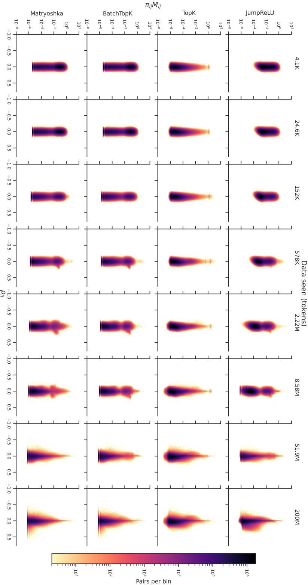  
Figure 7: Transition of interference factors as training progress. This figure complements Figure 2.

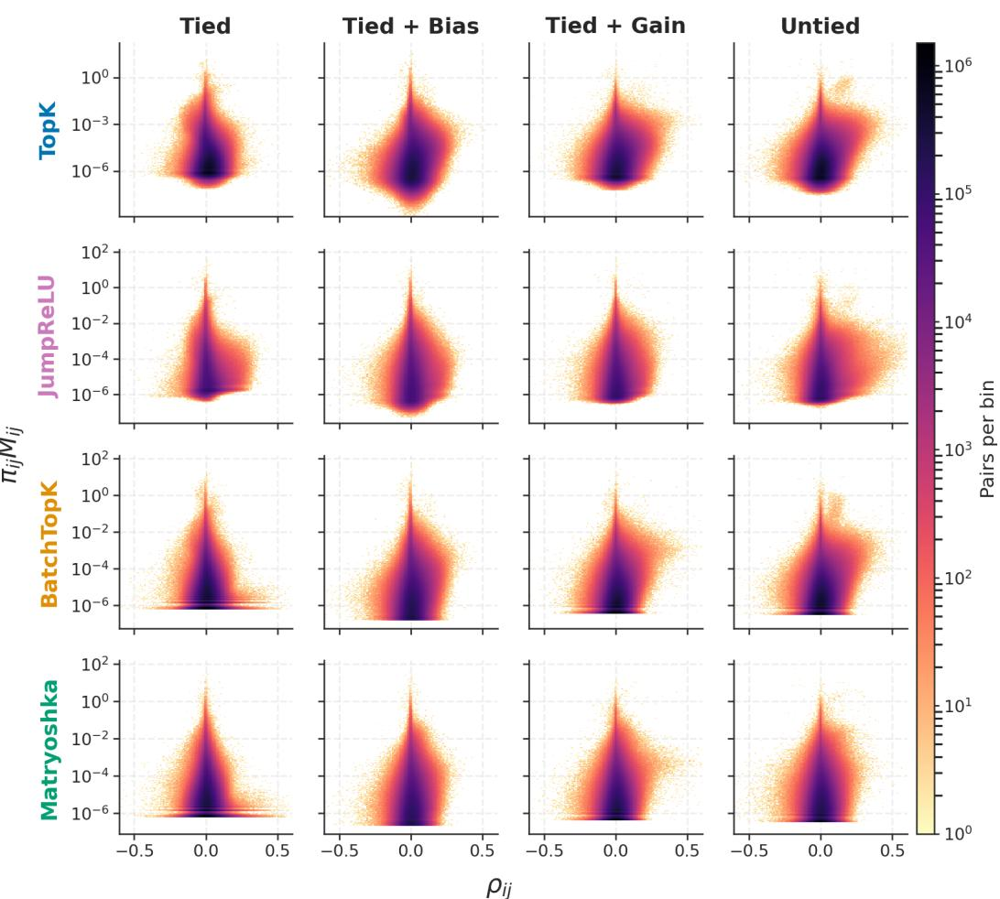  
Figure 8: Consistent trend on architectural freedom shifting co-active feature pairs toward constructive decoder interactions. This figure complements Figure 3.

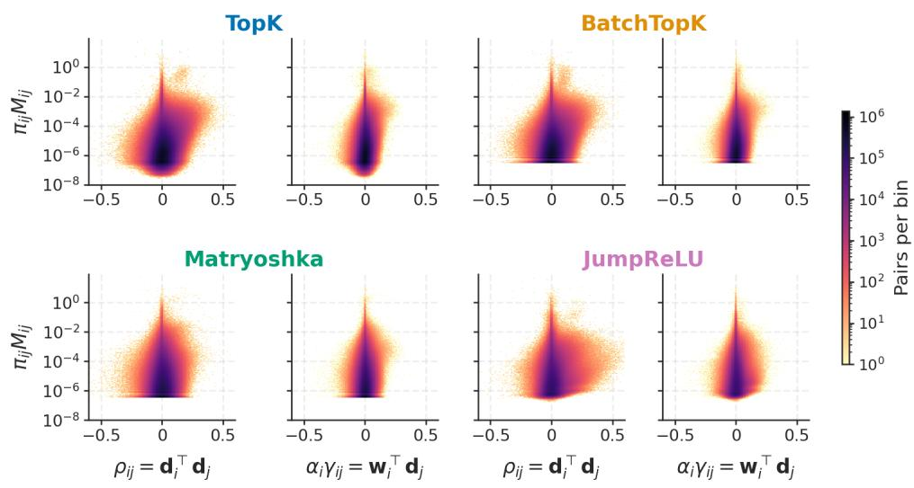  
Figure 9: The untying mechanism to separate constructive decoder interactions from encoder cross-talk is consistent across SAEs, including TopK, BatchTopK, Matryoshka, and JumpReLU. This figure complements Figure 5.

## J.2 INTERFERENCE UNDER VARYING SPARSITY AND DICTIONARY WIDTH

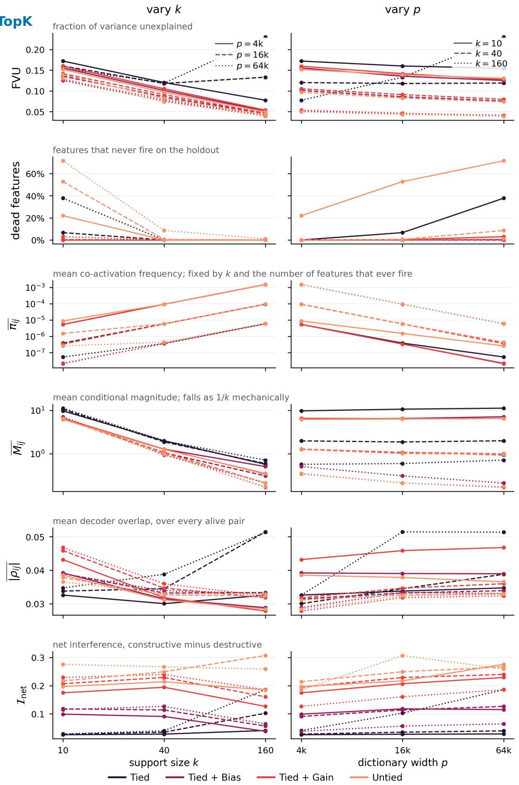  
Figure 10: Interference across sparsity and dictionary width. TopK SAEs trained on Pythia-160M, varying constraints, support size k, and width p. Left: varying k Right: varying p.

## J.3 GENERALITY OF THE INTERFERENCE SIGNATURES

We test whether the interference signatures observed in the main experiments generalize beyond our training setup. We consider two settings: a different modality (MNIST; Section J.3.1) and independently trained language-model SAEs from SAEBench (Section J.3.2).

## J.3.1 A DIFFERENT MODALITY: MNIST

We train SAEs on MNIST with pixels scaled to [0, 1], using 50,000 training and 10,000 validation examples. Models have $p = 1 { , } 0 0 0$ features and $k \stackrel { \cdot } { = } 1 0$ , and are trained for 1,000 epochs with Adam at learning rate $1 0 ^ { - 4 }$ . Decoder columns are kept unit norm, and inputs are centered using the geometric median of the training set (Bricken et al., 2023; Gao et al., 2025; Bussmann et al., 2024). JumpReLU uses an $\ell _ { 0 }$ -target penalty with coefficient 10 (Rajamanoharan et al., 2024b); Matryoshka uses nested groups of sizes 250, 500, 750, and 1,000 (Bussmann et al., 2025).

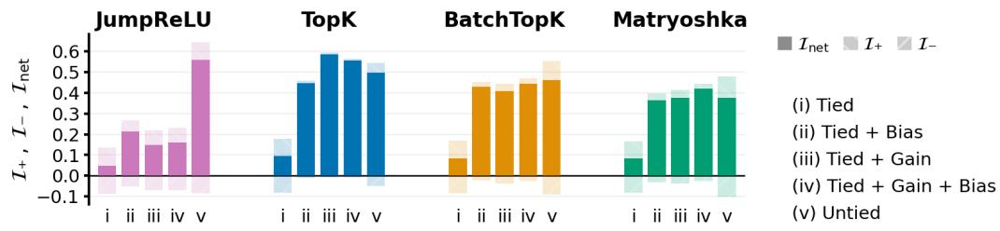  
Figure 11: Effective interference on MNIST. The same qualitative pattern as in language models appears: interference is lowest in the most constrained tied setting and increases as architectural degrees of freedom are added. This figure complements Figure 6.

## J.3.2 INDEPENDENTLY TRAINED SAES: SAEBENCH

Our main experiments are deliberately controlled: all architectures are trained on the same model, data, width, sparsity, and optimization setup, allowing us to isolate the effect of architectural constraints. To test whether the same interference signatures persist beyond this controlled setting, we also evaluate independently trained SAEs released with SAEBench (Karvonen et al., 2025). We use $p = 1 6 { , } 3 8 4$ checkpoints targeting $k = 4 0$ for gemma-2-2b (Team et al., 2024) layer 12 and Pythia-160M-deduped layer 8, evaluated using SAEBench’s own OpenWebText pipeline.

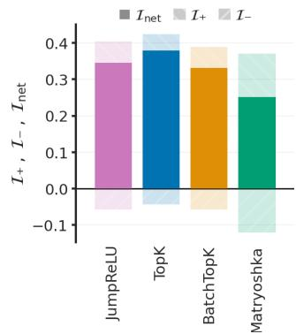

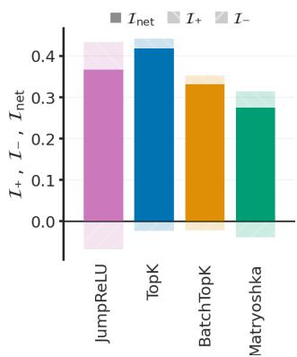  
Figure 13: Effective interference for independently trained SAEBench SAEs. Gemma-2-2B layer 12 (left) and Pythia-160M layer 8 (right), across the four architectures.

These SAEs differ from ours in several aspects of the training recipe: they are trained for longer, use learning-rate warmup and decay, learn the pre-encoder bias rather than fixing it to the geometric median, and, for the hard-sparsity architectures, include an auxiliary loss designed to revive dead features. They are also available only in the untied setting, so their absolute interference levels are not directly comparable to those in our controlled sweep. Despite these differences, the same qualitative signatures remain visible across both model families (Figure 14). In particular, the SAEBench models exhibit substantial effective interference (Figure 13), generally more than we observe in our own untied runs, suggesting that additional optimization and training choices in these pipelines may themselves contribute to effective interference.

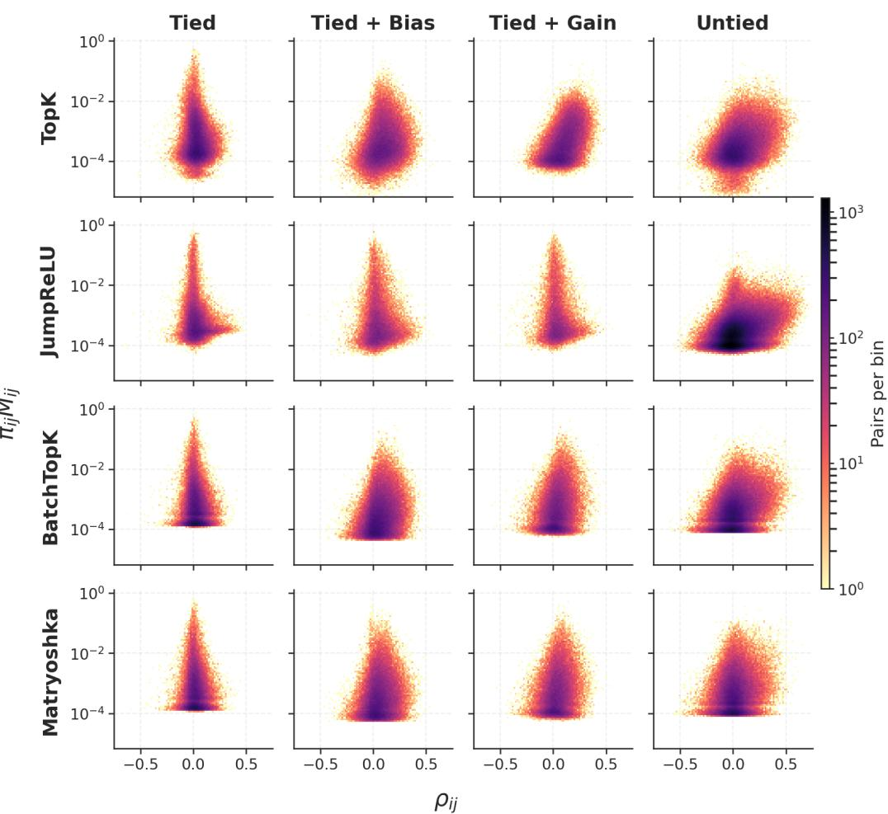  
Figure 12: Decoder orientation and co-activation on MNIST. Relaxing the constraints broadens the distribution of decoder correlations and increases co-activation among non-orthogonal feature pairs. This figure complements Figure 3.

gemma-2-2b layer 12, k = 40, p = 16384  
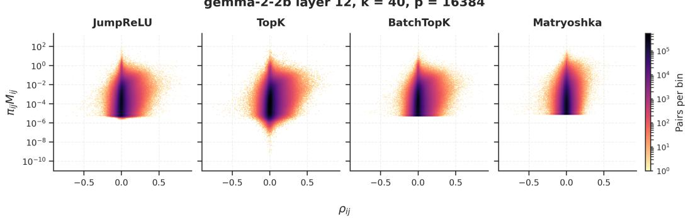

pythia-160m-deduped layer 8, k = 40, p = 16384  
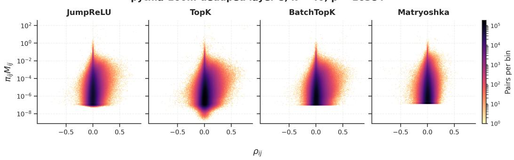  
Figure 14: Decoder orientation and co-activation for independently trained SAEBench SAEs. Gemma-2-2B layer 12 (top) and Pythia-160M layer 8 (bottom).