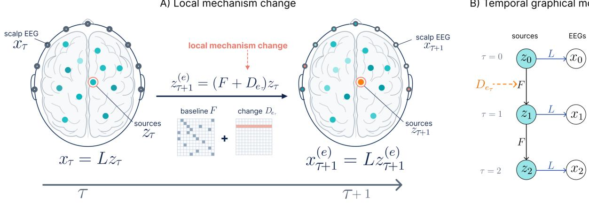
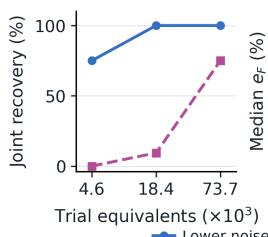
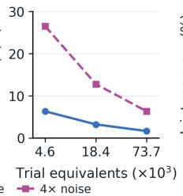
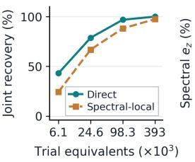
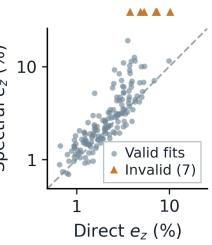
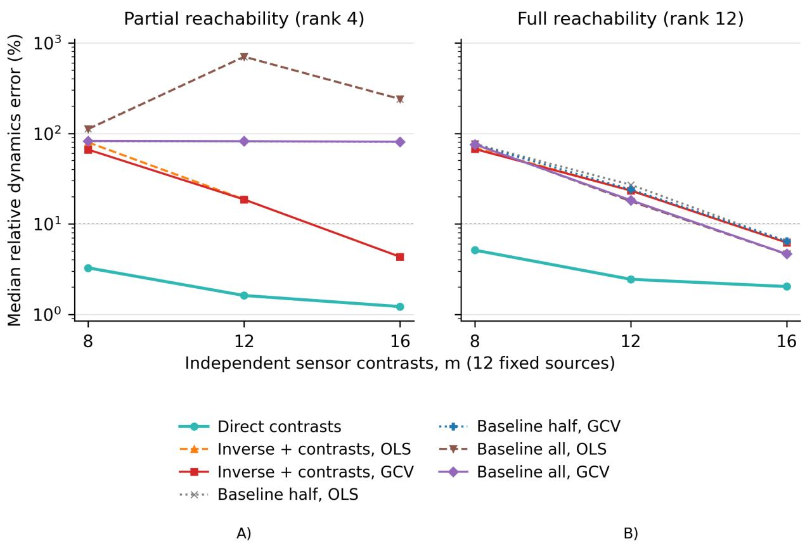

# Identifying Neural Source Dynamics from Unknown Local Interventions

Ayana Mussabayeva1, Jiaqi Sun2, Anuar Aimoldin1, Olivier Oullier1, and Kun Zhang1,2

1Mohamed bin Zayed University of Artificial Intelligence (MBZUAI), Abu Dhabi, UAE 2Carnegie Mellon University (CMU), Pittsburgh, PA, USA

{ayana.mussabayeva,anuar.aimoldin,olivier.oullier,kun.zhang}@mbzuai.ac.ae, jiaqisun@andrew.cmu.edu

## Abstract

Electroencephalography (EEG) records mixtures of brain-source activity. Even with a known anatomical forward model, experiments that excite only part of the source-state space leave the dynamics unidentified, and repetition cannot resolve the ambiguity. We show that unknown local mechanism changes can supply the missing information. We consider linear dynamics among fixed anatomical sources with known source-state initialization patterns. Changing one source’s update rule for one transition leaves a rank-one, source-specific signature in subsequent EEG: subtracting matched baseline responses isolates it, and the forward model identifies the source and calibrates its response history. Combining these histories with initialization responses recovers source interactions without baseline reachability and without first identifying the intervention coefficients. We establish sufficient recovery conditions, a direct estimator, and a noise-sensitivity bound conditional on correct source labels. Sim ulated EEG on anatomy derived from magnetic resonance imaging confirms the information gain: with baseline excitation confined to four of twelve source coordinates, eight unknown changes recover all dynamics in 32/32 systems, whereas baseline realization, baseline regression through an invertible forward model, and changes that leave the tested states unexposed all fail, and explicitly constructed alternative dynamics reproduce every baseline mean. Where baseline information suffices, direct reconstruction is also more reliable than a matched-information spectral estimator. Nonlocal changes and forward-model error limit accuracy even when source labels are correct.

## 1 Introduction

Learning neural interactions requires more than knowing how sources appear at the sensors. The known anatomical forward model, or leadfield, maps source activity to electroencephalography (EEG). Yet distinct dynamics can produce identical mean responses if initialized states and their baseline evolution explore only part of the source space. More repetitions improve precision but cannot resolve this ambiguity, and neither can a better readout: even exact recovery of mean source states leaves the dynamics on unexcited directions undetermined. Classical realization theory makes this limit explicit, since full-order recovery from input–output data requires reachability as well as observability (Ho and Kalman, 1966).

Perturbational neuroscience offers a way past it. A local intervention changes how one circuit element responds and can push activity into directions that baseline experiments never reach (Wagenmaker et al., 2024; Premoli et al., 2014). In EEG, however, its effect arrives mixed across sensors, and the intervention itself is rarely calibrated: which anatomical source it altered, and by how much, are unknown. We ask: can local mechanism changes reveal dynamics absent from baseline mean responses and identify them in anatomical coordinates, even when their targets and coefficients are unknown?

For example, initializing source 1 leaves source 2’s mean activity at zero if baseline dynamics never transfer activity to it; no repetition budget or sensor coverage then reveals how source 2 acts on the rest. Strengthening that connection for a single transition exposes source 2’s influence. We study linear source dynamics among fixed anatomical sources with known initialization patterns and an unknown change to one source’s receiving rule for one transition. Unlike an additive pulse, this change acts on the current state; the original dynamics resume afterwards.

The key insight is that a source-response history can be identifiable even when the intervention itself is not. Subtracting matched baseline from intervened means isolates a displacement at one source and its subsequent propagation. For each intervention mode, conditions change the displacement’s magnitude but not the response shape. This rank-one structure reveals the history up to scale; its immediate sensor pattern identifies the source and fixes that scale through the leadfield. Combining these calibrated histories with initialization responses then recovers the dynamics under source-coverage and temporal-observability conditions, without full baseline reachability and without first recovering the intervention coefficients.

Our contribution is a constructive identification result and an estimator that realizes it. Sufficient conditions separate intervention exposure, source coverage, anatomical distinguishability and temporal observability; none requires full baseline reachability (Section 4). A direct estimator extracts and combines calibrated histories, with a dynamics-error bound that separates coverage conditioning from weak temporal observability (Section 5). Simulated EEG on four MRI-derived Localize-MI anatomies (Mikulan et al., 2020) confirms the information gain: with baseline excitation confined to four of twelve source coordi nates at every horizon, eight unknown local changes recover all twelve-source dynamics in 32/32 systems, whereas baseline realization, baseline regression through an invertible leadfield, and changes that leave the tested states unexposed all fail in 0/32, and explicitly constructed alternative dynamics reproduce every baseline mean (Section 6.2). Where baseline information suffices, direct reconstruction remains more reli able than a matched-information spectral factorization (155/160 versus 141/160) and initializes likelihood fitting (Section 6.3). We close by delimiting what the guarantees do not cover: noise, nonlocal changes and forward-model error, under which correct source labels need not imply correct dynamics, and what recorded EEG can currently test (Section 6.4). Our target is dynamics among predefined anatomical sources, not unrestricted spatial localization; the construction applies to any known linear observation map under the same conditions, although only EEG is examined here.

## 2 Related work

Identifying hidden-source dynamics also requires fixing their coordinates. Non-Gaussian state-space models provide observational identification (Zhang and Hyvärinen, 2011), while interventional causal representation learning includes unknown-target settings under assumptions on mixing and mechanism changes (Squires et al., 2023; Zhang et al., 2024); temporal context can resolve ambiguities under noninvertible observations (Chen et al., 2024). We instead use a known forward model to fix anatomical source labels and units, so no statistical assumption on the mixing is needed.

Fixed coordinates, however, do not ensure sufficient excitation, and neither classical nor interventional identification covers our regime. Input–output realization requires reachability and observability for fullorder recovery (Ho and Kalman, 1966); interventional identification through varying input distributions assumes controllability (Rajendran et al., 2024). Our local receiving-mechanism contrasts remove the reach ability requirement: the leadfield labels and scales each exposed direction, so unknown changes can complete a coverage condition that baseline inputs cannot. The matched-information spectral-local comparator instead factors baseline responses into a latent realization before imposing anatomical constraints, and so inherits the reachability requirement.

Known-leadfield state-space methods estimate source interactions by integrating observation physics with latent dynamics (Cheung et al., 2010; Soleimani et al., 2022); our contrasts can initialize such iterative likelihood fitting (Appendix E). Dynamic causal modelling distinguishes driving inputs from coupling modulation (Friston et al., 2003); our model restricts modulation to an unknown change in one source’s receiving rule for one transition, followed by the same baseline dynamics. Appendix J.4 provides further comparisons.

B) Temporal graphical model  
  
Figure 1: Source dynamics and EEG. (A) One receiving row of $F$ changes; $L$ stays fixed. (B) The first transition uses $F + D _ { e _ { 0 } } ; F$ then resumes without resetting the state. Nodes in (B) are vectors of source amplitudes $z _ { \tau }$ or independent EEG contrasts $x _ { \tau }$ . Intervention superscripts are omitted from labels; colors and entries are schematic; noise is omitted.

## 3 Problem formulation

Let $z _ { \tau } \in \mathbb { R } ^ { q }$ contain amplitudes at $q$ fixed source locations and orientations, and $\boldsymbol { x } _ { \ u { \tau } } ~ \in ~ \mathbb { R } ^ { m }$ contain m independent EEG contrasts at episode time $\tau .$

We study

$$
z _ { \tau + 1 } = ( F + D _ { e _ { \tau } } ) z _ { \tau } + \epsilon _ { \tau } , \qquad x _ { \tau } = L z _ { \tau } + \nu _ { \tau } .\tag{1}
$$

The unknown $\ b { F } \in \mathbb { R } ^ { q \times q }$ is the baseline transition matrix. The known leadfield $\ b { L } \in \mathbb { R } ^ { m \times q }$ fixes source ordering and units; its column $L _ { : , j }$ is the sensor pattern of a unit source j. A colon selects all entries on that axis. Our principal setting has rank $L < q .$ , so one sensor observation need not determine the state.

F describes effective interactions within a fixed operating regime, not globally linear brain dynamics. Linear models are used for EEG and magnetoencephalography (MEG) source dynamics (Zhang and Hyvärinen, 2011; Cheung et al., 2010) and optogenetically evoked population responses (Wagenmaker et al., 2024). Locally, $z _ { \tau }$ may represent deviations from a common equilibrium, with $F$ the Jacobian of a smooth baseline map, provided trajectories remain where the Jacobian varies little. Our guarantees assume the stated linear model and intervention protocol; our simulations do not test nonlinear source dynamics.

Initialization and intervention. Episodes start with $\mathbb { E } [ z _ { 0 } \mid u ] = K u .$ , where known $K \in \mathbb { R } ^ { q \times r }$ specifies source-state patterns and $u \in \mathbb { R } ^ { r }$ their controlled amplitudes. There is no subsequent baseline additive drive. The exogenous schedule selects baseline $D _ { 0 } = 0$ or one of E local modes:

$$
D _ { e } = e _ { j _ { e } } { v _ { e } ^ { \top } } , \qquad v _ { e } \in \mathbb { R } ^ { q } \setminus \{ 0 \} .\tag{2}
$$

Here $e _ { j }$ is the jth coordinate vector; both target $j _ { e }$ and coefficients $v _ { e }$ are unknown. The state is unchanged at onset, one transition uses $F + D _ { e }$ , and all other transitions use the same $F .$ . The resulting state is not reset;

L stays fixed. Innovations and sensor noise have zero conditional mean given initialization and schedule.   
Known K means calibrated source states, not merely a known stimulation contact.

Observed response matrices. Choose an output horizon $T \geq 2$ and insertion times $\tau _ { \mathrm { i n t } } = 0 , \ldots , s - 1$ with $s \geq 1$ . For each unit input $\boldsymbol { u } ^ { ( i ) } \in \mathbb { R } ^ { r }$ , stack the mean EEG at times $\tau _ { \mathrm { i n t } } + 1 + t , t = 0 , . . . , T - 1$ after inserting mode e. This is one column of $H ^ { [ e ] } \in \mathbb { R } ^ { m T \times r s } ;$ : rows index sensors and output lags, columns index initialization and insertion time. Trial averages estimate $H ^ { [ e ] }$ without observing z or knowing $F .$ . The matched baseline $H _ { + }$ uses the same inputs and observation times without intervention; $H _ { 0 }$ uses baseline times one sample earlier (Appendix A.1).

To express these measured histories through the model, define

$$
\begin{array} { r } { O _ { T } = \left[ \begin{array} { c } { L } \\ { L F } \\ { \vdots } \\ { L F ^ { T - 1 } } \end{array} \right] \in \mathbb { R } ^ { m T \times q } , \qquad R _ { s } = [ K , F K , \ldots , F ^ { s - 1 } K ] \in \mathbb { R } ^ { q \times r s } . } \end{array}\tag{3}
$$

$O _ { T }$ contains unit-source histories; $R _ { s }$ contains mean states reached by baseline initializations. Then

$$
H _ { 0 } = O _ { T } R _ { s } , \qquad H _ { + } = O _ { T } F R _ { s } , \qquad H ^ { [ e ] } = O _ { T } ( F + D _ { e } ) R _ { s } .\tag{4}
$$

For example, initializing with $u ^ { ( i ) }$ and changing the first transition gives the first post-transition sample $x _ { 1 }$ with mean $L ( F + D _ { e } ) K _ { : , i }$ . Its matched baseline mean is $L F K _ { : , i } ;$ their difference is $L D _ { e } K _ { : , i }$ . Later samples track the propagation of that difference by F. Thus the H matrices store measured conditional means, whereas $O _ { T }$ describes unit-source responses that must be recovered. Shared baseline lags reuse the same observations and are not independent entries.

## 4 Identification from local interventions

## 4.1 Identifying source-response histories

What can an unknown local change reveal? It creates a displacement in one source coordinate relative to baseline. Its amplitude depends on the tested state, but its subsequent propagation follows the same F. Consequently,

$$
\Delta H _ { e } : = H ^ { [ e ] } - H _ { + } = O _ { T } D _ { e } R _ { s } = \underbrace { O _ { T } e _ { j _ { e } } } _ { o _ { j _ { e } } } \underbrace { v _ { e } ^ { \top } R _ { s } } _ { \psi _ { e } ^ { \top } } .\tag{5}
$$

Here $o _ { j } \in \mathbb { R } ^ { m T }$ is the unit-source history and $\psi _ { e } \in \mathbb { R } ^ { r s }$ is the intervention’s exposure across conditions. If $\psi _ { e } \neq 0$ and $L _ { : , j _ { e } } \neq 0$ , the contrast has rank one and identifies the line spanned by $o _ { j _ { \epsilon } }$ . Its first sensor block is proportional to $L _ { : , j _ { e } }$ . Nonzero, pairwise nonproportional leadfield columns identify the target and calibrate the entire history. The recoverable object is therefore the response history, not necessarily the intervention row: distinct coefficients with the same action on $R _ { s }$ give the same contrast.

## 4.2 From histories to dynamics

When do the recovered histories determine $F ?$ Let J be the distinct exposed targets and $E _ { J } = [ e _ { j } ] _ { j \in J }$ Collect the available directions and their responses:

$$
\Omega = [ K , E _ { J } ] , \qquad Y = [ O _ { T } K , O _ { T } E _ { J } ] = O _ { T } \Omega .\tag{6}
$$

The first r columns of $H _ { 0 }$ supply $O _ { T } K \mathbf { ; }$ calibrated contrasts supply $O _ { T } E _ { J }$ . Thus $Y$ is known without the intervention coefficients. The anchoring matrix $\Omega \in \mathbb { R } ^ { q \times ( r + | \bar { J } | ) }$ measures source-coordinate coverage. Removing the last or first sensor block from $O _ { T }$ gives

$$
\boldsymbol { O } _ { - } = [ L ^ { \top } , ( L F ) ^ { \top } , \ldots , ( L F ^ { T - 2 } ) ^ { \top } ] ^ { \top } , \qquad \boldsymbol { O } _ { + } = [ ( L F ) ^ { \top } , \ldots , ( L F ^ { T - 1 } ) ^ { \top } ] ^ { \top } .
$$

Both have size $m ( T - 1 ) \times q ,$ and $O _ { + } = O _ { - } F ;$ each temporal block in $O _ { + }$ is the corresponding block in O− multiplied by F. For $T = 2 ,$ , these reduce to L and $L F$

Theorem 1 (Constructive anatomical identification). Under the model and schedule of Section 3, suppose the columns of L are nonzero and pairwise nonproportional. Selected changes with $v _ { e } ^ { \top } R _ { s } \neq 0$ identify their targets and columns $O _ { T } e _ { j _ { e } }$ . If

$$
\mathrm { r a n k } \Omega = q , \qquad \mathrm { r a n k } O _ { - } = q ,\tag{7}
$$

the measured responses uniquely determine

$$
{ \cal O } _ { T } = Y \Omega ^ { \dagger } , \qquad F = { \cal O } _ { - } ^ { \dagger } { \cal O } _ { + } .\tag{8}
$$

Here $\dagger$ is the Moore–Penrose pseudoinverse. Full rank of $R _ { s }$ is not required.

Proofsketch. Equation (5) supplies labelled, scaled columns. Full row rank of Ω gives $\Omega \Omega ^ { \dagger } = I _ { q } .$ recovering $O _ { T }$ . Full column rank of O− then solves the shift identity for F. Appendix A gives full proofs. □

The conditions separate exposure $( v _ { e } ^ { \top } R _ { s } \neq 0 )$ , anatomical distinguishability through L, source coverage $( \mathrm { r a n k } \Omega = q )$ , and temporal observability (rank $O _ { - } = q )$ . Exposure produces a contrast; distinguishability identifies and calibrates its source. Coverage combines targets with possibly mixed initialization patterns, while observability lets temporal histories distinguish states that a single observation cannot. These conditions presuppose calibrated $L , K$ , matched episodes and single-transition receiving-row changes; estimated ranks are diagnostics, not certificates.

These conditions do not require full baseline reachability. Baseline realization factors $H _ { 0 } = O _ { T } R _ { s }$ and needs both factors to have rank $q ;$ our construction needs only each selected change to act on a tested state, $v _ { e } ^ { \top } R _ { s } \neq 0$ , and the revealed targets to complete Ω. A change can open a path into an unreachable coordinate; suppressing an entirely unreachable row cannot. Appendix A.5 characterizes the residual coordinate family when anchoring is incomplete.

Full column rank of $L$ makes instantaneous states distinguishable and ensures rank $O _ { - } = q$ , but leaves dynamics on unexcited directions undetermined: an invertible readout recovers states, not the rows of F that no tested state ever exercises. Section 6.2 tests this distinction empirically; Appendix D treats square systems.

Illustration: recovery without baseline reachability. Consider $q = 3 , m = 2 , K = e _ { 1 } , T = 3$ and $s = 2$ . Choose dynamics with $F ^ { \tau } K = 2 ^ { - \tau } e _ { 1 }$ , so baseline means leave sources 2 and 3 unexcited. Two changes with unknown targets and coefficients reveal $o _ { 2 }$ and $o _ { 3 }$ after anatomical calibration. One contrast and the completed histories are:

$$
R _ { 2 } = \left[ \begin{array} { c c } { 1 } & { 0 . 5 } \\ { 0 } & { 0 } \\ { 0 } & { 0 } \end{array} \right] , \quad \Delta H _ { 1 } = \left[ \begin{array} { c c } { 0 } & { 0 } \\ { 2 } & { 1 } \\ { 2 } & { 1 } \\ { 0 } & { 0 } \\ { 1 } & { 0 . 5 } \\ { 0 } & { 0 } \end{array} \right] , \quad L = \left[ \begin{array} { c c } { 1 } & { 0 } & { 1 } \\ { 0 } & { 1 } & { 1 } \\ { 0 } & { 1 } & { 1 } \\ { 0 } & { 1 } & { 1 } \end{array} \right] , \quad O _ { 3 } = \left[ \begin{array} { c c } { 1 } & { 0 } & { 1 } \\ { 0 } & { 1 } & { 1 } \\ { 0 . 5 } & { 1 } & { 0 } \\ { 0 } & { 0 } & { 1 } \\ { 0 . 2 5 } & { 0 . 5 } & { 1 } \\ { 0 } & { 0 } & { 0 } \end{array} \right] .\tag{9}
$$

Algorithm 1 Direct contrast reconstruction of anatomical source dynamics   
Require: Known $L , K ,$ , measured $\widehat { H } _ { 0 } , \widehat { H } _ { + } , \{ \widehat { H } ^ { [ e ] } \} _ { e = 1 } ^ { E }$ , thresholds $\epsilon _ { \Delta } , \epsilon _ { u }$   
1: $\Omega  K$ $\widehat { Y } \gets$ first r columns of $\widehat { H } _ { 0 }$   
2: for $e = 1 , \ldots , E$ do   
3: $( \widehat { u } _ { e } , \widehat { \sigma } _ { e } ) \gets \mathrm { S V D } _ { 1 } ( \widehat { H } ^ { [ e ] } - \widehat { H } _ { + } )$   
4: if $\mathbf { \widehat { \sigma } } _ { e } \leq \epsilon _ { \Delta } \mathbf { \delta } _ { \mathbf { \delta } } \mathbf { o r } \| \widehat { u } _ { e , \mathrm { t o p } } \| _ { 2 } \leq \epsilon _ { u }  { : }$ return INVALID   
5: Compute $\hat { j } _ { e } , \gamma _ { e }$ using Eq. (10)   
6: $\Omega \gets \mathsf { \bar { [ } } \Omega , e _ { \widehat { j } _ { e } } ] , \widehat { Y } \gets [ \widehat { Y } , \gamma _ { e } \widehat { u } _ { e } ]$   
7: end for   
8: if rank $\Omega < q \colon$ return INVALID   
9: $\widehat { O } _ { T } \gets \widehat { Y } \Omega ^ { \dagger }$ , set its first block to L and form $\widehat { O } _ { - } , \widehat { O } _ { + }$   
10: if rank $\widehat { O } _ { - } < q :$ return INVALID else: return $\widehat F = \widehat O _ { - } ^ { \dagger } \widehat O _ { + }$

Blue, green and red identify sources 1, 2 and 3, respectively. Columns of $R _ { 2 } , \Delta H _ { 1 }$ index insertion times 0 and 1; columns of $L , O _ { 3 }$ index sources. Horizontal rules separate the two-sensor output-lag blocks. The displayed contrast reveals $_ { O 2 } ;$ the second mode supplies $o _ { 3 }$

Here rank $R _ { s } = 1$ at every horizon and rank $L = 2 .$ , yet rank $O _ { - } = 3$ . The known initialization and identified targets give $\Omega = I _ { 3 }$ , so Theorem 1 uniquely recovers F while some intervention coefficients remain undetermined. The theorem permits mixed initialization patterns and any dynamics satisfying its rank conditions. This illustration uses exact means; Appendix A.4 gives the generating system and complete calculation. Section 6.2 repeats the same construction on twelve-source anatomical systems with noise.

## 5 Estimation and stability

## 5.1 Direct contrast reconstruction

Equation (5) makes every nonzero population contrast rank one, with all columns proportional to one source history. Noise breaks this exact structure. We estimate the common direction using the leading unit left singular vector $\widehat { u } _ { e }$ of the measured contrast, obtained by singular value decomposition (SVD). Its first senso block $\widehat { u } _ { e , \mathrm { t o p } } \in \mathbb { R } ^ { m }$ is used to estimate the source label and calibrate the history:

$$
\widehat { j } _ { e } = \arg \operatorname* { m a x } _ { j } \frac { | \widehat { u } _ { e , \mathrm { t o p } } ^ { \top } L _ { : , j } | } { \| \widehat { u } _ { e , \mathrm { t o p } } \| _ { 2 } \| L _ { : , j } \| _ { 2 } } , \quad \gamma _ { e } = \frac { \widehat { u } _ { e , \mathrm { t o p } } ^ { \top } L _ { : , \widehat { j } _ { e } } } { \| \widehat { u } _ { e , \mathrm { t o p } } \| _ { 2 } ^ { 2 } } , \quad \widehat { o } _ { \widehat { j } _ { e } } ^ { ( e ) } = \gamma _ { e } \widehat { u } _ { e } .\tag{10}
$$

Absolute alignment handles the SVD sign ambiguity; the signed scale restores source units. Algorithm 1 combines the calibrated histories with initialization responses, completes $O _ { T }$ , and recovers F through the temporal shift. It retains one paired column per intervention, including repeated targets. Here $\mathrm { S V D _ { 1 } }$ returns the leading unit left singular vector and singular value; $\epsilon \Delta , \epsilon _ { u }$ guard against a degenerate contrast or first sensor block.

Theorem 1 needs only a sufficient selected set of changes; the tested implementation uses all supplied modes, performs no mode selection, and returns an invalid fit when any mode fails its numerical guard. These guards are not statistical detection thresholds (Appendix B.3); invalid fits count as failures.

## 5.2 Conditional stability

Correctly labelled histories can still yield inaccurate dynamics when noise is amplified during reconstruction: when the available directions cover some source combinations only weakly, or when distinct source

  
A)

  
B)

  
C)

  
D)  
Figure 2: Recovery from simulated EEG. (A–B) Direct with 4/12 baseline-reachable sources (32 anatomy– seed cases): joint recovery and median $e _ { F }$ at sensor/process noise 0.01/0.002 or fourfold larger; paired Gaussian draws make the higher-noise 73,728 and lower-noise 4,608 cells coincide $( 4 / \sqrt { 1 9 2 } = 1 / \sqrt { 1 2 } )$ (C–D) Separate full-reachability comparison (160 cases): Direct versus Spectral-local under matched information. Panel D pairs $e _ { z }$ at 98,304 trial equivalents; points above the diagonal favor Direct; seven invalid Spectral-local fits occupy a nonmetric upper strip. Joint recovery requires $e _ { F } , e _ { z } \leq 1 0 \%$

states produce similar sensor histories. The following bound separates these two effects. Let $\| \cdot \| _ { 2 }$ denote spectral norm for matrices and Euclidean norm for vectors, and $\sigma _ { \mathrm { m i n } }$ the smallest singular value.

Proposition 2 (Conditional reconstruction stability). Under $E q . \ ( 7 )$ , conditional on correct target labels, define

$$
\delta = \frac { \| \widehat { Y } - Y \| _ { 2 } } { \sigma _ { \operatorname* { m i n } } ( \Omega ) } , \qquad \beta = \sigma _ { \operatorname* { m i n } } ( O _ { - } ) .\tag{11}
$$

$H \delta < \beta ,$ , the full-rank least-squares reconstruction satisfies

$$
\| \widehat { F } - F \| _ { 2 } \leq \frac { ( 1 + \| F \| _ { 2 } ) \delta } { \beta - \delta } .\tag{12}
$$

Enforcing the exactfirst block L preserves the bound.

Here δ bounds history reconstruction error, while $\beta = \mathrm { m i n } _ { \| h \| _ { 2 } = 1 } \| O _ { - } h \| _ { 2 }$ is the weakest sensor-history response to a unit source-state displacement over the shift lags; what matters is a weakest response large relative to reconstruction error. Weak exposure or poorly separated leadfield columns can already destabilize the preceding labeling step (Appendix ${ \bf A } . 6 )$ . The bound assumes correct L, K and labels; it does not cover model mismatch or give an unconditional success probability.

## 6 Experiments

The experiments follow the argument of the paper: whether unknown local changes supply information that baseline means lack and whether it is usable at finite budgets (Section 6.2); how reliably direct reconstruction uses that information when baseline responses would already suffice (Section 6.3); and what the guarantees do not cover (Section 6.4). Known simulated $F ,$ z permit direct evaluation of dynamics and source recovery that sensor prediction alone cannot certify.

## 6.1 Data and evaluation

Four Localize-MI anatomies derived from magnetic resonance imaging (MRI) supply leadfields (Mikulan et al., 2020). Principal studies use $q \ = \ 1 2$ fixed cortical-normal sources, nine electrodes and $m \ : = \ : 8$ independent sensor contrasts; columns are normalized once to define source units. Dynamics, interventions, noise and EEG are simulated with four coordinate initialization patterns, eight unknown targets and $T =$ $s = 6 ;$ recovery is evaluated in anatomical coordinates without alignment to truth. A trial equivalent is one initialized recording episode; we sample Gaussian episode averages with the covariance of the represented repeats, and half the budget is baseline (Appendix B.2). Estimators receive $L , K , q$ and measured responses only, never true targets or coefficients. Evaluation reconstructs 32 new distributed initial states from their entire eight-step noisy sensor histories. With $Z , { \widehat { Z } }$ stacking true and reconstructed trajectories,

$$
e _ { F } = \frac { \Vert \widehat { F } - F \Vert _ { \mathrm { F } } } { \Vert F \Vert _ { \mathrm { F } } } , \qquad e _ { z } = \frac { \Vert \widehat { Z } - Z \Vert _ { \mathrm { F } } } { \Vert Z \Vert _ { \mathrm { F } } } ,\tag{13}
$$

with $\Vert \cdot \Vert _ { \mathrm { F } }$ the Frobenius norm. Joint success requires $e _ { F } , e _ { z } \leq 0 . 1 0$ . Invalid estimates have infinite errors and count as failures; all cases remain in reported success rates. Full protocols, trial accounting and complete results are in Appendices B–D.

## 6.2 Recovery beyond baseline reachability

We test whether unknown local changes enable recovery when baseline excitation remains rank-deficient at every horizon. In twelve-source systems, baseline initializations explore only four coordinates, while local changes can expose the remaining eight. To preserve this missing information at every baseline horizon, we construct

$$
F = \left[ \begin{array} { c c } { { A } } & { { C } } \\ { { 0 } } & { { B } } \end{array} \right] , \quad K = \left[ \begin{array} { c } { { I _ { 4 } } } \\ { { 0 } } \end{array} \right] , \quad F ^ { \tau } K = \left[ \begin{array} { c } { { A ^ { \tau } } } \\ { { 0 } } \end{array} \right] \quad ( \tau \geq 0 ) ,\tag{14}
$$

where $A \in \mathbb { R } ^ { 4 \times 4 } , B \in \mathbb { R } ^ { 8 \times 8 }$ and $C \in \mathbb { R } ^ { 4 \times 8 }$ . Baseline means reach four coordinates at every horizon, so rank $R _ { s } \ =$ rank $H _ { 0 } = 4$ . Eight unknown general row changes target the remaining coordinates with $v _ { e } ^ { \top } K \neq 0$ , completing Ω; all systems have rank $O _ { - } ~ = ~ 1 2$ . The estimator receives neither the block structure nor the targets. Eight fresh systems per anatomy give 32 cases (Appendix C).

Local changes recover what baseline cannot. At lower noise, direct successes are 24/32, 32/32 and 32/32 across increasing budgets (Table 1; Figure 2A–B). At 18,432 trial equivalents, median $e _ { F } , e _ { z }$ are 3.24% and 3.97%: all twelve-source dynamics are recovered despite rank-four baseline excitation, with every target labelled correctly. At fourfold noise, success is 0/32, 3/32 and 24/32: identification is exact, but finite-budget recovery requires precision, which repetition supplies without changing baseline reachability.

The gain is informational, not numerical. Four controls on the same regime show that no estimator can replace the exposed changes. First, exposure is necessary: keeping every change nonzero but removing its action on the tested states $( v _ { e } ^ { \top } R _ { s } = 0 )$ for one mode reduces coverage to 11 and yields 0/32 successes at every budget and noise level; removing it for all modes yields 0/32 with no valid fit. Increasing repeats cannot make a zero population contrast nonzero. Second, baseline realization fails: Spectral-local, which factors baseline responses into an order-q latent model before using contrasts, returns no valid reconstruction in any cell, because it must infer twelve coordinates from a rank-four baseline Hankel matrix. Third, an invertible readout does not help: with a square leadfield, inverting each sensor block and regressing the dynamics from baseline responses gives 0/32 with ordinary least squares (OLS) or ridge regression tuned by generalized cross-validation (GCV), even with the entire budget acquired as baseline, whereas Direct succeeds in 32/32 on the same systems. Fourth, the ambiguity is real: for every unexposed control system, an independent validator constructs alternative dynamics $F _ { S } = S F S ^ { - 1 }$ preserving L, K and all included mean response blocks; across 64 such witnesses, mean responses agree to $1 . 1 2 \times 1 0 ^ { - 1 6 }$ while the dynamics differ by at least 2.13%. The failures of baseline-only estimation therefore reflect missing information, not failed estimation (Appendices C and D). Coverage is sufficient, not minimal (Appendix D.6).

Table 1: Recovery beyond baseline reachability. Twelve-source systems whose baseline means reach four coordinates at every horizon; 32 anatomy–seed cases per row; errors in percent; $N$ counts trial equivalents. Top: Direct with all eight modes exposed (noise rows are paired acquisitions). Bottom: controls at 18,432 trial equivalents, lower noise; “coverage” is rank $[ K , E _ { J } ]$ over targets with nonzero population contrasts. Square-leadfield rows use fresh systems from the same generator with $m = q = 1 2$ (Appendix D).
<table><tr><td colspan="6">Direct, all eight modes exposed</td></tr><tr><td>Sensor/process SD</td><td>N</td><td>Success</td><td>med.  $e _ { F }$ </td><td>med.  $e _ { z }$ </td><td> $\mathsf { p } ^ { 9 0 } e _ { z }$ </td></tr><tr><td>0.01/0.002</td><td>4,608</td><td>24/32</td><td>6.33</td><td>8.08</td><td>11.85</td></tr><tr><td>0.01/0.002</td><td>18,432</td><td>32/32</td><td>3.24</td><td>3.97</td><td>6.02</td></tr><tr><td>0.01/0.002</td><td>73,728</td><td>32/32</td><td>1.66</td><td>1.99</td><td>3.04</td></tr><tr><td>0.04/0.008</td><td>4,608</td><td>0/32</td><td>26.50</td><td>29.52</td><td>40.88</td></tr><tr><td>0.04/0.008</td><td>18,432</td><td>3/32</td><td>12.79</td><td>15.34</td><td>22.50</td></tr><tr><td>0.04/0.008</td><td>73,728</td><td>24/32</td><td>6.33</td><td>8.08</td><td>11.85</td></tr><tr><td>Controls Estimator / condition</td><td>Coverage</td><td>Valid</td><td>Success</td><td>med.  $e _ { F }$ </td><td>med.  $e _ { z }$ </td></tr><tr><td>Direct, one mode unexposed</td><td>11</td><td>1/32</td><td>0/32</td><td></td><td></td></tr><tr><td>Direct, all modes unexposed</td><td>4</td><td>0/32</td><td>0/32</td><td>∞ ∞</td><td>∞</td></tr><tr><td>Spectral-local (baseline realization)</td><td>12</td><td>0/32</td><td>0/32</td><td>∞</td><td>∞</td></tr><tr><td>Baseline-only OLS, square  $L ,$  entire budget</td><td></td><td>32/32</td><td>0/32</td><td>704.41</td><td>∞ 363.70</td></tr><tr><td>Baseline-only ridge-GCV, square  $L ,$  entire budget</td><td>一</td><td>32/32</td><td>0/32</td><td>82.08</td><td>199.86</td></tr><tr><td>Direct, square  $L ,$  same systems</td><td>12</td><td>32/32</td><td>32/32</td><td>1.62</td><td>1.78</td></tr></table>

Table 2: Matched-information recovery under full baseline reachability. Methods share simulated responses within rows; 160 anatomy–seed cases per row at 98,304 trial equivalents. p90: empirical 90th percentile of $e _ { z }$ , including invalid fits as ∞.
<table><tr><td rowspan="2">Intervention law</td><td colspan="2">Joint success ↑</td><td colspan="2"> $\mathrm { p } 9 0 \ e _ { z } \left( \% \right) \downarrow$ </td></tr><tr><td></td><td>Direct Spectral-local</td><td></td><td>Direct Spectral-local</td></tr><tr><td>Row suppression (primary)</td><td>155/160</td><td>141/160</td><td>4.28</td><td>9.20</td></tr><tr><td>General row change (control)</td><td>157/160</td><td>139/160</td><td>4.16</td><td>9.99</td></tr></table>

## 6.3 Reliability when baseline information suffices

With full baseline reachability, both routes have sufficient population information, and the comparison isolates estimator reliability. Spectral-local fits an order-q latent model to baseline responses by singular value decomposition, then uses intervention contrasts to map it to anatomical coordinates (“spectral” means matrix factorization, not EEG frequency analysis). The primary confirmation crosses 40 fresh seed blocks with four anatomies, using unknown row suppression in [0.2, 0.6]: 160 cases per budget (Figure $2 \mathrm { C - D } ;$ Table 2).

Direct improves joint success by a paired 8.75 percentage points (approximate 95% seed-cluster bootstrap interval [3.125, 15.0]). Median source errors remain close (2.20% versus 2.36%); the gain is fewer large errors (lower p90) and no invalid fits versus seven for Spectral-local (Figure 2D). Recovery does not require proportional suppression: norm-matched arbitrary receiving-row changes give the same pic ture (Table 2; Appendix B.5). The advantage persists against inverse-then-regress estimation using exactly the same interventional responses with a square leadfield: OLS and ridge–GCV give 0/32 at 18,432 trial equivalents where Direct gives 32/32, because they invert each sensor block before exploiting the rank-one contrast structure; with sixteen measurements and a fourfold budget both routes succeed (Appendix D).

Direct reconstruction also makes iterative fitting usable under partial excitation: in an exploratory knownleadfield Gaussian state-space comparison using expectation-maximization (EM), initializing at the direct estimate yields higher training likelihood than every non-direct start and 32/32 convergences, versus 3/32 for likelihood-selected non-direct fits at a 500-iteration cap (Appendix E). Fixed-budget recovery degrades with system size for both methods (Appendix B.6); these results support reliability over the comparator, not scalability at fixed cost.

## 6.4 What the guarantees do not cover

The recovery guarantee is conditional on locality, calibrated L, K and correct labels, and the stability bound on correct L. Three separate prespecified stress tests delimit these conditions.

Locality. Adding a neighboring-row change at 0.1 of the primary coefficient reduces Direct to 65/80 successes at 98,304 trial equivalents and 69/80 at four times that budget: averaging does not remove the bias from nonlocal changes (Appendix B).

Forward model. Sixteen simulated systems are paired across five assumed skull-conductivity settings in physical head models, retaining source locations, orientations and units. With the nominal L supplied to the estimator and exact responses, every target label is correct, yet nonnominal settings produce median eF of 11.17–27.52%; supplying the generating leadfield recovers all 80 paired cases to numerical precision. Correct labels therefore do not imply correct dynamics, and this bias persists without sampling noise, outside the correct-L stability bound (Appendix I).

Recorded EEG. Real data can currently test only the spatial half of the calibration. In Localize-MI EEG from the same four participants, within a −2 to +2 ms window dominated by injected-current artifact, a spatial direction learned at one intensity predicts responses at another on disjoint test trials across eleven sites (median score 0.949 versus 0.179 for a prespecified other-site direction), and trial averaging makes dipole fits more repeatable (agreement with the full-pool fit 66.88% to 92.50%) without moving them closer to the contact midpoint (13.68 mm). Spatial transfer and repeatability do not establish accurate anatomical calibration, and these analyses recover no neural F, validate no neural K, and implement no mechanism change (Appendix H).

## 7 Discussion

We show how unknown local mechanism changes can reveal source dynamics that controlled baseline mean responses leave undetermined. The central insight is to identify an anatomically calibrated source-response history rather than every coefficient of the intervention; combined with known initialization responses, these histories recover directed interactions between anatomically defined sources beyond baseline reachability. The experiments separate this information gain from the estimator: partially excited systems are recovered where baseline realization, invertible readout and unexposed changes all fail, and explicit alternative dynam ics reproduce every baseline mean; where baseline information suffices, direct reconstruction remains the more reliable route and initializes likelihood fitting. The stress tests state the price of the guarantee: noise, nonlocal changes and forward-model error each degrade recovery even when source labels are correct, so labels and histories must be validated separately.

These findings motivate mapping interactions in controlled neural-circuit experiments, including dynamicclamp and optogenetic settings (Sharp et al., 1993; Wilson et al., 2012), and potentially EEG-based pertur bation studies; biological translation requires calibrated observation and initialization models and validation of the single-row, single-transition protocol (Appendix J).

## Ethics and data use

The study combines existing anatomical operators from Localize-MI (Mikulan et al., 2020) with computational simulations and secondary analyses of the dataset’s recorded scalp EEG during intracerebral current injection. No new human recordings or stimulation procedures were acquired. Data reuse and redistribution must respect the dataset’s CC BY-NC-SA 4.0 licence and applicable privacy requirements. The mathemati cal intervention protocol is not a clinically validated stimulation or diagnostic procedure.

## Reproducibility

Appendices A and D provide the main mathematical arguments. Appendices B, C and D specify acquisition, estimators, evaluation and complete results for the central simulation studies. Appendix E documents the exploratory known-leadfield EM comparison, including initializations, stopping rules and numerical checks. Appendices F and G give additional-assumption controls, including their derivations and failure cases; Appendix H describes recorded-current EEG diagnostics and their distinct scope. Appendix I documents the physical forward-model sensitivity study. Appendix J expands the experimental interpretation and related work. Experimental protocols, numerical verification records and checksums accompany the research package.

Code for this work is available at:

https://github.com/AyanaMussabayeva/source\_localization.

## References

Emre Acartürk, Burak Varıcı, Karthikeyan Shanmugam, and Ali Tajer. Sample complexity of interventional causal representation learning. In Advances in Neural Information Processing Systems, volume 37, pages 39350–39385, 2024. doi: 10.52202/079017-1243. URL https://proceedings.neurips.cc/paper\_files/paper/2024/hash/ 458fa8ee331566383d8e74bdb647f829-Abstract-Conference.html.

Guangyi Chen, Yifan Shen, Zhenhao Chen, Xiangchen Song, Yuewen Sun, Weiran Yao, Xiao Liu, and Kun Zhang. CaRiNG: Learning temporal causal representation under non-invertible generation process. In Proceedings of the 41st International Conference on Machine Learning, volume 235 of Proceedings of Machine Learning Research, pages 7236–7259. PMLR, 2024. URL https://proceedings.mlr. press/v235/chen24ai.html.

Bing Leung Patrick Cheung, Brady Alexander Riedner, Giulio Tononi, and Barry D. Van Veen. Estimation of cortical connectivity from EEG using state-space models. IEEE Transactions on Biomedical Engineering, 57(9):2122–2134, 2010. doi: 10.1109/TBME.2010.2050319. URL https://pmc.ncbi.nlm.nih. gov/articles/PMC2923689/.

K. J. Friston, L. Harrison, and W. Penny. Dynamic causal modelling. NeuroImage, 19(4):1273–1302, 2003. doi: 10.1016/S1053-8119(03)00202-7. URL https://www.sciencedirect.com/science/ article/pii/S1053811903002027.

Stefan Haufe, Vadim V. Nikulin, Klaus-Robert Müller, and Guido Nolte. A critical assessment of con nectivity measures for EEG data: A simulation study. NeuroImage, 64:120–133, 2013. doi: 10.1016/j. neuroimage.2012.09.036. URL https://doi.org/10.1016/j.neuroimage.2012.09.036.

B. L. Ho and R. E. Kalman. Effective construction of linear state-variable models from input/output functions. Regelungstechnik, 14:545–548, 1966. doi: 10.1524/auto.1966.14.112.545. URL https: //ntrs.nasa.gov/citations/19670049337.

Paula Leyes Carreno, Chiara Meroni, and Anna Seigal. Linear causal disentanglement via higher-order cumulants. La Matematica, 4:885–924, 2025. doi: 10.1007/s44007-025-00168-8. URL https:// link.springer.com/article/10.1007/s44007-025-00168-8.

Ezequiel Mikulan, Simone Russo, Sara Parmigiani, Simone Sarasso, Flavia Maria Zauli, Annalisa Rubino, Pietro Avanzini, Anna Cattani, Alberto Sorrentino, Steve Gibbs, Francesco Cardinale, Ivana Sartori, Lino Nobili, Marcello Massimini, and Andrea Pigorini. Simultaneous human intracerebral stimulation and HD-EEG, ground-truth for source localization methods. Scientific Data, 7:127, 2020. doi: 10.1038/ s41597-020-0467-x. URL https://www.nature.com/articles/s41597-020-0467-x.

Tuomas Mutanen, Hanna Mäki, and Risto J. Ilmoniemi. The effect of stimulus parameters on TMS–EEG muscle artifacts. Brain Stimulation, 6(3):371–376, 2013. doi: 10.1016/j.brs.2012.07.005. URL https: //doi.org/10.1016/j.brs.2012.07.005.

Ignavier Ng, Shaoan Xie, Xinshuai Dong, Peter Spirtes, and Kun Zhang. Causal representation learning from general environments under nonparametric mixing. In Proceedings of the 28th International Conference on Artificial Intelligence and Statistics, volume 258 of Proceedings of Machine Learning Research, pages 3700–3708. PMLR, 2025. URL https://proceedings.mlr.press/v258/ng25a.html.

Samet Oymak and Necmiye Ozay. Non-asymptotic identification of LTI systems from a single trajectory. In 2019 American Control Conference (ACC), pages 5655–5661. IEEE, 2019. doi: 10.23919/ACC.2019. 8814438. URL https://arxiv.org/abs/1806.05722.

S. Parmigiani, E. Mikulan, S. Russo, S. Sarasso, F. M. Zauli, A. Rubino, A. Cattani, M. Fecchio, D. Giampiccolo, J. Lanzone, P. D’Orio, M. Del Vecchio, P. Avanzini, L. Nobili, I. Sartori, M. Massimini, and A. Pigorini. Simultaneous stereo-EEG and high-density scalp EEG recordings to study the effects of intracerebral stimulation parameters. Brain Stimulation, 15(3):664–675, 2022. doi: 10.1016/j.brs.2022.04.007. URL https://doi.org/10.1016/j.brs.2022.04.007.

Mihaly Petreczky, L. Bako, and Jan H. van Schuppen. Identifiability of discrete-time linear switched systems. In Proceedings of the International Conference on Hybrid Systems: Computation and Control, pages 141–150. ACM, 2010. doi: 10.1145/1755952.1755973. URL https://ir.cwi.nl/pub/ 17035.

Isabella Premoli, Davide Rivolta, Svenja Espenhahn, Nazareth Castellanos, Paolo Belardinelli, Ulf Ziemann, and Florian Müller-Dahlhaus. Characterization of GABA -receptor mediated neurotransmission in the human cortex by paired-pulse TMS–EEG. NeuroImage, 103:152–162, 2014. doi: 10.1016/j.neuroimage. 2014.09.028. URL https://doi.org/10.1016/j.neuroimage.2014.09.028.

Goutham Rajendran, Patrik Reizinger, Wieland Brendel, and Pradeep Kumar Ravikumar. An interventional perspective on identifiability in Gaussian LTI systems with independent component analysis. In Proceedings of the Third Conference on Causal Learning and Reasoning, volume 236 of Proceedings of Machine Learning Research, pages 41–70. PMLR, 2024. URL https://proceedings.mlr. press/v236/rajendran24a.html.

A. A. Sharp, M. B. O’Neil, L. F. Abbott, and E. Marder. Dynamic clamp: Computer-generated conductances in real neurons. Journal ofNeurophysiology, 69(3):992–995, 1993. doi: 10.1152/jn.1993.69.3.992. URL https://doi.org/10.1152/jn.1993.69.3.992.

Behrad Soleimani, Proloy Das, I. M. Dushyanthi Karunathilake, Stefanie E. Kuchinsky, Jonathan Z. Simon, and Behtash Babadi. NLGC: Network localized Granger causality with application to MEG di rectional functional connectivity analysis. NeuroImage, 260:119496, 2022. doi: 10.1016/j.neuroimage. 2022.119496. URL https://pmc.ncbi.nlm.nih.gov/articles/PMC9435442/.

Chandler Squires, Anna Seigal, Salil S. Bhate, and Caroline Uhler. Linear causal disentanglement via interventions. In Proceedings of the 40th International Conference on Machine Learning, volume 202 of Proceedings of Machine Learning Research, pages 32540–32560. PMLR, 2023. URL https:// proceedings.mlr.press/v202/squires23a.html.

G. W. Stewart and Ji-guang Sun. Matrix Perturbation Theory. Computer Science and Scientific Computing. Academic Press, 1990. ISBN 9780126702309. URL https://shop.elsevier.com/books/ matrix-perturbation-theory/stewart/978-0-08-092613-1.

Yue Sun, Samet Oymak, and Maryam Fazel. Finite sample system identification: Optimal rates and the role of regularization. In Proceedings of the 2nd Conference on Learning for Dynamics and Control, volume 120 of Proceedings ofMachine Learning Research, pages 16–25. PMLR, 2020. URL https: //proceedings.mlr.press/v120/sun20a.html.

Andrew Wagenmaker, Lu Mi, Marton Rozsa, Matthew S. Bull, Karel Svoboda, Kayvon Daie, Matthew D. Golub, and Kevin Jamieson. Active learning of neural population dynamics using two-photon holographic optogenetics. In Advances in Neural Information Processing Systems, volume 37, 2024. doi: 10.52202/ 079017-0994. URL https://arxiv.org/abs/2412.02529.

Nathan R. Wilson, Caroline A. Runyan, Forea L. Wang, and Mriganka Sur. Division and subtraction by distinct cortical inhibitory networks in vivo. Nature, 488(7411):343–348, 2012. doi: 10.1038/nature11347. URL https://doi.org/10.1038/nature11347.

Chengpu Yu, Michel Verhaegen, Shahar Kovalsky, and Ronen Basri. Identification of structured LTI MIMO state-space models. In 2015 54th IEEE Conference on Decision and Control (CDC), pages 2737–2742. IEEE, 2015. doi: 10.1109/CDC.2015.7402630. URL https://arxiv.org/abs/1509.08692.

Kun Zhang and Aapo Hyvärinen. Source separation and higher-order causal analysis of MEG and EEG. In Proceedings of the Twenty-Sixth Conference on Uncertainty in Artificial Intelligence, 2010. URL https://www.cs.helsinki.fi/u/ahyvarin/papers/Zhang10UAI.pdf.

Kun Zhang and Aapo Hyvärinen. A general linear non-Gaussian state-space model: Identifiability, identification, and applications. In Proceedings of the Asian Conference on Machine Learning, volume 20 of Proceedings of Machine Learning Research, pages 113–128. PMLR, 2011. URL https: //proceedings.mlr.press/v20/zhang11.html.

Kun Zhang, Shaoan Xie, Ignavier Ng, and Yujia Zheng. Causal representation learning from multiple distributions: A general setting. In Proceedings of the 41st International Conference on Machine Learning, volume 235 of Proceedings of Machine Learning Research, pages 60057–60075. PMLR, 2024. URL https://proceedings.mlr.press/v235/zhang24br.html.

## Appendix contents

Section titles and page numbers link to the corresponding appendix material.

A Identification assumptions and proofs 15   
A.1 Population responses and anatomical identification 15   
A.2 Anatomical column identification . 17   
A.3 Direct completion without baseline controllability 18   
A.4 Complete calculation for the three-source example 19   
A.5 Coordinate ambiguity . 20   
A.6 Conditional deterministic stability 22   
A.7 Scope of the identification claims 23   
B Experimental protocols and complete results 23   
B.1 Anatomy, dynamics, and replication 24   
B.2 Acquisition and trial accounting 24   
B.3 Estimators and information access 25   
B.4 Held-out reconstruction and confirmation results . 26   
B.5 General-row control 26   
B.6 Fresh-seed check and source-count scaling 27   
B.7 Computational provenance 28   
C Recovery under incomplete baseline reachability 28   
C.1 Exact baseline reachability restriction 28   
C.2 Acquisition and evaluation 29   
C.3 Recovery under full exposure 30   
C.4 Exposure controls and false confidence 30   
C.5 Independent numerical audit 31   
D Injective leadfields and dynamical excitation 31   
D.1 Identification with full-column-rank leadfields . 31   
D.2 Coordinate ambiguity and dynamical excitation 32   
D.3 Identification through response propagation 33   
D.4 Matched sensor-count experiment 34   
D.5 Effects of invertibility, excitation, and noise 35   
D.6 Exact propagation with fewer intervention modes 36   
E Exploratory comparison with known-leadfield state-space fitting 38   
E.1 Question and scope 38   
E.2 Paired individual-trial acquisition . 38   
E.3 Comparator, information access and optimization 39   
E.4 Recovery results and optimization diagnostics 39   
F Signed initialization under additive insertion effects 40   
F.1 Cancellation and its assumptions 40   
F.2 Fixed simulation and acquisition cost . 41   
G Boundary control: fewer targets under an exact-gain prior 42   
H Recorded-current EEG: spatial transfer and anatomical calibration 43   
H.1 Data and anatomical diagnostic 44   
H.2 Cross-intensity spatial transfer 44   
H.3 Averaging, repeatability and anatomical accuracy 46   
H.4 Reproducibility and interpretation 46   
I Physical forward-model mismatch and anatomical calibration 47   
I.1 Paired systems and physical forward models 47   
I.2 Acquisition, fitting and evaluation 48   
I.3 Exact responses: labels can be correct while dynamics are wrong 48   
I.4 Noisy responses and retained failures 49   
I.5 Numerical audit and interpretation 49   
J Experimental interpretation and additional related work 49   
J.1 What the result means for source localization 50   
J.2 Experimental meaning of the assumptions 50   
J.3 Relation to other perturbational recordings 50   
J.4 Additional related work . 51

## A Identification assumptions and proofs

Notation conventions. Source indices are one-based. A colon selects all entries on that axis: $L _ { : , j }$ is a column, $F _ { j , { \mathrm { : } } }$ : a row, and $( O _ { T } ) _ { : , U }$ selects columns indexed by a source set U. A hat denotes an estimate. The norm $\| \cdot \| _ { 2 }$ is Euclidean for vectors and spectral for matrices; $\| \cdot \| _ { \mathrm { F } }$ is the Frobenius norm. The transpose is ⊤, whereas † is the Moore–Penrose pseudoinverse, not a transpose or a new model parameter. It gives the minimum-norm least-squares solution; full row rank of Ω gives $\Omega \Omega ^ { \dagger } = I _ { q }$ , and full column rank of $O _ { - }$ gives $O _ { - } ^ { \dagger } O _ { - } = I _ { q }$

## A.1 Population responses and anatomical identification

Let the anatomically indexed state obey

$$
z _ { \tau + 1 } = F z _ { \tau } + \epsilon _ { \tau } , \qquad x _ { \tau } = L z _ { \tau } + \nu _ { \tau } ,\tag{15}
$$

where $F \in \mathbb { R } ^ { q \times q }$ , the effective observation map $\ b { L } \in \mathbb { R } ^ { m \times q }$ , and the known initialization map $K \in \mathbb { R } ^ { q \times r }$ specifies the initial conditional mean $\mathbb { E } [ z _ { 0 } \ | \ u ] = K u$ . There is no subsequent baseline additive input.   
Innovations and sensor noise have zero conditional mean under the exogenous input and insertion schedule.   
Write $\rho = \mathrm { r a n k } L$ and $\kappa = \mathrm { r a n k } K$ . The source locations, orientations, ordering, and units are fixed by L;   
changing a column normalization changes the physical coordinate convention.

For positive integers $T , s ,$ , define

$$
{ \cal O } _ { T } = \left[ \begin{array} { c } { { L } } \\ { { L F } } \\ { { \vdots } } \\ { { L F ^ { T - 1 } } } \end{array} \right] , \qquad { \cal R } _ { s } = [ K , F K , \ldots , F ^ { s - 1 } K ] .\tag{16}
$$

An intervention e acts for one transition and changes one incoming row,

$$
D _ { e } = e _ { j _ { e } } v _ { e } ^ { \top } ,\tag{17}
$$

where both $j _ { e }$ and $v _ { e } \in \mathbb { R } ^ { q }$ are unknown.

Table 3: Core notation. $| J |$ is the number of distinct exposed targets.
<table><tr><td>Symbol</td><td>Dimension</td><td>Meaning</td></tr><tr><td> $z _ { \tau } , x _ { \tau } , u$ </td><td> $q , m , r$ </td><td>Source state, sensor observation, controlled input</td></tr><tr><td> $T , s$ </td><td>Positive integers</td><td>Output-history and insertion-time horizons</td></tr><tr><td> $t , \tau _ { \mathrm { i n t } } , \tau$ </td><td>Nonnegative integers</td><td>Output lag  $t = 0 , \ldots , T - 1 ;$  insertion time  $\tau _ { \mathrm { i n t } } =$   $0 , \ldots , s - 1 ;$  absolute episode time  $\tau$ </td></tr><tr><td>F</td><td> $q \times q$ </td><td>Baseline transition matrix</td></tr><tr><td> $L , K$ </td><td> $m \times q , q \times r$ </td><td>Leadfield and initialization map</td></tr><tr><td> $D _ { e } = e _ { j _ { e } } v _ { e } ^ { \top }$ </td><td> $q \times q$ </td><td>One-transition change to receiving row  $j _ { e }$ </td></tr><tr><td> $O _ { T } , R _ { s }$ </td><td> $m T \times q , q \times r s$ </td><td>Temporal observation and input histories</td></tr><tr><td> $H _ { 0 } , H _ { + } , H ^ { [ e ] } , \Delta H _ { e }$ </td><td> $m T \times r s$ </td><td>Baseline, shifted, inserted, contrast blocks</td></tr><tr><td> $o _ { j } , \widehat { u } _ { e } , \psi _ { e }$ </td><td> $m T , m T , r s$ </td><td>Physical column, unit direction, right profile</td></tr><tr><td> $E _ { J }$ </td><td> $q \times | J |$ </td><td>Target coordinate vectors</td></tr><tr><td> $\Omega = [ K , E _ { J } ]$ </td><td> $q \times ( r + | J | )$ </td><td>Anchoring matrix</td></tr><tr><td> $Y = O _ { T } \Omega$ </td><td> $m T \times ( r + | J | )$ </td><td>Observed and calibrated columns</td></tr><tr><td> $O _ { - } , O _ { + }$ </td><td> $m ( T - 1 ) \times q$ </td><td>Observation stacks before and after a time shift</td></tr><tr><td> $\Phi , \Phi _ { 0 }$ </td><td> $q \times q$ </td><td>Candidate and true maps from latent to anatomical coordinates</td></tr><tr><td> $S , \Delta S , \Delta \Phi$ </td><td> $q \times q$ </td><td>Coordinate gauge, correction  $\Delta S = S - I _ { q } ,$  map difference  $\Phi - \Phi _ { 0 }$ </td></tr><tr><td> $\sigma _ { e } , \alpha _ { j } , \mu _ { j } , \beta$ </td><td>Scalars</td><td>Exposure, visibility, label angle, shift conditioning</td></tr><tr><td>δ</td><td>Scalar</td><td>Column error after coverage amplification</td></tr><tr><td> $e _ { F } , e _ { z }$ </td><td>Scalars</td><td>Relative dynamics and source-trajectory reconstruc- tion errors</td></tr></table>

Matched response histories. Choose an output horizon $T \geq 2$ and a pre-insertion horizon $s \geq 1$ . Insert mode e at transition $\tau _ { \mathrm { i n t } }  \tau _ { \mathrm { i n t } } + 1$ , with $\tau _ { \mathrm { i n t } } = 0 , . . . , s - 1$ . Relative output time $t = 0 , \ldots , T - 1$ corresponds to episode time $\tau = \tau _ { \mathrm { i n t } } + 1 + t .$ . Thus

$$
\bar { x } _ { t , \tau _ { \mathrm { i n t } } } ^ { ( e ) } ( u ) : = \mathbb { E } [ x _ { \tau _ { \mathrm { i n t } } + 1 + t } \mid u , e \mathrm { i n s e r t e d ~ a t } \tau _ { \mathrm { i n t } } ] = L F ^ { t } ( F + D _ { e } ) F ^ { \tau _ { \mathrm { i n t } } } K u .\tag{18}
$$

In particular, $t = 0$ is the first post-transition observation, not the observation at intervention onset.

Building response matrices from EEG. Each experimental condition yields a multichannel EEG time course. For each intervention mode, columns of its response matrix index initialization and interventiontime conditions, while rows index sensors and times after the changed transition. Let $\boldsymbol { u } ^ { ( i ) } \in \mathbb { R } ^ { r }$ be the ith unit input, so $K u ^ { ( i ) } = K _ { : , i } , { \mathrm { f o r ~ } } i = 1 , . . . , r$ . Fix one input i and insertion time $\tau _ { \mathrm { i n t } }$ . They select column $r \tau _ { \mathrm { i n t } } + i$ in both matrices: $R _ { s }$ contains the pre-intervention state $F ^ { \tau _ { \mathrm { i n t } } } K _ { : , i }$ , and $H ^ { [ e ] }$ contains its stacked mean EEG history. Left multiplication by $O _ { T } ( F + D _ { e } )$ maps one to the other:

$$
R _ { s } = \left[ \cdots \ F ^ { \tau _ { \mathrm { i n t } } } K _ { : , i } \ \cdots \right] \ \frac { O _ { T } ( F + D _ { e } ) } { \mathrm { c o l u m n } \ r \tau _ { \mathrm { i n t } } + i } \ H ^ { [ e ] } = \left[ \frac { \cdots \ \cdot \bar { x } _ { 0 , \tau _ { \mathrm { i n t } } } ^ { ( e ) } ( u ^ { ( i ) } ) } { \vdots } \overbrace { \qquad \vdots \qquad \vdots \qquad \vdots } ^ { \substack { \displaystyle \cdot \cdot \cdot } } \right] .\tag{19}
$$

Shading follows one experimental condition, not one source. Each displayed x¯ is an m-entry sensor vector; horizontal rules separate output-lag blocks. Within the selected column, i and $\tau _ { \mathrm { i n t } }$ stay fixed while t varies from 0 to $T - 1$ . Thus the column has mT entries, and the rs conditions form $\boldsymbol { H } ^ { [ \bar { e } ] } \in \mathbb { R } ^ { m T \times r s }$ , with i varying fastest. For example, with two initialization inputs $( r = 2 ) , i = 2$ and $\tau _ { \mathrm { i n t } } = 0$ select column $2 ;$

this is a column number, not an intervention time. Trial averages give ${ \widehat H } ^ { [ e ] }$ from EEG without knowing F or hidden $z _ { \tau }$ . The matched baseline $H _ { + }$ uses the same inputs and times $\tau _ { \mathrm { i n t } } + 1 + t$ without intervention; $H _ { 0 }$ uses times $\tau _ { \mathrm { i n t } } + t ,$ , one sample earlier.

For fixed t and $\tau _ { \mathrm { i n t } }$ , the block $H ^ { [ e ] } [ t , \tau _ { \mathrm { i n t } } ]$ contains all m sensors and all r inputs: it selects rows mt + $1 , \ldots , m ( t + 1 )$ and columns $r \tau _ { \mathrm { i n t } } + 1 , \dots , r ( \tau _ { \mathrm { i n t } } + 1 )$ . For $t = 0 , \ldots , T - 1$ and $\tau _ { \mathrm { i n t } } = 0 , \ldots , s - 1$ , the matched population blocks are

$$
\begin{array} { r l } & { H _ { + } [ t , \tau _ { \mathrm { i n t } } ] = L F ^ { t } F F ^ { \tau _ { \mathrm { i n t } } } K , } \\ & { H ^ { [ e ] } [ t , \tau _ { \mathrm { i n t } } ] = L F ^ { t } ( F + D _ { e } ) F ^ { \tau _ { \mathrm { i n t } } } K . } \end{array}\tag{20}
$$

Equivalently, after stacking the block indices, $H _ { + } = O _ { T } F R _ { s }$ . Each block is an $m \times r$ linear map from the controlled input to a conditional mean, not to a noisy single trial: $\bar { x } _ { t , \tau _ { \mathrm { i n t } } } ^ { ( e ) } ( u ) = H ^ { [ e ] } [ t , \tau _ { \mathrm { i n t } } ] u$ . The complete matrices $H _ { 0 } , H _ { + } , H ^ { [ e ] }$ have size m $T \times r s$ and obey Eq. (4). Unlike $O _ { T }$ , they contain responses for tested experimental conditions rather than unit-source histories. Baseline lags reused across blocks share the same estimated response. The matched schedule makes $\Delta H _ { e } = H ^ { [ e ] } - H _ { + }$ observable; arbitrary stationary recording conditions need not supply this contrast.

The model assumes known $q , L , K$ , identifiable population responses in (20), and common state coordinates and baseline $F$ across conditions. The intervention preserves the state at insertion, changes one receiving row for one transition, and leaves the first post-transition output available. The results identify response means; trajectory distributions and innovation covariances require an additional noise model.

There are two distinct identification routes. The direct route uses (20) and does not assume rank $R _ { s } = q$ The shared-realization route instead assumes that a joint identification procedure has returned

$$
A = \Phi _ { 0 } ^ { - 1 } F \Phi _ { 0 } , \qquad C = L \Phi _ { 0 } , \qquad B = \Phi _ { 0 } ^ { - 1 } K , \qquad \Delta _ { e } = \Phi _ { 0 } ^ { - 1 } D _ { e } \Phi _ { 0 }\tag{21}
$$

for one invertible $\Phi _ { 0 }$ common to every mode. Independently fitted regime realizations do not provide (21). A sufficient classical construction is a rank-q factorization of $H _ { 0 } = O _ { T } R _ { s }$ when both factors have rank q (Ho and Kalman, 1966); this sufficient construction is not an assumption of the direct route.

## A.2 Anatomical column identification

Lemma 3 (Observable contrast factorization). For the row change (17),

$$
\Delta { H _ { e } } : = H ^ { [ e ] } - H _ { + } = ( O _ { T } e _ { j _ { e } } ) ( v _ { e } ^ { \top } R _ { s } ) .\tag{22}
$$

$I f v _ { e } ^ { \top } R _ { s } \neq 0$ and $L _ { : , j _ { e } } \neq 0$ , then $\Delta H _ { e }$ has rank one and its left singular subspace is span $( O _ { T } e _ { j _ { e } } )$ . Its first m entries are proportional to $L _ { : , j _ { e } }$

Proof. For each block pair,

$$
H ^ { [ e ] } [ t , \tau _ { \mathrm { i n t } } ] - H _ { + } [ t , \tau _ { \mathrm { i n t } } ] = L F ^ { t } e _ { j _ { e } } v _ { e } ^ { \top } F ^ { \tau _ { \mathrm { i n t } } } K .
$$

Stacking t and $\tau _ { \mathrm { i n t } }$ gives (22). A nonzero outer product has the asserted rank and column space, and the first block of $O _ { T } e _ { j _ { e } }$ is $L e _ { j _ { e } } = L _ { : , j _ { e } }$ □

Suppose every candidate $L _ { : , j }$ is nonzero and the projective map $j \mapsto$ span $( L _ { : , j } )$ is injective. The first block then labels $j _ { e }$ . For the leading unit left singular vector $\widehat { u } _ { e }$ of $\hat { \Delta { H _ { e } } }$ , let $\widehat { u } _ { e , \mathrm { t o p } }$ be its first m entries. A zero first block is invalid. Otherwise, at inferred target $j ,$ , the least-squares scale and calibrated physical column are

$$
\gamma _ { e } = \frac { \widehat { u } _ { e , \mathrm { t o p } } ^ { \intercal } L _ { : , j } } { | | \widehat { u } _ { e , \mathrm { t o p } } | | _ { 2 } ^ { 2 } } , \qquad \widehat { o } _ { j } = \gamma _ { e } \widehat { u } _ { e } .
$$

With exact exposed responses and correct labels, this equals $o _ { j } \ = \ O _ { T } e _ { j }$ . The arbitrary singular-vector sign is absorbed by $\gamma _ { e }$ . Proportional leadfield columns require a joint assignment test; if more than one assignment satisfies the completion constraints, the target is not identified. Repeated interventions at one target improve neither the number of distinct physical columns nor the exact coverage rank, although they may improve precision.

The exposure condition $v _ { e } ^ { \top } R _ { s } \neq 0$ does not require rank $R _ { s } = q \mathrm { : }$ an arbitrary row change can map a reachable direction into a source that baseline inputs never excite, revealing its observability column.

## A.3 Direct completion without baseline controllability

Let J be the set of distinct targets obtained from exposed contrasts, let $E _ { J } = [ e _ { j } ] _ { j \in J }$ , and define

$$
\Omega = [ K , E _ { J } ] , \qquad Y = [ O _ { T } K , O _ { T } E _ { J } ] = O _ { T } \Omega .\tag{23}
$$

The first term in Y is a baseline response block; the second consists of the scaled contrast columns from Lemma 3.

Theorem 4 (Direct physical completion). Assume $T \geq 2$ , all columns in (23) are correctly labeled and scaled, and

$$
\operatorname { r a n k } \Omega = q .\tag{24}
$$

Then

$$
{ \cal O } _ { T } = Y \Omega ^ { \dagger } .\tag{25}
$$

Writing $O _ { - } = [ L ^ { \top } , ( L F ) ^ { \top } , \dots , ( L F ^ { T - 2 } ) ^ { \top } ] ^ { \top }$ and letting $O _ { + }$ be the same stack shifted by one power of F, if rank $O _ { - } = q ,$ then

$$
F = O _ { - } ^ { \dagger } O _ { + } .\tag{26}
$$

No full-row-rank assumption on $R _ { s }$ is needed.

Proof. Condition (24) gives $\Omega \Omega ^ { \dagger } = I _ { q } , \mathrm { { s o } } Y \Omega ^ { \dagger } = O _ { T } \Omega \Omega ^ { \dagger } = O _ { T }$ . The block-shift identity is $O _ { + } = O _ { - } F _ { + }$ Full column rank of $O _ { - }$ permits left pseudoinversion and gives (26). □

Since each distinct coordinate target adds at most one rank to Ω, at least $q - \kappa$ targets are required for (24). A coordinate set complementing im K attains this count, but an arbitrary set of that size need not. This is the count required by direct column completion, not a universal intervention lower bound. Appendix D.3 gives another route with fewer targets even under unrestricted row locality when the known anatomy is injective; additional symmetry, sparsity or a gain law can also change the information available.

Exact noncontrollable example. Let $q = 7$ , choose distinct $0 < \lambda _ { 1 } < \cdot \cdot \cdot < \lambda _ { 7 } < 1$ , and set

$$
{ \cal F } = \mathrm { d i a g } ( \lambda _ { 1 } , \ldots , \lambda _ { 7 } ) , \qquad { \cal K } = [ e _ { 1 } , e _ { 2 } ] , \qquad L _ { : , j } = ( 1 , \lambda _ { j } ) ^ { \top } .
$$

Then rank $R _ { s } = 2$ for every s, and the baseline Hankel matrix has rank two. Nevertheless, for $T \geq 8 .$ , the submatrix obtained by taking the first sensor row from the first seven block rows of O− is the Vandermonde matrix $[ \lambda _ { j } ^ { \tau } ] _ { \tau = 0 , \dots , 6 ; j = 1 , \dots , 7 } ;$ hence rank $O _ { - } = 7 .$ . The columns $L _ { : , j }$ are projectively distinct. For targets $J = \{ 3 , \ldots , 7 \}$ , choose arbitrary row changes $\begin{array} { r } { D _ { j } \ = \ e _ { j } e _ { 1 } ^ { \top } } \end{array}$ . Each is exposed because $e _ { 1 } ^ { \top } R _ { s } \neq 0$ , and $[ K , E J ] = I _ { 7 }$ , so Theorem 4 recovers F although the baseline is noncontrollable.

## A.4 Complete calculation for the three-source example

Consider three sources, two sensor measurements and one initialization pattern:

$$
L = { \left[ \begin{array} { l l l } { 1 } & { 0 } & { 1 } \\ { 0 } & { 1 } & { 1 } \end{array} \right] } , \qquad K = e _ { 1 } , \qquad F = { \left[ \begin{array} { l l l } { { \frac { 1 } { 2 } } } & { 1 } & { 0 } \\ { 0 } & { 0 } & { 1 } \\ { 0 } & { 0 } & { 0 } \end{array} \right] } .\tag{27}
$$

The reconstruction receives known inputs $( L , K )$ and measured conditional means $( H _ { 0 } , H _ { + } , H ^ { [ 1 ] } , H ^ { [ 2 ] } )$ and recovers $( j _ { 1 } , j _ { 2 } , O _ { 3 } , F )$ . The generating transition $F$ and intervention coefficients are displayed only to check the calculation and are not supplied to the estimator. This example uses exact conditional means. The leadfield has rank two, but its three columns are nonzero and pairwise nonproportional.

Baseline ambiguity. Baseline initialization gives $F ^ { \tau } K = 2 ^ { - \tau } e _ { 1 } { : }$ : source 1 decays while sources 2 and 3 remain unexcited in the mean. Thus rank $R _ { s } = 1$ at every horizon. Changing the influence of source 3 on source 2 gives the distinct transition $\begin{array} { r } { \widetilde { F } = F + \frac { 1 } { 2 } e _ { 2 } e _ { 3 } ^ { \top } } \end{array}$ . It also satisfies $\widetilde { F } ^ { \tau } K = 2 ^ { - \tau } e _ { 1 }$ , so

$$
L F ^ { \tau } K = L \widetilde { F } ^ { \tau } K = 2 ^ { - \tau } L _ { : , 1 } \qquad ( \tau \geq 0 ) .\tag{28}
$$

Longer baseline recordings or more repetitions cannot distinguish these dynamics through their conditional means.

Measured contrasts and source histories. Set $r = 1 , u = 1 , T = 3$ , and $s = 2 ,$ with insertion times $\tau _ { \mathrm { i n t } } = 0 ,$ 1. Let the two unknown modes have row changes

$$
D _ { 1 } = e _ { 2 } ( 2 , b , c ) , \qquad D _ { 2 } = e _ { 3 } ( - 1 , d , f ) ,\tag{29}
$$

where $b , c , d , f$ are arbitrary. Mode indices 1 and 2 label experiments; their source targets are $j _ { 1 } = 2$ and $j _ { 2 } = 3$ . Both targets and all changed coefficients are hidden from the estimator. Direct multiplication gives

$$
O _ { 3 } = { \left[ \begin{array} { l l l } { 1 } & { 0 } & { 1 } \\ { 0 } & { 1 } & { 1 } \\ { { \frac { 1 } { 2 } } } & { 1 } & { 0 } \\ { 0 } & { 0 } & { 1 } \\ { { \frac { 1 } { 4 } } } & { { \frac { 1 } { 2 } } } & { 1 } \\ { 0 } & { 0 } & { 0 } \end{array} \right] } = [ o _ { 1 } , o _ { 2 } , o _ { 3 } ] , \qquad R _ { 2 } = { \left[ \begin{array} { l l } { 1 } & { { \frac { 1 } { 2 } } } \\ { 0 } & { 0 } \\ { 0 } & { 0 } \end{array} \right] } ~ .
$$

Columns of $R _ { 2 }$ index insertion times, whereas columns of $O _ { 3 }$ index sources. Horizontal rules separate the two-sensor blocks at output lags 0, 1 and 2. The measured response matrices are

$$
\begin{array} { c } { { H _ { 0 } = o _ { 1 } [ 1 , \frac { 1 } { 2 } ] , } } \\ { { H ^ { [ 1 ] } = H _ { + } + o _ { 2 } [ 2 , 1 ] , } } \end{array}
$$

$$
\begin{array} { l } { { H _ { + } = o _ { 1 } [ \frac 1 2 , \frac 1 4 ] , } } \\ { { H ^ { [ 2 ] } = H _ { + } + o _ { 3 } [ - 1 , - \frac 1 2 ] . } } \end{array}
$$

These are sensor means obtained by applying the changed transition once and then resuming F. The histories $O _ { 2 } , O _ { 3 }$ are not directly observed; the equalities describe how the measured means factor. Subtracting the matched baseline gives

$$
\Delta H _ { 1 } = o _ { 2 } [ 2 , 1 ] , \qquad \Delta H _ { 2 } = o _ { 3 } [ - 1 , - { \textstyle { \frac { 1 } { 2 } } } ] .\tag{30}
$$

Waiting one baseline step halves the exposed state and contrast amplitude, but preserves the subsequent response shape. Because $R _ { 2 }$ has zero second and third rows, the arbitrary coefficients $b , c , d , f$ disappear from $v _ { e } ^ { \top } R _ { 2 }$ and all these measured means. The histories can therefore be identified even though these coefficients remain undetermined.

Labeling and calibration. For exact contrasts, one nonzero column suffices. The first sensor blocks of the first contrast columns are $( 0 , 2 ) ^ { \top } = 2 L _ { : , 2 }$ for mode 1 and $\left( - 1 , - 1 \right) ^ { \top } = - L _ { : , 3 }$ for mode 2. Matching their directions to L identifies sources 2 and 3. Dividing each entire contrast column by its signed factor, $2 \ \mathrm { o r } \mathrm { - } 1$ , recovers o2 or o3. The same calculation with Algorithm 1 uses normalized left singular vectors: $\| o _ { 2 } \| _ { 2 } = 3 / 2 , \| o _ { 3 } \| _ { 2 } = 2$ , so the vectors are $\widehat { u } _ { 1 } = \pm ( 2 / 3 ) o _ { 2 }$ and $\widehat { u } _ { 2 } = \pm o _ { 3 } / 2$ . Equation (10) gives $\gamma _ { 1 } = \pm 3 / 2$ and $\gamma _ { 2 } = \pm 2$ , with matching signs. Each product $\gamma _ { e } \widehat { u } _ { e }$ therefore recovers the correctly scaled history, regardless of the SVD sign. Combining the histories with the first column of $H _ { 0 }$ , which equals $o _ { 1 }$ gives $\Omega = I _ { 3 }$ and $Y = O _ { 3 }$

Recovering the transition. The first four rows of $O _ { 3 }$ form O and the last four form $O _ { + } ;$ the middle sensor block belongs to both, and $O _ { + } = O _ { - } F$ . The submatrix of O on rows 1, 2 and 4 is $\left[ { \begin{array} { l } { 1 \mathrm { ~ } 0 \mathrm { ~ } 1 } \\ { 0 \mathrm { ~ } 1 \mathrm { ~ } 1 } \\ { 0 \mathrm { ~ } 0 \mathrm { ~ } 1 } \end{array} } \right]$ , whose determinant is one. Thus rank $O _ { - } = 3$ although rank $L = 2 \cdot$ time distinguishes source states that a single measurement cannot. The shift equation has the unique solution F in Eq. (27), while rank $R _ { s }$ remains one. The baseline-invisible alternative $\widetilde { F }$ has a different source-3 history and is distinguished by the second intervention. The singular values of O− are approximately 2.01491804, 1.18164239, 0.89096944, while all singular values of Ω are one. In the notation of Proposition 2, $\sigma _ { \mathrm { m i n } } ( \Omega ) = 1$ and $\beta \approx 0 . 8 9 1$ in the chosen units. Exact means give $\delta = 0$ , so Eq. (12) gives zero reconstruction error. These values illustrate the bound; they are not a universal threshold or a noisy-data guarantee.

Both the baseline ambiguity and the unresolved coefficients concern the specified conditional means, not equality of full trial distributions or what additional trial covariances could reveal. The example establishes population identification without adding a finite-noise performance result.

## A.5 Coordinate ambiguity

The constructive identification result gives a sufficient route to unique recovery. What can remain unresolved when the available directions do not fully cover the source space? We examine source-coordinate changes that preserve the known anatomy, initialization patterns, and intervention targets, and therefore leave the corresponding mean responses unchanged.

For an invertible coordinate change S, define the coordinate correction $\Delta S : = S - I _ { q }$ . Preserving anatomy and the anchored directions requires

$$
L ( \Delta S ) = 0 , \qquad ( \Delta S ) \Omega = 0 .\tag{31}
$$

Proposition 5 (An indistinguishable coordinate family). Let J include the targets of every intervention mode under comparison. Each invertible $S = I _ { q } + \Delta S$ satisfying Eq. (31) gives parameters

$$
F _ { S } = S F S ^ { - 1 } , \qquad D _ { e , S } = e _ { j _ { e } } ( v _ { e } ^ { \top } S ^ { - 1 } )\tag{32}
$$

with the same L, K and all the same mean responses to these modes. The linear space of admissible corrections $\Delta S$ has dimension

$$
g _ { \mathrm { r o w } } = ( q - \mathrm { r a n k } L ) ( q - \mathrm { r a n k } \Omega ) .\tag{33}
$$

${ \cal I } f ( F , \Omega )$ is controllable, i.e., rank $\left[ \Omega , { \cal F } \Omega , \ldots , { \cal F } ^ { q - 1 } \Omega \right] = q ,$ every nonidentity member changes F.

∆S maps unanchored directions into the sensor-invisible space. Full coverage removes this family, explaining how interventions fix physical coordinates. The result describes a coordinate family, not all models compatible with finite responses; the argument below also treats special dynamics. The coverage condition is sufficient, not a universal minimum on intervention count.

Proof. Let J contain the targets of every included intervention and let $S = I _ { q } + \Delta S$ be invertible with $L ( \Delta S ) = 0$ and $( \Delta S ) [ K , E J ] = 0$ . Then $L S = L , S K = K$ , and $S e _ { j } = e _ { j }$ for $j \in J$ . Consequently $S D _ { e } S ^ { - 1 } = e _ { j _ { e } } ( v _ { e } ^ { \top } S ^ { - 1 } )$ remains in the same row-local model. If $M _ { a }$ is any included baseline or intervention transition, then for any finite word of these transitions,

$$
L ( S M _ { a _ { n } } S ^ { - 1 } ) \cdot \cdot \cdot ( S M _ { a _ { 1 } } S ^ { - 1 } ) K = L S M _ { a _ { n } } \cdot \cdot \cdot M _ { a _ { 1 } } S ^ { - 1 } K = L M _ { a _ { n } } \cdot \cdot \cdot M _ { a _ { 1 } } K .
$$

Thus all such mean responses agree, including the measured single-insertion episodes. The admissible corrections $\Delta S$ are precisely linear maps from $\mathbb { R } ^ { q } / \operatorname { i m } [ K , E _ { J } ]$ into ker $L ,$ giving the dimension in Eq. (33). Invertibility holds in a neighborhood of $\Delta S = 0$ . If $S F S ^ { - 1 } = F ,$ S commutes with F and fixes every column of the controllability matrix of $( F , [ K , E _ { J } ] )$ ; if that matrix has rank $q , S = I _ { q } .$ This proves the explicit family statement independently of a full-rank baseline Hankel matrix. It does not exhaust all finitewindow fits. □

Exhaustive coordinate maps within a shared realization. Under (21), factor a nonzero $\Delta _ { e } = h _ { j _ { e } } w _ { e } ^ { \top }$ Lemma 3’s labeling and scaling argument has the realization-space counterpart $h _ { j } = \Phi _ { 0 } ^ { - 1 } e _ { j }$ , hence $\Phi _ { 0 } h _ { j } =$ $e _ { j }$ . Let $H _ { J } = [ h _ { j } ] _ { j \in J }$ and $G = [ B , H _ { J } ]$ . Candidate anatomical maps solve

$$
{ \cal L } \Phi = C , \qquad \Phi { \cal B } = K , \qquad \Phi { \cal H } _ { J } = E _ { J } .\tag{34}
$$

Theorem 6 (Affine completion and residual gauge). Assume an invertible true solution $\Phi _ { 0 } o f \left( 3 4 \right)$ . Then

$$
\mathrm { r a n k } G = \mathrm { r a n k } [ K , E _ { J } ] = : r _ { \Omega } ,\tag{35}
$$

and the affine space of all, not necessarily invertible, solutions has dimension

$$
\boxed { ( q - \rho ) ( q - r _ { \Omega } ) } .\tag{36}
$$

Every invertible solution near $\Phi _ { 0 }$ is $\Phi = S \Phi _ { 0 }$ , where

$$
L S = L , \qquad S K = K , \qquad S e _ { j } = e _ { j } \quad ( j \in J ) .\tag{37}
$$

Conversely, every invertible S satisfying (37) gives another solution. Thus the anatomical map is unique exactly when $\rho = q o r r _ { \Omega } = q .$

Uniqueness here concerns the coordinate map within the assumed common realization. Injectivity does not by itself supply missing dynamical excitation; Appendix D.2 characterizes the baseline ambiguity that can remain even when $\rho = q .$

The associated transition is $F _ { S } = S F S ^ { - 1 }$ . If the pair $( F , [ K , E _ { J } ] )$ is controllable, every nonidentity admissible S changes $F ;$ under that additional condition, positive dimension in (36) is also a necessity result for identifying F. Without it, coordinates may be ambiguous while a special F happens to be invariant.

Proof. Multiplication by $\Phi _ { 0 }$ maps the columns of G bijectively to those of $[ K , E _ { J } ]$ , proving (35). If $\Delta \Phi =$ $\Phi - \Phi _ { 0 }$ , the homogeneous equations are $L \Delta \Phi = 0$ and $( \Delta \Phi ) G = 0$ . They describe arbitrary linear maps from $\mathbb { R } ^ { q } /$ im $G ,$ of dimension $q - r _ { \Omega }$ , into ker $L ,$ of dimension $q - \rho ,$ proving (36). Invertibility is open, so every nonzero homogeneous direction supplies nearby invertible alternatives.

For an invertible solution set $S = \Phi \Phi _ { 0 } ^ { - 1 }$ . Substitution in (34) gives (37); the reverse substitution proves the converse. The transition represented by the same latent A is $\Phi A \Phi ^ { - 1 } = S F S ^ { - 1 }$ . If this equals $F ,$ then $S$ commutes with $F .$ . Together with $S [ K , E J ] = [ K , E J ]$ , it fixes every column of the controllability matrix of $( F , [ K , E _ { J } ] )$ . Full row rank of that matrix forces $S = I _ { q }$ □

The alternative intervention remains row local at the same labeled target:

$$
S D _ { e } S ^ { - 1 } = e _ { j _ { e } } ( v _ { e } ^ { \top } S ^ { - 1 } ) .\tag{38}
$$

For noninjective L and incomplete coverage, this family contains nonidentity coordinate changes preserving every switched response word generated by the same known inputs; they change $F$ under the controllability condition above. This is a population mean-response equivalence. It is not automatically a full-law equiva lence when innovation covariances, state priors, or other coordinate-specific noise structure are fixed rather than transformed as nuisance parameters. Equation (36) is also conditional on the target labels; discrete permutations can remain when leadfield columns are projectively indistinguishable.

## A.6 Conditional deterministic stability

For an exposed intervention e with target $j = j _ { e }$ , write $\Delta H _ { e } = o _ { j } \psi _ { e } ^ { \top }$ , with $o _ { j } = O _ { T } e _ { j }$ and $\psi _ { e } ^ { \top } = v _ { e } ^ { \top } R _ { s }$ and let $\widehat { \Delta H _ { e } } = \Delta H _ { e } + E _ { e }$ . Put $\sigma _ { e } = \| o _ { j } \| _ { 2 } \| \psi _ { e } \| _ { 2 }$ and $\varepsilon _ { e } = \| E _ { e } \| _ { 2 } < \sigma _ { e }$ . For nonzero vectors $w _ { 1 } , w _ { 2 }$ define the projective angle, which ignores their arbitrary signs, by

$$
\mathcal { L } _ { \mathrm { p r o j } } ( w _ { 1 } , w _ { 2 } ) = \operatorname { a r c c o s } \frac { | w _ { 1 } ^ { \top } w _ { 2 } | } { \| w _ { 1 } \| _ { 2 } \| w _ { 2 } \| _ { 2 } } \in [ 0 , \pi / 2 ] .
$$

A standard rank-one singular-subspace perturbation bound (Stewart and Sun, 1990) gives, for the leading unit left singular vector $\widehat { u } _ { e }$

$$
\sin \angle _ { \mathrm { p r o j } } ( \widehat { u } _ { e } , o _ { j } ) \leq \frac { \varepsilon _ { e } } { \sigma _ { e } - \varepsilon _ { e } } .\tag{39}
$$

Let

$$
\alpha _ { j } = \frac { \| L _ { : , j } \| _ { 2 } } { \| o _ { j } \| _ { 2 } } , \qquad \mu _ { j } = \operatorname* { m i n } _ { i \neq j } \angle _ { \mathrm { p r o j } } ( L _ { : , j } , L _ { : , i } ) , \qquad d _ { e } = \frac { \sqrt { 2 } \varepsilon _ { e } } { \sigma _ { e } - \varepsilon _ { e } } .\tag{40}
$$

After aligning the arbitrary sign of $\widehat { u } _ { e }$ , its Euclidean distance from $o _ { j } / \lVert o _ { j } \rVert _ { 2 }$ is at most $d _ { e }$ . Therefore, if

$$
d _ { e } < \frac { \alpha _ { j } \sin ( \mu _ { j } / 2 ) } { 1 + \sin ( \mu _ { j } / 2 ) } ,\tag{41}
$$

the first block of $\widehat { u } _ { e }$ is nonzero and is strictly closer projectively to $L _ { : , j }$ than to any other leadfield column.

Anatomical scale-calibration error. Write $b = \| o _ { j } \| _ { 2 } , u = o _ { j } / b ,$ and align the sign of $\widehat { u } _ { e }$ so that $\Vert \widehat { u } _ { e } -$ $u \| _ { 2 } \le d _ { e }$ . Let w and $\widehat { w } = w + \Delta w$ be their first sensor blocks, so $\lVert \boldsymbol { w } \rVert _ { 2 } = \alpha _ { j }$ and $\| \Delta w \| _ { 2 } \leq d _ { e }$ . At the correct label, $L _ { : , j } =$ bw and the fitted scale obeys

$$
\frac { \gamma _ { e } } { b } - 1 = - \frac { ( w + \Delta w ) ^ { \top } \Delta w } { \| w + \Delta w \| _ { 2 } ^ { 2 } } .
$$

Hence, for $d _ { e } < \alpha _ { j }$

$$
\left| \frac { \gamma _ { e } } { b } - 1 \right| \leq \frac { d _ { e } } { \alpha _ { j } - d _ { e } } , \qquad \frac { \| \widehat { o } _ { j } - o _ { j } \| _ { 2 } } { \| o _ { j } \| _ { 2 } } \leq d _ { e } + \frac { d _ { e } } { \alpha _ { j } - d _ { e } } .\tag{42}
$$

The last inequality follows by writing $\gamma _ { e } \widehat { u } _ { e } - b u = ( \gamma _ { e } - b ) \widehat { u } _ { e } + b ( \widehat { u } _ { e } - u )$ . The calibrated-column error is unchanged by flipping the singular-vector sign and its fitted scale together. The label condition in Eq. (41) implies $d _ { e } < \alpha _ { j }$ , so it also ensures this calibration bound is finite.

Completion and temporal shift. Conditional on correct labels, let ${ \widehat { Y } } = Y + E _ { Y }$ and use the exact known Ω. Then

$$
\| \widehat { O } _ { T } - O _ { T } \| _ { 2 } \leq \frac { \| E _ { Y } \| _ { 2 } } { \sigma _ { \operatorname* { m i n } } ( \Omega ) } .\tag{43}
$$

$\mathrm { I f } \widehat { O } _ { - } = O _ { - } + E _ { - } , \widehat { O } _ { + } = O _ { + } + E _ { + } , \beta = \sigma _ { \mathrm { m i n } } ( O _ { - } )$ , and $\| E _ { - } \| _ { 2 } < \beta$ , the shifted least-squares estimate satisfies

$$
\| \widehat { F } - F \| _ { 2 } \leq \frac { \| E _ { + } \| _ { 2 } + \| E _ { - } \| _ { 2 } \| F \| _ { 2 } } { \beta - \| E _ { - } \| _ { 2 } } .\tag{44}
$$

For completeness, (41) follows because restriction to the first block cannot increase the vector perturbation. If w is the true first block and $\delta w$ its perturbation, then sin $\begin{array} { r } { \angle _ { \mathrm { p r o j } } ( w , w + \delta w ) \leq \| \delta w \| _ { 2 } / ( \| w \| _ { 2 } - } \end{array}$ $\| \delta w \| _ { 2 } )$ ; the displayed condition makes this smaller than sin $( \mu _ { j } / 2 )$ . Equation (43) follows from $( \widehat { Y } - Y ) \Omega ^ { \dagger }$ For (44), use

$$
\widehat F - F = \widehat O _ { - } ^ { \dagger } ( E _ { + } - E _ { - } F ) , \qquad \| \widehat O _ { - } ^ { \dagger } \| _ { 2 } \leq ( \beta - \| E _ { - } \| _ { 2 } ) ^ { - 1 } .
$$

Proof of Proposition 2. Set $\delta = \| E _ { Y } \| _ { 2 } / \sigma _ { \operatorname* { m i n } } ( \Omega )$ . Equation (43) gives total observation-map error at most δ. If $E _ { O } = \widehat { O } _ { T } - O _ { T }$ before enforcing the known top block $L ,$ the resulting error after replacement is $P E _ { O }$ , where $P = \mathrm { d i a g } ( 0 _ { m \times m } , I _ { m ( T - 1 ) } )$ is an orthogonal row projection. Thus its spectral norm does not increase. Selecting the shifted row stacks is also contractive, so both $\| E _ { - } \| _ { 2 }$ and $\| E _ { + } \| _ { 2 }$ are at most δ. If $\delta < \beta$ , the estimated $O _ { - }$ retains full column rank. Substituting these inequalities into Eq. (44) proves

$$
\| \widehat { F } - F \| _ { 2 } \leq \frac { ( 1 + \| F \| _ { 2 } ) \delta } { \beta - \delta } .
$$

The bounds separate four bottlenecks: contrast exposure $\sigma _ { e } ,$ scalp visibility and projective label separation $( \alpha _ { j } , \mu _ { j } )$ , coordinate coverage $\sigma _ { \mathrm { m i n } } ( \Omega )$ , and dynamic inversion $\beta .$ . They are deterministic: finite-sample probabilities for target and rank decisions require a response-noise model. In particular, an anatomy-only score cannot control the unknown exposure factor $v _ { e } ^ { \top } R _ { s }$

## A.7 Scope of the identification claims

The results identify population-mean dynamics in a finite-dimensional linear time-invariant model with known $L , K$ and row-local, state-preserving changes for one transition. The identified interactions are lagged source dynamics, not an instantaneous causal graph or a particular innovation realization. A rankone contrast alone does not establish a mechanism change: a local additive impulse can have the same source-specific left factor.

Timing and locality determine the contrast structure. Persistent changes produce higher-order terms such as $F D _ { e } + D _ { e } F + D _ { e } ^ { 2 }$ , rather than the single outer product in (22). A diffuse rank-one change can also share a local immediate scalp signature: if $h \in$ ker $L ,$ , then $( e _ { j } + h ) v ^ { \top }$ has immediate direction proportional to $L _ { : , j }$ . Within the stated protocol, exposure, anatomical calibration, coordinate coverage, and temporal observability provide a constructive route to identifying the source dynamics.

## B Experimental protocols and complete results

This appendix documents the full-reachability estimator comparison, its general-row control, and a separate fresh-cohort/source-count study. Each study is reported under its own cohort and protocol; results are not pooled across studies. Responses and source activity are simulated using anatomical observation operators from four Localize-MI geometries. The incomplete- reachability experiment has its own dynamics generator and acquisition grid in Appendix C. Unless stated otherwise, the defaults below concern the full-reachability comparison.

## B.1 Anatomy, dynamics, and replication

The observation operators come from Localize-MI (Mikulan et al., 2020), geometries 01, 03, 05, and 07. Each reduced operator $L \in \mathbb { R } ^ { 8 \times 1 2 }$ maps twelve fixed cortical-normal candidate sources to eight independent sensor contrasts formed from nine electrodes. Columns are normalized once before experiments, fixing dimensionless source units. The biological input is anatomy, not recorded scalp EEG or stereoelectroencephalography. Source number, locations, orientations, and L are known; source amplitudes are not cali brated as physical currents.

To distinguish electrodes from independent contrasts, let $L _ { \mathrm { e l e c } } \in \mathbb { R } ^ { 9 \times 1 2 }$ denote the average-referenced electrode operator in the same normalized source units. The experiment uses $L = Q ^ { \top } L _ { \mathrm { e l e c } }$ , where $Q \in$ $\mathbb { R } ^ { 9 \times 8 }$ satisfies $Q ^ { \top } Q = I _ { 8 }$ and $Q ^ { \top } \mathbf { 1 } _ { 9 } = 0$ , and ${ \bf 1 } _ { 9 }$ has nine ones. The nine-row electrode view and eight-row fitting operator therefore describe the same centered sensor subspace without changing source units.

For the full-reachability comparison, $F \in \mathbb { R } ^ { 1 2 \times 1 2 }$ is generated by independently masking uniform $[ - 0 . 6 , 0 . 6 ]$ entries with Bernoulli probability 0.3, replacing the diagonal with uniform [0.05, 0.45] entries, adding 0.3 along a directed cycle, and rescaling its spectral radius to 0.85. No system is rejected on conditioning or recovery outcomes. The known initialization map is $K = [ e _ { 1 } , e _ { 2 } , e _ { 3 } , e _ { 4 } ]$ , using one-based source indices throughout the manuscript (indices 0–3 in the implementation). The eight remaining coordinates are the intervention targets; these labels are hidden from the blind estimators. The primary noisy experiment uses $D _ { e } = - \eta _ { e } e _ { j _ { e } } e _ { j _ { e } } ^ { \top } F$ , with independent $\eta _ { e } \sim \mathrm { U n i f } [ 0 . 2 , 0 . 6 ]$ . This gain-suppression family is a subclass of the general receiving-row model. A separate general-row control is described in Appendix B.5.

Development used seed indices 0–3. Before inspecting these outcomes, the internal protocol specified the four anatomy subsets and source normalization, initialization and target directions, dynamics and gain-change generators, $T = s = 6 $ , the noise law and equal baseline/active allocation, and $n \in$ $\{ 1 6 , 6 4 , 2 5 6 , 1 0 2 4 \}$ with primary budget $n = 2 5 6$ . It also specified the held-out reconstruction task, error metrics and joint 10% success criterion. Development led to adding the equally informed Spectral-local comparator, evaluated on the same development seeds before confirmation. This addition did not change the Direct estimator, generators, noise, budget grid or primary outcomes.

Main confirmation uses fresh seed indices 1000–1039, crossed with four fixed geometries, four budgets, and five methods: 640 anatomy–seed–budget cases and 3,200 method rows. A seed reuses dynamics, intervention strengths, held-out states, and matched noise across geometries; the 160 anatomy–seed pairs at one budget are not 160 independent systems or patients. Dynamics, intervention, acquisition, and evaluation have separate random-stream namespaces. Bootstrap comparisons resample the 40 complete seed clusters, preserving anatomy and method pairing. The protocol and implementation were fixed before confirmation, without external preregistration.

## B.2 Acquisition and trial accounting

Each episode starts with controlled mean $\mathbb { E } [ z _ { 0 } ] = K _ { : , i }$ for input direction $i \in \{ 1 , . . . , 4 \}$ . An active episode uses $F + D _ { e }$ at one insertion transition $\tau _ { \mathrm { i n t } } \in \{ 0 , . . . , 5 \}$ and F at every other transition. Baseline and active episodes all record thirteen samples, $\tau = 0 , \ldots , 1 2$ . For an insertion at $\tau _ { \mathrm { i n t } }$ , relative output time $t = 0 , \ldots , T - 1$ selects absolute time $\tau = \tau _ { \mathrm { i n t } } + 1 + t$ . With six output lags and six insertion times, the estimator’s $4 8 \times 2 4$ baseline, shifted-baseline, and active blocks have expectations $O _ { T } R _ { s } , O _ { T } F R _ { s } .$ , and $O _ { T } ( F + D _ { e } ) { \cal R } _ { s }$ , where $T = s = 6$ . Repeated baseline Hankel entries reuse the same recorded sample and are not independent observations.

Figure 1B illustrates an intervention at $\tau _ { \mathrm { i n t } } = 0 .$

Single-trial process innovations have covariance $0 . 0 0 2 ^ { 2 } I$ . Sensor noise is stationary Gaussian, with channel covariance $0 . 0 1 ^ { 2 } 0 . 3 ^ { | i - j | }$ and temporal autoregressive coefficient 0.4. Episodes are independent within an acquisition. Dividing every sensor and process innovation by the square root of the condition’s repetition count samples the exact Gaussian law of its trial mean, including propagated process noise and temporal/channel correlations. It is not independent matrix-entry noise. Across designs and budgets, matched standard Gaussian draws are scaled by repetition count; these are paired counterfactual acquisitions, not nested collections of trials.

For n repeats per input, active mode, and insertion time, each of the four baseline input conditions has 48n repeats. Thus

$$
N _ { \mathrm { t o t } } = 4 ( 4 8 n + 8 \cdot 6 n ) = 3 8 4 n , \qquad n \in \{ 1 6 , 6 4 , 2 5 6 , 1 0 2 4 \} .
$$

Half the acquisition budget is baseline and half active. The resulting budgets are 6,144, 24,576, 98,304, and 393,216 trial equivalents. Gaussian averaging avoids materializing individual trials while preserving the represented acquisition cost.

## B.3 Estimators and information access

Every estimator receives the same measured arrays and known L, K within a case; additional information supplied to controls is specified below.

Direct contrast reconstruction. Algorithm 1 in Section 5.1 gives the procedure. This appendix specifies its numerical guards, repeated-target handling, least-squares solves and information access.

Every column of L must be nonzero. A leading contrast singular value at most $\epsilon _ { \Delta } = 1 0 ^ { - 1 4 }$ or firstblock norm at most $\epsilon _ { u } = 1 0 ^ { - 1 2 }$ produces an invalid estimate. These are numerical degeneracy guards, not statistical detection thresholds. Each intervention supplies its own paired column in Ω and $\widehat { Y }$ , even if inferred labels repeat. No deduplication, pooling, or one-to-one assignment is imposed. In the correct-label analysis, the corresponding noiseless matrix is $Y = O _ { T } \Omega$ with the same column ordering and multiplicities.

The implementation computes $\widehat { O } _ { T }$ by solving $\Omega ^ { \top } \widehat { O } _ { T } ^ { \top } \simeq \widehat { Y } ^ { \top }$ and then solves the temporal shift by ordi nary least squares, rather than explicitly forming pseudoinverses. Rank checks use numpy.linalg.matrix\_rank with its default tolerance, and both solves use scipy.linalg.lstsq with its default singular-value cutoff. Missing coordinate coverage or insufficient numerical observability produces an invalid outcome.

Spectral-local reconstruction. This equally informed comparator first forms a shared Ho–Kalman realization from the same noisy baseline Hankel matrix. It estimates each intervention change in those common coordinates, extracts its leading left direction h, and labels/scales it through $C h = L _ { : , j }$ . It then solves the anatomical equations $L \Phi = C$ and $\Phi [ B , h _ { 1 } , \dots , h _ { 8 } ] = [ K , e _ { j _ { 1 } } , \dots , e _ { j _ { 8 } } ]$ by unweighted least squares. The changes supplied to this procedure are estimated realization-coordinate matrices, not the true $D _ { e } .$ . The comparison isolates direct contrast extraction versus extraction after full baseline realization; it does not optimize over all estimators using the same information.

Information and misspecification controls. Target-oracle direct receives the true labels but otherwise uses the direct estimator. The calibrated commutator receives the true full $D _ { e }$ , providing strictly more intervention information; it is a particular unweighted spectral estimator, not a statistically optimal oracle. The diagonal-only approximation receives labels but replaces a receiving-row change with a diagonal trace approximation. It tests the effect of misspecifying the intervention, rather than serving as a competitive baseline. Performance of these controls therefore does not rank information sets or establish that calibration is harmful.

Neither blind method receives true $F , D _ { e } , \eta _ { e }$ , source states, or held-out outcomes. No source-truth rotation, rescaling, or permutation is used to repair the estimates. The evaluation concerns physical-coordinate recovery under this shared information contract.

## B.4 Held-out reconstruction and confirmation results

Figure 2C–D presents the budget curves and paired source errors for this confirmation study.

For each system, 32 independent $z _ { \mathrm { i n i t } } \sim \mathcal { N } ( 0 , I _ { 1 2 } )$ produce eight held-out observations $y _ { \tau } = L F ^ { \tau } z _ { \mathrm { i n i t } } +$ $\xi _ { \tau } , \tau = 0 , \ldots , 7 .$ , with sensor-noise standard deviation 0.001. There are no new process innovations in these held-out mean trajectories. The estimator infers $\widehat { z } _ { \mathrm { i n i t } } = \widehat { O } _ { 8 } ^ { \dagger } y$ from the entire sequence $y = [ y _ { 0 } ^ { \top } , \ldots , y _ { 7 } ^ { \top } ] ^ { \top } \in$ $\mathbb { R } ^ { 6 4 }$ and propagates $\widehat { z } _ { \tau } = \widehat { F } ^ { \tau } \widehat { z } _ { \mathrm { i n i t } }$ . True $z _ { \mathrm { i n i t } }$ is not supplied. Let $Z _ { \mathrm { i n i t } } \in \mathbb { R } ^ { 1 2 \times 3 2 }$ collect the initial states and $Z \in \mathbb { R } ^ { 9 6 \times 3 2 }$ stack eight true source states per episode column; hats denote their reconstructed counterparts. We report

$$
e _ { F } = \frac { | | \widehat { F } - F | | _ { \mathrm { F } } } { | | F | | _ { \mathrm { F } } } , \qquad e _ { z } = \frac { | | \widehat { Z } - Z | | _ { \mathrm { F } } } { | | Z | | _ { \mathrm { F } } } , \qquad \epsilon _ { \mathrm { i n i t } } = \frac { | | \widehat { Z } _ { \mathrm { i n i t } } - Z _ { \mathrm { i n i t } } | | _ { \mathrm { F } } } { | | Z _ { \mathrm { i n i t } } | | _ { \mathrm { F } } } .
$$

Here normalized root-mean-square error (NRMSE) equals the aggregate norm ratio. Joint success requires $e _ { F } \leq 0 . 1 $ and $e _ { z } \leq 0 . 1$ . Invalid estimates retain infinite raw errors and unsuccessful status in every denominator and quantile. This is offline anatomical mean-trajectory reconstruction, not forecasting or localization error in millimeters.

Table 4: Main confirmation at 98,304 trial equivalents. All rows contain 160 anatomy–seed cases. Errors are percentages; p90 uses the nearest observed order statistic and includes invalid outcomes.
<table><tr><td>Method</td><td>Valid</td><td>Success</td><td>Median  $e _ { F }$ </td><td>Median  $e _ { z }$ </td><td> $\mathsf { p } ^ { 9 0 } e _ { z }$ </td></tr><tr><td>Direct</td><td>160</td><td>155</td><td>2.925</td><td>2.203</td><td>4.279</td></tr><tr><td>Spectral-local</td><td>153</td><td>141</td><td>3.252</td><td>2.361</td><td>9.204</td></tr><tr><td>Target-oracle direct</td><td>160</td><td>155</td><td>2.925</td><td>2.203</td><td>4.279</td></tr><tr><td>Calibrated full-D commutator</td><td>160</td><td>124</td><td>3.771</td><td>3.116</td><td>15.754</td></tr><tr><td>Diagonal-only approximation</td><td>160</td><td>0</td><td>250.988</td><td>47.935</td><td>54.743</td></tr></table>

All 1,280 direct target labels are correct at the primary budget. Direct source error is smaller in 123/160 paired cases, including the seven spectral-local failures. Its success counts by geometry are 39/40, 40/40, 39/40, and 37/40. The success difference between direct and spectral-local is 8.75 percentage points, with a 10,000-resample seed-cluster percentile interval [3.125, 15] percentage points. This uncertainty is condi tional on the simulation design, not a biological-population interval. At the four increasing budgets direct succeeds in 69, 126, 155, and 160 cases out of 160; spectral-local succeeds in 39, 107, 141, and 156. Across all 3,200 rows, three direct and 61 spectral-local estimates are invalid. The first tested budget meeting 90% success on every geometry differs by a factor of four; the grid does not estimate a continuous samplecomplexity ratio. At the primary development budget, the corresponding counts were 12/16 for direct and 13/16 for spectral-local; development cases are kept separate from confirmation.

Sensitivity to model assumptions. In separately fixed stress tests with 20 paired seeds per geometry, a 1% fitting-leadfield perturbation yields 79/80 direct successes at 98,304 trial equivalents and 80/80 at 393,216. Adding a neighboring receiving-row change at 0.1 of the primary suppression coefficient yields 65/80 and 69/80, respectively: additional repeats do not remove the bias from nonlocal changes. The 0.1 coefficient ratio is not a measured response-energy ratio. The separate noisy test in Section 6.2 and Appendix C examines incomplete baseline reachability using general row changes, since proportional gain suppression cannot expose a strictly unreachable receiving row.

## B.5 General-row control

A separate study, specified before outcomes, uses seed indices 5000–5039 per geometry, with geometry included in the dynamics/noise namespace. Its eight-target arbitrary-row arm is a prespecified secondary control: the broader study compared target counts under an additional exact-gain assumption. This arm tests the general-row model as a secondary control, separately from the main cohort. It contains 160 independent simulated systems across four fixed geometries, each measured at 98,304 trial equivalents.

Each incoming-row direction is independently isotropic and norm-matched to $\eta _ { j } \lVert F _ { j , : } \rVert _ { 2 }$ , rather than proportional to $F _ { j , { \mathrm { : } } }$ :. Direct recovers 157/160 systems, with source median/p90 2.106%/4.157%; spectrallocal recovers 139/160, with 2.915%/9.989%. Valid counts are 160/160 and 153/160, respectively. These results support general receiving-row changes without requiring the estimator to know the row coefficients or assume proportional suppression.

## B.6 Fresh-seed check and source-count scaling

An exploratory study, with its protocol fixed before outcomes, tests the same direct estimator on fresh systems and larger dictionaries. The configurations $( q , m , r , E ) = ( 1 2 , 8 , 4 , 8 ) , ( 2 4 , 1 6 , 8 , 1 6 ) , ( 4 8 , 3 2 , 1 6 , 3 2 )$ use 9, 17, and 33 electrodes, respectively. Thus sources, measurements, initialization directions, and intervention targets co-scale; sensor count is not held fixed. For each anatomy, nested electrode/source subsets are chosen by deterministic farthest-point selection starting at maximum height, without using activity or recovery outcomes. After removing the reference component and normalizing columns, the smallest operator reproduces the main 12-source/8-measurement operator within 10−14.

Twenty fresh seed blocks 6000–6019 are shared across four anatomies and budget regimes, giving 80 cases per configuration. Different sizes use different dynamics, not nested subgraphs. The dynamics recipe, unknown gain-suppression interventions, noise law, horizons $T = s = 6$ , and held-out evaluation follow the full-reachability experiment. Both blind methods receive identical arrays. Spectral-local uses an al gebraically equivalent singular-value decomposition for its final anatomical least-squares solve, avoiding a large Kronecker matrix. Equivalence to the original implementation was checked before the comparison.

Each active input/target/insertion condition has n repeats; each baseline input has Esn repeats. Hence $N _ { \mathrm { t o t } } = 2 r E s n$ . A fixed total of 98,304 trial equivalents gives $n = 2 5 6 , 6 4 .$ , 16 at the three sizes. Holding $n = 2 5 6$ instead raises total cost by factors of four and sixteen. These regimes share systems and scaled noise streams. The $q = 1 2$ cell belongs to both regimes and is generated and counted only once.

Table 5: Full fresh-cohort grid. Each entry compares direct/spectral-local on 80 cases. $N _ { \mathrm { t o t } }$ counts trial equivalents. Errors are percentages; medians and p90 are inverse empirical cumulative-distribution quantiles including infinite invalid outcomes. The shared $q = 1 2$ row appears once.
<table><tr><td> $q / m$ </td><td>n</td><td> $N _ { \mathrm { t o t } }$ </td><td>Success</td><td>Valid</td><td>Median  $e _ { z }$ </td><td> $\mathsf { p } ^ { 9 0 } e _ { z }$ </td></tr><tr><td>12/8</td><td>256</td><td>98,304</td><td>63/57</td><td>73/69</td><td>2.69/3.48</td><td>32.85/∞</td></tr><tr><td>24/16</td><td>64</td><td>98,304</td><td>42/14</td><td>80/73</td><td>7.35/13.08</td><td>12.60/34.16</td></tr><tr><td>48/32</td><td>16</td><td>98,304</td><td>0/0</td><td>77/0</td><td>26.02/∞</td><td>38.02/∞</td></tr><tr><td>24/16</td><td>256</td><td>393,216</td><td>77/65</td><td>80/80</td><td>3.62/5.33</td><td>6.42/10.77</td></tr><tr><td>48/32</td><td>256 </td><td>1,572,864</td><td>60/19</td><td>80/75</td><td>6.32/8.94</td><td>10.80/39.60</td></tr></table>

The fresh $q = 1 2$ cohort gives 63/80 direct and 57/80 spectral-local successes, compared with 155/160 and 141/160 in the main confirmation at the same size and budget. Cohorts are reported separately. Post-hoc diagnostics find three seed blocks with no direct successes across their four anatomies and small minimum exposure, approximately 0.00128, 0.00353, and 0.00366 versus cohort median 0.06691. This association is consistent with exposure- dependent conditioning; it does not isolate exposure as the sole cause.

At fixed total cost, neither method succeeds at 48 sources. Increasing repeats yields 77/80 direct successes at 24 sources and 60/80 at 48, compared with 65/80 and 19/80 for spectral-local. At 48 sources and the larger budget, all direct target labels are correct, but only 60/80 systems meet the joint error criterion.

Correct labels therefore do not alone ensure accurate dynamics. All 48 noiseless method checks pass on the first two prespecified seeds per size and anatomy, with maximum relative F error below $1 . 9 7 \times 1 0 ^ { - 1 3 }$ The median true observability singular value $\beta = \sigma _ { \mathrm { m i n } } ( O _ { - } )$ falls from 0.270 to 0.185 to 0.109. These truth-based diagnostics are not supplied to either fitter.

Exploratory 10,000-resample intervals preserve the 20 complete seed clusters and paired methods. Success differences (direct minus spectral-local) are 7.5 percentage points ([0, 17.5]) at $q = 1 2$ , with the interval including zero; at $q = 2 4$ they are 35 ([18.75, 51.25]) at fixed budget and 15 ([5, 27.5]) at fixed repeats; at $q = 4 8$ and fixed repeats they are 51.25 ([36.25, 65]). Both methods have zero successes in the fixed-budget $q = 4 8$ cell. The study demonstrates reconstruction beyond twelve sources while exposing the cost and conditioning of this co-scaling protocol; it does not identify a minimum required budget or isolate source count from the accompanying changes in sensors and inputs.

## B.7 Computational provenance

All 640 measured datasets and 3,200 fitted outcomes in the main study were independently checked, including an independent NumPy direct completion and separate metric calculation. The general-row study has its own numerical verification. Figure-data validation checks complete metric-table grids, source checksums, validity/success semantics, and summary algebra for Figure 2C–D. The scaling study is verified separately. Infinite spectral-local failures in panel D are marked in a separate, nonmetric upper strip, not assigned finite measured errors.

The scaling study’s validation covers 800 metric rows, 400 saved model archives, source/geometry hashes, and equivalence of the two implementations of the spectral solve. Its 12 summary rows were checked against all 800 metric rows, including success, validity, and unconditional error quantiles. The shared $q = 1 2$ rows are deduplicated only in presentation, not treated as a new replication. Appendix C documents the incomplete-reachability study and its independent numerical verification.

## C Recovery under incomplete baseline reachability

This separate simulation tests the distinction between baseline reachability and exposed coordinate coverage in Theorem 1. It uses the same four anatomy-derived operators as Appendix B.1, but a different dynamics generator, general receiving-row changes, and a new noise/budget grid. All responses and dynamics are simulated. The protocol was fixed before outcomes.

## C.1 Exact baseline reachability restriction

There are twelve sources, four initialization directions, eight independent sensor contrasts, and horizons $T =$ $s = 6$ . Draw $G \in \mathbb { R } ^ { 1 2 \times 1 2 }$ with independent standard Gaussian entries. Starting from $0 . 5 I _ { 1 2 } + 0 . 2 5 G / \sqrt { 1 2 }$ set the lower-left $8 \times 4$ block to zero and rescale the spectral radius to 0.85. This produces the block form in Eq. (14). The known $K = [ I _ { 4 } ; 0 ]$ has rank four, and $F ^ { \tau } K = [ A ^ { \tau } ; 0 ]$ for every nonnegative τ . Baseline reachability therefore has dimension exactly four even at infinite horizon. Process noise can excite other states in individual trials without changing this conditional-mean restriction. The estimator is not told the zero-block pattern.

For each of eight intervention modes, draw independent unit vectors $a _ { e } \in \mathbb { R } ^ { 4 }$ and $b _ { e } \in \mathbb { R } ^ { 8 }$ . Assign the modes a random permutation of targets $5 , \ldots , 1 2$ , hidden from fitting. The exposed and unexposed row-change vectors are respectively

$$
v _ { e } ^ { \mathrm { e x p } } = \left[ 0 . 2 0 b _ { e } \right] , \qquad v _ { e } ^ { \mathrm { u n e x p } } = \left[ \frac { 0 } { 0 . 3 5 ^ { 2 } + 0 . 2 0 ^ { 2 } } b _ { e } \right] .\tag{45}
$$

Both produce nonzero local changes $D _ { e } = e _ { j _ { e } } v _ { e } ^ { \top }$ of the same Frobenius norm, approximately 0.4031. The first satisfies $( v _ { e } ^ { \mathrm { e x p } } ) ^ { \top } K = 0 . 3 5 a _ { e } ^ { \top } \neq 0 ;$ the second satisfies $( v _ { e } ^ { \mathrm { u n e x p } } ) ^ { \top } R _ { s } = 0$ for every horizon. The design uses general row changes, not proportional suppression of an unreachable row. The three fixed conditions are all eight exposed, only the final mode unexposed, and all eight unexposed. They share $F , L , K$ , targets, and row directions, with no additive offset or further drive.

Eight fresh seed indices, 6100–6107, are used per anatomy. Anatomy is part of the dynamics, intervention, acquisition, and evaluation random-stream namespaces: the 32 cases are independent simulated draws conditional on four fixed geometries, not independent participants. Each system is drawn once, without conditioning-based selection or outcome-based replacement. Exact audits of all 96 system/condition combinations give

$$
\operatorname { r a n k } L = 8 , \quad \operatorname { r a n k } R _ { 6 } = \operatorname { r a n k } H _ { 0 } = 4 , \quad \operatorname { r a n k } O _ { - } = 1 2 .
$$

Observability is checked, not implied by the block construction. Its smallest singular value ranges from 0.0755 to 0.2508. Leadfield columns are nonzero and pairwise nonproportional; maximum pairwise absolute line cosines range from 0.8209 to 0.9904 across geometries. In the all-exposed condition, $\Omega = [ K , E _ { J } ]$ is a column permutation of $I _ { 1 2 }$ . All 32 noise-free blind fits recover the targets, with maximum relative dynamics error $3 . 3 6 \times 1 0 ^ { - 1 5 }$

## C.2 Acquisition and evaluation

The trial law and shared response lags follow Appendix B.2. The two single-trial sensor/process standarddeviation pairs are (0.01, 0.002) and (0.04, 0.008) in normalized units. Sensor covariance retains chan nel correlation $0 . 3 ^ { | i - j | }$ and temporal autoregressive coefficient 0.4; process innovations are independent isotropic Gaussian. We draw exact distributions of Gaussian trial means, including covariance propagated through each intervention, rather than adding independent noise to response-matrix entries.

Each acquisition has twelve independent equal batches, with $n / 1 2$ repeats per input/mode/insertion condition in each batch; the estimators use their overall mean. For $n = 1 2 , 4 8 , 1 9 2$ , half the total cost is assigned to shared baseline episodes:

$$
N _ { \mathrm { t o t } } = 2 \cdot 4 \cdot 8 \cdot 6 n = 3 8 4 n \in \{ 4 , 6 0 8 , 1 8 , 4 3 2 , 7 3 , 7 2 8 \} .
$$

For example, $n = 4 8$ repeats per active initialization/target/insertion condition give $N _ { \mathrm { t o t } } = 3 8 4 \cdot 4 8 =$ 18,432 trial equivalents, including the matched baseline allocation. The same standard Gaussian streams are used across budgets, noise levels, and exposure conditions. These are paired counterfactual acquisitions, not nested recordings or independent replications. In particular, the higher- noise $n = 1 9 2$ acquisition has the same realized mean errors as lower-noise $n = 1 2$ , because $4 / \sqrt { 1 9 2 } = 1 / \sqrt { 1 2 }$ . Those repeated cells are not pooled as independent evidence.

The direct and spectral-local estimators defined in Appendix B.3 receive only $L , K , q$ and measured response blocks. Neither receives true targets, row coefficients, states, reachability rank, or a true-parameter initialization. Direct matching is independent across modes without a supplied one-to-one assignment.

An additional gated-direct variant accepts the same direct estimate only if all eight modes pass an observed-data exposure test. Write the twelve batch contrasts as $\widehat { \Delta H } _ { e } ^ { ( b ) } , b = 1 , \ldots , 1 2$ , and define

$$
T _ { e } ( \omega ) = \left\| \frac { 1 } { 1 2 } \sum _ { b = 1 } ^ { 1 2 } \omega _ { b } \widehat { \Delta H } _ { e } ^ { ( b ) } \right\| _ { \mathrm { F } } ^ { 2 } , \qquad \omega _ { b } \in \{ - 1 , + 1 \} .
$$

The raw p-value is the fraction of sign patterns with statistic at least $T _ { e } ( \mathbf { 1 } _ { 1 2 } )$ , counting ties conservatively with a floating-point tolerance. Exact enumeration of $2 ^ { 1 1 }$ patterns suffices because a global sign leaves $T _ { e }$ unchanged. Holm adjustment at level 0.05 is applied to the eight nulls $\Delta H _ { e } = 0 ;$ all eight must be rejected to pass. Under an unexposed mode, independent centered-Gaussian batch contrasts are jointly invariant to batchwise sign changes. Whole matrices, not their correlated entries, are the sign units; a zero mean alone would not ensure this symmetry. Baselines are independent across batches and shared across modes within a batch, a dependence allowed by Holm adjustment. Batching adds no trials. The gate tests observable exposure, not correct labels, rank, anatomical calibration, or biological locality.

Evaluation uses 32 independent standard-Gaussian initial states covering all twelve coordinates. Their length-eight mean trajectories are observed through L with independent sensor noise of standard deviation 0.001. These test states and observations are separate from fitting and shared across conditions. As in Section 6, each fitted model estimates the initial state from all eight observations. The endpoint is offline source reconstruction.

## C.3 Recovery under full exposure

Table 6 contains every all-exposed case. Direct and gated-direct results coincide: all 32 estimates pass the gate, are finite, and have correct targets at each cell. Success requires both errors in Eq. (13) to be at most 10%. Reported 90th percentiles use the nearest-order-statistic convention (index round $[ 0 . 9 ( 3 2 - 1 ) ]$ in a zero-based sorted list), without interpolation or success-only filtering.

Table 6: All-exposed direct contrast reconstruction. Error columns are percentages; $N _ { \mathrm { t o t } }$ counts trial equivalents. Each row contains 32 cases; noise/budget rows are paired. SD denotes standard deviation; med. and $\mathsf { p } 9 0$ denote median and the specified 90th percentile.
<table><tr><td>Sensor/process SD</td><td>n</td><td> $N _ { \mathrm { t o t } }$ </td><td>Success</td><td colspan="2"> $e _ { F } ( \% )$ </td><td colspan="2"> $e _ { z } \ ( \% )$ </td></tr><tr><td></td><td></td><td></td><td></td><td>med.</td><td>p90</td><td>med.</td><td>p90</td></tr><tr><td>0.01/0.002</td><td>12</td><td>4,608</td><td>24/32</td><td>6.33</td><td>10.29</td><td>8.08</td><td>11.85</td></tr><tr><td>0.01/0.002</td><td>48</td><td>18,432</td><td>32/32</td><td>3.24</td><td>5.24</td><td>3.97</td><td>6.02</td></tr><tr><td>0.01/0.002</td><td>192</td><td>73,728</td><td>32/32</td><td>1.66</td><td>2.64</td><td>1.99</td><td>3.04</td></tr><tr><td>0.04/0.008</td><td>12</td><td>4,608</td><td>0/32</td><td>26.50</td><td>37.15</td><td>29.52</td><td>40.88</td></tr><tr><td>0.04/0.008</td><td>48</td><td>18,432</td><td>3/32</td><td>12.79</td><td>19.70</td><td>15.34</td><td>22.50</td></tr><tr><td>0.04/0.008</td><td>192</td><td>73,728</td><td>24/32</td><td>6.33</td><td>10.29</td><td>8.08</td><td>11.85</td></tr></table>

Repetition improves reconstruction without changing baseline reachability. Fourfold larger noise produces a substantial failure regime despite complete coverage, correct labels, and unchanged exact ranks. The final higher-noise row repeats the first lower-noise row by design. This distinguishes exact identification from the precision needed for successful finite-budget recovery.

The spectral-local method returns zero valid or successful reconstructions in every all-exposed cell. Its full-order baseline factorization attempts to infer twelve coordinates from a population Hankel matrix of rank four; incorrect or repeated target labels fail coverage. It therefore serves here as a boundary comparator outside its full-baseline-rank assumption, not as a test of every possible joint or latent-system estimator.

## C.4 Exposure controls and false confidence

Table 7 retains both unexposed controls and applies at every paired noise/budget cell. Let $J _ { \exp }$ denote targets with nonzero population contrasts. Then $[ K , E _ { J _ { \mathrm { e x p } } } ]$ has ranks 12, 11, and 4 in the three conditions. Nonzero intervention strength does not itself supply the missing response column.

In the one-unexposed condition, the gate falsely accepts the missing mode in 3/32 systems (9.375%). This observed fraction does not establish empirical error at or below 5%, nor does it contradict the condi tional level-5% test. In the all-unexposed condition, one system has one falsely rejected mode, but none passes all eight. These events recur on the paired noise streams; they are not independent confirmations at each budget or noise level.

Table 7: Exposure controls, with 32 cases per paired cell. “Gate” means all eight modes pass; “Finite” counts valid numerical estimates, not successful recovery. Success counts are the same for direct and gateddirect. The three false passes are the same systems across grid cells.
<table><tr><td>Condition</td><td>Coverage rank</td><td>Gate</td><td></td><td>Finite direct Finite gated</td><td>Success</td></tr><tr><td>All exposed</td><td>12</td><td>32/32</td><td>32/32</td><td>32/32</td><td>Table 6</td></tr><tr><td>One unexposed</td><td>11</td><td>3/32</td><td>1/32</td><td>1/32</td><td>0/32</td></tr><tr><td>All unexposed</td><td>4</td><td>0/32</td><td>0/32</td><td>0/32</td><td>0/32</td></tr></table>

One one-unexposed system (geometry 07, seed 6107) passes the gate and gives a finite direct and gated estimate because a noise direction happens to match the missing target. At the largest lower-noise budget, its dynamics and source errors are $7 4 . 7 9 \%$ and 54.65%. Correct target labels and a passed exposure gate therefore do not establish calibration of the temporal response. Neither unexposed control yields a successful recovery: increasing repeats cannot make its zero population contrast nonzero.

To distinguish information loss from estimator failure, an independent validator constructs a different $F _ { S } = S F S ^ { - 1 }$ preserving $L , K$ and all included mean response blocks for each unexposed control system. Exposed changes remain receiving-row local; unexposed changes retain their original nonzero rows and remain invisible on the baseline reachable space. Across 64 witnesses, maximum mean-response disagreement is $1 . 1 2 \times 1 0 ^ { - 1 6 }$ and minimum relative dynamics difference is 2.13%. These witnesses concern the specified mean-response protocol, not equality of full noisy distributions or arbitrary repeated-switch schedules. They are separate constructions, not applications of the coordinate-gauge proposition that drop unexposed nonzero modes from its preservation conditions.

## C.5 Independent numerical audit

The study contains 576 acquisitions and 1,728 fitted records for direct, gated-direct, and spectral-local; all outcomes are retained. An independent validator recomputed all fitted metrics, all 4,608 mode p-values using the full $2 ^ { 1 2 }$ sign orbit, 72 acquisitions, 96 exact-system audits, and 64 ambiguity witnesses. Every p-value and Holm decision matched, and every check passed. Maximum metric disagreements were 9.72 × $1 0 ^ { - 1 7 }$ for dynamics and $6 . 1 1 \times 1 0 ^ { - 1 6 }$ for source error; source, geometry, and output hashes are preserved. Together, the exposed and unexposed conditions test the information requirement of the theorem under the same anatomy and acquisition law.

## D Injective leadfields and dynamical excitation

An injective leadfield separates instantaneous state readout from identification of the state-transition rule. We derive the consequences for identification and stability, then test excitation and sensor count on the same four anatomical geometries using new simulated systems and matched physical-channel noise.

## D.1 Identification with full-column-rank leadfields

Assume the known $\ b { L } \in \mathbb { R } ^ { m \times q }$ has full column rank $q ;$ thus $m \geq q .$ . When $m = q$ , this assumption requires invertibility, not just equal dimensions.

Corollary 7 (Identification with an injective leadfield). Ifrank $L = q ,$ its columns are nonzero and pairwise nonproportional, and rank $O _ { - } = q f o r$ every $T \geq 2$ . Hence exposed changes with rank $\Omega = q \ s a t i s f y$

Theorem 1 without an additional observability condition. For square L and $T = 2 ,$ , reconstruction reduces to $F = L ^ { - 1 } O _ { \mathrm { b o t t o m } }$ , where $O _ { \mathrm { b o t t o m } } = L F$ is the second sensor block $o f O _ { 2 }$

Every column is nonzero and no two columns are proportional, because either defect would create a nonzero vector in ker L. For $T \geq 2$ , the stack $O _ { - }$ contains L, and therefore

$$
\begin{array} { r } { \| O _ { - } a \| _ { 2 } ^ { 2 } \geq \| L a \| _ { 2 } ^ { 2 } \geq \sigma _ { \operatorname* { m i n } } ( L ) ^ { 2 } \| a \| _ { 2 } ^ { 2 } \qquad ( a \in \mathbb { R } ^ { q } ) . } \end{array}\tag{46}
$$

Consequently rank $O _ { - } = q$ and $\sigma _ { \mathrm { m i n } } ( O _ { - } ) \geq \sigma _ { \mathrm { m i n } } ( L ) > 0$ without a dynamical observability condition. The contrast factorization in Eq. (5) is unchanged: it follows from receiving-row locality, not from noninjectivity. Theorem 1 thus applies with exposure and full coordinate coverage, and with its anatomical separation and temporal-rank requirements automatically satisfied. These are exact-rank statements; nearcollinear columns can still make noisy labeling difficult.

For $T = 2$ , the observation stack is simply $O _ { 2 } = [ L ; L F ]$ . Let $\widehat { O } _ { \mathrm { b o t t o m } } \in \mathbb { R } ^ { m \times q }$ denote the lower block of the estimated stack after replacing its first block by the known L. The shift solve is then $\widehat { F } = L ^ { \dagger } \widehat { O } _ { \mathrm { b o t t o m } } ,$ or $L ^ { - 1 } \widehat { O } _ { \mathrm { b o t t o m } }$ when $m = q .$ . A sharper conditional bound follows because this regressor is exact.

Proposition 8 (Conditional stability with an injective known readout). Assume correct target labels, rank $\Omega =$ q and rank $L = q .$ . Construct $\widehat { O } _ { T } = \widehat { Y } \Omega ^ { \dagger }$ , overwrite its first block by L, and solve the temporal shift by full-rank least squares. With δ defined in Eq. (11),for every $T \geq 2$

$$
\| \widehat { F } - F \| _ { 2 } \leq \frac { ( 1 + \| F \| _ { 2 } ) \delta } { \sigma _ { \operatorname* { m i n } } ( L ) } .\tag{47}
$$

For $T = 2 ,$ , the sharper bound is

$$
\| \widehat { F } - F \| _ { 2 } \leq \frac { \| \widehat { Y } - Y \| _ { 2 } } { \sigma _ { \operatorname* { m i n } } ( L ) \sigma _ { \operatorname* { m i n } } ( \Omega ) } .\tag{48}
$$

Neither bound needs $\delta < \sigma _ { \mathrm { m i n } } ( O _ { - } )$

Proof. Before overwriting, the stack error is $( \widehat { Y } - Y ) \Omega ^ { \dagger }$ , of norm at most δ. Overwriting multiplies this error on the left by the orthogonal projection that zeros the first block, so it cannot increase its norm. Write $E _ { - }$ and $E _ { + }$ for the two shifted error stacks; both have norm at most δ. Since $\widehat { O } _ { - }$ contains the exact L, the argument in Eq. (46) gives $\sigma _ { \mathrm { m i n } } ( \widehat { O } _ { - } ) \geq \sigma _ { \mathrm { m i n } } ( L )$ . The least-squares identity

$$
\widehat { F } - F = \widehat { O } _ { - } ^ { \dagger } ( E _ { + } - E _ { - } F )
$$

then proves Eq. (47). For $T = 2 , E _ { - } = 0$ and $\widehat { O } _ { - } = L$ , proving Eq. (48).

With exact L, the shift regressor stays full rank regardless of the column-estimation error. Correct labeling and calibration remain required, and a small $\sigma _ { \mathrm { m i n } } ( L )$ still amplifies errors. The numerical study below uses $T = s = 6$ and Algorithm 1; the special $T = 2$ formula is an analytical consequence.

## D.2 Coordinate ambiguity and dynamical excitation

Full column rank makes $L ( \Delta S ) = 0$ imply $\Delta S = 0$ . Thus the displayed coordinate family in Proposition 5 has $g _ { \mathrm { r o w } } = 0$ even when Ω is rank deficient. This does not imply that all dynamics matching the available responses are identical. To characterize what baseline means alone leave undetermined, define the baseline reachable subspace

$$
\mathcal { R } = \operatorname { s p a n } \{ K , F K , F ^ { 2 } K , \ldots \} , \qquad d = \dim \mathcal { R } .\tag{49}
$$

Here the span is of all columns of the displayed matrices.

Proposition 9 (Exact ambiguity of baseline mean dynamics). With known full-column-rank L and known $K ,$ , a matrix $F ^ { \prime }$ has the same baseline mean responses $L F ^ { \prime \tau } K = L F ^ { \tau } K$ for every $\tau \geq 0$ if and only if

$$
F ^ { \prime } = F + \Delta F , \qquad \Delta F \mathcal { R } = \{ 0 \} .\tag{50}
$$

Without additional restrictions on $F ^ { \prime }$ , this affinefamily has dimension $q ( q - d )$

Proof. Left inversion of L makes equality of baseline outputs equivalent to $F ^ { \prime \tau } K = F ^ { \tau } K$ . If these states agree, then for every $\tau , ( F ^ { \prime } - F ) F ^ { \tau } K = F ^ { \prime } F ^ { \prime \tau } K - F F ^ { \tau } K = 0$ , proving necessity. Conversely, K has columns in $\mathcal { R }$ , this subspace is invariant under $F .$ , and $\Delta F$ vanishes on it. Induction gives $F ^ { \prime \tau } K = F ^ { \tau } K$ for all τ . Finally, $\Delta F$ is an arbitrary linear map from $\mathbb { R } ^ { q } / \mathcal { R }$ to $\mathbb { R } ^ { q }$ , giving $q ( q - d )$ free dimensions. □

For $q = 1 2 , d = 4$ , there are 96 such directions before additional model constraints. If F is strictly stable, sufficiently small perturbations in this family remain stable. The statement concerns the controlled conditional means used in this paper. Full stochastic recordings and noise covariances can carry additional information under additional assumptions; those are not identified or used here. If instead $d = q ,$ baseline state transitions with a spanning set of predecessors determine F without any interventions.

## D.3 Identification through response propagation

Injectivity also permits an alternative construction that does not assemble $O _ { T }$ column by column. Left-invert each measured contrast block and define

$$
C _ { e , t , \tau _ { \mathrm { i n t } } } : = L ^ { \dagger } \Delta H _ { e } [ t , \tau _ { \mathrm { i n t } } ] = F ^ { t } D _ { e } F ^ { \tau _ { \mathrm { i n t } } } K \in \mathbb { R } ^ { q \times r } , \qquad t = 0 , \dots , T - 1 .\tag{51}
$$

All consecutive post-insertion blocks obey $C _ { e , t + 1 , \tau _ { \mathrm { i n t } } } = F C _ { e , t , \tau _ { \mathrm { i n t } } }$ . The unknown modified transition has already ended at relative output time $t \ : = \ : 0$ . Stack baseline predecessor states and selected $C _ { e , t , \tau _ { \mathrm { i n t } } }$ for $0 \leq t < T - 1$ into a matrix $W _ { - }$ − with q rows; stack their corresponding successors into an equally sized matrix $W _ { + }$ . Then

$$
W _ { + } = F W _ { - } , \qquad F = W _ { + } W _ { - } ^ { \dagger } \quad \mathrm { i f ~ r a n k } W _ { - } = q .\tag{52}
$$

This state-readout regression uses only transitions under baseline F and requires neither target labels nor changed coefficients. Its left-inversion step is specific to injective L: when $m < q , L ^ { \dagger } L \neq I _ { q }$ , and Eq. (51) need not recover the true source states.

The conditions rank $\Omega = q$ and rank $W _ { - } = q$ are distinct. The first is sufficient for the paper’s direct column-completion construction, but is not necessary for the second route: propagation may turn a few exposed directions into many linearly independent states. For example, take

$$
L = I _ { 3 } , \quad K = e _ { 1 } , \quad F = \left[ \begin{array} { l l l } { { 0 . 6 } } & { { 0 . 2 } } & { { 0 . 1 } } \\ { { 0 } } & { { 0 . 4 } } & { { 0 . 3 } } \\ { { 0 } } & { { 0 . 2 5 } } & { { 0 . 5 } } \end{array} \right] , \quad D = e _ { 2 } e _ { 1 } ^ { \top } .\tag{53}
$$

Baseline means reach only $e _ { 1 }$ . One intervention gives $\boldsymbol { D K } = e _ { 2 } ;$ after one baseline transition it gives $F e _ { 2 } = 0 . 2 e _ { 1 } + 0 . 4 e _ { 2 } + 0 . 2 5 e _ { 3 }$ . The three predecessors $e _ { 1 } , e _ { 2 } , F e _ { 2 }$ span $\mathbb { R } ^ { 3 }$ , and their measured successors determine $F$ for $T \geq 3 .$ , although $\mathrm { r a n k } [ K , e _ { 2 } ] = 2$ . This example is also an exact unit test: the directcoverage target count is sufficient for column completion but is not a universal intervention lower bound.

## D.4 Matched sensor-count experiment

Geometry and source units. The four Localize-MI geometries correspond to participants 01, 03, 05 and 07 (Mikulan et al., 2020). We retain each geometry’s twelve fixed cortical-normal sources and its geometryonly electrode ordering. Nested sets of 9, 13 and 17 physical electrodes give $m \ : = \ : 8 , 1 2$ , 16 independent average-reference contrasts. Subtracting a montage’s average makes the sum of its channels zero, so the square case requires 13 physical electrodes for 12 independent measurements. A geometry-only 12- electrode control has $m = 1 1$ . All four geometries have the expected ranks 8, 12, 12 for the three fitted sensor arms and rank 11 for that control. Increasing sensor count does not change source positions, orientations or units: all column normalizations are inherited from the original nine-electrode model, rather than recomputed for each montage.

Systems and input regimes. There are eight fresh simulation seeds, 7200–7207, per anatomy, giving 32 anatomy–seed cases per cell, not 32 participants. The stable block dynamics are generated as in Appendix C, with spectral radius 0.85. Each system is tested with the same F but two known initialization maps:

$$
K _ { \mathrm { p a r t i a l } } = \left[ I _ { 4 } \right] , \qquad K _ { \mathrm { f u l l } } = \frac { 1 } { \sqrt { 2 } } \left[ \begin{array} { l } { I _ { 4 } } \\ { K _ { \mathrm { a u x } } } \end{array} \right] , \qquad K _ { \mathrm { a u x } } \in \mathbb { R } ^ { 8 \times 4 } , \quad K _ { \mathrm { a u x } } ^ { \top } K _ { \mathrm { a u x } } = I _ { 4 } .\tag{54}
$$

The seeded auxiliary input block $K _ { \mathrm { a u x } }$ is fixed before evaluation. It is distinct from the electrode-reference basis Q in Appendix B. Both maps have four orthonormal columns. Partial-input reachability is exactly four at every horizon; full inputs give rank $R _ { 6 } = 1 2$ in all cases, without replacing failed draws. The eight receiving-row changes, hidden from every estimator, are identical across input and sensor arms: targets are a seeded permutation of 5–12, with coefficients distributed as $v _ { e } ^ { \mathrm { e x p } }$ in Eq. (45). These are general row changes, not an assumed gain law. Input regimes also differ in conditioning: the ratio of largest to smallest singular value of Ω is 1 versus 2.414. Under full inputs, $\sigma _ { \mathrm { m i n } } ( R _ { 6 } )$ ranges from 0.00202 to 0.02614 (median 0.00818), and its condition number ranges from 70.52 to 779.83 (median 211.74). The two input designs therefore differ in both reachability and conditioning.

Acquisition and equal-budget controls. Use $T = s = 6 , n \in \{ 1 2 , 4 8 , 1 9 2 \}$ repetitions per input, intervention and insertion time, and 48n shared baseline repetitions per input. Total cost is $4 ( 4 8 n + 8 \cdot 6 n ) =$ 384n, or 4,608, 18,432 and 73,728 trial equivalents, each representing an episode of 13 time points. A separately acquired no-intervention control allocates the entire same budget to baseline: 96n repetitions per input. It is not the shared baseline half with its cost relabeled.

The Gaussian trial-mean sampler retains process propagation, shared baseline lags and within-episode correlations. Single-trial sensor/process standard deviations are (0.01, 0.002) and (0.04, 0.008). Noise is generated once in 17 physical channels, then subset and projected to each montage’s orthonormal averagereference basis. Sensor covariance is $\sigma _ { \nu } ^ { 2 } 0 . 3 ^ { | i - j | }$ in the fixed electrode-selection order, with temporal autoregressive coefficient 0.4; this is an assumed covariance, not measured physiology. Sensor samples and process noise are genuinely shared across sensor arms. Common random numbers also pair the input, noise and repetition arms. These are not independent replications. Equal episode counts and durations do not equalize hardware cost or the number of recorded scalar measurements.

Estimators and information access. Direct contrast reconstruction uses Algorithm 1. Six controls first solve the known-L source readout by least squares, then estimate F: baseline-only, baseline plus postinsertion contrasts, and separately acquired all-budget baseline, each using ordinary least squares (OLS) or ridge selected by generalized cross-validation (GCV). The interventional pair uses exactly the same response blocks, L and K as direct reconstruction, but no target labels or row coefficients. It implements

Eq. (52). The shared-baseline pair uses only half the acquisition budget and is an information-restriction diagnostic; the all-baseline pair tests an equal total budget with a different allocation. Baseline response lags are deduplicated and the known initial state is replaced by K; later states are not supplied by an oracle.

For noisy predecessor/successor estimates $\widehat { W } _ { - } , \widehat { W } _ { + }$ , ridge fits minimize $\lVert \widehat { W } _ { + } - F \widehat { W } _ { - } \rVert _ { \mathrm { F } } ^ { 2 } + \lambda \lVert F \rVert _ { \mathrm { F } } ^ { 2 }$ GCV selects among $\lambda = \alpha \sigma _ { \operatorname* { m a x } } ( \widehat { W } _ { - } ) ^ { 2 } , \alpha \in \{ 0 , 1 0 ^ { - 8 } , 1 0 ^ { - 7 } , \ldots , 1 0 ^ { 1 } \}$ , by minimizing the training residual divided by the squared residual degrees of freedom. No truth or held-out outcomes select α. Only the dynamics regression is regularized; the L readout is unregularized least squares with a numerical singular-value cutoff. Correlated columns and errors in the estimated predecessors make GCV a heuristic sensitivity check, not an optimal errors-in-variables or likelihood method. $\mathbf { A } \mathbf { t } m = 8 ,$ , all inverse-based controls use minimumnorm proxies, not identifiable instantaneous source states; the scientifically relevant injective comparison is at $m = 1 2 , 1 6$

Evaluation and validation. Each fit reconstructs 32 held-out distributed initial states from their entire eight-step histories, as in Eq. (13). These are mean trajectories without hidden process innovations; test sensor noise has physical-channel standard deviation 0.001 and temporal coefficient 0.4. This is offline reconstruction, not forecasting. Joint success means $e _ { F } , e _ { z } \leq 0 . 1 0$ . All 32 cases remain in each denominator; invalid fits have infinite errors. The sweep contains 384 physical-response archives and 8,064 estimates (seven methods, three sensor arms). A separate validator recomputed all metrics and fits, checked archive and code hashes, replayed 96 acquisitions, and verified 11,520 sensor projections, 192 exact audits, 96 am biguity witnesses and 512 fewer-intervention checks. The protocol was fixed before the sweep; all outcomes are retained.

## D.5 Effects of invertibility, excitation, and noise

Geometry and exact controls. At m = 12, the four condition numbers of L are 135.08, 532.09, 37.27 and 58.34; at $m = 1 6 .$ , they are 25.15, 44.72, 25.03 and 27.43. Median instantaneous readout errors are 56.08%, 2.19% and 0.51% at m = 8, 12, 16, respectively. The first is a noninjective minimum-norm proxy; the other two are noisy injective readouts. These are not dynamics errors and do not depend on the training budget.

With exact means and full reachability, baseline OLS recovers F without interventions for all 32 systems at both $m = 1 2$ and 16; maximum eF is $2 . 8 3 \times 1 0 ^ { - 1 3 }$ . In the partial regime, the stable alternative $F _ { \mathrm { a l t } } = [ A , - C ; 0 , - B ]$ differs from $F = [ A , C ; 0 , B ]$ by 157–174% in relative Frobenius norm, yet has identical baseline means at every lag by block structure (zero numerical difference at all 24 audited lags). Adding the eight intervention modes allows exact inverse-regression recovery at $m = 1 2 , 1 6$ . Direct contrast reconstruction is exact in all 192 system/input/sensor audits, including $m = 8 ,$ , with maximum $e _ { F } = 6 . 0 2 \times 1 0 ^ { - 1 5 }$

Noisy square recovery. Table 8 shows that invertibility alone does not make estimation easy. Direct reconstruction succeeds in all 32 cases of the primary square cell under each input design. With partial reachability, OLS and ridge–GCV each give 0/32 successes for all three data allocations: the same-response interventional control, shared half-budget baseline, and separately acquired all-budget baseline. With full reachability, the interventional controls still give 0/32; baseline controls give 3/32 at half budget and 7/32 at full budget, with either OLS or ridge–GCV. In the partial regime, large baseline OLS errors reflect fitting unexcited directions from noise after ill-conditioned readout; ridge controls the growth but cannot supply absent mean-response information.

The direct method uses the rank-one structure of the entire contrast history before calibrating and shift ing it, whereas the controls first invert each sensor block. This distinction is consistent with the observed

Table 8: Square leadfield $( m = q = 1 2 )$ , lower noise, 18,432 trial equivalents. Errors are medians in percent; success requires both errors at most 10%. Each input regime contains the same 32 anatomy–seed cases. OLS and GCV have the meanings defined above. “Half” means shared baseline only; “all” denotes the separately acquired equal-total-budget control.
<table><tr><td></td><td colspan="3">Partial reachability</td><td colspan="3">Full reachability</td></tr><tr><td>Method</td><td> $e _ { F }$ </td><td> $e _ { z }$ </td><td>Success</td><td> $e _ { F }$ </td><td> $e _ { z }$ </td><td>Success</td></tr><tr><td>Direct</td><td>1.62</td><td>1.78</td><td>32/32</td><td>2.45</td><td>3.06</td><td>32/32</td></tr><tr><td>Inverse + contrasts, OLS</td><td>18.69</td><td>74.40</td><td>0/32</td><td>23.34</td><td>92.29</td><td>0/32</td></tr><tr><td>Inverse + contrasts, GCV</td><td>18.63</td><td>75.40</td><td>0/32</td><td>23.43</td><td>95.94</td><td>0/32</td></tr><tr><td>Baseline half, OLS</td><td>704.53</td><td>363.71</td><td>0/32</td><td>27.10</td><td>42.62</td><td>3/32</td></tr><tr><td>Baseline half, GCV</td><td>81.91</td><td>195.09</td><td>0/32</td><td>24.06</td><td>31.74</td><td>3/32</td></tr><tr><td>Baseline all, OLS</td><td>704.41</td><td>363.70</td><td>0/32</td><td>17.82</td><td>25.17</td><td>7/32</td></tr><tr><td>Baseline all, GCV</td><td>82.08</td><td>199.86</td><td>0/32</td><td>18.31</td><td>24.98</td><td>7/32</td></tr></table>

advantage, although the comparison does not isolate the contributions of denoising, weighting and regressor error. The inverse-readout controls do not regularize the leadfield inversion or jointly model correlated response noise.

Table 9: Direct contrast reconstruction: sensor and noise sensitivities. All errors are median percentages over 32 cases. The upper block fixes lower noise and 18,432 trial equivalents; the lower block fixes $m = 1 2$ and higher noise and lists total budgets in trial equivalents. Rows are paired acquisitions, not independent replications.
<table><tr><td rowspan="2">Condition</td><td colspan="3">Partial reachability</td><td colspan="3">Full reachability</td></tr><tr><td> $e _ { F }$ </td><td> $e _ { z }$ </td><td>Success</td><td> $e _ { F }$ </td><td> $e _ { z }$ </td><td>Success</td></tr><tr><td> $m = 8 ,$  lower noise</td><td>3.27</td><td>3.90</td><td>31/32</td><td>5.14</td><td>6.68</td><td>30/32</td></tr><tr><td> $m = 1 2$  , lower noise</td><td>1.62</td><td>1.78</td><td>32/32</td><td>2.45</td><td>3.06</td><td>32/32</td></tr><tr><td> $m = 1 6 ,$  lower noise</td><td>1.22</td><td>1.33</td><td>32/32</td><td>2.03</td><td>2.22</td><td>32/32</td></tr><tr><td>4,608, higher noise</td><td>13.22</td><td>14.42</td><td>2/32</td><td>21.03</td><td>24.05</td><td>0/32</td></tr><tr><td>18,432, higher noise</td><td>6.56</td><td>7.16</td><td>28/32</td><td>9.82</td><td>12.48</td><td>9/32</td></tr><tr><td>73,728, higher noise</td><td>3.25</td><td>3.57</td><td>32/32</td><td>4.94</td><td>6.21</td><td>32/32</td></tr></table>

Excitation and noise sensitivities. $\mathrm { A t } m = 1 6 .$ , full reachability, lower noise and an all-baseline budget of 73,728 trial equivalents, ordinary OLS achieves 32/32 joint recoveries with median $e _ { F } = 2 . 3 0 \%$ and $e _ { z } = 2 . 3 0 \%$ ; GCV achieves 31/32. Thus baseline observations can be sufficient in finite noise, not merely in an exact algebraic check. Conversely, partial-input all-budget baseline GCV achieves 0/32 with median $e _ { F } = 8 0 . 2 8 \%$ in that same sensor/noise/budget cell. Interventional OLS and GCV both achieve 32/32 in both input regimes there. Higher-noise square results in Table 9 demonstrate failure despite injectivity and complete direct coverage. Of all 8,064 fits, two are invalid: direct reconstruction in the full-input, $m = 8 ,$ higher-noise cell with 4,608 trial equivalents. They remain in the reported error and success summaries.

## D.6 Exact propagation with fewer intervention modes

This separate noiseless diagnostic applies the inverse-regression route in Eq. (52), not the direct columncompletion estimator. For the same 32 partial-input systems, retain the first 1, 2, 4 or 8 intervention modes

More sensors do not replace missing excitation

  
Figure 3: All seven methods across nested sensor counts at lower noise and 18,432 trial equivalents. A) Partial baseline reachability (rank four). B) Full baseline reachability (rank twelve). Points are median dynamics errors over 32 cases; the vertical scale is logarithmic. Inverse-based values at $m = 8$ are noninjective minimum-norm diagnostics. The horizontal 10% threshold concerns $e _ { F }$ only; joint success also requires $e _ { z } \leq 1 0 \%$ . All underlying responses are simulated on MRI-derived anatomy.

in their fixed seeded order and use $T = s = 6$ or 12. No target or horizon is selected from recovery outcomes. Table 10 gives the square results; the $m = 1 6$ arm has the same ranks and threshold counts.

For one rank-one intervention and $T = 6$ , all new predecessor columns lie in span $\{ e _ { j } , F e _ { j } , \ldots , F ^ { 4 } e _ { j } \}$ This adds at most five directions to the four-dimensional baseline space, so rank $W _ { - } \leq 9$ , agreeing with the observed rank. Two modes give full predecessor rank in all cases despite rank $\Omega = 6 < 1 2$ , and maximum $e _ { F } = 1 . 5 1 \times 1 0 ^ { - 1 1 }$ . With one mode and $T = 1 2$ , the predecessor matrix has numerical rank 12 but may be extremely ill conditioned: $\sigma _ { \mathrm { m i n } } ( W _ { - } )$ reaches $4 . 7 5 \times 1 0 ^ { - 1 0 }$ . One square-case fit exceeds the strict $1 0 ^ { - 8 }$ error threshold even without added noise. The $m = 1 6$ maximum error in that row is $5 . 8 8 \times 1 0 ^ { - 8 }$ , also giving 31/32 below threshold. Both four- and eight-mode horizon-12 arms recover 32/32 at both sensor counts.

Response propagation can therefore identify dynamics with fewer targets than column completion requires in the injective, exact-mean setting. Practical design must also account for acquisition duration and conditioning: longer horizons add recording cost, and nearly dependent propagated directions amplify noise. The noisy sweep above uses all eight modes; the fewer-mode diagnostic establishes the algebraic possibility, rather than a finite-noise sample-efficiency result.

Table 10: Exact-mean fewer-mode boundary, $m = q = 1 2 .$ “Recovered” means $e _ { F } < 1 0 ^ { - 8 }$ , a numerical threshold distinct from noisy joint success. Ranks are common to all 32 systems in each row. There is no added noise.
<table><tr><td> $T = s$ </td><td>Modes</td><td>rankΩ</td><td> $\mathrm { r a n k } W _ { - }$ </td><td>Recovered</td><td>Maximum  $e _ { F }$ </td></tr><tr><td>6</td><td>1</td><td>5</td><td>9</td><td>0/32</td><td> $5 . 5 1 \times 1 0 ^ { - 1 }$ </td></tr><tr><td>6</td><td>2</td><td>6</td><td>12</td><td>32/32</td><td> $1 . 5 1 \times 1 0 ^ { - 1 1 }$ </td></tr><tr><td>6</td><td>4</td><td>8</td><td>12</td><td>32/32</td><td> $9 . 8 0 \times 1 0 ^ { - 1 4 }$ </td></tr><tr><td>6</td><td>8</td><td>12</td><td>12</td><td>32/32</td><td> $1 . 1 2 \times 1 0 ^ { - 1 4 }$ </td></tr><tr><td>12</td><td>1</td><td>5</td><td>12</td><td>31/32</td><td> $2 . 9 0 \times 1 0 ^ { - 7 }$ </td></tr><tr><td>12</td><td>2</td><td>6</td><td>12</td><td>32/32</td><td> $1 . 2 5 \times 1 0 ^ { - 1 2 }$ </td></tr></table>

## E Exploratory comparison with known-leadfield state-space fitting

## E.1 Question and scope

A known forward model also permits iterative estimation of hidden source states and their dynamics. Statespace approaches to cortical connectivity include Cheung et al. (2010) and Network Localized Granger Causality (NLGC; Soleimani et al., 2022). We ask whether the direct response construction remains useful alongside this estimation route, particularly as an initialization when baseline controlled means excite only part of the source space. Our comparator is a calibrated known-L, first-order Gaussian state-space implementation, not a reproduction of either published method. It does not include NLGC’s sparsity or connectivity-testing procedure. This is an exploratory optimization comparison, separate from the 160-case matched-information spectral-local study.

## E.2 Paired individual-trial acquisition

We reuse two dynamics seeds (6100 and 6101) on each of the four Localize-MI anatomies, giving eight system–anatomy combinations, with $q = 1 2 , m = 8 , K = [ e _ { 1 } , e _ { 2 } , e _ { 3 } , e _ { 4 } ]$ and $T = s = 6$ . The generator and general receiving-row changes follow Appendix C: baseline controlled means reach four coordinates, and eight exposed local changes target the remaining coordinates. Estimators receive neither the block structure of F, true targets nor changed coefficients. Two noise levels and two budgets give 32 paired acquisitions, not 32 independent systems or a fresh confirmation cohort. The EEG and dynamics are simulated; only the forward anatomy comes from the dataset.

Unlike the direct sampling of trial means in the principal studies, this comparison generates fresh individual simulated episodes. The direct estimator forms its usual response blocks from averages of those exact episodes. The state-space comparator uses the baseline’s unique times $0 , \ldots , 1 1$ and each active episode’s six post-transition observations $\tau _ { \mathrm { i n t } } + 1 , \dots , \tau _ { \mathrm { i n t } } + 6$ . These are the temporal readouts underlying the response blocks; repeated Hankel entries are counted only once in the likelihood. The changed transition is excluded from the fit of baseline F. Unknown post-window initial states absorb its effect. Neither fit uses the discarded pre-intervention readouts of active episodes.

With $n \ = \ 4 8$ or 192 repeats per active condition and 48n per baseline initialization, the total is $3 8 4 n \ = \ 1 8 { , } 4 3 2$ or 73,728 episodes, half baseline. Budgets use nested prefixes of raw trials, and noise levels reuse standard random draws with different amplitudes. At lower noise, the single-trial sensor and process standard deviations are 0.01 and 0.002; higher noise multiplies both by four. Process innovations are independent Gaussian with covariance $\sigma _ { p } ^ { 2 } I _ { q }$ . Sensor noise is stationary Gaussian with spatial covari ance entries $\sigma _ { s } ^ { 2 } 0 . 3 ^ { | i - j | }$ and temporal autoregressive coefficient 0.4. Source and sensor noise streams are independent.

## E.3 Comparator, information access and optimization

What is fitted? The comparator alternates estimation of latent trajectories by Kalman filtering and Rauch– Tung–Striebel smoothing with an unrestricted update of F. The latent state is augmented with sensor noise, so the known temporal correlation is represented explicitly. Baseline source initial states are the known columns of $K .$ . Each intervention/insertion window instead has unknown initial source means, one per input, and an unknown full initial covariance shared across inputs. At every candidate F, we maximize the Gaussian observed-data likelihood over these nuisance initial distributions using the entire window before the smoothing and transition update. Means are fitted by generalized least squares. For covariance fitting, we whiten observations by their conditional noise covariance, project onto the initial-state observation subspace, retain the positive-semidefinite part of the projected covariance excess over identity noise, and map back to source coordinates. This profiled expectation/conditional-maximization procedure is abbreviated EM below. It avoids fixing unobserved initial coordinates by applying a sensor pseudoinverse to only the first sample.

What information differs? Both methods use the same acquisition and known $L , K ,$ , but their assumptions are not identical. EM receives the exact process and sensor noise parameters and uses within-condition trial covariances as well as means. It does not use receiving-row locality, shared intervention coefficients or a sparsity prior. Direct estimation uses locality and matched mean contrasts, without calibrated noise parameters. Consequently, this is not a matched-prior comparison or a test of whether all information in passive EEG is insufficient: stochastic innovations can supply information absent from controlled means.

Starts and stopping rules. Standalone EM uses three non-direct starts: source pseudoinversion followed by first-order vector autoregression, and two fixed-seed perturbations of $0 . 4 I _ { q }$ with entrywise standard deviation $0 . 1 5 / { \sqrt { q } }$ . Their seeds are 202609200 and 202609201. Before fitting, spectral radii above 0.95 are rescaled to 0.95; starts with condition number above $1 0 ^ { 6 }$ then receive fixed-seed Gaussian jitter with entrywise standard deviation $0 . 0 2 / \sqrt { q }$ (seed 202609202). Subsequent transition updates have no stability clipping or sparsity penalty. Restart selection uses only final training likelihood, never true $F$ or held-out outcomes. A separate fit starts from the direct estimate under the same rules; it is a refinement, not an independent competitor. Each run is capped at 500 updates. Convergence requires relative likelihood improvement at most $1 0 ^ { - 7 }$ and relative Frobenius change of $F$ at most $\sqrt { 1 0 ^ { - 7 } }$ , allowing likelihood decreases only within a $1 0 ^ { - 9 }$ relative numerical tolerance.

## E.4 Recovery results and optimization diagnostics

Evaluation follows Equation (13): the source-history metric uses all eight held-out observations to reconstruct their source states, not to forecast eight unobserved steps. Table 11 reports every acquisition. Joint success requires both $e _ { F }$ and $e _ { z }$ to be at most 0.10. No failed or iteration-capped case is removed.

Direct estimation identifies all eight targets in every acquisition. Its higher-noise failures therefore concern recovery accuracy rather than labeling. Across 32 acquisitions, direct and direct + EM achieve 22 and 23 joint successes, respectively; standalone EM achieves none. All 32 direct-initialized fits converge in 3–71 updates (median 16), with higher training likelihood than each of the three non-direct fits. Only 7/96 non-direct restarts converge, including 3/32 selected fits.

Refinement lowers $e _ { F }$ in all 32 cases, but its median absolute reduction is only 0.025 percentage points, or a median relative reduction of 0.61%. It lowers $e _ { z }$ in only 14/32 cases. In table order, median direct $e _ { z }$ is 3.95%, 1.73%, 15.03% and 7.03%; after refinement it is 3.94%, 1.75%, 15.76% and 7.15%. Thus the result supports useful initialization, not a substantial or uniform reconstruction improvement. The additional joint success is one threshold crossing.

Table 11: Exploratory known-leadfield fitting under partial excitation. Each method cell gives median $e _ { F }$ (percent) and joint successes out of eight systems. The same systems recur in all four rows. Standalone EM is selected by training likelihood among three non-direct starts; direct + EM starts from our estimate. Selected standalone fits converge in 0/8, 0/8, 1/8 and 2/8 cases in row order, versus 8/8 in every direct + EM row. Capped fits remain included; these are not globally optimized likelihood comparisons.
<table><tr><td>Noise</td><td>Episodes</td><td>Direct</td><td>Standalone EM</td><td>Direct + EM</td></tr><tr><td>Lower</td><td>18,432</td><td>2.99%; 8/8</td><td>53.78%; 0/8</td><td>2.95%; 8/8</td></tr><tr><td>Lower</td><td>73,728</td><td>1.57%; 8/8</td><td>53.66%; 0/8</td><td>1.57%; 8/8</td></tr><tr><td>Higher</td><td>18,432</td><td>12.19%; 1/8</td><td>46.22%; 0/8</td><td>11.96%; 1/8</td></tr><tr><td>Higher</td><td>73,728</td><td>6.40%; 5/8</td><td>47.62%; 0/8</td><td>6.36%; 6/8</td></tr></table>

Longer optimization and a positive control. For the first seed on each anatomy at lower noise and 18,432 episodes, we continue the likelihood-selected standalone fit from 500 to 2,000 updates. This subset is chosen by index, not recovery outcome. None of the four continuations converges or succeeds; final $e _ { F }$ ranges from 38.58% to 74.20%. Likelihood increases in all four, but anatomical accuracy need not. Continuing only one selected start per system is a bounded sensitivity check, not a global-optimality test. In a separate positive control on the same four anatomies and first dynamics seed, all twelve known initializations are available $( K = I _ { 1 2 } )$ , with no interventions. At lower noise and 2,304 episodes (192 per input), EM with the two generic starts specified above and a 1,000-update cap achieves joint success in $4 / 4$ cases, with $e _ { F }$ from 0.95% to 4.23%. This verifies recovery in a favorable regime, but changes the protocol and is not a budget-matched comparison.

Ten implementation and acquisition tests pass. A separate dense-Gaussian calculation reproduces all 128 final restart likelihoods, with maximum absolute discrepancy $7 . 7 9 \times 1 0 ^ { - 7 }$ on million-scale likelihoods; it also checks response blocks, budgets, metrics and restart selection. The positive controls and longer-run diagnostics pass the same likelihood check. The evidence concerns this calibrated implementation and finite optimization budget. It neither establishes a general failure of state-space estimation nor validates recovery from recorded neural EEG. Fresh-system confirmation and stronger or intervention-aware likelihood optimization remain necessary before treating the accuracy gap as a general comparative claim.

## F Signed initialization under additive insertion effects

This separate simulation asks whether controlled initialization amplitudes can preserve the local-row contrast in the presence of a simultaneous additive effect. It uses the same direct estimator after an observeddata transformation. Its additional initialization capability is not required by the identification theorem or the incomplete-reachability experiment.

## F.1 Cancellation and its assumptions

Let the known initial conditional mean be $a K _ { : , i }$ , where a is a controlled scalar. Suppose the insertion transition has conditional mean

$$
\bar { z } _ { \tau _ { \mathrm { i n t } } + 1 } = ( F + D _ { e } ) \bar { z } _ { \tau _ { \mathrm { i n t } } } + c _ { e } , \qquad D _ { e } = e _ { j _ { e } } v _ { e } ^ { \top } ,
$$

where the unknown additive increment $c _ { e } \in \mathbb { R } ^ { q }$ is fixed across initialization amplitudes, directions, and insertion times for that mode. The same $F , L , K , D _ { \epsilon }$ apply at both signs, and all other transitions use $F .$

Using the histories $O _ { T } , R _ { s }$ of Eq. (3), the response blocks at amplitude a satisfy

$$
\begin{array} { r l r } & { } & { H _ { 0 } ( a ) = a O _ { T } R _ { s } , \qquad H _ { + } ( a ) = a O _ { T } F R _ { s } , } \\ & { } & { H ^ { [ e ] } ( a ) = a O _ { T } ( F + D _ { e } ) R _ { s } + O _ { T } c _ { e } \mathbf { 1 } _ { r s } ^ { \top } , \qquad } \\ & { } & { \Delta H _ { e } ( a ) = a O _ { T } D _ { e } R _ { s } + O _ { T } c _ { e } \mathbf { 1 } _ { r s } ^ { \top } , \qquad } \end{array}\tag{55}
$$

where $\mathbf { 1 } _ { r s }$ contains rs ones and $\Delta H _ { e } ( a ) = H ^ { [ e ] } ( a ) - H _ { + } ( a )$ . For $a \neq 0 .$ , the odd and even parts are

$$
\begin{array} { r l } & { \frac { \Delta H _ { e } ( a ) - \Delta H _ { e } ( - a ) } { 2 a } = ( O _ { T } e _ { j _ { e } } ) ( v _ { e } ^ { \top } R _ { s } ) , } \\ & { \frac { \Delta H _ { e } ( a ) + \Delta H _ { e } ( - a ) } { 2 } = O _ { T } c _ { e } \mathbf { 1 } _ { r s } ^ { \top } . } \end{array}\tag{56}
$$

These identities follow directly because the initialized mean state is linear in a while $c _ { e }$ is constant. More generally, the slope $\mathcal { S } ( X ) = [ X ( a _ { 2 } ) - X ( a _ { 1 } ) ] / ( a _ { 2 } - a _ { 1 } )$ , for $a _ { 2 } \neq a _ { 1 }$ , removes the additive term. Applying it to all baseline, shifted-baseline, and active blocks restores the original K and contrast factorization. The anatomical calibration and completion then use the same $\Omega = [ K , E _ { J } ]$ and require the original exposure, coverage, and temporal observability assumptions.

This is classical affine cancellation under a causal premise. Reversing stimulation polarity does not by itself reverse the known source-state initialization. Additive effects that depend on amplitude, including odd artifacts, can survive the slope; sign-dependent mechanisms, saturation, or initial-state distributions that break the affine mean model invalidate Eq. (55). Rank one or a leadfield match alone therefore does not certify a mechanism change.

## F.2 Fixed simulation and acquisition cost

The study uses twelve sources, eight sensor contrasts, four known initialization directions, eight hidden intervention targets, and $T = s = 6$ . The dynamics, gain-suppression family, trial-noise law, and offline held-out evaluation follow Appendix B. Each mode adds an independent diffuse $c _ { e }$ of norm 0.1, a fixed stress condition in normalized units rather than a measured biological effect size. Forty fresh seed indices 2000–2039 are shared across four geometries, three budgets, and three designs: 480 anatomy–seed–budget cases and 1,440 fitted-design rows. The protocol was fixed before outcomes. Seeds reused across geometries do not supply 160 independent biological observations.

For n ∈ {64, 256, 1024}, each design uses $N _ { \mathrm { t o t } } = 3 8 4 n$ trial equivalents, half baseline, and thirteen samples per episode. Positive-only uses amplitude +1; the two slope designs use $0 / + 1 \mathrm { o r } - 1 / + 1$ , with half the trial equivalents at each amplitude. They match represented trial count, episode duration, and peak amplitude. Their squared-initialization-amplitude proxies are $N _ { \mathrm { t o t } }$ for positive-only and balanced signed, but $N _ { \mathrm { t o t } } / 2$ for zero/positive. The signed comparison is therefore not an equal-energy advantage, and these proxies are not calibrated joules. With independent, equal-covariance amplitude episodes, the $0 / + 1$ slope has four times the noise variance of the $- 1 / + 1$ slope. Matched Gaussian streams make signed probing at n and zero/positive probing at 4n numerically equivalent; these repeated results are a design check, not independent evidence of a fourfold biological efficiency gain.

Only measured transformed blocks and known $L , K$ enter the direct estimator; it receives no true $F , D _ { e } , c _ { e }$ , targets, or held-out sources. The positive-only design is deliberately uncorrected for the additive effect. Held-out evaluation estimates the initial states from eight sensor observations for each of 32 independent trajectories. The errors $e _ { F } , e _ { z }$ and joint success criterion $e _ { F } \leq 0 . 1 , e _ { z } \leq 0 . 1$ are those of Eq. (13).

At the primary budget of 98,304 trial equivalents, balanced signed initialization gives 150/160 successful recoveries, versus 120/160 for zero/positive. All balanced target labels are correct, but ten finite estimates still miss the joint error threshold. Positive-only fails inferred coordinate coverage in all 480 budget-specific cases; the slope designs have nine additional invalid fits. Increasing repeats cannot remove the fixed additive confound from the uncorrected contrast. This experiment establishes neither a biological signed-initialization protocol nor robustness to amplitude-dependent effects.

Table 12: Complete signed-initialization confirmation. Each row contains 160 cases. $N _ { \mathrm { t o t } }$ counts trial equivalents. Errors are percentages; medians and nearest-order-statistic p90 include invalid estimates as ∞. Designs and budgets are paired.
<table><tr><td> $N _ { \mathrm { t o t } }$ </td><td>Design</td><td>Valid</td><td>Success</td><td>Median  $e _ { F }$ </td><td>Median  $e _ { z }$ </td><td> $\mathsf { p } ^ { 9 0 } e _ { z }$ </td></tr><tr><td>24,576</td><td>Positive-only</td><td>0</td><td>0</td><td>∞</td><td>∞</td><td>∞</td></tr><tr><td>24,576</td><td>0/ + 1 slope</td><td>155</td><td>77</td><td>10.371</td><td>8.265</td><td>22.731</td></tr><tr><td>24,576</td><td>-1/ + 1 slope</td><td>158</td><td>120</td><td>5.165</td><td>4.144</td><td>10.695</td></tr><tr><td>98,304</td><td>Positive-only</td><td>0</td><td>0</td><td>∞</td><td>∞</td><td>∞</td></tr><tr><td>98,304</td><td>0/ + 1 slope</td><td>158</td><td>120</td><td>5.165</td><td>4.144</td><td>10.695</td></tr><tr><td>98,304</td><td>-1/ + 1 slope</td><td>160</td><td>150</td><td>2.553</td><td>2.062</td><td>5.401</td></tr><tr><td>393,216</td><td>Positive-only</td><td>0</td><td>0</td><td>∞</td><td>∞</td><td>∞</td></tr><tr><td>393,216</td><td>0/ + 1 slope</td><td>160</td><td>150</td><td>2.553</td><td>2.062</td><td>5.401</td></tr><tr><td>393,216</td><td>-1/ + 1 slope</td><td>160</td><td>158</td><td>1.276</td><td>1.031</td><td>2.657</td></tr></table>

An independent audit checked all 480 saved model files and the full 1,440-row grid, regenerated every amplitude and transformed block, reproduced all fits bitwise, and verified source, geometry, and result hashes. Separately computed metrics and summaries agreed within $1 . 7 8 \times 1 0 ^ { - 1 5 }$

## G Boundary control: fewer targets under an exact-gain prior

The general-row control in Appendix B.5 belongs to a separate study, specified before outcomes, whose primary question was whether a stronger intervention law permits fewer distinct targets at the same trial cost. This comparison delineates the role of the additional intervention assumption. The auxiliary gain hybrid assumes the exact structural law

$$
D _ { e } = - \eta _ { e } e _ { j _ { e } } e _ { j _ { e } } ^ { \top } F , \qquad \eta _ { e } \neq 0 .\tag{57}
$$

The numerical gains $\eta _ { e }$ and realized target labels $j _ { e }$ remain unknown to fitting. This additional relation between an intervention and the baseline row is not assumed by direct general-row completion.

Auxiliary completion and its assumptions. Suppose $K = E _ { \mathcal { Z } }$ consists of known coordinate inputs, and the distinct exposed target set J is disjoint from I. The same anatomical labeling and scale conditions as in Appendix A.1 identify $( O _ { T } ) _ { : , j _ { e } }$ from $\Delta H _ { e } = ( O _ { T } ) _ { : , j _ { e } } \psi _ { e } ^ { \top }$ . Under Eq. (57), $\psi _ { e } ^ { \top } = - \eta _ { e } e _ { j _ { e } } ^ { \top } F R _ { s }$ . Let $W \in \mathbb { R } ^ { r s \times d _ { W } }$ span the joint right nullspace of these profiles, put $U = \{ 1 , \dotsc , q \} \setminus J$ and $M = U \setminus \mathcal { T }$ , and define $X = F R _ { s } W$ . Then

$$
X _ { J ; \ l } = 0 , \qquad H _ { + } W = ( O _ { T } ) _ { \ l ; U } X _ { U ; \ l } , \qquad X _ { U ; \ l } = L _ { \ l ; U } ^ { \dag } ( H _ { + } W ) _ { \mathrm { t o p } } ,\tag{58}
$$

where “top” selects the first m rows, and the last identity requires $L _ { : , U }$ to have full column rank. The input columns $( O _ { T } ) _ { : , \mathcal { L } }$ are already observed in the first r columns of $H _ { 0 } = { \cal O } _ { T } R _ { s } . \mathrm { ~ I f ~ } X _ { M , }$ : has full row rank, the remaining columns are

$$
( O _ { T } ) _ { : , M } = \left[ H _ { + } W - ( O _ { T } ) _ { : , \mathcal { T } } X _ { \mathcal { T } , : } \right] X _ { M , : } ^ { \dagger } .\tag{59}
$$

After assembly, the known top block is set to $L ,$ and temporal least squares recovers $F$ when $O _ { - }$ has full column rank. These are sufficient population conditions; noisy fits use estimated profiles and columns. For an arbitrary row, $\psi _ { e } ^ { \top } = v _ { e } ^ { \top } R _ { s }$ only implies $v _ { e } ^ { \top } R _ { s } W = 0$ , not $e _ { j _ { e } } ^ { \top } F R _ { s } W = 0$ , so the completion identity need not hold. If every non-input coordinate is targeted, M is empty and the hybrid reduces to direct completion with $\Omega = [ K , E _ { J } ]$ , regardless of the gain law.

Paired comparison and trial accounting. The study uses $q = 1 2 , m = 8 , r = 4 , T = s = 6 .$ , and forty fresh indices 5000–5039 independently namespaced within each of four fixed geometries: 160 simulated baseline systems, not 160 anatomies. Two row classes, two target counts, and four estimators give 640 acquisitions and 2,560 method-specific results. The four-target set is chosen from known L, K by maximizing $\sigma _ { \operatorname* { m i n } } ( L _ { : , U } )$ among non-input coordinate subsets; eight targets cover all non-input coordinates. Every ac quisition pays 49,152 baseline and 49,152 active trial equivalents, totaling 98,304. Four targets receive 512 repeats per input/target/insertion condition; eight receive 256. Fewer targets therefore do not mean fewer trial equivalents. Conditions and designs are paired within each system using matched noise draws; equal row norms across the gain and isotropic arbitrary-row conditions do not imply equal response exposure.

Table 13: Selected comparisons from the boundary study, at 98,304 trial equivalents each. Joint success requires both $e _ { F } \leq 0 . 1 $ and $e _ { z } \leq 0 .$ .1; source errors are percentages. The arbitrary-row direct and spectrallocal rows are the same secondary control reported in Appendix B.5.
<table><tr><td>Row class</td><td>Estimator, targets</td><td>Valid</td><td>Success</td><td>Median  $e _ { z }$ </td><td> $\mathsf { p } ^ { 9 0 } e _ { z }$ </td></tr><tr><td>Exact gains</td><td>Hybrid, 4</td><td>160/160</td><td>144/160</td><td>1.965</td><td>6.704</td></tr><tr><td>Exact gains</td><td>Direct, 8</td><td>160/160</td><td>142/160</td><td>2.383</td><td>7.016</td></tr><tr><td>Arbitrary rows</td><td>Hybrid, 4</td><td>160/160</td><td>0/160</td><td>310.997</td><td>1267.994</td></tr><tr><td>Arbitrary rows</td><td>Direct, 8</td><td>160/160</td><td>157/160</td><td>2.106</td><td>4.157</td></tr><tr><td>Arbitrary rows</td><td>Spectral-local, 8</td><td>153/160</td><td>139/160</td><td>2.915</td><td>9.989</td></tr></table>

Under exact gains, the primary paired success difference, hybrid minus direct, is +1.25 percentage points. Its 10,000-replicate, 40-index-block bootstrap 95% interval is [−3.125, 5.625] percentage points, retaining all four fixed geometries per block. This approximate simulation interval establishes neither superiority nor, without a specified margin, noninferiority or equivalence. The hybrid’s maximum source error is 140.332%, versus 22.381% for direct: its favorable median does not remove the adverse tail.

Under arbitrary-row changes, all 160 four-target hybrid fits are finite and all target labels are correct, yet none succeeds; median source error is 310.997% and the maximum is 4377.539%. Numerical validity is therefore not a calibrated model-adequacy test. Direct with four targets instead abstains in all 160 cases in each row class because coordinate coverage fails. At eight targets, the hybrid agrees with direct, including its 157/160 arbitrary-row successes; this is a limiting-case check, not an independent method comparison. The study supports a conditional tradeoff between target diversity and structural assumptions, not a universal reduction in the targets required by the unrestricted-row model.

## H Recorded-current EEG: spatial transfer and anatomical calibration

These complementary Localize-MI analyses (Mikulan et al., 2020) examine whether repeatable sensor responses support anatomical calibration. The measured signal is predominantly the electrical artifact of injected current. Its contact midpoint is a localization reference for that current, not ground truth for subsequent neural generators. No simulated sources or noise are added. Neither analysis estimates neural $F ,$ supplies a known neural initialization map $K ,$ , or implements a receiving-row mechanism change. They reuse the four participants supplying the simulation anatomies; the overlapping site sets are not independent biological replications.

## H.1 Data and anatomical diagnostic

The released epochs contain 256 scalp channels sampled at 8 kHz from −250 to +10 ms, preprocessed and artifact-aligned by the dataset authors. The response window is −2 through +2 ms (33 samples); background covariance is estimated from −250 through −50 ms. Each participant’s MRI-derived forward model contains 8,196 cortical positions with three orientation components per position. The fits search the complete bilateral, free-orientation dictionary, rather than the twelve fixed sources and orientations used in the simulations. Data and gains are average-referenced within each analysis’s common good-channel set. Contact coordinates enter only evaluation after fitting; they do not select candidates, orientations, hemisphere, response windows or controls.

For a raw channel-by-time mean ${ \bar { X } } _ { A }$ over trial indices A, let W be the background whitener and $C _ { j }$ an orthonormal basis of the whitened three-orientation gain at cortical position j. Conventional dipole fitting selects

$$
\widehat { j } _ { A } = \arg \operatorname* { m a x } _ { j = 1 , \ldots , 8 1 9 6 } \frac { \| C _ { j } ^ { \top } W \bar { X } _ { A } \| _ { \mathrm { F } } ^ { 2 } } { \| W \bar { X } _ { A } \| _ { \mathrm { F } } ^ { 2 } } .\tag{60}
$$

This standard diagnostic permits time-varying dipole moments in a subspace of dimension at most three. It is neither a new localization algorithm nor the proposed fixed-column anatomical-label estimator, and it does not force the response matrix to have rank one.

## H.2 Cross-intensity spatial transfer

Selection includes every site with two distinct current intensities, at least 20 retained trials per run, and exactly one run in the previously available data subset: 11 sites, 22 runs and 822 trials from participants 01, 03, 05 and 07 (Table 14). Eleven companion runs were downloaded after the analysis protocol was fixed, but previously available runs and their localization results had already been examined. This is developmental reuse with an outcome-independent new analysis plan, rather than an untouched cohort or external preregistration.

Alternating trial indices define two complementary training/test folds. Both low-to-high and high-tolow transfers give four tests per site, or 44 total. Disjoint indices do not guarantee temporal independence. Current intensity was not randomized trial by trial, so differences between runs cannot be identified as causal effects of amplitude. The different-site control uses the lowest-numbered previously available run at another site in the same participant. The intersection of published good-channel lists from this run and both intensity runs gives 153–235 electrodes per pair. All compared predictions share target trials, channels and reference.

For each pair and fold, only training prestimulus samples from the two intensity runs estimate $\widehat { \Sigma }$ . With c common electrodes, use

$$
\widehat { \Sigma } _ { \mathrm { r e g } } = 0 . 9 \widehat { \Sigma } + 0 . 1 \frac { \mathrm { t r } ( \widehat { \Sigma } ) } { c } I _ { c } .
$$

Remove the average-reference null direction and construct W from the positive covariance eigenvalues. Test trials and the different-site control do not contribute to this covariance. Write the whitened training and test mean channel-by-time responses as $X _ { \iota } ^ { \mathrm { t r } }$ and $X _ { \iota } ^ { \mathrm { t e } }$ . For the first d left singular vectors $B _ { \iota , d }$ of the source-intensity training mean, predict at the other intensity $\iota ^ { \prime }$ using

$$
\widehat { X } _ { \iota ^ { \prime } } ^ { \mathrm { t e } } = B _ { \iota , d } B _ { \iota , d } ^ { \top } X _ { \iota ^ { \prime } } ^ { \mathrm { t r } } , \qquad Q = 1 - \frac { \| X _ { \iota ^ { \prime } } ^ { \mathrm { t e } } - \widehat { X } _ { \iota ^ { \prime } } ^ { \mathrm { t e } } \| _ { \mathrm { F } } ^ { 2 } } { \| X _ { \iota ^ { \prime } } ^ { \mathrm { t e } } \| _ { \mathrm { F } } ^ { 2 } } .\tag{61}
$$

The basis transfers from the source intensity; target training responses fit the $d \times 3 3$ temporal coefficients. This is spatial transfer with target-condition calibration, not zero-shot waveform prediction. No test waveform is fitted. The uncentered score $\mathcal { Q }$ compares with a zero predictor: one is perfect prediction, zero is the zero predictor, and negative scores are allowed. It is neither centered regression $R ^ { 2 }$ nor localization accuracy.

Transferred ranks d = 1, 2, 3 are compared with four controls: a rank-one basis learned from target training trials; a dipole location selected from source training data by Eq. (60), then frozen while target training data fit its orientation-subspace coefficients; a rank-one basis from the prespecified other site, also calibrated on target training data; and the full target training mean. The last is an unrestricted repeatability reference, not a known upper bound. The other-site control is not matched for intensity, signal-to-noise ratio, trial count or acquisition time, and is not a nearest-site or randomized intervention control.

Table 14: All 11 paired sites in the recorded-current transfer study. Current and trial counts are low/high intensity. Scores average both folds and directions; “Target” is target-trained rank one. A prime belongs to the dataset contact identifier. Sites reuse four participants.
<table><tr><td>Participant</td><td>Site</td><td>Current (mA)</td><td>Trials</td><td>Transfer rank 1</td><td>Target</td><td>Other site</td></tr><tr><td>01</td><td>K13-14</td><td>1/5</td><td>38/36</td><td>.974</td><td>.977</td><td>.293</td></tr><tr><td>01</td><td>N2-3</td><td>1/5</td><td>38/36</td><td>.894</td><td>.966</td><td>.200</td></tr><tr><td>01</td><td>S1-2</td><td>1/5</td><td>27/34</td><td>.949</td><td>.953</td><td>.242</td></tr><tr><td>01</td><td>S5-6</td><td>1/5</td><td>38/32</td><td>.974</td><td>.976</td><td>.125</td></tr><tr><td>03</td><td>R&#x27;2-3</td><td>.3/.5</td><td>35/42</td><td>.893</td><td>.896</td><td>.179</td></tr><tr><td>05</td><td>G&#x27;8-9</td><td>.1/.3</td><td>44/43</td><td>.978</td><td>.980</td><td>.556</td></tr><tr><td>05</td><td>H&#x27;2-3</td><td>.1/.3</td><td>42/44</td><td>.723</td><td>.745</td><td>.460</td></tr><tr><td>05</td><td>X′2-3</td><td>.1/.3</td><td>31/40</td><td>.545</td><td>.627</td><td>.121</td></tr><tr><td>07</td><td>B11-12</td><td>.1/.3</td><td>32/38</td><td>.925</td><td>.934</td><td>.005</td></tr><tr><td>07</td><td>B′13-14</td><td>.1/.3</td><td>46/39</td><td>.969</td><td>.971</td><td>.002</td></tr><tr><td>07</td><td>Q16-17</td><td>.1/.3</td><td>25/42</td><td>.976</td><td>.978</td><td>.003</td></tr></table>

All 308 model predictions (44 tests times seven models) are finite, with no excluded site or failed result. After averaging folds and directions within site, median Q across sites is 0.949 for transferred rank one, 0.966 for target-trained rank one, 0.975 and 0.981 for transferred ranks two and three, 0.639 for the frozen dipole, 0.179 for the other-site basis, and 0.983 for the full target training mean. Transferred rank one beats the other-site and dipole controls at all 11 sites, but is worse than target rank one and transferred ranks two and three at every site. Its median paired advantage over the other-site basis is 0.707; its median paired disadvantage to target rank one is 0.00295. These are paired differences, not differences of marginal medians or population significance tests.

The median site-averaged projective angle between intensity-specific training directions is $3 . 7 6 ^ { \circ }$ . Nevertheless, participant 05’s H′2–3 and X′2–3 have transfer scores of 0.723 and 0.545; at X′2–3, high-to-low transfer scores 0.366 versus 0.724 in reverse. Participant 01’s N2–3 loses 0.0714 relative to the target-trained direction. Higher-rank improvements concern these raw response matrices X, not the intervention contrast $\Delta H _ { e }$ . Their rank therefore neither verifies nor refutes the theorem’s rank-one contrast factorization.

Conventional localization has median error 13.49 mm over the 44 training fits. Locations agree between intensities in both folds at seven of eleven sites, yet some stable assignments remain 13–15 mm from the contact midpoint. The lower frozen-dipole score does not isolate its cause: approximate tissue or registration models, distributed bipolar current, mislocalized dipoles, additional response components and between-run changes can all contribute. Empirical direction portability and anatomical calibration are distinct requirements.

## H.3 Averaging, repeatability and anatomical accuracy

A separate finite-pool analysis uses 16 previously studied sites/runs, 552 trials and 171–236 good channels per run from the same four participants. The 11 transfer sites are a subset of these sites. All records were already available. The response/background windows, reference and free-orientation dictionary are as above. Reserve each run’s last five epochs in file order as a held-out reference; the remaining $M = 1 6 -$ 41 epochs form the acquisition pool. File order does not establish independently verified acquisition time. Twenty fixed random permutations per site generate nested averages of $n = 1 , 2 , 4 , 8 ,$ 16 distinct pool epochs; permutations overlap. Whitening uses prestimulus data from the entire acquisition pool, excluding held-out epochs, and is fixed across n. Thus n is an averaging budget conditional on additional noise calibration, not total recording cost. At participant $0 5 \mathrm { ^ , s H ^ { \prime } } 8 \mathrm { - } 9$ , the pool contains exactly 16 epochs, so all n = 16 averages coincide.

Equation (60) gives 1,600 finite budget fits (16 sites ×20 permutations $\times 5$ budgets); 80 full-pool, held out and order diagnostics are also finite. Three endpoints are distinguished: distance from the contact midpoint, agreement with the full-pool fitted peak, and the projective angle between the leading left singular vector of each whitened mean and that of the five-epoch held-out mean. The full-pool peak includes the sampled epochs and may itself be wrong; the held-out direction is noisy, not ground truth.

Table 15: Averaging study across all 16 sites. Error and angle first take a median over 20 overlapping draws within site, then a median or 90th percentile across sites. Peak agreement is the mean within-site fraction matching the full-pool peak, not correct localization. These descriptive percentiles are not confidence intervals.
<table><tr><td>n</td><td>Median error (mm)</td><td>Error p90 (mm)</td><td>Held-out angle</td><td>Peak agreement</td></tr><tr><td>1</td><td>13.68</td><td>33.24</td><td> $4 . 7 2 ^ { \circ }$ </td><td>66.88%</td></tr><tr><td>2</td><td>13.68</td><td>24.79</td><td> $4 . 7 7 ^ { \circ }$ </td><td>75.63%</td></tr><tr><td>4</td><td>13.68</td><td>24.28</td><td> $3 . 7 6 ^ { \circ }$ </td><td>83.13%</td></tr><tr><td>8</td><td>13.68</td><td>24.28</td><td> $3 . 3 0 ^ { \circ }$ </td><td>89.69%</td></tr><tr><td>16</td><td>13.68</td><td>24.28</td><td> $2 . 9 3 ^ { \circ }$ </td><td>92.50%</td></tr></table>

From $n = 1$ to $n = 1 6 .$ held-out direction angles improve at 15 of 16 sites, while the median localization error remains 13.68 mm. Twelve site error medians are unchanged; four improve, one by only 0.009 mm. At $n = 1 6$ , 15 sites have zero median distance to their full-pool peak, but eleven of those remain more than 10 mm from the contact midpoint. Participant $0 3 ^ { \circ } \mathrm { s } \mathrm { H } ^ { \prime } 1 { - } 2$ stays approximately 31.56 mm away despite stable estimates. Participant 05’s X′2–3 improves from 62.67 to 21.76 mm: averaging can remove a major error without producing accurate anatomy. The 10 mm comparison is descriptive, not a clinical threshold.

Direction stability also has adverse cases. $\mathbf { A } \mathbf { t } n = 1 6 ,$ , participant $0 5 \mathrm { { ^ circ } s }$ H′2–3 and ${ \bf { X } } ^ { \prime } 2 – 3$ retain held-out angles of $7 7 . 8 3 ^ { \circ }$ and $8 5 . 4 8 ^ { \circ }$ . Participant 01’s N2–3 worsens from $1 . 9 9 ^ { \circ }$ to $1 4 . 9 9 ^ { \circ }$ ; its first-five and lastfive fitted positions are 20.88 mm apart. Background activity, drift, pulse variability and reference noise are possible explanations, but this analysis cannot distinguish them. A stable dipole-subspace maximum can coexist with an unstable leading empirical direction. A maximum of 16 averaged responses does not establish an asymptotic localization-error floor.

## H.4 Reproducibility and interpretation

Protocols, selection lists, source checksums, splits, predictions and adverse outcomes are retained in the research package. Independent transfer validation reproduced all 308 predictions, with maximum predictivescore discrepancy $1 . 6 4 \times 1 0 ^ { - 1 5 }$ . The averaging implementation’s projected-Gram shortcut was indepen dently checked against $^ { 3 9 3 , 4 0 8 }$ conventional dictionary scores, with maximum discrepancy $8 . 8 8 \times 1 0 ^ { - 1 6 }$

These descriptive studies separate transfer of a measured sensor direction, repeatability under averaging, and anatomical agreement. They provide neither population-level inference from four reused participants nor a test of neural dynamics recovery or the physical intervention contract. The diagnostic dipole model and current artifact also differ from the fixed source dictionary assumed by the theorem. The findings motivate explicit forward-model mismatch assessment before treating a repeatable measured direction as an anatomically calibrated response history; they do not identify which forward-model error is responsible or establish clinical localization performance.

## I Physical forward-model mismatch and anatomical calibration

This appendix describes the physical sensitivity study summarized in Section 6.4. Its question is whether correct target labels suffice for source-coordinate recovery when the supplied leadfield is inaccurate. Dynamics and responses are simulated; only anatomical geometries come from participants. The study changes a physical head-model parameter, not arbitrary matrix entries, and does not estimate any participant’s actual conductivity.

## I.1 Paired systems and physical forward models

The study reuses Localize-MI geometries 01, 03, 05 and 07 (Mikulan et al., 2020), with a fixed selection of twelve cortical-normal sources, nine scalp electrodes and eight independent reference contrasts. Four simulated systems per anatomy give sixteen anatomy–seed cases, using seed indices 7100–7103. Each is evaluated in five assumed physical worlds with skull conductivity

$$
c \in \{ 0 . 0 0 3 , 0 . 0 0 4 5 , 0 . 0 0 6 , 0 . 0 0 9 , 0 . 0 1 2 \} \mathrm { { S / m } } .
$$

A three-layer boundary-element model (BEM), using ico3 surface discretization, keeps brain and scalp conductivities at 0.3 S/m. The nominal world is $c _ { 0 } = 0 . 0 0 6 \ : \mathrm { S / m }$ . This is the reference for this controlled sweep, not a claim about actual conductivities or the original dataset’s forward-model parameter choice.

The anatomical positions, sensor order, reference basis and source orientations are fixed across worlds. Free-orientation gains are contracted with cortical normals in head coordinates before selecting sensors and applying the reference contrasts. Reconstructing the original fixed gain from the released Cartesian gain and saved normals gives maximum relative discrepancy $2 . 5 4 \times 1 0 ^ { - 8 }$ ; the selected/referenced discrepancy is at most $2 . 9 0 \times 1 0 ^ { - 8 }$ , consistent with stored single-precision gains.

Fixed units across physical worlds. Let $G _ { c } \in \mathbb { R } ^ { 8 \times 1 2 }$ be the orientation-contracted, referenced physical gain at conductivity c. Define one diagonal source-unit normalization,

$$
\Lambda _ { \mathrm { u n i t } } = \operatorname { d i a g } \big ( \| G _ { c _ { 0 } , : , 1 } \| _ { 2 } , \dots , \| G _ { c _ { 0 } , : , 1 2 } \| _ { 2 } \big ) , \qquad L _ { c } = G _ { c } \Lambda _ { \mathrm { u n i t } } ^ { - 1 } , \qquad L _ { \mathrm { n o m } } = L _ { c _ { 0 } } .\tag{62}
$$

Every world uses the same $\Lambda _ { \mathrm { u n i t } }$ . Independently normalizing each world’s columns would change the source units and hide forward-amplitude errors that matter for anatomical calibration. The relative Frobenius discrepancy $\| L _ { c } - L _ { \mathrm { n o m } } \| _ { \mathrm { F } } / \| L _ { \mathrm { n o m } } \| _ { \mathrm { F } }$ ranges across anatomies from 26.64–30.99% at $c = 0 . 0 0 3 , 1 1 . 1 7 -$ 13.45% at 0.0045, 15.73–20.03% at 0.009, and 26.80–34.74% at 0.012. These ranges describe this assumed BEM family, not a measured distribution of real leadfield errors.

At $c = 0 . 0 0 4 5$ , anatomy-wise median projective direction changes are $1 . 8 4 \mathrm { - } 2 . 1 4 ^ { \circ }$ , with median signed projected gain ratios 0.869–0.900. At $c = 0 . 0 0 9$ , the corresponding ranges are $2 . 6 2 \mathrm { - 3 . 4 2 ^ { \circ } }$ and 1.124– 1.179. Every exact true column remains closest to the correct nominal leadfield line. Thus the sensitivity study does not rely on unrelated or permuted readout maps. Direction and amplitude change together; it is not a scale-only ablation.

## I.2 Acquisition, fitting and evaluation

The baseline generator is the twelve-source generator described in Appendix B.1, with separate random streams for anatomy–seed cases. The initialization map is $K = [ e _ { 1 } , e _ { 2 } , e _ { 3 } , e _ { 4 } ]$ . Eight targets are the remaining source coordinates, in a hidden random order, with $D _ { e } = - \eta _ { e } e _ { j _ { e } } e _ { j _ { e } } ^ { \top } F$ and $\eta _ { e } \sim \mathrm { U n i f } [ 0 . 2 , 0 . 6 ]$ . These target labels and coefficients are never provided to the blind estimator. Each system’s $F , K , D _ { e }$ , held-out initial states and noise streams are paired across the five worlds.

Responses use $T = s = 6$ . The exact condition sets process and sensor noise to zero. The noisy condition uses 256 repeats per input, intervention mode and insertion time, sensor standard deviation 0.01, and process standard deviation 0.002 under the correlated trial-mean acquisition model of Appendix B.2. The total is 98,304 trial equivalents, half assigned to shared baseline responses. There are $1 6 \times 5 \times 2 = 1 6 0$ acquisitions: eighty exact and eighty noisy.

The primary fit uses $L _ { \mathrm { n o m } }$ regardless of the true world. The true-readout diagnostic uses the same measured responses, K and unchanged estimator but supplies $L _ { c }$ . It is an oracle calibration check, not a method for estimating $L _ { c } .$ . These two readout conditions produce 320 fits. They coincide exactly in the nominal world.

For each system, 32 held-out distributed initial states generate eight-step trajectories. Initial-state inference uses sensor histories and the fitted dynamics, never the true initial states. Held-out histories are exact in the exact condition and receive independent sensor noise of standard deviation 0.001 in the noisy condition. Errors are $e _ { F } , e _ { z }$ from Eq. (13); success requires both to be at most 0.10. Invalid estimates keep infinite errors and remain in all denominators. Conductivity worlds are paired repetitions of sixteen simulated systems, not eighty independent systems or participants.

## I.3 Exact responses: labels can be correct while dynamics are wrong

Table 16 reports nominal-readout fits. Every exact target assignment is correct, including all four nonnomi nal worlds. Nevertheless, none of the nonnominal cases meets the joint recovery criterion. The bias therefore remains without sampling noise or target-label errors. The true-readout diagnostic recovers all eighty exact system–conductivity cases; its maximum relative dynamics error is $1 . 0 2 \times 1 0 ^ { - 1 4 }$

Table 16: Exact conditional mean responses with the nominal leadfield supplied to the estimator. Each row contains the same sixteen paired anatomy–seed cases. Joint recovery requires $e _ { F } , e _ { z } \leq 1 0 \%$ . Error columns are medians across the sixteen cases and are expressed in percent. Conductivity is an assumed physical parameter, not an estimated participant property.
<table><tr><td>Skull conductivity (S/m)</td><td>Correct labels</td><td>Recovery</td><td> $e _ { F } \ : ( \% )$ </td><td> $e _ { z } \ ( \% )$ </td></tr><tr><td>0.0030</td><td>100%</td><td>0/16</td><td>26.63</td><td>34.66</td></tr><tr><td>0.0045</td><td>100%</td><td>0/16</td><td>11.17</td><td>15.26</td></tr><tr><td>0.0060 (nominal)</td><td>100%</td><td>16/16</td><td> $< 1 0 ^ { - 1 0 }$ </td><td> $< 1 0 ^ { - 1 0 }$ </td></tr><tr><td>0.0090</td><td>100%</td><td>0/16</td><td>15.99</td><td>23.38</td></tr><tr><td>0.0120</td><td>100%</td><td>0/16</td><td>27.52</td><td>40.05</td></tr></table>

An evaluation-only response-scale diagnostic projects each estimated history onto its true target’s history. Its median absolute scale error across modes within a system, then systems, is 34.58%, 11.70%, approximately zero, 11.81% and 17.63% across the five worlds. Since the physical sweep changes direction as well as scale, these measurements do not identify a purely multiplicative cause of the dynamics error. They show that correct labels do not guarantee correctly calibrated histories.

## I.4 Noisy responses and retained failures

Table 17 reports the fixed-budget noisy results. Using the true readout does not eliminate finite-sample failures: success is thirteen or fourteen of sixteen cases, depending on the world. Using the nominal readout gives no joint success outside the nominal world.

Table 17: Noisy physical-readout sensitivity at 98,304 trial equivalents. The same sixteen systems are paired across all rows and both readout conditions. Errors are all-case medians in percent. “True” supplies the generating leadfield to the unchanged blind estimator; it does not supply targets, changed coefficients or held-out source states.
<table><tr><td rowspan="2"> $c \ : ( \mathrm { S } / \mathrm { m } )$ </td><td colspan="3">Nominal readout</td><td colspan="3">True readout</td></tr><tr><td>Recovery</td><td> $e _ { F } \left( \% \right)$ </td><td> $e _ { z } \ ( \% )$ </td><td>Recovery</td><td> $e _ { F } \left( \% \right)$ </td><td> $e _ { z } \ ( \% )$ </td></tr><tr><td>0.0030</td><td>0/16</td><td>27.13</td><td>34.70</td><td>13/16</td><td>4.47</td><td>3.15</td></tr><tr><td>0.0045</td><td>0/16</td><td>12.61</td><td>15.76</td><td>13/16</td><td>3.64</td><td>2.45</td></tr><tr><td>0.0060</td><td>13/16</td><td>3.25</td><td>2.11</td><td>13/16</td><td>3.25</td><td>2.11</td></tr><tr><td>0.0090</td><td>0/16</td><td>16.61</td><td>23.27</td><td>14/16</td><td>2.92</td><td>1.79</td></tr><tr><td>0.0120</td><td>0/16</td><td>27.41</td><td>39.76</td><td>14/16</td><td>2.77</td><td>1.64</td></tr></table>

One noisy nominal-readout estimate is invalid, for participant geometry 03, seed 7101 at $c = 0 . 0 0 3$ A corrupted response direction is assigned to a repeated target, leaving coverage rank eleven. It remains in all-case summaries. Noisy nominal-readout target accuracy is 127/128 at this conductivity and 128/128 at every other conductivity. The systematic recovery error therefore persists mostly without mislabeling, although noise can also cause a discrete target error.

## I.5 Numerical audit and interpretation

Independent numerical verification passed twenty physical-gain contraction checks, recomputed all 320 fits and their metrics from saved response blocks, regenerated all 160 acquisitions, and checked 2,560 intervention-level response-scale statistics. Maximum discrepancies were $5 . 6 9 \times 1 0 ^ { - 1 4 }$ for gain contraction, $7 . 2 2 \times 1 0 ^ { - 1 6 }$ for fit metrics and $6 . 6 7 \times 1 0 ^ { - 1 6 }$ for scale diagnostics. All eighty exact true-readout cases recovered, and shared source units and nominal/true-readout identity at $c _ { 0 }$ were verified.

Geometry-consistency checks use tolerances consistent with the precision of the saved coordinate transforms. The maximum source-position discrepancy is 1.85 nm. These checks do not alter the experimental conditions, source units, response arrays or recovery thresholds.

The study establishes a boundary of the known-L construction. Correct anatomical labels and repeatable spatial directions need not give accurate source-coordinate dynamics when the readout calibration is wrong. Supplying the true simulated-world readout removes that mismatch in exact responses, but is not a deployable calibration procedure. The study uses four reused anatomies, twelve preselected sources, controlled source initialization and one assumed conductivity family. It does not demonstrate whole-brain localization, estimate actual human conductivity errors or recover neural F from recorded EEG. Proposition 2 assumes the correct readout and must not be read as a robustness guarantee for this mismatch.

## J Experimental interpretation and additional related work

This appendix explains the experimental meaning of the information assumed by the recovery result and its relation to existing work. The inference target is source-coordinate dynamics under a specified perturbational model. Neither the presence of a stimulation event nor accurate prediction of its measured response establishes all the assumptions of that model.

## J.1 What the result means for source localization

Our inference target is F among predefined anatomical sources, not their unrestricted positions or a wholebrain map of arbitrary generators. The known forward model fixes locations, orientations and source units. Local response contrasts assign dynamical histories to those coordinates, after which informative tempora observations can support source-trajectory reconstruction. This distinguishes our question from both single snapshot localization and learning a latent state-space model up to an arbitrary coordinate transformation.

Accurate sensor prediction, repeatable spatial patterns and correct source-coordinate dynamics are different outcomes. The simulations evaluate recovery against known dynamics and source trajectories. The recorded-current EEG analyses instead test spatial-response transfer and anatomical agreement in measured signals; they establish neither the proposed neural mechanism nor recovery of true neural F. These distinct scopes are retained when interpreting the experimental evidence in the main text.

## J.2 Experimental meaning of the assumptions

The method concerns calibrated perturbation experiments rather than arbitrary passive recordings. Its practical interpretation is a set of information and measurement requirements, each with a distinct role.

The leadfield L must describe the measured channels in the same source coordinates and units used by the dynamics. Knowing anatomical labels alone is insufficient, as the conductivity study shows. Similarly, K specifies mean source-state patterns, not the physical settings of a stimulator. A known stimulation location, current or coil position does not establish the resulting $K u$ . The present recovery guarantee assumes both maps; it does not estimate an unknown neural initialization map from recorded EEG.

The term $D _ { e } z _ { \tau }$ depends on the current state and changes one source’s receiving rule. The distinction between driving inputs and modulation of coupling is established in dynamic causal modelling (Friston et al., 2003). Our theorem adds much narrower restrictions: only one receiving row changes, only one transition differs, and the same baseline dynamics resume afterwards. A focal additive pulse can also produce a rankone subsequent response, so rank one alone cannot establish that a mechanism changed. Moreover, a local change in a continuous-time update rule does not generally remain a single-row change after evolution over a finite sampling interval. A biological description as “local stimulation” therefore does not by itself establish Eq. (2).

In our simulations, one transition is a step of the discrete dynamical model; we do not assign it a physiologically calibrated duration in milliseconds. A physical implementation would need to specify this interval separately from the recording sampling period and establish that the perturbation affects only one model transition, after which baseline dynamics resume. Increasing the recording rate alone does not establish this property, because activity can propagate through the network while the perturbation is still acting.

Matched response contrasts require the same calibrated initializations, insertion times and observation windows under a shared baseline F. Arbitrary differences between sessions do not automatically provide $H ^ { [ e ] } - H _ { + }$ . The first post-transition sensor block also has a special role: it anchors the recovered direction to $L e _ { j }$ . If observations begin $d \geq 1$ baseline steps later, that first available block is $L F ^ { d } e _ { j }$ , not $L e _ { j } ;$ the stated anatomical calibration cannot simply be applied unchanged to the delayed history.

## J.3 Relation to other perturbational recordings

A controlled neuronal preparation offers a candidate setting for examining the intervention assumptions. Dynamic clamp computes injected current from recorded neuronal activity and can introduce artificial conductances or synaptic connections (Sharp et al., 1993). Optogenetic experiments have also demonstrated modulation of neuronal response gain (Wilson et al., 2012). A candidate protocol would compare matched initializations with and without a brief state-dependent perturbation at one recorded site, followed by an unperturbed observation period. Direct recordings could help assess the affected state directions and calibrate initialization responses. Neither technique alone guarantees a single receiving-row change in the sampled dynamics. Moreover, simply suppressing a source that receives no baseline excitation need not reveal a missing direction: the perturbation must produce a nonzero response contrast.

Human intracranial stimulation provides a complementary application context. Simultaneous stereo-EEG (SEEG) and scalp EEG recordings measure local and distributed responses to electrical pulses (Parmigiani et al., 2022). Such recordings motivate anatomical interpretation of perturbation responses, but a known stimulation contact does not establish a calibrated neural initialization or a change in one receiving mechanism. A focal additive pulse can also generate a source-specific response history; this does not by itself validate the mechanism-change model studied here.

Transcranial magnetic stimulation (TMS) is a perturbation modality that can be combined with EEG, rather than an alternative readout. Paired-pulse TMS–EEG demonstrates conditioning-dependent responses and the importance of correcting for the conditioning pulse’s own response (Premoli et al., 2014). It provides physiological motivation for controlled response comparisons, but does not establish our source-level K or single-transition receiving-row model. Early TMS–EEG measurements can contain substantial muscle artifacts (Mutanen et al., 2013); discarding those samples may remove the very block used for our anatomical calibration. The current results consequently do not establish a ready-to-apply estimator for these recordings.

The algebraic reconstruction is not specific to electrical potentials: it uses a known linear observation map. Magnetoencephalography (MEG) is a closely related observation setting, while source-resolved opti cal perturbation studies illustrate the value of informative excitation (Zhang and Hyvärinen, 2010; Wagenmaker et al., 2024). Nevertheless, changing modality does not remove the initialization, timing and coverage requirements. In particular, calcium indicators introduce temporal response dynamics, and group photostim ulation is not generally a single-source receiving-mechanism change. Applicability to another physiological signal is conditional on its observation and intervention models satisfying the stated assumptions; it is not established merely by the presence of hidden sources and observable measurements.

## J.4 Additional related work

Observational time series can identify linear latent dynamics under appropriate assumptions on mixing and non-Gaussian process noise (Zhang and Hyvärinen, 2011). Unknown-target interventions identify linear causal representations under assumptions on mixing and intervention laws (Squires et al., 2023; Acartürk et al., 2024); broader results consider nonlinear mixing and general environments (Zhang et al., 2024; Ng et al., 2025). Higher-order cumulants address more latent variables than observations (Leyes Carreno et al., 2025), and temporal causal representation learning also treats noninvertible observation maps (Chen et al., 2024). Our construction uses known anatomy and controlled mean responses to identify dynamics in prede fined source labels and units, with unknown local changes supplying otherwise missing source directions.

Classical realization constructs dynamics from input–output responses (Ho and Kalman, 1966); structured and switched identification study physical constraints and shared state coordinates (Yu et al., 2015; Petreczky et al., 2010). Rajendran et al. (2024) vary control distributions in Gaussian linear systems; their fullsystem recovery result requires baseline responses to span the state space and retains coordinate ambiguities. Our construction extracts anatomically calibrated response columns directly from receiving-mechanism contrasts, without full baseline reachability. Finite-sample realization analyses (Oymak and Ozay, 2019; Sun et al., 2020) address statistical estimation; our stability analysis instead bounds deterministic perturbations conditional on correct anatomical labels.

Causal EEG and MEG analysis connects source separation to directed mechanisms (Zhang and Hyvärinen, 2010). However, source reconstruction alone does not establish valid interaction estimates: simulations have demonstrated spurious connectivity under volume conduction and noise for conventional sensor-space and source-space analyses (Haufe et al., 2013). Dynamic causal modelling distinguishes direct driving inputs from input-dependent modulation of neuronal coupling (Friston et al., 2003). Our receiving-row change belongs conceptually to the modulation class, but imposes a more restrictive locality and timing model. We establish when such a change reveals an anatomically identifiable response history and when those histories determine the baseline dynamics. Neither the idea of mechanism modulation nor source localization by itself is the contribution.

Wagenmaker et al. (2024) use two-photon holographic optogenetics and calcium imaging to study informative stimulation patterns for neural population dynamics. They evaluate known dynamics in a data-fitted simulator and predictive performance on real recordings, where the true dynamics are unavailable. Their stimulus enters as an additive input, rather than our unknown receiving-row change. Together with the conditioning-dependent response comparisons in paired-pulse TMS–EEG (Premoli et al., 2014), this work motivates the importance of informative perturbations and matched comparisons. These studies do not establish the calibrated initialization map or single-row, single-transition assumptions used here. Accordingly, our simulations evaluate source-coordinate recovery, whereas our recorded-current analyses evaluate spatial-response transfer and anatomical calibration.

The practical lesson is to distinguish missing excitation, weak observation and calibration error. Exposed source directions address the first, informative temporal measurements address the second, and repetition reduces response noise without resolving systematic model mismatch. These distinctions remain relevant even for an invertible leadfield. Our evidence establishes recovery and its boundaries within the specified perturbational model, with a separate measurement-level assessment on recorded-current EEG. It does not establish neural connectivity recovery from arbitrary biological recordings, nor an unconditional statistical guarantee covering target selection and numerical-rank decisions.