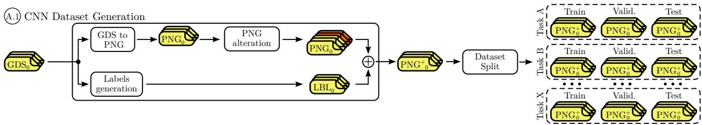
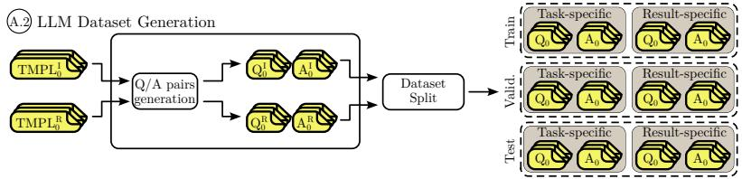
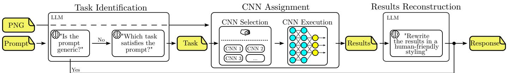
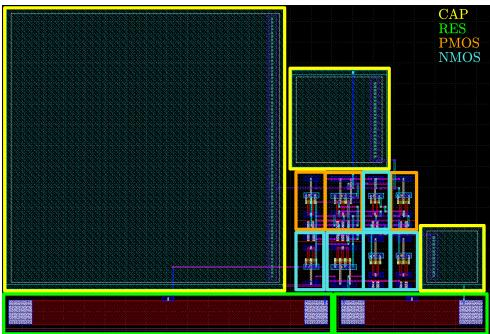
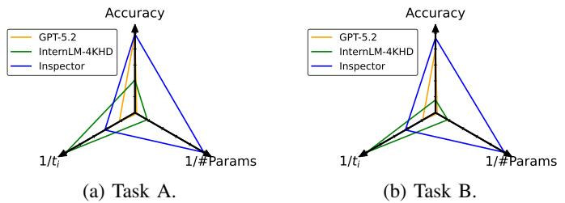
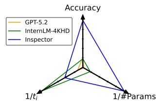
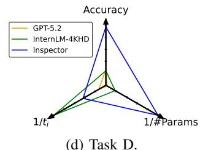
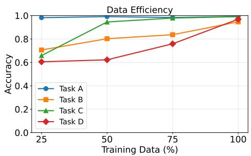

# Inspector: Conversational and Lightweight Analyzer of Analog Circuit Layouts Using LLM and CNNs

1st Abril Cano Castro

2nd Giuseppe Chiari

3rd Michele Piccoli

DEIB

4th Federico Viola

DEIB

5th Davide Zoni

DEIB

DEIB

DEIB

Politecnico di Milano

Politecnico di Milano

Politecnico di Milano

Politecnico di Milano

Politecnico di Milano

Milano, Italy

Milano, Italy

Milano, Italy

Milano, Italy

Milano, Italy

abril.cano@mail.polimi.it giuseppe.chiari@polimi.it michele.piccoli@polimi.it federico.viola@polimi.it davide.zoni@polimi.it

Abstract—The integration of artificial intelligence into computer-aided design frameworks has sparked a shift in the design of analog integrated circuits (ICs), transitioning the field from using manual and algorithmic-based solutions to adopting automated and intelligent paradigms. In this scenario, the GDSII file represents the industry-standard database containing the ultimate and most accurate source of information of the analog circuit, encapsulating the complex physical geometries and parasitic realities that define tape out performance. This paper proposes a novel framework that combines fine-tuned LLMs and CNNs to analyze GDSII files of analog circuits, enabling a conversational interface between the tool and the designers. Experimental results using thousands of analog designs across four realistic tasks demonstrate that the proposed solution outperforms state-of-the-art general-purpose massive VLMs by a significant margin (up to 81%), thus providing a lightweight solution to the problem of GDSII analysis.

Index Terms—electronic design automation, large language models, convolutional neural networks, analog design.

## I. INTRODUCTION

Analog design remains largely manual, heuristic-driven, and time-consuming, especially in the back-end phase, where GDSII (Graphic Data System II) layouts are used for physical implementation, parasitic extraction, and final verification. Although artificial intelligence (AI) has advanced analog computer-aided design (CAD), most progress targets front-end tasks, while GDSII analysis still depends on manual inspection or rigid, computationally expensive rule-based scripts [1], [2]. This limits the extraction of high-level semantic information, such as device counts or sub-circuit topologies, from increasingly complex layouts. Building on AI assistants for software engineering and digital RTL (Register Transfer Level) design [3], [4], we introduce a lightweight semantic approach that enables natural-language queries over physical layouts, shifting layout analysis from passive verification toward active conversational intelligence. This paper proposes Inspector, a framework based on fine-tuned LLMs (Large Language Models) and CNNs (Convolutional Neural Networks). CNNs have been widely adopted as detectors across diverse domains, including construction [5], cybersecurity [6]–[8], and autonomous driving [9].

In Inspector, CNNs enable accurate recognition of GDSII images, while the LLM handles user interaction and interprets tasks and results. This hybrid design preserves vision-language interaction while remaining orders of magnitude smaller than VLMs (Vision Language Models). Inspector is evaluated on four realistic design tasks over diverse layouts, outperforming state-of-the-art general-purpose VLMs by up to 81% in task accuracy while using a smaller model (∼1B parameters). In particular, this work delivers three contributions to the state of the art:

• Lightweight conversational model for GDSII analysis, fine-tuned for analog-layout understanding and naturallanguage interaction.

• Open dataset and end-to-end workflow1, including layout images, question-answer conversations, and a reproducible training/evaluation pipeline.

• Experimental validation on real layouts, against stateof-the-art VLM baselines, using representative DRC-free and LVS-compliant analog circuits.

## II. STATE OF THE ART

Front-end – AI methods have been extensively studied for schematic analysis, topology generation, and circuit optimization. Netlistify [10] combines CNNs and transformers to recover components, orientations, and connections from analog schematics, while LaMAGIC [11], AnalogGenie [12], and AnalogCoder [13] leverage LLM- and code-based representations for topology synthesis. LLMs have also enabled autonomous design agents: Artisan [14] adopts tree-of-thought and chain-of-thought prompting for operational-amplifier design, AnalogXpert [15] exploits subcircuit libraries with iterative refinement, and ADO-LLM [16] and LEDRO [17] integrate optimization workflows.

Back-end – Physical-layout analysis remains less explored, and direct semantic understanding of GDSII is still limited. Recent work includes SOLOMON [18], which generates layout scripts through tree-of-thought reasoning, LLM-HD [19] for lithography-hotspot detection from GDSII binaries, and DRC-Coder [20], translating textual design rules into verification code.

(a) Dataset generation workflow for CNN training. GDS layouts are converted into PNG images, augmented through controlled alterations, automatically labeled (LBL), and partitioned into task-specific training, validation, and test subsets.  
  
(b) Dataset generation workflow for LLM training. Q/A pairs are derived from templates for Task Identification and Result Reconstruction, then partitioned into training, validation, and test subsets.

Fig. 1: Datasets generation flows: CNN Dataset Generation (top) and LLM Dataset Generation (bottom).  
  
Fig. 2: Overview of the Inspector Deployment phase, where the LLM identifies the task, selects the corresponding CNN, and reconstructs the CNN output as a natural-language response.

In analog layout automation, BAG [21], [22], ALIGN [1], and MAGICAL [2] provide generator- and algorithm-driven flows, complemented by neural [23], Bayesian [24], [25], reinforcement-learning [26]–[29], and graph-neural-network approaches [27].

## III. METHODOLOGY

## A. Dataset Generation

Figure 1 illustrates the data-generation workflows used for Inspector calibration, namely CNN training and LLM finetuning. As shown in Figure 1a, CNN data are produced from GDSII layouts by converting each design into a rasterized PNG image, applying controlled graphical alterations, and automatically extracting labels (LBL) with component classes and bounding boxes. Images and labels are combined into paired image-annotation samples (PNG+), then partitioned into task-specific training, validation, and test subsets for visual detection. Figure 1b reports the LLM dataset flow. Predefined textual templates emulate user interactions for two objectives: (i) task identification, where the LLM selects the requested operation, and (ii) result reconstruction, where structured CNN outputs are translated into natural-language responses. The resulting Q/A pairs are split into training, validation, and test sets for supervised fine-tuning.

## B. Inspector Training

The training phase is divided into two parallel workflows to address the distinct learning objectives of the different models. The LLM Fine-tuning stage trains a pre-trained language model using the Q/A pairs generated for both the Task Identification and Result Reconstruction steps, allowing the model to specialize its semantic understanding and reasoning capabilities for the target domain. In contrast, CNN Training focuses on visual learning: depending on the desired task, the appropriate set of augmented PNG+ samples is selected and used to train a dedicated convolutional neural network. This separation enables each model to exploit the data representation best suited to its specific objective while contributing to the overall framework.

## C. Inspector Deployment

Figure 2 illustrates the deployment phase of Inspector, where a user prompt and a PNG representation of the GDSII layout are transformed into a human-readable response. The pipeline comprises three stages: (i) Task Identification, (ii) CNN Assignment, and (iii) Results Reconstruction. First, the LLM classifies the prompt as either generic or taskspecific; generic queries are answered directly, while taskspecific queries produce a task label.

TABLE I: Dataset composition. For each category, the table reports the circuit types, the number of layout variants, the average number of devices per variant, and the average per-device-type counts (NMOS, PMOS, capacitors, and resistors).
<table><tr><td>Category</td><td>Circuit Type</td><td>Variants</td><td>Avg. Devices</td><td>NMOS</td><td>PMOS</td><td>CAP</td><td>RES</td><td>Total Devices</td></tr><tr><td rowspan="5">Single Component</td><td>Capacitor</td><td>5000</td><td>1</td><td>一</td><td>一</td><td>1</td><td></td><td>5000</td></tr><tr><td>NMOS Transistor</td><td>5000</td><td>1</td><td>1</td><td></td><td></td><td></td><td>5000</td></tr><tr><td>PMOS Transistor</td><td>5000</td><td>1</td><td>一</td><td>1</td><td></td><td></td><td>5000</td></tr><tr><td>Resistor</td><td>5000</td><td>1</td><td>一</td><td>一</td><td>一</td><td>1</td><td>5000</td></tr><tr><td>Subtotal</td><td>20 000</td><td>一</td><td>一</td><td>一</td><td>一</td><td>1</td><td>20 000</td></tr><tr><td rowspan="7">Base Circuits</td><td>Ahuja OTA</td><td>995</td><td>15</td><td>10</td><td>4</td><td>1</td><td>一</td><td>14925</td></tr><tr><td>Gate Driver</td><td>1000</td><td>10</td><td>4</td><td>4</td><td>一</td><td>2</td><td>10 000</td></tr><tr><td>High-Pass Filter (HPF)</td><td>962</td><td>13</td><td>5</td><td>3</td><td>3</td><td>2</td><td>12506</td></tr><tr><td>Low-Dropout Regulator (LDO)</td><td>989</td><td>9</td><td>3</td><td>3</td><td>1</td><td>2</td><td>8 901</td></tr><tr><td>Low-Pass Filter (LPF)</td><td>971</td><td>13</td><td>5</td><td>3</td><td>3</td><td>2</td><td>12623</td></tr><tr><td>Miller OTA</td><td>977</td><td>13</td><td>5</td><td>4</td><td>2</td><td>2</td><td>12701</td></tr><tr><td>Subtotal</td><td>5894</td><td>1</td><td>一</td><td>一</td><td>一</td><td>一</td><td>71 656</td></tr><tr><td>Mixed</td><td>Mixed Topologies</td><td>4140</td><td>21.6</td><td>9.7</td><td>6.8</td><td>2.3</td><td>2.8</td><td>89 424</td></tr><tr><td colspan="2">Total Dataset</td><td>30 034</td><td></td><td></td><td></td><td></td><td></td><td>181 080</td></tr></table>

TABLE II: Task descriptions, organized by complexity (i) Easy, (ii) Medium, and (iii) Hard.
<table><tr><td>Complexity</td><td>Task ID</td><td>Task Description</td></tr><tr><td>Easy</td><td>A</td><td>Identification of single component devices (capacitors, resistors, NMOS, PMOS)</td></tr><tr><td>Medium</td><td>B</td><td>Identification of base circuit topologies (OTAs, filters, regulators, gate drivers) Component counting and enumeration</td></tr><tr><td></td><td>C</td><td>in base circuits</td></tr><tr><td>Hard</td><td>D</td><td>Component counting and enumeration in complex mixed circuits</td></tr></table>

This label selects the corresponding CNN, which analyzes the layout image and returns structured detections, including component classes and spatial information. Finally, the LLM interprets these detections in the context of the original prompt and generates the final natural-language answer.

## IV. EXPERIMENTAL EVALUATION

## A. Experimental Setup

Table I summarizes the CNN training dataset, which includes single-device layouts, basic analog building blocks, and mixed topologies obtained from structured combinations of the base circuits. All layouts are implemented in the SkyWater 130nm PDK and satisfy both DRC and LVS requirements. We evaluate Inspector on the four tasks defined in Section IV-B and compare it with two representative VLM baselines: InternLM-4KHD [30], a high-resolution multimodal model, and GPT-5.2 [31], used as a large-scale commercial reference.

## B. Tasks Definition

Table II groups the evaluated tasks by complexity. Task A identifies individual devices; Tasks B and C respectively recognize base circuit topologies and enumerate their components.

  
Fig. 3: Layout of an HPF. The labels are generated to contain the whole bounding box of the device.

Finally, Task D extends component counting to mixed circuits composed of multiple interconnected blocks. Figure 3 shows an enriched PNG+ example generated from a GDSII high-pass filter layout with automatically produced component labels.

## C. Metrics Definition

Inspector is evaluated through both CNN- and LLMoriented metrics in order to assess the performance of its visual recognition and semantic reasoning components. For the CNN stage, we report mAP@0.5 and mAP@0.5:0.95 to measure detection accuracy across different Intersection-over-Union thresholds, together with precision $( T P / ( T P + F P ) )$ and recall $( T P / ( T P + F N ) )$ , which quantify the trade-off between false positives and false negatives. For the LLM stage, we report Task Identification (T-ID), defined as the percentage of prompts correctly routed to the appropriate analysis pipeline, and Results Reconstruction (R-R), which measures the percentage of natural-language responses correctly reconstructed from the structured outputs produced by the CNN models.

TABLE III: Comparison of Inspector with state-of-the-art VLMs in terms of parameters, runtime, and accuracy.
<table><tr><td rowspan="2">Task</td><td colspan="4">Inspector</td><td colspan="3">InternLM-4KHD [30]</td><td colspan="3">GPT-5.2 [31]</td></tr><tr><td>parameters (# in billions)</td><td> $t _ { t + f }$  (mm:ss)</td><td> $t _ { i }$  (ss)</td><td>accuracy (%)</td><td>parameters (# in billions)</td><td> $t _ { i }$  (ss)</td><td>accuracy (%)</td><td>parameters (# in billions)</td><td> $t _ { i }$  (ss)</td><td>accuracy (%)</td></tr><tr><td>A</td><td>~1</td><td>29:25</td><td>1.19</td><td>97</td><td></td><td>0.52</td><td>41</td><td>50 000*</td><td>2.3</td><td>100</td></tr><tr><td>B</td><td>~1</td><td>28:48</td><td>0.24</td><td>91</td><td></td><td>0.54</td><td>16</td><td>50 000*</td><td>2.8</td><td>83</td></tr><tr><td>C</td><td>~1</td><td>19:04</td><td>3.65</td><td>99</td><td></td><td>0.54</td><td>18</td><td>50000*</td><td>4</td><td>20</td></tr><tr><td>D</td><td>~1</td><td>15:37</td><td>2.62</td><td>92</td><td></td><td>0.52</td><td>24</td><td>50000*</td><td>3.8</td><td>26</td></tr></table>

(∗) The parameter count for GPT-5.2 is an estimate, as the exact model size has not been publicly disclosed.

  
(c) Task C.

  
(d) Task D.  
Fig. 4: Triangular trade-off among accuracy, execution time, and parameter count. Lower-is-better metrics are shown a reciprocals.

TABLE IV: Inspector’s CNN detection performance.
<table><tr><td>Task</td><td>mAP@0.5 (%)</td><td>mAP@0.5:0.95 (%)</td><td>Precision (%)</td><td>Recall (%)</td></tr><tr><td>A</td><td>99.4</td><td>99.48</td><td>99.91</td><td>100</td></tr><tr><td>B</td><td>99.3</td><td>99.34</td><td>98.43</td><td>98.12</td></tr><tr><td>C</td><td>99.5</td><td>98.66</td><td>99.99</td><td>99.99</td></tr><tr><td>D</td><td>99.4</td><td>93.13</td><td>99.55</td><td>99.40</td></tr></table>

TABLE V: Inspector’s LLM performance metrics.
<table><tr><td rowspan="2">Task</td><td colspan="2">Accuracy (%)</td><td rowspan="2">Params (#B)</td><td rowspan="2">Fine-t. Time (s)</td><td rowspan="2">Inf. Time (mm:ss)</td></tr><tr><td>T-ID</td><td>R-R</td></tr><tr><td>A</td><td>97.95</td><td>100</td><td>1</td><td>17.32</td><td>01 :18</td></tr><tr><td>B</td><td>93.68</td><td>98.41</td><td>1</td><td>14.46</td><td>00:19</td></tr><tr><td>C</td><td>100</td><td>99.58</td><td>1</td><td>15.04</td><td>04: 03</td></tr><tr><td>D</td><td>100</td><td>92.98</td><td>1</td><td>14.40</td><td>02: 59</td></tr></table>

## D. Experimental Results

Table III compares Inspector with standalone VLMs. Its accuracy combines mAP@0.5, T-ID, and R-R from Table IV and Table V; runtimes and parameter counts aggregate the CNN and LLM stages. Inspector reaches 91–99% accuracy with second-scale inference using Llama-3.2 [32] and lightweight task-specific YOLOv8 [33] detectors. InternLM-4KHD remains below 41%, while GPT-5.2 drops from perfect Task A accuracy to 26% on Task D. Figure 4 summarizes the resulting trade-off. Table IV shows mAP@0.5 above 99% for all tasks, with near-perfect precision and recall. Table V shows T-ID and R-R between approximately 92% and 100%, with second-scale inference.

## E. Ablation Study

The ablation study in Figure 5 evaluates the effect of training data availability on task accuracy.

  
Fig. 5: Accuracy ablation with respect to training data percentage, showing task sensitivity to data availability and pipeline scalability.

While Task A reaches near-optimal performance with only 50% of the data, indicating limited supervision requirements, Tasks B–D exhibit a more progressive improvement as the dataset grows. In particular, Task D shows the highest sensitivity to data reduction, reflecting the greater structural complexity and variability associated with higher-level reasoning tasks.

## V. CONCLUSIONS

This paper presents Inspector, a hybrid LLM-CNN framework for conversational analysis of analog circuit layouts directly from GDSII data. By combining semantic reasoning with specialized visual detection, the proposed pipeline enables designers to query layout information through a natural language interface. Experimental results on multiple tasks and thousands of designs show that Inspector significantly outperforms state-of-the-art general-purpose VLMs, achieving up to 81% higher accuracy while maintaining a lightweight architecture.

[1] K. Kunal, M. Madhusudan, A. K. Sharma, W. Xu, S. M. Burns, R. Harjani, J. Hu, D. A. Kirkpatrick, and S. S. Sapatnekar, “Align: Opensource analog layout automation from the ground up,” in Proceedings of the 56th Annual Design Automation Conference 2019, 2019.

[2] B. Xu, K. Zhu, M. Liu, Y. Lin, S. Li, X. Tang, N. Sun, and D. Z. Pan, “Magical: Toward fully automated analog ic layout leveraging human and machine intelligence,” in 2019 IEEE/ACM International Conference on Computer-Aided Design (ICCAD). IEEE, 2019.

[3] J. Blocklove, S. Garg, R. Karri, and H. Pearce, “Chip-chat: Challenges and opportunities in conversational hardware design,” in 2023 ACM/IEEE 5th Workshop on Machine Learning for CAD (MLCAD), 2023.

[4] K. Chang, Y. Wang, H. Ren, M. Wang, S. Liang, Y. Han, H. Li, and X. Li, “Chipgpt: How far are we from natural language hardware design,” arXiv preprint arXiv:2305.14019, 2023.

[5] L. Ali, F. Alnajjar, H. A. Jassmi, M. Gocho, W. Khan, and M. A. Serhani, “Performance evaluation of deep cnn-based crack detection and localization techniques for concrete structures,” Sensors, vol. 21, no. 5, p. 1688, 2021.

[6] G. Chiari, D. Galli, F. Lattari, M. Matteucci, and D. Zoni, “A deeplearning technique to locate cryptographic operations in side-channel traces,” in 2024 Design, Automation & Test in Europe Conference & Exhibition (DATE), 2024, pp. 1–6.

[7] D. Galli, G. Chiari, and D. Zoni, “Hound: Locating cryptographic primitives in desynchronized side-channel traces using deep-learning,” in 2024 IEEE 42nd International Conference on Computer Design (ICCD), 2024, pp. 114–121.

[8] ——, “Chameleon: A dataset for segmenting and attacking obfuscated power traces in side-channel analysis,” IACR Transactions on Cryptographic Hardware and Embedded Systems, vol. 2025, no. 3, pp. 389– 412, 2025.

[9] L. Chen, S. Lin, X. Lu, D. Cao, H. Wu, C. Guo, C. Liu, and F.-Y. Wang, “Deep neural network based vehicle and pedestrian detection for autonomous driving: A survey,” IEEE Transactions on Intelligent Transportation Systems, vol. 22, no. 6, pp. 3234–3246, 2021.

[10] C.-Y. Huang, H.-I. Chen, H.-W. Ho, P.-H. Kang, M. P.-H. Lin, W.-H. Liu, and H. Ren, “Netlistify: Transforming circuit schematics into netlists with deep learning,” in 2025 ACM/IEEE 7th Symposium on Machine Learning for CAD (MLCAD), 2025, pp. 1–8.

[11] C.-C. Chang, Y. Shen, S. Fan, J. Li, S. Zhang, N. Cao, Y. Chen, and X. Zhang, “Lamagic: Language-model-based topology generation for analog integrated circuits,” in Forty-first International Conference on Machine Learning, 2024.

[12] J. Gao, W. Cao, J. Yang, and X. Zhang, “Analoggenie: A generative engine for automatic discovery of analog circuit topologies,” in The Thirteenth International Conference on Learning Representations, 2025. [Online]. Available: https://openreview.net/forum?id=jCPak79Kev

[13] Y. Lai, S. Lee, G. Chen, S. Poddar, M. Hu, D. Z. Pan, and P. Luo, “Analogcoder: Analog circuit design via training-free code generation,” 2024. [Online]. Available: https://arxiv.org/abs/2405.14918

[14] Z. Chen, J. Huang, Y. Liu, F. Yang, L. Shang, D. Zhou, and X. Zeng, “Artisan: Automated operational amplifier design via domain-specific large language model,” in Proceedings of the 61st ACM/IEEE Design Automation Conference, ser. DAC ’24. New York, NY, USA: Association for Computing Machinery, 2024. [Online]. Available: https://doi.org/10.1145/3649329.3655903

[15] H. Zhang, S. Sun, Y. Lin, R. Wang, and J. Bian, “Analogxpert: Automating analog topology synthesis by incorporating circuit design expertise into large language models,” IEEE, pp. 772–777, 2025.

[16] Y. Yin, Y. Wang, B. Xu, and P. Li, “Ado-llm: Analog design bayesian optimization with in-context learning of large language models,” in Proceedings of the 43rd IEEE/ACM International Conference on Computer-Aided Design, ser. ICCAD ’24. ACM, Oct. 2024, p. 1–9. [Online]. Available: http://dx.doi.org/10.1145/3676536.3676816

[17] D. V. Kochar, H. Wang, A. P. Chandrakasan, and X. Zhang, “Ledro: Llmenhanced design space reduction and optimization for analog circuits,” IEEE, pp. 141–148, 2025.

[18] B. Wen and X. Zhang, “Enhancing reasoning to adapt large language models for domain-specific applications,” in Adaptive Foundation Models: Evolving AI for Personalized and Efficient Learning, 2024. [Online]. Available: https://openreview.net/forum?id=F8rniHIK3H

[19] Y. Chen, Y. Wu, J. Wang, T. Wu, X. He, J. Yu, and H. Geng, “Llm-hd: Layout language model for hotspot detection with gds semantic encoding,” in Proceedings of the 61st ACM/IEEE Design Automation Conference, ser. DAC ’24. New York, NY, USA: Association for Computing Machinery, 2024. [Online]. Available: https://doi.org/10.1145/3649329.3658479

[20] C.-C. Chang, C.-T. Ho, Y. Li, Y. Chen, and H. Ren, “Drc-coder: Automated drc checker code generation using llm autonomous agent,” in Proceedings of the 2025 International Symposium on Physical Design, ser. ISPD ’25. ACM, Mar. 2025, p. 143–151. [Online]. Available: http://dx.doi.org/10.1145/3698364.3705347

[21] J. Crossley, A. Puggelli, H.-P. Le, B. Yang, R. Nancollas, K. Jung, L. Kong, N. Narevsky, Y. Lu, N. Sutardja et al., “Bag: A designeroriented integrated framework for the development of ams circuit generators,” in 2013 IEEE/ACM International Conference on Computer-Aided Design (ICCAD). IEEE, 2013.

[22] E. Chang, J. Han, W. Bae, Z. Wang, N. Narevsky, B. Nikolic, and E. Alon, “Bag2: A process-portable framework for generator-based ams circuit design,” in 2018 IEEE Custom Integrated Circuits Conference (CICC), 2018.

[23] A. F. Budak, P. Bhansali, B. Liu, N. Sun, D. Z. Pan, and C. V. Kashyap, “Dnn-opt: An rl inspired optimization for analog circuit sizing using deep neural networks,” in 2021 58th ACM/IEEE Design Automation Conference (DAC). IEEE, 2021, pp. 1219–1224.

[24] A. F. Budak, K. Zhu, H. Chen, S. Poddar, L. Zhao, Y. Jia, and D. Z. Pan, “Joint optimization of sizing and layout for ams designs: Challenges and opportunities,” in Proceedings of the 2023 International Symposium on Physical Design, 2023, pp. 84–92.

[25] X. Gao, H. Zhang, S. Ye, M. Liu, D. Z. Pan, L. Shen, R. Wang, Y. Lin, and R. Huang, “Post-layout simulation driven analog circuit sizing,” Science China Information Sciences, vol. 67, no. 4, p. 142401, 2024.

[26] D. Basso, L. Bortolussi, M. Videnovic-Misic, and H. Habal, “Fast mldriven analog circuit layout using reinforcement learning and steiner trees,” in 2024 20th International Conference on Synthesis, Modeling, Analysis and Simulation Methods and Applications to Circuit Design (SMACD). IEEE, 2024, pp. 1–4.

[27] ——, “Effective analog ics floorplanning with relational graph neural networks and reinforcement learning,” in 2025 Design, Automation & Test in Europe Conference (DATE), 2025, pp. 1–7.

[28] S. J. Della Rovere, D. Basso, L. Bortolussi, M. Videnovic-Misic, and H. Habal, “Enhancing reinforcement learning for the floorplanning of analog ics with beam search,” in 2025 21st International Conference on Synthesis, Modeling, Analysis and Simulation Methods, and Applications to Circuits Design (SMACD). IEEE, 2025, pp. 1–4.

[29] G. Chiari, M. Piccoli, and D. Zoni, “OSIRIS: Bridging analog circuit design and machine learning with scalable dataset generation,” in The Fourteenth International Conference on Learning Representations, 2026. [Online]. Available: https://openreview.net/forum?id=TIDaHgj0Yj

[30] X. Dong, P. Zhang, Y. Zang, Y. Cao, B. Wang, L. Ouyang, S. Zhang, H. Duan, W. Zhang, Y. Li, H. Yan, Y. Gao, Z. Chen, X. Zhang, W. Li, J. Li, W. Wang, K. Chen, C. He, X. Zhang, J. Dai, Y. Qiao, D. Lin, and J. Wang, “Internlm-xcomposer2-4khd: A pioneering large vision-language model handling resolutions from 336 pixels to 4k hd,” 2024. [Online]. Available: https://arxiv.org/abs/2404.06512

[31] OpenAI, “Gpt-5.2,” 2025. [Online]. Available: https://openai.com/index/introducing-gpt-5-2/

[32] A. Grattafiori, A. Dubey, A. Jauhri, A. Pandey, A. Kadian, A. Al-Dahle, A. Letman, A. Mathur, A. Schelten, A. Vaughan et al., “The llama 3 herd of models,” arXiv preprint arXiv:2407.21783, 2024.

[33] G. Jocher, J. Qiu, and A. Chaurasia, “Yolov8,” 2023. [Online]. Available: https://github.com/ultralytics/ultralytics