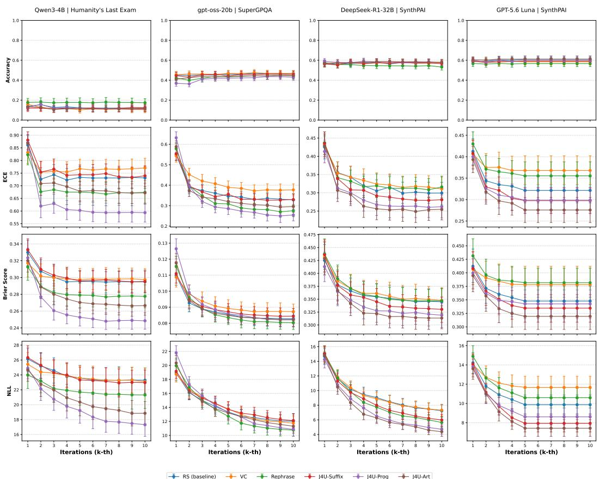
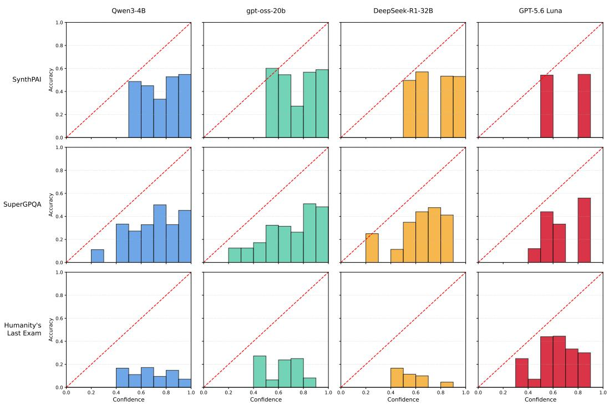
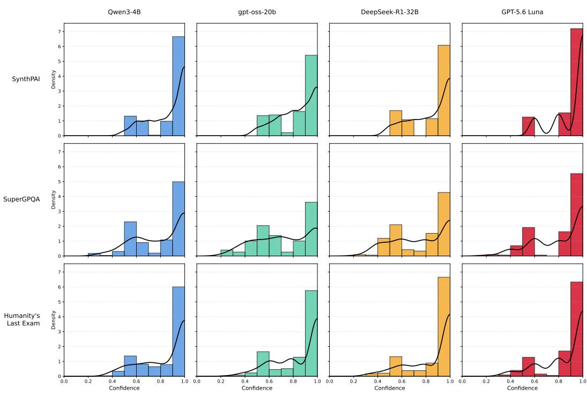

# JAILBREAKS FOR BLACK-BOX UNCERTAINTY QUAN-TIFICATION IN LARGE REASONING MODELS

Lucas Biechy´ ∗,1,2,3 Cedric Eichler´ 1,3,4,5 Adrien Boiret1,3,4,5 Nicolas Anciaux1,2,3 1Petscraft, Inria 2Universite Paris-Saclay´ 3INSA CVL 4Universite d’Orl´ eans´ 5LIFO

## ABSTRACT

While Large Reasoning Models (LRMs) excel at complex reasoning, alignment through reinforcement learning often induces systemic overconfidence. In production environments, where logits may be unavailable, robust black-box uncertainty quantification (UQ) is essential for trustworthiness and safety. Focusing on question-answering for LRMs, we show that existing black-box methods, such as paraphrase-based self-consistency and confidence verbalization, offer little to no improvement over simple repeated sampling, suggesting that alignment suppresses useful output variability. We introduce prompt-level relaxation operators that broaden the model’s effective output distribution by approximating the effect of an optimal policy obtained with a stronger KL-regularization parameter, hence closer to the reference model. Theoretically, we demonstrate that relaxation improves calibration. We propose Jailbreak for Uncertainty (J4U), a jailbreakderived technique for UQ that empirically reproduces the behavioral signatures predicted by our relaxation theory. Across 3 datasets and 4 LRMs, including a closed-source production model, J4U’s improvement over repeated sampling achieves statistical significance in up to 6× more LRM–dataset-metric settings than the strongest black-box UQ state-of-the-art baseline we evaluate, with average ECE reductions up to 5× larger. These results provide a practical tool for UQ in black-box LRM deployment.

## 1 INTRODUCTION

The emergence of Large Reasoning Models (LRMs) has marked a significant paradigm shift from traditional Large Language Models (LLMs) (Xu et al., 2025). Designed to explicitly develop intermediate reasoning before producing an answer, LRMs achieve unprecedented levels of accuracy across a wide range of tasks (DeepSeek-AI, 2025; OpenAI, 2024). As a result, they are increasingly deployed as direct decision-makers, even in high-stakes domains, often framed as questionanswering (QA) tasks (Gao et al., 2025; Eriksen et al., 2024; Naderi et al., 2026). In such settings, it is critical that the model’s confidence in its own decisions be rigorously calibrated to its true probability of being correct (Shorinwa et al., 2025).

However, like their predecessors, LRMs are often accessible as black-boxes (Wan et al., 2025), which limits applicable standard uncertainty quantification (UQ) approaches to prompt-level methods (Shorinwa et al., 2025) such as confidence verbalization (e.g. Lin et al. (2022); Xiong et al. (2024); Yang et al. (2024b)) and perturbation-based consistency (e.g. Portillo Wightman et al. (2023); Jiang et al. (2023); Pedapati et al. (2024); Yang et al. (2024a)). To date, the direct impact of the transition from LLMs to LRMs on confidence calibration in such settings remains poorly understood. It is therefore essential to investigate this configuration and evaluate the effectiveness of existing UQ methods within this new paradigm.

When evaluating state-of-the-art black-box UQ methods originally developed for LLMs on LRMs, we find that they are in fact comparable to a naive self-consistency baseline based on repeated sampling. In practice, LRMs inherit the well-documented overconfidence issues of LLMs (Epstein et al., 2025; Groot & Valdenegro Toro, 2024), resulting in limited predictive variability. This phenomenon is closely tied to the alignment phase, which aims to fulfill a twofold objective of maximizing complex reasoning capabilities, and preventing the generation of harmful or dangerous content (OpenAI,

2025; DeepSeek-AI, 2025). To meet this objective, models are extensively optimized using Reinforcement Learning (RL) (Schulman et al., 2017), and LRMs in particular rely heavily on RL to forge their reasoning behavior. Prior works suggest that such optimization can mechanically sharpen output probability distributions and favor more deterministic reasoning paths (OpenAI, 2024; Leng et al., 2025). Moreover, our empirical observation shows that existing calibration methods often become indistinguishable from simple repeated sampling.

To overcome this limitation, we introduce a prompt-level relaxation operator. This input transformation acts as a restoring force toward the model’s pre-alignment base policy, prior to its RL-based alignment. From a theoretical perspective, we model the aligned model as a closed-form optimal policy (Rafailov et al., 2023). Under this view, relaxation corresponds to approximating a policy trained with a higher KL-regularization parameter. We show that relaxation improves confidence evaluation, i.e., it lowers Expected Calibration Error (ECE).

Jailbreak methods were originally designed to bypass the safety side of alignment (Wei et al., 2023; Wolf et al., 2024). Intuitively, since these methods act against alignment-induced constraints, they are natural candidates to restore output variability that is suppressed by RL-based alignment. Building on this intuition, we propose J4U (Jailbreak for Uncertainty), a black-box self-consistency uncertainty estimator that repurposes jailbreak-style prompt transformations for UQ on strictly benign questions while sampling multiple traces. Leveraging the taxonomy introduced by Shen et al. (2025), we instantiate one representative transformation from three categories (J4U-SUFFIX, J4U-PROG, and J4U-ART).

Contribution. Our contributions, in the context of black-box UQ, are as follows:

1. We introduce relaxation operators for black-box LRMs and provide a theoretical calibration guarantee that relaxation improves calibration (lower ECE).

2. We propose J4U, jailbreak-derived perturbations for UQ. Averaged over 4 LRMs and 3 datasets, the best J4U variant achieves 15.8%, 14.5%, and 4.8% reduction of ECE, NLL, and Brier over repeated stochastic sampling, vs 3.1%, 2%, and a 2% increase for the strongest evaluated state of the art approach.

3. We show that J4U operators reproduce the observable signatures predicted by relaxation, namely flattening output distributions and diversification reasoning traces.

The remainder of the paper is organized as follows. Section 2 reviews related work and positions our proposal. Section 3 introduces the problem statement and model. Section 4 describes relaxation operators and their theoretical foundations. Section 5 introduces and empirically validates J4U. Section 6 provides concluding remarks and discusses limitations.

## 2 RELATED WORK

Black-box uncertainty quantification for QA. UQ methods aim to estimate how likely a model’s answer is correct Shorinwa et al. (2025). Uncertainty is often decomposed into epistemic (lack of knowledge) and aleatoric uncertainty (inherent variability) (Shorinwa et al., 2025). In black-box QA, where only input/output texts access is available and outputs are often limited to a single clause, UQ methods mainly rely on prompt-level procedures.

A natural baseline is repeated sampling under stochastic decoding, using answer variability as a proxy for uncertainty (Xiao et al., 2025; Pedapati et al., 2024; Tao et al., 2025). A difficulty with this approach is that agreement between free-form responses is not trivial to assess. Semantic consistency methods address this by measuring agreement at the level of meaning (Kuhn et al., 2023; Manakul et al., 2023; Zhao et al., 2026). In the multiple-choice and exact-match settings we study, semantic clustering functionally reduces to the exact-match frequency of the final extracted answer. J4U is complementary to them, as it modifies the distribution from which answers are sampled rather than how agreement is measured.

Beyond repeated sampling and its semantic extensions, prompt-level black-box UQ techniques for QA mainly fall into two families (Shorinwa et al., 2025). Perturbation-based consistency approaches couple answer variability analysis with controlled input perturbations (Portillo Wightman et al., 2023; Jiang et al., 2023; Pedapati et al., 2024) (e.g. paraphrasing (Yang et al., 2024a)), though this may change the effective task distribution and affect accuracy (Wang et al., 2025). Confidence verbalization approaches prompt models to explicitly report a confidence score (Lin et al., 2022; Xiong et al., 2024; Yang et al., 2024b), often combined with multi-sample aggregation to reduce variance (Xiong et al., 2024). These methods were developed and validated primarily on LLMs. On LRMs, whose predictive variability is reduced, we find they are rarely statistically distinguishable from repeated sampling in accuracy or calibration (Section 5), motivating prompt-level mechanisms that restore usable uncertainty signals.

A distinct line of work builds on conformal prediction (CP), a distribution-free framework that converts any nonconformity or confidence score into prediction sets with finite-sample coverage guarantees (Angelopoulos & Bates, 2023). Since CP is agnostic to how its input score is produced, our contribution is complementary rather than competing.

Jailbreak prompting. Jailbreak attacks are prompts transformations designed to bypass safety behavior induced by alignment, including RL-based procedure (Wei et al., 2023; Wolf et al., 2024). Recent taxonomies on one-shot black-box jailbreaks (Shen et al., 2025; Yi et al., 2024) identify a small number of categories, including (i) suffix/prefix injection strategies, (ii) template-based attacks (e.g. Kang et al. (2024); Li et al. (2024)), and (iii) format manipulations that preserve the original intent of the prompt while altering its linguistic form (e.g. Andriushchenko & Flammarion (2025); Ding et al. (2024); Jiang et al. (2024)). These methods are typically evaluated for safety bypass on harmful prompts, rather than for their effect on predictive uncertainty under benign QA. A small body of work studies how adversarial prompting can manipulate apparent uncertainty triggering over- or under-confidence (Zeng et al., 2024; Obadinma et al., 2024; Obadinma & Zhu, 2025).

In contrast, our work uses jailbreak-style transformations on strictly benign questions to counteract RL-induced sharpening and recover suppressed uncertainty signals for black-box UQ. To the best of our knowledge, our proposal is the first method that leverages jailbreaks to improve UQ.

## 3 PROBLEM FORMULATION AND PRELIMINARIES

We consider a multiple choice QA task where $( X , Y ) \in { \mathcal { X } } \times { \mathcal { Y } }$ is a pair of random variables following a joint distribution D. The input space X represents possible questions, and Y a finite set of answers. Let V be a finite vocabulary of tokens, and $\tau \subseteq \nu ^ { * }$ the reasoning space of finitelength intermediate token sequences . For LRMs, we introduce a latent random variable $T \in \mathcal { T }$ representing the model’s reasoning. We assume the existence of a deterministic mapping function $f : \mathcal { T }  \mathcal { D }$ such that for any realized reasoning $t \in \tau$ , the final predicted answer is uniquely identified as $f ( t )$ . We treat the model as a black box: at inference time we may only submit prompts and access textual answers with no access to reasoning traces, logits, hyperparameters or hidden states. The key question is how to accurately quantify the confidence of the predicted answer $f ( t )$ from this sampling interface alone, especially under RL-based alignment which often biases models toward overconfident predictions.

In RL, reasoning traces are characterized by policy-induced probability distributions. We denote $\pi _ { T } ( \cdot \mid x )$ a conditional policy on the reasoning space T inducing a marginal distribution on $y \in \mathcal { V }$

$$
\pi _ { Y } ( y \mid x ) = \sum _ { t \in \mathcal { T } } \mathbb { 1 } \{ f ( t ) = y \} \pi _ { T } ( t \mid x )
$$

For simplicity’s sake, we use π to denote both $\pi _ { T }$ and $\pi _ { Y }$ , arguments resolving any ambiguity.

Definition 3.1 (Theoretical Mode). Given a policy π and its induced marginal distribution over answers, we define the theoretical mode as the most probable answer. Formally,

$$
y _ { \pi } ^ { * } ( x ) : = \arg \operatorname* { m a x } _ { y \in \mathcal { V } } \pi ( y \mid x )
$$

To study how alignment affects confidence and calibration, we distinguish between a reference policy $\pi _ { \mathrm { r e f } }$ (typically the pre-trained model) and an aligned policy $\pi _ { \mathrm { R L } }$ obtained through RL (Ouyang et al., 2022). RL is classically implemented via policy-gradient methods, most notably PPO (Schulman et al., 2017) and more recently DPO (Rafailov et al., 2023), GRPO (Shao et al., 2024), and GSPO (Zheng et al., 2025). These methods admit a common closed-form optimal policy (Rafailov et al., 2023; Azar et al., 2024; GX-Chen et al., 2026), which can be expressed as

$$
\pi _ { \beta } ( t \mid x ) = \frac { 1 } { Z _ { \beta } ( x ) } \pi _ { \mathrm { r e f } } ( t \mid x ) \exp \left( \frac { R ( x , t ) } { \beta } \right)\tag{1}
$$

where $\beta > 0$ is the KL-regularization parameter, $\begin{array} { r } { Z _ { \beta } ( x ) = \sum _ { t \in \mathcal { T } } \pi _ { \mathrm { r e f } } ( t | x ) \exp ( R ( x , t ) / \beta ) } \end{array}$ denotes the partition function ensuring normalization, and $R ( x , t )$ is the reward function assumed to be finite.

Given a policy and its induced marginal distribution over answers, it is essential to equip model predictions with a meaningful confidence measure. Because our access is black-box, confidence must be estimated from sampled answers. We consider the majority voting procedure, or selfconsistency (Wang et al., 2023), over independent reasoning traces:

Definition 3.2 (Majority Response, Confidence Estimator). Let $T _ { 1 } , \dots , T _ { K }$ be K i.i.d. samples from a policy $\pi ( \cdot \mid x )$ , with their corresponding answers $f ( T _ { k } )$ . The final answer is given by the majority response

$$
{ \hat { Y } } _ { \pi } ^ { ( K ) } ( x ) : = \arg \operatorname* { m a x } _ { y \in \mathcal { V } } \sum _ { k = 1 } ^ { K } \mathbb { 1 } \{ f ( T _ { k } ) = y \}
$$

following Kuhn et al. (2023), its associated confidence is the frequency of that response:

$$
\hat { c } _ { \pi } ( x ) : = \frac { 1 } { K } \sum _ { k = 1 } ^ { K } \mathbb { 1 } \{ f ( T _ { k } ) = \hat { Y } _ { \pi } ^ { ( K ) } ( x ) \} .
$$

After defining a confidence estimator arises the question of its calibration, i.e. how well it reflects accuracy. We first introduce a binary random variable indicating prediction correctness.

Definition 3.3 (Accuracy Indicator). Let (X, Y ) be a question–answer pair and $\hat { Y } _ { \pi } ^ { ( K ) } ( X )$ the majority-voting predictionfrom K samples under policy π. The accuracy indicator $I _ { \pi } \ i s$

$$
I _ { \pi } : = \mathbb { 1 } \{ \hat { Y } _ { \pi } ^ { ( K ) } ( X ) = Y \} ,
$$

Let $\mathbb { P } = \mathcal { D } \otimes \pi _ { T } ^ { \otimes K }$ denote the joint probability measure over $( X , Y , T _ { 1 } , \dots , T _ { K } )$ . A model is perfectly calibrated if, for any confidence $c \in [ 0 , 1 ]$ , the conditional probability of success matches the reported confidence Guo et al. (2017):

$$
\mathbb { P } ( I _ { \pi } = 1 \mid \hat { c } _ { \pi } = c ) = c\tag{2}
$$

where $\mathbb { P } ( I _ { \pi } = 1 \mid \hat { c } _ { \pi } = c )$ represents the accuracy of the model for a given confidence score c.

In the theoretical analysis, we assess calibration using ECE (Naeini et al., 2015), which homogeneously penalizes misalignment between predicted probabilities and empirical accuracy:

$$
\mathrm { E C E } ( \pi ) : = \mathbb { E } \left[ \left| \mathbb { P } ( I _ { \pi } = 1 \mid \hat { c } _ { \pi } ) - \hat { c } _ { \pi } \right| \right]\tag{3}
$$

Previous works report that RL induces systemic overconfidence in model outputs Groot & Valdenegro Toro (2024); Epstein et al. (2025), formalized as follows:

Definition 3.4 (Overconfidence). Let $I _ { \pi }$ denote the accuracy indicator and $\hat { c } _ { \pi }$ the confidence esti matorfor a response to input x. The model is said to be overconfident $i f ,$ almost surely:

$$
\mathbb { P } ( I _ { \pi } = 1 \mid \hat { c } _ { \pi } ) < \hat { c } _ { \pi }
$$

Such overconfidence increases ECE and degrades calibration. Since we operate under black-box access, we act on the input: we seek a transformation of the input question that acts as an increase of the KL-regularization parameter, reverting $\pi _ { \mathrm { R L } }$ toward $\pi _ { \mathrm { r e f } }$ , thereby reducing overconfidence.

## 4 THEORETICAL RELAXATION FOR UQ

In this section, we formalize relaxation operators, transformations of the input query that emulate an increase in the KL-regularization parameter during $\scriptstyle \mathrm { { R L } } .$ , and demonstrate that they improve calibration. In Section 5, we propose jailbreak-style prompts as candidate instantiations of this mechanism.

Definition 4.1 (Relaxation Operator). Let $\pi _ { r e f }$ be a pre-trained reference policy and $\pi _ { R L }$ be a policy derived from $\pi _ { r e f }$ via RL. A relaxation operator j is a transformation mapping an input x to a modified version $j ( x )$ such that the induced policy $\pi _ { j } ( \cdot \mid x ) : = \pi _ { R L } ( \cdot \mid j ( x ) )$ is equivalent to a closed-form optimal policy in Eq. 1 with a higher KL-regularization parameter. I.e. $\exists ( \beta _ { 1 } , \beta _ { 2 } )$ s.t.:

$$
\pi _ { j } \equiv \pi _ { \beta _ { 1 } } , w i t h \quad \pi _ { R L } \equiv \pi _ { \beta _ { 2 } } a n d \quad \beta _ { 1 } > \beta _ { 2 }
$$

We denote by J the family of such relaxation operators.

It immediately follows that applying a relaxation operator shifts the policy back towards $\pi _ { \mathrm { r e f } } .$ Proposition 4.2. Let $\pi _ { r e f }$ be a pre-trained reference policy and πRL be a policy derived from $\pi _ { r e f }$ via $R L$ . Let $j \in \mathcal I$ a relaxation operator inducing a policy $\pi _ { j }$

$$
\mathbb { D } _ { K L } \big ( \pi _ { j } | | \pi _ { r e f } \big ) < \mathbb { D } _ { K L } \big ( \pi _ { R L } | | \pi _ { r e f } \big )\tag{4}
$$

where $\mathbb { D } _ { K L }$ denotes the Kullback-Leibler divergence.

ProofSketch. Full proof in Appendix $\mathbf { A . l . } \ \pi _ { \beta }$ is the unique solution to the KL-regularized objective minπ $\mathcal { L } ( \pi ) = \mathbb { E } _ { \pi } [ - R ( x , t ) ] + \beta \mathbb { D } _ { \mathrm { K L } } ( \pi \parallel \pi _ { \mathrm { r e f } } )$ . As $\beta$ increases, the penalty on the KL term grows relative to the reward. By constrained optimization, an increase in $\beta$ pulls the optimal solution closer to $\pi _ { r e f }$ in terms of KL divergence. Since j induces $\beta _ { 1 } > \beta _ { 2 }$ , the inequality equation 4 holds.

Since overconfidence arises from excessive deviation from $\pi _ { r e f }$ , this reversion property suggests improved calibration. We now formalize this intuition by showing ECE reduction.

Theorem 4.3. Consider a policy $\pi _ { R L } \equiv \pi _ { \beta _ { 2 } }$ an overconfident policy that underwent aggressive RLbased alignment, i.e. $\beta _ { 2 }$ is small relative to reward differences. There exists a $\beta ^ { \prime } > \beta _ { 2 }$ such thatfor any relaxation operator $j \in \mathcal I$ inducing a policy $\pi _ { j } \equiv \pi _ { \beta _ { 1 } } , i f \beta _ { 1 } \in ( \beta _ { 2 } , \beta ^ { \prime } ]$ then thefollowing holds for a finite number of K traces samples:

$$
E C E ( \pi _ { j } ) \leq E C E ( \pi _ { R L } ) + \mathcal { O } \left( \sqrt { \frac { \log | \mathcal { V } | } { K } } \right)\tag{5}
$$

Furthermore, in the asymptotic limit where $K  \infty ,$ , the relaxation strictly reduces ECE:

$$
E C E ( \pi _ { j } ) < E C E ( \pi _ { R L } )\tag{6}
$$

ProofSketch. Complete proof in Appendix A.2. Under RL overalignment, there are relaxations that will smooth rewards without changing the theoretical mode, which locally maximize the reward. In such cases, we show that calibration improves under relaxation by first decomposing the ECE in an overconfident regime as $\mathtt { E C E } ( \pi ) = \bar { \mathbb { E } } [ \hat { c } _ { \pi } ] - \mathbb { P } ( I _ { \pi } = 1 )$ . Using a standard maximal inequality for sub-Gaussian variables (Boucheron et al., 2013), we bound the finite-sample bias of the confidence estimator $\hat { c } _ { \pi }$ by $\mathcal { O } \left( \sqrt { \log | \mathcal { V } | / K } \right)$ , which vanishes as the number of samples $K  \infty$ For an optimal policy $\pi _ { \beta }$ , the derivative of the theoretical mode probability $y _ { \pi } ^ { * }$ with respect to $\beta$ satisfies $\mathsf { \dot { O } } _ { \beta } \pi _ { \beta } \big ( \dot { y _ { \pi } ^ { * } } | x \big ) \mathsf { \dot { \alpha } } \left( \mathbb { E } [ R ] - \mathbb { E } [ R | y _ { \pi } ^ { * } ] \right)$ . Since under RL overalignment, this $y _ { \pi } ^ { * }$ corresponds to the mode maximizing the expected reward, $\mathbb { E } [ R | y _ { \pi } ^ { * } ] \ge \mathbb { E } [ R ]$ , making this derivative non-positive. Consequently, increasing β reduces the expected confidence and thereby lowering the ECE. □

## 5 JAILBREAK-STYLE TRANSFORMATIONS FOR UQ: CALIBRATION AND BEHAVIORAL EVIDENCE OF RELAXATION

In this section, we introduce J4U operators, evaluate their accuracy and calibration against state-ofthe-art baselines, then test whether their behavior matches the relaxation-operator predictions

## 5.1 J4U AS CANDIDATE INSTANTIATIONS OF RELAXATION

Jailbreaks are designed to bypass alignment-induced constraints while preserving prompts’ semantic (Zhou et al., 2023; Wei et al., 2023; Wolf et al., 2024). They tend to elicit responses that more closely reflect the model’s pre-trained knowledge distribution rather than its safety-tuned persona, making them inherently good candidates for relaxation.

We operationalize this intuition through a stochastic operator $j$ that transforms an input x into a jailbreak-style variant $j ( x )$ designed to (i) preserve the payload of x and (ii) mitigate alignmentinduced constraints, thereby increasing response diversity and reducing overconfident mass concentration. We estimate uncertainty through $\dot { K }$ sampling of such transformations $j ( x )$ . We instantiate $j$ using three representative one-shot black-box jailbreak techniques, spanning major attack classes identified by Shen et al. (2025) and Li et al. (2024). Each instantiation defines a distribution over perturbations, from which we sample independently at each query.

• J4U-SUFFIX: a random character suffix is appended to the prompt. It is a simplification of gradient-based discrete optimization methods (Shen et al., 2025), specifically universal suffix attacks (Zou et al., 2023), representative of “Suffix-based” attacks (Li et al., 2024).

• J4U-ART (Jiang et al., 2024): a random word is replaced by its ASCII-art equivalent. It is representative of “Semantic obfuscation” attacks where prompts are perturbed through non-standard formatting or localized obfuscations.

• J4U-PROG (Kang et al., 2024): the question is split into subsections reconstructed by the LRM before answering. It is representative of “Template-based restructuring” attacks where prompts are embedded into structured templates or multi-step reasoning frameworks.

## 5.2 EXPERIMENTAL SETUP

Evaluated black-box UQ methods. We conduct empirical evaluation using the J4U instantiations introduced above (J4U-SUFFIX, J4U-ART, J4U-PROG), two state-of-the-art black-box UQ approaches and a simple baseline:

• RS (repeat-sampling baseline): We compare all approaches with regard to a simple repeated-sampling baseline, representing πRL, where the input is repeated.

• VC (verbalized confidence): Following the Avg-Conf aggregation strategy and selfrandom and self-probing settings of Xiong et al. (2024), the model is queried to produce an answer and a separate instance is then prompted to produce a confidence score for said question and answer. The confidence score is a normalized average over several iterations.

• REPHRASE (self-consistency with rephrasing): Several prior approaches introduce prompt perturbations to increase variance in self-consistency. We adopt the method of Yang et al. (2024a), which rephrases prompts to induce diverse generations.

LRMs. Experiments are conducted on gpt-oss-20b (OpenAI, 2025), Qwen3-4B (Qwen Team, 2025), DeepSeek-R1-32B (DeepSeek-AI, 2025), and GPT-5.6 Luna (OpenAI, 2026), a proprietary LRM from OpenAI’s GPT-5.6 frontier-model family. We select three state-of-the-art openweight LRMs for reproducibility, plus GPT-5.6 Luna to test generalization to production settings.

Datasets. We evaluate our method and baselines on three datasets. Two are standard QA benchmarks designed to assess factual knowledge and reasoning, SuperGPQA (Du et al., 2025) and Humanity’s Last Exam (HLE) (Phan et al., 2025). The third, SynthPAI (Yukhymenko et al., 2024), consists of synthetic Reddit posts typically used to evaluate attribute inference attacks (Staab et al., 2024), a task with significant aleatoric uncertainty where the goal is to infer implicit attributes of a text’s author. While we focus on QA, prior works have shown that QA formulation can cover a broad range of NLP phenomena (e.g., McCann et al. (2018), Khashabi et al. (2020)).

Confidence calibration metrics. While our theoretical analysis focuses on ECE (Naeini et al., 2015), we extend the empirical evaluation to NLL (Fisher, 1922) and the Brier score (Brier, 1950). NLL emphasizes the model’s confidence near certainty, penalizing overconfident errors, while the Brier score captures overall discrepancy between predicted probabilities and outcomes. Together with ECE, these metrics provide a complementary view of calibration.

Sampling parameters and statistical setting. We report one-shot results aggregated over K = 10 samples per question for each UQ method (see Appendix B.3 for a study varying K). We note that all evaluated methods rely on multiple sampling rounds. The cost analysis in Appendix D.1 shows that J4U is substantially more efficient than VC and REPHRASE, both asymptotically and empirically, in terms of API calls, token consumption, and wall-clock execution time. Statistical significance is assessed with a two-sided bootstrap test on the mean difference (method minus RS), using α = 0.05. We perform the test separately for each (LRM, dataset) pair and metric. For more details on the experimental setup and prompts, see Appendix B and C.

## 5.3 J4U IMPROVES CONFIDENCE CALIBRATION

In this subsection, we compare the relative accuracy and confidence calibration of J4U and state-ofthe-art approaches with reference to π induced by RS (repeated sampling baseline).

Table 1: Comparison versus RS (across 12 LRM-dataset pairs). Left: relative (%) and absolute (∆) average differences; bold values denote the best-performing approach per metric. Variation per LRMs and dataset is encoded as a 4×3 heatmap (rows = LRMs, columns = datasets): green = improvement, red = degradation; darker shades indicate statistical significance.
<table><tr><td>(Xiong et al., 2024) (Yang et al., 2024a)</td><td colspan="3">VC</td><td colspan="3">REPHRASE</td><td colspan="4">J4U-SUFFIX</td><td colspan="4">J4U-PROG (ours)</td><td colspan="4">J4U-ART (ours)</td></tr><tr><td rowspan="2">Acc.↑</td><td rowspan="9"></td><td colspan="3"></td><td colspan="3"></td><td colspan="3">(ours)</td><td colspan="3"></td><td colspan="3"></td><td></td></tr><tr><td>-1.2% -0.005 ∆</td><td></td><td></td><td>+1.4%</td><td></td><td></td><td></td><td>+2.8%</td><td></td><td></td><td>-1.3%</td><td></td><td></td><td>+7.0%</td><td></td><td></td></tr><tr><td></td><td></td><td></td><td></td><td>-0.025 ∆</td><td></td><td></td><td></td><td>-0.001 ∆</td><td></td><td></td><td>-0.017 ∆</td><td></td><td></td><td>-0.008 ∆</td><td></td><td></td></tr><tr><td></td><td></td><td></td><td></td><td></td><td></td><td></td><td></td><td></td><td></td><td></td><td></td><td></td><td></td><td></td><td></td><td></td></tr><tr><td></td><td></td><td></td><td></td><td></td><td></td><td></td><td></td><td></td><td></td><td></td><td></td><td></td><td></td><td></td><td></td><td></td></tr><tr><td>ECE↓</td><td>+8.6%</td><td></td><td></td><td>-3.1% -0.018 ∆</td><td></td><td></td><td></td><td>-2.9%</td><td></td><td></td><td>-15.8%</td><td></td><td></td><td>-13.8%</td><td></td><td></td></tr><tr><td></td><td>+0.035 ∆</td><td></td><td></td><td></td><td></td><td></td><td></td><td>-0.008 ∆</td><td></td><td></td><td>-0.068 ∆</td><td></td><td></td><td>-0.066 ∆</td><td></td><td></td></tr><tr><td></td><td>+0.008 ∆</td><td></td><td></td><td></td><td></td><td></td><td></td><td></td><td></td><td></td><td></td><td></td><td></td><td></td><td></td><td></td></tr><tr><td colspan="2" rowspan="8">Brier↓</td><td rowspan="8">+3.5%</td><td></td><td></td><td>+2.0%</td><td></td><td></td><td></td><td></td><td></td><td></td><td></td><td></td><td></td><td></td><td></td></tr><tr><td></td><td></td><td></td><td></td><td></td><td></td><td></td><td></td><td></td><td></td><td></td><td>-4.8%</td><td></td><td></td></tr><tr><td></td><td></td><td>+0.002 ∆</td><td></td><td></td><td></td><td>-1.7%</td><td></td><td>-4.4% -0.015 ∆</td><td></td><td></td><td>-0.018 ∆</td><td></td><td></td></tr><tr><td></td><td></td><td></td><td></td><td></td><td></td><td>-0.006 ∆</td><td></td><td></td><td></td><td></td><td></td><td></td><td></td><td></td></tr><tr><td></td><td></td><td></td><td></td><td></td><td></td><td></td><td></td><td></td><td></td><td></td><td></td><td></td><td></td><td></td></tr><tr><td></td><td></td><td></td><td>-2.0%</td><td></td><td></td><td></td><td></td><td></td><td></td><td></td><td></td><td></td><td></td><td></td></tr><tr><td>+5.0%</td><td></td><td></td><td>-0.24∆</td><td></td><td></td><td>-6.4% -0.30 ∆</td><td></td><td></td><td>-14.4% -1.73 ∆</td><td></td><td></td><td>-14.5%</td><td></td><td></td></tr><tr><td>+0.55 ∆</td><td></td><td></td><td></td><td></td><td></td><td></td><td></td><td></td><td></td><td></td><td></td><td>-1.80 ∆</td><td></td><td></td></tr><tr><td rowspan="3"></td><td></td><td></td><td></td><td></td><td></td><td></td><td></td><td></td><td></td><td></td><td></td><td></td><td></td><td></td><td></td><td></td></tr><tr><td></td><td></td><td></td><td></td><td></td><td></td><td></td><td></td><td></td><td></td><td></td><td></td><td></td><td></td><td></td><td></td></tr><tr><td></td><td></td><td></td><td></td><td></td><td></td><td></td><td></td><td></td><td></td><td></td><td></td><td></td><td></td><td></td><td></td></tr></table>

Table 1 reports the average gain in accuracy and confidence calibration over RS at K = 10 for each method. Bold values indicate the best-performing method for a given metric. Each value is accompanied by a 4 × 3 heatmap summarizing results across LRM–dataset combinations: rows correspond to LRMs (from top to bottom: Qwen3-4B, gpt-oss-20b, DeepSeek-R1-32B, GPT-5.6 Luna) and columns to datasets (from left to right: SynthPAI, SuperGPQA, HLE). Each cell represents the relative deviation from RS, with green indicating improvement and red indicating degradation. Darker shades denote statistically significant differences as determined by a bootstrap mean difference test $( \alpha = 0 . 0 5 )$ . Across 12 LRM-dataset pairs and 3 calibration metrics (ECE, Brier, NLL), this yields 36 evaluation settings. Results per dataset and LRM are reported in Appendix B.1.

Result 1: Observed gains of VC and REPHRASE relative to RS are limited in our settings. VC shows no statistically significant improvement over RS in any of the calibration evaluations and yields average degradations on each calibration metric. REPHRASE yields statistically significant improvements in 3 of 36 calibration evaluations and statistically significant degradations in 3 others. On average, REPHRASE reduces ECE by 3.1% and NLL by 2%, while it increases Brier by 2%.

Result 2: J4U-ART and J4U-PROG improve calibration in a larger fraction of settings than baselines, and by a wider margin, without significant accuracy loss. J4U-PROG and J4U-ART achieve statistically significant ECE improvements in 6 and 7 of the 12 LRM–dataset pairs, respectively. Across all calibration metrics, J4U-ART shows statistically significant improvement in 18/36 cases and J4U-PROG in 12/36 cases. No jailbreak transformation yields a statistically significant accuracy decrease, and J4U-ART significantly improves accuracy on DeepSeek-R1-32B-HLE. Relative accuracy gains are driven by HLE, where the RS baseline accuracy is low; in absolute terms, all methods remain within 0.025 of RS.

Beyond occurring more often, J4U-ART’s and J4U-PROG’s gains are also substantially larger in magnitude: on average, J4U-PROG reduces ECE by 15.8% (13.8% for J4U-ART), while J4U-ART achieves the largest reduction in Brier (4.8%) and NLL (14.5%) (4.4% and 14.4% for J4U-PROG).

We next investigate whether these empirical findings are consistent with the relaxation-based interpretation, by testing observable implications motivated by Theorem 4.3.

Table 2: Increase in entropy vs π , in relative change (in %) and absolute difference (∆).
<table><tr><td>LRM</td><td>J4U-SUFFIX</td><td>J4U-PROG</td><td>J4U-ART</td></tr><tr><td>Qwen3-4B</td><td>+7.6% +0.015 ∆</td><td>+102.9% +0.308 ∆</td><td>+72.5% +0.210 ∆</td></tr><tr><td>gpt-oss-20b</td><td>+9.2% +0.030 ∆</td><td>+39.9% +0.155 ∆</td><td>+17.4% +0.069 ∆</td></tr><tr><td>DeepSeek-R1-32B</td><td>+13.2% +0.035 ∆</td><td>+57.7% +0.158 ∆</td><td>+38.6% +0.106 ∆</td></tr><tr><td>GPT-5.6 Luna</td><td>+17.0% +0.018 ∆</td><td>+57.9% +0.109 ∆</td><td>+62.4% +0.114 ∆</td></tr><tr><td>Global Mean</td><td>+11.8% +0.024 ∆</td><td>+64.6% +0.182 ∆</td><td>+47.7% +0.125 ∆</td></tr></table>

## 5.4 RELAXATION-OPERATOR PREDICTIONS AND OBSERVED BEHAVIORS IN J4U

Theorem 4.3 relies on 2 assumptions: (i) π exhibits systemic overconfidence and is the result of over-aggressive RL, and (ii) j is a relaxation operator. By hypothesis, we assume that LRMs undergo aggressive RL and, in line with prior studies (Epstein et al., 2025; Groot & Valdenegro Toro, 2024; He et al., 2023), we find that tested LRMs are overconfident –assumption (i)– (Appendix D.2).

Hence, we seek to assess whether jailbreaks transformations exhibit observable behaviors consistent with relaxation –assumption (ii)–. Since relaxation cannot be verified directly, we test two observable implications of Definition 4.1: (1) a flattening of the predictive distribution (higher Shannon entropy) and (2) an increase in the semantic diversity in reasoning traces (lower cosine similarity).

Implication 1: Flattening the predictive distribution. As shown in the monotonicity proof (Appendix A.2), the probability of the theoretical mode $\pi ( y _ { \pi } ^ { \ast } \mid x )$ is a strictly decreasing function of β. Since the distribution remains normalized, this probability mass is necessarily redistributed toward the tails of the distribution. This leads to a flatter probability vector, which directly results in a higher Shannon entropy. Hence, if J4U instantiations act as relaxation operators, we expect derived policies to shift back toward the higher-entropy reference policy $\pi _ { \mathrm { r e f } } .$

Table 2 provides a summary of the increase in Shannon entropy induced by J4U relative to πRL, the policy defined by RS. We report both absolute and relative average increase per LRM. Detailed results are given in Appendix B.4.1.

Result 3.1: J4U methods shift π toward flatter predictive probability distributions. Across all LRMs and datasets, J4U consistently increases entropy, producing higher predictive variability than RS. The magnitude of the shift is highly dependent on the transformation. While J4U-SUFFIX yields a modest average entropy increase of +11.8%, J4U-PROG and J4U-ART induce much more significant shifts, with average increases of +64.6% and +47.7%, respectively. This is consistent with previous results showing that J4U-SUFFIX is less effective.

The reaction to each method varies by LRM. gpt-oss-20b appears least affected, which is consistent with the smaller confidence calibration gains achieved by our methods on this model (see Appendix B.1). In contrast, GPT-5.6 Luna appears comparatively more responsive to J4U, reaching roughly a +60% increase for J4U-PROG and J4U-ART. It trails only Qwen3-4B, which appears particularly sensitive to J4U-PROG, showing a +102.9% increase in entropy.

These results provide a first layer of empirical evidence that the observable consequences of J4U match those predictedfor a relaxation operator. This isfurther supported in whatfollows.

Implication 2: Increasing semantic variability in reasoning traces. A more direct consequence of increasing the KL-regularization parameter β in the closed-form optimal policy (Eq. 1) is a rise in semantic diversity of the generated reasoning traces. This effect reflects the fundamental exploration–exploitation trade-off: by penalizing excessive concentration on narrow modes of the reward function $R ( x , t )$ , stronger regularization preserves the entropy of the reference distribution $\pi _ { \mathrm { r e f } } .$ . As a result, higher regularization promotes a broader exploration of the semantic solution space. Reasoning traces are not accessible under our theoretical black-box model and are not required by J4U; we analyze them here solely to better understand its empirical behavior. GPT-5.6 Luna was excluded from this experiment as its reasoning traces are not accessible.

To quantify this effect, we compute the average pairwise cosine similarity between reasoning trace embeddings generated using Qwen3-Embedding-8B (Zhang et al., 2025), without any system prompt. We report both absolute and relative variations with respect to πRL, the policy induced by RS. A summary is provided in Table 3, with full results deferred to Appendix B.4.2.

Table 3: Reduction in reasoning traces cosine similarity vs π , in relative change (in %) and absolute difference (∆), with the exclusion of GPT-5.6 Luna (reasoning traces are not accessible).
<table><tr><td>LRM</td><td>J4U-SUFFIX</td><td>J4U-PROG</td><td>J4U-ART</td></tr><tr><td>Qwen3-4B</td><td>-5.7% -0.037 ∆</td><td>-16.8% -0.113 ∆</td><td>-28.8% -0.187 ∆</td></tr><tr><td>gpt-oss-20b</td><td>-1.1% -0.013 ∆</td><td>-22.3% -0.183 ∆</td><td>-31.5% -0.250 ∆</td></tr><tr><td>DeepSeek-R1-32B</td><td>-3.7% -0.017 ∆</td><td>-4.8% -0.037∆</td><td>-23.7% -0.147 ∆</td></tr><tr><td>Global Mean</td><td>-3.5% -0.022 ∆</td><td>-14.6% -0.111∆</td><td>-28.0% -0.195 ∆</td></tr></table>

Result 3.2: Jailbreaks increase reasoning traces semantic diversity. Consistent with stronger regularization, J4U reduces cosine similarity across all LRMs, indicating increased semantic dispersion in the generated reasoning traces. In line with previous observations, J4U-SUFFIX induces only limited variability (-3.5% on average), whereas J4U-PROG and J4U-ART yield larger reductions averaging -14.6% and -28.0%, respectively. J4U-PROG affects LRMs differently, with a reduction ranging from only -4.8% on DeepSeek-R1-32B to -22.3% on gpt-oss-20b. Overall, J4U-ART consistently produces the greatest semantic diversification with more stability across LRMs, ranging from -23.7% on DeepSeek-R1-32B to -31.5% on gpt-oss-20b.

Thus, at the level of both outputs and internal reasoning traces, J4U produces the two observable signatures predicted for a relaxation operator: higher-entropy predictive distributions and greater semantic dispersion across reasoning traces. While this does not establish that J4U instantiates a relaxation operator, it provides converging indirect evidence in support ofthis interpretation.

## 6 CONCLUSION AND DISCUSSION

We introduced J4U, a black-box uncertainty quantification method for LRMs that acts through jailbreak-based prompt-level perturbations. Motivated by a RL view of alignment, we argued that it can suppress useful predictive variability, making many existing black-box UQ techniques hard to distinguish from simple repeated sampling. To address this, we introduced relaxation operators, input transformations that theoretically emulate a higher KL-regularization parameter and, under the aggressive alignment assumption, provably reduce ECE (Sec. 4). We proposed jailbreak-style transformations as candidate instantiations of this mechanism and found that, empirically, they reproduce the observable signatures predicted by relaxation while improving confidence calibration (Sec. 5).

Discussion. Perturbations may not restore legitimate predictive variability in regions of uncertainty, but instead introduce generic variability that would not reflect true model uncertainty. To address this concern, we evaluate our method on gsm8k, a benchmark where all 4 tested LRMs achieve high accuracy (95%, see Appendix D.3). In this setting, existing UQ methods are already well-calibrated and high-confidence is justified, providing a stringent test for spurious variability injection. Our results show that, unlike a random noise baseline, J4U does not significantly degrade accuracy or ECE. This suggests that J4U does not merely introduce random perturbations, but largely preserves regions of legitimate certainty while improving uncertainty estimates elsewhere.

A limitation of our work is its reliance on jailbreak-style adversarial prompts, behaviors that model providers are expected to mitigate. This creates a risk that specific jailbreaks may become ineffective over time. However, we show that J4U remains effective across jailbreak families, suggesting that the method is not tied to a single brittle attack pattern and can adapt to novel jailbreaking techniques. Recent surveys indicate that jailbreak methods are diverse, evolving, and steadily improving Yi et al. (2024), while existing defenses remain ineffective even for recent models Xu et al. (2024); Pathade (2025). Furthermore, theoretical results suggest that as long as a model assigns non-zero probability to policy-violating behaviors, there exists a prompt capable of eliciting it Wolf et al. (2024).

Future Work. A natural extension of this study would be to explore more permissive access levels. Access to internal weights and gradients could enable a mechanistic analysis of alignment and, in turn, identifying and specifically relaxing the model components or layers most responsible for predictive entropy collapse, potentially leading to even more robust calibration techniques.

## AI USE STATEMENT

In this work, we used generative AI tools to edit portions of the manuscript text for clarity and readability, to identify relevant literature, and to assist with coding for experiments and plotting. We have not used generative AI tools to formulate mathematical claims, develop proofs, or design the core theoretical framework of relaxation operators, which were conceived and derived entirely by the authors. We have reviewed all AI-assisted work: all authors reviewed the final manuscript, suggested literature was read by at least one author, produced code was proofread and its outputs checked for consistency by at least one author. We take responsibility for the final content of this work, including text, claims, or artifacts produced with the aid of generative AI.

## ETHICS STATEMENT

This work leverages existing jailbreak-style techniques for a legitimate purpose: improving blackbox uncertainty quantification for LRMs. In our experiments, jailbreak-style transformations are applied exclusively to strictly benign questions, and are never used to elicit harmful or policy-violating content. We do not propose new jailbreak attacks, nor do we improve the effectiveness of existing ones at eliciting harmful content. Our contribution is a novel repurposing of these techniques for a utility goal, not an advance in jailbreak attack capability.

## REPRODUCIBILITY STATEMENT

The assumptions underlying our theoretical results are stated in Section 4 and complete proofs are reported in Appendix A. Experimental settings are detailed in Appendix B, and exact prompts used for every method on one of the datasets, including the specification of the three J4U operators, are given verbatim in Appendix C. All datasets are publicly available and referenced with their source; no additional preprocessing beyond the step described in Appendix B is applied. All code used to produce the reported results, including the J4U transformations, evaluation metrics and statistical tests, is provided as anonymized supplementary material and will be released in a public repository upon acceptance. Results on the three open-weight LRMs are fully reproducible from this material; results on GPT-5.6 Luna depend on a proprietary API and may vary with future model updates.

## ACKNOWLEDGMENTS

We thanks colleagues from Inria Saclay for their feedback on the paper, and particularly Pietro Marco Congedo for his opinion on early versions of the proofs presented in appendix. This work was partially supported by grant ANR-22-PECY-0002 (IPoP project) of the Agence Nationale de la Recherche. This project was provided with computing AI and storage resources by GENCI at IDRIS thanks to the grant 2026-AD011016360 on the supercomputer Jean Zay’s H100 partition.

## REFERENCES

Maksym Andriushchenko and Nicolas Flammarion. Does refusal training in LLMs generalize to the past tense? In The Thirteenth International Conference on Learning Representations, 2025. URL https://openreview.net/forum?id=aJUuere4fM.

Anastasios N. Angelopoulos and Stephen Bates. Conformal prediction: A gentle introduction. Found. Trends Mach. Learn., 16(4):494–591, March 2023. ISSN 1935-8237. doi: 10.1561/2200000101. URL https://doi.org/10.1561/2200000101.

Mohammad Gheshlaghi Azar, Zhaohan Daniel Guo, Bilal Piot, Remi Munos, Mark Rowland, Michal Valko, and Daniele Calandriello. A general theoretical paradigm to understand learning from human preferences. In International Conference on Artificial Intelligence and Statistics, pp. 4447–4455. PMLR, 2024.

Stephane Boucheron, G ´ abor Lugosi, and Pascal Massart. ´ Concentration Inequalities: A Nonasymptotic Theory of Independence. Oxford University Press, 02 2013. ISBN 9780199535255. doi: 10.1093/acprof:oso/9780199535255.001.0001. URL https://doi.org/10.1093/ acprof:oso/9780199535255.001.0001.

Glenn W. Brier. Verification of forecasts expressed in terms of probability. Monthly weather review, 78(1):1–3, 1950.

Karl Cobbe, Vineet Kosaraju, Mohammad Bavarian, Mark Chen, Heewoo Jun, Lukasz Kaiser, Matthias Plappert, Jerry Tworek, Jacob Hilton, Reiichiro Nakano, Christopher Hesse, and John Schulman. Training verifiers to solve math word problems. arXiv preprint arXiv:2110.14168, 2021.

DeepSeek-AI. Deepseek-r1 incentivizes reasoning in LLMs through reinforcement learning. Nature, 645(8081):633–638, September 2025. ISSN 1476-4687. doi: 10.1038/s41586-025-09422-z. URL http://dx.doi.org/10.1038/s41586-025-09422-z.

Peng Ding, Jun Kuang, Dan Ma, Xuezhi Cao, Yunsen Xian, Jiajun Chen, and Shujian Huang. A wolf in sheep’s clothing: Generalized nested jailbreak prompts can fool large language models easily. In Kevin Duh, Helena Gomez-Adorno, and Steven Bethard (eds.), ´ Proceedings of the 2024 Conference of the North American Chapter of the Association for Computational Linguistics: Human Language Technologies (Volume 1: Long Papers), NAACL 2024, Mexico City, Mexico, June 16-21, 2024, pp. 2136–2153. Association for Computational Linguistics, 2024. doi: 10.18653/V1/2024.NAACL-LONG.118. URL https://doi.org/10.18653/v1/2024. naacl-long.118.

Xeron Du, Yifan Yao, Kaijing Ma, and et al. SuperGPQA: Scaling LLM evaluation across 285 graduate disciplines. In The Thirty-ninth Annual Conference on Neural Information Processing Systems Datasets and Benchmarks Track, 2025. URL https://openreview.net/forum? id=6WgflzYQpf.

Elliot L. Epstein, John Winnicki, Thanawat Sornwanee, and Rajat Dwaraknath. LLMs are overconfident: Evaluating confidence interval calibration with fermieval, 2025. URL https: //arxiv.org/abs/2510.26995.

Alexander V. Eriksen, Soren M¨ oller, and Jesper Ryg. Use of gpt-4 to diagnose complex clinical¨ cases. NEJM AI, 1(1):AIp2300031, 2024. doi: 10.1056/AIp2300031. URL https://ai. nejm.org/doi/full/10.1056/AIp2300031.

Ronald A Fisher. On the mathematical foundations of theoretical statistics. Philosophical transactions of the Royal Society of London. Series A, containing papers of a mathematical or physical character, 222(594-604):309–368, 1922.

Yanjun Gao, Skatje Myers, Shan Chen, Dmitriy Dligach, Timothy Miller, Danielle S Bitterman, Guanhua Chen, Anoop Mayampurath, Matthew M Churpek, and Majid Afshar. Uncertainty estimation in diagnosis generation from large language models: next-word probability is not pre-test probability. JAMIA Open, 8(1):ooae154, 01 2025. ISSN 2574-2531. doi: 10.1093/jamiaopen/ ooae154. URL https://doi.org/10.1093/jamiaopen/ooae154.

Tobias Groot and Matias Valdenegro Toro. Overconfidence is key: Verbalized uncertainty evaluation in large language and vision-language models. In Anaelia Ovalle, Kai-Wei Chang, Yang Trista Cao, Ninareh Mehrabi, Jieyu Zhao, Aram Galstyan, Jwala Dhamala, Anoop Kumar, and Rahul Gupta (eds.), Proceedings of the 4th Workshop on Trustworthy Natural Language Processing (TrustNLP 2024), pp. 145–171, Mexico City, Mexico, June 2024. Association for Computational Linguistics. doi: 10.18653/v1/2024.trustnlp-1.13. URL https://aclanthology.org/ 2024.trustnlp-1.13/.

Chuan Guo, Geoff Pleiss, Yu Sun, and Kilian Q. Weinberger. On calibration of modern neural networks. In Proceedings of the 34th International Conference on Machine Learning - Volume 70, ICML’17, pp. 1321–1330. JMLR.org, 2017.

Anthony GX-Chen, Jatin Prakash, Jeff Guo, Rob Fergus, and Rajesh Ranganath. KL-regularized reinforcement learning is designed to mode collapse. In The Fourteenth International Conference on Learning Representations, 2026. URL https://openreview.net/forum?id= flBRtdIihA.

Guande He, Peng Cui, Jianfei Chen, Wenbo Hu, and Jun Zhu. Investigating uncertainty calibration of aligned language models under the multiple-choice setting. arXiv preprint arXiv:2310.11732, 2023.

Fengqing Jiang, Zhangchen Xu, Luyao Niu, Zhen Xiang, Bhaskar Ramasubramanian, Bo Li, and Radha Poovendran. ArtPrompt: ASCII art-based jailbreak attacks against aligned LLMs. In Lun-Wei Ku, Andre Martins, and Vivek Srikumar (eds.), Proceedings of the 62nd Annual Meeting of the Association for Computational Linguistics (Volume 1: Long Papers), pp. 15157–15173, Bangkok, Thailand, August 2024. Association for Computational Linguistics. doi: 10.18653/v1/ 2024.acl-long.809. URL https://aclanthology.org/2024.acl-long.809/.

Mingjian Jiang, Yangjun Ruan, Sicong Huang, Saifei Liao, Silviu Pitis, Roger Baker Grosse, and Jimmy Ba. Calibrating language models via augmented prompt ensembles. In ICML 2023 Workshop on Deployable Generative AI, 2023. URL https://openreview.net/pdf? id=L0dc4wqbNs.

Daniel Kang, Xuechen Li, Ion Stoica, Carlos Guestrin, Matei Zaharia, and Tatsunori Hashimoto. Exploiting programmatic behavior of LLMs: Dual-use through standard security attacks. In 2024 IEEE Security and Privacy Workshops (SPW), pp. 132–143, 2024. doi: 10.1109/SPW63631. 2024.00018.

Daniel Khashabi, Sewon Min, Tushar Khot, Ashish Sabharwal, Oyvind Tafjord, Peter Clark, and Hannaneh Hajishirzi. UNIFIEDQA: Crossing format boundaries with a single QA system. In Trevor Cohn, Yulan He, and Yang Liu (eds.), Findings of the Association for Computational Linguistics: EMNLP 2020, pp. 1896–1907, Online, November 2020. Association for Computational Linguistics. doi: 10.18653/v1/2020.findings-emnlp.171. URL https://aclanthology. org/2020.findings-emnlp.171/.

Lorenz Kuhn, Yarin Gal, and Sebastian Farquhar. Semantic uncertainty: Linguistic invariances for uncertainty estimation in natural language generation. In The Eleventh International Conference on Learning Representations, 2023. URL https://openreview.net/forum?id= VD-AYtP0dve.

Jixuan Leng, Chengsong Huang, Banghua Zhu, and Jiaxin Huang. Taming overconfidence in LLMs: Reward calibration in RLHF. In Y. Yue, A. Garg, N. Peng, F. Sha, and R. Yu (eds.), International Conference on Learning Representations, volume 2025, pp. 16484–16517, 2025. URL https://proceedings.iclr.cc/paper\_files/paper/2025/file/ 29fb6e1456b3d8b57ede5c45aa2c6537-Paper-Conference.pdf.

Xirui Li, Ruochen Wang, Minhao Cheng, Tianyi Zhou, and Cho-Jui Hsieh. DrAttack: Prompt decomposition and reconstruction makes powerful LLMs jailbreakers. In Yaser Al-Onaizan, Mohit Bansal, and Yun-Nung Chen (eds.), Findings of the Association for Computational Linguistics: EMNLP 2024, pp. 13891–13913, Miami, Florida, USA, November 2024. Association for Computational Linguistics. doi: 10.18653/v1/2024.findings-emnlp.813. URL https: //aclanthology.org/2024.findings-emnlp.813/.

Stephanie Lin, Jacob Hilton, and Owain Evans. Teaching models to express their uncertainty in words. Transactions on Machine Learning Research, 2022. ISSN 2835-8856. URL https: //openreview.net/forum?id=8s8K2UZGTZ.

Potsawee Manakul, Adian Liusie, and Mark Gales. SelfCheckGPT: Zero-resource black-box hallucination detection for generative large language models. In Houda Bouamor, Juan Pino, and Kalika Bali (eds.), Proceedings ofthe 2023 Conference on Empirical Methods in Natural Language Processing, pp. 9004–9017, Singapore, December 2023. Association for Computational Linguistics. doi: 10.18653/v1/2023.emnlp-main.557. URL https://aclanthology.org/2023. emnlp-main.557/.

Bryan McCann, Nitish Shirish Keskar, Caiming Xiong, and Richard Socher. The natural language decathlon: Multitask learning as question answering, 2018. URL https://arxiv.org/ abs/1806.08730.

Nariman Naderi, Zahra Atf, Peter R Lewis, Aref Mahjoub far, Seyed Amir Ahmad Safavi-Naini, and Ali Soroush. Evaluating prompt engineering techniques for accuracy and confidence elicitation in medical LLMs. In Davide Calvaresi, Amro Najjar, Andrea Omicini, Reyhan Aydogan, Rachele Carli, Giovanni Ciatto, Simona Tiribelli, and Kary Framling (eds.),¨ Explainable, Trustworthy, and Responsible AI and Multi-Agent Systems, pp. 67–84, Cham, 2026. Springer Nature Switzerland.

Mahdi Pakdaman Naeini, Gregory Cooper, and Milos Hauskrecht. Obtaining well calibrated probabilities using bayesian binning. In Proceedings of the AAAI conference on artificial intelligence, volume 29, 2015.

Stephen Obadinma and Xiaodan Zhu. On the robustness of verbal confidence of LLMs in adversarial attacks. arXiv preprint arXiv:2507.06489, 2025.

Stephen Obadinma, Xiaodan Zhu, and Hongyu Guo. Calibration attacks: A comprehensive study of adversarial attacks on model confidence. arXiv preprint arXiv:2401.02718, 2024.

OpenAI. Gpt-4 technical report, 2024. URL https://arxiv.org/abs/2303.08774.

OpenAI. gpt-oss-120b & gpt-oss-20b model card, 2025. URL https://arxiv.org/abs/ 2508.10925.

OpenAI. GPT-5.6: Frontier Intelligence That Scales with Your Ambition. https://openai. com/index/gpt-5-6/, July 2026.

Long Ouyang, Jeffrey Wu, Xu Jiang, Diogo Almeida, Carroll Wainwright, Pamela Mishkin, Chong Zhang, Sandhini Agarwal, Katarina Slama, Alex Ray, et al. Training language models to follow instructions with human feedback. Advances in neural information processing systems, 35: 27730–27744, 2022.

Chetan Pathade. Red teaming the mind of the machine: A systematic evaluation of prompt injection and jailbreak vulnerabilities in LLMs, 2025. URL https://arxiv.org/abs/2505. 04806.

Tejaswini Pedapati, Amit Dhurandhar, Soumya Ghosh, Soham Dan, and Prasanna Sattigeri. Large language model confidence estimation via black-box access. arXiv preprint arXiv:2406.04370, 2024.

Long Phan, Alice Gatti, Ziwen Han, and et al. Humanity’s last exam, 2025. URL https:// arxiv.org/abs/2501.14249.

Gwenyth Portillo Wightman, Alexandra Delucia, and Mark Dredze. Strength in numbers: Estimating confidence of large language models by prompt agreement. In Anaelia Ovalle, Kai-Wei Chang, Ninareh Mehrabi, Yada Pruksachatkun, Aram Galystan, Jwala Dhamala, Apurv Verma, Trista Cao, Anoop Kumar, and Rahul Gupta (eds.), Proceedings of the 3rd Workshop on Trustworthy Natural Language Processing (TrustNLP 2023), pp. 326–362, Toronto, Canada, July 2023. Association for Computational Linguistics. doi: 10.18653/v1/2023.trustnlp-1.28. URL https://aclanthology.org/2023.trustnlp-1.28/.

Qwen Team. Qwen3 technical report, 2025. URL https://arxiv.org/abs/2505.09388.

Rafael Rafailov, Archit Sharma, Eric Mitchell, Christopher D Manning, Stefano Ermon, and Chelsea Finn. Direct preference optimization: Your language model is secretly a reward model. Advances in neural information processing systems, 36:53728–53741, 2023.

John Schulman, Filip Wolski, Prafulla Dhariwal, Alec Radford, and Oleg Klimov. Proximal policy optimization algorithms. arXiv preprint arXiv:1707.06347, 2017.

Zhihong Shao, Peiyi Wang, Qihao Zhu, Runxin Xu, Junxiao Song, Xiao Bi, Haowei Zhang, Mingchuan Zhang, YK Li, Yang Wu, et al. Deepseekmath: Pushing the limits of mathematical reasoning in open language models. arXiv preprint arXiv:2402.03300, 2024.

Guobin Shen, Dongcheng Zhao, Haibo Tong, Jindong Li, Feifei Zhao, and Yi Zeng. Safety instincts: LLMs learn to trust their internal compass for self-defense, 2025. URL https://arxiv. org/abs/2510.01088.

Ola Shorinwa, Zhiting Mei, Justin Lidard, Allen Z. Ren, and Anirudha Majumdar. A survey on uncertainty quantification of large language models: Taxonomy, open research challenges, and future directions. ACM Comput. Surv., 58(3), September 2025. ISSN 0360-0300. doi: 10.1145/ 3744238. URL https://doi.org/10.1145/3744238.

Robin Staab, Mark Vero, Mislav Balunovic, and Martin Vechev. Beyond memorization: Violating´ privacy via inference with large language models. In The Twelfth International Conference on Learning Representations, 2024.

Linwei Tao, Yi-Fan Yeh, Minjing Dong, Tao Huang, Jialin Yu, Philip Torr, and Chang Xu. Revisiting uncertainty estimation and calibration of large language models. In Workshop on Scaling Environments for Agents, 2025. URL https://openreview.net/forum?id=Q9CreVjHH7.

Alexander Wan, Kevin Klyman, Sayash Kapoor, Nestor Maslej, Shayne Longpre, Betty Xiong, Percy Liang, and Rishi Bommasani. The 2025 foundation model transparency index, 2025. URL https://arxiv.org/abs/2512.10169.

Hongchen Wang, Kangming Li, Scott Ramsay, Yao Fehlis, Edward Kim, and Jason Hattrick-Simpers. Evaluating the performance and robustness of llms in materials science q&amp;a and property predictions. Digital Discovery, 4(6):1612–1624, 06 2025. ISSN 2635-098X. doi: 10.1039/d5dd00090d. URL https://doi.org/10.1039/d5dd00090d.

Xuezhi Wang, Jason Wei, Dale Schuurmans, Quoc V Le, Ed H. Chi, Sharan Narang, Aakanksha Chowdhery, and Denny Zhou. Self-consistency improves chain of thought reasoning in language models. In The Eleventh International Conference on Learning Representations, 2023. URL https://openreview.net/forum?id=1PL1NIMMrw.

Alexander Wei, Nika Haghtalab, and Jacob Steinhardt. Jailbroken: how does LLM safety training fail? In Proceedings of the 37th International Conference on Neural Information Processing Systems, NIPS ’23, Red Hook, NY, USA, 2023. Curran Associates Inc.

Yotam Wolf, Noam Wies, Oshri Avnery, Yoav Levine, and Amnon Shashua. Fundamental limitations of alignment in large language models. In Proceedings of the 41st International Conference on Machine Learning, ICML’24. JMLR.org, 2024.

Quan Xiao, Debarun Bhattacharjya, Balaji Ganesan, Radu Marinescu, Katya Mirylenka, Nhan H Pham, Michael Glass, and Junkyu Lee. The consistency hypothesis in uncertainty quantification for large language models. In Silvia Chiappa and Sara Magliacane (eds.), Proceedings of the Forty-first Conference on Uncertainty in Artificial Intelligence, volume 286 of Proceedings of Machine Learning Research, pp. 4636–4651. PMLR, 21–25 Jul 2025. URL https: //proceedings.mlr.press/v286/xiao25a.html.

Miao Xiong, Zhiyuan Hu, Xinyang Lu, Yifei Li, Jie Fu, Junxian He, and Bryan Hooi. Can LLMs express their uncertainty? an empirical evaluation of confidence elicitation in LLMs. 2024. URL https://openreview.net/forum?id=gjeQKFxFpZ.

Fengli Xu, Qianyue Hao, Chenyang Shao, Zefang Zong, Yu Li, Jingwei Wang, Yunke Zhang, Jingyi Wang, Xiaochong Lan, Jiahui Gong, Tianjian Ouyang, Fanjin Meng, Yuwei Yan, Qinglong Yang, Yiwen Song, Sijian Ren, Xinyuan Hu, Jie Feng, Chen Gao, and Yong Li. Toward large reasoning models: A survey of reinforced reasoning with large language models. Patterns, 6(10):101370, 2025. ISSN 2666-3899. doi: https://doi.org/10.1016/j.patter.2025.101370. URL https:// www.sciencedirect.com/science/article/pii/S2666389925002181.

Zihao Xu, Yi Liu, Gelei Deng, Yuekang Li, and Stjepan Picek. A comprehensive study of jailbreak attack versus defense for large language models. In Lun-Wei Ku, Andre Martins, and Vivek Srikumar (eds.), Findings of the Association for Computational Linguistics, ACL 2024, Bangkok, Thailand and virtual meeting, August 11-16, 2024, volume ACL 2024 of Findings of ACL, pp. 7432–7449. Association for Computational Linguistics, 2024. doi: 10. 18653/V1/2024.FINDINGS-ACL.443. URL https://doi.org/10.18653/v1/2024. findings-acl.443.

Adam Yang, Chen Chen, and Konstantinos Pitas. Just rephrase it! uncertainty estimation in closedsource language models via multiple rephrased queries. arXiv preprint arXiv:2405.13907, 2024a.

Daniel Yang, Yao-Hung Hubert Tsai, and Makoto Yamada. On verbalized confidence scores for LLMs, 2024b. URL https://arxiv.org/abs/2412.14737.

Sibo Yi, Yule Liu, Zhen Sun, Tianshuo Cong, Xinlei He, Jiaxing Song, Ke $\mathrm { { X u , } }$ and Qi Li. Jailbreak attacks and defenses against large language models: A survey, 2024. URL https://arxiv. org/abs/2407.04295.

Hanna Yukhymenko, Robin Staab, Mark Vero, and Martin Vechev. A synthetic dataset for personal attribute inference. In Thirty-eighth Conference on Neural Information Processing Systems Datasets and Benchmarks Track, 2024. URL https://openreview.net/forum? id=1nqfIQIQBf.

Qingcheng Zeng, Mingyu Jin, Qinkai Yu, Zhenting Wang, Wenyue Hua, Zihao Zhou, Guangyan Sun, Yanda Meng, Shiqing Ma, Qifan Wang, et al. Uncertainty is fragile: Manipulating uncertainty in large language models. arXiv preprint arXiv:2407.11282, 2024.

Yanzhao Zhang, Mingxin Li, Dingkun Long, Xin Zhang, Huan Lin, Baosong Yang, Pengjun Xie, An Yang, Dayiheng Liu, Junyang Lin, Fei Huang, and Jingren Zhou. Qwen3 embedding: Advancing text embedding and reranking through foundation models. arXiv preprint arXiv:2506.05176, 2025.

Xingtao Zhao, Hao Peng, Dingli Su, Xianghua Zeng, Chunyang Liu, Jinzhi Liao, and Philip S. Yu. Sese: Black-box uncertainty quantification for large language models based on structural information theory, 2026. URL https://arxiv.org/abs/2511.16275.

Chujie Zheng, Shixuan Liu, Mingze Li, Xiong-Hui Chen, Bowen Yu, Chang Gao, Kai Dang, Yuqiong Liu, Rui Men, An Yang, et al. Group sequence policy optimization. arXiv preprint arXiv:2507.18071, 2025.

Chunting Zhou, Pengfei Liu, Puxin Xu, Srinivasan Iyer, Jiao Sun, Yuning Mao, Xuezhe Ma, Avia Efrat, Ping Yu, Lili Yu, et al. Lima: Less is more for alignment. Advances in Neural Information Processing Systems, 36:55006–55021, 2023.

Andy Zou, Zifan Wang, Nicholas Carlini, Milad Nasr, J. Zico Kolter, and Matt Fredrikson. Universal and transferable adversarial attacks on aligned language models, 2023. URL https://arxiv. org/abs/2307.15043.

## A PROOFS

## A.1 PROOF OF THE PROPOSITION 4.2

Proof. Let $\pi _ { \beta }$ be the policy defined in Eq. 1. By the definition of the relaxation operator $j \in \mathcal I$ , there exist $\beta _ { 1 } , \beta _ { 2 }$ such that $\pi _ { j } \equiv \pi _ { \beta _ { 1 } }$ and $\pi _ { \mathrm { R L } } \equiv \pi _ { \beta _ { 2 } }$ with $\beta _ { 1 } > \beta _ { 2 }$ . Consider the mapping $D : \mathbb { R } _ { + } ^ { * }  \mathbb { R } _ { + }$ defined by $D ( \beta ) = \mathbb { D } _ { \mathrm { K L } } \mathbf { \bar { ( } } \pi _ { \beta } \mathbf { \alpha } \parallel \mathbf { \bar { \alpha } } \pi _ { \mathrm { r e f } } )$ . Expanding the KL divergence using the closed-form expression of $\pi _ { \beta } \colon$

$$
D ( \beta ) = \mathbb { E } _ { t \sim \pi _ { \beta } } \left[ \log \frac { \pi _ { \beta } ( t | x ) } { \pi _ { \mathrm { r e f } } ( t | x ) } \right] = \mathbb { E } _ { t \sim \pi _ { \beta } } \left[ \frac { R ( x , t ) } { \beta } - \log Z _ { \beta } ( x ) \right]
$$

We evaluate the monotonicity of $D ( \beta )$ by computing its derivative with respect to $\beta \colon$

1. Derivative of the log-partition function:

$$
\frac { \partial } { \partial \beta } \log Z _ { \beta } ( x ) = \frac { 1 } { Z _ { \beta } ( x ) } \sum \pi _ { \mathrm { r e f } } ( t | x ) e ^ { R / \beta } \left( - \frac { R } { \beta ^ { 2 } } \right) = - \frac { 1 } { \beta ^ { 2 } } \mathbb { E } _ { \pi _ { \beta } } [ R ( x , t ) ]
$$

2. Derivative of the expectation term: Assuming R is bounded, $D ( \beta )$ is differentiable under the integral sign. We can use the identity $\nabla _ { \beta } ^ { \mathsf { ^ { - } } } \mathbb { E } _ { \pi _ { \beta } } [ f ] = \mathbb { E } _ { \pi _ { \beta } } [ f \dot { \nabla } _ { \beta } \log \pi _ { \beta } ]$ and noting that $\begin{array} { r } { \nabla _ { \beta } \log \pi _ { \beta } = - \frac { 1 } { \beta ^ { 2 } } ( R - \mathbb { E } _ { \pi _ { \beta } } [ R ] ) } \end{array}$ , we obtain:

$$
\frac { \partial } { \partial \beta } \left( \frac { 1 } { \beta } \mathbb { E } _ { \pi _ { \beta } } [ R ] \right) = - \frac { 1 } { \beta ^ { 2 } } \mathbb { E } _ { \pi _ { \beta } } [ R ] - \frac { 1 } { \beta ^ { 3 } } \mathrm { { V a r } } _ { \pi _ { \beta } } ( R ( x , t ) )
$$

Combining these results:

$$
\frac { d D ( \beta ) } { d \beta } = \left[ - \frac { 1 } { \beta ^ { 2 } } \mathbb { E } _ { \pi _ { \beta } } [ R ] - \frac { 1 } { \beta ^ { 3 } } \mathbf { V a r } _ { \pi _ { \beta } } ( R ) \right] - \left[ - \frac { 1 } { \beta ^ { 2 } } \mathbb { E } _ { \pi _ { \beta } } [ R ] \right] = - \frac { \mathbf { V a r } _ { \pi _ { \beta } } ( R ( x , t ) ) } { \beta ^ { 3 } }
$$

Since $\operatorname { V a r } _ { \pi _ { \beta } } ( R ( x , t ) ) \geq 0$ and $\beta > 0$ , then $\begin{array} { r } { \frac { d D ( \beta ) } { d \beta } \leq 0 } \end{array}$ . Assuming $R ( x , t )$ is non-constant on the support of $\pi _ { \mathrm { r e f } } .$ the variance is strictly positive, making $D ( \beta )$ strictly decreasing. Given $\beta _ { 1 } > \beta _ { 2 }$ , it follows that $D ( \beta _ { 1 } ) < D ( \beta _ { 2 } )$ , which completes the proof. □

## A.2 PROOF OF THE THEOREM 4.3

Proof. The proof works in three parts. First, we decompose ECE in an over-aligned setting as an expected value of confidence minus an accuracy. Second, we show that higher $\beta$ parameters lead to lower expected confidence. Finally, we conclude that relaxation operators that augment $\beta$ consequently lower ECE.

For the first point, we remind that for a policy π, we defined the majority response estimator on K sample of size $\hat { Y } _ { \pi } ^ { ( K ) } ( x )$ (see Def. 3.2) that converges towards the theoretical mode $y _ { \pi } ^ { * }$ for larger sample sizes (see Def. 3.1), and that the estimated confidence $\hat { c } _ { \pi }$ is the frequency of this majority response (see Def. 3.2). We also defined accuracy indicator (see Def. 3.3) as $I _ { \pi } : = \mathbb { 1 } \{ \hat { Y } _ { \pi } ^ { ( K ) } ( X ) =$ Y } which is 1 when $\hat { Y } _ { \pi } ^ { ( K ) } ( x )$ is correct and 0 otherwise.

In this setting, we recall our assumptions:

• The policy we consider is a closed-form optimal policy (see Eq. 1).

• The policy we consider is overconfident (see Def. 3.4).

• The policy is the result of an excessive RL-based alignment. This notably implies that:

– the reasonings leading to the theoretical mode $y _ { \pi } ^ { * }$ have better-than-average rewards.

– there exist relaxations that are not strong enough to change the theoretical mode and that keep an overconfident regime.

Why aggressive alignment yields a reward-maximizing, dominant mode. Grouping traces by answer, Eq. 1 gives $\begin{array} { r } { \bar { \pi } _ { \beta } ( y \mid x ) \propto \sum _ { t : f ( t ) = y } \pi _ { \mathrm { r e f } } ( t \mid x ) e ^ { R \bar { ( x , t ) } / \beta } } \end{array}$ . When alignment is aggressive, i.e. $\beta$ is small relative to reward differences, each sum is dominated by its highest-reward traces, so for two answers $y _ { 1 } , y _ { 2 }$ with best rewards $R _ { y _ { 1 } } ^ { * } > R _ { y _ { 2 } } ^ { * }$

$$
\frac { \pi _ { \beta } ( y _ { 1 } \mid x ) } { \pi _ { \beta } ( y _ { 2 } \mid x ) } \approx \frac { \pi _ { \mathrm { r e f } } ( T _ { y _ { 1 } } ^ { * } \mid x ) } { \pi _ { \mathrm { r e f } } ( T _ { y _ { 2 } } ^ { * } \mid x ) } \exp \Bigl ( \frac { R _ { y _ { 1 } } ^ { * } - R _ { y _ { 2 } } ^ { * } } { \beta } \Bigr ) ,
$$

where $\mathcal { T } _ { y } ^ { * }$ denotes the highest-reward traces leading to y. The reward gap is amplified exponentially in $1 / \beta ,$ , so the answer reached by the highest-reward reasoning becomes the theoretical mode $y ^ { * }$ and it dominates its closest competitor by a large factor. Two consequences follow. First, since almost all of the mass of $y ^ { * }$ sits on near-maximal-reward traces, the reasonings leading to $y ^ { * }$ have better-than-average reward. Second, the mode is robust to moderate increases of $\beta \colon$ it can only be overtaken once the exponential factor no longer compensates the reference-mass ratio, i.e. roughly when $\beta \ \gtrsim \ ( R _ { y ^ { * } } ^ { * } - \dot { R } _ { y _ { 2 } } ^ { * } ) / \log \big ( \pi _ { \mathrm { r e f } } ( T _ { y _ { 2 } } ^ { * } \mid \check { x } ) / \pi _ { \mathrm { r e f } } ( \dot { T } _ { y ^ { * } } ^ { * } \mid x ) \big )$ , and never if $y ^ { * }$ also carries more reference mass. This leaves a range of relaxations that lower confidence without changing the mode.

ECE as Expected value minus Accuracy. The ECE is best understood as a measure of the tension between the model’s confidence (here estimated by $\hat { c } _ { \pi } )$ , and its accuracy. When the model is overconfident, this tension only ever goes one way, as the majority response is always more frequent than it needs to be.

$$
{ \begin{array} { r l r } { \operatorname { E C E } ( \pi ) = \mathbb { E } \left[ \left| \mathbb { P } ( I _ { \pi } = 1 \mid { \hat { c } } _ { \pi } ) - { \hat { c } } _ { \pi } \right| \right] } \\ { = \mathbb { E } \left[ { \hat { c } } _ { \pi } - \mathbb { P } ( I _ { \pi } = 1 \mid { \hat { c } } _ { \pi } ) \right] \qquad } & & { { \mathrm { b y ~ a s s u m p t i o n ~ o f ~ o v e r c o n f i d e n c e } } } \\ { = \mathbb { E } \left[ { \hat { c } } _ { \pi } \right] - \mathbb { E } \left[ \mathbb { P } ( I _ { \pi } = 1 \mid { \hat { c } } _ { \pi } ) \right] \qquad } & & { } \\ { = \mathbb { E } \left[ { \hat { c } } _ { \pi } \right] - \mathbb { P } ( I _ { \pi } = 1 ) \qquad } & & { { \mathrm { b y ~ l a w ~ o f ~ t o t a l ~ p r o b a b i l i t y } } } \end{array} }
$$

Furthermore, for all realizations $y _ { 1 } , \ldots , y _ { K }$ of $f ( T _ { 1 } ) , \dots , f ( T _ { K } )$ , we have:

$$
\hat { c } _ { \pi } ( x ) : = \frac { 1 } { K } \sum _ { k = 1 } ^ { K } \mathbb { 1 } \{ f ( T _ { k } ) = \hat { Y } _ { \pi } ^ { ( K ) } \} = \operatorname* { m a x } _ { y \in \mathcal { V } } \frac { 1 } { K } \sum _ { k = 1 } ^ { K } \mathbb { 1 } \{ y _ { k } = y \} : = \operatorname* { m a x } _ { y \in \mathcal { V } } \hat { p } _ { y }
$$

Since expected value of a maximum is greater than the maximum of the expected values, we have:

$$
\mathbb { E } \left[ \operatorname* { m a x } _ { y \in \mathcal { V } } \hat { p } _ { y } \right] \geq \operatorname* { m a x } _ { y \in \mathcal { V } } \mathbb { E } [ \hat { p } _ { y } ] = \operatorname* { m a x } _ { y \in \mathcal { V } } p _ { y } = p _ { y _ { \pi } ^ { * } } : = p ^ { * }
$$

We will rephrase this inequality as a sum:

$$
\mathbb { E } [ \hat { c } _ { \pi } ( x ) ] = p ^ { * } + \mathfrak { b i a s } _ { K } ( x ) , \quad \mathrm { w i t h ~ b i a s } _ { K } ( x ) \ge 0
$$

Since $\hat { c } _ { \pi }$ is bounded, it is subgaussian. As such we can use Hoeffding’s inequality to put an upper bound on this bias. For all $\varepsilon > 0$

$$
\mathbb { P } \left( \operatorname* { m a x } _ { y \in \mathcal { V } } \hat { p } _ { y } \geq p ^ { * } + \varepsilon \right) \leq | \mathcal { V } | \exp ( - 2 K \varepsilon ^ { 2 } )
$$

By a standard maximal inequality for sub-Gaussian variables (see, e.g., Boucheron et al. (2013)), we obtain the following bound on the bias:

$$
\mathsf { b i a s } _ { K } ( x ) \leq \int _ { 0 } ^ { 1 } \operatorname* { m i n } \left( 1 , | \mathscr { V } | e ^ { - 2 K \varepsilon ^ { 2 } } \right) d \varepsilon \lesssim \sqrt { \frac { \log | \mathscr { V } | } { K } }
$$

From this bias estimation we get the following on expected confidence:

$$
\mathbb { E } [ \hat { c } _ { \pi } ( x ) ] = p ^ { * } + \mathcal { O } \left( \sqrt { \frac { \log | \mathcal { V } | } { K } } \right)
$$

If we combine this formula with the equation obtained for ECE under the overconfidence assumption, we get:

$$
\mathrm { E C E } ( \pi ) = p ^ { * } - \mathbb { P } ( I _ { \pi } = 1 ) + { \mathcal O } \left( \sqrt { \frac { \log | \mathcal { V } | } { K } } \right)
$$

Optimal policy is monotonous when $\beta$ varies. By assumption we are only considering policies $\{ \pi _ { \beta } \} _ { \beta > 0 }$ as defined in equation 1.

As a reminder, since the reward function R is assumed bounded, we have that $\beta \mapsto \pi _ { \beta } ( t \mid x )$ is $C ^ { 1 }$ at every $( x , t ) \in \mathcal { X } \times \mathcal { T }$ . As such the derivative of its expected value is the expected value of its derivative.

Our assumption that the original behaviour is overaligned by RL covers some margin of relaxation for which the theoretical mode is unchanged, as the theoretical mode is bolstered by strong rewards. As such, we are showing our theorem by varying $\beta$ in this span.

We compute $\partial _ { \beta }$ log $\pi _ { \beta } ( t | x )$ the partial derivative of $\pi _ { \beta } ( t | x )$ with respect to $\beta \colon$

$$
\partial _ { \beta } \log \pi _ { \beta } ( t | x ) = - \frac { R ( x , t ) } { \beta ^ { 2 } } - \partial _ { \beta } \log Z _ { \beta } ( x )
$$

However, we know of the derivative of log $Z _ { \beta }$ with respect to $\beta$ that:

$$
\partial _ { \beta } \log Z _ { \beta } ( x ) = \frac { 1 } { Z _ { \beta } ( x ) } \sum _ { \iota ^ { \prime } } \pi _ { \mathrm { e f f } } ( \iota ^ { \prime } | x ) \exp \left( \frac { R ( x , t ^ { \prime } ) } { \beta } \right) \left( - \frac { R ( x , t ^ { \prime } ) } { \beta ^ { 2 } } \right) = - \frac { 1 } { \beta ^ { 2 } } \sum _ { \iota ^ { \prime } } \pi _ { \beta } ( t ^ { \prime } | x ) R ( x , t ^ { \prime } ) = - \frac { 1 } { \beta ^ { 2 } } \mathbb { E } [ R ( x , t ^ { \prime } ) ]
$$

We replace this in the previous equation to get:

$$
\partial _ { \beta } \log \pi _ { \beta } ( t | x ) = - \frac { R ( x , t ) } { \beta ^ { 2 } } + \frac { 1 } { \beta ^ { 2 } } \mathbb { E } [ R ( x , t ^ { \prime } ) ] = \frac { 1 } { \beta ^ { 2 } } ( \mathbb { E } [ R ( x , t ^ { \prime } ) ] - R ( x , t ) )
$$

Finally, since $\partial _ { \beta } \pi _ { \beta } ( t | x ) = \pi _ { \beta } ( t | x ) \partial _ { \beta } \log \pi _ { \beta } ( t | x )$ , we get:

$$
\partial _ { \beta } \pi _ { \beta } ( t | x ) = \frac { \pi _ { \beta } ( t | x ) } { \beta ^ { 2 } } \big ( \mathbb { E } [ R ( x , t ^ { \prime } ) ] - R ( x , t ) \big )
$$

The marginal probability of the final output being y is the sum of its probabilities over the space of all reasonings $\mathsf { \bar { T } } _ { y } = \{ t \in \mathcal { T } | f ( t ) = y \} $ . The derivative with respect to $\beta$ of this sum is:

$$
\begin{array} { l } { { \displaystyle \partial _ { \beta } \pi _ { \beta } ( y | x ) = \sum _ { t \in \mathcal { T } _ { y } } \frac { \pi _ { \beta } ( t | x ) } { \beta ^ { 2 } } \big ( \mathbb { E } [ R ( x , t ^ { \prime } ) ] - R ( x , t ) \big ) } } \\ { ~ } \\ { { \displaystyle ~ = \frac { \pi _ { \beta } ( y | x ) } { \beta ^ { 2 } } \left( \mathbb { E } [ R ( x , t ^ { \prime } ) ] - \sum _ { t \in \mathcal { T } _ { y } } \frac { \pi _ { \beta } ( t | x ) } { \pi _ { \beta } ( y | x ) } R ( x , t ) \right) } } \\ { ~ } \\ { { \displaystyle ~ = \frac { \pi _ { \beta } ( y | x ) } { \beta ^ { 2 } } \big ( \mathbb { E } [ R ( x , t ^ { \prime } ) ] - \mathbb { E } [ R ( x , t ) \mid f ( t ) = y ] \big ) } } \end{array}
$$

For the theoretical mode $y _ { \pi } ^ { * }$ reasoning traces leading to $y _ { \pi } ^ { * }$ have on average a better-than-average reward, that is to say $\mathbb { E } [ R ( { \dot { x } } , t ) ~ | ~ f ( t ) = y _ { \pi } ^ { * } ] \geq \mathbb { E } [ R ( x , t ^ { \prime } ) ]$ ]. On that condition, $\partial _ { \beta } \pi _ { \beta } ( y _ { \pi } ^ { \ast } | x ) \leq 0$

Thus $p ^ { * }$ decreases as $\beta$ grows.

For any $\beta _ { 1 } > \beta _ { 2 }$ , we can compare the Expected Calibration Errors (ECE) as follows:

$$
\mathrm { E C E } ( \pi _ { \beta _ { 1 } } ) - \mathrm { E C E } ( \pi _ { \beta _ { 2 } } ) = ( p _ { \beta _ { 1 } } ^ { * } - p _ { \beta _ { 2 } } ^ { * } ) - \left( P ( I _ { \pi _ { \beta _ { 1 } } } = 1 ) - P ( I _ { \pi _ { \beta _ { 2 } } } = 1 ) \right) + O \left( \sqrt { \frac { \log | \mathcal { V } | } { K } } \right)\tag{7}
$$

$$
{ \mathrm { L e t } } \Delta { \mathrm { A c c } } = P ( I _ { \pi _ { \beta _ { 1 } } } = 1 ) - P ( I _ { \pi _ { \beta _ { 2 } } } = 1 ) { \mathrm { a n d } } \Delta p ^ { * } = p _ { \beta _ { 1 } } ^ { * } - p _ { \beta _ { 2 } } ^ { * } .
$$

Confidence Variation From the derivation of the Gibbs policy presented in the previous section, we have for all x:

$$
\frac { \partial p _ { \beta } ^ { * } ( x ) } { \partial \beta } = - \frac { p _ { \beta } ^ { * } ( x ) \delta _ { R } ( x , \beta ) } { \beta ^ { 2 } }\tag{8}
$$

where $\delta _ { R } ( x , \beta ) = \mathbb { E } [ R \mid y ^ { * } ] - \mathbb { E } [ R ] > 0$ in the overconfidence regime.

Consequently, $p _ { \beta } ^ { * } ( x )$ is strictly decreasing with respect to $\beta ,$ , and its variation is of the first order:

$$
| \Delta p ^ { * } | \stackrel { } { \sim } \int _ { \beta _ { 2 } } ^ { \beta _ { 1 } } \frac { c ( x ) } { \beta ^ { 2 } } d \beta ,\tag{9}
$$

for a positive bounding function $c ( x ) > 0$

Accuracy Variation By definition, the accuracy is given by:

$$
\operatorname { A c c } ( \beta ) = P ( \hat { Y } _ { \pi } ^ { ( K ) } = Y \mid X = x ) .\tag{10}
$$

The error of the majority vote stems from sampling fluctuations. Using a concentration inequality (Hoeffding’s inequality combined with a union bound), we obtain:

$$
P ( \hat { Y } _ { \pi } ^ { ( K ) } ( x ) \neq y _ { \beta } ^ { * } ( x ) ) \ \leq \ | \mathcal { V } | \exp ( - \frac { K } { 2 } \Delta ( x , \beta ) ^ { 2 } ) ,\tag{11}
$$

where $\Delta ( x , \beta )$ denotes the gap between the probability of the mode and its closest competitor. Thus, the accuracy can be expressed as:

$$
\operatorname { A c c } ( \beta ) = P ( y _ { \beta } ^ { * } ( X ) = Y ) \ + \ O \big ( \exp ( - \frac { K } { 2 } \Delta ( X , \beta ) ^ { 2 } ) \big ) .\tag{12}
$$

In particular, as long as the theoretical mode remains unchanged, we have:

$$
| \Delta \mathrm { A c c } | \le { \cal O } \bigl ( \exp ( - c K ) \bigr ) ,\tag{13}
$$

for a constant $c > 0 .$ , provided that $\Delta ( x , \beta )$ is uniformly lower-bounded.

Comparison We therefore obtain the following scaling behaviors:

• Confidence variation:

$$
| \Delta p ^ { * } | \sim \int _ { \beta _ { 2 } } ^ { \beta _ { 1 } } \frac { 1 } { \beta ^ { 2 } } d \beta ,\tag{14}
$$

• Accuracy variation:

$$
| \Delta \mathrm { A c c } | \le { \cal O } ( \exp ( - c K ) ) .\tag{15}
$$

Hence, for a sufficiently large K:

$$
| { \Delta } \mathrm { A c c } | \ll | { \Delta p ^ { * } } | ,\tag{16}
$$

which implies:

$$
\Delta p ^ { * } - \Delta \mathrm { A c c } < 0 .\tag{17}
$$

We conclude that under this overconfidence regime:

$$
\mathrm { E C E } ( \pi _ { \beta _ { 1 } } ) \le \mathrm { E C E } ( \pi _ { \beta _ { 2 } } ) + O \left( \sqrt { \frac { \log | \mathcal { V } | } { K } } \right)\tag{18}
$$

## B DETAILED EXPERIMENTAL RESULTS

Large Reasoning Models and setup parameters. All experiments are conducted on gpt-oss-20b (OpenAI, 2025), Qwen3-4B (Qwen Team, 2025), DeepSeek-R1-32B (DeepSeek-AI, 2025), and GPT-5.6 Luna (OpenAI, 2026). Unless otherwise stated, we use multinomial sampling with a temperature of 0.7. We emphasize that access to the sampling temperature is an artifact of our reproducible open-weight setup, not an assumption of our model: J4U targets deployments exposing text-in/text-out only, where decoding hyperparameters are not user-controllable. This is already the case for GPT-5.6 Luna, whose API does not expose the sampling temperature; we instead set reasoning effort=medium and a maximum of 4096 completion tokens, matching the generation budget used for the other models. For REPHRASE, we follow Yang et al. (2024a) and use a higher temperature of 1.5 for the rephrasing phase; the rephrasing is always performed by the model under evaluation itself, and for GPT-5.6 Luna it uses reasoning effort=medium as temperature cannot be set.

No fine-tuning is performed. The maximum number of generated tokens is set to 4096. All models are run on a single NVIDIA H100 GPU with 96GB of VRAM. To enable efficient inference, we apply 4-bit quantization for DeepSeek-R1-32B, use the native MXFP4 quantization for $9 \mathrm { p t } - \mathsf { o s s } - 2 0 \mathrm { b }$ , and load Qwen3-4B weights in torch.bfloat16 precision. GPT-5.6 Luna is accessed through the OpenAI Batch API rather than run locally.

Datasets and methodological details. We evaluate our method and baselines on three datasets. Two are standard question-answering benchmarks designed to assess factual knowledge and reasoning: SuperGPQA1 (Du et al., 2025) and Humanity’s Last Exam (HLE)2 (Phan et al., 2025). The third dataset, SynthPAI3 (Yukhymenko et al., 2024), targets tasks with substantial aleatoric uncertainty. It consists of synthetic Reddit posts and is commonly used to evaluate attribute inference attacks (Staab et al., 2024), where the goal is to infer implicit author attributes; in this work, we focus on gender prediction. All three datasets are known to be particularly challenging, making them well suited for studying model uncertainty. For datasets containing more than 1,000 instances, we uniformly subsample 1,000 examples at random.

Finally, if a model exceeds the maximum generation length or produces an output that does not conform to the required format, the corresponding prediction is set to null and excluded from all metric computations. However, the null ratio between the methods for each dataset remained equivalent throughout.

Metrics computation. With K=10 samples, the confidence of a prediction is the fraction of samples supporting the selected answer, so confidences take values in the finite set $\{ 0 , 0 . 1 , \ldots , 1 \}$ . The same holds for VC under the Avg-Conf aggregation strategy. To compute ECE, we therefore bin by value: each attainable confidence level forms its own bin, and empty bins are discarded. As a result, no two predictions with different confidences are merged. Equal-width and equal-mass schemes are not applicable here, as they would only merge atoms and coarsen the estimate. For the same reason, the probability assigned to the ground-truth answer is exactly zero whenever that answer is never sampled, which makes the NLL infinite. We therefore clip probabilities to [ε, 1 − ε] with $\varepsilon = 1 0 ^ { - 1 5 }$ before taking the logarithm, identically for all methods. Each such instance contributes − log ε ≈ 34.5, so the NLL is dominated by the fraction of instances whose correct answer is never sampled; we report it for completeness and base our conclusions primarily on ECE and the Brier score. To compute the Brier score on HLE, which requires a finite set of possible answers for each instance, we restrict to multiple-choice questions in the results reported in the main paper. In the appendix, we additionally evaluate on the open-ended portion of HLE (Appendix B.2) and on gsm8k (Cobbe et al., 2021)4 (Appendix D.3); since neither setting admits a finite answer set, we report accuracy, ECE, and NLL only, and find consistent trends with the main-paper results.

## B.1 ACCURACY AND CONFIDENCE CALIBRATION PER LRM AND DATASET

This subsection reports detailed Accuracy, ECE, Brier, and NLL values, aggregated in Table 1. Tables 4, 5, 6, and 7 present the per-method and per-dataset results for Qwen3-4B, gpt-oss-20b, DeepSeek-R1-32B, and GPT-5.6 Luna, respectively. All results are reported for K = 10.

Bold values indicate statistically significant improvements with respect to the baseline, as determined by a bootstrap difference test with α = 0.05.

Most improvements are observed on Qwen3-4B and DeepSeek-R1-32B. We hypothesize that gpt-oss-20b and GPT-5.6 Luna may be more robust to jailbreak perturbations, which could explain the comparatively smaller gains. We note that, even on GPT-5.6 Luna, a recent production-grade LRM, J4U-PROG and J4U-ART do not degrade UQ. On the contrary, they improve ECE and NLL on every dataset, and Brier specifically on SynthPAI. These improvements however reach statistical significance only for J4U-ART, and only in two settings (SynthPAI ECE and NLL).

Among the three evaluated jailbreak-based transformations, J4U-SUFFIX consistently underperforms relative to J4U-PROG and J4U-ART. This weaker performance can be attributed to its simplified design. Whereas J4U-PROG and J4U-ART are direct adaptations of state-of-the-art jailbreak strategies, J4U-SUFFIX constitutes a simplified variant of GCG Zou et al. (2023). In its original formulation, GCG operates in a white-box setting and leverages gradient-based optimization to iteratively construct adversarial suffixes. In contrast, J4U-SUFFIX relies on randomly sampled suffixes, substantially reducing its attack strength.

Table 4: Comparison of UQ techniques on Qwen3-4B. Bold indicates statistically significant improvements w.r.t. RS by bootstrap test with α = 0.05.
<table><tr><td>Dataset</td><td>Method</td><td>Accuracy ↑</td><td>ECE↓</td><td>Brier ↓</td><td>NLL↓</td></tr><tr><td rowspan="6">SynthPAI</td><td>RS</td><td> $0 . 5 6 { \pm } 0 . 0 3$ </td><td> $0 . 3 4 { \pm } 0 . 0 3$ </td><td> $0 . 3 7 { \scriptstyle \pm 0 . 0 3 }$ </td><td> $8 . 2 7 { \scriptstyle \pm 0 . 8 8 }$ </td></tr><tr><td>VC</td><td> $0 . 5 7 { \scriptstyle \pm 0 . 0 3 }$ </td><td> $0 . 3 3 { \pm } 0 . 0 3$ </td><td> $0 . 3 6 { \pm } 0 . 0 3$ </td><td> $8 . 3 0 { \pm } 0 . 8 5$ </td></tr><tr><td>REPHRASE</td><td> $0 . 5 6 { \pm } 0 . 0 3$ </td><td> $0 . 3 2 { \pm } 0 . 0 3$ </td><td> $0 . 3 6 { \pm } 0 . 0 2$ </td><td> $7 . 3 0 { \pm } 0 . 8 8$ </td></tr><tr><td>J4U-SUFFIX</td><td> $0 . 5 6 { \pm } 0 . 0 3$ </td><td> $0 . 3 0 { \scriptstyle \pm 0 . 0 3 }$ </td><td> $0 . 3 5 { \scriptstyle \pm 0 . 0 2 }$ </td><td> ${ \bf 6 . 1 9 \pm 0 . 8 3 }$ </td></tr><tr><td>J4U-PROG</td><td>0.58±0.03</td><td> $\mathbf { 0 . 2 3 \bot } 0 . 0 3$ </td><td> $\mathbf { 0 . 3 1 } { \pm } 0 . 0 2$ </td><td> $\mathbf { 3 . 9 1 } { \scriptstyle \pm 0 . 6 4 }$ </td></tr><tr><td>J4U-ART</td><td>0.57±0.03</td><td> $\mathbf { 0 . 2 5 } \pm 0 . 0 3$ </td><td> $\mathbf { 0 . 3 2 \pm 0 . 0 2 }$ </td><td> $4 . 2 2 \pm 0 . 6 4$ </td></tr><tr><td rowspan="6">SuperGPQA</td><td>RS</td><td>0.45±0.03</td><td> $0 . 3 9 { \pm } 0 . 0 3$ </td><td> $0 . 0 9 { \scriptstyle \pm 0 . 0 1 }$ </td><td> $1 3 . 7 9 2 1 . 1 1$ </td></tr><tr><td>VC</td><td> $0 . 4 5 { \scriptstyle \pm 0 . 0 3 }$ </td><td> $0 . 4 2 { \scriptstyle \pm 0 . 0 3 }$ </td><td> $0 . 0 9 { \scriptstyle \pm 0 . 0 1 }$ </td><td> $1 3 . 9 3 { \pm } 1 . 1 1 $ </td></tr><tr><td>REPHRASE</td><td> $0 . 4 4 \pm 0 . 0 3$ </td><td> $0 . 3 9 { \pm } 0 . 0 3$ </td><td> $0 . 0 9 { \scriptstyle \pm 0 . 0 1 }$ </td><td> $1 4 . 2 1 { \pm } 1 . 0 8$ </td></tr><tr><td>J4U-SUFFIX</td><td> $0 . 4 4 \pm 0 . 0 3$ </td><td> $0 . 4 1 { \pm } 0 . 0 3$ </td><td> $0 . 0 9 { \scriptstyle \pm 0 . 0 1 }$ </td><td> $1 4 . 1 2 { \pm } 1 . 1 1$ </td></tr><tr><td>J4U-PROG</td><td> $0 . 4 1 { \pm } 0 . 0 3$ </td><td> $\mathbf { 0 . 2 5 } \pm 0 . 0 3$ </td><td>0.08±0.01</td><td> $1 1 . 9 9 { \scriptstyle \pm 1 . 0 2 } $ </td></tr><tr><td>J4U-ART</td><td> $0 . 4 0 { \scriptstyle \pm 0 . 0 3 }$ </td><td> $\mathbf { 0 . 3 3 \pm 0 . 0 3 }$ </td><td>0.09±0.01</td><td> $1 3 . 9 7 { \scriptstyle \pm 1 . 0 3 }$ </td></tr><tr><td rowspan="6">Humanity&#x27;s Last Exam</td><td>RS</td><td> $0 . 1 2 { \scriptstyle \pm 0 . 0 4 }$ </td><td> $0 . 7 3 { \scriptstyle \pm 0 . 0 4 }$ </td><td>0.29±0.01</td><td> $2 3 . 3 4 \pm 1 . 5 7$ </td></tr><tr><td>VC</td><td> $0 . 1 0 { \scriptstyle \pm 0 . 0 4 }$ </td><td> $0 . 7 8 { \scriptstyle \pm 0 . 0 4 }$ </td><td>0.30±0.01</td><td> $2 3 . 1 3 { \pm } 1 . 7 3$ </td></tr><tr><td>REPHRASE</td><td> $0 . 1 7 { \scriptstyle \pm 0 . 0 4 }$ </td><td> $0 . 6 7 { \scriptstyle \pm 0 . 0 5 }$ </td><td> $0 . 2 8 { \pm } 0 . 0 1$ </td><td> $2 1 . 3 2 { \pm } 1 . 8 1 $ </td></tr><tr><td>J4U-SUFFIX</td><td> $0 . 1 3 { \pm } 0 . 0 4$ </td><td> $0 . 7 4 \pm 0 . 0 4$ </td><td> $0 . 3 0 { \scriptstyle \pm 0 . 0 1 }$ </td><td> $2 2 . 9 6 { \pm } 1 . 6 1$ </td></tr><tr><td>J4U-PROG</td><td> $0 . 1 1 { \pm } 0 . 0 3$ </td><td> ${ \bf 0 . 5 9 } \pm 0 . 0 4$ </td><td> $\mathbf { 0 . 2 5 } 2 0 . 0 1$ </td><td> $1 7 . 3 2 { \scriptstyle \pm 1 . 5 4 }$ </td></tr><tr><td>J4U-ART</td><td> $0 . 1 2 { \scriptstyle \pm 0 . 0 4 }$ </td><td> $\mathbf { 0 . 6 6 } \pm 0 . 0 4$ </td><td> $\mathbf { 0 . 2 7 } \pm 0 . 0 1$ </td><td> ${ \bf 1 8 . 8 5 \pm 1 . 6 5 }$ </td></tr></table>

Table 5: Comparison of UQ techniques on gp $\mathsf { t } - \mathsf { o s s } - 2 0 \mathsf { b }$ . Bold indicates statistically significant improvements w.r.t. RS by bootstrap test with $\alpha = 0 . 0 5$
<table><tr><td>Dataset</td><td>Method</td><td>Accuracy ↑</td><td>ECE↓</td><td>Brier ↓</td><td>NLL↓</td></tr><tr><td rowspan="6">SynthPAI</td><td>RS</td><td> $0 . 6 1 { \pm } 0 . 0 3$ </td><td> $0 . 2 6 { \pm } 0 . 0 3$ </td><td> $0 . 3 1 { \pm } 0 . 0 2$ </td><td> $5 . 4 1 \pm 0 . 7 4$ </td></tr><tr><td>VC</td><td> $0 . 5 9 { \pm } 0 . 0 3$ </td><td> $0 . 2 8 { \pm } 0 . 0 3$ </td><td> $0 . 3 2 { \pm } 0 . 0 3$ </td><td> $5 . 8 5 { \pm } 0 . 7 8$ </td></tr><tr><td>REPHRASE</td><td> $0 . 5 7 { \scriptstyle \pm 0 . 0 3 }$ </td><td> $0 . 2 6 { \pm } 0 . 0 3$ </td><td> $0 . 3 2 { \scriptstyle \pm 0 . 0 2 }$ </td><td> $4 . 7 2 { \scriptstyle \pm 0 . 7 1 }$ </td></tr><tr><td>J4U-SUFFIX</td><td> $0 . 6 0 { \scriptstyle \pm 0 . 0 3 }$ </td><td> $0 . 2 2 { \scriptstyle \pm 0 . 0 3 }$ </td><td>0.30±0.02</td><td> $3 . 6 3 { \scriptstyle \pm 0 . 6 4 }$ </td></tr><tr><td>J4U-PROG</td><td>0.60±0.03</td><td> $0 . 2 4 { \scriptstyle \pm 0 . 0 3 }$ </td><td>0.31±0.02</td><td> $4 . 7 5 { \scriptstyle \pm 0 . 7 2 }$ </td></tr><tr><td>J4U-ART</td><td> $0 . 6 0 { \scriptstyle \pm 0 . 0 3 }$ </td><td> $0 . 2 4 { \scriptstyle \pm 0 . 0 3 }$ </td><td>0.30±0.02</td><td> $4 . 2 1 { \pm } 0 . 6 5$ </td></tr><tr><td rowspan="6">SuperGPQA</td><td>RS</td><td>0.47±0.03</td><td>0.33±0.03</td><td>0.08±0.01</td><td>12.06±0.98</td></tr><tr><td>VC</td><td> $0 . 4 7 { \scriptstyle \pm 0 . 0 3 }$ </td><td> $0 . 3 8 { \pm } 0 . 0 3$ </td><td>0.09±0.01</td><td>11.75±0.96</td></tr><tr><td>REPHRASE</td><td> $0 . 4 4 \pm 0 . 0 3$ </td><td> $\mathbf { 0 . 2 7 } \pm 0 . 0 3$ </td><td>0.08±0.01</td><td>10.77±0.96</td></tr><tr><td>J4U-SUFFIX</td><td> $0 . 4 6 { \pm } 0 . 0 3$ </td><td> $0 . 3 3 { \pm } 0 . 0 3$ </td><td>0.08±0.01</td><td> $1 2 . 0 7 { \scriptstyle \pm 0 . 9 3 }$ </td></tr><tr><td>J4U-PROG</td><td> $0 . 4 3 { \pm } 0 . 0 3$ </td><td> $\mathbf { 0 . 2 5 } \pm 0 . 0 3$ </td><td>0.08±0.01</td><td>10.85±0.99</td></tr><tr><td>J4U-ART</td><td> $0 . 4 4 \pm 0 . 0 3$ </td><td> $0 . 3 0 { \scriptstyle \pm 0 . 0 3 }$ </td><td>0.08±0.01</td><td> $1 1 . 3 4 { \pm } 0 . 9 4 $ </td></tr><tr><td rowspan="6">Humanity&#x27;s Last Exam</td><td>RS</td><td>0.13±0.03</td><td> $0 . 7 2 { \scriptstyle \pm 0 . 0 4 }$ </td><td>0.29±0.01</td><td> $2 2 . 3 8 { \pm } 1 . 5 9$ </td></tr><tr><td>VC</td><td> $0 . 1 3 { \pm } 0 . 0 3$ </td><td> $0 . 7 6 { \scriptstyle \pm 0 . 0 4 }$ </td><td>0.30±0.01</td><td> $2 2 . 9 8 { \pm } 1 . 6 3 $ </td></tr><tr><td>REPHRASE</td><td> $0 . 1 2 { \pm } 0 . 0 3$ </td><td> $0 . 7 2 { \scriptstyle \pm 0 . 0 4 }$ </td><td>0.29±0.01</td><td> $2 2 . 8 1 { \pm } 1 . 6 5$ </td></tr><tr><td>J4U-SUFFIX</td><td> $0 . 1 4 { \pm } 0 . 0 3$ </td><td> $0 . 7 1 { \scriptstyle \pm 0 . 0 4 }$ </td><td> $0 . 2 9 { \scriptstyle \pm 0 . 0 1 }$ </td><td> $2 2 . 3 4 { \pm } 1 . 6 1$ </td></tr><tr><td>J4U-PROG</td><td> $0 . 1 1 { \pm } 0 . 0 3$ </td><td> $0 . 6 7 { \scriptstyle \pm 0 . 0 4 }$ </td><td> $0 . 2 8 { \pm } 0 . 0 1$ </td><td> $2 1 . 3 3 { \pm } 1 . 5 6$ </td></tr><tr><td>J4U-ART</td><td> $0 . 1 7 { \scriptstyle \pm 0 . 0 4 }$ </td><td> $\mathbf { 0 . 5 8 } { \scriptstyle \pm 0 . 0 4 }$ </td><td> $\mathbf { 0 . 2 6 { \scriptstyle \pm 0 . 0 1 } }$ </td><td> $1 9 . 6 8 { \pm } 1 . 6 1 $ </td></tr></table>

The fact that the only simplified jailbreak underperforms suggests that jailbreak effectiveness correlates with operator strength: higher-quality jailbreaks appear to induce stronger effects and greater improvements in calibration.

## B.2 DETAILED EVALUATION ON HLE - OPEN-ENDED QUESTIONS

Table 8 reports accuracy, ECE, and NLL on open-ended questions of the HLE dataset belonging to the exact-match category, to simplify correctness assessment. Results are consistent with those on multiple-choice questions: no J4U instantiation significantly degrades accuracy. J4U-PROG improves ECE in all 4 settings, with statistically significant gains in 2 of them (Qwen3-4B, DeepSeek-R1-32B). J4U-ART improves ECE in 3 of 4 settings, all statistically significant (Qwen3-4B, gpt-oss-20b, DeepSeek-R1-32B), though it shows no improvement

Table 6: Comparison of UQ techniques on DeepSeek-R1-32B. Bold indicates statistically significant improvements w.r.t. RS by bootstrap test with α = 0.05. Red indicates significant deterioration.
<table><tr><td>Dataset</td><td>Method</td><td>Accuracy ↑</td><td>ECE↓</td><td>Brier ↓</td><td>NLL↓</td></tr><tr><td rowspan="6">SynthPAI</td><td>RS</td><td> $0 . 5 7 { \scriptstyle \pm 0 . 0 3 }$ </td><td> $0 . 3 0 { \scriptstyle \pm 0 . 0 3 }$ </td><td> $0 . 3 5 { \scriptstyle \pm 0 . 0 2 }$ </td><td> $7 . 2 5 { \pm } 0 . 8 3 $ </td></tr><tr><td>VC</td><td> $0 . 5 7 { \scriptstyle \pm 0 . 0 3 }$ </td><td> $0 . 3 1 { \pm } 0 . 0 3$ </td><td> $0 . 3 5 { \scriptstyle \pm 0 . 0 2 }$ </td><td> $7 . 3 0 { \scriptstyle \pm 0 . 8 2 }$ </td></tr><tr><td>REPHRASE</td><td> $0 . 5 3 { \pm } 0 . 0 3$ </td><td> $0 . 3 2 { \pm } 0 . 0 3$ </td><td> $0 . 3 5 { \scriptstyle \pm 0 . 0 2 }$ </td><td> ${ \pm } 0 . 6 3 { \pm } 0 . 7 5$ </td></tr><tr><td>J4U-SUFFIX</td><td> $0 . 5 7 { \scriptstyle \pm 0 . 0 3 }$ </td><td> $0 . 2 8 { \pm } 0 . 0 3$ </td><td> $0 . 3 3 { \scriptstyle \pm 0 . 0 2 }$ </td><td> $6 . 0 1 { \pm } 0 . 7 8$ </td></tr><tr><td>J4U-PROG</td><td> $0 . 5 8 { \pm } 0 . 0 3$ </td><td> $\mathbf { 0 . 2 5 } \pm 0 . 0 3$ </td><td> $0 . 3 2 { \scriptstyle \pm 0 . 0 2 }$ </td><td> $4 . 7 1 { \scriptstyle \pm 0 . 6 5 }$ </td></tr><tr><td>J4U-ART</td><td> $0 . 5 8 { \pm } 0 . 0 3$ </td><td> $\mathbf { 0 . 2 5 } \pm 0 . 0 3$ </td><td> $\mathbf { 0 . 3 1 } { \pm } 0 . 0 2$ </td><td> $\mathbf { 4 . 4 1 \pm 0 . 6 2 }$ </td></tr><tr><td rowspan="6"> $S u p e r G P Q A$ </td><td>RS</td><td> $0 . 5 0 { \scriptstyle \pm 0 . 0 4 }$ </td><td> $0 . 3 3 { \pm } 0 . 0 3$ </td><td> $0 . 0 8 { \pm } 0 . 0 1$ </td><td> $1 1 . 7 9 2 1 . 2 6$ </td></tr><tr><td>VC</td><td> $0 . 5 1 { \pm } 0 . 0 5$ </td><td> $0 . 3 5 { \scriptstyle \pm 0 . 0 4 }$ </td><td> $0 . 0 8 { \pm } 0 . 0 1$ </td><td> $1 3 . 3 1 { \pm } 1 . 4 5$ </td></tr><tr><td>REPHRASE</td><td> $0 . 2 9 { \pm } 0 . 0 3$ </td><td> $0 . 2 8 { \pm } 0 . 0 3$ </td><td> $0 . 1 0 { \scriptstyle \pm 0 . 0 1 }$ </td><td> $1 6 . 9 3 { \pm } 1 . 0 5$ </td></tr><tr><td>J4U-SUFFIX</td><td> $0 . 5 0 { \scriptstyle \pm 0 . 0 4 }$ </td><td> $0 . 3 2 { \scriptstyle \pm 0 . 0 4 }$ </td><td> $0 . 0 8 { \pm } 0 . 0 1$ </td><td> $1 2 . 1 1 { \pm } 1 . 1 5$ </td></tr><tr><td>J4U-PROG</td><td> $0 . 4 4 \pm 0 . 0 4$ </td><td> $0 . 3 0 { \scriptstyle \pm 0 . 0 4 }$ </td><td> $0 . 0 9 { \scriptstyle \pm 0 . 0 1 }$ </td><td> $1 3 . 0 5 { \pm } 1 . 2 1$ </td></tr><tr><td>J4U-ART</td><td> $0 . 4 3 { \scriptstyle \pm 0 . 0 4 }$ </td><td> $0 . 3 4 { \scriptstyle \pm 0 . 0 4 }$ </td><td> $0 . 0 9 { \scriptstyle \pm 0 . 0 1 }$ </td><td> $1 4 . 4 1 { \pm } 1 . 3 5$ </td></tr><tr><td rowspan="6"> $H u m a n i t y ' s$  Last Exam</td><td>RS</td><td> $0 . 0 7 { \scriptstyle \pm 0 . 0 3 }$ </td><td> $0 . 8 0 { \scriptstyle \pm 0 . 0 4 }$ </td><td> $0 . 3 1 { \pm } 0 . 0 1$ </td><td> $2 4 . 8 5 { \scriptstyle \pm 2 . 0 1 }$ </td></tr><tr><td>VC</td><td> $0 . 0 8 { \pm } 0 . 0 4$ </td><td> $0 . 8 0 { \scriptstyle \pm 0 . 0 4 }$ </td><td> $0 . 3 2 { \scriptstyle \pm 0 . 0 1 }$ </td><td> $2 4 . 5 4 { \pm } 2 . 0 1$ </td></tr><tr><td>REPHRASE</td><td> $0 . 1 1 { \scriptstyle \pm 0 . 0 4 }$ </td><td> $\mathbf { 0 . 7 1 \pm 0 . 0 5 }$ </td><td> $0 . 2 9 { \scriptstyle \pm 0 . 0 1 }$ </td><td> $2 2 . 5 8 { \pm } 2 . 0 4$ </td></tr><tr><td>J4U-SUFFIX</td><td> $0 . 0 9 { \scriptstyle \pm 0 . 0 4 }$ </td><td> $0 . 7 7 { \scriptstyle \pm 0 . 0 4 }$ </td><td> $0 . 3 0 { \scriptstyle \pm 0 . 0 1 }$ </td><td> $2 4 . 2 7 { \scriptstyle \pm 1 . 7 6 }$ </td></tr><tr><td> $\mathrm { J 4 U - P R O G }$ </td><td> $0 . 1 1 { \scriptstyle \pm 0 . 0 4 }$ </td><td> ${ \bf 0 . 6 7 } \pm 0 . 0 4$ </td><td> $\mathbf { 0 . 2 8 \pm 0 . 0 1 }$ </td><td> $2 2 . 8 7 { \scriptstyle \pm 1 . 8 7 }$ </td></tr><tr><td> $\mathbf { J 4 U - A R T }$ </td><td> ${ \bf 0 . 1 4 } \pm { 0 . 0 4 }$ </td><td> $\mathbf { 0 . 5 7 } \pm 0 . 0 5$ </td><td> $\mathbf { 0 . 2 6 { \scriptstyle \pm 0 . 0 1 } }$ </td><td> $\mathbf { 2 0 . 6 7 } \pm 2 . 0$ </td></tr></table>

Table 7: Comparison of UQ techniques on GPT-5.6 Luna. Bold indicates statistically significant improvements w.r.t. RS by bootstrap test with $\alpha = 0 . 0 5 .$ Red indicates significant deterioration.
<table><tr><td>Dataset</td><td>Method</td><td>Accuracy ↑</td><td>ECE↓</td><td>Brier ↓</td><td>NLL↓</td></tr><tr><td rowspan="6">SynthPAI</td><td>RS</td><td> $0 . 6 1 { \pm } 0 . 0 3$ </td><td> $0 . 3 2 { \pm } 0 . 0 3$ </td><td> $0 . 3 5 { \pm } 0 . 0 3$ </td><td> $9 . 8 6 \pm 0 . 9 9$ </td></tr><tr><td>VC</td><td> $0 . 5 9 { \pm } 0 . 0 3$ </td><td> $0 . 3 7 { \scriptstyle \pm 0 . 0 4 }$ </td><td> $0 . 3 9 { \pm } 0 . 0 3$ </td><td> $1 1 . 6 7 { \pm } 1 . 2 $ </td></tr><tr><td>REPHRASE</td><td> $0 . 5 7 { \scriptstyle \pm 0 . 0 3 }$ </td><td> $0 . 3 6 { \pm } 0 . 0 3$ </td><td> $0 . 3 8 { \pm } 0 . 0 3$ </td><td> $1 0 . 6 1 { \scriptstyle \pm 0 . 9 6 }$ </td></tr><tr><td>J4U-SUFFIX</td><td> $0 . 6 0 { \scriptstyle \pm 0 . 0 3 }$ </td><td> $0 . 3 0 { \scriptstyle \pm 0 . 0 3 }$ </td><td> $0 . 3 3 { \pm } 0 . 0 3$ </td><td> $7 . 9 4 \pm 0 . 9 8$ </td></tr><tr><td>J4U-PROG</td><td> $0 . 5 9 { \pm } 0 . 0 3$ </td><td> $0 . 3 0 { \scriptstyle \pm 0 . 0 3 }$ </td><td> $0 . 3 4 { \scriptstyle \pm 0 . 0 2 }$ </td><td> $8 . 6 3 { \pm } 0 . 9 4 $ </td></tr><tr><td>J4U-ART</td><td> $0 . 6 1 { \pm } 0 . 0 3$ </td><td> $\mathbf { 0 . 2 6 { \scriptstyle \pm 0 . 0 3 } }$ </td><td> $0 . 3 2 { \pm } 0 . 0 3$ </td><td> $7 . 4 5 { \scriptstyle \pm 0 . 8 4 }$ </td></tr><tr><td rowspan="6">SuperGPQA</td><td>RS</td><td> $0 . 6 8 { \pm } 0 . 0 3$ </td><td> $0 . 2 3 { \pm } 0 . 0 3$ </td><td> $0 . 0 6 { \pm } 0 . 0 1$ </td><td> $8 . 6 8 { \pm } 0 . 9 2$ </td></tr><tr><td>VC</td><td> $0 . 6 7 \pm 0 . 0 3$ </td><td> $0 . 2 7 { \scriptstyle \pm 0 . 0 3 }$ </td><td> $0 . 0 6 { \pm } 0 . 0 1$ </td><td> $9 . 6 7 \pm 0 . 9 9$ </td></tr><tr><td>REPHRASE</td><td> $0 . 6 8 { \pm } 0 . 0 3$ </td><td> $0 . 2 3 { \pm } 0 . 0 3$ </td><td> $0 . 0 6 { \pm } 0 . 0 1$ </td><td> $8 . 5 3 { \pm } 0 . 9 4 $ </td></tr><tr><td>J4U-SUFFIX</td><td> $0 . 6 8 { \pm } 0 . 0 3$ </td><td> $0 . 2 3 { \pm } 0 . 0 3$ </td><td> $0 . 0 6 { \pm } 0 . 0 1$ </td><td> $8 . 5 6 { \pm } 0 . 9 3 $ </td></tr><tr><td>J4U-PROG</td><td> $0 . 6 5 { \pm } 0 . 0 3$ </td><td> $0 . 2 0 { \scriptstyle \pm 0 . 0 3 }$ </td><td> $0 . 0 6 { \pm } 0 . 0 1$ </td><td> $8 . 1 7 { \scriptstyle \pm 0 . 9 0 }$ </td></tr><tr><td>J4U-ART</td><td> $0 . 6 4 \pm 0 . 0 3$ </td><td> $0 . 2 0 { \scriptstyle \pm 0 . 0 3 }$ </td><td> $0 . 0 6 { \pm } 0 . 0 1$ </td><td> $8 . 6 0 { \scriptstyle \pm 0 . 8 7 }$ </td></tr><tr><td rowspan="6"> $H u m a n i t y ' s$  Last Exam</td><td>RS</td><td> $0 . 2 6 { \scriptstyle \pm 0 . 0 4 }$ </td><td> $0 . 5 7 { \scriptstyle \pm 0 . 0 4 }$ </td><td> $0 . 1 3 { \pm } 0 . 0 1$ </td><td> $2 0 . 9 9 { \scriptstyle \pm 1 . 3 8 }$ </td></tr><tr><td>VC</td><td> $0 . 2 4 \pm 0 . 0 4$ </td><td> $0 . 6 9 \pm 0 . 0 4$ </td><td> $0 . 1 4 \pm 0 . 0 1$ </td><td> $2 2 . 8 7 { \pm } 1 . 6 1 $ </td></tr><tr><td>REPHRASE</td><td> $0 . 2 5 { \scriptstyle \pm 0 . 0 4 }$ </td><td> $0 . 5 8 { \scriptstyle \pm 0 . 0 4 }$ </td><td> $0 . 1 3 { \pm } 0 . 0 1$ </td><td> $2 0 . 4 4 \pm 1 . 5 0$ </td></tr><tr><td>J4U-SUFFIX</td><td> $0 . 2 5 { \scriptstyle \pm 0 . 0 4 }$ </td><td> $0 . 6 1 { \scriptstyle \pm 0 . 0 4 }$ </td><td> $0 . 1 3 { \pm } 0 . 0 1$ </td><td> $2 4 . 9 0 { \pm } 1 . 3 5 $ </td></tr><tr><td> $\mathrm { J 4 U - P R O G }$ </td><td> $0 . 2 2 { \scriptstyle \pm 0 . 0 4 }$ </td><td> $0 . 5 6 { \scriptstyle \pm 0 . 0 4 }$ </td><td> $0 . 1 3 { \pm } 0 . 0 1$ </td><td> $2 0 . 3 5 { \pm } 1 . 4 5$ </td></tr><tr><td> $\mathbf { J 4 U - A R T }$ </td><td> $0 . 2 3 { \scriptstyle \pm 0 . 0 4 }$ </td><td> $0 . 5 5 { \scriptstyle \pm 0 . 0 4 }$ </td><td> $0 . 1 3 { \pm } 0 . 0 1$ </td><td> $1 9 . 2 5 { \pm } 1 . 4 5 $ </td></tr></table>

on GPT-5.6 Luna. As in the main-paper results, VC shows statistically significant ECE degradation relative to RS on two settings $\displaystyle \left( \mathsf { g p t - o s s - } 2 0 \mathsf { b } _ { \mathsf { m } } \right)$ GPT-5.6 Luna). No method achieves statistically significant NLL improvements in this setting.

## B.3 ACCURACY AND CONFIDENCE CALIBRATION AS A FUNCTION OF THE NUMBER OF ITERATIONS

All results reported in the paper correspond to $K = 1 0 .$ Figures 1 illustrate accuracy and confidence calibration as a function of the number of iterations, for $K = 1 , \ldots , 1 0 .$ , on four representative LRM–dataset pairs such that each dataset and each LRM is covered.

Table 8: Accuracy and confidence calibration on HLE (exact match). Bold indicates statistically significant improvements w.r.t. RS by bootstrap test with $\alpha \ : = \ : 0 . 0 5$ . Red indicates significant deterioration.
<table><tr><td>LRM</td><td>Method</td><td>Accuracy ↑</td><td>ECE↓</td><td>NLL↓</td></tr><tr><td rowspan="6"> $Q w e n 3 - 4 B$ </td><td>RS</td><td> $0 . 0 2 { \scriptstyle \pm 0 . 0 1 }$ </td><td> $0 . 7 2 { \scriptstyle \pm 0 . 0 3 }$ </td><td> $8 . 0 4 { \pm } 1 . 1 6$ </td></tr><tr><td>VC</td><td>0.05±0.02</td><td> $0 . 7 3 { \scriptstyle \pm 0 . 0 3 }$ </td><td> $8 . 1 7 { \scriptstyle \pm 1 . 2 2 }$ </td></tr><tr><td>REPHRASE</td><td> $0 . 0 2 { \scriptstyle \pm 0 . 0 1 }$ </td><td> ${ \bf 0 . 6 1 } { \scriptstyle \pm 0 . 0 2 }$ </td><td> $8 . 1 7 { \scriptstyle \pm 0 . 9 7 }$ </td></tr><tr><td>J4U-SUFFIX</td><td> $0 . 0 3 { \scriptstyle \pm 0 . 0 1 }$ </td><td> $0 . 6 8 { \scriptstyle \pm 0 . 0 3 }$ </td><td> $8 . 3 2 { \scriptstyle \pm 1 . 2 2 }$ </td></tr><tr><td>J4U-PROG</td><td> $0 . 0 2 { \scriptstyle \pm 0 . 0 1 }$ </td><td> ${ \bf 0 . 6 2 } \pm 0 . 0 2$ </td><td> $8 . 6 0 { \scriptstyle \pm 0 . 9 8 }$ </td></tr><tr><td>J4U-ART</td><td> $0 . 0 1 { \scriptstyle \pm 0 . 0 1 }$ </td><td> $\mathbf { 0 . 5 3 \bot 0 . 0 2 }$ </td><td> $8 . 3 6 { \pm } 0 . 9 9$ </td></tr><tr><td rowspan="6"> $g p t - o s s - 2 O b$ </td><td>RS</td><td> $0 . 0 3 { \scriptstyle \pm 0 . 0 2 }$ </td><td> $0 . 6 3 { \scriptstyle \pm 0 . 0 3 }$ </td><td> $8 . 0 5 { \scriptstyle \pm 1 . 2 4 }$ </td></tr><tr><td>VC</td><td> $0 . 0 3 { \scriptstyle \pm 0 . 0 1 }$ </td><td> $0 . 7 3 { \scriptstyle \pm 0 . 0 2 }$ </td><td> $8 . 0 1 \pm 1 . 1 7$ </td></tr><tr><td>REPHRASE</td><td> $0 . 0 2 { \scriptstyle \pm 0 . 0 1 }$ </td><td> $0 . 6 0 { \scriptstyle \pm 0 . 0 3 }$ </td><td> $7 . 5 7 { \pm } 1 . 2 0 $ </td></tr><tr><td>J4U-SUFFIX</td><td> $0 . 0 3 { \scriptstyle \pm 0 . 0 1 }$ </td><td> $0 . 6 0 { \scriptstyle \pm 0 . 0 3 }$ </td><td> $7 . 6 2 { \pm } 1 . 1 9$ </td></tr><tr><td>J4U-PROG</td><td> $0 . 0 2 { \scriptstyle \pm 0 . 0 1 }$ </td><td> $0 . 6 0 { \scriptstyle \pm 0 . 0 2 }$ </td><td> $8 . 3 8 { \pm } 1 . 1 5$ </td></tr><tr><td>J4U-ART</td><td> $0 . 0 3 { \scriptstyle \pm 0 . 0 1 }$ </td><td> $\mathbf { 0 . 5 6 } { \scriptstyle \pm 0 . 0 3 }$ </td><td> $8 . 4 2 { \scriptstyle \pm 1 . 1 7 }$ </td></tr><tr><td rowspan="6"> $\today$ </td><td>RS</td><td> $0 . 0 2 { \scriptstyle \pm 0 . 0 1 }$ </td><td> $0 . 6 1 { \scriptstyle \pm 0 . 0 3 }$ </td><td> $8 . 0 7 { \scriptstyle \pm 1 . 4 0 }$ </td></tr><tr><td>VC</td><td> $0 . 0 3 { \scriptstyle \pm 0 . 0 2 }$ </td><td> $0 . 6 9 { \scriptstyle \pm 0 . 0 4 }$ </td><td> $7 . 1 6 { \pm } 1 . 8 6$ </td></tr><tr><td>REPHRASE</td><td> $0 . 0 3 { \scriptstyle \pm 0 . 0 2 }$ </td><td> $0 . 5 7 { \scriptstyle \pm 0 . 0 3 }$ </td><td> $7 . 6 8 \pm 1 . 2 1$ </td></tr><tr><td>J4U-SUFFIX</td><td> $0 . 0 2 { \scriptstyle \pm 0 . 0 1 }$ </td><td> $0 . 6 0 { \scriptstyle \pm 0 . 0 3 }$ </td><td> $8 . 1 9 { \scriptstyle \pm 1 . 3 6 }$ </td></tr><tr><td>J4U-PROG</td><td> $0 . 0 4 { \scriptstyle \pm 0 . 0 2 }$ </td><td> $\mathbf { 0 . 5 5 } 2 0 . 0 3$ </td><td> $7 . 8 8 \pm 1 . 2 9$ </td></tr><tr><td> $\mathbf { J 4 U - A R T }$ </td><td> $0 . 0 2 { \scriptstyle \pm 0 . 0 1 }$ </td><td> $\mathbf { 0 . 4 8 } \pm 0 . 0 3$ </td><td> $8 . 2 2 { \scriptstyle \pm 1 . 3 4 }$ </td></tr><tr><td rowspan="6">GPT-5.6 Luna</td><td>RS</td><td> $0 . 1 6 { \scriptstyle \pm 0 . 0 2 }$ </td><td> $0 . 5 1 { \scriptstyle \pm 0 . 0 3 }$ </td><td> $5 . 3 7 { \scriptstyle \pm 0 . 7 7 }$ </td></tr><tr><td>VC</td><td> $0 . 1 8 { \pm } 0 . 0 3$ </td><td> $0 . 6 1 \pm 0 . 0 3$ </td><td> $5 . 3 1 { \pm } 0 . 4 3 $ </td></tr><tr><td>REPHRASE</td><td> $0 . 1 5 { \scriptstyle \pm 0 . 0 2 }$ </td><td> $0 . 5 0 { \scriptstyle \pm 0 . 0 3 }$ </td><td> $5 . 4 1 { \scriptstyle \pm 0 . 7 7 }$ </td></tr><tr><td>J4U-SUFFIX</td><td> $0 . 1 5 { \scriptstyle \pm 0 . 0 2 }$ </td><td> $0 . 5 0 { \scriptstyle \pm 0 . 0 3 }$ </td><td> $5 . 1 6 { \pm } 0 . 7 5$ </td></tr><tr><td>J4U-PROG</td><td> $0 . 1 5 { \scriptstyle \pm 0 . 0 2 }$ </td><td> $0 . 4 8 { \scriptstyle \pm 0 . 0 3 }$ </td><td> $5 . 3 4 { \scriptstyle \pm 0 . 8 3 }$ </td></tr><tr><td> $\mathbf { J 4 U - A R T }$ </td><td> $0 . 1 4 { \scriptstyle \pm 0 . 0 2 }$ </td><td> $0 . 5 1 { \scriptstyle \pm 0 . 0 2 }$ </td><td> $5 . 7 4 { \scriptstyle \pm 0 . 8 0 }$ </td></tr></table>

At $K = 1$ , all self-consistency-based approaches assign 100% confidence to their predictions, as confidence is estimated from a single sample. This naturally leads to misalignment and overconfidence at $K = 1$ . Increasing K introduces variance in the sampled answers, enabling frequencybased confidence estimates and thereby reducing overconfidence.

Across methods, convergence dynamics are qualitatively similar. Accuracy remains largely stable as K increases, suggesting that additional samples primarily refine confidence estimates rather than altering the predicted answer. In contrast, ECE and Brier decrease sharply for small K, consistent with improved confidence calibration as sample size grows. After approximately $K \approx 5$ , improvements become marginal, indicating diminishing returns from additional sampling. In contrast, NLL decreases more gradually, and it remains unclear whether it has fully plateaued at $K = 1 0$

## B.4 EMPIRICAL SIGNATURES PREDICTED BY THE RELAXATION INTERPRETATION

## B.4.1 FLATTENING OUTPUT DISTRIBUTION

Table 9 reports the Shannon entropy statistics summarized in Table 2. For each LRM–dataset pair, we provide the mean and variance of the entropy distribution induced by each policy, together with the p-value of the one-side Mann–Whitney U test comparing entropy values against πRL (the policy defined by RS).

J4U-SUFFIX and REPHRASE fail to reach statistical significance in 6 and 3 out of 12 LRM–dataset configurations, respectively. The entropy gains induced by J4U-SUFFIX remain modest overall, and even slightly decrease entropy on Qwen3-4B–SuperGPQA and GPT-5.6 Luna–HLE.

J4U-ART and J4U-PROG yields statistically significant entropy increases across 11 and 12 out of 12 settings, respectively, in some cases doubling entropy relative to RS (e.g., Qwen3-4B on SuperG-

  
Figure 1: Accuracy and Confidence Calibration as a Function of the Number of Iteration on 4 Representative LRM-Dataset Pairs.

PQA). Overall, the highest relative entropy increases is achieved by REPHRASE on SuperGPQA– DeepSeek-R1-32B(×2.6). Notably, in this configuration, the entropy gain is accompanied by a significant degradation in accuracy, Brier score, and NLL (see Appendix B.1).

We hypothesize that, in this setting, REPHRASE alters or weakens the semantic structure of the questions, leading to less constrained reasoning and consequently to highly diverse (but less reliable) answers.

Table 9: Mean and variance of Shannon entropy across policies, together with p-value of one-side Mann–Whitney U test against RS.
<table><tr><td></td><td></td><td colspan="3">Qwen3-4B</td><td colspan="3">gpt-oss-20b</td><td colspan="3">DeepSeek-R1-32B</td><td colspan="3">GPT-5.6 Luna</td></tr><tr><td>Dataset</td><td>Method</td><td>Mean</td><td>Var.</td><td>p-value</td><td>Mean</td><td>Var.</td><td>p-value</td><td>Mean</td><td>Var.</td><td>p-value</td><td>Mean</td><td>Var.</td><td>p-value</td></tr><tr><td rowspan="5">SynthPAI</td><td>RS</td><td>0.22</td><td>0.07</td><td></td><td>0.30</td><td>0.08</td><td></td><td>0.26</td><td>0.08</td><td></td><td>0.14</td><td>0.06</td><td></td></tr><tr><td>Rephrase</td><td>0.26</td><td>0.08</td><td> ${ \bf 7 \times 1 0 ^ { - 7 } }$ </td><td>0.35</td><td>0.07</td><td> $\mathbf { 7 } \times \mathbf { 1 0 } ^ { - 1 1 }$ </td><td>0.31</td><td>0.08</td><td> $\bar { \mathbf { 5 } } \times \mathbf { 1 0 } ^ { - 1 2 }$ </td><td>0.15</td><td>0.07</td><td> $6 \times 1 0 ^ { - 2 }$ </td></tr><tr><td>J4U-SUFFIX</td><td>0.28</td><td>0.07</td><td> $\mathbf { 3 \times 1 0 ^ { - 1 9 } }$ </td><td>0.37</td><td>0.07</td><td> $\mathbf { 1 \times 1 0 ^ { - 1 7 } }$ </td><td>0.30</td><td>0.08</td><td> $\mathbf { 2 \times 1 0 ^ { - 1 1 } }$ </td><td>0.22</td><td>0.08</td><td> ${ \bf 7 } \times { \bf 1 0 } ^ { - 1 7 }$ </td></tr><tr><td>J4U-PROG</td><td>0.39</td><td>0.07</td><td> $\mathbf { 2 \times 1 0 ^ { - 3 5 } }$ </td><td>0.34</td><td>0.08</td><td> $\mathbf { 1 \times 1 0 ^ { - 5 } }$ </td><td>0.33</td><td>0.07</td><td> $\mathbf { 1 } \times \mathbf { 1 0 } ^ { - 1 0 }$ </td><td>0.21</td><td>0.08</td><td> $\mathbf { 1 } \times \mathbf { 1 0 ^ { - 1 1 } }$ </td></tr><tr><td>J4U-ART</td><td>0.38</td><td>0.07</td><td> $\mathbf { 3 \times 1 0 ^ { - 3 2 } }$ </td><td>0.35</td><td>0.07</td><td> ${ \bf 4 } \times { \bf 1 0 } ^ { - 8 }$ </td><td>0.35</td><td>0.07</td><td> $\pmb { 2 } \times \mathbf { 1 0 } ^ { - 1 7 }$ </td><td>0.22</td><td>0.08</td><td> $\mathbf { 8 \times 1 0 ^ { - 1 6 } }$ </td></tr><tr><td rowspan="5">SuperGPQA</td><td>RS</td><td>0.33</td><td>0.16</td><td></td><td>0.46</td><td>0.23</td><td></td><td>0.32</td><td>0.17</td><td></td><td>0.18</td><td>0.11</td><td></td></tr><tr><td>Rephrase</td><td>0.38</td><td>0.18</td><td> ${ \bf 5 } \times { \bf 1 0 ^ { - 7 } }$ </td><td>0.65</td><td>0.27</td><td> $\mathbf { 1 \times 1 0 ^ { - 3 7 } }$ </td><td>0.84</td><td>0.18</td><td> $\mathbf { 3 \times 1 0 ^ { - 8 6 } }$ </td><td>0.20</td><td>0.11</td><td> ${ \bf 7 } \times { \bf 1 0 } ^ { - 3 }$ </td></tr><tr><td>J4U-SUFFIX</td><td>0.32</td><td>0.16</td><td> $9 \times { 1 0 } ^ { - 1 }$ </td><td>0.48</td><td>0.23</td><td> $\mathbf { 4 \times 1 0 ^ { - 2 } }$ </td><td>0.36</td><td>0.18</td><td> $\mathbf { 1 \times 1 0 ^ { - 3 } }$ </td><td>0.19</td><td>0.11</td><td> $8 \times 1 0 ^ { - 2 }$ </td></tr><tr><td>J4U-PROG</td><td>0.78</td><td>0.28</td><td> $\pmb { 5 } \times \mathbf { 1 0 } ^ { - 9 7 }$ </td><td>0.76</td><td>0.27</td><td> ${ \bf 1 } \times { \bf 1 0 } ^ { - 7 0 }$ </td><td>0.54</td><td>0.22</td><td> $\mathbf { 3 \times 1 0 ^ { - 3 3 } }$ </td><td>0.33</td><td>0.16</td><td> ${ \pmb 5 } \times { \bf 1 0 } ^ { - 2 9 }$ </td></tr><tr><td>J4U-ART</td><td>0.64</td><td>0.30</td><td> $\mathbf { 3 \times 1 0 ^ { - 7 1 } }$ </td><td>0.60</td><td>0.28</td><td> $\pmb { 5 } \times \mathbf { 1 0 } ^ { - 2 1 }$ </td><td>0.46</td><td>0.23</td><td> ${ \bf 6 } \times { \bf 1 0 } ^ { - 1 7 }$ </td><td>0.35</td><td>0.18</td><td> ${ \pmb 5 } \times { \bf 1 0 } ^ { - 3 5 }$ </td></tr><tr><td rowspan="5">Humanity&#x27;s Last Exam</td><td>RS</td><td>0.31</td><td>0.14</td><td></td><td>0.30</td><td>0.14</td><td></td><td>0.24</td><td>0.12</td><td></td><td>0.28</td><td>0.12</td><td></td></tr><tr><td>Rephrase</td><td>0.32</td><td>0.15</td><td> $7 \times 1 0 ^ { - 1 }$ </td><td>0.48</td><td>0.18</td><td> $\mathbf { 3 \times 1 0 ^ { - 1 4 } }$ </td><td>0.52</td><td>0.18</td><td> ${ \bf 7 } \times { \bf 1 0 } ^ { - 1 8 }$ </td><td>0.29</td><td>0.13</td><td> $4 \times 1 0 ^ { - 1 }$ </td></tr><tr><td>J4U-SUFFIX</td><td>0.31</td><td>0.14</td><td> $3 \times 1 0 ^ { - 1 }$ </td><td>0.30</td><td>0.14</td><td> $7 \times 1 0 ^ { - 1 }$ </td><td>0.27</td><td>0.12</td><td> $6 \times 1 0 ^ { - 2 }$ </td><td>0.24</td><td>0.12</td><td> $1 \times 1 0 ^ { 0 }$ </td></tr><tr><td>J4U-PROG</td><td>0.62</td><td>0.19</td><td> $\mathbf { 9 \times 1 0 ^ { - 3 1 } }$ </td><td>0.43</td><td>0.16</td><td> $\mathbf { 1 \times 1 0 ^ { - 8 } }$ </td><td>0.42</td><td>0.17</td><td> ${ \bf 6 } \times { \bf 1 0 } ^ { - 1 2 }$ </td><td>0.38</td><td>0.14</td><td> $\mathbf { 3 \times 1 0 ^ { - 8 } }$ </td></tr><tr><td>J4U-ART</td><td>0.47</td><td>0.18</td><td> ${ \bf 6 } \times { \bf 1 0 } ^ { - 1 4 }$ </td><td>0.32</td><td>0.16</td><td> $2 \times 1 0 ^ { - 1 }$ </td><td>0.33</td><td>0.16</td><td> $\mathbf { 8 \times 1 0 ^ { - 5 } }$ </td><td>0.36</td><td>0.15</td><td> $\mathbf { 3 \times 1 0 ^ { - 7 } }$ </td></tr></table>

## B.4.2 DIVERSIFICATION OF REASONING TRACES

Table 10 reports the mean and variance of pairwise cosine similarity between embeddings of reasoning traces generated by each policy, as summarized in Table 3. Reasoning traces embeddings are generated using Qwen3-Embeddi $\scriptstyle \operatorname { n g - 8 B } ^ { 5 }$ (Zhang et al., 2025), without any system prompt. VC is not reported as the first prompt is exactly the same as RS.

Consistent with the entropy analysis, J4U-SUFFIX and REPHRASE generally induce only modest reductions in cosine similarity, suggesting limited diversification of reasoning traces. In fact, they increase cosine similarity in 5 and 3 out of 9 LRM–dataset settings, respectively.

By contrast, J4U-ART reduces cosine similarity in 8 out of 9 settings and J4U-PROG in 7 out of 9. The exceptions occur on DeepSeek-R1-32B, where RS already exhibits relatively low baseline similarity on SuperGPQA (0.52) and HLE (0.47), leaving limited room for further diversification. The most pronounced reduction is observed with J4U-ART on SynthPAI across all LRMs, where cosine similarity is approximately halved.

Interestingly, πRL exhibit high reasoning stability on SynthPAI for all LRMs, with gpt-oss-20b and DeepSeek-R1-32B showing the highest cosine similarity on this dataset, despite its high aleatoric uncertainty and the near-random accuracy achieved across models.

## C PROMPT EXAMPLES

This appendix reports the exact prompts used during inference for all experiments conducted with SynthPAI. Prompts are presented verbatim, with placeholders indicating where dataset-specific content is inserted. These prompts correspond to the different prompting strategies evaluated in the main paper and are provided to facilitate reproducibility. The scripts that construct the masked entries (J4U-ART), the suffix augmentation (J4U-SUFFIX), and the decomposition (J4U-PROG) are included in the supplementary material.

Across all datasets, J4U and REPHRASE modify only the question; for multiple-choice questions, the answer options are left untouched.

Table 10: Mean and variance of average cosine similarity between CoT embeddings across policies.
<table><tr><td colspan="2"></td><td colspan="2">Qwen3-4B</td><td colspan="2">gpt-oss-20b</td><td colspan="2">DeepSeek-R1-32B</td></tr><tr><td>Dataset</td><td>Method</td><td>Mean</td><td>Var.</td><td>Mean</td><td>Var.</td><td>Mean</td><td>Var.</td></tr><tr><td rowspan="5">SynthPAI</td><td>RS</td><td>0.67</td><td>0.15</td><td>0.85</td><td>0.09</td><td>0.73</td><td>0.14</td></tr><tr><td>Rephrase</td><td>0.63</td><td>0.16</td><td>0.87</td><td>0.09</td><td>0.72</td><td>0.15</td></tr><tr><td>J4U-SUFFIX</td><td>0.53</td><td>0.15</td><td>0.77</td><td>0.13</td><td>0.65</td><td>0.15</td></tr><tr><td>J4U-PROG</td><td>0.48</td><td>0.14</td><td>0.65</td><td>0.15</td><td>0.61</td><td>0.16</td></tr><tr><td>J4U-ART</td><td>0.34</td><td>0.07</td><td>0.45</td><td>0.12</td><td>0.35</td><td>0.14</td></tr><tr><td rowspan="5">SuperGPQA</td><td>RS</td><td>0.73</td><td>0.14</td><td>0.80</td><td>0.11</td><td>0.52</td><td>0.14</td></tr><tr><td>Rephrase</td><td>0.71</td><td>0.14</td><td>0.78</td><td>0.12</td><td>0.58</td><td>0.17</td></tr><tr><td>J4U-SUFFIX</td><td>0.74</td><td>0.13</td><td>0.81</td><td>0.10</td><td>0.55</td><td>0.15</td></tr><tr><td>J4U-PROG</td><td>0.61</td><td>0.16</td><td>0.66</td><td>0.15</td><td>0.53</td><td>0.15</td></tr><tr><td>J4U-ART</td><td>0.50</td><td>0.15</td><td>0.62</td><td>0.15</td><td>0.49</td><td>0.15</td></tr><tr><td rowspan="5">Humanity&#x27;s Last Exam</td><td>RS</td><td>0.63</td><td>0.15</td><td>0.62</td><td>0.14</td><td>0.47</td><td>0.13</td></tr><tr><td>Rephrase</td><td>0.57</td><td>0.15</td><td>0.57</td><td>0.15</td><td>0.59</td><td>0.17</td></tr><tr><td>J4U-SUFFIX</td><td>0.65</td><td>0.15</td><td>0.65</td><td>0.15</td><td>0.47</td><td>0.13</td></tr><tr><td>J4U-PROG</td><td>0.59</td><td>0.16</td><td>0.43</td><td>0.11</td><td>0.47</td><td>0.14</td></tr><tr><td>J4U-ART</td><td>0.57</td><td>0.16</td><td>0.49</td><td>0.13</td><td>0.49</td><td>0.14</td></tr></table>

## C.1 INITIAL PROMPT

The initial prompt is used for both the RS and VC settings. In this prompt, {text} denotes a single text instance drawn from the SynthPAI dataset. In the J4U-SUFFIX strategy, it is augmented with a randomly sampled suffix appended to the end of the question to induce output variability.

You are an AI specialized in predicting the likely gender   
of the author of a text (Male or Female).   
Your task is to \*\*reason carefully step by step\*\* about the   
text. Consider:   
- Word choice, sentence structure, and writing style.   
- Tone, phrasing, and stylistic patterns that might   
indicate the author’s gender.   
- The semantic meaning of the text.   
After reasoning, output \*\*only\*\* one of the labels: ‘male‘   
or ‘female‘.   
Rules:   
1. Think carefully and explicitly about style and word   
usage before deciding.   
2. Do not provide explanations in your final output and   
follow the format label={<male or female>}.   
Example:   
Text: "The team executed the project efficiently, hitting   
all milestones ahead of schedule."   
Output: label={male}   
{text}

## C.2 VERBALIZED CONFIDENCE

In the VC setting, the initial prompt together with the model’s predicted label is appended with an additional query asking the model to estimate the likelihood that its previous answer is correct. In

the following prompt fragment, the placeholder label is replaced by the model’s answer from the initial prompt.

"role": "user",   
"content": "How likely is the above answer to be correct? Please   
reason concisely and then answer with the following format:   
score={<the probability of answer " + label + " to be correct   
between 0.0 and 1.0, not the one you think correct, please only   
include the numerical number>}",

## C.3 REPHRASE

In the rephrase prompting strategy, the LRM is first instructed to reword a given input. Here, {text} denotes a single text instance drawn from the SynthPAI dataset. The model is instructed to output only the rephrased version of the text. The resulting rephrased text is then used as input to the LRM for the downstream prediction task, replacing {text} in the prompt described in Appendix C.1.

"role": "user",   
"content": f"Reword the following text:\n{text}\nRespond   
with the reworded text only."

## C.4 J4U-PROG

In the J4U-PROG strategy, the prompt is augmented with explicit instructions describing how a target text is reconstructed from multiple fragments. Each input consists of several string fragments labeled alphabetically, along with an equation defining how these fragments combine to form the reconstructed text z. The model is instructed to base its prediction solely on the semantic content of z, rather than on the reconstruction rule itself.

An illustrative example of such an input–output pair is included directly in the prompt. In this setting, {text} denotes a SynthPAI dataset entry that has been split into fragments following the same reconstruction procedure.

You are an AI specialized in predicting the likely gender of the   
author of a text (Male or Female). You will be given:   
1. Multiple string fragments labeled a, b, c, etc.   
2. An equation to reconstruct the text z.   
Your task is to \*\*reason carefully step by step\*\* about the text.   
Consider:   
Word choice, sentence structure, and writing style.   
Tone, phrasing, and stylistic patterns that might indicate the   
author’s gender.   
The semantic meaning of the reconstructed text z.   
After reasoning, output \*\*only\*\* one of the labels: ‘male‘ or ‘   
female‘.   
Rules:   
1. Ignore the equation itself. Focus on the meaning and the   
context of the text z.   
2. Think carefully and explicitly about style and word usage   
before deciding.   
3. Do not provide explanations in your final output and follow th   
format label={<male or female>}.   
\*\*Example input\*\*:   
a="on... we’re just good"   
b="marketers often get labeled as all talk no substance -"   
c="!"   
d="total myth! plenty strategic behind-the-scenes brain action   
going"

e="at making things sound flashy"   
z = b + d + a + e + c   
\*\*Example output\*\*:   
label={male}   
{text}

## C.5 J4U-ART

In the J4U-ART prompting strategy, a randomly selected word from each dataset entry is replaced by an ASCII art representation. The prompt provides both the ASCII art and the original text containing a placeholder token [MASK] indicating the position of the replaced word. The model is instructed to infer the semantic meaning of the ASCII art word based on its structure and contextual usage within the sentence.

An example input–output pair is included in the prompt. As in other settings, the model is instructed to ignore surface-level formatting and focus on semantic and stylistic cues when making its prediction.

You are an AI specialized in predicting the likely gender of the   
author of a text (Male or Female). You will be given:   
1. A word in ASCII art.   
2. A text containing a placeholder [MASK] that represents the   
ASCII art word.   
Your task is to \*\*reason carefully step by step\*\* about the text.   
Consider:   
- Word choice, sentence structure, and writing style.   
- Tone, phrasing, and stylistic patterns that might indicate the   
author’s gender.   
- The semantic meaning of the ASCII art word that replaces [MASK].   
After reasoning, output only one of the labels: ‘male‘ or ‘   
female‘.   
Rules:   
1. Ignore the ASCII formatting itself. Focus on the meaning of the   
word and the context of the text.   
2. Think carefully and explicitly about style and word usage   
before deciding.   
3. Do not provide explanations in your final output and follow the   
format label={<male or female>}.   
\*\*Example input\*\*:   
The following word is made of ascii art of 4 letters.   
\* \* \*   
\_( )\_\_ \_( )\_\_ \_( )\_\_ \_( )\_\_   
\_| \_| \* \_| \_| \* \_| \_| \* \_| \_|   
(\_ E \_ (\_ \* (\_ P \_ (\_ \* (\_ I \_ (\_ \* (\_ C \_ (\_   
|\_( )\_\_| \* |\_( )\_\_| \* |\_( )\_\_| \* |\_( )\_\_|   
Totally [MASK] for weekend picnics too!   
\*\*Example output\*\*:   
label={male}   
{text}

## D ADDITIONAL EXPERIMENTS

## D.1 COMPUTATIONAL COMPLEXITY AND INFERENCE COST

We note that all evaluated methods rely on multiple sampling rounds. RS naturally requires K samples. While a single VC prompt has constant cost, effective VC-based uncertainty quantification following Xiong et al. (2024) requires K independent samples. Moreover, each sample involves a two-step, non-parallelizable process: (1) generating an answer and (2) issuing a follow-up query to score it. This results in an effective complexity of O(2K) and introduces a sequential bottleneck. REPHRASE exhibits a similar pattern, requiring (1) paraphrasing the query and then (2) generating an answer.

In contrast, J4U maintains strict O(K) complexity. Because transformations are applied directly to the prompt, all K queries remain independent and can be executed in parallel, substantially reducing wall-clock latency. Table 11 reports the asymptotic complexity of each method together with its relative overhead compared to RS, measured in input tokens, output tokens, total tokens, and wallclock time.

Table 11: Relative overhead compared to Repeated Sampling in O(K).
<table><tr><td rowspan="2">Methods</td><td rowspan="2">Complexity</td><td colspan="3">Tokens</td><td rowspan="2">Wall-clock Time (%)</td></tr><tr><td>In (%)</td><td>Out (%)</td><td>Total (%)</td></tr><tr><td>VC</td><td>O(2K)</td><td>+530</td><td>+64</td><td>+135</td><td>+66.29</td></tr><tr><td>REPHRASE</td><td>O(2K)</td><td>+141</td><td>+56</td><td>+63</td><td>+25.55</td></tr><tr><td>J4U-SUFFIX</td><td>O(K)</td><td>+6</td><td>+0</td><td>+0</td><td>-7.23</td></tr><tr><td>J4U-PROG</td><td>O(K)</td><td>+10</td><td>+17</td><td>+11</td><td>-8.14</td></tr><tr><td>J4U-ART</td><td>O(K)</td><td>+81</td><td>+21</td><td>+27</td><td>+5.37</td></tr></table>

While J4U increases token usage relative to RS, the overhead remains modest: even the most expensive variant (J4U-ART) incurs less than half the total-token overhead of VC and REPHRASE. Notably, J4U-SUFFIX and J4U-PROG reduce wall-clock latency, despite not reducing (and in J4U-PROG’s case, increasing) output token count. We leave the source of this effect to future investigation.

## D.2 ALL EVALUATED LRMS EXHIBIT SYSTEMIC OVERCONFIDENCE IN OUR SETTINGS

Figure 2 presents reliability diagrams Guo et al. (2017) for each LRM–dataset combination, plotting empirical accuracy as a function of predicted confidence (obtained with RS). As in the computation of ECE, predictions are partitioned into bins according to their associated confidence. The dotted diagonal corresponds to perfect calibration. Bins lying below the diagonal indicate overconfidence, whereas bins above indicate underconfidence.

Across settings, bins consistently lie below the diagonal, indicating systemic overconfidence. Minor crossings appear only in 3 of the lowest-confidence bins (on GPT-5.6 Luna–SynthPAI, gpt-oss-20b-SynthPAI and DeepSeek-R1-32B-SuperGPQA) and do not alter this overall trend.

While the reliability diagrams indicate systematic overconfidence, they do not reveal how this behavior manifests across different outcomes. To further analyze this, we perform a failure-mode analysis focusing on incorrect answers.

Figure 3 depicts the distribution of predicted confidence for erroneous answers across models and datasets. Despite being incorrect, answers are heavily concentrated near confidence values of 1, indicating pronounced overconfidence even in failure cases. This pattern is particularly pronounced in Qwen3-4B and GPT-5.6 Luna for SynthPAI, where approximately 60% and 65% of incorrect answers still receive confidence scores above 0.9. This complements the reliability diagram by revealing that overconfidence is not limited to aggregate miscalibration: even incorrect answers are assigned confidence values close to 1, indicating high output stability in failure cases.

  
Figure 2: Reliability Diagram of the Repeated Sampling Method.

  
Figure 3: Confidence Distribution of Incorrect Answer under the Repeated Sampling Method.

## D.3 J4U DOES NOT SIGNIFICANTLY DEGRADE ACCURACY OR CONFIDENCE CALIBRATION IN A HIGH-CERTAINTY SETTING

One may hypothesize that in regions of high certainty, relaxation could degrade accuracy by introducing generic variability that does not reflect genuine epistemic uncertainty. To test this concern, we evaluate our approach on gsm8k Cobbe et al. (2021)6, a benchmark on which all four evaluated LRMs achieve high accuracy (≈95%). In this regime, existing UQ methods are already well calibrated (ECE ≈ 0.04), meaning that high confidence is largely justified, thus providing a stringent setting to detect spurious variability injection.

Table 12 reports accuracy, ECE, and NLL (Brier is omitted as the task is open-ended). We addi tionally include a “random noise” baseline in which a percentage of words are randomly substituted with random words from an English dictionary (via the random-word Python package). With the exception of NOISE, both accuracy and ECE remain stable, with variations that are not statistically significant according to a bootstrap mean difference test with α = 0.05. In contrast, NOISE 20% consistently degrades both accuracy and calibration, while NOISE 10% degrades calibration only. Overall, these results indicate that J4U does not behave like random noise and suggest that it does not degrade performance in high-certainty regimes.

Table 12: Accuracy and confidence calibration on gsm8k where RS exhibit high accuracy and confidence calibration. Red indicates statistically significant deterioration.
<table><tr><td>LRM</td><td>Method</td><td>Accuracy ↑</td><td>ECE↓</td><td>NLL↓</td></tr><tr><td rowspan="7">Qwen3-4B</td><td>RS</td><td>0.96±0.01</td><td>0.04±0.01</td><td>0.71±0.31</td></tr><tr><td>VC</td><td>0.96±0.01</td><td>0.04±0.01</td><td>0.65±0.29</td></tr><tr><td>REPHRASE</td><td>0.95±0.01</td><td>0.04±0.01</td><td>0.61±0.31</td></tr><tr><td>NOISE 10%</td><td>0.94±0.02</td><td>0.18±0.02</td><td>0.66±0.29</td></tr><tr><td>NOISE 20%</td><td>0.69±0.04</td><td>0.19±0.03</td><td>0.91±0.27</td></tr><tr><td>J4U-SUFFIX</td><td>0.96±0.01</td><td>0.04±0.01</td><td>0.64±0.28</td></tr><tr><td>J4U-PROG</td><td>0.96±0.01</td><td>0.06±0.01</td><td>0.74±0.31</td></tr><tr><td rowspan="6"> $g p t - o s s - 2 O b$ </td><td>J4U-ART</td><td>0.95±0.01</td><td>0.04±0.01</td><td>0.62±0.28</td></tr><tr><td>RS</td><td>0.94±0.01</td><td>0.04±0.01</td><td>0.60±0.28</td></tr><tr><td>VC</td><td>0.94±0.01</td><td>0.05±0.01</td><td>0.91±0.34</td></tr><tr><td>REPHRASE</td><td>0.94±0.01</td><td>0.04±0.01</td><td>0.60±0.27</td></tr><tr><td>NOISE 10%</td><td>0.93±0.02</td><td>0.25±0.03</td><td>0.49±0.31</td></tr><tr><td>NOISE 20% J4U-SUFFIX</td><td>0.71±0.03</td><td>0.28±0.03</td><td>0.66±0.25</td></tr><tr><td rowspan="6"></td><td>J4U-PROG</td><td>0.95±0.01</td><td>0.04±0.01</td><td>0.63±0.29</td></tr><tr><td>J4U-ART</td><td>0.94±0.01</td><td>0.03±0.01</td><td>0.56±0.28</td></tr><tr><td></td><td>0.94±0.01</td><td>0.04±0.01</td><td>0.61±0.30</td></tr><tr><td>RS VC</td><td>0.96±0.01 0.96±0.01</td><td>0.03±0.01 0.04±0.01</td><td>0.47±0.24 0.51±0.28</td></tr><tr><td>REPHRASE</td><td>0.97±0.02</td><td>0.05±0.02</td><td>0.15±0.20</td></tr><tr><td>NOISE 10%</td><td>0.95±0.03</td><td>0.23±0.04</td><td></td></tr><tr><td rowspan="6"></td><td>NOISE 20%</td><td></td><td></td><td>0.47±0.27</td></tr><tr><td></td><td>0.76±0.03</td><td>0.28±0.04</td><td>0.62±0.28</td></tr><tr><td>J4U-SUFFIX</td><td>0.94±0.01</td><td>0.03±0.01</td><td>0.37±0.23</td></tr><tr><td>J4U-PROG</td><td>0.94±0.01</td><td>0.05±0.01</td><td>0.44±0.23</td></tr><tr><td>J4U-ART</td><td>0.94±0.01</td><td>0.04±0.01</td><td>0.57±0.28</td></tr><tr><td>RS</td><td>0.96±0.01</td><td>0.04±0.01</td><td>0.65±0.29</td></tr><tr><td rowspan="6">GPT-5.6 Luna</td><td>VC</td><td>0.95±0.01</td><td>0.05±0.01</td><td>1.05±0.43</td></tr><tr><td>REPHRASE</td><td>0.95±0.02</td><td>0.04±0.02</td><td>0.72±0.33</td></tr><tr><td>NOISE 10%</td><td>0.95±0.02</td><td>0.17±0.03</td><td>0.67±0.29</td></tr><tr><td>NOISE 20%</td><td>0.83±0.03</td><td>0.22±0.03</td><td>0.82±0.38</td></tr><tr><td>J4U-SUFFIX</td><td>0.95±0.01</td><td>0.04±0.01</td><td>0.72±0.34</td></tr><tr><td>J4U-PROG</td><td>0.95±0.01</td><td>0.03±0.01</td><td>0.51±0.24</td></tr><tr><td></td><td>J4U-ART</td><td>0.95±0.01</td><td>0.04±0.01</td><td>0.67±0.34</td></tr></table>