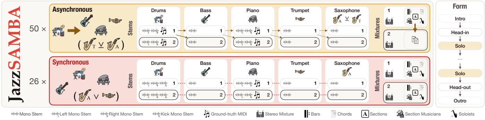
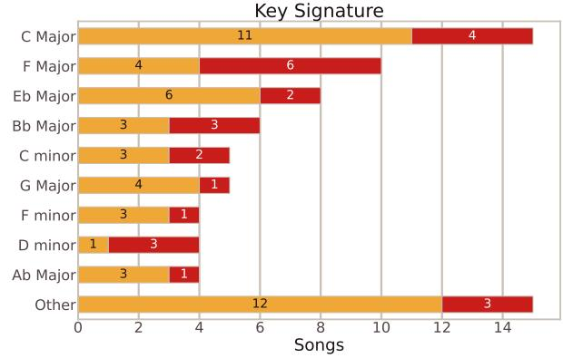
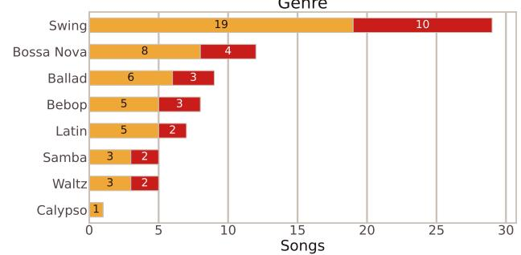
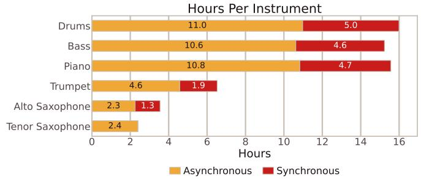

# JAZZSAMBA: A SYNCHRONOUS AND ASYNCHRONOUS MULTI-TAKE BAND AUDIO DATASET OF JAZZ STANDARDS FOR LIVE MUSIC MODELS

Phillip Long1, Jacob Nguyen3, Jace Hosto3, Gage Hosto3, Jett Takazawa3, Fares Nofal3, Sebastian Stade3, Nithya Shikarpur2, Julian McAuley1, Cheng-Zhi Anna Huang2, Stephen Brade2,∗, Aleksandra Teng Ma2,∗

1University of California, San Diego 2Massachusetts Institute of Technology 3Independent Musician

## ABSTRACT

Machine learning has made strong progress on music tasks, both as assistive tools and as creative partners. However, most systems train on multitrack corpora that emphasize pop and rock. Jazz, with improvisation at the core of its practice, still lacks a well-annotated corpus of clean per-stem combo recordings on standards. We introduce JazzSAMBA (Jazz Synchronous and Asynchronous Multi-take Band Audio) to fill this gap: the first originally recorded jazz-combo multitrack dataset of standards with asynchronous (overdubbed) and synchronous (live ensemble) protocols, preferred and alternate takes chosen by the musicians, and timed annotations for bars, chords, sections, and soloists. JazzSAMBA covers 76 standards by eight musicians on drums, bass, piano, trumpet, and saxophone, with per-stem audio, mixtures, and MIDI. It can support chart-conditioned accompaniment, combo source separation, and form-aware music information retrieval. We demonstrate the dataset on two tasks: a jazz combo source-separation baseline and a chart-conditioned accompaniment ablation. The dataset, code, and samples are linked from the project demo page.1

Index Terms— jazz, multi-track audio, music information retrieval, dataset, music generation

## 1. INTRODUCTION

Machine learning has made strong progress on music understanding, live music generation, and other related music tasks. However, most systems train on multitrack corpora that emphasize pop and rock [1, 2, 3]. As a result, these datasets usually limit tasks to standard pop and rock instruments and styles, which usually involve compositions and arrangements created beforehand. Jazz, on the other hand, combines precomposed charts with improvisation, so the improvisation space is bounded by harmony and structure rather than left unconstrained. Prior jazz resources cover audio-aligned harmony, formal structure, solo transcription, and solo-piano or stem-transcribed performances [4, 5, 6, 7], yet they rarely provide originally recorded multi-instrument combo stems of standard repertoire [8]. However, interactive accompaniment, real-time generation, and source separation need corpora with clean ensemble stems. Chart-conditioned generation and form-aware analysis further benefit when those stems are paired with structural annotations that models can condition on or score against.

We propose JazzSAMBA, the first jazz-standard dataset with both clean per-stem combo recordings and performancealigned chord and section labels. It provides asynchronous (overdubbed) and synchronous (live ensemble) protocols, preferred and alternate takes chosen by the musicians, and timed bar and soloist annotations. It comprises 76 standards by eight musicians on drums, bass, piano, and horns. These assets support chart-conditioned accompaniment, combostandard instrument source separation, and form-aware MIR. We demonstrate two uses that depend on these assets: a jazz combo source-separation baseline, and a chart-conditioned causal accompaniment benchmark that ablates timed sections and chords against listen-only conditioning. The dataset, code, and samples are linked from the project demo page.1

## 2. RELATED WORK

Table 1. JazzSAMBA vs. selected related corpora.
<table><tr><td>Corpus</td><td></td><td></td><td></td><td></td><td>Stems Takes Dual Chords Sections Soloists MIDI</td><td></td><td></td></tr><tr><td>MUSDB18 [1]</td><td>√</td><td></td><td></td><td></td><td></td><td></td><td></td></tr><tr><td>MoisesDB [2]</td><td>√</td><td></td><td></td><td></td><td></td><td></td><td></td></tr><tr><td>Slakh2100 [9]</td><td>√</td><td></td><td></td><td></td><td></td><td></td><td>√</td></tr><tr><td>Jazz Trio Database [8]</td><td>√†</td><td></td><td></td><td></td><td></td><td></td><td>√*</td></tr><tr><td>Jazz Harmony [4]</td><td></td><td></td><td></td><td>√</td><td>√</td><td></td><td></td></tr><tr><td>Weimar Jazz Database [6]</td><td></td><td></td><td></td><td>√</td><td>√</td><td>√</td><td>√*</td></tr><tr><td>Jazz Structure Dataset [5]</td><td></td><td></td><td></td><td></td><td>√</td><td>√</td><td></td></tr><tr><td>RWC Jazz [10]</td><td></td><td></td><td></td><td></td><td>√</td><td></td><td>√</td></tr><tr><td>JAZZVAR [7]</td><td></td><td></td><td></td><td>√</td><td></td><td></td><td>√*</td></tr><tr><td>H2H Music Improv [11]</td><td>√</td><td>√</td><td></td><td></td><td></td><td></td><td></td></tr><tr><td>JazzSAMBA</td><td>√</td><td>√</td><td>√</td><td>√</td><td>√</td><td>√</td><td>√</td></tr></table>

Dual: asynchronous and synchronous protocols. †Separation-derived stems; ∗MIDI from automatic or monophonic transcription.

Multitrack datasets. Studio and synthetic multitracks (MUSDB18, MedleyDB, MoisesDB, Slakh2100) support separation and transcription outside jazz [1, 3, 2, 9]. JazzSAMBA targets that gap with originally recorded jazzcombo stems of standards rather than pop or rendered MIDI.

  
Fig. 1. JazzSAMBA overview (50 asynchronous / 26 synchronous songs; about 8.1 h preferred-take, about 16.1 h both tiers) Labels 1 and 2 are take tiers. Asynchronous takes overdub in sequence (drums first; dotted arrows); synchronous takes record the whole ensemble together (dashed lines). Preferred mixtures are annotated for bars, chords, sections, and soloists; alternate async annotations are copied, while sync takes are labeled separately.

Jazz corpora. Table 1 compares related jazz and improvisation audio corpora along stems, takes, recording protocols, annotations, and MIDI. Prior jazz resources emphasize harmony and form labels, solo transcription, or solo piano without originally recorded multi-instrument combo stems [4, 5, 6, 7, 10]; where MIDI is present, it is often automatic or monophonic, and the jazz trio database supplies stems only via source separation [8]. H2H Music Improv provides multitake free-improvisation per-stem audio with bidirectional intention annotations [11], but it is non-idiomatic and does not constrain the corpus to any specific style. JazzSAMBA unifies close-mic combo stems, dual protocols and takes, and timed chart annotations on standards.

Interactive accompaniment. Offline models include the Anticipatory Music Transformer [12]; online systems include RL-Duet, RealChords, StreamGen, RealJam, and Live-Band [13, 14, 15, 16, 17], mostly on symbolic pop/classical or non-jazz audio. Jazz suits such models: improvisation on shared charts couples freedom with form models can follow. JazzSAMBA could expand these models to real combo scenarios with its clean stems and chord and section annotations.

## 3. JAZZSAMBA DATASET

JazzSAMBA uses two recording protocols: instruments tracked one at a time, and the full band tracked together (Figure 1; Table 2). In the asynchronous protocol, musicians record separately: drums first establish a rhythmic foundation, then later instruments overdub on preferred earlier takes. Each instrument records two clean takes; preferred stems form the preferred mixture and the remaining takes form the alternate tier. Fixed-tempo overdubs let us annotate the preferred mixture once and copy those labels onto the alternate tier. In the synchronous protocol, the full band records two ensemble takes, musicians pick one preferred take, and close-mic bleed makes this the harder condition; takes are annotated independently.

Table 2. Asynchronous vs. synchronous protocol contents. Shared marks preferred labels copied to the alternate tier. GT denotes ground-truth; remaining MIDI is from MuScriptor AMT [18]. For stems with bleed, we also ship a Wiener-style de-bleeded version [19]. All audio is 48 kHz.
<table><tr><td rowspan="2">Protocol</td><td></td><td colspan="2">Stems | Annotations | GT MIDI</td><td colspan="2"></td></tr><tr><td>Clean Bleed | Timed Shared | Drums Piano</td><td></td><td></td><td></td><td></td></tr><tr><td>Asynchronous</td><td>V</td><td>」</td><td></td><td></td><td>L</td></tr><tr><td>Synchronous</td><td>L</td><td>J</td><td></td><td></td><td>5</td></tr></table>

Both protocols store the same timed annotations on a shared bar grid. Bars give onset times and measure indices; chords, sections, and soloists use bar and fraction offsets so harmony and form stay aligned to the performance. Chord labels come from written lead sheets, not audio estimates: MusPyExpress [20] parses an internal chart collection, then musicians time-align them, keeping the written symbol and fields such as root, triad, seventh, extensions, alterations, and slash bass (e.g. E-7b5). Section labels use jazz form tags (intro, head-in, head-out, solos, outro), with nested letters when needed (e.g. head-in/A). A per-section musician table records who plays; soloist rows give an ordered solo sequence.

The corpus covers 76 standards by eight musicians on drums, bass, piano, trumpet, and saxophone (alto or tenor, exclusive per song): 50 asynchronous and 26 synchronous. Repertoire spans swing, bossa nova, ballad, bebop, and latin feels, mostly in 4/4 with both swung and straight grooves. Preferred mixtures total about 8.1 h (5.5 h asynchronous, 2.5 h synchronous); both tiers reach about 16.1 h at 75– 270 BPM. Figure 2 summarizes keys, genres, and hours per instrument; listening examples are on the demo page.

  
Fig. 2. JazzSAMBA corpus statistics by protocol (asynchronous or synchronous): key signatures, genres, and active hours per instrument from section musician annotations over both take tiers, excluding silence while sitting out.

## 4. EXPERIMENTS

We demonstrate JazzSAMBA in two settings: source separation and chart-conditioned accompaniment. Source separation fine-tunes and evaluates on asynchronous stem-sum mixtures for drums, bass, piano, and horns. Chart-conditioned accompaniment trains on both protocols and ablates oracletimed chord and section masks against listen-only conditioning on asynchronous and synchronous test sets.

## 4.1. Source separation

Standard music source-separation models typically target vocals, drums, bass, and other, collapsing instruments outside that taxonomy into a catch-all stem. JazzSAMBA enables fine-tuning separators for jazz-combo stems like piano and horns. We fine-tune HT-Demucs 6s [21], a hybrid waveformspectrogram Transformer with a dedicated piano stem; Open-Unmix [22], a spectrogram-masking LSTM baseline; and BS-RoFormer SW [23], a band-split RoPE Transformer, on asynchronous JazzSAMBA takes to separate stem-sum mixtures of drums, bass, piano, and horns. Horns are initialized from the pretrained “other” stem; Open-Unmix has no piano stem, so we initialize its piano head from a copy of pretrained “other”. We compare zero-shot against fine-tuning on JazzSAMBA or ChoraleBricks [24], which provides isolated wind parts including flute, oboe, clarinet, trumpet, saxophone, baritone, trombone, and tuba, to test whether wind stems transfer. Training uses shared mix-and-separate 4 s crops: we RMS-normalize each stem, apply a random per-stem gain, sum to a mixture, then peak-normalize the mixture and matched targets together. We report full-track SI-SDR [25], which measures how closely an estimate matches a reference while ignoring overall loudness, on the asynchronous test set (n=5) with early stopping on validation loss (Table 3).

Table 3. Asynchronous-test SI-SDR ↑ (dB), full-track (n=5). Dashes mark unfair zero-shot or ChoraleBricks cells (no matching stem supervision). We bold the best reportable score within each model.
<table><tr><td>Model</td><td>FT</td><td>Drums</td><td>Bass</td><td>Piano</td><td>Horns</td></tr><tr><td rowspan="2">HT-Demucs 6s</td><td></td><td>13.01</td><td>15.07</td><td>4.92</td><td></td></tr><tr><td>JazzSAMBA ChoraleBricks</td><td>15.09 一</td><td>17.03 15.02</td><td>9.42</td><td>14.62 8.98</td></tr><tr><td>Open-Unmix</td><td>JazzSAMBA ChoraleBricks</td><td>5.24 8.37</td><td>5.63 9.74 5.63</td><td>6.07</td><td>9.38 -0.66</td></tr><tr><td>BS-RoFormer SW JazzSAMBA</td><td>ChoraleBricks</td><td>19.12 18.97</td><td>20.83 20.62 17.59</td><td>18.31 17.54</td><td>21.57 21.15 2.00</td></tr></table>

Zero-shot BS-RoFormer is strongest on reportable stems; JazzSAMBA fine-tuning keeps it within about 0.8 dB, so zero-shot remains the headline BS result. JazzSAMBA finetuning makes horns reportable for HT-Demucs and piano and horns reportable for Open-Unmix, and it also improves drums and bass on those models. ChoraleBricks fine-tuning does not improve JazzSAMBA test scores (e.g., BS horns 21.57→2.00 dB), suggesting limited transfer from wind chorales to this jazz-combo setting.

## 4.2. Chart-conditioned accompaniment

We demonstrate how researchers may benchmark live music accompaniment using JazzSAMBA by comparing chart conditioning against listen-only baselines. We fine-tune Stream-Gen [15], a streaming latent model for stem-held-out accompaniment, with a causal decoder $( \boldsymbol { t } _ { f } { = } 0 )$ so each frame depends only on past mix audio and optional chart features, suited to live accompaniment. A four-way ablation over listen-only, +sections, +chords, and +both trains specialists on both protocols with 10 s crops and optional oracle-timed JazzSAMBA charts. At inference we free-run 60 s from up to three form landmarks per take (head-in and the first two soloist entries), conditioning only on the non-target mix and chart. Table 4 reports COCOLA [26] and Beat Alignment F1 [17, 27] as mean over landmarks, for asynchronous (n=5) and synchronous (n=3) test songs. COCOLA scores contrastive coherence between the non-target condition mix and the generated stem; Beat Alignment F1 compares an oracle bar-grid metronome from the take annotations to beats detected on the generated stem.

Table 4. Accompaniment scores on 60 s free-run from form landmarks (asynchronous test n=5, synchronous test n=3; mean over landmarks). D, B, P, and H denote drums, bass, piano, and horns. Ground Truth scores the annotated target stem against the condition mix. We bold the best score per column among chart conditions (excluding Ground Truth).
<table><tr><td rowspan="2">Protocol</td><td rowspan="2">Condition</td><td colspan="4">COCOLA↑</td><td colspan="4">Beat F1 ↑</td></tr><tr><td>D</td><td>B</td><td>P</td><td>H</td><td>D</td><td>B</td><td>P</td><td>H</td></tr><tr><td>Asynchronous +Sections</td><td>Ground Truth Listen-Only +Chords +Both</td><td>55.6 52.560.6 51.4 60.4 59.9</td><td>62.1 52.2 60.4 59.8 61.4 50.7 59.8 59.7 61.9</td><td>63.4 60.0 62.3</td><td>64.5 61.7</td><td>0.340.100.120.04</td><td>1.000.800.48 0.230.160.130.02 0.29 0.09 0.13 0.05 0.30 0.09 0.15 0.06</td><td></td><td>0.29</td></tr><tr><td>Synchronous</td><td>Ground Truth Listen-Only +Sections +Chords +Both</td><td>|58.4 61.2 53.2 60.3 53.5 59.1 58.960.9 51.3 59.9 58.7 60.9</td><td>52.8 58.9 58.3 61.4</td><td>62.9 58.6 60.8</td><td>65.9</td><td>0.27 0.09 0.09 0.05 0.31 0.070.150.00</td><td>0.970.74 0.670.78 0.26 0.12 0.090.05 0.270.060.140.01</td><td></td><td></td></tr></table>

Across both protocols, chart masks change Beat F1 more than COCOLA: Beat F1 swings farther across conditions and the best mask often changes by stem, while +chords often edges StreamGen’s COCOLA over listen-only, showing that JazzSAMBA’s annotations can discriminate conditioning strategies. Synchronous Beat F1 is somewhat lower under live bleed, while COCOLA remains comparable to the asynchronous setting. Live audio accompaniment remains a difficult task; these results are one baseline where JazzSAMBA’s stems and annotations help.

## 5. CONCLUSION

JazzSAMBA is the first jazz-standard dataset with per-player stems and annotations for chords, sections, and soloists. It includes 76 standards with multi-take audio and MIDI in asynchronous and synchronous settings, performed by eight musicians. Paired with performance-aligned charts, it supports music information retrieval and generation. We show that it enables jazz-combo source separation for piano and horns, and benchmarks live chart-conditioned accompaniment. We release JazzSAMBA hoping others will push beyond these baselines toward interactive chart-following accompaniment, form-aware combo analysis, and models that handle take-totake and live-ensemble variation.

## 6. COMPLIANCE WITH ETHICAL STANDARDS

Performing musicians are credited as coauthors and consented to the recording and public release of the dataset. Recordings are original studio performances. The dataset contains those recordings and our annotations only.

## 7. REFERENCES

[1] Zafar Rafii, Antoine Liutkus, Fabian-Robert Stoter,¨ Stylianos Ioannis Mimilakis, and Rachel Bittner, “The MUSDB18 corpus for music separation,” Dec. 2017.

[2] Igor Pereira, Felipe Araujo, Filip Korzeniowski, and ˜ Richard Vogl, “Moisesdb: A dataset for source separation beyond 4-stems,” arXiv preprint arXiv:2307.15913, 2023.

[3] Rachel M Bittner, Justin Salamon, Mike Tierney, Matthias Mauch, Chris Cannam, and Juan Pablo Bello, “MedleyDB: A multitrack dataset for annotationintensive mir research,” in Proceedings ofthe 15th International Society for Music Information Retrieval Conference. International Society for Music Information Retrieval, 2014.

[4] Vsevolod Eremenko, Emir Demirel, Baris Bozkurt, and Xavier Serra, “Audio-aligned jazz harmony dataset for automatic chord transcription and corpus-based research,” in Proceedings of the 19th International Society for Music Information Retrieval Conference. International Society for Music Information Retrieval, 2018.

[5] Stefan Balke, Julian Reck, Christof Weiß, Jakob Abeßer, and Meinard Muller, “Jsd: A dataset for structure anal-¨ ysis in jazz music,” Transactions of the International Societyfor Music Information Retrieval, 2022.

[6] Martin Pfleiderer, Klaus Frieler, Jakob Abeßer, Wolf-Georg Zaddach, and Benjamin Burkhart, Eds., Inside the Jazzomat - New Perspectives for Jazz Research, Schott Campus, 2017.

[7] Eleanor Row, Jingjing Tang, and Gyorgy Fazekas, “Jaz-¨ zvar: A dataset of variations found within solo piano performances of jazz standards for music overpainting,” in International Symposium on Computer Music Multidisciplinary Research. Springer, 2023, pp. 113–126.

[8] Huw Cheston, Joshua L Schlichting, Ian Cross, and Peter M C Harrison, “Jazz trio database: Automated annotation of jazz piano trio recordings processed using audio source separation,” Transactions of the International Societyfor Music Information Retrieval, 2024.

[9] Ethan Manilow, Gordon Wichern, Prem Seetharaman, and Jonathan Le Roux, “Cutting music source separation some slakh: A dataset to study the impact of training data quality and quantity,” in 2019 IEEE Workshop on Applications ofSignal Processing to Audio and Acoustics (WASPAA). IEEE, 2019, pp. 45–49.

[10] Stefan Balke, Johannes Zeitler, Vlora Arifi-Muller,¨ Brian McFee, Tomoyasu Nakano, Masataka Goto, and Meinard Muller, “Rwc revisited: Towards a community-¨ driven mir corpus,” Transactions of the International Society for Music Information Retrieval, vol. 9, no. 1, 2026.

[11] Aleksandra Teng Ma, Anthony Cammarota, Jiayi Wang, Alexandria Smith, Cheng-Zhi Anna Huang, Jeffrey Albert, and Alexander Lerch, “H2h music improv: Human-to-human free improvisation with bidirectional intention annotations,” in Proceedings ofthe 27th International Society for Music Information Retrieval Conference (ISMIR), 2026.

[12] John Thickstun, David Hall, Chris Donahue, and Percy Liang, “Anticipatory music transformer,” arXiv preprint arXiv:2306.08620, 2023.

[13] Nan Jiang, Sheng Jin, Zhiyao Duan, and Changshui Zhang, “Rl-duet: Online music accompaniment generation using deep reinforcement learning,” in Proceedings of the AAAI conference on artificial intelligence, 2020, vol. 34, pp. 710–718.

[14] Yusong Wu, Tim Cooijmans, Kyle Kastner, Adam Roberts, Ian Simon, Alexander Scarlatos, Chris Donahue, Cassie Tarakajian, Shayegan Omidshafiei, Aaron Courville, Pablo Samuel Castro, Natasha Jaques, and Cheng-Zhi Anna Huang, “Adaptive accompaniment with ReaLchords,” in Proceedings of the 41st International Conference on Machine Learning, Ruslan Salakhutdinov, Zico Kolter, Katherine Heller, Adrian Weller, Nuria Oliver, Jonathan Scarlett, and Felix Berkenkamp, Eds. 21–27 Jul 2024, vol. 235 of Proceedings of Machine Learning Research, pp. 53328–53345, PMLR.

[15] Yusong Wu, Mason Wang, Heidi Lei, Stephen Brade, Lancelot Blanchard, Shih-Lun Wu, Aaron Courville, and Anna Huang, “Streaming generation for music accompaniment,” arXiv preprint arXiv:2510.22105, 2025.

[16] Alexander Scarlatos, Yusong Wu, Ian Simon, Adam Roberts, Tim Cooijmans, Natasha Jaques, Cassie Tarakajian, and Anna Huang, “Realjam: Real-time human-ai music jamming with reinforcement learningtuned transformers,” in Proceedings of the Extended Abstracts of the CHI Conference on Human Factors in Computing Systems, 2025, pp. 1–9.

[17] Marco Pasini, Javier Nistal, Ben Hayes, Mathias Rose Bjare, Stefan Lattner, and George Fazekas, “Liveband:

Live accompaniment generation in the audio domain,” arXiv preprint arXiv:2606.03803, 2026.

[18] Simon Rouard, Michael Krause, Axel Roebel, Carl-Johann Simon-Gabriel, and Alexandre Defossez,´ “Muscriptor: An open model for multi-instrument music transcription,” arXiv preprint arXiv:2607.08168, 2026.

[19] Elias K. Kokkinis, Joshua D. Reiss, and John Mourjopoulos, “A wiener filter approach to microphone leakage reduction in close-microphone applications,” IEEE Transactions on Audio, Speech, and Language Processing, vol. 20, no. 3, pp. 767–779, 2012.

[20] Phillip Long, Hao-Wen Dong, Julian McAuley, and Zachary Novack, “Muspyexpress: Extending muspy with enhanced expression text support,” in NeurIPS 2025 Workshop on AI for Music: Where Creativity Meets Computation, 2025.

[21] Simon Rouard, Francisco Massa, and Alexandre Defossez, “Hybrid transformers for music source sepa- ´ ration,” in ICASSP 23, 2023.

[22] Fabian-Robert Stoter, Stefan Uhlich, Antoine Liutkus,¨ and Yuki Mitsufuji, “Open-unmix - a reference implementation for music source separation,” Journal of Open Source Software, 2019.

[23] Wei-Tsung Lu, Ju-Chiang Wang, Qiuqiang Kong, and Yun-Ning Hung, “Music source separation with bandsplit rope transformer,” in ICASSP 2024-2024 IEEE International Conference on Acoustics, Speech and Signal Processing (ICASSP). IEEE, 2024, pp. 481–485.

[24] Stefan Balke, Axel Berndt, and Meinard Muller,¨ “Choralebricks: A modular multitrack dataset for wind music research,” Transactions of the International Society for Music Information Retrieval, vol. 8, no. 1, pp. 39–54, 2025.

[25] Jonathan Le Roux, Scott Wisdom, Hakan Erdogan, and John R Hershey, “SDR—half-baked or well done?,” in ICASSP 2019 - 2019 IEEE International Conference on Acoustics, Speech and Signal Processing (ICASSP), 2019, pp. 626–630.

[26] Ruben Ciranni, Giorgio Mariani, Michele Mancusi, Emilian Postolache, Giorgio Fabbro, Emanuele Rodola,\` and Luca Cosmo, “COCOLA: Coherence-oriented contrastive learning of musical audio representations,” in ICASSP 2025. IEEE, 2025.

[27] Francesco Foscarin, Jan Schluter, and Gerhard Widmer,¨ “Beat this! accurate beat tracking without DBN postprocessing,” in Proceedings of the 25th International Societyfor Music Information Retrieval Conference (IS-MIR), San Francisco, CA, United States, 2024.