# KV-streams for Efficient Compaction in Agentic Reinforcement Learning

Emiliano Penaloza⋄ ∗ 1,2,5, Dane Malenfant⋄ 1,3,

Dheeraj Vattikonda1,4, Roger Creus Castanyer1, Siddarth Venkatraman1,5, Abhay Puri6, Jonathan Light7, Matthew James Sargent8, Augustine N. Mavor-Parker9, Massimo Caccia13, Lucas Caccia13, Glen Berseth1,5, Esmeralda S. Whitammer10, Alessandro Sordoni1,11, Minseon Kim2, Marc-Alexandre Côté2,   
Laurent Charlin† 1,12, Guillaume Lajoie† 1,5

1Mila 2Microsoft 3McGill University 4Polytechnique Montréal 5Université de Montréal 6ServiceNow Inc 7Rensselaer Polytechnic Institute 8University College London, University of London 9Vmax 10Edinburgh University 11Microsoft Research 12HEC Montréal 13Cohere

⋄Core contributors †Equal advising ∗Corresponding author: emilianopp550@gmail.com

Abstract Scaling the horizon of agentic LLMs is bottlenecked by the need to fit ever longer context traces in GPU memory. Context compaction has been the most popular mechanism to alleviate this issue, keeping GPU memory constant for a given trace. Unfortunately, most compaction strategies rely on prefilling the LLM context many times over, hindering training throughput. To alleviate this bottleneck and enable efficient trainable compaction, we propose KV-streams, a plug-and-play strategy compatible with any compaction strategy that substantially increases throughput while showing no evidence of hindering performance. KV-streams enable scalable compaction by streaming the KV cache forward rather than flushing it after each compaction. We show that KV-streams enable three different compaction strategies, achieving a 2.6 to 5× wall-clock speedup in training. Beyond efficiency, we find that the streamed KV cache can act as a recurrent state, carrying forward information that has long since disappeared from the context. Specifically, in a controlled setting we show that, contrary to prior work, RL alone is all that is needed for this behavior to emerge. Overall, we show KV-streams to be an efficient and lightweight plug-and-play addition to any post-training pipeline.

Code Repository: github.com/Emilianopp/KV-streams SGLang Fork: github.com/Emilianopp/sglang

Summary Sliding-Window Markovian Thinker Markovian Picker Full context Re-prefill compaction KV-streams  
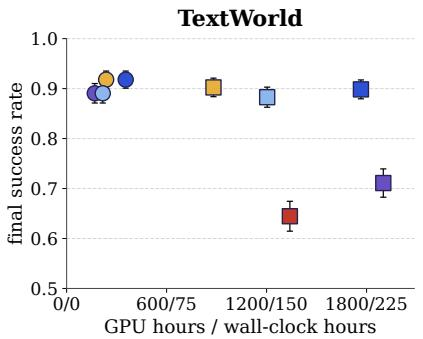

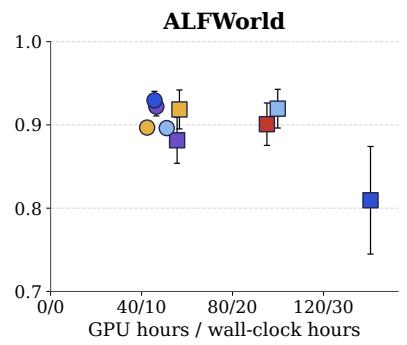

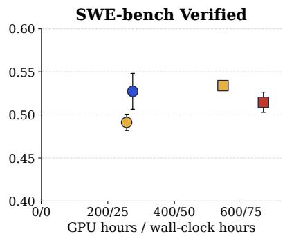  
Figure 1: Final evaluation score against total training compute for every run on TextWorld, ALFWorld and SWE-bench Verified. Axis ticks give GPU hours and wall-clock hours. Colour denotes the compaction strategy, circles are KVstreams and squares re-prefill compaction, with full context as the reference. Error bars give the standard deviation over three seeds on SWE-bench Verified, and the standard error over seeds, or over evaluation episodes for single-seed runs, on the text-based games. KV-streams reaches the same final score as re-prefill compaction at a fraction of the compute.

## 1 Introduction

Reinforcement learning on long-horizon agentic tasks requires generating many concurrent rollouts, each having key-value (KV) caches growing linearly with length. Under a fixed GPU memory budget, the longest-running rollouts quickly become the bottleneck, monopolizing memory that shorter rollouts could otherwise use. Reducing the memory footprint of long traces can therefore substantially increase training throughput, enabling more optimizer steps and larger batch sizes (Kwon et al., 2023; Chen et al., 2026).

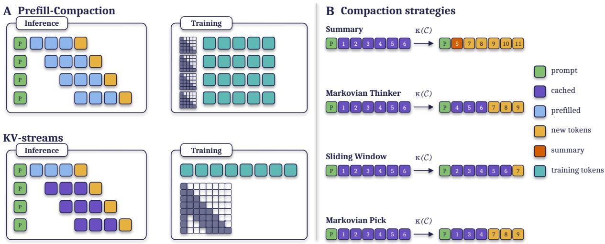  
Figure 2: Compaction strategies and their training costs. (A) re-prefill compaction recomputes retained tokens and creates separate training traces. KV-streams preserves retained KVs and trains on a continuous trace with an attention mask that reproduces eviction. (B) context transformations under each strategy (P: prompt; S: summary).

To stop memory from growing, a variety of compaction techniques can be used. They remove a portion of the context once a fixed token budget is exceeded (e.g. replacing older context with a summary) (Wu et al., 2026b; Li et al., 2026b). Compaction lets a trace extend indefinitely (in principle) without growing its memory footprint, but increases training compute. This is due to the retained context being prefilled each time following a compaction, so the model perform repeated forward passes over the same tokens (Cim et al., 2026).

In this work, we propose KV-streams to alleviate the computational bottleneck of compaction. Specifically, KV-streams evicts KV entries directly in the inference engine yielding the memory benefits of compaction while maintaining a single continuous stream of KVs, thus avoiding any repeated prefill cost. On the trainer side, KV-streams reproduce the eviction pattern with a custom attention mask, so no tokens are re-processed. Through this simple plugin, KV-streams substantially increase both training and inference throughput on the four compaction strategies we tested, and are compatible with others. Figure 2 summarizes those four strategies and the mechanism behind the speedup.

We evaluate KV-streams combined with various compaction strategies on long-horizon agentic tasks, using Qwen3-4B-Instruct-2507 and Qwen3.5-4B, obtaining a 5× speedup on TextWorld (Côté et al., 2019) and a 1.3× speedup on ALFWorld (Shridhar et al., 2021). Interestingly, while early in training both KV-streams and re-prefill compaction can hinder performance compared to the use of full context, with sufficient training, KV-streams can close this gap and even surpass the performance of full context. Further, we find that models trained with KV-streams also generalize better to unseen text-based games (Cui et al., 2025; Hausknecht et al., 2020; Wang et al., 2022; Jansen et al., 2024). We then carry these results over to agentic software-engineering tasks, where KV-streams reach peak performance 3× faster than full context while maintaining comparable performance.

Prior work (Kontonis et al., 2026) showed that preserving KVs across compactions lets the KV cache act as a "pseudo recurrent" state, but found that this behaviour requires a preliminary SFT stage in their training setup. We test whether that requirement holds in our approach. Empirically, the additional wall-clock time spent on SFT does not improve performance, and synthetic experiments show that pseudo-recurrence can emerge in the KV cache without this preliminary SFT stage. This is a significant improvement for RL post training pipelines, with up to a 5× speedup.

Overall, KV-streams is a simple plug-and-play addition to any compaction strategy that greatly reduces training wallclock, matches or exceeds the performance of re-prefill compaction, generalizes effectively, and requires no expensive SFT stage for initialization. We make our inference and training code public at https://github.com/Emilianopp/ KV-streams for a subset of the experiments.

## 2 Compaction

Long-running LLM agents commonly manage context growth by summarizing earlier interactions or offloading information to external memory, keeping the active context within a fixed budget (Packer et al., 2024; Wu et al., 2026b; Lu et al., 2025). It is necessary to scale LLM context windows by preventing “context rot” and limiting growing KV-memory. During training, limiting these effects is quite important. For instance, a single long rollout can monopolize the inference server’s memory, throttling throughput. On top of that, agentic settings are specially affected by this hindrance as the environment’s feedback adds to the growing context. For instance, in software engineering, reading or writing a file can consume a substantial amount of context that may not be necessary at later stages of the task. Reducing this context is therefore important for scaling long-context agentic RL. While prior works have attempted to alleviate these issues Aghajohari et al., 2026; Wu et al., 2026a they either focus on non-agentic settings, which simplify the problem, they do not study its interaction with RL, or most detrimentally, they re-prefill the context incurring a high compute cost. Our goal is to fill these gaps and eliminate any redundant compute cost.

To illustrate where this added cost comes from, we formalize compaction and show how KV-streams can be applied to any strategy that meets this definition. We note that our experiments are in agentic settings, which require turn-wise compaction (see Appendix B.4), but we use a generalized entry-level view to describe the process, which generalizes to tokens/turns. KV-streams is readily amenable to other long-context use cases as well.

A compaction operator κ maps a context C to a shorter one ${ \mathcal { C } } ^ { \prime } = \kappa ( { \mathcal { C } } )$ . It fires whenever a trigger T is met, either a fixed entry budget B that caps |C| or the model’s own decision to compact (Li et al., 2026a). When triggered, κ composes two operators, κ = gen ◦ del. The delete operator removes a span of at least $b \geq 1$ tokens, so the context always shrinks, and generate emits a bridge s in its place, possibly empty, such as a summary (Li et al., 2026b; Wu et al., 2026b).

Prefill-compaction. Typical compaction pipelines continue the compacted context in a fresh trace, which resets the kept tokens’ cached KVs along with their positional encodings. Concretely, a retained token that held position i and cache $( k _ { i } , v _ { i } )$ in C is re-emitted into the new trace $\scriptstyle { \mathcal { C } } ^ { \prime }$ with reset positional encodings. Recomputing it under this new position and context gives a different cache entry, $( k _ { i } ^ { \prime } , v _ { i } ^ { \prime } ) \neq ( k _ { i } , v _ { i } )$ , so both its position and its cached KV change. This reset is what forces the kept entries to be prefilled again rather than reused.

This strategy incurs a heavy cost. Let r be the number of entries a compaction keeps, the retained overlap plus any generated summary. All r of them are prefilled into the fresh trace even though their KVs were already computed once (Cim et al., 2026). Under a token/turn budget $B ,$ , the context holds r entries right after a compaction, so the model can generate $b = B - r$ new entries before it hits the budget and compacts again. A rollout of N entries therefore compacts $N / b$ times, and each of those compactions prefills r entries a second time. Over the whole rollout the extra prefilled entries add up to

$$
\Delta _ { \mathrm { r e - p r e f l l } } = \frac { \overbrace { N } ^ { \mathrm { \tiny ~ { h e n t r i e s } } } \cdot \overbrace { \sum _ { r } } ^ { \mathrm { k e p t ~ p e r ~ c o m p a c t i o n } } } { \underbrace { \mathrm { n e w ~ e n t r i e s ~ b e t w e e n ~ c o m p a c t i o n s } } _ { \mathrm { n e w ~ e n t r i e s ~ b e t w e e n ~ c o m p a c t i o n s } } } ,
$$

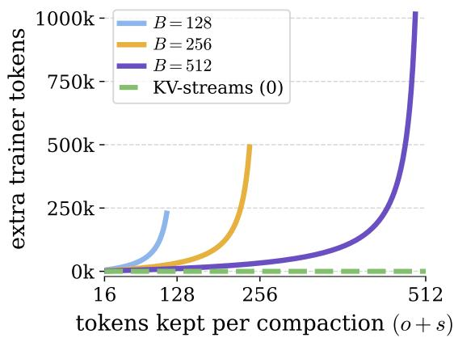  
Figure 3: Extra tokens prefilled over a 32k-token rollout vs. tokens kept per compaction o + s (overlap o plus summary s), for memory budgets B. As the retained tokens approach the budget, the repeated prefill grows by a factor of $\frac { N } { B - ( o + s ) }$ , the number of times each kept token is re-processed by the trainer. KV-streams prefills nothing again (green, at 0).

which diverges as the retained context approaches the budget, derived in App. E). In practice this can be mitigated by producing fewer compactions or reducing the number of entries kept per compaction (e.g. replacing all turns with a summary), yet this only mitigates the cost and does not remove it. Figure 3 illustrates this cost at a granular token level, showing how compacting more often makes the training grow exponentially with increased number of compactions.

KV-streams. To alleviate these issues we introduce KV-streams, a drop-in modification that skips the repeated prefill entirely. Rather than prefilling the kept tokens again, KV-streams carries the retained cache forward: the retained overlap and the summary s keep their existing entries $( k _ { i } , v _ { i } )$ instead of being recomputed as $( k _ { i } ^ { \prime } , v _ { i } ^ { \prime } ) , \mathrm { s o } \ \Delta _ { \mathrm { r e - p r e f i l l } } = 0$

In the trainer, a custom attention mask blocks attention to the deleted span, replicating this eviction in one forward pass. Figure 2 visualizes the mechanisms for KV-streams, showing how by directly evicting the KV-cache a compacted rollout avoids re-prefilling and does not require to be broken into multiple traces.

## 3 Compaction Strategies

KV-streams alleviates the cost of prefilling context, but different compaction strategies retain different amounts of context $r = o + s$ . We study four that span this range, from keeping almost none of it to keeping nearly the full budget.

Summary. The standard strategy asks the model to summarize its prior context and then drops it (Wu et al., 2026b;   
Li et al., 2026b). It keeps no entries (o = 0) and replaces them with a summary of variable length s up to a preset limit.

Markovian Thinker. The Markovian thinker (Aghajohari et al., 2026) keeps the prefill cost down by deleting half the context at each compaction and replacing nothing, so $o = B / 2$ and s = 0.

Markovian Pick. It’s possible that keeping the most recent half is not the most efficient strategy, rather a more efficient mechanism is to let the model pick what turns to remove and which to keep. Thus, at each compaction the model chooses b entries to retain deleting all others.

Sliding Window. To probe the high-retention regime where the repeated prefill is most expensive (Figure 3), we use sliding-window compaction (Xiao et al., 2024), which keeps almost the full window (o close to B, s = 0). It retains the most context and so incurs the largest prefill cost, exactly where KV-streams helps most.

## 4 Experimental Setup

Benchmarks and protocol. We evaluate KV-streams on two text-based games and on software-engineering tasks. Both settings test whether an agent can carry information forward once older context is compacted. Text-based games often require recalling details received early in the episode, so compaction can hurt performance if the agent fails to retain them. Software-engineering tasks involve reading and writing long files, and removing these files from context can discard information the agent later relies on. The text-based games use Qwen3-4B-Instruct-2507 and the software-engineering tasks use Qwen3.5-4B. Across benchmarks we sample 8 rollouts per prompt and use a learning rate of 10−6. Within each benchmark, all runs share the same optimization settings and differ only in the compaction strategy. We report evaluation score against cumulative GPU-hours, and we stop a run early only when its wall-clock time exceeds that of the full-context run.

TextWorld (Côté et al., 2019) provides procedurally generated games across four task families (coin\_collector, cooking, simple, treasure\_hunter) at three difficulty levels. We generate 60,000 synthetic games split uniformly across task families and difficulties, and retain 256 representative tasks for evaluation. Compaction triggers every 10 turns, and episodes run for up to 200 turns within a 32k-token budget. We train for 500 gradient steps with a batch size of 512 on an 8-GPU H100 node (4 inference, 4 trainer), and report mean avg@1 on the evaluation tasks.

ALFWorld (Shridhar et al., 2021) is a household environment in which the agent completes a language-specified task by issuing text commands and receives the admissible commands at each step. Compaction triggers every 10 turns, and episodes run for up to 100 turns within a 16k-token budget. We train on the standard split for up to 200 gradient steps with a batch size of 128 on 4 A100 GPUs (1 inference, 3 trainer). Every 20 gradient steps we evaluate one rollout per game on the 70 seen and 67 unseen validation games, reporting the mean success rate over the two splits.

For software engineering we train on 1,028 SWE-rebench (Badertdinov et al., 2026) and 443 ScaleSWE (Zhao et al., 2026) tasks. We remove tasks that the base model solves on every attempt and tasks it never solves, measured by pass@3, so that every remaining task carries a training signal. Compaction triggers every 30 turns, and episodes run for up to 100 turns within a 64k-token budget. We compare the two strongest KV-streams configurations, Markovian Thinker and Sliding Window, against full context. All methods train with a batch size of 256 on an 8-GPU GB200 node, and we evaluate on SWE-bench Verified (OpenAI, 2024).

Due to limited compute (as some experiments can take over a week to execute), we only run multi-seed experiments for AlfWorld, running single seed experiments for both software-engineering tasks and TextWorld. Appendix B lists the concurrency settings and hyperparameters for each benchmark, and Appendix B.2 describes the concurrency sweep used to choose them.

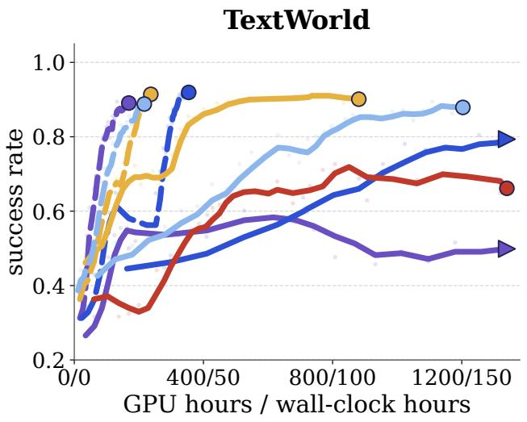

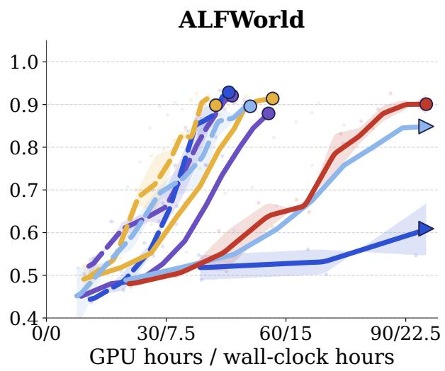  
Summary Sliding-Window Markovian Thinker Markovian Picker Full context Re-prefill compaction KV-streams

Figure 4: KV-streams reaches comparable or better success with fewer GPU hours on TextWorld (left) and ALFWorld (right). Axis ticks give GPU hours and wall-clock hours (8 GPUs on TextWorld, 4 on ALFWorld). Solid and dashed curves denote re-prefill compaction and KV-streams, with full context as a reference. Arrowheads mark truncation after exceeding the runtime of full-context completion. We provide complete curves appear in Figure 10.

Inference engine implementation. Our aim is to show the speedup at as close to production scale as possible, so we build on asynchronous RL frameworks that decouple the trainer and inference GPUs. For the text-based games, we run a forked vLLM inference engine and a forked prime-RL (Team et al., 2025) trainer1, both modified to support KV-streams. Our vLLM configuration uses 16-token KV-cache blocks (Kwon et al., 2023). Only complete blocks are added to the prefix cache.2 When a request does not end on a multiple of 16, the trailing tokens stay uncommitted until a later request completes the group. This breaks the stream, since the next request may evict tokens that the uncommitted tokens would have attended to, and we initially found it to substantially hinder performance. We fix it by padding each completion to a multiple of 16 tokens. The padding must be prefilled by both the inference engine and the trainer, which inflates the total token count. We account for this in Figure 4 and describe it in Appendix B.3. Despite this inefficiency, KV-streams still improves throughput. On the trainer side we use asynchronous RL with a maximum off-policy lag of 3, and we modify prime-RL to apply in-flight weight updates without flushing the KV cache (Piché et al., 2026). This change is important for scaling KV-streams, since flushing on every weight update would force a prefill of entire, possibly long, traces and undo the memory savings. For the software-engineering experiments, we instead use a forked Slime trainer with a forked SGLang inference engine3, which commits individual tokens with a block size of 1 and therefore needs no padding.

## 5 Experimental Results

Here we describe experimental results for both text-based games and software-engineering tasks. For text-based games, we outline all compaction strategies. For software engineering, we only evaluate a subset of the compaction strategies due to compute limits.

## 5.1 Text-Based Games

KV-streams reduces experiment wall-time. Figure 4 shows success rate against GPU-hours on TextWorld and ALFWorld for every compaction strategy under re-prefill compaction and under KV-streams. On TextWorld, KVstreams reaches the final performance of re-prefill compaction with between 3.7× and 11.3× fewer GPU-hours, while performing better or similarly. Re-prefill compaction is also expensive in absolute terms. Summary and Sliding-Window with re-prefill compaction consume more GPU-hours than training with full context. We find that all variants of KV-streams substantially reduce wall-clock time compared to both full context and their re-prefill counterparts. On ALFWorld, due to shorter traces (the maximum sequence length is 16k), the re-prefilling overhead is smaller, which reduces the gap. Regardless, KV-streams still achieves an increased throughput between 1.3× and 3.0×. KV-streams again reaches the final success rate of re-prefill compaction without incurring a performance loss across the four strategies. The full training curves for these runs, including the ones truncated in Figure 4, are in Appendix C.1.

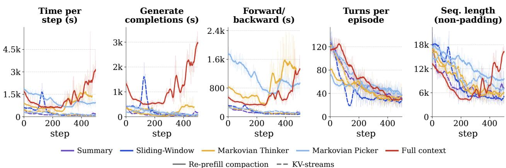  
Figure 5: Smoothed per-step timing and rollout statistics on TextWorld for runs that do not exceed the full-context wall-time. KV-streams (dashed) reduces generation and forward/backward time relative to re-prefill compaction (solid). Rollout statistics show mean turns per episode and sequence length. We find KV-streams to be substantially faster during forward/backward and generation.

Where does the speedup come from? Figure 5 breaks the time per step into generation and forward/backward. As expected, the bottleneck for re-prefill compaction is the forward and backward pass, where a large retained context r forces repeated recomputation. KV-streams instead reduces time in both the forward/backward pass and generation. While we find that initially re-prefill methods in TextWorld lead to shorter episodes and thus faster sampling, this gain diminishes as training progresses and is erased by the added training time.

Performance transfer. We aim to evaluate whether the speedups from KV-streams come at the cost of worse transfer to other tasks. We evaluate on unseen text-based games (Cui et al., 2025; Hausknecht et al., 2020; Wang et al., 2022; Jansen et al., 2024) using the final checkpoint from the TextWorld runs, with the same budget and context settings as training (B = 10 turns and a 32k-token context limit). Figure 7A reports the score for each game averaged over three seeds. For every game, a version of KV-streams performs on par with the best strategy. A version of KV-streams also improves upon the base model in every game, showing that learning on TextWorld transfers to other text-based games. No single compaction strategy performs best across all games (Figure 7A), consistent with broader findings that memory-method performance depends on the task (Wang et al., 2026). Regardless, we find no loss in transfer for KV-streams compared to full context and re-prefill compaction.

## 5.2 Software Engineering Agents

KV-streams scales to software-engineering tasks. Using the training set described in Section 4, we train for 200 gradient steps and evaluate on SWE-bench Verified, a standard software-engineering benchmark of 500 Python bug fixes. Figure 6 shows the evaluation results (left) and the training reward (right). To measure final performance, we evaluate the last checkpoint of each run over three seeds. Sliding-Window with KV-streams reaches $5 2 . 7 \pm 2 . 1 \%$ , statistically within the margin of error of full context (51.5 ± 1.2%) and re-prefill Markovian Thinker $( 5 3 . 4 \pm 0 . 2 \% )$ . Our results therefore remain consistent with the text-based games, finding no significant degradation in performance compared to full context. As before, KV-streams substantially reduces wall-clock time. Sliding-Window with KV-streams reaches its peak in about 20 hours compared to more than 65 hours for full context, a 3× speedup. The gap persists when comparing Markovian Thinker under re-prefill compaction and under KV-streams, where KV-streams reaches its peak in about 32 hours versus about 60 hours for re-prefill.

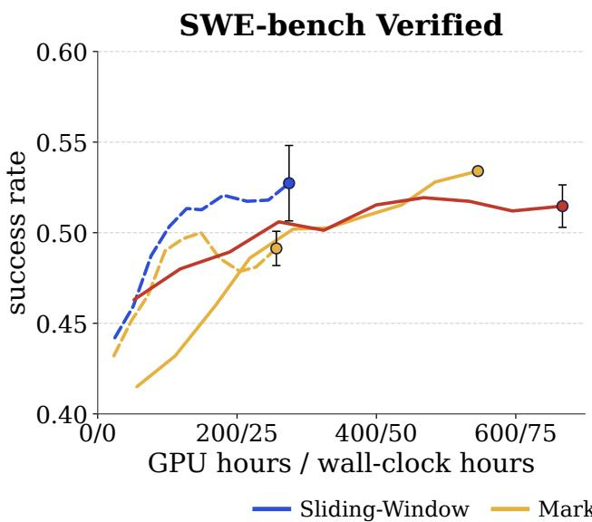

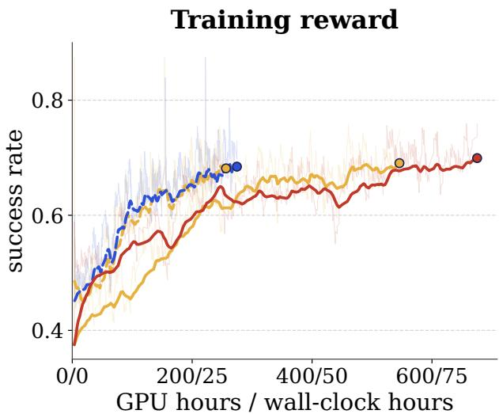

Figure 6: Comparison of KV-streams against full context and re-prefill Markovian Thinker on software-engineering tasks. Left: SWE-bench Verified success rate, smoothed with a centred three-checkpoint average. The final point is the mean and standard deviation over three evaluation seeds of the last checkpoint, as in Figure 1. Right: training reward, smoothed with an exponential moving average over 8 gradient steps for every run (raw trace faint). Axis ticks give GPU hours and wall-clock hours on 8 GPUs, and every run is shown up to 200 gradient steps. KV-streams reaches peak performance about 3× faster than full context and about 2× faster than re-prefill compaction.

## 6 Is SFT Necessary for Recurrent KVs?

Since retained KVs attended to tokens that are no longer in the context, prior work has shown they can act as a psudo-recurrent state (Kontonis et al., 2026), carrying forward information that has since been removed from the context. Because the model was not pretrained with this in mind, prior work relies on supervised fine-tuning to make the behaviour emerge as a first post training stage, before RL fine tuning can be done. We ask if this two-stage post training is necessary, and test whether KV-streams can enable direct RL fine tuning without an SFT stage. We test this by comparing cost savings of skipping an SFT warm start on TextWorld, and we analyze the mechanisms giving rise to this pseudo recurrent state in a controlled synthetic experiment

## 6.1 Prior SFT on TextWorld

If SFT were a necessary precursor for this recurrent behaviour, we would expect performance to be better with prior SFT. To analyze this and remove the confounder of SFT from a better model, we collect 10k trajectories from Qwen3-4B-Instruct-2507 with a 32k context limit (matching RL training), then perform SFT on those traces using randomly sampled eviction attention masks. For instance, sometimes we do sliding window with B = 10 and a stride equal to 1, other times we use Markovian Thinker truncation masking half the context (B = N/2).

Figure 7 B compares RL from the base model against an SFT warm-start followed by RL (Vattikonda et al., 2025). The model fits the full-context loss (Appendix C.2 shows the SFT training curve), yet once SFT compute is counted, RL alone is more compute efficient and shows no observable drop in performance. We generally find that SFT does not justify its cost heavily slowing down Markovian Thinker while when using sliding window both strategies reach peak performance in the same amount of time. These results suggest that prior SFT is not an important pre-requesite for enabling KV-streams, substantially simplifying the effort needed to enable it.

## 6.2 Recalling Evicted Content

The prior experiment shows empirically that KV-streams does not depend on prior SFT. Here we test this systematically with a controlled synthetic task. The model is first assigned an object (a fruit) and then asked to decode a sequence of numbers, with a budget of k tokens. Next we evict the turn containing the assignment and ask the model which object it was assigned, choosing from a list of candidates. After eviction the assignment no longer appears in the model’s input, so the model cannot reference it and instructing the model to count numbers ensures it does not leak the object in its own context. Thus, it can recover the object only if the tokens it decoded while the assignment was still visible encoded that information in their KV entries, which KV-streams carries forward. We vary the number of decoded tokens k ∈ {16, 32, 64, 128, 256, 512} to test whether recall scales with the capacity of the KV-cache. Two further evaluations modify this base setting. The first asks whether a model trained to recall fruits generalizes to a new class of objects (actors). The second asks whether training can extend recall to an object the base model assigns zero probability to, by asking for a TV when the prompt lists only fruits as candidates.

A  
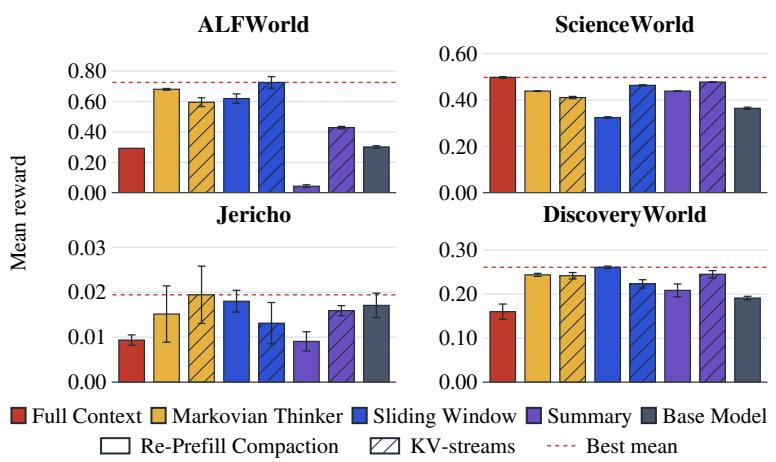

B  
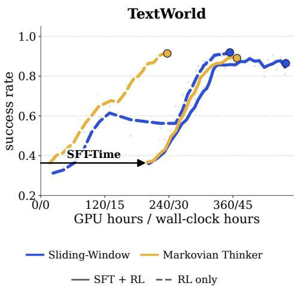  
Figure 7: (A) Transfer of TextWorld-trained checkpoints to other environments. Bars show mean reward and whiskers show the standard deviation across evaluation seeds. (B) An SFT warm-start does not pay for itself once its cost is counted. TextWorld success rate against GPU hours, as in Figure 4, for Sliding-Window and Markovian Thinker with KV-streams, with an SFT warm-start followed by RL (SFT + RL, solid) and RL only (dashed). SFT + RL curves start after the GPU hours spent on SFT (SFT-Time arrow). The SFT loss is in Appendix C.2.

RL enables information leakage through KVs. In the first task the model must retrieve the evicted assignment from a list of five candidate fruits, one of which is the assignment. Because the list always contains the answer, random sampling under RL produces some successes from the start, and the model can bootstrap from them. Figure 8A illustrates the setup and reports the results. As the KV-cache budget grows, recall rises to 100% and matches SFT. It becomes unreliable only at the smallest budgets of 16 and 32 tokens. KV-streams therefore learns to carry the assignment forward through RL alone, without an SFT stage. While this result is sufficient to show that information can be leaked through KVs alone, it is restricted in the setting that it could overfit to the specific use case making things less reliable, as well as the support between the model with evicted context and unevicted context always had overlap, i.e., the both full context and evicted had sufficient probability over the assigned fruit.

KV-streams generalizes across contexts. To test whether the information carried in the KV-cache is overfit to the training context, we modify the task. We take the model trained to recall fruits and ask it to recall an actor instead. Figure 8B shows the results. RL and SFT perform similarly at larger token budgets, and RL trails at smaller ones. Given a sufficient KV-token budget, KV-streams trained with SFT and with RL generalizes beyond the training domain.

KV-streams enables recall of objects with zero initial support. Finally, we test whether RL can teach the model to recall an object it would never sample once the assignment turn is evicted. We assign one of six objects at random, five fruits and a television, but at recall we list only the five fruits as options. The base model therefore places almost no probability on the television and would not sample it on its own. A model with full context, by contrast, can always recall that it was assigned the television. This lets us test whether information carried in the KV-cache can align the compacted model’s distribution with the full-context one, bringing in a token that would otherwise never be sampled. SFT has no difficulty here by construction, since it forces the target response. Figure 8C shows that RL learns this behaviour as well, and as the KV-token budget grows it recalls the television 100% of the time. Even in this hardest case, RL alone aligns the compacted distribution with that of full context.

Overall, our empirical and synthetic experiments show that RL alone is enough for the model to carry information forward through the KV-cache, given sufficient KV-cache capacity, and that no expensive SFT stage is needed. This broadens the applicability of KV-streams. It becomes a plug-and-play mechanism that can be added at post-training without any additional pipeline stage.

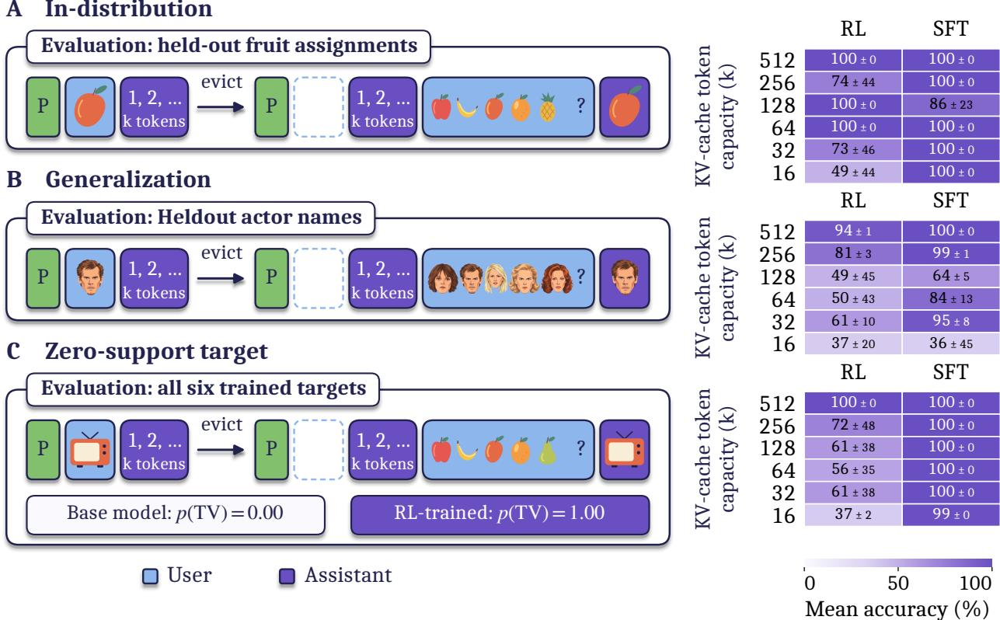  
Figure 8: Post-eviction retrieval in-distribution (A), on new names (B), and with TV trained but unlisted (C). Heatmaps show RL and SFT accuracy (mean ± SD over three seeds) at the best learning rate per condition. Panel C covers all trained targets; its inset compares empirical TV-answer probabilities in the initial and final training batches of an RL run. Icons represent text targets.

## 7 Related Work

Many methods keep long-context generation affordable by capping how much each new token can cost. Some rewrite the model itself, as in recurrent and state-space architectures, which hold cost flat but only after the model is retrained to use them (Gu & Dao, 2024; Yang et al., 2025; Fu et al., 2025). Transformer-XL carries hidden states between segments (Dai et al., 2019), while Compressive Transformer compresses older memories for subsequent attention (Rae et al., 2020). GTrXL adapts Transformer-XL for stable reinforcement learning in memory-dependent environments (Parisotto et al., 2020).

Others leave the pretrained model untouched and simply hold the context to a fixed size, most often by summarizing old turns or keeping the most recent ones (Wu et al., 2026b; Li et al., 2026b). The second family is convenient but pays a hidden tax, since every time the budget is hit the window is torn down and rebuilt, and the same tokens are pushed through the model again (Cim et al., 2026; Aghajohari et al., 2026; Kontonis et al., 2026; Wu et al., 2026a). That repeated work is the prefill cost we study in Section 2, and it is what makes these runs jagged and starves the GPU. KV-streams targets this tax directly. We retain whatever the strategy chooses to keep, but rather than rebuild the window we drop the evicted keys and values inside the inference engine and mirror that drop in the trainer with an attention mask. The upshot is a smooth, steady cost per token that does not depend on which compaction rule is in play, close in spirit to schemes like attention sinks (Xiao et al., 2024) that sidestep rebuilding but without committing to one fixed retention pattern. In concurrent work, sliding windows over the KV cache have also been shown to be an efficient alternative for long generations, for test-time scaling (Muennighoff et al., 2026) and against linear attention (Jolicoeur-Martineau et al., 2026). KV-streams is complementary, since it applies to any compaction strategy and removes the re-prefill cost of training it with RL. Inference-time cache eviction is also studied by $_ \mathrm { H _ { 2 } O }$ , which retains recent and high-attention tokens (Zhang et al., 2023), and TOVA, which interprets Transformers as multi-state RNNs and bounds their state through KV-cache compression (Oren et al., 2024). Our focus is on efficient agentic RL training that reproduces the inference-time eviction pattern.

A related line of work trains the model to manage its own context, so that the content surviving a compaction is itself learned, as a generated summary in some methods and as a compact memory state in others (Yan et al., 2026b,a; Zhou et al., 2026; Li et al., 2026b; Lu et al., 2025). These methods decide what to keep, and they all rebuild the window after each compaction, so the retained content is prefilled again and the training cost we study applies to them unchanged. KV-streams is orthogonal to this choice. It does not propose a new compaction rule and instead makes any rule cheaper to train, so these learned strategies could run on top of it.

AutoCompressors adapt pretrained language models to compress context into learned summary vectors used as soft prompts (Chevalier et al., 2023). For multi-turn agents, summarization-based context management can also be optimized jointly with tool use through RL (Lu et al., 2025).

## 8 Conclusion

We introduce KV-streams, a plug-and-play mechanism that is compatible with any compaction strategy. We show that by avoiding the repeated prefill cost, KV-streams substantially reduces experiment wall-time, providing up to a 3× speedup while often improving performance and at worst not hindering it. Further, we show that streamed KVs can act as a pseudo-recurrent state, carrying forward information that has long been removed from the context. Unlike prior work, we show that prior SFT is not a prerequisite for this effect to occur, which greatly simplifies the adoption of KV-streams. Overall, we show that KV-streams is a simple and effective way to substantially increase experiment throughput.

## AI Use Statement

In this work, we used generative AI tools to assist with manuscript drafting and editing, data analysis and plotting code, and the creation and refinement of figures, diagrams, and illustrative icons. We have reviewed all AI-assisted work and take responsibility for the final content, including text, claims, code, and visual artifacts.

## Acknowledgments

We thank the Mila IDT team for their support with the compute infrastructure used in this work. We thank Amirhossein Kazemnejad for their constructive feedback on the project. EP acknowledges the support of the NSERC PGS-D grant and the Bourse en intelligence artificielle provided by Université de Montréal. LC recognizes the support of NSERC, the Canada CIFAR AI Chair Program, the Canada First Research Excellence Fund and IVADO. GL and GB acknowledge the support of the Canada CIFAR AI Chair Program.

## References

Milad Aghajohari, Kamran Chitsaz, Amirhossein Kazemnejad, Sarath Chandar, Alessandro Sordoni, Aaron Courville, and Siva Reddy. The markovian thinker: Architecture-agnostic linear scaling of reasoning. In The Fourteenth International Conference on Learning Representations, 2026. URL https://openreview.net/forum?id= 3As6AQ9ELI.

Ibragim Badertdinov, Alexander Golubev, Maksim Nekrashevich, Anton Shevtsov, Simon Karasik, Andrei Andriushchenko, Maria Trofimova, Daria Litvintseva, and Boris Yangel. Swe-rebench: An automated pipeline for task collection and decontaminated evaluation of software engineering agents. Advances in Neural Information Processing Systems, 38, 2026.

Kaiwen Chen, Xin Tan, Jingzong Li, and Hong Xu. Libra: Efficient resource management for agentic rl post-training, 2026. URL https://arxiv.org/abs/2606.03077.

Alexis Chevalier, Alexander Wettig, Anirudh Ajith, and Danqi Chen. Adapting language models to compress contexts. In Houda Bouamor, Juan Pino, and Kalika Bali (eds.), Proceedings ofthe 2023 Conference on Empirical Methods in Natural Language Processing, pp. 3829–3846, Singapore, December 2023. Association for Computational Linguistics. doi: 10.18653/v1/2023.emnlp-main.232. URL https://aclanthology.org/2023.emnlp-main.232/.

Musa Cim, Burak Topcu, Chita Das, and Mahmut Taylan Kandemir. Parallel context compaction for long-horizon llm agent serving, 2026. URL https://arxiv.org/abs/2605.23296.

Marc-Alexandre Côté, Ákos Kádár, Xingdi Yuan, Ben Kybartas, Tavian Barnes, Emery Fine, James Moore, Matthew Hausknecht, Layla El Asri, Mahmoud Adada, Wendy Tay, and Adam Trischler. Textworld: A learning environment for text-based games. In Tristan Cazenave, Abdallah Saffidine, and Nathan Sturtevant (eds.), Computer Games, pp. 41–75, Cham, 2019. Springer International Publishing. ISBN 978-3-030-24337-1.

Christopher Zhang Cui, Xingdi Yuan, Ziang Xiao, Prithviraj Ammanabrolu, and Marc-Alexandre Côté. Tales: Text adventure learning environment suite, 2025. URL https://arxiv.org/abs/2504.14128.

Zihang Dai, Zhilin Yang, Yiming Yang, Jaime Carbonell, Quoc Le, and Ruslan Salakhutdinov. Transformer-XL: Attentive language models beyond a fixed-length context. In Anna Korhonen, David Traum, and Lluís Màrquez (eds.), Proceedings ofthe 57th Annual Meeting ofthe Associationfor Computational Linguistics, pp. 2978–2988, Florence, Italy, July 2019. Association for Computational Linguistics. doi: 10.18653/v1/P19-1285. URL https: //aclanthology.org/P19-1285/.

Zichuan Fu, Wentao Song, Yejing Wang, Xian Wu, Yefeng Zheng, Yingying Zhang, Derong Xu, Xuetao Wei, Tong Xu, and Xiangyu Zhao. Sliding window attention training for efficient large language models, 2025. URL https://arxiv.org/abs/2502.18845.

Albert Gu and Tri Dao. Mamba: Linear-time sequence modeling with selective state spaces. In First Conference on Language Modeling, 2024. URL https://openreview.net/forum?id=tEYskw1VY2.

Matthew Hausknecht, Prithviraj Ammanabrolu, Marc-Alexandre Côté, and Xingdi Yuan. Interactive fiction games: A colossal adventure. In Proceedings ofthe AAAI Conference on Artificial Intelligence, volume 34, 2020.

Peter Jansen, Marc-Alexandre Côté, Tushar Khot, Erin Bransom, Bhavana Dalvi Mishra, Bodhisattwa Prasad Majumder, Oyvind Tafjord, and Peter Clark. Discoveryworld: A virtual environment for developing and evaluating automated scientific discovery agents. In A. Globerson, L. Mackey, D. Belgrave, A. Fan, U. Paquet, J. Tomczak, and C. Zhang (eds.), Advances in Neural Information Processing Systems, volume 37, pp. 10088–10116. Curran Associates, Inc., 2024. doi: 10.52202/079017-0324. URL https://proceedings.neurips.cc/paper\_files/paper/2024/ file/13836f251823945316ae067350a5c366-Paper-Datasets\_and\_Benchmarks\_Track.pdf.

Alexia Jolicoeur-Martineau, Rhea Sanjay Sukthanker, Pashmina Cameron, and Emy Gervais. Sliding-window beats linear attention, 2026. URL https://arxiv.org/abs/2608.28444.

Vasilis Kontonis, Yuchen Zeng, Shivam Garg, Lingjiao Chen, Hao Tang, Ziyan Wang, Ahmed Hassan Awadallah, Eric Horvitz, John Langford, and Dimitris Papailiopoulos. MEMENTO: Teaching LLMs to manage their context. In Third Conference on Language Modeling, 2026. URL https://openreview.net/forum?id=YaYiQDVsi0.

Woosuk Kwon, Zhuohan Li, Siyuan Zhuang, Ying Sheng, Lianmin Zheng, Cody Hao Yu, Joseph Gonzalez, Hao Zhang, and Ion Stoica. Efficient memory management for large language model serving with pagedattention. In Proceedings of the 29th Symposium on Operating Systems Principles, SOSP ’23, pp. 611–626, New York, NY, USA, 2023. Association for Computing Machinery. ISBN 9798400702297. doi: 10.1145/3600006.3613165. URL https://doi.org/10.1145/3600006.3613165.

Tianjian Li, Jingyu Zhang, William Jurayj, Xi Wang, Chuanyang Jin, Mehrdad Farajtabar, Eric Nalisnick, and Daniel Khashabi. Self-compacting language model agents, 2026a. URL https://arxiv.org/abs/2606.23525.

Yujiang Li, Zhenyu Hou, Yi Jing, Jie Tang, and Yuxiao Dong. Compactionrl: Reinforcement learning with context compaction for long-horizon agents, 2026b. URL https://arxiv.org/abs/2607.05378.

Miao Lu, Weiwei Sun, Weihua Du, Zhan Ling, Xuesong Yao, Kang Liu, and Jiecao Chen. Scaling llm multi-turn rl with end-to-end summarization-based context management, 2025. URL https://arxiv.org/abs/2510.06727.

Niklas Muennighoff, Zhengyang Wang, Zeyi Chen, Weijia Shi, Binyuan Hui, John Yang, Dapeng Jiang, Mika Senghaas, Fares Obeid, Johannes Hagemann, Sami Jaghouar, Ludwig Schmidt, Percy Liang, Jason Wei, Andrew Y. Ng, Luke Zettlemoyer, Yejin Choi, and Mike Lewis. Prefix sliding for efficient test-time scaling, 2026. URL https://arxiv.org/abs/2608.26070.

OpenAI. Introducing SWE-bench verified. OpenAI announcement, August 2024. URL https://openai.com/ index/introducing-swe-bench-verified/.

Matanel Oren, Michael Hassid, Nir Yarden, Yossi Adi, and Roy Schwartz. Transformers are multi-state RNNs. In Yaser Al-Onaizan, Mohit Bansal, and Yun-Nung Chen (eds.), Proceedings of the 2024 Conference on Empirical Methods in Natural Language Processing, pp. 18724–18741, Miami, Florida, USA, November 2024. Association for Computational Linguistics. doi: 10.18653/v1/2024.emnlp-main.1043. URL https://aclanthology.org/2024. emnlp-main.1043/.

Charles Packer, Sarah Wooders, Kevin Lin, Vivian Fang, Shishir G. Patil, Ion Stoica, and Joseph E. Gonzalez. Memgpt: Towards llms as operating systems, 2024. URL https://arxiv.org/abs/2310.08560.

Emilio Parisotto, Francis Song, Jack Rae, Razvan Pascanu, Caglar Gulcehre, Siddhant Jayakumar, Max Jaderberg, Raphaël Lopez Kaufman, Aidan Clark, Seb Noury, Matthew Botvinick, Nicolas Heess, and Raia Hadsell. Stabilizing transformers for reinforcement learning. In Hal Daumé III and Aarti Singh (eds.), Proceedings ofthe 37th International Conference on Machine Learning, volume 119 of Proceedings ofMachine Learning Research, pp. 7487–7498. PMLR, 13–18 Jul 2020. URL https://proceedings.mlr.press/v119/parisotto20a.html.

Alexandre Piché, Ehsan Kamalloo, Rafael Pardinas, Xiaoyin Chen, and Dzmitry Bahdanau. PipelineRL: Faster on-policy reinforcement learning for long sequence generation. Transactions on Machine Learning Research, 2026. ISSN 2835-8856. URL https://openreview.net/forum?id=A35ak14Cyp.

Jack W. Rae, Anna Potapenko, Siddhant M. Jayakumar, Chloe Hillier, and Timothy P. Lillicrap. Compressive transformers for long-range sequence modelling. In International Conference on Learning Representations, 2020. URL https://openreview.net/forum?id=SylKikSYDH.

Mohit Shridhar, Xingdi Yuan, Marc-Alexandre Cote, Yonatan Bisk, Adam Trischler, and Matthew Hausknecht. {ALFW}orld: Aligning text and embodied environments for interactive learning. In International Conference on Learning Representations, 2021. URL https://openreview.net/forum?id=0IOX0YcCdTn.

Prime Intellect Team, Mika Senghaas, Fares Obeid, Sami Jaghouar, William Brown, Jack Min Ong, Daniel Auras, Matej Sirovatka, Jannik Straube, Andrew Baker, Sebastian Müller, Justus Mattern, Manveer Basra, Aiman Ismail, Dominik Scherm, Cooper Miller, Ameen Patel, Simon Kirsten, Mario Sieg, Christian Reetz, Kemal Erdem, Vincent Weisser, and Johannes Hagemann. Intellect-3: Technical report, 2025. URL https://arxiv.org/abs/2512.16144.

Dheeraj Vattikonda, Santhoshi Ravichandran, Emiliano Penaloza, Hadi Nekoei, Thibault de Chezelles, Megh Thakkar, Nicolas Gontier, Miguel Muñoz Mármol, Sahar Omidi Shayegan, Stefania Raimondo, Steve (Xue) Liu, Alexandre Drouin, Alexandre Piche, Alexandre Lacoste, and Massimo Caccia. How to train your llm web agent: A statistical diagnosis. In D. Belgrave, C. Zhang, H. Lin, R. Pascanu, P. Koniusz, M. Ghassemi, and N. Chen (eds.), Advances in Neural Information Processing Systems, volume 38, Main Conference, pp. 53256–53282. Curran Associates, Inc., 2025. doi: 10.52202/085713-1774. URL https://proceedings.neurips.cc/paper\_files/paper/2025/ file/4d239452d41ded07139801d7c966c629-Paper-Conference.pdf.

Ruoyao Wang, Peter Jansen, Marc-Alexandre Côté, and Prithviraj Ammanabrolu. Scienceworld: Is your agent smarter than a 5th grader?, 2022. URL https://arxiv.org/abs/2203.07540.

Yuyao Wang, Zhongjian Zhang, Mo Chi, Kaichi Yu, Yuhan Li, Miao Peng, Bing Tong, Chen Zhang, Yan Zhou, and Jia Li. Evomembench: Benchmarking agent memory from a self-evolving perspective. arXiv preprint arXiv:2605.18421, 2026.

Ian Wu, Yuxiao Qu, Amrith Setlur, and Aviral Kumar. Reasoning cache: Continual improvement over long horizons via short-horizon RL. In Forty-third International Conference on Machine Learning, 2026a. URL https:// openreview.net/forum?id=IpeH08AJ9P.

Xixi Wu, Kuan Li, Yida Zhao, Liwen Zhang, Litu Ou, Huifeng Yin, Zhongwang Zhang, Xinmiao Yu, Dingchu Zhang, Yong Jiang, Pengjun Xie, Fei Huang, Minhao Cheng, Shuai Wang, Hong Cheng, and Jingren Zhou. Resum: Unlocking long-horizon search intelligence via context summarization, 2026b. URL https://arxiv.org/abs/2509.13313

Guangxuan Xiao, Yuandong Tian, Beidi Chen, Song Han, and Mike Lewis. Efficient streaming language models with attention sinks, 2024. URL https://arxiv.org/abs/2309.17453.

Yuchen Yan, Liang Jiang, Jin Jiang, Shuaicheng Li, Zujie Wen, Zhiqiang Zhang, Jun Zhou, Jian Shao, Yueting Zhuang, and Yongliang Shen. Inftythink+: Effective and efficient infinite-horizon reasoning via reinforcement learning, 2026a. URL https://arxiv.org/abs/2602.06960.

Yuchen Yan, Yongliang Shen, Yang Liu, Jin Jiang, Mengdi Zhang, Jian Shao, and Yueting Zhuang. Inftythink: Breaking the length limits of long-context reasoning in large language models. In The Fourteenth International Conference on Learning Representations, 2026b. URL https://openreview.net/forum?id=T1h5em349L.

Songlin Yang, Jan Kautz, and Ali Hatamizadeh. Gated delta networks: Improving mamba2 with delta rule. In The Thirteenth International Conference on Learning Representations, 2025. URL https://openreview.net/forum? id=r8H7xhYPwz.

Zhenyu Zhang, Ying Sheng, Tianyi Zhou, Tianlong Chen, Lianmin Zheng, Ruisi Cai, Zhao Song, Yuandong Tian, Christopher Ré, Clark Barrett, Zhangyang Wang, and Beidi Chen. H2o: heavy-hitter oracle for efficient generative inference of large language models. In Proceedings of the 37th International Conference on Neural Information Processing Systems, NIPS ’23, Red Hook, NY, USA, 2023. Curran Associates Inc.

Jiale Zhao, Guoxin Chen, Fanzhe Meng, Minghao Li, Jie Chen, Hui Xu, Yongshuai Sun, Wayne Xin Zhao, Ruihua Song, Yuan Zhang, et al. Immersion in the github universe: Scaling coding agents to mastery. arXiv preprint arXiv:2602.09892, 2026.

Zijian Zhou, Ao Qu, Zhaoxuan Wu, Sunghwan Kim, Alok Prakash, Daniela Rus, Bryan Kian Hsiang Low, and Paul Pu Liang. MEM1: Learning to synergize memory and reasoning for efficient long-horizon agents. In The Fourteenth International Conference on Learning Representations, 2026. URL https://openreview.net/forum? id=XY8AaxDSLb.

## A Broader Impacts

KV-streams lowers the cost of training long-running agents by reducing repeated prefill. These savings may also make harmful or unauthorized automation cheaper. Agents handling sensitive information still need access controls, monitoring, and secure data handling. We release no new pretrained models or datasets. KV-streams does not replace the safety policies, permissions, or privacy protections of the underlying models and environments.

## B Training and Implementation Details

## B.1 Hyperparameters and Rollout Settings

Table 1 lists the shared hyperparameters for each benchmark. Text-based games use prime-RL with vLLM; softwareengineering tasks use Slime with SGLang. For each strategy, rollout concurrency is the same under re-prefill compaction and KV-streams (Table 2). Full context uses lower concurrency because long traces occupy more memory (Appendix B.2). The async level limits how many policy versions a rollout can lag behind the trainer; we drop rollouts that exceed the off-policy step limit.

<table><tr><td></td><td>TextWorld</td><td>ALFWorld</td><td>SWE</td></tr><tr><td>Model</td><td>Qwen3-4B-Instruct-2507</td><td>Qwen3-4B-Instruct-2507</td><td>Qwen3.5-4B</td></tr><tr><td>GPUs (inference / trainer)</td><td>4/4H100</td><td> $1 / 3 \mathrm { { A l 0 0 } }$ </td><td>4 / 4 GB200</td></tr><tr><td>Rollouts per prompt</td><td>8</td><td>8</td><td>8</td></tr><tr><td>Batch size (rollouts per step)</td><td>512</td><td>128</td><td>256</td></tr><tr><td>Gradient steps</td><td>500</td><td>200</td><td>200</td></tr><tr><td>Learning rate</td><td> $1 0 ^ { - 6 }$ </td><td> $1 0 ^ { - 6 }$ </td><td> $1 0 ^ { - 6 }$ </td></tr><tr><td>Weight decay</td><td>0.01</td><td>0.01</td><td>0.1</td></tr><tr><td>Adam  $( \beta _ { 1 } , \beta _ { 2 } )$ </td><td>(0.9,0.9)</td><td>(0.9,0.9)</td><td>(0.9,0.98)</td></tr><tr><td>Gradient norm clipping (max norm)</td><td>1.0</td><td>1.0</td><td>1.0</td></tr><tr><td>KL coefficient</td><td>0.001</td><td>0.001</td><td>0.001</td></tr><tr><td>Sampling temperature</td><td>1.0</td><td>1.0</td><td>1.0</td></tr><tr><td>Max tokens per turn</td><td>1,024</td><td>1,024</td><td>8,192</td></tr><tr><td>Sequence budget (tokens)</td><td>32k</td><td>16k</td><td>64k</td></tr><tr><td>Max turns per episode</td><td>200</td><td>100</td><td>100</td></tr><tr><td>Compaction interval (turns)</td><td>10</td><td>10</td><td>30</td></tr><tr><td>KV block size (tokens)</td><td>16</td><td>16</td><td>1</td></tr><tr><td>Async level / off-policy steps</td><td>1/3</td><td>1/3</td><td>1/2</td></tr><tr><td>Evaluation interval (steps)</td><td>15</td><td>20</td><td>20</td></tr><tr><td>Evaluation set</td><td>256 games</td><td>70 seen + 67 unseen</td><td>SWE-bench Verified</td></tr></table>

Table 1: Hyperparameters shared by all runs within each benchmark. Compaction strategy and rollout concurrency vary between runs (Table 2).

<table><tr><td></td><td>TextWorld</td><td>ALFWorld</td><td>SWE</td></tr><tr><td>Summary</td><td>48 (192)</td><td>64 (64)</td><td></td></tr><tr><td>Sliding-Window</td><td>48 (192)</td><td>64 (64)</td><td>70 (280)</td></tr><tr><td>Markovian Thinker</td><td>48 (192)</td><td>64 (64)</td><td>68 (272)</td></tr><tr><td>Markovian Picker</td><td>48 (192)</td><td>64 (64)</td><td></td></tr><tr><td>Full context</td><td>12 (48)</td><td>16 (16)</td><td>28 (112)</td></tr></table>

Table 2: Concurrent rollouts per inference GPU for each strategy, with the total across GPUs in parentheses. Settings are the same for re-prefill compaction and KV-streams.

## B.2 Concurrency Sweep

We sweep rollout concurrency in vLLM on a node with four A100 (80GB) GPUs, comparing full context with slidingwindow KV-streams (Figure 9). Full-context throughput falls above 12 concurrent rollouts per GPU, while KV-streams sustains higher concurrency. This motivates the lower concurrency used for full context (Table 2).

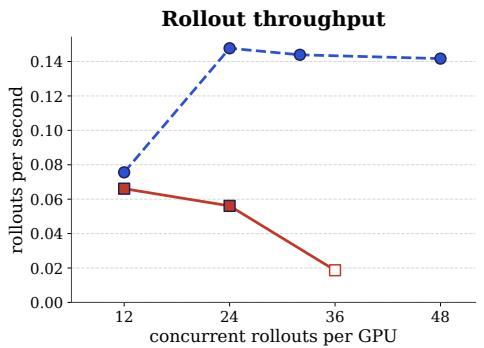

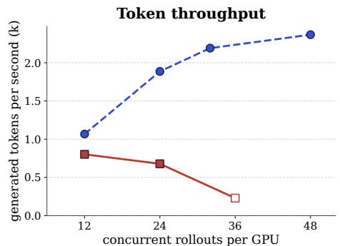  
Full context KV-streams (10-turn window) KV cache full (preemptions)

Figure 9: Sampling throughput against the number of concurrent rollouts per GPU on TextWorld, measured once 512 rollouts have completed. Left: rollouts per second. Right: generated tokens per second. KV-streams uses a sliding window of 10 turns. Hollow markers denote settings where the KV cache fills and vLLM preempts requests.

## B.3 vLLM Block Padding

Our vLLM configuration commits only complete 16-token blocks to the prefix cache. A partial block must be recomputed on the next request. We pad each turn to a multiple of 16 tokens so that KV-streams can reuse all of its KVs. The token counts in Figure 4 include this padding. SGLang uses a block size of 1 and needs no padding.

## B.4 Turn-Wise Compaction

In the agentic experiments, compaction removes whole turns, including their <|im\_start|> and <|im\_end|> tags. This preserves the boundaries of the remaining messages. The retained length r counts tokens in the retained turns and any generated summary (Section 2).

Token-level eviction produced degenerate text in our initial experiments. The model required substantial SFT before its generations began to improve. We suspect that removing message-boundary tokens disrupts the format learned during pre- and mid-training. Evicting complete turns caused no such instability in the initial responses, so we use turn-wise compaction in the agentic experiments. It gives less precise control over context length and per-trace memory use. Training with token-level eviction masks during mid-training may allow finer-grained eviction.

## C Additional Training Results

## C.1 Full Training Curves

Figures 10 and 11 extend the training and timing curves to each run’s last checkpoint, including runs stopped after exceeding the full-context wall-clock time. Summary and Sliding-Window with re-prefill compaction exceed this budget and have longer step times. Figure 12 plots mean training reward and evaluation success rate by gradient step.

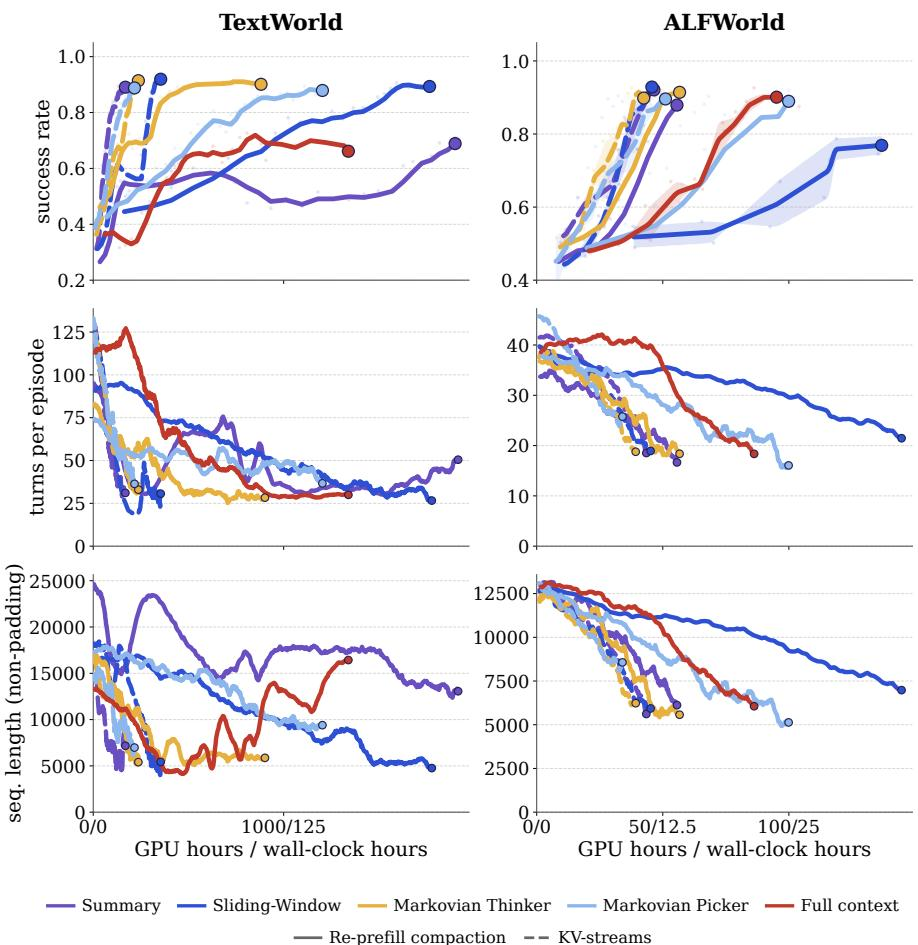  
Figure 10: Training curves through each run’s last checkpoint (dot). Summary and Sliding-Window with re-prefill compaction exceed the full-context compute budget. The lower rows show smoothed mean turns per episode and rollout length, excluding padding.

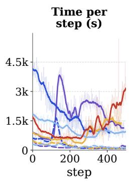

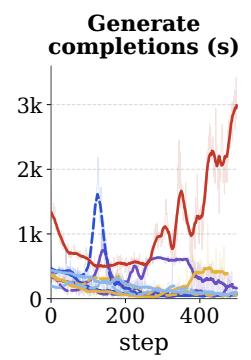

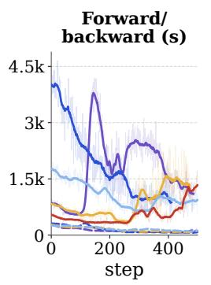

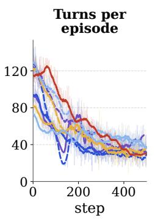  
Re-prefill compaction KV-streams  
Summary Sliding-Window Markovian Thinker Markovian Picker Full context

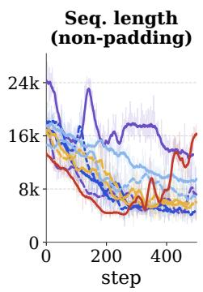  
Figure 11: Per-step timing and rollout statistics, including Summary and Sliding-Window with re-prefill compaction.

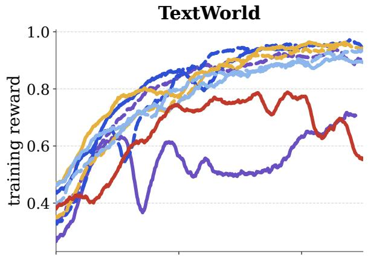

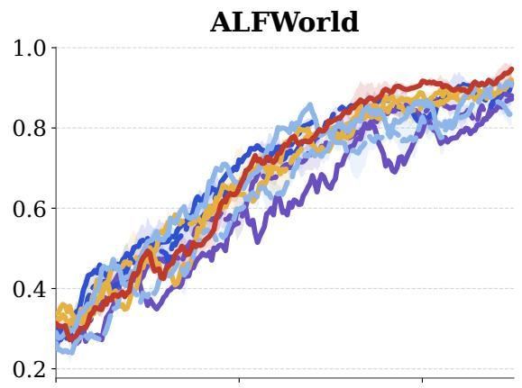

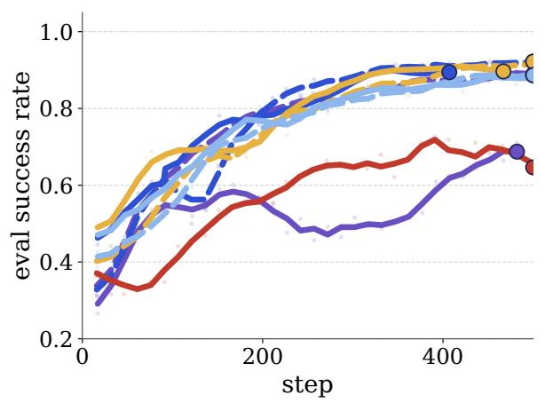

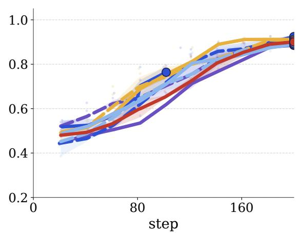  
Re-prefill compaction KV-streams

Figure 12: Training curves by gradient step on TextWorld (left) and ALFWorld (right). Top: smoothed mean training reward. Bottom: evaluation success rate, with faint points for individual evaluations. Multi-seed curves show the per-step mean and shaded seed range. Solid: re-prefill compaction; dashed: KV-streams.

## C.2 SFT Warm-Start Training Loss

The SFT warm-start in Section 6.1 uses 10k full-context trajectories from Qwen3-4B-Instruct-2507 and randomly sampled eviction attention masks. We train for 500 steps. Loss falls quickly over the first 50 steps, then decreases more slowly (Figure 13).

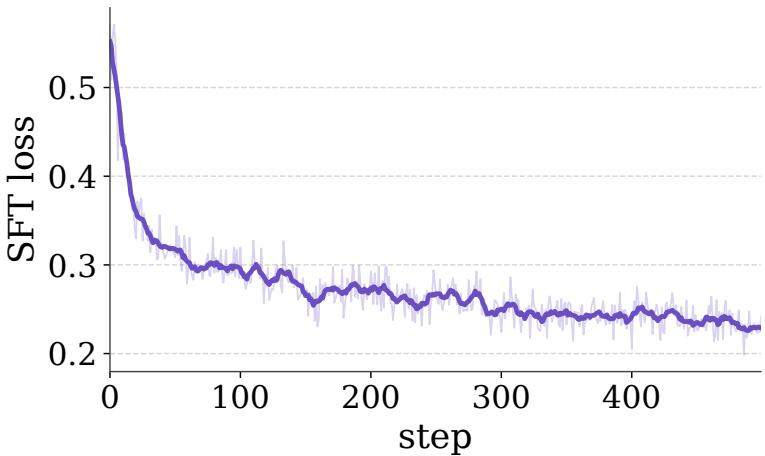  
Figure 13: SFT warm-start loss by optimizer step. The faint line shows per-step loss; the bold line shows a centered 9-step rolling mean.

## D Controlled Retrieval Protocol

## D.1 Task Setup

Assignment. We assign the model one of five fruits: apple, banana, mango, orange, or pineapple. The assignment prompt lists all five candidates and asks the model to reply “Assignment acknowledged.” without repeating the fruit We evaluate on 200 held-out trials, balanced at 40 trials per fruit.

KV-cache token capacity. The model then decodes space-separated ascending integers, such as “1 2 3 4 5 . . .”, without naming or paraphrasing a fruit or answering the retrieval question. We vary k over {16, 32, 64, 128, 256, 512} decoded tokens, not integers. This capacity counts only the sequence-token KVs; prompt and other token KVs are additional. We check that the retained sequence contains no candidate answer. All reported held-out trials pass this check.

Eviction and retrieval. We evict the assignment and acknowledgment as one turn and retain the decoded sequence and its KVs. The model then recalls its assigned fruit from the five candidates in the format “Recall: <fruit>”. We score the parsed answer by exact match and verify that eviction preceded the first answer token. With no assignment or candidate answer in the retained sequence, correct recall requires information carried forward in the KVs.

## D.2 Evaluation Conditions

Prompt generalization. We evaluate the five-fruit checkpoints with a different retrieval prompt and no further training (Figure 14B). The assignments, candidates, KV-cache token capacity, and eviction procedure are unchanged. In both prompts, [choices] is a shuffled, comma-separated list of the five fruits.

Training and in-distribution evaluation: “Which fruit were you assigned from these five fruits: [choices]? Respond with exactly ’Recall: <fruit>’, replacing <fruit> with the assigned fruit. Do not explain.”

Prompt-generalization evaluation: “What is your favourite object? Choose from these five options: [choices]. Respond with exactly ’Recall: <object>’, replacing <object> with one option. Do not explain.”

Zero-support target (TV). We train on six objects: apple, banana, mango, orange, pear, and television (Figure 14C). The assignment and retrieval prompts list only the five fruits, but TV assignments explicitly name television. Sequence generation and eviction are unchanged. Correct recall must recover the assigned object even when it is not listed. Evaluation uses 240 trials, balanced at 40 per object.

Generalization to actor names. We evaluate the five-fruit checkpoints on actor names without further training: Kathryn Erbe, Kevin Bacon, Naomi Watts, Nicole Kidman, and Toni Collette. The model decodes the sequence, then recalls the name after we evict the assignment turn. We evaluate with and without the five names listed as candidates, using 200 trials per condition, balanced at 40 per name. As in the fruit task, we reject sequences containing a candidate answer and score recall by exact match.

## D.3 Training Objectives

Training data and checkpoint selection. We train one model per objective and KV-cache token capacity $k \in$ {16, 32, 64, 128, 256, 512}. The five-fruit task has 1,000 training and 200 held-out assignments; the six-target TV task has 1,200 and 240. Both use 200 training and 40 held-out examples per target. RL, RFT, and SFT start from Qwen3-4B-Instruct and run for 100 updates. Self-distillation starts from the corresponding SFT checkpoint and runs for another 100 updates. We evaluate final checkpoints (Figure 14).

RL. We sample on-policy batches of 128 trajectories, with four rollouts per assignment, at temperature 1.0 and ${ \mathrm { t o p } } { - } p = 0 . 9 5$ . Reward is one for an exact post-eviction match with no candidate answer in the decoded sequence, and zero otherwise. The loss weights each generated response token’s negative log-probability by its trajectory’s advantage. The advantage uses a batch-wide leave-one-out baseline: the mean reward of the other 127 trajectories. If every answer in the batch is incorrect, the baseline is chance accuracy $( 1 / 5$ for five fruits and $1 / 6$ for the six-target TV task). We add no supervised target loss.

RFT. Rejection-sampling fine-tuning (RFT) uses the same sampling and reward as RL. It minimizes negative loglikelihood on generated response tokens from successful trajectories. Incorrect trajectories and those containing a candidate answer in the decoded sequence contribute no loss. RFT uses no leave-one-out advantage weighting. Both RL and RFT use AdamW with a constant learning rate of $5 \times 1 0 ^ { - 6 }$ , weight decay $0 . 0 1 , ( \beta _ { 1 } , \beta _ { 2 } ) = ( 0 . 9 , 0 . 9 5 )$ , and gradient-norm clipping at 1.0.

SFT. SFT demonstrations contain the assignment acknowledgment, a deterministic sequence of ascending integers truncated to k tokens, and the correct response Recall: <target>. We minimize teacher-forced cross-entropy on assistant tokens only, with the eviction mask blocking attention from the answer to the assignment turn. We use batches of 128, AdamW with zero weight decay, $( \beta _ { 1 } , \beta _ { 2 } ) = ( 0 . 9 , 0 . 9 5 )$ , and gradient-norm clipping at 1.0. The learning rate warms up for 20 updates to $1 0 ^ { - 5 }$ , then follows a cosine schedule to $1 0 ^ { - 6 }$

Self-distillation (SD). SD reuses the SFT demonstrations and adds a KL loss to supervised cross-entropy, each with coefficient 1.0. The student uses the eviction mask. The teacher is a full-context pass of the same current model, without gradients, and can attend to the assignment. We recompute the teacher distribution as training progresses. The KL loss approximates $D _ { \mathrm { K L } } ( p _ { \mathrm { s t u d e n t } } \Vert p _ { \mathrm { t e a c h e r } } )$ over the student’s top 100 vocabulary tokens at each assistant position, without renormalizing their probabilities. Optimizer and batch settings match SFT, except that the learning rate warms up for five updates to $5 \times 1 0 ^ { - 7 }$ and follows a cosine schedule to $1 0 ^ { - 7 }$

All four objectives use the same eviction mask: answer tokens can attend to the decoded sequence’s KVs but not to the assignment turn.

## D.4 Additional Retrieval Results

Figures 14 and 15 show mean accuracy over three seeds. For each condition, we select the learning rate with the highest mean among configurations with three completed seeds. All three seeds use that rate. Figure 8 uses the same selection rule for RL and SFT. For the TV task, accuracy is averaged over all six objects, not just TV trials.

## A In-distribution

<table><tr><td rowspan=1 colspan=4>RL    RFT    SFT    SD</td></tr><tr><td rowspan=1 colspan=1>100.0%512</td><td rowspan=1 colspan=1>100.0%512</td><td rowspan=1 colspan=1>100.0%512</td><td rowspan=1 colspan=1>100.0%512</td></tr><tr><td rowspan=1 colspan=1>74.3%256</td><td rowspan=1 colspan=1>73.3%256</td><td rowspan=1 colspan=1>100.0%256</td><td rowspan=1 colspan=1>100.0%256</td></tr><tr><td rowspan=1 colspan=1>100.0%128</td><td rowspan=1 colspan=1>74.2%128</td><td rowspan=1 colspan=1>86.5%128</td><td rowspan=1 colspan=1>98.5%128</td></tr><tr><td rowspan=1 colspan=1>100.0%64</td><td rowspan=1 colspan=1>74.3%64</td><td rowspan=1 colspan=1>100.0%64</td><td rowspan=1 colspan=1>100.0%64</td></tr><tr><td rowspan=1 colspan=1>73.3%32</td><td rowspan=1 colspan=1>73.3%32</td><td rowspan=1 colspan=1>100.0%32</td><td rowspan=1 colspan=1>100.0%32</td></tr><tr><td rowspan=1 colspan=1>48.7%16</td><td rowspan=1 colspan=1>22.0%16</td><td rowspan=1 colspan=1>99.7%16</td><td rowspan=1 colspan=1>99.8%16</td></tr><tr><td rowspan=1 colspan=4>0.0                 20.0</td></tr></table>

B Prompt generalization  
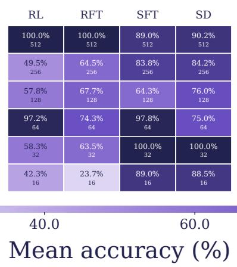

C Zero-support target
<table><tr><td rowspan=1 colspan=4>RL     RFT    SFT     SD</td></tr><tr><td rowspan=1 colspan=1>100.0%512</td><td rowspan=1 colspan=1>100.0%512</td><td rowspan=1 colspan=1>100.0%512</td><td rowspan=1 colspan=1>100.0%512</td></tr><tr><td rowspan=1 colspan=1>72.2%256</td><td rowspan=1 colspan=1>72.6%256</td><td rowspan=1 colspan=1>100.0%256</td><td rowspan=1 colspan=1>100.0%256</td></tr><tr><td rowspan=1 colspan=1>61.1%128</td><td rowspan=1 colspan=1>16.7%128</td><td rowspan=1 colspan=1>100.0%128</td><td rowspan=1 colspan=1>100.0%128</td></tr><tr><td rowspan=1 colspan=1>55.7%64</td><td rowspan=1 colspan=1>83.3%64</td><td rowspan=1 colspan=1>100.0%64</td><td rowspan=1 colspan=1>100.0%64</td></tr><tr><td rowspan=1 colspan=1>61.1%32</td><td rowspan=1 colspan=1>61.1%32</td><td rowspan=1 colspan=1>100.0%32</td><td rowspan=1 colspan=1>100.0%32</td></tr><tr><td rowspan=1 colspan=1>37.2%16</td><td rowspan=1 colspan=1>38.9%16</td><td rowspan=1 colspan=1>98.9%16</td><td rowspan=1 colspan=1>98.6%16</td></tr><tr><td rowspan=1 colspan=4>80.0               100.0</td></tr></table>

Figure 14: Mean post-eviction accuracy over three seeds: (A) in-distribution, (B) prompt generalization, and (C) a zero-support target (TV trained but unlisted). Panel C averages all six targets. Smaller cell labels give KV-cache token capacity k.

A Generalization with options  
B Generalization without options  
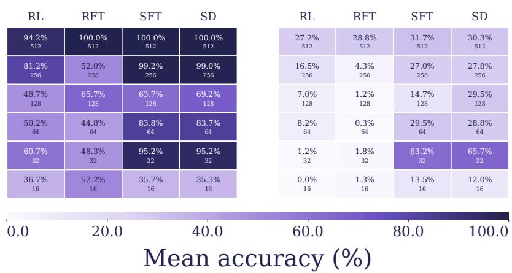  
Figure 15: Generalization to new actor names with (A) listed options and (B) no listed options. Cells show mean retrieval accuracy over three seeds; smaller labels give KV-cache token capacity k.

## E Prefill Token Cost

A rollout generates N tokens with compaction operator κ and token budget B. Each compaction retains $r = o + s$ tokens: overlap o and any generated summary s. Re-prefill compaction copies them into a new trace and prefills them again.

Number of compactions. After compaction, the context holds r tokens, leaving room for $b = B - r$ new tokens. Generating N tokens takes

$$
m \ : = \ : \frac { N } { b } \ : = \ : \frac { N } { B - r }
$$

compactions.

Prefill cost. Each compaction prefills the r retained tokens, adding a total token cost of

$$
\Delta _ { \mathrm { r e - p r e f i l l } } = m r = \frac { N r } { B - r } = \frac { N ( o + s ) } { B - ( o + s ) } .
$$

The cost diverges as r approaches B. It depends on the total retained length, not the split between overlap and summary. Retaining only a summary of length $s = B / 4$ gives $r = B / 4$ and $\Delta _ { \mathrm { r e - p r e f i l l } } = N / 3$ , regardless of B. KV-streams reuses the retained KVs, so $\Delta _ { \mathrm { r e - p r e f i l l } } = 0$