# LATENCY AND ACCURACY TRADEOFFS IN SPIKING NEURAL NETWORKS

Zhanglu Yan1, Zixuan Zhu1,3,4, Kaiwen Tang1,Yuyang Cai2, Qianhui Liu2, Weng-Fai Wong1

1Department of computer science, National University of Singapore

2School of Artificial Intelligence, Shandong University

3Shanghai Advanced Research Institute, Chinese Academy of Science

4University of Chinese Academy of Sciences, Beijing

## ABSTRACT

Spiking neural networks (SNNs) are attractive for low-power speech command recognition, yet their latency has received far less attention than their energy efficiency, and their multi-timestep execution is widely assumed to make them slower than quantized neural networks (QNNs). This paper challenges the assumption that more local timesteps necessarily imply higher network latency. By overlapping computation across adjacent layers at the timestep level, SNNs may complete execution in less time than comparable bit-serial QNNs. However, this overlap relies on spikes firing on incomplete inputs, and a spike once generated cannot be withdrawn, so its error persists and reduces accuracy. Waiting for more input before firing would seem to improve accuracy at the cost of reduced overlap. Yet we find and prove that this intuition fails at some layers, where even a small increase in waiting can change spike timing and downstream computation, making the network both slower and less accurate. We therefore propose a Pipeline Delay Search (PDS) method which selects each layer’s delay by balancing task-level accuracy gains against added network latency. We then adapt the selected configurations through spike-based quantization-aware training and bounded tuning of firing thresholds and initial membrane potentials. Together, these steps form Falcon, a framework for Fine-grained Analysis of Latency and CONtrolled firing which systematically analyzes and optimizes SNN latency under a spatial analog compute-in-memory mapping with shared digital engines. We evaluate Falcon on Google Speech Commands V2 (GSC) and Spiking Speech Commands (SSC), achieving competitive accuracies of 96.31% and 83.02% at modeled network-core latencies of 119.64 and 124.00µs, respectively. Together, our analysis and results show that SNNs can compute more yet finish faster, and wait longer yet predict worse, highlighting why Falcon matters for both latency and accuracy.

## 1 INTRODUCTION

Spiking neural networks (SNNs) have attracted growing interest in low-power keyword spotting and speech command recognition (Wang et al., 2024a; Yang et al., 2022). Their binary spike communication and event-driven computation offer opportunities to reduce computation and data-movement energy relative to quantized neural networks (QNNs) Yan et al. (2026a). Recent models, including SpikeSCR, SpikCommander, and SIDC-KWS (Wang et al., 2024a; 2026; Lim & Kim, 2025), report competitive recognition accuracy and promising energy efficiency. However, existing studies focus primarily on accuracy and energy efficiency, while their discussion of latency is largely limited to time-window length, leaving it unclear whether SNNs offer faster inference than QNNs.

In terms of processing rounds, SNNs seem to be at a disadvantage. For example, representing eight levels requires three bit-serial rounds in QNN but seven timesteps in a rated-based SNN. Assuming equal per-round latency, the SNN therefore takes longer to complete each layer. However, this does not necessarily increase end-to-end latency, which also depends on when the next layer can start. In the bit-serial QNN considered here, each output becomes available only after all three bi contributions are accumulated and the result is quantized. In contrast, integrate-and-fire (IF) neurons in SNN can emit and propagate spikes after processing only part of the input, without waiting for all seven timesteps to finish. Showing in Figure 1(a), the next layer can therefore process earlier timesteps while the preceding layer processes later ones. This cross-timestep pipelining, enabled by IF neurons, reduces inter-layer waiting, potentially allowing SNNs to achieve faster inference than the bit-serial QNN baseline despite longer per-layer latency.

a)  
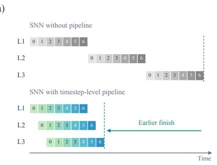  
b)

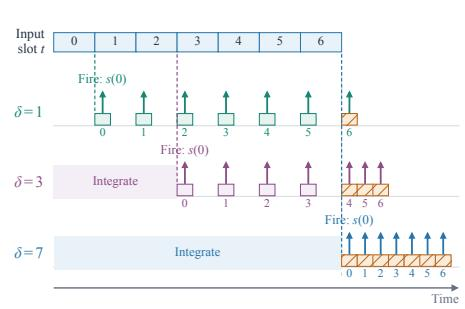  
Figure 1: Cross-timestep pipelining and firing delay in SNNs. (a) Different layers process different timesteps in parallel, allowing earlier completion. (b) Delay-controlled IF kernel with δ sets how many input slots are accumulated before the first firing decision.

However, this overlap can reduce accuracy because neurons may fire before all inputs arrive. Later inputs may cancel earlier contributions, but spikes already sent cannot be taken back and may already have affected the next layer. Waiting for more inputs therefore seems to offer a simple trade-off: larger latency but higher accuracy. However, we find and prove that preserving spike counts does not guarantee the same prediction: spike timing can change whether downstream neurons cross the firing threshold. Waiting longer can therefore make inference both slower and less accurate. Effective pipelining requires choosing which layers should wait, and for how long.

To address this challenge, we introduce Falcon, a framework for Fine-grained Analysis of Latency and CONtrolled firing. Falcon introduces a delay-controlled IF kernel (Figure 1(b)) that controls how much input is accumulated before each firing decision, enabling cross-timestep pipelining across convolutional, linear, and residual stages. Because suitable delays depend on the model and data, we propose Pipeline Delay Search (PDS) to choose where and how long to wait. With model parameters fixed, PDS evaluates layer-wise delay changes using validation accuracy and modeled core latency. Among the schedules found within the matched QNN latency budget, it selects Fastest for minimum latency, Accurate for maximum validation accuracy, and Balanced by maximizing normalized accuracy minus normalized latency. With the selected delays fixed, we adapt the network through quantization-aware training with a spiking forward pass and bounded tuning of firing thresholds and initial membrane potentials. Finally, we evaluate core inference latency under a spatial analog-CIM mapping with shared digital engines. We consider two model sizes, Falcon-Medium and Falcon-Large, with 3 and 5 Transformer blocks, respectively. Analog arrays execute static-weight convolutions and linear projections, while digital units handle input-dependent atten tion, neuron updates, and residual additions. We compute latency from analog readout and digital execution cycles, accounting for input dependencies, inter-layer waiting, and computation overlap.

We evaluate Falcon on Google Speech Commands v2 (GSC) and Spiking Speech Commands (SSC) (Warden, 2018; Cramer et al., 2022), comparing it with matched QNNs, Full-lookahead SNNs, and prior SNN methods. In the Full-lookahead setting, FALCON-Large achieves 96.91% test accuracy on GSC, while FALCON-Medium achieves 83.94% on SSC. For low-latency inference, Falcon-Medium with Balanced schedule achieves 96.31% accuracy on GSC at a modeled core latency of $1 1 9 . 6 4 \mu \mathrm { s }$ and 83.02% accuracy on SSC with latency of 124 µs. These results show that Falcon offers flexible accuracy–latency trade-offs, supporting both high-accuracy and low-latency SNN inference through delay-controlled firing.

## 2 PRELIMINARIES

Analog-CIM Execution Model: Analog compute-in-memory (CIM) performs vector–matrix multiplication within memory arrays. Weights are stored as cell physical states, and input drive the array rows. The resulting currents add along each column to form weighted sums, which analogto-digital converters (ADCs) convert into digital codes Xue et al. (2020); Ye et al. (2023). We define one analog cycle as one row-group evaluation and ADC conversion of the selected column outputs $t _ { \mathrm { c y c l e } } = t _ { \mathrm { s e t } } + t _ { \mathrm { A D C } } ,$ , where $t _ { \mathrm { s e t } }$ covers input setup and array settling, and $t _ { \mathrm { A D C } }$ is the time to complete one ADC conversion. Processing one input vector may require multiple analog cycles. Each crossbar tile contains $R _ { \mathrm { t i l e } }$ rows, and $N _ { \mathrm { a c t i v e } }$ rows can be activated at once. Shared ADCs also read the columns in $F _ { \mathrm { M U X } }$ sequential groups. For an input dimension $K _ { l }$ , with larger inputs split across parallel tiles, one complete analog pass requires

$$
N _ { \mathrm { c y c l e } , l } = \underbrace { \left[ \frac { \operatorname* { m i n } ( K _ { l } , R _ { \mathrm { t i l e } } ) } { N _ { \mathrm { a c t i v e } } } \right] } _ { \mathrm { r o w - a c t i v a t i o n ~ g r o u p s } } \underbrace { F _ { \mathrm { M U X } } } _ { \mathrm { c o l u m n - r e a d o u t ~ g r o u p s } } , \qquad \tau _ { l } = N _ { \mathrm { c y c l e } , l } t _ { \mathrm { c y c l e } } .
$$

Here, $\tau _ { l }$ is the time required for one analog pass. Each row-group and column-group combination incurs one analog cycle.

Local Cycles of QNNs and SNNs: We consider bit-serial QNN execution and SNN activations represented by spike counts. A bl-bit activation has $2 ^ { b _ { l } }$ levels, while $T _ { l }$ binary spike slots represent counts from 0 to Tl. Matching the number of levels gives $T _ { l } = 2 ^ { b _ { l } } - 1$ . Under the same weights, array mapping, and ADC precision, each bit plane or spike slot requires one analog pass. The local analog cycle counts are therefore $C _ { \mathrm { Q } } ^ { ( l ) } = b _ { l } N _ { \mathrm { c y c l e , \it l } }$ and $C _ { \mathrm { S } } ^ { ( l ) } = T _ { l } N _ { \mathrm { c y c l e , } l }$ , with execution times $b _ { l } \tau _ { l }$ and $T _ { l } \tau _ { l } .$ , respectively.

## 3 METHODS

## 3.1 DELAY-CONTROLLED IF KERNEL

Falcon enables cross-timestep pipelining through a delay-controlled integrate-and-fire (IF) kernel. A layer-specific delay determines how many input timesteps contribute to each firing decision. Each layer forwards its output spikes as they are generated, allowing downstream layers to process earlier timesteps while upstream layers continue processing later ones.

We first introduce the Delay-controlled IF kernel $\mathrm { S N } _ { \delta }$ . We assume that each IF layer processes T input slots and makes T firing decisions. Given input spikes $s _ { i } ^ { l - 1 } ( t ) \in \{ 0 , 1 \}$ , the normalized current to output neuron j in layer l is

$$
I _ { j } ^ { l } ( t ) = \gamma _ { j } ^ { l } \sum _ { i } w _ { i j } ^ { l } s _ { i } ^ { l - 1 } ( t ) ,\tag{1}
$$

where $w _ { i j } ^ { l }$ is the synaptic weight and $\gamma _ { j } ^ { l }$ is a fixed output scaling factor. A normalized static term $I _ { j , 0 } ^ { l }$ collects input-independent contributions and is distributed equally across the $T$ input slots. The membrane potential is initialized to $\begin{array} { r } { V _ { j } ^ { l } = \frac { 1 } { 2 } + \mu _ { j } ^ { l } } \end{array}$ , where $\mu _ { j } ^ { l }$ is the initial offset.

For output slot $t ,$ the firing delay $\delta ^ { l } \in \{ 1 , \ldots , T \}$ specifies the last required input slot:

$$
t _ { \mathrm { e } } = \operatorname* { m i n } ( t + \delta ^ { l } - 1 , T - 1 ) .\tag{2}
$$

The index $t _ { \mathrm { s } } ,$ initialized to zero, tracks the next unprocessed input slot. Before decision t, the neuron processes the required inputs in order. While $t _ { \mathrm { s } } \leq t _ { \mathrm { e } } .$ , it waits for input slot $t _ { \mathrm { s } }$ and updates

$$
V _ { j } ^ { l }  V _ { j } ^ { l } + \frac { I _ { j , 0 } ^ { l } } { T } + I _ { j } ^ { l } ( t _ { \mathrm { s } } ) , \qquad t _ { \mathrm { s } }  t _ { \mathrm { s } } + 1 .\tag{3}
$$

Once these inputs have been accumulated, the neuron makes its firing decision and applies soft reset:

$$
s _ { j } ^ { l } ( t ) = \mathbf { 1 } [ V _ { j } ^ { l } \geq \theta _ { j } ^ { l } ] , \qquad V _ { j } ^ { l }  V _ { j } ^ { l } - \theta _ { j } ^ { l } s _ { j } ^ { l } ( t ) ,\tag{4}
$$

where $\theta _ { j } ^ { l } \ > \ 0$ is the firing threshold. The neuron has no leakage and emits at most one spike per output slot. With $\delta ^ { l } = 1$ , each input slot is followed by a firing decision; with $\delta ^ { l } = T$ , all inputs are accumulated before the first decision. After all inputs have been processed, the remaining firing decisions use the stored membrane potential without adding further current. Output spikes are passed to downstream operators as they are generated. Algorithm 1 summarizes $\mathrm { S N } _ { \delta ^ { l } }$

Algorithm 1 Delay-controlled Rate-IF kernel $\overline { { \mathrm { S N } _ { \delta ^ { l } } } }$   
Require: Input spike slots $\{ \mathbf s ^ { l - 1 } ( t ) \} _ { t = 0 } ^ { T - 1 }$ ; current map in Eq. 1; static term $\mathbf { I } _ { 0 } ^ { l } ;$ delay $\delta ^ { l } \in$   
$\{ 1 , \ldots , T \}$ ; thresholds $\theta ^ { l } > 0 ;$ initial offsets $\mu ^ { l }$   
Ensure: Registered output slots $\{ \mathbf { s } ^ { l } ( t ) \} _ { t = 0 } ^ { T - 1 }$   
1: $\mathbf { V } ^ { l } \gets \frac { 1 } { 2 } \mathbf { 1 } + \pmb { \mu } ^ { l } ; t _ { \mathrm { s } } \gets 0 .$   
2: for $t = \mathbf { \bar { 0 } }$ to $\dot { T } - 1$ do   
3: $t _ { \mathrm { e } } \gets \operatorname* { m i n } ( t + \delta ^ { l } - 1 , T - 1 )$   
4: while $t _ { \mathrm { s } } \leq t _ { \mathrm { e } }$ do   
5: Wait until input slot $t _ { \mathrm { s } }$ is available.   
6: Compute $\mathbf { I } ^ { l } ( { \bar { t } } _ { \mathrm { s } } )$ using Eq. 1.   
7: $\mathbf { V } ^ { l } \xleftarrow { } \mathbf { V } ^ { l } + \mathbf { \widetilde { I } } _ { 0 } ^ { l ^ { \prime } } / T + \mathbf { \widetilde { I } } ^ { l ^ { \prime } } ( \dot { t } _ { \mathrm { s } } )$   
8: $t _ { \mathrm { s } } \gets t _ { \mathrm { s } } + 1$   
9: end while   
10: $\mathbf { s } ^ { l } ( t ) \gets \mathbf { 1 } [ \mathbf { V } ^ { l } \geq \pmb { \theta } ^ { l } ]$   
11: $\mathbf { V } ^ { l }  \mathbf { V } ^ { l }  \pmb { \theta } ^ { l } \odot \mathbf { s } ^ { l } ( t )$   
12: Register $\mathbf { s } ^ { l } ( t )$ as output slot t.   
13: end for   
14: return $\{ \mathbf { s } ^ { l } ( t ) \} _ { t = 0 } ^ { T - 1 }$

For network structure design, Falcon consists of an input spike encoder, a pipelined stem, and repeated Transformer blocks. Similar to SpikCommander and SpikeSCR (Wang et al., 2026; 2024a), we use a convolutional layer to generate input spikes. The encoder applies Conv–BN–spike encoding, to produce the input stream $\mathbf { S } _ { 0 }$ . The stem contains two convolutional and two linear IF stages:

$$
\begin{array} { r } { \mathbf { S } _ { i } = \mathrm { S N } _ { \delta _ { s i } } \left( \mathrm { B N } _ { i } ( \mathrm { C o n v } _ { i } ( \mathbf { S } _ { i - 1 } ) ) \right) , \quad i = 1 , 2 , } \\ { \mathbf { X } = \mathrm { S N } _ { \delta _ { s 4 } } ( \mathrm { S N } _ { \delta _ { s 3 } } ( \mathrm { R e s h a p e } ( \mathbf { S } _ { 2 } ) \mathbf { W } _ { P } ) \mathbf { W } _ { E } ) . } \end{array}\tag{5}
$$

Here, $\mathrm { S N } _ { \delta }$ denotes the IF kernel with firing delay δ. Operations on spike streams include the fixed scaling and static contributions defined above.

Each Transformer block computes Q/K/V projections in parallel. Q and K are quantized after accumulating the complete input window, while Value uses full-lookahead $\mathrm { I F } , \mathrm { S N } _ { T }$ . We replace softmax with ConSmax (Liu et al., 2024a), a hardware-friendly alternative that avoids maximum and sum reductions, allowing element-wise pipelined evaluation. For each head h, attention computes

$$
\mathbf { A } _ { h } = \mathcal { Q } _ { A } \left( \mathrm { C o n S m a x } \left( \frac { \mathbf { Q } _ { h } \mathbf { K } _ { h } ^ { \top } } { \sqrt { d _ { h } } } \right) \right) , \qquad \mathbf { C } = \mathrm { S N } _ { T } \left( \mathrm { C o n c a t } _ { h } ( \mathbf { A } _ { h } \widehat { \mathbf { V } } _ { h } ) \right) .\tag{6}
$$

where $d _ { h }$ is the head dimension and $\widehat { \mathbf { V } } _ { h }$ is decoded from the complete Value spike count. The attention quantizer $\mathcal { Q } _ { A }$ uses one scale shared across all heads. Each AV product starts when both operands are ready, and the resulting context passes through full-lookahead IF. The attention output projection and the two FFN layers each use the delay-controlled IF kernel. Residual connections after attention and the FFN combine scale-adjusted inputs from matching logical slots, followed by BN and IF. After the last block, spike counts are decoded, normalized, pooled, and passed to the classifier.

Static-weight convolutions and linear projections in the stem and Transformer blocks are mapped to analog CIM. After ADC conversion, digital units accumulate partial sums, apply fixed scaling, and perform IF updates, residual additions, and buffering. The input-dependent products $\mathbf { Q } \mathbf { K } ^ { \top }$ and AV are executed digitally along with ConSmax.

## 3.2 THEORY FOR DELAY IN SNNS

We study how firing delay affects local spike counts and network accuracy. For a fixed input-current stream, a larger delay cannot increase the count error relative to Full-lookahead. However, changes in spike timing can still reduce task accuracy, even when the final counts of the changed layer remain correct.

For the delay-controlled IF kernel in Algorithm 1, let $s _ { i } ^ { l } ( t ; \delta )$ denote the spike produced at output slot t when layer l uses delay δ. Define the final count and its error relative to Full-lookahead as

$$
\widehat { q } _ { j } ^ { l } ( \delta ) = \sum _ { t = 0 } ^ { T - 1 } s _ { j } ^ { l } ( t ; \delta ) , \qquad e _ { j } ^ { l } ( \delta ) = \left| \widehat { q } _ { j } ^ { l } ( \delta ) - \widehat { q } _ { j } ^ { l } ( T ) \right| .\tag{7}
$$

The reference $\widehat { q } _ { j } ^ { l } ( T )$ uses the same input currents, static term, threshold, and initial membrane potential.

Theorem 1. Fix the input-current stream and neuron parameters. For any $1 \leq \delta < \delta ^ { \prime } \leq T$ , the delay-controlled IF kernel satisfies

$$
0 \leq e _ { j } ^ { l } ( \delta ) - e _ { j } ^ { l } ( \delta ^ { \prime } ) \leq \delta ^ { \prime } - \delta , \qquad e _ { j } ^ { l } ( \delta ) \leq T - \delta .\tag{8}
$$

However, a delay change can preserve the final count while changing the output slots in which spikes occur. Downstream neurons receive these spikes in a different order, which can change their firing decisions. All other delays, weights, and neuron parameters remain fixed. Let $\mathrm { A c c } _ { \mathscr D } \bar { ( } \delta )$ denote its accuracy on a fixed labeled dataset D.

Proposition 1. There exist a fixed SNN, a fixed finite dataset D, and delays $1 \leq \delta _ { 1 } < \delta _ { 2 } < \delta _ { 3 } \leq T$ such that

$$
e _ { j } ^ { l } ( \delta ; x ) = 0
$$

for every neuron j in the changed layer, every $( x , y ) \in \mathcal { D } ,$ , and every $\delta \in \{ 1 , \ldots , T \}$ , but

$$
\operatorname { A c c } _ { \mathcal { D } } ( \delta _ { 1 } ) > \operatorname { A c c } _ { \mathcal { D } } ( \delta _ { 2 } ) < \operatorname { A c c } _ { \mathcal { D } } ( \delta _ { 3 } ) .\tag{9}
$$

Proof sketch: For Theorem 1, increasing δ by one replaces the earliest partial-input decision with a full-input decision at the end. The remaining decisions use the same input prefixes. This leaves the final count unchanged or moves it one spike toward the full-lookahead count. Repeating this step gives both bounds. For Proposition 1, we construct spike streams whose counts remain unchanged but whose spike positions shift with delay. Signed inputs to downstream neurons then cancel at different delays, changing their output counts. A fixed readout produces a correct, incorrect, and then correct prediction as delay increases. Full proofs are provided in Appendices D and E.

## 3.3 PIPELINE DELAY SEARCH

A larger delay can reduce local count error but still lower network accuracy. PDS therefore uses two greedy search paths to select layer-wise delay increases based on validation accuracy and modeled core latency within the QNN latency budget. Let B contain the IF stages after stem operations, attention output projections, FFN layers, and residual additions. PDS adjusts their delays $\delta \ =$ $( \delta ^ { l } ) _ { l \in B }$ while keeping model parameters and source encoding fixed. Q/K use the complete input window, and Value and Context keep Full-lookahead. The search targets higher accuracy within the matched QNN latency budget $L _ { \mathrm { Q } }$

For a change from $\delta$ to $\delta ^ { \prime } { } .$ , let R count validation predictions changed from wrong to correct, and H count those changed from correct to wrong. We compute the accuracy gain and rescue score as

$$
\Delta A = \frac { R - H } { | \mathcal { D } _ { \mathrm { v a l } } | } , \qquad S _ { \mathrm { r e s c u e } } = \frac { R - H } { \sqrt { R + H } } ,\tag{10}
$$

with $S _ { \mathrm { r e s c u e } } = 0$ when $R + H = 0$

A change is accepted here if:

$$
S _ { \mathrm { r e s c u e } } \geq \tau , \qquad \Delta A \geq \epsilon _ { \mathrm { a c c } } , \qquad L _ { \mathrm { D A G } } ( \delta ^ { \prime } ) < L _ { \mathrm { Q } } .\tag{11}
$$

We use $\tau = 2$ and $\epsilon _ { \mathrm { a c c } } = 0 . 0 0 1$ , corresponding to a minimum gain of 0.1 percentage points.

The change with the largest accuracy gain may also increase latency. PDS uses two search paths: one selects the largest accuracy gain, and the other selects the largest gain per added latency. Let $L ( \delta )$ be the network latency under schedule δ, and let $\Delta L = L ( \delta ^ { \prime } ) - \bar { L ( \delta ) }$ . The two scores are

$$
U _ { \mathrm { a c c } } = \Delta A , \qquad U _ { \mathrm { e f f } } = \left\{ \begin{array} { l l } { \Delta A / \Delta L , } & { \Delta L > 0 , } \\ { + \infty , } & { \Delta L \leq 0 . } \end{array} \right.\tag{12}
$$

PDS starts with delay one at every searchable IF stage. If candidate scores are equal, we choose the larger accuracy gain, then the smaller added latency. In our setting, algorithm 2 searches delays up to $\bar { \delta } _ { \mathrm { m a x } } = 3$ and updates candidate scores after each selected change.

Algorithm 2 Pipeline Delay Search (PDS)   
Require: Fixed model; $\mathcal { D } _ { \mathrm { v a l } } , B , \delta _ { \mathrm { m a x } } ;$ latency function L, budget $L _ { \mathrm { Q } } ; \tau , \epsilon _ { \mathrm { a c c } } .$   
Ensure: Fastest, Balanced, and Accurate schedules.   
1: Initialize $\delta ^ { ( 0 ) } = ( 1 , \ldots , 1 )$ , with one delay for each stage in $B .$   
2: ${ \mathcal { S } } \gets \{ \delta ^ { ( 0 ) } \}$   
3: for m ∈ {acc, ef} do   
4: $\delta \gets \delta ^ { ( 0 ) }$   
5: while true do   
6: Form candidates E by increasing one $\delta ^ { l }$ to each $d \in \{ \delta ^ { l } + 1 , \dots , \delta _ { \operatorname* { m a x } } \}$ , for every $l \in B .$   
7: Compare candidates with $\pmb { \delta }$ and keep those passing Eq. 11.   
8: $\mathbf { i f } \mathcal { E } = \boldsymbol { \mathcal { O } }$ then   
9: break   
10: end if   
11: Choose $\delta ^ { \prime } \in \mathcal { E }$ with the largest $U _ { m } .$   
12: $\delta  \delta ^ { \prime } .$   
13: ${ \mathcal { S } } \gets { \mathcal { S } } \cup \{ \delta \}$   
14: end while   
15: end for   
16: Remove a schedule from S if another is at least as accurate and at least as fast, with a strict   
improvement in one.   
17: return Fastest, Balanced, and Accurate from ${ \mathcal { S } } .$

From the remaining schedules in S, Fastest has the lowest latency and Accurate has the highest accuracy. To choose Balanced, we scale accuracy and latency separately to [0, 1] using their minimum and maximum values in S. We then subtract scaled latency from scaled accuracy and select the schedule with the highest score.

## 4 RESULTS

We evaluate Falcon on the 35-class Google Speech Commands v2 (GSC) and Spiking Speech Commands (SSC) benchmarks (Warden, 2018; Cramer et al., 2022). We use two model sizes, Falcon-Medium and Falcon-Large, with three and five Transformer blocks, respectively. Additional experimental details, including data preprocessing and model architectures, are provided in the Appendix.

Analog costs in Falcon are obtained from NeuroX, calibrated against measurements from a 1-Mb ReRAM CIM macro Zhu (2025); Xue et al. (2020). Digital latency is computed using cycle-based models at 100 MHz. Digital energy is evaluated separately using Design Compiler synthesis in a commercial 22-nm process at the TT corner, 0.65 V, and $\mathrm { \dot { 2 } 5 ^ { \circ } C }$ . Memory energy uses low-power memory-compiler configurations at the same corner. We combine operator times through the dependency graph rather than infer latency from operation counts alone. All reported latencies are modeled network-core latencies, from available source activations to the final Transformer block. Training runs on Ubuntu 24.04.4 LTS with two AMD EPYC 9355 CPUs, 1 TiB of RAM, and four NVIDIA RTX PRO 6000 Blackwell Server Edition GPUs with 96 GB each. We first train a QNN and transfer its weights to an SNN for inference, following prior QNN-to-SNN conversion methods (Tang et al., 2025; Yan et al., 2026b). The converted SNN serves as the starting point for further training.

## 4.1 MORE LOOKAHEAD DOES NOT GUARANTEE HIGHER ACCURACY

Figure 2(a–d) summarizes our delay ablations on Falcon-Large using GSC, with weights and neuron parameters fixed. In Figure 2(a), increasing the uniform delay from δ = 1 to 2 raises modeled core latency from 180.42 to 231.24 µs, and also lowers validation accuracy from 11.64% to 4.28%. More waiting can make inference both slower and less accurate. Figure 2(b) further examines the effect of increasing delay at each boundary. As Figure 2(a) shows, the matched-QNN latency lies between the SNN latencies with uniform delays of one and two, leaving limited room for added waiting. We therefore test single-boundary changes from $\delta = 1$ to 2 or 3, while keeping all other searchable delays at one. Figure 2(c) presents three representative cases. Using the screening criteria defined in the Section 3.3, we identify delay increases with sufficient task-level gains and highlight them in the green region of Figure 2(d). These criteria guide the Pipeline Delay Search described next.

a)  
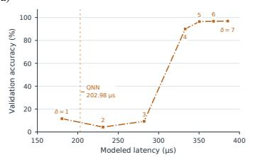

c)  
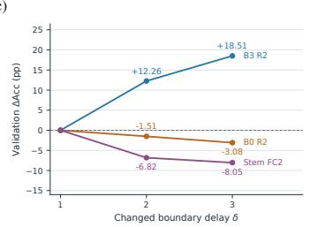

d)  
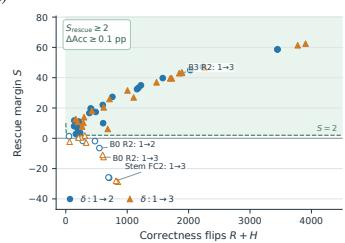

b)  
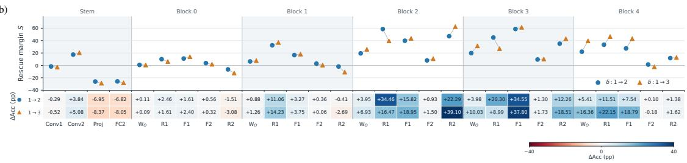  
Figure 2: Effects of firing delay on Falcon-Large accuracy and latency.(a) Accuracy and latency under uniform delays. (b) Layerwise accuracy changes for delay increases 1 → 2 and 1 → 3. (c) Three representative layer responses. (d) PDS candidate screening, with delay increases passing both score and accuracy-gain gates highlighted in green.

## 4.2 PIPELINE DELAY SEARCH AND ADAPTATION

Figure 3(a) shows the schedules selected by PDS before adaptation. On GSC with Falcon-Large, the two search paths evaluate 916 unique schedules. Fastest, Balanced, and Accurate reach validation accuracies of 11.64%, 73.28%, and 91.99% at 180.42, 184.24, and 201.16 µs, respectively. The configurations for all three schedules are provided in the Appendix B.2. To test whether delay placement matters, we compare each PDS schedule with ten random delay settings that use the same numbers of each delay value and have the same core latency. Figure 3(b) reports these frozen-model results. For example, at the Balanced latency, PDS reaches 73.28% validation accuracy, compared with $2 3 . 6 4 \pm 1 2 . 2 3 \%$ for random settings. Furthermore, even after training, models using PDSselected schedules maintain competitive accuracy than those using randomly selected schedules. Detailed experiments are presented in Appendix A.2.

Figure 3(c) shows the training process after delay search. The SNN is first trained for 30 epochs with spike-based QAT. The network weights are then fixed, and only the firing thresholds and initial membrane potentials are tuned for 15 epochs. Finally, the network weights and neuron parameter are jointly trained for another 10 epochs. This process increases validation accuracy from 11.64% to 95.88% for Fastest, from 73.28% to 96.17% for Balanced, and from 91.99% to 96.49% for Accurate.

a)  
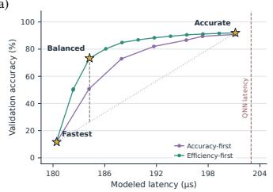

b)  
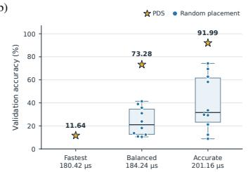

c)  
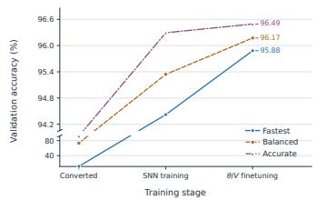  
Figure 3: Delay search and training of Falcon-Large on GSC. (a) Validation accuracy and latency of Fastest, Balanced, and Accurate before SNN training. (b) Comparison with ten random delay schedules at the same core latency before SNN training. (c) Validation accuracy at each SNN training stage.

## 4.3 FINAL ACCURACY AND LATENCY

Table 1 reports the final test accuracy and modeled core latency of FALCON-Medium on SSC and GSC, and Falcon-Large on GSC. The Fastest setting uses δ = 1 at all searchable IF stages. On GSC, FALCON-Medium in this setting achieves 96.11% accuracy at $1 1 5 . 8 2 \mu \mathrm { s } .$ , compared with 96.68% at $1 3 0 . 8 6 \mu \mathrm { s }$ for its matched QNN. This provides a 1.13× speedup with a 0.57-percentage-point accuracy loss. The Accurate setting reduces this gap to 0.29 percentage points at $1 2 9 . 0 4 \mu \mathrm { s } .$ On SSC, FALCON-Medium with the Balanced schedule achieves 83.02% accuracy at 124.00 µs. Compared with Fastest, it gains 1.78 percentage points with only 7.58 µs of additional latency, offering a favorable accuracy–latency trade-off while remaining faster than the matched QNN (83.97% at 131.46 µs). Full-lookahead configurations achieve higher accuracy at the cost of longer latency.

Table 1: Test accuracy and modeled network-core latency.
<table><tr><td></td><td colspan="2">SSC Falcon-Medium</td><td colspan="2">GSC Falcon-Medium</td><td colspan="2">GSC Falcon-Large</td></tr><tr><td>Configuration</td><td>Acc.(%)</td><td>latency(µs)</td><td>Acc.(%)</td><td>latency(µs)</td><td>Acc.(%)</td><td>latency(µs)</td></tr><tr><td>Matched QNN</td><td>83.97</td><td>131.46</td><td>96.68</td><td>130.86</td><td>96.92</td><td>202.98</td></tr><tr><td>Full-lookahead</td><td>83.94</td><td>253.04</td><td>96.68</td><td>252.44</td><td>96.91</td><td>385.44</td></tr><tr><td>PDS-Fastest</td><td>81.24</td><td>116.42</td><td>96.11</td><td>115.82</td><td>95.46</td><td>180.42</td></tr><tr><td>PDS-Balanced</td><td>83.02</td><td>124.00</td><td>96.31</td><td>119.64</td><td>96.19</td><td>184.24</td></tr><tr><td>PDS-Accurate</td><td>83.02</td><td>129.70</td><td>96.39</td><td>129.04</td><td>96.52</td><td>201.16</td></tr></table>

Tables 2 and 3 place these results alongside reported SNN speech-recognition results. On GSC, FALCON-Medium with the Balanced schedule achieves 96.31% accuracy with 0.82M parameters, exceeding the 96.08% reported by SpikeSCR while using 73.9% fewer parameters. Relative to their non-pipelined counterparts, the Medium and Large Balanced configurations reduce modeled core latency by 52.6% and 52.2%, respectively, with accuracy losses of 0.37 and 0.72 percentage points. These results show that the Balanced configurations achieve competitive recognition accuracy while more than halving modeled core latency.

## 5 DISCUSSION AND CONCLUSION

## 5.1 ENERGY AND THROUGHPUT DISCUSSION

Prior SNN studies commonly estimate energy by multiplying operation counts by fixed peroperation energy costs (Wang et al., 2024a; 2026). Following this convention, we first estimate Falcon’s arithmetic energy under a hypothetical all-digital implementation. We average operation counts over the complete GSC test set, including the input encoder and final classifier, and use precision-specific energy costs obtained from 22-nm RTL synthesis and simulation. Under this model, Falcon-Medium and Falcon-Large with the Balanced schedule require an estimated 0.01405 and 0.02135 mJ per inference, respectively. For reference, SpikCommander reports 0.028 and 0.042 mJ for its one- and two-block models (Wang et al., 2026).

Table 2: Comparison on GSC in terms of model size, accuracy, and latency. As most prior works do not report hardware latency, we reproduce the latency of several representative state-of-the-art SNN models with digital arrays of the same size of Falcon. Detailed implementations and latency reconstruction are provided in Appendix F. For Falcon, results are reported as Non-pipelined / Balanced.
<table><tr><td>Method</td><td>Params. (M)</td><td>Accuracy (%)</td><td>Latency (µs)</td></tr><tr><td>T-BSO Liang et al. (2025), Spiking VGG-11</td><td>9.23</td><td>96.12</td><td>1714.88</td></tr><tr><td>SpikeSCR Wang et al. (2024a), 1L-16-256 (short) SpikeSCR, 1L-16-256</td><td>1.63 1.63</td><td>94.71 95.90</td><td>278.47 468.11</td></tr><tr><td>SpikCommander Wang et al. (2026), 1L-16-256 SpikCommander, 2L-16-256 (short) SpikCommander, 2L-16-256</td><td>1.12 2.13 2.13</td><td>96.71 96.27 96.92</td><td>487.97 645.63 940.70</td></tr><tr><td>Falcon-Medium Falcon, Large</td><td>0.82 1.24</td><td>96.68 / 96.31 96.91/96.19</td><td>252.44/119.64 385.44/184.24</td></tr></table>

Table 3: Comparison with prior SNN speech-recognition methods. Falcon reports Full-lookahead (direct conversion) / PDS–Accurate.“–” denotes an unreported or unverified value.
<table><tr><td rowspan="2">Method / Configuration</td><td colspan="2">SSC</td><td colspan="2">GSC</td></tr><tr><td>Params. (M)</td><td>Accuracy (%)</td><td>Params. (M)</td><td>Accuracy (%)</td></tr><tr><td>DCLS-Delays, 2L-2KC (Hammouamri et al., 2024)</td><td>1.40</td><td>80.16 ± 0.09</td><td>1.40</td><td>95.00 ± 0.06</td></tr><tr><td>DCLS-Delays, 3L-2KC</td><td>2.50</td><td>80.69 ± 0.21</td><td>2.50</td><td>95.35 ± 0.04</td></tr><tr><td>d-cAdLIF (Deckers et al., 2024)</td><td>0.70</td><td>80.23 ± 0.07</td><td>0.61</td><td>95.69 ± 0.03</td></tr><tr><td>SNN-Delays+ TR/NAR (Zhang et al., 2024)</td><td>2.50</td><td>81.02</td><td>2.50</td><td>95.62</td></tr><tr><td>CADAD, 3L (Bai et al., 2026)</td><td>0.60</td><td>80.69 ± 0.24</td><td>0.60</td><td>95.58 ± 0.15</td></tr><tr><td>SE-adLIF, 2L (Baronig et al., 2025)</td><td>1.60</td><td>80.44 ± 0.26</td><td></td><td></td></tr><tr><td>SpikeSCR + KDCL, 2L-16-256 (Wang et al., 2024a)</td><td>3.15</td><td>83.69</td><td>3.15</td><td>96.08</td></tr><tr><td>SpikCommander, 1L-16-256 (Wang et al., 2026)</td><td>1.12</td><td>83.26</td><td>1.12</td><td>96.71</td></tr><tr><td>SpikCommander, 2L-16-256</td><td>2.13</td><td>83.49</td><td>2.13</td><td>96.92</td></tr><tr><td>SNN-KWS (Wang et al., 2024b)</td><td></td><td></td><td>0.0802</td><td>92.90</td></tr><tr><td>SIDC-KWS (Lim &amp; Kim, 2025)</td><td></td><td></td><td>0.4028</td><td>94.70</td></tr><tr><td>Spiking LMUFormer (Liu et al., 2024b)</td><td></td><td></td><td>1.69</td><td>96.12</td></tr><tr><td>Falcon-Medium</td><td>0.97</td><td>83.94 / 83.02</td><td>0.82</td><td>96.68 /96.39</td></tr><tr><td>Falcon-Large</td><td></td><td></td><td>1.24</td><td>96.91 / 96.52</td></tr></table>

However, operation-count estimates cover only arithmetic energy, excluding preprocessing, memory access, communication, and operations such as exponentiation and comparison. We therefore additionally evaluate data-dependent energy. For the analog part, we use NeuroX with hardware parameters matched to the 1-Mb ReRAM-based CIM macro Zhu (2025); Xue et al. (2020). Digital latency is computed using cycle-based models at 100 MHz. Digital energy settings and activity sources are detailed in Appendix A.3. Combining the analog and digital contributions yields modeled core energies of 0.75 and 1.06 mJ per inference for Falcon-Medium and Falcon-Large, respectively, under the Balanced schedule. We show the detailed breakdown in Appendix A.3.

Throughput measures the number of samples completed per unit time during continuous inference. By reducing idle time between layers, cross-timestep pipelining may allow the network to complete samples more frequently. Whether this benefit is realized depends on resource sharing, buffering, and the selected firing delays. In particular, increasing δ may add inter-layer waiting, but this reduces throughput only if it increases the average time between consecutive sample completions. Thus, completing one sample earlier does not necessarily mean completing more samples per unit time. This work focuses on the former: reducing modeled single-sample core latency rather than improving throughput.

## 5.2 CONCLUSION

We introduced FALCON, which enables cross-timestep pipelining through a delay-controlled IF kernel. By overlapping computation across layers, SNNs can finish earlier despite requiring more local processing rounds. We also showed that longer waiting does not always improve network accuracy. Pipeline Delay Search therefore selects where and how long to wait, followed by training under the selected delays. Experiments on GSC and SSC demonstrate competitive recognition accuracy. Full-lookahead FALCON achieves competitive accuracy among the compared SNNs, while the Balanced schedules reduce modeled core latency with small accuracy losses. Overall, under the evaluated mapping, FALCON achieves lower modeled core latency than matched bit-serial QNNs and provides a practical way to balance accuracy and latency through layer-wise firing delays.

## AI USE STATEMENT

The authors acknowledge the use of generative AI tools, including ChatGPT, during the preparation of this manuscript and the research process. These tools were used to assist with improving the readability and clarity of the manuscript, as well as to support preliminary drafting, code development, and research-related discussions. All AI-assisted content, code, and suggestions were carefully reviewed, revised, and validated by the authors. The authors take full responsibility for the accuracy, originality, and integrity of the final manuscript.

## REFERENCES

Dewei Bai, Hongxiang Peng, Yunyun Zeng, Ziyu Zhang, and Hong Qu. Congestion-aware dynamic axonal delay for spiking neural networks. arXiv preprint arXiv:2605.01291, 2026. URL https: //arxiv.org/abs/2605.01291.

Maximilian Baronig, Romain Ferrand, Silvester Sabathiel, and Robert Legenstein. Advancing spatio-temporal processing through adaptation in spiking neural networks. Nature Communications, 16:5776, 2025. doi: 10.1038/s41467-025-60878-z. URL https://www.nature. com/articles/s41467-025-60878-z.

Benjamin Cramer, Yannik Stradmann, Johannes Schemmel, and Friedemann Zenke. The Heidelberg spiking data sets for the systematic evaluation of spiking neural networks. IEEE Transactions on Neural Networks and Learning Systems, 33(7):2744–2757, 2022. doi: 10.1109/TNNLS.2020. 3044364. URL https://doi.org/10.1109/TNNLS.2020.3044364.

Lucas Deckers, Laurens Van Damme, Werner Van Leekwijck, Ing Jyh Tsang, and Steven Latre. Co-learning synaptic delays, weights and adaptation in spiking neu-´ ral networks. Frontiers in Neuroscience, 18:1360300, 2024. doi: 10.3389/fnins. 2024.1360300. URL https://www.frontiersin.org/journals/neuroscience/ articles/10.3389/fnins.2024.1360300/full.

Xin Du, Di Yu, Changze Lv, Yuqi Zhang, Zhuo Chen, Wentao Tong, Helin Zheng, Weisong Zhang, Xiaofan Zhao, Linshan Jiang, Shijie Ji, Hui Fang, Xiaoqing Zheng, Gang Pan, and Shuiguang Deng. Benchmarking spiking neural networks across sensing modalities on edge devices, 2026. URL https://arxiv.org/abs/2609.00026.

Ilyass Hammouamri, Ismail Khalfaoui Hassani, and Timothee Masquelier. Learning´ delays in spiking neural networks using dilated convolutions with learnable spacings. In The Twelfth International Conference on Learning Representations, 2024. URL https://proceedings.iclr.cc/paper\_files/paper/2024/hash/ 4df1cc5a7528b7197ad8ae76ff30107a-Abstract-Conference.html.

Yu Liang, Yu Yang, Wenjie Wei, Ammar Belatreche, Shuai Wang, Malu Zhang, and Yang Yang. BSO: Binary spiking online optimization algorithm. In Aarti Singh, Maryam Fazel, Daniel Hsu, Simon Lacoste-Julien, Felix Berkenkamp, Tegan Maharaj, Kiri Wagstaff, and Jerry Zhu (eds.), Proceedings of the 42nd International Conference on Machine Learning, volume 267 of Proceedings of Machine Learning Research, pp. 37442–37455. PMLR, 13–19 Jul 2025. URL https://proceedings.mlr.press/v267/liang25r.html.

Jin Gyo Lim and Seong Eun Kim. SIDC-KWS: Efficient spiking inception-dilated conformer with self-attention for keyword spotting. In Interspeech 2025, pp. 2665–2669, 2025. doi: 10.21437/Interspeech.2025-1607. URL https://www.isca-archive.org/ interspeech\_2025/lim25\_interspeech.html.

Shiwei Liu, Guanchen Tao, Yifei Zou, Derek Chow, Zichen Fan, Kauna Lei, Bangfei Pan, Dennis Sylvester, Gregory Kielian, and Mehdi Saligane. Consmax: Hardware-friendly alternative soft max with learnable parameters, 2024a. URL https://arxiv.org/abs/2402.10930.

Zeyu Liu, Gourav Datta, Anni Li, and Peter Beerel. LMUFormer: Low complexity yet powerful spiking model with Legendre memory units. In The Twelfth International Conference on Learning Representations, 2024b. URL

https://proceedings.iclr.cc/paper\_files/paper/2024/hash/ 3353b22e6b85a76d45d6b01aa4328be5-Abstract-Conference.html.

Kaiwen Tang, Zhanglu Yan, and Weng-Fai Wong. Sorbet: a neuromorphic hardware-compatible transformer-based spiking language model. In Proceedings ofthe 42nd International Conference on Machine Learning, ICML’25. JMLR.org, 2025.

Jiaqi Wang, Liutao Yu, Liwei Huang, Chenlin Zhou, Han Zhang, Zhenxi Song, Min Zhang, Zhengyu Ma, and Zhiguo Zhang. Efficient speech command recognition leveraging spiking neural network and curriculum learning-based knowledge distillation. arXiv preprint arXiv:2412.12858, 2024a.

Jiaqi Wang, Liutao Yu, Xiongri Shen, Sihang Guo, Chenlin Zhou, Leilei Zhao, Yi Zhong, Zhiguo Zhang, and Zhengyu Ma. SpikCommander: A high-performance spiking transformer with multiview learning for efficient speech command recognition. In Proceedings ofthe AAAI Conference on Artificial Intelligence, volume 40, pp. 2119–2127, 2026. doi: 10.1609/aaai.v40i3.37194. URL https://ojs.aaai.org/index.php/AAAI/article/view/37194.

Shuai Wang, Dehao Zhang, Kexin Shi, Yuchen Wang, Wenjie Wei, Jibin Wu, and Malu Zhang. Global-local convolution with spiking neural networks for energy-efficient keyword spotting. In Interspeech 2024, pp. 4523–4527, 2024b. doi: 10.21437/Interspeech.2024-642. URL https: //www.isca-archive.org/interspeech\_2024/wang24p\_interspeech.html.

Pete Warden. Speech Commands: A dataset for limited-vocabulary speech recognition. arXiv preprint arXiv:1804.03209, 2018. URL https://arxiv.org/abs/1804.03209.

Cheng-Xin Xue, Wei-Hao Chen, Je-Syu Liu, Jia-Fang Li, Wei-Yu Lin, Wei-En Lin, Jing-Hong Wang, Wei-Chen Wei, Tsung-Yuan Huang, Ting-Wei Chang, Tung-Cheng Chang, Hui-Yao Kao, Yen-Cheng Chiu, Chun-Ying Lee, Ya-Chin King, Chrong-Jung Lin, Ren-Shuo Liu, Chih-Cheng Hsieh, Kea-Tiong Tang, and Meng-Fan Chang. Embedded 1-mb reram-based computing-inmemory macro with multibit input and weight for cnn-based ai edge processors. IEEE Journal of Solid-State Circuits, 55(1):203–215, 2020. doi: 10.1109/JSSC.2019.2951363.

Zhanglu Yan, Zhenyu Bai, Kaiwen Tang, and Weng-Fai Wong. Reconsidering the energy efficiency of spiking neural networks inference from analytical perspectives. IEEE Transactions on Computer-Aided Design of Integrated Circuits and Systems, pp. 1–1, 2026a. doi: 10.1109/TCAD.2026.3718799.

Zhanglu Yan, Jiayi Mao, Qianhui Liu, Fanfan Li, Tao Luo, Gang Pan, Bowen Zhu, and Weng-Fai Wong. Otters: An energy-efficient spiking transformer via optical time-to-first-spike encoding. In The Fourteenth International Conference on Learning Representations, 2026b. URL https: //openreview.net/forum?id=oK0ISeb5Dw.

Qu Yang, Qi Liu, and Haizhou Li. Deep residual spiking neural network for keyword spotting in low-resource settings. In Interspeech, pp. 3023–3027, 2022.

Wang Ye, Linfang Wang, Zhidao Zhou, Junjie An, Weizeng Li, Hanghang Gao, Zhi Li, Jinshan Yue, Hongyang Hu, Xiaoxin Xu, et al. A 28-nm rram computing-in-memory macro using weighted hybrid 2t1r cell array and reference subtracting sense amplifier for ai edge inference. IEEE Journal ofSolid-State Circuits, 58(10):2839–2850, 2023.

Qi Zhang, Huamin Wang, Hangchi Shen, Shukai Duan, Shiping Wen, and Tingwen Huang. Temporal information reconstruction and non-aligned residual in spiking neural networks for speech classification, 2024. URL https://arxiv.org/abs/2501.00348.

Zixuan Zhu. NeuroX, 2025. URL https://github.com/Zhu-ZiXuan/NeuroX.

## A ABLATION STUDY

## A.1 PDS FOR FALCON-MEDIUM ON GSC AND SSC

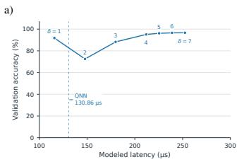

c)  
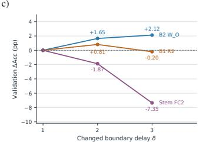

d)  
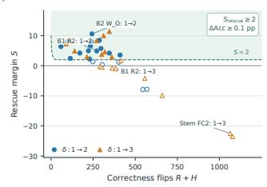

b)  
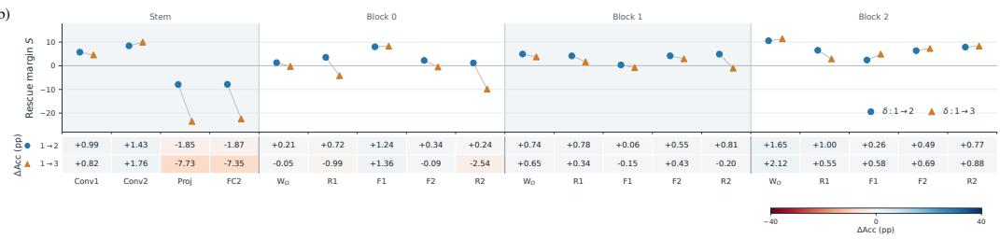  
Figure 4: Effects of firing delay on Falcon-Medium accuracy and latency (GSC).(a) Accuracy and latency under uniform delays. (b) Layerwise accuracy changes for delay increases 1 → 2 and $1  3 .$ (c) Three representative layer responses. (d) PDS candidate screening, with delay increases passing both score and accuracy-gain gates highlighted in green.

a)  
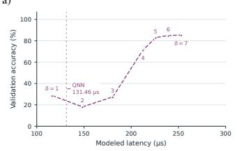

c)  
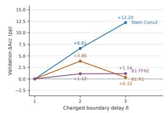  
b)

d)  
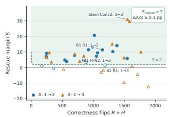

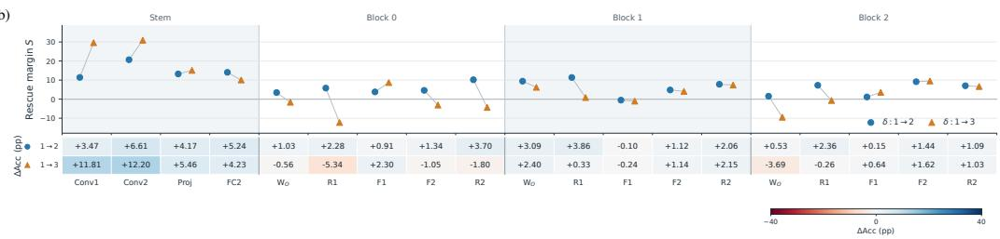  
Figure 5: Effects of firing delay on Falcon-Medium accuracy and latency (SSC).(a) Accuracy and latency under uniform delays. (b) Layerwise accuracy changes for delay increases 1 → 2 and $1  3 .$ (c) Three representative layer responses. (d) PDS candidate screening, with delay increases passing both score and accuracy-gain gates highlighted in green.

a)  
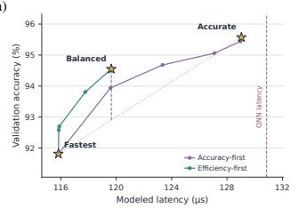

b)  
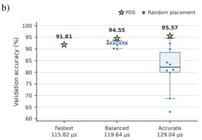

c)  
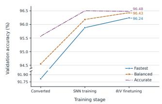  
Figure 6: Delay search and training of Falcon-Medium on GSC. (a) Validation accuracy and latency of Fastest, Balanced, and Accurate before SNN training. (b) Comparison with ten random delay schedules at the same core latency before SNN training. (c) Validation accuracy at each SNN training stage.

a)  
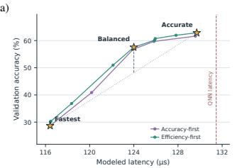

b)  
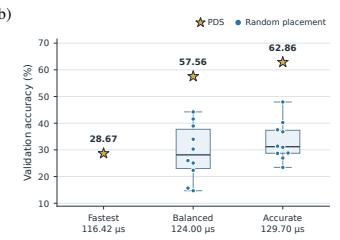

c)  
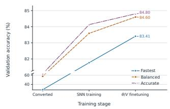  
Figure 7: Delay search and training of Falcon-Medium on SSC. (a) Validation accuracy and latency of Fastest, Balanced, and Accurate before SNN training. (b) Comparison with ten random delay schedules at the same core latency before SNN training. (c) Validation accuracy at each SNN training stage.

## A.2 PDS SCHEDULES AND QAT RECOVERY

Figure 8 shows the 30-epoch QAT validation curves for the PDS-selected Balanced schedules on GSC and SSC. Most accuracy recovery occurs within the first ten epochs, motivating a ten-epoch budget for the following comparison.

Balanced schedules: 30-epoch QAT validation trajectories  
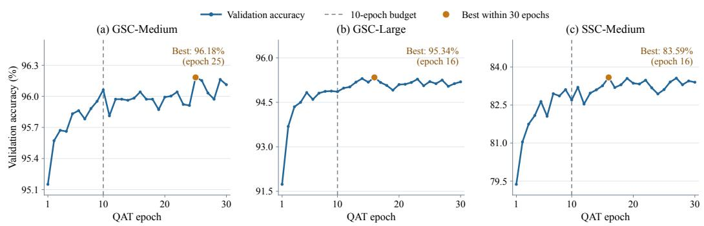  
Figure 8: Validation accuracy during 30 epochs of QAT for PDS-selected Balanced schedules: (a) GSC-Medium, (b) GSC-Large, and (c) SSC-Medium. Dashed lines mark the ten-epoch budget, and highlighted points indicate the highest validation accuracy within 30 epochs.

We compare the PDS-selected Balanced schedule with five random schedules for FALCON-Medium on GSC and SSC, and Falcon-Large on GSC. Within each setting, schedules share the same delay distribution, modeled core latency, initialization, and ten-epoch QAT budget. PDS achieves the highest validation accuracy at epoch ten in all three settings. On SSC-Medium, it also remains highest throughout training.

Table 4: Test accuracy (%) after full adaptation with 30 epochs of QAT, 15 epochs of neuronparameter tuning, and 10 epochs of joint training. Each random schedule matches the delay distribution and modeled core latency of the corresponding PDS Balanced schedule. All runs use the same training seed, and checkpoints are selected by validation accuracy.
<table><tr><td>Schedule</td><td>GSC Falcon-Medium</td><td>GSC Falcon-Large</td><td>SSC Falcon-Medium</td></tr><tr><td>PDS</td><td>96.31</td><td>96.19</td><td>83.02</td></tr><tr><td>Random 1</td><td>96.08</td><td>96.18</td><td>82.08</td></tr><tr><td>Random 2</td><td>96.33</td><td>96.02</td><td>82.39</td></tr><tr><td>Random 3</td><td>96.25</td><td>95.78</td><td>82.41</td></tr><tr><td>Random 4</td><td>96.24</td><td>95.81</td><td>81.66</td></tr><tr><td>Random 5</td><td>96.13</td><td>96.00</td><td>82.01</td></tr><tr><td>Random average</td><td>96.21</td><td>95.96</td><td>82.11</td></tr><tr><td>PDS gain (pp)</td><td>+0.11</td><td>+0.23</td><td>+0.92</td></tr></table>

We further train the same five random schedules using the full training pipeline: 30 epochs of QAT, 15 epochs of IF-parameter tuning, and 10 epochs of joint training. The PDS-selected Balanced schedules achieve test accuracies of 96.31%, 96.19%, and 83.02% on GSC-Medium, GSC-Large, and SSC-Medium, exceeding the corresponding random-schedule means by 0.11, 0.23, and 0.92 percentage points, respectively. These results show that the benefits of PDS beyond early QAT recovery.

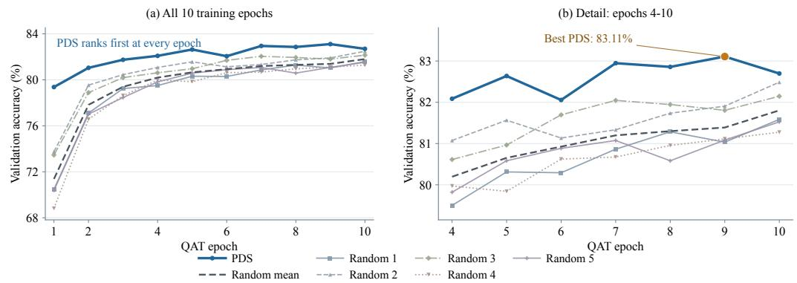  
Figure 9: Equal-budget QAT comparison on SSC with FALCON-Medium. The PDS-selected Balanced schedule and five random schedules share the same delay distribution and modeled core la tency. (a) Validation accuracy over all ten training epochs. (b) A closer view of epochs 4–10.

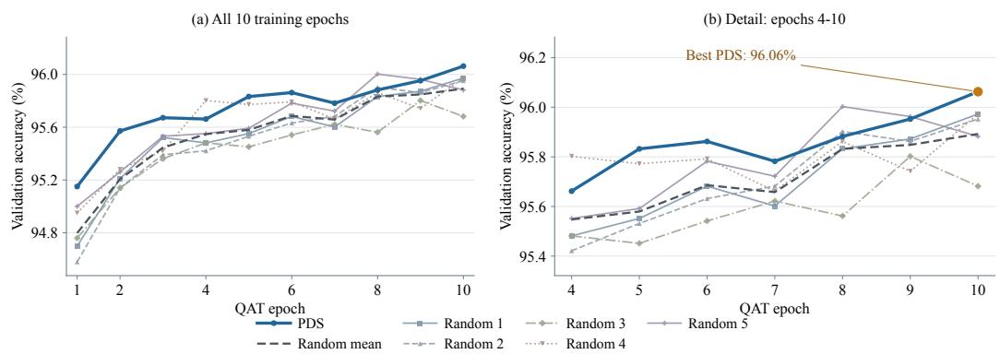  
Figure 10: Equal-budget QAT comparison on GSC with FALCON-Medium. The PDS-selected Balanced schedule and five random schedules share the same delay distribution and modeled core latency. (a) Validation accuracy over all ten training epochs. (b) A closer view of epochs 4–10.

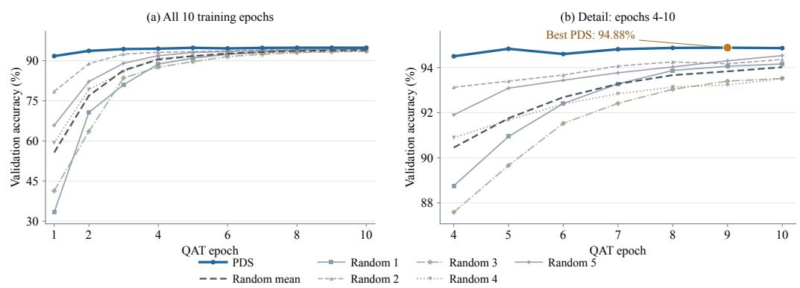  
Figure 11: Equal-budget QAT comparison on GSC with Falcon-Large. The PDS-selected Balanced schedule and five random schedules share the same delay distribution and modeled core latency. (a) Validation accuracy over all ten training epochs. (b) A closer view of epochs 4–10.

## A.3 ENERGY BREAKDOWN

Analog-side energy. Using side-channel NeuroX profiling, we estimate the analog-side inference energy of the exported Balanced models. FALCON-Medium and Falcon-Large require an estimated 0.7436 mJ and 1.0591 mJ per sample, respectively, including dynamic and active-window static energy of the modeled Conv/Linear units and their peripheral circuits (Figure 12). CABLC accounts for theen array-input supply branch, including array conduction energy; ADC denotes analog-todigital conversion; REF supplies the ADC reference currents; Control represents macro sequencing and control logic; Readout (except ADC) combines current weighting (DSWCT), input-bit accumulation (SINWP-SC), and positive/negative current subtraction (PN-ISUB); and the tile accumulator combines partial sums across input tiles.

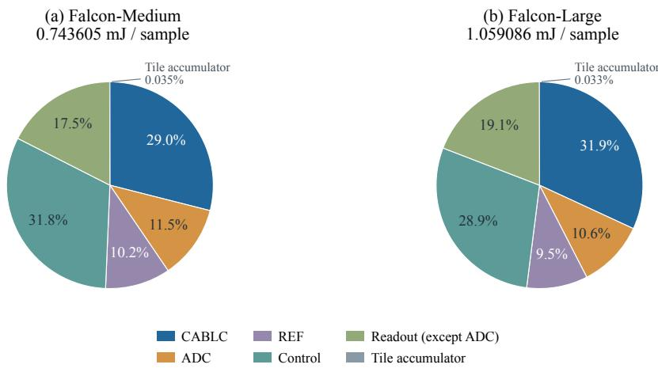  
Figure 12: Analog energy breakdown.

Digital attention energy estimation. We estimate the energy of $Q K ^ { \top }$ and AV using a $3 2 \times 3 2$ output-stationary integer array. The array is synthesized with Synopsys Design Compiler and the standard-cell library at the TT corner, 0.65 ${ \mathrm { V } } , { \dot { 2 } } 5 ^ { \circ } { \mathrm { C } } { \mathrm { . } }$ and 100 MHz.

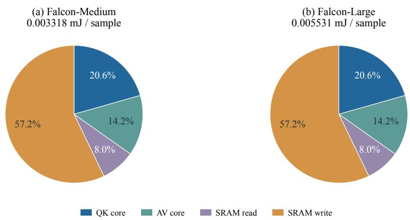  
Figure 13: Digital energy breakdown. Core energy includes array arithmetic, internal registers, control, and leakage during the evaluation windows.

## A.4 Q/K-PREFIX ABLATION

The main results use the full Q/K prefix, $p = 7 .$ We further reduce p while keeping $T = 7$ and the Falcon-Medium Balanced delay schedule fixed. The $p = 7$ setting is used as a fixed reference and receives no additional training. For each $p < 7 ,$ , we independently start from this reference checkpoint and jointly adapt the permitted network and neuron parameters for ten epochs.

Table 5 shows that a shorter Q/K prefix can further reduce latency, but aggressive truncation is harder to recover from. Reducing p from seven to six lowers core latency from 119.64 to $1 1 4 . 0 0 \mu \mathrm { s } .$ a 4.71% reduction. After adaptation, test accuracy reaches 96.33%, compared with 96.31% for the full-prefix reference. With $p = 5$ , latency is reduced by 9.43% while test accuracy remains at 96.13%. $\mathrm { A t } p = 4$ , adaptation recovers test accuracy from 84.65% to 95.92% at $1 0 2 . { \dot { 7 } } 2 \mu \mathrm { s } .$ . More aggressive reduction is harder to recover: at $p = 3 ,$ , adaptation raises test accuracy from 71.04% to 91.15%, but it remains 5.16 percentage points below the full-prefix reference. These results show that Q/K prefix reduction provides an additional latency–accuracy trade-off.

Table 5: Q/K prefix ablation on GSC with Falcon-Medium.
<table><tr><td>Q/K prefix p</td><td>Core latency (µs)</td><td>Before val. (%)</td><td>After val. (%)</td><td>Before test (%)</td><td>After test (%)</td></tr><tr><td>7 (reference)</td><td>119.64</td><td>96.4332</td><td></td><td>96.3108</td><td></td></tr><tr><td>6</td><td>114.00</td><td>95.9523</td><td>96.2930</td><td>96.1654</td><td>96.3289</td></tr><tr><td>5</td><td>108.36</td><td>94.3192</td><td>96.1527</td><td>94.4480</td><td>96.1290</td></tr><tr><td>4</td><td>102.72</td><td>85.0215</td><td>95.8120</td><td>84.6524</td><td>95.9200</td></tr><tr><td>3</td><td>97.08</td><td>72.1872</td><td>91.6942</td><td>71.0404</td><td>91.1495</td></tr></table>

## B DATASET AND MODEL ARCHITECTURE

## B.1 DATA PREPROCESSING

GSC contains 84,843 training, 9,981 validation, and 11,005 test recordings. SSC contains 75,466 training, 9,981 validation, and 20,382 test recordings. For GSC, we use Mel-spectrogram-based preprocessing, similar to that used in Soul (Du et al., 2026), with the specific configuration described below. We crop or right-zero-pad each 16-kHz mono waveform to one second, using random cropping during training and center cropping during evaluation when necessary. We compute a power spectrogram using a 480-point FFT, a 480-sample Hann window, a 160-sample hop, and no centered padding. We apply 64 Mel filters spanning 20 Hz to 8 kHz and take the natural logarithm, yielding 98 acoustic frames with 64 features each. Each log-Mel spectrogram is normalized using its own mean and standard deviation computed across all time-frequency entries. For SSC, we use 10-ms time bins and sum every five adjacent cochlear channels, reducing 700 channels to 140, as in the channel reduction used by SpikCommander (Wang et al., 2026).

## B.2 MODEL ARCHITECTURE

Falcon-Medium and Falcon-Large share the same architecture and Transformer dimensions, differing only in the number of Transformer blocks: three for Medium and five for Large. We evaluate Medium on both GSC and SSC, and Large on GSC.

Input encoder and stem. The input encoder uses a $5 \times 5$ convolution with $1  3 2$ channels and stride (2, 1), followed by batch normalization, rectification, and spike encoding. The pipelined stem then contains two convolutional delay-controlled IF stages and two fully connected (FC) delaycontrolled IF stages. The two convolutions use $3 \times 3$ kernels, with channel dimensions 32 → 48 and 48 → 48, and strides (2, 1) and (1, 1), respectively. The strides are specified along the feature and temporal axes; thus, the temporal token count is preserved. After flattening the channel and feature axes at each token, the two FC layers project the features to 160 dimensions and then apply a 160 → 160 transformation. The first FC layer has 768 input dimensions for GSC and 1680 for SSC, corresponding to input feature dimensions of 64 and 140, respectively.

Transformer network and classifier. Each Transformer block uses a hidden dimension of 160 and five attention heads, with 32 dimensions per head. The attention module contains separate 160 → 160 query, key, and value projections, followed by a 160 → 160 output projection. Attention uses ConSmax in place of softmax. The feed-forward network consists of two FC layers, 160 → 320 → 160 The attention and feed-forward sublayers each have a residual connection followed by batch normalization and delay-controlled IF firing. After the final block, spike counts are decoded and batch normalized, followed by temporal mean pooling and a 160 → 35 classifier. For variablelength SSC inputs, pooling excludes padded tokens.

Table 6: Architecture summary of the two Falcon variants. FC counts include the separate Q/K/V and output projections in every attention module, both feed-forward layers, the two stem FC layers, and the classifier.
<table><tr><td>Component</td><td>Falcon-Medium</td><td>Falcon-Large</td></tr><tr><td>Input-encoder convolutions</td><td>1</td><td>1</td></tr><tr><td>Pipelined-stem convolutions</td><td>2</td><td>2</td></tr><tr><td>Pipelined-stem FC layers</td><td>2</td><td>2</td></tr><tr><td>Transformer blocks</td><td>3</td><td>5</td></tr><tr><td>Hidden dimension</td><td>160</td><td>160</td></tr><tr><td>Attention heads</td><td>5</td><td>5</td></tr><tr><td>FFN intermediate dimension</td><td>320</td><td>320</td></tr><tr><td>Classifier output classes</td><td>35</td><td>35</td></tr><tr><td>Total convolutional layers</td><td>3</td><td>3</td></tr><tr><td>Total FC layers</td><td>21</td><td>33</td></tr></table>

Layer-wise firing delays. Table 7 lists the firing delays for the Fastest, Balanced, and Accurate schedules. Each delay is assigned at an output spike boundary. Fastest uses $\delta = 1$ at all searchable boundaries, while Balanced and Accurate add waiting only at the listed boundaries. Conv1 and Conv2 denote the two post-encoder stem convolutions. Within each Transformer block, AttnOut denotes the attention output projection, and FFN1 and FFN2 denote the two feed-forward linear layers. Residual1 and Residual2 denote the normalized outputs of the attention and feed-forward residual additions, respectively. Blocks are numbered from zero. All nine configurations use $T = 7$ rate-coding slots and the full Q/K prefix, $p = T$ . Value and Context use fixed full-lookahead delays $( \delta = T )$ ) and are excluded from PDS. The input encoder and final classifier have no searchable firing delays.

Table 7: Layer-wise firing delays. Only searchable boundaries with $\delta \ : = \ : 2$ or $\delta = 3$ are listed; all other searchable boundaries use $\delta = 1$ . A dash indicates that no searchable boundary uses the corresponding delay. Transformer blocks are zero-indexed.
<table><tr><td>Model</td><td>Schedule</td><td>Boundaries with  $\delta = 2$ </td><td>Boundaries with  $\delta = 3$ </td></tr><tr><td>GSC-Medium</td><td>Fastest</td><td></td><td></td></tr><tr><td></td><td>Balanced</td><td>Block 0: FFN1; Block 2: AttnOut</td><td>Block 2: Residual2</td></tr><tr><td></td><td>Accurate</td><td>Stem Conv2</td><td>Blocks 0 and 1: FFN1; Block 2: At- tnOut and Residual2</td></tr><tr><td>GSC-Large</td><td>Fastest</td><td></td><td></td></tr><tr><td></td><td>Balanced</td><td>Block 2: Residual1; Block 3: FFN1</td><td>Block 4: Residual2</td></tr><tr><td></td><td>Accurate</td><td>Blocks 0, 1, 3, and 4: FFN1; Block 2: Residual1; Blocks 3 and 4: AttnOut</td><td>Stem Conv2; Block 2: FFN1; Block 4: Residual2</td></tr><tr><td>SSC-Medium</td><td>Fastest</td><td></td><td></td></tr><tr><td></td><td>Balanced</td><td></td><td>Stem Conv1 and Conv2; Block 2: FFN2</td></tr><tr><td></td><td>Accurate</td><td>Block 1: Residual1</td><td>Stem Conv1 and Conv2; Block 0:</td></tr></table>

## C EXAMPLE PIPELINE CONFIGURATION

We illustrate a configuration selected by PDS for Falcon-Medium on GSC. The model has four pipelined stem stages and three Transformer blocks, with $T = p = 7 .$ . PDS searches delays $\delta \in$ {1, 2, 3} at 19 IF stages. Q/K use the full input prefix, while Value and Context use Full-lookahead.

The selected Balanced schedule increases delays at only three stages: $\delta = 2$ at Block 0’s FFN1 and Block 2’s attention output projection, and $\delta = 3$ at Block 2’s second residual. All other searchable stages use $\delta = 1$

Figure 14 shows the overlap across modules. Block 0 starts at $7 . 6 4 \mu \mathrm { s } ,$ , before the stem produces its last output slot at 18.92 µs. Q/K/V projections run in parallel, while AV waits for both the attention map and the complete Value count. Under spatial mapping, the modeled core latency is 119.64 µs, compared with 130.86 µs for the matched QNN, an 8.6% reduction.

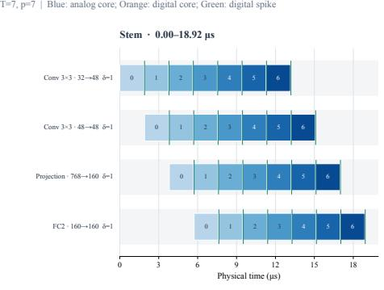

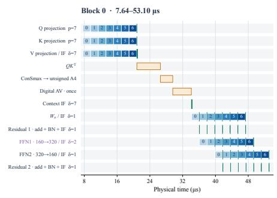

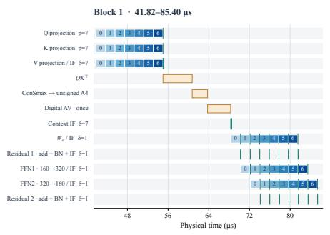

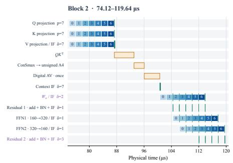  
Figure 14: Latency Example of Falcon-Medium with balanced schedule

## D PROOF OF THEOREM 1

Proof. We omit the neuron and layer indices. Let

$$
J ( t ) = { \frac { I _ { 0 } } { T } } + I ( t ) , \qquad P ( r ) = V ( - 1 ) + \sum _ { t = 0 } ^ { r } J ( t ) .
$$

After receiving input slots $0 , \ldots , r$ and emitting n spikes, the membrane is

$$
P ( r ) - n \theta ,
$$

where $\theta > 0 .$

Adjacent delays. First compare $\delta$ and $\delta + 1$ , with $\delta < T$ . Their decision prefixes are

$$
\begin{array} { r l } { \delta : } & { \delta - 1 , \delta , \dotsc , T - 2 , \underbrace { T - 1 , \dotsc , T - 1 } _ { \delta \mathrm { t i m e s } } , } \\ { \delta + 1 : } & { \delta , \delta + 1 , \dotsc , T - 2 , \underbrace { T - 1 , \dotsc , T - 1 } _ { \delta + 1 \mathrm { t i m e s } } . } \end{array}
$$

Thus, the second execution removes the first decision and adds one full-input decision at the end.   
The other $T - 1$ decisions use the same prefixes in the same order.

Before they begin, the $\delta$ execution has emitted zero or one spike, while the $\delta + 1$ execution has emitted none. If their counts are equal, their membranes and firing decisions are equal. If the δ execution leads by one spike, its membrane is exactly θ lower. It cannot fire unless the other execution also fires. Its lead therefore stays at zero or one after every common decision.

Let

$$
n = { \widehat { q } } ( \delta )
$$

and let $n ^ { \prime }$ be the count for delay $\delta + 1$ before its last decision. Then

$$
n \in \{ n ^ { \prime } , n ^ { \prime } + 1 \} , \qquad 0 \leq n ^ { \prime } \leq T - 1 .
$$

The final decision. The full-lookahead count is

$$
\begin{array} { r } { Q : = \widehat { q } _ { \mathrm { f u l l } } = \operatorname* { m i n } \left. T , \ : \operatorname* { m a x } \left. 0 , \ : \left\lfloor \frac { P ( T - 1 ) } { \theta } \right\rfloor \right. \right. . } \end{array}
$$

Since $n ^ { \prime } \leq T - 1$ , a final full-input decision emits a spike exactly when $n ^ { \prime } < Q$ . Therefore,

$$
{ \widehat { q } } ( \delta + 1 ) = n ^ { \prime } + \mathbf { 1 } [ n ^ { \prime } < Q ] .
$$

If $n ^ { \prime } < Q ,$ , then

$$
n \leq \widehat { q } ( \delta + 1 ) = n ^ { \prime } + 1 \leq Q .
$$

If $n ^ { \prime } \geq Q .$ , then

$$
Q \leq \widehat { q } ( \delta + 1 ) = n ^ { \prime } \leq n .
$$

Thus, the new count lies between the old count and $Q ,$ and changes by at most one. Consequently,

$$
0 \leq e ( \delta ) - e ( \delta + 1 ) \leq 1 .
$$

General delays and tightness. Summing the adjacent-delay inequality gives

$$
0 \leq e ( \delta ) - e ( \delta ^ { \prime } ) \leq \delta ^ { \prime } - \delta .
$$

Since $e ( T ) = 0$ , setting $\delta ^ { \prime } = T$ gives

$$
e ( \delta ) \leq T - \delta .
$$

To show tightness, choose $V ( - 1 ) = \theta / 2$ and let all input current arrive at slot $T - 1$ , with

$$
T \theta < P ( T - 1 ) < ( T + 1 ) \theta .
$$

Every earlier decision emits no spike. Delay δ leaves exactly δ decisions after the final current arrives, and all of them emit a spike. Hence,

$$
\widehat { q } ( \delta ) = \delta , \qquad Q = T , \qquad e ( \delta ) = T - \delta .
$$

Both upper bounds are attained.

## E PROOF OF PROPOSITION 1

Proof. Fix any

$$
1 \leq \delta _ { 1 } < \delta _ { 2 } < \delta _ { 3 } \leq T .
$$

We construct a network with five input channels, three IF neurons in layer l, and two IF neurons in layer l + 1. All IF neurons follow Algorithm 1, with threshold 1 and initial membrane potential $1 / 2$ All IF-layer biases and static currents are zero. Only the delay δ of layer l varies; the delay of layer $l + 1$ is fixed at 1.

Fixed weights and inputs. We represent an input sample by an integer code vector $\begin{array} { r l } { \mathbf { c } } & { { } = } \end{array}$ $( c _ { 1 } , \ldots , c _ { 5 } ) ^ { \top }$ , where $\bar { c _ { i } } \in \{ 0 , . . . , \bar { T } \}$ specifies the number of input spikes in channel i. Each channel places these spikes in its first $c _ { i }$ slots:

$$
s _ { i } ^ { \mathrm { i n } } ( t ; \mathbf { c } ) = \mathbf { 1 } [ t < c _ { i } ] , \qquad t = 0 , \ldots , T - 1 .
$$

Thus, $c _ { i }$ is an integer count, whereas $s _ { i } ^ { \mathrm { i n } } ( t ; { \bf c } )$ is a binary spike.

We use zero input baselines, unit scales, and fixed weights

$$
W ^ { l } = \left( \begin{array} { c c c c c } { { 1 } } & { { 0 } } & { { 0 } } & { { 0 } } & { { 0 } } \\ { { 0 } } & { { 1 } } & { { - 1 } } & { { 0 } } & { { 0 } } \\ { { 0 } } & { { 0 } } & { { 0 } } & { { 1 } } & { { - 1 } } \end{array} \right) , \qquad W ^ { l + 1 } = \left( \begin{array} { c c c c } { { 1 } } & { { - 1 } } & { { 0 } } \\ { { 1 } } & { { 0 } } & { { - 1 } } \end{array} \right) ,
$$

where rows index output neurons and columns index input channels.

The two input samples are

$$
\mathbf { c } ^ { ( 1 ) } = ( 1 , \delta _ { 2 } , \delta _ { 2 } - 1 , \delta _ { 3 } , \delta _ { 3 } - 1 ) ^ { \top } , \qquad \mathbf { c } ^ { ( 0 ) } = ( 1 , 1 , 0 , 0 , 0 ) ^ { \top } ,
$$

with class labels 1 and 0, respectively. The superscripts identify the class labels. All entries lie in $\{ 0 , \ldots , T \}$ . Once $\delta _ { 1 } , \delta _ { 2 } , \delta _ { 3 }$ are chosen, both input samples remain fixed as δ varies.

For an input c, let $\hat { q } _ { j } ^ { l + 1 } ( \mathbf { c } ; \delta )$ denote the final spike count of neuron j in layer $l + 1$ when layer l uses delay δ. The fixed readout predicts

$$
F _ { \delta } ( { \bf c } ) = { \bf 1 } \bigg [ \widehat { q } _ { 1 } ^ { l + 1 } ( { \bf c } ; \delta ) - \widehat { q } _ { 2 } ^ { l + 1 } ( { \bf c } ; \delta ) + \frac { 1 } { 2 } > 0 \bigg ] .
$$

The readout weights and bias do not change with δ. Within each input case below, we omit the input argument from the currents, spikes, and counts.

The label-1 input. For $\mathbf { c } ^ { ( 1 ) }$ , the currents entering layer l are

$$
J _ { 1 } ^ { l } ( t ) = { \bf 1 } [ t = 0 ] , \qquad J _ { 2 } ^ { l } ( t ) = { \bf 1 } [ t = \delta _ { 2 } - 1 ] , \qquad J _ { 3 } ^ { l } ( t ) = { \bf 1 } [ t = \delta _ { 3 } - 1 ] .
$$

This follows from the fixed weights and the identity

$$
\mathbf { 1 } [ t < a ] - \mathbf { 1 } [ t < a - 1 ] = \mathbf { 1 } [ t = a - 1 ]
$$

for integer t and $a .$

Each neuron receives one unit of current. At the first decision that includes this input, its membrane potential is $3 / 2 ,$ , so it emits one spike. Soft reset returns the membrane potential to $1 / 2$ . Since no further current arrives, it emits no additional spikes.

A unit current arriving at input slot a is first included in output decision

$$
k = \operatorname* { m a x } \{ a - \delta + 1 , 0 \} .
$$

The output spikes are therefore

$$
\begin{array} { r l } & { s _ { 1 } ^ { l } ( k ; \delta ) = \mathbf { 1 } [ k = 0 ] , } \\ & { s _ { 2 } ^ { l } ( k ; \delta ) = \mathbf { 1 } [ k = \operatorname* { m a x } \{ \delta _ { 2 } - \delta , 0 \} ] , } \\ & { s _ { 3 } ^ { l } ( k ; \delta ) = \mathbf { 1 } [ k = \operatorname* { m a x } \{ \delta _ { 3 } - \delta , 0 \} ] . } \end{array}
$$

Here, k is a logical output-slot index, not physical time. The final count vector is $( 1 , 1 , 1 )$ for every $\delta \in \{ 1 , \ldots , T \}$ , including Full-lookahead. Thus, every neuron in layer l has zero local count error.

At layer $l + 1$ , the two neurons receive

$$
J _ { 1 } ^ { l + 1 } ( k ) = s _ { 1 } ^ { l } ( k ; \delta ) - s _ { 2 } ^ { l } ( k ; \delta ) , \qquad J _ { 2 } ^ { l + 1 } ( k ) = s _ { 1 } ^ { l } ( k ; \delta ) - s _ { 3 } ^ { l } ( k ; \delta ) .
$$

This layer uses delay 1 and sums the currents within each input slot before making a firing decision. If the positive input arrives before the negative input, the membrane potential rises from $1 / 2 \tan 3 / 2$ and the neuron emits one spike. The later negative current cannot remove that spike. If both inputs arrive in the same slot, they cancel before the firing decision, and the neuron emits no spike.

The final counts at layer $l + 1$ are therefore

$$
\begin{array} { r } { \big ( \widehat { q } _ { 1 } ^ { l + 1 } , \widehat { q } _ { 2 } ^ { l + 1 } \big ) = \displaystyle \left\{ \begin{array} { l l } { ( 1 , 1 ) , } & { \delta < \delta _ { 2 } , } \\ { ( 0 , 1 ) , } & { \delta _ { 2 } \leq \delta < \delta _ { 3 } , } \\ { ( 0 , 0 ) , } & { \delta \geq \delta _ { 3 } . } \end{array} \right. } \end{array}
$$

The readout scores are $1 / 2 , - 1 / 2$ , and $1 / 2 .$ , respectively. Hence,

$$
F _ { \delta } ( \mathbf { c } ^ { ( 1 ) } ) = \left\{ \begin{array} { l l } { 1 , } & { \delta < \delta _ { 2 } , } \\ { 0 , } & { \delta _ { 2 } \leq \delta < \delta _ { 3 } , } \\ { 1 , } & { \delta \geq \delta _ { 3 } . } \end{array} \right.
$$

The label-0 input. For $\mathbf { c } ^ { ( 0 ) }$ , the first two neurons in layer l each receive one unit of current at input slot 0, and the third receives none. For every delay, their output spikes are

$$
\begin{array} { r } { s _ { 1 } ^ { l } ( k ; \delta ) = s _ { 2 } ^ { l } ( k ; \delta ) = \mathbf { 1 } [ k = 0 ] , \qquad s _ { 3 } ^ { l } ( k ; \delta ) = 0 . } \end{array}
$$

Their final counts are $( 1 , 1 , 0 )$ , equal to the full-lookahead counts.

At layer l +1, the first neuron’s inputs cancel in slot 0, while the second neuron receives one positive unit of current. The final count vector is therefore (0, 1) for every delay. The readout score is $- 1 / 2 ,$ giving

$$
{ \cal F } _ { \delta } ( { \bf c } ^ { ( 0 ) } ) = 0 .
$$

This input is always classified correctly.

Accuracy. Take the fixed dataset

$$
\mathcal { D } = \left\{ ( \mathbf { c } ^ { ( 1 ) } , 1 ) , ( \mathbf { c } ^ { ( 0 ) } , 0 ) \right\} .
$$

Every neuron in layer l has zero local count error on both inputs for every $\delta \in \{ 1 , \ldots , T \}$ . However, the accuracy is

$$
\begin{array} { r } { \mathrm { A c c } _ { \mathcal D } ( \delta ) = \left\{ \begin{array} { l l } { 1 , } & { \delta < \delta _ { 2 } \mathrm { o r } \delta \ge \delta _ { 3 } , } \\ { \frac 1 2 , } & { \delta _ { 2 } \le \delta < \delta _ { 3 } . } \end{array} \right. } \end{array}
$$

Hence,

$$
\operatorname { A c c } _ { \mathcal { D } } ( \delta _ { 1 } ) = 1 > \operatorname { A c c } _ { \mathcal { D } } ( \delta _ { 2 } ) = \frac { 1 } { 2 } < \operatorname { A c c } _ { \mathcal { D } } ( \delta _ { 3 } ) = 1 .
$$

Since $T \geq \delta _ { 3 }$ , we also have $\mathrm { A c c } _ { \mathcal { D } } ( T ) = 1$

All IF membrane potentials at firing decisions are half-integers, since the initial potential is $1 / 2$ and all currents and resets are integers. They therefore differ from the threshold 1 by at least $1 / 2$ . The result does not depend on threshold ties. □

## F LATENCY FOR RELATED WORKS

## F.1 DIGITAL LATENCY ESTIMATION FOR SPIKCOMMANDER

We estimate SpikCommander’s modeled core latency from its released computation graph rather than from timestep count alone. We use the same timing boundary as FALCON. SpikCommander uses 16 shared $3 2 \times 3 2$ systolic arrays, whereas FALCON uses five arrays of the same size. The array counts follow the respective numbers of attention heads, giving SpikCommander more digital arrays than FALCON.

Hardware and cost model. We map SpikCommander to 16 shared $3 2 \times 3 2$ systolic arrays and 16 shared 32-lane vector engines running at 100 MHz same with our Falcon setting. The hardware resources are fixed for all layers. For a GEMM $( { \boldsymbol { m } } \times { \boldsymbol { k } } ) ( { \boldsymbol { k } } \times { \boldsymbol { n } } )$ ), the cycle count is

$$
C _ { \mathrm { G E M M } } ( m , k , n ) = \left\lceil \frac { m } { 3 2 } \right\rceil \left\lceil \frac { n } { 3 2 } \right\rceil k + 6 2 ,
$$

where the last 62 cycles account for filling and draining the systolic array. Element-wise operations, reductions, BN, LIF, residual additions, and grouped convolutions are also included using the same 32-lane digital model. The acoustic sequence is processed in groups of at most 32 frames, matching the 32 rows of the systolic array. Output-channel tiles are distributed across the available arrays.

SpikCommander’s MSTASA computes per-frame Q/K/V features together with local and global temporal gates. The local gate for frame t uses a radius-20 window,

$$
\mathbf { g } _ { t } ^ { \mathrm { l o c } } = \mathrm { L I F } \left( \beta _ { \mathrm { l o c } } \sum _ { u \in [ t - 2 0 , t + 2 0 ] } ( \mathbf { Q } _ { u } + \mathbf { K } _ { u } ) \right) ,
$$

whereas the global gate uses the complete sequence,

$$
\mathbf { g } ^ { \mathrm { g l o b } } = \mathrm { L I F } \left( \beta _ { \mathrm { g l o b } } \sum _ { u = 0 } ^ { L - 1 } ( \mathbf { Q } _ { u } + \mathbf { K } _ { u } ) \right) .
$$

The attention output is

$$
\mathbf { A } _ { t } = \mathbf { g } _ { t } ^ { \mathrm { l o c } } \odot \mathbf { V } _ { t } + \mathbf { g } ^ { \mathrm { g l o b } } \odot \mathbf { V } _ { t } .
$$

Therefore, the local Q/K path and the convolutional V path can start before the complete sequence is ready, while the global gate must wait for all Q/K frames in each block. Each operation starts once its required inputs are ready and a hardware engine is available. This allows neighboring layers and blocks to overlap.

Thus, after optimization, the estimated latencies under different timestep settings are shown below: For the 2L-16-256 model with $T = 1 0 0$ , the second block can start processing early acoustic-frame groups before the first block has fully finished, resulting in a latency of $9 4 0 . 7 0 \mu \mathrm { s }$ . For the 1L-16- 256 model with the same $T = 1 0 0$ , the latency is 487.97 µs. We additionally evaluate the 2L-16-256 model with a shorter temporal sequence of $T = 5 0$ , which reduces the latency to 645.63 µs.

## F.2 DIGITAL LATENCY ESTIMATION FOR SPIKESCR

We use the same digital cost model and scheduling method as for SpikCommander: 16 shared $3 2 \times 3 2$ systolic arrays and 16 shared 32-lane vector engines at 100 MHz. We reconstruct the 1L-16-256 model with one SGLE block, 16 attention heads, hidden dimension 256, and FFN dimension 1024.

Q, K, and V in Spikescr are produced by Linear, BN, and LIF operations. Q and K then pass through RoPE and a second LIF. For each of the 16 heads,

$$
Q , K , V \in \mathbb { R } ^ { L \times 1 6 } .
$$

For a query-row group $\mathcal { R }$ , with $| \mathcal { R } | \leq 3 2$ , SpikeSCR computes

$$
S _ { \mathcal { R } } = Q _ { \mathcal { R } } K ^ { \top } , \qquad O _ { \mathcal { R } } = S _ { \mathcal { R } } V .
$$

A QK task waits for its query rows and the complete K sequence, while the corresponding AV task additionally waits for the complete V sequence. Different heads and query-row groups can overlap when their inputs and hardware engines are ready. Using the GEMM model defined above, one 32-column QK tile costs $C _ { \mathrm { Q K } } = \bar { C _ { \mathrm { G E M M } } } ( | \mathcal { R } | , 1 6 , 3 2 ) = \bar { 1 } 6 + 6 2 = 7 8$ cycles. The corresponding AV task costs $C _ { \mathrm { A V } } = C _ { \mathrm { G E M M } } ( | \mathcal { R } | , L , 1 6 ) = L + 6 2 \mathrm { c y c l e s }$

As in SpikCommander, an operation starts once both its required inputs and a hardware engine are available. This allows neighboring modules and acoustic-frame groups to overlap while preserving the full-K, full-V, convolution-window, neuron-state, and residual dependencies.

For the 1L-16-256 SpikeSCR model with $T = 4 0$ , the resulting latency is $2 7 8 . 4 7 \mu \mathrm { s }$ . With a longer temporal sequence of $T = 1 0 0$ , the latency increases to 468.11 µs.

## F.3 DIGITAL LATENCY ESTIMATION FOR BSO SPIKING VGG-11

We use the same digital cost model and scheduler as for SpikCommander: 16 shared $3 2 \times$ 32 systolic arrays and 16 shared 32-lane vector engines at 100 MHz. We use the released online spiking vgg11 ws structure with the GSC input size of $3 2 \times 3 2$ and $T = 4 ,$ . The neuron settings follow the public training code: LIF neurons with $\tau = 2 .$ , threshold 1, and soft reset. These settings define our reconstruction. We exclude the first convolution and its spike-generation step. The four encoded feature maps, each of size $6 4 \times 3 2 \times 3 2$ , are available at time zero. The timed network contains the remaining seven convolutions, three average-pooling layers, LIF updates, and output scaling. Under the same scheduling policy, a task starts when its inputs and an engine are ready. Convolutions wait for their required spatial neighborhoods, and each neuron update waits for its previous-step state. The resulting modeled core latency is 1714.88 µs.