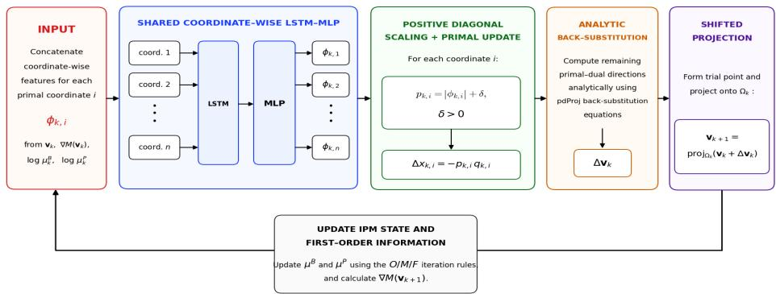
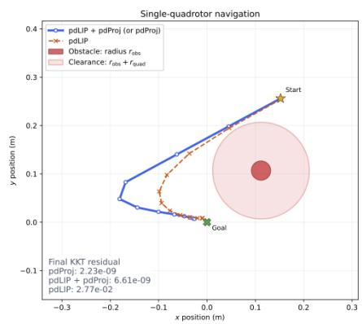

# LEARNED PRECONDITIONING FOR A PRIMAL–DUAL INTERIOR-POINT METHOD

Abhinav Madabhushi1 Jialin Liu2 Minxin Zhang1∗

1Department of Mathematics, University of California, Los Angeles

2School of Data, Mathematical, and Statistical Sciences, University of Central Florida

abhinavm@g.ucla.edu, jialin.liu@ucf.edu, zhangmx815@gmail.com

## ABSTRACT

Interior-point methods (IPMs) are among the most widely used algorithms for constrained optimization, yet their Newton-based search directions require costly second-order information and large linear-system solves. Learning to optimize offers cheaper updates learned from data, but the singular behavior of logarithmic barriers near constraint boundaries makes IPMs highly sensitive to perturbations, complicating both warm starting and learning reliable updates. We introduce pdLIP, an IPM for smooth nonlinear programs that integrates learned preconditioning with pdProj, an all-shifted primal–dual projected-search IPM. A shared coordinate-wise recurrent network predicts a positive diagonal preconditioner that scales the right-hand side of the reduced Newton system for the primal step, and the remaining slack and multiplier directions are recovered analytically. The learned iterations avoid Hessian evaluations and Newton-system solves, using only first-order and coordinate-wise operations amenable to GPU parallelization. Training is self-supervised, with a loss based on a penalty–barrier merit function and the residual of perturbed optimality conditions, requiring neither target directions nor precomputed solutions. Primal and dual shifts mitigate the barrier’s sensitivity to perturbations near constraint boundaries, enabling effective warm starting. Across four classes of 200-dimensional convex and nonconvex constrained problems, pdLIP warm starts reduce pdProj refinement iterations by 63–67% compared with cold starts at the same KKT residual tolerance of 10−8, with negligible warm-start generation cost relative to the subsequent pdProj solve. Improvements persist on box-constrained QPs with 1000 variables and extend to applications including portfolio optimization, support vector machines, and a nonlinear control example. These results demonstrate that learning only a structured scaling can substantially reduce the subsequent cost of high-accuracy constrained optimization.

## 1 INTRODUCTION

Learning to optimize offers a way to reduce the cost of constrained optimization by replacing expensive computations in classical algorithms with learned components. For primal–dual interior-point methods (IPMs), a major computational cost lies in obtaining Newton directions, which requires second-order information and linear-system solves. However, learning to approximate Newton solves directly does not necessarily eliminate the cost of constructing the system, including the evaluation of the Hessian (Gao et al., 2024). Logarithmic barriers pose a separate difficulty: their sensitivity to perturbations near constraint boundaries complicates learning reliable updates. These challenges motivate learned updates that avoid Hessian evaluations and Newton-system solves while retaining the analytical structure of a primal–dual IPM.

We introduce pdLIP, a self-supervised primal–dual IPM for smooth nonlinear programs. Rather than learning to solve a Newton system, pdLIP learns only a positive diagonal preconditioner for the primal step. It uses the all-shifted formulation of pdProj (Gill & Zhang, 2024), whose primal and dual shifts mitigate barrier sensitivity near constraint boundaries and facilitate warm starting. The learned iterations generate approximate primal–dual solutions, which pdProj then refines to high accuracy. Our main contributions are:

• Learned preconditioning. We replace solving a reduced KKT system with a learned positive diagonal scaling while recovering the slack and multiplier directions analytically. The learned iterations avoid Hessian evaluations and Newton-system solves, using merely first-order and coordinate-wise operations suited to GPU parallelization.

• Self-supervised training. A shared coordinate-wise recurrent network predicts the scaling, with a parameter count independent of problem dimension. We train it using a loss that combines the shifted penalty–barrier merit function with the residual of perturbed optimality conditions, requiring neither target directions nor precomputed solutions.

• Reduced refinement cost. Across four 200-variable convex and nonconvex benchmark classes, pdLIP warm starts reduce pdProj refinement iterations by 63–67% relative to cold starts at the same KKT residual tolerance of $1 0 ^ { - 8 }$ , with negligible warm-start cost relative to refinement. Further experiments show benefits on 1000-variable box-constrained QPs, portfolio optimization, support vector machines, and a nonlinear quadrotor control problem.

## 2 RELATED WORKS

Learning-to-Optimize. Learning-to-optimize (L2O) uses data from related problem instances to learn solution mappings or components of optimization algorithms Chen et al. (2022). Representative approaches include algorithm unrolling and direct solution prediction Gregor & LeCun (2010); Donti et al. (2021); Park & Van Hentenryck (2023), as well as recurrent learned optimizers Andrychowicz et al. (2016); Wichrowska et al. (2017). Learning has also been used to replace specific components of classical algorithms, such as branching Gasse et al. (2019), cut selection Tang et al. (2020), and pivot selection Liu et al. (2024). For iterative optimization, Liu et al. (2023) derive mathematical structures from fixed-point and convergence requirements to design learned update rules. Luken & Lucia (2026) combine primal–dual prediction with learned iterative refinement us-¨ ing a KKT-based self-supervised loss. pdLIP also follows a structure-informed iterative approach, but learns only coordinate-wise scaling within an analytically specified IPM update, yielding effective primal–dual warm starts.

Learning-Augmented Interior-Point Methods. Neural networks have previously been combined with IPMs to generate warm starts Fontova et al. (2007). The most closely related modern approach is IPM-LSTM Gao et al. (2024), which uses an LSTM to approximate the linear-system solve arising in an IPM and then warm-starts IPOPT. In contrast, pdLIP builds on the projected-search IPM of Gill & Zhang (2024) and learns a positive coordinate-wise scaling of an IPM-derived direction, avoiding explicit construction of the full KKT Hessian while retaining the remaining primal–dual updates and projection analytically. OptNet embeds QP layers solved by a primal–dual IPM into neural networks Amos & Kolter (2017), while differentiable convex optimization layers extend this approach to a broader class of convex programs Agrawal et al. (2019). These methods enable endto-end training by differentiating optimization solution maps with respect to problem parameters, rather than learning the solver’s iterative update rule.

## 3 PRELIMINARIES

We formulate the class of nonlinearly constrained optimization problems under consideration and review the projected-search primal–dual interior-point method that underlies our learned optimizer.

## 3.1 PROBLEM FORMULATION

We consider smooth nonlinear programs of the form

$$
\operatorname* { m i n } _ { x \in \mathbb { R } ^ { n } } f ( x ) \quad \mathrm { s . t . } \quad \ell ^ { X } \leq x \leq u ^ { X } , \quad \ell ^ { S } \leq c ( x ) \leq u ^ { S } ,\tag{1}
$$

where the objective function $f : \mathbb { R } ^ { n }  \mathbb { R }$ and the constraint mapping $c : \mathbb { R } ^ { n }  \mathbb { R } ^ { m }$ are twice continuously differentiable. The constant vectors $\ell ^ { X } , u ^ { X }$ and $\ell ^ { S } , u ^ { S }$ specify lower and upper bounds on x and $c ( x )$ , respectively. Infinite endpoints indicate absent bounds, while equal finite bounds $\ell _ { i } ^ { S } = u _ { i } ^ { S }$ represent equality constraints. We denote the constraint Jacobian by $J ( \boldsymbol { x } ) \in \mathbb { R } ^ { m \times n }$

Introducing slack variables $s \in \mathbb { R } ^ { m }$ , we equivalently express the general constraints as

$$
c ( x ) - s = 0 , \qquad \ell ^ { S } \leq s \leq u ^ { S } .\tag{2}
$$

Define auxiliary variables $x _ { 1 } : = x - \ell ^ { X } , x _ { 2 } : = u ^ { X } - x , s _ { 1 } : = s - \ell ^ { S }$ and $s _ { 2 } : = u ^ { S } - s$ , with components associated with infinite bounds omitted. Let $y$ denote the vector of multipliers for $c ( x ) - s = 0$ , and let $z _ { 1 } , z _ { 2 } , w _ { 1 }$ , w denote the multipliers associated with the bounds on x and s. The corresponding KKT conditions for the first-order optimality of (1) are given by

$$
\begin{array} { r l } { \nabla f ( x ) - J ( x ) ^ { \top } y - z _ { 1 } + z _ { 2 } = 0 , } & { { } } \\ { y - w _ { 1 } + w _ { 2 } = 0 , } & { { } } \\ { c ( x ) - s = 0 , } & { { } } \\ { a \geq 0 , } & { { } b \geq 0 , \quad a \odot b = 0 , \qquad ( a , b ) \in \mathcal { B } , } \end{array}\tag{3}
$$

where $\mathcal { B } : = \left\{ ( x _ { 1 } , z _ { 1 } ) , ( x _ { 2 } , z _ { 2 } ) , ( s _ { 1 } , w _ { 1 } ) , ( s _ { 2 } , w _ { 2 } ) \right\}$ , and ⊙ denotes componentwise multiplication.

## 3.2 PDPROJ: A PRIMAL–DUAL PROJECTED-SEARCH INTERIOR-POINT METHOD

Our method builds on the all-shifted primal-dual projected-search interior-point method pdProj (Gill & Zhang, 2024), with detailed equations derived in (Gill & Zhang, 2022). We summarize only the components needed to define the learned update.

Perturbed optimality conditions and merit function. Let $\mu ^ { P } , \mu ^ { B } > 0$ be the penalty and barrier parameters, and let $\dot { \mathcal { E } }$ collect an estimate $y ^ { E }$ of $y$ and estimates $( a ^ { E } , b ^ { E } )$ of each pair $( a , b ) \in B$ For fixed $( \mathcal { E } , \mu ^ { P } , \mu ^ { B } )$ , pdProj keeps the stationarity equations of (3) and replaces feasibility and complementarity by the perturbed conditions

$$
c ( x ) - s = \mu ^ { P } ( y ^ { E } - y ) , \qquad a \odot b = \mu ^ { B } ( a ^ { E } - a ) + \mu ^ { B } ( b ^ { E } - b ) \quad { \mathrm { f o r ~ a l l ~ } } ( a , b ) \in { \mathcal { B } } .\tag{4}
$$

Let $v : = ( x , s , y , z _ { 1 } , z _ { 2 } , w _ { 1 } , w _ { 2 } )$ , and let the path-following function $F ( v ) = F ( v ; \mathcal { E } , \mu ^ { P } , \mu ^ { B } )$ stack the stationarity residuals of (3) with the residuals of (4) (Appendix A.1.5). To globalize the Newton iterations for $F ( v ) = 0$ , pdProj uses an all-shifted primal–dual penalty–barrier merit function $M ( v ) = M ( v ; \mathcal { E } , { \dot { \mu } } ^ { \dot { P } } , \mu ^ { B } )$ , which combines the objective function with shifted penalty terms for the equality constraints and shifted barrier terms for inequality and bound constraints (Appendix A.1.1). Let e denote the vector of all ${ 1 3 }$ . The domain of $M ( v )$ is the shifted interior $\{ ( \grave { a } , \grave { b } ) \in \mathcal { B } : a + \mu ^ { B } e > 0 , \ b + \mu ^ { B } e > 0 \}$ , an open set containing the bound-feasible region and its boundary. Thus, pdProj can be initialized at a bound-feasible primal point with nonnegative multipliers, and converges to a a primal–dual solution of (3) without the need of driving either $\mu ^ { P }$ or $\mu ^ { \bar { B } } > 0$ to zero. The shifts also mitigates the ill-conditioning of the Newton equations. Together, these properties make pdProj particularly well suited both as a framework for learning reliable updates and as a refinement solver for the learned warm starts described in the following sections.

Reduced Newton system. The merit function $M ( v )$ is constructed such that its gradient $\nabla M ( v )$ is a nonsingular linear transform of $F ( v )$ , and the Newton system for minimizing M approximates that for solving $F ( v ) = 0$ (Gill & Zhang, 2024). At $v _ { k }$ the search direction solves $\dot { H } _ { k } ^ { M } \Delta v _ { k } =$ $- \nabla M ( v _ { k } )$ , where $H _ { k } ^ { M }$ is a positive definite approximation of $\nabla ^ { 2 } M ( v _ { k } )$ . Eliminating the slack and bound-multiplier components of $\Delta v _ { k }$ gives the reduced KKT system

$$
\begin{array} { r l } { \left( \widetilde { H } _ { k } ~ } & { { } J _ { k } ^ { \top } \right) \left( \begin{array} { c } { \Delta x _ { k } } \\ { - \Delta y _ { k } } \end{array} \right) = - \left( \begin{array} { c } { r _ { 1 , k } } \\ { r _ { 2 , k } } \end{array} \right) , } \end{array} \qquad \widetilde { H } _ { k } = \widehat { H } _ { k } + D _ { X , k } , \qquad D _ { k } = \mu _ { k } ^ { P } I + D _ { B , k } ,\tag{5}
$$

where $J _ { k } = J ( x _ { k } ) , \widehat { H } _ { k }$ is a positive definite approximation of the exact Hessian $H ( x _ { k } , y _ { k } ) , D _ { X , k }$ and $D _ { B , k }$ are the positive diagonal matrices induced by the shifted bounds on x and $s ,$ and $r _ { 1 , k } , r _ { 2 , k }$ are first-order residuals (Appendix A.1.2). In pdProj, the reduced system is solved via matrix factorization (Wachter & Biegler, 2006, Algorithm IC, p. 36). Once ¨ $\Delta x$ and $\Delta y$ have been computed, the remaining components of the update ∆v are obtained via back substitution (Appendix A.1.4).

Projected search and global convergence. Rather than truncating the step to remain strictly within the original bounds as in conventional IPMs, pdProj projects each trial point onto an enlargement of the bound-feasible region. This allows the search path to change direction along the boundary of the enlarged region without recomputing the search direction. Let $v : =$ $( x , s , y , z _ { 1 } , z _ { 2 } , w _ { 1 } , w _ { 2 } )$ , and collect its shifted lower and upper bounds in vectors ℓ and u. With a fixedfraction-to-the-boundary parameter $\sigma \in ( 0 , 1 )$ , for each iteration $k ,$ define

$$
\Omega _ { k } : = \big \{ v : \operatorname* { m i n } \{ v _ { k } - \sigma ( v _ { k } - \ell ) , \bar { \ell } \} \leq v \leq \operatorname* { m a x } \{ v _ { k } + \sigma ( u - v _ { k } ) , \bar { u } \} \big \} ,\tag{6}
$$

where $\bar { \ell }$ and u¯ collect the original lower and upper bounds in (3). The box $\Omega _ { k }$ contains the boundfeasible region and lies inside the shifted interior. The next iterate is then obtained by

$$
v _ { k + 1 } = \mathrm { p r o j } _ { \Omega _ { k } } \big ( v _ { k } + \alpha _ { k } \Delta v _ { k } \big ) ,\tag{7}
$$

where $\mathrm { p r o j } _ { \Omega _ { k } }$ denotes orthogonal projection onto $\Omega _ { k }$ , and $\alpha _ { k } > 0$ is a step size determined via a flexible quasi-Armijo search along the projected path (Gill & Zhang, 2024; Ferry et al., 2021).

After this update, iteration k is classified as an O-, M-, or F-iteration, and $( \mathcal { E } _ { k } , \mu _ { k } ^ { P } , \mu _ { k } ^ { B } )$ are updated accordingly. At an O-iteration, $v _ { k + 1 }$ makes sufficient progress toward satisfying (3), and the estimates are updated using the current iterate. At an M-iteration, $v _ { k + 1 }$ satisfies the approximate stationarity tests for $M ,$ and the estimates are updated with safeguards. The penalty parameter $\mu _ { k } ^ { P }$ is halved if the feasibility test fails, and the barrier parameter $\mu _ { k } ^ { \bar { B } }$ is halved if the complementarity tests fail. At an F-iteration, the estimates and penalty and barrier parameters remain unchanged. Additional safeguards maintain shifted interiority when the barrier parameter is reduced. Starting from any bound-feasible $v _ { 0 }$ , if $\{ H _ { k } ^ { M } \}$ are uniformly positive definite and bounded, then either infinitely many O-iterations occur and every limit point of the O-iterates is a KKT point of (1) under CAKKT regularity (Andreani et al., 2010); or, (1) is an infeasible problem, and every limit point of the M-iterates is an infeasible stationary point (Gill & Zhang, 2024, Theorem 5.2).

## 4 METHOD

We now describe pdLIP, including its learned diagonal preconditioning, the coordinate-wise recurrent parameterization, and the self-supervised training.

## 4.1 MOTIVATION FOR THE LEARNED UPDATE

Instead of solving the reduced KKT system (5), we further eliminating $\Delta y _ { k }$ in the system to derive

$$
\begin{array} { r l r l r l } & { \Delta x _ { k } = - G _ { k } ^ { - 1 } q _ { k } , } & & { G _ { k } : = \widetilde { H } _ { k } + J _ { k } ^ { \top } D _ { k } ^ { - 1 } J _ { k } , } & & { q _ { k } : = r _ { 1 , k } + J _ { k } ^ { \top } D _ { k } ^ { - 1 } r _ { 2 , k } , } \end{array}\tag{8}
$$

and $\Delta y _ { k }$ is recovered by

$$
\Delta y _ { k } = - D _ { k } ^ { - 1 } \big ( r _ { 2 , k } + J _ { k } \Delta x _ { k } \big ) ,\tag{9}
$$

where $D _ { k }$ is the diagonal matrix given in (5). Since $D _ { k }$ is diagonal, computing $\Delta y _ { k }$ for a given $\Delta x _ { k }$ requires only a Jacobian–vector product followed by componentwise division. Then the remaining components of $\Delta v _ { k }$ follow by back substitution as in pdProj. The vector $q _ { k }$ involves only the gradient $\nabla f ( x _ { k } )$ , and matrix multiplications with $J _ { k } ^ { \top }$ and the diagonal matrix $D _ { k } ^ { - 1 }$ ; the operator $G _ { k } ^ { - 1 }$ is the only part that requires second-order information and a matrix factorization.

This decomposition suggests a simple way to introduce learning into the primal–dual update. Rather than approximating the entire Newton direction, pdLIP keeps the reduced right-hand side $q _ { k }$ and replaces the expensive application of $G _ { k } ^ { - 1 }$ with a learned positive diagonal scaling $P _ { k }$

$$
\Delta x _ { k } = - P _ { k } q _ { k } .\tag{10}
$$

The dual direction $\Delta y _ { k }$ is then recovered from (9), and the remaining slack and multiplier directions are obtained by the same back-substitution formulas used in pdProj. In this way, the learned model is used only to replace the costly reduced primal solve, while the rest of the primal–dual direction is determined analytically. The resulting learned iterations therefore avoid Hessian evaluations and KKT matrix factorization without requiring the network to predict the full primal–dual search direction.

## 4.2 LSTM INPUTS

At each iteration $k ,$ we construct the feature vector for each coordinate $j \in \{ 1 , \ldots , n \}$ } by

$$
\phi _ { k , j } : = \Bigl ( x _ { j } , x _ { 1 , j } , x _ { 2 , j } , z _ { 1 , j } , z _ { 2 , j } , \ s _ { x , j } , g _ { z _ { 1 } , j } , g _ { z _ { 2 } , j } , x _ { 1 , j } ^ { E } , x _ { 2 , j } ^ { E } , z _ { 1 , j } ^ { E } , z _ { 2 , j } ^ { E } , \log \mu ^ { B } , \log \mu ^ { P } \Bigr ) ,\tag{11}
$$

where all quantities on the right-hand side are evaluated at iteration $k ,$ with the iteration index suppressed for readability. Here, $g _ { x } : = \nabla _ { x } M , g _ { z _ { 1 } } : = \nabla _ { z _ { 1 } } M$ , and $g _ { z _ { 2 } } : = \nabla _ { z _ { 2 } } M$ , and the superscript E denotes the current estimates as in pdProj. All state, gradient, and estimate quantities in $\phi _ { j }$ are evaluated at iteration $k ,$ denoted as $\phi _ { k , j }$ . The feature vector therefore combines the primal–dual variables associated with $x _ { j } .$ , the corresponding merit-gradient components and pdProj estimates, and the current barrier and penalty parameters.

Because $\mu ^ { B }$ and $\mu ^ { P }$ may vary by several orders of magnitude during the optimization, we use log $\mu ^ { B }$ and $\log \mu ^ { P }$ as inputs rather than the raw parameter values. Taking logarithms compresses their range and keeps the input scales more consistent across iterations. Similar log-scaled features have been used in prior learning-to-optimize methods (Andrychowicz et al., 2016; Wichrowska et al., 2017).

Coordinate-wise representation. A single LSTM–MLP network, with parameters shared across all coordinates, processes $\phi _ { k , j }$ for each j and outputs one scaling coefficient for $x _ { j }$ . We include variables directly associated with $x _ { j } ,$ together with their corresponding first-order information and estimates, without concatenating the full vectors $s , w ,$ and $y .$ Consequently, the number of trainable parameters is independent of the problem dimension $n ,$ and, for a fixed network architecture, the cost of evaluating all coordinates scales linearly with n. Although the network processes coordinates separately, its inputs are not purely local: $g _ { x , j }$ is a component of the gradient of the full merit function $M$ and therefore carries information about the constraints and interactions with other variables.

## 4.3 LSTM OUTPUTS AND SEARCH DIRECTION

Given $\phi _ { k , j }$ , the shared LSTM followed by an MLP produces

$$
\hat { p } _ { k , j } = \mathrm { M L P } _ { \theta _ { 2 } } \left( \mathrm { L S T M } _ { \theta _ { 1 } } \left( \phi _ { k , j } , h _ { k - 1 , j } \right) \right) ,\tag{12}
$$

where $\theta _ { 1 }$ and $\theta _ { 2 }$ denote the trainable parameters of the LSTM and MLP networks, respectively, and $h _ { k - 1 , j }$ denotes the recurrent hidden state associated with coordinate $j .$ . The recurrent state allows the predicted scaling for each coordinate to depend on its optimization history, rather than solely on its current features. The raw prediction is then converted to a strictly positive scaling coefficient via

$$
p _ { k , j } : = | \hat { p } _ { k , j } | + \delta\tag{13}
$$

for a fixed $\delta > 0$ . Stacking the predictions defines $P _ { k } : = \mathrm { d i a g } \left( p _ { k , 1 } , \dots , p _ { k , n } \right) \succ 0$ , and the learned primal direction is $\Delta x _ { k } = - P _ { k } q _ { k } = - p _ { k } \odot q _ { k }$ . Once $\Delta x _ { k }$ is determined by learned preconditioning, the remaining components of $\Delta v _ { k }$ are recovered analytically using the same back-substitution equations as pdProj; the full equations are included in Appendix A.1.2. We show that the resulting full direction $\Delta v _ { k }$ is a descent direction for the penalty–barrier merit function in Appendix A.2.1.

Finally, the trial point is projected onto the shifted feasible region $\Omega _ { k }$ defined in (6):

$$
v _ { k + 1 } = \mathrm { p r o j } _ { \Omega _ { k } } \big ( v _ { k } + \Delta v _ { k } \big ) .
$$

Unlike pdProj, which performs a projected search to determine the step size $\alpha _ { k }$ , pdLIP fixes $\alpha _ { k } = 1$ with the magnitude of the update instead controlled by the learned diagonal scaling $P _ { k }$

Choice of output transformation. We use the absolute-value transformation in Eq. (13) because it makes the scaling coefficient depend on the magnitude rather than the sign of the raw prediction, while ensuring a strictly positive lower bound $\delta > 0$ without imposing an upper bound. The resulting condition $P _ { k } \succ 0$ makes the effective reduced matrix $P _ { k } ^ { - 1 }$ positive definite, consistent with the modified-Newton principle of enforcing positive definiteness to obtain a descent direction (Gill & Zhang, 2024). Unlike a conventional modified-Newton method, pdLIP enforces this condition directly through the learned parameterization, without forming or modifying a Hessian. An unscaled sigmoid would also ensure positivity, but would restrict the coefficients to a bounded interval. Softplus is positive and unbounded above, but maps large negative predictions toward zero rather than preserving their magnitude. In preliminary experiments, the absolute-value transformation produced more reliable updates than these alternatives. This choice is empirical: the descent property of the update requires the predicted coefficients to be positive, but does not depend on the particular transformation used to enforce positivity.

## 4.4 SELF-SUPERVISED TRAINING

We train pdLIP in a self-supervised manner, without target Newton directions or precomputed optimal solutions. At iteration $k ,$ the network predicts the positive diagonal scaling used to compute $\Delta x _ { k }$ . The remaining components of the primal–dual direction are recovered analytically, and the training loss is evaluated at the resulting iterate $v _ { k + 1 }$

Let D denote the current training batch and let $\Theta \ = \ \left( \theta _ { 1 } , \theta _ { 2 } \right)$ collect all trainable parameters of the LSTM–MLP network. For each problem instance $\xi \in \mathcal { D }$ , define $\zeta _ { k } ^ { ( \xi ) } ( \Theta ) : =$ $\left( v _ { k + 1 } ^ { ( \xi ) } ( \Theta ) ; \mathcal { E } _ { k } ^ { ( \xi ) } , \mu _ { k } ^ { P , ( \xi ) } , \mu _ { k } ^ { B , ( \xi ) } \right)$ . The batch loss is defined by

$$
\mathcal { L } _ { k } ( \boldsymbol { \Theta } ) = \frac { 1 } { | \mathcal { D } | } \sum _ { \xi \in \mathcal { D } } \left[ M \Big ( \zeta _ { k } ^ { ( \xi ) } ( \boldsymbol { \Theta } ) \Big ) + \log \left( \Big \| F \Big ( \zeta _ { k } ^ { ( \xi ) } ( \boldsymbol { \Theta } ) \Big ) \Big \| _ { F } ^ { 2 } + \epsilon \right) \right] ,\tag{14}
$$

where $\epsilon > 0$ is a small constant, M is the penalty-barrier merit function, and $F$ is the path-following residual introduced in Section 3.2, and $\| \cdot \| _ { F }$ denotes the Frobenius norm.

Design of the training objective. The merit and residual terms serve complementary purposes in the training objective (14). The merit term encourages each learned update to decrease the shifted penalty–barrier objective, while the residual term acts as an auxiliary optimality penalty that guides the new iterate toward the shifted primal–dual optimality system. The combined objective therefore favors updates that reduce the merit function while moving the iterate closer to satisfying the associated perturbed KKT conditions.

The logarithm compresses large residual values so that the residual term does not dominate the merit term, while $\epsilon > 0$ keeps the logarithm finite as $F$ approaches 0. Using the optimization objective itself as a training signal is standard in learning-to-optimize methods (Andrychowicz et al., 2016; Wichrowska et al., 2017; Liu et al., 2023). The residual term serves as an auxiliary optimality regularizer, motivated by self-supervised approaches based on first-order optimality conditions (Luken¨ & Lucia, 2026).

One-step unrolling. We use an unroll length of one. After computing $v _ { k + 1 }$ , we evaluate $\mathcal { L } _ { k } ,$ , backpropagate through the learned update, and update Θ. The iteration is then classified as an $O \mathrm { - } , M \mathrm { - }$ , or F-iteration using the original pdProj criteria, and the primal–dual estimates and barrier and penalty parameters are updated accordingly (Gill & Zhang, 2024). These updated quantities, together with $\nabla M ( \boldsymbol { v } _ { k + 1 } )$ , are used to construct the input features for the next pdLIP iteration. Figure 1 summarizes one pdLIP iteration.

Longer unrolls allow errors in the learned scaling to accumulate through the coupled primal–dual state, analytical back-substitution, and repeated projections. They also increase memory requirements and susceptibility to vanishing or exploding gradients. Moreover, because the ${ \cal O } / M / \dot { F }$ updates may change the primal–dual estimates and barrier and penalty parameters, successive learned steps may correspond to different shifted systems. Our preliminary experiments indicate that unroll lengths greater than one were substantially less stable. Further details are provided in $\mathsf { A p - }$ pendix A.3.1.

  
Figure 1: Overview of one pdLIP iteration. At iteration $k ,$ the shared LSTM–MLP maps each $\phi _ { k , j }$ to a raw scaling $\widehat { p } _ { k , j }$ . The transformation $p _ { k , j } = | \widehat { p } _ { k , j } | + \delta$ yields a positive diagonal scaling ${ P _ { k } } \succ 0$ , which defines the primal direction $\Delta x _ { k } = - P _ { k } q _ { k }$ . The remaining components of $\Delta v _ { k }$ are recovered analytically from the pdProj equations, after which the full trial step is projected onto $\Omega _ { k }$ The estimates and barrier and penalty parameters are then updated based on pdProj ${ \bar { O } } / M / F$ rules.

## 5 EXPERIMENTS

## 5.1 EXPERIMENTAL SETUP

For each problem class, we generate separate training, validation, and test sets containing 8,000, 1,000, and 1,000 instances, respectively, drawn from the same underlying distribution. The coordinate-wise model consists of a single-layer LSTM with hidden dimension 128, followed by an MLP head with architecture $1 2 8 \to \bar { 1 } 2 8 \to 1 \colon { \mathrm { a } }$ linear layer of width 128, a ReLU activation, and a scalar-output linear layer. The same LSTM–MLP parameters are shared across all coordinates of x. Unless otherwise stated, we train the network using Adam with learning rate $1 0 ^ { - 4 }$ , batch size 512, 50 epochs, and 300 pdLIP iterations per problem instance. Consistent with the one-step unrolling described in Section 4.4, the network parameters are updated by backpropagation after each learned iteration. We set $\delta = 1 0 ^ { - 8 }$ in Eq. (13) and $\epsilon = 1 0 ^ { - 8 }$ in Eq. (14). These architectural and training settings are held fixed across problem classes unless otherwise noted.

Because performance is more sensitive to the initial barrier and penalty parameters than to the other hyperparameters considered, we tune $( \mu _ { 0 } ^ { B } , \mu _ { 0 } ^ { P } )$ separately for each class of the problems based on validation performance. The selected values are then fixed for evaluation on the held-out test set. Detailed results from the sensitivity analysis are reported in Appendix A.3.5.

We evaluate pdLIP as a primal–dual warm-start generator for pdProj (Gill & Zhang, 2024). pdProj is a natural refinement solver because it accepts a full primal–dual initialization and shares the shifted projected-search structure used by pdLIP. Among the iterates $v _ { 0 } , \ldots , v _ { K }$ generated by pdLIP, we select the warm start according to

$$
k ^ { \star } = \mathop { \arg \operatorname* { m i n } } _ { 0 \leq k \leq K } \chi _ { k } , \qquad \chi _ { k } = \chi _ { P } ( v _ { k } ) + \chi _ { D } ( v _ { k } ) + \chi _ { C } ( v _ { k } , \mu _ { k } ^ { B } ) ,\tag{15}
$$

where $\chi _ { k }$ is the same measure used in pdProj to assess progress toward optimality. Its three components are defined in Appendix A.3.3. The selected state $v _ { k ^ { \star } }$ is used to initialize pdProj, while the barrier and penalty parameters are initialized at their pdProj default values rather than inherited from pdLIP. This avoids numerical-scale mismatches between the learned and refinement phases. We declare convergence for all solvers when the KKT residual satisfies $r _ { \mathrm { K K T } } \leq 1 0 ^ { - 8 }$ , with detailed equations of $r _ { \mathrm { K K T } }$ given in Appendix A.3.2. Both cold-started and warm-started pdProj converged on all reported test instances. For comparison, we also report IPOPT iteration counts under the same stopping criterion.

The learned warm start (inference) is generated on an NVIDIA RTX PRO 6000 Blackwell Server Edition GPU using Google Colab, while pdProj is run on CPU. All the training tasks are conducted on a workstation equipped with eight NVIDIA Quadro RTX 6000 GPUs (24 GiB of GPU memory each), two Intel Xeon Gold 5218 CPUs, and 502 GiB of system RAM. In all the tables below, WS Cost denotes the time required to generate the pdLIP warm start, and Total Time includes both WS Cost and the subsequent pdProj refinement. All iteration counts and runtimes are averaged over the test set. Reported reductions compare cold-started pdProj with the complete pdLIP–pdProj pipeline. We use iteration reduction as the primary measure of warm-start effectiveness because it more directly reflects the quality of the initialization, whereas wall-clock time also depends on implementation details and hardware. We do not directly compare pdProj and IPOPT runtimes because IPOPT uses a faster linear solver than the current pdProj implementation, giving it a per-iteration speed advantage that does not come from the underlying IPM algorithm. Appendix A.5.2 instead compares pdLIP directly with IPOPT, demonstrating that pdLIP generates approximate solutions at lower cost using GPU-friendly updates.

## 5.2 WARM-START PERFORMANCE

## 5.2.1 CONVEX AND NONCONVEX BENCHMARK PROBLEMS

We first evaluate pdLIP on the constrained benchmarks used by IPM-LSTM (Gao et al., 2024). Each instance has 200 variables, 100 equality constraints, and 100 inequality constraints. C-RHS and C-ALL denote the convex QP settings, while NC-RHS and NC-ALL denote their nonconvex counterparts. In the RHS setting, only the right-hand sides of the equality constraints vary across instances; in the ALL setting, all problem parameters are perturbed. Following Donti et al. (2021), the nonconvex variant replaces the linear term $p _ { 0 } ^ { \top }$ x with $p _ { 0 } ^ { \top }$ sin(x), giving the objective ${ \textstyle \frac { 1 } { 2 } } x ^ { \top } Q _ { 0 } x + p _ { 0 } ^ { \top }$ sin(x), where sin(x) is applied componentwise. IPM-LSTM uses IPOPT for refinement, whereas pdLIP uses pdProj. We therefore evaluate warm-start effectiveness by the percentage reduction in refine ment iterations relative to each solver’s own cold-start baseline. We therefore assess warm-start effectiveness by the percentage reduction in refinement iterations relative to each solver’s cold-start baseline, thereby focusing the comparison on the benefit of the learned initialization rather than dif ferences between the refinement solvers. Results are reported in Table 1. Across the four benchmark classes, pdLIP warm starts reduce the number of pdProj refinement iterations by 63.38%–67.10% and total runtime by 62.81%–68.29% relative to cold-started pdProj. On every shared benchmark class, the iteration reduction exceeds that reported for IPM-LSTM by at least 23 percentage points.

Table 1: Warm-start results on the constrained benchmark problems from (Gao et al., 2024).
<table><tr><td rowspan="2">Class</td><td rowspan="2">IPOPT Iter.</td><td rowspan="2">Cold pdProj Iter. / Time</td><td colspan="3">pdLIP + pdProj</td><td colspan="2">Reduction (Iter. / Time)</td></tr><tr><td>WS Cost</td><td>Iter. / Time</td><td>Total Time</td><td>pdLIP</td><td>IPM-LSTM</td></tr><tr><td>C-RHS</td><td>15.63</td><td>13.41/7.53 s</td><td>20.11 ms</td><td>4.64/2.58 s</td><td>2.60 s</td><td>65.40/65.48%</td><td>42.4/15.1%</td></tr><tr><td>C-ALL</td><td>15.82</td><td>13.22/7.41 s</td><td>19.93 ms</td><td>4.35/2.42 s</td><td>2.44 s</td><td>67.10/67.11%</td><td>35.7/7.5%</td></tr><tr><td>NC-RHS</td><td>15.60</td><td>13.47/7.53 s</td><td>20.03 ms</td><td>4.93/2.78 s</td><td>2.80 s</td><td>63.38/62.81%</td><td>27.5/1.3%</td></tr><tr><td>NC-ALL</td><td>15.72</td><td>13.46/8.85 s</td><td>20.20 ms</td><td>4.84/2.79 s</td><td>2.81 s</td><td>64.04/68.29%</td><td>15.4/ − 8.6%</td></tr></table>

Scaling with Problem Dimension. To assess scaling with problem dimension, we train and evaluate pdLIP on convex box-constrained QPs with $n \in \{ 1 0 , 2 0 0 , 1 0 0 0 \}$ . Because the n = 10 problems are substantially easier, we use 100 pdLIP iterations per instance during training; all other settings remain unchanged. As shown in Table 2, pdLIP provides effective warm starts for all three problem dimensions. $\mathrm { A t } \ n = 1 0$ and $n = 2 0 0$ , it reduces the number of pdProj refinement iterations by 79.55% and 80.81%, and total runtime by 58.21% and 82.17%, respectively. At n = 1000, the iteration reduction is smaller, at 47.90%, while total runtime is still reduced by 66.73%. Warm-start generation remains inexpensive at this scale, requiring only 40.94 ms per instance, less than 1% of the 4.53 s required for the subsequent pdProj refinement.

Table 2: Warm-start results on convex box-constrained QPs across dimensions.
<table><tr><td rowspan="2">Dim.</td><td rowspan="2">IPOPT Iter.</td><td rowspan="2">Cold pdProj Iter. / Time</td><td colspan="3">pdLIP + pdProj</td><td rowspan="2">Reduction Iter. / Time</td></tr><tr><td>WS Cost</td><td>Iter. / Time</td><td>Total Time</td></tr><tr><td>n = 10</td><td>8.99</td><td>7.45/6.66 ms</td><td>0.98 ms</td><td>1.52/1.80 ms</td><td>2.78 ms</td><td>79.55/58.21%</td></tr><tr><td>n = 200</td><td>13.48</td><td>11.44/6.62 s</td><td>7.32 ms</td><td>2.19/1.17 s</td><td>1.18 s</td><td>80.81/82.17%</td></tr><tr><td>n = 1000</td><td>15.50</td><td>13.87/13.74 s</td><td>40.94 ms</td><td>7.23/4.53 s</td><td>4.57 s</td><td>47.90/66.73%</td></tr></table>

## 5.2.2 APPLICATIONS

Portfolio Optimization and SVM Problems. We next evaluate pdLIP on application-motivated portfolio optimization and support vector machine (SVM) problems.We follow the instancegeneration procedures of Chen et al. (2025), but consider a dense setting that removes the exploitable sparsity present in the original benchmarks. The portfolio instances use randomly sampled returns and a factor-model covariance matrix, while the SVM instances are formulated as dense convex QPs. For the portfolio problems, (s, t) denotes the numbers of assets and factors; for the SVM problems, it denotes the numbers of features and samples. Complete formulations and instance-generation details are provided in Appendices A.4.3 and A.4.4. As reported in Table 3, across the portfolio optimizationand SVM settings, pdLIP warm starts reduce the number of pdProj refinement iterations by 22.40%–61.28% and total runtime by 20.71%–61.65%. The gains are more modest on the larger portfolio setting, but pdLIP still reduces pdProj refinement iterations by 22.40% and total runtime by 20.71%.

Table 3: Warm-start results on portfolio optimization and SVM problems.
<table><tr><td>Problem</td><td>(s, t)</td><td>IPOPT</td><td>Cold pdProj</td><td colspan="3">pdLIP + pdProj</td><td>Reduction</td></tr><tr><td></td><td></td><td>Iter.</td><td>Iter. / Time</td><td>WS Cost</td><td>Iter. / Time</td><td>Total Time</td><td>Iter. / Time</td></tr><tr><td>Portfolio</td><td>(50,5)</td><td>14.68</td><td>8.99/22.94 ms</td><td>5.16 ms</td><td>3.48/7.82 ms</td><td>12.98 ms</td><td>61.28/43.43%</td></tr><tr><td>Portfolio</td><td>(200, 20)</td><td>21.06</td><td>12.07/6.50 s</td><td>14.07 ms</td><td>9.36/5.14 s</td><td>5.15 s</td><td>22.40/20.71%</td></tr><tr><td>SVM</td><td>(5,50)</td><td>12.52</td><td>9.30/3.45 s</td><td>11.57 ms</td><td>4.52/1.66 s</td><td>1.67 s</td><td>51.39/51.55%</td></tr><tr><td>SVM</td><td>(20, 200)</td><td>15.46</td><td>13.83/10.21 s</td><td>35.95 ms</td><td>6.31/3.88 s</td><td>3.92 s</td><td>54.42/61.65%</td></tr></table>

Quadrotor Navigation. We further evaluate pdLIP on the single-quadrotor navigation problem of Viljoen et al. (2026). The decision variables comprise the quadrotor state trajectory and rotor inputs, which are optimized to steer the vehicle from a sampled initial state toward the goal while satisfying the discretized dynamics and avoiding an obstacle. We use a 200-variable formulation with a quadratic objective, 46 linear equality constraints, 110 nonlinear equality constraints arising from the dynamics, 11 nonlinear obstacle-avoidance inequalities, and variable bounds. In the planar visualization, the quadrotor is represented by a point at its horizontal position, and collision avoidance requires this point to remain outside a disk centered at the obstacle, with clearance radius equal to the sum of the obstacle and quadrotor radii. The nonlinear, nonconvex dynamics and constraints make this formulation structurally more complex than the QP benchmarks considered above. The complete formulation and instance-generation procedure are in Appendix A.4.5.

Table 4: Warm-start results on the 200-dimensional quadrotor optimization problem.
<table><tr><td rowspan="2">Problem</td><td rowspan="2">IPOPT Iter.</td><td rowspan="2">Cold pdProj Iter. / Time</td><td colspan="3">pdLIP + pdProj</td><td rowspan="2">Reduction Iter. / Time</td></tr><tr><td>WS Cost</td><td>Iter. / Time</td><td>Total Time</td></tr><tr><td>Quadrotor</td><td>9.20</td><td>9.74/19.05 s</td><td>71.99 ms</td><td>8.00/15.74 s</td><td>15.81 s</td><td>17.89/17.00%</td></tr></table>

As reported in Table 4, warm-starting pdProj with pdLIP reduces the average number of refinement iterations from 9.74 to 8.00, a reduction of 17.89%, and reduces total runtime by 17.00%. Figure 2 compares the trajectory generated by pdLIP with the high-accuracy trajectory obtained by pdProj. Although pdLIP satisfies the nonlinear dynamics only approximately, it yields a similar obstacle-avoiding trajectory and a useful primal–dual warm start for pdProj. These results extend the evaluation of pdLIP beyond QP benchmarks and show that it can provide effective warm starts for a nonlinear, nonconvex optimal control problem. Additional solver-level statistics, selected $n = 5 0$ benchmark results, and direct approximate-solution comparisons without pdProj refinement are provided in Appendix A.5.

  
Figure 2: Single-quadrotor trajectories generated by pdLIP and pdProj.

## 6 CONCLUSIONS AND FUTURE WORK

We introduced pdLIP, a primal-dual interior-point method that replaces the Newton update with a positive diagonal scaling learned via self-supervised training, while recovering the slack and multiplier directions from the pdProj equations. The learned iterations avoid evaluating Hessians or solving Newton systems, and primal and dual shifts reduce sensitivity to perturbations near constraint boundaries, facilitating both learning and warm starting. On four 200-variable convex and nonconvex benchmark classes, pdLIP warm starts reduce pdProj refinement iterations by 63–67% at the same KKT residual tolerance of $1 0 ^ { - 8 }$ , with negligible warm-start cost relative to refinement. Benefits also extend to larger box-constrained QPs, portfolio optimization, SVMs, and nonlinear control. These results show that learning only a diagonal preconditioner can provide useful approximate solutions and reduce the work needed by a conventional solver to reach high accuracy. Future work includes exploring alternative training losses and sequence models to improve warm-start quality on more challenging nonlinear and nonconvex problems, and investigating whether a single trained model can provide effective warm starts across different problem sizes and distributions.

## AI USE STATEMENT

Generative AI tools, primarily ChatGPT, were used to assist with drafting and editing portions of the manuscript, LaTeX formatting, code debugging and editing, and presentation of results. All AI-assisted content was reviewed and verified by the authors. The authors made the final decisions regarding the methodology, implementation, experiments, and conclusions and take full responsibility for the contents of this work.

## REPRODUCIBILITY STATEMENT

The main paper and Appendix provide the problem formulations, data-generation procedures, model architecture, training protocol, hyperparameter-selection procedure, solver parameters, stopping criteria, and evaluation methodology used in our experiments. These details are provided to enable reproduction of all reported experimental results.

## REFERENCES

Akshay Agrawal, Brandon Amos, Shane Barratt, Stephen Boyd, Steven Diamond, and J. Zico Kolter. Differentiable convex optimization layers. Advances in Neural Information Processing Systems, 32:9558–9570, 2019.

Brandon Amos and J. Zico Kolter. OptNet: Differentiable optimization as a layer in neural networks. In Proceedings ofthe 34th International Conference on Machine Learning, volume 70 of Proceedings ofMachine Learning Research, pp. 136–145. PMLR, 2017.

Roberto Andreani, Jose Mario Mart ´ ´ınez, and Benar Fux Svaiter. A new sequential optimality condition for constrained optimization and algorithmic consequences. SIAM Journal on Optimization, 20(6):3533–3554, 2010.

Marcin Andrychowicz, Misha Denil, Sergio Gomez, Matthew W Hoffman, David Pfau, Tom Schaul, Brendan Shillingford, and Nando De Freitas. Learning to learn by gradient descent by gradient descent. Advances in neural information processing systems, 29, 2016.

Tianlong Chen, Xiaohan Chen, Wuyang Chen, Howard Heaton, Jialin Liu, Zhangyang Wang, and Wotao Yin. Learning to optimize: A primer and a benchmark. Journal of Machine Learning Research, 23(189):1–59, 2022.

Ziang Chen, Xiaohan Chen, Jialin Liu, Xinshang Wang, and Wotao Yin. Expressive power of graph neural networks for (Mixed-Integer) quadratic programs. In Proceedings ofthe 42nd International Conference on Machine Learning, volume 267 of Proceedings ofMachine Learning Research, pp. 7880–7911. PMLR, 2025.

Priya L. Donti, David Rolnick, and J. Zico Kolter. DC3: A learning method for optimization with hard constraints. In International Conference on Learning Representations, 2021.

Michael W Ferry, Philip E Gill, Elizabeth Wong, and Minxin Zhang. Projected-search methods for bound-constrained optimization. arXiv preprint arXiv:2110.08359, 2021.

Marta I. Velazco Fontova, Aurelio R. L. Oliveira, and Christiano Lyra. Warm start by hopfield neural networks for interior point methods. Computers & Operations Research, 34(9):2553–2561, 2007.

Xi Gao, Jinxin Xiong, Akang Wang, Qihong Duan, Jiang Xue, and Qingjiang Shi. IPM-LSTM: A learning-based interior point method for solving nonlinear programs. Advances in Neural Information Processing Systems, 37:122891–122916, 2024.

Maxime Gasse, Didier Chetelat, Nicola Ferroni, Laurent Charlin, and Andrea Lodi. Exact combi-´ natorial optimization with graph convolutional neural networks. Advances in Neural Information Processing Systems, 32:15554–15566, 2019.

Philip E Gill and Minxin Zhang. Equations for a projected-search path-following method for nonlinear optimization. Technical Report CCoM-22-2, Center for Computational Mathematics, University of California, San Diego, 2022.

Philip E Gill and Minxin Zhang. A projected-search interior-point method for nonlinearly constrained optimization. Computational Optimization and Applications, 88(1):37–70, 2024.

Karol Gregor and Yann LeCun. Learning fast approximations of sparse coding. In Proceedings of the 27th International Conference on Machine Learning, pp. 399–406, 2010.

Jialin Liu, Xiaohan Chen, Zhangyang Wang, Wotao Yin, and Hanqin Cai. Towards constituting mathematical structures for learning to optimize. In Proceedings of the 40th International Conference on Machine Learning, volume 202 of Proceedings of Machine Learning Research, pp. 21426–21449. PMLR, 2023.

Tianhao Liu, Shanwen Pu, Dongdong Ge, and Yinyu Ye. Learning to pivot as a smart expert. In Proceedings of the AAAI Conference on Artificial Intelligence, volume 38, pp. 8073–8081, 2024.

Lukas Luken and Sergio Lucia. Self-supervised learning of iterative solvers for constrained opti-¨ mization. Results in Control and Optimization, 23:100751, 2026.

Seonho Park and Pascal Van Hentenryck. Self-supervised primal-dual learning for constrained optimization. In Proceedings of the AAAI Conference on Artificial Intelligence, volume 37, pp. 4052–4060, 2023.

Yunhao Tang, Shipra Agrawal, and Yuri Faenza. Reinforcement learning for integer programming: Learning to cut. In Proceedings of the 37th International Conference on Machine Learning, volume 119 of Proceedings of Machine Learning Research, pp. 9367–9376. PMLR, 2020.

John Viljoen, Johanna Haffner, Masayoshi Tomizuka, and Negar Mehr. Scaling nonlinear optimization: Many problems one GPU. arXiv preprint arXiv:2606.26341, 2026.

Andreas Wachter and Lorenz T. Biegler. On the implementation of an interior-point filter line-¨ search algorithm for large-scale nonlinear programming. Mathematical Programming, 106(1): 25–57, 2006.

Olga Wichrowska, Niru Maheswaranathan, Matthew W. Hoffman, Sergio Gomez Colmenarejo,´ Misha Denil, Nando de Freitas, and Jascha Sohl-Dickstein. Learned optimizers that scale and generalize. In Proceedings ofthe 34th International Conference on Machine Learning, volume 70 of Proceedings ofMachine Learning Research, pp. 3751–3760. PMLR, 2017.

## A APPENDIX

A.1 ADDITIONAL DETAILS FOR THE PROJECTED-SEARCH INTERIOR-POINT SYSTEM

## A.1.1 FULL SHIFTED PENALTY–BARRIER MERIT FUNCTION

The projected-search interior-point method of Gill & Zhang (2024) defines a shifted primal–dual penalty–barrier merit function, with the corresponding equations given in Gill & Zhang (2022). In

the notation used in the main text, this function is

$$
\begin{array} { r l } &  | x _ { \tau } | ^ { 2 } < x _ { 1 } < x _ { 2 } , \rho _ { 0 } , x _ { 1 } , u _ { 2 } , x _ { 2 } , y _ { 1 } , z _ { 2 } , x _ { 3 } , x _ { 3 } , x _ { 3 } , x _ { 4 } , x _ { 5 } , x _ { 5 } , x _ { 6 } , x _ { 7 } , x _ { 7 } , x _ { 7 } , x _ { 8 } , x _ { 7 } , x _ { 7 } , x _ { 7 } , x _ { 8 } , x _ { 7 } , x _ { 7 } , x _ { 7 } , x _ { 7 } , x _ { 7 } , x _ { 8 } , x _ { 7 } , x _ { 7 } , x _ { 7 } , x _ { 7 } , x _ { 8 } , x _ { 7 } , x _ { 7 } , x _ { 7 } , x _ { 8 } , x _ { 7 } , x _ { 7 } , x _ { 7 } , x _ { 8 } , x _ { 7 } , x _ { 7 } , x _ { 7 } , x _ { 8 } , x _ { 7 } , x _ { 7 } , x _ { 8 } , x _ { 7 } , x _ { 7 } , x _ { 8 } , x _ { 7 } , x _ { 7 } , x _ { 8 } , x _ { 7 } , x _ { 7 } , x _ { 8 } , x _ { 7 } , x _ { 7 } , x _ { 8 } , x _ { 7 } , x _ { 7 } , x _ { 8 } , x _ { 7 } , x _ { 7 } , x _ { 8 } , x _ { 7 } , x _ { 7 } , x _ { 8 } , x _ { 7 } , x _ { 7 } , x _ { 8 } , x _ { 7 } , x _ { 7 } , x _ { 8 } , x _ { 7 } , x _ { 7 } , x _ { 8 } , x _ { 7 } , x _ { 7 } , x _ { 8 } , x _ { 7 } , x _ { 7 } , x _ { 8 } , x _ { 7 } , x _ { 7 } , x _ { 8 } , x _ { 7 } , x _ { 7 } , x _ { 8 } , x _ { 7 } , x _ { 7 } , x _ { 8 } , x _ { 7 } , x _ { 7 } , x _ { 8 } , x _ { 7 } , x _ { 7 } , x _ { 7 } , x _ { 8 }  \end{array}\tag{16}
$$

The original nonlinear constraints are represented by

$$
c ( x ) - s = 0 .
$$

The additional term $A x - b = 0$ is not part of the original problem statement. It is an auxiliary equality system introduced inside the projected-search method when the current iterate becomes infeasible after reducing $\mu ^ { B }$ or $\mu ^ { P }$ . The variable $\nu$ is the multiplier associated with the auxiliary feasibility-restoration constraint $A x - b = 0$ . The parameters $\mathring \mu ^ { P } , \mu ^ { A }$ , and $\mu ^ { B }$ denote the corresponding penalty and barrier parameters.

The auxiliary bound variables satisfy

$$
\begin{array} { c c } { { x - x _ { 1 } = \ell ^ { X } , } } & { { x + x _ { 2 } = u ^ { X } , } } \\ { { s - s _ { 1 } = \ell ^ { S } , } } & { { s + s _ { 2 } = u ^ { S } . } } \end{array}\tag{17}
$$

The shifted positivity conditions are

$$
\begin{array} { l l } { { x _ { 1 } + \mu ^ { B } e > 0 , } } & { { z _ { 1 } + \mu ^ { B } e > 0 , } } \\ { { x _ { 2 } + \mu ^ { B } e > 0 , } } & { { z _ { 2 } + \mu ^ { B } e > 0 , } } \\ { { s _ { 1 } + \mu ^ { B } e > 0 , } } & { { w _ { 1 } + \mu ^ { B } e > 0 , } } \\ { { s _ { 2 } + \mu ^ { B } e > 0 , } } & { { w _ { 2 } + \mu ^ { B } e > 0 . } } \end{array}\tag{18}
$$

## A.1.2 FULL NEWTON SYSTEM AND DEFINITIONS

After linear transformations, the Newton step can be written in the block form

$$
\left( \begin{array} { c c c c c c c c } { D _ { A } } & { 0 } & { 0 } & { 0 } & { 0 } & { A } & { 0 } & { 0 } \\ { 0 } & { D _ { 1 } ^ { z } } & { 0 } & { 0 } & { 0 } & { I } & { 0 } & { 0 } \\ { 0 } & { 0 } & { D _ { 2 } ^ { z } } & { 0 } & { 0 } & { - I } & { 0 } & { 0 } \\ { 0 } & { 0 } & { 0 } & { D _ { 1 } ^ { w } } & { 0 } & { 0 } & { 0 } & { 0 } \\ { 0 } & { 0 } & { 0 } & { 0 } & { D _ { 2 } ^ { w } } & { 0 } & { 0 } & { 0 } \\ { - A ^ { \top } } & { - I } & { I } & { 0 } & { 0 } & { \hat { H } } & { - J ^ { \top } } & { 0 } \\ { 0 } & { 0 } & { 0 } & { 0 } & { 0 } & { J } & { 0 } & { D _ { P } } \end{array} \right) \left( \begin{array} { l } { \Delta { \nu } } \\ { \Delta z _ { 1 } } \\ { \Delta z _ { 2 } } \\ { \Delta w _ { 1 } } \\ { \Delta w _ { 2 } } \\ { \Delta x } \\ { \Delta s } \\ { \Delta y } \end{array} \right) = - \left( \begin{array} { l } { D _ { A } ( \nu - \pi ^ { \nu } ) } \\ { D _ { 1 } ^ { z } ( z _ { 1 } - \pi _ { x } ^ { z } ) } \\ { D _ { 2 } ^ { z } ( z _ { 2 } - \pi _ { x } ^ { z } ) } \\ { D _ { 1 } ^ { z } ( w _ { 1 } - \pi _ { w } ^ { 1 } ) } \\ { D _ { 2 } ^ { w } ( w _ { 2 } - \pi _ { x } ^ { w } ) } \\ { g - J ^ { \top } y - A ^ { \top } \nu - z _ { 1 } + z _ { 2 } } \\ { D _ { P } ( y - \pi ^ { \mathcal { T } } ) } \end{array} \right) .\tag{19}
$$

Here, $\boldsymbol { g } = \nabla _ { \boldsymbol { x } } f ( \boldsymbol { x } )$ , and J denotes the Jacobian of the nonlinear constraint mapping $c ( x )$ . The matrix $\widehat { H }$ is a positive definite approximation of the exact Hessian $H ( x , y )$ . The matrix $A$ denotes the Jacobian of the auxiliary equality system Ax $- b = 0 .$ , which is used only during the feasibilityrestoration step caused by reductions in $\mu ^ { B }$ or $\mu ^ { P }$ . Further details on the construction of these quantities are given in (Gill & Zhang, 2022).

The shifted diagonal matrices are

$$
\begin{array} { r l } & { X _ { 1 } ^ { \mu } = \mathrm { d i a g } ( x _ { 1 } + \mu ^ { B } e ) , \quad Z _ { 1 } ^ { \mu } = \mathrm { d i a g } ( z _ { 1 } + \mu ^ { B } e ) , } \\ & { X _ { 2 } ^ { \mu } = \mathrm { d i a g } ( x _ { 2 } + \mu ^ { B } e ) , \quad Z _ { 2 } ^ { \mu } = \mathrm { d i a g } ( z _ { 2 } + \mu ^ { B } e ) , } \\ & { S _ { 1 } ^ { \mu } = \mathrm { d i a g } ( s _ { 1 } + \mu ^ { B } e ) , \quad W _ { 1 } ^ { \mu } = \mathrm { d i a g } ( w _ { 1 } + \mu ^ { B } e ) , } \\ & { S _ { 2 } ^ { \mu } = \mathrm { d i a g } ( s _ { 2 } + \mu ^ { B } e ) , \quad W _ { 2 } ^ { \mu } = \mathrm { d i a g } ( w _ { 2 } + \mu ^ { B } e ) . } \end{array}\tag{20}
$$

These matrices are used to define the bound-related diagonal matrices and shifted targets:

$$
\begin{array} { r l } & { D _ { 1 } ^ { z } = X _ { 1 } ^ { \mu } ( Z _ { 1 } ^ { \mu } ) ^ { - 1 } , \quad \pi _ { 1 } ^ { z } = \mu ^ { B } ( X _ { 1 } ^ { \mu } ) ^ { - 1 } \big ( z _ { 1 } ^ { E } - x _ { 1 } + x _ { 1 } ^ { E } \big ) , } \\ & { D _ { 2 } ^ { z } = X _ { 2 } ^ { \mu } ( Z _ { 2 } ^ { \mu } ) ^ { - 1 } , \quad \pi _ { 2 } ^ { z } = \mu ^ { B } ( X _ { 2 } ^ { \mu } ) ^ { - 1 } \big ( z _ { 2 } ^ { E } - x _ { 2 } + x _ { 2 } ^ { E } \big ) , } \\ & { D _ { 1 } ^ { w } = S _ { 1 } ^ { \mu } ( W _ { 1 } ^ { \mu } ) ^ { - 1 } , \quad \pi _ { 1 } ^ { w } = \mu ^ { B } ( S _ { 1 } ^ { \mu } ) ^ { - 1 } \big ( w _ { 1 } ^ { E } - s _ { 1 } + s _ { 1 } ^ { E } \big ) , } \\ & { D _ { 2 } ^ { w } = S _ { 2 } ^ { \mu } ( W _ { 2 } ^ { \mu } ) ^ { - 1 } , \quad \pi _ { 2 } ^ { w } = \mu ^ { B } ( S _ { 2 } ^ { \mu } ) ^ { - 1 } \big ( w _ { 2 } ^ { E } - s _ { 2 } + s _ { 2 } ^ { E } \big ) . } \end{array}\tag{21}
$$

The combined matrices are defined as:

$$
D _ { Z } = D _ { 1 } ^ { z } + D _ { 2 } ^ { z } , \qquad D _ { B } = D _ { 1 } ^ { w } + D _ { 2 } ^ { w } ,\tag{22}
$$

and the combined shifted multiplier targets are:

$$
\pi ^ { z } = \pi _ { 1 } ^ { z } - \pi _ { 2 } ^ { z } , \qquad \pi ^ { w } = ( D _ { B } ) ^ { - 1 } \big ( D _ { 1 } ^ { w } \pi _ { 1 } ^ { w } + D _ { 2 } ^ { w } \pi _ { 2 } ^ { w } \big ) .\tag{23}
$$

The penalty-related matrices and shifted targets are:

$$
{ \cal D } _ { P } = \mu ^ { P } I _ { m } , ~ \pi ^ { Y } = y ^ { E } - \frac { 1 } { \mu ^ { P } } ( c ( x ) - s ) ,
$$

$$
D _ { A } = \mu ^ { A } I _ { A } , ~ \pi ^ { \nu } = \nu ^ { E } - \frac { 1 } { \mu ^ { A } } ( A x - b ) .\tag{24}
$$

## A.1.3 DERIVATION OF THE REDUCED NEWTON SYSTEM

Starting from the full Newton system in (19), the variables $\Delta \nu , \Delta z _ { 1 } , \Delta z _ { 2 } , \Delta w _ { 1 } , \Delta w _ { 2 } , \Delta s$ can be eliminated to obtain a reduced system in ∆x and $\Delta y \colon$

$$
\begin{array} { r } { \left( \begin{array} { c c } { \widetilde { H } } & { - J ^ { \top } } \\ { J } & { D _ { P } + D _ { B } } \end{array} \right) \left( \begin{array} { c } { \Delta x } \\ { \Delta y } \end{array} \right) = - \left( \begin{array} { c } { r _ { 1 } } \\ { r _ { 2 } } \end{array} \right) , } \end{array}\tag{25}
$$

where

$$
r _ { 1 } = g - J ^ { \top } y - A ^ { \top } \pi ^ { \nu } - \pi ^ { z } , \qquad r _ { 2 } = D _ { B } ( y - \pi ^ { w } ) + D _ { P } ( y - \pi ^ { Y } ) .\tag{26}
$$

$$
\widetilde H = H ^ { B } + { \cal A } ^ { \top } D _ { \cal A } ^ { - 1 } { \cal A } + D _ { \cal Z } .\tag{27}
$$

Solving the second block row for $\Delta y$ gives

$$
\Delta y = - ( D _ { P } + D _ { B } ) ^ { - 1 } ( r _ { 2 } + J \Delta x ) .\tag{28}
$$

Substituting this expression into the first block row yields

$$
\Delta x = \left( \widetilde { H } + J ^ { \top } ( D _ { P } + D _ { B } ) ^ { - 1 } J \right) ^ { - 1 } \Big ( - r _ { 1 } - J ^ { \top } ( D _ { P } + D _ { B } ) ^ { - 1 } r _ { 2 } \Big ) .\tag{29}
$$

This is the expression used in the main text to identify the curvature-dependent Newton component replaced by the learned model.

## A.1.4 REMAINING SLACK AND MULTIPLIER UPDATES

Once $\Delta x$ and $\Delta y$ have been computed, the remaining updates are obtained by back substitution. In particular,

$$
\Delta s = - D _ { B } \big ( y + \Delta y - \pi ^ { w } \big ) .\tag{30}
$$

The multiplier updates are

$$
\Delta w _ { 1 } = - ( S _ { 1 } ^ { \mu } ) ^ { - 1 } \Big ( w _ { 1 } \odot ( s + \Delta s - \ell ^ { S } + \mu ^ { B } e ) - \mu ^ { B } w _ { 1 } ^ { E } + \mu ^ { B } ( s - s ^ { E } + \Delta s ) \Big ) ,
$$

$$
\Delta w _ { 2 } = - ( S _ { 2 } ^ { \mu } ) ^ { - 1 } \Big ( w _ { 2 } \odot ( u ^ { S } - ( s + \Delta s ) + \mu ^ { B } e ) - \mu ^ { B } w _ { 2 } ^ { E } + \mu ^ { B } ( s ^ { E } - s - \Delta s ) \Big ) ,\tag{31}
$$

$$
\Delta z _ { 1 } = - ( X _ { 1 } ^ { \mu } ) ^ { - 1 } \Big ( z _ { 1 } \odot ( x + \Delta x - \ell ^ { X } + \mu ^ { B } e ) - \mu ^ { B } z _ { 1 } ^ { E } + \mu ^ { B } ( x - x ^ { E } + \Delta x ) \Big ) ,
$$

$$
\Delta z _ { 2 } = - ( X _ { 2 } ^ { \mu } ) ^ { - 1 } \Big ( z _ { 2 } \odot ( u ^ { X } - ( x + \Delta x ) + \mu ^ { B } e ) - \mu ^ { B } z _ { 2 } ^ { E } + \mu ^ { B } ( x ^ { E } - x - \Delta x ) \Big ) .
$$

## A.1.5 SHIFTED PATH-FOLLOWING RESIDUAL USED IN TRAINING

The training objective uses the same shifted path-following residual F introduced in Section (3.2). Suppressing fixed arguments, the residual stacks the stationarity, shifted feasibility, restoration, bound, and shifted complementarity residual blocks:

$$
F ( v ) = \left( \begin{array} { c } { \nabla f ( x ) - J ( x ) ^ { \top } y - A ^ { \top \top } v - z _ { 1 } + z _ { 2 } } \\ { y - w _ { 1 } + w _ { 2 } } \\ { c ( x ) - s + \mu ^ { \top } ( y - y ^ { E } ) } \\ { A x - b + \mu ^ { A } ( v - v ^ { E } ) } \\ { E _ { x } x - b _ { x } } \\ { L _ { x } s - h _ { x } } \\ { L _ { x } s - h _ { x } } \\ { z _ { 1 } \odot x _ { 1 } + \mu ^ { B } ( z _ { 1 } - z _ { 2 } ^ { K } ) + \mu ^ { B } ( x _ { 1 } - x _ { 1 } ^ { K } ) } \\ { z _ { 2 } \odot x _ { 2 } + \mu ^ { B } ( z _ { 2 } - z _ { 2 } ^ { K } ) + \mu ^ { B } ( x _ { 2 } - x _ { 2 } ^ { E } ) } \\ { w _ { 1 } \odot s _ { 1 } + \mu ^ { B } ( w _ { 1 } - w _ { 1 } ^ { K } ) + \mu ^ { B } ( s _ { 1 } - x _ { 1 } ^ { K } ) } \\ { w _ { 2 } \odot s _ { 2 } + \mu ^ { B } ( w _ { 2 } - w _ { 2 } ^ { K } ) + \mu ^ { B } ( s _ { 2 } - s _ { 2 } ^ { K } ) , } \end{array} \right)\tag{32}
$$

The rows involving A and the corresponding restoration variables are omitted when the restoration system is inactive. Likewise, components associated with missing bounds are omitted.

The residual term in the training objective uses the squared Frobenius norm,

$$
\Vert F ( v ) \Vert _ { F } ^ { 2 } = \sum _ { i , j } F _ { i j } ( v ) ^ { 2 } .\tag{33}
$$

## A.2 THEORETICAL DETAILS

## A.2.1 POSITIVE DIAGONAL SCALING

Proposition 1. Let $q _ { k }$ be defined in (8) and $P _ { k } \succ 0$ be the learned diagonal preconditioner. Suppose the learned primal direction is

$$
\Delta x _ { k } = - P _ { k } q _ { k } ,
$$

and the remaining components of the primal–dual direction $\Delta v _ { k }$ are obtainedfrom the unchanged pdProj back-substitution equations. Then, whenever $\nabla M ( v _ { k } ) \neq 0$ , the resulting full direction $\Delta v _ { k }$ is a descent directionfor the penalty–barrier meritfunction M; that $i s ,$

$$
\nabla M ( \boldsymbol { v } _ { k } ) ^ { \top } \Delta \boldsymbol { v } _ { k } < 0 .
$$

Proof. Since the learned scaling is defined by

$$
p _ { k , j } = | \hat { p } _ { k , j } | + \delta , \qquad \delta > 0 ,
$$

we have $p _ { k , j } > 0$ for all j. Hence,

$$
P _ { k } \succ 0 \qquad \mathrm { a n d } \qquad P _ { k } ^ { - 1 } \succ 0 .
$$

The learned update

$$
\Delta x _ { k } = - P _ { k } q _ { k }
$$

is therefore equivalently written as

$$
\begin{array} { r } { P _ { k } ^ { - 1 } \Delta x _ { k } = - q _ { k } . } \end{array}
$$

The reduced projected-search system of (Gill & Zhang, 2024) has the form

$$
\left( \widetilde { H } _ { k } + J _ { k } ^ { \top } D _ { k } ^ { - 1 } J _ { k } \right) \Delta x _ { k } = - q _ { k } .
$$

Thus, the learned update corresponds to the implicit choice

$$
\widetilde { H } _ { k } ^ { \mathrm { L } } = P _ { k } ^ { - 1 } - J _ { k } ^ { \top } D _ { k } ^ { - 1 } J _ { k } ,
$$

for which

$$
\widetilde { H } _ { k } ^ { \mathrm { L } } + J _ { k } ^ { \top } D _ { k } ^ { - 1 } J _ { k } = P _ { k } ^ { - 1 } \succ 0 .
$$

By the positive-definiteness relation established in (Gill & Zhang, 2024), the corresponding approximate merit Hessian $H _ { k } ^ { M , \mathrm { L } }$ is therefore positive definite. Since the remaining components of $\Delta v _ { k }$ are obtained from the unchanged back-substitution equations, the full direction satisfies

$$
H _ { k } ^ { M , \mathrm { L } } \Delta { v } _ { k } = - \nabla M ( { v } _ { k } ) .
$$

Consequently,

$$
\nabla M ( v _ { k } ) ^ { \top } \Delta v _ { k } = - \nabla M ( v _ { k } ) ^ { \top } \left( H _ { k } ^ { M , \mathrm { L } } \right) ^ { - 1 } \nabla M ( v _ { k } ) < 0
$$

whenever $\nabla M ( \boldsymbol { v } _ { k } ) \neq 0$ . Hence, $\Delta v _ { k }$ is a descent direction for the all-shifted penalty–barrier merit function. □

## A.2.2 LOCAL CONSISTENCY OF THE AUGMENTED TRAINING OBJECTIVE

Fix the pdProj estimates $\mathcal { E }$ and parameters $\mu ^ { P }$ and $\mu ^ { B }$ . Define the augmented loss

$$
\ell _ { \epsilon } ( v ) = M ( v ) + \log \left( \| F ( v ) \| _ { F } ^ { 2 } + \epsilon \right) , \qquad \epsilon > 0 .\tag{34}
$$

Proposition 2. Let $v ^ { \star }$ lie in the domain of the shifted penalty–barrier merit function M. Suppose that, in a neighborhood of $v ^ { \star }$ , the residual–merit relationship

$$
F ( v ) = U ( v ) \nabla M ( v )
$$

holds, where $U ( v )$ is nonsingular, and suppose that F is differentiable at $v ^ { \star }$ . Then:

1. $I f \nabla M ( v ^ { \star } ) = 0 ,$ , then

$$
F ( v ^ { \star } ) = 0 \qquad a n d \qquad \nabla \ell _ { \epsilon } ( v ^ { \star } ) = 0 .
$$

Thus, every stationary point ofM in the shifted interior remains a stationary point of $\operatorname { \mathrm { ~ \it ~ \cdot ~ } } \ell _ { \epsilon } .$

2. If, in addition, $v ^ { \star }$ is a local minimizer ofM, then $v ^ { \star }$ is also a local minimizer of $\cdot _ { \ell \epsilon } .$

Corollary 1. Under the conditions of Proposition $^ { 2 , }$ suppose additionally that $v ^ { \star }$ is a local minimizer of M and that $U ( v ) ^ { - 1 }$ is locally bounded near $v ^ { \star }$ . If a sequence $\{ v _ { j } \}$ in a neighborhood of $v ^ { \star }$ satisfies

$$
\ell _ { \epsilon } ( v _ { j } ) \to \ell _ { \epsilon } ( v ^ { \star } ) ,
$$

then

$$
M ( v _ { j } ) \to M ( v ^ { \star } ) , \qquad \| F ( v _ { j } ) \| _ { F } \to 0 , \qquad \| \nabla M ( v _ { j } ) \| \to 0 .
$$

Proof of Proposition 2.

Proof. Suppose first that

$$
\nabla M ( v ^ { \star } ) = 0 .
$$

The residual–merit relationship established in (Gill & Zhang, 2024) gives

$$
F ( v ) = U ( v ) \nabla M ( v ) ,
$$

where $U ( v )$ is nonsingular in the shifted interior. Hence,

$$
F ( v ^ { \star } ) = 0 .
$$

Define

$$
R _ { \epsilon } ( v ) = \log \left( \| F ( v ) \| _ { F } ^ { 2 } + \epsilon \right) ,
$$

so that

$$
\ell _ { \epsilon } ( v ) = M ( v ) + R _ { \epsilon } ( v ) .
$$

By the chain rule,

$$
\nabla R _ { \epsilon } ( v ) = \frac { 2 J _ { F } ( v ) ^ { \top } F ( v ) } { \| F ( v ) \| _ { F } ^ { 2 } + \epsilon } ,
$$

where $J _ { F } ( v )$ denotes the Jacobian of $F ,$ , with $F$ viewed as a vectorized residual. Since $F ( v ^ { \star } ) = 0$

$$
\nabla R _ { \epsilon } ( v ^ { \star } ) = 0 .
$$

Therefore,

$$
\nabla \ell _ { \epsilon } ( v ^ { \star } ) = \nabla M ( v ^ { \star } ) + \nabla R _ { \epsilon } ( v ^ { \star } ) = 0 .
$$

This proves the first statement.

Now suppose additionally that $v ^ { \star }$ is a local minimizer of M. Then there exists a neighborhood $\mathcal { N }$ of $v ^ { \star }$ such that

$$
M ( v ) \geq M ( v ^ { \star } ) , \qquad v \in \mathcal { N } .
$$

From the first part,

$$
F ( v ^ { \star } ) = 0 .
$$

Therefore, for every $v \in \mathcal N$

$$
\begin{array} { r } { \ell _ { \epsilon } ( v ) - \ell _ { \epsilon } ( v ^ { \star } ) = M ( v ) - M ( v ^ { \star } ) + \log \left( \frac { \| F ( v ) \| _ { F } ^ { 2 } + \epsilon } { \| F ( v ^ { \star } ) \| _ { F } ^ { 2 } + \epsilon } \right) } \\ { = M ( v ) - M ( v ^ { \star } ) + \log \left( 1 + \frac { \| F ( v ) \| _ { F } ^ { 2 } } { \epsilon } \right) . } \end{array}\tag{35}
$$

Both terms on the right-hand side are nonnegative. Consequently,

$$
\ell _ { \epsilon } ( v ) - \ell _ { \epsilon } ( v ^ { \star } ) \geq 0 ,
$$

and hence $v ^ { \star }$ is a local minimizer of $\ell _ { \epsilon }$

## Proof of Corollary 1.

Proof. Let $\{ v _ { j } \} \subset \mathcal { N }$ satisfy

$$
\ell _ { \epsilon } ( v _ { j } ) \to \ell _ { \epsilon } ( v ^ { \star } ) .
$$

Since $v ^ { \star }$ is a local minimizer of M, the proof of Proposition 2 gives

$$
\ell _ { \epsilon } ( v _ { j } ) - \ell _ { \epsilon } ( v ^ { \star } ) = M ( v _ { j } ) - M ( v ^ { \star } ) + \log \left( 1 + \frac { \| F ( v _ { j } ) \| _ { F } ^ { 2 } } { \epsilon } \right) ,
$$

where both terms on the right-hand side are nonnegative. Hence each term must converge to zero. Therefore,

$$
M ( v _ { j } ) \to M ( v ^ { \star } )
$$

and

$$
\log ( 1 + \frac { \| F ( v _ { j } ) \| _ { F } ^ { 2 } } { \epsilon } )  0 ,
$$

which implies

$$
\| F ( v _ { j } ) \| _ { F } ^ { 2 } \to 0 ,
$$

and hence

$$
\| F ( v _ { j } ) \| _ { F } \to 0 .
$$

By the residual–merit relationship of (Gill & Zhang, 2024),

$$
F ( v ) = U ( v ) \nabla M ( v ) .
$$

Since $U ( v ) ^ { - 1 }$ is locally bounded near $v ^ { \star }$ ,

$$
\nabla M ( v _ { j } ) = U ( v _ { j } ) ^ { - 1 } F ( v _ { j } ) ,
$$

and therefore

$$
\| \nabla M ( v _ { j } ) \| \to 0 .
$$

## A.3 TRAINING AND EVALUATION DETAILS

## A.3.1 ONE-STEP TRAINING PROTOCOL

pdLIP uses an unroll length of one. At IPM iteration k, the current primal–dual state and associated features are passed through the shared LSTM–MLP to obtain the learned scaling $P _ { k }$ . The resulting primal direction is combined with the analytical pdProj back-substitution equations and projection to obtain $v _ { k + 1 }$ . The loss $\mathcal { L } _ { k }$ in (14) is then evaluated and immediately backpropagated before proceeding to the next IPM iteration.

We experimented with longer unrolls in which $K > 1$ learned pdProj search steps were taken before applying the $O / M / F$ logic. In this setting, errors in the learned scaling are propagated through the coupled primal–dual state, analytical back-substitution, and repeated projection across several successive steps. These errors can therefore accumulate throughout the unroll, while the longer computational graph also increases memory requirements and susceptibility to vanishing or exploding gradients. In preliminary experiments, this formulation resulted in substantially less stable training.

We also considered applying the $O / M / F$ logic after every learned step while delaying backpropagation across multiple iterations. This was similarly unstable because the $O / M / F$ logic can modify the primal–dual estimates and the barrier and penalty parameters. Consequently, successive learned steps may correspond to different shifted merit and residual systems, so the gradients used for backpropagation are computed across a sequence of iterations in which the underlying shifted optimiza tion problem may change.

Based on these observations, we evaluate and backpropagate $\mathcal { L } _ { k }$ immediately after each learned pdLIP update and then apply the pdProj $O / M / F$ logic before constructing the next iteration.

## A.3.2 COMMON KKT RESIDUAL

We use a solver-neutral KKT residual to measure convergence across the learned optimizer, IPOPT, and pdProj. Following the notation of the main text, let y denote the Lagrange multiplier associated with $c ( x ) - s = 0$ , and let $z _ { 1 } , z _ { 2 } , w _ { 1 } , w _ { 2 }$ denote the multipliers associated with the bound constraints on x and s.

The stationarity residuals with respect to x and s are

$$
r _ { x } = \nabla f ( x ) - J ( x ) ^ { \top } y - z _ { 1 } + z _ { 2 } ,
$$

and

$$
r _ { s } = y - w _ { 1 } + w _ { 2 } ,
$$

where $J ( x )$ is the Jacobian of $c ( x )$ . We use the scaled stationarity residual

$$
\widehat { r } _ { \mathrm { s t a t } } = \operatorname* { m a x } \left\{ \frac { \| r _ { x } \| _ { \infty } } { \operatorname* { m a x } \{ 1 , \| \nabla f ( x ) \| _ { \infty } \} } , \ \| r _ { s } \| _ { \infty } \right\} .
$$

The common KKT residual is defined as

$$
\begin{array} { r l } & { r _ { \mathrm { K K T } } = \operatorname* { m a x } \Big \{ \widehat { r } _ { \mathrm { s t a t } } , ~ \| c ( x ) - s \| _ { \infty } , } \\ & { \qquad \| \operatorname* { m i n } ( x - \ell ^ { X } , 0 ) \| _ { \infty } , ~ \| \operatorname* { m i n } ( u ^ { X } - x , 0 ) \| _ { \infty } , } \\ & { \qquad \| \operatorname* { m i n } ( s - \ell ^ { S } , 0 ) \| _ { \infty } , ~ \| \operatorname* { m i n } ( u ^ { S } - s , 0 ) \| _ { \infty } , } \\ & { \qquad \| z _ { 1 } \odot ( x - \ell ^ { X } ) \| _ { \infty } , ~ \| z _ { 2 } \odot ( u ^ { X } - x ) \| _ { \infty } , } \\ & { \qquad \| w _ { 1 } \odot ( s - \ell ^ { S } ) \| _ { \infty } , ~ \| w _ { 2 } \odot ( u ^ { S } - s ) \| _ { \infty } , } \\ & { \qquad \| \operatorname* { m i n } ( z _ { 1 } , 0 ) \| _ { \infty } , ~ \| \operatorname* { m i n } ( z _ { 2 } , 0 ) \| _ { \infty } , ~ \| \operatorname* { m i n } ( w _ { 1 } , 0 ) \| _ { \infty } , ~ \| \operatorname* { m i n } ( w _ { 2 } , 0 ) \| _ { \infty } \Big \} . } \end{array}
$$

Terms associated with missing constraints or infinite bounds are omitted. A problem is counted as converged when $r _ { \mathrm { K K T } } \le \tau$ , where $\tau$ is the tolerance specified for the corresponding experiment.

## A.3.3 THE $\chi$ MEASURE

Following (Gill & Zhang, 2024, Section 5.1), we use the progress measure

$$
\chi ( v , \mu ^ { B } ) = \chi _ { P } ( v ) + \chi _ { D } ( v ) + \chi _ { C } ( v , \mu ^ { B } ) ,\tag{36}
$$

where $\chi _ { P } , \chi _ { D } ,$ , and $\chi _ { C }$ measure primal feasibility, dual stationarity, and complementarity, respectively. This measure is used for best-iterate selection and in the O-, M-, and F-iteration update logic.

Recall the bound slacks

$$
\begin{array} { r } { x _ { 1 } = x - \ell ^ { X } , \qquad x _ { 2 } = u ^ { X } - x , \qquad s _ { 1 } = s - \ell ^ { S } , \qquad s _ { 2 } = u ^ { S } - s , } \end{array}
$$

and the set of finite primal–dual bound pairs

$$
B = \{ ( x _ { 1 } , z _ { 1 } ) , ( x _ { 2 } , z _ { 2 } ) , ( s _ { 1 } , w _ { 1 } ) , ( s _ { 2 } , w _ { 2 } ) \} .
$$

Components corresponding to infinite bounds are omitted. All vector minima, maxima, absolute values, and products below are interpreted componentwise.

Primal feasibility. We define

$$
\chi _ { P } ( v ) = \left\| \left( \begin{array} { c } { { c ( x ) - s } } \\ { { \operatorname* { m a x } \{ 1 , \| s \| _ { 2 } \} } } \\ { { \operatorname* { m i n } \{ x _ { 1 } , 0 \} } } \\ { { \operatorname* { m i n } \{ x _ { 2 } , 0 \} } } \\ { { \operatorname* { m i n } \{ s _ { 1 } , 0 \} } } \\ { { \operatorname* { m i n } \{ s _ { 2 } , 0 \} } } \end{array} \right) \right\| _ { 2 } .\tag{37}
$$

Dual stationarity. Define

$$
\begin{array} { r } { \sigma _ { D } = \operatorname* { m a x } \left\{ 1 , \| \nabla f ( x ) \| _ { 2 } , \| J ( x ) ^ { \top } y \| _ { 2 } , \| z _ { 1 } \| _ { 2 } , \| z _ { 2 } \| _ { 2 } \right\} . } \end{array}\tag{38}
$$

Then

$$
\chi _ { D } ( v ) = \operatorname* { m a x } \left\{ { \frac { \| \nabla f ( x ) - J ( x ) ^ { \top } y - z _ { 1 } + z _ { 2 } \| _ { 2 } } { \sigma _ { D } } } , \ \| y - w _ { 1 } + w _ { 2 } \| _ { 2 } \right\} .\tag{39}
$$

Complementarity. For each finite primal–dual bound pair $( a , b ) \in B ,$ define

$$
\begin{array} { r l r } & { } & { q _ { 1 } ( a , b ) = \operatorname* { m a x } \big \{ | \operatorname* { m i n } \{ a , b , 0 \} | , | a \odot b | \big \} , } \\ & { } & { q _ { 2 } ( a , b , \mu ^ { B } ) = \operatorname* { m a x } \Big \{ \mu ^ { B } e , | \operatorname* { m i n } \{ a + \mu ^ { B } e , b + \mu ^ { B } e , 0 \} | , } \\ & { } & { | ( a + \mu ^ { B } e ) \odot ( b + \mu ^ { B } e ) | \Big \} , } \end{array}\tag{40}
$$

(41)

where e is the vector of ones of the appropriate dimension. The complementarity contribution associated with $( a , b )$ is

$$
q ( a , b , \mu ^ { B } ) = \operatorname* { m i n } \{ q _ { 1 } ( a , b ) , q _ { 2 } ( a , b , \mu ^ { B } ) \} .
$$

Stacking these contributions over all finite bound pairs gives

$$
\chi _ { C } ( v , \mu ^ { B } ) = \frac { 1 } { \operatorname* { m a x } \{ 1 , \| \nabla f ( x ) \| _ { 2 } \} } \left\| \operatorname { c o l } _ { ( a , b ) \in \mathcal { B } } q ( a , b , \mu ^ { B } ) \right\| _ { 2 } .\tag{42}
$$

## A.3.4 PRIMAL AND DUAL INFEASIBILITY MEASURES

We also use the primal and dual infeasibility measures defined in (Gill & Zhang, 2024). Let

$$
\sigma _ { \mathrm { D } } : = \operatorname* { m a x } \{ 1 , \ \| \nabla f ( x ) \| _ { \infty } , \ \| J ( x ) ^ { \top } y \| _ { \infty } , \ \| A ^ { \top } \nu \| _ { \infty } , \ \| z _ { 1 } \| _ { \infty } , \ \| z _ { 2 } \| _ { \infty } \} .\tag{43}
$$

The primal infeasibility is

$$
e _ { P } ( x , s ) = \left\| \left( \begin{array} { l } { \left( \frac { c ( x ) - s } { \operatorname* { m a x } \{ 1 , \| s \| _ { \infty } \} } \right) } \\ { \qquad \operatorname* { m i n } \{ 0 , s \} } \\ { \qquad \quad \ A x - b } \\ { \operatorname* { m a x } \{ 1 , \| x \| _ { \infty } \} } \\ { \left| \frac { \operatorname* { m i n } \{ 0 , x - \ell \} } { \operatorname* { m a x } \{ 1 , \| x \| _ { \infty } \} } \right| } \\ { \left| \frac { \operatorname* { m i n } \{ 0 , u - x \} } { \operatorname* { m a x } \{ 1 , \| x \| _ { \infty } \} } \right| } \end{array} \right) \right\| _ { \infty } .\tag{44}
$$

The dual infeasibility is

$$
e _ { D } ( x , s , y , \nu , z _ { 1 } , z _ { 2 } , w ) = \left\| \left( \begin{array} { c } { { \nabla f ( x ) - J ( x ) ^ { \top } y - A ^ { \top } \nu - z _ { 1 } + z _ { 2 } } } \\ { { \sigma _ { \mathrm { D } } } } \\ { { \| w - y \| _ { \infty } } } \\ { { w \odot \operatorname* { m i n } \{ 1 , s \} } } \\ { { z _ { 1 } \odot \operatorname* { m i n } \{ 1 , x - \ell \} } } \\ { { z _ { 2 } \odot \operatorname* { m i n } \{ 1 , u - x \} } } \end{array} \right) \right\| _ { \infty } .\tag{45}
$$

## A.3.5 HYPERPARAMETER SELECTION AND SENSITIVITY

For each candidate configuration, we evaluate the mean primal and dual infeasibility measures $e _ { P }$ and $e _ { D }$ and rank the configurations using the combined validation criterion

$$
e _ { \mathrm { c o m b } } = \sqrt { e _ { P } ^ { 2 } + e _ { D } ^ { 2 } } .\tag{46}
$$

Lower values indicate better validation performance, and we select the hyperparameter configuration with the lowest $e _ { \mathrm { c o m b } }$ . For the 50-dimensional constrained $\mathrm { Q P }$ sensitivity experiments below, training uses 200 IPM iterations; the remaining sensitivity experiments use 300 IPM iterations.

Table 5: Hyperparameter sensitivity for convex QP RHS, $n = 5 0 .$ $m _ { \mathrm { { e q } } } = 2 5$ $m _ { \mathrm { i n e q } } = 2 5$
<table><tr><td>Rank</td><td> $\mu _ { B } ^ { 0 }$ </td><td> $\mu _ { P } ^ { 0 }$ </td><td>Mean  $e _ { P }$ </td><td>Mean  $e _ { D }$ </td><td> $e _ { \mathrm { c o m b } }$ </td></tr><tr><td>1</td><td> $1 0 ^ { - 4 }$ </td><td> $1 0 ^ { 4 }$ </td><td>0.0071</td><td>0.0027</td><td>0.0076</td></tr><tr><td>2</td><td>0.1</td><td> $1 0 ^ { 3 }$ </td><td>0.0013</td><td>0.0090</td><td>0.0091</td></tr><tr><td>3</td><td>0.1</td><td> $5 \times 1 0 ^ { 3 }$ </td><td>0.0134</td><td>0.0024</td><td>0.0136</td></tr><tr><td>4</td><td> $1 0 ^ { - 3 }$ </td><td> $1 0 ^ { 3 }$ </td><td>0.0092</td><td>0.0133</td><td>0.0162</td></tr><tr><td>5</td><td>0.01</td><td> $1 0 ^ { 3 }$ </td><td>0.0074</td><td>0.0211</td><td>0.0223</td></tr></table>

Table 6: Hyperparameter sensitivity for convex QP ALL, $n = 5 0$ $m _ { \mathrm { { e q } } } = 2 5$ $m _ { \mathrm { i n e q } } = 2 5$
<table><tr><td>Rank</td><td> $\mu _ { B } ^ { 0 }$ </td><td> $\mu _ { P } ^ { 0 }$ </td><td>Mean  $e _ { P }$ </td><td>Mean  $e _ { D }$ </td><td> $e _ { \mathrm { c o m b } }$ </td></tr><tr><td>1</td><td> $0 . 0 1$ </td><td> $5 \times 1 0 ^ { 3 }$ </td><td>0.0013</td><td>0.0018</td><td>0.0022</td></tr><tr><td>2</td><td> $1 0 ^ { - 3 }$ </td><td> $5 \times 1 0 ^ { 3 }$ </td><td>0.0328</td><td>0.0034</td><td>0.0330</td></tr><tr><td>3</td><td> $1 0 ^ { - 3 }$ </td><td> $1 0 ^ { 3 }$ </td><td>0.0335</td><td>0.0373</td><td>0.0501</td></tr><tr><td>4</td><td>0.1</td><td> $5 \times 1 0 ^ { 3 }$ </td><td>0.0487</td><td>0.0142</td><td>0.0507</td></tr><tr><td>5</td><td>0.01</td><td> $1 0 ^ { 3 }$ </td><td>0.1082</td><td>0.0278</td><td>0.1117</td></tr></table>

Table 7: Hyperparameter sensitivity for nonconvex QP RHS, $n = 5 0 .$ $m _ { \mathrm { e q } } = 2 5$ $m _ { \mathrm { i n e q } } = 2 5$
<table><tr><td>Rank</td><td> $\mu _ { B } ^ { 0 }$ </td><td> $\mu _ { P } ^ { 0 }$ </td><td>Mean  $e _ { P }$ </td><td>Mean  $e _ { D }$ </td><td> $e _ { \mathrm { c o m b } }$ </td></tr><tr><td>1</td><td>0.1</td><td> $5 \times 1 0 ^ { 3 }$ </td><td>0.0072</td><td>0.0030</td><td>0.0078</td></tr><tr><td>2</td><td>0.1</td><td> $1 0 ^ { 3 }$ </td><td>0.0014</td><td>0.0086</td><td>0.0087</td></tr><tr><td>3</td><td> $1 0 ^ { - 3 }$ </td><td> $1 0 ^ { 3 }$ </td><td>0.0083</td><td>0.0091</td><td>0.0123</td></tr><tr><td>4</td><td>0.01</td><td> $5 \times 1 0 ^ { 3 }$ </td><td>0.0326</td><td>0.0035</td><td>0.0327</td></tr><tr><td>5</td><td>0.01</td><td> $1 0 ^ { 4 }$ </td><td>0.0507</td><td>0.0065</td><td>0.0511</td></tr></table>

Table 8: Hyperparameter sensitivity for nonconvex QP ALL, $n = 5 0 .$ $m _ { \mathrm { { e q } } } = 2 5$ $m _ { \mathrm { i n e q } } = 2 5$
<table><tr><td>Rank</td><td> $\mu _ { B } ^ { 0 }$ </td><td> $\mu _ { P } ^ { 0 }$ </td><td>Mean  $e _ { P }$ </td><td>Mean  $e _ { D }$ </td><td> $e _ { \mathrm { c o m b } }$ </td></tr><tr><td>1</td><td> $1 0 ^ { - 3 }$ </td><td> $1 0 ^ { 3 }$ </td><td>0.0062</td><td>0.0119</td><td>0.0134</td></tr><tr><td>2</td><td> $1 0 ^ { - 3 }$ </td><td> $5 \times 1 0 ^ { 3 }$ </td><td>0.0119</td><td>0.0079</td><td>0.0143</td></tr><tr><td>3</td><td>0.1</td><td> $5 \times 1 0 ^ { 3 }$ </td><td>0.0135</td><td>0.0074</td><td>0.0154</td></tr><tr><td>4</td><td>0.01</td><td> $5 \times 1 0 ^ { 3 }$ </td><td>0.0154</td><td>0.0073</td><td>0.0171</td></tr><tr><td>5</td><td>0.1</td><td> $1 0 ^ { 4 }$ </td><td>0.0183</td><td>0.0073</td><td>0.0197</td></tr></table>

Table 9: Hyperparameter sensitivity for convex QP RHS, $n = 2 0 0 .$ $m _ { \mathrm { e q } } = 1 0 0$ $m _ { \mathrm { i n e q } } = 1 0 0$
<table><tr><td>Rank</td><td> $\mu _ { B } ^ { 0 }$ </td><td> $\mu _ { P } ^ { 0 }$ </td><td>Mean  $e _ { P }$ </td><td>Mean  $e _ { D }$ </td><td> $e _ { \mathrm { c o m b } }$ </td></tr><tr><td>1</td><td>0.01</td><td> $1 0 ^ { 4 }$ </td><td>0.0084</td><td>0.0061</td><td>0.0103</td></tr><tr><td>2</td><td> $1 0 ^ { - 3 }$ </td><td> $1 0 ^ { 4 }$ </td><td>0.0112</td><td>0.0062</td><td>0.0128</td></tr><tr><td>3</td><td> $0 . 0 1$ </td><td> $5 \times 1 0 ^ { 3 }$ </td><td>0.0101</td><td>0.0101</td><td>0.0142</td></tr><tr><td>4</td><td> $1 0 ^ { - 3 }$ </td><td> $1 0 ^ { 3 }$ </td><td>0.0198</td><td>0.0368</td><td>0.0418</td></tr><tr><td>5</td><td>0.1</td><td> $1 0 ^ { 4 }$ </td><td>0.0471</td><td>0.0068</td><td>0.0476</td></tr></table>

Table 10: Hyperparameter sensitivity for convex QP ALL, $n = 2 0 0 ,$ $m _ { \mathrm { e q } } = 1 0 0$ $m _ { \mathrm { i n e q } } = 1 0 0$
<table><tr><td>Rank</td><td> $\mu _ { B } ^ { 0 }$ </td><td> $\mu _ { P } ^ { 0 }$ </td><td>Mean  $e _ { P }$ </td><td>Mean  $e _ { D }$ </td><td> $e _ { \mathrm { c o m b } }$ </td></tr><tr><td>1</td><td> $1 0 ^ { - 3 }$ </td><td> $1 0 ^ { 4 }$ </td><td>0.0057</td><td>0.0057</td><td>0.0080</td></tr><tr><td>2</td><td> $0 . 0 1$ </td><td> $1 0 ^ { 4 }$ </td><td>0.0069</td><td>0.0059</td><td>0.0091</td></tr><tr><td>3</td><td> $1 0 ^ { - 3 }$ </td><td> $5 \times 1 0 ^ { 3 }$ </td><td>0.0042</td><td>0.0096</td><td>0.0105</td></tr><tr><td>4</td><td>0.01</td><td> $\mathrm { 5 \times 1 0 ^ { 3 } }$ </td><td>0.0208</td><td>0.0106</td><td>0.0233</td></tr><tr><td>5</td><td>0.01</td><td> $1 0 ^ { 3 }$ </td><td>0.0053</td><td>0.0350</td><td>0.0354</td></tr></table>

Table 11: Hyperparameter sensitivity for nonconvex QP RHS, $n = 2 0 0 .$ $m _ { \mathrm { e q } } = 1 0 0$ $m _ { \mathrm { i n e q } } = 1 0 0$
<table><tr><td>Rank</td><td> $\mu _ { B } ^ { 0 }$ </td><td> $\mu _ { P } ^ { 0 }$ </td><td>Mean  $e _ { P }$ </td><td>Mean  $e _ { D }$ </td><td> $e _ { \mathrm { c o m b } }$ </td></tr><tr><td>1</td><td>0.01</td><td> $5 \times 1 0 ^ { 3 }$ </td><td>0.0211</td><td>0.0152</td><td>0.0260</td></tr><tr><td>2</td><td>0.1</td><td> $5 \times 1 0 ^ { 3 }$ </td><td>0.0203</td><td>0.0166</td><td>0.0262</td></tr><tr><td>3</td><td>0.1</td><td> $1 0 ^ { 4 }$ </td><td>0.0340</td><td>0.0110</td><td>0.0358</td></tr><tr><td>4</td><td> $1 0 ^ { - 3 }$ </td><td> $5 \times 1 0 ^ { 3 }$ </td><td>0.0502</td><td>0.0186</td><td>0.0535</td></tr><tr><td>5</td><td> $1 0 ^ { - 3 }$ </td><td> $1 0 ^ { 3 }$ </td><td>0.0205</td><td>0.0512</td><td>0.0551</td></tr></table>

Table 12: Hyperparameter sensitivity for nonconvex QP ALL, $n = 2 0 0$ $m _ { \mathrm { e q } } = 1 0 0$ $m _ { \mathrm { i n e q } } = 1 0 0$
<table><tr><td>Rank</td><td> $\mu _ { B } ^ { 0 }$ </td><td> $\mu _ { P } ^ { 0 }$ </td><td>Mean  $e _ { P }$ </td><td>Mean  $e _ { D }$ </td><td> $e _ { \mathrm { c o m b } }$ </td></tr><tr><td>1</td><td>0.01</td><td> $5 \times 1 0 ^ { 3 }$ </td><td>0.0214</td><td>0.0236</td><td>0.0318</td></tr><tr><td>2</td><td> $1 0 ^ { - 3 }$ </td><td> $5 \times 1 0 ^ { 3 }$ </td><td>0.0303</td><td>0.0220</td><td>0.0375</td></tr><tr><td>3</td><td>0.01</td><td> $1 0 ^ { 4 }$ </td><td>0.0400</td><td>0.0138</td><td>0.0423</td></tr><tr><td>4</td><td> $0 . 1$ </td><td> $1 0 ^ { 4 }$ </td><td>0.0408</td><td>0.0152</td><td>0.0436</td></tr><tr><td>5</td><td> $1 0 ^ { - 3 }$ </td><td> $1 0 ^ { 3 }$ </td><td>0.0152</td><td>0.0508</td><td>0.0530</td></tr></table>

Table 13: Hyperparameter sensitivity for portfolio problems, $s = 5 0$ $t = 5$
<table><tr><td>Rank</td><td> $\mu _ { B } ^ { 0 }$ </td><td> $\mu _ { P } ^ { 0 }$ </td><td> $\tau _ { M }$ </td><td>LR</td><td>Mean  $e _ { P }$ </td><td>Mean  $e _ { D }$ </td><td> $e _ { \mathrm { c o m b } }$ </td></tr><tr><td>1</td><td>0.01</td><td>0.5</td><td>1</td><td> $1 0 ^ { - 4 }$ </td><td>0.0019</td><td>0.0092</td><td>0.0094</td></tr><tr><td>2</td><td>0.01</td><td>2</td><td>1</td><td> $1 0 ^ { - 4 }$ </td><td>0.0035</td><td>0.0110</td><td>0.0116</td></tr><tr><td>3</td><td>0.01</td><td>1</td><td>1</td><td> $1 0 ^ { - 4 }$ </td><td>0.0038</td><td>0.0120</td><td>0.0126</td></tr><tr><td>4</td><td>0.01</td><td>2</td><td>5</td><td> $1 0 ^ { - 4 }$ </td><td>0.0039</td><td>0.0134</td><td>0.0139</td></tr><tr><td>5</td><td>0.01</td><td>1</td><td>5</td><td> $1 0 ^ { - 4 }$ </td><td>0.0092</td><td>0.0225</td><td>0.0243</td></tr></table>

Table 14: Hyperparameter sensitivity for portfolio problems, $s = 2 0 0$ $t = 2 0 .$
<table><tr><td>Rank</td><td> $\mu _ { B } ^ { 0 }$ </td><td> $\mu _ { P } ^ { 0 }$ </td><td> $\tau _ { M }$ </td><td>LR</td><td>Mean  $e _ { P }$ </td><td>Mean  $e _ { D }$ </td><td>Combined</td></tr><tr><td>1</td><td>0.01</td><td>0.1</td><td>1</td><td> $1 0 ^ { - 4 }$ </td><td>0.0091</td><td>0.0988</td><td>0.0992</td></tr><tr><td>2</td><td>0.01</td><td>0.5</td><td>1</td><td> $1 0 ^ { - 4 }$ </td><td>0.0101</td><td>0.1170</td><td>0.1175</td></tr><tr><td>3</td><td>10-3</td><td> $5 \times 1 0 ^ { 3 }$ </td><td>1</td><td> $1 0 ^ { - 4 }$ </td><td>0.0569</td><td>0.1688</td><td>0.1782</td></tr><tr><td>4</td><td>0.01</td><td>2</td><td>1</td><td> $1 0 ^ { - 4 }$ </td><td>0.0135</td><td>0.1800</td><td>0.1805</td></tr><tr><td>5</td><td>0.01</td><td>1</td><td>1</td><td> $1 0 ^ { - 4 }$ </td><td>0.0074</td><td>0.2256</td><td>0.2257</td></tr></table>

Table 15: Hyperparameter sensitivity for SVM problems, s = 5, $t = 5 0$
<table><tr><td>Rank</td><td> $\mu _ { B } ^ { 0 }$ </td><td> $\mu _ { P } ^ { 0 }$ </td><td>Mean  $e _ { P }$ </td><td>Mean  $e _ { D }$ </td><td> $e _ { \mathrm { c o m b } }$ </td></tr><tr><td>1</td><td> $1 0 ^ { - 3 }$ </td><td>0.5</td><td>0.0003</td><td>0.0086</td><td>0.0086</td></tr><tr><td>2</td><td>0.1</td><td>0.5</td><td>0.0005</td><td>0.0200</td><td>0.0200</td></tr><tr><td>3</td><td>0.01</td><td>2</td><td>0.0005</td><td>0.0312</td><td>0.0312</td></tr><tr><td>4</td><td> $0 . 1$ </td><td>2</td><td>0.0006</td><td>0.0761</td><td>0.0761</td></tr><tr><td>5</td><td> $1 0 ^ { - 3 }$ </td><td>2</td><td>0.0023</td><td>0.0969</td><td>0.0969</td></tr></table>

Table 16: Hyperparameter sensitivity for SVM problems, $s = 2 0$ $t = 2 0 0$
<table><tr><td>Rank</td><td> $\mu _ { B } ^ { 0 }$ </td><td> $\mu _ { P } ^ { 0 }$ </td><td>Mean  $e _ { P }$ </td><td>Mean  $e _ { D }$ </td><td> $e _ { \mathrm { c o m b } }$ </td></tr><tr><td>1</td><td> $1 0 ^ { - 3 }$ </td><td>0.5</td><td>0.0002</td><td>0.0324</td><td>0.0324</td></tr><tr><td>2</td><td>0.01</td><td>0.5</td><td>0.0007</td><td>0.1345</td><td>0.1345</td></tr><tr><td>3</td><td> $1 0 ^ { - 3 }$ </td><td>5</td><td>0.0002</td><td>0.1726</td><td>0.1726</td></tr><tr><td>4</td><td> $0 . 1$ </td><td>2</td><td>0.0039</td><td>0.1805</td><td>0.1805</td></tr><tr><td>5</td><td> $1 0 ^ { - 3 }$ </td><td>2</td><td>0.0065</td><td>0.3435</td><td>0.3436</td></tr></table>

Table 17: Hyperparameter sensitivity for single-quadrotor navigation, $n = 2 0 0$ and $T = 1 1$
<table><tr><td>Rank</td><td> $\mu _ { B } ^ { 0 }$ </td><td> $\mu _ { P } ^ { 0 }$ </td><td>Mean  $e _ { P }$ </td><td>Mean  $e _ { D }$ </td><td>ecomb</td></tr><tr><td>1</td><td> $1 0 ^ { - 2 }$ </td><td>0.1</td><td> $4 . 0 4 8 3 \times 1 0 ^ { - 5 }$ </td><td>0.0304</td><td>0.0304</td></tr><tr><td>2</td><td> $1 0 ^ { - 2 }$ </td><td>2</td><td>0.0096</td><td>0.0414</td><td>0.0426</td></tr><tr><td>3</td><td> $1 0 ^ { - 3 }$ </td><td>2</td><td>0.0082</td><td>0.0460</td><td>0.0467</td></tr><tr><td>4</td><td> $1 0 ^ { - 3 }$ </td><td>10</td><td>0.0299</td><td>0.0811</td><td>0.0865</td></tr><tr><td>5</td><td> $1 0 ^ { - 2 }$ </td><td>10</td><td>0.0352</td><td>0.1168</td><td>0.1220</td></tr></table>

## A.4 FURTHER DETAILS ON EXPERIMENT PROBLEM FORMULATIONS

## A.4.1 CONSTRAINED BENCHMARK PROBLEMS

We follow the constrained benchmark construction used by IPM-LSTM (Gao et al., 2024), which in turn follows the problem generation of (Donti et al., 2021). The convex benchmark problems have the form

$$
\begin{array} { r l } { \underset { x \in \mathbb { R } ^ { n } } { \operatorname* { m i n } } } & { \frac { 1 } { 2 } { x } ^ { \top } Q _ { 0 } x + p _ { 0 } ^ { \top } x } \\ { \mathrm { s . t . } } & { p _ { j } ^ { \top } x \leq q _ { j } , \qquad j = 1 , \ldots , l , } \\ & { p _ { j } ^ { \top } x = q _ { j } , \qquad j = l + 1 , \ldots , m , } \\ & { x _ { i } ^ { L } \leq x _ { i } \leq x _ { i } ^ { U } , \qquad i = 1 , \ldots , n . } \end{array}\tag{47}
$$

The main shared benchmark uses $n = 2 0 0$ variables, 100 inequality constraints, and 100 equality constraints. In the RHS setting, only the right-hand sides of the equality constraints vary across instances, whereas in the ALL setting, all problem parameters are perturbed.

Following the simple nonconvex benchmark of IPM-LSTM (Gao et al., 2024), we additionally replace the linear objective term $p _ { 0 } ^ { \top }$ x with a sinusoidal term,

$$
{ \frac { 1 } { 2 } } x ^ { \top } Q _ { 0 } x + p _ { 0 } ^ { \top } \sin ( x ) ,
$$

while retaining the same constraint structure and instance-generation procedure. We denote the resulting problem classes by NC-RHS and NC-ALL.

## A.4.2 BOX-CONSTRAINED QP INSTANCE GENERATION

For the dimension-scaling experiments, we generate convex box-constrained quadratic programs of the form

$$
\operatorname* { m i n } _ { x } { \frac { 1 } { 2 } } x ^ { \top } Q x + p ^ { \top } x \qquad { \mathrm { s . t . } } \qquad \ell \leq x \leq u .
$$

For each variable $x _ { j }$ , two values $a _ { j } , b _ { j } \sim \mathcal { U } ( - 1 , 1 )$ are sampled independently, and the bounds are defined as

$$
\ell _ { j } = \operatorname* { m i n } \{ a _ { j } , b _ { j } \} , \qquad u _ { j } = \operatorname* { m a x } \{ a _ { j } , b _ { j } \} .
$$

A minimum interval width of $1 0 ^ { - 4 }$ is enforced by symmetrically widening any smaller interval.For each coordinate with finite lower and upper bounds, the learned optimizer is initialized at the mid point of the box:

$$
x _ { j } ^ { ( 0 ) } = \frac { \ell _ { j } + u _ { j } } { 2 } .
$$

Thus, the initial point satisfies the box constraints.

## A.4.3 PORTFOLIO OPTIMIZATION PROBLEM

We follow the portfolio problem generation of (Chen et al., 2025), with one modification: we use fully dense problem matrices rather than the sparse construction used in the original generation. Let $z \in \mathbb { R } ^ { s }$ denote the asset weights and $d \in \mathbb { R } ^ { t }$ the factor variables. The portfolio problem is

$$
\begin{array} { c l } { \displaystyle \operatorname* { m i n } _ { z , d } } & { \displaystyle \frac { 1 } { 2 } z ^ { \top } D z + \frac { 1 } { 2 } d ^ { \top } d - \mu ^ { \top } z } \\ { \mathrm { s . t . } } & { d = F z , } \\ & { \displaystyle \mathbf { 1 } ^ { \top } z = 1 , } \\ & { z \geq 0 . } \end{array}\tag{48}
$$

Thus, the problem is a convex quadratic program with linear equality constraints and variable bounds.

We initialize the asset weights by drawing

$$
r _ { i } \sim \mathcal { U } ( 0 , 1 ) , \qquad \widetilde { z } _ { i } = r _ { i } + 1 0 ^ { - 3 } ,
$$

and normalizing them:

$$
z _ { i } ^ { ( 0 ) } = \frac { \widetilde { z } _ { i } } { \sum _ { j = 1 } ^ { s } \widetilde { z } _ { j } } , \qquad i = 1 , \ldots , s .
$$

The small offset $1 0 ^ { - 3 }$ prevents a sampled value from being arbitrarily close to zero before normalization. This is useful for the interior-point method, whose barrier terms and bound multipliers can become very large near the bound $z _ { i } = 0$ . It is a numerical initialization choice, not a minimum required asset weight after normalization.

Since every $\widetilde { z } _ { i } > 0$ , the normalized weights satisfy $z _ { i } ^ { ( 0 ) } > 0$ . Moreover,

$$
\sum _ { i = 1 } ^ { s } z _ { i } ^ { ( 0 ) } = 1 .
$$

Thus, the initial weights satisfy both the nonnegativity bounds and the budget constraint: they allocate exactly 100% of the available budget.

We set the initial factor exposures to

$$
d ^ { ( 0 ) } = F z ^ { ( 0 ) } ,
$$

which satisfies the other equality constraint, $d - F z = 0$ . Hence, the initial primal point satisfies all portfolio constraints.

## A.4.4 SUPPORT VECTOR MACHINE PROBLEM

We follow the SVM problem generation of (Chen et al., 2025), again using fully dense problem matrices rather than the sparse construction used in the original generation. Let $z \in \mathbb { R } ^ { s }$ denote the classifier variables and $\tau \in \mathbb { R } ^ { t }$ the slack variables. The SVM problem is

$$
\begin{array} { r l } { \underset { z , \tau } { \operatorname* { m i n } } } & { \frac { 1 } { 2 } z ^ { \top } { z } + { \lambda \mathbf { 1 } } ^ { \top } \tau } \\ { \mathrm { s . t . } } & { \tau - \mathrm { D i a g } ( y ) D z - { \bf 1 } \geq 0 , } \\ & { \tau \geq 0 . } \end{array}\tag{49}
$$

This is a convex quadratic program with linear inequality constraints.

We initialize the feature vector and slack variables as

$$
z ^ { ( 0 ) } = { \bf 0 } , \qquad \tau ^ { ( 0 ) } = ( 1 + \delta ) { \bf 1 } , \qquad \delta = 1 0 ^ { - 1 } .
$$

With $z ^ { ( 0 ) } = \mathbf { 0 }$ , the SVM constraints require $\tau _ { i } \geq 1$ . Our choice $\tau _ { i } ^ { ( 0 ) } = 1 . 1$ therefore gives

$$
\tau _ { i } ^ { ( 0 ) } - y _ { i } D _ { i } z ^ { ( 0 ) } - 1 = \delta > 0
$$

for every sample i, while also satisfying $\tau _ { i } ^ { ( 0 ) } > 0 .$ . The initial point is thus strictly inside the inequality-feasible region, rather than lying exactly on its boundary. This positive margin helps avoid excessively large interior-point terms at initialization. The remaining inequality slacks and multipliers are initialized from the constraint residuals and the initial penalty and barrier parameters.

## A.4.5 SINGLE-QUADROTOR NAVIGATION PROBLEM

We use a smaller randomized instance of the single-quadrotor navigation problem from (Viljoen et al., 2026). The objective, nonlinear quadrotor dynamics, obstacle-avoidance constraint, and variable bounds retain the same mathematical form. We modify the horizon and the distribution of the problem parameters to obtain a visually meaningful navigation problem with 200 optimization variables.

State and control variables. For $T$ control intervals, let

$$
\begin{array} { r } { \mathbf { x } _ { k } = \left[ \mathbf { p } _ { k } ^ { \top } \quad \mathbf { q } _ { k } ^ { \top } \quad \mathbf { v } _ { k } ^ { \top } \quad \boldsymbol { \omega } _ { k } ^ { \top } \right] ^ { \top } \in \mathbb { R } ^ { 1 3 } , \qquad k = 0 , \ldots , T , } \end{array}
$$

denote the quadrotor state. Its components are the position

$$
\mathbf { p } _ { k } = \left[ p _ { x , k } \quad p _ { y , k } \quad p _ { z , k } \right] ^ { \top } \in \mathbb { R } ^ { 3 } ,
$$

the quaternion orientation

$$
\mathbf { q } _ { k } = \left[ q _ { w , k } \quad q _ { x , k } \quad q _ { y , k } \quad q _ { z , k } \right] ^ { \top } \in \mathbb { R } ^ { 4 } ,
$$

the linear velocity

$$
\mathbf { v } _ { k } = \left[ v _ { x , k } \quad v _ { y , k } \quad v _ { z , k } \right] ^ { \top } \in \mathbb { R } ^ { 3 } ,
$$

and the angular velocity

$$
\begin{array} { r } { \omega _ { k } = \left[ \omega _ { x , k } \quad \omega _ { y , k } \quad \omega _ { z , k } \right] ^ { \top } \in \mathbb { R } ^ { 3 } . } \end{array}
$$

Thus, each state vector contains 13 variables.

The control vector is

$$
\mathbf { u } _ { k } = [ u _ { k , 1 } \quad u _ { k , 2 } \quad u _ { k , 3 } \quad u _ { k , 4 } ] ^ { \top } \in \mathbb { R } ^ { 4 } , \qquad k = 0 , \ldots , T - 1 ,
$$

where $u _ { k , j }$ is the angular speed of rotor j during control interval k.

There are $T + 1$ state nodes, $\mathbf { x } _ { 0 } , \ldots , \mathbf { x } _ { T }$ , but only $T$ control vectors, $\mathbf { u } _ { 0 } , \dots , \mathbf { u } _ { T - 1 } .$ , because each control vector governs the transition from $\mathbf { x } _ { k }$ to $\mathbf { x } _ { k + 1 }$ . The complete decision vector is therefore

$$
\pmb { \xi } = \left[ \mathbf { x } _ { 0 } ^ { \top } \quad \cdot \cdot \cdot \quad \mathbf { x } _ { T } ^ { \top } \quad \mathbf { u } _ { 0 } ^ { \top } \quad \cdot \cdot \cdot \quad \mathbf { u } _ { T - 1 } ^ { \top } \right] ^ { \top } \in \mathbb { R } ^ { n } ,
$$

with

$$
n = 1 3 ( T + 1 ) + 4 T = 1 3 + 1 7 T .
$$

Equality constraints: quadrotor dynamics. The continuous-time dynamics describe how the quadrotor’s position, orientation, linear velocity, and angular velocity change under the four rotor inputs:

$$
f _ { \mathrm { d y n } } ( \mathbf { x } , \mathbf { u } ) = \dot { \mathbf { x } } = \left[ \begin{array} { c } { \dot { \mathbf { p } } } \\ { \dot { \mathbf { q } } } \\ { \dot { \mathbf { v } } } \\ { \dot { \omega } } \end{array} \right] = \left[ \begin{array} { c } { \mathbf { v } } \\ { \displaystyle } \\ { \displaystyle \frac { 1 } { 2 } \mathbf { q } \otimes \left[ \begin{array} { c } { 0 } \\ { \omega } \\ { \omega } \end{array} \right] } \\ { \displaystyle \frac { \mathbf { f } _ { \mathrm { d r a g } } + \mathbf { f } _ { \mathrm { t h r u s t } } + \mathbf { f } _ { \mathrm { g r a v i t y } } } { m _ { B } } } \\ { \displaystyle I _ { B } ^ { - 1 } \left( \tau _ { \mathrm { g y r o } } + \tau _ { \mathrm { r o t o r } } + \tau _ { \mathrm { p r e c } } \right) } \end{array} \right] .
$$

Here, $m _ { B }$ is the quadrotor mass, $I _ { B }$ is its body-inertia matrix, and ⊗ denotes quaternion multiplication. The force and torque terms represent aerodynamic drag, rotor thrust, gravity, rigid-body gyroscopic torque, rotor-induced torque, and rotor precession, respectively.

The four blocks of the dynamics have different constraint structures. The relation ${ \dot { \mathbf { p } } } = \mathbf { v }$ is linear, whereas the orientation, linear-velocity, and angular-velocity dynamics contain products of state variables, orientation-dependent thrust, squared rotor speeds, and precession terms and are therefore nonlinear and nonconvex.

We impose the continuous dynamics using explicit Euler discretization:

$$
\begin{array} { r } { { \bf x } _ { k + 1 } - { \bf x } _ { k } - \Delta t f _ { \mathrm { d y n } } ( { \bf x } _ { k } , { \bf u } _ { k } ) = { \bf 0 } , \qquad k = 0 , \ldots , T - 1 . } \end{array}
$$

Each control interval therefore contributes 13 equality constraints: three linear position-update constraints and ten nonlinear, nonconvex orientation, linear-velocity, and angular-velocity constraints.

Inequality and bound constraints: obstacle avoidance and variable bounds. Obstacle avoidance is imposed using the horizontal position

$$
\mathbf { p } _ { k , x y } = \left[ p _ { x , k } \quad p _ { y , k } \right] ^ { \top } .
$$

Because the collision constraint depends only on $p _ { x }$ and $p _ { y } ,$ the obstacle represents a vertical cylinder. The quadrotor is represented by its position point, and collision avoidance requires this point to remain outside a disk centered at the obstacle with effective collision radius

$$
\rho _ { \mathrm { e f f } } = r _ { \mathrm { o b s } } + r _ { \mathrm { q u a d } } ,
$$

which accounts for both the obstacle radius and the physical size of the quadrotor. The required squared clearance is slightly increased along the trajectory by the factor

$$
1 + 0 . 1 k \Delta t .
$$

The finite state bounds are

$$
- 1 0 \leq p _ { x , k } , p _ { y , k } , p _ { z , k } , v _ { x , k } , v _ { y , k } , v _ { z , k } , \omega _ { x , k } , \omega _ { y , k } , \omega _ { z , k } \leq 1 0 .
$$

The quaternion components have no additional finite box bounds. The rotor-speed bounds are

$$
7 5 \leq u _ { k , j } \leq 9 2 5 , \qquad j = 1 , \ldots , 4 .
$$

Instance-dependent quantities. Each problem instance is parameterized by

$$
\psi = ( \theta , R , \alpha , \beta ) ,
$$

where θ and R determine the initial state and α and β determine the obstacle location relative to the initial position. We denote the corresponding initial state by $\mathbf { x } _ { \mathrm { i n i t } } ( \theta , R )$ and the obstacle center by ${ \bf c } _ { \mathrm { o b s } } ( \theta , R , \alpha , \beta )$

Optimization problem. With the state, dynamics, obstacle geometry, and instance parameters defined above, the quadrotor navigation problem is

$$
\begin{array} { r l } { \underset { \boldsymbol { \xi } } { \mathrm { m i n i m i z e } } } & { \displaystyle \sum _ { k = 0 } ^ { T } \left( \| \mathbf { p } _ { k } \| _ { 2 } ^ { 2 } + \| \mathbf { v } _ { k } \| _ { 2 } ^ { 2 } + \| \omega _ { k } \| _ { 2 } ^ { 2 } \right) } \\ { \mathrm { s u b j e c t ~ t o } } & { \mathbf { x } _ { 0 } = \mathbf { x } _ { \mathrm { i n i t } } ( \theta , R ) , } \\ & { \mathbf { x } _ { k + 1 } = \mathbf { x } _ { k } + \Delta t f _ { \mathrm { d y n } } ( \mathbf { x } _ { k } , \mathbf { u } _ { k } ) , } \\ & { \| \mathbf { p } _ { k , x y } - \mathbf { c } _ { \mathrm { o b s } } ( \theta , R , \alpha , \beta ) \| _ { 2 } ^ { 2 } - \rho _ { \mathrm { e f f } } ^ { 2 } \left( 1 + 0 . 1 k \Delta t \right) \geq 0 , \quad k = 0 , \ldots , T - 1 , } \\ & { \mathbf { x } \leq \mathbf { x } _ { k } \leq \mathbf { \bar { x } } , } \\ & { \mathbf { u } \leq \mathbf { u } _ { k } \leq \mathbf { \bar { u } } , } & { k = 0 , \ldots , T - 1 . } \end{array}\tag{50}
$$

The objective penalizes the quadrotor’s distance from the origin, linear velocity, and angular velocity throughout the trajectory, encouraging it to approach the goal at the origin and come to rest. The initial-state equality fixes the first state of the trajectory, the dynamics equalities require successive states to obey the discretized quadrotor dynamics, and the obstacle-avoidance inequalities enforce collision-free horizontal motion.

For $T = 1 1$ , there are $T + 1 = 1 2$ state nodes and $T = 1 1$ control vectors, giving

$$
n = 1 3 ( 1 2 ) + 4 ( 1 1 ) = 2 0 0
$$

optimization variables. The initial-state condition contributes 13 linear equalities, while the dynamics contribute $3 T = 3 3$ linear and $1 0 T = 1 1 0$ nonlinear equalities. Thus, the problem contains 46 linear equality constraints and 110 nonlinear equality constraints, for a total of

$$
m _ { \mathrm { e q } } = 1 3 + 1 3 T = 1 5 6
$$

equality constraints. It also contains

$$
m _ { \mathrm { i n e q } } = T = 1 1
$$

nonlinear obstacle-avoidance constraints, in addition to the variable box bounds.

Random instance generation. Define the radial and tangential unit vectors

$$
\mathbf { e } _ { r } ( \theta ) = { \left[ \cos \theta \right] } , \qquad \mathbf { e } _ { t } ( \theta ) = { \left[ - \sin \theta \right] } .
$$

For each dataset instance $i ,$ we independently sample

$$
\begin{array} { c } { \displaystyle \theta _ { i } \sim \mathcal { U } \left( 0 , \frac { \pi } { 2 } \right) , } \\ { \displaystyle R _ { i } \sim \mathcal { U } ( 0 . 2 8 5 , 0 . 3 1 5 ) \mathrm { m } , } \\ { \displaystyle \alpha _ { i } \sim \mathcal { U } ( 0 . 4 7 , 0 . 5 3 ) , \qquad \beta _ { i } \sim \mathcal { U } ( - 0 . 0 7 , - 0 . 0 4 ) \mathrm { m } . } \end{array}
$$

The initial state is

$$
\mathbf { x } _ { \mathrm { i n t } } ^ { ( i ) } = \left[ \begin{array} { c } { R _ { i } \cos \theta _ { i } } \\ { R _ { i } \sin \theta _ { i } } \\ { 0 } \\ { 1 } \\ { 0 } \\ { 0 } \\ { - v _ { r } \cos \theta _ { i } - v _ { t } \sin \theta _ { i } } \\ { - v _ { r } \sin \theta _ { i } + v _ { t } \cos \theta _ { i } } \\ { 0 } \\ { 0 } \\ { 0 } \end{array} \right] ,
$$

where

$$
v _ { r } = 0 . 3 0 ~ \mathrm { m / s } , \qquad v _ { t } = 0 . 1 8 ~ \mathrm { m / s } .
$$

Equivalently, the initial horizontal velocity is

$$
\mathbf { v } _ { 0 , x y } ^ { ( i ) } = - v _ { r } \mathbf { e } _ { r } ( \theta _ { i } ) + v _ { t } \mathbf { e } _ { t } ( \theta _ { i } ) .
$$

The obstacle center is

$$
\mathbf { c } _ { \mathrm { o b s } } ^ { ( i ) } = \alpha _ { i } R _ { i } \mathbf { e } _ { r } ( \theta _ { i } ) + \beta _ { i } \mathbf { e } _ { t } ( \theta _ { i } ) .
$$

The parameter $\alpha _ { i }$ determines how far the obstacle lies along the route from the initial position to the goal, while $\beta _ { i }$ determines its lateral displacement from the direct route. Although the obstacle center is expressed in the local radial–tangential frame associated with the initial position, $\alpha _ { i }$ and $\beta _ { i }$ are sampled independently of $\theta _ { i }$ and $R _ { i }$ . This construction produces different initial positions and obstacle locations while keeping the obstacle relevant to the navigation task.

Across all instances, we fix

$$
T = 1 1 , \qquad \Delta t = 0 . 3 5 \mathrm { s } , \qquad v _ { r } = 0 . 3 0 \mathrm { m } / \mathrm { s } , \qquad v _ { t } = 0 . 1 8 \mathrm { m } / \mathrm { s } ,
$$

and

$$
r _ { \mathrm { o b s } } = 0 . 0 2 \mathrm { m } , \qquad r _ { \mathrm { q u a d } } = 0 . 0 8 \mathrm { m } , \qquad \rho _ { \mathrm { e f f } } = 0 . 1 0 \mathrm { m } .
$$

The randomized quantities are

$$
\theta _ { i } , \qquad R _ { i } , \qquad \alpha _ { i } , \qquad \beta _ { i } ,
$$

which determine the initial position, initial velocity direction, and obstacle center of each problem instance.

## A.5 ADDITIONAL EXPERIMENTAL RESULTS

## A.5.1 WARM-STARTING RESULTS

The following tables provide additional solver-level statistics for the warm-start experiments reported in the main text, including gradient and function evaluation counts for cold-started pdProj, warm-started pdProj, and IPOPT. All reported iteration counts, evaluation counts, and runtimes are averages per problem over the held-out test set. Full convergence is assessed for all solvers using the solver-neutral criterion $r _ { \mathrm { K K T } } \leq 1 0 ^ { - 8 }$ defined in Appendix A.3.2. In the runtime table, WS Cost denotes the learned warm-start generation time, and Total Time includes both WS Cost and the subsequent pdProj solve.

## Constrained QPs at $n = 2 0 0 .$

Table 18: Iterations, gradient calls, and function calls for the n = 200 constrained benchmarks.
<table><tr><td>Problem Class</td><td>Method</td><td>Iter.</td><td>Grad. Calls</td><td>Func. Calls</td></tr><tr><td rowspan="3">Convex QP RHS</td><td>IPOPT</td><td>15.63</td><td>17.63</td><td>16.63</td></tr><tr><td>Cold pdProj</td><td>13.41</td><td>16.73</td><td>16.73</td></tr><tr><td>Warm-started pdProj</td><td>4.64</td><td>5.64</td><td>5.64</td></tr><tr><td rowspan="3">Convex QP ALL</td><td>IPOPT</td><td>15.82</td><td>17.82</td><td>16.82</td></tr><tr><td>Cold pdProj</td><td>13.22</td><td>17.65</td><td>17.65</td></tr><tr><td>Warm-started pdProj</td><td>4.35</td><td>5.36</td><td>5.36</td></tr><tr><td rowspan="3">Nonconvex RHS</td><td>IPOPT</td><td>15.60</td><td>17.60</td><td>16.60</td></tr><tr><td>Cold pdProj</td><td>13.47</td><td>16.88</td><td>16.88</td></tr><tr><td>Warm-started pdProj</td><td>4.93</td><td>5.95</td><td>5.95</td></tr><tr><td rowspan="3">Nonconvex ALL</td><td>IPOPT</td><td>15.72</td><td>17.72</td><td>16.72</td></tr><tr><td>Cold pdProj</td><td>13.46</td><td>17.84</td><td>17.84</td></tr><tr><td>Warm-started pdProj</td><td>4.84</td><td>5.87</td><td>5.87</td></tr></table>

## Constrained QPs at $n = 5 0 .$

Table 19: Iterations, gradient calls, and function calls for the n = 50 constrained benchmarks.
<table><tr><td>Problem Class</td><td>Method</td><td>Iter.</td><td>Grad. Calls</td><td>Func. Calls</td></tr><tr><td>Convex QP RHS</td><td>IPOPT</td><td>12.08</td><td>14.08</td><td>13.08</td></tr><tr><td></td><td>Cold pdProj</td><td>8.97</td><td>10.38</td><td>10.38</td></tr><tr><td></td><td>Warm-started pdProj</td><td>2.92</td><td>3.93</td><td>3.93</td></tr><tr><td></td><td>Iteration reduction</td><td>67.49%</td><td></td><td></td></tr><tr><td>Convex QP ALL</td><td>IPOPT</td><td>12.17</td><td>14.17</td><td>13.17</td></tr><tr><td></td><td>Cold pdProj</td><td>9.31</td><td>11.00</td><td>11.00</td></tr><tr><td></td><td>Warm-started pdProj</td><td>2.85</td><td>3.85</td><td>3.85</td></tr><tr><td></td><td>Iteration reduction</td><td>69.41%</td><td></td><td></td></tr><tr><td>Nonconvex RHS</td><td>IPOPT</td><td>12.04</td><td>14.04</td><td>13.04</td></tr><tr><td></td><td>Cold pdProj</td><td>9.39</td><td>10.76</td><td>10.76</td></tr><tr><td></td><td>Warm-started pdProj</td><td>2.95</td><td>3.96</td><td>3.96</td></tr><tr><td></td><td>Iteration reduction</td><td>68.57%</td><td></td><td></td></tr><tr><td>Nonconvex ALL</td><td>IPOPT</td><td>12.17</td><td>14.17</td><td>13.17</td></tr><tr><td></td><td>Cold pdProj</td><td>9.51</td><td>11.39</td><td>11.39</td></tr><tr><td></td><td>Warm-started pdProj</td><td>3.05</td><td>4.09</td><td>4.09</td></tr><tr><td></td><td>Iteration reduction</td><td>67.95%</td><td></td><td></td></tr></table>

Table 20: Runtime results for the $n = 5 0$ constrained benchmarks.
<table><tr><td>Problem Class</td><td>Cold Time</td><td>WS Cost</td><td>Total Time</td><td>Time Red.</td></tr><tr><td>Convex QP RHS</td><td>2.69 s</td><td>5.23 ms</td><td>878 ms</td><td>67.31%</td></tr><tr><td>Convex QP ALL</td><td>2.80 s</td><td>4.59 ms</td><td>861 ms</td><td>69.22%</td></tr><tr><td>Nonconvex RHS</td><td>2.81 s</td><td>5.31 ms</td><td>886 ms</td><td>68.44%</td></tr><tr><td>Nonconvex ALL</td><td>2.84 s</td><td>5.64 ms</td><td>917 ms</td><td>67.75%</td></tr></table>

## Convex box-constrained QPs.

Table 21: Iterations, gradient calls, and function calls for the box-constrained QPs.
<table><tr><td>Problem</td><td>Method</td><td>Iter.</td><td>Grad. Calls</td><td>Func. Calls</td></tr><tr><td rowspan="3">n = 200</td><td>IPOPT</td><td>13.48</td><td>15.48</td><td>14.48</td></tr><tr><td>Cold pdProj</td><td>11.44</td><td>12.44</td><td>12.44</td></tr><tr><td>Warm-started pdProj</td><td>2.19</td><td>3.19</td><td>3.19</td></tr><tr><td rowspan="3">n = 1000</td><td>IPOPT</td><td>15.50</td><td>17.50</td><td>16.50</td></tr><tr><td>Cold pdProj</td><td>13.87</td><td>14.87</td><td>14.87</td></tr><tr><td>Warm-started pdProj</td><td>7.23</td><td>8.23</td><td>8.23</td></tr></table>

## Portfolio and SVM problems.

Table 22: Iterations, gradient calls, and function calls for the portfolio and SVM benchmarks.
<table><tr><td>Problem</td><td>(s, t)</td><td>Method</td><td>Iter.</td><td>Grad. Calls</td><td>Func. Calls</td></tr><tr><td>Portfolio</td><td>(50,5)</td><td>IPOPT</td><td>14.68</td><td>16.68</td><td>15.68</td></tr><tr><td></td><td></td><td>Cold pdProj</td><td>8.99</td><td>9.99</td><td>9.99</td></tr><tr><td></td><td></td><td>Warm pdProj</td><td>3.48</td><td>4.48</td><td>4.48</td></tr><tr><td>Portfolio</td><td>(200,20)</td><td>IPOPT</td><td>21.06</td><td>23.06</td><td>22.06</td></tr><tr><td></td><td></td><td>Cold pdProj</td><td>12.07</td><td>13.18</td><td>13.18</td></tr><tr><td></td><td></td><td>Warm pdProj</td><td>9.36</td><td>10.57</td><td>10.57</td></tr><tr><td>SVM</td><td>(5,50)</td><td>IPOPT</td><td>12.52</td><td>14.52</td><td>13.53</td></tr><tr><td></td><td></td><td>Cold pdProj</td><td>9.30</td><td>10.33</td><td>10.33</td></tr><tr><td></td><td></td><td>Warm pdProj</td><td>4.52</td><td>5.56</td><td>5.56</td></tr><tr><td>SVM</td><td>(20,200)</td><td>IPOPT</td><td>15.46</td><td>17.46</td><td>16.46</td></tr><tr><td></td><td></td><td>Cold pdProj</td><td>13.83</td><td>15.01</td><td>15.01</td></tr><tr><td></td><td></td><td>Warm pdProj</td><td>6.31</td><td>7.31</td><td>7.31</td></tr></table>

## Quadrotor navigation problem.

Table 23: Iterations, gradient calls, and function calls for the nonlinear quadrotor control problem.
<table><tr><td>Problem</td><td>Method</td><td>Iter.</td><td>Grad. Calls</td><td>Func. Calls</td></tr><tr><td rowspan="3">Quadrotor</td><td>IPOPT</td><td>9.20</td><td>11.20</td><td>10.20</td></tr><tr><td>Cold pdProj</td><td>9.74</td><td>10.74</td><td>10.74</td></tr><tr><td>Warm-started pdProj</td><td>8.00</td><td>9.00</td><td>9.00</td></tr></table>

## A.5.2 DIRECT APPROXIMATE-SOLUTION COMPARISON

In addition to evaluating the model as a warm-start generator, we evaluate the learned optimizer directly at a lower-accuracy tolerance. These experiments test whether the learned iterations can produce useful approximate solutions without subsequent pdProj refinement. For both the learned optimizer and IPOPT, convergence is assessed using the same solver-neutral criterion $r _ { \mathrm { K K T } } \leq 1 0 ^ { - 2 }$ We report the fraction of problems satisfying this criterion and the average runtime per problem. The learned optimizer is run on an NVIDIA RTX PRO 6000 Blackwell Server Edition GPU using Google Colab, while IPOPT is run on CPU.

Convex and constrained QPs at $n = 2 0 0 \mathbf { a n d } n = 1 0 0 0 .$

Table 24: Direct approximate-solution results on the larger QP benchmarks.
<table><tr><td>Problem</td><td>Method</td><td>Converged</td><td>Avg. Runtime</td></tr><tr><td>Box QP, n = 200</td><td>pdLIP IPOPT</td><td>100% 100%</td><td>4.02 ms 85.27 ms</td></tr><tr><td rowspan="2">Constrained QP RHS, n = 200</td><td>pdLIP</td><td>72.4%</td><td>20.11 ms</td></tr><tr><td>IPOPT</td><td>100%</td><td>315.54 ms</td></tr><tr><td rowspan="2">Constrained QP ALL, n = 200</td><td>pdLIP</td><td>85.2%</td><td>19.93 ms</td></tr><tr><td>IPOPT</td><td>100%</td><td>344.84 ms</td></tr><tr><td rowspan="2">Box QP, n = 1000</td><td>pdLIP</td><td>78%</td><td>43.61 ms</td></tr><tr><td>IPOPT</td><td>100%</td><td>1.47 s</td></tr></table>

Table 24 shows that the learned optimizer can produce approximate solutions substantially faster than IPOPT on these convex QP families. On the 200-dimensional problems, the learned optimizer reaches the solver-neutral KKT tolerance in milliseconds, while IPOPT requires longer average runtimes. The learned optimizer does not solve every constrained instance to the prescribed tolerance, but it obtains high convergence rates in a substantially shorter time.

The larger box-constrained QP experiment provides an additional dimension-scaling comparison. At n = 1000, the learned optimizer reaches the prescribed tolerance on 78% of test problems in 43.61 ms on average, compared with 1.47 s for IPOPT. This behavior is consistent with the method design: during learned iterations, the curvature-dependent Hessian construction and linear-system solve are replaced by the learned coordinate-wise scaling.

Constrained QPs at $n = 5 0 .$

Table 25: Direct approximate-solution results on the $n = 5 0$ constrained benchmarks.
<table><tr><td>Problem</td><td>Method</td><td>Converged</td><td>Avg. Runtime</td></tr><tr><td>Convex RHS</td><td>pdLIP IPOPT</td><td>95.3% 100%</td><td>5.23 ms 4.29 ms</td></tr><tr><td>Convex ALL</td><td>pdLIP IPOPT</td><td>91.7% 100%</td><td>4.59 ms 4.43 ms</td></tr><tr><td>Nonconvex RHS</td><td>pdLIP</td><td>92.5%</td><td>5.31 ms</td></tr><tr><td>Nonconvex ALL</td><td>IPOPT pdLIP</td><td>100% 75.0%</td><td>4.37 ms 5.64 ms</td></tr><tr><td></td><td>IPOPT</td><td>100%</td><td>4.56 ms</td></tr></table>