# LEARNING PROPAGATION GEOMETRY FROM MESSAGE-PASSING FEEDBACK

Yingxu Wang1, Kunyu Zhang2, Xinwang Liu3, Mengzhu Wang4, Siyang Gao5, Chang Tang6, Nan Yin2

1 The Chinese University of Hong Kong 2 The Education University of Hong Kong 3 National University of Defense Technology 4 Hebei University of Technology 5 City University of Hong Kong 6 Huazhong University of Science and Technology {yingxv.wang,dreamkily,yinnan8911}@gmail.com kuzh330@outlook.com, xinwangliu@nudt.edu.cn siyangao@cityu.edu.hk, tangchang@hust.edu.cn

## ABSTRACT

Learning local geometry enables graph neural networks (GNNs) to adapt how they compare and integrate neighborhood information. However, estimating geometry from aggregated representations can overlook variation among individual messages and dependencies across feature dimensions. We propose GeoF, a recurrent framework that jointly evolves node features and propagation geometry through message-passing feedback. Each node maintains a local symmetric positive-definite geometry, initialized from a structure-aware prototype atlas and parameterized in block log-triangular coordinates. At each step, the geometry determines neighborhood weights, while triangular frame transport maps transformed source messages into the target node’s local coordinates before aggregation. Weighted second-order statistics of residuals between aligned messages and the transformed target state capture directional variation and within-block dependencies, yielding a geometric update target. A shared controller learns complementary corrections through task supervision. A bounded log-triangular update combines these corrections, the target, and the previous geometric state while preserving positive definiteness. The geometry governs subsequent propagation, closing the feedback loop. With parameters shared across recurrent steps, task-specific readouts support node classification, link prediction, and graph classification. Experiments on benchmark datasets show that GeoF consistently outperforms state-of-the-art GNN baselines.

## 1 INTRODUCTION

Graph neural networks (GNNs) learn representations by repeatedly transforming and aggregating neighborhood information (Gilmer et al., 2017; Xu et al., 2019). Convolution, attention, and multihop aggregation organize this computation through different propagation operators (Kipf & Welling, 2017; Velickoviˇ c et al., 2018; Abu-El-Haija et al., 2019). Beyond selecting and weighting neighbors,´ message passing involves comparing features and transforming messages before they are combined. Geometry makes these operations explicit: local metrics determine how feature directions contribute to comparisons, while coordinate mappings specify how messages are expressed across local spaces (Chami et al., 2019; Bodnar et al., 2022; Wang et al., 2025). Learning propagation geometry provides a means of adapting neighborhood interactions to graph structure and the prediction task.

Existing geometric GNNs adapt propagation at two levels: the choice of representation space and the local rules for comparing and transforming messages. At the first level, curvature learning and node-specific space selection address the mismatch between prescribed geometric assumptions and graph structure by adapting the curvature or geometric family to the data (Chami et al., 2019; Fu et al., 2021; Lee et al., 2023). At the second level, feature-dependent approaches refine how neighboring information is compared and transformed by learning local maps for message transformation (Bodnar et al., 2022) and node-wise metrics for feature comparison (Wang et al., 2026a). Whereas the first level concerns which geometry is appropriate, the second concerns how local interactions should adapt to the representations being processed. This makes the information used to infer those local rules consequential. ARGNN estimates its metrics from target features and neighborhood means (Wang et al., 2026a), compressing the neighborhood into a summary that can conceal relationships across feature dimensions. Two neighborhoods can have identical means but different patterns of joint variation. Given identical target features, the metric estimator assigns them the same geometry, even when these differences matter for prediction. Examining individual incoming messages relative to the target state under the current geometry can expose variation obscured by the mean, providing additional information for subsequent geometric updates. This motivates our central question: Can feedbackfrom messagepassing improve the learning oflocalpropagation geometryforprediction?

Leveraging this feedback presents three interconnected challenges. First, message differences require a consistent geometric interpretation. When nodes use different local coordinate frames, direct comparisons can conflate coordinate mismatch with variation in the messages themselves. Second, feedback needs to capture how individual messages vary, rather than only how their average changes. Opposing contributions can cancel during aggregation, obscuring directional variation and dependencies across feature dimensions. Third, residual statistics describe how messages vary, but not which directions of variation matter for prediction. Directions with large residual energy need not be those most relevant to the downstream task. Geometric updates therefore need to incorporate task supervision while remaining well-defined and bounded across repeated propagation steps.

To address these challenges, we propose GeoF, a recurrent framework that jointly evolves node features and local geometry through message-passing feedback. Each node maintains a feature state and a symmetric positive-definite geometry, initialized from a structure-aware prototype atlas and parameterized in block log-triangular coordinates (Lin, 2019). First, to resolve coordinate mismatch, triangularframe transport maps transformed source messages into the target node’s local coordinates, establishing a common reference for comparison and geometry-weighted aggregation. Second, to capture variation obscured by averaging, second-order residualfeedback accumulates weighted outer products of residuals between individual aligned messages and the transformed target state. These statistics capture directional variation and within-block dependencies, yielding a geometric update target. Third, task-guided geometry evolution complements this target with corrections learned by a shared controller through end-to-end task supervision. A bounded log-triangular update combines the target, corrections, and previous geometric state, preserving positive definiteness across recurrent steps. The updated geometry determines neighborhood weights and frame transformations for subsequent propagation, closing the feedback loop. All recurrent parameters are shared across steps, and task-specific readouts support node classification, link prediction, and graph classification.

Our contributions are summarized as follows: (1) We investigate message-passing feedback as an information source for local geometry learning, formulating propagation geometry as a persistent node-wise state that evolves jointly with node features. (2) We develop a closed-loop mechanism in which local geometry governs neighborhood weighting and frame-aligned message propagation, while weighted second-order residual statistics and task-supervised corrections drive its evolution. (3) We evaluate GeoF on node classification, link prediction, and graph classification, where it demonstrates consistent gains over general, manifold-based, and adaptive GNN baselines.

## 2 RELATED WORK

Operator and Structure Adaptation in GNNs. GNN adaptation has been explored through propagation operator design and graph structure learning. Higher-order neighborhood mixing integrates information across hop distances, while adaptive propagation adjusts the contributions of different propagation scales (Abu-El-Haija et al., 2019; Xu et al., 2018; Gasteiger et al., 2018; Liu et al., 2020). To adapt connectivity to downstream tasks, graph structure learning constructs meta-path graphs or iteratively refines graph structure together with node representations (Yun et al., 2019; Chen et al., 2020; Wang et al., 2026b). Related approaches refine noisy adjacency matrices for robust prediction (Jin et al., 2020; Yao et al., 2023) or learn latent edges that support message passing beyond observed connectivity (Wu et al., 2022; Wang et al., 2026c). These studies adapt how messages are aggregated and which nodes communicate. GeoF learns node-wise propagation geometry that explicitly governs message comparison and transport.

Geometric Modeling and Adaptive Propagation Spaces. Geometric GNNs introduce inductive biases through representation spaces and local maps for message passing. Hyperbolic methods exploit negative curvature to represent hierarchical and scale-free structures (Liu et al., 2019; Chami et al., 2019), while sheaf-based diffusion learns local linear maps that relate node spaces for feature comparison and propagation (Bodnar et al., 2022). Geometric adaptation further includes learning graph-dependent curvature (Fu et al., 2021) and selecting between Euclidean and hyperbolic spaces at the node level (Lee et al., 2023). Adaptive Riemannian models learn anisotropic node-wise metric tensors from node features and neighborhood means, adapting geometry to individual nodes (Wang et al., 2026a). GeoF maintains local geometry as a persistent state across propagation steps and updates it through second-order statistics of aligned message residuals and task-guided corrections.

## 3 METHODOLOGY

Problem Setup. Let $G = ( V , E , X )$ be an undirected attributed graph with $n = | V |$ nodes, adjacency matrix $A ,$ , and node features $X \_ = [ x _ { 1 } , \ldots , x _ { n } ] ^ { \top } \in \mathbb { R } ^ { n \times F _ { 0 } }$ . Each node has a structural signature $u _ { i } \in \mathbb { R } ^ { q }$ , and $U = [ u _ { 1 } , \ldots , u _ { n } ] ^ { \top }$ collects these signatures. We construct $u _ { i }$ from normalized degree and random-walk return probabilities and keep it fixed during propagation. Let $\mathcal { N } ( i )$ denote the neighbors of node i and $\widetilde { \mathcal { N } } ( i ) = \mathcal { N } ( i ) \cup \{ i \}$ include the self-loop. We consider three prediction tasks: node classification predicts node labels $y _ { i } \overset { \cdot } { \in } \left\{ 1 , \ldots , C \right\}$ , link prediction estimates whether a candidate node pair $( u , v )$ is connected, and graph classification predicts a graph label $Y _ { G } \in \{ 1 , \ldots , C \}$ . Here, C denotes the number of classes for the corresponding classification task.

Overview. GeoF couples node features and local geometry through three recurrent components. We initialize feature states and construct local geometries from a structure-aware prototype atlas in block log-triangular coordinates. The recurrent computation then comprises: (i) Triangular Frame Transport, which uses the current geometry to weight neighbors and align transformed messages with the target node’s local frame for aggregation and feature updates; (ii) Second-Order Residual Feedback, which summarizes aligned message residuals to capture directional variation and withinblock dependencies, producing a target metric on the node’s local coordinates; and (iii) Task-Guided Geometry Evolution, which combines this target with task-supervised corrections and the previous geometric state to update the geometry. Together, these components form a closed feedback loop, with parameters shared across steps. Task-specific readouts produce node, link, and graph predictions, and the corresponding learning objectives train the framework end to end.

## 3.1 GEOMETRIC STATES AND INITIALIZATION

Learning propagation geometry through recurrent feedback requires a compact parameterization that preserves positive definiteness under repeated updates and an initialization informed by local structure. Inspired by log-Cholesky parameterizations (Lin, 2019), we use block log-triangular coordinates and a shared prototype atlas. The former models within-block interactions, while the latter uses structural signatures to initialize node-specific geometries.

At step l, node i maintains a local feature state $\xi _ { i } ^ { l } \in \mathbb { R } ^ { d }$ and geometric coordinates $Z _ { i } ^ { l } = \{ z _ { i , b } ^ { l } \} _ { b = 1 } ^ { B } ,$ We partition the feature space into B blocks of size $m ,$ , with $d = B m$ . Each block is parameterized as $\hat { z _ { i , b } ^ { l } } = [ a _ { i , b } ^ { l } , \ell _ { i , b } ^ { l } ] ^ { \top } \in \bar { \mathbb { R } ^ { m ( m + 1 ) / 2 } }$ , where $a _ { i , b } ^ { l } \in \mathbb { R } ^ { m ( m - 1 ) / 2 }$ stores strictly lower-triangular entries and $\ell _ { i , b } ^ { l } \in \mathbb { R } ^ { m }$ stores log-diagonal scales. The corresponding triangular frame and local metric are:

$$
\begin{array} { r l r } { L _ { i , b } ^ { l } = \mathrm { m a t } _ { \mathrm { s l } } ( a _ { i , b } ^ { l } ) + \mathrm { D i a g } \big ( \exp ( \ell _ { i , b } ^ { l } ) \big ) , } & { { } \ } & { g _ { i , b } ^ { l } = ( L _ { i , b } ^ { l } ) ^ { \top } L _ { i , b } ^ { l } , } \end{array}\tag{1}
$$

where ma $\mathrm { \Delta _ { \ l } t _ { s l } }$ reconstructs a strictly lower-triangular matrix and the exponential acts elementwise. The positive diagonal makes $L _ { i , b } ^ { l }$ invertible and $g _ { i , b } ^ { \bar { l } }$ positive definite. $L _ { i , b } ^ { l ^ { - } }$ maps local coordinates into a shared environment, where $g _ { i , b } ^ { l }$ measures lengths with $\| L _ { i , b } ^ { l } v \| _ { 2 } ^ { 2 } = v ^ { \top } g _ { i , b } ^ { l } v .$ . Combining the blocks:

$$
L _ { i } ^ { l } = \bigoplus _ { b = 1 } ^ { B } L _ { i , b } ^ { l } , \qquad g _ { i } ^ { l } = \bigoplus _ { b = 1 } ^ { B } g _ { i , b } ^ { l } = ( L _ { i } ^ { l } ) ^ { \top } L _ { i } ^ { l } ,\tag{2}
$$

where $\oplus$ denotes the block-diagonal direct sum. This representation uses $d ( m + 1 ) / 2$ geometric coordinates per node while retaining off-diagonal interactions within each block. To bound coordinate magnitudes during initialization and recurrent updates, we define the admissible set $\mathcal { Z } = [ - a _ { \mathrm { m a x } } , \bar { a } _ { \mathrm { m a x } } ] ^ { m ( m - 1 ) / 2 } \times [ \ell _ { \mathrm { m i n } } , \ell _ { \mathrm { m a x } } ] ^ { m }$ , where $a _ { \mathrm { m a x } } > 0$ and $\ell _ { \mathrm { m i n } } < \ell _ { \mathrm { m a x } }$ are finite bounds.

We denote coordinatewise clipping to this set by $\Pi _ { \mathcal { Z } }$ . This constraint bounds the geometric coordinates, while positive definiteness follows from the log-triangular reconstruction.

Before propagation feedback becomes available, we initialize geometry from the structural signatures $u _ { i }$ . Let $\{ z _ { k , b } ^ { \mathrm { \bar { p } r o t o } } \} _ { k = 1 } ^ { K }$ denote K learnable prototype coordinates for block b. A shared gate assigns each node a distribution over the prototypes, yielding

$$
\begin{array} { r } { \xi _ { i } ^ { 0 } = W _ { \mathrm { i n } } x _ { i } , \qquad \alpha _ { i } = \mathrm { s o f t m a x } ( W _ { g } u _ { i } + b _ { g } ) , \qquad z _ { i , b } ^ { 0 } = \Pi _ { \mathcal { Z } } \left( \sum _ { k = 1 } ^ { K } \alpha _ { i k } z _ { k , b } ^ { \mathrm { p r o t o } } \right) , } \end{array}\tag{3}
$$

where $W _ { \mathrm { i n } } , W _ { g } ,$ , and $b _ { g }$ are learnable parameters. The atlas shares geometric templates across nodes, while the structural gate determines their initial mixtures. These initial states provide the starting point for frame-aligned propagation and subsequent feedback-driven geometric updates.

Lemma 1 (Well-Posed Geometric Parameterization) Let $m \geq 1$ and $z , z ^ { \prime } \in { \mathcal { Z } } .$ . The frame $L ( z )$ is lower triangular with det $\begin{array} { r } { L ( z ) = \exp ( \sum _ { t } \ell _ { t } ) > 0 , } \end{array}$ , so it is invertible and $g ( z ) \in \mathrm { S P D } ( m )$ There are constants $\sigma _ { + } \geq \sigma _ { - } > 0$ and $\kappa _ { L } > 0 ,$ , depending only on m, $a _ { \mathrm { m a x } } , \ell _ { \mathrm { m i n } } ,$ and $\ell _ { \mathrm { m a x } }$ , such that

$$
\| L ( z ) \| _ { 2 } \leq \sigma _ { + } , \qquad \| L ( z ) ^ { - 1 } \| _ { 2 } \leq \sigma _ { - } ^ { - 1 } , \qquad \sigma _ { - } ^ { 2 } I _ { m } \preceq g ( z ) \preceq \sigma _ { + } ^ { 2 } I _ { m } ,
$$

and the reconstruction is Lipschitz: $\| L ( z ) - L ( z ^ { \prime } ) \| _ { F } \leq \kappa _ { L } \| z - z ^ { \prime } \| _ { 2 }$ and $\| L ( z ) ^ { - 1 } - L ( z ^ { \prime } ) ^ { - 1 } \| _ { 2 } \leq$ $\sigma _ { - } ^ { - 2 } \kappa _ { L } \| z - z ^ { \prime } \| _ { 2 } . A l l$ statements carry over to the block-diagonal frames $L _ { i } = \bigoplus _ { b } L ( z _ { i , b } )$ and $g _ { i } = L _ { i } ^ { \top } L _ { i } ,$ , with $\| z - z ^ { \prime } \| _ { 2 }$ replaced by $\begin{array} { r } { \| Z _ { i } - Z _ { i } ^ { \prime } \| _ { F } : = ( \sum _ { b } \| z _ { i , b } - z _ { i , b } ^ { \prime } \| _ { 2 } ^ { 2 } ) ^ { 1 / 2 } } \end{array}$

Lemma 1 makes the recurrence well-posed: the triangular solves of Eq. (5) and the projected update of Eq. (12) are defined at every admissible state, and the bounds supply the constants for Propositions 1 and 3. The proof, with explicit expressions for $\sigma _ { \pm }$ and $\kappa _ { L }$ , is in Appendix B.

## 3.2 TRIANGULAR FRAME TRANSPORT

Message passing across node-specific frames requires a common coordinate reference for comparison and aggregation. GCN (Kipf & Welling, 2017) and GAT (Velickoviˇ c et al., 2018) transform neighbor-´ ing features in shared coordinates and weight them through degree normalization or learned attention. However, scalar reweighting alone cannot align distinct frames. We introduce triangular frame transport to map transformed source messages through a shared environment into the target node’s local coordinates before aggregation. The same geometric state determines neighborhood weights, coupling weighting with alignment and providing a consistent reference for residual computation.

Specifically, at step l, we construct environment representations from the current feature and geometric states and compute neighborhood weights from their pairwise distances:

$$
h _ { i } ^ { l } = L _ { i } ^ { l } \xi _ { i } ^ { l } , \qquad e _ { i j } ^ { l } = \| h _ { i } ^ { l } - h _ { j } ^ { l } \| _ { 2 } ^ { 2 } , \qquad \omega _ { i j } ^ { l } = \frac { \exp ( - e _ { i j } ^ { l } / \tau ) } { \sum _ { k \in \tilde { N } ( i ) } \exp ( - e _ { i k } ^ { l } / \tau ) } ,\tag{4}
$$

where $j \in \widetilde { \mathcal { N } } ( i ) , \Vert \cdot \Vert _ { 2 }$ denotes the Euclidean norm, and $\tau > 0$ controls the concentration of the weights. The weights satisfy $\omega _ { i j } ^ { l } \geq 0$ and $\begin{array} { r } { \sum _ { j \in \widetilde { \mathcal { N } } ( i ) } \omega _ { i j } ^ { l } = 1 } \end{array}$ . To align messages before aggregation, we apply a shared feature transformation $\phi ( \xi ) = W _ { \phi } \xi$ . For each block $b ,$ the transformed source message is mapped through the source frame and pulled back into the target frame:

$$
m _ { j  i , b } ^ { l } = \mathrm { T r i S o l v e } ( L _ { i , b } ^ { l } , L _ { j , b } ^ { l } ( \phi ( \xi _ { j } ^ { l } ) ) _ { b } ) ,\tag{5}
$$

where $( \cdot ) _ { b }$ extracts the b-th feature block and TriSolve $( L , y )$ solves $L w = y$ without explicitly forming $L ^ { - 1 }$ . Lemma 1 ensures this solution is unique for every admissible geometric state. The transported message satisfies ${ \cal L } _ { i , b } ^ { l } m _ { j  i , b } ^ { l } = { \cal L } _ { j , b } ^ { l } ( \phi ( \xi _ { j } ^ { l } ) ) _ { b } \mathrm { ; }$ both sides represent the same transformed message in the shared environment, while $m _ { j  i , b } ^ { l }$ expresses it in the target node’s coordinates. We concatenate the blockwise messages and aggregate them using the geometry-conditioned weights:

$$
m _ { j \to i } ^ { l } = \mathrm { c o n c a t } \left( m _ { j \to i , 1 } ^ { l } , \ldots , m _ { j \to i , B } ^ { l } \right) , \qquad \bar { \xi } _ { i } ^ { l } = \sum _ { j \in \widetilde { N } ( i ) } \omega _ { i j } ^ { l } m _ { j \to i } ^ { l } .\tag{6}
$$

All terms in $\bar { \xi } _ { i } ^ { l }$ are expressed in the target frame. A feature gate balances the state against the aggregated message:

$$
r _ { i } ^ { l } = \sigma \left( W _ { r } [ \xi _ { i } ^ { l } | | \bar { \xi } _ { i } ^ { l } ] + b _ { r } \right) , \qquad \xi _ { i } ^ { l + 1 } = ( { \bf 1 } - r _ { i } ^ { l } ) \odot \xi _ { i } ^ { l } + r _ { i } ^ { l } \odot \bar { \xi } _ { i } ^ { l } ,\tag{7}
$$

where $W _ { r } \in \mathbb { R } ^ { d \times 2 d }$ and $b _ { r } \in \mathbb { R } ^ { d }$ are learnable parameters, σ is the elementwise sigmoid, ∥ denotes concatenation, ⊙ denotes elementwise multiplication, and $\textbf { 1 } \in \mathbb { R } ^ { d }$ is the all-ones vector. The parameters $W _ { \phi } , W _ { r }$ , and $b _ { r }$ are shared across nodes and recurrent steps.

Proposition 1 (Frame-Aligned Transport) Fix a recurrent step l with admissible geometric states, and let $\dot { T } _ { j  i , b } ^ { l } = ( \breve { L _ { i , b } ^ { l } } ) ^ { - 1 } L _ { j , b } ^ { l }$ and $\acute { M } _ { j } ^ { l } = L _ { j } ^ { l } W _ { \phi } ( L _ { j } ^ { l } ) ^ { - 1 }$ . Then $m _ { j  i , b } ^ { l } = T _ { j  i , b } ^ { l } ( \phi ( \xi _ { j } ^ { l } ) ) _ { b }$ with $\lVert T _ { j \to i , b } ^ { l } \rVert _ { 2 } \stackrel { \cdot } { \le } \sigma _ { + } / \sigma _ { - }$ , and theframe maps satisfy $T _ { i  i , b } ^ { l } = I _ { m }$ and $T _ { j  i , b } ^ { l } T _ { k  j , b } ^ { l } = T _ { k  i , b } ^ { l } ,$ so their product along any walk depends only on its endpoints. In environment coordinates, the aggregate and the residuals $\delta _ { i j } ^ { l } : = \dot { m } _ { j  i } ^ { l } - \dot { \phi } ( \xi _ { i } ^ { l } )$ read

$$
L _ { i } ^ { l } \bar { \xi } _ { i } ^ { l } = \sum _ { j \in \tilde { \cal N } ( i ) } \omega _ { i j } ^ { l } M _ { j } ^ { l } h _ { j } ^ { l } , \qquad L _ { i } ^ { l } \delta _ { i j } ^ { l } = M _ { j } ^ { l } h _ { j } ^ { l } - M _ { i } ^ { l } h _ { i } ^ { l } ,
$$

where each $M _ { j } ^ { l }$ is similar to $W _ { \phi }$ with $\| M _ { j } ^ { l } \| _ { 2 } \leq ( \sigma _ { + } / \sigma _ { - } ) \| W _ { \phi } \| _ { 2 } ,$ , and $M _ { j } ^ { l } = c I _ { d }$ when $W _ { \phi } = c I _ { d } .$

In environment coordinates, one recurrent step is thus Gaussian-kernel attention with temperature $\tau ,$ where the frames enter through the energies $e _ { i j } ^ { l }$ , the transforms $M _ { j } ^ { l }$ , and the pull-back $( \mathbf { \Delta } ^ { \bullet } ( L _ { i } ^ { l } ) ^ { - 1 }$ that makes the residuals of Sec. 3.3 comparable across neighbors. The proof is in Appendix C.

## 3.3 SECOND-ORDER RESIDUAL FEEDBACK

The transport step aligns messages and updates node features under the current geometry, and the aligned messages give a common reference for local comparison. ARGNN estimates local metrics from target features and neighborhood means (Wang et al., 2026a), but identical summaries can conceal directional variation and cross-feature dependence. We therefore examine the residuals of individual aligned messages from the transformed target state, not their aggregate, and accumulate their weighted outer products into a geometric target that captures directional variation and withinblock dependence. Interactions under the current geometry thereby become feedback for its evolution.

Specifically, for node i and block b, we compute the residual between each aligned message and the transformed target state, $\delta _ { i j , b } ^ { l } = m _ { j  i , b } ^ { l } - ( \bar { \phi ( \xi _ { i } ^ { l } ) } ) _ { b }$ , which by Proposition 1 are expressed in the same frame. To capture directional variation beyond the mean, we form a second-moment matrix whose quadratic form measures residual energy along any direction, reusing $\omega _ { i j } ^ { l }$ to preserve aggregation weights:

$$
C _ { i , b } ^ { l } = \sum _ { j \in \widetilde { \mathcal { N } } ( i ) } \omega _ { i j } ^ { l } \delta _ { i j , b } ^ { l } ( \delta _ { i j , b } ^ { l } ) ^ { \top } + \epsilon _ { s } I _ { m } ,\tag{8}
$$

where $\epsilon _ { s } > 0$ provides a positive spectral lower bound. The diagonal entries combine weighted squared residuals with $\epsilon _ { s } ,$ while the off-diagonal entries capture weighted cross-products within each block. Since residuals are measured relative to the transformed target state rather than centered at their neighborhood mean, $C _ { i , b } ^ { l }$ is a regularized second-moment matrix. Writing $\begin{array} { r } { \bar { \delta } _ { i , b } ^ { l } = \sum _ { j } \omega _ { i j } ^ { l } \delta _ { i j , b } ^ { l } } \end{array}$ for the weighted mean residual, the classical mean–covariance decomposition gives, for every $v \in \mathbb { R } ^ { m }$

$$
\begin{array} { r } { \boldsymbol { v } ^ { \top } \boldsymbol { C } _ { i , b } ^ { l } \boldsymbol { v } = \epsilon _ { s } \| \boldsymbol { v } \| _ { 2 } ^ { 2 } + \left( \boldsymbol { v } ^ { \top } \bar { \delta } _ { i , b } ^ { l } \right) ^ { 2 } + \sum _ { j \in \widetilde { N } ( i ) } \omega _ { i j } ^ { l } \left[ \boldsymbol { v } ^ { \top } \big ( \delta _ { i j , b } ^ { l } - \bar { \delta } _ { i , b } ^ { l } \big ) \right] ^ { 2 } . } \end{array}\tag{9}
$$

The last term is the weighted residual covariance: residuals of opposite sign cancel in the mean yet still contribute to $C _ { i , b } ^ { l } .$ , which is exactly what mean-based estimators discard. Since the geometric state evolves in log-triangular coordinates, we convert this statistic into a coordinate target for updates:

$$
\begin{array} { r } { \boldsymbol { R _ { i , b } ^ { l } } = \mathrm { S C h o l } ( \boldsymbol { C _ { i , b } ^ { l } } ) , \qquad \boldsymbol { \widehat { z } _ { i , b } ^ { l } } = \left[ \mathrm { S v e c } _ { \mathrm { s l } } ( \boldsymbol { R _ { i , b } ^ { l } } ) ^ { \top } , \quad \mathrm { l o g } \left( \mathrm { d i a g } ( \boldsymbol { R _ { i , b } ^ { l } } ) \right) ^ { \top } \right] ^ { \top } , } \end{array}\tag{10}
$$

where SChol(C) returns the positive-diagonal lower-triangular factor R with $R R ^ { \top } = C + \eta I _ { m } .$ $\mathrm { S v e c _ { s l } }$ stacks the strictly lower-triangular entries in fixed order, and log is elementwise. Since Cholesky factorization is bijective on $\mathrm { \widetilde { S P D } } ( m ) , \mathcal { \widetilde { z } } _ { i , b } ^ { l }$ encodes $C _ { i , b } ^ { l } + \eta I _ { m }$ losslessly, and $R _ { i , b } ^ { l }$ maps the local unit ball onto the residual second-moment ellipsoid, stretching high-energy residual directions.

Proposition 2 (Second-Order Refinement) Fix a step l. Write $\mathcal { R } _ { i , b } ^ { l } = \{ ( \omega _ { i j } ^ { l } , \delta _ { i j , b } ^ { l } ) \} _ { j \in \tilde { \mathcal { N } } ( i ) } f o r$ the residual configuration of node i in block b, with weighted mean $\bar { \delta } _ { i , b } ^ { l } ,$ and call an update first-order if it depends on $\mathcal { R } _ { i , b } ^ { l }$ only through the weights and $\bar { \delta } _ { i , b } ^ { l } .$ . Let $i , i ^ { \prime }$ be nodes with $\xi _ { i } ^ { l } = \xi _ { i ^ { \prime } } ^ { l }$ $Z _ { i } ^ { l } = Z _ { i ^ { \prime } } ^ { l } , u _ { i } = u _ { i ^ { \prime } }$ , and $\bar { \delta } _ { i , b } ^ { l } = \bar { \delta } _ { i ^ { \prime } , b } ^ { l } f o r$ all b.

(i) Every first-order update, including the mean-only target $C _ { i , b } ^ { l , \mathrm { m e a n } } = \bar { \delta } _ { i , b } ^ { l } ( \bar { \delta } _ { i , b } ^ { l } ) ^ { \top } + \epsilon _ { s } I _ { m } , t h e$   
controller of Eq. (11), and the feature update of Eq. (7), returns identical outputs for i and $i ^ { \prime } { , }$   
in particular $\xi _ { i } ^ { l + 1 } = \xi _ { i ^ { \prime } } ^ { l + 1 }$ and $\Delta z _ { i , b } ^ { l } = \Delta z _ { i ^ { \prime } , b } ^ { l } .$   
(ii) The second-order target is injective in the statistic: $C _ { i , b } ^ { l } \neq C _ { i ^ { \prime } , b } ^ { l }$ implies $\hat { z } _ { i , b } ^ { l } \neq \hat { z } _ { i ^ { \prime } , b } ^ { l } .$ If   
$\lambda \in ( 0 , 1 ]$ and Eq. (12) is not clipped in block $b ,$ then $Z _ { i } ^ { l + 1 } \neq Z _ { i ^ { \prime } } ^ { l + 1 }$ , and $h _ { i } ^ { l + 1 } \neq h _ { i ^ { \prime } } ^ { l + 1 }$ unless   
$\xi _ { i } ^ { l + 1 } \in \ker ( L _ { i } ^ { l + 1 } - L _ { i ^ { \prime } } ^ { l + 1 } )$ , a proper subspace.   
(iii) If i has at least two neighbors and $\mathcal { R } _ { i ^ { \prime } , b } ^ { l }$ ranges over all configurations with the same weights   
andfirst moment, those with $C _ { i ^ { \prime } , b } ^ { l } = C _ { i , b } ^ { l }$ form a Lebesgue-null set.   
(iv) The target depends on $\mathcal { R } _ { i , b } ^ { l }$ only through $C _ { i , b } ^ { l }$ and is therefore strictly weaker than an injective   
aggregator: for $m = 1$ there are distinct three-point residual sets with equal weights, first,   
and second moments. Conversely, for m $\geq \bar { 2 }$ the sets $\{ 0 , \pm v \}$ and $\{ \stackrel { } { 0 } , \pm w \}$ with $v =$   
$( 1 , 1 , 0 , \ldots , 0 ) ^ { \top } , w = ( 1 , - 1 , 0 , \ldots , 0 ) ^ { \top }$ and equal weights on ±v, ±w share the mean-only   
and the diagonal target $\begin{array} { r } { C _ { i , b } ^ { l , \mathrm { d i a g } } = \mathrm { D i a g } \big ( \sum _ { j } \omega _ { i j } ^ { l } \delta _ { i j , b } ^ { l } \odot \delta _ { i j , b } ^ { l } \big ) + \epsilon _ { s } I _ { m } , y e t C _ { i , b } ^ { l } \ne C _ { i ^ { \prime } , b } ^ { l } . } \end{array}$

Proposition 2 places the feedback of GeoF in a moment hierarchy: first-order updates, including the controller and mean-based metric estimation (Wang et al., 2026a), cannot register variation that cancels in the mean, the second-order target registers it for almost every configuration, and the mean-only and diagonal targets sit strictly below it. The proof is in Appendix D.

## 3.4 TASK-GUIDED GEOMETRY EVOLUTION

The residual target captures local variation but does not identify which differences matter for predic tion. Rather than directly estimating local metrics from feature summaries (Wang et al., 2026a), we learn a complementary correction through task supervision. This correction, the residual target, and the previous geometric state are combined through a bounded log-triangular update.

The geometric correction is predicted from the current local features, aligned neighborhood aggregate, and structural signature. For node i and block $b ,$ these quantities are concatenated into $q _ { i , b } ^ { l } =$ $[ ( \xi _ { i } ^ { l } ) _ { b } \| ( \bar { \xi } _ { i } ^ { l } ) _ { b } \| u _ { i } ]$ . A shared MLP $\Gamma _ { \theta }$ processes this input using a single hidden layer: $\Gamma _ { \theta } ( q _ { i , b } ^ { l } ) =$ $W _ { \Gamma , 2 } \mathrm { S i L U } \left( W _ { \Gamma , 1 } q _ { i , b } ^ { l } + b _ { \Gamma , 1 } \right) + b _ { \Gamma , 2 }$ , where θ collects trainable parameters and $\mathrm { S i L U } ( x ) = x / ( 1 +$ $e ^ { - x } )$ . The output is reshaped into $U _ { i , b } ^ { l } , V _ { i , b } ^ { l }$ and a log-diagonal correction $d _ { i , b } ^ { l } .$ . Following Sec. 3.1, the strictly lower-triangular entries of $U _ { i , b } ^ { l } ( V _ { i , b } ^ { l } ) ^ { \top }$ correct $a _ { i , b } ^ { l }$ and $d _ { i , b } ^ { l }$ corrects $\ell _ { i , b } ^ { l } .$ Concatenating them gives

$$
\begin{array} { r l } & { \Delta z _ { i , b } ^ { l } = \left[ \mathrm { S v e c } _ { \mathrm { s l } } \left( U _ { i , b } ^ { l } ( V _ { i , b } ^ { l } ) ^ { \top } \right) ^ { \top } \quad ( d _ { i , b } ^ { l } ) ^ { \top } \right] ^ { \top } \in \mathbb { R } ^ { m ( m + 1 ) / 2 } . } \end{array}\tag{11}
$$

The controller is trained using task objectives, with parameters shared across nodes, blocks, and recurrent steps. The geometric update combines the previous state, residual target, and correction:

$$
z _ { i , b } ^ { l + 1 } = \Pi _ { \mathcal { Z } } \left( ( 1 - \lambda ) z _ { i , b } ^ { l } + \lambda \widehat { z } _ { i , b } ^ { l } + \gamma \Delta z _ { i , b } ^ { l } \right) ,\tag{12}
$$

where $\lambda \in ( 0 , 1 ]$ and $\gamma \geq 0$ . The target supplies a reference derived from local interactions, while the learned correction allows the update to depart from that reference under task supervision.

Proposition 3 (Stability and Convergence) Fix $\tau > 0 , \epsilon _ { s } > 0 , \eta \geq 0$ and a feature bound $\Xi .$ $L e t \overset { \cdot } { \mathcal { D } } = \{ ( \xi , \dot { Z } ) : \| \xi _ { i } \| _ { 2 } ^ { * } \leq \Xi , \ z _ { i , b } \in \overset { \sim } { \mathcal { Z } } \} , \ l e t \ F : ( \xi ^ { l } , Z ^ { l } ) \overset { \sim } { \mapsto } ( \xi ^ { l + 1 } , \overline { { Z } } ^ { l + 1 } )$ denote one recurrent step, and let $d _ { \infty } ( S , S ^ { \prime } ) = \operatorname* { m a x } _ { i } \left( \lVert \xi _ { i } - \xi _ { i } ^ { \prime } \rVert _ { 2 } + \lVert Z _ { i } - Z _ { i } ^ { \prime } \rVert _ { F } \right)$

(i) Eq. (12) is a projected proximal step: $\Pi _ { \mathcal { Z } }$ is the Euclidean projection onto ${ \mathcal { Z } } ,$ and $z _ { i , b } ^ { l + 1 }$ is the unique minimizer over $\mathcal { Z } o f$

$$
\begin{array} { r } { \frac { 1 - \lambda } { 2 } \| { \boldsymbol z } - { \boldsymbol z } _ { i , b } ^ { l } \| _ { 2 } ^ { 2 } + \frac { \lambda } { 2 } \| { \boldsymbol z } - \hat { \boldsymbol z } _ { i , b } ^ { l } \| _ { 2 } ^ { 2 } - \gamma \langle \Delta { \boldsymbol z } _ { i , b } ^ { l } , { \boldsymbol z } - { \boldsymbol z } _ { i , b } ^ { l } \rangle . } \end{array}
$$

It differs from the uncorrected update $z _ { i , b } ^ { l + 1 , 0 } = \Pi _ { \mathcal { Z } } \big ( ( 1 - \lambda ) z _ { i , b } ^ { l } + \lambda \hat { z } _ { i , b } ^ { l } \big )$ by at most $\gamma \| \Delta z _ { i , b } ^ { l } \| _ { 2 } .$ (ii) One step is Lipschitz on D: $d _ { \infty } \big ( F ( S ) , F ( S ^ { \prime } ) \big ) \le K d _ { \infty } ( S , S ^ { \prime } )$ with $K = c _ { \xi } + ( 1 - \lambda ) +$ $\lambda c _ { \hat { Z } } + \gamma c _ { \Delta }$ , where the constants depend only on m, B, $\sigma _ { \pm } , \kappa _ { L } , \epsilon _ { s } , \eta , \tau , \Xi , \lambda , \gamma ,$ , and the norms of $W _ { \phi } , W _ { r }$ , and $\Gamma _ { \theta } ,$ but not on node degrees.

(iii) For fixed $\xi ,$ let $\Phi _ { \xi } ( Z ) = \Pi _ { \cal Z } \big ( ( 1 - \lambda ) Z + \lambda \hat { Z } ( Z ; \xi ) + \gamma \Delta Z ( Z ; \xi ) \big )$ $H Z ^ { \star }$ is an unclipped fixed point of $\Phi _ { \xi }$ whose Jacobian $J = \partial \Phi _ { \xi } ( Z ^ { \star } )$ has spectral radius $\rho ( J ) < 1$ , then $Z ^ { \star }$ is locally attracting with rate $\rho ( J ) .$ : for every $\bar { \varepsilon } > 0$ there are $c > 0$ and a neighborhood U of $Z ^ { \star }$ such that $\| Z ^ { \vec { l } } - Z ^ { \star } \| _ { F } \dot { \le } c \dot { ( \rho ( J ) + \varepsilon ) ^ { \hat { l } } } \| Z ^ { 0 } - Z ^ { \star } \| _ { F }$ for all $Z ^ { 0 } \in { \mathcal { U } }$

(iv) If moreover $\hat { Z } ( \cdot ; \xi )$ and $\Delta Z ( \cdot ; \xi )$ are $L _ { \hat { z } ^ { - } }$ and $L _ { \Delta }$ -Lipschitz on ${ \mathcal { Z } } ^ { n B }$ and $\rho : = ( 1 - \lambda ) +$ $\lambda L _ { \hat { z } } + \gamma L _ { \Delta } < 1$ , the fixed point is unique and $\| Z ^ { l + 1 } - Z ^ { l } \| _ { F } \le \rho ^ { l } \| Z ^ { 1 } - \dot { Z } ^ { 0 } \| _ { F } \dot { f } r o m e \nu e r y$ initialization.

Proposition 3 characterizes the update as a projected proximal step, bounds the single-step effect of the learned correction, gives a one-step Lipschitz constant that does not depend on node degrees, and states conditions under which the geometry converges. The proof is in Appendix E.

## 3.5 LEARNING OBJECTIVES

The prediction losses depend on the final geometric coordinates $\{ z _ { i , b } ^ { L } \} _ { b = 1 } ^ { B }$ through the environment representation $h _ { i } ^ { L } = L _ { i } ^ { L } \xi _ { i } ^ { L }$ , where $L _ { i } ^ { L }$ is assembled from the block factors reconstructed using Eq. (1). The intermediate updates $z _ { i , b } ^ { l } \mapsto z _ { i , b } ^ { l + 1 }$ also shape subsequent message passing by determining the neighborhood weights and frame transformations. The task objectives below train the geometric controller $\Gamma _ { \theta } .$ , propagation parameters, and task-specific readouts jointly through these dependencies.

Node Classification. A shared linear classifier maps $h _ { i } ^ { L }$ to class logits, followed by softmax normalization. Training minimizes cross-entropy over the labeled nodes $\breve { V } _ { \mathrm { t r } } \subseteq V$

$$
s _ { i } = W _ { o } h _ { i } ^ { L } + b _ { o } , \quad p _ { i } = \mathrm { s o f t m a x } ( s _ { i } ) , \quad \mathcal { L } _ { \mathrm { n o d e } } = - \frac { 1 } { | V _ { \mathrm { t r } } | } \sum _ { i \in V _ { \mathrm { t r } } } \sum _ { c = 1 } ^ { C } \mathbb { I } [ y _ { i } = c ] \log p _ { i , c } ,\tag{13}
$$

where $W _ { o } , b _ { o }$ are learnable classifier parameters, C is the number of node classes. $s _ { i } , p _ { i }$ denote the logits and class probabilities. $y _ { i }$ is the ground-truth, and $\mathbb { I } [ y _ { i } = c ] = 1$ when $y _ { i } = c$ and 0 otherwise.

Graph Classification. For a graph G with node set $V _ { G }$ , we mean-pool the final environment representations in their shared coordinate space and apply a shared MLP to obtain class probabilities:

$$
h _ { G } = \frac { 1 } { | V _ { G } | } \sum _ { i \in V _ { G } } h _ { i } ^ { L } , \ p _ { G } = \mathrm { s o f t m a x } ( \mathrm { M L P } ( h _ { G } ) ) \ , \ \mathcal { L } _ { \mathrm { g r a p h } } = \mathbb { E } _ { G \sim \mathcal { D } _ { \mathrm { t r } } ^ { \mathrm { g r a p h } } } \left[ \ell _ { \mathrm { C E } } ( p _ { G } , Y _ { G } ) \right] .\tag{14}
$$

where $h _ { G }$ is the graph representation. The vector $p _ { G }$ contains the class probabilities, with $p _ { G , c }$ denoting the probability of class $c ,$ and $Y _ { G }$ is the ground-truth label. The cross-entropy loss is $\begin{array} { r } { \ell _ { \mathrm { { C E } } } ( p _ { G } , Y _ { G } ) = - \sum _ { c = 1 } ^ { C } \mathbb { I } [ Y _ { G } = c ] \log p _ { G , c } , } \end{array}$ where $\mathbb { I } [ Y _ { G } = c ] = 1$ when $Y _ { G } = c$ and 0 otherwise.

Link Prediction. For a candidate pair $( u , v )$ , we construct a symmetric pair representation $f _ { u v } =$ $[ h _ { u } ^ { L } \odot h _ { v } ^ { L } \rVert | h _ { u } ^ { L } - h _ { v } ^ { L } \rVert \in \mathbb { R } ^ { 2 d }$ from the final environment representations. A shared MLP predicts whether the nodes are connected. Let $\mathcal { E } _ { \mathrm { t r } } = E ^ { + } \cup E ^ { - }$ contain positive training edges $\stackrel { \cdot } { E } ^ { + }$ and sampled negative pairs $E ^ { - }$ . The edge probability and training objective are

$$
p _ { u v } = \sigma ( \mathrm { M L P } _ { \mathrm { l i n k } } ( f _ { u v } ) ) , \qquad \mathcal { L } _ { \mathrm { l i n k } } = \mathbb { E } _ { ( u , v ) \sim \mathcal { E } _ { \mathrm { t r } } } \left[ \ell _ { \mathrm { B C E } } ( p _ { u v } , y _ { u v } ) \right] ,\tag{15}
$$

where ${ \mathrm { M L P } } _ { \mathrm { l i n k } }$ is a learnable decoder, $\sigma ( t )$ is the sigmoid function, and $p _ { u v }$ is the predicted edge probability. The label $y _ { u v } = 1$ for positive edges and 0 for negative pairs.

## 4 EXPERIMENTS

## 4.1 EXPERIMENTAL SETTINGS

Datasets. We evaluate GeoF on node classification, link prediction, and graph classification. Node classification uses 60%/20%/20% splits for training, validation, and testing, and link prediction uses 80%/5%/15% (Wang et al., 2026a; Pei et al., 2020), both on CiteSeer, PubMed (Sen et al., 2008), CS, Physics, Photo, and Computers (Shchur et al., 2018). Graph classification uses 10-fold crossvalidation on PROTEINS, Mutagenicity, NCI1, FRANKENSTEIN, BBBP, and ogbg-molhiv (Hong et al., 2024; Wei et al., 2023). We report accuracy for node and graph classification, and ROC-AUC for link prediction and for BBBP and ogbg-molhiv. More details are provided in Appendix G.

Table 1: Performance comparisons (in %) between baselines and GeoF for Node Classification (NC) and Link Prediction (LP) on different datasets. Bold indicates the best performance.
<table><tr><td rowspan="2">Model</td><td colspan="2">CiteSeer</td><td colspan="2">PubMed</td><td colspan="2">CS</td><td colspan="2">Physics</td><td colspan="2">Photo</td><td colspan="2">Computers</td></tr><tr><td>NC</td><td>LP</td><td>NC</td><td>LP</td><td>NC</td><td>LP</td><td>NC</td><td>LP</td><td>NC</td><td>LP</td><td>NC</td><td>LP</td></tr><tr><td>GCN</td><td> $7 1 . 5 { \scriptstyle \pm 1 . 7 }$ </td><td> $9 2 . 3 _ { \pm 0 . 9 }$ </td><td> $8 7 . 6 _ { \pm 0 . 5 }$ </td><td> $9 2 . 9 _ { \pm 0 . 6 }$ </td><td> $9 3 . 8 _ { \pm 0 . 4 }$ </td><td> $9 2 . 7 _ { \pm 0 . 6 }$ </td><td> $9 3 . 5 _ { \pm 0 . 2 }$ </td><td> $9 2 . 6 _ { \pm 1 . 3 }$ </td><td> $9 2 . 1 _ { \pm 0 . 5 }$ </td><td> $8 6 . 1 _ { \pm 0 . 7 }$ </td><td> $8 7 . 8 _ { \pm 0 . 7 }$ </td><td> $8 6 . 9 _ { \pm 0 . 8 }$ </td></tr><tr><td>GIN</td><td> $7 0 . 6 \pm 1 . 2$ </td><td> $9 3 . 0 { \scriptstyle \pm 1 . 0 }$ </td><td> $8 6 . 6 \pm 0 . 6$ </td><td> $8 9 . 5 { \scriptstyle \pm 0 . 7 }$ </td><td> $9 1 . 3 { \pm } 0 . 6 $ </td><td> $9 3 . 3 { \scriptstyle \pm 0 . 7 }$ </td><td> $9 4 . 2 \pm 0 . 5$ </td><td> $9 2 . 1 { \pm } 0 . 8 $ </td><td> $9 2 . 7 { \scriptstyle \pm 0 . 5 }$ </td><td> $8 7 . 7 _ { \pm 0 . 4 }$ </td><td> $8 7 . 1 \pm 0 . 8$ </td><td> $8 4 . 1 \pm 1 . 2$ </td></tr><tr><td> $\mathbf { M L ^ { 2 } - G C L }$ </td><td> $7 3 . 7 _ { \pm 2 . 0 }$ </td><td> $9 3 . 8 _ { \pm 1 . 0 }$ </td><td>87.9±0.5</td><td> $9 5 . 8 _ { \pm 0 . 3 }$ </td><td> $9 2 . 1 _ { \pm 0 . 5 }$ </td><td> $9 7 . 1 _ { \pm 0 . 1 }$ </td><td> $9 3 . 4 _ { \pm 1 . 6 }$ </td><td> $9 7 . 2 _ { \pm 0 . 1 }$ </td><td> $9 2 . 8 _ { \pm 0 . 8 }$ </td><td> $9 6 . 7 _ { \pm 0 . 1 }$ </td><td> $8 7 . 4 _ { \pm 0 . 8 }$ </td><td> $9 5 . 8 _ { \pm 0 . 3 }$ </td></tr><tr><td>AMPs</td><td> $7 4 . 4 \pm 1 . 8$ </td><td> $9 3 . 5 { \scriptstyle \pm 0 . 9 }$ </td><td> $8 8 . 9 { \scriptstyle \pm 0 . 3 }$ </td><td> $9 6 . 6 { \scriptstyle \pm 0 . 3 }$ </td><td> $9 4 . 6 _ { \pm 0 . 3 }$ </td><td> $9 7 . 1 _ { \pm 0 . 2 }$ </td><td> $9 6 . 1 \pm 0 . 1$ </td><td> $9 6 . 6 { \scriptstyle \pm 0 . 6 }$ </td><td> $9 4 . 6 { \scriptstyle \pm 0 . 8 }$ </td><td> $9 6 . 8 \pm 0 . 2$ </td><td> $9 0 . 2 \pm 0 . 6$ </td><td> $9 6 . 0 { \scriptstyle \pm 0 . 1 }$ </td></tr><tr><td>WaveGC</td><td> $7 5 . 4 _ { \pm 1 . 9 }$ </td><td> $9 2 . 8 _ { \pm 0 . 7 }$ </td><td> $8 7 . 6 _ { \pm 0 . 5 }$ </td><td> $9 7 . 5 _ { \pm 0 . 3 }$ </td><td> $9 4 . 4 _ { \pm 0 . 3 }$ </td><td> $9 7 . 1 _ { \pm 0 . 2 }$ </td><td> $9 6 . 2 _ { \pm 0 . 1 }$ </td><td> $9 7 . 2 _ { \pm 0 . 2 }$ </td><td> $9 4 . 6 _ { \pm 0 . 8 }$ </td><td> $9 7 . 7 _ { \pm 0 . 4 }$ </td><td> $9 0 . 2 _ { \pm 0 . 8 }$ </td><td> $9 7 . 5 _ { \pm 0 . 4 }$ </td></tr><tr><td>SPARROW</td><td> $7 3 . 1 \pm 2 . 1$ </td><td> $9 2 . 9 { \pm } 0 . 9$ </td><td> $8 5 . 5 \pm 0 . 6$ </td><td> $9 7 . 0 { \scriptstyle \pm 0 . 7 }$ </td><td> $9 2 . 0 { \scriptstyle \pm 0 . 3 }$ </td><td> $9 7 . 0 { \scriptstyle \pm 0 . 1 }$ </td><td> $9 4 . 5 { \scriptstyle \pm 0 . 3 }$ </td><td> $9 7 . 2 \overline { { \pm } } 0 . 3$ </td><td> $9 3 . 4 { \pm } 1 . 0 $ </td><td> $9 7 . 8 \overline { { \pm } } 0 . 1$ </td><td> $8 8 . 2 \pm 0 . 5$ </td><td> $9 7 . 3 { \scriptstyle \pm 0 . 2 }$ </td></tr><tr><td>G2Former</td><td> $7 2 . 7 _ { \pm 1 . 7 }$ </td><td> $9 3 . 0 _ { \pm 0 . 6 }$ </td><td> $8 8 . 6 _ { \pm 0 . 5 }$ </td><td> $9 7 . 1 _ { \pm 0 . 2 }$ </td><td> $9 3 . 7 _ { \pm 0 . 4 }$ </td><td> $9 6 . 4 _ { \pm 0 . 9 }$ </td><td> $9 5 . 5 _ { \pm 0 . 2 }$ </td><td> $9 7 . 4 _ { \pm 0 . 4 }$ </td><td> $9 4 . 1 _ { \pm 0 . 7 }$ </td><td> $9 7 . 9 _ { \pm 0 . 3 }$ </td><td> $9 0 . 4 _ { \pm 0 . 4 }$ </td><td> $9 7 . 1 _ { \pm 0 . 1 }$ </td></tr><tr><td>HGCN</td><td> $7 4 . 6 { \scriptstyle \pm 1 . 8 }$ </td><td> $9 2 . 1 \pm 1 . 0$ </td><td> $8 4 . 8 \pm 0 . 7$ </td><td>91.3±0.3</td><td> $9 1 . 9 { \pm } 0 . 4$ </td><td> $9 3 . 2 \pm 0 . 4$ </td><td> $9 2 . 0 { \scriptstyle \pm 3 . 1 }$ </td><td>95.7±0.4</td><td> $8 9 . 5 { \scriptstyle \pm 0 . 8 }$ </td><td> $9 2 . 6 _ { \pm 0 . 9 }$ </td><td></td><td>85.9±0.7 88.1±0.2</td></tr><tr><td>D-GCN</td><td> $^ { 7 4 . 9 \pm 1 . 1 }$ </td><td> $9 2 . 0 { \scriptstyle \pm 0 . 6 }$ </td><td> $8 6 . 9 { \scriptstyle \pm 0 . 9 }$ </td><td> $9 3 . 1 \pm 0 . 4$ </td><td> $9 3 . 8 { \scriptstyle \pm 0 . 2 }$ </td><td> $9 6 . 2 \pm 0 . 1$ </td><td> $9 3 . 6 _ { \pm 0 . 2 }$ </td><td>97.1±0.3</td><td> $9 3 . 7 { \pm } 0 . 6 $ </td><td> $9 7 . 1 \pm 0 . 1$ </td><td> $8 7 . 1 \pm 0 . 5$ </td><td> $9 4 . 1 \pm 0 . 6 $ </td></tr><tr><td>SPDGNN</td><td> $^ { 7 4 . 9 } \pm 1 . 7$ </td><td> $9 2 . 7 _ { \pm 0 . 8 }$ </td><td> $8 7 . 2 _ { \pm 0 . 6 }$ </td><td> $9 3 . 8 _ { \pm 0 . 7 }$ </td><td> $9 2 . 6 _ { \pm 0 . 4 }$ </td><td> $9 4 . 9 _ { \pm 0 . 2 }$ </td><td> $9 4 . 1 _ { \pm 0 . 2 }$ </td><td> $9 4 . 5 _ { \pm 0 . 6 }$ </td><td> $9 3 . 0 _ { \pm 0 . 8 }$ </td><td> $9 5 . 7 _ { \pm 0 . 5 }$ </td><td> $^ { 8 8 . 7 \pm 1 . 2 }$ </td><td> $9 3 . 1 _ { \pm 0 . 6 }$ </td></tr><tr><td>ACE-HGNN</td><td> $^ { 7 4 . 0 \pm 1 . 5 }$ </td><td> $9 2 . 9 { \pm } 0 . 6 $ </td><td>86.8±0.5</td><td> $9 6 . 9 \pm 0 . 1$ </td><td> $9 2 . 5 { \scriptstyle \pm 0 . 3 }$ </td><td> $9 7 . 0 { \scriptstyle \pm 0 . 1 }$ </td><td> $9 3 . 9 { \scriptstyle \pm 0 . 2 }$ </td><td> $9 7 . 3 { \scriptstyle \pm 0 . 2 }$ </td><td>94.0±1.0 97.2±0.1 89.5±1.1</td><td></td><td></td><td>97.3±0.5</td></tr><tr><td>BEC-GNN</td><td> $^ { 7 4 . 0 \pm 1 . 6 }$ </td><td>94.0±1.3</td><td> $8 7 . 3 { \pm } 0 . 3 $ </td><td> $9 7 . 4 { \scriptstyle \pm 0 . 2 }$ </td><td> $9 3 . 3 \overline { { \pm } } 0 . 4$ </td><td> $9 7 . 2 \mathrm { \overline { { \pm } } 0 . 2 }$ </td><td>96.3±0.2</td><td>97.2±0.2</td><td> $9 4 . 1 \overline { { \pm } } 0 . 5 $ </td><td>97.1±0.1 89.8±0.8</td><td></td><td> $9 6 . 7 \overline { { \pm } } 0 . 1$ </td></tr><tr><td>GNRF ARGNN</td><td> $^ { 7 4 . 2 \pm 1 . 7 }$ </td><td> $9 3 . 6 _ { \pm 0 . 5 }$ </td><td> $8 7 . 4 _ { \pm 0 . 6 }$ </td><td>95.8±0.2</td><td></td><td>93.7±0.6 97.0±0.1 95.4±1.0</td><td></td><td>97.3±0.3</td><td> $9 3 . 9 _ { \pm 0 . 9 }$ </td><td> $9 6 . 8 _ { \pm 0 . 4 }$ </td><td> $8 9 . 0 _ { \pm 0 . 9 }$ </td><td>96.3±0.3</td></tr><tr><td></td><td>75.6±1.2</td><td> $9 4 . 1 \pm 0 . 6 $ </td><td> $8 8 . 8 \pm 0 . 2 $ </td><td>97.6±0.4</td><td>94.4±0.4</td><td> $9 6 . 2 \pm 0 . 3$ </td><td> $9 6 . 3 \pm 0 . 2$ </td><td>97.4±0.2</td><td> $9 4 . 9 { \scriptstyle \pm 0 . 5 }$ </td><td> $9 7 . 0 { \scriptstyle \pm 0 . 3 }$ </td><td> $9 0 . 4 { \scriptstyle \pm 0 . 4 }$ </td><td> $9 7 . 4 { \scriptstyle \pm 0 . 5 }$ </td></tr><tr><td>GeoF</td><td> $7 7 . 7 \pm 1 . 2$ </td><td>94.9±0.8 89.6±0.3 98.5±0.2 95.8±0.3 97.7± 0.3 97.2±0.1 97.9±0.3 96.0±0.4 98.4±0.2 91.2±0.5</td><td></td><td></td><td></td><td></td><td></td><td></td><td></td><td></td><td></td><td> ${ \bf 9 8 . 0 _ { \pm 0 . 4 } }$ </td></tr></table>

(b) Sensitivity Analysis  
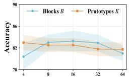

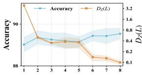

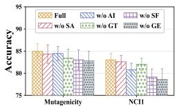  
(a) Ablation Study

(c) Evolution Depth  
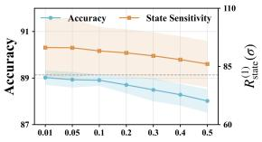  
(d) Perturbation Stability  
Figure 1: (a) Ablations on Mutagenicity and NCI1. (b) Sensitivity to block count B and atlas size K on NCI1. (c), (d) Evolution depth and perturbation stability on PubMed, respectively.

Baselines. We compare GeoF with a comprehensive set of baselines, including: (1) general graph neural networks (GNNs), such as GCN (Kipf & Welling, 2017), GIN (Xu et al., 2019), ${ \bf { \bar { M L } } } ^ { 2 } .$ GCL (Liang et al., 2025), AMPs (Errica et al., 2025), WaveGC (Liu et al., 2025), SPARROW (Lin et al., 2025), and G2Former (Zhang et al., 2025); (2) manifold-based GNNs, including HGCN (Chami et al., 2019), D-GCN (Sun et al., 2024), and SPDGNN (Wang & Chang, 2025); and (3) adaptive GNNs, including ACE-HGNN (Fu et al., 2021), GNRF (Chen et al., 2025), BEC-GNN (Hevapathige et al., 2025), and ARGNN (Wang et al., 2026a). More details of baselines can be found in Appendix H.

## 4.2 PERFORMANCE COMPARISONS

Tables 1 and 2 compare GeoF with the baselines on node classification (NC), link prediction (LP), and graph classification (GC). Three observations follow. (1) Advanced architectures such as AMPs and WaveGC improve clearly over GCN and GIN, which underlines the value of multi-scale propagation. (2) Manifold-based and adaptive GNNs are competitive through richer geometric priors and curvature-aware designs, but they treat geometry as a fixed manifold or a locally adaptive parameter rather than an evolving state, which limits how far the propagation space can follow task-specific requirements. (3) GeoF is best on every dataset and task. This matches its design. It keeps propagation geometry as a persis-

Table 2: Performance comparisons (in %) between baselines and GeoF for Graph Classification.
<table><tr><td>Model</td><td>PROTEINS</td><td>Mutag</td><td>NCI1</td><td>FRANK</td><td>BBBP</td><td>molhiv</td></tr><tr><td>GCN</td><td> $7 5 . 3 { \scriptstyle \pm 1 . 9 }$ </td><td> $7 9 . 8 { \scriptstyle \pm 1 . 8 }$ </td><td> $7 6 . 0 { \scriptstyle \pm 1 . 0 }$ </td><td> $6 3 . 3 { \scriptstyle \pm 2 . 2 }$ </td><td> $8 7 . 4 _ { \pm 2 . 0 }$ </td><td> $7 5 . 8 { \scriptstyle \pm 2 . 0 }$ </td></tr><tr><td>GIN</td><td> $7 6 . 7 _ { \pm 1 . 7 }$ </td><td> $8 0 . 1 _ { \pm 1 . 9 }$ </td><td> $7 8 . 0 { \scriptstyle \pm 1 . 2 }$ </td><td> $6 8 . 9 { \scriptstyle \pm 1 . 7 }$ </td><td> $8 9 . 5 { \scriptstyle \pm 2 . 1 }$ </td><td> $7 7 . 3 { \scriptstyle \pm 2 . 0 }$ </td></tr><tr><td> $\mathbf { M L ^ { 2 } { - } G C L }$ </td><td> $7 7 . 9 { \scriptstyle \pm 1 . 8 }$ </td><td> $8 1 . 9 { \scriptstyle \pm 1 . 9 }$ </td><td> $8 0 . 7 _ { \pm 1 . 3 }$ </td><td> $7 0 . 7 { \scriptstyle \pm 1 . 8 }$ </td><td> $9 0 . 9 { \scriptstyle \pm 2 . 2 }$ </td><td> $8 1 . 3 { \scriptstyle \pm 1 . 6 }$ </td></tr><tr><td> $\mathbf { A M P s }$ </td><td> $7 8 . 8 { \scriptstyle \pm 2 . 0 }$ </td><td> $8 3 . 4 _ { \pm 1 . 6 }$ </td><td> $8 2 . 0 _ { \pm 1 . 1 }$ </td><td> $7 2 . 4 { \scriptstyle \pm 1 . 8 }$ </td><td> $9 2 . 5 { \scriptstyle \pm 2 . 3 }$ </td><td> $8 2 . 0 { \scriptstyle \pm 2 . 4 }$ </td></tr><tr><td> $\mathbf { W a v e G C }$ </td><td> $7 9 . 0 { \scriptstyle \pm 1 . 8 }$ </td><td> $8 2 . 3 { \scriptstyle \pm 2 . 3 }$ </td><td>8  $1 . 6 { \scriptstyle \pm 1 . 8 }$ </td><td> $7 2 . 6 { \scriptstyle \pm 1 . 9 }$ </td><td> $9 2 . 6 { \scriptstyle \pm 1 . 8 }$ </td><td> $8 2 . 0 { \scriptstyle \pm 1 . 9 }$ </td></tr><tr><td> $\operatorname { S P A R R O W }$ </td><td> $7 8 . 7 _ { \pm 1 . 5 }$ </td><td> $8 3 . 7 _ { \pm 1 . 9 }$ </td><td> $8 0 . 9 { \scriptstyle \pm 1 . 2 }$ </td><td> $7 2 . 3 { \scriptstyle \pm 2 . 2 }$ </td><td> $9 1 . 8 { \scriptstyle \pm 1 . 9 }$ </td><td> $8 1 . 5 { \scriptstyle \pm 2 . 3 }$ </td></tr><tr><td> $\mathrm { G ^ { 2 } F o r m e r }$ </td><td> $7 8 . 9 { \scriptstyle \pm 2 . 0 }$ </td><td> $8 2 . 7 _ { \pm 2 . 4 }$ </td><td> $8 2 . 1 _ { \pm 1 . 5 }$ </td><td> $7 1 . 9 { \scriptstyle \pm 1 . 9 }$ </td><td> $9 2 . 4 _ { \pm 2 . 4 }$ </td><td> $8 1 . 8 { \scriptstyle \pm 1 . 6 }$ </td></tr><tr><td>HGCN</td><td> $7 7 . 3 { \scriptstyle \pm 1 . 6 }$ </td><td> $8 0 . 2 \pm 2 . 1$ </td><td> $7 8 . 3 { \scriptstyle \pm 1 . 4 }$ </td><td> $6 9 . 4 _ { \pm 2 . 3 }$ </td><td> $8 9 . 4 _ { \pm 2 . 2 }$ </td><td> $7 6 . 0 { \scriptstyle \pm 1 . 6 }$ </td></tr><tr><td>D-GCN</td><td> $7 8 . 4 _ { \pm 2 . 2 }$ </td><td> $8 2 . 2 { \scriptstyle \pm 1 . 8 }$ </td><td> $7 9 . 1 _ { \pm 1 . 3 }$ </td><td> $6 9 . 8 { \scriptstyle \pm 2 . 2 }$ </td><td> $9 0 . 7 { \scriptstyle \pm 1 . 7 }$ </td><td> $7 9 . 0 { \scriptstyle \pm 2 . 2 }$ </td></tr><tr><td>SPDGNN</td><td> $7 8 . 5 { \scriptstyle \pm 1 . 9 }$ </td><td> $8 1 . 6 _ { \pm 1 . 7 }$ </td><td> $7 9 . 6 { \scriptstyle \pm 1 . 6 }$ </td><td> $7 1 . 4 { \scriptstyle \pm 2 . 1 }$ </td><td> $9 1 . 5 { \scriptstyle \pm 1 . 7 }$ </td><td> $8 1 . 3 { \scriptstyle \pm 2 . 2 }$ </td></tr><tr><td>ACE-HGNN</td><td> $7 7 . 5 { \scriptstyle \pm 1 . 7 }$ </td><td> $8 0 . 7 { \scriptstyle \pm 1 . 8 }$ </td><td> $8 1 . 6 _ { \pm 1 . 2 }$ </td><td> $7 1 . 7 { \scriptstyle \pm 2 . 2 }$ </td><td> $9 1 . 6 { \scriptstyle \pm 1 . 2 }$ </td><td> $7 9 . 1 _ { \pm 2 . 2 }$ </td></tr><tr><td>BEC-GNN</td><td> $7 7 . 5 { \scriptstyle \pm 1 . 9 }$ </td><td> $8 1 . 0 { \scriptstyle \pm 1 . 5 }$ </td><td> $7 9 . 4 _ { \pm 2 . 2 }$ </td><td> $7 0 . 0 { \scriptstyle \pm 2 . 3 }$ </td><td> $9 1 . 9 { \scriptstyle \pm 1 . 8 }$ </td><td> $8 0 . 3 { \scriptstyle \pm 1 . 3 }$ </td></tr><tr><td>GNRF</td><td> $7 8 . 5 { \scriptstyle \pm 1 . 7 }$ </td><td> $8 2 . 4 _ { \pm 2 . 3 }$ </td><td> $8 1 . 9 { \scriptstyle \pm 2 . 1 }$ </td><td> $7 2 . 1 _ { \pm 1 . 7 }$ </td><td> $9 2 . 2 { \scriptstyle \pm 1 . 8 }$ </td><td> $8 1 . 5 { \scriptstyle \pm 1 . 7 }$ </td></tr><tr><td>ARGNN</td><td> $7 8 . 0 { \scriptstyle \pm 1 . 8 }$ </td><td> $8 3 . 4 _ { \pm 1 . 5 }$ </td><td> $8 1 . 7 _ { \pm 1 . 6 }$ </td><td> $7 2 . 2 { \scriptstyle \pm 2 . 0 }$ </td><td> $9 2 . 3 _ { \pm 1 . 7 }$ </td><td> $8 1 . 1 { \scriptstyle \pm 2 . 2 }$ </td></tr><tr><td> $\operatorname { G e o F }$ </td><td> $7 9 . 4 _ { \pm 1 . 6 }$ </td><td> $\mathbf { 8 4 . 9 } _ { \pm 1 . 7 }$ </td><td> ${ \bf 8 3 . 0 _ { \pm 1 . 5 } }$ </td><td> $7 3 . 3 { \scriptstyle \pm 1 . 8 }$ </td><td> $9 3 . 4 _ { \pm 1 . 8 }$ </td><td> $\mathbf { 8 2 . 9 _ { \pm 1 . 1 } }$ </td></tr></table>

## 4.3 ABLATION STUDY

We evaluate five ablations on Mutagenicity and NCI1. Three remove a component: the structural signatures in the prototype gate and the correction (w/o SA), the structure-aware prototype atlas for initialization (w/o AI), and the triangular frame transport into the target frame (w/o GT). Two alter the geometry update, either replacing the second-order residual target by the current geometry while keeping the correction (w/o SF) or freezing the initialized geometry across steps (w/o GE). Figure 1(a) shows that the full model attains the highest accuracy on both datasets. Freezing the geometry costs the most, confirming the benefit of adapting propagation geometry during message passing, and removing second-order feedback costs the second most, so residual statistics contribute beyond the correction. Disabling frame transport also lowers accuracy, consistent with the role of coordinate alignment in aggregation and residual computation. Removing the atlas hurts more on NCI1, and removing structural signatures causes modest decreases. Additional results are in Appendix K.2.

## 4.4 SENSITIVITY ANALYSIS

Hyperparameters Analysis. We vary the number of geometric blocks $B ,$ atlas prototypes $K ,$ and evolution depth $L ,$ which set the block partition, atlas size, and recurrent depth. On NCI1, Figure 1(b) shows that accuracy improves as B increases from 4 to $^ { 8 , }$ stays stable for $\bar { B } \in \{ 8 , 1 6 , 3 2 \}$ , and drops at $B = 6 4$ , while it changes little for $K \in \{ 4 , 8 , 1 6 \}$ and decreases slightly at $K = 3 2$ and 64; moderate values therefore suffice. On PubMed, Figure 1(c) shows stable accuracy for L from 1 to 8, while the terminal geometric change $\begin{array} { r } { D _ { Z } ( L ) = \frac { 1 } { n B } \sum _ { i , b } \| z _ { i , b } ^ { L } - z _ { i , b } ^ { L - 1 } \| _ { 2 } } \end{array}$ decreases with depth, with a plateau between $L = 2$ and 5. Successive geometric updates thus shrink with depth without affecting accuracy, consistent with the stability of Proposition 3. More results are provided in Appendix K.3.

Perturbation Stability. We perturb the initial features $\{ \xi _ { i } ^ { 0 } \} _ { i = 1 } ^ { n }$ on PubMed along a random Gaussian direction with relative norm $\sigma ,$ keeping the graph, initial geometry, and trained parameters fixed, and report accuracy together with the one-step sensitivity $R _ { \mathrm { s t a t e } } ^ { ( 1 ) } ( \sigma ) = d ( S _ { \sigma } ^ { 1 } , S ^ { 1 } ) / d ( S _ { \sigma } ^ { 0 } , S ^ { 0 } )$ , where $S ^ { l } = \overline { { { ( \Xi ^ { l } , Z ^ { l } ) } } }$ stacks the feature states and geometric coordinates of all nodes and $d ( S , S ^ { \prime } ) =$ $\begin{array} { r } { \| \Xi - \Xi ^ { \prime } \| _ { F } + \sum _ { b } \| Z _ { b } - Z _ { b } ^ { \prime } \| _ { F } } \end{array}$ . Figure 1(d) shows that $R _ { \mathrm { s t a t e } } ^ { ( 1 ) } ( \sigma )$ is nearly constant at small $\sigma ,$ indicating a proportional response to small perturbations, and decreases steadily by 7.6% from $\sigma = 0 . 0 1$ to 0.5, while accuracy drops by only 1.1% over the same range. Larger perturbations thus reduce accuracy mildly without amplifying the one-step sensitivity of the coupled update.

## 4.5 ANALYSIS OF SECOND-ORDER FEEDBACK

Table 3: Performance comparison (in %) between baselines and their second-order (SO) variants. Bold indicates the best performance.

Features versus Feedback. To test whether the gains   
come from second-order information alone, we give   
GCN, GIN, and ARGNN the same weighted second  
order residual statistics as additional features, with   
parameter counts matched to GeoF within 0.5% (Ta  
ble 3). The augmentation helps GIN in all four set  
tings and GCN in three, but hurts GCN on BBBP and   
ARGNN on CiteSeer and BBBP. GeoF exceeds the   
strongest augmented variant in every column, by 0.7   
to 3.3 points. At comparable parameter budgets, the   
difference is how the statistics are used. The base  
lines consume them as features, whereas GeoF uses   
them as feedback that changes the geometry governi ng subsequent weighting and transport.

Feedback Structure and Schedule. Table 4 varies the feedback with the rest of the model unchanged. Replacing the full statistic $C _ { i , b } ^ { l }$ by the mean-only target $C _ { i , b } ^ { l , \mathrm { m e a n } }$ or the diagonal target $C _ { i , b } ^ { l , \mathrm { d i a g } }$ of Proposition 2 lowers accuracy on all four datasets, consistent with Proposition 2; the diagonal target loses most on NCI1 and Mutag. The two restricted variants rank differently across datasets, so the mean and the marginal second moments capture different aspects

<table><tr><td>Model</td><td>CiteSeer</td><td>Photo</td><td>PROTEINS</td><td>BBBP</td></tr><tr><td>GCN</td><td> $7 1 . 5 { \scriptstyle \pm 1 . 7 }$ </td><td> $9 2 . 1 _ { \pm 0 . 5 }$ </td><td> $7 5 . 3 { \scriptstyle \pm 1 . 9 }$ </td><td> $8 7 . 4 _ { \pm 2 . 0 }$ </td></tr><tr><td>GCN w/ SO</td><td> $7 2 . 3 { \scriptstyle \pm 1 . 9 }$ </td><td> $9 2 . 4 { \scriptstyle \pm 1 . 1 }$ </td><td> $7 7 . 0 _ { \pm 2 . 4 }$ </td><td> $8 6 . 7 _ { \pm 2 . 5 }$ </td></tr><tr><td>GIN</td><td> $7 0 . 6 { \scriptstyle \pm 1 . 2 }$ </td><td> $9 2 . 7 { \scriptstyle \pm 0 . 5 }$ </td><td> $7 6 . 7 _ { \pm 1 . 7 }$ </td><td> $8 9 . 5 { \scriptstyle \pm 2 . 1 }$ </td></tr><tr><td>GIN w/ SO</td><td> $7 3 . 3 { \scriptstyle \pm 1 . 0 }$ </td><td> $9 3 . 6 _ { \pm 1 . 4 }$ </td><td> $7 8 . 5 { \scriptstyle \pm 1 . 5 }$ </td><td> $9 1 . 3 { \scriptstyle \pm 2 . 2 }$ </td></tr><tr><td>ARGNN</td><td> $7 5 . 6 { \scriptstyle \pm 1 . 2 }$ </td><td> $9 4 . 9 { \scriptstyle \pm 0 . 5 }$ </td><td> $7 8 . 0 { \scriptstyle \pm 1 . 8 }$ </td><td> $9 2 . 3 { \scriptstyle \pm 1 . 7 }$ </td></tr><tr><td>ARGNN w/ SO</td><td> $7 4 . 4 { \scriptstyle \pm 2 . 3 }$ </td><td> $9 5 . 3 { \scriptstyle \pm 0 . 6 }$ </td><td> $7 8 . 3 { \scriptstyle \pm 2 . 2 }$ </td><td> $9 1 . 9 { \scriptstyle \pm 2 . 1 }$ </td></tr><tr><td>GeoF</td><td> $7 7 . 7 _ { \pm 1 . 2 }$ </td><td> $\mathbf { 9 6 . 0 _ { \pm 0 . 4 } }$ </td><td> ${ \bf 7 9 . 4 _ { \pm 1 . 6 } }$ </td><td> $\mathbf { 9 3 . 4 } _ { \pm 1 . 8 }$ </td></tr></table>

Table 4: Performance comparison (in %) among different residual feedback statistics. Bold indicates the best performance.
<table><tr><td>Feedback</td><td>Photo</td><td>CS</td><td>Mutag.</td><td>NCI1</td></tr><tr><td>Mean-only</td><td> $9 4 . 9 { \pm } 0 . 6 $ </td><td> $9 5 . 1 { \scriptstyle \pm 0 . 3 }$ </td><td> $8 3 . 7 \pm 1 . 7$ </td><td> $8 1 . 9 { \scriptstyle \pm 1 . 6 }$ </td></tr><tr><td>Diagonal</td><td> $9 5 . 1 { \scriptstyle \pm 0 . 3 }$ </td><td> $9 5 . 2 { \scriptstyle \pm 0 . 4 }$ </td><td> $8 3 . 2 { \scriptstyle \pm 2 . 0 }$ </td><td> $8 0 . 4 { \scriptstyle \pm 1 . 0 }$ </td></tr><tr><td>One-shot</td><td> $9 4 . 6 { \scriptstyle \pm 0 . 5 }$ </td><td> $9 4 . 8 { \scriptstyle \pm 0 . 3 }$ </td><td> $8 3 . 1 { \pm } 1 . 8$ </td><td> $7 9 . 8 { \scriptstyle \pm 2 . 7 }$ </td></tr><tr><td>Full</td><td> $\mathbf { 9 6 . 0 _ { \pm 0 . 4 } }$ </td><td> ${ \bf 9 5 . 8 _ { \pm 0 . 3 } }$ </td><td> $\mathbf { 8 4 . 9 } \pm 1 . 7$ </td><td> ${ \bf 8 3 . 0 { \scriptstyle \pm 1 . 5 } }$ </td></tr></table>

of local variation. Updating the geometry only once, after the first step, also lowers accuracy on all four datasets, by 1.4 and 1.0 points on Photo and CS and by 1.8 and 3.2 points on Mutag and NCI1.

## 5 CONCLUSION

To capture message-level variation obscured by aggregation, we proposed GeoF, which jointly evolves node features and propagation geometry through recurrent message-passing feedback. The geometry governs neighborhood weighting and triangular frame transport for consistent message comparison, second-order residual statistics capture directional variation and within-block dependencies to define geometric targets, and bounded log-triangular updates combine these targets with task-supervised corrections while preserving positive definiteness. Experiments on node, link, and graph prediction show consistent gains over competitive baselines, supporting learning propagation geometry from the interactions it induces and motivating future work on adaptive-depth inference and evolving graphs.

## REFERENCES

Sami Abu-El-Haija, Bryan Perozzi, Amol Kapoor, Nazanin Alipourfard, Kristina Lerman, Hrayr Harutyunyan, Greg Ver Steeg, and Aram Galstyan. Mixhop: Higher-order graph convolutional architectures via sparsified neighborhood mixing. In Proceedings of the International Conference on Machine Learning, pp. 21–29, 2019.

Cristian Bodnar, Francesco Di Giovanni, Benjamin Chamberlain, Pietro Lio, and Michael Bronstein. Neural sheaf diffusion: A topological perspective on heterophily and oversmoothing in gnns. Proceedings ofthe Conference on Neural Information Processing Systems, 35:18527–18541, 2022.

Ines Chami, Zhitao Ying, Christopher Re, and Jure Leskovec. Hyperbolic graph convolutional neural´ networks. Proceedings ofthe Conference on Neural Information Processing Systems, 32, 2019.

Jialong Chen, Bowen Deng, Zhen Wang, Chuan Chen, and Zibin Zheng. Graph neural ricci flow: Evolving feature from a curvature perspective. In Proceedings ofthe International Conference on Learning Representations, volume 2025, pp. 31083–31111, 2025.

Yu Chen, Lingfei Wu, and Mohammed Zaki. Iterative deep graph learning for graph neural networks: Better and robust node embeddings. Advances in neural information processing systems, 33: 19314–19326, 2020.

Paul D Dobson and Andrew J Doig. Distinguishing enzyme structures from non-enzymes without alignments. Journal ofmolecular biology, 330(4):771–783, 2003.

Federico Errica, Henrik Christiansen, Viktor Zaverkin, Takashi Maruyama, Mathias Niepert, and Francesco Alesiani. Adaptive message passing: A general framework to mitigate oversmoothing, oversquashing, and underreaching. In Proceedings of the International Conference on Machine Learning, pp. 15490–15515. PMLR, 2025.

Xingcheng Fu, Jianxin Li, Jia Wu, Qingyun Sun, Cheng Ji, Senzhang Wang, Jiajun Tan, Hao Peng, and Philip S Yu. Ace-hgnn: Adaptive curvature exploration hyperbolic graph neural network. In 2021 IEEE international conference on data mining (ICDM), pp. 111–120. IEEE, 2021.

Johannes Gasteiger, Aleksandar Bojchevski, and Stephan Gunnemann. Predict then propagate: Graph¨ neural networks meet personalized pagerank. arXiv preprint arXiv:1810.05997, 2018.

Justin Gilmer, Samuel S Schoenholz, Patrick F Riley, Oriol Vinyals, and George E Dahl. Neural message passing for quantum chemistry. In Proceedings of the International Conference on Machine Learning, pp. 1263–1272, 2017.

Asela Hevapathige, Ahad N Zehmakan, and Qing Wang. Depth-adaptive graph neural networks via learnable bakry-emery curvature. In´ Proceedings ofthe International ACM SIGKDD Conference on Knowledge Discovery & Data Mining, pp. 944–955, 2025.

Xiaobin Hong, Wenzhong Li, Chaoqun Wang, Mingkai Lin, and Sanglu Lu. Label attentive distillation for gnn-based graph classification. In Proceedings of the AAAI Conference on Artificial Intelligence, volume 38, pp. 8499–8507, 2024.

Roger A Horn and Charles R Johnson. Matrix analysis. Cambridge university press, 2012.

Weihua Hu, Matthias Fey, Marinka Zitnik, Yuxiao Dong, Hongyu Ren, Bowen Liu, Michele Catasta, and Jure Leskovec. Open graph benchmark: Datasets for machine learning on graphs. Advances in neural information processing systems, 33:22118–22133, 2020.

Wei Jin, Yao Ma, Xiaorui Liu, Xianfeng Tang, Suhang Wang, and Jiliang Tang. Graph structure learning for robust graph neural networks. In Proceedings ofthe 26th ACM SIGKDD international conference on knowledge discovery & data mining, pp. 66–74, 2020.

Jeroen Kazius, Ross McGuire, and Roberta Bursi. Derivation and validation of toxicophores for mutagenicity prediction. Journal ofmedicinal chemistry, 48(1):312–320, 2005.

Thomas N. Kipf and Max Welling. Semi-supervised classification with graph convolutional networks. In Proceedings ofthe International Conference on Learning Representations, 2017.

See Hian Lee, Feng Ji, and Wee Peng Tay. Node-specific space selection via localized geometric hyperbolicity in graph neural networks. arXiv preprint arXiv:2303.01724, 2023.

Jianqing Liang, Zhiqiang Li, Xinkai Wei, Yuan Liu, and Zhiqiang Wang. Ml 2-gcl: Manifold learning inspired lightweight graph contrastive learning. In Proceedings ofthe International Conference on Machine Learning, 2025.

Yuena Lin, Gengyu Lyu, Haichun Cai, Deng-Bao Wang, Haobo Wang, and Zhen Yang. Simplified graph contrastive learning model without augmentation. IEEE Transactions on Knowledge and Data Engineering, 2025.

Zhenhua Lin. Riemannian geometry of symmetric positive definite matrices via cholesky decomposition. SIAM Journal on Matrix Analysis and Applications, 40(4):1353–1370, 2019.

Meng Liu, Hongyang Gao, and Shuiwang Ji. Towards deeper graph neural networks. In Proceedings of the International ACM SIGKDD Conference on Knowledge Discovery & Data Mining, pp. 338–348, 2020.

Nian Liu, Xiaoxin He, Thomas Laurent, Francesco Di Giovanni, Michael M Bronstein, and Xavier Bresson. A general graph spectral wavelet convolution via chebyshev order decomposition. In Proceedings of the International Conference on Machine Learning, pp. 38598–38622. PMLR, 2025.

Qi Liu, Maximilian Nickel, and Douwe Kiela. Hyperbolic graph neural networks. Advances in neural information processing systems, 32, 2019.

Julian McAuley, Christopher Targett, Qinfeng Shi, and Anton Van Den Hengel. Image-based recommendations on styles and substitutes. In Proceedings of the International ACM SIGIR Conference on Research & Development in Information Retrieval, pp. 43–52, 2015.

Francesco Orsini, Paolo Frasconi, and Luc De Raedt. Graph invariant kernels. In Proceedings ofthe International Joint Conference on Artificial Intelligence, 2015.

James M Ortega and Werner C Rheinboldt. Iterative solution of nonlinear equations in several variables. SIAM, 2000.

Hongbin Pei, Bingzhe Wei, Kevin Chen-Chuan Chang, Yu Lei, and Bo Yang. Geom-gcn: Geometric graph convolutional networks. arXiv preprint arXiv:2002.05287, 2020.

Prithviraj Sen, Galileo Namata, Mustafa Bilgic, Lise Getoor, Brian Gallagher, and Tina Eliassi-Rad. Collective classification in network data. AI magazine, 29(3):93–106, 2008.

Oleksandr Shchur, Maximilian Mumme, Aleksandar Bojchevski, and Stephan Gunnemann. Pitfalls¨ of graph neural network evaluation. arXiv preprint arXiv:1811.05868, 2018.

Li Sun, Zhenhao Huang, Zixi Wang, Feiyang Wang, Hao Peng, and Philip S Yu. Motif-aware riemannian graph neural network with generative-contrastive learning. In Proceedings of the AAAI Conference on Artificial Intelligence, volume 38, pp. 9044–9052, 2024.

Petar Velickoviˇ c, Guillem Cucurull, Arantxa Casanova, Adriana Romero, Pietro Li´ o, and Yoshua\` Bengio. Graph attention networks. In Proceedings ofthe International Conference on Learning Representations, 2018.

Nikil Wale, Ian A Watson, and George Karypis. Comparison of descriptor spaces for chemical compound retrieval and classification. Knowledge and Information Systems, 14:347–375, 2008.

Xudong Wang, Chris Ding, Tongxin Li, and Jicong Fan. Adaptive riemannian graph neural networks. In Proceedings of the AAAI Conference on Artificial Intelligence, volume 40, pp. 26606–26614, 2026a.

Yingxu Wang, Kunyu Zhang, Jiaxin Huang, Nan Yin, Siwei Liu, and Eran Segal. Protomol: enhancing molecular property prediction via prototype-guided multimodal learning. Briefings in Bioinformatics, 26(6):bbaf629, 2025.

Yingxu Wang, Victor Liang, Nan Yin, Siwei Liu, and Eran Segal. Sgac: a graph neural network framework for imbalanced and structure-aware amp classification. Briefings in Bioinformatics, 27 (1):bbag038, 2026b.

Yingxu Wang, Kunyu Zhang, Mengzhu Wang, Siyang Gao, and Nan Yin. Usbd: Universal structural basis distillation for source-free graph domain adaptation. In Proceedings of the 32nd ACM SIGKDD Conference on Knowledge Discovery and Data Mining V. 2, pp. 5125–5136, 2026c.

Yu Wang and Yi Chang. Enhancing graph neural networks on spd manifolds via cholesky decomposition. Pattern Recognition, pp. 112763, 2025.

Lanning Wei, Huan Zhao, Zhiqiang He, and Quanming Yao. Neural architecture search for gnn-based graph classification. ACM Transactions on Information Systems, 42(1):1–29, 2023.

Qitian Wu, Wentao Zhao, Zenan Li, David P Wipf, and Junchi Yan. Nodeformer: A scalable graph structure learning transformer for node classification. Proceedings ofthe Conference on Neural Information Processing Systems, 35:27387–27401, 2022.

Zhenqin Wu, Bharath Ramsundar, Evan N Feinberg, Joseph Gomes, Caleb Geniesse, Aneesh S Pappu, Karl Leswing, and Vijay Pande. Moleculenet: a benchmark for molecular machine learning. Chemical science, 9(2):513–530, 2018.

Keyulu Xu, Chengtao Li, Yonglong Tian, Tomohiro Sonobe, Ken-ichi Kawarabayashi, and Stefanie Jegelka. Representation learning on graphs with jumping knowledge networks. In Proceedings of the International Conference on Machine Learning, pp. 5453–5462. pmlr, 2018.

Keyulu Xu, Weihua Hu, Jure Leskovec, and Stefanie Jegelka. How powerful are graph neural networks? In Proceedings of the International Conference on Learning Representations, 2019.

Tianjun Yao, Yingxu Wang, Kun Zhang, and Shangsong Liang. Improving the expressiveness of k-hop message-passing gnns by injecting contextualized substructure information. In Proceedings of the International ACM SIGKDD Conference on Knowledge Discovery & Data Mining, pp. 3070–3081, 2023.

Seongjun Yun, Minbyul Jeong, Raehyun Kim, Jaewoo Kang, and Hyunwoo J Kim. Graph transformer networks. Proceedings ofthe Conference on Neural Information Processing Systems, 32, 2019.

Jingyuan Zhang, Xin Wang, Lei Yu, Zhirong Huang, Li Yang, and Fengjun Zhang. Restricted global-aware graph filters bridging gnns and transformer for node classification. In Proceedings of the Conference on Neural Information Processing Systems, 2025.

## A NOTATION SUMMARY

As shown in the Table 5, we summarize the key notations of this paper.

Table 5: Summary of key notations.
<table><tr><td>Symbol</td><td>Description</td></tr><tr><td> $G = ( V , E , X ) , A$ </td><td>Attributed graph with node set V, edge set E, feature matrix X, and adjacency matrix A.</td></tr><tr><td> $n , F _ { 0 } , C$ </td><td>Numbers of nodes, input features, and classes, respectively.</td></tr><tr><td> $u _ { i } , U , q$ </td><td>Fixed structural signature of node i, signature matrix, and signature dimension.</td></tr><tr><td> $\mathcal { N } ( i ) , \widetilde { \mathcal { N } } ( i )$ </td><td>Neighborhood of node i and its extension with a self-loop.</td></tr><tr><td> $d , B , m$ </td><td>Hidden dimension, number of geometric blocks, and block size, with  $d = B m .$ </td></tr><tr><td> $K , L$ </td><td>Numbers of geometric prototypes and recurrent evolution steps.</td></tr><tr><td> $\xi _ { i } ^ { l } , Z _ { i } ^ { l }$   $\bar { z } _ { i , b } ^ { l } = [ a _ { i , b } ^ { l } , \ell _ { i , b } ^ { l } ] ^ { \top }$ </td><td>Local feature state and node-wise geometric coordinates at step l. Log-triangular coordinates of block b: strictly lower-triangular entries and log-diagonal</td></tr><tr><td> $L _ { i , b } ^ { l } , g _ { i , b } ^ { l }$ </td><td>scales. Block triangular frame and corresponding symmetric positive-definite geometry.</td></tr><tr><td> $L _ { i } ^ { l } , g _ { i } ^ { l }$ </td><td>Node-wise frame and local geometry assembled as block-diagonal matrices.</td></tr><tr><td> $\mathcal { Z } , \Pi _ { \mathcal { Z } }$ </td><td>Admissible coordinate domain with bounds  $a _ { \mathrm { m a x } } , \ell _ { \mathrm { m i n } } , \ell _ { \mathrm { m a x } } ,$  and coordinatewise clip- ping onto it.</td></tr><tr><td> $\sigma _ { + } , \sigma _ { - } , \kappa _ { L }$ </td><td>Spectral bounds of admissible frames and Lipschitz constant of the frame reconstruction.</td></tr><tr><td> $z _ { k , b } ^ { \mathrm { p r o t o } } , \alpha _ { i k }$ </td><td>Coordinates of prototype k in block b and its structure-conditioned weight for node i.</td></tr><tr><td>hi</td><td>Shared-environment representation  $h _ { i } ^ { l } = L _ { i } ^ { l } \xi _ { i } ^ { l }$ </td></tr><tr><td> $e _ { i j } ^ { l } , \boldsymbol { \omega } _ { i j } ^ { l } , \boldsymbol { \tau }$ </td><td>Squared environment-space distance, normalized neighborhood weight, and tempera-</td></tr><tr><td> $\phi , W _ { \phi }$ </td><td>ture. Shared linear message transformation and its learnable weight matrix.</td></tr><tr><td> $T _ { j  i , b } ^ { l }$ </td><td>Blockwise source-to-target frame map  $( L _ { i , b } ^ { l } ) ^ { - 1 } L _ { j , b } ^ { l } .$ </td></tr><tr><td> $\underset { - } { m } _ { j  { i , b } } ^ { l } , \{ m  _ { j  { i } } ^ { l }$ </td><td>Transported block message and the full message concatenated across blocks.</td></tr><tr><td> $\bar { \xi } _ { i } ^ { l } , r _ { i } ^ { l }$ </td><td>Aligned neighborhood aggregate and elementwise gate for feature updates.</td></tr><tr><td> $\delta _ { i j , b } ^ { l } , \bar { \delta } _ { i , b } ^ { l }$ </td><td>Residual between an aligned source message and the transformed target state, and its</td></tr><tr><td> $C _ { i , b } ^ { l } , \epsilon _ { s }$ </td><td>weighted mean. Regularized weighted second-moment matrix of residuals and its spectral regularization.</td></tr><tr><td> $R _ { i , b } ^ { l } , \widehat { z } _ { i , b } ^ { l } , \eta$ </td><td>Stabilized Cholesky target frame, its log-triangular coordinates, and the numerical jitter.</td></tr><tr><td></td><td>Controller input and shared controller predicting task-supervised geometric corrections.</td></tr><tr><td> $q _ { i , b } ^ { l } , \Gamma _ { \theta }$   $U _ { i , b } ^ { l } , V _ { i , b } ^ { l } , d _ { i , b } ^ { l }$ </td><td>Controller factors for lower-triangular corrections and the log-diagonal correction vector.</td></tr><tr><td> $\Delta z _ { i , b } ^ { l }$ </td><td>Learned correction to the block log-triangular coordinates.</td></tr><tr><td></td><td></td></tr><tr><td> $\lambda , \gamma$ </td><td>Mixing weight for the residual target and strength of the learned correction.</td></tr></table>

## B PROOF OF LEMMA 1

Lemma 1 (Well-Posed Geometric Parameterization) Let $m \geq 1$ and $z , z ^ { \prime } \in { \mathcal { Z } } .$ . The frame $L ( z )$ is lower triangular with det $L ( z ) = \exp ( \sum _ { t } \ell _ { t } ) > 0 ,$ , so it is invertible and $g ( z ) \in \mathrm { S P D } ( m )$ There are constants $\sigma _ { + } \geq \sigma _ { - } > 0$ and $\kappa _ { L } > 0 ,$ , depending only on m, $a _ { \mathrm { m a x } } , \ell _ { \mathrm { m i n } } ,$ and $\ell _ { \mathrm { m a x } } ,$ such that

$$
\| L ( z ) \| _ { 2 } \leq \sigma _ { + } , \qquad \| L ( z ) ^ { - 1 } \| _ { 2 } \leq \sigma _ { - } ^ { - 1 } , \qquad \sigma _ { - } ^ { 2 } I _ { m } \preceq g ( z ) \preceq \sigma _ { + } ^ { 2 } I _ { m } ,
$$

and the reconstruction is Lipschitz: $\| L ( z ) - L ( z ^ { \prime } ) \| _ { F } \leq \kappa _ { L } \| z - z ^ { \prime } \| _ { 2 }$ and $\| L ( z ) ^ { - 1 } - L ( z ^ { \prime } ) ^ { - 1 } \| _ { 2 } \leq$ $\sigma _ { - } ^ { - 2 } \kappa _ { L } \| z - z ^ { \prime } \| _ { 2 } . A l l$ statements carry over to the block-diagonal frames $L _ { i } = \bigoplus _ { b } L ( z _ { i , b } )$ and $g _ { i } = L _ { i } ^ { \top } L _ { i } ,$ , with $\| z - z ^ { \prime } \| _ { 2 }$ replaced by $\begin{array} { r } { \| Z _ { i } - Z _ { i } ^ { \prime } \| _ { F } : = ( \sum _ { b } \| z _ { i , b } - z _ { i , b } ^ { \prime } \| _ { 2 } ^ { 2 } ) ^ { 1 / 2 } } \end{array}$

Proof 1 Throughout, $\| \cdot \| _ { 2 }$ denotes the Euclidean norm ofa vector and the spectral norm ofa matrix, $\| \cdot \| _ { F }$ the Frobenius norm, and $\| \cdot \| _ { 1 } , \| \cdot \| _ { \infty }$ the induced max-column-sum and max-row-sum norms. Recallfrom Eq. (1) that a block coordinate $z = [ a ^ { \top } , \ell ^ { \top } ] ^ { \top } \in \mathcal { Z }$ , with $a \in \mathbb { R } ^ { m ( m - 1 ) / 2 }$ and $\ell \in \mathbb { R } ^ { m }$

is reconstructed as

$$
L ( z ) = N + D , \qquad N : = \operatorname { m a t } _ { \mathrm { s l } } ( a ) , \qquad D : = \operatorname { D i a g } ( e ^ { \ell } ) ,\tag{16}
$$

so that $L ( z ) _ { r r } = e ^ { \ell _ { r } }$ and $L ( z ) _ { r s } = a _ { r s } f o r r > s ,$ , where N is strictly lower triangular with $| N _ { r s } | \leq a _ { \operatorname* { m a x } }$ and $\ell _ { t } \in [ \ell _ { \operatorname* { m i n } } , \dot { \ell } _ { \operatorname* { m a x } } ] f o r$ all $r > s$ and t. With

$$
\nu : = a _ { \mathrm { m a x } } \sqrt { \frac { m ( m - 1 ) } { 2 } } , \qquad \bar { a } : = a _ { \mathrm { m a x } } e ^ { - \ell _ { \mathrm { m i n } } } , \qquad \kappa _ { 0 } : = \operatorname* { m i n } \Big \{ \sqrt { m } ( 1 + \bar { a } ) ^ { m - 1 } , \sum _ { k = 0 } ^ { m - 1 } \big ( \nu e ^ { - \ell _ { \mathrm { m i n } } } \big ) ^ { k } \Big \} ,\tag{17}
$$

we set

$$
\sigma _ { + } : = e ^ { \ell _ { \mathrm { m a x } } } + \nu , \qquad \sigma _ { - } : = e ^ { \ell _ { \mathrm { m i n } } } / \kappa _ { 0 } , \qquad \kappa _ { L } : = 1 + e ^ { \ell _ { \mathrm { m a x } } } .\tag{18}
$$

These constants depend only on $m , a _ { \mathrm { m a x } } , \ell _ { \mathrm { m i n } } ,$ and $\ell _ { \mathrm { m a x } } .$ . Since $\kappa _ { 0 } \geq 1$ and $e ^ { \ell _ { \mathrm { m a x } } } \geq e ^ { \ell _ { \mathrm { m i n } } }$ , we have $\sigma _ { + } \geq \sigma _ { - } > 0$

Invertibility. $L ( z )$ is lower triangular with diagonal entries $e ^ { \ell _ { t } } \in [ e ^ { \ell _ { \operatorname* { m i n } } } , e ^ { \ell _ { \operatorname* { m a x } } } ]$ , so det $L ( z ) =$ $\begin{array} { r } { \prod _ { t } e ^ { \ell _ { t } } = \dot { \exp ( \sum _ { t } \ell _ { t } ) } > 0 } \end{array}$ and $L ( \bar { z } )$ is invertible. The matrix $g ( z ) = \dot { L } ( z ) ^ { \top } L ( z )$ is symmetric and, $f o r v \neq 0 , v ^ { \top } g ( z ) v = \| L ( z ) v \| _ { 2 } ^ { 2 } > 0 ,$ hence $g ( z ) \in \mathrm { S P D } ( m )$

Upper bound. Since $\| D \| _ { 2 } = \operatorname* { m a x } _ { t } e ^ { \ell _ { t } } \leq e ^ { \ell _ { \operatorname* { m a x } } }$ and N has $m ( m - 1 ) / 2$ entries of magnitude at most $a _ { \mathrm { m a x } } .$

$$
\begin{array} { r } { \| L ( z ) \| _ { 2 } \leq \| D \| _ { 2 } + \| N \| _ { 2 } \leq e ^ { \ell _ { \operatorname* { m a x } } } + \| N \| _ { F } \leq e ^ { \ell _ { \operatorname* { m a x } } } + a _ { \operatorname* { m a x } } \sqrt { \frac { m ( m - 1 ) } { 2 } } = \sigma _ { + } . } \end{array}\tag{19}
$$

Lower bound. Factor the diagonal out of Eq. $( 1 6 ) \colon L ( z ) = D ( I _ { m } + \tilde { N } )$ with ${ \tilde { N } } : = D ^ { - 1 } N ,$ , so that $L ( z ) ^ { - 1 } = ( I _ { m } + \tilde { N } ) ^ { - 1 } D ^ { - 1 }$ and $\begin{array} { r } { \| D ^ { - 1 } \| _ { 2 } = \operatorname* { m a x } _ { t } e ^ { - \ell _ { t } } \leq e ^ { - \ell _ { \operatorname* { m i n } } } } \end{array}$ . Left multiplication by $D ^ { - 1 }$ scales row r by $e ^ { - \ell _ { r } } { } _ { \frac { 1 } { r } }$ , so $\tilde { N }$ is strictly lower triangular with $| \tilde { N } _ { r s } | = e ^ { - \ell _ { r } } | a _ { r s } | \leq \bar { a }$ and $\lVert \tilde { N } \rVert _ { F } \leq e ^ { - \ell _ { \mathrm { m i n } } } \lVert N \rVert _ { F } \leq \nu e ^ { - \ell _ { \mathrm { m i n } } }$ . It suffices to show $\| ( I _ { m } + \tilde { N } ) ^ { - 1 } \| _ { 2 } \leq \kappa _ { 0 }$ . We bound this norm in two ways and take the smaller.

(i) Forward substitution. For $y \in \mathbb { R } ^ { m }$ let $w = ( I _ { m } + \tilde { N } ) ^ { - 1 } y ,$ i.e. $\begin{array} { r } { w _ { r } = y _ { r } - \sum _ { s < r } \tilde { N } _ { r s } w _ { s } f o r } \end{array}$ $r = 1 , \ldots , m$ . We claim $| w _ { r } | \leq \| y \| _ { \infty } ( 1 + \bar { a } ) ^ { r - 1 }$ . This holdsfor $r = 1$ since $w _ { 1 } = y _ { 1 }$ . If it holds for all $s < r ,$ , then

$$
| w _ { r } | \leq \| y \| _ { \infty } + \bar { a } \sum _ { s < r } | w _ { s } | \leq \| y \| _ { \infty } \Big ( 1 + \bar { a } \sum _ { s = 1 } ^ { r - 1 } ( 1 + \bar { a } ) ^ { s - 1 } \Big ) = \| y \| _ { \infty } ( 1 + \bar { a } ) ^ { r - 1 } ,
$$

where the last equality uses the geometric sum $\bar { a } \sum _ { s = 1 } ^ { r - 1 } ( 1 + \bar { a } ) ^ { s - 1 } = ( 1 + \bar { a } ) ^ { r - 1 } - 1$ . Hence $\| ( I _ { m } + \tilde { N } ) ^ { - 1 } \| _ { \infty } \leq ( 1 + \bar { a } ) ^ { m - 1 }$ . For any $\begin{array} { r } { A \in \mathbb { R } ^ { m \times m } , \| A \| _ { 1 } \leq m \| A \| _ { \infty } a n d \| A \| _ { 2 } \leq \sqrt { \| A \| _ { 1 } \| A \| _ { \infty } } , } \end{array}$ so $\| ( I _ { m } + \tilde { N } ) ^ { - 1 } \| _ { 2 } \leq \sqrt { m } ( 1 + \bar { a } ) ^ { m - 1 }$

(ii) Neumann series. Since $\tilde { N }$ is strictly lower triangular, $\begin{array} { r } { \tilde { N } ^ { m } = 0 a n d \left( I _ { m } + \tilde { N } \right) ^ { - 1 } = \sum _ { k = 0 } ^ { m - 1 } ( - \tilde { N } ) ^ { k } } \end{array}$ With $\lVert \tilde { N } \rVert _ { 2 } \leq \lVert \tilde { N } \rVert _ { F } \leq \nu e ^ { - \ell _ { \mathrm { m i n } } }$

$$
\| ( I _ { m } + \tilde { N } ) ^ { - 1 } \| _ { 2 } \leq \sum _ { k = 0 } ^ { m - 1 } \| \tilde { N } \| _ { 2 } ^ { k } \leq \sum _ { k = 0 } ^ { m - 1 } \big ( \nu e ^ { - \ell _ { \mathrm { m i n } } } \big ) ^ { k } .
$$

Combining (i) and (ii) gives $\| ( I _ { m } + \tilde { N } ) ^ { - 1 } \| _ { 2 } \leq \kappa _ { 0 }$ , hence $\| L ( z ) ^ { - 1 } \| _ { 2 } \leq \| ( I _ { m } + \tilde { N } ) ^ { - 1 } \| _ { 2 } \| D ^ { - 1 } \| _ { 2 } \leq$ $\kappa _ { 0 } e ^ { - \ell _ { \mathrm { m i n } } } = \sigma _ { - } ^ { - 1 }$

Metric bounds. The eigenvalues o $f g ( z ) = L ( z ) ^ { \top } L ( z )$ are the squared singular values of $L ( z )$ . Since $\sigma _ { \operatorname* { m a x } } ( L ( z ) ) = \| L ( z ) \| _ { 2 } \leq \sigma _ { + }$ and $\sigma _ { \operatorname* { m i n } } ( L ( z ) ) = \| L ( z ) ^ { - 1 } \| _ { 2 } ^ { - 1 } \geq \sigma _ { - }$ , we obtain $\sigma _ { - } ^ { 2 } I _ { m } \preceq g ( z ) \preceq$ $\sigma _ { + } ^ { 2 } I _ { m }$

Lipschitz reconstruction. Write $z ^ { \prime } = [ a ^ { \prime \top } , \ell ^ { \prime \top } ] ^ { \top } , D ^ { \prime } = \mathrm { D i a g } ( e ^ { \ell ^ { \prime } } )$ and $N ^ { \prime } = \mathrm { m a t _ { s l } } ( a ^ { \prime } ) . \ B y \ E q .$ (16),

$$
L ( z ) - L ( z ^ { \prime } ) = ( N - N ^ { \prime } ) + ( D - D ^ { \prime } ) .
$$

Since ma $\mathrm { \Delta t _ { s l } }$ is an isometry onto the strictly lower entries, $\| N - N ^ { \prime } \| _ { F } = \| a - a ^ { \prime } \| _ { 2 }$ . By the mean value theorem on $[ \ell _ { \operatorname* { m i n } } , \ell _ { \operatorname* { m a x } } ] , | e ^ { \ell _ { t } } - e ^ { \ell _ { t } ^ { \prime } } | \leq e ^ { \ell _ { \operatorname* { m a x } } } | \ell _ { t } - \ell _ { t } ^ { \prime } | f o r$ every t, so $\begin{array} { r } { \| D - D ^ { \prime } \| _ { F } = \big ( \sum _ { t } ( e ^ { \ell _ { t } } - } \end{array}$ $e ^ { \ell _ { t } ^ { \prime } } ) ^ { 2 } \big ) ^ { 1 / 2 } \leq e ^ { \ell _ { \mathrm { m a x } } } \| \ell - \ell ^ { \prime } \| _ { 2 }$ . Using the triangle inequality and $\| a - a ^ { \prime } \| _ { 2 } , \| \ell - \ell ^ { \prime } \| _ { 2 } \leq \| z - z ^ { \prime } \| _ { 2 }$

$$
\begin{array} { r } { \| L ( z ) - L ( z ^ { \prime } ) \| _ { F } \leq \| a - a ^ { \prime } \| _ { 2 } + e ^ { \ell _ { \operatorname* { m a x } } } \| \ell - \ell ^ { \prime } \| _ { 2 } \leq \left( 1 + e ^ { \ell _ { \operatorname* { m a x } } } \right) \| z - z ^ { \prime } \| _ { 2 } = \kappa _ { L } \| z - z ^ { \prime } \| _ { 2 } . } \end{array}
$$

For the inverses, $L ( z ) ^ { - 1 } - L ( z ^ { \prime } ) ^ { - 1 } = L ( z ) ^ { - 1 } \bigl ( L ( z ^ { \prime } ) - L ( z ) \bigr ) L ( z ^ { \prime } ) ^ { - 1 }$ , so by the spectral bounds and $\| \cdot \| _ { 2 } \leq \| \cdot \| _ { F } ,$

$$
\begin{array} { r } { \| L ( z ) ^ { - 1 } - L ( z ^ { \prime } ) ^ { - 1 } \| _ { 2 } \leq \| L ( z ) ^ { - 1 } \| _ { 2 } \| L ( z ^ { \prime } ) - L ( z ) \| _ { F } \| L ( z ^ { \prime } ) ^ { - 1 } \| _ { 2 } \leq \sigma _ { - } ^ { - 2 } \kappa _ { L } \| z - z ^ { \prime } \| _ { 2 } . } \end{array}
$$

Block-diagonal frames. $L _ { i }$ is block diagonal with lower-triangular blocks $L ( z _ { i , b } )$ , hence lower triangular with det $L _ { i } = \prod _ { b }$ det $L ( z _ { i , b } ) > 0 ;$ , and $\begin{array} { r } { g _ { i } = \bigoplus _ { b } g ( z _ { i , b } ) } \end{array}$ is SPD. The singular values of a block-diagonal matrix are the union of those of its blocks, so the spectral bounds hold for $L _ { i }$ and $g _ { i }$ with the same $\sigma _ { \pm }$ . For the Lipschitz bounds,

$$
\| L _ { i } - L _ { i } ^ { \prime } \| _ { F } ^ { 2 } = \sum _ { b } \| L ( z _ { i , b } ) - L ( z _ { i , b } ^ { \prime } ) \| _ { F } ^ { 2 } \leq \kappa _ { L } ^ { 2 } \sum _ { b } \| z _ { i , b } - z _ { i , b } ^ { \prime } \| _ { 2 } ^ { 2 } = \kappa _ { L } ^ { 2 } \| Z _ { i } - Z _ { i } ^ { \prime } \| _ { F } ^ { 2 } ,
$$

and, since the spectral norm ofa block-diagonal matrix is the maximum over its blocks,

$$
\begin{array} { r } { \| L _ { i } ^ { - 1 } - L _ { i } ^ { \prime - 1 } \| _ { 2 } = \operatorname* { m a x } _ { h } \| L ( z _ { i , b } ) ^ { - 1 } - L ( z _ { i , b } ^ { \prime } ) ^ { - 1 } \| _ { 2 } \leq \sigma _ { - } ^ { - 2 } \kappa _ { L } \operatorname* { m a x } _ { h } \| z _ { i , b } - z _ { i , b } ^ { \prime } \| _ { 2 } \leq \sigma _ { - } ^ { - 2 } \kappa _ { L } \| Z _ { i } - Z _ { i } ^ { \prime } \| _ { F } . } \end{array}
$$

## C PROOF OF PROPOSITION 1

Proposition 1 (Frame-Aligned Transport) Fix a recurrent step l with admissible geometric states, and let $\dot { T } _ { j  i , b } ^ { l } = ( \breve { L _ { i , b } ^ { l } } ) ^ { - 1 } L _ { j , b } ^ { l }$ and $\dot { M } _ { j } ^ { l } = L _ { j } ^ { l } W _ { \phi } ( L _ { j } ^ { l } ) ^ { - 1 }$ . Then $m _ { j  i , b } ^ { l } = T _ { j  i , b } ^ { l } ( \phi ( \xi _ { j } ^ { l } ) ) _ { b }$ with $\lVert T _ { j \right. i , b } ^ { l } \rVert _ { 2 } \stackrel { \left. } { \leq } \sigma _ { + } / \sigma _ { - }$ , and theframe maps satisfy $T _ { i  i , b } ^ { l } = I _ { m }$ and $T _ { j  i , b } ^ { l } T _ { k  j , b } ^ { l } = T _ { k  i , b } ^ { l } ,$ so their product along any walk depends only on its endpoints. In environment coordinates, the aggregate and the residuals $\delta _ { i j } ^ { l } : = \dot { m } _ { j  i } ^ { l } - \dot { \phi } ( \xi _ { i } ^ { l } )$ read

$$
L _ { i } ^ { l } \bar { \xi } _ { i } ^ { l } = \sum _ { j \in \tilde { \cal N } ( i ) } \omega _ { i j } ^ { l } M _ { j } ^ { l } h _ { j } ^ { l } , \qquad L _ { i } ^ { l } \delta _ { i j } ^ { l } = M _ { j } ^ { l } h _ { j } ^ { l } - M _ { i } ^ { l } h _ { i } ^ { l } ,
$$

where each $M _ { j } ^ { l }$ is similar to $W _ { \phi }$ with $\| M _ { j } ^ { l } \| _ { 2 } \leq ( \sigma _ { + } / \sigma _ { - } ) \| W _ { \phi } \| _ { 2 }$ , and $M _ { j } ^ { l } = c I _ { d }$ when $W _ { \phi } = c I _ { d } .$

Proof 2 Throughout, $\| \cdot \| _ { 2 }$ denotes the Euclidean norm ofa vector and the spectral norm ofa matrix. The geometric states are admissible, so Lemma 1 applies to every block frame $L _ { i , b } ^ { l }$ and to every block-diagonalframe $L _ { i } ^ { l } .$

Weights. For finite $\xi ^ { l }$ and admissible $Z ^ { l } , h _ { i } ^ { l } = L _ { i } ^ { l } \xi _ { i } ^ { l }$ and $e _ { i j } ^ { l } = \| h _ { i } ^ { l } - h _ { j } ^ { l } \| _ { 2 } ^ { 2 }$ are finite, so every term $\exp ( - e _ { i j } ^ { l } / \tau )$ in Eq. (4) is strictly positive and the normalizer is finite. Hence $\omega _ { i j } ^ { l } > 0$ and $\begin{array} { r } { \sum _ { j \in \tilde { \mathcal { N } } ( i ) } \omega _ { i j } ^ { l } \stackrel { \cdot } { = } 1 } \end{array}$

Transport. $B y$ Lemma $I , \ L _ { i , b } ^ { l }$ is invertible, so the triangular solve in Eq. (5) returns the unique $m _ { j  i , b } ^ { l }$ with ${ \cal L } _ { i , b } ^ { l } m _ { j  i , b } ^ { l } = { \cal L } _ { j , b } ^ { l } ( \phi ( \xi _ { j } ^ { l } ) ) _ { l }$ , i.e. $m _ { j  i , b } ^ { l } = ( L _ { i , b } ^ { l } ) ^ { - 1 } L _ { j , b } ^ { l } ( \phi ( \xi _ { j } ^ { l } ) ) _ { b } = T _ { j  i , b } ^ { l } ( \phi ( \xi _ { j } ^ { l } ) ) _ { b }$ Submultiplicativity and the spectral bounds of Lemma 1 give $\| T _ { j  i , b } ^ { l } \| _ { 2 } \leq \| ( L _ { i , b } ^ { l } ) ^ { - \bar { 1 } } \| _ { 2 } \| L _ { j , b } ^ { l } \| _ { 2 } \leq$ $\sigma _ { - } ^ { - 1 } \sigma _ { + }$

Composition. Directlyfrom the definition, $T _ { i  i , b } ^ { l } = ( L _ { i , b } ^ { l } ) ^ { - 1 } L _ { i , b } ^ { l } = I _ { m }$ and

$$
T _ { j  i , b } ^ { l } T _ { k  j , b } ^ { l } = ( L _ { i , b } ^ { l } ) ^ { - 1 } L _ { j , b } ^ { l } ( L _ { j , b } ^ { l } ) ^ { - 1 } L _ { k , b } ^ { l } = ( L _ { i , b } ^ { l } ) ^ { - 1 } L _ { k , b } ^ { l } = T _ { k  i , b } ^ { l } .
$$

For a walk $i _ { 0 }  i _ { 1 }  \cdots  i _ { k }$ , induction on k with this rule gives $T _ { i _ { k - 1 }  i _ { k } , b } ^ { l } \cdot \cdot \cdot T _ { i _ { 0 }  i _ { 1 } , b } ^ { l } =$ $T _ { i _ { 0 }  i _ { k } , b } ^ { l } = ( L _ { i _ { k } , b } ^ { l } ) ^ { - 1 } L _ { i _ { 0 } , b } ^ { l } ,$ which involves only theframes ofthe two endpoints;for a closed walk it equals $I _ { m } .$

Proposition 2 (Second-Order Refinement) Fix a step l. Write $\mathcal { R } _ { i , b } ^ { l } = \{ ( \omega _ { i j } ^ { l } , \delta _ { i j , b } ^ { l } ) \} _ { j \in \tilde { \mathcal { N } } ( i ) } f o r$   
the residual configuration of node i in block b, with weighted mean $\bar { \delta } _ { i , b } ^ { l } ,$ and call an update   
first-order if it depends on $\mathcal { R } _ { i , b } ^ { l }$ only through the weights and $\bar { \delta } _ { i , b } ^ { l } .$ Let $i , i ^ { \prime }$ be nodes with $\xi _ { i } ^ { l } = \xi _ { i ^ { \prime } } ^ { l }$   
$Z _ { i } ^ { l } = Z _ { i ^ { \prime } } ^ { l } , u _ { i } = u _ { i ^ { \prime } } ,$ , and $\bar { \delta } _ { i , b } ^ { l } = \bar { \delta } _ { i ^ { \prime } , b } ^ { l }$ for all b.   
(i) Every first-order update, including the mean-only target $C _ { i , b } ^ { l , \mathrm { m e a n } } = \bar { \delta } _ { i , b } ^ { l } ( \bar { \delta } _ { i , b } ^ { l } ) ^ { \top } + \epsilon _ { s } I _ { m } ,$ the   
controller of Eq. (11), and the feature update of Eq. (7), returns identical outputs for i and $i ^ { \prime } ,$   
in particular $\xi _ { i } ^ { l + 1 } = \xi _ { i ^ { \prime } } ^ { l + 1 }$ and $\Delta z _ { i , b } ^ { l } = \Delta z _ { i ^ { \prime } , b } ^ { l } .$   
(ii) The second-order target is injective in the statistic: $C _ { i , b } ^ { l } \neq C _ { i ^ { \prime } , b } ^ { l }$ implies $\hat { z } _ { i , b } ^ { l } \neq \hat { z } _ { i ^ { \prime } , b } ^ { l }$   
$\lambda \in ( 0 , 1 ]$ and Eq. (12) is not clipped in block b, then $Z _ { i } ^ { l + 1 } \neq Z _ { i ^ { \prime } } ^ { l + 1 }$ , and $h _ { i } ^ { l + 1 } \neq h _ { i ^ { \prime } } ^ { l + 1 }$ unless   
$\xi _ { i } ^ { l + 1 } \in \ker ( L _ { i } ^ { l + 1 } - L _ { i ^ { \prime } } ^ { l + 1 } )$ , a proper subspace.   
(iii) Ifi has at least two neighbors and $\mathcal { R } _ { i ^ { \prime } , b } ^ { l }$ ranges over all configurations with the same weights   
andfirst moment, those with $C _ { i ^ { \prime } , b } ^ { l } = C _ { i , b } ^ { l }$ form a Lebesgue-null set.   
(iv) The target depends on $\mathcal { R } _ { i , b } ^ { l }$ only through $C _ { i , b } ^ { l }$ and is therefore strictly weaker than an injective   
aggregator: for $m = 1$ there are distinct three-point residual sets with equal weights, first,   
and second moments. Conversely, for $m \geq 2$ the sets $\{ 0 , \pm v \}$ and $\{ \bar { 0 } , \pm w \}$ with $v =$   
$( 1 , 1 , 0 , \ldots , 0 ) ^ { \top } , w = ( 1 , - 1 , 0 , \ldots , 0 ) ^ { \top }$ and equal weights on ±v, ±w share the mean-only   
and the diagonal target $\begin{array} { r } { C _ { i , b } ^ { l , \mathrm { d i a g } } = \mathrm { D i a g } \big ( \sum _ { j } \omega _ { i j } ^ { l } \delta _ { i j , b } ^ { l } \odot \delta _ { i j , b } ^ { l } \big ) + \epsilon _ { s } I _ { m } , y e t C _ { i , b } ^ { l } \ne C _ { i ^ { \prime } , b } ^ { l } . } \end{array}$

Environment-coordinate form. Taking the b-th block of Eq. (6), multiplying by $L _ { i , b } ^ { l }$ and using linearity,

$$
L _ { i , b } ^ { l } ( \bar { \xi } _ { i } ^ { l } ) _ { b } = \sum _ { j \in \tilde { \cal N } ( i ) } \omega _ { i j } ^ { l } L _ { i , b } ^ { l } m _ { j  i , b } ^ { l } = \sum _ { j \in \tilde { \cal N } ( i ) } \omega _ { i j } ^ { l } L _ { j , b } ^ { l } \big ( \phi ( \xi _ { j } ^ { l } ) \big ) _ { b } .
$$

All nodes share the block partition and $L _ { i } ^ { l } \ i s$ block diagonal, so stacking this identity over $b = 1 , \dots , B$ yields $\begin{array} { r } { L _ { i } ^ { l } \bar { \xi } _ { i } ^ { l } = \sum _ { j } \omega _ { i j } ^ { l } L _ { j } ^ { l } W _ { \phi } \dot { \xi } _ { j } ^ { l } } \end{array}$ . Since $\xi _ { j } ^ { l } ~ = ~ ( L _ { j } ^ { l } ) ^ { - 1 } h _ { j } ^ { l } ;$ , each summand equals $\omega _ { i j } ^ { l } L _ { j } ^ { l } W _ { \phi } ( L _ { j } ^ { l } ) ^ { - 1 } h _ { j } ^ { l } = \omega _ { i j } ^ { l } M _ { j } ^ { l } h _ { j } ^ { l }$ , which is the statedform. By construction $M _ { j } ^ { l } = L _ { j } ^ { l } W _ { \phi } ( L _ { j } ^ { l } ) ^ { - 1 }$ is similar to $W _ { \phi } ,$ and $\| M _ { j } ^ { l } \| _ { 2 } \overset {  } { \leq } \| \dot { L } _ { j } ^ { l } \| _ { 2 } \| W _ { \phi } \| _ { 2 } \| ( L _ { j } ^ { l } ) ^ { - 1 } \| _ { 2 } \leq ( \sigma _ { + } / \sigma _ { - } ) \| W _ { \phi } \| _ { 2 }$ by Lemma 1.

Residuals in environment coordinates. $F o r j \in \tilde { \mathcal { N } } ( i )$ , stacking the blocks of Eq. (5) as above gives $L _ { i } ^ { l } m _ { j  i } ^ { l } = L _ { j } ^ { l } W _ { \phi } \xi _ { j } ^ { l }$ , while $L _ { i } ^ { l } \phi ( \xi _ { i } ^ { l } ) = L _ { i } ^ { l } \dot { W _ { \phi } } ( L _ { i } ^ { l } ) \dot { \bar { \mathbf { \phi } ^ { 1 } } } \dot { h } _ { i } ^ { l } = M _ { i } ^ { l } \ddot { h } _ { i } ^ { l }$ . Hence

$$
L _ { i } ^ { l } \delta _ { i j } ^ { l } = L _ { i } ^ { l } m _ { j  i } ^ { l } - L _ { i } ^ { l } \phi ( \xi _ { i } ^ { l } ) = L _ { j } ^ { l } W _ { \phi } ( L _ { j } ^ { l } ) ^ { - 1 } h _ { j } ^ { l } - M _ { i } ^ { l } h _ { i } ^ { l } = M _ { j } ^ { l } h _ { j } ^ { l } - M _ { i } ^ { l } h _ { i } ^ { l } .
$$

Scalar transform. $I f W _ { \phi } = c I _ { d } ,$ then $M _ { j } ^ { l } = { c } L _ { j } ^ { l } ( L _ { j } ^ { l } ) ^ { - 1 } = { c } I _ { d } .$

## D PROOF OF PROPOSITION 2

Proof 3 Preliminaries. Since the weights sum to one (Proposition 1),

$$
\bar { \delta } _ { i , b } ^ { l } = \sum _ { j \in \tilde { \mathcal { N } } ( i ) } \omega _ { i j } ^ { l } m _ { j  i , b } ^ { l } - ( \phi ( \xi _ { i } ^ { l } ) ) _ { b } = ( \bar { \xi } _ { i } ^ { l } ) _ { b } - ( \phi ( \xi _ { i } ^ { l } ) ) _ { b } .\tag{20}
$$

Hence, under $\xi _ { i } ^ { l } = \xi _ { i ^ { \prime } } ^ { l }$ , the conditions $\bar { \delta } _ { i , b } ^ { l } = \bar { \delta } _ { i ^ { \prime } , b } ^ { l }$ for all b and $\bar { \xi } _ { i } ^ { l } = \bar { \xi } _ { i } ^ { l } ,$ are equivalent. Moreover, $Z _ { i } ^ { l } = Z _ { i ^ { \prime } } ^ { l }$ implies $L _ { i } ^ { l } = L _ { i ^ { \prime } } ^ { l }$ , and the self residual vanishes, $\delta _ { i i , b } ^ { l } = 0 ,$ , because $T _ { i  i , b } ^ { l } = I _ { m }$ . By $E q . ( 8 ) , C _ { i , b } ^ { l } \succeq \epsilon _ { s } I _ { m } \succ 0$ , so the target of Eq. (10) exists for every fixed jitter $\eta \geq 0$ . Throughout, the statistics are regarded as functions of the residual configuration $\mathcal { R } _ { i , b } ^ { l } .$

(i) First-order invariance. By definition, afirst-order update depends on $\mathcal { R } _ { i , b } ^ { l }$ only through the weights and $\bar { \delta } _ { i , b } ^ { l } ,$ , which coincide for i and $i ^ { \prime } { , }$ hence its outputs coincide. This covers the three updates listed in the statement:

• the mean-only target is a function of $\cdot \bar { \delta } _ { i , b } ^ { l }$ alone;

• the controller input $q _ { i , b } ^ { l } = [ ( \xi _ { i } ^ { l } ) _ { b } \vert ] ( \bar { \xi } _ { i } ^ { l } ) _ { b } \vert \vert u _ { i } ]$ coincidesfor the two nodes, so $\Gamma _ { \theta } ( q _ { i , b } ^ { l } ) = \Gamma _ { \theta } ( q _ { i ^ { \prime } , b } ^ { l } )$ and, by Eq. (11), $\Delta z _ { i , b } ^ { l } = \Delta z _ { i ^ { \prime } , b } ^ { l } ;$

• the feature update of $E q . ( 7 )$ is a function of $( \xi _ { i } ^ { l } , \bar { \xi } _ { i } ^ { l } )$ only, so $\xi _ { i } ^ { l + 1 } = \xi _ { i ^ { \prime } } ^ { l + 1 }$

(ii) Injectivity and propagation. For a fixed jitter, $C \mapsto R = { \mathrm { S C h o l } } ( C )$ is the Cholesky factor of $C + \eta I _ { m } ,$ a bijection between $\mathrm { S P D } ( m )$ and lower-triangular matrices with positive diagonal (Lin, $2 0 I 9 )$ , hence injective. The map

$$
R \mapsto \hat { z } = \left[ \operatorname { S v e c } _ { \mathrm { s l } } ( R ) ^ { \top } , \log ( \operatorname { d i a g } R ) ^ { \top } \right] ^ { \top }\tag{21}
$$

ofEq. (10) is injective because $R$ is recoveredfrom $\hat { z }$ as ma $\mathrm { \hat { \omega } _ { s l } } ( \hat { a } ) + \mathrm { D i a g } ( e ^ { \hat { \ell } } )$ . Therefore $C _ { i , b } ^ { l } \neq C _ { i ^ { \prime } , b } ^ { l }$ implies $\hat { z } _ { i , b } ^ { l } \neq \hat { z } _ { i ^ { \prime } , b } ^ { l }$

When Eq. (12) is not clipped in block b, the projection acts as the identity. Since $z _ { i , b } ^ { l } = z _ { i ^ { \prime } , b } ^ { l }$ and $\Delta z _ { i , b } ^ { l } = \Delta z _ { i ^ { \prime } , b } ^ { l } b y \left( i \right)$

$$
z _ { i , b } ^ { l + 1 } - z _ { i ^ { \prime } , b } ^ { l + 1 } = \lambda \big ( \hat { z } _ { i , b } ^ { l } - \hat { z } _ { i ^ { \prime } , b } ^ { l } \big ) \neq 0 \qquad f o r \lambda > 0 ,\tag{22}
$$

so $Z _ { i } ^ { l + 1 } \neq Z _ { i ^ { \prime } } ^ { l + 1 }$ . The map $z \mapsto L ( z )$ of Eq. (16) is injective, since $\ell _ { r } = \log L _ { r r }$ and $a _ { r s } = L _ { r s }$ recover z from $L ( z ) _ { { \mathrm { : } } }$ ; hence $L _ { i , b } ^ { l + 1 } \neq L _ { i ^ { \prime } , b } ^ { l + 1 }$ and, as block-diagonal matrices, $L _ { i } ^ { l + 1 } \neq L _ { i ^ { \prime } } ^ { l + 1 }$ . With $\xi _ { i } ^ { l + 1 } = \xi _ { i ^ { \prime } } ^ { l + 1 }$

$$
h _ { i } ^ { l + 1 } - h _ { i ^ { \prime } } ^ { l + 1 } = \left( L _ { i } ^ { l + 1 } - L _ { i ^ { \prime } } ^ { l + 1 } \right) \xi _ { i } ^ { l + 1 } ,\tag{23}
$$

which vanishes only $i f \xi _ { i } ^ { l + 1 }$ lies in the kernel ofthe nonzero matrix $L _ { i } ^ { l + 1 } - L _ { i ^ { \prime } } ^ { l + 1 }$ , a proper subspace $o f \mathbb { R } ^ { d }$

(iii) Genericity. Let $j = 1 , \dotsc , k$ with $k \geq 2$ index the neighbors $o f i ^ { \prime }$ other than itself, fix their weights $( \omega _ { j } ) _ { j = 1 } ^ { k }$ , all positive by Proposition 1, and parametrize the residuals of i′ in block b by $\boldsymbol { \delta } = ( \delta _ { 1 } , \ldots , \delta _ { k } ) \in \mathbb { R } ^ { m k }$ ; the self residual is zero and does not enter. Equal first moment is the affine constraint

$$
\sum _ { j = 1 } ^ { k } \omega _ { j } \delta _ { j } = \bar { \delta } _ { i , b } ^ { l } ,\tag{24}
$$

which defines an affine subspace $\mathcal { A } \subset \mathbb { R } ^ { m k }$ of dimension m $\boldsymbol { \imath } ( k - 1 )$ . On A the map $C ( \delta ) =$ $\begin{array} { r } { \sum _ { j } \omega _ { j } \delta _ { j } \bar { \delta } _ { j } ^ { \top } + \epsilon _ { s } I _ { m } } \end{array}$ is polynomial, and so is $p ( \delta ) : = C ( \delta ) _ { a a } - ( \dot { C } _ { i , b } ^ { l } ) _ { a a }$ for anyfixed coordinate a. The polynomial p is not identically zero on A. For $\delta \in { \mathcal { A } }$ and $t \in \mathbb { R }$ , the perturbation $\delta _ { 1 } \mapsto \delta _ { 1 } + t e _ { a }$ $\delta _ { 2 } \mapsto \delta _ { 2 } - ( \omega _ { 1 } / \omega _ { 2 } ) t e _ { a }$ keeps $\sum _ { j } \omega _ { j } \delta _ { j }$ fixed, hence stays in ${ \mathcal A } ,$ and changes $C ( \delta ) _ { a a } b y$

$$
\begin{array} { r } { \omega _ { 1 } \big [ ( \delta _ { 1 , a } + t ) ^ { 2 } - \delta _ { 1 , a } ^ { 2 } \big ] + \omega _ { 2 } \Big [ \big ( \delta _ { 2 , a } - \frac { \omega _ { 1 } } { \omega _ { 2 } } t \big ) ^ { 2 } - \delta _ { 2 , a } ^ { 2 } \Big ] = 2 \omega _ { 1 } t \big ( \delta _ { 1 , a } - \delta _ { 2 , a } \big ) + \Big ( \omega _ { 1 } + \frac { \omega _ { 1 } ^ { 2 } } { \omega _ { 2 } } \Big ) t ^ { 2 } , } \end{array}\tag{25}
$$

a polynomial in t with positive leading coefficient, hence nonconstant along the line. The zero set of a nonzero polynomial on an affine space has Lebesgue measure zero, so

$$
\{ \delta \in \mathcal { A } : C ( \delta ) = C _ { i , b } ^ { l } \} \subseteq \{ \delta \in \mathcal { A } : p ( \delta ) = 0 \}\tag{26}
$$

is a Lebesgue-null subset of A.

(iv) Limits of second-order separation. The target $\hat { z } _ { i , b } ^ { l }$ is a function of $\cdot C _ { i , b } ^ { l }$ alone, so any two residual configurations with equal weighted second moments yield equal targets.

The case $m = 1$ . Take equal weights $1 / 3 , q \in ( 0 , 1 )$ , and $\begin{array} { r } { p , r = \frac { - q \pm \sqrt { 4 - 3 q ^ { 2 } } } { 2 } } \end{array}$ , which are real since $4 - 3 q ^ { 2 } > 0$ . Then p and r are the roots o $\begin{array} { r } { f t ^ { 2 } + q t + ( q ^ { 2 } - 1 ) = 0 , s o p \overline { { + } } r = - q , p r = q ^ { 2 } - 1 } \end{array}$ , and $p ^ { 2 } + { \dot { r } } ^ { 2 } = ( p + r ) ^ { \dot { 2 } } - 2 p r = 2 - q ^ { 2 }$ . The set $\{ q , p , r \}$ therefore has first moment $( q + p + r ) / 3 = 0$ and second moment $( q ^ { 2 } + p ^ { 2 } + r ^ { 2 } ) / 3 = 2 / 3$ , as does $\{ - 1 , 0 , 1 \}$ , while its third moment is

$$
{ \textstyle \frac { 1 } { 3 } } \big ( { q } ^ { 3 } + { p } ^ { 3 } + { r } ^ { 3 } \big ) = { \textstyle \frac { 1 } { 3 } } \big ( { q } ^ { 3 } + ( p + r ) ^ { 3 } - 3 p r ( p + r ) \big ) = { \textstyle \frac { 1 } { 3 } } \big ( { q } ^ { 3 } - { q } ^ { 3 } + 3 q ( q ^ { 2 } - 1 ) \big ) = q ( { q } ^ { 2 } - 1 ) \ne 0 .\tag{27}
$$

The two sets are distinct multisets, so an injective aggregator separates them, whereas the secondorder target does not.

The case m $\geq 2$ . Consider the configurations $\{ 0 , \pm v \}$ and $\{ 0 , \pm w \}$ with weights $( \omega _ { 0 } , \omega , \omega ) , \omega > 0$ In both, the first moment is $\omega _ { 0 } \cdot 0 + \omega v - \omega v = 0$ (respectively with $w ) ,$ , so the mean-only targets are both $\epsilon _ { s } I _ { m }$ . The full statistics are

$$
\begin{array} { r } { C _ { i , b } ^ { l } = 2 \omega \boldsymbol { v } \boldsymbol { v } ^ { \intercal } + \epsilon _ { s } \boldsymbol { I } _ { m } , \qquad C _ { i ^ { \prime } , b } ^ { l } = 2 \omega \boldsymbol { w } \boldsymbol { w } ^ { \intercal } + \epsilon _ { s } \boldsymbol { I } _ { m } , } \end{array}\tag{28}
$$

whose $( 1 , 2 )$ entries are $+ 2 \omega a n d - 2 \omega ,$ so they differ. The diagonal statistics use v $\odot v = w \odot w =$ $( 1 , 1 , 0 , \cdot \ldots , 0 ) ^ { \top }$ and therefore coincide, Dia $\mathrm { g } \big ( 2 \omega ( 1 , 1 , 0 , \dots , 0 ) ^ { \top } \big ) + \epsilon _ { s } I _ { m } .$ . Such configurations arise, for instance,from two neighbors whose transformedfeatures differfrom $\phi ( \xi _ { i } ^ { l } )$ by ±v (respectively ±w) and share the same frame and environment distance to the target.

## E PROOF OF PROPOSITION 3

Proposition 3 (Stability and Convergence) $F i x \tau > 0 , \epsilon _ { s } > 0 , \eta \geq 0$ and a feature bound $\Xi .$ Let $\mathbf { \bar { \mathcal { D } } } = \{ ( \xi , Z ) : \lVert \xi _ { i } \rVert _ { 2 } \leq \Xi , z _ { i , b } \in \mathbf { \bar { \mathcal { Z } } } \}$ , let $F : ( \xi ^ { l } , Z ^ { l } ) \overset { \vartriangle } { \mapsto } ( \xi ^ { l + 1 } , \overline { { Z } } ^ { l + 1 } )$ denote one recurrent step, and let $d _ { \infty } ( S , S ^ { \prime } ) =$ maxi $\left( \lVert \xi _ { i } - \xi _ { i } ^ { \prime } \rVert _ { 2 } + \lVert Z _ { i } - Z _ { i } ^ { \prime } \rVert _ { F } \right)$

(i) Eq. (12) is a projected proximal step: $\Pi _ { \mathcal { Z } }$ is the Euclidean projection onto ${ \mathcal { Z } } ,$ , and $z _ { i , b } ^ { l + 1 }$ is the unique minimizer over Z of

$$
\begin{array} { r } { \frac { 1 - \lambda } { 2 } \| { \boldsymbol z } - { \boldsymbol z } _ { i , b } ^ { l } \| _ { 2 } ^ { 2 } + \frac { \lambda } { 2 } \| { \boldsymbol z } - \hat { \boldsymbol z } _ { i , b } ^ { l } \| _ { 2 } ^ { 2 } - \gamma \langle \Delta { \boldsymbol z } _ { i , b } ^ { l } , { \boldsymbol z } - { \boldsymbol z } _ { i , b } ^ { l } \rangle . } \end{array}
$$

It differs from the uncorrected update $z _ { i , b } ^ { l + 1 , 0 } = \Pi _ { \mathcal { Z } } \big ( ( 1 - \lambda ) z _ { i , b } ^ { l } + \lambda \hat { z } _ { i , b } ^ { l } \big )$ by at most $\gamma \| \Delta z _ { i , b } ^ { l } \| _ { 2 }$ (ii) One step is Lipschitz on $\mathcal { D } \colon d _ { \infty } \bigl ( F ( S ) , F ( S ^ { \prime } ) \bigr ) \leq K d _ { \infty } ( S , S ^ { \prime } )$ with $K = c _ { \xi } + ( 1 - \lambda ) +$ $\lambda c _ { \hat { Z } } + \gamma c _ { \Delta }$ , where the constants depend only on m, $B , \sigma _ { \pm } , \kappa _ { L } , \epsilon _ { s } , \eta , \tau , \Xi , \lambda , \gamma$ , and the norms of $W _ { \phi } , W _ { r } ,$ , and $\Gamma _ { \theta } ,$ but not on node degrees.

(iii) For fixed ξ, let $\Phi _ { \xi } ( Z ) = \Pi _ { \cal Z } \big ( ( 1 - \lambda ) Z + \lambda \hat { Z } ( Z ; \xi ) + \gamma \Delta Z ( Z ; \xi ) \big )$ $H Z ^ { \star }$ is an unclipped fixed point $o f \Phi _ { \xi }$ whose Jacobian $J = \partial \Phi _ { \xi } ( Z ^ { \star } )$ has spectral radius $\rho ( J ) < 1$ , then $Z ^ { \star }$ is locally attracting with rate $\rho ( J ) { \boldsymbol { : } } f o r$ every $\varepsilon > 0$ there are $c > 0$ and a neighborhood U of $Z ^ { \star }$ such that $\| Z ^ { \overline { { l } } } - Z ^ { \star } \| _ { F } \dot { \leq } c \dot { ( \rho ( J ) + \varepsilon ) } ^ { \widetilde { l } } \| Z ^ { 0 } - Z ^ { \star } \| _ { F }$ for all $Z ^ { 0 } \in { \mathcal { U } }$

(iv) If moreover $\hat { Z } ( \cdot ; \xi )$ and $\Delta Z ( \cdot ; \xi )$ are $L _ { \hat { z } ^ { - } }$ and L∆-Lipschitz on ${ \mathcal { Z } } ^ { n B }$ and $\rho : = ( 1 - \lambda ) +$ $\lambda L _ { \hat { z } } + \gamma L _ { \Delta } < 1$ , thefixed point is unique and $\| \bar { Z ^ { l + 1 } } ^ { \bullet } - Z ^ { l } \| _ { F } \leq \rho ^ { l } \| Z ^ { 1 } - \dot { Z } ^ { 0 } \| _ { F } \dot { f r o m } e \nu e r )$ initialization.

Proof 4 Throughout, $\| \cdot \|$ denotes the Euclidean norm ofa vector and the spectral norm ofa matrix, $\| \cdot \| _ { F }$ the Frobenius norm, and $\| \cdot \| _ { 1 } , \| \cdot \| _ { \infty }$ the vector $\ell _ { 1 }$ and $\ell _ { \infty }$ norms. The constants $\sigma _ { \pm }$ and $\kappa _ { L }$ are those ofLemma 1.

(i) Projected proximal step. Z is a product ofclosed intervals, and the objective ${ \frac { 1 } { 2 } } \parallel z - y \parallel ^ { 2 }$ separates over coordinates, so its minimizer over Z is obtained by clipping each coordinate ofy to its interval; hence $\Pi _ { \mathcal { Z } }$ is the Euclidean projection. Let $u = ( 1 - \bar { \lambda } ) z _ { i , b } ^ { l ^ { \star } } + \bar { \lambda } \hat { z } _ { i , b } ^ { l }$ and $c = { \Delta z _ { i , b } ^ { l } } .$ Expanding the squares and using $( 1 - \lambda ) + \lambda = 1$

$$
\begin{array} { r } { \frac { 1 - \lambda } { 2 } \| z - z _ { i , b } ^ { l } \| ^ { 2 } + \frac { \lambda } { 2 } \| z - \hat { z } _ { i , b } ^ { l } \| ^ { 2 } - \gamma \langle c , z - z _ { i , b } ^ { l } \rangle = \frac { 1 } { 2 } \| z - ( u + \gamma c ) \| ^ { 2 } + \mathrm { c o n s t } , } \end{array}\tag{29}
$$

so the unique minimizer over Z is $\Pi _ { \mathcal { Z } } ( u + \gamma c ) = z _ { i , b } ^ { l + 1 }$ by Eq. (12). The projection onto a closed convex set is non-expansive, whence

$$
\begin{array} { r } { \| \boldsymbol { z } _ { i , b } ^ { l + 1 } - \boldsymbol { z } _ { i , b } ^ { l + 1 , 0 } \| = \| \Pi _ { \boldsymbol { z } } ( \boldsymbol { u } + \gamma \boldsymbol { c } ) - \Pi _ { \boldsymbol { z } } ( \boldsymbol { u } ) \| \leq \gamma \| \boldsymbol { c } \| . } \end{array}\tag{30}
$$

(ii) One-step Lipschitz bound. Let $S = ( \xi , Z )$ and $S ^ { \prime } = ( \xi ^ { \prime } , Z ^ { \prime } )$ lie in $\mathcal { D } ,$ write $d : = d _ { \infty } ( S , S ^ { \prime } )$ , and let primes denote quantities computedfrom $S ^ { \prime } .$ . Set $w _ { \phi } : = \| \dot { W } _ { \phi } \| , w _ { r } : = \| W _ { r } \| , \bar { U } : = \operatorname* { m a x } _ { i } \| u _ { i } \|$

$\ell _ { \Gamma } : = \mathrm { L i p } ( \Gamma _ { \theta } ) \leq 1 . 1 \| W _ { \Gamma , 2 } \| \| W _ { \Gamma , 1 } \|$ (since sup $| \mathrm { S i L U ^ { \prime } } | < 1 . 1 )$ , and

$$
\begin{array} { r l } & { H : = \sigma _ { + } \Xi , \qquad c _ { h } : = \operatorname* { m a x } ( \kappa _ { L } \Xi , \sigma _ { + } ) , \qquad c _ { \omega } : = 1 6 H c _ { h } / \tau , \qquad \bar { M } : = \sigma _ { + } \sigma _ { - } ^ { - 1 } w _ { \phi } \Xi , } \\ & { \qquad c _ { m } : = w _ { \phi } ( \sigma _ { - } ^ { - 2 } \sigma _ { + } \kappa _ { L } \Xi + \sigma _ { - } ^ { - 1 } \kappa _ { L } \Xi + \sigma _ { - } ^ { - 1 } \sigma _ { + } ) , \qquad c _ { \bar { \xi } } : = \bar { M } c _ { \omega } + c _ { m } , } \\ & { c _ { \xi } : = 2 + c _ { \bar { \xi } } + \frac { w _ { r } } { 4 } ( 1 + c _ { \bar { \xi } } ) ( \bar { M } + \Xi ) , \qquad \bar { D } : = \bar { M } + w _ { \phi } \Xi , \qquad \bar { C } : = \bar { D } ^ { 2 } + \epsilon _ { s } , } \end{array}
$$

$$
c _ { C } : = \bar { D } ^ { 2 } c _ { \omega } + 2 \bar { D } ( c _ { m } + w _ { \phi } ) , \qquad L _ { \mathrm { c h o l } } : = \frac { ( \bar { C } + \eta ) ^ { 1 / 2 } } { \epsilon _ { s } + \eta } , \qquad c _ { z } : = \operatorname* { m a x } \big \{ 1 , ( \epsilon _ { s } + \eta ) ^ { - 1 / 2 } \big \} ,
$$

$$
c _ { \hat { Z } } : = \sqrt { B } c _ { z } L _ { \mathrm { c h o l } } c _ { C } , \qquad \bar { G } : = \operatorname* { s u p } _ { \| q \| \leq \Xi + \bar { M } + \bar { U } } \| \Gamma _ { \theta } ( q ) \| , \qquad c _ { \Delta } : = \sqrt { 3 B } \operatorname* { m a x } ( \bar { G } , 1 ) \ell _ { \Gamma } ( 1 + c _ { \bar { \xi } } ) .
$$

Each bound below is derived for an arbitrary node i; since d majorizes the perturbation of i and of every neighbor, the same d appears throughout.

Frames. By Lemma $I , \| L _ { i } \| \leq \sigma _ { + } , \| L _ { i } ^ { - 1 } \| \leq \sigma _ { - } ^ { - 1 } , \| L _ { i } - L _ { i } ^ { \prime } \| _ { F } \leq \kappa _ { L } \| Z _ { i } - Z _ { i } ^ { \prime } \| _ { F } \leq \kappa _ { L } c$ and $\| L _ { i } ^ { - 1 } - L _ { i } ^ { \prime - 1 } \| \le \sigma _ { - } ^ { - 2 } \kappa _ { L } d .$

Environment representations and weights. $\| h _ { i } \| = \| L _ { i } \xi _ { i } \| \le \sigma _ { + } \Xi = H$ and

$$
\begin{array} { r } { \| h _ { i } - h _ { i } ^ { \prime } \| \leq \| L _ { i } - L _ { i } ^ { \prime } \| \left\| \xi _ { i } \right\| + \| L _ { i } ^ { \prime } \| \left\| \xi _ { i } - \xi _ { i } ^ { \prime } \right\| \leq \kappa _ { L } \Xi \| Z _ { i } - Z _ { i } ^ { \prime } \| _ { F } + \sigma _ { + } \| \xi _ { i } - \xi _ { i } ^ { \prime } \| \leq c _ { h } d . } \end{array}\tag{31}
$$

Since $\| h _ { i } - h _ { j } \| \leq 2 H$ and $| \| x \| ^ { 2 } - \| y \| ^ { 2 } | \leq ( \| x \| + \| y \| ) \| x - y \| , | e _ { i j } - e _ { i j } ^ { \prime } | \leq 4 H \big ( \| h _ { i } -$ $h _ { i } ^ { \prime } \| + \| h _ { j } - h _ { j } ^ { \prime } \| ) \leq 8 H c _ { h } d .$ The softmax map is 2-Lipschitz from $\ell _ { \infty } t o \ell _ { 1 } .$ : its Jacobian at ω is I $\begin{array} { r } { ) \mathrm { i a g } ( \omega ) - \omega \omega ^ { \intercal } } \end{array}$ , and for any v,

$$
\big \| ( \mathrm { D i a g } ( \omega ) - \omega \omega ^ { \top } ) v \big \| _ { 1 } = \sum _ { k } \omega _ { k } | v _ { k } - \langle \omega , v \rangle | \leq \operatorname* { m a x } _ { k } v _ { k } - \operatorname* { m i n } _ { k } v _ { k } \leq 2 \| v \| _ { \infty } ,\tag{32}
$$

because $\langle \omega , v \rangle$ is a convex combination ofthe $v _ { k } ,$ the bound extends tofinite differences by the integral form of the mean value theorem. Applying it to Eq. (4), $\begin{array} { r } { \| \omega _ { i \cdot } - \omega _ { i \cdot } ^ { \prime } \| _ { 1 } \leq \frac { 2 } { \tau } \operatorname* { m a x } _ { j } | e _ { i j } - e _ { i j } ^ { \prime } | \leq c _ { \omega } \bar { d } . } \end{array}$

Messages and aggregate. By Proposition 1, $m _ { j \to i } = L _ { i } ^ { - 1 } L _ { j } W _ { \phi } \xi _ { j } , s o \left\| m _ { j \to i } \right\| \leq \bar { M }$ . Writing

$$
m _ { j \to i } - m _ { j \to i } ^ { \prime } = ( L _ { i } ^ { - 1 } - L _ { i } ^ { \prime - 1 } ) L _ { j } W _ { \phi } \xi _ { j } + L _ { i } ^ { \prime - 1 } ( L _ { j } - L _ { j } ^ { \prime } ) W _ { \phi } \xi _ { j } + L _ { i } ^ { \prime - 1 } L _ { j } ^ { \prime } W _ { \phi } ( \xi _ { j } - \xi _ { j } ^ { \prime } )\tag{33}
$$

and bounding the three terms by $\sigma _ { - } ^ { - 2 } \kappa _ { L } d \cdot \sigma _ { + } w _ { \phi } \Xi , \sigma _ { - } ^ { - 1 } \cdot \kappa _ { L } d \cdot w _ { \phi } \Xi a n d \sigma _ { - } ^ { - 1 } \sigma _ { + } w _ { \phi } d$ gives $\parallel m _ { j  i } -$ $m _ { j \to i } ^ { \prime } \| \leq c _ { m } d .$ Since the weights are nonnegative and sum to one,

$$
\begin{array} { r l r } {  { \| \bar { \xi } _ { i } - \bar { \xi } _ { i } ^ { \prime } \| \leq \sum _ { j } | \omega _ { i j } - \omega _ { i j } ^ { \prime } | \| m _ { j \to i } \| + \sum _ { j } \omega _ { i j } ^ { \prime } \| m _ { j \to i } - m _ { j \to i } ^ { \prime } \| } } \\ & { } & { \leq \bar { M } \| \omega _ { i \cdot } - \omega _ { i \cdot } ^ { \prime } \| _ { 1 } + \operatorname* { m a x } _ { j } \| m _ { j \to i } - m _ { j \to i } ^ { \prime } \| \leq c _ { \bar { \xi } } d , } \end{array}\tag{34}
$$

and $\| \bar { \xi } _ { i } \| \leq \bar { M } .$

Feature update. The sigmoid is 1 -Lipschitz with values in [0, 1], so the gate of Eq. (7) satisfies ∥ri − r′i∥ ≤ wr4 ∥ξi − ξ′i∥ + ∥ ¯ξi − ¯ξ′i∥ ≤ wr4 (1 + cξ¯)d. Writing $\xi _ { i } ^ { l + 1 } = \xi _ { i } + r _ { i } \odot ( \bar { \xi } _ { i } - \xi _ { i } )$

$$
\begin{array} { r } { \xi _ { i } ^ { l + 1 } - \xi _ { i } ^ { \prime l + 1 } = ( \xi _ { i } - \xi _ { i } ^ { \prime } ) + ( r _ { i } - r _ { i } ^ { \prime } ) \odot ( \bar { \xi } _ { i } - \xi _ { i } ) + r _ { i } ^ { \prime } \odot \big [ ( \bar { \xi } _ { i } - \bar { \xi } _ { i } ^ { \prime } ) - ( \xi _ { i } - \xi _ { i } ^ { \prime } ) \big ] , } \end{array}\tag{35}
$$

and using $\| a \odot b \| \leq \| a \| \| b \| , \| r _ { i } ^ { \prime } \odot b \| \leq \| b \|$ and $\begin{array} { r } { \| \bar { \xi } _ { i } - \xi _ { i } \| \leq \bar { M } + \Xi , } \end{array}$

$$
\begin{array} { r } { \| \xi _ { i } ^ { l + 1 } - \xi _ { i } ^ { \prime l + 1 } \| \le d + \frac { w _ { r } } { 4 } ( 1 + c _ { \bar { \xi } } ) ( \bar { M } + \Xi ) d + ( c _ { \bar { \xi } } + 1 ) d = c _ { \xi } d . } \end{array}\tag{36}
$$

Residual statistic. $\delta _ { i j } = m _ { j  i } - W _ { \phi } \xi _ { i }$ satisfies $\lVert \delta _ { i j } \rVert \leq \bar { D }$ and $\lVert \delta _ { i j } - \delta _ { i j } ^ { \prime } \rVert \leq ( c _ { m } + w _ { \phi } ) d ,$ and the same bounds holdfor each block $\delta _ { i j , b } .$ . Since $\lVert \delta \delta ^ { \top } - \delta ^ { \prime } \delta ^ { \prime \top } \rVert _ { F } \leq 2 \bar { D } \rVert \bar { \delta } - \delta ^ { \prime } \rVert$ and $\| \delta \delta ^ { \top } \| _ { F } =$ $\| \delta \| ^ { 2 } \leq \bar { D } ^ { 2 }$ , the statistic of Eq. (8) satisfies

$$
\| C _ { i , b } - C _ { i , b } ^ { \prime } \| _ { F } \leq \bar { D } ^ { 2 } \| \omega _ { i } - \omega _ { i \cdot } ^ { \prime } \| _ { 1 } + 2 \bar { D } \operatorname* { m a x } _ { j } \| \delta _ { i j , b } - \delta _ { i j , b } ^ { \prime } \| \leq c _ { C } d ,\tag{37}
$$

and $\epsilon _ { s } I _ { m } \preceq C _ { i , b } \preceq \bar { C } I _ { m }$ because $\delta \delta ^ { \top } \preceq \| \delta \| ^ { 2 } I _ { m }$

Cholesky target. Let ${ \mathcal { K } } = \{ C : \epsilon _ { s } I _ { m } \preceq C \preceq { \bar { C } } I _ { m } \}$ , a compact convex subset of $\mathrm { { \dot { S } P D } } ( m )$ , and let $R ( C )$ denote the lower Cholesky factor of $\mathbf { \partial } ^ { \cdot } C + \eta I _ { m }$ . We bound the two maps $C \mapsto R$ and $R \mapsto \hat { z }$ in turn.

The map $C \mapsto R ( C )$ is real-analytic on SPD(m) (Lin, 2019). Differentiating $R R ^ { \top } = C + \eta I _ { m }$ gives $R ^ { \bullet - 1 } d C R ^ { - \dagger } = X + X ^ { \top }$ with $X = R ^ { - 1 } d \acute { R }$ lower triangular, hence

$$
d R = R \Phi \big ( R ^ { - 1 } d C R ^ { - \top } \big ) ,\tag{38}
$$

where Φ keeps the strictly lower part ofits argument and halves the diagonal, so that $\| \Phi ( Y ) \| _ { F } \leq$ $\begin{array} { r } { \| Y \| _ { F } . \ O n \dot { K } , \| R \| ^ { 2 } = \lambda _ { \operatorname* { m a x } } ( C + \eta I _ { m } ) \leq \bar { C } + \eta a n d \| R ^ { - 1 } \| ^ { 2 } = \lambda _ { \operatorname* { m i n } } ( \check { C } + \eta I _ { m } ) ^ { - 1 } \overset { < ^ { \cdot } } { \leq } ( \epsilon _ { s } + \eta ) ^ { - 1 } , } \end{array}$

$$
\| d R \| _ { F } \leq \| R \| \| R ^ { - 1 } \| ^ { 2 } \| d C \| _ { F } \leq L _ { \mathrm { c h o l } } \| d C \| _ { F } .\tag{39}
$$

Since $\kappa$ is convex, the mean value theorem gives $\| R ( C ) - R ( C ^ { \prime } ) \| _ { F } \leq L _ { \mathrm { c h o l } } \| C - C ^ { \prime } \| _ { F } .$

For the coordinates ofEq. (10), the strictly lower coordinates are the entries $R _ { r s }$ themselves. The diagonal entries satisfy $\bar { R } _ { t t } ^ { 2 } = C _ { t t } - C _ { t , < t } C _ { < t , < t } ^ { - 1 } C _ { < t , t } ,$ , a Schur complement of $C + \eta I _ { m } ,$ , hence $R _ { t t } ^ { 2 } \ge \epsilon _ { s } + \eta$ and

$$
| \log R _ { t t } - \log R _ { t t } ^ { \prime } | \leq ( \epsilon _ { s } + \eta ) ^ { - 1 / 2 } | R _ { t t } - R _ { t t } ^ { \prime } | .\tag{40}
$$

Collecting all entries in $\ell _ { 2 }$

$$
\| \hat { z } _ { i , b } - \hat { z } _ { i , b } ^ { \prime } \| \leq c _ { z } \| R - R ^ { \prime } \| _ { F } \leq c _ { z } L _ { \mathrm { c h o l } } c _ { C } d ,\tag{41}
$$

and stacking the B blocks gives $\| \hat { Z } _ { i } - \hat { Z } _ { i } ^ { \prime } \| _ { F } \leq \sqrt { B } c _ { z } L _ { \mathrm { c h o l } } c _ { C } d = c _ { \hat { Z } } d .$

Correction. The controller input $q _ { i , b } = [ ( \xi _ { i } ) _ { b } \lVert ( \bar { \xi } _ { i } ) _ { b } \rVert u _ { i } ]$ satisfies $\lVert q _ { i , b } \rVert \leq \Xi + \bar { M } + \bar { U }$ and, the signature being fixed, $\begin{array} { r } { \| q _ { i , b } - q _ { i , b } ^ { \prime } \| \leq \| \xi _ { i } - \xi _ { i } ^ { \prime } \| + \| \bar { \xi } _ { i } - \bar { \xi } _ { i } ^ { \prime } \| \leq ( 1 + c _ { \bar { \xi } } ) d . \ \Gamma _ { \theta _ { 1 } } } \end{array}$ is $\ell _ { \Gamma ^ { - } } l$ Lipschitz, and its output on this ball is bounded by $\bar { G } ;$ the reshapedfactors therefore satisfy $\| U \| _ { F } , \| V \| _ { F } , \| d _ { \ell } \| \le \bar { G }$ Using $\| U V ^ { \top } - U ^ { \prime } V ^ { \prime \top } \| _ { F } \leq \bar { G } ( \| U - U ^ { \prime } \| _ { F } \dot { + } \| \bar { V } - V ^ { \prime } \| _ { F } )$ , the correction of Eq. (11) satisfies

$$
\| \Delta z _ { i , b } - \Delta z _ { i , b } ^ { \prime } \| \leq \| U V ^ { \top } - U ^ { \prime } V ^ { \prime \top } \| _ { F } + \| d _ { \ell } - d _ { \ell } ^ { \prime } \|
$$

$$
\leq \operatorname* { m a x } ( \bar { G } , 1 ) \big ( \| U - U ^ { \prime } \| _ { F } + \| V - V ^ { \prime } \| _ { F } + \| d _ { \ell } - d _ { \ell } ^ { \prime } \| \big )\tag{42}
$$

$$
\leq \sqrt { 3 } \operatorname* { m a x } ( \bar { G } , 1 ) \| \Gamma _ { \theta } ( q _ { i , b } ) - \Gamma _ { \theta } ( q _ { i , b } ^ { \prime } ) \| \leq \sqrt { 3 } \operatorname* { m a x } ( \bar { G } , 1 ) \ell _ { \Gamma } ( 1 + c _ { \bar { \xi } } ) d ,
$$

and stacking the B blocks gives $\| \Delta Z _ { i } - \Delta Z _ { i } ^ { \prime } \| _ { F } \leq c _ { \Delta } d .$

Composition. $\Pi _ { \mathcal { Z } }$ acts coordinatewise and is non-expansive in the Frobenius norm, so by Eq. (12)

$$
\| Z _ { i } ^ { l + 1 } - Z _ { i } ^ { \prime l + 1 } \| _ { F } \leq ( 1 - \lambda ) \| Z _ { i } - Z _ { i } ^ { \prime } \| _ { F } + \lambda \| \hat { Z } _ { i } - \hat { Z } _ { i } ^ { \prime } \| _ { F } + \gamma \| \Delta Z _ { i } - \Delta Z _ { i } ^ { \prime } \| _ { F } \leq \big ( ( 1 - \lambda ) + \lambda c _ { \hat { Z } } + \gamma c _ { \Delta } \big ) d .\tag{43}
$$

Adding the feature bound and taking the maximum over i, $d _ { \infty } ( F ( S ) , F ( S ^ { \prime } ) ) \leq \left( c _ { \xi } + ( 1 - \lambda ) \right.$ + $\lambda c _ { \hat { Z } } + \gamma c _ { \Delta } ) d = K d .$ . None ofthe bounds involves the number ofneighbors, so K is independent of node degrees.

(iii) Local convergence. Write $\Phi _ { \xi } = \Pi _ { \mathcal { Z } } \circ G$ with

$$
G ( Z ) = ( 1 - \lambda ) Z + \lambda \hat { Z } ( Z ; \xi ) + \gamma \Delta Z ( Z ; \xi ) .\tag{44}
$$

The argument has three steps.

Reduction to $G .$ Since $Z ^ { \star }$ is unclipped, $G ( Z ^ { \star } ) = Z ^ { \star }$ lies in the interior $o f \mathcal { Z } ^ { n B } . A s G$ is continuous, $G ( Z )$ stays in the interior for all Z in a neighborhood V of $\because Z ^ { \star } ,$ , so $\Phi _ { \xi } = G$ on V.

Differentiability. On V the map G is continuously differentiable: it is a composition of the frame reconstruction of $E q .$ (16), the softmax, the triangular solves, which are rational in the entries of invertibleframes, the residual second moment, which is polynomial, the Choleskyfactorization and elementwise logarithm on $\kappa ,$ , and the SiLU network. Let $J \overset { \cdot } { = } \partial G ( Z ^ { \star } )$

Contraction near $Z ^ { \star }$ . Fix $\varepsilon > 0$ with $\rho ( J ) + \varepsilon < 1$ . There is a vector norm $\| \cdot \| _ { \varepsilon }$ whose induced matrix norm satisfies $\| J \| _ { \varepsilon } \le \rho ( J ) + \varepsilon / 2$ (Horn & Johnson, 2012, Lemma $5 . 6 . I0 $ ). By differentiability, there is a neighborhood $\mathcal { U } \subseteq \dot { \mathcal { V } } o f Z ^ { \star }$ on which

$$
\| G ( Z ) - Z ^ { \star } \| _ { \varepsilon } \leq \big ( \rho ( J ) + \varepsilon \big ) \| Z - Z ^ { \star } \| _ { \varepsilon } .\tag{45}
$$

Hence G maps U into itself, and iterating gives

$$
\begin{array} { r } { \| Z ^ { l } - Z ^ { \star } \| _ { \varepsilon } \leq \big ( \rho ( J ) + \varepsilon \big ) ^ { l } \| Z ^ { 0 } - Z ^ { \star } \| _ { \varepsilon } \qquad f o r { a l l } \ : Z ^ { 0 } \in \mathcal U . } \end{array}\tag{46}
$$

Equivalence $o f \parallel \cdot \parallel _ { \varepsilon } a n d \parallel \cdot \parallel _ { F }$ on the finite-dimensional space $\mathbb { R } ^ { n B \cdot m ( m + 1 ) / 2 }$ yields the constant c (Ortega & Rheinboldt, 2000).

(iv) Global convergence. With ξ fixed, $\hat { Z } ( \cdot ; \xi )$ and $\Delta Z ( \cdot ; \xi )$ are Lipschitz on ${ \mathcal { Z } } ^ { n B }$ by part $( i i ) ,$ ; let $L _ { \hat { z } }$ and $L _ { \Delta }$ be their constants. Then

$$
\begin{array} { r } { \| G ( Z ) - G ( Z ^ { \prime } ) \| _ { F } \leq \big ( ( 1 - \lambda ) + \lambda L _ { \hat { z } } + \gamma L _ { \Delta } \big ) \| Z - Z ^ { \prime } \| _ { F } = \rho \| Z - Z ^ { \prime } \| _ { F } , } \end{array}\tag{47}
$$

and non-expansiveness of $\Pi _ { \mathcal { Z } }$ gives $\mathrm { L i p } ( \Phi _ { \xi } ) \leq \rho .$ The set ${ \mathcal { Z } } ^ { n B }$ is a nonempty closed subset of a Euclidean space, hence complete, and $\Phi _ { \xi }$ maps it into itself. $I f \rho < 1$ , the Banachfixed-point theorem yields a unique $Z ^ { \star }$ with $\Phi _ { \xi } \mathopen { } \mathclose \bgroup \left( Z ^ { \star } \aftergroup \egroup \right) = Z ^ { \star }$ , and

$$
\| Z ^ { l + 1 } - Z ^ { l } \| _ { F } = \| \Phi _ { \xi } ( Z ^ { l } ) - \Phi _ { \xi } ( Z ^ { l - 1 } ) \| _ { F } \le \rho \| Z ^ { l } - Z ^ { l - 1 } \| _ { F } \le \rho ^ { l } \| Z ^ { 1 } - Z ^ { 0 } \| _ { F } .\tag{48}
$$

## F NUMERICAL OPERATORS FOR LOG-TRIANGULAR TARGETS

This section defines the operators used to construct the geometric update target in Eq. (10).

## F.1 STRICTLY LOWER-TRIANGULAR VECTORIZATION

For $A \in \mathbb { R } ^ { m \times m }$ , the operator $\mathrm { S v e c _ { s l } }$ extracts the strictly lower-triangular entries in row-major order, so that $[ \mathrm { S v e c } _ { \mathrm { s l } } ( A ) ] _ { \kappa ( r , s ) } = A _ { r s }$ with $\kappa ( r , s ) = ( r - 1 ) \bar { ( } r - 2 ) / 2 + \bar { s }$ for $1 \leq s < r \leq$ m:

$$
\mathrm { S v e c } _ { \mathrm { s l } } ( A ) = [ A _ { 2 1 } , A _ { 3 1 } , A _ { 3 2 } , \ldots , A _ { m 1 } , \ldots , A _ { m , m - 1 } ] ^ { \top } \in \mathbb { R } ^ { m ( m - 1 ) / 2 } .\tag{49}
$$

The reconstruction operator ma $\mathrm { \ t _ { s l } }$ of Eq. (1) inverts this ordering: for $a \in \mathbb { R } ^ { m ( m - 1 ) / 2 }$

$$
\bigl [ \mathrm { m a t } _ { \mathrm { s l } } ( a ) \bigr ] _ { r s } = \left\{ \begin{array} { l l } { a _ { \kappa ( r , s ) } , } & { r > s , } \\ { 0 , } & { r \leq s . } \end{array} \right.\tag{50}
$$

The two operators satisfy $\operatorname { S v e c } _ { \mathrm { s l } } { \big ( } \operatorname* { m a t } _ { \mathrm { s l } } ( a ) { \big ) } = a$ and $\operatorname { m a t } _ { \mathrm { s l } } \left( \operatorname { S v e c } _ { \mathrm { s l } } ( A ) \right) = \operatorname { t r i l } ( A , - 1 )$ , where $\operatorname { t r i l } ( A , - 1 )$ retains only the strictly lower-triangular entries of A. In particular, $\mathrm { m a t _ { s l } }$ is an isometry from $\mathbb { R } ^ { m ( m - 1 ) / 2 }$ onto the strictly lower-triangular matrices, which is used in the proof of Lemma 1.

## F.2 STABILIZED CHOLESKY FACTORIZATION

For a symmetric matrix $C \in \mathbb { R } ^ { m \times m }$ , let $\epsilon _ { 0 } > 0$ be the initial diagonal jitter, $\beta > 1$ its growth factor, and $T _ { \operatorname* { m a x } } \in \{ 0 , 1 , . . . \}$ the maximum retry index. Define the jitter schedule

$$
\epsilon _ { t } = \beta ^ { t } \epsilon _ { 0 } , \qquad C _ { t } = C + \epsilon _ { t } I _ { m } , \qquad t = 0 , \dots , T _ { \operatorname* { m a x } } ,\tag{51}
$$

and, whenever the set is nonempty, the first admissible index

$$
t ^ { \ast } = \operatorname* { m i n } \left\{ t \in \left\{ 0 , \dots , T _ { \operatorname* { m a x } } \right\} : C _ { t } \in \mathrm { S P D } ( m ) \right\} .\tag{52}
$$

The stabilized factorization returns the Cholesky factor of the first admissible candidate,

$$
\mathrm { S C h o l } ( C ; \epsilon _ { 0 } , \beta , T _ { \mathrm { m a x } } ) = \mathrm { c h o l } ( C _ { t ^ { * } } ) , \qquad R R ^ { \top } = C + \epsilon _ { t ^ { * } } I _ { m } ,\tag{53}
$$

where chol returns the unique lower-triangular factor R with positive diagonal. The main text abbreviates this operator as $\bar { \mathrm { S C h o l } } ( C )$ and denotes the selected jitter $\epsilon _ { t ^ { * } }$ by η. The schedule contains $T _ { \mathrm { m a x } } + 1$ candidate factorizations, including the initial attempt.

For the residual second-moment matrix, $\operatorname { E q . } \left( 8 \right)$ gives $C _ { i , b } ^ { l } \succeq \epsilon _ { s } I _ { m }$ with $\epsilon _ { s } > 0$ , hence ${ C } _ { i , b } ^ { l } + { \epsilon } _ { t } I _ { m } \succeq$ $( \epsilon _ { s } + \epsilon _ { t } ) I _ { m } \succ 0$ for every t. The factorization is therefore well-defined, with $t ^ { * } = 0$ in exact arithmetic; in floating-point arithmetic, retries are triggered by numerical factorization failure. The jitter $\epsilon _ { t }$ is a numerical safeguard and is separate from the regularization $\epsilon _ { s }$ that enters the statistic itself.

Table 6: Statistics of the experimental datasets.
<table><tr><td>Datasets</td><td>Graphs</td><td>Avg. Nodes</td><td>Avg. Edges</td><td>Classes</td></tr><tr><td>CiteSeer</td><td></td><td>3,327</td><td>9,104</td><td>6</td></tr><tr><td>PubMed</td><td></td><td>19,717</td><td>88,648</td><td>3</td></tr><tr><td>CS</td><td></td><td>18,333</td><td>163,788</td><td>15</td></tr><tr><td>Physics</td><td></td><td>34,493</td><td>495,924</td><td>5</td></tr><tr><td>Photo</td><td></td><td>7,650</td><td>238,162</td><td>8</td></tr><tr><td>Computers</td><td></td><td>13,752</td><td>491,722</td><td>10</td></tr><tr><td>PROTEINS</td><td>1,113</td><td>39.10</td><td>72.80</td><td>2</td></tr><tr><td>NCI1</td><td>4,110</td><td>29.87</td><td>32.30</td><td>2</td></tr><tr><td>Mutagenicity</td><td>4,337</td><td>30.32</td><td>30.77</td><td>2</td></tr><tr><td>FRANKENSTEIN</td><td>4,337</td><td>16.90</td><td>17.88</td><td>2</td></tr><tr><td>BBBP</td><td>2,050</td><td>23.90</td><td>51.60</td><td>2</td></tr><tr><td>ogbg-molhiv</td><td>41,127</td><td>25.50</td><td>27.50</td><td>2</td></tr></table>

## F.3 CONSTRUCTION OF THE COORDINATE TARGET

Given $R _ { i , b } ^ { l } = \mathrm { S C h o l } ( C _ { i , b } ^ { l } )$ , the target coordinates are

$$
\begin{array} { r } { \widehat { z } _ { i , b } ^ { l } = \left[ \widehat { a } _ { i , b } ^ { l } \right] = \left[ \operatorname { S v e c } _ { \mathrm { s l } } ( R _ { i , b } ^ { l } ) \right] \in \mathbb { R } ^ { m ( m + 1 ) / 2 } , } \end{array}\tag{54}
$$

where diag extracts the diagonal as a column vector and the logarithm acts elementwise; the positive diagonal of $R _ { i , b } ^ { l }$ makes $\widehat { \ell } _ { i , b } ^ { l }$ well-defined. With the coordinate ordering of Eq. (1),

$$
\mathrm { m a t _ { s l } } ( \widehat { a } _ { i , b } ^ { l } ) + \mathrm { D i a g } \Big ( \exp ( \widehat { \ell } _ { i , b } ^ { l } ) \Big ) = R _ { i , b } ^ { l } ,\tag{55}
$$

so $\widehat { z } _ { i , b } ^ { l }$ encodes $R _ { i , b } ^ { l }$ in frame coordinates. Since Cholesky factorization is a bijection between SPD(m) and lower-triangular matrices with positive diagonals, the encoding is lossless: $R _ { i , b } ^ { l } ( R _ { i , b } ^ { l } ) ^ { \top } = ^ { \top } C _ { i , b } ^ { l } + \epsilon _ { t ^ { * } } I _ { m }$

The target frame has a direct geometric meaning. For $h = R _ { i , b } ^ { l } x .$

$$
\| \boldsymbol { x } \| _ { 2 } ^ { 2 } = \left\| ( R _ { i , b } ^ { l } ) ^ { - 1 } h \right\| _ { 2 } ^ { 2 } = h ^ { \top } \big ( C _ { i , b } ^ { l } + \epsilon _ { t ^ { * } } I _ { m } \big ) ^ { - 1 } h ,\tag{56}
$$

so $R _ { i , b } ^ { l }$ maps the local unit ball onto the residual second-moment ellipsoid in the shared environment,

$$
\left\{ R _ { i , b } ^ { l } x : \| x \| _ { 2 } \leq 1 \right\} = \left\{ h : h ^ { \top } \big ( C _ { i , b } ^ { l } + \epsilon _ { t ^ { * } } I _ { m } \big ) ^ { - 1 } h \leq 1 \right\} .\tag{57}
$$

The singular values of $R _ { i , b } ^ { l }$ are the square roots of the eigenvalues of $C _ { i , b } ^ { l } + \epsilon _ { t ^ { * } } I _ { m }$ . Local directions mapped onto high-energy residual axes are therefore stretched more strongly in the environment, where neighborhood weights are computed.

## G DATASETS

## G.1 DATASET DESCRIPTION

We conduct node classification, link prediction, and graph classification on a variety of datasets. The statistics of the datasets are summarized in Table 6. The detailed descriptions of these dataset are provided as follows:

(1) For node classification and link prediction:

• CiteSeer: The CiteSeer dataset Sen et al. (2008) is a widely used benchmark citation network comprising 3,327 nodes and 9,104 edges, designed for multi-class node classification with 6 categories. In this graph, nodes represent scientific publications, while edges correspond to citation relationships between documents, capturing the underlying structure of the citation network. Each node is assigned a class label that indicates the research topic of the corresponding paper.

• PubMed: The PubMed dataset Sen et al. (2008) is a large-scale citation network benchmark comprising 19,717 nodes and 88,648 edges, designed for multi-class node classification with 3 categories. In this graph, nodes represent scientific publications related to diabetes research, while edges denote citation relationships between documents, capturing the structural dependencies within the citation network. Each node is assigned a class label corresponding to the type of diabetes discussed in the paper.

• CS: The CS dataset Shchur et al. (2018) is a co-authorship network derived from the Microsoft Academic Graph, comprising 18,333 nodes and 163,788 edges for multi-class node classification with 15 categories. In this graph, nodes represent authors in the field of computer science, while edges indicate co-authorship relationships between them, capturing the collaboration structure of the research community. Each node is assigned a class label corresponding to the primary research field of the author.

• Physics: The Physics dataset Shchur et al. (2018) is a co-authorship network also derived from the Microsoft Academic Graph, consisting of 34,493 nodes and 495,924 edges for multi-class node classification with 5 categories. In this graph, nodes denote authors in the field of physics, and edges represent co-authorship relationships, reflecting the collaboration patterns within the physics community. Each node is labeled according to the primary research area of the author.

• Photo: The Photo dataset Shchur et al. (2018); McAuley et al. (2015) is an Amazon co-purchase network comprising 7,650 nodes and 238,162 edges for multi-class node classification with 8 categories. In this graph, nodes represent products from the Amazon Photo category, while edges indicate that two products are frequently purchased together, capturing the co-purchasing patterns among items. Each node is assigned a class label corresponding to the product category.

• Computers: The Computers dataset Shchur et al. (2018); McAuley et al. (2015) is another Amazon co-purchase network consisting of 13,752 nodes and 491,722 edges for multi-class node classification with 10 categories. In this graph, nodes denote products in the Amazon Computers category, and edges represent co-purchase relationships between items, reflecting user purchasing behavior. Each node is labeled according to its product category.

## (2) For graph classification:

• PROTEINS: The PROTEINS dataset Dobson & Doig (2003) is a benchmark graph classification dataset consisting of 1,113 protein graphs. In this dataset, each graph represents a protein, where nodes correspond to secondary structure elements (e.g., helices and sheets), and edges indicate spatial or sequential adjacency between these elements, capturing the structural organization of proteins. Each graph is assigned a class label indicating whether the protein belongs to a specific functional class.

• NCI1: The NCI1 dataset Wale et al. (2008) is a widely used benchmark for graph classification, consisting of 4,110 molecular graphs. In this dataset, each graph represents a chemical compound, where nodes correspond to atoms and edges denote chemical bonds, capturing the molecular structure. Each graph is labeled according to its activity against non-small cell lung cancer, indicating whether the compound is active or inactive.

• Mutagenicity: The Mutagenicity dataset Kazius et al. (2005) is a benchmark graph classifi cation dataset comprising 4,337 molecular graphs. In this dataset, each graph represents a chemical compound, where nodes correspond to atoms and edges denote chemical bonds, capturing the molecular structure. Each graph is labeled according to its mutagenic effect on a biological system, indicating whether the compound is mutagenic or non-mutagenic.

• FRANKENSTEIN: The FRANKENSTEIN dataset Orsini et al. (2015) is a molecular graph classification benchmark derived from Mutagenicity, consisting of 4,337 graphs. Nodes correspond to atoms whose symbols are replaced by 780-dimensional MNIST digit images as node attributes, and edges denote chemical bonds. Each graph is labeled according to whether the compound is mutagenic.

• BBBP: The BBBP dataset Wu et al. (2018) is a molecular graph classification benchmark consisting of 2,050 compounds. In this dataset, each graph represents a molecule, where nodes correspond to atoms and edges denote chemical bonds, capturing the molecular structure. Each graph is labeled according to its ability to penetrate the blood–brain barrier, indicating whether the compound is permeable or non-permeable.

• ogbg-molhiv: The ogbg-molhiv dataset Hu et al. (2020) is a large-scale molecular graph benchmark from the Open Graph Benchmark (OGB), consisting of 41,127 molecules. In this dataset, each graph represents a molecule, where nodes correspond to atoms and edges denote chemical bonds, capturing the molecular structure. Each graph is labeled according to its ability to inhibit HIV replication, indicating whether the compound is HIV active or inactive.

## G.2 DATA PROCESSING

For node classification and link prediction, we evaluate on standard benchmarks including citation networks (CiteSeer and PubMed), Amazon co-purchasing graphs (Computers and Photo), and Coauthor networks (CS and Physics). All datasets are preprocessed following PyTorch Geometric 1 , where graphs are converted to undirected forms and node features are row-normalized. To enhance structural awareness, we further construct structural signatures from normalized degree information and Random Walk Structural Encodings (RWSE), which enter the prototype gate and the geometric controller. Specially, we adopt the standard random edge split protocol to construct positive and negative evaluation edges for link prediction. For graph classification, we consider bioinformatics datasets from TUDataset (e.g., PROTEINS and NCI1) and molecular graphs (e.g., BBBP and ogbgmolhiv).

## H BASELINES

## H.1 BASELINE DESCRIPTION

In this part, we introduce the details of the compared baselines as follows:

(1) General Graph Neural Networks (GNNs). We compare GeoF with seven general GNNs:

• GCN Kipf & Welling (2017): GCN is a graph neural network that propagates and transforms node features through normalized neighborhood aggregation, enabling the learning of expressive node representations via layer-wise message passing and smoothing.

• GIN Xu et al. (2019): GIN is a graph neural network that employs injective aggregation functions to maximally preserve structural information, enabling the learning of highly expressive node representations with discriminative power comparable to the Weisfeiler–Lehman test.

• ML2-GCL Liang et al. (2025): ML2-GCL is a graph contrastive learning framework that leverages manifold learning principles to construct lightweight augmentations and objectives, enabling effective representation learning by preserving intrinsic geometric structures in graph data.

• AMPs Errica et al. (2025): AMPs is a graph neural network framework that adaptively controls message passing to balance information flow, enabling effective mitigation of oversmoothing, oversquashing, and underreaching in deep graph models.

• WaveGC Liu et al. (2025): WaveGC is a graph neural network that employs spectral wavelet convolutions via Chebyshev order decomposition, enabling multi-scale feature extraction and effective representation learning over graph structures.

• SPARROW Lin et al. (2025): SPARROW is a graph contrastive learning model that eliminates explicit data augmentation by leveraging intrinsic structural signals, enabling effective representation learning through a simplified and efficient contrastive objective.

• G2Former Zhang et al. (2025): G2Former is a graph neural network that integrates restricted global-aware graph filters to bridge GNNs and Transformers, enabling expressive node representation learning by capturing both local and global dependencies.

(2) Manifold-based GNNs. We compare GeoF with three Manifold-based GNNs:

• HGCN Chami et al. (2019): HGCN is a graph neural network that operates in hyperbolic space, enabling the learning of hierarchical node representations by performing message passing under non-Euclidean geometry.

• D-GCN Sun et al. (2024): D-GCN is a graph neural network that integrates motif-aware Riemannian representations with generative-contrastive learning, enabling expressive node embeddings by capturing higher-order structures and non-Euclidean geometry.

• SPDGNN Wang & Chang (2025): SPDGNN is a graph neural network that operates on symmetric positive definite (SPD) manifolds using Cholesky decomposition, enabling stable and expressive representation learning by preserving the geometric structure of covariance features.

(3) Adaptive GNNs. We compare GeoF with four adaptive GNNs:

• ACE-HGNN Fu et al. (2021):ACE-HGNN is a geometric graph neural network that adaptively explores manifold curvature, enabling flexible representation learning by capturing heterogeneous geometric structures across graph data.

• BEC-GNN Hevapathige et al. (2025): BEC-GNN is a graph neural network that leverages learnable Bakry–Emery curvature to adapt message passing depth, enabling flexible´ representation learning by dynamically controlling information propagation across graph structures.

• GNRF Chen et al. (2025): GNRF is a graph neural network that leverages Ricci flow to evolve node features from a curvature perspective, enabling adaptive information propagation by dynamically reshaping the underlying graph geometry.

• ARGNN Wang et al. (2026a): ARGNN is a graph neural network that learns anisotropic node-wise Riemannian metric tensors from node features and neighborhood means, enabling geometry-adaptive message passing by tailoring the local metric to each node.

## H.2 IMPLEMENTATION DETAILS

We implement GeoF and all baselines in $\mathrm { P y T o r c h } ^ { 2 }$ and conduct all experiments on NVIDIA A100 GPUs. For the baselines, we use the official implementations released by the authors when available, and otherwise implement them following the original papers; their hyperparameters follow the settings reported in the corresponding papers. GeoF is trained with Adam using a learning rate of $1 \times 1 0 ^ { - 3 }$ and a weight decay of $5 \times 1 0 ^ { - 4 }$ , with model selection on the validation set. We use $B = 8$ geometric blocks, $K = 4$ geometric prototypes, and $L = 2$ recurrent steps with shared parameters. Structural signatures $u _ { i }$ consist of the normalized degree and random-walk return probabilities. The controller $\Gamma _ { \theta }$ has a single hidden layer and outputs factor matrices $U _ { i , b } ^ { l } , V _ { i , b } ^ { l } \in \mathbb { R } ^ { m \times r }$ of rank $r = 4$ . The log-triangular coordinates are clipped to the admissible domain Z with $a _ { \mathrm { m a x } } = 2 . 0 , \ell _ { \mathrm { m i n } } = - 5 . 0$ and $\ell _ { \mathrm { m a x } } = 5 . 0$ . For the geometric update, we set the residual-target mixing weight $\lambda = 0 . 5$ and the correction strength $\gamma = 0 . 1$ ; the neighborhood weighting temperature is $\tau = 1 . 0$ . We report accuracy (ACC) for node classification and ROC-AUC for link prediction; for graph classification, we report ACC on PROTEINS, Mutagenicity, NCI1, and FRANKENSTEIN, and ROC-AUC on BBBP and ogbg-molhiv. Results for node classification and link prediction are averaged over 10 random splits, and graph classification uses 10-fold cross-validation with the mean performance across folds.

## I ALGORITHM

The overall training and inference process of the proposed GeoF is shown in Algorithm 1.

## J COMPLEXITY ANALYSIS

In this section, we analyze the computational complexity of the proposed GeoF. Let n and |E| denote the numbers of nodes and edges, respectively, K the number of prototypes, L the number of recurrent steps, and d the hidden dimension. We partition the feature space into B blocks of size m such that $d = B m$ . The prototype atlas initialization incurs a complexity of $O ( n \cdot K \cdot d \cdot m )$ . During the L recurrent steps, edge-level message passing performs batched triangular solves and residual outer products on block-diagonal frames with a cost of $\mathcal { O } ( L \cdot | E | \cdot d \cdot m )$ , while node-level geometric updates require stabilized Cholesky factorizations of m × m matrices, resulting in $\mathcal { O } ( L \cdot n \cdot d \cdot m ^ { 2 } )$ Together with the $\mathcal { O } ( L \cdot n \cdot d ^ { 2 } )$ cost of the shared feature transformations, the overall computational complexity simplifies to ${ \mathcal { O } } ( L \cdot d \cdot m \cdot | E | + L \cdot d \cdot ( d + m ^ { 2 } ) \cdot n )$ ). In particular, the block-diagonal parameterization reduces the node-wise geometric operations from $\mathcal { O } ( \bar { d } ^ { 3 } )$ to $\mathcal { O } ( d \cdot m ^ { 2 } )$ , keeping the cost of GeoF linear in the numbers of nodes and edges.

Table 7: Cross-task aggregate comparison across all 18 reported dataset–task settings. Bold indicates the best result.
<table><tr><td>Type</td><td>Model</td><td>NC Avg. LP Avg. Overall Avg. Avg. Rank Avg. Gain</td><td>GC Avg.</td><td></td><td></td><td></td><td>PHolm</td></tr><tr><td rowspan="7">Genral GNNS</td><td>GCN</td><td>87.7</td><td>90.6</td><td>76.3</td><td>84.9</td><td>13.2 +5.7</td><td> $2 . 9 1 \times 1 0 ^ { - 1 5 }$ </td></tr><tr><td>GIN</td><td>87.1</td><td>90.0 78.4</td><td>85.2</td><td>13.3</td><td>+5.4</td><td> $1 . 8 2 \times 1 0 ^ { - 1 5 }$ </td></tr><tr><td>ML²-GCL</td><td>87.9</td><td>96.1 80.6</td><td>88.2</td><td>9.4</td><td>+2.4</td><td> $1 . 8 3 \times 1 0 ^ { - 7 }$ </td></tr><tr><td>AMPs</td><td>89.8</td><td>96.1 81.9</td><td>89.3</td><td>5.0</td><td>+1.3</td><td> $2 . 0 7 \times 1 0 ^ { - 2 }$ </td></tr><tr><td>WaveGC</td><td>89.7</td><td>96.6 81.7</td><td>89.4</td><td>4.4</td><td>+1.2</td><td> $4 . 1 7 \times 1 0 ^ { - 2 }$ </td></tr><tr><td>SPARROW</td><td>87.8</td><td>96.5 81.5</td><td>88.6</td><td>7.6</td><td>+1.9</td><td> $6 . 4 5 \times 1 0 ^ { - 5 }$ </td></tr><tr><td>G2Former</td><td>89.2</td><td>96.5 81.6</td><td>89.1</td><td>5.3</td><td>+1.5</td><td> $1 . 5 5 \times 1 0 ^ { - 2 }$ </td></tr><tr><td rowspan="3">Manold GNS</td><td>HGCN</td><td>86.5</td><td>92.2</td><td>78.4 85.7</td><td>13.3</td><td>+4.9</td><td> $1 . 8 2 \times 1 0 ^ { - 1 5 }$ </td></tr><tr><td>D-GCN</td><td>88.3</td><td>94.9 79.9</td><td>87.7</td><td>10.3</td><td>+2.8</td><td> $6 . 0 1 \times 1 0 ^ { - 9 }$ </td></tr><tr><td>SPDGNN</td><td>88.4 94.1</td><td>80.7</td><td>87.7</td><td>10.0</td><td>+2.8</td><td> $1 . 7 6 \times 1 0 ^ { - 8 }$ </td></tr><tr><td rowspan="4">Adpve GNNS</td><td>ACE-HGNN</td><td>88.5</td><td>96.4 80.4</td><td>88.4</td><td>8.5</td><td>+2.1</td><td> $3 . 9 0 \times 1 0 ^ { - 6 }$ </td></tr><tr><td>BEC-GNN</td><td>89.1 96.6</td><td>80.0</td><td>88.6</td><td>7.4</td><td>+2.0</td><td> $1 . 0 9 \times 1 0 ^ { - 4 }$ </td></tr><tr><td>GNRF</td><td>88.9</td><td>96.1 81.4</td><td>88.8</td><td>6.9</td><td>+1.7</td><td> $3 . 9 0 \times 1 0 ^ { - 4 }$ </td></tr><tr><td>ARGNN</td><td>90.1 96.6</td><td>81.5</td><td>89.4</td><td>4.4</td><td>+1.2</td><td> $4 . 1 7 \times 1 0 ^ { - 2 }$ </td></tr><tr><td></td><td>GeoF</td><td>91.3</td><td>97.6 82.8</td><td>90.5</td><td>1.0</td><td>一</td><td>一</td></tr></table>

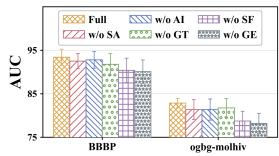

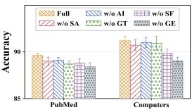  
(a) BBBP and ogbg-molhiv (b) PubMed and Computers

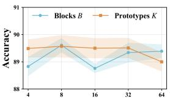  
(c) PubMed

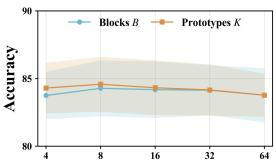  
(d) Mutagenicity  
Figure 2: Ablation studies on BBBP and ogbg-molhiv in (a), and PubMed and Computers in (b); sensitivity to geometric blocks B and atlas prototypes K on PubMed in (c) and Mutagenicity in (d).

## K MORE EXPERIMENTAL RESULTS

## K.1 CROSS-TASK AGGREGATE ANALYSIS

We further summarize the cross-task aggregate results in Table 7. Each dataset–task pair is treated as one evaluation setting. NC Avg., LP Avg., and GC Avg. report the average performance within the corresponding task category, while Overall Avg. aggregates all settings. Avg. Rank is computed by ranking the methods within each setting and then averaging their ranks, whereas Avg. Gain measures the mean percentage-point improvement of GeoF over each baseline. The final column reports the Holm-adjusted post-hoc p-value derived from the average-rank differences following the global Friedman test, which yields $\chi ^ { \mathrm { 2 } } = 1 6 9 . 2$ with 14 degrees of freedom and rejects the hypothesis of equal performance across methods.

GeoF achieves the strongest average within every task category and overall, together with an average rank of 1.0, since it ranks first in all 18 settings. Its gains over the baselines are positive throughout and grow from the strongest general and adaptive GNNs to the manifold-based and classical GNNs, and all 14 pairwise comparisons are significant at the 0.05 level after Holm correction. The closest baselines, WaveGC and ARGNN, share the smallest rank difference, and their separation from GeoF remains significant. Among the baseline families, adaptive GNNs and the strongest general GNNs form the leading group, whereas manifold-based GNNs trail on graph classification in particular. Overall, the gains are distributed across tasks and datasets rather than concentrated in a few favorable settings.

Table 8: Time consumption of different methods in the training stage for each epoch (in seconds).
<table><tr><td>Methods</td><td>PubMed</td><td>CS</td><td>Computers</td><td>NCI1</td><td>Mutagenicity</td><td>ogbg-molhiv</td></tr><tr><td>GCN</td><td>0.0086</td><td>0.0167</td><td>0.0153</td><td>0.2094</td><td>0.2312</td><td>2.1633</td></tr><tr><td>AMPs</td><td>0.0393</td><td>0.0478</td><td>0.0761</td><td>0.3170</td><td>0.3173</td><td>2.8410</td></tr><tr><td>G²Former</td><td>0.0637</td><td>0.0739</td><td>0.0640</td><td>0.2011</td><td>0.2173</td><td>2.2996</td></tr><tr><td>SPDGNN</td><td>0.0277</td><td>0.0321</td><td>0.0283</td><td>0.2073</td><td>0.2287</td><td>2.3973</td></tr><tr><td>ARGNN</td><td>0.0902</td><td>0.1573</td><td>0.4328</td><td>0.2437</td><td>0.3383</td><td>2.5373</td></tr><tr><td>GeoF</td><td>0.0683</td><td>0.1207</td><td>0.1810</td><td>0.4391</td><td>0.5357</td><td>6.0456</td></tr></table>

Table 9: GPU memory consumption of different methods in the training stage (in GB).
<table><tr><td>Methods</td><td>PubMed</td><td>CS</td><td>Computers</td><td>NCI1</td><td>Mutagenicity</td><td>ogbg-molhiv</td></tr><tr><td>GCN</td><td>0.7</td><td>1.3</td><td>1.3</td><td>0.8</td><td>0.8</td><td>0.9</td></tr><tr><td>AMPs</td><td>2.7</td><td>4.9</td><td>5.0</td><td>1.3</td><td>1.6</td><td>2.0</td></tr><tr><td>G²Former</td><td>3.3</td><td>3.2</td><td>3.0</td><td>1.5</td><td>1.5</td><td>1.4</td></tr><tr><td>SPDGNN</td><td>1.3</td><td>2.9</td><td>1.9</td><td>0.9</td><td>1.0</td><td>0.9</td></tr><tr><td>ARGNN</td><td>4.8</td><td>8.3</td><td>21.3</td><td>2.7</td><td>2.6</td><td>3.8</td></tr><tr><td>GeoF</td><td>6.4</td><td>10.9</td><td>15.2</td><td>3.5</td><td>3.0</td><td>4.8</td></tr></table>

## K.2 MORE ABLATION STUDY

We further extend the ablation study to PubMed and Computers for node classification and to BBBP and ogbg-molhiv for graph classification, covering different tasks and graph scales. As shown in Fig. 2(a) and (b), the full model achieves the best performance on all four datasets. Freezing the geometric state (w/o GE) causes the largest degradation on every dataset, with more pronounced drops on the molecular benchmarks. Removing second-order feedback (w/o SF) causes the next largest drop on BBBP, ogbg-molhiv, and Computers, whereas on PubMed it is comparable to disabling frame transport (w/o GT). This ordering matches the main ablation and highlights the benefit of adapting propagation geometry during message passing and the contribution of residual statistics beyond task-supervised corrections. Disabling frame transport, removing structural signatures (w/o SA), and removing atlas initialization (w/o AI) yield smaller, dataset-dependent decreases, indicating that these components provide complementary improvements.

## K.3 MORE SENSITIVITY STUDY

To assess whether GeoF relies on narrowly tuned geometric capacity, we further vary the number of geometric blocks B and atlas prototypes K on PubMed and Mutagenicity. As shown in Fig. 2(c) and (d), performance remains within a relatively narrow range across moderate values of both hyperparameters. On PubMed, varying B produces modest non-monotonic fluctuations, while performance remains stable over a broad range of K before decreasing at the largest setting. Mutagenicity exhibits an even flatter profile for both B and K, followed by a mild decline under excessive capacity. Overall, increasing geometric granularity or atlas size does not yield systematic improvements, indicating that moderate block partitioning and a compact prototype atlas are sufficient for stable performance across different task settings.

## K.4 EFFICIENCY AND RESOURCE CONSUMPTION ANALYSIS

We further evaluate the training efficiency of different methods in terms of per-epoch training time and GPU memory consumption. As shown in Tables 8 and 9, on the three node-classification datasets, GeoF trains faster than ARGNN, and the advantage grows with graph size, reaching its largest margin on Computers, while lightweight GNNs such as GCN and SPDGNN remain the cheapest. On the graph-classification datasets, GeoF requires more time than ARGNN and GCN, and the gap widens with the number of graphs, peaking on ogbg-molhiv. GPU memory consumption follows the same pattern: GeoF uses more memory than the compared baselines on most datasets, while remaining below ARGNN on Computers, and its memory on the graph-classification datasets stays close to that of ARGNN. The additional cost comes from the edge-level transport and residual outer products and the node-level factorizations, which are computed at every recurrent step. Across all datasets, the overhead relative to ARGNN remains a moderate constant factor rather than growing with graph size.

## L VISUALIZATION

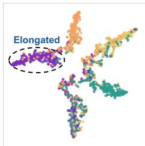  
(a) ARGNN

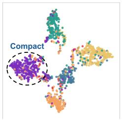  
(b) GeoF

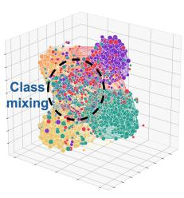  
(c) Correction Off

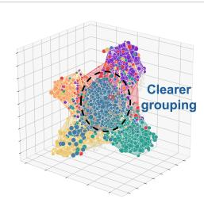  
(d) Correction On  
Figure 3: (a), (b) show t-SNE visualizations of node representations learned by ARGNN and GeoF. (c), (d) compare representations with the learned geometric correction disabled and enabled.

Figure 3(a), (b) visualize node representations from ARGNN and GeoF on CiteSeer using 2D t-SNE. The highlighted class cluster is elongated under ARGNN and more compact under GeoF, as indicated by the dashed ellipses. To examine the effect of geometric correction, Fig. 3(c), (d) compare representations from the same checkpoint with the correction disabled $( \gamma = 0 )$ and enabled $( \gamma = 0 . 1 )$ Both sets are visualized in a shared 3D t-SNE projection, with marker size encoding log det(L ). Enabling the correction yields clearer class grouping in the highlighted region, providing qualitative support for its role in shaping task-relevant representations.

Algorithm 1 Training and inference of GeoF   
Require: Training graph(s) with task-specific supervision, test inputs, hidden dimension $d = B m$ , number   
of prototypes ${ \dot { K } } ,$ , recurrent steps $L ,$ temperature $\tau ,$ update weights $( \lambda , \gamma )$ , spectral regularization $\epsilon _ { s } ,$ and   
admissible coordinate domain $\mathcal { Z } .$   
Ensure: Test predictions $\{ p _ { i } \} , \{ p _ { G } \} , \mathrm { o r } \{ p _ { u v } \}$ for node classification, graph classification, or link prediction,   
respectively.   
1: Stage 1: Structural Encoding and Model Initialization   
2: Construct fixed structural signatures U from normalized degree and random-walk return probabilities for   
each input graph.   
3: Initialize the prototype atlas, feature projection, structural gate, message transformation, feature gate,   
controller $\Gamma _ { \theta } ,$ and task-specific readout.   
4: Share all propagation and controller parameters across the $L$ recurrent steps.   
5: Stage 2: End-to-End Training   
6: while not converged do   
7: Select training input(s) and supervision for the current task.   
8: for each input graph $\overset { \cdot } { G } = ( \overset { \cdot } { V } , \overset { \cdot } { E } , X )$ do   
9: Initialize $\xi _ { i } ^ { 0 } , \hat { \alpha _ { i } }$ , and $z _ { i , b } ^ { 0 }$ for all nodes i and blocks $b ( \mathrm { E q . } ( 3 ) ) .$   
10: Reconstruct $L _ { i , b } ^ { 0 }$ and assemble $L _ { i } ^ { 0 }$ (Eqs. (1) and (2)).   
11: for $l = 0 , \ldots , \overset { \vartriangle } { \boldsymbol { L } } - 1$ do   
12: i. Triangular Frame Transport   
13: Compute $h _ { i } ^ { l } , e _ { i j } ^ { l } ,$ and $\omega _ { i j } ^ { l }$ for $j \in \widetilde { \mathcal { N } } ( i ) \left( \mathrm { E q . } \left( 4 \right) \right) .$   
14: Transform features with $\begin{array} { r } { \phi ( \xi _ { i } ^ { l } ) = W _ { \phi } \xi _ { i } ^ { l } } \end{array}$ and obtain aligned messages $m _ { j  i , b } ^ { l }$ by triangular solves   
(Eq. (5)).   
15: Concatenate blockwise messages and compute the aligned aggregate $\bar { \xi } _ { i } ^ { l } ( \mathrm { E q . } ( 6 ) ) .$   
16: Compute the feature gate $r _ { i } ^ { l }$ and update $\xi _ { i } ^ { l + 1 } \left( \mathrm { E q . } \left( 7 \right) \right)$   
17: ii. Second-Order Residual Feedback   
18: Compute the residuals $\delta _ { i j , b } ^ { l } = m _ { j  i , b } ^ { l } - ( \phi ( \xi _ { i } ^ { l } ) ) _ { b }$ and accumulate the regularized second-moment   
matrix $C _ { i , b } ^ { l }$ with the same weights $\omega _ { i j } ^ { l } ~ ( \mathrm { E q . } ~ ( 8 ) )$   
19: Compute $R _ { i , b } ^ { l } = \mathrm { S C h o l } ( C _ { i , b } ^ { l } )$ and construct the log-triangular target $\widehat { z } _ { i , b } ^ { l } \left( \mathrm { E q . } \left( 1 0 \right) \right)$   
20: iii. Task-Guided Geometry Evolution   
21: Form $q _ { i , b } ^ { l } = [ ( \xi _ { i } ^ { l } ) _ { b } \vert \vert ( \bar { \xi } _ { i } ^ { l } ) _ { b } ^ { \cdot } \vert \vert u _ { i } ] .$ , obtain $U _ { i , b } ^ { l } , V _ { i , b } ^ { l } ,$ , and $d _ { i , b } ^ { l }$ from $\Gamma _ { \theta } ,$ and construct the geometric   
correction $\Delta z _ { i , b } ^ { l }$ (Eq. (11)).   
22: Update $z _ { i , b } ^ { l + 1 } = \Pi _ { \boldsymbol { z } } \big ( ( 1 - \lambda ) z _ { i , b } ^ { l } + \lambda \widehat { z } _ { i , b } ^ { l } + \gamma \Delta z _ { i , b } ^ { l } \big )$ (Eq. (12)).   
23: Reconstruct $L _ { i , b } ^ { l + 1 }$ and assemble $L _ { i } ^ { l + 1 }$ (Eqs. (1) and (2)).   
24: end for   
25: Obtain the final environment representations $h _ { i } ^ { L } = L _ { i } ^ { L } \xi _ { i } ^ { L } .$   
26: Compute $p _ { i } , p _ { G } , \mathbf { o r } p _ { u v }$ using the corresponding task-specific readout (Eqs. (13), (14), and (15)).   
27: end for   
28: Evaluate $\mathcal { L } _ { \mathrm { n o d e } } , \mathcal { L } _ { \mathrm { g r a p h } } .$ , or $\mathcal { L } _ { \mathrm { l i n k } }$ for the selected task using its training supervision.   
29: Backpropagate through the L recurrent steps and jointly update all trainable parameters.   
30: end while   
31: Stage 3: Inference   
32: Fix the trained model parameters.   
33: for each test input graph G do   
34: Apply the initialization, recurrent evolution, and readout in lines 9–26 using the graph’s structural   
signatures $U .$   
35: Retain $p _ { i }$ for test nodes, pG for test graphs, or $p _ { u v }$ for test candidate pairs, according to the task.   
36: end for   
37: return $\{ p _ { i } \} , \{ p _ { G } \}$ , or $\{ p _ { u v } \}$ for the corresponding test inputs.