# LEARNING WHAT TO RECALL: ADAPTIVE MULTI-CUE EPISODIC MEMORY FOR WORLD MODELS

Beomsu Kim1 Amir Bar3 1KAIST

Chieh-Hsin Lai2 Jong Chul Ye1,† 2Sony Group Corporation

Bac Nguyen2 Yuki Mitsufuji2,† 3Imperial College London

1. FAR Beats Hand -Designed Memory Recall with Same Cues  
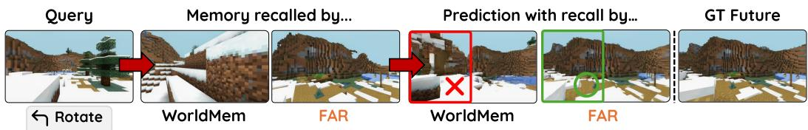

2. FAR Adaptively Learns Which Cues to Trust Among Multiple Available Cues  
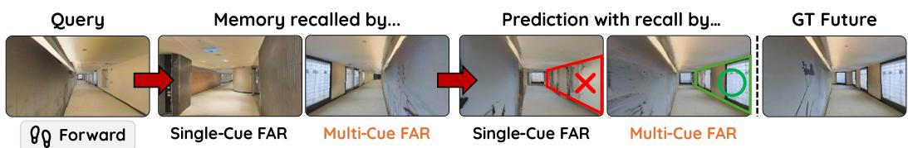  
3. FAR Recalls the Right State as the World Changes

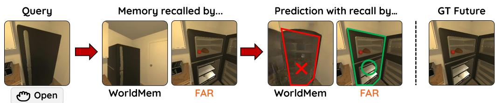  
Figure 1: The three advantages of Future-Aware Recall (FAR). Top: FAR retrieves context based on its usefulness for predicting the future, beating hand-designed memory recall rules. In the figure, FAR is compared against WorldMem (Xiao et al., 2025). Middle: FAR adaptively learns querydependent weights over multiple available retrieval cues. Here, FAR learns to rely more on audio cue to distinguish memories with occluded and clear line of sight. Bottom: FAR recalls memory to support state-correct future predictions. Here, FAR distinguishes between closed and open fridges, in contrast to WorldMem.

## ABSTRACT

World models predict future observations from current experience and actions, yet prediction can depend on observations seen far in the past. Episodic memory preserves past observations for later recall; however, as memory accumulates, it raises a fundamental question: which memories are usefulfor the current prediction, and which available retrieval cues should be trusted to find them? This is challenging because fixed criteria based on recency, pose overlap, or visual similarity can be unreliable across environments and queries. We propose Future-Aware Recall (FAR), a framework that learns episodic recall from future-aware predictive supervision and adaptive multi-cue scoring. During training, FAR measures predictive utility by the conditional log-likelihood of the realized future given recalled context, approximated by negative diffusion prediction loss, and uses it to train a retriever that remains future-blind at inference. The retriever learns cue-specific relevance and automatically determines which available retrieval cues, such as time, pose, vision, and audio, to trust for each query when selecting memories. Across three complementary settings, FAR outperforms hand-designed recall even with the same retrieval cues, automatically adapts which available cues to trust, and recalls the right history as the world changes. Together, these results establish FAR as a flexible, principled approach to episodic memory access in world models. Project page at: https://1202kbs.github.io/FAR-Project-Page/

## 1 INTRODUCTION

In world modeling, the current observation provides only a partial view of the underlying environment state. Scenes and objects persist, and may continue to evolve, after leaving the field of view. To predict what will be observed upon revisit, world models must preserve information across extended interactions (Ha & Schmidhuber, 2018; Hafner et al., 2019). Memory is therefore central to long-horizon, persistent world modeling. Recent world models explore different mechanisms for maintaining such information. Persistent-state memory integrates observations into an evolving representation of the current world, such as a recurrent latent state (Hafner et al., 2020; 2021; 2025) or persistent 3D representation (Wu et al., 2025; Garcin et al., 2026). Episodic memory instead preserves individual past observations as separately accessible memories that can later be recalled (Xiao et al., 2025; Hu et al., 2026). These memory functions are complementary: persistent-state memory provides compact access to an evolving world state, while episodic memory preserves directly recoverable evidence from past experience.

Episodic memory, however, introduces a fundamental recall problem. As interaction continues, the number of stored memories grows, while only a small fraction may be useful for a particular prediction. Existing world models commonly define relevance using fixed criteria such as temporal recency (Bar et al., 2025), pose-based field-of-view overlap (Xiao et al., 2025), or visual embedding similarity (Hu et al., 2026). However, similarity under a particular cue need not reflect predictive usefulness, and the reliability of that cue can vary across situations. For example, in an elbowshaped corridor (see Fig. 6), pose-based retrieval may favor a nearby memory across a wall, while visual appearance may be ambiguous across similar corridor segments. Spatial audio may instead better identify relevant past experience in this case, while pose or vision may be more informative elsewhere. This raises our central question:

How can a world model learn which past observations are usefulforfuture prediction, and which available retrieval cues can identify them before thefuture is known?

We address this with Future-Aware Recall (FAR). During training, the future is observed, allowing FAR to evaluate each candidate memory by how well it helps the world model predict what actually happens. We call this predictive utility, and use it to supervise a retriever that must operate without access to the future at inference. To predict this relevance at recall time, FAR learns a relevance function for each available cue, such as time, pose, vision, or audio, together with query-dependent weights that determine which cues to trust. These cues are used to select memories; they need not be provided to the world model as additional generation conditions. FAR’s latent-variable formulation connects naturally to retrieval-augmented language models (Lewis et al., 2020; Sachan et al., 2021), allowing us to adapt discrete retriever optimization to episodic recall for world models.

We instantiate FAR with video diffusion world models and an external episodic memory. Historical observations remain individually addressable, while the retriever selects a compact Top-K context for each prediction. Predictive utility is defined through the conditional likelihood of the realized future; for our video diffusion instantiation, we use negative diffusion prediction loss as a tractable surrogate. The recalled context then conditions the world model for future prediction.

Across three complementary environments, FAR consistently improves episodic recall and downstream prediction over fixed retrieval strategies. In LoopNav (Lian et al., 2025), FAR outperforms hand-designed relevance rules even when given the same retrieval cues, while adaptively using time, pose, and vision further improves long-horizon prediction. In SoundSpaces (Chen et al., 2020), FAR learns to rely on audio when spatial cues become ambiguous, particularly for longer trajectories and sparser memories. In changing-state AI2-THOR environments (Kolve et al., 2017), FAR recalls history consistent with the current world state and reduces errors caused by stale memories. Fig. 1 summarizes these complementary capabilities. Together, these results demonstrate FAR as a flexible, prediction-driven mechanism for episodic memory access in persistent world models.

## 2 BACKGROUND AND RELATED WORK

World models and episodic memory. World models predict future observations from interaction history and actions using recurrent dynamics, diffusion, or masked generative modeling (Hafner et al., 2020; 2021; 2025; Alonso et al., 2024; Bruce et al., 2024; Kim et al., 2026). Over long interactions, relevant information may lie far in the past, making repeated processing of the full history costly. External episodic memory instead preserves past observations for selective recall using cues such as time, pose, vision, or audio. We focus on learning which memories to recall and which available cues to trust, rather than relying on fixed relevance rules for individual cues.

Internal and external recall. Generator-internal methods maintain long-range information through attention, routing, context compression, or recurrent memory (Cai et al., 2026; Yu et al., 2026; Peng et al., 2026), with recent world models also using linear attention for efficient long-horizon memory (Wang et al., 2026a; Zhu et al., 2026). Generator-external methods instead search an explicit memory and pass only a compact subset to the world model (Xiao et al., 2025; Yu et al., 2025; Chen et al., 2025; Li et al., 2026). These approaches are complementary: internal memory compactly summarizes history, while external episodic memory preserves individually addressable observations for selective recall. We focus on external recall, which can be combined with internal long-context memory mechanisms.

Learning predictive external recall. External world-model recall commonly uses fixed temporal, geometric, or embedding-based relevance, while discrete Top-K selection prevents direct gradient flow from the world-model objective. Related retrieval-augmented generation methods learn discrete retrieval from downstream likelihood; for example, EMDR2 (Sachan et al., 2021) uses reader likelihood to supervise a document retriever. FAR applies this latent-variable principle to episodic recall from an evolving interaction history, defining relevance through future predictive utility. Its retriever learns both cue-specific relevance and query-dependent cue reliability from available cues whose usefulness can vary across queries. Table 2 in Section A provides a detailed comparison.

## 3 OUR METHOD: FUTURE-AWARE EPISODIC MEMORY

We propose Future-Aware Recall (FAR), a framework for learning predictive memory relevance in external episodic recall. At inference, FAR must select useful memories using only the episodic memory and current prediction query, since the future to be predicted is unavailable. During training, however, that future is observed. FAR exploits this additional information to identify which memories would have best supported prediction and uses these signals to train a retriever that remains future-blind at inference. FAR thereby learns both which memories to recall and which retrieval cues to trust. A high-level overview is provided in Fig. 2. We first formalize the recall problem underlying FAR, and then introduce its key mechanisms.

The memory recall problem. Let $\mathbf { } _  \mathbf { } \mathbf { } \mathbf { } \mathbf { } \mathbf { } \mathbf { } \mathbf { } \mathbf { } \mathbf { } \mathbf { } \mathbf { } \mathbf { } \mathbf { } \mathbf { } \mathbf { } \mathbf { } \mathbf { } \mathbf { } \mathbf { } \mathbf { } \mathbf { } \mathbf { } \mathbf { } \mathbf { } \mathbf { } \mathbf { } \mathbf { } \mathbf { } \mathbf { } \mathbf { } \mathbf { } \mathbf { } \mathbf { } \mathbf { } \mathbf { } \mathbf { } \mathbf { } \mathbf { } \mathbf { } \mathbf { } \mathbf { } \mathbf { } \mathbf { } \mathbf { } \mathbf { } \mathbf { } \mathbf { } \mathbf { } \mathbf { } \mathbf { } \mathbf { } \mathbf { } \mathbf { } \mathbf { } \mathbf { } \mathbf { } \mathbf { } \mathbf { } \mathbf { } \mathbf { } \mathbf { } \mathbf { } \mathbf { } \mathbf { } \mathbf { } \mathbf { } \mathbf { } \mathbf { } \mathbf { } \mathbf { } \mathbf { } \mathbf { } \mathbf { } \mathbf { } \mathbf { } \mathbf { } \mathbf { } \mathbf { } \mathbf { } \mathbf { } \mathbf { } \mathbf { } \mathbf { } \mathbf { } \mathbf { } \mathbf { } \mathbf { } \mathbf { } \mathbf { } \mathbf { } \mathbf { } \mathbf { } \mathbf { } \mathbf { } \mathbf { } \mathbf { } \mathbf { } \mathbf { } \mathbf { } \mathbf { } \mathbf { } \mathbf { } \mathbf { } \mathbf { } \mathbf { } \mathbf { } \mathbf { } \mathbf { } \mathbf { } \mathbf { } \mathbf { } \mathbf { } \mathbf { } \mathbf { } \mathbf { } \mathbf { } \mathbf { } \mathbf { } \mathbf { } \mathbf { } \mathbf { } \mathbf { } \mathbf { } \mathbf { } \mathbf { } \mathbf { } \mathbf { } \mathbf { } \mathbf { } \mathbf { } \mathbf { } \mathbf \mathbf { } \mathbf { } \mathbf { } \mathbf { } \mathbf { } \mathbf \mathbf { } \mathbf { } \mathbf { } \mathbf { } \mathbf \mathbf { } \mathbf { } \mathbf { } \mathbf \mathbf { } \mathbf { } \mathbf \mathbf { } \mathbf { } \mathbf \mathbf { } \mathbf \mathbf { } \mathbf { } \mathbf \mathbf { } \mathbf \mathbf { } \mathbf \mathbf { } \mathbf \mathbf { } \mathbf \mathbf { } \mathbf \mathbf { } \mathbf \mathbf { }$ denote the observation at step t and $\mathbf { } \mathbf { a } _ { t }$ the subsequent action, with prediction query $\mathcal { Q } _ { t } : = \left( o _ { t } , a _ { t } \right)$ . The episodic memory contains the past observations $\mathcal { M } _ { t - 1 } : =$ $\left( o _ { 1 } , \ldots , o _ { t - 1 } \right)$ . FAR recalls a compact context $\mathcal { C } _ { t } \subseteq \mathcal { M } _ { t - 1 }$ with $| { \mathcal { C } } _ { t } | = { \bf { \bar { K } } }$ , which the world model uses to predict the next observation: $p _ { \theta } ( o _ { t + 1 } \mid \mathcal { C } _ { t } , \mathcal { Q } _ { t } )$

To locate useful memories, each historical observation $\mathbf { o } _ { i }$ is associated with retrieval cues $z _ { i } ,$ such as time, pose, a visual representation, or an audio representation. We collect the historical cues as $\mathcal { Z } _ { t - 1 } : = ( z _ { 1 } , \ldots , z _ { t - 1 } )$ and define the current retrieval query as $\mathcal { R } _ { t } : = ( z _ { t } , \mathbf { \boldsymbol { a } } _ { t } )$ . These cues are used by the external retriever to determine where to recall from in episodic memory. Specifically, given $\mathcal { Z } _ { t - 1 }$ and $\mathcal { R } _ { t } .$ , the retriever assigns each candidate context $\mathcal { C } _ { t }$ a relevance score $s _ { \phi } ( \mathcal { C } _ { t } \mid \mathcal { Z } _ { t - 1 } , \mathcal { R } _ { t } )$ inducing the recall distribution

$$
r _ { \phi } ( \mathcal { C } _ { t } \mid \mathcal { Z } _ { t - 1 } , \mathcal { R } _ { t } ) \propto \exp s _ { \phi } ( \mathcal { C } _ { t } \mid \mathcal { Z } _ { t - 1 } , \mathcal { R } _ { t } ) .\tag{1}
$$

Exact evaluation of Eq. (1) is generally intractable because it requires considering a combinatorial number of possible recalled context sets as the episodic memory $\mathcal { M } _ { t - 1 }$ grows. For discrete Top-K recall, we therefore use the candidate-level latent-variable approximation adapted from EMDR2 (Sachan et al., 2021), described in Section B.3.

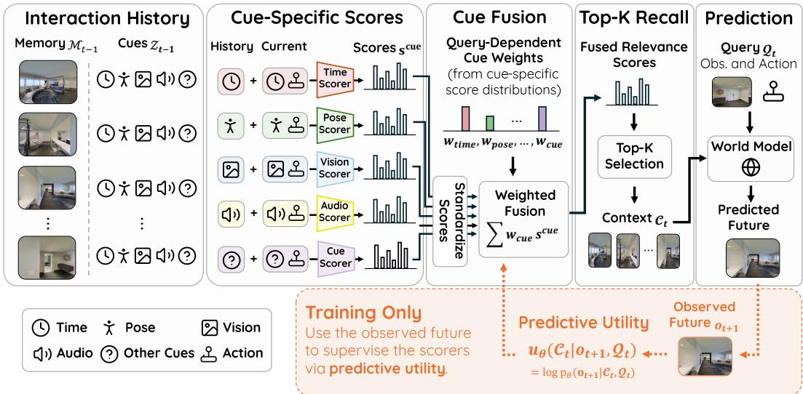  
Figure 2: Overview of Future-Aware Recall (FAR). FAR scores memories using general retrieval cues $\mathcal { Z } _ { t - 1 }$ , adaptively fuses cue-specific relevance, and recalls a compact Top- $\cdot \bar { K }$ context $\mathcal { C } _ { t }$ from episodic memory $\mathcal { M } _ { t - 1 }$ for world-model prediction. During training, the observed future $\mathbf { \sigma } _ { o _ { t + 1 } }$ provides predictive utility to supervise the retriever, while recall remains future-blind at inference.

Together, the retriever and world model define the latent-context predictive model

$$
\begin{array} { r } { p _ { \theta , \phi } ( o _ { t + 1 } \mid \mathcal { M } _ { t - 1 } , \mathcal { Z } _ { t - 1 } , \mathcal { R } _ { t } , \mathcal { Q } _ { t } ) = \sum _ { \mathcal { C } _ { t } } p _ { \theta } ( o _ { t + 1 } \mid \mathcal { C } _ { t } , \mathcal { Q } _ { t } ) r _ { \phi } ( \mathcal { C } _ { t } \mid \mathcal { Z } _ { t - 1 } , \mathcal { R } _ { t } ) . } \end{array}\tag{2}
$$

Here, $r _ { \phi }$ determines which past observation is recalled, while $p _ { \theta }$ determines how recalled context supports prediction. Importantly, retrieval cues guide the selection of $\mathcal { C } _ { t } ;$ they need not be provided to the world model as generation conditions. Learning effective episodic recall thus reduces to learning the relevance function $s _ { \phi }$ , and hence the recall distribution $r _ { \phi }$ . We now derive predictive supervision for relevance and show how FAR adaptively uses multiple retrieval cues to estimate it.

## 3.1 LEARNING WHICH MEMORIES TO RECALL

The recall model above is governed by the future-blind relevance score $s _ { \phi } ( \mathcal { C } _ { t } \mid \mathcal { Z } _ { t - 1 } , \mathcal { R } _ { t } )$ . The key question is how this score should be learned so that highly ranked contexts are actually useful for prediction. Our principle is predictive: a recalled context is useful when it provides information about thefuture beyond what is already available in the current prediction query.

Predictive utility. Let $p _ { \mathrm { d a t a } }$ denote the environment data-generating distribution over interaction histories, retrieval cues, and future observations. For a recalled context $\mathscr { C } _ { t } \sim r _ { \phi } ( \cdot \ | \ \mathscr { Z } _ { t - 1 } , \mathscr { R } _ { t } )$ , its predictive information about the next observation is naturally measured by $I _ { \phi } ( o _ { t + 1 } ; \mathcal { C } _ { t } \mid \mathcal { Q } _ { t } )$ , where the subscript emphasizes that $\mathcal { C } _ { t }$ is selected by the retriever $r _ { \phi } , I _ { \phi }$ measures how much the recalled context reduces uncertainty about the future beyond what is already known from $\mathcal { Q } _ { t }$ . The following proposition connects this information-theoretic notion of relevance to the world model $p _ { \theta }$

Proposition 1 (Predictive relevance bound). For any predictive distribution $p _ { \theta } ( o _ { t + 1 } \mid \mathcal { C } _ { t } , \mathcal { Q } _ { t } )$

$$
\begin{array} { r } { I _ { \phi } ( \pmb { o } _ { t + 1 } ; \mathcal { C } _ { t } \mid \mathcal { Q } _ { t } ) \geq \mathbb { E } [ \log p _ { \theta } ( \pmb { o } _ { t + 1 } \mid \mathcal { C } _ { t } , \mathcal { Q } _ { t } ) - \log p _ { \mathrm { d a t a } } ( \pmb { o } _ { t + 1 } \mid \mathcal { Q } _ { t } ) ] , } \end{array}\tag{3}
$$

where the expectation is over training interactionsfrom $p _ { \mathrm { d a t a } }$ and $\mathcal { C } _ { t } \sim r _ { \phi } ( \cdot \mid \mathcal { Z } _ { t - 1 } , \mathcal { R } _ { t } )$

See the derivation in Section B.1. For a fixed training pair $\left( o _ { t + 1 } , \mathcal { Q } _ { t } \right)$ , the second term in Eq. (3) depends only on $p _ { \mathrm { d a t a } } ,$ and is therefore identical across recalled contexts and independent of the trainable parameters. The remaining context-dependent term hence motivates the predictive utility:

$$
u _ { \theta } ( \mathcal { C } _ { t } \mid o _ { t + 1 } , \mathcal { Q } _ { t } ) : = \log p _ { \theta } ( o _ { t + 1 } \mid \mathcal { C } _ { t } , \mathcal { Q } _ { t } ) .\tag{4}
$$

A context has high predictive utility when conditioning on it makes the realized future more likely under the world model. Thus, memory relevance depends on the prediction being made: the same past experience may be highly useful for one query and largely irrelevant for another.

Future-aware predictive supervision. Predictive utility depends on the realized future $\mathbf { \sigma } _ { o _ { t + 1 } }$ , which is not available when memories must be recalled at inference time. During training, however, $\mathbf { \sigma } _ { o _ { t + 1 } }$ is observed and reveals which recalled contexts would have best supported the prediction. FAR uses this additional information to construct a future-aware posterior over contexts. Combining the recall distribution in Eq. (1) with the predictive utility in Eq. (4), Bayes’ rule gives

$$
{ q _ { \theta , \phi } } ( \mathcal { C } _ { t } \mid \sigma _ { t + 1 } , \mathcal { M } _ { t - 1 } , \mathcal { Z } _ { t - 1 } , \mathcal { R } _ { t } , \mathcal { Q } _ { t } ) \propto \exp [ s _ { \phi } ( \mathcal { C } _ { t } \mid \mathcal { Z } _ { t - 1 } , \mathcal { R } _ { t } ) + u _ { \theta } ( \mathcal { C } _ { t } \mid \sigma _ { t + 1 } , \mathcal { Q } _ { t } ) ] .\tag{5}
$$

This posterior combines two signals: $s _ { \phi }$ captures how relevant a context appears from information available before the future is observed, while $u _ { \theta }$ provides predictive credit from the realized future. Accordingly, $q _ { \theta , \phi }$ serves as a future-aware teacher for the future-blind recall distribution. As shown in Section B.2, this posterior provides the maximum-likelihood training target for recall: it favors contexts that better explain the observed future while retaining the relevance already inferred by the future-blind retriever. We therefore train $r _ { \phi }$ to match this fixed target:

$$
\mathcal { L } _ { \mathrm { R e t } } ( \phi ) : = \mathbb { E } [ \mathcal { D } _ { \mathrm { K L } } ( \mathrm { s g } [ q _ { \theta , \phi } ] \| r _ { \phi } ) ] ,\tag{6}
$$

where sg[ ] is the stop-gradient, treating $q _ { \theta , \phi }$ as fixed during the retriever update. This transfers predictive credit from the observed future into a retriever that operates without the future at inference.

## 3.2 ADAPTIVELY LEARNING WHICH CUES TO TRUST

The previous subsection specifies what the context relevance score $s _ { \phi }$ should learn through futureaware predictive credit. At inference, however, this credit is unavailable, so $s _ { \phi }$ must estimate relevance from the retrieval cues contained in $\mathcal { Z } _ { t - 1 }$ and $\mathcal { R } _ { t } .$ . FAR is agnostic to the choice of cues: any signal associated with a historical observation that helps locate useful memories can be used for recall. In our experiments, we consider time, pose, visual representations, and audio representations, with the available subset depending on the environment. Because the reliability of these cues can vary across queries, FAR learns both cue-specific relevance and how strongly each available cue should contribute to the final context score.

Cue-specific relevance. Let $z _ { i } ^ { m }$ denote the component of $z _ { i }$ corresponding to retrieval cue m. We define the corresponding cue history and retrieval query as $\mathcal { Z } _ { t - 1 } ^ { m } : = ( z _ { 1 } ^ { m } , \ldots , z _ { t - 1 } ^ { m } )$ and $\mathcal { R } _ { t } ^ { m } : =$ $( z _ { t } ^ { m } , \mathbf { \alpha } \mathbf { { \alpha } } \mathbf { { \alpha } } )$ . For each historical observation $o _ { i } ,$ cue m produces an observation-level relevance score

$$
s _ { \phi , i } ^ { m } : = s _ { \phi } ^ { m } \mathopen { } \mathclose \bgroup \left( z _ { i } ^ { m } ; \mathcal { Z } _ { t - 1 } ^ { m } , \mathcal { R } _ { t } ^ { m } \aftergroup \egroup \right) .\tag{7}
$$

This score estimates how relevant the corresponding memory appears when viewed through cue m alone. Because different cues may produce scores on different numerical scales, we standardize each cue’s scores across the episodic memory and denote the resulting scores by $\widetilde { s } _ { \phi , i } ^ { m }$

Adaptive cue fusion. FAR combines the cue-specific scores using query-dependent weights,

$$
\begin{array} { r } { s _ { \phi , i } = \sum _ { m } \lambda _ { \phi , t } ^ { m } \widetilde { s } _ { \phi , i } ^ { m } , \qquad \sum _ { m } \lambda _ { \phi , t } ^ { m } = 1 , } \end{array}\tag{8}
$$

where $\lambda _ { \phi , t } ^ { m }$ is produced by a learned gate from the cue-specific retrieval signals available for the current query. The fused observation-level scores define the context relevance score in Eq. (1) as

$$
\begin{array} { r } { s _ { \phi } ( \mathcal { C } _ { t } \mid \mathcal { Z } _ { t - 1 } , \mathcal { R } _ { t } ) : = \sum _ { o _ { i } \in \mathcal { C } _ { t } } s _ { \phi , i } . } \end{array}\tag{9}
$$

Together, Eqs. (8) and (9) parameterize the recall distribution $r _ { \phi } ( \mathcal { C } _ { t } \mid \mathcal { Z } _ { t - 1 } , \mathcal { R } _ { t } )$ used by the futureaware posterior in Eq. (5). For fixed-size recall with $| { \mathcal { C } } _ { t } | = { \dot { K } }$ , the maximum-score context is obtained by selecting the K observations with the largest fused relevance scores,

$$
\begin{array} { r } { \mathscr { C } _ { t , \mathrm { T o p K } } = \arg \operatorname* { m a x } _ { \mathcal { C } _ { t } \subseteq \mathcal { M } _ { t - 1 } } s _ { \phi } ( \mathcal { C } _ { t } \mid \mathcal { Z } _ { t - 1 } , \mathcal { R } _ { t } ) \quad \mathrm { s o ~ t h a t } \quad | \mathcal { C } _ { t } | = K . } \end{array}\tag{10}
$$

## 3.3 VIDEO DIFFUSION WORLD MODEL INSTANTIATION

We now instantiate FAR with a video diffusion world model, and we describe the central details here. A precise description of implementation is provided in Section C.1.

Cacheable retrieval encoders. For high-dimensional cues such as vision and audio, cue-specific encoders map historical cues to compact keys and the current cue and action to a query embedding.

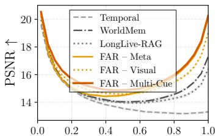  
Normalized Trajectory Time

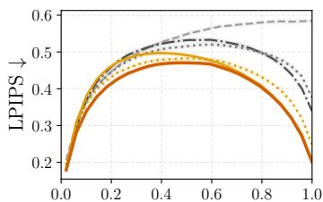  
Normalized Trajectory Time

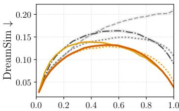  
Normalized Trajectory Time  
Figure 3: LoopNav rollout quality. We report frame-wise PSNR , LPIPS , and DreamSim between generated and ground-truth return trajectories as a function of normalized trajectory time. Curves show the mean across trajectories, with shaded regions indicating 95% bootstrap confidence intervals. Errors are highest near the middle of the return phase, where relevant observations are typically farthest in time and memory is most sparse.

We contrastively pretrain and freeze the memory-side encoders so that historical keys can be computed once and cached, while lightweight query-side adapters and cue-fusion components remain trainable through FAR.

Diffusion-based predictive utility. Because the exact likelihood in Eq. (4) is expensive for diffusion models, we approximate predictive utility by the negative diffusion prediction loss (Ho et al., 2020; Kingma et al., 2021; Song et al., 2021b; Lai et al., 2025) of the realized future conditioned on each candidate memory, averaged over four diffusion timesteps. Memories that yield lower prediction loss receive greater future-aware credit.

Temporally structured recall. To avoid spending multiple Top-K slots on redundant nearby frames, we partition memory into temporal chunks, retain the highest-scoring observation from each chunk, and recall the K highest-scoring representatives.

## 4 EXPERIMENTS

We present experiments across three complementary world-modeling settings: LoopNav (Lian et al., 2025), SoundSpaces (Chen et al., 2020), and AI2-THOR (Kolve et al., 2017). LoopNav evaluates consistency in a static Minecraft environment using metadata and visual retrieval cues, while SoundSpaces evaluates realistic indoor navigation where metadata and spatial audio provide complementary signals under partial observability. AI2-THOR evaluates interactive household environments with manipulable objects, where interactions change the world state and memories may become stale. Each trajectory consists of an exploration phase and a return phase. The world model generates the return-phase video using exploration-phase observations as its memory pool for context retrieval. Fig. 4 shows exploration and return paths on SoundSpaces.

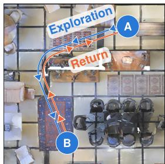  
Figure 4: Illustration of a data trajectory.

## 4.1 LOOPNAV – FAR OUTPERFORMS HAND-DESIGNED RECALL

We compare against three retrieval baselines: the temporal baseline (Bar et al., 2025), which uses the most recent observations; WorldMem (Xiao et al., 2025), which retrieves frames with high fieldof-view (FOV) overlap with the goal; and LongLive-RAG (Hu et al., 2026), which retrieves by reconstructive embedding similarity. We evaluate three variants of our method using metadata cues (time and pose), visual cues, or their adaptive fusion.

As shown in Fig. 3, the temporal baseline performs worst, while WorldMem and LongLive-RAG benefit from geometry- and appearance-based retrieval. At loop closure, our learned visual retriever outperforms LongLive-RAG (17% lower DreamSim), and our learned metadata retriever outperforms WorldMem (19% lower DreamSim), despite using the same respective cue types. Fig. 1 illustrates why: WorldMem retrieves a frame with high FOV overlap but a heavily occluded view of the goal, whereas our learned metadata retriever selects a frame with a clearer predictive view. This highlights a key limitation of hand-crafted relevance rules: cue similarity does not necessarily imply predictive utility. Finally, the Multi-Cue variant in Fig. 3, which fuses metadata and visual cues, shows that FAR can exploit complementary retrieval signals. Its rollout error closely follows the better of the metadata-only and visual-only variants across the horizon, suggesting that adaptive fusion emphasizes whichever cue is more informative for the current prediction.

Return Phase Length (m)  
Return Phase Length (m)  
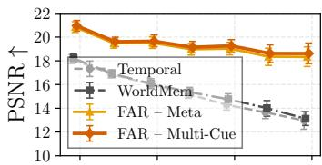

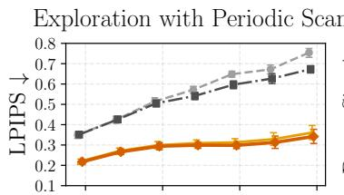

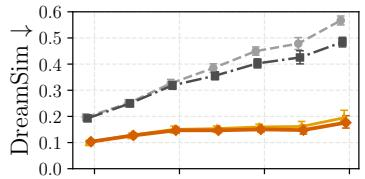

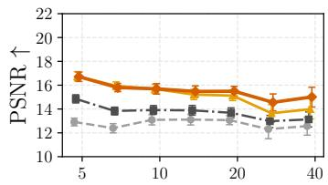

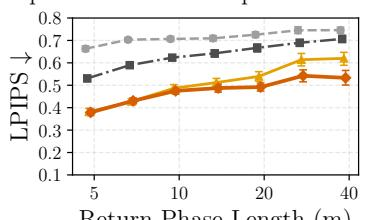

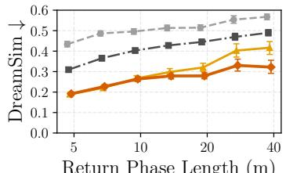

Figure 5: SoundSpaces rollout quality. We report PSNR, LPIPS, and DreamSim, where the error is averaged over predicted frames along return trajectory. Thus, the x-axis denotes the length of the trajectory over which the rollout is evaluated, not the rollout horizon. Top: results on the corpus where the agent performs periodic 360◦ scans during exploration. Bottom: results on the corpus where the agent scans at the endpoints, i.e., at the beginning and end of exploration.  
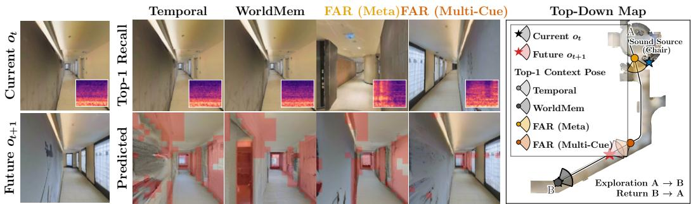  
Figure 6: Retrieval comparison on SoundSpaces. Given the observation and goal view, we visualize the top-1 context retrieved by each method and the generated goal frame, with regions of large error overlaid in red. The spectrograms show the audio cue associated with each state. The map shows the exploration and return trajectories with the memories selected by each method.

## 4.2 SOUNDSPACES – FAR ADAPTIVELY LEARNS WHICH CUES TO TRUST

We next evaluate FAR on SoundSpaces, where we construct an indoor navigation dataset augmented with spatial audio. We generate two corpora that differ in the density of available episodic memories: one performs periodic 360◦ scans during exploration, while the other scans only at the exploration endpoints. The former thus provides substantially denser historical coverage from which the world model can retrieve. We stratify evaluation by return-phase length, i.e., the physical distance traversed during the trajectory over which rollout quality is measured. Longer return trajectories are generally more challenging, as they require prediction through more rooms, corridors, and viewpoint changes.

Fig. 5 shows that FAR consistently outperforms the temporal baseline and WorldMem across both corpora. With periodic scans, metadata alone provides a strong retrieval signal, and Multi-Cue fusion of metadata and audio yields modest gains. Under the sparser endpoint-scan setting, however, the advantage of Multi-Cue grows with return-phase length, particularly in LPIPS and DreamSim. This suggests that metadata often suffices when relevant visual memories are densely available, whereas audio provides a valuable complementary cue for long trajectories or sparse histories.

Fig. 6 illustrates how audio can complement metadata when geometric relevance alone is insufficient. The agent is traversing a corridor and must predict a view farther down. Temporal retrieval selects the most recent observation, which looks in the correct direction but provides limited in formation about the distant portion of the corridor. WorldMem selects the same context because it has high FOV overlap with the goal pose, and consequently suffers from the limitation. FAR with metadata retrieves an observation taken farther along the trajectory and oriented toward the goal, but the view is obstructed by the corridor geometry. Incorporating audio cue instead retrieves a context with a clearer view of the region around the goal, leading to a more faithful prediction. The inset spectrograms show the audio associated with each retrieved state, highlighting how spatial audio can provide a complementary retrieval cue when pose and visual geometry alone are ambiguous.

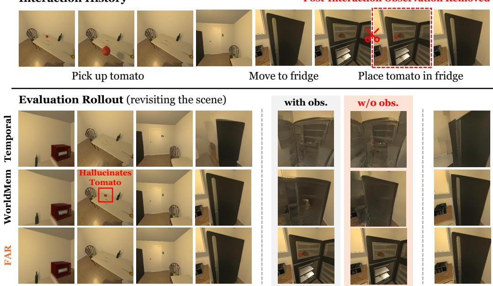  
Figure 7: History-dependent counterfactual prediction in AI2-THOR. We compare two trajectories with the same current closed-fridge observation and opening action but different histories: one history contains the event of placing a tomato inside the fridge, while the other does not.

## 4.3 AI2-THOR – FAR RECALLS THE RIGHT STATE AS THE WORLD CHANGES

We next evaluate FAR in AI2-THOR environments where interactions change the state of the world. During exploration, the agent randomly moves objects between surfaces and containers, producing multiple observations of the same location that may correspond to conflicting world states. During the return phase, the agent revisits these locations and must generate observations consistent with the state established by the preceding interactions. This setting is challenging for retrieval based primarily on recency or geometry, since a spatially wellmatched memory may depict a stale state.

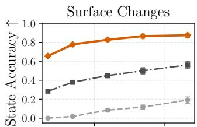

State rendering accuracy. We evaluate whether the generated rollout reflects the current world state rather than a stale state from earlier in the trajectory. Specifically, we report the fraction of changed states satisfying $d ( o _ { \mathrm { G T } } , o _ { \mathrm { P r e d } } ) <$ $d ( o _ { \mathrm { G T } } , o _ { \mathrm { S t a l e } } )$ , where $\mathbf { 0 } _ { \mathrm { G T } }$ is the ground-truth frame, ${ \pmb { o } } _ { \mathrm { P r e d } }$ is the predicted rollout frame, $\pmb { O } \mathrm { S t a l e }$ is a pose-matched observation depicting the pre-interaction state, and d denotes LPIPS on a crop around the changed region.

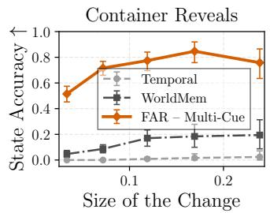  
Figure 8: State accuracy under object manipulation.

Fig. 8 stratifies accuracy by state-change magnitude, $d ( o _ { \mathrm { G T } } , o _ { \mathrm { S t a l e } } )$ . We consider two cases: surface changes, where the updated state is directly visible upon revisit, and container reveals, where it becomes observable only after opening a container. Multi-Cue FAR, fusing metadata and vision, substantially outperforms temporal and geometry-based recall across change magnitudes in both settings. The advantage is especially pronounced for container reveals, where the current observation contains little information about hidden contents and accurate prediction therefore depends strongly on recalling the relevant interaction history. Performance decreases for all methods when current and stale states differ only locally, consistent with the limited sensitivity of the diffusion prediction objective to small visual changes.

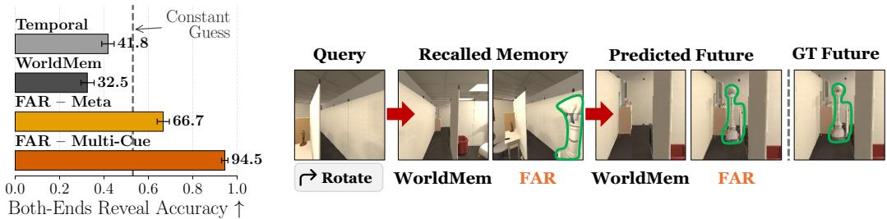  
Figure 9: Off-scene dynamics prediction. Left: trajectory-level accuracy for predicting the future location of the independently moving agent $A _ { 2 }$ . Right: qualitative example showing that FAR recalls a motion-informative episode containing $A _ { 2 } ,$ and predicts the correct future state with $A _ { 2 } .$ WorldMem retrieves a spatially relevant but dynamically uninformative memory, failing to render $A _ { 2 } .$ All $A _ { 2 }$ appearances are outlined in green for visual aid.

History-dependent counterfactual prediction. Fig. 7 shows a paired counterfactual example in which the current observation and action are held fixed, while the preceding interaction history differs. In one history, the agent places a tomato inside the refrigerator; in the other, it does not. When the agent later observes the same closed refrigerator and executes the same opening action, FAR generates different futures consistent with the corresponding histories, rendering the tomato inside the refrigerator only when it was previously placed there. This shows that the predicted future is not determined by the current observation alone, but depends on recalling the relevant past interaction. In contrast, Temporal and WorldMem fail to preserve the interaction-dependent state, with WorldMem additionally hallucinating the tomato at its stale table location as a result of prioritizing stale contexts with high FOV overlap over up-to-date contexts.

Off-scene dynamics prediction. We test whether FAR can predict off-scene dynamics in a twoagent corridor setting. $A _ { 1 }$ is the observer, while $A _ { 2 }$ patrols back and forth and is only intermittently visible through a doorway. The task is to predict $A _ { 2 } \mathrm { ^ { * } s }$ location when $A _ { 1 }$ exits the room and looks down the corridor. To capture motion, each recalled context consists of two observations separated by 1.5 seconds. We compare FAR using only time and pose metadata with a Multi-Cue variant that fuses metadata with an $A _ { 2 }$ observation cue. As shown in Fig. 9, Temporal and WorldMem achieve 41.9% and 32.4% accuracy, while FAR with metadata alone reaches 67.1%, indicating that futureaware training can learn when informative crossings are likely to occur. Multi-Cue further improves accuracy to 94.6% by more precisely identifying motion-informative episodes. Qualitatively, World-Mem retrieves a geometrically relevant but dynamically uninformative memory, whereas Multi-Cue FAR recalls an episode containing $A _ { 2 }$ and predicts its future off-scene location correctly.

## 4.4 ABLATION STUDY

Table 1 analyzes each component of FAR. A frozen pretrained vision encoder provides a strong retrieval signal, substantially outperforming baselines across three rollout metrics. Adapting the query representation with MLP further improves performance from 16.25 to 16.48 PSNR, with gains in LPIPS and DreamSim, indicating that visual similarity benefits from task-specific adaptation toward predictive relevance. Incorporating metadata cues yields a

<table><tr><td>Retrieval</td><td>PSNR↑</td><td>LPIPS↓</td><td>DreamSim↓</td></tr><tr><td>Temporal (NWM)</td><td> $1 3 . 2 2 9 _ { \pm 0 . 1 1 4 }$ </td><td> $0 . 5 8 2 _ { \pm 0 . 0 0 7 }$ </td><td> $0 . 2 0 0 { \scriptstyle \pm 0 . 0 0 4 }$ </td></tr><tr><td>LongLive-RAG</td><td> $1 4 . 8 4 7 _ { \pm 0 . 1 2 1 }$ </td><td> $0 . 4 6 3 _ { \pm 0 . 0 0 6 }$ </td><td> $0 . 1 3 3 _ { \pm 0 . 0 0 3 }$ </td></tr><tr><td>WorldMem</td><td> $1 5 . 3 7 2 _ { \pm 0 . 1 1 2 }$ </td><td> $0 . 4 4 8 _ { \pm 0 . 0 0 6 }$ </td><td> $0 . 1 3 0 { \scriptstyle \pm 0 . 0 0 3 }$ </td></tr><tr><td colspan="4">FAR with Vision Cue</td></tr><tr><td>Enc. Pretrained</td><td> $1 6 . 2 4 8 _ { \pm 0 . 1 1 2 }$ </td><td> $0 . 3 9 0 { \scriptstyle \pm 0 . 0 0 6 }$ </td><td> $0 . 1 0 0 { \scriptstyle \pm 0 . 0 0 3 }$ </td></tr><tr><td>+ MLP Adapter</td><td> $1 6 . 4 8 0 _ { \pm 0 . 1 0 8 }$ </td><td> $0 . 3 7 4 { \scriptstyle \pm 0 . 0 0 6 }$ </td><td> $0 . 0 9 1 _ { \pm 0 . 0 0 2 }$ </td></tr><tr><td> $+ \mathbf { M e t a } , \bar { \lambda } = 0 . 5$ </td><td> $1 6 . 9 1 2 _ { \pm 0 . 1 1 7 }$ </td><td> $0 . 3 5 3 { \scriptstyle \pm 0 . 0 0 5 }$ </td><td> $0 . 0 8 8 _ { \pm 0 . 0 0 2 }$ </td></tr><tr><td>+ Meta, λ learned</td><td> $\mathbf { 1 7 . 2 6 7 _ { \pm 0 . 1 1 6 } }$ </td><td> $\mathbf { 0 . 3 3 7 _ { \pm 0 . 0 0 5 } }$ </td><td> $\mathbf { 0 . 0 8 2 _ { \pm 0 . 0 0 2 } }$ </td></tr></table>

Table 1: Ablation on LoopNav. We report average loop closure errors for various configurations.

larger improvement: fixed fusion with $\lambda = 0 . 5$ increases PSNR to 16.91. Finally, learning the fusion weights achieves the best performance across all metrics, showing that metadata and visual cues are complementary and adaptively weighting their reliability is preferable to uniform fusion.

## 5 CONCLUSION AND LIMITATIONS

We introduced FAR, which learns which episodic memories support prediction and which retrieval cues to trust. FAR uses the observed future for predictive credit during training, while remaining future-blind at inference. By learning cue-specific relevance and query-dependent cue weights, FAR improves long-horizon prediction across navigation, multi-cue, and changing-state settings, supporting predictive utility as a principled basis for episodic memory recall in world models.

Our work focuses on recall from an external episodic memory, leaving memory writing, compression, forgetting, and higher-order interactions among recalled memories to future work. FAR also requires informative retrieval cues and additional training-time computation for predictive-utility evaluation. Our diffusion-loss utility may underweight semantically important local changes; alternative task-aware utility functions are a promising direction. Finally, our experiments use controlled simulations, motivating evaluation in richer real-world settings and integration with learned memory formation and persistent-state representations.

## ACKNOWLEDGMENTS

We sincerely thank Koichi Saito for his thoughtful insights and engaging discussions throughout this project.

## REFERENCES

Eloi Alonso, Adam Jelley, Vincent Micheli, Anssi Kanervisto, Amos Storkey, Tim Pearce, and Franc¸ois Fleuret. Diffusion for World Modeling: Visual Details Matter in Atari. In NeurIPS, 2024.

Amir Bar, Gaoyue Zhou, Danny Tran, Trevor Darrell, and Yann LeCun. Navigation World Models. In CVPR, 2025.

Jake Bruce et al. Genie: Generative Interactive Environments. In ICML, 2024.

Shengqu Cai, Ceyuan Yang, Lvmin Zhang, Yuwei Guo, Junfei Xiao, Ziyan Yang, Yinghao Xu, Zhenheng Yang, Alan Yuille, Leonidas Guibas, Maneesh Agrawala, Lu Jiang, and Gordon Wetzstein. Mixture of Contexts for Long Video Generation. In ICLR, 2026.

Ishaan Preetam Chandratreya, David Charatan, Basile Van Hoorick, Sergey Zakharov, Vitor Guizilini, Phillip Isola, and Vincent Sitzmann. MilliVid: Hierarchical Latents for Long-Range Consistency in Video Generation. arXiv preprint arXiv:2606.09056, 2026.

Changan Chen, Unnat Jain, Carl Schissler, Sebastia Vicenc Amengual Gari, Ziad Al-Halah, Vamsi Krishna Ithapu, Philip Robinson, and Kristen Grauman. SoundSpaces: Audio-Visual Navigation in 3D Environments. In ECCV, 2020.

Taiye Chen, Xun Hu, Zihan Ding, and Chi Jin. VRAG: Learning World Models for Interactive Video Generation. In NeurIPS, 2025.

Decart, Julian Quevedo, Quinn McIntyre, Spruce Campbell, Xinlei Chen, and Robert Wachen. Oasis: A Universe in a Transformer, 2024. URL https://oasis-model.github.io/.

Alexey Dosovitskiy, Lucas Beyer, Alexander Kolesnikov, Dirk Weissenborn, Xiaohua Zhai, Thomas Unterthiner, Mostafa Dehghani, Matthias Minderer, Georg Heigold, Sylvain Gelly, Jakob Uszkoreit, and Neil Houlsby. An Image is Worth 16x16 Words: Transformers for Image Recognition at Scale. In ICLR, 2021.

Samuel Garcin, Thomas Walker, Steven McDonagh, Tim Pearce, Hakan Bilen, Tianyu He, Kaixin Wang, and Jiang Bian. Beyond Pixel Histories: World Models with Persistent 3D State. In ICML, 2026.

David Ha and Jurgen Schmidhuber. Recurrent World Models Facilitate Policy Evolution. In¨ NeurIPS, 2018.

Danijar Hafner, Timothy Lillicrap, Ian Fischer, Ruben Villegas, David Ha, Honglak Lee, and James Davidson. Learning Latent Dynamics for Planning from Pixels. In ICML, 2019.

Danijar Hafner, Timothy Lillicrap, Jimmy Ba, and Mohammad Norouzi. Dream to Control: Learning Behaviors by Latent Imagination. In ICLR, 2020.

Danijar Hafner, Timothy Lillicrap, Mohammad Norouzi, and Jimmy Ba. Mastering Atari with Discrete World Models. In ICLR, 2021.

Danijar Hafner, Jurgis Pasukonis, Jimmy Ba, and Timothy Lillicrap. Mastering diverse control tasks through world models. Nature, 640:647–653, 2025.

Jinkun Hao, Mingda Jia, Ruiyan Wang, Xihui Liu, Ran Yi, Lizhuang Ma, Jiangmiao Pang, and Xudong Xu. EgoSim: Egocentric World Simulator for Embodied Interaction Generation. In ECCV, 2026.

Jonathan Ho, Ajay Jain, and Pieter Abbeel. Denoising Diffusion Probabilistic Models. NeurIPS, 2020.

Qixin Hu, Shuai Yang, Wei Huang, Song Han, and Yukang Chen. LongLive-RAG: A General Retrieval-Augmented Framework for Long Video Generation. arXiv preprint arXiv:2606.02553, 2026.

Dongwon Kim, Gawon Seo, Jinsung Lee, Minsu Cho, and Suha Kwak. Planning in 8 Tokens: A Compact Discrete Tokenizer for Latent World Model. In CVPR, 2026.

Diederik Kingma, Tim Salimans, Ben Poole, and Jonathan Ho. Variational Diffusion Models. NeurIPS, 2021.

Eric Kolve, Roozbeh Mottaghi, Winson Han, Eli VanderBilt, Luca Weihs, Alvaro Herrasti, Matt Deitke, Kiana Ehsani, Daniel Gordon, Yuke Zhu, Aniruddha Kembhavi, Abhinav Gupta, and Ali Farhadi. AI2-THOR: An Interactive 3D Environment for Visual AI. arXiv preprint arXiv:1712.05474, 2017.

Chieh-Hsin Lai, Yang Song, Dongjun Kim, Yuki Mitsufuji, and Stefano Ermon. The Principles of Diffusion Models. arXiv preprint arXiv:2510.21890, 2025.

Patrick Lewis, Ethan Perez, Aleksandra Piktus, Fabio Petroni, Vladimir Karpukhin, Naman Goyal, Heinrich Kuttler, Mike Lewis, Wen-tau Yih, Tim Rockt¨ aschel, Sebastian Riedel, and Douwe¨ Kiela. Retrieval-Augmented Generation for Knowledge-Intensive NLP Tasks. In NeurIPS, 2020.

Jia Li, Han Yan, Yihang Chen, Siqi Li, Xibin Song, Yifu Wang, Jianfei Cai, Tien-Tsin Wong, and Pan Ji. I3DM: Implicit 3D-aware Memory Retrieval and Injection for Consistent Video Scene Generation. arXiv preprint arXiv:2603.23413, 2026.

Kewei Lian, Shaofei Cai, Yitao Liang, and Anji Liu. LoopNav: Benchmarking Spatial Consistency in World Models. arXiv preprint arXiv:2505.22976, 2025.

William Peebles and Saining Xie. Scalable Diffusion Models with Transformers. In ICCV, 2023.

Zhan Peng, Jie Ma, Huiqiang Sun, Chong Gao, Zhijie Xue, Zhiyu Pan, Zhiguo Cao, Jun Liang, and Jing Li. Compression and Retrieval: Implicit Memory Retrieval for Video World Models. arXiv preprint arXiv:2606.23105, 2026.

Dustin Podell, Zion English, Kyle Lacey, Andreas Blattmann, Tim Dockhorn, Jonas Muller, Joe¨ Penna, and Robin Rombach. SDXL: Improving Latent Diffusion Models for High-Resolution Image Synthesis. In ICLR, 2024.

Devendra Singh Sachan, Siva Reddy, William Hamilton, Chris Dyer, and Dani Yogatama. End-to-End Training of Multi-Document Reader and Retriever for Open-Domain Question Answering. In NeurIPS, 2021.

Junyoung Seo, Hyunwook Choi, Minkyung Kwon, Jinhyeok Choi, Siyoon Jin, Gayoung Lee, Junho Kim, JoungBin Lee, Geonmo Gu, Dongyoon Han, Sangdoo Yun, Seungryong Kim, and Jin-Hwa Kim. Grounding World Simulation Models in a Real-World Metropolis. In ECCV, 2026.

Jiaming Song, Chenlin Meng, and Stefano Ermon. Denoising Diffusion Implicit Models. In ICLR, 2021a.

Yang Song, Conor Durkan, Iain Murray, and Stefano Ermon. Maximum Likelihood Training of Score-based Diffusion Models. In NeurIPS, 2021b.

Fan Wang, Zhiyuan Chen, Yuxuan Zhong, Sunjian Zheng, Pengtao Shao, Bo Yu, Shaoshan Liu, Jianan Wang, Ning Ding, Yang Cao, and Yu Kang. Context and Diversity Matter: The Emergence of In-Context Learning in World Models. In ICLR, 2026a.

Jianyuan Wang, Minghao Chen, Nikita Karaev, Andrea Vedaldi, Christian Rupprecht, and David Novotny. VGGT: Visual Geometry Grounded Transformer. In CVPR, 2025.

Zile Wang et al. Matrix-Game 3.0: Real-Time and Streaming Interactive World Model with Long-Horizon Memory. arXiv preprint arXiv:2604.08995, 2026b.

Tong Wu, Shuai Yang, Ryan Po, Yinghao Xu, Ziwei Liu, Dahua Lin, and Gordon Wetzstein. Video World Models with Long-term Spatial Memory. In NeurIPS, 2025.

Zeqi Xiao, Yushi Lan, Yifan Zhou, Wenqi Ouyang, Shuai Yang, Yanhong Zeng, and Xingang Pan. WorldMem: Long-term Consistent World Simulation with Memory. In NeurIPS, 2025.

Jiwen Yu, Jianhong Bai, Yiran Qin, Quande Liu, Xintao Wang, Pengfei Wan, Di Zhang, and Xihui Liu. Context as Memory: Scene-Consistent Interactive Long Video Generation with Memory Retrieval. In SIGGRAPH Asia, 2025.

Jiwen Yu, Jianxiong Gao, Jianhong Bai, Yiran Qin, Kaiyi Huang, Quande Liu, Xintao Wang, Pengfei Wan, Kun Gai, and Xihui Liu. MemLearner: Learning to Query Context Memory for Video World Models. In ECCV, 2026.

Lvmin Zhang, Shengqu Cai, Muyang Li, Gordon Wetzstein, and Maneesh Agrawala. Frame Context Packing and Drift Prevention in Next-Frame-Prediction Video Diffusion Models. In NeurIPS, 2025.

Jinjing Zhao, Fangyun Wei, Zhening Liu, Hongyang Zhang, Chang Xu, and Yan Lu. Spatia: Video Generation with Updatable Spatial Memory. In CVPR, 2026.

Haoyi Zhu, Haozhe Liu, Yuyang Zhao, Tian Ye, Junsong Chen, Jincheng Yu, Tong He, Song Han, and Enze Xie. SANA-WM: Efficient minute-scale world modeling with hybrid linear diffusion transformer. arXiv preprint arXiv:2605.15178, 2026.

## Supplementary Material

## A ADDITIONAL DISCUSSION OF RELATED WORK

<table><tr><td>Method</td><td>World Model</td><td>External Retriever</td><td>Prediction Supervised</td><td>Adaptive Cue Fusion</td><td>Cue Options</td></tr><tr><td>FramePack (Zhang et al., 2025)</td><td>x</td><td></td><td>x</td><td>X</td><td>Time, Vision</td></tr><tr><td>LongLive-RAG (Hu et al., 2026)</td><td>x</td><td></td><td>x</td><td>x</td><td>Vision</td></tr><tr><td>WorldMem (Xiao et al., 2025)</td><td></td><td></td><td>x</td><td>x</td><td>Time, Pose</td></tr><tr><td>Context-as-Memory (Yu et al., 2025)</td><td></td><td></td><td>x</td><td>x</td><td>Pose</td></tr><tr><td>VRAG (Chen et al., 2025)</td><td></td><td></td><td>x</td><td>x</td><td>Pose</td></tr><tr><td>SPMem (Wu et al., 2025)</td><td></td><td></td><td>x</td><td></td><td>Pose</td></tr><tr><td>I3DM (Li et al., 2026)</td><td></td><td>vvV</td><td>x</td><td>××</td><td>Pose, Vision</td></tr><tr><td>Matrix-Game 3.0 (Wang et al., 2026b)</td><td></td><td></td><td>x</td><td>x</td><td>Pose</td></tr><tr><td>Mixture-of-Contexts (Cai et al., 2026)</td><td>x</td><td>×</td><td>√</td><td>×</td><td>Vision, Text</td></tr><tr><td>MemLearner (Yu et al., 2026)</td><td></td><td>×</td><td></td><td>x</td><td>Pose, Vision</td></tr><tr><td>Compression-and-Retrieval (Peng et al., 2026)</td><td></td><td>x</td><td></td><td>x</td><td>Pose, Vision</td></tr><tr><td>Ours</td><td></td><td></td><td></td><td></td><td>Time, Pose, Vision, Audio</td></tr></table>

Table 2: Conceptual comparison of episodic memory recall for video and world models. World Model indicates whether the method is designed for action-conditioned future prediction; External Retriever whether memory selection is performed outside the generator; Prediction Supervised whether retrieval is optimized using the downstream prediction objective; Adaptive Cue Fusion whether the retriever dynamically weights multiple retrieval cues for each query rather than using a fixed cue or predefined combination; and Cue Options lists the information sources used to determine memory relevance in the respective papers.

Episodic memory retrieval for world models. Recent video and world models augment limited context windows with external memories that preserve historical frames or latent representations for later retrieval (Xiao et al., 2025; Yu et al., 2025; Wu et al., 2025; Li et al., 2026; Hu et al., 2026). As summarized in Table 2, existing external retrievers typically rely on fixed notions of relevance, including temporal proximity, pose or field-of-view overlap, geometry-aware similarity, or learned visual embeddings. These approaches demonstrate that selectively revisiting non-local observations can improve long-horizon consistency, but the retrieval rule itself is generally not optimized using the downstream world-model prediction objective. FAR instead learns memory relevance directly from predictive utility and further learns query-dependent fusion over heterogeneous temporal, spatial, visual, and auditory cues. Thus, FAR learns both which memories are predictively useful and which cues should be trusted to find them.

Internal long-context memory. A complementary line retains long-range history within the generator and learns how to route or compress it during prediction. Mixture of Contexts sparsely routes queries to informative history chunks, MemLearner queries context using the video generator itself, and CaR combines attention-based memory retrieval with context compression (Cai et al., 2026; Yu et al., 2026; Peng et al., 2026). Recent world models also use recurrent or hybrid linear attention to propagate information over long sequences, including L2World and SANA-WM (Wang et al., 2026a; Zhu et al., 2026). These internal mechanisms and external episodic recall are complementary: the former efficiently summarize or route long histories within the model, while the latter preserves individually addressable observations that can be selectively revisited.

Persistent-state representations. Rather than retrieving individual observations, another family of approaches maintains an explicit or latent state that is updated as the environment evolves. PERSIST evolves a latent 3D scene representation, Spatia maintains an updatable 3D point-cloud memory, and EgoSim continuously updates a 3D scene state across embodied interactions (Garcin et al., 2026; Zhao et al., 2026; Hao et al., 2026). Persistent state provides a compact, viewpointindependent representation of geometry and world changes, whereas episodic memory preserves past observations as individually recoverable evidence. The two are complementary: persistent state summarizes the model’s current belief about the world, while episodic recall can recover specific past evidence when that state is incomplete or uncertain.

Learned retrieval and retrieval-augmented generation. Retrieval-augmented generation (RAG) treats retrieved documents as latent context and learns retrieval jointly with downstream generation (Lewis et al., 2020; Sachan et al., 2021). In particular, EMDR2 uses the reader likelihood of the observed target to provide posterior supervision for discrete document retrieval (Sachan et al., 2021). FAR draws on this principle but applies it to an agent’s own episodic history: the realized future provides predictive credit for candidate memories, and this supervision trains a retriever that operates without access to the future at inference. Unlike document RAG, FAR additionally learns to combine heterogeneous temporal, spatial, visual, and auditory cues to locate useful memories.

Long-horizon world models. A broader line of work targets long-horizon consistency by changing how context or state is represented rather than explicitly learning episodic recall. FramePack compresses frame histories according to importance and introduces anti-drifting mechanisms, while MilliVid uses hierarchical latents and coarse-to-fine rollout to preserve long-range structure efficiently (Zhang et al., 2025; Chandratreya et al., 2026). Seoul World Model instead repeatedly regrounds generation using nearby real-world observations to stabilize long trajectories (Seo et al., 2026). These approaches address complementary challenges of context scaling, drift, and external grounding; FAR focuses specifically on learning which observations from the agent’s own history are useful for the current prediction.

## B ADDITIONAL THEORETICAL DETAILS

In this section, we provide more theoretical and practical details about FAR. First, we provide the proof of Proposition 1 in Section B.1. We summarize the overall pseudo code as Algorithm 1.

## B.1 DERIVATION OF PREDICTIVE RELEVANCE BOUND

Proof. Consider the joint distribution induced by the environment data distribution and the retriever,

$$
p _ { \phi } ( \boldsymbol { o } _ { t + 1 } , \mathcal { M } _ { t - 1 } , \mathcal { Z } _ { t - 1 } , \mathcal { R } _ { t } , \mathcal { Q } _ { t } , \mathcal { C } _ { t } ) : = p _ { \mathrm { d a t a } } ( \boldsymbol { o } _ { t + 1 } , \mathcal { M } _ { t - 1 } , \mathcal { Z } _ { t - 1 } , \mathcal { R } _ { t } , \mathcal { Q } _ { t } ) r _ { \phi } ( \mathcal { C } _ { t } \mid \mathcal { Z } _ { t - 1 } , \mathcal { R } _ { t } ) .
$$

The subscript ϕ reflects that the recalled context $\mathcal { C } _ { t }$ is selected by the retriever $r _ { \phi }$

Introducing the retriever does not change the marginal distribution of the future and prediction query. Because $\bar { \mathbf { \Gamma } } _ { \bar { \phi _ { } } } ( \cdot \mid \mathcal { Z } _ { t - 1 } , \mathcal { R } _ { t } )$ is normalized,

$$
\begin{array} { l } { p _ { \phi } ( \boldsymbol { o } _ { t + 1 } , \mathcal { Q } _ { t } ) = \displaystyle \int p _ { \mathrm { d a t a } } \bigl ( \boldsymbol { o } _ { t + 1 } , \mathcal { M } _ { t - 1 } , \mathcal { Z } _ { t - 1 } , \mathcal { R } _ { t } , \boldsymbol { Q } _ { t } \bigr ) \sum _ { \boldsymbol { c } _ { t } } r _ { \phi } ( \mathcal { C } _ { t } \mid \mathcal { Z } _ { t - 1 } , \mathcal { R } _ { t } ) \mathrm { d } \mathcal { M } _ { t - 1 } \mathrm { d } \mathcal { Z } _ { t - 1 } \mathrm { d } \mathcal { R } _ { t } } \\ { \displaystyle \qquad = p _ { \mathrm { d a t a } } \bigl ( \boldsymbol { o } _ { t + 1 } , \boldsymbol { Q } _ { t } \bigr ) . } \end{array}
$$

Hence,

$$
p _ { \phi } ( \pmb { o } _ { t + 1 } \mid \mathcal { Q } _ { t } ) = p _ { \mathrm { d a t a } } ( \pmb { o } _ { t + 1 } \mid \mathcal { Q } _ { t } ) .
$$

By the definition of conditional mutual information,

$$
I _ { \phi } ( o _ { t + 1 } ; \mathcal { C } _ { t } \mid \mathcal { Q } _ { t } ) = \mathbb { E } _ { p _ { \phi } } \left[ \log \frac { p _ { \phi } ( o _ { t + 1 } \mid \mathcal { C } _ { t } , \mathcal { Q } _ { t } ) } { p _ { \phi } ( o _ { t + 1 } \mid \mathcal { Q } _ { t } ) } \right] = \mathbb { E } _ { p _ { \phi } } \left[ \log p _ { \phi } ( o _ { t + 1 } \mid \mathcal { C } _ { t } , \mathcal { Q } _ { t } ) - \log p _ { \mathrm { d a t a } } ( o _ { t + 1 } \mid \mathcal { Q } _ { t } ) \right] .
$$

Introducing any predictive distribution $p _ { \theta } ( o _ { t + 1 } \mid \mathcal { C } _ { t } , \mathcal { Q } _ { t } )$ and adding and subtracting its log-density gives

$$
\begin{array} { r l } { I _ { \phi } \big ( o _ { t + 1 } ; \mathcal { C } _ { t } \mid \mathcal { Q } _ { t } \big ) = \mathbb { E } _ { p _ { \phi } } \left[ \log p _ { \theta } \big ( o _ { t + 1 } \mid \mathcal { C } _ { t } , \mathcal { Q } _ { t } \big ) - \log p _ { \mathrm { d a t a } } \big ( o _ { t + 1 } \mid \mathcal { Q } _ { t } \big ) \right] } & { } \\ { + \mathbb { E } _ { p _ { \phi } ( \mathcal { C } _ { t } , \mathcal { Q } _ { t } ) } \left[ \mathcal { D } _ { \mathrm { K L } } \big ( p _ { \phi } \big ( o _ { t + 1 } \mid \mathcal { C } _ { t } , \mathcal { Q } _ { t } \big ) \mid \big \Vert p _ { \theta } \big ( o _ { t + 1 } \mid \mathcal { C } _ { t } , \mathcal { Q } _ { t } \big ) \big ) \right] . } \end{array}
$$

The second term is nonnegative by the nonnegativity of KL divergence. Therefore,

$$
\begin{array} { r } { I _ { \phi } ( o _ { t + 1 } ; \mathcal { C } _ { t } \mid \mathcal { Q } _ { t } ) \ge \mathbb { E } _ { ( o _ { t + 1 } , M _ { t - 1 } , \mathcal { Z } _ { t - 1 } , \mathcal { R } _ { t } , \mathcal { Q } _ { t } ) \sim p _ { \mathrm { d a t a } } } \left[ \log p _ { \theta } ( o _ { t + 1 } \mid \mathcal { C } _ { t } , \mathcal { Q } _ { t } ) - \log p _ { \mathrm { d a t a } } ( o _ { t + 1 } \mid \mathcal { Q } _ { t } ) \right] , } \end{array}
$$

which is exactly Eq. (3).

Moreover, the decomposition above shows that the gap in the bound is

$$
\mathbb { E } _ { p _ { \phi } ( \mathcal { C } _ { t } , \mathcal { Q } _ { t } ) } \left[ \mathcal { D } _ { \mathrm { K L } } \big ( p _ { \phi } \big ( { \pmb { \mathscr { o } } } _ { t + 1 } \mid \mathcal { C } _ { t } , \mathcal { Q } _ { t } \big ) \big \| p _ { \theta } \big ( { \pmb { \mathscr { o } } } _ { t + 1 } \mid \mathcal { C } _ { t } , \mathcal { Q } _ { t } \big ) \big ) \right] .
$$

Thus, the bound is tight when the predictive world model matches the conditional distribution of the future induced by the data distribution and retriever, almost surely over $( \mathcal { C } _ { t } , \mathcal { Q } _ { t } )$ □

## B.2 LATENT-CONTEXT MAXIMUM-LIKELIHOOD VIEW OF THE RETRIEVER UPDATE

We show that the future-aware posterior and retriever objective in Eqs. (5) and (6) follow directly from maximum likelihood in the latent-context predictive model Eq. (2). This also clarifies why FAR matches a posterior that combines predictive utility with the current recall distribution, rather than a target based on predictive utility alone.

For readability, within this subsection we abbreviate

$$
\begin{array} { r } { r _ { \phi } ( \mathcal { C } _ { t } ) : = r _ { \phi } ( \mathcal { C } _ { t } \mid \mathcal { Z } _ { t - 1 } , \mathcal { R } _ { t } ) , \quad \mathrm { a n d } \quad u _ { \theta } ( \mathcal { C } _ { t } ) : = u _ { \theta } ( \mathcal { C } _ { t } \mid o _ { t + 1 } , \mathcal { Q } _ { t } ) , } \end{array}
$$

and let

$$
\mathfrak { C } _ { t } : = \{ \mathcal { C } _ { t } \subseteq \mathcal { M } _ { t - 1 } : | \mathcal { C } _ { t } | = K \}
$$

denote the set of all valid recalled context sets, i.e., all subsets of the episodic memory containing exactly K historical observations. For a fixed training example, Eq. (2) gives

$$
p _ { \theta , \phi } ( \boldsymbol { o } _ { t + 1 } \mid \cdots ) = \sum _ { \mathcal { C } _ { t } \in \mathfrak { C } _ { t } } r _ { \phi } ( \mathcal { C } _ { t } ) p _ { \theta } ( \boldsymbol { o } _ { t + 1 } \mid \mathcal { C } _ { t } , \mathcal { Q } _ { t } ) = \sum _ { \mathcal { C } _ { t } \in \mathfrak { C } _ { t } } r _ { \phi } ( \mathcal { C } _ { t } ) \exp u _ { \theta } ( \mathcal { C } _ { t } ) .
$$

The corresponding posterior over recalled contexts is

$$
q _ { \theta , \phi } ( \mathcal { C } _ { t } ) : = \frac { r _ { \phi } ( \mathcal { C } _ { t } ) \exp { u _ { \theta } ( \mathcal { C } _ { t } ) } } { \sum _ { \mathcal { C } _ { t } ^ { \prime } \in \mathfrak { C } _ { t } } r _ { \phi } ( \mathcal { C } _ { t } ^ { \prime } ) \exp { u _ { \theta } ( \mathcal { C } _ { t } ^ { \prime } ) } } .
$$

For any distribution q over ${ \mathfrak { C } } _ { t } ,$ , a direct rearrangement gives the standard latent-variable decomposition

$$
\log p _ { \theta , \phi } ( \boldsymbol { o } _ { t + 1 } \mid \cdots ) = \mathbb { E } _ { \mathcal { C } _ { t } \sim q } \left[ u _ { \theta } ( \mathcal { C } _ { t } ) \right] - \mathcal { D } _ { \mathrm { K L } } ( q \parallel \boldsymbol { r } _ { \phi } ) + \mathcal { D } _ { \mathrm { K L } } ( q \parallel q _ { \theta , \phi } ) .\tag{11}
$$

Since the final term is nonnegative, the bound is maximized at $q = q _ { \theta , \phi }$ , or equivalently,

$$
q _ { \theta , \phi } = \mathop { \arg \operatorname* { m a x } } _ { \boldsymbol { q } } \left\{ \mathbb { E } _ { \mathcal { C } _ { t } \sim \boldsymbol { q } } \left[ \boldsymbol { u } _ { \theta } ( \mathcal { C } _ { t } ) \right] - \mathcal { D } _ { \mathrm { K L } } ( \boldsymbol { q } \| r _ { \phi } ) \right\} .
$$

Thus, the future-aware posterior increases expected predictive utility while remaining anchored to the relevance inferred by the future-blind retriever.

Because $\begin{array} { r } { r _ { \phi } ( \mathcal { C } _ { t } ) \propto \exp s _ { \phi } ( \mathcal { C } _ { t } \mid \mathcal { Z } _ { t - 1 } , \mathcal { R } _ { t } ) } \end{array}$ , the optimizer has the form

$$
q _ { \theta , \phi } ( \mathcal { C } _ { t } ) \propto \exp [ s _ { \phi } ( \mathcal { C } _ { t } \mid \mathcal { Z } _ { t - 1 } , \mathcal { R } _ { t } ) + u _ { \theta } ( \mathcal { C } _ { t } \mid \sigma _ { t + 1 } , \mathcal { Q } _ { t } ) ] ,
$$

which recovers the future-aware posterior in Eq. (5). The realized future therefore updates the relevance already inferred from the available retrieval cues, rather than replacing it.

This also explains why we do not construct the target from predictive utility alone. Normalizing only predictive utility would give

$$
{ \bar { q } } _ { \theta } ( { \mathcal { C } } _ { t } ) \propto \exp u _ { \theta } ( { \mathcal { C } } _ { t } ) .
$$

For finite ${ \mathfrak { C } } _ { t } .$ , this distribution solves

$$
\bar { q } _ { \theta } = \underset { q } { \arg \operatorname* { m a x } } \left. \mathbb { E } _ { q } [ u _ { \theta } ] + \mathcal { H } ( q ) \right. = \underset { q } { \arg \operatorname* { m a x } } \left. \mathbb { E } _ { q } [ u _ { \theta } ] - \mathcal { D } _ { \mathrm { K L } } ( q \| \mathrm { U n i f } ( \mathfrak { C } _ { t } ) ) \right. ,
$$

up to the constant $\log | \mathfrak { C } _ { t } |$ . Hence, a utility-only target implicitly replaces the query-dependent recall distribution $r _ { \phi }$ with a uniform prior over contexts, discarding the relevance already inferred from the current query and retrieval cues. For example, if all contexts have equal predictive utility, then $q _ { \theta , \phi } = r _ { \phi } ,$ , so the realized future provides no evidence for changing the current recall preference. In contrast, ${ \bar { q } } \theta$ becomes uniform and would alter the retriever despite receiving no differential predictive evidence. More generally, $q _ { \theta , \phi } \propto r _ { \phi } \exp u _ { \theta }$ is the posterior implied by the latent-context model, whereas ${ \bar { q } } \theta$ corresponds to a different model with a uniform latent-context prior.

The same variational formulation determines how the retriever should be updated. Let $\phi ^ { - }$ denote the current retriever parameters, and first compute $q _ { \theta , \phi }$ − using the current model. Holding this posterior fixed, maximizing Eq. (11) with respect to ϕ reduces to

$$
\operatorname* { m a x } _ { \phi } \mathbb { E } _ { \mathcal { C } _ { t } \sim q _ { \theta , \phi ^ { - } } } \left[ \log r _ { \phi } ( \mathcal { C } _ { t } ) \right] ,
$$

or equivalently,

$$
\operatorname* { m i n } _ { \phi } \mathcal { D } _ { \mathrm { K L } } \left( q _ { \theta , \phi ^ { - } } \parallel r _ { \phi } \right) .
$$

Thus, the update alternates between using the realized future to compute posterior credit and fitting the future-blind retriever to this fixed target. In the notation of the main text, this is implemented by

$$
\mathcal { L } _ { \mathrm { R e t } } ( \phi ) : = \mathbb { E } \left[ \mathcal { D } _ { \mathrm { K L } } ( \mathrm { s g } [ q _ { \theta , \phi } ] \| r _ { \phi } ) \right] ,
$$

which is exactly Eq. (6). The stop-gradient prevents gradients from flowing through the posterior during the retriever update, implementing the fixed-target step of this alternating optimization rather than introducing an additional heuristic objective.

With the exact posterior, the same update also recovers the retriever-side marginal-likelihood gradient. At the parameters $\phi = \phi ^ { - }$ used to construct the posterior,

$$
\nabla _ { \phi } \log p _ { \theta , \phi } ( o _ { t + 1 } \mid \cdot \cdot \cdot ) \big | _ { \phi = \phi ^ { - } } = \mathbb { E } _ { \mathcal { C } _ { t } \sim q _ { \theta , \phi ^ { - } } } \left[ \nabla _ { \phi } \log r _ { \phi } ( \mathcal { C } _ { t } ) \right] _ { \phi = \phi ^ { - } } = - \nabla _ { \phi } \mathcal { D } _ { \mathrm { K L } } \big ( q _ { \theta , \phi ^ { - } } \big \| r _ { \phi } \big ) \bigg | _ { \phi = \phi ^ { - } } .\tag{12}
$$

Hence, for the exact posterior, posterior matching gives exactly the negative marginal-likelihood gradient with respect to the retriever.

The derivation above applies to the exact posterior over recalled context sets. Under discrete Top-K recall, enumerating these sets is combinatorial. The candidate-level objective in Section B.3 therefore applies the same posterior-credit principle to a finite candidate pool using singleton predictive utilities. Because this restricts both the context space and the utility evaluation, the exact gradient identity in Eq. (12) need not hold globally for the practical approximation.

## B.3 RETRIEVER POSTERIOR APPROXIMATION

The future-aware posterior in Eq. (5) is defined over all admissible recalled context sets. Under discrete Top-K recall, exact evaluation is therefore combinatorial. We adapt the latent-variable retriever training strategy of EMDR2 (Sachan et al., 2021) to obtain a tractable candidate-level approximation over a finite pool of historical observations.

For each retriever update, let $\mathcal { A } _ { t } \subseteq \mathcal { M } _ { t - 1 }$ denote the candidate pool. The observation-level relevance scores from Eq. (8) induce the future-blind candidate distribution

$$
r _ { \phi } ^ { \mathcal { A } _ { t } } ( \pmb { o } _ { i } \mid \mathcal { Z } _ { t - 1 } , \mathcal { R } _ { t } ) : = \mathrm { s o f t m a x } _ { \pmb { o } _ { i } \in \mathcal { A } _ { t } } s _ { \phi , i } .\tag{13}
$$

This distribution represents the retriever’s relative preference among the candidates using only information available at inference time.

To assign predictive credit, we evaluate how well each candidate individually supports prediction of the observed future. The singleton predictive utility of candidate $\mathbf { o } _ { i }$ is

$$
\begin{array} { r } { u _ { \theta , i } : = u _ { \theta } ( \{ o _ { i } \} \mid o _ { t + 1 } , \mathcal { Q } _ { t } ) = \log p _ { \theta } ( o _ { t + 1 } \mid \{ o _ { i } \} , \mathcal { Q } _ { t } ) . } \end{array}\tag{14}
$$

Applying the same predictive reweighting principle as Eq. (5) gives the future-aware candidate posterior

$$
q _ { \theta , \phi } ^ { \mathcal { A } _ { t } } ( o _ { i } \mid o _ { t + 1 } , \mathcal { Z } _ { t - 1 } , \mathcal { R } _ { t } , \mathcal { Q } _ { t } ) : = \mathrm { s o f t m a x } _ { o _ { i } \in \mathcal { A } _ { t } } \left[ s _ { \phi , i } + u _ { \theta , i } \right] .\tag{15}
$$

Thus, $r _ { \phi } ^ { \mathcal { A } _ { t } }$ captures which candidates appear relevant before the future is known, while $q _ { \theta , \phi } ^ { \mathcal { A } _ { t } }$ reweights them according to their predictive utility for the realized future.

We train the retriever by matching its future-blind candidate distribution to this future-aware target:

$$
\begin{array} { r } { \widehat { \mathcal { L } } _ { \mathrm { R e t } } ( \phi ) : = \mathbb { E } [ \mathcal { D } _ { \mathrm { K L } } ( \mathrm { s g } [ \boldsymbol { q } _ { \theta , \phi } ^ { A _ { t } } ]  \boldsymbol { r } _ { \phi } ^ { A _ { t } } ) ] , } \end{array}\tag{16}
$$

where $\mathrm { s g } [ \cdot ]$ denotes stop-gradient and the expectation is over training examples and candidate-pool construction. For a fixed candidate pool with exact singleton likelihoods, this update yields the same retriever gradient as the corresponding candidate-level latent-variable objective of $\mathrm { E M D R } ^ { 2 }$ (Sachan

et al., 2021). FAR differs in how this candidate score is parameterized. Through Eq. (8), the posterior supervision acts on both cue-specific relevance and query-dependent cue weights. For a fixed training example and candidate pool,

$$
\begin{array} { r l } { \nabla _ { \phi } \mathcal { D } _ { \mathrm { K L } } \Big ( \mathrm { s g } [ \mathcal { q } _ { \theta , \phi } ^ { \mathcal { A } _ { t } } ] \Big \| r _ { \phi } ^ { \mathcal { A } _ { t } } \Big ) = \mathbb { E } _ { o _ { i } \sim r _ { \phi } ^ { \mathcal { A } _ { t } } } [ \nabla _ { \phi } s _ { \phi , i } ] - \mathbb { E } _ { o _ { i } \sim q _ { \theta , \phi } ^ { \mathcal { A } _ { t } } } [ \nabla _ { \phi } s _ { \phi , i } ] } & { } \\ { \quad } & { = \displaystyle \sum _ { m } \lambda _ { \phi , t } ^ { m } \left( \mathbb { E } _ { r _ { \phi } ^ { \mathcal { A } _ { t } } } \big [ \nabla _ { \phi } \widetilde { s } _ { \phi , i } ^ { m } \big ] - \mathbb { E } _ { q _ { \theta , \phi } ^ { \mathcal { A } _ { t } } } \big [ \nabla _ { \phi } \widetilde { s } _ { \phi , i } ^ { m } \big ] \right) } \\ { \quad } & { \quad + \displaystyle \sum _ { m } \Big ( \mathbb { E } _ { r _ { \phi } ^ { \mathcal { A } _ { t } } } \big [ \widetilde { s } _ { \phi , i } ^ { m } \big ] - \mathbb { E } _ { q _ { \theta , \phi } ^ { \mathcal { A } _ { t } } } \big [ \widetilde { s } _ { \phi , i } ^ { m } \big ] \Big ) \nabla _ { \phi } \lambda _ { \phi , t } ^ { m } , } \end{array}
$$

where $q _ { \theta , \phi } ^ { \mathcal { A } _ { t } }$ is treated with stop-gradient. The decomposition exposes two learning pathways: one through the cue-specific relevance scores and another through the query-dependent cue weights. Thus, future-aware predictive credit shapes both how memories are scored under each cue and how strongly each cue influences recall for the current query. Thus, a cue is reinforced when it favors memories that receive greater future-aware predictive credit. With a single cue, the cue-reliability term vanishes, recovering the $\mathrm { E M D R } ^ { 2 }$ -style candidate update; with multiple cues, the same predictive signal also learns which cues to trust for the current recall query.

This approximation affects only retrieval credit assignment. The world model is still trained on the complete recalled context and can therefore reason jointly over multiple memories. Candidatelevel training does not explicitly score higher-order selection effects, such as memories that become informative only when recalled together, while such interactions remain represented by the setlevel model in Eqs. (2) and (5). For our video instantiation, singleton likelihood is replaced by the diffusion-based utility estimator below, and the candidate pools are constructed from the temporally structured recall policy described next.

## C ADDITIONAL IMPLEMENTATION DETAILS

## C.1 IMPLEMENTATION DETAILS OF FAR FOR THE VIDEO DIFFUSION INSTANTIATION

This section provides the architectural and optimization details of the video instantiation described in Section 3.3. We specify the diffusion objective, retrieval-score parameterization, adaptive cue fusion, predictive-utility estimator, and training procedure.

Video diffusion world model and objective. We parameterize $p _ { \theta }$ with a diffusion transformer (DiT) (Peebles & Xie, 2023). Retrieved context-frame tokens are processed jointly with noisy target-frame tokens, using alternating intra-frame and global self-attention following VGGT (Wang et al., 2025). The world model predicts the next observation from the current observation and action together with the recalled context frames. Time and pose metadata associated with recalled frames are treated as part of their context representation.

Below, we make the diffusion objective explicit because it serves both to train the world model and, through its standard connection to likelihood-based diffusion training, to provide a tractable surrogate for predictive utility. Let $\scriptstyle { \mathbf { { \vec { x } } } } _ { 0 }$ denote the clean diffusion representation of the target observation $\mathbf { \sigma } _ { o _ { t + 1 } }$ . At diffusion time $\tau ,$ , we sample $\epsilon \sim \mathcal { N } ( 0 , I )$ and construct

$$
{ \pmb x } _ { \tau } = \alpha _ { \tau } { \pmb x } _ { 0 } + \sigma _ { \tau } { \pmb \epsilon } ,
$$

where $\alpha _ { \tau }$ and $\sigma _ { \tau }$ define the noise schedule. Given recalled context $\mathcal { C } _ { t }$ and prediction query $\mathcal { Q } _ { t }$ , the DiT outputs $\pmb { f } _ { \theta } ( \pmb { x } _ { \tau } , \tau ; \mathcal { C } _ { t } , \mathcal { Q } _ { t } )$ . Let $\mathbf { { \boldsymbol { { y } } } } _ { \tau }$ denote the corresponding training target under the chosen diffusion parameterization, $\begin{array} { r } { \mathbf { e } . \mathbf { g } . , \pmb { y } _ { \tau } = \pmb { \epsilon } } \end{array}$ for noise prediction. The per-perturbation loss is

$$
\ell _ { \mathrm { d i f f } } ( \theta ; \pmb { o } _ { t + 1 } , \mathcal { C } _ { t } , \mathcal { Q } _ { t } , \tau , \epsilon ) = w ( \tau ) \left\| f _ { \theta } ( \pmb { x } _ { \tau } , \tau ; \mathcal { C } _ { t } , \mathcal { Q } _ { t } ) - \pmb { y } _ { \tau } \right\| _ { 2 } ^ { 2 } ,
$$

where $w ( \tau )$ is the weighting used by the diffusion objective.

The world model is trained on the complete recalled context $\mathcal { C } _ { t , \mathrm { C h u n k T o p K } } ;$

$$
\mathcal { L } _ { \mathrm { W M } } ( \theta ) : = \mathbb { E } \left[ \ell _ { \mathrm { d i f f } } ( \theta ; \boldsymbol { o } _ { t + 1 } , \mathcal { C } _ { t , \mathrm { C h u n k T o p K } } , \boldsymbol { \mathcal { Q } } _ { t } , \tau , \epsilon ) \right] ,\tag{17}
$$

where the expectation is over training examples and diffusion perturbations.

Retrieval cues affect which observations enter $\mathcal { C } _ { t , \mathrm { C h u n k T o p K } }$ . In particular, visual and audio retrieval representations are used for memory selection and are not passed to the world model as additional generation conditions. This allows the retriever to exploit additional cues without changing the generator’s conditioning interface.

Cue-specific retrieval scores and cacheable representations. For the metadata cue, consisting of time and pose, we use a lightweight scoring network:

$$
s _ { \phi , i } ^ { \mathrm { m e t a } } = \operatorname { t a n h } \left( \mathrm { M L P } _ { \phi } \left( [ z _ { i } ^ { \mathrm { m e t a } } , z _ { t } ^ { \mathrm { m e t a } } , \mathbf { a } _ { t } ] \right) \right) .
$$

For a high-dimensional cue $m \in \{ \mathrm { v i s i o n } , \mathrm { a u d i o } \}$ , we encode each historical cue as a memory key and the current cue as an action-conditioned query:

$$
\begin{array} { r l } & { \boldsymbol { k } _ { i } ^ { m } : = \mathrm { e n c } _ { m } ( \boldsymbol { z } _ { i } ^ { m } , \boldsymbol { \varpi } ) , \qquad \quad \boldsymbol { h } _ { t } ^ { m } : = \mathrm { e n c } _ { m } ( \boldsymbol { z } _ { t } ^ { m } , \boldsymbol { a } _ { t } ) , } \\ & { \boldsymbol { q } _ { t } ^ { m } : = \mathrm { M L P } _ { \phi , m } ( \boldsymbol { h } _ { t } ^ { m } ) , \qquad \quad \boldsymbol { s } _ { \phi , i } ^ { m } : = \mathrm { C o s S i m } ( k _ { i } ^ { m } , q _ { t } ^ { m } ) , } \end{array}
$$

where $\mathcal { D }$ denotes a null action. We use a ViT (Dosovitskiy et al., 2021), inject the action or null token through AdaLN conditioning (Peebles & Xie, 2023), and use a learnable [CLS] token as the retrieval representation. Audio follows the same construction with an audio-specific encoder.

To make historical keys cacheable, we first pretrain the high-dimensional encoders with a predictive contrastive objective. The action-conditioned embedding $\bar { \boldsymbol { h } } _ { t } ^ { m }$ is trained to match the subsequent key $\pmb { k } _ { t + 1 } ^ { m } = \mathrm { e n c } _ { m } ( \pmb { z } _ { t + 1 } ^ { m } , \emptyset )$ . Given $N - 1$ negative keys $\{ k _ { j } ^ { m , - } \} _ { j = 1 } ^ { N - 1 }$ , we minimize

$$
\mathcal { L } _ { \mathrm { N C E } } ^ { m } = - \mathbb { E } \left[ \log \frac { \exp \left( \mathrm { C o s S i m } ( h _ { t } ^ { m } , k _ { t + 1 } ^ { m } ) / \mathrm { T N C E } \right) } { \exp \left( \mathrm { C o s S i m } ( h _ { t } ^ { m } , k _ { t + 1 } ^ { m } ) / \tau _ { \mathrm { N C E } } \right) + \sum _ { j = 1 } ^ { N - 1 } \exp \left( \mathrm { C o s S i m } ( h _ { t } ^ { m } , k _ { j } ^ { m , - } ) / \tau _ { \mathrm { N C E } } \right) } \right] ,
$$

where τ is the contrastive temperature. After pretraining, the encoder is frozen and historical keys are computed once and cached. The lightweight query adapter $\mathrm { M L P } _ { \phi , m }$ remains trainable through FAR.

Adaptive cue weighting. Because different cues may produce scores on different scales, we standardize each cue over the current episodic memory:

$$
\widetilde { s } _ { \phi , i } ^ { m } = \frac { s _ { \phi , i } ^ { m } - \mu _ { t } ^ { m } } { \sigma _ { t } ^ { m } + \delta } ,
$$

where $\mu _ { t } ^ { m }$ and $\sigma _ { t } ^ { m }$ are the mean and standard deviation of $\{ s _ { \phi , i } ^ { m } \} _ { o _ { i } \in \mathcal { M } _ { t - 1 } } ,$ and $\delta > 0$ is a small numerical constant.

The query-dependent weights in Eq. (8) are produced from summary statistics of each cue:

$$
\lambda _ { \phi , t } ^ { m } \propto \exp \left( w _ { \phi } ^ { \top } \left[ \begin{array} { c } { \operatorname* { m a x } _ { o _ { i } \in \mathcal { M } _ { t - 1 } } s _ { \phi , i } ^ { m } } \\ { \mu _ { t } ^ { m } } \\ { \sigma _ { t } ^ { m } } \\ { e _ { m } } \end{array} \right] \right) , \qquad \sum _ { m } \lambda _ { \phi , t } ^ { m } = 1 ,
$$

where $e _ { m }$ is a one-hot cue-type indicator and $\Delta t$ is the simulation stride. The normalization is taken over the cues available in the current environment. Because these score statistics depend on the current query, FAR can vary the relative importance of the available cues from one retrieval query to another.

Diffusion-based predictive utility. The exact singleton utility $u _ { \theta , i } = \log p _ { \theta } ( \pmb { o } _ { t + 1 } \mid \{ \pmb { o } _ { i } \} , \mathcal { Q } _ { t } )$ in Eq. (14) requires the conditional log-likelihood, which is expensive to evaluate for a diffusion model. Diffusion models are instead trained with denoising objectives that arise from, or are closely related to, variational likelihood training (Ho et al., 2020; Kingma et al., 2021; Song et al., 2021b; Lai et al., 2025). We therefore use the negative diffusion prediction loss as a tractable surrogate for comparing the predictive utility of candidate memories. For candidate memory $o _ { i } ,$ we evaluate the realized future using the singleton context $\left\{ o _ { i } \right\}$

$$
\widehat { u } _ { \theta , i } : = - \frac { 1 } { S } \sum _ { s = 1 } ^ { S } \ell _ { \mathrm { d i f f } } ( \theta ; o _ { t + 1 } , \{ o _ { i } \} , \mathcal { Q } _ { t } , \tau _ { s } , \epsilon _ { s } ) .\tag{18}
$$

Algorithm 1 Training Future-Aware Recall with a Video Diffusion World Model   
Require: retrieval size K, chunk size $n _ { \mathrm { c h u n k } }$ , retriever interval $N _ { \mathrm { l a z y } }$ , utility samples S   
1: for training step $n = 1 , 2 , \ldots$ . do   
2: Sample $( o _ { t + 1 } ^ { - } , \mathcal { M } _ { t - 1 } , \mathcal { Z } _ { t - 1 } , \mathcal { R } _ { t } , \mathcal { Q } _ { t } )$   
3: Compute and fuse cue-specific scores using Eq. (8)   
4: Select $\mathcal { C } _ { t , \mathrm { C h u n k T o p K } }$ using Eq. (19)   
5: Sample $( \tau , \epsilon )$ and update θ using $\ell _ { \mathrm { d i f f } } ( \theta ; \pmb { o } _ { t + 1 } , \mathcal { C } _ { t , \mathrm { C h u n k T o p K } } , \mathcal { Q } _ { t } , \tau , \epsilon )$   
6: if n mod $N _ { \mathrm { l a z y } } = 0$ then   
7: Set $\mathcal { A } _ { t } ^ { \mathrm { g l o b a l } }  \mathcal { C } _ { t } ,$ ChunkTopK   
8: Sample a represented chunk $B _ { t - 1 , j }$ and set $\mathcal { A } _ { t } ^ { \mathrm { l o c a l } }  B _ { t - 1 , j }$   
9: Sample shared perturbations $\{ ( \tau _ { s } , \bar { \epsilon } _ { s } ) \} _ { s = 1 } ^ { S }$   
10: for $\mathcal { A } _ { t } \in \{ \mathcal { A } _ { t } ^ { \mathrm { g l o b a l } } , \mathcal { A } _ { t } ^ { \mathrm { l o c a l } } \}$ do   
11: Evaluate $\widehat { \boldsymbol { u } } _ { \boldsymbol { \theta } , i }$ for $\mathbf { \sigma } _ { o _ { i } } \in \mathcal { A } _ { t }$ using Eq. (18)   
12: Construct Eq. (15) using $\widehat { \boldsymbol { u } } _ { \boldsymbol { \theta } , i }$   
13: Compute the corresponding loss in Eq. (16)   
14: end for   
15: Update $\phi$ with the sum of the global and local losses   
16: end if   
17: end for

We use $S = 4$ . A memory receives greater predictive credit when conditioning on it yields lower diffusion prediction loss for the future that actually occurred.

All candidates in the same training example are evaluated using the same perturbations $\{ ( \tau _ { s } , \epsilon _ { s } ) \} _ { s = 1 } ^ { S }$ . This common randomness reduces variation caused by diffusion sampling and makes candidate comparisons more directly reflect the recalled memory. We substitute $\widehat { u } _ { \theta , i }$ for $u _ { \theta , i }$ in Eq. (15), with the resulting posterior treated with stop-gradient during the retriever update.

Singleton contexts are used for retrieval credit assignment, while the world model is trained on the complete recalled context $\mathcal { C } _ { t , \mathrm { C h u n k T o p K } }$ through Eq. (17).

Temporally structured recall and candidate pools. Nearby video frames are often redundant, so unconstrained Top-K selection may allocate several context slots to the same short temporal region. We partition $\mathcal { M } _ { t - 1 }$ into non-overlapping chunks $\{ B _ { t - 1 , j } \} _ { \mathcal { I } }$ of $n _ { \mathrm { c h u n k } }$ consecutive observations and allow at most one recalled observation from each chunk:

$$
\mathcal { C } _ { t , \mathrm { C h u n k T o p K } } : = \operatorname * { a r g m a x } _ { \mathcal { C } _ { t } \subseteq M _ { t - 1 } } \sum _ { o _ { i } \in \mathcal { C } _ { t } } s _ { \phi , i } \quad \mathrm { s . t . } \quad | \mathcal { C } _ { t } | = K , \qquad | \mathcal { C } _ { t } \cap \mathcal { B } _ { t - 1 , j } | \leq 1 \ \forall j .\tag{19}
$$

Equivalently, we retain the highest-scoring observation from each chunk and then select the K highest-scoring representatives.

For retriever training, we use a global candidate pool containing the selected representatives and a local pool containing one of their corresponding chunks:

$$
\mathcal { A } _ { t } ^ { \mathrm { g l o b a l } } = \mathcal { C } _ { t , \mathrm { C h u n k T o p K } } , \qquad \mathcal { A } _ { t } ^ { \mathrm { l o c a l } } = \mathcal { B } _ { t - 1 , j } .
$$

The global pool assigns predictive credit across temporal regions, while the local pool distinguishes observations within one selected region. For each pool, we compute Eq. (18) and apply the futureaware candidate target in Eq. (15) with the loss in Eq. (16).

Joint training and inference. The world model is updated at every optimization step using Eq. (17). Candidate-wise utility evaluation requires additional DiT forward passes, so we update the retriever once every $N _ { \mathrm { l a z y } }$ world-model steps. At each retriever update, the global and local candidate pools are evaluated using shared diffusion perturbations, and ϕ is updated with the sum of their candidate-distillation losses.

At inference, FAR requires neither the future observation nor predictive-utility evaluation. Historical retrieval keys remain cached; FAR computes the available cue-specific scores, adaptively fuses them, and recalls $\mathcal { C } _ { t , \mathrm { C h u n k T o p K } }$ for world-model prediction.

<table><tr><td></td><td>LoopNav</td><td>SoundSpaces v1</td><td>SoundSpaces v2</td><td>AI2-THOR</td><td>AI2-THOR-dyn</td></tr><tr><td>Environment</td><td>Minecraft</td><td>Matterport3D</td><td>Matterport3D</td><td>iTHOR</td><td>iTHOR</td></tr><tr><td>Episodes</td><td>19,200</td><td>14,425</td><td>14,425</td><td>8,125</td><td>1,202</td></tr><tr><td>Scenes</td><td>120</td><td>81</td><td>81</td><td>119</td><td>7</td></tr><tr><td>Train/test split</td><td>episode-level</td><td>scene-disjoint</td><td>scene-disjoint</td><td>scene-disjoint</td><td>episode-level</td></tr><tr><td>Train/test scenes</td><td>120/120</td><td>57/24</td><td>57/24</td><td>95/24</td><td>7/7</td></tr><tr><td>Frames</td><td>12.62M</td><td>9.28M</td><td>10.95M</td><td>9.23M</td><td>1.85M</td></tr><tr><td>FPS</td><td>20 360×640</td><td>10</td><td>10 256×256</td><td>10</td><td>10</td></tr><tr><td>Resolution</td><td></td><td>256×256</td><td></td><td>256×256</td><td>256×256</td></tr><tr><td>Additional signal</td><td></td><td>binaural audio</td><td>binaural audio</td><td>interactions</td><td>second-agent state</td></tr></table>

Table 3: Dataset statistics. SoundSpaces and AI2-THOR use scene-disjoint evaluation, whereas LoopNav and the reported AI2-THOR-dyn experiments use episode-level splits with the same scenes appearing in training and test.

## C.2 DATASET DETAILS

Table 3 summarizes the corpora used in our experiments. All datasets follow an exploration-oroutbound phase followed by a return or reveal phase, but differ in what information must be recovered from memory.

LoopNav. We use the released LoopNav dataset (Lian et al., 2025), containing 19,200 loopnavigation episodes across 120 procedurally generated Minecraft village scenes. Episodes follow ABA or ABCA routes over four range tiers, and the frame at which the released goal metadata turns toward home defines the boundary between the outbound and return legs. We use the outbound leg as episodic memory and evaluate prediction over the return leg. Our 80/20 split is performed over episodes without a scene constraint, so all 120 scenes appear in both training and test and the benchmark measures generalization to unseen trajectories within known worlds.

SoundSpaces. We construct two paired SoundSpaces corpora (Chen et al., 2020) from Matterport3D environments, each containing 14,425 episodes over 81 eligible scenes with a scene-disjoint split of 57 training and 24 test scenes. An agent traverses an ABA or ABCA loop while two to four static sound sources play continuously, with spatialized binaural audio rendered at 16 kHz throughout the trajectory. The outbound portion serves as memory and the final return leg is a freshly planned shortest path back to the starting location. SoundSpaces v1 performs 360◦ scans only at loop endpoints, whereas v2 adds deterministic turnaround and mid-path scans triggered by region changes, elevation changes, or long intervals without a scan. The two variants use the same episode manifest, seeds, waypoints, sound sources, clips, and gains, so matched v1/v2 comparisons isolate the effect of denser visual coverage. No scans are inserted into the return leg.

AI2-THOR. We construct 8,125 single-room iTHOR episodes (Kolve et al., 2017) over 119 scenes, using 95 scenes for training and 24 held-out scenes for evaluation. During exploration, the agent visits object stations, opens containers, and moves objects between surfaces and containers before revisiting the same stations during the return phase. Station inspections use reproducible canonical viewpoints, creating same-pose observations that can depict different world states before and after an interaction. Moved objects are hidden while carried, so the updated state must be inferred from the interaction history rather than visually tracked in transit.

AI2-THOR-dyn. We additionally construct 1,202 corridor episodes over seven iTHOR rooms, including 1,002 episodes with a moving second agent and 200 frame-aligned static controls. The observer watches a corridor through a constrained aperture while the second agent repeatedly crosses between its two ends, then traverses a door and looks toward both ends. The observation post is verified to reveal the crossing agent at the aperture while hiding both corridor ends, and quality control rejects episodes containing visibility leaks outside the intended crossing windows. The second agent alternates ends on each crossing, so its final location depends on the observed crossing history rather than the current view alone. The reported experiments follow the seed-based split used by our training manifest, with 800 acted episodes for training and 202 acted episodes. All seven rooms therefore appear in both splits, so these results measure generalization to unseen trajectories within known rooms rather than held-out-room generalization.

<table><tr><td>Setting</td><td>Value</td></tr><tr><td>DiT depth / hidden / heads Patch size Training context size Diffusion steps Noise schedule Prediction target</td><td> $1 2 / 7 6 8 / 1 2$  2 4 (current +3 recalled) 1000 Linear</td></tr><tr><td>Variance Optimizer Generator learning rate</td><td>€-prediction Learned AdamW  $1 0 ^ { - 4 }$ </td></tr><tr><td>Retriever learning rate AdamW € / weight decay Warm-up Gradient clipping EMA decay</td><td> $1 0 ^ { - 4 }$   $1 0 ^ { - 6 } / 0$  5k steps,  $0 . 2 \times  1 \times$  1.0</td></tr></table>

Table 4: Shared model and optimization settings. These settings are used across all corpora unless stated otherwise.
<table><tr><td></td><td>LoopNav</td><td>SoundSpaces v1</td><td>SoundSpaces v2</td><td>AI2-THOR</td><td>AI2-THOR-dyn</td></tr><tr><td>Training pool size</td><td>200</td><td>200</td><td>200</td><td>400</td><td>400</td></tr><tr><td>Prediction horizon (frames)</td><td>128</td><td>128</td><td>128</td><td>32</td><td> $3 2 / 1 3 5 ^ { \dagger }$ </td></tr><tr><td>Goals per observation</td><td>4</td><td>4</td><td>4</td><td>4</td><td></td></tr><tr><td>Retrieval chunk size</td><td>10</td><td>10</td><td>10</td><td>10</td><td>30</td></tr><tr><td>FAR retrieval cues</td><td>Meta+Vision</td><td>Meta+Audio</td><td>Meta+Audio</td><td>Meta+Vision</td><td>Meta /Meta+Agent</td></tr><tr><td>Metadata MLP layers</td><td>2</td><td>2</td><td>2</td><td>3</td><td>3</td></tr><tr><td>Retriever update interval</td><td>20</td><td>20</td><td>20</td><td>20</td><td>7</td></tr><tr><td>Event-anchored sampling</td><td></td><td>一</td><td>一</td><td>0.30</td><td>0.35</td></tr><tr><td>Change-mask weight</td><td></td><td></td><td>1</td><td>0.3</td><td>5.0</td></tr><tr><td>FAR effective batch size</td><td>128</td><td>64</td><td>64</td><td>64</td><td>64</td></tr></table>

Table 5: Dataset-specific training settings. The FAR cue row gives the signals used for retrieval; visual and audio retrieval representations are not passed to the world model as generation conditions. †AI2-THOR-dyn uses a 135-frame horizon for reveal-anchored pairs and 32 frames otherwise.

## C.3 TRAINING DETAILS

Latent preprocessing. All corpora are trained in latent space with a frozen tokenizer, and frame latents are precomputed once before world-model training. LoopNav uses the ViTVAE tokenizer from OASIS (Decart et al., 2024), producing $1 6 \times 1 8 \times 3 2$ latents from 360 640 RGB frames with latent scale 0.07843137255. SoundSpaces and both AI2-THOR corpora use the SDXL VAE (Podell et al., 2024) with the fp16 fix, producing $4 \times 3 2 \times 3 2$ latents from 256 256 RGB frames with latent scale 0.13025.

Optimization and sampling. The learning rate is linearly warmed from 0.2 to its target value over the first 5,000 steps and held constant thereafter. We clip the global gradient norm to 1.0, maintain an EMA with decay 0.9999, and evaluate the EMA model every 2,500 steps. FAR uses an effective batch size of 128 on LoopNav and 64 on the remaining corpora. The Temporal baseline uses effective batch sizes of 112 on LoopNav and 63 on SoundSpaces, while the remaining baseline arms match the corresponding FAR batch size.

Training pairs and memory pools. The dataset-specific settings are summarized in Table 5. For LoopNav, training queries are sampled from the return leg while the retrievable pool is restricted to the outbound leg. SoundSpaces uses the corresponding outbound portion as memory for prediction on the return trajectory. AI2-THOR restricts the retrievable pool to the pre-evaluation exploration phase. With probability 0.30, an AI2-THOR training example is replaced by an event-anchored pair centered on an evaluation-phase open/close event, providing direct supervision near changed-state reveals. AI2-THOR-dyn uses reveal-anchored sampling with probability 0.35; anchored examples place the current frame during the door transit before the reveal and use the longer 135-frame pre diction range.

<table><tr><td></td><td>LoopNav</td><td>SoundSpaces v1</td><td>SoundSpaces v2</td><td>AI2-THOR</td><td>AI2-THOR-dyn</td></tr><tr><td>Evaluation checkpoint</td><td>700k</td><td>700k</td><td>700k</td><td>700k</td><td>100k</td></tr><tr><td>Evaluation protocol</td><td>rollout</td><td>rollout</td><td>rollout</td><td>rollout</td><td>both-ends probe</td></tr><tr><td>Stride (frames / seconds)</td><td>4/0.2</td><td>16/1.6</td><td>16/1.6</td><td>4/0.4</td><td></td></tr><tr><td>Context size</td><td>12</td><td>12</td><td>12</td><td>12</td><td>4</td></tr><tr><td>Retrieval pool size</td><td>1000</td><td>1000</td><td>1000</td><td>1000</td><td></td></tr><tr><td>Retrieval pool phase</td><td>outbound</td><td>outbound</td><td>outbound</td><td>exploration</td><td>pre-reveal history</td></tr><tr><td>Retrieval chunk size</td><td>10</td><td>10</td><td>10</td><td>10</td><td>30</td></tr><tr><td>Sampler</td><td>DDIM-20</td><td>DDIM-20</td><td>DDIM-20</td><td>DDIM-20</td><td>DDIM-20</td></tr></table>

Table 6: Dataset-specific inference settings. The four rollout benchmarks expand the context from 4 frames during training to 12 frames at evaluation and query up to 1000 real memory frames.

Retriever initialization and updates. The high-dimensional FAR retrieval encoders are initialized by contrastive pretraining before joint world-model training, and cached historical keys are exported from the same checkpoint used to initialize the corresponding query tower. The QueryViT has six transformer layers, hidden dimension 384, 12 attention heads, and key dimension 256. Pretraining uses eight positive and 24 negative keys per query. The LoopNav, SoundSpaces, and AI2-THOR retrievers are pretrained for 400k steps with learning rate $2 \times 1 0 ^ { - 4 }$ , while AI2-THOR-dyn uses a 12.5k-step object-centric fine-tuning stage with learning rate $5 \times 1 0 ^ { - 5 }$ . For SoundSpaces, positive pairs are selected by spatial proximity without a heading constraint so that a return-phase query can match an outbound observation seen from the opposite heading, and negatives are drawn from the same episode to avoid an episode-identity shortcut. During joint training, the world model is updated at every optimization step from the context selected by the retriever. Future-aware retriever updates use four stratified diffusion noise levels with shared perturbations across candidates and combine the global and within-chunk retrieval losses with equal weight. LoopNav, both SoundSpaces variants, and AI2-THOR update the retriever every 20 world-model steps, while AI2-THOR-dyn uses an interval of 7 steps and applies the retriever update only to reveal-anchored examples.

Change-focused supervision in AI2-THOR. Because object interactions often affect only a small image region, AI2-THOR reweights the diffusion loss using a per-goal change mask. The mask is normalized to preserve unit mean loss weight and uses coefficient 0.3 with a maximum weightedarea fraction of 0.15. The same mask weighting is applied to every AI2-THOR retrieval arm so that comparisons remain matched. AI2-THOR-dyn instead uses the second-agent silhouette as the loss mask with coefficient 5.0 and the same maximum fraction, and applies this weighting to both the diffusion reader loss and FAR’s predictive-utility reward.

Second-agent supervision in AI2-THOR-dyn. Each historical frame carries the second agent’s visibility and egocentric floor position together with the same quantities 1.5 seconds earlier, allowing a recalled slot to encode local motion. An attention-pooling predictor over the recalled slots predicts second-agent presence and position using binary cross-entropy for presence and a masked position loss with weight 0.05. This auxiliary loss enters the training objective with weight 1.0, and the same agent-state term is included in the candidate reward used for retriever training. During training, the diffusion model receives the ground-truth goal agent state through teacher forcing, while inference uses the predictor output as described below.

## C.4 INFERENCE DETAILS

Autoregressive rollout protocol. For LoopNav, SoundSpaces, and AI2-THOR, we evaluate with replace-tail autoregressive rollouts along the ground-truth camera path using the settings in Table 6.

At each step, the world model generates the next latent and the generated latent replaces only the current tail frame for the following step. The retrievable episodic memory remains composed entirely of real observations from the outbound or exploration phase, so rollout errors do not contaminate the stored memory. Camera poses are re-centered on the new current frame at every step using the same coordinate convention as in training. The retrieval module is queried at every generation step. Every method on a given clip uses the same diffusion-noise seed and target trajectory.

Generation conditioning. At each rollout step, the generator receives the current frame, recalled context frames, per-frame pose and trajectory-time conditioning, and the target action represented as a local pose displacement together with the generation stride. For AI2-THOR, the generator additionally receives the interaction labels occurring between the current and target states together with the absolute door fraction at the target. These interaction labels are supplied by the evaluation trajectory rather than generated by the model because camera motion alone does not specify object interactions. Visual and audio retrieval representations are used only to rank episodic memory and are not passed to the generator as additional conditioning variables. Thus, SoundSpaces uses binaural audio to select context while generation remains conditioned on the selected visual frames together with pose, time, and action information.

Evaluation operating point. All reported autoregressive rollouts use EMA weights and DDIM (Song et al., 2021a) with 20 sampling steps. Relative to training, the rollout protocol increases the context size from 4 to 12 and the retrieval pool from 200 or 400 frames to as many as 1000 frames, uniformly across compared methods within each corpus. WorldMem retains a 200- frame pool cap on LoopNav and SoundSpaces to match its training configuration, while AI2-THOR uses the full evaluation pool. The reported batteries contain 3,796 LoopNav clips, 1,167 clips for each SoundSpaces variant, and 1,309 AI2-THOR clips.

AI2-THOR-dyn inference. AI2-THOR-dyn is evaluated with a one-step both-ends prediction probe rather than an autoregressive rollout. For each memory-dependent test trajectory, the two possible reveal ends are generated separately from the same current observation using the same diffusion-noise seed, so the generations differ only in the goal and retrieved memory. The world model uses the agent-state predictor’s own binarized output at inference without teacher forcing. Real memory frames retain their ground-truth second-agent detections, while generated states are threaded forward using the predictor output together with the corresponding state from 1.5 seconds earlier. A three-layer latent-space detector determines whether the generated frame contains the second agent, with at least 10 firing latent cells counted as a positive rendering. On real test frames, this detector has 0.906 recall and 0.070 false-positive rate at the chosen threshold.