# Learning Conditional Expectation Operators via Functional Newton Updates

Thiago R. Ramos∗ Alek Fröhlich† Daniel Perazzo‡ Massimiliano Pontil§

## Abstract

We introduce the Functional Spectral-Newton Method (FSNM) for learning the leading singular structure of a conditional expectation operator without fixing a basis or reproducing kernel Hilbert space. FSNM fits a low-rank representation of the centered joint-to-product density ratio kernel by alternating functional Newton updates. Each update reduces to a preconditioned regression, which we approximate with vector-valued regression trees in a stagewise boosting procedure. At the population level, we establish descent and an $O ( 1 / T )$ best-iterate block-stationarity rate under a relative weak-learner accuracy condition, and show that every nondegenerate local minimum over the full centered $L ^ { 2 }$ spaces is a globally optimal rank-d approximation. Synthetic experiments show that FSNM recovers a low-rank density ratio and its leading spectral structure, and that the same learned kernel can answer multiple conditional queries without refitting.

Keywords: conditional expectation operators, density ratio estimation, functional Newton methods, gradient boosting, spectral methods

## 1 Introduction

Let (X, Y) be a pair of random variables with joint distribution $P _ { X , Y }$ . We define their conditional expectation operator as

$$
\mathsf E : L ^ { 2 } ( P _ { Y } ) \to L ^ { 2 } ( P _ { X } ) , \qquad \mathsf E ( g ) ( x ) = \mathbb E \left[ g ( Y ) \mid X = x \right] .
$$

Learning E, rather than a separate regression function for each choice of g, provides a reusable representation of the conditional law of Y given X. For instance, taking g to be an indicator function yields conditional probabilities, while taking g to be the identity recovers the usual regression function; other choices yield conditional moments or distribution functions. This viewpoint has been exploited for conditional probability estimation and uncertainty quantification, both in general settings and in problems with known symmetries (Kostic et al., 2024; Ordonez-Apraez et al., 2026). More broadly, conditional expectation operators describe the evolution of observables in stochastic dynamical systems (Mardt et al., 2018; Klus et al., 2018; Kostic et al., 2022, 2023; Turri et al., 2026), govern inverse problems arising in causal efect estimation (Wang et al., 2022; Sun et al., 2025; Meunier et al., 2026), characterize independence and conditional independence (Zhang et al., 2011; Fröhlich et al., 2026), and serve as world models for reinforcement learning (Novelli et al., 2024; Zhang et al., 2022).

Existing approaches to learning such operators typically use kernels or neural networks. This raises a natural question:

Can the leading spectral structure of a conditional expectation operator be learned with regression trees, through a functional optimization procedure analogous to gradient boosting?

Besides providing an alternative inductive bias, such a method would make operator learning available to the tree-based regression machinery commonly used for tabular and heterogeneous data. In this work, we answer this question by deriving an alternating functional Newton method whose conditional expectation steps can be approximated by regression trees.

Our goal is to learn the leading spectral structure of E without prescribing a basis for either $L ^ { 2 }$ space. Throughout the paper, we assume that $P _ { X , Y }$ is absolutely continuous with respect to $P _ { X } \otimes P _ { Y }$ and that the density ratio

$$
\kappa ( x , y ) = \frac { d P _ { X , Y } } { d ( P _ { X } \otimes P _ { Y } ) } ( x , y ) ,
$$

belongs to $L ^ { 2 } ( P _ { X } \otimes P _ { Y } )$ . Then E is a Hilbert–Schmidt integral operator with kernel $\kappa ,$ and admits a singular value decomposition $\begin{array} { r } { \mathsf { E } = \sum _ { i \geq 0 } \sigma _ { i } \phi _ { i } ^ { \star } \otimes \psi _ { i } ^ { \star } } \end{array}$ , with the constant-one functions forming the first singular pair and $\sigma _ { 0 } = 1$ . The corresponding kernel expansion is

$$
\kappa ( x , y ) = 1 + \sum _ { i \geq 1 } \sigma _ { i } \phi _ { i } ^ { \star } ( x ) \psi _ { i } ^ { \star } ( y ) .
$$

The unknown spectral structure is therefore carried by the centered density ratio kernel

$$
\kappa _ { 0 } ( x , y ) : = \kappa ( x , y ) - 1 = \sum _ { i \geq 1 } \sigma _ { i } \phi _ { i } ^ { \star } ( x ) \psi _ { i } ^ { \star } ( y ) .
$$

Truncating this expansion to its leading d terms motivates a rank-d model. We learn centered feature maps $\phi : \mathcal { X } \to \mathbb { R } ^ { d }$ and $\psi : \mathcal { V } \to \mathbb { R } ^ { d }$ such that

$$
\kappa _ { 0 } ( x , y ) \approx \kappa _ { \phi , \psi } ( x , y ) : = \phi ( x ) ^ { \top } \psi ( y ) , \qquad \mathbb { E } \left[ \phi ( X ) \right] = \mathbb { E } \left[ \psi ( Y ) \right] = 0 .
$$

The corresponding approximation of the full density ratio is $1 + \kappa _ { \phi , \psi }$

At first sight, fitting this model appears to require knowing $\kappa _ { 0 } .$ . The key observation is that its squared approximation error can instead be written, up to an irrelevant constant, using a joint expectation over observed pairs $( X , Y )$ and the marginal second moments of the two factors. It can therefore be estimated directly from data.

To optimize this objective over flexible function classes, the Functional Spectral-Newton Method (FSNM) alternates functional Newton steps for $\phi$ and $\psi .$ . For either factor, the functional gradient is expressed through a conditional mean regression, while the corresponding block Hessian is a finite-dimensional second-moment matrix. Together, these estimates determine an approximate functional Newton direction. The resulting boosting expansion accumulates weak regressors across iterations (Friedman, 2001; Grubb and Bagnell, 2011; Sigrist, 2021; Zozoulenko et al., 2026).

Our main contributions are:

1. Starting from a structured least-squares objective for low-rank approximation of the centered density ratio kernel, we derive its closed-form functional block-Newton directions. Each direction is a preconditioned conditional mean regression, which can be estimated by a generic regression learner without fixing a basis or an RKHS.

2. We instantiate these updates with regression trees, obtaining an alternating stagewise procedure that accumulates weak regressors across iterations. We exploit the invariance of the factorization to obtain a balanced spectral representation of the fitted low-rank model, with orthonormal factors and explicit scale coeficients.

3. We analyze a population version of the optimization procedure. Under uniformly nondegenerate iterates and a uniform relative tree-regression accuracy condition, the population loss decreases and a best-iterate block-stationarity measure has an $O ( 1 / T )$ rate. Separately, over the full centered $L ^ { 2 }$ spaces, every nondegenerate local minimum of the population objective is a globally optimal rank-d approximation. For the final fitted class, Rademacher complexity gives uniform concentration of the empirical loss around its population counterpart.

## 1.1 Related work

Learning conditional expectation operators. Conditional mean embeddings represent the conditional distribution of Y given $X = x$ by its mean element in a reproducing kernel Hilbert space (RKHS), or, equivalently, through an operator between RKHSs. They thereby allow the conditional expectation of any function in the output RKHS to be evaluated from a single learned representation; see Muandet et al. (2017) for a comprehensive review. Recent work has learned reusable representations of conditional laws more directly. Neural Conditional Probability uses an operator-theoretic neural representation to recover conditional probabilities, quantiles, moments, and confidence regions from a single fit (Kostic et al., 2024), while related representations incorporate known symmetries into statistical inference (Ordonez-Apraez et al., 2026). Spectral features of conditional expectation operators have also been used for the econometric and causal inference problems discussed above (Wang et al., 2022; Sun et al., 2025; Meunier et al., 2026; Fröhlich et al., 2026). These methods, together with conditional mean embeddings, share the goal of learning a reusable representation of the conditional expectation operator, but typically fix an RKHS or a neural parameterization, or tailor the objective to a particular inferential problem. We instead target the leading singular system of E directly in the ambient centered $L ^ { 2 }$ spaces, without choosing a basis or RKHS, using a two-sided low-rank factorization fitted with regression trees.

Answering several conditional queries from a single fit is consequently not unique to FSNM: conditional mean embeddings and Neural Conditional Probability share it by construction. What distinguishes FSNM is how the representation is obtained and analyzed: a closed-form, learneragnostic block-Newton derivation instantiated with regression trees, together with a matching convergence and population landscape analysis for the resulting tree-boosting procedure.

Density ratio estimation. The kernel κ is itself a density ratio, and estimating such ratios directly, rather than the two densities separately, is a well-studied problem. Classical approaches minimize a convex importance-fitting objective, such as an unconstrained least-squares criterion, to obtain a pointwise estimate of the ratio (Kanamori et al., 2009); see Sugiyama et al. (2012) for a comprehensive treatment. These methods target the full ratio κ directly and do not expose a low-rank or spectral structure. A spectral series alternative uses eigenfunctions of data-adapted kernel operators (Izbicki et al., 2014). We instead estimate κ through a rank-d factorization of its centered part $\kappa _ { 0 }$ , which recovers the leading singular functions and values of E and lets the same fitted kernel answer multiple conditional queries without refitting.

Canonical correlation analysis. Canonical correlation analysis (CCA) seeks pairs of transformations of two views whose outputs are maximally correlated (Hotelling, 1936). Nonlinear extensions include kernel CCA, which restricts the transformations to RKHSs (Bach and Jordan, 2002; Fukumizu et al., 2007), and Deep CCA, which jointly learns them with neural networks (Andrew et al., 2013). Over unrestricted centered $L ^ { 2 }$ spaces, these optimal transformations are the left and right singular functions of the conditional expectation operator; related notions include principal functions and principal inertia components (Calmon et al., 2017; Painsky et al., 2020). The rank-one case is also closely related to ACE, which alternates conditional mean regressions to find maximally correlated transformations (Breiman and Friedman, 1985). Our method instead starts from a joint rank-d least-squares factorization of the centered density ratio kernel. Its conditional mean regressions arise as functional block-Newton directions, can be fitted with trees, and jointly produce the singular functions and their scale coeficients.

Functional gradient and Newton boosting. Boosting admits a classical interpretation as stagewise optimization in function space, in which weak learners approximate functional descent directions (Friedman, 2001; Grubb and Bagnell, 2011). Newton boosting incorporates second-order information into this construction (Sigrist, 2021; Zozoulenko et al., 2026). This second-order approach underlies widely used gradient boosting systems such as XGBoost (Chen and Guestrin, 2016) and LightGBM (Ke et al., 2017), which fit trees to a per-example Newton step of a scalar loss. These methods typically optimize a predictive loss for a scalar or finite-dimensional response. FSNM instead optimizes a bilinear operator factorization: the block Hessian is the opposite factor’s d × d second-moment matrix, and the Newton best response is a preconditioned conditiona expectation on the opposite domain. A fitted weak regressor approximates this best response and thereby induces an approximate operator-update direction.

The remainder of the paper is organized as follows. Section 2 introduces the operator, its spectral decomposition, and the low-rank population objective. Section 3 develops FSNM and its spectral normalization, Section 4 presents the convergence, population-landscape, and finite-sample guarantees, and Section 5 reports our empirical evaluation.

## 2 Background

Let (X, Y) be a pair of random variables with joint distribution $P _ { X , Y }$ and marginals $P _ { X }$ and $P _ { Y }$ . Throughout, we assume access to an i.i.d. sample of size n,

$$
{ \mathcal { D } } _ { n } = \{ ( X _ { i } , Y _ { i } ) \} _ { i = 1 } ^ { n } , \qquad ( X _ { i } , Y _ { i } ) \overset { \mathrm { i . i . d . } } { \sim } P _ { X , Y } .
$$

A central problem in statistics and machine learning is to characterize $P _ { X , Y }$ beyond its marginals. A natural object for this purpose is the conditional expectation operator: knowing its action gives access not only to the conditional mean, but also to conditional distributions and other conditiona quantities.

Definition 2.1 (Conditional Expectation Operator). Define the conditional expectation operator $\mathsf E : L ^ { 2 } ( P _ { Y } ) \to L ^ { 2 } ( P _ { X } )$ by

$$
\mathsf E ( g ) ( x ) : = \mathbb E \left[ g ( Y ) | X = x \right] .
$$

Here $L ^ { 2 } ( P _ { X } )$ and $L ^ { 2 } ( P _ { Y } )$ are the usual Hilbert spaces of square-integrable functions, with inner products

$$
\langle u _ { 1 } , u _ { 2 } \rangle _ { L ^ { 2 } ( P _ { X } ) } : = \mathbb { E } _ { P _ { X } } \left[ u _ { 1 } ( X ) u _ { 2 } ( X ) \right] , \qquad \langle v _ { 1 } , v _ { 2 } \rangle _ { L ^ { 2 } ( P _ { Y } ) } : = \mathbb { E } _ { P _ { Y } } \left[ v _ { 1 } ( Y ) v _ { 2 } ( Y ) \right] ,
$$

for $u _ { 1 } , u _ { 2 } \ \in \ L ^ { 2 } ( P _ { X } )$ and $v _ { 1 } , v _ { 2 } \in L ^ { 2 } ( P _ { Y } )$ , and induced norms $\| u \| _ { L ^ { 2 } ( P _ { X } ) } : = \langle u , u \rangle _ { L ^ { 2 } ( P _ { X } ) } ^ { 1 / 2 }$ and $\| v \| _ { L ^ { 2 } ( P _ { Y } ) } : = \langle v , v \rangle _ { L ^ { 2 } ( P _ { Y } ) } ^ { 1 / 2 } .$

Rather than learning a separate regression function for each choice of $^ { g , }$ we aim to learn the spectral decomposition of E. Throughout, we assume that E is compact and has finite Hilbert– Schmidt norm. For $u \in L ^ { 2 } ( P _ { X } )$ and $v \in L ^ { 2 } ( P _ { Y } )$ , let $u \otimes v$ denote the rank-one operator

$$
( u \otimes v ) g : = \langle g , v \rangle _ { L ^ { 2 } ( P _ { Y } ) } u .
$$

Under this assumption, E admits a singular value decomposition. Writing $\mathsf E ^ { * } : L ^ { 2 } ( P _ { X } ) \to L ^ { 2 } ( P _ { Y } )$ for its adjoint,

$$
\mathsf E ^ { * } ( f ) ( y ) : = \mathbb E \left[ f ( X ) \mid Y = y \right] ,
$$

there exist a non-increasing sequence of nonnegative numbers $\sigma _ { 0 } \geq \sigma _ { 1 } \geq \sigma _ { 2 } \geq \cdot \cdot \cdot \geq 0$ and orthonormal systems $\{ \phi _ { i } ^ { \star } \} \subset L ^ { 2 } ( P _ { X } ) , \{ \psi _ { i } ^ { \star } \} \subset L ^ { 2 } ( P _ { Y } )$ such that, for every i,

$$
\mathsf E \psi _ { i } ^ { \star } = \sigma _ { i } \boldsymbol { \phi } _ { i } ^ { \star } , \qquad \mathsf E ^ { * } \boldsymbol { \phi } _ { i } ^ { \star } = \sigma _ { i } \boldsymbol { \psi } _ { i } ^ { \star } .
$$

We call $( \phi _ { i } ^ { \star } , \psi _ { i } ^ { \star } )$ a singular pair of E with singular value $\sigma _ { i } ;$ the systems $\{ \phi _ { i } ^ { \star } \}$ and $\{ \psi _ { i } ^ { \star } \}$ are its left and right singular functions, respectively. Equivalently,

$$
\mathsf E = \sum _ { i = 0 } ^ { \infty } \sigma _ { i } \phi _ { i } ^ { \star } \otimes \psi _ { i } ^ { \star } .
$$

We now connect this operator decomposition to the joint distribution. Assume that $P _ { X , Y } \ll$ $P _ { X } \otimes P _ { Y }$ , and define

$$
\kappa ( x , y ) : = \frac { d P _ { X , Y } } { d ( P _ { X } \otimes P _ { Y } ) } ( x , y ) .
$$

Throughout, we assume that $\kappa \in L ^ { 2 } ( P _ { X } \otimes P _ { Y } )$ . By a change of measure, the action of E can be written as

$$
\mathsf E ( g ) ( x ) = \int g ( y ) \kappa ( x , y ) d P _ { Y } ( y ) .
$$

On the other hand, expanding the tensor products in the singular value decomposition gives

$$
\mathsf E ( g ) ( x ) = \int g ( y ) \left( \sum _ { i = 0 } ^ { \infty } \sigma _ { i } \phi _ { i } ^ { \star } ( x ) \psi _ { i } ^ { \star } ( y ) \right) d P _ { Y } ( y ) .
$$

Comparing the two expressions identifies the kernel of E:

$$
\kappa ( x , y ) = \sum _ { i = 0 } ^ { \infty } \sigma _ { i } \phi _ { i } ^ { \star } ( x ) \psi _ { i } ^ { \star } ( y ) ,
$$

with convergence in $L ^ { 2 } ( P _ { X } \otimes P _ { Y } )$

The first singular component is known. Let $\mathbf { 1 } _ { X } \in \ L ^ { 2 } ( P _ { X } )$ and $\mathbf { 1 } _ { Y } \in \ L ^ { 2 } ( P _ { Y } )$ denote the constant-one functions; both have unit norm since $P _ { X }$ and $P _ { Y }$ are probability measures. Conditional expectation is a contraction: by Jensen’s inequality applied conditionally on $X$

$$
\mathsf E ( g ) ( x ) ^ { 2 } = \mathbb E \left[ g ( Y ) \mid X = x \right] ^ { 2 } \le \mathbb E \left[ g ( Y ) ^ { 2 } \mid X = x \right] ,
$$

and taking expectation over $X \sim P _ { X }$ with the tower property gives

$$
\| \mathsf { E } ( g ) \| _ { L ^ { 2 } ( P _ { X } ) } ^ { 2 } \le \| g \| _ { L ^ { 2 } ( P _ { Y } ) } ^ { 2 } \quad \mathrm { f o r ~ e v e r y ~ } g \in L ^ { 2 } ( P _ { Y } ) ,
$$

so every singular value of E satisfies $\sigma _ { i } \leq 1$ . Moreover,

$$
\mathsf E ( \mathbf 1 _ { Y } ) ( x ) = \mathbf 1 _ { X } ( x ) , \qquad \mathsf E ^ { * } ( \mathbf 1 _ { X } ) ( y ) = \mathbf 1 _ { Y } ( y ) ,
$$

so $( \mathbf { 1 } _ { X } , \mathbf { 1 } _ { Y } )$ is a singular pair of E with value 1. Since no singular value exceeds 1, this is the largest one, and we may take $\sigma _ { 0 } = 1 , \phi _ { 0 } ^ { \star } = { \bf 1 } _ { X }$ , and $\psi _ { 0 } ^ { \star } = { \bf 1 } _ { Y }$ . By orthogonality of the singular systems, every remaining singular function is orthogonal to the corresponding constant-one function. Hence, for $i \geq 1$

$$
\mathbb { E } _ { P _ { X } } \left[ \phi _ { i } ^ { \star } ( X ) \right] = \langle \phi _ { i } ^ { \star } , \mathbf { 1 } _ { X } \rangle _ { L ^ { 2 } ( P _ { X } ) } = 0 , \qquad \mathbb { E } _ { P _ { Y } } \left[ \psi _ { i } ^ { \star } ( Y ) \right] = \langle \psi _ { i } ^ { \star } , \mathbf { 1 } _ { Y } \rangle _ { L ^ { 2 } ( P _ { Y } ) } = 0 .
$$

Thus, the nonconstant singular functions are centered, and the two spectral representations become

$$
\mathsf { E } = \mathbf { 1 } _ { X } \otimes \mathbf { 1 } _ { Y } + \sum _ { i = 1 } ^ { \infty } \sigma _ { i } \phi _ { i } ^ { \star } \otimes \psi _ { i } ^ { \star } , \quad \kappa ( x , y ) = 1 + \sum _ { i = 1 } ^ { \infty } \sigma _ { i } \phi _ { i } ^ { \star } ( x ) \psi _ { i } ^ { \star } ( y ) .
$$

Define the centered spaces

$$
\begin{array} { r } { L _ { 0 } ^ { 2 } ( P _ { X } ) : = \{ f \in L ^ { 2 } ( P _ { X } ) : \mathbb { E } _ { P _ { X } } \left[ f ( X ) \right] = 0 \} , \qquad L _ { 0 } ^ { 2 } ( P _ { Y } ) : = \{ g \in L ^ { 2 } ( P _ { Y } ) : \mathbb { E } _ { P _ { Y } } \left[ g ( Y ) \right] = 0 \} , } \end{array}
$$

and the centered density ratio kernel

$$
\kappa _ { 0 } ( x , y ) : = \kappa ( x , y ) - 1 .
$$

The marginal identities of a density ratio imply

$$
\operatorname { \mathbb { E } } _ { P _ { Y } } \left[ \kappa _ { 0 } ( x , Y ) \right] = 0 \quad { \mathrm { f o r ~ } } P _ { X ^ { - { \mathrm { a . e . ~ } } } } x , \qquad \operatorname { \mathbb { E } } _ { P _ { X } } \left[ \kappa _ { 0 } ( X , y ) \right] = 0 \quad { \mathrm { f o r ~ } } P _ { Y ^ { - { \mathrm { a . e . ~ } } } } y .
$$

Hence $\kappa _ { 0 }$ lies in the centered tensor-product subspace and has the spectral representation

$$
\kappa _ { 0 } ( x , y ) = \sum _ { i = 1 } ^ { \infty } \sigma _ { i } \phi _ { i } ^ { \star } ( x ) \psi _ { i } ^ { \star } ( y ) .
$$

Equivalently, the unknown part of the conditional expectation operator is the centered operator

$$
\mathsf { E } _ { 0 } : = \mathsf { E } - \mathbf { 1 } _ { X } \otimes \mathbf { 1 } _ { Y } : L ^ { 2 } ( P _ { Y } ) \to L ^ { 2 } ( P _ { X } ) ,
$$

whose kernel is $\kappa _ { 0 }$ . It annihilates constants and maps $L _ { 0 } ^ { 2 } ( P _ { Y } )$ into $L _ { 0 } ^ { 2 } ( P _ { X } )$ . Thus, learning the nonconstant singular structure of E is equivalent to learning a separable decomposition of $\kappa _ { 0 }$

The spectral representation also characterizes the optimal finite-rank approximation.

Theorem 2.2 (Eckart–Young–Mirsky). For d $: \geq 0$ , define

$$
\mathsf { E } _ { 0 } ^ { ( d ) } : = \sum _ { i = 1 } ^ { d } \sigma _ { i } \phi _ { i } ^ { \star } \otimes \psi _ { i } ^ { \star } , \qquad \kappa _ { 0 } ^ { ( d ) } ( x , y ) : = \sum _ { i = 1 } ^ { d } \sigma _ { i } \phi _ { i } ^ { \star } ( x ) \psi _ { i } ^ { \star } ( y ) .
$$

Then $\mathsf { E } _ { 0 } ^ { ( d ) }$ and $\kappa _ { 0 } ^ { ( d ) }$ are best rank-d approximations of $\mathsf { E } _ { 0 }$ and $\kappa _ { 0 }$ , respectively, and

$$
\| \mathsf { E } _ { 0 } - \mathsf { E } _ { 0 } ^ { ( d ) } \| _ { \mathrm { H S } } ^ { 2 } = \| \kappa _ { 0 } - \kappa _ { 0 } ^ { ( d ) } \| _ { L ^ { 2 } ( P _ { X } \otimes P _ { Y } ) } ^ { 2 } = \sum _ { i > d } \sigma _ { i } ^ { 2 } .
$$

Adding the known constant component gives

$$
\mathsf E ^ { ( d ) } = \mathbf 1 _ { X } \otimes \mathbf 1 _ { Y } + \mathsf E _ { 0 } ^ { ( d ) } , \qquad \mathsf E ^ { ( d ) } = 1 + \kappa _ { 0 } ^ { ( d ) } ,
$$

which are the corresponding approximations of the full operator and its density ratio kernel.

Thus, learning the first d unknown singular components is exactly the problem of finding the best rank-d approximation of $\mathsf { E } _ { 0 }$ , or equivalently of $\kappa _ { 0 }$

Theorem 2.2 identifies the spectral target. We now parameterize this rank-d approximation and derive a population objective that can be expressed through observable expectations. In particular, the optimal rank-d truncation of the centered density ratio kernel is

$$
\kappa _ { 0 } ^ { ( d ) } ( x , y ) = \sum _ { i = 1 } ^ { d } \sigma _ { i } \phi _ { i } ^ { \star } ( x ) \psi _ { i } ^ { \star } ( y ) .
$$

Rather than estimating the singular values and normalized singular functions separately, we absorb each coeficient into the corresponding pair of factors. In particular, setting

$$
\phi _ { i } = \sqrt { \sigma _ { i } } \phi _ { i } ^ { \star } , \qquad \psi _ { i } = \sqrt { \sigma _ { i } } \psi _ { i } ^ { \star }
$$

rewrites the spectral truncation without explicit coeficients. This motivates the rank-d model

$$
\kappa _ { \phi , \psi } ( x , y ) : = \sum _ { i = 1 } ^ { d } \phi _ { i } ( x ) \psi _ { i } ( y ) = \phi ( x ) ^ { \top } \psi ( y ) ,
$$

where $\phi \in L _ { 0 } ^ { 2 } ( P _ { X } ) ^ { d } , \psi \in L _ { 0 } ^ { 2 } ( P _ { Y } ) ^ { d }$ . Thus each coordinate of both factors is centered.

For centered function classes $\Phi \subseteq L _ { 0 } ^ { 2 } ( P _ { X } ) ^ { d }$ and $\Psi \subseteq L _ { 0 } ^ { 2 } ( P _ { Y } ) ^ { d }$ , the learning problem is

$$
\operatorname* { m i n } _ { \phi \in \Phi , \psi \in \Psi } \| \kappa _ { 0 } - \kappa _ { \phi , \psi } \| _ { L ^ { 2 } ( P _ { X } \otimes P _ { Y } ) } ^ { 2 } .
$$

Although $\kappa _ { 0 }$ is unknown, its relation to the density ratio allows the approximation error to be expressed using observable expectations.

Proposition 2.3. Let $\Sigma _ { \phi } : = \mathbb { E } _ { P _ { X } } \left[ \phi ( X ) \phi ( X ) ^ { \top } \right] , \Sigma _ { \psi } : = \mathbb { E } _ { P _ { Y } } \left[ \psi ( Y ) \psi ( Y ) ^ { \top } \right]$ , and define

$$
A ( \phi , \psi ) : = \mathbb { E } _ { P _ { X , Y } } \left[ \phi ( X ) ^ { \top } \psi ( Y ) \right] ,
$$

$$
C ( \phi , \psi ) : = \mathbb { E } _ { P _ { X } \otimes P _ { Y } } \left[ \left( \phi ( X ) ^ { \top } \psi ( Y ) \right) ^ { 2 } \right] = t r \left\{ \Sigma _ { \phi } \Sigma _ { \psi } \right\} ,
$$

Then, the loss function can be written as

$$
\lVert \kappa _ { 0 } - \kappa _ { \phi , \psi } \rVert _ { L ^ { 2 } ( P _ { X } \otimes P _ { Y } ) } ^ { 2 } = \lVert \kappa _ { 0 } \rVert _ { L ^ { 2 } ( P _ { X } \otimes P _ { Y } ) } ^ { 2 } + C ( \phi , \psi ) - 2 A ( \phi , \psi ) .
$$

Consequently, the approximation problem is equivalent to minimizing

$$
\begin{array} { r } { L ( \phi , \psi ) : = C ( \phi , \psi ) - 2 A ( \phi , \psi ) = t r \{ \Sigma _ { \phi } \Sigma _ { \psi } \} - 2 \mathbb { E } _ { P _ { X , Y } } \left[ \phi ( X ) ^ { \top } \psi ( Y ) \right] . } \end{array}
$$

A proof is provided in Appendix A.1.

## 3 The Functional Spectral-Newton method

Minimizing L over $\phi \in L _ { 0 } ^ { 2 } ( P _ { X } ) ^ { d }$ and $\psi \in L _ { 0 } ^ { 2 } ( P _ { Y } ) ^ { d }$ is an infinite-dimensional optimization problem. Nevertheless, its low-rank factorization gives it a useful block structure: with one factor fixed, the loss is quadratic in the other. This motivates our central idea, that is, a functional Newton method that alternates between the two factors, taking a Newton step in function space for each block.

To make this structure explicit, we first compute the functional gradients and block Hessians of L. These derivatives will show that each block update is a conditional expectation regression, preconditioned by a second-moment matrix, and can therefore be estimated from the sample $\mathcal { D } _ { n }$ We then derive the resulting closed-form block updates and introduce a spectral normalization to resolve the non-uniqueness of the factorization. We conclude with the practical finite-sample implementation used in our experiments.

## 3.1 Functional Newton framework

We introduce the following quantities, which appear throughout the analysis:

$$
m _ { \psi } ( x ) : = \mathbb { E } \left[ \psi ( Y ) \mid X = x \right] , \quad m _ { \phi } ( y ) : = \mathbb { E } \left[ \phi ( X ) \mid Y = y \right] ,\tag{1}
$$

$$
\Sigma _ { \psi } : = \mathbb { E } _ { P _ { Y } } \left[ \psi ( Y ) \psi ( Y ) ^ { \top } \right] , \quad \Sigma _ { \phi } : = \mathbb { E } _ { P _ { X } } \left[ \phi ( X ) \phi ( X ) ^ { \top } \right] .\tag{2}
$$

Because the factors are centered, the tower property gives $\mathbb { E } \left[ m _ { \psi } ( X ) \right] = \mathbb { E } \left[ m _ { \phi } ( Y ) \right] = 0$ , so both conditional mean functions belong to the corresponding centered spaces.

We can now state the main result of this section.

Proposition 3.1. With $m _ { \psi } , m _ { \phi } , \Sigma _ { \psi } , \Sigma _ { \phi }$ as in (1)–(2), the functional gradients of L are

$$
\nabla _ { \phi } L ( \phi , \psi ) ( x ) = 2 \Sigma _ { \psi } \phi ( x ) - 2 m _ { \psi } ( x ) , \quad \nabla _ { \psi } L ( \phi , \psi ) ( y ) = 2 \Sigma _ { \phi } \psi ( y ) - 2 m _ { \phi } ( y ) .
$$

The diagonal Hessian blocks are the constant multiplication operators

$$
\nabla _ { \phi \phi } ^ { 2 } L ( \phi , \psi ) = 2 \Sigma _ { \psi } , \quad \nabla _ { \psi \psi } ^ { 2 } L ( \phi , \psi ) = 2 \Sigma _ { \psi } .
$$

The proof is provided in Appendix A.2. By Proposition 3.1, fixing either factor makes L a quadratic functional of the other, with a constant block Hessian. We alternate between the two factors in Gauss–Seidel order: we first update $\psi$ using $\phi _ { t }$ and then update $\phi$ using the new factor $\psi _ { t + 1 }$ . The relaxed functional Newton steps are

$$
\psi _ { t + 1 } = \psi _ { t } - \frac { \eta _ { \psi } } { 2 } \Sigma _ { \phi , t } ^ { - 1 } \nabla _ { \psi } L ( \phi _ { t } , \psi _ { t } ) , \qquad \phi _ { t + 1 } = \phi _ { t } - \frac { \eta _ { \phi } } { 2 } \Sigma _ { \psi , t + 1 } ^ { - 1 } \nabla _ { \phi } L ( \phi _ { t } , \psi _ { t + 1 } ) ,
$$

with relaxation parameters $\eta _ { \phi } , \eta _ { \psi } \in ( 0 , 1 ]$

To ensure that both Newton steps are well defined and uniformly stable, we impose the following assumption.

Assumption 3.2 (Uniformly nondegenerate iterates). There exist constants $0 < \lambda \le \Lambda < \infty$ such that, at every iteration t, the second-moment matrices required by the two block updates satisfy

$$
\lambda I \preceq \Sigma _ { \phi , t } \preceq \Lambda I , \quad \lambda I \preceq \Sigma _ { \psi , t + 1 } \preceq \Lambda I .
$$

Assumption 3.2 is a regularity condition that keeps the unregularized population analysis tractable. Because each block subproblem is quadratic, its Newton step points directly to its unique minimizer. Indeed, fixing $\phi = \phi _ { t }$ , Proposition 3.1 gives $\nabla _ { \psi } L ( \phi _ { t } , \psi ) ( y ) = 2 \Sigma _ { \phi , t } \psi ( y ) - 2 m _ { \phi , t } ( y )$ setting this gradient to zero and using $\Sigma _ { \phi , t } \succ 0$ (Assumption 3.2) yields the unique block minimizer

$$
\psi _ { t + 1 } ^ { \ast } ( y ) : = \Sigma _ { \phi , t } ^ { - 1 } m _ { \phi , t } ( y ) .
$$

Analogously, fixing $\psi = \psi _ { t + 1 }$ and setting $\nabla _ { \phi } L ( \phi , \psi _ { t + 1 } ) = 0$ gives the block minimizer

$$
\phi _ { t + 1 } ^ { \ast } ( x ) : = \Sigma _ { \psi , t + 1 } ^ { - 1 } m _ { \psi , t + 1 } ( x ) .
$$

Substituting the gradients from Proposition 3.1 into the Newton steps gives the equivalent and more revealing form

$$
\psi _ { t + 1 } = ( 1 - \eta _ { \psi } ) \psi _ { t } + \eta _ { \psi } \psi _ { t + 1 } ^ { * } , \quad \phi _ { t + 1 } = ( 1 - \eta _ { \phi } ) \phi _ { t } + \eta _ { \phi } \phi _ { t + 1 } ^ { * } .
$$

Thus, each update is a convex combination of the current factor and its best response. When $\eta _ { \phi } = \eta _ { \psi } = 1$ , each step exactly minimizes the current block subproblem; smaller values give damped block-Newton steps.

## 3.2 Spectral normalization

The factors produced by the block updates approximate $\kappa _ { 0 }$ well, but their coordinates need not be orthogonal, normalized, or aligned with the singular directions: $\Sigma _ { \phi }$ and $\Sigma _ { \psi }$ need not even be equal. Recovering an explicit spectral representation therefore requires a change of basis.

Since the model and the loss depend on $( \phi , \psi )$ only through the pointwise product $\phi ( \boldsymbol { x } ) ^ { \top } \boldsymbol { \psi } ( \boldsymbol { y } )$ 2 the reparametrization

$$
( \phi , \psi ) \longmapsto ( A \phi , A ^ { - \top } \psi )
$$

leaves $\kappa _ { \phi , \psi }$ and $L$ unchanged for every invertible $A \in \mathbb { R } ^ { d \times d }$ , since $( A \phi ( x ) ) ^ { \top } ( A ^ { - \top } \psi ( y ) ) = \phi ( x ) ^ { \top } \psi ( y )$ This freedom is exactly what is needed: choosing A to make the second-moment matrices diagonal and equal, and then rescaling, turns $( \phi , \psi )$ into an equivalent pair with orthonormal coordinates, without changing the fitted kernel or the loss.

Proposition 3.3. Let $\Sigma _ { \phi } , \Sigma _ { \psi } \succ 0$ and let $\Sigma _ { \phi } ^ { 1 / 2 } \Sigma _ { \psi } \Sigma _ { \phi } ^ { 1 / 2 } = U \Lambda U ^ { \top }$ be an eigendecomposition with U orthogonal and $\Lambda = \mathrm { d i a g } ( s _ { 1 } ^ { 2 } , \ldots , s _ { d } ^ { 2 } ) , s _ { 1 } \geq \cdot \cdot \cdot \geq s _ { d } > 0 . S e t A = \Lambda ^ { 1 / 4 } U ^ { \top } \Sigma _ { \phi } ^ { - 1 / 2 } , \tilde { \phi } = A \phi _ { D } ,$ , and $\tilde { \psi } = A ^ { - \top } \psi$ . Then

$$
\Sigma _ { \tilde { \phi } } = \Sigma _ { \tilde { \psi } } = \mathrm { d i a g } ( s _ { 1 } , \ldots , s _ { d } ) , \qquad \tilde { \phi } ^ { \top } \tilde { \psi } = \phi ^ { \top } \psi ,
$$

so $\kappa _ { \tilde { \phi } , \tilde { \psi } } = \kappa _ { \phi , \psi }$ and ${ \cal L } ( \tilde { \phi } , \tilde { \psi } ) = { \cal L } ( \phi , \psi )$ , while $s _ { i } = \sqrt { \lambda _ { i } ( \Sigma _ { \phi } \Sigma _ { \psi } ) }$ are the singular values of $\kappa _ { \phi , \psi } .$ Writing $\tilde { \phi } = D ^ { 1 / 2 } \phi ^ { \perp }$ and $\tilde { \psi } = D ^ { 1 / 2 } \psi ^ { \bot }$ with $D = \mathrm { d i a g } ( s _ { i } )$ gives orthonormal $\phi ^ { \perp } , \psi ^ { \perp }$ and recovers the SVD form $\begin{array} { r } { \kappa _ { \phi , \psi } = \sum _ { i = 1 } ^ { d } s _ { i } \phi _ { i } ^ { \perp } ( x ) \psi _ { i } ^ { \perp } ( y ) } \end{array}$

The proof is provided in Appendix A.2. When $\kappa _ { \phi , \psi }$ is an optimal rank-d truncation of $\kappa _ { 0 }$ , the learned values $s _ { i }$ and the normalized factors coincide with a leading singular system of $\mathsf { E } _ { 0 }$

The block updates commute with the reparametrization $( \phi , \psi ) \mapsto ( A \phi , A ^ { - \top } \psi )$ . Indeed, since $m _ { \phi }$ is linear and $\Sigma _ { \phi }$ is bilinear in $\phi .$

$$
\begin{array} { r } { m _ { A \phi } = A m _ { \phi } , \qquad \Sigma _ { A \phi } = A \Sigma _ { \phi } A ^ { \top } , } \end{array}
$$

so that, for every invertible A,

$$
\Sigma _ { A \phi } ^ { - 1 } m _ { A \phi } = ( A \Sigma _ { \phi } A ^ { \top } ) ^ { - 1 } ( A m _ { \phi } ) = A ^ { - \top } \Sigma _ { \phi } ^ { - 1 } m _ { \phi } ,
$$

and, analogously, $\Sigma _ { A ^ { - } } ^ { - 1 } { } _ { \psi } m _ { A ^ { - } } \top _ { \psi } = A \Sigma _ { \psi } ^ { - 1 } m _ { \psi }$ . Consequently, the block update computed from a reparametrized factor equals the correspondingly reparametrized update computed from the original factor. Hence reparametrizing the current iterate before or after a block update produces the same pair up to the change of basis, so the represented kernel $\kappa _ { t } = \phi _ { t } ^ { \top } \psi _ { t }$ and the loss $L _ { t }$ are unafected by when the balancing transform of Proposition 3.3 is applied. Algorithm 1 applies this transform once, after the final iteration: diagonalizing and equalizing $\Sigma _ { \phi _ { T } }$ and $\Sigma _ { \psi _ { T } }$ while extracting the singular values $s _ { i }$ and the orthonormal factors $\phi ^ { \perp } , \psi ^ { \perp }$ , to construct the returned spectral representation. Section 3.3 describes a practical variant that instead balances after every iteration, motivated by finite-sample considerations that fall outside the equivariance argument above.

Algorithm 1 Functional Spectral-Newton Method (FSNM)   
Require: centered initial $\phi _ { 0 } .$ ψ0; step sizes $\eta _ { \phi } , \eta _ { \psi } \in ( 0 , 1 ] ;$ iterations $T$   
1: for $t = 0 , 1 , \ldots , T - 1$ do   
2: $\psi _ { t + 1 } ( y ) = \left( 1 - \eta _ { \psi } \right) \psi _ { t } ( y ) + \eta _ { \psi } \Sigma _ { \phi , t } ^ { - 1 } m _ { \phi , t } ( y )$   
3: $\phi _ { t + 1 } ( x ) = ( 1 - \eta _ { \phi } ) \phi _ { t } ( x ) + \eta _ { \phi } \Sigma _ { \psi , t + 1 } ^ { - 1 } m _ { \psi , t + 1 } ( x )$   
4: end for   
5: let $A _ { T }$ be the balancing matrix of Proposition 3.3 for $\big ( \Sigma _ { \phi , T } , \Sigma _ { \psi , T } \big )$   
6: $\phi _ { T }  A _ { T } \phi _ { T } , \qquad \psi _ { T }  A _ { T } ^ { - \top } \psi _ { T }$   
7: $D \gets \Sigma _ { \phi , T }$ $\mathsf { D } \left( \phi _ { T } , \psi _ { T } \right)$ is now balanced by the preceding step: $\Sigma _ { \phi , T } = \Sigma _ { \psi , T } = D$   
8: $\phi ^ { \perp }  \bar { D } ^ { - 1 / 2 } \phi _ { T } , \qquad \psi ^ { \perp }  D ^ { - 1 / 2 } \psi _ { T }$   
Ensure: spectral representation $( s _ { i } , \phi _ { i } ^ { \perp } , \psi _ { i } ^ { \perp } ) _ { i = 1 } ^ { d }$ with $s _ { i } = D _ { i i }$

## 3.3 Practical implementation

Each iteration of Algorithm 1 has two finite-sample steps: the ψ-block update and the ϕ-block update. We estimate the conditional means and second-moment matrices of $( 1 ) - ( 2 )$ from the sample $\mathcal { D } _ { n }$ , and describe each step in turn. Our implementation adds a third, per-iteration balancing step beyond Algorithm 1.

ψ-block update. Given $\phi _ { t }$ , we estimate its second-moment matrix by

$$
\widehat { \Sigma } _ { \phi , t } = \frac { 1 } { n } \sum _ { i = 1 } ^ { n } \phi _ { t } ( X _ { i } ) \phi _ { t } ( X _ { i } ) ^ { \top } ,
$$

and, for each coordinate $j = 1 , \ldots , d ,$ fit a regression tree on Y to the centered values of $\phi _ { t }$ :

$$
\widehat { m } _ { \phi , t , j } \in \arg \operatorname* { m i n } _ { g \mathrm { t r e e ~ o n ~ } \mathcal { Y } } \frac { 1 } { n } \sum _ { i = 1 } ^ { n } ( \phi _ { t , j } ( X _ { i } ) - \bar { \phi } _ { t , j } - g ( Y _ { i } ) ) ^ { 2 } , \qquad \bar { \phi } _ { t } = \frac { 1 } { n } \sum _ { i = 1 } ^ { n } \phi _ { t } ( X _ { i } ) .
$$

Stacking these d fits into $\widehat { m } _ { \phi , t }$ gives the finite-sample update

$$
\psi _ { t + 1 } = ( 1 - \eta _ { \psi } ) \psi _ { t } + \eta _ { \psi } ( \widehat { \Sigma } _ { \phi , t } + \rho I _ { d } ) ^ { - 1 } \widehat { m } _ { \phi , t } .
$$

The ridge term $\rho I _ { d }$ is added before inverting $\widehat { \Sigma } _ { \phi , t } \colon$ with a finite sample the estimated second-moment matrix can be ill-conditioned or nearly singular—for instance early in training, or whenever a fitted coordinate of $\phi _ { t }$ is nearly constant—and the ridge term keeps this inversion numerically stable.

ϕ-block update. The ϕ-block is estimated symmetrically from the new factor $\psi _ { t + 1 } \mathrm { : }$ with

$$
\bar { \psi } _ { t + 1 } = \frac { 1 } { n } \sum _ { i = 1 } ^ { n } \psi _ { t + 1 } ( Y _ { i } ) , \qquad \widehat { \Sigma } _ { \psi , t + 1 } = \frac { 1 } { n } \sum _ { i = 1 } ^ { n } \psi _ { t + 1 } ( Y _ { i } ) \psi _ { t + 1 } ( Y _ { i } ) ^ { \top } ,
$$

we fit, for $j = 1 , \ldots , d ,$

$$
\widehat { m } _ { \psi , t + 1 , j } \in \arg \operatorname* { m i n } _ { h \mathrm { t r e e ~ o n } } \chi \frac { 1 } { n } \sum _ { i = 1 } ^ { n } ( \psi _ { t + 1 , j } ( Y _ { i } ) - \bar { \psi } _ { t + 1 , j } - h ( X _ { i } ) ) ^ { 2 } ,
$$

and update

$$
\begin{array} { r } { \phi _ { t + 1 } = ( 1 - \eta _ { \phi } ) \phi _ { t } + \eta _ { \phi } ( \widehat { \Sigma } _ { \psi , t + 1 } + \rho I _ { d } ) ^ { - 1 } \widehat { m } _ { \psi , t + 1 } . } \end{array}
$$

Balancing. Algorithm 1 balances only after the final iteration, whereas our implementation balances after every iteration using empirical second moments. This heuristic is outside the theory: although exact balancing preserves the kernel and loss by Proposition 3.3, ridge regularization and coordinatewise tree fitting are not exactly equivariant under general reparametrizations. Periteration balancing improves conditioning; in the rank-three experiment of Section 5.1.1, balancing only at the end increases kernel RMSE from 0.1204 to 0.1944, subspace error from 0.3340 to 0.5897, and the largest condition number from 6.14 to 22.06. We therefore use per-iteration balancing with $\rho = 1 0 ^ { - 8 }$ ; its final application returns the spectral representation, while Section 4.3 gives a qualitative generalization guarantee whenever the returned kernel admits a factorization in the stated convex-hull classes.

## 4 Theoretical Guarantees

This section establishes three complementary properties of FSNM. First, the population weaklearner updates decrease the objective and approach block stationarity at an $O ( 1 / T )$ best-iterate rate. Second, the stationary points and local minima of the unrestricted population objective admit a spectral characterization. Third, a uniform-concentration argument gives a finite-sample generalization bound for the final fitted model.

We use distinct notation for population tree approximations and sample-fitted regressions. Let $\mathcal { T } _ { X } ^ { 0 } \subset L _ { 0 } ^ { 2 } ( P _ { X } ) ^ { d }$ and $\mathcal { T } _ { Y } ^ { 0 } \subset L _ { 0 } ^ { 2 } ( P _ { Y } ) ^ { d }$ denote the classes of population-centered, vector-valued regression trees on X and ${ \mathcal { V } } ,$ respectively. Each element stacks d scalar trees, one per coordinate, from a prescribed split family. At iteration t, define the population tree regressions by

$$
m _ { \phi , t } ^ { T } \in \arg \operatorname* { m i n } _ { g \in { \cal T } _ { \chi } ^ { 0 } } \mathbb { E } \left[ \| \phi _ { t } ( X ) - g ( Y ) \| _ { 2 } ^ { 2 } \right] , \qquad m _ { \psi , t + 1 } ^ { T } \in \arg \operatorname* { m i n } _ { h \in { \cal T } _ { X } ^ { 0 } } \mathbb { E } \left[ \| \psi _ { t + 1 } ( Y ) - h ( X ) \| _ { 2 } ^ { 2 } \right] .
$$

The unrestricted conditional means $m _ { \phi , t }$ and $m _ { \psi , t + 1 }$ , and their exact block best responses $\psi _ { t + 1 } ^ { * }$ and $\phi _ { t + 1 } ^ { * }$ , were defined in Section 3. Their tree-restricted counterparts are

$$
\psi _ { t + 1 } ^ { \mathcal { T } , * } : = \Sigma _ { \phi , t } ^ { - 1 } m _ { \phi , t } ^ { \mathcal { T } } , \qquad \phi _ { t + 1 } ^ { \mathcal { T } , * } : = \Sigma _ { \psi , t + 1 } ^ { - 1 } m _ { \psi , t + 1 } ^ { \mathcal { T } } .
$$

All these functions are centered. The exact responses serve only as blockwise benchmarks along the tree-generated trajectory; they do not define a separate sequence of iterates. As in Algorithm 1, balancing is applied after the final iteration and does not enter the optimization dynamics analyzed below.

## 4.1 Convergence to block stationarity

We take the initial factors to be centered. Centering is preserved by the population updates, while no balancing condition is imposed on the intermediate iterates. Assumption 3.2 controls their second-moment matrices directly. Define their associated block-optimality gaps before the two updates by

$$
G _ { t } ^ { \psi } : = L ( \phi _ { t } , \psi _ { t } ) - L ( \phi _ { t } , \psi _ { t + 1 } ^ { * } ) , \quad G _ { t } ^ { \phi } : = L ( \phi _ { t } , \psi _ { t + 1 } ) - L ( \phi _ { t + 1 } ^ { * } , \psi _ { t + 1 } ) .
$$

Both gaps are nonnegative because they compare the current factor with its exact block minimizer. The diference between the unrestricted and tree-restricted regressions determines the error in the approximate Newton direction. For a positive-definite matrix M and a vector-valued function $f _ { i }$ write

$$
\| f \| _ { M } ^ { 2 } : = \mathbb { E } \left[ f ( Z ) ^ { \top } M f ( Z ) \right] ,
$$

where the distribution of $Z$ is determined by the domain of f. To compare the oracle and tree-based updates directly, let

$$
r _ { t } ^ { \psi } : = \psi _ { t + 1 } ^ { * } - \psi _ { t } , \quad r _ { t } ^ { \phi } : = \phi _ { t + 1 } ^ { * } - \phi _ { t }
$$

be the displacements from the current factors to their exact block minimizers, or equivalently the exact Newton directions. Replacing the oracle responses by the fitted weak-learner responses gives the directions actually used by the approximate updates:

$$
h _ { t } ^ { \psi } : = \psi _ { t + 1 } ^ { \mathcal T , * } - \psi _ { t } , \quad h _ { t } ^ { \phi } : = \phi _ { t + 1 } ^ { \mathcal T , * } - \phi _ { t } .
$$

By the definitions above, their approximation errors satisfy

$$
\boldsymbol { r } _ { t } ^ { \psi } - \boldsymbol { h } _ { t } ^ { \psi } = \boldsymbol { \Sigma } _ { \phi , t } ^ { - 1 } ( \boldsymbol { m } _ { \phi , t } - \boldsymbol { m } _ { \phi , t } ^ { \mathcal { T } } ) , \qquad \boldsymbol { r } _ { t } ^ { \phi } - \boldsymbol { h } _ { t } ^ { \phi } = \boldsymbol { \Sigma } _ { \psi , t + 1 } ^ { - 1 } ( \boldsymbol { m } _ { \psi , t + 1 } - \boldsymbol { m } _ { \psi , t + 1 } ^ { \mathcal { T } } ) .
$$

With the gaps, directions, and approximation errors now in place, the next result characterizes the gaps in closed form and records the consequences used throughout the convergence analysis.

Lemma 4.1 (Block-optimality gap). For every $\psi \in L _ { 0 } ^ { 2 } ( P _ { Y } ) ^ { d }$ and $\phi \in L _ { 0 } ^ { 2 } ( P _ { X } ) ^ { d }$

$$
\begin{array} { r } { L ( \phi _ { t } , \psi ) - L ( \phi _ { t } , \psi _ { t + 1 } ^ { * } ) = \| \psi - \psi _ { t + 1 } ^ { * } \| _ { \Sigma _ { \phi , t } } ^ { 2 } , \qquad L ( \phi , \psi _ { t + 1 } ) - L ( \phi _ { t + 1 } ^ { * } , \psi _ { t + 1 } ) = \| \phi - \phi _ { t + 1 } ^ { * } \| _ { \Sigma _ { \phi , t + 1 } } ^ { 2 } . } \end{array}
$$

In particular, $G _ { t } ^ { \psi } = \| r _ { t } ^ { \psi } \| _ { \Sigma _ { \phi , t } } ^ { 2 }$ and $G _ { t } ^ { \phi } = \| r _ { t } ^ { \phi } \| _ { \Sigma _ { \psi , t + 1 } } ^ { 2 }$ , and, under Assumption 3.2,

$$
\lambda \| \psi _ { t } - \psi _ { t + 1 } ^ { * } \| _ { L ^ { 2 } ( P _ { Y } ) } ^ { 2 } \leq G _ { t } ^ { \psi } \leq \Lambda \| \psi _ { t } - \psi _ { t + 1 } ^ { * } \| _ { L ^ { 2 } ( P _ { Y } ) } ^ { 2 } ,
$$

with the analogous sandwich for $G _ { t } ^ { \phi }$ and $\phi _ { t } - \phi _ { t + 1 } ^ { * }$ . Moreover,

$$
\begin{array} { r } { \nabla _ { \psi } L ( \phi _ { t } , \psi _ { t } ) = 2 \Sigma _ { \phi , t } ( \psi _ { t } - \psi _ { t + 1 } ^ { * } ) , \qquad \lVert \nabla _ { \psi } L ( \phi _ { t } , \psi _ { t } ) \rVert _ { L ^ { 2 } ( P _ { Y } ) } ^ { 2 } \leq 4 \Lambda G _ { t } ^ { \psi } , } \end{array}
$$

with the analogous statements for $\nabla _ { \phi } L ( \phi _ { t } , \psi _ { t + 1 } )$ and $G _ { t } ^ { \phi }$

Assumption 4.2 (Relative tree-regression accuracy). There exist $\gamma _ { \phi } , \gamma _ { \psi } \in ( 0 , 1 ]$ such that, at every iterate generated by the population updates,

$$
\operatorname* { i n f } _ { g \in \mathcal { T } _ { \chi } ^ { 0 } } \| m _ { \phi , t } - g \| _ { L ^ { 2 } ( P _ { Y } ) } ^ { 2 } \leq \lambda ( 1 - \gamma _ { \psi } ^ { 2 } ) G _ { t } ^ { \psi } , \quad \operatorname* { i n f } _ { h \in \mathcal { T } _ { \chi } ^ { 0 } } \| m _ { \psi , t + 1 } - h \| _ { L ^ { 2 } ( P _ { X } ) } ^ { 2 } \leq \lambda ( 1 - \gamma _ { \phi } ^ { 2 } ) G _ { t } ^ { \phi } .
$$

Assumption 4.2 requires the best population tree to recover a fixed fraction of the remaining block residual. Since $\Sigma _ { \phi , t } ^ { - 1 } \preceq \lambda ^ { - 1 } I$ , it implies

$$
\begin{array} { r } { \Vert r _ { t } ^ { \psi } - h _ { t } ^ { \psi } \Vert _ { \Sigma _ { \phi , t } } ^ { 2 } \leq ( 1 - \gamma _ { \psi } ^ { 2 } ) \Vert r _ { t } ^ { \psi } \Vert _ { \Sigma _ { \phi , t } } ^ { 2 } , \quad \Vert r _ { t } ^ { \phi } - h _ { t } ^ { \phi } \Vert _ { \Sigma _ { \psi , t + 1 } } ^ { 2 } \leq ( 1 - \gamma _ { \phi } ^ { 2 } ) \Vert r _ { t } ^ { \phi } \Vert _ { \Sigma _ { \psi , t + 1 } } ^ { 2 } . } \end{array}
$$

This $L ^ { 2 }$ formulation is slightly stronger than required for the population descent result, for which the two displayed direction inequalities sufice. The condition holds with $\gamma _ { \phi } = \gamma _ { \psi } = 1$ when the unrestricted conditional means are recovered exactly. It is analogous to the relative-accuracy or weak-learning conditions used in boosting analyses (Grubb and Bagnell, 2011; Lu and Mazumder, 2020; Lu et al., 2020) and to the Hessian-induced condition used for restricted Newton boosting by Zozoulenko et al. (2026).

Theorem 4.3. Suppose the population tree regressions attain their minima, Assumptions 3.2 and 4.2 hold, and let $\eta _ { \phi } , \eta _ { \psi } \in ( 0 , 1 ]$ . Consider the approximate updates

$$
\psi _ { t + 1 } = \psi _ { t } + \eta _ { \psi } h _ { t } ^ { \psi } = ( 1 - \eta _ { \psi } ) \psi _ { t } + \eta _ { \psi } \psi _ { t + 1 } ^ { \mathcal { T } , \ast } ,
$$

$$
\phi _ { t + 1 } = \phi _ { t } + \eta _ { \phi } h _ { t } ^ { \phi } = ( 1 - \eta _ { \phi } ) \phi _ { t } + \eta _ { \phi } \phi _ { t + 1 } ^ { \mathcal { T } , \ast } ,
$$

and define

$$
\begin{array} { r } { q _ { \psi } : = 1 - \eta _ { \psi } + \eta _ { \psi } \sqrt { 1 - \gamma _ { \psi } ^ { 2 } } , \quad q _ { \phi } : = 1 - \eta _ { \phi } + \eta _ { \phi } \sqrt { 1 - \gamma _ { \phi } ^ { 2 } } , \quad a : = \operatorname* { m i n } \{ 1 - q _ { \phi } ^ { 2 } , 1 - q _ { \psi } ^ { 2 } \} . } \end{array}
$$

Then $q _ { \phi } , q _ { \psi } < 1$ , hence $a > 0$ , and the loss $L ( \phi _ { t } , \psi _ { t } )$ decreases monotonically to a finite limit $\begin{array} { r } { L _ { \infty } : = \operatorname* { l i m } _ { t  \infty } L ( \phi _ { t } , \psi _ { t } ) } \end{array}$ . For every $T \geq 1$ 2

$$
\operatorname* { m i n } _ { 0 \leq t < T } \bigl ( G _ { t } ^ { \phi } + G _ { t } ^ { \psi } \bigr ) \leq \frac { L ( \phi _ { 0 } , \psi _ { 0 } ) - L _ { \infty } } { a T } ,
$$

and

$$
\operatorname* { m i n } _ { 0 \le t < T } \Bigl ( \| \nabla _ { \phi } L ( \phi _ { t } , \psi _ { t + 1 } ) \| _ { L ^ { 2 } ( P _ { X } ) } ^ { 2 } + \| \nabla _ { \psi } L ( \phi _ { t } , \psi _ { t } ) \| _ { L ^ { 2 } ( P _ { Y } ) } ^ { 2 } \Bigr ) \le \frac { 4 \Lambda \bigl ( L ( \phi _ { 0 } , \psi _ { 0 } ) - L _ { \infty } \bigr ) } { a T } .
$$

Moreover, the per-iteration descent inequality underlying these bounds, together with convergence of $L _ { t } : = L ( \phi _ { t } , \psi _ { t } )$ , yields full-sequence convergence: $G _ { t } ^ { \phi } , G _ { t } ^ { \psi }  0$ . By the gradient bound of Lemma $4 . 1 ,$ the corresponding functional gradients $\nabla _ { \psi } L ( \phi _ { t } , \psi _ { t } )$ and $\nabla _ { \phi } L \big ( \phi _ { t } , \psi _ { t + 1 } \big )$ also vanish. If the iterate sequence converges in product ${ \bar { L } } ^ { 2 } ,$ its limit is stationary. Exact block regression is recovered by taking $h _ { t } ^ { \bar { \phi } } = r _ { t } ^ { \phi } , h _ { t } ^ { \psi } = \bar { r } _ { t } ^ { \psi }$ , and $\gamma _ { \phi } = \gamma _ { \psi } = 1$ , giving $a = \operatorname* { m i n } \{ \eta _ { \phi } ( 2 - \eta _ { \phi } ) , \eta _ { \psi } ( 2 - \eta _ { \psi } ) \}$

## 4.2 Population landscape

It remains to connect stationarity of the factorized objective with the spectral target from Section 2. Recall the centered operator $\mathsf E _ { 0 } : L _ { 0 } ^ { 2 } ( P _ { Y } ) \to L _ { 0 } ^ { 2 } ( P _ { X } )$ , whose kernel is $\kappa _ { 0 }$ . Its adjoint satisfies

$$
\mathsf { E } _ { 0 } ^ { * } f ( y ) = \mathbb { E } \left[ f ( X ) \mid Y = y \right] , \qquad f \in L _ { 0 } ^ { 2 } ( P _ { X } ) .
$$

Theorem 4.4. Let $( \phi , \psi )$ be a nondegenerate, balanced stationary point of the population objective over the full centered $L ^ { 2 }$ spaces, with

$$
\Sigma _ { \phi } = \Sigma _ { \psi } = D = \mathrm { d i a g } ( s _ { 1 } , \ldots , s _ { d } ) \succ 0 .
$$

Set $\phi ^ { \perp } = D ^ { - 1 / 2 } \phi$ and $\psi ^ { \perp } = D ^ { - 1 / 2 } \psi$ . Then, for every $i ,$

$$
\mathsf E _ { 0 } \psi _ { i } ^ { \perp } = s _ { i } \phi _ { i } ^ { \perp } , \quad \mathsf E _ { 0 } ^ { * } \phi _ { i } ^ { \perp } = s _ { i } \psi _ { i } ^ { \perp } .
$$

$I f \left( \phi , \psi \right)$ is a local minimum, then, for a suitable leading singular system,

$$
\mathrm { s p a n } \{ \phi _ { 1 } ^ { \perp } , \ldots , \phi _ { d } ^ { \perp } \} = \mathrm { s p a n } \{ \phi _ { 1 } ^ { \star } , \ldots , \phi _ { d } ^ { \star } \} ,
$$

with the analogous equality holding for the learned and leading right singular subspaces. Consequently, every such local minimum is global and realizes the optimal rank-d truncation.

It follows that a local minimum cannot omit a singular direction whose singular value is strictly larger than one of the selected values. Its components must therefore span a leading d singular subspace. By the Eckart–Young–Mirsky theorem, stated as Theorem 2.2, the corresponding rankd approximation is globally optimal. Therefore, within the nondegenerate balanced population landscape, every local minimum is global. Finally, when $\sigma _ { d } > \sigma _ { d + 1 }$ , no boundary tie is possible, so the leading left and right singular subspaces are uniquely determined, up to rotations within repeated singular-value subspaces.

## 4.3 Finite-sample guarantee

We give a qualitative guarantee for the final fitted model rather than track the full empirical optimization path. Fix an iteration budget, and let $\mathcal { H } _ { X } \subset L _ { 0 } ^ { 2 } ( P _ { X } )$ and $\mathcal { H } _ { Y } \subset L _ { 0 } ^ { 2 } ( P _ { Y } )$ be fixed measurable scalar function classes, chosen independently of the sample and uniformly bounded by $B ,$ that contain the initial coordinates and all possible scalar block responses of the procedure under consideration. Set

$$
\mathcal F _ { X } : = \mathrm { c o n v } ( \mathcal { H } _ { X } ) , \qquad \mathcal F _ { Y } : = \mathrm { c o n v } ( \mathcal { H } _ { Y } ) .
$$

Because every damped update is a convex combination of the current factor and a block response, the coordinates of the factors before final balancing belong to these classes. We use this containment as the only assumption on the finite-sample optimization procedure.

For a scalar class H on $\mathcal { Z }$ and a sample $S = ( z _ { 1 } , \ldots , z _ { n } )$ , define its empirical and worst-case Rademacher complexities by

$$
\widehat { \mathfrak { R } } _ { S } ( \mathcal { H } ) : = \mathbb { E } _ { \epsilon } \left[ \operatorname* { s u p } _ { h \in \mathcal { H } } \frac { 1 } { n } \sum _ { i = 1 } ^ { n } \epsilon _ { i } h ( z _ { i } ) \right] , \qquad \mathfrak { R } _ { n } ( \mathcal { H } ) : = \operatorname* { s u p } _ { S \in \mathcal { Z } ^ { n } } \widehat { \mathfrak { R } } _ { S } ( \mathcal { H } ) ,
$$

where the $\epsilon _ { i }$ are independent and uniform on {−1, 1}; see Bartlett and Mendelson (2002). Define for $\delta \in ( 0 , 1 )$

$$
\Delta _ { n } ( \delta ) : = \Re _ { n } ( \mathcal { H } _ { X } ) + \Re _ { n } ( \mathcal { H } _ { Y } ) + \sqrt { \frac { \log ( 8 d ^ { 2 } / \delta ) } { n } } .
$$

Following the definitions in Section 3.3, define the empirical objective

$$
\widehat { L } _ { n } ( \phi , \psi ) : = \mathrm { t r } \left\{ \widehat { \Sigma } _ { \phi } \widehat { \Sigma } _ { \psi } \right\} + 2 \overline { { { \phi } } } _ { n } ^ { \top } \overline { { { \psi } } } _ { n } - \frac { 2 } { n } \sum _ { i = 1 } ^ { n } \phi ( X _ { i } ) ^ { \top } \psi ( Y _ { i } ) .
$$

The product-of-means term is the empirical counterpart of the centering correction in the squared error for $\kappa _ { 0 }$ . Its population value vanishes because every function in $\mathcal { F } _ { X } \cup \mathcal { F } _ { Y }$ is centered.

Theorem 4.5. Suppose $\mathcal { D } _ { n }$ is i.i.d. Then there is a constant $C _ { d , B } > 0$ depending only on d and B such that, for every $\delta \in ( 0 , 1 )$ , with probability at least $1 - \delta$

$$
\operatorname* { s u p } _ { \phi \in \mathcal { F } _ { X } ^ { d } } | \widehat { L } _ { n } ( \phi , \psi ) - L ( \phi , \psi ) | \leq C _ { d , B } \Delta _ { n } ( \delta ) .
$$

Thus empirical and population loss are uniformly close over the fitted class, and an approximate empirical minimizer competes with the best population pair in that class up to estimation and optimization error. In particular, the uniform gap vanishes whenever $\Re _ { n } ( \mathcal { H } _ { X } ) + \Re _ { n } ( \mathcal { H } _ { Y } )  0$ Applying the result before any well-defined final balancing also controls the returned model, because balancing preserves the represented kernel and hence both losses. A proof is given in Appendix A.4.

## 5 Experiments

We evaluate FSNM on controlled synthetic problems for which the density ratio and its singular structure are known. Full training details are provided in Appendix B.

## 5.1 Recovering the density ratio kernel on synthetic problems

We first ask whether FSNM recovers a known low-rank density ratio kernel, under three constructions that each stress a diferent aspect of the estimation problem: closely spaced singular values that require recovering a shared subspace rather than individual functions (Section 5.1.1), a discontinuous piecewise-constant kernel that tests the adaptive partitioning of the tree weak learners (Section 5.1.2), and a high-dimensional tabular input with irrelevant coordinates that tests automatic feature selection (Section 5.1.3). Each figure illustrates a single representative fit, following the same train–validation protocol; the baseline comparison tables in each of the first three subsections instead report the mean and 95% confidence interval over 10 independent data draws, to assess whether the diferences between methods are distinguishable from sampling variability.

Besides validation loss and kernel RMSE (the RMSE of κb), we report the Euclidean error of the singular values, $\| \widehat { \pmb { \sigma } } - \pmb { \sigma } \| _ { 2 }$ . Subspace error is the average normalized Frobenius distance between the estimated and exact left and right projection matrices on the evaluation grid. Orthogonality error is the average normalized Frobenius distance between the empirical Gram matrices of the left and right singular functions and the identity.

## 5.1.1 Close singular values (rank-three)

We consider a setting in which the leading singular subspace, rather than a single singular function, must be recovered. The marginals remain uniform on [−1, 1], and we set

$$
e _ { 1 } ( t ) = { \sqrt { 2 } } \sin ( \pi t ) , \qquad e _ { 2 } ( t ) = { \sqrt { 2 } } \cos ( \pi t ) , \qquad e _ { 3 } ( t ) = { \sqrt { 2 } } \sin ( 2 \pi t ) ,
$$

and

$$
\kappa ( x , y ) = 1 + \sum _ { j = 1 } ^ { 3 } \sigma _ { j } e _ { j } ( x ) e _ { j } ( y ) , \qquad ( \sigma _ { 1 } , \sigma _ { 2 } , \sigma _ { 3 } ) = ( 0 . 1 8 , 0 . 1 6 , 0 . 1 2 ) .
$$

The functions $\{ e _ { j } \} _ { j = 1 } ^ { 3 }$ are orthonormal under both marginals. Moreover, $\begin{array} { r } { \kappa ( x , y ) \geq 1 - 2 \sum _ { j = 1 } ^ { 3 } \sigma _ { j } = } \end{array}$ 0.08, so this construction defines a valid density ratio. The close singular values make the individual singular functions sensitive to perturbations and motivate evaluating the three-dimensional singular subspaces.

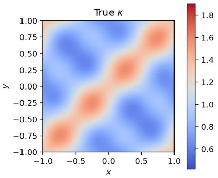

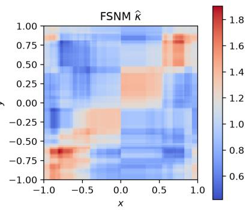

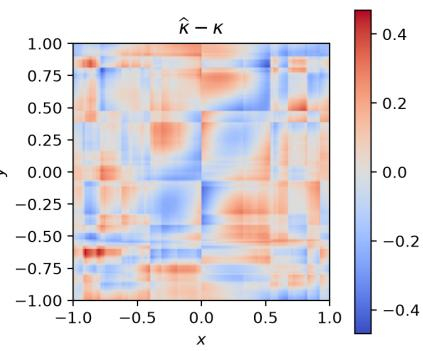  
Figure 1: Rank-three synthetic experiment with close singular values. From left to right: the exact density ratio $\kappa ,$ the FSNM estimate ${ \widehat { \kappa } } ,$ , and the signed error $\widehat { \kappa } - \kappa$

We draw candidate pairs from $P _ { X } \otimes P _ { Y }$ and accept $( x , y )$ with probability

$$
{ \frac { \kappa ( x , y ) } { 1 + 2 \sum _ { j = 1 } ^ { 3 } \sigma _ { j } } } .
$$

This rejection sampler produces i.i.d. observations from $P _ { X , Y }$ . We fit a rank-d = 3 model and evaluate it on a 160×160 uniform grid over $[ - 1 , 1 ] ^ { 2 }$ . The training details are reported in Appendix B.

This single representative fit has validation loss −0.0585 and orthogonality error 0.0209; the multi-seed comparison against three baselines is reported separately in Table 1 below. Its estimated spectrum is (0.1690, 0.1386, 0.1120), close to the population spectrum (0.18, 0.16, 0.12). Figure 1 shows that the estimate recovers the interaction structure of the exact density ratio, while retaining the piecewise-constant structure of the tree learners. Figure 2 shows the training and validation losses over all 40 iterations and marks the selected iteration.

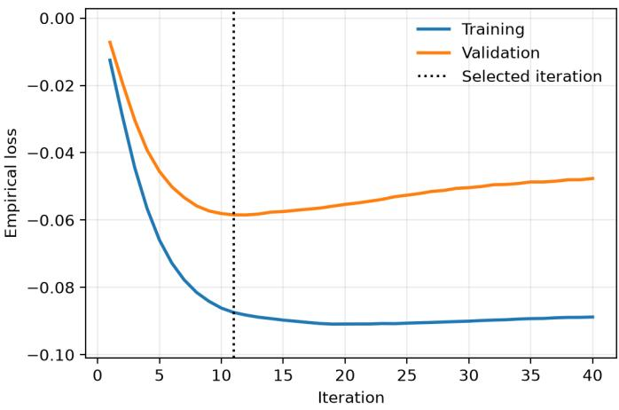  
Figure 2: Empirical training and validation losses over 40 boosting iterations. The vertical line marks the iteration selected by validation.

As a point of comparison, we fit three additional baselines on the same training and validation samples: ACE (Breiman and Friedman, 1985); uLSIF (Kanamori et al., 2009), which targets the full density ratio κ pointwise without a low-rank factorization; and regularized kernel CCA (Bach and Jordan, 2002). Hyperparameters not already fixed by the selected FSNM configuration are chosen for each baseline by its own analogous validation criterion; complete implementation details are given in Appendix B. Table 1 reports results over the 10 replicates described above. FSNM and uLSIF are statistically tied for the lowest kernel RMSE; FSNM and ACE are tied for the lowest spectrum error; and FSNM, ACE, and Kernel CCA are all tied for the lowest subspace error, which varies more across replicates than the other two metrics. uLSIF does not expose a spectral decomposition, so it has no spectrum or subspace error.

Table 1: Baseline comparison on the rank-three synthetic experiment, over 10 independent data draws $( \mathrm { m e a n } \pm 9 5 \% \mathrm { C I } )$ . Bold entries are statistically tied for best in that column, i.e., their interval overlaps the best mean’s interval. uLSIF does not factorize ${ \widehat { \kappa } } ,$ so it has no associated spectrum or subspace error.
<table><tr><td>Method</td><td>Kernel RMSE</td><td>Spectrum error</td><td>Subspace error</td></tr><tr><td>FSNM</td><td> $\mathbf { 0 . 1 2 6 1 \pm 0 . 0 0 7 5 }$ </td><td> $\mathbf { 0 . 0 2 8 6 \pm 0 . 0 0 5 8 }$ </td><td> $\mathbf { 0 . 3 5 7 9 \pm 0 . 0 2 4 2 }$ </td></tr><tr><td>ACE</td><td> $0 . 1 4 8 9 \pm 0 . 0 0 4 6$ </td><td> $\mathbf { 0 . 0 2 3 8 \pm 0 . 0 0 4 8 }$ </td><td> $\mathbf { 0 . 4 0 1 0 \pm 0 . 0 3 2 2 }$ </td></tr><tr><td>uLSIF</td><td> $\mathbf { 0 . 1 1 4 9 \pm 0 . 0 0 4 4 }$ </td><td></td><td></td></tr><tr><td>Kernel CCA</td><td> $0 . 1 7 5 6 \pm 0 . 0 1 9 8$ </td><td> $0 . 0 7 2 0 \pm 0 . 0 1 9 6$ </td><td> $\mathbf { 0 . 3 6 1 3 \pm 0 . 0 6 6 3 }$ </td></tr></table>

## 5.1.2 Discontinuous regional structure

This setting tests whether the adaptive splits of the tree weak learners can discover a piecewiseconstant kernel on their own. Let both marginals be uniform on [−1, 1] and partition this interval at −0.5, 0, and 0.5. For the four resulting regions, define the three contrasts as the rows of

$$
H = \left( \begin{array} { l l l } { 1 } & { 1 } & { 1 } \\ { 1 } & { - 1 } & { - 1 } \\ { - 1 } & { 1 } & { - 1 } \\ { - 1 } & { - 1 } & { 1 } \end{array} \right) .
$$

If r(t) is the region containing t, set $\begin{array} { r } { h ( t ) = H _ { r ( t ) } , } \end{array}$ . The coordinates of h are centered and orthonormal under the uniform marginal. We use the piecewise-constant density ratio

$$
\kappa ( x , y ) = 1 + \sum _ { j = 1 } ^ { 3 } \sigma _ { j } h _ { j } ( x ) h _ { j } ( y ) , \qquad ( \sigma _ { 1 } , \sigma _ { 2 } , \sigma _ { 3 } ) = ( 0 . 3 5 , 0 . 2 5 , 0 . 1 5 ) .
$$

Since $\textstyle \kappa \geq 1 - \sum _ { j } \sigma _ { j } = 0 . 2 5$ , this defines a valid joint distribution with an exactly known rank-three centered kernel. We use the same train–validation protocol as Section 5.1.1, with implementation details in Appendix B.

Validation selects iteration 15. The estimated spectrum of this representative fit is (0.3514, 0.2589, 0.1667); the multi-seed comparison against three baselines is reported separately in Table 2 below. Figure 3 shows that the fitted tree expansion recovers both the rectangular partition and the interaction pattern without being supplied the cut locations.

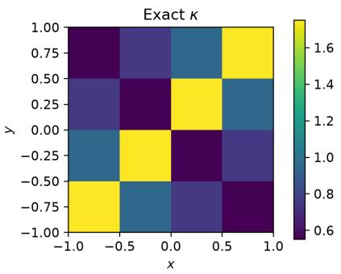

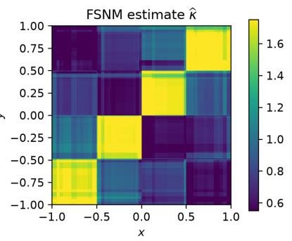

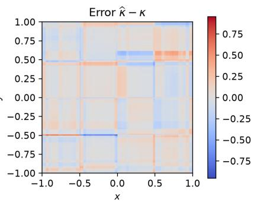  
Figure 3: Discontinuous regional experiment. From left to right: the exact piecewise-constant density ratio, the FSNM estimate using tree weak learners, and their signed diference.

We repeat the baseline comparison from Section 5.1.1 on this discontinuous kernel, matching each method’s own configuration except for the tree weak-learner budget, which uses maximum depth 3 and minimum leaf size 120 for both FSNM and ACE, as in Appendix B. Table 2 shows that FSNM and ACE are statistically tied for the lowest error on every metric, and both clearly outperform the two Gaussian-kernel baselines: uLSIF and kernel CCA are not well suited to a piecewise-constant density ratio, since their smooth kernels cannot represent the sharp regional boundaries that the tree-based methods recover by adaptive partitioning.

## 5.1.3 Tabular inputs with irrelevant features

This setting tests whether the fitted kernel automatically ignores input coordinates that play no role in the joint law. We next let X be uniform on $[ - 1 , 1 ] ^ { 2 0 }$ and retain a uniform scalar marginal

Table 2: Baseline comparison on the discontinuous regional experiment $( \mathrm { m e a n } \pm 9 5 \% \ : \mathrm { C I } .$ , bold = tied for best, as in Table 1).
<table><tr><td>Method</td><td>Kernel RMSE</td><td>Spectrum error</td><td>Subspace error</td></tr><tr><td>FSNM</td><td> $\mathbf { 0 . 1 3 9 3 \pm 0 . 0 1 9 8 }$ </td><td> $\mathbf { 0 . 0 3 0 1 \pm 0 . 0 1 1 3 }$ </td><td> $\mathbf { 0 . 2 6 7 8 \pm 0 . 0 8 4 6 }$ </td></tr><tr><td>ACE</td><td> $\mathbf { 0 . 1 5 8 3 \pm 0 . 0 1 5 2 }$ </td><td> $\mathbf { 0 . 0 3 5 3 \pm 0 . 0 0 6 6 }$ </td><td> $\mathbf { 0 . 2 9 7 8 \pm 0 . 0 7 4 2 }$ </td></tr><tr><td>uLSIF</td><td> $0 . 2 3 1 2 \pm 0 . 0 0 6 5$ </td><td></td><td></td></tr><tr><td>Kernel CCA</td><td> $0 . 2 9 0 8 \pm 0 . 0 1 4 8$ </td><td> $0 . 0 7 1 6 \pm 0 . 0 2 8 7$ </td><td> $0 . 4 8 7 8 \pm 0 . 0 3 1 7$ </td></tr></table>

for Y . Only the first three coordinates of X afect the joint law. In particular, define

$$
a ( X ) = ( \mathrm { s i g n } ( X _ { 1 } ) , \mathrm { s i g n } ( X _ { 2 } ) , \mathrm { s i g n } ( X _ { 3 } ) )
$$

and use the same response-side regional contrasts $h ( Y )$ as above. The density ratio is

$$
\kappa ( x , y ) = 1 + \sum _ { j = 1 } ^ { 3 } \sigma _ { j } a _ { j } ( x ) h _ { j } ( y ) , \qquad ( \sigma _ { 1 } , \sigma _ { 2 } , \sigma _ { 3 } ) = ( 0 . 3 0 , 0 . 2 2 , 0 . 1 4 ) .
$$

Thus $X _ { 4 } , \ldots , X _ { 2 0 }$ are independent noise coordinates, while the exact kernel and spectrum remain available for evaluation. Implementation details, shared with the preceding regional experiment, are given in Appendix B.

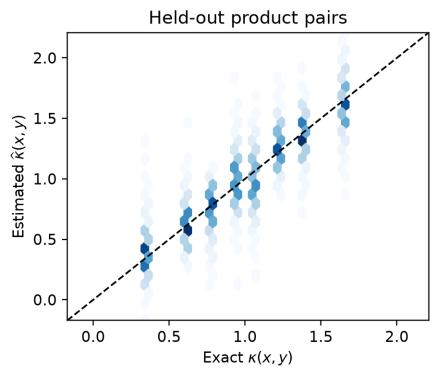

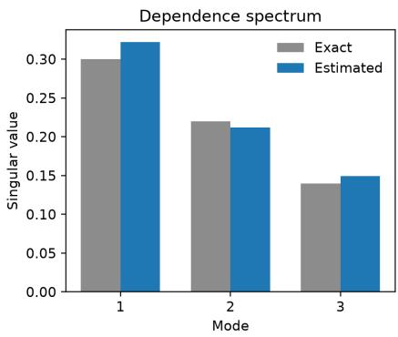

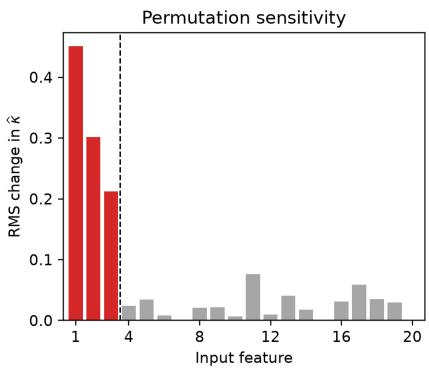  
Figure 4: Twenty-dimensional tabular experiment. Left: exact and estimated density ratios on held-out product pairs. Center: exact and estimated spectra. Right: post-fit permutation sensitivity; red bars are the three relevant inputs and gray bars are the 17 irrelevant inputs.

Validation selects iteration 32. On 10,000 independent pairs from the product of the marginals, this representative fit has estimated spectrum (0.3220, 0.2122, 0.1491); the multi-seed comparison against three baselines is reported separately in Table 3 below. We also compute a post-fit permutation sensitivity for each input coordinate,

$$
I _ { k } = \left( \frac { 1 } { m } \sum _ { i = 1 } ^ { m } \left[ \widehat { \kappa } ( X _ { i } , Y _ { i } ) - \widehat { \kappa } ( X _ { i } ^ { \pi _ { k } } , Y _ { i } ) \right] ^ { 2 } \right) ^ { 1 / 2 } ,
$$

where $X ^ { \pi _ { k } }$ independently permutes column k of the evaluation input. This diagnostic is computed after training and does not enter the fitting objective. Its mean is 0.3214 for the three relevant variables and 0.0244 for the 17 irrelevant variables.

Figure 4 reports the held-out kernel estimates, recovered spectrum, and all permutation sensitivities. The three coordinates used by the population kernel have the three largest sensitivities, while the noise coordinates have little influence on the fitted interaction.

Table 3 repeats the comparison on the twenty-dimensional tabular setting, evaluated on freshly sampled held-out product pairs each time. The two Gaussian-kernel baselines are substantially worse than both tree-based methods: their kernel distance combines all twenty input coordinates without automatic feature selection, so the seventeen irrelevant coordinates dilute the signal from the three relevant ones. FSNM and ACE, whose weak learners split on individual coordinates, are far less sensitive to this irrelevant-feature noise, and are statistically tied for the lowest error on every metric.

Table 3: Baseline comparison on the twenty-dimensional tabular experiment with seventeen irrelevant input coordinates $( \mathrm { m e a n } \pm 9 5 \%$ CI, bold = tied for best, as in Table 1).
<table><tr><td>Method</td><td>Kernel RMSE</td><td>Spectrum error</td><td>Subspace error</td></tr><tr><td>FSNM</td><td> $\mathbf { 0 . 1 8 8 0 \pm 0 . 0 2 2 7 }$ </td><td> $\mathbf { 0 . 0 3 6 3 \pm 0 . 0 1 1 4 }$ </td><td> $\mathbf { 0 . 4 6 8 9 \pm 0 . 1 0 6 2 }$ </td></tr><tr><td>ACE</td><td> $\mathbf { 0 . 1 8 1 8 \pm 0 . 0 1 5 2 }$ </td><td> $\mathbf { 0 . 0 3 7 5 \pm 0 . 0 0 6 5 }$ </td><td> $\mathbf { 0 . 3 7 5 4 \pm 0 . 0 6 8 9 }$ </td></tr><tr><td>uLSIF</td><td> $0 . 7 1 0 2 \pm 0 . 0 0 4 2$ </td><td></td><td></td></tr><tr><td>Kernel CCA</td><td> $0 . 6 6 5 1 \pm 0 . 0 1 8 0$ </td><td> $0 . 3 6 1 8 \pm 0 . 0 1 1 7$ </td><td> $0 . 6 9 9 4 \pm 0 . 0 0 8 8$ </td></tr></table>

## 5.2 Querying the fitted kernel

Having fit a single kernel above, we next show that it answers several diferent downstream queries without refitting: conditional moments and a tail probability (Section 5.2.1), and the full conditional distribution with bootstrap uncertainty bands (Section 5.2.2). Both use the tree-based fit from Section 5.1.1.

## 5.2.1 Conditional mean, variance, and tail probability

As an application of the fitted kernel above, κb can be used to approximate the conditional expectation of any integrable query f through

$$
\mathbb { E } \left[ f ( Y ) \mid X = x \right] = \int f ( y ) \kappa ( x , y ) \mathrm { d } P _ { Y } ( y ) .
$$

Using the response coordinates $\{ Y _ { i } \} _ { i = 1 } ^ { n }$ of the same paired training sample used to fit ${ \widehat { \kappa } } ,$ we use

$$
{ \widehat { m } } _ { f } ( x ) = { \frac { 1 } { n } } \sum _ { i = 1 } ^ { n } f ( Y _ { i } ) { \widehat { \kappa } } ( x , Y _ { i } ) .
$$

No additional model is fitted for a new $f .$ We evaluate the conditional mean using $f ( y ) = y ,$ the conditional variance obtained from the queries y and $y ^ { 2 }$ , and the conditional tail probability obtained from $f ( y ) = \mathbb { 1 } \left[ y > 0 . 5 \right]$ . Their RMSEs over the evaluation grid are, respectively, 0.0237, 0.0166, and 0.0233. Figure 5 shows that the three functionals are recovered by the same learned kernel.

## 5.2.2 Conditional CDF and bootstrap uncertainty

The conditional CDF collects a continuum of queries from the learned kernel: for $t \in [ - 1 , 1 ]$

$$
F _ { x } ( t ) : = \mathbb { P } \left( Y \leq t \mid X = x \right) = \int \mathbb { 1 } \left[ y \leq t \right] \kappa ( x , y ) \mathrm { d } P _ { Y } ( y ) .
$$

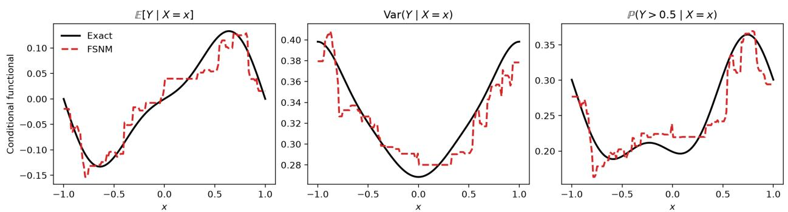  
Figure 5: Conditional queries obtained from the learned rank-three kernel. From left to right: conditional mean, conditional variance, and conditional tail probability. Solid black curves are exact and dashed red curves are computed from κb.

For fixed $x ,$ using the same training responses as above, we first evaluate the indicator query through the direct empirical operator.

No individual kernel weight is truncated or renormalized. Because the finite-sample signed curve $t \mapsto \widetilde { F } _ { x } ( t )$ need not be monotone or remain in [0, 1], we project the complete curve by isotonic regression onto the class of valid CDFs, anchored at zero and one. This downstream projection enforces distributional coherence without changing the learned kernel or its direct action on an individual query.

We evaluate the CDF at $x \in \{ - 0 . 6 , 0 , 0 . 6 \}$ and quantify uncertainty with 100 nonparametric bootstrap replicates. Each replicate resamples the paired observations, refits the kernel, evaluates the direct indicator queries, and projects the resulting complete curves, following the protocol in Appendix B.

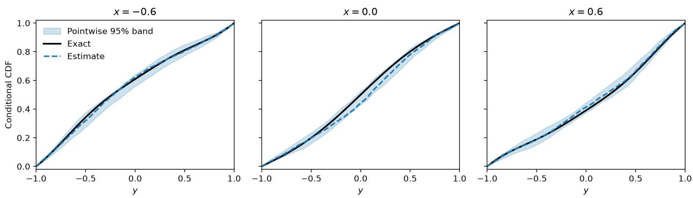  
Figure 6: Projected direct conditional CDF estimates and pointwise bootstrap bands at three values of x using tree weak learners. Solid black curves are exact, dashed blue curves are the fitted estimates, and shaded regions are pointwise 95% bands.

Figure 6 shows that the estimated conditional distributions track the exact CDFs at all three values of x. The bands have average width 0.0655, and their gridwise coverage of the exact curves is at least 99.7% at each displayed value of x. Thus the bootstrap captures the joint sampling variability of the learned tree kernel, its direct action on the indicator queries, and the subsequent CDF projection.

## 5.3 Detecting dependence beyond linear correlation

As a further application of the learned kernel, we use it to distinguish independence from dependence. The two examples have the same marginals: X is uniform on $[ - 1 , 1 ]$ and Y has the distribution of $U ^ { 2 } + \epsilon ,$ , where $U \sim \mathrm { U n i f } [ - 1 , 1 ]$ and $\epsilon \sim \mathcal { N } ( 0 , 0 . 0 8 ^ { 2 } )$ Only the coupling between X and Y changes. In both cases, we fit a rank-three model using shallow regression trees as weak learners, with the number of boosting iterations selected by validation. Alongside the estimated kernel and spectrum, we report a held-out permutation test based on the test-sample dependence score. Its null distribution is obtained by permuting the fitted Y-factors across the test observations. Further details are given in Appendix B.

## 5.3.1 Independent variables

Let X and U be independent and set $Y = U ^ { 2 } + \epsilon$ . Then X ⊥⊥ Y, so $\kappa = 1$ and the centered kernel $\kappa _ { 0 } ~ = ~ \kappa - 1$ vanishes. Figure 7 shows that the learned κb concentrates around one on independent reference pairs, while its singular values concentrate near zero. The estimated spectrum is $( 0 . 0 1 1 4 , 0 . 0 1 0 1 , 0 . 0 0 8 2 )$ , the grid RMS of $\widehat { \kappa } _ { 0 }$ is 0.0209, and the permutation test does not reject independence $( p = 0 . 9 6 5 )$

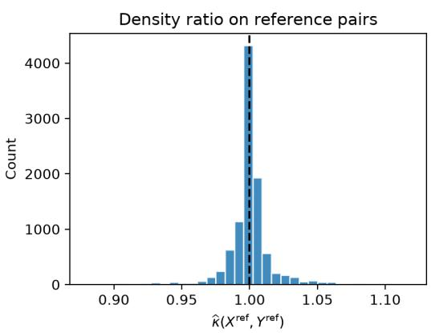

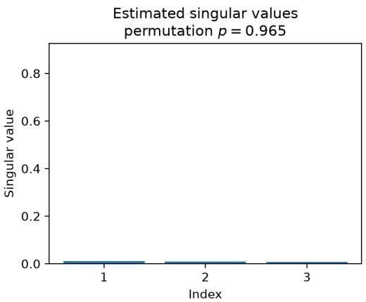  
Figure 7: Independent case. Left: distribution of $\widehat { \kappa }$ over independent reference pairs, with the dashed line marking the population value one. Right: estimated singular values, on the same vertical scale as Figure 8.

The three diagnostics give the same conclusion. The density ratio estimates remain close to the independence value, the spectral contribution is small, and the permutation test finds no evidence against independence. Moreover, validation selects only one boosting iteration. Thus, even with adaptive tree learners, the fitted model does not introduce a material interaction when the joint distribution is the product of its marginals.

## 5.3.2 Nonlinear dependence with zero correlation

We now set $Y = X ^ { 2 } + \epsilon$ . Although X and Y are dependent, symmetry gives $\operatorname { C o v } ( X , Y ) = 0$ . In the test sample, Pearson’s correlation is −0.0191, while the permutation test detects dependence $( p = 0 . 0 0 1 )$ . Figure 8 shows the nonlinear structure recovered by $\widehat { \kappa } _ { 0 }$ and the clearly nonzero estimated spectrum (0.8579, 0.7659, 0.5186).

Here the conclusion is reversed under the same marginals and tree class. The symmetric U-shaped relation makes linear covariance vanish, explaining why Pearson’s correlation is uninformative. The learned kernel nevertheless retains the nonlinear interaction, and its large singular values agree with the permutation rejection. This example shows that the method detects a general departure of the density ratio from one rather than only linear association.

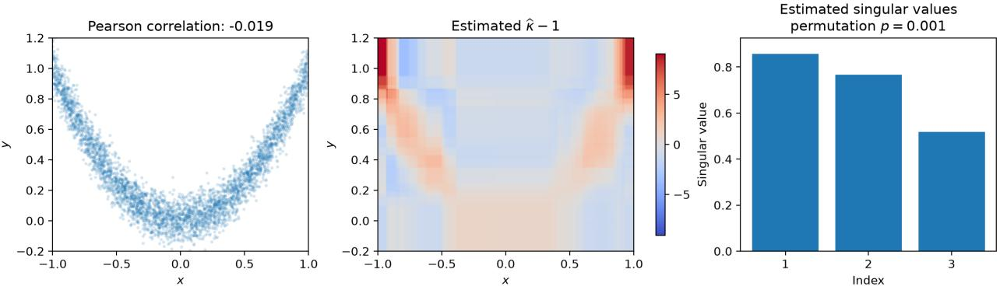  
Figure 8: Nonlinear dependent case $Y = X ^ { 2 } + \epsilon$ . From left to right: test observations, learned centered density ratio kernel, and estimated singular values. Pearson’s correlation is near zero, whereas the learned kernel and the held-out permutation test detect dependence.

## 5.4 Real-data application: glass composition–property data

Predicting how a glass’s physical and optical properties depend on its oxide composition is central to glass discovery, since synthesizing and characterizing a candidate composition is slow and costly (Mazurin, 2005; Thomaello et al., 2025; Cassar et al., 2021). Tree ensembles are particularly efective for sparse tabular composition data (Grinsztajn et al., 2022; Cassar et al., 2021). FSNM retains this inductive bias while learning a reusable low-rank conditional kernel rather than a single scalar predictor.

We use composition–refractive-index (RI) records integrated from SciGlass (Mazurin, 2005), INTERGLAD (New Glass Forum, 2019), and patent data (Thomaello et al., 2025). To reduce chemical heterogeneity, we restrict attention to glasses whose nonzero composition is contained in the ten-oxide family in Table 4; every oxide outside this set must have recorded molar fraction zero. The family spans classical network formers, alkali modifiers, and components used in high-index optical glass systems (Zachariasen, 1932; Mao et al., 2015; Ma et al., 2015). Individual glasses need not contain all ten components.

Table 4: Ten-oxide family retained for the real-data experiment.
<table><tr><td>Group</td><td>Oxides</td><td>Motivation</td></tr><tr><td>Network formers</td><td> $\mathrm { S i O _ { 2 } , B _ { 2 } O _ { 3 } , P _ { 2 } O _ { 5 } }$ </td><td>Backbone-forming oxides</td></tr><tr><td>Alkali modifiers</td><td> $\mathrm { L i _ { 2 } O , N a _ { 2 } O , K _ { 2 } O }$ </td><td>Network modification and fluxing</td></tr><tr><td>Optical-property components</td><td> $\mathrm { T i O _ { 2 } , N b _ { 2 } O _ { 5 } , T a _ { 2 } O _ { 5 } , L a _ { 2 } O _ { 3 } }$ </td><td>High-index optical-glass systems</td></tr></table>

## 5.4.1 Learning the composition–refractive-index kernel

After retaining RI in [1, 4.5], enforcing the zero restriction above, and renormalizing the retained oxide fractions to sum to one, 3,013 records remain. Their RI values range from 1.348 to 2.480. A fixed split (seed 2026) assigns 2,109/452/452 observations to training, validation, and test partitions.

We select among ranks {5, 10, 20}, maximum tree depths {3, 5}, and minimum leaf sizes {25, 50, 100}, using step size 0.1, at most 80 iterations, and patience 10. Validation loss selects rank 20, depth 5, leaf size 25, and iteration 39 (validation loss −5.6476). Selection by validation CRPS gives the same configuration.

Figure 9 shows the selected trajectory and spectrum. The captured energy $\textstyle \sum _ { j } { \widehat { \sigma } } _ { j } ^ { 2 }$ is 4.5961, and the efective spectral rank is 11.41. The first mode accounts for 19.1% of the captured energy, the first ten account for 78.8%, and 14 modes are required to exceed 90%. Thus the restricted chemical family retains a genuinely multivariate dependence structure, while concentrating more of its energy in the leading modes than the heterogeneous full table.

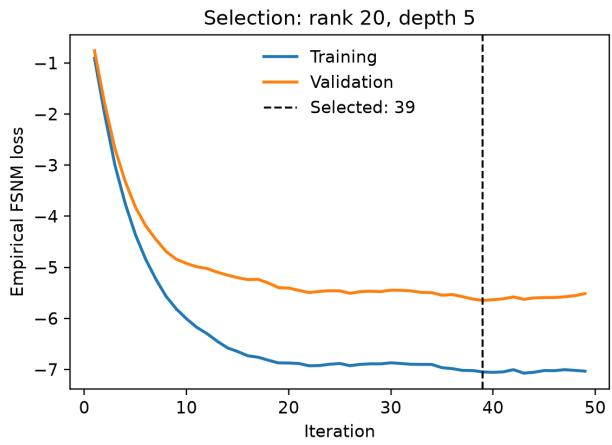

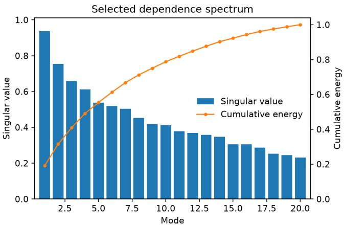  
Figure 9: Fit of the restricted glass composition–RI. Left: training and validation losses for the selected rank-20 trajectory; early stopping chooses iteration 39. Right: fitted singular values and cumulative share of $\textstyle \sum _ { j } { \widehat { \sigma } } _ { j } ^ { 2 }$

## 5.4.2 RI prediction with the identity functional

We apply the plug-in estimator from Section 5.2.1, using the M training responses as the empirical marginal sample and taking the identity query $g ( y ) = y$ This requires neither refitting nor constructing a separate scalar regressor. On the test partition, the resulting predictor has MSE 0.0051, RMSE 0.0711, MAE 0.0345, and $R ^ { 2 } = 0 . 8 1 1$ . The training-mean baseline has MSE 0.0268, so the kernel reduces test MSE by 81.1%. Figure 10 shows the held-out predictions and their calibration across prediction octiles.

## 5.4.3 Conditional intervals and screening probabilities

We compute the unprojected conditional CDF as in Section 5.2.2, again using the M training responses. The screening probability at threshold τ is the plug-in estimator from Section 5.2.1 applied to $g ( y ) = \mathbb { 1 } \left[ y > \tau \right] ;$ ; denote it by $\widetilde { p } _ { \tau } ( x )$ . These estimates apply the learned operator directly to the indicator query, without truncating individual kernel weights. Because a finite-rank estimate may nevertheless produce a nonmonotone signed ${ \widetilde { F } } _ { x }$ , we project the complete curve onto the set of CDFs by isotonic regression. We then calibrate its quantile levels once using the validation probability-integral-transform values and invert the resulting CDF at test compositions. This post-processing does not refit the kernel or use test responses. The scalar $\widetilde { p } _ { \tau } ( x )$ is only clipped at the end to [0, 1]; we use $\tau = 1 . 8$ , near the upper decile of the restricted family.

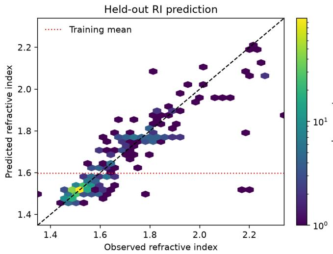

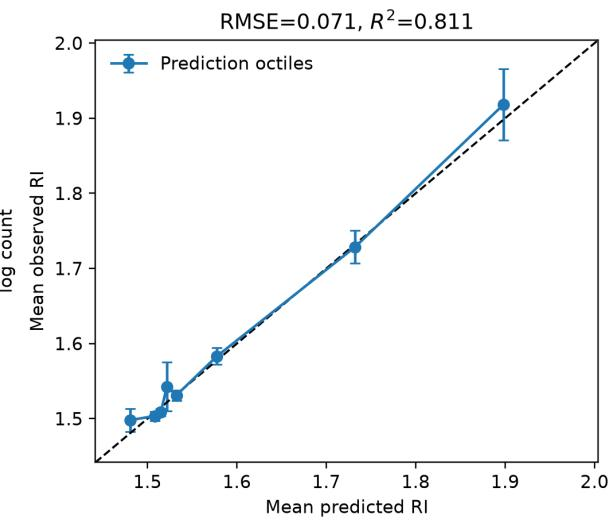  
Figure 10: Prediction of RI using $g ( y ) = y .$ Left: the dashed line is perfect prediction and the dotted line is the training mean. Right: mean observed and predicted within prediction octiles, with pointwise 95% normal intervals for the observed means.

On the 452 test glasses, nominal 50%, 70%, and 90% central intervals achieve coverage 54.6%, 71.5%, and 89.4%, with mean widths 0.043, 0.069, and 0.126 RI units. For screening, the direct indicator query has Brier score 0.0375, compared with 0.1156 for the climatological predictor at the training exceedance rate 11.2%, a 67.6% reduction. Figure 11 shows the calibrated intervals and the reliability of the uncalibrated direct screening query.

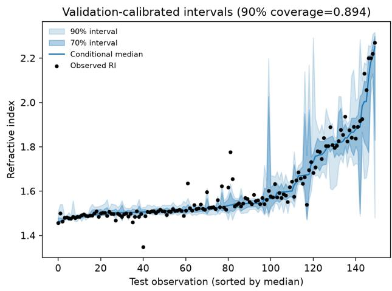

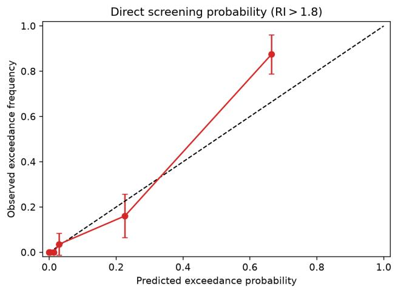  
Figure 11: Conditional queries. Left: for a random subset of 150 held-out compositions, the shaded bands are validation-calibrated 70% and 90% intervals. Right: reliability of the direct indicator query $\widehat { \mathbb { P } } ( \mathrm { R I } > 1 . 8 | x )$ in eight equal-count bins, with pointwise 95% normal intervals for observed frequencies.

## 6 Conclusion

We introduced FSNM, which learns the leading singular structure of a conditional expectation operator through alternating, learner-agnostic functional block-Newton updates. We derived closed-form update directions, established population-level descent with an O(1/T) best-iterate stationarity rate, and showed that every nondegenerate local minimum is a globally optimal rank-d approximation.

FSNM recovered synthetic density ratio kernels more accurately than ACE, uLSIF, and kernel CCA, particularly where adaptive partitioning and feature selection matter. On a real oxide-glass dataset, its fitted kernel substantially produced calibrated conditional prediction intervals and a well-discriminating direct screening probability. This multi-query capability is shared with related operator-learning approaches such as Neural Conditional Probability; FSNM’s distinguishing contribution is deriving it from a closed-form, learner-agnostic block-Newton procedure with matching convergence and landscape theory for tree-based weak learners.

Limitations include fixed-grid hyperparameter selection, hypothesis-class-dependent finite-sample rates, and scalar responses. Adaptive rank selection, structured response spaces, and the causalinference and reinforcement-learning applications discussed in Section 1 are natural extensions.

## Acknowledgments

This work was supported in part by the EU project ELIAS under grant agreement No. 101120237.   
Thiago was supported by the São Paulo Research Foundation (FAPESP), grant 2026/21108-4.

## References

Galen Andrew, Raman Arora, Jef Bilmes, and Karen Livescu. Deep canonical correlation analysis. In Proceedings of the 30th International Conference on Machine Learning, volume 28 of Proceedings of Machine Learning Research, pages 1247–1255, 2013. URL https://proceedings.mlr.press/ v28/andrew13.html.

Francis R. Bach and Michael I. Jordan. Kernel independent component analysis. Journal of Machine Learning Research, 3:1–48, 2002. URL https://www.jmlr.org/papers/v3/bach02a.html.

Peter L. Bartlett and Shahar Mendelson. Rademacher and gaussian complexities: Risk bounds and structural results. Journal of Machine Learning Research, 3:463–482, 2002.

Leo Breiman and Jerome H. Friedman. Estimating optimal transformations for multiple regression and correlation. Journal of the American Statistical Association, 80(391):580–598, 1985. doi: 10.1080/01621459.1985.10478157.

Flávio P. Calmon, Ali Makhdoumi, Muriel Médard, Mayank Varia, Mark Christiansen, and Ken R. Dufy. Principal inertia components and applications. IEEE Transactions on Information Theory, 63(8):5011–5038, 2017. doi: 10.1109/TIT.2017.2700857.

Daniel R. Cassar, Saulo Martiello Mastelini, Tiago Botari, Edesio Alcobaça, André C. P. L. F. de Carvalho, and Edgar D. Zanotto. Predicting and interpreting oxide glass properties by machine learning using large datasets. Ceramics International, 47(17):23958–23972, 2021. doi: 10.1016/j.ceramint.2021.05.105.

Tianqi Chen and Carlos Guestrin. XGBoost: A scalable tree boosting system. In Proceedings of the 22nd ACM SIGKDD International Conference on Knowledge Discovery and Data Mining, pages 785–794, 2016.

Jerome H Friedman. Greedy function approximation: a gradient boosting machine. Annals of statistics, pages 1189–1232, 2001.

Alek Fröhlich, Vladimir R Kostic, Karim Lounici, Daniel Perazzo, Daniel Guimarães Tiezzi, and Massimiliano Pontil. Toward scalable and valid conditional independence testing with spectral representations. In Forty-third International Conference on Machine Learning, 2026. URL https://openreview.net/forum?id=nPzckCXmHE.

Kenji Fukumizu, Francis R. Bach, and Arthur Gretton. Statistical consistency of kernel canonical correlation analysis. Journal of Machine Learning Research, 8:361–383, 2007.

Léo Grinsztajn, Edouard Oyallon, and Gaël Varoquaux. Why do tree-based models still outperform deep learning on tabular data? In Advances in Neural Information Processing Systems, volume 35, 2022.

Alexander Grubb and J. Andrew Bagnell. Generalized boosting algorithms for convex optimization. In Proceedings of the 28th International Conference on Machine Learning, pages 1209–1216, 2011.

Harold Hotelling. Relations between two sets of variates. Biometrika, 28(3–4):321–377, 1936. doi: 10.1093/biomet/28.3-4.321.

Rafael Izbicki, Ann B. Lee, and Chad M. Schafer. High-dimensional density ratio estimation with extensions to approximate likelihood computation. In Proceedings of the Seventeenth International Conference on Artificial Intelligence and Statistics, volume 33 of Proceedings of Machine Learning Research, pages 420–429. PMLR, 2014. URL https://proceedings.mlr.press/v33/izbicki14. html.

Takafumi Kanamori, Shohei Hido, and Masashi Sugiyama. A least-squares approach to direct importance estimation. Journal of Machine Learning Research, 10:1391–1445, 2009.

Guolin Ke, Qi Meng, Thomas Finley, Taifeng Wang, Wei Chen, Weidong Ma, Qiwei Ye, and Tie-Yan Liu. LightGBM: A highly eficient gradient boosting decision tree. In Advances in Neural Information Processing Systems, volume 30, 2017.

Stefan Klus, Feliks Nüske, Péter Koltai, Hao Wu, Ioannis Kevrekidis, Christof Schütte, and Frank Noé. Data-driven model reduction and transfer operator approximation. Journal of Nonlinear Science, 28(3):985–1010, January 2018. ISSN 1432-1467. doi: 10.1007/s00332-017-9437-7. URL http://dx.doi.org/10.1007/s00332-017-9437-7.

Vladimir Kostic, Pietro Novelli, Andreas Maurer, Carlo Ciliberto, Lorenzo Rosasco, and Massimiliano Pontil. Learning dynamical systems via koopman operator regression in reproducing kernel hilbert spaces. In Advances in Neural Information Processing Systems, volume 35, pages 4017–4031, 2022.

Vladimir Kostic, Karim Lounici, Pietro Novelli, and Massimiliano Pontil. Sharp spectral rates for koopman operator learning. In Advances in Neural Information Processing Systems, volume 36, pages 32328–32339, 2023.

Vladimir R. Kostic, Karim Lounici, Gregoire Pacreau, Pietro Novelli, Giacomo Turri, and Massimiliano Pontil. Neural conditional probability for uncertainty quantification. In Advances in Neural Information Processing Systems, volume 37, 2024. URL https://arxiv.org/abs/2407.01171.

Haihao Lu and Rahul Mazumder. Randomized gradient boosting machine. SIAM Journal on Optimization, 30(4):2780–2808, 2020. doi: 10.1137/18M1223277.

Haihao Lu, Sai Praneeth Karimireddy, Natalia Ponomareva, and Vahab Mirrokni. Accelerating gradient boosting machines. In Proceedings of the Twenty Third International Conference on Artificial Intelligence and Statistics, volume 108 of Proceedings of Machine Learning Research, pages 516–526. PMLR, 2020. URL https://proceedings.mlr.press/v108/lu20a.html.

Xiaoguang Ma, Zhijian Peng, and Ji Li. Efect of $\mathrm { T a _ { 2 } O _ { 5 } }$ substituting on thermal and optical properties of high refractive index $\mathrm { L a _ { 2 } O _ { 3 }  – N b _ { 2 } O _ { 5 } }$ glass system prepared by aerodynamic levitation method. Journal of the American Ceramic Society, 98(3):770–773, 2015. doi: 10.1111/jace.13384.

Zhaozhao Mao, Jiao Duan, Xiaojie Zheng, Minghui Zhang, Liping Zhang, Hongyang Zhao, and Jianding Yu. Study on optical properties of $\mathrm { L a _ { 2 } O _ { 3 }  – T i O _ { 2 } – N b _ { 2 } O _ { 5 } }$ glasses prepared by containerless processing. Ceramics International, 41(S1):S51–S56, 2015. doi: 10.1016/j.ceramint.2015.03.154.

Andreas Mardt, Luca Pasquali, Hao Wu, and Frank Noé. VAMPnets for deep learning of molecular kinetics. Nature Communications, 9(1):5, 2018.

O. V. Mazurin. Glass properties: compilation, evaluation, and prediction. Journal of Non-Crystalline Solids, 351(12–13):1103–1112, 2005. doi: 10.1016/j.jnoncrysol.2005.01.024.

Dimitri Meunier, Jakub Wornbard, Vladimir R Kostic, Antoine Moulin, Alek Fröhlich, Karim Lounici, Massimiliano Pontil, and Arthur Gretton. Outcome-aware spectral feature learning for instrumental variable regression. In Forty-third International Conference on Machine Learning, 2026. URL https://openreview.net/forum?id=FiCxlfjkhc.

Krikamol Muandet, Kenji Fukumizu, Bharath K. Sriperumbudur, and Bernhard Schölkopf. Kernel mean embedding of distributions: A review and beyond. Foundations and Trends in Machine Learning, 10(1–2):1–141, 2017. doi: 10.1561/2200000060.

New Glass Forum. International glass database system INTERGLAD, version 8. https://www. newglass.jp/interglad\_n/, 2019. Accessed August 15, 2026.

Pietro Novelli, Marco Pratticò, Massimiliano Pontil, and Carlo Ciliberto. Operator world models for reinforcement learning. In Advances in Neural Information Processing Systems, volume 37, 2024. doi: 10.52202/079017-3539.

Daniel Ordonez-Apraez, Vladimir R Kostic, Alek Fröhlich, Vivien Brandt, Karim Lounici, and Massimiliano Pontil. Representation learning for equivariant inference with guarantees. In Forty-third International Conference on Machine Learning, 2026. URL https://openreview. net/forum?id=dWCG53oQWc.

Amichai Painsky, Meir Feder, and Naftali Tishby. Nonlinear canonical correlation analysis: A compressed representation approach. Entropy, 22(2):208, 2020. doi: 10.3390/e22020208.

Fabio Sigrist. Gradient and newton boosting for classification and regression. Expert Systems with Applications, 167:114080, 2021. doi: 10.1016/j.eswa.2020.114080.

Masashi Sugiyama, Taiji Suzuki, and Takafumi Kanamori. Density Ratio Estimation in Machine Learning. Cambridge University Press, 2012.

Haotian Sun, Antoine Moulin, Tongzheng Ren, Arthur Gretton, and Bo Dai. Spectral representation for causal estimation with hidden confounders. In Proceedings of the 28th International Conference on Artificial Intelligence and Statistics, volume 258 of Proceedings of Machine Learning Research, 2025. URL https://proceedings.mlr.press/v258/sun25d.html.

Gustavo Laranja Thomaello, Thomaz Yeiden Busnardo Aguena, Eric Trevelato Costa, Rafael Baságlia Rosante, Thiago Rodrigo Ramos, Daiane Aparecida Zuanetti, and Edgar Dutra Zanotto. From patents to dataset: Scraping for oxide glass compositions and properties, 2025. URL https: //arxiv.org/abs/2511.16366.

Giacomo Turri, Luigi Bonati, Kai Zhu, Massimiliano Pontil, and Pietro Novelli. Self-supervised evolution operator learning for high-dimensional dynamical systems. In The Fourteenth International Conference on Learning Representations, 2026. URL https://openreview.net/forum? id=Ku3kLJle7Q.

Martin J. Wainwright. High-Dimensional Statistics: A Non-Asymptotic Viewpoint. Cambridge University Press, 2019. doi: 10.1017/9781108627771.

Ziyu Wang, Yucen Luo, Yueru Li, Jun Zhu, and Bernhard Schölkopf. Spectral representation learning for conditional moment models, 2022. URL https://arxiv.org/abs/2210.16525.

W. H. Zachariasen. The atomic arrangement in glass. Journal of the American Chemical Society, 54(10):3841–3851, 1932. doi: 10.1021/ja01349a006.

Kun Zhang, Jonas Peters, Dominik Janzing, and Bernhard Schölkopf. Kernel-based conditional independence test and application in causal discovery. In Proceedings of the Twenty-Seventh Conference on Uncertainty in Artificial Intelligence, pages 804–813, 2011.

Tianjun Zhang, Tongzheng Ren, Mengjiao Yang, Joseph E. Gonzalez, Dale Schuurmans, and Bo Dai. Making linear MDPs practical via contrastive representation learning. In Proceedings of the 39th International Conference on Machine Learning, volume 162 of Proceedings of Machine Learning Research, pages 26447–26466, 2022. URL https://proceedings.mlr.press/v162/zhang22x. html.

Nikita Zozoulenko, Daniel Falkowski, Thomas Cass, and Lukas Gonon. Gradient regularized newton boosting trees with global convergence, 2026. URL https://arxiv.org/abs/2605.00581.

## A Proofs

## A.1 Proofs for Section 2

Proof of Proposition 2.3. The squared approximation error can be written as

$$
\begin{array} { r } { \| \kappa _ { 0 } - \kappa _ { \phi , \psi } \| _ { P _ { X } \otimes P _ { Y } } ^ { 2 } = \| \kappa _ { 0 } \| _ { P _ { X } \otimes P _ { Y } } ^ { 2 } + \| \kappa _ { \phi , \psi } \| _ { P _ { X } \otimes P _ { Y } } ^ { 2 } - 2 \mathbb { E } _ { P _ { X } \otimes P _ { Y } } \left[ \kappa _ { 0 } ( X , Y ) \kappa _ { \phi , \psi } ( X , Y ) \right] . } \end{array}
$$

Because $\kappa _ { 0 } = \kappa - 1$ and the factors are centered,

$$
\begin{array} { r l } & { \mathbb { E } _ { P _ { X } \otimes P _ { Y } } \left[ \kappa _ { 0 } ( X , Y ) \kappa _ { \phi , \psi } ( X , Y ) \right] = \mathbb { E } _ { P _ { X } \otimes P _ { Y } } \left[ \kappa ( X , Y ) \phi ( X ) ^ { \top } \psi ( Y ) \right] - \mathbb { E } _ { P _ { X } } \left[ \phi ( X ) \right] ^ { \top } \mathbb { E } _ { P _ { Y } } \left[ \psi ( Y ) \right] } \\ & { \qquad = \mathbb { E } _ { P _ { X , Y } } \left[ \phi ( X ) ^ { \top } \psi ( Y ) \right] = A ( \phi , \psi ) . } \end{array}
$$

Moreover, since $\phi ( X ) ^ { \top } \psi ( Y )$ is scalar-valued and equals its own transpose $\psi ( Y ) ^ { \top } \phi ( X )$ , and a scalar coincides with the trace of the $1 \times 1$ matrix it forms,

$$
\big ( \phi ( X ) ^ { \top } \psi ( Y ) \big ) ^ { 2 } = \big ( \phi ( X ) ^ { \top } \psi ( Y ) \big ) \big ( \psi ( Y ) ^ { \top } \phi ( X ) \big ) = \operatorname { t r } \left\{ \phi ( X ) ^ { \top } \big ( \psi ( Y ) \psi ( Y ) ^ { \top } \big ) \phi ( X ) \right\} .
$$

The cyclic property of the trace moves $\phi ( X )$ from the outside to the inside of the product,

$$
\mathrm { t r } \left\{ \phi ( X ) ^ { \top } ( \psi ( Y ) \psi ( Y ) ^ { \top } ) \phi ( X ) \right\} = \mathrm { t r } \left\{ ( \psi ( Y ) \psi ( Y ) ^ { \top } ) \phi ( X ) \phi ( X ) ^ { \top } \right\} .
$$

Taking expectations, using linearity of the trace, and the independence of X and Y under $P _ { X } \otimes P _ { Y }$

$$
\begin{array} { r l } & { C ( \phi , \psi ) = \mathbb { E } _ { P _ { X } \otimes P _ { Y } } \left[ \left( \phi ( X ) ^ { \top } \psi ( Y ) \right) ^ { 2 } \right] } \\ & { \qquad = \mathrm { t r } \left\{ \mathbb { E } _ { P _ { Y } } \left[ \psi ( Y ) \psi ( Y ) ^ { \top } \right] \mathbb { E } _ { P _ { X } } \left[ \phi ( X ) \phi ( X ) ^ { \top } \right] \right\} = \mathrm { t r } \left\{ \Sigma _ { \psi } \Sigma _ { \phi } \right\} = \mathrm { t r } \left\{ \Sigma _ { \phi } \Sigma _ { \psi } \right\} , } \end{array}
$$

where the last equality applies the cyclic property of the trace once more. Substitution gives

$$
\lVert \kappa _ { 0 } - \kappa _ { \phi , \psi } \rVert _ { P _ { X } \otimes P _ { Y } } ^ { 2 } = \lVert \kappa _ { 0 } \rVert _ { P _ { X } \otimes P _ { Y } } ^ { 2 } + C ( \phi , \psi ) - 2 A ( \phi , \psi ) .
$$

The first term is independent of $( \phi , \psi )$ , so minimizing the approximation error is equivalent to minimizing $L = C - 2 A$ ■

## A.2 Proofs for Section 3

Proof of Proposition 3.1. For $A _ { i }$ , linearity in $\phi$ gives

$$
A ( \phi + \varepsilon h , \psi ) = A ( \phi , \psi ) + \varepsilon \mathbb { E } _ { P _ { X , Y } } \left[ h ( X ) ^ { \top } \psi ( Y ) \right] ,
$$

so, diferentiating at $\varepsilon = 0$ and using the tower property to condition on $X$

$$
D _ { \phi } A ( \phi , \psi ) [ h ] = \mathbb { E } _ { P _ { X , Y } } \left[ h ( X ) ^ { \top } \psi ( Y ) \right] = \mathbb { E } _ { P _ { X } } \left[ h ( X ) ^ { \top } \mathbb { E } \left[ \psi ( Y ) \mid X \right] \right] .
$$

For $C _ { i }$ , expanding the square gives

$$
\begin{array} { r l } & { C ( \phi + \varepsilon h , \psi ) = C ( \phi , \psi ) + 2 \varepsilon \mathbb { E } _ { P _ { X } \otimes P _ { Y } } \left[ \left( \phi ( X ) ^ { \top } \psi ( Y ) \right) \left( h ( X ) ^ { \top } \psi ( Y ) \right) \right] } \\ & { \qquad + \varepsilon ^ { 2 } \mathbb { E } _ { P _ { X } \otimes P _ { Y } } \left[ \left( h ( X ) ^ { \top } \psi ( Y ) \right) ^ { 2 } \right] , } \end{array}
$$

so diferentiating at $\varepsilon = 0$ gives

$$
D _ { \phi } C ( \phi , \psi ) [ h ] = 2 \mathbb { E } _ { P _ { X } \otimes P _ { Y } } \left[ \left( \phi ( X ) ^ { \top } \psi ( Y ) \right) \left( h ( X ) ^ { \top } \psi ( Y ) \right) \right] .
$$

Since $\phi ( X ) ^ { \top } \psi ( Y )$ and $h ( X ) ^ { \top } \psi ( Y )$ are scalars,

$$
\big ( \phi ( X ) ^ { \top } \psi ( Y ) \big ) \big ( h ( X ) ^ { \top } \psi ( Y ) \big ) = h ( X ) ^ { \top } \big ( \psi ( Y ) \psi ( Y ) ^ { \top } \big ) \phi ( X ) ,
$$

and taking expectations, using independence of X and $Y$ under $P _ { X } \otimes P _ { Y }$ 2

$$
D _ { \phi } C ( \phi , \psi ) [ h ] = 2 \mathbb { E } _ { P _ { X } } \left[ h ( X ) ^ { \top } \mathbb { E } _ { P _ { Y } } \left[ \psi ( Y ) \psi ( Y ) ^ { \top } \right] \phi ( X ) \right] = 2 \mathbb { E } _ { P _ { X } } \left[ h ( X ) ^ { \top } \Sigma _ { \psi } \phi ( X ) \right] .
$$

Consequently,

$$
D _ { \phi } L ( \phi , \psi ) [ h ] = 2 \mathbb { E } _ { P _ { X } } \left[ h ( X ) ^ { \top } \big ( \Sigma _ { \psi } \phi ( X ) - m _ { \psi } ( X ) \big ) \right] .
$$

The Riesz representation therefore yields

$$
\nabla _ { \phi } L ( \phi , \psi ) ( x ) = 2 \Sigma _ { \psi } \phi ( x ) - 2 m _ { \psi } ( x ) .
$$

Interchanging $X , \phi$ with $Y ,$ ψ gives the stated expression for $\nabla _ { \psi } L$

The term A is bilinear in $( \phi , \psi )$ , so its diagonal second derivatives vanish. Diferentiating the first derivative of $C$ once more in directions $k \in L _ { 0 } ^ { 2 } ( P _ { X } ) ^ { d }$ and $\ell \in L _ { 0 } ^ { 2 } ( P _ { Y } ) ^ { d }$ gives

$$
\begin{array} { r } { D _ { \phi , \phi } C ( \phi , \psi ) [ h , k ] = 2 \mathbb { E } _ { P _ { X } } \left[ h ( X ) ^ { \top } \Sigma _ { \psi } k ( X ) \right] , \quad D _ { \psi , \psi } C ( \phi , \psi ) [ g , \ell ] = 2 \mathbb { E } _ { P _ { Y } } \left[ g ( Y ) ^ { \top } \Sigma _ { \phi } \ell ( Y ) \right] . } \end{array}
$$

These are also the diagonal blocks of $L ,$ and their associated multiplication operators are $2 \Sigma _ { \psi }$ and $2 \Sigma _ { \phi } .$ , respectively. ■

Proof of Proposition 3.3.

Step 1: normalize the first factor. Start with

$$
{ \cal A } _ { 0 } = \Sigma _ { \phi } ^ { - 1 / 2 } , \qquad \phi ^ { ( 0 ) } = { \cal A } _ { 0 } \phi , \qquad \psi ^ { ( 0 ) } = { \cal A } _ { 0 } ^ { - \top } \psi = \Sigma _ { \phi } ^ { 1 / 2 } \psi .
$$

The inverse transformations preserve the pointwise product, and hence $\phi ^ { ( 0 ) } ( x ) ^ { \top } \psi ^ { ( 0 ) } ( y ) = \phi ( x ) ^ { \top } \psi ( y )$ The first second-moment matrix is now the identity:

$$
\Sigma _ { \phi ^ { ( 0 ) } } = A _ { 0 } \Sigma _ { \phi } A _ { 0 } ^ { \top } = I .
$$

The second one is generally not the identity; instead,

$$
\Sigma _ { \psi ^ { ( 0 ) } } = A _ { 0 } ^ { - \top } \Sigma _ { \psi } A _ { 0 } ^ { - 1 } = \Sigma _ { \phi } ^ { 1 / 2 } \Sigma _ { \psi } \Sigma _ { \phi } ^ { 1 / 2 } = : B .
$$

Thus, this first transformation normalizes the $\phi$ factor while moving all remaining scale and dependence between coordinates into B.

Step 2: diagonalize the second factor. Because B is symmetric positive definite, write

$$
B = U \Lambda U ^ { \top } , \qquad \Lambda = \mathrm { d i a g } ( s _ { 1 } ^ { 2 } , \ldots , s _ { d } ^ { 2 } ) .
$$

Set

$$
A _ { 1 } = U ^ { \top } A _ { 0 } , \qquad \phi ^ { ( 1 ) } = A _ { 1 } \phi = U ^ { \top } \phi ^ { ( 0 ) } , \qquad \psi ^ { ( 1 ) } = A _ { 1 } ^ { - \top } \psi = U ^ { \top } \psi ^ { ( 0 ) } .
$$

Multiplication by $U ^ { \top }$ diagonalizes the second matrix without changing the first, because $U$ is orthogonal:

$$
\Sigma _ { \phi ^ { ( 1 ) } } = U ^ { \top } I U = I , \qquad \Sigma _ { \psi ^ { ( 1 ) } } = U ^ { \top } B U = \Lambda .
$$

The coordinates are therefore aligned with the spectral directions, but the pair remains unbalanced: its second-moment matrices are (I, Λ).

Step 3: balancing. To see how to balance the pair, first note that multiplying $\psi ^ { ( 1 ) }$ by $\Lambda ^ { - 1 / 2 }$ normalizes its second-moment matrix:

$$
\Sigma _ { \Lambda ^ { - 1 / 2 } \psi ^ { ( 1 ) } } = \Lambda ^ { - 1 / 2 } \Sigma _ { \psi ^ { ( 1 ) } } \Lambda ^ { - 1 / 2 } = \Lambda ^ { - 1 / 2 } \Lambda \Lambda ^ { - 1 / 2 } = I .
$$

Rather than placing this entire normalization in the $\psi$ factor, we split it equally between the two factors while preserving their product:

$$
\tilde { \phi } = \Lambda ^ { 1 / 4 } \phi ^ { ( 1 ) } , \qquad \tilde { \psi } = \Lambda ^ { - 1 / 4 } \psi ^ { ( 1 ) } .
$$

Their product is still unchanged, while their second-moment matrices become

$$
\Sigma _ { \tilde { \phi } } = \Lambda ^ { 1 / 4 } I \Lambda ^ { 1 / 4 } = \Lambda ^ { 1 / 2 } , \quad \Sigma _ { \tilde { \psi } } = \Lambda ^ { - 1 / 4 } \Lambda \Lambda ^ { - 1 / 4 } = \Lambda ^ { 1 / 2 } .
$$

Combining the normalization, diagonalization, and balancing transformations gives

$$
\tilde { \phi } = A \phi , \qquad A = \Lambda ^ { 1 / 4 } A _ { 1 } = \Lambda ^ { 1 / 4 } U ^ { \top } \Sigma _ { \phi } ^ { - 1 / 2 } .
$$

The corresponding transformation of the other factor is $\tilde { \psi } = A ^ { - \top } \psi .$ , as claimed. Since the pointwise product was preserved at every step, $\kappa _ { \tilde { \phi } , \tilde { \psi } } = \kappa _ { \phi , \psi }$ and therefore ${ \cal L } ( \tilde { \phi } , \tilde { \psi } ) = { \cal L } ( \phi , \psi )$

Orthonormalization and singular values. Let $D = \Lambda ^ { 1 / 2 } = \mathrm { d i a g } ( s _ { 1 } , . . . , s _ { d } )$ and define $\phi ^ { \bot } = $ $D ^ { - 1 / 2 } \tilde { \phi }$ and $\psi ^ { \perp } = D ^ { - 1 / 2 } \tilde { \psi }$ . Then

$$
\mathbb { E } _ { P _ { X } } \left[ \phi ^ { \perp } ( X ) \phi ^ { \perp } ( X ) ^ { \top } \right] = \mathbb { E } _ { P _ { Y } } \left[ \psi ^ { \perp } ( Y ) \psi ^ { \perp } ( Y ) ^ { \top } \right] = I ,
$$

so the coordinates of $\phi ^ { \perp }$ and $\psi ^ { \bot }$ form orthonormal systems. Moreover,

$$
\tilde { \phi } ( x ) ^ { \top } \tilde { \psi } ( y ) = \phi ^ { \bot } ( x ) ^ { \top } D \psi ^ { \bot } ( y ) = \sum _ { i = 1 } ^ { d } s _ { i } \phi _ { i } ^ { \bot } ( x ) \psi _ { i } ^ { \bot } ( y ) .
$$

This is a singular-value decomposition of $\kappa _ { \phi , \psi }$ . Finally, $\Sigma _ { \phi } \Sigma _ { \psi }$ is similar to $B = \Sigma _ { \phi } ^ { 1 / 2 } \Sigma _ { \psi } \Sigma _ { \phi } ^ { 1 / 2 }$ , whose eigenvalues are $s _ { i } ^ { 2 }$ . Hence $s _ { i } = \sqrt { \lambda _ { i } ( \Sigma _ { \phi } \Sigma _ { \psi } ) }$ , completing the proof. ■

## A.3 Proofs for Section 4

Proof of Lemma 4.1. Fix $\phi = \phi _ { t }$ . By the definitions of A and C in Proposition 2.3,

$$
\begin{array} { r l } & { C ( \phi _ { t } , \psi ) = \mathbb { E } _ { P _ { X } \otimes P _ { Y } } \left[ \psi ( Y ) ^ { \top } \phi _ { t } ( X ) \phi _ { t } ( X ) ^ { \top } \psi ( Y ) \right] = \mathbb { E } _ { P _ { Y } } \left[ \psi ( Y ) ^ { \top } \Sigma _ { \phi , t } \psi ( Y ) \right] , } \\ & { A ( \phi _ { t } , \psi ) = \mathbb { E } _ { P _ { Y } } \left[ \psi ( Y ) ^ { \top } \mathbb { E } \left[ \phi _ { t } ( X ) \mid Y \right] \right] . } \end{array}
$$

The last identity follows from the tower property, conditioning the joint expectation in A on $Y .$ Since $m _ { \phi , t } ( Y ) = \operatorname { \mathbb { E } } \left[ \phi _ { t } ( X ) \mid Y \right]$ , the block objective is therefore

$$
L ( \phi _ { t } , \psi ) = \mathbb { E } _ { P _ { Y } } \left[ \psi ( Y ) ^ { \top } \Sigma _ { \phi , t } \psi ( Y ) - 2 \psi ( Y ) ^ { \top } m _ { \phi , t } ( Y ) \right] .
$$

The exact best response $\psi _ { t + 1 } ^ { * } = \Sigma _ { \phi , t } ^ { - 1 } m _ { \phi , t }$ satisfies $m _ { \phi , t } = \Sigma _ { \phi , t } \psi _ { t + 1 } ^ { * }$ . Therefore,

$$
\psi ^ { \top } \Sigma _ { \phi , t } \psi - 2 \psi ^ { \top } m _ { \phi , t } = ( \psi - \psi _ { t + 1 } ^ { * } ) ^ { \top } \Sigma _ { \phi , t } ( \psi - \psi _ { t + 1 } ^ { * } ) - ( \psi _ { t + 1 } ^ { * } ) ^ { \top } \Sigma _ { \phi , t } \psi _ { t + 1 } ^ { * } ,
$$

and the final term is independent of $\psi .$ . Substituting $\psi ~ = ~ \psi _ { t + 1 } ^ { * }$ shows that $L ( \phi _ { t } , \psi _ { t + 1 } ^ { * } ) ~ =$ $- \mathbb { E } _ { P _ { Y } } \left[ ( \psi _ { t + 1 } ^ { * } ( Y ) ) ^ { \top } \Sigma _ { \phi , t } \psi _ { t + 1 } ^ { * } ( Y ) \right]$ , so, for every $\psi \in L _ { 0 } ^ { 2 } ( P _ { Y } ) ^ { d }$

$$
L ( \phi _ { t } , \psi ) - L ( \phi _ { t } , \psi _ { t + 1 } ^ { * } ) = \| \psi - \psi _ { t + 1 } ^ { * } \| _ { \Sigma _ { \phi , t } } ^ { 2 } .
$$

Taking $\psi ~ = ~ \psi _ { t }$ gives $G _ { t } ^ { \psi } = \| r _ { t } ^ { \psi } \| _ { \Sigma _ { \phi , t } } ^ { 2 }$ The identical calculation, fixing $\psi ~ = ~ \psi _ { t + 1 }$ 1 and using $\phi _ { t + 1 } ^ { * } = \Sigma _ { \psi , t + 1 } ^ { - 1 } m _ { \psi , t + 1 } ,$ gives, for every $\phi \in L _ { 0 } ^ { 2 } ( P _ { X } ) ^ { d }$ 2

$$
L ( \phi , \psi _ { t + 1 } ) - L ( \phi _ { t + 1 } ^ { * } , \psi _ { t + 1 } ) = \lVert \phi - \phi _ { t + 1 } ^ { * } \rVert _ { \Sigma _ { \psi , t + 1 } } ^ { 2 } ,
$$

and, at $\phi = \phi _ { t } , G _ { t } ^ { \phi } = \| r _ { t } ^ { \phi } \| _ { \Sigma _ { \psi , t + 1 } } ^ { 2 }$ . This proves the quadratic representation and its specialization.

For the sandwich bound, write $G _ { t } ^ { \psi } = \| \Sigma _ { \phi , t } ^ { 1 / 2 } ( \psi _ { t } - \psi _ { t + 1 } ^ { * } ) \| _ { L ^ { 2 } ( P _ { Y } ) } ^ { 2 } .$ . Assumption 3.2 gives $\lambda I \preceq \Sigma _ { \phi , t } \preceq$ $\Lambda I$ , hence

$$
\lambda \| \psi _ { t } - \psi _ { t + 1 } ^ { * } \| _ { L ^ { 2 } ( P _ { Y } ) } ^ { 2 } \leq G _ { t } ^ { \psi } \leq \Lambda \| \psi _ { t } - \psi _ { t + 1 } ^ { * } \| _ { L ^ { 2 } ( P _ { Y } ) } ^ { 2 } ,
$$

and analogously for $G _ { t } ^ { \phi }$

For the gradient identity, $m _ { \phi , t } = \Sigma _ { \phi , t } \psi _ { t + 1 } ^ { * }$ and Proposition 3.1 give

$$
\nabla _ { \psi } L ( \phi _ { t } , \psi _ { t } ) = 2 \Sigma _ { \phi , t } \psi _ { t } - 2 m _ { \phi , t } = 2 \Sigma _ { \phi , t } ( \psi _ { t } - \psi _ { t + 1 } ^ { * } ) ,
$$

and analogously $\nabla _ { \phi } L ( \phi _ { t } , \psi _ { t + 1 } ) = 2 \Sigma _ { \psi , t + 1 } ( \phi _ { t } - \phi _ { t + 1 } ^ { * } )$ . For any positive-definite $\Sigma \preceq \Lambda I .$ , diagonalizing $\Sigma = U \mathrm { d i a g } ( \lambda _ { 1 } , \ldots , \lambda _ { d } ) U ^ { \top }$ gives $\lambda _ { i } ^ { 2 } \le \Lambda \lambda _ { i }$ for every i (Assumption 3.2), so $\Sigma ^ { 2 } \preceq \Lambda \Sigma$ and $z ^ { \top } \Sigma ^ { 2 } z \lessgtr$ $\boldsymbol { \Lambda } \boldsymbol { z } ^ { \intercal } \boldsymbol { \Sigma } \boldsymbol { z }$ for every vector z. Hence

$$
\begin{array} { r } { \| \nabla _ { \psi } L ( \phi _ { t } , \psi _ { t } ) \| _ { L ^ { 2 } ( P _ { Y } ) } ^ { 2 } = 4 \big \| \Sigma _ { \phi , t } ( \psi _ { t } - \psi _ { t + 1 } ^ { * } ) \big \| _ { L ^ { 2 } ( P _ { Y } ) } ^ { 2 } \leq 4 \Lambda G _ { t } ^ { \psi } , } \end{array}
$$

and analogously $\| \nabla _ { \phi } L ( \phi _ { t } , \psi _ { t + 1 } ) \| _ { L ^ { 2 } ( P _ { X } ) } ^ { 2 } \leq 4 \Lambda G _ { t } ^ { \phi }$

Proof of Theorem 4.3. Assumption 3.2 gives $\lambda I \preceq \Sigma _ { \phi , t } \preceq \Lambda I , \lambda I \preceq \Sigma _ { \psi , t + 1 } \preceq \Lambda I$ , whereas Assumption 4.2 gives

$$
\begin{array} { r } { \Vert r _ { t } ^ { \psi } - h _ { t } ^ { \psi } \Vert _ { \Sigma _ { \phi , t } } ^ { 2 } \leq ( 1 - \gamma _ { \psi } ^ { 2 } ) \Vert r _ { t } ^ { \psi } \Vert _ { \Sigma _ { \phi , t } } ^ { 2 } , \qquad \Vert r _ { t } ^ { \phi } - h _ { t } ^ { \phi } \Vert _ { \Sigma _ { \psi , t + 1 } } ^ { 2 } \leq ( 1 - \gamma _ { \phi } ^ { 2 } ) \Vert r _ { t } ^ { \phi } \Vert _ { \Sigma _ { \psi , t + 1 } } ^ { 2 } . } \end{array}
$$

By Lemma 4.1, for every $\psi \in L _ { 0 } ^ { 2 } ( P _ { Y } ) ^ { d }$

$$
L ( \phi _ { t } , \psi ) - L ( \phi _ { t } , \psi _ { t + 1 } ^ { * } ) = \lVert \psi - \psi _ { t + 1 } ^ { * } \rVert _ { \Sigma _ { \phi , t } } ^ { 2 } ,
$$

and, in particular, $\boldsymbol { G } _ { t } ^ { \psi } = \| \boldsymbol { r } _ { t } ^ { \psi } \| _ { \boldsymbol { \Sigma } _ { \phi , t } } ^ { 2 }$

We next compare the approximate update with the exact block minimizer. The definitions of $r _ { t } ^ { \psi }$ and $h _ { t } ^ { \psi }$ give

$$
\psi _ { t + 1 } - \psi _ { t + 1 } ^ { * } = \psi _ { t } + \eta _ { \psi } h _ { t } ^ { \psi } - \psi _ { t + 1 } ^ { * } = - r _ { t } ^ { \psi } + \eta _ { \psi } h _ { t } ^ { \psi } = - ( 1 - \eta _ { \psi } ) r _ { t } ^ { \psi } + \eta _ { \psi } \bigl ( h _ { t } ^ { \psi } - r _ { t } ^ { \psi } \bigr ) .
$$

Since $\eta _ { \psi } \in ( 0 , 1 ]$ , the triangle inequality and Assumption 4.2 give

$$
\begin{array} { r l } & { \| \psi _ { t + 1 } - \psi _ { t + 1 } ^ { * } \| _ { \Sigma _ { \phi , t } } \leq ( 1 - \eta _ { \psi } ) \| r _ { t } ^ { \psi } \| _ { \Sigma _ { \phi , t } } + \eta _ { \psi } \| h _ { t } ^ { \psi } - r _ { t } ^ { \psi } \| _ { \Sigma _ { \phi , t } } } \\ & { \qquad \leq \left( 1 - \eta _ { \psi } + \eta _ { \psi } \sqrt { 1 - \gamma _ { \psi } ^ { 2 } } \right) \| r _ { t } ^ { \psi } \| _ { \Sigma _ { \phi , t } } = q _ { \psi } \| r _ { t } ^ { \psi } \| _ { \Sigma _ { \phi , t } } . } \end{array}
$$

Moreover, $\gamma _ { \psi } > 0$ implies $\sqrt { 1 - \gamma _ { \psi } ^ { 2 } } < 1$ . Thus $q _ { \psi } = ( 1 - \eta _ { \psi } ) + \eta _ { \psi } \sqrt { 1 - \gamma _ { \psi } ^ { 2 } } < 1$ . Squaring the preceding inequality and using the quadratic representation with $\psi = \dot { \psi } _ { t + 1 } \ \mathrm { y i e l d s }$

$$
L ( \phi _ { t } , \psi _ { t + 1 } ) - L ( \phi _ { t } , \psi _ { t + 1 } ^ { * } ) \leq q _ { \psi } ^ { 2 } G _ { t } ^ { \psi } .
$$

Now fix $\psi = \psi _ { t + 1 } ;$ Lemma 4.1 gives, for every $\phi \in L _ { 0 } ^ { 2 } ( P _ { X } ) ^ { d }$

$$
L ( \phi , \psi _ { t + 1 } ) - L ( \phi _ { t + 1 } ^ { * } , \psi _ { t + 1 } ) = \lVert \phi - \phi _ { t + 1 } ^ { * } \rVert _ { \Sigma _ { \psi , t + 1 } } ^ { 2 } ,
$$

and, in particular, $G _ { t } ^ { \phi } = \| r _ { t } ^ { \phi } \| _ { \Sigma _ { \psi , t + 1 } } ^ { 2 }$ . The approximate ϕ-update satisfies

$$
\phi _ { t + 1 } - \phi _ { t + 1 } ^ { * } = \phi _ { t } + \eta _ { \phi } h _ { t } ^ { \phi } - \phi _ { t + 1 } ^ { * } = - ( 1 - \eta _ { \phi } ) r _ { t } ^ { \phi } + \eta _ { \phi } ( h _ { t } ^ { \phi } - r _ { t } ^ { \phi } ) .
$$

Applying the triangle inequality and the ϕ-accuracy condition exactly as for the first block yields

$$
\| \phi _ { t + 1 } - \phi _ { t + 1 } ^ { * } \| _ { \Sigma _ { \psi , t + 1 } } \leq q _ { \phi } \| r _ { t } ^ { \phi } \| _ { \Sigma _ { \psi , t + 1 } } .
$$

After squaring and using the quadratic identity, we obtain

$$
L ( \phi _ { t + 1 } , \psi _ { t + 1 } ) - L ( \phi _ { t + 1 } ^ { * } , \psi _ { t + 1 } ) \leq q _ { \phi } ^ { 2 } G _ { t } ^ { \phi } .
$$

Indeed, $\gamma _ { \phi } > 0$ gives $\sqrt { 1 - \gamma _ { \phi } ^ { 2 } } < 1$ , and hence

$$
\begin{array} { r } { q _ { \phi } = ( 1 - \eta _ { \phi } ) + \eta _ { \phi } \sqrt { 1 - \gamma _ { \phi } ^ { 2 } } < ( 1 - \eta _ { \phi } ) + \eta _ { \phi } = 1 . } \end{array}
$$

We can now quantify the loss decrease. For the first block,

$$
\begin{array} { r l } & { L ( \phi _ { t } , \psi _ { t } ) - L ( \phi _ { t } , \psi _ { t + 1 } ) = \underbrace { L ( \phi _ { t } , \psi _ { t } ) - L ( \phi _ { t } , \psi _ { t + 1 } ^ { * } ) } _ { G _ { t } ^ { \psi } } - \underbrace { \left[ L ( \phi _ { t } , \psi _ { t + 1 } ) - L ( \phi _ { t } , \psi _ { t + 1 } ^ { * } ) \right] } _ { \leq q _ { \psi } ^ { 2 } G _ { t } ^ { \psi } } } \\ & { \quad \geq ( 1 - q _ { \psi } ^ { 2 } ) G _ { t } ^ { \psi } . } \end{array}
$$

Analogously, the second block satisfies

$$
L ( \phi _ { t } , \psi _ { t + 1 } ) - L ( \phi _ { t + 1 } , \psi _ { t + 1 } ) \geq ( 1 - q _ { \phi } ^ { 2 } ) G _ { t } ^ { \phi } .
$$

Adding these two inequalities proves

$$
L ( \phi _ { t } , \psi _ { t } ) - L ( \phi _ { t + 1 } , \psi _ { t + 1 } ) \geq ( 1 - q _ { \psi } ^ { 2 } ) G _ { t } ^ { \psi } + ( 1 - q _ { \phi } ^ { 2 } ) G _ { t } ^ { \phi } .
$$

Both coeficients are strictly positive, so the loss is nonincreasing. It is also bounded below: Proposition 2.3 gives

$$
\begin{array} { r } { L ( \phi , \psi ) = \| \kappa _ { 0 } - \kappa _ { \phi , \psi } \| _ { L ^ { 2 } ( P _ { X } \otimes P _ { Y } ) } ^ { 2 } - \| \kappa _ { 0 } \| _ { L ^ { 2 } ( P _ { X } \otimes P _ { Y } ) } ^ { 2 } \geq - \| \kappa _ { 0 } \| _ { L ^ { 2 } ( P _ { X } \otimes P _ { Y } ) } ^ { 2 } . } \end{array}
$$

It follows that $L ( \phi _ { t } , \psi _ { t } )$ converges to a finite limit $L _ { \infty }$ . Write ${ \cal L } _ { t } : = { \cal L } ( \phi _ { t } , \psi _ { t } )$ and $S _ { t } : = G _ { t } ^ { \phi } + G _ { t } ^ { \psi }$ Since $a = \operatorname* { m i n } \{ 1 - q _ { \phi } ^ { 2 } , 1 - q _ { \psi } ^ { 2 } \}$ , the per-iteration decrease established above gives

$$
a S _ { t } \leq ( 1 - q _ { \psi } ^ { 2 } ) G _ { t } ^ { \psi } + ( 1 - q _ { \phi } ^ { 2 } ) G _ { t } ^ { \phi } \leq L _ { t } - L _ { t + 1 } .
$$

Summing this inequality from $t = 0$ to $T - 1$ telescopes to a $\begin{array} { r } { \sum _ { t < T } S _ { t } \le L _ { 0 } - L _ { T } \le L _ { 0 } - L _ { \infty } ; } \end{array}$ since $\begin{array} { r } { S _ { t } \geq 0 , T \operatorname* { m i n } _ { t < T } S _ { t } \leq \sum _ { t < T } S _ { t } } \end{array}$ , giving the first rate. For the gradient rate, the gradient bound of Lemma 4.1 gives, at $t _ { * } \in \arg \operatorname* { m i n } _ { 0 \leq t < T } S _ { t }$ ，

$$
\begin{array} { r l } & { \| \nabla _ { \phi } L ( \phi _ { t _ { * } } , \psi _ { t _ { * } + 1 } ) \| _ { L ^ { 2 } ( P _ { X } ) } ^ { 2 } + \| \nabla _ { \psi } L ( \phi _ { t _ { * } } , \psi _ { t _ { * } } ) \| _ { L ^ { 2 } ( P _ { Y } ) } ^ { 2 } } \\ & { \qquad \leq 4 \Lambda S _ { t _ { * } } = 4 \Lambda \displaystyle \operatorname* { m i n } _ { 0 \leq t < T } S _ { t } \leq \frac { 4 \Lambda \displaystyle \big ( L ( \phi _ { 0 } , \psi _ { 0 } ) - L _ { \infty } \big ) } { a T } . } \end{array}
$$

which proves the second rate, since the minimum of the gradient sum over $0 \leq t < T$ cannot exceed its value at $t _ { * }$

Since $L _ { t } \to L _ { \infty } , L _ { t } - L _ { t + 1 } \to 0$ , so $0 \leq a S _ { t } \leq L _ { t } - L _ { t + 1 }  0$ forces $S _ { t } \to 0$ for the full sequence, i.e. $G _ { t } ^ { \psi }  0$ and $G _ { t } ^ { \phi } \to 0 ;$ ; by the gradient bound of Lemma 4.1 again, the corresponding gradients $\nabla _ { \psi } L ( \phi _ { t } , \psi _ { t } )$ and $\nabla _ { \phi } L ( \phi _ { t } , \psi _ { t + 1 } )$ vanish as well.

Finally, suppose the iterates $( \phi _ { t } , \psi _ { t } )  ( \phi _ { \infty } , \psi _ { \infty } )$ in product $L ^ { 2 }$ . Then $\phi _ { t } \to \phi _ { \infty }$ in $L ^ { 2 } ( P _ { X } ) ^ { d }$ $\psi _ { t }  \psi _ { \infty }$ in $L ^ { 2 } ( P _ { Y } ) ^ { d }$ . The shifted sequence also satisfies $\psi _ { t + 1 } \to \psi _ { \infty }$ in $L ^ { 2 } ( P _ { Y } ) ^ { d }$ . We verify separately that every quantity appearing in the two gradient formulas converges.

First consider the conditional mean terms. Set $\delta _ { \phi , t } : = \phi _ { t } - \phi _ { \infty }$ . From the definition of $m _ { \phi }$

$$
m _ { \phi , t } ( Y ) - m _ { \phi , \infty } ( Y ) = \operatorname { \mathbb { E } } \left[ \delta _ { \phi , t } ( X ) \mid Y \right] .
$$

Conditional expectation is an orthogonal projection in $L ^ { 2 }$ and therefore a contraction, so

$$
\begin{array} { r } { \lVert m _ { \phi , t } - m _ { \phi , \infty } \rVert _ { L ^ { 2 } ( P _ { Y } ) } \leq \lVert \delta _ { \phi , t } \rVert _ { L ^ { 2 } ( P _ { X } ) } \longrightarrow 0 . } \end{array}
$$

Applying the same argument to $\delta _ { \psi , t + 1 } : = \psi _ { t + 1 } - \psi _ { \infty }$ gives

$$
\| m _ { \psi , t + 1 } - m _ { \psi , \infty } \| _ { L ^ { 2 } ( P _ { X } ) } \leq \| \psi _ { t + 1 } - \psi _ { \infty } \| _ { L ^ { 2 } ( P _ { Y } ) } \longrightarrow 0 .
$$

Next consider the second-moment matrices. For every pair of coordinates $i , j$ , adding and subtracting $\mathbb { E } _ { P _ { X } } \left[ \phi _ { \infty , i } ( X ) \phi _ { t , j } ( X ) \right]$ and applying Cauchy–Schwarz gives

$$
\begin{array} { r l } & { | \mathbb { E } _ { P _ { X } } \left[ \phi _ { t , i } ( X ) \phi _ { t , j } ( X ) \right] - \mathbb { E } _ { P _ { X } } \left[ \phi _ { \infty , i } ( X ) \phi _ { \infty , j } ( X ) \right] | } \\ & { \quad \leq \| \phi _ { t , i } - \phi _ { \infty , i } \| _ { L ^ { 2 } ( P _ { X } ) } \| \phi _ { t , j } \| _ { L ^ { 2 } ( P _ { X } ) } + \| \phi _ { \infty , i } \| _ { L ^ { 2 } ( P _ { X } ) } \| \phi _ { t , j } - \phi _ { \infty , j } \| _ { L ^ { 2 } ( P _ { X } ) } , } \end{array}
$$

and both terms tend to zero: the diferences converge to zero in $L ^ { 2 }$ , whereas the convergent sequence $( \phi _ { t , j } ) _ { \imath }$ is bounded in $L ^ { 2 }$ . Thus every entry of $\Sigma _ { \phi , t }$ converges to the corresponding entry of $\Sigma _ { \phi , \infty }$ Since these are finite $d \times d$ matrices, entrywise convergence implies convergence in operator norm:

$$
\| \Sigma _ { \phi , t } - \Sigma _ { \phi , \infty } \| _ { \mathrm { o p } } \longrightarrow 0 , \qquad \| \Sigma _ { \psi , t + 1 } - \Sigma _ { \psi , \infty } \| _ { \mathrm { o p } } \longrightarrow 0
$$

In particular, both sequences of matrix operator norms are bounded.

We can now pass to the limit in each gradient formula. For the ψ-gradient,

$$
\begin{array} { r l } & { \| \Sigma _ { \phi , t } \psi _ { t } - \Sigma _ { \phi , \infty } \psi _ { \infty } \| _ { L ^ { 2 } ( P _ { Y } ) } } \\ & { \quad \leq \| \Sigma _ { \phi , t } \| _ { \mathrm { o p } } \| \psi _ { t } - \psi _ { \infty } \| _ { L ^ { 2 } ( P _ { Y } ) } + \| \Sigma _ { \phi , t } - \Sigma _ { \phi , \infty } \| _ { \mathrm { o p } } \| \psi _ { \infty } \| _ { L ^ { 2 } ( P _ { Y } ) } \longrightarrow 0 . } \end{array}
$$

Combining this with $m _ { \phi , t } \to m _ { \phi , \infty }$ and using Proposition 3.1, we obtain

$$
\nabla _ { \psi } L ( \phi _ { t } , \psi _ { t } ) \longrightarrow \nabla _ { \psi } L ( \phi _ { \infty } , \psi _ { \infty } ) \mathrm { i n } L ^ { 2 } ( P _ { Y } ) ^ { d } .
$$

Similarly,

$$
\begin{array} { r } { \lVert \Sigma _ { \psi , t + 1 } \phi _ { t } - \Sigma _ { \psi , \infty } \phi _ { \infty } \rVert _ { L ^ { 2 } ( P _ { X } ) } \longrightarrow 0 , } \end{array}
$$

and $m _ { \psi , t + 1 } \to m _ { \psi , \infty }$ . Therefore,

$$
\nabla _ { \phi } L \bigl ( \phi _ { t } , \psi _ { t + 1 } \bigr ) \longrightarrow \nabla _ { \phi } L \bigl ( \phi _ { \infty } , \psi _ { \infty } \bigr ) \quad \mathrm { i n ~ } L ^ { 2 } ( P _ { X } ) ^ { d } .
$$

We already proved that the norms of the two gradient sequences on the left converge to zero. Their $L ^ { 2 }$ limits must consequently be the zero functions. Hence

$$
\nabla _ { \psi } L ( \phi _ { \infty } , \psi _ { \infty } ) = 0 , \qquad \nabla _ { \phi } L ( \phi _ { \infty } , \psi _ { \infty } ) = 0 ,
$$

so the limit is stationary.

For exact regressions, $\gamma _ { \phi } = \gamma _ { \psi } = 1$ . Therefore $q _ { \phi } = 1 - \eta _ { \phi }$ and $q _ { \psi } = 1 - \eta _ { \psi }$ , and

$$
1 - q _ { \phi } ^ { 2 } = \eta _ { \phi } ( 2 - \eta _ { \phi } ) , \qquad 1 - q _ { \psi } ^ { 2 } = \eta _ { \psi } ( 2 - \eta _ { \psi } ) .
$$

Taking the minimum of these two quantities gives the final expression for a.

Proof of Theorem 4.4. Since the factors belong to the centered spaces, their conditional means are the actions of the centered operator and its adjoint:

$$
\begin{array} { r } { m _ { \psi } ( x ) = \mathbb { E } \left[ \psi ( Y ) \mid X = x \right] = ( \mathsf { E } _ { 0 } \psi ) ( x ) , } \end{array}
$$

and, by the definition of the adjoint conditional expectation operator,

$$
m _ { \phi } ( y ) = \operatorname { \mathbb { E } } \left[ \phi ( X ) \mid Y = y \right] = ( \operatorname { \mathbb { E } } _ { 0 } ^ { * } \phi ) ( y ) .
$$

At a stationary point, both gradients in Proposition 3.1 vanish. The first gradient equation therefore gives

$$
0 = 2 \Sigma _ { \psi } \phi - 2 m _ { \psi } \quad \Longrightarrow \quad \mathsf { E } _ { 0 } \psi = \Sigma _ { \psi } \phi ,
$$

while the second gives

$$
0 = 2 \Sigma _ { \phi } \psi - 2 m _ { \phi } \quad \Longrightarrow \quad \mathsf { E } _ { 0 } ^ { * } \phi = \Sigma _ { \phi } \psi .
$$

Since $\Sigma _ { \phi } = \Sigma _ { \psi } = D$ , these equations become

$$
\begin{array} { r } { \mathsf { E } _ { 0 } \psi = D \phi , \qquad \mathsf { E } _ { 0 } ^ { \ast } \phi = D \psi . } \end{array}
$$

Because $D \succ 0$ , the normalized factors are well defined and $\phi = D ^ { 1 / 2 } \phi ^ { \perp } , \psi = D ^ { 1 / 2 } \psi ^ { \perp }$ . The operators $\mathsf { E } _ { 0 }$ and $\mathsf { E } _ { 0 } ^ { \ast }$ act on each coordinate and the constant matrix $D ^ { 1 / 2 }$ can be taken through them. Thus

$$
D ^ { 1 / 2 } \mathsf { E } _ { 0 } \psi ^ { \perp } = D ^ { 3 / 2 } \phi ^ { \perp } , \quad D ^ { 1 / 2 } \mathsf { E } _ { 0 } ^ { * } \phi ^ { \perp } = D ^ { 3 / 2 } \psi ^ { \perp } .
$$

Multiplication by $D ^ { - 1 / 2 }$ gives

$$
\mathsf E _ { 0 } \psi ^ { \perp } = D \phi ^ { \perp } , \qquad \mathsf E _ { 0 } ^ { * } \phi ^ { \perp } = D \psi ^ { \perp } .
$$

In coordinates, these identities read

$$
\mathsf E _ { 0 } \psi _ { i } ^ { \perp } = s _ { i } \phi _ { i } ^ { \perp } , \qquad \mathsf E _ { 0 } ^ { * } \phi _ { i } ^ { \perp } = s _ { i } \psi _ { i } ^ { \perp } , \qquad i = 1 , \hdots , d .
$$

Moreover, balancing gives

$$
\Sigma _ { \phi ^ { \bot } } = D ^ { - 1 / 2 } \Sigma _ { \phi } D ^ { - 1 / 2 } = I , \quad \Sigma _ { \psi ^ { \bot } } = D ^ { - 1 / 2 } \Sigma _ { \psi } D ^ { - 1 / 2 } = I .
$$

Hence the coordinates of $\phi ^ { \perp }$ and $\psi ^ { \bot }$ are orthonormal in $L ^ { 2 } ( P _ { X } )$ and $L ^ { 2 } ( P _ { Y } )$ , respectively. The preceding coordinate equations therefore show that $( \phi _ { i } ^ { \perp } , \psi _ { i } ^ { \perp } , s _ { i } )$ is a singular triplet of $\mathsf { E } _ { 0 }$ for every i.

It remains to determine which of these stationary points can be local minima. The preceding argument shows that every balanced, nondegenerate stationary point selects d singular triplets of $\mathsf { E } _ { 0 }$ , but stationarity alone does not guarantee that they are the leading ones.

The idea is clearest when $d = 1$ . In this case,

$$
L ( \phi , \psi ) = \| \phi \| _ { L ^ { 2 } ( P _ { X } ) } ^ { 2 } \| \psi \| _ { L ^ { 2 } ( P _ { Y } ) } ^ { 2 } - 2 \langle \phi , \mathsf { E } _ { 0 } \psi \rangle _ { L ^ { 2 } ( P _ { X } ) } .
$$

Suppose that the stationary point corresponds to a singular triplet $( u , v , s )$ , so that $\phi = \sqrt { s } u$ and $\psi = \sqrt { s } v$ . If this triplet is not leading, there is an orthogonal singular triplet $( u ^ { \star } , v ^ { \star } , \sigma )$ with $\sigma > s$ For $\varepsilon \in \mathbb { R }$ , define

$$
\phi _ { \varepsilon } = \sqrt { s } u + \varepsilon u ^ { \star } , \qquad \psi _ { \varepsilon } = \sqrt { s } v + \varepsilon v ^ { \star } .
$$

These factors are centered and converge to $( \phi , \psi )$ in product $L ^ { 2 } { \mathrm { ~ a s ~ } } \varepsilon \to 0$ . Orthogonality and the singular equations give

$$
\| \phi _ { \varepsilon } \| _ { L ^ { 2 } ( P _ { X } ) } ^ { 2 } = \| \psi _ { \varepsilon } \| _ { L ^ { 2 } ( P _ { Y } ) } ^ { 2 } = s + \varepsilon ^ { 2 } , \qquad \langle \phi _ { \varepsilon } , \mathsf { E } _ { 0 } \psi _ { \varepsilon } \rangle _ { L ^ { 2 } ( P _ { X } ) } = s ^ { 2 } + \sigma \varepsilon ^ { 2 } .
$$

Consequently,

$$
\begin{array} { c } { { L ( \phi _ { \varepsilon } , \psi _ { \varepsilon } ) - L ( \phi , \psi ) = ( s + \varepsilon ^ { 2 } ) ^ { 2 } - 2 ( s ^ { 2 } + \sigma \varepsilon ^ { 2 } ) + s ^ { 2 } } } \\ { { { } } } \\ { { = 2 ( s - \sigma ) \varepsilon ^ { 2 } + \varepsilon ^ { 4 } < 0 } } \end{array}
$$

whenever $0 < \varepsilon ^ { 2 } < 2 ( \sigma - s )$ . Hence a nonleading singular triplet cannot be a local minimum.

The same idea extends directly to $d > 1$

## A.4 Finite-sample proof for Section 4.3

Proof of Theorem 4.5. First, we justify the convex-hull containment used in Section 4.3. For any scalar coordinate, write the damped update as

$$
f _ { t + 1 } = ( 1 - \eta _ { t } ) f _ { t } + \eta _ { t } h _ { t } , \qquad \eta _ { t } \in [ 0 , 1 ] ,
$$

where $f _ { 0 } , h _ { 0 } , \ldots , h _ { T - 1 } \in \mathcal { H } _ { Z }$ . Expanding the recursion gives

$$
f _ { T } = \left\{ \prod _ { s = 0 } ^ { T - 1 } ( 1 - \eta _ { s } ) \right\} f _ { 0 } + \sum _ { t = 0 } ^ { T - 1 } \left\{ \eta _ { t } \prod _ { s = t + 1 } ^ { T - 1 } ( 1 - \eta _ { s } ) \right\} h _ { t } .
$$

All coeficients are nonnegative and sum to one, so $f _ { T } \in \mathrm { c o n v } ( \mathcal { H } _ { Z } ) = \mathcal { F } _ { Z }$

Rademacher complexity is unchanged by taking a convex hull (Bartlett and Mendelson, 2002), so $\Re _ { n } ( \mathcal { F } _ { X } ) = \Re _ { n } ( \mathcal { H } _ { X } ) , \Re _ { n } ( \mathcal { F } _ { Y } ) = \Re _ { n } ( \mathcal { H } _ { Y } )$ . Moreover, every function in $F _ { X } \cup \mathcal { F } _ { Y }$ is bounded by $B .$ To make the product-class step explicit, define

$$
\mathcal { G } _ { Z } ^ { ( 2 ) } : = \{ z \mapsto f ( z ) \widetilde { f } ( z ) : f , \widetilde { f } \in \mathcal { F } _ { Z } \} , \qquad Z \in \{ X , Y \} ,
$$

and

$$
\mathcal { G } _ { X Y } ^ { ( \times ) } : = \{ ( x , y ) \mapsto f ( x ) g ( y ) : f \in \mathcal { F } _ { X } , \ g \in \mathcal { F } _ { Y } \} .
$$

Using $u v = \{ ( u + v ) ^ { 2 } - ( u - v ) ^ { 2 } \} / 4$ , each product class is a diference of two squared sum classes. The scalar square map is 4B-Lipschitz on $[ - 2 B , 2 B ]$ , so the scalar contraction inequality, together with $\Re _ { n } ( \mathcal { F } + \widetilde { \mathcal { F } } ) \leq \Re _ { n } ( \mathcal { F } ) + \Re _ { n } ( \widetilde { \mathcal { F } } )$ , gives, for a universal constant $c _ { 0 }$ ,

$$
\begin{array} { r l } & { \Re _ { n } ( \mathcal { G } _ { Z } ^ { ( 2 ) } ) \leq c _ { 0 } B \Re _ { n } ( \mathcal { H } _ { Z } ) , } \\ & { \Re _ { n } ( \mathcal { G } _ { X Y } ^ { ( \times ) } ) \leq c _ { 0 } B \{ \Re _ { n } ( \mathcal { H } _ { X } ) + \Re _ { n } ( \mathcal { H } _ { Y } ) \} . } \end{array}
$$

Here we used the preceding convex-hull identity in both bounds. Applying the standard Rademacher uniform law to the two first-moment classes and the three product classes, followed by a union bound, yields a quantity

$$
\varepsilon _ { n } \leq C _ { B } \Delta _ { n } ( \delta )
$$

such that, with probability at least $1 - \delta ,$ , simultaneously for $Z \in \{ X , Y \}$

$$
\begin{array} { r } { \displaystyle \operatorname* { s u p } _ { f \in \mathcal { F } _ { Z } } | ( P _ { n , Z } - P _ { Z } ) f | \leq \varepsilon _ { n } , } \\ { \displaystyle \operatorname* { s u p } _ { f , \widetilde { f } \in \mathcal { F } _ { Z } } | ( P _ { n , Z } - P _ { Z } ) ( f \widetilde { f } ) | \leq \varepsilon _ { n } , } \\ { \displaystyle \operatorname* { s u p } _ { f \in \mathcal { F } _ { X } } | ( P _ { n } - P ) f ( X ) g ( Y ) | \leq \varepsilon _ { n } . } \\ { \displaystyle \operatorname* { s u p } _ { g \in \mathcal { F } _ { X } } | ( P _ { n } - P ) f ( X ) g ( Y ) | \leq \varepsilon _ { n } . } \end{array}
$$

The bounded-diference term in this uniform law is of order $B ^ { 2 } \sqrt { \log ( 8 d ^ { 2 } / \delta ) / n }$ for the product classes and of order $B \sqrt { \log ( 8 d ^ { 2 } / \delta ) / n }$ for the first-moment classes; both are absorbed into $C _ { B } \Delta _ { n } ( \delta )$ . See, for example, Wainwright (2019, Chapter 4). Here $P _ { n , Z }$ and $P _ { Z }$ denote the empirical and population marginal measures, while $P _ { n }$ and P denote the empirical and population joint measures.

We next propagate these scalar bounds through the objective. For any $\phi \in \mathcal { F } _ { X } ^ { d }$ , every entry of $\widehat { \Sigma } _ { \phi } - \Sigma _ { \phi }$ has absolute value at most $\varepsilon _ { n } .$ , and the same holds for $\psi$ . All empirical and population second-moment entries have absolute value at most $B ^ { 2 }$ . Therefore, writing out the trace entrywise,

$$
\begin{array} { r l } & { \Bigl | \mathrm { t r } \left\{ \widehat { \Sigma } _ { \phi } \widehat { \Sigma } _ { \psi } \right\} - \mathrm { t r } \left\{ \Sigma _ { \phi } \Sigma _ { \psi } \right\} \Bigr | \leq \displaystyle \sum _ { j , k = 1 } ^ { d } | \widehat { \Sigma } _ { \phi , j k } - \Sigma _ { \phi , j k } | | \widehat { \Sigma } _ { \psi , k j } | } \\ & { \qquad + \displaystyle \sum _ { j , k = 1 } ^ { d } | \Sigma _ { \phi , j k } | | \widehat { \Sigma } _ { \psi , k j } - \Sigma _ { \psi , k j } | \leq 2 d ^ { 2 } B ^ { 2 } \varepsilon _ { n } . } \end{array}
$$

Since the classes are centered, $P _ { X } f = P _ { Y } g = 0$ for every $f \in { \mathcal { F } } _ { X }$ and $g \in { \mathcal { F } } _ { Y }$ . The first-moment bound thus gives $| \overline { { \phi } } _ { n , j } | , | \overline { { \psi } } _ { n , j } | \leq \varepsilon _ { n } ;$ also, each empirical mean has absolute value at most $B .$ . Hence

$$
2 | \overline { { \phi } } _ { n } ^ { \top } \overline { { \psi } } _ { n } | \leq 2 d B \varepsilon _ { n } .
$$

Finally, applying the joint-product bound coordinatewise yields

$$
\left| { \frac { 1 } { n } } \sum _ { i = 1 } ^ { n } \phi ( X _ { i } ) ^ { \top } \psi ( Y _ { i } ) - \mathbb { E } \left[ \phi ( X ) ^ { \top } \psi ( Y ) \right] \right| \leq d \varepsilon _ { n } .
$$

Combining the last three displays, including the coeficient 2 on the joint term in the loss, gives uniformly over the vector-valued classes

$$
| \widehat { L } _ { n } ( \phi , \psi ) - L ( \phi , \psi ) | \leq ( 2 d ^ { 2 } B ^ { 2 } + 2 d B + 2 d ) \varepsilon _ { n } \leq C _ { d , B } \Delta _ { n } ( \delta ) ,
$$

which proves the uniform bound.

## B Experimental details

Full implementations, exact hyperparameter grids, random seeds, and data splits for every experiment are provided as section-specific notebooks in the repository at https://github.com/thiagorr162/ fsnm. Each notebook writes its figures only to the code repository; figures included in the paper are copied to the TeX directory after the reported outputs have been checked. The repository README lists the complete configurations and baseline grids. Unless stated otherwise, FSNM uses coordinatewise regression trees, ridge $1 0 ^ { - 8 }$ in the empirical Newton matrices, and empirical balancing after every iteration.

Synthetic kernel recovery. The close-spectrum experiment uses 10,000/4,000 training/validation pairs, rank 3, step size 0.1, depth 3, and minimum leaf size 300; validation selects 11 of 40 candidate iterations, and errors use a 160 × 160 grid. The regional and twenty-dimensional experiments use 8,000/3,000 pairs, rank 3, step size 0.15, depth 3, and at most 40 iterations. Their minimum leaf sizes are 120 and 250, and validation selects iterations 15 and 32, respectively. The regional evaluation uses a $2 4 0 \times 2 4 0$ grid; the tabular evaluation uses 10,000 fresh product-marginal pairs.

Baselines and repeated samples. Tables 1–3 use ten independent draws. ACE uses the same tree budgets as FSNM and selects its alternating iterations by validation correlation. uLSIF selects Gaussian bandwidth and ridge by held-out squared loss. Kernel CCA uses 800 random landmarks and selects bandwidth and regularization by validation canonical correlation. Reported intervals are $m \pm t _ { 9 , 0 . 9 7 5 } s / \sqrt { 1 0 }$ ; exact grids and replicate seeds are listed in the README.

Synthetic conditional CDF. For Section 5.2.2, every bootstrap replicate resamples the 10,000 paired training observations, refits the rank-three model with the selected configuration, and evaluates $\begin{array} { r } { n ^ { - 1 } \sum _ { i } \widehat { \kappa } ( x , Y _ { i } ) \mathbb { 1 } \left[ Y _ { i } \leq t \right] } \end{array}$ on a grid of 301 thresholds. The complete signed curve is then projected by anchored isotonic regression onto the set of monotone [0, 1]-valued curves. Pointwise bands are the 2.5% and 97.5% quantiles across 100 such projected replicates.

Dependence detection. Both settings use 10,000/4,000/4,000 training/validation/test observations, rank 3, step size 0.1, depth 3, and minimum leaf size 300. Validation selects one iteration under independence and 13 under nonlinear dependence. The held-out statistic is minus the empirical FSNM loss; its null distribution uses 999 permutations of the fitted Y-factors and the plus-one correction for the p-value.

Restricted glass family. For Section 5.4, we retain a record only when RI lies in [1, 4.5], at least one of the ten selected oxide fractions is positive, and the sum of the absolute fractions of every unselected oxide is below 10−10. The selected fractions are renormalized to sum to one. A fixed permutation with seed 2026 gives 2,109/452/452 training/validation/test observations. The validation grid contains ranks {5, 10, 20}, tree depths {3, 5}, and minimum leaf sizes {25, 50, 100}; all fits use step size 0.1, at most 80 iterations, and patience 10. Both validation loss and CRPS select rank 20, depth 5, leaf size 25, and iteration 39. Downstream expectations use the training responses as the empirical marginal and apply the fitted kernel directly to each query. Complete CDF curves are projected by isotonic regression, after which quantile levels are recalibrated from validation PIT values; the test partition is not used in either operation.