# Learning High-Risk High-Precision Motion Control∗

Nam Hee Kim   
namhee.kim@aalto.fi   
Aalto University   
Espoo, Finland   
Markus Kirjonen   
markus.kirjonen@aalto.fi   
Aalto University   
Espoo, Finland   
Perttu Hämäläinen   
perttu.hamalainen@aalto.fi   
Aalto University   
Espoo, Finland

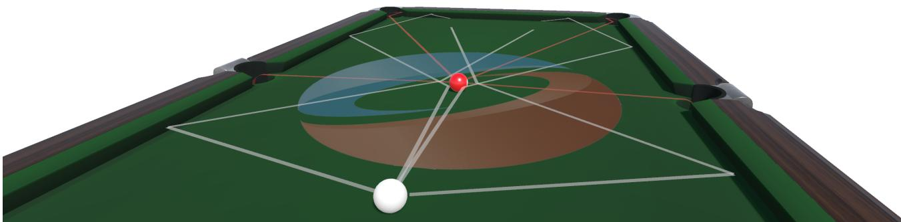  
Figure 1: Given its high-precision requirement and multimodality of solutions, learning shots for simulated billiards (a.k.a. computational pool) represents a long-standing challenge that has yet to be solved. A collection of neural network policies trained with our novel approach can produce multiple highly-skilled billiards shots for a given situation. The image shows four diferent shots sampled from our policies, given the same initial configuration.

## ABSTRACT

Deep reinforcement learning (DRL) algorithms for movement control are typically evaluated and benchmarked on sequential decision tasks where imprecise actions may be corrected with later actions, thus allowing high returns with noisy actions. In contrast, we focus on an under-researched class of high-risk, high-precision motion control problems where actions carry irreversible outcomes, driving sharp peaks and ridges to plague the state-action reward landscape. Using computational pool as a representative example of such problems, we propose and evaluate State-Conditioned Shooting (SCOOT), a novel DRL algorithm that builds on advantageweighted regression (AWR) with three key modifications: 1) Performing policy optimization only using elite samples, allowing the policy to better latch on to the rare high-reward action samples; 2) Utilizing a mixture-of-experts (MoE) policy, to allow switching between reward landscape modes depending on the state; 3) Adding a distance regularization term and a learning curriculum to encourage exploring diverse strategies before adapting to the most advantageous samples. We showcase our features’ performance in learning physically-based billiard shots demonstrating high action precision and discovering multiple shot strategies for a given ball configuration.

## CCS CONCEPTS

• Computing methodologies → Machine learning algorithms;   
Physical simulation.

## KEYWORDS

reinforcement learning, trajectory optimization, motion control

## ACM Reference Format:

Nam Hee Kim, Markus Kirjonen, and Perttu Hämäläinen. 2022. Learning High-Risk High-Precision Motion Control. In ACM SIGGRAPH Conference on Motion, Interaction and Games (MIG ’22), November 3–5, 2022, Guanajuato, Mexico. ACM, New York, NY, USA, 10 pages. https://doi.org/10.1145/3561975. 3562943

## 1 INTRODUCTION

Deep reinforcement learning (DRL) is today’s dominant paradigm for controlling physically simulated characters in computer animation and robotics [Bergamin et al. 2019; Merel et al. 2020; Peng et al. 2021; Won et al. 2020a], superseding previous techniques such as direct space-time optimization [Witkin and Kass 1988] and trajectory optimization techniques based on gradient information [Tassa et al. 2012, 2014] or sampling [Al Borno et al. 2012; Hämäläinen et al. 2014, 2015; Liu et al. 2012]. Although DRL can produce highly unrealistic movements in common benchmarks such as OpenAI Gym [Brockman et al. 2016] and DeepMind Control Suite [Tassa et al. 2018], this can be explained by the simplistic benchmark simulation models and reward functions. Guiding DRL with suitable reference movement data can help synthesize natural and controllable movements [Bergamin et al. 2019; Merel et al. 2020; Peng et al. 2019b; Won et al. 2020a].

Thus far, the considerable body of work on DRL in continuous action spaces studies a fairly limited set of test problems. In particular, locomotion, balancing, and other common sequential control tasks allow the agent to produce occasional noisy or erroneous actions, which later actions can correct by compensating for the noise/error. The same does not apply to many other tasks like shooting an arrow or hitting a sculpture with a chisel. In such scenarios, the agent has little to no control over the outcome once the action is executed, making the task less error-tolerant and hence less forgiving. Consequentially, the learned policy must be much more precise. Motivated by this, we pose and tackle the following question: Can DRL algorithms solve motion control problems that are unforgiving towards imprecise actions?

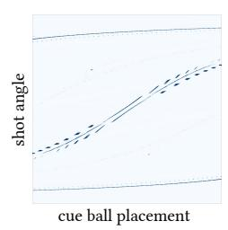

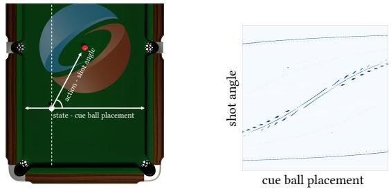  
Figure 2: Left: a view of a physically-simulated billiards table with 1-dimensional state and action variables. Right: the state-action reward landscape corresponding to the simpli fied billiards environment. Dark regions indicate high reward at the state-action coordinate. Best viewed in colour.

We examine the problem of billiard shot learning as a representative problem, capturing crucial properties of the class of problems above, which we dub high-risk and high-precision motion control problems. Successful shots in billiards require highly precise (lowentropy) actions, as even one or two degrees ofshot angle diference can make a huge diference in the resulting trajectory. Also, failed shots cause drastic and irreversible state changes, which an opponent can exploit. Billiards is also a convenient testbed from a computational and didactic perspective—in its simplest form, it can be studied with only 1 or 2 state and action dimensions, allowing highly informative visualizations of the reward landscapes and algorithm behaviour.

In this paper, we first identify opportunities for algorithmic improvement by examining the performance of multiple of-the-shelf DRL algorithms. We then develop a set of algorithm modifications that allows for suficient adaptation to the highly sparse, sharp, disjointed, and multimodal reward landscapes of billiards, thereby achieving highly precise control of the cue ball. As a result, we produce a neural network policy that can compute successful billiard shots in a single forward pass, which is a significant step-up from existing solutions based on iterative optimization techniques such as covariance matrix adaptation evolution strategy (CMA-ES, Hansen et al. 2003).

Our contributions can be summarized as follows:

• We test and visualize several of-the-shelf DRL algorithms (PPO [Schulman et al. 2017], SAC [Haarnoja et al. 2018], and AWR [Peng et al. 2019b]) and show that they fail even in the most simple billiards variants. We analyze the visuals and highlight opportunities for improvement.

• Novel algorithm: we propose and evaluate a novel DRL approach named SCOOT (State-Conditioned Shooting) that combines features from existing algorithms and modifications motivated by the characteristics of billiards.

• We demonstrate the capacity of SCOOT to both produce highly precise shots and suggest multiple alternative strategies for a given ball configuration.

## 2 RELATED WORK

Sampling-based Optimization for Control. Sampling-based optimization is a well-suited tool for solving high-risk, high-precision motion control problems. Combined with physical simulation, sampling based optimization has proven successful in performing physicsbased motion control as a form of shooting method. Basic tools for optimizing action sequences range from the cross-entropy method (CEM, De Boer et al. 2005) and covariance matrix adaptation evolution strategy (CMA-ES, Hansen et al. 2003) to more recent methods such as iCEM [Pinneri et al. 2020]. Trajectory optimization with a long simulation horizon has been shown to induce requirements for high-precision [Hämäläinen et al. 2020b], where a high ratio between simulation and control frequencies warrants that a controller must construct precise action sequences. Sampling-based trajectory optimization has successfully performed several trajectory optimization tasks with careful reward engineering [Al Borno et al. 2012; Naderi et al. 2017]. More recently, CMA-ES was used to perform physics-based keyframe tracking as a space-time optimization solver [Witkin and Kass 1988] in conjunction with compact action parameterization [Kim et al. 2021]. The main problem hindering the application of sampling-based optimization in practice is computing cost and time delay in obtaining a solution. Hence, the focus of computer animation and movement control research has shifted to learning neural control policies that compute motion control parameters in a single forward pass, often requiring mere milliseconds of GPU time. DRL is closely related to sampling-based optimization: one may view learning a neural policy as solving multiple variants of a movement optimization problem in parallel, each variant specified by the policy network’s input [Hämäläinen et al. 2020a]. Typically, this means that optimized variables such as the mean and variance of CMA-ES search distribution become functions of the policy network input, parameterized by the network weights and biases.

Deep Reinforcement Learning. Kwiatkowski et al. [2022] presents a comprehensive survey of reinforcement learning methods for character animation. The first steps for benchmarking physicsbased control tasks and environments often involve popular of-theshelf algorithms such as Proximal Policy Optimization (PPO, Schulman et al. 2017) and Soft Actor-Critic (SAC, Haarnoja et al. 2018). Modifications for these of-the-shelf algorithms, such as Advantage-Weighted Regression (AWR, Peng et al. 2019b), have been proposed over the years, showing potential performance improvements. More recently, mixture-of-experts (MoE) methods [Peng et al. 2019a; Won et al. 2020b] have gained traction due to their capabilities to model diverse motions in the presence of multiple objectives or multi-task motion data. Our work is closely related to AWR in viewing DRL as a weighted regression task while employing MoE for performance improvement. Complementing previous MoE work, we contribute novel visualizations of the reward landscape that help explain why and when MoE policies can be useful.

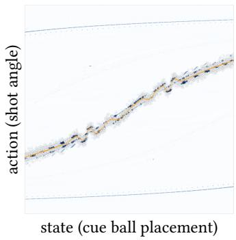  
(a) PPO

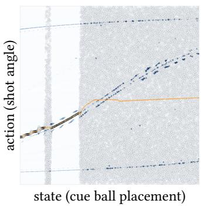  
(b) SAC

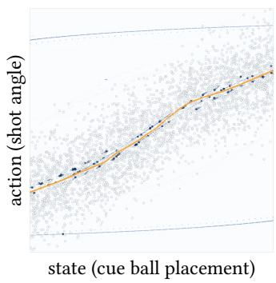  
(c) AWR  
(fixed action var.)

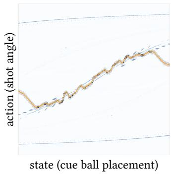  
(d) AWR (learned action var.)  
Figure 3: Visualization of converged policies on the one-dimensional billiards reward landscape. Orange markers indicate state-conditioned action means, and coloured circles indicate state-action samples in the replay bufer, with hues indicating observed returns. Best viewed in colour.

Computational Pool. Computational pool is a great testbed for optimization, noted for the dificulties inherent to planning in continuous domain [Greenspan 2005; Landry et al. 2011]. Previous attempts at solving billiards include Monte-Carlo tree search approaches [Chen and Li 2019; Smith 2007] and variants of sampling based trajectory optimization [Archibald et al. 2010; Landry and Dussault 2007]. Fragkiadaki et al. [2015] successfully applied CMA-ES in conjunction with a visual predictive model of the pool table with multiple balls. However, learning to produce viable shots in real-time has remained an open challenge. Hu et al. [2019] presents a diferentiable billiards simulator, backpropagating through which can optimize a shot. However, their simplified setup excludes table borders, and the gradient-based shot optimization can take multiple iterations depending on initialization. To our best knowledge, El Mekki et al. [2019] is the only publicly available academic work that solves the problem using a DRL algorithm. However, this work treats billiards as a sequential decision (i.e. multiple shots are allowed in sequence) rather than a high-risk high-precision problem.

## 3 NOTATION AND PRELIMINARIES

As usual with DRL, we assume a Markov Decision Process (MDP) where at timestep �, the agent observes a state s� and takes an action a�, which results in a new state $\mathbf { s } _ { t + 1 }$ and scalar reward $r _ { t } = r ( \mathbf { s } _ { t } , \mathbf { a } _ { t } )$ A policy network $\pi _ { \theta }$ defines a state-conditioned distribution for sampling actions as $\mathbf { a } \sim \pi _ { \theta } ( \mathbf { a } | \mathbf { s } )$ , where � denotes policy parameters. In our case, s defines the initial ball configuration for a billiards shot, and a defines the cue ball’s launch velocity.

Other key concepts include the return $\begin{array} { r } { R ( \mathbf { s } , \mathbf { a } ) \ = \ \sum _ { t } \gamma ^ { t } r _ { t } } \end{array}$ of a state-action sequence starting at state $\textbf { \textsf { S } } = \textbf { \textsf { S } } _ { 0 }$ and action $\mathbf { a } = \mathbf { a } _ { 0 }$ where $\gamma \in \left[ 0 , 1 \right)$ is a discounting parameter. State value or expected return for a state is denoted by $V ( \mathbf { s } ) = \mathbb { E } _ { \mathbf { a } } [ R ( \mathbf { s } , \mathbf { a } ) ]$ . The objective is to maximize the expected return over some state distribution, in our case the positions of billiards balls sampled randomly. In this paper, we only focus on learning single optimal shots instead of shot sequences, setting $\gamma = 0$ . This makes the returns equal to instantaneous rewards, $R ( \mathbf { s } , \mathbf { a } ) = r ( \mathbf { s } , \mathbf { a } )$ , which can simplify DRL algorithm implementation.

## 4 BILLIARDS SIMULATOR

For our experiments, we implement a high-fidelity billiards environment in Unity with NVIDIA PhysX engine in the style of OpenAI’s Gym interface. The placement of the cue ball is parameterized into the state vector, and the agent is to output action parameters which apply an impulse to the cue ball at the beginning of the simulation. The rest of the trajectory follows from contacts and collisions accrued as a consequence. For exploring the performances of ofthe-shelf algorithms, we simplify state and action variations to just 1 dimension each. As shown in Figure 2, the output of the action is the shot angle, where the striking force is held constant. We make the problem a single decision rather than a sequential one and simulate for a long horizon (200 timesteps with a single action). This reflects how in real billiards, new actions are only taken after the balls have stopped moving after the previous action; thus, each action can have extensive and irreversible efects on the game state.

Reward Design. The reward function reflects the characteristics of the whole shot trajectory and use simple bonus and penalty terms bounded in [0, 1], which simplifies balancing their weights. Specifically, our reward function is as follows:

$$
\begin{array} { l } { { \displaystyle r ( \mathbf { s } , \mathbf { a } ) = Z \left( \mathrm { t a r g e t b a l l p o c k e t e d } \right) } \ ~ } \\ { { \displaystyle ~ + 0 . 0 1 \cdot \exp \left( - \operatorname* { m i n } _ { { \boldsymbol { p } } , t } | | \mathbf { q } _ { t } ^ { \mathrm { t a r g e t } } - \mathbf { q } ^ { \boldsymbol { p } } | | ^ { 2 } \right) } \ ~ } \\ { { \displaystyle ~ + 0 . 0 1 \cdot \left( 1 - \exp \left( - \operatorname* { m i n } _ { { \boldsymbol { p } } , t } | | \mathbf { q } _ { t } ^ { \mathrm { c u e } } - \mathbf { q } ^ { \boldsymbol { p } } | | ^ { 2 } \right) \right) } \ ~ } \end{array}\tag{1}
$$

where $\boldsymbol { \mathscr { T } } ( \cdot )$ is the indicator function, ${ \bf q } _ { t } ^ { \mathrm { c u e } }$ and ${ \bf q } _ { t } ^ { \mathrm { t a r g e t } }$ are the ��- positions of the cue ball and the target ball at the physics timestep � of the simulated shot trajectory, and $\boldsymbol { \mathbf { q } } ^ { p }$ is the ��-position of the pocket $\mathcal { P } \cdot$ In case the cue ball is pocketed, the trajectory registers as a failure, and the reward is set to 0. The exponential terms are reward shaping terms that guide the target ball to move close to a pocket while penalizing for the cue being too close to any pocket. The weights of the shaping terms are set to be low in relation to the binary pocketing reward so that the maximum reward cannot be obtained without an actually successful shot. Without the shaping terms, the reward landscape would have large regions with zero gradient.

Visualizing the Optimization Landscape. In the case of 1-dimensional states and actions, we can directly visualize the policy optimization problem using �, � as the axes, �(�, �) as the objective function. Actions sampled from the policy can also be plotted on top of the objective function landscape to visualize DRL algorithm progress and convergence. Examples of this are provided in Figure 2 and Figure 3. One can see that the high-precision action requirement manifests as the landscape having narrow peaks and ridges. A good policy is one that samples actions only at the peaks/ridges, for any given state.

The fact that one can aim at diferent pockets and utilize bounces manifests as multimodality—most states have more than a single high-reward action. Between states, the high-reward actions change somewhat smoothly, but there are also discontinuities resulting from some shots pocketing the cue ball together with the target ball.

## 5 PROBLEMS WITH OFF-THE-SHELF DRL

Before introducing our SCOOT algorithm, let us first establish that the problem of learning billiards shots is indeed hard and not solved by common of-the-shelf DRL algorithms. We exclude model-based methods from consideration due to the high sensitivity of state transitions arising from billiards’ contact- and collision-rich nature. As such, leveraging learned dynamics models becomes infeasible: prediction errors for state transitions will necessarily result in imprecise actions. Here, we examine the performance of three popular model-free, actor-critic based DRL methods, namely, Proximal Pol icy Optimization (PPO, Schulman et al. 2017), Soft Actor-Critic (SAC, Haarnoja et al. 2018), and Advantage-Weighted Regression (AWR, Peng et al. 2019b). For PPO and SAC, we utilize the popular Stable Baselines 3 implementations [Rafin et al. 2019]. For AWR, we use the oficial paper codebase. As visualized in Figure 3, even in the simplest case (1-dimensional state and action), these methods, without further modification, fail to achieve a viable solution across the state space:

• PPO (Figure 3a) locks on to the discontinuities of the reward landscape, resulting in the learned policy fluctuating between landscape peaks. There are multiple states where the learned policy produces unsuccessful shots.

• SAC (Figure 3b) fails to lower its state-conditioned action entropy adequately, possibly due to the entropy regularization mechanic that biases the algorithm more towards exploration than exploitation, which is not a good fit for high-risk, high-precision problems.

• AWR without learned action variance (the default, Figure 3c) is only able to model the rough shape of the peaks present in the reward landscape. With learned action variance (Figure 3d), AWR adapts more appropriately to the peaks, but the final policy fluctuates between peaks similar to PPO. However, here is less action noise, possibly because of the ability to use a large bufer of of-policy experience. Because of the sharpness of the reward peaks, high-reward actions are sampled only rarely, and using of-policy data from previous iterations helps AWR to not "forget" the good actions after each iteration, allowing the algorithm to model the reward landscape peaks more accurately.

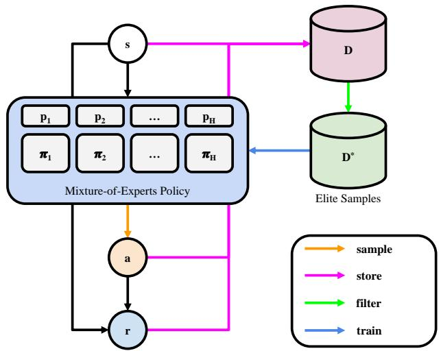  
Figure 4: Overview of policy optimization iterations with a mixture-of-experts policy and elite samples from of-policy experience replay bufer.

Throughout the rest of the paper, we use AWR with learned action variance as the baseline and starting point when developing and evaluating our SCOOT algorithm.

## 6 STATE-CONDITIONED SHOOTING

Our proposed SCOOT algorithm builds on AWR, with modifications proposed and evaluated in the following sections. Figures 5 and 6 summarize the results of each proposed modification, showing both the converged policies and the learning curves, i.e., the learned policy’s mean return as a function of the number of training shots.

Algorithm overview. The key operating principle of both SCOOT and AWR is the same: At each iteration, new actions are sampled, simulated, and added to a FIFO experience bufer, and the policy distribution is fitted to the actions that yield high returns. This follows the trend of casting RL as a (self-)supervised learning problem [Eysenbach et al. 2020; Ghosh et al. 2019; Kumar et al. 2019]. Conceptually, this is also similar to black-box optimization methods like CMA-ES and CEM, which implement a similar iteration of sampling candidate optimization solutions from a search distribution and fitting the distribution to the best candidates. However, the search distribution of CMA-ES and CEM is not conditioned on state, and they only use the current iteration’s sampled experience in the distribution updates. In contrast, AWR’s and SCOOT’s policy networks define state-conditioned search distributions for actions, and a multi-iteration experience replay bufer (a FIFO queue) avoids forgetting old actions that yielded high returns, which is a good fit for our case where sampling good actions is rare. This comes at the cost of possibly slower convergence, as the policy can get "stuck"

Table 1: Summary of diferences between SCOOT (ours) and commonly-used of-the-shelf model-free DRL algorithms.
<table><tr><td>Algorithm</td><td>On/Off Policy</td><td>Action Distr.</td><td>Elite Selection?</td><td>Action Var.</td><td>Curriculum?</td></tr><tr><td>PPO [Schulman et al. 2017]</td><td>On</td><td>Gaussian</td><td>x</td><td>Learned global</td><td>x</td></tr><tr><td>SAC [Haarnoja et al. 2018]</td><td>Off</td><td>Gaussian</td><td>x</td><td>State-conditioned</td><td>x</td></tr><tr><td>AWR [Peng et al. 2019b]</td><td>Off</td><td>Gaussian</td><td>x</td><td>Fixed (default) or learned global</td><td>x</td></tr><tr><td>SCOOT (ours)</td><td>Off</td><td>Gaussian Mixture</td><td>√</td><td>Learned global</td><td>√</td></tr></table>

Algorithm 1: State-Conditioned Shooting (SCOOT)   
1 D ← Experience replay bufer, initially empty FIFO queue   
2 $\theta , \phi$ ← Parameters of policy (� ) and value $( V _ { \phi } )$ network   
3 for iteration $k = 1 , \cdots , k _ { m a x }$ do   
4 add experience $\left\{ \langle \mathbf { s } , \mathbf { a } , R ( \mathbf { s } , \mathbf { a } ) \rangle _ { i , \cdots , n } \right\}$ sampled via $\pi _ { \theta }$ to D   
5 $\begin{array} { r } { \phi  \arg \operatorname* { m i n } _ { \phi } \mathbb { E } _ { \langle \mathbf { s } , \mathbf { a } \rangle \sim \mathcal { D } } [ ( R ( \mathbf { s } , \mathbf { a } ) - V _ { \phi } ( \mathbf { s } ) ) ^ { 2 } ] } \end{array}$ ; // Train $V _ { \phi }$ (Eq. 3)   
6 D∗ ← SelectElites(D, �) ; // (Eq. 4)   
7 $\begin{array}{c} \begin{array} { r l r l r } { \theta  \arg \operatorname* { m a x } _ { \theta } \mathbb { E } _ { \langle \mathbf { s } , \mathbf { a } \rangle \sim \mathcal { D } ^ { * } } \Big [ } & { { } A ( \mathbf { s } , \mathbf { a } ) \log \pi _ { \theta } ( \mathbf { a } | \mathbf { s } ) } & { + } & { { } \lambda _ { \mathrm { d i s t } } \cdot \mathcal { L } _ { \mathrm { d i s t } } } & { } \end{array} \Big ]  \end{array}$ // Train � (Eqs. 2, 5 and 6)   
Advantage-weighted regression Distance regularization   
8 end

to old actions that are good but suboptimal; the AWR paper shows how fitting the policy to old experiences corresponds to optimizing a bound instead of the true objective.

More specifically, the policy is fitted to the best actions by updating � to maximize the weighted log-likelihood:

$$
\theta \gets \arg \operatorname* { m a x } _ { \theta } \mathbb { E } _ { \left. s , \mathbf { a } \right. \sim \mathcal { D } } \left[ W ( \mathbf { s } , \mathbf { a } ) \log \pi _ { \theta } \left( \mathbf { a } | s \right) \right] ,\tag{2}
$$

where D denotes the experience replay bufer, and the weights $W ( \pmb { \mathscr { s } } , \mathbf { a } )$ denote how good a sampled action a is in state s. AWR uses $\begin{array} { r } { W ( s , \mathbf { a } ) = \exp ( \frac { 1 } { \beta } \cdot A ( \mathbf { s } , \mathbf { a } ) ) } \end{array}$ , where � is a hyperparameter, and $A ( \mathbf { s } , \mathbf { a } )$ is an advantage estimate $A ( \mathbf { s } , \mathbf { a } ) = R ( \mathbf { s } , \mathbf { a } ) - V ( \mathbf { s } )$ . Intuitively, the advantage is positive if action a yields a higher return than expected in state s. The exponentiation maps the advantages to non-negative sample weights. For a practical implementation, � (s) is approximated by a value network $V _ { \phi } ( \mathbf { s } )$ trained with the observed returns in a supervised manner, minimizing the L2-loss:

$$
\phi \gets \arg \operatorname* { m i n } _ { \phi } \mathbb { E } _ { \langle s , \mathbf { a } \rangle \sim \mathcal { D } } \left[ \left( R ( \mathbf { s } , \mathbf { a } ) - V _ { \phi } ( \mathbf { s } ) \right) ^ { 2 } \right] .\tag{3}
$$

The SCOOT algorithm is summarized in Figure 4 and Algorithm 1. This follows the AWR algorithm definition with the following modifications:

• We add the selection of elite samples (Line 6, Section 6.1)

• Enabled by the above, we also use advantages as weights without exponentiation, $W ( \mathbf { s } , \mathbf { a } ) = A ( \mathbf { s } , \mathbf { a } )$ (Line 7, Section 6.1)

• We use a state-conditioned Gaussian mixture instead of a single Gaussian as the action distribution (Section 6.2)

• We add distance regularization to the policy update (Line 7, Section 6.2)

Additionally, we implement a 3-stage training curriculum to prevent premature convergence (Section 6.3). Table 1 provides a summary of the diference between SCOOT and other common model-free DRL algorithms.

## 6.1 Elite Samples

One key consequence of our reward landscape’s sparsity and sharpness is the overwhelmingly high ratio between low-return and high-return action samples, especially at initialization. In fitting the policy, one would like to only focus on the high-return actions, disregarding the low-return ones. Such fitting to only elite samples, e.g., top 50%, is also central to black-box optimization algorithms such as CMA-ES and CEM.

More formally, we select elite samples from the experience replay bufer, using the value network’s state value estimate $V _ { \phi } ( \mathbf { s } )$

$$
\mathcal { D } ^ { * } = \left\{ \langle \mathbf { s } , \mathbf { a } , R ( \mathbf { s } , \mathbf { a } ) \rangle ~ | ~ \langle \mathbf { s } , \mathbf { a } , R ( \mathbf { s } , \mathbf { a } ) \rangle \in \mathcal { D } , R ( \mathbf { s } , \mathbf { a } ) > V _ { \phi } ( \mathbf { s } ) \right\}\tag{4}
$$

A consequence ofthe above is that the advantage estimates $A ( \mathbf { s } , \mathbf { a } ) =$ $R ( \mathbf { s } , \mathbf { a } ) - V _ { \phi } ( \mathbf { s } )$ of the elite samples are always non-negative. Thus, the AWR-style exponentiation is no longer necessary to convert advantages to non-negative sample weights.

Impact on Performance. Empirically, using the elite samples and directly using advantages as weights improves performance over the baseline AWR, as illustrated in Figures 5 and 6. This also removes the need for AWR’s temperature hyperparameter $\beta .$

## 6.2 Distance-Regularized Mixture-of-Experts

To handle the discontinuities and multimodality of the reward landscape, we employ a multimodal policy. Specifically, we use a mixture-of-experts (MoE) policy with � Gaussian heads:

$$
\pi _ { \boldsymbol { \theta } } ( \mathbf { a } \mid \mathbf { s } ) = \sum _ { h = 1 } ^ { H } { p _ { h } ( \mathbf { s } ) N \left( \mathbf { a } ; \mu _ { \boldsymbol { \theta } } ^ { h } ( \mathbf { s } ) , \sigma ^ { 2 } \right) } ,\tag{5}
$$

where N denotes a Gaussian PDF and $p _ { h } ( \mathbf { \boldsymbol { s } } ) \in [ 0 , 1 ]$ is the stateconditioned component weight, i.e., the categorical probability of selecting head ℎ when sampling an action for state s, with $\begin{array} { r } { \sum _ { h = 1 } ^ { H } p _ { h } ( \mathbf { s } ) = 1 } \end{array}$ . Each head ℎ corresponds to an individual stateconditioned Gaussian distribution, i.e. a neural network that outputs a state-dependent mean $\mu _ { \theta } ^ { h } \left( s \right)$ . We employ a global scalar variance $\sigma ^ { 2 }$ (shared across heads and states) which is learned together with the neural network parameters.

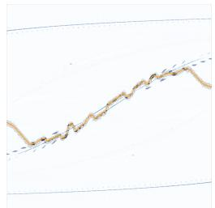  
(a) Baseline AWR

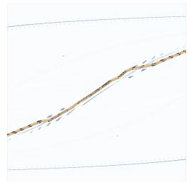  
(b) AWR + elite samples

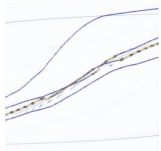  
(c) Naïve MoE

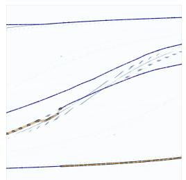  
(d) MoE  
+ distance reg.

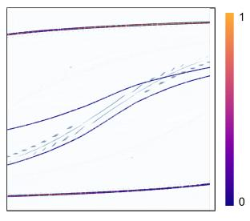  
(e) SCOOT  
(elite + MoE dist. reg. +  
curriculum)

Figure 5: State-conditioned action means across the reward landscape, for each algorithm version. The colors of the means indicate learned mixture component weights $p _ { h } ( \mathbf { s } ) _ { : }$ , ranging from 0 (purple) to 1 (orange).  
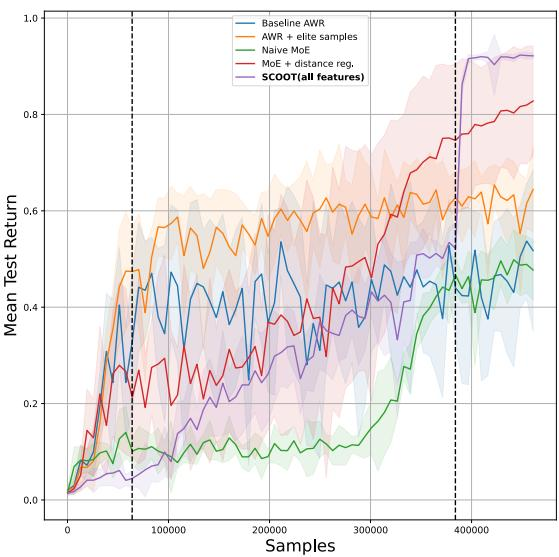  
Figure 6: Evaluating algorithm versions in terms of mean test return (approximately equal to shot success rate). The curves show means and standard deviations across 10 random seeds and 2048 randomly sampled states per seed. Vertical dashed lines indicate the stages of our training curriculum (Section 6.3).

Distance Regularization. As illustrated in Figure 5c, the MoE policy is not optimal on its own, as the head means may all converge to the same central reward modes, failing to explore the action space fully. To encourage the policy heads to avoid overlap and cover diverse parts of the state-action space, we add the following Mahalanobis distance regularization term to the policy optimization

objective (Algorithm 1 Line 7):

$$
\mathcal { L } _ { \mathrm { d i s t } } \left( \boldsymbol { \theta } , \boldsymbol { \mathsf { s } } \right) = \operatorname* { m a x } \left( 0 , 1 - \frac { 1 } { d } \operatorname* { m i n } _ { h _ { 1 } \neq h _ { 2 } } \frac { \vert \vert \mu _ { \boldsymbol { \theta } } ^ { h _ { 1 } } ( \boldsymbol { \mathsf { s } } ) - \mu _ { \boldsymbol { \theta } } ^ { h _ { 2 } } ( \boldsymbol { \mathsf { s } } ) \vert \vert } { \sigma } \right)\tag{6}
$$

where $h _ { 1 }$ and $h _ { 2 }$ enumerate the indices of Gaussian heads of the MoE policy, and � (a hyperparameter) is the minimum amount of overlap to accrue penalty, i.e. the �-intercept of the decreasing linear function clipped at 0.

Non-overlapping Initialization. The distance regularization may be inefective or unstable if the policy heads are initialized with high overlap. Therefore, we initialize each policy head such that, for all states, the action means are distinct and cover the whole action space. Denoting head ℎ’s action mean as $\mu _ { h } .$ , we adjust the policy network’s final layer output $\mathbf { z } _ { h }$ as:

$$
\mu _ { h } = \alpha _ { h } \mathbf { z } _ { h } + \beta _ { h }\tag{7}
$$

where $\alpha _ { h } \in \mathbb { R }$ is a scale parameter, and $\beta _ { h } \in \mathbb { R } ^ { | \mathbf { a } | }$ is a shift parameter corresponding to head ℎ. Both $\alpha _ { h }$ and $\beta _ { h }$ are adapted through the policy optimization. The shift parameters $\beta _ { 1 } , \cdots , \beta _ { H }$ are initialized by a |a|-dimensional space-filling Sobol sequence [Sobol’ 1967] of length $H ,$ and $\alpha _ { h }$ is initialized to a low value (0.001) so that initially, $\mu _ { h } \approx \beta _ { h }$ independent of $\mathbf { z } _ { h } .$

Impact on Performance. As illustrated in Figures 5d and 6, adding the distance regularization with the non-overlapping initialization improves results. The policy heads now cover the whole action space, and the final policy return is higher, although the single Gaussian policy (AWR + elite samples) learns faster initially.

## 6.3 Training Curriculum

With the features above, our initial experiments indicated two common failure modes:

• Before the experience replay bufer is filled, initial convergence often is random and leads to unrecoverable errors.

• Most of the MoE component weights may rapidly decay to zero, leaving much of the state-action space underexplored. This can cause results like Figure 5d, where the dominant head attempts to model the highly discontinuous central reward ridge, leading to poor actions in many states.

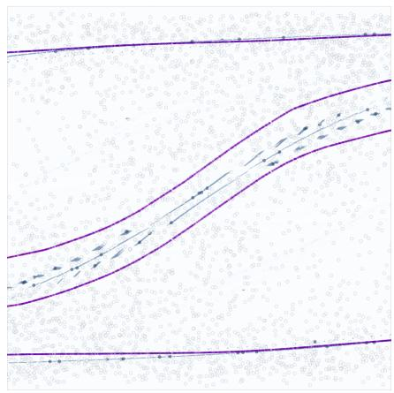  
(a) Before learning action variance

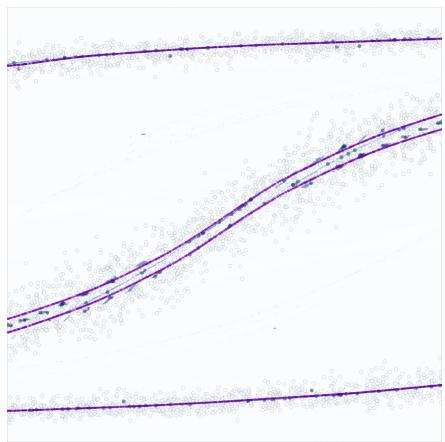  
(b) Before learning component weights

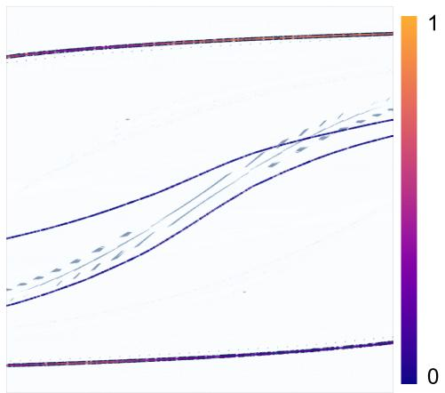  
(c) After learning component weights  
Figure 7: SCOOT’s action samples and means throughout the learning curriculum. The colors of the means indicate learned mixture component weights $p _ { h } ( \pmb { s } )$ , ranging from 0 (purple) to 1 (orange).

To prevent such failure modes, we implement curriculum learning [Bengio et al. 2009] with the following three stages:

(1) In the first stage (Figure 7a), only the action means are learned while the action variance and the component weights are held constant. This ensures that the experience replay bufer has suficient information for learning before substantial adaptation occurs, while also primitively adapting towards local optima that are discoverable early on.

(2) In the second stage (Figure 7b), the action variance is also allowed to reduce from its initially high value, allowing the policy heads to model the reward optima more accurately.

(3) Finally, in the third stage (Figure 7c), the state-conditioned component weights are also learned. This efectively “shuts down” policy heads that are not suficiently close to any local optimum, while redirecting the sampling budget to the policy heads that are near local optima. The component weights are hence learned to choose the best actions found for each state.

Impact on Performance. As illustrated in Figures 5e, 6 and 7, adding the curriculum improves the mean return and allows the policy to correctly model the continuous ridges at the top and bottom of the landscape. The policy correctly models most of the high-reward regions at the end of the second stage (Figure 7b) although the two central heads start to drift randomly when their weights decay in the third stage (Figure 7c). The loss of modalities appearing in Figure 7c, however, does not afect the performance of the final policy, as it chooses its actions only from the active components. One may prevent this modality loss by further regularizing the learned component weights by, e.g., blending the $\mathcal { P } h$ values with uniform probability.

## 6.4 Implementation Details

We use PyTorch [Paszke et al. 2019] to implement the neural networks. The policy network is a multi-layered perceptron (MLP) of hidden dimensions 128 × 64 with (ReLU) activations. This is identical to the architecture used in AWR [Peng et al. 2019b]. The final actions are bounded in [−1, 1] with tanh transformations as implemented in SAC [Haarnoja et al. 2018] (which AWR does not use). The initial action variance is set to log $\sigma = - 1$ . The value network uses the same architecture minus the tanh transformations. The state-conditioned categorical weights $p _ { 1 } ( \pmb { \mathscr { s } } ) , \cdots , p _ { h } ( \pmb { \mathscr { s } } )$ are also computed by a similar MLP, whose final output is transformed into a categorical distribution via softmax. We use RAdam [Liu et al. 2019] optimizer to train our networks. The elite sample selection allows for a relatively aggressive learning rate of 1e-3 for the policy. For the value network, the learning rate is 1e-5. Given that simulating each action (a billiards shot with 200 physics timesteps) is slow, we restrict our iteration budget to 128 samples per iteration. The experience replay bufer is a FIFO queue with a maximum size of 3200 samples, i.e., we use data from the past 25 iterations for updating the networks, which is also AWR’s default setting. We train the networks for a single epoch per iteration with mini-batches of 256 samples. Full-batch updates are used when the number of samples in the bufer is less than or equal to 256. The distance penalty weight $\lambda _ { \mathrm { d i s t } }$ is set to 0.1 with the overlap limit $d = 1 . 0$ to prevent action means from approaching within one standard deviation from each other.

As each billiards shot is simulated for 200 physics timesteps, large-scale experiments and evaluations can be excessively slow. Therefore, in the case of 1-dimensional actions and states, training and evaluation are accelerated by using a pre-computed state-action reward look-up table with ${ \sim } 8 . 7$ million samples. The table is also used to generate the reward landscape figures and the learning curves of Figure $^ { 6 , }$ while the billiards figures and videos in Section 7 use the real simulator.

Stochastic actions are sampled from the mixture during training to maximize action precision and minimize noise without sacrificing exploration. As multiple Gaussian heads may have similar learned component weights corresponding to multiple reward peaks, the policy generates each action for evaluation as the mean of the Gaussian head sampled according to the ${ p } _ { h } ( \mathbf { s } )$ values.

## 7 RESULTS

Please refer to the supplementary video section for animated results. Above, we have already validated the benefits of the proposed SCOOT features, as summarized in Figures 5 and 6. In this section, we showcase the resulting policy’s capability in producing high-precision billiards shots and a promising direction in producing diverse shots leveraging the MoE. We also provide an initial outlook toward higher-dimensional generalization of SCOOT.

Learning High-Precision Shots. Figure 8a showcases the capability of a policy learned using SCOOT: we successfully discover a control policy for 1-dimensional billiards shots, switching between strategies as necessary. Given the limited capacity of the neural net work policy, we observe a keen bias towards continuous and more rigid reward peaks. For example, Figure 7c shows that the central reward peaks, initially modeled during the intermediate stages in the curriculum, are no longer used after component weights are learned. This corroborates our intuition that the agent’s actions default to risk-averse solution modes in the presence ofhigh-precision requirements. With suficient rigidity and continuity, the agent can exploit known solutions from other states to a large extent and thus produce a high-return action for the current state. This also high lights the importance of suficient exploration; we discover such solution modes via SCOOT’s MoE policy, distance regularization, and curriculum learning features. Policies trained without these features tend to fail to discover these rigid and continuous reward peaks consistently (Figure 5). The discovery of such reward peaks explains the proposed features’ superiority in sample eficiency, observed test returns, and sensitivity to initialization (Figure 6).

Discovering Diverse Shots. In our test problem, SCOOT can discover various local reward peaks across the landscape and converge the action means towards them. For example, Figure 7b shows that the 4-headed policy closely follows the shape of the 4 major reward peaks of the billiards environment. Continuing to train the policy from this state without optimizing component weights, we observe that the policy converges towards these local peaks. Visualizing the converged action means of the policy, we observe that this corresponds to producing diverse shots, with each shot capturing a unique strategy while scoring a high return. Figure 8b showcases the capabilities of such a policy, which outputs a variety of shots for each input state.

In our specific problem setup, there are 4 distinct strategies in almost every state, which can be modeled with a MoE policy with 4 heads. In the general case, future work may explore techniques for learning the number of viable strategies, e.g., by using a per-head value network that could be queried during inference to predict the return for the strategy corresponding to each head.

Scaling Up. To assess the generalization of our method, we use SCOOT on a slightly higher-dimensional problem, where the cue ball’s position varies in both �- and �-directions. The action is parameterized as $\mathbf { a } = ( f _ { x } , f _ { y } )$ (a 2-dimensional force vector). Increasing dimensionality makes it exponentially more dificult to fill out the state-action space, making the lookup table acceleration (Section 6.4) infeasible due to the amount of memory required. To this end, we instead implement a GPU-accelerated billiards simulator using Brax [Freeman et al. 2021]. Simpler geometries are used instead of a true mesh model of the pool table to reduce simulation overhead. For training the agent for this environment, we set the number of Gaussian heads � = 8 to encourage the discovery of more local peaks in the higher-dimensional state-action space.

Without further modifications, training for 72 hours on an NVIDIA A100 Tensor Core GPU, SCOOT discovers a policy that can perform reasonably well (Figure 9a, success rate around 75%), although occasionally failing due to imprecise actions (Figure 9b).

It is evident that SCOOT iterations discover local reward peaks and that the policy adapts to them, albeit not completely. For example, most failure cases in Figure 9b are due to excessively strong force or a slight misalignment in shot angles. Additional training with the RAdam optimizer seems to increase performance gradually, but we observe that adaptation slows down to an infeasible amount. This challenge may necessitate further modifications on top of the ones proposed in this work, e.g., learning rate adaptation or a PPO-style KL-divergence limit.

It is easy to increase the dimensionality of the problem further by introducing multiple target balls and allowing their positions to vary. So far, we have not yet achieved a solidly performing policy in such problem variants. More experiments are needed, and we conjecture that a compounded efect of the curse of dimensionality, limited policy capacity, and the even more irregular reward landscape due to additional collision possibilities may be at play. A competent generalization to such high-dimensional variations of billiards will remain an open challenge for researchers investigating high-risk, high-precision motion control. However, we believe our work can provide some useful building blocks.

## 8 CONCLUSION

We have proposed SCOOT, a novel DRL algorithm for learning to perform high-precision and high-risk movement control tasks. As SCOOT inherits the simplicity of AWR with only minor modifications, we hope our work will find use in various applications that require highly precise movement control. Additionally, we have demonstrated the capability of SCOOT to learn multiple alternative action strategies. Inspired by this, we are currently working towards applying and extending SCOOT to physically based character animation tasks combining high skill with creative and surprising movements.

We have evaluated SCOOT in the highly challenging problem of learning billiard shots, albeit limited to relatively simple problem variants. However, even these variants turn out to be dificult for commonly used DRL algorithms, demonstrating the merits of SCOOT in unlocking potential avenues for investigating the underexplored class of high-risk and high-precision motion control problems.

## ACKNOWLEDGMENTS

We would like to thank Christian Guckelsberger for providing invaluable discussions throughout the early stages of this work. The anonymous MIG reviewers have provided excellent feedback, which we have incorporated into the final revision. This project is partly funded by the Finnish Center for Artificial Intelligence (FCAI) and the Natural Sciences and Engineering Research Council (NSERC) of Canada.

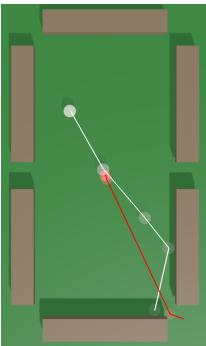

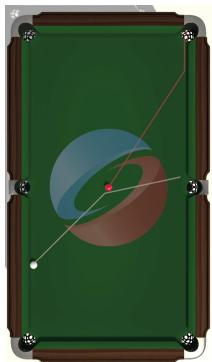

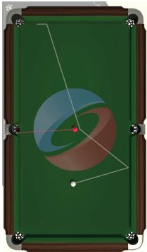

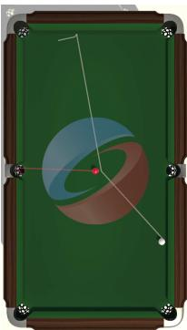  
(a) Visualization of high-precision shots.

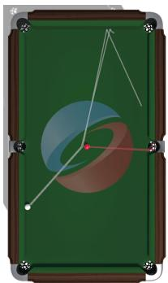

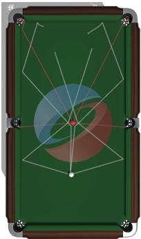

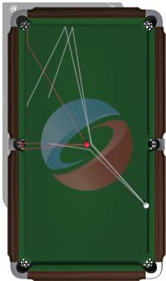  
(b) Discovery of diverse solution modes.

Figure 8: Successful actions with (a) precision and (b) diversity are discovered across various states. The white lines show the cue ball’s trajectory, and the red lines the target ball’s.  
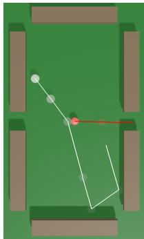

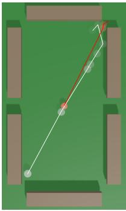  
(a) Successful shots.

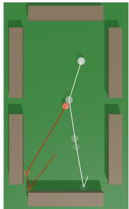

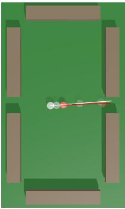  
(b) Failed shots.

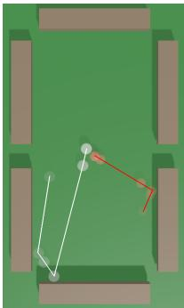  
Figure 9: (a) Successful and (b) failed shots by SCOOT in billiards with 2-dimensional state and action parameterization.

## REFERENCES

Mazen Al Borno, Martin De Lasa, and Aaron Hertzmann. 2012. Trajectory optimization for full-body movements with complex contacts. IEEE transactions on visualization and computer graphics 19, 8 (2012), 1405–1414.

Christopher Archibald, Alon Altman, Michael Greenspan, and Yoav Shoham. 2010. Computational pool: A new challenge for game theory pragmatics. AI Magazine 31, 4 (2010), 33–41.

Yoshua Bengio, Jérôme Louradour, Ronan Collobert, and Jason Weston. 2009. Curricu lum learning. In Proceedings ofthe 26th annual international conference on machine learning. 41–48.

Kevin Bergamin, Simon Clavet, Daniel Holden, and James Richard Forbes. 2019. DReCon: data-driven responsive control of physics-based characters. ACM Transactions On Graphics (TOG) 38, 6 (2019), 1–11.

Greg Brockman, Vicki Cheung, Ludwig Pettersson, Jonas Schneider, John Schulman, Jie Tang, and Wojciech Zaremba. 2016. Openai gym. arXiv preprint arXiv:1606.01540 (2016).

Yu Chen and Yujun Li. 2019. Macro and micro reinforcement learning for playing nine-ball pool. In 2019 IEEE Conference on Games (CoG). IEEE, 1–4.

Pieter-Tjerk De Boer, Dirk P Kroese, Shie Mannor, and Reuven Y Rubinstein. 2005. A tutorial on the cross-entropy method. Annals of operations research 134, 1 (2005), 19–67.

Sélim El Mekki et al. 2019. Recommender system for the billiard game. (2019).

Ben Eysenbach, Aviral Kumar, and Abhishek Gupta. 2020. Reinforcement learning is supervised learning on optimized data. https://bair.berkeley.edu/blog/2020/10/13/ supervised-rl/

Katerina Fragkiadaki, Pulkit Agrawal, Sergey Levine, and Jitendra Malik. 2015. Learning visual predictive models of physics for playing billiards. arXiv preprint arXiv:1511.07404 (2015).

C. Daniel Freeman, Erik Frey, Anton Raichuk, Sertan Girgin, Igor Mordatch, and Olivier Bachem. 2021. Brax - A Diferentiable Physics Engine for Large Scale Rigid Body Simulation. http://github.com/google/brax

Dibya Ghosh, Abhishek Gupta, Ashwin Reddy, Justin Fu, Coline Devin, Benjamin Eysenbach, and Sergey Levine. 2019. Learning to reach goals via iterated supervised learning. arXiv preprint arXiv:1912.06088 (2019).

Michael Greenspan. 2005. UofA wins the pool tournament. ICGA Journal 28, 3 (2005), 191–193.

Tuomas Haarnoja, Aurick Zhou, Kristian Hartikainen, George Tucker, Sehoon Ha, Jie Tan, Vikash Kumar, Henry Zhu, Abhishek Gupta, Pieter Abbeel, et al. 2018. Soft actor-critic algorithms and applications. arXiv preprint arXiv:1812.05905 (2018).

Perttu Hämäläinen, Amin Babadi, Xiaoxiao Ma, and Jaakko Lehtinen. 2020a. PPO CMA: Proximal policy optimization with covariance matrix adaptation. In 2020 IEEE 30th International Workshop on Machine Learning for Signal Processing (MLSP). IEEE, 1–6.

Perttu Hämäläinen, Sebastian Eriksson, Esa Tanskanen, Ville Kyrki, and Jaakko Lehtinen. 2014. Online motion synthesis using sequential monte carlo. ACM Transactions on Graphics (TOG) 33, 4 (2014), 1–12.

Perttu Hämäläinen, Joose Rajamäki, and C Karen Liu. 2015. Online control of simulated humanoids using particle belief propagation. ACM Transactions on Graphics (TOG) 34, 4 (2015), 1–13.

Perttu Hämäläinen, Juuso Toikka, Amin Babadi, and Karen Liu. 2020b. Visualizing movement control optimization landscapes. IEEE Transactions on Visualization and Computer Graphics (2020).

Nikolaus Hansen, Sibylle D Müller, and Petros Koumoutsakos. 2003. Reducing the time complexity of the derandomized evolution strategy with covariance matrix adaptation (CMA-ES). Evolutionary computation 11, 1 (2003), 1–18.

Yuanming Hu, Luke Anderson, Tzu-Mao Li, Qi Sun, Nathan Carr, Jonathan Ragan-Kelley, and Frédo Durand. 2019. Diftaichi: Diferentiable programming for physical simulation. arXiv preprint arXiv:1910.00935 (2019).

Nam Hee Kim, Hung Yu Ling, Zhaoming Xie, and Michiel van de Panne. 2021. Flexible motion optimization with modulated assistive forces. Proceedings ofthe ACM on Computer Graphics and Interactive Techniques 4, 3 (2021), 1–25.

Aviral Kumar, Xue Bin Peng, and Sergey Levine. 2019. Reward-conditioned policies. arXiv preprint arXiv:1912.13465 (2019).

Ariel Kwiatkowski, Eduardo Alvarado, Vicky Kalogeiton, C Karen Liu, Julien Pettré, Michiel van de Panne, and Marie-Paule Cani. 2022. A Survey on Reinforcement Learning Methods in Character Animation. arXiv preprint arXiv:2203.04735 (2022).

Jean-François Landry and Jean-Pierre Dussault. 2007. AI optimization of a billiard player. Journal ofIntelligent and Robotic Systems 50, 4 (2007), 399–417.

Jean-François Landry, Jean-Pierre Dussault, and Philippe Mahey. 2011. Billiards: an optimization challenge. In Proceedings of The Fourth International C\* Conference on Computer Science and Software Engineering. 129–132.

Liyuan Liu, Haoming Jiang, Pengcheng He, Weizhu Chen, Xiaodong Liu, Jianfeng Gao, and Jiawei Han. 2019. On the variance of the adaptive learning rate and beyond. arXiv preprint arXiv:1908.03265 (2019).

Libin Liu, KangKang Yin, Michiel van de Panne, and Baining Guo. 2012. Terrain runner: control, parameterization, composition, and planning for highly dynamic motions. ACM Trans. Graph. 31, 6 (2012), 154–1.

Josh Merel, Saran Tunyasuvunakool, Arun Ahuja, Yuval Tassa, Leonard Hasenclever, Vu Pham, Tom Erez, Greg Wayne, and Nicolas Heess. 2020. Catch & Carry: Reusable Neural Controllers for Vision-Guided Whole-Body Tasks. ACM Trans. Graph. 39, 4, Article 39 (jul 2020), 14 pages. https://doi.org/10.1145/3386569.3392474

Kourosh Naderi, Joose Rajamäki, and Perttu Hämäläinen. 2017. Discovering and synthesizing humanoid climbing movements. ACM Transactions on Graphics (TOG) 36, 4 (2017), 1–11.

Adam Paszke, Sam Gross, Francisco Massa, Adam Lerer, James Bradbury, Gregory Chanan, Trevor Killeen, Zeming Lin, Natalia Gimelshein, Luca Antiga, et al. 2019. Pytorch: An imperative style, high-performance deep learning library. Advances in neural information processing systems 32 (2019).

Xue Bin Peng, Michael Chang, Grace Zhang, Pieter Abbeel, and Sergey Levine. 2019a. Mcp: Learning composable hierarchical control with multiplicative compositional policies. Advances in Neural Information Processing Systems 32 (2019).

Xue Bin Peng, Aviral Kumar, Grace Zhang, and Sergey Levine. 2019b. Advantage weighted regression: Simple and scalable of-policy reinforcement learning. arXiv preprint arXiv:1910.00177 (2019).

Xue Bin Peng, Ze Ma, Pieter Abbeel, Sergey Levine, and Angjoo Kanazawa. 2021. AMP: Adversarial Motion Priors for Stylized Physics-Based Character Control. ACM Trans. Graph. 40, 4, Article 144 (jul 2021), 20 pages. https://doi.org/10.1145/3450626. 3459670

Cristina Pinneri, Shambhuraj Sawant, Sebastian Blaes, Jan Achterhold, Joerg Stueckler, Michal Rolinek, and Georg Martius. 2020. Sample-eficient cross-entropy method for real-time planning. arXiv preprint arXiv:2008.06389 (2020).

Antonin Rafin, Ashley Hill, Maximilian Ernestus, Adam Gleave, Anssi Kanervisto, and Noah Dormann. 2019. Stable baselines3. GitHub repository (2019).

John Schulman, Filip Wolski, Prafulla Dhariwal, Alec Radford, and Oleg Klimov. 2017. Proximal policy optimization algorithms. arXiv preprint arXiv:1707.06347 (2017).

Michael Smith. 2007. PickPocket: A computer billiards shark. Artificial Intelligence 171, 16-17 (2007), 1069–1091.

Il’ya Meerovich Sobol’. 1967. On the distribution of points in a cube and the approximate evaluation of integrals. Zhurnal Vychislitel’noi Matematiki i Matematicheskoi Fiziki 7, 4 (1967), 784–802.

Yuval Tassa, Yotam Doron, Alistair Muldal, Tom Erez, Yazhe Li, Diego de Las Casas, David Budden, Abbas Abdolmaleki, Josh Merel, Andrew Lefrancq, et al. 2018. Deepmind control suite. arXiv preprint arXiv:1801.00690 (2018).

Yuval Tassa, Tom Erez, and Emanuel Todorov. 2012. Synthesis and stabilization of complex behaviors through online trajectory optimization. In 2012 IEEE/RSJ International Conference on Intelligent Robots and Systems. IEEE, 4906–4913.

Yuval Tassa, Nicolas Mansard, and Emo Todorov. 2014. Control-limited diferential dynamic programming. In 2014 IEEE International Conference on Robotics and Automation (ICRA). IEEE, 1168–1175.

Andrew Witkin and Michael Kass. 1988. Spacetime constraints. ACM Siggraph Computer Graphics 22, 4 (1988), 159–168.

Jungdam Won, Deepak Gopinath, and Jessica Hodgins. 2020a. A Scalable Approach to Control Diverse Behaviors for Physically Simulated Characters. ACM Trans. Graph. 39, 4, Article 33 (2020). https://doi.org/10.1145/3386569.3392381

Jungdam Won, Deepak Gopinath, and Jessica Hodgins. 2020b. A scalable approach to control diverse behaviors for physically simulated characters. ACM Transactions on Graphics (TOG) 39, 4 (2020), 33–1.