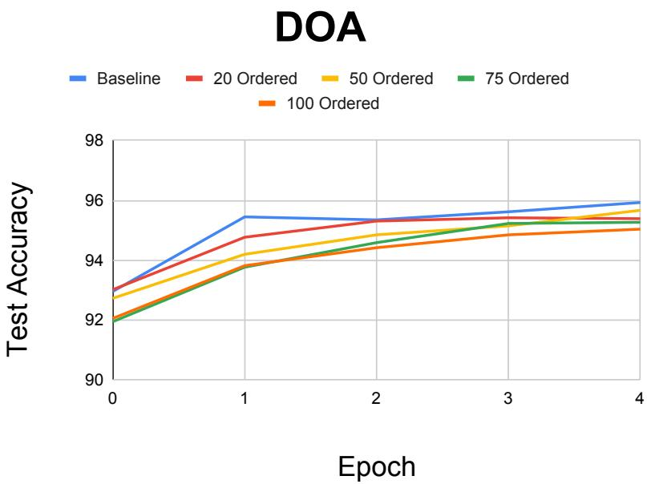
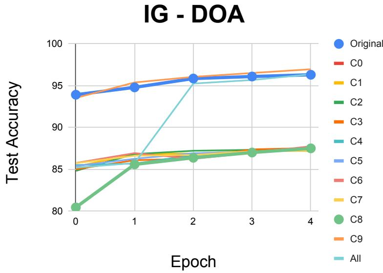
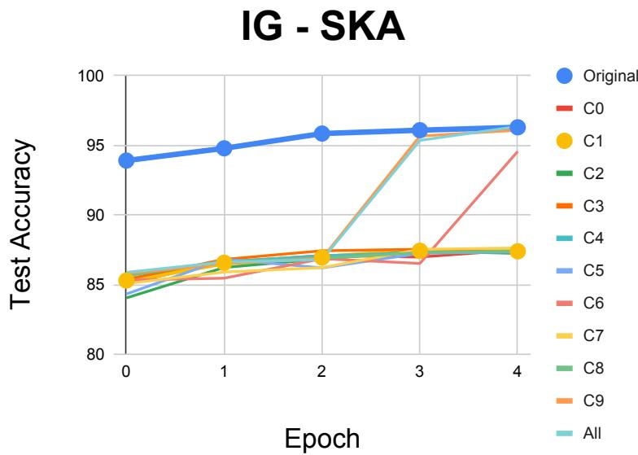

# Let the Neurons Die: Exploiting ReLU-Induced Model Degradation

Kexin Li<sup>1†</sup> , Wenjun Qiu<sup>1†</sup>B , Joshua Abraham<sup>‡</sup> , Aditi Maheshwari<sup>‡</sup> , David Lie<sup>1</sup>

Uni<sub>ve</sub>r<sub>s</sub>it<sub>y o</sub>f T<sub>o</sub>r<sub>o</sub>nt<sub>o,</sub> T<sub>o</sub>r<sub>o</sub>nt<sub>o,</sub> Ont<sub>a</sub>ri<sub>o,</sub> C<sub>a</sub>n<sub>a</sub>d<sub>a</sub> wenjun.qiu@mail.utoronto.ca

Abstract. Rectified linear unit (ReLU) networks can sufer from dying neurons, <sub>w</sub>h<sub>ere un</sub>it<sub>s w</sub>ith <sub>pers</sub>i<sub>s</sub>t<sub>en</sub>tl<sub>y nega</sub>ti<sub>ve pre-ac</sub>ti<sub>va</sub>ti<sub>ons pro</sub>d<sub>uce zero ou</sub>t<sub>pu</sub>t<sub>s,</sub> bl<sub>oc</sub>k<sub>-</sub> i<sub>ng gra</sub>di<sub>en</sub>t<sub>s</sub> th<sub>roug</sub>h th<sub>e</sub>i<sub>r ac</sub>ti<sub>va</sub>ti<sub>ons.</sub> T<sub>o exp</sub>l<sub>o</sub>it thi<sub>s</sub> f<sub>a</sub>il<sub>ure mo</sub>d<sub>e, we presen</sub>t th<sub>ree</sub> t<sub>ra</sub>i<sub>n</sub>i<sub>ng-</sub>ti<sub>me ava</sub>il<sub>a</sub>bilit<sub>y a</sub>tt<sub>ac</sub>k<sub>s</sub> b<sub>ase</sub>d <sub>on</sub> d<sub>a</sub>t<sub>a or</sub>d<sub>er</sub>i<sub>ng an</sub>d <sub>po</sub>i<sub>son</sub>i<sub>ng.</sub> We be<sub>g</sub>in with the basic d<sub>y</sub>namic data-orderin<sub>g</sub> attack (DOA), which <sub>g</sub>reedil<sub>y</sub> <sub>cons</sub>t<sub>ruc</sub>t<sub>s a</sub> t<sub>ra</sub>i<sub>n</sub>i<sub>ng pre</sub>fi<sub>x</sub> b<sub>y se</sub>l<sub>ec</sub>ti<sub>ng</sub> th<sub>e nex</sub>t <sub>examp</sub>l<sub>e</sub> th<sub>a</sub>t <sub>m</sub>i<sub>n</sub>i<sub>m</sub>i<sub>zes</sub> th<sub>e</sub> t<sub>arge</sub>t l<sub>ayer</sub>’<sub>s pos</sub>t<sub>-up</sub>d<sub>a</sub>t<sub>e we</sub>i<sub>g</sub>ht <sub>sum, a</sub>i<sub>m</sub>i<sub>ng</sub> t<sub>o pus</sub>h R<sub>e</sub>LU <sub>un</sub>it<sub>s</sub> t<sub>owar</sub>d <sub>nega</sub>ti<sub>ve</sub> <sub>pre-ac</sub>ti<sub>va</sub>ti<sub>ons w</sub>ith<sub>ou</sub>t <sub>mo</sub>dif<sub>y</sub>i<sub>ng</sub> t<sub>ra</sub>i<sub>n</sub>i<sub>ng samp</sub>l<sub>es or</sub> l<sub>a</sub>b<sub>e</sub>l<sub>s.</sub> W<sub>e</sub> th<sub>en</sub> d<sub>eve</sub>l<sub>op</sub> t<sub>wo</sub> <sub>po</sub>i<sub>son</sub>i<sub>ng</sub> <sub>a</sub>tt<sub>ac</sub>k<sub>s,</sub> IG<sub>-</sub>DOA <sub>an</sub>d IG<sub>-</sub>SKA<sub>,</sub> <sub>w</sub>hi<sub>c</sub>h <sub>use</sub> <sub>gra</sub>di<sub>en</sub>t i<sub>nvers</sub>i<sub>on</sub> t<sub>o</sub> <sub>syn</sub>th<sub>es</sub>i<sub>ze</sub> <sub>c</sub>l<sub>ass-con</sub>diti<sub>one</sub>d <sub>samp</sub>l<sub>es</sub> b<sub>y ma</sub>t<sub>c</sub>hi<sub>ng re</sub>f<sub>erence gra</sub>di<sub>en</sub>t<sub>s</sub> i<sub>n a</sub>d<sub>verse mo</sub>d<sub>e</sub>l <sub>s</sub>t<sub>a</sub>t<sub>es</sub> constructed through data ordering or soft knockout, respectively. Soft knockout rearranges weights across adjacent layers to concentrate negative contributions. On <sub>a</sub> f<sub>u</sub>ll<sub>y co</sub>nn<sub>ec</sub>t<sub>e</sub>d R<sub>e</sub>LU n<sub>e</sub>t<sub>wo</sub>rk tr<sub>a</sub>in<sub>e</sub>d <sub>o</sub>n MNIST<sub>, o</sub>rd<sub>e</sub>rin<sub>g</sub> 100 <sub>o</sub>f 60<sub>,</sub>000 tr<sub>a</sub>inin<sub>g</sub> <sub>examp</sub>l<sub>es re</sub>d<sub>uces</sub> t<sub>es</sub>t <sub>accuracy</sub> f<sub>rom</sub> 96% t<sub>o</sub> 95% <sub>a</sub>ft<sub>er on</sub>l<sub>y</sub> fi<sub>ve epoc</sub>h<sub>s.</sub> Addi<sub>ng</sub> 200 <sub>po</sub>i<sub>sone</sub>d <sub>samp</sub>l<sub>es</sub> f<sub>rom</sub> <sub>a</sub> <sub>s</sub>i<sub>ng</sub>l<sub>e</sub> <sub>c</sub>l<sub>ass</sub> <sub>re</sub>d<sub>uces</sub> t<sub>es</sub>t <sub>accuracy</sub> t<sub>o</sub> <sub>approx</sub>i<sub>ma</sub>t<sub>e</sub>l<sub>y</sub> 86<sub>-</sub>88% <sub>a</sub>ft<sub>er</sub> fi<sub>ve epoc</sub>h<sub>s</sub> i<sub>n mos</sub>t <sub>eva</sub>l<sub>ua</sub>t<sub>e</sub>d <sub>con</sub>diti<sub>ons, compare</sub>d <sub>w</sub>ith <sub>approx</sub>i<sub>-</sub> <sub>ma</sub>t<sub>e</sub>l<sub>y</sub> 96% <sub>un</sub>d<sub>er c</sub>l<sub>ean</sub> t<sub>ra</sub>i<sub>n</sub>i<sub>ng.</sub> Th<sub>ese resu</sub>lt<sub>s</sub> d<sub>emons</sub>t<sub>ra</sub>t<sub>e</sub> th<sub>a</sub>t R<sub>e</sub>LU<sub>-</sub>t<sub>arge</sub>t<sub>e</sub>d d<sub>a</sub>t<sub>a or</sub>d<sub>er</sub>i<sub>ng an</sub>d <sub>po</sub>i<sub>son</sub>i<sub>ng can</sub> i<sub>mpa</sub>i<sub>r</sub> l<sub>earn</sub>i<sub>ng w</sub>ith<sub>ou</sub>t di<sub>rec</sub>tl<sub>y mo</sub>dif<sub>y</sub>i<sub>ng</sub> th<sub>e</sub> <sub>v</sub>i<sub>c</sub>ti<sub>m mo</sub>d<sub>e</sub>l’<sub>s parame</sub>t<sub>ers.</sub> S<sub>ource co</sub>d<sub>e an</sub>d <sub>repro</sub>d<sub>uc</sub>ibilit<sub>y ma</sub>t<sub>er</sub>i<sub>a</sub>l<sub>s are ava</sub>il<sub>a</sub>bl<sub>e</sub> at https://github.com/Kexin6/let\_the\_neurons\_die.

## 1 Introduction

Rectified linear units (ReLU), $\sigma ( z ) = \operatorname* { m a x } ( 0 , z )$ <sub>, are common</sub>l<sub>y use</sub>d i<sub>n neura</sub>l <sub>ne</sub>t<sub>wor</sub>k<sub>s</sub> because of their com<sub>p</sub>utational sim<sub>p</sub>licit<sub>y</sub> and em<sub>p</sub>irical efectiveness [4]. B<sub>y</sub> its nature, R<sub>e</sub>LU h<sub>as a zero</sub> d<sub>er</sub>i<sub>va</sub>ti<sub>ve</sub> f<sub>or nega</sub>ti<sub>ve</sub> i<sub>npu</sub>t<sub>s, w</sub>hi<sub>c</sub>h l<sub>ea</sub>d<sub>s</sub> t<sub>o a</sub> f<sub>a</sub>il<sub>ure mo</sub>d<sub>e</sub> k<sub>nown</sub> <sub>as</sub> d<sub>y</sub>i<sub>ng</sub> R<sub>e</sub>LU<sub>.</sub> Thi<sub>s occurs w</sub>h<sub>en a un</sub>it’<sub>s ac</sub>ti<sub>va</sub>ti<sub>on rema</sub>i<sub>ns nega</sub>ti<sub>ve across</sub> t<sub>ra</sub>i<sub>n</sub>i<sub>ng</sub> sam<sub>p</sub>les and <sub>p</sub>roduces no <sub>g</sub>radient flow throu<sub>g</sub>h its activation [9]. In the case where man<sub>y</sub> <sub>un</sub>it<sub>s</sub> b<sub>ecome</sub> i<sub>nac</sub>ti<sub>ve,</sub> th<sub>e ne</sub>t<sub>wor</sub>k <sub>can</sub> l<sub>ose represen</sub>t<sub>a</sub>ti<sub>ona</sub>l <sub>capac</sub>it<sub>y an</sub>d b<sub>ecome</sub> difi<sub>cu</sub>lt t<sub>o op</sub>ti<sub>m</sub>i<sub>ze.</sub> Thi<sub>s</sub> b<sub>e</sub>h<sub>av</sub>i<sub>or ma</sub>k<sub>es</sub> R<sub>e</sub>LU i<sub>nac</sub>ti<sub>v</sub>it<sub>y a po</sub>t<sub>en</sub>ti<sub>a</sub>l t<sub>arge</sub>t f<sub>or</sub> t<sub>ra</sub>i<sub>n</sub>i<sub>ng-</sub>ti<sub>me</sub> <sub>ava</sub>il<sub>a</sub>bilit<sub>y a</sub>tt<sub>ac</sub>k<sub>s: a</sub>tt<sub>ac</sub>k<sub>s</sub> i<sub>n</sub>t<sub>en</sub>d<sub>e</sub>d t<sub>o re</sub>d<sub>uce</sub> l<sub>earn</sub>i<sub>ng a</sub>bilit<sub>y ra</sub>th<sub>er</sub> th<sub>an</sub> i<sub>n</sub>d<sub>uce a</sub> <sub>spec</sub>ifi<sub>c m</sub>i<sub>sc</sub>l<sub>ass</sub>ifi<sub>ca</sub>ti<sub>on.</sub>

P<sub>r</sub>i<sub>or wor</sub>k <sub>s</sub>h<sub>ows</sub> th<sub>a</sub>t <sub>an a</sub>tt<sub>ac</sub>k<sub>er can</sub> t<sub>r</sub>i<sub>gger</sub> thi<sub>s</sub> f<sub>a</sub>il<sub>ure mo</sub>d<sub>e</sub> b<sub>y rearrang</sub>i<sub>ng</sub> i<sub>n</sub>iti<sub>a</sub>l wei<sub>g</sub>hts while <sub>p</sub>reservin<sub>g</sub> their mar<sub>g</sub>inal statistics [5]. However, this a<sub>pp</sub>roach re<sub>q</sub>uires

<sub>con</sub>t<sub>ro</sub>l <sub>over</sub> th<sub>e mo</sub>d<sub>e</sub>l’<sub>s</sub> i<sub>n</sub>iti<sub>a</sub>li<sub>za</sub>ti<sub>on.</sub> S<sub>epara</sub>t<sub>e</sub>l<sub>y,</sub> d<sub>a</sub>t<sub>a-or</sub>d<sub>er</sub>i<sub>ng a</sub>tt<sub>ac</sub>k<sub>s s</sub>h<sub>ow</sub> th<sub>a</sub>t <sub>an</sub> <sub>a</sub>d<sub>versary can</sub> di<sub>srup</sub>t t<sub>ra</sub>i<sub>n</sub>i<sub>ng</sub> b<sub>y man</sub>i<sub>pu</sub>l<sub>a</sub>ti<sub>ng</sub> th<sub>e sequence o</sub>f <sub>o</sub>th<sub>erw</sub>i<sub>se unc</sub>h<sub>ange</sub>d exam<sub>p</sub>les, usin<sub>g</sub> loss-based scores to select their order [13]. Qiu’s surve<sub>y</sub> also identifies <sub>op</sub>ti<sub>m</sub>i<sub>za</sub>ti<sub>on</sub> f<sub>a</sub>il<sub>ures,</sub> i<sub>nc</sub>l<sub>u</sub>di<sub>ng van</sub>i<sub>s</sub>hi<sub>ng gra</sub>di<sub>en</sub>t<sub>s an</sub>d <sub>poor</sub> i<sub>n</sub>iti<sub>a</sub>li<sub>za</sub>ti<sub>on, as po</sub>t<sub>en</sub>ti<sub>a</sub>l directions for <sub>p</sub>oisonin<sub>g</sub> attacks [10]. Motivated b<sub>y</sub> these observations, we investi<sub>g</sub>ate <sub>w</sub>h<sub>e</sub>th<sub>er</sub> t<sub>ra</sub>i<sub>n</sub>i<sub>ng-samp</sub>l<sub>e or</sub>d<sub>er an</sub>d <sub>syn</sub>th<sub>e</sub>ti<sub>c</sub> d<sub>a</sub>t<sub>a can</sub> b<sub>e use</sub>d t<sub>o</sub> t<sub>arge</sub>t R<sub>e</sub>LU i<sub>nac</sub>ti<sub>v</sub>it<sub>y</sub> <sub>w</sub>ith<sub>ou</sub>t di<sub>rec</sub>tl<sub>y mo</sub>dif<sub>y</sub>i<sub>ng</sub> th<sub>e v</sub>i<sub>c</sub>ti<sub>m mo</sub>d<sub>e</sub>l’<sub>s parame</sub>t<sub>ers.</sub> W<sub>e cons</sub>id<sub>er a w</sub>hit<sub>e-</sub>b<sub>ox</sub> <sub>a</sub>tt<sub>ac</sub>k<sub>er w</sub>ith <sub>access</sub> t<sub>o</sub> th<sub>e mo</sub>d<sub>e</sub>l<sub>,</sub> l<sub>oss</sub> f<sub>unc</sub>ti<sub>on, an</sub>d t<sub>ra</sub>i<sub>n</sub>i<sub>ng</sub> d<sub>a</sub>t<sub>a, an</sub>d di<sub>s</sub>ti<sub>ngu</sub>i<sub>s</sub>h t<sub>wo</sub> f<sub>orms o</sub>f <sub>con</sub>t<sub>ro</sub>l<sub>.</sub> A<sub>n or</sub>d<sub>er-on</sub>l<sub>y a</sub>tt<sub>ac</sub>k<sub>er can reor</sub>d<sub>er ex</sub>i<sub>s</sub>ti<sub>ng examp</sub>l<sub>es w</sub>ith<sub>ou</sub>t <sub>c</sub>h<sub>ang</sub>i<sub>ng</sub> th<sub>e</sub>i<sub>r con</sub>t<sub>en</sub>t<sub>s or</sub> l<sub>a</sub>b<sub>e</sub>l<sub>s.</sub> A <sub>po</sub>i<sub>son</sub>i<sub>ng a</sub>tt<sub>ac</sub>k<sub>er can</sub> i<sub>ns</sub>t<sub>ea</sub>d <sub>a</sub>dd <sub>syn</sub>th<sub>e</sub>ti<sub>c,</sub> l<sub>a</sub>b<sub>e</sub>ll<sub>e</sub>d <sub>examp</sub>l<sub>es</sub> t<sub>o</sub> <sub>a</sub> t<sub>ra</sub>i<sub>n</sub>i<sub>ng</sub> <sub>se</sub>t th<sub>a</sub>t th<sub>e</sub> l<sub>earner</sub> <sub>s</sub>h<sub>u</sub>fl<sub>es.</sub> I<sub>n</sub> th<sub>e</sub> <sub>po</sub>i<sub>son</sub>i<sub>ng</sub> <sub>se</sub>tti<sub>ng,</sub> th<sub>e</sub> <sub>v</sub>i<sub>c</sub>ti<sub>m</sub> i<sub>s</sub> i<sub>n</sub>d<sub>epen</sub>d<sub>en</sub>tl<sub>y</sub> i<sub>n</sub>iti<sub>a</sub>li<sub>ze</sub>d<sub>.</sub> C<sub>ons</sub>t<sub>ruc</sub>ti<sub>ng a</sub>d<sub>verse we</sub>i<sub>g</sub>ht<sub>s</sub> i<sub>s</sub> th<sub>ere</sub>f<sub>ore no</sub>t <sub>enoug</sub>h<sub>:</sub> th<sub>e</sub> <sub>a</sub>tt<sub>ac</sub>k <sub>mus</sub>t <sub>ac</sub>t th<sub>roug</sub>h th<sub>e a</sub>dd<sub>e</sub>d <sub>examp</sub>l<sub>es ra</sub>th<sub>er</sub> th<sub>an re</sub>l<sub>y on</sub> i<sub>ns</sub>t<sub>a</sub>lli<sub>ng</sub> th<sub>ose we</sub>i<sub>g</sub>ht<sub>s</sub> <sub>or preserv</sub>i<sub>ng an a</sub>tt<sub>ac</sub>k<sub>er-se</sub>l<sub>ec</sub>t<sub>e</sub>d <sub>or</sub>d<sub>er.</sub>

T<sub>o exp</sub>l<sub>o</sub>it R<sub>e</sub>LU’<sub>s</sub> f<sub>a</sub>il<sub>ure mo</sub>d<sub>e un</sub>d<sub>er</sub> th<sub>ese cons</sub>t<sub>ra</sub>i<sub>n</sub>t<sub>s, we separa</sub>t<sub>e a</sub>d<sub>verse-s</sub>t<sub>a</sub>t<sub>e</sub> <sub>cons</sub>t<sub>ruc</sub>ti<sub>on</sub> f<sub>rom</sub> <sub>po</sub>i<sub>son</sub> <sub>syn</sub>th<sub>es</sub>i<sub>s.</sub> W<sub>e</sub> fi<sub>rs</sub>t i<sub>n</sub>t<sub>ro</sub>d<sub>uce</sub> <sub>a</sub> d<sub>ynam</sub>i<sub>c</sub> d<sub>a</sub>t<sub>a-or</sub>d<sub>er</sub>i<sub>ng</sub> <sub>a</sub>tt<sub>ac</sub>k (DOA), which <sub>g</sub>reedil<sub>y</sub> constructs an ordered <sub>p</sub>refix of existin<sub>g</sub> trainin<sub>g</sub> exam<sub>p</sub>les. At each <sub>pos</sub>iti<sub>on,</sub> it <sub>eva</sub>l<sub>ua</sub>t<sub>es</sub> <sub>unuse</sub>d <sub>can</sub>did<sub>a</sub>t<sub>es</sub> b<sub>y</sub> <sub>rep</sub>l<sub>ay</sub>i<sub>ng</sub> th<sub>e</sub> <sub>curren</sub>t <sub>pre</sub>fi<sub>x</sub> f<sub>o</sub>ll<sub>owe</sub>d b<sub>y</sub> <sub>eac</sub>h <sub>can</sub>did<sub>a</sub>t<sub>e</sub> f<sub>rom a common c</sub>h<sub>ec</sub>k<sub>po</sub>i<sub>n</sub>t<sub>,</sub> th<sub>en se</sub>l<sub>ec</sub>t<sub>s</sub> th<sub>e can</sub>did<sub>a</sub>t<sub>e</sub> th<sub>a</sub>t <sub>m</sub>i<sub>n</sub>i<sub>m</sub>i<sub>zes</sub> th<sub>e</sub> t<sub>arge</sub>t layer’s post-update weight sum. This objective aims to encourage negative pre-activations i<sub>n</sub> th<sub>e</sub> t<sub>arge</sub>t<sub>e</sub>d R<sub>e</sub>LU l<sub>ayer.</sub> Th<sub>e</sub> <sub>resu</sub>lti<sub>ng</sub> <sub>pre</sub>fi<sub>x</sub> i<sub>s</sub> <sub>p</sub>l<sub>ace</sub>d b<sub>e</sub>f<sub>ore</sub> th<sub>e</sub> <sub>rema</sub>i<sub>n</sub>i<sub>ng</sub> t<sub>ra</sub>i<sub>n</sub>i<sub>ng</sub> <sub>examp</sub>l<sub>es,</sub> l<sub>eav</sub>i<sub>ng</sub> th<sub>e examp</sub>l<sub>es an</sub>d l<sub>a</sub>b<sub>e</sub>l<sub>s unc</sub>h<sub>ange</sub>d<sub>.</sub> DOA <sub>serves</sub> b<sub>o</sub>th <sub>as a s</sub>t<sub>an</sub>d<sub>a</sub>l<sub>one</sub> <sub>or</sub>d<sub>er</sub>i<sub>ng a</sub>tt<sub>ac</sub>k <sub>an</sub>d <sub>as one rou</sub>t<sub>e</sub> t<sub>o cons</sub>t<sub>ruc</sub>ti<sub>ng an a</sub>d<sub>verse mo</sub>d<sub>e</sub>l <sub>s</sub>t<sub>a</sub>t<sub>e.</sub> W<sub>e</sub> th<sub>en</sub> d<sub>eve</sub>l<sub>op</sub> t<sub>wo po</sub>i<sub>so</sub>nin<sub>g a</sub>tt<sub>ac</sub>k<sub>s,</sub> IG<sub>-</sub>DOA <sub>a</sub>nd IG<sub>-</sub>SKA<sub>,</sub> th<sub>a</sub>t r<sub>epu</sub>r<sub>pose g</sub>r<sub>a</sub>di<sub>e</sub>nt in<sub>ve</sub>r<sub>s</sub>i<sub>o</sub>n f<sub>o</sub>r <sub>po</sub>i<sub>so</sub>n <sub>syn</sub>th<sub>es</sub>i<sub>s.</sub> IG<sub>-</sub>DOA <sub>uses a mo</sub>d<sub>e</sub>l <sub>s</sub>t<sub>a</sub>t<sub>e reac</sub>h<sub>e</sub>d th<sub>roug</sub>h DOA<sub>, w</sub>h<sub>ereas</sub> IG<sub>-</sub>SKA <sub>a</sub>d<sub>ap</sub>t<sub>s</sub> the soft-knockout construction of Grosse et al. [5]. Soft knockout rearran<sub>g</sub>es wei<sub>g</sub>hts across adjacent layers to concentrate negative contributions; in our poisoning pipeline, thi<sub>s cons</sub>t<sub>ruc</sub>ti<sub>on</sub> i<sub>s per</sub>f<sub>orme</sub>d <sub>on a</sub> l<sub>oca</sub>l <sub>mo</sub>d<sub>e</sub>l<sub>, no</sub>t <sub>on</sub> th<sub>e v</sub>i<sub>c</sub>ti<sub>m.</sub> At <sub>e</sub>ith<sub>er cons</sub>t<sub>ruc</sub>t<sub>e</sub>d state, we use <sub>g</sub>radient inversion [3] to o<sub>p</sub>timize s<sub>y</sub>nthetic in<sub>p</sub>uts whose <sub>g</sub>radients match class-specific reference updates under a cosine-based objective and an image prior. The <sub>resu</sub>lti<sub>ng</sub> l<sub>a</sub>b<sub>e</sub>ll<sub>e</sub>d <sub>samp</sub>l<sub>es are a</sub>dd<sub>e</sub>d t<sub>o</sub> th<sub>e</sub> i<sub>n</sub>d<sub>epen</sub>d<sub>en</sub>tl<sub>y</sub> i<sub>n</sub>iti<sub>a</sub>li<sub>ze</sub>d <sub>v</sub>i<sub>c</sub>ti<sub>m</sub>’<sub>s s</sub>h<sub>u</sub>fl<sub>e</sub>d t<sub>ra</sub>i<sub>n</sub>i<sub>ng</sub> <sub>se</sub>t<sub>.</sub>

W<sub>e eva</sub>l<sub>ua</sub>t<sub>e a</sub>ll th<sub>ree a</sub>tt<sub>ac</sub>k<sub>s on a</sub> f<sub>u</sub>ll<sub>y connec</sub>t<sub>e</sub>d R<sub>e</sub>LU <sub>ne</sub>t<sub>wor</sub>k t<sub>ra</sub>i<sub>ne</sub>d <sub>on</sub> MNIST <sub>over</sub> fi<sub>ve epoc</sub>h<sub>s.</sub> O<sub>r</sub>d<sub>er</sub>i<sub>ng</sub> 100 <sub>o</sub>f 60<sub>,</sub>000 t<sub>ra</sub>i<sub>n</sub>i<sub>ng examp</sub>l<sub>es re</sub>d<sub>uces</sub> t<sub>es</sub>t <sub>accuracy</sub> f<sub>rom</sub> 95<sub>.</sub>93% t<sub>o</sub> 95<sub>.</sub>04% <sub>a</sub>t th<sub>e en</sub>d <sub>o</sub>f thi<sub>s</sub> t<sub>ra</sub>i<sub>n</sub>i<sub>ng</sub> b<sub>u</sub>d<sub>ge</sub>t<sub>.</sub> F<sub>or</sub> th<sub>e po</sub>i<sub>son</sub>i<sub>ng a</sub>tt<sub>ac</sub>k<sub>s, a</sub>ddi<sub>ng</sub> 200 <sub>syn</sub>th<sub>e</sub>ti<sub>c examp</sub>l<sub>es</sub> l<sub>a</sub>b<sub>e</sub>ll<sub>e</sub>d <sub>as a s</sub>i<sub>ng</sub>l<sub>e c</sub>l<sub>ass</sub> l<sub>eaves mos</sub>t <sub>eva</sub>l<sub>ua</sub>t<sub>e</sub>d <sub>con</sub>diti<sub>ons</sub> <sub>a</sub>t <sub>app</sub>r<sub>ox</sub>im<sub>a</sub>t<sub>e</sub>l<sub>y</sub> 86<sub>-</sub>88% <sub>accu</sub>r<sub>acy, co</sub>m<sub>pa</sub>r<sub>e</sub>d <sub>w</sub>ith <sub>app</sub>r<sub>ox</sub>im<sub>a</sub>t<sub>e</sub>l<sub>y</sub> 96% <sub>u</sub>nd<sub>e</sub>r <sub>c</sub>l<sub>ea</sub>n t<sub>ra</sub>i<sub>n</sub>i<sub>ng.</sub> S<sub>ome po</sub>i<sub>son</sub>i<sub>ng con</sub>diti<sub>ons recover w</sub>ithi<sub>n</sub> th<sub>e eva</sub>l<sub>ua</sub>ti<sub>on per</sub>i<sub>o</sub>d<sub>.</sub> Th<sub>ese resu</sub>lt<sub>s</sub> d<sub>emons</sub>t<sub>ra</sub>t<sub>e mo</sub>d<sub>es</sub>t d<sub>egra</sub>d<sub>a</sub>ti<sub>on</sub> f<sub>rom or</sub>d<sub>er</sub>i<sub>ng a</sub>l<sub>one an</sub>d l<sub>arger, c</sub>l<sub>ass-</sub>d<sub>epen</sub>d<sub>en</sub>t l<sub>osses</sub> f<sub>rom gra</sub>di<sub>en</sub>t<sub>-</sub>i<sub>nver</sub>t<sub>e</sub>d <sub>po</sub>i<sub>sons, even w</sub>h<sub>en</sub> th<sub>e augmen</sub>t<sub>e</sub>d t<sub>ra</sub>i<sub>n</sub>i<sub>ng se</sub>t i<sub>s s</sub>h<sub>u</sub>fl<sub>e</sub>d<sub>.</sub>

I<sub>n</sub> <sub>summary,</sub> thi<sub>s</sub> <sub>paper</sub> <sub>ma</sub>k<sub>es</sub> th<sub>e</sub> f<sub>o</sub>ll<sub>ow</sub>i<sub>ng</sub> <sub>con</sub>t<sub>r</sub>ib<sub>u</sub>ti<sub>ons:</sub>

1. ReLU-targeted data ordering. We introduce DOA, a greedy ordering attack that <sub>m</sub>i<sub>n</sub>i<sub>m</sub>i<sub>zes</sub> <sub>a</sub> t<sub>arge</sub>t<sub>e</sub>d l<sub>ayer</sub>’<sub>s</sub> <sub>pos</sub>t<sub>-up</sub>d<sub>a</sub>t<sub>e</sub> <sub>we</sub>i<sub>g</sub>ht <sub>sum</sub> <sub>w</sub>hil<sub>e</sub> l<sub>eav</sub>i<sub>ng</sub> t<sub>ra</sub>i<sub>n</sub>i<sub>ng</sub> <sub>examp</sub>l<sub>es</sub> <sub>an</sub>d l<sub>a</sub>b<sub>e</sub>l<sub>s unc</sub>h<sub>ange</sub>d<sub>.</sub>

2. Availability poisoning through gradient inversion. We develop IG-DOA and IG-SKA<sub>, w</sub>hi<sub>c</sub>h <sub>syn</sub>th<sub>es</sub>i<sub>ze po</sub>i<sub>sone</sub>d t<sub>ra</sub>i<sub>n</sub>i<sub>ng samp</sub>l<sub>es</sub> b<sub>y ma</sub>t<sub>c</sub>hi<sub>ng re</sub>f<sub>erence gra</sub>di<sub>en</sub>t<sub>s</sub> <sub>a</sub>t <sub>mo</sub>d<sub>e</sub>l <sub>s</sub>t<sub>a</sub>t<sub>es cons</sub>t<sub>ruc</sub>t<sub>e</sub>d th<sub>roug</sub>h d<sub>a</sub>t<sub>a or</sub>d<sub>er</sub>i<sub>ng or a</sub>d<sub>ap</sub>t<sub>e</sub>d <sub>so</sub>ft k<sub>noc</sub>k<sub>ou</sub>t<sub>.</sub>

3. A proof-of-concept evaluation on MNIST. We quantify accuracy degradation <sub>across or</sub>d<sub>ere</sub>d<sub>-pre</sub>fi<sub>x</sub> l<sub>eng</sub>th<sub>s an</sub>d <sub>c</sub>l<sub>ass-con</sub>diti<sub>one</sub>d <sub>po</sub>i<sub>son</sub>i<sub>ng se</sub>tti<sub>ngs, s</sub>h<sub>ow</sub>i<sub>ng</sub> th<sub>a</sub>t th<sub>e genera</sub>t<sub>e</sub>d <sub>po</sub>i<sub>sons can</sub> i<sub>mpa</sub>i<sub>r</sub> l<sub>earn</sub>i<sub>ng un</sub>d<sub>er s</sub>h<sub>u</sub>fl<sub>e</sub>d t<sub>ra</sub>i<sub>n</sub>i<sub>ng an</sub>d i<sub>n</sub>d<sub>epen</sub>d<sub>en</sub>t <sub>v</sub>i<sub>c</sub>ti<sub>m</sub> i<sub>n</sub>iti<sub>a</sub>li<sub>za</sub>ti<sub>on.</sub>

## 2 Background and Related Work

ReLU failure modes. Rectified linear units (ReLU) make dee<sub>p</sub> neural networks easier and faster to train, <sub>p</sub>artiall<sub>y</sub> because the<sub>y</sub> su<sub>pp</sub>ort s<sub>p</sub>arse activations and sim<sub>p</sub>le o<sub>p</sub>timization [4]. Th<sub>e</sub> <sub>same</sub> d<sub>es</sub>i<sub>gn,</sub> h<sub>owever,</sub> <sub>a</sub>l<sub>so</sub> <sub>crea</sub>t<sub>es</sub> <sub>a</sub> <sub>we</sub>ll<sub>-</sub>k<sub>nown</sub> <sub>wea</sub>k<sub>ness:</sub> f<sub>or</sub> <sub>nega</sub>ti<sub>ve</sub> <sub>pre-</sub> <sub>ac</sub>ti<sub>va</sub>ti<sub>ons,</sub> th<sub>e</sub> d<sub>er</sub>i<sub>va</sub>ti<sub>ve</sub> b<sub>ecomes zero.</sub> A<sub>s a resu</sub>lt<sub>, some un</sub>it<sub>s</sub> b<sub>ecome</sub> d<sub>eac</sub>ti<sub>va</sub>t<sub>e</sub>d and ma<sub>y</sub> never recover durin<sub>g</sub> trainin<sub>g</sub>, a <sub>p</sub>henomenon referred to as “d<sub>y</sub>in<sub>g</sub> ReLU” [9]. G<sub>rosse e</sub>t <sub>a</sub>l<sub>. s</sub>h<sub>ow</sub> th<sub>a</sub>t thi<sub>s</sub> i<sub>s no</sub>t <sub>on</sub>l<sub>y an op</sub>ti<sub>m</sub>i<sub>za</sub>ti<sub>on</sub> i<sub>ssue</sub> b<sub>u</sub>t <sub>can a</sub>l<sub>so</sub> h<sub>ave secur</sub>it<sub>y</sub> i<sub>mp</sub>li<sub>ca</sub>ti<sub>ons.</sub> B<sub>y</sub> <sub>care</sub>f<sub>u</sub>ll<sub>y</sub> <sub>permu</sub>ti<sub>ng</sub> <sub>we</sub>i<sub>g</sub>ht<sub>s</sub> <sub>a</sub>t i<sub>n</sub>iti<sub>a</sub>li<sub>za</sub>ti<sub>on,</sub> <sub>an</sub> <sub>a</sub>tt<sub>ac</sub>k<sub>er</sub> <sub>can</sub> <sub>res</sub>h<sub>ape</sub> h<sub>ow pos</sub>iti<sub>ve an</sub>d <sub>nega</sub>ti<sub>ve con</sub>t<sub>r</sub>ib<sub>u</sub>ti<sub>ons propaga</sub>t<sub>e across consecu</sub>ti<sub>ve</sub> l<sub>ayers, caus</sub>i<sub>ng</sub> downstream units to become inactive with hi<sub>g</sub>h <sub>p</sub>robabilit<sub>y</sub> [5]. Their attack assumes <sub>con</sub>t<sub>ro</sub>l <sub>over</sub> th<sub>e</sub> i<sub>n</sub>iti<sub>a</sub>l <sub>we</sub>i<sub>g</sub>ht<sub>s.</sub> O<sub>ur se</sub>tti<sub>ng</sub> i<sub>s</sub> dif<sub>eren</sub>t<sub>: we s</sub>t<sub>ar</sub>t f<sub>rom an or</sub>di<sub>nary</sub> i<sub>n</sub>iti<sub>a</sub>li<sub>za</sub>ti<sub>on an</sub>d <sub>eva</sub>l<sub>ua</sub>t<sub>e w</sub>h<sub>e</sub>th<sub>er</sub> th<sub>e</sub> t<sub>ra</sub>i<sub>n</sub>i<sub>ng sequence</sub> it<sub>se</sub>lf <sub>can</sub> d<sub>r</sub>i<sub>ve</sub> th<sub>e ne</sub>t<sub>wor</sub>k t<sub>owar</sub>d <sub>a s</sub>i<sub>m</sub>il<sub>ar</sub>l<sub>y</sub> h<sub>arm</sub>f<sub>u</sub>l <sub>s</sub>t<sub>a</sub>t<sub>e.</sub> W<sub>e</sub> th<sub>en s</sub>t<sub>u</sub>d<sub>y w</sub>h<sub>e</sub>th<sub>er gra</sub>di<sub>en</sub>t<sub>s pro</sub>d<sub>uce</sub>d i<sub>n</sub> th<sub>a</sub>t <sub>s</sub>t<sub>a</sub>t<sub>e</sub> <sub>can</sub> b<sub>e use</sub>d t<sub>o cons</sub>t<sub>ruc</sub>t <sub>ma</sub>li<sub>c</sub>i<sub>ous</sub> t<sub>ra</sub>i<sub>n</sub>i<sub>ng samp</sub>l<sub>es.</sub>

T<sub>ra</sub>i<sub>n</sub>i<sub>ng-</sub>ti<sub>me</sub> <sub>a</sub>tt<sub>ac</sub>k<sub>s.</sub> T<sub>ra</sub>i<sub>n</sub>i<sub>ng-</sub>ti<sub>me</sub> <sub>po</sub>i<sub>son</sub>i<sub>ng</sub> <sub>a</sub>tt<sub>ac</sub>k<sub>s</sub> <sub>o</sub>ft<sub>en</sub> i<sub>n</sub>t<sub>ro</sub>d<sub>uce</sub> <sub>a</sub>d<sub>versar</sub>i<sub>a</sub>ll<sub>y</sub> <sub>c</sub>h<sub>osen</sub> <sub>examp</sub>l<sub>es</sub> <sub>an</sub>d/<sub>or</sub> l<sub>a</sub>b<sub>e</sub>l<sub>s.</sub> E<sub>ar</sub>l<sub>y</sub> <sub>wor</sub>k <sub>s</sub>t<sub>u</sub>di<sub>e</sub>d <sub>ava</sub>il<sub>a</sub>bilit<sub>y</sub> <sub>a</sub>tt<sub>ac</sub>k<sub>s</sub> <sub>ma</sub>i<sub>n</sub>l<sub>y</sub> i<sub>n</sub> <sub>convex</sub> l<sub>earn</sub>i<sub>ng se</sub>tti<sub>ngs, w</sub>h<sub>ere po</sub>i<sub>sone</sub>d d<sub>a</sub>t<sub>a are op</sub>ti<sub>m</sub>i<sub>ze</sub>d t<sub>o</sub> d<sub>egra</sub>d<sub>e overa</sub>ll <sub>mo</sub>d<sub>e</sub>l <sub>per</sub>f<sub>or-</sub> mance [1,7]. Other work considers clean-label attacks, which <sub>p</sub>reserve a<sub>pp</sub>arentl<sub>y</sub> correct labels while steerin<sub>g</sub> the model towards s<sub>p</sub>ecific errors [12]. Defenses such as certified filt<sub>er</sub>i<sub>ng</sub> <sub>can</sub> <sub>prov</sub>id<sub>e</sub> <sub>guaran</sub>t<sub>ees</sub> <sub>w</sub>ith b<sub>oun</sub>d<sub>e</sub>d <sub>con</sub>t<sub>am</sub>i<sub>na</sub>ti<sub>on,</sub> <sub>prov</sub>id<sub>e</sub>d th<sub>a</sub>t th<sub>e</sub> l<sub>earn</sub>i<sub>ng</sub> settin<sub>g</sub> satisfies certain assum<sub>p</sub>tions [14]. More recent attacks use <sub>g</sub>radient-based o<sub>p</sub>timization, includin<sub>g g</sub>radient ali<sub>g</sub>nment, to make <sub>p</sub>oisonin<sub>g p</sub>ractical for dee<sub>p</sub> networks [2]. O<sub>ur goa</sub>l i<sub>s</sub> dif<sub>eren</sub>t f<sub>rom</sub> b<sub>ac</sub>kd<sub>oor</sub> i<sub>nser</sub>ti<sub>on or</sub> f<sub>orc</sub>i<sub>ng a par</sub>ti<sub>cu</sub>l<sub>ar m</sub>i<sub>sc</sub>l<sub>ass</sub>ifi<sub>ca</sub>ti<sub>on.</sub> W<sub>e</sub> f<sub>ocus on ava</sub>il<sub>a</sub>bilit<sub>y: re</sub>d<sub>uc</sub>i<sub>ng</sub> th<sub>e mo</sub>d<sub>e</sub>l’<sub>s a</sub>bilit<sub>y</sub> t<sub>o</sub> l<sub>earn e</sub>f<sub>ec</sub>ti<sub>ve</sub>l<sub>y.</sub>

Data orderin<sub>g</sub>. The trajector<sub>y</sub> taken b<sub>y</sub> Stochastic Gradient Descent (SGD) de<sub>p</sub>ends on th<sub>e</sub> <sub>or</sub>d<sub>er</sub> i<sub>n</sub> <sub>w</sub>hi<sub>c</sub>h t<sub>ra</sub>i<sub>n</sub>i<sub>ng</sub> <sub>examp</sub>l<sub>es</sub> <sub>are</sub> <sub>presen</sub>t<sub>e</sub>d<sub>,</sub> <sub>espec</sub>i<sub>a</sub>ll<sub>y</sub> i<sub>n</sub> <sub>non-convex</sub> <sub>mo</sub>d<sub>e</sub>l<sub>s.</sub> Sh<sub>uma</sub>il<sub>ov e</sub>t <sub>a</sub>l<sub>. s</sub>h<sub>owe</sub>d th<sub>a</sub>t thi<sub>s</sub> d<sub>epen</sub>d<sub>ence can</sub> b<sub>e exp</sub>l<sub>o</sub>it<sub>e</sub>d th<sub>roug</sub>h <sub>ma</sub>li<sub>c</sub>i<sub>ous</sub> b<sub>a</sub>t<sub>c</sub>h <sub>or</sub>d<sub>er</sub>i<sub>ng,</sub> <sub>res</sub>h<sub>u</sub>fli<sub>ng,</sub> <sub>an</sub>d <sub>rep</sub>l<sub>acemen</sub>t<sub>.</sub> I<sub>n</sub> <sub>some</sub> <sub>cases,</sub> <sub>even</sub> <sub>one</sub> <sub>a</sub>d<sub>versar</sub>i<sub>a</sub>ll<sub>y</sub> <sub>arrange</sub>d e<sub>p</sub>och can undo <sub>p</sub>revious trainin<sub>g</sub> <sub>p</sub>ro<sub>g</sub>ress or afect model behaviours [13]. Their methods <sub>ran</sub>k <sub>examp</sub>l<sub>es us</sub>i<sub>ng</sub> l<sub>oss-</sub>b<sub>ase</sub>d <sub>scores compu</sub>t<sub>e</sub>d <sub>on a</sub> t<sub>arge</sub>t <sub>or surroga</sub>t<sub>e mo</sub>d<sub>e</sub>l<sub>.</sub> O<sub>ur</sub> <sub>approac</sub>h <sub>uses</sub> <sub>a</sub> <sub>s</sub>i<sub>mp</sub>l<sub>er</sub> <sub>cr</sub>it<sub>er</sub>i<sub>on.</sub> Th<sub>e</sub> <sub>gree</sub>d<sub>y</sub> <sub>or</sub>d<sub>er</sub>i<sub>ng</sub> <sub>po</sub>li<sub>cy</sub> <sub>scores</sub> <sub>examp</sub>l<sub>es</sub> <sub>accor</sub>di<sub>ng</sub> t<sub>o</sub> th<sub>e</sub>i<sub>r e</sub>f<sub>ec</sub>t <sub>on</sub> th<sub>e sum o</sub>f <sub>we</sub>i<sub>g</sub>ht<sub>s</sub> i<sub>n a c</sub>h<sub>osen</sub> l<sub>ayer, w</sub>ith th<sub>e a</sub>i<sub>m o</sub>f <sub>pus</sub>hi<sub>ng a</sub> R<sub>e</sub>LU l<sub>ayer</sub> t<sub>owar</sub>d<sub>s more nega</sub>ti<sub>ve pre-ac</sub>ti<sub>va</sub>ti<sub>ons.</sub>

G<sub>ra</sub>di<sub>en</sub>t i<sub>nvers</sub>i<sub>on.</sub> G<sub>ra</sub>di<sub>en</sub>t i<sub>nvers</sub>i<sub>on a</sub>tt<sub>ac</sub>k<sub>s were or</sub>i<sub>g</sub>i<sub>na</sub>ll<sub>y</sub> d<sub>eve</sub>l<sub>ope</sub>d t<sub>o recover</sub> <sub>p</sub>rivate trainin<sub>g</sub> in<sub>p</sub>uts from <sub>g</sub>radients shared durin<sub>g</sub> trainin<sub>g</sub> [17,3,16]. For instance, Geiping et al. combine a cosine-based gradient matching objective with image priors <sub>an</sub>d <sub>s</sub>h<sub>ow</sub> th<sub>a</sub>t d<sub>e</sub>t<sub>a</sub>il<sub>e</sub>d i<sub>npu</sub>t<sub>s can</sub> b<sub>e recons</sub>t<sub>ruc</sub>t<sub>e</sub>d<sub>.</sub> W<sub>e repurpose</sub> th<sub>e gra</sub>di<sub>en</sub>t i<sub>nvers</sub>i<sub>on</sub> <sub>a</sub>tt<sub>ac</sub>k<sub>, w</sub>h<sub>ere we op</sub>ti<sub>m</sub>i<sub>ze</sub> t<sub>owar</sub>d<sub>s</sub> th<sub>e genera</sub>ti<sub>on o</sub>f <sub>po</sub>i<sub>sone</sub>d t<sub>ra</sub>i<sub>n</sub>i<sub>ng samp</sub>l<sub>es w</sub>h<sub>en</sub> th<sub>e</sub> <sub>correspon</sub>di<sub>ng gra</sub>di<sub>en</sub>t<sub>s are o</sub>b<sub>serve</sub>d <sub>a</sub>t <sub>a</sub> d<sub>e</sub>lib<sub>era</sub>t<sub>e</sub>l<sub>y</sub> h<sub>arm</sub>f<sub>u</sub>l <sub>mo</sub>d<sub>e</sub>l <sub>s</sub>t<sub>a</sub>t<sub>e.</sub>

## 3 Design

## 3.1 Threat Model and Assumptions

W<sub>e cons</sub>id<sub>er an a</sub>tt<sub>ac</sub>k<sub>er w</sub>ith <sub>w</sub>hit<sub>e-</sub>b<sub>ox access</sub> t<sub>o</sub> th<sub>e mo</sub>d<sub>e</sub>l <sub>arc</sub>hit<sub>ec</sub>t<sub>ure w</sub>ith <sub>parame</sub>t<sub>ers</sub> �<sub>,</sub> l<sub>oss</sub> f<sub>unc</sub>ti<sub>on</sub> $\mathcal { L } ,$ <sub>, an</sub>d t<sub>ra</sub>i<sub>n</sub>i<sub>ng</sub> d<sub>a</sub>t<sub>a</sub> $D = \{ ( x _ { i } , y _ { i } ) \} _ { i = 1 } ^ { n }$ <sub>.</sub> Thi<sub>s</sub> i<sub>s rea</sub>li<sub>s</sub>ti<sub>c</sub> f<sub>or a comprom</sub>i<sub>se</sub>d ML t<sub>ra</sub>i<sub>n</sub>i<sub>ng serv</sub>i<sub>ce or an</sub> i<sub>ns</sub>id<sub>er w</sub>ith <sub>con</sub>t<sub>ro</sub>l <sub>over</sub> th<sub>e</sub> t<sub>ra</sub>i<sub>n</sub>i<sub>ng p</sub>i<sub>pe</sub>li<sub>ne, suc</sub>h <sub>as</sub> d<sub>a</sub>t<sub>a</sub> <sub>pre-process</sub>i<sub>ng.</sub> Th<sub>e a</sub>tt<sub>ac</sub>k<sub>er</sub>’<sub>s goa</sub>l i<sub>s</sub> t<sub>o</sub> d<sub>egra</sub>d<sub>e mo</sub>d<sub>e</sub>l <sub>ava</sub>il<sub>a</sub>bilit<sub>y: re</sub>d<sub>uc</sub>i<sub>ng</sub> i<sub>n</sub>f<sub>erence</sub> <sub>pre</sub>di<sub>c</sub>ti<sub>on</sub> <sub>accuracy</sub> <sub>an</sub>d <sub>expan</sub>di<sub>ng</sub> th<sub>e</sub> <sub>mo</sub>d<sub>e</sub>l t<sub>ra</sub>i<sub>n</sub>i<sub>ng</sub> ti<sub>me.</sub> W<sub>e</sub> d<sub>o</sub> <sub>no</sub>t <sub>assume</sub> <sub>access</sub> t<sub>o</sub> t<sub>es</sub>t d<sub>a</sub>t<sub>a</sub> d<sub>ur</sub>i<sub>ng</sub> i<sub>n</sub>f<sub>erence.</sub> S<sub>pec</sub>ifi<sub>ca</sub>ll<sub>y, we</sub> di<sub>s</sub>ti<sub>ngu</sub>i<sub>s</sub>h t<sub>wo capa</sub>biliti<sub>es:</sub>

1. Order-only attacker (DOA). The attacker can re-order existing, correctly labelled d<sub>a</sub>t<sub>a</sub> d<sub>ur</sub>i<sub>ng</sub> d<sub>a</sub>t<sub>a</sub> <sub>pre-process</sub>i<sub>ng,</sub> <sub>w</sub>ith<sub>ou</sub>t <sub>c</sub>h<sub>ang</sub>i<sub>ng</sub> th<sub>e</sub> t<sub>ra</sub>i<sub>n</sub>i<sub>ng</sub> <sub>samp</sub>l<sub>es,</sub> l<sub>a</sub>b<sub>e</sub>l<sub>s,</sub> <sub>mo</sub>d<sub>e</sub>l <sub>parame</sub>t<sub>ers,</sub> <sub>or</sub> t<sub>ra</sub>i<sub>n</sub>i<sub>ng</sub> d<sub>ynam</sub>i<sub>cs.</sub>

2. Poisoning attacker (IG-DOA/IG-SKA). The attacker may add synthetic, labelled d<sub>a</sub>t<sub>a</sub> t<sub>o a</sub> t<sub>ra</sub>i<sub>n</sub>i<sub>ng se</sub>t th<sub>a</sub>t th<sub>e</sub> l<sub>earner s</sub>h<sub>u</sub>fl<sub>es.</sub> Th<sub>e v</sub>i<sub>c</sub>ti<sub>m mo</sub>d<sub>e</sub>l i<sub>s</sub> i<sub>n</sub>iti<sub>a</sub>li<sub>ze</sub>d i<sub>n</sub>d<sub>epen</sub>d<sub>en</sub>tl<sub>y,</sub> <sub>an</sub>d th<sub>e</sub> <sub>a</sub>tt<sub>ac</sub>k<sub>er</sub> d<sub>oes</sub> <sub>no</sub>t di<sub>rec</sub>tl<sub>y</sub> <sub>a</sub>lt<sub>er</sub> it<sub>s</sub> <sub>parame</sub>t<sub>ers.</sub>

## 3.2 Dynamic Data Ordering

L<sub>e</sub>t $\theta _ { 0 }$ b<sub>e</sub> th<sub>e v</sub>i<sub>c</sub>ti<sub>m</sub> i<sub>n</sub>iti<sub>a</sub>li<sub>za</sub>ti<sub>on an</sub>d l<sub>e</sub>t $s \subset D$ b<sub>e an a</sub>tt<sub>ac</sub>k<sub>er-v</sub>i<sub>s</sub>ibl<sub>e can</sub>did<sub>a</sub>t<sub>e poo</sub>l<sub>.</sub> At <sub>or</sub>d<sub>er</sub>i<sub>ng s</sub>t<sub>ep</sub> �<sub>,</sub> th<sub>e a</sub>tt<sub>ac</sub>k<sub>er</sub> h<sub>as a pre</sub>fi<sub>x</sub> $C _ { t } = ( i _ { 1 } , \ldots , i _ { t } )$ <sub>.</sub> F<sub>or eac</sub>h <sub>unuse</sub>d <sub>can</sub>did<sub>a</sub>t<sub>e</sub> $i \in S ,$ <sub>, a</sub> t<sub>emporary mo</sub>d<sub>e</sub>l i<sub>s res</sub>t<sub>ore</sub>d t<sub>o</sub> th<sub>e same c</sub>h<sub>ec</sub>k<sub>po</sub>i<sub>n</sub>t <sub>an</sub>d <sub>up</sub>d<sub>a</sub>t<sub>e</sub>d <sub>sequen</sub>ti<sub>a</sub>ll<sub>y on</sub> $C _ { t } \parallel i .$ D<sub>eno</sub>t<sub>e</sub> th<sub>e resu</sub>lti<sub>ng</sub> t<sub>arge</sub>t<sub>-</sub>l<sub>ayer we</sub>i<sub>g</sub>ht<sub>s</sub> b<sub>y</sub> $W _ { \ell } ^ { ( t , i ) }$ <sub>.</sub> Th<sub>e can</sub>did<sub>a</sub>t<sub>es are se</sub>l<sub>ec</sub>t<sub>e</sub>d b<sub>ase</sub>d <sub>on</sub> th<sub>e score:</sub>

$$
s _ { t } ( i ) = \mathbf { 1 } ^ { \top } W _ { \ell } ^ { ( t , i ) } \mathbf { 1 } , \qquad i _ { t + 1 } = \arg \operatorname* { m i n } _ { i \in S \backslash C _ { t } } s _ { t } ( i ) .\tag{1}
$$

We <sub>p</sub>resent the D<sub>y</sub>namic Data Orderin<sub>g</sub> (DOA) in Al<sub>g</sub>orithm 1.

## 3.3 Soft-Knockout Weight Construction

The alternative front-end ada<sub>p</sub>ts the soft-knockout construction of [5]. For consecutive <sub>a</sub>fi<sub>ne</sub> l<sub>ayers</sub>

$$
y = \mathrm { R e L U } ( B \mathrm { R e L U } ( A x + a ) + b ) ,\tag{2}
$$

Th<sub>e a</sub>tt<sub>ac</sub>k <sub>sor</sub>t<sub>s eac</sub>h <sub>we</sub>i<sub>g</sub>ht <sub>ma</sub>t<sub>r</sub>i<sub>x, concen</sub>t<sub>ra</sub>t<sub>es a</sub> f<sub>rac</sub>ti<sub>on � o</sub>f it<sub>s sma</sub>ll<sub>es</sub>t <sub>en</sub>t<sub>r</sub>i<sub>es</sub> i<sub>n</sub>t<sub>o</sub> <sub>se</sub>l<sub>ec</sub>t<sub>e</sub>d <sub>rows</sub> <sub>o</sub>f �<sub>,</sub> <sub>an</sub>d <sub>p</sub>l<sub>aces</sub> th<sub>e</sub> <sub>correspon</sub>di<sub>ng</sub> <sub>en</sub>t<sub>r</sub>i<sub>es</sub> i<sub>n</sub> <sub>se</sub>l<sub>ec</sub>t<sub>e</sub>d <sub>co</sub>l<sub>umns</sub> <sub>o</sub>f �<sub>.</sub> Alt<sub>erna</sub>ti<sub>ng row- an</sub>d <sub>co</sub>l<sub>umn-w</sub>i<sub>se arrangemen</sub>t<sub>s</sub> “<sub>cross</sub>” th<sub>e</sub> l<sub>ow-we</sub>i<sub>g</sub>ht <sub>reg</sub>i<sub>ons,</sub> <sub>re</sub>d<sub>uc</sub>i<sub>ng</sub> th<sub>e pro</sub>b<sub>a</sub>bilit<sub>y</sub> th<sub>a</sub>t <sub>pos</sub>iti<sub>ve gra</sub>di<sub>en</sub>t<sub>s surv</sub>i<sub>ve</sub> b<sub>o</sub>th <sub>rec</sub>tifi<sub>ers.</sub> U<sub>n</sub>lik<sub>e</sub> DOA<sub>,</sub> SKA di<sub>rec</sub>tl<sub>y</sub> <sub>cons</sub>t<sub>ruc</sub>t<sub>s</sub> $\theta ^ { \star }$ <sub>an</sub>d th<sub>ere</sub>f<sub>ore</sub> <sub>presumes</sub> <sub>con</sub>t<sub>ro</sub>l <sub>o</sub>f<sub>,</sub> <sub>or</sub> <sub>an</sub> <sub>o</sub>fli<sub>ne</sub> <sub>copy</sub> <sub>o</sub>f<sub>,</sub> th<sub>e</sub> <sub>mo</sub>d<sub>e</sub>l <sub>we</sub>i<sub>g</sub>ht<sub>s</sub> d<sub>ur</sub>i<sub>ng</sub> t<sub>ra</sub>i<sub>n</sub>i<sub>ng.</sub>

```latex
Algorithm 1 Dynamic Data Ordering Attack (DOA)
Require: Checkpoint $\theta _ { 0 } ,$ candidate <sub>p</sub>ool S, la<sub>y</sub>er ℓ, <sub>p</sub>refix len<sub>g</sub>th �
1: � ← ()
2: for $t = 0 , \ldots , k - 1$ do
3: �<sub>min</sub> ← +∞, $i ^ { \star } \gets \emptyset$
4<sub>:</sub> for all $i \in S \setminus C$ do
5<sub>:</sub> Restore �<sub>0;</sub> u<sub>p</sub>date on se<sub>q</sub>uence $C \parallel i$
6<sub>:</sub> $\begin{array} { r } { s \gets \sum _ { a , b } ( W _ { \ell } ) _ { a b } } \end{array}$
7<sub>:</sub> if $s < s _ { \mathrm { m i n } }$ then
8<sub>:</sub> $( s _ { \mathrm { m i n } } , i ^ { \star } ) \gets ( s , i )$
9: end if
10<sub>:</sub> end for
11<sub>:</sub> $C \gets C \parallel i ^ { \star }$
12: end for
13: return ordered prefix �
```

## 3.4 Repurposing Gradient Inversion Attacks

Gi<sub>ven an a</sub>d<sub>verse s</sub>t<sub>a</sub>t<sub>e</sub> $\theta ^ { \star }$ f<sub>rom</sub> DOA <sub>or</sub> SKA<sub>,</sub> th<sub>e</sub> b<sub>ac</sub>k<sub>-en</sub>d i<sub>ns</sub>t<sub>an</sub>ti<sub>a</sub>t<sub>es</sub> th<sub>e mo</sub>d<sub>e</sub>l <sub>a</sub>t $\theta ^ { \star }$ F<sub>or</sub> <sub>c</sub>l<sub>ass</sub> <sub>�,</sub> it <sub>compu</sub>t<sub>es</sub> <sub>a</sub> <sub>re</sub>f<sub>erence</sub> <sub>up</sub>d<sub>a</sub>t<sub>e</sub> $g _ { c } ^ { \star }$ <sub>un</sub>d<sub>er</sub> th<sub>e</sub> <sub>con</sub>fi<sub>gure</sub>d <sub>un</sub>i<sub>que-c</sub>l<sub>ass</sub> <sub>user</sub> <sub>par</sub>titi<sub>on.</sub> It th<sub>en</sub> <sub>op</sub>ti<sub>m</sub>i<sub>zes</sub> <sub>a</sub> <sub>syn</sub>th<sub>e</sub>ti<sub>c</sub> i<sub>npu</sub>t <sub>�</sub>˜ t<sub>o</sub> <sub>ma</sub>t<sub>c</sub>h th<sub>a</sub>t <sub>up</sub>d<sub>a</sub>t<sub>e:</sub>

$$
\operatorname* { m i n } _ { \tilde { \boldsymbol { x } } } \ 1 - \frac { \left. \nabla _ { \theta } \mathcal { L } ( f _ { \theta ^ { \star } } ( \tilde { \boldsymbol { x } } ) , \boldsymbol { c } ) , g _ { c } ^ { \star } \right. } { \| \nabla _ { \theta } \mathcal { L } ( f _ { \theta ^ { \star } } ( \tilde { \boldsymbol { x } } ) , \boldsymbol { c } ) \| _ { 2 } \| g _ { c } ^ { \star } \| _ { 2 } } + \lambda R ( \tilde { \boldsymbol { x } } ) ,\tag{3}
$$

where � denotes the ima<sub>g</sub>e <sub>p</sub>rior used b<sub>y</sub> the <sub>g</sub>radient inversion (IG) framework. Equation (3) is the ma<sub>g</sub>nitude-invariant objective of <sub>g</sub>radient inversion [3], evaluated at <sub>an</sub> i<sub>n</sub>t<sub>en</sub>ti<sub>ona</sub>ll<sub>y a</sub>d<sub>verse s</sub>t<sub>a</sub>t<sub>e.</sub> Th<sub>e resu</sub>lti<sub>ng �</sub>˜ i<sub>s ass</sub>i<sub>gne</sub>d l<sub>a</sub>b<sub>e</sub>l <sub>� an</sub>d i<sub>nser</sub>t<sub>e</sub>d i<sub>n</sub>t<sub>o a</sub> f<sub>res</sub>h <sub>v</sub>i<sub>c</sub>ti<sub>m</sub>’<sub>s</sub> t<sub>ra</sub>i<sub>n</sub>i<sub>ng</sub> <sub>se</sub>t<sub>.</sub> W<sub>e</sub> <sub>repea</sub>t th<sub>e</sub> <sub>process</sub> <sub>un</sub>til <sub>we</sub> <sub>ge</sub>t th<sub>e</sub> d<sub>es</sub>i<sub>re</sub>d <sub>num</sub>b<sub>er</sub> <sub>o</sub>f <sub>po</sub>i<sub>sone</sub>d <sub>sa</sub>m<sub>p</sub>l<sub>es.</sub> W<sub>e ca</sub>ll th<sub>e</sub> t<sub>wo a</sub>tt<sub>ac</sub>k <sub>va</sub>ri<sub>a</sub>nt<sub>s</sub> IG<sub>-</sub>DOA <sub>a</sub>nd IG<sub>-</sub>SKA<sub>.</sub>

## 4 Evaluation

W<sub>e eva</sub>l<sub>ua</sub>t<sub>e w</sub>h<sub>e</sub>th<sub>er</sub> DOA <sub>can re</sub>d<sub>uce</sub> t<sub>es</sub>t <sub>accuracy</sub> b<sub>y c</sub>h<sub>ang</sub>i<sub>ng</sub> th<sub>e or</sub>d<sub>er o</sub>f <sub>ex</sub>i<sub>s</sub>ti<sub>ng</sub> t<sub>ra</sub>i<sub>n</sub>i<sub>ng</sub> <sub>examp</sub>l<sub>es,</sub> <sub>w</sub>ith<sub>ou</sub>t <sub>mo</sub>dif<sub>y</sub>i<sub>ng</sub> th<sub>e</sub>i<sub>r</sub> <sub>con</sub>t<sub>en</sub>t<sub>s</sub> <sub>or</sub> l<sub>a</sub>b<sub>e</sub>l<sub>s.</sub> W<sub>e</sub> <sub>vary</sub> th<sub>e</sub> <sub>num</sub>b<sub>er</sub> <sub>o</sub>f <sub>or</sub>d<sub>ere</sub>d <sub>examp</sub>l<sub>es</sub> <sub>an</sub>d <sub>measure</sub> b<sub>o</sub>th th<sub>e</sub> i<sub>n</sub>iti<sub>a</sub>l <sub>accuracy</sub> d<sub>e</sub>fi<sub>c</sub>it <sub>an</sub>d th<sub>e</sub> d<sub>e</sub>fi<sub>c</sub>it <sub>rema</sub>i<sub>n</sub>i<sub>ng</sub> <sub>a</sub>ft<sub>er</sub> fi<sub>ve epoc</sub>h<sub>s.</sub> W<sub>e</sub> th<sub>en eva</sub>l<sub>ua</sub>t<sub>e w</sub>h<sub>e</sub>th<sub>er samp</sub>l<sub>es genera</sub>t<sub>e</sub>d b<sub>y</sub> IG<sub>-</sub>DOA <sub>an</sub>d IG<sub>-</sub> SKA <sub>can</sub> d<sub>egra</sub>d<sub>e</sub> th<sub>e</sub> <sub>accuracy</sub> <sub>w</sub>h<sub>en</sub> th<sub>e</sub> <sub>augmen</sub>t<sub>e</sub>d t<sub>ra</sub>i<sub>n</sub>i<sub>ng</sub> <sub>se</sub>t i<sub>s</sub> <sub>s</sub>h<sub>u</sub>fl<sub>e</sub>d<sub>.</sub> F<sub>or</sub> th<sub>e</sub> <sub>po</sub>i<sub>son</sub>i<sub>ng</sub> <sub>a</sub>tt<sub>ac</sub>k<sub>s,</sub> <sub>we</sub> <sub>compare</sub> <sub>con</sub>diti<sub>ons</sub> <sub>us</sub>i<sub>ng</sub> dif<sub>eren</sub>t <sub>po</sub>i<sub>son</sub> l<sub>a</sub>b<sub>e</sub>l<sub>s</sub> <sub>an</sub>d <sub>exam</sub>i<sub>ne</sub> <sub>w</sub>hi<sub>c</sub>h <sub>con</sub>diti<sub>ons</sub> <sub>recover</sub> t<sub>owar</sub>d th<sub>e</sub> <sub>c</sub>l<sub>ean</sub> b<sub>ase</sub>li<sub>ne</sub> <sub>w</sub>ithi<sub>n</sub> th<sub>e</sub> <sub>eva</sub>l<sub>ua</sub>t<sub>e</sub>d t<sub>ra</sub>i<sub>n</sub>i<sub>ng</sub> <sub>per</sub>i<sub>o</sub>d<sub>.</sub>

## 4.1 Experimental Setup

D<sub>a</sub>t<sub>ase</sub>t <sub>an</sub>d <sub>mo</sub>d<sub>e</sub>l<sub>.</sub> W<sub>e use</sub> MNIST f<sub>or</sub> th<sub>e eva</sub>l<sub>ua</sub>ti<sub>on, w</sub>hi<sub>c</sub>h <sub>con</sub>t<sub>a</sub>i<sub>ns</sub> 60<sub>,</sub>000 t<sub>ra</sub>i<sub>n</sub>i<sub>ng</sub> i<sub>mages an</sub>d 10<sub>,</sub>000 t<sub>es</sub>t i<sub>mages.</sub> Th<sub>e c</sub>l<sub>ass</sub>ifi<sub>er</sub> i<sub>s a</sub> f<sub>u</sub>ll<sub>y connec</sub>t<sub>e</sub>d <sub>ne</sub>t<sub>wor</sub>k <sub>w</sub>ith R<sub>e</sub>LU <sub>a</sub>ft<sub>er eac</sub>h hidd<sub>en</sub> l<sub>ayer an</sub>d <sub>a so</sub>ft<sub>max ou</sub>t<sub>pu</sub>t<sub>.</sub> Thi<sub>s prov</sub>id<sub>es a proo</sub>f<sub>-o</sub>f<sub>-concep</sub>t <sub>se</sub>tti<sub>ng</sub> f<sub>or eva</sub>l<sub>ua</sub>ti<sub>ng a</sub>tt<sub>ac</sub>k<sub>s</sub> th<sub>a</sub>t t<sub>arge</sub>t R<sub>e</sub>LU i<sub>nac</sub>ti<sub>v</sub>it<sub>y.</sub> U<sub>n</sub>l<sub>ess o</sub>th<sub>erw</sub>i<sub>se spec</sub>ifi<sub>e</sub>d<sub>, we</sub> t<sub>ra</sub>i<sub>n</sub> th<sub>e c</sub>l<sub>ass</sub>ifi<sub>er us</sub>i<sub>ng</sub> P<sub>y</sub>T<sub>orc</sub>h’<sub>s</sub> Ad<sub>a</sub>d<sub>e</sub>lt<sub>a op</sub>ti<sub>m</sub>i<sub>zer w</sub>ith <sub>a</sub> l<sub>earn</sub>i<sub>ng ra</sub>t<sub>e o</sub>f 1<sub>.</sub>0 <sub>an</sub>d <sub>a</sub> fi<sub>xe</sub>d <sub>ran</sub>d<sub>om see</sub>d <sub>o</sub>f 1<sub>.</sub> Th<sub>e</sub> fi<sub>gures s</sub>h<sub>ow</sub> t<sub>es</sub>t <sub>accuracy a</sub>ft<sub>er</sub> th<sub>e</sub> fi<sub>rs</sub>t fi<sub>ve epoc</sub>h<sub>s.</sub> E<sub>poc</sub>h 0 d<sub>eno</sub>t<sub>es</sub> th<sub>e en</sub>d <sub>o</sub>f th<sub>e</sub> fi<sub>rs</sub>t <sub>epoc</sub>h<sub>, an</sub>d <sub>epoc</sub>h 4 d<sub>eno</sub>t<sub>es</sub> th<sub>e en</sub>d <sub>o</sub>f th<sub>e</sub> fifth <sub>epoc</sub>h<sub>.</sub>

DOA configuration. We sample a candidate pool of 5,000 training examples and greedily construct ordered prefixes of 20, 50, 75, or 100 examples using the weight-sum objective in Equation (1). Restrictin<sub>g</sub> the candidate <sub>p</sub>ool avoids evaluatin<sub>g</sub> all 60,000 exam<sub>p</sub>les at <sub>every</sub> <sub>se</sub>l<sub>ec</sub>ti<sub>on</sub> <sub>s</sub>t<sub>ep,</sub> <sub>w</sub>hil<sub>e</sub> <sub>vary</sub>i<sub>ng</sub> th<sub>e</sub> <sub>pre</sub>fi<sub>x</sub> l<sub>eng</sub>th <sub>c</sub>h<sub>anges</sub> th<sub>e</sub> <sub>num</sub>b<sub>er</sub> <sub>o</sub>f <sub>examp</sub>l<sub>es</sub> <sub>exp</sub>li<sub>c</sub>itl<sub>y se</sub>l<sub>ec</sub>t<sub>e</sub>d f<sub>or a</sub>d<sub>versar</sub>i<sub>a</sub>l <sub>p</sub>l<sub>acemen</sub>t<sub>.</sub> F<sub>or eva</sub>l<sub>ua</sub>ti<sub>on, we p</sub>l<sub>ace</sub> th<sub>e se</sub>l<sub>ec</sub>t<sub>e</sub>d <sub>pre</sub>fi<sub>x</sub> b<sub>e</sub>f<sub>ore</sub> th<sub>e</sub> <sub>rema</sub>i<sub>n</sub>i<sub>ng</sub> MNIST t<sub>ra</sub>i<sub>n</sub>i<sub>ng</sub> <sub>examp</sub>l<sub>es.</sub> Th<sub>e</sub> d<sub>a</sub>t<sub>ase</sub>t <sub>s</sub>till <sub>con</sub>t<sub>a</sub>i<sub>ns</sub> th<sub>e</sub> <sub>same</sub> 60<sub>,</sub>000 <sub>examp</sub>l<sub>es w</sub>ith th<sub>e</sub>i<sub>r or</sub>i<sub>g</sub>i<sub>na</sub>l l<sub>a</sub>b<sub>e</sub>l<sub>s; on</sub>l<sub>y</sub> th<sub>e</sub>i<sub>r or</sub>d<sub>er c</sub>h<sub>anges.</sub> W<sub>e compare</sub> th<sub>e</sub> <sub>resu</sub>lti<sub>ng</sub> l<sub>earn</sub>i<sub>ng</sub> <sub>curves</sub> <sub>aga</sub>i<sub>ns</sub>t <sub>c</sub>l<sub>ean</sub> t<sub>ra</sub>i<sub>n</sub>i<sub>ng</sub> t<sub>o</sub> <sub>measure</sub> th<sub>e</sub> <sub>e</sub>f<sub>ec</sub>t <sub>o</sub>f thi<sub>s</sub> <sub>or</sub>d<sub>er</sub>i<sub>ng.</sub>

Poison configuration. For IG-DOA, the inversion model loads the checkpoint obtained i<sub>mme</sub>di<sub>a</sub>t<sub>e</sub>l<sub>y a</sub>ft<sub>er</sub> th<sub>e</sub> 75<sub>-examp</sub>l<sub>e or</sub>d<sub>ere</sub>d <sub>pre</sub>fi<sub>x.</sub> F<sub>or</sub> IG<sub>-</sub>SKA<sub>,</sub> it l<sub>oa</sub>d<sub>s</sub> th<sub>e mo</sub>d<sub>e</sub>l <sub>s</sub>t<sub>a</sub>t<sub>e</sub> <sub>p</sub>roduced b<sub>y</sub> the crossed-wei<sub>g</sub>ht construction. Usin<sub>g</sub> a modified version of the breaching <sub>g</sub>radient-reconstruction framework [3], we <sub>g</sub>enerate s<sub>y</sub>nthetic in<sub>p</sub>uts b<sub>y</sub> matchin<sub>g</sub> class-<sub>spec</sub>ifi<sub>c re</sub>f<sub>erence gra</sub>di<sub>en</sub>t<sub>s a</sub>t th<sub>e correspon</sub>di<sub>ng mo</sub>d<sub>e</sub>l <sub>s</sub>t<sub>a</sub>t<sub>e.</sub> E<sub>ac</sub>h <sub>s</sub>i<sub>ng</sub>l<sub>e-c</sub>l<sub>ass con</sub>diti<sub>on</sub> <sub>a</sub>dd<sub>s</sub> 200 <sub>syn</sub>th<sub>e</sub>ti<sub>c examp</sub>l<sub>es ass</sub>i<sub>gne</sub>d th<sub>e same</sub> di<sub>g</sub>it l<sub>a</sub>b<sub>e</sub>l<sub>,</sub> i<sub>ncreas</sub>i<sub>ng</sub> th<sub>e</sub> t<sub>ra</sub>i<sub>n</sub>i<sub>ng se</sub>t f<sub>rom</sub> 60<sub>,</sub>000 t<sub>o</sub> 60<sub>,</sub>200 <sub>exa</sub>m<sub>p</sub>l<sub>es.</sub> Th<sub>us,</sub> th<sub>e a</sub>dd<sub>e</sub>d <sub>sa</sub>m<sub>p</sub>l<sub>es co</sub>rr<sub>espo</sub>nd t<sub>o app</sub>r<sub>ox</sub>im<sub>a</sub>t<sub>e</sub>l<sub>y</sub> 0<sub>.</sub>33% <sub>o</sub>f th<sub>e</sub> <sub>or</sub>i<sub>g</sub>i<sub>na</sub>l t<sub>ra</sub>i<sub>n</sub>i<sub>ng-se</sub>t <sub>s</sub>i<sub>ze.</sub> W<sub>e</sub> k<sub>eep</sub> thi<sub>s</sub> b<sub>u</sub>d<sub>ge</sub>t fi<sub>xe</sub>d <sub>across</sub> th<sub>e</sub> t<sub>en</sub> <sub>s</sub>i<sub>ng</sub>l<sub>e-c</sub>l<sub>ass</sub> <sub>con</sub>diti<sub>ons,</sub> d<sub>eno</sub>t<sub>e</sub>d C0<sub>–</sub>C9<sub>, so</sub> th<sub>a</sub>t th<sub>ese compar</sub>i<sub>sons</sub> d<sub>o no</sub>t <sub>c</sub>h<sub>ange</sub> th<sub>e num</sub>b<sub>er o</sub>f <sub>a</sub>dd<sub>e</sub>d <sub>samp</sub>l<sub>es.</sub> W<sub>e</sub> <sub>a</sub>l<sub>so</sub> <sub>eva</sub>l<sub>ua</sub>t<sub>e</sub> <sub>an</sub> “All” <sub>con</sub>diti<sub>on</sub> <sub>con</sub>t<sub>a</sub>i<sub>n</sub>i<sub>ng</sub> <sub>po</sub>i<sub>sons</sub> <sub>ass</sub>i<sub>gne</sub>d l<sub>a</sub>b<sub>e</sub>l<sub>s</sub> f<sub>rom a</sub>ll t<sub>en c</sub>l<sub>asses.</sub> Thi<sub>s a</sub>dd<sub>s</sub> 2<sub>,</sub>000 <sub>syn</sub>th<sub>e</sub>ti<sub>c examp</sub>l<sub>es, w</sub>ith 200 <sub>ass</sub>i<sub>gne</sub>d t<sub>o eac</sub>h di<sub>g</sub>it <sub>c</sub>l<sub>ass,</sub> i<sub>ncreas</sub>i<sub>ng</sub> th<sub>e</sub> t<sub>ra</sub>i<sub>n</sub>i<sub>ng</sub> <sub>se</sub>t t<sub>o</sub> 62<sub>,</sub>000 <sub>examp</sub>l<sub>es.</sub> It<sub>s</sub> t<sub>o</sub>t<sub>a</sub>l <sub>po</sub>i<sub>son</sub> b<sub>u</sub>d<sub>ge</sub>t i<sub>s</sub> th<sub>ere</sub>f<sub>ore</sub> t<sub>en</sub> ti<sub>mes</sub> th<sub>a</sub>t <sub>o</sub>f <sub>a</sub> <sub>s</sub>i<sub>ng</sub>l<sub>e-c</sub>l<sub>ass</sub> <sub>con</sub>diti<sub>on.</sub> I<sub>n</sub> <sub>every</sub> <sub>exper</sub>i<sub>men</sub>t<sub>,</sub> th<sub>e</sub> <sub>v</sub>i<sub>c</sub>ti<sub>m</sub> i<sub>s</sub> i<sub>n</sub>iti<sub>a</sub>li<sub>ze</sub>d <sub>separa</sub>t<sub>e</sub>l<sub>y,</sub> <sub>an</sub>d th<sub>e</sub> <sub>augmen</sub>t<sub>e</sub>d t<sub>ra</sub>i<sub>n</sub>i<sub>ng</sub> <sub>se</sub>t i<sub>s</sub> <sub>s</sub>h<sub>u</sub>fl<sub>e</sub>d b<sub>e</sub>f<sub>ore</sub> t<sub>ra</sub>i<sub>n</sub>i<sub>ng.</sub>

E<sub>va</sub>l<sub>ua</sub>ti<sub>on me</sub>t<sub>r</sub>i<sub>cs.</sub> W<sub>e measure c</sub>l<sub>ass</sub>ifi<sub>ca</sub>ti<sub>on accuracy on</sub> th<sub>e unmo</sub>difi<sub>e</sub>d MNIST t<sub>es</sub>t <sub>se</sub>t<sub>,</sub> i<sub>nc</sub>l<sub>u</sub>di<sub>ng</sub> <sub>a</sub>ll t<sub>en</sub> <sub>c</sub>l<sub>asses.</sub> F<sub>or</sub> <sub>eac</sub>h <sub>epoc</sub>h <sub>�,</sub> <sub>we</sub> <sub>a</sub>l<sub>so</sub> <sub>measure</sub> th<sub>e</sub> <sub>accuracy</sub> d<sub>e</sub>fi<sub>c</sub>it <sub>re</sub>l<sub>a</sub>ti<sub>ve</sub> t<sub>o</sub> th<sub>e correspon</sub>di<sub>ng c</sub>l<sub>ean</sub> b<sub>ase</sub>li<sub>ne,</sub> $\Delta _ { e } = A _ { \mathrm { c l e a n } , e } - A _ { \mathrm { a t t a c k } , e }$ , ex<sub>p</sub>resse<sup>d</sup> i<sub>n percen</sub>t<sub>age po</sub>i<sub>n</sub>t<sub>s.</sub> A <sub>pos</sub>iti<sub>ve</sub> d<sub>e</sub>fi<sub>c</sub>it i<sub>n</sub>di<sub>ca</sub>t<sub>es</sub> l<sub>ower accuracy un</sub>d<sub>er a</sub>tt<sub>ac</sub>k<sub>, w</sub>hil<sub>e</sub> <sub>a nega</sub>ti<sub>ve</sub> d<sub>e</sub>fi<sub>c</sub>it i<sub>n</sub>di<sub>ca</sub>t<sub>es</sub> hi<sub>g</sub>h<sub>er accuracy</sub> th<sub>an</sub> th<sub>e c</sub>l<sub>ean</sub> b<sub>ase</sub>li<sub>ne.</sub> C<sub>ompar</sub>i<sub>ng</sub> th<sub>ese</sub> d<sub>e</sub>fi<sub>c</sub>it<sub>s across epoc</sub>h<sub>s</sub> di<sub>s</sub>ti<sub>ngu</sub>i<sub>s</sub>h<sub>es an</sub> i<sub>n</sub>iti<sub>a</sub>l di<sub>srup</sub>ti<sub>on</sub> f<sub>rom a</sub> l<sub>oss</sub> th<sub>a</sub>t <sub>rema</sub>i<sub>ns a</sub>t th<sub>e</sub> <sub>en</sub>d <sub>o</sub>f th<sub>e</sub> t<sub>ra</sub>i<sub>n</sub>i<sub>ng</sub> b<sub>u</sub>d<sub>ge</sub>t<sub>.</sub> E<sub>ac</sub>h <sub>con</sub>diti<sub>on</sub> i<sub>s represen</sub>t<sub>e</sub>d b<sub>y one see</sub>d<sub>e</sub>d <sub>run, so we repor</sub>t d<sub>escr</sub>i<sub>p</sub>ti<sub>ve compar</sub>i<sub>sons w</sub>ith<sub>ou</sub>t <sub>con</sub>fid<sub>ence</sub> i<sub>n</sub>t<sub>erva</sub>l<sub>s or s</sub>t<sub>a</sub>ti<sub>s</sub>ti<sub>ca</sub>l <sub>s</sub>i<sub>gn</sub>ifi<sub>cance c</sub>l<sub>a</sub>i<sub>ms.</sub> Th<sub>e epoc</sub>h<sub>-</sub>4 <sub>measuremen</sub>t<sub>s</sub> d<sub>escr</sub>ib<sub>e per</sub>f<sub>ormance a</sub>ft<sub>er</sub> fi<sub>ve epoc</sub>h<sub>s.</sub>

## 4.2 Experimental Results

Efect of Data Ordering We first measure whether selecting a short adversarial prefix <sub>can re</sub>d<sub>uce accuracy w</sub>h<sub>en</sub> th<sub>e</sub> t<sub>ra</sub>i<sub>n</sub>i<sub>ng examp</sub>l<sub>es an</sub>d l<sub>a</sub>b<sub>e</sub>l<sub>s rema</sub>i<sub>n unc</sub>h<sub>ange</sub>d<sub>.</sub> Fi<sub>gure</sub> 1 <sub>s</sub>h<sub>ows</sub> th<sub>e</sub> l<sub>earn</sub>i<sub>ng curves, an</sub>d T<sub>a</sub>bl<sub>e</sub> 1 <sub>repor</sub>t<sub>s</sub> th<sub>e accuracy a</sub>ft<sub>er eac</sub>h <sub>epoc</sub>h<sub>.</sub> T<sub>o re</sub>l<sub>a</sub>t<sub>e</sub> th<sub>e</sub> <sub>e</sub>f<sub>ec</sub>t t<sub>o</sub> th<sub>e</sub> <sub>a</sub>tt<sub>ac</sub>k b<sub>u</sub>d<sub>ge</sub>t<sub>,</sub> T<sub>a</sub>bl<sub>e</sub> 2 <sub>repor</sub>t<sub>s</sub> th<sub>e</sub> f<sub>rac</sub>ti<sub>on</sub> <sub>o</sub>f t<sub>ra</sub>i<sub>n</sub>i<sub>ng</sub> <sub>examp</sub>l<sub>es</sub> <sub>se</sub>l<sub>ec</sub>t<sub>e</sub>d f<sub>or</sub> th<sub>e pre</sub>fi<sub>x an</sub>d th<sub>e accuracy</sub> d<sub>e</sub>fi<sub>c</sub>it<sub>s a</sub>ft<sub>er</sub> th<sub>e</sub> fi<sub>rs</sub>t <sub>an</sub>d fifth t<sub>ra</sub>i<sub>n</sub>i<sub>ng epoc</sub>h<sub>s.</sub>

  
Fi<sub>g.</sub> 1<sub>:</sub> MNIST t<sub>es</sub>t <sub>accuracy un</sub>d<sub>er</sub> DOA f<sub>or</sub> dif<sub>eren</sub>t <sub>or</sub>d<sub>ere</sub>d<sub>-pre</sub>fi<sub>x</sub> l<sub>eng</sub>th<sub>s.</sub> E<sub>poc</sub>h<sub>s</sub> 0<sub>–</sub>4 d<sub>eno</sub>t<sub>e</sub> th<sub>e</sub> <sub>en</sub>d<sub>s</sub> <sub>o</sub>f th<sub>e</sub> fi<sub>rs</sub>t th<sub>roug</sub>h fifth t<sub>ra</sub>i<sub>n</sub>i<sub>ng</sub> <sub>epoc</sub>h<sub>s.</sub> All <sub>a</sub>tt<sub>ac</sub>k<sub>e</sub>d <sub>mo</sub>d<sub>e</sub>l<sub>s</sub> i<sub>mprove</sub> <sub>overa</sub>ll <sub>across</sub> thi<sub>s per</sub>i<sub>o</sub>d<sub>,</sub> b<sub>u</sub>t <sub>rema</sub>i<sub>n</sub> b<sub>e</sub>l<sub>ow</sub> th<sub>e c</sub>l<sub>ean</sub> b<sub>ase</sub>li<sub>ne a</sub>t <sub>epoc</sub>h 4<sub>.</sub>

Table 1: MNIST test accurac<sub>y</sub> (%) under DOA. The numbered columns indicate the <sub>num</sub>b<sub>er</sub> <sub>o</sub>f <sub>examp</sub>l<sub>es</sub> i<sub>n</sub> th<sub>e</sub> <sub>or</sub>d<sub>ere</sub>d <sub>pre</sub>fi<sub>x.</sub>
<table><tr><td>Epoch</td><td>Clean</td><td>20</td><td>50</td><td>75</td><td>100</td></tr><tr><td>0</td><td>92.96</td><td>93.02</td><td>92.73</td><td>91.95</td><td>92.06</td></tr><tr><td>1</td><td>95.45</td><td>94.77</td><td>94.20</td><td>93.77</td><td>93.82</td></tr><tr><td>2</td><td>95.35</td><td>95.31</td><td>94.85</td><td>94.59</td><td>94.42</td></tr><tr><td>3</td><td>95.62</td><td>95.42</td><td>95.15</td><td>95.23</td><td>94.85</td></tr><tr><td>4</td><td>95.93</td><td>95.39</td><td>95.67</td><td>95.27</td><td>95.04</td></tr></table>

Aft<sub>er</sub> th<sub>e</sub> fi<sub>rs</sub>t <sub>epoc</sub>h<sub>,</sub> th<sub>e</sub> 75<sub>- an</sub>d 100<sub>-examp</sub>l<sub>e pre</sub>fi<sub>xes re</sub>d<sub>uce</sub> t<sub>es</sub>t <sub>accuracy</sub> f<sub>rom</sub> 92<sub>.</sub>96% t<sub>o</sub> 91<sub>.</sub>95% <sub>an</sub>d 92<sub>.</sub>06%<sub>, respec</sub>ti<sub>ve</sub>l<sub>y.</sub> A<sub>s</sub> t<sub>ra</sub>i<sub>n</sub>i<sub>ng goes</sub> f<sub>ur</sub>th<sub>er, accuracy</sub> d<sub>rops</sub> f<sub>ur</sub>th<sub>er.</sub> F<sub>or</sub> i<sub>ns</sub>t<sub>ance, a</sub>t <sub>epoc</sub>h 1<sub>,</sub> t<sub>es</sub>t <sub>accuracy</sub> d<sub>rops</sub> b<sub>y</sub> 1<sub>.</sub>68% <sub>w</sub>h<sub>en</sub> 75 <sub>samp</sub>l<sub>es are</sub> <sub>reor</sub>d<sub>ere</sub>d<sub>,</sub> <sub>an</sub>d b<sub>y</sub> 1<sub>.</sub>63% <sub>w</sub>h<sub>en</sub> 100 <sub>samp</sub>l<sub>es</sub> <sub>are</sub> <sub>reor</sub>d<sub>ere</sub>d<sub>.</sub> B<sub>y</sub> <sub>epoc</sub>h 4<sub>,</sub> <sub>a</sub>ll f<sub>our</sub> <sub>or</sub>d<sub>er</sub>i<sub>ng</sub> <sub>con</sub>diti<sub>ons</sub> <sub>crea</sub>t<sub>e</sub> <sub>an</sub> <sub>accuracy</sub> d<sub>rop</sub> <sub>compare</sub>d t<sub>o</sub> th<sub>e</sub> <sub>c</sub>l<sub>ean</sub> b<sub>ase</sub>li<sub>ne.</sub>

O<sub>vera</sub>ll<sub>,</sub> DOA <sub>re</sub>d<sub>uces accuracy</sub> i<sub>n</sub> th<sub>ese runs w</sub>ith<sub>ou</sub>t <sub>c</sub>h<sub>ang</sub>i<sub>ng</sub> th<sub>e</sub> t<sub>ra</sub>i<sub>n</sub>i<sub>ng</sub> d<sub>a</sub>t<sub>a or</sub> l<sub>a</sub>b<sub>e</sub>l<sub>s,</sub> b<sub>u</sub>t d<sub>oes no</sub>t <sub>preven</sub>t th<sub>e mo</sub>d<sub>e</sub>l f<sub>rom con</sub>ti<sub>nu</sub>i<sub>ng</sub> t<sub>o</sub> l<sub>earn.</sub> All f<sub>our a</sub>tt<sub>ac</sub>k<sub>e</sub>d <sub>mo</sub>d<sub>e</sub>l<sub>s</sub> fi<sub>n</sub>i<sub>s</sub>h <sub>w</sub>ith hi<sub>g</sub>h<sub>er</sub> <sub>accuracy</sub> th<sub>an</sub> <sub>a</sub>ft<sub>er</sub> th<sub>e</sub>i<sub>r</sub> fi<sub>rs</sub>t t<sub>ra</sub>i<sub>n</sub>i<sub>ng</sub> <sub>epoc</sub>h<sub>.</sub> Th<sub>e</sub> <sub>or</sub>d<sub>er</sub>i<sub>ng</sub> <sub>exper</sub>i<sub>men</sub>t th<sub>ere</sub>f<sub>ore</sub> d<sub>emons</sub>t<sub>ra</sub>t<sub>es a mo</sub>d<sub>es</sub>t <sub>ava</sub>il<sub>a</sub>bilit<sub>y e</sub>f<sub>ec</sub>t <sub>over</sub> th<sub>e eva</sub>l<sub>ua</sub>t<sub>e</sub>d t<sub>ra</sub>i<sub>n</sub>i<sub>ng per</sub>i<sub>o</sub>d<sub>,</sub> <sub>ra</sub>th<sub>er</sub> th<sub>an a comp</sub>l<sub>e</sub>t<sub>e</sub> f<sub>a</sub>il<sub>ure</sub> t<sub>o</sub> t<sub>ra</sub>i<sub>n.</sub>

T<sub>a</sub>bl<sub>e</sub> 2<sub>:</sub> O<sub>r</sub>d<sub>ere</sub>d<sub>-pre</sub>fi<sub>x</sub> <sub>s</sub>i<sub>ze</sub> <sub>an</sub>d <sub>accuracy</sub> d<sub>e</sub>fi<sub>c</sub>it <sub>re</sub>l<sub>a</sub>ti<sub>ve</sub> t<sub>o</sub> <sub>c</sub>l<sub>ean</sub> t<sub>ra</sub>i<sub>n</sub>i<sub>ng.</sub> F<sub>rac</sub>ti<sub>ons</sub> <sub>use</sub> th<sub>e or</sub>i<sub>g</sub>i<sub>na</sub>l 60<sub>,</sub>000 t<sub>ra</sub>i<sub>n</sub>i<sub>ng examp</sub>l<sub>es as</sub> th<sub>e</sub> d<sub>enom</sub>i<sub>na</sub>t<sub>or.</sub> D<sub>e</sub>fi<sub>c</sub>it<sub>s are</sub> i<sub>n percen</sub>t<sub>age</sub> <sub>po</sub>i<sub>n</sub>t<sub>s;</sub> <sub>pos</sub>iti<sub>ve</sub> <sub>va</sub>l<sub>ues</sub> i<sub>n</sub>di<sub>ca</sub>t<sub>e</sub> l<sub>ower</sub> <sub>accuracy</sub> <sub>un</sub>d<sub>er</sub> <sub>a</sub>tt<sub>ac</sub>k<sub>.</sub> B<sub>o</sub>ld <sub>va</sub>l<sub>ues</sub> <sub>mar</sub>k th<sub>e</sub> l<sub>arges</sub>t d<sub>e</sub>fi<sub>c</sub>it i<sub>n eac</sub>h <sub>epoc</sub>h <sub>co</sub>l<sub>umn.</sub>
<table><tr><td># Ordered</td><td>Ordered (%)</td><td> $\Delta _ { 0 }$ </td><td> $\Delta _ { 4 }$ </td></tr><tr><td>0</td><td>0.000</td><td>0.00</td><td>0.00</td></tr><tr><td>20</td><td>0.033</td><td>-0.06</td><td>0.54</td></tr><tr><td>50</td><td>0.083</td><td>0.23</td><td>0.26</td></tr><tr><td>75</td><td>0.125</td><td>1.01</td><td>0.66</td></tr><tr><td>100</td><td>0.167</td><td>0.90</td><td>0.89</td></tr></table>

Efect of Gradient-Inverted Poisoning We compare IG-DOA and IG-SKA against the <sub>c</sub>l<sub>ean</sub> b<sub>ase</sub>li<sub>ne s</sub>h<sub>own</sub> i<sub>n</sub> Fi<sub>gure</sub> 2 <sub>an</sub>d Fi<sub>gure</sub> 3 <sub>over</sub> th<sub>e</sub> fi<sub>ve</sub> t<sub>ra</sub>i<sub>n</sub>i<sub>ng epoc</sub>h<sub>s.</sub>

  
Fi<sub>g.</sub> 2<sub>:</sub> O<sub>ve</sub>r<sub>a</sub>ll MNIST t<sub>es</sub>t <sub>accu</sub>r<sub>acy</sub> <sub>u</sub>nd<sub>e</sub>r IG<sub>-</sub>DOA<sub>.</sub> C0<sub>–</sub>C9 d<sub>e</sub>n<sub>o</sub>t<sub>e</sub> <sub>co</sub>nditi<sub>o</sub>n<sub>s</sub> <sub>w</sub>ith 200 <sub>syn</sub>th<sub>e</sub>ti<sub>c examp</sub>l<sub>es ass</sub>i<sub>gne</sub>d <sub>one</sub> di<sub>g</sub>it l<sub>a</sub>b<sub>e</sub>l<sub>;</sub> “All” i<sub>nc</sub>l<sub>u</sub>d<sub>es po</sub>i<sub>sons</sub> f<sub>rom a</sub>ll t<sub>en c</sub>l<sub>asses.</sub> E<sub>poc</sub>h<sub>s</sub> 0<sub>–</sub>4 d<sub>eno</sub>t<sub>e</sub> th<sub>e</sub> <sub>en</sub>d<sub>s</sub> <sub>o</sub>f th<sub>e</sub> fi<sub>rs</sub>t th<sub>roug</sub>h fifth t<sub>ra</sub>i<sub>n</sub>i<sub>ng</sub> <sub>epoc</sub>h<sub>s.</sub>

  
Fi<sub>g.</sub> 3<sub>:</sub> O<sub>ve</sub>r<sub>a</sub>ll MNIST t<sub>es</sub>t <sub>accu</sub>r<sub>acy u</sub>nd<sub>e</sub>r IG<sub>-</sub>SKA<sub>.</sub> C0<sub>–</sub>C9 d<sub>e</sub>n<sub>o</sub>t<sub>e co</sub>nditi<sub>o</sub>n<sub>s w</sub>ith 200 <sub>syn</sub>th<sub>e</sub>ti<sub>c</sub> <sub>examp</sub>l<sub>es</sub> <sub>ass</sub>i<sub>gne</sub>d <sub>one</sub> di<sub>g</sub>it l<sub>a</sub>b<sub>e</sub>l<sub>;</sub> “All” i<sub>nc</sub>l<sub>u</sub>d<sub>es</sub> <sub>po</sub>i<sub>sons</sub> f<sub>rom</sub> <sub>a</sub>ll t<sub>en</sub> <sub>c</sub>l<sub>asses.</sub> E<sub>poc</sub>h<sub>s</sub> 0<sub>–</sub>4 d<sub>eno</sub>t<sub>e</sub> th<sub>e en</sub>d<sub>s o</sub>f th<sub>e</sub> fi<sub>rs</sub>t th<sub>roug</sub>h fifth t<sub>ra</sub>i<sub>n</sub>i<sub>ng epoc</sub>h<sub>s.</sub>

IG<sub>-</sub>DOA <sub>resu</sub>lt<sub>s.</sub> A<sub>s s</sub>h<sub>own</sub> i<sub>n</sub> Fi<sub>gure</sub> 2<sub>, mos</sub>t <sub>s</sub>i<sub>ng</sub>l<sub>e-c</sub>l<sub>ass con</sub>diti<sub>ons</sub> b<sub>eg</sub>i<sub>n near</sub> 85% <sub>accuracy.</sub> At <sub>epoc</sub>h 4<sub>, n</sub>i<sub>ne o</sub>f th<sub>e</sub> t<sub>en s</sub>i<sub>ng</sub>l<sub>e-c</sub>l<sub>ass con</sub>diti<sub>ons rema</sub>i<sub>n a</sub>t <sub>approx</sub>i<sub>ma</sub>t<sub>e</sub>l<sub>y</sub> 86<sub>–</sub>88%<sub>,</sub> <sub>compare</sub>d <sub>w</sub>ith <sub>approx</sub>i<sub>ma</sub>t<sub>e</sub>l<sub>y</sub> 96% <sub>un</sub>d<sub>er</sub> <sub>c</sub>l<sub>ean</sub> t<sub>ra</sub>i<sub>n</sub>i<sub>ng.</sub> Th<sub>us,</sub> <sub>a</sub>ddi<sub>ng</sub> 200 <sub>samp</sub>l<sub>es</sub> <sub>can</sub> l<sub>eave</sub> <sub>an</sub> <sub>accuracy</sub> d<sub>e</sub>fi<sub>c</sub>it <sub>o</sub>f 10% <sub>a</sub>ft<sub>er</sub> fi<sub>ve</sub> t<sub>ra</sub>i<sub>n</sub>i<sub>ng</sub> <sub>epoc</sub>h<sub>s,</sub> <sub>even</sub> th<sub>oug</sub>h th<sub>e</sub> l<sub>earner</sub> <sub>s</sub>h<sub>u</sub>fl<sub>es</sub> th<sub>e</sub> <sub>augmen</sub>t<sub>e</sub>d d<sub>a</sub>t<sub>ase</sub>t<sub>.</sub>

C8 i<sub>s</sub> th<sub>e</sub> l<sub>a</sub>r<sub>ges</sub>t <sub>ea</sub>rl<sub>y</sub> <sub>ou</sub>tli<sub>e</sub>r<sub>,</sub> b<sub>eg</sub>innin<sub>g</sub> n<sub>ea</sub>r 80% <sub>accu</sub>r<sub>acy,</sub> <sub>app</sub>r<sub>ox</sub>im<sub>a</sub>t<sub>e</sub>l<sub>y</sub> 14% b<sub>e</sub>l<sub>ow</sub> th<sub>e c</sub>l<sub>ean</sub> b<sub>ase</sub>li<sub>ne.</sub> It i<sub>mproves</sub> t<sub>o approx</sub>i<sub>ma</sub>t<sub>e</sub>l<sub>y</sub> 85<sub>–</sub>86% <sub>a</sub>ft<sub>er</sub> th<sub>e nex</sub>t <sub>epoc</sub>h <sub>an</sub>d <sub>su</sub>b<sub>sequen</sub>tl<sub>y</sub> <sub>approac</sub>h<sub>es</sub> th<sub>e</sub> <sub>o</sub>th<sub>er</sub> d<sub>egra</sub>d<sub>e</sub>d <sub>s</sub>i<sub>ng</sub>l<sub>e-c</sub>l<sub>ass</sub> <sub>con</sub>diti<sub>ons.</sub> C9 b<sub>e</sub>h<sub>aves</sub> dif<sub>eren</sub>tl<sub>y:</sub> it<sub>s accuracy rema</sub>i<sub>ns c</sub>l<sub>ose</sub> t<sub>o</sub> th<sub>e c</sub>l<sub>ean</sub> b<sub>ase</sub>li<sub>ne</sub> th<sub>roug</sub>h<sub>ou</sub>t th<sub>e eva</sub>l<sub>ua</sub>t<sub>e</sub>d <sub>per</sub>i<sub>o</sub>d<sub>.</sub> Th<sub>e</sub> “All” <sub>con</sub>diti<sub>on a</sub>l<sub>so reac</sub>h<sub>es approx</sub>i<sub>ma</sub>t<sub>e</sub>l<sub>y c</sub>l<sub>ean accuracy,</sub> b<sub>u</sub>t <sub>on</sub>l<sub>y a</sub>ft<sub>er an</sub> i<sub>n</sub>iti<sub>a</sub>l d<sub>e</sub>fi<sub>c</sub>it<sub>:</sub> it b<sub>eg</sub>i<sub>ns near</sub> 85% <sub>an</sub>d <sub>recovers</sub> t<sub>owar</sub>d th<sub>e</sub> b<sub>ase</sub>li<sub>ne a</sub>t <sub>epoc</sub>h 2<sub>,</sub> th<sub>e en</sub>d <sub>o</sub>f th<sub>e</sub> thi<sub>r</sub>d t<sub>ra</sub>i<sub>n</sub>i<sub>ng epoc</sub>h<sub>.</sub> Th<sub>ese resu</sub>lt<sub>s s</sub>h<sub>ow</sub> th<sub>a</sub>t th<sub>e genera</sub>t<sub>e</sub>d <sub>samp</sub>l<sub>es</sub> d<sub>o no</sub>t h<sub>ave a</sub> <sub>un</sub>if<sub>orm e</sub>f<sub>ec</sub>t <sub>across c</sub>l<sub>ass con</sub>diti<sub>ons.</sub>

IG<sub>-</sub>SKA <sub>resu</sub>lt<sub>s.</sub> A<sub>s s</sub>h<sub>own</sub> i<sub>n</sub> Fi<sub>gure</sub> 3<sub>, e</sub>i<sub>g</sub>ht <sub>o</sub>f th<sub>e</sub> t<sub>en s</sub>i<sub>ng</sub>l<sub>e-c</sub>l<sub>ass con</sub>diti<sub>ons rema</sub>i<sub>n</sub> <sub>aroun</sub>d 87% <sub>accuracy a</sub>t <sub>epoc</sub>h 4<sub>, approx</sub>i<sub>ma</sub>t<sub>e</sub>l<sub>y</sub> 9% b<sub>e</sub>l<sub>ow</sub> th<sub>e c</sub>l<sub>ean</sub> b<sub>ase</sub>li<sub>ne.</sub> C9 <sub>an</sub>d “All” i<sub>n</sub>iti<sub>a</sub>ll<sub>y</sub> f<sub>o</sub>ll<sub>ow</sub> th<sub>e</sub> l<sub>ower-accuracy</sub> <sub>con</sub>diti<sub>ons,</sub> b<sub>u</sub>t i<sub>mprove</sub> <sub>s</sub>h<sub>arp</sub>l<sub>y</sub> <sub>a</sub>t <sub>epoc</sub>h 3 <sub>an</sub>d fi<sub>n</sub>i<sub>s</sub>h <sub>c</sub>l<sub>ose</sub> t<sub>o c</sub>l<sub>ea</sub>n <sub>accu</sub>r<sub>acy.</sub> Unlik<sub>e</sub> C9 <sub>u</sub>nd<sub>e</sub>r IG<sub>-</sub>DOA<sub>,</sub> C9 <sub>u</sub>nd<sub>e</sub>r IG<sub>-</sub>SKA th<sub>e</sub>r<sub>e</sub>f<sub>o</sub>r<sub>e causes</sub> <sub>an</sub> i<sub>n</sub>iti<sub>a</sub>l l<sub>oss</sub> th<sub>a</sub>t l<sub>arge</sub>l<sub>y</sub> di<sub>sappears</sub> b<sub>e</sub>f<sub>ore</sub> th<sub>e</sub> <sub>en</sub>d <sub>o</sub>f th<sub>e</sub> t<sub>ra</sub>i<sub>n</sub>i<sub>ng</sub> b<sub>u</sub>d<sub>ge</sub>t<sub>.</sub> I<sub>n</sub> <sub>con</sub>t<sub>ras</sub>t<sub>,</sub> C6 <sub>accu</sub>r<sub>acy</sub> r<sub>e</sub>m<sub>a</sub>in<sub>s</sub> <sub>a</sub>r<sub>ou</sub>nd 86<sub>–</sub>87% thr<sub>oug</sub>h <sub>epoc</sub>h 3<sub>,</sub> th<sub>e</sub>n ri<sub>ses</sub> t<sub>o</sub> <sub>app</sub>r<sub>ox</sub>im<sub>a</sub>t<sub>e</sub>l<sub>y</sub> 94<sub>–</sub>95% <sub>a</sub>t <sub>epoc</sub>h 4<sub>.</sub>

O<sub>vera</sub>ll<sub>,</sub> th<sub>e po</sub>i<sub>son</sub>i<sub>ng exper</sub>i<sub>men</sub>t<sub>s</sub> d<sub>emons</sub>t<sub>ra</sub>t<sub>e</sub> th<sub>a</sub>t <sub>gra</sub>di<sub>en</sub>t<sub>-</sub>i<sub>nver</sub>t<sub>e</sub>d <sub>samp</sub>l<sub>es can</sub> <sub>pro</sub>d<sub>uce</sub> <sub>accuracy</sub> l<sub>osses</sub> th<sub>a</sub>t <sub>rema</sub>i<sub>n</sub> <sub>su</sub>b<sub>s</sub>t<sub>an</sub>ti<sub>a</sub>l <sub>a</sub>ft<sub>er</sub> fi<sub>ve</sub> t<sub>ra</sub>i<sub>n</sub>i<sub>ng</sub> <sub>epoc</sub>h<sub>s,</sub> <sub>w</sub>ith<sub>ou</sub>t <sub>requ</sub>i<sub>r</sub>i<sub>ng</sub> di<sub>rec</sub>t <sub>c</sub>h<sub>anges</sub> t<sub>o</sub> th<sub>e v</sub>i<sub>c</sub>ti<sub>m</sub>’<sub>s we</sub>i<sub>g</sub>ht<sub>s or an a</sub>tt<sub>ac</sub>k<sub>er-se</sub>l<sub>ec</sub>t<sub>e</sub>d <sub>presen</sub>t<sub>a</sub>ti<sub>on or</sub>d<sub>er.</sub> H<sub>owever,</sub> th<sub>e e</sub>f<sub>ec</sub>t d<sub>epen</sub>d<sub>s on</sub> th<sub>e c</sub>l<sub>ass con</sub>diti<sub>on an</sub>d th<sub>e mo</sub>d<sub>e</sub>l <sub>s</sub>t<sub>a</sub>t<sub>e use</sub>d f<sub>or</sub> i<sub>nvers</sub>i<sub>on.</sub>

## 5 Limitations and Discussion

E<sub>va</sub>l<sub>ua</sub>ti<sub>on scope an</sub>d <sub>genera</sub>li<sub>za</sub>ti<sub>on</sub> O<sub>ur eva</sub>l<sub>ua</sub>ti<sub>on</sub> d<sub>emons</sub>t<sub>ra</sub>t<sub>es accuracy</sub> d<sub>egra</sub>d<sub>a</sub>ti<sub>on</sub> <sub>on</sub> MNIST <sub>us</sub>i<sub>ng a s</sub>i<sub>ng</sub>l<sub>e mu</sub>ltil<sub>ayer percep</sub>t<sub>ron over</sub> fi<sub>ve</sub> t<sub>ra</sub>i<sub>n</sub>i<sub>ng epoc</sub>h<sub>s.</sub> E<sub>ac</sub>h <sub>s</sub>i<sub>ng</sub>l<sub>e-</sub> <sub>c</sub>l<sub>ass po</sub>i<sub>son</sub>i<sub>ng con</sub>diti<sub>on a</sub>dd<sub>s</sub> 200 <sub>syn</sub>th<sub>e</sub>ti<sub>c samp</sub>l<sub>es.</sub> Th<sub>ese exper</sub>i<sub>men</sub>t<sub>s es</sub>t<sub>a</sub>bli<sub>s</sub>h th<sub>e</sub> <sub>o</sub>b<sub>serve</sub>d <sub>e</sub>f<sub>ec</sub>t<sub>s un</sub>d<sub>er</sub> thi<sub>s con</sub>fi<sub>gura</sub>ti<sub>on; es</sub>ti<sub>ma</sub>ti<sub>ng var</sub>i<sub>a</sub>bilit<sub>y across</sub> i<sub>n</sub>iti<sub>a</sub>li<sub>za</sub>ti<sub>ons an</sub>d <sub>sens</sub>iti<sub>v</sub>it<sub>y</sub> t<sub>o</sub> th<sub>e po</sub>i<sub>son</sub> b<sub>u</sub>d<sub>ge</sub>t <sub>rema</sub>i<sub>ns</sub> f<sub>u</sub>t<sub>ure wor</sub>k<sub>.</sub> S<sub>ome po</sub>i<sub>son</sub>i<sub>ng con</sub>diti<sub>ons recover</sub> t<sub>owar</sub>d th<sub>e</sub> <sub>c</sub>l<sub>ean</sub> b<sub>ase</sub>li<sub>ne</sub> <sub>w</sub>ithi<sub>n</sub> th<sub>e</sub> <sub>eva</sub>l<sub>ua</sub>t<sub>e</sub>d <sub>per</sub>i<sub>o</sub>d<sub>,</sub> <sub>w</sub>hil<sub>e</sub> <sub>o</sub>th<sub>ers</sub> <sub>rema</sub>i<sub>n</sub> <sub>su</sub>b<sub>s</sub>t<sub>an</sub>ti<sub>a</sub>ll<sub>y</sub> b<sub>e</sub>l<sub>ow</sub> it<sub>.</sub> A<sub>n</sub> <sub>accuracy</sub> d<sub>e</sub>fi<sub>c</sub>it <sub>a</sub>ft<sub>er</sub> fi<sub>ve</sub> <sub>epoc</sub>h<sub>s</sub> th<sub>ere</sub>f<sub>ore</sub> d<sub>oes</sub> <sub>no</sub>t <sub>es</sub>t<sub>a</sub>bli<sub>s</sub>h th<sub>a</sub>t th<sub>e</sub> <sub>mo</sub>d<sub>e</sub>l <sub>canno</sub>t <sub>recover w</sub>ith f<sub>ur</sub>th<sub>er</sub> t<sub>ra</sub>i<sub>n</sub>i<sub>ng.</sub> F<sub>u</sub>t<sub>ure wor</sub>k <sub>cou</sub>ld i<sub>nc</sub>l<sub>u</sub>d<sub>e repea</sub>t<sub>e</sub>d <sub>runs an</sub>d l<sub>onger</sub> t<sub>ra</sub>i<sub>n</sub>i<sub>ng</sub> h<sub>or</sub>i<sub>zons</sub> t<sub>o c</sub>h<sub>arac</sub>t<sub>er</sub>i<sub>ze</sub> th<sub>e cons</sub>i<sub>s</sub>t<sub>ency an</sub>d <sub>pers</sub>i<sub>s</sub>t<sub>ence o</sub>f th<sub>e a</sub>tt<sub>ac</sub>k’<sub>s</sub> <sub>e</sub>f<sub>ec</sub>t<sub>s.</sub> E<sub>va</sub>l<sub>ua</sub>ti<sub>on</sub> <sub>on</sub> <sub>a</sub>dditi<sub>ona</sub>l d<sub>a</sub>t<sub>ase</sub>t<sub>s,</sub> <sub>convo</sub>l<sub>u</sub>ti<sub>ona</sub>l <sub>ne</sub>t<sub>wor</sub>k<sub>s,</sub> <sub>an</sub>d <sub>o</sub>th<sub>er</sub> t<sub>ra</sub>i<sub>n</sub>i<sub>ng</sub> <sub>con</sub>fi<sub>gura</sub>ti<sub>ons cou</sub>ld <sub>a</sub>l<sub>so</sub> h<sub>e</sub>l<sub>p</sub> d<sub>e</sub>t<sub>erm</sub>i<sub>ne w</sub>h<sub>e</sub>th<sub>er</sub> th<sub>e</sub> fi<sub>n</sub>di<sub>ngs genera</sub>li<sub>ze</sub> t<sub>o more</sub> di<sub>verse</sub> <sub>se</sub>tti<sub>ngs.</sub> A<sub>c</sub>ti<sub>va</sub>ti<sub>on c</sub>h<sub>o</sub>i<sub>ce a</sub>l<sub>so warran</sub>t<sub>s</sub> i<sub>nves</sub>ti<sub>ga</sub>ti<sub>on.</sub> Alt<sub>erna</sub>ti<sub>ve ac</sub>ti<sub>va</sub>ti<sub>ons suc</sub>h <sub>as</sub> l<sub>ea</sub>k<sub>y</sub> R<sub>e</sub>LU h<sub>ave</sub> b<sub>een</sub> <sub>use</sub>d <sub>across</sub> <sub>secur</sub>it<sub>y</sub> <sub>an</sub>d <sub>pr</sub>i<sub>vacy</sub> <sub>app</sub>li<sub>ca</sub>ti<sub>ons,</sub> i<sub>nc</sub>l<sub>u</sub>di<sub>ng</sub> <sub>pr</sub>i<sub>vacy-</sub> <sub>p</sub>olic<sub>y</sub> classification [11], behavioral fin<sub>g</sub>er<sub>p</sub>rint authentication [15], <sub>p</sub>rivac<sub>y</sub>-<sub>p</sub>reservin<sub>g</sub> ima<sub>g</sub>e classification [8], and website-fin<sub>g</sub>er<sub>p</sub>rintin<sub>g</sub> defenses [6]. Some of these works <sub>exp</sub>li<sub>c</sub>itl<sub>y</sub> <sub>mo</sub>ti<sub>va</sub>t<sub>e</sub> l<sub>ea</sub>k<sub>y</sub> R<sub>e</sub>LU <sub>as</sub> <sub>a</sub> <sub>means</sub> <sub>o</sub>f <sub>sus</sub>t<sub>a</sub>i<sub>n</sub>i<sub>ng</sub> <sub>gra</sub>di<sub>en</sub>t fl<sub>ow</sub> <sub>or</sub> <sub>a</sub>dd<sub>ress</sub>i<sub>ng</sub> vanishin<sub>g</sub>-<sub>g</sub>radient <sub>p</sub>roblems [11,15], while DeTorrent re<sub>p</sub>orts im<sub>p</sub>roved <sub>p</sub>erformance over standard ReLU [6]. These observations motivate evaluatin<sub>g</sub> alternative activations, b<sub>u</sub>t <sub>w</sub>h<sub>e</sub>th<sub>er suc</sub>h <sub>c</sub>h<sub>o</sub>i<sub>ces m</sub>iti<sub>ga</sub>t<sub>e</sub> th<sub>e</sub> d<sub>egra</sub>d<sub>a</sub>ti<sub>on o</sub>b<sub>serve</sub>d h<sub>ere rema</sub>i<sub>ns un</sub>t<sub>es</sub>t<sub>e</sub>d<sub>.</sub>

Threat model and defenses. We assume full knowledge of the model, loss function, and t<sub>ra</sub>i<sub>n</sub>i<sub>ng</sub> d<sub>a</sub>t<sub>a, an</sub>d <sub>con</sub>t<sub>ro</sub>l <sub>over e</sub>ith<sub>er samp</sub>l<sub>e or</sub>d<sub>er or</sub> th<sub>e a</sub>dditi<sub>on o</sub>f <sub>syn</sub>th<sub>e</sub>ti<sub>c samp</sub>l<sub>es.</sub> W<sub>e propose au</sub>diti<sub>ng samp</sub>l<sub>e or</sub>d<sub>er, mon</sub>it<sub>or</sub>i<sub>ng ac</sub>ti<sub>va</sub>ti<sub>ons, an</sub>d <sub>screen</sub>i<sub>ng</sub> f<sub>or po</sub>i<sub>sons as</sub> <sub>poss</sub>ibl<sub>e</sub> d<sub>e</sub>f<sub>enses,</sub> b<sub>u</sub>t d<sub>o no</sub>t <sub>eva</sub>l<sub>ua</sub>t<sub>e</sub> th<sub>em.</sub> Th<sub>e</sub>i<sub>r</sub> d<sub>e</sub>t<sub>ec</sub>ti<sub>on accuracy, cos</sub>t<sub>, an</sub>d <sub>a</sub>bilit<sub>y</sub> t<sub>o</sub> <sub>re</sub>d<sub>uce</sub> th<sub>e a</sub>tt<sub>ac</sub>k<sub>s</sub>’ <sub>e</sub>f<sub>ec</sub>t<sub>s rema</sub>i<sub>n open ques</sub>ti<sub>ons.</sub>

## 6 Conclusion

W<sub>e presen</sub>t<sub>e</sub>d th<sub>ree</sub> t<sub>ra</sub>i<sub>n</sub>i<sub>ng-</sub>ti<sub>me ava</sub>il<sub>a</sub>bilit<sub>y a</sub>tt<sub>ac</sub>k<sub>s</sub> d<sub>es</sub>i<sub>gne</sub>d t<sub>o exp</sub>l<sub>o</sub>it R<sub>e</sub>LU i<sub>nac</sub>ti<sub>v</sub>it<sub>y</sub> th<sub>roug</sub>h d<sub>a</sub>t<sub>a</sub> <sub>or</sub>d<sub>er</sub>i<sub>ng</sub> <sub>an</sub>d <sub>po</sub>i<sub>son</sub>i<sub>ng.</sub> DOA <sub>gree</sub>dil<sub>y</sub> <sub>cons</sub>t<sub>ruc</sub>t<sub>s</sub> <sub>an</sub> <sub>or</sub>d<sub>ere</sub>d <sub>pre</sub>fi<sub>x</sub> <sub>o</sub>f <sub>ex</sub>i<sub>s</sub>ti<sub>ng</sub> t<sub>ra</sub>i<sub>n</sub>i<sub>ng</sub> <sub>examp</sub>l<sub>es,</sub> <sub>w</sub>hil<sub>e</sub> IG<sub>-</sub>DOA <sub>an</sub>d IG<sub>-</sub>SKA <sub>use</sub> <sub>gra</sub>di<sub>en</sub>t i<sub>nvers</sub>i<sub>on</sub> t<sub>o</sub> <sub>syn</sub>th<sub>es</sub>i<sub>ze po</sub>i<sub>sone</sub>d <sub>samp</sub>l<sub>es</sub> f<sub>rom mo</sub>d<sub>e</sub>l <sub>s</sub>t<sub>a</sub>t<sub>es o</sub>bt<sub>a</sub>i<sub>ne</sub>d th<sub>roug</sub>h d<sub>a</sub>t<sub>a or</sub>d<sub>er</sub>i<sub>ng an</sub>d <sub>so</sub>ft kn<sub>oc</sub>k<sub>ou</sub>t<sub>,</sub> r<sub>espec</sub>ti<sub>ve</sub>l<sub>y.</sub> In <sub>ou</sub>r MNIST <sub>eva</sub>l<sub>ua</sub>ti<sub>o</sub>n<sub>,</sub> <sub>o</sub>rd<sub>e</sub>rin<sub>g</sub> 100 <sub>o</sub>f 60<sub>,</sub>000 tr<sub>a</sub>inin<sub>g</sub> <sub>examp</sub>l<sub>es</sub> <sub>re</sub>d<sub>uces</sub> t<sub>es</sub>t <sub>accuracy</sub> f<sub>rom</sub> 96% t<sub>o</sub> 95% <sub>a</sub>ft<sub>er</sub> <sub>on</sub>l<sub>y</sub> fi<sub>ve</sub> <sub>epoc</sub>h<sub>s.</sub> Addi<sub>ng</sub> 200 <sub>po</sub>i<sub>sone</sub>d <sub>samp</sub>l<sub>es</sub> l<sub>eaves</sub> <sub>mos</sub>t <sub>s</sub>i<sub>ng</sub>l<sub>e-c</sub>l<sub>ass</sub> <sub>con</sub>diti<sub>ons</sub> <sub>a</sub>t <sub>approx</sub>i<sub>ma</sub>t<sub>e</sub>l<sub>y</sub> 86<sub>–</sub>88% <sub>accuracy</sub> <sub>over</sub> th<sub>e</sub> <sub>same</sub> t<sub>ra</sub>i<sub>n</sub>i<sub>ng</sub> h<sub>or</sub>i<sub>zon,</sub> <sub>compare</sub>d <sub>w</sub>ith <sub>approx</sub>i<sub>ma</sub>t<sub>e</sub>l<sub>y</sub> 96% <sub>un</sub>d<sub>er</sub> <sub>c</sub>l<sub>ean</sub> t<sub>ra</sub>i<sub>n</sub>i<sub>ng,</sub> d<sub>esp</sub>it<sub>e</sub> <sub>s</sub>h<sub>u</sub>fli<sub>ng</sub> th<sub>e</sub> <sub>augmen</sub>t<sub>e</sub>d d<sub>a</sub>t<sub>ase</sub>t <sub>an</sub>d i<sub>n</sub>d<sub>epen</sub>d<sub>en</sub>tl<sub>y</sub> i<sub>n</sub>iti<sub>a</sub>li<sub>z</sub>i<sub>ng</sub> th<sub>e</sub> <sub>v</sub>i<sub>c</sub>ti<sub>m.</sub> S<sub>ome</sub> <sub>con</sub>diti<sub>ons recover</sub> t<sub>owar</sub>d th<sub>e c</sub>l<sub>ean</sub> b<sub>ase</sub>li<sub>ne, s</sub>h<sub>ow</sub>i<sub>ng</sub> th<sub>a</sub>t th<sub>e e</sub>f<sub>ec</sub>t i<sub>s no</sub>t <sub>un</sub>if<sub>orm across</sub> <sub>po</sub>i<sub>son c</sub>l<sub>asses.</sub> Th<sub>ese</sub> fi<sub>n</sub>di<sub>ngs</sub> d<sub>emons</sub>t<sub>ra</sub>t<sub>e</sub> th<sub>a</sub>t R<sub>e</sub>LU<sub>-</sub>t<sub>arge</sub>t<sub>e</sub>d <sub>a</sub>tt<sub>ac</sub>k <sub>cons</sub>t<sub>ruc</sub>ti<sub>ons can</sub> i<sub>mpa</sub>i<sub>r</sub> l<sub>earn</sub>i<sub>ng</sub> th<sub>roug</sub>h th<sub>e</sub> t<sub>ra</sub>i<sub>n</sub>i<sub>ng</sub> d<sub>a</sub>t<sub>a</sub> <sub>an</sub>d th<sub>e</sub>i<sub>r</sub> <sub>presen</sub>t<sub>a</sub>ti<sub>on</sub> <sub>or</sub>d<sub>er</sub> <sub>w</sub>ith<sub>ou</sub>t di<sub>rec</sub>tl<sub>y</sub> <sub>mo</sub>dif<sub>y</sub>i<sub>ng</sub> th<sub>e v</sub>i<sub>c</sub>ti<sub>m</sub>’<sub>s parame</sub>t<sub>ers.</sub> Th<sub>ey prov</sub>id<sub>e a proo</sub>f <sub>o</sub>f <sub>concep</sub>t f<sub>or s</sub>t<sub>u</sub>d<sub>y</sub>i<sub>ng</sub> th<sub>e</sub> i<sub>n</sub>t<sub>erac</sub>ti<sub>on</sub> b<sub>e</sub>t<sub>ween ac</sub>ti<sub>va</sub>ti<sub>on</sub> b<sub>e</sub>h<sub>av</sub>i<sub>or an</sub>d t<sub>ra</sub>i<sub>n</sub>i<sub>ng-p</sub>i<sub>pe</sub>li<sub>ne</sub> i<sub>n</sub>t<sub>egr</sub>it<sub>y.</sub>

## Impact Statement

Thi<sub>s wor</sub>k <sub>a</sub>i<sub>ms</sub> t<sub>o</sub> i<sub>mprove</sub> th<sub>e re</sub>li<sub>a</sub>bilit<sub>y o</sub>f ML t<sub>ra</sub>i<sub>n</sub>i<sub>ng</sub> b<sub>y s</sub>t<sub>u</sub>d<sub>y</sub>i<sub>ng ava</sub>il<sub>a</sub>bilit<sub>y</sub> <sub>a</sub>tt<sub>ac</sub>k<sub>s</sub> d<sub>es</sub>i<sub>gne</sub>d t<sub>o exp</sub>l<sub>o</sub>it R<sub>e</sub>LU i<sub>nac</sub>ti<sub>v</sub>it<sub>y</sub> th<sub>roug</sub>h d<sub>a</sub>t<sub>a or</sub>d<sub>er</sub>i<sub>ng an</sub>d <sub>po</sub>i<sub>son</sub>i<sub>ng.</sub> A <sub>po</sub>t<sub>en</sub>ti<sub>a</sub>l <sub>pos</sub>iti<sub>ve</sub> i<sub>mpac</sub>t i<sub>s</sub> t<sub>o</sub> h<sub>e</sub>l<sub>p</sub> <sub>researc</sub>h<sub>ers</sub> <sub>an</sub>d d<sub>eve</sub>l<sub>opers</sub> id<sub>en</sub>tif<sub>y</sub> <sub>wea</sub>k<sub>nesses</sub> i<sub>n</sub> t<sub>ra</sub>i<sub>n</sub>i<sub>ng</sub> <sub>p</sub>i<sub>pe</sub>li<sub>nes</sub> <sub>an</sub>d i<sub>nves</sub>ti<sub>ga</sub>t<sub>e</sub> <sub>sa</sub>f<sub>eguar</sub>d<sub>s,</sub> i<sub>nc</sub>l<sub>u</sub>di<sub>ng</sub> <sub>c</sub>h<sub>ec</sub>k<sub>s</sub> <sub>on</sub> t<sub>ra</sub>i<sub>n</sub>i<sub>ng-samp</sub>l<sub>e</sub> <sub>or</sub>d<sub>er,</sub> <sub>mon</sub>it<sub>or</sub>i<sub>ng</sub> <sub>o</sub>f <sub>ac</sub>ti<sub>va</sub>ti<sub>on</sub> <sub>an</sub>d <sub>gra</sub>di<sub>en</sub>t b<sub>e</sub>h<sub>av</sub>i<sub>or,</sub> <sub>an</sub>d d<sub>e</sub>t<sub>ec</sub>ti<sub>on</sub> <sub>o</sub>f <sub>po</sub>i<sub>sone</sub>d d<sub>a</sub>t<sub>a.</sub> Th<sub>ese</sub> di<sub>rec</sub>ti<sub>ons</sub> <sub>cou</sub>ld <sub>suppor</sub>t <sub>ear</sub>li<sub>er</sub> id<sub>en</sub>tifi<sub>ca</sub>ti<sub>on</sub> <sub>o</sub>f <sub>comprom</sub>i<sub>se</sub>d t<sub>ra</sub>i<sub>n</sub>i<sub>ng</sub> <sub>runs,</sub> <sub>re</sub>d<sub>uc</sub>i<sub>ng</sub> th<sub>e</sub> <sub>r</sub>i<sub>s</sub>k <sub>o</sub>f d<sub>ep</sub>l<sub>oy</sub>i<sub>ng</sub> d<sub>egra</sub>d<sub>e</sub>d <sub>mo</sub>d<sub>e</sub>l<sub>s</sub> <sub>or</sub> <sub>spen</sub>di<sub>ng</sub> <sub>a</sub>dditi<sub>ona</sub>l <sub>resources</sub> <sub>on</sub> <sub>re</sub>t<sub>ra</sub>i<sub>n</sub>i<sub>ng.</sub>

Th<sub>e wor</sub>k <sub>a</sub>l<sub>so presen</sub>t<sub>s</sub> d<sub>ua</sub>l<sub>-use r</sub>i<sub>s</sub>k<sub>s: pu</sub>bli<sub>s</sub>hi<sub>ng</sub> th<sub>e a</sub>tt<sub>ac</sub>k <sub>me</sub>th<sub>o</sub>d<sub>s an</sub>d i<sub>mp</sub>l<sub>emen-</sub> t<sub>a</sub>ti<sub>on cou</sub>ld h<sub>e</sub>l<sub>p a</sub>d<sub>versar</sub>i<sub>es man</sub>i<sub>pu</sub>l<sub>a</sub>t<sub>e</sub> t<sub>ra</sub>i<sub>n</sub>i<sub>ng or</sub>d<sub>er or cons</sub>t<sub>ruc</sub>t <sub>po</sub>i<sub>sone</sub>d <sub>samp</sub>l<sub>es</sub> t<sub>o</sub> d<sub>egra</sub>d<sub>e mo</sub>d<sub>e</sub>l <sub>per</sub>f<sub>ormance.</sub> O<sub>ur exper</sub>i<sub>men</sub>t<sub>s are</sub> li<sub>m</sub>it<sub>e</sub>d t<sub>o</sub> MNIST i<sub>n a con</sub>t<sub>ro</sub>ll<sub>e</sub>d <sub>env</sub>i<sub>ronmen</sub>t <sub>an</sub>d d<sub>o no</sub>t t<sub>arge</sub>t d<sub>ep</sub>l<sub>oye</sub>d <sub>sys</sub>t<sub>ems or use pr</sub>i<sub>va</sub>t<sub>e or sens</sub>iti<sub>ve</sub> d<sub>a</sub>t<sub>a.</sub> Th<sub>ese</sub> <sub>res</sub>t<sub>r</sub>i<sub>c</sub>ti<sub>ons</sub> li<sub>m</sub>it di<sub>rec</sub>t h<sub>arm</sub> f<sub>rom</sub> th<sub>e exper</sub>i<sub>men</sub>t<sub>s</sub> b<sub>u</sub>t d<sub>o no</sub>t <sub>e</sub>li<sub>m</sub>i<sub>na</sub>t<sub>e</sub> th<sub>e poss</sub>ibilit<sub>y</sub> <sub>o</sub>f d<sub>owns</sub>t<sub>ream</sub> <sub>m</sub>i<sub>suse.</sub> W<sub>e</sub> th<sub>ere</sub>f<sub>ore</sub> f<sub>rame</sub> th<sub>e</sub> <sub>me</sub>th<sub>o</sub>d<sub>s</sub> <sub>as</sub> <sub>a</sub> b<sub>as</sub>i<sub>s</sub> f<sub>or</sub> <sub>repro</sub>d<sub>uc</sub>ibl<sub>e</sub> t<sub>es</sub>ti<sub>ng an</sub>d d<sub>e</sub>f<sub>ense</sub> d<sub>eve</sub>l<sub>opmen</sub>t<sub>, w</sub>hil<sub>e ma</sub>ki<sub>ng</sub> th<sub>e scope o</sub>f th<sub>e ev</sub>id<sub>ence exp</sub>li<sub>c</sub>it<sub>:</sub> th<sub>e</sub> <sub>resu</sub>lt<sub>s</sub> d<sub>emons</sub>t<sub>ra</sub>t<sub>e accuracy</sub> d<sub>egra</sub>d<sub>a</sub>ti<sub>on</sub> i<sub>n a proo</sub>f<sub>-o</sub>f<sub>-concep</sub>t <sub>se</sub>tti<sub>ng, no</sub>t <sub>a genera</sub>l <sub>vu</sub>l<sub>nera</sub>bilit<sub>y o</sub>f d<sub>ep</sub>l<sub>oye</sub>d R<sub>e</sub>LU <sub>mo</sub>d<sub>e</sub>l<sub>s or</sub> th<sub>e e</sub>f<sub>ec</sub>ti<sub>veness o</sub>f th<sub>e propose</sub>d <sub>sa</sub>f<sub>eguar</sub>d<sub>s.</sub>

Acknowledgments. Funding for this work was provided in part by NSERC Discovery Grant RGPIN-2026-07548. David Lie is su<sub>pp</sub>orted b<sub>y</sub> a Tier 1 Canada Research Chair (CRC-2019-00242), Wenjun Qiu is supported by the Viola Carless Smith Research Fellowship, and Kexin Li is supported b<sub>y</sub> the Queen Elizabeth II Graduate Scholarship in Science and Technolo<sub>gy</sub> (QEII-GSST). Kexin Li, Wenjun Qiu, and David Lie are grateful for the support they have received through the Schwartz R<sub>e</sub>i<sub>sman</sub> I<sub>ns</sub>tit<sub>u</sub>t<sub>e</sub> f<sub>or</sub> T<sub>ec</sub>h<sub>no</sub>l<sub>ogy an</sub>d S<sub>oc</sub>i<sub>e</sub>t<sub>y.</sub> W<sub>e a</sub>l<sub>so</sub> th<sub>an</sub>k Ni<sub>co</sub>l<sub>as</sub> P<sub>aperno</sub>t<sub>,</sub> Ili<sub>a</sub> Sh<sub>uma</sub>il<sub>ov,</sub> M<sub>o</sub>h<sub>amma</sub>d Y<sub>ag</sub>hi<sub>n</sub>i<sub>, an</sub>d J<sub>onas</sub> G<sub>uan</sub> f<sub>or</sub> th<sub>e</sub>i<sub>r va</sub>l<sub>ua</sub>bl<sub>e a</sub>d<sub>v</sub>i<sub>ce.</sub>

Disclosure of Interests. The authors have no competing interests to declare.

## References

1<sub>.</sub> Bi<sub>gg</sub>i<sub>o,</sub> B<sub>.,</sub> N<sub>e</sub>l<sub>so</sub>n<sub>,</sub> B<sub>.,</sub> L<sub>as</sub>k<sub>ov,</sub> P<sub>.:</sub> P<sub>o</sub>i<sub>so</sub>nin<sub>g a</sub>tt<sub>ac</sub>k<sub>s aga</sub>in<sub>s</sub>t <sub>suppo</sub>rt <sub>vec</sub>t<sub>o</sub>r m<sub>ac</sub>hin<sub>es.</sub> In<sub>:</sub> Proceedin<sub>g</sub>s of the 29th International Conference on Machine Learnin<sub>g</sub>. <sub>pp</sub>. 1467–1474 (2012)

2. Fowl, L., Goldblum, M., Chiang, P.y., Geiping, J., Czaja, W., Goldstein, T.: Adversarial <sub>examp</sub>l<sub>es ma</sub>k<sub>e s</sub>t<sub>rong po</sub>i<sub>sons.</sub> I<sub>n:</sub> Ad<sub>vances</sub> i<sub>n</sub> N<sub>eura</sub>l I<sub>n</sub>f<sub>orma</sub>ti<sub>on</sub> P<sub>rocess</sub>i<sub>ng</sub> S<sub>ys</sub>t<sub>ems.</sub> vol. 34, <sub>pp</sub>. 30339–30351 (2021)

3<sub>.</sub> G<sub>e</sub>i<sub>p</sub>in<sub>g,</sub> J<sub>.,</sub> B<sub>aue</sub>rm<sub>e</sub>i<sub>s</sub>t<sub>e</sub>r<sub>,</sub> H<sub>.,</sub> Drö<sub>ge,</sub> H<sub>.,</sub> M<sub>oe</sub>ll<sub>e</sub>r<sub>,</sub> M<sub>.:</sub> In<sub>ve</sub>rtin<sub>g g</sub>r<sub>a</sub>di<sub>e</sub>nt<sub>s—</sub>h<sub>ow easy</sub> i<sub>s</sub> it t<sub>o</sub> b<sub>rea</sub>k <sub>pr</sub>i<sub>vacy</sub> i<sub>n</sub> f<sub>e</sub>d<sub>era</sub>t<sub>e</sub>d l<sub>earn</sub>i<sub>ng</sub>? I<sub>n:</sub> Ad<sub>vances</sub> i<sub>n</sub> N<sub>eura</sub>l I<sub>n</sub>f<sub>orma</sub>ti<sub>on</sub> P<sub>rocess</sub>i<sub>ng</sub> S<sub>ys</sub>t<sub>ems.</sub> vol. 33, <sub>pp</sub>. 16937–16947 (2020)

4<sub>.</sub> Gl<sub>oro</sub>t<sub>,</sub> X<sub>.,</sub> B<sub>or</sub>d<sub>es,</sub> A<sub>.,</sub> B<sub>eng</sub>i<sub>o,</sub> Y<sub>.:</sub> D<sub>eep</sub> <sub>sparse</sub> <sub>rec</sub>tifi<sub>er</sub> <sub>neura</sub>l <sub>ne</sub>t<sub>wor</sub>k<sub>s.</sub> I<sub>n:</sub> P<sub>rocee</sub>di<sub>ngs</sub> <sub>o</sub>f th<sub>e</sub> F<sub>our</sub>t<sub>een</sub>th I<sub>n</sub>t<sub>erna</sub>ti<sub>ona</sub>l C<sub>on</sub>f<sub>erence on</sub> A<sub>r</sub>tifi<sub>c</sub>i<sub>a</sub>l I<sub>n</sub>t<sub>e</sub>lli<sub>gence an</sub>d St<sub>a</sub>ti<sub>s</sub>ti<sub>cs.</sub> P<sub>rocee</sub>di<sub>ngs</sub> of Machine Learnin<sub>g</sub> Research, vol. 15, <sub>pp</sub>. 315–323. PMLR (2011)

5<sub>.</sub> Gr<sub>osse,</sub> K<sub>.,</sub> Tr<sub>os</sub>t<sub>,</sub> T<sub>.</sub>A<sub>.,</sub> M<sub>os</sub>b<sub>ac</sub>h<sub>,</sub> M<sub>.,</sub> B<sub>ac</sub>k<sub>es,</sub> M<sub>.,</sub> Kl<sub>a</sub>k<sub>ow,</sub> D<sub>.:</sub> On th<sub>e secu</sub>rit<sub>y</sub> r<sub>e</sub>l<sub>e-</sub> <sub>vance o</sub>f i<sub>n</sub>iti<sub>a</sub>l <sub>we</sub>i<sub>g</sub>ht<sub>s</sub> i<sub>n</sub> d<sub>eep neura</sub>l <sub>ne</sub>t<sub>wor</sub>k<sub>s.</sub> I<sub>n:</sub> A<sub>r</sub>tifi<sub>c</sub>i<sub>a</sub>l N<sub>eura</sub>l N<sub>e</sub>t<sub>wor</sub>k<sub>s an</sub>d M<sub>a-</sub> chine Learnin<sub>g</sub> – ICANN 2020. <sub>pp</sub>. 3–14. S<sub>p</sub>rin<sub>g</sub>er (2020). https://doi.org/10.1007/ 978-3-030-61609-0\_1

6<sub>.</sub> H<sub>o</sub>ll<sub>a</sub>nd<sub>,</sub> J<sub>.</sub>K<sub>.,</sub> C<sub>a</sub>r<sub>pe</sub>nt<sub>e</sub>r<sub>,</sub> J<sub>.,</sub> Oh<sub>,</sub> S<sub>.</sub>E<sub>.,</sub> H<sub>oppe</sub>r<sub>,</sub> N<sub>.:</sub> D<sub>e</sub>T<sub>o</sub>rr<sub>e</sub>nt<sub>:</sub> An <sub>a</sub>d<sub>ve</sub>r<sub>sa</sub>ri<sub>a</sub>l <sub>pa</sub>ddin<sub>g-o</sub>nl<sub>y</sub> trafic analysis defense. Proceedings on Privacy Enhancing Technologies 2024(1), 98–115 (2024). https://doi.org/10.56553/popets-2024-0007

7<sub>.</sub> J<sub>ag</sub>i<sub>e</sub>l<sub>s</sub>ki<sub>,</sub> M<sub>.,</sub> O<sub>p</sub>r<sub>ea,</sub> A<sub>.,</sub> Bi<sub>gg</sub>i<sub>o,</sub> B<sub>.,</sub> Li<sub>u,</sub> C<sub>.,</sub> Nit<sub>a-</sub>R<sub>o</sub>t<sub>a</sub>r<sub>u,</sub> C<sub>.,</sub> Li<sub>,</sub> B<sub>.:</sub> M<sub>a</sub>ni<sub>pu</sub>l<sub>a</sub>tin<sub>g</sub> m<sub>ac</sub>hin<sub>e</sub> l<sub>earn</sub>i<sub>ng:</sub> P<sub>o</sub>i<sub>son</sub>i<sub>ng</sub> <sub>a</sub>tt<sub>ac</sub>k<sub>s</sub> <sub>an</sub>d <sub>coun</sub>t<sub>ermeasures</sub> f<sub>or</sub> <sub>regress</sub>i<sub>on</sub> l<sub>earn</sub>i<sub>ng.</sub> I<sub>n:</sub> 2018 IEEE S<sub>y</sub>m<sub>p</sub>osium on Securit<sub>y</sub> and Privac<sub>y</sub>. <sub>pp</sub>. 19–35. IEEE (2018). https://doi.org/10.1109/ SP.2018.00057

8<sub>.</sub> Li<sub>,</sub> K<sub>.,</sub> M<sub>e</sub>ht<sub>a,</sub> A<sub>.,</sub> Li<sub>e,</sub> D<sub>.:</sub> LDPKiT<sub>:</sub> S<sub>upe</sub>rim<sub>pos</sub>in<sub>g</sub> r<sub>e</sub>m<sub>o</sub>t<sub>e que</sub>ri<sub>es</sub> f<sub>o</sub>r <sub>p</sub>ri<sub>vacy-p</sub>r<sub>ese</sub>r<sub>v</sub>in<sub>g</sub> distillation. In: Availability, Reliability and Security. ARES 2026 EU Projects Symposium Worksho<sub>p</sub>s. Lecture Notes in Com<sub>p</sub>uter Science, vol. 16903, <sub>pp</sub>. 45–62. S<sub>p</sub>rin<sub>g</sub>er (2026). https://doi.org/10.1007/978-3-032-37218-5\_4

9<sub>.</sub> L<sub>u,</sub> L<sub>.,</sub> Shin<sub>,</sub> Y<sub>.,</sub> S<sub>u,</sub> Y<sub>.,</sub> K<sub>a</sub>rni<sub>a</sub>d<sub>a</sub>ki<sub>s,</sub> G<sub>.</sub>E<sub>.:</sub> D<sub>y</sub>in<sub>g</sub> R<sub>e</sub>LU <sub>a</sub>nd initi<sub>a</sub>li<sub>za</sub>ti<sub>o</sub>n<sub>:</sub> Th<sub>eo</sub>r<sub>y</sub> <sub>a</sub>nd numerical exam<sub>p</sub>les. Communications in Com<sub>p</sub>utational Ph<sub>y</sub>sics 28(5), 1671–1706 (2020). https://doi.org/10.4208/cicp.OA-2020-0165

10. Qiu, W.: A surve<sub>y</sub> on poisonin<sub>g</sub> attacks a<sub>g</sub>ainst supervised machine learnin<sub>g</sub>. arXiv preprint arXiv:2202.02510 (2022)

11. Qiu, W., Lie, D., Austin, L.: Calpric: Inclusive and fine-<sub>g</sub>rain labelin<sub>g</sub> of privac<sub>y</sub> policies with crowdsourcin<sub>g</sub> and active learnin<sub>g</sub>. In: 32nd USENIX Securit<sub>y</sub> S<sub>y</sub>m<sub>p</sub>osium (USENIX Securit<sub>y</sub> 23). <sub>pp</sub>. 1055–1072. USENIX Association (2023)

12. Shafahi, A., Huang, W.R., Najibi, M., Suciu, O., Studer, C., Dumitras, T., Goldstein, T.: Poison f<sub>rogs</sub>! t<sub>arge</sub>t<sub>e</sub>d <sub>c</sub>l<sub>ean-</sub>l<sub>a</sub>b<sub>e</sub>l <sub>po</sub>i<sub>son</sub>i<sub>ng a</sub>tt<sub>ac</sub>k<sub>s on neura</sub>l <sub>ne</sub>t<sub>wor</sub>k<sub>s.</sub> I<sub>n:</sub> Ad<sub>vances</sub> i<sub>n</sub> N<sub>eura</sub>l Information Processin<sub>g</sub> S<sub>y</sub>stems. vol. 31 (2018)

13<sub>.</sub> Sh<sub>uma</sub>il<sub>ov,</sub> I<sub>.,</sub> Sh<sub>umay</sub>l<sub>ov,</sub> Z<sub>.,</sub> K<sub>az</sub>hd<sub>an,</sub> D<sub>.,</sub> Zh<sub>ao,</sub> Y<sub>.,</sub> P<sub>aperno</sub>t<sub>,</sub> N<sub>.,</sub> E<sub>r</sub>d<sub>og</sub>d<sub>u,</sub> M<sub>.</sub>A<sub>.,</sub> A<sub>n</sub>d<sub>erson,</sub> R.: Mani<sub>p</sub>ulatin<sub>g</sub> SGD with data orderin<sub>g</sub> attacks. arXiv <sub>p</sub>re<sub>p</sub>rint arXiv:2104.09667 (2021)

14<sub>.</sub> St<sub>e</sub>i<sub>n</sub>h<sub>ar</sub>dt<sub>,</sub> J<sub>.,</sub> K<sub>o</sub>h<sub>,</sub> P<sub>.</sub>W<sub>.,</sub> Li<sub>ang,</sub> P<sub>.:</sub> C<sub>er</sub>tifi<sub>e</sub>d d<sub>e</sub>f<sub>enses</sub> f<sub>or</sub> d<sub>a</sub>t<sub>a po</sub>i<sub>son</sub>i<sub>ng a</sub>tt<sub>ac</sub>k<sub>s.</sub> I<sub>n:</sub> Ad<sub>vances</sub> in Neural Information Processin<sub>g</sub> S<sub>y</sub>stems. vol. 30 (2017)

15<sub>.</sub> W<sub>u,</sub> C<sub>.,</sub> H<sub>e,</sub> K<sub>.,</sub> Ch<sub>e</sub>n<sub>,</sub> J<sub>.,</sub> Zh<sub>ao,</sub> Z<sub>.,</sub> D<sub>u,</sub> R<sub>.:</sub> Li<sub>ve</sub>n<sub>ess</sub> i<sub>s</sub> n<sub>o</sub>t <sub>e</sub>n<sub>oug</sub>h<sub>:</sub> Enh<sub>a</sub>n<sub>c</sub>in<sub>g</sub> fin<sub>ge</sub>r<sub>p</sub>rint <sub>au</sub>th<sub>en</sub>ti<sub>ca</sub>ti<sub>on</sub> <sub>w</sub>ith b<sub>e</sub>h<sub>av</sub>i<sub>ora</sub>l bi<sub>ome</sub>t<sub>r</sub>i<sub>cs</sub> t<sub>o</sub> d<sub>e</sub>f<sub>ea</sub>t <sub>puppe</sub>t <sub>a</sub>tt<sub>ac</sub>k<sub>s.</sub> I<sub>n:</sub> 29th USENIX S<sub>ecur</sub>it<sub>y</sub> S<sub>y</sub>m<sub>p</sub>osium (USENIX Securit<sub>y</sub> 20). <sub>pp</sub>. 2219–2236. USENIX Association (2020)

16<sub>.</sub> Yi<sub>n,</sub> H<sub>.,</sub> M<sub>a</sub>ll<sub>ya,</sub> A<sub>.,</sub> V<sub>a</sub>hd<sub>a</sub>t<sub>,</sub> A<sub>.,</sub> Al<sub>varez,</sub> J<sub>.</sub>M<sub>.,</sub> K<sub>au</sub>t<sub>z,</sub> J<sub>.,</sub> M<sub>o</sub>l<sub>c</sub>h<sub>anov,</sub> P<sub>.:</sub> S<sub>ee</sub> th<sub>roug</sub>h <sub>gra</sub>di<sub>en</sub>t<sub>s:</sub> Im<sub>age</sub> b<sub>a</sub>t<sub>c</sub>h r<sub>ecove</sub>r<sub>y v</sub>i<sub>a g</sub>r<sub>a</sub>din<sub>ve</sub>r<sub>s</sub>i<sub>o</sub>n<sub>.</sub> In<sub>:</sub> Pr<sub>ocee</sub>din<sub>gs o</sub>f th<sub>e</sub> IEEE/CVF C<sub>o</sub>nf<sub>e</sub>r<sub>e</sub>n<sub>ce o</sub>n Com<sub>p</sub>uter Vision and Pattern Reco<sub>g</sub>nition. <sub>pp</sub>. 16337–16346 (2021)

17<sub>.</sub> Zh<sub>u,</sub> L<sub>.,</sub> Li<sub>u,</sub> Z<sub>.,</sub> H<sub>an,</sub> S<sub>.:</sub> D<sub>eep</sub> l<sub>ea</sub>k<sub>age</sub> f<sub>rom gra</sub>di<sub>en</sub>t<sub>s.</sub> I<sub>n:</sub> Ad<sub>vances</sub> i<sub>n</sub> N<sub>eura</sub>l I<sub>n</sub>f<sub>orma</sub>ti<sub>on</sub> Processin<sub>g</sub> S<sub>y</sub>stems. vol. 32 (2019)