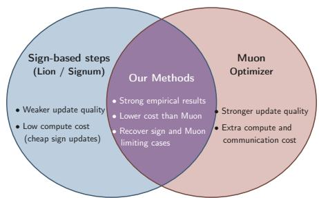
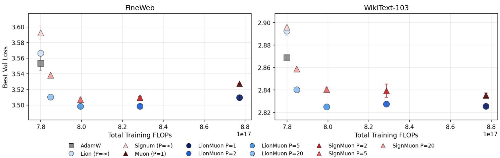
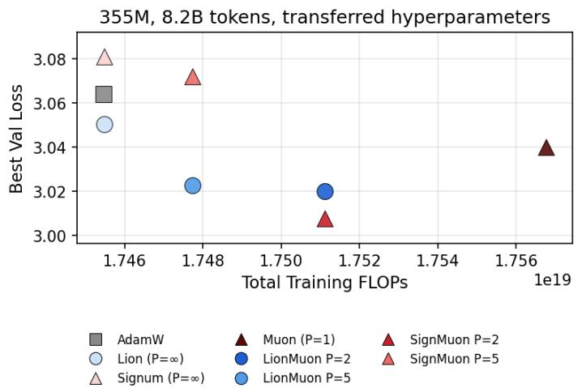
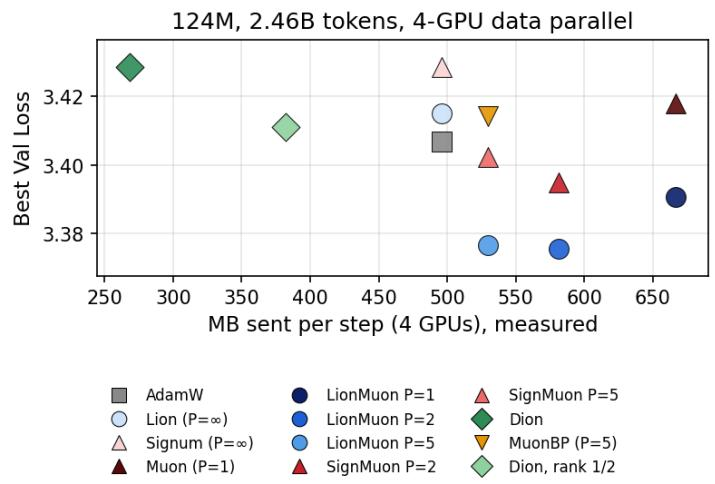
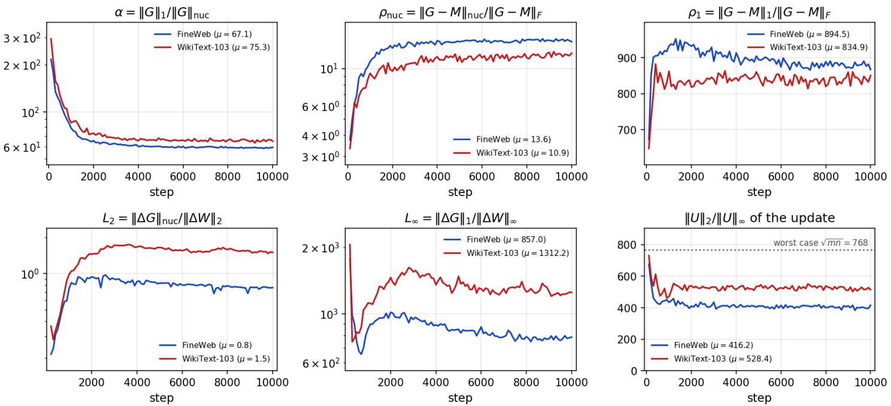

# LionMuon: Alternating Spectral and Sign Descent for Eficient Training

Arman Bolatov<sup>†,1</sup>, Artem Riabinin<sup>†,2</sup>, Nikita Kornilov<sup>†,</sup> <sup>2,</sup> <sup>3</sup>, Andrey Veprikov<sup>†,</sup> <sup>2</sup>, Samuel Horv´ath<sup>1</sup>, Martin Tak´aˇc<sup>1</sup>, Aleksandr Beznosikov<sup>2,</sup> <sup>4</sup>

<sup>1</sup>Mohamed bin Zayed University of Artificial Intelligence (MBZUAI)

<sup>2</sup>Basic Research of Artificial Intelligence Laboratory (BRAIn Lab)

<sup>3</sup>Applied Artificial Intelligence Institute

<sup>4</sup>Innopolis University

<sup>†</sup>Equal contribution

Pretraining a language model takes enormous compute, and the right optimizer can save a good part of it. Muon’s spectral step gives a stronger direction than a sign step, but it is expensive. Every step runs Newton–Schulz iterations on the full matrix and, in distributed training, an extra all-reduce. Sign steps, as in Lion and Signum, are cheap and stay local to each device. We propose LionMuon, which takes one Muon step every P iterations and Lion steps in between, with a single dual-EMA momentum bufer shared by both. Muon’s compute and communication are paid once per P steps, and the optimizer state is half of AdamW’s. A single-EMA variant, SignMuon, already improves on Muon. We prove complexity bounds under heavy-tailed noise in which the period sets an interpolation between Muon’s and Lion’s smoothness and noise constants, and which say when LionMuon is faster than both. On 124M and 355M models trained on FineWeb, LionMuon with P=2 and P=5 reaches a lower loss than Muon, AdamW, Lion and Signum at the same number of tokens. Under 4-GPU data-parallel training it reaches Muon’s final loss with a third less wall-clock on PCIe, and it beats the communication-eficient Muon variants Dion and MuonBP on loss at no more exposed communication, while keeping the exact gradient.

Code: https://github.com/brain-lab-research/lion-muon.

## Introduction

Training Large Language Models (LLMs) is a billion-parameter, million-step<sup>v</sup> optimization problem in which per-step cost determines the final compute billX [Hofmann et al., 2022; Kimi Team et al., 2025]. Finding update rules that are both FLOP-cheap per step and fast to converge is therefore a central question for modern deep learning [Dahl et al., 2023; Kasimbeg et al., 2025].

A useful way to organize this design space is the Linear Minimization Oracle (LMO) viewpoint, which originates from Frank-Wolfe optimization [Jaggi, 2013]. Recent work reinterprets a wide family of first-order optimizers as norm-constrained linear oracles [Chen et al., 2024; Veprikov et al., 2025]. In particular, the parameter update at step t takes the form:

$$
W _ { t + 1 } = W _ { t } + \eta _ { t } \operatorname { L M O } _ { \| \cdot \| } ( \hat { G } _ { t } ) , \qquad \operatorname { L M O } _ { \| \cdot \| } ( G ) : = \arg \operatorname * { m i n } _ { \| S \| \leq 1 } \langle G , S \rangle ,
$$

  
Figure 1: Sign steps are cheap, Muon steps are strong but expensive, and our methods alternate between the two.

(1)

where $\hat { G } _ { t }$ is a momentum-smoothed gradient, ∥ · ∥ is a chosen norm and $\eta _ { t } > 0$ is the learning rate, usually with warm-up and decay [Goyal et al., 2017; Loshchilov and Hutter, 2017; Riabinin et al., 2026]. The choice of norm picks the optimizer: Frobenius norm ∥ · ∥<sub>F</sub> gives normalized SGD [Hazan et al., 2015]; ∥ · ∥<sub>∞</sub> gives signSGD with its momentum variants, Signum [Bernstein et al., 2018] and Lion [Chen et al., 2023]; and the spectral norm ∥ · ∥<sub>2</sub> gives Muon [Jordan et al., 2024]. These methods now drive production LLM training, with Muon and its variants powering Moonlight [Liu et al., 2025], Kimi K2 [Kimi Team et al., 2025], and DeepSeek V4 [DeepSeek-AI, 2026].

Within this family, sign-based methods sit at the cheap end: Signum updates with the sign of a single momentum bufer, while Lion uses two EMA timescales but keeps the same coordinate-wise sign step. Muon sits at the opposite end, computing the matrix sign msign $( X ) = U V ^ { \top }$ via Newton–Schulz iterations [Bernstein and Newhouse, 2024]. The resulting spectral direction is often much stronger than a coordinate-wise sign step [Chen et al., 2026a], but it is also much more expensive: each Muon step runs several Newton–Schulz iterations of matrix multiplications and, in distributed training, needs extra communication [Essential AI, 2025; Chen et al., 2026b].

Distributed training infrastructure is built around element-wise optimizers. Every device holds a copy or a shard of each matrix and updates it with a local rule, so the optimizer step never needs the whole matrix and never communicates. Muon breaks this. Its update couples the entire matrix, so a sharded matrix has to be gathered before Newton–Schulz [Khaled et al., 2026; Essential AI, 2025], and under data parallelism the Newton–Schulz work is either repeated on every device or dealt out across them and exchanged afterwards [Liu et al., 2025; Chen et al., 2026b]. Either way the optimizer adds a synchronization that cannot hide behind the backward pass, on top of the Newton–Schulz iterations themselves. The reported price ranges from a 5 to 10% throughput loss under tensor parallelism [Khaled et al., 2026] to more than twice the cost of forward and backward in a naive implementation [Chen et al., 2026b]. Careful implementations shrink this price but pay it on every step. A sign step needs none of it: it is element-wise, exactly what the infrastructure assumes (Figure 1). This raises a natura question:

Can we keep the update quality of Muon while paying its compute and communication cost only once every P steps?

We answer this question positively. Starting from Signum, inserting one Muon step every P iterations gives SignMuon. Replacing its momentum with Lion’s dual-EMA rule then yields LionMuon, the main method we study. The contributions below separate these two steps.

## Contributions.

• SignMuon and LionMuon (Section 3): one Muon step every P iterations and sign steps in between, with Signum’s single EMA or Lion’s dual EMA. Both add one integer P to Lion, and Muon, Lion and Signum are special cases. The Newton–Schulz compute and the communication of Muon are paid once per P steps, the sign steps are local, and the state is one bufer (Appendix D.1).

• Complexity bounds under heavy-tailed noise, with and without weight decay (Section 4.2, Appendix B). The period sets an interpolation between Muon’s and Lion’s smoothness and noise constants, and the bound says when LionMuon is faster than both (Section 4.3).

• Experiments at 124M on FineWeb [Penedo et al., 2024] and WikiText-103 [Merity et al., 2017], tuned per method with three seeds, and at 355M on FineWeb with transferred hyperparameters (Section 5). LionMuon with $P \in \{ 2 , 5 \}$ beats Muon, AdamW, Lion and Signum at both sizes. Under 4-GPU data-parallel training we count the bytes each step sends, time the step on PCIe and NVLink, and compare with Dion [Ahn et al., 2025] and MuonBP [Khaled et al., 2026].

## 2 Related work

Sign-based methods. Sign-based methods first appeared as a communication-eficient solution for distributed optimization [Bernstein et al., 2019]. The element-wise sign update $W _ { t + 1 } = W _ { t } - \eta _ { t } \mathrm { s i g n } ( \hat { G } _ { t } )$ is cheap to compute, to parallelize and to transmit. Sign methods are also valued in LLM training for their memory eficiency, for zeroth-order fine-tuning [Petrov et al., 2025], and for their robustness to heavy noise [Kornilov et al., 2025; Yu et al., 2026] and to complex models [Crawshaw et al., 2022]. Signum [Bernstein et al., 2018] is the simplest first-moment-only sign optimizer, and Lion [Chen et al., 2023] extends it with a separate interpolation EMA before the sign step. Our path from SignMuon to LionMuon mirrors this progression.

Spectral methods. Muon [Jordan et al., 2024] moves from element-wise sign to its matrix analogue computed by Newton–Schulz (NS) iterations: $W _ { t + 1 } = W _ { t } - \eta _ { t } \mathrm { N S } _ { K } ( \hat { G } _ { t } )$ . This update yields a much stronger spectral direction, but each step is also significantly more expensive. The MuonClip variant powers Kimi K2 [Kimi Team et al., 2025]. Other works refine Muon itself, e.g., Gluon [Riabinin et al., 2025] and HTMuon [Pang et al., 2026]. A second line makes it cheaper to run at scale. Dion [Ahn et al., 2025] replaces Newton–Schulz by a power iteration that keeps a low-rank factorization of the momentum with error feedback, and synchronizes the two factors instead of the gradient, so what is sent grows with the rank rather than with the matrix. MuonBP [Khaled et al., 2026] orthogonalizes each tensor-parallel shard on its own device and gathers the full matrix only every P-th step, which removes the all-gather from most steps at the price of a block-wise update in between. Layer sharding [Essential AI, 2025] keeps whole matrices on one device so that Newton–Schulz needs no gather. DMuon [Chen et al., 2026b] keeps the update exactly and removes the redundant work of naive distributed implementations: each matrix is assigned to one owner rank and Newton–Schulz runs in its Gram form, which brings Muon’s step time to within a few percent of AdamW’s on 8 to 256 GPUs.

Two concurrent methods target Muon’s per-step cost directly. LiMuon [Huang et al., 2025] replaces Newton–Schulz with a low-rank randomized SVD of the momentum, and OLion [Wang et al., 2026] composes orthogonalization with an element-wise sign inside every step. We work along a diferent axis, the iteration axis. The spectral oracle stays a black box and is called only every P iterations, so either of them, or a faster polynomial iteration for the matrix sign [Bernstein and Newhouse, 2024; Amsel et al., 2025; Grishina et al., 2025], can be dropped in and the savings compound. The same holds for implementations such as DMuon: they make each Muon step cheaper, we make them rarer.

Lion-K framework. Chen et al. [2024] view Lion and signSGD as solving a constrained problem with $\mathcal { K } = \| \cdot \| _ { 1 }$ through a Lyapunov analysis, and the same machinery covers Muon with $\mathcal { K } = \| \cdot \| _ { \mathrm { n u c } } \ [ \mathrm { C h e n \ e t \ a l . , 2 0 2 6 a } ]$ . The stochastic Frank-Wolfe view [Sfyraki and Wang, 2025] recovers the rates of both families in one language. Our analysis builds on this common basis.

Optimizer switching. Combining diferent optimizers within a single run is an established idea: SWATS [Keskar and Socher, 2017] switches from Adam to SGD, AdaBound [Luo et al., 2019] interpolates between them through learning-rate clipping, and AGD [Yue et al., 2023] gates between the two adaptively. To our knowledge, no prior work studies the periodic switching between Muon and Lion-style steps that we propose here.

## 3 Algorithm

## 3.1 Notation

We work in the matrix parameter space $\mathbb { R } ^ { m \times n }$ and denote the parameter matrix at iteration t by $W _ { t } \in \mathbb { R } ^ { m \times n }$ and its stochastic gradient by $G _ { t } \in \mathbb { R } ^ { m \times n }$ . This space is equipped with the Frobenius inner product $\langle X , Y \rangle : =$ $\mathrm { t r } ( X ^ { \top } Y ) , \| X \| _ { F } ^ { 2 } = \langle X , X \rangle$ and with the following matrix norms:

$$
\| X \| _ { 2 } : = \sigma _ { 1 } , \quad \| X \| _ { \infty } : = \operatorname* { m a x } _ { i j } | X _ { i j } | , \quad \| X \| _ { \mathrm { n u c } } : = \sum _ { k } \sigma _ { k } , \quad \| X \| _ { 1 } : = \sum _ { i j } | X _ { i j } | ,
$$

where $\sigma _ { 1 } \ \geq \ \cdot \cdot \ \geq \ \sigma _ { \operatorname* { m i n } ( m , n ) }$ are the sorted singular values of matrix $\boldsymbol { X } \in \mathbb { R } ^ { m \times n }$ . The dual norm $\| X \| _ { \star } : =$ $\operatorname* { s u p } _ { \| S \| \leq 1 } \langle X , S \rangle$ gives dual pairs $\| \cdot \| _ { 2 , \star } = \| \cdot \| _ { \mathrm { n u c } }$ and $\| \cdot \| _ { \infty , \star } = \| \cdot \| _ { 1 }$ . For all matrices $\ b X \in \mathbb { R } ^ { m \times n }$ , the considered norms satisfy the following inequalities:

$$
\begin{array} { r } { \| X \| _ { \infty } \leq \| X \| _ { 2 } \leq \| X \| _ { F } \leq \sqrt { m n } \| X \| _ { \infty } \quad \mathrm { a n d } \quad \frac { 1 } { \sqrt { m n } } \| X \| _ { 1 } \leq \| X \| _ { F } \leq \| X \| _ { \operatorname* { n u c } } \leq \| X \| _ { 1 } . } \end{array}\tag{2}
$$

We use the spectral norm LMO to calculate the matrix-sign operation $\mathrm { L M O } _ { \parallel \cdot \parallel _ { 2 } } ( G ) = - \mathrm { m s i g n } ( G )$ and the infinity norm LMO to calculate the element-wise sign $\operatorname { L M O } _ { \| \cdot \| _ { \infty } } ( G ) = - \operatorname { s i g n } ( G )$

## 3.2 LionMuon

Algorithm 1 keeps a single momentum bufer $M _ { t } ,$ updated at every step. Each iteration forms the direction $\hat { G } _ { t }$ as Lion does, by interpolating between $M _ { t - 1 }$ and the current gradient $G _ { t }$ . Every P-th iteration takes a Muon step, which orthogonalizes $\hat { G } _ { t }$ with Newton–Schulz, and every other iteration takes an element-wise sign step. Both use decoupled weight decay λ.

Algorithm 1: LionMuon and SignMuon for a single 2D parameter $W \in \mathbb { R } ^ { m \times n }$   
1: Require: Horizon T, period $P \in \{ 1 , 2 , . . . \} \cup \{ \infty \}$ (P=∞ means the Muon branch is never taken), learning   
rates $\eta _ { M }$ (Muon) and $\eta _ { L }$ (Lion), betas $\beta _ { 1 } , \beta _ { 2 } \in [ 0 , 1 )$ , weight decay $\lambda \geq 0$ , NS steps $K _ { \mathrm { N S } }$ , initial parameters   
$W _ { 0 }$ and momentum $M _ { - 1 } = 0 ,$ and $c ( A ) : = 0 . 2 { \sqrt { \operatorname* { m a x } ( \operatorname { r o w s } ( A ) , \operatorname { c o l s } ( A ) ) } }$   
2: for $t = 0 , 1 , \ldots , T - 1$ do   
3: $G _ { t } = \nabla _ { W } \mathcal { L } _ { t }$ ▷ Stochastic gradient   
4: $\hat { G } _ { t } = \beta _ { 1 } M _ { t - 1 } + ( 1 - \beta _ { 1 } ) G _ { t }$ ▷ Lion interpolation (direction)   
5: if t mod $P = 0$ then   
6: $W _ { t + 1 } = W _ { t } - \eta _ { M } \left( c ( \hat { G } _ { t } ) \mathrm { N S } _ { K _ { \mathrm { N S } } } ( \hat { G } _ { t } ) + \lambda W _ { t } \right)$ ▷ Muon step   
7: else   
8: $W _ { t + 1 } = W _ { t } - \eta _ { L } \left( \mathrm { s i g n } ( { \hat { G } } _ { t } ) + \lambda W _ { t } \right)$ ▷ Lion step   
9: end if   
10: $M _ { t } = \beta _ { 2 } M _ { t - 1 } + ( 1 - \beta _ { 2 } ) G _ { t }$ ▷ Momentum update (every step)   
11: end for

Implementation notes. LionMuon keeps one bufer $M _ { t }$ per matrix, since $\hat { G } _ { t }$ is computed in place, so its state matches Lion and Muon and is half of AdamW’s. All 2D matrices of a transformer, embeddings included, take the LionMuon update. The 1D parameters (biases and norm gains) use AdamW at a fixed $1 0 ^ { - 3 }$ , the usual Muon convention [Jordan et al., 2024]. Giving them the Lion step instead is clearly worse (Appendix E.2). Table 3 lists the specia cases.

## 4 Convergence analysis

This section analyzes LionMuon (Algorithm 1): the assumptions (Section 4.1), the convergence bound (Section 4.2), and what it says about the ratio of the two learning rates and the period $P$ (Section 4.3). The main text treats the case without weight decay (λ = 0). Appendix B covers weight decay, with more technical work and the same conclusions.

## 4.1 Assumptions

We use standard assumptions on the objective and on the noise.

Assumption 1 (Smoothness and lower boundness)   
The objective function $f : \mathbb { R } ^ { m \times n }  \mathbb { R }$ is lower bounded by $f _ { \star }$ and L-smooth with respect to a primal norm   
$\| \cdot \| :$   
$\| \nabla f ( W ) - \nabla f ( W ^ { \prime } ) \| _ { \star } \leq L \| W - W ^ { \prime } \|$ for all $W , W ^ { \prime } \in \mathbb { R } ^ { m \times n }$   
We use smoothness constants $L _ { 2 }$ and $L _ { \infty }$ for norms $\| \cdot \| _ { 2 }$ and $\| \cdot \| _ { \infty }$ , respectively.

From the norm inequalities (2), we can bound the smoothness ratio $1 \leq L _ { \infty } / L _ { 2 } \leq m n$ . Following Sadiev et al. [2023], H¨ubler et al. [2025] and Chezhegov et al. [2026], we allow heavy-tailed noise, which is what LLM training shows [G¨urb¨uzbalaban et al., 2021].

## Assumption 2 (Bounded κ-th moment)

Stochastic gradients $G _ { t }$ are unbiased estimates of the true gradient $\nabla f ( W _ { t } )$ , and have bounded κ-th moment for some $\kappa \in ( 1 , 2 ]$ and $\sigma \geq 0$

$$
\begin{array} { r } { \mathbb { E } [ G _ { t } ] = \nabla f ( W _ { t } ) , \qquad \mathbb { E } \big [ \| G _ { t } - \nabla f ( W _ { t } ) \| _ { F } ^ { \kappa } \big ] \leq \sigma ^ { \kappa } . } \end{array}
$$

We measure this exponent rather than assume it. A Hill estimator on the norms of the gradient noise, over checkpoints of a 124M LionMuon $P { = } 2$ run on WikiText-103, gives tail indices with medians of 46 at batch 32, 22 at batch 8 and 12 at batch 2, and the smallest value we saw was 10.6. All of them are above 2, so Assumption 2 holds with $\kappa = 2$ , and the tails thicken as the batch shrinks, which is the direction the bound predicts. The noise leve also depends on the dual norm. This norm equivalence in expectation follows Kornilov et al. [2023] and H¨ubler et al. [2025].

## Assumption 3 (Noise norm equivalence)

For any linear combination $\textstyle \sum _ { \tau } a _ { \tau } \epsilon _ { \tau }$ of independent gradient noise terms $\epsilon _ { \tau } : = G _ { \tau } - \nabla f ( W _ { \tau } )$ , we have:

$$
\begin{array} { r } { \mathbb { E } \big [ \| \sum _ { \tau } a _ { \tau } \epsilon _ { \tau } \| _ { \star } \big ] \leq \rho _ { \star } \cdot \mathbb { E } \big [ \| \sum _ { \tau } a _ { \tau } \epsilon _ { \tau } \| _ { F } \big ] \quad \mathrm { f o r ~ s o m e ~ l e v e l ~ } \rho _ { \star } > 0 . } \end{array}
$$

We use noise levels $\rho _ { \mathrm { n u c } }$ and $\rho _ { 1 }$ for dual norms $\| \cdot \| _ { \mathrm { n u c } }$ and $\| \cdot \| _ { 1 }$ , respectively.

The norm inequalities (2) give $\rho _ { \mathrm { n u c } } \leq { \sqrt { \operatorname* { m i n } \{ m , n \} } }$ and $\rho _ { 1 } \le \sqrt { m n }$ , but the actual levels depend on the noise distribution and can be far smaller (Table 2). Both bounds are per matrix. The measured $\rho _ { \mathrm { n u c } }$ is about half of its bound and the measured $\rho _ { 1 }$ sits well inside its range, so neither is near the worst case the proof has to allow for.

## 4.2 Convergence bound

With these assumptions in place, we present our main convergence Theorem 1 and optimal parameters Corollary 1 for our LionMuon (Algorithm 1). We provide all proofs in Appendix A.

## Theorem 1 (Convergence bound of LionMuon )

Let the objective function f satisfy Assumption 1 with respect to $\| \cdot \| _ { 2 }$ with constant $L _ { 2 }$ , and with respect to $\| \cdot \| _ { \infty }$ with constant $L _ { \infty }$ . Let noise Assumptions 2 and 3 hold with noise constants $\sigma , \rho _ { \mathrm { n u c } }$ and $\rho _ { 1 }$ . Fix a horizon $T .$ , period $P \in [ 1 , \infty ]$ , momentum parameters $\beta _ { 1 } , \beta _ { 2 } \in [ 0 , 1 )$ and learning rates $\eta _ { M }$ and $\eta _ { L }$ Define the period-averaged learning rate, noise level and smoothness:

$$
\begin{array} { r } { \bar { \eta } : = \frac { \eta _ { M } } { P } + \frac { ( P - 1 ) \eta _ { L } } { P } , \quad \bar { \rho } : = \frac { \eta _ { M } } { P \bar { \eta } } \rho _ { \mathrm { n u c } } + \frac { ( P - 1 ) \eta _ { L } } { P \bar { \eta } } \rho _ { 1 } , \quad \bar { L } : = \frac { \eta _ { M } \bar { \eta } _ { \mathrm { m a x } } } { P \bar { \eta } ^ { 2 } } L _ { 2 } + \frac { ( P - 1 ) \eta _ { L } \eta _ { \mathrm { m a x } } } { P \bar { \eta } ^ { 2 } } L _ { \infty } , } \end{array}\tag{3}
$$

where $\tilde { \eta } _ { \mathrm { m a x } } = \operatorname* { m a x } \{ \eta _ { M } , \sqrt { m n } \eta _ { L } \}$ and $\eta _ { \mathrm { m a x } } = \operatorname* { m a x } \{ \eta _ { M } , \eta _ { L } \}$ for intermediate $P \in ( 1 , \infty )$ , with the boundary cases $\tilde { \eta } _ { \mathrm { m a x } } = \eta _ { \mathrm { m a x } } = \eta _ { M }$ at $P = 1$ and $\tilde { \eta } _ { \mathrm { m a x } } = \eta _ { \mathrm { m a x } } = \eta _ { L }$ at $P = \infty$   
Then, our LionMuon algorithm starting with $\Delta _ { 0 } : = f ( W _ { 0 } ) - f _ { \star } , E _ { 0 } = \nabla f ( W _ { 0 } ) - M _ { 0 }$ guarantees the following bound on the period-averaged gradient dual norm:

$$
\operatorname* { m i n } _ { i < \frac { \eta } { p } } \{ \mathbb { E } [ \| \overline { { \nabla } } f ( W _ { i \cdot P } ) \| ] \} \le \frac { \Delta _ { 0 } } { \overline { { \eta } } T } + \frac { 4 \bar { L } \bar { \eta } } { ( 1 - \beta _ { 2 } ) } + \frac { 2 \beta _ { 1 } } { \beta _ { 2 } } \bar { \rho } \sigma ( 1 - \beta _ { 2 } ) ^ { \frac { \kappa - 1 } { \kappa } } + 2 \left| 1 - \frac { \beta _ { 1 } } { \beta _ { 2 } } \right| \bar { \rho } \sigma + \frac { 2 \beta _ { 1 } } { \beta _ { 2 } } \frac { \eta _ { \operatorname* { m a x } } \| E _ { 0 } \| _ { 1 } } { \bar { \eta } T ( 1 - \beta _ { 2 } ) } ,
$$

$$
\mathrm { w h e r e ~ } \mathbb { E } [ \| \overline { { \nabla } } f ( W _ { i \cdot P } ) \| ] : = \frac { \Big ( \eta _ { M } \cdot \mathbb { E } [ \| \nabla f ( W _ { i \cdot P } ) \| _ { \operatorname { m u c } } ] + \sum _ { j = 1 } ^ { P - 1 } [ \eta _ { L } \cdot \mathbb { E } [ \| \nabla f ( W _ { i \cdot P + j } ) \| _ { 1 } ] ] \Big ) } { \eta _ { M } + ( P - 1 ) \eta _ { L } } .\tag{4}
$$

Prior analyses treat Muon or Lion on their own [Li and Hong, 2025; Shen et al., 2025; An et al., 2025; Riabinin et al., 2025]. Our bound covers both steps, with their diferent norms and constants, under heavy-tailed noise, and it depends on the schedule only through the period-averaged learning rate, noise and smoothness, which interpolate between the pure-Muon and pure-Lion regimes. With these constants the bound has the optimal form for momentum-based norm-constrained methods under heavy-tailed noise [Liu and Zhou, 2025; Kornilov et al., 2025], and its boundary cases recover the known bounds for Muon and Lion [Yu et al., 2026; Nagashima and Iiduka, 2026; Iiduka, 2026].

## Corollary 1 (Optimal Parameters for LionMuon )

Let the objective function f and the noise satisfy Assumptions 1, 2 and 3 with the period-averaged constants   
$\bar { L } , \sigma$ and $\bar { \rho }$ defined in (3).   
• Fix a period $P \in ( 1 , \infty )$ and the learning-rate ratio $\alpha = \eta _ { M } / \eta _ { L }$   
To achieve accuracy min $\{ \mathbb { E } [ \| { \overline { { \nabla } } } f ( W _ { i \cdot P } ) \| ] \} \leq \varepsilon .$ our LionMuon requires T iterations:   
T = O L<sup>¯</sup>∆<sub>0</sub> · max ( <sup>(¯ρσ) κ−1</sup>3κ−2 , <sup>1</sup><sub>2</sub> 1 2 (5)   
ε κ−1   
with the optimal parameters:   
κ   
1 − β<sub>2</sub> = min <sup>ε</sup>16¯ρσ κ−1 , 1) , β<sub>1</sub> ∈ β<sub>2</sub> max 1 − <sup>ε</sup>16¯ρσ , 0 , 1 , η<sub>L</sub> = <sup>ε(1</sup> <sup>−</sup> <sup>β2)α</sup> + <sup>P</sup> <sup>−1</sup> · L<sup>¯ .</sup>   
32 P P   
• Pure Muon $( P = 1 )$ and Lion $( P = \infty )$ keep the same momentums $\beta _ { 1 } , \beta _ { 2 }$ , number of iterations $T$ and only   
single learning rate $\begin{array} { r } { \eta _ { M } = \frac { \varepsilon ( 1 - \beta _ { 2 } ) } { 3 2 \cdot L _ { 2 } } } \end{array}$ or $\begin{array} { r } { \eta _ { L } = \frac { \varepsilon ( 1 - \beta _ { 2 } ) } { 3 2 \cdot L _ { \infty } } } \end{array}$   
• We can set single-EMA $\beta _ { 1 } = \beta _ { 2 }$ to get optimal parameters for our SignMuon.

Our complexity (5) has the optimal dependence on the accuracy ε and on the constants $\bar { L } , \bar { \rho } \colon$ with the Frobenius smoothness $L _ { F }$ and noise $\rho _ { F }$ in their place it is the known optimal rate [Zhang et al., 2020].

Tightening up the constants. In the analysis of our LionMuon, we mix Lion and Muon steps and handle diferent norms within them, applying the worst-case norm inequalities (2) which cover all possible matrices. For this reason, the interpolated smoothness $\bar { L }$ from (3) has extra conservative factors such as $\eta _ { \mathrm { m a x } }$ or $\sqrt { m n }$ which disappear in pure regimes.

In practice, gradients and updates in deep networks tend to be dense [Bernstein et al., 2018], and ours are too (Table 2). For these dense matrices, the norm inequalities usually yield the approximate equalities:

$$
\begin{array} { r } { \| \nabla f ( W _ { t } ) \| _ { \mathrm { n u c } } \approx \alpha \cdot \| \nabla f ( W _ { t } ) \| _ { 1 } \quad \mathrm { f o r ~ s o m e ~ l a r g e ~ c o n s t a n t } \ \alpha \lesssim \sqrt { m n } , } \end{array}\tag{6}
$$

and we can obtain a more natural interpolation $\begin{array} { r } { \bar { L } = \frac { \eta _ { M } ^ { 2 } } { P \bar { \eta } ^ { 2 } } L _ { 2 } + \frac { ( P - 1 ) \eta _ { L } ^ { 2 } } { P \bar { \eta } ^ { 2 } } L _ { \infty } } \end{array}$ (see Appendix A.4).

## 4.3 Discussion

Choice of the learning-rate ratio. The scale $\frac { \eta _ { M } } { \eta _ { L } }$ determines the interpolation between the smoothness constants, noise levels and gradient norms of Muon and Lion. By the norm relations (2), the gradient norm $\| \cdot \| _ { 1 }$ of Lion is always larger than $\| \cdot \| _ { \mathrm { n u c } }$ of Muon, especially for dense matrices, so without scaling the Lion updates dominate the metric (4) simply because they are large and frequent. We therefore choose a large scale $\eta _ { M } / \eta _ { L } = \alpha$ that brings the gradient norms (6) to the same order of magnitude: mi $\begin{array} { r } { \iota _ { i < \frac { T } { P } } \{ \mathbb { E } [ \| \overline { { \nabla } } f ( W _ { i \cdot P } ) \| ] \} \approx \frac { \alpha P \cdot \operatorname* { m i n } _ { t } \{ \mathbb { E } [ \| \nabla f ( W _ { t } ) \| _ { \mathrm { n u c } } ] \} } { \alpha + ( P - 1 ) } } \end{array}$ . The grid search over $( \eta _ { M } , \eta _ { L } )$ in Appendix E confirms that a large ratio is best, and that the tuned ratio grows with $P$ (Section 5). The theory cannot fix its value, so we tune the ratio and $\eta _ { M }$

Choice of period P. The reason to take an intermediate $P$ is cost. A Muon step costs about $K _ { \mathrm { N S } }$ times a Lion step in FLOPs, and it is the step that communicates. The bound also says that an intermediate $P$ can reach a given accuracy in fewer operations than pure Muon. Our complexity (5) interpolates between the pure-Muon $( P { = } 1$ $\bar { L } = L _ { \mathrm { 2 } } , \bar { \rho } = \rho _ { \mathrm { n u c } } )$ and pure-Lion $( P { = } { \infty } , \bar { L } = L _ { \infty } , \bar { \rho } = { \rho } _ { 1 } )$ regimes via the period-averaged smoothness $\bar { L }$ and noise ${ \bar { \rho } } .$ For typical dense gradients (6), we set the ratio $\eta _ { M } / \eta _ { L } = \alpha$ to equalize the $\| \cdot \| _ { 1 }$ and $\| \cdot \| _ { \mathrm { n u c } }$ gradient norms in the minimal metric (4). Then, the averaged learning rate $\bar { \eta }$ can be estimated by $\bar { \eta } \approx \eta _ { M } / P _ { ; }$ , and the refined averaged smoothness and noise become $\begin{array} { r } { \bar { L } \approx P ^ { 2 } \frac { L _ { 2 } } { P } + P ^ { 2 } \frac { ( P - 1 ) } { P } \frac { L _ { \infty } } { \alpha ^ { 2 } } } \end{array}$ and $\begin{array} { r } { \bar { \rho } \approx P \frac { \rho _ { \mathrm { n u c } } } { P } + P \frac { ( P - 1 ) } { P } \frac { \rho _ { 1 } } { \alpha } } \end{array}$ . We can now compare the number of operations N that pure Muon and LionMuon need for the same accuracy min $\ L _ { t } \{ \mathbb { E } [ \| \nabla f ( W _ { t } ) \| _ { \mathrm { n u c } } ] \} \leq \varepsilon$ LionMuon does $\frac { { \overset { \cdot } { K } } _ { \mathrm { N S } } + ( P - 1 ) } { P }$ operations per iteration and only needs the weaker accuracy $P \cdot \varepsilon$ in (5):

$$
\begin{array} { r } { N = O \Bigg [ \underbrace { \Bigg ( \frac { 1 } { P } \Bigg ) ^ { \frac { 3 \kappa - 2 } { \kappa - 1 } } \big ( \frac { 1 } { P } + \frac { 1 } { K _ { \mathrm { N S } } } \bigg ) \Bigg ( P + P ( P - 1 ) \frac { L _ { \infty } } { \alpha ^ { 2 } L _ { 2 } } \Bigg ) \cdot \Bigg ( 1 + ( P - 1 ) \frac { \rho _ { 1 } } { \alpha \rho _ { \mathrm { n u c } } } \Bigg ) ^ { \frac { \kappa } { \kappa - 1 } } } _ { = : \phi \big ( P , \frac { L _ { \infty } } { \alpha ^ { 2 } L _ { 2 } } , \frac { \rho _ { 1 } } { \omega \rho _ { \mathrm { n u c } } } \big ) } \cdot \underbrace { K _ { \mathrm { N S } } \cdot L _ { 2 } \Delta _ { 0 } \cdot \frac { \big ( \rho _ { \mathrm { n u c } } \sigma \big ) ^ { \frac { \kappa } { \kappa - 1 } } } { \frac { 3 \kappa - 2 } { \kappa ^ { 3 } } } } _ { = N _ { \mathrm { a e g } } } \Bigg ] . } \end{array}
$$

The trade-of factor $\begin{array} { r } { \phi ( P , \frac { L _ { \infty } } { \alpha ^ { 2 } L _ { 2 } } , \frac { \rho _ { 1 } } { \alpha \rho _ { \mathrm { n u c } } } ) \approx \left( \frac { 1 } { P } + ( 1 - \frac { 1 } { P } ) \frac { L _ { \infty } } { \alpha ^ { 2 } L _ { 2 } } \right) \cdot \left( \frac { 1 } { P } + ( 1 - \frac { 1 } { P } ) \frac { \rho _ { 1 } } { \alpha \rho _ { \mathrm { n u c } } } \right) ^ { \frac { R } { \kappa - 1 } } } \end{array}$ is a polynomial in $1 / P$ defined by the scaled smoothness and noise ratios $\frac { L _ { \infty } } { \alpha ^ { 2 } L _ { 2 } }$ and $\frac { \rho _ { 1 } } { \alpha \rho _ { \mathrm { n u c } } }$ . For $P \in ( 1 , + \infty )$ satisfying $\begin{array} { r } { \phi ( P , \frac { L _ { \infty } } { \alpha ^ { 2 } L _ { 2 } } , \frac { \rho _ { 1 } } { \alpha \rho _ { \mathrm { n u c } } } ) < 1 } \end{array}$ , our LionMuon outruns Muon. The optimal regime $P ^ { \bf \tilde { * } } \in [ 1 , \infty ]$ minimizes the trade-of factor and can be approximately determined from the trade-of ratios:

1. If $\begin{array} { r } { \frac { L _ { \infty } } { \alpha ^ { 2 } L _ { 2 } } , \frac { \rho _ { 1 } } { \alpha \rho _ { \mathrm { n u c } } } \gtrsim 1 } \end{array}$ , the costly Muon is more preferable $\left( \phi \uparrow \right.$ when $P \uparrow )$ ;

2. $\begin{array} { r } { \mathrm { ~ I f ~ } \frac { L _ { \infty } } { \alpha ^ { 2 } L _ { 2 } } , \frac { \rho _ { 1 } } { \alpha \rho _ { \mathrm { n u c } } } < 1 } \end{array}$ , intermediate values P (possibly up to Lion) are the fastest $\left( \phi \downarrow \right.$ when $P \uparrow )$

3. If $\begin{array} { r } { \frac { L _ { \infty } } { \alpha ^ { 2 } L _ { 2 } } , \frac { \alpha \rho _ { \mathrm { n u c } } } { \rho _ { 1 } } < 1 ~ ( \mathrm { o r } > 1 ) } \end{array}$ , some intermediate $P ^ { * }$ (can be Muon) is the best $\left( \phi \downarrow \mathrm { t h e n } \phi \uparrow \right)$

Section 5 finds the third case: the loss against FLOPs is lowest at small intermediate periods, $P ^ { * } \in \{ 2 , 5 \}$

Match of theory and practice. We measure the constants of the bound during 124M training $( { \mathrm { A p p e n d i x ~ C } } ,$ Table 2 and Figure 5). The gradient ratio α comes out close to the tuned ratio $\eta _ { M } / \eta _ { L }$ on both datasets. The trade-of ratios on FineWeb put us in the regime with an interior optimal period, and that is what Section 5 finds.

  
Figure 2: Loss against training FLOPs at 124M on FineWeb (left) and WikiText-103 (right). Every optimizer is tuned, and the error bars are over three seeds. LionMuon with $P { \in } \{ 2 , 5 \}$ is lowest on both datasets and uses fewer FLOPs than Muon.

## 5 Experiments

## 5.1 Setup

All runs use GPT-2-style decoders from the llm-baselines benchmark of Semenov et al. [2025], a cosine schedule, weight decay 0.1 and AdamW for 1D parameters (Section 3).

Single GPU. At 124M (12 layers, width 768, batch $3 2 \times 5 1 2$ tokens, 64,000 steps, 1.05B tokens) we train on FineWeb [Penedo et al., 2024] and WikiText-103 [Merity et al., 2017] and compare AdamW [Loshchilov and Hutter, 2019], Signum [Bernstein et al., 2018], Lion [Chen et al., 2023], Muon [Jordan et al., 2024], and SignMuon and LionMuon with $P \in \{ 1 , 2 , 5 , 2 0 \}$ . Learning rates are tuned on full-length runs: η<sub>M</sub> over $1 0 ^ { - 4 }$ to $1 0 ^ { - 1 }$ and, for the alternating methods, the ratio $\eta _ { M } / \eta _ { L }$ over 1 to 3000 (Appendix E). Momentum was tuned as well (Appendix E.1), and the best values are (0.9, 0.99) for Lion and LionMuon, 0.9 for Muon and SignMuon, and (0.8, 0.999) for AdamW Each tuned setting is rerun with three seeds. At 355M (24 layers, width 1024, sequence 1024, batch 512, 15,650 steps, 8.2B tokens, above the Chinchilla budget [Hofmann et al., 2022]) we train on FineWeb with every hyperparameter copied from the 124M optimum, so this setting also tests how the tuned values transfer.

Four GPUs. The 124M model is trained end to end with PyTorch DDP on four H200 GPUs, 8 sequences per GPU, for 150,000 steps (2.46B tokens, the Chinchilla budget). Every hyperparameter comes from the 124M tuning, and the rates of Muon, Lion and Dion were rechecked at this horizon (Table 4). Every GPU holds a full copy of the model, and the framework averages the gradients bucket by bucket while the backward pass is still running. Muon then orthogonalizes each matrix on one GPU and all-reduces the updates, as in Moonlight [Liu et al., 2025]. Dion [Ahn et al., 2025] and MuonBP [Khaled et al., 2026] use the settings of their papers and the learning rate of Muon. Both were designed for sharded models. MuonBP is a tensor-parallel and FSDP method, not a data-parallel one, so we emulate its layout with four column blocks per matrix, as a four-way tensor-parallel split would give. Its block step is then local and its full step is Muon’s, so it difers from LionMuon only in what it does between ful steps. Dion’s low-rank gradient sync is the data-parallel mode its paper proposes. Appendix D gives the details and pseudocode. Step times are measured on this node and on four A100 GPUs over PCIe, where communication is more expensive.

## 5.2 Single-GPU training: 124M tuned, 355M transferred

Figure 2 shows the tuned 124M runs. LionMuon P=2 and P=5 reach the lowest loss on both datasets, below Muon, AdamW, Lion and Signum, and the gaps to Muon are more than ten times the seed spread. Appendix E lists every

  
Figure 3: Loss against training FLOPs at 355M on FineWeb, with every hyperparameter copied from 124M. One seed per method, values in Table 6.

  
Figure 4: Loss against the bytes one step sends, for 124M trained on four GPUs with data parallelism. The bytes are counted from every collective the run issues. Baselines that had a rate sweep are shown at their best rate. Values in Table 4.

value.

Figure 3 repeats the FineWeb comparison at 355M with every hyperparameter copied from 124M, so it also tests how the tuned values transfer. Every alternating setting except SignMuon $P { = } 5$ beats Muon, which beats AdamW, at fewer FLOPs. Lion lands between Muon and AdamW and Signum ends last, so at this size too alternating beats both of its endpoints (Table 6).

Discussion. Alternation does most of the work and the dual EMA adds a little. Going from Muon to SignMuon $P { = } 2$ closes about two thirds of the gap to the best run, and the dual EMA of LionMuon closes the rest, at $P { = } 5$ and on WikiText-103 as well. The loss is flat between $P { = } 2$ and $P { = } 5$ on both datasets and rises slightly at $P { = } 2 0$ , which still beats Muon on FineWeb, so $P { = } 5$ gives the cheapest step at no cost in loss. The tuned ratio $\eta _ { M } / \eta _ { L }$ grows with P (Appendix E), so a practitioner who changes P should retune this ratio and can leave $\eta _ { M }$ near its Muon value. The period does not have to be fixed either: a Muon step drawn with probability $1 / P$ at every iteration gives the same loss (Appendix E.2). When hyperparameters are transferred rather than retuned, the dual-EMA variant is the safer one. LionMuon P=5 transfers to 355M unchanged, while SignMuon $P { = } 5 ,$ , with its larger spectral rate, does not Finally, the constants measured in Section 4.3 predict an interior optimal period on FineWeb, which is what we see.

## 5.3 Data-parallel training on four GPUs

Figure 4 compares all methods under data parallelism. LionMuon P=2 and P=5 reach the lowest loss. Both endpoints of the family, pure Muon and the pure sign methods, end higher, and so do AdamW and the two Muon variants. The order is the same as in the single-GPU runs. Lion needs a rate three times below its 64k optimum to stay stable over 150,000 steps, and at that rate it ends just below Muon. Alternating beats both by a clear margin (Table 4).

Table 1 gives what each step costs. LionMuon P=5 sends a fifth less than Muon. MuonBP P=5 sends exactly the same amount and ends level with Muon, because it still runs Newton–Schulz on every step. Dion at rank min $( m , n ) / 4$ sends the least and ends highest. At rank min $( m , n ) / 2$ it sends more, still less than AdamW, and ends level with Muon and MuonBP, so its rank trades bytes for loss, and at neither rank does it come near LionMuon. AdamW sends slightly less than LionMuon $P { = } 5$ and ends higher, so against AdamW our claim is the loss, not the cost.

Step times depend on the interconnect (Table 1). On PCIe, where the all-reduce is expensive, Dion and MuonBP are also cheaper per step than Muon. On NVLink they become slower than Muon, since both trade bytes for extra arithmetic, while LionMuon still saves. Replicating the orthogonalization on every device would remove Muon’s all-reduce at the price of about a third more arithmetic (Appendix D.1). LionMuon divides both costs by P, so it is cheaper either way.

Table 1: What one step costs on top of forward and backward, at 124M on four GPUs. Exposed communication is the optimizer’s own all-reduce, which cannot start before the backward pass ends. Step times are relative to Muon, measured by running all methods back to back in a random order within each round and taking the ratio inside the round, so that any background load on the node falls on every method alike (30 rounds on PCIe, 40 on NVLink, 95% intervals within ±0.01 and ±0.08). Muon’s median step took 1.56 s on PCIe and 0.24 s on NVLink. Dion’s bytes replace the gradient all-reduce. State is per 2D parameter W.
<table><tr><td></td><td></td><td>Exposed</td><td></td><td>Step time / Muon</td></tr><tr><td>Optimizer</td><td>Newton-Schulz</td><td>MB/step</td><td>State</td><td>PCIe</td></tr><tr><td>AdamW</td><td>no</td><td>0</td><td>2|W|</td><td>0.75</td></tr><tr><td>Lion / Signum</td><td>no</td><td>0</td><td>|W|</td><td>0.85</td></tr><tr><td>Muon</td><td>every step</td><td>170</td><td>|w|</td><td>1.00 1.00</td></tr><tr><td>LionMuon P=2</td><td>every 2nd step</td><td>85</td><td>|w|</td><td>0.88 0.92</td></tr><tr><td>LionMuon P=5</td><td>every 5th step</td><td>34</td><td>|w|</td><td>0.81 0.89</td></tr><tr><td>MuonBP  $P { = } 5$ </td><td>blocks each, full every 5th</td><td>34</td><td>|w|</td><td>0.94 1.25</td></tr><tr><td>Dion, rank min  $( m , n ) / 4$ </td><td>no, QR on factors</td><td>269</td><td> $| W | + n r$ </td><td>0.76 1.50</td></tr></table>

Table 5 in Appendix D puts the two axes together and gives what each method needs to reach Muon’s own final loss, relative to Muon. LionMuon P=5 gets there with the fewest FLOPs and the least time on either interconnect, and $P { = } 2$ is close behind. On bytes alone Dion at rank $1 / 2$ is cheapest, but it stops level with Muon, and AdamW is about as cheap as LionMuon $P { = } 5$ but stops higher.

Each distributed run has one seed, and the seed spread at 124M is an order of magnitude below the gaps here. Muon was also run at rates three times lower and three times higher than its transferred one, and neither improves on it (Table 4).

## 6 Conclusion

We present LionMuon, an optimizer that takes one Muon step per P iterations and Lion steps in between, sharing a single dual-EMA momentum bufer and adding only the integer P. The step cost follows directly: Newton–Schulz compute and the optimizer all-reduce of Muon are divided by P, the sign steps are local, and the state is half of AdamW’s. A complexity bound (5) shows that the compute-optimal period is set by the ratios $\frac { L _ { \infty } } { L _ { 2 } }$ and $\frac { \rho _ { 1 } } { \rho _ { \mathrm { n u c } } }$ and says when LionMuon beats both Muon and Lion. Empirically, LionMuon with $P { \in } \{ 2 , 5 \}$ reaches a lower loss than Muon, AdamW, Lion and Signum at 124M and 355M, and under 4-GPU data-parallel training at 1× Chinchilla it reaches Muon’s final loss with a third less wall-clock on PCIe and ends below every baseline. Larger models, multi-node training, an adaptive period and an analysis that accounts for the Newton–Schulz error are the natural next steps.

## Reproducibility statement

Algorithm 1 is the complete update rule; Appendix D lists every architecture, schedule and hyperparameter, Appendix E the tuning grids and selected values. The code with the training scripts, the round-robin distributed protocol and the plotting scripts is at https://github.com/brain-lab-research/lion-muon. All proofs are in Appendices A and B.

## References

Jordan Hofmann, Sebastian Borgeaud, Arthur Mensch, Elena Buchatskaya, Trevor Cai, Eliza Rutherford, Diego de Las Casas, Lisa Anne Hendricks, Johannes Welbl, Aidan Clark, Tom Hennigan, Eric Noland, Katie Millican, George van den Driessche, Bogdan Damoc, Aurelia Guy, Simon Osindero, Karen Simonyan, Erich Elsen, Jack W. Rae, Oriol Vinyals, and Laurent Sifre. Training compute-optimal large language models, 2022. URL https://arxiv.org/abs/2203.15556.

Kimi Team et al. Kimi K2: Open agentic intelligence, 2025. URL https://arxiv.org/abs/2507.20534.

George E. Dahl, Frank Schneider, Zachary Nado, Naman Agarwal, Chandramouli Shama Sastry, Philipp Hennig, Sourabh Medapati, Runa Eschenhagen, Priya Kasimbeg, Daniel Suo, Juhan Bae, Justin Gilmer, Abel L. Peirson, Bilal Khan, Rohan Anil, Mike Rabbat, Shankar Krishnan, Daniel Snider, Ehsan Amid, Kongtao Chen, Chris J. Maddison, Rakshith Vasudev, Michal Badura, Ankush Garg, and Peter Mattson. Benchmarking neural network training algorithms, 2023. URL https://arxiv.org/abs/2306.07179.

Priya Kasimbeg, Frank Schneider, Runa Eschenhagen, Juhan Bae, Chandramouli Shama Sastry, Mark Saroufim, Boyuan Feng, Less Wright, Edward Z. Yang, Zachary Nado, Sourabh Medapati, Philipp Hennig, Michael Rabbat, and George E. Dahl. Accelerating neural network training: An analysis of the AlgoPerf competition. In The Thirteenth International Conference on Learning Representations, ICLR 2025, Singapore, April 24-28, 2025, 2025. URL https://openreview.net/forum?id=CtM5xjRSfm.

Martin Jaggi. Revisiting Frank-Wolfe: Projection-free sparse convex optimization. In Proceedings of the 30th International Conference on Machine Learning, ICML 2013, Atlanta, GA, USA, 16-21 June 2013, volume 28 of JMLR Workshop and Conference Proceedings, pages 427–435. JMLR.org, 2013. URL http://proceedings.mlr. press/v28/jaggi13.html.

Lizhang Chen, Bo Liu, Kaizhao Liang, and Qiang Liu. Lion secretly solves a constrained optimization: As Lyapunov predicts. In The Twelfth International Conference on Learning Representations, ICLR 2024, Vienna, Austria, May 7-11, 2024, 2024. URL https://openreview.net/forum?id=e4xS9ZarDr.

Andrey Veprikov, Arman Bolatov, Aleksandr Bogdanov, Samuel Horv´ath, Aleksandr Beznosikov, Martin Tak´aˇc, and Slavomir Hanzely. Preconditioned norms: A unified framework for steepest descent, Quasi-Newton and adaptive methods, 2025. URL https://arxiv.org/abs/2510.10777.

Priya Goyal, Piotr Doll´ar, Ross Girshick, Pieter Noordhuis, Lukasz Wesolowski, Aapo Kyrola, Andrew Tulloch, Yangqing Jia, and Kaiming He. Accurate, large minibatch SGD: Training ImageNet in 1 hour, 2017. URL https://arxiv.org/abs/1706.02677.

Ilya Loshchilov and Frank Hutter. SGDR: stochastic gradient descent with warm restarts. In 5th International Conference on Learning Representations, ICLR 2017, Toulon, France, April 24-26, 2017, Conference Track Proceedings, 2017. URL https://openreview.net/forum?id=Skq89Scxx.

Artem Riabinin, Andrey Veprikov, Arman Bolatov, Martin Tak´aˇc, and Aleksandr Beznosikov. Where does warm-up come from? adaptive scheduling for norm-constrained optimizers, 2026. URL https://arxiv.org/abs/2602. 05813.

Elad Hazan, Kfir Y. Levy, and Shai Shalev-Shwartz. Beyond convexity: Stochastic quasi-convex optimization. In Corinna Cortes, Neil D. Lawrence, Daniel D. Lee, Masashi Sugiyama, and Roman Garnett, editors, Advances in Neural Information Processing Systems 28: Annual Conference on Neural Information Processing Systems 2015, December 7-12, 2015, Montreal, Quebec, Canada, pages 1594–1602, 2015. URL https://proceedings.neurips. cc/paper/2015/hash/934815ad542a4a7c5e8a2dfa04fea9f5-Abstract.html.

Jeremy Bernstein, Yu-Xiang Wang, Kamyar Azizzadenesheli, and Animashree Anandkumar. signSGD: Compressed optimisation for non-convex problems. In Jennifer G. Dy and Andreas Krause, editors, Proceedings of the 35th International Conference on Machine Learning, ICML 2018, Stockholmsm¨assan, Stockholm, Sweden, July 10-15, 2018, volume 80 of Proceedings of Machine Learning Research, pages 560–569. PMLR, 2018. URL http://proceedings.mlr.press/v80/bernstein18a.html.

Xiangning Chen, Chen Liang, Da Huang, Esteban Real, Kaiyuan Wang, Hieu Pham, Xuanyi Dong, Thang Luong, Cho-Jui Hsieh, Yifeng Lu, and Quoc V Le. Symbolic discovery of optimization algorithms. In Advances in Neural Information Processing Systems 36, pages 49205–49233. Neural Information Processing Systems Foundation, Inc. (NeurIPS), 2023. doi: 10.52202/075280-2140. URL https://doi.org/10.52202/075280-2140.

Keller Jordan, Yuchen Jin, Vlado Boza, Jiacheng You, Franz Cesista, Laker Newhouse, and Jeremy Bernstein. Muon: An optimizer for hidden layers in neural networks. https://kellerjordan.github.io/posts/muon/, 2024.

Jingyuan Liu, Jianlin Su, Xingcheng Yao, Zhejun Jiang, Guokun Lai, Yulun Du, Yidao Qin, Weixin Xu, Enzhe Lu, Junjie Yan, Yanru Chen, Huabin Zheng, Yibo Liu, Shaowei Liu, Bohong Yin, Weiran He, Han Zhu, Yuzhi Wang, Jianzhou Wang, Mengnan Dong, Zheng Zhang, Yongsheng Kang, Hao Zhang, Xinran Xu, Yutao Zhang, Yuxin Wu, Xinyu Zhou, and Zhilin Yang. Muon is scalable for LLM training, 2025. URL https: //arxiv.org/abs/2502.16982.

DeepSeek-AI. DeepSeek-V4: Towards highly eficient million-token context intelligence, 2026. URL https: //arxiv.org/abs/2606.19348.

Jeremy Bernstein and Laker Newhouse. Old optimizer, new norm: An anthology, 2024. URL https://arxiv.org/ abs/2409.20325.

Lizhang Chen, Jonathan Li, and Qiang Liu. Muon optimizes under spectral norm constraints. Transactions on Machine Learning Research, 2026, 2026a. URL https://openreview.net/forum?id=Blz4hjxLwU.

Essential AI. Layer sharding for large-scale training with Muon. Essential AI Blog, may 2025. URL https: //www.essential.ai/blog/infra.

Vincent Chen, Starrick Liu, Regis Cheng, Dance Yang, Shalfun Li, Ryan Yu, Lucy Liang, Hang Su, Roy Gan, Hao Wang, and Qian Wang. DMuon: Eficient distributed Muon training with Near-Adam overhead, 2026b. URL https://arxiv.org/abs/2606.27153.

Ahmed Khaled, Kaan Ozkara, Tao Yu, Mingyi Hong, and Youngsuk Park. MuonBP: Faster Muon via blockperiodic orthogonalization. In The Fourteenth International Conference on Learning Representations, 2026. URL https://openreview.net/forum?id=mHouLSUQP5.

Guilherme Penedo, Hynek Kydl´ıcek, Loubna Ben Allal, Anton Lozhkov, Margaret Mitchell, Colin A. Rafel, Leandro von Werra, and Thomas Wolf. The FineWeb datasets: Decanting the web for the finest text data at scale. In Amir Globersons, Lester Mackey, Danielle Belgrave, Angela Fan, Ulrich Paquet, Jakub M. Tomczak, and Cheng Zhang, editors, Advances in Neural Information Processing Systems 37: Annual Conference on Neural Information Processing Systems 2024, NeurIPS 2024, Vancouver, BC, Canada, December 10 - 15, 2024, 2024. doi: 10.52202/079017-0970. URL http://papers.nips.cc/paper\_files/paper/2024/hash/ 370df50ccfdf8bde18f8f9c2d9151bda-Abstract-Datasets\_and\_Benchmarks\_Track.html.

Stephen Merity, Caiming Xiong, James Bradbury, and Richard Socher. Pointer sentinel mixture models. In 5th International Conference on Learning Representations, ICLR 2017, Toulon, France, April 24-26, 2017, Conference Track Proceedings, 2017. URL https://openreview.net/forum?id=Byj72udxe.

Kwangjun Ahn, Byron Xu, Natalie Abreu, Ying Fan, Gagik Magakyan, Pratyusha Sharma, Zheng Zhan, and John Langford. Dion: Distributed orthonormalized updates, 2025. URL https://arxiv.org/abs/2504.05295.

Jeremy Bernstein, Jiawei Zhao, Kamyar Azizzadenesheli, and Anima Anandkumar. signSGD with majority vote is communication eficient and fault tolerant. In 7th International Conference on Learning Representations, ICLR 2019, New Orleans, LA, USA, May 6-9, 2019, 2019. URL https://openreview.net/forum?id=BJxhijAcY7.

Egor Petrov, Grigoriy Evseev, Aleksey Antonov, Andrey Veprikov, Nikolay Bushkov, Stanislav Moiseev, and Aleksandr Beznosikov. Leveraging coordinate momentum in SignSGD and Muon: Memory-optimized zero-order, 2025. URL https://arxiv.org/abs/2506.04430.

Nikita Kornilov, Philip Zmushko, Andrei Semenov, Mark Ikonnikov, Alexander Gasnikov, and Alexander Beznosikov. Sign operator for coping with heavy-tailed noise in non-convex optimization: High probability bounds under (l<sub>0</sub>, l<sub>1</sub>)-smoothness, 2025. URL https://arxiv.org/abs/2502.07923.

Dingzhi Yu, Hongyi Tao, Yuanyu Wan, Luo Luo, and Lijun Zhang. Sign-based optimizers are efective under heavy-tailed noise, 2026. URL https://arxiv.org/abs/2602.07425.

Michael Crawshaw, Mingrui Liu, Francesco Orabona, Wei Zhang, and Zhenxun Zhuang. Robustness to unbounded smoothness of generalized SignSGD. In Advances in Neural Information Processing Systems 35, pages 9955–9968. Neural Information Processing Systems Foundation, Inc. (NeurIPS), 2022. doi: 10.52202/068431-0723. URL https://doi.org/10.52202/068431-0723.

Artem Riabinin, Egor Shulgin, Kaja Gruntkowska, and Peter Richt´arik. Gluon: Making Muon & Scion great again! (bridging theory and practice of LMO-based optimizers for LLMs), 2025. URL https://arxiv.org/abs/2505. 13416.

Tianyu Pang, Yujie Fang, Zihang Liu, Shenyang Deng, Lei Hsiung, Shuhua Yu, and Yaoqing Yang. HT-Muon: Improving Muon via heavy-tailed spectral correction. In Findings of the Association for Computational Linguistics: ACL 2026, pages 36504–36535. Association for Computational Linguistics, 2026. doi: 10.18653/v1/2026.findings-acl.1819. URL https://doi.org/10.18653/v1/2026.findings-acl.1819.

Feihu Huang, Yuning Luo, and Songcan Chen. LiMuon: Light and fast Muon optimizer for large models, 2025. URL https://arxiv.org/abs/2509.14562.

Zixiao Wang, Yifei Shen, and Huishuai Zhang. OLion: Approaching the Hadamard ideal by intersecting spectral and ℓ implicit biases, 2026. URL https://arxiv.org/abs/2602.01105.

Noah Amsel, David Persson, Christopher Musco, and Robert M. Gower. The Polar Express: Optimal matrix sign methods and their application to the Muon algorithm, 2025. URL https://arxiv.org/abs/2505.16932.

Ekaterina Grishina, Matvey Smirnov, and Maxim Rakhuba. Accelerating Newton-Schulz iteration for orthogonalization via Chebyshev-type polynomials, 2025. URL https://arxiv.org/abs/2506.10935.

Maria-Eleni Sfyraki and Jun-Kun Wang. Lions and Muons: Optimization via stochastic Frank-Wolfe under heavy-tailed noise, 2025. URL https://arxiv.org/abs/2506.04192.

Nitish Shirish Keskar and Richard Socher. Improving generalization performance by switching from Adam to SGD, 2017. URL https://arxiv.org/abs/1712.07628.

Liangchen Luo, Yuanhao Xiong, Yan Liu, and Xu Sun. Adaptive gradient methods with dynamic bound of learning rate. In 7th International Conference on Learning Representations, ICLR 2019, New Orleans, LA, USA, May 6-9, 2019, 2019. URL https://openreview.net/forum?id=Bkg3g2R9FX.

Yun Yue, Zhiling Ye, Jiadi Jiang, Yongchao Liu, and Ke Zhang. AGD: an auto-switchable optimizer using stepwise gradient diference for preconditioning matrix. In Advances in Neural Information Processing Systems 36, pages 45812–45832. Neural Information Processing Systems Foundation, Inc. (NeurIPS), 2023. doi: 10.52202/075280-1985. URL https://doi.org/10.52202/075280-1985.

Abdurakhmon Sadiev, Marina Danilova, Eduard Gorbunov, Samuel Horv´ath, Gauthier Gidel, Pavel E. Dvurechensky, Alexander V. Gasnikov, and Peter Richt´arik. High-probability bounds for stochastic optimization and variationa inequalities: the case of unbounded variance. In Andreas Krause, Emma Brunskill, Kyunghyun Cho, Barbara Engelhardt, Sivan Sabato, and Jonathan Scarlett, editors, International Conference on Machine Learning, ICML 2023, 23-29 July 2023, Honolulu, Hawaii, USA, volume 202 of Proceedings of Machine Learning Research, pages 29563–29648. PMLR, 2023. URL https://proceedings.mlr.press/v202/sadiev23a.html.

Florian H¨ubler, Ilyas Fatkhullin, and Niao He. From gradient clipping to normalization for heavy tailed SGD. In Yingzhen Li, Stephan Mandt, Shipra Agrawal, and Mohammad Emtiyaz Khan, editors, International Conference on Artificial Intelligence and Statistics, AISTATS 2025, Mai Khao, Thailand, 3-5 May 2025, volume 258 of Proceedings of Machine Learning Research, pages 2413–2421. PMLR, 2025. URL https://proceedings.mlr. press/v258/hubler25a.html.

Savelii Chezhegov, Daniela Angela Parletta, Andrea Paudice, and Eduard Gorbunov. High-probability bounds for the last iterate of clipped SGD. In The Fourteenth International Conference on Learning Representations, 2026. URL https://openreview.net/forum?id=4sGEvpwyxN.

Mert G¨urb¨uzbalaban, Umut Simsekli, and Lingjiong Zhu. The heavy-tail phenomenon in SGD. In Marina Meila and Tong Zhang, editors, Proceedings of the 38th International Conference on Machine Learning, ICML 2021, 18-24 July 2021, Virtual Event, volume 139 of Proceedings of Machine Learning Research, pages 3964–3975. PMLR, 2021. URL http://proceedings.mlr.press/v139/gurbuzbalaban21a.html.

Nikita Kornilov, Ohad Shamir, Aleksandr Lobanov, Darina Dvinskikh, Alexander Gasnikov, Innokentiy Shibaev, Eduard Gorbunov, and Samuel Horv´ath. Accelerated zeroth-order method for non-smooth stochastic convex optimization problem with infinite variance, 2023. URL https://arxiv.org/abs/2310.18763.

Jiaxiang Li and Mingyi Hong. A note on the convergence of Muon, 2025. URL https://arxiv.org/abs/2502.02900.

Wei Shen, Ruichuan Huang, Minhui Huang, Cong Shen, and Jiawei Zhang. On the convergence analysis of Muon, 2025. URL https://arxiv.org/abs/2505.23737.

Kang An, Yuxing Liu, Rui Pan, Yi Ren, Shiqian Ma, Donald Goldfarb, and Tong Zhang. ASGO: Adaptive structured gradient optimization. In Advances in Neural Information Processing Systems 38, pages 140553–140592. Neural Information Processing Systems Foundation, Inc. (NeurIPS), 2025. doi: 10.52202/085713-4229. URL https://doi.org/10.52202/085713-4229.

Zijian Liu and Zhengyuan Zhou. Nonconvex stochastic optimization under heavy-tailed noises: Optimal convergence without gradient clipping. In The Thirteenth International Conference on Learning Representations, ICLR 2025, Singapore, April 24-28, 2025, 2025. URL https://openreview.net/forum?id=NKotdPUc3L.

Shuntaro Nagashima and Hideaki Iiduka. Improved convergence rates of Muon optimizer for nonconvex optimization, 2026. URL https://arxiv.org/abs/2601.19400.

Hideaki Iiduka. Muon converges under heavy-tailed noise: Nonconvex H¨older-smooth empirical risk minimization, 2026. URL https://arxiv.org/abs/2603.15059.

Jingzhao Zhang, Sai Praneeth Karimireddy, Andreas Veit, Seungyeon Kim, Sashank J. Reddi, Sanjiv Kumar, and Suvrit Sra. Why are adaptive methods good for attention models? In Hugo Larochelle, Marc’Aurelio Ranzato, Raia Hadsell, Maria-Florina Balcan, and Hsuan-Tien Lin, editors, Advances in Neural Information Processing Systems 33: Annual Conference on Neural Information Processing Systems 2020, NeurIPS 2020, December 6-12, 2020, virtual, 2020. URL https://proceedings.neurips.cc/paper/2020/hash/ b05b57f6add810d3b7490866d74c0053-Abstract.html.

Andrei Semenov, Matteo Pagliardini, and Martin Jaggi. Benchmarking optimizers for large language model pretraining, 2025. URL https://arxiv.org/abs/2509.01440.

Ilya Loshchilov and Frank Hutter. Decoupled weight decay regularization. In 7th International Conference on Learning Representations, ICLR 2019, New Orleans, LA, USA, May 6-9, 2019, 2019. URL https://openreview. net/forum?id=Bkg6RiCqY7.

## Appendix

Supplementary Materials for LionMuon: Alternating Spectral and Sign Descent for Eficient Training

## A Missing proofs

This appendix collects the missing proofs of Theorem 1 and Corollary 1. We first state and prove two technical lemmas (the descent Lemma 1 and the momentum error bound Lemma 2) that are the building blocks of our analysis. Then, we assemble these lemmas into the main proof.

## A.1 Building-block lemmas

## Lemma 1 (LionMuon Descent Lemma)

Let the objective function f satisfy Assumption 1 with respect to a norm $\| \cdot \|$ , and let $\| \cdot \| .$ be its dual norm. Then, for update $W _ { t + 1 } = W _ { t } + \eta _ { t } U _ { t }$ with $U _ { t } = \mathrm { L M O } _ { \parallel \cdot \parallel } ( \hat { G } _ { t } )$ , momentums $M _ { t } = \beta _ { 2 } M _ { t - 1 } + ( 1 - \beta _ { 2 } ) G _ { t }$ and $\hat { G } _ { t } = \beta _ { 1 } M _ { t - 1 } + ( 1 - \beta _ { 1 } ) G _ { t }$ , the following bound holds:

$$
f ( W _ { t + 1 } ) \leq f ( W _ { t } ) - \eta _ { t } \cdot \| \nabla f ( W _ { t } ) \| _ { \star } + \frac { 2 \eta _ { t } \beta _ { 1 } } { \beta _ { 2 } } \| \nabla f ( W _ { t } ) - M _ { t } \| _ { \star } + 2 \eta _ { t } \left| 1 - \frac { \beta _ { 1 } } { \beta _ { 2 } } \right| \| \nabla f ( W _ { t } ) - G _ { t } \| _ { \star } + \frac { L \eta _ { t } ^ { 2 } } { 2 } .
$$

Proof. We begin our proof with bounding the value $f ( W _ { t + 1 } )$ after the update using the smoothness Assumption 1:

$$
\begin{array} { r l r } {  { f ( W _ { t + 1 } ) = f ( W _ { t } + \eta _ { t } U _ { t } ) } } \\ & { } & { \leq f ( W _ { t } ) + \eta _ { t } \langle \nabla f ( W _ { t } ) , U _ { t } \rangle + \frac { L \eta _ { t } ^ { 2 } } { 2 } \| U _ { t } \| ^ { 2 } } \\ & { } & { \leq f ( W _ { t } ) + \eta _ { t } \langle \nabla f ( W _ { t } ) , U _ { t } \rangle + \frac { L \eta _ { t } ^ { 2 } } { 2 } } \\ & { } & { = f ( W _ { t } ) + \eta _ { t } \langle \hat { G } _ { t } , U _ { t } \rangle + \eta _ { t } \langle \nabla f ( W _ { t } ) - \hat { G } _ { t } , U _ { t } \rangle + \frac { L \eta _ { t } ^ { 2 } } { 2 } . } \end{array}
$$

Then, we define the optimal matrix $\begin{array} { r } { \hat { V } _ { t } : = \arg \operatorname* { m a x } _ { \| V \| \leq 1 } \langle V , - \nabla f ( W _ { t } ) \rangle } \end{array}$ and continue bounding:

$$
\begin{array} { r l } { f ( W _ { t + 1 } ) = f ( W _ { t } ) + \eta _ { t } \langle \hat { G } _ { t } , U _ { t } \rangle + \eta _ { t } \langle \nabla f ( W _ { t } ) - \hat { G } _ { t } , U _ { t } \rangle + \frac { L \eta _ { t } ^ { 2 } } { 2 } } \\ { \ } & { \leq f ( W _ { t } ) + \eta _ { t } \langle \hat { G } _ { t } , \hat { V } _ { t } \rangle + \eta _ { t } \langle \nabla f ( W _ { t } ) - \hat { G } _ { t } , U _ { t } \rangle + \frac { L \eta _ { t } ^ { 2 } } { 2 } } \\ { \ } & { = f ( W _ { t } ) + \eta _ { t } \langle \hat { G } _ { t } , \hat { V } _ { t } - U _ { t } \rangle + \eta _ { t } \langle \nabla f ( W _ { t } ) , U _ { t } \rangle + \frac { L \eta _ { t } ^ { 2 } } { 2 } } \\ { \ } & { = f ( W _ { t } ) + \eta _ { t } \langle \nabla f ( W _ { t } ) , \hat { V } _ { t } \rangle + \eta _ { t } \langle \nabla f ( W _ { t } ) - \hat { G } _ { t } , U _ { t } - \hat { V } _ { t } \rangle + \frac { L \eta _ { t } ^ { 2 } } { 2 } } \\ { \ } & { \leq f ( W _ { t } ) - \eta _ { t } \| \nabla f ( W _ { t } ) \| _ { \kappa } + \eta _ { t } \| \nabla f ( W _ { t } ) - \hat { G } _ { t } \| _ { \kappa } \| U _ { t } - \hat { V } _ { t } \| + \frac { L \eta _ { t } ^ { 2 } } { 2 } } \\ { \ } & { \leq f ( W _ { t } ) - \eta _ { t } \| \nabla f ( W _ { t } ) \| _ { \kappa } + \| \nabla f ( W _ { t } ) - \hat { G } _ { t } \| _ { \kappa } / \eta _ { t } + \frac { L \eta _ { t } ^ { 2 } } { 2 } } \\ { \ } &  \leq f ( W _ { t } ) - \eta _ { t } \| \nabla f ( W _ { t } ) \| _  \end{array}
$$

Furthermore, we can switch to the bound with the main momentum $M _ { t }$

$$
\begin{array} { r l } { \| \nabla f ( W _ { t } ) - \hat { G } _ { t } \| _ { * } = \| \nabla f ( W _ { t } ) - M _ { t } + M _ { t } - \hat { G } _ { t } \| _ { * } } & { } \\ { \ } & { = \left\| \nabla f ( W _ { t } ) - M _ { t } + \left( 1 - \frac { \beta _ { 1 } } { \beta _ { 2 } } \right) ( M _ { t } - G _ { t } ) \right\| _ { * } } \\ { \ } & { = \left\| \frac { \beta _ { 1 } } { \beta _ { 2 } } ( \nabla f ( W _ { t } ) - M _ { t } ) + \left( 1 - \frac { \beta _ { 1 } } { \beta _ { 2 } } \right) ( \nabla f ( W _ { t } ) - G _ { t } ) \right\| _ { * } } \\ { \ } & { \leq \frac { \beta _ { 1 } } { \beta _ { 2 } } \| \nabla f ( W _ { t } ) - M _ { t } \| _ { * } + \left| 1 - \frac { \beta _ { 1 } } { \beta _ { 2 } } \right| \| \nabla f ( W _ { t } ) - G _ { t } \| _ { * } . } \end{array}
$$

Thus, the final bound is

$$
f ( W _ { t + 1 } ) \leq f ( W _ { t } ) - \eta _ { t } \cdot \| \nabla f ( W _ { t } ) \| _ { * } + \frac { 2 \eta _ { t } \beta _ { 1 } } { \beta _ { 2 } } \| \nabla f ( W _ { t } ) - M _ { t } \| _ { * } + 2 \eta _ { t } \left| 1 - \frac { \beta _ { 1 } } { \beta _ { 2 } } \right| \| \nabla f ( W _ { t } ) - G _ { t } \| _ { * } + \frac { L \eta _ { t } ^ { 2 } } { 2 } .
$$

## Lemma 2 (LionMuon Momentum Error Bound)

Let the objective function $f$ and corrupting noise satisfy Assumptions 1, 2, 3 with a norm $\| \cdot \|$ and let momentum $M _ { \tau }$ be defined as: $M _ { \tau } = \beta _ { 2 } M _ { \tau - 1 } + ( 1 - \beta _ { 2 } ) G _ { \tau }$ Then, for updates $W _ { \tau + 1 } = W _ { \tau } + \eta _ { \tau } U _ { \tau }$ , the following bound holds

$$
\mathbb { E } [ \| E _ { t } \| _ { \star } ] \le \beta _ { 2 } ^ { t } \| E _ { 0 } \| _ { \star } + \frac { L A \beta _ { 2 } } { 1 - \beta _ { 2 } } + \rho _ { \star } \sigma ( 1 - \beta _ { 2 } ) ^ { \frac { \kappa - 1 } { \kappa } } .
$$

where $E _ { t } : = \nabla f ( W _ { t } ) - M _ { t }$ and $\operatorname* { m a x } _ { \tau \leq t } \{ \eta _ { \tau } \cdot \| U _ { \tau } \| \} \leq A$

Proof. Using the momentum definition, we write down the recursive step:

$$
\begin{array} { r l } & { E _ { t } = \nabla f ( W _ { t } ) - M _ { t } = \nabla f ( W _ { t } ) - \big ( \beta _ { 2 } M _ { t - 1 } + ( 1 - \beta _ { 2 } ) G _ { t } \big ) } \\ & { \quad = \beta _ { 2 } \nabla f ( W _ { t } ) + ( 1 - \beta _ { 2 } ) \nabla f ( W _ { t } ) - \beta _ { 2 } M _ { t - 1 } - ( 1 - \beta _ { 2 } ) G _ { t } } \\ & { \quad = \beta _ { 2 } \big ( \nabla f ( W _ { t } ) - M _ { t - 1 } \big ) + ( 1 - \beta _ { 2 } ) \big ( \nabla f ( W _ { t } ) - G _ { t } \big ) } \\ & { \quad = \beta _ { 2 } \big ( \nabla f ( W _ { t } ) - \nabla f ( W _ { t - 1 } ) + \nabla f ( W _ { t - 1 } ) - M _ { t - 1 } \big ) + ( 1 - \beta _ { 2 } ) \big ( \nabla f ( W _ { t } ) - G _ { t } \big ) } \\ & { \quad = \beta _ { 2 } \big ( \nabla f ( W _ { t } ) - \nabla f ( W _ { t - 1 } ) \big ) + \beta _ { 2 } \big ( \nabla f ( W _ { t - 1 } ) - M _ { t - 1 } \big ) + ( 1 - \beta _ { 2 } ) \big ( \nabla f ( W _ { t } ) - G _ { t } \big ) . } \end{array}
$$

Further, we use the notations $S _ { t } = \nabla f ( W _ { t } ) - G _ { t }$ and $R _ { t } = \nabla f ( W _ { t } ) - \nabla f ( W _ { t - 1 } )$ to unroll the recursion:

$$
E _ { t } = \beta _ { 2 } E _ { t - 1 } + { ( 1 - \beta _ { 2 } ) } S _ { t } + \beta _ { 2 } R _ { t } = \beta _ { 2 } ^ { t } E _ { 0 } + \sum _ { j = 0 } ^ { t - 1 } \beta _ { 2 } ^ { j } \big [ ( 1 - \beta _ { 2 } ) S _ { t - j } + \beta _ { 2 } R _ { t - j } \big ] .
$$

Now, we observe that

$$
\begin{array} { r } { \| R _ { t - j } \| _ { * } = \| \nabla f ( W _ { t - j } ) - \nabla f ( W _ { t - j - 1 } ) \| _ { * } \leq L \| W _ { t - j } - W _ { t - j - 1 } \| = L \eta _ { t - 1 } \| U _ { t - j - 1 } \| \leq L A . } \end{array}
$$

Therefore, we estimate using the norm equivalence Assumption 3:

$$
\begin{array} { r l } & { \mathbb { E } [ \| E _ { t } \| _ { \star } ] \le \beta _ { 2 } ^ { t } \cdot \| E _ { 0 } \| _ { \star } + \mathbb { E } \Bigg [ \Bigg \| \displaystyle \sum _ { j = 0 } ^ { t - 1 } \beta _ { 2 } ^ { j } \big [ ( 1 - \beta _ { 2 } ) S _ { t - j } + \beta _ { 2 } R _ { t - j } \big ] \Bigg \| _ { \star } \Bigg ] } \\ & { \qquad \le \beta _ { 2 } ^ { t } \cdot \| E _ { 0 } \| _ { \star } + \displaystyle \sum _ { j = 0 } ^ { t - 1 } \beta _ { 2 } ^ { j + 1 } \mathbb { E } [ \| R _ { t - j } \| _ { \star } ] + \mathbb { E } \Bigg [ \Bigg \| \displaystyle \sum _ { j = 0 } ^ { t - 1 } \beta _ { 2 } ^ { j } ( 1 - \beta _ { 2 } ) S _ { t - j } \Bigg \| _ { \star } \Bigg ] } \\ & { \qquad \le \beta _ { 2 } ^ { t } \cdot \| E _ { 0 } \| _ { \star } + \displaystyle \frac { L A \beta _ { 2 } } { 1 - \beta _ { 2 } } + \rho ( \mathbb { E } \Bigg [ \Bigg \| \displaystyle \sum _ { j = 0 } ^ { t - 1 } \beta _ { 2 } ^ { j } ( 1 - \beta _ { 2 } ) S _ { t - j } \Bigg \| _ { F } ^ { \kappa } \Bigg ] \Bigg ) ^ { \frac { 1 } { \kappa } } . } \end{array}
$$

For the linear combination of corrupting noises, we apply a batching lemma on the reduction of the κ-th moment, proposed and developed in works [Kornilov et al., 2023; H¨ubler et al., 2025]:

Lemma 3

<sup>Let</sup> <sub>tha</sub> $X _ { 1 } , \ldots , X _ { B }$ be a matrix martingale diference sequence (i.e. $\mathbb { E } [ X _ { j } | X _ { j - 1 } , \dots , X _ { 1 } ] = 0$ for $1 < j \le B )$ such $\mathbb { E } [ \| X _ { j } \| _ { F } ^ { \kappa } | X _ { j - 1 } , \ldots , X _ { 1 } ] \le \sigma _ { j } ^ { \kappa }$ for $1 < \kappa \leq 2$ . Then, we have

$$
\mathbb { E } \left[ \left. \sum _ { j = 1 } ^ { B } X _ { i } \right. _ { F } ^ { \kappa } \right] \leq \sum _ { j = 1 } ^ { B } \sigma _ { i } ^ { \kappa } .
$$

Namely, we treat the sequence $\{ \beta _ { 2 } ^ { j } ( 1 - \beta _ { 2 } ) \cdot S _ { t - j } \} _ { j = 0 } ^ { t - 1 }$ as the required martingale diference sequence with $\sigma _ { j } =$ $\beta _ { 2 } ^ { j } ( 1 - \beta _ { 2 } ) \sigma$ and apply Lemma 3:

$$
\begin{array} { r l } & { \mathbb { E } \left[ \left. \displaystyle \sum _ { j = 0 } ^ { t - 1 } \beta _ { 2 } ^ { j } ( 1 - \beta _ { 2 } ) S _ { t - j } \right. _ { F } ^ { \kappa } \right] \leq \displaystyle \sum _ { j = 0 } ^ { t - 1 } \beta _ { 2 } ^ { \kappa j } ( 1 - \beta _ { 2 } ) ^ { \kappa } \sigma ^ { \kappa } } \\ & { \qquad \leq \sigma ^ { \kappa } ( 1 - \beta _ { 2 } ) ^ { \kappa } \displaystyle \sum _ { j = 0 } ^ { t - 1 } \beta _ { 2 } ^ { \kappa j } } \\ & { \qquad \leq \displaystyle \frac { \sigma ^ { \kappa } ( 1 - \beta _ { 2 } ) ^ { \kappa } } { 1 - \beta _ { 2 } ^ { \kappa } } . } \end{array}
$$

Hence, we get

$$
\mathbb { E } [ \| E _ { t } \| _ { \star } ] \le \beta _ { 2 } ^ { t } \cdot \| E _ { 0 } \| _ { \star } + \frac { L A \beta _ { 2 } } { 1 - \beta _ { 2 } } + \rho \sigma \frac { 1 - \beta _ { 2 } } { ( 1 - \beta _ { 2 } ^ { \kappa } ) ^ { \frac { 1 } { \kappa } } } .
$$

Since $0 < 1 - \beta _ { 2 } \le 1 - \beta _ { 2 } ^ { \kappa }$ , we further simplify the bound to:

$$
\mathbb { E } [ \| E _ { t } \| _ { \star } ] \le \beta _ { 2 } ^ { t } \cdot \| E _ { 0 } \| _ { \star } + \frac { L A \beta _ { 2 } } { 1 - \beta _ { 2 } } + \rho \sigma ( 1 - \beta _ { 2 } ) ^ { \frac { \kappa - 1 } { \kappa } } .
$$

## A.2 Proof of LionMuon Convergence Theorem 1

Proof. We divide the iteration indices $t \in \{ 0 , \ldots , T - 1 \}$ into two disjoint sets: the set of Muon steps $S _ { \mathrm { m u o n } } = \{ t \mid t \equiv 0$ (mod P)} and the set of block Lion steps $S _ { \mathrm { l i o n } } = \{ t \ : | \ : t \neq 0$ (mod P)}.

Step 1: Analysis of the Muon Steps $( t \in S _ { \bf m u o n } )$ . For $t \in S _ { \mathrm { m u o n } }$ , the update utilizes the spectral norm $\| \cdot \| _ { 2 }$ To use Lemmas 1 and 2, we find the uniform upper bound constant $A _ { 2 }$ such that max $\tau { \leq } t \{ \eta _ { \tau } \| U _ { \tau } \| _ { 2 } \} \leq A _ { 2 }$ for all previous steps $\tau \leq t \colon$

$\mathrm { I f } \ \tau \in S _ { \mathrm { m u o n } }$ , then all updates $U _ { \tau } = \mathrm { L M O } _ { \parallel \cdot \parallel _ { 2 } } ( \hat { G } _ { \tau } )$ are bounded by $\| U _ { \tau } \| _ { 2 } = 1$ , and the stepsize is $\eta _ { \tau } = \eta _ { M }$

• If $\tau \in S _ { \mathrm { l i o n } }$ , then the updates $U _ { \tau } = \mathrm { L M O } _ { \parallel \cdot \parallel _ { \infty } } ( \hat { G } _ { \tau } )$ utilize the infinity norm LMO, yielding $\| U _ { \tau } \| _ { \infty } = 1$ . Using the norm equivalence $( \| W \| _ { 2 } \leq \sqrt { m n } \| W \| _ { \infty } )$ , we have $\| U _ { \tau } \| _ { 2 } \le \sqrt { m n }$ and stepsize $\eta _ { \tau } = \eta _ { L }$

Taking the maximum over these two cases for $P \in ( 1 , \infty )$ , we get ${ A _ { 2 } } = \operatorname* { m a x } \{ \eta _ { M } , \sqrt { m n } \cdot \eta _ { L } \}$ . When $P = 1$ , all $\tau$ steps belong only to $S _ { \mathrm { m u o n } }$ and $A _ { 2 } = \eta _ { M }$

Thus, combining Lemmas 1 and 2 with $A _ { 2 }$ and dual variance factor $\rho _ { \mathrm { n u c } }$ , we bound the gradient dual norm:

$$
\begin{array} { r l } { \eta _ { M } \cdot \mathbb { E } [ \| \nabla f ( W _ { t } ) \| _ { \mathrm { n u c } } ] \le \mathbb { E } [ f ( W _ { t } ) ] - \mathbb { E } [ f ( W _ { t + 1 } ) ] + \frac { 2 \eta _ { M } \beta _ { 1 } } { \beta _ { 2 } } \mathbb { E } [ \| \nabla f ( W _ { t } ) - M _ { t } \| _ { \mathrm { m a c } } ] } & { } \\ { \ } & { + \ 2 \eta _ { M } \left| 1 - \frac { \beta _ { 1 } } { \beta _ { 2 } } \right| \mathbb { E } [ \| \nabla f ( W _ { t } ) - G _ { t } \| _ { \mathrm { n u c } } ] + \frac { L _ { 2 } \eta _ { M } ^ { 2 } } { 2 } } \\ { \ } & { \le \mathbb { E } [ f ( W _ { t } ) ] - \mathbb { E } [ f ( W _ { t + 1 } ) ] } \\ { \ } & { + \frac { 2 \eta _ { M } \beta _ { 1 } } { \beta _ { 2 } } \left( \beta _ { 2 } ^ { t } \| E _ { 0 } \| _ { \mathrm { m u c } } + \frac { L _ { 2 } A _ { 2 } \beta _ { 2 } } { 1 - \beta _ { 2 } } + \rho _ { \mathrm { n u c } } \sigma ( 1 - \beta _ { 2 } ) ^ { \frac { \kappa - 1 } { \kappa } } \right) } \\ { \ } & { + \ 2 \eta _ { M } \left| 1 - \frac { \beta _ { 1 } } { \beta _ { 2 } } \right| \rho _ { \mathrm { n u c } } \sigma + \frac { L _ { 2 } \eta _ { M } ^ { 2 } } { 2 } = : \mathbb { E } [ f ( W _ { t } ) ] - \mathbb { E } [ f ( W _ { t + 1 } ) ] + \mathrm { E r r o r } _ { t } ^ { \mathrm { m u o n } } . } \end{array}\tag{7}
$$

Step 2: Analysis of the Lion Steps $( t \in S _ { \mathbf { l i o n } } )$ . For $t \in S _ { \mathrm { l i o n } }$ , the update utilizes the infinite norm $\| \cdot \| _ { \infty }$ . To use Lemmas 1 and $^ { 2 , }$ we find the uniform upper bound constant $A _ { \infty }$ such that max $\tau { \leq } t \{ \eta _ { \tau } \| U _ { \tau } \| _ { \infty } \} \leq A _ { \infty }$ for all past steps $\tau \leq t \colon$

$\mathrm { I f } \ \tau \in S _ { \mathrm { m u o n } }$ , then all updates $U _ { \tau } = \mathrm { L M O } _ { \parallel \cdot \parallel _ { 2 } } ( \hat { G } _ { \tau } )$ are bounded by $\| U _ { \tau } \| _ { \infty } \leq \| U _ { \tau } \| _ { 2 } = 1$ and the stepsize is $\eta _ { \tau } = \eta _ { M }$

$\mathrm { I f } \ \tau \in S _ { \mathrm { l i o n } }$ , then the updates $U _ { \tau } = \mathrm { L M O } _ { \parallel \cdot \parallel _ { \infty } } ( \hat { G } _ { \tau } )$ utilize the infinity norm LMO, yielding $\| U _ { \tau } \| _ { \infty } = 1$ and stepsize $\eta _ { \tau } = \eta _ { L }$

Taking the maximum over these two cases for $P \in ( 1 , \infty )$ , we get $A _ { \infty } = \operatorname* { m a x } ( \eta _ { M } , \eta _ { L } )$ . When $P = \infty .$ all τ steps belong only to $S _ { \mathrm { l i o n } }$ and $A _ { \infty } = \eta _ { L }$

Similarly combining Lemmas 1 and 2 with $A _ { \infty }$ and dual variance factor $\rho _ { 1 }$ , we bound the gradient dual norm:

$$
\begin{array} { r l } & { \eta _ { L } \cdot \mathbb { E } [ \| \nabla f ( W _ { t } ) \| _ { 1 } ] \le \mathbb { E } [ f ( W _ { t } ) ] - \mathbb { E } [ f ( W _ { t + 1 } ) ] + \displaystyle \frac { \eta _ { L } \beta _ { 1 } } { \beta _ { 2 } } ( \beta _ { 2 } ^ { t } \| E _ { 0 } \| _ { 1 } + \displaystyle \frac { L _ { \infty } A _ { \infty } \beta _ { 2 } } { 1 - \beta _ { 2 } } + \rho _ { 1 } \sigma ( 1 - \beta _ { 2 } ) ^ { \frac { \kappa - 1 } { \kappa } } ) } \\ & { \qquad +  2 \eta _ { L } | 1 - \displaystyle \frac { \beta _ { 1 } } { \beta _ { 2 } } | \rho _ { 1 } \sigma + \displaystyle \frac { L _ { \infty } \eta _ { L } ^ { 2 } } { 2 } = : \mathbb { E } [ f ( W _ { t } ) ] - \mathbb { E } [ f ( W _ { t + 1 } ) ] + \mathrm { E r r o r l } _ { t } ^ { \mathrm { l i o n } } . } \end{array}\tag{8}
$$

Step 3: Telescoping Sum. We sum the bounds for Muon $( 7 )$ and Lion (8) steps over $t = 0$ to $T - 1$ . Note that we group the terms over $\textstyle { \frac { T } { P } }$ periods of length P, and the total numbers of each step type are $\begin{array} { r } { | S _ { \mathrm { m u o n } } | = \frac { T } { P } } \end{array}$ and

$$
\begin{array}{c} \left| \mathcal { S } _ { \mathrm { l i o n } } \right| = \frac { T ( P - 1 ) } { P } ; \qquad \\ { \underset { i = 0 } { \overset { P } { \sum } } ^ { - 1 } \left( \eta _ { \mathcal { M } } \cdot \mathbb { E } [ \| \nabla f ( W _ { i \cdot P } ) \| _ { \operatorname { l n c } } ] + \sum _ { j = 1 } ^ { P - 1 } [ \eta _ { L } \cdot \mathbb { E } [ \| \nabla f ( W _ { i \cdot P + j } ) \| _ { 1 } ] ] \right) \le f ( W _ { 0 } ) - f _ { \star } + \sum _ { \begin{array} { l } { t \in S _ { \operatorname* { m a n } } } \\ { t \in S _ { \operatorname* { m a n } } } \end{array} } \mathrm { E r r o r } _ { t } ^ { \mathrm { m o n } } } \\ { + \sum _ { \begin{array} { l } { t \in S _ { \mathrm { l i o n } } } \end{array} } \mathrm { E r r o r } _ { t } ^ { \mathrm { l i o n } } . } \end{array}
$$

For the left-hand side, we consider the minimal period-averaged gradient dual norm:

$$
\begin{array} { r l } & { \displaystyle \sum _ { i = 0 } ^ { \frac { p } { T } - 1 } ( \eta _ { M } \cdot \mathbb { E } [ \| \nabla f ( W _ { i \cdot P } ) \| _ { \operatorname* { m e t } } ] _ { i = 1 } ^ { p } \frac { P - 1 } { j - 1 } [ \eta _ { l } \cdot \mathbb { E } [ \| \nabla f ( W _ { i \cdot P + j } ) \| _ { 1 } ] ) ) } \\ & { \displaystyle = \sum _ { i = 0 } ^ { \frac { p } { T } - 1 } ( \eta _ { M } + \eta _ { L } ( P - 1 ) ) \cdot \underbrace { \frac { ( \eta _ { M } \cdot \mathbb { E } [ \| \nabla f ( W _ { i \cdot P } ) \| _ { \operatorname* { m e t } } ] + \sum _ { j = 1 } ^ { p - 1 } [ \eta _ { L } \cdot \mathbb { E } [ \| \nabla f ( W _ { i \cdot P + j } ) \| _ { 1 } ] ] ) } { \eta _ { M } + \eta _ { L } ( P - 1 ) } } _ { \le \mathbb { E } [ \| \widetilde \nabla f ( W _ { i \cdot P } ) \| ] } } \\ & { \displaystyle \geq \sum _ { i = 0 } ^ { \frac { p } { T } - 1 } ( \eta _ { M } + \eta _ { L } ( P - 1 ) ) \cdot \underset { i = 1 } { \overset { \operatorname* { m i n } } { \prod } } \{ \mathbb { E } [ \| \overline { \nabla } f ( W _ { i \cdot P } ) \| ] \} } \\ & { \displaystyle = \frac { \overline { T } } { \overline { \rho } } ( \eta _ { M } + \eta _ { L } ( P - 1 ) ) \cdot \underset { \operatorname* { m i n } } { \operatorname* { m i n } } \{ \mathbb { E } [ \| \overline { \nabla } f ( W _ { i \cdot P } ) \| ] \} = T \cdot \eta \cdot \eta \cdot \eta _ { i } \operatorname* { m i n } \{ \mathbb { E } [ \| \overline { \nabla } f ( W _ { i \cdot P } ) \| ] \} , } \end{array}
$$

where the period-averaged stepsize is $\begin{array} { r } { \bar { \eta } : = \frac { \eta _ { M } } { P } + \frac { \eta _ { L } ( P - 1 ) } { P } } \end{array}$

Note that when $P = 1$ or $P = \infty$ the minimal averaged norm becomes the minimal nuclear dual norm over all inter mediate points min $\begin{array} { r } { \phantom { } _ { i } \{ \mathbb { E } [ \| \overline { { \nabla } } f ( W _ { i \cdot P } ) \| ] \} = \operatorname* { m i n } _ { i } \{ \mathbb { E } [ \| \nabla f ( W _ { i } ) \| _ { \mathrm { n u c } } ] \} } \end{array}$ or min<sub>i</sub> $\{ \mathbb { E } [ \Vert \overline { { \nabla } } f ( W _ { i \cdot P } ) \Vert ] \} = \operatorname* { m i n } _ { i } \{ \mathbb { E } [ \Vert \nabla f ( W _ { i } ) \Vert _ { 1 } ] \}$

For the right-hand side, we apply the geometric series upper bound $\begin{array} { r } { \sum _ { t = 0 } ^ { T - 1 } \beta _ { 2 } ^ { t } \leq \frac { 1 } { 1 - \beta _ { 2 } } } \end{array}$ for the intermediate momentum errors. Grouping the constant terms matching the lengths of sets $S _ { \mathrm { m u o n } }$ and $S _ { \mathrm { l i o n } }$ and dividing the entire inequality by $T \bar { \eta }$ , we obtain the overall bound:

$$
\begin{array} { r l } & { \operatorname* { m i n } \{ { \mathbb { E } [ \| \overline { { \nabla } } f ( W _ { i \cdot P } ) \| ] } \} \leq \frac { \Delta _ { 0 } } { \overline { { \eta } } T } + \frac { 2 \eta _ { M } \beta _ { 1 } } { \beta _ { 2 } } \frac { \| E _ { 0 } \| _ { \mathrm { n u c } } } { T \overline { { \eta } } ( 1 - \beta _ { 2 } ) } + \displaystyle \frac { 1 } { P } \frac { 2 \eta _ { M } \beta _ { 1 } } { \beta _ { 2 } } \frac { L _ { 2 } A _ { 2 } \beta _ { 2 } } { ( 1 - \beta _ { 2 } ) \overline { { \eta } } } } \\ & { \quad \quad \quad \quad \quad \quad \quad + \displaystyle \frac { 1 } { P } \frac { 2 \eta _ { M } \beta _ { 1 } } { \beta _ { 2 } \overline { { \eta } } } \rho _ { \mathrm { n u c } } \sigma ( 1 - \beta _ { 2 } ) ^ { \frac { \kappa - 1 } { \kappa } } + \frac { 1 } { P } \frac { 2 \eta _ { M } } { \overline { { \eta } } } \left| 1 - \frac { \beta _ { 1 } } { \beta _ { 2 } } \right| \rho _ { \mathrm { n u c } } \sigma + \frac { 1 } { P } \frac { L _ { 2 } \eta _ { M } ^ { 2 } } { 2 \overline { { \eta } } } } \\ & { \quad \quad \quad \quad \quad \quad \quad + \frac { 2 \eta _ { L } \beta _ { 1 } } { \beta _ { 2 } } \frac { \| E _ { 0 } \| _ { 1 } } { T \overline { { \eta } } ( 1 - \beta _ { 2 } ) } + \frac { 2 \eta _ { L } \beta _ { 1 } } { \beta _ { 2 } } \frac { P - 1 } { P } \frac { L _ { \infty } A _ { \infty } \beta _ { 2 } } { ( 1 - \beta _ { 2 } ) \overline { { \eta } } } } \\ &  \quad \quad \quad \quad \quad \quad \quad + \frac { P - 1 } { P } \frac { 2 \eta _ { L } \beta _ { 1 } } { \beta _ { 2 } \overline { { \eta } } } \rho _ { 1 } \end{array}
$$

We can combine the momentum $\beta _ { 2 }$ terms:

$$
\frac { 1 } { P } \frac { L _ { 2 } \eta _ { M } ^ { 2 } } { 2 \bar { \eta } } \leq \frac { 1 } { P } \frac { L _ { 2 } A _ { 2 } \eta _ { M } } { 2 ( 1 - \beta _ { 2 } ) \bar { \eta } } \leq \frac { 1 } { P } \frac { L _ { 2 } A _ { 2 } \eta _ { M } } { 2 ( 1 - \beta _ { 2 } ) \bar { \eta } ^ { 2 } } \bar { \eta }
$$

and

$$
\frac { P - 1 } { P } \frac { L _ { \infty } \eta _ { L } ^ { 2 } } { 2 \bar { \eta } } \leq \frac { P - 1 } { P } \frac { L _ { \infty } \eta _ { L } A _ { \infty } } { 2 ( 1 - \beta _ { 2 } ) \bar { \eta } } \leq \frac { P - 1 } { P } \frac { L _ { \infty } \eta _ { L } A _ { \infty } } { 2 ( 1 - \beta _ { 2 } ) \bar { \eta } ^ { 2 } } \bar { \eta } .
$$

Then, we can bound the initial norm term:

$$
\frac { 2 \eta _ { M } \beta _ { 1 } } { \beta _ { 2 } } \frac { \| E _ { 0 } \| _ { \mathrm { n u c } } } { T \bar { \eta } ( 1 - \beta _ { 2 } ) } + \frac { 2 \eta _ { L } \beta _ { 1 } } { \beta _ { 2 } } \frac { \| E _ { 0 } \| _ { 1 } } { T \bar { \eta } ( 1 - \beta _ { 2 } ) } \le \frac { 2 \beta _ { 1 } } { \beta _ { 2 } } \frac { \operatorname* { m a x } \{ \eta _ { L } , \eta _ { M } \} \| E _ { 0 } \| _ { 1 } } { T \bar { \eta } ( 1 - \beta _ { 2 } ) } .
$$

When $P = 1$ or $P = \infty$ , only one of the terms appears, and the bound still holds true.

Next, we define the period-averaged noise and smoothness constants:

$$
\bar { \rho } : = \frac { \eta _ { M } } { P \bar { \eta } } \rho _ { \mathrm { n u c } } + \frac { ( P - 1 ) \eta _ { L } } { P \bar { \eta } } \rho _ { 1 } ,
$$

$$
\bar { L } : = \frac { \eta _ { M } A _ { 2 } } { P \bar { \eta } ^ { 2 } } L _ { 2 } + \frac { ( P - 1 ) \eta _ { L } A _ { \infty } } { P \bar { \eta } ^ { 2 } } L _ { \infty } .\tag{9}
$$

Employing the averaged constants, we further simplify the bound:

$$
\operatorname* { m i n } _ { i } \{ \mathbb { E } [ \| \overline { { \nabla } } f ( W _ { i \cdot P } ) \| ] \} \leq \frac { \Delta _ { 0 } } { \bar { \eta } T } + \frac { 2 \beta _ { 1 } } { \beta _ { 2 } } \frac { \eta _ { \operatorname* { m a x } } \| E _ { 0 } \| _ { 1 } } { \bar { \eta } T ( 1 - \beta _ { 2 } ) } + \frac { 4 \bar { L } \bar { \eta } } { ( 1 - \beta _ { 2 } ) } + \frac { 2 \beta _ { 1 } } { \beta _ { 2 } } \bar { \rho } \sigma ( 1 - \beta _ { 2 } ) ^ { \frac { \kappa - 1 } { \kappa } } + 2 \left| 1 - \frac { \beta _ { 1 } } { \beta _ { 2 } } \right| \bar { \rho } \sigma .
$$

## A.3 Proof of Optimal Parameters Corollary 1

Proof. In Theorem 1, we obtained the convergence bound of LionMuon algorithm under arbitrary parameters:

$$
\operatorname* { m i n } _ { i } \{ \mathbb { E } [ \| \overline { { \nabla } } f ( W _ { i \cdot P } ) \| ] \} \leq \frac { \Delta _ { 0 } } { \bar { \eta } T } + \frac { 2 \beta _ { 1 } } { \beta _ { 2 } } \frac { \eta _ { \operatorname* { m a x } } \| E _ { 0 } \| _ { 1 } } { \bar { \eta } T ( 1 - \beta _ { 2 } ) } + \frac { 4 \bar { L } \bar { \eta } } { ( 1 - \beta _ { 2 } ) } + \frac { 2 \beta _ { 1 } } { \beta _ { 2 } } \bar { \rho } \sigma ( 1 - \beta _ { 2 } ) ^ { \frac { \kappa - 1 } { \kappa } } + 2 \left| 1 - \frac { \beta _ { 1 } } { \beta _ { 2 } } \right| \bar { \rho } \sigma ,\tag{10}
$$

$$
\begin{array} { r } { \mathbb { E } [ \| \overline { { \nabla } } f ( W _ { i \cdot P } ) \| ] : = \frac { \Big ( \eta _ { M } \cdot \mathbb { E } [ \| \nabla f ( W _ { i \cdot P } ) \| _ { \operatorname { n u c } } ] + \sum _ { j = 1 } ^ { P - 1 } [ \eta _ { L } \cdot \mathbb { E } [ \| \nabla f ( W _ { i \cdot P + j } ) \| _ { 1 } ] ] \Big ) } { \eta _ { M } + ( P - 1 ) \eta _ { L } } } \\ { \geq \operatorname* { m i n } \mathbb { E } [ \| \nabla f ( W _ { i \cdot P + j } ) \| _ { \operatorname { n u c } } ] . \qquad } \end{array}
$$

Fixed period $P \in ( 1 , \infty )$ . To achieve accuracy ε, we choose the optimal horizon $T ,$ momentums $\beta _ { 1 } , \beta _ { 2 }$ , stepsizes $\eta _ { L }$ and $\eta _ { M } = \alpha \eta _ { L }$ , whereas period P and stepsizes scale α are treated as hyperparameters.

First, we pick the smaller momentum $\beta _ { 1 } \leq \beta _ { 2 }$ close to $\beta _ { 2 }$ to limit the last term in (10):

$$
2 \left| 1 - \frac { \beta _ { 1 } } { \beta _ { 2 } } \right| \bar { \rho } \sigma \le \frac { \varepsilon } { 8 } \quad \Longrightarrow \quad \beta _ { 1 } = \beta _ { 2 } \cdot [ \operatorname* { m a x } \{ 1 - \frac { \varepsilon } { 1 6 \bar { \rho } \sigma } , 0 \} , 1 ] .
$$

Now, all ratios $\frac { \beta _ { 1 } } { \beta _ { 2 } }$ can be upper-bounded by 1. We continue with the noise term:

$$
\frac { 2 \beta _ { 1 } } { \beta _ { 2 } } \bar { \rho } \sigma ( 1 - \beta _ { 2 } ) ^ { \frac { \kappa - 1 } { \kappa } } \leq 2 \bar { \rho } \sigma ( 1 - \beta _ { 2 } ) ^ { \frac { \kappa - 1 } { \kappa } } \leq \frac { \varepsilon } { 8 } \quad \Longrightarrow 1 - \beta _ { 2 } = \left( \frac { \varepsilon } { 1 6 \bar { \rho } \sigma } \right) ^ { \frac { \kappa } { \kappa - 1 } } .
$$

To simplify the following smoothness term, we also satisfy the condition 1 − $\begin{array} { r } { \cdot \beta _ { 2 } \leq 1 , \mathrm { i . e . , } 1 - \beta _ { 2 } = \operatorname* { m i n } \{ \left( \frac { \varepsilon } { 1 6 \bar { \rho } \sigma } \right) ^ { \frac { \kappa } { \kappa - 1 } } , 1 \} } \end{array}$ Next, we upper-bound the third term:

$$
\frac { 4 \bar { L } \bar { \eta } } { ( 1 - \beta _ { 2 } ) } = \frac { 4 \bar { L } \bigl ( \frac { \alpha } { P } + \frac { P - 1 } { P } \bigr ) \eta _ { L } } { \bigl ( 1 - \beta _ { 2 } \bigr ) } \leq \frac { \varepsilon } { 8 } \quad \Longrightarrow \quad \eta _ { L } = \frac { \varepsilon ( 1 - \beta _ { 2 } ) } { 3 2 \bigl ( \frac { \alpha } { P } + \frac { P - 1 } { P } \bigr ) \bar { L } } , \eta _ { M } = \alpha \eta _ { L } .
$$

To proceed to the second term, we note that the period-averaged stepsize $\begin{array} { r } { \bar { \eta } : = \frac { \eta _ { M } } { P } + \frac { \eta _ { L } ( P - 1 ) } { P } } \end{array}$ can be lower-bounded by $\begin{array} { r } { \bar { \eta } \ge \frac { 1 } { P } \operatorname* { m a x } \{ \eta _ { M } , \eta _ { L } \} = \frac { \eta _ { L } } { P } } \end{array}$ max{1, α} as a convex combination:

$$
\frac { 2 \beta _ { 1 } } { \beta _ { 2 } } \frac { \eta _ { \mathrm { m a x } } \| E _ { 0 } \| _ { 1 } } { \bar { \eta } T ( 1 - \beta _ { 2 } ) } \le \frac { 2 P \beta _ { 1 } } { \beta _ { 2 } } \frac { \eta _ { \mathrm { m a x } } \| E _ { 0 } \| _ { 1 } } { \eta _ { \mathrm { m a x } } T ( 1 - \beta _ { 2 } ) } \le \frac { 2 P \| E _ { 0 } \| _ { 1 } } { \bar { \eta } T ( 1 - \beta _ { 2 } ) } \le \frac { \varepsilon } { 8 } \quad \Longrightarrow
$$

$$
T \geq \frac { 1 6 P \| E _ { 0 } \| _ { 1 } } { ( 1 - \beta _ { 2 } ) \varepsilon } = P \cdot \operatorname* { m a x } \left\{ \frac { ( 3 2 \bar { \rho } \sigma ) ^ { \frac { \kappa } { \kappa - 1 } } \| E _ { 0 } \| _ { 1 } } { \varepsilon ^ { \frac { 2 \kappa - 1 } { \kappa - 1 } } } , \frac { 1 6 \| E _ { 0 } \| _ { 1 } } { \varepsilon } \right\} .
$$

Finally, we bound the first term:

$$
\frac { \Delta _ { 0 } } { \bar { \eta } T } \leq \frac { \varepsilon } { 8 } \quad \Longrightarrow \quad T \geq \frac { 8 \Delta _ { 0 } } { \varepsilon \bar { \eta } } = 2 ^ { 9 } \cdot \bar { L } \Delta _ { 0 } \cdot \operatorname* { m a x } \left\{ \frac { ( 1 6 \bar { \rho } \sigma ) ^ { \frac { \kappa } { \kappa - 1 } } } { \varepsilon ^ { \frac { 3 \kappa - 2 } { \kappa - 1 } } } , \frac { 1 } { \varepsilon ^ { 2 } } \right\} .
$$

The bound obtained in the previous term is an order of magnitude smaller than this bound due to the larger power of ε factor. Hence, we keep only the last bound:

$$
T = O \left( \bar { L } \Delta _ { 0 } \cdot \operatorname* { m a x } \left\{ \frac { \left( \bar { \rho } \sigma \right) ^ { \frac { \kappa } { \kappa - 1 } } } { \varepsilon ^ { \frac { 3 \kappa - 2 } { \kappa - 1 } } } , \frac { 1 } { \varepsilon ^ { 2 } } \right\} \right) .
$$

Cases $P = 1$ and $P = \infty$ . In these cases, the proof is identical with constants $\bar { L } = L _ { \mathrm { 2 } } , \bar { \rho } = \rho _ { \mathrm { n u c } } , A _ { \mathrm { m a x } } = \eta _ { M }$ or $\bar { L } = L _ { \infty } , \bar { \rho } = \rho _ { 1 } , A _ { \mathrm { m a x } } = \eta _ { L }$ until the stepsize pick. The considered stepsizes become $\bar { \eta } = \eta _ { M } \ \mathrm { o r } \ \bar { \eta } = \eta _ { L }$

## A.4 Remark about the constants for dense matrices

In our proofs, we use the worst-case norm inequalities (2) which cause extra conservative factors in the obtained bound from Theorem 1. Fortunately, the gradients and update matrices during LLM training tend to have a dense structure, as we also observe in our experiments (Table 2). Thus, this case is worth a separate analysis.

We call an update matrix $U _ { t } = \mathrm { L M O } _ { \parallel \cdot \parallel } ( \hat { G } _ { \tau } )$ dense, if we have an approximate equivalence:

$$
\begin{array} { r } { \| U _ { t } \| _ { 2 } \approx \alpha \| U _ { t } \| _ { \infty } \quad \mathrm { f o r ~ s o m e ~ c o n s t a n t ~ } \alpha \lesssim \sqrt { m n } . } \end{array}\tag{11}
$$

Now, we can estimate the refined constants $A _ { 2 }$ and $A _ { \infty }$ in the proof of Theorem 1 at Steps 1 and 2.

Step 1: Refined analysis of the Muon Steps $( t \in S _ { \bf m u o n } )$ . For $t \in S _ { \mathrm { m u o n } }$ , the update utilizes the spectral norm $\| \cdot \| _ { 2 }$ . To use Lemmas 1 and 2, we estimate the uniform upper bound constant $A _ { 2 }$ such that $\begin{array} { r } { \operatorname* { m a x } _ { \tau \leq t } \{ \eta _ { \tau } \| U _ { \tau } \| _ { 2 } \} \leq A _ { 2 } } \end{array}$ for all previous steps $\tau \leq t \colon$

$\mathrm { I f } \ \tau \in S _ { \mathrm { m u o n } }$ , then all updates $U _ { \tau } = \mathrm { L M O } _ { \parallel \cdot \parallel _ { 2 } } ( \hat { G } _ { \tau } )$ are bounded by $\| U _ { \tau } \| _ { 2 } = 1$ , and the stepsize is $\eta _ { \tau } = \eta _ { M }$

$\mathrm { I f } \ \tau \in S _ { \mathrm { l i o n } } .$ , then the updates $U _ { \tau } = \mathrm { L M O } _ { \parallel \cdot \parallel _ { \infty } } ( \hat { G } _ { \tau } )$ utilize the infinity norm $\mathrm { L M O } , \ i$ yielding $\| U _ { \tau } \| _ { \infty } = 1$ . Using the norm equality (11), we have $\| U _ { \tau } \| _ { 2 } \approx \alpha$ and stepsize $\eta _ { \tau } = \eta _ { L }$

Taking the maximum over these two cases for $P \in ( 1 , \infty )$ , we get ${ A _ { 2 } } = \operatorname* { m a x } \{ \eta _ { M } , \alpha \cdot \eta _ { L } \}$ . When $P = 1$ , all τ steps belong only to $S _ { \mathrm { m u o n } }$ and $A _ { 2 } = \eta _ { M }$

Step 2: Refined analysis of the Lion Steps $( t \in S _ { \mathbf { l i o n } } )$ . For $t \in S _ { \mathrm { l i o n } }$ , the update utilizes the infinite norm $\| \cdot \| _ { \infty }$ To use Lemmas 1 and 2, we estimate the uniform upper bound constant $A _ { \infty }$ such that ma $\mathrm { x } _ { \tau \leq t } \{ \eta _ { \tau } \| U _ { \tau } \| _ { \infty } \} \leq A _ { \infty }$ for all past steps $\tau \leq t \colon$

$\mathrm { I f } ~ \tau \in S _ { \mathrm { m u o n } }$ , then all updates $U _ { \tau } = \mathrm { L M O } _ { \parallel \cdot \parallel _ { 2 } } ( \hat { G } _ { \tau } )$ are bounded by $\begin{array} { r } { \| U _ { \tau } \| _ { \infty } \approx \frac { 1 } { \alpha } \| U _ { \tau } \| _ { 2 } = \frac { 1 } { \alpha } } \end{array}$ and the stepsize is $\eta _ { \tau } = \eta _ { M } .$

• If $\tau \in S _ { \mathrm { l i o n } }$ , then the updates $U _ { \tau } = \mathrm { L M O } _ { \parallel \cdot \parallel _ { \infty } } ( \hat { G } _ { \tau } )$ utilize the infinity norm LMO, yielding $\| U _ { \tau } \| _ { \infty } = 1$ and stepsize $\eta _ { \tau } = \eta _ { L }$

Taking the maximum over these two cases for $P \in ( 1 , \infty )$ , we get $A _ { \infty } = \operatorname* { m a x } ( \frac { 1 } { \alpha } \eta _ { M } , \eta _ { L } )$ . When $P = \infty$ , all τ steps belong only to $S _ { \mathrm { l i o n } }$ and $A _ { \infty } = \eta _ { L }$

Refined interpolated smoothness. With new refined uniform constants $A _ { 2 }$ and $A _ { \infty }$ , we can similarly derive new interpolated smoothness from (9):

$$
\bar { L } = \frac { \eta _ { M } A _ { 2 } } { P \bar { \eta } ^ { 2 } } L _ { 2 } + \frac { ( P - 1 ) \eta _ { L } A _ { \infty } } { P \bar { \eta } ^ { 2 } } L _ { \infty } = \frac { \eta _ { M } \operatorname* { m a x } \{ \eta _ { M } , \alpha \cdot \eta _ { L } \} } { P \bar { \eta } ^ { 2 } } L _ { 2 } + \frac { ( P - 1 ) \eta _ { L } \operatorname* { m a x } \{ \frac { 1 } { \alpha } \eta _ { M } , \eta _ { L } \} } { P \bar { \eta } ^ { 2 } } L _ { \infty } .
$$

Next, we apply the scale $\eta _ { M } / \eta _ { L } = \alpha$ to equalize the diferent norms and get new smoothness:

$$
\begin{array} { r c l } { \bar { L } } & { = } & { \displaystyle \frac { \eta _ { M } \operatorname* { m a x } \{ \eta _ { M } , \alpha \cdot \eta _ { L } \} } { P \bar { \eta } ^ { 2 } } L _ { 2 } + \frac { ( P - 1 ) \eta _ { L } \operatorname* { m a x } \{ \frac { 1 } { a } \eta _ { M } , \eta _ { L } \} } { P \bar { \eta } ^ { 2 } } L _ { \infty } } \\ & { = } & { \displaystyle \frac { \eta _ { M } \operatorname* { m a x } \{ \eta _ { M } , \frac { \alpha } { \alpha } \eta _ { M } \} } { P \bar { \eta } ^ { 2 } } L _ { 2 } + \frac { ( P - 1 ) \eta _ { L } \operatorname* { m a x } \{ \frac { \alpha } { \alpha } \eta _ { L } , \eta _ { L } \} } { P \bar { \eta } ^ { 2 } } L _ { \infty } } \\ & { \approx } & { \displaystyle \frac { \eta _ { M } ^ { 2 } } { P \bar { \eta } ^ { 2 } } L _ { 2 } + \frac { ( P - 1 ) \eta _ { L } ^ { 2 } } { P \bar { \eta } ^ { 2 } } L _ { \infty } . } \end{array}\tag{12}
$$

The refined smoothness (12) more naturally and smoothly interpolates between pure Muon $L _ { 2 }$ and pure Lion $L _ { \infty }$ when going from $P = 1$ to $P = \infty$

## B Weight Decay Analysis

Notations. We denote the closed $\| \cdot \| \mathrm { - n o r m }$ ball of radius r by $B _ { \| \cdot \| } ( r ) : = \{ S \in \mathbb { R } ^ { m \times n } : \| S \| \leq r \}$ and rewrite LMO as $\mathrm { L M O } _ { B _ { \parallel \cdot \parallel } ( r ) } ( G ) = \arg \operatorname* { m i n } _ { S \in B _ { \parallel \cdot \parallel } ( r ) } \langle G , S \rangle$ . We use the spectral norm LMO to calculate the matrixsign operation $\mathrm { L M O } _ { B _ { \parallel } . \parallel _ { 2 } ( r ) } ( G ) = - r \cdot \mathrm { m s i g n } ( \ddot { G } )$ and the infinity norm LMO to calculate the element-wise sign $\mathrm { L M O } _ { B _ { \parallel } . \parallel _ { \infty } ( r ) } ( G ) = - r \cdot \mathrm { s i g n } ( G )$

Constrained optimization view. With these new notations, LMO update (1) with a weight decay $\lambda > 0$ can be restated as a Frank-Wolfe step:

$$
W _ { t + 1 } = W _ { t } + \eta _ { t } \mathrm { L M O } _ { B _ { \parallel } , \parallel } ( \hat { G } _ { t } ) - \eta _ { t } \lambda W _ { t } \quad \Leftrightarrow \quad W _ { t + 1 } = ( 1 - \eta _ { t } \lambda ) W _ { t } + \eta _ { t } \lambda \mathrm { L M O } _ { B _ { \parallel } , \parallel } ( 1 / \lambda ) ( \hat { G } _ { t } ) .
$$

This Frank-Wolfe algorithm solves the constrained optimization problem [Chen et al., 2024, 2026a; Sfyraki and Wang, 2025]:

$$
\operatorname* { m i n } _ { W \in B _ { \parallel \cdot \parallel } ( { \frac { 1 } { \lambda } } ) } f ( W ) .
$$

As a convergence criterion, we use the Frank-Wolfe gap for a set $\mathcal { C } \subseteq \mathbb { R } ^ { m \times n }$

$$
\mathcal { G } _ { \mathcal { C } } ( W ) : = \operatorname* { m a x } _ { V \in \mathcal { C } } \langle V - W , - \nabla f ( W ) \rangle
$$

which equals exactly zero at the KKT points of C.

Our LionMuon iterates between working within the $B _ { \parallel \cdot \parallel _ { 2 } } ( 1 / \lambda )$ ball at Muon iterations and within the larger $B _ { \| \cdot \| _ { \infty } } ( 1 / \lambda )$ ball at Lion ones. Hence, our method preserves fast convergence to Muon inner KKT points, while also being able to reach Lion KKT points away from the Muon ball.

We generalize Theorem 1 to bound the minimal smaller Frank-Wolfe gap $\mathcal { G } _ { B _ { \parallel } . \parallel _ { 2 } } ( 1 / \lambda ) ^ { \left( W \right) }$ on a smaller set and obtain almost identical convergence bound (the diferences are highlighted):

$$
\begin{array} { r l } & { \displaystyle { \operatorname* { m i n } _ { t } \{ \lambda \cdot \mathbb { E } [ \mathcal { G } _ { B _ { \| \cdot \| _ { 2 } } ( \frac { 1 } { \lambda } ) } ( W _ { t } ) ] \} \leq \frac { \Delta _ { 0 } } { \bar { \eta } T } + \frac { 8 \bar { L } \bar { \eta } } { \operatorname* { m i n } \{ ( 1 - \beta _ { 2 } ) , 1 / \sqrt { m n } \} } + \frac { 2 \beta _ { 1 } } { \beta _ { 2 } } \bar { \rho } \sigma ( 1 - \beta _ { 2 } ) ^ { \frac { \kappa - 1 } { \kappa } } } } \\ & { \quad \quad \quad \quad \quad \quad \quad \quad \quad + 2 \left| 1 - \frac { \beta _ { 1 } } { \beta _ { 2 } } \right| \bar { \rho } \sigma + \frac { 2 \beta _ { 1 } } { \beta _ { 2 } } \frac { \eta _ { \mathrm { m a x } } \| E _ { 0 } \| _ { 1 } } { \bar { \eta } T ( 1 - \beta _ { 2 } ) } , } \end{array}
$$

where the new smoothness $\begin{array} { r } { \bar { L } : = \frac { \eta _ { M } \sqrt { m n } \cdot \eta _ { \operatorname* { m a x } } } { P \bar { \eta } ^ { 2 } } L _ { 2 } + \frac { ( P - 1 ) \eta _ { L } \eta _ { \operatorname* { m a x } } } { P \bar { \eta } ^ { 2 } } L _ { \infty } } \end{array}$ is applied. The full Theorem 2 with Corollary 2 about the optimal parameters are located below.

We extend the prior work [Sfyraki and Wang, 2025] which provides analysis of simple momentums-equipped LMO updates with weight decay and heavy-tailed noise. We consider a wider class of switching LMO updates and obtain better noise dependence for pure Muon and Lion in Corollary 2.

## Key diferences from the non-weight-decay case:

• New gap metric. First, we cannot apply all norm inequalities to the gaps in diferent sets. We can only guarantee that gap on a smaller $\| \cdot \| _ { 2 ^ { - } } \mathrm { b a l l }$ is lower than gap on a $\| \cdot \| _ { \infty ^ { - \mathrm { b a l l } } }$ . Thus, we do not bound the weighted gap in the bounds, but we still use learning rates scale to equalize the smoothness and noise constants.

Second, due to switching between the balls, some matrices $W _ { t }$ can go out of the Muon ball, and the gap can become negative. Nevertheless, it is still an informative metric as both zero and negative gaps indicate that no direction towards the Muon ball will yield improvement.

• New interpolation. When matrix $W _ { t }$ goes out of the Muon ball during Lion steps, it may slow the convergence for next Muon steps. For this reason, a bit worse factors $\sqrt { m n }$ appear in the new weight decay bound and smoothness.

All other discussions about optimal parameters, learning rates scale and period remain the same.

## B.1 Building-block lemmas

First, we prove the modified version of building-blocks lemmas.

## Lemma 4 (LionMuon Descent Lemma with Weight Decay)

Let the objective function f satisfy Assumption 1 with respect to a norm $\| \cdot \|$ , and let $\| \cdot \| ,$ <sub>⋆</sub> be its dual norm. Then, for the update $W _ { t + 1 } = ( 1 - \lambda \eta _ { t } ) W _ { t } + \lambda \eta _ { t } U _ { t }$ with $U _ { t } = \mathrm { L M O } _ { B _ { \parallel \cdot \parallel } ( 1 / \lambda ) } ( \hat { G } _ { t } )$ momentums $M _ { t } = \beta _ { 2 } M _ { t - 1 } + ( 1 - \beta _ { 2 } ) G _ { t }$ and $\hat { G } _ { t } = \beta _ { 1 } M _ { t - 1 } + ( 1 - \beta _ { 1 } ) G _ { t }$ , the following bound holds:

$$
\begin{array} { r l } & { f ( W _ { t + 1 } ) \le f ( W _ { t } ) - \lambda \eta _ { t } \cdot \mathcal { G } _ { B _ { \parallel } , \parallel } ( 1 / \lambda ) \big ( W _ { t } \big ) + \frac { 2 \eta _ { t } \beta _ { 1 } } { \beta _ { 2 } } \lVert \nabla f ( W _ { t } ) - M _ { t } \rVert _ { \star } } \\ & { \qquad +  2 \eta _ { t } | 1 - \frac { \beta _ { 1 } } { \beta _ { 2 } } | \lVert \nabla f ( W _ { t } ) - G _ { t } \rVert _ { \star } + 2 L C ^ { 2 } \eta _ { t } ^ { 2 } , } \end{array}
$$

where the Frank-Wolfe gap is $\begin{array} { r } { \mathcal G _ { B _ { \parallel } , \parallel } ( 1 / \lambda ) \big ( W _ { t } \big ) : = \operatorname* { m a x } _ { V \in B _ { \parallel } . \parallel ( 1 / \lambda ) } \langle V - W _ { t } , - \nabla f ( W _ { t } ) \rangle } \end{array}$ ⟩, and update and intermediate matrices are confined to max $\smash { \{ \| W _ { t } \| , \| U _ { t } \| \} \le C / \lambda }$

Proof. We begin by bounding $f ( W _ { t + 1 } )$ using the smoothness Assumption 1:

$$
\begin{array} { l } { f ( W _ { t + 1 } ) = f ( W _ { t } + \lambda \eta _ { t } ( U _ { t } - W _ { t } ) ) } \\ { \displaystyle \quad \leq f ( W _ { t } ) + \lambda \eta _ { t } \langle \nabla f ( W _ { t } ) , U _ { t } - W _ { t } \rangle + \frac { L \lambda ^ { 2 } \eta _ { t } ^ { 2 } } { 2 } \| U _ { t } - W _ { t } \| ^ { 2 } } \\ { \displaystyle \quad \leq f ( W _ { t } ) + \lambda \eta _ { t } \langle \nabla f ( W _ { t } ) , U _ { t } - W _ { t } \rangle + \frac { L } { 2 } \lambda ^ { 2 } C ^ { 2 } \eta _ { t } ^ { 2 } \cdot \frac { 4 } { \lambda ^ { 2 } } } \\ { \displaystyle \qquad = f ( W _ { t } ) + \lambda \eta _ { t } \langle \hat { G } _ { t } , U _ { t } - W _ { t } \rangle + \lambda \eta _ { t } \langle \nabla f ( W _ { t } ) - \hat { G } _ { t } , U _ { t } - W _ { t } \rangle + 2 L C ^ { 2 } \eta _ { t } ^ { 2 } . } \end{array}
$$

We define $\hat { V } _ { t } : = \arg \operatorname* { m a x } _ { V \in B _ { \parallel } . \parallel } ( 1 / \lambda )  \langle V - W _ { t } , - \nabla f ( W _ { t } ) \rangle$ and continue:

$$
\begin{array} { r l } { f ( W _ { t + 1 } ) = f ( W _ { t } ) + \lambda \eta _ { t } \langle \hat { G } _ { t } , U _ { t } - W _ { t } \rangle + \lambda \eta _ { t } \langle \nabla f ( W _ { t } ) - \hat { G } _ { t } , U _ { t } - W _ { t } \rangle + 2 L C ^ { 2 } \eta _ { t } ^ { 2 } } & { } \\ { \leq f ( W _ { t } ) + \lambda \eta _ { t } \langle \hat { G } _ { t } , \hat { V } _ { t } - W _ { t } \rangle + \lambda \eta _ { t } \langle \nabla f ( W _ { t } ) - \hat { G } _ { t } , U _ { t } - W _ { t } \rangle + 2 L C ^ { 2 } \eta _ { t } ^ { 2 } } & { } \\ { = f ( W _ { t } ) + \lambda \eta _ { t } \langle \hat { G } _ { t } , \hat { V } _ { t } - U _ { t } \rangle + \lambda \eta _ { t } \langle \nabla f ( W _ { t } ) , U _ { t } - W _ { t } \rangle + 2 L C ^ { 2 } \eta _ { t } ^ { 2 } } & { } \\ { = f ( W _ { t } ) + \lambda \eta _ { t } \langle \nabla f ( W _ { t } ) , \hat { V } _ { t } - W _ { t } \rangle + \lambda \eta _ { t } \langle \nabla f ( W _ { t } ) - \hat { G } _ { t } , U _ { t } - \hat { V } _ { t } \rangle + 2 L C ^ { 2 } \eta _ { t } ^ { 2 } } & { } \\ { \leq f ( W _ { t } ) - \lambda \eta _ { t } \mathcal { G } _ { B _ { \| \cdot \| ^ { 2 } } ( 1 / \lambda ) } ( W _ { t } ) + \lambda \eta _ { t } \| \nabla f ( W _ { t } ) - \hat { G } _ { t } \| _ { * } \| U _ { t } - \hat { V } _ { t } \| + 2 L C ^ { 2 } \eta _ { t } ^ { 2 } } & { } \\  \leq f ( W _ { t } ) - \lambda \eta _ { t } \mathcal { G } _ { B _ { \| \cdot \| ^ { 2 } } ( 1 / \lambda ) } ( W _ { t } ) + \lambda \| \nabla f ( W _ { t } ) - \hat  \end{array}
$$

We can switch to a bound using the main momentum $M _ { t }$ :

$$
\begin{array} { r l } { \| \nabla f ( W _ { t } ) - \hat { G } _ { t } \| _ { * } = \| \nabla f ( W _ { t } ) - M _ { t } + M _ { t } - \hat { G } _ { t } \| _ { * } } & { } \\ { \ } & { = \left\| \nabla f ( W _ { t } ) - M _ { t } + \left( 1 - \frac { \beta _ { 1 } } { \beta _ { 2 } } \right) ( M _ { t } - G _ { t } ) \right\| _ { * } } \\ { \ } & { = \left\| \frac { \beta _ { 1 } } { \beta _ { 2 } } ( \nabla f ( W _ { t } ) - M _ { t } ) + \left( 1 - \frac { \beta _ { 1 } } { \beta _ { 2 } } \right) ( \nabla f ( W _ { t } ) - G _ { t } ) \right\| _ { * } } \\ { \ } & { \leq \frac { \beta _ { 1 } } { \beta _ { 2 } } \| \nabla f ( W _ { t } ) - M _ { t } \| _ { * } + \left| 1 - \frac { \beta _ { 1 } } { \beta _ { 2 } } \right| \| \nabla f ( W _ { t } ) - G _ { t } \| _ { * } . } \end{array}
$$

Finally, we yield the required bound:

$$
\begin{array} { r l } & { f ( W _ { t + 1 } ) \le f ( W _ { t } ) - \lambda \eta _ { t } \cdot \mathcal { G } _ { B _ { \parallel } , \parallel } ( 1 / \lambda ) \big ( W _ { t } \big ) + \frac { 2 \eta _ { t } \beta _ { 1 } } { \beta _ { 2 } } \lVert \nabla f ( W _ { t } ) - M _ { t } \rVert _ { \star } } \\ & { \qquad +  2 \eta _ { t } | 1 - \frac { \beta _ { 1 } } { \beta _ { 2 } } | \lVert \nabla f ( W _ { t } ) - G _ { t } \rVert _ { \star } + 2 L C ^ { 2 } \eta _ { t } ^ { 2 } . } \end{array}
$$

## Lemma 5 (LionMuon Momentum Error Bound with Weight Decay)

Let the objective function f and corrupting noise satisfy Assumptions 1, 2, 3 with norm $\| \cdot \|$ and let momentum $M _ { \tau }$ be defined as $M _ { \tau } = \beta _ { 2 } M _ { \tau - 1 } + ( 1 - \beta _ { 2 } ) G _ { \tau }$ . Then, for updates $W _ { \tau + 1 } = ( 1 - \lambda \eta _ { \tau } ) W _ { \tau } + \lambda \eta _ { \tau } U _ { \tau }$ with $U _ { \tau } = \mathrm { L M O } _ { B _ { \parallel } . \parallel } ( 1 / \lambda ) \big ( \hat { G } _ { \tau } \big )$ , the following bound holds:

$$
\mathbb { E } [ \| E _ { t } \| _ { \star } ] \le \beta _ { 2 } ^ { t } \| E _ { 0 } \| _ { \star } + \frac { 2 L A \beta _ { 2 } } { 1 - \beta _ { 2 } } + \rho _ { \star } \sigma ( 1 - \beta _ { 2 } ) ^ { \frac { \kappa - 1 } { \kappa } } ,
$$

where $E _ { t } : = \nabla f ( W _ { t } ) - M _ { t }$ and max $\tau \leq t \{ \eta _ { \tau } \| W _ { \tau } \| , \eta _ { \tau } \| U _ { \tau } \| \} \leq A / \lambda$ .

Proof. Using the momentum definition, we write down the recursive step:

$$
\begin{array} { r l } & { E _ { t } = \nabla f ( W _ { t } ) - M _ { t } = \nabla f ( W _ { t } ) - \big ( \beta _ { 2 } M _ { t - 1 } + ( 1 - \beta _ { 2 } ) G _ { t } \big ) } \\ & { \quad = \beta _ { 2 } \nabla f ( W _ { t } ) + ( 1 - \beta _ { 2 } ) \nabla f ( W _ { t } ) - \beta _ { 2 } M _ { t - 1 } - ( 1 - \beta _ { 2 } ) G _ { t } } \\ & { \quad = \beta _ { 2 } \big ( \nabla f ( W _ { t } ) - M _ { t - 1 } \big ) + ( 1 - \beta _ { 2 } ) \big ( \nabla f ( W _ { t } ) - G _ { t } \big ) } \\ & { \quad = \beta _ { 2 } \big ( \nabla f ( W _ { t } ) - \nabla f ( W _ { t - 1 } ) + \nabla f ( W _ { t - 1 } ) - M _ { t - 1 } \big ) + ( 1 - \beta _ { 2 } ) \big ( \nabla f ( W _ { t } ) - G _ { t } \big ) } \\ & { \quad = \beta _ { 2 } \big ( \nabla f ( W _ { t } ) - \nabla f ( W _ { t - 1 } ) \big ) + \beta _ { 2 } \big ( \nabla f ( W _ { t - 1 } ) - M _ { t - 1 } \big ) + ( 1 - \beta _ { 2 } ) \big ( \nabla f ( W _ { t } ) - G _ { t } \big ) . } \end{array}
$$

Using the notations $S _ { t } = \nabla f ( W _ { t } ) - G _ { t }$ and $R _ { t } = \nabla f ( W _ { t } ) - \nabla f ( W _ { t - 1 } )$ , we unroll the recursion:

$$
E _ { t } = \beta _ { 2 } E _ { t - 1 } + ( 1 - \beta _ { 2 } ) S _ { t } + \beta _ { 2 } R _ { t } = \beta _ { 2 } ^ { t } E _ { 0 } + \sum _ { j = 0 } ^ { t - 1 } \beta _ { 2 } ^ { j } \big [ ( 1 - \beta _ { 2 } ) S _ { t - j } + \beta _ { 2 } R _ { t - j } \big ] .
$$

By smoothness, we have:

$$
\begin{array} { r l } & { \| R _ { t - j } \| _ { \star } = \| \nabla f ( W _ { t - j } ) - \nabla f ( W _ { t - j - 1 } ) \| _ { \star } } \\ & { \qquad \leq L \| W _ { t - j } - W _ { t - j - 1 } \| = L \lambda \eta _ { t - j - 1 } \| U _ { t - j - 1 } - W _ { t - j - 1 } \| \leq 2 L A . } \end{array}
$$

We continue with the norm-equivalence Assumption 3 and Jensen’s inequality for math expectation:

$$
\begin{array} { r l } {  { \mathbb { E } [ \| E _ { t } \| _ { \star } ] \leq \beta _ { 2 } ^ { t } \cdot \| E _ { 0 } \| _ { \star } + \mathbb { E } [ \| \displaystyle \sum _ { j = 0 } ^ { t - 1 } \beta _ { 2 } ^ { j } \big [ ( 1 - \beta _ { 2 } ) S _ { t - j } + \beta _ { 2 } R _ { t - j } \big ] \| _ { \star } ] } \quad } & { } \\ & { \leq \beta _ { 2 } ^ { t } \cdot \| E _ { 0 } \| _ { \star } + \displaystyle \sum _ { j = 0 } ^ { t - 1 } \beta _ { 2 } ^ { j + 1 } \mathbb { E } [ \| R _ { t - j } \| _ { \star } ] + \mathbb { E } [ \| \displaystyle \sum _ { j = 0 } ^ { t - 1 } \beta _ { 2 } ^ { j } ( 1 - \beta _ { 2 } ) S _ { t - j } \| _ { \star = 1 } ] } \\ & { \leq \beta _ { 2 } ^ { t } \cdot \| E _ { 0 } \| _ { \star } + \frac { 2 L A \beta _ { 2 } } { 1 - \beta _ { 2 } } + \rho _ { \star } ( \mathbb { E } [ \| \displaystyle \sum _ { j = 0 } ^ { t - 1 } \beta _ { 2 } ^ { j } ( 1 - \beta _ { 2 } ) S _ { t - j } \| _ { F } ^ { \kappa } ] ) ^ { 1 / \kappa } . } \end{array}
$$

We treat the sequence $\{ \beta _ { 2 } ^ { j } ( 1 - \beta _ { 2 } ) \cdot S _ { t - j } \} _ { j = 0 } ^ { t - 1 }$ as a martingale diference sequence with $\sigma _ { j } = \beta _ { 2 } ^ { j } ( 1 - \beta _ { 2 } ) \sigma$ and apply the batching lemma 3 :

$$
\begin{array} { r l } { \mathbb { E } \left[ \left\| \displaystyle \sum _ { j = 0 } ^ { t - 1 } \beta _ { 2 } ^ { j } ( 1 - \beta _ { 2 } ) S _ { t - j } \right\| _ { F } ^ { \kappa } \right] = \displaystyle \sum _ { j = 0 } ^ { t - 1 } \beta _ { 2 } ^ { \kappa j } ( 1 - \beta _ { 2 } ) ^ { \kappa } \sigma ^ { \kappa } } & { } \\ { \leq \sigma ^ { \kappa } ( 1 - \beta _ { 2 } ) ^ { \kappa } \displaystyle \sum _ { j = 0 } ^ { t - 1 } \beta _ { 2 } ^ { \kappa j } } & { } \\ { \leq \frac { \sigma ^ { \kappa } ( 1 - \beta _ { 2 } ) ^ { \kappa } } { 1 - \beta _ { 2 } ^ { \kappa } } . } \end{array}
$$

Hence, we have the required bound:

$$
\mathbb { E } [ \| E _ { t } \| _ { \star } ] \le \beta _ { 2 } ^ { t } \cdot \| E _ { 0 } \| _ { \star } + \frac { 2 L A \beta _ { 2 } } { 1 - \beta _ { 2 } } + \rho _ { \star } \sigma \cdot \frac { 1 - \beta _ { 2 } } { ( 1 - \beta _ { 2 } ^ { \kappa } ) ^ { 1 / \kappa } } .
$$

Since $0 < 1 - \beta _ { 2 } \le 1 - \beta _ { 2 } ^ { \kappa }$ , we further simplify:

$$
\mathbb { E } [ \| E _ { t } \| _ { \star } ] \le \beta _ { 2 } ^ { t } \cdot \| E _ { 0 } \| _ { \star } + \frac { 2 L A \beta _ { 2 } } { 1 - \beta _ { 2 } } + \rho _ { \star } \sigma ( 1 - \beta _ { 2 } ) ^ { \frac { \kappa - 1 } { \kappa } } .
$$

## B.2 LionMuon Convergence Theorem with weight decay

## Theorem 2 (Convergence of LionMuon, $\lambda > 0 )$

Let the objective function f satisfy Assumption 1 with respect to $\| \cdot \| _ { 2 }$ with constant $L _ { 2 }$ and with respect to $\| \cdot \| _ { \infty }$ with constant $L _ { \infty }$ . Let noise Assumptions 2 and 3 hold with noise constants $\sigma , \rho _ { \mathrm { n u c } }$ and $\rho _ { 1 }$ . Fix a horizon $T$ , period $P \in [ 1 , \infty ]$ , weight decay λ, momentum parameters $\beta _ { 1 } , \beta _ { 2 } \in [ 0 , 1 )$ and learning rates $\eta _ { M }$ and $\eta _ { L }$

Define the period-averaged learning rate, noise level and smoothness:

$$
\begin{array} { r } { \bar { \eta } : = \frac { \eta _ { \mathcal { M } } } { P } + \frac { ( P - 1 ) \eta _ { L } } { P } , \quad \bar { \rho } : = \frac { \eta _ { \mathcal { M } } } { P \bar { \eta } } \rho _ { \mathrm { n u c } } + \frac { ( P - 1 ) \eta _ { L } } { P \bar { \eta } } \rho _ { 1 } , \quad \bar { L } : = \frac { \eta _ { \mathcal { M } } \eta _ { \mathrm { m a x } } C _ { 2 } } { P \bar { \eta } ^ { 2 } } L _ { 2 } + \frac { ( P - 1 ) \eta _ { L } \eta _ { \mathrm { m a x } } } { P \bar { \eta } ^ { 2 } } L _ { \infty } , } \end{array}\tag{13}
$$

where $\eta _ { \mathrm { m a x } } = \operatorname* { m a x } \{ \eta _ { M } , \eta _ { L } \}$ and $C _ { 2 } = \sqrt { m n }$ for intermediate $P \in ( 1 , \infty )$ with the boundary cases $\eta _ { \mathrm { m a x } } =$ $\eta _ { M } , C _ { 2 } = 1$ at $P = 1$ and $\eta _ { \mathrm { m a x } } = \eta _ { L } , C _ { 2 } = 1$ at $P = \infty$   
Then, our LionMuon algorithm starting with $\Delta _ { 0 } : = f ( W _ { 0 } ) - f _ { \star } , E _ { 0 } = \nabla f ( W _ { 0 } ) - M _ { 0 }$ guarantees the following bound on the period-averaged Frank-Wolfe gap norm:

$$
\begin{array} { l } { \displaystyle \operatorname* { m i n } _ { t } \mathbb { E } \big [ \lambda \cdot \mathcal { G } _ { B _ { \parallel } . \parallel _ { 2 } } ( 1 / \lambda ) } ( W _ { t } ) \big ] \leq \frac { \Delta _ { 0 } } { \bar { \eta } T } + \frac { 8 \bar { L } \bar { \eta } } { \operatorname* { m i n } \{ 1 - \beta _ { 2 } , 1 / C _ { 2 } \} } + \frac { 2 \beta _ { 1 } } { \beta _ { 2 } } \bar { \rho } \sigma ( 1 - \beta _ { 2 } ) ^ { \frac { \kappa - 1 } { \kappa } }  \\ { +  2 | 1 - \frac { \beta _ { 1 } } { \beta _ { 2 } } | \bar { \rho } \sigma + \frac { 2 \beta _ { 1 } } { \beta _ { 2 } } \frac { \eta _ { \mathrm { m a x } } \| E _ { 0 } \| _ { 1 } } { \bar { \eta } T ( 1 - \beta _ { 2 } ) } , } \end{array}
$$

For $P = \infty$ (pure Lion), the same bound holds with the larger Frank-Wolfe gap $\mathcal { G } _ { B _ { \parallel } , \parallel \infty } ( 1 / \lambda ) ^ { \left( W _ { t } \right) }$

Proof. We divide the iteration indices $t \in \{ 0 , \ldots , T - 1 \}$ into two disjoint sets: the set of Muon steps $S _ { \mathrm { m u o n } } = \{ t \mid t \equiv 0$ (mod P)} and the set of Lion steps $S _ { \mathrm { l i o n } } = \{ t \ : | \ : t \neq 0$ (mod P)}.

Step 1: Analysis of the Muon steps $( t \in S _ { \bf m u o n } )$ . For $t \in S _ { \mathrm { m u o n } } .$ , the update uses the spectral norm $\| \cdot \| _ { 2 }$ . To apply Lemmas 4 and 5, we need the bound $C _ { 2 }$ such that max $\{ \| W _ { t } \| _ { 2 } , \| U _ { t } \| _ { 2 } \} \le C _ { 2 } / \lambda$ , and the uniform bound $A _ { 2 }$ such that ma $\mathrm { x } _ { \tau \leq t } \{ \eta _ { \tau } \| W _ { \tau } \| _ { 2 } , \eta _ { \tau } \| U _ { \tau } \| _ { 2 } \} \leq A _ { 2 } / \lambda$ for all past steps $\tau \leq t \colon$

$\mathrm { I f } \ \tau \in S _ { \mathrm { m u o n } }$ , all updates $U _ { \tau } = \mathrm { L M O } _ { B _ { \parallel \cdot \parallel _ { 2 } } ( 1 / \lambda ) } ( \hat { G } _ { \tau } )$ are bounded by $\| U _ { \tau } \| _ { 2 } = 1 / \lambda$ with stepsize $\eta _ { \tau } = \eta _ { M }$

$\mathrm { I f } \ \tau \in S _ { \mathrm { l i o n } }$ , the updates $U _ { \tau } = \mathrm { L M O } _ { B _ { \parallel \cdot \parallel _ { \infty } } ( 1 / \lambda ) } ( \hat { G } _ { \tau } )$ use the infinity-norm LMO, yielding $\| U _ { \tau } \| _ { \infty } = 1 / \lambda$ . By norm equivalence, we have $\| U _ { \tau } \| _ { 2 } \le \sqrt { m n } / \lambda$ with stepsize $\eta _ { \tau } = \eta _ { L }$

• When $P \in ( 1 , \infty )$ , all W<sub>τ</sub> lie in the Lion ball $B _ { \| \cdot \| _ { \infty } } ( 1 / \lambda )$ , so we have $\| W _ { \tau } \| _ { 2 } \leq \sqrt { m n } \| W _ { \tau } \| _ { \infty } \leq \sqrt { m n } / \lambda$ with alternating stepsizes $\eta _ { \tau } \leq \operatorname* { m a x } \{ \eta _ { M } , \eta _ { L } \}$

• When $P = 1$ , all $W _ { \tau }$ lie in the Muon ball $B _ { \Vert \cdot \Vert _ { 2 } } ( 1 / \lambda )$ , so we have $\| W _ { \tau } \| _ { 2 } \leq 1 / \lambda$ with single stepsize $\eta _ { \tau } = \eta _ { M }$ Taking the maximum over these cases, we have $\eta _ { \mathrm { m a x } } = \operatorname* { m a x } \{ \eta _ { M } , \eta _ { L } \} , C _ { 2 } = \sqrt { m n } , A _ { 2 } = C _ { 2 } \cdot \eta _ { \mathrm { m a x } } \ \mathrm { i f } \ P \in ( 1 , \infty )$ and $\eta _ { \mathrm { m a x } } = \eta _ { M } , C _ { 2 } = A _ { 2 } = 1 { \mathrm { ~ i f ~ } } P = 1$ (no Lion steps).

Combining Lemmas 4 and 5 with $C _ { 2 } , A _ { 2 }$ and dual variance factor $\rho _ { \mathrm { n u c } }$ , we bound the gap:

$$
\begin{array} { r l } & { \displaystyle \lambda \eta _ { \mathcal M } \cdot \mathbb E [ \mathcal G _ { R _ { 1 \cdot \vert 2 } } ( \nu _ { t } ) ] \leq \mathbb E [ f ( W _ { t } ) ] - \mathbb E [ f ( W _ { t + 1 } ) ] + \frac { 2 \eta _ { \mathcal M } \beta _ { 1 } } { \beta _ { 2 } } \mathbb E [ \| \nabla f ( W _ { t } ) - M _ { t } \| _ { \mathrm { l a n c } } ] } \\ & { \qquad + 2 \eta _ { \mathcal M } \left. 1 - \frac { \beta _ { 1 } } { \beta _ { 2 } } \right. \mathbb E [ \| \nabla f ( W _ { t } ) - G _ { t } \| _ { \mathrm { l u c } } ] + 2 L _ { 2 } C _ { 2 } ^ { 2 } \eta _ { \mathcal M } ^ { 2 } } \\ & { \displaystyle \leq \mathbb E [ f ( W _ { t } ) ] - \mathbb E [ f ( W _ { t + 1 } ) ] } \\ & { \quad + \frac { 2 \eta _ { \mathcal M } \beta _ { 1 } } { \beta _ { 2 } } \left( \beta _ { 2 } ^ { t } \| E _ { 0 } \| _ { \mathrm { n u c } } + \frac { 2 L _ { 2 } C _ { 2 } \eta _ { \mathrm { m a x } } \beta _ { 2 } } { 1 - \beta _ { 2 } } + \rho _ { \mathrm { m c } } \sigma ( 1 - \beta _ { 2 } ) ^ { \frac { \epsilon - 1 } { \kappa } } \right) } \\ & { \quad + 2 \eta _ { \mathcal M } \left. 1 - \frac { \beta _ { 1 } } { \beta _ { 2 } } \right. \rho _ { \mathrm { m c } } \sigma + 2 L _ { 2 } C _ { 2 } ^ { 2 } \eta _ { \mathcal M } ^ { 2 } } \\ & { \quad = : \mathbb E [ f ( W _ { t } ) ] - \mathbb E [ f ( W _ { t + 1 } ) ] + \mathbb E \mathrm { r r o r m } _ { t } ^ { \mathrm { m o n } } . } \end{array}\tag{14}
$$

Step 2: Analysis of the Lion steps $( t \in S _ { \mathbf { l i o n } } )$ . For $t \in S _ { \mathrm { l i o n } } .$ , the update uses the infinity norm $\| \cdot \| _ { \infty }$ . To apply Lemmas 4 and 5, we need the bound $C _ { \infty }$ such that max $\{ \| W _ { t } \| _ { \infty } , \| U _ { t } \| _ { \infty } \} \le C _ { \infty } / \lambda$ , and the uniform bound $A _ { \infty }$ such that ma $\tau _ { \tau \le t } \{ \eta _ { \tau } \| W _ { \tau } \| _ { \infty } , \eta _ { \tau } \| U _ { \tau } \| _ { \infty } \} \le A _ { \infty } / \lambda$ for all past steps $\tau \leq t \colon$

$\mathrm { I f } \ \tau \in S _ { \mathrm { m u o n } }$ , all updates $U _ { \tau } = \mathrm { L M O } _ { B _ { \parallel \cdot \parallel _ { 2 } } ( 1 / \lambda ) } ( \hat { G } _ { \tau } )$ satisfy $\| U _ { \tau } \| _ { \infty } \leq \| U _ { \tau } \| _ { 2 } = 1 / \lambda$ with stepsize $\eta _ { \tau } = \eta _ { M }$

• If $\tau \in S _ { \mathrm { l i o n } }$ , the updates $U _ { \tau } = \mathrm { L M O } _ { B _ { \parallel \cdot \parallel _ { \infty } } ( 1 / \lambda ) } ( \hat { G } _ { \tau } )$ use the infinity-norm $\mathrm { L M O } ,$ yielding $\| U _ { \tau } \| _ { \infty } = 1 / \lambda$ with stepsize $\eta _ { \tau } = \eta _ { L }$

• All steps W<sub>τ</sub> lie in the ball $B _ { \| \cdot \| _ { \infty } } ( 1 / \lambda )$ , so we have $\| W _ { \tau } \| _ { \infty } \leq 1 / \lambda$ with alternating stepsizes $\eta _ { \tau } \leq \operatorname* { m a x } \{ \eta _ { M } , \eta _ { L } \}$ if $P \in ( 1 , \infty )$ or single stepsize $\eta _ { \tau } = \eta _ { L }$ if $P = \infty$

Taking the maximum, we get $\eta _ { \mathrm { m a x } } = \operatorname* { m a x } ( \eta _ { M } , \eta _ { L } ) , C _ { \infty } = 1 , A _ { \infty } = \eta _ { \mathrm { m a x } } \mathrm { ~ i f ~ } P \in ( 1 , \infty )$ and $\eta _ { \mathrm { m a x } } = \eta _ { L } , C _ { \infty } = A _ { \infty } = 1$ if $P = \infty$ (no Muon steps).

Similarly combining Lemmas 4 and 5 with $C _ { \infty } , A _ { \infty }$ and dual variance factor $\rho _ { 1 }$ , we bound the Frank-Wolfe gap:

$$
\begin{array} { r l } & { \lambda \eta _ { L } \cdot \mathbb { E } [ \mathcal { G } _ { B _ { \| \cdot \| \infty } ( 1 / \lambda ) } ( W _ { t } ) ] \le \mathbb { E } [ f ( W _ { t } ) ] - \mathbb { E } [ f ( W _ { t + 1 } ) ] } \\ & { \qquad + \frac { 2 \eta _ { L } \beta _ { 1 } } { \beta _ { 2 } } ( \beta _ { 2 } ^ { t } \| E _ { 0 } \| _ { 1 } + \frac { 2 L _ { \infty } \eta _ { \operatorname* { m a x } } \beta _ { 2 } } { 1 - \beta _ { 2 } } + \rho _ { 1 } \sigma ( 1 - \beta _ { 2 } ) ^ { \frac { \kappa - 1 } { \kappa } } ) } \\ & { \qquad +  2 \eta _ { L } | 1 - \frac { \beta _ { 1 } } { \beta _ { 2 } } | \rho _ { 1 } \sigma + 2 L _ { \infty } \eta _ { L } ^ { 2 } . } \end{array}
$$

Since $\| X \| _ { \infty } \leq \| X \| _ { 2 } \ ( 2 )$ , we have an inclusion $B _ { \| \cdot \| _ { 2 } } ( 1 / \lambda ) \subseteq B _ { \| \cdot \| _ { \infty } } ( 1 / \lambda )$ . Hence, the maximum defining the Frank-Wolfe gap $\mathcal { G } _ { B _ { \parallel } . \parallel _ { \infty } } ( 1 / \lambda ) \mathopen { } \mathclose \bgroup \left( W _ { t } \aftergroup \egroup \right)$ over the $\| \cdot \| _ { \infty ^ { - \mathrm { b a l l } } }$ is taken over a larger set and we can safely lower-bound $\mathcal G _ { B _ { \parallel \cdot \parallel _ { 2 } } ( 1 / \lambda ) } ( W _ { t } ) \le \mathcal G _ { B _ { \parallel \cdot \parallel _ { \infty } } ( 1 / \lambda ) } ( W _ { t } )$ . The final bound is

$$
\begin{array} { r l } & { \lambda \eta _ { L } \cdot \mathbb { E } [ \mathcal { G } _ { B _ { \| \cdot \| _ { 2 } } ( 1 / \lambda ) } ( W _ { t } ) ] \leq \mathbb { E } [ f ( W _ { t } ) ] - \mathbb { E } [ f ( W _ { t + 1 } ) ] } \\ & { \phantom { { \lambda \eta _ { L } \cdot \mathbb { E } [ \mathcal { G } _ { B _ { 1 } \| _ { 2 } } ( 1 / \lambda ) , 1 ] } } + \frac { 2 \eta _ { L } \beta _ { 1 } } { \beta _ { 2 } } \left( \beta _ { 2 } ^ { t } \| E _ { 0 } \| _ { 1 } + \frac { 2 L _ { \infty } \eta _ { \operatorname* { m a x } } \beta _ { 2 } } { 1 - \beta _ { 2 } } + \rho _ { 1 } \sigma ( 1 - \beta _ { 2 } ) ^ { \frac { \kappa - 1 } { \kappa } } \right) } \\ & { \phantom { { \lambda \eta _ { L } \cdot \mathbb { E } [ \mathcal { G } _ { B _ { 1 } \| _ { 2 } } ( 1 / \lambda ) , 1 ] } + } + 2 \eta _ { L } \left| 1 - \frac { \beta _ { 1 } } { \beta _ { 2 } } \right| \rho _ { 1 } \sigma + 2 L _ { \infty } \eta _ { L } ^ { 2 } } \\ & { \phantom { { \lambda \eta _ { L } \cdot \mathbb { E } [ \mathcal { G } _ { B _ { 1 } \| _ { 2 } } ( 1 / \lambda ) , 1 ] } + } = : \mathbb { E } [ f ( W _ { t + 1 } ) ] + \mathrm { E r r o r l o n } . } \end{array}\tag{15}
$$

Step 3: Telescoping sum. We sum the bounds for Muon (14) and Lion (15) steps over $t = 0 , \ldots , T - 1$ . The

number of steps of each type are $| S _ { \mathrm { m u o n } } | = T / P$ and $| S _ { \mathrm { l i o n } } | = T ( P - 1 ) / P \mathrm { : }$

$$
\begin{array} { r l } { \displaystyle \sum _ { t = 0 } ^ { T - 1 } \big ( \mathbf { 1 } _ { t \in S _ { \mathrm { m u n o n } } } \eta _ { M } + \mathbf { 1 } _ { t \in S _ { \mathrm { l i o n } } } \eta _ { L } \big ) \cdot \mathbb { E } \big [ \lambda \cdot \mathcal { G } _ { B _ { \parallel + \parallel _ { 2 } } ( 1 / \lambda ) } ( W _ { t } ) \big ] \le f ( W _ { 0 } ) - f _ { \star } } & { } \\ { \displaystyle } & { \quad \quad \quad \quad \quad \quad \quad \quad \quad \quad \quad + \displaystyle \sum _ { t \in S _ { \mathrm { m u n o n } } } \mathrm { E r r o r } _ { t } ^ { \mathrm { m u o n } } + \sum _ { t \in S _ { \mathrm { l i o n } } } \mathrm { E r r o r } _ { t } ^ { \mathrm { l i o n } } . } \end{array}
$$

The coeficient on the left-hand side sums exactly to $T ( \eta _ { M } / P + \eta _ { L } ( P - 1 ) / P ) = T \bar { \eta } ,$ , so we lower-bound it by Tη¯ · min<sub>t</sub> $\mathbb { E } [ \lambda \cdot \mathcal { G } _ { B _ { \| \cdot \| _ { 2 } } ( 1 / \lambda ) } ( W _ { t } ) ]$ ]. On the right-hand side, we apply the geometric series bound $\begin{array} { r } { \sum _ { t = 0 } ^ { T - 1 } \beta _ { 2 } ^ { t } \le 1 / ( 1 - \bar { \beta _ { 2 } } ) } \end{array}$ for the intermediate momentum errors. Grouping constants matched to $\lvert S _ { \mathrm { m u o n } } \rvert$ and $| S _ { \mathrm { l i o n } } |$ and dividing by $T \bar { \eta } .$ , we get:

$$
\begin{array} { r l } { \underset { t } { \operatorname* { m i n } } \mathbb { E } \big [ \lambda \cdot \mathcal { G } _ { B _ { 1 } \cdot \underbrace { 1 } _ { 2 } ( 1 / \lambda ) } ( W _ { t } ) \big ] \leq \frac { \Delta _ { 0 } } { \mathcal { T } T } + \frac { 2 \eta _ { \partial } A _ { 0 } ^ { \beta _ { 1 } } } { \beta _ { 2 } } \frac { 1 } { T \bar { \eta } ( 1 = \mu _ { c } ) } } \\ & { \quad + \frac { 1 } { T } \frac { 2 \eta _ { \partial } A _ { 0 } ^ { \beta _ { 1 } } } { \beta _ { 2 } } \frac { 2 T _ { c } C _ { 2 } \mathcal { G } _ { 2 } \eta _ { \mathrm { m a x } } \beta _ { 2 } ^ { 2 } } { ( 1 - \beta _ { 2 } ) \bar { \eta } } } \\ & { \quad + \frac { 1 } { T } \frac { 2 \eta _ { \partial } A _ { 0 } ^ { \beta _ { 1 } } } { \beta _ { 2 } \bar { \eta } } \frac { \rho _ { \mathrm { m a x } } \sigma ^ { 2 } \big ( 1 - \beta _ { 2 } \big ) ^ { s _ { n } - 1 } } { \rho _ { 2 } } + \frac { 1 } { T } \frac { 2 \eta _ { \mathrm { M } } } { \bar { \eta } } \left| 1 - \frac { \beta _ { 1 } } { \beta _ { 2 } } \right| \rho _ { \mathrm { m a x } } \sigma ^ { 2 } + \frac { 1 } { P } \frac { 2 L _ { 2 } C _ { 2 } ^ { 2 } \eta _ { \mathrm { M } } ^ { 2 } } { \bar { \eta } } } \\ &  \quad + \frac { 2 \eta _ { \partial } B _ { 1 } } { \beta _ { 2 } } \frac { \left[ | E _ { 0 } | \right] _ { 1 } } { T \bar { \eta } ( 1 - \beta _ { 2 } ) } + \frac { 2 \eta _ { \partial } \beta _ { 1 } } { \beta _ { 2 } } \frac { P - 1 } { P } \frac { 2 L _ { \infty } \gamma _ { \mathrm { m a x } } \beta _ { 2 } }  ( 1 - \beta _ { 2 } ) \bar  \end{array}
$$

Next, we unite the momentum $\beta _ { 2 }$ terms:

$$
\frac { 1 } { P } \frac { 2 L _ { 2 } C _ { 2 } ^ { 2 } \eta _ { M } ^ { 2 } } { \bar { \eta } } \leq \frac { 1 } { P } \frac { 2 L _ { 2 } C _ { 2 } \eta _ { \operatorname* { m a x } } \eta _ { M } } { \operatorname* { m i n } \{ 1 - \beta _ { 2 } , 1 / C _ { 2 } \} \bar { \eta } } = \frac { 1 } { P } \frac { 2 \bar { \eta } \cdot L _ { 2 } C _ { 2 } \eta _ { \operatorname* { m a x } } \eta _ { M } } { \operatorname* { m i n } \{ 1 - \beta _ { 2 } , 1 / C _ { 2 } \} \bar { \eta } ^ { 2 } }
$$

and

$$
\frac { P - 1 } { P } \frac { 2 L _ { \infty } \eta _ { L } ^ { 2 } } { \bar { \eta } } \leq \frac { P - 1 } { P } \frac { 2 L _ { \infty } \eta _ { L } \eta _ { \operatorname* { m a x } } } { \operatorname* { m i n } \{ 1 - \beta _ { 2 } , 1 / C _ { 2 } \} \bar { \eta } } = \frac { P - 1 } { P } \frac { 2 \bar { \eta } \cdot L _ { \infty } \eta _ { L } \eta _ { \operatorname* { m a x } } } { \operatorname* { m i n } \{ 1 - \beta _ { 2 } , 1 / C _ { 2 } \} \bar { \eta } ^ { 2 } } .
$$

Then, we bound the initial-norm term:

$$
\frac { 2 \eta _ { M } \beta _ { 1 } } { \beta _ { 2 } } \frac { \| E _ { 0 } \| _ { \mathrm { n u c } } } { T \bar { \eta } ( 1 - \beta _ { 2 } ) } + \frac { 2 \eta _ { L } \beta _ { 1 } } { \beta _ { 2 } } \frac { \| E _ { 0 } \| _ { 1 } } { T \bar { \eta } ( 1 - \beta _ { 2 } ) } \le \frac { 2 \eta _ { \operatorname* { m a x } } \beta _ { 1 } } { \beta _ { 2 } } \frac { \| E _ { 0 } \| _ { 1 } } { T \bar { \eta } ( 1 - \beta _ { 2 } ) } .
$$

When $P = 1$ or $P = \infty$ , only one of the two terms appears, and the bound still holds.

Next, we define the period-averaged noise level and smoothness:

$$
\begin{array} { r l } & { \bar { \rho } : = \frac { \eta _ { M } } { P \bar { \eta } } \rho _ { \mathrm { n u c } } + \frac { ( P - 1 ) \eta _ { L } } { P \bar { \eta } } \rho _ { 1 } , } \\ & { \bar { L } : = \frac { \eta _ { M } \eta _ { \mathrm { m a x } } C _ { 2 } } { P \bar { \eta } ^ { 2 } } L _ { 2 } + \frac { ( P - 1 ) \eta _ { L } \eta _ { \mathrm { m a x } } } { P \bar { \eta } ^ { 2 } } L _ { \infty } . } \end{array}
$$

Using these constants, we further simplify:

$$
\begin{array} { l } { \displaystyle \operatorname* { m i n } _ { t } \mathbb { E } \big [ \lambda \cdot \mathcal { G } _ { B _ { \| \cdot \| _ { 2 } } ( 1 / \lambda ) } ( W _ { t } ) \big ] \leq \frac { \Delta _ { 0 } } { \bar { \eta } T } + \frac { 2 \beta _ { 1 } } { \beta _ { 2 } } \frac { \eta _ { \operatorname* { m a x } } \| E _ { 0 } \| _ { 1 } } { \bar { \eta } T ( 1 - \beta _ { 2 } ) } + \frac { 8 \bar { L } \bar { \eta } } { \operatorname* { m i n } \{ 1 - \beta _ { 2 } , 1 / C _ { 2 } \} } } \\ { \displaystyle \qquad + \frac { 2 \beta _ { 1 } } { \beta _ { 2 } } \bar { \rho } \sigma ( 1 - \beta _ { 2 } ) ^ { \frac { \kappa - 1 } { \kappa } } + 2 \left| 1 - \frac { \beta _ { 1 } } { \beta _ { 2 } } \right| \bar { \rho } \sigma . } \end{array}
$$

For the pure-Lion case $P = \infty$ , the same bound holds for the larger Frank-Wolfe gap min<sub>t</sub> $\mathbb { E } [ \lambda \cdot \mathcal { G } _ { B _ { \| \cdot \| _ { \infty } } ( 1 / \lambda ) } ( W _ { t } ) ]$ .

## B.3 LionMuon Optimal Parameters Corollary with weight decay

## Corollary 2 (Optimal Parameters for LionMuon, $\lambda > 0 )$

```latex
Let the objective function $f$ and the noise satisfy Assumptions 1, 2 and 3 with the period-averaged constants
${ \bar { L } } ,$ , σ and $\bar { \rho }$ defined in (13).
• Fix a weight decay $\lambda > 0 ,$ period $P \in ( 1 , \infty )$ and learning rates scale $\alpha = { \eta _ { M } } / { \eta _ { L } }$
To achieve accuracy min<sub>t</sub> $\mathbb { E } [ \lambda \cdot \mathcal { G } _ { B _ { \parallel } . \parallel _ { 2 } ( \frac { 1 } { \lambda } ) } ( W _ { t } ) ] \le \varepsilon ,$ our LionMuon requires $T$ iterations
$T = O \left( \bar { L } \Delta _ { 0 } \cdot \operatorname* { m a x } \left\{ \frac { ( \bar { \rho } \sigma ) ^ { \frac { \kappa } { \kappa - 1 } } } { \varepsilon ^ { \frac { 3 \kappa - 2 } { \kappa - 1 } } } , \frac { C _ { 2 } } { \varepsilon ^ { 2 } } \right\} \right) ,$ (16)
with the optimal parameters:
$1 - \beta _ { 2 } = \operatorname* { m i n } \{ \left( \frac { \varepsilon } { 1 6 \tilde { \rho } \sigma } \right) ^ { \frac { - \kappa } { \kappa - 1 } } , \frac { 1 } { C _ { 2 } } \} , \quad \beta _ { 1 } \in \beta _ { 2 } \cdot [ \operatorname* { m a x } \{ 1 - \frac { \varepsilon } { 1 6 \tilde { \rho } \sigma } , 0 \} , 1 ] \quad \eta _ { L } = \frac { \varepsilon ( 1 - \beta _ { 2 } ) } { 6 4 ( \frac { \alpha } { P } + \frac { P - 1 } { P } ) \cdot \bar { L } } .$
• Pure Muon $( P = 1 )$ and Lion $( P = \infty )$ keep the same momentums $\beta _ { 1 } , \beta _ { 2 }$ , number of iterations $T$ and only
single learning rate $\begin{array} { r } { \eta _ { M } = \frac { \varepsilon ( 1 - \beta _ { 2 } ) } { 6 4 \cdot L _ { 2 } } } \end{array}$ or $\begin{array} { r } { \eta _ { L } = \frac { \varepsilon ( 1 - \beta _ { 2 } ) } { 6 4 \cdot L _ { \infty } } } \end{array}$
• We can set single-EMA $\beta _ { 1 } = \beta _ { 2 } ^ { - }$ to get optimal parameters for our SignMuon with weight decay.
```

Proof. The proof exactly copies the proof of non-weight-decay Corollary 1 from Appendix A.3. The two main diference are new interpolated smoothness (13) from instead of (3) and extra condition on momentum $\begin{array} { r } { 1 - \beta _ { 2 } \le \frac { 1 } { C _ { 2 } } } \end{array}$

## C Estimated constants during training

We record the quantities of Assumptions 3 and 1 at every optimizer step of a 124M run with $P { = } 2$ on each dataset, as the median over the 2D parameters, and report the mean over training in Table 2: the gradient-norm ratio $\alpha =$ $\| G _ { t } \| _ { 1 } / \| G _ { t } \| _ { \mathrm { n u c } } \left( 6 \right)$ , the noise levels $\rho _ { \mathrm { n u c } } \approx \Vert G _ { t } - M _ { t } \Vert _ { \mathrm { n u c } } / \Vert G _ { t } - M _ { t } \Vert _ { \mathrm { F } }$ and $\rho _ { 1 } \approx \Vert G _ { t } - M _ { t } \Vert _ { 1 } / \Vert G _ { t } - M _ { t } \Vert _ { \mathrm { F } }$ (Assumption $3 ,$ with momentum as a less noisy gradient estimate), and the smoothness constants $L _ { 2 } \approx \| G _ { t + 1 } - G _ { t } \| _ { \mathrm { n u c } } / \| W _ { t + 1 } - W _ { t } \| _ { 2 }$ and $L _ { \infty } \approx \| G _ { t + 1 } - G _ { t } \| _ { 1 } / \| W _ { t + 1 } - W _ { t } \| _ { \infty }$ (Assumption 1).

Table 2: Constants of the bound, measured during 124M training with P=2. At each step we take the median over the 2D parameters, and the table gives the mean over the run (100 records per run). $L _ { 2 }$ and $L _ { \infty }$ are single-batch estimates and therefore noisier. The last two columns are the ratios the bound depends on.
<table><tr><td></td><td> $\alpha$  </td><td> $\rho _ { \mathrm { n u c } }$ </td><td> $\rho _ { 1 }$ </td><td> $L _ { 2 }$ </td><td> $L _ { \infty }$ </td><td> $L _ { \infty } / ( \alpha ^ { 2 } L _ { 2 } )$ </td><td> $\rho _ { 1 } / ( \alpha \rho _ { \mathrm { n u c } } )$ </td></tr><tr><td>FineWeb</td><td>67</td><td>13.6</td><td>894</td><td>0.79</td><td>857</td><td>0.24</td><td>0.98</td></tr><tr><td>WikiText-103</td><td>75</td><td>10.9</td><td>835</td><td>1.46</td><td>1312</td><td>0.16</td><td>1.02</td></tr></table>

Two things follow. The gradient ratio α falls quickly and then holds near $6 7$ on FineWeb and 75 on WikiText-103, the same order as the ratio $\eta _ { M } / \eta _ { L }$ that the sweep prefers $( { \mathrm { A p p e n d i x ~ E } } )$ . The scale the theory asks for is close to the scale that trains best. Both trade-of ratios are of order one. That is the regime in which the bound has an interior optimal period $P ^ { * }$ rather than preferring $P { = } 1$ or $P { = } { \infty }$ , which matches the flat optimum between $P { = } 2$ and $P { = } 5$ in Figure 2.

  
Figure 5: The same constants over the course of training, on 124M runs with $P { = } 2 .$ , with the mean over the run in each legend. The gradient ratio α falls over the first 2000 steps and then holds. The last panel is the update ratio $\| U \| _ { 2 } / \| U \| _ { \infty } .$ which stays far below the worst case $\sqrt { m n }$ that the dense approximation would otherwise have to assume.

## D Full Experimental Setup

Table 3: Special cases of LionMuon. Both conditions, on $\beta _ { 1 } , \beta _ { 2 }$ and on P, must hold.
<table><tr><td>Optimizer</td><td>Momentum</td><td>Period</td></tr><tr><td>Signum [Bernstein et al., 2018]</td><td> $\beta _ { 1 } = \beta _ { 2 }$ </td><td> $P = \infty$ </td></tr><tr><td>Lion [Chen et al., 2023]</td><td> $\beta _ { 1 } \neq \beta _ { 2 } \ \mathrm { ( d u a l - E M A ) }$ </td><td> $P = \infty$ </td></tr><tr><td>Muon [Jordan et al., 2024]</td><td> $\beta _ { 1 } = \beta _ { 2 }$ </td><td> $P = 1$ </td></tr><tr><td>SignMuon (this work)</td><td> $\beta _ { 1 } = \beta _ { 2 }$ </td><td>any P</td></tr><tr><td>LionMuon (this work)</td><td> $\beta _ { 1 } \neq \beta _ { 2 } \ \mathrm { ( d u a l - E M A ) }$ </td><td>any P</td></tr></table>

## D.1 Cost of a step

Table 1 lists what a step costs on top of the forward and backward pass.

Compute. Five Newton–Schulz iterations add about a tenth to Muon’s step at 124M. LionMuon pays them once in P steps.

Memory. LionMuon keeps one momentum bufer per matrix, like Lion, Signum and Muon, and half of AdamW.

Communication. Under data parallelism every method all-reduces the gradients, and most of that trafic hides behind the backward pass, because each bucket is sent as soon as it is ready. Muon then needs a second all-reduce that cannot hide: each matrix is orthogonalized on one device and the update is sent to the others [Liu et al., 2025]. At 124M that is 170 MB per step in bf16, on top of 496 MB of gradients. A sign step is elementwise, so every device applies it to its own copy of the momentum and sends nothing. LionMuon therefore pays the second all-reduce only on Muon steps, 170/P MB per step on average.

Dion and MuonBP cut the same cost in other ways. Dion [Ahn et al., 2025] replaces the gradient all-reduce by an all-reduce of two low-rank factors with error feedback. At rank min $( m , n ) / 4$ that is 113 MB, plus 155 MB for the parameters it does not factorize, 269 MB in total, or 382 MB at rank min $( m , n ) / 2$ . It is the least of any method here, but all of it waits for the backward pass to finish. MuonBP [Khaled et al., 2026] orthogonalizes column blocks locally and takes a full Muon step every P-th iteration (P=5 in their paper), so it sends what LionMuon sends at the same P but runs Newton–Schulz on every step.

Replicated Muon. Muon can also avoid its all-reduce by orthogonalizing every matrix on every device. That trades the 170 MB for redundant Newton–Schulz work. At 124M on four GPUs a device then does 1 $. 5 3 \times 1 0 ^ { 1 2 }$ FLOPs of Newton–Schulz per step instead of $0 . 3 8 \times 1 0 ^ { 1 2 }$ , on top of $3 . 3 1 \times 1 0 ^ { 1 2 }$ for forward and backward, about 31% more arithmetic. LionMuon divides both the transfer and the Newton–Schulz work by P, so it is cheaper than Muon either way, and the loss is the same in both versions.

Table 4: 124M on four GPUs with data parallelism, 150,000 steps, one seed per run. Loss is the best validation loss of the run, bytes are what one step sends (Table 1), and the last column is the first evaluation at or below Muon’s own final loss (evaluations every 1,000 steps).
<table><tr><td>Method</td><td> $\eta _ { M } ~ / ~ \eta _ { L }$ </td><td>Loss MB per step</td><td>Steps to Muon&#x27;s loss</td></tr><tr><td>AdamW</td><td> $1 0 ^ { - 3 }$  3.407</td><td>496</td><td>137k</td></tr><tr><td>Muon</td><td> $1 0 ^ { - 3 }$  3.418</td><td>667</td><td>147k</td></tr><tr><td>Muon</td><td> $3 \times 1 0 ^ { - 4 }$  3.467</td><td>667</td><td>never</td></tr><tr><td>Muon</td><td> $3 \times 1 0 ^ { - 3 }$  3.756 at 96k, stopped</td><td>667</td><td>never</td></tr><tr><td>LionMuon P=1</td><td> $1 0 ^ { - 3 }$  3.391</td><td>667</td><td>133k</td></tr><tr><td>SignMuon P=2</td><td> $3 \times 1 0 ^ { - 3 } / 1 0 ^ { - 4 }$  3.395</td><td>581</td><td>136k</td></tr><tr><td>LionMuon P=2</td><td> $1 0 ^ { - 3 } / 1 0 ^ { - 4 }$  3.376</td><td>581</td><td>126k</td></tr><tr><td>SignMuon P=5</td><td> $1 0 ^ { - 2 } ~ / ~ 3 . 3 \times 1 0 ^ { - 5 }$  3.402</td><td>530</td><td>139k</td></tr><tr><td>LionMuon P=5</td><td> $3 \times 1 0 ^ { - 3 } / 1 0 ^ { - 4 }$  3.377</td><td>530</td><td>127k</td></tr><tr><td>Signum</td><td> $3 \times 1 0 ^ { - 4 }$  3.429</td><td>496</td><td>never</td></tr><tr><td>Lion</td><td> $1 0 ^ { - 4 }$  3.415</td><td>496</td><td>140k</td></tr><tr><td>Lion</td><td> $3 \times 1 0 ^ { - 4 }$  3.880, loss spikes</td><td>496</td><td>never</td></tr><tr><td>MuonBP  $P { = } 5$ </td><td> $1 0 ^ { - 3 }$  3.414</td><td>530</td><td>142k</td></tr><tr><td>Dion, rank  $1 / 4$ </td><td> $1 0 ^ { - 3 }$  3.429</td><td>269</td><td>never</td></tr><tr><td>Dion, rank  $1 / 4$ </td><td> $3 \times 1 0 ^ { - 3 }$  3.451</td><td>269</td><td>never</td></tr><tr><td>Dion, rank  $1 / 2$ </td><td> $1 0 ^ { - 3 }$  3.411</td><td>382</td><td>141k</td></tr></table>

Distributed setup. All distributed runs use PyTorch DDP on one node with four H200 GPUs (NVLink), one process per GPU and 8 sequences of 512 tokens per GPU, the global batch of the 124M grid. Each process holds a full replica of the model and the optimizer state, and DDP averages the gradients bucket by bucket during the backward pass. What happens after it difers by method. Muon: the 2D parameters are dealt round-robin to the four processes, each runs Newton–Schulz on its share, and one all-reduce of the updates gives every process all of them, as in Moonlight [Liu et al., 2025]. LionMuon and SignMuon: the same on Muon steps, nothing on sign steps. MuonBP: four column blocks stand in for a 4-way tensor-parallel split, the block step is local, and the full step every $P { = } 5$ iterations is Muon’s. Dion: DDP’s gradient all-reduce is of, each process keeps a local momentum and all-reduces two low-rank factors per matrix, plus one all-reduce for the parameters it does not factorize, which is the data-parallel mode of their paper (their Section 3.3). Algorithms 2 and 3 give both exactly as run. Both use Muon’s update scaling, so Muon’s learning rate transfers, and AdamW for the embedding and 1D parameters.

Both baselines were built for sharded models: MuonBP for tensor parallelism and FSDP, where Muon has to all-gather the shards of a matrix first (their Section 2.2), and Dion for FSDP and tensor parallelism, with the data-paralle sync as an option. Neither paper measures the saving end to end under data parallelism. MuonBP reports throughput under tensor parallelism, and Dion simulates step times on one GPU without communication (their Figure 1). One node under data parallelism is where we can count every byte and time every method under the same load, so that is what we use.

Table 5: What it costs to reach Muon’s final loss, relative to Muon, at 124M on four GPUs. Steps are the first evaluation at or below that loss, and the other columns multiply them by the per-step costs of Table 1. Step times are given for the methods of Table 1. Dion at rank 1/4 and Signum never reach it.
<table><tr><td rowspan=1 colspan=6>Steps FLOPs   $\mathrm { \ B y t e s }$   Time, PCIe  Time, NVLink</td></tr><tr><td rowspan=1 colspan=1>Muon</td><td rowspan=1 colspan=2>1.00    1.00</td><td rowspan=1 colspan=1>1.00</td><td rowspan=1 colspan=1>1.00</td><td rowspan=1 colspan=1>1.00</td></tr><tr><td rowspan=1 colspan=1>LionMuon P=2</td><td rowspan=1 colspan=2>0.86    0.81</td><td rowspan=1 colspan=1>0.75</td><td rowspan=1 colspan=1>0.75</td><td rowspan=1 colspan=1>0.79</td></tr><tr><td rowspan=1 colspan=1>LionMuon $P { = } 5$ </td><td rowspan=1 colspan=2>0.86    0.79</td><td rowspan=1 colspan=1>0.69</td><td rowspan=1 colspan=1>0.70</td><td rowspan=1 colspan=1>0.77</td></tr><tr><td rowspan=1 colspan=1>SignMuon $P { = } 2$ </td><td rowspan=1 colspan=2>0.93    0.88</td><td rowspan=1 colspan=1>0.81</td><td rowspan=1 colspan=1>0.81</td><td rowspan=1 colspan=1>0.85</td></tr><tr><td rowspan=1 colspan=1>AdamW</td><td rowspan=1 colspan=1>0.93</td><td rowspan=1 colspan=1>0.84</td><td rowspan=1 colspan=1>0.69</td><td rowspan=1 colspan=1>0.70</td><td rowspan=1 colspan=1>0.79</td></tr><tr><td rowspan=1 colspan=1>Lion</td><td rowspan=1 colspan=1>0.95</td><td rowspan=1 colspan=1>0.85</td><td rowspan=1 colspan=1>0.71</td><td rowspan=1 colspan=1></td><td rowspan=1 colspan=1></td></tr><tr><td rowspan=1 colspan=1>MuonBP $P { = } 5$ </td><td rowspan=1 colspan=1>0.97</td><td rowspan=1 colspan=1>0.93</td><td rowspan=1 colspan=1>0.77</td><td rowspan=1 colspan=1>0.91</td><td rowspan=1 colspan=1>1.21</td></tr><tr><td rowspan=1 colspan=1>Dion, rank $1 / 2$ </td><td rowspan=1 colspan=1>0.96</td><td rowspan=1 colspan=1>0.88</td><td rowspan=1 colspan=1>0.55</td><td rowspan=1 colspan=1></td><td rowspan=1 colspan=1></td></tr></table>

Table 6: 355M on FineWeb, 8.2B tokens, every hyperparameter copied from 124M without retuning. Best validation loss, one seed per method.
<table><tr><td>Method</td><td> $\eta _ { M } ~ / ~ \eta _ { L }$ </td><td>Val loss</td></tr><tr><td>SignMuon  $P { = } 2$ </td><td> $3 \times 1 0 ^ { - 3 } \ / \ 1 0 ^ { - 4 }$ </td><td>3.008</td></tr><tr><td>LionMuon  $P { = } 2$ </td><td> $1 0 ^ { - 3 } / 1 0 ^ { - 4 }$ </td><td>3.020</td></tr><tr><td>LionMuon P=5</td><td> $3 \times 1 0 ^ { - 3 } / 1 0 ^ { - 4 }$ </td><td>3.023</td></tr><tr><td>Muon</td><td> $1 0 ^ { - 3 }$ </td><td>3.040</td></tr><tr><td>Lion</td><td> $3 \times 1 0 ^ { - 4 }$ </td><td></td></tr><tr><td></td><td> $1 0 ^ { - 3 }$ </td><td>3.050</td></tr><tr><td>AdamW</td><td></td><td>3.064</td></tr><tr><td>SignMuon  $P { = } 5$ </td><td> $1 0 ^ { - 2 } \mathrm { ~ / ~ } 3 . 3 \times 1 0 ^ { - 5 }$ </td><td>3.072</td></tr><tr><td>Signum</td><td> $3 \times 1 0 ^ { - 4 }$ </td><td>3.081</td></tr></table>

Algorithm 2: MuonBP for a single 2D parameter $W \in \mathbb { R } ^ { m \times n }$ under data parallelism   
1: Require: Period P, number of column blocks B, learning rate $\eta ,$ momentum $\beta ,$ weight decay λ, Newton–   
Schulz steps $K _ { \mathrm { N S } } .$ , and $c ( A ) : = 0 . 2 { \sqrt { \operatorname* { m a x } ( \operatorname { r o w s } ( A ) , \operatorname { c o l s } ( A ) ) } }$   
2: for $t = 0 , 1 , \ldots , T - 1$ do   
3: $G _ { t } = \nabla _ { W } \mathcal { L } _ { t }$ ▷ Gradient, averaged over devices by the framework   
4: $M _ { t } = \beta M _ { t - 1 } + \left( 1 - \beta \right) G _ { t }$ ▷ Momentum, replicated on every device   
5: if t mod $P = 0$ then   
6: $U _ { t } = c ( M _ { t } ) \mathrm { N S } _ { K _ { \mathrm { N S } } } ( M _ { t } )$ ▷ Full step, each device orthogonalizes its share   
7: all-reduce $U _ { t }$ ▷ The only communication of the optimizer   
8: else   
9: split $M _ { t }$ into column blocks $M _ { t } ^ { ( 1 ) } , \ldots , M _ { t } ^ { ( B ) }$   
10: $U _ { t } = \big [ c ( M _ { t } ^ { ( 1 ) } ) \mathrm { N S } _ { K _ { \mathrm { N S } } } ( M _ { t } ^ { ( 1 ) } ) \cdots c ( M _ { t } ^ { ( B ) } ) ^ { } \mathrm { N S } _ { K _ { \mathrm { N S } } } ( M _ { t } ^ { ( B ) } ) \big ]$ ▷ Block step, local   
11: end if   
12: $W _ { t + 1 } = W _ { t } - \eta \left( U _ { t } + \lambda W _ { t } \right)$   
13: end for

## Algorithm 3: Dion for a single 2D parameter $W \in \mathbb { R } ^ { m \times n }$ on D devices

1: Require: Rank $r ,$ error-feedback rate γ, learning rate η, weight decay λ, $M _ { - 1 } ^ { ( d ) } = 0$ on every device $d ,$   
$V _ { - 1 } \in \mathbb { R } ^ { n \times r }$ random with orthonormal columns and the same on every device, and $c : = 0 . 2 \sqrt { \operatorname* { m a x } ( m , n ) }$   
2: for $t = 0 , 1 , \ldots , T - 1$ do   
3: $G _ { t } ^ { ( d ) } = \nabla _ { W } \mathcal { L } _ { t } ^ { ( d ) }$ ▷ Local gradient, the framework’s gradient all-reduce is of   
4: $\Breve { M _ { t } ^ { ( d ) } } = M _ { t - 1 } ^ { ( d ) } + G _ { t } ^ { ( d ) }$ ▷ Local momentum, accumulated without decay   
5: $\begin{array} { r } { P _ { t } = \frac { 1 } { D } \sum _ { d } M _ { t } ^ { ( d ) } V _ { t - 1 } } \end{array}$ ▷ all-reduce of an $m \times r$ factor   
6: $U _ { t } = \mathrm { \bar { Q } R } ( P _ { t } )$ ▷ Orthonormal columns, one power iteration   
7: $\begin{array} { r } { R _ { t } ^ { ( d ) } = \dot { M _ { t } } ^ { ( d ) \top } U _ { t } , \quad R _ { t } = \frac { 1 } { D } \sum _ { d } R _ { t } ^ { ( d ) } } \end{array}$ ▷ all-reduce of an $n \times r$ factor   
8: $M _ { t } ^ { ( d ) } \gets M _ { t } ^ { ( d ) } - \gamma U _ { t } R _ { t } ^ { ( d ) \top }$ ▷ Error feedback, local   
9: $\bar { V _ { t } } = R _ { t } \mathrm { d i a g } \big ( \lVert R _ { t } e _ { 1 } \rVert _ { 2 } , \underline { { \cdot \cdot \cdot } } , \lVert R _ { t } e _ { r } \rVert _ { 2 } \big ) ^ { - 1 }$ ▷ Columns normalized   
10: $W _ { t + 1 } = W _ { t } - \eta \left( c U _ { t } V _ { t } ^ { \top } + \lambda W _ { t } \right)$   
11: end for

## E Hyperparameter Tuning

Every number in the main text comes from a learning rate chosen on the $f u l l$ training horizon: each cell of the sweep is a complete 64,000-step run of the same model, data and schedule as the headline runs (12 layers, width 768, batch $3 2 \times 5 1 2$ tokens, cosine schedule, evaluation every 500 steps), and a cell’s score is the best validation loss it reaches. We tune two quantities: the spectral-step learning rate $\eta _ { M }$ and the ratio $\alpha = \eta _ { M } / \eta _ { L }$ to the sign-step learning rate, which is the pair the theory in Section 4.3 identifies. For pure Muon (P=1) and Signum $( P { = } \infty )$ there is only one rate to sweep.

Grid and pruning. $\eta _ { M }$ is swept over $3 \times 1 0 ^ { - 4 } \mathrm { ~ t o ~ } 1 0 ^ { - 1 }$ and α over 1 to 3000, both in half-decade steps, with the swept band following the optimum as it moves with P. Running every pair at full length would be wasteful, so a cell is stopped early once it is clearly out of the running: from 34 finished curves, no eventual winner was ever more than 0.10 behind the best cell of its own $( P , \beta )$ group at $6 { , } 0 0 0$ steps or 0.20 behind at 16,000, and we stop cells that exceed those margins. Tables 8 and 9 report how many cells ran to completion and how many were stopped this way; a stopped neighbour is written $\mathrm { ^ { 6 } c u t } ^ { \prime \prime }$

Table 7: Full experimental configuration.
<table><tr><td>Model architecture</td><td></td></tr><tr><td>Number of layers</td><td>12</td></tr><tr><td>Number of heads</td><td>12</td></tr><tr><td>Embedding dim</td><td>768</td></tr><tr><td>Sequence length</td><td>512</td></tr><tr><td>Vocabulary size</td><td>50,304 (GPT-2 BPE)</td></tr><tr><td>Architectures</td><td>GPT-2 base</td></tr><tr><td>Training schedule</td><td></td></tr><tr><td>Iterations</td><td>64,000</td></tr><tr><td>Warmup steps</td><td>3,000</td></tr><tr><td>Batch size</td><td>32</td></tr><tr><td>Gradient accumulation</td><td>1</td></tr><tr><td>LR scheduler</td><td>cosine</td></tr><tr><td>Weight decay</td><td>0.1</td></tr><tr><td>Gradient clipping</td><td>0.5</td></tr><tr><td>Eval interval</td><td>every 500 steps</td></tr><tr><td>Optimizer-specific</td><td></td></tr><tr><td>Newton-Schulz steps</td><td> $K _ { \mathrm { N S } } = 5$ </td></tr><tr><td>NS scaling</td><td> $0 . 2 \sqrt { \operatorname* { m a x } ( m , n ) }$ </td></tr><tr><td>AdamW  $( \beta _ { 1 } , \beta _ { 2 } )$ </td><td>(0.8, 0.999)</td></tr><tr><td>Lion  $( \beta _ { 1 } , \beta _ { 2 } )$ </td><td>(0.9,0.99)</td></tr><tr><td>Signum momentum</td><td> $\beta = 0 . 9 ~ \mathrm { ( E M A ) }$ </td></tr><tr><td>Muon momentum</td><td> $\beta = 0 . 9 ~ \mathrm { ( E M A ) }$  no Nesterov</td></tr><tr><td>SignMuon momentum</td><td> $\beta = 0 . 9 ~ \mathrm { ( E M A ) }$  , no Nesterov</td></tr><tr><td>LionMuon  $( \beta _ { 1 } , \beta _ { 2 } )$ </td><td>(0.9,0.99)</td></tr><tr><td>1D-param backup (hybrids)</td><td>AdamW with  $\eta _ { \mathrm { 1 D } } = 1 0 ^ { - 3 }$ </td></tr><tr><td>Distributed run (Section 5.3)</td><td></td></tr><tr><td>Framework</td><td>PyTorch DDP, NCCL, one process per GPU</td></tr><tr><td>Hardware</td><td>one node, 4× H200 (NVLink)</td></tr><tr><td>Per-GPU batch</td><td>8 sequences × 512 tokens (global batch 32)</td></tr><tr><td>Iterations / warmup</td><td>150,000 / 7,500</td></tr><tr><td>Eval</td><td>every 1,000 steps, 32 batches</td></tr><tr><td>MuonBP</td><td>4 column blocks, full step every 5, momentum 0.9</td></tr><tr><td>Dion</td><td>rank  $\operatorname* { m i n } ( m , n ) / 4$  error feedback 0.05, gradient all-reduce off</td></tr></table>

Selected cells. For each method we take the best cell and use it verbatim: for the three-seed runs at 124M, and, without any further tuning, for 355M. The tables give the chosen pair together with the losses of the neighbouring η<sub>M</sub> values, which is what makes the optimum interior rather than an edge of the grid. Two observations transfer to practice. The ratio α grows with the period (10, 30, 100 at P=2, 5, 20 for LionMuon on both datasets), so a practitioner who changes P should retune α and can leave $\eta _ { M }$ near its Muon value. And the sign-step rate itself stays in a narrow band $( \eta _ { L } \approx 1 0 ^ { - 4 }$ on FineWeb), so the ratio, not the second rate, is the knob that matters.

Why not a cheap pilot. An earlier version of this work chose learning rates on 3,000-step pilot runs and transferred them. We found that this mis-ranks the candidates: the cell a pilot prefers is not the cell that wins at 64,000 steps, and the gap between the pilot’s choice and the full-horizon choice is larger than the diferences we report between methods. Every tuned number in this paper therefore comes from the full-horizon sweep; an earlier

pilot-tuned grid over three datasets and two architectures gave the same ranking of methods, but we do not report it here.  
Table 8: The tuning sweep at 124M on FineWeb, every cell a full 64,000-step run. “Cells” counts the runs that went to the end plus the ones the pruning rule stopped early. The last column is the loss of the chosen cell, with the losses at the next lower and next higher $\eta _ { M }$ (same α) in brackets.
<table><tr><td>method</td><td>ηM swept</td><td>α swept</td><td>cells</td><td>chosen  $( \eta _ { M } , \alpha )$ </td><td>loss (next  $\eta _ { M }$  down  $/ \arg )$ </td></tr><tr><td>Muon (P=1)</td><td>0.0003-0.003</td><td></td><td>3+0</td><td>0.001</td><td>3.528 (3.596 3.534)</td></tr><tr><td>SignMuon P=2</td><td>0.001-0.01</td><td>3-300</td><td>8+3</td><td>(0.003, 30)</td><td>3.511 (3.529 cut)</td></tr><tr><td>SignMuon P=5</td><td>0.001-0.03</td><td>3-1000</td><td>13+3</td><td>(0.01, 300)</td><td>3.508 (3.534 cut)</td></tr><tr><td>SignMuon P=20</td><td>0.003-0.1</td><td>10-1000</td><td>8+4</td><td>(0.01, 100)</td><td>3.540 (3.581 3.551)</td></tr><tr><td>LionMuon P=1</td><td>0.0003-0.003</td><td></td><td>2+1</td><td>0.001</td><td>3.511 (3.540 cut)</td></tr><tr><td>LionMuon P=2</td><td>0.0003-0.01</td><td>1-300</td><td>12+2</td><td>(0.001, 10)</td><td>3.501 (3.538 3.507)</td></tr><tr><td>LionMuon P=5</td><td>0.001-0.01</td><td>3-300</td><td>9+2</td><td>(0.003, 30)</td><td>3.500 (3.523 cut)</td></tr><tr><td>LionMuon P=20</td><td>0.001-0.03</td><td>10-300</td><td>8+3</td><td>(0.01, 100)</td><td>3.511 (3.538 cut)</td></tr></table>

Table 9: The same sweep on WikiText-103.
<table><tr><td>method</td><td>ηM swept</td><td>α swept</td><td>cells</td><td>chosen  $( \eta _ { M } , \alpha )$ </td><td>loss (next ηM down up)</td></tr><tr><td>Muon  $( P { = } 1 )$ </td><td>0.001-0.01</td><td></td><td>2+1</td><td>0.003</td><td>2.838 (2.884 /cut)</td></tr><tr><td>SignMuon P=2</td><td>0.0003-0.03</td><td>1-3000</td><td>12+5</td><td>(0.003, 3)</td><td>2.835 (2.885 cut)</td></tr><tr><td>SignMuon P=5</td><td>0.0001-0.03</td><td>1-100</td><td>10+5</td><td>(0.01, 30)</td><td>2.842 (2.890 cut)</td></tr><tr><td>SignMuon P=20</td><td>0.001-0.1</td><td>3-3000</td><td>9+8</td><td>(0.03, 100)</td><td>2.859 (2.902 cut)</td></tr><tr><td>LionMuon P=1</td><td>0.001-0.01</td><td></td><td>2+1</td><td>0.003</td><td>2.826 (2.861 cut)</td></tr><tr><td>LionMuon P=2</td><td>0.0003-0.01</td><td>1-3000</td><td>8+8</td><td>(0.003, 10)</td><td>2.827 (2.881 cut)</td></tr><tr><td>LionMuon P=5</td><td>0.0003-0.03</td><td>1-100</td><td>8+5</td><td>(0.01, 30)</td><td>2.825 (2.872 cut)</td></tr><tr><td>LionMuon P=20</td><td>0.001-0.1</td><td>3-300</td><td>9+5</td><td>(0.03, 100)</td><td>2.839 (2.877 cut)</td></tr></table>

## E.1 Momentum

The momentum pair was tuned on FineWeb at 124M with P=2. For each $( \beta _ { 1 } , \beta _ { 2 } )$ the rate $\eta _ { M }$ and the ratio α were swept as above, and Table 10 reports the best cell. The diagonal $\beta _ { 1 } = \beta _ { 2 }$ is SignMuon, the rest is LionMuon. Every of-diagonal pair beats every diagonal one, and (0.9, 0.99) is best, so LionMuon and Lion use it. The diagonal is flat within 0.002, so SignMuon and Muon keep the usual 0.9. AdamW uses (0.8, 0.999), the pair tuned by the benchmark, which also beat (0.9, 0.95) in our check.

## E.2 Two ablations: a random period, and Lion on the 1D parameters

Two questions came up in earlier reviews. Does the period have to be fixed, and do the 1D parameters need AdamW? For the first we replace the fixed period by a Muon step drawn with probability $1 / P$ at every iteration, so the mean spacing is the same but the steps are irregular. For the second we give the biases and norm gains the same Lion step as the matrices take on sign steps, at the sign-step rate and betas, instead of AdamW. Both run at 124M on FineWeb for 64,000 steps at the tuned rates of Appendix E, with three seeds (Table 11). The random period changes nothing. Lion on the 1D parameters is clearly worse, so the AdamW fallback is worth its second bufer for those few parameters.

Table 10: Loss at 124M on FineWeb with P=2 for each momentum pair, after tuning the rate and the ratio for that pair. The diagonal is SignMuon, the rest is LionMuon.
<table><tr><td> $\beta _ { 1 } \backslash \beta _ { 2 }$ </td><td>0.9</td><td>0.95</td><td>0.99</td></tr><tr><td>0.9</td><td>3.511</td><td>3.508</td><td>3.501</td></tr><tr><td>0.95</td><td></td><td>3.509</td><td>3.502</td></tr><tr><td>0.99</td><td></td><td></td><td>3.510</td></tr></table>

Table 11: Loss at 124M on FineWeb, 64,000 steps, mean over three seeds with the spread in brackets. The first column is the tuned setting of Section $^ { 5 , }$ the other two are the ablations.
<table><tr><td></td><td>Fixed period</td><td>Random period</td><td>Lion on 1D parameters</td></tr><tr><td>LionMuon  $P { = } 2$ </td><td>3.498 (0.002)</td><td>3.499 (0.003)</td><td>3.535 (0.001)</td></tr><tr><td>LionMuon  $P { = } 5$ </td><td>3.498 (0.002)</td><td>3.499 (0.003)</td><td>3.538 (0.002)</td></tr></table>

## F Heavy-ball versus EMA momentum in SignMuon

Our initial SignMuon implementation followed the heavy-ball convention $M _ { t } = \mu M _ { t - 1 } + G _ { t }$ used in the llm-baselines codebase of [Semenov et al., 2025], but we found that it requires careful joint tuning of $\mu$ and learning rate. Switching to the Lion-style EMA $M _ { t } = \beta M _ { t - 1 } + ( 1 - \beta ) G _ { t }$ proved to be much more robust across the grid, even though the two updates are equivalent up to a constant rescaling of η.

Proof. We consider two momentum recursions starting from $M _ { - 1 } = M _ { - 1 } ^ { \prime } = 0 \mathrm { : }$

$$
\mathrm { ( H B ) } \quad M _ { t } = \mu M _ { t - 1 } + G _ { t } , \qquad \mathrm { ( E M A ) } \quad M _ { t } ^ { \prime } = \beta M _ { t - 1 } ^ { \prime } + \left( 1 - \beta \right) G _ { t } .
$$

With $\mu = \beta$ , induction gives $M _ { t } ^ { \prime } = \left( 1 - \beta \right) M _ { t }$ for all t.

Base case: $M _ { - 1 } ^ { \prime } = ( 1 - \beta ) M _ { - 1 } = 0 \nonumber$

Inductive step: assuming $M _ { t - 1 } ^ { \prime } = ( 1 - \beta ) M _ { t - 1 }$ , we have

$$
M _ { t } ^ { \prime } = \beta M _ { t - 1 } ^ { \prime } + ( 1 - \beta ) G _ { t } = \beta ( 1 - \beta ) M _ { t - 1 } + ( 1 - \beta ) G _ { t } = ( 1 - \beta ) \big ( \beta M _ { t - 1 } + G _ { t } \big ) = ( 1 - \beta ) M _ { t } .
$$

Since both msign and sign are positively homogeneous of degree zero $( \mathrm { i . e . , ~ m s i g n } ( \alpha X ) = \mathrm { m s i g n } ( X )$ for any $\alpha > 0 )$ the update directions msign(M<sub>t</sub>) and $\mathrm { m s i g n } ( M _ { t } ^ { \prime } )$ are identical, and similarly for sign. The two parametrizations therefore generate the same iterate sequence under

$$
\eta _ { \mathrm { H B } } \ = \ ( 1 - \beta ) \eta _ { \mathrm { E M A } } .
$$

The practical consequence is that the LR ranges that “feel right” under the two parametrizations difer by a factor of $1 / ( 1 - \beta ) \approx 1 0 0 \ \mathrm { a t } \ \beta = 0 . 9 9$ . This diference explains why the EMA form is more forgiving on a fixed grid: a typical LR around $1 0 ^ { - 3 } – 1 0 ^ { - 4 }$ already sits in its useful range, whereas the corresponding heavy-ball LR is around $1 0 ^ { - 5 } – 1 0 ^ { - 6 }$ and easy to miss when sweeping.