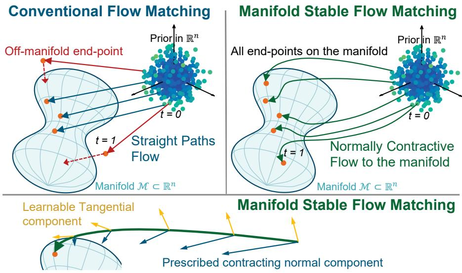
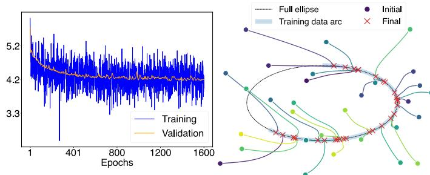
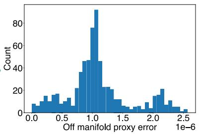
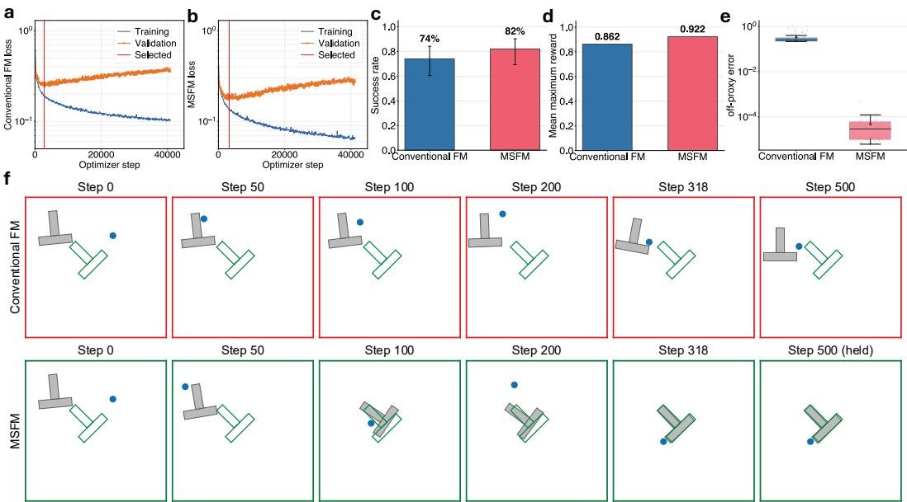
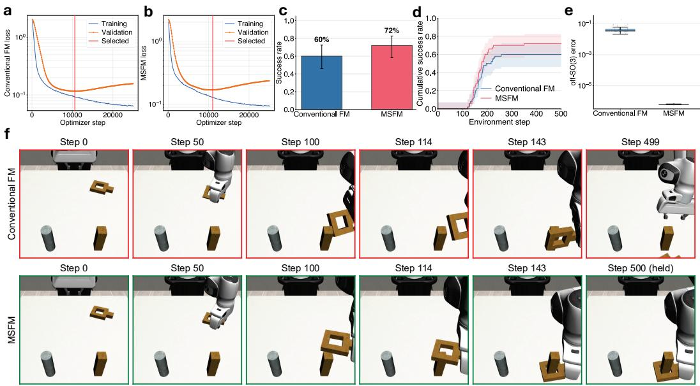

# MANIFOLD-STABLE FLOW MATCHING

Amirhossein Nazerian Department of Mechanical Engineering Colorado State University Fort Collins, CO 80523, USA a.nazerian@colostate.edu

Ali Pezeshki   
Department of Electrical and Computer Engineering   
Colorado State University   
Fort Collins, CO 80523, USA   
ali.pezeshki@colostate.edu

Jianguo Zhao Department of Mechanical Engineering Colorado State University Fort Collins, CO 80523, USA jianguo.zhao@colostate.edu

## ABSTRACT

Flow matching (FM) learns generative dynamics through velocity regression. Geometric FM variants commonly assume a prior supported on the data manifold, requiring geometric knowledge that is often unavailable. Without such knowledge, low regression error alone does not guarantee manifold adherence. Adherence keeps generated samples within valid configurations and is empirically associated with better task performance. We introduce manifold-stable flow matching (MSFM), which can start from an arbitrary ambient prior, not necessarily supported on the manifold. Using tools from nonlinear dynamics, namely contraction theory, MSFM combines learned tangential transport with prescribed normal contraction. The construction uses analytical projectors for known manifolds and local affine proxies estimated by principal component analysis for unknown data geometry. By implementing contraction theory in both cases of known and unknown manifolds, we guarantee manifold invariance and transverse convergence to the manifold within a desired time window (e.g., one second). We derive a family of compatible probability paths and decompose the training loss into a learnable tangential term and a normal residual. An ellipse experiment attains a mean terminal off-manifold error of order $1 0 ^ { - 6 }$ . In Push-T robotic experiments, MSFM raises success from 74% to 82%. In the Robomimic Square task, success increases from 60% to 72%, while rotation-manifold deviation decreases from order $1 0 ^ { - 2 } { \mathrm { ~ t o ~ } } 1 0 ^ { - 7 }$ . The MSFM terminal geometric errors are controlled by the chosen numerical tolerance. These results demonstrate stronger geometric adherence and higher observed task performance, supporting prescribed normal contraction as a complement to learned generative transport.

## 1 INTRODUCTION

Flow matching (FM) learns a time-dependent vector field whose flow transports a simple source distribution to a target data distribution through a regression objective rather than repeated ODE simulation during training (Lipman et al., 2023; Albergo et al., 2025). This framework is especially attractive for generative policies because inference reduces to integrating a learned dynamical system. However, many target distributions in robotics and structured generation are supported on, or concentrated near, a lower-dimensional manifold $\mathcal { M } \subset \mathbb { R } ^ { n }$ . Examples include rotation matrix parameterizations, rigid-body poses, constrained actions, and data-driven task manifolds.

Adherence to this manifold matters. First, samples off the manifold may not be valid outputs: a generated rotation that is not in SO(3) cannot be executed and must be projected after the fact, and projecting a sample that has drifted far from the manifold can yield an unintended action. Second, when the manifold is unknown, as for expert actions in imitation learning, samples off the data geometry correspond to actions the demonstrations do not support. In closed-loop control, such errors can compound, and adherence to the expert action geometry can matter more for performance than low validation error (Pan et al., 2026).

  
Figure 1: Schematic comparison. Linear conditional FM paths do not necessarily stay near a curved target manifold (top-left panel). MSFM (top-right panel) learns tangential transport and prescribes normal contraction, which guarantees convergence to the manifold. The learned MSFM sampling trajectories can curve because MSFM learns tangential motion, while it prescribes normal contraction (bottom panel). The normal component of the flow uniquely minimizes kinetic action.

Conventional FM, however, controls only the expected velocity error on sampled training paths. It matches distributions through training but provides no mechanism that pulls generated trajectories back to the manifold, so a model with low regression loss can still drift away from it. Existing remedies are limited: post-hoc projection requires a known manifold and corrects only the final sample, while geometric FM methods require both a known manifold and a prior supported on it.

We propose manifold-stable flow matching (MSFM), which separates learned transport along the data geometry from prescribed convergence toward it. For a known manifold, analytical tangent and normal projectors define this separation, while local principal component analysis (PCA) is used for unknown manifolds. Using contraction theory from nonlinear dynamics, we form a normal contractive flow to the data manifold, such that the flow (starting from a prior distribution outside of the manifold) is guaranteed to converge to the manifold within a desired time window (e.g., 1 second). Figure 1 provides a schematic comparison between the conventional FM and our novel MSFM.

Our main contribution is MSFM, a flow-matching framework that provably converges to the data manifold from an arbitrary ambient prior within a finite time window. This guarantee holds regardless of regression accuracy since the network learns only tangential transport while normal contraction is prescribed. We use analytical projectors when the geometry is known and local PCA affine proxies otherwise. We support this framework theoretically by deriving a family of compatible tangent– normal probability paths and an orthogonal loss decomposition that separates what the network learns from what is prescribed. We prove manifold invariance and transverse convergence. We support it empirically on an ellipse and two robotic manipulation tasks: under matched network capacity, MSFM reduces off-manifold error by multiple orders of magnitude on Push-T and Robomimic Square, and raises observed success.

## 2 RELATED WORK

Intrinsic flow matching. Flow matching learns transport through velocity regression (Lipman et al., 2023). Riemannian flow matching defines paths and tangent vector fields on a known manifold (Chen & Lipman, 2024), with applications to robot policies and pose estimation (Braun et al., 2024; Ding et al., 2025; Ouyang et al., 2025). Extensions modify the regression objective (Zaghen et al.,

2025; 2026) or target one-step generation (Zhong et al., 2026). These intrinsic formulations start from manifold-supported priors, often by mapping noise onto the manifold. Pullback flow matching learns geometry for intrinsic transport but also uses a manifold-adapted source (de Kruiff et al., 2025).

Learned geometry and ambient-space transport. Metric flow matching learns ambient metrics and interpolants that favor proximity to observations (Kapusniak et al., 2024). Meta Flow Matching´ instead studies dynamics on the Wasserstein space of distributions, rather than imposing a geometric constraint on individual samples (Atanackovic et al., 2025). Energy matching transports ambient noise using a learned potential (Balcerak et al., 2026). Recent works also provided flow matching variations that respect data geometry (Bamberger et al., 2026; Jiang et al., 2026; Kumar et al., 2026; Habashy & Eliasmith, 2026; Cai et al., 2026; Wu et al., 2026). Flow matching has also been investigated in constrained generation, stability, and domain topology contexts (Li et al., 2026; Guan et al., 2026; Yang et al., 2026; Wyrwal et al., 2026; Baldan et al., 2026; Tauberschmidt et al., 2026). For data on a linear subspace, Pi et al. (2026) use ambient Gaussian noise, retain an analytical normal velocity, and derive statistical convergence bounds. Such bounds complement geometric stability: finite distributional error does not ensure exact manifold membership or a prescribed trajectory-wise contraction rate, although vanishing Wasserstein error implies concentration near a manifold-supported target.

Stable learned dynamics. Contraction theory provides tools for incremental and partial stability (Lohmiller & Slotine, 1998; Wang & Slotine, 2005; Tsukamoto et al., 2021; Aminzare & Sontag, 2014; Bullo, 2026), with developments in nonlinear control, modular systems, and differential growth analysis (Lohmiller & Slotine, 2000; Slotine & Lohmiller, 2001; Slotine, 2003; Aminzare & Sontag, 2013; Nazerian et al., 2024). Structured neural dynamics impose contraction (Beik Mohammadi et al., 2024; Jaffe et al., 2024); related stability constructions appear in flow matching (Sprague et al., 2024) and LaSalle-based Riemannian policies (Ding et al., 2025).

Generative robotic policies. Diffusion Policy and Robomimic provide established settings for generative policies and offline imitation learning (Chi et al., 2025; Mandlekar et al., 2022). Generative robotic policies have used manifold-valued poses or states (Ryu et al., 2024; Chatzipantazis et al., 2025), spatial equivariance (Tie et al., 2025; Wang et al., 2025; Yang et al., 2025; Zhu et al., 2025), and projection onto feasible trajectories (Bouvier et al., 2025), while empirical work has examined how accurately diffusion policies learn kinematic constraint manifolds (Foland et al., 2025). Flowmatching policies have also studied point-cloud-conditioned action generation, spatial equivariance, and consistency training for manipulation (Chisari et al., 2025; Zhang et al., 2026; Yan et al., 2025).

MSFM learns tangential transport while prescribing normal contraction independently of tangential regression accuracy. Crucially, its prior need not lie on, or first be mapped onto, the target manifold. This permits analytical projectors for known manifolds or local PCA affine proxies for unknown expert-action geometry, without learning a global intrinsic parameterization. Under the stated projec tion and proxy-selection assumptions, contraction theory guarantees convergence from admissible ambient initializations to the known manifold or the modeled proxy geometry, respectively.

## 3 BACKGROUND AND PROBLEM FORMULATION

We first review the conventional FM. Let $p _ { 0 }$ be a source distribution on $\mathbb { R } ^ { n }$ and $p _ { \mathrm { d a t a } }$ the target distribution. Conditional flow matching samples $x _ { 0 } \sim p _ { 0 } , x _ { 1 } \sim p _ { \mathrm { d a t a } }$ , and $t \sim \mathcal { U } [ 0 , 1 ]$ , constructs $x _ { t } = \gamma ( t ; x _ { 0 } , x _ { 1 } )$ with velocity $u _ { t } = \partial _ { t } \gamma ( t ; x _ { 0 } , x _ { 1 } )$ , and minimizes

$$
\mathcal { L } _ { \mathrm { F M } } ( \theta ) = \mathbb { E } \big [ \| v _ { \theta } ( t , x _ { t } ) - u _ { t } \| ^ { 2 } \big ] .\tag{1}
$$

At inference, one draws $x ( 0 ) \sim p _ { 0 }$ and integrates $\dot { x } = v _ { \theta } ( t , x )$ . The usual Euclidean path is $x _ { t } = ( 1 - t ) x _ { 0 } + t x _ { 1 }$ , with $\dot { x } _ { t } = x _ { 1 } - x _ { 0 }$ . More general scalar interpolations change all ambient directions, including components locally tangent and normal to the data manifold.

## 3.1 EMBEDDED-MANIFOLD GEOMETRY

Let $\mathcal { M } \subset \mathbb { R } ^ { n }$ be a smooth embedded manifold. Close enough to $\mathcal { M } .$ , in a tubular neighborhood $u ,$ every point x has a unique nearest point on the manifold, $y = \Pi ( x )$ , which depends smoothly on x.

We define an offset $r ( x ) = x - \Pi ( x ) = x - y .$ , which means we can split x into this base point and the offset, ${ \mathrm { i . e . , } } x = y + r ( x ) . { \mathrm { ~ A t ~ } } y$ , let $P _ { y }$ project onto the tangent space $T _ { y } \mathcal { M }$ and $Q _ { y } = I - P _ { y }$ onto the normal space. The offset r points straight away from the manifold, so $Q _ { y } r = r$ , and its length is the distance to M. We measure this distance with

$$
\begin{array} { r } { V _ { \mathcal { M } } ( \boldsymbol { x } ) = \frac { 1 } { 2 } \operatorname { d i s t } ( \boldsymbol { x } , \boldsymbol { \mathcal { M } } ) ^ { 2 } = \frac { 1 } { 2 } \| \boldsymbol { r } ( \boldsymbol { x } ) \| ^ { 2 } , \qquad \nabla V _ { \mathcal { M } } ( \boldsymbol { x } ) = \boldsymbol { r } ( \boldsymbol { x } ) . } \end{array}\tag{2}
$$

Why conventional flow matching does not imply stability. Along a generated trajectory ${ \dot { x } } =$ $v _ { \boldsymbol { \theta } } ( t , \boldsymbol { x } )$ , the distance changes as $\dot { V } _ { \mathcal { M } } = r ( x ) ^ { \top } v _ { \theta } ( t , x )$ : only the normal component of the velocity matters. Samples are attracted to M if this rate is negative everywhere off the manifold, for instance

$$
\dot { V } _ { \mathcal { M } } = r ( x ) ^ { \top } v _ { \theta } ( t , x ) \leq - \alpha ( t ) \| r ( x ) \| ^ { 2 } , \qquad \alpha ( t ) > 0 ,\tag{3}
$$

which makes the distance shrink at rate at least $\alpha ( t )$ at every point of every trajectory. The regression loss (1) only makes the velocity error small on average over sampled training paths, so it cannot enforce this pointwise condition: a model with low loss can still drift away from M at inference. MSFM enforces (3) by construction while learning tangential transport.

## 4 MANIFOLD-STABLE FLOW MATCHING

MSFM has two ingredients: a sampling field, used at inference, that learns motion along the manifold and prescribes contraction toward it; and a training path that supplies the regression targets. The two must agree in the normal direction. We construct both for known manifolds (Section 4.1) and for unknown manifolds via local affine proxies (Section 4.2).

## 4.1 KNOWN-MANIFOLD CONSTRUCTION

For an unconstrained network w and $y = \Pi ( x )$ , define

$$
v _ { \theta } ( t , x ) = P _ { y } w _ { \theta } ( t , x ) - \alpha ( t ) r ( x ) .\tag{4}
$$

The learned component is the tangent $P _ { y } w _ { \theta } ( t , x )$ ; the prescribed normal feedback $- \alpha ( t ) r ( x )$ vanishes on M. The positive, locally integrable rate $\alpha ( t )$ is specified in Section 4.4

For source $x _ { 0 } \in \mathcal { U }$ and target $x _ { 1 } \in { \mathcal { M } } .$ , construct

$$
\boldsymbol { x } _ { t } = { y } _ { t } + \boldsymbol { r } _ { t } , \qquad \boldsymbol { y } _ { t } \in \mathcal { M } , \quad \boldsymbol { r } _ { t } \in N _ { y _ { t } } \mathcal { M } .\tag{5}
$$

Choose a smooth base curve from $y _ { 0 } \ = \ \Pi ( x _ { 0 } )$ to $y _ { 1 } ~ = ~ x _ { 1 }$ , for example the geodesic $y _ { t } =$ $\mathrm { E x p } _ { y _ { 0 } } ( t \mathrm { L o g } _ { y _ { 0 } } ( x _ { 1 } ) )$ , using the Riemannian exponential and a suitable logarithm branch. Set $r _ { 0 } = x _ { 0 } - y _ { 0 }$ and $Q _ { t } = Q _ { y _ { t } }$ , and define

$$
\dot { r } _ { t } = { \dot { Q } } _ { t } r _ { t } - \alpha ( t ) r _ { t } , \qquad r ( 0 ) = r _ { 0 } .\tag{6}
$$

Here $\dot { Q } _ { t } = \mathrm { d } Q _ { y _ { t } } / \mathrm { d } t$ accounts for the changing normal space, while

$$
\| r _ { t } \| = q _ { \perp } ( t ) \| r _ { 0 } \| , \qquad q _ { \perp } ( t ) = \exp \left( - \int _ { 0 } ^ { t } \alpha ( \tau ) \mathrm { d } \tau \right) .
$$

For each sampled time $t ,$ first obtain $r _ { t }$ by evaluating the solution of (6), either in closed form when available or by integrating this prescribed linear ODE from 0 to t. The training pair is then

$$
x _ { t } = y _ { t } + r _ { t } , \qquad u _ { t } = \dot { y } _ { t } + \dot { Q } _ { t } r _ { t } - \alpha ( t ) r _ { t } .
$$

For the SO(3) geometry used in our experiments, $r _ { t }$ has the explicit expression given in (15) (Appendix A). Assuming $\Pi ( x _ { t } ) = y _ { t }$ throughout, sampling $x _ { 0 } \sim p _ { 0 }$ defines $p _ { t } ( \cdot \mid x _ { 1 } )$ as the law of $x _ { t }$ . Lemma 1 in Appendix B proves that $r _ { t }$ remains normal at $y _ { t }$ , with $\| r _ { t } \| \overset { \cdot } { = } q _ { \perp } ( { \dot { t } } ) \| r _ { 0 } \|$ , and that the target velocity satisfies $Q _ { t } u _ { t } = - \alpha ( t ) r _ { t } . \ \mathrm { I f } \ y _ { t }  x _ { 1 }$ and $\textstyle \int _ { 0 } ^ { 1 } \alpha ( t ) \mathrm { d } t = \infty$ , the resulting path converges to $x _ { 1 }$ as $t  1 ^ { - }$

## 4.2 UNKNOWN MANIFOLD: LOCAL AFFINE PROXIES

For samples $\mathcal { D } = \{ x _ { i } ^ { * } \} _ { i = 1 } ^ { N } .$ , local PCA supplies orthonormal tangent bases $T _ { i }$ and affine proxies

$$
P _ { i } = T _ { i } T _ { i } ^ { \top } , \quad Q _ { i } = I - P _ { i } , \quad \widehat { \mathcal { M } } _ { i } = x _ { i } ^ { * } + \mathrm { r a n g e } ( T _ { i } ) .
$$

Define $r _ { i } ( x ) ~ = ~ Q _ { i } ( x - x _ { i } ^ { * } )$ . Select a proxy by nearest anchor or minimum normal residual, $\begin{array} { r } { i ( x ) \in \arg \operatorname* { m i n } _ { i } \frac { 1 } { 2 } \| r _ { i } ( x ) \| ^ { 2 } } \end{array}$ , and use

$$
v _ { \theta } ( t , x ) = P _ { i ( x ) } w _ { \theta } ( t , x ) - \alpha ( t ) r _ { i ( x ) } ( x ) .\tag{7}
$$

This data-derived geometry is related to off-manifold residual metrics (Pan et al., 2026). Algorithm 1 gives its construction.

For a fixed proxy containing $x _ { 1 }$ , set $s _ { 0 } = P _ { i } ( x _ { 0 } - x _ { 1 } )$ and $r _ { 0 } = Q _ { i } ( x _ { 0 } - x _ { 1 } )$ . Since $\dot { Q } _ { i } = 0 ;$ , a compatible path is

$$
\begin{array} { r } { x _ { t } = x _ { 1 } + ( 1 - t ) s _ { 0 } + q _ { \perp } ( t ) r _ { 0 } , \qquad u _ { t } = - s _ { 0 } - \alpha ( t ) q _ { \perp } ( t ) r _ { 0 } . } \end{array}\tag{8}
$$

## 4.3 ALGORITHMS

Training regresses the tangential velocity and records the normal residual separately. Sampling integrates the learned field from $p _ { 0 }$ , using current-state geometry.

Algorithm 1 is needed only when the manifold is unknown. Algorithms 2 and 3 apply to both known and unknown manifolds, through the following shared notation:

$$
( P ( x ) , r ( x ) ) = \{ { \begin{array} { l l } { ( P _ { \Pi ( x ) } , x - \Pi ( x ) ) , } & { { \mathrm { k n o w n ~ m a n i f o l d } } , } \\ { ( P _ { i ( x ) } , Q _ { i ( x ) } ( x - x _ { i ( x ) } ^ { * } ) ) , } & { { \mathrm { u n k n o w n ~ m a n i f o l d } } , } \end{array} } \quad \quad Q ( x ) = I - P ( x ) .\tag{9}
$$

Algorithm 1 Local Proxy Preprocessing (Only when the manifold is unknown)   
Require: Dataset D, neighbor count $k ,$ dimension rule   
1: for each anchor $x _ { i } ^ { * } \in \mathcal { D }$ do   
2: Form $Y _ { i }$ from its k nearest-neighbor differences.   
3: Let $T _ { i }$ contain the leading $d _ { i }$ left singular vectors of $Y _ { i }$   
4: Set $\dot { P _ { i } } = T _ { i } T _ { i } ^ { \top }$ and $Q _ { i } \stackrel { - } { = } I - P _ { i }$   
5: end for   
6: return $\{ P _ { i } , Q _ { i } \} _ { i = 1 } ^ { N } .$

Algorithm 2 MSFM Training   
Require: p<sub>0</sub>, data, geometry, rate α, cutoff δ, network w<sub>θ</sub>   
1: while not converged do   
2: Sample $( x _ { 0 } , x _ { 1 } , t )$ and construct $( x _ { t } , u _ { t } )$ using the chosen path.   
3: Evaluate $P , Q ,$ and r at $x _ { t }$ using the sampling geometry.   
4: Update θ to minimize $\lVert P ( w _ { \theta } ( t , x _ { t } ) - u _ { t } ) \rVert _ { \cdot } ^ { 2 } \mathrm { . }$   
5: Record the normal residual $\lVert Q u _ { t } + \alpha ( t ) r \rVert ^ { 2 } .$   
6: end while

```perl
Algorithm 3 MSFM Sampling
Require: $p _ { 0 } ,$ , trained w , geometry, rate α, cutoff δ
1: Draw $x ( 0 ) \sim p _ { 0 } ;$ hold any observed condition fixed.
2: for ODE steps up to $t = \dot { 1 } - \delta$ do
3: Evaluate the current-state field (4) or (7).
4: Advance the numerical solver.
5: end for
6: return $x ( 1 - \delta )$
```

## 4.4 CONTRACTION SCHEDULE

We use constant plus singular contraction, with $\alpha _ { 0 } \geq 0$ and $\beta > 0 \colon$

$$
\alpha ( t ) = \alpha _ { 0 } + \frac { \beta } { 1 - t } , \qquad 0 \leq t < 1 ,\tag{10}
$$

and $q _ { \perp } ( t ) = e ^ { - \alpha _ { 0 } t } ( 1 - t ) ^ { \beta }$ . Since $q _ { \perp } ( t )  0$ , normal displacement vanishes at the terminal limit. Numerically, integrate to $1 - \delta$ in log time $\tau = - \log ( 1 - t )$ , which makes $( 1 - t ) \alpha ( t ) = \alpha _ { 0 } e ^ { - \tau } + \beta$ bounded; details are in Appendix D.

Linear-path special case. For a fixed affine proxy containing $x _ { 1 } , \alpha _ { 0 } = 0$ and $\beta = 1$ reduce (8) to $x _ { t } = ( 1 - t ) x _ { 0 } + t x _ { 1 }$ and $\boldsymbol { u } _ { t } = \boldsymbol { x } _ { 1 } - \boldsymbol { x } _ { 0 }$ . This does not extend to curved-manifold paths.

Physical interpretation. The normal potential $V = \textstyle { \frac { 1 } { 2 } } \| r _ { t } \| ^ { 2 }$ satisfies $\dot { V } = - 2 \alpha ( t ) V ;$ tangential transport accompanies normal relaxation. For a fixed base curve and $\alpha _ { 0 } = 0$ , the normal path also uniquely minimizes a time-weighted normal kinetic action. When $\beta = 1$ , the weight is constant; the full ambient path can still curve as the base point and normal space move. This is normal-motion optimality, not an optimal-transport claim for the full trajectory. Appendix B.1 defines the action and proves the result.

Since all contracting dynamical systems are dissipative (i.e., the volume of the ball of initial conditions tends to zero eventually), our MSFM is also normally dissipative: the volume of all perturbations to the initial condition in the normal direction to the manifold will tend to zero.

## 5 THEORETICAL GUARANTEES

Proposition 1 (Orthogonal MSFM loss decomposition). At afixed training pair $( x _ { t } , u _ { t } )$ , let P be either geometry’s tangent projector in $( 9 ) , Q = \bar { I } - P ,$ , and r its normal residual. For $v _ { \theta } = P w _ { \theta } - \alpha r _ { \theta }$

$$
\lVert \boldsymbol { v } _ { \theta } - \boldsymbol { u } _ { t } \rVert ^ { 2 } = \lVert P ( w _ { \theta } - u _ { t } ) \rVert ^ { 2 } + \lVert Q u _ { t } + \alpha ( t ) r \rVert ^ { 2 } .\tag{11}
$$

The normal term is parameter-independent and vanishes exactly when $Q u _ { t } = - \alpha ( t ) r$

Assume $\alpha ( t )$ is positive and locally integrable for $t \in [ 0 , 1 )$ , with $\begin{array} { r } { \int _ { 0 } ^ { 1 } \alpha ( t ) \mathrm { d } t = \infty \left( \mathbf { e } . \mathbf { g } . \right. } \end{array}$ , as in (10)). Solutions must exist up to each $t < 1 ;$ for the known-manifold field, assume local uniqueness and that the trajectory remains in the smooth projection neighborhood. We first show that, for a known manifold, the prescribed normal feedback alone keeps samples on M and drives off-manifold samples toward it.

Theorem 1 (Manifold invariance and convergence). Suppose the solution $o f \left( 4 \right)$ remains in U. If $x ( 0 ) \in \mathcal { M }$ , then $x ( t ) \in \mathcal { M }$ for all times ofexistence. For arbitrary $x ( 0 ) \in \mathcal { U }$

$$
\mathrm { d i s t } ( x ( t ) , \mathcal { M } ) \leq \exp \left( - \int _ { 0 } ^ { t } \alpha ( \tau ) \mathop { } \mathrm { d } \tau \right) \mathrm { d i s t } ( x ( 0 ) , \mathcal { M } ) .\tag{12}
$$

Then dist $( x ( t ) , \mathcal { M } ) \to 0 a s t \to 1 ^ { - }$

The same mechanism applies when the manifold is unknown: using a single local PCA proxy.

Theorem 2 (Fixed-proxy convergence). Fix i and consider $\dot { x } = P _ { i } w _ { \theta } ( t , x ) - \alpha ( t ) Q _ { i } ( x - x _ { i } ^ { * } )$ . Then

$$
\| Q _ { i } ( x ( t ) - x _ { i } ^ { * } ) \| \leq \exp \biggl ( - \int _ { 0 } ^ { t } \alpha ( \tau ) \mathrm { d } \tau \biggr ) \| Q _ { i } ( x ( 0 ) - x _ { i } ^ { * } ) \| .\tag{13}
$$

Consequently, $\| Q _ { i } ( x ( t ) - x _ { i } ^ { * } ) \|  0$ as $t  1 ^ { - }$

During sampling, the active proxy may switch as the state moves. Define $V _ { \mathrm { p r o x y } } ( x ) = \mathrm { m i n } _ { i } \frac { 1 } { 2 } \| Q _ { i } ( x -$ $x _ { i } ^ { * } ) \| ^ { 2 }$ and $\widehat { \mathcal { M } } _ { \mathrm { p r o x y } } = \bigcup _ { i } \widehat { \mathcal { M } } _ { i }$ . The next result shows that such switching does not break convergence. Theorem 3 (Convergence to the proxy set). Under the minimum-residual selector $i ( x ) \in$ arg min $\textstyle { \frac { 1 } { 2 } } \| r _ { i } ( x ) \| ^ { 2 }$ , any absolutely continuous solutionfor which (7) is well defined satisfies

$$
V _ { \mathrm { p r o x y } } ( x ( t ) ) \leq \exp \left( - 2 \int _ { 0 } ^ { t } \alpha ( \tau ) \mathop { } \mathrm { d } \tau \right) V _ { \mathrm { p r o x y } } ( x ( 0 ) ) .\tag{14}
$$

Consequently, dist $\mathbf { \chi } ( x ( t ) , \widehat { \mathcal { M } } _ { \mathrm { p r o x y } } )$ obeys the corresponding square-root bound and converges to zero.



  
Figure 2: Ellipse: training/validation losses over 1,600 epochs, sampling trajectories, and terminal off-proxy errors for 700 samples. Here, we approximate the manifold (the ellipse) by local affine proxies using PCA.

Finally, for $\alpha ( t )$ in (10), these bounds take an explicit form that quantifies convergence by $t = 1$ Corollary 1 (Exponential–polynomial terminal bound). For (10), let S denote either $\mathcal { M } ,$ or afixed proxy $\widehat { \mathcal { M } } _ { i }$ , or the proxy union $\widehat { \mathcal { M } } _ { \mathrm { p r o x y } } ,$ , as appropriate. Then

$$
\operatorname { d i s t } ( x ( t ) , S ) \leq e ^ { - \alpha _ { 0 } t } ( 1 - t ) ^ { \beta } \operatorname { d i s t } ( x ( 0 ) , S ) .
$$

At the numerical terminal time 1 − δ, the bound is dist $( x ( 1 - \delta ) , S ) \leq e ^ { - \alpha _ { 0 } ( 1 - \delta ) } \delta ^ { \beta } \operatorname { d i s t } ( x ( 0 ) , S )$

Proofs are given in Appendix C. Theorems 1–3 guarantee geometric stability, which should not be confused with exact matching of the tangential data distribution. Under normal path compatibility and exact population regression, the conventional flow-matching marginalization argument applies to the resulting compatible conditional field (Lipman et al., 2023). Without compatibility, the normal residual in (11) must be treated as a modeling tradeoff rather than hidden inside the training loss.

## 6 EXPERIMENTS

We choose three experiments that together cover both settings of MSFM: an ellipse, an unknown curved manifold whose analytic form lets us verify convergence; disturbed Push-T control, an unknown manifold of expert actions approximated by local PCA proxies; and nominal Robomimic Square manipulation, a known SO(3) manifold with analytical projectors. In each case, we report geometric validity separately from task success.

## 6.1 ELLIPSE WITH LOCAL LINEAR PROXIES

The target manifold is the ellipse arc $( 2 \cos \varphi , \sin \varphi ) , \varphi \in [ - 3 \pi / 4 , \pi / 2 )$ , represented by onedimensional local PCA proxies; its analytic geometry is not supplied to the model. MSFM uses a uniform ambient prior, linear training paths, and $\alpha ( t ) \dot { = } 1 / ( 1 - \bar { t } )$ . Across 700 generated samples, mean terminal off-proxy error is $1 . \dot { 1 0 } \times 1 0 ^ { - 6 }$ and mean analytic ellipse residual is $9 . 7 4 \times \dot { 1 } 0 ^ { - 5 }$ (Figure 2). These results show adherence to the learned geometry, not distributional equivalence or superiority over FM. Appendix E gives data, training, and diagnostic details.

Shared robotic-policy protocol. Within the following Push-T and Robomimic Square tasks, FM and MSFM share state observations, action representations, temporal U-Net capacity, Gaussian priors, and AdamW optimization. Both use validation-selected checkpoints, receding-horizon execution, and matched RK4 field-evaluation budgets with method-specific time grids. Our U-net has channel widths (16, 32, 64) for Push-T, and (32, 60, 124) for Robomimic Square.

## 6.2 PUSH-T

Push-T requires a planar pusher to align a T-shaped block with a target pose (Chi et al., 2025; Hugging Face, 2024). The target geometry is an unknown manifold of expert action horizons in $\mathbb { R } ^ { 1 6 }$ 8 successive 2D pusher positions. MSFM approximates this geometry by local PCA affine proxies and contracts toward the active proxy while learning tangential motion. It does not impose a manifold on the block’s physical pose. Conventional FM uses unconstrained linear-path velocity regression. Both policies condition on the pusher/block state, execute the first target, and replan.

  
Figure 3: Push-T Task. (a,b) Total FM and parallel-only MSFM training/validation losses; red lines retain the original checkpoint selection. (c,d) Disturbed success and mean maximum reward. (e) Shows that off-manifold-proxy error is 4 orders of magnitude larger for the conventional FM. (f) A matched episode run where MSFM is successful in performing the task, while the conventional FM fails. Here, we approximate the manifold (expert actions) by local affine proxies using PCA.

We report task performance only under repeated block-position disturbances. MSFM raises success from 74% to 82% and mean maximum reward from 0.86 to 0.92 (Figure 3). This improvement is consistent with transverse stabilization toward expert-supported action geometry, as shown in Fig. 3e as an off-manifold proxy error. Figure 3f shows a sample matched episode run in which the MSFM successfully performs the Push-T task, while the conventional FM fails. Appendix F provides additional details

## 6.3 ROBOMIMIC SQUARE

A Panda robot must place a square nut over its matching peg (Mandlekar et al., 2022; Zhu et al., 2020). The known action manifold is $( \mathbb { R } ^ { 3 } \times \mathrm { S O } ( 3 ) \times \mathbb { R } ) ^ { 6 \overline { { 4 } } } ,$ : 64-step horizons of translation, rotation, and gripper commands, represented in $\mathbb { R } ^ { 6 4 \times 1 3 }$ . MSFM constrains the rotation blocks to approach SO(3) using the tubular path and analytical projectors; translation and gripper components remain unconstrained. Both methods encode absolute pose goals relative to the current end-effector frame, decode with the same final rotation projection, and execute four actions before replanning. FM uses ambient linear paths.

Using the best validation checkpoints, MSFM achieves 72% success versus 60% for FM (Figure 4). Panel d also shows that, given a budget for the length of an episode, MSFM achieves a higher success rate. Mean rotation deviation before final projection falls from $1 0 ^ { - 2 } ~ \mathrm { t o } ~ 1 0 ^ { - 7 }$ in panel e. Thus, stronger SO(3) adherence accompanies higher observed success. Appendix G provides additional information.

## 7 CONCLUSION

We introduced manifold-stable flow matching (MSFM), which separates learned tangential transport from prescribed normal contraction. The formulation accommodates both known manifolds, through analytical projectors, and unknown geometry, through local affine proxies. We derived compatible probability paths and decomposed the regression loss into a learnable tangential term and a normal compatibility residual. Under the stated geometric and solution assumptions, we established manifold invariance and explicit transverse convergence bounds for known manifolds and fixed proxies, together with a proxy-union guarantee under minimum-residual selection. With a suitable contraction schedule, these bounds ensure vanishing normal deviation as flow time approaches its terminal value, without requiring exact learning of the tangential dynamics.

  
Figure 4: Robomimic Square Task. (a,b) Training/velocity-validation losses; red lines mark the checkpoint selection. (c) Success on paired nominal rollouts using best integrated-policy checkpoints. (d) Cumulative success rate vs. Robomimic environment time step. (e) Pre-projection rotation deviation, nearly five orders of magnitude lower with MSFM. (f) shows a completed episode from MSFM, while a conventional FM failed. Here, the manifold for rotation poses is SO(3).

Our work complements the notion of manifold adherence discussed by Pan et al. (2026): producing actions consistent with expert-supported geometry under unfamiliar observations can be more relevant to closed-loop performance than reducing validation error alone. MSFM makes attraction toward the chosen geometry an explicit property of the generative dynamics. In Push-T, this geometry is estimated from demonstrated action horizons; in Square, it includes the analytical rotation manifold SO(3). The stronger geometric adherence and higher observed task performance of MSFM are consistent with the importance of manifold adherence.

The absolute success rates in Push-T and Square are below those reported for state-of-the-art generative policies (e.g., Chi et al., 2023). This gap reflects our experimental design rather than a limitation of MSFM. Our goal is a controlled comparison: FM and MSFM share identical temporal U-Net backbones, conditioning, training budgets, and field-evaluation counts, so that observed differences can be attributed to the manifold-stable construction rather than to architecture or tuning. To this end, we use deliberately compact networks (156K parameters for Push-T and 859K for Square), substantially smaller than the backbones typically used in diffusion-policy benchmarks. In addition, Push-T is evaluated under repeated block disturbances, a protocol that differs from standard benchmarks, so absolute numbers are not directly comparable. Because MSFM modifies only the output field through projection and prescribed normal contraction, it is agnostic to the backbone and can be combined with larger architectures and longer training. Evaluating whether its geometric advantages persist at state-of-the-art scale is left to future work.

The experiments show geometric adherence in ellipse sampling, higher observed success and reward under Push-T disturbances, and improved Square success with substantially smaller rotation deviations. Together, these results support transverse stabilization as a useful complement to learned generative transport.

## AI USE STATEMENT

Generative AI assisted with language editing and final code polishing, optimizing readability and architectural consistency. We take responsibility for the final content of this work, including text, claims, and all numerical results.

## REPRODUCIBILITY STATEMENT

Appendix A provides a special rotation-matrix formulation. Appendix B discusses path derivations. Appendix C gives proofs, and Appendix D provides more information on the algorithms. Appendices E, F, and G document data, optimization, checkpoint selection, and solvers for our numerical experiments.

## REFERENCES

Michael Albergo, Nicholas M. Boffi, and Eric Vanden-Eijnden. Stochastic interpolants: A unifying framework for flows and diffusions. Journal ofMachine Learning Research, 26(209):1–80, 2025.

Zahra Aminzare and Eduardo D Sontag. Logarithmic lipschitz norms and diffusion-induced instability. Nonlinear Analysis: Theory, Methods & Applications, 83:31–49, 2013.

Zahra Aminzare and Eduardo D Sontag. Contraction methods for nonlinear systems: A brief introduction and some open problems. In 53rd IEEE Conference on Decision and Control, pp. 3835–3847. IEEE, 2014.

Lazar Atanackovic, Xi Nicole Zhang, Brandon Amos, Mathieu Blanchette, Leo J Lee, Yoshua Bengio, Alexander Tong, and Kirill Neklyudov. Meta flow matching: Integrating vector fields on the wasserstein manifold. In International Conference on Learning Representations, volume 2025, pp. 94586–94610, 2025.

Michal Balcerak, Tamaz Amiranashvili, Antonio Terpin, Suprosanna Shit, Lea Bogensperger, Sebastian Kaltenbach, Petros Koumoutsakos, and Bjoern Menze. Energy matching: Unifying flow matching and energy-based models for generative modeling. Advances in Neural Information Processing Systems, 38:8583–8609, 2026.

Giacomo Baldan, Qiang Liu, Alberto Guardone, and Nils Thuerey. Physics vs distributions: Pareto optimal flow matching with physics constraints. In International Conference on Learning Representations, volume 2026, pp. 101215–101243, 2026.

Jacob Bamberger, Iolo Jones, Dennis Duncan, Michael Bronstein, Pierre Vandergheynst, and Adam Gosztolai. Carre du champ flow matching: better quality-generalisation tradeoff in generative ´ models. In International Conference on Learning Representations, volume 2026, pp. 135754– 135779, 2026.

Hadi Beik Mohammadi, Sø ren Hauberg, Georgios Arvanitidis, Nadia Figueroa, Gerhard Neumann, and Leonel Rozo. Neural contractive dynamical systems. In International Conference on Learning Representations, volume 2024, pp. 49097–49120, 2024.

Jean-Baptiste Bouvier, Kanghyun Ryu, Qiayuan Liao, Koushil Sreenath, and Negar Mehr. DDAT: Diffusion Policies Enforcing Dynamically Admissible Robot Trajectories. In Proceedings of Robotics: Science and Systems, LosAngeles, CA, USA, June 2025.

Max Braun, Noemie Jaquier, Leonel Rozo, and Tamim Asfour. Riemannian flow matching policy´ for robot motion learning. In 2024 IEEE/RSJ International Conference on Intelligent Robots and Systems (IROS), pp. 5144–5151. IEEE, 2024.

F. Bullo. Contraction Theory for Dynamical Systems. Kindle Direct Publishing, 1.3 edition, 2026. ISBN 979-8836646806. URL https://fbullo.github.io/ctds.

Jian-Feng Cai, Haixia Liu, Zhengyi Su, and Chao Wang. Improving classifier-free guidance of flow matching via manifold projection. In Forty-third International Conference on Machine Learning, 2026. URL https://openreview.net/forum?id=IPp3LD6u16.

Evangelos Chatzipantazis, Nishanth Rao, and Kostas Daniilidis. Stride: State-space riemannian diffusion for equivariant planning. In Proceedings of the 7th Annual Learning for Dynamics\& Control Conference, volume 283 of Proceedings of Machine Learning Research, pp. 1338–1352. PMLR, 04–06 Jun 2025.

Ricky T. Q. Chen and Yaron Lipman. Flow matching on general geometries. In International Conference on Learning Representations, volume 2024, pp. 47922–47945, 2024.

Cheng Chi, Zhenjia Xu, Siyuan Feng, Eric Cousineau, Yilun Du, Benjamin Burchfiel, Russ Tedrake, and Shuran Song. Diffusion policy: Visuomotor policy learning via action diffusion. The International Journal ofRobotics Research, 44(10-11):1684–1704, 2025.

Eugenio Chisari, Nick Heppert, Max Argus, Tim Welschehold, Thomas Brox, and Abhinav Valada. Learning robotic manipulation policies from point clouds with conditional flow matching. In Proceedings ofThe 8th Conference on Robot Learning, volume 270 of Proceedings ofMachine Learning Research, pp. 982–993. PMLR, 06–09 Nov 2025.

Friso de Kruiff, Erik J Bekkers, Ozan Oktem, Carola-Bibiane Sch<sup>¨</sup> onlieb, and Willem Diepeveen.¨ Pullback flow matching on data manifolds. In ICML 2025 Generative AI and Biology (GenBio) Workshop, 2025.

Haoran Ding, Noemie Jaquier, Jan Peters, and Leonel Rozo. Fast and robust visuomotor riemannian´ flow matching policy. IEEE Transactions on Robotics, 41:5327–5343, 2025.

Lexi Foland, Thomas Cohn, Adam Wei, Nicholas Pfaff, Boyuan Chen, and Russ Tedrake. How well do diffusion policies learn kinematic constraint manifolds?, 2025. URL https://arxiv. org/abs/2510.01404.

Yunrui Guan, Krishna Balasubramanian, and Shiqian Ma. Mirror flow matching with heavy-tailed priors for generative modeling on convex domains. In International Conference on Learning Representations, volume 2026, pp. 130098–130124, 2026.

Karim Habashy and Chris Eliasmith. Geodesic flow matching for denoising high-dimensional structured representations. In Forty-third International Conference on Machine Learning, 2026. URL https://openreview.net/forum?id=a9CuW1f0CT.

Hugging Face. gym-pusht: A gymnasium environment for push-t. https://github.com/ huggingface/gym-pusht, 2024. Accessed 2026-07-08.

Sean Jaffe, Alexander Davydov, Deniz Lapsekili, Ambuj K. Singh, and Francesco Bullo. Learning neural contracting dynamics: Extended linearization and global guarantees. In Advances in Neural Information Processing Systems, volume 37, pp. 66204–66225. Curran Associates, Inc., 2024.

Keyue Jiang, Jiahao Cui, Xiaowen Dong, and Laura Toni. Bures-wasserstein flow matching for graph generation. In International Conference on Learning Representations, volume 2026, pp. 140522–140560, 2026.

Kacper Kapusniak, Peter Potaptchik, Teodora Reu, Leo Zhang, Alexander Tong, Michael Bronstein,´ Avishek Joey Bose, and Francesco Di Giovanni. Metric flow matching for smooth interpolations on the data manifold. In Advances in Neural Information Processing Systems, volume 37, pp. 135011–135042. Curran Associates, Inc., 2024.

Shivam Kumar, Yixin Wang, and Lizhen Lin. Flow matching is adaptive to manifold structures, 2026. URL https://arxiv.org/abs/2602.22486.

Xinpeng Li, Enming Liang, and Minghua Chen. Gauge flow matching: Efficient constrained generative modeling over general convex set and beyond. In The Fourteenth International Conference on Learning Representations, 2026. URL https://openreview.net/forum?id= vxq1OnaAMq.

Yaron Lipman, Ricky T. Q. Chen, Heli Ben-Hamu, Maximilian Nickel, and Matthew Le. Flow matching for generative modeling. In The Eleventh International Conference on Learning Representations, 2023. URL https://openreview.net/forum?id=PqvMRDCJT9t.

Winfried Lohmiller and Jean-Jacques E. Slotine. On contraction analysis for non-linear systems. Automatica, 34(6):683–696, 1998. doi: 10.1016/S0005-1098(98)00019-3.

Winfried Lohmiller and Jean-Jacques E Slotine. Nonlinear process control using contraction theory. AIChEjournal, 46(3):588–596, 2000.

Ajay Mandlekar, Danfei Xu, Josiah Wong, Soroush Nasiriany, Chen Wang, Rohun Kulkarni, Li Fei-Fei, Silvio Savarese, Yuke Zhu, and Roberto Mart´ın-Mart´ın. What matters in learning from offline human demonstrations for robot manipulation. In Proceedings of the 5th Conference on Robot Learning, volume 164 of Proceedings of Machine Learning Research, pp. 1678–1690. PMLR, 08–11 Nov 2022.

Amirhossein Nazerian, Francesco Sorrentino, and Zahra Aminzare. Bridging the gap between reactivity, contraction, and finite-time lyapunov exponents. arXiv preprint arXiv:2410.23435, 2024.

Wenzhe Ouyang, Qi Ye, Jinghua Wang, Zenglin Xu, and Jiming Chen. Rfmpose: Generative categorylevel object pose estimation via riemannian flow matching. In Advances in Neural Information Processing Systems, volume 38, Main Conference, pp. 67591–67610. Curran Associates, Inc., 2025.

Chaoyi Pan, Giridharan Anantharaman, Nai-Chieh Huang, Claire Jin, Daniel Pfrommer, Chenyang Yuan, Frank Permenter, Guannan Qu, Nicholas Boffi, Guanya Shi, and Max Simchowitz. Much ado about noising: Dispelling the myths of generative robotic control. In International Conference on Learning Representations, volume 2026, pp. 90575–90614, 2026.

Sophia Pi, Mingcheng Lu, Jerry Yao-Chieh Hu, Maojiang Su, Weimin Wu, and Han Liu. Learning manifold data with flow matching. In ICML 2026 Workshop on Foundations ofDeep Generative Models: Understanding Memorization, Generalization, and Reasoning, 2026.

Hyunwoo Ryu, Jiwoo Kim, Hyunseok An, Junwoo Chang, Joohwan Seo, Taehan Kim, Yubin Kim, Chaewon Hwang, Jongeun Choi, and Roberto Horowitz. Diffusion-edfs: Bi-equivariant denoising generative modeling on se(3) for visual robotic manipulation. In 2024 IEEE/CVF Conference on Computer Vision and Pattern Recognition (CVPR), pp. 18007–18018, 2024.

J.-J.E. Slotine and W. Lohmiller. Modularity, evolution, and the binding problem: a view from stability theory. Neural Networks, 14(2):137–145, 2001. ISSN 0893-6080.

Jean-Jacques E Slotine. Modular stability tools for distributed computation and control. International Journal of Adaptive Control and Signal Processing, 17(6):397–416, 2003.

Christopher Iliffe Sprague, Arne Elofsson, and Hossein Azizpour. Incorporating stability into flow matching. In ICML 2024 Workshop on Structured Probabilistic Inference & Generative Modeling, 2024.

Jan Tauberschmidt, Sophie Fellenz, Sebastian Vollmer, and Andrew Duncan. Physics-constrained fine-tuning of flow-matching models for generation and inverse problems. In C. Vondrick, B. Hariharan, C. Raffel, L. Pinto, D. Yang, and A. Faust (eds.), International Conference on Learning Representations, volume 2026, pp. 143992–144037, 2026.

Chenrui Tie, Yue Chen, Ruihai Wu, Boxuan Dong, Zeyi Li, Chongkai Gao, and Hao Dong. Etseed: Efficient trajectory-level se(3) equivariant diffusion policy. In International Conference on Learning Representations, volume 2025, pp. 60114–60132, 2025.

Hiroyasu Tsukamoto, Soon-Jo Chung, and Jean-Jacques E. Slotine. Contraction theory for nonlinear stability analysis and learning-based control: A tutorial overview. Annual Reviews in Control, 52: 135–169, 2021.

Dian Wang, Stephen Hart, David Surovik, Tarik Kelestemur, Haojie Huang, Haibo Zhao, Mark Yeatman, Jiuguang Wang, Robin Walters, and Robert Platt. Equivariant diffusion policy. In Proceedings ofThe 8th Conference on Robot Learning, volume 270 of Proceedings ofMachine Learning Research, pp. 48–69. PMLR, 06–09 Nov 2025.

Wei Wang and Jean-Jacques E Slotine. On partial contraction analysis for coupled nonlinear oscillators. Biological cybernetics, 92(1):38–53, 2005.

Junwei Wu, Yihang Liu, Ruixuan Yu, and Jian Sun. Flow for future: Geometric SE(3)-equivariant flow matching for 3d trajectory prediction. In Forty-third International Conference on Machine Learning, 2026.

Kacper Wyrwal, Ismail I Ceylan, and Alexander Tong. Topological flow matching. In International Conference on Learning Representations, volume 2026, pp. 21075–21100, 2026.

Ge Yan, Jiyue Zhu, Yuquan Deng, Shiqi Yang, Ri-Zhao Qiu, Xuxin Cheng, Marius Memmel, Ranjay Krishna, Ankit Goyal, Xiaolong Wang, and Dieter Fox. Maniflow: A general robot manipulation policy via consistency flow training. In Proceedings of The 9th Conference on Robot Learning, volume 305 of Proceedings ofMachine Learning Research, pp. 2268–2293. PMLR, 27–30 Sep 2025.

Jeongyong Yang, Seunghwan Jang, and SooJean Han. Safeflowmatcher: Safe and fast planning using flow matching with control barrier functions. In International Conference on Learning Representations, volume 2026, pp. 54058–54087, 2026.

Jingyun Yang, Ziang Cao, Congyue Deng, Rika Antonova, Shuran Song, and Jeannette Bohg. Equibot: Sim(3)-equivariant diffusion policy for generalizable and data efficient learning. In Proceedings of The 8th Conference on Robot Learning, volume 270 of Proceedings of Machine Learning Research, pp. 1048–1068. PMLR, 06–09 Nov 2025.

Olga Zaghen, Floor Eijkelboom, Alison Pouplin, and Erik J Bekkers. Towards variational flow matching on general geometries. In ICLR 2025 Workshop on Deep Generative Model in Machine Learning: Theory, Principle and Efficacy, 2025.

Olga Zaghen, Floor Eijkelboom, Alison Pouplin, Cong Liu, Max Welling, Jan-Willem van de Meent, and Erik Bekkers. Riemannian variational flow matching for material and protein design. In International Conference on Learning Representations, volume 2026, pp. 34243–34286, 2026.

Qinglun Zhang, Shen Cheng, Tian Dan, Haoqiang Fan, Guanghui Liu, and Shuaicheng Liu. Efficient hybrid se(3)-equivariant visuomotor flow policy via spherical harmonics for robot manipulation. In Proceedings of the IEEE/CVF Conference on Computer Vision and Pattern Recognition (CVPR), pp. 27989–27998, June 2026.

Zichen Zhong, Haoliang Sun, Yukun Zhao, Yongshun Gong, and Yilong Yin. Riemannian meanflow for one-step generation on manifolds. In Forty-third International Conference on Machine Learning, 2026. URL https://openreview.net/forum?id=DeOm4Axr9W.

Xupeng Zhu, Fan Wang, Robin Walters, and Jane Shi. SE(3)-equivariant diffusion policy in spherical Fourier space. In Proceedings of the 42nd International Conference on Machine Learning, volume 267 of Proceedings ofMachine Learning Research, pp. 80187–80206. PMLR, 13–19 Jul 2025.

Yuke Zhu, Josiah Wong, Ajay Mandlekar, Roberto Mart´ın-Mart´ın, Abhishek Joshi, Kevin Lin, Abhiram Maddukuri, Soroush Nasiriany, and Yifeng Zhu. robosuite: A modular simulation framework and benchmark for robot learning. arXiv preprint arXiv:2009.12293v3, 2020.

## A ROTATION-MATRIX SPECIALIZATION

For an ambient matrix $\boldsymbol { X } \in \mathbb { R } ^ { 3 \times 3 }$ , let $R = \Pi _ { \mathrm { S O ( 3 ) } } ( X )$ be the nearest proper rotation. For a matrix direction $Z ,$ the analytical projectors are

$$
\begin{array} { r l } & { P _ { R } ( Z ) = R \mathrm { s k e w } ( R ^ { \top } Z ) , } \\ & { Q _ { R } ( Z ) = R \mathrm { s y m } ( R ^ { \top } Z ) . } \end{array}
$$

Here $\mathrm { s k e w } ( B ) = ( B - B ^ { \top } ) / 2$ and $\operatorname { s y m } ( B ) = ( B + B ^ { \top } ) / 2$ , with orthogonality measured by the Frobenius inner product. The ambient MSFM specialization is

$$
\dot { X } = P _ { R } ( W _ { \theta } ( t , X ) ) - \alpha ( t ) ( X - R ) , \qquad R = \Pi _ { \mathrm { S O } ( 3 ) } ( X ) .
$$

Here $W _ { \theta }$ denotes the network’ $s 3 \times 3$ matrix output. Theorem 1 applies wherever the nearest-rotation projection is smooth, and the solution remains in its domain. Square uses this field for each rotation block; the translation and gripper components are unconstrained.

Explicit conditional path. For an ambient source matrix $X _ { 0 }$ and target rotation $R _ { 1 } { \mathrm { . } }$ , set $R _ { 0 } =$ $\tilde { \Pi _ { \mathrm { S O ( 3 ) } } } ( X _ { 0 } ) , \tilde { S _ { 0 } } = \tilde { R _ { 0 } ^ { \dagger } } ( X _ { 0 } - R _ { 0 } )$ , and $\Omega = \log ( R _ { 0 } ^ { \top } R _ { 1 } )$ , using a chosen rotation-logarithm branch. The matrix $S _ { 0 }$ is symmetric and Ω is skew-symmetric. Along the geodesic $R _ { t } = R _ { 0 } e ^ { t \Omega }$ , the solution of (6) is

$$
r _ { t } = q _ { \perp } ( t ) R _ { 0 } e ^ { t \Omega / 2 } S _ { 0 } e ^ { t \Omega / 2 } , \qquad X _ { t } = R _ { t } + r _ { t } .\tag{15}
$$

Indeed, $R _ { t } ^ { \top } r _ { t } = q _ { \bot } ( t ) e ^ { - t \Omega / 2 } S _ { 0 } e ^ { t \Omega / 2 }$ is symmetric, and differentiation gives $Q _ { R _ { t } } \dot { r } _ { t } = - \alpha ( t ) r _ { t }$ Differentiating $Q _ { R _ { t } } r _ { t } = r _ { t }$ then recovers the full projector ODE. The training velocity is $U _ { t } = \dot { X } _ { t }$ evaluated analytically; no auxiliary numerical ODE solve is needed for this geometry. Compatibility with the sampling field requires $\dot { \Pi } _ { \mathrm { S O ( 3 ) } } ( X _ { t } ) = R _ { t }$ , as in the tubular-neighborhood assumptions.

## B COMPATIBLE PROBABILITY PATHS IN TUBULAR COORDINATES

Lemma 1 (Normality and compatibility of tubular paths). Let $y : [ 0 , 1 ) \to { \mathcal { M } }$ be a continuously differentiable base curve whose orthogonal normal projector $Q _ { t } = Q _ { y _ { t } } ^ { \top }$ is continuously differentiable, and set $P _ { t } = I - Q _ { t }$ . Let $\alpha : [ 0 , 1 )  ( 0 , \infty )$ be locally integrable and $r _ { 0 } \in N _ { y _ { 0 } } \mathcal { M } .$ . Then

$$
\dot { r } _ { t } = { \dot { Q } } _ { t } r _ { t } - \alpha ( t ) r _ { t } , \qquad r ( 0 ) = r _ { 0 } ,
$$

has a unique locally absolutely continuous solution. For every $t < 1$

$$
Q _ { t } r _ { t } = r _ { t } , \qquad \| r _ { t } \| = q _ { \bot } ( t ) \| r _ { 0 } \| , \qquad q _ { \bot } ( t ) = \exp \left( - \int _ { 0 } ^ { t } \alpha ( \tau ) \mathrm { d } \tau \right) .
$$

For $x _ { t } = y _ { t } + r _ { t }$ , its velocity $u _ { t } = \dot { x } _ { t }$ satisfies, almost everywhere,

$$
\begin{array} { l } { { P _ { t } u _ { t } = { \dot { y } } _ { t } + { \dot { Q } } _ { t } r _ { t } , } } \\ { { Q _ { t } u _ { t } = - \alpha ( t ) r _ { t } . } } \end{array}\tag{16}
$$

If, in addition, $x _ { t } \in \mathcal { U }$ and $\Pi ( x _ { t } ) = y _ { t } f o r a l l t < 1$ , then dist $( x _ { t } , \mathcal { M } ) = q _ { \perp } ( t ) \| r _ { 0 } \|$ , and the path has the same normal velocity as the sampling field (4). Finally, $i f y _ { t } \to x _ { 1 } \in { \mathcal { M } }$ and $\textstyle \int _ { 0 } ^ { 1 } \alpha ( t ) \mathrm { d } t = \infty$ then $x _ { t } \to x _ { 1 } a s t \to 1 ^ { - }$

Proof. On every compact interval $[ 0 , T ] \subset [ 0 , 1 )$ , the coefficient $\dot { Q } _ { t } - \alpha ( t ) I$ is integrable. Standard existence and uniqueness for linear ODEs therefore give a unique absolutely continuous solution; uniqueness makes these solutions agree on overlapping intervals.

Differentiating $Q _ { t } ^ { 2 } = Q _ { t }$ and multiplying the resulting identity on the left and right by $Q _ { t }$ gives

$$
\dot { Q } _ { t } Q _ { t } + Q _ { t } \dot { Q } _ { t } = \dot { Q } _ { t } , \qquad Q _ { t } \dot { Q } _ { t } Q _ { t } = 0 .
$$

Define the normality defect $z _ { t } = ( I - Q _ { t } ) r _ { t } .$ . Almost everywhere,

$$
\dot { z } _ { t } = - Q _ { t } \dot { Q } _ { t } r _ { t } - \alpha ( t ) z _ { t } = - \big ( Q _ { t } \dot { Q } _ { t } + \alpha ( t ) I \big ) z _ { t } , \qquad z _ { 0 } = 0 ,
$$

where $r _ { t } = Q _ { t } r _ { t } + z _ { t }$ and $Q _ { t } { \dot { Q } } _ { t } Q _ { t } = 0$ were used. Uniqueness implies $z _ { t } = 0$ for every $t < 1$ proving $Q _ { t } r _ { t } = r _ { t }$ . It follows that $Q _ { t } \dot { Q } _ { t } r _ { t } = 0$ , so $\dot { Q } _ { t } r _ { t }$ is tangent at $y _ { t }$ and is orthogonal to $r _ { t }$ Hence

$$
\frac { \mathrm { d } } { \mathrm { d } t } \| r _ { t } \| ^ { 2 } = - 2 \alpha ( t ) \| r _ { t } \| ^ { 2 }
$$

almost everywhere. Integrating yields $\| r _ { t } \| ^ { 2 } = q _ { \perp } ( t ) ^ { 2 } \| r _ { 0 } \| ^ { 2 }$ and thus the stated norm identity.

Differentiating $x _ { t } = y _ { t } + r _ { t }$ gives $\begin{array} { r } { u _ { t } = \dot { y } _ { t } + \dot { Q } _ { t } r _ { t } - \alpha ( t ) r _ { t } } \end{array}$ . Since $\dot { y } _ { t }$ and $\dot { Q } _ { t } r _ { t }$ are tangent while $r _ { t }$ is normal, applying $P _ { t }$ and $Q _ { t }$ <sub>t</sub> proves the velocity identities. Under the additional projection assumption, $r ( x _ { t } ) = x _ { t } - \Pi ( x _ { t } ) = r _ { t }$ and $Q _ { \Pi ( x _ { t } ) } = Q _ { t }$ . Consequently,

$$
\mathrm { d i s t } ( x _ { t } , \mathcal { M } ) = \| r _ { t } \| , \qquad Q _ { \Pi ( x _ { t } ) } u _ { t } = - \alpha ( t ) r ( x _ { t } ) = Q _ { \Pi ( x _ { t } ) } v _ { \theta } ( t , x _ { t } ) ,
$$

which establishes compatibility in the normal direction, without requiring the learned tangential velocity to equal the target.

Finally, the divergent integral implies $q _ { \perp } ( t )  0$ . Therefore

$$
\begin{array} { r } { \| x _ { t } - x _ { 1 } \| \leq \| y _ { t } - x _ { 1 } \| + q _ { \bot } ( t ) \| r _ { 0 } \| \to 0 \qquad \mathrm { a s } t \to 1 ^ { - } . } \end{array}
$$

Normality alone does not imply $\Pi ( x _ { t } ) = y _ { t } ;$ the projection condition remains a separate geometric assumption. The term $\dot { Q } _ { t } r _ { t }$ accounts for the changing normal space and generally cannot be omitted. For the schedule $( 1 0 ) , \dot { q } _ { \perp } ( t ) = e ^ { - \alpha _ { 0 } t } ( 1 - t ) ^ { \beta }$

For a fixed affine proxy, $\dot { Q } _ { t } = 0$ and $r _ { t } = q _ { \perp } ( t ) r _ { 0 }$ . With a general tangential schedule $q _ { \parallel }$ , the path is $x _ { t } = x _ { 1 } + q _ { \parallel } ( t ) s _ { 0 } + q _ { \perp } ( t ) r _ { 0 }$ and its velocity is $u _ { t } = \dot { q } _ { \parallel } ( t ) s _ { 0 } - \alpha ( t ) q _ { \perp } ( t ) r _ { 0 }$ . Choosing $q _ { | | } ( t ) = 1 - t$ yields the path used in the main text. For (10), the normal target magnitude is

$$
\left\| Q _ { i } u _ { t } \right\| = e ^ { - \alpha _ { 0 } t } \bigl [ \alpha _ { 0 } ( 1 - t ) + \beta \bigr ] ( 1 - t ) ^ { \beta - 1 } \| r _ { 0 } \| .
$$

For nonzero $r _ { 0 } ,$ , this tends to zero as $t  1 ^ { - }$ when $\beta > 1$ , tends to $e ^ { - \alpha _ { 0 } } \| r _ { 0 } \|$ when $\beta = 1$ , and diverges when $0 < \beta < 1$ . It is constant in time in the linear-path special case $\alpha _ { 0 } = 0 , \beta = 1$ . On $0 \leq \bar { t } \leq 1 - \delta .$ , a uniform upper bound is $( \alpha _ { 0 } + \beta )$ max $\{ 1 , \delta ^ { \beta - 1 } \} \| r _ { 0 } \|$

## B.1 MINIMUM KINETIC ACTION OF THE NORMAL MOTION

Fix a smooth base path $y _ { t }$ on $[ 0 , 1 ]$ , with continuously differentiable normal projector $Q _ { t }$ , and an initial displacement $Q _ { 0 } r _ { 0 } = r _ { 0 }$ . For any absolutely continuous normal-displacement curve $\eta ( t )$ satisfying $Q _ { t } \eta ( t ) = \eta ( t )$ , define its normal velocity by $D _ { t } ^ { \perp } \eta = Q _ { t } \dot { \eta }$ . The identity

$$
\dot { \eta } = \dot { Q } _ { t } \eta + D _ { t } ^ { \perp } \eta
$$

follows by differentiating $Q _ { t } \eta = \eta$ . The first term is tangent, while the second is normal. Thus $\| D _ { t } ^ { \perp } \eta \| ^ { 2 }$ measures only normal motion, excluding the tangential velocity required by the changing normal space. This is the coordinate-free form of kinetic energy in a normal frame with no internal rotation.

Variational characterization. For a fixed smooth base path and $\alpha _ { 0 } = 0$ , define the weighted normal kinetic action

$$
\mathcal { E } _ { \beta } [ \eta ] = \frac { 1 } { 2 } \int _ { 0 } ^ { 1 } ( 1 - t ) ^ { 1 - \beta } \| Q _ { t } \dot { \eta } ( t ) \| ^ { 2 } \mathrm { d } t ,\tag{17}
$$

on absolutely continuous normal-displacement curves $\eta ( t ) \in N _ { y _ { t } } \mathcal { M }$ satisfying $\eta ( 0 ) = r _ { 0 }$ and $\eta ( 1 ) = 0$ . The projection excludes the tangential velocity required by the changing normal space. For $\beta = 1$ , the weight is one; only for fixed affine geometry does this also equal the ordinary ambient kinetic action of the displacement.

Take $\alpha _ { 0 } = 0$ and $\beta > 0$ . Let $r _ { t }$ solve $( 6 ) .$ , and write $q _ { \perp } ( t ) = ( 1 - t ) ^ { \beta }$ . The vector $\xi _ { t } = r _ { t } / q _ { \perp } ( t )$ defined for $t < 1$ , satisfies $\dot { \xi } _ { t } = \dot { Q } _ { t } \xi _ { t } , Q _ { t } \xi _ { t } = \xi _ { t } .$ , and $\| \xi _ { t } \| = \| r _ { 0 } \|$ ; it extends continuously to $t = 1$ Consequently,

$$
D _ { t } ^ { \perp } r _ { t } = - \beta ( 1 - t ) ^ { \beta - 1 } \xi _ { t } , \qquad \xi _ { \beta } [ r ] = \frac { \beta } { 2 } \lVert r _ { 0 } \rVert ^ { 2 } .
$$

Consider any other absolutely continuous normal curve η with $\eta ( 0 ) = r _ { 0 } , \eta ( 1 ) = 0$ , and finite action (17). Set $h _ { t } = \eta ( t ) - r _ { t } , \mathrm { s o } Q _ { t } h _ { t } = h _ { t }$ and $h _ { 0 } = h _ { 1 } = 0$ . With $w _ { \beta } ( t ) = ( 1 - t ) ^ { 1 - \beta }$ , expanding the action gives

$$
\mathcal { E } _ { \beta } [ \eta ] - \mathcal { E } _ { \beta } [ r ] = - \beta \int _ { 0 } ^ { 1 } \xi _ { t } ^ { \top } D _ { t } ^ { \perp } h _ { t } \mathrm { d } t + \frac { 1 } { 2 } \int _ { 0 } ^ { 1 } w _ { \beta } ( t ) \| D _ { t } ^ { \perp } h _ { t } \| ^ { 2 } \mathrm { d } t .
$$

Because $\dot { \xi } _ { t }$ is tangent and $h _ { t }$ is normal, $\xi _ { t } ^ { \top } D _ { t } ^ { \perp } h _ { t } = \mathrm { d } ( \xi _ { t } ^ { \top } h _ { t } ) / \mathrm { d } t$ . The first integral therefore vanishes, leaving

$$
\mathcal { E } _ { \beta } [ \eta ] = \frac { \beta } { 2 } \| r _ { 0 } \| ^ { 2 } + \frac { 1 } { 2 } \int _ { 0 } ^ { 1 } w _ { \beta } ( t ) \| D _ { t } ^ { \perp } h _ { t } \| ^ { 2 } \mathrm { d } t .
$$

Equality requires $D _ { t } ^ { \perp } h _ { t } = 0$ almost everywhere. Then $\dot { h } _ { t } = \dot { Q } _ { t } h _ { t }$ , and $h _ { 0 } = 0$ implies $h _ { t } = 0$ by uniqueness. Hence $r _ { t }$ is the unique minimizer. For a fixed affine proxy, $Q _ { t }$ is constant and $D _ { t } ^ { \perp } \eta = \dot { \eta } ;$ the minimizer reduces to $( 1 - \bar { t ) } ^ { \beta } r _ { 0 }$ , recovering ordinary kinetic-action minimization when $\beta = 1$

Relaxation and ambient curvature. For the full schedule (10), let $\begin{array} { r } { V ( t ) = \frac { 1 } { 2 } \| r _ { t } \| ^ { 2 } } \end{array}$ . If $x _ { t } = y _ { t } + r _ { t }$ remains in the tubular neighborhood with $\Pi ( x _ { t } ) = y _ { t }$ , this is also $\textstyle \frac { 1 } { 2 } \operatorname { d i s t } ( x _ { t } , \mathcal { M } ) ^ { 2 }$ . The normal dynamics give

$$
\dot { V } ( t ) = - 2 \alpha ( t ) V ( t ) , \qquad V ( t ) = e ^ { - 2 \alpha _ { 0 } t } ( 1 - t ) ^ { 2 \beta } V ( 0 ) .
$$

Under $\tau = - \log ( 1 - t )$ , d $/ / \mathrm { d } \tau = - 2 ( \alpha _ { 0 } e ^ { - \tau } + \beta ) V \colon$ the normal potential decays at a bounded rate that is constant when $\alpha _ { 0 } = 0$ . Meanwhile, $\dot { r } _ { t } = \dot { Q } _ { t } r _ { t } - \alpha ( t ) r _ { t }$ includes the change in normal direction. Together with the moving base point, this can produce a curved ambient trajectory even when $\beta = 1$ . Tangential transport and normal contraction occur simultaneously, not as two successive phases.

The variational statement fixes $y _ { t }$ and minimizes only the weighted normal action. It neither selects the tangential transport nor establishes optimality of the full generative path. Switching between affine proxies requires a separate analysis and does not inherit a global minimum-action guarantee from this result.

Including a constant contraction term. For the full schedule (10), use $q _ { \perp } ( t ) = e ^ { - \alpha _ { 0 } t } ( 1 - t ) ^ { \beta }$ and the action

$$
\mathcal { E } _ { q } [ \eta ] = \frac { 1 } { 2 } \int _ { 0 } ^ { 1 } \frac { \Vert D _ { t } ^ { \bot } \eta ( t ) \Vert ^ { 2 } } { \alpha ( t ) q _ { \bot } ( t ) } \mathrm { d } t .
$$

The unique minimizer is again the corresponding solution $r _ { t }$ of (6). Indeed, $\xi _ { t } = r _ { t } / q _ { \perp } ( t )$ still satisfies $\dot { \xi } _ { t } = \dot { Q } _ { t } \xi _ { t }$ , while $D _ { t } ^ { \perp } r _ { t } = - \alpha ( t ) q _ { \perp } ( t ) \xi _ { t }$ . With $h = \eta - r$ , the same expansion and endpoint argument yield

$$
\mathcal { E } _ { q } [ \eta ] = \frac { 1 } { 2 } \| r _ { 0 } \| ^ { 2 } + \frac { 1 } { 2 } \int _ { 0 } ^ { 1 } \frac { \| D _ { t } ^ { \perp } h _ { t } \| ^ { 2 } } { \alpha ( t ) q _ { \perp } ( t ) } \mathrm { d } t ,
$$

where $\begin{array} { r } { \int _ { 0 } ^ { 1 } \alpha ( t ) q _ { \perp } ( t ) \mathrm { d } t = 1 } \end{array}$ was used. Uniqueness follows as above. When $\alpha _ { 0 } = 0$ , this action equals $\mathcal { E } _ { \beta } / \beta$ and has the same minimizer.

## C PROOFS

## C.1 PROOF OF PROPOSITION 1

At $x _ { t } ,$ take $P , Q$ , and r from either geometry in (9) in Proposition 1. In both cases, P and $Q = I - P$ are complementary orthogonal projectors, with $P r = 0$ and $Q r = r$ . Decompose $u _ { t } = P u _ { t } + Q u _ { t }$ to obtain

$$
\begin{array} { c } { { v _ { \theta } - u _ { t } = P w _ { \theta } - \alpha r - P u _ { t } - Q u _ { t } } } \\ { { \nonumber } } \\ { { = P ( w _ { \theta } - u _ { t } ) - ( Q u _ { t } + \alpha r ) . } } \end{array}
$$

The first term lies in the tangent space and the second lies in the normal space. Their inner product is zero, so the Pythagorean identity gives (11). The normal term vanishes if and only if $Q u _ { t } = - \alpha ( t ) r$ holds.

## C.2 PROOF OF THEOREM 1

If $x \in { \mathcal { M } } .$ , then $\Pi ( x ) = x$ and $r ( x ) = 0 ,$ , so

$$
v _ { \theta } ( t , x ) = P _ { x } w _ { \theta } ( t , x ) \in T _ { x } { \mathcal { M } } .
$$

Thus M is invariant.

For the transverse bound, use $V _ { \mathcal { M } }$ from (2). Along (4),

$$
\dot { V } _ { \mathcal M } = r ^ { \top } \left( P _ { y } w _ { \theta } - \alpha r \right) = - \alpha ( t ) \| r \| ^ { 2 } = - 2 \alpha ( t ) V _ { \mathcal M } ,
$$

because $r \perp T _ { \Pi ( x ) } { \mathcal { M } }$ . Therefore,

$$
V _ { \mathcal { M } } ( x ( t ) ) = \exp \left( - 2 \int _ { 0 } ^ { t } \alpha ( \tau ) \mathrm { d } \tau \right) V _ { \mathcal { M } } ( x ( 0 ) ) .
$$

Taking square roots gives (12). Divergence of the integral at $t = 1$ implies terminal convergence.

## C.3 PROOF OF THEOREM 2

Let $r _ { i } ( t ) = Q _ { i } ( x ( t ) - x _ { i } ^ { * } )$ . Since $Q _ { i } P _ { i } = 0$ and $Q _ { i } ^ { 2 } = Q _ { i }$ , we have $\dot { r } _ { i } = Q _ { i } \dot { x } = - \alpha ( t ) r _ { i }$ . Hence

$$
r _ { i } ( t ) = \exp \left( - \int _ { 0 } ^ { t } \alpha ( \tau ) \mathop { } \mathrm { d } \tau \right) r _ { i } ( 0 ) ,
$$

which proves (13).

## C.4 PROOF OF THEOREM 3

For each proxy, define $\begin{array} { r } { V _ { i } ( \boldsymbol { x } ) = \frac { 1 } { 2 } \| Q _ { i } ( \boldsymbol { x } - \boldsymbol { x } _ { i } ^ { * } ) \| ^ { 2 } } \end{array}$ . On a compact time interval within $[ 0 , 1 )$ , the compositions $V _ { i } ( x ( t ) )$ and their finite minimum are absolutely continuous. At almost every time, x˙ exists and satisfies the selected field. For an active minimizing index $i , \nabla V _ { i } ^ { \top } \dot { x } = - 2 \alpha ( \dot { t } ) V _ { i }$ . The derivative of the minimum, whenever it exists, is bounded above by this active derivative. Hence $\dot { V } _ { \mathrm { p r o x y } } \leq - 2 \alpha ( t ) V _ { \mathrm { p r o x y } }$ almost everywhere, and the integral comparison inequality yields (14). Moreover,

$$
\mathrm { d i s t } ( \boldsymbol { x } , \widehat { \mathcal { M } } _ { \mathrm { p r o x y } } ) = \operatorname* { m i n } _ { i } \| Q _ { i } ( \boldsymbol { x } - \boldsymbol { x } _ { i } ^ { * } ) \| = \sqrt { 2 V _ { \mathrm { p r o x y } } ( \boldsymbol { x } ) } ,
$$

which gives the distance bound.

## C.5 PROOF OF COROLLARY 1

For (10), $\begin{array} { r } { \int _ { 0 } ^ { t } \alpha ( \tau ) \mathrm { d } \tau = \alpha _ { 0 } t - \beta \log ( 1 - t ) } \end{array}$ . Substituting $e ^ { - \int _ { 0 } ^ { t } \alpha ( \tau ) \mathrm { d } \tau } = e ^ { - \alpha _ { 0 } t } ( 1 - t ) ^ { \beta }$ into (12) and (13) gives the stated bound for ${ \mathcal { S } } = { \mathcal { M } }$ and $\textstyle s = { \widehat { \mathcal { M } } } _ { i }$ , respectively; the latter uses dist $\mathbf { \Phi } ( x , \widehat { \mathcal { M } } _ { i } ) =$ $\lVert Q _ { i } ( x - x _ { i } ^ { * } ) \rVert$ . Taking square roots in (14) gives the same bound for $\mathcal { S } = \widehat { \mathcal { M } } _ { \mathrm { p r o x y } }$ . Setting $t = 1 - \delta$ gives the remaining case.

## D ALGORITHM AND IMPLEMENTATION DETAILS

Local proxy preprocessing. Algorithm 1 forms the neighbor-difference matrix $Y _ { i } = [ x _ { i , 1 } ^ { * } -$ $x _ { i } ^ { * } , \ldots , x _ { i , k } ^ { * } - x _ { i } ^ { * } ]$ for each anchor. Its singular value decomposition $Y _ { i } = U _ { i } \Sigma _ { i } V _ { i } ^ { \top }$ gives $T _ { i } =$ $U _ { i } [ : , 1 : d _ { i } ] .$ . The rank $d _ { i }$ is fixed or selected by explained variance. The resulting $P _ { i } = T _ { i } T _ { i } ^ { \top }$ and $\overset { \cdot } { Q _ { i } } = I - \overset { \cdot } { P _ { i } }$ are held fixed during network training.

Training and compatibility. Algorithm 2 draws $x _ { 0 } \sim p _ { 0 } , x _ { 1 } \sim p _ { \mathrm { d a t a } }$ , and $t \sim \mathcal { U } [ 0 , 1 - \delta ]$ . The constructed $( x _ { t } , u _ { t } )$ and the geometry used to evaluate the field are independent of the network parameters. Proposition 1 therefore gives identical parameter gradients for full-field regression and its tangential term, but any nonzero normal residual must still be reported. For a target-associated affine path, exact compatibility must hold with the state-selected sampling proxy, not merely the target’s proxy. Observation-conditioned policies use the same conditioning and proxy selector during training and sampling.

Sampling and time transformation. Algorithm 3 integrates the learned field. With $\tau = - \log ( 1 -$ $t )$ , use $t = 1 - e ^ { - \tau }$ and

$$
\frac { \mathrm { d } x } { \mathrm { d } \tau } = ( 1 - t ) v _ { \theta } ( t , x ) , \qquad ( 1 - t ) \alpha ( t ) = \alpha _ { 0 } e ^ { - \tau } + \beta .
$$

The normal-feedback coefficient lies between $\beta$ and $\alpha _ { 0 } + \beta$ and is constant when $\alpha _ { 0 } = 0$ . Stopping at $\tau = - \log \delta$ corresponds to $t = 1 - \delta$ , with experiment-specific cutoffs given below. The scale satisfies $q _ { \perp } ( 0 ) = 1$ and $\dot { q } _ { \perp } = - \alpha q _ { \perp }$ , so changing the rate requires updating both path states and velocities.

Linear-path compatibility. For a fixed affine proxy containing $x _ { 1 }$ , the compatible base path is $y _ { t } = x _ { 1 } + ( 1 - t ) s _ { 0 }$ . Setting $\alpha _ { 0 } ~ = ~ 0$ and $\beta = 1$ recovers the ambient linear conditional path. Keeping that linear path for other schedule parameters instead produces the normal residual $\dot { Q } u _ { t } + \alpha ( \bar { t } ) \bar { r _ { t } } = [ \alpha _ { 0 } ( 1 - \bar { t } ) + \beta - 1 ] r _ { 0 }$ . This fixed-proxy calculation does not extend automatically to changing proxies or curved manifolds.

## E ADDITIONAL ELLIPSE DETAILS

For a generated point $z = ( z _ { 1 } , z _ { 2 } )$ , the analytic ellipse residual is $| ( z _ { 1 } / 2 ) ^ { 2 } + z _ { 2 } ^ { 2 } - 1 |$ . The off-proxy metric is $\| Q _ { i ( z ) } ( { z - x _ { i ( z ) } ^ { * } } ) \|$ , while nearest-data distance measures closeness to the sampled arc rather than to its extended affine proxies.

The analytic ellipse is used only to evaluate generated samples. The training data contain 800 uniformly spaced angles on $[ - 3 \pi / \dot { 4 } , \pi / 2 )$ , mapped to (2 cos $\varphi ,$ , sin $\varphi )$ . Each affine proxy has dimension one and uses 31 nearest neighbors; the active proxy is selected by nearest anchor, not minimum normal residual. The prior distribution is uniform on $[ - 3 , 3 ] \times [ - 2 , 2 ]$

The network has two hidden layers of width 64 with tanh activations (4,546 parameters). Adam runs for 1,600 updates with learning rate 0.003, and batch size 256. Training uses linear conditional paths with $\beta = 1$ . Validation uses 256 fixed source/target/time tuples drawn from the same 800 target points; it is not a held-out target-data split. The plotted full-field losses include the normal compatibility residual. Their nonzero plateau therefore cannot be interpreted as tangential regression error alone.

Sampling uses RK4 in log time to $t = 1 - 1 0 ^ { - 6 }$ , with 700 independent source draws. Mean terminal off-proxy error is $1 . 1 0 \times \mathrm { \bar { 1 0 ^ { - 6 } } }$ , median $1 . 0 3 \times 1 0 ^ { - 6 }$ , and maximum $2 . 5 7 \times 1 0 ^ { - 6 }$ . Mean nearest-data distance is $2 . 7 5 \times 1 0 ^ { - 3 }$ ; the mean absolute analytic ellipse residual is $9 . 7 4 \times 1 0 ^ { - 5 }$ . The latter two metrics distinguish attraction to the union of extended affine lines from closeness to the sampled arc.

## F PUSH-T EXPERIMENTAL DETAILS

Data and representation. We use the state-based pusht cchi v7 replay demonstrations. The 206 demonstrations are split into 164 training, 21 validation, and 21 held-out test episodes. The condition is $c = ( p _ { a , x } , p _ { a , y } , p _ { b , x } , p _ { b , y } , \cos \theta _ { b } , \sin \theta _ { b } )$ , where $p _ { a }$ and $p _ { b }$ are world-frame pusher and block positions and $\theta _ { b }$ is block orientation. The targets are eight successive absolute pusher positions, not object-frame poses or angular actions. Horizons never cross episode boundaries; 1,442 incomplete horizons are discarded. The episode-disjoint training/validation/test split contains 19,232/2,469/2,507 complete horizons. Normalization and the proxy atlas use training data only; held-out test horizons are not used for checkpoint selection.

Proxy field and training objective. For each normalized training horizon $a _ { i }$ and condition $c _ { i } ,$ we select 64 neighbors using the joint squared distance $\| c - c _ { i } \| ^ { 2 } + 0 . 1 \| x - a _ { i } \| ^ { 2 }$ . PCA of horizon differences defines the tangent projector $P _ { i }$ by retaining at least 95% of their squared singular-value energy; $Q _ { i } = I - P _ { i } $ is its normal complement. The median retained dimension is three. The active index $i = i ( x , c )$ minimizes the same joint distance, using the current generated horizon and observed condition, without access to the target action. With flow time $t ,$ MSFM uses $v _ { \theta } =$ $P _ { i } w _ { \theta } ( t , x , c ) - ( 1 - t ) ^ { - 1 } Q _ { i } ( x - a _ { i } )$ . This run regresses against the linear-path velocity $u = x _ { 1 } - x _ { 0 }$ at $x _ { t } = ( 1 - t ) x _ { 0 } + t x _ { 1 }$ , with demonstrated horizon $x _ { 1 }$ and $\overline { { x } } _ { 0 } \sim \mathcal { N } ( 0 , I _ { 1 6 } )$ . Because the selected proxy need not contain $x _ { 1 }$ , this is not an exactly normal-compatible probability path: its total loss includes a model-independent transverse residual. The plotted parallel loss is $\| \dot { P _ { i } } ( v _ { \theta } - u ) \| ^ { 2 } / 1 6$ , recovered by subtracting that residual using the original seeded samples. Fixed validation samples make this subtraction constant across epochs, preserving checkpoint selection. The MSFM selected-checkpoint validation loss is approximately 0.173 after subtraction, versus 31.520 before subtraction.

Optimization and sampling. Each temporal U-Net has 156,338 trainable parameters and channel widths (16, 32, 64), with a learning rate of $5 \times 1 0 ^ { - 3 }$ . Both networks use ELU activations, kernel size five, eight normalization groups, one residual block per level, one middle block, and a 32-dimensional time embedding. Push-T uses episode-disjoint data splits and AdamW with batch size 256 and weight decay $1 0 ^ { - 5 }$ . Training uses gradient-norm clipping at 10 and early-stopping patience of 500 epochs within a 3,000-epoch maximum. FM and MSFM stop at epochs 537 and 543, selecting epochs 37 and 43, respectively. Validation evaluates velocity regression, not integrated-action prediction. Each rollout plan starts from standard Gaussian noise and uses 20 RK4 steps to $t = 1 - \mathrm { \bar { 1 0 } } ^ { - 6 } ;$ ; FM integrates in t, whereas MSFM uses $s = - \log ( 1 - t )$ Thus, field-evaluation counts match, but integration grids differ. Generated targets are denormalized, clipped to $[ 0 , 5 1 2 ] ^ { 2 }$ , and only the first target is executed before replanning.

Evaluation and interpretation. The reported task evaluation is restricted to disturbed rollouts to probe performance under repeated external perturbations. Both methods use initial-state seeds 0–49 with a 1,000-step limit. Success means maximum environment reward of at least 0.95; the reported score is the episode maximum reward averaged over rollouts. Episodes schedule up to ten block translations before step 900, drawing displacements from $\mathcal { N } ( 0 , 1 0 \bar { 0 } I _ { 2 } )$ in raw coordinates (standard deviation 10 per axis), clipping block position to the workspace and resetting linear/angular velocity. Success counts are 37/50 (FM) and 41/50 (MSFM), with mean maximum rewards of 0.862 and 0.922, respectively. Success bars show Wilson 95% intervals; reward bars show means. These result demonstrate higher observed success and reward for MSFM under the tested disturbance protocol.

## G ROBOMIMIC SQUARE EXPERIMENTAL DETAILS

Data, conditioning, and controller. The experiment uses square ph low dim.hdf5 and NutAssemblySquare in Robosuite 1.4.1, with a Panda robot, 20 Hz control, and an absolute OSC POSE controller. The proficient-human dataset contains 200 demonstrations, split into 180 training and 20 validation episodes, yielding 27,213 and 2,941 horizons; there is no separate offline test partition. Two successive 59-dimensional observations give a 118-dimensional condition containing object state, end-effector position/quaternion and velocities, gripper positions/velocities, and joint positions, sine/cosine encodings, and velocities. The dataset and simulator use the same observation ordering and training-derived normalization; images are not used. Demonstration targets reconstruct the intended absolute controller goals from scaled incremental commands, not from subsequently achieved poses. For current end-effector pose $( p _ { a } , R _ { a } )$ and future world-frame goal $( p _ { h } , R _ { h } )$ , each token is $( \bar { R } _ { a } ^ { \top } ( p _ { h } - p _ { a } ) / \sigma _ { p } , \mathrm { v e c } ( R _ { a } ^ { \top } R _ { h } ) , g _ { h } )$ , where $g _ { h }$ is the gripper command and $\sigma _ { p } = 0 . 1 0 6 7 7 3$ m is the training-derived translation scale. The anchor remains fixed within each plan. Horizons are padded at episode ends, with padded tokens excluded from losses.

Geometry and probability paths. Both methods learn in the same ambient space $\mathbb { R } ^ { 6 4 \times 1 3 }$ , with target geometry $\mathbf { \bar { ( } \mathbb { R ^ { 3 } } \times S O ( 3 ) \times \mathbb { R } ) ^ { 6 4 } }$ . FM uses linear interpolation from standard Gaussian noise. MSFM uses the tubular path $M _ { t } = R _ { t } + r _ { t }$ , where $R _ { t }$ is the geodesic from the projected source matrix to the demonstrated rotation and $r _ { t }$ is the explicit solution in (15), with $q _ { \perp } ( t ) { \dot { = } } e ^ { - \alpha _ { 0 } t } ( 1 - t ) ^ { \beta }$ . The saved run uses $\alpha _ { 0 } = 0$ and $\beta = 1 ;$ translation and gripper paths remain linear. For a current matrix $M$ let $R = \Pi _ { \mathrm { S O ( 3 ) } } ( M )$ be its nearest proper rotation. The analytical tangent projector acts on a matrix direction $Z$ as $P _ { R } ( Z ) = R \operatorname { s k e w } ( R ^ { \top } Z )$ , and the rotational field is $P _ { R } ( w _ { \theta } ) - \alpha ( t ) ( M - R )$ with $\alpha ( t ) = 1 / ( 1 - t )$ . Training regresses the learned tangent component and reports the analytical normal residual separately. Losses mask padded tokens and use equal position/rotation/gripper weights, with rotational matrix errors weighted by the canonical factor $1 / 2 .$ The tubular compatibility statement applies within the smooth projection neighborhood; ambient Gaussian initialization does not place intermediate states exactly on SO(3).

Optimization and checkpoint selection. Each temporal U-Net has 859,347 trainable parameters and channel widths (32, 60, 124). Both networks use SiLU activations, kernel size three, four normalization groups, two residual blocks per level, two middle blocks, a 78-dimensional time embedding, and a 74-dimensional conditioning embedding. Square task uses episode-disjoint data splits and batch size 256. Training uses identical initial parameters, AdamW, a 1,000-step learningrate warmup followed by cosine decay from $3 \times 1 0 ^ { - 4 } \mathrm { t o } 3 \times 1 0 ^ { - 5 }$ , gradient clipping at 10, and exponential-moving-average weights with decay 0.999. The budget is 25,000 updates (234 epochs, with the last epoch partial). Rollout checkpoints minimize the integrated validation score over the first four actions, using 256 fixed validation examples and four Gaussian draws per example. This score averages squared normalized position error, squared rotation geodesic error after projection, and squared clipped-gripper error, divided by seven. The velocity-loss minima marked in Figure 4(a,b) occur at steps 10,593 and 11,021.

Sampling and paired evaluation. Both policies use RK4. FM integrates uniformly to t = 1; MSFM integrates to $1 - 1 0 ^ { - 1 0 }$ . Raw generated matrices are composed with the fixed observation anchor; the decoder applies the same hand-to-legacy-controller rotation correction and one final SO(3) projection before converting to absolute axis-angle commands. The first four of 64 generated actions are executed before replanning. Evaluation uses the same saved bank of 50 initial simulator states, Gaussian source, and a 500-step limit, with no injected disturbances. Success is the simulator’s nut-assembly success flag.

Results and scope. FM succeeds on 30/50 episodes and MSFM on 36/50; 25 pairs succeed with both, five only with FM, and eleven only with MSFM. Geometric deviation is $\| M - \Pi _ { \mathrm { S O ( 3 ) } } ( M ) \| _ { F }$ averaged over the generated horizon and replanning times within each episode, then over episodes, before execution projection. Its mean is 0.0451 for FM and $6 . 4 0 \times 1 0 ^ { - 7 }$ for MSFM, with lower MSFM deviation in all 50 pairs. The residual measures rotational validity, not accuracy relative to the expert action.