# MEQMUON: MATRIX-EQUILIBRATING MUON FOR LLM PRETRAINING

Chang-Wei Shi, Xu Wang, Wu-Jun Li ∗   
National Key Laboratory for Novel Software Technology,   
School of Computer Science, Nanjing University, P. R. China {shicw, wangxu0328}@smail.nju.edu.cn, liwujun@nju.edu.cn

## ABSTRACT

The success of large language models (LLMs) has been accompanied by continued growth in model size and pretraining costs. Muon offers high accuracy and training efficiency in LLM pretraining. Recent work introduces row-wise normalization into Muon to balance update magnitudes and improve pretraining performance. However, row-wise normalization alone cannot accommodate different imbalance patterns in update matrices. In this paper, we propose an improved Muon optimizer, called matrix-equilibrating Muon (MeqMuon), for LLM pretraining. MeqMuon balances both row and column magnitudes through normalization that can be automatically tailored to different imbalance patterns without manual intervention. Moreover, MeqMuon eliminates the need to store AdamW’s second-moment estimates, reducing optimizer-state memory usage. Empirical results demonstrate that MeqMuon achieves better convergence performance than AdamW, Muon, and other baselines in LLM pretraining.

## 1 INTRODUCTION

The rapid development of large language models (LLMs) has enabled advances across diverse domains, such as code generation (Chen et al., 2021; DeepSeek-AI, 2026), mathematical problem solv ing (Shao et al., 2025), and protein structure prediction (Lin et al., 2023; Candido et al., 2026). These advances have been accompanied by continued growth in model size. For example, DeepSeek V4-Pro (DeepSeek-AI, 2026) has 1.6 trillion total parameters and was pretrained on 33 trillion tokens, while Kimi K3 (Kimi Team, 2026) reaches 2.8 trillion total parameters. Pretraining models at such scales incurs substantial cost. Efficient optimizer design is therefore important for improving model performance and reducing training cost (Loshchilov & Hutter, 2019; Shazeer & Stern, 2018; Dettmers et al., 2022; Chen et al., 2023; Jordan et al., 2024; Liu et al., 2025; Pagliardini et al., 2025; Zhang et al., 2025; Zhao et al., 2024a; Zhu et al., 2025).

Adam (Kingma & Ba, 2015) has long been the dominant optimizer for LLM pretraining. It uses firstand second-moment estimates of gradients to compute coordinate-wise adaptive updates. AdamW (Loshchilov & Hutter, 2019), a variant of Adam with decoupled weight decay, has been used to pretrain LLMs such as Llama 2 (Touvron et al., 2023) and DeepSeek-V3 (Liu et al., 2024). Recently, Muon (Jordan et al., 2024; Liu et al., 2025) has demonstrated substantial gains over AdamW in training efficiency and model accuracy. Its effectiveness has also been demonstrated in pretraining frontier LLMs such as DeepSeek-V4 (DeepSeek-AI, 2026), Kimi K2 (Kimi Team, 2025), and Kimi K3 (Kimi Team, 2026). Muon applies different update rules to 2D weights in hidden layers and the remaining parameters. For 2D weights in hidden layers, it orthogonalizes momentum matrices to bring their nonzero singular values toward one. The remaining parameters, such as token embedding matrices, language modeling (LM) heads, and 1D parameters, are updated with AdamW.

Normalization is a widely used technique in optimizer design. The convergence properties of normalized gradient methods have been studied theoretically (Levy, 2016; Murray et al., 2019; Zhang et al., 2020; Cutkosky & Mehta, 2020; Zhao et al., 2024b; Yang et al., 2024b; Sun et al., 2025). In LLM pretraining, normalization has been incorporated into optimizers in different forms. AdamW (Loshchilov & Hutter, 2019) normalizes first-moment estimates coordinate-wise using the square roots of second-moment estimates. Muon (Jordan et al., 2024; Liu et al., 2025) normalizes singular values by approximately orthogonalizing momentum matrices for 2D weights in hidden layers. SCALE (Glentis et al., 2026) normalizes the update vector associated with each output dimension for all 2D weights. Li et al. (2026) observe substantial imbalance among row magnitudes in some of Muon’s orthogonalized updates. They propose NorMuon, which applies Adam-style row-wise normalization to mitigate this imbalance and achieves better convergence performance than Muon in LLM pretraining. However, our observation shows that Muon’s orthogonalized updates can exhibit imbalance in either row or column magnitudes. For example, some updates may have relatively balanced row magnitudes but imbalanced column magnitudes, while others may have relatively balanced column magnitudes but imbalanced row magnitudes. Row-wise normalization alone therefore cannot accommodate different imbalance patterns in update matrices.

In this paper, we propose an improved Muon optimizer, called matrix-equilibrating Muon (MeqMuon), for LLM pretraining. The main contributions of this paper are outlined as follows:

• We identify different imbalance patterns of row and column magnitudes in Muon. Muon’s orthogonalized updates can exhibit imbalance predominantly in either row or column magnitudes. Unorthogonalized momentum matrices for the remaining 2D parameters exhibit imbalance in both row and column magnitudes.

• We propose MeqMuon, which balances both row and column magnitudes through normalization that can be automatically tailored to different imbalance patterns without manual intervention. MeqMuon selects row-wise or column-wise normalization for Muon’s orthogonalized updates and applies two-sided normalization to unorthogonalized momentum matrices for the remaining 2D parameters.

• MeqMuon eliminates second-moment storage and reduces optimizer-state memory usage by replacing AdamW updates with normalized momentum for the remaining parameters.

• Empirical results demonstrate that MeqMuon achieves better convergence performance than AdamW, Muon, and other baselines in LLM pretraining.

## 2 PRELIMINARIES

Problem formulation. LLM pretraining is formulated as the following optimization problem

$$
\operatorname* { m i n } _ { \theta } \mathcal { L } ( \theta ) ,\tag{1}
$$

where $\mathcal { L }$ is the training loss and $\pmb \theta$ denotes the collection of all model parameter tensors. LLM parameters are predominantly 1D or 2D. Higher-dimensional parameter tensors are reshaped or partitioned into 2D matrices for optimization in Muon implementations (Jordan et al., 2024). We therefore focus on 1D and 2D parameters in this paper.

AdamW. Adam (Kingma & Ba, 2015) maintains first- and second-moment estimates of the mini batch gradient $\mathbf { \mathit { g } } _ { t } = \nabla _ { \theta } \mathcal { L } ( \theta _ { t } )$ using exponential moving averages, where t denotes the iteration number. Starting from ${ \pmb m } _ { 0 } = { \pmb v } _ { 0 } = { \pmb 0 }$ , Adam follows the update rules below:

$$
\begin{array} { c c } { { m _ { t } = \beta _ { 1 } m _ { t - 1 } + ( 1 - \beta _ { 1 } ) g _ { t } , } } & { { \widehat { m _ { t } } = \displaystyle \frac { m _ { t } } { 1 - \beta _ { 1 } ^ { t } } , } } \\ { { } } & { { } } \\ { { v _ { t } = \beta _ { 2 } v _ { t - 1 } + ( 1 - \beta _ { 2 } ) ( g _ { t } \odot g _ { t } ) , \quad \widehat { v _ { t } } = \displaystyle \frac { v _ { t } } { 1 - \beta _ { 2 } ^ { t } } , } } \\ { { } } & { { } } \\ { { \theta _ { t + 1 } = \theta _ { t } - \eta _ { t } \displaystyle \frac { \widehat { m _ { t } } } { \sqrt { \widehat { \vartheta _ { t } } } + \epsilon } . } } \end{array}\tag{2}
$$

Here $\beta _ { 1 } , \beta _ { 2 } \in [ 0 , 1 )$ are exponential decay rates, $\eta _ { t }$ is the learning rate, and $\epsilon > 0$ is a constant for numerical stability. The symbol ⊙ denotes element-wise multiplication.

In LLM pretraining, AdamW (Loshchilov & Hutter, 2019) is widely used in place of Adam. AdamW modifies Adam through decoupled weight decay:

$$
\pmb { \theta } _ { t + 1 } = ( 1 - \eta _ { t } \lambda ) \pmb { \theta } _ { t } - \eta _ { t } \frac { \widehat { m } _ { t } } { \sqrt { \widehat { v _ { t } } } + \epsilon } ,\tag{3}
$$

where $\lambda \geq 0$ is the weight decay coefficient.

Muon. Muon (Jordan et al., 2024) orthogonalizes momentum matrices for 2D weights in hidden layers. A weight matrix $W _ { t } \in \mathbb { R } ^ { m \times n }$ in a hidden layer with minibatch gradient $G _ { t }$ is updated as

$$
B _ { t } = \mu B _ { t - 1 } + G _ { t } , \qquad U _ { t } = O r t h ( B _ { t } ) , \qquad W _ { t + 1 } = W _ { t } - \eta _ { t } U _ { t } ,\tag{4}
$$

where $B _ { - 1 } = { \bf 0 } , B _ { t }$ is the momentum matrix, and $\mu \in [ 0 , 1 )$ is the momentum coefficient. For $\pmb { H } \in \mathbb { R } ^ { m \times n }$ with SVD $\pmb { H } = P \pmb { \Sigma } \pmb { Q } ^ { \top }$ restricted to nonzero singular values, $O r t h ( H )$ is defined as $P Q ^ { \top }$ . In practice, Orth is approximated by K Newton–Schulz (NS) iterations. For a nonzero input $H ,$ , the quintic iteration starts from $X _ { 0 } = \mathbf { \dot { H } } / \lVert \mathbf { \dot { H } } \rVert _ { F }$ and takes the form

$$
\begin{array} { r } { \boldsymbol A _ { k } = \boldsymbol X _ { k } \boldsymbol X _ { k } ^ { \top } , \qquad \boldsymbol X _ { k + 1 } = a \boldsymbol X _ { k } + ( b \boldsymbol A _ { k } + c \boldsymbol A _ { k } ^ { 2 } ) \boldsymbol X _ { k } , \qquad \boldsymbol k = 0 , \dots , K - 1 . } \end{array}\tag{5}
$$

Existing works (Jordan et al., 2024; Liu et al., 2025) commonly use $\begin{array} { r l } { ( a , b , c ) } & { { } = } \end{array}$ $( 3 . 4 4 4 \bar { 5 } , - 4 . 7 7 5 0 , 2 . 0 3 1 5 )$ and $K = 5$ . Muon applies these orthogonalized updates only to 2D weights in hidden layers, while the remaining parameters, such as token embedding matrices, LM heads, and 1D parameters, are updated with AdamW.

For large-scale LLM pretraining, Liu et al. (2025) introduced decoupled weight decay and root mean square (RMS) alignment into Muon. These modifications were later adopted in Kimi K2 (Kimi Team, 2025) and DeepSeek-V4 (DeepSeek-AI, 2026). With these modifications, the update rule in (4) becomes

$$
B _ { t } = \mu B _ { t - 1 } + G _ { t } , \quad U _ { t } = O r t h ( B _ { t } ) , \quad W _ { t + 1 } = ( 1 - \eta _ { t } \lambda ) W _ { t } - \eta _ { t } \rho \sqrt { \operatorname* { m a x } ( m , n ) } U _ { t } ,\tag{6}
$$

where $\lambda \geq 0$ is the weight decay coefficient. $\sqrt { \operatorname* { m a x } ( m , n ) }$ compensates for the effect of matrix shape on the update RMS. The RMS alignment coefficient $\rho > 0$ sets the target update RMS and is chosen to approximately match that of AdamW. Moonlight and Kimi K2 use $\rho = 0 . 2$ (Liu et al., 2025; Kimi Team, 2025), while DeepSeek-V4 uses $\rho = 0 . 1 8$ (DeepSeek-AI, 2026).

## 3 METHOD

In this section, we first characterize the different imbalance patterns in row and column magnitudes and then introduce our proposed method, MeqMuon.

## 3.1 IMBALANCE PATTERNS

To characterize imbalance in matrix updates, we first define statistics for their row and column magnitudes. We follow the matrix-layout conventions used in PyTorch implementations. For linear weight matrices, rows correspond to output features and columns correspond to input features. For token embedding matrices and LM heads, rows correspond to vocabulary entries and columns correspond to hidden features. For a matrix $\pmb { X } \in \mathbb { R } ^ { m \times n }$ , the row-wise and column-wise root mean square (RMS) magnitudes are collected in vectors $\pmb { r } \in \mathbb { R } ^ { m }$ and $c \in \mathbb { R } ^ { n }$ , respectively, with entries defined as

$$
r _ { i } = { \frac { \| X _ { i , : } \| _ { 2 } } { \sqrt { n } } } , \quad i = 1 , \ldots , m , \qquad c _ { j } = { \frac { \| X _ { : , j } \| _ { 2 } } { \sqrt { m } } } , \quad j = 1 , \ldots , n .\tag{7}
$$

Imbalance in row and column magnitudes is quantified by the coefficients of variation $\mathrm { ( C V s ) }$ of r and $^ { c , }$ denoted by $\gamma _ { r }$ and $\gamma _ { c } ,$ respectively. Each CV is defined as the ratio of the standard deviation to the mean:

$$
\begin{array} { l l } { \bar { r } = \displaystyle \frac { 1 } { m _ { + } } \sum _ { i : r _ { i } > 0 } r _ { i } , } & { \gamma _ { r } = \frac { \sqrt { \frac { 1 } { m _ { + } } \sum _ { i : r _ { i } > 0 } ( r _ { i } - \bar { r } ) ^ { 2 } } } { \bar { r } } , } \\ { \bar { c } = \displaystyle \frac { 1 } { n _ { + } } \sum _ { j : c _ { j } > 0 } c _ { j } , } & { \gamma _ { c } = \frac { \sqrt { \frac { 1 } { n _ { + } } \sum _ { j : c _ { j } > 0 } ( c _ { j } - \bar { c } ) ^ { 2 } } } { \bar { c } } , } \end{array}\tag{8}
$$

where $m _ { + }$ and $n _ { + }$ denote the numbers of nonzero entries in r and $^ { c , }$ respectively. Zero rows and columns are excluded from the corresponding CV calculations. In our implementation, RMS values at or below $\delta \ : = \ : 1 0 ^ { - 7 }$ are treated as zero. The CVs are dimensionless and invariant to uniform scaling. Larger CVs indicate greater imbalance. Accordingly, matrix equilibration seeks to balance row and column magnitudes, as reflected by lower row and column CVs.

Table 1: Row and column CVs of Muon’s orthogonalized updates after 5 NS iterations.
<table><tr><td>Parameter matrix</td><td>Shape</td><td>Row CV</td><td>Column CV</td></tr><tr><td>qproj</td><td> $1 0 2 4 \times 1 0 2 4$ </td><td>0.194</td><td>0.027</td></tr><tr><td>k_proj</td><td> $1 0 2 4 \times 1 0 2 4$ </td><td>0.180</td><td>0.024</td></tr><tr><td>v_proj</td><td> $1 0 2 4 \times 1 0 2 4$ </td><td>0.195</td><td>0.041</td></tr><tr><td> $\mathsf { o \_ p r o j }$ </td><td> $1 0 2 4 \times 1 0 2 4$ </td><td>0.014</td><td>0.091</td></tr><tr><td> $\mathsf { g a t e \_ p r o j }$ </td><td> $2 7 3 6 \times 1 0 2 4$ </td><td>0.161</td><td>0.017</td></tr><tr><td> $\mathsf { u p \_ p r o } \dot { ] }$ </td><td> $2 7 3 6 \times 1 0 2 4$ </td><td>0.159</td><td>0.016</td></tr><tr><td> $\mathsf { d o w n \_ p r o j }$ </td><td> $1 0 2 4 \times 2 7 3 6$ </td><td>0.015</td><td>0.181</td></tr></table>

Using these statistics, we first examine Muon’s orthogonalized updates for 2D weights in hidden layers. These update matrices can exhibit imbalance predominantly in either row or column magnitudes. For example, some updates may have relatively balanced row magnitudes but imbalanced column magnitudes, while others may have relatively balanced column magnitudes but imbalanced row magnitudes. As a concrete example, we examine Transformer layer 4 of Llama-350M at training step 1,144. For each 2D weight in this layer, we record the saved post-NS update produced after 5 NS iterations, corresponding to $U _ { t }$ in (4). Table 1 shows the row and column CVs of these updates. The orthogonalized update matrices associated with q\_proj, k\_proj, v\_proj, gate\_proj, and up\_proj have relatively balanced column magnitudes but imbalanced row magnitudes, whereas those associated with $\mathsf { o \_ p r o j }$ and down\_proj exhibit the opposite pattern. Thus, after 5 NS iterations, either the row magnitudes or the column magnitudes can be nearly balanced, while the other remains imbalanced, even within the same Transformer layer. Additional imbalance patterns across different models and training steps are reported in Appendix A.

To examine how imbalance in row and column magnitudes changes during orthogonalization, we replay the NS iteration in (5) using the saved pre-NS matrices and track both CVs from $k = 0$ to $k = 2 0$ . Figure 1 shows the resulting trajectories. For the square matrices, the row and column CVs decrease at different rates during the first few iterations. For $\mathtt { v \_ p r o } \mathtt { j }$ , for example, the column CV initially exceeds the row CV, but this ordering reverses after 5 iterations: $( \gamma _ { r } , \gamma _ { c } )$ changes from (0.673, 0.773) at k = 0 to (0.195, 0.041) at $k = 5$ . By k = 20, both row and column CVs are close to zero for the square matrices. For the rectangular matrices, one CV approaches zero as the NS iterations proceed, while the other remains large. These observations can be understood from the constraints imposed by orthogonalization. Let $\bar { \boldsymbol { X } } \in \mathbb { R } ^ { m \times n }$ be full-rank, and let $Y = O r t h ( X )$ denote its exact orthogonalization. When $m > n , Y ^ { \top } Y ~ = ~ I _ { n } ,$ , so all column magnitudes are equal and $\gamma _ { c } = 0$ , while the row magnitudes remain unconstrained. When $m < n , \bar { Y Y ^ { \top } } = I _ { m }$ so all row magnitudes are equal and $\gamma _ { r } = 0 ,$ , while the column magnitudes remain unconstrained. Thus, for rectangular matrices, exact orthogonalization constrains only one side, allowing one-sided imbalance to persist. For square matrices, exact orthogonalization gives $\gamma _ { r } = \gamma _ { c } = 0$ . The residual imbalance observed after 5 NS iterations therefore reflects finite-iteration approximation error, with the row and column CVs decreasing at different rates.

For the remaining 2D parameters, we separately accumulate unorthogonalized momentum matrices for embed\_tokens and lm\_head in Llama-350M. Table 2 reports their row and column CV at training step 1,144. Each matrix exhibits imbalance in both row and column magnitudes. Al though their row CVs are substantially larger, their column CVs also remain non-negligible. Since these momentum matrices are not orthogonalized, no orthogonality condition enforces equal row or column magnitudes.

NorMuon (Li et al., 2026) applies row-wise normalization to address the row imbalance observed in Muon’s orthogonalized updates. Our observation shows that Muon’s orthogonalized updates can exhibit imbalance predominantly in either row or column magnitudes, whereas unorthogonalized momentum matrices for the remaining 2D parameters exhibit imbalance in both row and column magnitudes. Row-wise normalization alone therefore cannot accommodate these different imbal-

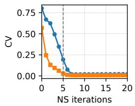  
(a) q\_proj

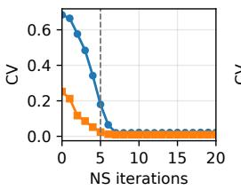  
(b) k\_proj

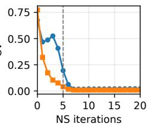  
(c) v\_proj

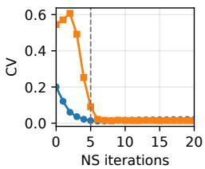  
(d) o\_proj

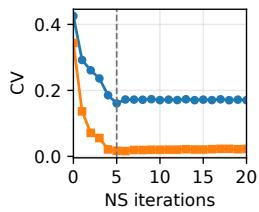  
(e) gate\_proj

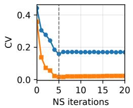  
(f) up\_proj

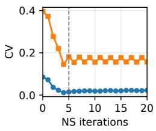  
(g) down\_proj

Row Column

Figure 1: Row and column CV trajectories during NS iterations.  
Table 2: Row and column CVs of unorthogonalized momentum matrices for the remaining 2D parameters.
<table><tr><td>Parameter matrix</td><td>Shape</td><td>Row CV</td><td>Column CV</td></tr><tr><td>embed_tokens</td><td>32000 × 1024</td><td>1.225</td><td>0.185</td></tr><tr><td>1m_head</td><td>32000 ×1024</td><td>1.384</td><td>0.493</td></tr></table>

ance patterns. To address this limitation, we propose MeqMuon, which balances both row and column magnitudes through normalization tailored to these patterns.

## 3.2 MEQMUON

MeqMuon maintains one momentum buffer for each parameter and applies normalization to the updates according to parameter type. It uses adaptive one-sided normalization for 2D weights in hidden layers, two-sided normalization for the remaining 2D parameters, and global-RMS normalization for each 1D parameter.

For a matrix $\pmb { X } \in \mathbb { R } ^ { m \times n }$ , we define RMS-based row-wise and column-wise normalization using the RMS vectors r and c in (7):

$$
{ \mathcal { N } } _ { r } ( X ) = \mathrm { d i a g } ( r ^ { - 1 } ) X , \qquad { \mathcal { N } } _ { c } ( X ) = X \mathrm { d i a g } ( c ^ { - 1 } ) ,\tag{9}
$$

where $\mathrm { d i a g } ( r ^ { - 1 } )$ denotes a diagonal matrix with the diagonal elements being $r ^ { - 1 }$ . These operators rescale each nonzero row or column to unit RMS, respectively.

For each parameter, we initialize the momentum as $\pmb { { \cal B } } _ { - 1 } = \mathbf { 0 }$ and update it as follows:

$$
B _ { t } = \mu B _ { t - 1 } + G _ { t } ,\tag{10}
$$

where $G _ { t }$ is the corresponding gradient and $\mu$ is the momentum coefficient.

For 2D weights in hidden layers, we follow Muon to compute the orthogonalized update ${ \boldsymbol { U } } _ { t } ~ =$ Orth(Bt). We then select row-wise or column-wise normalization by comparing the row and column CVs of $U _ { t }$ :

$$
\widetilde { U } _ { t } = \left\{ \begin{array} { l l } { \mathcal { N } _ { r } ( U _ { t } ) , } & { i f \gamma _ { r } ( U _ { t } ) \ge \gamma _ { c } ( U _ { t } ) , } \\ { \mathcal { N } _ { c } ( U _ { t } ) , } & { i f \gamma _ { r } ( U _ { t } ) < \gamma _ { c } ( U _ { t } ) . } \end{array} \right.\tag{11}
$$

The normalization direction is selected independently for each matrix at every optimization step.

Table 3: Row and column CVs before and after normalization.
<table><tr><td rowspan="2">Parameter matrix</td><td colspan="2">Before</td><td colspan="2">After</td></tr><tr><td>Row CV</td><td>Column CV</td><td>Row CV</td><td>Column CV</td></tr><tr><td>q_proj</td><td>0.194</td><td>0.027</td><td>&lt; 0.001</td><td>0.027</td></tr><tr><td>k_proj</td><td>0.180</td><td>0.024</td><td>&lt; 0.001</td><td>0.023</td></tr><tr><td>v_proj</td><td>0.195</td><td>0.041</td><td>&lt; 0.001</td><td>0.041</td></tr><tr><td>o_proj</td><td>0.014</td><td>0.091</td><td>0.014</td><td>&lt; 0.001</td></tr><tr><td>gate_proj</td><td>0.161</td><td>0.017</td><td>&lt; 0.001</td><td>0.018</td></tr><tr><td>up_proj</td><td>0.159</td><td>0.016</td><td>&lt; 0.001</td><td>0.018</td></tr><tr><td>down_proj</td><td>0.015</td><td>0.181</td><td>0.015</td><td>&lt; 0.001</td></tr><tr><td>embed_tokens</td><td>1.225</td><td>0.185</td><td>0.008</td><td>&lt; 0.001</td></tr><tr><td>1m_head</td><td>1.384</td><td>0.493</td><td>0.114</td><td>&lt; 0.001</td></tr></table>

For the remaining 2D parameters, such as token embedding matrices and LM heads, we replace Muon’s AdamW updates with two-sided normalization of the unorthogonalized momentum:

$$
\widetilde { U } _ { t } = \mathcal { N } _ { c } ( \mathcal { N } _ { r } ( B _ { t } ) ) .\tag{12}
$$

The two-sided normalization consists of both row-wise and column-wise normalization.

Table 3 compares the row and column CVs of the matrices in Table 1 and Table 2 before and after the corresponding normalization. For Muon’s orthogonalized updates, row-wise or columnwise normalization reduces the larger CV to nearly zero while keeping the other CV small. For the remaining 2D parameters, two-sided normalization substantially reduces both row and column CVs. MeqMuon thus balances both row and column magnitudes through normalization tailored to different imbalance patterns.

For 1D parameters, such as RMSNorm weights (Zhang & Sennrich, 2019) and bias vectors, we normalize the momentum $B _ { t } \in \mathbb { R } ^ { d }$ by its global RMS:

$$
\mathcal { N } ( B _ { t } ) = \frac { B _ { t } } { \vert \vert B _ { t } \vert \vert _ { 2 } / \sqrt { d } } .\tag{13}
$$

The parameter update rule in MeqMuon is given by

$$
W _ { t + 1 } = ( 1 - \eta _ { t } \lambda ) W _ { t } - \rho \eta _ { t } \widetilde { U } _ { t } ,\tag{14}
$$

where the first term applies decoupled weight decay and the second term scales the normalized update by $\rho \eta _ { t }$ . Either row-wise or column-wise normalization makes the update RMS independent of matrix shape. Thus, $\sqrt { \operatorname* { m a x } ( m , n ) }$ in (6) is no longer needed. Algorithm 1 summarizes the update rules of MeqMuon.

## 4 EXPERIMENTS

In this section, we evaluate the performance of MeqMuon and other baselines for LLM pretraining. All the experiments are conducted on NVIDIA RTX A6000 GPUs. All the methods are implemented on PyTorch 2.6.0 with CUDA 12.4 and Transformers 4.57.6, using the DistributedData-Parallel (DDP) framework. We use torch.compile, BF16 automatic mixed-precision training with FP32 master weights, and scaled dot-product attention with the Flash backend enabled.

We evaluate Llama (Touvron et al., 2023), SmolLM2 (Allal et al., 2025), and Qwen2 (Yang et al., 2024a) models. Llama uses the T5-base tokenizer (Raffel et al., 2020), while the other models use their native tokenizers. Llama uses separate weights for the token embeddings and the LM head, whereas SmolLM2 and Qwen2 share these weights. Details of the model architectures are provided in Appendix B. All models are trained from random initialization. We use English C4 (Raffel et al., 2020) for pretraining, with text packed into fixed-length sequences. Following the

Algorithm 1: MeqMuon   
Input: Initial parameters $\{ W _ { 0 } \}$ , total training steps $T ,$ learning rates $\{ \eta _ { t } \} _ { t = 0 } ^ { T - 1 }$ , coefficients   
$\mu , \rho , \lambda ;$   
Output: Parameters $\{ W _ { T } \}$   
Initialize $\mathbf { \delta B _ { - 1 } }  \mathbf { 0 }$ for every parameter;   
for $t = 0 , \ldots , T - 1$ do   
foreach trainable parameter $W _ { t }$ do   
Obtain its gradient $G _ { t } ;$   
$B _ { t } \gets \mu B _ { t - 1 } + G _ { t } ;$   
if Wt is a 2D weight in a hidden layer then   
$\dot { U _ { t } }  O r t h ( \check { B _ { t } } ) ;$   
$\mathbf { i f } \ \gamma _ { r } ( U _ { t } ) \geq \gamma _ { c } ( U _ { t } )$ then   
$\widetilde { U } _ { t } \gets { \mathcal { N } } _ { r } ( U _ { t } ) ;$   
else   
$\widetilde { U } _ { t } \gets \mathcal { N } _ { c } ( U _ { t } ) ;$   
else if $W _ { t }$ is one of the remaining 2D parameters then   
$\widetilde { U } _ { t } \gets \mathcal { N } _ { c } ( \mathcal { N } _ { r } ( B _ { t } ) )$   
else   
$\widetilde { U } _ { t } \gets \mathcal { N } ( B _ { t } ) ;$   
$W _ { t + 1 }  ( 1 - \eta _ { t } \lambda ) W _ { t } - \rho \eta _ { t } \widetilde { U } _ { t } ;$

Table 4: Validation PPL for pretraining different models $( \downarrow )$
<table><tr><td rowspan="2">Model scale</td><td colspan="3">Llama</td><td colspan="2">SmolLM2</td><td>Qwen2</td></tr><tr><td>60M 1.2B</td><td>130M 2.7B</td><td>350M 7.4B</td><td>135M 2.7B</td><td>360M 7.2B</td><td>0.5B</td></tr><tr><td>Token budget AdamW</td><td>37.40</td><td>24.46</td><td>17.02</td><td>24.88</td><td>18.46</td><td>9.9B 19.65</td></tr><tr><td>SCALE</td><td>58.38</td><td>33.53</td><td>19.87</td><td></td><td></td><td></td></tr><tr><td>Muon</td><td>29.88</td><td>21.64</td><td>16.04</td><td>22.81</td><td>17.28</td><td>18.79</td></tr><tr><td>NorMuon</td><td>29.72</td><td>21.57</td><td>15.98</td><td>22.83</td><td>17.20</td><td>18.76</td></tr><tr><td>MeqMuon</td><td>29.53</td><td>21.38</td><td>15.94</td><td>22.80</td><td>17.16</td><td>18.63</td></tr></table>

Chinchilla compute-optimal training rule (Hoffmann et al., 2022), we set the training token budget to 20 times the number of model parameters. We report perplexity (PPL) on the validation set, defined as the exponential of the average per-token cross-entropy loss.

We compare MeqMuon with AdamW (Loshchilov & Hutter, 2019), SCALE (Glentis et al., 2026), Muon (Liu et al., 2025), and NorMuon (Li et al., 2026). We use PyTorch’s built-in AdamW. SCALE and NorMuon are based on their official implementations. Muon follows Moonlight’s implementation (Liu et al., 2025) as shown in (6). We set the sequence length to 1,024 and the global batch size to 512. All experiments use decoupled weight decay with a coefficient of 0.1. Gradient clipping and activation checkpointing are disabled. We use linear learning rate warmup for the first $5 \%$ of updates, followed by cosine learning rate decay. AdamW and the AdamW updates for the remaining parameters in Muon and NorMuon use $( \beta _ { 1 } , \dot { \beta } _ { 2 } ) = ( 0 . 9 , 0 . 9 5 )$ . For 2D weights in hidden layers, Muon, NorMuon, and MeqMuon use Nesterov momentum with coefficient $\mu = 0 . 9 5$ . They use 5 NS iterations with coefficients $( a , b , c ) \ : = \ : ( 3 . 4 4 4 5 , - 4 . 7 7 5 0 , 2 . 0 3 1 5 )$ and RMS alignment coefficient $\rho = 0 . 2 . \mathrm { S C A L E }$ is evaluated only on Llama models, because it updates the token embedding and the LM head in different ways, which is incompatible with the shared embedding and LM head weights in SmolLM2 and Qwen2.

Convergence performance. Table 4 reports the final validation PPL of different optimizers across the evaluated models, and Figure 2 compares the validation PPL curves of Muon, NorMuon, and

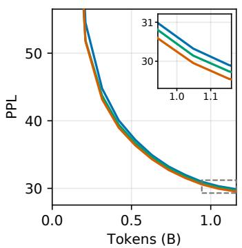  
(a) Llama-60M

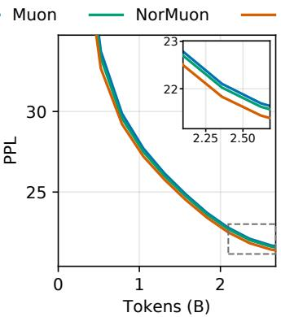  
(b) Llama-130M

MeqMuon  
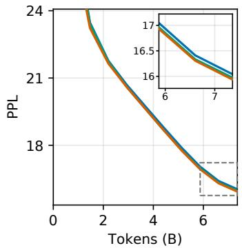  
(c) Llama-350M

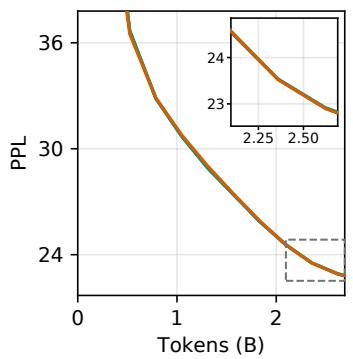  
(d) SmolLM2-135M

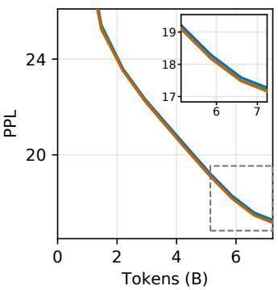  
(e) SmolLM2-360M

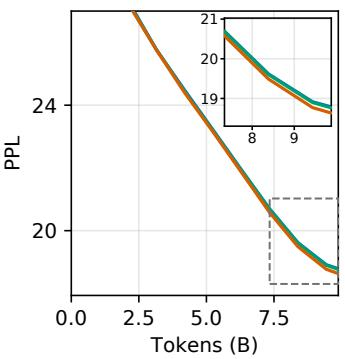  
(f) Qwen2-0.5B  
Figure 2: Validation PPL curves during pretraining.

Table 5: Optimizer-state memory of different optimizers (MiB, ↓).
<table><tr><td></td><td colspan="3">Llama</td><td colspan="2">SmolLM2</td><td>Qwen2</td></tr><tr><td></td><td>60M</td><td>130M</td><td>350M</td><td>135M</td><td>360M</td><td>0.5B</td></tr><tr><td>Muon</td><td>346.57</td><td>699.15</td><td>1653.88</td><td>621.27</td><td>1560.48</td><td>2404.17</td></tr><tr><td>NorMuon</td><td>346.73</td><td>699.51</td><td>1654.85</td><td>621.86</td><td>1561.53</td><td>2405.33</td></tr><tr><td>MeqMuon</td><td>221.53</td><td>511.57</td><td>1403.69</td><td>513.13</td><td>1380.24</td><td>1884.59</td></tr></table>

MeqMuon during pretraining. Muon, NorMuon, and MeqMuon achieve substantially lower final PPL than AdamW and SCALE, while MeqMuon obtains the best final PPL for every reported model scale. Its validation PPL curves also generally remain below those of Muon and NorMuon during training, demonstrating consistently improved convergence.

Memory overhead. Let $N _ { h }$ denote the total number of elements across all 2D weights in hidden layers, and let $N _ { a }$ denote the number of elements in the remaining parameters. Let $R _ { h }$ denote the total number of rows across all 2D weights in hidden layers. Muon stores $N _ { h }$ momentum values and $2 N _ { a }$ AdamW first- and second-moment values. Compared with the memory overhead of Muon, NorMuon additionally stores $R _ { h }$ row-wise second-moment values. MeqMuon stores only $N _ { h } +$ $N _ { a }$ momentum values. Table 5 shows the optimizer-state memory of different optimizers, which confirms the predicted savings of MeqMuon over Muon and NorMuon. For example, on Qwen2- 0.5B, MeqMuon reduces the optimizer-state memory by 21.6% compared with Muon and NorMuon.

Table 6: Row-wise and column-wise normalization selections during pretraining.
<table><tr><td rowspan="2">Module</td><td colspan="3">Llama-350M</td><td colspan="3">SmolLM2-360M</td></tr><tr><td>Shape</td><td>Row (%)</td><td>Col. (%)</td><td>Shape</td><td>Row (%)</td><td>Col. (%)</td></tr><tr><td>qproj</td><td> $1 0 2 4 \times 1 0 2 4$ </td><td>89.87</td><td>10.13</td><td> $9 6 0 \times 9 6 0$ </td><td>94.02</td><td>5.98</td></tr><tr><td>k_proj</td><td> $1 0 2 4 \times 1 0 2 4$ </td><td>99.21</td><td>0.79</td><td> $3 2 0 \times 9 6 0$ </td><td>3.97</td><td>96.03</td></tr><tr><td>v_proj</td><td> $1 0 2 4 \times 1 0 2 4$ </td><td>99.72</td><td>0.28</td><td> $3 2 0 \times 9 6 0$ </td><td>1.80</td><td>98.20</td></tr><tr><td>o_proj</td><td> $1 0 2 4 \times 1 0 2 4$ </td><td>10.06</td><td>89.94</td><td> $9 6 0 \times 9 6 0$ </td><td>18.85</td><td>81.15</td></tr><tr><td>gate_proj</td><td> $2 7 3 6 \times 1 0 2 4$ </td><td>100.00</td><td>0.00</td><td> $2 5 6 0 \times 9 6 0$ </td><td>100.00</td><td>0.00</td></tr><tr><td>up_proj</td><td> $2 7 3 6 \times 1 0 2 4$ </td><td>100.00</td><td>0.00</td><td> $2 5 6 0 \times 9 6 0$ </td><td>100.00</td><td>0.00</td></tr><tr><td>down_proj</td><td> $1 0 2 4 \times 2 7 3 6$ </td><td>0.00</td><td>100.00</td><td> $9 6 0 \times 2 5 6 0$ </td><td>0.00</td><td>100.00</td></tr></table>

Table 7: Component-wise ablation of validation PPL and optimizer-state memory on Llama models.
<table><tr><td rowspan="2">Variant</td><td colspan="2">Llama-60M</td><td colspan="2">Llama-130M</td></tr><tr><td>PPL (↓)</td><td>Memory (MiB, ↓)</td><td>PPL (↓)</td><td>Memory (MiB, ↓)</td></tr><tr><td>Muon</td><td>29.88</td><td>346.57</td><td>21.64</td><td>699.15</td></tr><tr><td>Only 2D weights in hidden layers</td><td>29.74</td><td>346.57</td><td>21.53</td><td>699.15</td></tr><tr><td>Only remaining 2D parameters</td><td>29.81</td><td>221.57</td><td>21.52</td><td>511.65</td></tr><tr><td>Only 1D parameters</td><td>29.81</td><td>346.53</td><td>21.69</td><td>699.07</td></tr><tr><td>MeqMuon</td><td>29.53</td><td>221.53</td><td>21.38</td><td>511.57</td></tr></table>

Normalization direction. For the 2D weights in hidden layers, Table 6 shows MeqMuon’s normalization-direction selection frequencies by module type. The frequencies are aggregated over all training steps and layers for Llama-350M and SmolLM2-360M. The selections exhibit a strong relationship with matrix geometry: the tall $\mathsf { g a t e \_ p r o j }$ and up\_ $\tt { p r o j }$ matrices always select row wise normalization, whereas the wide down\_proj matrices always select column-wise normaliza tion, and the wide $\mathtt { k \_ p r o j }$ and $\mathtt { v \_ p r o j }$ matrices in SmolLM2-360M also predominantly select the column-wise normalization. These selections agree with the one-sided imbalance induced by orthogonalizing rectangular matrices, as discussed in Section 3.1. For square matrices, the preference depends on the module and model: $\mathtt { q \_ p r o } \mathtt { j }$ predominantly selects row-wise normalization, while o\_proj predominantly selects column-wise normalization in both models.

Ablation study. We conduct component-wise ablations to separate the contributions of MeqMuon across three parameter types defined in Section 3.2. All variants start from Muon. For 2D weights in hidden layers, the corresponding variant applies adaptive one-sided normalization to their orthogonalized updates. For the remaining 2D parameters, the corresponding variant replaces AdamW with two-sided normalization of their unorthogonalized momentum. For 1D parameters, the corresponding variant replaces AdamW by normalizing each momentum vector by its global RMS. Each single-component variant modifies only one parameter group, while MeqMuon modifies all three. Table 7 shows the validation PPL and optimizer-state memory. The variants that modify only 2D weights in hidden layers or only the remaining 2D parameters both achieve lower validation PPL than Muon at both model scales, while MeqMuon achieves the lowest (best) PPL. The optimizerstate memory savings come from replacing AdamW updates with normalized momentum for the remaining 2D parameters and 1D parameters.

## 5 CONCLUSION

In this paper, we propose an improved Muon optimizer, called matrix-equilibrating Muon (Meq-Muon), for LLM pretraining. MeqMuon balances both row and column magnitudes through normalization that can be automatically tailored to different imbalance patterns without manual intervention. It eliminates second-moment storage by replacing AdamW updates with normalized momentum for the remaining parameters. Empirical results demonstrate that MeqMuon achieves better convergence performance than AdamW, Muon, and other baselines in LLM pretraining.

## REFERENCES

Loubna Ben Allal, Anton Lozhkov, Elie Bakouch, Gabriel Martín Blázquez, Guilherme Penedo, Lewis Tunstall, Andrés Marafioti, Hynek Kydlícek, Agustín Piqueres Lajarín, Vaibhav Srivastav,ˇ et al. Smollm2: When smol goes big–data-centric training of a small language model. arXiv preprint arXiv:2502.02737, 2025.

Salvatore Candido, Thomas Hayes, Alexander Derry, Roshan Rao, Zeming Lin, Robert Verkuil, Bryan Z Wu, Jin Sub Lee, Elise S Bruguera, Jehan A Keval, et al. Language modeling materializes a world model of protein biology. bioRxiv, 2026.

Mark Chen, Jerry Tworek, Heewoo Jun, Qiming Yuan, Henrique Ponde De Oliveira Pinto, Jared Kaplan, Harri Edwards, Yuri Burda, Nicholas Joseph, Greg Brockman, et al. Evaluating large language models trained on code. arXiv preprint arXiv:2107.03374, 2021.

Xiangning Chen, Chen Liang, Da Huang, Esteban Real, Kaiyuan Wang, Hieu Pham, Xuanyi Dong, Thang Luong, Cho-Jui Hsieh, Yifeng Lu, and Quoc V Le. Symbolic discovery of optimization algorithms. In Advances in Neural Information Processing Systems, pp. 49205–49233, 2023.

Ashok Cutkosky and Harsh Mehta. Momentum improves normalized SGD. In Proceedings of the International Conference on Machine Learning, 2020.

DeepSeek-AI. Deepseek-v4: Towards highly efficient million-token context intelligence. arXiv preprint arXiv:2606.19348, 2026.

Tim Dettmers, Mike Lewis, Sam Shleifer, and Luke Zettlemoyer. 8-bit optimizers via block-wise quantization. In Proceedings ofthe International Conference on Learning Representations, 2022.

Athanasios Glentis, Jiaxiang Li, Andi Han, and Mingyi Hong. Memory-efficient LLM pretraining via minimalist optimizer design. In Proceedings of the International Conference on Machine Learning, 2026.

Jordan Hoffmann, Sebastian Borgeaud, Arthur Mensch, Elena Buchatskaya, Trevor Cai, Eliza Rutherford, Diego de Las Casas, Lisa Anne Hendricks, Johannes Welbl, Aidan Clark, et al. Train ing compute-optimal large language models. arXiv preprint arXiv:2203.15556, 2022.

Keller Jordan, Yuchen Jin, Vlado Boza, Jiacheng You, Franz Cesista, Laker Newhouse, and Jeremy Bernstein. Muon: An optimizer for hidden layers in neural networks, 2024. URL https: //kellerjordan.github.io/posts/muon/.

Kimi Team. Kimi k2: Open agentic intelligence. arXiv preprint arXiv:2507.20534, 2025.

Kimi Team. Kimi k3: Open frontier intelligence. arXiv preprint arXiv:2607.24653, 2026.

Diederik P. Kingma and Jimmy Ba. Adam: A method for stochastic optimization. In Proceedings ofthe International Conference on Learning Representations, 2015.

Kfir Y Levy. The power of normalization: Faster evasion of saddle points. arXiv preprint arXiv:1611.04831, 2016.

Zichong Li, Liming Liu, Chen Liang, Weizhu Chen, and Tuo Zhao. NorMuon: Making Muon more efficient and scalable. In Proceedings of the International Conference on Machine Learning, 2026.

Zeming Lin, Halil Akin, Roshan Rao, Brian Hie, Zhongkai Zhu, Wenting Lu, Nikita Smetanin, Robert Verkuil, Ori Kabeli, Yaniv Shmueli, Allan dos Santos Costa, Maryam Fazel-Zarandi, Tom Sercu, Salvatore Candido, and Alexander Rives. Evolutionary-scale prediction of atomic-level protein structure with a language model. Science, 379(6637):1123–1130, 2023.

Aixin Liu, Bei Feng, Bing Xue, Bingxuan Wang, Bochao Wu, Chengda Lu, Chenggang Zhao, Chengqi Deng, Chenyu Zhang, Chong Ruan, et al. Deepseek-v3 technical report. arXiv preprint arXiv:2412.19437, 2024.

Jingyuan Liu, Jianlin Su, Xingcheng Yao, Zhejun Jiang, Guokun Lai, Yulun Du, Yidao Qin, Weixin Xu, Enzhe Lu, Junjie Yan, et al. Muon is scalable for llm training. arXiv preprint arXiv:2502.16982, 2025.

Ilya Loshchilov and Frank Hutter. Decoupled weight decay regularization. In Proceedings of the International Conference on Learning Representations, 2019.

Ryan Murray, Brian Swenson, and Soummya Kar. Revisiting normalized gradient descent: Fast evasion of saddle points. IEEE Transactions on Automatic Control, 64(11):4818–4824, 2019.

Matteo Pagliardini, Pierre Ablin, and David Grangier. The ademamix optimizer: Better, faster, older. In Proceedings ofthe International Conference on Learning Representations, 2025.

Colin Raffel, Noam Shazeer, Adam Roberts, Katherine Lee, Sharan Narang, Michael Matena, Yanqi Zhou, Wei Li, and Peter J. Liu. Exploring the limits of transfer learning with a unified text-to-text transformer. Journal ofMachine Learning Research, 21(140):1–67, 2020.

Zhihong Shao, Yuxiang Luo, Chengda Lu, ZZ Ren, Jiewen Hu, Tian Ye, Zhibin Gou, Shirong Ma, and Xiaokang Zhang. Deepseekmath-v2: Towards self-verifiable mathematical reasoning. arXiv preprint arXiv:2511.22570, 2025.

Noam Shazeer and Mitchell Stern. Adafactor: Adaptive learning rates with sublinear memory cost. In Proceedings ofthe International Conference on Machine Learning, 2018.

Tao Sun, Xinwang Liu, and Kun Yuan. Revisiting gradient normalization and clipping for nonconvex sgd under heavy-tailed noise: Necessity, sufficiency, and acceleration. Journal of Machine Learning Research, 26(237):1–42, 2025.

Hugo Touvron, Louis Martin, Kevin Stone, Peter Albert, Amjad Almahairi, Yasmine Babaei, Nikolay Bashlykov, Soumya Batra, Prajjwal Bhargava, Shruti Bhosale, et al. Llama 2: Open founda tion and fine-tuned chat models. arXiv preprint arXiv:2307.09288, 2023.

An Yang, Baosong Yang, Binyuan Hui, Bo Zheng, Bowen Yu, Chang Zhou, Chengpeng Li, Chengyuan Li, Dayiheng Liu, Fei Huang, Guanting Dong, Haoran Wei, Huan Lin, Jialong Tang, Jialin Wang, Jian Yang, Jianhong Tu, Jianwei Zhang, Jianxin Ma, Jianxin Yang, Jin Xu, Jingren Zhou, Jinze Bai, Jinzheng He, Junyang Lin, Kai Dang, Keming Lu, Keqin Chen, Kexin Yang, Mei Li, Mingfeng Xue, Na Ni, Pei Zhang, Peng Wang, Ru Peng, Rui Men, Ruize Gao, Runji Lin, Shijie Wang, Shuai Bai, Sinan Tan, Tianhang Zhu, Tianhao Li, Tianyu Liu, Wenbin Ge, Xiaodong Deng, Xiaohuan Zhou, Xingzhang Ren, Xinyu Zhang, Xipin Wei, Xuancheng Ren, Xuejing Liu, Yang Fan, Yang Yao, Yichang Zhang, Yu Wan, Yunfei Chu, Yuqiong Liu, Zeyu Cui, Zhenru Zhang, Zhifang Guo, and Zhihao Fan. Qwen2 technical report. arXiv preprint arXiv:2407.10671, 2024a.

Yi-Rui Yang, Chang-Wei Shi, and Wu-Jun Li. On the effect of batch size in byzantine-robust distributed learning. In Proceedings of the International Conference on Learning Representations, 2024b.

Biao Zhang and Rico Sennrich. Root mean square layer normalization. In Advances in Neural Information Processing Systems, 2019.

Jingzhao Zhang, Tianxing He, Suvrit Sra, and Ali Jadbabaie. Why gradient clipping accelerates training: A theoretical justification for adaptivity. In Proceedings ofthe International Conference on Learning Representations, 2020.

Yushun Zhang, Congliang Chen, Ziniu Li, Tian Ding, Chenwei Wu, Diederik (Durk) Kingma, Yinyu Ye, Zhi-Quan Luo, and Ruoyu Sun. Adam-mini: Use fewer learning rates to gain more. In Proceedings ofthe International Conference on Learning Representations, 2025.

Jiawei Zhao, Zhenyu Zhang, Beidi Chen, Zhangyang Wang, Anima Anandkumar, and Yuandong Tian. GaLore: Memory-efficient LLM training by gradient low-rank projection. In Proceedings ofthe International Conference on Machine Learning, 2024a.

Shen-Yi Zhao, Chang-Wei Shi, Yin-Peng Xie, and Wu-Jun Li. Stochastic normalized gradient descent with momentum for large-batch training. Science China Information Sciences, 67(11): 212101, 2024b.

Hanqing Zhu, Zhenyu Zhang, Wenyan Cong, Xi Liu, Sem Park, Vikas Chandra, Bo Long, David Z. Pan, Zhangyang Wang, and Jinwon Lee. Apollo: Sgd-like memory, adamw-level performance. In Proceedings of Machine Learning and Systems, 2025.

Table 8: Row and column CVs for Llama-350M after 5 NS iterations.
<table><tr><td colspan="4"></td><td colspan="2">Step 381</td><td colspan="2">Step 1144</td><td colspan="2">Step 1907</td></tr><tr><td>Layer</td><td>Matrix</td><td>Shape</td><td> $\gamma _ { r }$ </td><td> $\gamma _ { c }$ </td><td> $\gamma _ { r }$ </td><td> $\gamma _ { c }$ </td><td> $\gamma _ { r }$ </td><td> $\gamma _ { c }$ </td></tr><tr><td rowspan="7">0</td><td>q_proj</td><td>1024 × 1024</td><td>0.033</td><td>0.012</td><td>0.084</td><td>0.022</td><td>0.066</td><td>0.024</td></tr><tr><td>k_proj</td><td>1024 × 1024</td><td>0.026</td><td>0.012</td><td>0.079</td><td>0.022</td><td>0.073</td><td>0.027</td></tr><tr><td>v_proj</td><td>1024 × 1024</td><td>0.078</td><td>0.019</td><td>0.084</td><td>0.027</td><td>0.082</td><td>0.024</td></tr><tr><td>o_proj</td><td>1024 × 1024</td><td>0.015</td><td>0.063</td><td>0.013</td><td>0.053</td><td>0.013</td><td>0.048</td></tr><tr><td>gate_proj</td><td>2736× 1024</td><td>0.603</td><td>0.020</td><td>0.534</td><td>0.026</td><td>0.528</td><td>0.023</td></tr><tr><td>up_proj</td><td>2736× 1024</td><td>0.616</td><td>0.020</td><td>0.538</td><td>0.026</td><td>0.531</td><td>0.023</td></tr><tr><td>down_proj</td><td>1024× 2736</td><td>0.009</td><td>0.558</td><td>0.013</td><td>0.505</td><td>0.014</td><td>0.505</td></tr><tr><td rowspan="7">12</td><td>q_proj</td><td>1024× 1024</td><td>0.492</td><td>0.023</td><td>0.333</td><td>0.021</td><td>0.287</td><td>0.018</td></tr><tr><td>k_proj</td><td>1024 × 1024</td><td>0.536</td><td>0.025</td><td>0.365</td><td>0.022</td><td>0.326</td><td>0.020</td></tr><tr><td>v_proj</td><td>1024× 1024</td><td>0.368</td><td>0.023</td><td>0.238</td><td>0.021</td><td>0.163</td><td>0.017</td></tr><tr><td>o_proj</td><td>1024 × 1024</td><td>0.017</td><td>0.231</td><td>0.014</td><td>0.151</td><td>0.014</td><td>0.115</td></tr><tr><td>gate_proj</td><td>2736 × 1024</td><td>0.248</td><td>0.013</td><td>0.155</td><td>0.015</td><td>0.132</td><td>0.016</td></tr><tr><td>up_proj</td><td>2736 ×1024</td><td>0.227</td><td>0.014</td><td>0.147</td><td>0.014</td><td>0.129</td><td>0.016</td></tr><tr><td>down_proj</td><td>1024× 2736</td><td>0.014</td><td>0.250</td><td>0.014</td><td>0.150</td><td>0.015</td><td>0.119</td></tr><tr><td rowspan="8">23</td><td>q_proj</td><td>1024 × 1024</td><td>0.218</td><td>0.014</td><td>0.050</td><td>0.011</td><td>0.038</td><td>0.011</td></tr><tr><td>k_proj</td><td>1024× 1024</td><td>0.234</td><td>0.016</td><td>0.056</td><td>0.011</td><td>0.043</td><td>0.011</td></tr><tr><td>v_proj</td><td>1024 × 1024</td><td>0.207</td><td>0.019</td><td>0.055</td><td>0.012</td><td>0.043</td><td>0.011</td></tr><tr><td>o_proj</td><td>1024 × 1024</td><td>0.025</td><td>0.187</td><td>0.014</td><td>0.060</td><td>0.013</td><td>0.043</td></tr><tr><td>gate_proj</td><td>2736 ×1024</td><td>0.315</td><td>0.013</td><td>0.214</td><td>0.015</td><td>0.198</td><td>0.016</td></tr><tr><td>up_proj</td><td>2736 × 1024</td><td>0.317</td><td>0.013</td><td>0.230</td><td>0.014</td><td>0.214</td><td>0.015</td></tr><tr><td>down_proj</td><td>1024 × 2736</td><td>0.020</td><td>0.303</td><td>0.018</td><td>0.205</td><td>0.017</td><td>0.187</td></tr><tr><td></td><td></td><td></td><td></td><td></td><td></td><td></td><td></td></tr></table>

## A ADDITIONAL IMBALANCE PATTERNS

Table 8, Table 9, and Table 10 report the row and column CVs, $\gamma _ { r }$ and $\gamma _ { c }$ defined in (8), of Muon’s orthogonalized updates $U _ { t }$ for Llama-350M, Llama-60M, and SmolLM2-135M, respectively. For each model, we select three different training steps and three Transformer layers. The tables report all seven update matrices for 2D weights in hidden layers after 5 NS iterations. For each training step, the larger of $\gamma _ { r }$ and $\gamma _ { c }$ is shown in bold.

## B MODEL ARCHITECTURES

Table 11 gives the architecture of each model. All models use pre-normalization with RMSNorm, SwiGLU feed-forward layers, and rotary position embeddings. The Llama models use multi-head attention, whereas SmolLM2 and Qwen2 use grouped-query attention. Qwen2 additionally uses biases in the query, key, and value projections. The Params column gives the number of unique parameters in millions, so tied token-embedding and LM-head weights are counted once. Q/KV gives the numbers of query and key/value heads, and Tied indicates whether the token embedding and the LM head share weights.

Table 9: Row and column CVs for Llama-60M after 5 NS iterations.
<table><tr><td rowspan="2"></td><td rowspan="2">Matrix</td><td rowspan="2">Shape</td><td colspan="2">Step 443</td><td colspan="2">Step 1329</td><td colspan="2">Step 2215</td></tr><tr><td> $\gamma _ { r }$ </td><td> $\gamma _ { c }$ </td><td> $\gamma _ { r }$ </td><td>γc</td><td> $\gamma _ { r }$ </td><td>γc</td></tr><tr><td rowspan="6">0</td><td>q_proj</td><td> $5 1 2 \times 5 1 2$ </td><td>0.034</td><td>0.019</td><td>0.043</td><td>0.023</td><td>0.040</td><td>0.021</td></tr><tr><td>k_proj</td><td> $5 1 2 \times 5 1 2$ </td><td>0.088</td><td>0.031</td><td>0.076</td><td>0.031</td><td>0.066</td><td>0.026</td></tr><tr><td>v_proj</td><td> $5 1 2 \times 5 1 2$ </td><td>0.164</td><td>0.081</td><td>0.101</td><td>0.041</td><td>0.066</td><td>0.025</td></tr><tr><td> $\mathsf { \Lambda } _ { \mathsf { O } } \mathsf { \Lambda } _ { - \mathsf { P } } \mathsf { r } \mathsf { o } \dot { \mathsf { J } }$ </td><td> $5 1 2 \times 5 1 2$ </td><td>0.034</td><td>0.144</td><td>0.020</td><td>0.087</td><td>0.017</td><td>0.050</td></tr><tr><td> $\mathsf { g a t e \_ p r o j }$ </td><td> $1 3 7 6 \times 5 1 2$ </td><td>0.654</td><td>0.022</td><td>0.528</td><td>0.017</td><td>0.503</td><td>0.017</td></tr><tr><td> $\mathsf { u p \_ p r o j }$ </td><td> $1 3 7 6 \times 5 1 2$ </td><td>0.665</td><td>0.026</td><td>0.522</td><td>0.013</td><td>0.497</td><td>0.016</td></tr><tr><td></td><td> $\mathsf { d o w n \_ p r o j }$ </td><td> $5 1 2 \times 1 3 7 6$ </td><td>0.012</td><td>0.603</td><td>0.016</td><td>0.523</td><td>0.016</td><td>0.506</td></tr><tr><td rowspan="7">4</td><td> $\mathtt { q \_ p r o } \mathtt { j }$ </td><td> $5 1 2 \times 5 1 2$ </td><td>0.167</td><td>0.026</td><td>0.027</td><td>0.015</td><td>0.023</td><td>0.014</td></tr><tr><td>k_proj</td><td> $5 1 2 \times 5 1 2$ </td><td>0.206</td><td>0.026</td><td>0.029</td><td>0.015</td><td>0.027</td><td>0.015</td></tr><tr><td> $\tt V \mathrm { \_ p r o \dot { 2 } }$ </td><td> $5 1 2 \times 5 1 2$ </td><td>0.145</td><td>0.029</td><td>0.032</td><td>0.018</td><td>0.019</td><td>0.016</td></tr><tr><td> $\mathsf { \Lambda } _ { \mathsf { O } } \mathsf { \Lambda } _ { - \mathsf { P } } \mathsf { r } \mathsf { o } \dot { \mathsf { J } }$ </td><td> $5 1 2 \times 5 1 2$ </td><td>0.017</td><td>0.041</td><td>0.014</td><td>0.017</td><td>0.014</td><td>0.016</td></tr><tr><td> $\mathsf { g a t e \_ p r o j }$ </td><td> $1 3 7 6 \times 5 1 2$ </td><td>0.128</td><td>0.016</td><td>0.075</td><td>0.017</td><td>0.067</td><td>0.017</td></tr><tr><td> $\mathsf { u p \_ p r o j }$ </td><td> $1 3 7 6 \times 5 1 2$ </td><td>0.127</td><td>0.016</td><td>0.086</td><td>0.018</td><td>0.082</td><td>0.016</td></tr><tr><td>down_proj</td><td> $5 1 2 \times 1 3 7 6$ </td><td>0.017</td><td>0.128</td><td>0.016</td><td>0.084</td><td>0.016</td><td>0.077</td></tr><tr><td rowspan="7">7</td><td>q_proj</td><td> $5 1 2 \times 5 1 2$ </td><td>0.059</td><td>0.015</td><td>0.026</td><td>0.015</td><td>0.026</td><td>0.014</td></tr><tr><td>k_proj</td><td> $5 1 2 \times 5 1 2$ </td><td>0.073</td><td>0.017</td><td>0.030</td><td>0.014</td><td>0.029</td><td>0.014</td></tr><tr><td>v_proj</td><td> $5 1 2 \times 5 1 2$ </td><td>0.052</td><td>0.021</td><td>0.018</td><td>0.015</td><td>0.019</td><td>0.015</td></tr><tr><td>o_proj</td><td> $5 1 2 \times 5 1 2$ </td><td>0.019</td><td>0.038</td><td>0.016</td><td>0.019</td><td>0.016</td><td>0.016</td></tr><tr><td> $\mathsf { g a t e \_ p r o j }$ </td><td> $1 3 7 6 \times 5 1 2$ </td><td>0.144</td><td>0.018</td><td>0.093</td><td>0.019</td><td>0.092</td><td>0.016</td></tr><tr><td> $\mathsf { u p \_ p r o j }$ </td><td> $1 3 7 6 \times 5 1 2$ </td><td>0.167</td><td>0.016</td><td>0.123</td><td>0.018</td><td>0.120</td><td>0.017</td></tr><tr><td> $\mathsf { d o w n \_ p r o j }$ </td><td> $5 1 2 \times 1 3 7 6$ </td><td>0.019</td><td>0.136</td><td>0.020</td><td>0.093</td><td>0.021</td><td>0.098</td></tr></table>

Table 10: Row and column CVs for SmolLM2-135M after 5 NS iterations.
<table><tr><td colspan="4"></td><td colspan="2">Step 381</td><td colspan="2">Step 1144</td><td colspan="2">Step 1907</td></tr><tr><td>Layer</td><td>Matrix</td><td>Shape</td><td> $\gamma _ { r }$ </td><td> $\gamma _ { c }$ </td><td> $\gamma _ { r }$ </td><td> $\gamma _ { c }$ </td><td> $\gamma _ { r }$ </td><td></td><td> $\gamma _ { c }$ </td></tr><tr><td rowspan="6">0</td><td> $\mathtt { q \_ p r o } \mathtt { j }$ </td><td> $5 7 6 \times 5 7 6$ </td><td>0.018</td><td>0.014</td><td>0.033</td><td>0.015</td><td></td><td>0.026</td><td>0.013</td></tr><tr><td>k_proj</td><td> $1 9 2 \times 5 7 6$ </td><td>0.023</td><td>0.084</td><td>0.027</td><td></td><td>0.089</td><td>0.030</td><td>0.090</td></tr><tr><td>v_proj</td><td> $1 9 2 \times 5 7 6$ </td><td>0.020</td><td>0.082</td><td>0.020</td><td>0.084</td><td></td><td>0.020</td><td>0.082</td></tr><tr><td>o_proj</td><td> $5 7 6 \times 5 7 6$ </td><td>0.019</td><td>0.038</td><td>0.016</td><td></td><td>0.027</td><td>0.015</td><td>0.026</td></tr><tr><td>gate_proj</td><td> $1 5 3 6 \times 5 7 6$ </td><td>0.421</td><td>0.023</td><td>0.370</td><td></td><td>0.021</td><td>0.363</td><td>0.019</td></tr><tr><td>up_proj</td><td> $1 5 3 6 \times 5 7 6$ </td><td>0.434</td><td>0.024</td><td>0.370</td><td>0.021</td><td></td><td>0.363</td><td>0.019</td></tr><tr><td rowspan="6"></td><td>down_proj</td><td> $5 7 6 \times 1 5 3 6$ </td><td>0.012</td><td>0.410</td><td>0.015</td><td>0.353</td><td></td><td>0.015</td><td>0.348</td></tr><tr><td>q_proj</td><td> $5 7 6 \times 5 7 6$ </td><td>0.033</td><td>0.013</td><td>0.040</td><td></td><td>0.013</td><td>0.029</td><td>0.013</td></tr><tr><td>k_proj</td><td> $1 9 2 \times 5 7 6$ </td><td>0.038</td><td>0.063</td><td>0.031</td><td></td><td>0.061</td><td>0.049</td><td>0.063</td></tr><tr><td>v_proj</td><td> $1 9 2 \times 5 7 6$ </td><td>0.025 0.014</td><td>0.062</td><td>0.042</td><td></td><td>0.068</td><td>0.039</td><td>0.064</td></tr><tr><td>o_proj gate_proj</td><td> $5 7 6 \times 5 7 6$   $1 5 3 6 \times 5 7 6$ </td><td>0.248</td><td>0.017 0.017</td><td>0.014 0.122</td><td></td><td>0.017</td><td>0.014 0.096</td><td>0.014</td></tr><tr><td></td><td> $1 5 3 6 \times 5 7 6$ </td><td>0.232</td><td>0.016</td><td>0.125</td><td>0.018</td><td></td><td>0.105</td><td>0.017</td></tr><tr><td></td><td>up_proj down_proj</td><td> $5 7 6 \times 1 5 3 6$ </td><td>0.016</td><td>0.231</td><td>0.016</td><td>0.018</td><td></td><td></td><td>0.018</td></tr><tr><td rowspan="8">29</td><td></td><td></td><td></td><td></td><td></td><td></td><td>0.116</td><td>0.016</td><td>0.090</td></tr><tr><td>q_proj</td><td> $5 7 6 \times 5 7 6$ </td><td>0.017</td><td>0.015</td><td>0.021</td><td></td><td>0.015</td><td>0.020</td><td>0.013</td></tr><tr><td>k_proj</td><td> $1 9 2 \times 5 7 6$ </td><td>0.028</td><td>0.076</td><td>0.029</td><td></td><td>0.077</td><td>0.027</td><td>0.071</td></tr><tr><td>v_proj</td><td> $1 9 2 \times 5 7 6$ </td><td>0.026</td><td></td><td>0.083</td><td>0.025</td><td>0.078 0.015</td><td>0.023</td><td>0.067</td></tr><tr><td>o_proj</td><td> $5 7 6 \times 5 7 6$ </td><td>0.018</td><td>0.019</td><td>0.015</td><td></td><td></td><td>0.017</td><td>0.014</td></tr><tr><td>gate_proj</td><td> $1 5 3 6 \times 5 7 6$ </td><td>0.321</td><td>0.017</td><td>0.206</td><td></td><td>0.017</td><td>0.190</td><td>0.017</td></tr><tr><td>up_proj</td><td> $1 5 3 6 \times 5 7 6$ </td><td>0.319</td><td>0.017</td><td>0.210</td><td></td><td>0.019</td><td>0.193</td><td>0.018</td></tr><tr><td>down_proj</td><td> $5 7 6 \times 1 5 3 6$ </td><td>0.019</td><td>0.302</td><td>0.022</td><td></td><td>0.198</td><td>0.023</td><td>0.181</td></tr></table>

Table 11: Model architectures.
<table><tr><td>Family</td><td>Size</td><td>Params (M)</td><td>Layers</td><td>Hidden</td><td>FFN</td><td>Q/KV</td><td>Head dim</td><td>Vocab.</td><td>Tied</td></tr><tr><td rowspan="3">Llama</td><td>60M</td><td>58.074</td><td>8</td><td>512</td><td>1376</td><td>8/8</td><td>64</td><td>32,000</td><td>No</td></tr><tr><td>130M</td><td>134.106</td><td>12</td><td>768</td><td>2048</td><td>12/12</td><td>64</td><td>32,000</td><td>No</td></tr><tr><td>350M</td><td>367.969</td><td>24</td><td>1024</td><td>2736</td><td>16/16</td><td>64</td><td>32,000</td><td>No</td></tr><tr><td rowspan="2">SmolLM2</td><td>135M</td><td>134.515</td><td>30</td><td>576</td><td>1536</td><td>9/3</td><td>64</td><td>49,152</td><td>Yes</td></tr><tr><td>360M</td><td>361.821</td><td>32</td><td>960</td><td>2560</td><td>15/5</td><td>64</td><td>49,152</td><td>Yes</td></tr><tr><td>Qwen2</td><td>0.5B</td><td>494.033</td><td>24</td><td>896</td><td>4864</td><td>14/2</td><td>64</td><td>151,936</td><td>Yes</td></tr></table>