# MULTI-TASK LEARNING OF CONDITIONAL MEAN OPERATORS: APPLICATIONS TO DYNAMICAL SYSTEMS AND UNCERTAINTY QUANTIFICATION

Sami Chemlal<sup>∗</sup> CMAP, Ecole Polytechnique samychemlal@yahoo.fr

Thibaut Germain<sup>∗</sup>   
CMAP, Ecole Polytechnique   
thibaut.germain@polytechnique.edu   
Remi Flamary ´   
CMAP, Ecole Polytechnique   
remi.flamary@polytechnique.edu

Vladimir R. Kostic University of Novi Sad vkostic@dmi.uns.ac.rs

Karim Lounici   
CMAP, Ecole Polytechnique   
karim.lounici@polytechnique.edu

## ABSTRACT

Estimating conditional statistics and learning representations of a population of conditional distributions are central problems in many data-driven applications, including uncertainty quantification and dynamical systems analysis. Conditional mean operators (CMOs), a class of linear operators between function spaces, resolve these objectives by providing access to a broad class of conditional statistics. However, existing methods typically estimate each CMO independently or constrain it to prespecified function spaces, thereby preventing the exploitation of shared structure across related distributions.

In this work, we posit that related CMOs share finite-dimensional input and output function spaces, and are specialized for each task with a linear operator mapping these spaces. Based on this hypothesis, we introduce MTL-CMO, a multi-task framework that jointly learns shared function spaces and task-specific operators across multiple datasets. We further introduce T-CMO, a transfer learning method that reuses the shared spaces to estimate, in closed form, the operator of a new conditional distribution. We establish statistical guarantees quantifying the benefits of jointly learning the shared function spaces. Our experiments demonstrate that learning shared function spaces improves uncertainty quantification across a broad range of conditional distributions and, when applied to Langevin and plasma dynamics, yields compact representations of complex dynamics that retain physically meaningful information and enable parameter identification.

## 1 INTRODUCTION

Characterizing the distribution of a target variable Y given a conditioning variable X is key to many statistical learning problem. Beyond solely predicting the conditional expectation, access to the con ditional distribution allows the computation of a broad range of conditional statistics, including moments, quantiles, or confidence regions, typically required for uncertainty quantification (Ghanem et al., 2017). Similarly, for stochastic dynamical systems, the conditional distributions of future states given the current state characterizes the dynamic and provides access to physically meaningful quantities like transition probabilities, relaxation times, or invariant measures (Pavliotis, 2014). The conditional mean operator (CMO) provides a natural operator-theoretic representation of a conditional distribution by mapping an observable $f$ of $Y$ to its conditional expectation:

$$
\left[ \operatorname { E } _ { \mathrm { Y \mid X } } f \right] ( x ) = \operatorname { \mathbb { E } } \left[ f ( Y ) \mid X = x \right] .
$$

By varying $f ,$ a single CMO provides access to a broad range of conditional statistics, making it a versatile representation of conditional distributions. For dynamical systems, CMOs are particularly informative: their spectral decompositions reveal coherent dynamical modes associated with characteristic timescales and frequencies. Existing approaches to CMO estimation primarily rely on kernel methods with either fixed kernels (Song et al., 2009; Muandet et al., 2017) or learned feature representations (Shimizu et al., 2024; Kostic et al., 2024). However, accurately estimating these operators generally requires large datasets, making their estimation challenging when only limited observations are available (Hertel et al., 2026).

However, in many applications, data are collected from a population of related conditional distributions arising, for instance, from different physical parameters, experimental conditions, or subjects. Although the conditional distributions vary across the population, their associated CMOs may share common input and output function spaces, while differing through the linear transformations acting between these spaces. This structure naturally motivates a multi-task approach (Caruana, 1997): the shared function spaces can be learned jointly across tasks, while retaining a task-specific operator for each conditional distribution. Sharing information in this manner can improve the estimation of individual CMOs (Maurer et al., 2016). Moreover, the learned function spaces can be transferred to a new task, for which only the corresponding low-dimensional operator must be estimated, thereby improving data efficiency (Tripuraneni et al., 2020). Nevertheless, existing CMO estimators predominantly treat conditional distributions independently, while existing multi-task approaches to conditional modeling are generally designed for specific applications and do not provide a unified operator-learning framework applicable to both uncertainty quantification and dynamical systems.

Contributions. In this work, (1) we introduce MTL-CMO, a multi-task framework that jointly learns a population of CMOs. Each task is represented by a task-specific linear operator acting between shared, learnable input/output function spaces. (2) We subsequently introduce T-CMO, a transfer-learning estimator that reuses the learned function spaces to estimate the CMO of a new task in closed-form. (3) We establish statistical guarantees quantifying the benefits ofjointly learning the shared input/output function spaces for CMO estimation. (4) We evaluate MTL-CMO and T-CMO on uncertainty-quantification and dynamical-systems benchmarks in both multi-task and transferlearning settings. Across these experiments, our methods are competitive or outperform state-ofthe-art baselines, including methods specifically designed for the corresponding applications.

Paper organization. Section 2 introduces the necessary background. Section 3 presents the MTL CMO and T-CMO frameworks, establishes their statistical guarantees, and positions them with respect to related work. Section 4 presents the numerical experiments, before we conclude the paper.

## 2 BACKGROUND ON CMO: DEFINITION, ESTIMATION AND APPLICATIONS

Conditional Mean Operator (CMO) (Fukumizu et al., 2004). Consider a pair of random variables (X, Y ) on the product space $\mathcal { X } \times \mathcal { V }$ with joint distribution $\rho$ and marginals $\mu$ and ν respectively. We assume that $\rho$ is absolutely continuous w.r.t. the product of marginals, i.e. $\rho \ll \mu \otimes \nu$ , with density function square integrable, i.e. d $\ b . \rho / \mathrm { d } ( \mu \otimes \nu ) \stackrel { \cdot } { \in } L _ { \mu \otimes \nu } ^ { 2 } ( \ b { \chi } \times \ b { \mathcal { V } } )$ . Then, the conditional mean operator $\mathsf { E } _ { \mathrm { Y | X } } : \mathrm { L } _ { \nu } ^ { 2 } ( \mathcal { Y } ) \to \mathrm { L } _ { \mu } ^ { 2 } ( \mathcal { X } )$ is well defined and verifies for any $f \in \mathrm { L } _ { \nu } ^ { 2 } ( \mathcal { V } )$ and $x \in \mathcal { X } \mathrm { : }$

$$
[ \mathsf { E } _ { \mathrm { Y } | \mathrm { X } } f ] ( x ) = \mathbb { E } [ f ( Y ) \mid X = x ] = \int _ { \mathcal { Y } } f ( y ) p ( x , y ) \nu ( d y ) ,\tag{1}
$$

where $\mathrm { L } _ { \mu } ^ { 2 } ( \mathcal { X } )$ and $\mathrm { L } _ { \nu } ^ { 2 } ( \mathcal { V } )$ are separable Hilbert space. Since $\mathsf { E } _ { \mathrm { Y | X } }$ is an Hilbert-Schmidt operator, and $\| \mathsf { E } _ { \mathrm { Y | X } } \| _ { \mathrm { o p } } = 1$ with $\boldsymbol { \mathsf { E } } _ { \mathrm { Y } | \mathrm { X } } \mathbf { 1 } _ { \mathcal { Y } } = \mathbf { 1 } _ { \mathcal { X } }$ , it admits a singular value decomposition (SVD) such that:

$$
\begin{array} { r } { \mathsf { E } _ { \mathrm { Y } | \mathrm { X } } = \sum _ { i \geq 0 } \sigma _ { i } u _ { i } \otimes v _ { i } , \qquad \left( \sigma _ { 0 } , u _ { 0 } , v _ { 0 } \right) = ( 1 , \mathbf { 1 } _ { \mathcal { X } } , \mathbf { 1 } _ { \mathcal { Y } } ) } \end{array}\tag{2}
$$

where $\{ u _ { i } \} _ { i \ge 0 }$ and $\{ v _ { i } \} _ { i \ge 0 }$ are singular functions forming orthonormal basis, $\{ \sigma _ { i } \} _ { i \ge 0 }$ the decreasing sequence of positive singular values, and $\mathbf { 1 } _ { \mathcal { X } }$ an indicator function. Hence, the conditional mean operator can be approximated arbitrary well, and by the Eckart-Young-Mirsky Theorem the best rank-r approximation is the truncation $\begin{array} { r } { \mathsf { E } _ { \mathrm { Y | X } } ^ { \mathrm { r } } = \sum _ { i = 0 } ^ { r - 1 } \sigma _ { i } u _ { i } \otimes v _ { i } } \end{array}$ with approximation error $\| \mathsf { E } _ { \mathrm { Y | X } } - \mathsf { E } _ { \mathrm { Y | X } } ^ { \mathrm { r } } \| _ { \mathrm { o p } } = \sigma _ { r }$ . It follows that for any $f \in \mathrm { L } _ { \nu } ^ { 2 } ( \mathcal { V } )$ and $x \in \mathcal { X }$ , the conditional expectation can be approximated with:

$$
\begin{array} { r } { \left[ \mathsf { E } _ { \mathrm { Y | X } } f \right] ( x ) \approx \left[ \mathsf { E } _ { \mathrm { Y | X } } ^ { \mathrm { r } } f \right] ( x ) = \mathbb { E } _ { \boldsymbol { \nu } } [ f ( Y ) ] + \sum _ { i = 1 } ^ { r - 1 } \sigma _ { i } u _ { i } ( x ) \mathbb { E } _ { \boldsymbol { \nu } } [ v _ { i } ( Y ) f ( Y ) ] , } \end{array}\tag{3}
$$

Operator estimation with Neural Conditional Probability. The Neural Conditional Probability framework (NCP) learns a finite-rank approximation of a conditional mean operator from paired observations (Kostic et al., 2024). It first introduce the deflated operator $\mathsf { D } _ { \mathrm { Y | X } } \overset { \cdot } { = } \mathsf { E } _ { \mathrm { Y | X } } - \mathbf { 1 } _ { X } \overset { \cdot } { \otimes } \mathbf { 1 } _ { y }$ to remove the trivial singular component. For a latent dimension r, NCP parametrizes with neural networks the approximation of $\mathsf { E } _ { \mathrm { Y | X } }$ through its truncated SVD

$$
\begin{array} { r } { \mathsf { E } _ { \mathrm { Y } | \mathrm { X } } ^ { \theta } = \mathbf { 1 } _ { \mathcal { X } } \otimes \mathbf { 1 } _ { \mathcal { Y } } + \mathsf { D } _ { \mathrm { Y } | \mathrm { X } } ^ { \theta } = \mathbf { 1 } _ { \mathcal { X } } \otimes \mathbf { 1 } _ { \mathcal { Y } } + \sum _ { i = 1 } ^ { r } \sigma _ { i } ^ { \theta } u _ { i } ^ { \theta } \otimes v _ { i } ^ { \theta } , } \end{array}\tag{4}
$$

with nontrivial singular values $\sigma ^ { \theta } \in [ 0 , 1 ) ^ { r }$ , and singular functions $u ^ { \theta } ( x ) \triangleq [ u _ { 1 } ^ { \theta } ( x ) , \dots , u _ { r } ^ { \theta } ( x ) ] ^ { \top }$ and $v ^ { \theta } ( y ) \triangleq [ v _ { 1 } ^ { \theta } ( y ) , \ldots , v _ { r } ^ { \theta } ( y ) ] ^ { \intercal }$ . Denoting $\begin{array} { r } { q _ { \theta } ( x , y ) = \sum _ { i = 1 } ^ { r } \sigma _ { i } ^ { \theta } u _ { i } ^ { \theta } ( x ) v _ { i } ^ { \theta } ( y ) } \end{array}$ , the deflated operator is estimated by minimizing a regularized problem with a data-fitting term measuring the discrepancy between the estimated and true deflated operators

$$
\begin{array} { r l } & { \mathcal { L } ( \theta ) = \| \mathsf { D } _ { \mathrm { Y } | \mathrm { X } } ^ { \theta } - \mathsf { D } _ { \mathrm { Y } | \mathrm { X } } \| _ { \mathrm { H S } } ^ { 2 } - \| \mathsf { D } _ { \mathrm { Y } | \mathrm { X } } \| _ { \mathrm { H S } } ^ { 2 } } \\ & { \qquad = \mathbb { E } _ { \mu \otimes \nu } [ q _ { \theta } ^ { 2 } ( X , Y ) ] - 2 ( \mathbb { E } _ { \rho } [ q _ { \theta } ( X , Y ) ] - \mathbb { E } _ { \mu \otimes \nu } [ q _ { \theta } ( X , Y ) ] ) , } \end{array}\tag{5}
$$

and a regularization encouraging the functions to be centered and orthonormal in their $L ^ { 2 }$ spaces.

Application: conditional uncertainty quantification. Beyond conditional expectations, the CMO provides access to conditional probabilities. Indeed, for any measurable set $B \subseteq \mathcal { V }$ , the indicator function $\mathbf { 1 } _ { B } \in \mathrm { L } _ { \nu } ^ { 2 } ( \mathcal { V } )$ , and the conditional probability can be evaluated with

$$
\mathbb { P } ( Y \in B \mid X = x ) \approx \widehat { \mathbb { P } } ( Y \in B \mid X = x ) = \left[ \widehat { \mathsf { E } _ { \mathrm { Y } \mid \mathrm { X } } ^ { \theta } } \mathbf { 1 } _ { B } \right] ( x ) .\tag{6}
$$

Consequently, an estimated CMO can be used to characterize the uncertainty of Y conditionally on $X { = } x$ , for instance through a $( 1 - \alpha )$ conditional confidence region $C _ { \alpha } ( x ) \ \subseteq \mathcal { y }$ satisfying $\left[ \operatorname { E } _ { \mathrm { Y } \mid \mathrm { X } } \mathbf { 1 } _ { C _ { \alpha } ( x ) } \right] ( x ) = \mathbb { P } ( Y \in C _ { \alpha } ( x ) \mid X = x ) \geq 1 - \alpha$ . For scalar Y , taking $f _ { t } ( y ) = \mathbf { 1 } _ { \{ y \leq t \} }$ yields ${ \widehat { F } } ( t \mid x ) = { \widehat { \mathbb { P } } } ( Y \leq t \mid X = x )$ with conditional quantiles verifying $Q _ { \alpha } ( x ) = \operatorname* { i n f } \{ t \mid { \widehat { F } } ( t \mid x ) \geq \alpha \}$

Application: representation of dynamical systems. Consider a dynamical system that is a timehomogeneous Markov process $( X _ { t } ) _ { t \geq 0 }$ with invariant measure π. For any lag $t > 0 ,$ , the transition from $X _ { 0 } \mathrm { t o } X _ { t }$ is characterized by the transition operator $[ A _ { t } f ] ( x ) = \mathbb { E } [ \bar { f } ( X _ { t } ^ { \cdot } ) \mid X _ { 0 } = x ]$ with $f \in$ $L _ { \pi } ^ { 2 } ( \mathcal { X } )$ . Hence, each $T _ { t }$ is precisely the CMO of the pair $( X _ { 0 } , X _ { t } )$ and describes how observables of the future state depend on the initial state. Under suitable assumptions on the process, the family $\{ T _ { t } \} _ { t > 0 }$ forms a semi-group admitting an infinitesimal generator $\bar { G } = \mathrm { l i m } _ { t  0 ^ { + } } ( \bar { A } _ { t } f - f ) / t$ with a discrete spectrum such that for any $t > 0$

$$
\begin{array} { r } { [ A _ { t } f ] ( x ) = [ \exp ( t G ) f ] ( x ) = \sum _ { j \geq 0 } e ^ { t \lambda _ { j } } \langle f , g _ { j } \rangle f _ { j } ( x ) , } \end{array}\tag{7}
$$

where $\lambda _ { j }$ and $( f _ { j } , g _ { j } )$ denote the eigenvalues and corresponding right and left eigenfunctions of G. In particular, the transition operators $\{ A _ { t } \} _ { t > 0 }$ share the spectral modes of the infinitesimal generator, while their eigenvalues evolve with the lag as $e ^ { t \lambda _ { j } }$ . Estimating these CMOs from sampled trajectories consequently provides access to the spectral structure of the underlying generator (Koopman, 1931; Singer & Spilerman, 1976; Schmid, 2010). The generator representation is central to data-driven dynamical systems analysis, as its eigenfunctions and eigenvalues encode characteristic spatial structures and temporal scales of the dynamics. Since errors in the estimated transition operators propagate to the generator, accurate CMO estimation is essential for reliably recovering the underlying dynamics. For interested readers, we provide further details on operator-theoretic representation of dynamical systems and their estimation in Appendix A.

## 3 MULTI-TASK AND TRANSFER LEARNING FOR CMO

## 3.1 MULTI-TASK LEARNING OF CONDITIONAL MEAN OPERATORS

MTL strategy & assumptions. We propose a multi-task approach to estimate CMOs from observations of related joint distributions. The approach learns input and output function spaces shared

across tasks, while each task retains its own operator representation within those spaces.

Formally, we consider $K$ pairs of random variables $( X ^ { ( k ) } , Y ^ { ( k ) } ) \sim \rho _ { k }$ , with marginals $\mu _ { k }$ and $\nu _ { k }$ . We denote by $\mathsf E _ { \mathrm { Y | X } } ^ { ( \mathrm { k } ) } : L _ { \nu _ { k } } ^ { 2 } ( \mathcal { V } ) \to L _ { \mu _ { k } } ^ { 2 } ( \mathcal { X } )$ the associated conditional mean operator and $\mathsf { D } _ { \mathrm { Y | X } } ^ { \mathrm { ( k ) } }$ its corresponding deflated operator. We make the following assumptions:

(A1) Hilbert-Schmidt operator. For any $k \in [ K ] , \mathsf { D } _ { \mathrm { Y | X } } ^ { \mathrm { ( k ) } }$ is a Hilbert-Schmidt operator and its singular spectrum is concentrated on a small number $r _ { k }$ of dominant components, so that it is well approximated by its rank-r SVD truncation

$$
\begin{array} { r } { \mathsf { D } _ { \mathrm { Y | X } } ^ { \mathrm { ( k ) , r _ { k } } } = \sum _ { i = 1 } ^ { r _ { k } } \sigma _ { i } ^ { ( k ) } u _ { i } ^ { ( k ) } \otimes v _ { i } ^ { ( k ) } . } \end{array}\tag{8}
$$

(A2) Shared functional spaces. We assume that the dominant singular functions of the different tasks can be represented within shared finite-dimensional functional spaces. More precisely, there exist two d-dimensional functional spaces, with $d \geq \operatorname* { m a x } _ { k } r _ { k }$ , such that for any $k \in { \dot { [ } } K ]$ and $i \leq r _ { k }$

$$
u _ { i } ^ { ( k ) } \in \mathrm { s p a n } \{ \phi _ { 1 } , \dots , \phi _ { d } \} , \qquad v _ { i } ^ { ( k ) } \in \mathrm { s p a n } \{ \psi _ { 1 } , \dots , \psi _ { d } \} .\tag{9}
$$

Thus, although each task may have a different effective rank and distinct singular functions, its dominant dependence structure is represented within the same pair of functional spaces. This shared representation provides the inductive bias that enables information to be shared across tasks.

Multi-task low-rank operator parametrization. We represent the shared functional spaces with two dictionaries of neural-networks

$$
\Phi _ { \theta } ( x ) \triangleq \{ \phi _ { 1 } ^ { \theta } ( x ) , \ldots , \phi _ { d } ^ { \theta } ( x ) \} \qquad \Psi _ { \theta } ( y ) \triangleq \{ \psi _ { 1 } ^ { \theta } ( y ) , \ldots , \psi _ { d } ^ { \theta } ( y ) \} .\tag{10}
$$

Although these dictionaries are shared across tasks, the orthogonality constraints associated with the singular decomposition are task-dependent: for each task k, the left/right singular functions of the delfated operator $\mathsf { D } _ { \mathrm { Y | X } } ^ { \mathrm { ( k ) } }$ are orthonormal in $\mathrm { L } _ { \mu _ { \mathrm { k } } } ^ { 2 } ( \mathcal { X } )$ and $\mathrm { L } _ { \nu _ { \mathrm { k } } } ^ { 2 } ( \mathcal { V } )$ respectively. Consequently, a direct parametrization of each operator through its singular value decomposition, as in the NCP framework (see Section $2 )$ , would require enforcing different orthogonality constraints for every task, making the optimization cumbersome. To circumvent these task-specific constraints, we parametrize each deflated operator through an unconstrained low-rank factorization:

$$
\mathsf { D } _ { \mathrm { Y | X } } ^ { ( \mathrm { k } ) , \theta } = \mathsf { S } _ { \Phi _ { \theta } } ^ { ( k ) } \mathbf { A } ^ { ( k ) } \mathbf { B } ^ { ( k ) \top } \mathsf { S } _ { \Psi _ { \theta } } ^ { ( k ) * }\tag{11}
$$

where $( \mathbf { A } ^ { ( k ) } , \mathbf { B } ^ { ( k ) } ) \in ( \mathbb { R } ^ { d \times r _ { k } } ) ^ { 2 }$ . Here, $\mathsf { S } _ { \Phi _ { \theta } } ^ { ( k ) } : \mathbb { R } ^ { d } \to \mathrm { L } _ { \mu _ { \mathrm { k } } } ^ { 2 } ( \mathcal { X } )$ and $\mathsf { S } _ { \Psi _ { \theta } } ^ { ( k ) } : \mathbb { R } ^ { d } \to \mathrm { L } _ { \nu _ { \mathrm { k } } } ^ { 2 } ( \mathcal { V } )$ denote the synthesis maps associated with the shared neural dictionaries; they map any $\boldsymbol { \alpha } \in \mathbb { R } ^ { d }$ to the functions

$$
\begin{array} { r } { [ \mathsf { S } _ { \Phi _ { \theta } } ^ { ( k ) } \alpha ] ( x ) \triangleq \sum _ { j = 1 } ^ { d } \alpha _ { j } \phi _ { j } ^ { \theta } ( x ) , \qquad [ \mathsf { S } _ { \Psi _ { \theta } } ^ { ( k ) } \alpha ] ( y ) \triangleq \sum _ { j = 1 } ^ { d } \alpha _ { j } \psi _ { j } ^ { \theta } ( y ) . } \end{array}\tag{12}
$$

Importantly, despite the fact that synthesis maps are identical across tasks, their adjoints depend on the task-specific inner products. In particular, the adjoint of $\mathsf { S } _ { \Psi \theta } ^ { ( k ) }$ is given by

$$
\mathsf { S } _ { \Psi _ { \theta } } ^ { ( k ) * } f = \left( \langle \psi _ { j } ^ { \theta } , f \rangle _ { \nu _ { k } } \right) _ { j \in [ d ] } , \qquad f \in \mathrm { L } _ { \nu _ { \mathrm { k } } } ^ { 2 } ( \mathcal { V } ) .\tag{13}
$$

Retrieving task-specific SVD from the low-rank parametrization. For each task $k ,$ the singular value decomposition of the deflated operator can be recovered post hoc by centering and whitening the shared dictionaries with their task-specific Gram matrices that can be estimated from data

$$
\mathbf { G } _ { \Phi _ { \theta , c } } ^ { ( k ) } \triangleq \mathbb { E } _ { \mu _ { k } } \left[ \Phi _ { \theta , c } ^ { ( k ) } ( X ) \Phi _ { \theta , c } ^ { ( k ) } ( X ) ^ { \top } \right] , \qquad \mathbf { G } _ { \Psi _ { \theta , c } } ^ { ( k ) } \triangleq \mathbb { E } _ { \nu _ { k } } \left[ \Psi _ { \theta , c } ^ { ( k ) } ( Y ) \Psi _ { \theta , c } ^ { ( k ) } ( Y ) ^ { \top } \right] ,\tag{14}
$$

with $\Phi _ { \theta , c } ^ { ( k ) } ( x ) = \Phi _ { \theta } - \mathbb { E } _ { \mu _ { k } } [ \Phi _ { \theta } ( X ) ]$ and $\Psi _ { \theta , c } ^ { ( k ) } ( y ) = \Psi _ { \theta } - \mathbb { E } _ { \nu _ { k } } [ \Psi _ { \theta } ( Y ) ]$ ]. Consider the matrix SVD

$$
\mathbf { G } _ { \Phi _ { \theta , c } } ^ { ( k ) 1 / 2 } \mathbf { A } ^ { ( k ) } \mathbf { B } ^ { ( k ) \top } \mathbf { G } _ { \Psi _ { \theta , c } } ^ { ( k ) 1 / 2 } = \mathbf { U } ^ { ( k ) } \operatorname { D i a g } ( \pmb { \sigma } ^ { ( k ) } ) \mathbf { V } ^ { ( k ) \top } .\tag{15}
$$

Denoting $\mathbf { u } _ { i } ^ { ( k ) }$ and ${ \bf v } _ { i } ^ { ( k ) }$ the $i ^ { t h }$ columns of $\mathbf { U } ^ { ( k ) }$ and $\mathbf { V } ^ { ( k ) }$ , the singular functions are given by

$$
\widetilde { u } _ { i } ^ { ( k ) } = \mathsf { S } _ { \Phi _ { \theta , c } } ^ { ( k ) } \mathbf { G } _ { \Phi _ { \theta , c } } ^ { ( k ) - 1 / 2 } \mathbf { u } _ { i } ^ { ( k ) } , \qquad \widetilde { v } _ { i } ^ { ( k ) } = \mathsf { S } _ { \Psi _ { \theta , c } } ^ { ( k ) } \mathbf { G } _ { \Psi _ { \theta , c } } ^ { ( k ) - 1 / 2 } \mathbf { v } _ { i } ^ { ( k ) } ,\tag{16}
$$

where $\mathbf { G } _ { \Phi _ { \theta , c } } ^ { ( k ) - 1 / 2 }$ and $\mathbf { G } _ { \Psi _ { \theta , c } } ^ { ( k ) - 1 / 2 }$ are square root Moore–Penrose inverses. By construction, the functions $\{ \widetilde { u } _ { i } ^ { ( k ) } \} _ { i \in [ r _ { k } ] }$ and $\{ \widetilde { v } _ { i } ^ { ( k ) } \} _ { i \in [ r _ { k } ] }$ are orthonormal in their respective space $\mathrm { L } _ { \mu _ { \mathrm { k } } } ^ { 2 } ( \mathcal { X } )$ and $\mathrm { L } _ { \nu _ { \bf k } } ^ { 2 } ( \mathcal { V } )$ and therefore yield the task-specific deflated operator with singular decomposition

$$
\begin{array} { r } { \tilde { \mathsf { D } } _ { \mathrm { Y | X } } ^ { ( \mathrm { k } ) , \theta } = \sum _ { i = 1 } ^ { r _ { k } } \sigma _ { i } ^ { ( k ) } \widetilde { u } _ { i } ^ { ( k ) } \otimes \widetilde { v } _ { i } ^ { ( k ) } . } \end{array}\tag{17}
$$

Thus, the proposed factorization avoids imposing orthogonality constraints during training while retaining access to an orthonormal, task-specific spectral representation after optimization.

Multi-task learning protocol (MTL-CMO). At the population level, we jointly estimate the K deflated operators by solving

$$
\operatorname* { m i n } _ { \theta , \{ \mathbf { A } ^ { ( k ) } , \mathbf { B } ^ { ( k ) } \} _ { k = 1 } ^ { K } } \sum _ { k = 1 } ^ { K } \lVert \underbrace { \mathbf { D } _ { \mathrm { Y | X } } ^ { ( \mathbf { k } ) , \theta } - \mathbf { D } _ { \mathrm { Y | X } } ^ { ( \mathbf { k } ) } \rVert _ { \mathrm { H S } } ^ { 2 } - \lVert \mathbf { D } _ { \mathrm { Y | X } } ^ { ( \mathbf { k } ) } \rVert _ { \mathrm { H S } } ^ { 2 } } _ { \mathcal { L } ^ { ( k ) } } + \lambda \underbrace { ( \lVert \mathbf { A } ^ { ( k ) } \rVert _ { \mathrm { F } } ^ { 2 } + \lVert \mathbf { B } ^ { ( k ) } \rVert _ { \mathrm { F } } ^ { 2 } ) } _ { \mathcal { R } ^ { ( k ) } } .\tag{18}
$$

The data-fitting term $\mathcal { L } ^ { ( k ) }$ measures the discrepancy between the estimated deflated operator and its population counterpart, following the NCP framework (see Section 2). However, unlike NCP, the regularization $\mathcal { R } ^ { ( k ) }$ does not include orthogonality penalizations, it only imposes a ridge regularization on the matrices $( \mathbf { A } ^ { ( k ) } , \mathbf { B } ^ { ( k ) } )$ to resolve the scaling ambiguity of the factorization.

From an empirical perspective, given a set of observations $\{ ( x _ { i } ^ { ( k ) } , y _ { i } ^ { ( k ) } ) \} _ { i \in [ n _ { k } ] } .$ , we denote $\Phi _ { \theta } ( \mathbf { X } ^ { ( k ) } ) = \{ \Phi _ { \theta } ( x _ { i } ^ { ( k ) } ) \} _ { i \in [ n _ { k } ] }$ and $\Psi _ { \theta } ( \mathbf { Y } ^ { ( k ) } ) = \{ \Psi _ { \theta } ( y _ { i } ^ { ( k ) } ) \} _ { i \in [ n _ { k } ] }$ the feature matrices. Considering, the matrices

$$
\mathbf { Q } ^ { ( k ) } = \Phi _ { \theta } ( \mathbf { X } ^ { ( k ) } ) \mathbf { A } ^ { ( k ) } \mathbf { B } ^ { ( k ) \top } \Psi _ { \theta } ( \mathbf { Y } ^ { ( k ) } ) ^ { \top } \quad \mathrm { a n d } \quad \mathbf { H } ^ { ( k ) } = \mathbf { I } _ { n _ { k } } - 1 / n _ { k } \mathbf { 1 } \mathbf { 1 } ^ { \top } ,\tag{19}
$$

the data-fitting loss $\mathcal { L } ^ { ( k ) }$ admits an unbiased empirical estimator defined by

$$
\widehat { \mathcal { L } ^ { ( k ) } } \triangleq \frac { \| \mathbf { Q } ^ { ( k ) } \| _ { \mathrm { F } } ^ { 2 } - \| \operatorname { D i a g } ( \mathbf { Q } ^ { ( k ) } ) \| _ { 2 } ^ { 2 } } { n _ { k } \big ( n _ { k } - 1 \big ) } - \frac { 2 } { n _ { k } - 1 } \operatorname { T r } ( \mathbf { H } ^ { ( k ) } \mathbf { Q } ^ { ( k ) } ) .\tag{20}
$$

The multi-task training procedure and the pseudo-code can be found in Appendix B.

Related work. Standard multi-task representation learning methods often share an input feature map across task-specific predictors (Caruana, 1997; Maurer et al., 2016). MTL-CMO extends this principle to operators by learning input and output function spaces, whose corresponding synthesis maps Equation (12) act in spaces defined by each task’s marginals. This differs from conditional mean embedding, which typically uses a prescribed reproducing kernel Hilbert space (Song et al., 2009; Muandet et al., 2017), and from NCP, which estimates function spaces but for only a single CMO (Kostic et al., 2024). A detailed related work is provided in Appendix C.

## 3.2 TRANSFER LEARNING OF CONDITIONAL MEAN OPERATORS IN CLOSED FORM (T-CMO)

We now suppose that the shared functional space have been learned and are now frozen: $\Phi _ { \widehat { \theta } }$ and $\Psi _ { \widehat { \theta } } .$ We aim to estimate the CMO $\mathsf { E } _ { \mathrm { Y | X } } ^ { \mathrm { n e w } }$ associated to a new pair of random variable $( X ^ { \mathrm { n e w } } , Y ^ { \mathrm { n e w } } )$ Rather than directly enforcing the low-rank structure, we parametrize the deflated operator with a matrix $\mathbf { M } \in \mathbb { R } ^ { d \times d }$ such that:

$$
\begin{array} { r } { \mathsf { D } _ { \mathrm { Y } | \mathrm { X } } ^ { \mathrm { n e w } } = \mathsf { S } _ { \Phi _ { \hat { \theta } , c } } ^ { \mathrm { n e w } } \mathbf { M } \mathsf { S } _ { \Psi _ { \hat { \theta } , c } } ^ { \mathrm { n e w * } } . } \end{array}\tag{21}
$$

Denoting $\mathbf { C } _ { \widehat { \theta } _ { \widehat { \theta } , c } \Psi _ { \widehat { \theta } , c } } ^ { \mathrm { n e w } } = \mathbb { E } _ { \rho _ { \mathrm { n e w } } } [ \Phi _ { \widehat { \theta } , c } ( X ^ { \mathrm { n e w } } ) \Psi _ { \widehat { \theta } , c } ( Y ^ { \mathrm { n e w } } ) ^ { \top } ]$ the cross-covariance matrix, the loss

$$
\mathcal { L } ^ { \mathrm { n e w } } = \mathrm { T r } \left( \mathbf { G } _ { \Psi _ { \hat { \theta } , c } } ^ { \mathrm { n e w } } \mathbf { M } ^ { \top } \mathbf { G } _ { \Phi _ { \hat { \theta } , c } } ^ { \mathrm { n e w } } \mathbf { M } \right) - 2 \mathrm { T r } \left( \mathbf { C } _ { \Phi _ { \hat { \theta } , c } } ^ { \mathrm { n e w } \top } \Psi _ { \hat { \theta } , c } \mathbf { M } \right) ,\tag{22}
$$

yields a quadratic problem in M with closed-form solution

$$
\mathbf { M } ^ { * } = \mathbf { G } _ { \boldsymbol { \Phi } _ { \widehat { \boldsymbol { \theta } } , c } } ^ { \mathrm { n e w } ^ { - 1 } } \mathbf { C } _ { \boldsymbol { \Phi } _ { \widehat { \boldsymbol { \theta } } , c } } ^ { \mathrm { n e w } } \boldsymbol { \Psi } _ { \widehat { \boldsymbol { \theta } } , c } \mathbf { G } _ { \boldsymbol { \Psi } _ { \widehat { \boldsymbol { \theta } } , c } } ^ { \mathrm { n e w } ^ { - 1 } } .\tag{23}
$$

In a post-hoc phase, the SVD of the deflated operator can be retrieved following the procedure presented in the previous section and then truncated to retrieve its low-rank modeling.

Table 1: Mean 1-Wasserstein distance to the ground-truth conditional distribution averaged over 100 tasks. Scores in <mean $> \pm <$ <std> over 10 training seeds. Lower is better. First and second.
<table><tr><td>Method</td><td></td><td>CD1</td><td>CD2</td><td>CD3</td><td>CD4</td></tr><tr><td>Mul-task</td><td>MTL-CMO (ours)</td><td> $\mathbf { 0 . 0 8 8 \pm 0 . 0 0 4 }$ </td><td> $\mathbf { 0 . 1 0 2 \pm 0 . 0 0 2 }$ </td><td> ${ \bf 0 . 1 0 6 \pm 0 . 0 0 3 }$ </td><td> $0 . 0 7 0 \pm 0 . 0 0 1$ </td></tr><tr><td></td><td>Pooled-NCP (Kostic et al., 2024)</td><td> $\underline { { 0 . 0 9 1 \pm 0 . 0 0 2 } }$ </td><td> $0 . 1 2 0 \pm 0 . 0 0 9$ </td><td> $0 . 1 3 9 \pm 0 . 0 0 8$ </td><td> $0 . 0 7 7 \pm 0 . 0 0 8$ </td></tr><tr><td></td><td>MTL-MDN (Bishop, 1994)</td><td> $\overline { { 0 . 1 1 0 \pm 0 . 0 0 1 } }$ </td><td> $0 . 1 3 8 \pm 0 . 0 0 5$ </td><td> $0 . 2 1 6 \pm 0 . 0 0 9$ </td><td> $0 . 1 0 7 \pm 0 . 0 0 5$ </td></tr><tr><td></td><td>DeepJMQR (Rodrigues &amp; Pereira, 2020)</td><td> $\underline { { 0 . 0 9 1 \pm 0 . 0 0 2 } }$ </td><td> $\underline { { 0 . 1 1 4 \pm 0 . 0 0 5 } }$ </td><td> $0 . 1 2 5 \pm 0 . 0 0 8$ </td><td> $\underline { { 0 . 0 6 6 \pm 0 . 0 0 4 } }$ </td></tr><tr><td rowspan="7">Siu-task</td><td>NCP (Kostic et al., 2024)</td><td> $0 . 0 9 6 \pm 0 . 0 0 1$ </td><td> $0 . 1 6 7 \pm 0 . 0 3 7$ </td><td> $0 . 1 8 5 \pm 0 . 0 0 1$ </td><td> $0 . 1 5 0 \pm 0 . 0 0 2$ </td></tr><tr><td>CFM (Lipman et al., 2023)</td><td> $0 . 1 1 2 \pm 0 . 0 0 1$ </td><td> $0 . 1 8 2 \pm 0 . 0 2 1$ </td><td> $0 . 1 7 0 \pm 0 . 0 0 6$ </td><td> $0 . 1 5 0 \pm 0 . 0 0 5$ </td></tr><tr><td>MDN (Bishop, 1994)</td><td> $0 . 1 1 5 \pm 0 . 0 0 2$ </td><td> $0 . 2 5 9 \pm 0 . 0 0 7$ </td><td> $0 . 2 6 5 \pm 0 . 0 0 8$ </td><td> $0 . 2 1 8 \pm 0 . 0 0 3$ </td></tr><tr><td>NSF (Durkan et al., 2019)</td><td> $0 . 1 0 9 \pm 0 . 0 0 2$ </td><td> $0 . 1 1 8 \pm 0 . 0 1 3$ </td><td> $0 . 1 2 9 \pm 0 . 0 1 2$ </td><td> $0 . 0 7 5 \pm 0 . 0 0 6$ </td></tr><tr><td>Engression (Shen &amp; Meinshausen, 2025)</td><td> $0 . 1 4 3 \pm 0 . 0 0 1$ </td><td> $0 . 1 4 7 \pm 0 . 0 0 1$ </td><td> $0 . 1 2 9 \pm 0 . 0 0 2$ </td><td> $0 . 0 7 4 \pm 0 . 0 0 1$ </td></tr><tr><td>Nadaraya-Watson (Nadaraya, 1964)</td><td> $0 . 0 9 6 \pm 0 . 0 0 1$ </td><td> $0 . 1 5 2 \pm 0 . 0 0 3$ </td><td> $0 . 1 0 9 \pm 0 . 0 0 2$ </td><td> $\mathbf { 0 . 0 6 4 \pm 0 . 0 0 1 }$ </td></tr><tr><td>NGBoost (Duan et al., 2020)</td><td> $0 . 2 2 8 \pm 0 . 0 0 3$ </td><td> $0 . 2 8 4 \pm 0 . 0 0 5$ </td><td> $0 . 2 7 8 \pm 0 . 0 0 4$ </td><td> $0 . 2 4 2 \pm 0 . 0 0 6$ </td></tr><tr><td></td><td>FlexCode (Izbicki &amp; Lee, 2017)</td><td> $0 . 2 4 5 \pm 0 . 0 0 1$ </td><td> $0 . 2 2 5 \pm 0 . 0 0 0$ </td><td> $0 . 3 2 1 \pm 0 . 0 0 3$ </td><td> $0 . 3 2 7 \pm 0 . 0 0 3$ </td></tr></table>

## 3.3 STATISTICAL GUARANTEES

We now quantify the benefit of jointly learning the shared spaces through a statistical learning rate. We provide below a simplified result whose complete statement and proof is available in Appendix G, alongside additional results, including a guarantee for transfer to a new task.

Theorem 1 (Informal, see Theorem 2). Assume K tasks with n observation each, dictionary classes $\left( \Phi _ { \Theta } , \Psi _ { \Theta } \right)$ with d bounded neuralfunctions, and uniformly bounded task-specific matrices $\mathbf { \dot { A } } ^ { ( k ) }$ and $\mathbf { B } ^ { ( k ) }$ . With high probability, the trained model $\widehat { h } { = } ( \widehat { \theta } , \{ \widehat { \mathbf { A } } ^ { ( k ) } , \widehat { \mathbf { B } } ^ { ( k ) } \} _ { k \in [ K ] } )$ satisfies

$$
\frac { 1 } { K } \sum _ { k = 1 } ^ { K } \| \ D _ { \mathrm { Y | X } } ^ { ( \mathrm { k } ) , \widehat { \theta } } - D _ { \mathrm { Y | X } } ^ { ( \mathrm { k } ) } \| _ { \mathrm { H S } } ^ { 2 } - A _ { K } \leq \tilde { \mathcal { O } } \left( \frac { \sqrt { d } \left( \mathrm { C o m p } ( \Phi _ { \Theta } ) + \mathrm { C o m p } ( \Psi _ { \Theta } ) \right) } { \sqrt { n K } } + \frac { d } { \sqrt { n } } \right)\tag{24}
$$

where $\boldsymbol { \mathcal { A } } _ { K }$ is the irreducible risk, $\operatorname { C o m p } ( \cdot )$ is the Gaussian complexity of a dictionary class and $\tilde { \mathcal { O } }$ hides the logarithmic term, and a multiplicativefactor depending on the boundedness constants.

This result extends the statistical benefit of multi-task representation learning (Maurer et al., 2016) to operator estimation. The key intuition is that all tasks contribute to the learning of the shared function spaces: the cost of learning the neural dictionaries is therefore spread over all $n K$ observations. Once the spaces are learned, each operator still requires its own matrices, giving a task-specific term that depends on $d / { \sqrt { n } }$ alone.

## 4 EXPERIMENTAL RESULTS

## 4.1 UNCERTAINTY QUANTIFICATION: CONDITIONAL DISTRIBUTIONS ESTIMATION

Experiment objective. We evaluate MTL-CMO, and subsequently T-CMO, performances for uncertainty quantification on population of related synthetic conditional distributions by comparing estimated conditional cumulative distribution functions (CCDFs) to the ground truths.

Datasets. We consider four families of conditional distributions, where the conditioning variable modifies the conditional expectation. Once conditioned, CD1 and CD2 are bimodal Gaussian mixtures with task-dependent mixture weights, amplitudes and scales. CD3 are Student-t distributions with task-dependent location, scale and degrees of freedom. CD4 are skew-normal distributions with task-dependent location, scale and skewness. While CD1 has an univariate conditioning others have a multivariate conditioning. Thus, CD1 to CD4 progressively introduce complex conditioning, heavy tails, and asymmetric conditional distributions. Families are detailed in Appendix D.1.

Multi-task learning evaluation. We sample $K { = } 1 0 0$ conditional distributions and generate $n { = } 4 0 0$ observations for each task and family. We compare MTL-CMO against 3 multi-task and 8 singletask alternatives detailed in Appendix D.5. The experiment is repeated over 10 seeds and $\mathsf { A p - }$ pendix D.2 provides implementation details. Performance is measured with the 1-Wasserstein distance between the estimated and the ground-truth CCDFs averaged over the population and conditioning inputs.

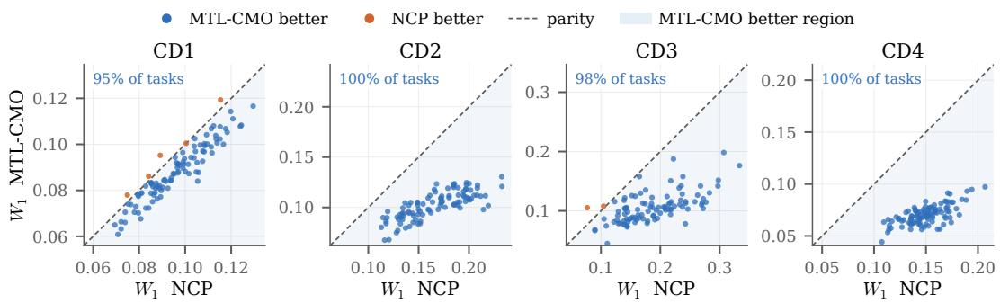

Figure 1: Comparison between MTL-CMO and the single-task NCP for representing CDFs on four conditional distribution families. Performances measured with the 1-Wasserstein to the ground truth.  
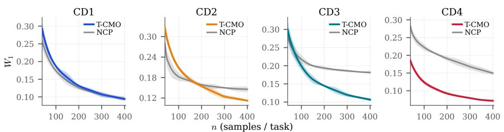  
Figure 2: Transfer learning evaluation on unseen conditional distributions. Comparison in 1- Wasserstein between T-CMO and the single-task NCP depending on the number of observations.

Results are reported in Table 1. MTL-CMO outperforms all competing methods on CD1–CD3 and remains competitive on CD4. Relative to its single-task counterpart, NCP, joint representation learning reduces the Wasserstein error by 8%, 39%, 43%, and 53% on CD1–CD4, respectively. This behavior is further illustrated in Figure 1, which compares the performance of MTL-CMO and to NCP across the four families for different number of training sampels per task. The improvement becomes substantially larger for the more challenging families, which involve multivariate conditioning, heavy tails, or asymmetric distributions. These results highlight the benefit of sharing information across related tasks through shared input/output function spaces, particularly when each task has not enough observations for accurate estimation.

Transfer learning evaluation. We next freeze the input and output function spaces learned during multi-task training. For each family and dataset sizes between 50 and 400, we sample observations from 100 previously unseen conditional distributions. We estimate their conditional CDFs using the closed-form T-CMO estimator and compare it with NCP models trained independently from scratch for each task and sample size.

Results are shown in Figure 2. On the simpler CD1 family, T-CMO and NCP achieve comparable performance. As the conditional families become more complex (CD2–CD4), T-CMO increasingly outperforms NCP as additional target observations become available. The reduced performance of T-CMO in the very low-data regime for some families is consistent with the greater numerical sensitivity of the empirical Gram-matrix inversion when few samples are available. Overall, these results show that function spaces learned from a diverse population of source tasks can be effectively reused to estimate the conditional distributions of previously unseen tasks (Tripuraneni et al., 2020). Implementation details and additional results are provided in Appendix D.4.

## 4.2 MULLER ¨ -BROWN LANGEVIN DYNAMICS

Muller-Brown dynamical family.¨ The Muller-Brown family is a standard benchmark for slow dy-¨ namic of metastable systems and transition-path problems (Muller & Brown, 1979; Zhang et al.,¨

Table 2: Reconstruction error between estimated and ground truth operators. Hilbert-Schmidt error in <mean> ± <std > over the 150 unseen systems. Lower is better. First and second.
<table><tr><td rowspan="2">Method</td><td colspan="5">Trajectory length N</td></tr><tr><td>5000</td><td>10 000</td><td>20 000</td><td>40 000</td><td>80 000</td></tr><tr><td>T-CMO (ours)</td><td> $\mathbf { 0 . 2 6 1 \pm 0 . 1 4 8 }$ </td><td> $\mathbf { 0 . 1 9 0 \pm 0 . 1 0 8 }$ </td><td> $\mathbf { 0 . 1 4 0 \pm 0 . 0 7 5 }$ </td><td> $\mathbf { 0 . 0 9 9 } \pm \mathbf { 0 . 0 5 5 }$ </td><td> $\mathbf { 0 . 0 7 5 \pm 0 . 0 3 9 }$ </td></tr><tr><td>Single-task NCP (Kostic et al., 2024)</td><td> $0 . 2 9 7 \pm 0 . 1 3 8$ </td><td> $0 . 2 2 4 \pm 0 . 0 9 8$ </td><td> $0 . 1 7 6 \pm 0 . 0 6 8$ </td><td> $0 . 1 3 8 \pm 0 . 0 4 7$ </td><td> $0 . 1 1 5 \pm 0 . 0 3 1$ </td></tr><tr><td>Pooled NCP (Kostic et al., 2024)</td><td> $0 . 3 0 6 \pm 0 . 1 4 3$ </td><td> $0 . 2 1 9 \pm 0 . 1 0 2$ </td><td> $0 . 1 6 3 \pm 0 . 0 7 8$ </td><td> $0 . 1 1 8 \pm 0 . 0 5 8$ </td><td> $\underline { { 0 . 0 8 7 \pm 0 . 0 4 1 } }$ </td></tr><tr><td>RFF/EDMD (Li et al., 2017)</td><td> $0 . 2 9 5 \pm 0 . 1 4 0$ </td><td> $0 . 2 3 3 \pm 0 . 1 2 3$ </td><td> $0 . 1 7 7 \pm 0 . 0 6 9$ </td><td> $0 . 1 3 5 \pm 0 . 0 4 5$ </td><td> $\overline { { 0 . 1 0 9 \pm 0 . 0 3 0 } }$ </td></tr><tr><td>RFF/Laplace (Kostic et al., 2025)</td><td> $0 . 2 9 6 \pm 0 . 1 4 1$ </td><td> $0 . 2 2 1 \pm 0 . 1 0 0$ </td><td> $0 . 1 7 2 \pm 0 . 0 7 2$ </td><td> $0 . 1 3 2 \pm 0 . 0 5 1$ </td><td> $0 . 1 0 6 \pm 0 . 0 3 4$ </td></tr><tr><td>MetaKoopman (Iwata &amp; Kawahara, 2021)</td><td> $0 . 2 8 8 \pm 0 . 1 4 2$ </td><td> $0 . 2 2 0 \pm 0 . 1 0 0$ </td><td> $0 . 1 7 3 \pm 0 . 0 7 0$ </td><td> $0 . 1 3 6 \pm 0 . 0 4 8$ </td><td> $0 . 1 1 5 \pm 0 . 0 3 4$ </td></tr><tr><td>VAMPNet (Mardt et al., 2018)</td><td> $\underline { { 0 . 2 7 3 \pm 0 . 1 4 5 } }$ </td><td> $\underline { { 0 . 2 0 5 \pm 0 . 1 0 4 } }$ </td><td> $\underline { { 0 . 1 5 4 \pm 0 . 0 7 1 } }$ </td><td> $\underline { { 0 . 1 1 0 \pm 0 . 0 5 1 } }$ </td><td> $0 . 0 8 8 \pm 0 . 0 3 4$ </td></tr></table>

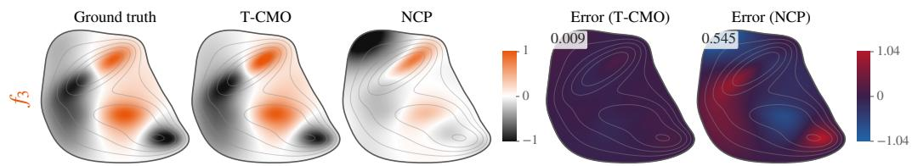  
Figure 3: Recovery of $3 ^ { r d }$ eigenfunction of an unseen Muller-Brown system with T-CMO/Laplace ¨ and its single-task counterpart NCP/Laplace. Global error in cosine distance.

2022). It consists in overdamped Langevin dynamics with two-dimensional energy landscapes comprising three wells separated by energy barriers. Typical trajectories spend long periods within metastable basins and only rarely transition between them. Consequently, the dominant nontrivial eigenfunctions of the Infinitesimal Generator (IG, see Section 2) characterize the principal metastable states, while the corresponding eigenvalues encode the transition timescales. We construct a family of such systems by varying the orientation and depth of one potential well. These variations alter the metastable regions and transition timescales, leading to task-specific spectra decompositions of the corresponding infinitesimal generators.

Experimental protocol. The experiment comprises three stages: (i) learning the shared functional space with MTL-CMO from 750 systems, (ii) finetuning the hyperparameters of the IG estimator with 50 dynamics, and (iii) estimating the IG of 150 unseen dynamics by transferring the function space with T-CMO. Each system provides a trajectory of 80,000 observations. Transfer performance is evaluated from truncated trajectories from 2k to 80k observations. Since Langevin dynamics are time-reversible, the IGs are self-adjoint and we consider a single function dictionary, i.e. $\Phi _ { \theta } = \Psi _ { \theta }$ . The IGs are estimated with the Laplace estimator (Kostic et al., 2025). Stage (ii) shows that the first three non-trivial components capture 95% of the spectral energy, motivating our focus on rank-3 spectral recovery. For transfer learning, we compare T-CMO/Laplace against: single-task NCP/Laplace, pooled NCP/Laplace, RFF/Laplace, RFF/EDMD, MetaKoopman, and VampNet. Implementation details are provided in Appendix E.1.

Results. The multi-task results reported in Appendix E.2 show that MTL-CMO improves operator reconstruction over its single-task counterpart, NCP. In transfer learning, T-CMO/Laplace achieves the lowest operator reconstruction error (Table 2) and the most accurate recovery of the individual spectral components (Appendix E.3) across all trajectory lengths. More specifically, Figure 3 shows that T-CMO accurately recovers the spatial structure of the third eigenfunction, whereas NCP, exhibits substantially larger localized errors. Figure 4 shows a consistent improvement of T-CMO across all three eigenfunctions and potential values, reducing the overall error by approximately a factor of two. These results demonstrate that transferring the learned function space is particularly beneficial for recovering challenging spectral components of unseen dynamics from limited trajectory data. Additional results can be found in Appendix E.3.

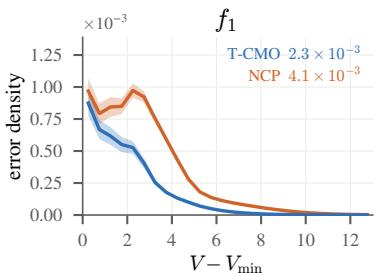

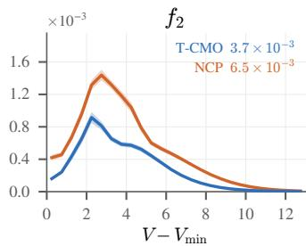

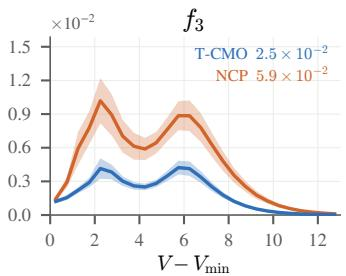  
Figure 4: Reconstruction error across eigenfunctions and potential values between T-CMO/Laplace and NCP/Laplace. Error averaged over the 150 unseen systems. Global error in cosine distance.

## 4.3 TURBULENT PLASMA DYNAMICS

Plasma dynamics and reduced-model identification. Turbulent plasmas exhibit strongly nonlinear and multiscale interactions that make high-fidelity simulations computationally demanding. They are therefore often approximated by reduced physical models that retain the dominant mechanisms while enabling faster simulations, which is valuable for applications requiring rapid predictions, such as plasma monitoring and control. Their practical use, however, requires inferring model parameters from observed trajectories, a challenging problem because turbulence and instabilities can obscure their effects on the dynamics (Boeuf & Smolyakov, 2023; Coosemans et al., 2021). This has motivated data-driven operator approaches for extracting physical information from plasma measurements and simulations (Faraji et al., 2024; Taylor et al., 2018).

Experiment objective. We consider Tokam2D (GYSELAX Team, 2026), a plasma simulator based on a reduced two-field model describing the evolution of plasma density and electrostatic potential in a two-dimensional plane. The dynamics are parametrized by $^ { g , }$ which controls the interchange coupling between density and vorticity, and $\kappa ,$ which controls the imposed density-gradient drive (Ghendrih et al., 2018; 2022). Varying these parameters produces distinct turbulent regimes. We investigate whether g and κ can be recovered from the spectra of IGs estimated through T-CMO. Appendix F.1 provides a detailed descriptions.

Experimental protocol. We simulate 400 plasma trajectories of 4,093 observations on a 64 × 64 spatial grid, with (g, κ) sampled uniformly from $[ 0 , 0 . 5 ] ^ { - } \times [ 1 , \bar { 3 } . 5 ]$ We train MTL-CMO on 320 trajectories using a convolutional ResNet that produces a dictionary of 128 functions. For IG estimation, we combine T-CMO with the Laplace estimator (Kostic et al., 2025). We regress g and κ from the estimated IG eigenvalues on the training set using kernel ridge regression. On the 80 heldout trajectories of increasing length, we compare our approach against eigenvalues obtained with MIDST (Elul et al., 2024), pooled NCP/Laplace (Kostic et al., 2024), and RFF/Laplace (Brault et al., 2016). Implementation details are provided in Appendix F.2.

Results. Figure 5-left shows a t-SNE embedding of the IG eigenvalue signatures estimated by MTL-CMO on the 320 training systems. Although g and κ are not provided during training, the resulting representations vary smoothly with both parameters. On the 80 held-out systems and using full trajectories, T-CMO/Laplace can be used to predict with $R ^ { 2 } { = } 0 . 9 3 2$ for $g$ and $R ^ { 2 } { = } 0 . 9 9 2$ for κ (Figure 5-right).

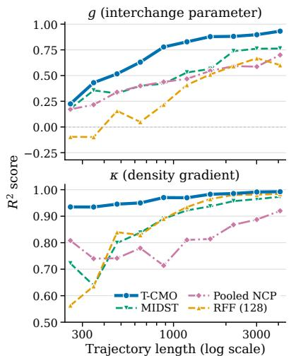  
Figure 6: Identification of the parameters g and κ versus trajectory length for T-CMO and competing methods.

Moreover, Figure 6 shows that it outperforms all baselines across all trajectory lengths with an early near-perfect recovery of κ and rapidly improving the estimation of $g$ compared to other baselines. These results show the benefit of jointly learning and transferring functional spaces for parameter identification in plasma dynamics. In appendices F.3 and F.4 we provide additional results.

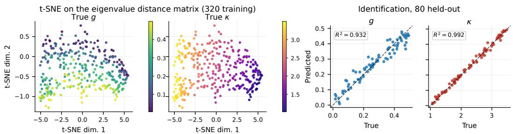  
Figure 5: Left: t-SNE on the distance matrix between the 320 training operator spectra colored by g and κ. Right: parameter identification with kernel regression evaluated on the 80 held-out systems.

## 5 CONCLUSION

In this work, we introduced MTL-CMO, a multi-task approach that jointly learns conditional mean operators through shared function spaces and task-specific linear operators. We then proposed T-CMO, which reuses the learned function spaces to estimate the operator of a new distribution in closed form. Our statistical results and experiments on uncertainty quantification and complex dynamical systems demonstrate the benefits of jointly learning the shared function spaces. In future work we will investigate new strategies to improve the estimation of the task-specific lowrank operators by leveraging the population manifold structure of their matrix representations.

## ACKNOWLEDGMENTS

This project received funding from the European Union’s Horizon Europe research and innovation program under grant agreement 101120237 (ELIAS), Fondation de l’Ecole Polytechnique, Hi! PARIS, the French National Research Agency (ANR) through France 2030 program (ANR-23-IACL-0005 and ANR-25-PEIA-0005), NextGenerationEU and Provincial Secretariat for Higher Education and Scientific Research of Vojvodina (Research Grant 003870560 2025 09418 003 000 000 001 04 004).

## REFERENCES

Rie Kubota Ando, Tong Zhang, and Peter Bartlett. A framework for learning predictive structures from multiple tasks and unlabeled data. Journal ofmachine learning research, 6(11), 2005.

Andreas Argyriou, Theodoros Evgeniou, and Massimiliano Pontil. Convex multi-task feature learning. Machine learning, 73(3):243–272, 2008.

Christopher M. Bishop. Mixture density networks. Technical Report NCRG/94/004, Aston University, 1994.

Jean-Pierre Boeuf and Andrei Smolyakov. Physics and instabilities of low-temperature E × B plasmas for spacecraft propulsion and other applications. Physics of Plasmas, 30(5):050901, 2023. doi: 10.1063/5.0145536.

Romain Brault, Markus Heinonen, and Florence Buc. Random fourier features for operator-valued kernels. In Asian Conference on Machine Learning, pp. 110–125. PMLR, 2016.

Leo Breiman and Jerome H Friedman. Estimating optimal transformations for multiple regression and correlation. Journal ofthe American statistical Association, 80(391):580–598, 1985.

Rich Caruana. Multitask learning. Machine learning, 28:41–75, 1997.

Reinart Coosemans, Wouter Dekeyser, and Martine Baelmans. Bayesian analysis of turbulent transport coefficients in 2D interchange dominated E × B turbulence involving flow shear. Journal of Physics: Conference Series, 1785:012001, 2021. doi: 10.1088/1742-6596/1785/1/012001.

V´ıctor H. de la Pena and Evarist Gin ˜ e.´ Decoupling: From Dependence to Independence. Springer, New York, 1999.

Timothee Devergne, Vladimir R. Kostic, Michele Parrinello, and Massimiliano Pontil. From biased´ to unbiased dynamics: An infinitesimal generator approach. In Advances in Neural Information Processing Systems, volume 37, 2024. doi: 10.52202/079017-2404.

Simon Shaolei Du, Wei Hu, Sham M. Kakade, Jason D. Lee, and Qi Lei. Few-shot learning via learning the representation, provably. In International Conference on Learning Representations, 2021. URL https://openreview.net/forum?id=pW2Q2xLwIMD.

Tony Duan, Anand Avati, Daisy Yi Ding, Khanh K Thai, Sanjay Basu, Andrew Ng, and Alejandro Schuler. Ngboost: Natural gradient boosting for probabilistic prediction. In International Conference on Machine Learning, pp. 2690–2700. PMLR, 2020.

Conor Durkan, Artur Bekasov, Iain Murray, and George Papamakarios. Neural spline flows. In Advances in Neural Information Processing Systems, volume 32, pp. 7511–7522, 2019.

Yonatan Elul, Eyal Rozenberg, Amit Boyarski, Yael Yaniv, Assaf Schuster, and Alex M Bronstein. Data-driven modeling of interrelated dynamical systems. Communications Physics, 7(1):141, 2024.

Theodoros Evgeniou and Massimiliano Pontil. Regularized multi–task learning. In Proceedings of the tenth ACM SIGKDD international conference on Knowledge discovery and data mining, pp. 109–117, 2004.

Theodoros Evgeniou, Charles A Micchelli, Massimiliano Pontil, and John Shawe-Taylor. Learning multiple tasks with kernel methods. Journal of machine learning research, 6(4):615, 2005.

Farbod Faraji, Maryam Reza, Aaron Knoll, and J. Nathan Kutz. Dynamic mode decomposition for data-driven analysis and reduced-order modelling of E × B plasmas: I. extraction of spatiotemporally coherent patterns. Journal of Physics D: Applied Physics, 57:065201, 2024. doi: 10.1088/1361-6463/ad0910.

Kenji Fukumizu, Francis R Bach, and Michael I Jordan. Dimensionality reduction for supervised learning with reproducing kernel hilbert spaces. Journal of Machine Learning Research, 5(Jan): 73–99, 2004.

Thibaut Germain, Remi Flamary, Vladimir R. Kostic, and Karim Lounici. A spectral-grassmann´ wasserstein metric for operator representations of dynamical systems. In International Conference on Learning Representations, 2026.

Roger Ghanem, David Higdon, and Houman Owhadi (eds.). Handbook of Uncertainty Quantification. Springer, 2017. doi: 10.1007/978-3-319-12385-1.

P. Ghendrih, Y. Asahi, E. Caschera, G. Dif-Pradalier, P. Donnel, X. Garbet, C. Gillot, V. Grandgirard, G. Latu, Y. Sarazin, et al. Generation and dynamics of SOL corrugated profiles. Journal of Physics: Conference Series, 1125:012011, 2018. doi: 10.1088/1742-6596/1125/1/012011.

Philippe Ghendrih, Guilhem Dif-Pradalier, Olivier Panico, Yanick Sarazin, Hugo Bufferand, Guido Ciraolo, Peter Donnel, Nicolas Fedorczak, Xavier Garbet, Virginie Grandgirard, et al. Role of avalanche transport in competing drift wave and interchange turbulence. Journal of Physics: Conference Series, 2397:012018, 2022. doi: 10.1088/1742-6596/2397/1/012018.

Noah Golowich, Alexander Rakhlin, and Ohad Shamir. Size-independent sample complexity of neural networks. In Sebastien Bubeck, Vianney Perchet, and Philippe Rigollet (eds.),´ Proceedings ofthe 31st Conference On Learning Theory, volume 75 of Proceedings ofMachine Learning Research, pp. 297–299. PMLR, 06–09 Jul 2018. URL https://proceedings.mlr.press/ v75/golowich18a.html.

Steffen Grunew¨ alder, Guy Lever, Luca Baldassarre, Sam Patterson, Arthur Gretton, and Massimi-¨ lano Pontil. Conditional mean embeddings as regressors. In Proceedings ofthe 29th International Coference on International Conference on Machine Learning, ICML’12, pp. 1803–1810, Madison, WI, USA, 2012. Omnipress. ISBN 9781450312851.

GYSELAX Team. Tokam2D: A 2D spectral solver for turbulence schemes, 2026. URL https: //github.com/gyselax/tokam2d. Accessed: 2026-05-01.

Minghao Han, Kiwan Wong, Adrian Wing-Keung Law, and Xunyuan Yin. Mako: Meta-adaptive koopman operators for learning-based model predictive control of parametrically uncertain nonlinear systems. Automatica, 186:112827, 2026.

Akira Hasegawa and Masahiro Wakatani. Plasma edge turbulence. Physical Review Letters, 50(9): 682–686, 1983. doi: 10.1103/PhysRevLett.50.682.

Maximiliano Hertel, Ilja Klebanov, Manuel Schaller, and Karl Worthmann. Verifiable regularity criterion for conditional expectation operators and conditional mean embeddings with applications to nonparametric regression, bayesian inverse problems, and koopman operators. arXiv preprint arXiv:2608.06155, 2026.

Tomoharu Iwata and Yoshinobu Kawahara. Meta-learning for koopman spectral analysis with short time-series. arXiv preprint arXiv:2102.04683, 2021.

Rafael Izbicki and Ann B Lee. Converting high-dimensional regression to high-dimensional conditional density estimation. Electronic Journal of Statistics, 11(2):2800–2831, 2017.

Bernard O Koopman. Hamiltonian systems and transformation in hilbert space. Proceedings of the National Academy ofSciences, 17(5):315–318, 1931.

Vladimir Kostic, Pietro Novelli, Andreas Maurer, Carlo Ciliberto, Lorenzo Rosasco, and Massimiliano Pontil. Learning dynamical systems via koopman operator regression in reproducing kernel hilbert spaces. In Advances in Neural Information Processing Systems, volume 35, pp. 4017–4031, 2022.

Vladimir Kostic, Karim Lounici, Pietro Novelli, and Massimiliano Pontil. Sharp spectral rates for koopman operator learning. In Advances in Neural Information Processing Systems, volume 36, pp. 32328–32339, 2023.

Vladimir R. Kostic, Karim Lounici, Gregoire Pacreau, Giacomo Turri, Pietro Novelli, and´ Massimiliano Pontil. Neural conditional probability for uncertainty quantification. In Advances in Neural Information Processing Systems, volume 37, 2024. doi: 10.52202/ 079017-1950. URL https://papers.nips.cc/paper\_files/paper/2024/hash/ 705b97ecb07ae86524d438abac97a3e2-Abstract-Conference.html.

Vladimir R. Kostic, Karim Lounici, Hel´ ene Halconruy, Timoth\` ee Devergne, Pietro Novelli, and´ Massimiliano Pontil. Laplace transform based low-complexity learning of continuous markov semigroups. In Proceedings of the 42nd International Conference on Machine Learning, volume 267 of Proceedings of Machine Learning Research, pp. 31560–31589. PMLR, 2025.

Guillaume Le Treut, Sarah Ancheta, Greg Huber, Henri Orland, and David Yllanes. Markov-bridge generation of transition paths and its application to cell-fate choice. Physical Review Research, 7 (1):013010, 2025. doi: 10.1103/PhysRevResearch.7.013010.

Michel Ledoux and Michel Talagrand. Probability in Banach Spaces: isoperimetry and processes, volume 23. Springer, 1991.

Qianxiao Li, Felix Dietrich, Erik M Bollt, and Ioannis G Kevrekidis. Extended dynamic mode decomposition with dictionary learning: A data-driven adaptive spectral decomposition of the koopman operator. Chaos: An Interdisciplinary Journal ofNonlinear Science, 27(10), 2017.

Yaron Lipman, Ricky TQ Chen, Heli Ben-Hamu, Maximilian Nickel, and Matthew Le. Flow matching for generative modeling. In International Conference on Learning Representations, 2023.

Andreas Mardt, Luca Pasquali, Hao Wu, and Frank Noe. VAMPnets for deep learning of molecular´ kinetics. Nature Communications, 9:5, 2018. doi: 10.1038/s41467-017-02388-1.

Andreas Maurer, Massi Pontil, and Bernardino Romera-Paredes. Sparse coding for multitask and transfer learning. In International conference on machine learning, pp. 343–351. PMLR, 2013.

Andreas Maurer, Massimiliano Pontil, and Bernardino Romera-Paredes. The benefit of multitask representation learning. Journal of Machine Learning Research, 17(81):1–32, 2016.

Mattes Mollenhauer and Peter Koltai. Nonparametric approximation of conditional expectation´ operators. arXiv preprint arXiv:2012.12917, 2020.

Krikamol Muandet, Kenji Fukumizu, Bharath K. Sriperumbudur, and Bernhard Scholkopf. Kernel¨ mean embedding of distributions: A review and beyond. Foundations and Trends in Machine Learning, 10(1–2):1–141, 2017. doi: 10.1561/2200000060.

Klaus Muller and L. D. Brown. Location of saddle points and minimum energy paths by a con-¨ strained simplex optimization procedure. Theoretica chimica acta, 53(1):75–93, 1979. doi: 10.1007/BF00547608.

Elizbar A Nadaraya. On estimating regression. Theory of Probability & Its Applications, 9(1): 141–142, 1964.

Grigorios A. Pavliotis. Stochastic Processes and Applications: Diffusion Processes, the Fokker– Planck and Langevin Equations, volume 60 of Texts in Applied Mathematics. Springer, 2014. doi: 10.1007/978-1-4939-1323-7.

Ali Rahimi and Benjamin Recht. Random features for large-scale kernel machines. In Advances in Neural Information Processing Systems, volume 20, 2007.

Filipe Rodrigues and Francisco C Pereira. Beyond expectation: Deep joint mean and quantile regression for spatiotemporal problems. IEEE transactions on neural networks and learning systems, 31(12):5377–5389, 2020.

Peter J Schmid. Dynamic mode decomposition of numerical and experimental data. Journal offluid mechanics, 656:5–28, 2010.

Xinwei Shen and Nicolai Meinshausen. Engression: extrapolation through the lens of distributional regression. Journal ofthe Royal Statistical Society Series B: Statistical Methodology, 87(3):653– 677, 2025.

Eiki Shimizu, Kenji Fukumizu, and Dino Sejdinovic. Neural-kernel conditional mean embeddings. In Proceedings of the 41st International Conference on Machine Learning, volume 235 of Proceedings ofMachine Learning Research, pp. 45040–45059. PMLR, 2024.

Burton Singer and Seymour Spilerman. The representation of social processes by markov models. American journal of sociology, 82(1):1–54, 1976.

Le Song, Jonathan Huang, Alex Smola, and Kenji Fukumizu. Hilbert space embeddings of conditional distributions with applications to dynamical systems. In Proceedings of the 26th annual international conference on machine learning, pp. 961–968, 2009.

Roy Taylor, J. Nathan Kutz, Kyle D. Morgan, and Brian A. Nelson. Dynamic mode decomposition for plasma diagnostics and validation. Review ofScientific Instruments, 89(5):053501, 2018. doi: 10.1063/1.5027419.

Nilesh Tripuraneni, Michael Jordan, and Chi Jin. On the theory of transfer learning: The importance of task diversity. Advances in neural information processing systems, 33:7852–7862, 2020.

Nilesh Tripuraneni, Chi Jin, and Michael Jordan. Provable meta-learning of linear representations. In International conference on machine learning, pp. 10434–10443. Pmlr, 2021.

Geoffrey S Watson. Smooth regression analysis. Sankhya: The Indian Journal of Statistics, Series¯ A, 26:359–372, 1964.

Bailing Zhang. Koopman framework with self-supervised spectral alignment for multi-domain timeseries modeling and prediction. Neurocomputing, pp. 131109, 2025.

Wei Zhang, Tiejun Li, and Christof Schutte. Solving eigenvalue pdes of metastable diffusion pro-¨ cesses using artificial neural networks. Journal ofComputational Physics, 465:111377, 2022.

Yi Zhang and Jeff Schneider. Learning multiple tasks with a sparse matrix-normal penalty. Advances in neural information processing systems, 23, 2010.

## A OPERATOR REPRESENTATION OF DYNAMICAL SYSTEMS & ESTIMATION

## A.1 OPERATOR REPRESENTATION OF DYNAMICAL SYSTEMS & SPECTRAL DECOMPOSITION

Markov semigroup and transfer operator. Let $( X _ { t } ) _ { t \geq 0 }$ be a time-homogeneous Markov process on a measurable state space $x ,$ , and invariant measure π. Let ${ \mathcal { F } } \subset { \mathcal { L } } _ { \pi } ^ { 2 } ( { \mathcal { X } } )$ be a space of observables. The evolution of the system is described by the Markov semigroup $\{ \dot { A } _ { t } \} _ { t \geq 0 }$ acting on ${ \mathcal { F } } ,$ , such as

$$
[ A _ { t } f ] ( \boldsymbol { x } ) = \mathbb { E } [ f ( X _ { t } ) \mid X _ { 0 } = \boldsymbol { x } ] , \quad f \in \mathcal { F } .\tag{25}
$$

Infinitesimal generator. The family $\{ A _ { t } \} _ { t \ge 0 }$ is a strongly continuous semigroup satisfying

$$
A _ { 0 } = \mathrm { I d } , \qquad A _ { t + s } = A _ { t } A _ { s } , \quad \forall t , s \geq 0 .
$$

The infinitesimal generator $G$ associated with $\{ A _ { t } \} _ { t \ge 0 }$ is defined as

$$
G f \triangleq \operatorname* { l i m } _ { t \to 0 ^ { + } } \frac { A _ { t } f - f } { t } ,\tag{26}
$$

with domain ${ \mathcal { D } } ( G ) \subset { \mathcal { F } }$ . The generator is, in general, an unbounded linear operator on $\mathcal { F }$ and characterizes the semigroup through $A _ { t } = \exp ( t G )$

Spectral decomposition via compact resolvent. The spectral analysis of $G$ requires additional structure due to its infinite-dimensional and unbounded nature. Let π be an invariant measure of the process and consider the Hilbert space $\mathcal { L } _ { \pi } ^ { 2 } ( \mathcal { X } )$ ).

We assume that G has compact resolvent, i.e., there exists $\mu _ { 0 }$ in the spectrum of $G$ such that $( \mu _ { 0 } \operatorname { I d } - G ) ^ { - 1 }$ is compact on $\mathcal { L } _ { \pi } ^ { 2 } ( \mathcal { X } )$ . Under this assumption, the spectrum of $G$ is discrete and consists of isolated eigenvalues $( \lambda _ { i } ) _ { i \in \mathbb { N } }$ with finite multiplicity and no accumulation point except possibly at infinity.

In addition, there exists an bi-orthogonal basis $( f _ { i } , g _ { i } ) _ { i \in \mathbb { N } }$ of $\mathcal { L } _ { \pi } ^ { 2 } ( \mathcal { X } )$ such that

$$
G f _ { i } = \lambda _ { i } f _ { i } \qquad G ^ { * } g _ { i } = { \overline { { \lambda _ { i } } } } g _ { i } \qquad \langle f _ { i } , g _ { j } \rangle _ { \mathcal { L } _ { \pi } ^ { 2 } ( \mathcal { X } ) } = \delta _ { i j }\tag{27}
$$

For each isolated eigenvalue $\lambda _ { i }$ , the associated spectral projector $P _ { i }$ is defined as the projector onto the corresponding eigenspace in $\mathcal { L } _ { \pi } ^ { 2 } ( \mathcal { X } )$

In the simple eigenvalue case, we have

$$
P _ { i } f = \langle f , g _ { i } \rangle _ { \mathcal { L } _ { \pi } ^ { 2 } ( \mathcal { X } ) } f _ { i } .\tag{28}
$$

More generally, if $\lambda _ { i }$ has multiplicity $m _ { i }$ and $\left( f _ { i , k } , g _ { i , k } \right) _ { k = 1 } ^ { m _ { i } }$ is an bi-orthogonal basis of the eigenspace, then

$$
P _ { i } f = \sum _ { k = 1 } ^ { m _ { i } } \langle f , g _ { i , k } \rangle _ { \mathcal { L } _ { \pi } ^ { 2 } ( \mathcal { X } ) } f _ { i , k } .\tag{29}
$$

The projectors satisfy

$$
P _ { i } P _ { j } = \delta _ { i j } P _ { i } , \qquad \sum _ { i } P _ { i } = \mathrm { I d }\tag{30}
$$

on the spectral subspace.

With this notation, the generator admits the spectral representation

$$
G f = \sum _ { i } \lambda _ { i } P _ { i } f ,\tag{31}
$$

for all $f \in { \mathcal { D } } ( G )$ for which the expansion is well-defined, and the semigroup diagonalizes as

$$
A _ { t } f = \sum _ { i } e ^ { \lambda _ { i } t } P _ { i } f .\tag{32}
$$

## A.2 ESTIMATION THROUGH GENERATOR RESOLVENT

This section presents the methodology introduced in Kostic et al. (2025).

Learning initial generators via spectral filtering. The first step consists in learning a collection of initial generator atoms directly from trajectory data by estimating spectral components of the infinitesimal generator G. Rather than approximating G through finite differences of the form $( A _ { \Delta t } - I ) / \Delta t$ , which is unstable at small time scales, we rely on spectral filtering based on Toeplitz representations of analytic functions of the generator.

Let $A _ { \Delta t } = e ^ { \Delta t G }$ denote the transfer operator at time step ∆t. We consider a Toeplitz symbol

$$
T ( z ) = \sum _ { j \in \mathbb { Z } } a _ { j } z ^ { j } ,\tag{33}
$$

and define the associated filtered operator

$$
F ( G ) = T ( A _ { \Delta t } ) .\tag{34}
$$

Since $A _ { j \Delta t } = A _ { \Delta t } ^ { j }$ , the operator F(G) admits the representation

$$
F ( G ) = \sum _ { j \in \mathbb { Z } } a _ { j } A _ { \Delta t } ^ { j } ,\tag{35}
$$

which can be approximated from data using time-lagged observations. In practice, we use a truncated expansion

$$
F _ { \ell } ( G ) = \sum _ { | j | \leq \ell } a _ { j } A _ { \Delta t } ^ { j } ,\tag{36}
$$

whose empirical action is represented by a banded Toeplitz matrix acting on the time-ordered data sequence. Thus, analytic functional calculus of the generator reduces to structured linear algebra on trajectory data.

Resolvent and exponential filters. To probe the spectrum of the generator $G ,$ we use families of analytic filters.

The key object is the generator resolvent

$$
R _ { \mu } = ( \mu I - G ) ^ { - 1 } = \int _ { 0 } ^ { \infty } e ^ { t G } e ^ { - \mu t } d t ,\tag{37}
$$

which we approximate by a Toeplitz-weighted sum of transfer operators,

$$
R _ { \mu , \ell } = \sum _ { j = 0 } ^ { \ell } a _ { j } A _ { \Delta t } ^ { j } , \qquad a _ { j } \approx \Delta t e ^ { - \mu j \Delta t } ,\tag{38}
$$

corresponding to a discretization of the Laplace transform.

Equivalently, using the transfer-operator resolvent, we have

$$
( e ^ { \mu } I - A _ { \Delta t } ) ^ { - 1 } = \sum _ { j = 0 } ^ { \infty } e ^ { - ( j + 1 ) \mu } A _ { \Delta t } ^ { j } ,\tag{39}
$$

which naturally yields Toeplitz coefficients. These filters concentrate spectral information near the shift parameter $\mu ,$ allowing us to localize different regions of the spectrum.

In addition, exponential and trigonometric filters $\left( \mathbf { e . g . \ e ^ { \Delta t G } } \right.$ , cosh(∆tG), sinh $( \Delta t G ) )$ can be used to emphasize specific spectral structures depending on the nature of the dynamics.

Estimation from data. Algorithm 1 describes the procedure to estimate the infinitesimal generator according to (Kostic et al., 2025).

```latex
Algorithm 1 Generator estimation from T-CMO transferred observables
Require: Trajectory $\{ x _ { t } ^ { \star } \} _ { t = 0 } ^ { T - 1 }$ , rank-r observable basis $U ^ { \star } = \{ u _ { j } ^ { \star } \} _ { j = 1 } ^ { r }$ returned by T-CMO, sampling step
$\Delta t ,$ resolvent shift $\mu ,$ maximum lag $\ell ,$ rank q, regularization γ
1: Evaluate $\mathbf { z } _ { t } ^ { \star } \gets \left( u _ { 1 } ^ { \star } ( x _ { t } ^ { \star } ) , \ldots , u _ { r } ^ { \star } ( x _ { t } ^ { \star } ) \right) ^ { \top } \in \mathbb { R } ^ { r }$
2: Form $\mathbf { Z } ^ { \star } \gets ( \mathbf { z } _ { 0 } ^ { \star } , \ldots , \mathbf { z } _ { T - 1 } ^ { \star } ) ^ { \top } \in \mathbb { R } ^ { T \times r }$
3: Construct the truncated Laplace weights $a _ { k } \gets \mu \Delta t e ^ { - \mu k \Delta t } , \quad k = 0 , \dots , \ell$
4: Form the associated Toeplitz operator $\mathbf { T } _ { \mu }$ and compute $\mathbf { Z } _ { \mu } ^ { \star } \gets \mathbf { T } _ { \mu } \mathbf { Z } ^ { \star }$
5: Compute $\widehat { \mathbf { C } } ^ { \star } \gets \frac { 1 } { T } \mathbf { Z ^ { \star } } ^ { \top } \mathbf { Z ^ { \star } } , \widehat { \mathbf { H } } _ { \mu } ^ { \star } \gets \frac { 1 } { T } \mathbf { Z ^ { \star } } ^ { \top } \mathbf { Z } _ { \mu } ^ { \star }$
6: Regularize $\widehat { \mathbf { C } } _ { \gamma } ^ { \star } \gets \widehat { \mathbf { C } } ^ { \star } + \gamma \mathbf { I } _ { r }$
7: Compute the q dominant generalized eigenvectors of $\widehat { \mathbf { H } } _ { \mu } ^ { \star } \widehat { \mathbf { H } } _ { \mu } ^ { \star ^ { \top } } \mathbf { v } = \sigma ^ { 2 } \widehat { \mathbf { C } } _ { \gamma } ^ { \star } \mathbf { v }$ and collect the normalized
directions in $\hat { \mathbf { V } } _ { q } ^ { \star }$
8: Form the reduced resolvent representation $\widehat { \mathbf { R } } _ { \mu } ^ { \star } \gets \mathbf { V } _ { q } ^ { \star \top } \widehat { \mathbf { H } } _ { \mu } ^ { \star } \mathbf { V } _ { q } ^ { \star }$
9: Compute $\widehat { \mathbf { R } } _ { \mu } ^ { \star } \mathbf { r } _ { i } ^ { \star } = \nu _ { i } ^ { \star } \mathbf { r } _ { i } ^ { \star }$
10: Recover $\mathbf { v } _ { i } ^ { \star } {  } \mathbf { V } _ { q } ^ { \star } \mathbf { r } _ { i } ^ { \star }$
11: Recover the generator eigenvalues $\widehat { \lambda } _ { i } ^ { \star } \gets \mu \left( 1 - \frac { 1 } { \nu _ { i } ^ { \star } } \right)$
12: Define the corresponding eigenfunctions $\widehat { f } _ { i } ^ { \star } ( x ) \gets \sum _ { j = 1 } ^ { \prime } [ \mathbf { v } _ { i } ^ { \star } ] _ { j } u _ { j } ^ { \star } ( x )$
13: return $\{ \widehat { \lambda } _ { i } ^ { \star } \} _ { i = 1 } ^ { q }$ and $\{ \widehat { f } _ { i } ^ { \star } \} _ { i = 1 } ^ { q }$
```

## A.3 FROM T-CMO TO ESTIMATION OF OPERATOR REPRESENTATION OF DYNAMICALSYSTEM.

Estimation of a dynamical system’s operator representation requires a function space (observable space) that best captures the dynamics as depicted in Section 2 and Appendix A.1. By construction, MTL-CMO, introduced in Section $^ { 3 , }$ captures function spaces that describe the dominant mode of variation in a population of dynamical systems. These learned function spaces can be adapted via transfer with T-CMO to estimate the operator representation of a new, related dynamical system.

Formally, consider the learned features maps $( \Phi _ { \widehat { \theta } } , \Psi _ { \widehat { \theta } } )$ with MTL-CMO on a population of related dynamical systems. Suppose a sampled trajectory $\{ x _ { i } ^ { \mathrm { n e w } } \} _ { i \in [ T ] } \subset \mathcal { X }$ from a new dynamical system with invariant measure $\pi _ { \mathrm { n e w } }$ . Then,

1. With T-CMO estimate the new operator $\mathsf { D } _ { \mathrm { Y | X } } ^ { \mathrm { n e w } }$ , see Section 3.2 and Algorithm 3.

2. Derive its singular value decomposition following Section 3.1 (SVD paragraph) and keep the orthonormal function basis $\dot { U } ^ { \mathrm { n e w } } = \{ u _ { i } ^ { \mathrm { n e w } } \} _ { i \in [ r _ { \mathrm { n e w } } ] }$

3. Estimate the infinitesimal generator with the function space span $( U ^ { \mathrm { n e w } } ) \subset \mathcal L _ { \pi _ { \mathrm { n e w } } } ^ { 2 } ( \mathcal X )$ with any infinitesimal generator estimator.

Various infinitesimal generator estimators exist, including: (Schmid, 2010; Li et al., 2017; Kostic et al., 2022; 2025). In particular, we describe Kostic et al. (2025) in Appendix A.2.

## B MULTI-TASK LEARNING FOR CONDITIONAL MEAN OPERATOR: APPENDIX

We give additional details on the finite-dimensional representation of the task-specific operators, the population objective optimized by MTL-CMO, and the resulting transfer estimator.

Post-hoc Singular Value Decomposition of deflated operators. For each task k, the singular value decomposition of the deflated operator can be recovered post hoc by centering and whitening the shared dictionaries. Formally, consider the orthogonal projectors

$$
P _ { \mu _ { k } } \triangleq I _ { d } - \mathbf { 1 } _ { \mathcal { X } } \otimes _ { \mu _ { k } } \mathbf { 1 } _ { \mathcal { X } } \qquad P _ { \nu _ { k } } \triangleq I _ { d } - \mathbf { 1 } _ { \mathcal { Y } } \otimes _ { \nu _ { k } } \mathbf { 1 } _ { \mathcal { Y } } ,
$$

where $\mathbf { 1 } _ { \mathcal { X } }$ and $\mathbf { 1 } _ { \mathcal { V } }$ are indicator functions. These projectors center functions, i.e.

$$
P _ { \mu _ { k } } f = f - \mathbb { E } _ { \mu _ { k } } [ f ( X ) ] \qquad P _ { \nu _ { k } } g = g - \mathbb { E } _ { \nu _ { k } } [ g ( Y ) ] .
$$

Assuming an unconstrained operator $\mathsf { D } _ { \mathrm { Y | X } } ^ { ( \mathrm { k } ) , \theta }$ , we can define the centered deflated operator:

$$
\begin{array} { r } { \tilde { \mathsf { D } } _ { \mathrm { Y } | \mathrm { X } } ^ { ( \mathrm { k } ) , \theta } \triangleq P _ { \mu _ { k } } \mathsf { D } _ { \mathrm { Y } | \mathrm { X } } ^ { ( \mathrm { k } ) , \theta } P _ { \mu _ { k } } = \mathsf { S } _ { \Phi _ { \theta , c } } ^ { ( k ) } \mathbf { A } ^ { ( k ) } \mathbf { B } ^ { ( k ) } \mathsf { S } _ { \Psi _ { \theta , c } } ^ { ( k ) * } , } \end{array}
$$

with $\Phi _ { \theta , c } ^ { ( k ) } ( x ) = \Phi _ { \theta } ( x ) - \mathbb { E } _ { \mu _ { k } } [ \Phi _ { \theta } ( X ) ]$ and $\Psi _ { \theta , c } ^ { ( k ) } ( y ) = \Psi _ { \theta } ( y ) - \mathbb { E } _ { \nu _ { k } } [ \Psi _ { \theta } ( Y ) ]$ . In fact, the centered deflated operator is a better estimator of $\mathsf { D } _ { \mathrm { Y | X } } ^ { \mathrm { ( k ) } }$ . Indeed,

$$
\left\| \widetilde { \mathsf { D } } _ { \mathrm { Y | X } } ^ { ( \mathrm { k } ) , \theta } - \mathsf { D } _ { \mathrm { Y | X } } ^ { ( \mathrm { k } ) } \right\| _ { \mathrm { H S } } \leq \left\| \mathsf { D } _ { \mathrm { Y | X } } ^ { ( \mathrm { k } ) , \theta } - \mathsf { D } _ { \mathrm { Y | X } } ^ { ( \mathrm { k } ) } \right\| _ { \mathrm { H S } } ,
$$

since $P _ { \mu _ { k } } \ D _ { \mathrm { Y | X } } ^ { \mathrm { ( k ) } } P _ { \nu _ { k } } \ = \ \mathsf { D } _ { \mathrm { Y | X } } ^ { \mathrm { ( k ) } }$ and projectors are contractant maps. Assume the centered Grammatrices

$$
\mathbf { G } _ { \Phi _ { \theta , c } } ^ { ( k ) } \triangleq \mathbb { E } _ { \mu _ { k } } \left[ \Phi _ { \theta , c } ^ { ( k ) } ( X ) \Phi _ { \theta , c } ^ { ( k ) } ( X ) ^ { \top } \right] , \qquad \mathbf { G } _ { \Psi _ { \theta , c } } ^ { ( k ) } \triangleq \mathbb { E } _ { \nu _ { k } } \left[ \Psi _ { \theta , c } ^ { ( k ) } ( Y ) \Psi _ { \theta , c } ^ { ( k ) } ( Y ) ^ { \top } \right] ,
$$

Consider the matrix SVD

$$
\mathbf { G } _ { \Phi _ { \theta , c } } ^ { ( k ) 1 / 2 } \mathbf { A } ^ { ( k ) } \mathbf { B } ^ { ( k ) \top } \mathbf { G } _ { \Psi _ { \theta , c } } ^ { ( k ) 1 / 2 } = \mathbf { U } ^ { ( k ) } \operatorname { D i a g } ( \pmb { \sigma } ^ { ( k ) } ) \mathbf { V } ^ { ( k ) \top } .
$$

Since

$$
\mathbf { U } ^ { ( k ) \top } \mathbf { U } ^ { ( k ) } = \mathbf { I } _ { r _ { k } } , \qquad \mathbf { V } ^ { ( k ) \top } \mathbf { V } ^ { ( k ) } = \mathbf { I } _ { r _ { k } } ,
$$

the coefficient matrices

$$
\mathbf { C } ^ { ( k ) } = \mathbf { G } _ { \Phi _ { \theta } } ^ { ( k ) - 1 / 2 } \mathbf { U } ^ { ( k ) } , \qquad \mathbf { D } ^ { ( k ) } = \mathbf { G } _ { \Psi _ { \theta } } ^ { ( k ) - 1 / 2 } \mathbf { V } ^ { ( k ) }
$$

satisfy

$$
\mathbf { C } ^ { ( k ) \top } \mathbf { G } _ { \Phi _ { \theta } } ^ { ( k ) } \mathbf { C } ^ { ( k ) } = \mathbf { I } _ { r _ { k } } , \qquad \mathbf { D } ^ { ( k ) \top } \mathbf { G } _ { \Psi _ { \theta } } ^ { ( k ) } \mathbf { D } ^ { ( k ) } = \mathbf { I } _ { r _ { k } } .
$$

Denoting $\mathbf { u } _ { i } ^ { ( k ) }$ and ${ \bf v } _ { i } ^ { ( k ) }$ the $i ^ { t h }$ columns of $\mathbf { U } ^ { ( k ) }$ and $\mathbf { V } ^ { ( k ) }$ , the singular functions are given by

$$
\widetilde { u } _ { i } ^ { ( k ) } = \mathsf { S } _ { \Phi _ { \theta , c } } ^ { ( k ) } \mathbf { G } _ { \Phi _ { \theta , c } } ^ { ( k ) - 1 / 2 } \mathbf { u } _ { i } ^ { ( k ) } , \qquad \widetilde { v } _ { i } ^ { ( k ) } = \mathsf { S } _ { \Psi _ { \theta , c } } ^ { ( k ) } \mathbf { G } _ { \Psi _ { \theta , c } } ^ { ( k ) - 1 / 2 } \mathbf { v } _ { i } ^ { ( k ) } ,
$$

where $\mathbf { G } _ { \Phi _ { \theta , c } } ^ { ( k ) - 1 / 2 }$ and $\mathbf { G } _ { \Psi _ { \theta , c } } ^ { ( k ) - 1 / 2 }$ are square root inverses. By construction, the functions $\{ \widetilde { u } _ { i } ^ { ( k ) } \} _ { i \in [ r _ { k } ] }$ and $\{ \widetilde { v } _ { i } ^ { ( k ) } \} _ { i \in [ r _ { k } ] }$ are orthonormal in their respective space $\mathrm { L } _ { \mu _ { \mathrm { k } } } ^ { 2 } ( \mathcal { X } )$ and $\mathrm { L } _ { \nu _ { \bf k } } ^ { 2 } ( \mathcal { V } )$ , and therefore yield the task-specific singular decomposition

$$
\begin{array} { r } { \tilde { \mathsf { D } } _ { \mathrm { Y | X } } ^ { ( \mathrm { k } ) , \theta } = \sum _ { i = 1 } ^ { r _ { k } } \sigma _ { i } ^ { ( k ) } \widetilde { u } _ { i } ^ { ( k ) } \otimes \widetilde { v } _ { i } ^ { ( k ) } . } \end{array}\tag{40}
$$

Thus, the proposed factorization avoids imposing orthogonality constraints during training while retaining access to an orthonormal, task-specific spectral representation after optimization.

Derivation task-specific theoretical and empirical losses. We start be deriving the loss for each task. Consider the task $k ,$ , its loss is the discrepancy between the $\mathsf { D } _ { \mathrm { Y | X } } ^ { ( \mathrm { k } ) , \theta }$ and $\mathsf { D } _ { \mathrm { Y | X } } ^ { \mathrm { ( k ) } }$

$$
\begin{array} { r } { \mathcal { L } ^ { ( k ) } = \Vert \mathrm { D } _ { \mathrm { Y | X } } ^ { ( \mathrm { k } ) , \theta } - \mathrm { D } _ { \mathrm { Y | X } } ^ { ( \mathrm { k } ) } \Vert _ { \mathrm { H S } } ^ { 2 } - \Vert \mathrm { D } _ { \mathrm { Y | X } } ^ { ( \mathrm { k } ) } \Vert _ { \mathrm { H S } } ^ { 2 } } \\ { = \Vert \mathrm { D } _ { \mathrm { Y | X } } ^ { ( \mathrm { k } ) , \theta } \Vert _ { \mathrm { H S } } ^ { 2 } - 2 \langle \mathrm { D } _ { \mathrm { Y | X } } ^ { ( \mathrm { k } ) , \theta } , \mathrm { D } _ { \mathrm { Y | X } } ^ { ( \mathrm { k } ) } \rangle _ { \mathrm { H S } } . } \end{array}
$$

Let $\begin{array} { r } { q _ { k } ( x , y ) = \sum _ { i , j } M _ { i j } ^ { ( k ) } \phi _ { i } ^ { ( k ) } ( x ) \psi _ { j } ^ { ( k ) } ( y ) } \end{array}$ , with $\mathbf { M } ^ { ( k ) } = \mathbf { A } ^ { ( k ) } \mathbf { B } ^ { ( k ) \top }$ , be the kernel of $\mathsf { D } _ { \mathrm { Y | X } } ^ { ( \mathrm { k } ) , \theta }$ . Since $\mathsf { D } _ { \mathrm { Y } | \mathrm { X } } ^ { ( \mathrm { k } ) , \theta } : L _ { \nu _ { k } } ^ { 2 } \to L _ { \mu _ { k } } ^ { 2 }$ is an integral operator,

$$
\begin{array} { r l r } {  { \| \mathrm { D } _ { \mathrm { Y | X } } ^ { \mathrm { ( k ) } , \theta } \| _ { \mathrm { H S } } ^ { 2 } = \int q _ { k } ( x , y ) ^ { 2 } d \mu _ { k } ( x ) d \nu _ { k } ( y ) } } \\ & { } & { = \mathbb { E } _ { \mu _ { k } \otimes \nu _ { k } } [ q _ { k } ( X , Y ) ^ { 2 } ] } \\ & { } & { = \mathrm { T r } \Big ( \mathbf { G } _ { \Psi _ { \theta } } ^ { ( k ) } \mathbf { M } ^ { ( k ) \top } \mathbf { G } _ { \Phi _ { \theta } } ^ { ( k ) } \mathbf { M } ^ { ( k ) } \Big ) , \ } \end{array}
$$

with

$$
\mathbf { G } _ { \Phi _ { \theta } } ^ { ( k ) } \triangleq \mathbb { E } _ { \mu _ { k } } \left[ \Phi _ { \theta } ^ { ( k ) } ( X ) \Phi _ { \theta } ^ { ( k ) } ( X ) ^ { \top } \right] \qquad \mathbf { G } _ { \Psi _ { \theta } } ^ { ( k ) } \triangleq \mathbb { E } _ { \nu _ { k } } \left[ \Psi _ { \theta } ^ { ( k ) } ( Y ) \Psi _ { \theta } ^ { ( k ) } ( Y ) ^ { \top } \right] .
$$

Recall that

$$
{ \sf D } _ { \mathrm { Y | X } } ^ { \mathrm { ( k ) } } = { \sf E } _ { \mathrm { Y | X } } ^ { \mathrm { ( k ) } } - \mathbf { 1 } _ { \mathcal { X } } \otimes \mathbf { 1 } _ { \mathcal { Y } } , \qquad [ \mathsf { E } _ { \mathrm { Y | X } } ^ { \mathrm { ( k ) } } f ] ( x ) = \mathbb { E } [ f ( Y ) \mid X = x ] ,
$$

so that

$$
\begin{array} { r } { \langle \mathsf { D } _ { \mathrm { Y } | \mathrm { X } } ^ { ( \mathrm { k } ) , \theta } , \mathsf { D } _ { \mathrm { Y } | \mathrm { X } } ^ { ( \mathrm { k } ) } \rangle _ { \mathrm { H S } } = \langle \mathsf { D } _ { \mathrm { Y } | \mathrm { X } } ^ { ( \mathrm { k } ) , \theta } , \mathsf { E } _ { \mathrm { Y } | \mathrm { X } } ^ { ( \mathrm { k } ) } \rangle _ { \mathrm { H S } } - \langle \mathsf { D } _ { \mathrm { Y } | \mathrm { X } } ^ { ( \mathrm { k } ) , \theta } , \mathbf { 1 } _ { \mathcal { X } } \otimes \mathbf { 1 } _ { \mathcal { Y } } \rangle _ { \mathrm { H S } } . } \end{array}
$$

For $u \in L _ { \mu _ { k } } ^ { 2 }$ and $v \in L _ { \nu _ { k } } ^ { 2 }$ L.9

$$
\langle u \otimes v , \mathsf { E } _ { \mathrm { Y | X } } ^ { \mathrm { ( k ) } } \rangle _ { \mathrm { H S } } = \langle u , \mathsf { E } _ { \mathrm { Y | X } } ^ { \mathrm { ( k ) } } v \rangle _ { \mu _ { k } } ,
$$

and,

$$
\begin{array} { r l } { \langle u , \mathsf { E } _ { \mathrm { Y } | \mathrm { X } } ^ { \mathrm { ( k ) } } v \rangle _ { \mu _ { k } } = \displaystyle \int u ( x ) \mathbb { E } [ v ( Y ) \mid X = x ] d \mu _ { k } ( x ) } & { } \\ { \displaystyle } & { = \mathbb { E } [ u ( X ) \mathbb { E } [ v ( Y ) \mid X ] ] } \\ { \displaystyle } & { = \mathbb { E } [ \mathbb { E } [ u ( X ) v ( Y ) \mid X ] ] } \\ { \displaystyle } & { = \mathbb { E } _ { \rho _ { k } } [ u ( X ) v ( Y ) ] } \\ { \displaystyle } & { = \int u ( x ) v ( y ) d \rho _ { k } ( x , y ) . } \end{array}
$$

Therefore,

$$
\begin{array} { r l r } {  { \langle \mathsf { D } _ { \mathrm { Y | X } } ^ { \mathrm { ( k ) } , \theta } , \mathsf { E } _ { \mathrm { Y | X } } ^ { \mathrm { ( k ) } } \rangle _ { \mathrm { H S } } = \int q _ { k } ( x , y ) d \rho _ { k } ( x , y ) } } \\ & { } & { = \mathbb { E } _ { \rho _ { k } } [ q _ { k } ( X , Y ) ] \quad } \end{array}
$$

Similarly,

$$
\langle \boldsymbol { u } \otimes \boldsymbol { v } , \mathbf { 1 } _ { \mathcal { X } } \otimes \mathbf { 1 } _ { \mathcal { Y } } \rangle _ { \mathrm { H S } } = \langle \boldsymbol { u } , \mathbf { 1 } _ { \mathcal { X } } \rangle _ { \mu _ { k } } \langle \boldsymbol { v } , \mathbf { 1 } _ { \mathcal { Y } } \rangle _ { \nu _ { k } } ,
$$

which gives

$$
\begin{array} { r l r } {  { \langle \boldsymbol { \mathrm { D } } _ { \mathrm { Y } | \mathrm { X } } ^ { \mathrm { ( k ) } , \theta } , \mathbf { 1 } _ { \mathcal { X } } \otimes \mathbf { 1 } _ { \mathcal { Y } } \rangle _ { \mathrm { H S } } } = \int q _ { k } ( x , y ) d \mu _ { k } ( x ) d \nu _ { k } ( y ) }  \\ & { } & { = \mathbb { E } _ { \mu _ { k } \otimes \nu _ { k } } [ q _ { k } ( X , Y ) ] \quad } \end{array}
$$

Hence

$$
\begin{array} { l } { { \displaystyle \langle \mathrm { D } _ { \mathrm { Y } | \mathrm { X } } ^ { ( \mathrm { k } ) , \theta } , \mathrm { D } _ { \mathrm { Y } | \mathrm { X } } ^ { ( \mathrm { k } ) } \rangle _ { \mathrm { H S } } = \int q _ { k } ( x , y ) d \rho _ { k } ( x , y ) - \int q _ { k } ( x , y ) d \mu _ { k } ( x ) d \nu _ { k } ( y ) } } \\ { { \displaystyle \qquad = \mathbb { E } _ { \rho _ { k } } \left[ q _ { k } ( X , Y ) \right] - \mathbb { E } _ { \mu _ { k } \otimes \nu _ { k } } \left[ q _ { k } ( X , Y ) \right] . } } \end{array}
$$

Defining

$$
\begin{array} { r } { \mathbf { C } _ { \Phi _ { \theta , c } \Psi _ { \theta , c } } ^ { ( k ) } = \mathbb { E } _ { \rho _ { k } } \left[ \Phi _ { \theta , c } ^ { ( k ) } ( X ) \Psi _ { \theta , c } ^ { ( k ) } ( Y ) ^ { \top } \right] , } \end{array}
$$

we obtain

$$
\langle \mathsf { D } _ { \mathrm { Y } | \mathrm { X } } ^ { \mathrm { ( k ) } , \theta } , \mathsf { D } _ { \mathrm { Y } | \mathrm { X } } ^ { \mathrm { ( k ) } } \rangle _ { \mathrm { H S } } = \mathrm { T r } \Big ( \mathbf { C } _ { \Phi _ { \theta } \Psi _ { \theta } } ^ { ( k ) \top } \mathbf { M } ^ { ( k ) } \Big ) .
$$

It leads to the theoretical population loss

$$
\mathscr { L } ^ { ( k ) } = \mathrm { T r } \Big ( \mathbf { G } _ { \Psi _ { \theta } } ^ { ( k ) } \mathbf { M } ^ { ( k ) \top } \mathbf { G } _ { \Phi _ { \theta } } ^ { ( k ) } \mathbf { M } ^ { ( k ) } \Big ) - 2 \mathrm { T r } \Big ( \mathbf { C } _ { \Phi _ { \theta } \Psi _ { \theta } } ^ { ( k ) \top } \mathbf { M } ^ { ( k ) } \Big ) .
$$

From an empirical perspective, given a set of observations $\{ ( x _ { i } ^ { ( k ) } , y _ { i } ^ { ( k ) } ) \} _ { i \in [ n _ { k } ] } ,$ , we denote $\Phi _ { \theta } ( \mathbf { X } ^ { ( k ) } ) = \{ \Phi _ { \theta } ( x _ { i } ^ { ( k ) } ) \} _ { i \in [ n _ { k } ] }$ and $\Psi _ { \theta } ( \mathbf { Y } ^ { ( k ) } ) = \{ \Psi _ { \theta } ( y _ { i } ^ { ( k ) } ) \} _ { i \in [ n _ { k } ] }$ the feature matrices. Considering, the matrices

$$
\mathbf { Q } ^ { ( k ) } = \Phi _ { \theta } ( \mathbf { X } ^ { ( k ) } ) \mathbf { A } ^ { ( k ) } \mathbf { B } ^ { ( k ) \top } \Psi _ { \theta } ( \mathbf { Y } ^ { ( k ) } ) ^ { \top } \quad \mathrm { a n d } \quad \mathbf { H } ^ { ( k ) } = \mathbf { I } _ { n _ { k } } - 1 / n _ { k } \mathbf { 1 } \mathbf { 1 } ^ { \top } ,\tag{41}
$$

the data-fitting loss $\mathcal { L } ^ { ( k ) }$ admits an unbiased empirical estimator defined by

$$
\widehat { \mathcal { L } ^ { ( k ) } } \triangleq \frac { \| \mathbf { Q } ^ { ( k ) } \| _ { \mathrm { F } } ^ { 2 } - \| \operatorname { D i a g } ( \mathbf { Q } ^ { ( k ) } ) \| _ { 2 } ^ { 2 } } { n _ { k } \big ( n _ { k } - 1 \big ) } - \frac { 2 } { n _ { k } - 1 } \operatorname { T r } ( \mathbf { H } ^ { ( k ) } \mathbf { Q } ^ { ( k ) } ) .\tag{42}
$$

Here $( \| \mathbf { Q } ^ { ( k ) } \| _ { \mathrm { F } } ^ { 2 } - \| \operatorname { D i a g } ( \mathbf { Q } ^ { ( k ) } ) \| _ { 2 } ^ { 2 } ) / ( n _ { k } ( n _ { k } - 1 ) )$ is the unbiased U-statistic to estimate $\| \mathsf { D } _ { \mathrm { Y | X } } ^ { ( \mathrm { k } ) , \theta } \| _ { \mathrm { H S } } ^ { 2 }$

Algorithm 2 MTL-CMO learning procedure   
Require: Task datasets $\{ \mathcal { D } _ { k } \} _ { k = 1 } ^ { K }$ , system batch size B, within-task sample size L, ranks $\{ r _ { k } \} _ { k = 1 } ^ { K }$ , regulariza  
tion λ   
1: Initialize shared dictionary parameters θ and $\mathbf { A } ^ { ( k ) } , \mathbf { B } ^ { ( k ) } \in \mathbb { R } ^ { d \times r _ { k } } , k = 1 , \dots , K$   
2: for each optimization step do   
3: Sample $B \subset \{ 1 , \ldots , \mathbf { \hat { K } } \}$ with $| B | = B$   
4: for each $k \in { \dot { B } }$ do   
5: Sample L paired observations $\{ ( x _ { i } ^ { ( k ) } , y _ { i } ^ { ( k ) } ) \} _ { i = 1 } ^ { L }$ from $\mathcal { D } _ { k }$   
6: Form $\mathbf { X } ^ { ( k ) }  ( x _ { i } ^ { ( k ) } ) _ { i = 1 } ^ { L }$ and $\mathbf { Y } ^ { ( k ) }  ( y _ { i } ^ { ( k ) } ) _ { i = 1 } ^ { L }$   
7: Evaluate $\mathbf { W } ^ { ( k ) }  \Phi _ { \theta } ( \mathbf { X } ^ { ( k ) } )$ and $\mathbf { Z } ^ { ( k ) }  \Psi _ { \theta } ( \mathbf { Y } ^ { ( k ) } )$   
8: Set $\begin{array} { r } { \mathbf { H } _ { L } \gets \mathbf { I } _ { L } - \frac { 1 } { L } \mathbf { 1 1 } ^ { \top } } \end{array}$   
9: From $\mathbf { Q } ^ { ( k ) } \gets \mathbf { W } ^ { ( k ) } \mathbf { A } ^ { ( k ) } \mathbf { B } ^ { ( k ) \top } \mathbf { Z } ^ { ( k ) \top }$   
10: Compute $\widehat { \mathcal { L } } ^ { ( k ) } \gets \frac { \| \mathbf { Q } ^ { ( k ) } \| _ { \mathrm { F } } ^ { 2 } - \| \operatorname { D i a g } ( \mathbf { Q } ^ { ( k ) } ) \| _ { 2 } ^ { 2 } } { L ( L - 1 ) } - \frac { 2 } { L - 1 } \operatorname { T r } ( \mathbf { H } _ { L } \mathbf { Q } ^ { ( k ) } )$   
11: end for   
12: Aggregate $\widehat { \mathcal { I } } _ { \mathcal { B } } \gets \frac { 1 } { B } \sum _ { \iota , \boldsymbol { \kappa } } \left[ \widehat { \mathcal { L } } ^ { ( k ) } + \lambda \left( \| \mathbf { A } ^ { ( k ) } \| _ { \mathrm { F } } ^ { 2 } + \| \mathbf { B } ^ { ( k ) } \| _ { \mathrm { F } } ^ { 2 } \right) \right]$   
k∈B   
13: Back-propagate ${ \widehat { \mathcal { I } } } _ { B }$ and update θ and $\{ \mathbf { A } ^ { ( k ) } , \mathbf { B } ^ { ( k ) } \} _ { k \in \mathcal { B } }$   
14: end for   
15: return $\Phi _ { \theta } , \Psi _ { \theta }$ and $\{ \mathbf { M } ^ { ( k ) } = \mathbf { A } ^ { ( k ) } \mathbf { B } ^ { ( k ) \top } \} _ { k = 1 } ^ { K }$

Multi-task optimization. The factorization $\mathbf { M } ^ { ( k ) } = \mathbf { A } ^ { ( k ) } \mathbf { B } ^ { ( k ) \top }$ is scale non-identifiable, since for every $c \hat { \neq } 0 , \mathbf { A } ^ { ( k ) } \mathbf { B } ^ { ( k ) \top } = ( c \mathbf { A } ^ { ( k ) } ) ( c ^ { - 1 } \mathbf { B } ^ { ( k ) } ) ^ { \top }$ . We therefore regularize both factors and optimize

$$
\operatorname* { m i n } _ { \theta , \{ \mathbf { A } ^ { ( k ) } , \mathbf { B } ^ { ( k ) } \} _ { k = 1 } ^ { K } } \sum _ { k = 1 } ^ { K } \left[ \widehat { \mathcal { L } ^ { ( k ) } } + \lambda \left( \| \mathbf { A } ^ { ( k ) } \| _ { \mathrm { F } } ^ { 2 } + \| \mathbf { B } ^ { ( k ) } \| _ { \mathrm { F } } ^ { 2 } \right) \right] .
$$

In practice, this objective is optimized stochastically at two levels: each update samples a mini-batch of systems, and then L paired observations within each selected system.

The matrix $\mathbf { Q } ^ { ( k ) }$ contains all input–output pairings within task k. Its diagonal entries correspond to matched pairs from $\rho _ { k }$ , whereas its off-diagonal entries cross distinct observations and provide the empirical product-of-marginals term $\mu _ { k } \otimes \nu _ { k }$ . For dynamical systems, the diagonal retains the time-lagged transition pairing while the off-diagonal terms break it.

Closed-form transfer. Once the shared dictionaries are fixed, transfer only requires optimizing with respect to M:

$$
\begin{array} { r } { \mathcal { L } ( \mathbf { M } ) = \operatorname { T r } \left( \mathbf { G } _ { \Psi } \mathbf { M } ^ { \top } \mathbf { G } _ { \Phi } \mathbf { M } \right) - 2 \operatorname { T r } \left( \mathbf { C } ^ { \top } \mathbf { M } \right) . } \end{array}
$$

Assume that $\mathbf { G } _ { \Phi } \succ 0$ and $\mathbf { G } _ { \Psi } \succ 0 .$ Since

$$
\mathrm { T r } \big ( \mathbf { G } _ { \Psi } \mathbf { M } ^ { \top } \mathbf { G } _ { \Phi } \mathbf { M } \big ) = \left. \mathbf { G } _ { \Phi } ^ { 1 / 2 } \mathbf { M } \mathbf { G } _ { \Psi } ^ { 1 / 2 } \right. _ { \mathrm { F } } ^ { 2 } ,
$$

we have

$$
\begin{array} { r } { \mathcal { L } ( \mathbf { M } ) \geq \lambda _ { \operatorname* { m i n } } ( \mathbf { G } _ { \Phi } ) \lambda _ { \operatorname* { m i n } } ( \mathbf { G } _ { \Psi } ) \| \mathbf { M } \| _ { \mathrm { F } } ^ { 2 } - 2 \| \mathbf { C } \| _ { \mathrm { F } } \| \mathbf { M } \| _ { \mathrm { F } } . } \end{array}
$$

Thus $\mathcal { L } ( \mathbf { M } ) \to + \infty$ as $\| \mathbf { M } \| _ { \mathrm { F } }  \infty$ . The objective is continuous and coercive, hence admits a global minimizer. Moreover, with m = vec(M),

$$
\nabla _ { \mathbf { m } } ^ { 2 } \mathcal { L } = 2 \left( \mathbf { G } _ { \Psi } \otimes \mathbf { G } _ { \Phi } \right) \succ 0 ,
$$

so the minimizer is unique. Finally,

$$
\nabla _ { \mathbf { M } } \mathcal { L } = 2 \mathbf { G } _ { \Phi } \mathbf { M } \mathbf { G } _ { \Psi } - 2 \mathbf { C } ,
$$

and the first-order condition gives

$$
\mathbf { G } _ { \Phi } \mathbf { M } ^ { \star } \mathbf { G } _ { \Psi } = \mathbf { C } , \qquad \left| \mathbf { M } ^ { \star } = \mathbf { G } _ { \Phi } ^ { - 1 } \mathbf { C } \mathbf { G } _ { \Psi } ^ { - 1 } . \right|
$$

For a new task, T-CMO therefore estimates only the target-specific operator; the shared dictionaries are not retrained.

Algorithm 3 T-CMO transfer procedure   
Require: Target dataset $\overline { { \mathcal { D } ^ { \star } = \{ ( x _ { i } ^ { \star } , y _ { i } ^ { \star } ) \} _ { i = 1 } ^ { n } } } ,$ pretrained dictionaries $\Phi _ { \theta } , \Psi _ { \theta } ,$ , target rank r, Gram regulariza  
tion ε   
1: Form $\mathbf { X } ^ { \star } = ( x _ { i } ^ { \star } ) _ { i = 1 } ^ { n }$ and $\mathbf { Y } ^ { \star } = ( y _ { i } ^ { \star } ) _ { i = 1 } ^ { n }$   
2: Evaluate $\mathbf { W } ^ { \star } \gets \Phi _ { \theta } ( \mathbf { X } ^ { \star } ) \in \mathbb { R } ^ { n \times d }$ and $\mathbf { Z } ^ { \star } \gets \Psi _ { \theta } ( \mathbf { Y } ^ { \star } ) \in \mathbb { R } ^ { n \times d }$   
3: Set $\begin{array} { r } { \mathbf { H } _ { n } \gets \mathbf { I } _ { n } - \frac { 1 } { n } \mathbf { 1 } \mathbf { 1 } ^ { \top } } \end{array}$   
4: Center $\mathbf { W } _ { c } ^ { \star } \gets \mathbf { H } _ { n } ^ { n } \mathbf { W } ^ { \star }$ and $\mathbf { Z } _ { c } ^ { \star } \gets \mathbf { H } _ { n } \mathbf { Z } ^ { \star }$   
5: Compute $\widehat { \mathbf { G } } _ { \Phi } ^ { \star } \gets \frac { 1 } { n } \mathbf { W } _ { c } ^ { \star \top } \mathbf { W } _ { c } ^ { \star } , \widehat { \mathbf { G } } _ { \Psi } ^ { \star } \gets \frac { 1 } { n } \mathbf { Z } _ { c } ^ { \star \top } \mathbf { Z } _ { c } ^ { \star }$   
6: Compute $\widehat { \mathbf { C } } _ { \Phi \Psi } ^ { \star }  \frac { 1 } { n } \mathbf { W } _ { c } ^ { \star \top } \mathbf { Z } _ { c } ^ { \star }$   
7: Regularize $\widehat { \mathbf { G } } _ { \Phi , \varepsilon } ^ { \star }  \widehat { \mathbf { G } } _ { \Phi } ^ { \star } + \varepsilon \mathbf { I } _ { d }$ and $\widehat { \mathbf { G } } _ { \Psi , \varepsilon } ^ { \star } \gets \widehat { \mathbf { G } } _ { \Psi } ^ { \star } + \varepsilon \mathbf { I } _ { d }$   
8: Recover $\widehat { \mathbf { M } } ^ { \star } \gets \widehat { \mathbf { G } } _ { \Phi , \varepsilon } ^ { \star - 1 } \widehat { \mathbf { C } } _ { \Phi \Psi } ^ { \star } \widehat { \mathbf { G } } _ { \Psi , \varepsilon } ^ { \star - 1 }$   
9: Whiten $\widehat { \mathbf { M } } _ { \mathbf { W } } ^ { \star }  \widehat { \mathbf { G } } _ { \Phi , \varepsilon } ^ { \star 1 / 2 } \widehat { \mathbf { M } } ^ { \star } \widehat { \mathbf { G } } _ { \Psi , \varepsilon } ^ { \star 1 / 2 }$   
10: Compute the rank-r SVD $\widehat { \mathbf { M } } _ { \mathbf { W } } ^ { \star } = \mathbf { U } _ { r } ^ { \star }$ Diag $( \pmb { \sigma } ^ { \star } ) \mathbf { V } _ { r } ^ { \star \top }$   
11: Recover the singular functions from $\widehat { \mathbf { G } } _ { \Phi , \varepsilon } ^ { \star - 1 / 2 } \mathbf { U } _ { r } ^ { \star }$ and $\widehat { \mathbf { G } } _ { \Psi , \varepsilon } ^ { \star - 1 / 2 } \mathbf { V } _ { r } ^ { \star }$   
12: return $\widehat { \mathbf { M } } _ { \mathbf { W } } ^ { \star }$ and its rank-r singular representation

## C DETAILED RELATED WORK

The proposed approach, MTL-CMO, jointly estimates conditional mean operators (CMOs) from data associated with related joint distributions (see Section 3). Because CMOs describe conditional distributions through their action on observables, relevant work spans both general-purpose operator estimation and application-specific methods. We discuss four connections: (i) multi-task representation learning, (ii) single-task CMO estimation, (iii) uncertainty quantification, and (iv) operator-based learning for dynamical systems.

Positioning within multi-task representation learning. MTL-CMO can be considered as a twosided extension of the one-sided shared representation paradigm of multi-task learning Caruana (1997). A standard formulation of this framework stipulates that each task has a predictor

$$
f _ { k } ( x ) = w _ { k } ^ { \top } h _ { \theta } ( x ) ,
$$

where $h _ { \theta }$ is a shared feature map and $w _ { k }$ the task-specific head. The one-sided problem has been studied extensively (Evgeniou et al., 2005; Ando et al., 2005; Argyriou et al., 2008) and typically involves specific regularization (Evgeniou & Pontil, 2004; Zhang & Schneider, 2010; Maurer et al., 2013). Provable statistical guarantees on the benefit of sharing feature maps between tasks have been established (Maurer et al., 2016; Tripuraneni et al., 2021).

MTL-CMO differs in three respects. First, each task-specific object is an operator between function spaces rather than a scalar- or vector-valued predictor. Second, it is two-sided; the method learns shared function spaces on both the input and the output sides of these operators. Third, although the functions themselves are shared across tasks, their associated synthesis maps are defined in the task-specific spaces $\mathrm { L } _ { \mu _ { \mathrm { k } } } ^ { 2 } ( \mathcal { X } )$ and $\mathrm { L } _ { \nu _ { \bf k } } ^ { 2 } ( \mathcal { V } )$ , whose inner products depend on the marginals $\mu _ { k }$ and $\nu _ { k }$

Conditional mean operators and their estimation. Conditional mean operators have long been studied; for instance, early work addressed the problem of estimating multiple regression and correlation (Breiman & Friedman, 1985). A prominent body of work, known as conditional mean embedding (CME), focus on the estimation of the operator whose action is restricted to predefined Reproducible Kernel Hilbert Space (RKHS) (Song et al., 2009; Muandet et al., 2017). with classical estimators expressed as regularized kernel ridge regression, whose consistency and statistical rates have been subsequently studied (Grunew¨ alder et al., 2012; Mollenhauer & Koltai, 2020; Hertel¨ et al., 2026). More recently, a hybrid CME estimator combining neural networks to model the output space with a predefined RKHS to model the input space was proposed in (Shimizu et al., 2024). CME approaches have also been extensively used to study dynamical systems, although the choice of function space can affect the recovered spectral information (Kostic et al., 2023). However, CMEs are less well-suited to uncertainty quantification, since evaluating conditional expectations is only possible for observables in the RKHS. To alleviate this issue, Neural Conditional Probability (NCP) instead learns a truncated singular representation of a compact CMO, allowing its action to be evaluated on a broader class of observables (Kostic et al., 2024). MTL-CMO builds on this operator perspective while learning functional representations jointly across related tasks.

Multi-task learning for uncertainty quantification. The core idea of multi-task approaches for uncertainty quantification is to jointly learn conditional density functions or conditional cumulative distribution functions. A baseline approach to share information across conditional distributions is to combine a common neural representation with task-specific mixture density networks (Caruana, 1997; Bishop, 1994). Each task then predicts the parameters of its own conditional mixture model. Another approach, DeepJMQR, jointly learns conditional expectations and multiple conditional quantiles to estimate a discrete approximation of one-dimensional conditional transport maps (Rodrigues & Pereira, 2020).

These methods directly parameterize a density or selected statistics. MTL-CMO instead jointly learns operators from which different conditional statistics can be approximated by projecting the corresponding observables, see Equation (3).

Operator-based multi-task learning for dynamical systems. For a stochastic dynamical system, the conditional mean operator that maps an observable of a future state to its conditional expectation given the current state is a Koopman operator at the corresponding time lag. Several multi-task approaches have been proposed to jointly learn dynamics from observed trajectories and by leveraging Koopman operators (Iwata & Kawahara, 2021; Elul et al., 2024; Zhang, 2025; Han et al., 2026). These methods suppose a shared embedding of the trajectories and impose a task-specific linear evolution of the dynamics in the latent space. Some additionally learn a common (Elul et al., 2024; Zhang, 2025) or task-specific (Han et al., 2026) decoder from latent coordinates to the state spaces. In particular, Han et al. (2026) has been proposed for predictive control and therefore includes the control command in the modeling.

Unlike MTL-CMO, these methods are primarily trained to reconstruct or predict trajectories, rather than to minimize a Hilbert-Schmidt discrepancy between operators. Their objectives may therefore favor accurate state predictions without ensuring accurate estimates of the operator’s action on other observables. MTL-CMO instead minimizes an empirical objective corresponding to the Hilbert-Schmidt error, which directly estimates the conditional expectation of future states for any observables.

Multi-task conditional mean operator estimation. Standard multi-task representation learning shares an input feature map across task-specific predictors (Caruana, 1997; Maurer et al., 2016). MTL-CMO extends this principle to operators by learning input and output function spaces, whose corresponding synthesis maps Equation (12) act in spaces defined by each task’s marginals. This differs from conditional mean embedding, which typically uses a prescribed reproducing kernel Hilbert space (Song et al., 2009; Muandet et al., 2017), and from NCP, which estimates a single CMO (Kostic et al., 2024).

## D UNCERTAINTY QUANTIFICATION EXPERIMENTS

## D.1 CONDITIONAL-DISTRIBUTION FAMILIES

We consider four families of related conditional distributions. For each family, a task k corresponds to a conditional law $P _ { k } \mathrm { ( y ~ \mid ~ \mathbf { x } ) }$ , with $\mathbf { X } \ \sim \ { \mathcal { U } } ( [ - 2 , 2 ] ^ { D } )$ . Task dependence enters through the parameters of the conditional law.

(CD1) Univariate bimodal Gaussian mixture. For $D = 1$

$$
Y ^ { ( k ) } \mid X = x \sim p _ { k } { \mathcal { N } } { \bigl ( } a _ { k } \sin x , \sigma _ { k } ^ { 2 } { \bigr ) } + ( 1 - p _ { k } ) { \mathcal { N } } { \bigl ( } - a _ { k } \sin x , \sigma _ { k } ^ { 2 } { \bigr ) } ,
$$

where

$$
p _ { k } \sim \mathcal { U } ( [ 0 . 2 , 0 . 8 ] ) , \qquad a _ { k } \sim \mathcal { U } ( [ 0 . 6 , 1 . 0 ] ) , \qquad \sigma _ { k } \sim \mathcal { U } ( [ 0 . 5 , 0 . 8 ] ) .
$$

Equivalently, the mixture component can be represented through a Bernoulli variable $B ^ { ( k ) } \sim B ( p _ { k } )$ and $Z ^ { ( k ) } = 2 B ^ { ( k ) } - 1 \in \{ - 1 , 1 \}$

(CD2) Multivariate bimodal Gaussian mixture. For $D = 1 0$ 9

$$
Y ^ { ( k ) } \mid \mathbf { X } = \mathbf { x } \sim p _ { k } { \mathcal { N } } { \big ( } a _ { k } \sin ( \mathbf { w } ^ { \top } \mathbf { x } ) , \sigma _ { k } ^ { 2 } { \big ) } + ( 1 - p _ { k } ) { \mathcal { N } } { \big ( } - a _ { k } \sin ( \mathbf { w } ^ { \top } \mathbf { x } ) , \sigma _ { k } ^ { 2 } { \big ) } ,
$$

with the same distributions for $\left( { p _ { k } , a _ { k } , \sigma _ { k } } \right)$ as in CD1, $\mathbf { w } \in \mathbb { S } ^ { 9 }$ , and w shared across tasks.

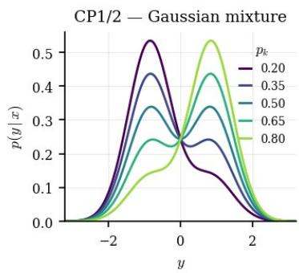

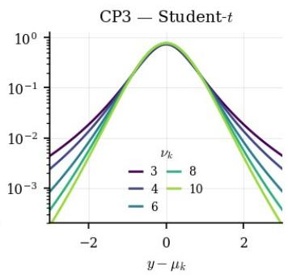

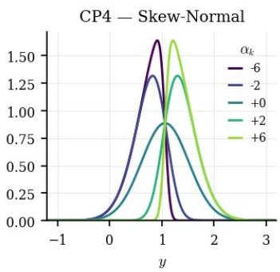  
Figure 7: Representative conditional densities from CD1, CD3, and CD4 for different conditioning inputs and task parameters.

(CD3) Multivariate Student distribution. For $D = 1 0$ , let

$$
\mu _ { k } ( \mathbf { x } ) = a _ { k } \sin ( \mathbf { w } ^ { \top } \mathbf { x } ) + b _ { k } \cos ( \mathbf { w } ^ { \top } \mathbf { x } ) .
$$

We define

$$
Y ^ { ( k ) } \mid \mathbf { X } = \mathbf { x } \sim t _ { \nu _ { k } } ( \mu _ { k } ( \mathbf { x } ) , \sigma _ { k } ) ,
$$

whose conditional density is

$$
p _ { k } ( y \mid \mathbf { x } ) = { \frac { \Gamma ( ( \nu _ { k } + 1 ) / 2 ) } { \Gamma ( \nu _ { k } / 2 ) { \sqrt { \nu _ { k } \pi } } \sigma _ { k } } } \left[ 1 + { \frac { 1 } { \nu _ { k } } } \left( { \frac { y - \mu _ { k } ( \mathbf { x } ) } { \sigma _ { k } } } \right) ^ { 2 } \right] ^ { - ( \nu _ { k } + 1 ) / 2 } .
$$

The task parameters are

$$
a _ { k } \sim \mathcal { N } ( 1 , 0 . 3 ^ { 2 } ) , \qquad b _ { k } \sim \mathcal { N } ( 0 . 3 , 0 . 2 ^ { 2 } ) , \qquad \sigma _ { k } \sim \mathcal { N } ( 0 . 5 , 0 . 1 ^ { 2 } ) , \qquad \nu _ { k } \sim \mathcal { U } ( [ 3 , 1 0 ] ) ,
$$

The direction $\mathbf { w } \in \mathbb { S } ^ { 9 }$ is shared across tasks.

(CD4) Multivariate skew-normal distribution. We use the same form

$$
\mu _ { k } ( \mathbf { x } ) = a _ { k } \sin ( \mathbf { w } ^ { \top } \mathbf { x } ) + b _ { k } \cos ( \mathbf { w } ^ { \top } \mathbf { x } ) ,
$$

and define

$$
Y ^ { ( k ) } \mid \mathbf { X } = \mathbf { x } \sim \operatorname { S N } ( \mu _ { k } ( \mathbf { x } ) , \sigma _ { k } , \alpha _ { k } ) .
$$

Writing $\phi$ and Φ for the standard Gaussian density and CDF, respectively, its conditional density is

$$
p _ { k } ( y \mid \mathbf { x } ) = { \frac { 2 } { \sigma _ { k } } } \phi { \bigg ( } { \frac { y - \mu _ { k } ( \mathbf { x } ) } { \sigma _ { k } } } { \bigg ) } \Phi { \bigg ( } \alpha _ { k } { \frac { y - \mu _ { k } ( \mathbf { x } ) } { \sigma _ { k } } } { \bigg ) } .
$$

We sample

$$
a _ { k } \sim \mathcal { N } ( 1 , 0 . 1 5 ^ { 2 } ) , \qquad b _ { k } \sim \mathcal { N } ( 0 . 5 , 0 . 1 5 ^ { 2 } ) , \qquad \sigma _ { k } \sim \mathcal { N } ( 0 . 4 5 , 0 . 0 8 ^ { 2 } ) , \qquad \alpha _ { k } \sim \mathcal { N } ( 1 . 5 , 0 . 4 ^ { 2 } ) ,
$$

with $\sigma _ { k }$ truncated below at 0.1 and $\mathbf { w } \in \mathbb { S } ^ { 9 }$ shared across tasks.

Figure 7 displays representative conditional densities from CD1, CD3, and CD4. We omit CD2, which differs from CD1 only through the higher-dimensional input and the projection $\mathbf { w } ^ { \top } \mathbf { x }$

Experimental protocol. For each family, we generate $K = 1 0 0$ tasks with $n = 4 0 0$ observations per task. Task parameters are sampled once and kept fixed across repetitions, while the observations are independently resampled. Results are averaged over 10 independent data realizations.

For transfer, we generate 100 additional unseen tasks by independently sampling new task parameters. For each target task, we vary the number of available observations . Transfer results are averaged over 10 independent realizations of the target data.

## D.2 MULTI-TASK CMO ARCHITECTURE AND TRAINING

For all four conditional-distribution families, we use the multi-task CMO parametrization introduced . The two shared functional spaces are represented by the neural dictionaries

$$
\Phi _ { \theta } ( x ) = \{ \phi _ { 1 } ^ { \theta } ( x ) , \ldots , \phi _ { d } ^ { \theta } ( x ) \} , \qquad \Psi _ { \theta } ( y ) = \{ \psi _ { 1 } ^ { \theta } ( y ) , \ldots , \psi _ { d } ^ { \theta } ( y ) \} .
$$

For each task $k ,$ the corresponding deflated conditional operator is parametrized as

$$
{ \sf D } _ { { \bf Y } | { \bf X } } ^ { ( { \bf k } ) , \theta } = { \sf S } _ { \Phi _ { \theta } } ^ { ( { k } ) } { \bf A } ^ { ( { k } ) } { \bf B } ^ { ( { k } ) \top } { \sf S } _ { \Psi _ { \theta } } ^ { ( { k } ) * } , \qquad { \bf A } ^ { ( { k } ) } , { \bf B } ^ { ( { k } ) } \in \mathbb { R } ^ { d \times r _ { k } } .
$$

Hence, $\mathbf { A } ^ { ( k ) } \mathbf { B } ^ { ( k ) \top }$ defines a rank- $- r _ { k }$ factorization of the task-specific operator in the shared functional coordinates. The neural dictionaries are common to all tasks, while the low-rank factors $\mathbf { A } ^ { ( k ) }$ and $\mathbf { B } ^ { ( k ) }$ capture the task-specific dependence structure.

Neural parametrization. The two dictionaries are parametrized by separate MLPs, both shared across tasks. The input dictionary takes $x \in \mathbb { R } ^ { D }$ , whereas the output dictionary takes the scalar response $y \in \mathbb R$ . Each hidden block is composed of a linear layer followed by the activation function and dropout; The dimension d of the learned functional space is given by the width of the last hidden layer. No decoder is used: conditional statistics are obtained directly from the learned CMO. The architecture is adapted to each conditional-distribution family. Table 3 reports the configurations used in the experiments.

Table 3: Neural architecture and operator rank used for the four conditional-distribution families.
<table><tr><td></td><td>Hidden layers</td><td> $d$ </td><td> $r _ { k }$ </td><td>Activation</td><td>Dropout</td></tr><tr><td>CD1</td><td> $3 \times 6 4$ </td><td>64</td><td>20</td><td>GELU</td><td>0.15</td></tr><tr><td>CD2</td><td> $2 \times 6 4$ </td><td>64</td><td>7</td><td>Tanh</td><td>0.2</td></tr><tr><td>CD3</td><td> $4 \times 6 4$ </td><td>64</td><td>18</td><td>GELU</td><td>0.14</td></tr><tr><td>CD4</td><td> $4 \times 6 4$ </td><td>64</td><td>13</td><td>Tanh</td><td>0.16</td></tr></table>

Optimization. For each task, the response variable $Y$ is standardized using its empirical mean and standard deviation, while the input variables are left unchanged. The shared dictionaries and the task-specific low-rank factors are optimized jointly with AdamW. We use separate learning rates and weight-decay coefficients for the shared neural parameters and for $\{ \mathbf { A } ^ { ( k ) } , \bar { \mathbf { B } } ^ { ( k ) } \} _ { k = 1 } ^ { K }$

Table 4: Optimization parameters for the uncertainty-quantification experiments.
<table><tr><td></td><td>Epochs</td><td>Batch size</td><td> $\mathrm { l r } _ { \mathrm { s h a r e d } }$ </td><td> $\mathrm { l r } _ { \mathrm { s p e c i f i c } }$ </td><td> $\mathrm { w d } _ { \mathrm { s h a r e d } }$ </td><td> $\mathrm { w d } _ { \mathrm { s p e c i f i c } }$ </td><td>Grad. clip</td><td>Scheduler</td></tr><tr><td>CD1</td><td>5400</td><td>32</td><td> $5 . 8 \times 1 0 ^ { - 5 }$ </td><td> $1 . 4 \times 1 0 ^ { - 4 }$ </td><td> $2 . 2 \times 1 0 ^ { - 3 }$ </td><td> $2 . 6 \times 1 0 ^ { - 2 }$ </td><td>5.0</td><td>None</td></tr><tr><td>CD2</td><td>4200</td><td>64</td><td> $2 . 7 \times 1 0 ^ { - 4 }$ </td><td> $6 . 4 \times 1 0 ^ { - 5 }$ </td><td> $3 . 9 \times 1 0 ^ { - 3 }$ </td><td> $2 . 6 \times 1 0 ^ { - 4 }$ </td><td>2.0</td><td>None</td></tr><tr><td>CD3</td><td>3600</td><td>64</td><td> $1 . 2 \times 1 0 ^ { - 4 }$ </td><td> $1 . 8 \times 1 0 ^ { - 3 }$ </td><td> $2 . 2 \times 1 0 ^ { - 4 }$ </td><td> $3 . 4 \times 1 0 ^ { - 6 }$ </td><td>1.0</td><td>None</td></tr><tr><td>CD4</td><td>2600</td><td>64</td><td> $3 . 0 \times 1 0 ^ { - 3 }$ </td><td> $2 . 9 \times 1 0 ^ { - 3 }$ </td><td> $9 . 1 \times 1 0 ^ { - 6 }$ </td><td> $4 . 4 \times 1 0 ^ { - 3 }$ </td><td>2.0</td><td>Cosine</td></tr></table>

## D.3 CONDITIONAL CDF RECONSTRUCTION

We now detail how a conditional CDF is recovered from the learned CMO. Consider a task k with observations $\mathcal { D } _ { k } = \{ ( x _ { j } ^ { ( k ) } , y _ { j } ^ { ( k ) } ) \} _ { j = 1 } ^ { n _ { k } }$

Centering and task-specific SVD. The outputs of the two neural dictionaries are centered independently for each task. We define

$$
\overline { { \Phi } } ^ { ( k ) } = \frac { 1 } { n _ { k } } \sum _ { j = 1 } ^ { n _ { k } } \Phi _ { \theta } ( x _ { j } ^ { ( k ) } ) , \qquad \overline { { \Psi } } ^ { ( k ) } = \frac { 1 } { n _ { k } } \sum _ { j = 1 } ^ { n _ { k } } \Psi _ { \theta } ( y _ { j } ^ { ( k ) } ) ,
$$

and

$$
\Phi _ { \theta , c } ^ { ( k ) } ( x ) = \Phi _ { \theta } ( x ) - \overline { { { \Phi } } } ^ { ( k ) } , \qquad \Psi _ { \theta , c } ^ { ( k ) } ( y ) = \Psi _ { \theta } ( y ) - \overline { { { \Psi } } } ^ { ( k ) } .
$$

The corresponding empirical Gram matrices are

$$
\widehat { \mathbf { G } } _ { \Phi _ { \theta } } ^ { ( k ) } = \frac { 1 } { n _ { k } } \sum _ { j = 1 } ^ { n _ { k } } \Phi _ { \theta , c } ^ { ( k ) } ( x _ { j } ^ { ( k ) } ) ^ { \top } \Phi _ { \theta , c } ^ { ( k ) } ( x _ { j } ^ { ( k ) } ) , \qquad \widehat { \mathbf { G } } _ { \Psi _ { \theta } } ^ { ( k ) } = \frac { 1 } { n _ { k } } \sum _ { j = 1 } ^ { n _ { k } } \Psi _ { \theta , c } ^ { ( k ) } ( y _ { j } ^ { ( k ) } ) ^ { \top } \Psi _ { \theta , c } ^ { ( k ) } ( y _ { j } ^ { ( k ) } ) .
$$

During multi-task learning, task k is represented in the shared functional coordinates by the lowrank matrix $\mathbf { A } ^ { ( k ) } \mathbf { B } ^ { ( k ) \top }$ . Its orthonormal singular representation is recovered by whitening with the task-specific Gram matrices and computing

$$
\widehat { \mathbf { G } } _ { \Phi _ { \theta } } ^ { ( k ) 1 / 2 } \mathbf { A } ^ { ( k ) } \mathbf { B } ^ { ( k ) \top } \widehat { \mathbf { G } } _ { \Psi _ { \theta } } ^ { ( k ) 1 / 2 } = \mathbf { U } ^ { ( k ) } \operatorname { D i a g } ( \pmb { \sigma } ^ { ( k ) } ) \mathbf { V } ^ { ( k ) \top } .
$$

Denoting by $\mathbf { u } _ { i } ^ { ( k ) }$ and ${ \bf v } _ { i } ^ { ( k ) }$ the ith columns of $\mathbf { U } ^ { ( k ) }$ and $\mathbf { V } ^ { ( k ) }$ , the task-specific singular functions are

$$
\widetilde { u } _ { i } ^ { ( k ) } ( \boldsymbol { x } ) = \Phi _ { \theta , c } ^ { ( k ) } ( \boldsymbol { x } ) \widehat { \mathbf { G } } _ { \Phi _ { \theta } } ^ { ( k ) - 1 / 2 } \mathbf { u } _ { i } ^ { ( k ) } , \qquad \widetilde { v } _ { i } ^ { ( k ) } ( \boldsymbol { y } ) = \Psi _ { \theta , c } ^ { ( k ) } ( \boldsymbol { y } ) \widehat { \mathbf { G } } _ { \Psi _ { \theta } } ^ { ( k ) - 1 / 2 } \mathbf { v } _ { i } ^ { ( k ) } .
$$

The resulting rank $- r _ { k }$ deflated operator is

$$
{ \sf D } _ { \mathrm { Y | X } } ^ { ( \mathrm { k } ) , \theta } = \sum _ { i = 1 } ^ { r _ { k } } \sigma _ { i } ^ { ( k ) } \widetilde { u } _ { i } ^ { ( k ) } \otimes \widetilde { v } _ { i } ^ { ( k ) } .
$$

Conditional CDF. For scalar $Y _ { \pm }$ , we recover the conditional CDF by taking $f _ { t } ( y ) = \mathbf { 1 } _ { \{ y \leq t \} }$ , so that

$$
F _ { k } ( t \mid x ) = \mathbb { E } \left[ f _ { t } ( Y ^ { ( k ) } ) \mid X ^ { ( k ) } = x \right] .
$$

We approximate expectations with respect to the output marginal $\nu _ { k }$ using the empirical measure

$$
\widehat { \nu } _ { k } = \frac { 1 } { n _ { k } } \sum _ { j = 1 } ^ { n _ { k } } \delta _ { y _ { j } ^ { ( k ) } } .
$$

Applying the recovered CMO to $f _ { t }$ gives

$$
\widehat { F } _ { k } ( t \mid x ) = \frac { 1 } { n _ { k } } \sum _ { j = 1 } ^ { n _ { k } } \mathbf { 1 } _ { \{ y _ { j } ^ { ( k ) } \leq t \} } + \frac { 1 } { n _ { k } } \sum _ { j : y _ { j } ^ { ( k ) } \leq t } \sum _ { i = 1 } ^ { r _ { k } } \sigma _ { i } ^ { ( k ) } \widetilde { u } _ { i } ^ { ( k ) } ( x ) \widetilde { v } _ { i } ^ { ( k ) } ( y _ { j } ^ { ( k ) } ) .
$$

The first term is the empirical marginal CDF of $Y ^ { ( k ) }$ , while the second is the correction induced by the deflated conditional operator and introduces the dependence on x.

For computation, we sort the outputs $y _ { ( 1 ) } ^ { ( k ) } \leq \cdot \cdot \cdot \leq y _ { ( n _ { k } ) } ^ { ( k ) }$ and define

$$
c _ { j } ^ { ( k ) } ( x ) = \sum _ { i = 1 } ^ { r _ { k } } \sigma _ { i } ^ { ( k ) } \widetilde { u } _ { i } ^ { ( k ) } ( x ) \widetilde { v } _ { i } ^ { ( k ) } ( y _ { ( j ) } ^ { ( k ) } ) .
$$

At the mth ordered output,

$$
\widehat { F } _ { k } ( y _ { ( m ) } ^ { ( k ) } \mid x ) = \frac { m } { n _ { k } } + \frac { 1 } { n _ { k } } \sum _ { j = 1 } ^ { m } c _ { j } ^ { ( k ) } ( x ) .
$$

The full conditional CDF is therefore obtained by a cumulative sum over the ordered outputs. For an arbitrary threshold t, all observations satisfying $y _ { j } ^ { ( k ) } \leq t$ are retained.

In practice, small negative empirical masses may arise from numerical estimation. We clip these masses to zero and renormalize them before taking the cumulative sum, ensuring that the resulting estimate is a valid conditional CDF.

Wasserstein evaluation. For each task k, we compare the estimated conditional CDF ${ \widehat { F } } _ { k } ( \cdot \mid x )$ with the analytical ground-truth CDF of the corresponding data-generating process using the onedimensional Wasserstein-1 distance. Both CDFs are evaluated on a uniform grid of 1000 output values covering the relevant support of Y. For each task, the distance is computed at 40 conditioning values uniformly distributed over the input range and averaged over these conditioning points. The resulting scores are then averaged across tasks. All experiments are repeated over 10 independent random seeds.

Table 5: Transfer to unseen conditional distributions. Wasserstein-1 distance to the ground-truth conditional distribution (mean ± standard deviation over 10 target-data seeds), averaged over 100 unseen tasks. Lower is better. The last row of each block reports the ratio between single-task NCP and T-CMO.
<table><tr><td>ntr</td><td>50</td><td>100</td><td>150</td><td>200</td><td>250</td><td>300</td><td>350</td><td>400</td></tr><tr><td colspan="9">CD1</td></tr><tr><td>NCP</td><td>0.2362 ± 0.0059</td><td>0.1739 ± 0.0025</td><td>0.1455 ± 0.0038</td><td>0.1258 ± 0.0021</td><td>0.1152 ± 0.0015</td><td>0.1062 ± 0.0021</td><td>0.1004 ± 0.0018</td><td>0.0948 ± 0.0024</td></tr><tr><td>T-CMO</td><td>0.2629 ± 0.0053 0.90</td><td>0.1869 ± 0.0015 0.93</td><td>0.1546 ± 0.0042 0.94</td><td>0.1315 ± 0.0012 0.96</td><td>0.1188 ± 0.0020 0.97</td><td>0.1072 ± 0.0022 0.99</td><td>0.1004 ± 0.0015 1.00</td><td>0.0943 ± 0.0015 1.01</td></tr><tr><td colspan="9">NCP / T-CMO</td></tr><tr><td>CD2</td><td></td><td></td><td></td><td></td><td></td><td></td><td></td><td></td></tr><tr><td>NCP</td><td>0.2326 ± 0.0082 0.2913 ± 0.0052</td><td>0.1826 ± 0.0041 0.2089 ± 0.0022</td><td>0.1704 ± 0.0016 0.1747 ± 0.0023</td><td>0.1588 ± 0.0015 0.1547 ± 0.0016</td><td>0.1538 ± 0.0024 0.1391 ± 0.0032</td><td>0.1500 ± 0.0007 0.1244 ± 0.0021</td><td>0.1470 ± 0.0024 0.1186 ± 0.0017</td><td>0.1458 ± 0.0028 0.1125 ± 0.0007</td></tr><tr><td colspan="9">T-CMO</td></tr><tr><td>NCP / T-CMO</td><td>0.80</td><td>0.87</td><td>0.98</td><td>1.03</td><td>1.11</td><td>1.21</td><td>1.24</td><td>1.30</td></tr><tr><td>CD3</td><td>0.2603 ± 0.0062</td><td></td><td></td><td></td><td></td><td></td><td>0.1830 ± 0.0005</td><td></td></tr><tr><td colspan="9">NCP</td></tr><tr><td>T-CMO</td><td>0.2728 ± 0.0074</td><td>0.2176 ± 0.0038 0.1990 ± 0.0039</td><td>0.1999 ± 0.0011 0.1624 ± 0.0034</td><td>0.1934 ± 0.0016 0.1447 ± 0.0009</td><td>0.1889 ± 0.0012 0.1317 ± 0.0029</td><td>0.1860 ± 0.0012 0.1198 ± 0.0018</td><td>0.1128 ± 0.0009</td><td>0.1815 ± 0.0017 0.1067 ± 0.0015</td></tr><tr><td>NCP / T-CMO</td><td>0.95</td><td>1.09</td><td>1.23</td><td>1.34</td><td>1.43</td><td>1.55</td><td>1.62</td><td>1.70</td></tr><tr><td colspan="9">CD4</td></tr><tr><td>NCP</td><td>0.2584 ± 0.0038</td><td>0.2225 ± 0.0028</td><td>0.2049 ± 0.0012</td><td>0.1909 ± 0.0020</td><td>0.1797 ± 0.0033</td><td>0.1681 ± 0.0027</td><td>0.1587 ± 0.0026</td><td>0.1498 ± 0.0017</td></tr><tr><td>T-CMO</td><td>0.1683 ± 0.0019</td><td>0.1240 ± 0.0019</td><td>0.1052 ± 0.0014</td><td>0.0923 ± 0.0012</td><td>0.0849 ± 0.0009</td><td>0.0794 ± 0.0008</td><td>0.0742 ± 0.0001</td><td>0.0719 ± 0.0005</td></tr><tr><td>NCP / T-CMO</td><td>1.54</td><td>1.79</td><td>1.95</td><td>2.07</td><td>2.12</td><td>2.12</td><td>2.14</td><td>2.08</td></tr></table>

## D.4 TRANSFER TO UNSEEN CONDITIONAL DISTRIBUTIONS

We next evaluate whether the functional spaces learned jointly across source tasks can be reused to estimate conditional distributions that were not observed during multi-task training. For each conditional-distribution family, we generate a new collection of target tasks independently of the source tasks used to learn the shared dictionaries. The parameters of the target distributions are drawn from the same task-generating distribution as during multi-task training.

Transfer protocol. Given the learned dictionaries $\Phi _ { \hat { \theta } }$ and $\Psi _ { \hat { \theta } } .$ , all their parameters are frozen. For a new target task with

$$
\begin{array} { r } { \mathcal { D } _ { \mathrm { t r } } = \{ ( x _ { j } , y _ { j } ) \} _ { j = 1 } ^ { n _ { \mathrm { t r } } } , } \end{array}
$$

we estimate only the operator associated with this task. The dictionary outputs are centered using the target observations, and we compute the empirical Gram and cross-covariance matrices

$$
\widehat { \mathbf { G } } _ { \Phi } = \frac { 1 } { n _ { \mathrm { t r } } } \sum _ { j = 1 } ^ { n _ { \mathrm { t r } } } \Phi _ { c } ( x _ { j } ) ^ { \top } \Phi _ { c } ( x _ { j } ) , \qquad \widehat { \mathbf { G } } _ { \Psi } = \frac { 1 } { n _ { \mathrm { t r } } } \sum _ { j = 1 } ^ { n _ { \mathrm { t r } } } \Psi _ { c } ( y _ { j } ) ^ { \top } \Psi _ { c } ( y _ { j } ) ,
$$

and

$$
\widehat { \mathbf { C } } = \frac { 1 } { n _ { \mathrm { t r } } } \sum _ { j = 1 } ^ { n _ { \mathrm { t r } } } \Phi _ { c } ( x _ { j } ) ^ { \top } \Psi _ { c } ( y _ { j } ) .
$$

The target operator is then recovered in closed form as

$$
\mathbf { M } ^ { \star } = \widehat { \mathbf { G } } _ { \Phi } ^ { - 1 } \widehat { \mathbf { C } } \widehat { \mathbf { G } } _ { \Psi } ^ { - 1 } .
$$

We subsequently whiten M<sup>⋆</sup> with the target Gram matrices and compute its truncated SVD, using the same rank as in the corresponding source model. The resulting singular functions are used to reconstruct the target conditional CDF as described in Section D.3. No gradient-based optimization or fine-tuning of the shared dictionaries is performed at transfer time.

Transfer performance. Table 5 reports the Wasserstein-1 error obtained on 100 unseen target tasks as the number of target observations increases. Results are averaged over 10 independent target-data seeds.

The benefit of transferring the shared functional spaces depends strongly on the conditionaldistribution family. For CP1, whose conditional structure is comparatively simple, T-CMO remains close to single-task NCP and the two methods reach essentially the same accuracy for large target sample sizes. The advantage of transfer becomes more pronounced for the higher-dimensional and more structured families. On CP2, T-CMO improves over single-task NCP from $n _ { \mathrm { t r } } = 2 0 0$ onward, while on CP3 the improvement appears already at $n _ { \mathrm { t r } } = 1 0 0$ and increases steadily with the amount of target data. The strongest effect is observed for CP4, where T-CMO consistently outperforms single-task NCP and achieves approximately a two-fold reduction in Wasserstein error for moderate and large target sample sizes.

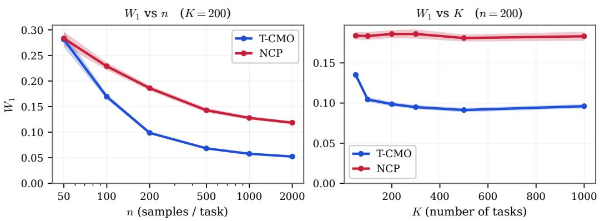  
Figure 8: Sensitivity of transfer performance on CD4. Left: Wasserstein-1 error as a function of the number of observations per source task n, with $K = 2 0 0$ . Right: Wasserstein-1 error as a function of the number of source tasks K, with $n = 2 0 0 .$

Table 6: Sensitivity of transfer performance on CD4. Wasserstein-1 distance to the ground-truth conditional distribution. Gain denotes the relative reduction in $W _ { 1 }$ of T-CMO with respect to singletask NCP. Lower is better.
<table><tr><td>T-CMO (ours) NCP Gain</td></tr><tr><td>Varying n  $( s a m p l e s p e r t a s k ) ,$   $K = 2 0 0$   $n = 5 0$   $0 . 2 8 1 \pm 0 . 0 1 5$   $0 . 2 8 3 \pm 0 . 0 1 3$  1%  $n = 1 0 0$   $0 . 1 6 9 \pm 0 . 0 0 5$   $0 . 2 2 9 \pm 0 . 0 0 7$  26%</td></tr><tr><td> $n = 2 0 0$   $0 . 0 9 9 \pm 0 . 0 0 3$   $0 . 1 8 6 \pm 0 . 0 0 5$  47%  $n = 5 0 0$   $0 . 0 6 8 \pm 0 . 0 0 2$   $0 . 1 4 3 \pm 0 . 0 0 5$  52%  $n = 1 0 0 0$   $0 . 0 5 8 \pm 0 . 0 0 1$   $0 . 1 2 8 \pm 0 . 0 0 3$  55%</td></tr><tr><td> $n = 2 0 0 0$   $0 . 0 5 2 \pm 0 . 0 0 1$   $0 . 1 1 8 \pm 0 . 0 0 3$  56% Varying K (number of tasks),  $n = 2 0 0$   $K = 5 0$   $0 . 1 3 5 \pm 0 . 0 0 4$   $0 . 1 8 4 \pm 0 . 0 0 5$  27%  $K = 1 0 0$   $0 . 1 0 4 \pm 0 . 0 0 3$   $0 . 1 8 3 \pm 0 . 0 0 5$  43%  $K = 2 0 0$   $0 . 0 9 9 \pm 0 . 0 0 3$   $0 . 1 8 6 \pm 0 . 0 0 5$  47%</td></tr></table>

These results suggest that the shared functional spaces are particularly useful when the conditional distribution is difficult to recover from an individual task alone. Multi-task learning provides a representation adapted to the common structure of the task family, so that a new conditional distribution can be identified by estimating only its task-specific operator. For simpler conditional families, where a single-task model can already learn an accurate representation from relatively few observations, the benefit of sharing across tasks is correspondingly smaller.

Sensitivity to the number of tasks and samples. We finally investigate how transfer performance depends on the amount of information available during multi-task learning. We focus on CD4 and vary either the number of observations per source task n, while fixing $K = 2 0 0$ , or the number of source tasks K, while fixing $n = 2 0 0$ . Figure 8 shows the corresponding trends, while Table 6 reports the same results numerically.

Increasing the number of observations per source task substantially improves T-CMO. At $n = 5 0 .$ , T-CMO and single-task NCP perform almost identically, whereas the relative reduction in Wasserstein error reaches 47% at $n = 2 0 0$ and 56% at $n = 2 0 0 0$ . Increasing the number of source tasks has a similar effect: the gain rises from 27% at $K = 5 0$ to approximately 50% for $K \geq 3 0 0$ , after which the performance largely saturates. In contrast, single-task NCP remains essentially insensitive to K, since it does not exploit information from the additional source tasks. Overall, these results show that transfer improves as the shared functional spaces are learned from either more observations per task or a richer collection of related conditional distributions, with diminishing returns once the common representation is sufficiently well identified.

## D.5 BASELINES

We compare MTL-CMO against both multi-task and single-task conditional distribution estimators. All methods are trained from the same observations and evaluated using the same conditioning inputs, output grid, and Wasserstein-1 metric described above.

Multi-task baselines. Pooled-NCP is a pooled version of Neural Conditional Probability (NCP) (Kostic et al., 2024). Samples from all source tasks are aggregated and a single NCP model is trained without access to the task identity. This baseline therefore exploits the larger pooled dataset, but does not model task-specific operators.

MTL-MDN combines hard parameter sharing (Caruana, 1997) with Mixture Density Networks (Bishop, 1994). A common neural backbone is shared by all tasks and each task has its own Gaussian-mixture output head. We use two mixture components for CD1 and four components for CD2–CD4.

DeepJMQR follows the joint multi-quantile regression approach of (Rodrigues & Pereira, 2020). We use a shared neural representation together with a task embedding and predict 99 conditional quantiles, trained with the pinball loss. The conditional CDF used for evaluation is recovered from the predicted quantiles.

Single-task baselines. NCP (Kostic et al., 2024) is trained independently on every task and therefore provides the direct task-specific counterpart of our multi-task operator model. Each model only observes samples from its corresponding task.

Conditional Flow Matching (CFM) is the flow-matching objective of (Lipman et al., 2023). A conditional velocity field is trained independently for each task and used to transport samples from the reference distribution to the target conditional distribution. Conditional CDFs are obtained from generated samples.

Mixture Density Network (MDN) (Bishop, 1994) directly parameterizes p(y | x) as a Gaussian mixture whose parameters are predicted by a neural network. As for MTL-MDN, we use two Gaussian components for CD1 and four components for CD2–CD4.

Neural Spline Flow (NSF) (Durkan et al., 2019) models the conditional distribution using monotone rational-quadratic spline transformations. We use three spline transforms with eight bins and recover the conditional CDF from samples generated by the fitted flow.

Engression (Shen & Meinshausen, 2025) is a neural distributional regression method trained using the energy score. We use the authors’ implementation with input/output standardization and obtain conditional CDFs from samples generated by the fitted model.

NGBoost (Duan et al., 2020) performs probabilistic gradient boosting using the natural gradient. We use a Gaussian predictive distribution, 100 boosting estimators, learning rate 0.1, and depth-2 regression trees as base learners.

FlexCode (Izbicki & Lee, 2017) represents the conditional density in an orthogonal series whose coefficients are estimated through regression. We use a Fourier basis, with Lasso regression for CD1–CD2 and Random Forest regression for CD3–CD4.

Nadaraya–Watson (NW) is a non-parametric kernel baseline based on the classical Nadaraya– Watson estimator (Nadaraya, 1964; Watson, 1964).

Model selection and evaluation. Hyperparameters are selected independently for each conditional-distribution family using held-out validation data; target evaluation tasks are not used for model selection. For neural baselines, architecture, learning rate, regularization, and methodspecific parameters are selected using the same validation criterion. For Nadaraya–Watson, only the input-kernel bandwidth is selected. Generative baselines are evaluated from their generated conditional samples, whereas methods providing an analytical or empirical CDF are evaluated directly. All methods are finally compared on exactly the same conditioning points and output grid.

## E LANGEVIN EXPERIMENTS

## E.1 TWO-DIMENSIONAL MULLER ¨ –BROWN FAMILY

Potential family. We consider the parametric Muller–Brown family introduced in the main text, ¨ derived from the standard Muller–Brown potential, a widely used benchmark for metastable dynam-¨ ics and transition-path problems (Devergne et al., 2024; Le Treut et al., 2025).It corresponds to a two-dimensional overdamped Langevin dynamics,

$$
\begin{array} { r } { d \mathbf { X } _ { t } = - \nabla V _ { r , \theta } ( \mathbf { X } _ { t } ) d t + \sqrt { 2 \beta ^ { - 1 } } d \mathbf { W } _ { t } , \qquad \beta = 1 , } \end{array}\tag{43}
$$

where $\mathbf { W } _ { t }$ is a standard two-dimensional Brownian motion. For $\mathbf { x } = ( x _ { 1 } , x _ { 2 } ) \in \mathbb { R } ^ { 2 }$ , the potential is

$$
V _ { r , \theta } ( \mathbf { x } ) = \frac { 1 } { s } \sum _ { j = 1 } ^ { 4 } w _ { j } ( r ) A _ { j } \exp \left[ ( \mathbf { x } - \boldsymbol { \mu } _ { j } ) ^ { \top } \mathbf { H } _ { j } ^ { ( \theta ) } ( \mathbf { x } - \boldsymbol { \mu } _ { j } ) \right] + c _ { \mathrm { w a l l } } \left[ \left( x _ { 1 } - x _ { c } \right) ^ { 4 } + \left( x _ { 2 } - y _ { c } \right) ^ { 4 } \right] .\tag{44}
$$

Here $\mathbf { w } ( r ) = ( 1 , 1 , r , 1 ) , \mathbf { H } _ { 3 } ^ { ( \theta ) } = \mathbf { R } _ { \theta } \mathbf { H } _ { 3 } \mathbf { R } _ { \theta } ^ { \top }$ , and $\mathbf { H } _ { j } ^ { ( \theta ) } = \mathbf { H } _ { j }$ for $j \neq 3$ , with $\mathbf { H } _ { j } = { \binom { a _ { j } \quad b _ { j } / 2 } { b _ { j } / 2 \quad c _ { j } } }$ The canonical Muller–Brown coefficients are¨ $\mathbf { A } = ( - 2 0 0 , - 1 0 0 , - 1 7 0 , 1 5 ) , \mu _ { 1 } = ( 1 , 0 ) , \mu _ { 2 } =$ $( 0 , 0 . 5 )$ $\mu _ { 3 } ~ = ~ ( - 0 . 5 , 1 . 5 )$ $\mu _ { 4 } ~ = ~ ( - 1 , 1 )$ $\textbf { a } = ~ ( - 1 , - 1 , - 6 . 5 , 0 . 7 )$ , $\textbf { \em o } = ~ ( 0 , 0 , 1 1 , 0 . 6 )$ , and $\mathbf { c } = ( - 1 0 , - 1 0 , - 6 . 5 , 0 . 7 )$

We use $s = 3 5$ and sample $r \sim \mathcal { U } ( [ 0 . 7 5 , 1 . 1 5 ] )$ , $\theta \sim \mathcal { U } ( [ - \pi / 4 , \pi / 1 2 ] )$ . The parameter r modifies the amplitude of the third Muller–Brown component, whereas¨ θ rotates its local quadratic form over $\mathrm { ~ a ~ } 6 0 ^ { \circ }$ range, while the other three components remain fixed.

A fixed quartic wall is added for numerical confinement, with $c _ { \mathrm { w a l l } } ~ = ~ 0 . 5$ and $\begin{array} { r l } { ( x _ { c } , y _ { c } ) } & { { } = } \end{array}$ $\left( - 0 . 2 5 , 0 . 8 7 5 \right)$ . Its contribution is negligible in the metastable basins and increases rapidly away from the region of interest, preventing trajectories from exploring numerically irrelevant regions.

Figure 9 illustrates the complementary effects of the two task parameters. Varying r primarily changes the energetic importance of the third basin relative to the other metastable states. In contrast, varying θ rotates its anisotropic quadratic structure, modifying the orientation of the local level sets and of the corresponding drift field. The family therefore preserves the same global three-basin topology while inducing controlled task-dependent changes in the dynamics and associated spectral structure.

Simulation and dataset. For each $( r , \theta )$ , we simulate the overdamped Langevin dynamics at a sampling rate $\Delta t _ { \mathrm { s i m } } = 1 0 ^ { - 3 }$ and down-sampled the trajectories to the sampling rate $\Delta { \dot { t } _ { \mathrm { o b s } } } = 1 0 ^ { - 2 }$ We discard the first 5,000 integration steps and retain 80,000 observations for each system.

We generate 950 systems in total: 750 source tasks are used for multi-task learning, 50 tasks are reserved for model selection, and the remaining 150 systems are kept unseen for transfer evaluation. Performance is evaluated from trajectory prefixes $\dot { N } \in \{ 2 , 5 , 1 \dot { 0 } , 2 0 , 4 0 , 8 0 \} \times 1 0 ^ { 3 }$ . All modelselection choices for the competing methods are made on the 50 validation tasks, separately for each trajectory length N.

Reference spectrum. For each task, reference eigenpairs are obtained by finite-difference discretization of the backward Langevin generator on $[ - 3 , 3 ] ^ { 2 }$ using a $2 4 0 \times 2 4 0$ grid, corresponding to $\Delta x = 0 . 0 2 5$ . We retain the first three non-trivial eigenpairs $( \lambda _ { j } , \psi _ { j } ) _ { j = 1 } ^ { 3 }$ . To avoid numerical instabilities in regions far outside the relevant part of the energy landscape, the potential used to construct the discrete generator is clipped at $V _ { \mathrm { m i n } } + 3 0 0$

The stationary density is $\pi _ { r , \theta } ( \mathbf { x } ) \propto \exp [ - \beta V _ { r , \theta } ( \mathbf { x } ) ]$ . Reference and estimated eigenfunctions are normalized in $L ^ { 2 } ( \pi _ { r , \theta } )$ , and mode-wise recovery is measured using the sign-invariant cosine error $1 - \cos _ { \pi } ( \widehat { \psi } _ { j } , \psi _ { j } )$ . We additionally report eigenspace and eigenvalue diagnostics below.

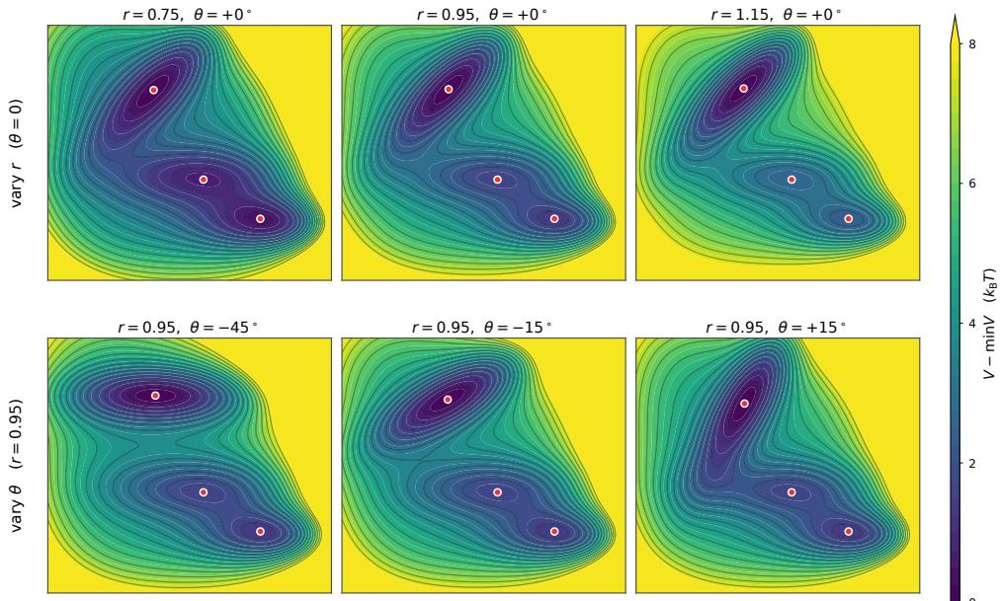  
Figure 9: Parametric Muller–Brown family.¨ Top: varying r at fixed $\theta = 0 ^ { \circ }$ modifies the relative depth of the third metastable basin while largely preserving its orientation. Bottom: varying θ at fixed $r = 0 . 9 5$ rotates the local geometry of the same basin over a $6 0 ^ { \circ }$ range.

## E.2 SHARED REPRESENTATION AND OPERATOR ESTIMATION

Multi-task representation learning. We instantiate the multi-task learning procedure of Section 3 with a single shared map $\Phi _ { \theta } = \Psi _ { \omega } = \phi _ { \theta }$ , exploiting the reversibility of the Langevin dynamics. The map $\bar { \phi } _ { \theta } : \mathbb { R } ^ { 2 }  \mathbb { R } ^ { 6 4 }$ is parameterized by a three-layer MLP with hidden width 576 and SiLU activations. During the multi-task stage, each system is associated with a rank-20 operator $M ^ { ( k ) } =$ $A _ { k } B _ { k } ^ { \top } , \ A _ { k } , B _ { k } \in \mathbb { R } ^ { 6 4 \times 2 0 }$ . The final shared representation is learned on the 800 training systems. Training uses consecutive states, corresponding to $\tau = 0 . 0 1$ , with temporal windows of length 2176. The remaining optimization settings are summarized in Table 7.

System-specific operator estimation. For each unseen system, we apply T-CMO using the closedform transfer procedure of Algorithm 3, with adaptation rank 20 and no gradient updates. The resulting representation is then passed to the resolvent estimator described in Appendix A.2, from which we retain the three slowest non-trivial modes for evaluation.

Spectral-rank diagnostic. We examine the reduced-rank reconstruction error of the whitened lagged operator as a function of the retained rank. As shown in Fig. 10, the error decreases sharply over the first three components and then rapidly saturates. This provides an empirical diagnostic for the low-dimensional spectral structure captured by the first three modes.

Geometry of the learned operators. We next examine whether the task-specific operators learned in the shared functional space retain the structure of the underlying Muller–Brown family. Each¨ recovered rank-3 operator is represented in the common $\phi _ { \theta }$ basis, and pairwise operator distances are computed using SGOT (Germain et al., 2026). We apply t-SNE to the resulting distance matrix and visualize the induced geometry in Figure 11. Importantly, neither r nor θ is provided during learning. Nevertheless, the embedding exhibits smooth gradients with respect to both parameters: operators associated with nearby values of r or θ occupy neighboring regions. This shows that the learned operators retain the structured variation of the underlying dynamical family without supervision from its physical parameters.

Operator estimation accuracy. We next assess whether sharing the functional representation improves operator estimation on the systems used during multi-task learning. Figure 12 compares

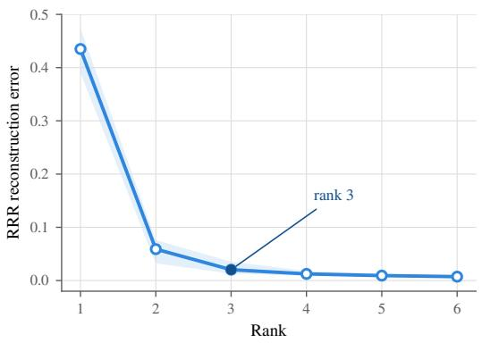

Figure 10: Spectral-rank diagnostic. Mean reduced-rank reconstruction error of the whitened lagged operator as a function of the retained rank. Most of the reduction occurs within the first three components, after which the error rapidly saturates.  
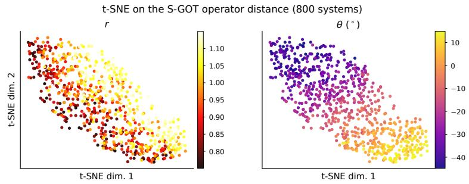

Figure 11: Geometry of the learned Muller–Brown operators.¨ t-SNE of pairwise S-GOT distances between operators learned during the multi-task stage, colored by r (left) and θ (right).  
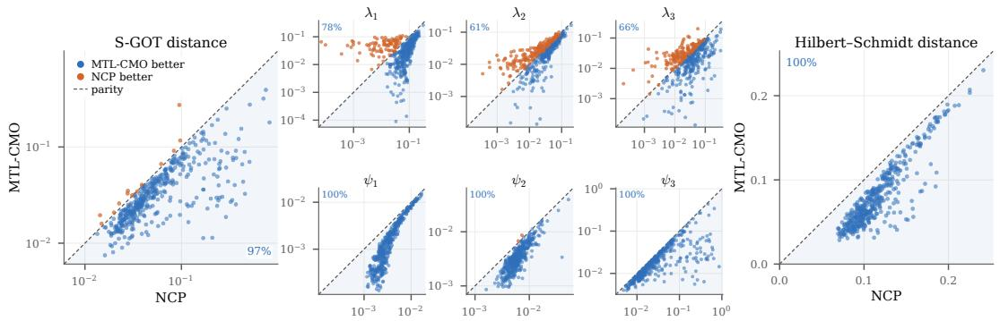  
Figure 12: Multi-task versus single-task CMO learning. Eigenfunction errors of MTL-CMO versus independently trained single-task CMO models. Points below the diagonal favor MTL-CMO.

MTL-CMO with independently trained single-task CMO models. Most systems lie below the diagonal, showing that the shared representation improves eigenfunction recovery across the task family rather than on only a small subset of systems. The improvement is observed across all three modes and is strongest for the more difficult third mode ψ .

Table 7: Architecture, training, and spectral-estimation configuration for the Muller–Brown exper-¨ iment.
<table><tr><td>Configuration</td><td>Value</td></tr><tr><td>Architecture Input dimension Shared feature dimension d</td><td>2 64</td></tr><tr><td>Hidden layers Activation</td><td> $3 \times 5 7 6$  SiLU</td></tr><tr><td>Task-specific rank</td><td>20</td></tr><tr><td>Multi-task training Systems</td><td></td></tr><tr><td>Batch size</td><td>800 40</td></tr><tr><td>Window length</td><td>2176</td></tr><tr><td>Lag Epochs</td><td>1 step</td></tr><tr><td></td><td>450</td></tr><tr><td>Optimizer</td><td> $\mathrm { A d a m W }$ </td></tr><tr><td>Network learning rate</td><td> $3 . 1 1 7 \times 1 0 ^ { - 4 }$ </td></tr><tr><td>Operator learning rate</td><td></td></tr><tr><td></td><td> $1 . 7 8 0 \times 1 0 ^ { - 4 }$ </td></tr><tr><td>Weight decay</td><td> $4 . 4 9 \times 1 0 ^ { - 7 }$ </td></tr><tr><td>λ</td><td> $3 . 9 5 2 \times 1 0 ^ { - 3 }$ </td></tr><tr><td>Spectral estimation</td><td></td></tr><tr><td></td><td></td></tr><tr><td>Adaptation rank</td><td>20</td></tr><tr><td>Spectral rank</td><td>3</td></tr><tr><td>Resolvent shift  $\mu$ </td><td>4.2</td></tr><tr><td>Maximum lag</td><td>10,000</td></tr><tr><td></td><td></td></tr><tr><td>Regularization</td><td> $3 . 3 3 9 \times 1 0 ^ { - 8 }$ </td></tr></table>

## E.3 TRANSFER LEARNING ON UNSEEN SYSTEMS

Experimental protocol. We evaluate spectral recovery on the 150 unseen Muller–Brown systems.¨ T-CMO adapts the shared representation to each target system using the closed-form procedure of Algorithm 3, with adaptation rank 20 and no gradient updates. Spectral quantities are then extracted with the resolvent-based estimator, and we retain the three slowest non-trivial modes, see Appendix A.3. Performance is evaluated from trajectory prefixes $N \in \{ 2 , 5 , 1 0 , 2 0 , 4 0 , 8 0 \} \times 1 0 ^ { 3 }$ All methods receive exactly the same target prefixes; methods requiring task-specific estimation are refitted from the corresponding prefix, whereas transfer and meta-learning methods reuse their source-stage representation according to their respective procedures. Hyperparameters are selected on the 50 validation systems separately for each trajectory length.

Baselines. We compare against six complementary approaches. Single-task NCP (Kostic et al., 2024) learns an independent representation from each target trajectory and therefore uses no information from the source systems. Pooled NCP (Kostic et al., 2024) trains a single model on the concatenated source trajectories without task identities, testing whether pooling alone provides a transferable representation. RFF-EDMD combines fixed random Fourier features (Rahimi & Recht, 2007) with direct EDMD-type operator estimation (Kostic et al., 2022), while RFF + resolvent uses the same features with the resolvent-based spectral estimator (Kostic et al., 2025). MetaKoopman (Iwata & Kawahara, 2021) explicitly meta-learns Koopman spectral information across related short time series, and VAMPNet (Mardt et al., 2018) learns dominant dynamical modes through a neural variational objective.

Quantitative spectral recovery. The mode-wise results show where this improvement arises. For the eigenfunctions (Table 8), T-CMO attains the lowest mean error in 17 of the 18 mode–trajectory combinations. The only exception is ψ at $N = 5 { , } 0 0 0$ , where it is second to VAMPNet by 3.1 × $1 0 ^ { - 3 }$ , well within the reported across-system variability. The first two modes become accurate for several methods as N increases, whereas $\psi _ { 3 }$ remains substantially harder and provides the clearest separation between approaches. For the eigenvalues (Table 9), T-CMO achieves the lowest reported mean error in every column, up to a tie at displayed precision for $\lambda _ { 1 }$ at $N = 4 0 { , } 0 0 0$ . Thus, transfer improves both the spatial eigenfunctions and the associated relaxation rates.

Table 8: Eigenfunction errors for the first three non-trivial modes on the 150 unseen Muller–Brown¨ systems. Values are mean ± standard deviation. Lower is better; best and second best per column.
<table><tr><td rowspan="2">Method</td><td colspan="5">Trajectory length N</td><td rowspan="2"></td></tr><tr><td>2000</td><td>5000</td><td>10000</td><td>20000</td><td>40 000</td></tr><tr><td>ψ1</td><td></td><td></td><td></td><td></td><td></td><td></td></tr><tr><td>T-CMO (ours)</td><td> $\mathbf { 0 . 0 7 3 1 \pm 0 . 0 9 6 6 }$ </td><td> $\mathbf { 0 . 0 2 9 4 \pm 0 . 0 4 1 4 }$ </td><td> $\mathbf { 0 . 0 1 5 1 \pm 0 . 0 2 0 6 }$ </td><td> $\mathbf { 0 . 0 0 7 9 \pm 0 . 0 0 9 5 }$ </td><td> $\mathbf { 0 . 0 0 4 0 \pm 0 . 0 0 5 3 }$ </td><td> $\mathbf { 0 . 0 0 2 1 \pm 0 . 0 0 2 6 }$ </td></tr><tr><td>RFF-EDMD</td><td> $0 . 0 9 8 2 \pm 0 . 1 5 3 7$ </td><td> $0 . 0 3 3 3 \pm 0 . 0 4 2 7$ </td><td> $0 . 0 2 4 8 \pm 0 . 0 8 2 1$ </td><td> $0 . 0 0 9 8 \pm 0 . 0 0 9 8$ </td><td> $0 . 0 0 5 8 \pm 0 . 0 0 5 4$ </td><td> $0 . 0 0 3 7 \pm 0 . 0 0 2 6$ </td></tr><tr><td>MetaKoopman</td><td> $0 . 0 8 3 7 \pm 0 . 1 1 5 4$ </td><td>0.0327 ± 0.0424</td><td>0.0174 ± 0.0209</td><td>0.0099 ± 0.0098</td><td> $0 . 0 0 5 8 \pm 0 . 0 0 5 5$ </td><td> $0 . 0 0 4 0 \pm 0 . 0 0 2 9$ </td></tr><tr><td>Single-task NCP</td><td> $0 . 0 8 3 9 \pm 0 . 1 0 7 1$ </td><td> $0 . 0 3 3 2 \pm 0 . 0 4 1 5$ </td><td> $0 . 0 1 7 7 \stackrel { - } { \pm } 0 . 0 2 0 6$ </td><td> $0 . 0 1 0 1 \pm 0 . 0 0 9 5$ </td><td> $0 . 0 0 5 9 \pm 0 . 0 0 5 4$ </td><td> $0 . 0 0 4 1 \pm 0 . 0 0 2 6$ </td></tr><tr><td>RFF + resolvent</td><td> $0 . 0 7 8 1 \pm 0 . 0 8 9 6$ </td><td> $0 . 0 3 2 9 \pm 0 . 0 4 2 1$ </td><td> $0 . 0 1 7 0 \pm 0 . 0 2 0 6$ </td><td> $0 . 0 0 9 3 \pm 0 . 0 0 9 5$ </td><td> $0 . 0 0 5 2 \pm 0 . 0 0 5 4$ </td><td> $0 . 0 0 3 3 \pm 0 . 0 0 2 6$ </td></tr><tr><td>Pooled NCP</td><td> $\overline { { 0 . 1 0 1 3 \pm 0 . 1 2 9 8 } }$ </td><td> $0 . 0 3 3 2 \pm 0 . 0 4 2 5$ </td><td> $0 . 0 1 6 3 \pm 0 . 0 2 0 6$ </td><td> $0 . 0 0 8 3 \pm 0 . 0 0 9 5$ </td><td> $\underline { { 0 . 0 0 4 1 \pm 0 . 0 0 5 4 } }$ </td><td> $0 . 0 0 2 2 \pm 0 . 0 0 2 6$ </td></tr><tr><td>VAMPNet</td><td> $0 . 0 9 0 0 \pm 0 . 1 3 1 0$ </td><td> $\underline { { 0 . 0 3 0 8 \pm 0 . 0 4 2 6 } }$ </td><td>0.0164 ± 0.0213</td><td> $\overline { { 0 . 0 0 8 4 \pm 0 . 0 0 9 8 } }$ </td><td> $\overline { { 0 . 0 0 4 2 \pm 0 . 0 0 5 4 } }$ </td><td> $\overline { { 0 . 0 0 2 3 \pm 0 . 0 0 2 6 } }$ </td></tr><tr><td>ψ2</td><td></td><td></td><td></td><td></td><td></td><td></td></tr><tr><td>T-CMO (ours)</td><td> $\mathbf { 0 . 1 1 7 4 \pm 0 . 1 6 5 2 }$ </td><td> $\mathbf { 0 . 0 3 5 2 \pm 0 . 0 3 5 0 }$ </td><td> $\mathbf { 0 . 0 1 7 3 \pm 0 . 0 1 3 3 }$ </td><td> $\mathbf { 0 . 0 0 8 9 \pm 0 . 0 0 6 3 }$ </td><td> $\mathbf { 0 . 0 0 4 6 \pm 0 . 0 0 3 2 }$ </td><td> $\mathbf { 0 . 0 0 2 2 \pm 0 . 0 0 1 4 }$ </td></tr><tr><td>RFF-EDMD</td><td> $0 . 1 6 0 7 \pm 0 . 1 7 4 4$ </td><td> $0 . 0 7 1 0 \pm 0 . 1 2 3 4$ </td><td>0.0453 ± 0.1162</td><td> $0 . 0 2 2 4 \pm 0 . 0 5 6 7$ </td><td> $0 . 0 0 8 5 \pm 0 . 0 0 4 6$ </td><td> $0 . 0 0 5 4 \pm 0 . 0 0 2 1$ </td></tr><tr><td>MetaKoopman</td><td> $0 . 1 7 2 2 \pm 0 . 2 0 2 8$ </td><td> $0 . 0 6 0 6 \pm 0 . 0 8 5 5$ </td><td> $0 . 0 3 6 1 \pm 0 . 0 7 4 5$ </td><td> $0 . 0 2 8 9 \pm 0 . 0 9 7 2$ </td><td> $0 . 0 1 4 4 \pm 0 . 0 3 2 3$ </td><td> $0 . 0 0 7 9 \pm 0 . 0 0 3 7$ </td></tr><tr><td>Single-task NCP</td><td> $0 . 1 8 9 0 \pm 0 . 2 0 4 5$ </td><td>0.0723 ± 0.1072</td><td> $0 . 0 3 7 8 \pm 0 . 0 7 3 8$ </td><td>0.0235 ± 0.0734</td><td>0.0149 ± 0.0656</td><td>0.0065 ± 0.0025</td></tr><tr><td>RFF + resolvent</td><td> $0 . 2 0 1 3 \pm 0 . 2 1 8 1$ </td><td> $0 . 0 7 6 1 \pm 0 . 1 1 0 2$ </td><td> $0 . 0 4 2 6 \pm 0 . 0 8 8 7$ </td><td> $0 . 0 2 9 5 \pm 0 . 1 0 6 1$ </td><td> $0 . 0 1 9 5 \pm 0 . 0 9 3 2$ </td><td> $0 . 0 0 5 3 \pm 0 . 0 0 2 3$ </td></tr><tr><td>Pooled NCP</td><td> $0 . 2 5 6 7 \pm 0 . 2 0 2 6$ </td><td> $0 . 0 8 9 0 \pm 0 . 1 1 4 5$ </td><td> $0 . 0 4 7 8 \pm 0 . 0 9 8 2$ </td><td> $0 . 0 3 4 9 \pm 0 . 1 2 7 0$ </td><td> $0 . 0 1 9 1 \pm 0 . 1 0 3 9$ </td><td> $\underline { { 0 . 0 0 3 6 \pm 0 . 0 0 2 3 } }$ </td></tr><tr><td>VAMPNet</td><td> $\underline { { 0 . 1 5 5 9 \pm 0 . 2 0 6 2 } }$ </td><td> $\underline { { 0 . 0 4 4 6 \pm 0 . 0 4 1 7 } }$ </td><td> $\underline { { 0 . 0 2 3 5 } } \pm 0 . 0 1 5 8$ </td><td> $\underline { { 0 . 0 1 4 4 } } \pm 0 . 0 0 8 4$ </td><td> $\underline { { 0 . 0 0 8 1 \pm 0 . 0 0 4 4 } }$ </td><td> $0 . 0 0 6 1 \pm 0 . 0 0 2 7$ </td></tr><tr><td>ψ3</td><td></td><td></td><td></td><td></td><td></td><td></td></tr><tr><td>T-CMO (ours)</td><td> $\mathbf { 0 . 2 5 5 5 5 \pm 0 . 2 2 0 6 }$ </td><td> $\underline { { 0 . 1 3 7 8 \pm 0 . 1 4 9 0 } }$ </td><td> $\mathbf { 0 . 0 7 5 6 \pm 0 . 0 7 6 6 }$ </td><td> $\mathbf { 0 . 0 4 1 0 \pm 0 . 0 3 9 7 }$ </td><td> $\mathbf { 0 . 0 2 6 3 \pm 0 . 0 2 8 3 }$ </td><td> $\mathbf { 0 . 0 2 6 5 \pm 0 . 0 1 8 6 }$ </td></tr><tr><td>RFF-EDMD</td><td> $0 . 3 5 2 7 \pm 0 . 2 4 9 5$ </td><td> $\overline { { 0 . 2 1 5 5 \pm 0 . 2 1 8 0 } }$ </td><td>0.1392 ± 0.1820</td><td> $0 . 1 2 1 6 \pm 0 . 1 6 0 0$ </td><td> $0 . 0 5 9 5 \pm 0 . 1 0 9 8$ </td><td> $0 . 0 4 0 7 \pm 0 . 0 8 0 5$ </td></tr><tr><td>MetaKoopman</td><td> $0 . 3 4 0 5 \pm 0 . 2 3 7 0$ </td><td> $0 . 2 0 7 3 \pm 0 . 1 9 0 3$ </td><td> $0 . 1 4 1 6 \pm 0 . 1 5 3 4$ </td><td> $0 . 1 1 6 1 \pm 0 . 1 5 5 5$ </td><td> $0 . 0 8 0 5 \pm 0 . 1 2 4 4$ </td><td> $0 . 0 5 6 5 \pm 0 . 0 9 5 0$ </td></tr><tr><td>Single-task NCP</td><td> $0 . 3 6 8 2 \pm 0 . 2 3 3 5$ </td><td> $0 . 2 2 6 7 \pm 0 . 2 0 2 0$ </td><td> $0 . 1 5 9 3 \pm 0 . 1 8 6 5$ </td><td> $0 . 1 2 6 7 \pm 0 . 1 7 6 5$ </td><td> $0 . 0 9 3 9 \pm 0 . 1 6 1 5$ </td><td> $0 . 0 5 9 3 \pm 0 . 1 1 6 0$ </td></tr><tr><td>RFF + resolvent</td><td>0.3821 ± 0.2407</td><td>0.2376 ± 0.2083</td><td> $0 . 1 7 7 5 \pm 0 . 2 0 3 6$ </td><td>0.1363 ± 0.1851</td><td> $0 . 1 0 5 5 \pm 0 . 1 7 9 3$ </td><td>0.0678 ± 0.1376</td></tr><tr><td>Pooled NCP</td><td> $0 . 4 6 7 5 \pm 0 . 2 2 3 6$ </td><td> $0 . 2 7 8 1 \pm 0 . 2 1 6 5$ </td><td> $0 . 2 0 4 5 \pm 0 . 2 1 5 8$ </td><td> $0 . 1 5 0 2 \pm 0 . 1 9 8 8$ </td><td> $0 . 1 2 2 8 \pm 0 . 2 0 2 4$ </td><td> $0 . 0 7 3 9 \pm 0 . 1 4 8 2$ </td></tr><tr><td>VAMPNet</td><td> $\underline { { 0 . 3 1 1 8 \pm 0 . 2 4 9 6 } }$ </td><td> $\mathbf { 0 . 1 3 4 7 \pm 0 . 1 3 8 8 }$ </td><td> $\underline { { 0 . 0 8 2 9 \pm 0 . 0 8 1 3 } }$ </td><td> $\underline { { 0 . 0 6 2 3 \pm 0 . 0 6 2 3 } }$ </td><td> $\underline { { 0 . 0 4 1 0 \pm 0 . 0 5 3 3 } }$ </td><td> $\underline { { 0 . 0 2 9 0 \pm 0 . 0 3 2 1 } }$ </td></tr><tr><td></td><td></td><td></td><td></td><td></td><td></td><td></td></tr></table>

Table 9: Relative eigenvalue errors for the first three non-trivial modes on the 150 unseen Muller–¨ Brown systems. Values are mean ± standard deviation. Lower is better; best and second best per column.
<table><tr><td rowspan="2">Method</td><td colspan="6">Trajectory length N</td></tr><tr><td>2000</td><td>5000</td><td>10000</td><td>20 000</td><td>40 000</td><td>80 000</td></tr><tr><td>λ₁</td><td></td><td></td><td></td><td></td><td></td><td></td></tr><tr><td>T-CMO (ours)</td><td> $\mathbf { 0 . 8 2 8 8 \pm 2 . 8 0 3 5 }$ </td><td> $\mathbf { 0 . 1 9 1 9 \pm 0 . 2 6 6 8 }$ </td><td> $\mathbf { 0 . 1 2 4 1 \pm 0 . 1 0 5 7 }$ </td><td> $\mathbf { 0 . 0 9 1 6 \pm 0 . 0 8 2 4 }$ </td><td> $\mathbf { 0 . 0 6 4 3 \pm 0 . 0 5 6 9 }$ </td><td> $\mathbf { 0 . 0 4 4 3 \pm 0 . 0 3 6 7 }$ </td></tr><tr><td>RFF-EDMD</td><td> $0 . 9 8 5 2 \pm 2 . 8 2 8 4$ </td><td> $0 . 3 1 6 0 \pm 0 . 3 1 9 7$ </td><td> $0 . 2 7 1 0 \pm 0 . 1 6 8 2$ </td><td> $0 . 1 2 3 6 \pm 0 . 1 0 2 5$ </td><td> $0 . 2 2 3 9 \pm 0 . 0 9 3 5$ </td><td> $0 . 1 6 2 0 \pm 0 . 0 7 0 6$ </td></tr><tr><td>MetaKoopman</td><td> $1 . 0 7 0 5 \pm 3 . 0 1 7 7$ </td><td> $0 . 2 7 7 9 \pm 0 . 4 4 6 5$ </td><td> $0 . 1 8 4 2 \pm 0 . 1 6 1 4$ </td><td> $0 . 1 3 5 6 \pm 0 . 1 2 6 0$ </td><td> $0 . 1 0 4 3 \pm 0 . 0 8 5 3$ </td><td> $0 . 0 8 7 0 \pm 0 . 0 6 8 9$ </td></tr><tr><td>Single-task NCP</td><td> $1 . 0 3 6 0 \pm 2 . 9 7 1 4$ </td><td> $0 . 2 7 1 4 \pm 0 . 4 2 7 5$ </td><td> $0 . 1 8 2 9 \pm 0 . 1 4 8 9$ </td><td> $0 . 1 3 4 6 \pm 0 . 1 1 6 8$ </td><td> $0 . 1 0 2 6 \pm 0 . 0 7 9 3$ </td><td> $0 . 0 8 8 5 \pm 0 . 0 5 9 0$ </td></tr><tr><td>RFF + resolvent</td><td> $1 . 0 1 2 3 \pm 2 . 9 5 1 7$ </td><td> $0 . 2 5 6 7 \pm 0 . 4 1 4 1$ </td><td> $0 . 1 6 7 6 \pm 0 . 1 3 9 5$ </td><td> $0 . 1 2 0 2 \pm 0 . 1 0 9 5$ </td><td> $0 . 0 8 7 8 \pm 0 . 0 7 3 1$ </td><td> $0 . 0 6 9 5 \pm 0 . 0 5 3 0$ </td></tr><tr><td>Pooled NCP VAMPNet</td><td> $1 . 0 0 1 5 \pm 2 . 9 5 0 3$ </td><td> $0 . 2 4 9 0 \pm 0 . 4 0 9 7$ </td><td> $0 . 1 5 7 0 \pm 0 . 1 3 1 3$ </td><td> $0 . 1 0 8 8 \pm 0 . 1 0 2 6$ </td><td> $0 . 0 7 6 6 \pm 0 . 0 6 3 5$ </td><td> $0 . 0 5 1 2 \pm 0 . 0 4 5 8$ </td></tr><tr><td></td><td> $\underline { { 0 . 9 7 5 8 \pm 3 . 0 2 3 4 } }$ </td><td> $\underline { { 0 . 2 1 4 3 \pm 0 . 3 2 0 8 } }$ </td><td> $\underline { { 0 . 1 3 4 8 \pm 0 . 1 2 0 3 } }$ </td><td> $\underline { { 0 . 0 9 5 1 \pm 0 . 0 8 6 3 } }$ </td><td> $\underline { { 0 . 0 6 4 3 \pm 0 . 0 5 7 0 } }$ </td><td> $\underline { { 0 . 0 4 5 2 \pm 0 . 0 3 8 6 } }$ </td></tr><tr><td>λ2</td><td></td><td></td><td></td><td></td><td></td><td></td></tr><tr><td>T-CMO (ours)</td><td> $\mathbf { 0 . 2 6 0 5 \pm 0 . 4 0 1 6 }$ </td><td> $\mathbf { 0 . 1 1 4 0 \pm 0 . 0 9 2 3 }$ </td><td> $\mathbf { 0 . 0 7 6 4 \pm 0 . 0 6 5 9 }$ </td><td> $\mathbf { 0 . 0 5 2 0 \pm 0 . 0 3 9 3 }$ </td><td> $\mathbf { 0 . 0 3 5 4 \pm 0 . 0 3 0 4 }$ </td><td> $\mathbf { 0 . 0 2 4 0 \pm 0 . 0 2 0 2 }$ </td></tr><tr><td>RFF-EDMD</td><td> $0 . 2 8 3 0 \pm 0 . 3 9 4 4$ </td><td> $0 . 1 2 6 9 \pm 0 . 1 0 8 5$ </td><td> $0 . 0 9 2 2 \pm 0 . 0 9 5 1$ </td><td> $0 . 0 5 6 4 \pm 0 . 0 4 6 4$ </td><td> $0 . 0 5 4 4 \pm 0 . 0 3 8 2$ </td><td> $0 . 0 3 9 5 \pm 0 . 0 2 6 9$ </td></tr><tr><td>MetaKoopman</td><td> $0 . 3 2 6 5 \pm 0 . 5 1 6 4$ </td><td>0.1515 ± 0.1390</td><td> $0 . 1 0 7 7 \pm 0 . 0 9 3 3$ </td><td>0.0801 ± 0.0647</td><td>0.0649 ± 0.0514</td><td>0.0569 ± 0.0388</td></tr><tr><td>Single-task NCP</td><td> $0 . 3 1 5 4 \pm 0 . 4 6 2 3$ </td><td> $0 . 1 4 9 8 \pm 0 . 1 3 2 5$ </td><td> $0 . 1 0 3 5 \pm 0 . 0 8 9 0$ </td><td> $0 . 0 7 5 1 \pm 0 . 0 6 1 7$ </td><td> $0 . 0 5 8 2 \pm 0 . 0 4 7 8$ </td><td> $0 . 0 4 8 2 \pm 0 . 0 3 4 8$ </td></tr><tr><td>RFF + resolvent</td><td> $0 . 3 1 2 2 \pm 0 . 4 5 3 8$ </td><td> $0 . 1 4 8 4 \pm 0 . 1 3 1 4$ </td><td> $0 . 1 0 2 1 \pm 0 . 0 8 6 6$ </td><td> $0 . 0 7 3 9 \pm 0 . 0 6 1 9$ </td><td> $0 . 0 5 5 9 \pm 0 . 0 4 6 6$ </td><td> $0 . 0 4 4 0 \pm 0 . 0 3 2 5$ </td></tr><tr><td>Pooled NCP VAMPNet</td><td> $0 . 3 1 1 1 \pm 0 . 4 4 1 6$ </td><td> $0 . 1 4 8 3 \pm 0 . 1 3 0 2$ </td><td> $0 . 1 0 1 9 \pm 0 . 0 8 4 2$ </td><td> $0 . 0 7 1 4 \pm 0 . 0 6 2 3$ </td><td> $0 . 0 5 2 5 \pm 0 . 0 4 5 4$ </td><td> $0 . 0 3 8 8 \pm 0 . 0 2 9 4$ </td></tr><tr><td></td><td> $0 . 3 2 1 4 \pm 0 . 5 2 1 6$ </td><td> $0 . 1 3 0 8 \pm 0 . 1 2 6 4$ </td><td> $\underline { { 0 . 0 8 9 1 \pm 0 . 0 9 4 6 } }$ </td><td> $0 . 0 5 6 6 \pm 0 . 0 4 9 2$ </td><td>0.0417 ± 0.0356</td><td> $\underline { { 0 . 0 3 1 0 \pm 0 . 0 2 3 9 } }$ </td></tr><tr><td>λ3</td><td></td><td></td><td></td><td></td><td></td><td></td></tr><tr><td>T-CMO (ours)</td><td> $\mathbf { 0 . 2 0 2 1 \pm 0 . 2 9 4 3 }$ </td><td> $\mathbf { 0 . 0 9 6 2 \pm 0 . 0 7 9 8 }$ </td><td> $\mathbf { 0 . 0 6 4 6 \pm 0 . 0 5 4 5 }$ </td><td> $\mathbf { 0 . 0 4 4 5 \pm 0 . 0 3 7 3 }$ </td><td> $\mathbf { 0 . 0 3 3 8 \pm 0 . 0 2 6 4 }$ </td><td> $\mathbf { 0 . 0 2 4 9 \pm 0 . 0 2 1 5 }$ </td></tr><tr><td>RFF-EDMD</td><td> $\underline { { 0 . 2 0 5 5 } } \pm 0 . 2 9 4 0$ </td><td> $0 . 1 1 0 3 \pm 0 . 1 0 6 1$ </td><td>0.0837 ± 0.0871</td><td> $0 . 0 7 0 5 \pm 0 . 0 7 9 1$ </td><td> $0 . 0 4 6 7 \pm 0 . 0 4 9 4$ </td><td> $\underline { { 0 . 0 3 1 3 \pm 0 . 0 3 3 7 } }$ </td></tr><tr><td>MetaKoopman</td><td> $\overline { { 0 . 2 7 5 3 \pm 0 . 3 3 6 3 } }$ </td><td> $0 . 1 3 6 9 \pm 0 . 1 2 1 7$ </td><td> $0 . 1 1 5 7 \pm 0 . 0 8 8 2$ </td><td> $0 . 0 9 1 3 \pm 0 . 0 7 1 3$ </td><td> $0 . 0 7 8 1 \pm 0 . 0 6 2 1$ </td><td> $\overline { { 0 . 0 7 3 1 \pm 0 . 0 4 1 5 } }$ </td></tr><tr><td>Single-task NCP</td><td> $0 . 2 6 4 0 \pm 0 . 3 2 3 2$ </td><td>0.1353 ± 0.1120</td><td> $0 . 1 0 5 9 \pm 0 . 0 8 6 5$ </td><td>0.0848 ± 0.0686</td><td>0.0681 ± 0.0585</td><td> $0 . 0 5 5 7 \pm 0 . 0 4 2 8$ </td></tr><tr><td>RFF + resolvent</td><td> $0 . 2 5 5 1 \pm 0 . 3 0 7 0$ </td><td> $0 . 1 3 6 0 \pm 0 . 1 1 0 0$ </td><td> $0 . 1 0 9 0 \pm 0 . 0 9 0 3$ </td><td> $0 . 0 8 9 9 \pm 0 . 0 8 0 8$ </td><td> $0 . 0 7 0 8 \pm 0 . 0 6 4 0$ </td><td> $0 . 0 5 4 1 \pm 0 . 0 4 7 7$ </td></tr><tr><td>Pooled NCP</td><td> $0 . 2 5 3 8 \pm 0 . 3 0 2 1$ </td><td> $0 . 1 3 8 0 \pm 0 . 1 1 5 1$ </td><td> $0 . 1 1 3 3 \pm 0 . 0 9 2 1$ </td><td> $0 . 0 9 2 1 \pm 0 . 0 8 5 8$ </td><td> $0 . 0 7 3 4 \pm 0 . 0 6 6 9$ </td><td> $0 . 0 5 3 9 \pm 0 . 0 4 9 8$ </td></tr><tr><td>VAMPNet</td><td> $0 . 2 3 7 0 \pm 0 . 4 0 2 2$ </td><td> $\underline { { 0 . 1 0 9 6 \pm 0 . 1 2 1 2 } }$ </td><td> $\underline { { 0 . 0 7 6 9 \pm 0 . 0 6 2 2 } }$ </td><td> $\underline { { 0 . 0 5 4 4 } } \pm 0 . 0 4 4 8$ </td><td> $\underline { { 0 . 0 4 4 6 \pm 0 . 0 3 6 1 } }$ </td><td> $0 . 0 3 1 8 \pm 0 . 0 2 7 0$ </td></tr></table>

Transfer versus single-task estimation. To isolate the contribution of the shared representation, we compare T-CMO directly with single-task NCP, which estimates each unseen system independently from the same target trajectory. Across the quantitative tables above, T-CMO has lower mean eigenfunction and eigenvalue errors than the single-task model for every reported mode and trajectory length. The improvement is modest for the easiest mode once trajectories become long, but becomes substantially larger for the harder second and third modes, showing that transfer is most useful when the target spectral structure is difficult to estimate from a single trajectory.

Figure 13 further reveals a clear hierarchy in spectral difficulty. Both methods recover the first two modes relatively accurately, whereas $\psi _ { 3 }$ exhibits larger errors and stronger variability across systems. T-CMO reduces the error for all three modes, with the clearest separation on $\psi _ { 3 } ,$ . The energy-resolved curves show that the residual error is not spread uniformly over the state space: it is concentrated over specific non-minimal energy ranges associated with the more difficult parts of the landscape. T-CMO suppresses these errors across the energy range rather than improving only isolated regions.

(c)  
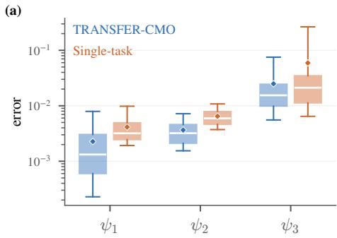

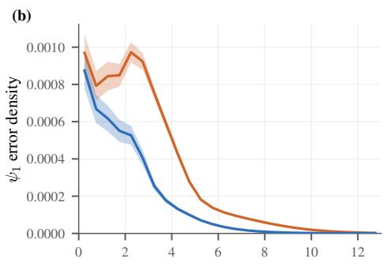

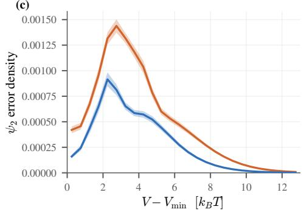

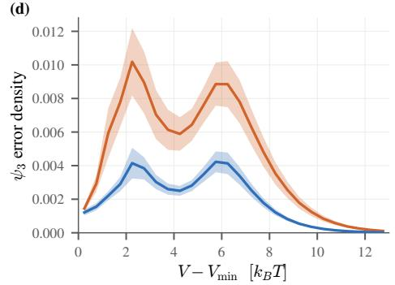  
Figure 13: Transfer versus single-task spectral recovery. (a) Distribution of mode-wise 1 − cos $\phantom { } _ { \tau } ( \widehat { \psi } _ { j } , \psi _ { j } )$ errors over unseen systems. (b–d) Error distribution across potential-energy levels for ψ<sub>1</sub>, ψ<sub>2</sub>, and ψ<sub>3</sub>.

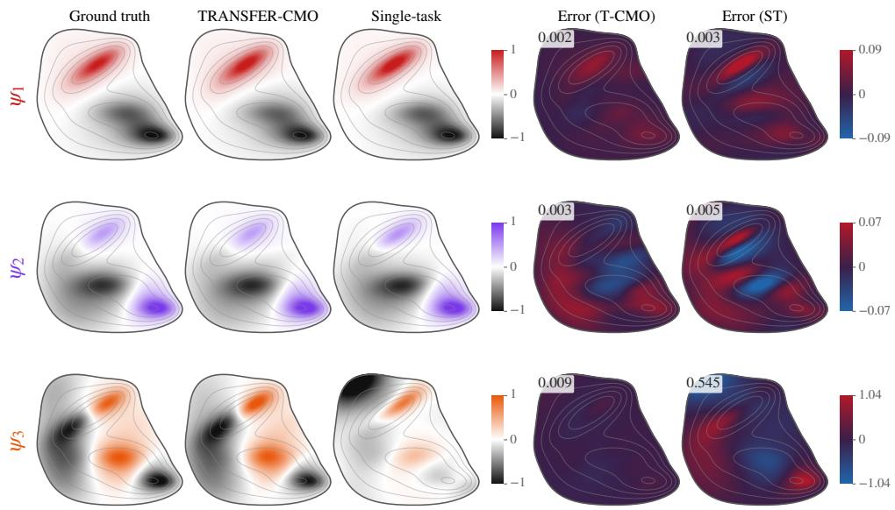  
Figure 14: Spatial recovery of the first three eigenfunctions on a representative unseen system. From left to right: finite-difference reference, T-CMO, single-task NCP, and the corresponding pointwise errors. Eigenfunctions are sign-aligned and normalized in $L ^ { 2 } ( \pi )$

Figure 14 provides a spatial view of the same effect. The displayed eigenfunctions are multiplied by $\sqrt { \pi } ,$ , so that $\| f \| _ { L ^ { 2 } ( \pi ) } ^ { 2 } = \textstyle \int | { \sqrt { \pi ( \mathbf { x } ) } } f ( \mathbf { x } ) | ^ { 2 }$ dx and visible spatial discrepancies directly reflect their contribution to the evaluation metric. For $\psi _ { 1 }$ and $\psi _ { 2 }$ , both approaches reproduce the dominant structure, although T-CMO leaves smaller residual errors. The difference is much stronger for ψ : T-CMO remains close to the finite-difference reference, whereas the independently learned estimate exhibits substantial spatial distortion. Together with the quantitative results above, this shows that reusing the multi-task representation improves both global operator recovery and the more difficult task-specific spectral components.

## F PLASMA EXPERIMENTS

This experiment tests whether functional spaces learned from turbulent plasma trajectories, without access to the physical control parameters, recover the physical organization of the Tokam2D family. MTL-CMO first learns the shared representation across source systems; T-CMO then estimates a system-specific operator in closed form, from which we extract a finite-dimensional generator spectrum. The physical parameters $( g , \kappa )$ are used only afterward as diagnostic variables. The complete experiment is run on a single NVIDIA RTX A6000 GPU.

## F.1 PHYSICAL SETTING AND PLASMA DATA

Physical model. The benchmark is based on a reduced two-field model for edge turbulence, describing the coupled evolution of density fluctuations $n ( x , y , t )$ and the electrostatic potential $\phi ( x , y , t )$ (Hasegawa & Wakatani, 1983; Ghendrih et al., 2018; 2022). The potential determines the perpendicular $\mathbf { E } \times \mathbf { B }$ flow and the vorticity,

$$
\mathbf { V } _ { E } = ( - \partial _ { y } \phi , \partial _ { x } \phi ) , \qquad \Omega = \Delta _ { \perp } \phi , \qquad \Delta _ { \perp } = \partial _ { x x } + \partial _ { y y } .
$$

Since $\mathbf { V } _ { E }$ is divergence free, nonlinear transport can be written as $\mathbf { V } _ { E } \cdot \nabla f = [ \phi , f ]$ , with $[ \phi , f ] =$ $\partial _ { x } \phi \partial _ { y } f - \partial _ { y } \phi \partial _ { x } f$

We consider the gradient-driven configuration, with inverse density-gradient length $\kappa = 1 / L _ { n }$ . The reduced dynamics are

$$
\left\{ \begin{array} { l } { \partial _ { t } n + \kappa \partial _ { y } \phi + [ \phi , n ] - D _ { n } \Delta _ { \perp } n = - \sigma _ { n } n + \sigma _ { n \phi } \phi , } \\ { \partial _ { t } \Omega + g \partial _ { y } n + [ \phi , \Omega ] - D _ { \phi } \Delta _ { \perp } \Omega = - \sigma _ { \phi n } n + \sigma _ { \phi } \phi , \qquad \Omega = \Delta _ { \perp } \phi . } \end{array} \right.
$$

The two parameters act through distinct mechanisms. The term κ $\partial _ { y } \phi$ couples the imposed background density gradient to the radial $\mathbf { E } \times \mathbf { B }$ motion and drives density fluctuations, whereas $g \partial _ { y } n$ couples density perturbations back into the vorticity equation and controls the interchange mechanism. Their nonlinear interaction closes the feedback loop $n  \Omega  \phi  \mathbf { V } _ { E }  n$ . Diffusion and linear loss terms are fixed throughout the dataset.

A physically important observable is the radial particle flux $\Gamma _ { x } = n V _ { E , x } = - n \partial _ { y } \phi ,$ , which measures radial transport induced by the correlation between density fluctuations and the $\mathbf { E } \times \mathbf { B }$ flow.

Simulation family. We generate $M = 4 0 0$ simulations using Tokam2D (GYSELAX Team, 2026), with $g \sim \mathcal { U } ( [ 0 , 0 . 5 ] )$ and $\begin{array} { r } { \kappa \sim \mathcal { U } ( [ 1 , 3 . 5 ] ) } \end{array}$ ). All remaining physical and numerical parameters are fixed. Simulations are performed on a 128 × 128 spatial grid over a square domain of side length 64, with snapshots separated by $\Delta t = 0 . 0 5$ . Each trajectory contains 4093 stored states. The first 320 systems are used for multi-task learning and the remaining 80 are held out for evaluation.

Figure 15 illustrates the distinct effects of the two physical parameters. Increasing κ strengthens the density-gradient drive and substantially changes the characteristic spatial scale of the potential and vorticity fields, with high-κ regimes exhibiting larger and more coherent structures. The effect of $g$ is qualitatively different: at low $\kappa ,$ increasing g produces a finer and more fragmented vorticity field, consistently with its direct coupling to density perturbations through $g \partial _ { y } n$ . At larger $\kappa ,$ this effect interacts with the stronger density-gradient forcing. The dependence on $( g , \kappa )$ is therefore not simply additive; both parameters jointly control the spatial organization of the turbulent flow.

Observed fields and preprocessing. Each state contains three physical channels: density $n ,$ vorticity Ω, and radial particle flux $\Gamma _ { x }$ . The original $3 \times 1 2 8 \times 1 2 8$ fields are downsampled by a factor of two before being passed to the network, giving $\mathbf { x } _ { t } \in \mathbb { R } ^ { 3 \times 6 4 \times 6 4 }$ . These observables respectively describe transported density, rotational flow structure, and radial turbulent transport. The electrostatic potential shown in Figure 15 is used only for physical interpretation and is not provided directly to MTL-CMO.

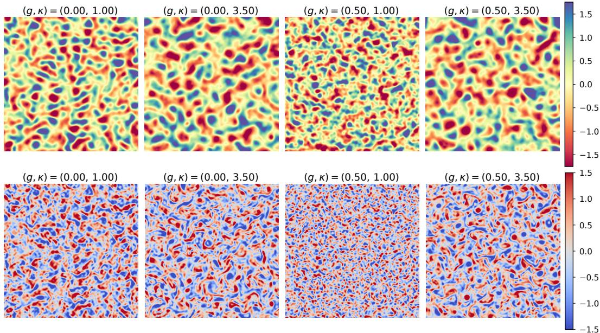  
Figure 15: Representative electrostatic potential ϕ (top) and vorticity $\Omega = \Delta _ { \perp } \phi$ (bottom) across the (g, κ) domain. Each field is standardized independently for visualization.

## F.2 SHARED FUNCTIONAL REPRESENTATION

MTL-CMO parameterizes the shared dictionaries $\Phi _ { \theta }$ and $\Psi _ { \theta }$ with a convolutional ResNet. A common encoder maps the three input fields to a 256-dimensional latent representation, followed by two output heads producing d = 128 functional features. The encoder contains three residual stages with channel dimensions (64, 128, 256) and (2, 2, 2) residual blocks, using GroupNorm, SiLU activations, and dropout. For each source system, the task-specific operator has rank 80 and is parameterized as $\mathbf { M } ^ { ( k ) } = \mathbf { A } ^ { ( k ) } \mathbf { B } ^ { ( k ) \top }$

Training follows the MTL-CMO procedure of Algorithm 2 using consecutive states $( x _ { t } ^ { ( k ) } , x _ { t + 1 } ^ { ( k ) } )$ Each optimization step samples 8 systems and 256 transitions per system. Input channels are standardized using statistics computed from the 320 source systems only, while dictionary outputs are centered within each sampled system window before evaluating the multi-task objective.

Table 10: Architecture and optimization configuration for the plasma experiment.
<table><tr><td>Configuration</td><td>Value</td></tr><tr><td>Architecture</td><td></td></tr><tr><td>Input size</td><td> $3 \times 6 4 \times 6 4$ </td></tr><tr><td>Shared feature dimension d</td><td>128</td></tr><tr><td>Task-specific rank</td><td>80</td></tr><tr><td>Encoder</td><td>Convolutional ResNet</td></tr><tr><td>Residual stages</td><td>(64, 128, 256)</td></tr><tr><td>Blocks per stage</td><td>(2,2, 2)</td></tr><tr><td>Encoder output dimension</td><td>256</td></tr><tr><td>Output heads</td><td> $2 \times ( 2 5 6 \to 1 2 8 )$ </td></tr><tr><td>Normalization</td><td>GroupNorm (8 groups)</td></tr><tr><td>Activation</td><td>SiLU</td></tr><tr><td>Dropout</td><td>0.2</td></tr><tr><td>Optimization</td><td></td></tr><tr><td>Systems per mini-batch</td><td>8</td></tr><tr><td>Transitions per system</td><td>256</td></tr><tr><td>Epochs</td><td>120</td></tr><tr><td>Optimizer</td><td> $\mathrm { A d a m W }$ </td></tr><tr><td>Learning rate</td><td> $3 \times 1 0 ^ { - 4 }$ </td></tr><tr><td>Minimum learning rate</td><td> $1 0 ^ { - 6 }$ </td></tr><tr><td>Weight decay</td><td> $1 0 ^ { - 4 }$ </td></tr><tr><td>Learning-rate schedule</td><td>Cosine</td></tr><tr><td>Warm-up</td><td>10%</td></tr><tr><td>Gradient clipping</td><td>1</td></tr></table>

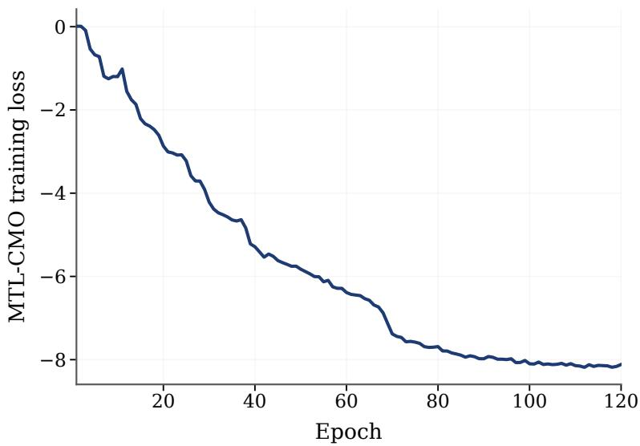  
Figure 16: Evolution of the MTL-CMO training objective over 120 epochs.

## F.3 SYSTEM-SPECIFIC TRANSFER AND SPECTRAL ESTIMATION

Closed-form adaptation. For each plasma system, we apply the T-CMO procedure of Algorithm 3 to the available trajectory. The shared dictionaries are reused without gradient updates, and only the system-specific operator is estimated. The same procedure is applied to source systems when constructing diagnostic representations and to held-out systems for transfer evaluation.

Adaptation rank. We select the transfer rank using a reduced-rank regression diagnostic. For each candidate rank, a one-step predictor is estimated independently on each of the 320 source systems and the reconstruction error is averaged across systems. As shown in Figure 17, the error decreases rapidly and largely saturates around $r = 3 2$ . We therefore use adaptation rank 32 throughout the plasma experiments. This is distinct from the rank-80 task-specific operators used during MTL-CMO training.

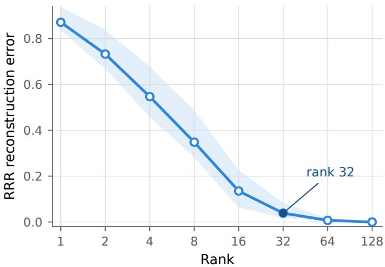  
Figure 17: Mean one-step RRR reconstruction error across the 320 source systems versus retained rank. The transfer rank is fixed to 32.

Generator spectrum. As explained in Appendix A.3, the resulting 32-dimensional adapted trajectories are passed to the generator-resolvent estimator described in Appendix A.2. We retain the 31 slowest recovered generator eigenvalues and represent each system by their real and absolute imaginary parts, yielding a 62-dimensional spectral descriptor. We use resolvent shift s = 10 throughout the plasma experiments.

## F.4 PHYSICAL IDENTIFICATION AND DATA EFFICIENCY

Compared representations. We compare four dynamical representations. MTL-CMO/T-CMO uses the shared ResNet learned across the source family, followed by closed-form T-CMO adaptation and the generator-resolvent pipeline, yielding 62 spectral features. Pooled NCP uses the same neural architecture and source data but learns a single pooled representation without task-specific operators; the same adaptation and spectral-estimation pipeline is used afterward. RFF replaces the learned functional representation by 128 Gaussian random Fourier features, with bandwidth determined from the source systems, and uses the same downstream spectral estimator. Finally, MIDST learns a shared latent dynamical model with a 128-dimensional system-specific representation; for an unseen system its shared parameters are frozen and the system-specific coefficients are adapted by gradien descent. We use lag 10, selected from the source systems.

For physical identification, the spectral coordinates of MTL-CMO/T-CMO, Pooled NCP, and RFF are the real and absolute imaginary parts of the 31 slowest recovered eigenvalues. MIDST uses its native 128-dimensional system-specific representation. Features are standardized using the 320 source systems only. We fit separate RBF kernel-ridge regressors for g and $\kappa ,$ using $\alpha = \bar { 1 } 0 ^ { - 2 }$ and $\gamma = 1 0 ^ { \dot { - } 3 }$ for every method, with no method-specific tuning. Performance is measured by $R ^ { 2 }$ on the 80 held-out systems.

Geometry of the learned representations. We first examine whether the unsupervised representations organize the source systems according to the underlying physics. For each method, we compute pairwise Euclidean distances between standardized system descriptors and apply classical multidimensional scaling. The values of $g$ and κ are used only afterward to color the embeddings.

The MTL-CMO representation exhibits a continuous organization with respect to both physical parameters. The ordering is particularly pronounced for κ, while g induces a weaker but still structured variation across the embedding. Since neither parameter is observed during representation learning or operator estimation, this organization indicates that the learned spectrum captures physically meaningful variation across turbulent regimes rather than direct supervision from $( g , \kappa )$

MDS on the eigenvalue distance matrix  
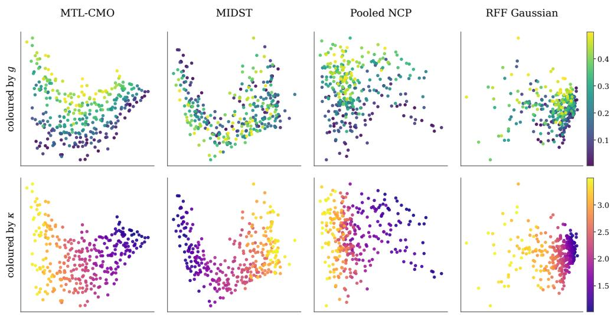

Figure 18: MDS embeddings of the dynamical representations of the 320 source systems, colored by g (top) and κ (bottom).  
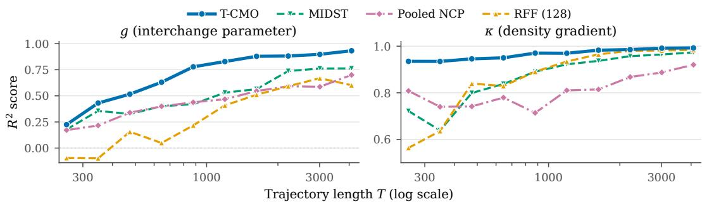  
Figure 19: Physical-parameter recovery on held-out systems versus trajectory length for T-CMO and competing representations.

Identification from short trajectories. We next recompute every system-dependent representation from increasingly short trajectory prefixes. The source/held-out split and downstream regression protocol remain unchanged. Figure 19 and show that T-CMO yields the highest $R ^ { 2 }$ for both parameters at every trajectory length.

For $\kappa ,$ the spectral representation is already highly informative from only 256 frames, with $R ^ { 2 } =$ 0.935, and reaches 0.992 on the complete trajectory. Recovering g is substantially harder: T-CMO increases from $R ^ { 2 } = 0 . 2 2 5$ at 256 frames to 0.778 at 878 and 0.932 on the full trajectory. This difference is consistent with the spectral geometry above: the density-gradient parameter is strongly expressed in the leading spectral structure, whereas the interchange parameter is encoded through a more distributed signature and benefits more from additional temporal information.

The comparisons separate the contributions of representation learning and multi-task structure. RFF keeps the downstream spectral estimator but removes the learned functional space, while Pooled NCP retains the neural architecture but removes the task-specific multi-task factorization. Their lower performance, especially for $^ { g , }$ shows that the gain cannot be explained by the downstream regressor or spectral estimator alone. MIDST benefits from cross-system learning but remains less accurate, particularly for short trajectories and for recovery of the interchange parameter.

Table 11: Held-out $R ^ { 2 }$ for physical-parameter recovery versus available trajectory length. Lowerdimensional spectral methods use 62 features; MIDST uses its native 128-dimensional representation.
<table><tr><td>Trajectory length T</td><td>256</td><td>474</td><td>878</td><td>1625</td><td>3008</td><td>4093</td></tr><tr><td colspan="7">Interchange parameter g</td></tr><tr><td>T-CMO (ours)</td><td>0.225</td><td>0.516</td><td>0.778</td><td>0.878</td><td>0.897</td><td>0.932</td></tr><tr><td>MIDST Pooled NCP</td><td>0.178 0.172</td><td>0.326 0.339</td><td>0.421 0.438</td><td>0.564 0.546</td><td>0.761 0.587</td><td>0.763 0.700</td></tr><tr><td>RFF (128)</td><td>-0.096</td><td>0.156</td><td>0.217</td><td>0.511</td><td>0.669</td><td>0.692</td></tr><tr><td>Density-gradient parameter κ</td><td></td><td></td><td></td><td></td><td></td><td></td></tr><tr><td>T-CMO (ours)</td><td>0.935</td><td>0.946</td><td>0.970</td><td>0.983</td><td>0.991</td><td>0.992</td></tr><tr><td>MIDST</td><td>0.722</td><td>0.799</td><td>0.891</td><td>0.937</td><td>0.964</td><td>0.973</td></tr><tr><td>Pooled NCP</td><td>0.808</td><td>0.741</td><td>0.714</td><td>0.814</td><td>0.887</td><td>0.920</td></tr><tr><td>RFF (128)</td><td>0.563</td><td>0.840</td><td>0.890</td><td>0.965</td><td>0.982</td><td>0.984</td></tr><tr><td></td><td></td><td></td><td></td><td></td><td></td><td></td></tr></table>

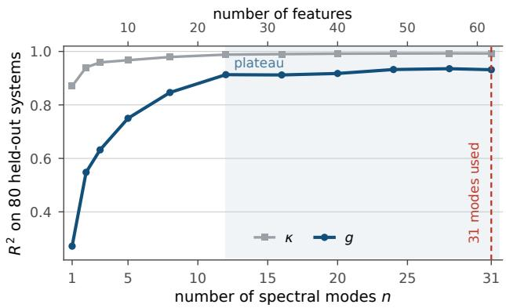  
Figure 20: Held-out $R ^ { 2 }$ versus the number of slow generator modes retained from the T-CMO representation. Each mode contributes two spectral coordinates.

Number of retained spectral modes. We finally vary the number n of slow generator modes supplied to the diagnostic regressor. Each mode contributes two coordinates, Re λ and | Im $\lambda _ { j } |$ |. Figure 20 shows that κ is largely encoded by the leading modes and saturates rapidly. In contrast, g benefits from a broader part of the slow spectrum and largely plateaus only after roughly a dozen modes. We retain all 31 modes in the main evaluation, yielding 62 spectral features.

RFF dimension sensitivity. The Gaussian RFF baseline exhibits a clear optimum around $D =$ 128 on complete trajectories. Increasing the number of random features beyond this value does not improve physical identification.

Table 12: Gaussian RFF sensitivity to the random-feature dimension $D$ on complete trajectories.
<table><tr><td>Features D</td><td>32</td><td>64</td><td>128</td><td>256</td><td>512</td><td>1024</td></tr><tr><td>Interchange g</td><td>0.388</td><td>0.662</td><td>0.714</td><td>0.641</td><td>0.639</td><td>0.639</td></tr><tr><td>Density gradient κ</td><td>0.968</td><td>0.979</td><td>0.986</td><td>0.985</td><td>0.983</td><td>0.982</td></tr></table>

Table 13: Physical-identification evaluation settings.
<table><tr><td>Parameter</td><td>Value</td></tr><tr><td>Source systems</td><td>320</td></tr><tr><td>Held-out systems</td><td>80</td></tr><tr><td>T-CMO / Pooled NCP spectral features</td><td>62</td></tr><tr><td>RFF dictionary dimension</td><td>128</td></tr><tr><td>RFF spectral features</td><td>62</td></tr><tr><td>MIDST features</td><td>128</td></tr><tr><td>MIDST lag</td><td>10</td></tr><tr><td>Regression model</td><td>Kernel ridge, RBF</td></tr><tr><td>Feature preprocessing</td><td>StandardScaler</td></tr><tr><td>KRR regularization α</td><td> $1 0 ^ { - 2 }$ </td></tr><tr><td>RBF parameter γ</td><td> $1 0 ^ { - 3 }$ </td></tr><tr><td>Hyperparameter selection Metric</td><td>Fixed, no cross-validation  $R ^ { 2 }$ </td></tr></table>

## G STATISTICAL GUARANTEES

We study how well MTL-CMO learns the shared representation, and how this depends on the number of tasks. The analysis has two steps. First, we show that the population multi-task loss controls, deterministically, the quality of the learned representation: the error of the best head on each training task, and the error on new tasks that share the same structure (propositions 1 and 2). Second, we bound the population loss of the trained model (section G.1). The cost of learning the shared representation is paid with the total number of samples nK, while each task only pays for its own head.

Setting. For every task $k \in [ K ]$ , we observe n i.i.d. pairs $\{ ( x _ { i } ^ { ( k ) } , y _ { i } ^ { ( k ) } ) \} _ { i \in [ n ] }$ from $\rho _ { k }$ , the K datasets being independent. We assume that $\rho _ { k }$ has a density $p _ { k }$ with respect to $\mu _ { k } \otimes \nu _ { k }$ such that $g _ { k } : = p _ { k } - 1 \in L ^ { 2 } ( \mu _ { k } \otimes \nu _ { k } )$ . Then $\mathsf { D } _ { \mathrm { Y | X } } ^ { \mathrm { ( k ) } }$ is the integral operator with kernel $g _ { k }$ , i.e. $[ \mathrm { D } _ { \mathrm { Y | X } } ^ { \mathrm { ( k ) } } f ] ( x ) =$ $\mathbb { E } _ { \nu _ { k } } \big [ g _ { k } ( x , Y ) f ( Y ) \big ]$ , and $\left\| \mathsf { D } _ { \mathrm { Y | X } } ^ { ( \mathrm { k } ) } \right\| _ { \mathrm { H S } } = \left\| g _ { k } \right\| _ { L ^ { 2 } ( \mu _ { k } \otimes \nu _ { k } ) } .$ We write $h = ( \theta , \{ \mathbf { A } ^ { ( k ) } , \mathbf { B } ^ { ( k ) } \} _ { k \in [ K ] } )$ for the parameters of the whole model and

$$
q _ { h _ { k } } ( x , y ) : = \Phi _ { \theta } ( x ) ^ { \top } \mathbf { A } ^ { ( k ) } \mathbf { B } ^ { ( k ) \top } \Psi _ { \theta } ( y )
$$

for the kernel learned for task k.

Assumption 1. There exists $c \geq 1$ such that $\lVert \Phi _ { \theta } ( x ) \rVert _ { 2 } \leq c \sqrt { d }$ and $\| \Psi _ { \theta } ( y ) \| _ { 2 } \leq c \sqrt { d } .$ for all $\theta \in \Theta$ $x \in \mathcal { X } a n d y \in \mathcal { Y }$ . The heads belong to $\mathcal { W } _ { \rho } : = \left\{ ( \mathbf { A } , \mathbf { B } ) : \| \mathbf { A } \| _ { \mathrm { F } } ^ { 2 } + \| \mathbf { B } \| _ { \mathrm { F } } ^ { 2 } \leq 2 \rho \right\}$ for some $\rho > 0$

The bound on the features holds, for instance, when the last layer of the networks has a bounded activation. The constraint on the heads is the constrained counterpart of the ridge penalty of section 3. We believe that an analogous guarantee holds for the penalized estimator used in practice, but a complete proof requires significantly more technical work, which we leave for future work. Under assumption $1 , \Vert \mathbf { A } \mathbf { \dot { B } } ^ { \top } \Vert _ { \mathrm { F } } \leq \rho$ and $| \dot { q } _ { h _ { k } } | \le Q _ { \rho } : = \rho c ^ { 2 } d$ by Cauchy-Schwartz.

Estimator and population risk. For task $k ,$ the model is the operator $\mathsf { D } _ { \mathrm { Y | X } } ^ { ( \mathrm { k } ) , \theta }$ with kernel $q _ { h _ { k } }$ , and the population loss of section 3 is $\mathcal { L } ^ { ( k ) } ( h ) = \left. \mathsf { D } _ { \mathrm { Y | X } } ^ { ( \mathrm { k } ) , \theta } - \mathsf { D } _ { \mathrm { Y | X } } ^ { ( \mathrm { k } ) } \right. _ { \mathrm { H S } } ^ { 2 } - \left. \mathsf { D } _ { \mathrm { Y | X } } ^ { ( \mathrm { k } ) } \right. _ { \mathrm { H S } } ^ { 2 }$ . Since the last term does not depend on h, we measure the performance of the model by

$$
\begin{array} { l } { { \displaystyle { \mathcal E } _ { k } ( h ) : = \left\| { \boldsymbol { \mathsf { D } } } _ { \mathrm { Y } | { \bf X } } ^ { ( \mathrm { k } ) , \theta } - { \boldsymbol { \mathsf { D } } } _ { \mathrm { Y } | { \bf X } } ^ { ( \mathrm { k } ) } \right\| _ { \mathrm { H S } } ^ { 2 } = \left\| { \boldsymbol { q } } _ { h _ { k } } - { \boldsymbol { g } } _ { k } \right\| _ { L ^ { 2 } ( \mu _ { k } \otimes \nu _ { k } ) } ^ { 2 } , } } \\ { { \displaystyle { \overline { { { \mathcal E } } } } ( h ) : = \frac { 1 } { K } \sum _ { k = 1 } ^ { K } { \mathcal E } _ { k } ( h ) } , \qquad { \displaystyle { \mathcal A } _ { K } : = \operatorname* { i n f } _ { h \in \Theta \times \mathcal { W } _ { \rho } ^ { K } } { \overline { { \mathcal E } } ( h ) } } , } \end{array}\tag{45}
$$

where the second equality holds because $\mathsf { D } _ { \mathrm { Y | X } } ^ { ( \mathrm { k } ) , \theta } - \mathsf { D } _ { \mathrm { Y | X } } ^ { ( \mathrm { k } ) }$ is the integral operator with kernel $q _ { h _ { k } } - g _ { k }$ The empirical loss ${ \widehat { \mathcal { L } } } ^ { ( k ) } ( h )$ of section 3 is an unbiased estimator of $\mathcal { L } ^ { ( k ) } ( h )$ , so that minimizing the multi-task objective amounts to minimizing an empirical version of $\overline { { \mathcal { E } } }$ . We consider any $\widehat { h } =$ $( \widehat { \theta } , \{ \widehat { \mathbf { A } } ^ { ( k ) } , \widehat { \mathbf { B } } ^ { ( k ) } \} _ { k } ) \in \Theta \times \mathcal { W } _ { \rho } ^ { K }$ such that

$$
\frac { 1 } { K } \sum _ { k = 1 } ^ { K } \widehat { \mathcal { L } } ^ { ( k ) } ( \widehat { h } ) \leq \operatorname* { i n f } _ { h \in \Theta \times \mathcal { W } _ { \rho } ^ { K } } \frac { 1 } { K } \sum _ { k = 1 } ^ { K } \widehat { \mathcal { L } } ^ { ( k ) } ( h ) + \epsilon _ { \mathrm { o p t } } .\tag{46}
$$

Quality of a representation. For a task $k ,$ let $\Phi _ { \theta , c } ^ { ( k ) } : = \Phi _ { \theta } - \mathbb { E } _ { \mu _ { k } } [ \Phi _ { \theta } ( X ) ]$ and $\Psi _ { \theta , c } ^ { ( k ) } : = \Psi _ { \theta } - $ $\mathbb { E } _ { \nu _ { k } } [ \Psi _ { \theta } ( Y ) ]$ be the centered dictionaries, and $P _ { \Phi _ { \theta } } ^ { ( k ) } , P _ { \Psi _ { \theta } } ^ { ( k ) }$ the orthogonal projections in $\mathrm { L } _ { \mu _ { \mathrm { k } } } ^ { 2 } ( \mathcal { X } )$ and $\mathrm { L } _ { \nu _ { \bf k } } ^ { 2 } ( \mathcal { V } )$ onto their spans. We measure the quality of the representation θ for task k by the error of the best head on the learned spaces,

$$
\eta _ { k } ^ { 2 } ( \boldsymbol \theta ) : = \operatorname* { m i n } _ { \mathbf { M } \in \mathbb { R } ^ { d \times d } } \biggl \| \boldsymbol { \mathsf { D } } _ { \mathrm { Y | X } } ^ { ( \mathbf { k } ) } - \boldsymbol { \mathsf { S } } _ { \boldsymbol { \Phi } _ { \boldsymbol { \theta } , c } ^ { ( k ) } } \mathbf { M } \boldsymbol { \mathsf { S } } _ { \boldsymbol { \Psi } _ { \boldsymbol { \theta } , c } ^ { ( k ) } } ^ { * } \biggl \| _ { \mathrm { H S } } ^ { 2 } .\tag{47}
$$

This quantity does not depend on the heads, and it is defined in the same way for a new task, with $\mathsf { D } _ { \mathrm { Y | X } } ^ { \mathrm { n e w } }$ in place of $\mathsf { D } _ { \mathrm { Y | X } } ^ { \mathrm { ( k ) } }$

Approximation result. Let $\begin{array} { r } { \tau _ { k } ^ { 2 } : = \sum _ { i > r _ { k } } ( \sigma _ { i } ^ { ( k ) } ) ^ { 2 } } \end{array}$ be the tail of the singular values of $\mathsf { D } _ { \mathrm { Y | X } } ^ { \mathrm { ( k ) } }$ . The next proposition shows that the risk (45) controls the quality of the representation on the training tasks.

Proposition 1. Let $h = ( \theta , \{ \mathbf { A } ^ { ( k ) } , \mathbf { B } ^ { ( k ) } \} _ { k } ) \in \Theta \times \mathcal { W } _ { \rho } ^ { K } a n d k \in [ K ]$

(i) Best head. $\eta _ { k } ^ { 2 } ( \theta ) = \left\| \mathsf { D } _ { \mathrm { Y | X } } ^ { ( \mathrm { k } ) } - P _ { \Phi _ { \theta } } ^ { ( k ) } \mathsf { D } _ { \mathrm { Y | X } } ^ { ( \mathrm { k } ) } P _ { \Psi _ { \theta } } ^ { ( k ) } \right\| _ { \mathrm { H S } } ^ { 2 }$ , and the minimum in (47) is attained at the T-CMO solution $\mathbf { M } _ { k } ^ { * } = \mathbf { G } _ { \Phi _ { \theta } } ^ { ( k ) + } \mathbf { C } _ { \Phi _ { \theta } \Psi _ { \theta } } ^ { ( k ) } \mathbf { G } _ { \Psi _ { \theta } } ^ { ( k ) + }$

(ii) Risk controls the representation. Let $T : = \mathsf { D } _ { \mathrm { Y } | \mathrm { X } } ^ { ( \mathrm { k } ) , \theta }$ , so that $\mathcal { E } _ { k } ( h ) = \Big \| T - \mathsf { D } _ { \mathrm { Y } | \mathrm { X } } ^ { ( \mathrm { k } ) } \Big \| _ { \mathrm { H S } } ^ { 2 } b y$ (45). Since T has rank at most $r _ { k } ,$

$$
\tau _ { k } ^ { 2 } \leq \mathscr { E } _ { k } ( h ) , \qquad \eta _ { k } ^ { 2 } ( \theta ) \leq \mathscr { E } _ { k } ( h ) .
$$

In particular, $\begin{array} { r } { \mathcal { A } _ { K } \geq \frac { 1 } { K } \sum _ { k } \tau _ { k } ^ { 2 } , } \end{array}$ , with equality $i f ( A 2 )$ is realizable, i.e. ifsome $h \in \Theta \times \mathcal { W } _ { \rho } ^ { K }$ satisfies that $q _ { h _ { k } }$ is the kernel of $\mathrm { \Delta [ D _ { Y | X } ^ { ( k ) , r _ { k } } }$ for all k.

Here <sup>+</sup> denotes the Moore–Penrose pseudo-inverse, which coincides with the inverse when the Gram matrices are invertible; it accounts for possibly redundant dictionaries. Item (i) shows that $\eta _ { k } ( \theta )$ is the population error of T-CMO with the frozen representation θ, and item (ii) that the risk of any trained model bounds the quality of its representation.

New tasks. A new task shares the representation of the training tasks if its operator factorizes through the same functions. We thus consider $( \mathbf { A } 2 )$ in the following form: there exist $\Phi ^ { \star } : \mathcal { X }  \mathbb { R } ^ { d ^ { \star } }$ and $\bar { \Psi } ^ { \star } : \mathcal { V }  \mathbb { R } ^ { d ^ { \star } }$ such that every task, training or new, satisfies

$$
\begin{array} { r } { g _ { k } ( x , y ) = \boldsymbol { \Phi } _ { c , k } ^ { \star } ( x ) ^ { \top } \mathbf { M } _ { k } \boldsymbol { \Psi } _ { c , k } ^ { \star } ( y ) \qquad \mathrm { f o r ~ s o m e ~ } \mathbf { M } _ { k } \in \mathbb { R } ^ { d ^ { \star } \times d ^ { \star } } , } \end{array}\tag{48}
$$

where $\Phi _ { c , k } ^ { \star } , \Psi _ { c , k } ^ { \star }$ are centered with respect to $\mu _ { k } , \nu _ { k }$ , and $k = \mathrm { n e w }$ for the new task. Let $\mathbf { G } _ { \Phi ^ { \star } } ^ { ( k ) }$ and $\mathbf { G } _ { \Psi ^ { \star } } ^ { ( k ) }$ be the corresponding covariance matrices. Transferring to any new task of the form (48) requires the training tasks to use all shared directions, which we quantify by

$$
\lambda _ { \Phi } : = \lambda _ { \operatorname* { m i n } } \Bigl ( \frac { 1 } { K } \sum _ { k = 1 } ^ { K } \mathbf { M } _ { k } \mathbf { G } _ { \Psi ^ { \star } } ^ { ( k ) } \mathbf { M } _ { k } ^ { \top } \Bigr ) , \qquad \lambda _ { \Psi } : = \lambda _ { \operatorname* { m i n } } \Bigl ( \frac { 1 } { K } \sum _ { k = 1 } ^ { K } \mathbf { M } _ { k } ^ { \top } \mathbf { G } _ { \Phi ^ { \star } } ^ { ( k ) } \mathbf { M } _ { k } \Bigr ) .
$$

These quantities are the operator counterpart of the task diversity condition used in multi-task representation learning, where the smallest singular value of the matrix collecting the source heads is required to be bounded away from zero (Tripuraneni et al., 2020; Du et al., 2021); here the heads are matrices and each direction is weighted by the covariance of the shared output features. For instance, $\lambda _ { \Phi } , \lambda _ { \Psi } > 0$ as soon as one training task has an invertible head and non-degenerate covariance matrices. For the new task, we let $\sigma _ { \Phi } : = \left\| \mathbf { M } _ { \mathrm { n e w } } \mathbf { G } _ { \Psi ^ { \star } } ^ { ( \mathrm { n e w } ) } \mathbf { M } _ { \mathrm { n e w } } ^ { \top } \right\| _ { \mathrm { o p } }$ and $\sigma _ { \Psi } : = \left. \mathbf { M } _ { \mathrm { n e w } } ^ { \top } \mathbf { G } _ { \Phi ^ { \star } } ^ { ( \mathrm { n e w } ) } \mathbf { M } _ { \mathrm { n e w } } \right. _ { \mathrm { o p } } .$ Finally, the representation is learned where the training inputs lie, which we account for with $\beta _ { \mu } : = \operatorname* { m a x } _ { k } \| \mathrm { d } \mu _ { \mathrm { n e w } } / \mathrm { d } \mu _ { k } \| _ { \infty }$ and $\beta _ { \nu } : = \operatorname* { m a x } _ { k } \lvert | \mathrm { d } \nu _ { \mathrm { n e w } } / \mathrm { \bar { d } } \nu _ { k } \rvert | _ { \infty } ; \beta _ { \mu } = \beta _ { \nu } = 1$ when the marginals coincide.

Proposition 2. Assume (48) with $\lambda _ { \Phi } , \lambda _ { \Psi } > 0$ . For every $\theta \in \Theta$

$$
\eta _ { \mathrm { n e w } } ^ { 2 } ( \theta ) \le C _ { \mathrm { n e w } } \cdot \frac { 1 } { K } \sum _ { k = 1 } ^ { K } \eta _ { k } ^ { 2 } ( \theta ) , \qquad C _ { \mathrm { n e w } } : = \frac { \beta _ { \mu } \sigma _ { \Phi } } { \lambda _ { \Phi } } + \frac { \beta _ { \nu } \sigma _ { \Psi } } { \lambda _ { \Psi } } .\tag{49}
$$

A representation that is accurate on average over the training tasks is thus accurate for every new task sharing it, and since $\eta _ { \mathrm { n e w } } ( \theta )$ is the population error of T-CMO (proposition 1(i)), proposition 2 quantifies transfer. The constant $C _ { \mathrm { n e w } }$ is small when the training tasks are diverse (large $\lambda _ { \Phi } , \lambda _ { \Psi } )$ Both ingredients are necessary: a shared direction that no training task uses cannot be learned, and the learned features are not constrained where no training input lies.

By propositions 1 and 2, all these guarantees follow from a bound on the average risk $\overline { { \mathcal { E } } } ( \widehat { h } )$ of the trained model.

## G.1 STATISTICAL RATE

We measure the complexity of the shared dictionaries on the pooled sample of all tasks. For $m \geq 1$ let $X _ { l } ^ { ( k ) } \sim \mu _ { k } ( k \in [ K ] , l \in [ m ] )$ be independent and $\gamma _ { k l j }$ i.i.d. standard Gaussian variables, and define

$$
{ \mathfrak { G } } _ { m , K } \bigl ( \mathcal { F } _ { \Phi } \bigr ) : = \frac { 1 } { m K } { \mathbb { E } } \operatorname* { s u p } _ { \theta \in \Theta } \sum _ { k = 1 } ^ { K } \sum _ { l = 1 } ^ { m } \sum _ { j = 1 } ^ { d } \gamma _ { k l j } \phi _ { j } ^ { \theta } \bigl ( X _ { l } ^ { ( k ) } \bigr ) ,\tag{50}
$$

and $\mathfrak { G } _ { m , K } ( \mathcal { F } _ { \Psi } )$ in the same way with $Y _ { l } ^ { ( k ) } \sim \nu _ { k }$ . For norm-bounded neural networks, $\mathfrak { G } _ { m , K } ( \mathcal { F } ) \leq$ $\mathrm { C o m p } ( \mathcal { F } ) / \sqrt { m K }$ with $\operatorname { C o m p } ( { \mathcal { F } } )$ independent of m and K (Golowich et al., 2018). We use Gaussian rather than Rademacher complexities because the separation between the shared representation and the task-specific heads relies on the chain rule of Maurer et al. (2016), which is based on Gaussian comparison inequalities; the two complexities are equivalent up to a factor $\sqrt { \log ( m K d ) }$ (Ledoux & Talagrand, 1991, Eq. (4.9)). We set

$$
L _ { \rho } : = \rho c \sqrt { d } ( 1 + Q _ { \rho } ) , \qquad B _ { \rho } : = 4 Q _ { \rho } ( Q _ { \rho } + 3 ) .
$$

Theorem 2. Let assumption 1 hold and $n \geq 2$ be even. There exists an absolute constant $C > 0$ such that, for any $\delta \in ( \bar { 0 } , 1 )$ , with probability at least $1 - \delta$

$$
\overline { { \mathcal { E } } } ( \widehat { h } ) \leq \mathcal { A } _ { K } + \epsilon _ { \mathrm { o p t } } + C L _ { \rho } \Big [ \underbrace { \mathfrak { G } _ { n / 2 , K } \big ( \mathcal { F } _ { \Phi } \big ) + \mathfrak { G } _ { n / 2 , K } \big ( \mathcal { F } _ { \Psi } \big ) } _ { s h a r d \ r e p r e s e n t a t i o n } + \underbrace { c \sqrt { d / n } } _ { h e a d s } \Big ] + 2 B _ { \rho } \sqrt { \frac { \log ( 2 \delta ^ { - 1 } ) } { 2 n K } } .\tag{51}
$$

For neural networks, the statistical error is of order

$$
L _ { \rho } \frac { \mathrm { C o m p } ( \mathcal { F } _ { \Phi } ) + \mathrm { C o m p } ( \mathcal { F } _ { \Psi } ) } { \sqrt { n K } } + L _ { \rho } c \sqrt { \frac { d } { n } } .
$$

The complexity of the networks, which is typically the dominant term, is paid with the nK samples of all tasks, whereas each head only costs $\sqrt { d / n }$ . Learning a single task $( K = 1 )$ gives $\mathrm { C o m p } ( { \mathcal F } ) / \sqrt { n } \mathrm { : }$ sharing the representation across $K$ tasks divides the dominant term by $\sqrt { K }$ . This is the operator counterpart of the benefit of multi-task representation learning of Maurer et al. (2016). The price for sharing is the approximation error $\boldsymbol { \mathcal { A } } _ { K }$ , which is small only when the tasks share their dominant singular spaces, i.e. under (A3). As in Kostic et al. (2024), the optimization error is not analyzed.

Combining theorem 2 with propositions 1 and 2 gives the transfer guarantee: with probability at least $1 - \bar { \delta } .$

$$
\eta _ { \mathrm { n e w } } ^ { 2 } ( \widehat { \theta } ) \leq C _ { \mathrm { n e w } } \cdot \mathrm { R H S } ( 5 1 ) ,
$$

where RHS(51) is the right-hand side of (51). The error of T-CMO on a new task thus decreases with the total number of training samples nK, up to the approximation terms.

## G.2 PROOF OF PROPOSITIONS 1 AND 2

Lemma 1. Let $\mathsf { S } _ { 1 } \colon \mathbb { R } ^ { d } \to \mathrm { L } _ { \mu _ { \mathrm { k } } } ^ { 2 } ( \mathcal { X } )$ and $\mathsf { S } _ { 2 } \colon \mathbb { R } ^ { d } \to \mathrm { L } _ { \nu _ { \mathrm { k } } } ^ { 2 } ( \mathcal { V } )$ be linear, with $P _ { 1 } , P _ { 2 }$ the orthogonal projections onto their ranges. For every Hilbert–Schmidt operator D, min $\mathbf { \sigma } _ { \mathbf { M } } \| \mathsf { D } - \mathsf { S } _ { 1 } \mathbf { M } \mathsf { S } _ { 2 } ^ { \ast } \| _ { \mathrm { H S } } =$ $\left. \mathsf { D } ^ { \bullet } - P _ { 1 } \mathsf { D } P _ { 2 } \right. _ { \mathrm { H S } } ,$ , attained at $\mathbf { M } ^ { * } = ( \mathsf { S } _ { 1 } ^ { * } \mathsf { S } _ { 1 } ) ^ { + } \mathsf { S } _ { 1 } ^ { * } \mathsf { D } \mathsf { S } _ { 2 } ( \mathsf { S } _ { 2 } ^ { * } \mathsf { S } _ { 2 } ) ^ { + }$ . Moreover,

$$
\begin{array} { r } { \left\| \mathsf { D } - P _ { \mathrm { I } } \mathsf { D } P _ { 2 } \right\| _ { \mathrm { H S } } ^ { 2 } = \left\| ( I - P _ { \mathrm { I } } ) \mathsf { D } \right\| _ { \mathrm { H S } } ^ { 2 } + \left\| P _ { \mathrm { I } } \mathsf { D } ( I - P _ { 2 } ) \right\| _ { \mathrm { H S } } ^ { 2 } = \left\| \mathsf { D } ( I - P _ { 2 } ) \right\| _ { \mathrm { H S } } ^ { 2 } + \left\| ( I - P _ { \mathrm { I } } ) \mathsf { D } P _ { 2 } \right\| _ { \mathrm { H S } } ^ { 2 } . } \end{array}
$$

Proof. Since $P _ { i } ~ = ~ { \sf S } _ { i } ( { \sf S } _ { i } ^ { * } { \sf S } _ { i } ) ^ { + } { \sf S } _ { i } ^ { * }$ , the set $\{ \mathsf { S } _ { 1 } \mathbf { M } \mathsf { S } _ { 2 } ^ { \ast } \}$ equals $\{ T ~ : ~ T ~ = ~ P _ { 1 } T P _ { 2 } \}$ . The map $T \mapsto P _ { 1 } T P _ { 2 }$ is idempotent and self-adjoint for the Hilbert–Schmidt inner product, hence it is the orthogonal projection onto this set, and the closest point to D is $P _ { 1 } \mathsf { D } P _ { 2 }$ , which corresponds to $\mathbf { M } ^ { * }$ The last identities follow from $\mathsf { D } - P _ { 1 } \mathsf { D } P _ { 2 } = ( I - \hat { P _ { 1 } } ) \mathsf { D } + P _ { 1 } \mathsf { D } ( I - P _ { 2 } ) = \mathsf { D } ( I - P _ { 2 } ) + \hat { ( I - P _ { 1 } ) } \mathsf { D } P _ { 2 }$ where in both cases the two terms are orthogonal for the Hilbert–Schmidt inner product. □

Proof of proposition 1. (i) Apply lemma 1 with $\mathsf { S } _ { 1 } = \mathsf { S } _ { \Phi _ { \theta , c } ^ { ( k ) } }$ and $\mathsf { S } _ { 2 } = \mathsf { S } _ { \Psi _ { \theta , c } ^ { ( k ) } }$ , for which ${ \sf S } _ { 1 } ^ { * } { \sf S } _ { 1 } =$ $\mathbf { G } _ { \Phi _ { \theta } } ^ { ( k ) } , \mathsf { S } _ { 2 } ^ { * } \mathsf { S } _ { 2 } = \mathbf { G } _ { \Psi _ { \theta } } ^ { ( k ) } \mathrm { ~ a n d ~ } \mathsf { S } _ { 1 } ^ { * } \mathsf { D } _ { \mathrm { Y } | \mathrm { X } } ^ { ( \mathrm { k } ) } \mathsf { S } _ { 2 } = \mathbf { C } _ { \Phi _ { \theta } \Psi _ { \theta } } ^ { ( k ) }$

(ii) Let $T : = \mathsf { D } _ { \mathrm { Y | X } } ^ { \mathrm { ( k ) } , \theta }$ , so that $\mathcal { E } _ { k } ( h ) = ~ \Big \| T - \mathsf { D } _ { \mathrm { Y } | \mathrm { X } } ^ { ( \mathrm { k } ) } \Big \| _ { \mathrm { H S } } ^ { 2 }$ by (45). Since T has rank at most $r _ { k }$ the Eckart–Young–Mirsky theorem gives $\mathcal { E } _ { k } ( h ) ~ \ge ~ \tau _ { k } ^ { 2 }$ , with equality when $q _ { h _ { k } }$ is the kernel of $\mathsf { D } _ { \mathrm { Y | X } } ^ { \mathrm { ( k ) , r _ { k } } }$ . Moreover, let Π denote the projection onto the orthogonal of the constant functions (in $\mathrm { L } _ { \mu _ { \mathrm { k } } } ^ { 2 } ( \mathcal { X } )$ or $\mathrm { L } _ { \nu _ { \mathrm { k } } } ^ { 2 } ( \mathcal { V } ) )$ . Since $\mathsf { D } _ { \mathrm { Y | X } } ^ { \mathrm { ( k ) } } = \Pi \mathsf { D } _ { \mathrm { Y | X } } ^ { \mathrm { ( k ) } }$ Π, we have $\left. T - \mathsf { D } _ { \mathrm { Y | X } } ^ { \mathrm { ( k ) } } \right. _ { \mathrm { H S } } \ge \left. \Pi T \Pi - \mathsf { D } _ { \mathrm { Y | X } } ^ { \mathrm { ( k ) } } \right. _ { \mathrm { H S } } ,$ and $\Pi T \Pi = \mathsf { S } _ { \Phi _ { \theta , c } ^ { ( k ) } } \mathbf { A } ^ { ( k ) } \mathbf { B } ^ { ( k ) \top } \mathsf { S } _ { \Psi _ { \theta , c } ^ { ( k ) } } ^ { * }$ is of the form in (47). Hence $\eta _ { k } ^ { 2 } ( \theta ) \leq \mathcal { E } _ { k } ( h )$ □

Proof of proposition 2. Fix θ. For a task k (training or new), let $P _ { k }$ and $P _ { k } ^ { \prime }$ be the projections of proposition 1 in $\mathrm { L } _ { \mu _ { \mathrm { k } } } ^ { 2 } ( \mathcal { X } )$ and $\mathrm { L } _ { \nu _ { \bf k } } ^ { 2 } ( \mathcal { V } )$ , and define the positive semi-definite matrices

$$
\mathbf { E } _ { k } : = \mathsf { S } _ { \Phi _ { c , k } ^ { \star } } ^ { \ast } ( I - P _ { k } ) \mathsf { S } _ { \Phi _ { c , k } ^ { \star } } , \qquad \mathbf { F } _ { k } : = \mathsf { S } _ { \Psi _ { c , k } ^ { \star } } ^ { \ast } ( I - P _ { k } ^ { \prime } ) \mathsf { S } _ { \Psi _ { c , k } ^ { \star } } \in \mathbb { R } ^ { d ^ { \star } \times d ^ { \star } } ,
$$

so that $\mathbf { a } ^ { \top } \mathbf { E } _ { k } \mathbf { a } = \left\| \left( I - P _ { k } \right) \mathbf { a } ^ { \top } \Phi _ { c , k } ^ { \star } \right\| _ { \mathrm { L } _ { \mu _ { \mathtt { k } } } ^ { 2 } ( \mathcal { X } ) } ^ { 2 }$ is the residual of the regression onto the learned dictionary of $\mathbf { a } ^ { \top } \Phi _ { c , k } ^ { \star }$ , the centered version under $\mu _ { k }$ of the shared function $\mathbf { a } ^ { \top } \Phi ^ { \star }$ , and similarly for $\mathbf { F } _ { k }$ Since the centered features $\Phi _ { \theta , c } ^ { ( k ) }$ are orthogonal to constants, $P _ { k }$ coincides on centered functions with the projection onto span $\{ \Phi _ { \theta } , 1 \}$ ; as $\mathbf { a } ^ { \top } \Phi ^ { \star }$ and $\mathbf { a } ^ { \top } \Phi _ { c , k } ^ { \star }$ differ by a constant,

$$
\begin{array} { r } { \mathbf { a } ^ { \top } \mathbf { E } _ { k } \mathbf { a } = \operatorname { d i s t } _ { { \mathrm { L } } _ { \mu _ { \mathrm { k } } } ^ { 2 } ( \mathcal { X } ) } \left( \mathbf { a } ^ { \top } \Phi ^ { \star } , \operatorname { s p a n } \{ \Phi _ { \theta } , 1 \} \right) ^ { 2 } , } \end{array}
$$

where neither the function nor the subspace depends on $k ;$ only the norm does. The same holds for $\mathbf { F } _ { k }$

Step 1 (training tasks). By (48), $\mathsf { D } _ { \mathrm { Y } | \mathrm { X } } ^ { ( \mathrm { k } ) } = \mathsf { S } _ { \Phi _ { c , k } ^ { \star } } \mathbf { M } _ { k } \mathsf { S } _ { \Psi _ { c , k } ^ { \star } } ^ { * }$ , so that

$$
\begin{array} { r } { \left\| \left( I - P _ { k } \right) \mathsf { D } _ { \mathrm { Y } | \mathrm { X } } ^ { ( \mathrm { k } ) } \right\| _ { \mathrm { H S } } ^ { 2 } = \operatorname { T r } \big ( \mathbf { E } _ { k } \mathbf { M } _ { k } \mathbf { G } _ { \Psi } ^ { ( k ) } \mathbf { M } _ { k } ^ { \top } \big ) , \qquad \left\| \mathsf { D } _ { \mathrm { Y } | \mathrm { X } } ^ { ( \mathrm { k } ) } ( I - P _ { k } ^ { \prime } ) \right\| _ { \mathrm { H S } } ^ { 2 } = \operatorname { T r } \big ( \mathbf { F } _ { k } \mathbf { M } _ { k } ^ { \top } \mathbf { G } _ { \Psi } ^ { ( k ) } \mathbf { M } _ { k } \big ) , } \end{array}
$$

and both are at most $\eta _ { k } ^ { 2 } ( \theta )$ by lemma 1 and proposition 1(i).

Step 2 (change of task). For every $f ,$ the projection of $f$ in $\mathrm { L } _ { \mu _ { \mathrm { k } } } ^ { 2 } ( \mathcal { X } )$ belongs to span $\{ \Phi _ { \theta } , 1 \}$ , so its distance to this space in $L _ { u _ { \mathrm { n e w } } } ^ { 2 }$ is at most $\sqrt { \beta _ { \mu } }$ times its distance in $\mathrm { L } _ { \mu _ { \mathrm { k } } } ^ { 2 } ( \mathcal { X } )$ . Hence $\mathbf { E } _ { \mathrm { n e w } } \preceq \beta _ { \mu } \mathbf { E } _ { k }$ for every $k ,$ and similarly $\tilde { \mathbf { F } } _ { \mathrm { n e w } } \preceq \beta _ { \nu } \mathbf { F } _ { k }$ . Using the definition of $\lambda _ { \Phi }$ and Step 1,

$$
\lambda _ { \Phi } \mathrm { T r } ( \mathbf { E } _ { \mathrm { n e w } } ) \le \frac { 1 } { K } \sum _ { k } \mathrm { T r } \left( \mathbf { E } _ { \mathrm { n e w } } \mathbf { M } _ { k } \mathbf { G } _ { \Psi } ^ { ( k ) } \mathbf { M } _ { k } ^ { \top } \right) \le \frac { \beta _ { \mu } } { K } \sum _ { k } \mathrm { T r } \left( \mathbf { E } _ { k } \mathbf { M } _ { k } \mathbf { G } _ { \Psi } ^ { ( k ) } \mathbf { M } _ { k } ^ { \top } \right) \le \frac { \beta _ { \mu } } { K } \sum _ { k } \eta _ { k } ^ { 2 } ( \theta ) ,
$$

and similarly $\begin{array} { r } { \lambda _ { \Psi } \operatorname { T r } ( \mathbf { F } _ { \mathrm { n e w } } ) \le \frac { \beta _ { \nu } } { K } \sum _ { k } \eta _ { k } ^ { 2 } ( \theta ) } \end{array}$

Step 3 (new task). By proposition 1(i) and lemma 1, $\begin{array} { r l r } { \eta _ { \mathrm { n e w } } ^ { 2 } ( \theta ) } & { \leq } & { \Big \| ( I - P _ { \mathrm { n e w } } ) \mathsf { D } _ { \mathrm { Y } | \mathrm { X } } ^ { \mathrm { n e w } } \Big \| _ { \mathrm { H S } } ^ { 2 } + } \end{array}$ $\left. \mathsf { D } _ { \mathrm { Y | X } } ^ { \mathrm { n e w } } ( I - P _ { \mathrm { n e w } } ^ { \prime } ) \right. _ { \mathrm { H S } } ^ { 2 }$ , and, as in Step 1,

$$
\begin{array} { r } { \left\| \left( I - P _ { \mathrm { n e w } } \right) \mathsf { D } _ { \mathrm { Y } | \mathrm { X } } ^ { \mathrm { n e w } } \right\| _ { \mathrm { H S } } ^ { 2 } = \operatorname { T r } \big ( \mathbf { E } _ { \mathrm { n e w } } \mathbf { M } _ { \mathrm { n e w } } \mathbf { G } _ { \Psi ^ { \star } } ^ { \mathrm { ( n e w ) } } \mathbf { M } _ { \mathrm { n e w } } ^ { \top } \big ) \leq \sigma _ { \Phi } \operatorname { T r } ( \mathbf { E } _ { \mathrm { n e w } } ) , } \end{array}
$$

and $\Big \Vert \mathsf { D } _ { \mathrm { Y } | \mathrm { X } } ^ { \mathrm { n e w } } ( I - P _ { \mathrm { n e w } } ^ { \prime } ) \Big \Vert _ { \mathrm { H S } } ^ { 2 } \leq \sigma _ { \Psi } \mathrm { T r } ( \mathbf { F } _ { \mathrm { n e w } } )$ . We use Step 2 to conclude.

## G.3 PROOF OF THEOREM 2

We use two tools. The first is the chain rule of Maurer et al. (2016), which separates the complexity of a shared representation from the one of the task-specific functions.

Lemma 2 (Maurer et al., 2016, Theorem 13). Let H be a class ofmaps $\mathcal { Z } \to \mathbb { R } ^ { D }$ with $0 \in \mathcal H$ and with values in the ball ofradius $R ,$ and let G be a class offunctions $\mathbb { R } ^ { D ^ { \star } }  \mathbb { R }$ with Lipschitz constant at most $L$ on that ball and such that $g ( 0 ) = 0 .$ for all $g \in { \mathcal { G } } .$ . For $k \in [ K ]$ , let $\zeta _ { k 1 } , \ldots , \zeta _ { k m }$ be i.i.d. from $P _ { k } ,$ , independent across $k ,$ , and write $\bar { \zeta } : = ( \zeta _ { k l } ) _ { k , l } ,$

$$
G \big ( \mathcal { H } ( \bar { \zeta } ) \big ) : = \mathbb { E } _ { \gamma } \operatorname* { s u p } _ { h \in \mathcal { H } } \sum _ { k , l } \langle \gamma _ { k l } , h ( \zeta _ { k l } ) \rangle , \qquad Q ( \mathcal { G } ) : = \operatorname* { s u p } _ { \mathbf { y } \neq \mathbf { y } ^ { \prime } \in ( \mathbb { R } ^ { D } ) ^ { m } } \frac { \mathbb { E } \operatorname* { s u p } _ { g \in \mathcal { G } } \sum _ { l = 1 } ^ { m } \gamma _ { l } \big ( g ( y _ { l } ) - g ( y _ { l } ^ { \prime } ) \big ) } { \| \mathbf { y } - \mathbf { y } ^ { \prime } \| _ { 2 } } ,
$$

where the $\gamma _ { k l }$ are $i . i . d .$ standard Gaussian vectors $o f \mathbb { R } ^ { D }$ and the $\gamma _ { l }$ are i.i.d. standard Gaussian variables. Then there exist absolute constants $c _ { 1 } , c _ { 2 } > 0$ such that

$$
\begin{array} { r l r } {  { \mathbb { E } \operatorname* { s u p } _ { h \in \mathcal { H } , \boldsymbol { g } _ { 1 } , \dots , \boldsymbol { g } _ { K } \in \mathcal { G } } \frac { 1 } { K } \sum _ { k = 1 } ^ { K } \Big ( \mathbb { E } _ { \zeta \sim P _ { k } } \big [ g _ { k } ( h ( \zeta ) ) \big ] - \frac { 1 } { m } \sum _ { l = 1 } ^ { m } g _ { k } \big ( h ( \zeta _ { k l } ) \big ) \Big ) } } \\ & { } & { \leq \frac { c _ { 1 } L \mathbb { E } G \big ( \mathcal { H } ( \bar { \zeta } ) \big ) } { m K } + \frac { c _ { 2 } Q ( \mathcal { G } ) \operatorname* { s u p } _ { h \in \mathcal { H } } \| h ( \bar { \zeta } ) \| _ { 2 } } { m \sqrt { K } } , } \end{array}
$$

where $\left\| h ( \bar { \zeta } ) \right\| _ { 2 }$ denotes the Euclidean norm of the vector $\left( h ( \zeta _ { k l } ) \right) _ { k , l } .$

Remark 1. The assumptions $0 \in { \mathcal { H } }$ and $g ( 0 ) = 0$ make the term $G ( \mathcal { G } ( y _ { 0 } ) )$ ) of the chain rule of Maurer et al. (2016, Theorem $^ { 1 2 ) }$ vanish at $y _ { 0 } = 0 ,$ , which is how lemma 2 is stated. They are not essential (see Remark 1 of Maurer et al., 2016): for general classes one simply adds $\begin{array} { r } { \operatorname* { i n f } _ { y _ { 0 } \in \mathcal { H } ( \bar { \zeta } ) } \mathbb { E } G ( \mathcal { G } ( y _ { 0 } ) ) / ( m K ) } \end{array}$ to the bound. In the proof of theorem 2 below, $g ( 0 ) = 0$ holds for every head, and $0 \in \mathcal H$ amounts to assuming that $\Phi _ { \theta } \equiv 0$ and $\Psi _ { \theta } \equiv 0 f o r$ some $\theta \in \Theta$

The following elementary lemma collects the two quantities that lemma 2 requires for the bilinear heads of MTL-CMO.

Lemma 3. Let $r , \rho > 0$ and $B _ { r } : = \{ \mathbf { a } \in \mathbb { R } ^ { d } : \| \mathbf { a } \| _ { 2 } \leq r \}$ . For $\begin{array} { r } { \| \mathbf { W } \| _ { \mathrm { F } } \leq \rho s e t p _ { \mathbf { W } } ( \mathbf { a } , \mathbf { b } ) : = \mathbf { a } ^ { \top } \mathbf { W } \mathbf { b } , } \end{array}$ so that $| p \mathbf { w } | \leq \rho r ^ { 2 }$ on $B _ { r } \times B _ { r }$ . On $B _ { r } \times B _ { r }$ , the classes

$$
\begin{array} { r } { \mathcal G _ { \mathrm { l i n } } : = \big \{ p _ { \mathbf { W } } : \| \mathbf { W } \| _ { \mathrm { F } } \leq \rho \big \} , \qquad \mathcal G _ { \mathrm { s q } } : = \big \{ p _ { \mathbf { W } } ^ { 2 } : \| \mathbf { W } \| _ { \mathrm { F } } \leq \rho \big \} } \end{array}
$$

have Lipschitz constant and Q (as defined in lemma 2) at most ${ \sqrt { 2 } } \rho r$ and $2 \sqrt { 2 } \rho ^ { 2 } r ^ { 3 }$ , respectively. Moreover, if a class G on $B _ { r } ^ { 4 }$ is obtained by averaging two members of such a class over disjoint pairs of coordinates, i.e. $g ( \mathbf { a } , \mathbf { b } , \mathbf { a } ^ { \prime } , \mathbf { b } ^ { \prime } ) = \breve { \frac { 1 } { 2 } } \big ( \phi ( \mathbf { a } , \mathbf { \tilde { b } } ) + \phi ( \mathbf { a } ^ { \prime } , \mathbf { b } ^ { \prime } ) \big )$  with ϕ ranging over the class, then the same bounds hold $f o r \mathcal { G }$

Proof. Lipschitz constants. For $\left\| \mathbf { a } \right\| _ { 2 } , \left\| \mathbf { b } \right\| _ { 2 } , \left\| \tilde { \mathbf { a } } \right\| _ { 2 } , \left\| \tilde { \mathbf { b } } \right\| _ { 2 } \leq r ,$

$$
\begin{array} { r } { \left| p _ { \mathbf { W } } ( \mathbf { a } , \mathbf { b } ) - p _ { \mathbf { W } } ( \bar { \mathbf { a } } , \bar { \mathbf { b } } ) \right| \leq \left| ( \mathbf { a } - \bar { \mathbf { a } } ) ^ { \top } \mathbf { W } \mathbf { b } \right| + \left| \bar { \mathbf { a } } ^ { \top } \mathbf { W } ( \mathbf { b } - \bar { \mathbf { b } } ) \right| \leq \rho r \left( \left\| \mathbf { a } - \bar { \mathbf { a } } \right\| _ { 2 } + \left\| \mathbf { b } - \bar { \mathbf { b } } \right\| _ { 2 } \right) \leq \sqrt { 2 } \rho r \left\| ( \mathbf { a } , \mathbf { b } ) - ( \bar { \mathbf { a } } , \bar { \mathbf { b } } ) \right\| _ { 2 } . } \end{array}
$$

using $\| \mathbf { W } \| _ { \mathrm { o p } } ~ \leq ~ \| \mathbf { W } \| _ { \mathrm { F } }$ and Cauchy–Schwarz. Since $| p _ { \mathbf { W } } | ~ \leq ~ \rho r ^ { 2 }$ , we get $| p _ { \mathbf { W } } ^ { 2 } - p _ { \mathbf { W } } ^ { 2 } ( \widetilde { \mathbf { \Gamma } } ) | \ \leq$ $2 \rho r ^ { 2 } | p _ { \mathbf { W } } - p _ { \mathbf { W } } ( \tilde { \cdot } ) | \leq 2 \sqrt { 2 } \rho ^ { 2 } r ^ { 3 } \Big \| ( \mathbf { a } , \mathbf { b } ) - ( \tilde { \mathbf { a } } , \tilde { \mathbf { b } } ) \Big \| _ { 2 } .$

The quantities Q. Both classes are linear in a matrix parameter:

$$
p _ { \mathbf { W } } ( \mathbf { a } , \mathbf { b } ) = \langle \mathbf { W } , \mathbf { a b } ^ { \top } \rangle , \qquad p _ { \mathbf { W } } ( \mathbf { a } , \mathbf { b } ) ^ { 2 } = \langle \mathbf { W } \otimes \mathbf { W } , ( \mathbf { a b } ^ { \top } ) \otimes ( \mathbf { a b } ^ { \top } ) \rangle ,
$$

with $\| \mathbf { W } \otimes \mathbf { W } \| _ { \mathrm { F } } = \| \mathbf { W } \| _ { \mathrm { F } } ^ { 2 } \leq \rho ^ { 2 }$ . For any matrices $\mathbf { M } _ { 1 } , \ldots , \mathbf { M } _ { m }$ and any $v > 0$ , Jensen’s inequality gives

$$
\mathbb { E } \operatorname* { s u p } _ { \| \mathbf { V } \| _ { \mathrm { F } } \leq v } \sum _ { l = 1 } ^ { m } \gamma _ { l } \langle \mathbf { V } , \mathbf { M } _ { l } \rangle \leq v \mathbb { E } \| \sum _ { l } \gamma _ { l } \mathbf { M } _ { l } \| _ { \mathrm { F } } \leq v \Big ( \sum _ { l = 1 } ^ { m } \| \mathbf { M } _ { l } \| _ { \mathrm { F } } ^ { 2 } \Big ) ^ { 1 / 2 } .\tag{52}
$$

Applying (52) with $\mathbf { M } _ { l } = \mathbf { a } _ { l } \mathbf { b } _ { l } ^ { \top } - \tilde { \mathbf { a } } _ { l } \tilde { \mathbf { b } } _ { l } ^ { \top }$ and $v = \rho _ { \mathrm { { ; } } }$ , and using $\left\| \mathbf { a } \mathbf { b } ^ { \intercal } - \mathbf { \tilde { a } } \mathbf { \tilde { b } } ^ { \intercal } \right\| _ { \mathrm { F } } \leq r ( \left\| \mathbf { a } - \mathbf { \tilde { a } } \right\| _ { 2 } +$ $\Big \| \mathbf { b } - \tilde { \mathbf { b } } \Big \| _ { 2 } \Big ) \leq \sqrt { 2 } r \Big \| ( \mathbf { a } , \mathbf { b } ) - ( \tilde { \mathbf { a } } , \tilde { \mathbf { b } } ) \Big \| _ { 2 }$ , gives $Q ( \mathcal { G } _ { \mathrm { l i n } } ) \leq \sqrt { 2 } \rho r$ . For $\mathcal { G } _ { \mathrm { s q } }$ , write $\mathbf { \delta } _ { \mathbf { \lambda } ^ { \mathbf { 1 } } } : = \mathbf { a } \otimes \mathbf { b }$ , so that $\begin{array} { r } { \left\| \mathbf { u } \right\| _ { 2 } \leq r ^ { 2 } \mathrm { a n d } \left\| \mathbf { u } - \tilde { \mathbf { u } } \right\| _ { 2 } \leq \sqrt { 2 } r \bigg \| ( \mathbf { a } , \mathbf { b } ) - ( \tilde { \mathbf { a } } , \tilde { \mathbf { b } } ) \bigg \| _ { 2 } , } \end{array}$ ; then

$$
\left\| \mathbf { u } \mathbf { u } ^ { \top } - \tilde { \mathbf { u } } \tilde { \mathbf { u } } ^ { \top } \right\| _ { \mathrm { F } } \leq \left( \left\| \mathbf { u } \right\| _ { 2 } + \left\| \tilde { \mathbf { u } } \right\| _ { 2 } \right) \left\| \mathbf { u } - \tilde { \mathbf { u } } \right\| _ { 2 } \leq 2 \sqrt { 2 } r ^ { 3 } \bigg \| ( \mathbf { a } , \mathbf { b } ) - ( \tilde { \mathbf { a } } , \tilde { \mathbf { b } } ) \bigg \| _ { 2 } ,
$$

and (52) with $v = \rho ^ { 2 }$ gives $Q ( \mathcal { G } _ { \mathrm { s q } } ) \leq 2 \sqrt { 2 } \rho ^ { 2 } r ^ { 3 }$

Averaging two blocks. If ϕ has Lipschitz constant $L _ { 0 }$ and the class of such $\phi$ has $Q \ \leq$ $Q _ { 0 }$ , then, writing $\textbf { u } = { \bf \Phi } ( { \bf u } _ { 1 } , { \bf u } _ { 2 } )$ for the two blocks, $\begin{array} { r l r } { | g ( \mathbf { u } ) - g ( \tilde { \mathbf { u } } ) | } & { { } \le } & { \frac { L _ { 0 } } { 2 } \big ( \| \mathbf { u } _ { 1 } - \tilde { \mathbf { u } } _ { 1 } \| _ { 2 } + } \end{array}$ $\begin{array} { r } { \| \mathbf { u } _ { 2 } - \tilde { \mathbf { u } } _ { 2 } \| _ { 2 } ) \leq \frac { L _ { 0 } } { \sqrt { 2 } } \| \mathbf { u } - \tilde { \mathbf { u } } \| _ { 2 } } \end{array}$ , and likewise E $\begin{array} { r } { \operatorname* { s u p } _ { g } \sum _ { l } \gamma _ { l } \big ( g ( \mathbf { u } _ { l } ) - g ( \tilde { \mathbf { u } } _ { l } ) \big ) \le \frac { Q _ { 0 } } { 2 } \big ( \big \| \mathbf { u } ^ { ( 1 ) } - \tilde { \mathbf { u } } ^ { ( 1 ) } \big \| _ { 2 } + } \end{array}$ $\begin{array} { r } { \left. \mathbf { u } ^ { ( 2 ) } - \tilde { \mathbf { u } } ^ { ( 2 ) } \right. _ { 2 } \dot { \mathbf { \le } } \frac { Q _ { 0 } } { \sqrt { 2 } } \lVert \mathbf { u } - \tilde { \mathbf { u } } \rVert _ { 2 } } \end{array}$ , where $\mathbf { u } ^ { ( j ) }$ collects the j-th blocks. Both constants therefore only decrease. □

The last tool is Hoeffding’s representation of a U-statistic as an average of averages of i.i.d. terms (see, e.g., de la Pena & Gin˜ e, 1999, Chapter 4). Let´ $Z _ { 1 } , \ldots , Z _ { n }$ be i.i.d., let s be a symmetric kernel, and let $\mathbb { S } _ { n }$ be the set of permutations of $[ n ]$ . Then

$$
\frac { 1 } { n ( n - 1 ) } \sum _ { i \neq j } s \left( Z _ { i } , Z _ { j } \right) = \frac { 1 } { | \mathbb { S } _ { n } | } \sum _ { \pi \in \mathbb { S } _ { n } } \frac { 2 } { n } \sum _ { l = 1 } ^ { n / 2 } s \left( Z _ { \pi ( 2 l - 1 ) } , Z _ { \pi ( 2 l ) } \right) ,\tag{53}
$$

where, for each fixed π, the $n / 2$ terms of the inner average are i.i.d.

Proof of theorem 2. Step 1 (reduction to a uniform deviation). Let $\bar { h }$ be a fixed element of $\Theta \times \mathcal { W } _ { \rho } ^ { K }$ and set

$$
\widehat { \mathcal { L } } : = \frac { 1 } { K } \sum _ { k = 1 } ^ { K } \widehat { \mathcal { L } } ^ { ( k ) } , \qquad \overline { { \mathcal { L } } } : = \frac { 1 } { K } \sum _ { k = 1 } ^ { K } \mathcal { L } ^ { ( k ) } , \qquad \boldsymbol { Z } : = \operatorname* { s u p } _ { h \in \Theta \times \mathcal { W } _ { \rho } ^ { K } } \big ( \overline { { \mathcal { L } } } ( h ) - \widehat { \overline { { \mathcal { L } } } } ( h ) \big ) .
$$

Since $\mathcal { E } _ { k }$ and $\mathcal { L } ^ { ( k ) }$ differ by a quantity that does not depend on h, (46) gives

$$
\overline { { \mathcal { E } } } ( \widehat { h } ) - \overline { { \mathcal { E } } } ( \bar { h } ) = \overline { { \mathcal { L } } } ( \widehat { h } ) - \overline { { \mathcal { L } } } ( \bar { h } ) \leq Z + \epsilon _ { \mathrm { o p t } } + \big ( \widehat { \overline { { \mathcal { L } } } } ( \bar { h } ) - \overline { { \mathcal { L } } } ( \bar { h } ) \big ) .
$$

It remains to bound Z and the deviation at the fixed point h<sup>¯</sup>.

Step 2 (Concentration argument). With $q \ = \ q _ { h _ { k } }$ and $q _ { i j } = q ( x _ { i } ^ { ( k ) } , y _ { j } ^ { ( k ) } )$ , the empirical loss of section 3 reads

$$
\widehat { \mathcal { L } } ^ { ( k ) } ( h ) = \frac { 1 } { n ( n - 1 ) } \sum _ { i \neq j } \left( q _ { i j } ^ { 2 } + 2 q _ { i j } \right) - \frac { 2 } { n } \sum _ { i = 1 } ^ { n } q _ { i i } ,\tag{54}
$$

whose expectation is

$$
\begin{array} { r } { { \mathbb { E } } _ { \mu _ { k } \otimes \nu _ { k } } [ q ^ { 2 } ] + 2 { \mathbb { E } } _ { \mu _ { k } \otimes \nu _ { k } } [ q ] - 2 { \mathbb { E } } _ { \rho _ { k } } [ q ] = { \| q - g _ { k } \| } _ { L ^ { 2 } ( \mu _ { k } \otimes \nu _ { k } ) } ^ { 2 } - { \| g _ { k } \| } _ { L ^ { 2 } ( \mu _ { k } \otimes \nu _ { k } ) } ^ { 2 } = \mathcal { L } ^ { ( k ) } ( h ) , } \end{array}
$$

where we used $\mathbb { E } _ { \rho _ { k } } [ q ] = \mathbb { E } _ { \mu _ { k } \otimes \nu _ { k } } [ p _ { k } q ]$ . By assumption 1, $| q _ { h _ { k } } | \leq Q _ { \rho }$ for every h and every $( x , y )$ so replacing one sample of task k modifies at most $2 ( n - 1 )$ terms of the U-statistic in (54), each by at most $2 ( Q _ { \rho } ^ { 2 } + 2 Q _ { \rho } )$ , and one diagonal term, by at most $2 Q _ { \rho } ;$ hence it modifies $\widehat { \overline { { \mathcal { L } } } } ( h )$ by at most $B _ { \rho } / ( n K )$ ), uniformly in h. Both Z and $\widehat { \overline { { \mathcal { L } } } } ( \bar { h } )$ are therefore functions of the nK independent samples with bounded differences $B _ { \rho } / ( n K )$ , and McDiarmid’s inequality together with a union bound gives that, with probability at least $1 - \delta$

$$
Z \leq \mathbb { E } Z + B _ { \rho } \sqrt { \frac { \log ( 2 \delta ^ { - 1 } ) } { 2 n K } } \qquad \mathrm { a n d } \qquad \widehat { \overline { { { \mathcal { L } } } } } ( \bar { h } ) - \overline { { { \mathcal { L } } } } ( \bar { h } ) \leq B _ { \rho } \sqrt { \frac { \log ( 2 \delta ^ { - 1 } ) } { 2 n K } } .
$$

Step 3 (splitting the empirical process). By (54), $\overline { { \mathcal { L } } } ( h ) - \widehat { \overline { { \mathcal { L } } } } ( h ) = \Delta _ { U } ( h ) + 2 \Delta _ { V } ( h )$ , where

$$
\Delta _ { U } ( h ) : = \frac { 1 } { K } \sum _ { k = 1 } ^ { K } \big ( \mathbb { E } U _ { h } ^ { ( k ) } - U _ { h } ^ { ( k ) } \big ) , \qquad \Delta _ { V } ( h ) : = \frac { 1 } { K } \sum _ { k = 1 } ^ { K } \big ( V _ { h } ^ { ( k ) } - \mathbb { E } V _ { h } ^ { ( k ) } \big ) ,
$$

with $\begin{array} { r } { V _ { h } ^ { ( k ) } : = \frac { 1 } { n } \sum _ { i } q \big ( x _ { i } ^ { ( k ) } , y _ { i } ^ { ( k ) } \big ) } \end{array}$  and $U _ { h } ^ { ( k ) }$ the U-statistic of task k with symmetric kernel

$$
s _ { h } \big ( ( x , y ) , ( x ^ { \prime } , y ^ { \prime } ) \big ) : = \textstyle \frac { 1 } { 2 } \Big ( q ( x , y ^ { \prime } ) ^ { 2 } + 2 q ( x , y ^ { \prime } ) + q ( x ^ { \prime } , y ) ^ { 2 } + 2 q ( x ^ { \prime } , y ) \Big ) .
$$

Hence $\begin{array} { r } { \mathbb E Z \leq \mathbb E \operatorname* { s u p } _ { h } \Delta _ { U } ( h ) + 2 \mathbb E \operatorname* { s u p } _ { h } \Delta _ { V } ( h ) } \end{array}$ , and we bound the two suprema separately.

Step 4 (the U-part). By (53) applied to each task, $\Delta _ { U } ( h )$ is, for every h, an average over the K-tuples of permutations $( \pi _ { 1 } , \ldots , \pi _ { K } )$ of

$$
\frac { 2 } { n K } \sum _ { k = 1 } ^ { K } \sum _ { l = 1 } ^ { n / 2 } \Big ( \mathbb { E } \big [ s _ { h } ( \zeta _ { k l } ^ { \pi _ { k } } ) \big ] - s _ { h } ( \zeta _ { k l } ^ { \pi _ { k } } ) \Big ) , \qquad \zeta _ { k l } ^ { \pi } : = \big ( Z _ { \pi ( 2 l - 1 ) } ^ { ( k ) } , Z _ { \pi ( 2 l ) } ^ { ( k ) } \big ) .
$$

The supremum over h of an average is at most the average of the suprema, and each term of the latter has, by exchangeability within tasks and independence across tasks, the same distribution as the term obtained with the identity permutations. Hence $\mathbb { E } \operatorname* { s u p } _ { h } \Delta _ { U } ( h )$ is at most the expected supremum of the same process over the n $K / 2$ independent blocks $\zeta _ { k l } : = \big ( Z _ { 2 l - 1 } ^ { ( k ) } , Z _ { 2 l } ^ { ( k ) } \big ) , l \in [ n / 2 ]$ , to which we apply lemma 2 with $m = n / 2$ , the shared representation

$$
h _ { \theta } ( \zeta ) : = \big ( \Phi _ { \theta } ( x ) , \Psi _ { \theta } ( y ^ { \prime } ) , \Phi _ { \theta } ( x ^ { \prime } ) , \Psi _ { \theta } ( y ) \big ) \in \mathbb { R } ^ { 4 d } , \qquad \zeta = \big ( ( x , y ) , ( x ^ { \prime } , y ^ { \prime } ) \big ) ,
$$

and the task-specific functions

$$
\begin{array} { r } { g _ { \mathbf { W } } ( \mathbf { a } , \mathbf { b } , \mathbf { a } ^ { \prime } , \mathbf { b } ^ { \prime } ) : = \frac { 1 } { 2 } \Big ( \varphi ( \mathbf { a } ^ { \top } \mathbf { W } \mathbf { b } ) + \varphi ( \mathbf { a } ^ { \prime \top } \mathbf { W } \mathbf { b } ^ { \prime } ) \Big ) , \qquad \varphi ( t ) : = t ^ { 2 } + 2 t , \qquad \| \mathbf { W } \| _ { \mathrm { F } } \leq \rho , } \end{array}
$$

so that $s _ { h } = g _ { \mathbf { W } _ { k } } \circ h _ { \theta }$ with $\mathbf { W } _ { k } = \mathbf { A } ^ { ( k ) } \mathbf { B } ^ { ( k ) \top }$ and $g _ { \bf W } ( 0 ) = 0$ . It remains to bound the three quantities entering lemma 2.

(a) Range. By assumption 1, h<sub>θ</sub> takes values in the ball of radius $R = 2 c { \sqrt { d } } ,$ and each of the four blocks of $h _ { \theta } ( \zeta )$ lies in the ball of radius $r : = c \sqrt { d } \mathrm { o f } \mathbb { R } ^ { d }$ . Consequently $\operatorname* { s u p } _ { h } \mathopen { } \mathclose \bgroup \left\| h ( \bar { \zeta } ) \aftergroup \egroup \right\| _ { 2 } \leq R \sqrt { n K / 2 } .$

(b) Lipschitz constant and Q. Since $\varphi ( t ) = t ^ { 2 } + 2 t$ , lemma 3 with $r = c \sqrt { d }$ gives, for the Lipschitz constant of $g _ { \mathbf { W } }$ and for $Q ( { \mathcal { G } } )$ , the common bound

$$
2 \sqrt { 2 } \rho ^ { 2 } c ^ { 3 } d ^ { 3 / 2 } + 2 \cdot \sqrt { 2 } \rho c \sqrt { d } = 2 \sqrt { 2 } \rho c \sqrt { d } \left( 1 + Q _ { \rho } \right) = 2 \sqrt { 2 } L _ { \rho } .
$$

(c) Gaussian average. Splitting the Gaussian vector $\gamma _ { k l } \in \mathbb { R } ^ { 4 d }$ into its four blocks, $G ( \mathcal { H } ( \bar { \zeta } ) )$ is at most the sum of four Gaussian averages, two of them over the $n K / 2$ inputs x drawn from the $\mu _ { k }$ and two over the $n K / 2$ outputs y drawn from the $\nu _ { k } , n / 2$ per task. By the definition (50),

$$
\mathbb { E } G \big ( \mathcal { H } ( \bar { \zeta } ) \big ) \leq 2 \cdot \frac { n K } { 2 } \Big ( \mathfrak { G } _ { n / 2 , K } ( \mathcal { F } _ { \Phi } ) + \mathfrak { G } _ { n / 2 , K } \big ( \mathcal { F } _ { \Psi } \big ) \Big ) .
$$

Substituting (a), (b) and (c) into lemma 2 with $m = n / 2$ yields

$$
\mathbb { E } \operatorname* { s u p } _ { h } \Delta _ { U } ( h ) \leq 4 \sqrt { 2 } c _ { 1 } L _ { \rho } \Big ( \mathfrak { G } _ { n / 2 , K } ( \mathcal { F } _ { \Phi } ) + \mathfrak { G } _ { n / 2 , K } ( \mathcal { F } _ { \Psi } ) \Big ) + 8 c _ { 2 } L _ { \rho } c \sqrt { \frac { d } { n } } .
$$

Step 5 (the V-part). Here the summands are already i.i.d. within each task, so we apply lemma 2 directly with $m = n$ , the representation $h _ { \theta } ( x , y ) = \mathsf { \bar { ( } } \Phi _ { \theta } ( x ) , \Psi _ { \theta } ( y ) \bigr ) \in \mathbb { R } ^ { 2 d }$ , which by assumption 1 takes values in the ball of radius $R = { \sqrt { 2 } } c { \sqrt { d } } ,$ and the task functions $g _ { \mathbf { W } } ( \mathbf { a } , \mathbf { b } ) \ = \ - \mathbf { a } ^ { \top } \mathbf { W } \mathbf { b } .$ for which $g _ { \bf W } ( 0 ) = 0$ and, by lemma 3 with $r = c { \sqrt { d } }$ , both the Lipschitz constant and Q are at most $\sqrt { 2 } \rho c \sqrt { d } \leq \sqrt { 2 } L _ { \rho }$ . As in Step 4(c), E $G ( \mathcal { H } ( \bar { \zeta } ) ) \leq n K \big ( \mathfrak { G } _ { n , K } ( \mathcal { F } _ { \Phi } ) + \mathfrak { G } _ { n , K } ( \mathcal { F } _ { \Psi } ) \big )$ and $\operatorname* { s u p } _ { h } \big | \big | h ( \bar { \zeta } ) \big | \big | _ { 2 } \leq R \sqrt { n K }$ . Since a Gaussian average over a sample of size n per task is at most the one over either half of it, ${ \mathfrak { G } } _ { n , K } \leq { \mathfrak { G } } _ { n / 2 , K }$ , and we obtain

$$
\begin{array} { r } { \mathbb { E } \operatorname* { s u p } _ { h } \Delta _ { V } ( h ) \leq \sqrt { 2 } c _ { 1 } L _ { \rho } \Big ( \mathfrak { G } _ { n / 2 , K } \big ( \mathcal { F } _ { \Phi } \big ) + \mathfrak { G } _ { n / 2 , K } \big ( \mathcal { F } _ { \Psi } \big ) \Big ) + 2 c _ { 2 } L _ { \rho } c \sqrt { \frac { d } { n } } . } \end{array}
$$

Step 6 (conclusion). Steps 3–5 give $\mathbb { E } Z \le C L _ { \rho } \big [ \mathfrak { G } _ { n / 2 , K } ( \mathcal { F } _ { \Phi } ) + \mathfrak { G } _ { n / 2 , K } ( \mathcal { F } _ { \Psi } ) + c \sqrt { d / n } \big ]$ for an absolute constant C. Combining with Steps 1 and 2, and taking h<sup>¯</sup> such that $\overline { { \mathcal { E } } } ( \bar { h } )$ is arbitrarily close to $\boldsymbol { \mathcal { A } } _ { K }$ (the remaining arbitrarily small term being absorbed in $\epsilon _ { \mathrm { o p t } } )$ , we obtain (51).