# Muon Sublates the Edge of Stability in LLM Pretraining

Yanzhe Chen∗ Qifang Zhao† Xiaoxiao Xu† Fanghui Liu‡

## Abstract

Muon is increasingly used for language-model pretraining, yet its large-step dynamics are not captured by the classical edge-of-stability (EoS) picture of gradient descent (GD). In GD, loss neutrality, equalmagnitude update reversal, and marginal stability meet at a single learning-rate-dependent edge. We show that Muon breaks this coupling. For stochastic no-momentum Muon, we derive a coherence-corrected conditional loss-neutral boundary 2ρ /η, while temporal alignment follows a separate geometry. Controlled experiments show that loss balance and temporal alignment respond diferently to learning rate and batch size. Across our language model experiments, the 130M Llama-like LLM runs exhibit loss-boundary tracking with weak negative alignment, whereas the studied 1B LLM configuration shows stronger partial cancellation; in both settings, directions remain far from coherent reversal while training continues to improve. These results support a split EoS picture for Muon: a stochastic loss-neutral edge survives, but it is not accompanied by a universal temporal-direction signature. The source code for reproducing the experiments can be found in https://github.com/cyzebra/Muon-Sublates-the-Edge-of-Stability -in-LLM-Pretraining.

## 1 Introduction

Muon is increasingly used for large language model (LLM) pretraining, where it replaces each matrix gradient by an approximately semi-orthogonal polar direction (Jordan et al., 2024; Liu et al., 2025). This transformation changes the geometry of the update, not merely its scale. Consequently, Muon’s large-step dynamics cannot be inferred directly from the familiar gradient-descent picture.

For gradient descent (GD), large-step neural-network training is commonly described through the edge of stability (EoS): curvature approaches a learning-rate-dependent boundary, loss becomes non-monotone over short horizons, and training nevertheless progresses over longer ones (Wu et al., 2018; Jastrzebski et al., 2020; Lewkowycz et al., 2020; Cohen et al., 2021; Damian et al., 2023). In a scalar quadratic mode of curvature λ, the GD multiplier is 1 − ηλ. Negative alignment begins already at ηλ > 1; at ηλ = 2, the stronger coincidence of one-step loss neutrality, equal-magnitude reversal, and marginal linear stability produces the classica single-edge picture (Litman, 2026).

Muon removes the mechanism forcing these signatures to coincide. Its loss change depends on curvature along the current polar direction, whereas its temporal geometry depends on how that direction changes between updates. Stochasticity introduces a further distinction: an unbiased minibatch gradient need not induce an unbiased polar direction. Existing geometry-aware analyses of Spectral GD and normalized Spectra GD are primarily deterministic or controlled (Islamov et al., 2026), while language-model pretraining uses fresh minibatches, approximate polar updates, many heterogeneous matrix blocks, and an auxiliary optimizer. To our knowledge, there is no study to check whether EoS exists in LLM pre-training via Muon or not, leading to the following question:

## Which signatures of EoS survive under Muon in language-model pretraining?

We provide an afirmative answer to this question via our theoretical analysis and comprehensive experiments from controlled small-scale models (MLP, CNN, Transformers) to language models (at the scale of 22M, 130M, and 1B parameters). We find that, no-momentum Muon neither simply preserves nor eliminates the classical EoS, but sublates1 EoS: It preserves a coherence-corrected loss-neutral edge, but it breaks the classical coupling between loss balance and update reversal. We call this a split edge of stability. Across the studied small-scale models and language-model configurations in Figure 1, the loss edge in the spirit of classical EoS survives, while temporal alignment ranges from weak negative alignment to substantial partial cancellation, that remains far from coherent reversal at −1 in the classical EoS.

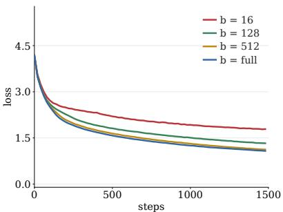  
(a) Transformer: loss

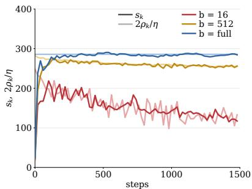  
(b) Transformer: loss balance

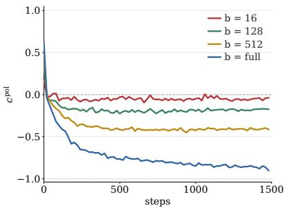  
(c) Transformer: update directions

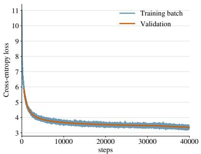  
(d) 130M: loss

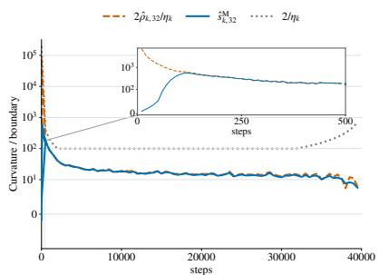  
(e) 130M: loss balance

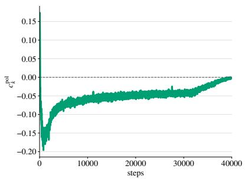  
(f) 130M: update directions  
Figure 1: Results on a controlled Transformer $^ { ( \mathbf { a } , \mathbf { b } , \mathbf { c } ) }$ to language-model pretraining $\mathbf { \Gamma } ( \mathbf { d } , \mathbf { e } , \mathbf { f } )$ Transformer experiments (on the top) use SVD-polar updates at a fixed learning rate $\eta = 0 . 0 0 7$ and varying batch sizes; 130M Llama-like LLM pre-training (on the bottom) uses no-momentum NS-5 Muon at a warmupstable-decay (WSD) (Hu et al., 2024) learning rate schedule (with a peak learning rate 0.02). Columns show the loss, conditional efective curvature and its coherence-corrected loss-neutral boundary $2 \hat { \rho } _ { k , b } / \eta _ { k } ,$ , and global Muon-direction cosine in a range of [−1, 1], respectively. In the 130M LLM run, conditional loss balance coexists with continued learning and a weak negative directional bias. The inset in (e) enlarges steps 10–490. The experiments on 1B LLM pre-training are deferred to Section 3.3.

## 1.1 Contributions and findings

In this paper, we focus on stochastic no-momentum exact-polar Muon to isolate the dynamics induced by its defining polar normalization. In this setting, the direction on each Muon parameter block is determined by current stochastic gradient alone. We evaluate on MLP, CNN, and Transformer with exact-polar but test language-model experiments at the scale of 22M, 130M, 1B parameters with practical no-momentum NS-5 approximation on Muon parameter blocks, together with AdamW on auxiliary parameters. We define two diagnostics

$$
\underbrace { s _ { k , b } ^ { \mathrm { M } } = \frac { 2 \rho _ { k , b } } { \eta _ { k } } } _ { \mathrm { c o n d i t i o n a l ~ l o s s ~ n e u t r a l i t y } } , \qquad c _ { k , b } ^ { \mathrm { p o l } } = \frac { \langle P _ { k } , P _ { k + 1 } \rangle _ { \mathrm { F } } } { \| P _ { k } \| _ { F } \| P _ { k + 1 } \| _ { F } } , \qquad \underbrace { c _ { k , b } ^ { \mathrm { p o l } } = 0 } _ { \mathrm { T 2 : ~ t e m p o r a l ~ o r t h o g o n a l i t y } } .\tag{1}
$$

T1 is a loss-neutral boundary, whereas $c _ { k , b } ^ { \mathrm { p o l } }$ is a temporal-direction diagnostic and T2 is a temporal orthogonality threshold: it separates acute from obtuse alignment and is not itself a stability criterion. Our main contributions and findings are:

• A coherence-corrected loss edge survives. For stochastic exact-polar no-momentum Muon, in Section 2, we derive an exact conditional identity that gives the loss-neutral boundary $s _ { k , b } ^ { \mathrm { M } } = 2 \rho _ { k , b } / \eta _ { k }$ The full-batch case recovers $2 / \eta _ { k }$ , while minibatch sampling moves the boundary through the batch-topopulation coherence $\rho _ { k , b }$ . Controlled SVD-polar experiments approach this boundary, see Figures 1 and 2. Besides, finite-reference Muon-only probes in the 130M runs repeatedly lie near it, while the complete training runs continue to improve over longer horizons.

• Loss balance does not determine temporal direction. Loss balance and temporal alignment are distinct. A matrix quadratic proves that the same efective loss curvature can produce either positive or negative consecutive-direction alignment. Controlled experiments further show that the observed T1 and T2 crossings can occur in either order (Figure 3). More directly, at fixed checkpoints of the 22M and 130M models, changing the learning rate changes the sign of the conditional loss increment while $c _ { k , b } ^ { \mathrm { p o l } }$ remains negative (Figure 7). Thus, negative temporal alignment does not determine which side of the loss-neutral boundary the update lies on.

• Batch size controls access to coherent reversal. Across the controlled MLP, CNN, and Transformer experiments in Figures 1 and 2, increasing the batch size makes temporal alignment progressively more negative, with full-batch trajectories moving toward coherent reversal at $c ^ { \mathrm { p o l } } = - 1$ , whereas small-batch trajectories remain much closer to orthogonality. The same tendency appears in the fixed-checkpoint 22M interventions.

• LLM pretraining exhibits loss balance without universal reversal. Across LLM experiments in Section 3, we find that temporal Muon alignment is consistently obtuse but not universal in magnitude: it ranges from near orthogonality at 130M scale to partial directional cancellation at 1B LLM pretraining under a (relatively large) batch size 512, while remaining far from coherent reversal at −1 (Figure 8). Thus, practical LLM pretraining can reach the loss-neutral edge without entering the coherent directional regime observed near full batch. Besides, we also conduct experiments on layerwise measurements of $c _ { k , b } ^ { \mathrm { p o l } } .$ which reveals additional heterogeneity hidden by the global cosine (Figure 6).

Practical implications. Together, these results support a qualified EoS picture for Muon: a stochastic loss-neutral edge survives, but no universal temporal direction accompanies it. This separation identifies distinct loss and trajectory signals that may inform future design of learning-rate and batch-size schedules in LLM pre-training. To be specific, the two signals should be monitored jointly: during a WSD schedule, weaker negative alignment indicates reduced cancellation, but increasing the learning rate is justified only if the T1 diagnostic leaves suficient room before loss neutrality (Figure 7). Likewise, batch size afects both batch-to-population coherence and temporal alignment, suggesting a data-driven notion of critical batch size based on their joint response rather than gradient noise alone. Our controlled and fixed-checkpoint interventions provide initial evidence for these distinct responses; converting them into optimized adaptive schedules is left for future work.

## 1.2 Related Work

Origins and mechanisms of EoS. Early work connected large learning rates to dynamical stability, sharp directions, break-even points, and catapult dynamics (Wu et al., 2018; Jastrzebski et al., 2019, 2020; Lewkowycz et al., 2020). Cohen et al. (2021) documented full-batch GD sharpening toward $2 / \eta .$ Subsequent explanations include unstable convergence (Ahn et al., 2022), progressive sharpening (Wang et al., 2022), self-stabilization (Damian et al., 2023), and two-step dynamics and bifurcation (Chen & Bruna, 2023; Song & Yun, 2023). Litman (2026) derives an edge coupling underlying curvature visits.

Stochastic, adaptive, and LLM edges. Batch-aware curvature diagnostics extend EoS to SGD (Lee & Jang, 2023; Andreyev & Beneventano, 2024); adaptive methods instead involve a preconditioned Hessian and optimizer state (Cohen et al., 2022). In LLM pretraining, Cai et al. (2026) distinguishes an edge of convexity from EoS, reporting EoS signatures across SGD and Adam settings as prevalent but not universal. Kalra et al. (2026) reports progressive sharpening and EoS-like behavior in AdamW language-model training up to 7B parameters. These results motivate studying stochastic Muon, where nonlinear polar normalization changes batch-to-population alignment.

Muon and matrix-aware optimization. Muon combines momentum with approximate matrix orthogonalization (Jordan et al., 2024); its no-momentum core has a spectral-norm steepest-descent interpretation (Bernstein & Newhouse, 2024). Large-scale implementations add scaling, weight decay, and distributed execution (Liu et al., 2025); theory also relates Muon with decoupled weight decay to spectral-norm constraints (Chen et al., 2026). Wang et al. (2026) study Muon’s advantage over Adam through directional curvature, decomposing its curvature penalty into within-layer and cross-layer contributions.

Non-Euclidean and Muon EoS. Directional smoothness measures curvature along an optimization chord (Mishkin et al., 2024). Islamov et al. (2026) extends EoS diagnostics to arbitrary norms, including Spectral GD and normalized Spectral GD. Its full-batch experiments include normalized Spectral GD on a CNN and unnormalized Spectral GD on a Transformer; but stochastic extensions remain open. Instead, we derive a coherence-corrected stochastic loss boundary, prove its separation from temporal-alignment sign, and examine them in LLM pre-training.

## 2 Analysis of Stochastic Muon with T1 and T2

In this section, we present our analysis on stochastic Muon on loss balance and update alignment, leading to two boundaries, T1 and T2, and show their separation in controlled networks and a matrix quadratic setting. Before introducing our results, we give a brief introduction of Muon as below for self-completeness.

Brief introduction of Muon. Let $L : \mathbb { R } ^ { m \times n }  \mathbb { R }$ be a continuously diferentiable population or fixed full-data objective and $L _ { B }$ a batch loss. For a fresh batch $B _ { k } \sim \mathcal { D } _ { b }$ of size $b ,$ assume $L = \mathbb { E } _ { b } L _ { B } , \nabla L = \mathbb { E } _ { b } \nabla L _ { B }$ with fixed $\eta > 0$ , the gradient and polar map are given by

$$
\begin{array} { r } { \boldsymbol G _ { k } = \nabla L ( \boldsymbol W _ { k } ) , \quad \widehat G _ { k } = \nabla L _ { B _ { k } } ( \boldsymbol W _ { k } ) , \quad P _ { k } = \mathrm { P o l } ( \widehat G _ { k } ) , \quad \boldsymbol W _ { k + 1 } = \boldsymbol W _ { k } - \eta \boldsymbol P _ { k } , } \end{array}\tag{2}
$$

where we use a compact SVD $\begin{array} { r } { G = U _ { r } \Sigma _ { r } V _ { r } ^ { \top } } \end{array}$ containing positive singular values, leading to $\operatorname { P o l } ( G ) = U _ { r } V _ { r } ^ { \top }$ and $\mathrm { P o l } ( \mathbf { 0 } ) = \mathbf { 0 }$ . Write $\langle \cdot , \cdot \rangle _ { \mathrm { F } }$ for the Frobenius inner product and $\left\| \cdot \right\| _ { \mathrm { F } } , \left\| \cdot \right\| _ { \mathrm { o p } } , \left\| \cdot \right\| ,$ for the Frobenius, operator, and nuclear norms. Active directions have $\| \boldsymbol { P } _ { k } \| _ { \mathrm { o p } } = 1$ , and operator–nuclear duality gives

$$
\operatorname* { m a x } _ { \| Z \| _ { \mathrm { o p } } \leq 1 } \left. \pmb { G } , \pmb { Z } \right. _ { \mathrm { F } } = \left. \pmb { G } , \mathrm { P o l } ( \pmb { G } ) \right. _ { \mathrm { F } } = \left\| \pmb { G } \right\| _ { * } .\tag{3}
$$

Thus $\eta \left. G _ { k } \right. _ { * }$ is the available first-order descent scale; unbiased batch gradients need not yield unbiased polar directions.

## 2.1 T1: stochastic loss balance

To identify a loss-neutral edge for Muon, we ask when its expected one-step loss change is zero from the spirit of classical EoS. This change has two parts: first-order descent and a finite-step remainder. Minibatch sampling changes the alignment of the polar direction with the population gradient. We use $\rho _ { b }$ to measure the retained descent and $s _ { b } ^ { \mathrm { M } }$ to measure curvature along the update segment. Their balance defines T1.

Definition 2.1 (Coherence and efective curvature). For the update in Eq. (2) with $\mathbf { \boldsymbol { G } } _ { k } \neq \mathbf { \boldsymbol { 0 } } ,$ , define

$$
\rho _ { b } ( W _ { k } ) : = \frac { \mathbb { E } _ { b } \left. { G } _ { k } , P _ { k } \right. _ { \mathrm { F } } } { \| G _ { k } \| _ { * } } \in [ - 1 , 1 ] .\tag{4}
$$

The efective curvature is the finite-step loss remainder below. If L is also $C ^ { 2 }$ near $W _ { k }$ , it has the stated small-step limit, with ${ \cal H } _ { k } = \nabla ^ { 2 } L ( { \cal W } _ { k } )$

$$
s _ { b } ^ { \mathrm { M } } ( W _ { k } ; \eta ) : = \frac { 2 \mathbb { E } _ { b } [ L ( W _ { k } - \eta P _ { k } ) - L ( W _ { k } ) + \eta  G _ { k } , P _ { k }  _ { \mathrm { F } } ] } { \eta ^ { 2 }  G _ { k }  _ { * } } \xrightarrow [ ] { \eta  0 } \frac { \mathbb { E } _ { b }  P _ { k } , H _ { k } [ P _ { k } ]  _ { \mathrm { F } } } {  G _ { k }  _ { * } } .\tag{5}
$$

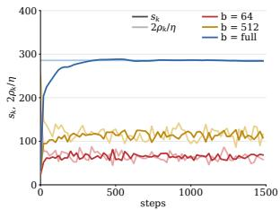  
(a) MLP: loss balance

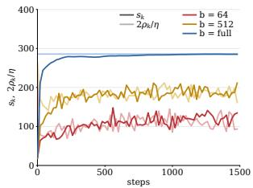  
(b) CNN: loss balance

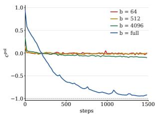  
(c) $\mathrm { M L P } \colon c _ { k , b } ^ { \mathrm { p o l } }$ directions

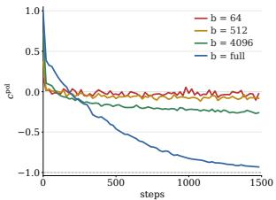  
(d) CNN: $c _ { k , b } ^ { \mathrm { p o l } }$ directions  
Figure 2: Loss balance and update alignment across batch sizes. Results are shown for MLP and CNN experiments with SVD polar updates at $\eta = 0 . 0 0 7 \ :$ . (a) and (b) compare conditional curvature $\hat { s } _ { b } ^ { \mathrm { M } }$ with $2 \hat { \rho } _ { b } / \eta$ on MLP and CNN, respectively; (c) and (d) show global consecutive-update cosines on MLP and CNN, respectively. Dark and light curves in (a) and (b) denote curvature and boundary, respectively. The corresponding results on Transformer appear in Figures 1b and 1c.

It is the expected directional Hessian curvature, normalized by $\left\| G _ { k } \right\| ,$ . The finite-step definition requires only the original $C ^ { 1 }$ assumption and finite expectations. Coherence measures the retained first-order descent. Operator–nuclear duality in $\operatorname { E q . }$ (3) bounds $\rho _ { b }$ by $[ - 1 , 1 ]$ . Together, $\rho _ { b }$ and $s _ { b } ^ { \mathrm { M } }$ give the exact one-step loss change. The proofs are deferred to Appendix A.1.

Theorem 2.1 (Conditional loss identity). Let $L : \mathbb { R } ^ { m \times n } $ R be continuously diferentiable. Consider the update in Eq. (2) with $G _ { k } = \nabla L ( W _ { k } ) \neq \mathbf { 0 }$ and $\eta > 0$ , we have

$$
\operatorname { \mathbb { E } } _ { b } [ L ( W _ { k + 1 } ) - L ( W _ { k } ) \mid W _ { k } ] = { \frac { \eta ^ { 2 } \left\| G _ { k } \right\| _ { * } } { 2 } } \left( s _ { b } ^ { \mathrm { M } } ( W _ { k } ) - { \frac { 2 \rho _ { b } ( W _ { k } ) } { \eta } } \right) .\tag{6}
$$

The conditional expected loss is nonincreasing if and only $i f s _ { b } ^ { \mathrm { M } } \le 2 \rho _ { b } / \eta$ . Its boundary is

$$
s _ { b } ^ { \mathrm { M } } = 2 \rho _ { b } / \eta .\tag{7}
$$

At full batch, $\rho _ { \mathrm { f u l l } } = 1$ , so T1 recovers $2 / \eta$ . The curvature equals the tight operator-norm directional smoothness of Islamov et al. (2026) divided by $\| G _ { k } \| _ { * }$ . Besides, the above loss identity also gives a curvature constraint over time. Following the telescoping argument for GD in Litman (2026), we derive lim $\begin{array} { r } { \operatorname* { s u p } _ { k \to \infty : G _ { k } \neq 0 } s _ { k } ^ { \mathrm { M } } \geq \frac 2 \eta \mathrm { ~ i f ~ } \sum _ { k < K : G _ { k } \neq 0 } \eta ^ { 2 } \| G _ { k } \| _ { * } \to \infty } \end{array}$ . That means, curvature cannot eventually stay a fixed distance below $2 / \eta .$ The proofs are deferred to Appendix A.1.

Controlled-network empirical validation. Our experiments in Figure 1b on Transformer and Figure 2a on MLP and Figure 2b on CNN study how batch size changes both efective curvature and the coherencedependent loss boundary. One can see that, the curvature approaches and oscillates around this boundary, marking near-zero conditional loss increments and changes in their sign. Larger batch size (ranging from 64 to 512 and full batch) encourages larger $\rho _ { b }$ and induces less fluctuation. Full-batch exact-polar updates make $\rho _ { \mathrm { f u l l } } = 1$ , so the boundary reduces to $2 / \eta$ . These experiments use numerical SVD-polar updates; more experimental settings about architectures, probes, and normalization are given in Appendix B.

## 2.2 T2: the temporal-orthogonality boundary

For scalar quadratic GD, directions reverse when $\eta \lambda > 1 ;$ ; equal-amplitude reversal and loss balance coincide at $\eta \lambda = 2$ . Muon loss curvature does not determine the alignment of successive polar directions. We therefore measure their cosine as a separate diagnostic.

Definition 2.2 (Update-direction cosine). For two consecutive nonzero directions, define

$$
c _ { k , b } ^ { \mathrm { p o l } } : = \frac { \langle P _ { k } , P _ { k + 1 } \rangle _ { \mathrm { F } } } { \Vert P _ { k } \Vert _ { \mathrm { F } } \Vert P _ { k + 1 } \Vert _ { \mathrm { F } } } \in [ - 1 , 1 ] .\tag{8}
$$

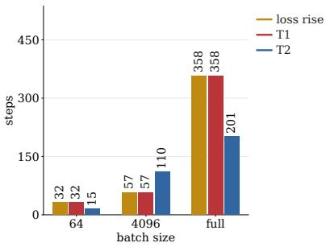  
(a) MLP

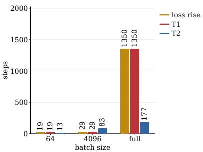  
(b) CNN

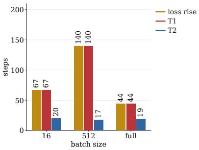  
(c) Transformer  
Figure 3: Diagnostic events in controlled networks. These experiments use the MLP, CNN, and Transformer at $\eta = 0 . 0 0 7$ with the listed batch sizes; they measure the first loss-rise, T1, and T2 events. Each bar reports the first qualifying step under the recorded tolerances.

T2 is the sign boundary $c _ { k , b } ^ { \mathrm { p o l } } = 0$ . It separates acute from obtuse alignment. A discrete trajectory may cross this boundary without attaining zero. Exact reversal $c _ { k , b } ^ { \mathrm { p o l } } = - 1$ is a stronger condition, which implies a two-step return on polar directions and parameters in the sense of classical EoS.

$$
c _ { k , b } ^ { \mathrm { p o l } } = - 1 \iff P _ { k + 1 } = - P _ { k } \iff W _ { k + 2 } = W _ { k } .\tag{9}
$$

A negative cosine does not imply this two-step return or identify a stability edge by itself. Controlled-network empirical validation. As shown in Figure 1c on Transformer, Figure 2c on MLP, and Figure 2d on CNN, larger batches give more negative alignment in the displayed runs, while smaller batches remain closer to orthogonality. Small-batch trajectories can remain weakly negative over long intervals. No displayed global trajectory reaches exact reversal.

Besides, we also study the order in which T1 and T2 occur. Appendix A.3 makes the distinction precise through secant relations between consecutive updates: For GD, T2 boundary occurs at the directional secant response $\overline { { s } } _ { k } ^ { \mathrm { G D } } = 1 / \eta ;$ Full-batch exact-polar Muon instead leads to the T2 condition $\overline { { s } } _ { k } ^ { \mathrm { M } } = \vartheta _ { k } / \eta .$ , with negative alignment when $\overline { { s } } _ { k } ^ { \mathrm { M } } > \vartheta _ { k } / \eta .$ . Here $\vartheta _ { k }$ depends on the singular-value geometry of consecutive gradients and need not equal one. Thus, Muon’s temporal-orthogonality boundary is geometry-dependent rather than a universal $1 / \eta$ threshold. Figures 3a and 3b empirically shows no consistent ordering: at $b = 5 1 2$ , T2 precedes T1 in the MLP and CNN, whereas at $b = 4 0 9 6$ , T1 precedes T2.

Is weak alignment from minibatch sampling or learning dynamics? The small-batch trajectories in Figures 1c, 2c and 2d and the 130M trajectory in Figure 1f have $\displaystyle c _ { k , b } ^ { \mathrm { p o l } }$ close to zero. This observation alone cannot tell us whether the weak alignment comes from Muon’s training dynamics or simply from minibatch randomness, since random high-dimensional vectors are nearly orthogonal.

To distinguish this, we compare frozen-state and consecutive-step directions in a Tiny Transformer with no-momentum NS-5 Muon, batch size eight, and two seeds. Frozen-state mean cosines are small and positive, while stable-stage temporal means are negative. This supports minibatch dispersion as a source of weak alignment and state changes as a source of negative bias. Figure 11 in the appendix reports the results, see Appendix B.7 for details.

## 2.3 Toy example: A quadratic linear model of separation

Here we take a toy model, a quadratic linear model, as an example, to calculate the exact formulation of $s _ { k } ^ { \mathrm { M } }$ and $c _ { k } ^ { \mathrm { p o l } }$ . It aims to quantitatively demonstrate the separation between the loss curvature and alignment signs. We consider a matrix quadratic (Meterez et al., 2026) training loss:

$$
\begin{array} { r } { L _ { \mathbf { X } , \mathit { E } } ( W ) = \frac { 1 } { 2 } \left\| W X - \mathbf { Y } \right\| _ { \mathrm { F } } ^ { 2 } , \quad \mathbf { Y } = W _ { \star } X + \mathit { E } , } \end{array}
$$

where $W _ { \star } \in \mathbb { R } ^ { m \times d }$ is the target parameter matrix that requires to be estimated, $\pmb { X } \in \mathbb { R } ^ { d \times n }$ is the data matrix with its label matrix $\pmb { Y } \in \mathbb { R } ^ { m \times n }$ $\pmb { X } \pmb { X } ^ { \top } \succ 0 , \pmb { W } \in \mathbb { R } ^ { \bar { m } \times d }$ is the parameter matrix, and $\pmb { { \cal E } } \in \mathbb { R } ^ { m \times n }$ is

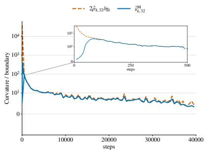  
(a) $\eta _ { \mathrm { p e a k } } = 0 . 0 4$

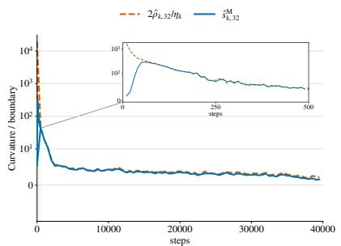  
(b) $\eta _ { \mathrm { p e a k } } = 0 . 0 8$

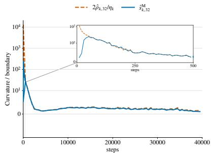  
(c) $\eta _ { \mathrm { p e a k } } = 0 . 1 2$

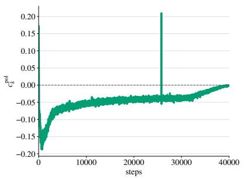  
(d) $\eta _ { \mathrm { p e a k } } = 0 . 0 4$

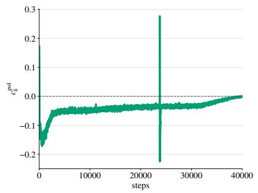  
(e) $\eta _ { \mathrm { p e a k } } = 0 . 0 8$

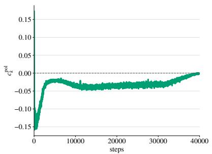  
(f) $\eta _ { \mathrm { p e a k } } = 0 . 1 2$  
Figure 4: Loss balance and update alignment across learning rates on 130M LLM pre-training. The 130M runs use no-momentum NS-5 Muon and batch size 32. Columns show peak learning rates 0.04, 0.08, and 0.12, respectively. The top row compares conditional curvature with $2 \hat { \rho } _ { k , 3 2 } / { \eta } _ { k }$ ; the bottom row shows global direction cosines. Figures 1e and 1f shows the learning rate 0.02 baseline.

the label noise matrix. Clearly, loss curvature and alignment will depend on diferent spectral quantities. Use full-batch Muon with $m \geq d$ and a full-column-rank gradient. Let $\hat { S _ { k } } = ( G _ { k } ^ { \top } G _ { k } ) ^ { 1 / 2 }$ and assume $S _ { k } - \eta X X ^ { \top }$ is nonsingular, these two thresholds can be given by

$$
\begin{array} { l } { \displaystyle \boldsymbol { s } _ { k } ^ { \mathrm { M } } = \frac { \| \boldsymbol { X } \| _ { \mathrm { F } } ^ { 2 } } { \operatorname { t r } ( \boldsymbol { S } _ { k } ) } , \qquad \boldsymbol { c } _ { k } ^ { \mathrm { p o l } } = 1 - \frac { 2 \# n _ { - } ( \boldsymbol { S } _ { k } - \eta \boldsymbol { X } \boldsymbol { X } ^ { \top } ) } { d } , } \end{array}\tag{10}
$$

where $\# _ { n _ { - } } ( A )$ counts negative eigenvalues of a matrix A. One can see that curvature depends on a trace; alignment depends on a sign count. Clearly, the curvature alone cannot determine alignment, even at the same learning rate and full coherence. For instance, set $X X ^ { \top } = I _ { 3 }$ and take $S _ { k }$ to be either η diag(0.8, 0.8, 0.8) or η diag(0.1, 1.1, 1.2). Both give $s _ { k } ^ { \mathrm { M } } = 5 / ( 4 \eta ) < 2 / \eta .$ but their cosines are −1 and $1 / 3 ,$ respectively. More analysis and discussion can be found in Appendix A.2.

## 3 Language model training at the scale

In this section, we study language-model pretraining at the scale of 22M, 130M, and 1B. The used training strategy is with fresh minibatches, a warmup–stable–decay (WSD) schedule (Hu et al., 2024), approximate polar updates, and AdamW on auxiliary parameters. The 22M and 130M experiments change the learning rate at a shared checkpoint within each model. The 22M experiments also change training batch size. Separate 130M runs track loss balance and update alignment throughout training. The 1B run measures loss and direction without loss balance (T1) due to compute limit. We present our main results based on the 130M Llama-like LLM pre-training.

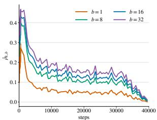  
(a) $\eta _ { \mathrm { p e a k } } = 0 . 0 2$

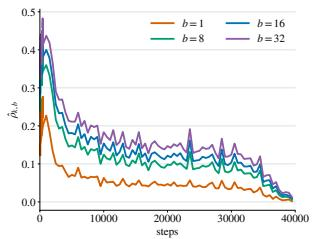  
(b) $\eta _ { \mathrm { p e a k } } = 0 . 0 4$

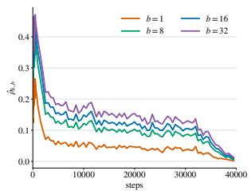  
(c) $\eta _ { \mathrm { p e a k } } = 0 . 0 8$

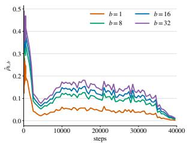  
(d) $\eta _ { \mathrm { p e a k } } = 0 . 1 2$  
Figure 5: Probe-batch efects on T1 quantities. This experiment uses the 130M Llama-like LLM with training batch size 32; it measures reference-gradient coherence for probe batches $b = 1 , 8 , 1 6 , 3 2$ at fixed checkpoints. (a)–(d) Results for peak Muon learning rates 0.02, 0.04, 0.08, and 0.12, respectively.

## 3.1 130M: loss balance and continued learning

We train a 130.7M Llama-like LLM on FineWeb (Penedo et al., 2024) with batch size 32 and sequence length 4,096, processing 5.23B tokens (see Appendix D for details). Four runs all use batch size 32, with Muon peak learning rates 0.02, 0.04, 0.08, and 0.12, respectively. We find that

Loss balance coexists with continued learning. Conditional curvature repeatedly lies near $2 \hat { \rho } _ { k , 3 2 } / \eta _ { k }$ including during the constant-learning-rate stage (Figures 1e and 4a to 4c). By the loss identity, this means that the conditional mean reference-loss increment is near zero. Paired Muon-only probes also have positive mean increments at several checkpoints. Yet validation loss of the complete Muon-plus-AdamW runs improves over longer horizons (Figure 14 in the appendix).

Global directions stay near orthogonality. Across all four runs, sampled consecutive NS-5 directions are predominantly negatively aligned (Figures 1f and 4d to 4f). Full-horizon cosine medians range from −0.048 to −0.032, far from exact reversal at −1. Thus, loss-boundary tracking coexists with weak negative alignment and continued learning.

Negative alignment varies across layers. At peak learning rate 0.02, middle-layer key and value matrices have more negative cosine medians than many query matrices (Figure 6). Weak global alignment therefore hides diferences across layers and matrix types. These temporal-alignment measurements complement the within-layer and cross-layer curvature analysis of Wang et al. (2026), providing a separate view of Muon’s behavior across parameter blocks. Figure 19a in the appendix shows the block trajectories.

Probe batch size changes stochastic coherence. Figure 5 shows that larger probe batches generally strengthen reference-gradient coherence and shift $2 \hat { \rho } _ { k , b } / \eta _ { k }$ trajectories.

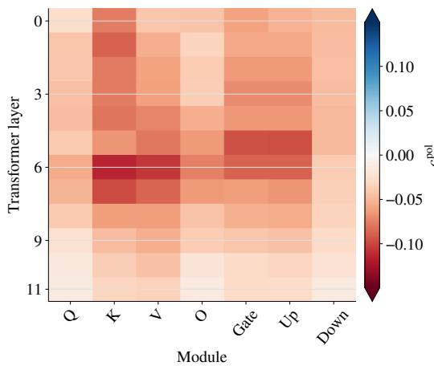  
Figure 6: Modulewise alignment. Median $c ^ { \mathrm { p o l } }$ during the constant-learning-rate stage of the 130M run with peak rate 0.02.

## 3.2 Learning-rate and batch-size perturbations

Here we conduct a perturbation experiment by setting diferent peak learning rates in WSD to monitor how the validation loss and $c _ { k , b } ^ { \mathrm { p o l } }$ will change and build their connections.

In our experiments, we change the Muon learning rate at step 4,000 for the 22M model and step 7,000 for the 130M model. Each experiment branches from rate 0.04 to 0.02, 0.04, or 0.08. Training batch size stays at 16 for 22M and 32 for 130M. The auxiliary AdamW schedule is unchanged across branches. Figure 7 shows validation loss and consecutive-direction cosines. Appendix C gives the protocols. We have the following findings:

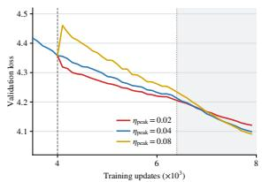  
(a) 22M: loss

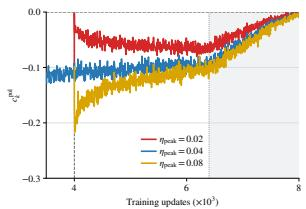  
(b) 22M: $c _ { k , b } ^ { \mathrm { p o l } }$ directions

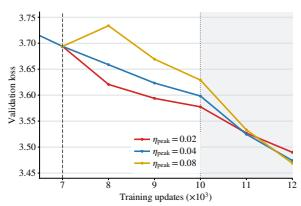  
(c) 130M: loss

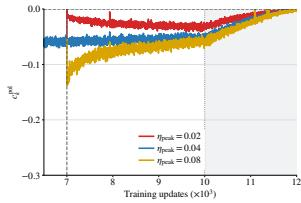  
(d) 130M: $c _ { k , b } ^ { \mathrm { p o l } }$ directions  
Figure 7: Loss and update directions after learning-rate changes. Panels (a,b) show validation loss and global Muon-direction cosines $c _ { k , b } ^ { \mathrm { p o l } }$ for the 22M model; panels (c,d) show the corresponding results for the 130M Llama-like model. Shaded grey regions mark learning-rate decay.

Alignment tends to return toward its pre-perturbation value. Increasing the learning rate initially makes $c ^ { \mathrm { p o l } }$ more negative; decreasing it makes $c ^ { \mathrm { p o l } }$ less negative. After either change, the cosine tends to return toward its pre-perturbation value in both models (Figures 7b and 7d).

Loss balance and alignment respond diferently. At the shared 22M state, halving the learning rate puts the conditional step on the loss-decrease side of T1; doubling it puts the step on the loss-increase side. Yet sampled temporal cosines remain negative in all three branches before decay (Figure 7b). Negative alignment therefore does not determine the sign of the conditional loss change. At later checkpoints, conditional loss increments return toward zero (Figure 13 in the appendix).

Interestingly, as shown in Figures 7a and $^ { 7 \mathrm { c } , }$ validation loss improves under a larger peak learning rate in both models under while $c _ { k , b } ^ { \mathrm { p o l } }$ is still well controlled. This result demonstrates the possibility of increasing the peak learning rate in WSD guided by $c _ { k , b } ^ { \mathrm { p o l } } .$ Wu et al. (2024) demonstrate the generalization benefits of large-step GD with the non-monotone loss in separable logistic regression. We leave how $c _ { k , b } ^ { \mathrm { p o l } }$ guides the learning rate schedules for future work.

## 3.3 1B: large-scale pre-training

We train a 1B Llama-like model with batch size 512 and sequence length 4,096, using 20B tokens in total, see more settings in Appendix D.5.

A larger-batch configuration shows stronger cancellation. The 1B run in Figure 8 shows that, when compared to the smooth loss curve in Figure 8a, the global $c ^ { \mathrm { p o l } }$ in Figure 8b has more fluctuations. The 1B run also has more negative global alignment $c ^ { \mathrm { p o l } }$ than that of 130M as a larger batch size 512 is used. But $c ^ { \mathrm { p o l } }$ is still far from coherent reversal at −1. This is consistent with the batch-size trend in the controlled and 22M experiments. The cross-scale comparison alone does not isolate batch size, since the model and training configuration also change. Loss continues to improve despite partial cancellation between successive directions.

Alignment difers across layers. Figure 8c shows that layer-level cosines vary along the trajectory. The 1B experiment coincides with that of 130M: the global cosine summarizes heterogeneous directions. A single global value does not describe every layer.

## 4 Conclusion and discussion

This paper theoretically demonstrates that Muon does not inherit GD’s EoS as a single edge: conditional loss balance and temporal direction become separate signals. Across controlled MLP, CNN, and Transformer experiments, increasing the batch size drives $c _ { k } ^ { \mathrm { p o l } }$ toward coherent reversal, whereas small batches remain closer to orthogonality. Scaling to language models, the 22M and 130M interventions show that loss balance and alignment respond diferently to the learning rate; the 130M runs track the loss-neutral boundary with weak negative alignment, while the 1B run exhibits stronger partial cancellation but remains far from reversal. Thus, stochastic LLM pretraining can reach the loss edge without reproducing the full-batch directional regime.

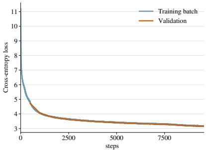  
(a) Loss

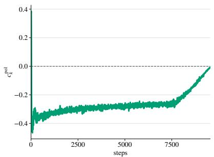  
(b) Global $c ^ { \mathrm { p o l } }$

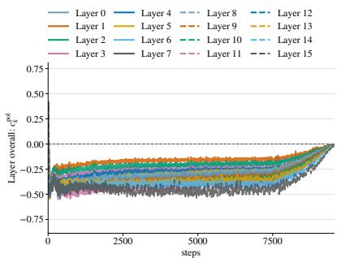  
(c) Layer overall  
Figure 8: Loss and update alignment in 1B pretraining. (a) shows training and validation loss; (b) shows the global Muon direction cosine $c _ { k } ^ { \mathrm { p o l } }$ ; (c) shows layer-level direction cosines. Each curve in (c) represents one layer.

Our WSD perturbations show that a larger peak learning rate can improve validation loss while $c _ { k } ^ { \mathrm { p o l } }$ remains controlled, motivating schedules that monitor both quantities rather than treating negative alignment alone as instability.

Our results characterize the base dynamics induced by Muon’s polar normalization rather than every practical Muon variant. Momentum introduces temporal filtering and an additional optimizer state, so the appropriate loss and alignment diagnostics must be reconsidered for the coupled parameter–momentum dynamics. Extending the split-edge picture to momentum Muon is an important direction for future work.

## AI use statement

Generative AI tools assisted language editing, LaTeX organization, algebraic consistency checks, and plotting code in this draft. Experimental measurements were supplied separately and were not generated by AI. AI assistance also supported the diagnostic summaries. The latter measurements were produced by running the code on the authors’ hardware. The authors are responsible for the manuscript, experimental results, and all AI-assisted material.

## Acknowledgment

We thank for Yikuan Li for experiment suggestions.

## References

Kwangjun Ahn, Jingzhao Zhang, and Suvrit Sra. Understanding the unstable convergence of gradient descent. In Kamalika Chaudhuri, Stefanie Jegelka, Le Song, Csaba Szepesvari, Gang Niu, and Sivan Sabato (eds.), Proceedings of the 39th International Conference on Machine Learning, volume 162 of Proceedings of Machine Learning Research, pp. 247–257. PMLR, 17–23 Jul 2022. URL https://proceedings.mlr.pres s/v162/ahn22a.html.

Arseniy Andreyev and Pierfrancesco Beneventano. Edge of stochastic stability: Revisiting the edge of stability for SGD. arXiv preprint arXiv:2412.20553, 2024. URL https://arxiv.org/abs/2412.20553.

Jeremy Bernstein and Laker Newhouse. Old optimizer, new norm: An anthology. In NeurIPS 2024 Workshops: OPT, 2024. URL https://openreview.net/forum?id=ux18f5nOpD.

Yuhang Cai, Haofeng Huang, Haodong Wen, Deyi Liu, Yiyuan Ma, and Kaifeng Lyu. Does LLM pre-training typically occur at the edge of stability? In Workshop on Scientific Methods for Understanding Deep Learning, 2026. URL https://openreview.net/forum?id=QSb05IuPsy.

Lei Chen and Joan Bruna. Beyond the edge of stability via two-step gradient updates. In Andreas Krause, Emma Brunskill, Kyunghyun Cho, Barbara Engelhardt, Sivan Sabato, and Jonathan Scarlett (eds.), Proceedings of the 40th International Conference on Machine Learning, volume 202 of Proceedings of Machine Learning Research, pp. 4330–4391. PMLR, 23–29 Jul 2023. URL https://proceedings.mlr.pr ess/v202/chen23b.html.

Lizhang Chen, Jonathan Li, and Qiang Liu. Muon optimizes under spectral norm constraints. Transactions on Machine Learning Research, 2026. URL https://openreview.net/forum?id=Blz4hjxLwU.

Jeremy M. Cohen, Simran Kaur, Yuanzhi Li, J. Zico Kolter, and Ameet Talwalkar. Gradient descent on neura networks typically occurs at the edge of stability. In International Conference on Learning Representations, 2021. URL https://openreview.net/forum?id=jh-rTtvkGeM.

Jeremy M Cohen, Behrooz Ghorbani, Shankar Krishnan, Naman Agarwal, Sourabh Medapati, Michal Badura, Daniel Suo, David Cardoze, Zachary Nado, George E Dahl, et al. Adaptive gradient methods at the edge of stability. arXiv preprint arXiv:2207.14484, 2022.

Alex Damian, Eshaan Nichani, and Jason D. Lee. Self-stabilization: The implicit bias of gradient descent at the edge of stability. In International Conference on Learning Representations, 2023. URL https: //openreview.net/forum?id=nhKHA59gXz.

Shengding Hu, Yuge Tu, Xu Han, Chaoqun He, Ganqu Cui, Xiang Long, Zhi Zheng, Yewei Fang, Yuxiang Huang, Weilin Zhao, et al. Minicpm: Unveiling the potential of small language models with scalable training strategies. arXiv preprint arXiv:2404.06395, 2024.

Rustem Islamov, Michael Crawshaw, Jeremy Cohen, and Robert M. Gower. Non-Euclidean gradient descent operates at the edge of stability. In Forty-third International Conference on Machine Learning, 2026. URL https://openreview.net/forum?id=piWlEHb4Db.

Stanislaw Jastrzebski, Zachary Kenton, Nicolas Ballas, Asja Fischer, Yoshua Bengio, and Amos Storkey. On the relation between the sharpest directions of DNN loss and the SGD step length. In International Conference on Learning Representations, 2019. URL https://openreview.net/forum?id=SkgEaj05t7.

Stanislaw Jastrzebski, Maciej Szymczak, Stanislav Fort, Devansh Arpit, Jacek Tabor, Kyunghyun Cho, and Krzysztof Geras. The break-even point on optimization trajectories of deep neural networks. In International Conference on Learning Representations, 2020. URL https://openreview.net/forum?id=r1g87C4KwB.

Keller Jordan, Yuchen Jin, Vlado Boza, Jiacheng You, Franz Cesista, Laker Newhouse, and Jeremy Bernstein. Muon: An optimizer for hidden layers in neural networks. Online article, 2024. URL https://kellerjo rdan.github.io/posts/muon/.

Dayal Singh Kalra, Jean-Christophe Gagnon-Audet, Andrey Gromov, Ishita Mediratta, Kelvin Niu, Alexander H. Miller, and Michael Shvartsman. A scalable measure of loss landscape curvature for analyzing the training dynamics of LLMs. arXiv preprint arXiv:2601.16979, 2026. URL https: //arxiv.org/abs/2601.16979.

Sungyoon Lee and Cheongjae Jang. A new characterization of the edge of stability based on a sharpness measure aware of batch gradient distribution. In The Eleventh International Conference on Learning Representations, 2023. URL https://openreview.net/forum?id=bH-kCY6LdKg.

Aitor Lewkowycz, Yasaman Bahri, Ethan Dyer, Jascha Sohl-Dickstein, and Guy Gur-Ari. The large learning rate phase of deep learning: the catapult mechanism. arXiv preprint arXiv:2003.02218, 2020.

Elon Litman. The origin of edge of stability. arXiv preprint arXiv:2604.20446, 2026. URL https: //arxiv.org/abs/2604.20446.

Jingyuan Liu, Jianlin Su, Xingcheng Yao, Zhejun Jiang, Guokun Lai, Yulun Du, Yidao Qin, Weixin Xu, Enzhe Lu, Junjie Yan, Yanru Chen, Huabin Zheng, Yibo Liu, Shaowei Liu, Bohong Yin, Weiran He, Han Zhu, Yuzhi Wang, Jianzhou Wang, Mengnan Dong, Zheng Zhang, Yongsheng Kang, Hao Zhang, Xinran

Xu, Yutao Zhang, Yuxin Wu, Xinyu Zhou, and Zhilin Yang. Muon is scalable for LLM training. arXiv preprint arXiv:2502.16982, 2025. URL https://arxiv.org/abs/2502.16982.

Alexandru Meterez, Pranav Ajit Nair, Depen Morwani, Cengiz Pehlevan, Sham Kakade, and Alex Damian. A defense of the quadratic model. arXiv preprint arXiv:2607.21716, 2026. URL https://arxiv.org/abs/ 2607.21716.

Aaron Mishkin, Ahmed Khaled, Yuanhao Wang, Aaron Defazio, and Robert M. Gower. Directional smoothness and gradient methods: Convergence and adaptivity. In A. Globerson, L. Mackey, D. Belgrave, A. Fan, U. Paquet, J. Tomczak, and C. Zhang (eds.), Advances in Neural Information Processing Systems, volume 37, pp. 14810–14848. Curran Associates, Inc., 2024. doi: 10.52202/079017-0473. URL https: //proceedings.neurips.cc/paper\_files/paper/2024/file/1ac83203e88eb6cf6b30642f0239b932-P aper-Conference.pdf.

Guilherme Penedo, Hynek Kydlíček, Anton Lozhkov, Margaret Mitchell, Colin Rafel, Leandro Von Werra, Thomas Wolf, et al. The fineweb datasets: Decanting the web for the finest text data at scale. Advances in Neural Information Processing Systems, 37:30811–30849, 2024.

Minhak Song and Chulhee Yun. Trajectory alignment: Understanding the edge of stability phenomenon via bifurcation theory. In A. Oh, T. Naumann, A. Globerson, K. Saenko, M. Hardt, and S. Levine (eds.), Advances in Neural Information Processing Systems, volume 36, pp. 71632–71682. Curran Associates, Inc., 2023. doi: 10.52202/075280-3137. URL https://proceedings.neurips.cc/paper\_files/paper/2023/ file/e2a9256bd816ab9e082dfaa22f1f62a2-Paper-Conference.pdf.

Shuche Wang, Fengzhuo Zhang, Jiaxiang Li, Cunxiao Du, Chao Du, Tianyu Pang, Zhuoran Yang, Mingyi Hong, and Vincent Tan. Muon outperforms adam in tail-end associative memory learning. In International Conference on Learning Representations, volume 2026, pp. 37382–37419, 2026.

Zixuan Wang, Zhouzi Li, and Jian Li. Analyzing sharpness along GD trajectory: Progressive sharpening and edge of stability. In S. Koyejo, S. Mohamed, A. Agarwal, D. Belgrave, K. Cho, and A. Oh (eds.), Advances in Neural Information Processing Systems, volume 35, pp. 9983–9994. Curran Associates, Inc., 2022. doi: 10.52202/068431-0725. URL https://proceedings.neurips.cc/paper\_files/paper/2022/file/40b b79c081828bebdc39d65a82367246-Paper-Conference.pdf.

Jingfeng Wu, Peter L. Bartlett, Matus Telgarsky, and Bin Yu. Large stepsize gradient descent for logistic loss: Non-monotonicity of the loss improves optimization eficiency. In Shipra Agrawal and Aaron Roth (eds.), Proceedings of Thirty Seventh Conference on Learning Theory, volume 247 of Proceedings of Machine Learning Research, pp. 5019–5073. PMLR, 2024. URL https://proceedings.mlr.press/v247/wu24b.h tml.

Lei Wu, Chao Ma, and Weinan E. How SGD selects the global minima in over-parameterized learning: A dynamical stability perspective. In S. Bengio, H. Wallach, H. Larochelle, K. Grauman, N. Cesa-Bianchi, and R. Garnett (eds.), Advances in Neural Information Processing Systems, volume 31. Curran Associates, Inc., 2018. URL https://proceedings.neurips.cc/paper\_files/paper/2018/file/6651526b6fb8f 29a00507de6a49ce30f-Paper.pdf.

## Appendix

## Contents

Theory in Section 2 13   
A.1 Full-batch loss balance and curvature visits 13   
A.2 Matrix recursion and separation of T1 and T2 14   
A.3 Secant response and the direction-sign boundary 15   
B Experiments on small models 17   
B.1 Data and objectives . 17   
B.2 Architectures and initialization 17   
B.3 Optimizer and sampling . 17   
B.4 Conditional probes and numerical normalization 18   
B.5 Event rules and uncertainty 18   
B.6 Additional trajectory results 19   
B.7 Frozen-state and temporal alignment 22   
C Perturbation experiments 23   
C.1 22M setup and probes 23   
C.2 130M learning-rate perturbation setup 24   
C.3 Loss and direction responses 24   
D Results on 130M and 1B pretraining 25   
D.1 130M pre-training protocol . 25   
D.2 Conditional probes and update scope . 26   
D.3 130M loss increments and complete-update balance 27   
D.4 130M layer structure and batch-dependent coherence 27   
D.5 1B LLM pretraining 27

## A Theory in Section 2

## A.1 Full-batch loss balance and curvature visits

Proof of Theorem 2.1. Rearranging Eq. (5) and substituting Eq. (4) gives Eq. (6). Since $\eta ^ { 2 } \lVert G _ { k } \rVert _ { * } / 2 > 0$ the expected loss change has the sign of $s _ { b } ^ { \mathrm { M } } - 2 \rho _ { b } / \eta$ . This proves the loss-neutral boundary. For full-batch updates, it reduces as follows.

For full-batch exact-polar Muon, Eq. (3) gives $\langle G _ { k } , P _ { k } \rangle _ { \mathrm { F } } = \left\| \boldsymbol { G } _ { k } \right\| ,$ , so $\rho _ { n } = 1$ . Write $s _ { k } ^ { \mathrm { M } }$ for the full-batch specialization of Eq. (5). On an active step, Eq. (6) becomes

$$
L ( W _ { k + 1 } ) - L ( W _ { k } ) = \frac { \eta ^ { 2 } \left. G _ { k } \right. _ { * } } { 2 } \left( s _ { k } ^ { \mathrm { M } } - \frac { 2 } { \eta } \right) .\tag{11}
$$

Thus the loss-neutral boundary is $2 / \eta$

If L is $C ^ { 2 }$ near the update segment, Taylor’s integral remainder $\mathrm { g i }$ ves

$$
\boldsymbol { s } _ { k } ^ { \mathrm { M } } = \frac { 2 } { \| \boldsymbol { G } _ { k } \| _ { * } } \int _ { 0 } ^ { 1 } ( 1 - t ) \left. \boldsymbol { P } _ { k } , \boldsymbol { \nabla } ^ { 2 } L ( \boldsymbol { W } _ { k } - t \eta \boldsymbol { P } _ { k } ) [ \boldsymbol { P } _ { k } ] \right. _ { \mathrm { F } } \mathrm { d } t .
$$

Here the Hessian acts on a matrix direction by

$$
\nabla ^ { 2 } L ( W ) [ P ] = \left. \frac { \mathrm { d } } { \mathrm { d } u } \nabla L ( W + u P ) \right| _ { u = 0 } .
$$

$$
\eta  0
$$

$$
W _ { k }
$$

$$
P _ { k } ;
$$

The tight operator-norm directional smoothness of Islamov et al. (2026), specialized to this update, is

$$
\begin{array} { r l } & { D _ { \mathrm { o p } } ( W _ { k } , W _ { k + 1 } ) = \frac { 2 \left[ L ( W _ { k + 1 } ) - L ( W _ { k } ) - \left. \boldsymbol { G } _ { k } , \boldsymbol { W } _ { k + 1 } - \boldsymbol { W } _ { k } \right. _ { \mathrm { F } } \right] } { \left\| \boldsymbol { W } _ { k + 1 } - \boldsymbol { W } _ { k } \right\| _ { \mathrm { o p } } ^ { 2 } } , } \\ & { \quad \quad \quad \quad s _ { k } ^ { \mathrm { M } } = \frac { D _ { \mathrm { o p } } ( W _ { k } , W _ { k + 1 } ) } { \left\| \boldsymbol { G } _ { k } \right\| _ { \ast } } . } \end{array}
$$

This follows from $\| P _ { k } \| _ { \mathrm { o p } } = 1$ and operator–nuclear duality. It concerns the realized update segment, rather than a maximum over directions. Positive rescaling of L leaves $s _ { k } ^ { \mathrm { M } }$ unchanged. □

A deterministic curvature-visit result. The loss identity also constrains curvature over time. Under the assumptions below, curvature cannot eventually stay a fixed distance below $2 / \eta$

Proposition A.1 (Deterministic curvature visits). Run full-batch exact-polar Muon with fixed $\eta > 0$ on an objective bounded below. Let $\begin{array} { r } { E _ { K } = \sum _ { k < K : G _ { k } \neq \mathbf { 0 } } \eta ^ { 2 } \left. G _ { k } \right. _ { * } . \ I f E _ { K } \to \infty } \end{array}$ , then

$$
\operatorname* { l i m } _ { k \to \infty : G _ { k } \neq { \bf 0 } } s _ { k } ^ { \mathrm { M } } \geq \frac { 2 } { \eta } .
$$

The result concerns full-batch curvature visits. It does not establish persistent boundary tracking or a condition on temporal alignment. The stochastic boundary is studied empirically in the main text.

Proof. Let $\mathcal { A } _ { K } = \{ k < K : G _ { k } \neq \mathbf { 0 } \}$ . Inactive steps leave the parameters unchanged. Summing Eq. (11) therefore gives, for $E _ { K } > 0$

$$
\frac { \sum _ { k \in \mathcal { A } _ { K } } \eta ^ { 2 } \left\| \pmb { G } _ { k } \right\| _ { * } s _ { k } ^ { \mathrm { M } } } { E _ { K } } = \frac { 2 } { \eta } - \frac { 2 [ L ( \pmb { W } _ { 0 } ) - L ( \pmb { W } _ { K } ) ] } { E _ { K } } .
$$

Suppose the stated limsup were less than $2 / \eta$ . For some $\delta > 0 .$ , all suficiently late active steps would satisfy

$$
L ( W _ { k + 1 } ) - L ( W _ { k } ) \leq - \frac { \delta } { 2 } \eta ^ { 2 } \left\| { G } _ { k } \right\| _ { * } .
$$

Since $E _ { K } \to \infty ,$ summing this inequality would force $L ( \mathbf { W } _ { K } ) \to - \infty$ , contrary to the lower bound. □

## A.2 Matrix recursion and separation of T1 and T2

We analyze the matrix quadratic from Section 2.3. Its Hessian is the right-multiplication map $\Delta \mapsto \Delta X X ^ { \intercal }$ The formulas below use this structure; they need not hold for an arbitrary quadratic on matrix space.

Assume, as in the main text, that $m \geq d , G _ { k }$ has full column rank, and $S _ { k } - \eta X X ^ { \top }$ is nonsingular. Then

$$
\begin{array} { r l } & { G _ { k + 1 } = P _ { k } ( S _ { k } - \eta X X ^ { \top } ) , } \\ & { S _ { k + 1 } = | S _ { k } - \eta X X ^ { \top } | , } \\ & { P _ { k + 1 } = P _ { k } \mathrm { s i g n } ( S _ { k } - \eta X X ^ { \top } ) . } \end{array}\tag{12}
$$

Absolute value and sign act eigenvaluewise on the symmetric matrix. No commutativity assumption is needed. The afine gradient gives $\boldsymbol { G } _ { k + 1 } = \boldsymbol { G } _ { k } - \eta P _ { k } \boldsymbol { X } \boldsymbol { X } ^ { \top }$ . Substitute $G _ { k } = P _ { k } S _ { k }$ and use $P _ { k } ^ { \top } P _ { k } = I _ { d }$ to obtain

$$
\begin{array} { r } { \pmb { G } _ { k + 1 } ^ { \top } \pmb { G } _ { k + 1 } = ( \pmb { S } _ { k } - \eta \pmb { X } \pmb { X } ^ { \top } ) ^ { 2 } . } \end{array}
$$

Taking its positive square root proves the second formula. The identit $P _ { k + 1 } = G _ { k + 1 } S _ { k + 1 } ^ { - 1 }$ proves the third.

Corollary A.2 (T1 and T2 for the matrix quadratic). Under the assumptions above,

$$
L _ { \mathbf { \boldsymbol { X } } , E } ( W _ { k + 1 } ) - L _ { \mathbf { \boldsymbol { X } } , E } ( W _ { k } ) = - \eta \operatorname { t r } ( S _ { k } ) + \frac { \eta ^ { 2 } } { 2 } \left. \mathbf { \boldsymbol { X } } \right. _ { \mathrm { F } } ^ { 2 } ,
$$

$$
s _ { k } ^ { \mathrm { M } } = \frac { \| \boldsymbol { X } \| _ { \mathrm { F } } ^ { 2 } } { \operatorname { t r } ( \boldsymbol { S } _ { k } ) } ,
$$

$$
c _ { k } ^ { \mathrm { p o l } } = 1 - { \frac { 2 n _ { - } ( S _ { k } - \eta X X ^ { \top } ) } { d } } .
$$

Here $n _ { - }$ counts negative eigenvalues.

Proof. The exact quadratic expansion gives

$$
L _ { X , E } ( W _ { k } - \eta P _ { k } ) - L _ { X , E } ( W _ { k } ) = - \eta \langle G _ { k } , P _ { k } \rangle _ { \mathrm { F } } + \frac { \eta ^ { 2 } } { 2 } \left. P _ { k } X \right. _ { \mathrm { F } } ^ { 2 } .
$$

Full column rank implies $\langle G _ { k } , P _ { k } \rangle _ { \mathrm { F } } = \operatorname { t r } ( S _ { k } )$ and $\left\| P _ { k } X \right\| _ { \mathrm { F } } ^ { 2 } = \left\| X \right\| _ { \mathrm { F } } ^ { 2 }$ . These identities prove the loss and curvature formulas. By Eq. (12),

$$
\langle P _ { k } , P _ { k + 1 } \rangle _ { \mathrm { F } } = \mathrm { t r } \mathrm { s i g n } ( S _ { k } - \eta X X ^ { \top } ) = d - 2 n _ { - } ( S _ { k } - \eta X X ^ { \top } ) .
$$

Both polar factors have squared Frobenius norm $d ,$ giving the cosine.

T1 is the trace condition $\operatorname { t r } ( S _ { k } ) = \eta \left\| \mathbf { X } \right\| _ { \mathrm { F } } ^ { 2 } / 2$ . T2 is the sign-count condition $n _ { - } = d / 2$ . For odd $d ,$ the cosine can change sign without attaining zero.

Exact reversal and two-step displacement. Let $\Delta _ { k } = - \eta _ { k } P _ { k }$ , with $\eta _ { k } > 0$ . For consecutive nonzero directions,

$$
\left\| \boldsymbol { W } _ { k + 2 } - \boldsymbol { W } _ { k } \right\| _ { \mathrm { F } } ^ { 2 } = \left\| \boldsymbol { \Delta } _ { k } \right\| _ { \mathrm { F } } ^ { 2 } + \left\| \boldsymbol { \Delta } _ { k + 1 } \right\| _ { \mathrm { F } } ^ { 2 } + 2 \left\| \boldsymbol { \Delta } _ { k } \right\| _ { \mathrm { F } } \left\| \boldsymbol { \Delta } _ { k + 1 } \right\| _ { \mathrm { F } } c _ { k , b } ^ { \mathrm { p o l } } .\tag{13}
$$

At cosine −1, Cauchy–Schwarz gives $P _ { k + 1 } = - a P _ { k }$ for $a > 0$ . Nonzero canonical polar factors have operator norm one, so $a = 1$ . At fixed learning rate this proves Eq. (9). For unequal learning rates or general implemented directions, cosine −1 alone does not imply equal displacement magnitudes.

Take the two stretch matrices in Section 2.3. They are realized by $m = d = n = 3 , X = I _ { 3 } .$ and $W _ { k } = W _ { \star } + E + S _ { k }$ , giving $G _ { k } = S _ { k }$ and $P _ { k } = I _ { 3 }$ . Both stretches have trace 2.4η, hence curvature $5 / ( 4 \eta )$ Their shifted matrices have three and one negative eigenvalues, respectively, so their cosines are −1 and $1 / 3$ Thus equal loss curvature can accompany opposite alignment signs. This is a one-step separation result, not a claim of long-time attraction.

## A.3 Secant response and the direction-sign boundary

Scalar quadratic GD reverses direction above $1 / \eta$ , before loss balance at $2 / \eta$ . For Muon, the direction-sign boundary also depends on gradient geometry.

## A.3.1 The GD reference value

For GD, define the directional secant response on a nonzero gradient by

$$
\overline { { s } } _ { k } ^ { \mathrm { G D } } : = - \frac { \langle G _ { k } , G _ { k + 1 } - G _ { k } \rangle _ { \mathrm { F } } } { \eta \left. G _ { k } \right. _ { \mathrm { F } } ^ { 2 } } .
$$

Then $\langle \boldsymbol { G } _ { k } , \boldsymbol { G } _ { k + 1 } \rangle _ { \mathrm { F } } = \left\| \boldsymbol { G } _ { k } \right\| _ { \mathrm { F } } ^ { 2 } ( 1 - \eta \overline { { s } } _ { k } ^ { \mathrm { G D } } )$ . For nonzero consecutive gradients, their cosine changes sign across $\overline { { s } } _ { k } ^ { \mathrm { G D } } = \mathrm { 1 } / \eta$ . For a scalar quadratic, $\overline { { s } } _ { k } ^ { \mathrm { G D } } = \lambda \colon$ the next gradient vanishes at $\eta \lambda = 1$ and reverses sign above it. The cosine at that zero-gradient point is undefined.

## A.3.2 The full-batch Muon condition

Assume consecutive full gradients are nonzero and use exact polar factors. Define

$$
\begin{array} { r l } & { \overline { { s } } _ { k } ^ { \mathrm { M } } : = - \frac { \left. P _ { k } , G _ { k + 1 } - G _ { k } \right. _ { \mathrm { F } } } { \eta \left\| G _ { k } \right\| _ { * } } , } \\ & { { a } _ { k } : = \frac { \left\| G _ { k + 1 } \right\| _ { * } } { \left\| G _ { k } \right\| _ { * } } , \qquad \chi _ { k } : = - \frac { \left. P _ { k } , G _ { k + 1 } \right. _ { \mathrm { F } } } { \left\| G _ { k + 1 } \right\| _ { * } } . } \end{array}
$$

Operator–nuclear duality gives

$$
\overline { { s } } _ { k } ^ { \mathrm { M } } = \frac { 1 + a _ { k } \chi _ { k } } { \eta } .\tag{14}
$$

Thus $\overline { { s } } _ { k } ^ { \mathrm { M } } = 1 / \eta$ means $\langle P _ { k } , G _ { k + 1 } \rangle _ { \mathrm { F } } = 0$ . T2 instead requires $\langle P _ { k } , P _ { k + 1 } \rangle _ { \mathrm { F } } = 0$ . The first pairing weights the next singular directions by their singular values; the second does not.

To express T2 in secant form, let $r _ { k } = { \mathrm { r a n k } } ( G _ { k } )$ and write

$$
R _ { k + 1 } : = G _ { k + 1 } - { \frac { \| G _ { k + 1 } \| _ { * } } { r _ { k + 1 } } } P _ { k + 1 } , \qquad \vartheta _ { k } : = 1 - { \frac { \langle P _ { k } , { \pmb R } _ { k + 1 } \rangle _ { \mathrm { F } } } { \| G _ { k } \| _ { * } } } .
$$

Since $\| \boldsymbol { P } _ { k } \| _ { \mathrm { F } } ^ { 2 } = r _ { k }$ , substitution gives the exact relation

$$
\overline { { s } } _ { k } ^ { \mathrm { M } } = \frac { \vartheta _ { k } - a _ { k } \sqrt { r _ { k } / r _ { k + 1 } } c _ { k } ^ { \mathrm { p o l } } } { \eta } .
$$

Its positive cosine coeficient implies

$$
\begin{array} { r } { c _ { k } ^ { \mathrm { p o l } } = 0 \iff \overline { { s } } _ { k } ^ { \mathrm { M } } = \frac { \vartheta _ { k } } { \eta } , } \\ { c _ { k } ^ { \mathrm { p o l } } < 0 \iff \overline { { s } } _ { k } ^ { \mathrm { M } } > \frac { \vartheta _ { k } } { \eta } . } \end{array}\tag{15}
$$

Unlike GD, Muon has a geometry-dependent coeficient $\vartheta _ { k } .$ , which need not equal one. This is an exact relation for a given step, not a universal threshold or a prediction from secant curvature alone. If the next nonzero singular values are equal, $\pmb { R } _ { k + 1 } = \mathbf { 0 }$ and the value reduces to $1 / \eta$

For example, take the quadratic model with $X = I _ { 2 }$ and $G _ { k } = S _ { k } = \eta \mathrm { d i a g } ( 1 / 2 , 5 / 2 )$ . Then $P _ { k } = I _ { 2 }$ and $P _ { k + 1 } = \mathrm { d i a g } ( - 1 , 1 )$ , so $c _ { k } ^ { \mathrm { p o l } } = 0$ . Yet $\overline { { s } } _ { k } ^ { \mathrm { M } } = 2 / ( 3 \eta )$ and $\vartheta _ { k } = 2 / 3$

## A.3.3 Relation to loss curvature

For $L \in C ^ { 2 }$ near the update segment, let $q _ { k } ( t ) = \big \langle P _ { k } , \nabla ^ { 2 } L ( W _ { k } - t \eta P _ { k } ) [ P _ { k } ] \big \rangle _ { \mathrm { F } }$ . The gradient diference and Taylor remainder give

$$
\overline { { s } } _ { k } ^ { \mathrm { M } } = \frac { \int _ { 0 } ^ { 1 } q _ { k } ( t ) \mathrm { d } t } { \left\| G _ { k } \right\| _ { * } } , \qquad s _ { k } ^ { \mathrm { M } } = \frac { 2 \int _ { 0 } ^ { 1 } ( 1 - t ) q _ { k } ( t ) \mathrm { d } t } { \left\| G _ { k } \right\| _ { * } } .
$$

These quantities agree for a constant Hessian, including the quadratic model in Appendix A.2. More generally, for $\begin{array} { r } { \omega _ { k } = \operatorname* { s u p } _ { t , t ^ { \prime } \in [ 0 , 1 ] } | q _ { k } ( t ) - q _ { k } ( t ^ { \prime } ) | } \end{array}$ ,

$$
\bigl | s _ { k } ^ { \mathrm { M } } - \overline { s } _ { k } ^ { \mathrm { M } } \bigr | \leq \frac { \omega _ { k } } { \mathopen { } \mathclose \bgroup \left\| G _ { k } \aftergroup \egroup \right\| _ { * } } .
$$

At exact polar reversal, $\chi _ { k } = 1$ , hence $\overline { { s } } _ { k } ^ { \mathrm { M } } = ( 1 + a _ { k } ) / \eta$ . This reaches $2 / \eta$ when $a _ { k } = 1 ;$ it difers from the T2 sign boundary. For an exact two-step return, summing Eq. (11) instead gives

$$
\left. G _ { k } \right. _ { * } \left( s _ { k } ^ { \mathrm { M } } - \frac { 2 } { \eta } \right) + \left. G _ { k + 1 } \right. _ { * } \left( s _ { k + 1 } ^ { \mathrm { M } } - \frac { 2 } { \eta } \right) = 0 .
$$

The two deviations cancel after weighting. Neither step must be individually loss-neutral.

## A.3.4 Stochastic secants

Replacing full gradients in Eq. (14) by consecutive nonzero batch gradients gives

$$
\overline { { s } } _ { k , b } ^ { \mathrm { M } } : = - \frac { \Bigl \langle P _ { k } , \widehat { G } _ { k + 1 } - \widehat { G } _ { k } \Bigr \rangle _ { \mathrm { F } } } { \eta \left\| \widehat { G } _ { k } \right\| _ { * } } = \frac { 1 + a _ { k , b } \chi _ { k , b } } { \eta } ,
$$

where $a _ { k , b } = \left\| \widehat { G } _ { k + 1 } \right\| _ { * } / \left\| \widehat { G } _ { k } \right\| _ { * }$ and $\chi _ { k , b } = - \left. P _ { k } , \widehat { G } _ { k + 1 } \right. _ { \mathrm { F } } / \left\| \widehat { G } _ { k + 1 } \right\| _ { * }$ . This pathwise identity uses exact polar factors and a fixed step size. Batch resampling contributes to the gradient diference, so the stochastic secant is not a pure Hessian average or the conditional T1 curvature.

## B Experiments on small models

In this section, we present the experimental settings and results of MLP, CNN, and Transformers. The settings are summarized in Table 1.

## B.1 Data and objectives

The MLP and CNN use all 50,000 CIFAR-10 training images for training. The loss is the mean of ${ \scriptstyle { \frac { 1 } { 2 } } } \| f ( { \pmb x } ) - { \pmb y } \| _ { 2 } ^ { 2 }$ summed over ten one-hot outputs. Each pixel/channel coordinate is standardized using training-set statistics. No data augmentation is considered.

The Transformer uses 2,048 fixed length-64 sequences from the first 90% of TinyShakespeare, with vocabulary size 65. Sequence starts use data seed 0 and are saved in the configuration. Its loss is mean per-token cross entropy. All reported objectives are full training losses.

## B.2 Architectures and initialization

The MLP and CNN use PyTorch’s default Linear/Conv2d initialization after setting training seed 0. Trans former Linear and Embedding weights use independent normal initialization with standard deviation 0.02, Linear biases are zero, and LayerNorm uses its default initialization. There is no dropout or BatchNorm. All models run in evaluation mode while retaining gradients.

## B.3 Optimizer and sampling

All trainable tensors receive SVD polar updates at $\eta = 0 . 0 0 7$ . Convolution kernels are reshaped to output channels by remaining coordinates; vectors become column matrices. There is no momentum, weight decay, auxiliary optimizer, or learning-rate schedule.

The suite contains 17 runs of 1,500 updates, with training seed 0:

• MLP: batch sizes 1, 64, 128, 256, 512, 4096, full.

• CNN: batch sizes 1, 64, 512, 4096, full.

• Transformer: batch sizes 1, 16, 128, 512, full.

Full batch contains 50,000 images or 2,048 sequences. Finite batches are sampled without replacement within a step and independently across steps. Batch-size runs share prefixes of sampled index lists. Data, training-batch, and diagnostic seeds are 0, 17, and 29. Microbatch sizes are 1,000, 256, and 64 for MLP, CNN, and Transformer, respectively.

Table 1: Small-network architectures and parameter counts.
<table><tr><td>Model</td><td>Architecture</td><td>Parameters</td></tr><tr><td>MLP</td><td>Flattened input,  $3 0 7 2  1 2 8  1 2 8  1 0 \ B { : }$  tanh after the two hidden layers; biases enabled</td><td>411,146</td></tr><tr><td>CNN</td><td> $3 \times 3$  padded convolutions,  $3  3 2 $  64 channels; tanh and  $2 \times 2$  average pooling after each;  $4 , 0 9 6  1 2 8  1 0$  dense layers with hidden tanh; biases enabled</td><td>545,098</td></tr><tr><td>Transformer</td><td>Two pre-LayerNorm blocks, width 64, four heads, FFN width 256 with GELU; separate  $\mathrm { Q / K / V ; }$  learned token and position embeddings; final LayerNorm and untied bias-free output head</td><td>112,512</td></tr></table>

## B.4 Conditional probes and numerical normalization

At each iterate, independent probe batches are evaluated on a separate model copy initialized at the same $W _ { k }$ . Each candidate update is scored on the fixed full objective. Batch size one uses 32 probes; other finite batches use 16. Full batch uses its actual deterministic increment. The recorded environment is Python 3.12.3, PyTorch 2.7.0+cu128, CUDA 12.8, and an NVIDIA GeForce RTX 4090; model computations use float32 with strict determinism enabled. Inner products multiply and accumulate in float64.

The compact SVD retains singular values above the tolerance max $( m , n ) \epsilon _ { \mathrm { f p 3 2 } } \sigma _ { \mathrm { m a x } }$ . The resulting direction may difer from the exact polar factor. Write $\widetilde { P } _ { j } ( G _ { j } )$ for this numerical direction. The diagnostics use the measured full-objective amplitude

$$
A _ { k } = \sum _ { j } \langle \pmb { G } _ { j , k } , \widetilde { P } _ { j } ( \pmb { G } _ { j , k } ) \rangle _ { \mathrm { F } }
$$

in place of the exact dual norm $\begin{array} { r } { N _ { k } = \sum _ { j } \| { G } _ { j , k } \| _ { * } } \end{array}$ . For probe i, write $d _ { i } = L ( \boldsymbol { W } _ { k } - \eta \widetilde { \boldsymbol { P } } _ { B _ { i } } ) - L ( \boldsymbol { W } _ { k } )$ and $a _ { i } = \langle G _ { k } , \widetilde { P } _ { B _ { i } } \rangle$ . The plotted quantities are

$$
\hat { \rho } _ { b } = \frac { \overline { { a } } } { A _ { k } } , \qquad \hat { s } _ { b } ^ { \mathrm { M } } = \frac { 2 ( \overline { { d } } + \eta \overline { { a } } ) } { \eta ^ { 2 } A _ { k } } .
$$

Hence full-batch $\hat { \rho } _ { n } = 1$ holds by the recorded normalization. The discrepancy $| A _ { k } - N _ { k } | / N _ { k }$ is logged and reaches approximately 0.29% in current CIFAR runs. The hats therefore denote numerical estimators under this convention, not exact evaluations of the ideal single-matrix theory. The general loss identity remains exact for the implemented direction and its measured alignment.

For several parameter matrices, the exact theory extends using the product norm maxj $\| P _ { j } \| _ { \mathrm { o p } }$ and dual norm $\textstyle \sum _ { j } \| G _ { j } \| _ { * }$ . Loss evaluations use the complete simultaneous update and therefore include cross-block interactions. The recorded global cosine is

$$
c _ { k } ^ { \mathrm { g l o b a l } } = \frac { \sum _ { j } \langle P _ { j , k } , P _ { j , k + 1 } \rangle _ { \mathrm { F } } } { \sqrt { \sum _ { j } \| P _ { j , k } \| _ { F } ^ { 2 } } \sqrt { \sum _ { j } \| P _ { j , k + 1 } \| _ { F } ^ { 2 } } } ,
$$

including all trainable tensors. The full-batch layer curves show selected weight matrices; Transformer block aggregates include all tensors in the corresponding block. A cosine paired with update index k compares the directions used at k and $k + 1 ;$ the code also evaluates the next direction at the terminal state, so all 1500 rows contain a cosine.

## B.5 Event rules and uncertainty

We report the first detected T1 and T2 events, without persistence filtering.

T1 uses the conditional loss-increment estimate for finite batches and the realized fixed-objective increment at full batch. A qualifying rise exceeds $1 0 ^ { - 8 } + 1 0 ^ { - 7 } | L ( W _ { k } ) |$ . T2 requires $c _ { k } ^ { \mathrm { p o l } } < - 1 0 ^ { - 7 }$ . All displayed bars use the first qualifying step in unthinned records (the saved window-one rule), without persistence filtering or interpolation. Thus the CNN full-batch loss/T1 event at step 1350 is a first detected event, not a claim about sustained onset.

The 95% Monte Carlo intervals use the Student-t quantile and paired probe increments. They describe pointwise finite-probe uncertainty, not across-seed variability or simultaneous confidence for a selected first event. Current and historical runs are separate protocols; historical sparse diagnostics are not filled in or joined to the current trajectories.

Event comparison. Figure 3 compares the detected events. Their times vary across diagnostics and batch sizes. The matrix example in Section 2.3 proves the theoretical separation. Unequal onset times alone do not prove it: a scalar GD mode also reverses before reaching loss balance.

## B.6 Additional trajectory results

Plot scope. The main T1 panels use batches 64, 512, full for MLP/CNN and 16, 512, full for Transformer. The T2 panels and appendix grid use four batches per model. These are 64, 512, 4096, full for MLP/CNN and 16, 128, 512, full for Transformer. Trajectory panels show steps 0, 20, . . . , 1480 without smoothing. Full-batch global minima in the complete records are −0.946209, −0.932072, and −0.905996 for MLP, CNN, and Transformer. The displayed sampling grid need not retain every minimum.

The archive contains configurations and numerical metadata, but no executed source hash, raw datasets, environment lock, or checkpoints.

Batch-size comparisons. Figure 9 combines fixed-objective loss, loss balance, and global temporal alignment.   
Each row compares the same four batches within one model.

Full-batch layer and block directions. Figure 10 separates layer/block trajectories from the global statistic. Only full-batch training is displayed, using curves throughout. The Transformer panels report the two saved block aggregates, rather than individual Q/K/V matrices.

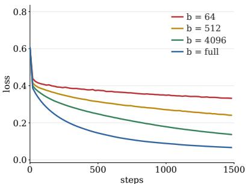  
(a) MLP: loss

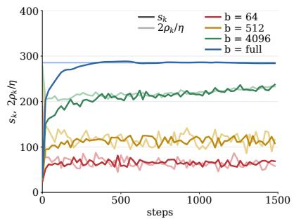  
(b) MLP: T1

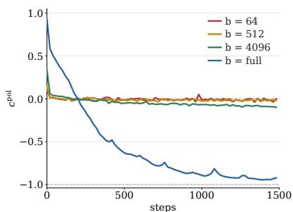  
(c) MLP: T2

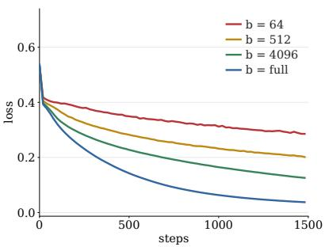  
(d) CNN: loss

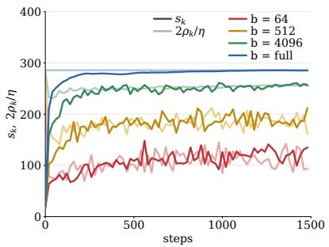  
(e) CNN: T1

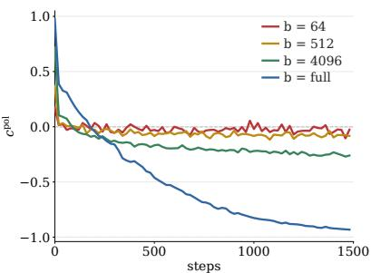  
(f) CNN: T2

  
(g) Transformer: loss

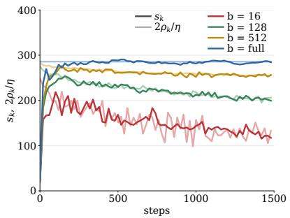  
(h) Transformer: T1

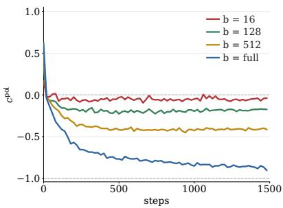  
(i) Transformer: T2

Figure 9: Batch-dependent loss and direction diagnostics. These experiments use the MLP, CNN, and Transformer at $\eta = 0 . 0 0 7$ ; they measure full-objective loss, T1, and T2 across four batches. Rows correspond to MLP, CNN, and Transformer, while columns show loss, T1, and T2. T1 pairs dark curvature curves with light boundaries; curves connect saved observations.

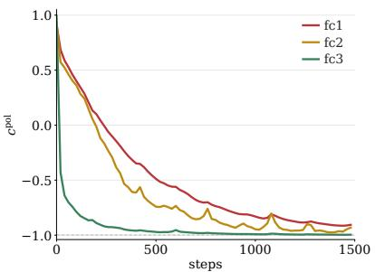  
(a) MLP: layers/blocks

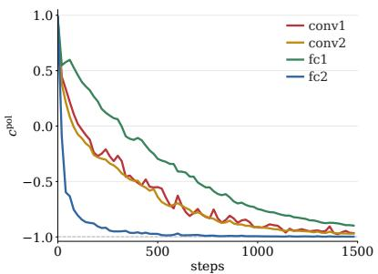  
(b) CNN: layers/blocks

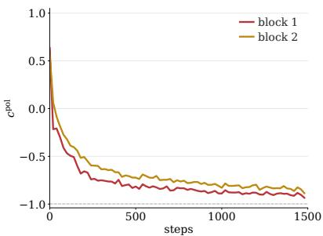  
(c) Transformer: layers/blocks

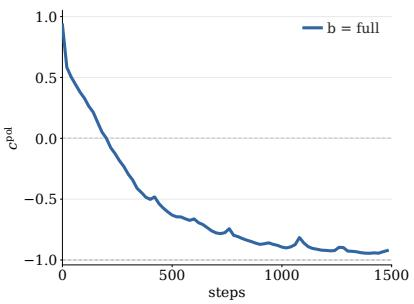  
(d) MLP: global

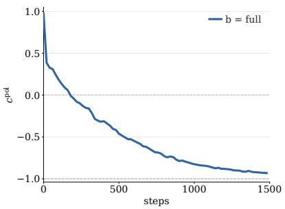  
(e) CNN: global

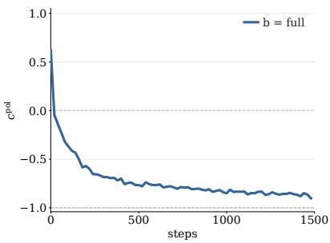  
(f) Transformer: global

Figure 10: Layerwise and global directional alignment. These experiments use full-batch MLP, CNN, and Transformer models at $\eta = 0 . 0 0 7 ;$ they measure block-level and global update-direction cosines. Columns show MLP, CNN, and Transformer. The top row contains layer or block trajectories, and the bottom row contains global cosines computed from aggregated inner products and norms.

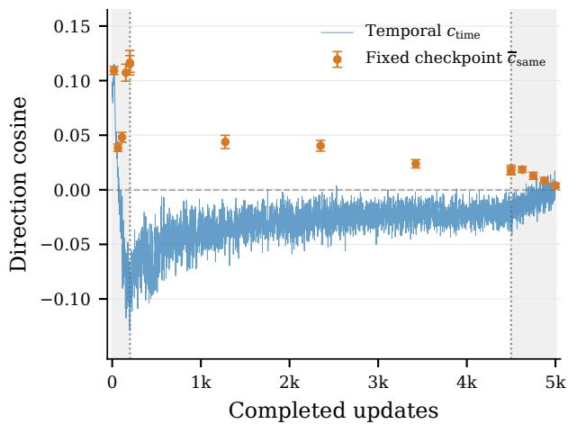  
(a) Seed 1337

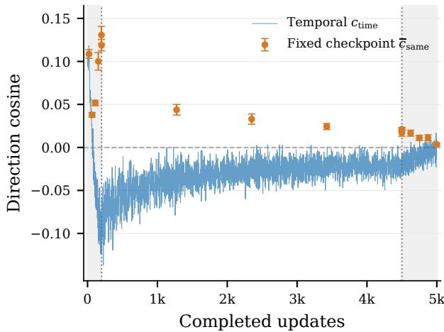  
(b) Seed 2026  
Figure 11: Frozen-state and temporal direction alignment in a Tiny Transformer trained with no-momentum NS-5 Muon at batch size eight. Orange markers estimate $c _ { k } ^ { \mathrm { s a m e } }$ from all 120 unordered pairs of 16 independent probe batches while holding the model state fixed; bars show 95% delete-one-batch jackknife intervals. Blue curves show the realized consecutive-step statistic $c _ { k } ^ { \mathrm { t i m e } }$ . Both statistics use only the directions on the Muon parameter subspace. Dashed and dotted vertical lines mark zero and the warmup–stable–decay boundaries, respectively.

## B.7 Frozen-state and temporal alignment

In our experiment shown in Figure 1 and Figure $2 , c _ { k } ^ { \mathrm { p o l } }$ is quite close to zero. However, unrelated directions in a high-dimensional space are already likely to be nearly orthogonal. A near-zero cosine alone therefore does not tell us whether the weak alignment comes from Muon’s training dynamics or simply from minibatch randomness.

To distinguish these explanations, we compare two measurements. At selected checkpoints spanning the warmup, stable, and decay stages of the WSD schedule, we freeze the model state, draw independent minibatches, and compute the corresponding Muon directions. Their pairwise cosines measure the variation caused by minibatch sampling alone. We then compare them with the cosines between consecutive directions along the actual training trajectory, where each update changes the state used to compute the next direction.

In both seeds, the frozen-state mean cosines are small but positive. By contrast, during the stable stage, the temporal mean cosines are approximately −0.031 and −0.032, and more than 99% of consecutive pairs are negative (Figure 11). Thus, minibatch dispersion can account for much of the near-orthogonality, but it cannot explain the systematic negative bias along training. The sign diference instead supports a feedback efect caused by the evolving parameter state. Because the training trajectory jointly updates the Muon and auxiliary AdamW parameter groups, this experiment does not attribute the feedback to either optimizer alone. The protocol follows below.

Direction statistics. Let $\widetilde { P } _ { k } ( B )$ collect the NS-5 Muon directions from batch B at state $\left( W _ { k } , Z _ { k } \right)$ , where $Z _ { k }$ contains auxiliary parameters. Normalize them jointly as $U _ { k } ( B ) = \widetilde { P } _ { k } ( B ) / \| \widetilde { P } _ { k } ( B ) \| _ { F }$ . For independent batches $B , B ^ { \prime }$

$$
\begin{array} { r l } & { c _ { k } ^ { \mathrm { s a m e } } : = \mathbb { E } _ { B , B ^ { \prime } } [ \langle U _ { k } ( B ) , U _ { k } ( B ^ { \prime } ) \rangle _ { \mathrm { F } } \mid W _ { k } , Z _ { k } ] } \\ & { \quad \quad = \big \| \mathbb { E } _ { B } [ U _ { k } ( B ) \mid W _ { k } , Z _ { k } ] \big \| _ { F } ^ { 2 } \geq 0 . } \end{array}\tag{16}
$$

Independent-batch dispersion can therefore produce near-orthogonality, but not a negative population-mean cosine at a fixed state. Finite-sample estimates can be negative. During training, we instead measure

$$
c _ { k } ^ { \mathrm { t i m e } } : = \langle U _ { k - 1 } ( B _ { k - 1 } ) , U _ { k } ( B _ { k } ) \rangle _ { \mathrm { F } } .\tag{17}
$$

The first update changes the state used to compute the next direction.

Model and data. The decoder-only Transformer has four layers, width 96, four heads, FFN width 288, RMSNorm, rotary embeddings, a gated SiLU MLP, and tied token/output embeddings. It has 28 Muon matrices, vocabulary size 50,304, and context length 256.

The GPT-2-tokenized FineWeb-Edu cache (Penedo et al., 2024), fineweb\_edu\_gpt2\_6b, contains 6,000,004,097 training tokens and disjoint validation/test regions of 5,000,000 tokens each. Training windows are sampled with replacement. Each seed (1337 and 2026) runs 5,000 updates with batch eight and microbatch two: 2,048 tokens per update and 10,240,000 tokens in total.

Optimization. Muon uses NS-5, zero momentum, zero weight decay, and unit update scale. Gradients accumulate before NS-5. Training uses bfloat16; NS-5 uses float16; updates use float32 directions. Muon and auxiliary AdamW peak rates are 0.034 and $3 \times 1 0 ^ { - 4 }$ . AdamW uses betas (0.9, 0.95), $\epsilon = 1 0 ^ { - 8 }$ , and weight decay 0.1 on matrices and zero on normalization vectors.

Both schedules use 200 warmup updates, a constant stage over $2 0 0 \leq k < 4 5 0 0$ , and 500 linear-decay updates ending at 10% of peak rate. The environment is Python 3.12.3, PyTorch 2.7.0+cu128, and an RTX 4090.

Frozen-state probes. The index k counts completed updates. Checkpoints are 20, 65, 110, 154, 199 in warmup; 200, 1275, 2350, 3424, 4499 in the constant stage; and 4500, 4625, 4750, 4874, 4999 in decay. At each checkpoint, 16 independent batches of eight sequences give 120 direction pairs. All model parameters, including auxiliary parameters, remain fixed. Parameter/bufer digests are checked before and after probing; gradients are cleared and training random states restored

We use the statistics defined above on the Muon subspace. Global and group cosines aggregate inner products and squared norms before normalization. Saved per-matrix Gram matrices and window starts allow reconstruction of pairwise statistics.

Uncertainty and indexing. Pairs share batches. We therefore use a delete-one-batch jackknife. Let $\hat { \mu }$ be the pair mean, $\hat { \mu } _ { ( - i ) }$ exclude batch $i ,$ and $\overline { { \mu } } _ { ( - ) }$ average these estimates. Then

$$
\widehat { \mathrm { s e } } _ { \mathrm { J } } ^ { 2 } = \frac { 1 5 } { 1 6 } \sum _ { i = 1 } ^ { 1 6 } ( \widehat { \mu } _ { ( - i ) } - \overline { { { \mu } } } _ { ( - ) } ) ^ { 2 } , \qquad \widehat { \mu } \pm t _ { 0 . 9 7 5 , 1 5 } \widehat { \mathrm { s e } } _ { \mathrm { J } } .
$$

These approximate pointwise intervals can be unreliable for a nearly degenerate pair statistic. Raw outputs also retain bounded-diferences intervals. Neither interval measures across-seed uncertainty.

Temporal cosines are logged at every update and indexed by the ending state, as in Eq. (17). The initial incoming cosine is undefined. Constant-stage summaries use 4,300 pairs per seed over $2 0 0 \leq k <$ 4500. Figure 11 shows unsmoothed values, separately by seed, without temporal-window intervals.

Results. Frozen-state global means range from 0.0172 to 0.1153 for seed 1337 and from 0.0170 to 0.1189 for seed 2026. Temporal means are −0.0314 and −0.0324; 99.91% and 99.70% of pairs are negative. All 28 matrices have negative temporal means in both seeds.

The fixed-state population mean is nonnegative by Eq. (16), although finite estimates may be negative. The observed sign diference supports update feedback beyond independent-batch dispersion. Joint Muon and AdamW updates prevent assigning this feedback to either optimizer alone.

## C Perturbation experiments

## C.1 22M setup and probes

Model and data. The 22,518,016-parameter Transformer has 12 layers, width 256, eight heads, and FFN width 704. Muon updates 9,633,792 parameters; AdamW updates 12,884,224. It uses GPT-2-tokenized FineWeb sample-10BT, sequence length 4,096, microbatch four, and a fixed reference set of 32 sequences. Precision and NS-5 conventions match Appendix D.1. Training, data, diagnostic, and evaluation seeds are 1337, 2026, 314159, and 271828.

Branches and schedule. All branches start at checkpoint 4,000, with reference loss 4.3578633. The control uses $( \eta _ { \mathrm { p e a k } } , b ) = ( 0 . 0 4 , 1 6 )$ ; branches use (0.02, 16), (0.08, 16), (0.04, 8), and (0.04, 32). Auxiliary AdamW stays at peak rate 0.001, betas (0.8, 0.999), weight decay 0.1, and $\epsilon = 1 0 ^ { - 8 }$

Table 2: Conditional loss response at checkpoint 4000. Learning rates are Muon rates; the probe batch equals the branch training batch. All increments evaluate a Muon-only virtual update on the same finite reference objective, with auxiliary parameters fixed.
<table><tr><td>η</td><td>b</td><td> $\hat { s } ^ { \mathrm { M } }$ </td><td> $2 \hat { \rho } / \eta$ </td><td>d</td><td>95% interval for d</td></tr><tr><td>0.02</td><td>16</td><td>17.182</td><td>34.453</td><td>-0.01967</td><td>[-0.01999, -0.01936]</td></tr><tr><td>0.04</td><td>16</td><td>17.169</td><td>17.227</td><td>-0.00026</td><td>[-0.00138, 0.00086]</td></tr><tr><td>0.08</td><td>16</td><td>16.964</td><td>8.613</td><td>0.15219</td><td>0.14650, 0.15789]</td></tr><tr><td>0.04</td><td>8</td><td>13.830</td><td>14.575</td><td>-0.00340</td><td>[−0.00512, , −0.00167]</td></tr><tr><td>0.04</td><td>32</td><td>20.321</td><td>19.406</td><td>0.00417</td><td>0.00349, 0.00485]</td></tr></table>

Training lasts 8,000 updates, with 400 warmup updates and 1,600 linear-decay updates ending at 10% of peak rate. Branch rates are constant over 4000 ≤ k < 6400. A record indexed by k describes the candidate update from state k; continuation records span 4000–7999.

Measurements. Conditional probes use eight draws for each batch 1, 8, 16, 32 every 500 updates from the branch point. The displayed curvature panels use probe batch size 16 for both pre-branch history and all branches, independently of training batch size. Probe estimators and pointwise Student-t intervals are defined in Appendix D.2. Cosines compare adjacent NS-5 directions and are logged every five updates. Fixed-reference loss and realized-update diagnostics are logged every 100 updates.

The last conditional, reference-loss, and cosine records occur at 7,500, 7,900, and 7,995. Curves connect recorded samples without smoothing or filling missing values. Validation uses 256 sequences every 500 updates and 4,096 sequences at completion.

Token budgets. Checkpoint 4,000 contains 262,144,000 processed tokens. After 4,000 further updates, batches 8, 16, and 32 reach 393,216,000, 524,288,000, and 786,432,000 tokens. Later batch-size comparisons therefore use diferent token budgets. These are single-seed branches from one checkpoint.

## C.2 130M learning-rate perturbation setup

The 130M branches use the architecture in Appendix D.1, no-momentum NS-5 Muon, and training batch size 32. At step 7,000, they change the Muon rate from 0.04 to 0.02, 0.04, or 0.08. The auxiliary AdamW schedule is unchanged across branches.

Each branch continues for 5,000 updates: 3,000 at constant rate, then 2,000 with linear decay to 10% of peak rate. Validation uses 64 sequences every 1,000 updates. Both the 22M and 130M perturbation panels report global consecutive-direction cosines on the Muon parameter subspace. No conditional T1 probes are available for these 130M branches.

The 130M panels, Figures 7c and 7d, start at step 6,500. The pre-branch loss segment connects validations at steps 6,000 and 7,000; there is no validation measurement at step 6,500. These checkpoint branches are separate from the 130M runs with 40 tokens per parameter in Appendix D.1.

## C.3 Loss and direction responses

22M conditional responses. Table 2 reports the initial conditional loss response. Intervals use eight paired increments and $t _ { 0 . 9 7 5 , 7 } ;$ they measure probe uncertainty at one state. We use paired increments because curvature and boundary share an alignment term.

Over $5 0 0 0 \leq k < 6 4 0 0 .$ , the 280 sampled cosines have means −0.064, −0.100, and −0.117 for learning rates 0.02, 0.04, and 0.08. At rate 0.04, batches 8, 16, and 32 give −0.056, −0.100, and −0.167. All five branches have 480 negative observations over $4 0 0 0 \leq k < 6 4 0 0 .$ . These signs describe sampled pairs, not every step.

At checkpoint 4,000, doubling batch size raises coherence by 12.7% and curvature by 18.4%, yielding a positive mean increment. Batch eight gives a negative mean increment. Thus a higher loss boundary alone does not imply greater one-step descent

One-step probes and training trajectories. The doubled-rate branch has reference loss 4.3579 at step 4,000, 4.4608 at 4,100, and 4.2616 at 6,000. The batch-eight branch reaches 4.3906 at 4,100 despite its negative initial conditional increment. A Muon-only one-step probe does not determine later loss under complete updates.

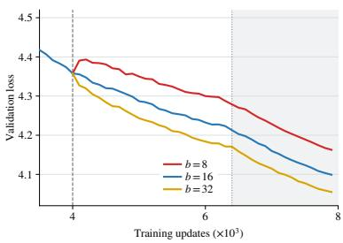  
(a) Loss

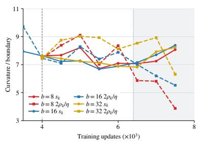  
(b) Loss balance

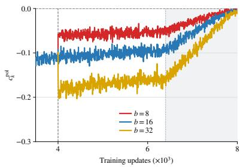  
(c) Update directions  
Figure 12: Responses to checkpoint batch-size changes. This one-seed experiment uses a 22M model with Muon peak learning rate 0.04 and branch training batches 8, 16, and 32. Panels show fixed-reference loss, conditional T1 curvature and boundary with probe batch size 16, and matrix-averaged consecutive-direction cosines. The displayed range is steps 3500–8000, with branching and schedule-change markers shown.

The 22M reference-loss samples every 100 updates show transient changes, not stepwise oscillations.

Recovery of loss balance and alignment. Figure 13 shows the 22M conditional curvature and lossneutral boundary after learning-rate changes. Sparse probes show a return toward loss balance, but do not resolve its recovery time. The cosine also tends to return toward its pre-perturbation value after either increasing or decreasing the rate. This trend does not require the branch means to coincide.

130M responses. The 130M branches show the same tendency in the global direction cosine (Figure 7(d)). Increasing the rate initially makes alignment more negative; decreasing it makes alignment less negative. Both responses then move back toward the pre-perturbation value. Validation loss improves over the full continuation (Figure 7(c)). These loss and cosine records do not measure the conditional T1 boundary.

Both models enter learning-rate decay during the displayed continuation. Later cosine changes therefore reflect the schedule as well as the earlier intervention. The observed return is a trend, not evidence of convergence to a shared cosine value.

  
Figure 13: 22M loss balance after learningrate changes. Muon rates are 0.02, 0.04, and 0.08. Curves compare conditional curvature with $2 \hat { \rho } _ { k } / \eta _ { k }$ at probe batch size 16. Training batch size stays at 16.

## D Results on 130M and 1B pretraining

## D.1 130M pre-training protocol

Model, data, and budget. The 130M Llama-like LLM has 12 layers, width 768, 12 heads, FFN width 2,304, and vocabulary size 50,304. Of 130,665,216 parameters, Muon updates 92,012,544 and AdamW updates 38,652,672.

GPT-2-tokenized FineWeb sample-10BT supplies six billion training tokens and 16,777,216 validation tokens from disjoint documents. Training windows are sampled with replacement. Batch size 32 and sequence length 4,096 give 131,072 tokens per update. The 39,876 updates process 5,226,627,072 tokens, about 40 per parameter. Microbatch size is two.

Table 3: Recorded 130M pre-training configuration.
<table><tr><td>Item</td><td>Setting</td></tr><tr><td>Muon</td><td>NS-5; momentum 0; weight decay 0; update scale 1</td></tr><tr><td>Muon peak learning rates</td><td>0.02, 0.04, 0.08, 0.12</td></tr><tr><td>Auxiliary optimizer</td><td>AdamW; peak LR 0.001; betas  $( 0 . 8 , 0 . 9 9 9 ) ; \epsilon = 1 0 ^ { - 8 }$  ; weight decay 0.1</td></tr><tr><td>Schedule</td><td>Linear warmup fraction 0.05; constant stage; decay fraction 0.2; final LR fraction 0.1</td></tr><tr><td>Training / data seed</td><td>1337 / 2026</td></tr><tr><td>Diagnostic / evaluation seed</td><td>314159 / 271828</td></tr><tr><td>Training / probe precision</td><td>bfloat16 / float32; NS arithmetic float32</td></tr><tr><td>Reference objective</td><td>32 sequences, 131,072 tokens</td></tr><tr><td>Conditional probes</td><td>Batch sizes 1, 8, 16, 32; eight draws; every 500 updates</td></tr><tr><td>Other diagnostics</td><td>Realized reference diagnostics every 100 updates; adjacent- direction cosine every 5 updates</td></tr><tr><td>Validation Environment</td><td>Every 500 updates, 256 sequences; final evaluation 4096 sequences Python 3.11.5; PyTorch 2.8.0+cu128; CUDA 12.8; NVIDIA A100-</td></tr><tr><td></td><td>PCIE-40GB</td></tr></table>

## D.2 Conditional probes and update scope

The 22M and 130M probes use no-momentum NS-5 with unit scale and zero Muon weight decay. Write W for Muon matrices and Z for auxiliary parameters. Each probe evaluates $L _ { R } ( W _ { k } - \eta _ { k } \widetilde { P } _ { k . b } ^ { ( r ) } , Z _ { k } )$ , holding $Z _ { k }$ fixed. Training instead updates both groups. Figure 15(b) compares their realized loss changes. Estimators. Write ${ G } _ { R , j } = \nabla _ { W _ { j } } L _ { R } ( W _ { k } , Z _ { k } )$ and $\begin{array} { r } { N _ { R } = \sum _ { j } \| { \cal G } _ { R , j } \| , } \end{array}$ ∗. For probe r, define

$$
A _ { r } = \sum _ { j } \langle G _ { R , j } , \widetilde { P } _ { k , b , j } ^ { ( r ) } \rangle _ { \mathrm { F } } , \qquad d _ { r } = L _ { R } ( W _ { k } - \eta _ { k } \widetilde { P } _ { k , b } ^ { ( r ) } , { Z } _ { k } ) - L _ { R } ( W _ { k } , { Z } _ { k } ) .
$$

The plotted conditional quantities are

$$
\hat { \rho } _ { k , b } = \frac { \overline { { A } } } { N _ { R } } , \qquad \hat { s } _ { k , b } ^ { \mathrm { M } } = \frac { 2 ( \overline { { d } } + \eta _ { k } \overline { { A } } ) } { \eta _ { k } ^ { 2 } N _ { R } } .
$$

The diference between the two T1 curves has the sign of ${ \overline { { d } } } .$ This loss identity holds for the implemented directions. Exact-polar properties, such as unit operator norm and full-batch coherence one, are not assumed for NS-5. The plotted $c _ { k } ^ { \mathrm { { \hat { p } o l } } }$ is the Frobenius cosine between consecutive implemented directions on the Muon parameter subspace. Their displacements obey Eq. (13) , but cosine −1 alone need not give an exact two-step return under NS-5.

The maximum recorded duality discrepancies are 20.8%, 22.6%, 27.9%, and 18.8% in increasing learningrate order. They measure first-order pairing error relative to the nuclear norm, not direction error. The reference probe uses a finite sample and NS-5, so it need not have coherence one. Monte Carlo intervals exclude reference-sample uncertainty.

Sampling and uncertainty. Eight draws per batch size give pointwise 95% intervals using $t _ { 0 . 9 7 5 , 7 }$ . Loss-sign tests use paired increments $d _ { r }$ . These intervals measure conditional probe uncertainty, not variation across seeds or reference samples.

Cosines compare consecutive Muon directions and are logged every five updates. The pair has lag one; five is the logging interval. Unrecorded pairs do not determine a first-crossing time.

Plotting. Curves use the scheduled learning rate and connect samples without smoothing. The introductory 130M curvature panel uses a symmetric-log scale with linear threshold 10. Figure 5 uses 80 checkpoints from 0 to 39,500; Figure 19 covers $2 0 0 0 \leq k < 3 1 9 0 0$ . Single-rate panels use peak rate 0.02; multi-rate panels include all four runs.

  
(a) $\eta _ { \mathrm { p e a k } } = 0 . 0 2$

  
(b) $\eta _ { \mathrm { p e a k } } = 0 . 0 4$

  
(c) $\eta _ { \mathrm { p e a k } } = 0 . 0 8$

  
(d) $\eta _ { \mathrm { p e a k } } = 0 . 1 2$  
Figure 14: Training and validation loss across learning rates. This experiment uses the 130M Llama-like LLM with no-momentum NS-5 Muon at four peak learning rates; it measures training and validation loss. (a)–(d) Curves for peak rates 0.02, 0.04, 0.08, and 0.12.

Dense early probes. Separate same-seed runs sample steps 0, 10, . . . , 490 with the same schedules. Their trajectories difer from the long runs: maximum early loss diferences are 0.02129, 0.03554, 0.04501, 0.04016 in increasing-rate order. Plots overlay these runs without joining them; insets show steps 10–490. Full-horizon summaries use only the long runs.

Final validation and provenance. The final validation losses are 3.35085, 3.32335, 3.31944, and 3.33932 for increasing Muon peak learning rate. These are one-seed observations, not a statistically resolved ranking. The runs report completion at 39,876 steps. The recorded source hash is 5556127225dd13877c4f432ddeec f706509c1fb6a7cbace30a0b6b763d67e403.

## D.3 130M loss increments and complete-update balance

Figures 15, 16, 17, and 18 compare conditional Muon-only increments with realized Muon-only and completeupdate increments at each learning rate, respectively.

Let $\Delta \pmb { \theta } _ { k }$ be the complete Muon-plus-AdamW displacement. On the fixed reference objective, define

$$
A _ { k } = - \langle \nabla L _ { R } ( \theta _ { k } ) , \Delta \theta _ { k } \rangle , \qquad D _ { k } = L _ { R } ( \theta _ { k } + \Delta \theta _ { k } ) - L _ { R } ( \theta _ { k } ) .
$$

Using the sum $N _ { k }$ of Muon reference-gradient nuclear norms, set

$$
\widetilde { s } _ { k } ^ { \mathrm { f u l l } } = \frac { 2 ( D _ { k } + A _ { k } ) } { \eta _ { k } ^ { 2 } N _ { k } } , \qquad \widetilde { \rho } _ { k } ^ { \mathrm { f u l l } } = \frac { A _ { k } } { \eta _ { k } N _ { k } } .
$$

Then

$$
D _ { k } = \frac { \eta _ { k } ^ { 2 } N _ { k } } { 2 } \left( \widetilde { s } _ { k } ^ { \mathrm { f u l l } } - \frac { 2 \widetilde { \rho } _ { k } ^ { \mathrm { f u l l } } } { \eta _ { k } } \right) .
$$

These are realized full-update quantities, normalized on the Muon scale. They are not conditional means, and $\widetilde { \rho } _ { k } ^ { \mathrm { f u l l } }$ need not lie in [−1, 1]. Direction cosines cover the Muon subspace only; they do not include auxiliary AdamW updates.

At peak LR 0.02, paired conditional loss intervals have positive lower endpoints at steps 3500, 9000, and 9500: approximately $7 . 4 5 \times 1 0 ^ { - 3 } , 4 . 1 1 \times 1 0 ^ { - 4 }$ , and $8 . 4 8 \times 1 0 ^ { - 4 }$ . Positive lower endpoints also occur at steps 16,500 and 38,000. These are pointwise observations, not a corrected test of onset across all checkpoints.

## D.4 130M layer structure and batch-dependent coherence

Figures 19 and 5 support the layer and probe-batch analyses in Section 3.1. They report matrixwise heterogeneity and fixed-checkpoint probe-batch efects, respectively; the latter do not vary the training batch.

## D.5 1B LLM pretraining

The 1B Llama-like model has 16 layers, model width 2,048, 16 attention heads, and FFN width 6,400. Table 4 lists its architecture, optimization settings, token budget, and recorded diagnostics. Training processes approximately 20 tokens per parameter.

  
(a) Paired increments

  
(b) Realized loss increments

  
(c) Complete-update balance

Figure 15: Reference-loss checks at peak rate 0.02. (a) Conditional Muon-only increments with pointwise 95% intervals. (b) Realized Muon-only and complete-update increments. (c) Complete-update curvature $\widetilde { s } _ { k } ^ { \mathrm { f u l l } }$ and boundary $2 \widetilde { \rho } _ { k } ^ { \mathrm { t u l l } } / \eta _ { k }$ . (b) and (c) include dense early probes; the inset covers steps 10–490.

  
(a) Paired increments

  
(b) Realized loss increments

  
(c) Complete-update balance

Figure 16: Reference-loss checks at peak rate 0.04. (a) Conditional Muon-only increments with pointwise 95% intervals. (b) Realized Muon-only and complete-update increments. (c) Complete-update curvature $\widetilde { s } _ { k } ^ { \mathrm { f u l l } }$ and boundary $\partial \tilde { \rho } _ { k } ^ { \mathrm { f u l l } } / \eta _ { k }$ . (b) and (c) include dense early probes; the inset covers steps 10–490.

  
(a) Paired increments

  
(b) Realized loss increments

  
(c) Complete-update balance

Figure 17: Reference-loss checks at peak rate 0.08. (a) Conditional Muon-only increments with pointwise 95% intervals. (b) Realized Muon-only and complete-update increments. (c) Complete-update curvature $\widetilde { s } _ { k } ^ { \mathrm { f u l l } }$ and boundary $2 \widetilde { \rho } _ { k } ^ { \mathrm { f u l l } } / \eta _ { k }$ . (b) and (c) include dense early probes; the inset covers steps 10–490.

Figure 8 shows loss, global $c _ { k } ^ { \mathrm { p o l } }$ , and layer-level alignment. Cosines compare Muon directions, not the complete Muon-plus-AdamW updates. This run has no conditional T1 probes.

  
(a) Paired increments

  
(b) Realized loss increments

  
(c) Complete-update balance  
Figure 18: Reference-loss checks at peak rate 0.12. (a) Conditional Muon-only increments with pointwise 95% intervals. (b) Realized Muon-only and complete-update increments. (c) Complete-update curvature $\widetilde { s } _ { k } ^ { \mathrm { f u l l } }$ and boundary $2 \widetilde { \rho } _ { k } ^ { \mathrm { f u l l } } / \eta _ { k }$ . (b) and (c) include dense early probes; the inset covers steps 10–490.

  
(a) Block trajectories

  
(b) Global cosine  
Figure 19: Layer and module variation in directional alignment. This experiment uses the 130M Llama-like LLM at peak Muon learning rate 0.02. (a) shows block trajectories; (b) shows the global cosine. Both cover the constant-learning-rate stage. Figure 6 shows module medians.

Table 4: 1B pretraining configuration and recorded diagnostics.
<table><tr><td>Item</td><td>Setting</td></tr><tr><td>Model</td><td>Llama-like; approximately 1B parameters; 16 layers</td></tr><tr><td>Model width / heads</td><td>2,048 / 16; head dimension 128</td></tr><tr><td>FFN</td><td>SwiGLU; intermediate width 6,400</td></tr><tr><td>Normalization / positions</td><td>RMSNorm / RoPE</td></tr><tr><td>Vocabulary / output head</td><td>50,304; tied input and output embeddings</td></tr><tr><td>Data</td><td>GPT-2-tokenized FineWeb sample-100BT</td></tr><tr><td>Prepared token pools</td><td>50,000,000,000 training tokens and 16,777,216 validation tokens from disjoint documents</td></tr><tr><td>Training sampling</td><td>Random contiguous windows sampled with replacement</td></tr><tr><td>Training batch / microbatch</td><td>512 / 1 sequences</td></tr><tr><td>Sequence length</td><td>4,096 tokens</td></tr><tr><td>Tokens per update</td><td>2,097,152</td></tr><tr><td>Training updates</td><td>9,544</td></tr><tr><td>Total training tokens</td><td>20,015,218,688</td></tr><tr><td>Token budget</td><td>Approximately 20 tokens per parameter</td></tr><tr><td>Muon parameter scope</td><td>Attention and FFN weight matrices</td></tr><tr><td>Muon</td><td>NS-5; momentum 0; weight decay 0; update scale 1</td></tr><tr><td>Muon peak LR</td><td>0.04 Five Newton–Schulz iterations; coefficients (3.4445, -4.7750, 2.0315); Frobe-</td></tr><tr><td>NS-5 settings</td><td>nius normalization with  $\epsilon = 1 0 ^ { - 7 }$  ; float32 arithmetic</td></tr><tr><td>Auxiliary parameter scope</td><td>Token embeddings and normalization parameters AdamW; peak LR 0.001; betas  $( 0 . 8 , 0 . 9 9 9 ) ; \epsilon = 1 0 ^ { - 8 }$ </td></tr><tr><td>Auxiliary optimizer WSD schedule</td><td>; weight decay 0.1 Linear warmup fraction 0.05; constant stage; cosine-decay fraction 0.20; final</td></tr><tr><td></td><td>LR fraction 0.10; the same schedule multiplier is applied to Muon and auxiliary AdamW</td></tr><tr><td>Training precision Memory settings</td><td>bfloat16 autocast with float32 parameters</td></tr><tr><td>Gradient clipping</td><td>Activation checkpointing; loss chunks of 128 tokens</td></tr><tr><td>Training seed</td><td>None 1337</td></tr><tr><td>Configured data seed</td><td>2026</td></tr><tr><td></td><td></td></tr><tr><td>Evaluation protocol</td><td>Every 500 updates, 1024 sequences; final evaluation 4096 sequences</td></tr><tr><td>Recorded training / validation losses</td><td>9,544 / 20 values</td></tr><tr><td>Recorded global direction cosines</td><td>1,909 samples at steps 0–9,540</td></tr><tr><td>Direction scope</td><td>Global and layer-level cosines of consecutive Muon directions</td></tr><tr><td>Conditional T1 probes</td><td>Not performed</td></tr></table>