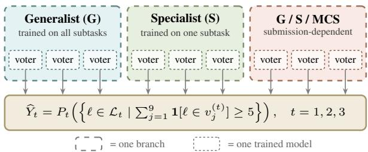
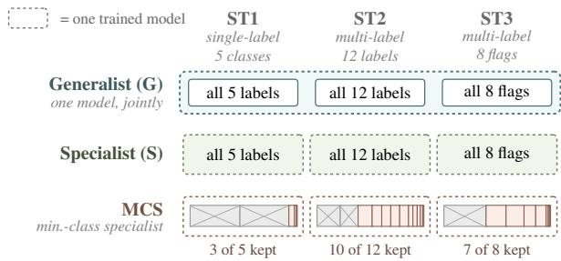
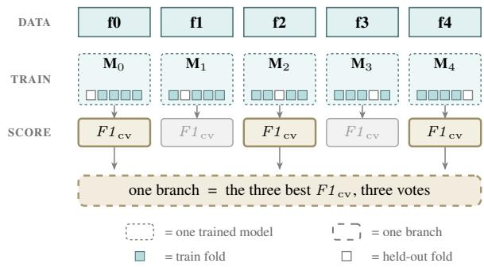
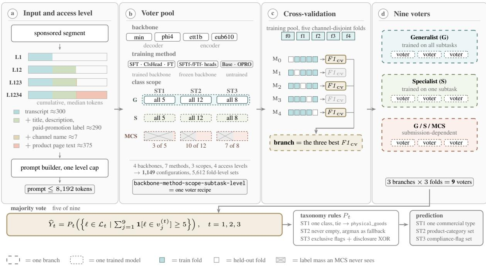
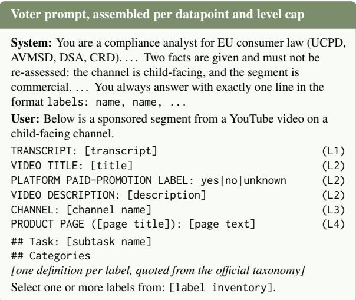
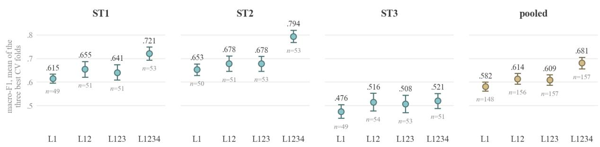
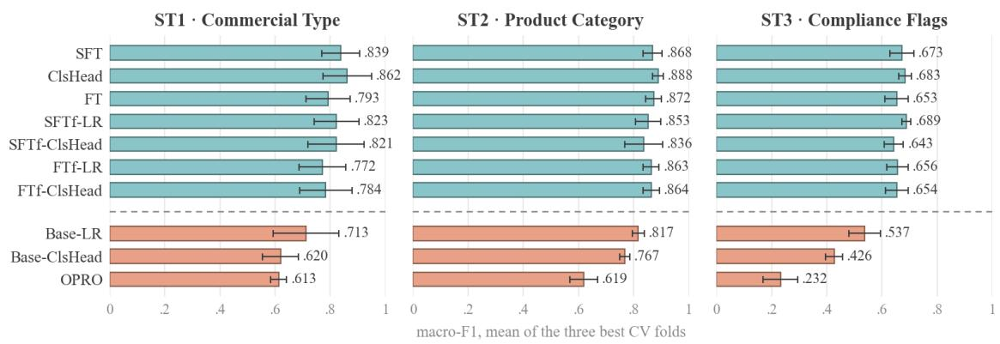

# Nürnberg NLP at ChildSafeAds 2026: Structurally Dissimilar Voter Ensembles under Four Levels of Data Access

Philipp Steigerwald Eric Rudolph Jens Albrecht Technische Hochschule Nürnberg Georg Simon Ohm {philipp.steigerwald, eric.rudolph, jens.albrecht}@th-nuernberg.de

## Abstract

We describe the Nürnberg NLP system for ChildSafeAds 2026. The shared task asks what a monitoring system for commercial content in child-facing YouTube videos can achieve at a given level of data access. We answer with per-subtask ensembles of nine voters, organised into three branches that differ in backbone, adaptation method and class scope. Selection rests on channel-disjoint cross-validation, with the development set as a transfer check. The system wins two of the three subtasks. Its product-category score (ST2, 0.8243) and its compliance-flag score (ST3, 0.6530) are the best of the 22 final entries, and it places third on the task mean (0.7079). We further compare four access levels and report the cost at test-set scale.

## 1 Introduction

Advertising directed at children is regulated more strictly than advertising in general, yet sponsored segments in child-facing YouTube videos are barely monitored. The ChildSafeAds shared task (Bertaglia et al., 2026) frames this as a measurement problem. A system receives a sponsored segment together with a chosen level of data access. It labels the commercial type of the segment (ST1), the product category (ST2) and EU consumer-law compliance risk flags (ST3). The inputs range from the video transcript alone (L1) through video context (L2) and the channel name (L3) to the promoted product’s web page (L4). Each subtask is scored by macro-F1 over the classes occurring in the reference labels. The official ranking uses the mean of the three subtask scores. The hidden test channels are disjoint from the training channels.

Our system is a per-subtask ensemble of nine voters (Figure 1). It combines structurally dissimilar voters through majority voting (Dietterich, 2000) and uses cross-validation folds as both voter pool and internal estimate (Krogh and Vedelsby,

  
Figure 1: Three structurally dissimilar branches contribute three voters each to a per-subtask ensemble. Deployed ensembles vary (Table 2).

1995). A configuration, one backbone trained by one method for one class scope at one access level, becomes a branch when deployed on its three best cross-validation folds, and each fold-model casts one vote. The branches also differ in class scope, from a generalist (G) trained on all three subtasks through a specialist (S) for one subtask to a minority-class specialist (MCS) for the minority labels alone. Such an ensemble approach has already proven itself in other text classification domains (Steigerwald et al., 2026b,c). Here it meets multi-label subtasks and a data-access dimension, and the voter pool gains an encoder branch.

On the final leaderboard the system wins two of the three subtasks. Its ST2 (0.8243) and ST3 (0.6530) scores are the best of all 22 entries. Our entry also leads the auxiliary ST3-family score (0.7031), and our best upload reached 0.7281 on that score. That score regroups the eight flags into four families (disclosure, content, product, housekeeping) to even out their imbalance and sits outside the ranking. On the official mean of the three subtask scores, the system places third (0.7079). The gap to the winning entry lies entirely in ST1 (§5.2).

Our contributions are (i) the leaderboard-best ST2 and ST3 systems, (ii) an aggregated voterlevel comparison across four access levels, crosschecked against the deployed ensemble, and (iii) a training-and-inference cost account of the default nine-voter architecture.

## 2 Related Work

Computational work on sponsored content has mostly studied disclosure. About 10% of affiliate content on YouTube and Pinterest carries any dis closure (Mathur et al., 2018), an estimated 17.7% of studied influencers’ posts without a sponsorship declaration are in fact sponsored (Zarei et al., 2020), and undisclosed sponsorship can be ranked from text, images and influencer–brand relations (Kim et al., 2021). Recent work moves from detecting sponsorship to assessing its compliance (Gui et al., 2025b; Bertaglia et al., 2025). Closest to this task, Gui et al. (2025a) prompt LLMs to decide whether a post is advertising and to justify the decision under advertising law, and report a marked drop on ambiguous posts and the most misidentified cues on hidden advertising. ChildSafeAds instead rests on crowd-sourced segment identification, and its input is a spoken transcript with metadata rather than a caption. Work on minors has concentrated on harmful rather than commercial content (Pa padamou et al., 2020), and children’s exposure to advertising on video platforms is documented mainly by measurement studies (Khan et al., 2024; Potvin Kent et al., 2024). Platform self-declaration is no substitute, as channels sharing inappropriate child-directed content are less likely to set the madeForKids flag (Gkolemi et al., 2022). The closest methodological precedent is the CLAUDETTE line on unfair terms-of-service clauses (Lippi et al., 2019; Drawzeski et al., 2021), with comparable label sets for cookie banners (Van Hofslot et al., 2022) and dark patterns (Mathur et al., 2019). The terms-of-service and cookie-banner work opera tionalises a legal instrument as a small expertdesigned multi-label taxonomy. All of these works share the caveat that an accurate classifier of such labels is not thereby a detector of the legal wrong (Soe et al., 2022; T.Y.S.S et al., 2022), and legal NLP raises ethical limits of its own (Tsarapatsanis and Aletras, 2021).

## 3 Task and Data

The corpus holds 3,360 sponsored segments from child-facing YouTube channels (Bertaglia et al., 2026). A segment is one sponsored passage inside a video, and each video contributes exactly one. One segment together with its context fields is one datapoint, and the access levels of §3.2 set how many of those fields a system may read. Channels group the datapoints, a median of two each and up to 25. Training holds 2,353 datapoints from 632 channels, development 504 datapoints from 154 channels, and test 503 from 153. The splits are channel-disjoint, so a system never sees a test channel during training. Development labels are public and test labels are withheld. Two facts are given per datapoint and not re-assessed, that the channel is child-facing and that the segment is commercial.

## 3.1 Subtasks and Labels

The three subtasks label the same segment on three axes, the type of commercial relationship (ST1), what is being sold (ST2), and where the segment risks non-compliance (ST3). ST1 assigns one commercial type out of five, descended from the contract typology of the Consumer Rights Directive (European Parliament and Council of the European Union, 2011). physical\_goods (47.0%) and digital\_content\_or\_services (46.1%) cover 93% of the labelled data, while other occurs twice in 2,857 datapoints. ST2 assigns product categories, 12 of them and 1.32 per datapoint. ST3 assigns compliance risk flags, 8 of them and 1.35 per datapoint, drawing mainly on the UCPD (European Parliament and Council of the European Union, 2005) and the AVMSD (European Parliament and Council of the European Union, 2010). Every label set is steeply skewed, so macro-F1 depends heavily on a small number of rare-label predictions. The ST3 taxonomy also carries structure a system must respect, since no\_flag and insufficient\_context each stand alone, and undisclosed\_advertising and inadequate\_disclosure are mutually exclusive, the distinction between disclosure absent and disclosure present but not recognisable.

## 3.2 Access Levels

The four access levels are cumulative. L1 is the segment transcript (median ≈300 tokens). L2 adds the video title, the description and the platform’s paidpromotion label (≈290 tokens). That label is the platform’s declaration mechanism under AVMSD Article 28b(3)(c) (European Parliament and Council of the European Union, 2010). L3 adds the channel name (≈7 tokens). L4 adds the text of the promoted product’s resolved web page (≈375 tokens, with a heavy tail). Every datapoint fits into 8,192 tokens without truncation at full access (maximum 8,039 tokens).

## 4 System

Figure 1 shows the target shape, and Figure 4 in Appendix A draws the same system end to end, from the input to the prediction. This section builds it bottom-up, from backbones and class scopes through cross-validation to the nine-voter vote.

## 4.1 Backbones and Adaptation Methods

A configuration fixes the four axes of a voter, backbone, method, class scope and access level, and its name lists them in that order, with the subtask of an S or MCS, backbone-method-scope-subtask-level. A voter is one trained fold-model of a configuration (§4.3). Table 1 names the four backbones and the seven methods. The methods range from training the whole backbone to training nothing at all. Across all four levels the pool holds 1,149 banked configurations, not all of them complete, with 5,612 finished fold-level prediction sets.

<table><tr><td>Backbones</td><td></td><td></td></tr><tr><td>min</td><td>Ministral-8B-Instruct-2410 (Mistral AI, 2024)</td><td>dec</td></tr><tr><td>phi4</td><td>Phi-4, 14B (Abdin et al., 2024)</td><td>dec</td></tr><tr><td>ett1b</td><td>ettin-encoder-1b (Weller et al., 2026)</td><td>enc</td></tr><tr><td>eub610</td><td>EuroBERT-610m (Boizard et al., 2025)</td><td>enc</td></tr><tr><td colspan="2">Training methods</td><td></td></tr><tr><td>SFT</td><td>generative fine-tuning</td><td>dec</td></tr><tr><td>ClsHead</td><td>discriminative fine-tuning</td><td>dec</td></tr><tr><td>FT</td><td>discriminative fine-tuning</td><td>enc</td></tr><tr><td></td><td>Base-LR/-ClsHead light head on untrained backbones</td><td>dec/enc</td></tr><tr><td></td><td>SFTf-LR/-ClsHead light head per subtask on the G</td><td>dec</td></tr><tr><td></td><td>FTf-LR/-ClsHead light head per subtask on the G</td><td>enc</td></tr><tr><td>OPRO</td><td>optimised prompt (Yang et al., 2024)</td><td>dec</td></tr></table>

Table 1: Backbones and training methods of the voter pool. dec and enc mark decoder and encoder.

Trained backbones. SFT fine-tunes a decoder to generate the label as text. ClsHead trains a classification head jointly with a decoder backbone, and FT does the same on an encoder. The decoders train under 4-bit QLoRA (Dettmers et al., 2023), the encoders update all weights.

Reused backbones. The frozen-backbone methods cache a backbone’s embeddings once and fit a light head on top, a logistic regression in the -LR variants and a small multi-layer perceptron (MLP) in the -ClsHead variants, which makes them the cheapest voters. Both heads read the backbone’s last hidden layer, taken from the final non-padding token on a decoder and mean-pooled over the tokens on an encoder. The SFTf and FTf variants place such a head on a G backbone that SFT or FT has already tuned across all three subtasks (§4.2), so a per-subtask head inherits that domain knowledge without a second backbone training.

Untrained backbones. The Base variants fit the same heads on the untrained backbone, and OPRO optimises a prompt and trains nothing.

Only voters whose backbone had seen the task reached a deployed ensemble (Table 2), and the margin is wide. OPRO peaks at an F1 top3 of 0.61 on ST1, 0.62 on ST2 and 0.23 on ST3, where the best trained method reaches 0.86, 0.89 and 0.69. The best head on an untrained backbone comes closer, yet still trails by a clear 0.15, 0.07 and 0.15 on the three subtasks. These methods therefore never reached a deployed ensemble, and eub610 never ranked high enough for one either. Appendix C compares every method at full access.

## 4.2 Class Scopes

The class scopes are the axis the architecture is built around. A generalist (G) trains jointly on all three subtasks, and the prompt selects the subtask at inference (Appendix D). A specialist (S) trains on one subtask. A minority-class specialist (MCS) trains on one subtask with the most frequent labels removed, so G and S are thefull-label scopes. Starting from the most frequent label, labels are added up until their combined share exceeds half the label mass, and exactly these labels are dropped. That rule drops physical\_goods and digital\_content\_or\_services on ST1, 93% of the mass between them. On ST2 it drops apps and hardware\_electronics (51%), and on ST3 misleading\_claim (54%). What removal costs differs by task. On the single-label ST1 the datapoints carrying those classes leave the training set with them. On the multi-label ST2 and ST3 only the label columns go, so majority-only datapoints stay as all-negative training signal against over-firing. An MCS is scored only on its own labels, so its score sits on a different scale and never compares against G or S. Figure 2 shows which subtasks and labels each scope trains on.

## 4.3 Cross-Validation and Branches

Every configuration trains five times under fivefold cross-validation (CV5). The folds are grouped by channel, since one channel’s segments share vocabulary, product mix and disclosure habits, and a random split would leak what the channel-disjoint test set withholds. Run i trains on four folds and is scored on the held-out fold i, which gives the foldmodel’s $F 1 _ { \mathrm { c v } }$ . The mean of the three best folds, $F 1 _ { \mathrm { c v } } ^ { \mathrm { t o p 3 } }$ , is the configuration’s selection signal (Figure 3).

  
Figure 2: What each scope trains on. Crossed blocks are dropped majority labels, and block widths are proportional to label frequency.

  
Figure 3: A CV5 configuration. Each held-out fold scores its model. The three best $F 1 _ { \mathrm { c v } }$ form a branch.

A branch deploys the three fold-models with the best held-out $F 1 _ { \mathrm { c v } }$ , the same three that form its $F 1 _ { \mathrm { c v } } ^ { \mathrm { t o p 3 } }$ , and leaves two folds out. We deploy three rather than five mainly because nine voters cost less to run than fifteen. We also hope that leaving out different fold-models in different branches adds variance to the ensemble, since the held-out fold a branch drops can be the one another branch keeps. Three branches choosing independently could leave the same fold out, so we require the three branches together to cover all five folds, and a branch then keeps its best two folds, adds the missing one and takes its $F 1 _ { \mathrm { c v } } ^ { \mathrm { t o p 3 } }$ over those three. Appendix E gives the training hyperparameters and the threshold tuning.

## 4.4 Vote Aggregation

An ensemble comprises three branches, each casting three of the nine votes. Figure 1 states the aggregation formally. Every voter returns a set of labels, exactly one class on the single-label ST1 and possibly several on ST2 and ST3. For each label the ensemble counts the voters that named it and keeps the labels reaching five of nine, so a voter that does not name a label counts against it. The task-specific rules of §4.5 then turn that set into the prediction. On ST1 each voter’s single vote goes to one class, so the classes compete and the nine can scatter until none reaches five. On ST2 and ST3 a voter can name several labels, so labels do not compete and five of nine acts as an independent yes/no threshold per label.

An ensemble must also be structurally dissimilar, spanning at least two backbones and both prediction paradigms, generative and discriminative. This rule is a hard constraint on the selection. The intended template combines a G, an S and an MCS branch, and Submission 1 deployed it as such. Because full-label branches ranked more reliably on every subtask, the later submissions combine G and S branches only, and an MCS reappears once, as an added fourth branch on ST2 (Table 2). An MCS never names a majority label, and with the threshold fixed at five of nine its abstention counts as three votes against, so it can only arbitrate where the two full-label branches disagree.

## 4.5 Taxonomy Rules

In the vote formula of Figure 1, $P _ { t }$ applies the taxonomy rules of subtask t. Its input is the raw vote result, the set of labels that reached five of nine votes. The nine votes can split so that no label reaches five, leaving the set empty, and on ST3 the set can contradict the taxonomy. Each subtask repairs this with its own rules. ST1 requires exactly one class. $P _ { 1 }$ returns the class that reached five votes, and when no class did, it falls back to the most frequent class, physical\_goods. A 4– 3–2 split therefore yields physical\_goods rather than the leading class. All submissions except Submission 3 suppress other (0.07% of the labelled data). Neither $P _ { 2 }$ nor $P _ { 3 }$ ever returns an empty set, because when no label reaches five, the label with the largest vote count is taken. ST2 has no taxonomy constraints, so $P _ { 2 }$ changes nothing else. On ST3 the voters decide every flag independently, so the vote result can be contradictory. $P _ { 3 }$ enforces the taxonomy of §3.1, where no\_flag and insufficient\_context stand alone, and the two disclosure flags exclude each other. The official validity checker does not test these constraints.

## 5 Submissions and Results

All five allowed uploads were used, each declaring access level L1234.

<table><tr><td>Voter composition</td><td>mean  $F 1 _ { \mathrm { c v } } ^ { \mathrm { t o p 3 } }$ </td><td> ${ \bf F } { \bf 1 _ { t e s t } }$ </td></tr><tr><td colspan="3">Submission 1  $\mathrm { p h i 4 - S F T - G + e t t 1 b - F T - S + p h i 4 - S F T f - L R - M C S - L 1 }$ </td></tr><tr><td>ST1</td><td>.7877</td><td>.5944</td></tr><tr><td>ST2  $\mathrm { \Delta p h i 4 - S F T - G + e t t { l b - F T - S + \Delta p h i 4 - S F T f - L R - M C S } }$ </td><td>.8624</td><td>.8034</td></tr><tr><td>ST3  $\mathrm { \Delta \hat { p h i 4 - S F T - G } + e t t { 1 b - F T - S + \Delta \hat { p h i 4 - S F T f - L R - M C S } } }$ </td><td>.6427</td><td>.5954</td></tr><tr><td colspan="3">Submission 2</td></tr><tr><td>ST1  $\mathrm { \ p h i 4 { - } S F T { - } S } + 2 \times \mathrm { m i n { - } C l s H e a d { - } S }$ </td><td>.8232</td><td>.6205</td></tr><tr><td>ST2  $\mathrm { \ m i n { - } C l s H e a d { - } S + p h i { 4 } { - } C l s H e a d { - } S + p h i { 4 } { - } S F T { - } S }$ </td><td>.8715</td><td>.8204</td></tr><tr><td> $\mathrm { S T 3 } \quad \mathrm { p h i 4 - S F T f - L R - S - \dot { L } 1 2 3 + p h i 4 - S F T - \dot { G } + e t t 1 b - F T f - C l s H e a d - S - L 1 2 }$ </td><td>.6656</td><td>.6512</td></tr><tr><td colspan="3">Submission 3  $\mathrm { { \ m i n – C l s H e a d - S - L l 2 + p h i 4 - C l s H e a d - G + p h i 4 - S F T - S } }$ </td></tr><tr><td>ST1 ST2</td><td>.7926</td><td>.5339</td></tr><tr><td> $\mathrm { \ m i n { - } C l s H e a d { - } S + p h i { 4 - } C l s H e a d { - } S + p h i { 4 - } \dot { S } F T { - } S + p h i { 4 - } C l s H e a d { - } M C S }$   $\mathrm { p h i 4 - S F T f - L R - S - \dot { L } 1 2 3 + p h i 4 - S F T - \dot { G } + e t t 1 b - F T f - \hat { C } l s H e a d - S - L 1 2 }$ </td><td>.8378</td><td>.8243</td></tr><tr><td>ST3</td><td>.6656</td><td>.6483</td></tr><tr><td colspan="3">Submission 4</td></tr><tr><td>ST1 ST2</td><td> $\mathrm { p h i 4 - S F T f - L R - G + p h i 4 - S F T - S + m i n - C l s H e a d - S }$ </td><td>.6464</td></tr><tr><td> $\mathrm { \dot { \ m i n } { - } C l s H e a d { - } G + e \dot { t } t { 1 } b { - } F T f { - } C l s H e a d { - } S + m i n { - } S F T { - } S }$ </td><td>.8458</td><td>.7719</td></tr><tr><td>ST3  $\mathrm { p h i 4 - S F T - G + p h i 4 - S F T f - L R - S + e t t 1 b - F T f - C l s H e a d - S }$ </td><td>.6688</td><td>.6530</td></tr></table>

Table 2: Voter compositions of Submissions 1 to 4, mean $F 1 _ { \mathrm { c v } } ^ { \mathrm { t o p 3 } }$ over the deployed branches and hidden-test macro-F1 . Bold marks the best test score per subtask. 2× marks two separately trained configurations of the same recipe. Where an ensemble holds an MCS branch, the mean includes its own-scale score and is descriptive only.

## 5.1 Submission Strategy

Table 2 lists the voter compositions of Submissions 1–4 against their hidden-test scores in the nomenclature of §4.1, with subtask tags omitted and L1234 assumed unless marked.

Submission 1 is the plain $\mathbf { G } \times \mathbf { S } \times \mathbf { M } \mathbf { C } \mathbf { S }$ template, phi4-SFT-G, ett1b-FT-S and phi4-SFTf-LR-MCS per subtask $( F  { \mathit { 1 } } _ { \mathrm { c v } } ^ { \mathrm { t o p 3 } } \ 0 . 7 6 4 3 )$ . Submission 2 selects each ensemble by top $F 1 _ { \mathrm { c v } } ^ { \mathrm { t o p 3 } }$ under the dissimilarity rule of §4.4 $( F 1 _ { \mathrm { c v } } ^ { \mathrm { t o p 3 } }$ mean 0.7868). Submission 3 probes whether lifting the minority labels pays off. ST1 moves to a developmentsupported ensemble in which a minority class wins from three of nine votes and other from two, ST2 adds phi4-ClsHead-MCS as a fourth branch, twelve voters, where a minority label also fires when the three MCS votes and at least four of the nine base votes agree, and ST3 keeps its voters and merely lowers the firing threshold to four of nine votes. Submission 4 refits the selected configurations in channel-disjoint CV5 over the combined training and development pool (refit $F 1 _ { \mathrm { c v } } ^ { \mathrm { t o p 3 } }$ mean 0.7690). For the fifth and final upload we combined the best already scored fields per subtask unchanged, ST1 and ST3 from Submission 4 and ST2 from Submission 3, which scored 0.7079 and became our leaderboard entry. The ensembles of all five uploads were hand-picked from the branches with the highest $F 1 _ { \mathrm { c v } } ^ { \mathrm { t o p 3 } }$ , taking those that are at the same time as different as possible in backbone, method and scope (§4.4), with the one development-set exception of §5.3. Each upload after the first was composed with the test scores of the earlier ones known.

## 5.2 Leaderboard and the ST1 Gap

Our entry holds the best ST2, ST3 and ST3-family scores of all 22 final entries, and on the official mean it places third at 0.7079. On the won subtasks the entry leads the best other entry by +0.021 (ST2) and +0.038 (ST3). On ST1 the system falls 0.203 short of the best leaderboard entry. We have not established why the ensemble that wins both multilabel subtasks falls short on the single-label one, and examining this is future work.

## 5.3 Validation on the Hidden Test

Selection. The $F 1 _ { \mathrm { c v } } ^ { \mathrm { t o p 3 } }$ signal carried the deployed choices, with one exception described below, and one measurement suggests why the development set was less suited to this role. Splitting the development set’s 504 datapoints into two channeldisjoint halves, we scored the same candidate ensembles on both. Our hypothesis was that, if the development set measured anything stable, the candidates leading on one half would also lead on the other. Instead the two rankings correlate at only r=0.06 (ST1), 0.03 (ST2) and 0.37 (ST3) across the 300 candidates, so which candidate looks best depends largely on the particular channels scoring it. Rescored on the other half, the best candidate of one half loses 0.267 on ST1. A development set this small cannot predict the test ranking, and we read it as a transfer check only. The hidden test confirmed this. Submission 3 chose its ST1 ensemble by development score, and it scored best on the development set and worst on test (0.5339). The cross-validation pick fared better and ranked ST2 correctly for Submission 2. The field-best ST2 score of 0.8243 comes from a twelve-voter variant we tried once in Submission 3, a fourth MCS branch added to the nine, and its gain of 0.004 over the nine-voter 0.8204 is within noise, so the nine-voter ensemble stays our reference system.

The deployed changes. Each rests on one hidden-test observation, so the deltas below are indicative rather than established. The five-vote threshold decides how many labels a datapoint receives, and the deployed systems average 1.32 labels on ST2 and 1.33 on ST3, close to the 1.32 and 1.35 of the labelled data, which we read as one indication that the threshold is placed correctly. Lowering it to four of nine looked right on the development set, where ST3 rose from 0.7151 to 0.7322 while ST2 would have fallen from 0.7785 to 0.7688, so Submission 3 lowered it for ST3 only. The test set reversed that gain, and Submission 3’s four-vote ST3 scored 0.6483 against Submission 2’s 0.6512. The refit over training and development split the same way, helping ST1 by 0.026 and ST3 by 0.002 while costing 0.049 on ST2, so refitting and composition are not separable choices. Plurality voting would be the more natural rule for ST1, because a single-label task needs one winning class and the fallback shifts every weak winner towards the dominant class. Replaying the final votes changes three of 503 predictions, all unique 4–3–2 splits, and the withheld test labels leave those three unscorable.

## 6 What Each Access Level Contributes

Table 3 covers every G and every full-label S configuration trained on the complete training pool. It groups them by exact access level and reports the pooled mean and 95% confidence interval of the branch-selection score $F 1 _ { \mathrm { c v } } ^ { \mathrm { t o p 3 } }$ . A G contributes one observation per subtask and an S one. MCS configurations are excluded because their reducedlabel score is on a different scale (§4.2). Taskspecific values are in Appendix B.

Video context at L2 raises the pooled mean by 0.033, the channel name at L3 changes it by only −0.006, and product-page text at L4 yields the largest increase, +0.072. The sequence is therefore not monotone, and the L3 step is indistinguishable from zero in all three of our measurements. The L4 increase is concentrated in ST1 (+0.080) and ST2 (+0.116), and ST3 rises by only 0.013. The intervals overlap across the successive L1–L3 comparisons but not between L123 and L1234, and given the heterogeneous configurations we treat this as descriptive rather than causal evidence. A stricter comparison over 108 matched configuration–subtask series reproduces the ordering (+0.026, −0.010, +0.073).

<table><tr><td>Access</td><td>Mean  $F 1 _ { \mathrm { c v } } ^ { \mathrm { t o p 3 } }$ </td><td>95% t-CI</td><td>n</td></tr><tr><td>L1</td><td>0.582</td><td>[0.563, 0.600]</td><td>148</td></tr><tr><td>L12</td><td>0.614</td><td>[0.592, 0.637]</td><td>156</td></tr><tr><td>L123</td><td>0.609</td><td>[0.587, 0.631]</td><td>157</td></tr><tr><td>L1234</td><td>0.681</td><td>[0.657, 0.705]</td><td>157</td></tr></table>

Table 3: Pooled voter-level $F 1 _ { \mathrm { c v } } ^ { \mathrm { t o p 3 } }$ by access level with 95% t-CIs.

On the deployed nine-voter system, the same three steps give +0.074 [+0.024, +0.106] for L2, +0.005 [−0.011, +0.019] for L3 and +0.031 [+0.013, +0.050] for L4 on the development set (fifty best ensembles per level, paired bootstrap over the 154 channels, 2,000 draws). L2 and L4 change places, because nine votes at L12 already recover much of what a single L1234 voter holds alone.

## 7 Cost at Test-Set Scale

Table 4 prices Submission 2, our strongest complete nine-voter system and reference implementation. We exclude the twelve-voter ST2 extension, whose hidden-test gain was only 0.0039 (§5.3). Training covers all five CV folds of the three retained configurations per subtask, for frozenbackbone voters including the backbone training they reuse. Inference deploys the selected three folds of each, nine voters in total.

<table><tr><td>Subtask</td><td>Train GPU-h</td><td>Test s/segment</td><td>Test GPU-h (503)</td></tr><tr><td>ST1</td><td>≈170</td><td>5.4</td><td>0.75</td></tr><tr><td>ST2</td><td>≈153</td><td>5.8</td><td>0.81</td></tr><tr><td>ST3</td><td>≈ 251</td><td>9.6</td><td>1.34</td></tr><tr><td>full system</td><td>≈574</td><td>20.8</td><td>2.91</td></tr></table>

Table 4: Training and test-scale inference cost of Submission 2.

The training column sums logged one-GPU wall time for the fold-models behind each subtask, excluding the CPU-only head fits. The jobs ran on mixed A100, H200 and L40S accelerators, so these are raw GPU-hours. The inference columns are reconstructed on one A100-80GB from measured single-pass wall times and the deployed folds, with ≈2.02 s per segment for frozen Phi-4, 0.25 s for frozen ettin-1b and 0.52 s for a Ministral-8B pass. No step uses a paid API. The input prompt is subtask-specific, so only model loading amortises across subtasks.

## 8 Conclusion

Nine structurally dissimilar voters per subtask, selected on channel-disjoint cross-validation, win two of the three subtasks with the field-best ST2 and ST3 scores and place third on the mean. The system is weak on the single-label ST1, which decided the mean ranking, and examining why is future work. For the configurations we trained on this corpus, the access comparison reads as follows. Video context (L2) raised the pooled voter score on every subtask. With our system we could not measure any gain from the channel name (L3). The product page (L4) gave the voters the largest gain, concentrated in commercial type (ST1) and product category (ST2). For the compliance flags (ST3) our system gained little beyond L2. These are descriptive findings for the evaluated systems, not causal estimates (§6). At full access the ensemble labels the 503-datapoint test set in under three GPU-hours on one A100. The third result concerns model selection. We do not claim that cross-validation is a demonstrably better selector than the development set. It was the pragmatic choice, because it scores every candidate on all 2,353 training datapoints through their held-out folds, whereas the development set offers only 504. The ensembles it selected for ST2 and ST3 turned out to be the best in the field, but its best ST1 pick remained weak, so a good selection signal did not make up for a weak candidate pool on ST1. The 504-datapoint development set could not separate the top candidates.

## Limitations

The access-level comparison in Table 3 aggregates heterogeneous configurations and is descriptive rather than a controlled ablation. Its t-confidence intervals assume independent observations. Shared folds and related configurations break that assumption, and the matched comparison is a robustness check, not an independent test set. Internal F1 top3cv CV values are optimistic in level, since thresholds are tuned on the folds that score them. They are the system’s branch-selection signal rather than an estimate of hidden-test performance. No submission went to a single-voter baseline, so the ensemble’s gain over its best member is unmeasured on test. We also did not measure the ensemble’s gain over its best member on cross-validation, did not test whether plurality voting improves ST1 in validation, and did not compare how stably crossvalidation and the development set rank candidates. The flags also encode judgments the text pipeline cannot observe. Disclosure adequacy turns on whether a child recognises the segment as advertising, which depends on visual presentation and timing absent from transcripts. The low split-half reliabilities bound what 504 development datapoints can certify, and our scores measure agreement with one operationalisation of the law, not compliance. Each submission is a single hidden-test observation, so per-change attributions such as the MCS cast’s +0.004 and the refit deltas are indicative, not established. The test labels are withheld, so we can neither verify Submission 3’s two other predictions nor separate that override from the simultaneous ensemble switch. All results are for English-language YouTube content and this flag taxonomy.

## Ethics Statement

The dataset derives from SponsorBlock (CC BY-NC-SA 4.0) and is used only for this shared task. We do not re-identify or contact creators, we report no result that marks an individual creator as non-compliant, and all figures are aggregate. The compliance labels are a research benchmark, not legal advice and not a finding of unlawfulness. A system whose ST1 score can lose a fifth of its value to one rare class should inform human review, not replace it (Steigerwald et al., 2025, 2026a). No test datapoint was manually labelled.

## Acknowledgments

Funded by the Deutsche Forschungsgemeinschaft (DFG, German Research Foundation), FIP 160, Project-ID 549142762. Most training and inference ran on the GPU cluster of the Center for Artificial Intelligence (KIZ) of Technische Hochschule Nürnberg. The authors gratefully acknowledge the scientific support and HPC resources provided by the Erlangen National High Performance Computing Center (NHR@FAU) of the Friedrich-Alexander-Universität Erlangen-Nürnberg (FAU) under the

BayernKI project v148eb. BayernKI funding is provided by Bavarian state authorities.

## References

Marah Abdin, Jyoti Aneja, Harkirat Behl, Sébastien Bubeck, Ronen Eldan, Suriya Gunasekar, Michael Harrison, Russell J. Hewett, Mojan Javaheripi, Piero Kauffmann, James R. Lee, Yin Tat Lee, Yuanzhi Li, Weishung Liu, Caio C. T. Mendes, Anh Nguyen, Eric Price, Gustavo de Rosa, Olli Saarikivi, and 8 others. 2024. Phi-4 technical report. Preprint, arXiv:2412.08905.

Thales Bertaglia, Catalina Goanta, Gerasimos Spanakis, and Gunes Acar. 2026. ChildSafeAds shared task 2026: Commercial content in child-facing YouTube videos. Preprint, arXiv:2608.19165.

Thales Bertaglia, Catalina Goanta, Gerasimos Spanakis, and Adriana Iamnitchi. 2025. Influencer selfdisclosure practices on Instagram: A multi-country longitudinal study. Online Social Networks and Media, 45:100298.

Nicolas Boizard, Hippolyte Gisserot-Boukhlef, Duarte M. Alves, André Martins, Ayoub Hammal, Caio Corro, Céline Hudelot, Emmanuel Malherbe, Etienne Malaboeuf, Fanny Jourdan, Gabriel Hautreux, João Alves, Kevin El Haddad, Manuel Faysse, Maxime Peyrard, Nuno M. Guerreiro, Patrick Fernandes, Ricardo Rei, and Pierre Colombo. 2025. EuroBERT: Scaling multilingual encoders for European languages. In Proceedings of the Second Conference on Language Modeling (COLM), Montreal, Canada.

Tim Dettmers, Artidoro Pagnoni, Ari Holtzman, and Luke Zettlemoyer. 2023. QLoRA: Efficient finetuning of quantized LLMs. In Advances in Neural Information Processing Systems (NeurIPS), volume 36, pages 10088–10115. Curran Associates, Inc.

Thomas G. Dietterich. 2000. Ensemble methods in machine learning. In Multiple Classifier Systems (MCS 2000), volume 1857 of Lecture Notes in Computer Science, pages 1–15. Springer.

Kasper Drawzeski, Andrea Galassi, Agnieszka Jablonowska, Francesca Lagioia, Marco Lippi, Hans Wolfgang Micklitz, Giovanni Sartor, Giacomo Tagiuri, and Paolo Torroni. 2021. A corpus for multilingual analysis of online terms of service. In Proceedings of the Natural Legal Language Processing Workshop 2021, pages 1–8, Punta Cana, Dominican Republic. Association for Computational Linguistics.

European Parliament and Council of the European Union. 2005. Directive 2005/29/EC concerning unfair business-to-consumer commercial practices in the internal market (Unfair Commercial Practices Directive). OJ L 149, 11.6.2005, p. 22; consolidated version of 28.5.2022.

European Parliament and Council of the European Union. 2010. Directive 2010/13/EU (Audiovisual Media Services Directive), as amended by Directive (EU) 2018/1808. OJ L 95, 15.4.2010, p. 1; consolidated version of 18.12.2018.

European Parliament and Council of the European Union. 2011. Directive 2011/83/EU on consumer rights (Consumer Rights Directive). OJ L 304, 22.11.2011, p. 64; consolidated version of 28.5.2022.

Myrsini Gkolemi, Panagiotis Papadopoulos, Evangelos P. Markatos, and Nicolas Kourtellis. 2022. YouTubers not madeForKids: Detecting channels sharing inappropriate videos targeting children. In Proceedings of the 14th ACM Web Science Conference 2022 (WebSci ’22), pages 370–381. Association for Computing Machinery.

Haoyang Gui, Thales Bertaglia, Taylor Annabell, Catalina Goanta, Tjomme Dooper, and Gerasimos Spanakis. 2025a. Evaluating LLM-generated legal explanations for regulatory compliance in social media influencer marketing. In Proceedings ofthe Natural Legal Language Processing Workshop 2025, pages 157–171, Suzhou, China. Association for Computational Linguistics.

Haoyang Gui, Thales Bertaglia, Catalina Goanta, Sybe de Vries, and Gerasimos Spanakis. 2025b. Across platforms and languages: Dutch influencers and legal disclosures on Instagram, YouTube and TikTok. In Social Networks Analysis and Mining: 16th International Conference, ASONAM 2024, Rende, Italy, September 2–5, 2024, Proceedings, Part III, volume 15213 of Lecture Notes in Computer Science, pages 3–12, Cham. Springer Nature Switzerland.

Emaan Bilal Khan, Nida Tanveer, Aima Shahid, Mohammad Jaffer Iqbal, Haashim Ali Mirza, Armish Javed, Ihsan Ayyub Qazi, and Zafar Ayyub Qazi. 2024. Analyzing ad exposure and content in child-oriented videos on YouTube. In Proceedings ofthe ACM Web Conference 2024 (WWW), pages 1215–1226. Association for Computing Machinery.

Seungbae Kim, Jyun-Yu Jiang, and Wei Wang. 2021. Discovering undisclosed paid partnership on social media via aspect-attentive sponsored post learning. In Proceedings ofthe 14th ACM International Conference on Web Search and Data Mining (WSDM), pages 319–327.

Anders Krogh and Jesper Vedelsby. 1995. Neural network ensembles, cross validation, and active learning. In Advances in Neural Information Processing Systems 7, pages 231–238. MIT Press.

Tsung-Yi Lin, Priya Goyal, Ross Girshick, Kaiming He, and Piotr Dollár. 2017. Focal loss for dense object detection. In Proceedings ofthe IEEE International Conference on Computer Vision (ICCV), pages 2999– 3007.

Marco Lippi, Przemysław Pałka, Giuseppe Contissa, Francesca Lagioia, Hans-Wolfgang Micklitz, Giovanni Sartor, and Paolo Torroni. 2019. CLAUDETTE: an automated detector of potentially unfair clauses in online terms of service. Artificial Intelligence and Law, 27(2):117–139.

Arunesh Mathur, Gunes Acar, Michael J. Friedman, Eli Lucherini, Jonathan Mayer, Marshini Chetty, and Arvind Narayanan. 2019. Dark patterns at scale: Findings from a crawl of 11K shopping websites. Proceedings ofthe ACM on Human-Computer Interaction, 3(CSCW):81:1–81:32.

Arunesh Mathur, Arvind Narayanan, and Marshini Chetty. 2018. Endorsements on social media: An empirical study of affiliate marketing disclosures on YouTube and Pinterest. Proceedings of the ACM on Human-Computer Interaction, 2(CSCW):119:1– 119:26.

Mistral AI. 2024. Un Ministral, des Ministraux. https: //mistral.ai/news/ministraux. Ministral-8B-Instruct-2410.

Kostantinos Papadamou, Antonis Papasavva, Savvas Zannettou, Jeremy Blackburn, Nicolas Kourtellis, Ilias Leontiadis, Gianluca Stringhini, and Michael Sirivianos. 2020. Disturbed YouTube for kids: Characterizing and detecting inappropriate videos targeting young children. In Proceedings of the International AAAI Conference on Web and Social Media, volume 14, pages 522–533.

Monique Potvin Kent, Mariangela Bagnato, Ashley Amson, Lauren Remedios, Meghan Pritchard, Soulene Sabir, Grace Gillis, Elise Pauzé, Lana Vanderlee, Christine White, and David Hammond. 2024. #junkfluenced: the marketing of unhealthy food and beverages by social media influencers popular with Canadian children on YouTube, Instagram and TikTok. International Journal of Behavioral Nutrition and Physical Activity, 21(1):37.

Than Htut Soe, Cristiana Teixeira Santos, and Marija Slavkovik. 2022. Automated detection of dark patterns in cookie banners: how to do it poorly and why it is hard to do it any other way. Preprint, arXiv:2204.11836.

Philipp Steigerwald, Nico Bienlein, Jennifer Burghardt, Mara Stieler, Robert Lehmann, and Jens Albrecht. 2025. CAIA in practice: Field evaluation of an AIassisted support system for text-based online counselling. In 2025 IEEE 37th International Conference on Tools with Artificial Intelligence (ICTAI), pages 1476–1483. IEEE.

Philipp Steigerwald, Jennifer Burghardt, Eric Rudolph, and Jens Albrecht. 2026a. AI systems in textbased online counselling: Ethical considerations across three implementation approaches. Preprint, arXiv:2601.08878. Accepted at FAIEMA 2025 (Springer), to appear.

Philipp Steigerwald, Eric Rudolph, and Jens Albrecht. 2026b. Nürnberg NLP @ GermEval shared task 2026: Harmful content detection in German social media through error-independent LLM voters. In Proceedings ofthe 22nd Conference on Natural Language Processing (KONVENS 2026): Workshops, Hamburg, Germany. In press.

Philipp Steigerwald, Eric Rudolph, and Jens Albrecht. 2026c. Nürnberg NLP at PsyDefDetect: Multi-axis voter ensembles for psychological defence mechanism classification. In Proceedings of the BioNLP 2026 (Shared Tasks), pages 59–65, San Diego, California, USA. Association for Computational Linguistics.

Dimitrios Tsarapatsanis and Nikolaos Aletras. 2021. On the ethical limits of natural language processing on legal text. In Findings of the Association for Computational Linguistics: ACL-IJCNLP 2021, pages 3590–3599, Online. Association for Computational Linguistics.

Santosh T.Y.S.S, Shanshan Xu, Oana Ichim, and Matthias Grabmair. 2022. Deconfounding legal judgment prediction for European court of human rights cases towards better alignment with experts. In Proceedings ofthe 2022 Conference on Empirical Methods in Natural Language Processing, pages 1120– 1138, Abu Dhabi, United Arab Emirates. Association for Computational Linguistics.

Marieke Van Hofslot, Almila Akdag Salah, Albert Gatt, and Cristiana Santos. 2022. Automatic classification of legal violations in cookie banner texts. In Proceedings of the Natural Legal Language Processing Workshop 2022, pages 287–295, Abu Dhabi, United Arab Emirates (Hybrid). Association for Computational Linguistics.

Orion Weller, Kathryn Ricci, Marc Marone, Antoine Chaffin, Dawn Lawrie, and Benjamin Van Durme. 2026. Seq vs Seq: An open suite of paired encoders and decoders. In The Fourteenth International Conference on Learning Representations (ICLR).

Chengrun Yang, Xuezhi Wang, Yifeng Lu, Hanxiao Liu, Quoc V. Le, Denny Zhou, and Xinyun Chen. 2024. Large language models as optimizers. In The Twelfth International Conference on Learning Representations (ICLR).

Koosha Zarei, Damilola Ibosiola, Reza Farahbakhsh, Zafar Gilani, Kiran Garimella, Noël Crespi, and Gareth Tyson. 2020. Characterising and detecting sponsored influencer posts on Instagram. In IEEE/ACM International Conference on Advances in Social Networks Analysis and Mining (ASONAM), pages 327–331.

## A The System End to End

Figure 4 draws the whole pipeline in one picture. Panel (a) is the input, a sponsored segment whose child-facing channel and commercial nature are given, with the four cumulative access levels and their median token counts. One builder assembles the prompt of at most 8,192 tokens under a level cap (Appendix D). Panel (b) is the voter pool of §4.1 and §4.2, four backbones, seven training methods and three class scopes, and panel (c) the crossvalidation of §4.3. Panel (d) is the deployed ensemble, three branches of three fold-models, whose votes the rule of §4.4 and the taxonomy rules of §4.5 turn into one commercial type, a set of product categories and a set of compliance flags. Panels (b) and (c) expand Figures 2 and 3.

  
Figure 4: The system end to end, from the sponsored segment and its access level (a) through the voter pool (b) and cross-validation (c) to the deployed nine-voter ensemble (d).

## B Complete Access-Level Results

Figure 5 gives the task-specific values behind Table 3.

## C Trained and Untrained Methods

Figure 6 compares the best fully finished five-fold configuration of every training method at full access. Every trained method beats every untrained one on every subtask, and OPRO’s best ST3 across all levels is 0.373 (L123).

## D Prompts

One builder assembles a system and a user message from a datapoint and a level cap. Every voter reads their concatenation, encoders and frozen-backbone voters included, and training and inference call the same builder.

The system message adds one decision rule per subtask, ST1 decides from what the buyer receives rather than from how the offer is marketed, ST2 notes that one offer often carries several categories, and ST3 names the instruments and the exclusive flags. The category block quotes the official taxonomy verbatim, so the label definitions reach the model as text. OPRO (Yang et al., 2024) instead searches its own system message per subtask, class scope and access level, scored on a class-balanced training sample and never on the development set or the scored fold, and a parser enforces the ST3 rules.

  
Figure 5: Voter-level $F 1 _ { \mathrm { c v } } ^ { \mathrm { t o p 3 } }$ by access level, per subtask and pooled. Whiskers are 95% t-CIs and n denotes observations.

  
Figure 6: Best $F 1 _ { \mathrm { c v } } ^ { \mathrm { t o p 3 } }$ per training method and subtask at L1234 under train-pool CV5. Bars above the dashed line use a trained backbone, and whiskers span one standard deviation over the configuration’s five fold scores.

## E Training and Thresholds

All decoder voters train with 4-bit NF4 QLoRA on all linear projections for 10 epochs at effective batch size 8 and sequence length 8,192, and we deploy the checkpoint of the best held-out epoch. SFT uses LoRA rank 32 (α=64) at learning rate $1 0 ^ { - 4 }$ . ClsHead uses rank 16 (α=32) at $2 \times 1 0 ^ { - 5 }$ with focal loss (Lin et al., 2017) and inverse-frequency class weights. Encoders train all weights on the same schedule (10 epochs, learning rate $2 \times 1 0 ^ { - 5 }$ , effective batch 8) with the same heads and losses and mean pooling, and ett1b’s native 7,999-token window clips one product page at full access. Frozen heads use a per-label L2 logistic regression with a per-fold strength sweep or a two-layer MLP (hidden→hidden/2, GELU). These fits are seeded with 42 plus the fold index, while the QLoRA runs were not seed-pinned, and each ST1 fold-model uses argmax. Multi-label thresholds are tuned per label on each fold-model’s own held-out fold over the grid $\{ 1 / 4 0 , \ldots , 3 9 / 4 0 \}$ , where two equal-scoring thresholds keep the higher one and a label without validation positives never fires.