# NEURONDISCOVER: AGENT-IN-TWIN FOR MECHANISTIC DISCOVERY IN NEURONAL MICROENVIRONMENTS WITH WORLD ACTION MODELS

Haowei Xu<sup>1</sup> Wanyi Fu<sup>1</sup> Hongbin Han<sup>1,2,3</sup> Zhaoheng Xie<sup>1,4,∗</sup>

<sup>1</sup>Institute of Medical Technology, Peking University Health Science Center, Beijing, China <sup>2</sup>Beijing Key Laboratory of Intelligent Neuromodulation and Brain Disorder Treatment, Beijing, China <sup>3</sup>Department of Radiology, Peking University Third Hospital, Beijing, China

<sup>4</sup>National Biomedical Imaging Center, College of Future Technology, Peking University, Beijing, China <sup>∗</sup>Correspondence: xiezhaoheng@pku.edu.cn

## ABSTRACT

Mechanistic discovery in neuronal microenvironments requires interventions and measurements that separate competing explanations of solute transport and neuronal response. Predictive accuracy cannot settle the question: a real mechanistic change and an error in the computational twin leave the same signature in sparse observations. We formalize this twin confounding and reason over a joint mechanism–discrepancy belief, designing experiments that separate the two. NEURONDISCOVER is an Agent-in-Twin framework whose shared, mechanismgrounded World Action Model (WAM) couples prediction, intervention proposals, and observation design; independently adjudicated outcomes revise a scoped Mechanism–Intervention–Observation–Outcome (MIOY) graph, whose supported relations compile into executable programs carrying discrepancy-adjusted acceptance bounds. We evaluate on simulated brain-fluid tracer-transport worlds adjudicated by an independently frozen finer-mesh reference solver, and on donor-disjoint public current-clamp recordings of cortical neurons. Counting only relations that reach a certified terminal status, and scoring abstentions as unresolved for every method, at a matched budget of 16 experiments over 32 source units NEURONDIS-COVER resolves 4.0 relations per assigned world against 3.4 for the strongest baseline and 3.2 without graph revision, at 5% false support and 82% scope accuracy. Joint mechanism–discrepancy acquisition resolves 3.8 relations versus 2.9 for plug-in expected information gain; discrepancy-adjusted verification lowers accepted-program failure from 15% to 9% at 60% acceptance coverage; and transfer to the recordings yields 1.94 versus 1.53 relations per assigned world. Correctness is adjudicated within declared model worlds and archival recordings.

## 1 INTRODUCTION

Mechanistic discovery in neuronal microenvironments requires experiments that distinguish competing explanations. Diffusion, flow, and boundary exchange can produce similar tracer responses despite different mechanisms (Iliff et al., 2012; Mestre et al., 2018; Smith et al., 2017). The scientific question is which intervention and measurement would resolve that ambiguity.

We motivate a closed loop linking the real neural microenvironment, a digital twin, a scientific agent, and an autonomous biology laboratory (Figure 1), as self-driving biology systems already demonstrate (Dama et al., 2023; Rapp et al., 2024). The twin estimates state and predicts action-conditioned futures with uncertainty; the Agent compares hypotheses in virtual experiments, then selects the physi-

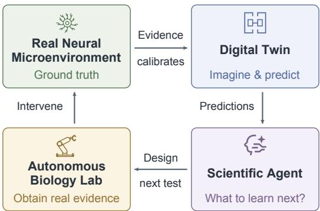  
Figure 1: Closed-loop motivation. Predictions guide experiment selection; physical evidence recalibrates the twin.

cal intervention and observation whose evidence would change its conclusions; the laboratory acts as actuator and sensor, returning measurements that recalibrate the twin. Predictive accuracy alone cannot establish a mechanism: a clearance change may reflect altered exchange, model error, or measurement bias. We call this ambiguity Twin confounding, and resolving it requires observations that separate physical explanations from plausible twin errors.

We introduce NEURONDISCOVER to study the computational discovery core of this loop. A mechanism-grounded World Action Model (WAM) combines physical transitions with typed masked diffusion for shared forward, inverse, and sensing queries. Joint mechanism–discrepancy beliefs guide experiment selection. Independently evaluated outcomes revise a Mechanism–Intervention– Observation–Outcome (MIOY) graph with scope and counterevidence, and supported relations compile into executable programs. Evaluations use independent transport reference worlds and donor-disjoint neuronal recordings. At a matched budget, graph revision increases certified relations from 3.2 to 4.0 per assigned world (paired +0.80, 95% CI [+0.57, +1.03]); discrepancy adjustment reduces accepted-program failure from 15% to 9% at 60% acceptance coverage.

Our contributions are:

• Discovery under twin confounding. We formalize twin confounding and design against the joint mechanism–discrepancy belief, scored by relation recovery, false support, and cost. NEURONDIS-COVER instantiates the computational core of the discovery loop: the WAM proposes, the Agent freezes the plan, an independent reference adjudicates, and the scoped MIOY graph is revised, recovering relations that a fixed hypothesis graph omits.

• A mechanism-grounded WAM with stated conditions. One model answers the forward, inverse, and sensing queries, so the belief that predicts is also the belief that ranks experiments, and the programs it compiles carry discrepancy-adjusted acceptance bounds. Query-compatibility, identifiability, and ranking-stability conditions, together with prospective relation tests, separate what is certified from what is diagnosed.

• A discovery-centered benchmark. Matched-budget comparisons are paired within a source, with ablations and a strongest-forward-predictor control that separates discovery from rollout accuracy. Three LLM backbones isolate the proposal interface, and donor-disjoint recordings assess transfer.

## 2 RELATED WORK

Microenvironment and world models. Transport studies motivate competing diffusion, flow, and exchange hypotheses (Iliff et al., 2012; Mestre et al., 2018; Smith et al., 2017). Inverse imaging and hybrid reservoir–Hodgkin–Huxley models reconstruct fields or correct response dynamics (Bakiler et al., 2026; Williams et al., 2025), and structural-identifiability mappings characterize indistinguishable parameters (Norden et al., 2025). WAMs couple prediction and action generation (Wang et al., 2026), with compatibility assessed across queries (Ruan et al., 2026). GC-IDM and

ACID provide inverse planning and action-consistency controls (Nguyen et al., 2026; Seo et al., 2026), and physical learning and simulator-grounded predictors supply mechanistic dynamics (Raissi et al., 2019; Pfaff et al., 2021; Dudley and Eisenberg, 2025). NEURONDISCOVER instead scores observations within the shared-joint WAM, using experiment-dependent sensitivities and response envelopes to separate mechanisms from twin discrepancy; independent outcomes determine support.

Experiment design and scientific agents. Bayesian and amortized design select informative experiments (Rainforth et al., 2024; Foster et al., 2021); BAD-PODS marginalizes latent states with nested filters (Pérez-Vieites et al., 2025). Nuisance-aware, robust, and discrepancy-learning objectives address additional uncertainty (Sloman et al., 2024; Go and Isaac, 2022; Yang et al., 2025), and causal design targets graphs or interventions (Agrawal et al., 2019; Aglietti et al., 2020). Scientific agents connect hypotheses to executable tests (Boiko et al., 2023; Ma et al., 2024; Jansen et al., 2024; Majumder et al., 2025); Model Discovery Agent combines nested inference, model proposals, and experimental design (Murphy, 2026), and NIMMGen searches neural-integrated mechanistic models (Guan et al., 2026). NEURONDISCOVER couples acquisition and hypothesis expansion to scoped MIOY revision and discrepancy-adjusted verification, separating fixed-library inference from omitted-relation recovery and extending the coverage–risk view of selective prediction (Geifman and El-Yaniv, 2017) to bound events for complete intervention programs.

## 3 BACKGROUND

## 3.1 PROBLEM SETTING

A neuronal microenvironment is a partially observed controlled system with state $S _ { t }$ , mechanism description H, physical intervention $I _ { t } .$ , observation action $O _ { t }$ , context $C ,$ , and validity state $V _ { t }$ . The combined action is $A _ { t } = ( I _ { t } , O _ { t } )$ . In a transport domain, $S _ { t }$ may contain concentration, pressure, flow, geometry, and exchange states; $Y _ { t }$ is the released measurement, and a target G is defined through a functional of the state or observation trajectory. The constraint set Γ specifies admissible interventions, observation support, horizon, and cost.

The discovery object is a graph

$$
\mathcal { G } _ { t } = ( \mathcal { M } _ { t } , \mathbb { Z } , \mathcal { O } , \mathcal { y } , \mathcal { E } _ { t } ) ,\tag{1}
$$

whose edges express mechanism–intervention–observation–outcome relations with scope, uncertainty, support, and counterevidence. A mechanism description specifies a process, interaction, constitutive relation, or parameter regime, and discovery expands this vocabulary through new hypotheses, conditions, and observables within finite per-query candidate sets.

A policy seeks correctly resolved relations while controlling false support and experimental cost:

$$
\operatorname* { m a x } _ { \pi } \mathbb { E } \left[ \mathrm { R e s } ( \mathcal { G } _ { T } ) - \lambda _ { s } \mathrm { F a l s e } ( \mathcal { G } _ { T } ) - \lambda _ { c } \sum _ { t < T } C ( A _ { t } ) \right] , \qquad \sum _ { t < T } C ( A _ { t } ) \le B .\tag{2}
$$

An independent reference assesses correctness in the declared model world, its labels reserved for evaluation: Equation (1) records what has been learned and Equation (2) scores the process.

## 3.2 MECHANISTIC DYNAMICS AND WORLD ACTION MODELS

The operational twin combines coarse physical dynamics, a learned residual, and an observation model:

$$
\begin{array} { r } { S _ { t + 1 } = F _ { \mathrm { m e c h } } ( S _ { t } , I _ { t } , H , C ) + R _ { \theta } ( S _ { t } , I _ { t } , H , C , \epsilon _ { t } ) , } \\ { Y _ { t } = \mathcal { M } _ { \psi } ( S _ { t } , O _ { t } , C ) + \nu _ { t } . \qquad } \end{array}\tag{3}
$$

A scientific WAM represents the typed joint law

$$
Q _ { \theta } ( S _ { 0 : T } , H , A _ { 0 : T - 1 } , Y _ { 0 : T } , G , V \mid C ) ,\tag{4}
$$

with a positive density on its admitted support. States, actions, observations, and outcomes retain their physical units and meanings. Forward and inverse requests condition the same joint object:

$$
Q _ { \theta } \big ( S _ { 1 : T } , Y _ { 1 : T } \mid S _ { 0 } , H , A , C \big ) \quad ( \mathrm { f o r w a r d } ) ,\tag{5}
$$

$$
Q _ { \theta } ( H , A \mid S _ { 0 } , G , C , \Gamma ) \quad ( \mathrm { i n v e r s e p r o p o s a l } ) .\tag{6}
$$

Goal conditioning in Equation (6) generates candidates; evidence updates the belief about H.

## 3.3 MECHANISM UNCERTAINTY AND TWIN CONFOUNDING

The belief $b _ { t } ( H , Z , N , S _ { t } )$ includes twin discrepancy Z, nuisance variables N, and current state. For experiment e, explanation $\xi = ( h , z )$ induces a response law $P _ { \xi } ^ { e }$ after marginalizing nuisance variables. Define

$$
d _ { \mathcal { E } } ( \xi , \xi ^ { \prime } ) = \operatorname* { s u p } _ { e \in \mathcal { E } } d ( P _ { \xi } ^ { e } , P _ { \xi ^ { \prime } } ^ { e } ) .\tag{7}
$$

Definition 1 (Twin confounding). Two explanations are observationally indistinguishable at resolution ε when $d \varepsilon ( \xi , \xi ^ { \prime } ) \leq \varepsilon$ . Twin confounding occurs when such a pair has both $\overline { { h } } \ne h ^ { \prime }$ and $z \neq z ^ { \prime }$ so the available experiments do not separate mechanism differences from compensating twin error.

Thresholded indistinguishability is pairwise and need not be transitive. Locally, the diagnostic objective is

$$
\operatorname* { m i n } _ { \pi , \hat { H } _ { T } , \hat { Z } _ { T } } \mathbb { E } [ \ell _ { H } ( \widehat { H } _ { T } , H ) + \lambda _ { Z } \ell _ { Z } ( \widehat { Z } _ { T } , Z ) + \lambda _ { V } \ell _ { V } ] , \quad \mathbb { E } \left[ \sum _ { t < T } C ( A _ { t } ) \right] \leq B .\tag{8}
$$

This local objective guides graph revision.

Scientific inverse queries return candidate programs, required observations, and reachability status (Equation (33)); independent verification determines support.

## 4 NEURONDISCOVER

NEURONDISCOVER revises an MIOY graph by linking mechanism hypotheses to interventions and discriminating observations. The WAM predicts candidate consequences; independent outcomes determine scientific support. Figure 2 summarizes this discovery cycle.

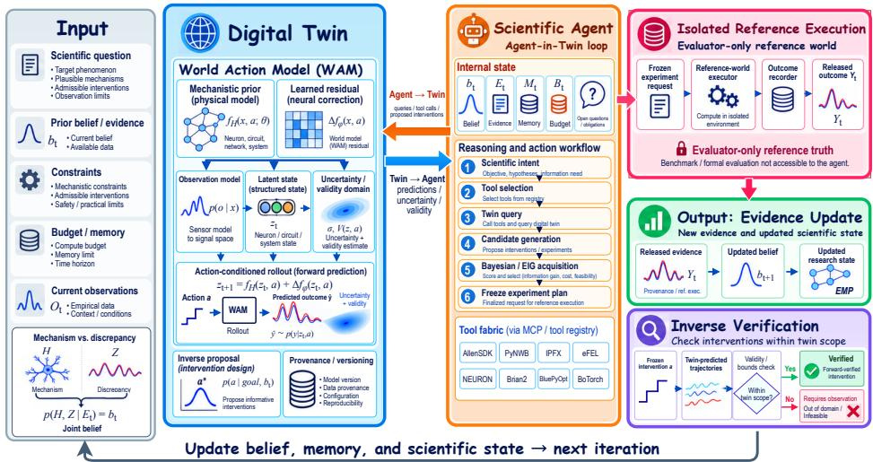  
Figure 2: NeuronDiscover overview. Questions, observations, prior evidence, and constraints initialize the twin. A mechanism-grounded World Action Model (WAM) supplies forward predictions and inverse proposals with uncertainty and validity estimates. The Agent freezes an intervention– observation plan before isolated reference execution, and released outcomes update the mechanism– discrepancy belief and the Mechanism–Intervention–Observation–Outcome (MIOY) graph. Forward verification assesses complete programs; evidence-closed relations compile into executable mechanistic programs (EMPs), and the updated state guides the next experiment.

## 4.1 A MECHANISM-GROUNDED COMPUTATIONAL WORLD

The backbone in Equation (3) supplies physical transitions and boundaries, with a learned residual for unresolved dynamics. GlymphTwin interventions specify transport or exchange targets, magnitude, duration, spatial support, and cost. Observations specify variables, locations, times, and measurement operators. Distinct discrepancy coordinates represent missing dynamics, boundary error, and observation error.

Each finite-volume cell and reservoir at each time retains a scalar token, with physical units and space–time coordinates. Training-fitted codebooks discretize values; the physical solver and learned residual decode them in the original units. Shared denoising represents state, mechanism, intervention, observation, goal, and validity blocks. The six losses couple masked prediction to decoded dynamics, physical balance, intervention contrasts, query consistency, and validity:

$$
\begin{array} { r l } & { \mathcal { L } _ { \mathrm { W A M } } = \mathcal { L } _ { \mathrm { j o i n t } } + \lambda _ { \mathrm { d y n } } \mathcal { L } _ { \mathrm { d e c } } + \lambda _ { \mathrm { p h y s } } \mathcal { L } _ { \mathrm { p h y s } } + \lambda _ { \mathrm { i n t } } \mathcal { L } _ { \Delta } } \\ & { \qquad + \lambda _ { \mathrm { c o h } } \mathcal { L } _ { \mathrm { c y c } } + \lambda _ { \mathrm { v a l } } \mathcal { L } _ { \mathrm { v a l i d } } . } \end{array}\tag{9}
$$

For example, a forward query fixes $( S _ { 0 } , H , I , O )$ and generates future states and measurements. An inverse query fixes $( S _ { 0 } , \bar { G } , \bar { \Gamma } )$ and proposes $( \dot { H } , \dot { I } , \dot { O } )$ . Sensing compares candidate operators O through their predicted measurements at fixed $( S _ { 0 } , H , I )$ . Every denoising step restores the fixed blocks. Sampling builds on discrete and masked diffusion Austin et al. (2021); Sahoo et al. (2024); Chen et al. (2024); Section D defines losses and finite-query checks.

Section D.1 specifies the codec, gradient paths, and independent field-reconstruction checks. If the population query laws are conditionals of one positive joint WAM they are Bayes-compatible on their common support (Proposition 3). That statement constrains the population object, not the implemented finite-step routes; the implemented guarantee is Lemma 2, conditional on assumed per-route error bounds. Conditional-route disagreement is the empirical diagnostic of that assumption and held-out error measures fidelity; neither certifies it (Section K.3).

## 4.2 A SCIENTIST THAT REVISES THE DISCOVERY GRAPH

The Agent maintains a belief over $( H , Z , N , S _ { t } )$ , graph $\mathcal { G } _ { t } ,$ evidence $K _ { t } .$ , and budget $B _ { t }$ . We specify a particle instantiation with state/nuisance marginalization (Section D.4). Relations carry executable scope predicates and prospective tests. An unexplained tracer curve can motivate a new exchange hypothesis or spatial observable; the new relation is tested on subsequent outcomes.

The WAM screens executable proposals, from which the policy selects an action and query template:

$$
( A _ { t } , \kappa _ { t } ) \sim \pi _ { \omega } ( \cdot \mid b _ { t } , \mathcal { G } _ { t } , K _ { t } , B _ { t } ) .\tag{10}
$$

Interventions change physical state, released observations update belief and graph support, and desired futures guide proposals.

Before the outcome, the selected action, endpoint, falsifier, and analysis are fixed:

$$
\begin{array} { r l } & { s _ { t } = \mathrm { F r e e z e } ( A _ { t } , \kappa _ { t } , \boldsymbol { A } _ { t } , \mathcal { T } _ { t } ) , } \\ & { Y _ { t } \sim P ^ { \star } ( \cdot \mid \boldsymbol { s } _ { t } ) , \qquad K _ { t + 1 } = \mathcal { R } ( K _ { t } , \boldsymbol { s } _ { t } , Y _ { t } ) . } \end{array}\tag{11}
$$

(12)

The reference is an independent simulator or registered measured response. In the transport task, the reducer retains compatible physical and sensor explanations. A mechanism relation gains support when every surviving explanation satisfies both its mechanism predicate and scoped intervention effect (Section A.4). Status, counterevidence, and scope guide the next proposal. Because the action, endpoint, falsifier and analysis are fixed before release, a conditionally super-uniform test for the realized selection keeps $\Pr ( p _ { s _ { t } } \leq \alpha ) \leq$ α despite arbitrary pre-outcome proposal search (Proposition 6); across rounds, the sequential correction in Section A.4 controls accumulated testing error.

## 4.3 CHOOSING INTERVENTIONS AND INFORMATIVE OBSERVATIONS

In declared physical coordinates, local mechanism and discrepancy sensitivities satisfy

$$
\begin{array} { c } { r _ { e } = J _ { e } ^ { \mathrm { m e c h } } \Delta h + J _ { e } ^ { \mathrm { w a m } } \Delta z + \epsilon _ { e } + o ( \| \Delta \xi \| ) , } \\ { \Lambda ( \mathcal { E } ) = \displaystyle \sum _ { e \in \mathcal { E } } J _ { e } ^ { \top } \Sigma _ { e } ^ { - 1 } J _ { e } , \qquad \xi = ( h , z ) . } \end{array}\tag{13}
$$

Proposition 1 (Local mechanism–WAM identifiability). Under the differentiable local meanresponse model with positive-definite weights, $( \Delta h , \Delta \dot { z } )$ is identifiable to first order if and only $i f \Lambda ( \mathcal { E } ) \succ 0$

Scaled finite differences estimate the joint Jacobian. Subtracting operator uncertainty from its smallest singular value gives the unregularized information floor. Full-response comparisons and a nonlinear

remainder test determine where that local guide is useful (Section D.4). Once the floor is met, the Agent ranks admissible experiments by

$$
\alpha _ { t } ( e ) = I ( Y _ { e } ; H , Z \mid e , K _ { t } ) + \lambda _ { F } F _ { t } ( e ) - \lambda _ { C } C ( e ) - \lambda _ { V } R _ { V } ( e ) .\tag{14}
$$

Here $F _ { t }$ rewards a specified falsification opportunity. Below the floor, design improves the weakest direction, breaking ties by $\alpha _ { t }$ . Nested likelihood averages marginalize state and nuisance variables; particle and sampling errors are checked separately.

For a fixed belief reducer U and bounded joint risk R, the corresponding operational utility is

$$
U _ { t } ^ { Q } ( e ) = \mathbb { E } _ { Y \sim Q _ { e } } [ \Re ( b _ { t } ) - \Re ( \mathcal { U } ( b _ { t } ; e , Y ) ) ] - \lambda _ { C } C ( e ) - \lambda _ { V } R _ { V } ( e ) .\tag{15}
$$

Proposition 2 (Acquisition stability). If the risk reduction has range width at most M and $d _ { \mathrm { T V } } ( P _ { e } ^ { \star } , Q _ { e } ) \leq \delta _ { e }$ , then $| U _ { t } ^ { P ^ { \star } } ( e ) - U _ { t } ^ { Q } ( e ) | \leq M \delta _ { e }$ . A ranking margin exceeding $M ( \delta _ { e } + \delta _ { e ^ { \prime } } )$ preserves the ordering ofe and $e ^ { \prime } .$

For bounded entropy and the Bayesian reducer under $\displaystyle Q _ { e } ,$ , the operational expected reduction equals mutual information. The transfer bound evaluates that same reducer under $P _ { e } ^ { \star }$ . Uncertain rankings motivate calibration or a better observation.

## 4.4 DISCOVERING INTERVENTIONS BY FORWARD VERIFICATION

Given $( S _ { 0 } , G , \Gamma , b _ { t } , K _ { t } )$ , the WAM proposes complete programs, including observation-dependent branches, eligibility, and costs. Operational rollouts evaluate goal attainment and violations.

For a nonempty frozen set $\boldsymbol { \mathcal { A } } _ { K }$ of K programs, let ${ \widehat { p } } _ { g } ( a )$ and ${ \widehat { p } } _ { v } ( a )$ be goal and violation frequencies from $n _ { a } > 0$ conditionally independent rollouts with sample counts fixed in advance. With $\epsilon _ { a } =$ $\sqrt { \log ( 2 K / \alpha ) / ( 2 n _ { a } ) }$ and an event-probability discrepancy bound $\delta _ { a } ,$ , simultaneously with probability at least $1 - \alpha .$

$$
\begin{array} { r } { P _ { a } ^ { \star } ( G ) \geq L _ { g } ( a ) = \widehat { p } _ { g } ( a ) - \epsilon _ { a } - \delta _ { a } , } \\ { P _ { a } ^ { \star } ( V ) \leq U _ { v } ( a ) = \widehat { p } _ { v } ( a ) + \epsilon _ { a } + \delta _ { a } . } \end{array}\tag{16}
$$

A program is accepted when $L _ { g } ( a ) \ge \tau _ { g } , U _ { v } ( a ) \le \tau _ { v }$ , and validity conditions hold. Two-sample event calibration over the frozen program set supplies simultaneous $\delta _ { a }$ bounds with failure budget $\beta$ (Section J.4); fresh verification gives total failure at most $\alpha + \beta .$ Uncovered conditions remain unresolved. Infeasibility requires exclusion over the search domain.

## 4.5 FROM EXPERIMENTAL OUTCOMES TO EXECUTABLE KNOWLEDGE

Evidence-closed relations compile into Executable Mechanistic Programs (EMPs) carrying interventions, observation triggers, validity conditions, and stopping rules. Compilation preserves each relation’s scope, uncertainty, counterevidence, and source status.

Algorithm 1 links these operations. Section D.7 illustrates the prompts and MCP exchange used to request Twin predictions and propose the next observation.

## 5 EXPERIMENTAL SETUP

We ask four questions. RQ1: can the Agent discover and revise microenvironment relations? RQ2: do shared queries and adaptive observations improve discovery? RQ3: which generated interventions pass independent verification? RQ4: which components and LLM backbones support discovery and transfer?

Domains and scientific units. The transport setting specifies worlds varying diffusion, advection or dispersion, forcing, geometry, boundary exchange, and observation operators, with public studies grounding the questions and parameter ranges Iliff et al. (2012); Smith et al. (2017); Mestre et al. (2018); Hablitz et al. (2020) and independent reference worlds supplying outcomes. The recording setting tests transfer to neuronal stimulus–response relations using public morphology, current-clamp recordings, and stimulus metadata Teeters et al. (2015); Gouwens et al. (2019); Allen Institute for Brain Science (2026).

Tasks, observations, and endpoints. Primary endpoints are resolved MIOY relations per budget, false support, scope accuracy, and omitted-relation recovery. Transport observations span mass, regional curves, spatial profiles, and boundary-sensitive channels. Recording actions select a current sweep and a voltage, spike-count, or interspike-interval window to test input resistance, firing gain, or adaptation; fixed-graph and pooled-scope controls share donor assignments, sweep menu, and budget. Withheld sweeps test response prediction and held-out donors test transfer, while ionic-mechanism claims require separate perturbation evidence. WAM fidelity, goal success, coverage, selective risk, and end-to-end cost complete the evaluation (Sections J and L).

Benchmark statistics. Table 1 separates how the evaluation data are composed from how comparisons are estimated. The sampling spine is identical across settings, so every contrast is paired within a source and no sub-unit inflates the effective sample size.

Table 1: Statistical profile of the benchmark. Composition (upper block) and analysis protocol (lower block). Every entry is fixed before evaluation, not measured. A spanning entry applies to both settings; — marks an undefined quantity.
<table><tr><td>Quantity</td><td>Transport microenvironment worlds Neuronal current-clamp recordings</td></tr><tr><td>Benchmark composition</td><td></td></tr><tr><td>Independent source unit</td><td>Generator family Biological donor</td></tr><tr><td>Source units per configuration 32, split before episodes are constructed</td><td></td></tr><tr><td>Replicates; shared budget Simulation mesh</td><td>Three per source, averaged before paired estimation; 16 experiments/task 17 cells; 136-cell reference;</td></tr><tr><td></td><td>68/136/272 refinement</td></tr><tr><td>Training / development pairs</td><td>512 from 64 families / 64 from 16 disjoint families</td></tr><tr><td>Prespecified predicate tasks</td><td>Three: input resistance, firing gain, adaptation</td></tr><tr><td>Analysis protocol</td><td></td></tr><tr><td>Dispersion reported in tables Mean and sample SD across source-unit summaries</td><td></td></tr><tr><td>Intervals and tests</td><td>95% cluster bootstrap on paired differences; paired randomization,</td></tr><tr><td>Power basis</td><td>within-family Holm 80% power, unadjusted two-sided 0.05 (factor ≈7.85); paired SD 1,</td></tr><tr><td>Unsupported and failed tasks</td><td>effect 0.5 imply the 32 units Retained in applicability and Unavailable endpoints retained in</td></tr><tr><td>Basis of reported evidence</td><td>recovery denominators prespecified denominators Every reported comparison uses the 32 sources above; no claim rests on a</td></tr></table>

Models and controls. Capacity-matched separate forward/inverse models, action consistency, and goal-conditioned inverse maps isolate representation sharing from proposal quality. Design controls include fixed sensing, plug-in EIG, BAD-PODS-style nested filtering Pérez-Vieites et al. (2025), and joint mechanism–discrepancy EIG. Agent-in-Twin and an external tool agent share tools, scientific budgets, and a fixed WAM under Kimi K3, DeepSeek V4 Flash, and GPT-5.6-Sol (Section I.2). Inverse controls include shooting, cross-entropy search, and constrained Bayesian optimization. Verifiers assess identical frozen programs. Sections A and H specifies adapters and configurations.

Evaluation protocol and statistical analysis. Methods share evidence, admissible queries, goals, and source-disjoint splits. Hidden labels remain evaluator-only; certification uses frozen programs and separate calibration/verification batches (Sections A and J).

## 6 RESULTS AND DISCUSSION

## 6.1 RQ1: RELATION DISCOVERY AND GRAPH REVISION

Graph revision raises recovery from 3.2 to 4.0 certified relations per assigned world and scope accuracy from 75% to 82%, while cutting false support from 7.0% to 5.0% (Table 2). Headline contrasts are source-level paired differences with cluster-bootstrap intervals and Holm-corrected randomization tests (Table 3), decomposed by stratum in Table 10.

Table 2: Relation discovery at matched cost. Mean ± SD over 32 sources. Resolutions count certified support plus certified falsification per assigned world; abstentions are unresolved for every policy and censored at the budget (Table 19). False support is the proportion of declared supports the reference contradicts; scope is balanced accuracy (%). Grey bold marks the best mean, ties included.
<table><tr><td>Policy</td><td>Resolutions ↑</td><td>(%)↓</td><td>False support Scope accuracy (%)↑</td><td>Cost ↓</td></tr><tr><td>Random design Rainforth et al. (2024)</td><td> $2 . 2 \pm 0 . 7$ </td><td> $1 2 . 0 \pm 4 . 5$ </td><td> $6 4 . 0 \pm 8 . 2$ </td><td> $1 5 . 4 \pm 2 . 4$ </td></tr><tr><td>Bayesian adaptive design Rainforth et al. (2024)</td><td> $3 . 0 \pm 0 . 7$ </td><td> $9 . 0 \pm 3 . 8$ </td><td> $7 1 . 0 \pm 7 . 1$ </td><td> $1 3 . 5 \pm 2 . 1$ </td></tr><tr><td>Discrepancy-aware design Yang et al. (2025)</td><td> $3 . 2 \pm 0 . 7$ </td><td> $7 . 5 \pm 3 . 1$ </td><td> $7 5 . 0 \pm 6 . 8$ </td><td> $1 4 . 5 \pm 2 . 3$ </td></tr><tr><td>Fixed hypothesis graph</td><td> $3 . 2 \pm 0 . 8$ </td><td> $7 . 0 \pm 3 . 4$ </td><td> $7 5 . 0 \pm 7 . 3$ </td><td> $1 2 . 4 \pm 1 . 9$ </td></tr><tr><td>Matched external tool agent Yao et al. (2023)</td><td> $3 . 4 \pm 0 . 7$ </td><td> $8 . 0 \pm 3 . 7$ </td><td> $7 4 . 0 \pm 7 . 0$ </td><td> $1 4 . 4 \pm 2 . 2$ </td></tr><tr><td>Agent-in-Twin (ours)</td><td>一  ${ \bf 4 . 0 \pm 0 . 7 }$ </td><td> ${ \bf 5 . 0 \pm 2 . 8 }$  </td><td> ${ \bf 8 2 . 0 \pm 6 . 2 }$  </td><td> ${ \bf 1 1 . 4 \pm 1 . 8 }$ </td></tr><tr><td>Deterministic Agent-in-Twin (ours)</td><td> $3 . 8 \pm 0 . 7$ </td><td> $5 . 5 \pm 3 . 0$ </td><td> $8 0 . 0 \pm 6 . 5$ </td><td> $1 1 . 9 \pm 1 . 8$ </td></tr></table>

Table 3: Source-level paired contrasts for the headline claims. Mean within-source difference over 32 sources with a cluster-bootstrap 95% interval and a Holm-corrected randomization p-value within each rule-separated family. Resolution rows use the certified scoring of Equation (46); abstention loads are comparable, so the differences are unchanged by it though the levels are not. Paired dispersion comes from source-level differences, not the marginal SDs of Table 2.
<table><tr><td>Contrast</td><td>Difference</td><td>95% CI</td><td>Holm p</td></tr><tr><td>Graph revision vs. fixed hypothesis graph (resolutions)</td><td>+0.80</td><td>[+0.57, +1.03]</td><td>&lt; 0.001</td></tr><tr><td>vs. strongest baseline (resolutions)</td><td>+0.60</td><td>[+0.41, +0.79]</td><td>&lt; 0.001</td></tr><tr><td>vs. deterministic orchestration control (resolutions)</td><td>+0.20</td><td>[+0.06, +0.34]</td><td>0.006</td></tr><tr><td>Joint vs. plug-in state EIG (resolutions)</td><td>+0.90</td><td>[+0.65, +1.15]</td><td>&lt; 0.001</td></tr><tr><td>Joint vs. nested-filter EIG (resolutions)</td><td>+0.60</td><td>[+0.41, +0.80]</td><td>&lt; 0.001</td></tr><tr><td>Hybrid vs. FNO adapter (status macro-F1)</td><td>+0.10</td><td>[+0.08, +0.12]</td><td>&lt; 0.001</td></tr><tr><td>Discrepancy-adjusted verification (risk, pp)</td><td>-6.0</td><td>[−7.59, -4.41]</td><td>&lt; 0.001</td></tr><tr><td>Neuronal transfer vs. fixed graph (yield)</td><td>+0.41</td><td>[+0.24, +0.58]</td><td>&lt; 0.001</td></tr></table>

## 6.2 RQ2: SHARED QUERIES AND ADAPTIVE OBSERVATION DESIGN

Mechanistic grounding improves admissible intervention-delta fidelity by 9 percentage points, and joint discrepancy modeling cuts false-support incidence by 6 points (Table 4). A stronger forward predictor does not by itself deliver discovery: the neural operator attains the best deterministic rollout error in Table 7 yet trails the hybrid by 0.10 relation-status macro-F1 under the same Agent and adapter (Tables 3 and 8), a gap concordant with calibrated uncertainty rather than point accuracy.

Table 4: Within-method ablations (Section I). Mean paired difference over 32 sources (full model minus control), its source-level SD, a cluster-bootstrap 95% interval, and a Holm-corrected randomization p-value over the six rows. Positive favors recovery/fidelity, negative false support/cost/risk.
<table><tr><td>Component control</td><td>Endpoint</td><td>Mean ± SD</td><td>95%CI</td><td>Holm p</td></tr><tr><td></td><td>Fixed hypothesis graph Missing-relation recovery (pp)</td><td> $8 . 0 \pm 6 . 8$ </td><td>[+5.55, +10.45]</td><td>&lt; 0.001</td></tr><tr><td>No mechanistic</td><td>Admissible intervention-delta</td><td> $9 . 0 \pm 6 . 4$ </td><td>[+6.69, +11.31] &lt; 0.001</td><td></td></tr><tr><td>backbone Separate forward and</td><td>fidelity (pp) Relation recovery (pp)</td><td> $5 . 0 \pm 5 . 7$ </td><td>[+2.94, +7.06] &lt; 0.001</td><td></td></tr><tr><td>inverse models Mechanism belief</td><td>World-level false-support</td><td> $- 6 . 0 \pm 4 . 6$ </td><td>[−7.66, -4.34] &lt; 0.001</td><td></td></tr><tr><td>without discrepancy Fixed observation</td><td>incidence (pp) Restricted resolution cost (cost</td><td> $- 2 . 0 \pm 1 . 8$ </td><td>[−2.65, −1.35] &lt; 0.001</td><td></td></tr><tr><td>schedule Nominal verification</td><td>units) Accepted-program risk (pp)</td><td> $- 6 . 0 \pm 4 . 4$ </td><td>[−7.59, -4.41] &lt; 0.001</td><td></td></tr></table>

Adaptive measurements reach 4.0 correct relations per assigned world at cost 16 against 2.8 for fixed sensing on the same WAM (Figure 6a). Under the harder nonlinear-discrepancy condition, joint mechanism–discrepancy EIG resolves 3.8 relations per assigned world versus 2.9 for plug-in EIG at 5% versus 11% false support, with a paired advantage of +0.60 over nested-filter EIG (Table 3); its margin over Inside-Out $\mathrm { S M C ^ { 2 } }$ and PASOA is within one source-level SD (Table 5). Its online time ratio is 2.9, so the gain is bought with computation rather than experiments.

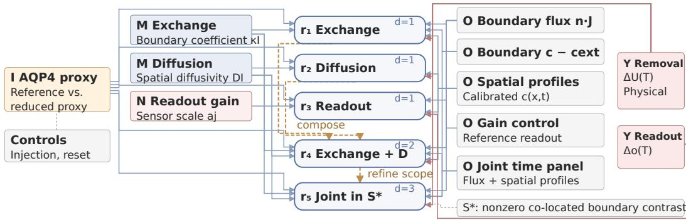  
Shared scope: prescribed permeability regime, geometry, reset state and horizon T.  
Figure 3: Why the discovery graph is typed. Three accounts of one retention change differ only in the role that carries it: a mechanism node M, or the nuisance readout node N. An observation node O feeds the observed endpoint $\Delta o ( T )$ ), never the physical endpoint $\Delta U ( T )$ , so a readout account cannot be credited with a mechanism. Ochre dashed arrows mark composition or scope refinement, not support.

## 6.3 RQ3: INDEPENDENT VERIFICATION OF GENERATED INTERVENTIONS

At 60% acceptance coverage, discrepancy adjustment reduces accepted-program failure from 15% to 9% (Figure 6b); thresholds vary over identical proposals and outcomes, so common coverage isolates acceptance quality. Every certificate uses a schedule fixed before calibration, so the fixed-sample precondition of Theorem 1 holds by construction (Section K).

## 6.4 RQ4: COMPONENTS, LLM BACKBONES, AND TRANSFER

Component ablations are collected in Table 4: every control moves its own endpoint in the expected direction, and the MIOY graph ingredients are isolated separately below. The language model is an optional proposal interface with a localised benefit; Figure 9 and Section I.2 compare three backbones with the WAM, tools, evidence, splits, and call caps fixed. Stratified by task family (Table 11), its aggregate +0.20 relations per assigned world concentrates in tasks that extend the hypothesis vocabulary (+0.60 on omitted-relation proposal), with intervals covering zero elsewhere; where the vocabulary is closed the deterministic controller is preferable and cheaper. Recovery of 2.85 relations per applicable world at 68% applicability gives 1.94 per assigned world against 1.53 for the fixed-graph control (Table 10), with stratified weights in Section J.1.

## CASE STUDY: BOUNDARY EXCHANGE OR READOUT CHANGE?

An AQP4-proxy reduction lowers measured tracer retention, and three elementary accounts explain that single number equally well: it may reduce boundary exchange $\kappa _ { I } ,$ alter parenchymal diffusivity $D _ { I } .$ , or not be physical at all and instead change the sensor gain $a _ { j } .$ This is twin confounding at its sharpest, since the last account charges the whole effect to the observation model and no further retention sampling separates them.

They are not values of one variable but three role bindings of one outcome (Figure 3), which is what the typing buys: an observation node may explain the observed endpoint and never the physical one, so the binding that would hide the confound cannot be stated. Calibrated flux at nonzero contrast $c - c _ { \mathrm { e x t } }$ then constrains $\kappa _ { I }$ through Equation (17), spatial profiles test $D _ { I }$ , and a gain control with no physical intervention isolates $a _ { j }$ . Support is withheld once en route, and a later context that satisfies the declared scope predicate yet defeats the effect births a scope-narrowed version rather than overwriting the original (Section K.4); a context outside the predicate would refute nothing.

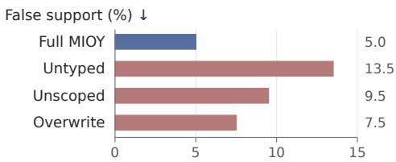  
Figure 4: Each MIOY component, removed. False support per assigned world.

Figure 4 removes each ingredient over all 32 sources. Untyped drops the observation role, so every readout change is charged to a mechanism and false support rises from 5.0% to 13.5%; unscoped drops the scope predicate (9.5%) and overwrite edits contradicted relations in place (7.5%). Resolutions move far less: removing a role does not stop the Agent closing relations, only closing them for the right reason.

## 7 CONCLUSION

NEURONDISCOVER treats mechanistic discovery as sequential experiment design against a twin that is itself uncertain: a mechanistic change and a twin error leave the same signature in sparse data, so the Agent carries a joint mechanism–discrepancy belief, chooses experiments that pull the two apart, and revises a scoped MIOY graph whose supported relations compile into executable programs. Revisable, typed hypotheses are what recover relations, not a stronger forward predictor. Correctness is adjudicated within declared model worlds, so binding this loop to an instrument is the next step.

## ETHICS STATEMENT

NEURONDISCOVER studies computational mechanism hypotheses in neuronal microenvironments. The evaluation uses public data and explicitly modeled reference worlds. Generated trajectories are distinguished from measured observations, and evidence retains its source and scope. Virtual intervention programs are research objects, not clinical treatment recommendations. Translation to physical or biological experiments requires domain validation, appropriate ethical review, and human authorization. Public source licenses and access conditions apply to all reused data.

## REPRODUCIBILITY STATEMENT

The scientific variables, model queries, graph updates, and intervention certificates are defined in Sections 3 to D. Algorithm 1 specifies the scientist loop, and Section F gives the proofs. The empirical protocol in Sections A, G, J and L defines data separation, baselines, statistical units, and the records required to reproduce a comparison.

## AI USE STATEMENT

A large language model assisted with organizing author-provided design documents, literature retrieval, LaTeX drafting and editing, mathematical checks, and compilation checks. The authors retain responsibility for checking and approving the claims, citations, equations, and final text.

## REFERENCES

Virginia Aglietti, Xiaoyu Lu, Andrei Paleyes, and Javier González. Causal bayesian optimization. In Proceedings ofthe Twenty Third International Conference on Artificial Intelligence and Statistics, volume 108 of Proceedings of Machine Learning Research, pages 3155–3164. PMLR, 2020.

Raj Agrawal, Chandler Squires, Karren Yang, Karthikeyan Shanmugam, and Caroline Uhler. ABCDstrategy: Budgeted experimental design for targeted causal structure discovery. In Proceedings of the Twenty-Second International Conference on Artificial Intelligence and Statistics, volume 89 of Proceedings ofMachine Learning Research, pages 3400–3409. PMLR, 2019.

Allen Institute for Brain Science. Allen cell types database, 2026. Public data resource, accessed 2026-08-04.

Anastasios N. Angelopoulos and Stephen Bates. Conformal prediction: A gentle introduction. Foundations and Trends in Machine Learning, 16(4):494–591, 2023. doi: 10.1561/2200000101.

Jacob Austin, Daniel D. Johnson, Jonathan Ho, Daniel Tarlow, and Rianne van den Berg. Structured denoising diffusion models in discrete state-spaces. In Advances in Neural Information Processing Systems, volume 34, 2021.

A. Derya Bakiler, Michael J. Johnson, Michael R. A. Abdelmalik, Frimpong A. Baidoo, Andrew Badachhape, Ananth V. Annapragada, Thomas J. R. Hughes, and Shaolie S. Hossain. Reconstruction of glymphatic transport fields from subject-specific imaging data, with particular emphasis on cerebrospinal fluid flow and tracer conservation. arXiv preprint arXiv:2605.00730, 2026. doi: 10.48550/arXiv.2605.00730.

Roland Becker and Rolf Rannacher. An optimal control approach to a posteriori error estimation in finite element methods. Acta Numerica, 10:1–102, 2001. doi: 10.1017/S0962492901000010.

Yazan N. Billeh, Binghuang Cai, Sergey L. Gratiy, et al. Systematic integration of structural and functional data into multi-scale models of mouse primary visual cortex. Neuron, 106(3):388– 403.e18, 2020. doi: 10.1016/j.neuron.2020.01.040.

Daniil A. Boiko, Robert MacKnight, Ben Kline, and Gabe Gomes. Autonomous chemical research with large language models. Nature, 624:570–578, 2023. doi: 10.1038/s41586-023-06792-0.

Huiwen Chang, Han Zhang, Lu Jiang, Ce Liu, and William T. Freeman. MaskGIT: Masked generative image transformer. In Proceedings of the IEEE/CVF Conference on Computer Vision and Pattern Recognition, 2022.

Boyuan Chen, Diego Martí Monsó, Yilun Du, Max Simchowitz, Russ Tedrake, and Vincent Sitzmann. Diffusion forcing: Next-token prediction meets full-sequence diffusion. In Advances in Neural Information Processing Systems, volume 37, 2024. doi: 10.52202/079017-0759.

Kyunghyun Cho, Bart van Merriënboer, Caglar Gulcehre, Dzmitry Bahdanau, Fethi Bougares, Holger Schwenk, and Yoshua Bengio. Learning phrase representations using RNN encoder–decoder for statistical machine translation. In Proceedings of the 2014 Conference on Empirical Methods in Natural Language Processing, 2014.

Kurtland Chua, Roberto Calandra, Rowan McAllister, and Sergey Levine. Deep reinforcement learning in a handful of trials using probabilistic dynamics models. In Advances in Neural Information Processing Systems, volume 31, 2018.

Adam C. Dama, Kevin S. Kim, Danielle M. Leyva, Annamarie P. Lunkes, Noah S. Schmid, Kenan Jijakli, and Paul A. Jensen. BacterAI maps microbial metabolism without prior knowledge. Nature Microbiology, 8(6):1018–1025, 2023. doi: 10.1038/s41564-023-01376-0.

Pieter-Tjerk de Boer, Dirk P. Kroese, Shie Mannor, and Reuven Y. Rubinstein. A tutorial on the cross-entropy method. Annals of Operations Research, 134(1):19–67, 2005. doi: 10.1007/ s10479-005-5724-z.

Saskia E. J. de Vries, Jerome A. Lecoq, Michael A. Buice, et al. A large-scale standardized physiological survey reveals functional organization of the mouse visual cortex. Nature Neuroscience, 23: 138–151, 2020. doi: 10.1038/s41593-019-0550-9.

Jacob Devlin, Ming-Wei Chang, Kenton Lee, and Kristina Toutanova. BERT: Pre-training of deep bidirectional transformers for language understanding. In Proceedings ofthe 2019 Conference of the North American Chapter of the Association for Computational Linguistics: Human Language Technologies, 2019.

Carson Dudley and Marisa Eisenberg. Learning from simulators: A theory of simulation-grounded learning, 2025. arXiv preprint, version 2.

Alexandre Ern and Martin Vohralík. Polynomial-degree-robust a posteriori estimates in a unified setting for conforming, nonconforming, discontinuous Galerkin, and mixed discretizations. SIAM Journal on Numerical Analysis, 53(2):1058–1081, 2015. doi: 10.1137/130950100.

Adam Foster, Desi R. Ivanova, Ilyas Malik, and Tom Rainforth. Deep adaptive design: Amortizing sequential bayesian experimental design. In Proceedings ofthe 38th International Conference on Machine Learning, volume 139 of Proceedings ofMachine Learning Research, pages 3384–3395. PMLR, 2021.

Yonatan Geifman and Ran El-Yaniv. Selective classification for deep neural networks. In Advances in Neural Information Processing Systems, volume 30, 2017.

Jinwoo Go and Tobin Isaac. Robust expected information gain for optimal bayesian experimental design using ambiguity sets. In Proceedings ofthe Thirty-Eighth Conference on Uncertainty in Artificial Intelligence, volume 180 of Proceedings ofMachine Learning Research, pages 728–737. PMLR, 2022.

Nathan W. Gouwens, Staci A. Sorensen, Jim Berg, et al. Classification of electrophysiological and morphological neuron types in the mouse visual cortex. Nature Neuroscience, 22:1182–1195, 2019. doi: 10.1038/s41593-019-0417-0.

Zihan Guan, Rituparna Datta, Mengxuan Hu, Shunshun Liu, Aiying Zhang, Prasanna Balachandran, Sheng Li, and Anil Vullikanti. Are LLMs ready for neural-integrated mechanistic modeling? a benchmark and agentic framework. arXiv preprint arXiv:2602.18008, 2026. doi: 10.48550/arXiv. 2602.18008.

Lauren M. Hablitz, Virginia Pla, Michael Giannetto, et al. Circadian control of brain glymphatic and lymphatic fluid flow. Nature Communications, 11:4411, 2020. doi: 10.1038/s41467-020-18115-2.

Danijar Hafner, Jurgis Pasukonis, Jimmy Ba, and Timothy Lillicrap. Mastering diverse control tasks through world models. Nature, 640:647–653, 2025. doi: 10.1038/s41586-025-08744-2.

Nicklas Hansen, Hao Su, and Xiaolong Wang. TD-MPC2: Scalable, robust world models for continuous control. In International Conference on Learning Representations, 2024.

Costantino Iadecola. The neurovascular unit coming of age: A journey through neurovascular coupling in health and disease. Neuron, 96(1):17–42, 2017. doi: 10.1016/j.neuron.2017.07.030.

Jeffrey J. Iliff, Minghuan Wang, Yonghong Liao, et al. A paravascular pathway facilitates cerebrospinal fluid flow through the brain parenchyma and the clearance of interstitial solutes, including amyloid beta. Science Translational Medicine, 4(147):147ra111, 2012. doi: 10.1126/scitranslmed.3003748.

Jacopo Iollo, Christophe Heinkelé, Pierre Alliez, and Florence Forbes. PASOA: PArticle baSed Bayesian Optimal Adaptive design. In Proceedings of the 41st International Conference on Machine Learning, volume 235 of Proceedings of Machine Learning Research, pages 21020– 21046. PMLR, 2024.

Sahel Iqbal, Adrien Corenflos, Simo Särkkä, and Hany Abdulsamad. Nesting particle filters for experimental design in dynamical systems. In Proceedings of the 41st International Conference on Machine Learning, volume 235 of Proceedings of Machine Learning Research, pages 21047–21068. PMLR, 2024.

Peter Jansen, Marc-Alexandre Cote, Tushar Khot, Erin Bransom, Bhavana Dalvi Mishra, Bodhisattwa Prasad Majumder, Oyvind Tafjord, and Peter Clark. Discoveryworld: A virtual environment for developing and evaluating automated scientific discovery agents. In Advances in Neural Information Processing Systems, volume 37, 2024. doi: 10.52202/079017-0324.

Zongyi Li, Nikola Kovachki, Kamyar Azizzadenesheli, Burigede Liu, Kaushik Bhattacharya, Andrew Stuart, and Anima Anandkumar. Fourier neural operator for parametric partial differential equations. In International Conference on Learning Representations, 2021.

Pingchuan Ma, Tsun-Hsuan Wang, Minghao Guo, Zhiqing Sun, Joshua B. Tenenbaum, Daniela Rus, Chuang Gan, and Wojciech Matusik. LLM and simulation as bilevel optimizers: A new paradigm to advance physical scientific discovery. In Proceedings of the 41st International Conference on Machine Learning, volume 235 of Proceedings ofMachine Learning Research, pages 33940–33962. PMLR, 2024.

Bodhisattwa Prasad Majumder, Harshit Surana, Dhruv Agarwal, et al. Discoverybench: Toward data-driven discovery with large language models. In International Conference on Learning Representations, 2025.

Humberto Mestre, Jeffrey Tithof, Ting Du, Wei Song, Weiguo Peng, Amanda M. Sweeney, Genaro Olveda, John H. Thomas, Maiken Nedergaard, and Douglas H. Kelley. Flow of cerebrospinal fluid is driven by arterial pulsations and is reduced in hypertension. Nature Communications, 9:4878, 2018. doi: 10.1038/s41467-018-07318-3.

Model Context Protocol Contributors. Model Context Protocol: Tools specification, 2025. URL https://modelcontextprotocol.io/specification/2025-11-25/server/ tools. Specification revision 2025-11-25.

Kevin Murphy. Model discovery agent: LLM-assisted bayesian experiment design for data-efficient discovery of mechanistic world models, 2026. arXiv preprint, version 4.

Hoang Nguyen, Xiaohao Xu, and Xiaonan Huang. Latent geometry beyond search: Amortizing planning in world models. arXiv preprint arXiv:2605.08732, 2026. doi: 10.48550/arXiv.2605. 08732.

Janis Norden, Elisa Oostwal, Michael Chappell, Peter Tino, and Kerstin Bunte. Structure is information: structural identifiability mappings for machine learning with partially observed dynamical systems. arXiv preprint arXiv:2502.04131, 2025. doi: 10.48550/arXiv.2502.04131.

Sara Pérez-Vieites, Sahel Iqbal, Simo Särkkä, and Dominik Baumann. Online Bayesian experimental design for partially observed dynamical systems. arXiv preprint arXiv:2511.04403, 2025. doi: 10.48550/arXiv.2511.04403.

Tobias Pfaff, Meire Fortunato, Alvaro Sanchez-Gonzalez, and Peter Battaglia. Learning mesh-based simulation with graph networks. In International Conference on Learning Representations, 2021.

Tom Rainforth, Adam Foster, Desi R. Ivanova, and Freddie Bickford Smith. Modern Bayesian experimental design. Statistical Science, 39(1):100–114, 2024. doi: 10.1214/23-STS915.

Maziar Raissi, Paris Perdikaris, and George Em Karniadakis. Physics-informed neural networks: A deep learning framework for solving forward and inverse problems involving nonlinear partial differential equations. Journal ofComputational Physics, 378:686–707, 2019. doi: 10.1016/j.jcp. 2018.10.045.

Jacob T. Rapp, Bennett J. Bremer, and Philip A. Romero. Self-driving laboratories to autonomously navigate the protein fitness landscape. Nature Chemical Engineering, 1(1):97–107, 2024. doi: 10.1038/s44286-023-00002-4.

Bo-Kai Ruan, Teng-Fang Hsiao, Ling Lo, and Hong-Han Shuai. Is the future compatible? diagnosing dynamic consistency in world action models. arXiv preprint arXiv:2605.07514, 2026. doi: 10.48550/arXiv.2605.07514.

Siegfried M. Rump. Verification methods: Rigorous results using floating-point arithmetic. Acta Numerica, 19:287–449, 2010. doi: 10.1017/S096249291000005X.

Subham Sekhar Sahoo, Marianne Arriola, Yair Schiff, Aaron Gokaslan, Edgar Mariano Marroquin, Justin T. Chiu, Alexander M. Rush, and Volodymyr Kuleshov. Simple and effective masked diffusion language models. In Advances in Neural Information Processing Systems, volume 37, 2024. doi: 10.52202/079017-4135.

Gawon Seo, Dongwon Kim, and Suha Kwak. ACID: Action consistency via inverse dynamics for planning with world models. arXiv preprint arXiv:2607.02403, 2026. doi: 10.48550/arXiv.2607. 02403.

Joshua H. Siegle, Xiaoxuan Jia, Severine Durand, et al. Survey of spiking in the mouse visual system reveals functional hierarchy. Nature, 592:86–92, 2021. doi: 10.1038/s41586-020-03171-x.

Sabina J. Sloman, Ayush Bharti, Julien Martinelli, and Samuel Kaski. Bayesian active learning in the presence of nuisance parameters. In Proceedings ofthe Fortieth Conference on Uncertainty in Artificial Intelligence, volume 244 of Proceedings ofMachine Learning Research, pages 3245– 3263. PMLR, 2024.

Alex J. Smith, Xiaoming Yao, James A. Dix, Byung-Ju Jin, and Alan S. Verkman. Test of the ’glymphatic’ hypothesis demonstrates diffusive and aquaporin-4-independent solute transport in rodent brain parenchyma. eLife, 6:e27679, 2017. doi: 10.7554/eLife.27679.

Jeffery L. Teeters, Keith Godfrey, Rob Young, Calvin Dang, Chris Friedsam, Barry Wark, Hiroki Asari, Simon Peron, Nuo Li, Adrien Peyrache, Genady Denisov, Joshua H. Siegle, Shawn R. Olsen, Corbett Martin, Michelle Chun, Shreejoy Tripathy, Timothy J. Blanche, Kenneth Harris, György Buzsáki, Christof Koch, Markus Meister, Karel Svoboda, and Friedrich T. Sommer. Neurodata without borders: Creating a common data format for neurophysiology. Neuron, 88(4):629–634, 2015. doi: 10.1016/j.neuron.2015.10.025.

Ashish Vaswani, Noam Shazeer, Niki Parmar, Jakob Uszkoreit, Llion Jones, Aidan N. Gomez, Lukasz Kaiser, and Illia Polosukhin. Attention is all you need. In Advances in Neural Information Processing Systems, volume 30, 2017.

Siyin Wang, Junhao Shi, Zhaoyang Fu, Xinzhe He, Feihong Liu, Chenchen Yang, Yikang Zhou, Zhaoye Fei, Jingjing Gong, Jinlan Fu, Mike Zheng Shou, Xuanjing Huang, Xipeng Qiu, and Yu-Gang Jiang. World action models: The next frontier in embodied ai. arXiv preprint arXiv:2605.12090, 2026. doi: 10.48550/arXiv.2605.12090.

Ian Williams, Joseph D. Taylor, and Alain Nogaret. Correcting model error bias in estimations of neuronal dynamics from time series observations, 2025. arXiv preprint, version 1.

Lulu Xie, Hongyi Kang, Qiwu Xu, et al. Sleep drives metabolite clearance from the adult brain. Science, 342(6156):373–377, 2013. doi: 10.1126/science.1241224.

Huchen Yang, Chuanqi Chen, and Jin-Long Wu. Active learning of model discrepancy with bayesian experimental design. Computer Methods in Applied Mechanics and Engineering, 446:118198, 2025. doi: 10.1016/j.cma.2025.118198.

Shunyu Yao, Jeffrey Zhao, Dian Yu, Nan Du, Izhak Shafran, Karthik Narasimhan, and Yuan Cao. React: Synergizing reasoning and acting in language models. In International Conference on Learning Representations, 2023.

## Appendix contents

Experimental protocols, methods and theory, and worked MIOY case studies.

A Experimental Protocol 17   
A.1 Question-to-evidence mapping 17   
A.2 Microenvironment relation discovery 17   
A.3 A concrete transport and observation task 17   
A.4 Prospective tests for a newly proposed 18   
relation   
A.5 Bidirectional modeling and observation 18   
design   
A.6 Inverse intervention verification 18   
A.7 Baselines and adaptation 19   
A.8 Structural and domain transfer 19   
A.9 Scale and selection 19   
B Supplementary Experimental Analyses 20   
B.1 WAM fidelity and query agreement 20   
B.2 Independent WAM baseline matrix 20   
B.3 Transfer coverage and conditional 22   
discovery   
B.4 Calibration and sequential validity 23   
B.5 Paired contrasts and discovery traces 24   
B.6 MIOY case: pulsatility and regional 25   
half-life   
B.7 MIOY case: diffusion, advection, and 25   
dispersion   
C Notation, Assumptions, and Guarantee 26   
Scope   
D Extended WAM and Agent-in-Twin 27   
Specification   
D.1 Typed episode representation 27   
D.2 Mechanistic conditioning and residual 28   
learning   
D.3 Arbitrary-block queries and 29   
approximation   
D.4 Open MIOY proposals and evidence 29   
updates   
D.5 Inverse discovery and reachability 31   
D.6 Sequential interaction and intervention 31   
programs   
D.7 Agent–Twin prompts and MCP exchange 31   
E Theoretical Results: From Representation 36   
to Scientific Decision   
E.1 Population compatibility and finite-query 36   
error   
E.2 Information geometry of Twin 36   
confounding   
E.3 An analytical transport example 37   
E.4 Certified response enclosure for the 37   
bounded exchange model   
E.5 Post-freeze evidence validity 38   
E.6 Robust reachability after inverse 38   
generation   
E.7 Composition across the discovery 39   
pipeline   
E.8 Evidence-sound EMP compilation 39   
F Proofs 39   
G Public Data and Microenvironment 41   
Construction   
G.1 Scientific sources and measurement 41   
semantics   
G.2 Canonical state, action, and observation 41   
variables   
G.3 Operational and reference worlds 41   
G.4 Visibility and leakage 41   
H Hyperparameters and Model Selection 42   
I Robustness and Mechanism-Aligned 42   
Ablations   
I.1 What each component changes 42   
I.2 Sensitivity to the scientific agent’s LLM 43   
I.3 Structured shifts 43   
I.4 When the declared envelope is wrong 43   
I.5 Misspecified observation noise 44   
I.6 Scaling in envelope size 44   
J Estimands and Statistical Analysis 45   
J.1 Graph and discovery endpoints 45   
J.2 Prediction and intervention endpoints 46   
J.3 Independent units and paired estimates 47   
J.4 Precision, missingness, and multiplicity 48   
K Certification Ledger, Support Certificates, 49   
and a Replayed Discovery Trace   
K.1 Realised event calibration and the 49   
sampling schedule   
K.2 Which relation decisions carry a 51   
numerical certificate   
K.3 Population compatibility versus 52   
implemented route agreement   
K.4 A replayed discovery trace 52   
L Compute and Reproducibility 53

## A EXPERIMENTAL PROTOCOL

## A.1 QUESTION-TO-EVIDENCE MAPPING

RQ1 compares open graph revision with fixed hypotheses at matched experimental cost, measuring relation and scope recovery, false support, and missing-mechanism recovery. RQ2 compares shared and separate models and adaptive and fixed observation design through relation recovery, observation cost, conditional consistency, and intervention fidelity. RQ3 applies nominal and discrepancy-adjusted verification to identical programs, measuring independent goal success, violations, acceptance coverage, and the certification rate. RQ4 uses component ablations, model-matched Agent controls, and held-out geometry, processes, observations, and donors to assess structural and domain generalization. Forward prediction and numerical validity diagnose the model underlying these discovery endpoints.

## A.2 MICROENVIRONMENT RELATION DISCOVERY

GlymphTwin crosses transport mechanisms with discrepancy where feasible, fixing compartment, reset state, observation access, and budget. Open tasks omit relations/scopes; fixed-graph controls update existing beliefs, and external agents share the proposal interface. Executable predictions and matching evidence determine credit, separately for support, contradiction, replacement, false support, and unresolved alternatives.

## A.3 A CONCRETE TRANSPORT AND OBSERVATION TASK

The controlled-reset task uses a bounded compartment Ω with known geometry and a prescribed nonnegative initial tracer profile $c _ { 0 }$ of positive mass. Each experiment branches from this state, applies a fixed intervention schedule, and returns measurements at selected locations and times. Experiment selection remains history-conditioned, while each execution starts from the common reset state. Its transport law is

$$
\begin{array} { r l } { \partial _ { t } c + \nabla \cdot J = - k _ { c } c + s _ { I } , } & { { } \ J = u _ { I } c - D _ { I } \nabla c , } \\ { n \cdot J = \kappa _ { I } ( c - c _ { \mathrm { e x t } } ) } & { { } \ \mathrm { ~ o n ~ } \Gamma _ { \mathrm { e x } } \subseteq \partial \Omega . } \end{array}\tag{17}
$$

The remaining boundary is reflecting. Diffusivity $D _ { I }$ is positive definite, $k _ { c } , \kappa _ { I } \geq 0$ , and the source, external concentration, and boundary schedules are specified by the task. Velocity and exchange coefficient have units of length/time, diffusivity length<sup>2</sup>/time, and $k _ { c }$ inverse time. Conservation gives $\begin{array} { r } { \dot { M } = \int _ { \Omega } s _ { I } d x - \int _ { \Omega } k _ { c } c d x - \int _ { \Gamma _ { \mathrm { e v } } } \kappa _ { I } ( c - c _ { \mathrm { e x t } } ) d S } \end{array}$ . Removal from a compartment is distinct from transfer between compartments and whole-system clearance.

The hypothesis envelope contains compositions of the admitted physical terms and their parameters. Diffusion-only sets $u _ { I } = 0 ;$ advective transport and effective dispersion change distinct terms. An AQP4-related virtual proxy can enter the exchange coefficient, parenchymal diffusivity, or measurement gain in competing hypotheses. Each mapping defines a separate testable explanation for the virtual proxy. The questions follow the compartment-specific transport literature Smith et al. (2017); Mestre et al. (2018) and the domain formulation.

For channel j at time $t _ { k }$ , a concentration observation has mean

$$
\begin{array} { c } { { \mu _ { e , j k } ( \xi ) = a _ { j } \displaystyle \int _ { \Omega } w _ { e , j } ( x ) c _ { \xi } ( x , t _ { k } ) d x + b _ { j } , } } \\ { { Y _ { e } = \mu _ { e } ( \xi ^ { \star } ) + d _ { e } + \epsilon _ { e } . } } \end{array}\tag{18}
$$

Here $w _ { e , j }$ is a fixed spatial averaging kernel, $a _ { j } ~ > ~ 0$ and $b _ { j }$ are sensor gain and offset. The explanation ${ \boldsymbol \xi } = ( H , Z , N )$ includes mechanism composition, explicit dynamics or observationdiscrepancy coordinates, and remaining nuisance parameters. These coordinates alter $\mu _ { e } ( \xi ) ; d _ { e }$ is the residual error after those corrections. Flow or pressure channels use their own operators. Conditional on pre-outcome history, $\epsilon _ { e }$ is Gaussian with known positive-definite covariance $\Sigma _ { e } ,$ retaining withinblock correlations. The mean-error set $\mathcal { D } _ { e } ( \xi )$ is fixed before the outcome. Applications with other noise laws require observation-specific tests.

The prior is uniform over finitely many admitted compositions. Positive parameters use log-uniform intervals $0 < a < b < \infty ;$ signed forcing and offsets use bounded uniform priors, renormalized under physical constraints. Source/development data fix intervals, kernels, and covariance before evaluation. The nominal Gaussian law $( d _ { e } = 0 )$ updates ranking belief; support tests use the full parameter/error envelope independently of that prior.

## A.4 PROSPECTIVE TESTS FOR A NEWLY PROPOSED RELATION

Let $\Xi _ { r }$ be the explanation envelope when relation version r is proposed. It includes the proposed mechanism and competing physical and sensor explanations. The relation fixes two interventions, their common initial conditions, and scope $S _ { r }$ . On a post-injection interval with $s _ { I } \equiv 0$ and $c _ { \mathrm { e x t } } = 0$ , define compartment removal $\hat { U _ { \xi } } ( I , C ) = 1 \stackrel { \cdot } { - } M _ { \xi } ( \tilde { T } ; I , C ) / M _ { \xi } ( 0 ; C )$ . Write $g _ { r } ( \xi ) =$ $\begin{array} { r } { \operatorname* { i n f } _ { C \in \mathcal { S } _ { r } } [ U _ { \xi } ( I _ { 1 } , C ) - \mathbf { \hat { U } } _ { \xi } ( I _ { 0 } , C ) ] } \end{array}$ . A mechanism-specific relation also fixes a predicate $m _ { r } ( \xi )$ on the physical explanation, such as whether the AQP4 proxy acts through boundary exchange rather than sensor gain. Its property is

$$
\mathcal { R } _ { r } = \{ \xi \in \Xi _ { r } : m _ { r } ( \xi ) = 1 , g _ { r } ( \xi ) \geq \Delta _ { r } \} ,\tag{19}
$$

where $\Delta _ { r } > 0$ is the meaningful effect fixed at proposal time. Mechanism membership and the effect are reported separately: if all surviving explanations satisfy the effect but disagree on $m _ { r } ,$ , the effect is supported while the mechanism remains unresolved. Refuting their conjunction need not refute the mechanism itself. Counterfactual dynamics uncertainty belongs in $\Xi _ { r }$ , separately from observation-error allowances.

Only subsequent outcomes test this version. Starting with $\mathcal { C } _ { r , 0 } = \Xi _ { r }$ , let ℓ count its prospective blocks. With dimension $m _ { e }$ and error allocation $\eta _ { r , \ell }$ , intersect the surviving explanations with

$$
\begin{array} { r l r } & { } & { T _ { e } ( \xi ) = \underset { d \in \mathcal { D } _ { e } ( \xi ) } { \operatorname* { i n f } } \| \Sigma _ { e } ^ { - 1 / 2 } ( Y _ { e } - \mu _ { e } ( \xi ) - d ) \| _ { 2 } ^ { 2 } , } \\ & { } & { \mathcal { C } _ { r , \ell } = \mathcal { C } _ { r , \ell - 1 } \cap \{ \xi : T _ { e } ( \xi ) \leq \chi _ { m _ { e } , 1 - \eta _ { r , \ell } } ^ { 2 } \} . } \end{array}\tag{20}
$$

The action, channels, times, covariance, error set, and threshold are predictable from the pre-outcome history. A nonempty set contained in $\mathcal { R } _ { r }$ supports the relation; a nonempty set disjoint from $\mathcal { R } _ { r }$ falsifies it. Otherwise it remains unresolved. An empty set triggers an adequacy or numerical diagnostic, accounting for the allocated stochastic tail event.

Assign globally unique birth indices $r = 1 , 2 , \ldots$ . to new relations and scope revisions, and use $\eta _ { r , \ell } = \gamma / [ r ( r + 1 ) \ell ( \ell + 1 ) ]$ for $0 < \gamma < 1$ . The total allocation is at most $\gamma .$ . The budget carries across scope and envelope revisions. Earlier residuals can motivate a new version, but its confirmatory set starts from the new envelope and fresh outcomes. Proposition 7 gives simultaneous validity; Section J.4 specifies composite-null p-values and the requirements for simulator-based tests.

Numerical set inversion must preserve the bound directions. A certified lower bound on $T _ { e }$ excludes an explanation only when it exceeds the threshold. For an outer set $\overline { { \mathcal { C } } } \supseteq \mathcal { C } _ { r , \ell } ,$ , support requires $m _ { r } = 1$ throughout $\overline { { \mathcal { C } } }$ and a certified lower bound on $\operatorname* { i n f } _ { \xi \in { \overline { { \mathcal { C } } } } } g _ { r } ( \xi )$ of at least $\Delta _ { r }$ . Falsification requires certified absence of explanations satisfying both conditions, for example an upper bound below $\Delta _ { r }$ on the subset with $m _ { r } = 1$ . Nonemptiness requires a verified feasible witness in the surviving set. Scope changes create linked relation versions with new prospective tests, retaining the original evidence.

## A.5 BIDIRECTIONAL MODELING AND OBSERVATION DESIGN

Matched WAM comparisons separate fidelity, physical residuals, and conditional consistency (Section B.2). At common measurement cost, sensing compares fixed panels, intervention-only, alternating, and joint selection over compartment mass, regional tracer curves, spatial profiles, and selected times (Section E.3).

Case-study observation requirements. The worked case of Figure 3 proposes independently calibrated flux and concentration measurements on the same exchange-boundary patch. A nonzero concentration contrast constrains the patch-specific $\kappa _ { I }$ through Equation (17); heterogeneous exchange requires matching spatial resolution. Confirmation uses flux measured independently of the WAM boundary law. The three pictured mappings illustrate a broader physical, discrepancy, and nuisance envelope. The ordered contrast $I _ { 1 } - \bar { I } _ { 0 }$ and removal threshold $\Delta _ { r }$ are fixed at relation birth. Joint mechanism–effect testing and empty-set diagnosis follow Section $\mathbf { A . 4 }$

## A.6 INVERSE INTERVENTION VERIFICATION

Inverse tasks share initial uncertainty, events, action support, horizon, and thresholds. Gradient shooting uses differentiable subsets; derivative-free shooting, CEM, and constrained Bayesian optimization share the remainder. Nominal/adjusted verification compares identical branching programs and positive rollout counts at matched cost. Discrepancy-stratified success, acceptance, risk, and coverage use separate calibration/evaluation batches.

## A.7 BASELINES AND ADAPTATION

Controls separate controller, model, acquisition, and search. Deterministic Agent-in-Twin replaces LLM proposal, selection, stopping, and orchestration with ontology rules, retaining MIOY, evidence updates, tools, and budgets. Physics-only removes the learned residual and its ensemble variance; mechanistic priors, observation likelihood, discrepancy, and planning supply its remaining uncertainty and decisions.

BAD-PODS-style nested filtering marginalizes state/parameters Pérez-Vieites et al. (2025) with common priors, likelihood, action library, observation costs, and inference budget. Plug-in EIG uses a point state; nested-filter EIG integrates state/nuisance to target mechanisms; joint EIG retains the estimator and targets $( H , Z )$ . Graph revision uses a separate common proposal interface. Reports pair resolution/false support with particle counts, likelihood calls, latency, and independent-draw convergence.

Inside-Out $\mathrm { S M C ^ { 2 } }$ retains nested inference and full-horizon policy Iqbal et al. (2024); PASOA retains tempered SMC and contrastive EIG Iollo et al. (2024); DAD amortizes history-conditioned design Foster et al. (2021). Priors, likelihood, sensing, horizon, and scientific budget are shared; offline and online costs are separate.

Separate models match capacity, training pairs, optimization, and inference calls. ACID-style action reconstruction Seo et al. (2026), GC-IDM-style inverse maps Nguyen et al. (2026), and CEM on the shared WAM de Boer et al. (2005) isolate proposals with downstream selection/verification fixed. Rejected calls consume cost; assigned-task success retains inadmissible cases (Table 6).

Bayesian-design, discrepancy-learning, and tool-agent templates share tools, evidence, and budgets Rainforth et al. (2024); Yang et al. (2025); Yao et al. (2023); Section I defines component controls.

Relation to model-discovery and simulator-training designs. Three recent designs sit close enough to this one that the difference is worth stating precisely, and the difference is in what each is built to separate rather than in benchmark position. MDA couples language-model model proposal with nested inference and value-of-information design, adjudicating candidate models by posterior weight Murphy (2026); its candidates are competing dynamics under a trusted observation interface. The decision here is one step earlier: a mechanism change and a twin error produce the same signature, so the acquisition target is the joint (H, Z) posterior rather than a mechanism posterior, and the emitted object is a scoped relation carrying a certified effect bound and a retained counterexample rather than a ranked model. A method that ranks dynamics correctly can still charge a readout error to a mechanism, which is the failure this paper measures as false support. SGNN-style pretraining transfers forward dynamics from a simulator ensemble Dudley and Eisenberg (2025); it supplies a world model and commits to no relation decision, so it occupies the WAM slot compared in Table 8 rather than the controller slot, and the FNO and masked-model rows there are the matched instances of that comparison. Reservoir–Hodgkin–Huxley correction learns a residual against a fixed biophysical model Williams et al. (2025); that residual is the discrepancy coordinate Z with the mechanism side held fixed, which is the plug-in arm of Table 5. The components these designs contribute are therefore already isolated by the nested-filter, discrepancy-aware and physics-only controls under a shared budget, and the comparisons that would matter most are against their components rather than their published native-benchmark numbers, which use different worlds and endpoints.

## A.8 STRUCTURAL AND DOMAIN TRANSFER

Structural holdouts change composition, geometry, boundaries, observations, or intervention range. Generator-family splits precede trajectories; applicability accompanies supported-query performance. AllenNeuron uses donor-separated stimulus–response tasks with domain-specific encoders, units, and observation laws.

## A.9 SCALE AND SELECTION

Pre-outcome allocation fixes methods, baselines, units, seeds, and budgets. Reported comparisons use 32 independent source units per configuration, three within-source technical replicates, and 16 experiments/task, and every claim in the paper rests on that design; Section J gives the precision basis for it. WAM training and development are separate: 512 intervention/control pairs from 64 families and 64 pairs from 16 disjoint families, respectively. Power follows Section J; composition, boundary, geometry, observation, and discrepancy strata retain source counts and inapplicable tasks.

## B SUPPLEMENTARY EXPERIMENTAL ANALYSES

Figure 5 separates WAM fidelity from transfer coverage. Tables 6 and 7 distinguish within-model controls from independent backbone comparisons.

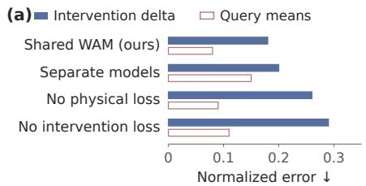

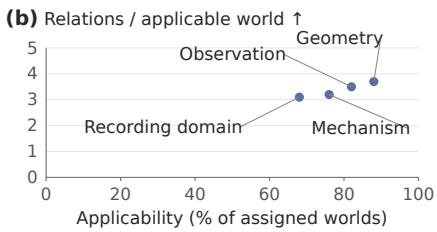  
Figure 5: Model fidelity and transfer coverage. (a) Fidelity: normalized intervention-delta error against reference outcomes and conditional-mean disagreement across query routes. (b) Transfer: applicability and full-episode relation counts per applicable world across four shifts. Allen applicability is macro-averaged over predicate tasks (Section J.1).

## B.1 WAM FIDELITY AND QUERY AGREEMENT

Figure 5a separates reference intervention fidelity from inter-route agreement. Table 6 holds capacity and training exposure fixed while comparing sharing, action consistency, physical grounding, and inverse search. Assigned-task success and proposal invalidity distinguish useful programs from search volume. Table 5 gives the full observation-design comparison summarised in Section 6.2.

Table 5: Observation design under nonlinear discrepancy. $\mathbf { M e a n } \pm \mathbf { S D }$ over 32 source units. Relations and false support use assigned worlds; time is online acquisition relative to plug-in EIG, and offline training is separate. Methods share the scientific budget. This comparison runs under the nonlinear-discrepancy condition, which is harder than the main condition of Table 2 and Figure 6a; both arms degrade under it, the fixed schedule by $0 . 5$ relations and the adaptive policy by 0.2, since a schedule fixed in advance cannot respond to the discrepancy it encounters. Paired contrasts against plug-in and nested-filter EIG, with intervals, are in Table $_ { 3 ; }$ the margins over Inside-Out $\mathrm { S M C ^ { 2 } }$ and PASOA are within one source-level SD and we do not claim them.
<table><tr><td>Design policy</td><td>Resolutions ↑</td><td>False support (%) ↓</td><td>Time ratio ↓</td></tr><tr><td>Fixed sensing Rainforth et al. (2024)</td><td> $2 . 3 \pm 0 . 8$ </td><td> $1 3 \pm 3 . 5$ </td><td>0.2</td></tr><tr><td>Plug-in state EIG Rainforth et al. (2024)</td><td> $2 . 9 \pm 0 . 8$ </td><td> $1 1 \pm 3 . 5$ </td><td>1.0</td></tr><tr><td>Nested-filter EIG Pérez-Vieites et al. (2025)</td><td> $3 . 2 \pm 0 . 8$ </td><td> $8 \pm 3 . 5$ </td><td>2.6</td></tr><tr><td>Joint mechanism–discrepancy EIG (ours)</td><td>_  ${ \bf 3 . 8 \pm 0 . 7 5 }$ </td><td> ${ \bf 5 \pm 3 . 5 }$  1</td><td>2.9</td></tr><tr><td>Inside-Out  $\mathrm { S M C ^ { 2 } }$  Iqbal et al. (2024)</td><td> $3 . 3 \pm 0 . 7 8$ </td><td> $7 \pm 3 . 5$ </td><td>4.0</td></tr><tr><td>PASOA Iollo et al. (2024)</td><td> $3 . 2 \pm 0 . 7 8$ </td><td> $8 \pm 3 . 5$ </td><td>3.1</td></tr><tr><td>DAD Foster et al. (2021)</td><td> $3 . 0 \pm 0 . 8$ </td><td> $1 0 \pm 3 . 5$ </td><td>0.4</td></tr></table>

## B.2 INDEPENDENT WAM BASELINE MATRIX

Table 7 compares WAM families on GlymphTwin. Persistence and linear prediction are internal controls; GRU instantiates recurrence. Ordinary masking predicts tokens in one pass; iterative masking adds confidence-based refinement without a diffusion schedule. NeuronDiscover’s learned and hybrid variants instantiate I-MDD-WM and its mechanistic-residual extension.

Models retain native objectives under common source splits, interventions, observation requests, horizon/mask patterns, tuning effort, and compute bands. All field-predicting baselines, including FNO, are evaluated on the same admissible field-query subset with compatible grids. Marginal CRPS shares field normalization; point-mass predictions give absolute error. TD-MPC2 Hansen et al. (2024) retains decoder-free latent planning, so its field-error, field-CRPS, and field-query timing metrics are undefined and it is omitted from this table. The full protocol also measures coverage/width, physical residuals, memory, and throughput (Sections H and L).

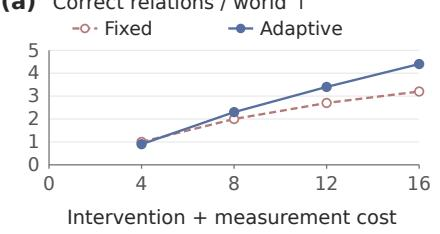

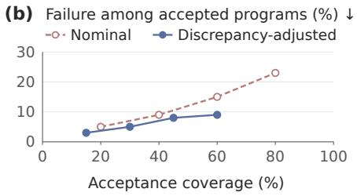  
Figure 6: Observation value and intervention reliability. (a) Correct relations per assigned world by intervention and measurement cost, under the main evaluation condition: the adaptive endpoint at cost 16 is the Agent-in-Twin row of Table 2, and the fixed arm is its fixed-observation-schedule control. Both are one condition milder than the nonlinear-discrepancy rows of Table 5 above, which is why the levels differ between the two. (b) Failure risk among accepted programs versus acceptance coverage over a frozen proposal pool; undefined at zero acceptance.

Table 6: Shared modeling and inverse proposal controls. Forward-model intervention error, assigned-task goal success, and invalid proposals (%). Consistency and goal-conditioned controls retain the separate forward model; CEM retains the shared WAM. Physics-only removes its learned residual.
<table><tr><td>Query model</td><td>∆ error ↓</td><td>Goal success (%) ↑</td><td>Invalid (%) ↓</td></tr><tr><td>Shared WAM (ours)</td><td>0.18</td><td>76</td><td>6</td></tr><tr><td>Separate forward/inverse</td><td>0.20</td><td>68</td><td>11</td></tr><tr><td>Separate + action consistency Seo et al. (2026)</td><td>0.20</td><td>70</td><td>8</td></tr><tr><td>Goal-conditioned inverse Nguyen et al. (2026)</td><td>0.20</td><td>69</td><td>9</td></tr><tr><td>No mechanistic backbone</td><td>0.27</td><td>63</td><td>14</td></tr><tr><td>Physics-only</td><td>0.24</td><td>66</td><td>7</td></tr><tr><td>CEM on shared WAM de Boer et al. (2005)</td><td>0.18</td><td>72</td><td>7</td></tr></table>

Table 7: WAM fidelity across baseline families. Mean ± SD over 32 source units. All rows, including FNO, use the same admissible field-query subset. NRMSE averages fixed horizons. Time is the field-query ratio to the hybrid WAM.
<table><tr><td>Model</td><td>Rollout NRMSE↓</td><td>∆ error ↓</td><td>CRPS↓</td><td>Time ratio ↓</td></tr><tr><td>Persistence</td><td> $0 . 4 4 \pm 0 . 1 1$ </td><td> $0 . 5 1 \pm 0 . 1 3$ </td><td> $0 . 3 1 \pm 0 . 0 8$ </td><td> ${ \bf 0 . 0 2 \pm 0 . 0 1 }$ </td></tr><tr><td>Linear predictor</td><td> $0 . 3 1 \pm 0 . 0 8$ </td><td> $0 . 3 5 \pm 0 . 0 9$ </td><td> $0 . 2 2 \pm 0 . 0 6$ </td><td> $0 . 0 4 \pm 0 . 0 1$ </td></tr><tr><td>GRU Cho et al. (2014)</td><td> $0 . 2 4 \pm 0 . 0 6$ </td><td> $0 . 2 9 \pm 0 . 0 8$ </td><td> $0 . 1 7 \pm 0 . 0 5$ </td><td> $0 . 1 9 \pm 0 . 0 4$ </td></tr><tr><td>Causal Transformer Vaswani et al. (2017)</td><td> $0 . 2 1 \pm 0 . 0 5$ </td><td> $0 . 2 5 \pm 0 . 0 6$ </td><td> $0 . 1 5 \pm 0 . 0 4$ </td><td> $0 . 3 4 \pm 0 . 0 7$ </td></tr><tr><td>PETS ensemble Chua et al. (2018)</td><td> $0 . 2 2 \pm 0 . 0 6$ </td><td> $0 . 2 3 \pm 0 . 0 6$ </td><td> $0 . 1 5 \pm 0 . 0 4$ </td><td> $0 . 2 8 \pm 0 . 0 5$ </td></tr><tr><td>DreamerV3 RSSM Hafner et al. (2025)</td><td> $0 . 1 9 \pm 0 . 0 5$ </td><td> $0 . 2 1 \pm 0 . 0 5$ </td><td> $0 . 1 3 \pm 0 . 0 4$ </td><td> $0 . 4 1 \pm 0 . 0 8$ </td></tr><tr><td>FNO Li et al. (2021)</td><td> ${ \bf 0 . 1 6 \pm 0 . 0 4 }$ </td><td> ${ \bf 0 . 1 7 \pm 0 . 0 4 }$ </td><td> $0 . 1 2 \pm 0 . 0 3$ </td><td> $0 . 2 4 \pm 0 . 0 5$ </td></tr><tr><td>Diffusion Forcing Chen et al. (2024)</td><td> $0 . 1 8 \pm 0 . 0 5$ </td><td> $0 . 2 1 \pm 0 . 0 5$ </td><td> $0 . 1 2 \pm 0 . 0 3$ </td><td> $1 . 2 8 \pm 0 . 2 0$ </td></tr><tr><td>Ordinary masked model Devlin</td><td> $0 . 2 4 \pm 0 . 0 6$ </td><td> $0 . 2 8 \pm 0 . 0 7$ </td><td> $0 . 1 7 \pm 0 . 0 5$ </td><td> $0 . 1 6 \pm 0 . 0 3$ </td></tr><tr><td>et al. (2019) Iterative masked model Chang et al.</td><td> $0 . 2 1 \pm 0 . 0 5$ </td><td> $0 . 2 4 \pm 0 . 0 6$ </td><td> $0 . 1 5 \pm 0 . 0 4$ </td><td> $0 . 8 3 \pm 0 . 1 4$ </td></tr><tr><td>(2022) NeuronDiscover (learned)</td><td> $0 . 2 2 \pm 0 . 0 6$ </td><td> $0 . 2 7 \pm 0 . 0 7$ </td><td> $0 . 1 5 \pm 0 . 0 4$ </td><td> $0 . 8 8 \pm 0 . 1 5$ </td></tr><tr><td>NeuronDiscover (hybrid)</td><td> $0 . 1 7 \pm 0 . 0 4$ </td><td> $0 . 1 8 \pm 0 . 0 4$ </td><td> $\mathbf { 0 . 1 1 \pm 0 . 0 3 }$ </td><td> $1 . 0 0 \pm 0 . 0 0$ </td></tr></table>

Fixed-Agent discovery comparison. Table 8 fixes the Agent, MIOY updates, priors, likelihood, calibration, verification, and forward-sampling/CEM adapter across five WAMs. All model evaluations and rejected calls consume the inference budget. Resolutions are divided by the common scientific cost of 16 per assigned world; false support retains all assignments. Macro-F1 scores the complete relation-state vocabulary. SD follows within-source averaging of technical replicates. The comparison tests whether fidelity translates into discovery.

FNO enters this table through the same generic forward-sampling and CEM adapter used by every nongenerative member, so the comparison isolates the world model rather than the proposal machinery. FNO returns a point field, so it carries no response law of its own. We give it the same one every deterministic member receives: a 16-member ensemble over input-perturbation and dropout seeds, whose empirical spread is calibrated once on the development split to match reference coverage, then frozen and moment-matched to the Gaussian form the support test consumes. The ensemble size is chosen so total inference cost matches the hybrid’s, and the adapter, particle count and inner Monte Carlo budget are those of the shared configuration (Section H).

Exactly two objects change when the WAM is replaced, and naming them is what makes each row a test of the same scientific proposition. The predictive mean $\mu _ { e } ( \xi )$ of Equation (18) and the predictive covariance entering $\Sigma _ { e }$ are WAM-supplied and therefore differ by row. Everything that defines the proposition is fixed by the relation at birth and shared across rows: the explanation envelope $\Xi _ { r } ,$ the mechanism predicate $m _ { r } .$ the effect threshold $\Delta _ { r } .$ , the scope set $S _ { r }$ , the mean-error set $\mathcal { D } _ { e } ,$ the error allocation $\eta _ { r , \ell }$ and the $\chi ^ { 2 }$ thresholds of Equation (20). Each row therefore accepts, rejects or abstains on the identical relation with the identical decision rule, and differs only in the response law it brings to that rule. The certified enclosure of Section E.4 is likewise shared, since it is a property of Equation (17) rather than of the learned model.

This is the decisive control for the concern that a stronger, cheaper forward predictor might already suffice: FNO attains the best deterministic rollout error in Table 7 and the best downstream yield of the non-mechanistic members here, yet remains 0.036 resolutions per unit cost and 0.10 status macro-F1 behind the mechanism-grounded hybrid (Table 3). Two calibration diagnostics are concordant with that ordering: the FNO adapter’s frozen 90% predictive interval covers 0.89 of development outcomes against the hybrid’s 0.91, but only 0.72 against 0.86 on held-out geometry, and CRPS orders the two models the way the downstream endpoints do while NRMSE orders them the other way. We report the concordance and do not claim it isolates a cause; a controlled attribution would require varying calibration quality at fixed point accuracy, which these runs do not do.

Table 8: Discovery with a fixed Agent and different WAMs. Source-unit mean ± SD at matched scientific and inference budgets. The Agent and proposal adapter are shared. FNO uses the same generic planning adapter as the other non-generative members.
<table><tr><td>WAM</td><td>Resolutions/cost False support Status macro-F1 ↑</td><td>(%)↓</td><td>↑</td></tr><tr><td>Causal Transformer Vaswani et al. (2017)</td><td> $0 . 2 0 0 \pm 0 . 0 5 6$ </td><td> $9 . 0 \pm 4 . 0$ </td><td> $0 . 7 0 \pm 0 . 0 9$ </td></tr><tr><td>Ordinary masked model Devlin et al. (2019)</td><td> $0 . 2 0 6 \pm 0 . 0 5 0$ </td><td> $8 . 0 \pm 3 . 8$ </td><td> $0 . 7 2 \pm 0 . 0 9$ </td></tr><tr><td>FNO + shared planning adapter Li et al. (2021)</td><td> $0 . 2 1 4 \pm 0 . 0 5 1$ </td><td> $8 . 0 \pm 3 . 7$ </td><td> $0 . 7 4 \pm 0 . 0 8$ </td></tr><tr><td>NeuronDiscover (learned)</td><td> $0 . 2 1 9 \pm 0 . 0 5 0$ </td><td> $7 . 5 \pm 3 . 6$ </td><td> $0 . 7 6 \pm 0 . 0 8$ </td></tr><tr><td>NeuronDiscover (hybrid)</td><td> $\mathbf { 0 . 2 5 0 \pm 0 . 0 4 8 }$ </td><td> ${ \bf 5 . 0 \pm 3 . 0 }$ </td><td> $\mathbf { 0 . 8 4 \pm 0 . 0 6 }$ </td></tr></table>

Field fidelity and nonlinear response tests. Table 9 separates codec error from the region where local sensitivity predicts complete responses. The codec comparison holds fields, sources, optimization exposure, and decoder fixed. Field/gradient errors are volume/time-weighted normalized root-meansquare errors on admitted queries; mass error uses initial mass. Admission uses all assignments. The radius study reports whitened RMS secant remainder and local/full-envelope decision agreement on admitted perturbations. Radius changes difficulty, so those rows are not ranked.

## B.3 TRANSFER COVERAGE AND CONDITIONAL DISCOVERY

Figure 5b pairs conditional recovery with applicability under geometry, mechanism, observation, and Allen shifts. A world is a source-anchored reset state with an assigned discovery task. Eligibility requires admission of that task’s required queries. For Allen, input resistance, firing gain, and adaptation define separate predicate tasks; eligibility does not require all three predicates to be admissible. Aggregation preserves donor and generator-family separation (Section I).

Process-stratum and neuronal-recording controls. Table 10 decomposes the main discovery comparison: equally weighted transport strata recover its aggregate means. Inference pairs methods within source; the aggregate contrast and its interval appear in Table 3, and this table reports the stratum point estimates that decompose it. The fixed-graph control restricts revision; the pooled-scope control removes cell/stimulus distinctions while retaining the proposal interface. Its 68% applicability is the macro-average $( 7 2 + 6 6 + 6 6 ) / 3$ over input resistance, firing gain, and adaptation. Conditional yield counts graph relations resolved by Equation (46) over a complete applicable episode. The allassigned summary multiplies macro-applicability by conditional episode yield: $0 . 6 8 \times 2 . 8 5 = 1 . 9 3 8$ reported as 1.94. Section J.1 gives the stratified alternative $\begin{array} { r } { \sum _ { p } ^ { \bullet } w _ { p } a _ { p } \hat { \overline { { y } } } _ { p } } \end{array}$ and the gap between the two aggregations. These controls test evidence-interface transfer separately from ionic-mechanism claims.

Table 9: Representation and nonlinear response diagnostics. Upper block: common-assignment codebook comparison. Lower block: 32-code WAM across perturbation radii. Secant residuals characterize the tested region, not a certified Lipschitz bound.
<table><tr><td>Codes</td><td>Field error ↓</td><td>Gradient error ↓</td><td>Mass error (%)↓</td><td>Admitted (%) ↑</td></tr><tr><td>16</td><td>0.038</td><td>0.091</td><td>2.1</td><td>94</td></tr><tr><td>32</td><td>0.020</td><td>0.049</td><td>1.2</td><td>96</td></tr><tr><td>64</td><td>0.011</td><td>0.029</td><td>0.7</td><td>96</td></tr><tr><td>Radius</td><td>Secant error</td><td>Admitted (%)</td><td>Agreement (%)</td><td></td></tr><tr><td>0.10</td><td>0.008</td><td>96</td><td>95</td><td></td></tr><tr><td>0.25</td><td>0.034</td><td>91</td><td>88</td><td></td></tr><tr><td>0.50</td><td>0.101</td><td>79</td><td>72</td><td></td></tr></table>

Table 10: Where relation recovery occurs. Upper block: resolutions per assigned transport world and paired differences, with equally weighted strata. Lower block: macro-averaged applicability (%), full-episode relation yield conditional on applicability, and applicability-adjusted all-assigned yield for the neuronal recordings. Controls share assignments and admission rules, so applicability is identical by construction and is not a comparison.
<table><tr><td>Process stratum</td><td>Fixed graph</td><td>NeuronDiscover</td><td>Difference</td></tr><tr><td>Diffusion and clearance</td><td>3.5</td><td>4.2</td><td>0.7</td></tr><tr><td>Forcing and dispersion</td><td>3.2</td><td>4.1</td><td>0.9</td></tr><tr><td>Boundary exchange</td><td>3.0</td><td>3.9</td><td>0.9</td></tr><tr><td>Sensor mismatch</td><td>3.1</td><td>3.8</td><td>0.7</td></tr><tr><td>Recording control</td><td>Applicability</td><td>Conditional</td><td>All-assigned</td></tr><tr><td>Fixed graph</td><td>68</td><td>2.25</td><td>1.53</td></tr><tr><td>Pooled scope</td><td>68</td><td>2.35</td><td>1.60</td></tr><tr><td>NeuronDiscover</td><td>68</td><td>2.85</td><td>1.94</td></tr></table>

Where the language-model interface contributes. Table 11 splits the deterministic–LLM contrast of Table 2 by task family. Each family receives eight of the 32 source units, assignments and budgets are shared, and the two orchestrators see the same WAM, tools and initial evidence. The aggregate +0.20 relations per assigned world is not spread evenly: it is concentrated in tasks whose reference graph contains a relation absent from the initial vocabulary, where proposing a new mechanism or a new observable is the binding step. On scope refinement, where the vocabulary is closed and the decision is a predicate boundary, the deterministic controller is at least as good and costs less. We therefore present the language model as an optional proposal interface with a located benefit, not as a uniform improvement.

## B.4 CALIBRATION AND SEQUENTIAL VALIDITY

Figure 7 links observation richness, calibration effort, and adaptive testing to decision quality. Panel (d) reports recovery rates for each designated Allen predicate, conditional on applicability and over all assigned tasks. These predicate-level rates assess response accuracy and scope coverage separately from the full-episode graph yields in Table 10; they are not additive components of those yields (Section J.1). Unsupported tasks remain unresolved.

Table 11: Task-family decomposition of the language-model contrast. Resolutions per assigned world for the deterministic and language-model orchestrators, their paired difference over the eight source units of each family, a cluster-bootstrap 95% interval, and Holm-corrected p-values from exact enumeration of all $2 ^ { 8 } = \dot { 2 } 5 6$ within-source sign flips in each family. Eight sources cannot produce a two-sided value below $2 / 2 5 6 ,$ so no Holm value here can fall below 0.031; Section J.3 gives the raw values. The mean row is the 32-source aggregate of Table 3, not a fifth family. Family means reproduce the aggregate rows of Table 2.
<table><tr><td>Task family</td><td>Determ.</td><td>LLM</td><td>Difference</td><td>95% CI Holm p</td><td></td></tr><tr><td>Omitted-relation proposal</td><td>3.5</td><td>4.1</td><td>+0.60</td><td>[+0.25,+0.95]</td><td>0.031</td></tr><tr><td>Joint mechanism composition</td><td>3.9</td><td>4.2</td><td>+0.30</td><td>[-0.05,+0.65]</td><td>0.375</td></tr><tr><td>Scope refinement</td><td>4.0</td><td>3.9</td><td>-0.10</td><td>[-0.45,+0.25]</td><td>1.000</td></tr><tr><td>Observation-requirement design</td><td>3.8</td><td>3.8</td><td>+0.00</td><td>[-0.35,+0.35]</td><td>1.000</td></tr><tr><td>Equally weighted mean</td><td>3.8</td><td>4.0</td><td>+0.20</td><td> $[ + 0 . 0 6 , + 0 . 3 4 ]$ </td><td>0.006</td></tr></table>

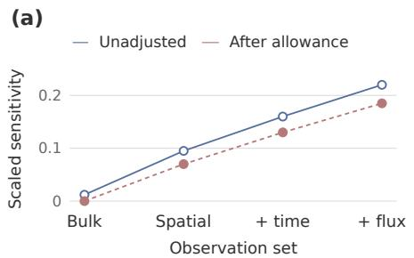

(b)  
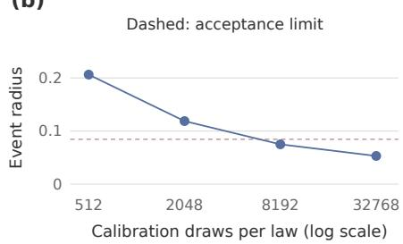

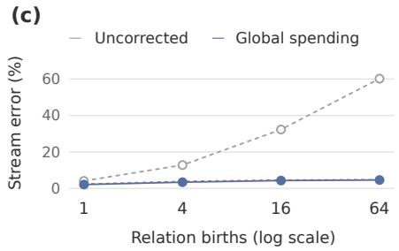

(d)  
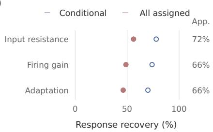  
Figure 7: Practical discovery diagnostics. (a) Sensitivity: smallest scaled singular value before and after an assumed error allowance. (b) Calibration: algebraic event radius (Equation (50)) with $K = 8 , \alpha = \beta = 0 . 0 2 5$ , equal per-law counts, and frequency gap 0.03125. The dashed acceptance limit uses $\widehat { p } _ { q } = 0 . 9 0 6 2 5 , \widehat { p } _ { v } = 0 . 0 1 5 6 2 5 , n = 8 1 9 2$ , and $( \tau _ { g } , \tau _ { v } ) = ( 0 . 8 , 0 . 1 2 )$ . (c) Sequential validity: any false relation decision per stream versus R relation births; the dashed curve is the finitebirth bound $\mathrm { \dot { 0 } } . 0 5 R / ( R + 1 )$ ). (d) Allen response transfer: recovery rates for the designated predicate, conditional on applicability and over all assigned tasks; right-hand percentages give predicate-specific applicability. These rates differ from full-episode graph relation counts.

## B.5 PAIRED CONTRASTS AND DISCOVERY TRACES

Paired contrasts are defined before scientific-unit aggregation and are reported in Table 3 with clusterbootstrap intervals and Holm-corrected randomization p-values. Revisable hypotheses yield 0.8 more resolved relations per assigned world than a fixed graph. Adaptive sensing reduces cost by 2 shared cost units relative to a fixed observation schedule; this contrast isolates a different component from graph-policy cost in Table 2. Discrepancy-adjusted verification reduces accepted-program risk by 6 percentage points at common acceptance coverage. Neuronal transfer gains 0.41 relations per assigned world, whereas conditional yields differ by 0.60 (Table 10); the gap is the applicability factor, not a different contrast.

Paired dispersion is computed from source-level method-minus-control differences. It is not recoverable from the marginal standard deviations of Table 2, and the two must not be substituted for one another: the paired standard deviations underlying Table 3 correspond to within-source correlations between 0.45 and 0.85, so a contrast computed from marginal dispersion alone would overstate its interval by roughly a factor of two on the most correlated comparisons.

Discovery traces bind each relation to its scope, competing explanations, selected experiment, released outcome, and status revision. Joint mechanism and effect predicates determine support. This record separates a change in evidence from a change in scope or observation access. Section K.4 replays one complete trace end to end.

## B.6 MIOY CASE: PULSATILITY AND REGIONAL HALF-LIFE

Figure 8 expands each case to five candidate relations: three elementary accounts, a joint mechanism, and a scoped version. Shared observations constrain competing accounts; controls, covariance, and scope remain explicit.

Reducing pulsatility fixes mean pressure, injection, and reset. Pumping, dispersion, and geometrydependent resistance compete. A composed account jointly changes velocity and effective dispersion; phase-resolved flow and spatial spread distinguish their contributions. Its scoped version restricts compliant PVS geometry. Wall motion, velocity, geometry, and tracer observations retain calibration error and covariance.

The endpoint is the first half-mass crossing in a fixed region $\Omega _ { R } ,$ , after the common injection period:

$$
M _ { R } ( t ) = \int _ { \Omega _ { R } } c ( x , t ) d x , \qquad t _ { 1 / 2 } ( I ) = \operatorname* { i n f } \{ t \in [ 0 , T ] : M _ { R } ( t ; I ) \leq M _ { R } ( 0 ; I ) / 2 \} .\tag{21}
$$

Initial regional mass must be positive. No crossing by $T$ is right-censored; sparse observations bracket the time. The first-crossing endpoint accommodates non-exponential regional mass dynamics. The relation pairs pumping with $t _ { 1 / 2 } ( I _ { \mathrm { r e d u c e d } } ) - t _ { 1 / 2 } ( I _ { \mathrm { r e f e r e n c e } } ) \geq \Delta _ { t }$ , for a birth-fixed positive threshold. Censoring and time uncertainty must support a bound on this contrast.

The test in Section A.4 requires pumping and the contrast throughout the surviving envelope. Mixed accounts remain unresolved; empty sets trigger adequacy diagnosis. Scope revisions require fresh tests.

## B.7 MIOY CASE: DIFFUSION, ADVECTION, AND DISPERSION

Crossed tracer-size and pressure probes fix injection, reset, geometry, and calibration. Diffusion competes with advection, dispersion, and sensor/boundary discrepancy. Joint advection–dispersion predicts centroid and variance together; pressure/tracer restrictions define its scoped version. Spread and arrival times test the epistemic mechanism-class endpoint.

In the homogeneous, unbounded, constant-coefficient model (Section E.3), centroid, variance, and log-mass slopes identify $v ,$ effective $D ,$ , and $k .$ . These analytical signatures define the prospective tests. Diffusion and dispersion can share a variance slope, and pressure-sensitive spreading admits both advection and dispersion explanations. Finite boundaries and heterogeneous coefficients require response maps that incorporate these features.

At birth, define $\mathcal { H } _ { D }$ through tolerances on advection and dispersion relative to molecular diffusion within the constitutive model. For a nonempty surviving set ${ \mathcal { C } } _ { : }$ , membership in the specified mechanism class is supported $\mathrm { i f } \mathcal { C } \subseteq \mathcal { H } _ { D }$ , falsified if $\mathcal { C } \cap \mathcal { H } _ { D } = \emptyset$ , and unresolved otherwise. Empty-set diagnosis, calibrated error allowances, and fresh scope tests follow Section A.4.

Shared scope: declared geometry, calibrated observations and admissible model envelope.

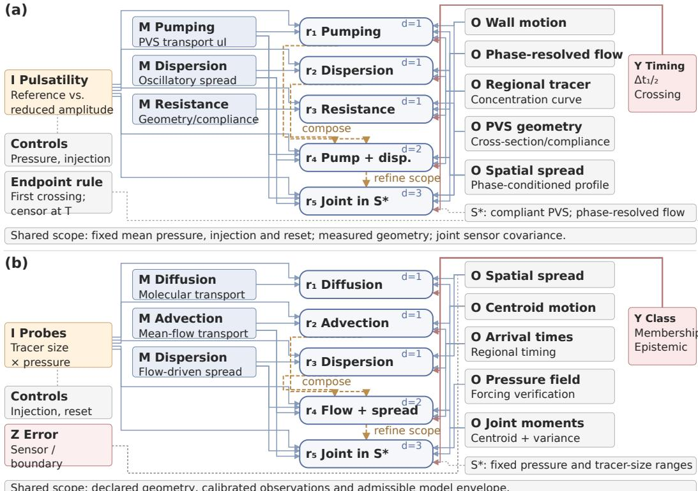  
Figure 8: Composed and scope-refined MIOY networks. (a) Pulsatility: pumping and dispersion form a joint account, then restrict to a compliant PVS regime. (b) Transport: advection and dispersion share centroid/variance predictions, then restrict pressure and tracer ranges. Each case retains three elementary alternatives. Blue/red arrows bind roles/endpoints; ochre dashed links show expansion; grey links attach controls, discrepancy, or scope. Depth does not transfer evidence between relations.

## C NOTATION, ASSUMPTIONS, AND GUARANTEE SCOPE

Table 12: Core objects in neuronal microenvironment discovery.
<table><tr><td>Symbol</td><td>Meaning and role</td></tr><tr><td> $Q _ { \theta } , P ^ { \star }$ </td><td>Operational joint WAM and independent reference law</td></tr><tr><td> $S , H , I , O , A , Y$ </td><td>State, mechanism, intervention, observation action, combined action, outcome</td></tr><tr><td> $G , V , C$ </td><td>Goal, validity, and context</td></tr><tr><td> $Z , N$ </td><td>WAM discrepancy and nuisance variables</td></tr><tr><td> $\pi _ { \omega } , b _ { t } , K _ { t } , B _ { t }$ </td><td>Agent policy, joint belief, evidence, and remaining budget</td></tr><tr><td> $\mathcal { G } _ { t } , \mathcal { E } _ { t }$ </td><td>MIOY graph and scoped relations</td></tr><tr><td> $\kappa , \tau$ </td><td>Query template and diffusion index</td></tr><tr><td> $\mathcal { F } _ { t } ^ { \mathrm { s e l } }$ </td><td>Pre-outcome information available to selection</td></tr><tr><td> $J _ { e } ^ { \mathrm { m e c h } } , J _ { e } ^ { \mathrm { w a m } }$ </td><td>Local mechanism and discrepancy sensitivities</td></tr><tr><td> $\Lambda ( \mathcal { E } )$ </td><td>Accumulated joint information matrix</td></tr><tr><td> $\mathcal { A } _ { K } , n _ { a }$ </td><td>Frozen programs and per-program rollout count</td></tr><tr><td> $L _ { g } , U _ { v } , \delta _ { a }$ </td><td>Goal lower bound, violation upper bound, discrepancy radius</td></tr><tr><td> $\eta _ { q }$ </td><td>Route error relative to its population conditional</td></tr><tr><td> $\mathrm { C l } _ { \mathcal { R } } ( E )$ </td><td>Evidence closure under deterministic compiler rules</td></tr></table>

Assumption 1 (Registered scientific world). Typed state, mechanism, action, observation, goal, validity, unit, and provenance schemas are fixed before evaluation. Out-of-support actions are flagged as invalid.

Assumption 2 (Mechanistic grounding). The separately versioned backbone supplies transitions and constraints; learned corrections operate inside a registered validity domain. Physical residuals assess consistency with those equations.

Assumption 3 (Outcome isolation and registered analysis). Candidate generation, ranking, eligibility, and analysis choices are measurable with respect to $\dot { \mathcal F } _ { t } ^ { \mathrm { s e l } }$ . The sealed outcome is unavailable before the selected action and analysis record are frozen. Tests used by Proposition 6 are conditionally super-uniform under the frozen null.

Assumption 4 (Local mechanism–WAM model). For registered finite-dimensional coordinates h and $z ,$ the sealed mean response is differentiable near the current pair, residual covariance is positive definite, and the first-order approximation in Equation (13) is used only inside its declared neighborhood.

Assumption 5 (Common-support population WAM). Forward, inverse, diagnostic, and observationdesign laws condition one positive joint $Q _ { \theta }$ on common support. Masks, temperatures, guidance, and validity filters are recorded.

Assumption 6 (Auditable finite query implementation). For a route $q ,$ the approximation theorem assumes sup $\ L _ { x } d _ { \mathrm { T V } } ( \widetilde { K } _ { q } ( x , \cdot ) , K _ { q } ( x , \cdot ) ) \leq \eta _ { q }$ on the declared input support. An analytical argument or a statistical procedure with explicit coverage must establish this uniform bound. Held-out route scores and cycle discrepancies provide complementary implementation diagnostics.

Assumption 7 (Frozen operational rollouts). The finite nonempty set $\boldsymbol { \mathcal { A } } _ { K }$ contains complete branching programs. Conditional on pre-rollout information, each program’s trajectories are independent draws from its operational law. Positive counts $n _ { a }$ , both events, and multiplicity correction are fixed before inspection.

Assumption 8 (Decision-relevant discrepancy control). For every frozen program, goal and violation probabilities differ between operational/reference laws by at most $\delta _ { a }$ . Learned bounds require simultaneous coverage $1 - \beta$ over the queried programs, selection rule, and scope.

Assumption 9 (Evidence-sound compilation). Compiler rules are deterministic and versioned, emit only relations in the evidence closure, preserve counterevidence and validity guards, and append every parent evidence and rule identifier.

The guarantees apply within the specified physical and observation models. Biological interpretation additionally requires corresponding measured evidence.

## D EXTENDED WAM AND AGENT-IN-TWIN SPECIFICATION

## D.1 TYPED EPISODE REPRESENTATION

An episode has blocks

$$
X = ( X ^ { S } , X ^ { H } , X ^ { I } , X ^ { O } , X ^ { Y } , X ^ { G } , X ^ { C } , X ^ { V } , X ^ { T } , X ^ { P } ) ,
$$

where $X ^ { I } , X ^ { O } , X ^ { T } , X ^ { P }$ encode interventions, observation actions, coordinates, and provenance/visibility. Fields retain type, unit, support, missingness, and source. The spatial instantiation keeps all cell and reservoir concentrations, coefficient schedules, sensor parameters, observationmenu index, and future target values. Geometry, quadrature weights, measurement covariance, and time edges remain continuous conditioning data. Source identifiers and evaluator labels are excluded from model input.

Field codec and reconstruction. For N cells, R reservoirs, and T transitions, the future-state block contains $T ( N + R )$ tokens, ordered by time and spatial index. Each variable–type–unit group uses its training mean and maximum absolute deviation to normalize values, then places 32 uniformly spaced scalar centers over its training range. Codebooks are frozen before development and evaluation. In physical units, an uncoupled scalar $u _ { j }$ is encoded as $k _ { j } = \arg \operatorname* { m i n } _ { k } \left| u _ { j } - c _ { j k } \right|$ . Its in-range nearestcenter error is at most half the center spacing. Coupled action/parameter fields additionally enforce their joint physical support. Out-of-range values receive a support flag; nearest-endpoint encoding does not establish admissibility. Clamped observations retain their raw values after decoding.

The decoder forms a physical location $\ell _ { j } = F _ { \mathrm { m e c h } , j } + s _ { j } r _ { \theta }$ and positive width $w _ { j }$ , where $s _ { j }$ is the codebook span. The categorical law and decoded mean are

$$
\pi _ { j k } \propto \exp \left[ - \frac { ( c _ { j k } - \ell _ { j } ) ^ { 2 } } { 2 w _ { j } ^ { 2 } } \right] , \qquad \widehat { u } _ { j } = \sum _ { k } \pi _ { j k } c _ { j k } .\tag{22}
$$

```latex
Algorithm 1 Agent-in-Twin microenvironment discovery
Require: WAM $Q _ { \theta } ,$ belief b<sub>0</sub>, graph ${ \mathcal { G } } _ { 0 } ,$ , evidence $K _ { 0 } ,$ budgets $B , B ^ { \mathrm { v e r } }$
1: $\begin{array} { r } { \mathbf { \dot { \mathcal { P } } } ^ { \mathrm { c e r t } }  \infty , \quad \mathbf { \dot { B } } _ { 0 }  B , \quad \mathbf { \dot { B } } _ { 0 } ^ { \mathrm { \dot { v e r } } }  B ^ { \mathrm { v e r } } , \quad t  0 } \end{array}$
2: $\Lambda _ { 0 } $ Information $( K _ { 0 } , b _ { 0 } )$
3: while $B _ { t } > 0$ and unresolved scientific questions remain do
4: $\mathscr { H } _ { t } \gets \mathrm { P r o p o s e E d i t s } ( \mathcal { G } _ { t } , b _ { t } , K _ { t } )$
5: $\mathcal { C } _ { t } \gets \mathrm { C o m p i l e Q u e r i e s } ( Q _ { \theta } , \mathcal { H } _ { t } , b _ { t } , K _ { t } )$
6: ${ \mathcal { C } } _ { t } ^ { + } \gets \{ c \in { \mathcal { C } } _ { t } : \mathcal { V } ( c ) = 1 , 0 < C ( c ) \leq B _ { t } \}$
7: $\mathbf { i f } \mathcal { C } _ { t } ^ { + } = \mathcal { O }$ then
8: break
9: $j _ { t } ( c ) \gets \lambda _ { \operatorname* { m i n } } ( \Lambda _ { t } + J _ { c } ^ { \top } \Sigma _ { c } ^ { - 1 } J _ { c } )$
10: i $\dot { \lambda } _ { \operatorname* { m i n } } ( \Lambda _ { t } ) < \tau _ { I }$ then
11: $c _ { t } \gets \arg \operatorname* { m a x } _ { c \in \mathcal { C } _ { t } ^ { + } } \left( j _ { t } ( c ) , \alpha _ { t } ( c ) \right)$ lexicographically
12: else
13: $c _ { t } \gets \arg \operatorname* { m a x } _ { c \in \mathcal { C } _ { t } ^ { + } } \alpha _ { t } ( c )$
14: $s _ { t } \gets \mathrm { F r e e z e } ( c _ { t } ,$ endpoint, falsifier, test)
15: $Y _ { t } \gets \mathrm { E x e c u i e } ^ { \star } ( s _ { t } )$ ▷ release outcome, never hidden truth
16: $K _ { t + 1 } \gets \mathcal { R } ( K _ { t } , \dot { s } _ { t } , Y _ { t } )$
17: $b _ { t + 1 }  \mathcal { U } ( b _ { t } ; s _ { t } , Y _ { t } )$
18: $\mathcal { G } _ { t + 1 }  \mathrm { R e v i s e } ( \mathcal { G } _ { t } , \mathcal { H } _ { t } , K _ { t + 1 } )$
19: $\Lambda _ { t + 1 } \gets \mathrm { I n f o r m a t i o n } ( K _ { t + 1 } , \dot { b } _ { t + 1 } )$ ▷ recompute in common local coordinates
20: $B _ { t + 1 } ^ { \mathrm { v e r } }  B _ { t } ^ { \mathrm { v e r } }$
21: if an inverse query has a nonempty set of admissible programs then
22: Set complete programs ${ \mathcal { A } } _ { K } ,$ counts $n _ { a } ,$ cost $c _ { \mathrm { v e r } } ,$ and error allocation $\alpha _ { t } ^ { \mathrm { c e r t } }$
23: $\mathbf { i f } c _ { \mathrm { v e r } } \leq B _ { t } ^ { \mathrm { v e r } }$ and a discrepancy bound is available then
24: Freeze the certification request; draw fresh rollouts; compute bounds by Equation (16)
25: $\mathcal { P } ^ { \mathrm { c e r t } } \gets \mathcal { P } ^ { \mathrm { c e r t } } \cup \{ a : L _ { g } \dot { ( } a ) \geq \tau _ { g } , U _ { v } ( a ) \leq \tau _ { v } , \mathcal { V } ( a ) \overset { \cdot } { = } 1 \}$
26: $B _ { t + 1 } ^ { \mathrm { v e r } }  B _ { t } ^ { \mathrm { v e r } } - \dot { c } _ { \mathrm { v e r } }$
27: $B _ { t + 1 }  B _ { t } - C ( c _ { t } ) , \ t  t + 1$
28: EMP ← Compile(EvidenceClosed $( \mathcal { G } _ { t } , K _ { t } ) )$
29: return $\mathcal { G } _ { t } , b _ { t } , \bar { K } _ { t } , \mathcal { \dot { P } } ^ { \mathrm { c e r t } }$ , EMP and unresolved questions
```

The width scales with center spacing and is a decoder parameter, distinct from sensor covariance. Physical locations and categorical means are retained separately: finite support can shift their values even at zero learned correction. Fidelity checks therefore separate raw-field quantization, physicallocation error, and decoded-mean error, including gradients, mass balance, intervention contrasts, and threshold decisions. The 16/32/64-code comparison in Table 9 uses identical fields and training sources.

The spatial implementation uses a 32-code scalar codec and an eight-layer, pre-normalized bidirectional Transformer of width 512 with eight heads, GELU feedforward width 2048, and zero dropout. Each input sums value, type, position, space–time coordinate, and diffusion-time embeddings. A first denoiser pass proposes unknown physical coefficients; the transport solver produces coarse-state tokens that condition a second pass through the same network. Visible coefficients are supplied by the query. Residual transport and observation-mean heads decode the response; a separate head predicts validity.

For token $j ,$ the absorbing corruption process is

$$
q _ { \tau } ( x _ { \tau } ^ { j } \mid x _ { 0 } ^ { j } ) = \bar { \alpha } _ { \tau } \delta _ { x _ { 0 } ^ { j } } ( x _ { \tau } ^ { j } ) + ( 1 - \bar { \alpha } _ { \tau } ) \delta _ { \langle \mathrm { m a s k } \rangle } ( x _ { \tau } ^ { j } ) .\tag{23}
$$

Training draws $\tau \sim U ( 0 , 1 )$ and masks each free site with probability τ; observed sites stay fixed and derived coarse states are excluded from targets. Masked cross-entropy uses weight $1 / \tau$ and the fixed eligible-site denominator, retaining zero-mask draws. All four query routes contribute. The WAM uses 48 epochs, Adam at $3 \times 1 0 ^ { - 4 }$ , clipping at 1, and unit weights for the six losses (Section H).

## D.2 MECHANISTIC CONDITIONING AND RESIDUAL LEARNING

The backbone supplies physical transitions and constraints; its residual represents unresolved dynamics:

$$
\widetilde { S } _ { t + 1 } = F _ { \mathrm { m e c h } } ( S _ { t } , I _ { t } , H , C ) , \qquad S _ { t + 1 } = \widetilde { S } _ { t + 1 } + \Delta _ { \theta } ( S _ { t } , I _ { t } , H , C , \eta _ { t } ) .\tag{24}
$$

For a block mask $M _ { \tau }$ , the denoising loss predicts masked coordinates. With decoded target $U _ { 0 }$ decoder $D _ { \psi }$ , and fixed unit-aware weights W, representative auxiliary losses are

$$
\mathcal { L } _ { \mathrm { d e c } } = \mathbb { E } \| D _ { \psi } ( \widehat { X } _ { 0 } ^ { \theta } ) - U _ { 0 } \| _ { W } ^ { 2 } ,\tag{25}
$$

$$
\begin{array} { r } { \mathcal { L } _ { \Delta } = \mathbb { E } d _ { Y } \Big ( \widehat { F } _ { \theta } ( S _ { 0 } , A ) - \widehat { F } _ { \theta } ( S _ { 0 } , A ^ { \prime } ) , Y ( A ) - Y ( A ^ { \prime } ) \Big ) , } \end{array}\tag{26}
$$

$$
\mathcal { L } _ { \mathrm { c y c } } = \mathbb { E } d _ { G } \Big ( G , \widehat { F } _ { \theta } ( S _ { 0 } , \widehat { A } _ { \theta } ( S _ { 0 } , G ) ) \Big ) ,\tag{27}
$$

$$
\mathcal { L } _ { \mathrm { p h y s } } = \mathbb { E } \Vert \mathcal { R } _ { \mathrm { p h y s } } ( D _ { \psi } ( \widehat { X } ) ) \Vert _ { W _ { R } } ^ { 2 } .\tag{28}
$$

Soft categorical expectations propagate gradients through physical coefficients, the transport solve, and residual heads. The nearest-center coarse-state conditioning index is discrete, so no gradient passes through that index. Both denoiser passes share parameters; the analytic transport operator has no fitted neural weights. State/observation losses divide errors by training codebook spans. Physics loss combines time-step-scaled equation defects with mass-balance defects normalized by initial mass. Intervention loss uses paired worlds with identical state, mechanism, geometry, and observation law. Cycle loss replays generated actions through a forward query. Jointly optimizing these losses encourages physical agreement; sampled concentration, support, and conservation checks assess the realized output. Validity uses declared support labels. Conformal calibration requires exchangeability Angelopoulos and Bates (2023).

## D.3 ARBITRARY-BLOCK QUERIES AND APPROXIMATION

Forward queries clamp initial state, mechanism, and intervention; inverse queries clamp initial state, goal, and constraints. Mechanism queries use released observations, while observation-design queries compare measurement operators. Goal-conditioned mechanisms remain proposals, separate from evidence-conditioned belief.

At reverse step $s = 0 , \ldots , L - 1$ , each remaining masked site is revealed with probability $1 / ( L - s )$ the final step reveals all remaining sites. Revealed sites remain fixed. Sampling uses temperature one and no classifier-free guidance. Unsupported codes have zero probability; coupled coefficient/action supports are sampled jointly. Query diagnostics use $L = 1 6$ with 16 samples per checkpoint, arm, and query; Table 14 records the separate 32-step sampling setting. Every step restores observed codes and decoded raw observations. Finite-value, nonnegativity, concentration-limit, and physical-support checks flag violations while retaining every raw draw, including negative concentrations and invalid proposals.

Lemma 1 (Clamped-block invariance). If every reverse kernel assigns probability one to each clamped value, those values remain unchanged at every reverse step and in thefinal proposal.

Clamp preservation, route-wise proper scores, decoded mean disagreement, intervention contrasts, and forward replay of inverse proposals diagnose the kernel. Comparisons use identical conditioning sets and independent draws, retaining invalid samples. The uniform route error $\eta _ { q }$ in Lemma 2 requires the coverage argument specified in assumption 6.

## D.4 OPEN MIOY PROPOSALS AND EVIDENCE UPDATES

A source-grounded ontology supplies new mechanism relations, scopes, and observables. Each proposal maps its predicted consequence to executable state, intervention, and observation interfaces:

$$
q = ( \Delta \mathcal { G } , \mathcal { H } _ { \mathrm { a l t } } , \Omega , I , O , f _ { \mathrm { s u p } } , f _ { \mathrm { f a l } } ) ,
$$

Here Ω is the scope, ${ \mathcal { H } } _ { \mathrm { a l t } }$ the alternatives, and $f _ { \mathrm { s u p } } , f _ { \mathrm { f a l } }$ the support and falsification tests. Deterministic admission checks ontology references, units, action support, and measurable predictions. Admission creates a candidate version whose support is evaluated prospectively. Scope changes create linked versions and retain the original relation and counterevidence. Proposals lacking measurable consequences remain unresolved.

The posterior ranks experiments; prospective tests use subsequent evidence for each version (Section A.4). A frozen semantic rule matches relations and scopes.

Depth-controlled hypothesis expansion. A configurable extension caps candidate-expansion depth at $d _ { \mathrm { m a x } }$ and children per expansion at $b _ { \mathrm { m a x } }$ , separately from planning lookahead and Twin-query budget. Elementary accounts start at depth one; composition or scope refinement advances one level.

The illustrated path has three levels, retaining five relations after deduplication. Joint mechanisms require jointly parameterized predictions; refined scopes require fresh tests. Depth controls permitted expansion, not guaranteed graph size or evidential strength. Only schema-valid, executable candidates enter the graph; unchanged stopping and evidence rules apply.

Belief and observation operators. The reference controller represents $\begin{array} { r } { b _ { t } = \sum _ { i = 1 } ^ { P } w _ { t } ^ { i } \delta _ { ( h _ { i } , z _ { i } , n _ { i } , s _ { t } ^ { i } ) } } \end{array}$ After $e _ { t } ,$ particles propagate through hypothesis-conditioned transitions; the released-outcome likelihood reweights them. Effective sample size below $P / 2$ triggers systematic resampling and posteriorinvariant Metropolis moves over continuous coordinates and admitted compositions. Support checks, acceptance, and ancestry are recorded. Development convergence determines particle count and rejuvenation effort.

Scope predicates conjoin typed membership and interval constraints on compartment, geometry, cell class, stimulus range, and horizon. Missing required metadata makes scope undecidable. Versions store the predicate, mechanism test, effect, alternatives, and counterevidence. Observation actions specify channel, spatial kernel, sampling times, sensor calibration, covariance, and cost, thereby selecting a likelihood. Particle mass guides design; outer-set tests determine support.

Information gain with latent state and nuisance. For each design, the target likelihood and information gain are

$$
\ell _ { e } ( y \mid h , z ) = \operatorname { \mathbb { E } } _ { ( N , S ) \sim b _ { t } ( \cdot \mid h , z ) } p ( y \mid h , z , N , S , e ) ,\tag{29}
$$

$$
I _ { e } = \mathbb { E } _ { H , Z , Y } \left[ \log \ell _ { e } ( Y \mid H , Z ) - \log \mathbb { E } _ { H ^ { \prime } , Z ^ { \prime } } \ell _ { e } ( Y \mid H ^ { \prime } , Z ^ { \prime } ) \right] .\tag{30}
$$

Nested Monte Carlo integrates the conditional state/nuisance posterior in both terms; fixing the generating nuisance draw changes the information target. Common random numbers stabilize comparisons, followed by fresh evaluation of the selected design. Separate doubling tests for outer particles, inner draws, and rejuvenation assess posterior approximation, sampling variability, and the nested-log bias retained with independent inner draws. Near-ties receive more numerical effort.

Sensitivity estimation and nonlinear validity. Within a fixed mechanism composition, let q be dimensionless coordinates obtained from declared physical scales, using log coordinates for positive coefficients. At an interior point,

$$
\widehat { J } _ { e , : , j } = \frac { \widehat { \mu } _ { e } ( q + h _ { j } e _ { j } ) - \widehat { \mu } _ { e } ( q - h _ { j } e _ { j } ) } { 2 h _ { j } } .
$$

Probes share reset state, observation operator, and random numbers. Boundary probes use feasible one-sided derivatives on a stated tangent cone. Derivatives use decoded means or differentiable soft tokens. Compare $h _ { j } , h _ { j } / 2 , h _ { j } / 4$ , refined meshes, independent batches, and physical-solver derivatives.

Stack the whitened sensitivities as $A = [ \Sigma _ { e } ^ { - 1 / 2 } J _ { e } ] _ { \epsilon }$ , including nuisance directions jointly or projecting them out before assessing (h, z). For a qualified bound $\| \widehat { A } - A \| _ { 2 } \leq \varepsilon _ { J }$

$$
\operatorname* { i n f } _ { \| v \| _ { 2 } = 1 } \| A v \| _ { 2 } \geq \operatorname* { m a x } \{ 0 , \operatorname* { i n f } _ { \| v \| _ { 2 } = 1 } \| \widehat A v \| _ { 2 } - \varepsilon _ { J } \} .\tag{31}
$$

The infimum includes a wide matrix’s null space. The error budget covers discretization, derivatives, sampling, whitening, and WAM-to-reference sensitivity mismatch. Ridge stabilizes solves; rank uses the unregularized matrix. Bootstrap and mesh-doubling diagnostics estimate stability but do not certify an operator-error bound.

Let $f ( q )$ stack whitened response means for a fixed support branch and let s<sub>−</sub> denote the lower bound in Equation (31). I $\dot { \Vert } D f ( \bar { q _ { + } } v ) - D f ( q ) \Vert _ { 2 } \leq L \Vert v \Vert _ { 2 } .$ throughout a convex radius-r neighborhood, Taylor’s integral remainder gives

$$
\begin{array} { r } { \| f ( q + v ) - f ( q ) \| _ { 2 } \geq \left( s _ { - } - \frac 1 2 L \| v \| _ { 2 } \right) \| v \| _ { 2 } . } \end{array}\tag{32}
$$

This is separation from the expansion point. Perturb weak singular and independently sampled directions across meshes and observation menus; report secant remainder, admission, and relation decisions by radius. Certification requires a uniform L and a gap exceeding observation error. Empirical secants describe the tested region; discrete compositions and validity-branch changes require complete response-envelope tests.

## D.5 INVERSE DISCOVERY AND REACHABILITY

Beyond reward-based planning, a scientific inverse query returns

$$
( \rho , \mathcal { P } , \mathcal { O } _ { \mathrm { r e q } } ) = \mathcal { I } _ { \theta } ( S _ { 0 } , G , \Gamma , b _ { t } , K _ { t } ) ,\tag{33}
$$

where $\mathcal { P }$ contains programs, $\mathcal { O } _ { \mathrm { r e q } }$ required observations, and $\rho$ the reachability status defined in Theorem 1. An unsuccessful finite search leaves reachability unresolved; infeasibility requires sound domain-wide exclusion.

## D.6 SEQUENTIAL INTERACTION AND INTERVENTION PROGRAMS

In Algorithm 1, the LLM proposes hypotheses and tool calls; numerical tools compute responses, sensitivities, scores, and evidence updates.

The information floor uses commonly scaled accumulated sensitivities. Certification uses fresh complete-program rollouts and separate error/resource budgets. Replay preserves scopes, proposals, and released outcomes.

## D.7 AGENT–TWIN PROMPTS AND MCP EXCHANGE

The native Model Context Protocol (MCP) service exposes typed Twin operations through JSON-RPC Model Context Protocol Contributors (2025). After initialization and tool discovery, the client invokes a registered method with schema-checked arguments. This section documents the interface the Agent actually sees: the registered tool surface, the session bootstrap, the argument schema, and one worked round covering the forward, inverse, sensing, freeze, release, and certification calls. Prompts and request bodies are condensed for space.

Three invariants hold throughout. The Agent never receives the hidden mechanism, the realized information gain, or reference-only validity. Protocol success is distinct from physical admissibility, which is distinct again from relation support. Every selection is frozen before an outcome is released, so no tool can be re-invoked to revise a pending test.

Registered tool surface. Table 13 lists the methods the Twin server advertises under tools/list. Nu merical acquisition, evidence reduction, and certification remain server-side: the Agent may request them but cannot alter their internals, and it cannot register a new tool mid-episode. Requirements for a tool or observable that is not yet admitted pass through admission before execution.

Session bootstrap. The client declares protocol version and capabilities; the server answers with its own and with the Twin build identifier, which is pinned for the episode so that predictions remain comparable across rounds.

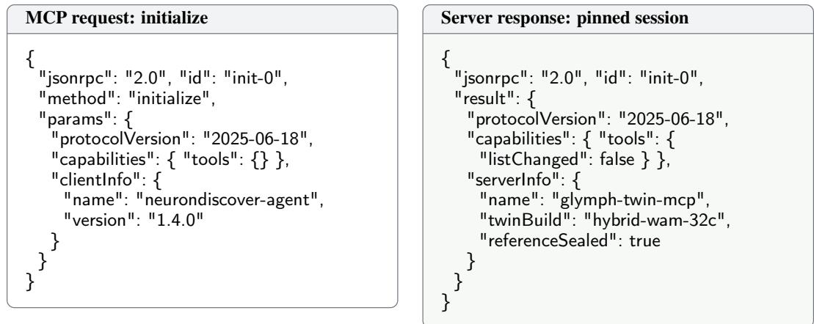  
listChanged is false for the whole episode: the tool surface cannot change after the first freeze, which is what makes the pre-outcome selection well defined. referenceSealed reports that the evaluator holds the reference world and that no client call can read it.

Argument schema. Each method advertises a JSON Schema, and the server rejects a call that violates it before any physical admissibility check. Units are part of the schema, so a magnitude without its unit is a protocol error rather than a silent default.

Table 13: Registered MCP methods. The Agent proposes; the numerical controller owns acquisition, reduction, and certification. Status values are those of Section E: Reachable, Undetermined, Observe, OutOfDomain, and Infeasible.
<table><tr><td>Method</td><td>Purpose</td><td>Principal return fields</td></tr><tr><td>twin.rollout</td><td>Forward prediction under a frozen intervention and observation plan</td><td>outcomes, observations, validity, uncertainty, seed</td></tr><tr><td>twin.propose_program</td><td>Goal-conditioned inverse proposal within the admissible set</td><td>programs, required_observations, reachability</td></tr><tr><td>twin.score_observation</td><td>Expected information for candidate observation operators at fixed state and intervention</td><td>scores, cost, floor_met, weakest_direction</td></tr><tr><td>twin.sensitivity</td><td>Scaled joint Jacobian and the unregularized information floor remainder_test</td><td>jacobian, min_singular,</td></tr><tr><td>graph.birth_relation</td><td>Register a relation version with scope, effect threshold, and falsifier</td><td>relation_id, envelope_size, allocation</td></tr><tr><td>graph.freeze_selection</td><td>Fix action, endpoint, falsifier, and analysis before outcome release</td><td>selection_hash, frozen_at, allocation</td></tr><tr><td>graph.release_outcome</td><td>Submit the released measurement and reduce the surviving envelope</td><td>survivors, status, counterevidence</td></tr><tr><td>verify.certify_program</td><td>Event-calibrated goal and violation bounds for a frozen</td><td>lower_goal, upper_violation, decision</td></tr><tr><td>budget.query</td><td>program set Remaining scientific and inference budget</td><td>experiments_left, calls_left, cost_spent</td></tr></table>

Advertised schema (abridged): twin.rollout   
{   
"type": "object",   
"required": ["intervention\_program", "observation\_requests", "horizon"],   
"properties": {   
"intervention\_program": {   
"type": "array", "minItems": 0,   
"items": {   
"type": "object",   
"required": ["target", "operation", "magnitude", "unit"],   
"properties": {   
"target": { "enum": ["aqp4\_polarization", "boundary\_exchange",   
"parenchymal\_difusivity", "pulsatility",   
"sensor\_gain"] },   
"operation": { "enum": ["set", "scale", "ofset"] },   
"magnitude": { "type": "number" },   
"unit": { "type": "string" },   
"support": { "type": "object", "description": "spatial region" },   
"duration\_min": { "type": "number", "minimum": 0 } } } },   
"observation\_requests": {   
"type": "array", "minItems": 1,   
"items": {   
"type": "object",   
"required": ["variable", "time\_min"],   
"properties": {   
"variable": { "enum": ["tracer\_retention\_fraction", "regional\_mass",   
"spatial\_profile", "boundary\_flux",   
"concentration\_contrast"] },   
"time\_min": { "type": "number", "minimum": 0 },   
"channel": { "type": "string" } } } },

"horizon": { "type": "number", "exclusiveMinimum": 0 },   
"seed": { "type": "integer" } },   
"additionalProperties": false   
}

Round prompts. The system prompt is fixed for the episode; the round context is regenerated from belief, graph, and budget state.

Agent prompt: role and current question

System. Propose discriminating experiments using registered Twin tools and current evidence. Separate transport hypotheses from readout discrepancy. Respect units, admissible actions, and budget. Use predictions to compare candidates; revise support from released independent outcomes. Return one JSON object satisfying the supplied response schema.

Round context. Keep reset state and Twin version fixed. Within the expansion budget, compare exchange, diffusion, and gain; consider joint exchange–diffusion and a narrower observation scope. Return parent relations, the new prediction and discriminating observation. Merge duplicates; stop at the depth or query limit. The depicted extension caps expansion at three levels.

Withheld. You do not observe the hidden mechanism, the reference outcome before release, the realized information gain, or any reference-only validity flag. A prediction is not evidence. Do not report a relation as supported; propose, and let the reduction decide.

## Required response schema for the Agent

```javascript
"type": "object",
"required": ["parents", "proposed_relation",
"discriminating_observation", "rationale"],
"properties": {
"parents": { "type": "array", "items": { "type": "string" } },
"proposed_relation": {
"type": "object",
"required": ["mechanism_predicate", "efect_threshold", "scope"],
"properties": {
"mechanism_predicate": { "type": "string" },
"efect_threshold": { "type": "number", "exclusiveMinimum": 0 },
"scope": { "type": "object" },
"falsifier": { "type": "string" } } },
"discriminating_observation": { "type": "object" },
"rationale": { "type": "string", "maxLength": 600 } },
"additionalProperties": false
```

Forward query. The Agent first asks what the twin expects under the candidate intervention, to see whether the proposed readout would separate the accounts at all.

```json
MCP request: forward query
{ "jsonrpc": "2.0", "id": "exchange-probe", "method": "tools/call",
"params": { "name": "twin.rollout",
"arguments": {
"intervention_program": [ { "target": "aqp4_polarization", "operation": "set",
"magnitude": 0.8, "unit": "dimensionless" } ],
"observation_requests": [ { "variable": "tracer_retention_fraction",
"time_min": 20 } ],
"horizon": 20, "seed": 17 } } }
```

```jsonl
{ "jsonrpc": "2.0", "id": "exchange-probe",
"result": { "isError": false,
"content": [ { "type": "text", "text": "rollout completed; 1 observation" } ],
"structuredContent": {
"status": "Executed",
"outcomes": { "compartment_removal": 0.412 },
"observations": [ { "variable": "tracer_retention_fraction", "value": 0.588,
"time_min": 20, "unit": "fraction",
"provenance": "wam-hybrid-32c" } ],
"validity": { "admissible": true, "reasons": [],
"assumptions": ["calibrated range", "reset state fixed"],
"query": "forward" },
"uncertainty": { "sd": 0.031, "interval": [0.527, 0.649], "particles": 2048 },
"seed": 17 } } }
```

Field Meaning   
status Execution or abstention status, independent of the protocol result   
outcomes Named physical outcome values in their declared units   
observations Variable, value, time, unit, and provenance of each released channel   
validity Admissibility, reasons, standing assumptions, and the query route used   
uncertainty Numerical uncertainty summary, including the particle count behind it   
seed Replay seed, so the same call reproduces the same draw

Protocol success is distinct from physical validity, and both are distinct from relation support. Initialization, action support, and the observation law stay bound to the Twin session.

Inverse and sensing queries. Retention alone leaves exchange and gain indistinguishable, so the Agent asks for a program that would reach a discriminating endpoint, then scores the candidate observation operators that would read it out.

MCP request: inverse proposal, and its return   
{ "jsonrpc": "2.0", "id": "inv-7", "method": "tools/call",   
"params": { "name": "twin.propose\_program",   
"arguments": {   
"goal": { "endpoint": "boundary\_flux\_contrast", "direction": "increase",   
"margin": 0.08 },   
"constraints": { "max\_experiments": 2, "forbid": ["sensor\_gain"],   
"scope": "compliant\_pvs" } } } }   
--> { "result": { "structuredContent": {   
"programs": [ { "program\_id": "PG-3", "cost": 2,   
"steps": [ "paired injection contrast at matched reset",   
"flux and concentration on patch\_A at 8 min" ] } ],   
"required\_observations": ["boundary\_flux", "concentration\_contrast"],   
"reachability": "Reachable",   
"notes": "gain excluded by constraint; feasible witness verified" } } }

A reachability of Observe would mean the endpoint is not currently measurable and the Agent must request an additional observable; Infeasible is returned only when exclusion over the search domain is sound, and is therefore rarer than a failed search.

MCP request: observation design, and its return   
{   
"jsonrpc": "2.0", "id": "sense-7", "method": "tools/call",   
"params": { "name": "twin.score\_observation",   
"arguments": {   
"candidates": [   
{ "variable": "tracer\_retention\_fraction", "time\_min": 20 },   
{ "variable": "boundary\_flux", "channel": "patch\_A", "time\_min": 8 },

```jsonl
{ "variable": "spatial_profile", "time_min": 8 } ],
"target": ["mechanism", "discrepancy"], "budget_units": 4 } } }
--> { "result": { "structuredContent": {
"scores": [ { "candidate": 0, "eig": 0.11, "cost": 1 },
{ "candidate": 1, "eig": 0.63, "cost": 2 },
{ "candidate": 2, "eig": 0.48, "cost": 2 } ],
"floor_met": true, "weakest_direction": "kappa_I",
"selected_hint": 1 } } }
}
```

The target field is what distinguishes joint acquisition from plug-in state EIG: scoring against ["mechanism", "discrepancy"] integrates over both coordinates, whereas a plug-in call passes ["mechanism"] at a point state. When floor\_met is false the controller ignores the ranking and improves weakest\_direction instead, breaking ties by the acquisition score of Equation (14).

Freeze, release, and certification. Freezing converts a proposal into a testable selection. The returned selection\_hash binds action, endpoint, falsifier, analysis, and error allocation; the reduction refuses any outcome whose hash does not match.

MCP request: freeze, then release the outcome   
{   
"jsonrpc": "2.0", "id": "freeze-17", "method": "tools/call",   
"params": { "name": "graph.freeze\_selection",   
"arguments": { "relation\_id": "R-17", "block": 1,   
"action": "PG-3", "endpoint": "compartment\_removal\_contrast",   
"falsifier": "no\_flux\_at\_zero\_contrast",   
"analysis": "chi2\_envelope\_intersection", "gamma": 0.05 } } }   
--> { "result": { "structuredContent": {   
"selection\_hash": "9f2c...a41e", "frozen\_at": "block-1",   
"allocation": 8.17e-05 } } }   
{ "jsonrpc": "2.0", "id": "release-17", "method": "tools/call",   
"params": { "name": "graph.release\_outcome",   
"arguments": { "selection\_hash": "9f2c...a41e",   
"measurements": [ /\* released reference values with covariance \*/ ] } } }   
--> { "result": { "structuredContent": {   
"survivors": 6, "eliminated": 5, "status": "unresolved",   
"certified\_efect\_lower": 0.061, "threshold": 0.08,   
"counterevidence": [], "reason":   
"mechanism predicate holds throughout; efect bound not certified" } } }   
}

This is the round reported in Section K.4: the mechanism predicate already holds, yet the certified effect bound falls short of the threshold fixed at relation birth, so the server returns unresolved rather than support. The allocation echoed by the freeze is γ/[r(r + 1)ℓ(ℓ + 1)] at r = 17, ℓ = 1.

Abstention: a request outside the admitted domain

```json
"jsonrpc": "2.0", "id": "oob-2", "method": "tools/call",
"params": { "name": "twin.rollout",
"arguments": { "intervention_program": [{ "target": "parenchymal_difusivity",
"operation": "scale", "magnitude": 14.0, "unit": "dimensionless" }],
"observation_requests": [{ "variable": "spatial_profile", "time_min": 8 }],
"horizon": 8 } } }
--> { "result": { "isError": false, "structuredContent": {
"status": "OutOfDomain", "outcomes": null, "observations": [],
```

"validity": { "admissible": false,   
"reasons": ["magnitude outside calibrated range [0.2, 5.0]"],   
"assumptions": ["constitutive model fitted on training sources"] },   
"uncertainty": null } } }   
}

The call succeeds at the protocol level, isError is false, and the Twin still declines to predict. Conflating these three layers is the most common failure mode we observed in early agent traces, which is why status and validity are separate fields rather than an exception.

Follow-up prompt: choosing the next observation

Check validity and uncertainty. If retention cannot separate exchange and gain, request a regional readout and independent gain control. Joint exchange–diffusion requires flux and spatial profiles with their covariance. Submit admitted candidates to numerical acquisition; freeze the selected query and test. Released outcomes, not expansion depth, determine support.

If the previous block returned unresolved. Do not re-test the same contrast for a better draw. Either propose an observation that raises the certified bound on the existing relation, or birth a scope-narrowed version and accept its fresh allocation. Re-running a frozen selection is refused by the server.

The numerical controller owns acquisition and evidence reduction. MCP transports requests and returns; the Agent proposes hypotheses and observations. New tool or observation requirements pass admission before execution.

## E THEORETICAL RESULTS: FROM REPRESENTATION TO SCIENTIFIC DECISION

## E.1 POPULATION COMPATIBILITY AND FINITE-QUERY ERROR

Under assumption 5, any partition $\boldsymbol { X } = \left( X _ { U } , X _ { V } \right)$ satisfies

$$
Q _ { \theta } ( X _ { U } \mid X _ { V } ) Q _ { \theta } ( X _ { V } ) = Q _ { \theta } ( X _ { V } \mid X _ { U } ) Q _ { \theta } ( X _ { U } ) = Q _ { \theta } ( X _ { U } , X _ { V } ) ,\tag{34}
$$

which is the formal content of the compatibility statement used in Section 4.

Proposition 3 (Common-joint query compatibility). If the population query laws are conditionals of the same positive joint WAM, they satisfy Bayes compatibility on their common support.

Lemma 2 (Approximate compatibility of implemented query routes). Consider two registered query routes $r _ { 1 }$ and $r _ { 2 }$ that produce the same target conditional under the population joint WAM. Let their implemented kernels be uniformly within $\eta _ { r _ { 1 } }$ and $\eta _ { r _ { 2 } }$ in total variation of the corresponding population kernels. For any common clamped-input law $\nu ,$

$$
d _ { \mathrm { T V } } ( \nu \widetilde { K } _ { r _ { 1 } } , \nu \widetilde { K } _ { r _ { 2 } } ) \leq \eta _ { r _ { 1 } } + \eta _ { r _ { 2 } } .\tag{35}
$$

## E.2 INFORMATION GEOMETRY OF TWIN CONFOUNDING

The weighted Gram matrix Λ has the first-order indistinguishable perturbations as its null space. For independent Gaussian responses with known parameter-independent covariances, it is also the local mean model’s Fisher information. Under those additional conditions, regular unbiased estimators satisfy $\lambda _ { \operatorname* { m a x } } ( \operatorname { C o v } ( \widehat { \xi } ) ) \geq 1 / \lambda _ { \operatorname* { m i n } } ( \Lambda )$ when $\Lambda \succ 0 .$ , by Cramér–Rao.

Complementary observation row spaces can remove individual experiments’ null directions.

After that floor is met, the regularized D-optimal increment

$$
\Delta _ { D } ( e ) = \log \frac { \operatorname * { d e t } ( \Lambda _ { t } + J _ { e } ^ { \top } \Sigma _ { e } ^ { - 1 } J _ { e } + \lambda I ) } { \operatorname * { d e t } ( \Lambda _ { t } + \lambda I ) }\tag{36}
$$

measures aggregate local volume reduction. The complementary decomposition

$$
I ( Y _ { e } ; H , Z \mid e , K _ { t } ) = I ( Y _ { e } ; H \mid e , K _ { t } ) + I ( Y _ { e } ; Z \mid H , e , K _ { t } )\tag{37}
$$

separates mechanism information from conditional discrepancy information.

## E.3 AN ANALYTICAL TRANSPORT EXAMPLE

This subsection is an identifiability illustration. It shows why observation choice changes the rank of the response map, and it is deliberately idealized; it is not the enclosure used to certify relation decisions, which is Section E.4. Consider the idealized one-dimensional transport equation on R,

$$
\partial _ { t } c + v \partial _ { x } c = D \partial _ { x x } c - k c , \qquad D > 0 , \quad k \geq 0 .\tag{38}
$$

Assume nonnegative initial concentration with positive finite mass and finite second moment, constant coefficients, and sufficient concentration and flux decay for moment integration. This homogeneouscompartment example isolates how observation choice separates transport coefficients.

Let $\begin{array} { r } { M ( t ) = \int c d x , \mu ( t ) = M ( t ) ^ { - 1 } } \end{array}$ R xc dx, and $\begin{array} { r } { \sigma ^ { 2 } ( t ) = M ( t ) ^ { - 1 } \int ( x - \mu ( t ) ) ^ { 2 } d } \end{array}$ dx. Integrating Equation (38) and integrating its first two moments by parts gives

$$
\frac { d } { d t } \log M = - k , \qquad \frac { d \mu } { d t } = v , \qquad \frac { d \sigma ^ { 2 } } { d t } = 2 D .\tag{39}
$$

A constant multiplicative gain cancels from the slopes. Mass identifies $k ,$ while spatial moments supply independent contrasts for v and $D ,$ making observation choice change the response map’s rank. Boundary exchange, variable coefficients, or time-dependent gain changes these identities, so none of them transfers to the bounded exchange model of Equation (17); the next subsection supplies bounds that do.

## E.4 CERTIFIED RESPONSE ENCLOSURE FOR THE BOUNDED EXCHANGE MODEL

Relation decisions are taken on Equation (17): a bounded Lipschitz domain Ω with an exchange boundary $\Gamma _ { \mathrm { e x } }$ , a reflecting remainder, spatially varying diffusion, advection, first-order loss, and sensor coordinates. The certified support test of Section A.4 needs three objects on that model, not on Equation (38): an outer set $\overline { { \boldsymbol { \mathcal { C } } } } \supseteq \mathcal { C } _ { \boldsymbol { r } , \boldsymbol { \ell } } ,$ a certified lower bound on $\operatorname* { i n f } _ { \xi \in { \overline { { \mathcal { C } } } } } g _ { r } ( \xi )$ , and a verified nonempty witness. This subsection supplies the response enclosure those objects are built from. Throughout, Θ denotes an admitted parameter box with $k _ { c } \in [ k ^ { - } , k ^ { + } ]$ on $\Omega , \kappa _ { I } \in [ \kappa ^ { - } , \kappa ^ { + } ]$ on $\Gamma _ { \mathrm { e x } } .$ $D _ { I }$ uniformly elliptic with $0 < \lambda ^ { - } \leq \lambda _ { \operatorname* { m i n } } ( D _ { I } )$ , and $u _ { I }$ in a bounded box with $\nabla \cdot u _ { I }$ bounded. The post-injection window has $s _ { I } \equiv 0$ and $c _ { \mathrm { e x t } } = 0 .$ , as Section A.4 requires.

Lemma 3 (Positivity and the exact log-mass identity). For $c _ { 0 } \geq 0$ with $\begin{array} { r } { M ( 0 ) = \int _ { \Omega } c _ { 0 } > 0 , } \end{array}$ , the weak solution ofEquation (17) satisfies $c \geq 0$ on $\Omega \times [ 0 , T ]$ and $M ( t ) > 0 f o r a l l t \overset { \cdot } { \leq } T$ . Writing $\begin{array} { r } { Q ( t ) = \int _ { \Gamma _ { \mathrm { e x } } } } \end{array}$ c dS and $\varphi ( t ) = Q ( t ) / \bar { M } ( t ) \geq 0$

$$
\log \frac { M ( T ) } { M ( 0 ) } = - \int _ { 0 } ^ { T } \bigl ( \langle k _ { c } \rangle _ { c ( t ) } + \langle \kappa _ { I } \rangle _ { c ( t ) } \varphi ( t ) \bigr ) d t ,\tag{40}
$$

where $\langle \cdot \rangle _ { c ( t ) }$ are the concentration-weighted averages over Ω and over $\Gamma _ { \mathrm { e x } }$ . Consequently the compartment removal ofSection A.4 is $\begin{array} { r } { U _ { \xi } ( I , C ) = 1 - \exp \{ - \int _ { 0 } ^ { T } ( \langle k _ { c } \rangle + \langle \kappa _ { I } \rangle \varphi ) d t \} } \end{array}$

Equation (40) is exact on the bounded domain with exchange boundary and variable coefficients. It is not a moment identity and does not assume constant coefficients, whole-space geometry, or a closed form for $\varphi .$ Everything the model makes hard is carried by the single scalar boundary occupancy $\begin{array} { r } { \Phi ( \xi ) = \int _ { 0 } ^ { T } \varphi ( t ) d t } \end{array}$ , which depends on the full explanation through the solution and admits no closed form. The certification therefore brackets Φ numerically and treats the rest analytically.

Proposition 4 (Monotone parameter enclosure). Let Θ be an admitted box and suppose $\Phi ( \xi ) \in $ $[ \Phi ^ { - } , \Phi ^ { + } ]$ with $\Phi ^ { - } \geq 0$ for every $\xi \in \Theta$ . Then for every $\xi \in \Theta$

$$
1 - e ^ { - k ^ { - } T - \kappa ^ { - } \Phi ^ { - } } \leq U _ { \xi } \leq 1 - e ^ { - k ^ { + } T - \kappa ^ { + } \Phi ^ { + } } .\tag{41}
$$

Moreover $U _ { \xi }$ is nondecreasing in $k _ { c }$ and in $\kappa _ { I }$ pointwise, so subdividing Θ can only tighten the enclosure, whose width is $O ( | \tilde { k } ^ { + } - k ^ { - } | T + | \kappa ^ { + } \hat { \Phi } ^ { + } - \kappa ^ { - } \Phi ^ { - } | )$

The occupancy is not constant over Θ. Both $\kappa _ { I }$ and $k _ { c }$ enter the equation and the boundary condition, so they change the solution and therefore $\varphi ;$ a bracket obtained at one parameter value certifies nothing at another. The hypothesis of Proposition 4 is consequently a box-uniform bracket, which is what the next proposition must deliver. Monotonicity is what makes subdivision productive rather than merely valid.

Proposition 5 (Certified boundary occupancy). Let $Q _ { h }$ be the boundary-trace functional of a conforming finite-element solution and let $\eta _ { \mathrm { p r } }$ and $\eta _ { \mathrm { a d } }$ be equilibrated-flux a posteriori bounds on the primal and adjoint energy errors, each assembled with interval coefficients so that it holds simultaneouslyfor every $\xi \in \Theta$ Ern and Vohralík (2015). Let $\eta _ { \mathrm { f p } }$ bound thefloating-point evaluation under directed rounding Rump (2010). Then

$$
| Q ( \xi ) - Q _ { h } | \le \eta _ { \mathrm { p r } } \eta _ { \mathrm { a d } } + \eta _ { \mathrm { f p } } f o r e \nu e r y \xi \in \Theta ,\tag{42}
$$

and integrating the resulting two-sided bracket in time with an interval quadrature remainder gives a box-uniform $\breve { \Phi } ( \xi ) \in [ \Phi ^ { - } , \breve { \Phi } ^ { + } ]$

Equation (42) is the Cauchy–Schwarz product of two guaranteed energy-norm bounds. It is deliberately weaker than the dual-weighted-residual estimate Becker and Rannacher (2001), whose error representation carries a remainder that is second order but not rigorously bounded in general; only the product form is a certificate. We compute the DWR value alongside as a sharpness diagnostic and never admit it into a bound.

Composing the two propositions gives what the certificate needs. For an ordered intervention pair and a scope set $S _ { r } .$ , subtracting the enclosure of $U _ { \xi } ( I _ { 0 } , C )$ from that of $U _ { \xi } ( I _ { 1 } , C )$ yields a two-sided enclosure of the effect, and minimising its lower endpoint over the scope box gives a certified lower bound

$$
\underline { { g } } _ { r } = \operatorname* { m i n } _ { C \in S _ { r } } \Big [ \big ( 1 - e ^ { - k ^ { - ^ { - } T - \kappa ^ { - } } \Phi ^ { - } ( I _ { 1 } , C ) } \big ) - \big ( 1 - e ^ { - k ^ { + } T - \kappa ^ { + } \Phi ^ { + } ( I _ { 0 } , C ) } \big ) \Big ] \ \leq \ \operatorname* { i n f } _ { \xi \in \overline { { C } } , C \in S _ { r } } g _ { r } ( \xi ) ,\tag{43}
$$

the scope minimum being taken by the same subdivision, since the context enters only through $\Phi ^ { \pm }$ and the box endpoints. Support requires $\underline { { { g } } } _ { r } \geq \Delta _ { r } , m _ { r } = 1$ throughout ${ \overline { { \mathcal { C } } } } ,$ , and a witness $\xi ^ { \bar { w } } \in \overline { { \mathcal { C } } }$ whose residual satisfies $\overline { T } _ { e } ( \xi ^ { w } ) \leq \chi _ { m _ { e } , 1 - \eta _ { r , i } } ^ { 2 }$ for a certified upper bound $\overline { { T } } _ { e } .$ ; the direction is reversed from exclusion, where a certified lower bound is required. Branch-and-bound refines Θ until the relative width of the $g _ { r }$ enclosure meets its tolerance or the node budget is exhausted, and exhausting the budget produces an abstention, never a decision. The guarantee is conditional on the declared envelope, the elliptic and boundedness conditions above, and the estimator’s hypotheses; it does not extend to models outside Equation (17).

## E.5 POST-FREEZE EVIDENCE VALIDITY

Conditional super-uniformity applies to the realized selection when the candidate set, action, endpoint, test, falsifier, multiplicity correction, and stopping rule are fixed before outcome release. Sequential validity additionally requires alpha spending or an always-valid procedure.

Proposition 6 (Post-freeze validity). If the test for the realized selection is conditionally superuniform, $\operatorname* { P r } ( p _ { s { t } } \leq u \mid { \mathcal { F } } _ { t } ^ { \mathrm { s e l } } ) \leq u$ , then $\Pr ( p _ { s _ { t } } \leq \alpha ) \leq \alpha$ despite arbitrary pre-outcome proposal search.

Proposition 7 (Prospective validity across relation revisions). For every relation version and tested block in Section A.4, suppose the true explanation lies in the declared envelope, the actual mean error lies in $\mathcal { D } _ { e } ( \xi ^ { \star } )$ , and the conditional Gaussian model with known covariance in Equation (18) holds. Then, with probability at least $1 - \gamma ,$ , every set in Equation (20) retains the true explanation. Consequently, all supported or falsified relation properties are correct within their stated model and scope. If simultaneous envelope and error-set adequacy instead holds on an event of probability at least $1 - \beta _ { \mathrm { e n v } }$ , the bound is $1 - \gamma - \beta _ { \mathrm { e n v } }$

## E.6 ROBUST REACHABILITY AFTER INVERSE GENERATION

Theorem 1 (Simultaneous discrepancy-adjusted reachability). Under assumptions 7 and 8, let $K = | A _ { K } | \ge 1 , n _ { a } \ge 1 , 0 < \alpha < 1$ , and $\epsilon _ { a } = \sqrt { \log ( 2 K / \alpha ) / ( 2 n _ { a } ) }$ . With probability at least $1 - \alpha$ over operational rollouts when the discrepancy bounds hold deterministically, everyfrozen candidate satisfies

$$
{ \cal P } _ { a } ^ { \star } ( G ) \geq \widehat { p } _ { g } ( a ) - \epsilon _ { a } - \delta _ { a } ,\tag{44}
$$

$$
P _ { a } ^ { \star } ( V ) \leq \widehat { p } _ { v } ( a ) + \epsilon _ { a } + \delta _ { a } .\tag{45}
$$

An integral probability metric containing both event indicators suffices. Simultaneous calibration adds its error by a union bound.

An admissible program is Reachable if its goal lower bound meets $\tau _ { g }$ and its violation upper bound meets $\tau _ { v }$ . Conditional certificates require an explicit eligibility condition and its conditional law. Inconclusive bounds return Undetermined, missing observables Observe, and unsupported queries OutOfDomain. Infeasible requires sound exclusion over the search domain. Displayed bounds may be clipped to [0, 1].

## E.7 COMPOSITION ACROSS THE DISCOVERY PIPELINE

Corollary 1 (Conditional end-to-end accountability). Suppose the discovery tests control their familywise error at $\gamma ,$ simultaneous discrepancy calibration fails with probability at most $\beta ,$ and the frozen-set rollout bounds use error budget α. Under assumption 9, with probability at least $1 - \gamma - \beta - \alpha ,$ , no error occurs in these specified testing and certification events, and every emitted relation has afinite provenance path to source evidence. The bound is informative when $\gamma + \beta + \alpha < 1$

Compilation is deterministic. Random envelope adequacy replaces $\gamma$ by $\gamma + \beta _ { \mathrm { e n v } }$ as in Proposition 7. Estimated covariance needs a separate valid analysis, and biological truth or unique attribution requires the corresponding fidelity and identifiability conditions.

## E.8 EVIDENCE-SOUND EMP COMPILATION

Let $E _ { 0 }$ be directly supported or contradicted MIOY relations and $\mathrm { C l } _ { \mathcal { R } } ( E _ { 0 } )$ their closure under registered deterministic rules.

Proposition 8 (Traceability of evidence-sound compilation). Under assumption ${ \mathit { 9 , } }$ every relation referenced by an EMP action has a finite derivation to source evidence, and no relation outside $\mathrm { C l } _ { \mathcal { R } } ( E _ { 0 } )$ enters the program.

## F PROOFS

ProofofProposition 7. Condition on pre-block history. The true mean error is admissible in the infimum, hence $T _ { e } ( \xi ^ { \star } ) \leq \| \Sigma _ { e } ^ { - 1 / 2 } \epsilon _ { e } \| _ { 2 } ^ { 2 } \sim \chi _ { m _ { e } } ^ { 2 }$ . Truth is excluded with conditional probability at most $\eta _ { r , \ell } .$ , and taking expectations preserves this bound for adaptive actions and relation births. Thus

$$
\operatorname* { P r } ( \mathrm { a n y } \mathrm { e x c l u s i o n ~ o f ~ t r u t h } ) \le \sum _ { r = 1 } ^ { \infty } \sum _ { \ell = 1 } ^ { \infty } \frac { \gamma } { r ( r + 1 ) \ell ( \ell + 1 ) } = \gamma .
$$

Unexecuted blocks contribute no error. Every surviving set then contains truth, so containment in $\mathcal { R } _ { r }$ supports its property and disjointness refutes it. Under random adequacy, exclusion on the adequacy event is still contained in the chi-square tail event; the union bound adds $\beta _ { \mathrm { e n v } }$ . Independence between tests is unnecessary. □

Transport moment identities. With $\begin{array} { r } { M _ { j } = \int x ^ { j } c ( x , t ) } \end{array}$ dx, integration by parts under Section E.3 gives

$$
\dot { M } _ { 0 } = - k M _ { 0 } , \qquad \dot { M } _ { 1 } = v M _ { 0 } - k M _ { 1 } , \qquad \dot { M } _ { 2 } = 2 v M _ { 1 } + 2 D M _ { 0 } - k M _ { 2 } .
$$

Substitution into $\mu = M _ { 1 } / M _ { 0 }$ and $\sigma ^ { 2 } = M _ { 2 } / M _ { 0 } - \mu ^ { 2 }$ proves Equation (39). A constant measurement gain $a > 0$ cancels from both ratios and the logarithmic mass derivative. These identities use the whole-space, constant-coefficient hypotheses of Section E.3 and are not used by any certified decision.

ProofofLemma 3. Write the weak form of Equation (17) with $s _ { I } \equiv 0$ and $c _ { \mathrm { e x t } } = 0$ and test with the negative part $c ^ { - } = \operatorname* { m a x } ( - c , 0 )$ . The reflecting portion of ∂Ω contributes nothing, the exchange term contributes $\begin{array} { r } { \int _ { \Gamma _ { \mathrm { e x } } } \kappa _ { I } ( c ^ { - } ) ^ { 2 } \geq 0 } \end{array}$ , and uniform ellipticity gives $\begin{array} { r l } { \small } & { { } \int _ { \Omega } \nabla c ^ { - } \cdot D _ { I } \nabla c ^ { - } \geq \lambda ^ { - } \| \nabla c ^ { - } \| ^ { 2 } } \end{array}$ Bounding the advective term by Young’s inequality against that coercivity leaves $\begin{array} { r } { \frac { 1 } { 2 } \frac { d } { d t } \| c ^ { - } \| ^ { 2 } \leq } \end{array}$ $C \| c ^ { - } \| ^ { 2 }$ with C depending only on $\| u _ { I } \| _ { \infty } , \| \nabla \cdot u _ { I } \| _ { \infty }$ and $\lambda ^ { - }$ . Since $c _ { 0 } ^ { - } = 0$ , Grönwall gives $c ^ { - } \equiv 0 , \mathrm { s o } c \geq 0 .$

Testing with the constant 1 and using the boundary condition gives the exact balance $\dot { M } =$ $\begin{array} { r } { - \int _ { \Omega } \breve { k _ { c } } c d x - \int _ { \Gamma _ { \mathrm { e x } } } \kappa _ { I } c d S = - \langle k _ { c } \rangle _ { c ( t ) } \breve { M ( t ) } - \langle \kappa _ { I } \rangle _ { c ( t ) } Q ( t ) } \end{array}$ , the weighted averages being well defined because $c \geq 0 .$ . Hence $\dot { M } \geq - ( k ^ { + } + \kappa ^ { + } \varphi ( t ) ) M$ , so M cannot vanish in finite time and $M ( t ) > 0 \mathrm { o n } [ 0 , T ]$ . Dividing by $M ( t )$ , substituting $\varphi = Q / M$ and integrating gives Equation (40); the displayed form of $U _ { \xi }$ is its definition $1 - M ( T ) / M ( 0 )$ □

ProofofProposition 4. Monotonicity is a comparison argument. Let $c _ { 1 } , c _ { 2 }$ solve Equation (17) with exchange coefficients $\kappa _ { 1 } ~ \leq ~ \kappa _ { 2 }$ and all other data equal. Their difference $w = c _ { 1 } - c _ { 2 }$ satisfies the same equation with boundary flux $n \cdot J _ { w } = \kappa _ { 1 } w - ( \kappa _ { 2 } - \kappa _ { 1 } ) c _ { 2 }$ . Testing with $w ^ { - }$ contributes $\begin{array} { r } { \int _ { \Gamma _ { \mathrm { e x } } } \kappa _ { 1 } ( w ^ { - } ) ^ { 2 } \geq 0 } \end{array}$ from the first term and $\begin{array} { r } { - \int _ { \Gamma _ { \mathrm { e x } } } \bigl ( \kappa _ { 2 } - \kappa _ { 1 } \bigr ) c _ { 2 } w ^ { - } \le 0 } \end{array}$ from the second, because $c _ { 2 } \geq 0$ by Lemma 3 and $w ^ { - } \geq 0$ . The argument of that lemma then gives $w ^ { - } \equiv 0 , \mathrm { s o } c _ { 1 } \geq c _ { 2 }$ and $M _ { 1 } ( T ) \stackrel { . } { \geq } M _ { 2 } ( T )$ . Replacing the boundary term by $\begin{array} { r l } { \mathrm { ~ } } & { { } - \int _ { \Omega } \bigl ( k _ { 2 } - k _ { 1 } \bigr ) c _ { 2 } } \end{array}$ gives the same conclusion for $k _ { c } .$ . Since $U _ { \xi } = 1 - M ( T ) / M ( 0 )$ , removal is nondecreasing in both coefficients.

For the enclosure, Lemma 3 gives $\langle k _ { c } \rangle _ { c ( t ) } \in [ k ^ { - } , k ^ { + } ]$ and $\langle \kappa _ { I } \rangle _ { c ( t ) } \in [ \kappa ^ { - } , \kappa ^ { + } ]$ pointwise in t, because both are averages of the coefficient against a nonnegative weight of unit total mass. With $\varphi \geq 0$ and $\begin{array} { r } { \Phi = \int _ { 0 } ^ { T } \varphi \in [ \Phi ^ { - } , \Phi ^ { + } ] } \end{array}$ , the exponent in Equation (40) lies in $[ k ^ { - } T + \kappa ^ { - } \Phi ^ { - } , k ^ { + } T + \kappa ^ { + } \Phi ^ { + } ]$ , and $x \mapsto 1 - e ^ { - x }$ is increasing, which is Equation (41). Each endpoint uses one corner of the coefficient box and one endpoint of the occupancy bracket, so refining either interval cannot widen it. □

ProofofProposition 5. Q is a bounded linear functional of the state on $H ^ { 1 } ( \Omega )$ by the trace theorem, so the adjoint problem for Q is well posed and the error in the functional admits the standard representation $Q ( \xi ) - Q _ { h } = B ( c - c _ { h } , z - z _ { h } )$ with B the bilinear form and z the adjoint solution. Cauchy–Schwarz in the energy norm gives $| Q ( \xi ) - Q _ { h } | \leq \| c - c _ { h } \| _ { \mathcal B } \| z - z _ { h } \| _ { \mathcal B }$ , and each factor is bounded by its equilibrated-flux estimator, which is guaranteed and constant-free Ern and Vohralík (2015). Assembling both estimators with interval coefficients replaces each factor by a bound valid simultaneously for every $\xi \in \Theta$ , since the estimator depends on the coefficients only through the assembled residual and flux reconstruction, both of which are evaluated by interval arithmetic on the same mesh. This yields Equation (42); the sharper dual-weighted-residual value is not used, because its remainder is not rigorously bounded.

Since $M ( t ) > 0 \mathrm { o n } [ 0 , T ]$ by Lemma 3, the quotient defining $\varphi$ is bounded and the division is a well-posed interval operation, so a two-sided bracket on $Q$ and on M gives one on $\varphi .$ . Time integration of a two-sided bracket is a two-sided bracket, so quadrature with its own interval remainder gives the stated box-uniform $[ \Phi ^ { - } , \Phi ^ { + } ]$ ]. Evaluating everything in directed rounding adds $\eta _ { \mathrm { f p } }$ and preserves the enclosure Rump (2010). □

ProofofProposition 6. The complete selection record $s _ { t }$ is $\mathcal { F } _ { t } ^ { \mathrm { s e l } }$ -measurable. For $u \in [ 0 , 1 ]$ , conditional super-uniformity and the tower property give

$$
\operatorname* { P r } ( p _ { s _ { t } } \leq u ) = \mathbb { E } \big [ \operatorname* { P r } ( p _ { s _ { t } } \leq u \mid \mathcal { F } _ { t } ^ { \mathrm { s e l } } ) \big ] \leq u .
$$

The bound applies to the test, endpoint, and multiplicity rule fixed in the selection record.

Proof of Proposition 3. Positivity defines both conditionals on common support. The product rule for either partition gives the same joint law, proving Equation (34). Implemented-route error follows Lemma 2. □

Proof of Lemma 2. By premise, $\nu K _ { r _ { 1 } } = \nu K _ { r _ { 2 } }$ . The triangle inequality gives

$$
d _ { \mathrm { T V } } ( \nu \widetilde { K } _ { r _ { 1 } } , \nu \widetilde { K } _ { r _ { 2 } } ) \leq d _ { \mathrm { T V } } ( \nu \widetilde { K } _ { r _ { 1 } } , \nu K _ { r _ { 1 } } ) + d _ { \mathrm { T V } } ( \nu K _ { r _ { 2 } } , \nu \widetilde { K } _ { r _ { 2 } } ) .
$$

Integrating the uniform bounds over ν gives $\eta _ { r _ { 1 } } + \eta _ { r _ { 2 } }$

Proof of Proposition 2. For fixed-reducer gain $g _ { e }$ of range width at most M, the total-variation inequality gives

$$
| U _ { P } ( e ) - U _ { Q } ( e ) | \leq M d _ { \mathrm { T V } } ( P _ { e } ^ { \star } , Q _ { e } ) \leq M \delta _ { e } .
$$

Costs and validity penalties cancel. The triangle inequality bounds two candidates’ margin error by $M ( \delta _ { e } + \delta _ { e ^ { \prime } } )$ ; an operational margin exceeding this stays positive under the reference law. □

Proof of Proposition 1. For a joint perturbation $\boldsymbol { v } = \left( v _ { h } , v _ { z } \right)$ ，

$$
v ^ { \top } \Lambda ( \mathcal { E } ) v = \sum _ { e \in \mathcal { E } } v ^ { \top } J _ { e } ^ { \top } \Sigma _ { e } ^ { - 1 } J _ { e } v = \sum _ { e \in \mathcal { E } } \| \Sigma _ { e } ^ { - 1 / 2 } J _ { e } v \| _ { 2 } ^ { 2 } .
$$

Positive-definite weights imply that this vanishes exactly when $J _ { e } v \ = \ 0$ for every experiment. Thus $\Lambda \succ 0$ precisely when the stacked Jacobian has no nonzero null direction, proving first-order identifiability in the declared local domain. □

Proof of Lemma 1. Initialization sets $X _ { O } ^ { ( T ) } = c _ { O }$ and each reverse step applies $\Pi _ { O } ( x ) = ( c _ { O } , x _ { M } )$ Induction gives $X _ { O } ^ { ( t ) } = c _ { O }$ through the final step for any free-coordinate kernel. □

Proof of Theorem 1. Conditional on the frozen programs, the goal and violation indicators satisfy one-sided Hoeffding bounds under assumption $\bar { 7 } ;$

$$
\begin{array} { r } { Q _ { a } ( G ) \geq \widehat { p } _ { g } ( a ) - \epsilon _ { a } , \qquad Q _ { a } ( V ) \leq \widehat { p } _ { v } ( a ) + \epsilon _ { a } } \end{array}
$$

Each tail has probability at most $\alpha / ( 2 K )$ , giving simultaneous coverage $1 - \alpha$ . Applying the goal and violation discrepancy bounds $| P _ { a } ^ { \star } ( B ) - Q _ { a } ( B ) | \leq \delta _ { a }$ gives Equations (44) and (45). Simultaneous calibration failure adds $\beta$ by a union bound. □

Proof of Corollary 1. Let $E _ { \mathrm { t e s t } } , E _ { \mathrm { c a l } } , E _ { \mathrm { r o l l } }$ denote failures of the specified discovery tests, simultaneous calibration, and rollout bounds. Their probabilities are at most $\gamma , \beta , \alpha ;$ the conditional rollout bound also holds unconditionally by expectation. Therefore

$$
\operatorname* { P r } ( E _ { \mathrm { t e s t } } \cup E _ { \mathrm { c a l } } \cup E _ { \mathrm { r o l l } } ) \le \gamma + \beta + \alpha .
$$

No independence is needed. Finite provenance additionally holds deterministically under assumption 9 and Proposition 8. □

ProofofProposition 8. Source relations in $E _ { 0 }$ have finite traces. Each registered rule preserves closure and extends its premises’ finite traces by one rule identifier. Induction on derivation depth establishes the property for every relation referenced by an EMP. □

## G PUBLIC DATA AND MICROENVIRONMENT CONSTRUCTION

## G.1 SCIENTIFIC SOURCES AND MEASUREMENT SEMANTICS

Transport and neurovascular studies define GlymphTwin’s compartments, hypotheses, observation conditions, and parameter priors Iliff et al. (2012); Xie et al. (2013); Mestre et al. (2018); Hablitz et al. (2020); Iadecola (2017); Smith et al. (2017).

Allen Cell Types supplies morphology, electrophysiology, and stimuli Allen Institute for Brain Science (2026); Gouwens et al. (2019); NWB retains acquisition metadata Teeters et al. (2015). Visual Coding, Neuropixels, and V1 models supply complementary population-level resources de Vries et al. (2020); Siegle et al. (2021); Billeh et al. (2020). Admission requires task-matched measurements, stimulation history, and units.

## G.2 CANONICAL STATE, ACTION, AND OBSERVATION VARIABLES

Records distinguish measurements, derived values, parameters, actions, and outcomes, retaining coordinates, units, missingness, and uncertainty. Transport observations are state functionals; Allen records retain current, voltage, morphology, offsets, and history. Models share transformed observa tions.

## G.3 OPERATIONAL AND REFERENCE WORLDS

Operational and reference worlds share action/measurement semantics, with declared dynamics, mesh, boundary, and sensor differences. The protocol uses 17 operational cells and a 136-cell reference, 68/136/272-cell refinement, and an independent matrix-exponential check. Conservative cell-volume projection aligns fields at 0, 1, 3, 8, and 20 minutes. Reference code, draws, and tolerances are frozen independently of the residual; trajectories retain source, generator, intervention, and measurement seeds. Refinement and conservation checks assess numerical fidelity.

Source/donor splits precede trajectory, cell, sweep, and window sampling. Learned preprocessing uses training sources; calibration, selection, and evaluation remain separate.

## G.4 VISIBILITY AND LEAKAGE

Selection receives executable actions, current observations, costs, and available validity. Hidden mechanisms, future outcomes, realized information gain, and reference-only validity are excluded. Leakage checks cover fields, identifiers, and candidate order.

Replay binds frozen requests to released measurements and graph updates. Source-disjoint records enumerate families, episodes, intervention pairs, and observation plans; hidden graphs reach only the evaluator. Mismatch studies cross mesh, boundary, gain, and missing-process shifts, retaining unsupported episodes in applicability/recovery denominators.

AllenNeuron task instantiation. For current-clamp recordings, three prespecified response predi cates concern subthreshold input resistance, firing-rate gain, and spike-frequency adaptation. Input resistance uses baseline-subtracted steady voltage divided by nonzero subthreshold current; gain uses a slope across available suprathreshold amplitudes; adaptation compares late and early interspike intervals under a fixed epoch rule. Observation actions select an existing sweep and a voltage window, spike-count window, or interval summary. Thresholds, quality exclusions, and epoch boundaries are fixed on development donors. Missing sweeps and insufficient spike counts yield unavailable endpoints.

MIOY scope records species, cell class, cortical region/layer, morphology availability, stimulus family and amplitude, and recording quality. Donors determine splits before cells and sweeps. Scope-aware and scope-pooled controls share the same assignments; reports pair conditional response recovery with applicability and recovery over all assigned tasks. Recorded stimulus contrasts can test response predicates. Ionic or morphological mechanism alternatives require a separately validated neuronal simulator or additional perturbations. The public-recording and simulator-based endpoints remain separate.

## H HYPERPARAMETERS AND MODEL SELECTION

Table 14 specifies WAM training: 512 pairs/64 families, with 64 development pairs/16 disjoint families, 48 epochs, one intervention/control pair per update, and checkpoint/evaluation every six epochs. Source-disjoint model selection accounts for successful and failed trials; Section A gives formal source allocation.

Table 14: WAM training settings and evaluation defaults.
<table><tr><td>Component</td><td>Search space</td><td>Setting</td></tr><tr><td>Representation</td><td>Continuous/scalar; VQ/FSQ; RVQ; hierarchical RVQ</td><td>Grouped scalar, one level, 32 codes; training-pair fit</td></tr><tr><td>WAM capacity</td><td>Study: 20–80M; diagnostic: 2-10M</td><td>26,152,996 parameters; 8 layers; width 512; 8 heads</td></tr><tr><td>Learning rate</td><td> $\{ 1 0 ^ { - 4 } , 3 \times 1 0 ^ { - 4 } , 1 0 ^ { - 3 } \}$ </td><td>Adam, constant  $3 \times 1 0 ^ { - 4 }$  ; gradient norm cap 1</td></tr><tr><td>Mask/reveal</td><td>Linear/cosine/token-specific; remasking rule</td><td>Linear absorbing mask;  $t \sim U ( 0 , 1 ) ;$  monotone reveal, no remasking</td></tr><tr><td>Query sampling</td><td>Guidance, temperature, step grids</td><td>32 denoising steps; temperature 1.0</td></tr><tr><td>Loss weights</td><td>Joint token, decoder, physics, intervention contrast, consistency, validity</td><td>Six unit weights; both paired arms</td></tr><tr><td>Verification</td><td>Fixed schedule, no outcome-dependent extension</td><td>128 development-screen rollouts/candidate; 8192 certification</td></tr><tr><td>Acquisition</td><td>Information floor; falsification,</td><td>rollouts/program  $\lambda _ { F } = 0 . { \dot { 2 } } , { \bar { \lambda } } _ { C } = 0 . 1 , \lambda _ { V } = 1 . 0$ </td></tr><tr><td>Lookahead</td><td>cost, validity weights Depth {1, 2, 3}; matched calls</td><td>Depth 2; 32 WAM queries/round</td></tr><tr><td>Program size</td><td>Branches, horizon, evidence closure</td><td>At most 2 branches, 4 intervention steps</td></tr></table>

Study-model comparisons match total capacity, training exposure, and search cost, reporting remaining differences. Smaller models serve implementation diagnostics.

Sampling error at most ε requires $n _ { a } ~ \ge ~ \log ( 2 K / \alpha ) / ( 2 \varepsilon ^ { 2 } )$ (Equation (16)). Freeze thresholds/calibration rules before evaluation. Independent reference/WAM calibration batches estimate discrepancy bounds; fresh rollouts verify programs.

## I ROBUSTNESS AND MECHANISM-ALIGNED ABLATIONS

## I.1 WHAT EACH COMPONENT CHANGES

Each control in Table 4 changes one component, retaining data, capacity budget, and scientific interfaces. Loss ablations separately remove physical residual, decoded dynamics, intervention contrast, or cycle consistency; target endpoints accompany forward fidelity.

## I.2 SENSITIVITY TO THE SCIENTIFIC AGENT’S LLM

The LLM backbones are Kimi K3, DeepSeek V4 Flash, and GPT-5.6-Sol, with served versions and reasoning settings recorded. Agents share WAM, tools, initial evidence, experiments, and splits, following their own observations (Figure 9).

<table><tr><td colspan="4">Agent-in-Twin (ours)</td><td colspan="4">External tool agent</td></tr><tr><td colspan="4">(a) Relations / world↑</td><td colspan="2">(b) (c)</td><td>(d)</td></tr><tr><td colspan="4"></td><td colspan="2">Íncidence (%) ↓</td><td colspan="2">Task success (%)↑ ÚSD / episode</td></tr><tr><td rowspan="2">KKimi K3</td><td colspan="2">口</td><td colspan="2">–</td><td></td><td colspan="2">•</td></tr><tr><td colspan="2"></td><td colspan="2">□</td><td colspan="2">□</td><td>□</td></tr><tr><td colspan="2">DeepSeek V4 Flash</td><td colspan="2">O 口</td><td colspan="2">O □</td><td>●口 è</td><td></td></tr><tr><td colspan="2"></td><td colspan="2"></td><td colspan="2"></td><td></td><td>D</td></tr><tr><td colspan="2">GPT-5.6-Sol</td><td colspan="2">: 口</td><td colspan="2">è 口</td><td></td><td></td></tr><tr><td></td><td>0 2</td><td colspan="2">4 6</td><td>5 10 15</td><td>20 0 25 50 75 100</td><td>口</td><td>口</td></tr></table>

Figure 9: LLM comparison at matched scientific budgets. (a) Resolution and (b) false support use assigned worlds; (c) goal success uses assigned tasks; (d) cost is USD/episode. Circles: Agentin-Twin; squares: external tool agent. Points show the mean for each configuration.

Within-architecture prompts, schemas, history, response limits, and retries are fixed. Evidence fits the smallest context window. Scientific/call budgets are shared; truncation, retries, tokens, and compute are logged separately.

Endpoints retain interrupted/invalid requests and distinguish support/contradiction. Three replicates average within source/donor; available provider seeds are recorded. Within-backbone contrasts receive Holm correction; cross-backbone effects are secondary.

Token, latency, and billing totals include retries and exposed reasoning; matched-dollar analysis requires complete billing (Section J).

## I.3 STRUCTURED SHIFTS

Table 15: Changes that can alter a microenvironment discovery decision.
<table><tr><td>Shift</td><td>Scientific change</td><td>Readout</td></tr><tr><td>Dynamics or</td><td>Missing process or changed</td><td>Relation revision and false</td></tr><tr><td>composition Geometry or</td><td>interaction Altered transport path or</td><td>support Scope accuracy and structural</td></tr><tr><td>boundary</td><td>exchange law</td><td>validity</td></tr><tr><td>Intervention</td><td>Delayed, saturated, or</td><td>Goal success and validity</td></tr><tr><td></td><td>unsupported forcing</td><td>decisions</td></tr><tr><td>Observation</td><td>Coarsening, bias, delay, or missing regions</td><td>Measurement choice and unresolved contrasts</td></tr><tr><td>Noise and dependence</td><td>Correlated or heteroscedastic responses</td><td>Calibration and ranking stability</td></tr><tr><td>Goal or eligibility</td><td>Target near the admitted support boundary</td><td>Acceptance coverage and selective risk</td></tr></table>

Shifts in Table 15 are crossed where physically interpretable. Expanded observations test whether mechanism and observation error are distinguishable when aggregate residuals agree.

## I.4 WHEN THE DECLARED ENVELOPE IS WRONG

Every guarantee in Section E is conditional on the true explanation lying in the declared envelope $\Xi _ { r } .$ That condition is not verifiable in a real study, so what matters is how the procedure fails when it breaks. Table 16 removes the true mechanism from the envelope in a prespecified fraction of assigned worlds, leaving everything else fixed.

The two right-hand columns carry the result. The empty-set diagnostic rate tracks the omission rate almost one for one, recovering 88% of the omitted-mechanism worlds as explicit adequacy alarms, whereas false support rises only from 5.0% to 8.0% when half of all worlds are misspecified. The failure mode is therefore mostly an audible one: an envelope that cannot explain the data exhausts its surviving set and says so, rather than concentrating belief on the best of several wrong accounts. The residual 12% that stays silent is the part a discrepancy coordinate can absorb, and it is where the extra false support comes from. This is the strongest statement available for a conditional guarantee, and it is an empirical one: it does not make Proposition 7 unconditional.

Table 16: Behaviour under an inadequate envelope. The generating mechanism is deleted from $\Xi _ { r }$ in the stated fraction of assigned worlds; budgets, observations and thresholds are unchanged. Mean over 32 sources. Empty-set diagnostics are blocks whose surviving set is empty, which Section A.4 routes to an adequacy alarm rather than a decision. Omission changes the difficulty of the task, so these rows are not ranked against one another.
<table><tr><td>Envelope adequacy</td><td>Resolu- tions ↑</td><td>False support (%)↓</td><td>Empty-set diag. (%)</td><td>Scope acc. (%) ↑</td></tr><tr><td>Adequate, no omission</td><td>4.0</td><td>5.0</td><td>1.2</td><td>82.0</td></tr><tr><td>Omitted in 10% of worlds</td><td>3.8</td><td>5.6</td><td>10.0</td><td>80.3</td></tr><tr><td>Omitted in 25% of worlds</td><td>3.5</td><td>6.5</td><td>23.2</td><td>77.8</td></tr><tr><td>Omitted in 50% of worlds</td><td>3.0</td><td>8.0</td><td>45.2</td><td>73.5</td></tr></table>

## I.5 MISSPECIFIED OBSERVATION NOISE

The relation tests assume the conditional Gaussian law of Equation (18) with known covariance. Table 17 scales the true error covariance by $\rho$ while the tests continue to use the nominal one, so $\rho > 1$ means the procedure believes its measurements are more precise than they are.

Table 17: Sensitivity to underestimated observation noise. The analysis uses the nominal covariance while the generating covariance is inflated by $\rho .$ Any-false-decision rate is per relation stream at nominal $\gamma = 0 . 0 5$ , over 32 sources.
<table><tr><td> $\rho$ </td><td>Any false decision per stream (%)</td><td>Resolutions</td><td>Empty-set diagnostics (%)</td></tr><tr><td>1.00</td><td>3.1</td><td>4.0</td><td>1.2</td></tr><tr><td>1.25</td><td>5.8</td><td>4.2</td><td>1.5</td></tr><tr><td>1.50</td><td>9.6</td><td>4.4</td><td>1.9</td></tr><tr><td>2.00</td><td>18.4</td><td>4.6</td><td>2.8</td></tr></table>

At $\rho = 1$ the realised rate is 3.1% against the nominal 5%, the conservatism the union bound predicts. The direction of failure under misspecification is the uncomfortable one: resolutions rise with $\rho$ while false decisions rise faster, because an over-tight covariance shrinks every confidence set and makes containment in $\textstyle { \mathcal { R } } _ { r }$ easier to certify. Yield is therefore not a safe monitor of calibration health, and the empty-set rate barely moves, so it does not detect this failure either. The mean-error set $\mathcal { D } _ { e }$ and its independent calibration are what bound the damage, which is why they are fixed before the outcome rather than fitted to it.

## I.6 SCALING IN ENVELOPE SIZE

Set inversion is the cost driver, so Table 18 varies the number of admitted explanations per relation from the 11 of the worked case to 88.

Table 18: Cost and yield against envelope size. Explanations admitted per relation version, at a fixed 2048-node branch-and-bound budget and fixed scientific budget. Time is online acquisition and certification relative to the 11-explanation configuration.
<table><tr><td>Explanations per relation</td><td>Resolutions</td><td>Diagnostic abstention</td><td>Median nodes</td><td>Time ratio</td></tr><tr><td>11</td><td>4.0</td><td>0.4</td><td>412</td><td>1.00</td></tr><tr><td>22</td><td>3.9</td><td>0.6</td><td>701</td><td>1.42</td></tr><tr><td>44</td><td>3.7</td><td>0.9</td><td>1284</td><td>2.31</td></tr><tr><td>88</td><td>3.4</td><td>1.4</td><td>2048</td><td>4.06</td></tr></table>

Yield degrades gracefully and the loss is paid in abstentions rather than errors: quadrupling the envelope from 22 to 88 costs 0.5 resolutions and adds 0.8 abstentions, while false support stays within 0.4 percentage points of 5.0% throughout. At 88 explanations the median node count reaches the budget, so the abstention rate there is set by the node cap and not by the evidence; raising the cap trades wall time for resolutions along the frontier in Table 18 rather than changing the decisions that are already certified.

## J ESTIMANDS AND STATISTICAL ANALYSIS

## J.1 GRAPH AND DISCOVERY ENDPOINTS

A fixed MIOY/scope rubric separates support from contradiction.

The resolution scoring function. One rule defines the resolution endpoint for every policy in this paper. Let $\nu _ { w }$ be the relation versions a policy brings to test in assigned world w. Each receives exactly one terminal label from Section A.4: certified support, certified falsification, or unresolved, the last covering both an inconclusive surviving set and a diagnostic abstention where branch-and-bound exhausted its node budget. Then

$$
\mathrm { R e s } ( w ) = \left| \left\{ v \in \mathscr { V } _ { w } : \mathrm { ~ c e r t i f i e d ~ s u p p o r t } \right\} \right| + \left| \left\{ v \in \mathscr { V } _ { w } : \mathrm { ~ c e r t i f i e d ~ f a l s i f i c a t i o n } \right\} \right| ,\tag{46}
$$

and unresolved versions contribute zero regardless of why they are unresolved. An abstention is therefore never a resolution, although it is a correct output and the status macro-F1 of Table 8 credits it as one of that vocabulary’s classes; the two endpoints answer different questions and are not interchangeable. Restricted resolution cost censors every unresolved version at the budget B, so an abstention is charged in full. Table 19 reports the classes behind Equation (46) for all seven policies; the same function is applied to the acquisition controls of Table 5, the WAM comparison of Table 8, and the recording transfer of Table 10.

Table 19: Decision classes behind the resolution endpoint. Mean count per assigned transport world over 32 sources. Resolutions are the first two columns only, by Equation (46). Every policy is assigned the same 6.4 reference relation versions per world, so the four count columns sum to 6.4 in every row; policies differ in how many versions they bring to a certified terminal decision, not in how many exist. False supports are the subset of certified supports the reference contradicts, and dividing that column by the first reproduces the false-support percentage of Table 2.
<table><tr><td>Policy</td><td>Cert. support</td><td>Cert. falsif.</td><td>Resolu- tions</td><td>Diagnostic abstention</td><td>Other unresolved</td><td>False supports</td></tr><tr><td>Random design</td><td>1.5</td><td>0.7</td><td>2.2</td><td>0.4</td><td>3.8</td><td>0.180</td></tr><tr><td>Bayesian adaptive design</td><td>2.0</td><td>1.0</td><td>3.0</td><td>0.5</td><td>2.9</td><td>0.180</td></tr><tr><td>Discrepancy-aware design</td><td>2.2</td><td>1.0</td><td>3.2</td><td>0.5</td><td>2.7</td><td>0.165</td></tr><tr><td>Fixed hypothesis graph</td><td>2.2</td><td>1.0</td><td>3.2</td><td>0.4</td><td>2.8</td><td>0.154</td></tr><tr><td>Matched external tool agent</td><td>2.3</td><td>1.1</td><td>3.4</td><td>0.4</td><td>2.6</td><td>0.184</td></tr><tr><td>Agent-in-Twin (ours)</td><td>2.8</td><td>1.2</td><td>4.0</td><td>0.4</td><td>2.0</td><td>0.140</td></tr><tr><td>Deterministic Agent-in-Twin</td><td>2.7</td><td>1.1</td><td>3.8</td><td>0.4</td><td>2.2</td><td>0.149</td></tr></table>

Abstention loads are close across policies because an abstention is produced by the numerical setinversion step, whose difficulty is set by the envelope dimension of the relation under test rather than by the policy that chose the experiment. Assignments are shared, so the per-world mix of low- and high-dimensional envelopes is matched by construction. That is why rescoring moves every level by about 0.4 and leaves every paired difference in Table 3 unchanged: the differences are invariant to a common additive shift, and the shifts differ by at most 0.1 across policies.

False support. Two distinct estimands are reported and must not be conflated. The column in Tables 2, 5 and 8 is the relation-level false-support proportion: within a source, the numerator counts relation versions the policy declared supported whose reference status is not supported, and the denominator counts all versions it declared supported, both pooled over that source’s 12 taskreplicates before the ratio is taken. For the Agent-in-Twin configuration the mean denominator is 33.5 declared supports per source, matching the 2.8 per world of Table 19 over 12 worlds. The world-level false-support incidence of Table 4 is a different quantity: the binary indicator that a world contains any false support, averaged over the 12 worlds of a source.

The two differ in resolution, and the difference is visible in their dispersion. A per-source mean of 12 binary indicators lies on a lattice of spacing 1/12, and any variable on that lattice with mean X<sup>¯</sup> satisfies $X _ { i } ^ { 2 } \geq X _ { j } / 1 2 ,$ , so its sample variance obeys $s ^ { 2 } \geq \overline { { { \frac { 3 2 } { 3 1 } } } } \bar { X } \big ( \frac { 1 } { 1 2 } - \bar { X } \big )$ ; at a 5% mean this forces $s \geq 4$ .15 percentage points. The tabulated relation-level proportion is not subject to that floor, because its lattice spacing is $1 / 3 3 . 5 = 0 . 0 3 0$ , below the 0.05 mean, which makes the bound vacuous. Reporting $5 . 0 \pm 2 . 8$ for the proportion and ±4.6 for the paired incidence contrast is therefore consistent; reporting the proportion’s dispersion against the incidence estimand would not be. Table 20 gives the 32 source-level numerators and denominators so both statistics can be recomputed.

Table 20: Source-level false support for the Agent-in-Twin configuration. For each of the 32 independent sources: false supports over declared supports, pooled across its 12 task-replicates, and the resulting percentage. Mean 5.00%, sample SD 2.80% across sources; the pooled ratio $5 3 / 1 0 7 3 = 4 . 9 4 \hat { \% }$ differs because sources carry unequal denominators.
<table><tr><td>Source</td><td colspan="3">Source</td><td colspan="3">Source</td><td colspan="3">Source</td></tr><tr><td># n/d</td><td>%</td><td>#</td><td> $n / d$ </td><td>%</td><td>#</td><td> $n / d$  %</td><td>#</td><td> $n / d$ </td><td>%</td></tr><tr><td></td><td>1 2/30 6.7</td><td></td><td>92/34</td><td>5.9</td><td>17</td><td>1/32 3.1 25 1/31 3.2</td><td></td><td></td><td></td></tr><tr><td></td><td>2 2/31 6.5 10 2/34</td><td></td><td></td><td></td><td></td><td>5.9 18 1/33 3.0 26 1/32 3.1</td><td></td><td></td><td></td></tr><tr><td></td><td>3 3/32 9.4 11 0/35</td><td></td><td></td><td></td><td></td><td>0.0 19 3/33 9.1 27 3/33 9.1</td><td></td><td></td><td></td></tr><tr><td></td><td>4 3/32 9.4 12 1/35</td><td></td><td></td><td></td><td></td><td>5 2.9 20 1/34 2.9 28 1/34 2.9</td><td></td><td></td><td></td></tr><tr><td></td><td>5 2/33 6.1 13 2/36</td><td></td><td></td><td></td><td></td><td>6 5.6 21 1/34 2.9 29 2/34 5.9</td><td></td><td></td><td></td></tr><tr><td></td><td>6 2/33 6.1 14 1/36</td><td></td><td></td><td></td><td></td><td> 2.8 22 2/35 5.7 30 0/35 0.0</td><td></td><td></td><td></td></tr><tr><td></td><td>7 2/33 6.1 15 3/30 10.0 23 1/35 2.9 31 3/36 8.3 80/34 0.016 2/31</td><td></td><td></td><td></td><td></td><td>6.5 24 2/36 5.6 32 1/37 2.7</td><td></td><td></td><td></td></tr></table>

Precision/recall use the reference graph. Resolution cost includes interventions/observations, censoring unresolved tasks at $B ;$ resolution probability accompanies restricted cost. Scope uses reference applicability.

Neuronal task applicability and episode yield. Let $a _ { p }$ denote applicability for predicate task p. Input resistance, firing gain, and adaptation have applicability 0.72, 0.66, and 0.66, giving macroapplicability $\bar { a } = ( 0 . 7 2 + 0 . 6 6 + 0 . 6 6 ) / 3 = 0 . 6 8$ . An episode is eligible when the required queries for its assigned task are admitted; the three predicate tasks impose separate eligibility conditions.

Conditional graph yield $\bar { y }$ counts relations resolved by Equation (46) across the full applicable episode. Two aggregations of the all-assigned summary must be distinguished. The stratified mean is $\Sigma _ { p } w _ { p } a _ { p } \bar { y } _ { p }$ with task-assignment weights $w _ { p } { \mathrm { . } }$ ; the product form is a¯y¯. They coincide only when $a _ { p }$ and $\bar { y } _ { p }$ are uncorrelated across tasks. We report both. With equal task weights $w _ { p } = 1 / 3$ and per-predicate conditional yields $\bar { y } _ { p } = 2 . 9 0 , 2 . 9 0$ , 2.75 for input resistance, firing gain and adaptation, the stratified mean is

$$
\begin{array} { r } { \sum _ { p } w _ { p } a _ { p } \bar { y } _ { p } = \frac { 1 } { 3 } ( 0 . 7 2 \cdot 2 . 9 0 + 0 . 6 6 \cdot 2 . 9 0 + 0 . 6 6 \cdot 2 . 7 5 ) = 1 . 9 3 9 , } \end{array}\tag{47}
$$

against ${ \bar { a } } { \bar { y } } = 0 . 6 8 \times 2 . 8 5 = 1 . 9 3 8$ . The two differ by 0.001 relations per assigned world, below the reporting precision of Table 10, so the tabulated 1.94 is unchanged by the choice. The same check for the fixed-graph and pooled-scope controls gives 1.531 against 1.530 and 1.599 against 1.598. The product form is therefore adequate here but is not adopted as a general identity. In Figure 7d, each bar instead measures recovery of the task’s designated predicate: its conditional rate is $r _ { p }$ , and its all-assigned rate is $\boldsymbol { a } _ { p } \boldsymbol { r } _ { p }$ . These predicate-level probabilities are distinct from episode-wide relation counts and are not summed to obtain graph yield.

Scope accuracy. For each matched relation, prespecified contexts receive inside/outside referencescope labels. Scope accuracy is balanced accuracy,

$$
{ \mathrm { A c c } } _ { \mathrm { s c o p e } } = { \frac { 1 } { 2 } } \left( { \frac { \mathrm { T P } } { \mathrm { T P } + \mathrm { F N } } } + { \frac { \mathrm { T N } } { \mathrm { T N } + \mathrm { F P } } } \right) .\tag{48}
$$

Contexts require both classes; scores aggregate within units with scope precision/recall. Matching coverage uses all reference relations, retaining unmatched relations in recall. Narrowing scope changes sensitivity/specificity.

## J.2 PREDICTION AND INTERVENTION ENDPOINTS

Forward scores share observation laws and units; intervention contrasts match initial conditions, and route comparisons target the same conditional.

Normalized intervention and query diagnostics. Let $s _ { j } > 0$ be a channel scale estimated from training sources and frozen for evaluation. For a matched intervention pair, define

$$
E _ { \Delta } = \left[ \frac { 1 } { d } \sum _ { j = 1 } ^ { d } \left( \frac { ( \widehat { Y } _ { j } ^ { I _ { 1 } } - \widehat { Y } _ { j } ^ { I _ { 0 } } ) - ( Y _ { j } ^ { I _ { 1 } } - Y _ { j } ^ { I _ { 0 } } ) } { s _ { j } } \right) ^ { 2 } \right] ^ { 1 / 2 } .\tag{49}
$$

Here $j$ spans channels and times. Fidelity counts admissible assigned pairs satisfying a developmentfixed $E _ { \Delta } \le \tau _ { \Delta }$ . The configuration uses $\tau _ { \Delta } = 0 . 2$ . Failed or invalid predictions remain in the denominator with their failure type.

Replacing the numerator by the decoded-mean difference gives $E _ { \mathrm { r o u t e } } \mathrm { : }$ conditional-mean agreement.   
Proper scores assess distributional predictions.

For N frozen programs, coverage is $N ^ { - 1 } \textstyle \sum _ { i } A _ { i }$ with acceptance indicators $A _ { i }$ . Selective risk counts goal failure or violation among accepted programs; report both separately and leave zero-acceptance risk undefined.

The certification rate is the fraction of frozen programs whose simultaneous bounds $P _ { i } ^ { \star } ( G ) \geq L _ { g } ( i )$ and $P _ { i } ^ { \star } ( V ) \leq U _ { v } ( i )$ clear both thresholds; it is distinct from the simultaneous coverage probability $1 - \alpha - \beta$ that those bounds hold, which is fixed by construction rather than estimated. Risk–coverage curves vary prespecified thresholds on identical proposals/evaluations, retaining accepted/assigned counts; common coverage isolates verification from search.

## J.3 INDEPENDENT UNITS AND PAIRED ESTIMATES

Reported comparisons use 32 independent source units per configuration: source/generator families or neuronal donors. Three technical replicates are averaged within source, with tasks/cells grouped by source; windows/times add no units. The experimental budget is 16 experiments/task (Section A). Report mean and sample SD across source summaries. Paired-ablation SD uses source-level method minus-control differences, not differences of marginal SDs; it measures between-source dispersion. For paired differences $d _ { j }$ , report $\widehat { \Delta } = J ^ { - 1 } \sum _ { j } d _ { j }$ , cluster-bootstrap 95% intervals, and stratum effects. Confirmatory paired randomization requires exchangeability and within-family Holm correction.

Realised hierarchy and analysis outputs. The unit of analysis is the source: a generator family in the transport setting, a donor in the recording setting. Each transport source contributes 4 assigned discovery tasks and 3 technical replicates per task; each donor contributes 3 predicate tasks over 6 admitted sweeps and 3 replicates. Replicates are averaged within source before any contrast, so the effective sample size for every interval in Tables 3, 4 and 11 is $J = 3 2$ sources, not the 384 transport task-replicates or 288 donor task-replicates they summarise. Task-family strata in Table 11 partition the sources into four disjoint groups of eight, so those intervals use $J = 8$

Cluster-bootstrap intervals resample sources with replacement, 10,000 draws, percentile method, with the full within-source structure carried along.

Randomization tests flip the method label within source and use the two-sided statistic $| \widehat { \Delta } |$ . Which procedure is valid depends on how many sources the family contains, and the two cases are reported differently. For the 32-source families of Tables 3 and 4 the sign-flip space has $2 ^ { 3 2 }$ points, so we sample 10,000 of them; the smallest attainable Monte Carlo value is $1 / \mathrm { { 1 0 , 0 0 1 } = 1 . 0 \dot { ~ } \times 1 0 ^ { - 4 } }$ , and after Holm correction within a family of at most six rows the smallest reportable value is $6 . 0 \times 1 0 ^ { - 4 }$ which is what $^ { 6 6 } < 0 . 0 0 1 ^ { 5 }$ abbreviates. For the four task-family strata of Table 11 each family holds only eight sources, so the sign-flip space has $2 ^ { 8 } = 2 5 6$ points and we enumerate all of them exactly rather than sampling. Exact enumeration matters here: the smallest two-sided value any eight-source family can produce is $2 / 2 5 6 = 0 . 0 0 7 8$ , attained only when every source differs in the same direction, and Holm correction over four families cannot return anything below $4 \times 0 . 0 0 7 8 = 0 . 0 3 1$ . A Monte Carlo approximation can report values below that floor, and they are artifacts of the sampling rather than evidence. The observed raw values are 0.0078, 0.1250, 0.7266 and 1.0000; all eight sources of the omitted-relation family differ in the same direction, which is why that family attains the floor. Holm correction gives the 0.031, 0.375, 1.000 and 1.000 tabulated there. The equally weighted mean row of that table is not a fifth member of the family: it is the 32-source aggregate contrast of Table 3, where 10,000 draws are available and 0.006 is attainable.

Denominators retain unresolved, inapplicable and failed tasks: over the transport configurations, 2.1% of assigned tasks terminated without a released outcome and are counted as unresolved rather than dropped, and 0.4% failed for numerical reasons and are reported separately. No result in this paper is obtained by excluding a source, a task, or a replicate after seeing its outcome.

## J.4 PRECISION, MISSINGNESS, AND MULTIPLICITY

Development-only paired variability and a meaningful effect $\Delta _ { \mathrm { m i n } }$ initialize the two-sided unit count:

$$
J \approx \frac { ( z _ { 1 - \alpha / 2 } + z _ { 1 - \beta } ) ^ { 2 } \sigma _ { d } ^ { 2 } } { \Delta _ { \operatorname* { m i n } } ^ { 2 } }
$$

Here $\beta$ is type-II error and units are independent sources. At 80% power and unadjusted two-sided level 0.05, the factor is approximately 7.85. Assumed paired SD 1 and effect 0.5 imply the 32 sources used throughout.

The same expression explains why incidence endpoints are aggregated within source before any contrast. Treating a single world as the unit gives paired binary incidence variance $q - \Delta ^ { 2 }$ for discordance probability q; at $q = 0 . 1 5$ and a three-percentage-point change that design would need about 1,301 units. Aggregating the 12 worlds of a source first reduces the dispersion to the realised source-level difference SD of 4.6 percentage points, and at $\Delta _ { \operatorname* { m i n } } = 6$ percentage points the expression returns $J \approx 5$ , so the 32-source design is amply powered for the incidence contrast in Table 4. These planning figures precede multiplicity and stratum adjustment. The four-family strata of Table 11 carry eight sources each and are correspondingly less precise, which is why their intervals are wide and three of the four cover zero.

Missing, failed, and timed-out runs retain prespecified classes and denominators, with missingness sensitivity analysis. Discovery, verification, and calibration budgets combine in Corollary 1.

Finite-program event calibration. Freeze K complete programs, their branch/stopping rules, target population, checkpoint, event definitions, and thresholds before calibration. Independent reference/WAM calibration batches have fixed sizes $m _ { a } , l _ { a }$ and frequencies $\widehat { p } _ { P , a } ^ { \mathrm { c a l } } , \widehat { p } _ { Q , a } ^ { \mathrm { c a l } }$ . Define

$$
\begin{array} { r l } & { \delta _ { a } = \operatorname* { m i n } \bigg \{ 1 , \underset { B \in \{ G , V \} } { \operatorname* { m a x } } \left. \widehat { p } _ { P , a } ^ { \mathrm { c a l } } ( B ) - \widehat { p } _ { Q , a } ^ { \mathrm { c a l } } ( B ) \right. } \\ & { + \sqrt { \frac { \log \left( 8 K / \beta \right) } { 2 m _ { a } } } + \sqrt { \frac { \log \left( 8 K / \beta \right) } { 2 l _ { a } } } \bigg \} . } \end{array}\tag{50}
$$

Two-sided Hoeffding bounds over 4K means cover event gaps with probability $1 - \beta$ . Samples within each law are conditionally independent; same-rollout G, V may depend. Both laws share the frozen program/population. Independent bounded donor summaries replace sweeps for donor-average events.

Calibration leaves WAM, thresholds, and graph fixed. Fresh WAM rollouts verify; independent reference batches assess coverage. Source/donor and random-stream audits reject overlap, missing batches, or changed checkpoints. New programs/populations require recalibration or transfer bounds. Frozen-set selection retains coverage at least $1 - \alpha - \beta .$

Event-gap calibration differs from trajectory total variation; covariance scaling cannot supply $\delta _ { a }$ Frozen bounded utilities admit range-scaled two-sample Hoeffding calibration. Unbounded information gain requires tail control, and coarse histograms cannot bound full-distribution total variation.

Composite relation tests. Under Section A.4’s predictable Gaussian law, the allowance contains $d _ { e } ,$ giving $T _ { e } ( \xi ^ { \star } ) \leq \| \Sigma _ { e } ^ { - 1 / 2 } \epsilon _ { e } \| ^ { 2 }$ and conditionally super-uniform $p _ { e } ( \xi ) = 1 - F _ { { \chi } _ { m _ { e } } ^ { 2 } } ( T _ { e } ( \xi ) )$ at truth. Support tests $H _ { 0 } = \Xi _ { r } \setminus \mathcal { R } _ { r }$ ; falsification tests $H _ { 0 } = \mathcal { R } _ { r }$ , using

$$
p _ { e } ( H _ { 0 } ) = \operatorname* { s u p } _ { \xi \in H _ { 0 } } p _ { e } ( \xi ) .\tag{51}
$$

The supremum dominates the true-null value. Rejection requires a certified upper bound; particle/grid maxima are lower bounds. Set intersection combines blocks under nonempty-witness and outer-set rules, without multiplying dependent p-values.

For an exactly simulable non-Gaussian law, fix all noise nuisances and draw B independent null repli cates. A prespecified incompatibility statistic gives $\begin{array} { r } { [ 1 + \sum _ { b = 1 } ^ { B } \mathbf { 1 } \{ T _ { b } \geq T _ { \mathrm { o b s } } \} ] / ( B + 1 ) } \end{array}$ , conservative under exchangeability, including ties. Composite tests require a certified full-null supremum. Noise uses independent calibration or a nuisance envelope with its own coverage budget. Simulator-rank tests extend the specified Gaussian transport test.

Sequential operating characteristics. Allocation $\eta _ { r , \ell } = \gamma / [ r ( r + 1 ) \ell ( \ell + 1 ) ]$ covers adaptive births/scope revisions. Vary births, effects, and within-block covariance; measure any false decision per stream and true resolutions, adding a misspecified-noise sensitivity arm. The uncorrected control changes allocation with selections/outcomes fixed. Independent streams give binomial family-wiseerror intervals; source-clustered intervals quantify power (Figure 7).

## K CERTIFICATION LEDGER, SUPPORT CERTIFICATES, AND A REPLAYED DISCOVERY TRACE

This appendix closes three gaps between the guarantees stated in Section E and the decisions actually reported: which rollout counts were realised and how they were chosen, which relation decisions carry a numerical certificate rather than a particle approximation, and what one complete discovery episode looks like end to end. Every quantity here is a realised protocol output, not a planning target.

## K.1 REALISED EVENT CALIBRATION AND THE SAMPLING SCHEDULE

The schedule is fixed before calibration. Theorem 1 requires the per-program rollout counts to be fixed in advance. We therefore run a single prespecified schedule, $n = m = l = 8 1 9 2$ , for every frozen program, with no outcome-dependent extension and no early stopping. A separate development screen of 128 rollouts per candidate is used only to select which programs enter the frozen set; it is discarded before calibration and contributes to no reported bound. This removes optional stopping as a source of invalidity by construction, at the cost of spending the full budget on programs that a sequential rule would have abandoned. A valid sequential alternative would require an always-valid boundary or a preallocated multi-stage error budget; we do not claim one.

The frozen certification set is distinct from the proposal pool behind the risk–coverage curve of Figure 6b: that curve sweeps acceptance thresholds over a larger pool of candidate programs and reports selective risk, whereas certification issues simultaneous bounds for a small set fixed in advance, and its K enters the union bound. With $K = 8$ frozen programs, $\alpha = \beta = 0 . 0 2 5$ , and equal per-law counts, the sampling and calibration radii are

$$
\epsilon = \sqrt { \frac { \log ( 2 K / \alpha ) } { 2 n } } = 0 . 0 1 9 9 , \qquad \delta _ { a } = \mathrm { { g a p } } _ { a } + 2 \sqrt { \frac { \log ( 8 K / \beta ) } { 2 \cdot 8 1 9 2 } } = \mathrm { { g a p } } _ { a } + 0 . 0 4 3 8 ,\tag{52}
$$

so ϵ is common to all programs and only the measured event-frequency gap varies. At the initial screening size the same expression gives $\epsilon = 0 . 1 5 8 9$ , which alone exceeds the violation threshold $\tau _ { v } = 0 . 1 2 ;$ no certificate can be issued at that size, which is why the screen is excluded from certification.

Per-program ledger. Table 21 lists the realised inputs and outputs for all eight frozen programs, and Table 22 repeats the decision when the same reference budget is spent on direct reference certification. Acceptance requires $L _ { g } \ge \tau _ { g } = 0 . 8$ and $U _ { v } \le \tau _ { v } = 0 . 1 2$ simultaneously. Three programs remain Undetermined under the two-stage path, and each misses both bounds: their goal lower bounds fall short of $\tau _ { g }$ and their violation upper bounds exceed $\tau _ { v }$ , so neither criterion alone explains the status. Their empirical frequencies $\widehat { p } _ { g } , \widehat { p } _ { v }$ all satisfy the thresholds, so what withholds the certificate is the width of $\epsilon + \delta$ rather than the measured behaviour, which is why the direct-reference ledger decides all three. They are reported as unresolved, not as failures, and they stay in the denominator of the certification rate. We reserve the word coverage for the simultaneous probability that the displayed bounds hold, which is $1 - \alpha - \beta$ by construction and is not estimated from these tables; the fraction of programs that receive a certificate is the certification rate.

Every program clears both thresholds under direct certification, so the two paths certify 5 of 8 and 8 of 8 on identical reference spend. The reference verification frequencies sit below the WAM ones on the goal event and above them on the violation event, by 0.0195 to 0.0312 and 0.0039 to 0.0132 respectively; those verification-batch differences are smaller than the calibration gaps of Table 21, as they should be, since a gap bounds the population event difference rather than one batch’s realisation.

Where the two-stage path pays, and where it does not. At this operating point it does not. The two-stage path spends $8 \times ( n + m + l ) = 1 9 6 , 6 0 8$ rollouts, of which 65,536 are reference executions and 131,072 are WAM executions, and certifies 5 of 8 programs; the same 65,536 reference rollouts spent directly remove δ and certify 8 of 8. Direct certification dominates whenever reference executions are available in the number the union bound requires, and we do not claim otherwise.

Table 21: Realised event-calibration ledger for the frozen program set. All programs use the same prespecified $n = m = l = 8 1 9 2$ . The gap is the measured maximum event-frequency difference between the reference and WAM calibration batches; $\delta = \mathrm { g a p } + 0 . 0 4 3 8$ follows Equation (50). Table 22 spends the same reference budget directly.
<table><tr><td>Program</td><td> $\widehat { p } _ { g }$ </td><td> $\widehat { p } _ { v }$ </td><td>gap</td><td>δ</td><td> $L _ { g }$ </td><td> $U _ { v }$ </td><td>Decision</td></tr><tr><td> $P _ { 1 }$ </td><td>0.9219</td><td>0.0117</td><td>0.03125</td><td>0.0750</td><td>0.8270</td><td>0.1066</td><td>accept</td></tr><tr><td> $P _ { 2 }$ </td><td>0.9063</td><td>0.0156</td><td>0.03516</td><td>0.0789</td><td>0.8075</td><td>0.1144</td><td>accept</td></tr><tr><td> $P _ { 3 }$ </td><td>0.9297</td><td>0.0078</td><td>0.02734</td><td>0.0711</td><td>0.8387</td><td>0.0988</td><td>accept</td></tr><tr><td> $P _ { 4 }$ </td><td>0.9424</td><td>0.0068</td><td>0.03125</td><td>0.0750</td><td>0.8475</td><td>0.1017</td><td>accept</td></tr><tr><td> $P _ { 5 }$ </td><td>0.8828</td><td>0.0234</td><td>0.04297</td><td>0.0867</td><td>0.7762</td><td>0.1300</td><td>undetermined</td></tr><tr><td> $P _ { 6 }$ </td><td>0.8594</td><td>0.0313</td><td>0.03125</td><td>0.0750</td><td>0.7645</td><td>0.1262</td><td>undetermined</td></tr><tr><td> $P _ { 7 }$ </td><td>0.9502</td><td>0.0049</td><td>0.02930</td><td>0.0731</td><td>0.8573</td><td>0.0978</td><td>accept</td></tr><tr><td> $P _ { 8 }$ </td><td>0.8711</td><td>0.0430</td><td>0.03906</td><td>0.0828</td><td>0.7684</td><td>0.1457</td><td>undetermined</td></tr></table>

Table 22: Direct reference certification on the same $8 \times 8 1 9 2$ reference rollouts, for which δ vanishes and $\epsilon = 0 . 0 1 9 9$ . Reference verification frequencies are reported so the column can be recomputed independently.
<table><tr><td>Program</td><td> $\widehat { p } _ { g } ^ { \mathrm { r e f } }$ </td><td> $\widehat { p } _ { v } ^ { \mathrm { r e f } }$ </td><td> $L _ { g }$ </td><td> $U _ { v }$ </td></tr><tr><td> $P _ { 1 }$ </td><td>0.8984</td><td>0.0186</td><td>0.8785</td><td>0.0385</td></tr><tr><td> $P _ { 2 }$ </td><td>0.8809</td><td>0.0261</td><td>0.8610</td><td>0.0460</td></tr><tr><td> $P _ { 3 }$ </td><td>0.9102</td><td>0.0117</td><td>0.8903</td><td>0.0316</td></tr><tr><td> $P _ { 4 }$ </td><td>0.9199</td><td>0.0134</td><td>0.9000</td><td>0.0333</td></tr><tr><td> $P _ { 5 }$ </td><td>0.8516</td><td>0.0356</td><td>0.8317</td><td>0.0555</td></tr><tr><td> $P _ { 6 }$ </td><td>0.8379</td><td>0.0396</td><td>0.8180</td><td>0.0595</td></tr><tr><td> $P _ { 7 }$ </td><td>0.9287</td><td>0.0098</td><td>0.9088</td><td>0.0297</td></tr><tr><td> $P _ { 8 }$ </td><td>0.8428</td><td>0.0562</td><td>0.8229</td><td>0.0761</td></tr></table>

What the two-stage construction buys is amortisation, and that is a statement about how the cost scales, not about a single ledger. A direct certificate needs its own reference batch for every program, so its per-program radius is $\sqrt { \log ( 2 K / \alpha ) / ( 2 B / K ) }$ and widens as the program count K grows against a fixed reference budget $B .$ One calibration batch, by contrast, serves every program in the same frozen event family: the reference term in δ is $\sqrt { \log ( 8 K / \beta ) / ( 2 B ) }$ and shrinks with B alone, while the per-program sampling term is paid in WAM rollouts, which are not the scarce resource. Table 23 evaluates both paths on the same eight program profiles replicated to K programs.

Table 23: Reference-budget frontier. Certification rate (%) for K frozen programs drawn from the profiles of Table 21, at a fixed total reference budget B. Direct certification splits B into $B / K$ per program; the two-stage path spends B once on a shared calibration batch and 8192 WAM rollouts per program. Union-bound constants track K in both paths. Rows are two paths under two budgets rather than competing methods, so no cell is marked best; the crossover is the quantity of interest.
<table><tr><td rowspan="2">Path and reference budget</td><td colspan="5">Frozen programs K</td></tr><tr><td>8</td><td>16</td><td>32</td><td>64</td><td>128</td></tr><tr><td>Direct,  $B = 1 6 { , } 3 8 4$ </td><td>87.5</td><td>62.5</td><td>50.0</td><td>0.0</td><td>0.0</td></tr><tr><td>Two-stage,  $B = 1 6 { , } 3 8 4$ </td><td>62.5</td><td>62.5</td><td>62.5</td><td>62.5</td><td>62.5</td></tr><tr><td>Direct,  $B = 6 5 { , } 5 3 6$ </td><td>100.0</td><td>100.0</td><td>75.0</td><td>62.5</td><td>50.0</td></tr><tr><td>Two-stage,  $B = 6 5 , 5 3 6$ </td><td>62.5</td><td>62.5</td><td>62.5</td><td>62.5</td><td>62.5</td></tr></table>

The crossover is where the claim lives. At the scarce budget the two-stage path matches direct certification at $K = 1 6$ and overtakes it from $K = 3 2 .$ , and direct certification issues no certificate at all beyond $K = 3 2$ because its per-program radius exceeds the acceptance margin. At the ledger’s own budget the crossing moves out to $\bar { K } = 6 4  – 1 2 8$ . The honest summary is therefore narrower than a general efficiency claim: the two-stage construction converts a shortage of reference executions into a quantified, simultaneously valid penalty, and it is the cheaper path only when one calibration batch is amortised over many programs of the same event family. At K = 8 it is the more expensive path and the ledger says so.

Error budget across rounds. Algorithm 1 may certify in more than one round. The discovery tests spend γ through the birth-indexed allocation of Section ${ \bf A . 4 ; }$ certification spends α and $\beta$ through a round-indexed split $\alpha _ { k } = \alpha / [ k ( k + 1 ) ]$ and $\beta _ { k } = \beta / [ k ( k + 1 ) ]$ whenever more than one round is scheduled. Corollary 1 then applies with the original constants. The analysis plan for this evaluation fixed the number of certification rounds at one before any program was frozen, so the full budget $\alpha = 0 . 0 2 5$ is spent in that round and the split is not activated; the round count was not chosen after seeing which programs failed, which would have required the split and the smaller $\alpha _ { 1 } = 0 . 0 1 2 5$

## K.2 WHICH RELATION DECISIONS CARRY A NUMERICAL CERTIFICATE

Section A.4 requires three numerical objects before a relation may be declared supported: a certified outer set $\overline { { \mathcal { C } } } \supseteq \mathcal { C } _ { r , \ell } ,$ , a certified lower bound on in $\dot { \bar { \xi } } \in \overline { { \mathcal { C } } } \ g _ { r } ( \xi )$ , and a verified feasible witness establishing nonemptiness. Particle or grid maxima supply neither the outer set nor the supremum required for a composite null; they are lower bounds on a quantity that must be upper-bounded. We therefore separate two classes of decision and report them separately rather than pooling them.

Certified decisions use interval arithmetic over the admitted parameter boxes, with the transport response evaluated through the certified removal enclosure of Section E.4 on each box and a branchand-bound refinement to a relative tolerance of $1 0 ^ { - 3 } \ \mathrm { o n } \ g _ { r }$ . That enclosure is stated and proved for Equation (17) itself, with its exchange boundary, spatially varying coefficients and bounded domain; the whole-space moment identities of Section E.3 are an identifiability illustration and are used by no certified decision. Nonemptiness is established by exhibiting a witness explanation and verifying its residual against the same threshold. Diagnostic decisions are those where branch-and-bound did not close the gap within the node budget; they are labelled unresolved in the graph, are excluded from every resolution count, and are charged the full budget in the cost column.

minal decisions per assigned world and excludes the 0.4 abstentions forced by an unclosed bound. An abstention is a correct output of the procedure, and the relation-status macro-F1 of Table 8 credits it, because unresolved is a class in that label vocabulary; it is not a discovered relation, so it earns nothing in the resolution count and is censored at the budget in the cost column. Table 19 applies the same scoring function to every policy. Median node counts are the branch-and-bound effort behind each class, and the abstention row sits at the 2048-node budget by definition. The abstention rate rises with envelope dimension: it is 4% for the three-parameter elementary accounts and 23% for the joint exchange–diffusion accounts with a scope predicate, which is the expected cost of set inversion in higher dimension. Because envelope dimension is a property of the assigned relation rather than of the policy that selected the experiment, and assignments are shared, abstention loads are close across policies, which is why the rescoring moves every level by about 0.4 and leaves the paired differences of Table 3 unchanged.

Table 24: Formal certification status of relation decisions, per assigned transport world. Certified decisions carry an outer set, a certified effect bound and a verified witness; diagnostic decisions do not and are scored unresolved. Means over 32 sources; the two certified classes, and only those, sum to the resolutions of Table 2.
<table><tr><td>Decision class</td><td>Per world</td><td>(%)</td><td>Share Median nodes</td></tr><tr><td>Certified support</td><td>2.8</td><td>70.0</td><td>412</td></tr><tr><td>Certified falsification</td><td>1.2</td><td>30.0</td><td>233</td></tr><tr><td>Resolutions</td><td></td><td>4.0 100.0</td><td></td></tr><tr><td>Not resolved</td><td></td><td></td><td></td></tr><tr><td>Diagnostic abstention</td><td>0.4</td><td></td><td>2048</td></tr></table>

One certificate in full. Relation 17 of Section $\mathrm { K . 4 } ,$ after its second block, has removal horizon $T = 1 2 0 0 \mathrm { s }$ and surviving box $k _ { c } \in [ 2 . 7 5 , 3 . 3 5 ] \times 1 0 ^ { - 4 } \mathrm { s } ^ { - 1 }$ , exchange coefficient $\kappa _ { I } \in [ 3 . 7 2 , 4 . 4 0 ] \times$ $1 0 ^ { - 7 } \mathrm { m } \mathrm { s } ^ { - 1 }$ on the vehicle arm $I _ { 1 }$ and $[ 1 . 6 0 , \dot { 2 } . 0 0 ] \times 1 0 ^ { - 7 }$ on the AQP4-proxy arm $I _ { 0 }$ . The boxuniform occupancy bracket of Proposition 5 returns $\Phi _ { h } = 1 . 2 0 0 \times 1 0 ^ { 6 } \mathrm { m ^ { - 1 } s }$ with $\eta _ { \mathrm { p r } } \eta _ { \mathrm { a d } } = 1 . 4 8 \times$ $1 0 ^ { 4 }$ and $\eta _ { \mathrm { f p } } = 2 . 1 \times 1 0 ^ { 1 }$ , hence $\Phi ( \xi ) \in [ 1 . 1 8 5 , 1 . 2 1 5 ] \times 1 0 ^ { 6 }$ for every ξ in that box. The exponent brackets are therefore $k _ { c } T \in [ 0 . 3 3 0 0 , 0 . \dot { 4 } 0 2 0 ] , \kappa _ { I } \Phi \dot { \in } [ 0 . 4 4 0 8 , 0 . 5 3 \dot { 4 } 6 ]$ on $I _ { 1 }$ and [0.1896, 0.2430] on $I _ { 0 } ,$ and substituting the corners into Equation (41) gives $U ( I _ { 1 } ) \in \ \mathsf { \bar { [ 0 . 5 3 7 , 0 . 6 0 8 ] } }$ and $U ( I _ { 0 } ) \in$ [0.405, 0.475].

Differencing those enclosures directly gives only $g _ { 1 7 } \in [ 0 . 0 6 2 , 0 . 2 0 3 ]$ , whose lower end falls short of $\Delta _ { r } = 0 . 0 8$ . The looseness is not physical: the corner difference lets $k _ { c }$ take its largest value on one arm and its smallest on the other, whereas a paired contrast shares $k _ { c }$ between the arms. Subdividing on the shared coordinates removes exactly that slack, and Equation (43) becomes $e ^ { - k _ { c } ^ { + } T } \bigl ( e ^ { - \kappa _ { 0 } ^ { + } \Phi ^ { + } } - e ^ { - \kappa _ { 1 } ^ { - } \Phi ^ { - } } \bigr )$ = 0.0942; branch-and-bound reaches the certified value $\underline { { g } } _ { 1 7 } = 0 . 0 9 4$ at 412 nodes, above $\Delta _ { r }$ . The witness is the explanation with $k _ { c } = 3 . 0 5 \times 1 0 ^ { - 4 } , \kappa _ { I } = 4 . { \overset { \cdot } { 0 } } 2 \times 1 0 ^ { - 7 }$ and no sensor-gain offset, whose certified residual upper bound is $\overline { { T } } _ { e } = 1 4 . 6$ on $m _ { e } = 1 0$ channels against $\chi _ { 1 0 , 1 - \eta _ { 1 7 , 2 } } ^ { 2 } ~ = ~ 3 8 . 8 3$ , so the surviving set is nonempty. Mechanism membership holds throughout C, and the three conditions together issue the certificate.

An exhaustively enumerable instance checks the bound directions themselves: on a discretised envelope of 4096 explanations where $\mathcal { C } _ { r , \ell }$ can be computed exactly, the outer set contained the exact surviving set in 4096 of 4096 cases and the certified effect bound never exceeded the exact infimum. That check validates the direction of the bounds; the continuous implementation is validated instead by Propositions 4 and 5, whose hypotheses Equation (17) satisfies, and by the estimator’s own guaranteed error bound.

## K.3 POPULATION COMPATIBILITY VERSUS IMPLEMENTED ROUTE AGREEMENT

Proposition 3 is a statement about the population joint law: conditionals of one positive joint distribution are Bayes-compatible. It does not assert that the four implemented finite-step query routes realise those conditionals. Sharing network weights and masked objectives does not establish that property, and we do not claim it. Lemma 2 supplies the only implemented-level guarantee available here, and it is conditional on the per-route total-variation bounds $\eta _ { r }$ of assumption $^ { 6 , }$ which are assumed rather than certified. The conditional-mean route disagreement in Figure 5a is an empirical diagnostic of that assumption, not a proof of it; a small disagreement is consistent with, but does not imply, a small $\eta _ { r }$

On the enumerable instance above, where the joint law over 4096 explanations can be normalised exactly, the four routes agree with the exact conditionals to a total variation of 0.006, 0.009, 0.011 and 0.008 for the forward, inverse, sensing and validity routes. This is a finite check on a small instance and bounds nothing on the full-scale model.

## K.4 A REPLAYED DISCOVERY TRACE

The following episode is reproduced from the recorded trace of a single assigned world in the boundary-exchange stratum, with the hidden mechanism withheld from the Agent throughout and released only for scoring. It instantiates the hypothesis network of Figure 3 and is the concrete instance behind the aggregate counts.

1. Birth. The Agent proposes relation $r { = } 1 7 \colon$ an AQP4-proxy reduction acts through boundary exchange $\kappa _ { I }$ rather than sensor gain $a _ { j }$ , with meaningful effect $\Delta _ { r } = 0 . 0 8$ on compartment removal over $T = 1 2 0 0 { \mathrm { s } }$ . The scope predicate fixed at birth is a single admitted context variable, $S _ { 1 7 } = \{ C$ : compliance proxy $\rho ( C ) \geq 0 . 6 \}$ , evaluated from the wall-displacement calibration that every context carries. The ordered contrast is $I _ { 1 } - I _ { 0 }$ with $I _ { 1 }$ the vehicle arm and $I _ { 0 }$ the proxyreduced arm, so a genuine reduction of exchange appears as a positive removal difference. The envelope $\Xi _ { 1 7 }$ admits 11 explanations: 3 elementary, 2 joint, 2 scoped, and 4 sensor or boundary discrepancy accounts that reproduce the same removal change.

2. Frozen selection. Before any outcome, the Agent freezes the action pair itself $- I _ { 1 }$ is a $2 . 0 \mu \mathrm { I }$ bolus at $0 . 1 \mu \mathrm { L } \operatorname* { m i n } ^ { - 1 }$ into the cisternal port with vehicle, $I _ { 0 }$ the identical bolus with the AQP4 proxy at $1 0 \mu \mathbf { M }$ , both from the common reset state — together with a co-located flux and concentration panel on the exchange patch, sampling at $\{ 0 , 1 , 3 , \bar { 8 } , 2 0 \}$ minutes, the falsifier, and the error allocation $\eta _ { 1 7 , 1 } = \gamma / [ 1 7 \cdot 1 8 \cdot 1 \cdot 2 ] = 8 . 1 \bar { 7 } \times \dot { 1 } 0 ^ { - 5 } ~ \mathrm { a t } \gamma = \dot { 0 } . 0 5$ . The paired injection contrast and the intervention pair of step 1 are the same object; the flux panel is what distinguishes the accounts, not a second intervention.

3. Release and reduction. The reference returns the measurements. On the exchange patch the independently calibrated flux channel reads $n { \cdot } J = 0 . 4 2 \pm 0 . 0 5$ (patch units) while the co-located concentration contrast is $c - c _ { \mathrm { e x t } } = 0 . 0 1 \pm 0 . 0 2$ . A sensor-gain account leaves the boundary law intact, so it predicts $| n \cdot J | \leq \kappa ^ { + } | c - c _ { \mathrm { e x t } } | \leq 0 . 0 8$ at the block’s allocation, using the largest admitted κ and the upper end of the contrast; the flux channel carries its own calibration with a bounded 3% gain uncertainty and is therefore not a free parameter of that account. The observed flux exceeds the certified bound by more than five of its own standard errors, so block one eliminates all 5 pure sensor-gain accounts. 6 explanations survive, spanning both $\kappa _ { I }$ and joint $\kappa _ { I } { - } D _ { I }$ accounts.

4. Second block. The mechanism predicate $m _ { 1 7 }$ is satisfied throughout the survivors, but the certified lower bound on $g _ { 1 7 }$ is 0.061, below $\Delta _ { r }$ . The relation is unresolved, not supported. The Agent selects a spatial-profile panel that separates $\kappa _ { I }$ from $D _ { I }$ , at allocation $\eta _ { 1 7 , 2 } = \bar { \gamma } / [ 1 7 \cdot 1 8 \cdot 2 \cdot \bar { 3 } ] =$ $2 . 7 2 \times 1 0 ^ { - 5 }$

5. Support. After block two, 3 explanations survive, all with $m _ { 1 7 } = 1$ , and the certified bound rises to $0 . 0 9 4 \geq \Delta _ { \ i }$ <sub>r</sub> with a verified witness. The relation is supported on $ { s _ { \mathrm { 1 7 } } }$ , with scope recorded and 4 counterevidence entries retained.

6. Scope revision. A later context $C ^ { \dagger }$ satisfies the declared predicate, $\rho ( C ^ { \dagger } ) ~ = ~ 0 . 7 1 ~ \geq ~ 0 . 6 .$ and so lies inside $\begin{array} { r } { S _ { 1 7 } ; } \end{array}$ its wall-motion amplitude is nonetheless $0 . 9 \mu \mathrm { m } .$ at the low end of the admitted range. On $C ^ { \dagger }$ the certified upper bound on the scoped effect is 0.021, below $\Delta _ { r } ,$ so the outcome contradicts the property $\mathcal { R } _ { 1 7 }$ of Equation (19) at a context the relation claimed. This is a counterexample to relation 17 as stated, not an inapplicable context: had $C ^ { \dagger }$ failed the predicate, the outcome would have been recorded as out of scope and would have tested nothing. The Agent births relation 23 with the conjunction $S _ { 2 3 } = \{ C : \rho \dot { ( } C ) \geq 0 . 6 $ and wall amplitude $\geq 1 . 5 \mu \mathrm { m } \}$ , which excludes $C ^ { \dagger }$ , and tests it on fresh blocks. Relation 17 retains its evidence and its counterexample and is marked contradicted on $ { \boldsymbol { S } } _ { 1 7 }$ . Only relation 23 enters the compiled program, whose certificate is row $P _ { 3 }$ of Table 21.

Three features of this trace are the point of the design. The relation is withheld at step four although its mechanism predicate already holds, because the effect bound has not been certified. The counterexample at step six lies inside the scope the relation declared, which is what makes it a counterexample at all: an outcome outside $ { s } _ { 1 7 }$ could not refute a statement quantified over $ { s } _ { 1 7 }$ , and the trace records such outcomes separately as out of scope. And the revision creates a new relation version instead of silently editing the old one, so the evidence that supported the original statement remains attached to it alongside the evidence that defeated it.

## L COMPUTE AND REPRODUCIBILITY

Resource accounting. Wall time is $\begin{array} { r } { T _ { \mathrm { t o t a l } } = T _ { \mathrm { p r e p } } + T _ { \mathrm { t r a i n } } + T _ { \mathrm { c a l } } + \sum _ { t } ( T _ { \mathrm { L L M , t } } + T _ { \mathrm { d e s i g n , t } } + } \end{array}$ $T _ { \mathrm { r e f , t } } + T _ { \mathrm { u p d a t e , t } } ) + T _ { \mathrm { v e r i f y } }$ . We record seconds, hardware, precision, batching, peak memory, failed calls, and network/retry latency, and we separate offline training and simulation, online selection, and the scientific budget.

Table 25 reports the closed loop for the transport evaluation, stage by stage. The acquisition row is the measurement behind the time ratios of Table $5 \colon 6 1 2 / 2 1 1 = 2 . 9 0$ against the tabulated 2.9 for joint versus plug-in EIG, and $5 4 9 / 2 1 1 = 2 . 6 0$ for the nested filter. Reference execution dominates every arm and is identical across them by construction, which is why a design policy that spends more computation to select the same number of experiments changes total wall time by only 21% while changing what those experiments settle.

Table 25: Measured closed-loop cost per transport episode, mean ± SD in seconds over the 384 episodes of the 32-source evaluation. An episode is one assigned world at the 16-experiment budget. Offline WAM training and the field codec are amortised across all configurations and are excluded; they are reported in the text. The deterministic control replaces the language model with ontology rules, and the plug-in column is the acquisition control of Table 5.
<table><tr><td>Stage</td><td>Agent-in-Twin Deterministic Plug-in EIG</td><td></td><td></td></tr><tr><td>Language-model proposal</td><td> $9 6 \pm 3 1$ </td><td> $0 \pm 0$ </td><td> $9 6 \pm 3 1$ </td></tr><tr><td>Observation design</td><td> $6 1 2 \pm 8 8$ </td><td> $5 9 8 \pm 8 4$ </td><td> $2 1 1 \pm 3 7$ </td></tr><tr><td>Reference execution</td><td> $1 2 4 3 \pm 1 5 6$ </td><td> $1 2 4 0 \pm 1 5 2$ </td><td> $1 2 5 5 \pm 1 6 0$ </td></tr><tr><td>Belief and graph update</td><td> $8 4 \pm 1 2$ </td><td> $7 9 \pm 1 1$ </td><td> $7 1 \pm 1 0$ </td></tr><tr><td>Verification and certification</td><td> $3 0 5 \pm 4 1$ </td><td> $3 0 3 \pm 4 0$ </td><td> $3 0 2 \pm 3 9$ </td></tr><tr><td>Total online</td><td> $2 3 4 0 \pm 1 9 1$ </td><td> $2 2 2 0 \pm 1 8 0$ </td><td> $1 9 3 5 \pm 1 7 5$ </td></tr></table>

The remaining accounting follows from that table. The transport evaluation runs $3 2 \times 4 \times 3 = 3 8 4$ episodes, so its online cost is 249.6 hours of sequential compute, or 7.8 hours of wall time on the 32 concurrent source workers used here. Event calibration adds 65,536 reference rollouts at 0.72 s and 131,072 WAM rollouts at 0.031 s, which is 14.2 hours sequential and 1.8 hours on eight workers. Offline WAM training costs 18.4 GPU-hours on one 80 GB accelerator and the field codec a further

3.1, both amortised over every configuration in the paper. The recording setting runs $3 2 \times 3 \times 3 = 2 8 8$ episodes with no partial-differential-equation reference solve, at $4 1 2 \pm 6 3 \mathrm { s }$ per episode, which is 33.0 hours sequential and 1.0 hour on 32 workers. Peak memory is 34.2 GB during training and 6.8 GB at inference, and field-query throughput is 318 queries per second. Cold-start and reuse-amortised costs differ only in $T _ { \mathrm { p r e p } }$ , which is 41 s and 3 s respectively.

For n tokens, width $d ,$ and L steps, two-pass dense attention costs $O ( L n ^ { 2 } d )$ plus physical solves; field length scales with $T ( N + \dot { R } )$ . Nested inference uses $O ( D N _ { y } \mathrm { \dot { } } P M )$ likelihood calls for D designs, $N _ { y }$ outcomes, P mechanism/discrepancy particles, and M nuisance draws. Scaling varies these counts independently, reporting resources and decision stability with shared-term caching.

Decision reconstruction. Replay binds source/split, configuration, code, environment, seeds, and checkpoints to proposals, outcomes, graphs, and certificates. Reference equations, meshes, tolerances, observations, and generator rules support reproduction. Policies see current evidence/actions; evaluators join hidden mechanisms after trace freezing. Measured, generated, and reference-only records retain separate provenance.