# NEURONSIFTER: INTERVENTION PLANNING IN CNS MICROENVIRONMENTS

Haowei Xu1 Wanyi Fu1 Hongbin Han1,2,3 Zhaoheng Xie1,4,∗

1Institute of Medical Technology, Peking University Health Science Center, Beijing, China 2Beijing Key Laboratory of Intelligent Neuromodulation and Brain Disorder Treatment, Beijing, China 3Department of Radiology, Peking University Third Hospital, Beijing, China

4National Biomedical Imaging Center, College of Future Technology, Peking University, Beijing, China ∗Correspondence: xiezhaoheng@pku.edu.cn

## ABSTRACT

Prioritizing central nervous system (CNS) interventions requires predicting how a dose, route, and schedule act on a partially observed microenvironment, then choosing the measurement that would change the decision. Action-conditioned predictors reduce a regimen to an identity token or a scalar exposure, discarding where and when the target is engaged; handing a point estimate to a separate planner then discards the joint uncertainty that makes a measurement worth running. We therefore treat decision quality as a property of the intervention interface, not of controller placement. NeuronSifter compiles regimens into state-conditional target-occupancy fields with support masks, propagates them through microenvironment dynamics with an occupancy-conditioned diffusion operator, and selects measurements by their expected reduction in intervention loss, assimilating typed outcomes into the same posterior. In a declared synthetic Alzheimer’s disease (AD) evaluation over 64 paired scenario blocks, occupancy conditioning lowers trajectory continuous ranked probability score from 0.165 to 0.110 and raises intervention ordering accuracy from 0.760 to 0.880, and every paired benchmark contrast remains separated after Holm correction. Decision-directed acquisition attains terminal risk 0.160 against 0.166 for a matched numerical Bayesian experimental design planner, and reaches the target risk at 0.796 [0.732, 0.873] of an earlier design control’s cost, while the corresponding ratio against the matched planner, 0.963 [0.907, 1.025], is not separated from equality; point-state and dependence-ablated interfaces instead raise risk to 0.220 and 0.199, and a full-posterior external controller ties exactly. Published AD trials supply a separate retrospective endpoint bridge.

## 1 INTRODUCTION

The central nervous system (CNS), comprising the brain and spinal cord, supports cognition, sensation, and motor control, making preservation of its function a central goal of neurological intervention. Interventions act on a coupled microenvironment: transport and binding determine target-site exposure, while protein pathology, inflammation, clearance, and neuronal activity shape the response. These mechanisms are partially observed. In one AD brain-chip comparison, P-glycoprotein activity decreased while its expression remained unchanged (Shen et al., 2026). A molecular measurement can therefore miss a transport property that changes the preferred intervention.

Biological foundation models and perturbation predictors provide transferable state representations and cellular response models (Theodoris et al., 2023; Cui et al., 2024; Lotfollahi et al., 2023; Bunne et al., 2023; Roohani et al., 2024); neural operators forecast dynamics, and active twins and experimental design connect prediction with action and sensing (Hu et al., 2025; Hafner et al., 2020; Torzoni et al., 2026; Foster et al., 2021). CNS intervention planning brings these capabilities together at the exposure-to-response mechanism: states compatible with the same observations can imply different target occupancy, downstream response, and dose schedule, and a measurement is valuable when resolving that ambiguity changes the decision.

NeuronSifter connects structured intervention compilation, a shared posterior, and decision-directed evidence acquisition. The compiler maps regimens to time-dependent exposure and occupancy; a stochastic diffusion operator propagates them across regions, compartments, and biological processes. Agent-in-Twin denotes the policy that selects measurements by their expected reduction in intervention loss and updates the same posterior, so an exposure assay can change both a regimen’s predicted occupancy and the value of a subsequent functional measurement.

Our central principle is that, under matched dynamics, loss, information, and planning capacity, decision quality depends on a posterior-preserving intervention interface, not on whether a controller is nominally inside or outside the twin. Proposition 1 formalizes this principle. The full-posterior external control is its equality reference; point-state and dependence-ablated interfaces test the cost of information loss. NeuronSifter makes this interface concrete at three linked operations:

• Structured intervention compiler. Dose, route, and schedule become state-conditional exposure and occupancy fields with explicit support masks, propagated through CNS microenvironment dynamics by stochastic diffusion and ordered mechanism experts; action-sufficiency results characterize when this compilation preserves intervention value (Section 4 and Theorem 1).

• Shared posterior. Joint uncertainty over exposure, biological mechanisms, and downstream response is retained across candidate rollouts, observation likelihoods, and terminal decisions; interface equivalence and information-loss controls separate this capability from controller placement (Proposition 1).

• Decision-directed evidence acquisition. Queries target intervention loss through the shared posterior and typed admission channel. Matched numerical BED controls posterior, query library, terminal loss, stopping, simulation budget, and outcome model, leaving budget coupling and allocation as the only differences; amortization is costed separately. Paired risk contrasts, acquisition cost, and TRI assess decision quality and selective reliability (Table 3 and Section A.1.5).

## 2 RELATED WORK

CNS mechanisms and intervention surrogates. Mechanistic AD models couple aggregation, clearance, transport, and neuronal activity (Przekwas et al., 2026; Stefanovski et al., 2019); brain chips provide complementary neurovascular measurements (Shen et al., 2026). Tau-BNO learns a surrogate for tau transport (Barron et al., 2026), while hybrid mechanistic–residual twins use constrained MPC for treatment scheduling (Liu et al., 2026). Our transport and planning controls follow these families; NeuronSifter conditions the response on uncertain target occupancy and reuses that posterior to choose the next measurement.

Biological representations and conditional dynamics. Single-cell foundation models and perturba tion predictors supply transferable state and response representations (Theodoris et al., 2023; Cui et al., 2024; Lotfollahi et al., 2023; Bunne et al., 2023; Roohani et al., 2024). Neural ODE/SDE world models support action-conditioned planning (Han et al., 2026); neural operators and diffusion models learn spatial dynamics (Li et al., 2021; Lu et al., 2021; Wu et al., 2024; Huang et al., 2024b; Hu et al., 2025); treatment-conditioned diffusion forecasts neuroimaging from treatment histories (Boiko & Mishkurova, 2026). We ask whether compiling those histories into exposure and occupancy preserves decision-relevant information. AD longitudinal forecasting targets clinical or imaging progression (Hariharan et al., 2026; Huang et al., 2026); our target is microenvironment response under structured interventions.

Bayesian design and active twins. Active twins couple uncertain state estimation, sensing, and con trol (Torzoni et al., 2026). DAD, iDAD, and Step-DAD amortize sequential information acquisition (Foster et al., 2021; Ivanova et al., 2021; Hedman et al., 2025); BALD isolates epistemic information (Houlsby et al., 2011); BAX and decision-aware amortized design optimize downstream quantities or utility (Neiswanger et al., 2021; Cheng et al., 2024a; Huang et al., 2024a). NeuronSifter’s contribution is the shared occupancy–dynamics–observation posterior and its typed admission channel, with a full-posterior external policy testing interface equivalence and matched numerical BED isolating planning approximation from amortization (Section A.1.5).

Reliability and interpretation. Belief-state control and abstraction motivate the posterior interface (Kaelbling et al., 1998; Ravindran & Barto, 2004); conformal risk control supplies a calibration reference (Angelopoulos et al., 2024); stage-aware models such as BN-LTE target structural inference (Nguyen Linh Dan Le, 2026). NeuronSifter characterizes routing with predictive intervention contrasts and parameter sensitivity, whose causal reading is governed by structural and observation assumptions.

## 3 PROBLEM SETTING

## 3.1 POSTERIOR DIGITAL TWIN AND TYPED ACTIONS

Let $\pmb { \xi } _ { t } = \left( \mathbf { u } _ { t } , m , \pmb { \theta } , \pmb { \rho } _ { t } \right)$ denote the latent scientific state: a neuronal-microenvironment field $\mathbf { u } _ { t } .$ mechanistic regime $m ,$ , uncertain biological and dynamical parameters θ, and tool reliability $\rho _ { t }$ Typed evidence $\mathcal { E } _ { t }$ records value, biological identity, units, uncertainty, provenance, and split role. The exact posterior

$$
\beta _ { t } ( d \pmb { \xi } ) = p ( d \pmb { \xi } _ { t } \ | \ \mathcal { E } _ { t } , \mathbf { G } ) , \qquad \beta _ { t } \in \mathcal { B } ,\tag{1}
$$

is the classical sufficient statistic for partially observable control Kaelbling et al. (1998); the learned twin represents $b _ { t } = q _ { \phi } ( d \pmb { \xi } _ { t } \mid \pmb { \mathcal { E } } _ { t } , \mathbf { G } )$

Definition 1 (Structured world-action model). A WAM is the pair ${ \sf W } = ( \Phi , \mathsf { P } )$ , where Φ maps a raw intervention program

$$
a ^ { \mathrm { w } } = ( \mathcal { T } _ { g } , \mathcal { A } _ { g } , d , \varrho , s , \Delta , \chi )\tag{2}
$$

to a supported time-indexed action field $\omega _ { 0 : H } \in \Omega$ , and $\mathsf { P } _ { \omega }$ is the stochastic transition kernel induced by that field. Raw programs are WAM-equivalent when they induce the same state-conditional field, support, feasibility, and declared cost at every reachable state.

An information action $a ^ { \mathrm { i } } \in \mathcal { A } ^ { \mathrm { i } }$ requests an observation from a registered tool and returns

$$
\mathbf { o } = ( y , \sigma , \zeta , \mathsf { c } , \varpi ) \sim { \mathsf { O } } _ { a ^ { \mathrm { i } } } ( d \mathbf { o } \mid \xi ) ,\tag{3}
$$

with value, uncertainty, typed status, realized cost, and provenance. Pure information actions change knowledge but not biological state; invasive measurements are represented as hybrid actions with explicit WAM components.

## 3.2 AGENT-IN-TWIN OBJECTIVE

Definition 2 (Agent-in-Twin). An Agent-in-Twin policy is a measurable control law

$$
\pi ^ { \mathrm { A I T } } ( d a ^ { \mathrm { w } } , d a ^ { \mathrm { i } } , d d \mid b _ { t } , B _ { t } ) ,\tag{4}
$$

whose state is the digital-twin posterior $b _ { t } ,$ remaining budget $B _ { t }$ , and retained time/feasibility context. World actions, information actions, and terminal decisions generated by the policy are evaluated and assimilated by the same twin.

The typed posterior update is

$$
b _ { t + 1 } = \mathsf { T } ( b _ { t } , a _ { t } ^ { \mathrm { w } } , a _ { t } ^ { \mathrm { i } } , \mathbf { o } _ { t + 1 } ) \propto \mathsf { O } _ { a _ { t } ^ { \mathrm { i } } } ( \mathbf { o } _ { t + 1 } \mid \xi ^ { \prime } ) \int \mathsf { P } _ { \Phi ( a _ { t } ^ { \mathrm { w } } ) } ( d \pmb { \xi } ^ { \prime } \mid \xi ) b _ { t } ( d \pmb { \xi } ) .\tag{5}
$$

For horizon H, the policy minimizes expected terminal intervention loss and realized scientific cost,

$$
J _ { \mathcal { M } } ( \pi ; b _ { 0 } , B _ { 0 } ) = \mathbb { E } _ { \mathcal { M } , \pi } \left[ \ell ( d _ { H } , \xi _ { H } ) + \sum _ { t = 0 } ^ { H - 1 } \bigl ( \lambda _ { c } \mathsf { c } _ { t } + \lambda _ { f } \mathbf { 1 } \{ \zeta _ { t } \neq \mathrm { s u c c e s s } \} \bigr ) \right] .\tag{6}
$$

Agent-in-Twin names this shared-posterior interface. An external controller with the same posterior, updates, feasible actions, costs, loss, context, and policy class has the same attainable value (Proposition 1).

## 3.3 DECISION RISK AND INFORMATION VALUE

For bounded terminal loss $0 \leq \ell ( d , \pmb { \xi } ) \leq L .$ , define

$$
\mathcal { R } ( b ) = \operatorname* { m i n } _ { d \in \mathcal { D } _ { \mathrm { d e c } } } \mathbb { E } _ { \boldsymbol { \xi } \sim b } [ \ell ( d , \boldsymbol { \xi } ) ] , \quad \mathcal { R } ^ { q } ( b , q ) = \mathbb { E } _ { \mathbf { o } } \left[ \operatorname* { m i n } _ { d } \mathbb { E } _ { \boldsymbol { \xi } \sim \mathbb { T } _ { q ( b , \mathbf { o } ) } \ell ( d , \boldsymbol { \xi } ) } \right] .\tag{7}
$$

Decision-focused information value is

$$
\operatorname { V O I } ( q ; b ) = \mathcal { R } ( b ) - \mathcal { R } ^ { q } ( b , q ) ,\tag{8}
$$

the decision-theoretic value of an experiment Blackwell (1953); Howard (1966). Its finite-budget recursion is given in Equation (25).

## 4 METHOD

NeuronSifter models how a structured intervention changes a partially observed CNS microenvironment. As shown in Figure 1, Agent-in-Twin uses a shared biological posterior to connect counterfactual rollout, evidence acquisition, and selective intervention decisions.

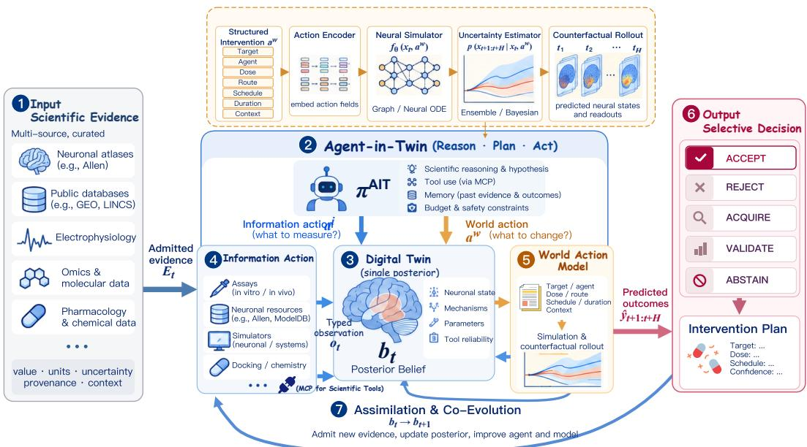  
Figure 1: NeuronSifter overview. Curated scientific evidence (1) informs a joint posterior over CNS state, mechanisms, parameters, and tool reliability (3). Agent-in-Twin (2) uses this belief to select information actions (4) and structured interventions (5) under a common burden-andfunction objective. Information actions return typed observations; interventions are compiled into uncertain target-occupancy programs for stochastic microenvironment rollout. Upper inset: worldaction model architecture. Its encoding, simulation, and uncertainty interface is NeuronSifter’s occupancy-conditioned diffusion operator. Predicted outcomes and twin reliability index (TRI) gates support intervention acceptance or rejection, evidence acquisition, external validation, and abstention (6). Admitted measurements update the biological posterior and completion outcomes update tool reliability, informing subsequent decisions and learning (7).

## 4.1 POSTERIOR TWIN OF THE NEURONAL MICROENVIRONMENT

The state field $X _ { h , r , c , s }$ indexes physical time, brain region, compartment, and biological variable: six compartments spanning plasma, the blood–brain interface, CSF, perivascular space, interstitial fluid, and meningeal drainage, with channels for free and bound drug, protein pathology, inflammation, clearance, and electrophysiological activity. Observation records retain units, biological identity, time, uncertainty, and provenance.

Modality adapters and a graph-conditioned encoder infer intervention, PK/exposure, environmental, electrophysiological, and morphological factors, and separate observation heads retain each factor’s meaning. Shared mechanistic variables couple their uncertainty: the effect of a clearance-mediated intervention can depend jointly on occupancy, clearance capacity, and pathological burden. The joint posterior represents these dependencies when evaluating expected response.

The reference posterior is a categorical variational distribution over weighted joint particles, $b _ { \phi } =$ $\textstyle \sum _ { j } w _ { j } \delta _ { \xi ( j ) }$ . Each tuple retains all five factors together; an amortized encoder supplies weights, and admitted observations reweight complete tuples. Section C.2 and Equation (19) specify the family, source nuisance variables, and head-wise calibration. The intervention factor represents observed treatment history; proposed actions enter the compiler through do(a), not as newly observed evidence. Observation likelihood and held-modality reconstruction supervise particle calibration, and source nuisance effects are represented separately (Section C.4).

## 4.2 STRUCTURED WAM

The world-action branch in Figure 1 compiles a raw intervention into a supported forcing field,

$$
\omega _ { 0 : H } = \Phi ( a ^ { \mathrm { w } } , \xi _ { t } , \mathbf { G } ) = \{ \omega _ { h } ^ { \mathrm { t a r g e t } } , \omega _ { h } ^ { \mathrm { e x p o s u r e } } , \omega _ { h } ^ { \mathrm { s t i m } } , \omega _ { h } ^ { \mathrm { e n v i r o n m e n t } } , \omega _ { h } ^ { \mathrm { r e s i d u a l } } , M _ { h } ^ { \mathrm { s u p p o r t } } \} _ { h = 0 } ^ { H } .\tag{9}
$$

For pharmacological programs the compiler propagates transport, free-concentration, and affinity uncertainty into target occupancy, resolved by target, region, compartment, and physical time through a CNS transport and binding model. A dose and schedule first give a plasma concentration path; barrier permeability and efflux set the unbound interstitial concentration; equilibrium binding against the uncertain affinity and target density then gives $\omega _ { h } ^ { \mathrm { t a r g e t } }$ , so identical cumulative exposure delivered on different schedules produces different occupancy paths. Registered PK/PD models supply mechanistic inputs while the operator learns downstream dynamics; stimulation and environmental actions use their own supported fields. The support mask records which channels are measured, mechanistically computed, learned, or unavailable, and unsupported channels are excluded from both the loss and the feasible action set rather than imputed.

For posterior particle $j ,$ draw transport and affinity parameters jointly, compile the complete occupancy path once, and reuse it throughout each denoising trajectory:

$$
\xi ^ { ( j ) } \sim b _ { t } , \quad o _ { 0 : H } ^ { ( j ) } = \Phi ( a , \xi ^ { ( j ) } , { \bf G } ) , \quad X ^ { ( j , k ) } \sim p _ { \theta } ( \cdot \mid X _ { 0 } ^ { ( j ) } , o _ { 0 : H } ^ { ( j ) } , M ^ { ( j ) } , \xi ^ { ( j ) } ) .\tag{10}
$$

Index k varies diffusion noise and $j$ varies biological and PK uncertainty; aligned occupancy, support masks, and initial state condition every block through AdaLN-Zero and cross-attention. Reusing one draw across the whole horizon rather than resampling per step preserves exposure–response dependence: a low-transport particle stays low for the entire rollout, so predictive spread reflects mechanism uncertainty instead of averaging it away. Candidate interventions share the outer draws $\{ \xi ^ { ( j ) } \}$ , which pairs their comparison.

NeuronSifter denoises quantized temporal coefficients of trajectory residuals with graph-spectral context, occupancy conditioning, and ordered mechanism experts (Section C.4). The residual is $Y = X - X _ { 0 } ^ { \bullet }$ against the inferred initial state $X _ { 0 }$ held constant over the horizon, projected onto a three-level temporal basis, so the operator learns a correction rather than the full field and long horizons cost coefficients instead of steps; inversion adds $X _ { 0 }$ back and preserves the initial condition. Mechanistic structure enters as compiled occupancy conditioning and as the teacher target, not as a subtracted prior trajectory. Within a diffusion block, $Z _ { 0 }$ denotes field tokens and $C$ their aligned occupancy and biological context. The expert update is

$$
\begin{array} { r l } & { \quad Z _ { e } = Z _ { e - 1 } + \alpha _ { e } \pi _ { e } ( Z _ { 0 } , C ) R _ { e } ( Z _ { e - 1 } , C ) , \quad e = 1 , \ldots , E , } \\ & { \quad \Delta Z = Z _ { E } - Z _ { 0 } + \alpha _ { c } R _ { c } ( Z _ { E } + C ) . } \end{array}\tag{11}
$$

Experts are applied in a fixed mechanistic order and each reads the accumulated state $Z _ { e - 1 } \colon$ pharmacology precedes transport, transport precedes pathology and inflammation, electrophysiology follows, and molecular, morphological, and solver-derived context experts close the chain. Gates $\pi _ { e }$ depend on $Z _ { 0 }$ rather than $Z _ { e - 1 }$ , keeping routing independent of the updates it modulates, and the shared residual $R _ { c }$ captures interactions the ordered chain cannot express. The parallel-expert ablation, the narrowest contrast in Table 2, removes serial composition and the specific order together, so it identifies sequen tial composition and not this biological order; depth-matched permutation controls for the order are prespecified and unexecuted (Section A.1.2). The reference backbone has eight blocks, width 696, 12 attention heads, 96 mechanism tokens, 36 graph modes, three temporal levels, and ten experts with residual scale 0.08 and shared coupling scale 0.04. Long-horizon violations, perturbation gain, and parameter-compatible action contrasts test stability and identifiability (Section C.10). Routing weights describe predictive computation; causal sensitivity is evaluated on explicit structural clamps.

The posterior predictive

$$
p _ { \theta } ( \pmb { \tau } \mid b _ { t } , a , \mathbf { G } ) = \int p _ { \theta } ( \pmb { \tau } \mid \pmb { \xi } _ { t } , \Phi ( a , \pmb { \xi } _ { t } , \mathbf { G } ) , \mathbf { G } ) b _ { t } ( d \pmb { \xi } _ { t } )\tag{12}
$$

retains the mixture over latent state, mechanism, parameters, and action support. Training combines masked diffusion, CRPS, paired action contrasts, physical residuals, and confidence-weighted teacher supervision (Section C.4).

## 4.3 DECISION-DIRECTED EVIDENCE ACQUISITION

The policy compares interventions through a prespecified microenvironment loss. For an AD-first episode, one instance is

$$
\mathcal { L } _ { \mathrm { C N S } } ( a , X ^ { a } ) = \sum _ { h , r } \Delta _ { h } v _ { r } [ \lambda _ { A } \bar { A } _ { h r } ^ { a } + \lambda _ { \tau } \bar { P } _ { h r } ^ { a } + \lambda _ { I } \bar { I } _ { h r } ^ { a } + \lambda _ { E } \bar { E } _ { h r } ^ { a } ] + \lambda _ { D } \mathcal { C } _ { \mathrm { i n t } } ( a ) ,\tag{13}
$$

where the normalized channels quantify amyloid burden, tau pathology, inflammation, and circuit instability. Time/region weights, channel normalization, importance weights, and intervention cost are fixed before evaluation; balanced normalized endpoint weights define the reference preference rather than an estimated clinical utility. Clearance and occupancy are mechanistic trajectory variables explaining changes in this burden-and-function loss, whose terminal value averages the functional over conditional trajectory variation. Channel scaling, alternative weights, and the ranking-sensitivity analysis are in Section A.1.3; clinical-direction evidence enters a separate retrospective bridge.

Candidate interventions are compared under the same joint biological posterior: sharing Monte Carlo draws can reduce comparison variance, while preserving biological dependence determines the distribution of their responses. A query is valuable when its observation changes the posterior intervention risk. Candidate queries use net utility

$$
\begin{array} { r l } & { \mathcal { U } ( b , q ) = \operatorname { V O I } ( q ; b ) - \lambda _ { c } \mathbb { E } [ c \mid b , q ] - \lambda _ { f } \mathbb { P } ( \zeta \neq \operatorname { s u c c e s s } \mid b , q ) } \\ & { \qquad - \lambda _ { s } \operatorname { U n s u p p o r t e d } ( b , q ) - \lambda _ { t } \mathbb { E } [ \operatorname { l a t e n c y } \mid b , q ] . } \end{array}\tag{14}
$$

A programmatic policy enumerates feasible queries, samples retained outcomes, updates the posterior, and minimizes expected intervention loss. An amortized value head approximates this computation, with receding-horizon targets in Section C.6. The reported decision endpoints use numerical planning; a matched non-amortized BED planner evaluates the same recursion under the same total simulation budget and differs only in candidate-coupled randomness, budget allocation, and inner-minimization bias, so the contrast isolates finite-budget estimation rather than objective or capacity (Section A.1.5). The amortized head is the separately costed branch. An optional LLM adapter proposes actions through this interface.

## 4.4 TYPED ASSIMILATION AND CLOSED-LOOP LEARNING

Let $A ( q , \mathbf { o } )$ identify admitted fields and let $\widetilde { \mathbf { o } } = \mathcal { C } _ { q } ( \mathbf { o } )$ retain those fields, admission status, and execution metadata. Assimilation uses the induced observation channel,

$$
b ^ { + } ( d \pmb { \xi } ) \propto b ( d \pmb { \xi } ) \overline { { p } } _ { q } (  { { \widetilde { \mathbf { o } } } } \mid \pmb { \xi } ) , \qquad \overline { { P } } _ { q } ( \cdot \mid \pmb { \xi } ) = P _ { q } ( \mathcal { C } _ { q } ^ { - 1 } ( \cdot ) \mid \pmb { \xi } ) .\tag{15}
$$

Here $\overline { { { p } } } _ { q }$ is the retained-outcome density. Rejected values are marginalized; informative rejection or missingness remains part of the likelihood. Ignorable admission yields the familiar masked biological likelihood (Section C.7). Training uses out-of-fold posteriors for acquisition targets and a disjoint split for the final decision calibrator. The complete loss and cross-fitting procedure are given in Sections C.4, C.6 and C.8.

Algorithm 1 A NeuronSifter intervention-planning round   
Require: Evidence $\mathcal { E } _ { t } .$ , microenvironment graph G, interventions W, queries Q, budget $B _ { t }$ , evalua   
tion mode   
1: Infer the joint biological posterior $b _ { t }$ ▷ Retain exposure–response uncertainty   
2: for $a \in { \dot { \mathcal W } }$ do   
3: Compile supported exposure and occupancy programs for posterior states   
4: Sample CNS trajectories and estimate loss in Equation (13)   
5: Rank interventions and compute TRI, support, and ranking stability   
6: if fixed-risk mode and the frozen stopping rule returns a candidate then   
7: return candidate if the terminal calibrated gate accepts; otherwise defer   
8: for $q \in \mathcal { Q } ( b _ { t } , B _ { t } )$ do   
9: Predict typed outcomes and their posterior intervention-risk reduction   
10: Subtract expected measurement cost, failure penalty, and latency   
11: Compare feasible continuations with stopping under the decision objective   
12: if stopping is preferred or no feasible budget remains then   
13: return the best admissible decision or an evidence-based deferral   
14: Select the preferred feasible information/world action   
15: if an action is executed then   
16: Propagate any world-action component and obtain its typed observation   
17: Assimilate retained fields and typed events into $b _ { t + 1 }$ using Equation (15)   
18: Update remaining budget using realized cost ▷ Count partial and failed calls   
19: Repeat until a decision is resolved or the budget is exhausted

## 4.5 DECISION GUARANTEES AND DIAGNOSTICS

Compiler sufficiency preserves value when the state-conditional field retains transitions, support, and cost. Along a fixed policy, the path-KL bound in Proposition 4 uses expected transition and retained-observation log ratios over visited histories. Exact categorical TV/KL, held-regimen forecast error, and intervention regret are complementary diagnostics on projected outcome distributions (Figure 8); the uniform full-state TV result applies under the assumptions in Section D.

## 5 EXPERIMENTAL SETUP

Five research questions (RQs) connect the shared-posterior design to state estimation, intervention planning, evidence acquisition, and selective reliability. RQ1: State. Does the posterior recover microenvironment state across sources and missing modalities? RQ2: Dynamics. Do occupancy programs improve long-horizon forecasts under unseen regimens? RQ3: Decisions. Does mechanistic uncertainty improve intervention ranking? RQ4: Feedback. Which measurements reduce intervention risk at a fixed budget? RQ5: Reliability. Do TRI gates retain useful decisions under biological and measurement shift?

The AD-first evaluation links molecular state, exposure, and intervention loss. Synthetic numerical displays use 64 constructed scenario blocks crossing four holdout families, four intervention program families, and four teacher/source strata, with every paired contrast formed within block and 2,000 paired bootstrap resamples at seed 3407 (Table 10). Their intervals describe the supplied construction. Five training seeds are averaged within block before resampling, so optimization variation is reported separately (Section A.6).

Data and topology. The admitted teacher corpus holds 222,336 rows over 111,168 paired simula tions, each pair contributing one grade-A full-microenvironment row and one grade-B mesoscopic row, with 13,945 regimen identifiers and 49 rejected records. The executed division is 177,904 training, 21,952 validation, and 22,480 test rows at measured zero overlap on all five registered holdout keys (Table 9). The reference graph has six regions and six compartments, with 15 state channels at 28 times over 672 hours. Directed transport edges drive the compiler; their symmetrized Laplacian supplies operator context. Public atlases and Patch-seq provide molecular, spatial, and electrophysiological readouts (Yao et al., 2023; Zhang et al., 2023; Siletti et al., 2023; Gouwens et al., 2020). Source, regimen, target-program, and simulator-family holdouts remain separate; public multi-arm outcomes and teacher replay are distinct evaluation strata.

Controls and uncertainty. The full reference operator uses width 696, eight blocks, 12 heads, and ten experts; inference profiles and training objectives are in Sections A.3 and C.4. Controls use the same posterior, query library, retained-outcome channel, action support, and cost units. State comparisons use scGPT and scVI; dynamics comparisons use Transolver, WDNO, DiffusionPDE, CoDA-NO, and Mamba-NO; selection uses conformal risk control (Table 5). EIG, regime-target BALD, finite-query iDAD/Step-DAD, and decision-aware amortized BED separate information objectives from decision loss. Matched non-amortized decision-aware BED uses the same simulation budget and stopping rule (Section A.1.5). A hybrid residual MPC adapter tests an alternative planning model. Section A.1.8 fixes their adaptations and teacher perturbations. TRI thresholds are frozen on separate calibration groups; shifted strata receive no threshold retuning. Failed and incomplete calls retain their cost and decision loss.

## 6 RESULTS AND DISCUSSION

State inference (RQ1). Held-source state inference gives prediction error 0.148 versus 0.181 for scGPT and 0.182 versus 0.218 for scVI with a modality removed, halving calibration error in both strata and lowering source predictability from 0.360 to 0.280 (Table 11).

Intervention dynamics (RQ2). Occupancy conditioning gives trajectory CRPS 0.110, versus 0.165 for action identity, 0.143 for scalar exposure, and 0.128 for Transolver (Tables 1 and 12 and Figure 5). Paired over the same 64 blocks, every CRPS contrast separates from zero, from 0.055 [0.048, 0.062] down to 0.012 [0.003, 0.021] for parallel experts, with d 1.83–0.31 and win rates 1.000–0.609; Holm-adjusted sign-flip tests stay below 0.001 for five contrasts and reach 0.016 for the serial-composition contrast, the narrowest comparison (Table 2). Across the eight-operator suite NeuronSifter leads all seven held-out contexts at family CRPS 0.121 against 0.130 for WDNO (Table 14). Compiler perturbation raises TV from 0.008 to 0.085 and regret from 0.012 to 0.058; at a one-SD prior shift, propagating occupancy uncertainty gives CRPS 0.162 versus 0.219 for plug-in occupancy (Figure 8 and Table 25).

Table 1: Held-regimen prediction and ranking; brackets give 95% block-bootstrap intervals. Gray bold cells mark best values, including ties. Comparators are five action-encoding and architecture ablations of our own operator (†, Section A.1.2) and Transolver under its native action conditioning; its same-occupancy variant is in Table 31, the eight-operator suite in Table 14, and every baseline family in Table 5.
<table><tr><td>Model</td><td>Trajectory CRPS↓</td><td>Terminal NRMSE↓</td><td>Intervention regret ↓</td><td>Ordering accuracy ↑</td></tr><tr><td>NeuronSifter (ours)</td><td>0.110 [0.104,0.116]</td><td>0.150</td><td>0.045 [0.041,0.049]</td><td>0.880</td></tr><tr><td>Action-ID conditioning†</td><td>0.165 [0.159,0.171]</td><td>0.215</td><td>0.085 [0.081,0.089]</td><td>0.760</td></tr><tr><td>Scalar-exposure conditioning†</td><td>0.143 [0.137,0.149]</td><td>0.190</td><td>0.067 [0.063,0.071]</td><td>0.810</td></tr><tr><td>Flattened action fields†</td><td>0.135 [0.129,0.141]</td><td>0.180</td><td>0.061 [0.057,0.065]</td><td>0.830</td></tr><tr><td>Parameter-matched shared operator†</td><td>0.130 [0.124,0.136]</td><td>0.174</td><td>0.056 [0.052,0.060]</td><td>0.845</td></tr><tr><td>Parallel mechanism experts†</td><td>0.122 [0.116,0.128]</td><td>0.164</td><td>0.052 [0.048,0.056]</td><td>0.860</td></tr><tr><td>External neural-operator baseline (Wu et al., 2024)</td><td>0.128 [0.122,0.134]</td><td>0.172</td><td>0.059 [0.055,0.063]</td><td>0.842</td></tr></table>

Intervention ranking (RQ3). The same conditioning gives intervention regret 0.045 and ordering accuracy 0.880, versus 0.085 and 0.760 for action identity (Table 1), and paired regret contrasts keep the sign of the CRPS contrasts (Table 2). Mechanistic dependence, not forecast accuracy, drives this: a point state leaves CRPS unchanged at 0.110 while raising fixed-budget risk from 0.160 to 0.220, and the dependence-ablated interface reaches 0.199 (Table 19). Prefix consistency, exposure-matched timing, and context-dependent response separate occupancy programs from scalar exposure and action identity (Table 13); a transport clamp changes sign across compatible parameters (Table 28).

Table 2: Paired statistical analysis of the held-regimen benchmark. Comparator minus Neuron-Sifter over the 64 constructed scenario blocks behind Table 1; positive favors NeuronSifter. $d _ { z }$ is the standardized paired effect and Win the block fraction with lower CRPS; $p _ { \mathrm { H o l m } }$ is a Holm-adjusted sign-flip test $( 1 0 ^ { 4 }$ draws, so smaller values are shown as a bound) over the six contrasts. The parallelexpert row measures serial composition, not the mechanistic order (Section A.1.2). These summarize the declared construction, not an executed comparison. †Internal ablations.
<table><tr><td>Comparator</td><td>∆CRPS [95% CI]</td><td> $d _ { z }$ </td><td>Win</td><td>∆Regret [95% CI]</td><td>PHolm</td></tr><tr><td>Action-ID conditioning†</td><td>0.055 [0.048,0.062]</td><td>1.83</td><td>1.000</td><td>0.040 [0.034,0.046]</td><td>&lt;0.001</td></tr><tr><td>Scalar-exposure conditioning†</td><td>0.033 [0.026,0.040]</td><td>1.14</td><td>0.844</td><td>0.022 [0.017,0.027]</td><td>&lt;0.001</td></tr><tr><td>Flattened action fields†</td><td>0.025 [0.018,0.033]</td><td>0.81</td><td>0.781</td><td>0.016 [0.010,0.022]</td><td>&lt;0.001</td></tr><tr><td>Parameter-matched shared operator†</td><td>0.020 [0.011,0.028]</td><td>0.59</td><td>0.672</td><td>0.011 [0.005,0.017]</td><td>&lt;0.001</td></tr><tr><td>Parallel mechanism experts†</td><td>0.012 [0.003,0.021]</td><td>0.31</td><td>0.609</td><td>0.007 [0.001,0.013]</td><td>0.016</td></tr><tr><td>External neural-operator baseline</td><td>0.018 [0.010,0.026]</td><td>0.55</td><td>0.641</td><td>0.014 [0.008,0.020]</td><td>&lt;0.001</td></tr></table>

Evidence acquisition (RQ4). At cost budget 5, NeuronSifter’s constructed risk is 0.160, versus 0.166 for matched numerical BED, 0.171 for amortized BED, and 0.178 for the earlier control, with paired excess risks 0.006 [0.003, 0.009], 0.011 [0.007, 0.015], and 0.018 [0.013, 0.023] (Table 3). The matched planner shares posterior, compiler, library, loss, costs, lookahead depth, stopping, and total budget, so the gap comes only from how that budget is coupled and allocated across candidates (Section A.1.5). Costs to risk 0.22 are 2.286, 2.375, 2.500, and 2.871, giving ratios 0.963 [0.907, 1.025] against the matched planner and 0.796 [0.732, 0.873] against the earlier control, so the 20.4% saving separates from equality and the 3.7% saving does not: a threshold crossing amplifies the same paired noise (Section A.6). These contrasts concern finite-budget approximation; the full-posterior identity reference retains equal value (Proposition 1 and Tables 16 and 26).

Table 3: Decision-directed acquisition at matched budget. Synthetic values at cost budget 5; comparators follow Lindley (1956) and Huang et al. (2024a). $\Delta \dot { R }$ and $\Delta C$ are comparator minus ours with paired block-bootstrap 95% intervals over the blocks of Table 10; cost is interpolated at target risk 0.22 and both endpoints use numerical planning (Table 33).
<table><tr><td>Policy</td><td>Risk↓</td><td>∆R [95% CI]</td><td>Cost↓</td><td>∆C [95% CI]</td></tr><tr><td>NeuronSifter (numerical reference)</td><td>0.160</td><td>0 (reference)</td><td>2.286</td><td>0 (reference)</td></tr><tr><td>Matched numerical BED</td><td>0.166</td><td>0.006 [0.003, 0.009]</td><td>2.375</td><td>0.089 [-0.057, 0.235]</td></tr><tr><td>Decision-aware amortized BED</td><td>0.171</td><td>0.011 [0.007, 0.015]</td><td>2.500</td><td>0.214 [0.010, 0.418]</td></tr><tr><td>Earlier design control</td><td>0.178</td><td>0.018 [0.013, 0.023]</td><td>2.871</td><td>0.585 [0.332, 0.838]</td></tr></table>

Selective reliability (RQ5). At nominal 0.95 and with no per-stratum retuning, frozen bound coverage is 61/64 in distribution and 59/64, 57/64, and 56/64 under source, tool, and admission shift (Figure 9 and Table 27). The TRI rule attains AURC 0.124 and false acceptance 0.018 against 0.132 and 0.020 for a conformal baseline; removing the gate raises false acceptance to 0.050 (Tables 18 and 20). Ranking is stable under the prespecified preference perturbations, retaining the selected action on 0.797–0.953 of contexts (Table 6).

Compute and proposal backends. With the twin and scientific controller fixed, swapping the LLM proposal backend moves median episode latency by 58% while moving terminal risk by 0.010 and invalid proposals from 2.0% to 3.1% (Figure 7 and Section A.1.6). Under the common four-intervention workload, the amortized branch’s authored 49.9 s cycle projects to 3.47, 34.65, and 346.53 h for 103, 104, and 105 interventions; at $1 0 ^ { 5 }$ , WDNO and DiffusionPDE take 429.86 and 513.19 h while deterministic alternatives take 68.75–126.53 h at 4–20× larger calibration error (Tables 14 and 34). Risk 0.160 instead belongs to the numerical branch, at 61.8 s per cycle and 429.17 h at $1 0 ^ { 5 }$ , pairing quality with runtime in Table 33. Cycles cover compiler, rollout, query scoring, and TRI on one 48-GiB GPU (Section A.7).

## 7 RETROSPECTIVE AD INTERVENTION CASE

Clarity AD compared intravenous lecanemab 10 mg/kg every two weeks with placebo in amyloidpositive early AD over 18 months (van Dyck et al., 2023): CDR-SB worsened by 1.21 versus 1.66 points, an adjusted difference of −0.45 (95% CI [−0.67, −0.23]), with an additional 59.1-centiloid amyloid PET decrease (Figure 4). Infusion reactions (26.4%) and ARIA with edema/effusions (12.6%) remain part of this favorable clinical-direction reference. The bridge separates clinical scales from microenvironment loss and occupancy, so concordance requires frozen replay; Table 15 adds five cited favorable, negative, or mixed references and Section A.4.2 gives synthetic mechanism demonstrations.

## 8 CONCLUSION

NeuronSifter connects a structured intervention compiler, joint biological posterior, and decisiondirected evidence acquisition in a CNS microenvironment twin: occupancy-conditioned diffusion supplies counterfactual trajectories, and typed assimilation with TRI supports selective prioritization. The interface principle predicts equal value for matched full-posterior controllers, information-losing controls isolate biological dependence, and the acquisition protocol separates information objectives, numerical planning, and amortization. The synthetic comparisons define what executed evaluation, independent planner comparison, and frozen replay must still supply.

## ETHICS STATEMENT

NeuronSifter supports retrospective, non-clinical intervention prioritization with public scientific evidence and registered computational tools. Controlled-access participant data follow separate governance and authorization. Registered tool interfaces retain provenance, version, and cost records. Laboratory and clinical use requires domain validation, human authorization, and appropriate oversight; patient-specific treatment additionally requires prospective clinical validation. Publication, demographic, and measurement biases are tracked through source-support and OOD analyses.

## REPRODUCIBILITY STATEMENT

The appendix defines the operator, action compiler, admission rules, grouped splits, baseline interfaces, metrics, and statistical units. Proofs accompany the formal results. The numerical source record includes scenario values, exact Bayesian calculations, and deterministic block-derived intervals. Figure sources and checks preserve the mapping from each value to its display. Empirical run records include effective configuration, split, checkpoint, tool and environment identities, predictions, costs, failures, and uncertainty estimates.

The current model-comparison displays use authored synthetic inputs and deterministic generators. Published AD trial estimates retain their primary citations and original confidence intervals. Neither the synthetic bootstrap nor the manuscript build constitutes an executed model-to-trial or independent planner evaluation.

## STATEMENT ON THE USE OF AI ASSISTANCE

AI tools assisted literature retrieval and manuscript organization, including editorial and figurepreparation support for this working draft. The authors retain responsibility for source verification, scientific interpretation, and the final manuscript. Synthetic numerical illustrations are identified separately from published trial results.

## REFERENCES

P. S. Aisen, S. Gauthier, S. H. Ferris, et al. Tramiprosate in mild-to-moderate Alzheimer’s disease - a randomized, double-blind, placebo-controlled, multi-centre study (the Alphase Study). Archives of medical science : AMS, 7(1), 2011. doi: 10.5114/aoms.2011.20612.

Anastasios N. Angelopoulos, Stephen Bates, Adam Fisch, Lihua Lei, and Tal Schuster. Conformal risk control. In International Conference on Learning Representations, 2024.

Nuutti Barron, Heng Rao, Urmi Saha, Yu Gu, Zhenghao Liu, Ge Yu, Defu Yang, Ashish Raj, and Minghan Chen. Tau-BNO: Brain neural operator for tau transport model. arXiv:2603.08108, 2026.

David Blackwell. Equivalent comparisons of experiments. The Annals ofMathematical Statistics, 24 (2):265–272, 1953. doi: 10.1214/aoms/1177729032.

Danylo Boiko and Viktoriia Mishkurova. Treatment-conditioned diffusion for forecasting neurodegenerative disease progression. arXiv:2605.29932, 2026.

Samantha Budd Haeberlein, P. S. Aisen, F. Barkhof, et al. Two Randomized Phase 3 Studies of Aducanumab in Early Alzheimer’s Disease. The journal ofprevention ofAlzheimer’s disease, 9(2), 2022. doi: 10.14283/jpad.2022.30.

Charlotte Bunne, Stefan G. Stark, Gabriele Gut, Jacobo S. Del Castillo, Michael Levesque, Kjong-Van Lehmann, Andreas Krause, and Gunnar Ratsch. Learning single-cell perturbation responses using neural optimal transport. Nature Methods, 20:1759–1768, 2023. doi: 10.1038/s41592-023-01969-x.

Chu Xin Cheng, Raul Astudillo, Thomas Desautels, and Yisong Yue. Practical bayesian algorithm execution via posterior sampling. In Advances in Neural Information Processing Systems, volume 37, 2024a.

Chun-Wun Cheng, Jiahao Huang, Yi Zhang, Guang Yang, Carola-Bibiane Schönlieb, and Angelica I. Aviles-Rivero. Mamba neural operator: Who wins? transformers vs. state-space models for pdes. arXiv preprint arXiv:2410.02113, 2024b.

Kyunghyun Cho, Bart van Merriënboer, Caglar Gulcehre, Dzmitry Bahdanau, Fethi Bougares, Holger Schwenk, and Yoshua Bengio. Learning phrase representations using RNN encoder–decoder for statistical machine translation. In Proceedings ofthe 2014 Conference on Empirical Methods in Natural Language Processing, pp. 1724–1734, 2014. doi: 10.3115/v1/D14-1179.

Haotian Cui, Chloe Wang, Hassaan Maan, Kuan Pang, Fengning Luo, Nan Duan, Bo Wang, et al. scGPT: Toward building a foundation model for single-cell multi-omics using generative ai. Nature Methods, 21:1470–1480, 2024. doi: 10.1038/s41592-024-02201-0.

Michael F. Egan, James Kost, Pierre N. Tariot, et al. Randomized Trial of Verubecestat for Mildto-Moderate Alzheimer’s Disease. The New England journal of medicine, 378(18), 2018. doi: 10.1056/nejmoa1706441.

Adam Foster, Desi R. Ivanova, Ilyas Malik, and Tom Rainforth. Deep adaptive design: Amortizing sequential bayesian experimental design. In Proceedings ofthe 38th International Conference on Machine Learning, volume 139 of Proceedings of Machine Learning Research, pp. 3384–3395, 2021.

Mariano I. Gabitto, Kyle J. Travaglini, Victoria M. Rachleff, et al. Integrated multimodal cell atlas of alzheimer’s disease. Nature Neuroscience, 27:2366–2383, 2024. doi: 10.1038/ s41593-024-01774-5.

Yonatan Geifman and Ran El-Yaniv. SelectiveNet: A deep neural network with an integrated reject option. In Proceedings ofthe 36th International Conference on Machine Learning, volume 97 of Proceedings of Machine Learning Research, pp. 2151–2159, 2019.

Nathan W. Gouwens, Staci A. Sorensen, Fahimeh Baftizadeh, et al. Integrated morphoelectric and transcriptomic classification of cortical gabaergic cells. Cell, 183(4):935–953.e19, 2020. doi: 10.1016/j.cell.2020.09.057.

Arthur Gretton, Karsten M. Borgwardt, Malte J. Rasch, Bernhard Schölkopf, and Alexander Smola. A kernel two-sample test. Journal ofMachine Learning Research, 13(25):723–773, 2012.

Arthur Guez, David Silver, and Peter Dayan. Efficient bayes-adaptive reinforcement learning using sample-based search. In Advances in Neural Information Processing Systems, volume 25, 2012.

Danijar Hafner, Timothy Lillicrap, Ian Fischer, Ruben Villegas, David Ha, Honglak Lee, and James Davidson. Learning latent dynamics for planning from pixels. In Proceedings of the 36th International Conference on Machine Learning, volume 97 of Proceedings of Machine Learning Research, pp. 2555–2565, 2019.

Danijar Hafner, Timothy Lillicrap, Jimmy Ba, and Mohammad Norouzi. Dream to control: Learning behaviors by latent imagination. In International Conference on Learning Representations, 2020.

Danijar Hafner, Jurgis Pasukonis, Jimmy Ba, and Timothy Lillicrap. Mastering diverse control tasks through world models. Nature, 640:647–653, 2025. doi: 10.1038/s41586-025-08744-2.

Chao Han, Stefanos Ioannou, Luca Manneschi, T. J. Hayward, Michael Mangan, Aditya Gilra, and Eleni Vasilaki. Neural ode and sde models for adaptation and planning in model-based reinforcement learning. arXiv:2603.23245, 2026.

Minsheng Hao, Jing Gong, Xin Zeng, Chiming Liu, Yucheng Guo, Xingyi Cheng, Taifeng Wang, Jianzhu Ma, Xuegong Zhang, and Le Song. Large-scale foundation model on single-cell transcriptomics. Nature Methods, 21:1481–1491, 2024. doi: 10.1038/s41592-024-02305-7.

Arya Hariharan, Shreyank N Gowda, and Anala M R. Uncertainty-aware longitudinal forecasting of alzheimer’s disease progression using deep learning. arXiv:2606.24604, 2026.

Marcel Hedman, Desi R. Ivanova, Cong Guan, and Tom Rainforth. Step-DAD: Semi-amortized policy-based bayesian experimental design. In Proceedings of the 42nd International Conference on Machine Learning, volume 267 of Proceedings ofMachine Learning Research, pp. 22904–22923. PMLR, 2025.

Rebecca D. Hodge, Trygve E. Bakken, Jeremy A. Miller, et al. Conserved cell types with divergent features in human versus mouse cortex. Nature, 573:61–68, 2019. doi: 10.1038/s41586-019-1506-7.

Lawrence S. Honig, Bruno Vellas, Michael Woodward, et al. Trial of Solanezumab for Mild Dementia Due to Alzheimer’s Disease. The New Englandjournal ofmedicine, 378(4), 2018. doi: 10.1056/nejmoa1705971.

Neil Houlsby, Ferenc Huszár, Zoubin Ghahramani, and Máté Lengyel. Bayesian active learning for classification and preference learning. arXiv:1112.5745, 2011.

Ronald A. Howard. Information value theory. IEEE Transactions on Systems Science and Cybernetics, 2(1):22–26, 1966. doi: 10.1109/TSSC.1966.300074.

Peiyan Hu, Rui Wang, Xiang Zheng, Tao Zhang, Haodong Feng, Ruiqi Feng, Long Wei, Yue Wang, Zhi-Ming Ma, and Tailin Wu. Wavelet diffusion neural operator. In International Conference on Learning Representations, 2025.

Daolang Huang, Yujia Guo, Luigi Acerbi, and Samuel Kaski. Amortized bayesian experimental design for decision-making. In Advances in Neural Information Processing Systems, volume 37, pp. 109460–109486, 2024a.

Jiahe Huang, Guandao Yang, Zichen Wang, and Jeong Joon Park. DiffusionPDE: Generative PDE-solving under partial observation. In Advances in Neural Information Processing Systems, volume 37, 2024b. doi: 10.52202/079017-4140.

Yinyu Huang, Yilin Zhang, Sofia Michopoulou, Christopher Kipps, and Rahman Attar. Transition-based digital twin modelling for alzheimer’s disease under sparse longitudinal data. arXiv:2606.09671, 2026.

Desi R. Ivanova, Adam Foster, Steven Kleinegesse, Michael U. Gutmann, and Tom Rainforth. Implicit deep adaptive design: Policy-based experimental design without likelihoods. In Advances in Neural Information Processing Systems, volume 34, 2021.

Ian T. Jolliffe and Jorge Cadima. Principal component analysis: A review and recent developments. Philosophical Transactions ofthe Royal Society A, 374(2065):20150202, 2016. doi: 10.1098/rsta. 2015.0202.

Leslie Pack Kaelbling, Michael L. Littman, and Anthony R. Cassandra. Planning and acting in partially observable stochastic domains. Artificial Intelligence, 101(1–2):99–134, 1998. doi: 10.1016/S0004-3702(98)00023-X.

Zongyi Li, Nikola Kovachki, Kamyar Azizzadenesheli, Burigede Liu, Kaushik Bhattacharya, Andrew Stuart, and Anima Anandkumar. Fourier neural operator for parametric partial differential equations. In International Conference on Learning Representations, 2021.

D. V. Lindley. On a measure of the information provided by an experiment. The Annals of Mathematical Statistics, 27(4):986–1005, 1956. doi: 10.1214/aoms/1177728069.

Wenxi Liu, Michael Trimboli, and Xianqi Li. Ai-augmented adaptive digital twin modeling for brain tumor evolution prediction and treatment scheduling. arXiv:2607.13877, 2026.

Romain Lopez, Jeffrey Regier, Michael B. Cole, Michael I. Jordan, and Nir Yosef. Deep generative modeling for single-cell transcriptomics. Nature Methods, 15:1053–1058, 2018. doi: 10.1038/ s41592-018-0229-2.

Mohammad Lotfollahi, Anna Klimovskaia Susmelj, Carlo De Donno, et al. Predicting cellular responses to complex perturbations in high-throughput screens. Molecular Systems Biology, 19(6): e11517, 2023. doi: 10.15252/msb.202211517.

Lu Lu, Pengzhan Jin, Guofei Pang, Zhongqiang Zhang, and George E. Karniadakis. Learning nonlinear operators via DeepONet based on the universal approximation theorem of operators. Nature Machine Intelligence, 3:218–229, 2021. doi: 10.1038/s42256-021-00302-5.

MICrONS Consortium. Functional connectomics spanning multiple areas of mouse visual cortex. Nature, 640:435–447, 2025. doi: 10.1038/s41586-025-08790-w.

Model Context Protocol Contributors. Model Context Protocol Specification: Tools. Protocol revision 2025-06-18, 2025. URL https://modelcontextprotocol.io/specification/ 2025-06-18/server/tools. Accessed September 21, 2026.

Willie Neiswanger, Ke Alexander Wang, and Stefano Ermon. Bayesian algorithm execution: Estimating computable properties of black-box functions using mutual information. In Proceedings of the 38th International Conference on Machine Learning, volume 139 of Proceedings of Machine Learning Research, pp. 8005–8015, 2021.

Nguyen Linh Dan Le. Bayesian networks with latent time embedding for stage-aware causal modeling of alzheimer’s disease progression. arXiv:2606.15784, 2026.

Andrzej Przekwas, Carly Norris, and Harsha T. Garimella. Mechanistic modeling of amyloid dynamics relating to alzheimer’s disease progression. Frontiers in Aging Neuroscience, 18: 1730480, 2026. doi: 10.3389/fnagi.2026.1730480.

Md Ashiqur Rahman, Robert Joseph George, Mogab Elleithy, Daniel Leibovici, Zongyi Li, Boris Bonev, Colin White, Julius Berner, Raymond A. Yeh, Jean Kossaifi, Kamyar Azizzadenesheli, and Anima Anandkumar. Pretraining codomain attention neural operators for solving multiphysics pdes. In Advances in Neural Information Processing Systems, volume 37, 2024.

Balaraman Ravindran and Andrew G. Barto. Approximate homomorphisms: A framework for non-exact minimization in markov decision processes. In Proceedings ofthe Fifth International Conference on Knowledge Based Computer Systems, 2004.

Yusuf Roohani, Kexin Huang, and Jure Leskovec. Predicting transcriptional outcomes of novel multigene perturbations with GEARS. Nature Biotechnology, 42:927–935, 2024. doi: 10.1038/ s41587-023-01905-6.

Yanay Rosen, Yusuf Roohani, Ayush Agrawal, Leon Samotorcan, Tabula Sapiens Consortium,ˇ Stephen R. Quake, Jure Leskovec, et al. Universal cell embedding provides a foundation model for cell biology. Nature, 2026. doi: 10.1038/s41586-026-10689-z.

Subham Sekhar Sahoo, Marianne Arriola, Yair Schiff, Aaron Gokaslan, Edgar Marroquin, Justin T Chiu, Alexander Rush, and Volodymyr Kuleshov. Simple and effective masked diffusion language models. In Advances in Neural Information Processing Systems, volume 37, 2024. URL https://proceedings.neurips.cc/paper\_files/paper/2024/ hash/eb0b13cc515724ab8015bc978fdde0ad-Abstract-Conference.html.

Seattle Alzheimer’s Disease Brain Cell Atlas Consortium. SEA-AD data and downloads. Allen Institute data documentation, 2026. URL https://brain-map.org/consortia/sea-ad/ our-data.

Andrew N. Shen, Katelin S. Matazel, W. Drew Gill, Lorna Ewart, Randy S. Daughters, and Hector Rosas-Hernandez. Modeling neurovascular dysfunction in alzheimer’s disease using an isogenic brain-chip model. Fluids and Barriers of the CNS, 23:1, 2026. doi: 10.1186/s12987-025-00708-y.

Hailing Shi, Yichun He, Yiming Zhou, et al. Spatial atlas of the mouse central nervous system at molecular resolution. Nature, 622:552–561, 2023. doi: 10.1038/s41586-023-06569-5.

Kimberly Siletti, Rebecca Hodge, Alejandro Mossi Albiach, et al. Transcriptomic diversity of cell types across the adult human brain. Science, 382(6667):eadd7046, 2023. doi: 10.1126/science. add7046.

John R. Sims, Jennifer A. Zimmer, Cynthia D. Evans, et al. Donanemab in Early Symptomatic Alzheimer Disease: The TRAILBLAZER-ALZ 2 Randomized Clinical Trial. JAMA, 330(6), 2023. doi: 10.1001/jama.2023.13239.

Leon Stefanovski, Paul Triebkorn, Andreas Spiegler, Margarita-Arimatea Diaz-Cortes, Ana Solodkin, Viktor Jirsa, Anthony Randal McIntosh, Petra Ritter, and Alzheimer’s Disease Neuroimaging Initiative. Linking molecular pathways and large-scale computational modeling to assess candidate disease mechanisms and pharmacodynamics in alzheimer’s disease. Frontiers in Computational Neuroscience, 13:54, 2019. doi: 10.3389/fncom.2019.00054.

Shion Takeno, Hitoshi Fukuoka, Yuhki Tsukada, Toshiyuki Koyama, Motoki Shiga, Ichiro Takeuchi, and Masayuki Karasuyama. Multi-fidelity bayesian optimization with max-value entropy search and its parallelization. In Proceedings ofthe 37th International Conference on Machine Learning, volume 119 of Proceedings ofMachine Learning Research, pp. 9334–9345, 2020.

Christina V. Theodoris, Ling Xiao, Anant Chopra, Mark D. Chaffin, Zeina R. Al Sayed, Matthew C. Hill, Helen Mantineo, Emily M. Brydon, Zexian Zeng, X. Shirley Liu, and Patrick T. Ellinor. Transfer learning enables predictions in network biology. Nature, 618:616–624, 2023. doi: 10.1038/s41586-023-06139-9.

Matteo Torzoni, Domenico Maisto, Andrea Manzoni, Francesco Donnarumma, Giovanni Pezzulo, and Alberto Corigliano. Active digital twins via active inference. Engineering Applications of Artificial Intelligence, 174:114519, 2026. doi: 10.1016/j.engappai.2026.114519.

Christopher H. van Dyck, Chad J. Swanson, Paul Aisen, et al. Lecanemab in Early Alzheimer’s Disease. The New Englandjournal ofmedicine, 388(1), 2023. doi: 10.1056/nejmoa2212948.

Haixu Wu, Huakun Luo, Haowen Wang, Jianmin Wang, and Mingsheng Long. Transolver: A fast transformer solver for PDEs on general geometries. In Proceedings of the 41st International Conference on Machine Learning, volume 235 of Proceedings of Machine Learning Research, pp. 53681–53705, 2024.

Qian Xie, Raul Astudillo, Peter I. Frazier, Ziv Scully, and Alexander Terenin. Cost-aware bayesian optimization via the pandora’s box gittins index. In Advances in Neural Information Processing Systems, volume 37, 2024. doi: 10.52202/079017-3669.

Zizhen Yao, Cindy T. J. van Velthoven, Michael Kunst, et al. A high-resolution transcriptomic and spatial atlas of cell types in the whole mouse brain. Nature, 624:317–332, 2023. doi: 10.1038/s41586-023-06812-z.

Meng Zhang, Xingjie Pan, Won Jung, et al. Molecularly defined and spatially resolved cell atlas of the whole mouse brain. Nature, 624:343–354, 2023. doi: 10.1038/s41586-023-06808-9.

## Appendix navigation

<table><tr><td>A Supplementary Experiments</td><td>16</td><td>D Theoretical Results</td><td>35</td></tr><tr><td>B Notation and Assumptions</td><td>31</td><td>E Proofs</td><td>38</td></tr><tr><td></td><td>C Extended Agent-in-Twin Method 32</td><td>F Biological Interpretation and Artifacts</td><td>39</td></tr></table>

## A SUPPLEMENTARY EXPERIMENTS

## A.1 CNS EXPERIMENT PROTOCOL

## A.1.1 TASKS, UNITS, AND ENDPOINTS

The evaluation unit is a microenvironment context with initial evidence, supported intervention programs, and declared outcomes. Atlases assess observation heads; mechanistic teachers assess controlled dynamics; independent biological outcomes assess intervention response. Their evidence strata remain separate.

Continuous predictions use training-only centering/scaling. For predictive law F, ${ \mathrm { C R P S } } ( F , y ) =$ $\begin{array} { r } { \mathbb { E } | X - y | - \frac { 1 } { 2 } \mathbb { E } | X - X ^ { \prime } | } \end{array}$ with independent draws; NRMSE is root mean squared error in the declared normalized coordinates. Average observed channels and times within each episode before averaging independent episodes, retaining the same missingness mask across methods. Three distinct quantities are named separately throughout: acceptedfraction is the share of contexts a selective rule accepts, bound coverage is the observed coverage of the frozen upper-loss bound at its nominal level, and calibration error is the absolute deviation of a predictive interval’s observed coverage from its nominal level. Spearman correlation assesses ranks; ordering accuracy assigns half credit to ties. Intervention regret is $\ell ( \widehat { a } ) - \operatorname* { m i n } _ { a \in \mathcal { A } _ { i } } \ell ( a )$ within the supported set. Query regret compares net utility with the best feasible query. Threshold costs use linear interpolation; AURC uses trapezoidal integration with the limiting risk at zero coverage. Fractional threshold costs are summaries, not executable fractional queries.

## A.1.2 STATE, DYNAMICS, AND DEPENDENCE CONTROLS

Whole-source holdouts and modality removal assess state transfer, joint likelihood, coverage, and cross-modal consistency against unimodal and late-fusion controls. Trainable methods use five seeds with matched optimization and inference budgets. Only QC-approved teacher records enter training, with teacher-uncertainty weighting. Regimen, target-program, horizon, and simulator-family holdouts exercise the complete stochastic operator and all mechanism experts.

Action-ID, scalar-exposure, flattened-field, parameter-matched shared-operator, and parallel-expert variants are internal ablations. Identical prefixes with different future programs test past-state invariance; matched integrated exposure/occupancy with different timing tests scalar information loss; matched programs under different transport/inflammation contexts test state-dependent response. Matching variables and cutoffs are fixed before outcome access. Joint-posterior, point-state, and dependence-ablated controls share marginal calibration and physical validity. Pairing Monte Carlo seeds improves precision; it does not define biological dependence.

Mechanism-order controls. The parallel-expert variant replaces the serial chain with one simultaneous update, so it removes serial composition and the specific mechanistic order together and cannot attribute the contrast to either alone. Two depth-matched order controls are prespecified and not yet executed: a full reversal of the ordered expert list, and a declared permutation that interleaves the pharmacology–transport–pathology chain so no upstream expert precedes all of its downstream consumers. Both hold the encoder, operator width and depth, expert set, parameter count, coupling masks, router index mapping, training records, optimizer, budget, and checkpoint-selection rule fixed, and change only each expert’s position in the chain, so serial depth is constant by construction and only order varies; further permutations reuse the same single ordered field. Report the same paired CRPS and regret endpoints as Table 2, with the permutation set as one Holm family. Until those controls are executed, the ordered-expert result is reported as a serial-composition contrast and not as evidence for the biological ordering.

## A.1.3 LOSS PREFERENCES AND SENSITIVITY

The amyloid, tau, inflammation, and circuit-dysfunction terms in Equation (13) represent distinct pathological and functional domains. Clinical benefit, failed amyloid interventions, and mixed trial findings motivate retaining those distinctions (van Dyck et al., 2023; Egan et al., 2018; Honig et al., 2018; Budd Haeberlein et al., 2022); these outcomes do not estimate the weights or calibrate the endpoint bridge.

Table 4: CNS evaluation tasks, comparisons, holdouts, and endpoints.
<table><tr><td>Task</td><td>Comparison</td><td>Holdout</td><td>Endpoint</td></tr><tr><td>State inference</td><td>Joint versus unimodal/late-fusion inference</td><td>Whole source and missing modality</td><td>Native readout likelihood and calibration</td></tr><tr><td>Intervention dynamics</td><td>Occupancy versus identity/scalar exposure; ordered versus parallel experts</td><td>Regimen, target program, horizon, simulator</td><td>Trajectory CRPS, coverage, physical constraints</td></tr><tr><td>Intervention ranking</td><td>Joint, point-state, and dependence-ablated posteriors</td><td>Initial context and supported action family</td><td>Regret and ordering on matched functional outcomes</td></tr><tr><td>Evidence planning</td><td>Decision-directed versus uncertainty/random queries; full-posterior external</td><td>Biological mechanism and measurement context</td><td>Terminal risk at cost; cost at target risk</td></tr><tr><td>Reliability</td><td>equivalence TRI versus matched selective controls</td><td>Source, regimen, and measurement shift</td><td>Risk-coverage, false acceptance, utility and cost</td></tr></table>

Table 5: Baseline families and matched interfaces. Citations identify published methods or comparator ancestry; internal ablations and reference policies are defined in the protocol.
<table><tr><td>Task</td><td>Baseline families</td><td>Matched inputs and purpose</td></tr><tr><td>State</td><td>PCA (Jolliffe &amp; Cadima, 2016), scVI (Lopez et al., 2018), UCE (Rosen et al., 2026), scFoundation (Hao et al., 2024); linear, from-scratch and single-source controls</td><td>Frozen sources, splits, feature mapping and Geneformer (Theodoris et al., 2023), scGPT (Cui et al., 2024), probe/fine-tune budget; separate transfer from source memorization.</td></tr><tr><td>Dynamics</td><td>GRU (Cho et al., 2014), CPA (Lotfollahi et al., 2023), CellOT (Bunne et al., 2023), GEARS (Roohani et al., 2024), PlaNet (Hafner et al., 2019), Dreamer (Hafner et al., 2020), Transolver (Wu et al., 2024), WDNO (Hu et al., 2025); persistence, linear, action-ID and scalar-exposure controls</td><td>Common observations, actions, horizon, optimization and predictive samples; isolate structured action and stochastic dynamics.</td></tr><tr><td>Acquisition</td><td>EIG (Lindley, 1956), BALD (Houlsby et al., 2011), MF-MES (Takeno et al., 2020), DAD (Foster et al., 2021), iDAD (Ivanova et al., 2021), Step-DAD (Hedman et al., 2025), decision-aware BED (Huang et al., 2024a), cost-aware BO (Xie et al., 2024), BAMCP (Guez et al., 2012); random, cheapest/highest-fidelity and fixed-cascade controls</td><td>Common candidates, retained outcomes, availability BAX (Neiswanger et al., 2021), PS-BAX (Cheng et al., 2024a), masks, cost and stopping; test decision-focused acquisition.</td></tr><tr><td>Selection</td><td>Conformal risk control (Angelopoulos et al., 2024), SelectiveNet (Geifman &amp; El-Yaniv, 2019); score, uncertainty,1 calibration-only and OOD-only controls</td><td>Common calibration groups, coverage grid and test thresholds; test support-aware acceptance.</td></tr><tr><td>Scale</td><td>Student, Large and XL profiles; no-distillation Student, fixed threshold and fixed route</td><td>Common candidate set, decision rule and end-to-end cost; test adaptive escalation.</td></tr></table>

The proposed empirical reference scales harmful channels monotonically to [0, 1] using trainingreference 1st/99th percentiles, recording clipped fractions. Constant or unsupported channels cannot define a calibrated loss. Normalize time weights and region weights separately to sum to one. Equal endpoint weights $( 1 / 4 , 1 / 4 , 1 / 4 , 1 / 4 )$ , uniform region weights, and $\lambda _ { D } = 0 . 1$ for [0, 1]-scaled intervention burden define transparent reference preferences, not biological constants or clinically elicited utility. Configure them before evaluation; hard support, exposure, and safety constraints remain separate.

Prespecify one-at-a-time weight multipliers {0.5, 1, 2} with renormalization, endpoint-omission diagnostics, and a simplex uncertainty set. Vary $\lambda _ { D } \in \{ 0 , 0 . 0 5 , 0 . 1 , 0 . 2 \}$ and repeat with 5th/95thpercentile scaling. Evaluate every policy under each shared setting; report top-action agreement, Kendall correlation, paired excess loss, acceptance coverage, and worst preference-dependent regret. Retain sign reversals and unsupported regions. Table 6 reports these endpoints on the constructed scenarios: the selected action is retained on 0.797–0.953 of contexts, paired excess loss stays at or below 0.016, and the simplex uncertainty set is the binding case. These constructed displays establish no clinical minimum important difference.

## A.1.4 MEASUREMENT MENU AND FEEDBACK

Each query requires an admissible outcome source, observation model, and update scope. Plasma/CSF assays require an explicit target-site observation mapping. Invasive measurements are hybrid actions with a state transition and cost. Complete outcome matrices or mechanistic replay supply common

Table 6: Preference robustness of the intervention ranking. Prespecified perturbations of Equation (13) under a shared posterior, query library, and stopping rule. Agreement, correlation, and accepted fraction are higher-better; excess loss and worst-case regret are lower-better. Constructed scenario values.
<table><tr><td>Preference setting</td><td>Top-action agreement ↑</td><td>Kendall corr. ↑</td><td>Paired excess loss ↓</td><td>Accepted fraction ↑</td><td>Worst-case regret ↓</td></tr><tr><td>Reference preferences</td><td>1.000</td><td>1.000</td><td>0.000</td><td>0.882</td><td>0.012</td></tr><tr><td>Endpoint weight ×0.5</td><td>0.938</td><td>0.902</td><td>0.004</td><td>0.871</td><td>0.017</td></tr><tr><td>Endpoint weight ×2</td><td>0.906</td><td>0.869</td><td>0.006</td><td>0.863</td><td>0.021</td></tr><tr><td>Endpoint omission</td><td>0.844</td><td>0.795</td><td>0.011</td><td>0.842</td><td>0.029</td></tr><tr><td>Intervention-burden weight 0 or 0.2</td><td>0.922</td><td>0.884</td><td>0.005</td><td>0.868</td><td>0.019</td></tr><tr><td>Percentile rescaling 5/95</td><td>0.953</td><td>0.925</td><td>0.003</td><td>0.875</td><td>0.015</td></tr><tr><td>Simplex uncertainty set</td><td>0.797</td><td>0.742</td><td>0.016</td><td>0.828</td><td>0.036</td></tr></table>

Table 7: Biological measurements and the uncertainty they address.
<table><tr><td>Readout</td><td>Posterior information</td><td>Decision role</td></tr><tr><td>CNS exposure / transport</td><td>Free concentration and barrier transport</td><td>Dose, route, and schedule</td></tr><tr><td>Target engagement</td><td>Occupancy and binding</td><td>Engagement and target program</td></tr><tr><td>Protein burden / clearance</td><td>Amyloid, tau, and turnover</td><td>Production versus clearance programs</td></tr><tr><td>Inflammatory response</td><td>Cell-state and mediator response</td><td>Inflammatory benefit and functional cost</td></tr><tr><td>Electrophysiology / structure</td><td>Excitability, instability, morphology</td><td>Function beyond molecular response</td></tr></table>

feasible query outcomes; logged evaluation requires policy overlap. Partial outcomes update admitted fields, while failures retain status and incurred cost. Fixed-budget episodes compare terminal loss; fixed-risk episodes compare cost. Prespecified groups and failures remain in the denominator.

## A.1.5 MATCHED NON-AMORTIZED DECISION-AWARE PLANNER

Matched numerical BED shares NeuronSifter’s posterior, compiler, transition, retained-outcome channel, query library, loss, costs, lookahead depth, stopping, tie breaking, and total simulation budget. Because that list is nearly exhaustive, the remaining differences are stated explicitly: they are the only admissible source of the reported gap, and each acts on the finite-budget estimator rather than on the estimand.

Randomness coupling. NeuronSifter scores every candidate query against one common set of posterior particles and one common set of conditional-outcome draws, so candidate scores are positively correlated and the selection depends on paired differences. The matched planner spends a declared per-query allocation drawn independently for each candidate. The target functional is identical; the variance of the arg-min is not.

Budget allocation. At equal total budget, NeuronSifter concentrates the per-round allocation on the current best query and its closest competitor and reuses one compiled occupancy path across candidates, while the matched planner divides the identical budget uniformly over the feasible set. Equal budget, unequal allocation.

Inner-minimization estimator. The post-query risk in Equation (24) takes a minimum over decisions inside an expectation, so a plug-in nested estimate is optimistically biased at finite inner sample size. NeuronSifter evaluates the inner minimum on out-of-fold draws disjoint from the outer draws; the matched planner reuses one draw set for both the minimum and the expectation. Equal budget, different bias.

Numerical planning enumerates finite outcomes or uses nested Monte Carlo with the declared perquery allocation. Stop when estimated net value is nonpositive, the budget is exhausted, or the common terminal rule applies. Pair exogenous randomness by episode and conditional query; retain failure and replanning costs.

The same full-posterior policy executed externally defines interface equality (Table 16). Table 3 separately illustrates finite-budget numerical BED: risk 0.166 and cost 2.375 to risk 0.22, versus 0.160 and 2.286 for NeuronSifter. The two protocols do not agree: the fixed-budget risk contrast separates from zero, the fixed-target cost contrast does not (Section A.6). Both reported decision endpoints belong to the numerical planning branch; the amortized head is a separate branch whose runtime, not whose decision endpoints, enters the campaign projections, and the two branches are costed side by side in Table 33. Amortized heads retain separate identities and offline training accounts. Report optimization error, time, memory, loss, stopping, query regret, failures, groups, and five training seeds. Finite-budget contrasts concern approximation and resource allocation; exact optimization preserves equal attainable value. These values describe the declared construction; an executed matched-planner comparison, including the amortized branch’s own risk and cost to target, remains a required output.

## A.1.6 LLM POLICY-BACKEND COMPARISON

Kimi K3, DeepSeek V4 Flash, and GPT-5.6-Sol propose typed actions or stopping through the same frozen twin. Match posterior summaries, feasible libraries, prompts, exemplars, evidence order, context selection, rollout budget, updates, and limits on rounds, attempts, retries, and wall time. Paired exogenous randomness supplies the conditional outcome channel; memory resets and evaluation targets remain hidden. Provider/model version, date, reasoning/decoding settings, context limits, seed support, tokens, billing, and latency accompany executions. Unavailable backends remain missing.

Terminal risk includes every episode under a common fallback rule. Invalid proposals are divided by all returned proposals including retries; no-return episodes retain refusal/timeout status and an undefined proposal rate. Executed calls exclude rejected proposals, while cost and deadline-capped time include attempts. Average five repetitions per episode/backend before source-group bootstrap. The three risk contrasts form one Holm-corrected family, with no test-based backend selection.

## A.1.7 AGENT–TWIN PROMPTS AND MCP EXCHANGE

These examples specify an optional Model Context Protocol (MCP) adapter using the 2025-06-18 tools interface (Model Context Protocol Contributors, 2025). They are designed messages, not a recorded run or evidence of a deployed MCP server; the numerical reference policy does not require an LLM. The synthetic posterior update below uses the exact exposure example in Section A.4.2.

Agent system prompt   
You plan CNS interventions through the Twin’s registered tools.   
Compare supported structured actions under the supplied loss and   
budget, using one belief ID/version for every candidate. Proposed   
interventions are do-actions, not evidence.   
Choose queries by net decision value. Let the Twin validate evidence   
and update complete joint particles. Never invent outcomes, costs,   
likelihoods, or TRI; retain failures and incurred cost. Missing   
support or calibration requires insufficient\_evidence and the missing   
fields. Do not fill them from evaluation outcomes or remembered trial   
results.   
Episode request. Use belief\_demo, version 0; budget 5 illustrative units; the Standard, exposure-adapted,   
and inflammation-sparing library. Return the selected action/query ID, belief version, reason, incurred cost,   
and missing reliability fields. All example observations are synthetic.

The adapter binds the posterior to a server-side state handle: the client passes the expected version, and the server validates the registered evidence reference before assimilation. The following is one tool entry from a tools/list response, whose nested scientific evidence is resolved through the existing registry rather than supplied as an unconstrained LLM-generated value.

The weights follow P(E | low exposure) = (0.5 × 0.8)/(0.5 × 0.8 + 0.5 × 0.2) = 0.8. MCP success confirms tool execution, not intervention acceptance, and every later rollout and query-value computation uses version 1. A stale-version call returns an explicit tool error and requires a fresh state read; malformed evidence does not advance the posterior version. An executed backend record retains prompts, model/decoding settings, schemas, calls, failures, and posterior versions.

Interaction sequence. Read the posterior with infer\_world\_state; compare supported programs through rollout\_counterfactuals; choose a feasible query or stop through plan\_interventions; validate and assimilate its registered result through ingest\_feedback. Recompute candidate losses/query values under the updated version and apply TRI before a terminal decision. The Twin owns scientific state, admission, and realized-cost accounting throughout.

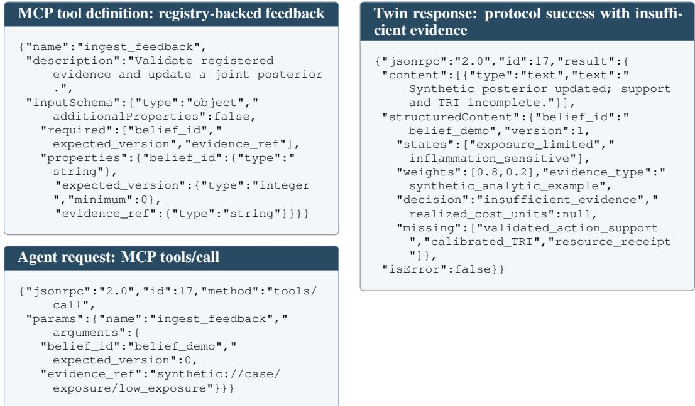  
Figure 2: MCP feedback exchange. Left: advertised tool and matching request. Right: synthetic posterior update with a scientific insufficient-evidence decision. Protocol success and intervention acceptance are separate.

## A.1.8 COMPILER, TEACHER, AND ACQUISITION STRESS TESTS

The finite compiler reference assigns (0.35, 0.25, 0.20, 0.12, 0.08) to low-burden, pathologydominant, inflammation-dominant, mixed, and high-burden outcomes. Perturbation transfers mass from the second/third bins to the first. Exact TV and forward KL characterize these fixed categories, not full-state fidelity. Physical-teacher bins are fixed on training outcomes; raw and compiled programs share initial state, noise, dose, route, and schedule.

Train on one registered solver family and evaluate independently specified dynamics, compiler parameters, and parameter distributions from a held family or resolution. Retain shared-teacher replay as a consistency control. Shift transport/affinity log-prior means by 0, 0.25, 0.5, and one prior SD; separately omit inflammatory coupling, double observation variance, or multiply statedependent admission odds by four. QC grades establish numerical provenance; biological teacher accuracy remains unmeasured. Structural clamps use observationally compatible parameter scenarios (Section C.10).

EIG uses nested-Monte-Carlo $I ( \pmb { \xi } ; \widetilde { o } \mid b , q )$ ; regime-target BALD uses $H [ m \mid b ] - \mathbb { E } H [ m \mid b , q , \widetilde { o } ]$ Finite-query iDAD/Step-DAD adapters retain their information objectives, with online refinement for Step-DAD (Ivanova et al., 2021; Hedman et al., 2025). Amortized BED retains the common terminal loss (Huang et al., 2024a). Match posterior, feasible library, channel, stopping, realized costs, and amortized parameter/simulation budgets. Top-query agreement uses 64 common beliefs and fixed tie breaking; decision risk uses each policy’s own closed loop.

Surrogate controls. The mechanistic–residual MPC adapter propagates common posterior scenarios and uses the shared decision-value measurement channel (Liu et al., 2026). Tau transport and treatment-history diffusion adapters align common observables, action support, and loss (Barron et al., 2026; Boiko & Mishkurova, 2026). Same-occupancy Transolver replaces diffusion with direct prediction while retaining posterior/occupancy draws, graph, observations, split, horizon, and a declared residual likelihood (Wu et al., 2024). The same-compiler solver uses inferred parameters, not privileged truth. DreamerV3 retains behavior learning under matched histories, typed feasibility, loss, and interaction budget (Hafner et al., 2025); FNO is an operator-family reference where discretization permits (Li et al., 2021). Table 31 report the prescribed accuracy, constraint, and cost endpoints.

Calibration and uncertainty. Freeze policy, stopping, TRI thresholds, and the in-distribution calibrator on disjoint groups. Tool shift doubles measurement variance and halves completion odds; admission shift multiplies state-dependent odds by four. Marginalize rejected values while retaining modeled admission events. Report upper-loss coverage at nominal 0.80/0.85/0.90/0.95 and the full risk–coverage curve without retuning. The 64 constructed blocks of Table 10 use centered paired deviations, 2,000 bootstrap resamples, and seed 3407; supplied binary counts use Wilson intervals. Empirical resampling, seed handling, and separate optimization variation follow Section A.6. Training, calibration, biological outcomes, and teacher replay retain their distinct groups and roles.

Table 8: Biological resources and their roles in CNS evaluation.
<table><tr><td>Resource</td><td>Microenvironment information</td><td>Evaluation role</td></tr><tr><td>Public processed SEA-AD</td><td>AD cell states and quantitative neuropathology</td><td>Disease-state inference and pathology calibration</td></tr><tr><td>Allen molecular/spatial atlases</td><td>Cell identity, anatomical location, regional context</td><td>Observation alignment and cross-source state transfer</td></tr><tr><td>Patch-seq / cell-types data</td><td>Linked molecular, electrophysiological, and</td><td>Cross-modal state inference and functional consistency</td></tr><tr><td>MICrONS</td><td>morphological measurements Circuit structure linked to functional observations</td><td>Circuit-context modeling within the measured tissue</td></tr><tr><td>Neurovascular brain-chip assays</td><td>Transporter function and barrier phenotypes</td><td>Targeted external mechanistic checks on their donor/model scope</td></tr><tr><td>Registered PK/PD and dynamical models</td><td>Exposure, occupancy, transport, and biological trajectories</td><td>Uncertainty-weighted teachers and mechanistic replay</td></tr><tr><td>Admissible multi-arm outcomes</td><td>Matched interventions and functional measurements</td><td>Biological ranking and acquisition evaluation</td></tr></table>

## A.2 DATASET CONSTRUCTION AND PREPROCESSING

Public evidence families. Molecular and spatial references include whole-brain mouse atlases (Yao et al., 2023; Zhang et al., 2023; Shi et al., 2023), human and cross-species cell taxonomies (Siletti et al., 2023; Hodge et al., 2019), Patch-seq molecular/morphological/electrophysiological measurements (Gouwens et al., 2020), and MICrONS functional connectomics (MICrONS Consortium, 2025). Disease, intervention, model, and tool sources retain separate licenses and source cards.

AD-first resource roles. SEA-AD links molecular state with neuropathology (Gabitto et al., 2024; Seattle Alzheimer’s Disease Brain Cell Atlas Consortium, 2026). This public-only path uses open processed releases and documented summaries. Release identifiers and corrected metadata are fixed before grouping.

Admission, scientific units, and splits. Records retain measurement identity: cross-sectional severity is a state observation; Patch-seq modalities share a cell, while unrelated specimens remain separate. Intervention evaluation records program, dose/schedule, context, time, comparator, and replicate-level outcomes. Sources with partial coverage contribute to the corresponding state or mechanism task.

Source cards preserve release, license, version, provenance, parser/mapping, redistribution, uncertainty, and split role. Admission requires units, scientific identity, schema, and evidence grade. Cell Ontology, UBERON, molecular identifiers, and anatomical coordinates standardize records while preserving original values. Subject, sample, cell, assay, intervention-family, simulator, tool, and publication groups constrain splits. Repeated observations inherit groups; source/temporal partitioning precedes preprocessing. Training, validation, calibration, test, and shift sets remain disjoint.

Executed teacher-corpus division. Table 9 reports the assignment actually recorded in the QC catalog, not catalog eligibility. The 222,336 train-eligible rows correspond to 111,168 paired simulations: each pair contributes one grade-A full-microenvironment row and one grade-B mesoscopic-solver row of the same simulation, so a row count is twice the count of independent paired simulations and the two grades are teacher levels, not independent replicates. The 49 rejected records are grade D and are excluded from every split, which is why the 13,945 regimen identifiers in the readiness audit exceed the 13,896 that survive admission. The registered target-program catalog is a separate object with 16,574 entries over 139 atlas programs; the readiness audit’s target-program field currently mirrors the regimen count and is not used here. Programs span three routes, three schedules, and four dose levels, giving 36 route/schedule/dose cells present in every split. Measured overlap is zero on trajectory UID, content hash, trajectory family, regimen, target program, and source role.

No separate calibration partition is materialized in this corpus: the current configuration binds the calibration role to the validation split. The selective-reliability protocol in Section C.8 requires a calibration group disjoint from validation, and the shift strata in Table 17 are constructed perturbations of the test split rather than separately partitioned data. Both are recorded as outstanding requirements, not as executed partitions.

Table 9: Executed division of the admitted teacher corpus. Counts are read from the QC catalog, which carries a split assignment per row. Rows are A/B teacher levels of the same paired simulation; independent units are the pairs.
<table><tr><td>Split</td><td></td><td>Rows Paired simulations</td><td>Regimens Routes Rejected</td><td></td><td></td></tr><tr><td>Training</td><td>177,904</td><td>88,952</td><td>11,119</td><td>3</td><td>43</td></tr><tr><td>Validation</td><td>21,952</td><td>10,976</td><td>1,372</td><td>3</td><td>2</td></tr><tr><td>Test</td><td>22,480</td><td>11,240</td><td>1,405</td><td>3</td><td>4</td></tr><tr><td>Admitted total 222,336</td><td></td><td>111,168</td><td>13,896</td><td>3</td><td>49</td></tr></table>

Constructed evaluation blocks. The 64 blocks behind every paired interval are a 4 × 4 × 4 factorial of holdout family, intervention program family, and teacher/source stratum (Table 10). One block set is shared by the dynamics, acquisition, and calibration endpoints, so a contrast is paired within block across methods and the four holdout families each contribute sixteen blocks. Every method sees the same block identities, masks, and initial contexts.

Table 10: Stratification of the 64 constructed evaluation blocks. The three axes cross completely; each cell is one block.
<table><tr><td>Axis (4 levels)</td><td>Levels</td></tr><tr><td>Holdout family</td><td>Held regimen; held target program; held trajectory family; held source collection</td></tr><tr><td></td><td>Intervention program family Oral single-agent; intravenous single-agent; intrathecal single-agent; composite program with a sentinel arm</td></tr><tr><td>Teacher / source stratum</td><td>Mesoscopic solver teacher on atlas-anchored context; mesoscopic solver teacher on Patch-seq/connectomics-anchored context; full microenvironment teacher on atlas-anchored context; full microenvironment teacher on Patch-seq/connectomics-anchored context</td></tr></table>

WAM examples and query matrices. WAM examples include initial context, complete programs, compiled fields, masks, targets, and source quality. Teachers retain uncertainty and provenance. Query rows record tool/version, input, fidelity, schema, reserved/realized cost, latency, status, uncertainty, provenance, and admitted fields. Complete matrices support matched replay. Execution status and biological outcomes occupy separate fields. Registry exports supply modality frequencies and independent-unit counts. Disease-specific protocols define extension beyond AD.

## A.3 HYPERPARAMETERS AND MODEL SCALES

The declared native backbone uses width 696, eight diffusion blocks, 12 attention heads, 96 mechanism-state tokens, 36 graph modes, and three temporal wavelet levels. Dropout is 0.05 and the feed-forward multiplier is four. Ten ordered mechanism experts use residual scale 0.08 with a shared coupling scale of 0.04. These values specify the reference architecture; executed settings are recorded with each run.

The experiment protocol varies data fraction {10, 25, 50, 100}%, source diversity, posterior sample count, rollout horizon, denoising steps, and acquisition budget. Student, Large, and high-fidelity profiles separate throughput from decision quality. Selected checkpoints, parameter counts, training budgets, FLOPs, and measured memory are supplied by execution records. Execution records also identify the hardware and run associated with each measured result.

## A.4 SUPPLEMENTARY STATE AND DYNAMICS RESULTS

The state, dynamics, and mechanism controls below retain separate holdout strata and measurement scales: state transfer tests source/modality generalization, dynamics tests held regimens/compositions/simulators, and mechanism diagnostics distinguish prefix consistency, occupancy timing, and biological context. Their endpoint definitions and matched masks follow Section A.1.

## A.4.1 WAM ARCHITECTURE COMPARISON

Table 14 compares the eight prescribed operators using identical initial fields, posterior draws, occupancy paths, masks, and QC-approved records. Deterministic NeuronSifter removes trajectory diffusion from the same backbone, the factor-coupled model is the internal deterministic reference, and external methods retain their native architectures and objectives, mapped to the common CNS grid. Training uses seeds 40–44, validation-only selection, and the registered matched budgets. All forecasts cover 28 times and 15 channels under a common 64-sample predictive budget; every model propagates input-posterior uncertainty and stochastic operators additionally sample conditional trajectories. Each strict split excludes its named identity. CRPS uses common observed coordinates, while family NRMSE and absolute 90% coverage deviation jointly assess accuracy and uncertainty.

Table 11: State-transfer metrics on a normalized observation scale. References indicate comparator families.
<table><tr><td>Holdout</td><td>Model</td><td>Prediction error ↓</td><td>NLL↓</td><td>Calibration error ↓</td><td>Source predictability ↓</td></tr><tr><td>Whole publication</td><td>NeuronSifter posterior (ours) foundation baseline (Cui et al., 2024)</td><td>0.148 0.181</td><td>0.620 0.780</td><td>0.025 0.050</td><td>0.280 0.360</td></tr><tr><td>Missing modality</td><td>NeuronSifter posterior (ours) imputation baseline (Lopez et al., 2018)</td><td>0.182 0.218</td><td>0.750 0.910</td><td>0.035 0.075</td><td>0.300 0.370</td></tr><tr><td>Simulator-observation alignment</td><td>NeuronSifter posterior (ours) alignment baseline (Gretton et al., 2012)</td><td>0.161 0.195</td><td>0.680 0.830</td><td>0.030 0.060</td><td>0.290 0.340</td></tr></table>

Table 12: Dynamics holdouts; calibration error is the absolute deviation from nominal 90 percent.
<table><tr><td>Split</td><td>Action model</td><td>NRMSE↓</td><td>CRPS↓</td><td>↓</td><td>↑</td><td>Calib. err. Rank corr. Constraint viol. ↓</td></tr><tr><td rowspan="2">Held regimen</td><td rowspan="2">Structured WAM (ours) action ID</td><td>0.150</td><td>0.110</td><td>0.025</td><td>0.820</td><td>0.012</td></tr><tr><td>0.215</td><td>0.165</td><td>0.065</td><td>0.690</td><td>0.031</td></tr><tr><td>Held composition</td><td>Structured WAM (ours) flattened fields</td><td>0.173</td><td>0.128</td><td>0.035</td><td>0.790</td><td>0.017</td></tr><tr><td rowspan="2">Held simulator</td><td rowspan="2">Structured WAM (ours)</td><td>0.210</td><td>0.151</td><td>0.059</td><td>0.720</td><td>0.028</td></tr><tr><td>0.190</td><td>0.145</td><td>0.046</td><td>0.750</td><td>0.022</td></tr><tr><td></td><td>neural operator (Wu et al., 2024)</td><td>0.228</td><td>0.172</td><td>0.075</td><td>0.680</td><td>0.038</td></tr></table>

Table 13: Controlled intervention diagnostics. Lower is better. Prefix discrepancy uses normalized state coordinates; timing and context contrasts report terminal decision risk.
<table><tr><td>Controlled comparison</td><td>Occupancy program (ours)</td><td>Scalar exposure</td><td>Action identity</td></tr><tr><td>Prefix consistency</td><td>0.007</td><td>0.018</td><td>0.022</td></tr><tr><td>Exposure-matched timing</td><td>0.162</td><td>0.214</td><td>0.231</td></tr><tr><td>Context-dependent response</td><td>0.176</td><td>0.223</td><td>0.241</td></tr></table>

Table 14: WAM baselines under common occupancy conditioning. Synthetic scenario values; lower is better. Seven columns report CRPS. The final two report trajectory-family NRMSE and $\Delta _ { 9 0 } = \mathrm { | c o v e r a g e - 0 . 9 0 | }$
<table><tr><td rowspan="2">Model</td><td colspan="7">CRPS across held-out contexts ↓</td><td colspan="2">Family ↓</td></tr><tr><td>Random</td><td>Family</td><td>Regimen</td><td></td><td>Route Target Simulator</td><td></td><td>Source</td><td>NRMSE</td><td> $\Delta _ { 9 0 }$ </td></tr><tr><td>NeuronSifter-Large (ours)</td><td>0.095</td><td>0.121</td><td>0.110</td><td>0.117</td><td>0.134</td><td>0.145</td><td>0.151</td><td>0.162</td><td>0.006</td></tr><tr><td>Deterministic NeuronSifter</td><td>0.105</td><td>0.143</td><td>0.130</td><td></td><td>0.138 0.158</td><td>0.170</td><td>0.181</td><td>0.171</td><td>0.119</td></tr><tr><td>Factor-coupled operator</td><td>0.116</td><td>0.158</td><td>0.142</td><td>0.154</td><td>0.179</td><td>0.191</td><td>0.204</td><td>0.204</td><td>0.166</td></tr><tr><td>Transolver (Wu et al., 2024)</td><td>0.101</td><td>0.134</td><td>0.119</td><td>0.128</td><td>0.149</td><td>0.172</td><td>0.180</td><td>0.179</td><td>0.088</td></tr><tr><td>DiffusionPDE (Huang et al.,</td><td>0.100</td><td>0.136</td><td>0.123</td><td>0.130</td><td>0.148</td><td>0.162</td><td>0.177</td><td>0.184</td><td>0.041</td></tr><tr><td>2024b) WDNO (Hu et al., 2025)</td><td>0.099</td><td>0.130</td><td>0.117</td><td>0.124</td><td>0.142</td><td>0.157</td><td>0.168</td><td>0.176</td><td>0.025</td></tr><tr><td>CoDA-NO (Rahman et al., 2024)</td><td>0.103</td><td>0.139</td><td>0.125</td><td>0.134</td><td>0.153</td><td>0.166</td><td>0.181</td><td>0.185</td><td>0.103</td></tr><tr><td>Mamba-NO (Cheng et al., 2024b)</td><td>0.105</td><td>0.145</td><td>0.129</td><td></td><td>0.1360.158</td><td>0.174</td><td>0.187</td><td>0.192</td><td>0.119</td></tr></table>

In this synthetic comparison, family CRPS is 0.121 for NeuronSifter, 0.130 for WDNO, and 0.143 for deterministic NeuronSifter. The WDNO excess is 0.009 (95% paired interval [0.005, 0.013]; 64 constructed blocks, 2,000 resamples). Coverage is 58/64 versus 56/64, yielding deviations 0.006 and 0.025. These operator contrasts complement the action-encoding ablations.

## A.4.2 SYNTHETIC MECHANISM ILLUSTRATIONS

These two analytic examples explain how different observations change an intervention decision. Their prior, likelihoods, and losses are constructed; they are not records from an AD intervention trial. The exposure example is motivated by the distinction between transport function and molecular expression (Shen et al., 2026) and the inflammation/function example by coupled AD mechanisms (Przekwas et al., 2026; Stefanovski et al., 2019); these citations motivate the questions and do not supply the numerical inputs.

Let E denote exposure limitation and I inflammation sensitivity, with prior $( 1 / 2 , 1 / 2 )$ . Standard, exposure-adapted, and inflammation-sparing programs have conditional loss vectors (0.27, 0.25), (0.12, 0.42), and (0.42, 0.13) over $( E , \dot { I } )$ . For $p = P ( E$ | evidence), their risks are

$$
R _ { \mathrm { S } } ( p ) = 0 . 2 5 + 0 . 0 2 p , \qquad R _ { \mathrm { A } } ( p ) = 0 . 4 2 - 0 . 3 0 p , \qquad R _ { \mathrm { F } } ( p ) = 0 . 1 3 + 0 . 2 9 p .\tag{16}
$$

Inflammation sparing is optimal for $p < 4 / 9 .$ , Standard for $4 / 9 < p < 1 7 / 3 2$ , and exposure adaptation for $p > 1 7 / 3 2$ ; adjacent programs tie at the boundaries. The exposure/inflammation risk crossing at $2 9 / 5 9$ is dominated by Standard and is not a decision boundary.

Readouts are conditionally independent given the mechanism. Low-exposure and low-engagement events have likelihoods (0.8, 0.2) and (0.75, 0.30), giving $p = 1 / 2 , 4 / 5 , 1 0 / 1 1$ . High inflammatory and functional burdens have likelihoods (0.25, 0.75) and (0.20, 0.80), giving $p = 1 / 2 , 1 / 4 , 1 / 1 \dot { 3 }$ Evidence multiplies the favored mechanism’s odds by 4 then 5/2, or by 3 then 4. The first readout changes the action; the second reinforces it.

At the final posterior, Standard has loss 59/220 or 327/1300, while the selected program has loss 81/550 or 99/650. The respective gains are $1 3 3 / 1 1 0 \dot { 0 } \approx 0 . 1 2 0 9$ and $1 2 9 / 1 3 0 0 \ \approx \ { \mathrm { { 0 . 0 9 9 2 } } }$ . Both actions are evaluated under the same final belief, isolating the effect of action adaptation. The fixed readout sequences evaluate posterior-guided action selection. The rounded loss reductions are 0.121 and 0.099.

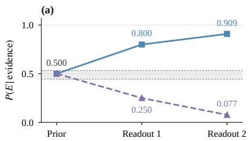

(b)  
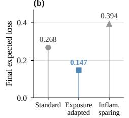

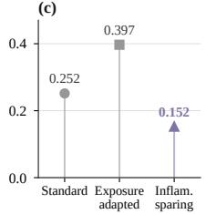  
Figure 3: Synthetic evidence redirects intervention choice. (a) Constructed exposure/engagement and inflammation/function readouts update a shared prior. Gray band: Standard-optimal ${ \check { P } } ( E ) \in$ $[ 4 / 9 , 1 7 / 3 2 ]$ . (b,c) Final-posterior action risks in the two analytic examples; values are not measured biological responses.

## A.4.3 PUBLISHED AD INTERVENTION CASES

Public primary trial reports provide aggregate endpoints, uncertainty, eligibility criteria, and administered regimens. We use the six references in Table 15 as an outcome-known retrospective endpoint bridge; their published outcomes are external clinical evidence, and a model’s directional concordance requires a separately saved, frozen-checkpoint replay. No model-to-trial agreement score is reported here.

The Clarity AD dose/schedule defines a structured action, but occupancy still requires an independently supported PK/PD mapping, and its 18-month endpoint is not supervision for the 672-hour teacher rollout. Frozen model replay must retain every case and unsupported denominator, with fixed compiler, loss, bridge, and decision thresholds; keep both aducanumab trials and distinguish tramiprosate’s post-hoc imaging findings from its planned clinical analyses. These public aggregates supply neither individual participant trajectories nor a complete multi-query outcome matrix.

## A.4.4 COMPLETE ACQUISITION CONTROLS AND BACKEND SENSITIVITY

The programmatic controller fixes the posterior, scientific objective, likelihoods, and feasibility rules. Kimi K3, DeepSeek V4 Flash, and GPT-5.6-Sol add typed proposals through the common admission interface. Holding the twin and controller fixed, Sol attains risk 0.160 and 2.0% invalid proposals at $3 8 \mathrm { s } ; \mathrm { K } 3$ gives 0.164, 2.4%, and 31 s; V4 trades 0.170 and 3.1% for 24 s. Executed calls span 4.2–4.5, so the backend moves median latency by 58% while moving risk by 0.010. Section A.1.6 defines the matched setup.

Table 15: Published AD intervention references. Trial-specific clinical directions, not NeuronSifter predictions. Outcomes and populations differ across trials; entries are not a head-to-head efficacy ranking.
<table><tr><td>Intervention / source</td><td>Population and prespecified endpoint</td><td>Published direction and interpretation</td></tr><tr><td>Lecanemab (van Dyck et al., 2023)</td><td>Clarity AD; early AD; CDR-SB at 18 months</td><td>Favorable: —0.45 points versus placebo, 95% CI [-0.67, -0.23]; adverse events retained.</td></tr><tr><td>Donanemab (Sims et al., 2023) TRAILBLAZER-ALZ 2;</td><td>early symptomatic AD; iADRS at 76 weeks</td><td>Favorable: +3.25 points, 95% CI [1.88, 4.62], in low/medium tau; combined population +2.92 [1.51, 4.33]. ARIA and treatment-related deaths remain</td></tr><tr><td>Solanezumab (Honig et al., 2018)</td><td>dementia; ADAS-cog14 at 95% CI [—1.73, 0.14]. Secondary 80 weeks</td><td>part of interpretation. EXPEDITION3; mild AD Primary endpoint not met: —0.80 points, endpoints are descriptive after hierarchical</td></tr><tr><td>Verubecestat (Egan et al., 2018) EPOCH;</td><td>mild-to-moderate AD; ADAS-cog and</td><td>testing stops. No cognitive or functional benefit at 12 or 40 mg/day; trial stopped for futility, with more treatment-related adverse events.</td></tr><tr><td>Aducanumab (Budd Haeberlein EMERGE and ENGAGE; Mixed: high-dose differences —0.39 et al., 2022)</td><td>ADCS-ADL at 78 weeks weeks</td><td>early AD; CDR-SB at 78[−0.69, -0.09] and +0.03 [−0.26, 0.33]. Both trials must enter the reference.</td></tr><tr><td>Tramiprosate (Aisen et al., 2011)</td><td>Alphase; mild-to-moderate AD; ADAS-cog and CDR-SB over 78 weeks</td><td>Planned analyses not significant. Post-hoc hippocampal-volume findings and an ADAS-cog trend do not establish clinical efficacy.</td></tr></table>

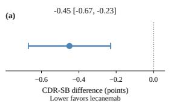

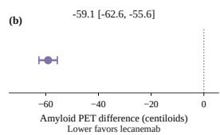  
Figure 4: Published Clarity AD intervention effects. Lecanemab minus placebo at 18 months, with the trial’s 95% intervals (van Dyck et al., 2023). (a) CDR-SB, 1,795 randomized participants. (b) Amyloid PET, 698-participant substudy. Negative values favor lecanemab; estimates are published trial aggregates.

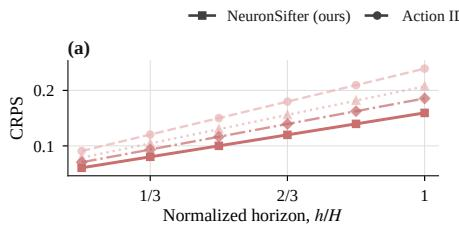

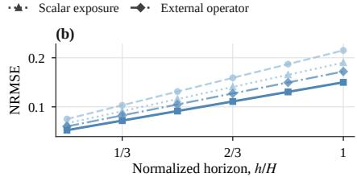  
Figure 5: Prediction error across normalized horizons. (a) Distributional forecast: CRPS. (b) Mean forecast: NRMSE. Table 1 reports mean CRPS across the six horizons and terminal NRMSE.

## A.5 ROBUSTNESS AND MECHANISM TESTS

These controls retain the same loss and calibration protocol while varying support, tool reliability, shifts, and model scale. The accepted-set bound follows Section C.8. Table 17 gives coverage at the common nominal level of 0.95. The calibration rule stays fixed across strata: coverage is 0.953 in distribution, 0.922 under source shift, 0.891 under tool shift, and 0.875 under admission shift. Wilson intervals use 64 binary outcomes per stratum. The comparison separates the cali-

Table 17: Frozen calibration at nominal 0.95; bound coverage is the observed coverage of the upper-loss bound, with Wilson intervals on 64 binary outcomes.
<table><tr><td>Comparison</td><td>Bound cov. 95% lower 95% upper</td><td></td><td></td></tr><tr><td>In-distribution</td><td>0.953</td><td>0.871</td><td>0.984</td></tr><tr><td>Source shift</td><td>0.922</td><td>0.830</td><td>0.966</td></tr><tr><td>Tool shift</td><td>0.891</td><td>0.791</td><td>0.946</td></tr><tr><td>Admission shift</td><td>0.875</td><td>0.772</td><td>0.935</td></tr></table>

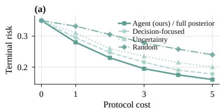

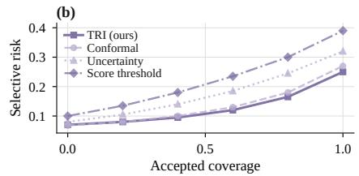  
Figure 6: Evidence acquisition and selective reliability. (a) Risk versus acquisition cost. (b) Risk versus accepted fraction. Agent-in-Twin and the full-posterior external control coincide. Threshold crossings use linear interpolation.

Table 16: Acquisition at cost budget 5; cost to risk 0.22 is linearly interpolated. The oracle is a privileged-information reference.
<table><tr><td>Policy</td><td>Fixed-budget risk ↓</td><td>Cost to target risk ↓</td><td>Query regret ↓</td><td>Correct switch ↑</td></tr><tr><td>Agent-in-Twin (ours)</td><td>0.160</td><td>2.286</td><td>0.012</td><td>0.790</td></tr><tr><td>Full-posterior external control</td><td>0.160</td><td>2.286</td><td>0.012</td><td>0.790</td></tr><tr><td>Shared point state</td><td>0.220</td><td>5.000</td><td>0.055</td><td>0.610</td></tr><tr><td>Predictive-uncertainty acquisition</td><td>0.200</td><td>3.750</td><td>0.042</td><td>0.650</td></tr><tr><td>Decision-focused design control (Huang et al., 2024a)</td><td>0.178</td><td>2.871</td><td>0.025</td><td>0.730</td></tr><tr><td>Random acquisition</td><td>0.240</td><td>&gt;5</td><td>0.068</td><td>0.550</td></tr><tr><td>Oracle channel</td><td>0.110</td><td>1.455</td><td>0.000</td><td>0.880</td></tr></table>

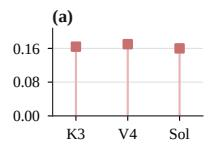

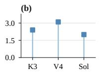

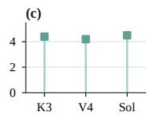

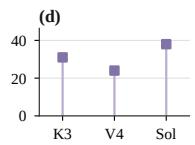  
Figure 7: LLM proposal backends under a shared scientific controller. (a) Terminal risk. (b) Invalid proposals (%). (c) Mean executed calls per episode. (d) Median episode time (s). K3: Kimi K3; V4: DeepSeek V4 Flash; Sol: GPT-5.6-Sol. The matched setup is specified in Section A.1.6.

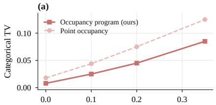  
Compiler perturbation

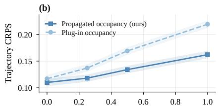  
Prior shift (SD)  
Figure 8: Compiler and teacher diagnostics. (a) Exact TV in the five-outcome reference model. (b) Transport/affinity prior shift and trajectory CRPS; bands are 95% block-bootstrap intervals. The projected distance concerns the declared outcome model.

bration target from the coverage retained under changed observation and admission channels; the component ablations below isolate the corresponding roles of reliability updates, support masks, and selective gating.

Selective-policy profile. Table 20 reports all five endpoints directly on their original scales; the risk–accepted-fraction curve appears in Figure 6.

Samples, horizon, resolution, lookahead, costs, and support thresholds vary under the same protocol. Exposure/dynamics/observation/posterior replacements test the error terms in Theorem 3. Typedoutcome frequencies sum to one and retain failures; signed risk changes distinguish information gain from replanning. The serving-profile throughput values and the full-episode resource scenarios in Table 32 use distinct declared workloads.

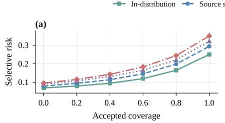

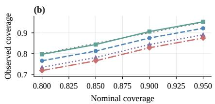  
Figure 9: Stratified selective risk and calibration. (a) Risk versus accepted fraction. (b) Bound coverage of the frozen upper-loss bound versus its nominal level; the dotted line is identity. Each stratum has 64 scenario blocks; binomial intervals are reported in Table 17.

Table 18: Reliability-component ablations.
<table><tr><td>Configuration</td><td>Fixed-budget risk↓</td><td>Query regret ↓</td><td>False accept ↓</td></tr><tr><td>Full NeuronSifter (ours)</td><td>0.160</td><td>0.012</td><td>0.018</td></tr><tr><td>No tool-reliability update</td><td>0.180</td><td>0.024</td><td>0.024</td></tr><tr><td>No support mask</td><td>0.178</td><td>0.022</td><td>0.031</td></tr><tr><td>No selective gate</td><td>0.174</td><td>0.020</td><td>0.050</td></tr></table>

Table 19: Component ablations on common reporting scales.
<table><tr><td>Configuration</td><td>Trajectory CRPS↓</td><td>Fixed-budget risk↓</td><td>Query regret ↓</td></tr><tr><td>Full NeuronSifter (ours)</td><td>0.110</td><td>0.160</td><td>0.012</td></tr><tr><td>Occupancy program → action ID</td><td>0.165</td><td>0.218</td><td>0.050</td></tr><tr><td>Joint posterior → point state</td><td>0.110</td><td>0.220</td><td>0.055</td></tr><tr><td>Ordered → parallel experts</td><td>0.122</td><td>0.185</td><td>0.026</td></tr><tr><td>Joint → dependence-ablated state</td><td>0.119</td><td>0.199</td><td>0.038</td></tr><tr><td>Decision risk → entropy utility</td><td>0.110</td><td>0.200</td><td>0.042</td></tr></table>

Table 20: Selective decisions; AURC and the interpolated accepted fraction at risk 0.20 derive from the curves.
<table><tr><td>Rule</td><td>AURC↓</td><td>Accepted at risk ↑</td><td>False accept↓</td><td>OOD</td><td>detection ↑ Utility ↑</td></tr><tr><td>TRI + posterior-risk rule (ours)</td><td>0.124</td><td>0.882</td><td>0.018</td><td>0.890</td><td>0.720</td></tr><tr><td>Risk without support gate</td><td>0.154</td><td>0.750</td><td>0.039</td><td>0.810</td><td>0.680</td></tr><tr><td>Predictive uncertainty</td><td>0.175</td><td>0.650</td><td>0.035</td><td>0.830</td><td>0.665</td></tr><tr><td>Maximum score threshold</td><td>0.219</td><td>0.473</td><td>0.054</td><td>0.750</td><td>0.605</td></tr><tr><td>Conformal baseline (Angelopoulos et al., 2024)</td><td>0.132</td><td>0.844</td><td>0.020</td><td>0.865</td><td>0.700</td></tr></table>

Table 21: Compute tradeoffs with throughput and normalized cost units. Escalation applies to cascades; single-model rows are not applicable. The cascade retains XL-level recall and risk at 20% of its cost.
<table><tr><td></td><td colspan="3">Decision</td><td>Cost</td><td>Escalation</td></tr><tr><td>System</td><td>Recall ↑</td><td>risk↓</td><td>Calls/s ↑</td><td>units ↓</td><td>rate</td></tr><tr><td>Student only</td><td>0.820</td><td>0.220</td><td>180.000</td><td>1.000</td><td>n/a</td></tr><tr><td>Large only</td><td>0.880</td><td>0.160</td><td>60.000</td><td>3.000</td><td>n/a</td></tr><tr><td>XL/ high-fidelity only</td><td>0.890</td><td>0.150</td><td>20.000</td><td>9.000</td><td>n/a</td></tr><tr><td>Student → Large → XL (ours)</td><td>0.888</td><td>0.152</td><td>100.000</td><td>1.800</td><td>0.280</td></tr><tr><td>Fixed-threshold cascade</td><td>0.862</td><td>0.181</td><td>110.000</td><td>1.600</td><td>0.220</td></tr></table>

A.5.1 COMPILER, DESIGN, AND MECHANISM DIAGNOSTICS  
Table 31 compares prediction, constraint consistency, and normalized computation under the shared interface; these endpoints need not favor the same model.

Table 22: Subgroup and shift scenarios with point values.
<table><tr><td>Subgroup or shift</td><td>State NLL↓</td><td>Dynamics CRPS↓</td><td>Terminal risk ↓</td><td>False accept ↓</td><td>Cost ↓</td></tr><tr><td>Unseen publication / source</td><td>0.710</td><td>0.130</td><td>0.180</td><td>0.023</td><td>5.000</td></tr><tr><td>Missing transcriptomic, morphology, or ephys block</td><td>0.780</td><td>0.128</td><td>0.184</td><td>0.025</td><td>5.000</td></tr><tr><td>Unseen regimen / route / target program</td><td>0.680</td><td>0.146</td><td>0.196</td><td>0.029</td><td>5.000</td></tr><tr><td>Unseen simulator or scientific-tool family</td><td>0.760</td><td>0.151</td><td>0.198</td><td>0.033</td><td>5.000</td></tr><tr><td>Low-support or contradictory evidence</td><td>0.820</td><td>0.158</td><td>0.211</td><td>0.038</td><td>5.000</td></tr><tr><td>AD transport / inflammatory context shift</td><td>0.740</td><td>0.142</td><td>0.192</td><td>0.028</td><td>5.000</td></tr></table>

Table 23: Typed outcomes; negative risk change denotes a reduction in risk.
<table><tr><td>Outcome type</td><td>Frequency</td><td>Realized cost</td><td>Risk change</td><td>rate</td><td>Replan Accepted fraction</td><td>Posterior update tested</td></tr><tr><td>Successful complete result</td><td>0.700</td><td>1.000</td><td>-0.045</td><td>0.320</td><td>0.820</td><td>value and reliability update</td></tr><tr><td>Partial but schema-valid result</td><td>0.130</td><td>0.800</td><td>-0.020</td><td>0.380</td><td>0.750</td><td>partial-observation likelihood</td></tr><tr><td>Timeout / unavailable tool</td><td>0.070</td><td>0.250</td><td>0.000</td><td>0.710</td><td>0.600</td><td>availability and failure posterior</td></tr><tr><td>Invalid schema / QC rejection</td><td>0.040</td><td>0.200</td><td>0.000</td><td>0.650</td><td>0.540</td><td>retained-event likelihood</td></tr><tr><td>Contradictory or stale evidence</td><td>0.040</td><td>0.500</td><td>0.005</td><td>0.780</td><td>0.480</td><td>source/tool reliability update</td></tr><tr><td>Unsupported request</td><td>0.020</td><td>0.050</td><td>0.000</td><td>0.880</td><td>0.400</td><td>support mask and abstention</td></tr></table>

Table 24: Stress scenarios; deltas use their corresponding unshifted scenario.
<table><tr><td>Stress condition</td><td>∆ decision risk ↓</td><td>∆ WAM CRPS↓</td><td>∆ query cost↓</td><td>Accepted fraction ↑</td></tr><tr><td>One modality missing</td><td>0.024</td><td>0.018</td><td>0.200</td><td>0.780</td></tr><tr><td>Unseen AD source / mechanism</td><td>0.036</td><td>0.030</td><td>0.450</td><td>0.740</td></tr><tr><td>Unseen tool family</td><td>0.038</td><td>0.025</td><td>0.550</td><td>0.710</td></tr><tr><td>Cost vector ×2</td><td>0.020</td><td>0.000</td><td>0.900</td><td>0.800</td></tr><tr><td>Timeout / partial / invalid output</td><td>0.043</td><td>0.005</td><td>0.650</td><td>0.700</td></tr><tr><td>Contradictory or stale evidence</td><td>0.051</td><td>0.040</td><td>0.750</td><td>0.640</td></tr><tr><td>Biased low-fidelity simulator</td><td>0.045</td><td>0.035</td><td>0.500</td><td>0.680</td></tr></table>

Table 25: Exact reference-model compiler distances and intervention regret.
<table><tr><td>Comparison</td><td>TV</td><td>KL</td><td>Regret</td><td>95% lower</td><td>95% upper</td></tr><tr><td>Perturbation 0</td><td>0.008</td><td>0.000</td><td>0.012</td><td>0.011</td><td>0.013</td></tr><tr><td>Perturbation 0.1</td><td>0.025</td><td>0.002</td><td>0.019</td><td>0.018</td><td>0.020</td></tr><tr><td>Perturbation 0.2</td><td>0.045</td><td>0.005</td><td>0.035</td><td>0.034</td><td>0.036</td></tr><tr><td>Perturbation 0.35</td><td>0.085</td><td>0.018</td><td>0.058</td><td>0.057</td><td>0.059</td></tr></table>

Table 26: Acquisition controls at cost five; intervals use paired blocks.
<table><tr><td>Comparison</td><td>Risk</td><td>95% lower</td><td>95% upper</td><td>Query regret Agreement</td><td></td></tr><tr><td>Agent-in-Twin (ours)</td><td>0.160</td><td>0.153</td><td>0.167</td><td>0.012</td><td>1.000</td></tr><tr><td>Full-posterior external control</td><td>0.160</td><td>0.153</td><td>0.167</td><td>0.012</td><td>1.000</td></tr><tr><td>EIG (nested MC) (Lindley, 1956)</td><td>0.193</td><td>0.185</td><td>0.201</td><td>0.033</td><td>0.641</td></tr><tr><td>BALD (regime target) (Houlsby et al., 2011)</td><td>0.205</td><td>0.197</td><td>0.213</td><td>0.045</td><td>0.547</td></tr><tr><td>iDAD adapter (Ivanova et al., 2021)</td><td>0.186</td><td>0.179</td><td>0.193</td><td>0.029</td><td>0.688</td></tr><tr><td>Step-DAD adapter (Hedman et al., 2025)</td><td>0.179</td><td>0.172</td><td>0.186</td><td>0.024</td><td>0.734</td></tr><tr><td>Decision-aware amortized BED (Huang et al., 2024a)</td><td>0.171</td><td>0.164</td><td>0.178</td><td>0.018</td><td>0.844</td></tr><tr><td>Hybrid residual MPC (Liu et al., 2026)</td><td>0.188</td><td>0.180</td><td>0.196</td><td>0.037</td><td>0.609</td></tr></table>

Table 27: Held-teacher and observation perturbations.
<table><tr><td>Comparison</td><td>CRPS</td><td>Risk</td><td>Bound coverage</td></tr><tr><td>Transport mean x0.7</td><td>0.136</td><td>0.194</td><td>0.857</td></tr><tr><td>Affinity median x2</td><td>0.141</td><td>0.201</td><td>0.844</td></tr><tr><td>Inflammatory coupling omitted</td><td>0.163</td><td>0.227</td><td>0.813</td></tr><tr><td>Nonignorable admission</td><td>0.151</td><td>0.216</td><td>0.828</td></tr><tr><td>Joint teacher and tool shift</td><td>0.184</td><td>0.246</td><td>0.781</td></tr></table>

Table 28: Within-twin structural-clamp sensitivity; ranges span compatible parameter scenarios.
<table><tr><td>Comparison</td><td>Mean ∆loss Minimum</td><td></td><td>Maximum</td><td>Rank flips</td></tr><tr><td>Exposure clamp</td><td>-0.046</td><td>-0.071</td><td>-0.019</td><td>0.016</td></tr><tr><td>Inflammation clamp</td><td>-0.038</td><td>-0.063</td><td>-0.010</td><td>0.023</td></tr><tr><td>Transport clamp</td><td>-0.021</td><td>-0.052</td><td>0.009</td><td>0.078</td></tr><tr><td>Dependence-preserving joint clamp</td><td>-0.061</td><td>-0.092</td><td>-0.025</td><td>0.031</td></tr></table>

Table 30: Long-horizon stability diagnostics; gain is a finite-difference output/input ratio.

Table 29: Acquisition sensitivity to cost, latency, failure, and admission.
<table><tr><td>Comparison</td><td>Risk Cost</td><td>Correct switch</td></tr><tr><td>Nominal</td><td>0.160 5.000</td><td>0.790</td></tr><tr><td>Cost weights x2</td><td>0.184 4.625</td><td>0.719</td></tr><tr><td>Latency penalty x2</td><td>0.176 4.703</td><td>0.750</td></tr><tr><td>Failure odds x2</td><td>0.201 4.516</td><td>0.688</td></tr><tr><td>Admission ignored</td><td>0.218 4.828</td><td>0.641</td></tr></table>

<table><tr><td>Comparison</td><td>Factor</td><td>Violations</td><td>Gain</td></tr><tr><td>Horizon 1x</td><td>1.000</td><td>0.012</td><td>1.180</td></tr><tr><td>Horizon 2x</td><td>2.000</td><td>0.021</td><td>1.360</td></tr><tr><td>Horizon 4x</td><td>4.000</td><td>0.043</td><td>1.710</td></tr></table>

Table 31: Surrogate accuracy, physical consistency, and cost at a common rollout budget. Lower CRPS, NRMSE, violations, and cost are better; higher ordering accuracy is better.
<table><tr><td>Comparison</td><td>CRPS</td><td>NRMSE</td><td>Ordering</td><td>Violations</td><td>Cost</td></tr><tr><td>Occupancy-conditioned diffusion (ours)</td><td>0.110</td><td>0.150</td><td>0.880</td><td>0.012</td><td>1.000</td></tr><tr><td>Tau-transport operator adapter (Barron et al., 2026)</td><td>0.137</td><td>0.186</td><td>0.824</td><td>0.019</td><td>0.420</td></tr><tr><td>Treatment-history diffusion adapter (Boiko &amp; Mishkurova, 2026)</td><td>0.132</td><td>0.178</td><td>0.836</td><td>0.028</td><td>1.080</td></tr><tr><td>Hybrid mechanistic-residual surrogate (Liu et al., 2026)</td><td>0.126</td><td>0.171</td><td>0.847</td><td>0.008</td><td>0.680</td></tr><tr><td>Same-occupancy Transolver (Wu et al., 2024)</td><td>0.119</td><td>0.162</td><td>0.865</td><td>0.021</td><td>0.340</td></tr><tr><td>Same-compiler mechanistic solver</td><td>0.145</td><td>0.198</td><td>0.815</td><td>0.003</td><td>7.400</td></tr><tr><td>DreamerV3 adapter (Hafner et al., 2025)</td><td>0.139</td><td>0.189</td><td>0.828</td><td>0.033</td><td>0.470</td></tr></table>

## A.6 STATISTICAL ANALYSIS

Resampling units are publication/source for state transfer, action family for dynamics, source-grouped episode for acquisition, and independent calibration/test groups for selection. Repeated rows, times, and model calls stay grouped. Five training seeds quantify optimization variation. Backend repetitions are averaged per episode before resampling; the three LLM risk contrasts form one Holm-corrected family. Dynamics, acquisition, and selection use separate prespecified families.

Where the five seeds enter. Seeds are averaged before resampling, not resampled. Within each of the 64 blocks of Table 10, a method’s endpoint is the mean over its five training seeds; the paired difference is then formed between methods inside the block. Every method uses the same seed list and matched optimization and inference budgets, so a seed’s shared effect on a block cancels in that difference. The bootstrap resamples the 64 block-level differences with replacement and has no seed axis, so seed-to-seed optimization variance is not folded into the reported interval. It is reported separately as the between-seed standard deviation of the block-mean contrast, alongside the realized seed count; a block with fewer than five completed seeds keeps its realized count and leaves the headline family. Bootstrap seed 3407 and 2,000 resamples are fixed for every family. For acquisition, compute the paired contrast

$$
d _ { i } = \ell _ { i } ( \pi _ { \mathrm { B E D } } ) - \ell _ { i } ( \pi _ { \mathrm { o u r s } } ) , \qquad \widehat { \Delta R } = \frac { 1 } { N } \sum _ { i = 1 } ^ { N } d _ { i } .\tag{17}
$$

Resample common independent group IDs 2,000 times (seed 3407), retaining dependent observations together. Report the 2.5th/97.5th percentiles with group counts, failed episodes, and training seeds. Positive differences favor NeuronSifter. Teacher comparisons group by scenario family. Marginal intervals cannot replace a paired-difference interval.

The 64 constructed blocks give excess risks 0.006 [0.003, 0.009], 0.011 [0.007, 0.015], and 0.018 [0.013, 0.023] for numerical BED, amortized BED, and the earlier control. Identical full-posterior reference blocks yield zero contrast. New blocks preserve the existing reference and earlier-control mean 0.178.

Cost to target risk carries its own interval. Cost to target risk is a threshold crossing of the same paired curves, so its dispersion follows from the paired risk dispersion and the local slope: $s _ { j } ^ { \mathrm { c o s t } } \stackrel { \cdot } { = } s _ { j } ^ { \mathrm { r i s k } } / \vert d R / d c \vert _ { j }$ , where $| d R / d c | _ { j }$ is the secant slope between the two reported points of comparator j (risk 0.22 at its threshold cost, and its risk at budget 5). Propagating the declared block spreads gives paired cost differences $0 . 0 8 9 \ [ - 0 . 0 5 7 , 0 . 2 3 5 \bar { ] } , 0 . 2 1 4 \ [ 0 . \bar { 0 } 1 \bar { 0 } , 0 . 4 \bar { 1 } 8 ]$ , and 0.585 [0.332, 0.838], and cost ratios 0.963 [0.907, 1.025], 0.914 [0.845, 0.996], and 0.796 [0.732, 0.873] for numerical BED, amortized BED, and the earlier control. The two acquisition protocols therefore separate differently: against matched numerical BED the fixed-budget risk contrast excludes zero while the fixed-target cost ratio does not exclude one, because inverting a crossing multiplies the paired risk noise by the inverse curve slope, 49–51 cost units per risk unit on these curves. Against the earlier control both protocols separate. The ratios retain the original rounded costs, and the fixed-budget and fixed-target statements are reported separately rather than combined.

Table 2 applies the same resampling unit to the held-regimen benchmark. Each contrast centre $\bar { d }$ is the exact difference between the declared Table 1 cells; paired block spread $s _ { d }$ is declared per comparator, because it depends on the correlation between two model series that the marginal intervals do not determine. The table reports ¯d, its 2,000-resample paired percentile interval, $d _ { z } = \bar { d } / s _ { d }$ , and the fraction of blocks with $d _ { i } > 0$ . The test is a two-sided sign-flip permutation with $1 0 ^ { 4 }$ draws and add-one correction, so values below $( 1 0 ^ { 4 } + 1 ) ^ { - 1 }$ are unresolved and shown as a bound; Holm adjustment over the six comparators leaves five contrasts under 0.001 and the expert-ordering contrast at 0.016. The expert-ordering row compares ordered against parallel experts and therefore measures serial composition; it is not a test of the biological order, whose depth-matched permutation controls are prespecified in Section A.1.2 and not yet executed. These separations describe the declared construction, not an executed model comparison.

## A.7 COMPUTE, COST, AND REPRODUCIBILITY

Protocol cost and wall time use separate ledgers. Protocol cost is the acquisition cost to reach target risk, whose ratio is 0.796 against the earlier design control and 0.963 against matched numerical BED (Section A.6); wall time is the runtime ledger below and never enters that ratio. The synthetic bf16 workload uses one 48-GiB GPU and eight host cores: four interventions, eight particles, two draws, 100 denoising steps, 28 times, six regions, six compartments, and 15 channels. Four queries reuse the ensemble; numerical and amortized planning are alternative branches.

Table 32: Full-pipeline resource scenarios. Authored median/p95 times and peak memory. Complete-cycle quantiles include transfers; offline cost is per checkpoint.
<table><tr><td>Component</td><td>Median / p95 (s)</td><td>Host / GPU (GiB)</td></tr><tr><td>Posterior inference / compilation</td><td>0.24 / 0.38</td><td>6.4 / 3.2</td></tr><tr><td>Stochastic rollout</td><td>48.00 / 72.00</td><td>10.8 / 26.4</td></tr><tr><td>Numerical planning</td><td>9.60 / 15.80</td><td>12.6 / 28.8</td></tr><tr><td>Amortized planning</td><td>0.12 / 0.20</td><td>11.0 / 27.0</td></tr><tr><td>Assimilation / TRI / output</td><td>0.36 / 0.60</td><td>6.8 / 5.4</td></tr><tr><td>Complete numerical episode</td><td>61.80 / 91.20</td><td>14.6 / 30.2</td></tr><tr><td>Complete amortized episode</td><td>49.90 / 76.40</td><td>13.1 / 27.8</td></tr><tr><td>Offline training / precomputation 172800 / 216000</td><td></td><td>46.0 / 42.0</td></tr></table>

Each episode uses 6,400 samplewise denoiser evaluations with no fresh external teacher calls; offline training costs 172,800 s (48 h), or 1.728 s per episode over 100,000 episodes.

Quality and cost of the same configuration. The two planning branches are not interchangeable, and the reported decision endpoints and the reported cycle time do not come from the same one. Table 33 pairs each branch with the endpoints it actually supplies. Risk 0.160 and cost 2.286 to risk 0.22 belong to the numerical branch, whose complete cycle is 61.80 s and whose serial campaign is 4.29, 42.92, and 429.17 h at $1 0 ^ { 3 } , 1 0 ^ { 4 }$ , and $1 0 ^ { 5 }$ interventions. The 49.90 s cycle used for the campaign projections in Table 34 belongs to the amortized branch, which replaces 9.60 s of numerical planning with 0.12 s of amortized scoring and therefore saves 11.90 s per cycle, about 19% of the complete numerical cycle. The amortized branch’s own fixed-budget risk and cost to target risk are not supplied by the current construction; they are a required output of the matched-planner protocol (Section A.1.5), and until they exist the runtime saving cannot be converted into a quality–cost trade.

Large-scale intervention campaigns. Table 34 fixes the posterior, compiler, amortized query scorer, assimilation, TRI, and transfers across eight WAM backbones. Every row therefore uses the

Table 33: Planning-branch quality–cost correspondence. Decision endpoints and runtime resolved to the branch that produces them, so no row mixes configurations.
<table><tr><td>Planning branch</td><td>Fixed-budget risk↓</td><td>Cost to risk 0.22 ↓</td><td>Complete cycle (s)</td><td> $1 0 ^ { 5 }$  campaign (h) ↓</td></tr><tr><td>Numerical planning (reported reference)</td><td>0.160</td><td>2.286</td><td>61.80</td><td>429.17</td></tr><tr><td>Amortized value head</td><td>not supplied not supplied</td><td></td><td>49.90</td><td>346.53</td></tr></table>

amortized planning branch, which is what makes the backbones comparable on rollout alone; the numerical branch of the same reference model appears in Table 33. Diffusion uses two draws per particle (64 paths/cycle) and deterministic models evaluate each particle once (32 paths); warm cycles exclude loading, offline training, new assays, and LLM calls. Common overhead is an authored 1.9 s, anchored to NeuronSifter’s 49.9 s complete minus 48.0 s rollout.

Table 34: Large-scale intervention time across WAM backbones. Synthetic timing scenarios: paths/seconds per four-intervention cycle, hours per serial campaign. Gray bold marks shortest times.
<table><tr><td rowspan="3">WAM backbone</td><td rowspan="3">Paths</td><td colspan="2">Time per cycle (s)</td><td colspan="3">Campaign time (h)↓</td></tr><tr><td>Rollout</td><td>Complete</td><td> $1 0 ^ { 3 }$ </td><td> $1 0 ^ { 4 }$ </td><td> $\mathrm { 1 0 ^ { 5 } }$ </td></tr><tr><td></td><td>48.00</td><td></td><td></td><td></td></tr><tr><td>NeuronSifter-Large (ours)</td><td>64</td><td></td><td>49.90</td><td>3.47</td><td>34.65</td><td>346.53</td></tr><tr><td>Deterministic NeuronSifter</td><td>32 32</td><td>8.00 11.00</td><td>9.90</td><td>0.69</td><td>6.88</td><td>68.75</td></tr><tr><td>Factor-coupled operator</td><td>32</td><td>16.32</td><td>12.90 18.22</td><td>0.90 1.27</td><td>8.96 12.65</td><td>89.58</td></tr><tr><td>Transolver (Wu et al., 2024)</td><td>64</td><td>72.00</td><td>73.90</td><td>5.13</td><td>51.32</td><td>126.53</td></tr><tr><td>DiffusionPDE (Huang et al., 2024b) WDNO (Hu et al., 2025)</td><td>64</td><td>60.00</td><td>61.90</td><td>4.30</td><td>42.99</td><td>513.19 429.86</td></tr><tr><td>CoDA-NO (Rahman et al., 2024)</td><td>32</td><td>13.50</td><td>15.40</td><td>1.07</td><td>10.69</td><td>106.94</td></tr><tr><td>Mamba-NO (Cheng et al., 2024b)</td><td>32</td><td>9.60</td><td>11.50</td><td>0.80</td><td>7.99</td><td>79.86</td></tr><tr><td></td><td></td><td></td><td></td><td></td><td></td><td></td></tr></table>

For N interventions, $T _ { m } ( N ) = \lceil N / 4 \rceil ( r _ { m } + 1 . 9 ) ,$ /3600 hours with rollout time $r _ { m } ;$ these projections describe independent cycles. The separate 64-sample forecast comparison (Table 14) gives family CRPS 0.121/0.130/0.136 for NeuronSifter/WDNO/DiffusionPDE at a different sampling budget. Substituting the numerical branch’s 61.80 s complete cycle in the same expression gives the 4.29/42.92/429.17 h campaign in Table 33, which is the projection that belongs with risk 0.160. Serving calls/s (Table 21) use a separate workload; measured profiles retain device, batch, synchronization, and caching records.

## B NOTATION AND ASSUMPTIONS

Table 35: Core objects in the Agent-in-Twin formulation.
<table><tr><td>Symbol</td><td>Meaning</td></tr><tr><td> $\pmb { \xi } _ { t } = ( \mathbf { u } _ { t } , m , \pmb { \theta } , \pmb { \rho } _ { t } )$ </td><td>latent neuronal microenvironment, mechanism, parameters, and tool reliability</td></tr><tr><td> $b _ { t } \in B$ </td><td>updateable digital-twin posterior</td></tr><tr><td> $\Phi : { \mathcal { A } } ^ { \mathrm { w } }  \Omega$ </td><td>structured world-action compiler</td></tr><tr><td> $\mathsf { P } _ { \Phi ( a ) }$ </td><td>WAM transition kernel under compiled action a</td></tr><tr><td> ${ \mathsf { O } } _ { q }$ </td><td>typed value/status/cost/provenance channel of query q</td></tr><tr><td> $\pi ^ { \mathrm { A I T } }$ </td><td>internal policy over world actions, information actions, and terminal decisions</td></tr><tr><td> $\Gamma ( b _ { t } )$ </td><td>external or compressed posterior interface used by a comparison policy</td></tr><tr><td> $\mathcal { R } ( b ) , \mathrm { V O I } ( q ; b )$ </td><td>terminal Bayes risk and decision-focused information value</td></tr><tr><td> $\mathcal { G } _ { 0 : H }$ </td><td>bounded cumulative decision loss over a closed-loop horizon</td></tr></table>

We use normalized total variation $\mathrm { T V } ( P , Q ) = \operatorname* { s u p } _ { A } | P ( A ) - Q ( A ) |$ . Assumptions are grouped by the conclusions they support.

Assumption 1 (Bounded losses). Terminal loss satisfies $0 \leq \ell ( d , \pmb { \xi } ) \leq L$ . Closed-loop path loss satisfies $0 \le \mathcal { G } _ { 0 : H } \le C _ { H }$

Assumption 2 (Typed action semantics). Pure information actions leave biological state unchanged; invasive measurements are hybrid actions with explicit WAM components. World transition and query-outcome channels are separately registered.

Assumption 3 (Compiler fidelity). For every raw program a and state $\xi ,$ the physical transition $\mathsf { P } _ { a } ^ { \mathrm { r a w } }$ and compiled WAM transition satisfy $\mathrm { T V } ( \mathsf { \bar { P } } _ { a } ^ { \mathrm { r a w } } ( \cdot \mid \xi ) , \mathsf { P } _ { \Phi ( a ) } ( \cdot \mid \xi ) ) \leq \epsilon _ { \Phi }$ . Exact sufficiency is the case $\epsilon _ { \Phi } = 0$

Assumption 4 (Closed-loop model approximation). The true and learned initial biological-state laws differ by at most $\epsilon _ { b }$ in total variation. At matched physical histories, WAM transitions and typed outcome channels differ by at most $\epsilon _ { t } ^ { \mathrm { W } }$ and $\epsilon _ { t } ^ { \mathrm { O } }$ , uniformly over the common feasible actions. A fixed deployed controller, including its posterior-update computation, is executed in both environments. Its action randomization can therefore be shared while observed histories agree. The path comprises biological states, executed actions, observations, statuses, costs, and terminal decisions; belief arrays are deterministic functions of the observed history.

Assumption 5 (Planning approximation). The learned policy is $\epsilon _ { \mathrm { p l a n } } { \mathrm { - o p t i m a l } }$ in the learned environment within $\Pi _ { \Gamma }$ , and this same policy class is available in both environments. The class includes the retained posterior representation and deployed update rule, as well as time, budget, and feasibility context.

Assumption 6 (Common query channel for coherence analysis). When beliefs b and $b ^ { \prime }$ are compared for a fixed query $q ,$ they use the same registered channel $\mathrm { O } _ { q } ( d \mathbf { o } \mid \pmb { \xi } )$ . Belief-dependent execution penalties are treated separately. For the nonnegative-VOI and local coherence results, ${ \mathsf { T } } _ { q }$ is Bayesian conditioning under this channel, including its retained-outcome likelihood, admission events, and modeled missingness. The learned amortized update is an approximation whose consistency is evaluated separately.

Assumption 7 (Utility approximation). $| \widehat { \mathcal { U } } _ { \omega } ( b , q ) - \mathcal { U } ( b , q ) | \leq$ ϵ uniformly over the feasible query set at the evaluated belief.

Assumption 8 (Selective calibration). For the selected decision $d _ { b } .$ , the calibration procedure supplies a bound satisfying $\mathbb { P } \{ \ell ( d _ { b } , \pmb { \xi } ) > \widehat { U } _ { \delta } ( d _ { b } , b ) \} \le \delta$ under its stated assumptions. A uniform bound or direct calibration of the decision rule covers this data-dependent selection. Support and shift gates are frozen before test evaluation.

## C EXTENDED AGENT-IN-TWIN METHOD

## C.1 CLOSED GENERATIVE–CONTROL FACTORIZATION

Condition on the initial evidence ${ \mathcal { E } } _ { 0 }$ . A physical trajectory and its acquired observations factorize as

$$
\begin{array} { r l } {  { p ( \pmb \xi _ { 0 : T } , a _ { 0 : T - 1 } ^ { \mathrm { w } } , a _ { 0 : T - 1 } ^ { \mathrm { i } } , \mathbf o _ { 1 : T } , d _ { T } \mid \mathscr { E } _ { 0 } , \mathbf G ) } } \\ & { = p ( \pmb \xi _ { 0 } \mid \mathscr { E } _ { 0 } , \mathbf G ) \prod _ { t = 0 } ^ { T - 1 } \Big [ \pi _ { t } ^ { \mathrm { A I T } } ( a _ { t } ^ { \mathrm { w } } , a _ { t } ^ { \mathrm { i } } \mid b _ { t } , B _ { t } ) \mathsf { P } _ { \Phi ( a _ { t } ^ { \mathrm { w } } ) } ( \pmb \xi _ { t + 1 } \mid \pmb \xi _ { t } , \mathbf G ) } \\ & { \qquad \times \mathsf { O } _ { a _ { t } ^ { \mathrm { i } } } ( \mathbf o _ { t + 1 } \mid \pmb \xi _ { t + 1 } ) \Big ] \pi _ { T } ^ { \mathrm { A I T } } ( d _ { T } \mid b _ { T } , B _ { T } ) . } \end{array}\tag{18}
$$

$b _ { t }$ is computed from observed history. The observation channel includes passive measurements; early stopping is absorbing. World and information actions respectively control state transitions and observation.

## C.2 BELIEF REPRESENTATION AND UNCERTAINTY DECOMPOSITION

The distributional reference uses a finite-support categorical variational family

$$
\begin{array} { r } { \displaystyle q _ { \phi } ( d \xi \mid \mathcal { E } ) = \sum _ { j = 1 } ^ { J } w _ { \phi j } ( \mathcal { E } ) \delta _ { \xi ^ { ( j ) } } ( d \xi ) , \quad w _ { \phi j } = \mathrm { s o f t m a x } _ { j } s _ { \phi } ( \mathcal { E } , \xi ^ { ( j ) } ) , } \end{array}\tag{19}
$$

Each tuple jointly contains treatment history, PK/exposure, environment, electrophysiology, morphology, and regime, preserving constraints and dependence. Shared finite prior/variational support gives categorical KL in Equation (29). Amortized weights update as $w _ { i } ^ { + } \propto w _ { j } \overline { { p } } _ { q } ( \widetilde { o } \mid \xi ^ { ( j ) } )$ ). Normalize/resample whole tuples; report particle count, effective sample size, and support failures.

The joint particles in Equation (19) support observations, intervention comparison, and acquisition (Figure 1). Treatment history is observed context; proposed interventions enter the compiler. Heads are conditionally independent given joint tuples and source effects. Linked assays retain sample identity; held-source residuals test remaining dependence. Calibrated joint sampling remains an evaluation target beyond deterministic feature heads.

RNA counts use negative-binomial likelihoods with library-size offsets; positive concentrations use log-normal likelihoods with detection-limit censoring; morphology/electrophysiology use heteroscedastic Gaussians after training-only scaling; subtype/state evidence uses categorical likelihoods. Direct occupancy requires the registered assay law and its endpoint/censoring rules.

Report modality/source-wise NLL, continuous CRPS or categorical Brier score, 50/90/95% coverage, PIT (randomized for counts), and classwise reliability with denominators. Retain missingness/support and cross-modal residuals before aggregation. Calibration uses disjoint groups; observation-head and terminal-decision calibration are separate.

For a scalar trajectory functional $h ( \tau )$

$$
\begin{array} { r l } & { \mathrm { V a r } [ h ( \pmb { \tau } ) \ | \ b , a ] = \mathbb { E } _ { \pmb { \xi } \sim b } [ \mathrm { V a r } ( h ( \pmb { \tau } ) \ | \ \pmb { \xi } , a ) ] } \\ & { \qquad + \mathrm { V a r } _ { \pmb { \xi } \sim b } ( \mathbb { E } [ h ( \pmb { \tau } ) \ | \ \pmb { \xi } , a ] ) , } \end{array}\tag{20}
$$

separating conditional rollout variation from posterior uncertainty. The acquisition target measures how their joint uncertainty affects intervention loss

## C.3 STRUCTURED ACTION COMPILER

For pharmacological actions, the compiler uses

$$
\omega _ { g , h } ^ { \mathrm { t a r g e t } } = \frac { C _ { g , h } ^ { \mathrm { f r e e } } } { C _ { g , h } ^ { \mathrm { f r e e } } + K _ { d , g } } , \qquad C _ { g , 0 : H } ^ { \mathrm { f r e e } } = \mathrm { P K } _ { \nu } ( d , \varrho , s , \Delta , \chi ) ,\tag{21}
$$

with posterior uncertainty over PK, free concentration, and affinity. The compiler schema is

$$
\Phi ( a , \pmb { \xi } , \mathbf { G } ) = ( \omega ^ { \mathrm { t a r g e t } } , \omega ^ { \mathrm { e x p o s u r e } } , \omega ^ { \mathrm { s t i m } } , \omega ^ { \mathrm { e n v i r o n m e n t } } , \omega ^ { \mathrm { r e s i d u a l } } , M ^ { \mathrm { s u p p o r t } } ) _ { 0 : H } .\tag{22}
$$

The compiled object is the state-conditional map with cost and support; equivalence holds over reachable states. The ratio assumes equilibrium binding. Registered kinetic models cover nonequilibrium mechanisms while retaining dose, route, schedule, and CNS context.

## C.4 OCCUPANCY-CONDITIONED DIFFUSION OPERATOR

Trajectories have sample, intervention, time, region, compartment, and species axes. With $N = R C$ a three-level temporal transform packs the residual $Y = \mathrm { \bar { { X } } } - X _ { 0 }$ into coarse/detail coefficients; odd lengths use replicated boundaries and are cropped on inversion. Here $X _ { 0 }$ is the inferred initial state, a single snapshot held constant over the whole horizon rather than a time-varying baseline trajectory: no mechanistic prior rollout is subtracted, and the mechanistic solver contributes the supervision target and the compiled occupancy conditioning instead of a subtracted reference. The main text uses the same definition. The tokenizer uses the symmetric graph Laplacian $L = D - ( A + A ^ { \top } ) / 2 = U \Lambda U ^ { \top }$ to supply spectral context. This feature graph is distinct from the directed transport model used by the action compiler.

Let $c = \mathcal { H } ( Y )$ and $v _ { k }$ denote codebook values. Coefficients are clipped to the declared range and quantized to tokens $k _ { j }$ . Following absorbing masked diffusion (Sahoo et al., 2024), each token is replaced by a mask independently with probability $u \in ( 0 , 1 )$ . The denoiser predicts its clean categorical distribution conditional on the corrupted field and context $C$ . The masked training objective is

$$
\mathcal { L } _ { \mathrm { m a s k } } = \mathbb { E } _ { u , M } \left[ - \frac { 1 } { D u } \sum _ { j = 1 } ^ { D } M _ { j } \log p _ { \theta } ( k _ { j } \mid c _ { u } , C , u ) \right] ,\tag{23}
$$

where $D$ is the number of coefficients. Nonempty-mask sampling uses its probability mass as an importance correction. Reconstruction compares the inverse transform with an independent teacher, retaining unmasked coefficients and using predicted codebook expectations at masked positions. Teacher confidence weights both losses.

Conditioning supplies aligned occupancy/support, initial state, posterior context, and physical/diffu sion time. Blocks combine self-attention, context cross-attention, semantic mixing, ordered experts (Equation (11)), and feed-forward updates. AdaLN-Zero modulates tokens; expert-scope annotations guide routing.

Reverse sampling starts masked. Each step $u  v < u$ reveals masked tokens with probability $( u - v ) / u$ and samples categorical predictions; revealed tokens stay fixed and the last step resolves all masks. Inversion adds $X _ { 0 } .$ , preserving the initial condition. Repeated draws give predictive summaries; continuous residual refinement is a separate ablation.

Action contrasts. The paired-difference objective is defined on source-supported programs $a , a ^ { \prime }$ sharing one context: $\mathcal { L } _ { \mathrm { c o n t r a s t } } = \mathbb { E } \| M \odot [ ( \widehat { X } ^ { a } - \widehat { X } ^ { a ^ { \prime } } ) - ( X ^ { a } - X ^ { a ^ { \prime } } ) ] \| _ { 2 } ^ { 2 } / \| M \| _ { 1 }$ , where M retains jointly observed channels and time points. Pairs with empty M are excluded. No-action, exposurematched, mechanism-matched, and sentinel programs isolate different intervention components.

## C.5 DECISION-FOCUSED ACQUISITION

The exact post-query risk is

$$
\mathcal { R } ^ { q } ( b , q ) = \mathbb { E } _ { \mathbf { o } \sim p ( \cdot | b , q ) } \left[ \operatorname* { m i n } _ { d \in \mathcal { D } _ { \operatorname* { d e c } } } \mathbb { E } _ { \pmb { \xi } \sim \mathsf { T } _ { q } ( b , \mathbf { o } ) } \ell ( d , \pmb { \xi } ) \right] .\tag{24}
$$

Nested Monte Carlo uses the execution-time admission and update code. Logged-policy learning and comparisons require positive historical action support; learning uses clipped inverse propensity weights and reports effective sample size. Full-outcome matrices supply offline comparisons across the feasible query library.

## C.6 MULTI-STEP INTERNAL PLANNING

With k remaining queries and budget $B ,$

$$
\begin{array} { r l } & { V _ { 0 } ( b , B ) = \mathcal { R } ( b ) , } \\ & { V _ { k } ( b , B ) = \operatorname* { m i n } \biggl \{ \mathcal { R } ( b ) , \underset { q \in \mathcal { Q } ( b , B ) } { \operatorname* { m i n } } \lambda \bar { \mathsf { c } } ( b , q ) + \mathbb { E } _ { \mathsf { o } } [ V _ { k - 1 } ( \top _ { q } ( b , \mathbf { o } ) , B - \mathsf { c } ( \mathbf { o } ) ) ] \biggr \} . } \end{array}\tag{25}
$$

The lookahead target is attainable continuation loss reduction, with $W _ { 0 } ( b , B ) = 0$ and recursion

$$
W _ { k } ( b , B ) = \operatorname* { m a x } \biggl \{ 0 , \operatorname* { m a x } _ { q \in \mathcal { Q } ( b , B ) } \left[ \mathcal { U } ( b , q ) + \mathbb { E _ { o } } W _ { k - 1 } ( \mathbb { T } _ { q } ( b , \mathbf { o } ) , B - \mathsf { c } ( \mathbf { o } ) ) \right] \biggr \} .\tag{26}
$$

Stopping/empty feasible sets have value zero. Nested Monte Carlo on out-of-fold posteriors uses the execution channel to form $\widetilde { W } _ { k } ;$ ; fit $\mathcal { L } _ { \mathrm { l o o k } } = \mathbb { E } [ ( \widehat { W } _ { \zeta } - \widetilde { W } _ { k } ) ^ { 2 } ]$ conditional on rounds/budget. Targets use a frozen previous head or complete bounded lookahead. Held-out episodes test utility error. Deploy one-step net utility plus expected continuation value with unit discount; world actions follow Equation (31).

## C.7 RELIABILITY-AWARE ASSIMILATION

The coarsened outcome (Equation (15)) retains admitted fields and completion/admission events. State-dependent rejection contributes its event likelihood, including detection-limit tails. If execution status depends only on tool reliability and rejected-field admission is ignorable given retained metadata, the likelihood is $p ( \zeta , { \mathsf { c } }$ , latency | $\bullet , \bar { q } ) p ( y _ { \mathrm { a d m } } , \sigma _ { \mathrm { a d m } } \mid \xi ^ { \mathrm { b i o } } , q , \zeta )$ . Fixed admission rules check identity, source role, units, context, uncertainty, and query-specific QC. Partial records integrate missing fields; below-detection records retain censoring. Timeouts retain costs and update tool reliability. Invalid schema/units, unsupported contexts, and protected roles quarantine values without converting them to zero or therapeutic actions. Rejections update biology only through validated state-dependent event likelihoods; otherwise biological assimilation is withheld with insufficientevidence status. Valid contradictory records retain their source likelihoods. Held-source predictive and decision calibration evaluate learned updates to the retained channel.

Selective intervention states. Accept/reject require calibrated risk and support; active learning requires positive net value within budget. External validation handles decisions sensitive to evidence beyond registered tools. Unsupported decisions return insufficient evidence. Report coverage and cost for each outcome.

## C.8 TRI AND SELECTED-DECISION CALIBRATION

TRI combines normalized calibration, evidence coverage, PK/PD consistency, ranking stability, and in-distribution support with nonnegative weights:

$$
\mathrm { T R I } ( b , a ) = \frac { \sum _ { j = 1 } ^ { 5 } w _ { j } r _ { j } ( b , a ) } { \sum _ { j = 1 } ^ { 5 } w _ { j } } .\tag{27}
$$

The configured weights are (0.25, 0.20, 0.20, 0.20, 0.15); all components increase with reliability.   
Hard feasibility and support predicates remain separate.

Freeze policy, acquisition, risk prediction, and stopping before calibration. Execute the frozen rule on n exchangeable episodes to obtain $e _ { i } = \ell ( d _ { i } , \pmb { \xi } _ { i } ) - \widehat { r } ( d _ { i } , b _ { i } )$ . Let $q _ { \delta }$ be the $\lceil ( n + 1 ) ( 1 - \delta ) \rceil$ order statistic, using +∞ if this index exceeds n. A split-calibrated upper bound is

$$
\widehat { U } _ { \delta } ( d , b ) = \operatorname* { m i n } \{ L , \operatorname* { m a x } \{ 0 , \widehat { r } ( d , b ) + q _ { \delta } \} \} .\tag{28}
$$

Exchangeability gives marginal coverage including adaptive query histories. Shared sources require independent group calibration; new policies or threshold families require recalibration. After stopping, accept/defer uses the bound with $\mathrm { T R I } \geq \tau _ { r }$ , feasibility, and support; acquisition remains closed. Unconditional false-acceptance control is preserved, while conditional risk retains the coverage factor (Theorem 6). Evaluate shifts separately.

## C.9 TRAINING OBJECTIVES AND CROSS-FITTING

With $\pmb { \xi } = ( \mathbf { u } , m , \pmb { \theta } , \pmb { \rho } )$ , the twin is trained by

$$
\begin{array} { r l } & { \mathcal { L } _ { \mathrm { b e l i e f } } = \mathrm { ~ - ~ } \mathbb { E } _ { q _ { \phi } ( \pmb { \xi } | \mathcal { E } ) } [ \log p _ { \psi } ( \mathbf { x } \mid \pmb { \xi } , \mathbf { G } ) ] + \beta \mathrm { K L } ( q _ { \phi } ( \pmb { \xi } \mid \mathcal { E } ) \| p ( \pmb { \xi } \mid \mathbf { G } ) ) } \\ & { ~ + ~ \lambda _ { \mathrm { h o l d } } \mathcal { L } _ { \mathrm { h e l d - m o d a l i t y } } + \lambda _ { \mathrm { o n t } } \mathcal { L } _ { \mathrm { o n t o l o g y } } + \lambda _ { \mathrm { s r c } } \mathcal { L } _ { \mathrm { s o u r c e - i n v a r i a n c e } } . } \end{array}\tag{29}
$$

The source-nuisance branch and held-source calibration are shared with the main-text posterior interface.

The WAM objective couples trajectory likelihood to decision-relevant action structure,

$$
{ \mathcal { L } } _ { \mathrm { W A M } } = { \mathcal { L } } _ { \mathrm { t r a j } } + \lambda _ { \mathrm { s c o r e } } { \mathcal { L } } _ { \mathrm { C R P S } } + \lambda _ { \mathrm { a c t } } { \mathcal { L } } _ { \mathrm { c o n t r a s t } } + \lambda _ { \mathrm { p h y s } } { \mathcal { L } } _ { \mathrm { c o n s t r a i n t } } + \lambda _ { \mathrm { r e p r } } { \mathcal { L } } _ { \mathrm { d i s t i l } } .\tag{30}
$$

Action contrasts use the source-supported pairs defined in Section C.4.

The amortized heads approximate retained-channel Monte Carlo with score

$$
\widehat { Q } ( b _ { t } , B _ { t } , a _ { t } ) = \widehat { r } _ { \mathrm { d e c } } ( b _ { t } , a _ { t } ) + \gamma \mathbb { E } _ { \widetilde { \mathbf { o } } _ { t } } [ \widehat { V } _ { \zeta } ( \mathbb { T } ( b _ { t } , a _ { t } , \widetilde { \mathbf { o } } _ { t } ) , B _ { t } - \widetilde { \mathbf { c } } _ { t } ) ] ,\tag{31}
$$

Here $\widehat { r } _ { \mathrm { d e c } }$ is immediate net loss reduction, $\widehat { V } _ { \zeta }$ estimates attainable continuation value, and $\gamma = 1$ for the undiscounted objective.

The update first coarsens the outcome. The learning objectives match this retained evidence and its decision value:

$$
\mathcal { L } _ { \mathrm { a c q } } = \mathbb { E } [ ( \widehat { \mathcal { U } } _ { \omega } ( b , q ) - \widetilde { \mathcal { U } } _ { \mathrm { M C } } ( b , q ) ) ^ { 2 } ] + \lambda _ { r } \mathcal { L } _ { \mathrm { r a n k } } + \lambda _ { v } \mathcal { L } _ { \mathrm { l o o k } } ,\tag{32}
$$

$$
{ \mathcal { L } } _ { \mathrm { u p d a t e } } = \mathbb { E } [ \mathrm { K L } ( \mathsf { T } ( b , q , \mathbf { o } ) \| q _ { \phi } ( \pmb { \xi } | \{ \pmb { \xi } \cup \{ \mathbf { \widetilde { o } } \} , \mathbf { G } ) \} ] .\tag{33}
$$

Combining these objectives gives

$$
{ \mathcal { L } } _ { \mathrm { A I T } } = { \mathcal { L } } _ { \mathrm { b e l i e f } } + \alpha _ { w } { \mathcal { L } } _ { \mathrm { W A M } } + \alpha _ { q } { \mathcal { L } } _ { \mathrm { a c q } } + \alpha _ { u } { \mathcal { L } } _ { \mathrm { u p d a t e } } + \alpha _ { s } { \mathcal { L } } _ { \mathrm { s e l e c t i v e } } .\tag{34}
$$

Fit belief/WAM models on admitted training groups; use out-of-fold posteriors/outcomes for acquisition and update consistency, disjoint calibration groups for thresholds, and untouched source/action/simulator/tool holdouts.

## C.10 STABILITY AND IDENTIFIABILITY UNDER PARTIAL OBSERVATION

The temporal transform preserves the initial state on inversion, while codebook coefficients constrain decoded magnitudes. Expert residual scales and AdaLN-Zero initialization control update size. If routing coefficients are externally fixed and expert e is $L _ { e } { - } \mathbf { I }$ Lipschitz, the ordered residual bank has sensitivity at most $\begin{array} { r } { \prod _ { e } ( 1 + | \alpha _ { e } \pi _ { e } | L _ { e } ) } \end{array}$ . End-to-end sensitivity additionally includes derivatives of $\pi _ { e } ;$ contraction requires further bounds on the complete update. Nonfinite outputs, physical-constraint violations, and finite-difference gain at one, two, and four times the reporting horizon provide rollout diagnostics.

Decision identifiability compares observationally compatible states within a validation-fixed heldobservation log-score tolerance. Under common noise, structurally clamp exposure, inflammation, or transport and recompute posterior loss. Report signed contrasts, compatible-scenario ranges, and rank-change frequency; sign-changing ranges mark ambiguity. Masks, tolerances, and clamps match across operators. Biological causal identification additionally requires independent intervention evidence.

## D THEORETICAL RESULTS

We analyze intervention compilation, retained biological information, and closed-loop error using action abstraction and belief-state control (Ravindran & Barto, 2004; Kaelbling et al., 1998).

## D.1 POSTERIOR INTERFACE AND DECISION SUFFICIENCY

Proposition 1 (Posterior-preserving interface principle). Let an external policy observe $r _ { t } = \Gamma ( b _ { t } )$ under the same actions, budgets, kernels, and loss. The optimal Agent-in-Twin value is no larger than the optimal value restricted to $r _ { t } .$ . Predictive sufficiencyfor the relevant transition, observation, loss, and update kernels is sufficient for equality. If an interface merges beliefs requiring different optimal continuations, a decision problem separates the two policy classes.

Controller placement does not enter this statement. With the full posterior, update rule, action support, time/budget context, costs, loss, and policy class matched, either controller can emulate the other. The full-posterior external control tests this equality; compressed interfaces test which information determines the CNS decision. Finite-compute optimization error is a separate comparison.

## D.2 STRUCTURED WORLD-ACTION SUFFICIENCY

Theorem 1 (Exact WAM action sufficiency). For a finite intervention library, suppose $\epsilon _ { \Phi } = 0$ in assumption 3, compiled actions retain feasibility and declared cost, and path loss depends on a program through its induced trajectory and this cost. Thefeasible compiled set is the image ofthe state-conditional compiler. Then optimizing over raw intervention programs and optimizing over their compiled WAMfields have the same finite-horizon optimal value. Any two WAM-equivalent programs are decision-equivalent.

State-conditional compilation is a sufficient action abstraction when it preserves transitions, feasibility, and cost (Ravindran & Barto, 2004). The approximate result quantifies departures from this condition.

Theorem 2 (Approximate WAM value preservation). If path loss is bounded by $C _ { H }$ and the compiled transition differsfrom the raw-program transition by at most $\epsilon _ { \Phi , t }$ in total variation at round $t ,$ then

$$
\vert J _ { \mathrm { r a w } } ( \pi ) - J _ { \mathrm { W A M } } ( \pi ) \vert \le C _ { H } \sum _ { t = 0 } ^ { H - 1 } \epsilon _ { \Phi , t } ,\tag{35}
$$

for corresponding policies with common initial law, observation channels, feasibility, and cost. The same bound holdsfor optimal values in the common policy class.

## D.3 FINITE-HORIZON INTERVENTION REGRET

For a common deployed controller, let $\epsilon _ { b }$ bound initial biological-state error and $\epsilon _ { t } ^ { \mathrm { W } } , \epsilon _ { t } ^ { \mathrm { O } }$ bound transition and typed-observation errors at matched physical histories. Set

$$
{ \Delta } _ { H } = \operatorname* { m i n } \Biggl \{ 1 , \epsilon _ { b } + \sum _ { t = 0 } ^ { H - 1 } ( \epsilon _ { t } ^ { \mathrm { W } } + \epsilon _ { t } ^ { \mathrm { O } } ) \Biggr \} .\tag{36}
$$

Let $\Pi _ { \Gamma }$ be the common policy class implementable through the retained posterior interface and update rule. Its approximation gap is $\begin{array} { r } { g _ { \Gamma } = \operatorname* { i n f } _ { \pi \in \Pi _ { \Gamma } } J _ { \mathcal { M } } ( \pi ) - \operatorname* { i n f } _ { \pi } J _ { \mathcal { M } } ( \pi ) } \end{array}$

Theorem 3 (Closed-loop intervention regret). Under the common-policy and bounded-path assumptions in Section B, an $\epsilon _ { \mathrm { p l a n } } { - } \sigma _ { P }$ timal learned policy in $\Pi _ { \Gamma }$ satisfies

$$
J _ { \mathcal { M } } ( \widehat { \pi } ) - \operatorname* { i n f } _ { \pi } J _ { \mathcal { M } } ( \pi ) \leq 2 C _ { H } \Delta _ { H } + \epsilon _ { \mathrm { p l a n } } + g _ { \Gamma } .\tag{37}
$$

The error budget in Equation (36) compares physical path laws under the same deployed controller. The controller’s update computation is held fixed in this comparison; approximation of the information it retains is represented by $g _ { \Gamma }$

Lemma 1 (Physical-path comparison). Under assumption 4, every fixed policy in the common class satisfies

$$
\mathrm { T V } ( \mathbb { P } _ { \ M } ^ { \pi } , \mathbb { P } _ { \widehat { \mathcal { M } } } ^ { \pi } ) \leq \Delta _ { H } .\tag{38}
$$

Couple the initial physical states and each transition/outcome at matched histories. Because the same controller sees the same history until a mismatch, its next action can be coupled identically. Summing first-mismatch probabilities proves the bound. Bounded path loss and learned-policy optimality then give Theorem 3.

Corollary 1 (Equivalent posterior interfaces). An external controller with the same posterior, update computation, time/budget context,feasible actions, and policy class has the same attainable decision values as Agent-in-Twin. An information-losing interface can increase gΓ.

The matched comparison isolates the decision value of retained biological information.

## D.4 DECISION-THEORETIC FOUNDATIONS AND LOCAL COHERENCE

Proposition 2 (Belief-state sufficiency). Under Equation (18), the exact posterior βt is sufficient for future typed outcomes and optimal policies with latent-state-dependent loss. Exact policies may be written asfunctions of $( \beta _ { t } , B _ { t } )$ Kaelbling et al. (1998).

Proposition 3 (Nonnegative value of information). Under assumption 6, $\mathrm { V O I } ( q ; b ) \ge 0$ when the post-query rule may ignore the observation, the decision set is unchanged, and query cost is excluded.

Theorem 4 (Belief-coherence stability). Under assumptions 1 and 6, for fixed $q ,$

$$
| \mathcal { R } ( b ) - \mathcal { R } ( b ^ { \prime } ) | \leq L \mathrm { T V } ( b , b ^ { \prime } ) ,\tag{39}
$$

$$
\begin{array} { r } { | \mathcal { R } ^ { q } ( b , q ) - \mathcal { R } ^ { q } ( b ^ { \prime } , q ) | \leq L \mathrm { T V } ( b , b ^ { \prime } ) , } \end{array}\tag{40}
$$

$$
| \operatorname { V O I } ( q ; b ) - \operatorname { V O I } ( q ; b ^ { \prime } ) | \leq 2 L \operatorname { T V } ( b , b ^ { \prime } ) .\tag{41}
$$

Corollary 2 (Query-order stability). $I f \Delta _ { \mathrm { p e n } }$ bounds each query’s penalty change, $q _ { 1 } \succ q _ { 2 }$ under b remains ordered under b′ whenever

$$
\mathcal { U } ( q _ { 1 } ; b ) - \mathcal { U } ( q _ { 2 } ; b ) > 4 L \mathrm { T V } ( b , b ^ { \prime } ) + 2 \Delta _ { \mathrm { p e n } } .\tag{42}
$$

Theorem 5 (One-step acquisition regret). Under assumption $7 , i f q ^ { \star }$ maximizes true utility and $\widehat { q }$ maximizes estimated utility, then $\mathcal { U } ( \bar { b , q } ^ { \star } ) - \mathcal { U } ( b , \widehat { q } ) \leq 2 \epsilon$

## D.5 SELECTIVE INTERVENTION CONTROL

Theorem 6 (False-acceptance control). Under assumption 8, define ${ \cal A } _ { \tau } ~ = ~ { \bf 1 } \{ \widehat U _ { \delta } ( d _ { b } , b ) ~ \leq ~$ $\tau \} \mathsf { G } _ { \mathrm { s u p p o r t } } ( b )$ . Then

$$
\mathbb { P } ( \ell ( d _ { b } , \pmb { \xi } ) > \tau , A _ { \tau } = 1 ) \leq \delta .\tag{43}
$$

Conformal risk control calibrates expected risks of specified decision-rule families under its own assumptions (Angelopoulos et al., 2024). The split-calibrated construction in Section C.8 targets the selected-decision guarantee in assumption 8 under exchangeable episodes.

Corollary 3 (Conditional accepted risk). $I f \mathbb { P } ( A _ { \tau } = 1 ) \geq \kappa _ { \mathrm { c o v } } > 0 ,$ , then $\mathbb { P } ( \ell > \tau \mid A _ { \tau } = 1 ) \le$ min $\{ 1 , \delta / \kappa _ { \mathrm { c o v } } \}$

## D.6 POLICY-SPECIFIC PATH DIVERGENCE

Policy-specific divergence weights model discrepancy by the histories visited during deployment. Let ${ \sf H } _ { t }$ contain the complete state and observation history needed by the kernels, and let $h _ { t }$ be the observable history available to the controller. Both models execute the same mapping $\pi ( a _ { t } \mid h _ { t } )$ Stopping uses absorbing states up to a fixed horizon. Write

$$
\begin{array} { r l r } {  { K _ { \pi } = \mathrm { K L } ( p _ { 0 } \| \widehat { p } _ { 0 } ) + \sum _ { t = 0 } ^ { H - 1 } \mathbb { E } _ { \mathbb { P } _ { \ M } ^ { \pi } } [ \mathrm { K L } ( P _ { t } ( \cdot \mid \mathsf { H } _ { t } , a _ { t } ) \| \widehat { P } _ { t } ( \cdot \mid \mathsf { H } _ { t } , a _ { t } ) )  } } \\ & { } & {  + \mathbb { E } _ { x ^ { \prime } \sim P _ { t } } \mathrm { K L } ( \overline { { O } } _ { t } ( \cdot \mid x ^ { \prime } , \mathsf { H } _ { t } , a _ { t } ) \| \widehat { \overline { { O } } } _ { t } ( \cdot \mid x ^ { \prime } , \mathsf { H } _ { t } , a _ { t } ) ) ] . } \end{array}\tag{44}
$$

The retained observation includes admission, failure, latency, and realized cost.

Proposition 4 (Policy-specific transfer). Suppose the augmented reference path law is absolutely continuous with respect to the learned path law. For commonfeasible actions and a common path loss $G \in [ 0 , C _ { H } ]$ , set $\delta _ { \pi } = \operatorname* { m i n } \{ 1 , \sqrt { K _ { \pi } / 2 } \}$ . Then

$$
| J _ { \mathcal { M } } ( \pi ) - J _ { \widehat { \mathcal { M } } } ( \pi ) | \leq C _ { H } \delta _ { \pi } .\tag{45}
$$

If πb is $\epsilon _ { \mathrm { p l a n } }$ -optimal in a common class under the learned model, every comparator $\pi ^ { \star }$ in that class satisfies

$$
J _ { \mathcal { M } } ( \widehat { \pi } ) - J _ { \mathcal { M } } ( \pi ^ { \star } ) \leq C _ { H } ( \delta _ { \widehat { \pi } } + \delta _ { \pi ^ { \star } } ) + \epsilon _ { \mathrm { p l a n } } .\tag{46}
$$

The chain rule gives augmented-path KL equal to $K _ { \pi } { \mathrm { : } }$ : shared policy factors cancel. Pinsker’s inequality and bounded loss prove the first statement. Adding and subtracting the two learned-model values proves the second. Comparison with a larger policy class additionally incurs its expressivity gap. The two divergence terms concern the learned and comparator policies separately, each under its reference-model occupancy distribution.

What the diagnostics measure. Evaluable reference and learned conditional densities permit logratio estimates along a fixed policy. The KL estimate uses the ratio of both conditional densities. $\mathbf { A }$ single-model log score estimates cross-entropy. For the five-outcome reference model in Section A.1.8, categorical probabilities give exact TV and KL. Projection contracts TV, so categorical distance characterizes the declared outcome model. Discriminator and MMD scores provide complementary observation-level diagnostics; intervention regret tracks the corresponding decision loss.

## E PROOFS

## E.1 POSTERIOR-INTERFACE DOMINANCE

Let $\Pi _ { b }$ be the admissible policies measurable with respect to $\left( { b _ { t } , B _ { t } } \right)$ and $\Pi _ { \Gamma }$ those measurable with respect to $( \Gamma ( b _ { t } ) , B _ { t } )$ . Composition with Γ gives $\begin{array} { r } { \Pi _ { \Gamma } \subseteq \Pi _ { b } . } \end{array}$ , hence in $\begin{array} { r } { \dot { \mathbf { \sigma } } _ { \pi \in \Pi _ { b } } J ( \pi ) \leq \operatorname* { i n f } _ { \pi \in \Pi _ { \Gamma } } J ( \pi ) } \end{array}$ If Γ is predictively sufficient for every feasible typed kernel and loss, conditional future path laws depend on $b _ { t }$ only through $\Gamma ( b _ { t } )$ ; the standard state-abstraction construction maps an optimal posterior policy to an equally valued Γ-policy. If sufficiency fails, two posterior states share one interface value but induce different future outcome or loss laws. A bounded binary decision that chooses the preferred continuation separates them, proving strict inequality for some decision problem.

## E.2 EXACT WAM ACTION SUFFICIENCY

The compiler partitions raw programs into equivalence classes. Under exact fidelity, every program in one class induces the same controlled kernel at every state. Since loss and cost depend on the program only through the induced trajectory and declared cost, replacing a raw program by its compiled representative leaves the law of every path and its loss unchanged. Mapping a raw policy through Φ and choosing any raw representative for a compiled policy therefore preserves value in both directions; taking infima proves equality of optimal values.

## E.3 APPROXIMATE WAM VALUE PRESERVATION

Couple raw and compiled transitions at each round by a maximal coupling. Conditional on matched histories, the probability that the next states disagree is at most $\epsilon _ { \Phi , t } . \mathrm { ~ A ~ }$ union bound over the horizon gives total path disagreement probability at most $\textstyle \sum _ { t } \epsilon _ { \Phi , t }$ . Because $0 \leq \mathcal { G } _ { 0 : H } \leq C _ { H }$ , the difference in expected path loss is at most $\begin{array} { r } { C _ { H } \sum _ { t } \epsilon _ { \Phi , t } . \ \mathrm { A p p l y } } \end{array}$ ing this result to optimal policies in each model and using the standard add-and-subtract argument yields the optimal-value statement.

## E.4 PHYSICAL-PATH COMPARISON AND INTERVENTION REGRET

For Lemma 1, maximally couple the initial physical-state laws. Conditional on matched observed histories, execute the same deployed update and policy with shared randomization. Couple the biological transition and typed outcome channel with mismatch probabilities bounded by $\bar { \epsilon } _ { t } ^ { \mathrm { W } }$ and $\epsilon _ { t } ^ { \mathrm { O } }$ . A union bound, capped at one, yields Equation (38). The coupling operates on physical histories while holding the controller computation fixed.

For every $\pi \in \Pi _ { \Gamma }$ , bounded loss implies

$$
| J _ { \mathcal { M } } ( \pi ) - J _ { \widehat { \mathcal { M } } } ( \pi ) | \leq C _ { H } \Delta _ { H } .\tag{47}
$$

Let $\pi _ { \Gamma } ^ { \star }$ minimize the true value within $\Pi _ { \Gamma }$ . Add and subtract learned values for $\widehat { \pi }$ and $\pi _ { \Gamma } ^ { \star }$ . Two applications of Equation (47) and $\epsilon _ { \mathrm { p l a n } }$ -optimality give

$$
J _ { \mathcal { M } } ( \widehat { \pi } ) - J _ { \mathcal { M } } ( \pi _ { \Gamma } ^ { \star } ) \leq 2 C _ { H } \Delta _ { H } + \epsilon _ { \mathrm { p l a n } } .
$$

Adding $g _ { \Gamma }$ proves Theorem $_ { 3 ; }$ near-optimal policies give the same result when infima are not attained.   
Equal posterior interfaces realize the same policy class, proving Corollary 1.

Belief-state and information-value results. The factorization in Equation (18) is conditionally Markov given $\xi _ { t }$ and typed actions. Integrating future conditional laws against the exact posterior proves the standard belief-MDP reduction. For nonnegative VOI, the post-query decision class contains the constant rule that ignores the observation, so post-query risk cannot exceed prior risk.

Belief-coherence stability. For $0 \leq f \leq L , | \mathbb { E } _ { b } f - \mathbb { E } _ { b ^ { \prime } } f | \leq L \mathrm { T V } ( b , b ^ { \prime } )$ . Applying this inequality to a minimizer under the other belief and swapping the roles of $b , b ^ { \prime }$ proves the risk bound. A common observation kernel contracts total variation, so the same argument on the joint state–outcome law proves the post-query bound. The triangle inequality yields the VOI bound. Applying that bound to two queries and adding penalty changes proves query-order stability.

One-step acquisition and selective control. Uniform utility approximation and optimality of qbgive $\mathcal { U } ( b , q ^ { \star } ) \leq \widehat { \mathcal { U } } ( b , q ^ { \star } ) + \epsilon \leq \widehat { \mathcal { U } } ( b , \widehat { q } ) + \epsilon \leq \mathcal { U } ( b , \widehat { q } ) + 2 \epsilon$ . For false acceptance, on $A _ { \tau } = 1 , \widehat { U } _ { \delta } \leq \tau$ hence $\{ \ell > \tau , A _ { \tau } = 1 \} \subseteq \{ \ell > \widehat { U } _ { \delta } \}$ ; calibration proves the theorem. Dividing by acceptance probability yields the conditional corollary.

## F BIOLOGICAL INTERPRETATION AND ARTIFACTS

Published AD aggregates supply retrospective direction and uncertainty; they do not validate NeuronSifter’s occupancy trajectories, acquisition policy, or causal mechanisms, and current model comparisons are synthetic. Empirical evaluation must retain source identity, units, support, missing/contradictory records, and independent groups. Prospective testing would freeze the policy and candidate library, randomize measurement allocation against a budget-matched comparator, and score blinded functional outcomes; teacher QC, biological causality, and clinical validity remain separate evidence requirements.

Artifact availability. The package includes manuscript and figure sources, source-linked numerical inputs, exact synthetic calculations, and validation receipts. Empirical releases additionally require configurations, checkpoints, predictions, unit counts, query traces, measured resources, and provenance.