# Neural Harmonic Measure Operator

Jinjin He Sinan Wang Yuchen Sun Bo Zhu

Georgia Institute of Technology

{jhe433,swang3081,ysun748,bo.zhu}@gatech.edu

## Abstract

We introduce Neural Harmonic Measure Operator (NHMO), a neural solver for elliptic PDE problems on variable-shape domains. The harmonic measure of a domain is the boundary probability distribution that, integrated against any boundary data, returns the Dirichlet Laplace solution. It depends only on the geometry, not on the boundary data. NHMO parameterizes the density of this measure as a transformer-based boundary kernel supervised by Walk-on-Spheres exit samples, so one trained kernel handles different boundary values on a shape with no retraining. We extend it to Poisson via a classical decomposition, with an auxiliary network amortizing the source-induced correction and avoiding the singular volume quadrature that breaks direct evaluation. At inference, new boundary values and new sources both yield PDE solutions by re-integration against the fitted kernel and lift, with no retraining. NHMO improves over four prior baselines on the MCB-B 3D variable-shape Poisson benchmark across all five categories, and is competitive with major neural-operator baselines on a controlled 2D testbed.

## 1 Introduction

Classical solvers like the finite element method and finite differences [Hughes, 2003, LeVeque, 2007] discretize the volumetric interior of Ω into a mesh and re-run the discretize-and-solve pipeline whenever the geometry, source, or boundary data changes, a bottleneck in design optimization [Bendsoe and Sigmund, 2013], uncertainty quantification [Smith, 2024], and inverse problems [Engl et al. 1996]. Neural operators amortize this cost by learning a function-to-function map (Ω, f, h) → u from domain, source, and boundary data to the solution, which evaluates in a single forward pass once trained. Foundational architectures parameterize integral kernels in the Fourier domain on regular grids [Li et al., 2020a] or use a branch–trunk decomposition at fixed sample points [Lu et al., 2021]; recent transformer-based variants handle irregular meshes via attention over mesh points or learned slice tokens [Wu et al., 2024, Wang and Wang, 2024, Alkin et al., 2024, Zhou et al., 2026]. Yet these methods inherit the volumetric framing of FEM/FDM, still operating on the bulk interior of Ω with compute scaling with volumetric discretization rather than the codimension-one boundary.

Boundary integral methods take a different angle on the same problem. The Boundary Element Method (BEM) reformulates a volumetric Dirichlet problem as an integral equation against a Green'sfunction kernel on the boundary ∂Ω alone [Sauter and Schwab, 2010], but it still requires a discretization of ∂Ω and dense linear-system solves. Stochastic methods such as Walk-on-Spheres (WoS) [Muller, 1956, Sawhney and Crane, 2020, Sawhney et al., 2022, 2023] sidestep boundary discretization by estimating $\begin{array} { r } { u ( p ) = \mathbb { E } _ { p } [ h ( B _ { \tau } ) ] } \end{array}$ via Brownian-exit Monte Carlo, where $\mathbb { E } _ { p }$ is the expectation over Brownian motions $B _ { t }$ started at p and B is the first-exit point on ∂Ω, but remains a per-query estimator instead of an amortized operator, paying $O ( N _ { \mathrm { w a l k s } } )$ each time the boundary datum changes. Recent learned Green's-function-style operators, including NGF [Yoo et al., 2025] and others [Gin et al., 2021, Li et al., 2020c, Teixeira et al., 2026], all parameterize a volumetric kernel on the full pair space Ω ×Ω and inherit the singular Green's function (see §2).

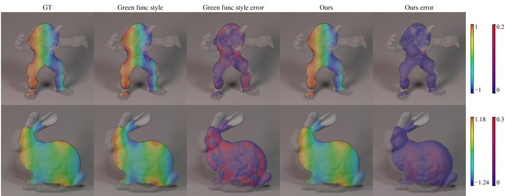  
Figure 1: Intuitive demonstration on complex 3D shapes (top: armadillo; bottom: bunny), with a single shape-conditioned $K _ { \theta }$ encoding both. Mean rel- $. L _ { 2 }$ is 0.012 vs 0.142 (Ours vs GF style; §5.1). Columns: GT (reference solution), the Green's-function-style (GF-style) baseline, its absolute error, our prediction, and our absolute error. Per row, fields share the left color bar and errors the right.

We propose Neural Harmonic Measure Operator (NHMO), a boundary-only neural operator for elliptic PDEs on variable-shape domains that, in contrast to the volumetric Green's-function operators above, learns the density of a codimension-one boundary measure on $\Omega \times \partial \Omega$ rather than a kernel on $\Omega \times \Omega$ . This drops the kernel domain by one dimension and replaces a singular volumetric kernel with a probability density on the boundary. NHMO contains two learned components. First, a transformerbased boundary kernel $K _ { \theta } ( p , \zeta ; \Omega )$ approximates the density $d \omega _ { p } / d \sigma$ of the harmonic measure $\omega _ { p }$ a geometry-only distribution over the boundary; we call $K _ { \theta }$ the harmonic-measure density. Here, geometry-only means that $\omega _ { p }$ depends on the domain Ω and query point $p ,$ but not on the prescribed boundary values. Integrating this distribution against any boundary data then recovers the Dirichlet Laplace solution via Kakutani's representation [Kakutani, 1944]. Second, a residual lift $v _ { \varphi }$ carries the source-induced contribution for Poisson problems via the classical balayage decomposition. The two components compose additively. These give NHMO structural advantages over volumetric operators. As a geometry-only probability kernel that depends on Ω rather than h or $f _ { i }$ , a single fitted $K _ { \theta }$ can be reused for arbitrary boundary data on the same shape without retraining, and, once the kernel is normalized over the boundary quadrature, its boundary term satisfies the maximum principle by construction. It is trained mesh-free from Walk-on-Spheres exit samples, requiring no FEM solutions or tetrahedral meshes for kernel supervision. As a proof of concept, Figure 1 shows NHMO and a Green's-function-style baseline on two complex 3D shapes (detailed in §5.1).

Contributions. (1) We propose to encode the density of the harmonic measure $\omega _ { p }$ as a learnable boundary kernel $K _ { \theta }$ that depends on the geometry Ω alone (independent of boundary data h and source $f ) ,$ supervised by Walk-on-Spheres (§4.3, §5.3). (2) We extend NHMO to Poisson problems via the classical balayage decomposition, with a zero-boundary-gauge lift $v _ { \varphi }$ that reuses $K _ { \theta }$ to amortize the source correction without singular volume quadrature (§4.4). (3) We validate NHMO on the MCB-B 3D Poisson benchmark, where it outperforms four neural-operator baselines, and on a controlled 2D MNIST testbed, and show the framework's generality through intuitive 3D harmonic and drift-adaptation experiments (§5.3, §5.2, §5.1).

## 2 Related Work

Neural operators for PDEs. Function-to-function neural operators [Kovachki et al., 2023] learn end-to-end maps from problem data to solutions. Foundational architectures include Graph Neural Operators [Li et al., 2020b], Fourier Neural Operators [Li et al., 2020a] that parameterize integral kernels in the spectral domain, and DeepONet [Lu et al., 2021] with a branch-trunk architecture on functions sampled at fixed points. Geometry-aware extensions handle irregular meshes via attention or graph modules [Li et al., 2023, Wu et al., 2024, Wang and Wang, 2024, Alkin et al., 2024], and several lines target varying domain geometries [Wang et al., 2024, Yin et al., 2024, Wu et al., 2026] Transformer-based operators [Hao et al., 2023, Xiao et al., 2023, Luo et al., 2025, Zhou et al., 2026] use attention over mesh points or learned slice tokens. These methods regress the solution or solution operator directly; we instead model the boundary measure that mediates all solutions.

Learning Green's functions and integral operators. A separate line learns the volumetric Green's function $G _ { \Omega } ( p , q )$ for linear PDEs via rational neural networks [Boullé et al., 2022], Dirac-delta approximations [Teng et al., 2022], radial-basis approximations [Negi et al., 2024], and variational principles [Teixeira et al., 2026]; deep nonlinear-BVP extensions appear in DeepGreen [Gin et al., 2021], and Green's-function-style multipole structure underlies the multipole graph neural operator [Li et al., 2020c]. Neural Green's Functions (NGF) [Yoo et al., 2025] is the closest prior work and our principal baseline. NGF learns the domain Green's function $G _ { \Omega } ( p , q )$ as $\Phi _ { \theta } ( { \dot { p } } ) ^ { \top } D \Phi _ { \theta } ( q )$ for learned per-point features, trained on precomputed FEM solution fields, and recovers solutions by integrating f against $G _ { \Omega }$ in the volume and h against the outward-normal derivative on the boundary. Earlier 2D boundary-integral neural methods [Lin et al., 2021, Sun et al., 2023] and neural integral operators [Zappala et al., 2024] target classical BEM-style discretizations rather than amortizing across boundary measures of varying shapes.

Walk on Spheres and grid-free Monte Carlo solvers. Walk on Spheres (WoS) [Muller, 1956] is a Monte Carlo estimator for elliptic PDEs based on Brownian-exit simulation. The grid-free perspective was revived for graphics and learning by Sawhney and Crane [2020], and Walk on Stars [Sawhney et al., 2023] extends it to mixed boundary conditions and source terms, with follow-ups for spatially varying coefficients, surface PDEs, gradient computation, and variance reduction [Sawhney et al., 2022, Sugimoto et al., 2024, Miller et al., 2024, Huang et al., 2025, Sawhney and Miller, 2023]. The ideal WoS estimator is unbiased; practical walks stop in an ε-shell around ∂Ω after $O ( \log ( 1 / \varepsilon ) )$ expected steps [Binder and Braverman, 2012], introducing an $O ( \varepsilon )$ bias [Mascagni and Hwang, 2003]. WoS pays $O ( N _ { \mathrm { w a l k s } } )$ per query at inference; neural surrogates trained against WoS targets [Nam et al., 2024, Zhang et al., 2025, Miller et al., 2023] amortize this cost. We use WoS as ground-truth supervision for $K _ { \theta }$ rather than as a runtime estimator.

Harmonic measure in analysis. The harmonic measure is classical in potential theory and geometric function theory [Garnett and Marshall, 2005]. In 2D it is conformally invariant, and its dimensional properties characterize boundary regularity [Makarov, 1985, Armitage and Gardiner 2012]. Kakutani's theorem [Kakutani, 1944] identifies it with the Brownian-exit law. To our knowledge, this is the first work to parameterize the density of the harmonic measure with a neural network and to realize the balayage decomposition with a learned source amortizer.

## 3 Background

## 3.1 Harmonic measure

Let $\Omega \subset \mathbb { R } ^ { d } ( d \in \{ 2 , 3 \} )$ be a bounded Lipschitz domain. The harmonic measure $\omega _ { p }$ at $p \in \Omega$ is the probability distribution on ∂Ω describing where a Brownian motion started at $p$ first exits Ω [Kakutani, 1944]: with $B _ { t }$ a Brownian motion in $\mathbb { R } ^ { d }$ with $B _ { 0 } =$ p and $\tau = \operatorname* { i n f } \{ t > 0 : B _ { t } \notin \Omega \}$ its first-exit time,

$$
\omega _ { p } ( E ) = \mathbb { P } _ { p } [ B _ { \tau } \in E ] , \qquad E \subset \partial \Omega { \mathrm { B o r e l } } .\tag{1}
$$

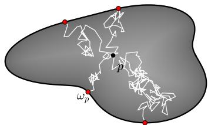

The family $\{ \omega _ { p } \} _ { p \in \Omega }$ depends only on the geometry Ω, not on any boundary data.

Constructing the Dirichlet solution. For continuous boundary data $h \in C ( \partial \Omega )$ , the Dirichlet problem $\Delta u = 0$ in Ω with $u = h$ on ∂Ω has the closed-form solution [Garnett and Marshall, 2005]

Figure 2: Harmonic measure $\left( \omega _ { p } \right)$ from Brownian exit locations. Red dots denote small boundary patches (E).

$$
u ( p ) = \int _ { \partial \Omega } h ( \zeta ) d \omega _ { p } ( \zeta ) = \mathbb { E } _ { p } [ h ( B _ { \tau } ) ] .\tag{2}
$$

The probabilistic form on the right is the basis of Walk-on-Spheres Monte Carlo solvers [Muller, 1956, Sawhney and Crane, 2020, Sawhney et al., 2023]. Once $\omega _ { p }$ is known for a geometry Ω, equation (2) resolves the Dirichlet problem for any h via a single boundary integral. On a Lipschitz domain, $\omega _ { p }$ is absolutely continuous with respect to the surface measure $\sigma ,$ and its Radon-Nikodym density $d \omega _ { p } / d \sigma ( \zeta ) \stackrel { . } { = } - \partial _ { \nu _ { \zeta } } G _ { \Omega } ( p , \zeta )$ is the Poisson kernel, with $G _ { \Omega }$ the Dirichlet Green's function. NHMO learns this harmonic-measure density; we reserve “harmonic measure" for $\omega _ { p }$ itself and name the method after it, since $\omega _ { p }$ exists on any bounded domain and WoS exit points are drawn from it. We present a derivation of (2) and further properties of $\omega _ { p }$ in Appendix B.

## 3.2 Newtonian potential and balayage

The Poisson problem extends (2) to nonzero source $f \in L ^ { \infty } ( \Omega )$

$$
\Delta u = f \mathrm { i n } \Omega , \quad \quad u = h \mathrm { o n } \partial \Omega .\tag{3}
$$

Let Φ be the fundamental solution of $- \Delta \ o \mathbb { R } ^ { d }$ , the radial solution of $- \Delta \Phi = \delta _ { 0 }$ , which is positive near the origin (the usual sign convention in potential theory):

$$
\Phi ( x ) = { \left\{ \begin{array} { l l } { - { \frac { 1 } { 2 \pi } } \log | x | } & { d = 2 , } \\ { { \frac { 1 } { 4 \pi | x | } } } & { d = 3 , } \end{array} \right. }\tag{4}
$$

and define the Newtonian potential of f by $\begin{array} { r } { N _ { f } ( p ) = - \int _ { \Omega } \Phi ( p - q ) f ( q ) } \end{array}$ dq, so that $\Delta N _ { f } = f$ on $\mathbb { R } ^ { d }$

Balayage decomposition. Setting $w = u - N _ { f }$ in (3) yields $\Delta w = 0$ in Ω with $w | _ { \partial \Omega } = h - N _ { f } | _ { \partial \Omega }$ Applying (2) to w and grouping the terms that do not involve h gives

$$
u ( p ) \ = \ \int _ { \partial \Omega } h ( \zeta ) d \omega _ { p } ( \zeta ) \ + \ u _ { f } ( p ) , \qquad u _ { f } ( p ) \ = \ N _ { f } ( p ) \ - \ \int _ { \partial \Omega } N _ { f } | _ { \partial \Omega } ( \zeta ) d \omega _ { p } ( \zeta ) ,\tag{5}
$$

where the source-only piece $u _ { f }$ is independent of h and satisfies $\Delta u _ { f } = f$ inΩ with $u _ { f } | _ { \partial \Omega } = 0$ . The same harmonic measure that handles the boundary data also handles the source-induced boundary correction, applied to $N _ { f } | _ { \partial \Omega }$ instead of h. With $f \equiv 0$ the decomposition recovers the pure Laplace identity (2). NHMO's two-component factorization in §4 is the neural counterpart of this split: the boundary integral becomes a learned kernel, the source-only piece becomes a learned residual field.

## 4 Neural Harmonic Measures

Throughout this section, $\omega _ { p }$ denotes the harmonic measure and $K _ { \theta }$ the learned harmonic-measure density that approximates $\dot { d \omega } _ { p } / d \sigma ; v _ { \varphi }$ denotes the residual lift. The full symbol list is in Appendix A. Three equations play distinct roles: the continuous identity (5), the learned model (6), and its quadrature implementation (7).

## 4.1 Problem setup

Each shape category is a distribution over bounded Lipschitz domains $\Omega \subset \mathbb { R } ^ { d }$ with $d \in \{ 2 , 3 \}$ . A training set provides shapes drawn from this distribution; per shape, a reference solution $u _ { \mathrm { t r u e } }$ for a parametric family of Poisson problems $\Delta u = f , u | _ { \partial \Omega } = h$ is given at a discretization of Ω. The reference solver and discretization are experimental choices (§5). At test time we evaluate on held-out shapes and on held-out $( h , f )$ pairs, including problems with coefficients drawn from outside the training support to test generalization across the parametric BC distribution.

## 4.2 Decomposition

By the balayage identity (5), the solution splits into a clean h-only boundary integral plus an $h \mathrm { - }$ independent source-only piece that vanishes on ∂Ω. We factorize NHMO along this split:

$$
u ( p ) \ = \ \underbrace { \langle h , K _ { \theta } ( p , \cdot ; \Omega ) \rangle _ { \partial \Omega } } _ { u _ { h } ( p ) } + \underbrace { v _ { \varphi } ( p ; \Omega , h , f ) } _ { \approx u _ { f } ( p ) } ,\tag{6}
$$

where $u _ { h } ( p )$ denotes the boundary-integral prediction and $u _ { f } ( p )$ the zero-boundary Poisson particular solution; $K _ { \theta } ( p , \zeta ; \Omega )$ is a learned harmonic-measure density approximating $d \omega _ { p } / d \sigma$ and $v _ { \varphi }$ is a learned residual field. Setting $K _ { \theta } = d \omega _ { p } / d \sigma$ and $v _ { \varphi } = u _ { f }$ recovers (5) identically. In practice we let $v _ { \varphi }$ depend on h as well as $f ,$ so the residual lift can absorb approximation error from imperfect kernel fits on top of carrying the source contribution; §6 examines this dependence and separates the two roles. Two properties of this decomposition are critical to our results. First, $K _ { \theta }$ does not depend on h or $f ,$ so the boundary kernel is geometry-only and a single fitted $K _ { \theta }$ handles every $( h , f )$ pair on a shape without retraining. Second, $u _ { h }$ is a linear functional of the boundary data: a coefficient shift in $h ,$ including coefficients drawn from outside the training support, changes $u _ { h }$ proportionally without altering the kernel itself. End-to-end operators that fit u as a nonlinear map of $( h , f )$ do not enjoy this property; their solution can drift arbitrarily under a coefficient shift unseen at training time. Out-of-distribution generalization across the parametric BC family is therefore a structural property of NHMO's kernel channel, not an emergent effect from fitting; the lift carries no such guarantee. The residual lift $v _ { \varphi }$ catches source-induced contributions and any remaining approximation error.

## 4.3 Boundary kernel $K _ { \theta }$

$K _ { \theta } ( p , \zeta ; \Omega )$ is realized as the composition of a geometry encoder $E$ and a kernel head g. The encoder maps a discretization of Ω to a fixed-size shape latent $\psi _ { \Omega } ~ = ~ E ( \Omega )$ . The kernel head outputs a scalar log-density log $\tilde { K } _ { \theta } ( p , \zeta ; \Omega ) =$ $g ( p , \zeta , \psi _ { \Omega } )$ , with inputs augmented by Fourier features of $( p , \zeta )$ and the inter-point distance $\| p - \zeta \|$ . Given a boundary discretization $\{ \zeta _ { i } \} _ { i = 1 } ^ { N _ { s } }$ of $N _ { s }$ surface points with quadrature weights $w _ { i } .$ , we normalize the kernel over the quadrature at inference, $K _ { \theta } ( p , \zeta _ { i } ; \Omega ) =$ $\widetilde { K } _ { \theta } ( p , \zeta _ { i } ; \Omega ) / \sum _ { i } w _ { j } \widetilde { K } _ { \theta } ( p , \zeta _ { j } ; \Omega )$ , so that $\begin{array} { r } { \sum _ { i } w _ { i } K _ { \theta } ( p , \zeta _ { i } ; \bar { \Omega } ) = 1 } \end{array}$ holds exactly and the boundary integral

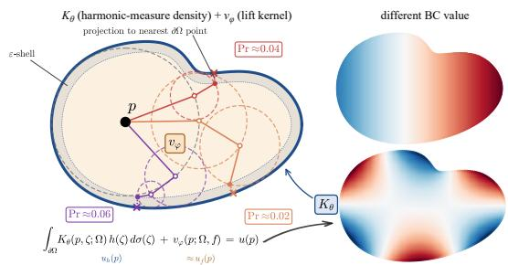  
Figure 3: NHMO overview. Harmonic-measure density $K _ { \theta } \approx d \omega _ { p } / d \sigma$ with WoS paths and residual lift $v _ { \varphi } ,$ composed additively as in (6) (bottom). Each WoS step lands on the largest circle inside $\Omega ; \mathfrak { i }$ walk stops in the ε-shell (drawn wider than in practice) and is projected to ∂Ω. Right: $K _ { \theta }$ once fit for Ω solves any new boundary datum without retraining.

$$
u _ { h } ( p ) \ = \ \sum _ { i = 1 } ^ { N _ { s } } w _ { i } K _ { \theta } ( p , \zeta _ { i } ; \Omega ) h ( \zeta _ { i } )\tag{7}
$$

is a convex combination of boundary values, so min $h \leq u _ { h } \leq \operatorname* { m a x } h$ . A training-time penalty (§4.5) keeps $\begin{array} { r } { \sum _ { i } w _ { i } \widetilde { K } _ { \theta } ( p , \zeta _ { i } ; \Omega ) \approx 1 } \end{array}$ . Encoder, kernel head, and feature parameterizations for the 2D and 3D realizations are in Appendix C.

By (2), when $K _ { \theta } = d \omega _ { p } / d \sigma$ and h is analytically harmonic, the boundary integral (7) returns $h ( p )$ up to quadrature error. We use this to check the trained kernel on held-out geometries by evaluating uh against analytic harmonic functions $( \mathbf { e . g . } , h \in \{ x , x y , x ^ { 2 } - y ^ { 2 } , e ^ { x } \cos y \}$ in 2D, with low-degree solid spherical harmonics in 3D). The check is unavailable to end-to-end neural operators that do not expose a kernel; numbers are reported in §5.3.

A single fitted $K _ { \theta }$ amortizes solutions across $( h , f )$ pairs on the same shape: for Laplace $( f \equiv 0 )$ the boundary integral (7) alone suffices; for Poisson the kernel composes additively with $v _ { \varphi }$ for the source contribution. At inference, the discrete effective-kernel matrix $K _ { \mathrm { e f f } } = [ w _ { j } \dot { K _ { \theta } } ( p _ { i } , \zeta _ { j } ; \Omega ) ] _ { i j }$ is materialized once per geometry and reused for every $( h , f )$ , so per-problem inference reduces to a boundary matvec plus a lift forward; wall-clock measurements are in §5.4.

## 4.4 Field lift $v _ { \varphi }$

In 2D, $v _ { \varphi }$ is parameterized as a U-Net on the ambient discretization grid of Ω. Inputs are the interior mask $\mathbf { 1 } _ { \Omega }$ (the indicator function of Ω, equal to 1 inside and 0 outside), the boundary data h extended onto the grid, the source field $f ,$ and the kernel's own boundary-integral prediction $u _ { h }$ evaluated at every grid pixel. The output is a single residual channel; the final prediction (6) is masked to the interior via multiplication by $\mathbf { 1 } _ { \Omega }$ . The lift sees the kernel's prediction as a guide and learns the residual. For pure Laplace problems $( f \equiv 0 )$ , the kernel alone supplies $u _ { h }$ via (7) and $v _ { \varphi }$ has only the residual approximation error in $K _ { \theta }$ to correct; for Poisson problems, the lift carries the source-induced contribution that the boundary integral cannot represent. Because the lift conditions on $u _ { h } .$ the kernel and the lift compose into a single forward pass per query field with no iterative coupling. In 3D, $v _ { \varphi }$ is a cross-attention head whose query is a Fourier embedding of p and whose context is the shape latent together with tokens that summarize source samples $( q _ { j } , f ( q _ { j } ) ) ;$ it does not see h, and its output is multiplied by $\operatorname* { m a x } ( 0 , - \mathrm { S D F } ( p ) )$ . The same kernel-plus-lift template adapts to nearby elliptic operators, e.g. constant-drift Laplace, by replacing the lift with a small drift-conditioned adapter while reusing the geometric kernel without retraining; we demonstrate this on a bunny domain in §5.1. Depths, widths, and parameter counts are in Appendix C.

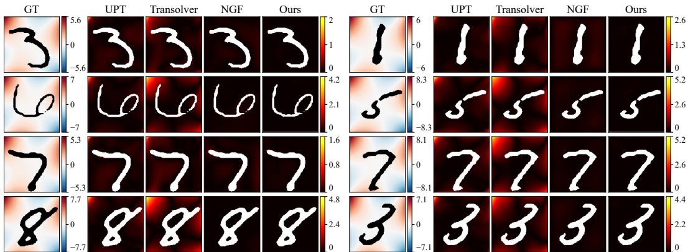  
Figure 4: 2D MNIST out-of-distribution (OOD) qualitative. Per row, a Laplace example (left) paired with a Poisson example (right); columns are GT (finite-difference reference) and the absolute error [pred – GT| of UPT, Transolver, NGF, and Ours. Within each example (half-row), the four error panels share one color scale and GT has its own. Additional shapes in Appendix G.3.

## 4.5 Training

Training is two-stage. The kernel $K _ { \theta }$ is trained per geometry distribution from Walk-on-Spheres exit samples [Muller, 1956, Sawhney and Crane, 2020]. From each interior probe $p ,$ we simulate M Brownian-motion exit points $\{ \zeta _ { k } \} _ { k } \subset \partial \Omega :$ each WoS step jumps to a uniform point on the largest sphere around the current point inside Ω, a walk stops in the ε-shell of $\partial \Omega \stackrel { \_ } { ( \varepsilon } = 1 0 ^ { - 3 }$ of the normalized domain) and is projected to the nearest boundary point, and walks that do not stop within 128 steps are masked out. In 2D, we precompute $1 0 ^ { 4 }$ walks for each of 32 probes per shape, and in 3D we draw 4 fresh exits for each of 8 probes per gradient step. We fit $K _ { \theta } ( p , \cdot )$ against a Gaussian kernel-density estimate (KDE) of these samples at bandwidth σ (a small fraction of the domain diameter, 0.2% in 2D, so ε is half of σ), minimizing the KDE negative log-likelihood. Probes are drawn from near-boundary, mid-interior, and deep-interior bands. Two regularizers harden the soft normalization. $\mathcal { L } _ { Z }$ pins log $\begin{array} { r } { \sum _ { i } w _ { i } \widetilde { K } _ { \theta } ( p , \zeta _ { i } ; \Omega ) } \end{array}$ to zero via a Huber penalty, and ${ \mathcal { L } } _ { \mathrm { M V } }$ enforces the mean-value property of harmonic functions on spheres $B ( p , r ) \subset { \bar { \Omega } }$ that lie strictly inside Ω. Generating this supervision is a negligible share of training: our GPU sampler completes about $5 \times 1 0 ^ { 8 }$ walks per second on an A100 even at a stricter $\varepsilon = 1 0 ^ { - 4 }$ (Appendix D.5 gives budgets, masked fractions, and variance).

With $K _ { \theta }$ frozen, the lift $v _ { \varphi }$ is trained by masked MSE between the composed prediction (6) and the numerical reference $u _ { \mathrm { t r u e } } ,$ computed in y-normalized space. One shape × one $( h , f )$ instance per gradient step; $u _ { h }$ is recomputed on-the-fly through the frozen kernel. No PDE-residual loss is used at any stage. Loss weights, optimizer, and learning-rate schedule for both stages are in Appendix D.

## 5 Experiments

We evaluate NHMO on two complementary benchmarks, a controlled 2D MNIST testbed in which all neural-operator baselines run under a single code path (§5.2) and the published 3D MCB-B Poisson benchmark of [Yoo et al., 2025] where NHMO is compared against four prior methods on five mechanical-part categories (§5.3), preceded by a short pair of intuitive demonstrations on complex 3D shapes (§5.1). Runtime (§5.4) and ablation (§5.5) analyses follow.

## 5.1 Intuitive demonstrations on complex shapes

As proof of concept, two demos share a single harmonic-measure density $K _ { \theta }$ fitted once across four graphics meshes; under matched optimization budgets, NHMO converges faster than a Green'sfunction-style baseline (GF style) that learns a volumetric Green's function as in prior work [Yoo et al., 2025, Boullé et al., 2022, Teng et al., 2022, Negi et al., 2024, Gin et al., 2021, Li et al., 2020c, Teixeira et al., 2026]. (i) On four graphics meshes (armadillo, bunny, fandisk, lucy) with $h \in$ {sin x, sin z}, NHMO reaches mean rel-L2 of 0.012 against an FEM reference versus 0.142 for GF style. (ii) For constant-drift Laplace $\Delta u + \boldsymbol { \beta } \cdot \nabla u = 0$ on a 2D bunny slice, the same $K _ { \theta }$ plus a small drift-conditioned adapter reaches 0.062 versus 0.323 for GF style. Details and figures are in Appendix F.

## 5.2 2D MNIST: controlled cross-baseline benchmark

We construct a controlled 2D testbed using MNIST digit silhouettes as planar domains, with parametric Laplace and Poisson problems posed on each, and run all neural-operator baselines under one training and evaluation pipeline. It probes out-of-distribution (OOD) extrapolation across BC coefficients and multiply-connected boundaries (digits 0, 6, 8, 9); details are in Appendix G.1. The baselines include BENO [Wang et al., 2024], which is designed for elliptic problems with complex boundaries.

Table 1 reports results on the in-distribution and OOD splits; the OOD split draws BC coefficients strictly outside the training range. NHMO has the lowest mean in-distribution error and the lightest error tails on both splits (OOD examples in Figure 4). Under the OOD shift it degrades by 1.25× (median), while the nonlinear end-to-end baselines (Transolver, LNO, UPT, BENO) degrade by 4× to 8×; even the kernel-only variant beats all of them on OOD. Our 2D port of NGF also extrapolates well and has a quite low OOD mean and median: like NHMO, it pairs geometry-only features with a read-out that is linear in the data, the class of operator this paper argues for. Its in-distribution errors, however, are heavy-tailed on Poisson problems (p95 16.9% and max 40.2%, against our 3.3% and 7.0%), consistent with its rank-limited bilinear source coupling. Across five training seeds of the lift, the test mean is $2 . 0 9 \pm 0 . 0 3 \%$ and the OOD mean $2 . 6 0 \pm 0 . 0 \bar { 5 } \%$ (Appendix K.1).

Table 1: 2D MNIST paramBC: relative $L _ { 2 }$ error (%) over the full interior, in-distribution and OOD $( U [ + 1 , + 2 ] )$ . p95: per-pair 95th percentile. The OOD/test ratio (of medians) measures BC-coefficient extrapolation; lower is better. Per-problem inference is on a single A100 with the per-shape kernel matrix cached. NGF is released only in 3D; its row is our 2D port of the official code and training setup (Appendix G.2).
<table><tr><td rowspan="2">Method</td><td colspan="2">test (in-dist)</td><td colspan="2">test_ood</td><td colspan="2"></td></tr><tr><td>median / mean</td><td>p95</td><td>median / mean</td><td>p95</td><td></td><td>OOD/test per-problem</td></tr><tr><td>Transolver [Wu et al., 2024]</td><td>4.4/5.3</td><td>10.7</td><td>36.4 / 36.2</td><td>55.2</td><td>8.3×</td><td>12.5 ms</td></tr><tr><td>LNO [Wang and Wang, 2024]</td><td>5.2 / 6.4</td><td></td><td>23.3 / 33.2</td><td>81.6</td><td>4.5×</td><td>13.2 ms</td></tr><tr><td>UPT [Alkin et al., 2024]</td><td>5.7 / 6.3</td><td></td><td>26.5 / 26.6</td><td></td><td>4.6×</td><td>7.6 ms</td></tr><tr><td>BENO [Wang et al., 2024]</td><td>5.9/ 7.0</td><td>16.1</td><td>44.1 / 40.5</td><td>65.8</td><td>7.5×</td><td></td></tr><tr><td>NGF [Yoo et al., 2025] (2D port)</td><td>2.0/3.9</td><td>16.9</td><td>3.9 / 4.2</td><td>6.0</td><td>1.93×</td><td>11.6 ms</td></tr><tr><td>NHMO K-only (kernel only)</td><td>5.4/7.7</td><td>18.2</td><td>5.6 / 6.8</td><td>14.2</td><td>1.0×</td><td></td></tr><tr><td>NHMO (kernel + lift)</td><td>2.0/ 2.1</td><td>3.3</td><td>2.5 / 2.6</td><td>4.2</td><td>1.25×</td><td>4.0 ms</td></tr><tr><td>+ residual head (§6)</td><td>1.7 / 1.8</td><td>3.0</td><td>2.4 / 2.6</td><td>4.1</td><td>1.37×</td><td></td></tr></table>

## 5.3 3D MCB-B Poisson

We follow the protocol of [Yoo et al., 2025] exactly. MCB-B comprises five categories of mechanicalpart shapes (Nut, Gear, Motor, Fitting, Screws & Bolts) from MCB [Kim et al., 2020], each with 200 training and 20 unseen test shapes; per shape, the benchmark provides 16 unseen $( h , f )$ problems (8 sources $\times 2 \mathrm { B C s } ,$ held out from training) with FEM reference solutions to $\Delta u = f$ on tetrahedral meshes, yielding 320 test pairs per category. Our networks $( K _ { \theta }$ at 2.77M params trained with WoS distillation, $v _ { \varphi }$ at \~ 5M params trained on FEM-supervised MSE via warm-start, §4.5) and baseline implementations are detailed in Appendices C and E. Reported metric is relative $L _ { 2 }$ error against the

Table 2: MCB-B Poisson benchmark: relative $L _ { 2 }$ error against the FEM reference, mean over 20 unseen test shapes × 16 unseen $( h , f )$ problems per category. Lower is better. NGF, Transolver, LNO, UPT numbers are reported in NGF Table 2 under identical evaluation.
<table><tr><td>Method</td><td>Nut</td><td>Gear</td><td>Motor</td><td>Fitting</td><td>Screws &amp; Bolts</td></tr><tr><td>Transolver [Wu et al., 2024]</td><td>0.320</td><td>0.281</td><td>0.407</td><td>0.180</td><td>0.221</td></tr><tr><td>LNO [Wang and Wang, 2024]</td><td>0.372</td><td>0.466</td><td>0.528</td><td>0.259</td><td>0.239</td></tr><tr><td>UPT [Alkin et al., 2024]</td><td>0.516</td><td>0.507</td><td>0.765</td><td>0.392</td><td>0.358</td></tr><tr><td>NGF [Yoo et al., 2025]</td><td>0.275</td><td>0.243</td><td>0.338</td><td>0.160</td><td>0.189</td></tr><tr><td>Ours (NHMO)</td><td>0.216</td><td>0.188</td><td>0.284</td><td>0.147</td><td>0.131</td></tr></table>

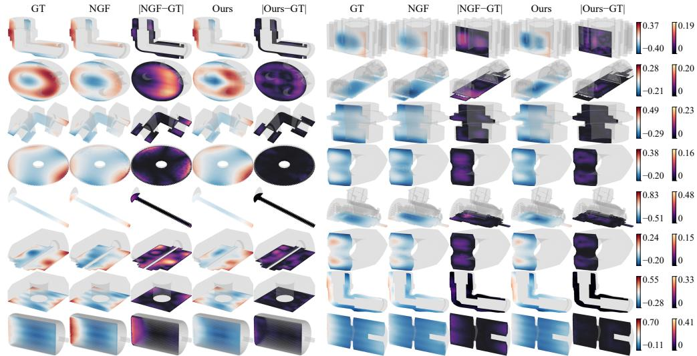  
Figure 5: Qualitative comparison on MCB-B Poisson. Per shape, five panels show GT (the FEM reference), NGF prediction, NGF error, our prediction, and our error; the cut face is colored by the field, the back half by a gray ghost surface. Within each row, GT and the predictions share one color scale and the four error panels share a second one; panels are stretched to a common aspect ratio. Two shapes per row across all five MCB-B categories. Additional shapes in Appendix H.

FEM reference, evaluated at every interior tetrahedral-mesh (tet) vertex and averaged over all 320 test pairs.

We outperform NGF on all five categories and outperform Transolver, LNO, and UPT by wider margins (Table 2). Per-shape distributions (Table 3) show median error below NGF's reported mean for all five categories, with 95th-percentile error below 0.50 on every category, so no single test shape fails catastrophically. When h and $f$ are shifted outside their training ranges without retraining (40 problems per category; Appendix I), the macro-averaged error of the released NGF checkpoints rises from 0.241 (Table 2) to 0.615, and ours from 0.193 to 0.263 on the same problems. On a Laplace-only track with the same boundary data, ours averages 0.099 against 0.60–0.64 for NGF which suggests that most of our remaining degradation comes from the source-conditioned lift.

Kernel as a harmonic-measure density. A direct test of whether $K _ { \theta }$ approximates the true harmonic-measure density is to evaluate its boundary integral against analytically harmonic h, where $u _ { h } ( p ) \equiv h ( p )$ exactly by uniqueness of the harmonic extension. Table 4 reports $\mathrm { r e l } { - } L _ { 2 }$ errors for $h \in \{ x , x y , x ^ { 2 } - y ^ { 2 } , Y _ { 2 , 0 } , e ^ { x }$ cos y, $e ^ { x }$ sin y} $( Y _ { 2 , 0 }$ is the degree-2 zonal solid spherical harmonic) across all five categories. Errors are small and ordered consistently with a true harmonic-measure density (smoothest probes lowest, second-order spherical harmonics highest), and the ordering is preserved on the harder Motor and Fitting geometries; part of the remaining Poisson error (Table 2) therefore stems from the source lift.

Table 3: Per-shape distribution of relative $L _ { 2 }$ error (ours, 320-pair test set).
<table><tr><td></td><td>Mean</td><td>Median</td><td> $\mathsf { p } 9 5$ </td></tr><tr><td>Nut</td><td>0.216</td><td>0.215</td><td>0.329</td></tr><tr><td>Gear</td><td>0.188</td><td>0.144</td><td>0.378</td></tr><tr><td>Motor</td><td>0.284</td><td>0.265</td><td>0.450</td></tr><tr><td>Fitting</td><td>0.147</td><td>0.111</td><td>0.309</td></tr><tr><td>Screws</td><td>0.131</td><td>0.103</td><td>0.315</td></tr></table>

Table 4: Synthetic Laplace probe: relative $L _ { 2 }$ error of $u _ { h } ( p ) \stackrel { \cdot } { = } \langle h , K _ { \theta } ( p , \stackrel { \cdot } { \cdot } ) \rangle$ against analytical $u _ { h } ( p ) \equiv$ $h ( p )$ , mean over 20 unseen test shapes per category, 64 interior queries per shape.
<table><tr><td></td><td>x</td><td>xy</td><td> $x ^ { 2 } - y ^ { 2 }$ </td><td> $Y _ { 2 , 0 }$ </td><td> $e ^ { x } \cos y$ </td><td>exsin y</td></tr><tr><td>Nut</td><td>0.149</td><td>0.190</td><td>0.172</td><td>0.171</td><td>0.043</td><td>0.094</td></tr><tr><td>Gear</td><td>0.048</td><td>0.089</td><td>0.090</td><td>0.097</td><td>0.021</td><td>0.068</td></tr><tr><td>Motor</td><td>0.121</td><td>0.184</td><td>0.216</td><td>0.213</td><td>0.044</td><td>0.149</td></tr><tr><td>Fitting</td><td>0.091</td><td>0.167</td><td>0.161</td><td>0.153</td><td>0.029</td><td>0.118</td></tr><tr><td>Screws</td><td>0.064</td><td>0.178</td><td>0.112</td><td>0.110</td><td>0.025</td><td>0.218</td></tr></table>

## 5.4 Runtime

Every method first turns a new geometry into the representation it computes on. For NHMO, this geometry step encodes the shape and evaluates $K _ { \mathrm { e f f } }$ once, playing the role that meshing plays for mesh-based pipelines (Table 5).

Table 5: Runtime on a single A100. The geometry step runs once per shape: shape encoding and $K _ { \mathrm { e f f } }$ for NHMO, tetrahedral meshing at the released resolution (fTetWild, CPU) for the MCB-B baselines.
<table><tr><td rowspan="2">Setting</td><td colspan="2">Geometry step (per shape)</td><td colspan="2">Per problem</td></tr><tr><td>NHMO</td><td>baselines</td><td>NHMO</td><td>baselines</td></tr><tr><td>2D MNIST  $( 1 2 8 ^ { 2 } )$ </td><td>6.6 s</td><td>grid input</td><td>4.0 ms</td><td>7.6–13.2 ms</td></tr><tr><td>3D Nut</td><td>7.9s</td><td>37 s (tet meshing)</td><td>7.5 ms</td><td>0.24 s (NGF)</td></tr><tr><td>3D Motor</td><td>10.3s</td><td>48 s (tet meshing)</td><td>7.9 ms</td><td>0.25 s / 77 ms (NGF)</td></tr></table>

FEM and all MCB-B baselines, including NGF, take as input the vertices of the tetrahedral mesh that the benchmark provides. On a new shape, fTetWild [Hu et al., 2020] takes 37/48 s to mesh the Nut/Motor surfaces at the released resolution, while our geometry step takes 7.9/10.3 s from the boundary surface alone, so NHMO is faster than the mesh-based pipelines from the first problem. NGF's formulation does not use mesh connectivity, but any other interior point set would also require a comparable geometry step. Per problem, NHMO solves in 7.5/7.9 ms, against 0.24/0.25 s for NGF's released pipeline (including data loading) and 77 ms per forward pass when the Motor mesh is preloaded on the GPU and only the boundary data change. In 2D, our geometry step takes 6.6 s per shape. Workloads that query one geometry many times, such as parametric boundary-condition studies, load sweeps on a fixed part, and uncertainty quantification, benefit the most: sweeping 1,000 load cases on one Motor shape takes NHMO about 18 s, geometry step included, against about 77 s for NGF with a preloaded mesh. Because the geometry step depends only on the shape, it can also be run ahead of time for a library of shapes. The 3D timings use inference-only optimizations whose effect on accuracy is within sampling noise (Appendix J).

## 5.5 Ablations

The full table and per-ablation discussion are in Appendix K.

(1) Accuracy is independent of geometric representation. Swapping the geometry encoder between a point-cloud over boundary samples and a 2D SDF image moves median $\mathrm { r e l } { - } L _ { 2 }$ by only 0.27% on test and 0.09% on OOD, and the OOD/test gap tightens to 1.14× (from canonical 1.25×). Setup in Appendix K.9. (2) Mixed-corpus generalization across all 10 MNIST classes. A single $K _ { \theta } + v _ { \varphi }$ trained on a 5,000-shape corpus across digits 0–9 attains a per-class mean spread of only 0.53% (max – min, test). (3) Factorization, not the lift. The kernel-only variant $( v _ { \varphi } \equiv 0 )$ already beats the nonlinear end-to-end baselines on OOD (Table 1); the lift is a small correction. (4) Robustness to the boundary quadrature. Varying $n _ { \mathrm { s u r f } }$ from 50 to 400 changes the median by <0.1% above 100 samples. (5) Not tuned on a knife-edge. Doubling lift parameters from 6.4M to 11.3M gives no in-distribution gain; KDE σ is robust across a 5× range; WoS supervision converges above \~1,000 samples per query.

## 6 Discussion

Why a boundary density and an amortized source field. Green's-function operators such as NGF learn one kernel $G _ { \Omega } ( p , q )$ and integrate it against f in the volume and its normal derivative against h on the boundary. We learn the boundary density and the integrated source field instead, for three reasons. Supervision: WoS exit points sample $\omega _ { p } { \mathrm { . } }$ SO $K _ { \theta }$ is trained from walks alone, whereas learned-G methods rely on solver-generated solution fields. Boundary accuracy: near ∂Ω the value of $G _ { \Omega }$ vanishes and the signal sits in its normal derivative, so a learned G must be accurate enough to be differentiated there. Inference cost: a learned G needs a new singular volume quadrature, $O ( N _ { p } N _ { q } )$ network evaluations, whenever f changes. In a direct test (Appendix K.10), a learned volumetric integrand with a log $| p - q |$ singularity feature reaches 6.7% / 5.2% (mean / median), no better than a source-only field lift, and its boundary derivative is not a valid Poisson kernel. NGF makes this integral fast with a rank-constrained bilinear factorization, and its heavy error tails (§5.2) are consistent with that rank limit.

The boundary-data dependence of the lift. In the classical balayage split the source-only piece does not depend on h, whereas our 2D lift sees h and $u _ { h } .$ , because $K _ { \theta }$ is a fitted density: the boundary term leaves the residual $\begin{array} { r } { e _ { h } ( p ) = \int _ { \partial \Omega } h \left( d \omega _ { p } / d \sigma - K _ { \theta } \right) } \end{array}$ )dσ, a linear functional of h that a network seeing only $( \Omega , f )$ cannot correct. On the 205 Laplace test pairs the source contribution vanishes and the output of the lift is its boundary correction alone: it correlates with $e _ { h }$ at median 0.97 and removes 71% of it (Appendix K.1). The two roles can also be separated into a source lift $v _ { \varphi } ( \Omega , f )$ which sees only the mask, its SDF, and f, and a residual head $r ( \bar { \Omega } , h , u _ { h } )$ trained on top of it, giving $u = \langle h , K _ { \theta } \rangle + v _ { \varphi } ( \Omega , f ) + r ( \Omega , h , u _ { h } )$ The source lift alone reaches 6.1% / 4.5% (test mean / median) and degrades only 1.04× under the OOD shift; adding r gives 1.84% / 1.74% on test and 2.56% / 2.39% on OOD, which matches or slightly surpasses the two-term model (2.1% / 2.0% and 2.6% / 2.5%) at a larger total capacity, with the h-dependence confined to an explicit corrector. The 3D lift sees only the geometry and the source, as in the classical split. The residual comes mainly from the training signal of the 2D kernel, whose KDE targets are built on simplified polyline contours rather than on the rasterized masks (Appendix K.11); placing the KDE nodes on the mask contour lowers the kernel-only error from 5.9% to 3.2%, and a kernel-plus-lift model trained on this kernel reaches 1.8% / 1.7% on test and 2.1% / 2.2% on OOD; we leave this choice of representation, and residual heads that exploit the linearity of $e _ { h } .$ , to future work.

## 7 Conclusion

We proposed Neural Harmonic Measure Operator (NHMO), the first neural operator built explicitly around the harmonic measure, the canonical probability distribution from potential theory that mediates all solutions of the Dirichlet Laplace problem on a fixed domain. For Poisson source terms, the classical balayage decomposition extends the same harmonic measure to handle sources via a learned lift network with a zero-boundary gauge. Our framework reduces an end-to-end neuraloperator problem to two coupled components: the boundary kernel $K _ { \theta } .$ , independently falsifiable as a harmonic-measure density via synthetic-harmonic probes, and the amortized balayage source lift $v _ { \varphi } .$ More broadly, our work suggests that grounding neural operators in canonical objects from classical analysis, rather than learning end-to-end input-to-output mappings, offers a path to inductive biases that mirror the structure of the underlying PDE, and we hope this framing motivates further work at the interface of potential theory and neural operator learning.

Limitations and future work. We target Dirichlet elliptic problems; Neumann/Robin conditions and other PDE types need generalized measures and remain future work. The source lift is f-conditional via probe samples, so out-of-distribution sources may degrade. Linearity in h is guaranteed only for the kernel channel: a lift that learns shortcuts specific to the training coefficients would lose OOD robustness. NHMO also trades a per-shape precompute for fast per-problem inference, so single-problem-per-shape workloads do not benefit from the cache; future work could explore low-rank kernel factorizations to amortize this cost.

## Acknowledgments and Disclosure of Funding

We sincerely thank the reviewers for their valuable feedback. Georgia Tech authors acknowledge NSF CAREER #2420319, IIS #2433307, OISE #2433313, IIS #2433322, ECCS #2318814, and CNS #2450401 for funding support. We thank NVIDIA for providing computing resources through the NVIDIA Academic Grant. The authors declare no competing interests.

## References

Benedikt Alkin, Andreas Fürst, Simon Schmid, Lukas Gruber, Markus Holzleitner, and Johannes Brandstetter. Universal physics transformers: A framework for efficiently scaling neural operators. Advances in Neural Information Processing Systems, 37:25152–25194, 2024.

David H Armitage and Stephen J Gardiner. Classical potential theory. Springer Science & Business Media, 2012.

Martin Philip Bendsoe and Ole Sigmund. Topology optimization: theory, methods, and applications. Springer Science & Business Media, 2013.

Ilia Binder and Mark Braverman. The rate of convergence of the Walk on Spheres algorithm. Geometric and Functional Analysis, 22(3):558–587, 2012. doi: 10.1007/s00039-012-0161-z.

Nicolas Boullé, Christopher J Earls, and Alex Townsend. Data-driven discovery of green's functions with human-understandable deep learning. Scientific reports, 12(1):4824, 2022.

Heinz Werner Engl, Martin Hanke, and Andreas Neubauer. Regularization of inverse problems, volume 375. Springer Science & Business Media, 1996.

John B Garnett and Donald E Marshall. Harmonic measure. Number 2. Cambridge University Press, 2005.

Craig R Gin, Daniel E Shea, Steven L Brunton, and J Nathan Kutz. Deepgreen: deep learning of green's functions for nonlinear boundary value problems. Scientific reports, 11(1):21614, 2021.

Zhongkai Hao, Zhengyi Wang, Hang Su, Chengyang Ying, Yinpeng Dong, Songming Liu, Ze Cheng, Jian Song, and Jun Zhu. Gnot: A general neural operator transformer for operator learning. In International conference on machine learning, pages 12556–12569. PMLR, 2023.

Yixin Hu, Teseo Schneider, Bolun Wang, Denis Zorin, and Daniele Panozzo. Fast tetrahedral meshing in the wild. ACM Transactions on Graphics, 39(4), 2020. doi: 10.1145/3386569.3392385.

Tianyu Huang, Jingwang Ling, Shuang Zhao, and Feng Xu. Guiding-based importance sampling for walk on stars. In Proceedings of the Special Interest Group on Computer Graphics and Interactive Techniques Conference Conference Papers, pages 1–12, 2025.

Thomas JR Hughes. The inite element method: linear static and dynamic finite element analysis. Courier Corporation, 2003.

Shizuo Kakutani. 143. two-dimensional brownian motion and harmonic functions. Proceedings of the Imperial Academy, 20(10):706–714, 1944.

Sangpil Kim, Hyung-gun Chi, Xiao Hu, Qixing Huang, and Karthik Ramani. A large-scale annotated mechanical components benchmark for classification and retrieval tasks with deep neural networks. In European conference on computer vision, pages 175–191. Springer, 2020.

Nikola Kovachki, Zongyi Li, Burigede Liu, Kamyar Azizzadenesheli, Kaushik Bhattacharya, Andrew Stuart, and Anima Anandkumar. Neural operator: Learning maps between function spaces with applications to pdes. Journal of Machine Learning Research, 24(89):1–97, 2023.

Randall J LeVeque. Finite difference methods for ordinary and partial differential equations: steadystate and time-dependent problems. SIAM, 2007.

Zongyi Li, Nikola Kovachki, Kamyar Azizzadenesheli, Burigede Liu, Kaushik Bhattacharya, Andrew Stuart, and Anima Anandkumar. Fourier neural operator for parametric partial differential equations. arXiv preprint arXiv:2010.08895, 2020a.

Zongyi Li, Nikola Kovachki, Kamyar Azizzadenesheli, Burigede Liu, Kaushik Bhattacharya, Andrew Stuart, and Anima Anandkumar. Neural operator: Graph kernel network for partial differential equations. arXiv preprint arXiv:2003.03485, 2020b.

Zongyi Li, Nikola Kovachki, Kamyar Azizzadenesheli, Burigede Liu, Andrew Stuart, Kaushik Bhattacharya, and Anima Anandkumar. Multipole graph neural operator for parametric partial differential equations. Advances in Neural Information Processing Systems, 33:6755–6766, 2020c.

Zongyi Li, Daniel Zhengyu Huang, Burigede Liu, and Anima Anandkumar. Fourier neural operator with learned deformations for pdes on general geometries. Journal of Machine Learning Research, 24(388):1–26, 2023.

Guochang Lin, Pipi Hu, Fukai Chen, Xiang Chen, Junqing Chen, Jun Wang, and Zuoqiang Shi. Binet: learning to solve partial differential equations with boundary integral networks. arXiv preprint arXiv:2110.00352, 2021.

Lu Lu, Pengzhan Jin, Guofei Pang, Zhongqiang Zhang, and George Em Karniadakis. Learning nonlinear operators via deeponet based on the universal approximation theorem of operators. Nature machine intelligence, 3(3):218–229, 2021.

Huakun Luo, Haixu Wu, Hang Zhou, Lanxiang Xing, Yichen Di, Jianmin Wang, and Mingsheng Long. Transolver++: An accurate neural solver for pdes on million-scale geometries. arXiv preprint arXiv:2502.02414, 2025.

Nikolai G Makarov. On the distortion of boundary sets under conformal mappings. Proceedings of the London Mathematical Society, 3(2):369–384, 1985.

Michael Mascagni and Chi-Ok Hwang. €-shell error analysis for "Walk On Spheres" algorithms. Mathematics and Computers in Simulation, 63(2):93–104, 2003. doi: 10.1016/S0378-4754(03) 00038-7.

Bailey Miller, Rohan Sawhney, Keenan Crane, and Ioannis Gkioulekas. Boundary value caching for walk on spheres. arXiv preprint arXiv:2302.11825, 2023.

Bailey Miller, Rohan Sawhney, Keenan Crane, and Ioannis Gkioulekas. Differential walk on spheres. ACM Transactions on Graphics (TOG), 43(6):1–18, 2024.

Mervin E Muller. Some continuous monte carlo methods for the dirichlet problem. The Annals of Mathematical Statistics, pages 569–589, 1956.

Hong Chul Nam, Julius Berner, and Anima Anandkumar. Solving poisson equations using neural walk-on-spheres. arXiv preprint arXiv:2406.03494, 2024.

Pawan Negi, Maggie Cheng, Mahesh Krishnamurthy, Wenjun Ying, and Shuwang Li. Learning domain-independent green's function for elliptic partial differential equations. Computer Methods in Applied Mechanics and Engineering, 421:116779, 2024.

Stefan A Sauter and Christoph Schwab. Boundary element methods. In Boundary Element Methods, pages 183–287. Springer, 2010.

Rohan Sawhney and Keenan Crane. Monte Carlo geometry processing: a grid-free approach to PDE-based methods on volumetric domains. ACM Transactions on Graphics (TOG), 39(4): 123:1–123:18, 2020.

Rohan Sawhney and Bailey Miller. Zombie: Grid-free monte carlo solvers for partial differential equations, 2023.

Rohan Sawhney, Dario Seyb, Wojciech Jarosz, and Keenan Crane. Grid-free monte carlo for pdes with spatially varying coefficients. ACM Transactions on Graphics (TOG), 41(4):1–17, 2022.

Rohan Sawhney, Bailey Miller, Ioannis Gkioulekas, and Keenan Crane. Walk on stars: A grid-free monte carlo method for pdes with neumann boundary conditions. arXiv preprint arXiv:2302.11815, 2023.

Ralph C Smith. Uncertainty quantification: theory, implementation, and applications. SIAM, 2024.

Ryusuke Sugimoto, Nathan King, Toshiya Hachisuka, and Christopher Batty. Projected walk on spheres: A monte carlo closest point method for surface pdes. In SIGGRAPH Asia 2024 Conference Papers, pages 1–10, 2024.

Jia Sun, Yinghua Liu, Yizheng Wang, Zhenhan Yao, and Xiaoping Zheng. Binn: A deep learning approach for computational mechanics problems based on boundary integral equations. Computer Methods in Applied Mechanics and Engineering, 410:116012, 2023.

Joao Teixeira, Eitan Grinspun, and Otman Benchekroun. Variational green's functions for volumetric pdes. arXiv preprint arXiv:2602.12349, 2026.

Yuankai Teng, Xiaoping Zhang, Zhu Wang, and Lili Ju. Learning green's functions of linear reactiondiffusion equations with application to fast numerical solver. In Mathematical and Scientific Machine Learning, pages 1–16. PMLR, 2022.

Haixin Wang, Jiaxin Li, Anubhav Dwivedi, Kentaro Hara, and Tailin Wu. Beno: Boundary-embedded neural operators for elliptic pdes. arXiv preprint arXiv:2401.09323, 2024.

Tian Wang and Chuang Wang. Latent neural operator for solving forward and inverse PDE problems. In Advances in Neural Information Processing Systems, 2024.

Haixu Wu, Huakun Luo, Haowen Wang, Jianmin Wang, and Mingsheng Long. Transolver: A fast transformer solver for pdes on general geometries. arXiv preprint arXiv:2402.02366, 2024.

Haixu Wu, Minghao Guo, Zongyi Li, Zhiyang Dou, Mingsheng Long, Kaiming He, and Wojciech Matusik. Geopt: Scaling physics simulation via lifted geometric pre-training. arXiv preprint arXiv:2602.20399, 2026.

Zipeng Xiao, Zhongkai Hao, Bokai Lin, Zhijie Deng, and Hang Su. Improved operator learning by orthogonal attention. arXiv preprint arXiv:2310.12487, 2023.

Minglang Yin, Nicolas Charon, Ryan Brody, Lu Lu, Natalia Trayanova, and Mauro Maggioni. Dimon: Learning solution operators of partial differential equations on a diffeomorphic family of domains. arXiv preprint arXiv:2402.07250, 2024.

Seungwoo Yoo, Kyeongmin Yeo, Jisung Hwang, and Minhyuk Sung. Neural green's functions. arXiv preprint arXiv:2511.01924, 2025.

Emanuele Zappala, Antonio Henrique de Oliveira Fonseca, Josue Ortega Caro, Andrew Henry Moberly, Michael James Higley, Jessica Cardin, and David van Dijk. Learning integral operators via neural integral equations. Nature Machine Intelligence, 6(9):1046–1062, 2024.

Rui Zhang, Qi Meng, Rongchan Zhu, Yue Wang, Wenlei Shi, Shihua Zhang, Zhi-Ming Ma, and Tie-Yan Liu. Monte carlo neural pde solver for learning pdes via probabilistic representation. IEEE Transactions on Pattern Analysis and Machine Intelligence, 2025.

Hang Zhou, Haixu Wu, Haonan Shangguan, Yuezhou Ma, Huikun Weng, Jianmin Wang, and Mingsheng Long. Transolver-3: Scaling up transformer solvers to industrial-scale geometries. arXiv preprint arXiv:2602.04940, 2026.

A Notation 16   
B Harmonic measure: derivations and properties 16   
C Architecture details 17   
D Loss specifications and training schedule 18   
D.1 Kernel losses (Stage 1) 18   
D.2 Loss-weight schedule 19   
D.3 Stage 1 optimizer and LR schedule 19   
D.4 Stage 2 optimizer and LR schedule, with warm-start . 19   
D.5 WoS supervision budget and variance 20   
D.6 Training cost 20   
E Baseline implementations 20   
F Intuitive demonstrations: details 21   
F.1 3D harmonic on common graphics meshes . 21   
F.2 Drift adaptation on a bunny slice 22   
G 2D MNIST benchmark: setup, NGF port, and additional qualitative 22   
G.1 Setup details. 22   
G.2 NGF 2D port 24   
G.3 Additional qualitative comparisons 24   
H Additional MCB-B qualitative comparisons 24   
I 3D coefficient-OOD study 24   
J Inference speed: caching is implied by the factorization 24   
K Ablations: detail 26   
K.1 Separating the lift's roles: source lift and residual head 26   
K.2 Lift removal (kernel-only vs. kernel + lift) 28   
K.3 Lift capacity (6.4M vs 11.3M parameters) 28   
K.4 KDE bandwidth σ for Walk-on-Spheres supervision 28   
K.5 Training-shape count and single mixed-corpus generalization 28   
K.6 Walk-on-Spheres sample count 28   
K.7 Boundary quadrature resolution at inference (nsurf scan) . 28   
K.8 Per-MNIST-class breakdown (single mixed-corpus uniformity) 29   
K.9 Representation invariance: SDF vs. point-cloud encoder . 29   
K.10 Learned volumetric integrand . 30   
K.11 Origin of the kernel-fit residual . . . . . 30

## A Notation

Table 6: Notation used throughout the paper.
<table><tr><td>Symbol</td><td>Meaning</td></tr><tr><td> $G e o m e t r y$   $\Omega \subset \mathbb { R } ^ { d }$   $\partial \Omega$   $p , q \in \Omega$   $\zeta \in \partial \Omega$   $\nu _ { \zeta }$   $d \sigma$   $\operatorname { S D F } ( p )$ </td><td>bounded Lipschitz domain in dimension  $d \in \{ 2 , 3 \}$  boundary of Ω interior points boundary point outward unit normal to ∂Ω at ζ surface measure on ∂Ω signed distance to ∂Ω (negative inside Ω)</td></tr><tr><td> $P D E d a t a$   $h \in C ( \partial \Omega )$   $f \in L ^ { \infty } ( \Omega )$  u Classical potential-theoretic objects</td><td>Dirichlet boundary data source term in the Poisson problem  $\Delta u = f$  PDE solution</td></tr><tr><td> $\omega _ { p }$   $\dot { d \omega } _ { p } / d \sigma$   $G _ { \Omega } ( p , q )$   $\Phi$   $N _ { f }$   $\boldsymbol { u } _ { f }$   $B _ { t } , \tau$  Learned objects  $K _ { \theta } ( p , \zeta ; \Omega )$ </td><td>harmonic measure at  $p$  (probability measure on ∂Ω) harmonic-measure density (Poisson kernel), equal  $\mathrm { t o } - \partial _ { \nu } G _ { \Omega } ( p , \cdot )$  Dirichlet Green&#x27;s function on Ω fundamental solution of  $- \Delta$  on  $\mathbb { R } ^ { d }$  Newtonian potential of  $f$  particular Poisson solution with u  $\boldsymbol { \mathfrak { l } } | _ { \partial \Omega } = 0$  Brownian motion in  $\mathbb { R } ^ { d } .$  , first-exit time from Ω learned harmonic-measure density (NHMO kernel, quadrature-normalized)</td></tr><tr><td> $\widetilde { K } _ { \theta }$   $v _ { \varphi } ( p ; \Omega , f )$   $r ( p ; \Omega , h , u _ { h } )$   $e _ { h } ( p )$   $\mathrm { s l } ( \Omega )$   $u _ { h } ( p )$  Discretization</td><td>pre-normalization network output (cf. soft normalization) learned source lift (zero-boundary-gauge) learned residual head (2D) kernel-fit residual  $\textstyle \int _ { \partial \Omega } h ( d \omega _ { p } / d \sigma - K _ { \theta } ) d \sigma$  learned shape latent boundary integral  $\begin{array} { r } { \sum _ { i } w _ { i } K _ { \theta } ( p , \zeta _ { i } ; \Omega ) h ( \zeta _ { i } ) } \end{array}$ </td></tr><tr><td> $\{ \zeta _ { i } \} _ { i = 1 } ^ { N _ { s } }$   $\{ w _ { i } \} _ { i = 1 } ^ { N _ { s } }$   $\{ q _ { j } \} _ { j = 1 } ^ { N _ { p } }$  Abbreviations</td><td>surface quadrature samples on ∂Ω surface quadrature weights  $( w _ { i } \propto \sigma ( \partial \Omega ) / N _ { s } )$  interior source-probe samples</td></tr><tr><td>OOD KDE GT / GF</td><td>out-of-distribution (evaluation split with BC coefficients outside training) kernel-density estimate (of WoS exit points) ground truth (numerical reference) / Green&#x27;s-function-style baseline</td></tr></table>

## B Harmonic measure: derivations and properties

This appendix collects the classical facts about $\omega _ { p }$ deferred from §3.1.

Existence/uniqueness and Riesz representation. For $h \in C ( \partial \Omega )$ , the Dirichlet problem

$$
\Delta u = 0 \mathrm { i n } \Omega , \qquad u = h \mathrm { o n } \partial \Omega\tag{8}
$$

admits a unique solution $u \in C ( \overline { { \Omega } } ) \cap C ^ { 2 } ( \Omega )$ on a bounded Lipschitz domain. Linearity in h together with the maximum principle make $h \mapsto u ( p )$ a positive linear functional on $C ( \partial \Omega )$ for each fixed $p \in \Omega$ . The Riesz representation theorem then yields a unique probability measure $\omega _ { p }$ on ∂Ω such that $\begin{array} { r } { u ( p ) = \int _ { \partial \Omega } h \bar { d } \omega _ { p } , } \end{array}$ , recovering (2) [Garnett and Marshall, 2005]. Positivity and total mass one are automatic from this construction, and combined with (2) they give the maximum principle min $h \leq u \leq$ max h.

Green's-function trace formula. When ∂Ω is sufficiently regular (smooth, $C ^ { 1 }$ , or more generally Lipschitz [Garnett and Marshall, $2 0 0 5 ] ) , \omega _ { p }$ is absolutely continuous with respect to surface measure dσ, and its Radon-Nikodym density coincides σ-almost everywhere with the (negated) nontangential outward-normal derivative of the Dirichlet Green's function:

$$
\frac { d \omega _ { p } } { d \sigma } ( \zeta ) = - \partial _ { \nu _ { \zeta } } G _ { \Omega } ( p , \zeta ) ( \sigma \mathrm { - a . e . \ o n \ } \partial \Omega ) ,\tag{9}
$$

where $\nu _ { \zeta }$ is the outward unit normal at $\zeta .$ The right-hand side is non-negative because $G _ { \Omega }$ is positive in $\Omega$ and zero on $\partial \Omega$ The kernel $K _ { \theta }$ approximates this density, so $K _ { \theta }$ dσ approximates $\omega _ { p } ,$ and the quadrature weights $w _ { i }$ in (7) discretize dσ.

Walk-on-Spheres as a sampler of $\omega _ { p } .$ For the isotropic Laplacian, Brownian motion started at the center of a ball contained in Ω leaves the ball at a uniformly distributed point of its sphere (the mean-value property). WoS chains such jumps, each on the largest sphere around the current point that fits in Ω, so an ideal walk draws its exit point exactly from $\omega _ { p } ,$ and the average of h over exit points has expectation $\boldsymbol { u } ( p ) = \mathbb { E } _ { p } [ h ( \boldsymbol { B } _ { \tau } ) ]$ for any number of walks [Muller, 1956]. WoS samples the exit law directly and integrates no density, so the surface measure enters only when the learned density is integrated with the quadrature weights wi. The implemented walk carries three small biases: the ε-shell termination, whose bias is $O ( \bar { \varepsilon } )$ on our Lipschitz domains [Mascagni and Hwang, 2003]; the step cap, with non-terminating walks masked out (their fraction is reported in Appendix D.5); and the rasterized SDF used to compute sphere radii. The expected number of steps grows as $O ( \log ( 1 / \varepsilon ) )$ with geometry-dependent constants [Binder and Braverman, 2012]. The uniform-sphere jump relies on the Euclidean, isotropic Laplacian; drift or varying coefficients need transformed walks, and our drift demonstration (Appendix F.2) uses a Yukawa-type transform.

Further properties. In $\boldsymbol { 2 \mathrm { D } } , \boldsymbol { \omega _ { p } }$ is invariant under conformal maps of Ω [Garnett and Marshall, 2005]. Its dimensional properties characterize boundary regularity [Makarov, 1985]. Neither property is used in our construction; we record them only for completeness.

## C Architecture details

This section gives concrete dimensions for the canonical 2D MNIST configuration, followed by the 3D MCB-B configuration.

Shape encoder. A Transolver-style slice-attention module. Boundary samples (point + outward normal) are augmented with Fourier features $( L = 8$ bands per axis) and a learned boundary / interior-anchor type embedding, then projected to $d _ { \mathrm { m o d e l } } = 2 5 6$ tokens. A soft slice projection produces $M = 6 4$ slice tokens (independent of the input boundary density), followed by a 3-layer pre-norm transformer encoder with 4 heads and MLP ratio 4. The SDF variant referenced in §K.9 replaces the point-cloud stem with a 3-block CNN over a 64 × 64 SDF grid that yields ${ \bf a \ 1 6 \times 1 6 }$ token grid (also $d _ { \mathrm { m o d e l } } = 2 5 6 )$ ; all downstream hyperparameters are held identical.

Kernel head. Cross-attention with $n = 2$ pre-norm layers, 4 heads, $d _ { \mathrm { m o d e l } } = 2 5 6$ , MLP ratio 4. The query token is built from Fourier features of $p \left( L = 1 0 \right)$ . Boundary tokens are queries; their inputs are Fourier features of $\zeta \left( L = 1 0 \right)$ plus the outward normal $( L = 4 )$ and the displacement $\Delta = \zeta - p$ $( L = 4$ plus the raw vector). The cross-attention context is the encoder output $Z ( \Omega )$ concatenated with the query token. Read-out is a 2-layer MLP onto a scalar logit per boundary sample, normalized via softmax weighted by the surface quadrature weights so that $\textstyle \sum _ { i } w _ { i } K _ { \theta } ( { \dot { p } } , \zeta _ { i } ; { \dot { \Omega } } ) = 1$ . Logit clipping (the log $K _ { \mathrm { m a x } }$ cap of earlier configurations) is disabled in the canonical configuration.

Field lift. A symmetric 2D U-Net with input channels $\left( \mathbf { 1 } _ { \Omega } , h , f , u _ { h } \right)$ , base width 48, depth 4, GroupNorm (8 groups), GELU. Three down-blocks take channels $4 8 \to 9 6 \to 1 9 2 \to 3 8 4$ at spatial resolutions $1 2 8  6 4  3 2  1 6 ;$ a middle block; three up-blocks with skip connections; a $1 \times 1$ output projection. The output is multiplied by the interior mask. The 3D lift is described below. The variant of §6 replaces the field lift by a source lift with input channels $( \mathbf { 1 } _ { \Omega } , \mathrm { S D F } , f )$ and base width 64 (≈11.3M parameters) and a residual head with input channels $\left( \mathbf { 1 } _ { \Omega } , h , u _ { h } \right)$ and the widths above (≈6.4M parameters).

Parameter counts. The canonical 2D model totals ≈11.2M parameters: shape encoder ≈3.1M, kernel head ≈1.7M, field lift ≈6.4M.

3D configuration (MCB-B). The shape encoder uses $d _ { \mathrm { m o d e l } } = 1 9 2$ , 64 slice tokens, 4 transformer layers, 4 heads, and Fourier features with 10 bands; the kernel head uses 2 cross-attention layers at $d _ { \mathrm { m o d e l } } = 1 9 2$ with Fourier bands 10 for p and ζ and 4 for the normal, and a soft tanh cap of the log-density at log $K _ { \operatorname* { m a x } } = 1 5$ (kernel total 2.77M parameters). The 3D lift is a cross-attention head at $d _ { \mathrm { m o d e l } } = 1 9 2$ with 3 cross-attention layers, whose query is a Fourier embedding of p and whose context is the frozen shape latent together with 256 source tokens (384 for Fitting) produced by a slice aggregator over source samples $( q _ { j } , f ( q _ { j } ) )$ . Its output is multiplied by max $( 0 , - \mathrm { S D F } ( p ) )$ ), so it vanishes on ∂Ω. It receives neither h nor $u _ { h }$

## D Loss specifications and training schedule

This section gives the explicit forms of the four kernel-training loss terms $( \mathcal { L } _ { \mathrm { N L L } } , \mathcal { L } _ { \mathrm { M V } } , \mathcal { L } _ { \mathrm { B L } } , \mathcal { L } _ { Z } )$ , the loss-weight schedule actually used to obtain the reported numbers, and the optimizer / learning-rate setup for both training stages, followed by the WoS supervision budget and the training cost.

## D.1 Kernel losses (Stage 1)

For each interior query point $p ,$ the network output is $\widetilde { K } _ { \theta } ( p , \zeta ; \Omega )$ ; during training it is kept close to unit mass by $\mathcal { L } _ { Z }$ below, and at inference it is normalized over the boundary quadrature (§4.3). With a surface quadrature $\{ ( \zeta _ { i } , w _ { i } ) \} _ { i = 1 } ^ { N _ { s } }$ on ∂Ω, define

$$
\log Z ( \boldsymbol { p } ) = \log \sum _ { i = 1 } ^ { N _ { s } } w _ { i } \exp ( \log \widetilde { K } _ { \theta } ( \boldsymbol { p } , \boldsymbol { \zeta } _ { i } ; \Omega ) ) ,\tag{10}
$$

the log of the kernel's surface mass.

$\mathcal { L } _ { \mathbf { N L I } }$ (WoS exit-point likelihood). Walk-on-Spheres simulation provides a boundary exit point $\zeta _ { i } ^ { * }$ for each interior anchor $p _ { i }$ . We supervise

$$
{ \mathcal { L } } _ { \mathrm { N L L } } = - { \frac { 1 } { | S _ { \mathrm { v a l i d } } | } } \sum _ { i \in S _ { \mathrm { v a l i d } } } \log K _ { \theta } ( p _ { i } , \zeta _ { i } ^ { * } ; \Omega ) ,\tag{11}
$$

averaged over WoS walks that reached the boundary inside the step budget; otherwise the entry is masked. In 3D, the kernel is trained with this loss and the three losses below. In 2D, the exit points of $1 0 ^ { 4 }$ precomputed walks per probe are smoothed into a Gaussian KDE with bandwidth σ evaluated at 512 boundary nodes. At each step we sample 64 of these nodes, normalize both the kernel and the target over them, and minimize the KL divergence from the target plus 0.5 times the $L _ { 1 }$ distance between the two densities; the 2D kernel uses no $\mathcal { L } _ { \mathrm { M V } } , \mathcal { L } _ { \mathrm { B L } }$ , or $\mathcal { L } _ { Z }$

$\mathcal { L } _ { \mathbf { M } \mathbf { V } }$ (mean-value martingale). Treating $K _ { \theta } ( \cdot , \zeta )$ as a (signed) function of the interior point, the mean-value property requires

$$
\mathcal { L } _ { \mathrm { M V } } ~ = ~ \mathbb { E } _ { p , \zeta , r } \left[ \Big ( K _ { \theta } ( p , \zeta ) - \textstyle \frac { 1 } { S } \sum _ { s = 1 } ^ { S } K _ { \theta } ( p + r \mathbf { d } _ { s } , \zeta ) \Big ) ^ { 2 } \right] ,\tag{12}
$$

with S sphere samples $\mathbf { d } _ { s }$ drawn uniformly on $S ^ { d - 1 }$ and radius r log-uniform in $[ 0 . 2 , 0 . 9 ] \cdot \mathrm { S D F } ( p )$ Both $K _ { \theta } ( p , \zeta )$ and the $K _ { \theta } ( p + r \mathbf { d } _ { s } , \zeta )$ are normalized internally via the surface quadrature so that the discrepancy compares densities on a common scale. Batch entries for which SDF(p) falls below $1 0 ^ { - 3 }$ · diag(bbox) are masked out (sphere-degenerate regime). MCB experiments use $S = 3 2$

$\mathcal { L } _ { \mathbf { B L } }$ (boundary-limit peak). For each surface anchor $\zeta _ { 0 } \in \partial \Omega$ with outward unit normal $\nu _ { \zeta _ { 0 } }$ , we place a probe point $p _ { \epsilon } = \zeta _ { 0 } - \epsilon \nu _ { \zeta _ { 0 } }$ just inside Ω, with € adapted iteratively until $\mathrm { S D F } ( p _ { \epsilon } ) < - \epsilon / 2$ The harmonic measure $\omega _ { p _ { \epsilon } }$ should concentrate at $\zeta _ { 0 } ,$ , so we drive $K _ { \theta } ( p _ { \epsilon } , \zeta _ { 0 } )$ up while penalizing mass placed away from $\zeta _ { 0 } \colon$

$$
\mathcal { L } _ { \mathrm { B L } } = - \log K _ { \theta } ( p _ { \epsilon } , \zeta _ { 0 } ; \Omega ) + \gamma \sum _ { i : \| \zeta _ { i } - \zeta _ { 0 } \| > \delta } w _ { i } K _ { \theta } ( p _ { \epsilon } , \zeta _ { i } ; \Omega ) ,\tag{13}
$$

with defaults $\epsilon = 0 . 0 2 , \gamma = 1 . 0 , \delta = 0 . 1$ . The summation uses the same surface quadrature as log Z except for the entry at $\zeta _ { 0 } ,$ , which is excluded.

$\mathcal { L } _ { Z }$ (soft mass normalization). We penalize deviation of log $Z ( p )$ from 0 via a Huber loss

$$
{ \mathcal { L } } _ { Z } = \operatorname { H u b e r } _ { \delta } ( \log Z ( p ) ) = { \left\{ \begin{array} { l l } { ( \log Z ( p ) ) ^ { 2 } } & { | \log Z ( p ) | \leq \delta } \\ { 2 \delta | \log Z ( p ) | - \delta ^ { 2 } } & { | \log Z ( p ) | > \delta } \end{array} \right. }\tag{14}
$$

with $\delta = 1$ . Huber prevents spikes in log $\widetilde { K } _ { \theta }$ from producing outsized updates (an instability we observed under a pure $\ell _ { 2 }$ penalty).

## D.2 Loss-weight schedule

The total kernel loss is ${ \mathcal { L } } _ { K } = \lambda _ { \mathrm { N L L } } { \mathcal { L } } _ { \mathrm { N L L } } + \lambda _ { \mathrm { M V } } { \mathcal { L } } _ { \mathrm { M V } } + \lambda _ { \mathrm { B L } } { \mathcal { L } } _ { \mathrm { B L } } + \lambda _ { Z } { \mathcal { L } } _ { Z }$ . The weights are stepdependent:

<table><tr><td>Step range</td><td>ANLL</td><td>λMV λBL</td><td> $\lambda _ { Z }$ </td></tr><tr><td>[0, 10k) (warm-in)</td><td>1.0</td><td>0.1 0.5</td><td>1.0</td></tr><tr><td>[10k, 80k) (main)</td><td>1.0</td><td>1.0 0.5</td><td>1.0</td></tr><tr><td>[80k, ∞) (MV-emphasis)</td><td>0.5</td><td>2.0 0.5</td><td>1.0</td></tr></table>

The warm-in stage suppresses ${ \mathcal { L } } _ { \mathrm { M V } }$ at initialization, where the spherical-average targets and the kernel at p are both moving and the loss can dominate the NLL signal before either has a useful shape. MCB-B Stage 1 runs for 30,000 steps total, so only the warm-in and main ranges are reached for the headline numbers in §5.3; the post-80k MV-emphasis branch is provided in code but is not used to obtain reported MCB results.

## D.3 Stage 1 optimizer and LR schedule

AdamW with weight decay 0.01 on linear weights (no decay on biases / norm parameters). Linear warmup over $T _ { w } \stackrel { \textstyle } { = } 1 0 0 0$ steps to $\operatorname { l r } _ { \operatorname* { m a x } } = 3 \cdot \mathbf { \bar { 1 0 } } ^ { - 4 }$ , then cosine decay to $\operatorname { l r } _ { \operatorname* { m i n } } = 1 0 ^ { - 5 }$ over total $T = \hat { 3 0 } \mathrm { , 0 0 0 }$ steps; gradient clipping at global norm 1.0. Per step, the kernel sees $N _ { s } = 2 0 0 0$ surface samples and $N _ { p } = 5 1 2$ interior anchors, with $B _ { q } = 8$ queries per shape and one shape per gradient step. The kernel head's MLP score is soft-clipped via tanh to log $\tilde { K } _ { \theta } ( p , \zeta ; \Omega ) \ \in$ $[ - \log K _ { \mathrm { m a x } } , \log K _ { \mathrm { m a x } } ]$ with log $K _ { \operatorname* { m a x } } = 1 5$ . These are the 3D settings. The 2D kernel is trained for 60,000 steps with AdamW and a one-cycle cosine schedule (warmup 500 steps, peak learning rate $3 \cdot 1 0 ^ { - 4 }$ , final $1 0 ^ { - 5 } )$ and no logit cap.

## D.4 Stage 2 optimizer and LR schedule, with warm-start

With $K _ { \theta }$ frozen, $v _ { \varphi }$ is trained against the masked pixel-wise mean-squared error

$$
\mathcal { L } _ { v } \ = \ \frac { 1 } { | \Omega | } \sum _ { p \in \Omega } \big ( u _ { \mathrm { p r e d } } ( p ) - u _ { \mathrm { t r u e } } ( p ) \big ) ^ { 2 } ,\tag{15}
$$

in y-normalized space, where $u _ { \mathrm { p r e d } } = u _ { h } + v _ { \varphi }$ via the frozen kernel and |Ω| counts interior pixels. We use AdamW (weight decay 0.01, default betas) with the same linear-warmup-then-cosine schedule from §D.3 but $T _ { w } = 2 0 0$ and a per-category total step count (typically 30,000–50,000). Gradient clipping is unchanged. The lift consumes $N _ { p } = 5 1 2$ source-probe samples per problem.

The schedule is extended by warm-start: we reload the previous-best lift weights and resume under a fresh cosine schedule (optimizer state and step counter reset). The hardest categories reach\~ 100k effective steps after one or two warm-start rounds.

In 2D, the field lift is trained for 10,000 steps on the Poisson pairs. For the variant of $\ S 6 ,$ the source lift is trained with the same loss for 30,000 steps on Laplace and Poisson pairs, and the residual head is then trained for 10,000 steps on $u _ { \mathrm { p r e d } } = u _ { h } + v _ { \varphi } + r$ with $K _ { \theta }$ and $v _ { \varphi }$ frozen, using AdamW with weight decay 0.01 and a one-cycle cosine schedule (warmup 300 steps, peak learning rate $3 \cdot 1 0 ^ { - 4 }$ final 10−5).

## D.5 WoS supervision budget and variance

Table 7 lists the WoS settings used for the reported kernels. The sampler runs on the GPU and completes ${ \sim } 5 \times 1 0 ^ { 8 }$ walks per second on an A100 even at the stricter termination $\varepsilon = 1 0 ^ { - 4 }$ . The whole 2D supervision (5,000 shapes × 32 probes $\times ~ 1 0 ^ { 4 }$ walks, precomputed once) therefore takes seconds of GPU time, and the online supervision of one 3D category (30,000 steps × 8 probes × 4 exits ≈ $1 0 ^ { 6 }$ walks) runs in under a second. Table 8 reports the per-category throughput and walk length in 3D at the training settings. Masked walks are rare (0.0095% in 2D, 0.05–0.40% per 3D category).

Table 7: WoS supervision settings of the reported kernels. Masked: fraction of walks that do not reach the ε-shell within the step cap.
<table><tr><td></td><td>2D MNIST</td><td>3D MCB-B</td></tr><tr><td>ε (normalized domain)</td><td> $1 0 ^ { - 3 }$ </td><td> $1 0 ^ { - 3 }$ </td></tr><tr><td>step cap</td><td> $1 2 8$ </td><td> $1 2 8$ </td></tr><tr><td>walks per probe</td><td> $1 0 ^ { 4 }$  (precomputed)</td><td>4 fresh exits per step (online)</td></tr><tr><td>probes</td><td>32 per shape</td><td>8 per gradient step</td></tr><tr><td>target</td><td>KDE,  $\sigma = 0 . 2 \%$  of domain width, 512 nodes</td><td>exit-point likelihood</td></tr><tr><td>masked</td><td>0.0095%</td><td>0.05–0.40% (by category)</td></tr></table>

Table 8: Per-category WoS statistics in 3D (A100): throughput and mean number of steps per walk.
<table><tr><td></td><td>Nut</td><td>Gear</td><td>Motor</td><td>Fitting</td><td>Screws</td></tr><tr><td>walks per second</td><td> $7 . 6 \times 1 0 ^ { 8 }$ </td><td> $8 . 1 \times 1 0 ^ { 8 }$ </td><td> $7 . 5 \times 1 0 ^ { 8 }$ </td><td> $7 . 8 \times 1 0 ^ { 8 }$ </td><td> $7 . 8 \times 1 0 ^ { 8 }$ </td></tr><tr><td>mean steps per walk</td><td>14.0</td><td>12.8</td><td>15.9</td><td>12.8</td><td>14.3</td></tr><tr><td>masked fraction</td><td>0.125%</td><td>0.045%</td><td>0.110%</td><td>0.076%</td><td> $0 . 4 0 2 \%$ </td></tr><tr><td></td><td></td><td></td><td></td><td></td><td></td></tr></table>

Variance. The standard deviation of the WoS estimate falls as $1 / \sqrt { N }$ in the number of walks $N :$ for $h = x$ it drops from 0.031 at $N = 1 0 0$ to 0.003 at $N = 1 0 ^ { 4 }$ . Kernel quality is stable above \~1,000 walks per probe (Appendix K.6), and the error of the 2D KDE targets is unchanged with 100× more walks (Appendix K.11). At the canonical $1 0 ^ { 4 }$ walks, supervision noise is therefore well below the kernel-fit error.

## D.6 Training cost

On a single A100, the 2D kernel trains in \~1 h (60,000 steps) and the 2D field lift adds \~1 h; the source lift and the residual head of the variant take about 8 h and 1.5 h. A 3D kernel takes 8.8 h (Nut) to 24 h (Motor, on a shared GPU) per category (30,000 steps).

## E Baseline implementations

We use the authors’ published source code wherever it is available. Transolver [Wu et al., 2024], LNO [Wang and Wang, 2024], and UPT [Alkin et al., 2024] are run from the official public repositories of their respective papers; we adapt only the data loaders to our $( \Omega , h , f ) \mapsto u$ format and otherwise keep architectures, optimizers, and training schedules at the published defaults. BENO [Wang et al., 2024] is run from its official implementation with the data pipeline adapted to our format; we use 512 boundary samples and train for 160 epochs at $6 4 ^ { 2 }$ followed by 40 epochs at $1 2 8 ^ { 2 }$ the resolution of all other methods. For the 3D MCB-B Poisson benchmark, we additionally use the dataset and reference solutions released by NGF [Yoo et al., 2025] on their public GitHub repository, which provides the FEM tetrahedral meshes and ground-truth solutions used in their Table $2 ;$ we evaluate on the same shape and $( h , f )$ test split, allowing direct head-to-head comparison without re-running their FEM pipeline. For the 2D MNIST benchmark, however, the NGF authors did not release a 2D code path or 2D evaluation data; we therefore ported their official 3D implementation to 2D (Appendix G.2). Numbers reported for 2D NGF reflect this port rather than the authors' code.

## F Intuitive demonstrations: details

These are proof-of-concept demos used in §5.1; the formal benchmarks of §5.2 and §5.3 train per-category as standard for those protocols, so the shared-kernel framing here is specific to these demos.

## F.1 3D harmonic on common graphics meshes

PDE and shapes. Dirichlet Laplace, $\Delta u = 0$ in Ω with u $\iota | _ { \partial \Omega } = h ,$ ,on four unit-cube-normalized meshes: armadillo, bunny, fandisk, lucy. Boundary data h ∈ {sin x, sin z}, giving eight test cases in total.

Ground truth. FEM solutions on volumetric tetrahedral meshes per shape. Final volumes are exported as $2 5 6 ^ { 3 }$ voxel grids of the harmonic field for high-resolution rendering, with $\mathrm { r e l - } L _ { 2 }$ measured against the FEM reference inside the FEM interior mask.

Ours. A residual-distilled NHMO export. A single shape-conditioned harmonic kernel $K _ { \theta }$ is fitted once across all four shapes, followed by a residual head trained against the FEM reference and distilled into a single forward pass for visualization-quality output.

Green-function-style baseline. A learned volumetric Green's function as in prior work [Yoo et al., 2025, Boullé et al., 2022, Teng et al., 2022, Negi et al., 2024, Gin et al., 2021, Li et al., 2020c, Teixeira et al., 2026], evaluated against the same FEM reference on the same volumes.

Table 9: 3D harmonic on common graphics meshes: per-case rel- $. L _ { 2 }$ against FEM reference.
<table><tr><td>shape</td><td>h</td><td>Ours</td><td>GF style</td><td>ratio</td></tr><tr><td>armadillo</td><td>sin x</td><td>0.011</td><td>0.117</td><td>10.4×</td></tr><tr><td>armadillo</td><td>sin z</td><td>0.011</td><td>0.103</td><td>9.2×</td></tr><tr><td>bunny</td><td>sin x</td><td>0.019</td><td>0.249</td><td>13.2×</td></tr><tr><td>bunny</td><td>sin z</td><td>0.016</td><td>0.214</td><td>13.4×</td></tr><tr><td>fandisk</td><td>sin x</td><td>0.011</td><td>0.142</td><td>12.6×</td></tr><tr><td>fandisk</td><td>sin z</td><td>0.012</td><td>0.138</td><td>11.8×</td></tr><tr><td>lucy</td><td>sin x</td><td>0.006</td><td>0.123</td><td>21.3×</td></tr><tr><td>lucy</td><td>sin z</td><td>0.009</td><td>0.045</td><td>5.1×</td></tr><tr><td>mean</td><td></td><td>0.012</td><td>0.142</td><td>11.8×</td></tr></table>

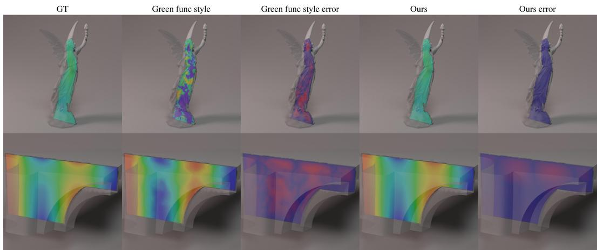  
Figure 6: Additional intuitive 3D harmonic comparisons. Top: lucy. Bottom: fandisk. Same fivecolumn layout as Figure 1.

## F.2 Drift adaptation on a bunny slice

PDE. Constant-drift Laplace,

$$
\Delta u + \beta \cdot \nabla u = 0 \quad \mathrm { i n } \Omega , \qquad u \vert _ { \partial \Omega } = h ,\tag{16}
$$

on a 2D $y { = } 0$ slice of a bunny mesh $( \Omega \ \subset \ \mathbb { R } ^ { 2 }$ is the slice interior). Dirichlet boundary data $h \in \{ \sin x , \sin z \}$ . Drift vectors $\beta$ are listed in Table 10.

Ground truth. Computed by Walk-on-Spheres with a Yukawa-style transform that absorbs the drift as a path-dependent killing factor

Ours. Warm-started from the same frozen $K _ { \theta }$ used in §F.1. We attach a small drift-conditioned adapter and a residual head; the kernel itself is not retrained.

Green-function-style baseline. The same construction as in §F.1, also warm-started from the frozen Laplace kernel and conditioned on the drift parameter, but without the residual head.

Training budget. Both methods are trained under identical settings, namely 4000 optimization steps, batch size 128, a single learning rate, and an 80/20 pixel split over eight 256 ×256 slice cases (four drift vectors × two boundary signals). Training samples are pixels rather than fixed epochs; we therefore report this as a matched optimization-budget comparison.

Table 10: Drift adaptation: per-slice test rel- $L _ { 2 }$ on the bunny slice.
<table><tr><td>drift  $\beta$ </td><td>boundary  $h$ </td><td>Ours</td><td>GF style</td></tr><tr><td>(2, 0,0)</td><td>sin x</td><td>0.060</td><td>0.366</td></tr><tr><td>(2, 0, 0)</td><td>sin z</td><td>0.062</td><td>0.280</td></tr><tr><td>(−2,0,0)</td><td>sin x</td><td>0.062</td><td>0.378</td></tr><tr><td>(−2,0,0)</td><td>sin z</td><td>0.065</td><td>0.326</td></tr><tr><td>(0, 0, 2)</td><td>sin x</td><td>0.069</td><td>0.364</td></tr><tr><td>(0, 0, 2)</td><td>sin z</td><td>0.061</td><td>0.293</td></tr><tr><td>(1.5, 1,0)</td><td>sin x</td><td>0.060</td><td>0.360</td></tr><tr><td>(1.5, 1,0)</td><td>sin z</td><td>0.060</td><td>0.288</td></tr><tr><td>mean</td><td></td><td>0.062</td><td>0.323</td></tr></table>

## G 2D MNIST benchmark: setup, NGF port, and additional qualitative

## G.1 Setup details

Geometry. Each shape is an MNIST digit raster upsampled from $2 8 \times 2 8$ to a $2 5 6 \times 2 5 6$ binary mask, optionally retaining the thin inner holes that arise from the digit topology. The interior mask, \~512 boundary samples with normals, and interior anchors are produced by a deterministic shape generator. Domains for digits 0, 6, 8, 9 are multiply-connected.

Boundary-condition families. Two parametric families are sampled per problem with random coefficients,

$$
\begin{array} { r l } { { \mathrm { p o 1 y 3 : } } } & { { } h ( x , y ) = a ( x ^ { 3 } - 3 x y ^ { 2 } ) + b ( y ^ { 3 } - 3 x ^ { 2 } y ) + c x ^ { 2 } } \\ { { \mathrm { e x p \mathrm { - } m i x : } } } & { { } h ( x , y ) = a e ^ { 0 . 5 x } \cos ( 0 . 5 y ) + b x y ^ { 2 } + c y } \end{array}
$$

In-distribution coefficients $a , b , c \sim U [ - 1 , + 1 ]$ ; OOD coefficients $a , b , c \sim U [ + 1 , + 2 ]$ , strictly outside training. Two earlier high-frequency families trig1, trig2 are kept for ablation only and excluded from headline numbers because every learned method failed catastrophically on them.

Sources. Poisson problems use one of four source families: sin\_cos, polynomial, gaussian, asymmetric.

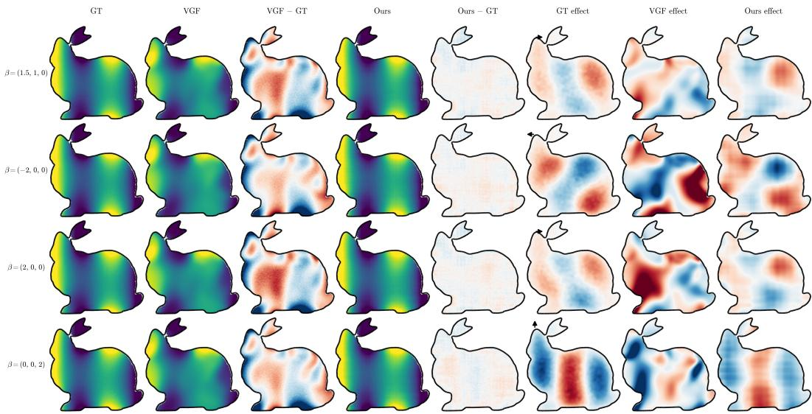  
Figure 7: Bunny drift-diffusion qualitative, $h ( x , y , z ) = \sin ( 6 x )$ . Rows: four drift vectors $\beta =$ (1.5, 1, 0), (−2, 0, 0), (2, 0, 0), (0, 0, 2). Columns 1–5: GT, GF style, GF style – GT, Ours, Ours – GT. Columns 6–8: drift-induced field $u _ { \beta }$ minus the mean over the four drifts, highlighting the dipole structure aligned with each β (Gaussian-blurred for clarity; metrics in Table 10 use unblurred fields)

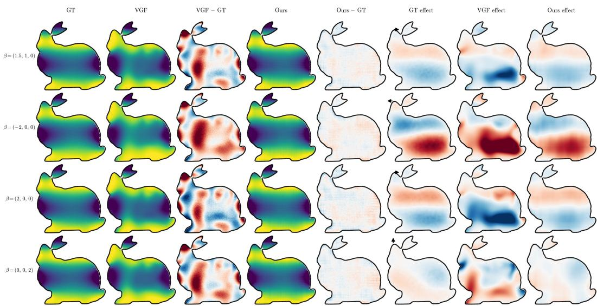  
Figure 8: Bunny drift-diffusion qualitative, h(x, y, z) = sin(6z). Same layout as Figure 7.

Splits. 991 train / 50 test (in-dist) / 50 OOD shapes; 7500 / 408 / 397 problem instances after filtering.

Resolution. Numerical ground truth is a 5-point finite-difference Poisson solver at $2 5 6 ^ { 2 }$ followed by bilinear downsampling to $1 2 8 ^ { 2 }$ , the resolution at which all neural models train and evaluate.

Eval metric. Un-normalized relative- $. L _ { 2 }$ error over interior pixels of each shape $( \mathrm { m a s k } = 1 )$ aggregated across all problem instances per split. Trainer-side losses on y-normalized residuals are not used.

## G.2 NGF 2D port

NGF's official code is written for tetrahedral meshes. Its network sees only positional encodings of the vertex coordinates, so its per-point features depend only on the geometry; three linear heads A (interior), C (all points), and D (boundary) produce the interior solution as $\bar { A } ( C ^ { \top } \mathrm { r h s } ) - A ( D ^ { \top } h )$ up to a diagonal scaling, where in the released MCB-B configuration a learned mass head forms rhs from the source. The boundary values are given, not predicted. Our 2D port keeps this architecture and the official optimization settings (feature width 128, learning rate $\mathrm { 1 0 ^ { - 4 } }$ , gradient clipping 0.5, effective batch 8) and makes the adaptations a pixel grid requires: the encoder receives the interior mask (the pixel lattice is identical across shapes, so geometry must enter through the mask), the boundary is the band of exterior pixels adjacent to the domain, and multiply-connected boundaries are handled by that band without change.

An initial port differed from the official setup in several respects: it omitted the mass head; it used feature width 64, an MSE loss, and learning rate $5 \cdot 1 0 ^ { - 4 } ;$ it regressed y-normalized targets (the NGF forward pass is linear in the data and has no bias path, so it cannot represent the offset this normalization introduces); it evaluated the boundary term on 256 randomly subsampled band pixels per step; and its encoder also received h and $f .$ The aligned port follows the official setup in all of these respects, and Table 11 compares the two.

Table 11: NGF 2D port: initial port versus the port aligned with the official setup (relative $L _ { 2 } , \%$ mixed splits).
<table><tr><td></td><td>test mean / median</td><td>test p95 / max</td><td>OOD mean / median</td><td>OOD p95 / max</td></tr><tr><td>initial</td><td>41.8/22.1</td><td></td><td>24.5 / 18.1</td><td></td></tr><tr><td>aligned (40 epochs)</td><td>3.87 / 2.00</td><td>16.9 / 40.2</td><td>4.20 /3.85</td><td>6.0 /10.1</td></tr></table>

## G.3 Additional qualitative comparisons

Figures 9 and 10 extend Figure 4 with 24 additional OOD shapes (random pick from remaining Laplace and Poisson cases), same per-row layout and color-scale convention.

## H Additional MCB-B qualitative comparisons

Figure 11 extends the qualitative comparison of §5.3 with 14 additional shapes, in the same per-shape five-panel layout (GT, NGF, |NGF—GT|, Ours, |Ours — GT|) and the same 3D cross-section rendering style.

## I 3D coefficient-OOD study

MCB-B's test problems use the same coefficient ranges as training. To test extrapolation in 3D without retraining, we drew 10 test shapes per category and posed 4 problems on each whose boundary data and sources come from parametric families with coefficients in $U [ 1 , 2 ]$ , outside the training ranges. References are computed with the FEM solver (lapy) used in the NGF repository. NGF is run from its released mass-prediction checkpoints; ours is the canonical pipeline of Table 2. A second, Laplace-only track uses the same shifted boundary data with $f \equiv 0$ and isolates boundary extrapolation. Table 12 reports the results; the in-distribution reference for each method is its Table 2 macro-average (0.241 for NGF, 0.193 for ours).

## J Inference speed: caching is implied by the factorization

Bit-identity of the cache. The kernel matrix $K _ { \mathrm { e f f } } = [ w _ { j } K _ { \theta } ( p _ { i } , \zeta _ { j } ; \Omega ) ] _ { i j }$ is a deterministic function of Ω alone, so reusing it across $( h , f )$ on the same shape is fp32-bit-identical to recomputing it per problem; we verified this on 50 random $( p , h )$ pairs. Memory: an $( n _ { \mathrm { i n } } \times n _ { \mathrm { s u r f } } ) \mathrm { f p } 3 2$ tensor, ≈8 MB per shape at 128× 128 with 200 surface samples.

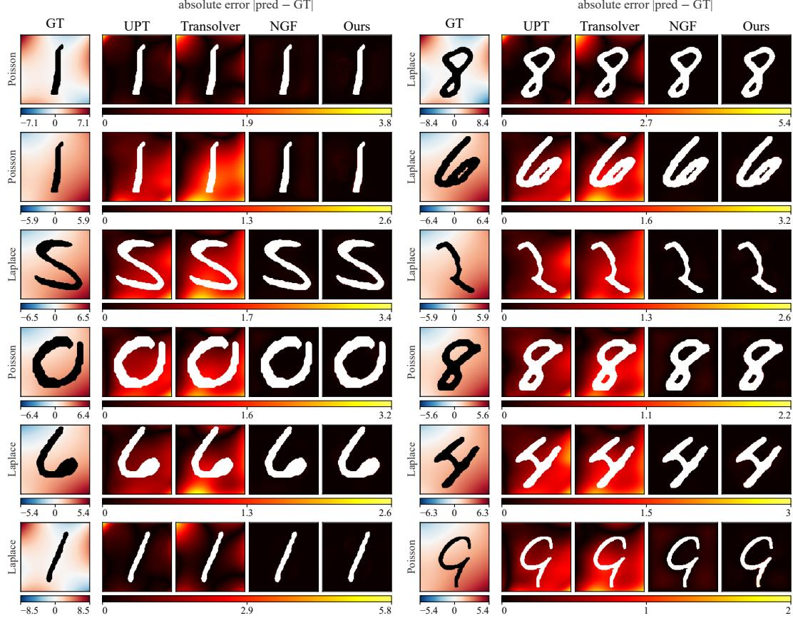  
Figure 9: 2D MNIST OOD qualitative (additional, set 1 of 2). 12 shapes, random pick from remaining Laplace and Poisson cases; each GT tile is tagged with its problem type.

Table 12: 3D coefficient-OOD study: mean relative $L _ { 2 }$ error over 40 problems per category (identical problems for both methods).
<table><tr><td>Track</td><td>Method</td><td>Nut</td><td>Gear</td><td>Motor</td><td>Fitting</td><td>Screws</td><td>Macro</td></tr><tr><td>Poisson-OOD</td><td>NGF (released)</td><td>0.678</td><td>0.605</td><td>0.616</td><td>0.627</td><td>0.548</td><td>0.615</td></tr><tr><td rowspan="2">Laplace-OOD</td><td>Ours</td><td>0.382</td><td>0.099</td><td>0.347</td><td>0.211</td><td>0.274</td><td>0.263</td></tr><tr><td>NGF (released)</td><td>0.633</td><td>0.604</td><td>0.631</td><td>0.637</td><td>0.603</td><td>0.621</td></tr><tr><td></td><td>Ours</td><td>0.127</td><td>0.037</td><td>0.162</td><td>0.070</td><td>0.101</td><td>0.099</td></tr></table>

Inference-only optimizations. The 3D timings in §5.4 use the following optimizations, which do not retrain or change any model. (i) Query folding (per-problem solve): without folding, the 3D lift treats each query point as a separate batch entry that cross-attends to its own copy of the same context, recomputing the context keys and values per query; since the cross-attention block processes query tokens independently, we fold all queries into the sequence dimension and compute the keys and values once. Predictions are identical in fp32, and the relative $L _ { 2 }$ errors against the FEM references are unchanged. (ii) Faster build: the signed distance grid is rasterized on the GPU with exact point-triangle distances and a ray-parity inside test, which matches the CPU reference at all but isolated grid points, and $K _ { \mathrm { e f f } }$ is evaluated with the quadrature normalization folded in and in bf16. The build also redraws its random surface and interior samples, so its predictions are not bitwise identical to the original pipeline; the change in mean relative $L _ { 2 }$ error (—0.004 on Nut, -0.002 on Motor) is within that of a control that only redraws the samples (—0.003 and +0.000).

Why the parametric baselines cannot cache. Transolver fuses (mask, h, f) tokens through sliceattention where every layer mixes geometry and boundary data; UPT concatenates (mask, h, f) as input channels to its image encoder; LNO and BENO likewise take the boundary data and the source as network inputs. None of these architectures separates a geometry-only state from $( h , f )$ , so they admit no per-shape cache. NGF is different: its per-point features depend only on the geometry, so a similar split into a per-shape state and a per-problem read-out is possible for it in principle; in our timing, we preloaded its mesh on the GPU and changed only the boundary data (§5.4). The cache is enabled by NHMO's factorization, not by an engineering choice.

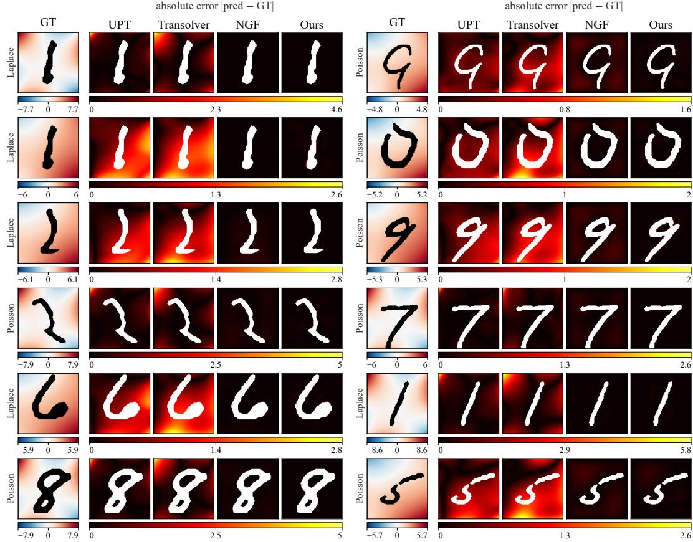  
Figure 10: 2D MNIST OOD qualitative (additional, set 2 of 2). 12 shapes, random pick from remaining Laplace and Poisson cases; each GT tile is tagged with its problem type.

Complexity. Per-shape precompute is $O ( n _ { \mathrm { i n } } n _ { \mathrm { s u r f } } d _ { \mathrm { k e r n e l } } )$ . Per-problem cost is $O ( ( n _ { \mathrm { i n } } + n _ { \mathrm { s u r f } } ) d ) +$ $O ( R ^ { \bar { 2 } } c D )$ for the lift U-Net at resolution $R ,$ base channels c, depth D. This matches the complexity class of the parametric baselines’ Galerkin-style forward.

Caveats. (i) When every problem uses a different shape (K=1), NHMO pays its geometry step (Table 5) for every problem; on a new mesh-based shape this step is cheaper than meshing, whereas on grid inputs the grid-based baselines need no such step. (ii) Training is a separate concern (Appendix D.6). The speed advantage is at deployment, where the system is queried many times against the same geometries.

## K Ablations: detail

This appendix expands the five takeaways summarized in §5.5. All numbers are un-normalized rel- $. L _ { 2 }$ over interior pixels at $1 2 8 \times 1 2 8 .$ , mixed (Laplace + Poisson) test split unless noted otherwise.

## K.1 Separating the lift's roles: source lift and residual head

Table 13 builds the 2D model up from the kernel alone. The source lift, which sees only $( \Omega , f )$ lowers the test error and degrades by only 1.04× (mean) under the OOD shift, since h enters it only through the linear boundary integral. Adding the residual head, trained on top of the frozen source lift, gives the three-term model $u = \langle h , K _ { \theta } ^ { - } \rangle + v _ { \varphi } ( \Omega , f ) + r ( \Omega , h , u _ { h } )$ of §6. It matches or slightly surpasses the single h-conditioned lift of the main model at a larger total capacity, while keeping the source channel strictly independent of h. Training the lifts with five seeds (seed 0 is the reported checkpoint; ± is the standard deviation over seeds) gives a test mean of $1 . 8 7 \pm 0 . 0 5 \%$ for the three-term model and $2 . 0 9 \pm 0 . 0 3 \%$ for the single lift of the main model (OOD $2 . 4 8 \pm 0 . 0 5 \%$ and $2 . 6 0 \pm 0 . 0 5 \%$ ; the three-term model is lower on test for every seed. The source lift alone is nearly seed-independent (test mean 6.09–6.10%), as expected if its error is dominated by the kernel-fit residual it cannot see.

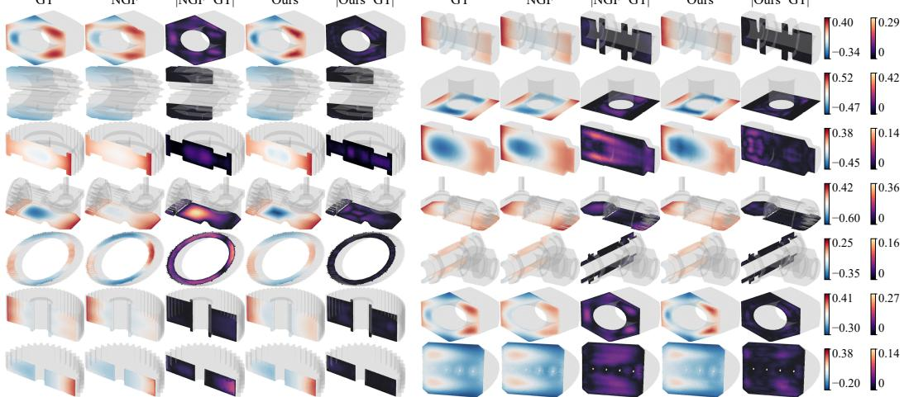  
Figure 11: Additional MCB-B Poisson qualitative comparisons. 14 shapes (7 rows × 2 shapes per row) in the same layout and color-scale convention as Figure 5.

Table 13: From the kernel alone to the three-term variant (relative $L _ { 2 } , \%$ , mean / median; Table 1 scale).
<table><tr><td>Variant</td><td>head inputs</td><td>test</td><td>test_ood</td></tr><tr><td>kernel only</td><td></td><td>7.7/5.4</td><td>6.8 / 5.6</td></tr><tr><td>+ source lift  $v _ { \varphi } ( \Omega , f )$ </td><td> $\mathbf { 1 } _ { \Omega } , \mathbf { S D F } , f$ </td><td>6.1 / 4.5</td><td>6.3 / 5.2</td></tr><tr><td>+ residual head  $r ( \Omega , h , u _ { h } )$ </td><td> $\mathbf { 1 } _ { \Omega } , h , u _ { h }$ </td><td>1.84/1.74</td><td>2.56 / 2.39</td></tr><tr><td>main model: single lift  $v _ { \varphi } ( \Omega , h , f )$ </td><td> ${ \mathbf { 1 } } _ { \Omega } , h , f , u _ { h }$ </td><td>2.1 / 2.0</td><td>2.6 / 2.5</td></tr></table>

What the correction learns. On Laplace pairs $( f \equiv 0 , 2 0 5$ test pairs) the source contribution is zero, so the output of the single h-conditioned lift of the main model there is exactly its boundary correction. We checked three possibilities. It is not random: it correlates with the kernel-fit residual $e _ { h } = u - u _ { h }$ at median 0.97 and removes 71% of it. It is not a fluctuation around the residual: 82% of its spectral energy lies in the lowest tenth of radial frequencies, against $1 \%$ for a matched white-noise control (medians), and it reproduces the residual rather than scattering around it. It is not a fixed bias: the residual it tracks is linear in $h ,$ changes sign and shape with the boundary data, and averages to about zero over the symmetric coefficient draw of the test split. Its magnitude is small (median 4.8% of $\Vert u _ { h } \Vert )$ , and removing the boundary inputs forfeits the correction (the source lift alone reaches 6.1% test mean against 2.1%, Table 13). The residual head r of the three-term model behaves the same way on these pairs (median correlation 0.97, 75% of the residual removed, 81% low-frequency energy).

Perturbations of the boundary data. The kernel channel is linear in h: a perturbation $h  h + \epsilon \eta$ changes $u _ { h }$ by exactly $\epsilon \langle \eta , K _ { \theta } \rangle$ , which is bounded by € max $| \eta |$ for the quadrature-normalized kernel. We measured the amplification, the relative $L _ { 2 }$ response of $u _ { h }$ divided by € max $| \eta |$ , on 20 shapes for $\epsilon \in [ 0 . 0 1 , 0 . 5 ]$ : its mean over shapes is 0.84 for smooth η and 0.17 for white-noise $\eta ,$ constant over this range of $\epsilon ,$ and the full model including the learned lift stays at or below 1.02 on average.

## K.2 Lift removal (kernel-only vs. kernel + lift)

Defends the factorization $u = \langle h , K _ { \theta } \rangle + v _ { \varphi }$ . The kernel alone already beats every nonlinear end-to-end baseline on OOD; the learned lift is a small correction.

Table 14: Lift removal. Mixed (Laplace + Poisson) rel- $. L _ { 2 }$ over interior pixels (median / mean).
<table><tr><td>Variant</td><td>test (in-dist)</td><td>test_ood</td><td>OOD/test</td></tr><tr><td> $K \mathrm { - o n l y ~ } ( \mathrm { n o } \ v _ { \varphi } )$ </td><td>5.4% / 7.7%</td><td>5.6% / 6.8%</td><td>1.0×</td></tr><tr><td> $K + 6 . 4 \mathbf { M }$  lift (canonical)</td><td>2.0% / 2.1%</td><td>2.5% / 2.6%</td><td>1.25×</td></tr><tr><td>K + 11.3M lift (capacity scan, A2)</td><td>2.0% / 2.1%</td><td>2.3% / 2.5%</td><td>1.15×</td></tr></table>

## K.3 Lift capacity (6.4M vs 11.3M parameters)

Doubling lift parameters from 6.4M to 11.3M gives no in-distribution improvement and only marginal OOD gain (Table 14, last row). NHMO is not capacity-limited at the lift; the factorization, not network size, is the structural reason for the result.

## K.4 KDE bandwidth σ for Walk-on-Spheres supervision

The kernel is robust to KDE σ over a 5× range (0.1%–0.5% of domain width).

Table 15: KDE bandwidth scan. K-only test median.
<table><tr><td>σ (fraction of domain width)</td><td>K-only test median</td></tr><tr><td>0.1% (sharper)</td><td>~6.5%</td></tr><tr><td>0.2% (canonical)</td><td>5.4%</td></tr><tr><td>0.5% (smoother)</td><td>~6.0%</td></tr></table>

## K.5 Training-shape count and single mixed-corpus generalization

NHMO is trained on a fixed 5,000-shape MNIST corpus drawn from all 10 digit classes (0–9), spanning both simply-connected (e.g., 1, 7) and multiply-connected (e.g., 0, 6, 8, 9) topologies with no class labels. The harmonic-measure factorization makes the kernel a per-shape function of geometry, so corpus diversity adds signal rather than competing for capacity. By contrast, NGF's published MCB-B numbers come from five separate models, one per shape category. NHMO trains one kernel and one lift across all 10 MNIST digit classes simultaneously.

Table 16: Training-shape count. K-only test median rel- $. L _ { 2 }$ as the corpus grows.
<table><tr><td>Train shapes</td><td>K-only test median</td><td>K+lift test median</td></tr><tr><td>200</td><td>~7.0%</td><td></td></tr><tr><td>500</td><td>~6.0%</td><td>~3.5%</td></tr><tr><td>1,000</td><td>~5.7%</td><td>~2.5%</td></tr><tr><td>5,000 (canonical)</td><td>5.4%</td><td>2.0%</td></tr></table>

## K.6 Walk-on-Spheres sample count

The kernel is robust to the WoS sample count above 1,000 walks per query; the canonical run uses 10,000 walks per query and matches the test median of the kernel ablation in Table 14. Below 1,000 walks the KDE supervision becomes too noisy and the kernel degrades.

## K.7 Boundary quadrature resolution at inference $( n _ { \mathbf { s u r f } }$ scan)

NHMO's boundary-integral $\begin{array} { r } { \sum _ { \zeta } K _ { \theta } ( p , \zeta ) h ( \zeta ) } \end{array}$ is the discretization of a continuous integral. We verify this at inference time with the same trained kernel, varying only the number of boundary samples $n _ { \mathrm { s u r f } } .$ Above \~100 samples the prediction is converged; below that, the result degrades gracefully rather than catastrophically, so the model is robust to the boundary-quadrature resolution at inference over the tested range. Parametric baselines have no analogous discretization knob; their inference quality is tied to whatever resolution the encoder was trained at.

Table 17: Boundary-discretization scan at inference. Mixed rel- $L _ { 2 }$ on test\_ood, 25 shapes $\times \sim 8$ problems.
<table><tr><td> $n _ { \mathrm { s u r f } }$ </td><td>median</td><td>mean</td><td>p95</td></tr><tr><td>50</td><td>3.12%</td><td>3.58%</td><td>5.62%</td></tr><tr><td>100</td><td>2.48%</td><td>2.65%</td><td>4.05%</td></tr><tr><td>200 (canonical)</td><td>2.44%</td><td>2.58%</td><td>4.08%</td></tr><tr><td>400</td><td>2.43%</td><td>2.56%</td><td>3.98%</td></tr></table>

## K.8 Per-MNIST-class breakdown (single mixed-corpus uniformity)

A direct counter to per-category-corpora training. A single mixed-corpus NHMO model on the 5,000-shape corpus (digits 0–9) produces uniform performance across all classes; the spread across classes is much smaller than the OOD gap to any nonlinear end-to-end baseline.

Table 18: Per-MNIST-class rel- $. L _ { 2 }$ mean (mixed Laplace + Poisson, full-interior un-normalized).
<table><tr><td>Digit class</td><td> $n _ { \mathrm { t e s t } }$ </td><td>test mean</td><td>test_ood mean</td></tr><tr><td>0</td><td>50</td><td>2.14%</td><td>2.89%</td></tr><tr><td>1</td><td>30</td><td>2.19%</td><td>2.95%</td></tr><tr><td>2</td><td>40</td><td>1.86%</td><td>2.60%</td></tr><tr><td>3</td><td>36</td><td>1.94%</td><td>2.26%</td></tr><tr><td>4</td><td>38</td><td>2.15%</td><td>2.48%</td></tr><tr><td>5</td><td>46</td><td>2.02%</td><td>2.48%</td></tr><tr><td>6</td><td>35</td><td>2.28%</td><td>2.88%</td></tr><tr><td>7</td><td>55</td><td>1.85%</td><td>1.95%</td></tr><tr><td>8</td><td>39</td><td>2.38%</td><td>3.81%</td></tr><tr><td>9</td><td>39</td><td>2.32%</td><td>2.74%</td></tr><tr><td>spread (max − min)</td><td></td><td>0.53%</td><td>1.87%</td></tr></table>

The 10 digit classes have very different geometries (1 is a narrow stroke, 0/6/8/9 have interior loops 8 has two), yet a single mixed-corpus model attains rel- $. L _ { 2 }$ within 0.53% absolute spread on indistribution test and 1.87% on OOD. Digit 8, the most challenging case (multiply-connected with two interior loops), is the worst class on OOD at 3.81% but still beats every nonlinear end-to-end baseline's overall mean.

## K.9 Representation invariance: SDF vs. point-cloud encoder

A direct attack on the "your kernel just memorizes the boundary point cloud" critique. We retrain the kernel from scratch with the same hyperparameters as the canonical model (d = 256, 5,000-shape corpus, KDE σ = 0.2%, 60,000 steps), changing only the shape encoder family from a point-cloud encoder over ∂Ω to a 2D SDF-CNN over a 64 × 64 SDF grid. The resulting kernel is paired with the canonical lift $v _ { \varphi }$ (no lift retraining).

Table 19: Representation-invariance ablation: identical hyperparameters, swap shape encoder.
<table><tr><td>Shape encoder</td><td>test (in-dist)</td><td>test_ood</td><td>OOD/test</td></tr><tr><td>Point-cloud (canonical)</td><td>2.0% / 2.1%</td><td>2.5% / 2.6%</td><td>1.25×</td></tr><tr><td>2D SDF-CNN (64 × 64)</td><td>2.28% / 2.43%</td><td>2.59% / 2.97%</td><td>1.14×</td></tr></table>

The encoder swap costs only 0.27% absolute median on in-distribution test (1.14× canonical) and 0.09% on OOD (1.04× canonical). Notably, the SDF-encoder kernel has a tighter OOD/test gap (1.14× vs 1.25×), suggesting the SDF representation may even improve coefficient-distribution generalization. Whatever representation makes $K _ { \theta } ( \cdot , \cdot ; \Omega )$ an honest harmonic-measure operator suffices. NGF's released pipeline takes tetrahedral-mesh vertices with explicit boundary indices as input, so the same swap does not apply to it directly.

## K.10 Learned volumetric integrand

To test the Green's-function alternative of §6 directly, we replaced the source lift with a learned integrand $G _ { \theta } ( p , q ; \Omega )$ whose volume integral against f gives the source term, keeping the kernel term unchanged. The integrand receives a log $| p - q |$ singularity feature and the frozen shape latent of our kernel. It reaches 6.7 / 5.2 (test mean / median), no better than the source lift (Table 13), while its volume quadrature takes $O ( N _ { p } N _ { q } )$ network evaluations per problem; the boundary term, by contrast, is a single quadrature over a few hundred surface samples. Its boundary derivative $- \partial _ { \nu } G _ { \theta } ,$ , computed on the 205 Laplace test pairs by automatic differentiation, integrates to ${ \sim } 1 0 ^ { - 3 }$ over the boundary (the Poisson kernel has mass 1) and is negative on roughly half of it, so it satisfies neither defining property of the Poisson kernel (nonnegativity and unit mass).

## K.11 Origin of the kernel-fit residual

Why does the 2D kernel leave a residual that the lift must correct? The KDE targets on which the 2D kernel is trained, and its boundary nodes, are built on simplified polyline contours of the digits which do not coincide with the rasterized masks on which the reference solutions are computed. Two measurements locate the resulting error in this choice of geometric representation rather than in the sampler. First, integrating the targets themselves as if they were the kernel reproduces the reference solutions only to 5.1%, unchanged with 100× more walks, so the error is systematic rather than statistical. Second, walks run directly on the mask geometry match the reference solutions to 0.07% so the WoS estimator, its ε-shell, and the step cap are not responsible. The kernel reaches this ceiling, so the residual $e _ { h }$ is the systematic error of its training signal rather than something the kernel fails to fit.

On Laplace pairs, $u - u _ { h }$ equals $e _ { h }$ , so the solution-level supervision of the lift, and of the residual head r (Appendix K.1), contains exactly this error, which is why the learned correction removes most of it (71% for the single lift). Placing the KDE's boundary nodes on the contour of the rasterized masks instead, with the construction otherwise unchanged, lowers the kernel-only error from 5.9% to 3.2% in a controlled 2D experiment, and a kernel-plus-lift model (without r) trained on this kernel reaches 1.8% / 1.7% (mean / median) on test and 2.1% / 2.2% on O0D, against 2.1% / 2.0% and 2.6% / 2.5% for the model of Table 1. We leave this choice of geometric representation for the training signal, together with exploiting the linearity of $e _ { h }$ in the design of r, to future work.