# HIGH-DIMENSIONAL SIMULATION-BASED INFERENCE IN LATENT SPACES

Lars Kuhmichel¨ 1, Stefan T. Radev2, Bhanu Prasanna Koppolu1, Masoumeh Davoudi1, Jerry M. Huang2 & Paul-Christian Burkner¨ 1

1Department of Statistics, TU Dortmund University, Germany

2Department of Cognitive Science, Rensselaer Polytechnic Institute

Correspondence: larskuedev@gmail.com

## ABSTRACT

Neural simulation-based inference (SBI) has been widely successful in inferring a relatively small number of interpretable parameters from potentially highdimensional observations, such as images or time series. Accordingly, representation learning in SBI has focused almost exclusively on compressing the observations used to condition the posterior. More recently, however, SBI has begun to target increasingly high-dimensional parameter spaces, raising the complementary question of whether the inference target itself should be compressed. Our answer is a practical merger of SBI and latent generative modeling, which learns a low-dimensional representation of the simulator parameters, performs posterior inference directly in this latent space, and maps posterior samples back to the original parameter space. We characterize the conditions under which latentspace inference recovers the desired target posterior and systematically study its empirical trade-offs. Across four case studies and three generative families, we compare latent and standard estimators while controlling for network capacity, regularization, optimization, and training compute. At matched training compute, latent-space inference achieves accuracy and marginal calibration comparable to direct target-space inference while sampling up to more than an order of magnitude faster.

## 1 INTRODUCTION

Simulation-based inference (SBI; Cranmer et al., 2020) has emerged as a powerful paradigm for estimating the parameters of mathematical models from highly complex (Dax et al., 2025) or largescale (von Krause & Radev, 2026) data. In amortized SBI, a neural network is first trained on labeled simulations. Once trained, the network processes incoming data in inference mode, eventually amortizing the simulation and training costs. Most SBI applications have traditionally considered fully Bayesian inference over relatively low-dimensional parameters θ even when the observation x is high-dimensional. However, recent research has begun to shift this regime toward inference over very high-dimensional parameter spaces (see Arruda et al., 2025, for an overview).

SBI and Bayesian inverse problems have confronted high dimensionality on opposite sides of the inference problem. SBI has focused on compressing high-dimensional observations through domain specific preprocessing (Papamakarios & Murray, 2016), summary networks (Radev et al., 2020), or both (Dax et al., 2025). Bayesian inverse problems, by contrast, often involve extremely highdimensional parameters (e.g., the coefficient fields of PDEs) and the literature abounds with methods that reduce the effective dimension of the posterior, for instance, through likelihood-informed subspaces, low-dimensional couplings, and autoencoders (Cui et al., 2014; 2016; Zahm et al., 2022; Spantini et al., 2018; Baptista et al., 2022; Lan et al., 2022). These methods are largely tailored to particular inverse problems or algorithms and are thus not portable to amortized SBI out of the box.

At the same time, latent generative modeling has made learning and sampling in compressed target spaces standard across autoregressive, diffusion, flow-matching, and consistency models (van den Oord et al., 2017; Rombach et al., 2022; Dao et al., 2023; Luo et al., 2023). Here, however, representation learning is designed primarily for efficient and faithful synthesis, not for preserving statistical accuracy and uncertainty. In the present work, we bring these research directions together and show how to compress high-dimensional posterior targets for amortized SBI while preserving the information required for accurate and calibrated Bayesian inference.

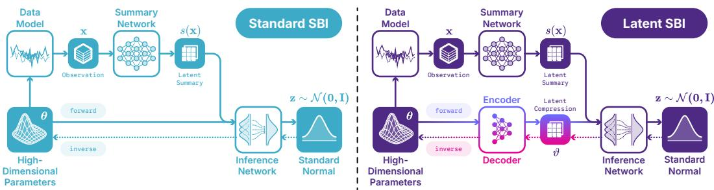  
Figure 1: Side-by-side comparison between standard (left) and latent (right) simulation-based inference (SBI) approaches. In latent SBI, high-dimensional inference targets are compressed into a low-dimensional representation using an encoder. This representation is later used for target reconstruction. The encoder maps parameters θ to a code $\vartheta = \bar { \mathcal { E } } ( \pmb { \theta } )$ ; given the summary s(x), the inference network transports base noise $\mathbf { z } \sim \mathcal { N } ( \mathbf { 0 } , I )$ to ϑ, and the decoder returns $\pmb \theta = \mathcal { D } ( \pmb \vartheta )$

Our proposed approach for latent amortized SBI (Figure 1) (1) learns an information-maximizing autoencoder over the parameter space of the simulator, (2) freezes its representation, (3) learns a conditional model to approximate the posterior over latent codes, and (4) decodes posterior samples back into the original parameter space. We provide practical mathematical conditions under which the proposed approach provides correct results and stable settings that generalize across different settings. In several simulated and real-world case studies, we numerically compared our latent-space estimators against otherwise matched target-space estimators, controlling network capacity, regularization, optimization, and training compute. Our results deliver fast sampling for high-dimensional SBI that maintains accuracy and marginal calibration at equal training compute with standard methods.

## 2 METHOD

## 2.1 SIMULATION-BASED INFERENCE WITH HIGH-DIMENSIONAL TARGETS

Our goal is to train generative networks to perform efficient simulation-based inference (Cranmer et al., 2020; Deistler et al., 2025; Arruda et al., 2025). Given samples from a joint distribution $p ( \pmb \theta , \mathbf x ) = p ( \pmb \theta ) p ( \mathbf x \mid \pmb \theta )$ of parameters θ and observables x, we want to approximate the posterior $p ( \pmb { \theta } \mid \mathbf { x } ) \propto p ( \pmb { \theta } ) p ( \mathbf { x } \mid \pmb { \theta } )$ . As is typical in SBI, we assume that evaluating the density of the joint distribution is intractable, but samples are available. We therefore use samples $\left( \boldsymbol { \theta } _ { n } , \mathbf { x } _ { n } \right)$ from the joint distribution to train an amortized distribution $q _ { \phi } ( \pmb { \theta } \mid \mathbf { x } )$ that can draw approximate posterior samples for any x.

When working with complex data $\textbf { x } ( \mathrm { e . g . }$ ., time series, images), a summary network s typically compresses x into a lower-dimensional summary $s ( \mathbf { x } )$ that conditions $q _ { \phi }$ in place of x (Radev et al., 2020; Chen et al., 2021). This process is now commonplace in SBI, as the dimensionality of x is treated merely as an obstacle to infer the parameters θ, the ultimate objects of interest. Since the coordinates of θ carry the inferential meaning, the parameter space itself is typically left intact.

However, several applications deviate from this schema. For instance, in Bayesian denoising (Schmitt et al., 2024), the “parameters” θ are the clean version of the corrupted data x and thus have the same dimensionality. In neural likelihood estimation (NLE; Papamakarios et al., 2019), the inference target is instead an emulator $q _ { \phi } ( \mathbf { x } \mid \pmb { \theta } )$ , so the learned distribution is over the potentially high-dimensional x whose condition θ may not require any pre-processing. Finally, some of the most challenging applications of amortized inference involve recovering a high-dimensional image from a series of high-dimensional measurements, as in ultrasound imaging (Orozco et al., 2025). In that case, θ as a whole is only interpretable through the lens of a domain expert.

## 2.2 TWO-STAGE LATENT INFERENCE

In all of the above settings, the ambient dimensionality of θ may overstate the complexity of the inference problem. Although $\pmb \theta \in \mathbb { R } ^ { D }$ has D coordinates, the posterior may vary along far fewer independent directions due to correlations or other constraints. We refer to this concept as the effective dimension $d _ { \mathrm { e f f } }$ (Levina & Bickel, 2004; Pope et al., 2021), the number of θ-directions that must be represented for posterior inference. Even when every coordinate of $\pmb { \theta }$ is of scientific interest and must ultimately be recovered, inference can still be performed on a lower-dimensional representation.

Posterior dependencies can manifest themselves in relationships more complex than pairwise linear dependencies. To capture them, we define $d _ { \mathrm { e f f } }$ from an information-theoretic lens (Li, 1991; Baptista et al., 2022) as

$$
d _ { \mathrm { e f f } } ( \varepsilon ) = \operatorname* { m i n } \left\{ k \in \{ 1 , \ldots , D \} : \exists T _ { k } : \mathbb { R } ^ { D } \to \mathbb { R } ^ { k } \mathrm { ~ s . t . ~ } I ( \pmb \theta ; \mathbf { x } \mid T _ { k } ( \pmb \theta ) ) \leq \varepsilon \right\} , \qquad \varepsilon \geq 0 ,\tag{1}
$$

where I is the conditional mutual information and $T _ { k }$ is a map to k dimensions.

To learn such a map, we introduce an encoder $\mathcal { E }$ that maps the high-dimensional target θ to a lowerdimensional latent representation, $\vartheta = \mathcal { E } ( \pmb { \theta } )$ . We train the generative network $q$ to approximate the posterior over this representation. A decoder D then maps posterior samples in the latent space $\bar { \vartheta } \stackrel { - } { \sim } q _ { \phi } ( \vartheta \mid \mathbf { x } )$ back to the original parameter space, $\pmb \theta = \mathcal { D } ( \bar { \pmb \vartheta } )$ . The encoder sees only $\theta ,$ so without knowledge of x, it can at best match the intrinsic dimension of $p ( \pmb \theta )$ , an upper bound on $d _ { \mathrm { e f f } } ( \varepsilon )$ In this way, the generative network only needs to solve the inference problem in the “effective subspace”, while the decoder restores samples in the original, interpretable parameter space.

Our latent SBI approach proceeds in two stages, inspired by Rombach et al. (2022) and our empirical results. The first stage trains an InfoVAE (Zhao et al., 2019), a generalization of the classical ${ \mathrm { V A E } } ,$ , on samples $\theta \sim p ( \theta )$ alone. The encoder defines a Gaussian $q _ { \xi } ( \pmb { \vartheta } \mid \pmb { \theta } )$ with learned mean and variance, the decoder is deterministic, and the objective is the reconstruction error $\mathbb { E } _ { \pmb { \theta } , \pmb { \vartheta } } \| \pmb { \theta } - \mathcal { D } ( \pmb { \vartheta } ) \| ^ { 2 }$ plus a KL penalty that pulls each code distribution $q _ { \xi } ( \pmb { \vartheta } \mid \pmb { \theta } )$ toward a standard normal prior and a maximum mean discrepancy that pulls their aggregate toward it, weighted by $1 - \alpha$ and $\alpha + \lambda - 1$ (Appendix B). The autoencoder is then frozen. The second stage trains the amortized posterior $q _ { \phi } ( \pmb { \vartheta } \mid \mathbf { x } )$ on codes $\vartheta \sim q _ { \xi } ( \vartheta \mid \theta )$ of the training pairs. No gradient reaches the encoder, so the second stage cannot reshape the code it is given. Fine-tuning the encoder jointly with the posterior network made every variant in our ablation less accurate than a frozen control (Appendix H). See Appendix B for more details. Crucially, the autoencoder “unrestricts” the choice of posterior network. To demonstrate this flexibility, we use three common architectures in our experiments: flow matching (Lipman et al., 2023; Liu et al., 2023), diffusion (Ho et al., 2020; Song et al., 2021; Karras et al., 2022), and normalizing flows (Dinh et al., 2017; Papamakarios et al., 2021), to account for different speeds and resolution of the generative processes.

## 2.3 ERROR DECOMPOSITION OF LATENT COMPRESSION

Compared to target-space SBI, latent SBI adds two sources of error: the code can discard information that x carries about θ, and the decoder can fail to invert the encoder. We separate the errors that each stage controls to identify which stage limits the accuracy of the latent posterior.

In Proposition 1, we show that the error of the joint posterior on ϑ and θ with respect to the analytic posterior on θ is bounded by the sum of a posterior, a code, and a decoder term. In Proposition 2, we show that the first-stage maximizer at fixed mutual information $I ( \pmb \theta ; \pmb \vartheta )$ removes the decoder term.

The second stage fits $q _ { \phi } ( \vartheta \mid \mathbf { x } )$ to the latent posterior $q \varepsilon ( \pmb { \vartheta } \mid \mathbf { x } )$ induced by the encoder, and we treat the decoder as the Gaussian likelihood $q _ { \psi } ( \pmb { \theta } \mid \pmb { \vartheta } ) = \dot { \mathcal { N } } ( \hat { \mathcal { D } } ( \pmb { \vartheta } ) , \sigma ^ { 2 } I )$ with fixed $\sigma > 0$ . The latent approximation to the posterior is then $\begin{array} { r } { q _ { \phi , \psi } ( \pmb { \theta } \mid \mathbf { x } ) = \int q _ { \psi } ( \pmb { \theta } \mid \pmb { \vartheta } ) q _ { \phi } ( \pmb { \vartheta } \mid \mathbf { x } ) d \pmb { \vartheta } } \end{array}$

Proposition 1. Let KL denote the Kullback–Leibler divergence and I the mutual information under $q _ { \xi } .$ . Assume $I ( { \pmb \theta } ; { \bf x } ) < \infty$ and that all divergences below are finite. Then

$$
\begin{array} { r l } & { \mathbb { E } _ { \mathbf { x } } \mathrm { K L } \left( q _ { \xi } ( \theta , \vartheta \mid \mathbf { x } ) \big \| q _ { \phi } \big ( \vartheta \mid \mathbf { x } \big ) q _ { \psi } \big ( \theta \mid \vartheta \big ) \right) = \underbrace { \mathbb { E } _ { \mathbf { x } } \mathrm { K L } \left( q _ { \xi } \big ( \vartheta \mid \mathbf { x } \big ) \big \| q _ { \phi } \big ( \vartheta \mid \mathbf { x } \big ) \right) } _ { p o s t e r i o r } + \underbrace { I \big ( \theta ; \mathbf { x } \big ) - I \big ( \vartheta ; \mathbf { x } \big ) } _ { c o d e } } \\ & { \qquad + \underbrace { \mathbb { E } _ { \vartheta } \mathrm { K L } \left( q _ { \xi } \big ( \theta \mid \vartheta \big ) \big \| q _ { \psi } \big ( \theta \mid \vartheta \big ) \right) } _ { d e c o d e r } , } \end{array}\tag{2}
$$

and $\mathbb { E } _ { \mathbf { x } } \operatorname { K L } \left( p ( \pmb { \theta } \mid \mathbf { x } ) \parallel q _ { \phi , \psi } ( \pmb { \theta } \mid \mathbf { x } ) \right)$ is at most the left-hand side.

The posterior term is the amortization error of SBI in code space and the only term that the second stage can change (proof in Appendix F). The code term is the information about θ that x carries and the code discards, and the decoder term measures how far the decoder is from inverting the encoder.

The first stage controls the other two terms. At the optimum of its objective, the decoder inverts the encoder:

Proposition 2. Thefirst-stage objective ofSection 2.2 is an instance ofthe InfoVAE objective (Zhao et al., 2019) with $\alpha < 1$ and $\lambda > 0$ . For sufficiently flexible encoder and decoder families, the maximizer at fixed $I ( \pmb \theta ; \pmb \vartheta )$ makes the decoder term of (2) vanish, and the maximal value depends on $q _ { \xi } ( \pmb { \vartheta } \mid \pmb { \theta } )$ only through $I ( \pmb \theta ; \pmb \vartheta )$ .

The first stage also targets the code term, through the reconstruction error. The code term equals $I ( { \pmb \theta } ; { \bf x } \mid { \pmb \vartheta } )$ , the quantity that defines the effective dimension in Section 2.2, so if the code dimension is at least $\dot { d } _ { \mathrm { e f f } } ( \varepsilon )$ , some code keeps the code term below ε, in analogy to a sufficient summary of x.

Whether the first stage finds such a code is a separate question, because it never sees x. When the code cannot keep all of θ, the encoder keeps the directions that reduce the reconstruction error most, for a linear code those of largest prior variance, whether or not x informs them. We therefore ablate the compression ratio (Figure 5).

## 3 RELATED WORK

Throughout SBI, dimensionality reduction has primarily been applied to the observation side of the inference problem via domain-specific preprocessing or learned summary representations (see Deistler et al., 2025; Arruda et al., 2025). Its theoretical justification is sufficiency: a representation may be reduced if it preserves the information for the posterior without inferential loss. By contrast, the inference target is typically retained in full. This asymmetry motivated the question of whethe one can apply an analogous reduction to the target for scalable amortized inference.

Bayesian inverse problems provide an important precedent for such target-side reduction, using, for instance, likelihood-informed subspaces, low-dimensional parameterizations, and certified reductions to concentrate inference in lower-dimensional spaces (Cui et al., 2014; 2016; Zahm et al., 2022; Spantini et al., 2018; Baptista et al., 2022; Lan et al., 2022). These constructions, however, are generally constructed for a particular forward model, likelihood, or sampling algorithm and therefore do not directly provide a general parameter compression mechanism for amortized SBI.

A distinct line of work uses dimensionality reduction to simplify the modeling of high-dimensional unstructured data. For instance, in high-resolution image generation, a common strategy is to encode observations into a lower-dimensional latent representation, learn a generative model in that latent space, and decode samples back to the original space. This two-stage recipe is well established (Vahdat et al., 2021; Rombach et al., 2022; Dao et al., 2023; Luo et al., 2023), alongside discrete representation learning (van den Oord et al., 2017) and densities fitted post hoc to frozen representations (Ghosh et al., 2020). However, it has not yet found its way into SBI, where statistical accuracy instead of sample quality is the ultimate metric of success.

Differently, some of these ideas have been imported into Bayesian inverse problems: deep generative priors reparameterize unknown fields and infer in a reduced latent space (Patel et al., 2022), whereas guided samplers condition pretrained generative models on observations in pixel space (Chung et al., 2024; Kawar et al., 2022), latent space (Rout et al., 2024; Song et al., 2024), or across broader model classes (Venkatraman et al., 2025). While these methods compress high-dimensional targets into lower-dimensional representations, they generally rely on an explicit likelihood, gradients, or a forward operator, and require a new guided-sampling procedure for each observation. In our work, we aim to establish whether learned target compression can systematically improve amortized SBI without compromising statistical accuracy.

## 4 EXPERIMENTS

## 4.1 CASE STUDIES

We evaluate on four case studies with increasing complexity, from a fully analytic (yet challenging) target to practical Bayesian denoising tasks (details in Appendix A). All of these tasks are concerned with parameters of much higher dimensions than those encountered in typical SBI applications and benchmarks, which tend to focus on settings with dim $( \pmb { \theta } ) < 3 0 $ (Arruda et al., 2025).

Correlated Gaussian The parameters of interest in our first study is the covariance matrix $\Sigma =$ blockdiag $( \sigma _ { 1 } ^ { 2 } \mathbf { 1 1 } ^ { \top } , \ldots , \sigma _ { k } ^ { 2 } \mathbf { 1 1 } ^ { \top } )$ of a 64-dimensional Gaussian with $k = 8$ blocks, and θ collects its 2,080 upper-triangular entries. The observation x is the per-coordinate second moment of 32 draws from $\bar { \mathcal { N } } ( \bar { \bf 0 } , \Sigma )$ , which is sufficient for the block scales. Since θ is a deterministic function of the k scales, it has 2,080 coordinates but only k degrees of freedom. 1,792 of its entries are structurally zero, and the element-wise metrics of Section 4.3 include them, whereas Figure 6 compares the block variances. The posterior factorizes over blocks into one-dimensional densities from which we draw exact samples, so that we can check every method directly against the exact posterior (Appendix A).

Gaussian random fields In our second study, the parameters comprise a field $\pmb { \theta } \in \mathbb { R } ^ { 3 2 \times 3 2 }$ with a power-law spectrum, simulated on the FFT grid (Lang & Potthoff, 2011). The two-dimensional observable $\mathbf { x } = ( \log \sigma , \alpha )$ contains the spectrum’s log-amplitude and exponent, the latter controlling the field’s smoothness. A power-law spectrum concentrates the variance in a few low frequencies, so the field is highly redundant. Because α is drawn per sample, the redundancy also varies from one field to the next, making the problem a very challenging task for SBI methods, as shown in Arruda et al. (2025). Given x, the field is an exact Gaussian process, so the posterior is Gaussian with an analytically known covariance, against which we compare the sampled posteriors directly.

Fashion-MNIST deblurring Deblurring recovers a Fashion-MNIST image $\pmb { \theta } \in [ 0 , 1 ] ^ { 3 2 \times 3 2 }$ from a blurred, noisy copy x of the same shape, generated by a simulated camera with shot noise (Appendix A). This is the Bayesian denoising task of Schmitt et al. (2024). Blur removes high-frequency detail, so many images are consistent with one blurred observation. The redundancy of θ is that of natural images, whose intrinsic dimension is far below their pixel count (Pope et al., 2021).

Map to satellite inference Finally, we infer an RGB satellite image $\pmb { \theta } \in [ 0 , 1 ] ^ { 2 5 6 \times 2 5 6 \times 3 }$ from the map image x of the same location and shape, taken from a corpus of aligned pairs (Sun et al., 2025). Image-to-image translation has been used to generate maps from satellite images (Isola et al., 2017). In that direction, the posterior is almost a point mass, since the map is close to a deterministic function of the satellite image. Such a posterior concentrates near a lower-dimensional set, which makes it a challenging distribution for most generative families to represent. We therefore infer in the inverse direction, where the map leaves attributes such as roof material, vehicles, and season unconstrained. The redundancy in θ is again that of images, but at a much higher resolution than Fashion-MNIST.

## 4.2 GENERAL SETUP

Across all case studies, we compare latent- and target-space variants at matched training compute and model size, while holding all other training details fixed. Compute is defined as wall-clock training time, excluding data generation and evaluation. A short timing run estimates time per training step, which determines the number of epochs allocated to each variant. We match the model size by counting the latent variant’s frozen autoencoder together with its posterior and summary networks, because the autoencoder remains part of the inference model (Appendix B). Importantly, our latent training budget also includes autoencoder training; excluding this cost would amount to assuming a pretrained encoder. Optimizer, schedule, batch size, data volume, seeds, and numerical precision are otherwise identical. We implement all networks and training procedures in BayesFlow 2 (Kuhmichel et al., 2026); further details appear in Appendix C.¨

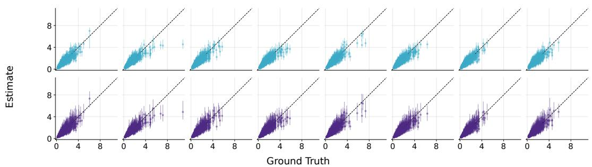

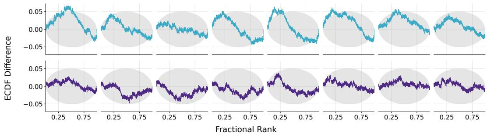  
Figure 2: Recovery and calibration on the correlated Gaussian. Parameter recovery (top) and calibration ECDFs (Sailynoja et al., 2022) (¨ bottom) of standard SBI (blue, first row of each) and latent SBI (purple, second row of each) for the correlated Gaussian with flow matching, one column per block variance $\sigma _ { 1 } ^ { 2 } , \ldots , \sigma _ { 8 } ^ { 2 } .$ . Latent SBI achieves notably better calibration than standard SBI, as no ECDF leaves the simultaneous confidence bands. A comparison against the exact posterior is in Appendix G.

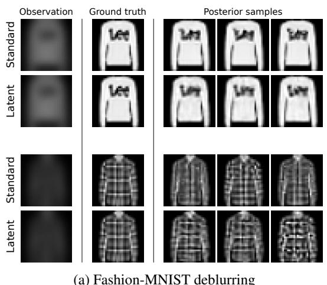  
(a) Fashion-MNIST deblurring

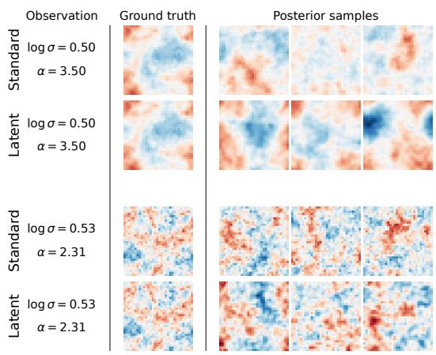  
(b) Gaussian random fields  
Figure 3: Posterior draws with latent and standard flow matching for two conditions of the Bayesian denoising and GRF estimation case studies. For the random fields, the posterior is the whole Gaussian process, so draws should match the amplitude and smoothness of the ground truth, not its pixel values. Numerical results are in Table 1 and random conditions are in Appendix I.

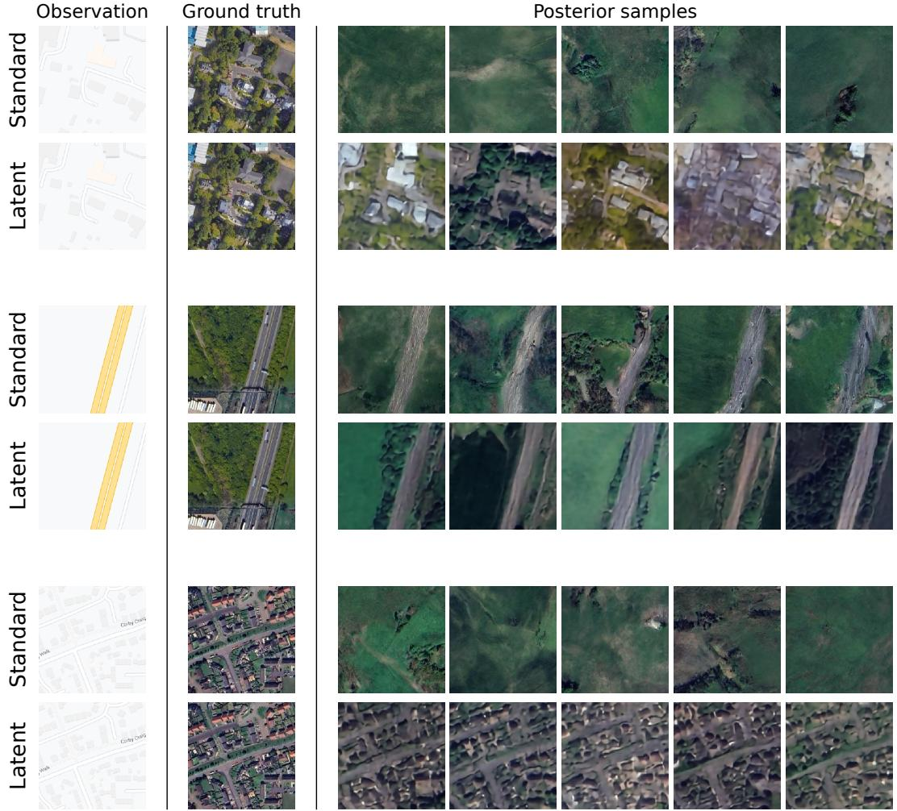  
Figure 4: Posterior draws for map to satellite with diffusion at 256 × 256 under a matched training budget. Latent draws follow the street layout of the map, while target-space draws mostly show generic vegetation. Latent sampling is also 19× faster. Numerical results are in Table 1 and random conditions are in Appendix I.

## 4.3 METRICS

All metrics below are sample-based and computed in the target space to ensure comparability between parameter- and latent-space inference. No metric requires a tractable density. Further details are in Appendix D and Appendix E.

Accuracy We use the root mean square error (NRMSE) of the posterior mean, normalized by the inference targets’ value range. The range is one for images in [0, 1] and is measured on the first 32 test targets of the correlated Gaussian and the random fields. To score posterior accuracy and uncertainty together, we additionally report the continuous ranked probability score (CRPS; Gneiting & Raftery, 2007), which is strictly proper for each coordinate, so neither a posterior that is too wide nor one that is too narrow can improve it. On the image case studies, we also report the structural similarity index (SSIM; Wang et al., 2004) between single posterior draws and the ground truth.

Calibration At the marginal level, we report element-wise central-interval coverage at the 50% and 90% levels, which a calibrated posterior matches, and the calibration error (Kuhmichel et al.,¨ 2026), which summarizes the whole coverage curve: the median over target dimensions of the median absolute difference between empirical and nominal coverage across 20 central credible levels from 0.5% to 99.5%. At the joint level, we report the classifier two-sample test (C2ST; Lopez-Paz & Oquab, 2017). Its accuracy is optimal at 0.5, where draws and true targets are indistinguishable. A higher value suggests the two are told apart more easily.

Table 1: Posterior quality and sampling cost of standard (target-space) and latent inference at an equal training budget. We report one seed for the map to satellite case study and the mean ± standard error over three seeds otherwise. Definitions of the metrics are in Section 4.3.
<table><tr><td colspan="2"></td><td colspan="2">Accuracy</td><td colspan="4">Calibration</td><td></td><td>Cost</td></tr><tr><td colspan="2"></td><td>NRMSE↓</td><td> $\mathrm { C R P S ^ { \ddagger } \downarrow }$ </td><td> ${ \mathrm { C a l . ~ e r r . } } ^ { \sharp } \downarrow$ </td><td> ${ \mathrm { C o v } _ { 5 0 } } ^ { * }$ </td><td> $\boldsymbol { \mathrm { C o v } _ { 9 0 } } ^ { * }$ </td><td>C2ST†</td><td>SSIM‡ ↑ Speedup ↑</td><td></td></tr><tr><td colspan="10">Correlated Gaussian</td></tr><tr><td>FM</td><td>Standard</td><td>4.1±0.0</td><td>23.58±0.01</td><td> $3 9 . 6 { \pm } 0 . 0 \ \AA$ </td><td>0.99±0.00</td><td>1.00±0.00</td><td>0.58±0.00</td><td></td><td></td></tr><tr><td></td><td>Latent</td><td>2.9±0.0</td><td>2.27±0.01</td><td> ${ \bf 6 . 8 \pm 3 . 6 }$ </td><td>0.45±0.05</td><td>0.83±0.05</td><td>0.51±0.00</td><td></td><td>1.8×</td></tr><tr><td>DM</td><td>Standard</td><td>3.6±0.0</td><td> $1 6 . 3 1 { \pm } 0 . 0 5$ </td><td> $3 9 . 6 { \pm } 0 . 0 \ \AA$ </td><td>0.97±0.00</td><td>1.00±0.00</td><td>0.61±0.01</td><td></td><td></td></tr><tr><td></td><td>Latent</td><td>3.0±0.0</td><td>2.26±0.00</td><td> $7 . 5 \pm 3 . 5 $ </td><td>0.44±0.05</td><td>0.82±0.05</td><td> $\mathbf { 0 . 5 1 \pm 0 . 0 0 }$ </td><td></td><td>3.6×</td></tr><tr><td>NF</td><td>Standard</td><td>7.6±0.1</td><td>7.00±0.13</td><td> $5 0 . 0 { \pm } 0 . 0 $ </td><td>0.04±0.00</td><td>0.09±0.01</td><td> $0 . 9 7 { \scriptstyle \pm 0 . 0 0 }$ </td><td></td><td></td></tr><tr><td></td><td>Latent</td><td>2.9±0.0</td><td>2.25±0.00</td><td>6.5±3.1</td><td>0.46±0.05</td><td>0.84±0.05</td><td>0.51±0.00</td><td></td><td>2.3×</td></tr><tr><td colspan="10">Fashion-MNIST deblurring</td></tr><tr><td>FM</td><td>Standard</td><td>3.6±0.0</td><td>1.24±0.01</td><td>4.6±0.7</td><td>0.46±0.02</td><td>0.83±0.02</td><td>0.52±0.00</td><td>87.9±0.2</td><td></td></tr><tr><td></td><td>Latent</td><td>3.4±0.0</td><td>1.27±0.01</td><td>2.3±0.1</td><td>0.51±0.01</td><td>0.88±0.00</td><td>0.76±0.00</td><td>87.9±0.1</td><td>62×</td></tr><tr><td>DM</td><td>Standard</td><td>3.5±0.0</td><td>1.19±0.01</td><td>5.9±0.2</td><td>0.59±0.00</td><td>0.89±0.00</td><td>0.52±0.00</td><td>88.3±0.2</td><td></td></tr><tr><td></td><td>Latent</td><td>3.4±0.0</td><td>1.25±0.00</td><td>2.2±0.1</td><td>0.50±0.00</td><td>0.87±0.00</td><td>0.80±0.00</td><td>88.3±0.1</td><td>50×</td></tr><tr><td colspan="10">Gaussian random fields</td></tr><tr><td></td><td>FM Standard</td><td>11.4±0.0</td><td>6.23±0.00</td><td>1.0±0.1</td><td>0.50±0.00</td><td>0.88±0.00</td><td>0.50±0.00</td><td>1.9±0.0</td><td></td></tr><tr><td></td><td>Latent</td><td>11.5±0.0</td><td>6.24±0.01</td><td>2.3±0.2</td><td>0.48±0.00</td><td>0.87±0.00</td><td>1.00±0.00</td><td>2.0±0.0</td><td>42×</td></tr><tr><td>DM</td><td>Standard</td><td>11.4±0.0</td><td>6.24±0.01</td><td>2.0±0.6</td><td>0.49±0.01</td><td>0.87±0.01</td><td>0.51±0.00</td><td>1.9±0.0</td><td></td></tr><tr><td></td><td>Latent</td><td>11.4±0.0</td><td>6.24±0.00</td><td>3.1±0.2</td><td>0.47±0.00</td><td>0.86±0.00</td><td>1.00±0.00</td><td>2.0±0.0</td><td>19×</td></tr><tr><td colspan="10">Map to satellite inference</td></tr><tr><td></td><td>DM Standard</td><td>18.6</td><td>11.36</td><td>30.9</td><td>0.19</td><td>0.45</td><td>0.93</td><td>18.7</td><td></td></tr><tr><td></td><td>Latent</td><td>14.9</td><td>8.24</td><td>5.7</td><td>0.44</td><td>0.82</td><td>0.98</td><td>27.3</td><td>19×</td></tr></table>

∗Coverage is optimal at 0.5 for Cov50 and 0.9 for $\operatorname { C o v } _ { 9 0 } .$ . Lower means the posterior is too narrow, higher too wide. †C2ST accuracy is optimal at 0.5, where draws and true targets are indistinguishable. Higher means easier to tell apart. ‡NRMSE, CRPS, calibration error, and SSIM are reported in units of $1 0 ^ { - 2 } .$

Sampling cost We report the sampling speedup of the latent variant, $t _ { \mathrm { s t a n d a r d } } / t _ { \mathrm { l a t e n t } } .$ , where t is the measured time per 1000 posterior draws. Since sampling speed differs strongly between generative model families, we only compare standard and latent sampling within each family.

## 4.4 RESULTS

Within each generative family, we compare latent and standard (target-space) inference on posterior draws and on the metrics of Section 4.3, summarized in Table 1. Latent draws inherit the limitations of the autoencoder, which we summarize in Appendix D.1.

Correlated Gaussian Both variants recover the block variances (Figure 2), but the latent variant is better calibrated and closer to the exact posterior (Figure 6). The quantitative metrics confirm this. The latent variant achieves lower NRMSE and CRPS, a lower calibration error, coverage closer to the nominal levels, and a C2ST accuracy closer to chance.

The normalizing flow benefits most from latent inference. In target space it performs poorly, with far too narrow posteriors and a C2ST accuracy close to 1, while in latent space it performs on par with flow matching and diffusion. On this problem, latent inference thus makes the normalizing flow a competitive fast inference network. Latent sampling is 1.8× to 3.6× faster, including 2.3× for the normalizing flow, which samples in a single network pass.

We also studied the effect of varying compression ratio on inferential quality. As shown in Figure 5, at low compression ratios, accuracy and error metrics are at or below the thresholds established by the standard SBI baseline across all three inference networks we studied. However, beyond an optimal compression ratio (d = 8), information loss becomes dominant, and the inferential quality quickly degrades.

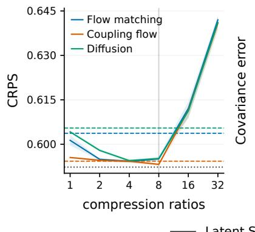

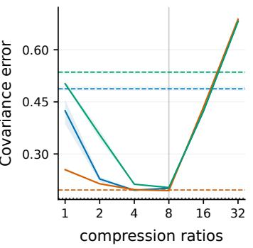

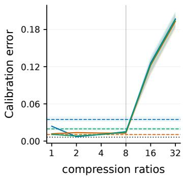  
Figure 5: Compression ratio study for the Correlated Gaussian example. Given latent dimension d, the latent compression ratios are 64/d. For each ratio, we evaluate the continuous ranked probability score (CRPS; left), covariance error (middle), and calibration error (right) against their standard SBI baselines for three inference networks: flow matching, normalizing flow, and diffusion model.

Fashion-MNIST deblurring Draws from both variants look convincing (Figure 3a). Both variants score similarly in NRMSE and CRPS, while the latent variant has lower calibration error and similar coverage. The C2ST favors standard inference.

Gaussian random fields The posterior is not conditioned on the noise the simulator draws. We therefore expect draws to match only the amplitude and smoothness of the field, not its pixel values. Draws from both variants visually meet this expectation (Figure 3b). The C2ST nevertheless separates latent draws from true fields, since they lack the highest frequencies (Appendix D.1). NRMSE and SSIM are pixel-based, so even exact posterior draws would score far from their optimal values here. We report them for completeness.

Map to satellite Latent draws follow the street layout of the map, while standard draws mostly show generic vegetation (Figure 4). The latent variant scores better on every accuracy and marginal calibration metric and attains a higher SSIM. The C2ST separates the draws of both variants from true images.

Joint calibration Where the C2ST separates latent draws from true targets, the draws largely lack the high frequencies that the autoencoder does not reconstruct, so the loss of joint calibration stems mostly from the manifold of the autoencoder rather than from the posterior (Appendix D.1). We present our systematic ablation results in Appendix H.

## 5 DISCUSSION AND CONCLUSION

In this work, we characterized the conditions under which latent-space simulation-based inference recovers the desired target posterior, bounded its error by a posterior, a code, and a decoder term, and systematically analyzed its empirical trade-offs across four case studies and three generative families. Qualitatively and quantitatively, latent SBI achieved similar or better accuracy and marginal calibration than standard inference with considerably faster sampling. As amortized SBI increasingly turns toward inference over very high-dimensional parameter spaces, these results suggest that our two-stage framework is a competitive choice that improves sampling speed while retaining or increasing the quality of the posterior.

Limitations and outlook Our autoencoder is trained on the parameters alone, so, in practice, the code can discard directions of θ that the observation constrains. Therefore, codes conditioned on the observation could be advantageous. Latent draws are also confined to the manifold of the autoencoder. As a result, our pixel-wise decoder loses high-frequency detail that the C2ST metric reliably detects (Appendix D.1). Perceptual or adversarial losses could reduce this gap.

All comparisons are made at a single training budget, and changes to the relative performance of latent and standard inference with the budget remain to be studied. We consider compression only of dense vectors and images, but high-dimensional targets in SBI also arise as sequences, such as timevarying parameters or latent state trajectories (Schumacher et al., 2023; Khabibullin & Seleznev, 2022), or as graphs, such as causal structures, hierarchical models, or graph data (Lorch et al., 2022; Habermann et al., 2025; Jedhoff et al., 2026). These structures call for different inductive biases in the autoencoder and remain unexplored here. Finally, since the autoencoder depends only on the prior over θ, it could be shared across simulators and tasks with the same prior.

## AI USE STATEMENT

In this work, we used generative AI tools to help develop the theoretical framework, formulate mathematical claims, provide ingredients for and assist in writing their proofs, propose and refine hypotheses, design and provide feedback on the experimental methodology, implement methods, and interpret results. We have not used generative AI tools to generate synthetic data sets or to create any conceptual visualization (especially Figure 1). Dataset processing and qualitative analysis are not applicable to this work. Additionally, we used generative AI tools to draft and edit parts of the paper, create and edit code, summarize and identify literature, and format references. We have reviewed all AI-assisted work: every mathematical claim and proof was re-derived by an author, AIwritten code was reviewed and tested by an author, every citation was verified against a bibliographic database, and all AI-drafted text was revised by the authors. We take responsibility for the final content of this work, including text, claims or artifacts produced with the aid of generative AI.

## REPRODUCIBILITY STATEMENT

Additional details about the experimental setup and reproducibility requirements are in Appendices A–E.

## ACKNOWLEDGMENTS

LK was funded by the Deutsche Forschungsgemeinschaft (DFG, German Research Foundation) under Project 528702768. STR and JMH were funded by the National Science Foundation under Grant No. 2448380. PCB was funded by the DFG Collaborative Research Center 391 (Spatio-Temporal Statistics for the Transition of Energy and Transport) – 520388526. This work has been partly supported by the Research Center Trustworthy Data Science and Security (https://rc-trust. ai), one of the Research Alliance centers within the UA Ruhr (https://uaruhr.de).

## REFERENCES

Jonas Arruda, Niels Bracher, Ullrich Kothe, Jan Hasenauer, and Stefan T Radev. Diffusion models¨ in simulation-based inference: A tutorial review. arXiv preprint arXiv:2512.20685, 2025.

Ricardo Baptista, Youssef M. Marzouk, and Olivier Zahm. Gradient-based data and parameter dimension reduction for Bayesian models: An information theoretic perspective. arXiv preprint arXiv:2207.08670, 2022.

James Bradbury, Roy Frostig, Peter Hawkins, Matthew James Johnson, Yash Katariya, Chris Leary, Dougal Maclaurin, George Necula, Adam Paszke, Jake VanderPlas, Skye Wanderman-Milne, and Qiao Zhang. JAX: composable transformations of Python+NumPy programs. http:// github.com/jax-ml/jax, 2018.

Yanzhi Chen, Dinghuai Zhang, Michael U. Gutmann, Aaron Courville, and Zhanxing Zhu. Neural approximate sufficient statistics for implicit models. In International Conference on Learning Representations, 2021.

Franc¸ois Chollet et al. Keras. https://keras.io, 2015.

Hyungjin Chung, Suhyeon Lee, and Jong Chul Ye. Decomposed diffusion sampler for accelerating large-scale inverse problems. In International conference on learning representations, volume 2024, pp. 38922–38949, 2024.

Thomas M. Cover and Joy A. Thomas. Elements of Information Theory. John Wiley & Sons, 2 edition, 2006.

Kyle Cranmer, Johann Brehmer, and Gilles Louppe. The frontier of simulation-based inference. Proceedings of the National Academy of Sciences, 117(48):30055–30062, 2020.

Tiangang Cui, James Martin, Youssef M. Marzouk, Antti Solonen, and Alessio Spantini. Likelihoodinformed dimension reduction for nonlinear inverse problems. Inverse Problems, 30(11):114015, 2014. doi: 10.1088/0266-5611/30/11/114015.

Tiangang Cui, Youssef M. Marzouk, and Karen E. Willcox. Scalable posterior approximations for large-scale Bayesian inverse problems via likelihood-informed parameter and state reduction. Journal of Computational Physics, 315:363–387, 2016. doi: 10.1016/j.jcp.2016.03.055.

Quan Dao, Hao Phung, Binh Nguyen, and Anh Tran. Flow matching in latent space. arXiv preprint arXiv:2307.08698, 2023.

Maximilian Dax, Stephen R Green, Jonathan Gair, Nihar Gupte, Michael Purrer, Vivien Raymond,¨ Jonas Wildberger, Jakob H Macke, Alessandra Buonanno, and Bernhard Scholkopf. Real-time¨ inference for binary neutron star mergers using machine learning. Nature, 639(8053):49–53, 2025.

Michael Deistler, Jan Boelts, Peter Steinbach, Guy Moss, Thomas Moreau, Manuel Gloeckler, Pedro LC Rodrigues, Julia Linhart, Janne K Lappalainen, Benjamin Kurt Miller, et al. Simulationbased inference: A practical guide. arXiv preprint arXiv:2508.12939, 2025.

Laurent Dinh, Jascha Sohl-Dickstein, and Samy Bengio. Density estimation using Real NVP. In International Conference on Learning Representations, 2017.

Partha Ghosh, Mehdi S. M. Sajjadi, Antonio Vergari, Michael J. Black, and Bernhard Scholkopf.¨ From variational to deterministic autoencoders. In International Conference on Learning Representations, 2020.

Tilmann Gneiting and Adrian E. Raftery. Strictly proper scoring rules, prediction, and estimation. Journal ofthe American Statistical Association, 102(477):359–378, 2007.

Daniel Habermann, Marvin Schmitt, Lars Kuhmichel, Andreas Bulling, Stefan T. Radev, and¨ Paul-Christian Burkner. Amortized Bayesian multilevel models. ¨ Bayesian Analysis, 2025. arXiv:2408.13230.

Jonathan Ho, Ajay Jain, and Pieter Abbeel. Denoising diffusion probabilistic models. In Advances in Neural Information Processing Systems, 2020.

Phillip Isola, Jun-Yan Zhu, Tinghui Zhou, and Alexei A. Efros. Image-to-image translation with conditional adversarial networks. In IEEE Conference on Computer Vision and Pattern Recognition, 2017.

Svenja Jedhoff, Elizaveta Semenova, Aura Raulo, Anne Meyer, and Paul-Christian Burkner. From¨ mice to trains: Amortized Bayesian inference on graph data. Transactions on Machine Learning Research, 2026.

Tero Karras, Miika Aittala, Timo Aila, and Samuli Laine. Elucidating the design space of diffusionbased generative models. In Advances in Neural Information Processing Systems, 2022.

Bahjat Kawar, Michael Elad, Stefano Ermon, and Jiaming Song. Denoising diffusion restoration models. Advances in neural information processing systems, 35:23593–23606, 2022.

Ramis Khabibullin and Sergei Seleznev. Fast estimation of Bayesian state space models using amortized simulation-based inference. arXiv preprint arXiv:2210.07154, 2022.

Lars Kuhmichel, Jerry M. Huang, Valentin Pratz, Jonas Arruda, Hans Olischl¨ ager, Daniel Haber-¨ mann, Simon Kucharsky, Lasse Elsemuller, Aayush Mishra, Niels Bracher, Svenja Jedhoff, Mar- ¨ vin Schmitt, Paul-Christian Burkner, and Stefan T. Radev. BayesFlow 2: Multi-backend amor-¨ tized Bayesian inference in Python. arXiv preprint arXiv:2602.07098, 2026.

Shiwei Lan, Shuyi Li, and Babak Shahbaba. Scaling up Bayesian uncertainty quantification for inverse problems using deep neural networks. SIAM/ASA Journal on Uncertainty Quantification, 10(4):1684–1713, 2022.

Annika Lang and Jurgen Potthoff. Fast simulation of Gaussian random fields.¨ Monte Carlo Methods and Applications, 17(3):195–214, 2011.

Anders Boesen Lindbo Larsen, Søren Kaae Sønderby, Hugo Larochelle, and Ole Winther. Autoencoding beyond pixels using a learned similarity metric. In Proceedings of the 33rd International Conference on Machine Learning, volume 48 of Proceedings of Machine Learning Research, pp. 1558–1566. PMLR, 2016.

Elizaveta Levina and Peter J. Bickel. Maximum likelihood estimation of intrinsic dimension. In Advances in Neural Information Processing Systems, volume 17, 2004.

Ker-Chau Li. Sliced inverse regression for dimension reduction. Journal ofthe American Statistical Association, 86(414):316–327, 1991.

Yaron Lipman, Ricky T. Q. Chen, Heli Ben-Hamu, Maximilian Nickel, and Matt Le. Flow matching for generative modeling. In International Conference on Learning Representations, 2023.

Xingchao Liu, Chengyue Gong, and Qiang Liu. Flow straight and fast: Learning to generate and transfer data with rectified flow. In International Conference on Learning Representations, 2023.

David Lopez-Paz and Maxime Oquab. Revisiting classifier two-sample tests. In International Conference on Learning Representations, 2017.

Lars Lorch, Scott Sussex, Jonas Rothfuss, Andreas Krause, and Bernhard Scholkopf. Amortized¨ inference for causal structure learning. In Advances in Neural Information Processing Systems, volume 35, 2022.

Simian Luo, Yiqin Tan, Longbo Huang, Jian Li, and Hang Zhao. Latent consistency models: Synthesizing high-resolution images with few-step inference. arXiv preprint arXiv:2310.04378, 2023.

Rafael Orozco, Ali Siahkoohi, Mathias Louboutin, and Felix J Herrmann. Aspire: iterative amortized posterior inference for bayesian inverse problems. Inverse Problems, 41(4):045001, 2025.

George Papamakarios and Iain Murray. Fast ϵ-free inference of simulation models with bayesian conditional density estimation. In Advances in Neural Information Processing Systems, volume 29, pp. 1028–1036, 2016.

George Papamakarios, David Sterratt, and Iain Murray. Sequential neural likelihood: Fast likelihood-free inference with autoregressive flows. In The 22nd international conference on artificial intelligence and statistics, pp. 837–848. PMLR, 2019.

George Papamakarios, Eric Nalisnick, Danilo Jimenez Rezende, Shakir Mohamed, and Balaji Lakshminarayanan. Normalizing flows for probabilistic modeling and inference. Journal ofMachine Learning Research, 22(57):1–64, 2021.

Dhruv V. Patel, Deep Ray, and Assad A. Oberai. Solution of physics-based Bayesian inverse problems with deep generative priors. Computer Methods in Applied Mechanics and Engineering, 400:115428, 2022.

Phillip Pope, Chen Zhu, Ahmed Abdelkader, Micah Goldblum, and Tom Goldstein. The intrinsic dimension of images and its impact on learning. In International Conference on Learning Representations, 2021.

Stefan T. Radev, Ulf K. Mertens, Andreas Voss, Lynton Ardizzone, and Ullrich Kothe. BayesFlow:¨ Learning complex stochastic models with invertible neural networks. IEEE Transactions on Neural Networks and Learning Systems, 33(4):1452–1466, 2020.

Robin Rombach, Andreas Blattmann, Dominik Lorenz, Patrick Esser, and Bjorn Ommer. High-¨ resolution image synthesis with latent diffusion models. In IEEE/CVF Conference on Computer Vision and Pattern Recognition, pp. 10684–10695, 2022.

Litu Rout, Yujia Chen, Abhishek Kumar, Constantine Caramanis, Sanjay Shakkottai, and Wen-Sheng Chu. Beyond first-order tweedie: Solving inverse problems using latent diffusion. In 2024 IEEE/CVF Conference on Computer Vision and Pattern Recognition (CVPR), pp. 9472–9481. IEEE, 2024.

Teemu Sailynoja, Paul-Christian B¨ urkner, and Aki Vehtari. Graphical test for discrete uniformity¨ and its applications in goodness-of-fit evaluation and multiple sample comparison. Statistics and Computing, 32(2):32, 2022.

Marvin Schmitt, Valentin Pratz, Ullrich Kothe, Paul-Christian B¨ urkner, and Stefan T. Radev. Consis-¨ tency models for scalable and fast simulation-based inference. In Advances in Neural Information Processing Systems, 2024.

Lukas Schumacher, Paul-Christian Burkner, Andreas Voss, Ullrich K ¨ othe, and Stefan T. Radev. ¨ Neural superstatistics for Bayesian estimation of dynamic cognitive models. Scientific Reports, 13:13778, 2023.

Bowen Song, Soo Min Kwon, Zecheng Zhang, Xinyu Hu, Qing Qu, and Liyue Shen. Solving inverse problems with latent diffusion models via hard data consistency. In International Conference on Learning Representations, volume 2024, pp. 7624–7654, 2024.

Yang Song, Jascha Sohl-Dickstein, Diederik P. Kingma, Abhishek Kumar, Stefano Ermon, and Ben Poole. Score-based generative modeling through stochastic differential equations. In International Conference on Learning Representations, 2021.

Alessio Spantini, Daniele Bigoni, and Youssef M. Marzouk. Inference via low-dimensional cou plings. Journal ofMachine Learning Research, 19(66):1–71, 2018.

Chenxing Sun, Yongyang Xu, Xuwei Xu, Xixi Fan, Jing Bai, Xiechun Lu, and Zhanlong Chen. Bridging scales in map generation: A scale-aware cascaded generative mapping framework for seamless and consistent multi-scale cartographic representation. arXiv preprint arXiv:2502.04991, 2025.

Arash Vahdat, Karsten Kreis, and Jan Kautz. Score-based generative modeling in latent space. In Advances in Neural Information Processing Systems, 2021.

Aaron van den Oord, Oriol Vinyals, and Koray Kavukcuoglu. Neural discrete representation learn-¨ ing. In Advances in Neural Information Processing Systems, 2017.

Siddarth Venkatraman, Mohsin Hasan, Minsu Kim, Luca Scimeca, Marcin Sendera, Yoshua Bengio, Glen Berseth, and Nikolay Malkin. Outsourced diffusion sampling: Efficient posterior inference in latent spaces of generative models. In Proceedings of the 42nd International Conference on Machine Learning, volume 267 of Proceedings of Machine Learning Research, 2025.

Mischa von Krause and Stefan T Radev. Scaling cognitive modeling to big data: A deep learning approach to studying individual differences in evidence accumulation model parameters. Psychological Methods, 2026.

Zhou Wang, Alan C. Bovik, Hamid R. Sheikh, and Eero P. Simoncelli. Image quality assessment: From error visibility to structural similarity. IEEE Transactions on Image Processing, 13(4): 600–612, 2004.

Olivier Zahm, Tiangang Cui, Kody J. H. Law, Alessio Spantini, and Youssef M. Marzouk. Certified dimension reduction in nonlinear Bayesian inverse problems. Mathematics of Computation, 91 (336):1789–1835, 2022. doi: 10.1090/mcom/3737.

Shengjia Zhao, Jiaming Song, and Stefano Ermon. InfoVAE: Balancing learning and inference in variational autoencoders. In Proceedings of the AAAI Conference on Artificial Intelligence, volume 33, pp. 5885–5892, 2019. doi: 10.1609/aaai.v33i01.33015885.

## A CASE STUDY DETAILS

Table 2: Overview of the case studies. Parameter dimension denotes the dimensionality of the inference target θ, condition dimension that of the conditioning variable, and simulation budget the number of training examples.
<table><tr><td>Case study</td><td>Parameter dimension</td><td>Condition dimension</td><td>Simulation budget</td></tr><tr><td>Correlated Gaussian</td><td>2,080</td><td>64</td><td>10,000</td></tr><tr><td>Fashion-MNIST deblurring</td><td> $3 2 \times 3 2 = 1 , 0 2 4$ </td><td> $3 2 \times 3 2 = 1 { , } 0 2 4$ </td><td>60,000</td></tr><tr><td>Gaussian random fields</td><td> $3 2 \times 3 2 = 1 { , } 0 2 4$ </td><td>2</td><td>60,000</td></tr><tr><td>Map to satellite</td><td> $2 5 6 \times 2 5 6 \times 3 = 1 9 6 , 6 0 8$ </td><td> $2 5 6 \times 2 5 6 \times 3 = 1 9 6 , 6 0 8$ </td><td>40,555</td></tr></table>

Correlated Gaussian. The $D = 6 4$ coordinates are split into $k = 8$ contiguous blocks of equal size. Block $j$ has scale $\sigma _ { j }$ with log $\sigma _ { j } \sim \mathcal { N } ( 0 , 0 . 3 ^ { 2 } )$ , and the covariance is $\Sigma = \mathrm { b l o c k d i a g } _ { j } ~ \sigma _ { i } ^ { 2 } \mathbf { 1 } \mathbf { \bar { 1 } } ^ { \top }$ so the coordinates within a block are perfectly correlated. The target is the upper triangle of Σ, $D ( D + 1 ) / 2 = 2 { , } 0 8 0$ entries, of which 288 are nonzero. An observation consists of $n = 3 2$ draws $\mathbf { y } \sim \mathcal { N } ( \mathbf { 0 } , \Sigma )$ , summarized by the per-coordinate mean of $\mathbf { y } ^ { 2 }$ , which is sufficient for the scales and enters both variants through an identity summary network. Given x, the block second moment $x _ { j }$ satisfies $n x _ { j } / \sigma _ { j } ^ { 2 } \sim \chi _ { n } ^ { 2 }$ , so the posterior factorizes into k one-dimensional densities in log $\sigma _ { j } ,$ which we sample exactly by inverse CDF on a grid. The target depends linearly on $( \sigma _ { 1 } ^ { 2 } , \dots , \sigma _ { k } ^ { 2 } )$ and therefore lies in a k-dimensional linear subspace. The optimal linear code of any dimension ${ \dot { m } } \geq k$ reconstructs it exactly, so the analytic reconstruction floor of the 16-dimensional code is zero, and the trained autoencoder reaches a held-out reconstruction RMSE of 0.0021. For the recovery and calibration plots and the two-sample test, each draw is reduced to its block variances, the mean of each block’s entries, which is its least-squares projection onto that subspace. The study trains on 10,000 targets and evaluates on $1 , 0 0 0 \ : ( 1 0 , 0 0 0$ for the two-sample test). The dataset is fixed across seeds, and each seed re-draws the initialization. The study trains on 8 cores of one CPU machine and, unlike the image studies, is timed with the adaptive solvers rather than at a fixed step count (Appendix E).

Fashion-MNIST deblurring. Targets are Fashion-MNIST images scaled to [0, 1], with 60,000 for training and the first 1,000 of the 10,000 test images for evaluation. The observation is generated in three steps: Poisson shot noise at the native $2 8 \times 2 8$ resolution with the standard data-dependent photon count and a gain of 0.5, a bilinear resize to $3 2 \times 3 2$ , and a Gaussian blur with reflect-padded borders. The blur width is $\sigma = 2 . 5$ in native pixels and is rescaled with the resolution, so the kernel covers the same fraction of the image at any size. The gain applies to the observation only, so observations are dimmer than their targets.

Gaussian random fields. Conditional on its parameters the field is a linear map of Gaussian noise, so $p ( \pmb { \theta } \mid \log \sigma , \alpha )$ is a zero-mean Gaussian on the $N \times N$ grid with

$$
\operatorname { C o v } ( \theta _ { i } , \theta _ { j } ) = \frac { 1 } { N ^ { 4 } } \sum _ { k } P ( k ) \cos \left( \frac { 2 \pi k \cdot ( i - j ) } { N } \right) , \quad P ( k ) = \sigma ^ { 2 } \left( \alpha | k | \right) ^ { - \alpha } ,
$$

and $P ( 0 ) = 0$ . The covariance depends on $i - j$ alone, so the process is stationary, and on the norm of the wrapped frequency alone, so it is isotropic up to the symmetries of the square lattice. FFT synthesis makes the covariance circulant, so the field is periodic. Removing the zero mode leaves the constants as an exact null direction: every realization lies in $\{ \sum _ { i } \theta _ { i } = \mathbf { \bar { 0 } } \}$ , the conditional has rank $N ^ { 2 } - 1$ , and analytic comparisons are made on that subspace. For $\alpha \geq 2 .$ , about 98 % of the prior mass, the spectrum is not integrable at the origin in two dimensions, so the continuum field is defined only up to an additive constant, with stationary increments of index $H = ( \alpha - 2 ) / 2$ . The grid supplies the infrared cutoff; the field scale therefore depends on the resolution, and the NRMSE normalization is the value range of the first 32 test fields. At small scales the field has the regularity of a Matern field with´ $\nu = ( \alpha \mathrm { - } 2 ) / 2$ , which is near $1 / 2$ at the prior center $\alpha = 3 \colon$ continuous but not differentiable. The scale σ is not the marginal standard deviation, since the per-sample frequency rescaling below contributes a factor $\alpha ^ { - \alpha }$ . Because the autoencoder is nonlinear, the latent-space conditional is not Gaussian, although the target-space conditional is.

Table 3: Network architecture per case study and space (Appendix B). Subnet widths are the stage widths of the U-Net (image studies) or the hidden widths of the MLP or normalizing-flow subnet (correlated Gaussian). Dropout 0.1 and, for the U-Net, group normalization with 4 groups are shared by every variant and every stage. The autoencoder column gives the encoder / decoder ResNet filters and the resulting code shape, with the compression ratio by value count (and, for the image studies, by spatial grid position). Latent generators condition on the summary network’s output, concatenated channel-wise on the code grid. The correlated Gaussian’s conditioning variable is already its sufficient statistic, so both variants use the identity summary. Fashion-MNIST deblurring and the random fields share one configuration. On the random fields, the two conditioning scalars enter as two constant channels, which add a few hundred weights to the first layer (Table 4).
<table><tr><td>Study</td><td>Space Subnet widths</td><td></td><td>Autoencoder (enc. / Summary dec. filters → code)</td><td></td></tr><tr><td rowspan="3">Fashion-MNIST / random fields  $( 3 2 ^ { 2 } \times 1 )$ </td><td rowspan="3"></td><td>target UNet [68, 140], 2 stages</td><td></td><td rowspan="3">Identity</td></tr><tr><td>latent UNet [64], 1 stage</td><td>[32,64,128,128] / ResNet → 42 ×64 [128,128,64,32] → 42×32 (2:1,</td></tr><tr><td></td><td>64:1 spatial)</td></tr><tr><td>Correlated Gaussian (2,080, k=8)</td><td>latent MLP [139, 139]†</td><td>target MLP [186, 186]</td><td>MLP [128,128] / Identity</td><td>Identity</td></tr><tr><td rowspan="3">Map → satellite  $( 2 5 \bar { 6 } ^ { 2 } \times 3 )$ </td><td></td><td></td><td>[128,128] → 16 (130:1)</td><td></td></tr><tr><td></td><td>target UNet [32,64,128,256,256], 5 stages latent UNet [140,280], 2 stages</td><td>[32,64,128,256] / ResNet → [256,128,64,32]</td><td>Identity  $1 6 ^ { 2 } \times 6 4$ </td></tr><tr><td></td><td></td><td>→ 162×8 (96:1, 256:1 spatial)</td><td></td></tr></table>

†A 6-layer normalizing flow (correlated Gaussian only) uses widths [32,32] in target space and [157,157] on the same code.

The priors are log $\sigma \sim \mathcal { N } ( 0 , 0 . 3 ^ { 2 } )$ and $\alpha \sim \mathcal { N } ( 3 . 0 , 0 . 5 ^ { 2 } )$ . A field is drawn by multiplying complex white noise by $\sqrt { P ( k ) }$ on the FFT frequency grid and taking the real part of the inverse transform, with the zero mode removed so that every field has zero sample mean. The frequency grid is scaled per sample by |α|; on a discrete grid this multiplies P by a constant and leaves the correlation structure unchanged, and it narrows the spread of field magnitudes across the prior.

Map to satellite. The corpus (Sun et al., 2025) provides pixel-aligned $2 5 6 \times 2 5 6$ map and satellite tiles at five zoom levels, from two cities (Glasgow and London), sourced from a commercial tile service. We use zoom level 17 with the dataset’s own split, 40,555 training and 300 test pairs. Residual misalignment between map and image comes from differing acquisition dates of the imagery and the map’s vector data. Tiles are used at their native resolution, stored as 8-bit, scaled to [0, 1], and not augmented. The autoencoder maps 256 × 256 × 3 to a $1 6 \times 1 6 \times 8$ code, a 96:1 compression against 2:1 on the $3 2 \times 3 2$ studies. The map tile enters the latent network through a residual encoder onto the code grid and the target-space network by channel concatenation. The study uses diffusion only.

## B MODEL CONFIGURATIONS AND HYPERPARAMETERS

Networks. All models are implemented in BayesFlow 2 (Kuhmichel et al., 2026) on Keras 3 (Chol-¨ let et al., 2015) with the JAX backend (Bradbury et al., 2018). Both spaces share one subnet family per study: a BayesFlow UNet (dropout 0.1, 4 groups, 1 residual block per stage) for the three imageshaped targets, and either an MLP time-embedded subnet (BayesFlow’s default FlowMatching / DiffusionModel subnet) or a 6-layer normalizing flow built from affine coupling layers for the 2,080-dimensional target of the correlated Gaussian. Widths, code shapes and parameter counts are in Table 3 and Table 4. In every study the latent variant’s total count, frozen autoencoder included, is matched to the target-space total within 4%. Fashion-MNIST deblurring and the random fields share one model configuration. On the random fields, the two conditioning scalars enter as two constant channels, which add a few hundred weights to the first layer, so their parameter counts differ slightly (Table 4).

Table 4: Parameter counts and training budgets. Trainable and frozen parameter counts, computed from the configured architecture (Table 3), and the per-run training budget of Appendix C. Latent total = frozen autoencoder + trainable summary network + trainable generator, matched to the target-space total within 4% in every study. The first stage trains for 1,600 autoencoder epochs on Fashion-MNIST and the random fields and 300 on the correlated Gaussian, a fixed design choice in both cases. Its share of the run’s budget depends on the measured epoch time (25% on Fashion-MNIST and the random fields), except on the map study, where the epoch count is instead solved so the first stage takes exactly one third of the budget.
<table><tr><td></td><td>Target-space</td><td colspan="3">Latent</td><td></td><td>Budget</td></tr><tr><td>Study</td><td>total</td><td>AE (frozen)</td><td>Summ.</td><td></td><td>Gen. Latent total</td><td>(h)</td></tr><tr><td>Fashion-MNIST</td><td>2,763,426</td><td>1,479,215</td><td>811,362</td><td>566,164</td><td>2,856,741</td><td>6</td></tr><tr><td>Random fields</td><td>2,764,038</td><td>1,479,215</td><td>811,684</td><td>566,164</td><td>2,857,063</td><td>6</td></tr><tr><td>Corr. Gaussian</td><td>944,635</td><td>840,458</td><td>0</td><td>105,566</td><td>946,024</td><td>0.25†</td></tr><tr><td>Map → sat.</td><td>15,424,368</td><td>3,242,856</td><td>959,598</td><td>11,157,865</td><td>15,360,319</td><td>36</td></tr></table>

†Per run, on 8 CPU cores rather than the GPU, so not comparable with the GPU budgets above it. Normalizing flow (correlated Gaussian only, depth 6): target space 1,314,803, latent $8 4 0 , 4 5 8 + \bar { 0 + 4 7 } 0 , 1 6 9 = 1 , 3 1 0 , 6 2 \bar { 7 }$

Autoencoders. Every latent variant is preceded by a variational autoencoder (convolutional on the image studies, MLP on the correlated Gaussian), pretrained and frozen before the amortized inference network trains (Appendix C). The latter models codes standardized per channel, with a mean and standard deviation estimated once after the first stage and held fixed, and sampling inverts this standardization before decoding. All four use the same InfoVAE convention (Zhao et al., 2019), $\alpha = 1 - 1 0 ^ { - 6 }$ and $\lambda = 1 0 ^ { - 6 }$ , giving a KL weight of $1 0 ^ { - 6 }$ and no maximum mean discrepancy (MMD) term (Appendix F relates this to the first-stage objective). The encoder’s log-variance is clipped to [−20, 5]. Every latent posterior on the three image studies conditions through a learned summary network, a residual encoder producing a grid matching the code; every target-space variant instead uses the identity summary, concatenating a pixel-aligned observation directly where one exists, as does the correlated Gaussian’s latent variant, whose vector conditioning already is the sufficient statistic and needs no grid.

Optimization. Shared across every study and both stages: AdamW, weight decay 0.01, per-tensor gradient-norm clipping at 1.5, dropout 0.1 on every subnet, batch size 128 throughout, including the correlated Gaussian. The learning-rate schedule is one-cycle cosine over all training steps, warming from $1 . 2 \times 1 0 ^ { - 5 }$ to a peak of $3 \times 1 0 ^ { - 4 }$ over the first 30% of steps, then annealing to about $1 0 ^ { - 7 }$ The first stage uses the same shape and peak and anneals to about $3 \times 1 0 ^ { - 8 }$ . Seeds 0–2 for every variant except the map study, run at seed 0 only. Numerical precision and hardware are described in Appendix E.

Budgets and epochs. Fashion-MNIST and the random fields train for 6 h per run. The training-set size ablation scales this to 6·N/60000 h at equal epochs. The first stage trains for 1,600 autoencoder epochs on Fashion-MNIST and the random fields, a fixed design choice, and 300 on the correlated Gaussian, where a vector autoencoder this size converges within a few hundred epochs. Unlike the epoch counts themselves, the share of budget they consume depends on the measured epoch time (25% on Fashion-MNIST and the random fields). The correlated Gaussian trains for 0.25 h per run on 8 CPU cores, and the map study for 36 h per variant, with the first stage fixed at exactly one third of the budget at its measured autoencoder step time, so its epoch count follows from that fraction rather than a fixed number. The number of epochs is the remaining budget divided by the measured time per epoch (Appendix E), rounded up. For the flow-matching pair of Fashion-MNIST at the 6 h budget, 45.6 (11.9) ms per step give 1,010 (2,899) epochs for the target-space (latent) variant. During training, each run is monitored on a single validation batch with 16 posterior draws. The reported accuracy and calibration values instead come from a separate evaluation at the end of training, with 1,000 × 64 draws on Fashion-MNIST, the random fields and the correlated Gaussian and 300 × 64 on map to satellite.

## C THE EQUAL-COMPUTE PROTOCOL IN DETAIL

Training budget. The budget counts training time only, accumulated per epoch with the timer stopped during validation. Data generation and evaluation are excluded. The autoencoder’s recorded training time is added as an offset. Each run stops at the epoch count derived from the measured step time (Appendix B), so the budget is fixed before training and does not depend on the hardware it runs on. The accumulated time serves as a check.

Wall-clock rather than FLOPs. On the deblurring study one evaluation of the latent network costs more than two orders of magnitude fewer FLOPs than one of the target-space network (0.018 against 2.1 GFLOP per draw), but the small latent grid reaches only half of the device throughput of the full grid, so its wall-clock time per evaluation falls by a much smaller factor than its FLOPs. Matching FLOPs would give the latent variant more optimizer steps than the same hardware completes in the same time.

## D CALIBRATION DIAGNOSTICS

Marginal coverage. A latent variant’s draws lie in the range of the decoder, a set of lower dimension than the target space and hence of zero volume under the true posterior. Every per-element marginal of such draws can still be calibrated, so marginal coverage cannot detect this.

Classifier two-sample test. Class A pairs each test observation with its true target, and class B pairs the same observation with one posterior draw. The two classes share the marginal over obser vations, so a classifier can separate them only through the conditional, and their joint distributions coincide exactly when the posterior is correct. Folds are split by condition, early stopping uses a fold that is never scored, and we report the held-out accuracy. On the image studies the classifier is a small convolutional network that reads the observation and the draw stacked as channels. On the correlated Gaussian, the structural zeros and repeated entries of the full target let a classifier separate any continuous draw trivially, so the test runs on the block variances of each draw (Appendix A) with a multilayer perceptron on 10,000 held-out conditions. Exact posterior draws score 0.50 on this test.

Controls. Replacing the draws with reconstructions $\mathcal { D } ( \mathcal { E } ( \pmb { \theta } ) )$ of the true target measures how detectable the decoder’s range is on its own. Running the test in latent space, on pairs $( \mathbf { x } , { \mathcal { E } } ( \theta ) )$ against (x, ϑ) with $\vartheta \sim q _ { \phi } ( \vartheta \mid \mathbf { x } )$ , scores the posterior without the decoder.

Quantization. On the image studies, both classes and the reconstruction control are clipped to the image range and rounded to 8-bit levels before the test.

Closed-form covariance. For the random fields the conditional covariance is known analytically (Appendix A), and we report the relative Frobenius error of the sampled covariance against it. With flow matching (diffusion), the error is 0.071 (0.082) for standard and 0.076 (0.097) for latent inference, against a floor of 0.064 for the same number of exact draws. The error is dominated by the low frequencies, which carry most of the variance, and hides the high-frequency deficit of the latent draws (Appendix D.1).

Draws per condition. The two-sample test uses one draw per condition; coverage and CRPS use 64, and the exact-posterior comparison of Figure 6 uses 100. The covariance check uses 4,096 draws for each of 16 conditions, and the same statistic on 4,096 exact draws gives its floor.

Information terms. Table 5 reports the terms of Proposition 1 after training, per study and averaged over seeds. $H ( \vartheta \mid \theta )$ is closed form from the encoder’s log-variances. $H ( \vartheta )$ is the held-out negative log-likelihood of an unconditional normalizing flow fitted to one encoded draw per training target, a cross-entropy and hence an upper bound, which $I ( \pmb \theta ; \pmb \vartheta ) = H ( \pmb \vartheta ) - H ( \pmb \vartheta \ | \ \mathbf { \hat { \theta } } )$ inherits. The decoder term is the reconstruction negative log-likelihood under $\mathcal { N } ( \dot { \mathcal { D } } ( \vartheta ) , \sigma ^ { 2 } \dot { I } )$ with $\sigma ^ { 2 }$ set to the held-out mean squared error, minus $\breve { H ( \pmb { \theta } \mid \pmb { \vartheta } ) } = H ( \pmb { \theta } ) - I ( \pmb { \theta } ; \pmb { \vartheta } )$ ; H(θ) is available by Monte Carlo over the prior mixture on the random fields, so the term is reported there. On the deblurring study the reconstruction likelihood stands alone, and on the correlated Gaussian the target lies on an 8-dimensional subspace and has no density. The posterior’s density on encoded test targets equals the posterior term up to $H ( \vartheta \mid \mathbf { x } )$ (normalizing flows exact, flow matching by the instantaneous change of variables; diffusion models expose no likelihood in our implementation), and the latentspace two-sample test (Table 5) reads the same term without a density. The code term of a trained encoder, $I ( \pmb \theta ; \mathbf x ) - I ( \pmb \vartheta ; \mathbf x )$ , would need a lower bound on $H ( \vartheta )$ or a tight bound on $H ( \vartheta \mid \mathbf { x } )$ and the difference of the two upper bounds available here is neither a lower bound nor a tight estimate (on the random fields it exceeds $I ( \pmb \theta ; \mathbf x ) )$ ), so the table carries the closed-form code term of the reconstruction-optimal linear code of the same dimension instead, next to the closed-form $I ( { \pmb \theta } ; { \bf x } )$ Two readings follow. In Section 2.3, $I ( \pmb \theta ; \pmb \vartheta ) = H ( \pmb \vartheta ) - H ( \pmb \vartheta | \pmb \theta )$ balances the reconstruction error, which drives the encoder’s variance down and $H ( \vartheta \mid { \bf \dot { \theta } } )$ with it, against the KL penalty, which holds the variance up. With the KL weight of $1 0 ^ { - 6 }$ used here (Appendix B) the balance lands far on the reconstruction side: on the correlated Gaussian the code’s entropy is $- 6 . 6 \pm 4 . 3$ nats against a conditional entropy of −46.4±3.7 nats, so most of $I ( \pmb \theta ; \pmb \vartheta )$ measures how far the encoder’s variance has collapsed rather than what the code retains of $\theta ;$ the decoder term, which carries the same bound, is a loose number for the same reason, and the reconstruction error of each autoencoder (Appendix A) is the quantity that shows what the autoencoder costs. The latent-space two-sample test sits at its null on the correlated Gaussian and on the random fields, and just above it on the deblurring study, indicating that the posterior networks reproduce the encoded conditional.

Table 5: Information terms of the error decomposition. Information terms of Proposition 1 after training, in nats, mean ± standard deviation over three seeds (omitted where it rounds to zero). Code entropies are taken in the standardized code space the generator models; $I ( \pmb \theta ; \pmb \vartheta )$ is invariant to that map. $H ( \vartheta )$ is the held-out cross-entropy of an unconditional normalizing flow fitted to encoded training codes, an upper bound, so $I (  { \boldsymbol { \theta } } ;  { \boldsymbol { \vartheta } } )$ and the decoder term are upper bounds. The decoder term is the reconstruction negative log-likelihood under $\mathcal { N } ( \mathcal { D } ( \pmb { \vartheta } ) , \sigma ^ { 2 } I )$ with $\sigma ^ { 2 }$ the held-out mean squared error, minus $H ( \pmb \theta )$ , plus $I ( \pmb \theta ; \bar { \pmb \vartheta } )$ ; on the deblurring study $H ( \pmb \theta )$ is unknown and the reconstruction likelihood stands alone. The linear reference is the reconstruction-optimal linear code of the same dimension, whose code term is closed form. Generator likelihoods are on encoded test targets (normalizing flows exact, flow matching by the instantaneous change of variables); diffusion models expose none. The latent-space two-sample test separates $\mathbf { \Psi } ( \mathbf { x } , \mathcal { E } ( \pmb { \theta } ) )$ from $( \mathbf { x } , \pmb { \vartheta } \sim q _ { \phi } ( \pmb { \vartheta } \mid \mathbf { x } ) )$ pairs, one draw per condition, against a label-permuted null.
<table><tr><td></td><td>correlated Gaussian</td><td>deblurring</td><td>random fields</td></tr><tr><td> $d _ { \vartheta }$ </td><td>16</td><td>512</td><td>512</td></tr><tr><td> $H ( \vartheta \mid \theta )$ </td><td> $- 4 6 . 4 \pm 3 . 7$ </td><td> $- 3 1 5 . 0 \pm 2 . 8$ </td><td> $- 8 9 1 . 1 \pm 1 . 5$ </td></tr><tr><td>H (θ) (bound)</td><td> $- 6 . 6 \pm 4 . 3$ </td><td> $5 7 3 . 2 \pm 0 . 9$ </td><td> $6 4 6 . 5 \pm 1 . 0$ </td></tr><tr><td> $I ( \pmb \theta ; \pmb \vartheta )$  (bound)</td><td> $3 9 . 8 \pm 0 . 7$ </td><td> $8 8 8 . 2 \pm 3 . 5$ </td><td> $1 5 3 7 . 6 \pm 0 . 9$ </td></tr><tr><td>per code dimension</td><td> $2 . 4 9 \pm 0 . 0 4$ </td><td> $1 . 7 3 \pm 0 . 0 1$ </td><td>3.00</td></tr><tr><td>held-out MSE,  $\sigma ^ { 2 }$ </td><td></td><td> $0 . 0 0 0 6$ </td><td> $0 . 0 1 8 6 ^ { }$ </td></tr><tr><td>reconstruction NLL</td><td></td><td> $- 3 4 5 0 . 4 \pm 2 . 0$ </td><td> $2 7 9 7 . 0 \pm 1 . 2$ </td></tr><tr><td> $H ( \pmb \theta )$ </td><td></td><td></td><td>-2181.2</td></tr><tr><td>decoder term (bound)</td><td></td><td></td><td> $9 2 1 . 8 \pm 2 . 0$ </td></tr><tr><td> $I ( \pmb \theta ; \mathbf x )$ </td><td>7.58</td><td></td><td>4.45</td></tr><tr><td>code term, linear reference</td><td>0</td><td></td><td></td></tr><tr><td>kept by the linear code</td><td>100%</td><td></td><td>一</td></tr><tr><td>posterior NLL, NF</td><td> $- 1 4 . 2 \pm 4 . 1$ </td><td></td><td></td></tr><tr><td>posterior NLL, FM</td><td> $- 1 2 . 0 \pm 4 . 2$ </td><td> $2 6 2 . 4 \pm 1 . 1$ </td><td> $6 2 0 . 5 \pm 1 . 6$ </td></tr><tr><td>latent-space C2ST, NF</td><td> $0 . 5 0 \pm 0 . 0 1$ </td><td>1</td><td></td></tr><tr><td>latent-space C2ST, FM</td><td> $0 . 5 0 \pm 0 . 0 2$ </td><td>0.52</td><td>0.50</td></tr><tr><td>latent-space C2ST, DM</td><td>0.51</td><td>0.54</td><td> $0 . 5 1 \pm 0 . 0 1$ </td></tr><tr><td>null band, mean</td><td>0.50</td><td>0.50</td><td>0.50</td></tr></table>

## D.1 CAVEATS OF THE AUTOENCODER

Our autoencoders are VAEs trained with a pixel-wise reconstruction loss and a small KL penalty. This objective favors the directions of largest prior variance (Section 2.3) and is known to lose fine detail in images (Larsen et al., 2016), and the latent draws inherit whatever the autoencoder does not reconstruct. On the random fields, the latent draws keep only $9 \%$ of the analytic power above wavenumber 13, a band that holds 0.2 % of the variance. The covariance error barely registers this, but the relative error of the radially averaged spectrum is 0.46 for latent against 0.012 for standard inference (floor 0.004), and the C2ST separates latent draws from true fields almost perfectly (1.00), as it does the autoencoder’s own reconstructions (1.00). On map to satellite the C2ST likewise separates latent draws (0.98) about as well as reconstructions (0.99).

## E COMPUTATIONAL COMPLEXITY AND HARDWARE

Where the speedup comes from. The cost of a posterior draw is the number of network evaluations times the cost of one evaluation. Compressing the target changes only the second factor, so the speedup is bounded by the ratio of per-evaluation costs, not by the compression ratio. For a convolutional network that ratio is set by the number of grid positions; the channel count of the code enters only the first layer. The deblurring code, $4 \times 4 \times { \overline { { 3 2 } } } .$ , has half as many entries as the $3 2 \times 3 2$ target but 64 times fewer positions, and with the narrower latent network one evaluation costs more than two orders of magnitude fewer FLOPs. The decoder adds 5–14 % to the latent variant’s FLOPs per draw. An $8 \times 8 \times 8$ code with the same number of entries would save more than an order of magnitude in FLOPs at the same widths. The measured speedup is smaller than the FLOP ratio (Appendix C), and it is the measured one we report.

Amortizing the first stage. Under our accounting the autoencoder’s training is part of the equal budget, so the latent variant costs no additional training. Counted as additional, as when an autoencoder is added to an existing target-space pipeline, it is repaid after about $2 . 7 \times 1 0 ^ { 5 }$ draws on the deblurring study with flow matching: the 25% of the 6 h budget spent on the first stage, divided by the difference between 20099 and 322 ms per 1000 draws.

Solver steps. The cost timing fixes the solver and its step count in both spaces at 30 steps, which is 180 network evaluations per draw for flow matching with a fixed-step Tsitouras integrator and 60 for the two-step diffusion sampler. It runs on untrained networks of the configured shapes, since the cost of a fixed workload depends on shapes only. Speedups are therefore comparable within a family, and absolute costs are not comparable across families. The correlated Gaussian is the exception: it is timed on CPU with the adaptive solvers (Appendix A). The adaptive solvers (a Tsitouras 5(4) solver for flow matching, a two-step adaptive SDE solver for diffusion) produce all reported posterior draws. They take a data-dependent number of steps and are not part of the reported speedup.

Sampling batch size. Both variants of a family are timed at the same sampling batch size, the largest batch that both sample in one pass: 256 on the 32 × 32 studies (128 for diffusion on the random fields) and 8 on the map study. At this size the target-space network is already computebound and the latent network is not, so the reported ratio is a lower bound on the ratio of attainable throughputs. The latent network’s smaller memory footprint would allow larger batches, which we do not count.

Precision. The 32 × 32 studies train and sample in float32. The map study trains both variants in bfloat16 mixed precision and samples every reported draw in float32.

Hardware. Every image-study timing uses one NVIDIA L40 (46 GB) on a compute cluster, as do all flow-matching and map runs. Some diffusion models trained on other Ada-generation GPUs at the same epoch counts (Appendix B). The correlated Gaussian trains and is timed on 8 cores of a CPU machine of the same cluster, so its costs are not comparable with the GPU ones. GPU runs did not enforce deterministic operations, so reruns with the same seed can differ slightly. The software is pinned to Python 3.12, JAX 0.11.0 with its CUDA 12 plugin, Keras 3.15.1 and BayesFlow 2.0.13, and the L40 machine runs NVIDIA driver 595.71.05.

Timing. Timings run in a fresh process before any sampling, since timings taken after sampling include recompilation. Step times are measured in short chunks, and any chunk during which the device clock throttles is discarded.

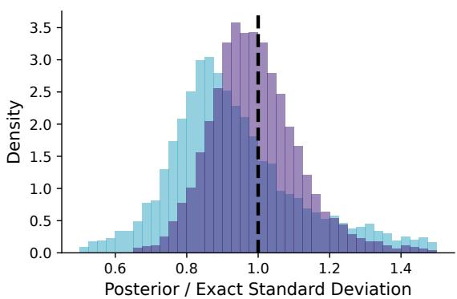

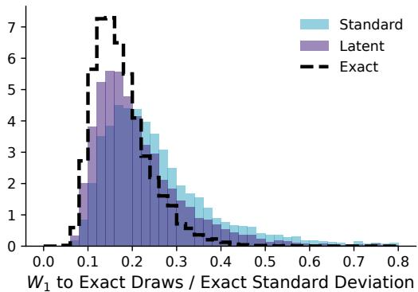  
Figure 6: Comparison against the exact posterior on the correlated Gaussian. With flow matching, on the $k = 8$ block variances (1,000 test conditions, 100 draws each). Left: posterior standard deviation relative to the exact one. Latent widths scatter evenly around the exact width, while standard widths are too narrow for most conditions and far too wide for some. Right: Wasserstein-1 distance $( W _ { 1 } )$ to exact draws, relative to the exact standard deviation; the dashed outline shows the sampling noise of the exact posterior itself.

## F PROOFS

Proof of Proposition 1. Write $q _ { \xi } ( \pmb { \theta } , \pmb { \vartheta } \mid \mathbf { x } ) = q _ { \xi } ( \pmb { \vartheta } \mid \mathbf { x } ) q _ { \xi } ( \pmb { \theta } \mid \pmb { \vartheta } , \mathbf { x } )$ and apply the chain rule of the Kullback–Leibler divergence (Cover & Thomas, 2006, Ch. 2) to the left-hand side of (2):

$$
\begin{array} { r l } & { \mathbb { E } _ { \mathbf { x } } \operatorname { K L } \big ( q _ { \xi } ( \pmb { \theta } , \pmb { \vartheta } \mid \mathbf { x } ) \big \| q _ { \phi } \big ( \pmb { \vartheta } \mid \mathbf { x } \big ) q _ { \psi } ( \pmb { \theta } \mid \pmb { \vartheta } ) \big ) = \mathbb { E } _ { \mathbf { x } } \operatorname { K L } \big ( q _ { \xi } \big ( \pmb { \vartheta } \mid \mathbf { x } \big ) \big \| q _ { \phi } \big ( \pmb { \vartheta } \mid \mathbf { x } \big ) \big ) } \\ & { \qquad + \mathbb { E } _ { \mathbf { x } , \pmb { \vartheta } } \operatorname { K L } \big ( q _ { \xi } \big ( \pmb { \theta } \mid \pmb { \vartheta } , \mathbf { x } \big ) \big \| q _ { \psi } \big ( \pmb { \theta } \mid \pmb { \vartheta } \big ) \big ) . } \end{array}
$$

Adding and subtracting log $q _ { \xi } ( \pmb { \theta } \mid \pmb { \vartheta } )$ inside the second expectation splits it into $\mathbb { E } _ { \mathbf { x } , \vartheta } \mathrm { K L } ( q _ { \xi } ( \pmb { \theta } \ | $ $\vartheta , \mathbf { x } ) \prod _ { \ell \in ( \pmb { \theta } \mid \pmb { \vartheta } ) } = I ( \pmb { \theta } ; \mathbf { x } \mid \mathbf { \bar { \vartheta } } )$ and E $ _ { \pmb { \mathscr { o } } } \operatorname { K L } ( q _ { \xi } ( \pmb { \mathscr { \theta } } \mid \pmb { \mathscr { \vartheta } } ) \parallel q _ { \psi } ( \mathbf { \bar { \pmb { \theta } } } \mid \pmb { \mathscr { \vartheta } } ) ) \colon$ the second expectation is under $q _ { \xi } ( \vartheta )$ because averaging $q _ { \xi } ( \pmb { \theta } \mid \pmb { \vartheta } , \mathbf { x } )$ over $q _ { \xi } ( \textbf { x } | \textbf { \em { \theta } } )$ gives $q _ { \xi } ( \pmb { \theta } \ | \ \pmb { \vartheta } )$ Since the encoder depends on θ alone, ϑ and x are conditionally independent given $\theta ,$ so the chain rule of mutual information gives $I ( \pmb \theta , \pmb \vartheta ; \mathbf x ) = I ( \pmb \theta ; \mathbf x ) = I ( \pmb \vartheta ; \mathbf { \vec { x ) } } + I ( \pmb \theta ; \mathbf x \mid \pmb \vartheta )$ , hence $I ( \pmb \theta ; \mathbf x | \pmb \vartheta ) = I ( \pmb \theta ; \mathbf x ) - I ( \pmb \vartheta ; \mathbf x )$ . Finally, $p ( \pmb \theta \mid \mathbf { x } )$ and $q _ { \phi , \psi } ( \pmb \theta \mid \mathbf { x } )$ are the marginals over ϑ of the two distributions on the left-hand side, and marginalization does not increase the divergence. □

Proof of Proposition 2. The InfoVAE objective of Zhao et al. (2019), in their notation, is $\mathbb { E } _ { p ( \theta ) } \mathbb { E } _ { q _ { \xi } ( \vartheta | \theta ) } \mathrm { \bar { l o g } } q _ { \psi } ( \theta \mid \vartheta ) - \left( 1 - \alpha \right) \mathbb { E } _ { p ( \theta ) } \mathrm { \bar { K L } } ( q _ { \xi } ( \vartheta \mid \theta ) \| p ( \vartheta ) ) - \left( \alpha + \lambda - 1 \right) D ( q _ { \xi } ( \vartheta ) \| p ( \vartheta ) )$ The first-stage objective of Section 2.2 is this objective with the Gaussian decoder of Section 2.3, with D the maximum mean discrepancy, $\alpha < 1$ and $\lambda > 0$ . Our experiments use $\alpha + \lambda - 1 = 0$ (Appendix B), the case Zhao et al. (2019) identify as the $\beta \mathrm { - V A E }$ family. Their Proposition 2 assumes continuous spaces and sufficiently flexible families for encoder and decoder, and its proof shows that for any fixed value of $I ( \pmb \theta ; \pmb \vartheta )$ the objective is maximized when $q _ { \psi } ( \pmb { \theta } \mid \pmb { \vartheta } ) = q _ { \xi } ( \pmb { \theta } \mid \pmb { \vartheta } )$ for every ϑ and $\dot { q _ { \xi } ( \vartheta ) } = p ( \vartheta )$ ; its proof gives the maximal value as $\left( 1 - \beta \right) \bar { I } ( \pmb { \theta } ; \pmb { \vartheta } ) - \bar { H } ( p ( \pmb { \dot { \theta } } ) )$ with $\beta = 1 - \alpha .$ The proof uses $\stackrel { \cdot } { \alpha } + \lambda - 1 > 0 ;$ at $\alpha + \lambda - 1 = 0$ the marginal term reduces ${ \bf { t o } } - \bar { \beta } \ \mathrm { { K L } } ( q _ { \xi } ( \vartheta ) \| p ( \vartheta ) )$ and $\beta > 0$ alone forces $q _ { \xi } ( \vartheta ) = p ( \vartheta )$ , so the conclusion is unchanged. The first condition is the vanishing of the decoder term of (2), which a Gaussian decoder with fixed variance can attain only if $q _ { \xi } ( \pmb { \theta } \ | \ \pmb { \vartheta } )$ is Gaussian with that variance; in practice, it is approached, not attained. The value depends on the encoder only through $I ( \pmb \theta ; \pmb \vartheta )$ ). □

## G ADDITIONAL RESULTS

Along the block variances of the correlated Gaussian, standard flow matching is overconfident for most conditions, while latent flow matching balances over- and underconfidence (Figure 6).

Table 6: Training-set size ablation. Fashion-MNIST deblurring at three training-set sizes, at the epoch counts of the main comparison (Appendix B). Mean ± standard error over three seeds.
<table><tr><td>Targets</td><td></td><td></td><td>NRMSE↓</td><td>CRPS↓</td><td>Cal. err. ↓</td><td> $\mathrm { C o v } _ { 5 0 }$ </td><td> $\mathbf { C o v _ { 9 0 } }$ </td></tr><tr><td>1,000</td><td>FM</td><td>Standard</td><td>0.052±0.000</td><td>0.0186±0.0001</td><td>0.061±0.020</td><td>0.58±0.05</td><td>0.92±0.01</td></tr><tr><td></td><td></td><td>Latent</td><td>0.061±0.000</td><td>0.0243±0.0002</td><td>0.062±0.003</td><td>0.57±0.01</td><td>0.86±0.01</td></tr><tr><td></td><td>DM</td><td>Standard</td><td>0.055±0.000</td><td>0.0196±0.0002</td><td>0.056±0.005</td><td>0.54±0.04</td><td>0.89±0.01</td></tr><tr><td></td><td></td><td>Latent</td><td>0.060±0.000</td><td>0.0240±0.0001</td><td>0.063±0.001</td><td>0.54±0.01</td><td>0.85±0.01</td></tr><tr><td>10,000</td><td>FM</td><td>Standard</td><td>0.044±0.000</td><td>0.0151±0.0001</td><td>0.090±0.012</td><td>0.43±0.06</td><td>0.84±0.02</td></tr><tr><td></td><td></td><td>Latent</td><td>0.048±0.000</td><td>0.0178±0.0001</td><td>0.041±0.002</td><td>0.50±0.01</td><td>0.85±0.01</td></tr><tr><td></td><td>DM</td><td>Standard</td><td>0.042±0.000</td><td>0.0144±0.0001</td><td>0.072±0.011</td><td>0.50±0.06</td><td>0.86±0.00</td></tr><tr><td></td><td></td><td>Latent</td><td>0.045±0.000</td><td>0.0167±0.0001</td><td>0.042±0.001</td><td>0.50±0.01</td><td>0.85±0.00</td></tr><tr><td>60,000</td><td>FM</td><td>Standard</td><td>0.036±0.000</td><td>0.0124±0.0001</td><td>0.046±0.007</td><td>0.46±0.02</td><td>0.83±0.02</td></tr><tr><td></td><td></td><td>Latent</td><td>0.034±0.000</td><td>0.0127±0.0001</td><td>0.023±0.001</td><td>0.51±0.01</td><td>0.88±0.00</td></tr><tr><td></td><td>DM</td><td>Standard</td><td>0.035±0.000</td><td>0.0119±0.0001</td><td>0.059±0.002</td><td>0.59±0.00</td><td>0.89±0.00</td></tr><tr><td></td><td></td><td>Latent</td><td>0.034±0.000</td><td>0.0125±0.0000</td><td>0.022±0.001</td><td>0.50±0.00</td><td>0.87±0.00</td></tr></table>

## H ABLATIONS

Joint fine-tuning of the autoencoder. Starting from a trained latent flow-matching model on Fashion-MNIST (seed 0), we unfroze the encoder and trained encoder and posterior network jointly for 300 further epochs, against a control that continued for the same number of epochs with the encoder frozen. Neither continuation is budget-matched to the main comparison. Joint training was less accurate than the frozen control, with an NRMSE of 0.065 against 0.033 on the 1,000 test conditions with 64 posterior draws each. Because the code standardization is fixed after the first stage (Appendix B), the posterior’s objective can be lowered by shrinking the encoder’s output. The standard deviation of the standardized code fell to 0.007 times its initial value, while the reconstruction error grew by a factor of only 1.5. KL weights of $1 0 ^ { - 3 }$ and $1 0 ^ { - 2 }$ hold the scale (0.32 and 0.87 times its initial value) but raise the reconstruction error by factors of 7.0 and 13.6, with an NRMSE of 0.049 and 0.104.

Training-set size. We repeat the Fashion-MNIST comparison with 1,000 and 10,000 training targets instead of 60,000. At each size both variants train for the same number of epochs as in the main comparison, so the budget scales with the data. Each size trains its own autoencoder, with a held-out reconstruction RMSE of 0.028 at 1,000, 0.011 at 10,000 and 0.008 at 60,000 targets. Table 6 reports the metrics at each size.

## I ADDITIONAL RANDOM SAMPLES

## Observation Ground truth Posterior samples tandar atent tandar atent StandardLatent StandardLatent

Figure 7: Random conditions for Fashion-MNIST deblurring. Posterior samples for four Fashion-MNIST test conditions drawn at random, not selected, with flow matching.

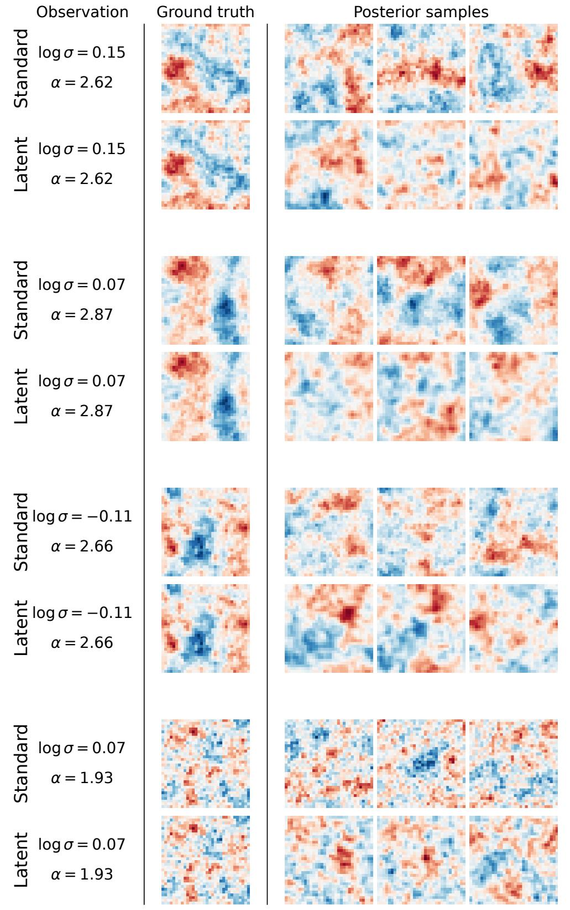  
Figure 8: Random conditions for the Gaussian random fields. Posterior samples for four randomfield test conditions drawn at random, not selected, as in Figure 3b. Colors share one symmetric scale per condition.

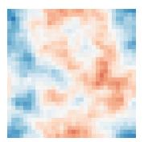

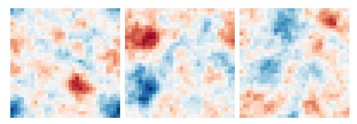

Observation

$$
\begin{array} { l } { { \displaystyle { \frac { \overline { { \mathbb { O } } } } { \overline { { \mathbb { O } } } } } \ \lvert 0 9 \sigma = 0 . 0 0 } } \\ { { \displaystyle { \frac { \overline { { \mathbb { O } } } } { \overline { { \mathbb { O } } } } } \alpha = 2 . 5 0 } } \\ { { \displaystyle { \frac { \overline { { \mathbb { O } } } } { \overline { { \mathbb { O } } } } } \ } } \end{array}
$$

Ground truth

$$
\begin{array} { l } { \stackrel { \left. \right.} { \subseteq } \ \log \sigma = 0 . 0 0 } \\ { \stackrel { \ll } { \underset {  } { \Psi } } } \\ { \stackrel { \ll } { \bigstar } \quad \alpha = 2 . 5 0 } \end{array}
$$

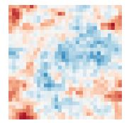

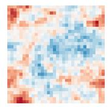

Posterior samples

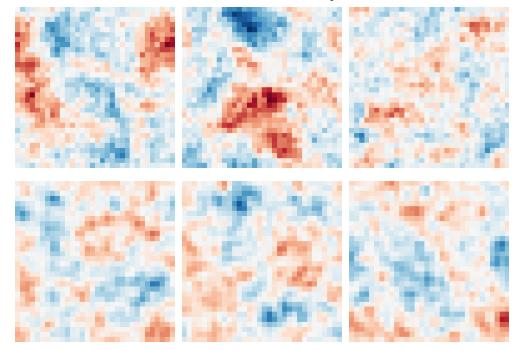

$$
\begin{array} { r } { \begin{array} { l } { \boldsymbol { \Xi } } \\ { \boldsymbol { \overline { { \boldsymbol { \Omega } } } } } \\ { \boldsymbol { \Xi } } \\ { \boldsymbol { \overline { { \boldsymbol { \Omega } } } } } \\ { \boldsymbol { \overline { { \boldsymbol { \Omega } } } } } \end{array} \begin{array} { l } { \mathsf { \Lambda } } \\ { \mathsf { \Lambda } } \end{array} } \\ { \begin{array} { r l } { \boldsymbol { \Xi } } \\ { \boldsymbol { \overline { { \boldsymbol { \Omega } } } } } \end{array} \begin{array} { l } { \mathsf { \Lambda } } \\ { \boldsymbol { \alpha } } \end{array} \begin{array} { l } { 0 . 0 0 } \end{array} } \end{array}
$$

$$
\begin{array} { l } { \underset { \mathbb { Q } } { \stackrel { + - } { \subseteq } } \ \log \sigma = 0 . 0 0 } \\ { \underset { \mathbb { Q } } { \stackrel {  } { \cup } } } \\ { \underset { \mathbb { Q } } { \stackrel {  } { \cup } } \quad \alpha = 3 . 0 0 } \end{array}
$$

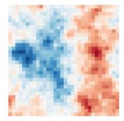

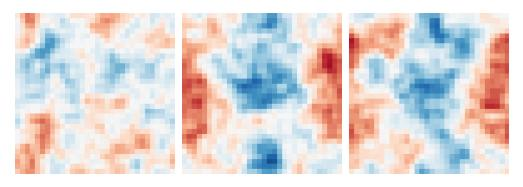

$$
\sum _ { \stackrel { \mathbf { G } } { \mathbf { G } } } ^ { \bigotimes } \log \sigma = 0 . 0 0
$$

$$
\begin{array} { l } { \frac { + ^ { \prime } } { \Omega } \ \log \sigma = 0 . 0 0 } \\ { \frac { + } { \Omega } \ \qquad \alpha = 3 . 5 0 } \end{array}
$$

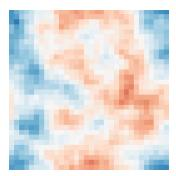

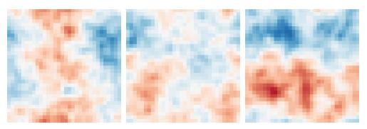

$$
\begin{array} { r } { \begin{array} { c } { \overline { { \underline { { \mathbf { \Pi } } } } } } \\ { \overline { { \underline { { \mathbf { \Pi } } } } } } \\ { \overline { { \underline { { \mathbf { \Pi } } } } } } \\ { \overline { { \underline { { \mathbf { \Pi } } } } } } \\ { \overline { { \underline { { \mathbf { \Pi } } } } } } \end{array} \begin{array} { c } { \overline { { \underline { { \mathbf { \Pi } } } } } } \\ { \left. 0 9 \sigma = 0 . 0 0 \right.} \\ { \sigma = 4 . 0 0 } \\ { \sigma = 4 . 0 0 } \end{array}  } \end{array}
$$

$$
\begin{array} { l } { \underset { \mathbb { Q } } { ⨏ } ~ \log \sigma = 0 . 0 0 } \\ { \underset { \mathbb { Q } } { ⨏ } ~ \mathrm { \Sigma } } \\ { \mathrm { \Sigma } } \end{array}
$$

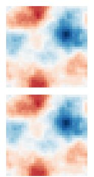

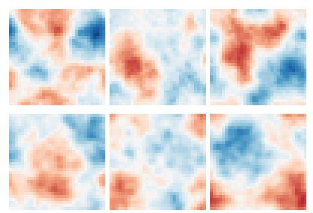  
Figure 9: Smoothness sweep for the Gaussian random fields. Posterior samples for the random fields at log $\sigma = 0$ and four equally spaced values of α. Smoothness increases with α in both variants, as in the ground truth.

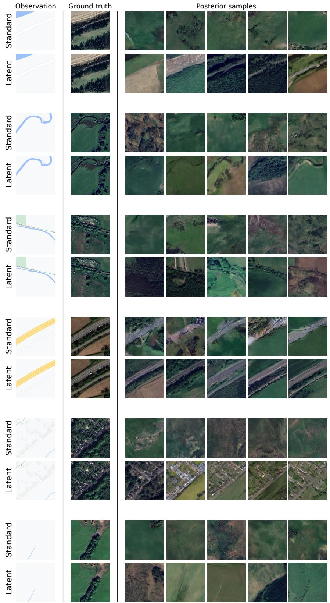  
Figure 10: Random conditions for map to satellite. Posterior samples for six map-to-satellite test conditions drawn at random, not selected, as in Figure 4.