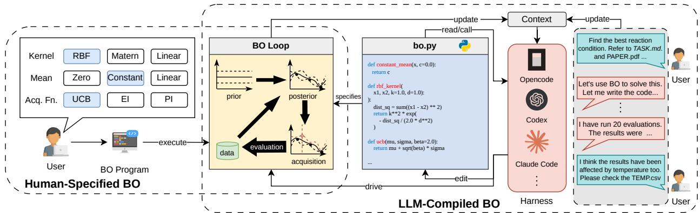
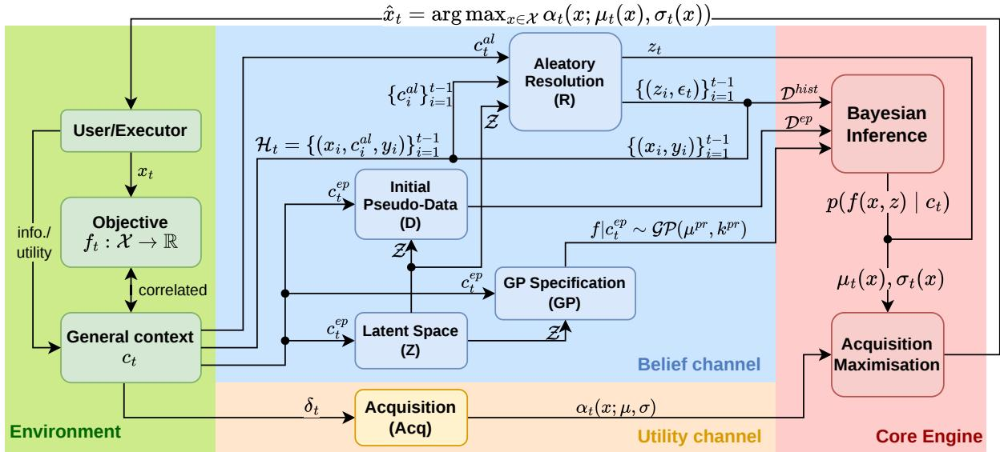
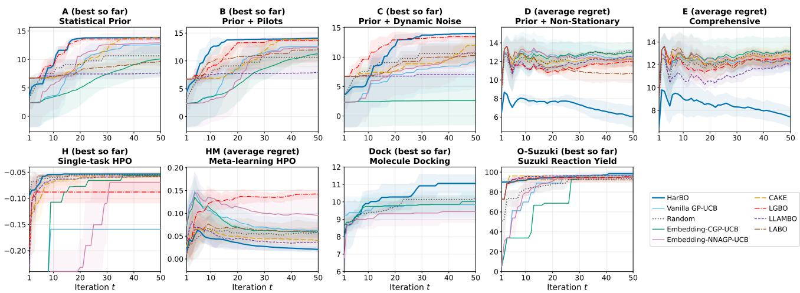
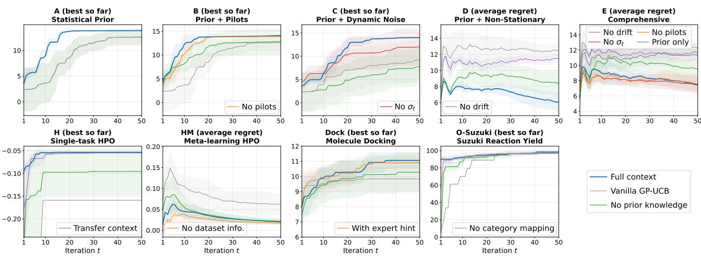
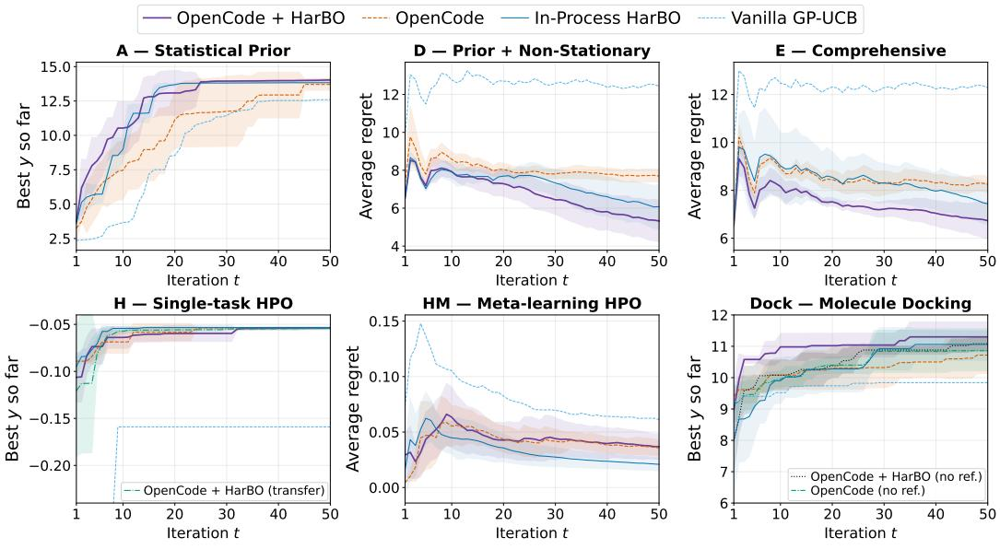
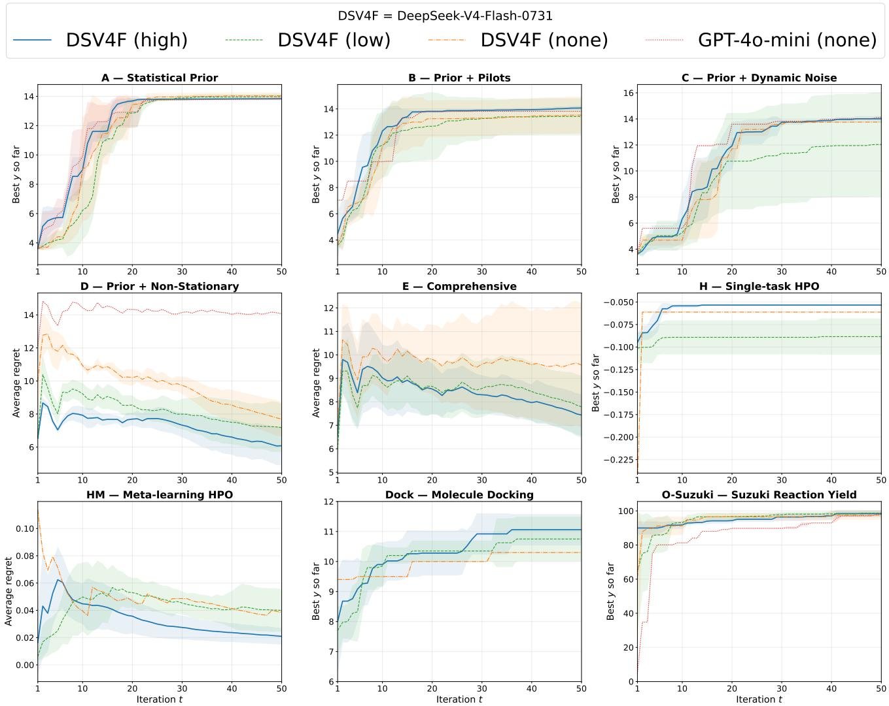

# Harnessing Large Language Models to Compile Task-Relevant Context into Bayesian Optimisation

Zhongwei Yu<sup>1</sup>, Sourabh Roy<sup>2</sup>, Bin Cao<sup>1</sup>, Xue Yan<sup>3</sup>, Anjie Liu<sup>1</sup>, and Jun Wang<sup>2†</sup>

<sup>1</sup>The Hong Kong University of Science and Technology (Guangzhou) <sup>2</sup>University College London (UCL) <sup>3</sup>Institute of Automation, Chinese Academy of Sciences

Emails: zyu950@hkust-gz.connect.edu.cn; jun.wang@ucl.ac.uk

## Abstract

Incorporating rich task-relevant context, such as domain knowledge and external observations, is a key capability yet remains challenging for Bayesian optimisation (BO). Recently, practitioners have started to use large language models (LLMs) to generate and execute BO programs through coding harnesses. In such emerging practices, the posterior belief is shaped not only by Bayesian inference but also by LLM-generated model and data artefacts, ofering a flexible route for task context to enter BO as executable code. To study whether and how LLMs can be harnessed to compile diverse contextual signals for BO, we formulate LLM-compiled BO as generalised-context decision making. We propose HarBO, a BO-specialised harness that compiles generalised context into the core artefacts of standard BO through a validated multi-stage workflow. Our theory analyses the regret under imperfect compilation and the efect of adding new context. Across synthetic functions and real-world benchmarks, we find that LLM harnesses can efectively compile context into standard BO, achieving competitive performance with specialised LLM-embedding-based and direct LLM-in-the-loop BO methods. General coding harnesses can be efective in familiar domains such as hyperparameter optimisation, but fall short in unfamiliar, context-rich domains. Together, these results establish LLM harnesses as a promising, but not automatically reliable, route for making rich task context usable in BO.

## 1 Introduction

Bayesian optimisation (BO) is a principled approach to optimising an expensive, unknown black-box objective f : X → R (Shahriari et al., 2016; Garnett, 2023). A typical BO loop gathers evidence about f, represents the current belief with a probabilistic surrogate, most often a Gaussian process (GP) (Rasmussen and Williams, 2006), and selects the next evaluation through an acquisition function. BO is widely used in hyperparameter tuning (Turner et al., 2021) and scientific discovery (Yu et al., 2026), where rich contextual information is available: background knowledge, domain literature, and external observations. Injecting such information into BO has attracted considerable interest (Ramachandran et al., 2020; Xie et al., 2023). However, existing methods require substantial expertise to translate context into mathematical protocols, limiting accessibility for practitioners who use BO as an of-the-shelf tool.

The development of LLM coding agents (Yang et al., 2024b) creates a diferent possibility that we call LLMcompiled BO, where an LLM specifies, and may drive, a BO loop from the information available. Figure 1 contrasts it with conventional human-specified BO. We do not claim to invent LLM-compiled BO; rather, it is a naturally emerging practice in the era of “vibe coding” (Edwards, 2025). For example, a materials scientist or chemist who does not know any BO algorithm can now give an agent (e.g., Codex) the task description, domain references, and an evaluation interface. An LLM then authors and runs the BO program through the surrounding coding harnesses (Lopopolo, 2026). In this emerging practice, the task context may influence optimisation decisions through the resulting context–code–policy route, but this route is not yet well understood. Therefore, the aim of this paper is to understand whether and how this route can make rich task context usable for BO.

  
Figure 1: From human-specified BO to LLM-compiled BO, where the domain practitioner delegates the optimisation task to a harness-based coding agent through interactive conversation.

To formally study LLM-compiled BO, we formulate it as a generalised-context decision-making problem, where “generalised” contrasts with the classical covariate context (Krause and Ong, 2011). At round t, the system receives generalised context $c _ { t } .$ which may include optimisation history, task requirements, domain literature, and conversation messages. A Bayesian policy $\pi ( \boldsymbol { x } _ { t } | \boldsymbol { c } _ { t } )$ maps this context into model and data artefacts that induce a belief $p ( f _ { t } \mid c _ { t } )$ about the current objective, after which an acquisition function selects the next design $x _ { t } .$ Under this view, the LLM compilation implicitly contributes to $p ( f _ { t } \mid c _ { t } )$ by specifying the surrogate model and data.

To investigate how harness design afects this process, we study both general coding harnesses and Harnessing the LLM to compile BO (HarBO). HarBO is a specialised harness for LLMs to compile task context into artefacts of a standard GP-based BO. Through a validated multi-stage workflow, HarBO can accommodate diverse types of information in generalised context, such as the potential covariates influencing the objective as addressed by classical contextual BO (Krause and Ong, 2011), as well as domain knowledge and transferred experience. Theoretically, we analyse the expected regret under imperfect compilation and also show that additional context need not tighten the bound.

We instantiate HarBO in two harness realisations: an in-process harness that follows hard-coded contracts and an agentic harness comprising skills and tools (Rajasekaran, 2026) that can be plugged into general-purpose coding agents. Across synthetic functions, hyperparameter optimisation, molecular docking, and reaction optimisation, HarBO can reliably encode generalised context into GP-based BO, leading to competitive performance with LLM-embedding-based and LLM-in-the-loop BO. In contrast, the general coding harness shows a clear capability boundary: it can produce efective BO programs in familiar real-world domains such as hyperparameter tuning, whereas it is less efective at integrating external information in custom context-rich synthetic settings.

Overall, we formally analyse LLM-compiled BO as an emerging framework, rather than proposing a new BO algorithm. Our contributions are threefold: (1) We introduce the formulation of LLM-compiled BO as generalised-context decision making. (2) We propose HarBO, a BO-specialised harness for context compilation. (3) We provide theoretical results and conduct comprehensive evaluations to characterise its capabilities and limitations.

## 2 Related work

BO is a powerful tool for optimising expensive black-box functions (Jones et al., 1998; Srinivas et al., 2010), with wide applications in scientific discovery (Shields et al., 2021; Khan et al., 2023; Wu et al., 2024; Cao et al., 2026) and hyperparameter tuning (Bergstra et al., 2011; Snoek et al., 2012). Contextual BO has been explored by Krause and Ong (2011) and Zhang et al. (2023), where context serves as the covariate that explains the nonstationarity of the objective. In contrast, the generalised context may also include epistemic knowledge that reduces the uncertainty of the objective. Meanwhile, aumenting BO by injecting external knowledge has attracted considerable interest, including surrogate-space warping (Ramachandran et al., 2020), physically grounded surrogates (Ziat dinov et al., 2022), acquisition biasing (Xie et al., 2023), domain-specific representations (H¨ase et al., 2021a), transfer learning (Poloczek et al., 2016), and reweighted posterior sampling (Hvarfner et al., 2023). However, these methods demand specific knowledge representation, which is often non-trivial for domain practitioners.

Recently, LLM-assisted BO methods have been extensively studied to integrate BO with pretrained knowledge and semantic understanding. Earlier work uses LLMs for GP input representation (Rankovic and Schwaller, 2023) or places them directly inside the BO loop as a surrogate, acquisition mechanism, or candidate proposer (Liu et al., 2024; Yang et al., 2024a; Yin et al., 2024; Chen et al., 2024; Ciss´e et al., 2025). However, empirical studies report inconsistent performance gains across domains (Huang et al., 2024), and criticism has been raised regarding the lack of principled uncertainty estimates and LLMs’ limitations in numerical reasoning (Gupta et al., 2025; Kristiadi et al., 2024). Accordingly, alternative methods use the LLM as a high-level policy for choosing inner BO modules (Suwandi et al., 2025; Zhao et al., 2026), as a source of surrogate bias (Yuan et al., 2026), or as a low-fidelity surrogate (Chen et al., 2026). These approaches potentially allow context to enter decisions, but only through a narrow interface. Moreover, the user still needs to understand the inner workings of these methods to prepare the context as a proper prompt. In contrast, LLM-compiled BO demands little understanding of BO and machine learning, allowing domain practitioners to provide context that is task-oriented rather than BO-oriented.

In addition, a similar idea, “code as policies”, has been proposed previously by Liang et al. (2023) for robotics. To our knowledge, this is the first work to formally study LLM-compiled BO, not as a specific BO algorithm but as an emerging way in which BO is used through LLM harnesses (Lopopolo, 2026; Rajasekaran, 2026).

## 3 LLM-compiled BO as contextual decision making

We analyse LLM-compiled BO from the perspective of contextual decision making. Let $f _ { t } \colon \mathcal { X } \to \mathbb { R }$ be a blackbox objective at step $t \left( f _ { t } \equiv f \right.$ for stationary objectives), where the design space X is fixed and supplied by the user. The optimiser is a policy $\pi ( \boldsymbol { x } _ { t } \mid \boldsymbol { c } _ { t } )$ that receives generalised context $c _ { t }$ —including domain evidence, files, dialogue, environment reports, and its own observations—and selects $x _ { t } \in \mathcal { X }$ before observing $y _ { t } = f _ { t } ( x _ { t } ) + \epsilon _ { t } ,$ where $\epsilon _ { t } \sim \mathcal { N } ( 0 , \sigma _ { t } ^ { 2 } )$ is an additive noise term. An ideal policy should have sublinear cumulative regret: $R _ { T } =$ $\scriptstyle \sum _ { t = 1 } ^ { T }$ [max<sub>x∈X</sub> $f _ { t } ( x ) - f _ { t } ( x _ { t } ) ] = o ( T )$ . Such a setting is analogous to contextual bandits (Li et al., 2010; Abbasi-Yadkori et al., 2011), whereas the context here is generalised evidence about the black-box $f _ { t }$

A Bayesian policy should implicitly model the target belief $p ( f _ { t } \mid c _ { t } )$ and select the $x _ { t }$ with the highest expected utility, where the context $c _ { t }$ leads to the decision $x _ { t }$ through two channels: the belief channel and utility channel. The belief-channel compiler $\mathcal { C } _ { \mathrm { B } }$ , which is the focus of this work, maps $c _ { t }$ into a model artefact $\mathcal { M } _ { t }$ and a data artefact $\mathcal { D } _ { t }$ . Bayesian inference with these artefacts induces a surrogate random function $\hat { f } _ { t } \sim p ( f _ { t } \mid \mathcal { M } _ { t } , \mathcal { D } _ { t } )$ The utility-channel compiler $\mathcal { C } _ { \mathrm { U } }$ optionally maps an instruction in $c _ { t }$ into an acquisition function $a _ { t }$ that specifies the utility of the next decision. The two channels form the following graphical model of $\pi ( \boldsymbol { x } _ { t } \mid \boldsymbol { c } _ { t } )$

$$
c _ { t } \xrightarrow { C _ { \textup { B } } } ( \mathcal M _ { t } , \mathcal D _ { t } ) \xrightarrow { \mathrm { B a y e s } } \hat { f } _ { t } \sim p ( f _ { t } \mid \mathcal M _ { t } , \mathcal D _ { t } ) ; \qquad c _ { t } \xrightarrow { C _ { \textup { U } } } a _ { t } ; \qquad ( \hat { f } _ { t } , a _ { t } ) \xrightarrow { \mathrm { m a x i m i s e ~ a c q . } } \gamma _ { t } .\tag{1}
$$

The compiled artefacts are $f a i t h f u l$ if their induced belief matches the target conditional belief, $p ( f _ { t } \mid \mathcal { M } _ { t } , \mathcal { D } _ { t } ) =$ $p ( f _ { t } \ | \ c _ { t } )$ ; equivalently, $( \mathcal { M } _ { t } , \mathcal { D } _ { t } )$ are suficient statistics of $c _ { t }$ for $f _ { t }$ . This view underlies the core motivation of this work: perfect faithfulness may be overly challenging, but a harness can nevertheless reduce compilation error relative to an unconstrained compiler. Appendix A.1 gives the rigorous distribution-valued formulation. The utility channel is considered an optional extension and is excluded from the theoretical and experimental analysis.

## 4 Harnessing LLM to compile BO

A compiler $\mathcal { C } _ { \mathrm { B } }$ driven by a general coding harness may be easily confused by diverse contextual signals and is prone to produce the most likely code (e.g., a canonical squared-exponential kernel and constant mean) regardless of the rich information in $c _ { t }$ . HarBO addresses this issue by providing a principled harness that explicitly decomposes the context into reusable, validated artefacts. As illustrated in Figure 2, the core ideas are as follows: (1) the harness excludes pure numeric engineering unrelated to context, such as Cholesky decomposition, GP hyperparameter training, and inner acquisition optimisation, from the LLM’s responsibility; and (2) the harness defines a unified, staged compilation workflow that decomposes the context into reusable artefacts of BO, where each stage has clear input/output specifications, task-agnostic guidance, and validation procedures.

Following the contextual-bandit formulation (Li et al., 2010), we assume that the nonstationarity of $f _ { t }$ is explained by a latent covariate state $z _ { t } .$ whose space is denoted as $\mathcal { Z }$ . Thus, there exists $f \colon \mathcal { X } \times \mathcal { Z }  \mathbb { R }$ such that $f _ { t } ( x ) = f ( x , z _ { t } )$ for all $x \in \mathcal { X }$ and $t . \ \mathrm { ~ A ~ }$ core benefit is then that artefacts regarding f are reusable. Similar to Krause and Ong (2011), we assume that $f$ is drawn from a prior GP. Then, the belief channel must infer the following unknown artefacts from the context: the latent space ${ \mathcal { Z } } ,$ the GP prior mean and kernel $( \mu ^ { p r } , k ^ { p r } )$

  
Figure 2: The staged workflow of HarBO. The context is decomposed into epistemic $c ^ { e p }$ , aleatory $c _ { t } ^ { a l } .$ , history $\mathcal { H } _ { t } ,$ and optional instruction $\delta _ { t }$ . These components are compiled through the belief channel (stages Z, D, GP, and R) and the utility channel (stage Acq), and then a decision $x _ { t }$ is selected by the core Bayesian engine.

the data $\mathcal { D } _ { t } ,$ and the current latent covariate $z _ { t }$ . In particular, each entry in $\mathcal { D } _ { t }$ is a tuple $( x _ { i } , z _ { i } , \sigma _ { i } , y _ { i } )$ , where $\sigma _ { i } \in \mathbb { R } _ { + } \cup$ {UNK} is the observation-noise scale also inferred from the context (UNK indicates an unknown noise scale).

## 4.1 Staged compilation of context

For the belief channel, we decompose the context into three distinct types of signals. First and foremost, the epistemic context $c ^ { e p }$ is the relatively stable part of context that informs the latent function $f ,$ such as domain knowledge, literature, and prior experimental records. It usually constitutes the majority of the context and is expected to change infrequently (thus we drop the subscript t). Three compilation stages, denoted as Z (latent space), D (initial pseudo-data), and GP (GP specification), compile it to the latent space ${ \mathcal { Z } } ,$ epistemic pseudodata $\mathcal { D } ^ { e p }$ , and GP prior $( \mu ^ { \mathrm { p r } } , k ^ { \mathrm { p r } } )$ , respectively:

$$
c ^ { e p } \stackrel { \mathrm { Z } } {  } \mathcal { Z } \qquad ( c ^ { e p } , \mathcal { Z } ) \stackrel { \mathrm { D } } {  } \mathcal { D } ^ { e p } \qquad ( c ^ { e p } , \mathcal { Z } , \mathcal { D } ^ { e p } ) \stackrel { \mathrm { G P } } { \longrightarrow } ( \mu ^ { \mathrm { p r } } , k ^ { \mathrm { p r } } ) .\tag{2}
$$

Specifically, the epistemic pseudo-data $\mathcal { D } ^ { e p } = \{ ( x _ { i } ^ { e p } , z _ { i } ^ { e p } , \sigma _ { i } ^ { e p } , y _ { i } ^ { e p } ) \} _ { i = 1 } ^ { n ^ { e p } }$ are not observations collected during the campaign; instead, they encode reliable point-level evidence such as prior experimental records. In contrast, the prior mean and kernel encode global structure and trends that are not captured by the pseudo-data. All these artefacts are reusable until the epistemic context changes, saving the cost of repeated LLM use.

Next, the context $c _ { t }$ also includes two dynamic signals: (1) the aleatory context $c _ { t } ^ { a l }$ describes the per-step, uncontrolled environmental state and its reliability; (2) the history $\mathcal { H } _ { t } ~ = ~ \{ ( c _ { i } ^ { a l } , x _ { i } , y _ { i } ) \} _ { i < t }$ is a list of tuples containing past aleatory contexts, designs, and observations. For every historical and current aleatory context, the aleatory resolution phase R compiles the context into a latent covariate and an observation-noise scale:

$$
( \mathcal Z , c _ { i } ^ { a l } ) \stackrel { \mathrm { \tiny ~ R } } { \longrightarrow } ( z _ { i } , \sigma _ { i } ) , \quad i = 1 , \ldots , t .\tag{3}
$$

Then $\mathcal { H } _ { t }$ becomes the history data $\mathcal { D } _ { t } ^ { h i s t } \ : = \ : \{ ( x _ { i } , z _ { i } , \sigma _ { i } , y _ { i } ) \} _ { i = 1 } ^ { t - 1 }$ accepted by the GP. The history is typically updated recursively, so past aleatory context is cached and not recompiled at every step. However, formulating the history as part of the generalised context allows the environment or user to intervene flexibly, such as by removing a corrupted entry or correcting a mislabelled observation.

Combining all the above, we have the model $\mathcal { M } _ { t } = \left( \mu ^ { \mathrm { p r } } , k ^ { \mathrm { p r } } , \mathcal { Z } , z _ { t } \right)$ and data $\mathcal { D } _ { t } = \mathcal { D } ^ { e p } \cup \{ ( x _ { i } , z _ { i } , \sigma _ { i } , y _ { i } ) \} _ { i = 1 } ^ { t - 1 }$ that exactly instantiate the belief channel in equation 1. As for the utility channel, the context may include an instruction signal $\delta _ { t }$ that specifies the utility of the next decision, which an additional Acq stage compiles into the acquisition function $a _ { t } ( x )$ . If no instruction is provided, a standard acquisition function such as the upper confidence bound (UCB) (Srinivas et al., 2010) is used by default. The in-depth analysis of the utility channel is left to future work.

The prompt for each stage includes the source code of input artefacts, the format and template of deliverables, and actionable guidance. Such guidance is designed to be neutral (not favouring any specific implementation or value choice) and task-agnostic. Details of the compiled artefacts and prompt design are given in Appendix B.1 and Appendix B.4.

## 4.2 Validated Bayesian engine

Given validated artefacts, the engine performs standard GP regression (Rasmussen and Williams, 2006). Specifically, it constructs the marginal likelihood using the estimated noise scales, and uses a numerically stable Cholesky factorisation to compute the GP posterior. Hyperparameters in the prior mean and kernel are trained through empirical Bayes. Moreover, the engine also performs acquisition function maximisation w.r.t. $x \in { \mathcal { X } } .$ , with implementation determined by the design space. Appendix B.3 gives the GP posterior and the details of the numerical inference procedure.

The engine also conducts comprehensive validation of the artefacts before performing inference and optimisation. The validation checks include, but are not limited to, space membership $( \mathrm { e . g . } , \ z _ { t } \ \in \ \mathcal { Z } )$ , value range $( \mathrm { e . g . } , \sigma _ { t } > 0 )$ , shape and type checks, and positive semidefiniteness of the resulting kernel matrix. Messages of validation errors and potential repair suggestions are returned to the compiler for bounded repair. Appendix B.2 gives the complete validator battery.

## 4.3 The in-process and agentic realisations

In-process HarBO. As a minimal instantiation of HarBO, it aims at reproducible and controlled proof-ofconcept experiments. The host controls stage ordering and artefact reuse, so that LLM calls strictly follow the fixed $\mathrm { Z / D / G P / R }$ workflow. For robustness, each stage uses a ReAct-style validation-and-retry loop (Yao et al., 2023): a failed artefact receives stage-specific feedback and is regenerated within a bounded repair budget. The LLM has no external tools and maintains no persistent campaign state. Unnecessary LLM usage and BO modules are excluded to isolate the efect of the staged compilation. Thus, we leave context routing to the environment and assume an explicit decomposition into epistemic, aleatory, and history streams; such a task is mostly semantic and can be performed by the user or a separate LLM. Appendix B.5 gives the concrete workflow.

Agentic HarBO. This realisation plugs HarBO directly into the current coding-harness ecosystem, such as Codex (Lopopolo, 2026), and prioritises flexibility in open-ended campaigns. The coding agent autonomously performs both semantic routing and compilation from open-ended context, including files, and maintains the epistemic, aleatory, and observation contracts as persistent files. The workflow is soft-enforced through a skill, and a validated Bayesian engine is provided as an executable CLI tool. Consequently, execution depends on the surrounding agent-harness framework. Appendix B.6 specifies the persistent artefacts and callable interface.

## 5 Theory

We first establish a basic sanity property of HarBO. Theorem 5.1 shows that its staged workflow does not lose the ability to represent a GP belief, and Appendix A.1 gives the rigorous statement. This result only serves to justify that the staged workflow of HarBO induces no expressivity bottleneck, and does not imply that a practical LLM can realise such a compiler.

Theorem 5.1 (Expressivity of HarBO). If the true conditional belief $p ( f _ { t } \mid c _ { t } )$ is representable by $a \ G P ,$ then there exists a HarBO compiler that exactly induces it through staged compilation.

We say the compiled belief $p ( f _ { t } \mid \mathcal { M } _ { t } , \mathcal { D } _ { t } )$ is calibrated if it equals the true conditional belief $p ( f _ { t } \ | \ c _ { t } )$ However, calibration is hardly achievable for practical LLM compilers. To quantify miscalibration, we define $\kappa _ { t } : = \mathbb { E } \big [ \mathrm { K L } \big ( p ( f _ { t } \mid c _ { t } ) \| p ( f _ { t } \mid \mathcal { M } _ { t } , \mathcal { D } _ { t } ) \big ) \big ]$ and $\begin{array} { r } { \bar { \kappa } _ { T } : = T ^ { - 1 } \sum _ { t = 1 } ^ { T } \kappa _ { t } } \end{array}$ , where KL denotes KL divergence. The following result extends the classic GP–UCB regret bound (Srinivas et al., 2010) to the case of miscalibrated beliefs.

Theorem 5.2 (GP–UCB under compilation miscalibration). If instantaneous regret is bounded by $\Delta _ { \mathrm { m a x } }$ and the standard $G P { - } U C B$ regularity conditions hold, the expected average regret satisfies

$$
\frac { \mathbb { E } R _ { T } } { T } \lesssim \sqrt { \frac { \beta _ { T } \gamma _ { T } ^ { \mathrm { c m p } } } { T } } + \frac { 1 } { T } \sum _ { t = 1 } ^ { T } \mathbb { E } \xi _ { t } + \Delta _ { \operatorname* { m a x } } \sqrt { \bar { \kappa } _ { T } } .
$$

Here $\beta _ { T }$ controls confidence width, $\gamma _ { T } ^ { \mathrm { c m p } }$ is the compiled $G P ' _ { s }$ maximum information gain, and $\xi _ { t }$ is the acquisitionmaximisation error.

Appendix A.2 gives the formal statement. This bound vanishes only if $\bar { \kappa } _ { T }  0$ . We note that this condition may not be as strong as it seems. Even with a poor prior at $t = 0 ,$ , ¯κ<sub>T</sub> can vanish as $T \to \infty$ if the prior allows the policy to collect future observations that are suficiently informative to correct the miscalibration and the kernel is well specified, i.e., $f _ { t }$ lies in the reproducing kernel Hilbert space (RKHS) of the kernel. Further, Appendix A.4 gives suficient conditions for staging to reduce miscalibration, while Appendix A.5 treats classical RKHS misspecification (Bogunovic and Krause, 2021) as a special case whose worst-case bound has an unavoidable linear-in-T term.

Even under calibration, the exploration term depends on $\gamma _ { T } ^ { \mathrm { c t x } }$ , the maximum information gain under the compiled GP representing $p ( f _ { t } \mid c _ { t } )$ . A sublinear bound requires $\bar { \beta _ { T } } \gamma _ { T } ^ { \mathrm { c t x } } = o ( T )$ . Understanding how $\gamma _ { T } ^ { \mathrm { c t x } }$ depends on the content of $c _ { t }$ is therefore useful for a user who provides the generalised context. In particular, we ask whether adding a new visible variable to the context always reduces $\gamma _ { T } ^ { \mathrm { c t x } }$ and thus tightens the regret bound. Theorem 5.3 gives a negative answer.

Theorem 5.3 (Context information in the regret bound). Let $C _ { t , 1 }$ be the context already available and $C _ { t , 2 }$ the newly visible variable, with realised values ${ { c } _ { t , 1 } }$ and $c _ { t , 2 }$ . Let $\gamma _ { T } ( c _ { t , 1 } )$ and $\gamma _ { T } ( c _ { t , 1 } , c _ { t , 2 } )$ denote the maximum information gains under the two beliefs $p ( f _ { t } \mid C _ { t , 1 } = c _ { t , 1 } )$ and $p ( f _ { t } \mid C _ { t , 1 } = c _ { t , 1 } , C _ { t , 2 } = c _ { t , 2 } )$ , respectively. Assuming calibration and the structural conditional-independence and regularity conditions, the information gain after adding $C _ { t , 2 }$ satisfies

$$
\mathbb { E } _ { C _ { t , 2 } | C _ { t , 1 } = c _ { t , 1 } } [ \gamma _ { T } ( c _ { t , 1 } , C _ { t , 2 } ) ] = \gamma _ { T } ( c _ { t , 1 } ) - \Delta _ { T } ^ { \mathrm { i n f o } } + G _ { T } ^ { \mathrm { a d a p t } } .
$$

Here $\Delta _ { T } ^ { \mathrm { i n f o } }$ is the reduction in information gain because the newly visible context removes uncertainty, whereas $G _ { T } ^ { \mathrm { a d a p t } }$ is the increase in information gain because subsequent evaluations can adapt to that newly visible information.

Consequently, for equal acquisition-error and failure terms, the expected exploration upper bound tightens whenever $\overline { { { \Delta _ { T } ^ { \mathrm { i n f o } } } } } > G _ { T } ^ { \mathrm { a d \bar { a } p t } }$ . This conveys a core insight that useful context should make objective outcomes more predictable, rather than merely redirecting the optimiser towards a diferent but still uncertain region. Appendix A.3 gives the precise conditions, definitions, and regret comparison for nested context-generated σ- algebras.

## 6 Experiments

We conduct comprehensive experiments to study the efectiveness of LLM-compiled BO in integrating generalised context. First, for controlled experiments, we use five variants of a synthetic multi-peak objective whose peak locations are hidden but whose generative structure is described in context. (A) provides structural statistics about the peak locations and heights; (B) adds noisy pilot observations; (C) reports a heterogeneous observationnoise scale at each step; (D) reports a drifting height centre that causes non-stationary peak heights; and (E) combines all the signals above.

Next, the real-world environments comprise (H) single-task XGBoost HPO (Eggensperger et $\mathrm { a l . , 2 0 2 1 ) }$ with dataset metadata and qualitative guidance; (HM) a multi-task variant of H with dynamically changing datasets; (Dock) KRAS G12D docking with receptor and SMILES task information and qualitative molecular priors (Trott and Olson, 2010); and (O-Suzuki) categorical Suzuki reaction optimisation (H¨ase et al., 2021b), with chemical knowledge, factor encoding, and a mapping from category codes to reagent identities.

These environments span diverse settings, including structural priors, point evidence, observation reliability, changing covariates, and non-Euclidean design spaces. Context is task-oriented and avoids GP-specific guidance. We use DeepSeek-V4-Flash-0731 for the LLM. For each setting, we show the mean and standard deviation over five fixed policy seeds for $T = 5 0$ iterations. Appendices C and F give detailed environment descriptions and experimental configurations, respectively.

  
Figure 3: In-process comparison against baselines.

## 6.1 Performance comparison

We compare HarBO with diverse baselines: Vanilla GP-UCB, a hardcoded Mat´ern-5/2 GP-UCB (Srinivas et al., 2010); two LLM-embedding-based methods, including Embedding-CGP-UCB, a variant of CGP-UCB (Krause and Ong, 2011) that places a context embedding in a joint GP, and Embedding-NNAGP-UCB, an LLMembedding extension of a neural contextual GP (Zhang et al., 2023); and Random search. We also evaluate four LLM-in-the-loop BO methods, whose prompts share the same context as HarBO: CAKE uses an LLM for adaptive kernel evolution (Suwandi et al., 2025), LGBO uses an LLM to design point/region preferences (Yuan et al., 2026), LLAMBO uses an LLM to generate candidates and surrogate scores (Liu et al., 2024), and LABO uses an LLM as a low-fidelity evaluator (Chen et al., 2026). We exclude these loop-based LLM baselines from Dock because their implementations do not support the SMILES design space.

Results are shown in Figure 3, and the detailed table of final metrics is in Appendix D. Stationary environments plot denoised best-so-far y; D, E, and HM plot cumulative average regret R /t. Across the nine environments, HarBO is the only method that remains consistently competitive as the type of context and design space changes, with particularly clear trajectory-level advantages on B, D, E, HM, and Dock. Some baselines match or exceed it in specific periods of individual settings, but their gains do not transfer reliably across scenarios.

D, E, and HM reveal this distinction most clearly. Most baselines assume stationarity, treating changing context as unexplained variation. Several methods still perform well in HM because some good designs may be shared across HPO tasks, whereas D and E require the optimiser to resolve the latent state before conditioning its belief. Both embedding baselines perform poorly on D and E despite receiving changing context through their GP inputs, suggesting that semantic embeddings may not reliably transmit numerical information to the posterior.

LLM-in-the-loop methods can be strong when a scenario matches the role assigned to the LLM—for example, LGBO on A and C, and CAKE on O-Suzuki—but remain uneven across settings, as LGBO on H’s discrete grid illustrates. Their specialised interfaces admit only selected forms of context. HarBO instead compiles diverse context into standard GP-UCB or CGP-UCB programs (Srinivas et al., 2010; Krause and Ong, 2011) while remaining competitive across environments.

## 6.2 Context ablations

To study the contribution of diferent context signals, we remove each signal from the context for In-Process HarBO. The prior knowledge is removed for all environments. For B, C, and D, the pilot observations, dynamic noise, and drift information are removed, respectively, and all these signals are removed in E. For H, we add a transfer-learning variant, where the prior knowledge is replaced with a history of real observations selected from other HPO tasks. For HM, we remove the dynamic dataset information. For Dock, we add an expert hint about GP design. For O-Suzuki, we remove the mapping from category indices to their reagent identities in the epistemic context.

As shown in Figure 4, most removals worsen optimisation, showing that HarBO can efectively utilise diverse context signals in the compiled BO program. The transfer-learning variant on H shows that HarBO can summarise experience from other tasks as a GP prior or pseudo-data. Adding the expert hint on Dock does not improve the trajectory, suggesting that GP-specific guidance is unnecessary for HarBO in this setting. Two ablations deviate from the overall pattern. On E, the no-pilot and no-σ variants are slightly better during early iterations, although this advantage disappears in the final metric; one possible explanation is that the combined signals in E increase compilation complexity and miscalibration risk. The improvement of the no-dataset-information variant on HM is qualitatively consistent with Theorem 5.3: when HPO tasks share a similar design–performance structure, the adaptation cost may outweigh the information benefit, although neither quantity is directly measurable in this experiment.

  
Figure 4: Context ablations in the nine in-process environments.

  
Figure 5: Agentic campaigns compared with in-process HarBO and Vanilla GP-UCB.

## 6.3 Agentic case studies

To study whether general coding harnesses (with and without HarBO) can reliably compile BO with generalised context, we run agentic campaigns on A, E, D, H, HM, and Dock. We choose OpenCode (v1.18.16) (OpenCode Contributors, 2026) as the harness framework for its open-source reproducibility. Similar to Section 6.2, we also include a transfer-learning variant for H; however, the previous-task history is now provided through a Markdown log file. For Dock, we additionally provide a reference PDF of the review article by Kumar et al. (2026), which the agent must extract and maintain as epistemic context.

The results are shown in Figure 5, where the agentic campaigns are compared with in-process HarBO and Vanilla GP-UCB references. These campaigns also test semantic routing from open-ended inputs, which the in-process benchmark leaves to its environment. In the simplest environment A, agentic HarBO shows similar performance to in-process HarBO. In contrast, a clear performance gain is observed in E and D, suggesting that persistent state and code editing can benefit compilation in complex contexts. The reference paper for Dock also yields a trajectory-level improvement for agentic HarBO, suggesting that the agent can extract useful epistemic information from the literature. Without HarBO, the general coding harness clearly outperforms Vanilla GP-UCB and shows strong performance in real-world benchmarks including H, HM, and Dock. However, it falls short in the custom synthetic environments (A, D, E) without HarBO. In such cases, the general coding harness tends to produce generic BO programs with a constant mean and kernel, regardless of the context.

## 6.4 Supplementary results

Here we provide a brief summary of supplementary results available in Appendix D. (1) LLM cost: Among the evaluated LLM-based methods, HarBO is the only one that can practically aford reasoning, as most compiled artefacts are reusable; however, enabling reasoning for other baselines multiplies wall time and token use with limited performance returns (Appendix D.3 and Appendix D.2). (2) Ablations of LLM back-end: Coding ability and reasoning efort both matter. DeepSeek-V4-Flash-0731 with high reasoning efort is the most reliable configuration; lowering reasoning efort or switching to GPT-4o-mini degrades performance and produces more frequent validation errors and terminal failures (Appendix D.7). (3) Efectiveness of validation: Verification and bounded retries raise the counterfactual first-attempt compilation success rate from 80.0% to 100% for high reasoning, and from 53.3% to 97.8% for low reasoning (Appendix D.6). (4) Agentic demo: Appendix D.5 provides an end-to-end scientist-copilot session using OpenCode and HarBO, demonstrating literature-to-code compilation and utility-channel instruction following. (5) Verbatim compiled artefacts: Appendix E reports representative compiled artefacts.

## 7 Conclusion

This work studies whether LLM-compiled BO can reliably incorporate generalised context. To address this question, we formulate BO with generalised context and introduce HarBO, a BO-specific harness that compiles context through a staged workflow. Under compilation miscalibration, we derive an expected-regret bound that is sublinear only when average KL miscalibration vanishes; we also show that adding context need not tighten the exploration bound. Experiments demonstrate HarBO’s ability to integrate diverse context signals consistently in both in-process and agentic settings. They also expose the limitations of general-purpose coding agents, which perform well on familiar real-world tasks but struggle with novel, context-rich environments. Overall, our results suggest that LLM-compiled BO can reliably incorporate generalised context when supported by a harness designed specifically for BO.

In this work, we have focused on standard sequential GP–BO, which is intended to set up a foundational framework for LLM-compiled BO. Nevertheless, extending HarBO to more advanced BO variants is a natura direction for future work. We also expect to develop analysis and principled frameworks for the utility channel. A limitation of HarBO is that, although validation catches fatal compilation errors, faithful compilation relies mainly on prompting and soft constraints from the staged workflow. Complex epistemic context can therefore overwhelm the LLM and increase miscalibration risk, as observed in our experiments. Future work could address this limitation through stricter mathematical validation of compiled beliefs, including RKHS-based checks of assumptions and residuals in the classical misspecified setting. More broadly, HarBO provides insights for designing scientific agents with principled optimisation capabilities; jointly formulating a coding harness and the algorithm it authors may also reveal meaningful research questions beyond BO.

## References

Yasin Abbasi-Yadkori, D´avid P´al, and Csaba Szepesv´ari. Improved algorithms for linear stochastic bandits. In Advances in Neural Information Processing Systems 24, pages 2312–2320, 2011.

James Bergstra, R´emi Bardenet, Yoshua Bengio, and Bal´azs K´egl. Algorithms for Hyper-Parameter Optimization. In Advances in Neural Information Processing Systems, volume 24. Curran Associates, Inc., 2011.

Ilija Bogunovic and Andreas Krause. Misspecified Gaussian Process Bandit Optimization. In Advances in Neural Information Processing Systems, volume 34, pages 3004–3015. Curran Associates, Inc., 2021.

Bin Cao, Jie Xiong, Jiaxuan Ma, Yuan Tian, Yirui Hu, Mengwei He, Longhan Zhang, Jiayu Wang, Jian Hui, Li Liu, Dezhen Xue, Turab Lookman, Jun Wang, and Tong-Yi Zhang. Bgolearn: A unified Bayesian optimization framework for accelerating materials discovery. npj Computational Materials, July 2026. ISSN 2057-3960. doi: 10.1038/s41524-026-02226-3.

Guojin Chen, Keren Zhu, Seunggeun Kim, Hanqing Zhu, Yao Lai, Bei Yu, and David Z. Pan. LLM-Enhanced Bayesian Optimization for Eficient Analog Layout Constraint Generation, December 2024. URL https: //arxiv.org/abs/2406.05250.

Zhuo Chen, Xinzhe Yuan, Jianshu Zhang, Jinzong Dong, Ruichen Zhou, Yingchun Niu, Tianhang Zhou, Yu Yang Fredrik Liu, Yuqiang Li, Nanyang Ye, and Qinying Gu. LABO: LLM-Accelerated Bayesian Optimization through Broad Exploration and Selective Experimentation, May 2026. URL https://arxiv.org/ab s/2605.22054.

Abdoulatif Ciss´e, Xenophon Evangelopoulos, Vladimir V. Gusev, and Andrew I. Cooper. Language-Based Bayesian Optimization Research Assistant (BORA), January 2025. URL https://arxiv.org/abs/2501 .16224.

Benj Edwards. Will the future of software development run on vibes?, March 2025. URL https://arstechnic a.com/ai/2025/03/is-vibe-coding-with-ai-gnarly-or-reckless-maybe-some-of-both/.

Katharina Eggensperger, Philipp M¨uller, Neeratyoy Mallik, Matthias Feurer, Ren´e Sass, Aaron Klein, Noor Awad, Marius Lindauer, and Frank Hutter. HPOBench: A Collection of Reproducible Multi-Fidelity Benchmark Problems for HPO, September 2021. URL https://arxiv.org/abs/2109.06716.

Roman Garnett. Bayesian Optimization. Cambridge University Press, 2023. doi: 10.1017/9781108348973. URL https://www.cambridge.org/core/books/bayesian-optimization/11AED383B208E7F22A4CE1B5BCBADB44.

Rushil Gupta, Jason Hartford, and Bang Liu. LLMs for Bayesian Optimization in Scientific Domains: Are We There Yet?, September 2025. URL https://arxiv.org/abs/2509.21403.

Florian H¨ase, Matteo Aldeghi, Riley J. Hickman, Lo¨ıc M. Roch, and Al´an Aspuru-Guzik. Gryfin: An algorithm for Bayesian optimization of categorical variables informed by expert knowledge. Applied Physics Reviews, 8 (3):031406, September 2021a. ISSN 1931-9401. doi: 10.1063/5.0048164. URL https://arxiv.org/abs/2003 .12127.

Florian H¨ase, Matteo Aldeghi, Riley J. Hickman, Lo¨ıc M. Roch, Melodie Christensen, Elena Liles, Jason E. Hein, and Al´an Aspuru-Guzik. Olympus: A benchmarking framework for noisy optimization and experiment planning. Machine Learning: Science and Technology, 2(3):035021, September 2021b. ISSN 2632-2153. doi: 10.1088/2632-2153/abedc8. URL https://arxiv.org/abs/2010.04153.

Beichen Huang, Xingyu Wu, Yu Zhou, Jibin Wu, Liang Feng, Ran Cheng, and Kay Chen Tan. Exploring the True Potential: Evaluating the Black-box Optimization Capability of Large Language Models, July 2024. URL https://arxiv.org/abs/2404.06290.

Carl Hvarfner, Frank Hutter, and Luigi Nardi. A General Framework for User-Guided Bayesian Optimization, November 2023. URL https://arxiv.org/abs/2311.14645.

Donald R. Jones, Matthias Schonlau, and William J. Welch. Eficient Global Optimization of Expensive Black-Box Functions. Journal of Global Optimization, 13(4):455–492, December 1998. ISSN 1573-2916. doi: 10.1023/A: 1008306431147.

Asif Khan, Alexander I. Cowen-Rivers, Antoine Grosnit, Derrick-Goh-Xin Deik, Philippe A. Robert, Victor Greif, Eva Smorodina, Puneet Rawat, Rahmad Akbar, Kamil Dreczkowski, Rasul Tutunov, Dany Bou-Ammar, Jun Wang, Amos Storkey, and Haitham Bou-Ammar. Toward real-world automated antibody design with combinatorial Bayesian optimization. Cell Reports Methods, 3(1):100374, 2023. doi: 10.1016/j.crmeth.2022.10 0374.

Andreas Krause and Cheng Ong. Contextual Gaussian Process Bandit Optimization. In Advances in Neural Information Processing Systems, volume 24. Curran Associates, Inc., 2011.

Agustinus Kristiadi, Felix Strieth-Kalthof, Marta Skreta, Pascal Poupart, Al´an Aspuru-Guzik, and Geof Pleiss. A Sober Look at LLMs for Material Discovery: Are They Actually Good for Bayesian Optimization Over Molecules?, 2024. URL https://arxiv.org/abs/2402.05015.

Varun Kumar, Abhinandan K. Danodia, Pradeep S. Jadhavar, Subhendu K. Mohanty, and Swapan K. Samanta. An overview of KRAS G12D inhibitors: Expanding the therapeutic frontier of KRAS in targeting KRAS G12D using diverse therapeutic modalities. European Journal of Medicinal Chemistry, 305:118555, 2026. doi: 10.1016/j.ejmech.2025.118555.

Lihong Li, Wei Chu, John Langford, and Robert E. Schapire. A contextual-bandit approach to personalized news article recommendation. In Proceedings of the 19th International Conference on World Wide Web, pages 661–670. ACM, 2010. doi: 10.1145/1772690.1772758.

Jacky Liang, Wenlong Huang, Fei Xia, Peng Xu, Karol Hausman, Brian Ichter, Pete Florence, and Andy Zeng. Code as Policies: Language Model Programs for Embodied Control, May 2023. URL https://arxiv.org/ab s/2209.07753.

Tennison Liu, Nicol´as Astorga, Nabeel Seedat, and Mihaela van der Schaar. Large Language Models to Enhance Bayesian Optimization, March 2024. URL https://arxiv.org/abs/2402.03921.

Ryan Lopopolo. Harness engineering: Leveraging Codex in an agent-first world, February 2026. URL https: //openai.com/index/harness-engineering/.

OpenCode Contributors. OpenCode: The open source ai coding agent. Software release, 2026. URL https: //github.com/anomalyco/opencode/releases/tag/v1.18.16. Version 1.18.16, commit a3647eb.

Matthias Poloczek, Jialei Wang, and Peter I. Frazier. Warm starting Bayesian optimization. In 2016 Winter Simulation Conference (WSC), pages 770–781, Washington, DC, USA, December 2016. IEEE. ISBN 978-1- 5090-4486-3. doi: 10.1109/WSC.2016.7822140.

Prithvi Rajasekaran. Harness design for long-running application development, 2026. URL https://www.anth ropic.com/engineering/harness-design-long-running-apps.

Anil Ramachandran, Sunil Gupta, Santu Rana, Cheng Li, and Svetha Venkatesh. Incorporating expert prior in Bayesian optimisation via space warping. Knowledge-Based Systems, 195:105663, May 2020. ISSN 0950-7051. doi: 10.1016/j.knosys.2020.105663.

Bojana Rankovic and Philippe Schwaller. BoChemian: Large Language Model Embeddings for Bayesian Optimization of Chemical Reactions. In NeurIPS 2023 Workshop on Adaptive Experimental Design and Active Learning in the Real World, 2023.

Carl Edward Rasmussen and Christopher K. I. Williams. Gaussian Processes for Machine Learning. Adaptive Computation and Machine Learning. MIT Press, Cambridge, Mass., 2006. ISBN 978-0-262-18253-9. URL https://gaussianprocess.org/gpml/.

Bobak Shahriari, Kevin Swersky, Ziyu Wang, Ryan P. Adams, and Nando de Freitas. Taking the Human Out of the Loop: A Review of Bayesian Optimization. Proceedings of the IEEE, 104(1):148–175, January 2016. ISSN 1558-2256. doi: 10.1109/JPROC.2015.2494218.

Benjamin J. Shields, Jason Stevens, Jun Li, Marvin Parasram, Farhan Damani, Jesus I. Martinez Alvarado, Jacob M. Janey, Ryan P. Adams, and Abigail G. Doyle. Bayesian reaction optimization as a tool for chemica synthesis. Nature, 590(7844):89–96, 2021. doi: 10.1038/s41586-021-03213-y.

Jasper Snoek, Hugo Larochelle, and Ryan P Adams. Practical Bayesian Optimization of Machine Learning Algorithms. In Advances in Neural Information Processing Systems, volume 25. Curran Associates, Inc., 2012.

Niranjan Srinivas, Andreas Krause, Sham M. Kakade, and Matthias Seeger. Gaussian process optimization in the bandit setting: No regret and experimental design. In Proceedings of the 27th International Conference on Machine Learning (ICML), pages 1015–1022, 2010.

Richard Cornelius Suwandi, Feng Yin, Juntao Wang, Renjie Li, Tsung-Hui Chang, and Sergios Theodoridis. Adaptive Kernel Design for Bayesian Optimization Is a Piece of CAKE with LLMs, September 2025. URL https://arxiv.org/abs/2509.17998.

Oleg Trott and Arthur J. Olson. AutoDock Vina: Improving the speed and accuracy of docking with a new scoring function, eficient optimization, and multithreading. Journal of Computational Chemistry, 31(2):455–461, 2010. doi: 10.1002/jcc.21334.

Ryan Turner, David Eriksson, Michael McCourt, Juha Kiili, Eero Laaksonen, Zhen Xu, and Isabelle Guyon. Bayesian optimization is superior to random search for machine learning hyperparameter tuning: Analysis of the black-box optimization challenge 2020. In Proceedings of the NeurIPS 2020 Competition and Demonstration Track, volume 133 of Proceedings of Machine Learning Research, pages 3–26. PMLR, 2021. URL https: //proceedings.mlr.press/v133/turner21a.html.

Yifan Wu, Aron Walsh, and Alex M. Ganose. Race to the bottom: Bayesian optimisation for chemical problems. Digital Discovery, 3(6):1086–1100, 2024. ISSN 2635-098X. doi: 10.1039/D3DD00234A.

Zikai Xie, Xenophon Evangelopoulos, Joseph Thacker, and Andrew Cooper. Domain Knowledge Injection in Bayesian Search for New Materials, November 2023. URL https://arxiv.org/abs/2311.15162.

Chengrun Yang, Xuezhi Wang, Yifeng Lu, Hanxiao Liu, Quoc V. Le, Denny Zhou, and Xinyun Chen. Large Language Models as Optimizers, April 2024a. URL https://arxiv.org/abs/2309.03409.

John Yang, Carlos E. Jimenez, Alexander Wettig, Kilian Lieret, Shunyu Yao, Karthik Narasimhan, and Ofir Press. SWE-agent: Agent-Computer Interfaces Enable Automated Software Engineering. In Advances in Neural Information Processing Systems, 2024b. URL https://arxiv.org/abs/2405.15793.

Shunyu Yao, Jefrey Zhao, Dian Yu, Nan Du, Izhak Shafran, Karthik Narasimhan, and Yuan Cao. ReAct: Synergizing Reasoning and Acting in Language Models, March 2023. URL https://arxiv.org/abs/2210.0 3629.

Yuxuan Yin, Yu Wang, Boxun Xu, and Peng Li. ADO-LLM: Analog Design Bayesian Optimization with In-Context Learning of Large Language Models. In Proceedings of the 43rd IEEE/ACM International Conference on Computer-Aided Design, pages 1–9, Newark Liberty International Airport Marriott New York NY USA, October 2024. ACM. ISBN 979-8-4007-1077-3. doi: 10.1145/3676536.3676816.

Zhongwei Yu, Rasul Tutunov, Alexandre Max Maraval, Zikai Xie, Zhenzhi Tan, Jiankang Wang, Bin Cao, Zijing Li, Liangliang Xu, Qi Yang, Jun Jiang, Sanzhong Luo, Zhenxiao Guo, Tongyi Zhang, Haitham Bou-Ammar, and Jun Wang. Eficient and Principled Scientific Discovery through Bayesian Optimization: A Tutorial, April 2026. URL https://arxiv.org/abs/2604.01328.

Xinzhe Yuan, Zhuo Chen, Jianshu Zhang, Huan Xiong, Nanyang Ye, Yuqiang Li, and Qinying Gu. Unleashing LLMs in Bayesian Optimization: Preference-Guided Framework for Scientific Discovery, May 2026. URL https://arxiv.org/abs/2605.17976.

Haoting Zhang, Jinghai He, Rhonda Righter, Zuo-Jun Max Shen, and Zeyu Zheng. Contextual Gaussian Process Bandits with Neural Networks. In Advances in Neural Information Processing Systems, volume 36, 2023.

Changquan Zhao, Yuxiang Sun, Ruihao Zhu, Cheng Hua, and Yulian He. DASH: Decoupled Adaptive Surrogate - Acquisition Harness for Automated Bayesian Optimization, August 2026. URL https://arxiv.org/abs/26 08.00641.

Maxim A Ziatdinov, Ayana Ghosh, and Sergei V Kalinin. Physics makes the diference: Bayesian optimization and active learning via augmented Gaussian process. Machine Learning: Science and Technology, 3(1):015003, February 2022. ISSN 2632-2153. doi: 10.1088/2632-2153/ac4baa.

## A Theory: proofs and technical qualifications

This appendix makes explicit the probability spaces, filtrations, and uniformity assumptions behind Section 5. It treats expressivity, regret under compilation miscalibration, context information, stagewise control, and classical RKHS misspecification in the order used by the main text.

## A.1 Expressivity and information preservation

This subsection formalises the expressivity result in Section 5 without assuming that an unspecified final kernel already equals the target belief. Fix a round t. Let $C _ { t } , \ F _ { t }$ , and $A _ { t } ~ = ~ ( \mathcal { M } _ { t } , \mathcal { D } _ { t } )$ denote the random visible context, target function, and compiled belief artefacts, taking values in standard Borel spaces $\mathsf { C } _ { t } , \mathsf { F } _ { t } ,$ and $\mathsf { A } _ { t }$ . Let $P _ { t } ^ { \star } ( d f \mid c ) : = \mathcal { L } ( F _ { t } \mid C _ { t } = c )$ be a regular conditional law and let $\textstyle \prod _ { t } ( d f \mid a )$ be the measurable Bayesian map that returns the $\mathrm { G P }$ belief induced by artefacts $a .$ The main-text phrase “representable by a $\mathrm { G P } ^ { \mathrm { 5 } }$ means that there is a measurable, compiler-expressible artefact map $g _ { t } : \mathsf C _ { t } \to \mathsf A _ { t }$ such that $\begin{array} { r } { P _ { t } ^ { \star } ( \cdot \mid c ) = \Pi _ { t } ( \cdot \mid g _ { t } ( c ) ) } \end{array}$ . For a broader ideal extension, a target kernel is distribution-valued HarBO-representable when there is a measurable compiler kernel $Q _ { t } : C _ { t } \sim \mathsf { A } _ { t }$ , supported on compiler-expressible artefacts, such that

$$
P _ { t } ^ { \star } ( E \mid c ) = \int _ { \mathsf { A } _ { t } } \Pi _ { t } ( E \mid a ) Q _ { t } ( d a \mid c ) \quad { \mathrm { f o r ~ e v e r y ~ m e a s u r a b l e ~ } } E \subseteq \mathsf { F } _ { t } .\tag{A1}
$$

Theorem A.1 (Expressivity and lossless staged compilation: rigorous version). If the target has a deterministic single-GP representation $\begin{array} { r } { P _ { t } ^ { \star } ( \cdot \mid c ) = \Pi _ { t } ( \cdot \mid g _ { t } ( c ) ) } \end{array}$ for a measurable, compiler-expressible artefact map $g _ { t }$ , then it admits a losslessly routed $Z / D / G P / R$ compiler and $A _ { t } = g _ { t } ( C _ { t } )$ satisfies

$$
F _ { t } \perp C _ { t } \mid A _ { t } , \qquad I ( F _ { t } ; C _ { t } \mid A _ { t } ) = 0 , \qquad I ( F _ { t } ; A _ { t } ) = I ( F _ { t } ; C _ { t } ) ,\tag{A2}
$$

where the mutual-information equality is asserted when both sides are finite. In the ideal distribution-valued extension, assume there is a measurable artefact embedding $e _ { t } : \mathsf { F } _ { t } \to \mathsf { A } _ { t }$ such that $\Pi _ { t } ( \cdot \mid e _ { t } ( h ) ) = \delta _ { h } ,$ ; in the ideal GP language, $e _ { t } ( h )$ uses the degenerate component $\mathrm { G P } ( h , 0 )$ . Then every measurable target kernel $P _ { t } ^ { \star } : \mathsf { C } _ { t }  \mathsf { F } _ { t }$ is distribution-valued HarBO-representable through a losslessly routed $Z / D / G P / R$ compiler.

Proof of Theorem A.1. For the deterministic single-GP claim, route the complete belief-relevant context losslessly and factor the compiler-expressible map $g _ { t }$ into its successive $\mathrm { Z / D / G P / R }$ artefacts. Set $A _ { t } = g _ { t } ( C _ { t } )$ . For every bounded measurable φ, exact representation and the tower property give $\begin{array} { r } { \mathbb { E } [ \varphi ( F _ { t } ) \mid C _ { t } , A _ { t } ] = \int \varphi ( f ) \Pi _ { t } ( d f \mid A _ { t } ) = } \end{array}$ $\mathbb { E } [ \varphi ( F _ { t } ) \ | \ A _ { t } ]$ , which is $F _ { t } \perp C _ { t } \mid A _ { t }$ and hence $I ( F _ { t } ; C _ { t } \mid A _ { t } ) = 0$ . Because $A _ { t }$ is a deterministic function of $C _ { t } , \ I ( F _ { t } ; A _ { t } \ \vert \ C _ { t } ) = 0$ . Applying the mutual-information chain rule to $I ( F _ { t } ; C _ { t } , A _ { t } )$ in the two orders yields $I ( F _ { t } ; A _ { t } ) = I ( F _ { t } ; C _ { t } )$

For the distribution-valued extension, standard Borelness guarantees the regular conditional kernel $P _ { t } ^ { \star }$ and measurability of its compositions. Push this kernel through the artefact embedding:

$$
Q _ { t } ( d a \mid c ) : = \int _ { \mathsf { F } _ { t } } \delta _ { e _ { t } ( h ) } ( d a ) P _ { t } ^ { \star } ( d h \mid c ) .\tag{A3}
$$

For any measurable $E \subseteq \mathsf { F } _ { t } .$ the defining property of $e _ { t }$ gives

$$
\int _ { \mathbf { A } _ { t } } \Pi _ { t } ( E \mid a ) Q _ { t } ( d a \mid c ) = \int _ { \mathbf { F } _ { t } } \delta _ { h } ( E ) P _ { t } ^ { \star } ( d h \mid c ) = P _ { t } ^ { \star } ( E \mid c ) ,\tag{A4}
$$

which proves universal distribution-valued representability in the ideal artefact language.

This kernel has an explicit HarBO stage factorisation. Route the complete belief-relevant context losslessly to $C ^ { \mathrm { e p } } \ = \ C _ { t }$ . Let Z return a singleton latent space, let D return no pseudo-data, let the $\mathrm { G P }$ stage sample $h \sim P _ { t } ^ { \star } ( \cdot \mid C ^ { \mathrm { e p } } )$ and emit mean h with zero covariance, and let R return the singleton state with the UNK noise marker. In kernel notation, these stages are

$$
\begin{array} { c } { { \displaystyle K _ { Z } = \delta _ { \{ * \} } , \qquad K _ { D } = \delta _ { \emptyset } , } } \\ { { \displaystyle K _ { \mathrm { G P } } ( d m \mid c ) = \int \delta _ { ( h , 0 ) } ( d m ) P _ { t } ^ { \star } ( d h \mid c ) , \qquad K _ { R } = \delta _ { \left( * , \mathrm { U N K } \right) } . } } \end{array}
$$

Their iterated product pushes forward to equation $\mathrm { A 3 } ,$ so the $\mathrm { Z / D / G P / R }$ factorisation adds no restriction beyond the expressivity of the ideal artefact language. More generally, standard-Borel disintegration factorises any measurable joint artefact kernel into successive conditional kernels once the losslessly routed context and preceding artefacts are included among the corresponding stage inputs. The theorem does not assert that a current compiler can realise these kernels. □

The singleton construction covers a stationary target. For any finite-horizon non-stationary process, take $\mathcal { Z } = \{ 1 , \ldots , T \}$ , resolve $z _ { t } = t$ , and define the stable lifted function $F ( x , t ) = f _ { t } ( x )$ applying the distributionvalued construction to the joint law of $F$ shows that the representation $f _ { t } ( x ) = F ( x , z _ { t } )$ is expressively lossless. For operational HarBO, the corresponding joint conditional belief must instead admit a single-GP representation. Neither statement implies that a useful low-dimensional latent space is easy to compile.

The universal construction is deliberately ideal: it permits an arbitrary compiler-expressible mean $h ,$ zero covariance, and a distribution over compiled $\mathrm { G P }$ components. Equation equation A1 matches the target only after averaging over compiler randomness; it does not assert that every realised artefact induces $\it P _ { t } ^ { \star } ( \cdot \mid c )$ . Operational HarBO validates and deploys one non-degenerate GP, so its exact target family is the deterministic single-GP family above; outside that family, validation guarantees structural executability but neither exact compilation nor calibration. The information identity concerns target-relevant information, $I ( F _ { t } ; A _ { t } ) = I ( F _ { t } ; C _ { t } )$ , rather than $I ( C _ { t } ; A _ { t } )$ , which may additionally count irrelevant context.

## A.2 GP–UCB under compilation miscalibration

This subsection first gives the calibrated GP–UCB base case and then transfers its expected-regret bound to a potentially miscalibrated compiled belief. Fix an epistemic epoch and its compiled GP, with covariance hyperparameters held fixed for the bound. Let m and $k _ { 0 }$ denote the efective initial mean and covariance obtained after conditioning the compiled prior $( \mu ^ { \mathrm { p r } } , k ^ { \mathrm { p r } } )$ on the fixed epistemic pseudo-data $\mathcal { D } ^ { e p }$ . At round t, the generalised context $c _ { t }$ is an arbitrary random element: the proof makes no assumption about its representation or components and uses it only through $p ( f _ { t } \mid c _ { t } )$ . Calibration means

$$
p ( f _ { t } \mid { \mathcal { M } } _ { t } , { \mathcal { D } } _ { t } ) = p ( f _ { t } \mid c _ { t } ) .
$$

For the contextual-GP representation, $z _ { t }$ and $\nu _ { t } = \sigma _ { t } ^ { 2 }$ are fixed before $x _ { t }$ is selected. Any UNK marker must therefore first be resolved by the engine to a positive numerical variance. Set $s _ { t } ( x ) = ( x , z _ { t } )$ and

$$
v _ { t } ( x ) = k _ { t - 1 } ( s _ { t } ( x ) , s _ { t } ( x ) ) .
$$

Because the calibrated belief is a GP, its candidate-wise marginal satisfies

$$
F ( s _ { t } ( x ) ) \mid ( \mathcal { M } _ { t } , \mathcal { D } _ { t } ) \sim \mathcal { N } ( m _ { t - 1 } ( s _ { t } ( x ) ) , v _ { t } ( x ) ) .\tag{A5}
$$

For any deterministic evaluation sequence $\mathbf { x } _ { 1 : T } = ( x _ { 1 } , \ldots , x _ { T } ) \in \mathcal { X } ^ { T }$ , condition on the compiled covariance and any admissible resolved state and noise trajectory, and set

$$
[ K _ { T } ] _ { i j } = k _ { 0 } ( s _ { i } ( x _ { i } ) , s _ { j } ( x _ { j } ) ) , \qquad V _ { T } = \mathrm { d i a g } ( \nu _ { 1 } , \dots , \nu _ { T } ) ,
$$

$$
\displaystyle \mathcal { T } _ { T } ( \mathbf { x } _ { 1 : T } ) = \frac { 1 } { 2 } \log \operatorname* { d e t } \Bigl ( I + V _ { T } ^ { - 1 / 2 } K _ { T } V _ { T } ^ { - 1 / 2 } \Bigr ) , \qquad \mathrm { \gamma } _ { T } ^ { \mathrm { c t x } } = \operatorname* { s u p } _ { \mathbf { x } _ { 1 : T } \in \mathcal { X } ^ { T } } \mathcal { T } _ { T } ( \mathbf { x } _ { 1 : T } ) .
$$

The deterministic sequence $\mathbf { x } _ { \mathrm { 1 : } T }$ is only an index in this supremum; it is neither assumed to be part of $c _ { t }$ nor identified with the observed history. For the compiled GP, $\mathcal { T } _ { T } ( \mathbf { x } _ { 1 : T } )$ is the mutual information between F and noisy evaluations at these design–state pairs. Thus $\gamma _ { T } ^ { \mathrm { c t x } }$ is determined by the compiled covariance, resolved states, and noise scales, irrespective of the form of $c _ { t }$

Theorem A.2 (GP–UCB under generalised context: rigorous version). Let X be finite. Conditional on the compiled model, assume the calibration equality above, equation A5, independent Gaussian observation noise with resolved variances $0 < \nu _ { t } \le \nu _ { \mathrm { m a x } }$ , and $k _ { 0 } ( s , s ) \le \kappa ^ { 2 }$ . Suppose $x _ { t }$ maximises $m _ { t - 1 } ( s _ { t } ( x ) ) + \sqrt { \beta _ { t } v _ { t } ( x ) }$ to additive error $\xi _ { t }$ , where

$$
\beta _ { t } = 2 \log \left( \frac { \pi ^ { 2 } t ^ { 2 } | \mathcal { X } | } { 3 \delta } \right) , \qquad C _ { \mathrm { v a r } } = \frac { 2 \kappa ^ { 2 } } { \log ( 1 + \kappa ^ { 2 } / \nu _ { \mathrm { m a x } } ) } .
$$

Then, with probability at least $1 - \delta$ , simultaneously for all $t \leq T$

$$
r _ { t } : = f _ { t } ( x _ { t } ^ { \star } ) - f _ { t } ( x _ { t } ) \leq 2 \sqrt { \beta _ { t } { v } _ { t } ( x _ { t } ) } + \xi _ { t } ,
$$

$$
R _ { T } \leq 2 \sqrt { C _ { \mathrm { v a r } } T \beta _ { T } \gamma _ { T } ^ { \mathrm { c t x } } } + \sum _ { t = 1 } ^ { T } \xi _ { t } .
$$

Lemma A.3 (Simultaneous confidence event). For finite X and $\beta _ { t } = 2 \log ( \pi ^ { 2 } t ^ { 2 } | \mathcal { X } | / ( 3 \delta ) )$ , the event

$$
\mathcal { E } _ { \delta } = \bigcap _ { t \geq 1 } \bigcap _ { x \in \mathcal { X } } \Big \{ | F ( s _ { t } ( x ) ) - m _ { t - 1 } ( s _ { t } ( x ) ) | \leq \sqrt { \beta _ { t } v _ { t } ( x ) } \Big \}\tag{A6}
$$

has probability at least $1 - \delta$

Proof. Conditionally on $( \mathcal { M } _ { t } , \mathcal { D } _ { t } )$ , the standardised error in equation A5 is standard normal whenever $v _ { t } ( x ) > 0 ;$ the claim is immediate when $v _ { t } ( x ) = 0$ . Hence the conditional failure probability for a fixed $( t , x )$ is at most $2 e ^ { - \beta _ { t } / 2 } = 6 \delta / ( \pi ^ { 2 } t ^ { 2 } | \mathcal { X } | )$ Taking expectations removes the conditioning. A union bound over x and t, together with $\textstyle \sum _ { t \geq 1 } t ^ { - 2 } = \pi ^ { 2 } / 6 .$ , gives total failure probability at most δ. □

Lemma A.4 (One-step UCB regret). Suppose $x _ { t }$ maximises the UCB acquisition to additive error $\xi _ { t }$ . On ${ \mathcal { E } } _ { \delta }$

$$
r _ { t } : = f _ { t } ( x _ { t } ^ { \star } ) - f _ { t } ( x _ { t } ) \leq 2 \sqrt { \beta _ { t } { v } _ { t } ( x _ { t } ) } + \xi _ { t } .\tag{A7}
$$

Proof. Uniform confidence gives

$$
f _ { t } ( x _ { t } ^ { \star } ) \leq m _ { t - 1 } ( s _ { t } ( x _ { t } ^ { \star } ) ) + \sqrt { \beta _ { t } v _ { t } ( x _ { t } ^ { \star } ) } .
$$

Approximate acquisition maximisation upper-bounds the right-hand side by the UCB at $x _ { t }$ plus $\xi _ { t }$ . Applying the lower confidence bound to $x _ { t }$ then yields equation A7. □

Lemma A.5 (Sequential information identity). For any ordered, possibly adaptively generated action sequence, its realised locations satisfy the algebraic identity

$$
\mathcal { T } _ { T } ( \mathbf { x } _ { 1 : T } ) = \frac { 1 } { 2 } \log \frac { \operatorname* { d e t } ( K _ { T } + V _ { T } ) } { \operatorname* { d e t } V _ { T } } = \frac { 1 } { 2 } \sum _ { t = 1 } ^ { T } \log \left( 1 + \frac { v _ { t } ( x _ { t } ) } { \nu _ { t } } \right) .\tag{A8}
$$

Proof. For deterministic locations, the first equality is the Gaussian mutual-information formula. For realised adaptive locations, it is the same log-determinant functional evaluated pathwise. Exposing observations in temporal order, the Schur complement of the leading $( t - 1 ) \times ( t - 1 )$ block of $K _ { t } + V _ { t }$ is $\nu _ { t } + v _ { t } ( x _ { t } )$ . Applying the block-determinant identity recursively gives

$$
\operatorname* { d e t } ( K _ { T } + V _ { T } ) = \prod _ { t = 1 } ^ { T } ( \nu _ { t } + v _ { t } ( x _ { t } ) ) , \qquad \operatorname* { d e t } V _ { T } = \prod _ { t = 1 } ^ { T } \nu _ { t } ,
$$

which proves equation A8. No realised location is thereby assumed to belong to $c _ { t }$

Lemma A.6 (Variance–information comparison). $I f 0 \le v _ { t } ( x _ { t } ) \le \kappa ^ { 2 }$ and $0 < \nu _ { t } \le \nu _ { \operatorname* { m a x } }$ , then

$$
\sum _ { t = 1 } ^ { T } v _ { t } ( x _ { t } ) \leq C _ { \mathrm { v a r } }  { \mathbb { Z } } _ { T } (  { \mathbf { x } } _ { 1 : T } ) , \qquad C _ { \mathrm { v a r } } = \frac { 2 \kappa ^ { 2 } } { \log ( 1 + \kappa ^ { 2 } / \nu _ { \mathrm { m a x } } ) } .\tag{A9}
$$

Proof. Concavity of u 7→ log $( 1 + u / \nu _ { \mathrm { m a x } } )$ on $[ 0 , \kappa ^ { 2 } ]$ gives

$$
\log ( 1 + v / \nu _ { t } ) \geq \log ( 1 + v / \nu _ { \operatorname* { m a x } } ) \geq \frac { v } { \kappa ^ { 2 } } \log ( 1 + \kappa ^ { 2 } / \nu _ { \operatorname* { m a x } } ) .
$$

Sum this inequality and use equation A8.

Proof of Theorem A.2. On ${ \mathcal { E } } _ { \delta }$ , Lemma A.4, monotonicity of $\beta _ { t }$ , and Cauchy–Schwarz imply

$$
\begin{array} { r l r } {  { R _ { T } \leq 2 \sum _ { t = 1 } ^ { T } \sqrt { \beta _ { t } v _ { t } ( x _ { t } ) } + \sum _ { t = 1 } ^ { T } \xi _ { t } } } \\ & { } & { \leq 2 \sqrt { T \beta _ { T } } \sum _ { t = 1 } ^ { T } v _ { t } ( x _ { t } ) + \sum _ { t = 1 } ^ { T } \xi _ { t } } \\ & { } & { \leq 2 \sqrt { C _ { \mathrm { v a r } } T \beta _ { T } \bar { X } _ { T } ( { \mathbf { x } } _ { 1 : T } ) } + \sum _ { t = 1 } ^ { T } \xi _ { t } } \\ & { } & { \leq 2 \sqrt { C _ { \mathrm { v a r } } T \beta _ { T } \bar { X } _ { T } \alpha _ { 1 : T } ^ { T } } + \sum _ { t = 1 } ^ { T } \xi _ { t } } \\ & { } & { \leq 2 \sqrt { C _ { \mathrm { v a r } } T \beta _ { T } \gamma _ { T } ^ { \mathrm { c t s } } } + \sum _ { t = 1 } ^ { T } \xi _ { t } . } \end{array}
$$

Lemma A.3 supplies probability $1 - \delta ,$ and Lemma A.4 gives the simultaneous per-round statement on the same event. □

For compact continuous $x ,$ , let $\mathcal { X } _ { t }$ be a finite cover of radius $r _ { t }$ . On a high-probability event where every $x \mapsto F ( s _ { t } ( x ) )$ is L-H¨older of order $^ { a , }$ replacing $\boldsymbol { x } _ { t } ^ { \star }$ by its closest cover point adds at most $L r _ { t } ^ { a }$ to equation A7. Choosing $r _ { t } ~ = ~ O ( t ^ { - 2 / a } )$ makes this discretisation error summable; $\beta _ { t }$ must then use $\vert { \mathcal { X } } _ { t } \vert .$ . Without such a regularity event, the finite-action proof does not justify a continuous implementation. If recompilation changes the efective GP between epistemic epochs, the result applies within each fixed epoch and the resulting bounds must be summed.

We now allow the compiled artefacts to be random even after conditioning on the visible context. For finite $\mathcal { X }$ identify $F _ { t }$ with the random vector $( F _ { t } ( x ) ) _ { x \in \mathcal { X } }$ . Let $A _ { t } = ( \mathcal { M } _ { t } , \mathcal { D } _ { t } )$ be drawn from a compiler kernel $Q _ { t } ( d a \mid C _ { t } )$ let $P _ { t } ^ { \star } ( d f \mid c ) = \mathcal { L } ( F _ { t } \mid C _ { t } = c )$ be the true context-conditioned law, and let $\textstyle \prod _ { t } ( d f \mid a )$ denote the belief declared by the realised compiled artefact. We assume that the compiler observes the objective only through the context, so that $F _ { t } \perp A _ { t } \mid C _ { t }$ . Define

$$
\kappa _ { t } = \mathbb { E } _ { C _ { t } , A _ { t } } D _ { \mathrm { K L } } \left( P _ { t } ^ { \star } ( \cdot \mid C _ { t } ) \parallel \Pi _ { t } ( \cdot \mid A _ { t } ) \right) , \qquad \bar { \kappa } _ { T } = \frac { 1 } { T } \sum _ { t = 1 } ^ { T } \kappa _ { t } .\tag{A10}
$$

Thus the divergence is evaluated for each deployed artefact before averaging over compiler randomness; it is generally stronger than comparing the true belief with a mixture of possible compiler outputs. Forward KL is used because it penalises a compiled belief that fails to cover outcomes possible under the true conditional law.

Theorem A.7 (Expected regret under compilation miscalibration: rigorous version). Let X be finite and work within a fixed epistemic epoch. Conditional on the realised compiled prior, assume that all $m _ { t - 1 }$ and $v _ { t }$ arise by sequentially conditioning that same $G P$ on the accumulated observations; recompilation starts a new epoch. Assume $0 \leq r _ { t } \leq \Delta _ { \operatorname* { m a x } }$ , the compiled $G P$ satisfies the kernel-diagonal and noise conditions of Theorem $A . { \mathcal { Q } } ,$ and its realised information gain is uniformly at most $\gamma _ { T } ^ { \mathrm { c m p } }$ . Let the non-decreasing sequence $\beta _ { t }$ give a candidate-wise compiled-GP confidence event with conditional failure probability at most $\delta _ { t }$ , where $\sum _ { t = 1 } ^ { T } \delta _ { t } \leq \delta _ { : }$ , and suppose the compiled UCB is maximised to additive error $\xi _ { t }$ . Then

$$
\frac { \mathbb { E } R _ { T } } { T } \leq 2 \sqrt { \frac { C _ { \mathrm { v a r } } \beta _ { T } \gamma _ { T } ^ { \mathrm { c m p } } } { T } } + \frac { 1 } { T } \sum _ { t = 1 } ^ { T } \mathbb { E } \xi _ { t } + \Delta _ { \operatorname* { m a x } } \left( \frac { \delta } { T } + \sqrt { \frac { \bar { \kappa } _ { T } } { 2 } } \right) .\tag{A11}
$$

For compact continuous $x ,$ the same argument on finite covers gives this bound with the additional average discretisation error described after Theorem A.2.

Main-text Theorem 5.2 is the order-level form of equation A11: the constants $2 \sqrt { C _ { \mathrm { v a r } } }$ and $1 / \sqrt { 2 }$ are absorbed into $\lesssim$ the fixed-confidence lower-order term $O ( \Delta _ { \operatorname* { m a x } } \delta / T )$ is omitted, and “standard GP–UCB regularity” collects the finite-cover and within-epoch qualifications above.

Proof. For realised $( C _ { t } , A _ { t } ) = ( c , a )$ , let $\mathcal { E } _ { t } ( a )$ be the event on which the compiled GP confidence band holds simultaneously over $\mathcal { X }$ . By construction, $\Pi _ { t } ( { \mathcal E } _ { t } ( a ) ^ { c } \mid a ) \le \delta _ { t }$ . Conditional independence gives $\mathcal { L } ( F _ { t } \mid c , a ) = P _ { t } ^ { \star } ( \cdot \mid$ $c )$ , and the defining variational property of total variation therefore yields

$$
\begin{array} { r } { P _ { t } ^ { \star } ( \mathcal { E } _ { t } ( a ) ^ { c } \mid c ) \leq \delta _ { t } + \mathrm { T V } ( P _ { t } ^ { \star } ( \cdot \mid c ) , \Pi _ { t } ( \cdot \mid a ) ) . } \end{array}
$$

On ${ \mathcal { E } } _ { t } ( a )$ , the usual UCB comparison gives $r _ { t } \le 2 \sqrt { \beta _ { t } v _ { t } ( x _ { t } ) } + \xi _ { t } ;$ ; outside it, $r _ { t } \le \Delta _ { \operatorname* { m a x } }$ . Taking expectations and summing gives

$$
\mathbb { E } R _ { T } \le 2 \mathbb { E } \sum _ { t = 1 } ^ { T } \sqrt { \beta _ { t } { v _ { t } } ( { x _ { t } } ) } + \sum _ { t = 1 } ^ { T } \mathbb { E } \xi _ { t } + \Delta _ { \operatorname* { m a x } } \left( \delta + \sum _ { t = 1 } ^ { T } \mathbb { E } \mathrm { T V } _ { t } \right) ,\tag{A12}
$$

where $\mathrm { T V } _ { t }$ abbreviates the displayed conditional total variation. The variance–information comparison and Cauchy–Schwarz, applied pathwise and then averaged, bound the first term by $2 \sqrt { C _ { \mathrm { v a r } } T \beta _ { T } \gamma _ { T } ^ { \mathrm { c m p } } }$ . Pinsker’s inequality and Jensen’s inequality give

$$
\mathbb { E } \mathrm { T V } _ { t } \leq \mathbb { E } \operatorname* { m i n } \Biggl \{ 1 , \sqrt { \frac { D _ { \mathrm { K L } , t } } { 2 } } \Biggr \} \leq \operatorname* { m i n } \Biggl \{ 1 , \sqrt { \frac { \kappa _ { t } } { 2 } } \Biggr \} \leq \sqrt { \frac { \kappa _ { t } } { 2 } } , \qquad \frac { 1 } { T } \sum _ { t = 1 } ^ { T } \sqrt { \frac { \kappa _ { t } } { 2 } } \leq \sqrt { \frac { \bar { \kappa } _ { T } } { 2 } } .
$$

Here $D _ { \mathrm { K L } , t }$ denotes the conditional divergence inside equation A10 before averaging over $( C _ { t } , A _ { t } )$ . Substituting these inequalities into equation A12 and dividing by $T$ proves equation A11. □

Correction by accrued evidence. If $\kappa _ { t }  0$ , then $\bar { \kappa } _ { T }  0$ by Ces\`aro averaging; more generally, transient or sparse errors sufice whenever $\begin{array} { r } { \sum _ { t = 1 } ^ { T } \kappa _ { t } = o ( \bar { T } ) } \end{array}$ . Before the final Jensen step, the sharper average-regret penalty is

$$
\frac { \Delta _ { \mathrm { m a x } } } { T } \sum _ { t = 1 } ^ { T } \mathbb { E } \operatorname* { m i n } \{ 1 , \sqrt { \frac { D _ { \mathrm { K L } , t } } { 2 } } \} .\tag{A13}
$$

Consequently, if only a fixed number τ of early rounds are miscalibrated, their contribution is at most $\tau \Delta _ { \mathrm { m a x } } / T$ regardless of how large their finite KL values are. Vanishing miscalibration is possible from a poor prior when the model and likelihood are well specified, the prior supports the truth, and accrued observations make the true and compiled posterior laws approach one another. It is not automatic: BO chooses each new evaluation using its current compiled posterior, so a wrong and overconfident prior can steer evaluations away from regions that would supply corrective evidence.

The KL term has an exact information-theoretic decomposition. Whenever the relevant divergences are finite, the Markov relation $F _ { t } - C _ { t } - A _ { t }$ and the KL chain rule give

$$
\kappa _ { t } = I ( F _ { t } ; C _ { t } \mid A _ { t } ) + \operatorname { \mathbb { E } } _ { A _ { t } } D _ { \operatorname { K L } } \big ( \mathcal { L } ( F _ { t } \mid A _ { t } ) \parallel \Pi _ { t } ( \cdot \mid A _ { t } ) \big ) .\tag{A14}
$$

The first term is belief-relevant information in the context that the artefacts fail to preserve; equivalently it is $I ( F _ { t } ; C _ { t } ) - I ( F _ { t } ; A _ { t } )$ . The second is conditional belief mismatch: even given the information retained by the artefacts, the declared GP law may have the wrong mean, covariance, or noise model. Hence calibration can fail because context was lost during compilation, because retained information was translated into the wrong probabilistic belief, or both. The RKHS residual model below isolates one additive-mean mechanism within the second term; it is not a complete characterisation of compilation miscalibration.

## A.3 Context information in the regret bound

This subsection formalises the context-information result in Section 5. Let $C _ { t }$ and $C _ { t } ^ { \prime }$ be standard-Borel context variables whose generated σ-algebras satisfy $\mathcal { C } _ { t } : = \sigma ( C _ { t } ) \subseteq \mathcal { C } _ { t } ^ { \prime } : = \sigma ( C _ { t } ^ { \prime } )$ . Here $\sigma ( C )$ is the collection of events whose occurrence can be determined after observing the random variable $C ;$ the inclusion therefore means that $C _ { t } ^ { \prime }$ reveals at least all information revealed by $C _ { t }$ . The main-text variable addition is the special case $C _ { t } = C _ { t , 1 }$ and $C _ { t } ^ { \prime } = ( C _ { t , 1 } , C _ { t , 2 } )$ . This formulation imposes no restriction on the representation or content of either context and does not require absolute continuity between their conditional beliefs.

Fix a coarse-context realisation $C _ { t } ~ = ~ c _ { t }$ and an admissible aleatory/noise trajectory. Assume that both $F \mid C _ { t } = c _ { t }$ and $F \mid C _ { t } ^ { \prime } = c _ { t } ^ { \prime }$ are calibrated GPs for almost every $c _ { t } ^ { \prime }$ conditional on $C _ { t } = c _ { t } .$ , with the uniform kernel-diagonal, noise, and confidence bounds required by Theorem $\mathrm { A . 2 }$ . The notation $\mathbb { E } _ { C _ { t } ^ { \prime } | c _ { t } }$ averages over $C _ { t } ^ { \prime } \ | \ C _ { t } = c _ { t }$ , whereas the expected regret below also averages the conditional function and observation-noise randomness. Because X is finite, the design class $\boldsymbol { \mathcal { A } _ { T } } = \boldsymbol { \mathcal { X } ^ { T } }$ is finite and all suprema below are maxima. For $A \in A _ { T }$ , let

$$
g _ { c _ { t } } ( A ) = I ( F ; Y _ { A } \mid C _ { t } = c _ { t } , A ) , \qquad g _ { c _ { t } ^ { \prime } } ( A ) = I ( F ; Y _ { A } \mid C _ { t } ^ { \prime } = c _ { t } ^ { \prime } , A ) ,
$$

and write $g _ { C _ { \epsilon } ^ { \prime } } ( A )$ for the random variable obtained by evaluating the second function at $C _ { t } ^ { \prime } .$

The condition $C _ { t } ^ { \prime } \to F \to Y _ { A }$ used below, conditional on $\left( C _ { t } = c _ { t } , A \right)$ , states that evaluation noise carries no additional information about the refined context once F and the fixed evaluation sequence A are given. It therefore excludes refinements that directly change the observation channel.

Lemma A.8 (Fixed-design information reduction). $I f C _ { t } ^ { \prime } \to F \to Y _ { A }$ conditional on $( C _ { t } = c _ { t } , A )$ , then

$$
\begin{array} { r l } & { g _ { c _ { t } } ( A ) - \mathbb { E } _ { C _ { t } ^ { \prime } \mid c _ { t } } [ g _ { C _ { t } ^ { \prime } } ( A ) ] = J _ { c _ { t } } ( A ) , } \\ & { \qquad J _ { c _ { t } } ( A ) : = I ( Y _ { A } ; C _ { t } ^ { \prime } \mid C _ { t } = c _ { t } , A ) , \qquad 0 \le J _ { c _ { t } } ( A ) \le I ( F ; C _ { t } ^ { \prime } \mid C _ { t } = c _ { t } , A ) . } \end{array}\tag{A15}
$$

Proof. Apply the conditional mutual-information chain rule in the two possible orders:

$$
\begin{array} { r l } & { I ( F , C _ { t } ^ { \prime } ; Y _ { A } \mid C _ { t } = c _ { t } , A ) = I ( F ; Y _ { A } \mid C _ { t } = c _ { t } , A ) + I ( C _ { t } ^ { \prime } ; Y _ { A } \mid F , C _ { t } = c _ { t } , A ) } \\ & { \qquad = I ( C _ { t } ^ { \prime } ; Y _ { A } \mid C _ { t } = c _ { t } , A ) + I ( F ; Y _ { A } \mid C _ { t } ^ { \prime } , C _ { t } = c _ { t } , A ) . } \end{array}
$$

The Markov condition makes the first line’s second term zero. Because $\sigma ( C _ { t } ) \subseteq \sigma ( C _ { t } ^ { \prime } )$ , conditioning additionally on $C _ { t } = c _ { t }$ does not change a conditional law already conditioned on $C _ { t } ^ { \prime }$ , and hence $I ( F ; Y _ { A } \mid C _ { t } ^ { \prime } , C _ { t } = c _ { t } , A ) =$ $\mathbb { E } _ { C _ { t } ^ { \prime } | c _ { t } } [ g _ { C _ { t } ^ { \prime } } ( A ) ]$ . Rearrangement proves the equality; non-negativity is a basic property of conditional mutual information. The final inequality follows from conditional data processing for $C _ { t } ^ { \prime } \to F \to Y _ { A }$ given $( C _ { t } \ =$ $c _ { t } , A )$ □

Define

$$
\bar { g } _ { c _ { t } } ( A ) : = \mathbb { E } _ { C _ { t } ^ { \prime } | c _ { t } } [ g _ { C _ { t } ^ { \prime } } ( A ) ] , \qquad \gamma _ { T } ( c _ { t } ) : = \operatorname* { s u p } _ { A } g _ { c _ { t } } ( A ) , \qquad \gamma _ { T } ( c _ { t } ^ { \prime } ) : = \operatorname* { s u p } _ { A } g _ { c _ { t } ^ { \prime } } ( A ) .
$$

The information reduction and context-adaptivity terms are

$$
\Delta _ { T } ^ { \mathrm { i n f o } } ( c _ { t } ) : = \gamma _ { T } ( c _ { t } ) - \operatorname* { s u p } _ { A } \bar { g } _ { c _ { t } } ( A ) , \qquad G _ { T } ^ { \mathrm { a d a p t } } ( c _ { t } ) : = \mathbb { E } _ { C _ { t } ^ { \prime } \mid c _ { t } } \bigl [ \operatorname* { s u p } _ { A } g _ { C _ { t } ^ { \prime } } ( A ) \bigr ] - \operatorname* { s u p } _ { A } \bar { g } _ { c _ { t } } ( A ) .\tag{A16}
$$

Theorem A.9 (Context information in the regret bound: rigorous version). Suppose $C _ { t } ^ { \prime } \to F \to Y _ { A }$ conditional on $\left( C _ { t } = c _ { t } , A \right)$ for every $A \in A _ { T }$ . Then the two quantities in equation A16 are non-negative and

$$
\mathbb { E } _ { C _ { t } ^ { \prime } | c _ { t } } [ \gamma _ { T } ( C _ { t } ^ { \prime } ) ] = \gamma _ { T } ( c _ { t } ) - \Delta _ { T } ^ { \mathrm { i n f o } } ( c _ { t } ) + G _ { T } ^ { \mathrm { a d a p t } } ( c _ { t } ) .
$$

Moreover, with $J _ { c _ { t } } ( A ) : = I ( Y _ { A } ; C _ { t } ^ { \prime } \mid C _ { t } = c _ { t } , A )$

$$
\operatorname* { i n f } _ { A \in { \mathcal { A } } _ { T } } J _ { c _ { t } } ( A ) \leq \Delta _ { T } ^ { \operatorname* { i n f o } } ( c _ { t } ) \leq \operatorname* { s u p } _ { A \in { \mathcal { A } } _ { T } } J _ { c _ { t } } ( A ) \leq \operatorname* { s u p } _ { A \in { \mathcal { A } } _ { T } } I ( F ; C _ { t } ^ { \prime } \mid C _ { t } = c _ { t } , A ) .
$$

If instantaneous regret is bounded by $\Delta _ { \mathrm { m a x } }$ and contextual GP–UCB is maximised to errors $\xi _ { s } ( C _ { t } ^ { \prime } )$ , then

$$
\begin{array} { r l } & { \mathbb { E } [ R _ { T } ( C _ { t } ^ { \prime } ) \mid C _ { t } = c _ { t } ] \le 2 \sqrt { C _ { \mathrm { v a r } } T \beta _ { T } \big ( \gamma _ { T } ( c _ { t } ) - \Delta _ { T } ^ { \mathrm { i n f o } } ( c _ { t } ) + G _ { T } ^ { \mathrm { a d a p t } } ( c _ { t } ) \big ) } } \\ & { \qquad + \mathbb { E } _ { C _ { t } ^ { \prime } \mid c _ { t } } \Bigg [ \displaystyle \sum _ { s = 1 } ^ { T } \xi _ { s } ( C _ { t } ^ { \prime } ) \Bigg ] + \delta T \Delta _ { \mathrm { m a x } } . } \end{array}
$$

For equal acquisition-error and failure terms, the baseline and context-conditioned upper bounds obey

$$
U _ { c _ { t } } - U _ { C _ { t } ^ { \prime } } = 2 \sqrt { C _ { \mathrm { v a r } } T \beta _ { T } } \frac { \Delta _ { T } ^ { \mathrm { i n f o } } ( c _ { t } ) - G _ { T } ^ { \mathrm { a d a p t } } ( c _ { t } ) } { \sqrt { \gamma _ { T } ( c _ { t } ) } + \sqrt { \gamma _ { T } ( c _ { t } ) - \Delta _ { T } ^ { \mathrm { i n f o } } ( c _ { t } ) + G _ { T } ^ { \mathrm { a d a p t } } ( c _ { t } ) } } .
$$

Proof of Theorem A.9. First, $G _ { T } ^ { \mathrm { a d a p t } } ( c _ { t } ) \geq 0$ because the expectation of a pointwise maximum is at least the maximum of the expectations. Lemma A.8 gives

$$
\operatorname* { s u p } _ { A } \bar { g } _ { c _ { t } } ( A ) = \operatorname* { s u p } _ { A } \{ g _ { c _ { t } } ( A ) - J _ { c _ { t } } ( A ) \} \leq \operatorname* { s u p } _ { A } g _ { c _ { t } } ( A ) ,
$$

so $\Delta _ { T } ^ { \mathrm { i n f o } } ( c _ { t } ) \geq 0$ . Adding and subtracting $\operatorname* { s u p } _ { A } \bar { g } _ { c _ { t } } ( A )$ yields the exact identity

$$
\begin{array} { r l } { \mathbb { E } _ { C _ { t } ^ { \prime } \mid c _ { t } } [ \gamma _ { T } ( C _ { t } ^ { \prime } ) ] = \mathbb { E } _ { C _ { t } ^ { \prime } \mid c _ { t } } [ \operatorname* { s u p } _ { A } g _ { C _ { t } ^ { \prime } } ( A ) ] } & { } \\ { = \operatorname* { s u p } _ { A } \bar { g } _ { c _ { t } } ( A ) + G _ { T } ^ { \mathrm { a d a p t } } ( c _ { t } ) } & { } \\ { = \gamma _ { T } ( c _ { t } ) - \Delta _ { T } ^ { \mathrm { i n f o } } ( c _ { t } ) + G _ { T } ^ { \mathrm { a d a p t } } ( c _ { t } ) . } \end{array}\tag{A17}
$$

For the bounds on $\Delta _ { T } ^ { \mathrm { i n f o } } ( c _ { t } )$ , put $J _ { \operatorname* { m i n } } = \operatorname* { i n f } _ { A } J _ { c _ { t } } ( A )$ and $J _ { \operatorname* { m a x } } = \operatorname* { s u p } _ { A } J _ { c _ { t } } ( A )$ . Pointwise,

$$
g _ { c _ { t } } ( A ) - J _ { \operatorname* { m a x } } \leq g _ { c _ { t } } ( A ) - J _ { c _ { t } } ( A ) \leq g _ { c _ { t } } ( A ) - J _ { \operatorname* { m i n } } .
$$

Taking suprema and subtracting from $\gamma _ { T } ( c _ { t } )$ gives $J _ { \operatorname* { m i n } } \leq \Delta _ { T } ^ { \mathrm { i n f o } } ( c _ { t } ) \leq J _ { \operatorname* { m a x } }$ . The last inequality in the theorem follows by taking the supremum of the data-processing bound in Lemma A.8.

It remains to connect equation A17 to regret. For almost every $c _ { t } ^ { \prime }$ conditional on $C _ { t } = c _ { t }$ , Theorem $\mathrm { A . 2 \ g i v e s . }$ on an event of conditional probability at least $1 - \delta .$

$$
R _ { T } ( c _ { t } ^ { \prime } ) \leq 2 \sqrt { C _ { \mathrm { v a r } } T \beta _ { T } \gamma _ { T } ( c _ { t } ^ { \prime } ) } + \sum _ { s = 1 } ^ { T } \xi _ { s } ( c _ { t } ^ { \prime } ) .\tag{A18}
$$

On the failure event, bounded instantaneous regret gives $R _ { T } ( c _ { t } ^ { \prime } ) ~ \leq ~ T \Delta _ { \operatorname* { m a x } }$ . Taking conditional expectations in equation A18, including the failure event, and then averaging over $C _ { t } ^ { \prime } \mid C _ { t } = c _ { t }$ yields

$$
\mathbb { E } [ R _ { T } ( C _ { t } ^ { \prime } ) \mid C _ { t } = c _ { t } ] \leq 2 \sqrt { C _ { \mathrm { v a r } } T \beta _ { T } } \mathbb { E } _ { C _ { t } ^ { \prime } \mid c _ { t } } [ \sqrt { \gamma _ { T } ( C _ { t } ^ { \prime } ) } ] + \mathbb { E } _ { C _ { t } ^ { \prime } \mid c _ { t } } \left[ \sum _ { s } \xi _ { s } ( C _ { t } ^ { \prime } ) \right] + \delta T \Delta _ { \operatorname* { m a x } } .
$$

Jensen’s inequality and equation A17 give the claimed result. Finally, subtracting the two square-root exploration terms and rationalising their diference gives the displayed formula for $U _ { c _ { t } } - U _ { C _ { t } ^ { \prime } }$ □

The decomposition separates two efects of refining the visible context. The term $\Delta _ { T } ^ { \mathrm { i n f o } } ( c _ { t } )$ measures how much evaluation-relevant uncertainty is removed when the same candidate design sequences are compared. The non-negative term $G _ { T } ^ { \mathrm { a d a p t } } ( c _ { t } )$ appears because diferent refined-context realisations may have diferent informationmaximising sequences. Consequently, refinement need not reduce information gain for every realisation, and it tightens the expected exploration bound only when its information reduction dominates this adaptivity gap.

Practical implications. Reliable quantitative observations and structural relations can increase $\Delta _ { T } ^ { \mathrm { i n f o } }$ by reducing residual uncertainty for the same candidate evaluation sequences. Context that primarily indicates where to search may instead act through $G _ { T } ^ { \mathrm { a d a p t } }$ : it can improve context-dependent design selection while leaving substantial uncertainty to be resolved by evaluations. A refined context may remain fixed throughout each campaign and still yield positive $G _ { T } ^ { \mathrm { a d a p t } }$ when its value varies across campaigns; this term vanishes if $C _ { t } ^ { \prime } \mid C _ { t } = c _ { t }$ is degenerate or if the same sequence maximises information gain for every refined-context realisation. These conclusions concern covariance-driven exploration: context may additionally help through the prior mean or acquisition pol icy, while inaccurate context is covered by the miscalibration analysis in Appendix A.2. Reported noise scales instead alter $V _ { T }$ directly; unless the observation channel satisfies the conditional-independence condition above, their efect lies outside the decomposition in equation A17.

Gaussian pseudo-data as an example. Let $C _ { 0 } = F ( S _ { 0 } ) + \eta _ { 0 }$ with $\eta _ { 0 } \sim \mathcal { N } ( 0 , N _ { 0 } )$ , and let future observations be $Y _ { A } = F ( A ) + \epsilon _ { A }$ with covariance $V _ { A }$ . Conditioning the base GP gives

$$
K _ { A | 0 } = K _ { A } - K _ { A 0 } ( K _ { 0 0 } + N _ { 0 } ) ^ { - 1 } K _ { 0 A } .\tag{A19}
$$

Taking the coarse context to be trivial and the refined context to be generated by $C _ { 0 } .$ , the fixed-design information reduction in Lemma A.8 is

$$
J _ { C _ { 0 } } ( A ) = I ( Y _ { A } ; C _ { 0 } \mid A ) = { \frac { 1 } { 2 } } \log { \frac { \operatorname * { d e t } ( K _ { A } + V _ { A } ) } { \operatorname * { d e t } ( K _ { A \mid 0 } + V _ { A } ) } } .\tag{A20}
$$

This determinant ratio quantifies relevance, not merely the number of pseudo-observations. If $K _ { A 0 } = 0$ , then $K _ { A | 0 } = K _ { A }$ and $J _ { C _ { 0 } } ( A ) = 0 ;$ pseudo-data uncorrelated with future evaluations do not tighten the exploration term. Incorrect pseudo-labels violate calibration and must instead be handled by the residual analysis below.

Four limiting cases check the decomposition. If $C _ { t } ^ { \prime }$ adds no information about F beyond $C _ { t }$ , then $J _ { c _ { t } } ( A ) = 0$ for every A and $\Delta _ { T } ^ { \mathrm { i n f o } } ( c _ { t } ) = 0$ . If $C _ { t } ^ { \prime }$ reveals $F ,$ , then $g _ { c _ { t } ^ { \prime } } ( A ) = 0 .$ , so $\Delta _ { T } ^ { \mathrm { i n f o } } ( c _ { t } ) = \gamma _ { T } ( c _ { t } )$ and $G _ { T } ^ { \mathrm { a d a p t } } ( c _ { t } ) = 0 .$ If the same design maximises $g _ { c _ { t } ^ { \prime } }$ for every refined-context realisation, expectation and maximum commute and $G _ { T } ^ { \mathrm { a d a p t } } ( c _ { t } ) = 0$ . If diferent realisations expose diferent uncertain regions, $G _ { T } ^ { \mathrm { a d a p t } } ( c _ { t } )$ may be positive, exactly preventing an unjustified pointwise monotonicity claim.

## A.4 Stagewise control of compilation miscalibration

The decomposition above also states precisely when a staged harness improves on a monolithic compiler. Let $U _ { t }$ collect HarBO’s routed context and $\mathrm { Z / D / G P / R }$ artefacts, and let $A _ { t } ^ { \mathrm { m o n o } }$ be the output of a monolithic compiler receiving the same $C _ { t }$ under the same joint law of $\left( C _ { t } , F _ { t } \right)$ . For either output $W _ { t } .$ , write

$$
\mathfrak { d } _ { t } ( W _ { t } ) : = \mathbb { E } _ { W _ { t } } D _ { \mathrm { K L } } \big ( \mathcal { L } ( F _ { t } \mid W _ { t } ) \| \Pi _ { t } ^ { W } ( \cdot \mid W _ { t } ) \big )
$$

for its conditional belief mismatch, where $\Pi _ { t } ^ { W }$ is the belief declared by that workflow. Under the Markov relation $F _ { t } - C _ { t } - W _ { t }$ and finite mutual informations, applying equation A14 to each workflow gives the exact comparison

$$
\kappa _ { t } ^ { \mathrm { m o n o } } - \kappa _ { t } ^ { \mathrm { H } } = I ( F _ { t } ; U _ { t } ) - I ( F _ { t } ; A _ { t } ^ { \mathrm { m o n o } } ) + \mathfrak { d } _ { t } ( A _ { t } ^ { \mathrm { m o n o } } ) - \mathfrak { d } _ { t } ( U _ { t } ) .\tag{A21}
$$

Thus HarBO has lower KL miscalibration whenever it preserves at least as much objective-relevant information and induces no larger conditional belief mismatch, with at least one strict improvement. This is a suficient condition, not an unconditional ordering between staged and monolithic compilation.

Staging also exposes local quantities that control the regret-relevant total-variation discrepancy. Couple an ideal and an operational compilation conditional on $C _ { t }$ , and suppose valid hybrid artefacts $\bar { U } _ { t } ^ { ( 0 ) } , \ldots , U _ { t } ^ { ( 5 ) }$ are available by replacing, in order, routing and the Z, D, GP, and R stages. Let $\Pi _ { t } ^ { ( j ) }$ be the finite-action belief induced by $U _ { t } ^ { ( j ) }$ , with $\Pi _ { t } ^ { ( 0 ) } = P _ { t } ^ { \star } ( \cdot \mid C _ { t } )$ and $\Pi _ { t } ^ { ( 5 ) } = \Pi _ { t } ^ { \mathrm { H } }$ . Defining

$$
\eta _ { j , t } : = \mathbb { E } D _ { \mathrm { K L } } \left( \Pi _ { t } ^ { \left( j - 1 \right) } \parallel \Pi _ { t } ^ { \left( j \right) } \right) ,
$$

the triangle inequality for total variation followed by Pinsker and Jensen gives

$$
\mathbb { E } \operatorname { T V } \big ( P _ { t } ^ { \star } ( \cdot \mid C _ { t } ) , \Pi _ { t } ^ { \mathrm { H } } \big ) \leq \sum _ { j = 1 } ^ { 5 } \mathbb { E } \operatorname { T V } ( \Pi _ { t } ^ { ( j - 1 ) } , \Pi _ { t } ^ { ( j ) } ) \leq \sum _ { j = 1 } ^ { 5 } \sqrt { \frac { \eta _ { j , t } } { 2 } } .\tag{A22}
$$

No independence between stage errors is required. HarBO’s separate prompts, typed contracts, validation, and repair can therefore target the local terms, while passing $c ^ { e p }$ directly to D and GP prevents Z from becoming the sole information bottleneck. Structural validation alone does not certify the semantic quantities in equation A21– equation A22; the reduction requires accepted or repaired artefacts to preserve more belief-relevant information and/or reduce the corresponding local belief discrepancies.

## A.5 Certified misspecification

This subsection records a robust result for classical additive RKHS misspecification (Bogunovic and Krause, 2021), viewed as a restricted mean-shift case of conditional belief mismatch. Assume $0 < \nu _ { \operatorname* { m i n } } \le \nu _ { t } \le \nu _ { \operatorname* { m a x } }$ and that the standardised observation noises $\varepsilon _ { t } / \sqrt { \nu _ { t } }$ are conditionally R-sub-Gaussian. Write

$$
h ( \boldsymbol { s } ) = m _ { 0 } ( \boldsymbol { s } ) + g ( \boldsymbol { s } ) , \qquad f _ { t } ^ { \star } ( \boldsymbol { x } ) = h ( s _ { t } ( \boldsymbol { x } ) ) + b _ { t } ( \boldsymbol { x } ) , \qquad \rho _ { T } : = \operatorname* { s u p } _ { t \leq T , \boldsymbol { x } \in \mathcal { X } } | b _ { t } ( \boldsymbol { x } ) | ,\tag{A23}
$$

where $g \in \mathcal { H } _ { k _ { 0 } }$ and $\| g \| _ { \mathcal { H } _ { k _ { 0 } } } \le B$ . Given valid certificates $\bar { B } \geq B , \bar { R } \geq R .$ and $\bar { \rho } _ { T } \geq \rho _ { T }$ , and writing $\mathcal { T } _ { t - 1 } \big ( \mathbf { x } _ { 1 : t - 1 } \big )$ for the realised information gain in equation $\mathrm { A } 8 .$ , define

$$
\alpha _ { t } = \bar { B } + \bar { R } \sqrt { 2 \{ \mathcal { T } _ { t - 1 } ( { \bf x } _ { 1 : t - 1 } ) + \log ( 1 / \delta ) \} } , \qquad \lambda _ { t } = \alpha _ { t } + \bar { \rho } _ { T } \left( \sum _ { i < t } \nu _ { i } ^ { - 1 } \right) ^ { 1 / 2 } .\tag{A24}
$$

For a finite noisy projection $S = ( s _ { 1 } , \ldots , s _ { n } )$ , this special case compares the observation laws $\mathcal { N } ( h _ { S } + b _ { S } , V )$ and $\mathcal { N } ( h _ { S } , V )$ , for which

$$
D _ { \mathrm { K L } } ( \mathcal { N } ( h _ { S } + b _ { S } , V ) \parallel \mathcal { N } ( h _ { S } , V ) ) = \frac { 1 } { 2 } b _ { S } ^ { \top } V ^ { - 1 } b _ { S } .\tag{A25}
$$

Writing $\rho _ { S } = \| b _ { S } \| _ { \infty }$ gives $\rho _ { S } ^ { 2 } / ( 2 \nu _ { \mathrm { m a x } } ) ~ \leq ~ D _ { \mathrm { K L } } ~ \leq ~ n \rho _ { S } ^ { 2 } / ( 2 \nu _ { \mathrm { m i n } } )$ . Thus a non-zero residual produces non-zero projected belief mismatch wherever it is represented in S. The converse fails in general: covariance, noise, or context-information errors can produce miscalibration even when $\rho _ { T } = 0$ . The certified base multiplier $\alpha _ { t }$ below difers from the finite-domain Bayesian sequence in Theorem A.2. The enlarged-confidence acquisition is $m _ { t - 1 } ( s _ { t } ( x ) ) + \lambda _ { t } \sqrt { v _ { t } ( x ) }$ . Adding the uniform constant $\bar { \rho } _ { T }$ would not change its maximiser.

Theorem A.10 (Certified misspecification: rigorous version). Under the setup above, assume the RKHS, sub-Gaussian noise, and residual certificates are valid. If the enlarged-confidence acquisition is maximised to additive error $\xi _ { t }$ , then, with probability at least $1 - \delta$

$$
R _ { T } \leq 2 \alpha _ { T } \sqrt { C _ { \mathrm { v a r } } T \gamma _ { T } ^ { \mathrm { c t x } } } + \bar { \rho } _ { T } T \left( 2 + \sqrt { \frac { 2 C _ { \mathrm { v a r } } \gamma _ { T } ^ { \mathrm { c t x } } } { \nu _ { \mathrm { m i n } } } } \right) + \sum _ { t = 1 } ^ { T } \xi _ { t } .
$$

If hybrid predictors are available for routing and the $Z , D , G P ,$ and R stages, and their uniform discrepancies are respectively $\rho _ { \mathrm { r o u t e } , T } , \rho _ { Z , T } , \rho _ { D , T } , \rho _ { \mathrm { G P } , T } , \rho _ { R , T }$ , then a valid overall certificate is

$$
\rho _ { T } \leq \rho _ { \mathrm { r o u t e } , T } + \rho _ { Z , T } + \rho _ { D , T } + \rho _ { \mathrm { G P } , T } + \rho _ { R , T } .
$$

Consequently, the stagewise sum may be chosen as $\bar { \rho } _ { T }$

The validity of these certificates is an assumption of the result, not an output automatically guaranteed by the compiler or validator.

Lemma A.11 (Posterior stability under a bounded residual). On the standard RKHS self-normalised confidence event,

$$
| f _ { t } ^ { \star } ( x ) - m _ { t - 1 } ( s _ { t } ( x ) ) | \leq \lambda _ { t } \sqrt { v _ { t } ( x ) } + \bar { \rho } _ { T }\tag{A26}
$$

simultaneously for all t and x.

Proof. Fix t and abbreviate the preceding Gram and noise matrices by K and V, the kernel vector from the preceding inputs to $s _ { t } ( x )$ by $k _ { x }$ , and $A = K + V$ . Let $\widetilde { m } _ { t - 1 }$ be the posterior mean formed from the clean labels $h ( s _ { i } ) + \epsilon _ { i }$ . The RKHS self-normalised event gives

$$
| h ( s _ { t } ( x ) ) - \widetilde { m } _ { t - 1 } ( s _ { t } ( x ) ) | \leq \alpha _ { t } \sqrt { v _ { t } ( x ) } .\tag{A27}
$$

The actual labels add the residual vector $b = ( b _ { 1 } ( x _ { 1 } ) , \dots , b _ { t - 1 } ( x _ { t - 1 } ) )$ , so

$$
m _ { t - 1 } ( s _ { t } ( x ) ) - \widetilde { m } _ { t - 1 } ( s _ { t } ( x ) ) = k _ { x } ^ { \top } A ^ { - 1 } b .
$$

Weighted Cauchy–Schwarz gives

$$
\begin{array} { r } { | k _ { x } ^ { \top } A ^ { - 1 } b | \leq \sqrt { b ^ { \top } V ^ { - 1 } b } \sqrt { k _ { x } ^ { \top } A ^ { - 1 } V A ^ { - 1 } k _ { x } } . } \end{array}\tag{A28}
$$

The second quadratic form is at most $v _ { t } ( x )$ . To see this, view $F ( s _ { t } ( x ) ) - k _ { x } ^ { \top } A ^ { - 1 } ( F ( S ) + \epsilon )$ as the Gaussian linearprediction error. Its variance is ${ v } _ { t } ( x )$ , while the independent noise component has variance $k _ { x } ^ { \top } A ^ { - 1 } V A ^ { - 1 } k _ { x } ;$ a component variance cannot exceed their sum. Moreover,

$$
b ^ { \top } V ^ { - 1 } b \leq \bar { \rho } _ { T } ^ { 2 } \sum _ { i < t } \nu _ { i } ^ { - 1 } .
$$

Combining this bound with equation A27, and finally adding the current residual $| b _ { t } ( x ) | \le \bar { \rho } _ { T }$ , proves equation A26. □

Proof of Theorem A.10. On the event of Lemma A.11, UCB comparison proceeds as in Lemma A.4. The uniform additive residual appears once for the optimal action and once for the selected action, giving

$$
r _ { t } \le 2 \lambda _ { t } \sqrt { v _ { t } ( x _ { t } ) } + 2 \bar { \rho } _ { T } + \xi _ { t } .\tag{A29}
$$

Since $\alpha _ { t }$ is non-decreasing, Lemma A.6 and Cauchy–Schwarz give

$$
2 \sum _ { t = 1 } ^ { T } \alpha _ { t } \sqrt { v _ { t } ( x _ { t } ) } \leq 2 \alpha _ { T } \sqrt { C _ { \mathrm { v a r } } T \gamma _ { T } ^ { \mathrm { c t x } } } .\tag{A30}
$$

For the propagated residual, let $\begin{array} { r } { a _ { t } ^ { 2 } = \sum _ { i < t } \nu _ { i } ^ { - 1 } } \end{array}$ . Then

$$
\sum _ { t = 1 } ^ { T } a _ { t } ^ { 2 } \leq \frac { 1 } { \nu _ { \operatorname* { m i n } } } \sum _ { t = 1 } ^ { T } ( t - 1 ) = \frac { T ( T - 1 ) } { 2 \nu _ { \operatorname* { m i n } } } .
$$

A second application of Cauchy–Schwarz therefore yields

$$
\begin{array} { r l r } {  { 2 \bar { \rho } _ { T } \sum _ { t = 1 } ^ { T } a _ { t } \sqrt { v _ { t } ( x _ { t } ) } \le 2 \bar { \rho } _ { T } \sqrt { \frac { T ( T - 1 ) } { 2 \nu _ { \mathrm { m i n } } } \sum _ { t = 1 } ^ { T } v _ { t } ( x _ { t } ) } } } \\ & { } & { \le \bar { \rho } _ { T } T \sqrt { \frac { 2 C _ { \mathrm { v a r } } \gamma _ { T } ^ { \mathrm { c t x } } } { \nu _ { \mathrm { m i n } } } } . } \end{array}\tag{A31}
$$

Summing equation A29, and combining equation A30, equation A31, and the direct term $2 \bar { \rho } _ { T } T$ , proves the regret bound.

It remains to justify the stagewise certificate. Let $q _ { t , x } ^ { ( 0 ) } = f _ { t } ^ { \star } ( x )$ be the ideal target prediction and construct $q _ { t , x } ^ { ( 1 ) } , \ldots , q _ { t , x } ^ { ( 5 ) }$ by replacing, in order, the routing, Z, D, GP, and R components of the ideal compilation by their operational counterparts, so that $q _ { t , x } ^ { ( 5 ) } = h ( s _ { t } ( x ) )$ is the prediction represented by the operational compiled model. Suppose

$$
\operatorname* { s u p } _ { t , x } | q _ { t , x } ^ { ( j ) } - q _ { t , x } ^ { ( j - 1 ) } | \leq \rho _ { j , T }
$$

for the corresponding stage certificate, ordered as $\rho _ { 1 , T } = \rho _ { \mathrm { r o u t e } , T } , \rho _ { 2 , T } = \rho _ { Z , T } , \rho _ { 3 , T } = \rho _ { D , T } , \rho _ { 4 , T } = \rho _ { \mathrm { G P } , T }$ , and $\rho _ { 5 , T } = \rho _ { R , T }$ . By equation A23, $\begin{array} { r } { \rho _ { T } = \operatorname* { s u p } _ { t , x } | q _ { t , x } ^ { ( 5 ) } - q _ { t , x } ^ { ( 0 ) } | } \end{array}$ , so the pointwise triangle inequality gives

$$
\operatorname* { s u p } _ { t , x } | q _ { t , x } ^ { ( 5 ) } - q _ { t , x } ^ { ( 0 ) } | \leq \rho _ { \mathrm { r o u t e } , T } + \rho _ { Z , T } + \rho _ { D , T } + \rho _ { \mathrm { G P } , T } + \rho _ { R , T } .\tag{A32}
$$

No independence between stage errors is used.

Finally, suppose the certificates themselves are valid only on an event $\mathcal { C } _ { T }$ with probability at least $1 - p _ { T }$ Intersecting $\mathcal { C } _ { T }$ with the statistical confidence event gives failure probability at most $p _ { T } + \delta$ by the union bound. If instantaneous regret is bounded by $\Delta _ { \mathrm { m a x } }$ , the expected-regret statement acquires the additional term $( p _ { T } +$ $\delta ) T \Delta _ { \mathrm { m a x } }$ . With recompilation over epistemic epochs, apply the same argument within each epoch and sum its deterministic bounds and failure contributions. This accounting does not presume that present-day compiler failure probabilities vanish.

## B Implementation details

This appendix specifies the operational interface of HarBO without relying on a particular implementation. At round t, the optimiser chooses a design x; a contemporaneous condition $z _ { t }$ can afect the objective but is not chosen by the optimiser. The compiler turns epistemic context and the current condition into a GP belief, whose posterior is then scored to select x. A row representation is the rule $r ( x , z )$ that combines a design and condition into the single input received by the GP mean, covariance, and conditioning calculations. In a stationary problem, it reduces to $r ( x ) = x $ . We use epsilon for a known observation-noise standard deviation, not for an objective value or a prior variance. A factory is a function that constructs a model component when inference begins, thereby specifying model structure rather than preserving the parameters of one previous fit. The inprocess and agentic realisations share these semantics, but expose them through diferent artefacts. We first give the in-process compiler deliverables and their validation, then describe inference, prompt methodology, and the persistent agentic harness. The principal benchmark uses the four belief-compilation stages $\mathrm { Z / D / G P / R ; A C Q }$ is an optional, instruction-driven extension.

## B.1 Belief compilers

The listings in this subsection show the stage-specific LLM outputs of in-process HarBO. Agentic HarBO delivers the same semantic artefacts by editing persistent files rather than by returning these chat-formatted outputs: latent space.py supplies $\mathrm { Z } ;$ context-supported pseudo-observations are entries in BO DATA.jsonl for D; gp config.py supplies GP; aleatory JSON, together with recorded or supplied noise information, supplies $\operatorname { R } ;$ and acq config.py optionally supplies Acq.

Latent space (Z). Z decides whether a condition z is required and, if so, defines the admissible state space Z. It also supplies representative states for checking that the compiled prior is defined throughout that space. The in-process deliverable below is LLM-produced Python enclosed in <code output> tags. sample(n, seed) returns n representative states, reproducibly when a seed is supplied; contains(z) decides whether a present or previously recorded state belongs to Z. Returning None states that no such condition is needed.

```python
<code_output>
def build_latent_space() -> Space | None:
class ContextSpace(Space):
def sample(self, n: int, seed: int | None = None) -> list:
return <n admissible, reproducible states>
def contains(self, z) -> bool:
return <whether z is an admissible state>
return ContextSpace()
# Stationary alternative: return None
</code_output>
```

Pseudo initial data (D). D records only context-supported, point-level evidence: a finite set of estimated responses at specified designs, and states when Z exists. These pseudo-observations condition the GP before any campaign measurement; structural or qualitative context instead belongs in the GP prior. Here x is a design in the declared design space, z is the applicable latent state, y is the estimated response, and epsilon quantifies uncertainty in that estimate. An empty array is the required, meaningful response when context supplies no reliable point-level evidence.

]   
}   
# Stationary problems omit "z".   
# No point-level evidence: {"D\_init": []}

GP specification (GP). GP specifies a prior mean $m _ { 0 } ( r )$ and covariance $k _ { 0 } ( r , r ^ { \prime } )$ on the row representation $r = r ( x , z )$ . The mandatory factories construct these two components. The optional to row(x, z) explicitly defines the representation when the default pairing of x and z is unsuitable. The optional build feature(dtype, device) maps general rows to numerical feature vectors, allowing a conventional numerical covariance to act on them. The arguments dtype and device are supplied by the inference routine and specify a common numerica precision and execution location for every constructed component; they do not encode scientific context.

<code\_output>   
def build\_kernel(dtype, device) -> Kernel:   
return <covariance k\_0 on rows or features>   
def build\_mean(dtype, device) -> Mean:   
return <prior mean m\_0 on rows or features>   
def build\_feature(dtype, device) -> FeatureModule | None: # optional   
return <map from rows to numerical feature vectors>   
def to\_row(x, z): # optional; required only for a non-default fusion   
return <representation r(x,z)>   
</code\_output>

The mean represents the expected response implied by the context, whereas the covariance represents residual similarity and uncertainty around that expectation. D and subsequently observed data condition this belief; they must not be duplicated as fixed efects in the mean.

Aleatory resolution (R). Z defines the kind of condition that may matter; R reports the particular condition that applies at the current round. It maps current environmental information to raw z, the uncombined state object that must pass Z’s admissibility rule, and to an optional known measurement-noise standard deviation epsilon. Only afterwards is raw z combined with a candidate x through r(x, z). Because it concerns present conditions rather than stable knowledge, R is resolved at every decision.

# With a latent state   
{"raw\_z": <admissible current state>,   
"epsilon": <positive standard deviation or null>}   
# Stationary problem   
{"epsilon": <positive standard deviation or null>}

Acquisition instruction (ACQ). ACQ is optional and does not alter the posterior. It selects the scoring rule used after a posterior has been obtained, thereby controlling the trade-of between predicted response and uncertainty. A named instruction selects a recognised rule; a custom instruction defines build acq(), a factory returning a scoring callable. That callable receives a candidate batch xs, posterior mean mu, posterior standard deviation sigma, optional joint covariance cov, historical responses history ys, and historical designs history xs; it returns one real-valued score for each candidate, with larger scores preferred.

```python
# Named acquisition
{"type": "named", "name": <recognised scoring-rule name>}
# Custom acquisition
{"type": "custom", "code": """
def build_acq():
def score(*, xs, mu, sigma, cov,
history_ys, history_xs):
return <one finite score per element of xs>
return score
"""}
```

ACQ is excluded from the principal four-stage benchmark protocol.

## B.2 Validation protocols

Each stage uses a bounded repair protocol. At most three candidate artefacts are considered; a failed candidate receives the particular violated condition below before the next attempt. If all attempts fail, Z uses no latent state, D uses no pseudo-observations, R uses a sampled admissible state when Z exists and declares no knownnoise value, and ACQ uses the standard acquisition rule; a GP failure terminates the run. Validation statistics in Appendix D count recorded repaired and unrepaired violations. Z, D, and GP are reused within an epistemic epoch, whereas R is resolved at every decision.

State and design membership. For a non-trivial Z artefact, validation calls sample(n, seed) and requires exactly n outputs, requires sample(0, seed) to be empty, and repeats a fixed seed to check reproducibility. Every sampled state must satisfy contains. The same membership test is applied to every current state and every state recorded in the observation history; every design is likewise tested against the declared design space. Failure means that the posterior would be asked to reason outside its stated domain, so no proposal is issued.

Observation-record validity. Every D or historical record must supply a design x and numeric finite response y. When a latent space exists, every supplied z must belong to it; when it does not exist, a z field is invalid. Any supplied epsilon must be a finite strictly positive number. A malformed record is rejected rather than silently coerced, since otherwise a response could be conditioned on the wrong design or condition.

Prior construction and covariance validity. Validation constructs the mean and covariance from their factories and evaluates both on admissible rows. The mean must yield one finite scalar per row. The covariance must yield matrices of the requested size with finite entries; cross-covariance matrices must agree with their transposes, diagonal entries must be positive, and covariance matrices formed from several admissible batches must be numerically positive semidefinite. These tests establish that $m _ { 0 }$ and $k _ { 0 }$ define a usable GP belief on the same representation.

Posterior and fitting validity. The assembled belief is tested with a short valid history under both an inferred-noise observation model and a model with known per-observation noise. The marginal likelihood and its optimisation quantities must remain finite, and posterior inference must succeed for both singleton and multipoint batches. In each case it must return finite posterior means, non-negative standard deviations, and, when requested, a covariance matrix with one row and column for each queried candidate. If this test fails, the prio components cannot safely be used jointly.

Acquisition-output validity. The acquisition is called on a valid candidate batch together with the defined posterior and history summaries. It must return a finite real-valued vector whose length equals the number of candidates. The design-space optimiser must then be able to maximise that score and return an $x _ { \mathrm { n e x t } }$ that belongs to the declared design space. Thus a syntactically valid acquisition is not accepted unless it can make an admissible decision.

## B.3 Bayesian inference and acquisition maximisation

The four principal artefacts enter inference in a fixed semantic order. Z defines the domain of conditions; D adds only evidence with point-level meaning; GP maps $r ( x , z )$ to the prior mean and covariance; and R supplies the current $z _ { t }$ and, where available, measurement uncertainty. The posterior conditions this prior on both pseudoobservations and the history of real evaluations, always using their corresponding rows $r ( x , z )$

For $\boldsymbol { s } = ( x , z )$ , data inputs $\mathbf { s } = ( s _ { 1 } , \ldots , s _ { n } )$ , and $\mathbf { N } = \mathrm { d i a g } ( \sigma _ { 1 } ^ { 2 } , \dots , \sigma _ { n } ^ { 2 } )$ , standard GP regression gives

$$
\begin{array} { r l r } & { } & { \mu _ { t } ( s ) = \mu ^ { \mathrm { p r i o r } } ( s ) + k ^ { \mathrm { p r i o r } } ( s , { \mathbf s } ) ( { \mathbf K } ^ { \mathrm { p r i o r } } + { \mathbf N } ) ^ { - 1 } ( { \mathbf y } - \mu ^ { \mathrm { p r i o r } } ( { \mathbf s } ) ) , } \\ & { } & { k _ { t } ( s , s ^ { \prime } ) = k ^ { \mathrm { p r i o r } } ( s , s ^ { \prime } ) - k ^ { \mathrm { p r i o r } } ( s , { \mathbf s } ) ( { \mathbf K } ^ { \mathrm { p r i o r } } + { \mathbf N } ) ^ { - 1 } k ^ { \mathrm { p r i o r } } ( { \mathbf s } , s ^ { \prime } ) . } \end{array}\tag{B1}
$$

When a record supplies epsilon, it is treated as a known observation-noise standard deviation and may vary from one response to the next. When it is absent, the noise level is inferred from observations. This distinction separates contextual knowledge about measurement precision from uncertainty about the latent objective. All observations can immediately enter Bayesian conditioning. By contrast, empirical-Bayes adaptation of GP hyperparameters begins only after a minimum identification sample size, so a few early observations do not destabilise length-scale or noise estimates.

Posterior computation uses standard GP regression. If covariance factorisation is unstable, diagonal regularisation is increased progressively. If no stable factorisation can be obtained, the procedure falls back to a prior-conditioned belief rather than reporting an invalid posterior. The numerical thresholds are given in $\mathrm { A p - }$ pendix F.

The acquisition artefact defines a score $a ( x \mid D _ { t } ) ;$ ; it does not itself select a design. The numerical optimiser maximises this score over the declared design space: it enumerates small finite spaces, uses multi-start local optimisation for continuous spaces, and uses a candidate approximation for large discrete spaces. This separation lets the compiler express a decision preference while preserving a well-defined numerical optimisation problem.

## B.4 Prompt design

The prompts elicit stage-specific probabilistic commitments rather than a complete optimisation trajectory. They specify the evidence, deliverable, and available code interface for each stage. The following four principles are supported by verbatim excerpts from the corresponding compilation prompts.

Epistemic context as ground truth. The compiler may use only conditions actually stated as observable and changing; it must not complete missing scientific facts by speculation.

Listing 1: Snippet from the Phase Z prompt for a context-grounded latent-space decision.

- Only define Z when the context EXPLICITLY says something   
varies per step or will be provided at decision time.   
- Do NOT hallucinate latent variables. When in doubt,   
return ‘‘build\_latent\_space = None‘‘.

Task-neutral examples. Examples communicate only the required relation and output schema with symbolic slots, rather than specialising the prompt to any particular benchmark.

Listing 2: Snippet from the Phase D prompt illustrating placeholder-based point-level examples.

This requires POINT-LEVEL KNOWLEDGE: concrete statements about   
particular design points and their expected outcomes. Examples:   
"The optimum is near x = (<X1>, <X2>)"   
"At <CONDITION> <VALUE>, the expected <OUTCOME> is approximately <Y>"

Numerical commitment and initialisation. Exact contextual quantities enter executable code literally. Qualitative or approximate information instead determines a learnable parameter and a mild, context-informed initial value.

Listing 3: Snippet from the Phase GP prompt on exact values and uncertain parameters.

Values from the epistemic context must be HARDCODED as numeric literals or   
torch.tensor(...) -- do NOT assume a variable holds them.   
Unknown, approximate, or qualitative information (e.g., "high around ...",   
"increases with ...") -> ‘‘nn.Parameter(torch.tensor(<MILD\_INIT>))‘‘.

Expectation rather than extrema. The prompt tells the compiler not to use a reported peak, mode, upper bound, sample, or other numerical feature in the context directly as the mean. It must instead form an expectedresponse mean from the contextual relationship.

Listing 4: Snippet from the Phase GP prompt on the prior mean as a generative expectation.  
The prior mean estimates E[f(x)] under the generative process described in   
the context. Estimate this expectation mathematically from the process; do NOT   
take a specific sample, peak, mode, or upper bound as the mean.

The GP prompt also includes the preceding Z and D decisions, so its prior is compiled for the chosen latentstate and pseudo-data artefacts rather than in isolation. The prompt snippets presented above are for in-process HarBO. For agentic HarBO, the corresponding guidance is provided through its campaign skill: it directs the agent to materialise the same $\mathrm { Z / D / G P / R }$ (and optional ACQ) artefacts as files, resolve aleatory context at every step, and reconsider the GP specification when the epistemic context changes.

## B.5 In-process harness implementation

The in-process realisation is a minimal, host-controlled execution of the $\mathrm { Z / D / G P / R }$ workflow for reproducible proof-of-concept experiments. The user, environment, or an additional LLM call supplies context already sepa rated into epistemic, aleatory, and history streams; the host invokes the relevant prompt for each stage, parses its declared deliverable, and applies the validation protocol in Appendix B.2. Z, D, and GP artefacts are reused within an epistemic epoch, while R is resolved for each decision. This separation is semantic routing by provenance and temporal role, not an oracle choice of latent representation, GP prior, kernel, or acquisition rule; keeping it environment-defined accommodates source-specific formats and isolates artefact compilation, while the agentic realisation below performs both routing and compilation.

Each stage is parsed and validated through a bounded ReAct-style repair loop (Yao et al., 2023). An extraction or validation error is returned to the LLM with its violated condition before the next attempt, while stage ordering, fallback selection, Bayesian inference, and acquisition maximisation remain under host control. The LLM has no external tools and need not maintain files or campaign state, excluding the behaviour of a separate agent-harness framework from controlled comparisons.

The host evaluates generated Python artefacts in a stage-specific execution scope. Z receives Space, NumPy, random, and JSON utilities; GP receives PyTorch, GPyTorch, base classes for GP components, NumPy, and the associated module aliases, while permitting additional standard-library imports. Custom Acq code additionally receives math, NumPy, SciPy utilities, and the built-in acquisition primitives. For Dock, when the corresponding extras are installed, the environment additionally exposes RDKit utilities <sup>1</sup> to Z and GP.

## B.6 Agentic harness implementation

The agentic realisation separates three responsibilities. A coding agent decomposes and revises context into persistent modelling artefacts; a callable optimisation harness validates those artefacts and performs numerical GP inference and acquisition maximisation; and the environment supplies the response to the proposed design. The agent itself creates and maintains the epistemic record, current aleatory state, and observation ledger throughout the campaign, so the user need not pre-decompose general context into explicit epistemic, aleatory, and historical channels. The realisation therefore delivers the same $\mathrm { Z / D / G P / R }$ and optional Acq artefacts as the in-process realisation, but materialises them through file edits rather than stage-response listings. The staged workflow is conveyed through a campaign skill rather than fixed host orchestration, so execution depends on the surrounding coding-agent harness.

Persistent epistemic and modelling artefacts. Stable knowledge about the objective is held in a humanreadable, revisable epistemic record (BO EPISTEMIC.md); it guides the agent but is not directly parsed by the numerical optimiser. When a latent state is needed, its admissible values are defined in latent space.py. The GP belief is specified in gp config.py, which encodes the prior mean, covariance, and any representation needed to combine design and state. An optional acquisition configuration (acq config.py) defines alternative scoring rules for the proposal step.

Current state and observation ledger. For a non-stationary objective, the current resolved $z _ { t }$ can be held in ALEATORY.json when it is not supplied directly to a step; a known noise scale is supplied separately. The appendonly ledger BO DATA.jsonl records the design, response, state when applicable, and noise when known for every evaluation. Context-supported pseudo-observations implement D as its early entries, while later entries record environment evaluations. This makes the campaign state recoverable and separates stable epistemic context from changing aleatory information and observations.

Campaign skill. The campaign skill gives the agent an explicit, inspectable procedure: it first studies the available contextual material, writes or revises the epistemic record and modelling artefacts, proposes one design, obtains its response, records that response, and revisits the belief when new information arrives. It further guides the agent on defining a valid latent state, encoding context in the GP prior and its representation, resolving the current aleatory state and observation noise, and selecting an acquisition rule when the search strategy changes. Thus, the skill gives the files defined roles within a BO workflow rather than allowing free-form code to becom an opaque optimisation policy.

Callable optimisation harness. At each step, the harness reads the executable artefacts and ledger and repeats the membership, prior, history, and acquisition checks from Appendix B.2; a failed check yields no proposal. Otherwise, it conditions and, when identifiable, adapts the GP and maximises the selected acquisition, using standard UCB when no alternative is selected. It returns an admissible proposed design and its score. The agent then obtains and records the response, leaving the full loop auditable rather than hidden.

## C Environment details

The nine in-process environments use five policy seeds and T = 50 objective evaluations. They cover controlled synthetic functions, XGBoost hyperparameter optimisation, molecular docking, and a categorical reaction screen. The agentic study uses four to five campaigns for A, D, E, H (including its transfer variant), HM, and Dock. Across both realisations, stable epistemic evidence specifies what may be encoded in a belief; an objective evaluation then returns a response and, when applicable, the condition relevant to the next decision.

## C.1 Synthetic multi-peak functions

All synthetic instances share the objective

$$
f _ { t } ( \boldsymbol x ) = \sum _ { i = 1 } ^ { M } h _ { i } ( t ) \exp \left( - \frac { \| \boldsymbol x - \boldsymbol c _ { i } \| } { \ell } \right) , \qquad h _ { i } ( t ) = \exp \left( \alpha - \beta \| \boldsymbol c _ { i } - \boldsymbol p _ { t } \| ^ { 2 } \right) .\tag{C1}
$$

Here $c _ { i }$ is a fixed, hidden peak centre, p<sub>t</sub> is the height centre at round t, and ℓ is the common peak width. In the benchmark, $x , c _ { i } \in [ - 5 , 5 ] ^ { 3 } , M = 1 0 0 , \alpha = 2$ , and $\beta = 0 . 0 5$ . The width is derived from a coverage threshold of 0.25, giving $\ell \approx 0 . 9 6$ . The peak centres are sampled uniformly once and then remain fixed. For D and E, $p _ { t }$ follows a pre-generated one-dimensional trajectory embedded in the three-dimensional domain, so the location of high peaks changes while their underlying centres remain shared across rounds.

A: structural prior. The epistemic context states the domain, the approximate number of hidden, uniformly distributed peaks, their characteristic width, and the fact that peaks nearer a known height centre are expected to be taller according to the radial law in equation C1. It gives neither peak locations nor point-level responses. Thus it supports a context-informed mean and covariance, but not pseudo-observations. A has stationary Gaussian observation noise with standard deviation 0.1 and is evaluated by the final best-so-far objective value.

B: pilot evidence. In addition to A’s structural prior, the context gives five preliminary measurements as approximate locations, responses, and individual uncertainty levels. These are explicitly point-level evidence and can therefore be compiled into uncertain pseudo-observations rather than being folded into a qualitative mean alone. The campaign itself is stationary and uses the same best-so-far metric as A.

C: heterogeneous observation noise. The stable prior is the same spatial and height-distribution description as in A. At each objective evaluation, the returned task information reports the current observation-noise scale, with $\log _ { 1 0 } \sigma _ { t } \sim \mathrm { U n i f o r m } [ - 2 , 0 . 6 9 9 ]$ . The compiler can use this as known per-observation uncertainty while retaining a stationary latent objective. We report the final best-so-far objective value.

D: non-stationary height centre. The prior specifies that the height centre changes while peak centres stay fixed, and that the current value of $p _ { t }$ is reported with each evaluation. It does not reveal the peak centres or their realised heights. A useful belief therefore represents responses jointly over design and current centre, so that observations gathered under earlier centres remain informative. We report cumulative average regret $R _ { T } / T$ against the round-specific optimum.

E: combined evidence. E combines D’s reported current centre with C’s reported noise scale and five pilot observations, each tied to the height centre under which it was made. Its epistemic context retains the structural peak law and the pilot uncertainties; its per-evaluation feedback supplies the current centre and noise. This tests whether the compiler can assign the three evidence types to their distinct probabilistic roles. We report $R _ { T } / T _ { ☉ }$ In the agentic A and E campaigns, the coding agent maintains and revises modelling context with the sam meanings as the in-process decomposition as observations accrue.

## C.2 Hyperparameter optimisation

H, its transfer variant, and HM use tabular XGBoost tasks from HPOBench (Eggensperger et al., 2021). The design space has 9,000 configurations on a discrete grid. The variables colsample bytree and eta each take ten values, respectively {0.1, . . . , 1.0} and from 0.001 to 1.0; max depth takes {1, 2, 3, 5, 8, 13, 20, 32, 50}; and reg lambda takes ten values from 0.001 to 1024. The acquisition optimiser can therefore enumerate the space exactly.

H: two epistemic context variants. Both variants optimise the same OpenML task 167119, with the same discrete configuration space and the same negative cross-validated-loss objective; only the epistemic context changes. The single-task variant identifies the target dataset by its size, feature count, and class count, and gives the semantic role of every hyperparameter. Its prior guidance is qualitative but specific: very small learning rates converge slowly, rates above 0.3 tend to overshoot, moderate tree depths are preferred to very shallow or very deep trees, moderate column subsampling is safer than its extremes, and L2 regularisation has a broad plateau. It also states the eta–max depth and colsample bytree–reg lambda interactions.

The transfer variant replaces this task-specific prior context with evidence from ten other tasks. For each source task it provides dataset metadata and ten configuration–response pairs sampled to span that task’s response landscape. The context distinguishes these records from target-task observations: only evidence judged transferable may be used as high-uncertainty pseudo-observations, while recurring response patterns may instead inform the prior. Neither variant discloses a target-task optimum or target evaluation before the campaign. We report both best-so-far objective value and regret against the tabulated optimum. The corresponding agentic campaigns expose the same two context variants to the coding agent, with the transfer variant requiring it to judge cross-task evidence rather than use a prescribed transfer model.

HM: rotating-task HPO. The epistemic context lists five OpenML tasks, their metadata, the shared configuration grid, the same hyperparameter guidance, and a meta-learning instruction to separate task-induced variation from configuration efects. Each objective evaluation identifies the task on which the next configuration will be assessed. The task-conditioned optimum defines the cumulative average regret $R _ { T } / T$ used for HM.

## C.3 Molecular docking

Dock optimises a SMILES string from a fixed library of approximately 249,455 ZINC drug-like molecules. The objective is the negative AutoDock Vina binding afinity (Trott and Olson, 2010) against KRAS G12D, using PDB 7RPZ as the receptor structure. The docking box is centred at (1.714, 4.927, −23.164) with side length 20 <sup>˚</sup>A. More negative Vina afinity therefore corresponds to a larger objective value. Acquisition maximisation uses a candidate pool because the molecular library is too large to enumerate exhaustively; no certified global optimum is available, so we report the best-so-far docking score only.

The in-process epistemic context supplies the receptor and box specification, the SMILES design representation, the objective convention, and qualitative drug-design guidance. In particular, it states that small, rigid, lipophilic molecules with favourable hydrogen-bond geometry are promising, whereas large, flexible, or chargeheavy scafolds may incur a desolvation penalty. It supplies neither binding labels, poses, experimental afinities, nor an optimal molecule. The expert-hint variant additionally suggests RDKit descriptors or fingerprints together with an appropriate similarity kernel or prior mean. For the full-prior agentic workflow, the agent instead reads a KRAS G12D literature review (Kumar et al., 2026) and derives its molecular prior from that document; the no-prior ablation omits the review.

Table 1: In-process results across the nine environments.
<table><tr><td>Method Metric</td><td> $\operatorname { \mathrm { \Pi } } _ { \hat { y } ^ { * } } ^ { \mathrm { \tiny { A } } }$ </td><td> $\operatorname { \mathrm { ~  ~ { ~ B ~ } ~ } } _ { \hat { y } ^ { \ast } }$ </td><td> $\operatorname { C } _ { \hat { y } ^ { * } }$ </td><td>D  $R _ { T } / T$ </td><td>E  $R _ { T } / T$ </td><td>H  $1 0 0 \hat { y } ^ { * }$ </td><td>HM  $1 0 0 ( R _ { T } / T )$ </td><td>Dock y*</td><td>O-Suzuki y*</td></tr><tr><td>HarBO</td><td> $1 3 . 8 3 \pm 0 . 0 3$ </td><td> ${ \bf 1 4 . 0 7 \pm 0 . 1 3 }$ </td><td> ${ \bf 1 4 . 0 0 \pm 0 . 1 8 }$ </td><td> ${ \bf 6 . 0 8 \pm 1 . 1 6 }$ </td><td> ${ \bf 7 . 4 4 \pm 0 . 8 7 }$ </td><td> $\mathbf { - 5 . 3 4 \pm 0 . 0 2 }$ </td><td> $2 . 0 9 \pm 0 . 5 8$ </td><td> ${ \bf 1 1 . 0 6 \pm 0 . 5 1 }$ </td><td> ${ \bf 9 8 . 4 1 \pm 1 . 9 6 }$ </td></tr><tr><td>HarBO (transfer)</td><td></td><td></td><td></td><td></td><td></td><td> $- 5 . 4 7 \pm 0 . 1 4$ </td><td></td><td></td><td></td></tr><tr><td>HarBO (no prior)</td><td> $1 2 . 6 0 \pm 1 . 5 8$ </td><td> $1 2 . 8 1 \pm 2 . 6 9$ </td><td> $7 . 7 5 \pm 4 . 0 0$ </td><td> $8 . 3 9 \pm 1 . 5 4$ </td><td> $9 . 5 1 \pm 1 . 0 6$ </td><td> $- 9 . 5 7 \pm 5 . 1 7$ </td><td> $1 . 9 8 \pm 0 . 5 8$ </td><td> $1 0 . 2 8 \pm 1 . 3 1$ </td><td> $9 7 . 4 7 \pm 0 . 9 3$ </td></tr><tr><td>HarBO (no category mapping)</td><td></td><td></td><td></td><td></td><td></td><td></td><td></td><td></td><td> $9 7 . 2 4 \pm 0 . 8 3$ </td></tr><tr><td>HarBO (no pilots)</td><td></td><td> $1 3 . 9 0 \pm 0 . 1 2$ </td><td></td><td></td><td> $7 . 5 7 \pm 1 . 2 3$ </td><td></td><td></td><td></td><td></td></tr><tr><td>HarBO (no noise info.) HarBO (no drift info.)</td><td></td><td></td><td> $1 1 . 9 9 \pm 3 . 9 0 $ </td><td></td><td></td><td></td><td></td><td></td><td></td></tr><tr><td>HarBO (no noise)</td><td></td><td></td><td></td><td> $1 1 . 4 6 \pm 0 . 4 4$ </td><td></td><td></td><td></td><td></td><td></td></tr><tr><td>HarBO (no drift)</td><td></td><td></td><td></td><td></td><td> $7 . 5 0 \pm 1 . 1 3$   $1 1 . 3 2 \pm 0 . 7 0$ </td><td></td><td></td><td></td><td></td></tr><tr><td>HarBO (prior only)</td><td></td><td></td><td></td><td></td><td> $1 1 . 6 8 \pm 1 . 1 5$ </td><td></td><td></td><td></td><td></td></tr><tr><td>HarBO (no dataset info.)</td><td></td><td></td><td></td><td></td><td></td><td></td><td> ${ \bf 1 . 7 0 \pm 0 . 4 1 }$ </td><td></td><td></td></tr><tr><td>HarBO (expert hint)</td><td></td><td></td><td></td><td></td><td></td><td></td><td></td><td> $1 0 . 9 0 \pm 0 . 4 0$ </td><td></td></tr><tr><td>Vanilla GP-UCB</td><td> $1 2 . 6 0 \pm 1 . 5 8$ </td><td> $1 2 . 6 0 \pm 1 . 5 8$ </td><td> $9 . 5 0 \pm 4 . 0 4$ </td><td> $1 2 . 4 4 \pm 0 . 7 4$ </td><td> $1 2 . 2 9 \pm 0 . 9 6$ </td><td> $- 1 5 . 9 0 \pm 0 . 0 0$ </td><td> $6 . 1 3 \pm 2 . 4 0$ </td><td> $9 . 8 4 \pm 0 . 7 6$ </td><td> $9 6 . 5 7 \pm 0 . 0 0$ </td></tr><tr><td>Random</td><td> $1 0 . 6 4 \pm 1 . 6 4$ </td><td> $1 0 . 6 4 \pm 1 . 6 4$ </td><td> $1 0 . 6 4 \pm 1 . 6 4$ </td><td> $1 3 . 0 7 \pm 0 . 1 8$ </td><td> $1 3 . 0 7 \pm 0 . 1 8$ </td><td> $- 5 . 4 3 \pm 0 . 1 0$ </td><td> $5 . 7 6 \pm 1 . 0 8$ </td><td> $1 0 . 2 2 \pm 0 . 0 7$ </td><td> $9 3 . 9 6 \pm 2 . 8 8$ </td></tr><tr><td>Embedding-CGP-UCB</td><td> $1 0 . 1 1 \pm 2 . 9 8$ </td><td> $1 1 . 2 8 \pm 0 . 9 4$ </td><td> $2 . 6 1 \pm 4 . 1 3$ </td><td> $1 2 . 8 9 \pm 1 . 0 7$ </td><td> $1 3 . 1 5 \pm 1 . 2 6$ </td><td> $- 5 . 5 8 \pm 0 . 1 8$ </td><td> $5 . 9 1 \pm 0 . 5 1$ </td><td> $1 0 . 0 2 \pm 0 . 5 0$ </td><td> $9 4 . 6 7 \pm 0 . 0 0$ </td></tr><tr><td>Embedding-NNAGP-UCB</td><td> $1 2 . 9 1 \pm 1 . 9 2$ </td><td> $1 2 . 4 5 \pm 2 . 7 4$ </td><td> $1 1 . 0 0 \pm 2 . 3 9$ </td><td> $1 2 . 1 4 \pm 0 . 6 2$ </td><td> $1 2 . 5 0 \pm 0 . 8 3$ </td><td> $- 7 . 0 0 \pm 1 . 8 6$ </td><td> $9 . 5 3 \pm 4 . 3 1$ </td><td> $9 . 4 4 \pm 0 . 6 2$ </td><td> $9 4 . 6 4 \pm 1 . 2 0 $ </td></tr><tr><td>CAKE</td><td> ${ \bf 1 3 . 8 7 \pm 0 . 1 0 }$ </td><td> $1 3 . 9 0 \pm 0 . 1 2$ </td><td> $1 2 . 0 1 \pm 1 . 5 6$ </td><td> $1 2 . 2 6 \pm 0 . 7 4$ </td><td> $1 2 . 8 5 \pm 0 . 7 8$ </td><td> $- 5 . 8 1 \pm 0 . 9 2$ </td><td> $4 . 0 5 \pm 1 . 0 0$ </td><td></td><td> $9 6 . 1 4 \pm 0 . 0 0$ </td></tr><tr><td>LGBO</td><td> $1 3 . 6 0 \pm 0 . 2 9$ </td><td> $1 3 . 6 6 \pm 0 . 1 5$ </td><td> $1 3 . 4 7 \pm 0 . 3 4$ </td><td> $1 1 . 9 5 \pm 0 . 5 4$ </td><td> $1 2 . 5 7 \pm 0 . 6 3$ </td><td> $- 8 . 7 9 \pm 2 . 0 6$ </td><td> $1 4 . 2 2 \pm 0 . 8 7$ </td><td></td><td> $9 5 . 4 3 \pm 1 . 8 6$ </td></tr><tr><td>LLAMBO</td><td> $7 . 6 3 \pm 0 . 7 5$ </td><td> $7 . 9 5 \pm 1 . 1 7$ </td><td> $7 . 0 1 \pm 0 . 4 4$ </td><td> $1 2 . 5 0 \pm 0 . 1 6$ </td><td> $1 2 . 0 2 \pm 0 . 5 6$ </td><td> $- 5 . 8 4 \pm 0 . 1 0$ </td><td> $3 . 6 5 \pm 1 . 9 2$ </td><td></td><td> $9 6 . 2 9 \pm 1 . 4 6$ </td></tr><tr><td>LABO</td><td> $9 . 6 6 \pm 1 . 0 4$ </td><td> $1 2 . 1 8 \pm 1 . 9 4$ </td><td> $1 0 . 3 3 \pm 1 . 7 6$ </td><td> $1 0 . 6 7 \pm 0 . 9 6$ </td><td> $1 2 . 4 3 \pm 0 . 3 6$ </td><td> $- 5 . 7 2 \pm 0 . 2 3$ </td><td> $6 . 0 1 \pm 2 . 1 2$ </td><td></td><td> $9 2 . 2 0 \pm 2 . 8 6$ </td></tr></table>

## C.4 O-Suzuki reaction optimisation

O-Suzuki uses the Olympus suzuki edbo reaction screen (H¨ase et al., 2021b). A condition consists of nominal choices for electrophile, nucleophile, base, ligand, and solvent, with respectively 4, 3, 7, 11, and 4 levels, for 3,696 valid combinations. The evaluations are noiseless table lookups of reaction yield; the known optimum permits both final best yield and simple-regret reporting.

The epistemic context makes the categorical structure explicit: codes are identifiers, not ordered quantities or Euclidean coordinates, so category matching, factor-wise efects, and Hamming-style similarity are appropriate. It also provides a codebook mapping each nominal category index to its corresponding reagent identity; this designinterface information reveals no yield, ranking, or optimal condition. It further warns that strong interactions arise across the catalytic cycle. The chemical prior is intentionally qualitative but concrete: the 6-chloroquinoline electrophile is usually weak relative to bromo-, triflate-, and iodo-quinolines; trifluoroborates are often weaker than boronic acids or esters except under suitable hydrolysing solvents; Xantphos is discouraged, whereas XPhos and SPhos are broadly efective; and methanol or acetonitrile can be favourable with the corresponding substrates and ligands. The context does not reveal any tabulated yield or the optimal reaction conditions.

## D Supplementary experimental results

This appendix collects the per-environment detail tables referenced from the main text. All tables use $T = 5 0$ and 5 policy seeds {0, 1, 2, 3, 4} unless stated otherwise; stationary environments report the final denoised bestso-far objective y (reconstructed from per-step regret where the optimum is known, observed for Dock), and non-stationary environments report the cumulative average regret $R _ { T } / T$ . In-process entries summarise seed-level runs, while agentic entries are campaign aggregates over maintained modelling artefacts and evaluation records.

## D.1 Summary of all environments

Table 1 is the index for the in-process results. Its columns use two diferent metrics, so stationary and nonstationary values should be compared only within their respective columns. The ablations isolate the context component named in the row; unavailable combinations are marked “–” and are not treated as zero-valued results.

## D.2 Wall-time breakdown

Table 2 separates end-to-end wall time by environment and method. The non-stationary columns include perstep Phase R resolution, whereas stationary campaigns incur only the initial belief-compilation cost. Token use is reported separately in Table ${ 3 ; }$ the controlled reasoning comparison is deferred to Table 4. Both tables use only successful campaigns. Table 2 reports mean wall time and, when at least two seeds succeed, the corresponding standard deviation; † marks an estimate from exactly one successful compilation among five attempted seeds. A dash in a HarBO back-end row means that all five seeds failed to compile (GPT-4o-mini on E, H, HM, and Dock); for the other baselines, it denotes a method–environment pair that was not evaluated. Table 3 gives aggregate token use across successful campaigns rather than treating failed attempts as zero.

Table 2: Wall time by environment and method (seconds).
<table><tr><td>Method</td><td>A</td><td>B</td><td>C</td><td>D</td><td>E</td><td>H</td><td>HM</td><td>Dock</td><td>O-Suzuki</td></tr><tr><td>HarBO (DSV4F high)</td><td> $3 1 8 \pm 8 2$ </td><td> $6 4 8 \pm 4 7 4$ </td><td> $6 1 2 \pm 1 4 1$ </td><td> $8 4 8 \pm 1 2 0$ </td><td> $4 5 9 \pm 1 0 5$ </td><td> $5 3 7 \pm 1 2 3$ </td><td> $6 0 9 \pm 2 2 0$ </td><td> $2 1 9 0 \pm 8 3 6$ </td><td> $2 7 8 \pm 7 8$ </td></tr><tr><td>HarBO (DSV4F low)</td><td> $1 2 8 \pm 8$ </td><td> $1 3 9 \pm 2 2$ </td><td> $1 7 9 \pm 7$ </td><td> $2 0 0 \pm 1 8$ </td><td> $1 9 8 \pm 2 6$ </td><td> $8 5 \pm 1 8$ </td><td> $2 2 3 \pm 2 3$ </td><td> $2 3 5 4 \pm 9 0 3$ </td><td> $7 1 \pm 1 0$ </td></tr><tr><td>HarBO (DSV4F none)</td><td> $7 8 \pm 7$ </td><td> $1 0 4 \pm 2 0 $ </td><td> $1 3 3 \pm 2$ </td><td> $1 2 5 \pm 2$ </td><td> $1 7 6 \pm 2 4$ </td><td>74†</td><td> $1 3 8 ^ { \dagger }$ </td><td>1612†</td><td> $3 6 \pm 5$ </td></tr><tr><td>HarBO (GPT-4o-mini none)</td><td> $1 0 6 \pm 1 9$ </td><td>87†</td><td>190†</td><td>238†</td><td></td><td></td><td></td><td></td><td> $3 2 \pm 3$ </td></tr><tr><td>CAKE</td><td> $7 2 6 \pm 1 2 8$ </td><td> $7 8 3 \pm 6 4$ </td><td> $8 5 4 \pm 1 9 8$ </td><td> $8 9 3 \pm 1 8 6$ </td><td> $5 3 1 \pm 9 2$ </td><td> $2 4 2 0 \pm 4 6 2$ </td><td> $1 1 0 9 \pm 3 4 4$ </td><td></td><td> $7 8 7 \pm 7 3$ </td></tr><tr><td>LGBO</td><td> $1 1 1 \pm 2$ </td><td> $1 2 9 \pm 3$ </td><td> $1 3 6 \pm 1 0$ </td><td> $1 5 6 \pm 8$ </td><td> $1 2 4 \pm 4$ </td><td> $1 2 7 \pm 4$ </td><td> $1 3 5 \pm 1 6$ </td><td></td><td> $1 1 4 \pm 3$ </td></tr><tr><td>LLAMBO</td><td> $1 6 6 \pm 2$ </td><td> $1 8 2 \pm 9$ </td><td> $2 4 2 \pm 1 2$ </td><td> $2 4 8 \pm 3 0$ </td><td> $1 7 8 \pm 9$ </td><td> $1 7 5 \pm 3$ </td><td> $1 8 4 \pm 1 3$ </td><td></td><td> $1 4 9 \pm 3$ </td></tr><tr><td>LABO</td><td> $2 0 6 \pm 3 0$ </td><td> $2 1 2 \pm 3 9$ </td><td> $1 1 8 \pm 1 4$ </td><td> $1 5 9 \pm 3 0$ </td><td> $1 9 5 \pm 2 5$ </td><td> $1 2 0 \pm 3 2$ </td><td> $1 1 6 \pm 1 5$ </td><td></td><td> $7 7 \pm 1 0$ </td></tr><tr><td>Vanilla GP-UCB</td><td> $6 5 \pm 7$ </td><td> $6 6 \pm 7$ </td><td> $9 2 \pm 1 7$ </td><td> $6 9 \pm 8$ </td><td> $9 3 \pm 2 2$ </td><td> $4 4 \pm 5$ </td><td> $3 0 \pm 1$ </td><td> $1 6 5 8 \pm 5 0 9$ </td><td>34</td></tr></table>

Table 3: Aggregate LLM token consumption across successful campaigns by environment and method.
<table><tr><td>Method</td><td>A</td><td>B</td><td>C</td><td>D</td><td>E</td><td>H</td><td>HM</td><td>Dock</td><td>O-Suzuki</td></tr><tr><td>HarBO (DSV4F high)</td><td>166,905</td><td>363,010</td><td>375,473</td><td>431,451</td><td>374,427</td><td>331,125</td><td>435,997</td><td>268,672</td><td>197,710</td></tr><tr><td>HarBO (DSV4F low)</td><td>58,173</td><td>61,119</td><td>114,476</td><td>185,467</td><td>198,700</td><td>67,949</td><td>201,925</td><td>61,407</td><td>75,547</td></tr><tr><td>HarBO (DSV4F none)</td><td>14,264</td><td>28,677</td><td>28,837</td><td>58,208</td><td>102,611</td><td>6,559</td><td>56,286</td><td>8,826</td><td>42,806</td></tr><tr><td>HarBO (GPT-4o-mini none)</td><td>23,819</td><td>14,003</td><td>20,958</td><td>39,745</td><td></td><td></td><td></td><td></td><td>38,166</td></tr><tr><td>CAKE</td><td>639,458</td><td>707,457</td><td>643,056</td><td>653,209</td><td>777,828</td><td>864,220</td><td>928,093</td><td></td><td>881,789</td></tr><tr><td>LGBO</td><td>403,837</td><td>449,885</td><td>406,256</td><td>416,420</td><td>488,461</td><td>548,720</td><td>601,924</td><td></td><td>604,647</td></tr><tr><td>LLAMBO</td><td>2,137,439</td><td>2,450,450</td><td>2,184,157</td><td>2,305,397</td><td>2,775,572</td><td>3,372,655</td><td>3,691,818</td><td></td><td>3,621,785</td></tr><tr><td>LABO</td><td>856,770</td><td>921,230</td><td>698,896</td><td>822,993</td><td>940,140</td><td>470,954</td><td>529,373</td><td></td><td>417,123</td></tr></table>

We also compare these costs against the additional model ablations in Appendix D.7.

The total-token counts in Table 3 should be read alongside Table 2: they count LLM output across successful seeds, not objective-evaluation cost. Their stationary/non-stationary split follows the number of compile-time and per-step calls rather than a common per-environment average.

## D.3 Why baselines cannot aford reasoning

The main benchmark runs HarBO with reasoning efort high in its one-of $\mathrm { { Z } , \mathrm { { D } , } }$ and GP belief-compilation stages; R has no separate reasoning request, while all LLM baselines run with reasoning disabled. This asymmetry is a design consequence, not an oversight, and Table 4 quantifies it on the comprehensive scenario E $( T = 5 0 , \mathrm { s e e d } \ 0 )$

HarBO’s LLM trafic decomposes into a constant-cost compile phase and a linear per-step phase: of its 53 calls, Phases Z, D, and GP each fire once (3 total), and Phase R fires once per step (50 total). The compile-phase calls—the only ones that benefit from deep reasoning, especially the GP kernel/mean design—happen only at initialisation and when the epistemic context changes, so the number of expensive calls is efectively constant. The linear Phase R calls are lightweight bookkeeping: they parse the current aleatory context into a latent state, a task that needs no reasoning, and the compiler never re-compiles an unchanged aleatory context, so identical context strings can be cached rather than re-sent. HarBO can therefore aford high reasoning because the reasoning budget is concentrated in a handful of compile-time calls.

The baselines pay for every LLM call with the full cost of thinking. In this seed, CAKE makes 80–81 calls, LGBO 47–48, and LABO 98–101, so enabling reasoning increases the latency of nearly every call. On scenario E, CAKE rises from 495 s without reasoning to 4,742 s (high) or 3,766 s (low), LGBO from 119 s to 2,587 s (high) or 3,020 s (low), and LABO from 173 s to 4,079 s (low). These are 7.6–9.6×, 21.7–25.4×, and 23.6× increases, respectively. Token use grows by 3.0–4.2×, so even low reasoning makes full multi-environment, multi-seed evaluation expensive.

The performance return is mixed. LGBO reduces $R _ { T } / T$ from 13.04 to 12.46 (high) or 12.34 (low), but at 21.7–25.4× the wall time. CAKE instead worsens from 13.44 to 14.08 (high) or 13.54 (low), and LABO worsens from 12.53 to 12.82 while using 3.8× as many tokens. Thus, for baselines whose algorithms query the LLM at every step, reasoning can occasionally improve this non-stationary regret measure, but its cost is high, and its benefit is not reliable; this is why the main comparisons run them without reasoning.

Table 4: Reasoning-cost comparison on scenario E $( T = 5 0 ,$ , seed 0).
<table><tr><td>Method</td><td>Reasoning</td><td>LLM calls</td><td>Total tokens</td><td>Wall time (s)</td><td> $\mathrm { R } _ { T } / T$ </td></tr><tr><td>HarBO (ours)</td><td>high</td><td>53</td><td>94,701</td><td>624</td><td>8.36</td></tr><tr><td>CAKE</td><td></td><td>80</td><td>155,877</td><td>495</td><td>13.44</td></tr><tr><td>CAKE</td><td>high</td><td>81</td><td>600,079</td><td>4,742</td><td>14.08</td></tr><tr><td>CAKE</td><td>low</td><td>80</td><td>473,696</td><td>3,766</td><td>13.54</td></tr><tr><td>LGBO</td><td></td><td>47</td><td>97,425</td><td>119</td><td>13.04</td></tr><tr><td>LGBO</td><td>high</td><td>48</td><td>371,182</td><td>2,587</td><td>12.46</td></tr><tr><td>LGBO</td><td>low</td><td>47</td><td>412,057</td><td>3,020</td><td>12.34</td></tr><tr><td>LABO</td><td>/</td><td>101</td><td>190,312</td><td>173</td><td>12.53</td></tr><tr><td>LABO</td><td>low</td><td>98</td><td>729,161</td><td>4,079</td><td>12.82</td></tr></table>

Table 5: Agentic campaigns and in-process references.
<table><tr><td>Method / variant Metric</td><td></td><td></td><td>D  $R _ { T } / T$ </td><td>E  $R _ { T } / T$ </td><td>H  $1 0 0 \hat { y } ^ { * }$ </td><td>HM  $R _ { T } / T$ </td><td>Dock  $\hat { y } ^ { * }$ </td></tr><tr><td>Agentic (skill)</td><td></td><td> $1 4 . 0 2 \pm 0 . 1 0$ </td><td> $5 . 3 3 \pm 1 . 0 9$ </td><td>6.73 ± 0.76</td><td> $- 5 . 4 1 \pm 0 . 1 6$ </td><td> $0 . 0 3 7 \pm 0 . 0 1 2$ </td><td> $1 1 . 3 0 \pm 0 . 4 8$ </td></tr><tr><td>Agentic (noskill)</td><td></td><td> $1 3 . 7 0 \pm 0 . 4 3$ </td><td> $7 . 6 9 \pm 0 . 3 4$ </td><td>8.24 ± 0.33 −5.37 ± 0.03</td><td></td><td> $0 . 0 3 6 \pm 0 . 0 0 7$ </td><td> $1 0 . 7 2 \pm 0 . 5 9$ </td></tr><tr><td>Agentic (transfer)</td><td></td><td></td><td></td><td></td><td> $- 5 . 3 9 \pm 0 . 0 2$ </td><td></td><td></td></tr><tr><td>Agentic (no-ref)</td><td></td><td></td><td></td><td></td><td></td><td></td><td> $1 1 . 0 8 \pm 0 . 2 1$ </td></tr><tr><td></td><td>Agentic (no-ref, noskill)</td><td></td><td></td><td></td><td></td><td></td><td> $1 0 . 8 6 \pm 0 . 6 4$ </td></tr><tr><td>In-process HarBO</td><td></td><td> $1 3 . 8 3 \pm 0 . 0 3$ </td><td></td><td></td><td></td><td>6.08 ± 1.16 7.44 ± 0.87 −5.34 ± 0.02 0.021 ± 0.006</td><td> $1 1 . 0 6 \pm 0 . 5 1$ </td></tr></table>

## D.4 Agentic realisation details

Table 5 compares campaign aggregates with the in-process reference on the environments available to the agentic study. The transfer and no-reference rows apply only to H and Dock, respectively; they are not additional replicates of every condition. D, E, and HM report cumulative average regret, so lower values are preferable in those columns.

## D.5 End-to-end agentic compilation demo: KRAS G12D docking

We use one 20-evaluation OpenCode session to make the compilation process concrete. This is an interactive capability demonstration, separate from the 50-step aggregate evaluation in Section 6.3; it is not included as an additional replicate in Figure 5. The initial context included the 27-page KRAS G12D review by Kumar et al. (2026). From this review, the agent extracted four actionable structure–activity cues: a basic cyclic amine can engage Asp12 and Gly60; a fused heteroaromatic core can interact with Arg68 and His95; aromatic bulk can occupy the Switch-II hydrophobic pocket; and $\mathrm { F / C l / C F _ { 3 } }$ substitution, rigidity, and a low rotatable-bond count are useful design signals. The trace below reports the agent’s observable compilation decisions and file changes rather than its private chain-of-thought. The text boxes condense the four optimisation instructions; the fifth user turn requested the final report. They do not add BO terminology that the user would need to supply.

## Initial message: optimise using the available scientific context.

User message (abridged from the session). “Optimise a small molecule for binding to KRAS G12D (PDB 7RPZ) using the AutoDock Vina evaluator. Choose SMILES from the supplied ZINC library, use the review paper as relevant scientific context, and maximise binding afinity. Run five standard steps first.”

The user did not specify a surrogate, prior, kernel, or acquisition rule. The LLM inferred that the expensive docking search should be managed as a BO campaign, initialised the available harness, and extracted the PDF. It summarised the literature in BO EPISTEMIC.md, including the basic cyclic amine, fused heteroaromatic core, hydrophobic aromatic bulk, halogen substitution, and rigidity cues above. It treated the task as stationary and therefore created no latent state. Because the review supplied qualitative SAR rather than reliable afinity labels for molecules in the candidate library, it also left the observation log empty instead of inventing pseudoobservations.

The LLM then wrote gp config.py. Its feature transform concatenated a 256-bit radius-2 Morgan fingerprint with eight physicochemical descriptors: logP, TPSA, MW, H-bond acceptors and donors, rotatable bonds, aromatic-ring count, and ring count. It combined a fingerprint Tanimoto kernel with a descriptor ARD-RBF kernel. The prior mean rewarded basic amines, pyrimidine/quinazoline-like cores, bulky aromatic groups, at least three aromatic rings, and MW/logP values near the literature reference values. The default acquisition in acq config.py was UCB with β = 2.

For iterations 1–5, the LLM repeatedly ran harbo-step, passed the returned SMILES to the docking evaluator, and appended the measured score to BO DATA.jsonl. The observed scores were 10.5, 11.0, 9.4, 10.3, and 8.8, so iteration 2 was the initial campaign best. The literature-conditioned GP and campaign state remained available for the follow-up instructions.

Follow-up message: explore only around observed hits.

User message (abridged from the session). “Now explore, but among analogues of the above 10.0 score. Run five more steps.”

The LLM identified the initial observations satisfying y ≥ 10 and modified acq config.py to add a named analogue acquisition: a higher-exploration UCB utility plus a Tanimoto-similarity bonus to the current hit centres. The GP belief and observations were retained. The five observed scores were 9.8, 8.6, 9.1, 8.2, and 11.1; iteration 10 established a new campaign best.

Follow-up message: broaden analogue exploration.

User message (abridged from the session). “Perhaps add this #10 to the analogue centres too. I think we need to run five more steps with more exploration.”

No posterior-model change was needed. The LLM added the iteration-10 hit to the analogue centres, increased the UCB exploration weight, and retained a similarity bonus while preventing exact reselection of an observed molecule. For iterations 11–15, the observed scores were 11.1, 7.0, 10.7, 11.0, and 9.8; iteration 11 tied the campaign best.

Follow-up message: move beyond analogues.

User message (abridged from the session). “We may run five balanced steps, and do not limit to analogues.”

The LLM used EI with ξ = 0.01, without the analogue restriction, for five further manual cycles. The values were 10.5, 9.6, 8.5, 9.3, and 0.0; the final zero was an invalid CG0 Vina atom type, not a fabricated observation. The final report retained 11.1 at iterations 10 and 11 as the campaign best. Thus, dialogue changed decision policy without rebuilding the GP or discarding the compiled literature context and observation history.

## D.6 Validator error detail

Tables 6–8 break down validator outcomes by model and reasoning configuration. An actual failure is a run with a terminal “error” record; a run with any error contains at least one failed validation attempt followed by a retry; and total validation errors counts all such retry-triggering attempts. The denominator is the number of recorded runs for that configuration and environment.

Table 6: Actual terminal failures by model and thinking configuration.
<table><tr><td>Model</td><td>Thinking</td><td>A</td><td>B</td><td>C</td><td>D</td><td>E</td><td>H</td><td>HM</td><td>Dock</td><td>O-Suzuki</td></tr><tr><td>DeepSeek-V4-Flash-0731</td><td>high</td><td>0/5</td><td>0/5</td><td>0/5</td><td>0/5</td><td>0/5</td><td>0/5</td><td>0/5</td><td>0/5</td><td>0/5</td></tr><tr><td>DeepSeek-V4-Flash-0731</td><td>low</td><td>0/5</td><td>0/5</td><td>0/5</td><td>0/5</td><td>0/5</td><td>0/5</td><td>0/5</td><td>1/5</td><td>0/5</td></tr><tr><td>DeepSeek-V4-Flash-0731</td><td>none</td><td>2/5</td><td>0/5</td><td>3/5</td><td>3/5</td><td>2/5</td><td>4/5</td><td>4/5</td><td>4/5</td><td>2/5</td></tr><tr><td>gpt-4o-mini</td><td>none</td><td>2/5</td><td>4/5</td><td>4/5</td><td>4/5</td><td>5/5</td><td>5/5</td><td>5/5</td><td>5/5</td><td>2/5</td></tr></table>

Table 7: Runs containing at least one validation error by model and thinking configuration.
<table><tr><td>Model</td><td>Thinking</td><td>A</td><td>B</td><td>C</td><td>D</td><td>E</td><td>H</td><td>HM</td><td>Dock</td><td>O-Suzuki</td></tr><tr><td>DeepSeek-V4-Flash-0731</td><td>high</td><td>0/5</td><td>1/5</td><td>2/5</td><td>1/5</td><td>0/5</td><td>1/5</td><td>3/5</td><td>1/5</td><td>0/5</td></tr><tr><td>DeepSeek-V4-Flash-0731</td><td>low</td><td>2/5</td><td>1/5</td><td>3/5</td><td>3/5</td><td>2/5</td><td>1/5</td><td>4/5</td><td>3/5</td><td>2/5</td></tr><tr><td>DeepSeek-V4-Flash-0731</td><td>none</td><td>2/5</td><td>0/5</td><td>3/5</td><td>3/5</td><td>4/5</td><td>4/5</td><td>5/5</td><td>5/5</td><td>5/5</td></tr><tr><td>gpt-4o-mini</td><td>none</td><td>5/5</td><td>5/5</td><td>5/5</td><td>5/5</td><td>5/5</td><td>5/5</td><td>5/5</td><td>5/5</td><td>5/5</td></tr></table>

Table 8: Total validation errors by model and thinking configuration.
<table><tr><td>Model</td><td>Thinking</td><td>A</td><td>B</td><td>C</td><td>D</td><td>E</td><td>H</td><td>HM</td><td>Dock</td><td>O-Suzuki</td></tr><tr><td>DeepSeek-V4-Flash-0731</td><td>high</td><td>0</td><td>2</td><td>2</td><td>1</td><td>0</td><td>1</td><td>7</td><td>1</td><td>0</td></tr><tr><td>DeepSeek-V4-Flash-0731</td><td>low</td><td>3</td><td>1</td><td>4</td><td>5</td><td>2</td><td>1</td><td>8</td><td>5</td><td>2</td></tr><tr><td>DeepSeek-V4-Flash-0731</td><td>none</td><td>4</td><td>0</td><td>6</td><td>6</td><td>6</td><td>8</td><td>10</td><td>8</td><td>7</td></tr><tr><td>gpt-4o-mini</td><td>none</td><td>7</td><td>14</td><td>10</td><td>19</td><td>16</td><td>10</td><td>10</td><td>10</td><td>8</td></tr></table>

The counterfactual first-attempt compilation success rate treats a run as successful only if its initial artefacts pass the present verifier, thereby estimating how often the compiler would produce a valid deliverable without verification-guided retries. It does not assume that an invalid unverified artefact would necessarily crash: such an artefact might instead be accepted silently, which is precisely the failure mode excluded by this definition. With high reasoning, 9 of 45 runs required at least one repair, so 36 of 45 would succeed on the first attempt (80.0%); verification and bounded retries recovered all nine, yielding 45 of 45 successful runs (100%). With low reasoning, 21 of 45 runs required repair, giving a first-attempt rate of 24 of 45 (53.3%); retries recovered 20 of these runs, yielding 44 of 45 successful runs (97.8%).

## D.7 Model and reasoning-intensity ablations

We further ablate the HarBO compilation pipeline across back-end choices, holding the four-phase compiler and the evaluation protocol fixed. Four configurations are compared in all nine environments (T = 50, 5 seeds each): DeepSeek-V4-Flash-0731 with thinking high (the main benchmark), low, or none, and GPT-4o-mini with thinking none. Table 9 reports the mean performance of the successful seeds, with the successful seed count in parentheses; Table 3 reports the per-scenario token consumption alongside the LLM baselines (wall time for all methods is in Table 2). The seed success rate and the efect of the validation harness are analysed in Appendix D.6.

The values in Table 9 are conditional on a successful seed. They therefore describe the realised performance of each configuration, while Tables 6–8 provide the separate reliability evidence. No monotonic relation between reasoning efort and every environment is implied by this conditional table.

Figure 6 gives the corresponding trajectories. It uses denoised best-so-far y in stationary environments and $R _ { t } / t$ in non-stationary environments; it is therefore a within-panel visual comparison, not a common scale across all scenarios.

Table 9: Successful-seed performance by model and reasoning setting.
<table><tr><td>Scenario</td><td>DSV4F (high)</td><td>DSV4F (low)</td><td>DSV4F (none)</td><td>GPT-4o-mini (none)</td></tr><tr><td>A</td><td>13.83 (5/5)</td><td>13.97 (5/5)</td><td>14.04 (3/5)</td><td>13.84 (3/5)</td></tr><tr><td>B</td><td>14.07 (5/5)</td><td>13.42 (5/5)</td><td>13.53 3 (5/5)</td><td>13.82 (1/5)</td></tr><tr><td>C</td><td>14.00 (5/5)</td><td>12.03 (5/5)</td><td>13.75 (2/5)</td><td>14.11 (1/5)</td></tr><tr><td>D  $( R _ { T } / T )$ </td><td>6.08 (5/5)</td><td>7.17 (5/5)</td><td>7.69 (2/5)</td><td>14.07 (1/5)</td></tr><tr><td>E  $( R _ { T } / T )$ </td><td>7.44 (5/5)</td><td>7.79 (5/5)</td><td>9.57 (3/5)</td><td>- (0/5)</td></tr><tr><td>H</td><td>-0.053 (5/5)</td><td>−0.088 (5/5)</td><td>−0.061 (1/5)</td><td>- (0/5)</td></tr><tr><td>HM (RT/T)</td><td>0.021 (5/5)</td><td>0.040 (5/5)</td><td>0.038 (1/5)</td><td>− (0/5)</td></tr><tr><td>Dock</td><td>11.06 (5/5)</td><td>10.75 (4/5)</td><td>10.30 (1/5)</td><td>− (0/5)</td></tr><tr><td>O-Suzuki</td><td>98.41 (5/5)</td><td>98.66 (5/5)</td><td>97.49 (3/5)</td><td>97.98 (3/5)</td></tr></table>

  
Figure 6: Model and reasoning-intensity ablation trajectories.

## E Case studies of compiled artefacts

The following case studies expose the compiler outputs verbatim for one representative in-process seed in each environment. Each case follows the four HarBO phases: latent-state construction (Z), prior evidence (D), GP program compilation (GP), and state resolution (R). The source and structured outputs are embedded directly here so that the appendix does not depend on generated snapshot files.

## E.1 Scenario A (seed 4)

Listing 5: Verbatim Phase Z source for scenario A (seed 4).

```python
def build_latent_space():
return None
```

Listing 6: Verbatim Phase D output for scenario A (seed 4).

```jsonl
{"D_init": []}
```

Listing 7: Verbatim Phase GP source for scenario A (seed 4).

```python
def build_feature(dtype, device):
return None
class MultiPeakKernel(RawKernel):
def __init__(self, dtype, device):
super().__init__()
self.inner = gpytorch.kernels.ScaleKernel(
gpytorch.kernels.MaternKernel(nu=2.5, ard_num_dims=3)
).to(dtype=dtype, device=device)
self.inner.base_kernel.lengthscale = torch.full(
(1, 3), 0.964, dtype=dtype, device=device
)
def forward(self, x1, x2, diag=False, **kwargs):
if x2 is None:
x2 = x1
ref_dtype = self.inner.base_kernel.lengthscale.dtype
ref_device = self.inner.base_kernel.lengthscale.device
t1 = torch.as_tensor(x1, dtype=ref_dtype, device=ref_device)
t2 = torch.as_tensor(x2, dtype=ref_dtype, device=ref_device)
if t1.dim() == 1:
t1 = t1.unsqueeze(0)
if t2.dim() == 1:
t2 = t2.unsqueeze(0)
if diag:
return self.inner(t1, t2, diag=True)
return self.inner(t1, t2).to_dense()
class MultiPeakMean(RawMean):
def __init__(self, dtype, device):
super().__init__()
self.register_buffer(
"center",
torch.tensor([3.97, 0.833, -4.6], dtype=dtype, device=device),
)
self.register_buffer(
"lengthscale",
torch.tensor((10.0 + 0.964 ** 2) ** 0.5, dtype=dtype, device=device),
)
self.log_amplitude = nn.Parameter(
torch.tensor(np.log(9.0), dtype=dtype, device=device)
)
self.offset = nn.Parameter(torch.tensor(0.0, dtype=dtype, device=device))
def forward(self, x):
t = torch.as_tensor(x, dtype=self.center.dtype, device=self.center.device)
if t.dim() == 1:
t = t.unsqueeze(0)
d2 = ((t - self.center) ** 2).sum(dim=-1)
envelope = torch.exp(-d2 / (2.0 * self.lengthscale.pow(2)))
return self.offset + self.log_amplitude.exp() * envelope
def build_kernel(dtype, device):
return MultiPeakKernel(dtype, device)
def build_mean(dtype, device):
return MultiPeakMean(dtype, device)
```

Listing 8: Verbatim Phase R output for scenario A (seed 4).

```jsonl
{"epsilon": null}
```

## E.2 Scenario E (seed 1)

Listing 9: Verbatim Phase Z source for scenario E (seed 1).

```python
def build_latent_space():
class DriftCenterSpace(Space):
def sample(self, n: int, seed: int | None = None) -> list[list[float]]:
if seed is not None:
np.random.seed(seed)
points = np.random.uniform(-5.0, 5.0, size=(n, 3))
return [[float(v) for v in row] for row in points]
def contains(self, x) -> bool:
if isinstance(x, np.ndarray):
x = x.tolist()
if not isinstance(x, (list, tuple)):
return False
if len(x) != 3:
return False
return all(isinstance(v, (int, float)) and -5.0 <= v <= 5.0 for v in x)
return DriftCenterSpace()
```

Listing 10: Verbatim Phase D output for scenario E (seed 1).  
```json
{
"D_init": [
{
"x": [-1.74, 0.23, -0.101],
"y": 6.8,
"epsilon": 1.0,
"z": [-0.578, 1.97, -1.42]
},
{
"x": [-0.544, -4.74, 2.77],
"y": 10.0,
"epsilon": 2.0,
"z": [1.19, -4.06, 2.93]
},
{
"x": [0.222, 2.37, -3.25],
"y": 5.5,
"epsilon": 3.0,
"z": [-1.39, 4.76, -3.43]
},
{
"x": [-2.67, 2.22, -2.75],
"y": 6.0,
"epsilon": 2.0,
"z": [-0.765, 2.61, -1.88]
},
{
"x": [-0.464, 2.67, -2.32],
"y": 7.3,
"epsilon": 2.0,
"z": [-0.838, 2.86, -2.06]
}
]
}
```

Listing 11: Verbatim Phase GP source for scenario E (seed 1).

```python
def to_row(x, z):
return [float(v) for v in x] + [float(v) for v in z]
```

```python
def build_feature(dtype, device):
class DriftFeature(FeatureModule):
def __init__(self):
super().__init__()
self.dim = 6
def forward(self, rows):
return torch.as_tensor(rows, dtype=dtype, device=device)
return DriftFeature().to(dtype=dtype, device=device)
def build_kernel(dtype, device):
return gpytorch.kernels.ScaleKernel(
gpytorch.kernels.MaternKernel(nu=2.5, ard_num_dims=6)
).to(dtype=dtype, device=device)
def build_mean(dtype, device):
class DriftMean(RawMean):
def __init__(self):
super().__init__()
self._raw_log_amp = nn.Parameter(torch.tensor(2.0, dtype=dtype, device=device))
self._raw_decay = nn.Parameter(torch.tensor(-3.0, dtype=dtype, device=device))
def forward(self, x):
t = torch.as_tensor(x, dtype=dtype, device=device)
xt = t[:, :3]
zt = t[:, 3:]
dist2 = torch.sum((xt - zt) ** 2, dim=-1)
decay = F.softplus(self._raw_decay) + 1e-3
return torch.exp(self._raw_log_amp - decay * dist2)
return DriftMean().to(dtype=dtype, device=device)
```

Listing 12: Verbatim Phase R output for scenario E (seed 1).

```json
{"raw_z": [-0.5783, 1.9737, -1.4242], "epsilon": 1.23}
```

## E.3 Scenario H (seed 1)

Listing 13: Verbatim Phase Z source for scenario H (seed 1).

```python
def build_latent_space():
return None
```

Listing 14: Verbatim Phase D output for scenario H (seed 1).

```jsonl
{"D_init": []}
```

Listing 15: Verbatim Phase GP source for scenario H (seed 1).

```prolog
def build_feature(dtype, device):
return None
class _RankKernel(RawKernel):
_COL_GRID = (
0.1, 0.2, 0.3, 0.4, 0.5, 0.6, 0.7, 0.8, 0.9, 1.0,
)
_ETA_GRID = (
0.0009765625,
0.0021094917319715023,
0.004556754138320684,
0.009843133389949799,
0.02126234397292137,
0.045929204672575,
```

```python
0.09921256452798843,
0.21431098878383636,
0.4629373550415039,
1.0,
)
_DEPTH_GRID = (
1.0, 2.0, 3.0, 5.0, 8.0, 13.0, 20.0, 32.0, 50.0,
7
_LAMBDA_GRID = (
0.0009765625,
0.004556754138320684,
0.02126234397292137,
0.09921256452798843,
0.4629373550415039,
2.1601195335388184,
10.079368591308594,
47.0315055847168,
219.45445251464844,
1024.0,
)
def __init__(self):
super().__init__()
self.inner = gpytorch.kernels.ScaleKernel(
gpytorch.kernels.MaternKernel(nu=2.5, ard_num_dims=4)
)
@staticmethod
def _encode(rows):
cols = _RankKernel._COL_GRID
etas = _RankKernel._ETA_GRID
depths = RankKernel. DEPTH GRID
lambdas = RankKernel. LAMBDA GRID
feats = []
for row in rows:
c = min(range(len(cols)), key=lambda i: abs(cols[i] - row["colsample_bytree"]))
e = min(range(len(etas)), key=lambda i: abs(etas[i] - row["eta"]))
d = min(range(len(depths)), key=lambda i: abs(depths[i] - row["max_depth"]))
l = min(range(len(lambdas)), key=lambda i: abs(lambdas[i] - row["reg_lambda"]))
feats.append([
c / (len(cols) - 1),
e / (len(etas) - 1),
d / (len(depths) - 1),
l / (len(lambdas) - 1),
])
return feats
def forward(self, x1, x2=None, diag=False, **kwargs):
ref = next(self.parameters())
dtype = ref.dtype
device = ref.device
n1 = len(x1)
n2 = n1 if x2 is None else len(x2)
if n1 == 0 or n2 == 0:
shape = (n1,) if diag else (n1, n2)
return torch.zeros(shape, dtype=dtype, device=device)
t1 = torch.as_tensor(self._encode(x1), dtype=dtype, device=device)
t2 = None if x2 is None else torch.as_tensor(self._encode(x2), dtype=dtype, device=device)
return self.inner(t1, t2, diag=diag).to_dense()
class _TrendMean(RawMean):
def __init__(self):
super().__init__()
self.offset = nn.Parameter(torch.tensor(-0.25))
self.eta c = nn.Parameter(torch.tensor(-0.3))
self.eta_loc = nn.Parameter(torch.tensor(0.6666666666666666))
self.depth_c = nn.Parameter(torch.tensor(-0.2))
self.depth_loc = nn.Parameter(torch.tensor(0.5))
self.col_c = nn.Parameter(torch.tensor(-0.2))
self.col_loc = nn.Parameter(torch.tensor(0.6))
self.lambda_c = nn.Parameter(torch.tensor(-0.05))
self.lambda_loc = nn.Parameter(torch.tensor(0.5))
self.eta_depth_inter = nn.Parameter(torch.tensor(-0.15))
self.col_lambda_inter = nn.Parameter(torch.tensor(0.1))
def forward(self, x):
ref = next(self.parameters())
dtype = ref.dtype
device = ref.device
if len(x) == 0:
return torch.zeros(0, dtype=dtype, device=device)
feats = torch.as_tensor(_RankKernel._encode(x), dtype=dtype, device=device)
```

```python
col = feats[:, 0]
eta = feats[:, 1]
depth = feats[:, 2]
lam = feats[:, 3]
out = self.offset
out = out + self.eta_c * (eta - self.eta_loc).pow(2)
out = out + self.depth_c * (depth - self.depth_loc).pow(2)
out = out + self.col_c * (col - self.col_loc).pow(2)
out = out + self.lambda_c * (lam - self.lambda_loc).pow(2)
out = out + self.eta_depth_inter * (eta - self.eta_loc) * (depth - self.depth_loc)
out = out + self.col_lambda_inter * (col - self.col_loc) * (lam - self.lambda_loc)
return out
def build_kernel(dtype, device):
return _RankKernel().to(dtype=dtype, device=device)
def build_mean(dtype, device):
return _TrendMean().to(dtype=dtype, device=device)
```

Listing 16: Verbatim Phase R output for scenario H (seed 1).

```jsonl
{"epsilon": null}
```

## E.4 Molecule docking (seed 0)

Listing 17: Verbatim Phase Z source for molecule docking (seed 0).

```python
def build_latent_space():
return None
```

Listing 18: Verbatim Phase D output for molecule docking (seed 0).

```jsonl
{"D_init": []}
```

Listing 19: Verbatim Phase GP source for molecule docking (seed 0).

```python
class TanimotoKernel(RawKernel):
def __init__(self, dtype, device):
super().__init__()
self._scale = nn.Parameter(torch.tensor(1.0, dtype=dtype, device=device))
def _get_fp(self, smi):
mol = Chem.MolFromSmiles(smi)
if mol is None:
return rdkit.DataStructs.ExplicitBitVect(2048)
return AllChem.GetMorganFingerprintAsBitVect(mol, 2, nBits=2048)
def forward(self, x1, x2, diag=False, **kwargs):
dtype = self._scale.dtype
device = self._scale.device
fps1 = [self._get_fp(s) for s in x1]
fps2 = [self._get_fp(s) for s in x2]
if diag:
return self._scale * torch.ones(len(x1), dtype=dtype, device=device)
mat = torch.zeros((len(x1), len(x2)), dtype=dtype, device=device)
for i, fp1 in enumerate(fps1):
for j, fp2 in enumerate(fps2):
if fp1.GetNumOnBits() == 0 and fp2.GetNumOnBits() == 0:
sim = 0.0
else:
sim = rdkit.DataStructs.TanimotoSimilarity(fp1, fp2)
mat[i, j] = sim
return self._scale * mat
```

<table><tr><td>{&quot;epsilon&quot;: null}</td></tr></table>

```python
class DescriptorMean(RawMean):
def __init__(self, dtype, device):
super().__init__()
self.b0 = nn.Parameter(torch.tensor(0.0, dtype=dtype, device=device))
self.b_logp = nn.Parameter(torch.tensor(0.2, dtype=dtype, device=device))
self.b_mw = nn.Parameter(torch.tensor(0.01, dtype=dtype, device=device))
self.b_rot = nn.Parameter(torch.tensor(0.1, dtype=dtype, device=device))
self.b_tpsa = nn.Parameter(torch.tensor(0.1, dtype=dtype, device=device))
self.b_charge = nn.Parameter(torch.tensor(0.3, dtype=dtype, device=device))
def forward(self, x):
dtype = self.b0.dtype
device = self.b0.device
means = []
for smi in x:
mol = Chem.MolFromSmiles(smi)
if mol is None:
logp = mw = rot = tpsa = charge = 0.0
else:
logp = Descriptors.MolLogP(mol)
mw = Descriptors.MolWt(mol)
rot = Descriptors.NumRotatableBonds(mol)
tpsa = Descriptors.TPSA(mol)
charge = sum(atom.GetFormalCharge() for atom in mol.GetAtoms())
val = (self.b0
+ self.b_logp * (logp - 2.0)
+ self.b_mw * (300.0 - mw) / 100.0
+ self.b_rot * (6.0 - rot) / 6.0
+ self.b_tpsa * (70.0 - tpsa) / 70.0
- self.b_charge * abs(charge))
means.append(val)
return torch.stack(means)
def build_feature(dtype, device):
return None
def build_kernel(dtype, device):
return TanimotoKernel(dtype, device)
def build_mean(dtype, device):
return DescriptorMean(dtype, device)
```  
Listing 20: Verbatim Phase R output for molecule docking (seed 0).

## F Hyperparameter settings for reproducibility

This appendix records the numerical and model settings used for the reported experiments. It distinguishes the conventional GP engine from the LLM baselines: settings for one are not implicitly inherited by the other. Environment definitions and the information supplied to each method are given in Appendix C.

## F.1 Execution budget and conventional GP engine

Every reported in-process run uses CPU execution, T = 50 objective evaluations, and policy seeds {0, 1, 2, 3, 4}. The PyTorch-based GP policies use float64. HarBO, Vanilla GP-UCB, Embedding-CGP-UCB, and Embedding-NNAGP-UCB share the conventional GP decision engine: they use UCB with β = 2.0, set n<sub>init</sub> = 0, and begin empirical GP hyperparameter fitting after five real observations. Random search and the LLM-in-the-loop baselines below instead use their own proposal mechanisms.

For this conventional GP engine, optimisation is automatic: it selects L-BFGS-B when the model has at most 20 trainable parameters and Adam otherwise. The learning rate is 0.05; the default fit budgets are 50 L-BFGS-B iterations and 200 Adam iterations. Cholesky jitter starts at 10<sup>−6</sup>, is multiplied by 10 after a factorisation failure, and is capped at 1.0 with one attempt at each level. If factorisation remains unstable, the engine uses prior-conditioned inference rather than emitting an invalid posterior. Supplied observation standard deviations are fixed in the likelihood; otherwise likelihood noise is learned.

The design-space maximiser is likewise fixed by the space type:

• Continuous spaces: score 100 raw candidates and refine the best 10 with L-BFGS-B.

• Finite HPO grids: enumerate exactly when there are at most 200,000 configurations.

• Docking library: score batches of 256 candidates, stopping after 50,000 candidates or 5 seconds.

## F.2 In-process HarBO compiler

The main in-process HarBO condition uses DeepSeek-V4-Flash-0731. The model/reasoning ablation compares this model with high, low, and none reasoning, and compares against gpt-4o-mini with no reasoning. Here none means that no reasoning-efort field is sent. Z and D receive the configured Z reasoning level, GP receives the configured GP reasoning level, and R has no separate reasoning request.

Each compiler call has a 120-second timeout. Validation and local repair permit at most three candidate attempts for a compilation stage. The compiler client uses temperature 1.0 and top-p 1.0; when reasoning is enabled, the completion budget is 32,000 tokens. The client permits at most two transport/API retries. The published in-process benchmark uses the fixed Z–D–GP–R workflow and does not invoke optional acquisition compilation.

## F.3 HarBO realisations

In-process harness. The harness receives structured epistemic, aleatory, and history streams. It validates the compiled contracts, including an end-to-end GP fit/posterior smoke test, before passing the resulting artefacts to the conventional GP numerical decision-maker. Thus the LLM supplies modelling artefacts, while posterior inference and acquisition optimisation remain non-LLM numerical operations.

Agentic harness. The agentic campaigns have a nominal budget of 50 evaluations and use the same environment interface and numerical GP decision-maker. In the skill condition, the coding agent receives the HarBO contracts, validation workflow, and BO-specific guidance. In the no-skill condition, it is a general coding agent that shares only the environment and evaluation interface; it is not required to retain HarBO’s surrogate, acquisition, or initialisation choices. Transfer evidence and reference-document availability vary only in the experiments that name those conditions. The separate 20-evaluation Dock demo is a capability demonstration, not an additional campaign replicate.

## F.4 Baseline settings

Non-LLM baselines. Random draws uniformly from the design space and has no GP or LLM parameters. Vanilla GP-UCB uses a Mat´ern-5/2 GP with the conventional engine settings above. Embedding-CGP-UCB uses the text-embedding-3-small representation (1536 dimensions) and a product of a Mat´ern-5/2 design kernel with a cosine-style embedding kernel. Embedding-NNAGP-UCB uses context rank m = 5, one latent GP (Q = 1), a single hidden layer of width 64, independent terms enabled, and a constant mean; it otherwise uses the conventional engine settings.

## LLM-in-the-loop baselines.

• CAKE begins with three seed points. Its kernel population contains SE, periodic, linear, RQ, Mat´ern-3/2, and Mat´ern-5/2 kernels, combines them by addition or multiplication, retains a population of 6, performs one crossover, uses mutation probability 0.7, and ranks fitted kernels by BIC.

• LGBO uses three seed points, up to two strict-format retries, and 256 batched paths.

• LLAMBO uses three seed points; 4 candidates, one template, one generation, and prediction batches of 2. Its client settings are temperature 0.7, top-p 0.95, a 32-token prediction cap, a 500-token request cap, one API retry, and at most three candidate retries.

• LABO uses three seed points and at most 100 inner loops. It uses temperature 0.7, top-p 0.9, 2048 output tokens, 100 GP training iterations, α = 1, β = 0, and a low-fidelity update on every loop.

LLM baseline calls use their ordinary client request unless a result belongs to an explicitly labelled baselinethinking comparison.