# High-Resolution Dynamic Functional Connectivity Generation with Graph-Variate Flow Matching

Om Roy∗ University of Strathclyde o.roy.2022@uni.strath.ac.uk

Yashar Moshfeghi University of Strathclyde yashar.moshfeghi@strath.ac.uk

Keith Malcolm Smith University of Strathclyde keith.smith@strath.ac.uk

## Abstract

High-resolution dynamic functional connectivity (DFC) is attractive for studying rapidly evolving brain-network interactions, but it is difficult to estimate and generate reliably because short temporal windows produce noisy and often lowrank covariance estimates. Graph-Variate Dynamic (GVD) connectivity addresses this problem by modulating fast instantaneous interactions with a stable triallevel support, suppressing spurious fluctuations while emphasizing persistent and informative connections. We further show that this Hadamard construction lifts low-rank instantaneous connectivity from the positive-semidefinite to the positivedefinite cone, enabling high-resolution connectivity trajectories to remain on the SPD manifold without additive ridge regularisation or post-hoc projection. Building on this structure, we introduce GVD-CFM, a class-conditional generative model designed specifically for high-resolution dynamic connectivity generation. Each trial is represented as a sequence of SPD GVD matrices on a product Riemannian manifold and mapped through a global log-Euclidean diffeomorphism and an invertible temporal DCT basis. A Transformer-based conditional flow models all spectral modes jointly, allowing the complete high-resolution trajectory to be generated non-autoregressively in Euclidean coordinates while preserving exact correspondence with valid SPD connectivity sequences. Because the full DCT basis is retained, the learned representation also defines a temporal basis expansion that can be decoded on denser temporal grids without retraining. Across multiple EEG motor-imagery datasets, GVD-CFM achieves the strongest overall performance across held-out distributional fidelity, preservation of temporal dynamics, and synthetic-to-real classification, while remaining computationally efficient relative to strong raw-signal and direct GVD-space generative baselines. These results establish GVD-CFM as a framework for generating realistic, temporally coherent, high-resolution brain-network trajectories while preserving manifold structure and supporting resolution-flexible decoding from a single trained model.

## 1 Introduction

Dynamic functional connectivity (DFC) has been a topic of major interest in neuroscience in recent years (Hutchison et al., 2013; Preti et al., 2017). Brain-network connectivity is central to many neuroscientific studies (Fox et al., 2014; Allen et al., 2014; Roy et al., 2023, 2024), and EEG, with its very high temporal resolution (Pfurtscheller and da Silva, 1999; Smith et al., 2017), should in principle allow these networks to be followed at the time scale of cognitive events. In practice, connectivity estimated over short temporal windows is dominated by noise and spurious correlations (Leonardi and Van De Ville, 2015; Hindriks et al., 2016). Graph-variate dynamic (GVD) connectivity addresses this problem by modulating instantaneous interactions with a stable, trial-level connectivity matrix through a Hadamard product (Smith et al., 2019; Roy et al., 2025). This has been shown to give reliable time-varying dynamics at high temporal resolution, for example in the detection of connectivity changes during event-related potentials (Roy et al., 2023, 2024).

In the machine learning community, the study of connectivity has been largely limited to the static case (Sihag et al., 2022; Cavallo et al., 2024; Roy et al., 2026), and most progress in architectures and generative models for EEG concerns the raw signal (Lotte et al., 2018; Lawhern et al., 2018; Schirrmeister et al., 2017; Barachant et al., 2012; Kobler et al., 2022; Hartmann et al., 2018). Among recent generative models (Goodfellow et al., 2014; Kingma and Welling, 2014; Song et al., 2021b; Ho et al., 2020), flow matching has emerged as an efficient way of training continuous normalizing flows (Chen et al., 2018; Lipman et al., 2023; Liu et al., 2023; Albergo and Vanden-Eijnden, 2023), and conditional flow matching makes its objective tractable (Tong et al., 2024; Lipman et al., 2024). Connectivity matrices are symmetric positive definite (SPD), and Riemannian geometry provides a natural setting for their study (Pennec et al., 2006; Arsigny et al., 2007; Pennec, 2006; Thanwerdas, 2022). This has led to Riemannian flow matching (Chen and Lipman, 2024) and, to avoid its computational cost, to diffeomorphic pullback flow matching, which performs Euclidean flow matching through a global diffeomorphism and is equivalent to the Riemannian process (Collas et al., 2025). These methods require every matrix to be SPD. A covariance matrix estimated from a window with fewer samples than channels is rank deficient, so the geometry that makes these methods tractable is not available for high-resolution DFC.

Here, we propose GVD-CFM, a spectral flow matching model that generates complete high-resolution EEG connectivity trajectories. We first show that the Hadamard product with a positive-definite support lifts rank-deficient window covariances to SPD matrices, so that a GVD trajectory is a point on a product Riemannian manifold. We map this manifold to Euclidean coordinates with a log-Euclidean chart followed by an orthonormal temporal DCT, and train a Transformer to predict the velocity of all DCT modes jointly. The DCT approximately decorrelates the temporal covariance of the trajectory, which simplifies the transport problem, and the generated coefficients can be decoded on finer temporal grids than the one used in training. We further show that current generative models for raw EEG may produce realistic signals but fail to reproduce the temporal dynamics of connectivity. Since GVD-CFM generates connectivity trajectories rather than raw EEG, its samples are directly useful to models that consume connectivity representations, a setting where labeled data are scarce (Lashgari et al., 2020; Roy et al., 2019; Jiang et al., 2024).

## Contributions.

1. High-resolution DFC that overcomes the covariance rank issue. We show that GVD connectivity is SPD even when window covariances are rank deficient, provided the stable support is SPD and every channel has nonzero energy in the window. This gives a valid log-Euclidean representation when a window contains fewer samples than channels allowing high resolution temporal precision.

2. Non-autoregressive spectral generation of complete trajectories. GVD-CFM performs conditional flow matching on complete log-Euclidean GVD trajectories in an orthonormal DCT basis, exactly equivalent to Riemannian flow matching on the product SPD manifold. The DCT approximately diagonalizes the optimal Gaussian transport field, and the generated coefficients can be evaluated on denser temporal grids without retraining.

3. Controlled evaluation and physiological plausibility. We compare against four raw-EEG generators and three GVD-space controls that share the GVD targets and decoding pipeline, ablate the spectral representation and the stable support, and show that generated trajectories preserve the regional organization and time course of real motor-imagery connectivity.

## 2 Related Work

Dynamic functional connectivity. DFC is commonly estimated with sliding-window correlation (Hutchison et al., 2013; Allen et al., 2014; Preti et al., 2017), but short windows increase noise and can produce spurious fluctuations (Leonardi and Van De Ville, 2015; Hindriks et al., 2016). Regularized approaches improve stability through shrinkage or temporal smoothness (Ledoit and Wolf, 2004; Chen et al., 2010; Monti et al., 2014; Hallac et al., 2017), usually at the cost of temporal resolution. Graph-variate methods instead filter instantaneous interactions using a stable trial-level connectivity matrix, enabling high-resolution EEG connectivity estimates (Smith et al., 2017, 2019; Roy et al., 2023, 2024, 2025).

SPD geometry and generative modeling. EEG covariance matrices lie on the SPD manifold, motivating geometry-aware methods based on affine-invariant, log-Euclidean, and log-Cholesky metrics (Pennec et al., 2006; Arsigny et al., 2007; Lin, 2019). These ideas have also been used in neural models for covariance data (Kobler et al., 2022; Sihag et al., 2022; Cavallo et al., 2024; Ju et al., 2025; Roy et al., 2026). Generative models on manifolds include Riemannian diffusion and flow matching (De Bortoli et al., 2022; Jo and Hwang, 2023; Chen and Lipman, 2024), while SPD-specific work has focused mainly on generating single matrices (Li et al., 2024; de Surrel et al., 2025; Marti, 2020). Diffeo-CFM (Collas et al., 2025) is closest to our approach, but considers static, full-rank connectivity matrices.

Graph, time-series and EEG generation. Graph generators mainly model static graphs (Vignac et al., 2023; Qin et al., 2025; Huang and Ruan, 2025; Williams, 2025), while time-series models operate in Euclidean spaces (Esteban et al., 2017; Rasul et al., 2021; ten Brinke et al., 2026). EEG generation has largely focused on synthesizing raw signals using GANs or denoising models (Hartmann et al., 2018; Luo and Lu, 2018; Wang et al., 2026). In contrast, GVD-CFM directly generates high-temporal-resolution connectivity trajectories rather than raw EEG.

## 3 Background

Notation. $\tau \in [ 0 , 1 ]$ denotes flow time and t EEG sample time. A trial has $T$ samples on d channels and is divided into B temporal windows. $\mathbb { S } ^ { d }$ and $\mathbb { S } _ { + + } ^ { d ^ { - } }$ denote the symmetric and SPD $d \times d$ matrices, ⊙ and $\oslash$ the Hadamard product and division, and $m = d ( d + 1 ) / 2$ . svec : $\mathbb { S } ^ { d } \to \mathbb { R } ^ { m }$ is lower-triangular vectorization with off-diagonal entries scaled by ${ \sqrt { 2 } } ,$ , which preserves the Frobenius inner product.

Conditional flow matching. Flow matching (Lipman et al., 2023) learns a velocity field $\begin{array} { r l } { v _ { \theta } } & { { } : } \end{array}$ $[ 0 , 1 ] \times \mathbb { R } ^ { D } \to \mathbb { R } ^ { D }$ that transports a prior $p _ { 0 }$ to a data distribution $p _ { 1 }$ . For a coupling $\pi ( z _ { 0 } , z _ { 1 } )$ , the linear path $z _ { \tau } = ( 1 - \tau ) z _ { 0 } + \tau z _ { 1 }$ has constant velocity $z _ { 1 } - z _ { 0 }$ , and the conditional objective

$$
\mathcal { L } _ { \mathrm { C F M } } ( \theta ) = \mathbb { E } _ { \tau , ( z _ { 0 } , z _ { 1 } ) \sim \pi } \left| \left| v _ { \theta } ( \tau , z _ { \tau } ) - ( z _ { 1 } - z _ { 0 } ) \right| \right| ^ { 2 }\tag{1}
$$

has the same gradient as the intractable marginal objective. $\mathbf { A } \mathbf { n }$ independent coupling gives the standard method; a minibatch optimal-transport coupling straightens the marginal paths (Villani, 2009; Tong et al., 2024).

Riemannian flow matching by diffeomorphic pullback. Riemannian flow matching (Chen and Lipman, 2024) regresses onto geodesic velocities, at the cost of computing geodesics and Riemannian norms. Collas et al. (2025) observed that this cost disappears whenever M admits a global diffeomorphism $\varphi : { \mathcal { M } }  E$ onto a Euclidean space; under the pullback metric $\varphi ^ { * } g _ { E } , \varphi$ is an isometry and geodesics are pulled-back straight lines.

Proposition 1 (Pullback reduction; Collas et al., 2025). On $( \mathcal { M } , \varphi ^ { * } g _ { E } )$ the Riemannian CFM objective equals the Euclidean objective of Equation 1 on $z = \varphi ( x )$ . Integrating in E and decoding by $\varphi ^ { - 1 }$ gives exactly the samples obtained by integrating on $\mathcal { M }$ , and every sample lies on M.

## 4 Methods

## 4.1 Graph-Variate Dynamic Connectivity

Graph-variate signal analysis (GVSA) represents a multivariate time series through evolving interactions on a stable support (Smith et al., 2019). Let $u _ { t } \in \mathbb { R } ^ { d }$ be the channel-standardized EEG sample at time $t , U = [ u _ { 1 } , \ldots , u _ { T } ] \in \mathbb { R } ^ { d \times T }$ , and $\begin{array} { r } { W = \frac { 1 } { T } U U ^ { \top } } \end{array}$ the whole-trial correlation matrix. We use the signed outer product $J _ { t } = u _ { t } u _ { t } ^ { \top }$ as the instantaneous interaction and define $\Delta _ { t } = W \odot J _ { t }$ Unlike the original GVSA definition, we retain the sign of both the support and the instantaneous interaction, and we retain the main diagonal, since both are needed for the positive-definite geometry of our model (Appendix B.1). When the stable support is computed from the signal itself, this is graph-variate dynamic (GVD) connectivity (Smith et al., 2019; Roy et al., 2024, 2025).

We divide the $T$ samples into B disjoint, full-coverage windows $\{ \mathcal { T } _ { b } \} _ { b = 1 } ^ { B }$ . Individual samples are noisy and give prohibitively long sequences, so a trial is represented by the window averages

$$
\overline { { \Delta } } _ { b } = \frac { 1 } { \left| \mathcal { T } _ { b } \right| } \sum _ { t \in \mathcal { T } _ { b } } \Delta _ { t } = W \odot J _ { b } , \qquad J _ { b } = \frac { 1 } { \left| \mathcal { T } _ { b } \right| } \sum _ { t \in \mathcal { T } _ { b } } u _ { t } u _ { t } ^ { \top } .\tag{2}
$$

Setting $B = T$ recovers sample-resolution connectivity, while smaller $B$ trades temporal resolution for lower variance. The window covariance $J _ { b }$ has rank at most min $\left( d , | \mathcal { T } _ { b } | \right)$ , so it is singular whenever a window contains fewer samples than channels, and log $J _ { b }$ does not exist. The Hadamard product with the support removes this barrier.

Proposition 2 (GVD lifts rank-deficient covariance). Let $W \in \mathbb { S } _ { + + } ^ { d }$ . Ifevery channel has nonzero energy in window b, $\begin{array} { r } { q _ { i } = \frac { 1 } { | \mathcal { T } _ { b } | } \sum _ { t \in \mathcal { T } _ { b } } u _ { i , t } ^ { 2 } > 0 f o r i = 1 , \ldots , d , } \end{array}$ then $\overline { { \Delta } } _ { b } = W \odot J _ { b } i s S P D ,$ , whatever the rank of $J _ { b } ,$ , and

$$
\lambda _ { \operatorname* { m i n } } ( \overline { { \Delta } } _ { b } ) \geq \lambda _ { \operatorname* { m i n } } ( W ) \operatorname* { m i n } _ { i } q _ { i } > 0 .\tag{3}
$$

In particular, a single sample with rank-one $J _ { t }$ gives $\Delta _ { t } \in \mathbb { S } _ { + - } ^ { d }$ whenever every component of $u _ { t }$ is nonzero. A GVD trajectory $\overline { { \Delta } } = ( \overline { { \Delta } } _ { 1 } , \hdots , \overline { { \Delta } } _ { B } )$ therefore lies on the product Riemannian manifold $\mathcal { M } _ { B } = ( \mathbb { S } _ { + + } ^ { d } ) ^ { B }$

The proof uses $W \odot u _ { t } u _ { t } ^ { \top } = D _ { t } W D _ { t }$ with $D _ { t } = \mathrm { d i a g } ( u _ { t } )$ and is given in Appendix B.2. The result requires $W \succ 0 .$ , which a sample correlation matrix need not satisfy. Here $\operatorname { r a n k } ( W ) = \operatorname { r a n k } ( U )$ which is full whenever the $T \geq 5 1 2$ samples span $\mathbb { R } ^ { d } \left( d \leq 3 0 \right)$ ). We verify strict positive definiteness of every support and window matrix in double precision, and no trial failed this check.

## 4.2 GVD-CFM

We propose Graph-Variate Dynamic Conditional Flow Matching (GVD-CFM). Essentially, GVD-CFM maps each trajectory to Euclidean coordinates with a global diffeomorphism, organizes these coordinates by temporal frequency, and learns a flow over the complete trajectory at once (Figure 1).

## 4.2.1 Composite Diffeomorphism

We apply the log-Euclidean diffeomorphism (Pennec et al., 2006; Arsigny et al., 2007) to each window, $z _ { b } = \mathrm { s v e c } ( \log \overline { { \Delta } } _ { b } ) \in \mathbb { R } ^ { m }$ , and stack the results into $Z = \Phi ( { \overline { { \mathbf { \Delta } } } } ) = [ z _ { 1 } , \dots , z _ { B } ] ^ { \intercal } \in \mathbb { R } ^ { B \times m }$ We standardize each feature with training-set statistics, $\widetilde { Z } = ( Z - \mathbf { 1 } \mu ^ { \intercal } ) \oslash \mathbf { 1 } \sigma ^ { \intercal }$ , and apply the orthonormal DCT-II matrix $C _ { B }$ (Ahmed et al., 1974; Strang, 1999), ${ \cal C } _ { B } { \cal C } _ { B } ^ { \top } = I _ { B }$ , along the temporal axis. The complete chart is

$$
\Psi : \left( \mathbb { S } _ { + + } ^ { d } \right) ^ { B } \longrightarrow \mathbb { R } ^ { B \times m } , \qquad \Psi ( \overline { { \Delta } } ) = \bar { Z } = C _ { B } \widetilde { Z } .\tag{4}
$$

The matrix logarithm, svec, the standardization and the orthonormal DCT are all globally invertible, so Ψ is a diffeomorphism. Its inverse applies $C _ { B } ^ { \top }$ , reverses the standardization and exponentiates each window (Appendix A.16). GVD-CFM can therefore be trained in Euclidean coordinates while remaining in one-to-one correspondence with trajectories on the product SPD manifold. For the unmodulated window covariance this chart does not exist when $| { \mathcal { T } } _ { b } | < d .$

Remark 1 (Standardization and the metric). Standardization is not an isometry of the log-Euclidean metric. The chart $C _ { B }$ ◦ Φ is an isometry for the product log-Euclidean metric $g _ { \mathrm { L E } } ,$ while Ψ is an isometry for its pullback metric $g _ { \sigma } = \Psi ^ { * } g _ { E }$ , the constant reweighting $\begin{array} { r } { \langle \xi , \eta \rangle _ { \sigma } = \sum _ { b , j } \xi _ { b j } \eta _ { b j } / \sigma _ { j } ^ { 2 } } \end{array}$ of $g _ { \mathrm { L E } }$ in log coordinates. The two metrics have the same geodesics, and the two flow-matching objectives differ only by a fixed weighting of the velocity residual and share the same population minimizer. Our equivalence statements refer to $g _ { \sigma }$ and reduce to $g _ { \mathrm { L E } }$ when $\sigma \equiv 1 ( \mathrm { C o r o l l a r y ~ 1 } )$

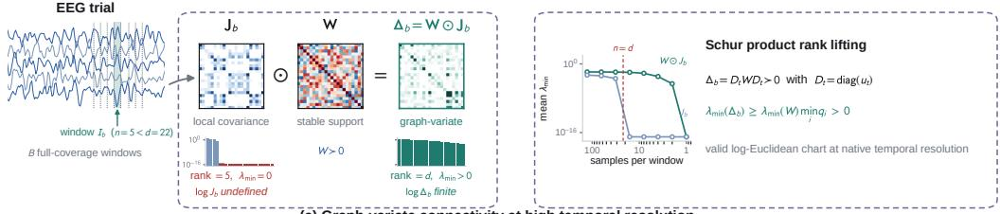  
(a) Graph-variate connectivity at high temporal resolution

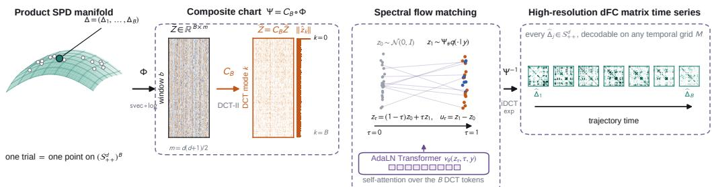  
(b) Spectral flow matching in the composite chart and high-resolution decoding

Figure 1: Overview of GVD-CFM. (a) When a window has fewer samples than channels $( n < d )$ the window covariance $J _ { b }$ is rank deficient and log $J _ { b }$ is undefined. With a positive-definite support $W , \Delta _ { b } = W \odot J _ { b }$ is positive definite with $\lambda _ { \operatorname* { m i n } } ( \bar { \Delta _ { b } } ) \geq \lambda _ { \operatorname* { m i n } } ( W )$ mini $q _ { i } > 0$ , so the log-Euclidean chart remains valid at native temporal resolution. (b) A trial is a point on $( \mathbb { S } _ { + + } ^ { d } ) ^ { B }$ . The chart Ψ applies $z _ { b } = \mathrm { s v e c }$ log $\Delta _ { b } .$ , featurewise standardization and the orthonormal temporal DCT-II; it is a global diffeomorphism and an isometry for its pullback metric (Remark 1). Flow matching along $z _ { \tau } = ( 1 - \tau ) z _ { 0 } + \tau z _ { 1 }$ is performed in these coordinates by a Transformer over DCT modes, and decoding through $\Psi ^ { - 1 }$ returns a trajectory in which every $\hat { \Delta } _ { b }$ lies on $\mathbb { S } _ { + + } ^ { d }$

## 4.2.2 Spectral Velocity Network

The DCT organizes temporal variation by frequency (Strang, 1999; Shuman et al., 2013): persistent structure concentrates in low-order modes and faster changes in higher-order modes. All B modes are retained, so no temporal resolution is discarded. Each row $\bar { z } _ { k }$ of $\bar { Z }$ is a Transformer token for DCT mode k (Vaswani et al., 2017), with hidden state given by a learned projection of $\bar { z } _ { k }$ plus an embedding of the mode index. The model is class-conditional through $c _ { \tau } = e _ { \mathrm { f l o w } } ( \tau ) + e _ { \mathrm { c l a s s } } ( y )$ , a Fourier encoding of flow time (Tancik et al., 2020) plus a learned class embedding, which modulates adaptive LayerNorm (AdaLN) Transformer blocks (Ba et al., 2016; Peebles and $\mathrm { X i e , }$ 2023). Selfattention acts across all DCT modes and gives hidden states $\boldsymbol { h _ { D } } \in \dot { \mathbb { R } ^ { B \times h } }$ , and an output projection gives the joint velocity $v _ { \theta } : \mathbb { R } ^ { B \times m } \times [ 0 , 1 ] \times \mathcal { Y }  \mathbb { R } ^ { B \times m }$ of the complete trajectory in a single forward pass.

Temporal branch. The amplitude of one window is spread across all B modes, while the decoder exponentiates each window separately. Errors that are unbiased in log coordinates therefore inflate the power of decoded windows (Remark 3), and a purely spectral network can produce a systematic amplitude offset (Appendix F.3). To correct this we add a small temporal branch $T _ { \theta }$ of two AdaLN blocks, which reads the same flow state in the window basis and returns its features to DCT alignment through a learned tokenwise gate,

$$
h _ { T } = C _ { B } T _ { \theta } \big ( C _ { B } ^ { \top } z _ { \tau } , c _ { \tau } \big ) , \qquad v _ { \theta } \big ( z _ { \tau } , \tau , y \big ) = P _ { \mathrm { o u t } } \big ( h _ { D } + g \odot h _ { T } \big ) , \qquad g = \sigma \big ( W _ { g } [ h _ { D } ; h _ { T } ] + b _ { g } \big ) .\tag{5}
$$

The flow state and the velocity remain in DCT coordinates, and since $C _ { B } ^ { \top }$ is a fixed linear map, the objective, its minimizer and the Riemannian equivalence are unchanged. The branch’s primary role is to reduce the amplitude bias (Section 6.3, Appendix A.17).

## 4.2.3 Training and Sampling

Let $\Psi _ { \# } q ( \cdot | \textit { y } )$ be the Euclidean pushforward of the class-conditional distribution of GVD trajectories. We draw $z _ { 0 } \sim \mathcal { N } ( 0 , I ) , z _ { 1 } \sim \Psi _ { \# } q ( \cdot \mid y )$ and $\tau \sim \mathcal { U } [ 0 , 1 ]$ , and use $z _ { \tau } = ( 1 - \tau ) z _ { 0 } + \tau z _ { 1 }$ with target $u _ { \tau } = z _ { 1 } - z _ { 0 }$ . Within each minibatch, source and target samples of the same class are paired by an entropic optimal-transport plan $\pi _ { y }$ computed with Sinkhorn iterations (Cuturi, 2013; Tong et al., 2024) on the squared Euclidean cost in the DCT chart. The orthonormal DCT preserves distances, so this cost is the squared geodesic distance under $g _ { \sigma }$ , and the coupling is computed in the geometry of the product manifold. GVD-CFM minimizes

$$
\begin{array} { r } { \mathcal { L } _ { \mathrm { G V D - C F M } } ( \theta ) = \mathbb { E } _ { y , ( z _ { 0 } , z _ { 1 } ) \sim \pi _ { y } , \tau } \left[ \frac { 1 } { B m } \big \| v _ { \theta } ( z _ { \tau } , \tau , y ) - u _ { \tau } \big \| _ { F } ^ { 2 } \right] . } \end{array}\tag{6}
$$

To sample, we draw $z ( 0 ) \sim \mathcal { N } ( 0 , I )$ , integrate dz $/ \mathrm { d } \tau = v _ { \theta ^ { \star } } ( z , \tau , y )$ with fourth-order Runge–Kutta (Hairer et al., 1993), and decode the result through $\Psi ^ { - 1 }$ . Algorithms 1 and 2 in Appendix A state both procedures in full.

## 4.3 Why Spectral Coordinates Simplify Trajectory Flow Matching

The DCT reparametrizes the dependence structure of the complete log-Euclidean trajectory. Let $K _ { T } \in \mathbb { R } ^ { B \times \dot { B } }$ be the temporal covariance of the log-GVD trajectory. The Karhunen–Loève transform (KLT) diagonalizes $K _ { T }$ exactly, and the orthonormal DCT is a fixed, data-independent approximation to the KLT for strongly correlated, temporally smooth processes (Ahmed et al., 1974; Strang, 1999). This has a direct consequence for conditional flow matching.

Theorem 1 (Spectral decoupling of Gaussian trajectory flow). Let $x _ { 1 } \sim \mathcal { N } ( 0 , \Sigma )$ with $\Sigma = V \Lambda V ^ { \top }$ $x _ { 0 } \sim \mathcal { N } ( 0 , I )$ , and $x _ { \tau } = ( 1 - \tau ) x _ { 0 } + \tau x _ { 1 }$ . In the covariance eigenbasis $y = V ^ { \top } x ,$ the populationoptimal squared-error conditionalflow-matchingfield is diagonal:

$$
v _ { \tau , k } ^ { \star } ( y ) = \frac { \tau \lambda _ { k } - ( 1 - \tau ) } { ( 1 - \tau ) ^ { 2 } + \tau ^ { 2 } \lambda _ { k } } y _ { k }
$$

(independent coupling),

$$
v _ { \tau , k } ^ { \star } ( y ) = \frac { \sqrt { \lambda _ { k } } - 1 } { ( 1 - \tau ) + \tau \sqrt { \lambda _ { k } } } y _ { k }\tag{7}
$$

(optimal-transport coupling).

Hence, in the exact KLT basis, no cross-mode interaction is needed to represent the optimal secondorder Gaussian transport under either coupling.

The proofs are given in Appendix C (Corollaries 3 and 4). The residual off-diagonal temporal covariance measures how closely the DCT approximates the KLT; on BNCI2014\_001 the DCT reduces it from 0.778 to 0.068 (Figure 5). The DCT therefore removes most of the second-order temporal coupling before the Transformer is applied, while remaining invertible and isometric.

## 5 Empirical Benchmarks

The main benchmark uses five two-class motor-imagery datasets from MOABB (Jayaram and Barachant, 2018; Aristimunha et al., 2023): BNCI2014\_001, BNCI2014\_002, BNCI2015\_001, Shin2017A and Zhou2016. Every trial is band-pass filtered to 4–38 Hz, resampled to 128 Hz, standardized per channel and converted to a GVD trajectory of $B = 1 0 0$ windows. The final session, or the final run when only runs are available, is held out, and all results are averaged over three generator seeds (Appendix A).

We compare against seven generators. Three are GVD-space controls that share the GVD targets and decoding pipeline of GVD-CFM and therefore isolate the contribution of the generative model: GVD-cVAE, GVD-DDPM and Window-DIFFEO-CFM, the last of which applies diffeomorphic flow matching (Collas et al., 2025) to each window independently. Four generate raw multichannel EEG, which is converted to a GVD trajectory using its own support and window covariances: JET (Wang et al., 2026), a U-Net DDPM/DDIM (Ho et al., 2020; Song et al., 2021a), EEGGAN-2025 (Williams et al., 2025) and a conditional VAE (Sohn et al., 2015). No real support or window covariance is ever reused for a raw-EEG baseline.

We report a full-dimensional GVD Fréchet distance relative to the real-train to real-test reference (Dowson and Landau, 1982; Heusel et al., 2017); EvaGeM α-precision, β-recall and F1 (Alaa et al.,

Table 1: Dataset-balanced generative performance across five EEG datasets, averaged over three generator seeds per dataset. Rel. GVD-FID and EvaGeM are evaluated jointly on trajectory positions and temporal increments. The real-data row reports the corresponding real-train/held-out-real-test reference and is excluded from generator rankings. Entries after ± are the seed standard deviation of the dataset-balanced mean, $\textstyle \left( \sum _ { i = 1 } ^ { 5 } \sigma _ { i } ^ { 2 } \right) ^ { 1 / 2 } / 5 .$ , computed from the per-dataset seed standard deviations $\sigma _ { i } .$ . Lower is better for Rel. $\mathrm { \bar { G } V D - F I D } ;$ higher is better otherwise. Best generative values are bold; second-best generative values are underlined italics.
<table><tr><td>Method</td><td>Rel. GVD-FID ↓</td><td> $\operatorname { E v a } \alpha \uparrow$ </td><td> $\operatorname { E v a } \beta \uparrow$ </td><td>Eva F1 ↑</td><td>CAS AUC ↑</td><td>CAS F1 ↑</td></tr><tr><td>GVD-CFM</td><td> $\underline { { I . 0 2 2 } } \pm 0 . 0 1 9 $ </td><td> $\mathbf { 0 . 6 7 7 { \scriptstyle \pm 0 . 0 3 4 } }$ </td><td> $\mathbf { 0 . 6 1 0 { \scriptstyle \pm 0 . 0 2 9 } }$ </td><td> $\mathbf { 0 . 6 1 3 { \scriptstyle \pm 0 . 0 2 8 } }$ </td><td> $\mathbf { 0 . 7 9 0 } 2 0 . 0 0 8$ </td><td>0.725±0.006</td></tr><tr><td>GVD-cVAE</td><td> $\mathbf { 0 . 8 1 5 { \scriptstyle \pm 0 . 0 0 3 } }$ </td><td> $0 . 0 1 7 { \scriptstyle \pm 0 . 0 0 5 }$ </td><td> $0 . 0 0 4 { \scriptstyle \pm 0 . 0 0 2 }$ </td><td> $0 . 0 0 5 { \scriptstyle \pm 0 . 0 0 2 }$ </td><td> $\underline { { 0 . 7 2 7 } } \pm 0 . 0 1 5$ </td><td> $\underline { { 0 . 6 7 5 } } \pm 0 . 0 1 0$ </td></tr><tr><td>GVD-DDPM</td><td> $1 . 7 5 3 { \scriptstyle \pm 0 . 0 0 5 }$ </td><td> $0 . 0 8 9 { \scriptstyle \pm 0 . 0 1 1 }$ </td><td> $0 . 0 3 9 { \scriptstyle \pm 0 . 0 0 5 }$ </td><td> $0 . 0 5 3 { \scriptstyle \pm 0 . 0 0 7 }$ </td><td> $0 . 5 9 9 { \scriptstyle \pm 0 . 0 1 4 }$ </td><td> $0 . 5 6 0 { \scriptstyle \pm 0 . 0 1 2 }$ </td></tr><tr><td>Window-DIFFEO-CFM</td><td> $1 . 6 9 7 { \scriptstyle \pm 0 . 0 0 5 }$ </td><td> $0 . 0 0 5 { \scriptstyle \pm 0 . 0 0 2 }$ </td><td> $0 . 0 8 2 { \scriptstyle \pm 0 . 0 0 2 }$ </td><td> $0 . 0 0 9 { \scriptstyle \pm 0 . 0 0 3 }$ </td><td> $0 . 6 8 3 { \scriptstyle \pm 0 . 0 0 3 }$ </td><td> $0 . 6 3 4 { \scriptstyle \pm 0 . 0 0 2 }$ </td></tr><tr><td>cVAE</td><td> $1 . 4 1 6 { \scriptstyle \pm 0 . 0 1 6 }$ </td><td> $\underline { { 0 . 4 0 7 } } \pm 0 . 0 3 6$ </td><td> $0 . 0 0 6 { \scriptstyle \pm 0 . 0 0 2 }$ </td><td> $0 . 0 1 2 { \scriptstyle \pm 0 . 0 0 3 }$ </td><td> $0 . 6 3 1 { \scriptstyle \pm 0 . 0 0 6 }$ </td><td> $0 . 5 7 2 { \scriptstyle \pm 0 . 0 1 7 }$ </td></tr><tr><td>JET</td><td> $3 . 9 0 8 { \scriptstyle \pm 0 . 2 7 4 }$ </td><td> $0 . 0 0 5 { \scriptstyle \pm 0 . 0 0 2 }$ </td><td> $0 . 0 0 2 { \scriptstyle \pm 0 . 0 0 2 }$ </td><td> $0 . 0 0 2 { \scriptstyle \pm 0 . 0 0 2 }$ </td><td> $0 . 4 9 5 { \scriptstyle \pm 0 . 0 3 1 }$ </td><td> $0 . 3 4 9 { \scriptstyle \pm 0 . 0 1 4 }$ </td></tr><tr><td>Vanilla-Diffusion</td><td> $1 . 8 6 7 { \scriptstyle \pm 0 . 0 9 6 }$ </td><td> $0 . 2 1 7 { \scriptstyle \pm 0 . 0 4 2 }$ </td><td> $\underline { { 0 . 3 6 6 { \pm } 0 . 0 9 8 } }$ </td><td> $\underline { { 0 . 2 4 7 } } { \pm } 0 . 0 5 6$ </td><td> $0 . 6 4 0 { \scriptstyle \pm 0 . 0 1 2 }$ </td><td>0.549±0.029</td></tr><tr><td>EEGGAN-2025</td><td> $3 . 6 9 6 { \scriptstyle \pm 0 . 0 1 6 }$ </td><td> $0 . 0 0 6 { \scriptstyle \pm 0 . 0 0 2 }$ </td><td> $0 . 0 0 2 { \scriptstyle \pm 0 . 0 0 1 }$ </td><td> $0 . 0 0 2 { \scriptstyle \pm 0 . 0 0 1 }$ </td><td> $0 . 5 2 4 { \scriptstyle \pm 0 . 0 3 1 }$ </td><td>0.401±0.017</td></tr><tr><td>Real data reference</td><td>一</td><td>0.806</td><td>0.665</td><td>0.695</td><td>0.831</td><td>0.756</td></tr></table>

Table 2: Complementary data-quality diagnostics averaged across five datasets and three seeds. Dynamic and diversity ratios have ideal value 1. Temporal quantities are evaluated against held-out real trajectories after removing each trial’s temporal mean, so the static support does not contribute to them. ± as in Table 1. Best values are bold; second-best values are underlined italics. For ratio metrics, ranking is by proximity to 1.
<table><tr><td>Method</td><td>Temp. corr. ↑</td><td>Lag-ACF ↑</td><td> $\mathrm { E n e r g y }  1$ </td><td> $\mathrm { D y n . ~ f r a c . }  1$ </td><td>Diversity → 1</td><td>Coverage ↑</td></tr><tr><td>GVD-CFM</td><td>0.910±0.004</td><td>0.997±0.001</td><td> $\mathbf { 0 . 9 5 3 } \pm 0 . 0 1 0$ </td><td> $\mathbf { 0 . 9 8 7 } { \pm 0 . 0 1 3 }$ </td><td> ${ \bf 0 . 9 8 7 } \pm 0 . 0 0 5$ </td><td> $\mathbf { 0 . 2 2 6 { \overset { . } { \bot } } 0 . 0 0 5 }$ </td></tr><tr><td>GVD-cVAE</td><td>0.774±0.014</td><td> $\overline { { 0 . 9 9 5 } } \pm 0 . 0 0 1$ </td><td> $0 . 2 6 0 { \scriptstyle \pm 0 . 0 0 7 }$ </td><td> $0 . 2 8 9 { \pm } 0 . 0 0 9$ </td><td> $0 . 3 9 6 { \pm } 0 . 0 0 8$ </td><td> $\underline { { 0 . 1 2 8 } } \pm 0 . 0 0 4$ </td></tr><tr><td>GVD-DDPM</td><td>0.059±0.005</td><td>0.327±0.068</td><td> $1 . 6 8 8 { \pm } 0 . 0 0 7$ </td><td> $1 . 5 4 3 { \pm } 0 . 0 0 8$ </td><td> $1 . 3 6 7 { \scriptstyle \pm 0 . 0 0 4 }$ </td><td> $0 . 0 3 8 { \pm } 0 . 0 0 2$ </td></tr><tr><td>Window-DIFFEO-CFM</td><td> $0 . 0 1 2 { \scriptstyle \pm 0 . 0 0 5 }$ </td><td>0.055±0.091</td><td> $1 . 7 9 4 { \pm } 0 . 0 0 8$ </td><td> $1 . 7 5 5 { \scriptstyle \pm 0 . 0 0 6 }$ </td><td> $1 . 1 8 9 { \pm } 0 . 0 0 2$ </td><td> $0 . 0 3 1 { \scriptstyle \pm 0 . 0 0 1 }$ </td></tr><tr><td>cVAE</td><td> $0 . 5 2 7 { \pm } 0 . 0 1 6$ </td><td>0.957±0.006</td><td> $0 . 8 9 8 { \scriptstyle \pm 0 . 0 0 6 }$ </td><td> $\underline { { 0 . 9 8 I } } \pm 0 . 0 1 4$ </td><td> $0 . 8 1 7 { \scriptstyle \pm 0 . 0 0 8 }$ </td><td> $0 . 0 3 4 { \scriptstyle \pm 0 . 0 0 1 }$ </td></tr><tr><td>JET</td><td>0.385±0.019</td><td>0.933±0.009</td><td> $1 . 9 4 0 { \pm } 0 . 1 1 8$ </td><td>6.835±0.338</td><td> $1 . 5 0 1 { \scriptstyle \pm 0 . 0 7 9 }$ </td><td> $0 . 0 0 9 { \scriptstyle \pm 0 . 0 0 4 }$ </td></tr><tr><td>Vanilla-Diffusion</td><td>0.783±0.014</td><td>0.998±0.001</td><td> $\underline { { 0 . 9 4 I } } \pm 0 . 0 3 7$ </td><td>1.759±0.418</td><td> $1 . 0 7 0 { \scriptstyle \pm 0 . 0 4 9 }$ </td><td> $0 . 0 8 5 { \pm } 0 . 0 1 0$ </td></tr><tr><td>EEGGAN-2025</td><td>0.022±0.010</td><td> $0 . 3 0 6 { \scriptstyle \pm 0 . 1 3 7 }$ </td><td> $0 . 6 0 9 { \scriptstyle \pm 0 . 0 1 2 }$ </td><td> $4 . 8 6 4 \pm 0 . 1 9 9$ </td><td> $\underline { { I . O 3 3 } } \pm 0 . 0 1 9$ </td><td> $0 . 0 0 3 { \scriptstyle \pm 0 . 0 0 0 }$ </td></tr></table>

2022); the classification accuracy score (CAS) of a classifier trained only on generated trajectories and tested on held-out real ones (Ravuri and Vinyals, 2019); held-out temporal diagnostics; and novelty measures (Kynkäänniemi et al., 2019; Alaa et al., 2022). All are defined in Appendix A.

## 6 Results

## 6.1 Generating High-Resolution Connectivity Trajectories

Table 1 reports the main results; per-dataset values are given in Appendix F.6. In downstream classification GVD-CFM performs best by a large margin, with a CAS AUC of 0.790 and CAS F1 of 0.725 against 0.727 and 0.675 for the second-best model, GVD-cVAE, and it comes within 0.041 AUC of a classifier trained on real data. GVD-cVAE attains the lowest relative GVD-FID, but its EvaGeM precision and recall are close to zero and its diversity ratio is 0.396 (Table 2), so its samples concentrate near the center of the distribution rather than covering it. GVD-CFM obtains the second-lowest relative GVD-FID (1.022) together with the highest EvaGeM α-precision, β-recall and F1 of all models, reaching 88% of the real-data EvaGeM F1. The raw-EEG generators obtain EvaGeM F1 below 0.25 once their outputs are converted to GVD trajectories; we can see that realistic raw EEG does not imply realistic connectivity dynamics.

## 6.2 Data Quality

Table 2 shows that GVD-CFM gives the best overall balance between coverage and temporal fidelity. It achieves the highest held-out temporal-correlation agreement (0.910) and the second-highest lag-ACF agreement (0.997, against 0.998 for Vanilla-Diffusion). Its dynamic-energy, dynamic-fraction and diversity ratios are the closest to 1 of all generators, and its training-manifold coverage is the highest. The GVD-space controls show why joint spectral modeling matters. GVD-DDPM and Window-DIFFEO-CFM, which model temporal windows directly, obtain temporal-correlation agreement below 0.06; GVD-cVAE retains temporal correlation but collapses dynamic energy to 0.260 of the real value. GVD-CFM produces no exact copies of training trajectories (Appendix F).

Table 3: DCT and temporal-branch ablation. No DCT trains the Transformer on temporal log-svec coordinates; DCT, spectral only is GVD-CFM without the temporal branch; the last row is the full GVD-CFM. All values are dataset-balanced means over five datasets and three generator seeds; per-dataset values are in Tables 16 and 17, and paired per-dataset tests in Table 18. Ratios have ideal value 1. ± as in Table 1. Best values are bold; second-best values are underlined italics.
<table><tr><td>Variant</td><td>Rel. GVD-FID ↓</td><td>Eva F1 ↑</td><td>CAS AUC ↑</td><td>CAS F1 ↑</td><td>Temp. corr. ↑</td><td>Lag-ACF↑</td><td>Energy → 1</td><td>Dyn. frac. → 1</td></tr><tr><td>No DCT</td><td>1.092±0.029</td><td>0.540±0.028</td><td>0.772±0.007</td><td>0.704±0.007</td><td>0.404±0.007</td><td>0.666±0.069</td><td>0.973±0.016</td><td>1.011±0.017</td></tr><tr><td>DCT, spectral only</td><td>1.025±0.006</td><td>0.600±0.019</td><td>0.792±0.002</td><td>0.721±0.004</td><td>0.919±0.002</td><td>0.997±0.001</td><td>0.975±0.011</td><td>1.010±0.010</td></tr><tr><td>GVD-ČFM (DCT + temporal branch)</td><td>1.022±0.019</td><td>0.613±0.028</td><td>0.790±0.008</td><td>0.725±0.006</td><td>0.910±0.004</td><td>0.997±0.001</td><td>0.953±0.010</td><td>0.987±0.013</td></tr></table>

Static support versus generated dynamics. Every GVD window carries the trial-level support W, so class information could reside in static structure alone. The generated trajectories carry dynamics beyond it. The temporal diagnostics above remove each trial’s temporal mean and are insensitive to W; a permutation test rejects exchangeability of the generated windows at $p = 0 . 0 0 2$ , the smallest attainable value with 500 permutations, on every dataset and seed; and on real data the full GVD trajectory outperforms the static support alone in held-out classification, while a support modulated by Gaussian noise falls to near chance (Figure 10).

## 6.3 Ablations

The DCT gives large and consistent gains. Table 3 separates the spectral representation from the temporal branch. Moving from temporal coordinates to the DCT chart raises temporal-correlation agreement from 0.404 to 0.919 and lag-ACF agreement from 0.666 to 0.997, in line with Theorem 1. Both improvements hold on all five datasets (Welch t from 4.8 to 80.9 and from 3.4 to 13.0; Table 18). Under the same spectral-only network, a random orthogonal basis does not reproduce this gain, while the empirical KLT performs comparably to the DCT (Table 4). The benefit therefore comes from temporal decorrelation rather than from orthogonality alone.

The temporal branch corrects amplitude. Adding the temporal branch changes the datasetbalanced means by amounts comparable to their seed variation (EvaGeM F1 0.600 → 0.613, CAS F1 0.721 → 0.725, CAS AUC 0.792 → 0.790, temporal correlation 0.919 → 0.910), so we treat these differences as ties. Its intended effect is on amplitude: dynamic energy decreases on every dataset and moves towards 1 where the spectral-only network overshoots, as we show in Appendix F.3.

The stable support improves downstream utility. We compared GVD-CFM with the same generator trained on ridge-regularized window covariances $J _ { b } + \dot { 1 } 0 ^ { - 6 } I ,$ , since without the support a ridge is needed to make the windows SPD (per-dataset values in Table 19; ± as in Table 1). The stable support raises CAS AUC on every dataset; the dataset-balanced CAS AUC rises from 0.736±0.005 to 0.790±0.008, CAS F1 from 0.679±0.005 to 0.725±0.006 and EvaGeM F1 from 0.436±0.015 to 0.613±0.028.

## 6.4 Regional Physiological Plausibility

Global metrics do not show whether generated connectivity is organized in space and time as in real EEG. We grouped the 22 electrodes of BNCI2014\_001 into Frontal/FC, Central, Centroparietal and Parietal/Occipital regions and computed the mean GVD edge magnitude for every pair of regions (Appendix E). Generated trajectories keep the regional organization of held-out data. Within-region connectivity is 0.835 against 0.847 for real data in Frontal/FC and 0.880 against 0.894 in Parietal/Occipital, Central–Centro-parietal coupling is 0.706 against 0.717, and the long-range Frontal/FC–Parietal/Occipital coupling stays weak (0.420 against 0.437). Figure 6 shows that the time course of these interactions is also preserved, and that its changes occur together across central, centro-parietal, frontal and posterior interactions. The generated dynamics are therefore organized around the sensorimotor regions expected to take part in motor imagery (Pfurtscheller and da Silva, 1999).

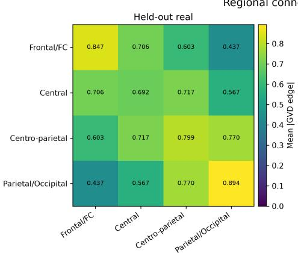

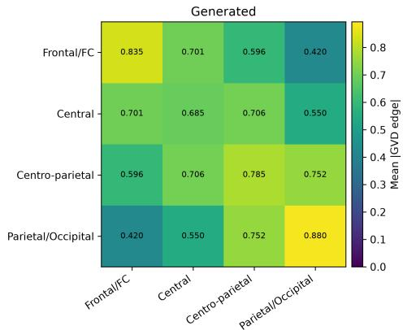  
Figure 2: Regional connectivity magnitude on BNCI2014\_001. Mean absolute GVD edge magnitude between broad scalp regions for held-out real trials and generated trials. The generated data preserve the relative regional organization of the real EEG, including strong within-region Frontal/FC and Parietal/Occipital connectivity, strong Central–Centro-parietal coupling, and weaker long-range Frontal/FC–Parietal/Occipital interactions.

## 6.5 Continuous-Grid Decoding and Efficiency

The generated DCT coefficients define a band-limited cosine trajectory, so they can be decoded on any temporal grid without retraining. Training the spectral-only network once at $B _ { \mathrm { t r a i n } } = 2 5$ windows and decoding at M = 100 changes generated-to-real AUC only from 0.803 to 0.802; at M = 200 it remains 0.794 with lag-ACF agreement 0.959, and every decoded matrix stays SPD. At M = 400 temporal-correlation agreement falls to 0.506, the bandwidth limit of 25 modes (Appendix D). GVD-CFM trains in about five minutes per dataset and achieves the best efficiency trade off (Appendix Figure 9).

## 7 Conclusions and Limitations

We introduced GVD-CFM, a conditional flow matching model for generating high-temporalresolution DFC trajectories from EEG. When the stable support is positive definite, GVD trajectories lie on a product Riemannian manifold even when individual window covariances are rank deficient. This allows Euclidean flow matching under a global diffeomorphism to be exactly equivalent to Riemannian flow matching on the original manifold. We further showed that applying the DCT approximately decorrelates the temporal structure of these trajectories, leading to large and consistent improvements in temporal fidelity. Across five EEG datasets and seven baselines, GVD-CFM provides the best overall trade-off across the reported metrics. The generated trajectories remain on the manifold, show no evidence of memorizing the training data, and preserve both the regional organization and temporal evolution of motor-imagery connectivity. Together, these results suggest that directly modeling connectivity trajectories is a practical alternative to generating raw EEG when the downstream quantity of interest is dynamic functional connectivity.

Our work also has several limitations. First, the number of log-Euclidean coordinates per window grows quadratically with the number of channels, which may limit scalability to substantially higherdensity recordings. Second, GVD-CFM ultimately depends on the quality of the underlying GVD estimator. Future work could explore using phase- or coherence-based node functions (Smith et al., 2019; Roy et al., 2025), and could explore alternative diffeomorphisms with different geometric or computational properties (Lin, 2019; David and Gu, 2019; Thanwerdas, 2022). It would also be useful to test whether the same framework generalizes beyond motor-imagery EEG and to other modalities where dynamic connectivity is of interest, particularly fMRI (Hutchison et al., 2013; Allen et al., 2014; Preti et al., 2017). More broadly, extending GVD-CFM to larger networks, frequency-resolved connectivity, and other forms of neural dynamics would help establish how well the approach scales beyond the setting studied here.

## Reproducibility Statement

All five datasets are public and are obtained through MOABB (Jayaram and Barachant, 2018; Aristimunha et al., 2023). Appendix A gives the preprocessing, the GVD construction, the log-Euclidean and DCT chart, the architecture and optimizer settings of GVD-CFM, including the temporal branch and the minibatch coupling, the configuration of every baseline, and the definition of every metric. Training and sampling are stated as Algorithms 1 and 2. All reported experiments use three generator seeds and three classifier seeds, stated in the appendix, and exact train–test duplication is checked by hashing before any model is fitted. Code is included in the supplementary material.

## Use of Large Language Models

Large language models were used for proofreading, notation consistency, and formatting. They were also used to check correctness of mathematical proofs. All scientific claims, mathematical arguments, experimental choices, implementations, and reported results remain the responsibility of the authors.

## References

Nasir Ahmed, T. Natarajan, and Kamisetty R. Rao. Discrete cosine transform. IEEE Transactions on Computers, C-23(1):90–93, 1974.

Ahmed Alaa, Boris van Breugel, Evgeny S. Saveliev, and Mihaela van der Schaar. How faithful is your synthetic data? Sample-level metrics for evaluating and auditing generative models. In 39th International Conference on Machine Learning, pages 290–306, Baltimore, MD, July 2022.

Michael S. Albergo and Eric Vanden-Eijnden. Building normalizing flows with stochastic interpolants. In 11th International Conference on Learning Representations, Kigali, Rwanda, May 2023.

Elena A. Allen, Eswar Damaraju, Sergey M. Plis, Erik B. Erhardt, Tom Eichele, and Vince D. Calhoun. Tracking whole-brain connectivity dynamics in the resting state. Cerebral Cortex, 24(3): 663–676, 2014.

Bruno Aristimunha, Igor Carrara, Pierre Guetschel, Sara Sedlar, Pedro Rodrigues, Jan Sosulski, Divyesh Narayanan, Erik Bjareholt, Quentin Barthelemy, Robin T. Schirrmeister, Emmanuel Kalunga, Ludovic Darmet, Cattan Gregoire, Ali Abdul Hussain, Ramiro Gatti, Vladislav Goncharenko, Jordy Thielen, Thomas Moreau, Yannick Roy, Vinay Jayaram, Alexandre Barachant, and Sylvain Chevallier. Mother of all BCI benchmarks (MOABB), 2023.

Martin Arjovsky, Soumith Chintala, and Léon Bottou. Wasserstein generative adversarial networks. In 34th International Conference on Machine Learning, pages 214–223, Sydney, Australia, August 2017.

Vincent Arsigny, Pierre Fillard, Xavier Pennec, and Nicholas Ayache. Geometric means in a novel vector space structure on symmetric positive-definite matrices. SIAM Journal on Matrix Analysis and Applications, 29(1):328–347, 2007.

Jimmy Lei Ba, Jamie Ryan Kiros, and Geoffrey E. Hinton. Layer normalization. arXiv:1607.06450 [stat.ML], 2016.

Alexandre Barachant. Commande robuste d’un effecteur par une interface cerveau machine EEG asynchrone. PhD thesis, Université de Grenoble, 2012.

Alexandre Barachant, Stéphane Bonnet, Marco Congedo, and Christian Jutten. Multiclass brain– computer interface classification by Riemannian geometry. IEEE Transactions on Biomedical Engineering, 59(4):920–928, 2012.

Benjamin Blankertz, Ryota Tomioka, Steven Lemm, Motoaki Kawanabe, and Klaus-Robert Müller. Optimizing spatial filters for robust EEG single-trial analysis. IEEE Signal Processing Magazine, 25(1):41–56, 2008.

Valentin De Bortoli, Emile Mathieu, Michael Hutchinson, James Thornton, Yee Whye Teh, and Arnaud Doucet. Riemannian score-based generative modelling. In 36th Conference on Neural Information Processing Systems, pages 2406–2422, December 2022.

Tom B. Brown, Benjamin Mann, Nick Ryder, Melanie Subbiah, Jared Kaplan, Prafulla Dhariwal, Arvind Neelakantan, Pranav Shyam, Girish Sastry, Amanda Askell, Sandhini Agarwal, Ariel Herbert-Voss, Gretchen Krueger, Tom Henighan, Rewon Child, Aditya Ramesh, Daniel M. Ziegler, Jeffrey Wu, Clemens Winter, Christopher Hesse, Mark Chen, Eric Sigler, Mateusz Litwin, Scott Gray, Benjamin Chess, Jack Clark, Christopher Berner, Sam McCandlish, Alec Radford, Ilya Sutskever, and Dario Amodei. Language models are few-shot learners. In 34th Conference on Neural Information Processing Systems, pages 1877–1901, December 2020.

Clemens Brunner, Robert Leeb, Gernot Müller-Putz, Alois Schlögl, and Gert Pfurtscheller. BCI Competition 2008 – Graz data set A. Technical report, Institute for Knowledge Discovery, Graz University of Technology, 2008.

Andrea Cavallo, Maosheng Sabbaqi, and Elvin Isufi. Spatiotemporal covariance neural networks. In Joint European Conference on Machine Learning and Knowledge Discovery in Databases, pages 18–34, Cham, August 2024. Springer Nature Switzerland.

Ricky T. Q. Chen and Yaron Lipman. Flow matching on general geometries. In 12th International Conference on Learning Representations, Vienna, Austria, May 2024.

Ricky T. Q. Chen, Yulia Rubanova, Jesse Bettencourt, and David K. Duvenaud. Neural ordinary differential equations. In 32nd Conference on Neural Information Processing Systems, pages 6572–6583, Montréal, QC, December 2018.

Yilun Chen, Ami Wiesel, Yonina C. Eldar, and Alfred O. Hero. Shrinkage algorithms for MMSE covariance estimation. IEEE Transactions on Signal Processing, 58(10):5016–5029, 2010.

Antoine Collas, Ce Ju, Nicolas Salvy, and Bertrand Thirion. Riemannian flow matching for brain connectivity matrices via pullback geometry (DIFFEOCFM). In 39th Conference on Neural Information Processing Systems, December 2025.

Marco Cuturi. Sinkhorn distances: Lightspeed computation of optimal transport. In Advances in Neural Information Processing Systems, 2013.

Paul David and Weiqing Gu. A Riemannian structure for correlation matrices. Operators and Matrices, 13(3):607–627, 2019.

Thibault de Surrel, Fabien Lotte, Sylvain Chevallier, and Florian Yger. Wrapped Gaussian on the manifold of symmetric positive definite matrices. In 42nd International Conference on Machine Learning, July 2025.

Prafulla Dhariwal and Alexander Nichol. Diffusion models beat GANs on image synthesis. In 35th Conference on Neural Information Processing Systems, pages 8780–8794, December 2021.

Haoran Ding, Noémie Jaquier, Jan Peters, and Leonel Rozo. Fast and robust visuomotor Riemannian flow matching policy. IEEE Transactions on Robotics, 2025.

Laurent Dinh, Jascha Sohl-Dickstein, and Samy Bengio. Density estimation using Real NVP. In 5th International Conference on Learning Representations, Toulon, France, April 2017.

D. C. Dowson and B. V. Landau. The Fréchet distance between multivariate normal distributions. Journal ofMultivariate Analysis, 12(3):450–455, 1982.

Cristóbal Esteban, Stephanie L. Hyland, and Gunnar Rätsch. Real-valued (medical) time series generation with recurrent conditional GANs. arXiv:1706.02633 [stat.ML], 2017.

Josef Faller, Carmen Vidaurre, Teodoro Solis-Escalante, Christa Neuper, and Reinhold Scherer. Autocalibration and recurrent adaptation: towards a plug and play online ERD-BCI. IEEE Transactions on Neural Systems and Rehabilitation Engineering, 20(3):313–319, 2012.

Luca Falorsi, Pim de Haan, Tim R. Davidson, and Patrick Forré. Reparameterizing distributions on Lie groups. In 22nd International Conference on Artificial Intelligence and Statistics, pages 3244–3253, Naha, Japan, April 2019.

P. Thomas Fletcher and Sarang Joshi. Principal geodesic analysis on symmetric spaces: statistics of diffusion tensors. In Sonka, M., Kakadiaris, I.A., Kybic, J. (eds) Computer Vision and Mathematical Methods in Medical and Biomedical Image Analysis. MMBIA CVAMIA 2004 2004., Lecture Notes in Computer Science, vol 3117. Springer, Berlin, Heidelberg.

Michael D. Fox, Randy L. Buckner, Hesheng Liu, M. Mallar Chakravarty, Andres M. Lozano, and Alvaro Pascual-Leone. Resting-state networks link invasive and noninvasive brain stimulation across diverse psychiatric and neurological diseases. Proceedings of the National Academy of Sciences, 111(41):E4367–E4375, 2014.

Gene H. Golub and Charles F. Van Loan. Matrix Computations. JHU Press, Baltimore, MD, 4th edition, 2013.

Ian Goodfellow, Jean Pouget-Abadie, Mehdi Mirza, Bing Xu, David Warde-Farley, Sherjil Ozair, Aaron Courville, and Yoshua Bengio. Generative adversarial networks. In 28th Conference on Neural Information Processing Systems, pages 2672–2680, Montréal, QC, December 2014.

Alexandre Gramfort, Martin Luessi, Eric Larson, Denis A. Engemann, Daniel Strohmeier, Christian Brodbeck, Roman Goj, Mainak Jas, Teon Brooks, Lauri Parkkonen, and Matti S. Hämäläinen. MEG and EEG data analysis with MNE-Python. Frontiers in Neuroscience, 7:267, 2013.

Ishaan Gulrajani, Faruk Ahmed, Martin Arjovsky, Vincent Dumoulin, and Aaron Courville. Improved training of Wasserstein GANs. In 31st Conference on Neural Information Processing Systems, pages 5769–5779, Long Beach, CA, December 2017.

Ernst Hairer, Syvert P. Nørsett, and Gerhard Wanner. Solving Ordinary Differential Equations I: NonstiffProblems. Springer-Verlag, Berlin, Heidelberg, 2nd edition, 1993.

David Hallac, Youngsuk Park, Stephen Boyd, and Jure Leskovec. Network inference via the timevarying graphical lasso. In 23rd ACM SIGKDD International Conference on Knowledge Discovery and Data Mining, pages 205–213, Halifax, NS, August 2017.

Kay Gregor Hartmann, Robin Tibor Schirrmeister, and Tonio Ball. EEG-GAN: generative adversarial networks for electroencephalographic (EEG) brain signals. arXiv:1806.01875 [eess.SP], 2018.

Dan Hendrycks and Kevin Gimpel. Gaussian error linear units (GELUs). arXiv:1606.08415 [cs.LG], 2016.

Martin Heusel, Hubert Ramsauer, Thomas Unterthiner, Bernhard Nessler, and Sepp Hochreiter. GANs trained by a two time-scale update rule converge to a local Nash equilibrium. In 31st Conference on Neural Information Processing Systems, pages 6629–6640, Long Beach, CA, December 2017.

Rikkert Hindriks, Mohit H. Adhikari, Yusuke Murayama, Marco Ganzetti, Dante Mantini, Nikos K. Logothetis, and Gustavo Deco. Can sliding-window correlations reveal dynamic functional connectivity in resting-state fMRI? NeuroImage, 127:242–256, 2016.

Jonathan Ho and Tim Salimans. Classifier-free diffusion guidance. arXiv:2207.12598 [cs.LG], 2022.

Jonathan Ho, Ajay Jain, and Pieter Abbeel. Denoising diffusion probabilistic models. In 34th Conference on Neural Information Processing Systems, pages 6840–6851, December 2020.

Roger A. Horn and Charles R. Johnson. Matrix Analysis. Cambridge University Press, Cambridge, 2nd edition, 2012.

Xikun Huang,Tianyu Ruan, Chihao Zhang and Shihua Zhang. Graph generation with spectral geodesic flow matching. arXiv:2510.02520 [cs.LG], 2025.

Guillaume Huguet, James Vuckovic, Kilian Fatras, Eric Thibodeau-Laufer, Pablo Lemos, Riashat Islam, Cheng-Hao Liu, Jarrid Rector-Brooks, Tara Akhound-Sadegh, Michael M. Bronstein, Alexander Tong, and Avishek Joey Bose. Sequence-augmented SE(3)-flow matching for conditional protein generation. In 38th Conference on Neural Information Processing Systems, December 2024.

R. Matthew Hutchison, Thilo Womelsdorf, Elena A. Allen, Peter A. Bandettini, Vince D. Calhoun, Maurizio Corbetta, Stefania Della Penna, Jeff H. Duyn, Gary H. Glover, Javier Gonzalez-Castillo, Daniel A. Handwerker, Shella Keilholz, Vesa Kiviniemi, David A. Leopold, Francesco de Pasquale, Olaf Sporns, Martin Walter, and Catie Chang. Dynamic functional connectivity: promise, issues, and interpretations. NeuroImage, 80:360–378, 2013.

Vinay Jayaram and Alexandre Barachant. MOABB: trustworthy algorithm benchmarking for BCIs. Journal ofNeural Engineering, 15(6):066011, 2018.

Weibang Jiang, Liming Zhao, and Bao-Liang Lu. Large brain model for learning generic representations with tremendous EEG data in BCI. In 12th International Conference on Learning Representations, Vienna, Austria, May 2024.

Jaehyeong Jo and Sung Ju Hwang. Generative modeling on manifolds through mixture of Riemannian diffusion processes. arXiv:2310.07216 [cs.LG], 2023.

Ce Ju, Reinmar J. Kobler, Antoine Collas, Motoaki Kawanabe, Cuntai Guan, and Bertrand Thirion. SPD learning for covariance-based neuroimaging analysis: perspectives, methods, and challenges. arXiv:2504.18882 [cs.LG], 2025.

Kacper Kapusniak, Peter Potaptchik, Teodora Reu, Leo Zhang, Alexander Tong, Michael Bronstein, Avishek Joey Bose, and Francesco Di Giovanni. Metric flow matching for smooth interpolations on the data manifold. In 38th Conference on Neural Information Processing Systems, December 2024.

Diederik P. Kingma and Jimmy Lei Ba. ADAM: A method for stochastic optimization. In 3rd International Conference on Learning Representations, pages 1–15, San Diego, CA, May 2015.

Diederik P. Kingma and Max Welling. Auto-encoding variational Bayes. In 2nd International Conference on Learning Representations, Banff, AB, April 2014.

Reinmar J. Kobler, Jun ichiro Hirayama, Qibin Zhao, and Motoaki Kawanabe. SPD domain-specific batch normalization to crack interpretable unsupervised domain adaptation in EEG. In 36th Conference on Neural Information Processing Systems, pages 6219–6235, December 2022.

Tuomas Kynkäänniemi, Tero Karras, Samuli Laine, Jaakko Lehtinen, and Timo Aila. Improved precision and recall metric for assessing generative models. In 33rd Conference on Neural Information Processing Systems, Vancouver, BC, December 2019.

Elnaz Lashgari, Dehua Liang, and Uri Maoz. Data augmentation for deep-learning-based electroencephalography. Journal ofNeuroscience Methods, 346:108885, 2020.

Vernon J. Lawhern, Amelia J. Solon, Nicholas R. Waytowich, Stephen M. Gordon, Chou Po Hung, and Brent J. Lance. EEGNet: a compact convolutional neural network for EEG-based brain–computer interfaces. Journal ofNeural Engineering, 15(5):056013, 2018.

Olivier Ledoit and Michael Wolf. A well-conditioned estimator for large-dimensional covariance matrices. Journal of Multivariate Analysis, 88(2):365–411, 2004.

Robert Leeb, Felix Lee, Claudia Keinrath, Reinhold Scherer, Horst Bischof, and Gert Pfurtscheller. Brain–computer communication: motivation, aim, and impact of exploring a virtual apartment. IEEE Transactions on Neural Systems and Rehabilitation Engineering, 15(4):473–482, 2007.

Nora Leonardi and Dimitri Van De Ville. On spurious and real fluctuations of dynamic functional connectivity during rest. NeuroImage, 104:430–436, 2015.

Yunchen Li, Zhou Yu, Gaoqi He, Yunhang Shen, Ke Li, Xing Sun, and Shaohui Lin. SPD-DDPM: denoising diffusion probabilistic models in the symmetric positive definite space. In 38th AAAI Conference on Artificial Intelligence, pages 13709–13717, Vancouver, BC, February 2024.

Zhenhua Lin. Riemannian geometry of symmetric positive definite matrices via Cholesky decomposition. SIAM Journal on Matrix Analysis and Applications, 40(4):1353–1370, 2019.

Yaron Lipman, Ricky T. Q. Chen, Heli Ben-Hamu, Maximilian Nickel, and Matt Le. Flow matching for generative modeling. In 11th International Conference on Learning Representations, Kigali, Rwanda, May 2023.

Yaron Lipman, Marton Havasi, Peter Holderrieth, Neta Shaul, Matt Le, Brian Karrer, Ricky T. Q. Chen, David Lopez-Paz, Heli Ben-Hamu, and Itai Gat. Flow matching guide and code. arXiv:2412.06264 [cs.LG], 2024.

Xingchao Liu, Chengyue Gong, and Qiang Liu. Flow straight and fast: learning to generate and transfer data with rectified flow. In 11th International Conference on Learning Representations, Kigali, Rwanda, May 2023.

Ilya Loshchilov and Frank Hutter. Decoupled weight decay regularization. In 7th International Conference on Learning Representations, New Orleans, LA, May 2019.

Fabien Lotte, Laurent Bougrain, Andrzej Cichocki, Maureen Clerc, Marco Congedo, Alain Rakotomamonjy, and Florian Yger. A review of classification algorithms for EEG-based brain–computer interfaces: a 10 year update. Journal ofNeural Engineering, 15(3), 2018.

Yun Luo and Bao-Liang Lu. EEG data augmentation for emotion recognition using a conditional Wasserstein GAN. In 40th Annual International Conference ofthe IEEE Engineering in Medicine and Biology Society (EMBC), pages 2535–2538, Honolulu, HI, July 2018.

Gautier Marti. CorrGAN: sampling realistic financial correlation matrices using generative adversarial networks. In IEEE International Conference on Acoustics, Speech and Signal Processing (ICASSP), pages 8459–8463, Barcelona, Spain, May 2020.

Robert J. McCann. A convexity principle for interacting gases. Advances in Mathematics, 128(1): 153–179, 1997.

Benjamin Kurt Miller, Ricky T. Q. Chen, Anuroop Sriram, and Brandon M. Wood. FlowMM: generating materials with Riemannian flow matching. In 41st International Conference on Machine Learning, Vienna, Austria, July 2024.

Ricardo Pio Monti, Peter Hellyer, David Sharp, Robert Leech, Christoforos Anagnostopoulos, and Giovanni Montana. Estimating time-varying brain connectivity networks from functional MRI time series. NeuroImage, 103:427–443, 2014.

Muhammad Ferjad Naeem, Seong Joon Oh, Youngjung Uh, Yunjey Choi, and Jaejun Yoo. Reliable fidelity and diversity metrics for generative models. In 37th International Conference on Machine Learning, pages 7176–7185, July 2020.

Adam Paszke, Sam Gross, Francisco Massa, Adam Lerer, James Bradbury, Gregory Chanan, Trevor Killeen, Zeming Lin, Natalia Gimelshein, Luca Antiga, Alban Desmaison, Andreas Köpf, Edward Yang, Zachary DeVito, Martin Raison, Alykhan Tejani, Sasank Chilamkurthy, Benoit Steiner, Lu Fang, Junjie Bai, and Soumith Chintala. PyTorch: An imperative style, high-performance deep learning library. In 33rd Conference on Neural Information Processing Systems, pages 8024–8035, Vancouver, BC, December 2019.

William Peebles and Saining Xie. Scalable diffusion models with transformers. In IEEE/CVF International Conference on Computer Vision, pages 4195–4205, Paris, France, October 2023.

Xavier Pennec. Intrinsic statistics on Riemannian manifolds: basic tools for geometric measurements. Journal ofMathematical Imaging and Vision, 25(1):127–154, 2006.

Xavier Pennec, Pierre Fillard, and Nicholas Ayache. A Riemannian framework for tensor computing. International Journal ofComputer Vision, 66(1):41–66, 2006.

Gert Pfurtscheller and Fernando H. Lopes da Silva. Event-related EEG/MEG synchronization and desynchronization: basic principles. Clinical Neurophysiology, 110(11):1842–1857, 1999.

Maria Giulia Preti, Thomas A. W. Bolton, and Dimitri Van De Ville. The dynamic functional connectome: state-of-the-art and perspectives. NeuroImage, 160:41–54, 2017.

Yiming Qin, Manuel Madeira, Dorina Thanou, and Pascal Frossard. DeFoG: discrete flow matching for graph generation. In 42nd International Conference on Machine Learning, July 2025.

Kashif Rasul, Calvin Seward, Ingmar Schuster, and Roland Vollgraf. Autoregressive denoising diffusion models for multivariate probabilistic time series forecasting. In 38th International Conference on Machine Learning, pages 8857–8868, July 2021.

Suman Ravuri and Oriol Vinyals. Classification accuracy score for conditional generative models. In 33rd Conference on Neural Information Processing Systems, pages 12268–12279, Vancouver, BC, December 2019.

Om Roy, Yashar Moshfeghi, Agustin Ibanez, Francisco Lopera, Mario A. Parra, and Keith M. Smith. Robust, high temporal-resolution EEG functional connectivity detects increased connectivity coinciding with P300 in visual short-term memory binding in both familial and sporadic prodromal Alzheimer’s disease. In Complex Networks 2023: The 12th International Conference on Complex Networks and Their Applications, pages 679–682, 2023.

Om Roy, Yashar Moshfeghi, Agustin Ibanez, Francisco Lopera, Mario A. Parra, and Keith M. Smith. FAST functional connectivity implicates P300 connectivity in working memory deficits in Alzheimer’s disease. Network Neuroscience, 8(4):1467–1490, 2024.

Om Roy, Yashar Moshfeghi, J. Smith, Agustin Ibanez, Mario A. Parra, and Keith M. Smith. A Hodge-FAST framework for high-resolution dynamic functional connectivity analysis of higher-order interactions in EEG signals. In 47th Annual International Conference ofthe IEEE Engineering in Medicine and Biology Society (EMBC), pages 1–6, 2025. doi: 10.1109/EMBC58623.2025. 11253015.

Om Roy, Yashar Moshfeghi, and Keith M. Smith. Covariance density neural networks. Transactions on Machine Learning Research, 2026.

Yannick Roy, Hubert Banville, Isabela Albuquerque, Alexandre Gramfort, Tiago H. Falk, and Jocelyn Faubert. Deep learning-based electroencephalography analysis: a systematic review. Journal of Neural Engineering, 16(5):051001, 2019.

Robin Tibor Schirrmeister, Jost Tobias Springenberg, Lukas Dominique Josef Fiederer, Martin Glasstetter, Katharina Eggensperger, Michael Tangermann, Frank Hutter, Wolfram Burgard, and Tonio Ball. Deep learning with convolutional neural networks for EEG decoding and visualization. Human Brain Mapping, 38(11):5391–5420, 2017.

Issai Schur. Bemerkungen zur Theorie der beschränkten Bilinearformen mit unendlich vielen Veränderlichen. Journalfür die reine und angewandte Mathematik, 140:1–28, 1911.

David I. Shuman, Sunil K. Narang, Pascal Frossard, Antonio Ortega, and Pierre Vandergheynst. The emerging field of signal processing on graphs: extending high-dimensional data analysis to networks and other irregular domains. IEEE Signal Processing Magazine, 30(3):83–98, 2013.

Saurabh Sihag, Gonzalo Mateos, Corey McMillan, and Alejandro Ribeiro. CoVariance neural networks. In 36th Conference on Neural Information Processing Systems, pages 17003–17016, Red Hook, NY, 2022. Curran Associates Inc.

Lene Theil Skovgaard. A Riemannian geometry of the multivariate normal model. Scandinavian Journal ofStatistics, 11(4):211–223, 1984.

Keith Smith, Javier Escudero, Mario A. Parra, Agustin Ibanez, John M. Starr, and Sergio Della Sala. Locating temporal functional dynamics of visual short-term memory binding using graph modular Dirichlet energy. Scientific Reports, 7:42013, 2017.

Keith Smith, Loukas Spyrou, and Javier Escudero. Graph-variate signal analysis. IEEE Transactions on Signal Processing, 67(2):293–305, 2019. doi: 10.1109/TSP.2018.2881658.

Jascha Sohl-Dickstein, Eric Weiss, Niru Maheswaranathan, and Surya Ganguli. Deep unsupervised learning using nonequilibrium thermodynamics. In 32nd International Conference on Machine Learning, pages 2256–2265, Lille, France, July 2015.

Kihyuk Sohn, Honglak Lee, and Xinchen Yan. Learning structured output representation using deep conditional generative models. In 29th Conference on Neural Information Processing Systems, pages 3483–3491, Montréal, QC, December 2015.

Jiaming Song, Chenlin Meng, and Stefano Ermon. Denoising diffusion implicit models. In 9th International Conference on Learning Representations, May 2021a.

Yang Song and Stefano Ermon. Generative modeling by estimating gradients of the data distribution. In 33rd Conference on Neural Information Processing Systems, Vancouver, BC, December 2019.

Yang Song, Jascha Sohl-Dickstein, Diederik P. Kingma, Abhishek Kumar, Stefano Ermon, and Ben Poole. Score-based generative modeling through stochastic differential equations. In 9th International Conference on Learning Representations, May 2021b.

David Steyrl, Reinhold Scherer, Josef Faller, and Gernot R. Müller-Putz. Random forests in noninvasive sensorimotor rhythm brain-computer interfaces: a practical and convenient non-linear classifier. Biomedical Engineering / Biomedizinische Technik, 61(1):77–86, 2016.

Gilbert Strang. The discrete cosine transform. SIAM Review, 41(1):135–147, 1999.

Matthew Tancik, Pratul P. Srinivasan, Ben Mildenhall, Sara Fridovich-Keil, Nithin Raghavan, Utkarsh Singhal, Ravi Ramamoorthi, Jonathan T. Barron, and Ren Ng. Fourier features let networks learn high-frequency functions in low-dimensional domains. In 34th Conference on Neural Information Processing Systems, pages 7537–7547, December 2020.

Michael Tangermann, Klaus-Robert Müller, Ad Aertsen, Niels Birbaumer, Christoph Braun, Clemens Brunner, Robert Leeb, Carsten Mehring, Kai J. Miller, Gernot Müller-Putz, Guido Nolte, Gert Pfurtscheller, Hubert Preissl, Gerwin Schalk, Alois Schlögl, Carmen Vidaurre, Stephan Waldert, and Benjamin Blankertz. Review of the BCI competition IV. Frontiers in Neuroscience, 6:55, 2012.

Kiet Bennema ten Brinke, Koen Minartz, and Vlado Menkovski. STFlow: data-coupled flow matching for geometric trajectory simulation. In 43rd International Conference on Machine Learning, 2026.

Yann Thanwerdas. Riemannian and stratified geometries on covariance and correlation matrices. PhD thesis, Université Côte d’Azur, 2022.

Alexander Tong, Kilian Fatras, Nikolay Malkin, Guillaume Huguet, Yanlei Zhang, Jarrid Rector-Brooks, Guy Wolf, and Yoshua Bengio. Improving and generalizing flow-based generative models with minibatch optimal transport. Transactions on Machine Learning Research, 2024.

Ashish Vaswani, Noam Shazeer, Niki Parmar, Jakob Uszkoreit, Llion Jones, Aidan N. Gomez, Łukasz Kaiser, and Illia Polosukhin. Attention is all you need. In 31st Conference on Neural Information Processing Systems, pages 5998–6008, Long Beach, CA, December 2017.

Clement Vignac, Igor Krawczuk, Antoine Siraudin, Bohan Wang, Volkan Cevher, and Pascal Frossard. DiGress: discrete denoising diffusion for graph generation. In 11th International Conference on Learning Representations, Kigali, Rwanda, May 2023.

Cédric Villani. Optimal Transport: Old and New. Springer, Berlin, Heidelberg, 2009.

Yifan Wang, Yijia Ma, Wen Li, and Chenyu You. Let EEG models learn EEG. arXiv:2605.21280 [cs.LG], 2026.

Chad C. Williams, Daniel Weinhardt, Maria Wirzberger, and Sebastian Musslick. Augmenting EEG with generative adversarial networks enhances brain decoding across classifiers and sample sizes. In 45th Annual Meeting ofthe Cognitive Science Society Sydney, Australia, July 2023.

Chad C. Williams, Daniel Weinhardt, Joshua Hewson, Martyna Beata Płomecka, Nicolas Langer, and Sebastian Musslick. EEG-GAN: a generative EEG augmentation toolkit for enhancing neural classification. bioRxiv, 2025. doi: 10.1101/2025.06.23.661164.

Robert Williams. Scalable generative modeling of weighted graphs. arXiv:2507.23111 [cs.LG], 2025.

Xu F, Dong G, Li J, Yang Q, Wang L, Zhao Y, Yan Y, Zhao J, Pang S, Guo D, Zhang Y and Leng J. Deep convolution generative adversarial network-based electroencephalogram data augmentation for post-stroke rehabilitation with motor imagery. International Journal ofNeural Systems, 32(9): 2250039, 2022. doi: 10.1142/S0129065722500393.

Qiqi Zhang and Ying Liu. Improving brain computer interface performance by data augmentation with conditional deep convolutional generative adversarial networks. arXiv:1806.07108 [cs.HC], 2018.

Bangyan Zhou, Xiaopei Wu, Zhao Lv, Lei Zhang, and Xiaojin Guo. A fully automated trial selection method for optimization of motor imagery based brain-computer interface. PLOS ONE, 11(9): e0162657, 2016.

## A Experimental Details

## A.1 Datasets and evaluation protocol

Experiments were conducted on five motor-imagery EEG datasets distributed through MOABB (Jayaram and Barachant, 2018; Aristimunha et al., 2023). The main benchmark uses BNCI2014\_001 (Tangermann et al., 2012; Brunner et al., 2008), BNCI2014\_002 (Steyrl et al., 2016), BNCI2015\_001 (Faller et al., 2012), Shin2017A, and Zhou2016 (Zhou et al., 2016), with all configured subjects for each dataset. The corresponding subject counts were 9, 14, 12, 29, and 4, respectively.

All reported experiments used a fixed cross-session or cross-run evaluation protocol. For each subject, when multiple sessions were available, the final session was reserved for testing and all preceding sessions were used for training. When multiple sessions were unavailable but multiple runs were present, the final run was held out instead. If neither structure was available, a stratified 50/50 split was used as a fallback. The data split was fixed across generator seeds.

All representation statistics, normalization parameters, model parameters, source-distribution statistics, and downstream classifiers were estimated using training data only. Exact duplicate trials between the training and held-out sets were explicitly checked, and execution was terminated if train–test leakage was detected.

All generative experiments were repeated using three generator seeds,

$$
s _ { \mathrm { g e n } } \in \{ 1 , 2 , 3 \} ,\tag{8}
$$

and CAS evaluation used three independent classifier seeds,

$$
s _ { \mathrm { C A S } } \in \{ 9 0 0 1 , 9 0 0 2 , 9 0 0 3 \} .\tag{9}
$$

## A.2 EEG preprocessing

Only EEG channels were retained; non-EEG channels were discarded. Signals were converted to microvolts, band-pass filtered from 4 to 38 Hz, and resampled to 128 Hz (Gramfort et al., 2013). Event-aligned trials were then extracted using the complete event interval provided by each dataset

Before GVD construction, every EEG trial was standardized independently for each channel over the complete temporal duration of the trial. For channel c,

$$
\widetilde { u } _ { c , t } = \frac { u _ { c , t } - \mu _ { c } } { \operatorname* { m a x } ( \sigma _ { c } , 1 0 ^ { - 6 } ) } ,\tag{10}
$$

where

$$
\mu _ { c } = \frac { 1 } { T } \sum _ { t = 1 } ^ { T } u _ { c , t } ,\tag{11}
$$

and

$$
\sigma _ { c } = \sqrt { \frac { 1 } { T } \sum _ { t = 1 } ^ { T } ( u _ { c , t } - \mu _ { c } ) ^ { 2 } } .\tag{12}
$$

Standardization was performed over time within each channel and trial.

Two motor-imagery classes were retained for each binary experiment.

## A.3 Graph-variate dynamic connectivity construction

Each standardized EEG trial was transformed into a high-resolution graph-variate dynamic (GVD) connectivit trajectory. Let

$$
U = \big [ u _ { 1 } \quad \cdot \cdot \cdot \quad u _ { T } \big ] \in \mathbb { R } ^ { d \times T } ,\tag{13}
$$

where

$$
u _ { t } \in \mathbb { R } ^ { d }\tag{14}
$$

is the vector of standardized channel amplitudes at EEG sample t.

Stable trial-level support. The long-term support matrix was the signed whole-trial Pearson correlation matrix,

$$
W = \frac { 1 } { T } \boldsymbol { U } \boldsymbol { U } ^ { \top } .\tag{15}
$$

Because every channel has already been centered and normalized over the complete trial, Equation 15 is the signed channel correlation matrix under the population-standard-deviation convention used by the implementation.

No absolute-value operation, additive ridge, or nearest-SPD projection was applied to the support matrix in the reported configuration. Because every channel is standardized over the trial, W has unit diagonal and rank ${ \mathrm { \hat { W } } } ) = \mathrm { r a n k } { \mathrm { \bar { ( } } U ) }$ , which is full whenever the $T \gg$ d samples span $\mathbb { R } ^ { d }$ . The strict positive definiteness of every W is verified in double precision before construction of the trajectory, and execution terminates if the check fails. No trial in any dataset failed.

Sample-resolution instantaneous interaction. At every original EEG sample, the instantaneous interaction matrix was defined as the rank-one outer product

$$
J _ { t } = u _ { t } u _ { t } ^ { \top } .\tag{16}
$$

The sample-resolution graph-variate matrix was then

$$
\Delta _ { t } = W \odot J _ { t } ,\tag{17}
$$

where ⊙ denotes the Hadamard product.

Using

$$
D _ { t } = \mathrm { d i a g } ( u _ { t } ) ,\tag{18}
$$

Equation 17 can equivalently be written as

$$
\Delta _ { t } = D _ { t } W D _ { t } .\tag{19}
$$

Temporal aggregation. Each trial was partitioned into

$$
B = 1 0 0\tag{20}
$$

disjoint full-coverage temporal bins. Their boundaries were

$$
e _ { b } = \left\lfloor { \frac { b T } { B } } \right\rfloor , \qquad b = 0 , \ldots , B ,\tag{21}
$$

so that every original EEG sample belongs to exactly one bin and the complete trial is covered.

$$
\mathcal { T } _ { b } = \{ e _ { b - 1 } , \ldots , e _ { b } - 1 \}\tag{22}
$$

denote the sample indices in bin $b .$ The reported GVD trajectory was obtained by averaging the already Hadamard-modulated sample-resolution matrices (this is $\overline { { \Delta } } _ { b }$ in the main text; we drop the bar in the appendix):

$$
\Delta _ { b } = \frac { 1 } { \left| \mathcal { T } _ { b } \right| } \sum _ { t \in \mathcal { T } _ { b } } \left( W \odot u _ { t } u _ { t } ^ { \top } \right) .\tag{23}
$$

Since $W$ is constant within a trial, this is equivalently

$$
\Delta _ { b } = W \odot \left( \frac { 1 } { \left| \mathcal { T } _ { b } \right| } \sum _ { t \in \mathcal { T } _ { b } } u _ { t } u _ { t } ^ { \top } \right) ,\tag{24}
$$

which is the form used in the implementation.

No local re-centering was performed inside a temporal bin, because centering and scaling had already been carried out over the complete trial. Likewise, no covariance ridge or additive GVD ridge was used.

The resulting matrices were symmetrized numerically and their minimum eigenvalues were evaluated in double precision. If a trajectory failed the strict positive-definiteness check, execution terminated rather than applying an additive ridge or post-hoc nearest-SPD correction.

The canonical GVD representation used throughout the benchmark is therefore

$$
\boxed { \Delta _ { b } = \frac { 1 } { \left| \mathcal { T } _ { b } \right| } \sum _ { t \in \mathcal { T } _ { b } } W \odot u _ { t } u _ { t } ^ { \top } } .\tag{25}
$$

## A.4 Log-Euclidean trajectory representation

Each SPD GVD matrix was mapped to the log-Euclidean chart (Arsigny et al., 2007):

$$
z _ { b } = \mathrm { s v e c } ( \log \Delta _ { b } ) \in \mathbb { R } ^ { m } ,\tag{26}
$$

where

$$
m = { \frac { d ( d + 1 ) } { 2 } } .\tag{27}
$$

The svec operator contains the lower-triangular entries of a symmetric matrix, with off-diagonal elements multiplied by ${ \sqrt { 2 } } .$ This preserves the Frobenius inner product under vectorization.

The complete trajectory was stacked as

$$
Z = \left[ \sum _ { \stackrel { . } { z } _ { B } ^ { \scriptstyle \dagger } } ^ { z _ { 1 } ^ { \scriptstyle \top } } \right] \in \mathbb { R } ^ { B \times m } .\tag{28}
$$

For every log-svec feature $j ,$ the normalization statistics were estimated using the real training trajectories only and pooled across training trials and temporal bins:

$$
\mu _ { j } = \frac { 1 } { N _ { \mathrm { t r } } B } \sum _ { n = 1 } ^ { N _ { \mathrm { t r } } } \sum _ { b = 1 } ^ { B } Z _ { n , b , j } ,\tag{29}
$$

and

$$
\sigma _ { j } = \mathrm { S t d } _ { n , b } \left[ Z _ { n , b , j } \right] .\tag{30}
$$

A minimum scale of $1 0 ^ { - 6 }$ was used,

$$
\sigma _ { j } \gets \operatorname* { m a x } ( \sigma _ { j } , 1 0 ^ { - 6 } ) ,\tag{31}
$$

and the standardized coordinates were

$$
\widetilde { Z } _ { n , b , j } = \frac { Z _ { n , b , j } - \mu _ { j } } { \sigma _ { j } } .\tag{32}
$$

The same train-estimated statistics were used for all direct GVD-space generators.

Full spectral representation. For GVD-CFM, a full orthonormal DCT-II was subsequently applied along the temporal axis:

$$
\bar { Z } = C _ { B } \widetilde { Z } , \qquad C _ { B } ^ { \top } C _ { B } = C _ { B } C _ { B } ^ { \top } = I _ { B } .\tag{33}
$$

All B = 100 DCT modes were retained. The DCT therefore performs no dimensionality reduction; it is an invertible orthogonal reparameterization of the complete temporal trajectory.

The inverse transformation is

$$
\widetilde Z = C _ { B } ^ { \top } \bar { Z } ,\tag{34}
$$

$$
Z = { \widetilde { Z } } \odot \sigma + \mu ,\tag{35}
$$

$$
\Delta _ { b } = \mathrm { e x p } \left( \mathrm { s v e c } ^ { - 1 } ( z _ { b } ) \right) .\tag{36}
$$

For generated trajectories, extreme log-eigenvalues were stabilized before matrix exponentiation. The lower and upper bounds were estimated exclusively from the real training log-spectrum using the 0.001 and 0.999 quantiles, respectively, and each bound was expanded by a margin of 0.5. This stabilization was applied only in the log domain and did not modify the real training or held-out trajectories.

## A.5 Generative models

The benchmark contained eight generators:

1. GVD-CFM;

2. GVD-cVAE;

3. GVD-DDPM;

4. Window-DIFFEO-CFM (Collas et al., 2025);

5. JET (Wang et al., 2026);

6. Vanilla Diffusion / DDIM (Ho et al., 2020; Song et al., 2021a);

7. EEGGAN-2025 (Williams et al., 2025, 2023);

8. conditional VAE (Kingma and Welling, 2014; Sohn et al., 2015);

The first four models generate GVD trajectories directly. The remaining four generate raw multichannel EEG, after which each synthetic EEG trial is independently transformed into a GVD trajectory using its own support matrix W and its own window covariances $J _ { b }$ . The quantitative tables report GVD-CFM and seven comparators.

All trainable generators were trained for 1000 epochs. The training batch size was scaled with the number of available training trials:

$$
N _ { \mathrm { b a t c h } } = \operatorname* { m a x } \left( 1 , \operatorname* { m i n } \left( N , { \mathrm { r o u n d } } \left[ 6 4 { \frac { N } { 1 0 0 0 } } \right] \right) \right) .\tag{37}
$$

This gives a batch size of 64 for 1000 training trials and keeps the number of optimizer batches per epoch approximately constant across datasets.

## A.6 GVD-CFM

GVD-CFM generates complete dynamic GVD trajectories in the composite log-Euclidean/DCT coordinate system. The network operates on

$$
\bar { Z } \in \mathbb { R } ^ { B \times m } ,\tag{38}
$$

where each of the B tokens corresponds to one DCT mode and each token contains the m log-svec connectivity coordinates.

The velocity network consists of a spectral Transformer and a small temporal branch that share the conditioning vector. The spectral branch is an AdaLN Transformer (Vaswani et al., 2017; Peebles and Xie, 2023) with model dimension 256, 8 attention heads, and 6 Transformer blocks acting on the B DCT tokens. Each block contains multi-head self-attention followed by a feed-forward network with expansion factor 4 and GELU activation (Hendrycks and Gimpel, 2016). The input and output projections map between the m-dimensional GVD coordinate and the 256-dimensional Transformer state.

The temporal branch receives $C _ { B } ^ { \top } z _ { \tau }$ , the inverse-DCT view of the current state, as B window tokens. It projects each window to the same 256-dimensional width, adds a window-position embedding, and applies 2 AdaLN Transformer blocks of the same width and number of heads, conditioned on the same flow-time and class vector. Its output is multiplied by $C _ { B }$ to return to DCT-token alignment and fused with the spectral hidden states through the tokenwise sigmoid gate of Equation 5 before the shared output projection. No auxiliary loss is applied to the temporal branch. Including both branches, the network has between 9.89 and 10.18 million parameters, depending on the number of EEG channels.

DCT-mode identity is represented using a continuous learned embedding. Flow time is encoded using 16 random Fourier frequencies (Tancik et al., 2020) followed by two fully connected SiLU layers. The class condition is represented by a learned embedding and added to the flow-time representation before adaptive layer-normalization modulation.

Source distribution. The default GVD-CFM source is an isotropic standard normal distribution in the complete DCT trajectory space. Specifically, for each generated trajectory,

$$
z _ { 0 } \sim \mathcal { N } ( 0 , I ) ,\tag{39}
$$

where $z _ { 0 }$ has the same dimensionality as the vectorized DCT representation of the target GVD trajectory. Equivalently,

$$
z _ { 0 } = \epsilon , \qquad \epsilon \sim \mathcal { N } ( 0 , I ) .\tag{40}
$$

The source distribution is independent of the class label and is not estimated from the training data. Class information is instead supplied to the conditional flow model through the class-conditioning mechanism. Thus, all classes share the same standard Gaussian source, while the learned conditional vector field transports samples toward the corresponding class-conditional distribution of GVD trajectories.

Minibatch coupling. Source and target samples are paired classwise. For every class present in a training minibatch, a fresh standard-normal draw of the same size is matched to that class’s target trajectories by an entropic optimal-transport plan computed with Sinkhorn iterations (Cuturi, 2013) on the squared Euclidean distance between complete DCT-coordinate trajectories, and the minibatch is re-paired according to this plan (Tong et al., 2024). Since the orthonormal DCT is an isometry, this is the squared distance between standardized log-Euclidean trajectories. Coupling within class ensures that every source sample is paired with a target of the label on which the velocity is conditioned.

Flow-matching objective. For each training example,

$$
\tau \sim \mathcal { U } ( 0 , 1 ) ,\tag{41}
$$

$\left( z _ { 0 } , z _ { 1 } \right)$ is drawn from the classwise minibatch coupling, and a straight conditional probability path is used:

$$
z _ { \tau } = ( 1 - \tau ) z _ { 0 } + \tau z _ { 1 } ,\tag{42}
$$

with target velocity

$$
u _ { \tau } = z _ { 1 } - z _ { 0 } .\tag{43}
$$

The model is optimized using an $\ell _ { 2 }$ conditional flow-matching objective,

$$
\mathcal { L } _ { \mathrm { C F M } } = \Vert v _ { \theta } ( z _ { \tau } , \tau , y ) - u _ { \tau } \Vert _ { 2 } ^ { 2 } .\tag{44}
$$

AdamW (Loshchilov and Hutter, 2019) is used with learning rate $5 \times 1 0 ^ { - 4 }$ and weight decay $1 0 ^ { - 4 }$ . Gradient norms are clipped at 1.0. Training minibatches are sampled with inverse class-frequency weighting.

Sampling. Sampling starts from the standard-normal source and integrates the learned velocity field from flow time 0 to 1. The default sampler is fourth-order Runge–Kutta with 50 uniform integration steps, so each trajectory requires 200 evaluations of the velocity network. Sampling is performed in batches of at most 2048 trajectories.

After integration, DCT coefficients are transformed back to temporal log-svec coordinates using the inverse DCT, reversed through the training-set affine standardization, stabilized in the log-spectrum, and exponentiated to obtain SPD GVD trajectories.

## A.7 Direct GVD-space control models

Three additional generators operate directly on the same GVD targets as GVD-CFM: GVD-cVAE, GVD-DDPM, and Window-DIFFEO-CFM.

These controls never generate raw EEG. They therefore isolate the contribution of the generative model from that of the GVD representation itself. All three use the same training GVD matrices, log-Euclidean svec(log(·)) representation, training-set standardization, generated log-spectrum stabilization, and SPD decoding procedure as GVD-CFM. However, unlike GVD-CFM, they operate directly on the temporal sequence of standardized log-Euclidean GVD coordinates and do not transform the trajectories into DCT modes.

GVD-cVAE and GVD-DDPM receive exactly the same training-set standardized coordinates as GVD-CFM. Thus, each trial is represented directly as a sequence of standardized log-svec GVD vectors, and no temporal DCT or inverse-DCT operation is used by either baseline.

## A.7.1 GVD-cVAE

GVD-cVAE is a conditional VAE (Kingma and Welling, 2014; Sohn et al., 2015) defined on the complete temporal GVD trajectory in standardized log-Euclidean coordinates.

The sequence of temporal log-svec vectors is flattened into a single trial-level representation and concatenated with a one-hot class vector. The encoder contains two fully connected layers of width 512 with GELU activations. The latent representation has dimension 64 and is parameterized by separate mean and log-variance heads.

The decoder concatenates the sampled latent representation with the one-hot class vector and applies two width-512 GELU layers followed by a linear output layer spanning the complete temporal GVD trajectory.

The objective is

$$
\mathcal { L } _ { \mathrm { G V D - c V A E } } = \mathcal { L } _ { \mathrm { M S E } } + 1 0 ^ { - 3 } \mathcal { L } _ { \mathrm { K L } } .\tag{45}
$$

The model uses AdamW with learning rate $1 0 ^ { - 3 }$ , weight decay $1 0 ^ { - 4 }$ , and gradient-norm clipping at 5.0. At generation time,

$$
z \sim \mathcal { N } ( 0 , I _ { 6 4 } ) ,\tag{46}
$$

is sampled and passed to the class-conditional decoder. The generated temporal log-Euclidean trajectory is inverse-standardized and mapped directly back to a sequence of SPD GVD matrices through the same matrix-exponential decoding path used by GVD-CFM.

## A.7.2 GVD-DDPM

GVD-DDPM is an ϵ-prediction diffusion model (Ho et al., 2020) operating directly on the complete temporal sequence of standardized log-Euclidean GVD coordinates.

Its noise-prediction network is a pre-norm Transformer encoder with width 256, 8 attention heads, and 6 layers, matching the width, number of heads, and depth of the GVD-CFM spectral Transformer. Each layer contains multi-head self-attention followed by a feed-forward network with expansion factor 4 and GELU activation, without dropout. The Transformer tokens correspond to temporal GVD windows. Each token is a learned projection of one standardized log-svec window, to which a Fourier embedding of the diffusion step, a window-position embedding, and a learned class embedding are added. Consequently, the model operates directly on the temporal log-svec trajectory.

The diffusion process contains 200 steps with a linear variance schedule

$$
\beta _ { 1 } = 1 0 ^ { - 4 } , \qquad \beta _ { 2 0 0 } = 2 \times 1 0 ^ { - 2 } .\tag{47}
$$

At a randomly selected diffusion step $\ell ,$ noise

$$
\epsilon \sim \mathcal { N } ( 0 , I )\tag{48}
$$

is added according to the standard forward diffusion process. The network is trained with

$$
\mathcal { L } _ { \mathrm { D D P M } } = \| \epsilon _ { \theta } ( x _ { \ell } , \ell , y ) - \epsilon \| _ { 2 } ^ { 2 } .\tag{49}
$$

AdamW uses learning rate $2 \times 1 0 ^ { - 4 }$ , weight decay $1 0 ^ { - 4 }$ , and gradient clipping at 5.0. Training and sampling are performed in single precision.

Generation uses full ancestral DDPM sampling over all 200 diffusion steps. The resulting temporal coordinates are inverse-standardized and decoded directly through the log-Euclidean inverse map to obtain a sequence of SPD GVD matrices.

## A.7.3 Window-DIFFEO-CFM

Window-DIFFEO-CFM (Collas et al., 2025) is a per-window flow-matching control defined in the same standardized log-Euclidean GVD space. Unlike GVD-CFM and the other whole-trajectory controls, it does not model the complete temporal trajectory jointly and has no communication between different temporal windows.

Each standardized log-svec GVD window is treated as an independent training sample. The network is a conditional MLP with one hidden layer of width 128 and SELU activation. Its input contains:

1. the current noisy GVD window;

2. a one-hot class vector;

3. the normalized temporal window location $\xi _ { b } \in [ 0 , 1 ]$

4. the flow time.

For each window,

$$
x _ { 0 } \sim { \mathcal { N } } ( 0 , I ) ,\tag{50}
$$

and the conditional interpolation path is

$$
x _ { \tau } = ( 1 - \tau ) x _ { 0 } + \tau x _ { 1 } .\tag{51}
$$

The model is trained with the MSE velocity objective

$$
\mathcal { L } _ { \mathrm { W i n d o w - C F M } } = \left. v _ { \theta } ( x _ { \tau } , \tau , y , \xi _ { b } ) - ( x _ { 1 } - x _ { 0 } ) \right. _ { 2 } ^ { 2 } .\tag{52}
$$

AdamW uses learning rate $1 0 ^ { - 3 }$ with zero weight decay and gradient clipping at 5.0. Sampling uses RK4 with 50 steps independently for each temporal window.

This baseline therefore tests whether matching the marginal distribution of each temporal GVD window independently is sufficient, in contrast to jointly modeling the full temporal trajectory with cross-window context.

## A.8 Raw-EEG generators

The remaining four methods generate raw multichannel EEG. Their generated signals are not compared directly with GVD-CFM in raw-signal space. Instead, every synthetic EEG trial is passed through the same GVD construction used for real data.

For every generated trial $U ^ { ( g ) }$ , its own support matrix is computed:

$$
W ^ { \left( g \right) } = \mathrm { c o r r } \left( U ^ { \left( g \right) } \right) ,\tag{53}
$$

and its own window covariance sequence

$$
J _ { 1 } ^ { ( g ) } , \ldots , J _ { B } ^ { ( g ) }\tag{54}
$$

is constructed. The final generated GVD trajectory is

$$
\Delta _ { b } ^ { ( g ) } = W ^ { ( g ) } \odot J _ { b } ^ { ( g ) } .\tag{55}
$$

Thus, no real-data $W$ or $J _ { b }$ is reused for a raw-EEG baseline.

## A.8.1 JET

JET (Wang et al., 2026) is evaluated using the official Y-Research-SBU implementation and the JiT-B/16 configuration. Raw EEG trials are padded at the input boundary to a length divisible by a patch size of 200 samples. The number of input tokens is therefore determined by the number of EEG channels multiplied by the number of temporal patches.

The benchmark retains the official JET denoiser, objective, EMA updates, and sampling equations. The configuration uses a class-conditional model, label dropout probability 0.1, $P _ { \mathrm { m e a n } } ~ \bar { = } ~ - 0 . 8 , \ P _ { \mathrm { s t d } } = 0 . 8 ,$ Gaussian noise, and the mixed loss configuration from the release. The enabled auxiliary loss terms are statistical loss with weight 1.0, total-variation loss with weight 0.1, and correlation loss with weight 0.1; the STFT loss weight is 0.

Two EMA decay factors, 0.9999 and 0.9996, are retained from the implementation. Sampling uses the Heun solver with 50 steps.

The JET base learning rate is $5 \times 1 0 ^ { - 5 }$ and is scaled by

$$
\mathrm { l r } = 5 \times 1 0 ^ { - 5 } \frac { N _ { \mathrm { b a t c h } } } { 2 5 6 } .\tag{56}
$$

AdamW uses $\beta = ( 0 . 9 , 0 . 9 5 )$ and zero weight decay.

## A.8.2 Vanilla Diffusion / DDIM

The diffusion baseline follows the released Song, Meng, and Ermon DDPM/DDIM implementation (Ho et al., 2020; Song et al., 2021a). The original model uses two-dimensional convolution for images; only the convolutional operators are ported to one-dimensional convolution so that the model operates directly on multichannel EEG.

No class embedding is introduced because the released architecture is unconditional. Instead, one diffusion model is trained separately for each class.

The forward diffusion process uses 1000 steps and a linear beta schedule from

$$
1 0 ^ { - 4 } \quad \mathrm { t o } \quad 2 \times 1 0 ^ { - 2 } .\tag{57}
$$

The U-Net uses base width 128, channel multipliers

$$
( 1 , 2 , 2 , 2 ) ,\tag{58}
$$

two residual blocks per resolution, and dropout 0.1.

Training uses standard DDPM noise prediction with learning rate $2 \times 1 0 ^ { - 4 }$ . Sampling uses the generalized DDIM sampler with 50 sampling steps and

$$
\eta = 0 ,\tag{59}
$$

corresponding to deterministic DDIM sampling.

Input EEG is scaled to the training-derived $[ - 1 , 1 ]$ range before diffusion and transformed back afterward.

## A.8.3 EEGGAN-2025

EEGGAN-2025 (Williams et al., 2025, 2023) uses the official AutoResearch EEG-GAN generator, discriminator, and GANTrainer.batch\_train update procedure.

The benchmark reproduces the source preprocessing in memory. EEG is arranged as trial × time × channel and normalized using global training-set min–max normalization. A one-step class-condition prefix is prepended and repeated over channels.

The source configuration uses temporal patch size 20, hidden dimension 16, four model layers, latent dimension 128, five critic iterations, and gradient-penalty coefficient 10. Generator and discriminator learning rates are both $1 0 ^ { - 4 }$

The released Adam optimizer settings

$$
\beta = ( 0 , 0 . 9 )\tag{60}
$$

are retained. A compatibility wrapper is used only to express both beta values as floating-point numbers in recent PyTorch versions.

Generated normalized EEG is mapped back to the original training-data amplitude range before GVD construction.

## A.8.4 Conditional raw-EEG VAE

The raw-EEG conditional VAE (Kingma and Welling, 2014; Sohn et al., 2015) operates on a flattened complete EEG trial.

The encoder concatenates the flattened signal with a learned class embedding and uses two fully connected layers of width 512 with SiLU activations. The latent dimension is 64. The decoder uses two width-512 SiLU layers before mapping back to the complete multichannel EEG trial.

The objective is

$$
\mathcal { L } _ { \mathrm { c V A E } } = \mathcal { L } _ { \mathrm { M S E } } + 1 0 ^ { - 3 } \mathcal { L } _ { \mathrm { K L } } .\tag{61}
$$

AdamW is used with learning rate $1 0 ^ { - 3 }$ and weight decay $1 0 ^ { - 4 }$

Synthetic EEG is generated from

$$
z \sim \mathcal { N } ( 0 , I _ { 6 4 } ) ,\tag{62}
$$

conditioned on the desired class.

## A.9 Full-dimensional GVD Fréchet distance

All generative models are compared in the same GVD feature space (Dowson and Landau, 1982; Heusel et al., 2017). No PCA or other dimensionality-reduction transform is applied.

For a trajectory

$$
Z = [ z _ { 1 } , \dots , z _ { B } ] ,\tag{63}
$$

the Fréchet feature contains both all log-svec positions and all first temporal increments:

$$
\phi ( Z ) = \left[ z _ { 1 } , \ldots , z _ { B } , z _ { 2 } - z _ { 1 } , \ldots , z _ { B } - z _ { B - 1 } \right] .\tag{64}
$$

The feature dimension is therefore

$$
( 2 B - 1 ) m .\tag{65}
$$

For two sets of features with Gaussian moments $( \mu _ { 1 } , \Sigma _ { 1 } )$ and $\left( \mu _ { 2 } , \Sigma _ { 2 } \right)$ , the Fréchet distance is

$$
d _ { F } = \| \mu _ { 1 } - \mu _ { 2 } \| _ { 2 } ^ { 2 } + \mathrm { t r } \left( \Sigma _ { 1 } + \Sigma _ { 2 } - 2 \big ( \Sigma _ { 1 } ^ { 1 / 2 } \Sigma _ { 2 } \Sigma _ { 1 } ^ { 1 / 2 } \big ) ^ { 1 / 2 } \right) .\tag{66}
$$

The full feature covariance is not explicitly constructed. The Bures cross term is evaluated through the algebraically equivalent sample-space nuclear norm, allowing the exact full-coordinate distance to be computed without reducing feature dimension.

Distances are computed separately by class and macro-averaged. Real-training to held-out-real distance is retained as the real–real reference. Relative Fréchet is computed by dividing the generated-to-held-out-real distance by the corresponding real-training-to-held-out-real reference within each class before averaging.

## A.10 Classification accuracy score

Class-conditional utility is assessed using a train-synthetic-test-real protocol (Ravuri and Vinyals, 2019; Esteban et al., 2017).

Each GVD trajectory is encoded as the complete flattened log-svec sequence. A ridge of $1 0 ^ { - 6 } I$ is added before the logarithmic chart for the classifier representation. No dimensionality reduction is applied.

The shared CAS classifier is a two-layer MLP. Each hidden layer has width 256 and consists of

$$
\mathrm { L i n e a r } \to \mathrm { B a t c h N o r m } \to \mathrm { G E L U } \to \mathrm { D r o p o u t } ( 0 . 1 ) .\tag{67}
$$

The classifier uses AdamW with learning rate $1 0 ^ { - 3 }$ and weight decay $1 0 ^ { - 4 }$ . Training examples are classbalanced by weighted sampling and weighted cross-entropy. The maximum batch size is 2048.

Training runs for at most 120 epochs. The state with the lowest training loss is retained and optimization stops after 15 epochs without improvement.

For each generator, the classifier is trained using synthetic trajectories and tested only on the held-out real partition. ROC-AUC and weighted F1 are reported. A classifier trained on real training trajectories and evaluated on the same held-out test set provides the real-data reference.

## A.11 Novelty and memorization analysis

The novelty analysis is performed in the complete standardized flattened log-svec trajectory space. Let

$$
x _ { i } \in \mathbb { R } ^ { B m }
$$

denote the standardized flattened feature vector of a real training trajectory and let

$$
g _ { j } \in \mathbb { R } ^ { B m }
$$

denote the corresponding representation of a generated trajectory, where $m = d ( d + 1 ) / 2$ is the number of log-svec coordinates per window. All nearest-neighbor calculations described below are performed classconditionally.

Exact copying is tested by rounding complete unstandardized log-svec feature vectors to six decimal places and comparing their hashes with those of the real training set.

Nearest-neighbor diagnostics include real leave-one-out distances, generated-to-training distances, generated leave-one-out distances, and held-out-real-to-training distances. A generated sample is marked as a near copy when its distance to the closest same-class real training sample is below the 5th percentile of the corresponding real leave-one-out nearest-neighbor distribution.

Manifold precision. Following the k-nearest-neighbor support construction used in the precision–recall family of generative-model metrics, we use $k = 5$ . For each real training sample $x _ { i } ,$ , let

$$
\rho _ { i } ^ { ( r ) } = d _ { k } ( x _ { i } , \{ x _ { \ell } : \ell \neq i , y _ { \ell } = y _ { i } \} )
$$

be the Euclidean distance to its kth nearest same-class real training neighbor.

A generated sample $g$ is counted as lying on the estimated real-data manifold when it falls inside at least one same-class real support ball:

$$
\mathbb { I } _ { \mathrm { p r e c } } ( g ) = \mathbb { I } \left[ \exists i : y _ { i } = y _ { g } , \| g - x _ { i } \| _ { 2 } \leq \rho _ { i } ^ { ( r ) } \right] .
$$

The reported manifold precision is

$$
\mathrm { P r e c i s i o n } = \frac { 1 } { N _ { g } } \sum _ { j = 1 } ^ { N _ { g } } \mathbb { I } _ { \mathrm { p r e c } } ( g _ { j } ) .
$$

Higher values indicate that a larger fraction of generated trajectories lies inside the empirical support of the real training distribution:

$$
\mathrm { P r e c i s i o n } \uparrow .
$$

Diversity ratio. Diversity is measured from leave-one-out nearest-neighbor spacing. For every real training sample,

$$
d _ { i } ^ { ( r ) } = \operatorname* { m i n } _ { \ell \neq i , \ y _ { \ell } = y _ { i } } \| x _ { i } - x _ { \ell } \| _ { 2 } ,
$$

and for every generated trajectory,

$$
d _ { j } ^ { ( g ) } = \operatorname* { m i n } _ { \ell \neq j , \ : y _ { \ell } = y _ { j } } \| g _ { j } - g _ { \ell } \| _ { 2 } .
$$

The diversity ratio is

$$
R _ { \mathrm { d i v } } = \frac { \mathrm { m e d i a n } _ { j } d _ { j } ^ { ( g ) } } { \mathrm { m e d i a n } _ { i } d _ { i } ^ { ( r ) } } .
$$

The ideal value is therefore one:

$$
\mathrm { D i v e r s i t y }  1 .
$$

Values below one indicate that generated trajectories are more tightly clustered than the real training trajectories, whereas values above one indicate that generated samples are more dispersed.

Training coverage. For each generated trajectory, let

$$
n ( g _ { j } ) = \arg \operatorname* { m i n } _ { i : y _ { i } = y _ { j } } \| g _ { j } - x _ { i } \| _ { 2 }
$$

denote its nearest same-class real training trajectory. Training coverage is defined as the fraction of real training trajectories that are selected as the nearest neighbor of at least one generated trajectory:

$$
{ \mathrm { C o v e r a g e } } = { \frac { | \{ n ( g _ { j } ) : j = 1 , \dots , N _ { g } \} | } { N _ { \mathrm { t r a i n } } } } .
$$

Coverage therefore measures how broadly the generator distributes samples across the empirical training set rather than repeatedly concentrating around a small subset:

$$
\mathrm { C o v e r a g e \uparrow . }
$$

## A.12 Temporal-coherence analysis

Temporal coherence is measured in log-svec coordinates after removing the temporal mean of every feature within each trajectory. For trajectory i, let

$$
z _ { i , b } \in \mathbb { R } ^ { m } , \qquad b = 1 , \dots , B ,
$$

denote its log-svec coordinates and define

$$
\bar { z } _ { i } = \frac { 1 } { B } \sum _ { b = 1 } ^ { B } z _ { i , b } , \qquad \widetilde { z } _ { i , b } = z _ { i , b } - \bar { z } _ { i } .
$$

Removing the within-trial temporal mean prevents the stable connectivity level of a trial from dominating the dynamic comparison.

For real and generated trajectories, population time-by-time correlation matrices are computed from the centred trajectories. Their agreement is reported as the Pearson correlation between corresponding upper-triangular entries and as their mean absolute error.

Temporal autocorrelation is additionally evaluated at positive lags up to 16 windows. The real and generated lag-autocorrelation curves are compared using Pearson correlation and mean absolute error.

## A.13 Dynamic-signal measures

Two permutation-based diagnostics test whether generated trajectories contain nontrivial temporal dynamics.

For a trajectory

$$
Z _ { i } = [ z _ { i , 1 } , \dotsc , z _ { i , B } ] , \qquad z _ { i , b } \in \mathbb { R } ^ { m } ,
$$

define its temporal mean

$$
\bar { z } _ { i } = \frac { 1 } { B } \sum _ { b = 1 } ^ { B } z _ { i , b } .
$$

Dynamic energy. The dynamic energy of trajectory i is

$$
E _ { \mathrm { d y n } } ( Z _ { i } ) = \frac { 1 } { B m } \sum _ { b = 1 } ^ { B } \left. z _ { i , b } - \bar { z } _ { i } \right. _ { 2 } ^ { 2 } .
$$

This measures the absolute amount of within-trajectory temporal variation after removing the stable temporal mean.

The table reports the generated-to-real median ratio

$$
R _ { E } = \frac { \mathrm { m e d i a n } _ { i \in \mathrm { g e n } } E _ { \mathrm { d y n } } ( Z _ { i } ) } { \mathrm { m e d i a n } _ { i \in \mathrm { r e a l } } E _ { \mathrm { d y n } } ( Z _ { i } ) } .
$$

Consequently, the ideal value is

$$
{ \mathrm { E n e r g y } }  1 .
$$

Values below one indicate insufficient temporal variation, whereas values above one indicate excessive temporal variation relative to the real trajectories.

Dynamic fraction. The total log-svec energy of trajectory i is

$$
\operatorname { E } _ { \mathrm { t o t } } ( Z _ { i } ) = \frac { 1 } { B m } \sum _ { b = 1 } ^ { B } \| z _ { i , b } \| _ { 2 } ^ { 2 } .
$$

The fraction of trajectory energy attributable to temporal variation is

$$
F _ { \mathrm { d y n } } ( Z _ { i } ) = \frac { E _ { \mathrm { d y n } } ( Z _ { i } ) } { \operatorname* { m a x } ( E _ { \mathrm { t o t } } ( Z _ { i } ) , \varepsilon ) } ,
$$

where ε is a numerical safeguard.

The reported dynamic-fraction ratio is

$$
R _ { F } = \frac { \mathrm { m e d i a n } _ { i \in \mathrm { g e n } } F _ { \mathrm { d y n } } ( Z _ { i } ) } { \mathrm { m e d i a n } _ { i \in \mathrm { r e a l } } F _ { \mathrm { d y n } } ( Z _ { i } ) } .
$$

Again, the ideal value is

$$
\mathrm { D y n . ~ f r a c t i o n }  1 .
$$

This quantity differs from dynamic energy because it normalizes temporal variation by the overall magnitude of the trajectory.

Adjacent-window step energy. Temporal smoothness is quantified by the mean squared displacement between successive windows:

$$
E _ { \mathrm { a d j } } ( Z _ { i } ) = \frac { 1 } { ( B - 1 ) m } \sum _ { b = 1 } ^ { B - 1 } \left. z _ { i , b + 1 } - z _ { i , b } \right. _ { 2 } ^ { 2 } .
$$

The complementary diagnostic table reports the generated-to-real ratio

$$
R _ { \mathrm { a d j } } = { \frac { { \mathrm { m e d i a n } } _ { i \in \mathrm { g e n } } E _ { \mathrm { a d j } } ( Z _ { i } ) } { { \mathrm { m e d i a n } } _ { i \in \mathrm { r e a l } } E _ { \mathrm { a d j } } ( Z _ { i } ) } } ,
$$

so the target value is

$$
\mathrm { A d j a c e n t }  1 .
$$

Values below one correspond to trajectories that are smoother than the real data, while values above one indicate excessive frame-to-frame variation.

## A.14 Efficiency measurements

Training time and generation time are measured separately using synchronized CUDA wall-clock timing.

Generation efficiency is measured using a batch of exactly 32 model-native samples. One warm-up call is performed before timing, and the reported latency is based on repeated synchronized measurements.

For direct GVD-space models, the measured generation latency already produces a GVD trajectory.

For raw-EEG generators, raw EEG generation and the subsequent EEG-to-GVD transformation are timed separately. The latter contains:

1. per-trial EEG standardization;

2. computation of the generated trial support $W ;$

3. computation of all window covariances ${ \cal J } _ { b } ;$

4. construction of $\Delta _ { b } = W \odot J _ { b }$

The benchmark therefore reports both native raw-EEG generation latency and end-to-end latency required to obtain a GVD trajectory.

Peak allocated and reserved CUDA memory are recorded during training and sampling.

For the full GVD-CFM, 1000 training epochs take 304 s on average across the five main datasets and three seeds (from 128 s on Zhou2016 to 470 s on Shin2017A), generating a batch of 32 trajectories with 50 RK4 steps takes 3.92 s, and peak allocated training memory is 1.77 GB on average.

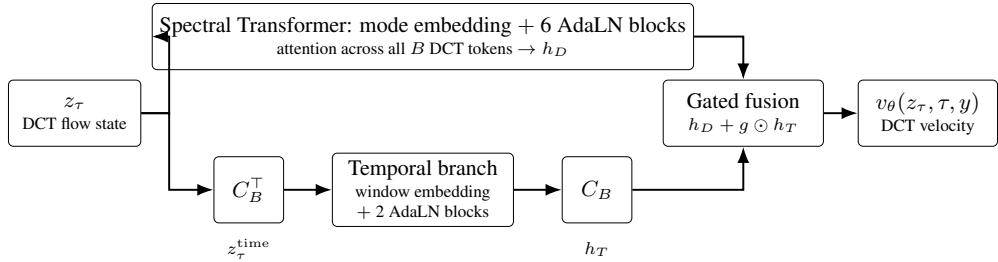  
Figure 3: Velocity network of GVD-CFM. Only the DCT state $z _ { \tau }$ is integrated. The spectral Transformer attends over all DCT modes. The temporal branch reads $z _ { \tau } ^ { \mathrm { { \mathrm { t i m e } } } } = \breve { C } _ { B } ^ { \top } z _ { \tau }$ , and its output is returned to DCT alignment by $C _ { B }$ before gated fusion. Both are conditioned on $c _ { \tau }$ through adaptive LayerNorm.

## A.15 Implementation

The benchmark is implemented in PyTorch (Paszke et al., 2019) and requires a CUDA-capable GPU. The reference runner was optimized for an NVIDIA A100.

Automatic mixed precision is enabled. BFloat16 is used when supported by the GPU and FP16 is used otherwise. TF32 matrix multiplication and cuDNN benchmarking are enabled. GVD log-Euclidean matrix logarithms and exponentials use GPU eigendecomposition (Golub and Loan, 2013) where available, while the SPD calculations themselves are retained in double precision where required for numerical stability.

Fused AdamW (Loshchilov and Hutter, 2019) is used when supported. The GVD-CFM and compatible baseline networks are optionally compiled using torch.compile with the reduce-overhead mode. Training arrays are kept GPU-resident where practical.

External baselines are loaded from their public source repositories. The benchmark uses the official JET repository, the official Song–Meng–Ermon DDIM release, and the AutoResearch EEG-GAN repository. Compatibility changes required by modern Python or PyTorch are restricted to syntax, datatype, and execution issues; model architectures and reported training objectives are not intentionally altered.

## A.16 Inverse of the composite chart

With Ψ as defined in Section 4.2.1, its inverse is

$$
\widetilde Z = C _ { B } ^ { \top } \bar { Z } ,\tag{68}
$$

$$
Z = \widetilde { Z } \odot \mathbf { 1 } \sigma ^ { \top } + \mathbf { 1 } \mu ^ { \top } ,\tag{69}
$$

$$
\overline { { \Delta } } _ { b } = \exp \left( \mathrm { s v e c } ^ { - 1 } ( z _ { b } ) \right) .\tag{70}
$$

## A.17 Velocity network and training path

Each DCT token of Section 4.2.2 enters the spectral Transformer with initial hidden representation

$$
h _ { k } ^ { ( 0 ) } = P _ { \mathrm { i n } } \bar { z } _ { k } + e _ { k } ^ { \mathrm { m o d e } } ,\tag{71}
$$

where $P _ { \mathrm { i n } }$ is a learned projection and $e _ { k } ^ { \mathrm { m o d e } }$ identifies the DCT mode. Each window of the time view $z ^ { \mathrm { t i m e } } =$ $C _ { B } ^ { \top } \bar { Z }$ enters the temporal branch as

$$
r _ { b } ^ { ( 0 ) } = P _ { \mathrm { i n } } ^ { \mathrm { t i m e } } z _ { b } ^ { \mathrm { t i m e } } + e _ { b } ^ { \mathrm { w i n } } ,\tag{72}
$$

where $e _ { b } ^ { \mathrm { w i n } }$ identifies the window position. The model is class-conditional, with conditioning vector

$$
c _ { \tau } = e _ { \mathrm { f l o w } } ( \tau ) + e _ { \mathrm { c l a s s } } ( y ) ,\tag{73}
$$

where $\tau \in [ 0 , 1 ]$ is flow time. Flow time is encoded using Fourier features followed by an MLP (Tancik et al., 2020).

Writing $S _ { \theta }$ for the spectral Transformer and $T _ { \theta }$ for the temporal branch, both conditioned on $c _ { \tau }$ , a single forward pass computes (Figure 3)

$$
h _ { D } = S _ { \theta } ( \bar { Z } , c _ { \tau } ) , \qquad h _ { T } = C _ { B } T _ { \theta } \Bigl ( C _ { B } ^ { \top } \bar { Z } , c _ { \tau } \Bigr ) ,\tag{74}
$$

$$
v _ { \theta } ( \bar { Z } , \tau , y ) = P _ { \mathrm { o u t } } \left( h _ { D } + \sigma ( W _ { g } [ h _ { D } ; h _ { T } ] + b _ { g } ) \odot h _ { T } \right) ,\tag{75}
$$

which is the joint velocity

$$
v _ { \theta } : \mathbb { R } ^ { B \times m } \times [ 0 , 1 ] \times \mathcal { Y } \longrightarrow \mathbb { R } ^ { B \times m }\tag{76}
$$

of the complete trajectory.

During training of Section $4 . 2 . 3 ,$ we sample

$$
z _ { 0 } \sim { \mathcal { N } } ( 0 , I ) , \qquad z _ { 1 } \sim \Psi _ { \# } q ( \cdot \mid y ) , \qquad \tau \sim { \mathcal { U } } [ 0 , 1 ] .\tag{77}
$$

The pair $\left( z _ { 0 } , z _ { 1 } \right)$ is then re-drawn from the classwise minibatch Sinkhorn coupling $\pi _ { y } .$ . We use the linear conditional path

$$
z _ { \tau } = ( 1 - \tau ) z _ { 0 } + \tau z _ { 1 } , ~ u _ { \tau } = z _ { 1 } - z _ { 0 } .\tag{78}
$$

To generate a trajectory from class y we sample $z ( 0 ) \sim \mathcal { N } ( 0 , I )$ and solve

$$
\frac { \mathrm { d } z ( \tau ) } { \mathrm { d } \tau } = v _ { \theta ^ { \star } } ( z ( \tau ) , \tau , y ) , \qquad \tau \in [ 0 , 1 ] .\tag{79}
$$

## A.18 Training and sampling algorithms

Algorithm 1 GVD-CFM training   
Require: Label distribution $\pi _ { \mathcal { V } }$ , training distribution q, and diffeomorphism Ψ   
Ensure: Trained parameters $\bar { \theta ^ { \star } }$   
1: Initialize $\theta$   
2: while not converged do   
3: Sample a class-weighted minibatch $\{ ( \overline { { \Delta } } ^ { ( i ) } , y ^ { ( i ) } ) \} _ { i = 1 } ^ { N }$ 1 from $q$   
4: Set $z _ { 1 } ^ { ( i ) } \gets \Psi ( \overline { { \Delta } } ^ { ( i ) } )$   
5: Sample $z _ { 0 } ^ { ( i ) } \sim \mathcal { N } ( 0 , I )$   
6: for each class y in the minibatch do   
7: Re-pair $\{ z _ { 0 } ^ { ( i ) } \}$ with $\{ z _ { 1 } ^ { ( i ) } : y ^ { ( i ) } = y \}$ using the Sinkhorn plan $\pi _ { y }$   
8: end for   
9: Sample $\tau ^ { ( i ) } \sim \mathcal { U } [ 0 , 1 ]$   
10: Set $\bar { z _ { \tau } ^ { ( i ) } } \gets \bar { ( 1 - \tau ^ { ( i ) } ) } \bar { z _ { 0 } ^ { ( i ) } } + \tau ^ { ( i ) } z _ { 1 } ^ { ( i ) }$   
11: Set $u _ { \tau } ^ { ( i ) }  z _ { 1 } ^ { ( i ) } - z _ { 0 } ^ { ( i ) }$   
12: Evaluate $v _ { \theta } ( z _ { \tau } ^ { ( i ) } , \tau ^ { ( i ) } , y ^ { ( i ) } )$   
13: Compute   
$\mathcal { L }  \frac { 1 } { N B m } \sum _ { i = 1 } ^ { N } \| v _ { \theta } ( z _ { \tau } ^ { ( i ) } , \tau ^ { ( i ) } , y ^ { ( i ) } ) - u _ { \tau } ^ { ( i ) } \| _ { F } ^ { 2 }$   
14: Update θ ← OptimizerStep $( \theta , \nabla _ { \theta } \mathcal { L } )$   
15: end while   
16: return $\theta ^ { \star }$

Algorithm 2 GVD-CFM sampling   
Require: Class label $y ,$ parameters $\theta ^ { \star }$ , integration steps ${ \overline { { L , } } }$ and diffeomorphism $\Psi$   
Ensure: Generated trajectory $\widehat { \Delta }$   
1: Set $h  1 / L$   
2: Sample $z _ { 0 } \sim \mathcal { N } ( 0 , I )$   
3: for $\bar { \ell } = 0 , \dots , \bar { L - 1 }$ do   
4: Set $\tau _ { \ell } \gets \ell h$   
5: Set $z _ { \ell + 1 } \gets \mathrm { R K } 4 \mathrm { S t e p } ( v _ { \theta ^ { \star } } , z _ { \ell } , \tau _ { \ell } , y , h )$   
6: end for   
7: Set $\widehat { \pmb { \Delta } }  \Psi ^ { - 1 } ( z _ { L } )$   
8: return $\widehat { \Delta }$

## B Extended Proofs

Geometric overview. The log-Euclidean map $\phi : \mathbb { S } _ { + + } ^ { d }  \mathbb { R } ^ { m } , \phi ( X ) = \operatorname { s v e c } ( \log X )$ , is a global coordinate system on the SPD manifold. The matrix logarithm is a diffeomorphism from $\mathbb { S } _ { + + } ^ { d }$ onto $\mathbb { S } ^ { d }$ and svec is a linear

isometry, so ϕ is a global diffeomorphism. The log-Euclidean metric is the pullback of the Euclidean inner product through ϕ,

$$
g _ { X } ( \xi , \eta ) = \big \langle D \phi _ { X } [ \xi ] , D \phi _ { X } [ \eta ] \big \rangle _ { \mathbb { R } ^ { m } } , \qquad \xi , \eta \in T _ { X } \mathbb { S } _ { + + } ^ { d } ,
$$

so ϕ is an isometry by construction, and the straight line $z _ { \tau } = ( 1 - \tau ) \phi ( X _ { 0 } ) + \tau \phi ( X _ { 1 } )$ maps through $\phi ^ { - 1 }$ to the log-Euclidean geodesic between $X _ { 0 }$ and $X _ { 1 }$ . The construction requires $X \succ 0 ;$ a positive-semidefinite matrix with a zero eigenvalue has no finite logarithm and lies outside the domain of ϕ.

For a trajectory of B matrices the state space is the product manifold $\mathcal { M } _ { B } = ( \mathbb { S } _ { + + } ^ { d } ) ^ { B }$ , with tangent space $\begin{array} { r } { \prod _ { b = 1 } ^ { B } T _ { X _ { b } } \mathbb { S } _ { + + } ^ { d } } \end{array}$ and product metric $\begin{array} { r } { g ^ { \mathrm { p r o d } } ( \xi , \eta ) \ = \ \sum _ { b = 1 } ^ { B } g _ { X _ { b } } ( \xi _ { b } , \eta _ { b } ) } \end{array}$ . Applying ϕ to every factor gives the trajectory chart $\Phi ( X _ { 1 : B } ) \ = \ ( \phi ( X _ { 1 } ) , \ldots , \phi ( X _ { B } ) ) \ \in \ \mathbb { R } ^ { B \times m }$ , which is a global diffeomorphism with $g ^ { \mathrm { p r o d } } ( \xi , \eta ) = \langle D \Phi [ \xi ] , D \Phi [ \eta ] \rangle _ { F }$ . If a single window $X _ { b }$ is singular, the corresponding factor of Φ is undefined and the trajectory lies outside the domain of the chart. Strict positive definiteness (Proposition 2) must therefore be established before this geometry can be used.

The chart, including the DCT and the standardization, is a global diffeomorphism and an isometry for its pullback metric. In addition, the Euclidean conditional flow-matching loss in these coordinates equals the Riemannian loss on $\mathcal { M } _ { B }$ , because the manifold norm of a velocity residual equals the Frobenius norm of its pushforward. Finally, integrating the flow in Euclidean coordinates and decoding by $\Phi ^ { - 1 }$ gives the manifold flow, and every decoded window is SPD because the matrix exponential of a symmetric matrix is SPD; the same holds at every step of an explicit Runge–Kutta integrator.

## B.1 Graph-variate signal analysis

GVSA (Smith et al., 2019) defines the modulated connectivity of Section 4.1 entrywise as

$$
\theta _ { i j } ( t ) = { \left\{ \begin{array} { l l } { W _ { i j } F \nu ( x _ { i } ( t ) , x _ { j } ( t ) ) , } & { i \neq j , } \\ { 0 , } & { i = j , } \end{array} \right. }\tag{80}
$$

where $W _ { i j }$ describes the stable, long-term relationship between nodes i and $j ,$ while $F _ { \mathcal { V } }$ measures their instantaneous connectivity. For correlation-based GVSA,

$$
F \nu ( x _ { i } ( t ) , x _ { j } ( t ) ) = | ( x _ { i } ( t ) - \bar { x } _ { i } ) \left( x _ { j } ( t ) - \bar { x } _ { j } \right) | ,\tag{81}
$$

where $\bar { x } _ { i }$ is the temporal mean of node i. Substituting this into the entrywise definition yields the sampleresolution connectivity matrix of Section 4.1.

Our implementation makes two deliberate modifications to this classical formulation in order to preserve the geometry required by the generative model. First, although the original correlation-based definition uses the absolute value of the instantaneous product, we retain the sign of both the long-term support and the instantaneous interaction. Let

$$
u _ { i } ( t ) = x _ { i } ( t ) - \bar { x } _ { i } ,\tag{82}
$$

and write

$$
J _ { t } = u _ { t } u _ { t } ^ { \top } , \qquad \Delta _ { t } = W \odot J _ { t } .\tag{83}
$$

Thus, rather than replacing the instantaneous interaction $\mathsf { b y } | u _ { i } ( t ) u _ { j } ( t ) |$ , we use the signed outer product. When the support is written as a correlation matrix W and $D _ { t } = \mathrm { d i a g } ( u _ { t } )$ , this gives

$$
\Delta _ { t } = W \odot u _ { t } u _ { t } ^ { \top } = D _ { t } W D _ { t } .\tag{84}
$$

This signed construction preserves the congruence structure of the support matrix and is therefore compatible with positive-semidefinite, and in the experimentally used binned case positive-definite, GVD trajectories. In contrast, taking entrywise absolute values destroys this exact congruence relationship and is not required for the downstream geometric construction.

Second, the original GVSA definition sets the diagonal entries to zero. We retain the diagonal during GVD construction because it contains the instantaneous node-energy terms and is necessary for treating each connectivity state as a full symmetric positive-definite matrix. After temporal binning, we therefore use

$$
\Delta _ { b } = \frac { 1 } { \left| \mathcal { T } _ { b } \right| } \sum _ { t \in \mathcal { T } _ { b } } W \odot u _ { t } u _ { t } ^ { \top } ,\tag{85}
$$

with the diagonal left intact. All GVD matrices used in our experiments are explicitly verified to be positive definite before entering the log-Euclidean representation; no ridge or nearest-SPD projection is applied to the canonical GVD construction. If a zero-diagonal graph representation is desired for visualization or conventional network analysis, the diagonal can be removed post hoc without altering the matrices used for geometric learning.

# Schur-product rank lifting in the GVD construction

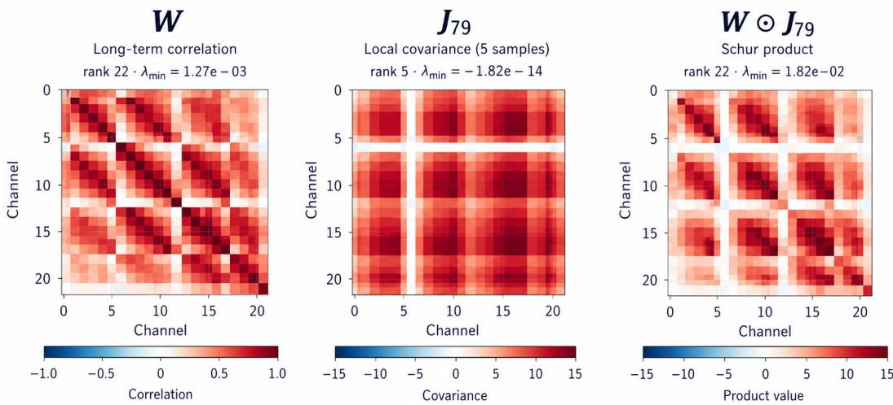  
Figure 4: Schur-product rank lifting induced by the long-term support. The instantaneous covariance $J _ { b }$ is positive semidefinite but rank-deficient because each temporal window contains fewer samples than EEG channels. The long-term support $W$ is positive definite, and the Hadamard composition $W \odot J _ { b }$ preserves positive semidefiniteness while lifting the example to full rank. No ridge regularization is added to $J _ { b }$ or $W \odot J _ { b }$

## B.2 Proof of Proposition 2 for single samples

Proof. Since $J _ { t } = u _ { t } u _ { t } ^ { \top } \succeq 0$ and $W \succ 0$ , the Schur product theorem (Horn and Johnson, 2012; Schur, 1911) guarantees that

$$
\Delta _ { t } = W \odot J _ { t } \succeq 0 .\tag{86}
$$

To establish strict positive definiteness, let $D _ { t } = \mathrm { d i a g } ( u _ { t } )$ . Entrywise,

$$
[ W \odot ( u _ { t } u _ { t } ^ { \top } ) ] _ { i j } = W _ { i j } u _ { i , t } u _ { j , t } ,\tag{87}
$$

and therefore

$$
\Delta _ { t } = D _ { t } W D _ { t } .\tag{88}
$$

If every component of $u _ { t }$ is nonzero, then $D _ { t }$ is invertible. Hence, for every nonzero $v \in \mathbb { R } ^ { d }$

$$
v ^ { \top } \Delta _ { t } v = ( D _ { t } v ) ^ { \top } W ( D _ { t } v ) > 0 ,\tag{89}
$$

because $D _ { t } v \neq 0$ and $W \succ 0$ . Thus, $\Delta _ { t } \in \mathbb { S } _ { + + } ^ { d }$ . Moreover, congruence by an invertible matrix preserves rank, giving

$$
\operatorname { r a n k } ( \Delta _ { t } ) = \operatorname { r a n k } ( D _ { t } W D _ { t } ) = \operatorname { r a n k } ( W ) = d .\tag{90}
$$

Therefore every $\Delta _ { t }$ lies on the SPD manifold.

If some component of $u _ { t }$ is exactly zero, $D _ { t }$ is singular and $\Delta _ { t }$ is positive semidefinite rather than positive definite. We do not encounter this in practice however.

## B.3 Further results

Proposition 3 (Equivalence of DCT-coordinate flow matching and product log-Euclidean Riemannian flow matching). Let

$$
\mathcal { M } _ { B } = \left( \mathbb { S } _ { + + } ^ { d } \right) ^ { B } , \qquad m = \frac { d ( d + 1 ) } 2 ,
$$

and define the product log-Euclidean coordinate map

$$
\Phi ( \Delta _ { 1 : B } ) = \left[ \begin{array} { c } { \mathrm { s v e c } ( \log \Delta _ { 1 } ) ^ { \top } } \\ { \vdots } \\ { \mathrm { s v e c } ( \log \Delta _ { B } ) ^ { \top } } \end{array} \right] \in \mathbb { R } ^ { B \times m } ,
$$

where svec is chosen to preserve the Frobenius inner product on symmetric matrices. Let

$$
\begin{array} { r } { \mathcal { C } ( Z ) = C _ { B } Z , \qquad C _ { B } ^ { \top } C _ { B } = I _ { B } , } \end{array}
$$

be the orthonormal temporal DCT, and define the composite map

$$
\Psi = { \mathcal { C } } \circ \Phi .
$$

Equip MB with the product log-Euclidean metric

$$
g _ { \mathrm { L E } } ^ { \mathrm { p r o d } } .
$$

Then Ψ is a global Riemannian isometry from

$$
( \mathcal { M } _ { B } , g _ { \mathrm { L E } } ^ { \mathrm { p r o d } } )
$$

to Euclidean space

$$
( \mathbb { R } ^ { B \times m } , \langle \cdot , \cdot \rangle _ { F } ) .
$$

Consequently, for any endpoints $\Delta ^ { 0 } , \Delta ^ { 1 } \in \mathcal { M } _ { B }$ , with

$$
Z _ { i } = \Psi ( \Delta ^ { i } ) , \qquad i \in \{ 0 , 1 \} ,
$$

the Euclidean conditional path

$$
Z _ { \tau } = ( 1 - \tau ) Z _ { 0 } + \tau Z _ { 1 }
$$

is the Ψ-image of the product log-Euclidean geodesic

$$
\boldsymbol { \Gamma } _ { \tau } = \boldsymbol { \Psi } ^ { - 1 } ( \boldsymbol { Z } _ { \tau } ) .
$$

Moreover, if

$$
U ^ { E } = Z _ { 1 } - Z _ { 0 }
$$

denotes the Euclidean conditional velocity and

$$
\begin{array} { r } { { U } _ { \tau } ^ { \mathcal { M } } = D \Psi _ { Z _ { \tau } } ^ { - 1 } [ { U } ^ { E } ] } \end{array}
$$

the corresponding manifold tangent velocity, then for any manifold vector field Vθ whose coordinate representation is

$$
v _ { \theta } ( Z , \tau ) = D \Psi _ { \Psi ^ { - 1 } ( Z ) } \left[ V _ { \theta } ( \Psi ^ { - 1 } ( Z ) , \tau ) \right] ,
$$

we have the pointwise identity

$$
\Big | \Big | \Big | V _ { \theta } ( \Gamma _ { \tau } , \tau ) - U _ { \tau } ^ { \mathcal { M } } \Big | \Big | _ { g _ { \mathrm { L E } } ^ { \mathrm { p r o d } } } ^ { 2 } = \| v _ { \theta } ( Z _ { \tau } , \tau ) - ( Z _ { 1 } - Z _ { 0 } ) \| _ { F } ^ { 2 } \cdot \Big |
$$

Hence the Euclidean $L _ { 2 }$ conditionalflow-matching objective infull-mode DCT coordinates is exactly equal to the corresponding Riemannianflow-matching objective on the product SPD manifold:

$$
\boxed { \mathcal { L } _ { \mathrm { C F M } } = \mathcal { L } _ { \mathrm { R F M } } . }
$$

Proof. For each SPD factor, the matrix logarithm

$$
\log : \mathbb { S } _ { + + } ^ { d } \to \mathbb { S } ^ { d }
$$

is a global smooth diffeomorphism. Since svec is a linear isomorphism from $\mathbb { S } ^ { d } : \mathbf { o } \mathbb { R } ^ { m }$ , the product map

$$
\Phi : \mathcal { M } _ { B }  \mathbb { R } ^ { B \times m }
$$

is also a global smooth diffeomorphism.

By definition of the log-Euclidean metric, the single-factor map

$$
\Delta \mapsto \operatorname { s v e c } ( \log \Delta )
$$

is an isometry from $\mathbb { S } _ { + - } ^ { d }$ + equipped with the log-Euclidean metric to $\mathbb { R } ^ { m }$ equipped with its Euclidean metric. Therefore, for tangent vectors

$$
\xi = ( \xi _ { 1 } , \ldots , \xi _ { B } ) , \qquad \eta = ( \eta _ { 1 } , \ldots , \eta _ { B } )
$$

$$
\operatorname { a t } \Delta = ( \Delta _ { 1 } , \dotsc , \Delta _ { B } ) ,
$$

$$
g _ { \mathrm { L E } , \Delta } ^ { \mathrm { p r o d } } ( \xi , \eta ) = \langle D \Phi _ { \Delta } [ \xi ] , D \Phi _ { \Delta } [ \eta ] \rangle _ { F } .
$$

Now consider the temporal DCT map

$$
{ \mathcal { C } } ( Z ) = C _ { B } Z .
$$

Because $C _ { B }$ is orthogonal,

$$
C _ { B } ^ { \top } C _ { B } = I _ { B } ,
$$

and therefore, for arbitrary $X , Y \in \mathbb { R } ^ { B \times m }$

$$
\langle C _ { B } X , C _ { B } Y \rangle _ { F } = \operatorname { t r } ( X ^ { \top } C _ { B } ^ { \top } C _ { B } Y ) = \operatorname { t r } ( X ^ { \top } Y ) = \langle X , Y \rangle _ { F } .
$$

Thus C is a Euclidean isometry.

Since

$$
\Psi = \mathcal { C } \circ \Phi ,
$$

its differential satisfies

$$
D \Psi _ { \Delta } = D \mathcal { C } _ { \Phi ( \Delta ) } \circ D \Phi _ { \Delta } .
$$

Hence

$$
\langle D \Psi _ { \Delta } [ \xi ] , D \Psi _ { \Delta } [ \eta ] \rangle _ { F } = \langle C _ { B } D \Phi _ { \Delta } [ \xi ] , C _ { B } D \Phi _ { \Delta } [ \eta ] \rangle _ { F }\tag{91}
$$

$$
= \langle D \Phi _ { \Delta } [ \xi ] , D \Phi _ { \Delta } [ \eta ] \rangle _ { F }\tag{92}
$$

$$
= g _ { \mathrm { L E , } \Delta } ^ { \mathrm { p r o d } } ( \xi , \eta ) .\tag{93}
$$

Therefore Ψ is a global Riemannian isometry.

Now let

$$
Z _ { \tau } = ( 1 - \tau ) Z _ { 0 } + \tau Z _ { 1 } .
$$

Euclidean straight lines are geodesics, and an isometry maps geodesics to geodesics. Thus

$$
\Gamma _ { \tau } = \Psi ^ { - 1 } ( Z _ { \tau } )
$$

is the corresponding product log-Euclidean geodesic on $\mathcal { M } _ { B }$

Differentiating

$$
\Gamma _ { \tau } = \Psi ^ { - 1 } ( Z _ { \tau } )
$$

gives

$$
\dot { \Gamma } _ { \tau } = D \Psi _ { Z _ { \tau } } ^ { - 1 } [ \dot { Z } _ { \tau } ] .
$$

Since

$$
\dot { Z } _ { \tau } = Z _ { 1 } - Z _ { 0 } ,
$$

we obtain

$$
\begin{array} { r } { { U _ { \tau } ^ { \mathcal { M } } } = D \Psi _ { Z _ { \tau } } ^ { - 1 } [ Z _ { 1 } - Z _ { 0 } ] . } \end{array}
$$

Because Ψ is a diffeomorphism,

$$
D \Psi _ { \Gamma _ { \tau } } \circ D \Psi _ { Z _ { \tau } } ^ { - 1 } = \mathrm { I d } ,
$$

and hence

$$
{ \cal D } \Psi _ { \Gamma _ { \tau } } [ U _ { \tau } ^ { \mathcal { M } } ] = Z _ { 1 } - Z _ { 0 } .
$$

By definition of the coordinate representation of the model vector field,

$$
D \Psi _ { \Gamma _ { \tau } } [ V _ { \theta } ( \Gamma _ { \tau } , \tau ) ] = v _ { \theta } ( Z _ { \tau } , \tau ) .
$$

Therefore, using linearity of the differential,

$$
\begin{array} { c } { { D \Psi _ { \Gamma _ { \tau } } \left[ V _ { \theta } ( \Gamma _ { \tau } , \tau ) - U _ { \tau } ^ { \mathcal { M } } \right] } } \\ { { = v _ { \theta } ( Z _ { \tau } , \tau ) - ( Z _ { 1 } - Z _ { 0 } ) . } } \end{array}\tag{94}
$$

(95)

Since Ψ is a Riemannian isometry,

$$
\left\| \xi \right\| _ { g _ { \mathrm { L E } } ^ { \mathrm { p r o d } } } ^ { 2 } = \left\| D \Psi [ \xi ] \right\| _ { F } ^ { 2 } .
$$

Applying this to the velocity residual yields

$$
\Big \| V _ { \theta } ( \Gamma _ { \tau } , \tau ) - U _ { \tau } ^ { \mathcal { M } } \Big \| _ { g _ { \mathrm { L E } } ^ { \mathrm { p r o d } } } ^ { 2 } = \| v _ { \theta } ( Z _ { \tau } , \tau ) - ( Z _ { 1 } - Z _ { 0 } ) \| _ { F } ^ { 2 } .
$$

The equality holds pointwise for every endpoint pair and every τ . Taking expectations therefore gives

$$
\mathcal { L } _ { \mathrm { R F M } } ( \theta ) = \mathcal { L } _ { \mathrm { C F M } } ( \theta ) .
$$

口

Corollary 1 (Standardized chart). Let $S ( Z ) = ( Z - \mathbf { 1 } \mu ^ { \top } ) D _ { \sigma } ^ { - 1 }$ with $D _ { \sigma } = \mathrm { d i a g } ( \sigma _ { 1 } , \ldots , \sigma _ { m } ) , \sigma _ { j } > 0 ,$ , and let $\Psi _ { \sigma } = \mathcal { C } \circ S \circ$ Φ be the chart used in practice. Define on $\mathcal { M } _ { B }$ the metric

$$
g _ { \sigma } ( \xi , \eta ) = \sum _ { b = 1 } ^ { B } \bigl \langle D _ { \sigma } ^ { - 1 } \operatorname { D } \phi _ { \Delta _ { b } } [ \xi _ { b } ] , \ D _ { \sigma } ^ { - 1 } \operatorname { D } \phi _ { \Delta _ { b } } [ \eta _ { b } ] \bigr \rangle , \qquad \phi = \mathrm { s v e c } \circ \log .
$$

Then $( i ) \ \Psi _ { \sigma }$ is a global diffeomorphism and a Riemannian isometry from $( \mathcal { M } _ { B } , g _ { \sigma } ) \ t o \ ( \mathbb { R } ^ { B \times m } , \langle \cdot , \cdot \rangle _ { F } )$ , so Proposition 3 holds verbatim with $\Psi _ { \sigma }$ and gσ in place ofΨ and $g _ { \mathrm { L E } } ^ { \mathrm { p r o d } }$ ; (ii) the geodesics ofgσ and $g _ { \mathrm { L E } } ^ { \mathrm { p r o d } }$ coincide as parametrized curves; (iii)for a manifoldfield V and target $\begin{array} { r } { \overleftarrow { U , \| } V - U \| _ { g _ { \sigma } } ^ { 2 } = \sum _ { b } \| D _ { \sigma } ^ { - 1 } \mathrm { D } \phi _ { \Delta _ { b } } \overleftarrow { | } V _ { b } - U _ { b } ] \| ^ { 2 } } \end{array}$ afixed diagonal reweighting ofthe log-Euclidean residual, so the population minimizer over measurablefields is the same conditional expectation under both metrics.

Proof. (i) S is an invertible affine map, so $\Psi _ { \sigma }$ is a diffeomorphism, and its differential is $\mathrm { D } \Psi _ { \sigma } [ \xi ] = $ $C _ { B } \dot { \mathrm { D } } \Phi [ \xi ] D _ { \sigma } ^ { - 1 }$ . Since $C _ { B }$ is orthogonal, $\langle \mathrm { D } \Psi _ { \sigma } [ \xi ] , \mathrm { D } \Psi _ { \sigma } [ \eta ] \rangle _ { F } \stackrel { \cdot } { = } g _ { \sigma } ( \xi , \eta )$ , which is the definition of an isometry; the proof of Proposition 3 uses only this property. (ii) In log coordinates both metrics are constant, so their geodesics are affinely parametrized straight lines in these coordinates, and $S$ maps straight lines to straight lines. (iii) The expression follows from the definition of $g _ { \sigma }$ . The conditional expectation minimizes the expected squared residual under any fixed positive-definite quadratic form, so both objectives share it as population minimizer.

Remark 2. The proposition places no restriction on how vθ is computed from Z beyond measurability. It therefore holds for the network with the temporal branch, whose temporal input $C _ { B } ^ { \top } Z$ is a fixed linear function of $Z ,$ and it holds for any coupling of the endpoints, including the classwise minibatch Sinkhorn coupling used in training, because the identity is pointwise in the endpoint pair.

Proposition 4 (Spectral bounds for graph-variate connectivity). Let $u _ { 1 } , \ldots , u _ { n } \in \mathbb { R } ^ { d }$ denote the observations in a temporal bin, and define

$$
J = \frac 1 n \sum _ { t = 1 } ^ { n } u _ { t } u _ { t } ^ { \top } , \qquad \Delta = W \odot J ,\tag{96}
$$

where $W \in \mathbb { S } _ { + + } ^ { d }$ . Define the channelwise energy within the bin by

$$
q _ { i } : = \frac { 1 } { n } \sum _ { t = 1 } ^ { n } u _ { i , t } ^ { 2 } , \qquad i = 1 , \dots , d ,\tag{97}
$$

and let

$$
Q : = \mathrm { d i a g } ( q _ { 1 } , \dots , q _ { d } ) .\tag{98}
$$

Then $\Delta$ satisfies the Loewner-order bounds

$$
\lambda _ { \operatorname* { m i n } } ( W ) Q \preceq \Delta \preceq \lambda _ { \operatorname* { m a x } } ( W ) Q .\tag{99}
$$

Consequently,

$$
\lambda _ { \operatorname* { m i n } } ( \Delta ) \ge \lambda _ { \operatorname* { m i n } } ( W ) \operatorname* { m i n } _ { i } q _ { i } ,\tag{100}
$$

and

$$
\lambda _ { \operatorname* { m a x } } ( \Delta ) \leq \lambda _ { \operatorname* { m a x } } ( W ) \operatorname* { m a x } _ { i } q _ { i } .\tag{101}
$$

I $f q _ { i } > 0$ for every channel, then in particular

$$
\lambda _ { \operatorname* { m i n } } ( \Delta ) > 0 ,\tag{102}
$$

and its spectral condition number obeys

$$
\kappa _ { 2 } ( \Delta ) \leq \kappa _ { 2 } ( W ) \frac { \operatorname* { m a x } _ { i } q _ { i } } { \operatorname* { m i n } _ { i } q _ { i } } .\tag{103}
$$

Thus the distance of a GVD matrix from the boundary of the SPD cone is controlled jointly by the smallest eigenvalue ofthe long-term support and the least energetic channel in the local bin.

Proof. For each sample $u _ { t } .$ let

$$
D _ { t } : = \mathrm { d i a g } ( u _ { t } ) .\tag{104}
$$

Using the identity

$$
W \odot ( { { u } _ { t } } { { u } _ { t } } ^ { \top } ) = { { D } _ { t } } W { { D } _ { t } } ,\tag{105}
$$

and linearity of the Hadamard product, we can write

$$
\Delta = W \odot \left( \frac { 1 } { n } \sum _ { t = 1 } ^ { n } { u _ { t } u _ { t } ^ { \top } } \right) = \frac { 1 } { n } \sum _ { t = 1 } ^ { n } D _ { t } W D _ { t } .\tag{106}
$$

Since $W \in \mathbb { S } _ { + + } ^ { d }$

$$
\lambda _ { \operatorname* { m i n } } ( W ) I \preceq W \preceq \lambda _ { \operatorname* { m a x } } ( W ) I .\tag{107}
$$

Congruence preserves the Loewner order, so for every t,

$$
\lambda _ { \operatorname* { m i n } } ( W ) D _ { t } ^ { 2 } \preceq D _ { t } W D _ { t } \preceq \lambda _ { \operatorname* { m a x } } ( W ) D _ { t } ^ { 2 } .\tag{108}
$$

Averaging over the n samples gives

$$
\lambda _ { \operatorname* { m i n } } ( W ) \left( \frac { 1 } { n } \sum _ { t = 1 } ^ { n } D _ { t } ^ { 2 } \right) \preceq \Delta \preceq \lambda _ { \operatorname* { m a x } } ( W ) \left( \frac { 1 } { n } \sum _ { t = 1 } ^ { n } D _ { t } ^ { 2 } \right) .\tag{109}
$$

Because

$$
\frac { 1 } { n } \sum _ { t = 1 } ^ { n } D _ { t } ^ { 2 } = \mathrm { d i a g } \left( \frac { 1 } { n } \sum _ { t = 1 } ^ { n } u _ { 1 , t } ^ { 2 } , \ldots , \frac { 1 } { n } \sum _ { t = 1 } ^ { n } u _ { d , t } ^ { 2 } \right) = Q ,\tag{110}
$$

we obtain

$$
\lambda _ { \operatorname* { m i n } } ( W ) Q \preceq \Delta \preceq \lambda _ { \operatorname* { m a x } } ( W ) Q ,\tag{111}
$$

which proves (99).

Applying the Rayleigh–Ritz characterization to the lower bound, for every unit vector x,

$$
x ^ { \top } \Delta x \geq \lambda _ { \operatorname* { m i n } } ( W ) x ^ { \top } Q x\tag{112}
$$

$$
= \lambda _ { \operatorname* { m i n } } ( W ) \sum _ { i = 1 } ^ { d } q _ { i } x _ { i } ^ { 2 }\tag{113}
$$

$$
\geq \lambda _ { \operatorname* { m i n } } ( W ) \operatorname* { m i n } _ { i } q _ { i } .\tag{114}
$$

Taking the minimum over all $\| { \boldsymbol { x } } \| _ { 2 } = 1$ therefore yields

$$
\lambda _ { \operatorname* { m i n } } ( \Delta ) \geq \lambda _ { \operatorname* { m i n } } ( W ) \operatorname* { m i n } _ { i } q _ { i } .\tag{115}
$$

Likewise, the upper Loewner bound gives, for every unit vector x,

$$
x ^ { \top } \Delta x \leq \lambda _ { \operatorname* { m a x } } ( W ) x ^ { \top } Q x\tag{116}
$$

$$
\leq \lambda _ { \operatorname* { m a x } } ( W ) \operatorname* { m a x } _ { i } q _ { i } ,\tag{117}
$$

and hence

$$
\lambda _ { \operatorname* { m a x } } ( \Delta ) \leq \lambda _ { \operatorname* { m a x } } ( W ) \operatorname* { m a x } _ { i } q _ { i } .\tag{118}
$$

If every $q _ { i } > 0 ,$ , the lower bound is strictly positive because $W \succ 0$ , so $\lambda _ { \operatorname* { m i n } } ( \Delta ) > 0$ . Finally,

$$
\kappa _ { 2 } ( \Delta ) = \frac { \lambda _ { \operatorname* { m a x } } ( \Delta ) } { \lambda _ { \operatorname* { m i n } } ( \Delta ) }\tag{119}
$$

$$
\leq { \frac { \lambda _ { \operatorname* { m a x } } ( W ) \operatorname* { m a x } _ { i } q _ { i } } { \lambda _ { \operatorname* { m i n } } ( W ) \operatorname* { m i n } _ { i } q _ { i } } }\tag{120}
$$

$$
= \kappa _ { 2 } ( W ) { \frac { \operatorname* { m a x } _ { i } q _ { i } } { \operatorname* { m i n } _ { i } q _ { i } } } ,\tag{121}
$$

which proves (103).

Proposition 5 (DCT-II diagonalizes discrete temporal variation). Let $\boldsymbol { D _ { B } } \in \mathbb { R } ^ { ( B - 1 ) \times B }$ denote thefirst-order temporal difference operator,

$$
D _ { B } = \left[ \begin{array} { l l l l l } { - 1 } & { 1 } & { 0 } & { \cdots } & { 0 } \\ { 0 } & { - 1 } & { 1 } & { \cdots } & { 0 } \\ { \vdots } & { } & { \ddots } & { \ddots } & { \vdots } \\ { 0 } & { \cdots } & { 0 } & { - 1 } & { 1 } \end{array} \right] ,
$$

and let

$$
L _ { B } = D _ { B } ^ { \top } D _ { B }
$$

be the corresponding path-graph Laplacian. Let $C _ { B } \in \mathbb { R } ^ { B \times B }$ be the orthonormal DCT-II matrix with entries

$$
[ C _ { B } ] _ { k , b } = \alpha _ { k } \cos \left( \frac { \pi k } { B } \left( b + \frac { 1 } { 2 } \right) \right) , \qquad k , b = 0 , \ldots , B - 1 ,
$$

where

$$
\alpha _ { 0 } = \frac { 1 } { \sqrt { B } } , \qquad \alpha _ { k } = \sqrt { \frac { 2 } { B } } , \quad k \ge 1 .
$$

Then the DCT-II basis diagonalizes $L _ { B } .$

$$
\begin{array} { r } { C _ { B } L _ { B } C _ { B } ^ { \top } = \Lambda _ { B } , } \end{array}
$$

where

$$
\Lambda _ { B } = \mathrm { d i a g } ( \lambda _ { 0 } , \ldots , \lambda _ { B - 1 } ) , \qquad \lambda _ { k } = 4 \sin ^ { 2 } \left( \frac { \pi k } { 2 B } \right) .
$$

In particular,

$$
0 = \lambda _ { 0 } < \lambda _ { 1 } < \cdot \cdot \cdot < \lambda _ { B - 1 } < 4 .
$$

Proof. Let $q _ { k } \in \mathbb { R } ^ { B }$ denote the k-th DCT-II basis vector,

$$
q _ { k } ( b ) = \alpha _ { k } \cos \left( { \frac { \pi k } { B } } \left( b + { \frac { 1 } { 2 } } \right) \right) , \qquad b = 0 , \ldots , B - 1 .
$$

For an interior index $b = 1 , \ldots , B - 2$

$$
( L _ { B } q _ { k } ) _ { b } = 2 q _ { k } ( b ) - q _ { k } ( b - 1 ) - q _ { k } ( b + 1 ) .
$$

Let $\theta _ { k } = \pi k / B$ . Using

$$
\cos ( a - \theta _ { k } ) + \cos ( a + \theta _ { k } ) = 2 \cos ( a ) \cos ( \theta _ { k } ) ,
$$

we obtain

$$
( L _ { B } q _ { k } ) _ { b } = 2 ( 1 - \cos \theta _ { k } ) q _ { k } ( b ) .
$$

Since

$$
2 ( 1 - \cos \theta _ { k } ) = 4 \sin ^ { 2 } \left( \frac { \theta _ { k } } { 2 } \right) ,
$$

it follows that

$$
( L _ { B } q _ { k } ) _ { b } = 4 \sin ^ { 2 } \left( \frac { \pi k } { 2 B } \right) q _ { k } ( b ) .
$$

The two boundary rows satisfy the same identity, and hence

$$
L _ { B } q _ { k } = \lambda _ { k } q _ { k } , \qquad \lambda _ { k } = 4 \sin ^ { 2 } \left( \frac { \pi k } { 2 B } \right) .
$$

Because the DCT-II basis is orthonormal, its basis vectors form a complete orthonormal eigenbasis of $L _ { B } ,$ , which gives

$$
\begin{array} { r } { C _ { B } L _ { B } C _ { B } ^ { \top } = \Lambda _ { B } . } \end{array}
$$

The ordering of the eigenvalues follows from the strict monotonicity of sin(x) on $[ 0 , \pi / 2 )$

Theorem 2 (Exact spectral decomposition of log-Euclidean temporal variation). Let

$$
\Delta _ { 1 : B } = \left( \Delta _ { 1 } , \ldots , \Delta _ { B } \right) \in \left( \mathbb { S } _ { + + } ^ { d } \right) ^ { B }
$$

be a GVD trajectory. Define its log-Euclidean coordinates by

$$
z _ { b } = \mathrm { s v e c } ( \log \Delta _ { b } ) \in \mathbb { R } ^ { m } , \qquad m = \frac { d ( d + 1 ) } 2 ,
$$

and stack them as

$$
Z = \left[ \begin{array} { l } { \boldsymbol { z } _ { 1 } ^ { \top } } \\ { \vdots } \\ { \boldsymbol { z } _ { B } ^ { \top } } \end{array} \right] \in \mathbb { R } ^ { B \times m } .
$$

Let

$$
\bar { Z } = C _ { B } Z
$$

be the full orthonormal DCT-II representation, and denote the k-th DCT coefficient vector by

$$
\bar { z } _ { k } ^ { \top } = [ \bar { Z } ] _ { k , : } , \qquad k = 0 , \ldots , B - 1 .
$$

Define the discrete temporal variation of the GVD trajectory under the log-Euclidean metric as

$$
\mathcal { V } _ { \mathrm { L E } } \big ( \Delta _ { 1 : B } \big ) = \sum _ { b = 1 } ^ { B - 1 } d _ { \mathrm { L E } } ^ { 2 } \big ( \Delta _ { b + 1 } , \Delta _ { b } \big ) ,
$$

where

$$
d _ { \mathrm { L E } } ( A , B ) = \| \log A - \log B \| _ { F } .
$$

Then

$$
\boxed { \mathcal { V } _ { \mathrm { L E } } ( \Delta _ { 1 : B } ) = \sum _ { k = 0 } ^ { B - 1 } \lambda _ { k } \| \bar { z } _ { k } \| _ { 2 } ^ { 2 } }
$$

with

$$
\lambda _ { k } = 4 \sin ^ { 2 } \left( \frac { \pi k } { 2 B } \right) .
$$

Equivalently,

$$
\boxed { \mathcal { V } _ { \mathrm { L E } } ( \Delta _ { 1 : B } ) = \sum _ { k = 1 } ^ { B - 1 } 4 \sin ^ { 2 } \left( \frac { \pi k } { 2 B } \right) \| \bar { z } _ { k } \| _ { 2 } ^ { 2 } }
$$

since $\lambda _ { 0 } = 0 .$

Hence, the DCT-II provides an exact orthogonal decomposition of the log-Euclidean temporal variation of a GVD trajectory. The zero-frequency mode contributes no temporal variation, while the weighting $\lambda _ { k }$ increases monotonically with DCT mode index k.

Proof. Since svec preserves the Frobenius inner product on symmetric matrices,

$$
d _ { \mathrm { L E } } ^ { 2 } ( \Delta _ { b + 1 } , \Delta _ { b } ) = | | \log \Delta _ { b + 1 } - \log \Delta _ { b } | | _ { F } ^ { 2 } = | | z _ { b + 1 } - z _ { b } | | _ { 2 } ^ { 2 } .
$$

Therefore,

$$
\mathcal { V } _ { \mathrm { L E } } ( \Delta _ { 1 : B } ) = \sum _ { b = 1 } ^ { B - 1 } \| z _ { b + 1 } - z _ { b } \| _ { 2 } ^ { 2 } .
$$

Using the first-difference matrix $D _ { B }$ from Proposition 5,

$$
\mathcal { V } _ { \mathrm { L E } } ( \Delta _ { 1 : B } ) = \| D _ { B } Z \| _ { F } ^ { 2 } .
$$

Hence,

$$
\boldsymbol { \mathcal { V } } _ { \mathrm { L E } } \big ( \Delta _ { 1 : B } \big ) = \mathrm { t r } \left( \boldsymbol { Z } ^ { \top } \boldsymbol { D } _ { B } ^ { \top } \boldsymbol { D } _ { B } \boldsymbol { Z } \right) = \mathrm { t r } \left( \boldsymbol { Z } ^ { \top } \boldsymbol { L } _ { B } \boldsymbol { Z } \right) .
$$

Since the DCT-II matrix is orthonormal,

$$
Z = C _ { B } ^ { \top } \bar { Z } .
$$

Substituting this expression gives

$$
\mathcal { V } _ { \mathrm { L E } } \big ( \Delta _ { 1 : B } \big ) = \mathrm { t r } \left( \bar { Z } ^ { \top } C _ { B } L _ { B } C _ { B } ^ { \top } \bar { Z } \right) .
$$

By Proposition 5,

$$
\begin{array} { r } { C _ { B } L _ { B } C _ { B } ^ { \top } = \Lambda _ { B } . } \end{array}
$$

Thus

$$
\mathcal { V } _ { \mathrm { L E } } ( \Delta _ { 1 : B } ) = \mathrm { t r } \left( \bar { Z } ^ { \top } \Lambda _ { B } \bar { Z } \right) .
$$

Because $\Lambda _ { B }$ is diagonal,

$$
\mathcal { V } _ { \mathrm { L E } } ( \Delta _ { 1 : B } ) = \sum _ { k = 0 } ^ { B - 1 } \lambda _ { k } \mathopen { } \mathclose \bgroup \left\| \bar { z } _ { k } \aftergroup \egroup \right\| _ { 2 } ^ { 2 } .
$$

Finally, substituting

$$
\lambda _ { k } = 4 \sin ^ { 2 } \left( { \frac { \pi k } { 2 B } } \right)
$$

gives the stated result.

Interpretation. Theorem 2 gives the DCT-token representation a direct geometric interpretation. The quantity

$$
E _ { k } = 4 \sin ^ { 2 } \left( \frac { \pi k } { 2 B } \right) \lvert | \bar { z } _ { k } \lvert | _ { 2 } ^ { 2 }
$$

is exactly the contribution of DCT mode k to the discrete log-Euclidean temporal variation of the GVD trajectory. The DC mode $k = 0$ describes time-invariant connectivity structure and contributes zero temporal variation, whereas higher-order modes receive progressively larger temporal-variation weights. Thus, the DCT does not merely reorganize the trajectory into frequency coordinates; it diagonalizes its intrinsic temporal variation under the log-Euclidean geometry.

Corollary 2 (Exact log-Euclidean error of spectral truncation). Let $\Delta _ { 1 : B } ^ { ( K ) }$ be obtained by retaining only DCT modes $k = 0 , \ldots , K - 1$ and setting all remaining coefficients to zero before applying the inverse DCT and log-Euclidean decoder. Then

$$
\sum _ { b = 1 } ^ { B } d _ { \mathrm { L E } } ^ { 2 } \left( \Delta _ { b } , \Delta _ { b } ^ { ( K ) } \right) = \sum _ { k = K } ^ { B - 1 } \Vert \bar { z } _ { k } \Vert _ { 2 } ^ { 2 } .
$$

Moreover,

$$
\mathcal { V } _ { \mathrm { L E } } ( \Delta _ { 1 : B } ) - \mathcal { V } _ { \mathrm { L E } } ( \Delta _ { 1 : B } ^ { ( K ) } ) = \sum _ { k = K } ^ { B - 1 } \lambda _ { k } \Vert \bar { z } _ { k } \Vert _ { 2 } ^ { 2 } .
$$

Proof. The first identity follows from the isometry of the log map, svec, and the orthonormal DCT together with Parseval’s identity. The second follows directly from Theorem 2. □

Proposition 6 (Stable support attenuates local connectivity perturbations). Let

$$
\boldsymbol { W } \in \mathbb { S } _ { + + } ^ { d }
$$

be a correlation matrix and define

$$
\rho _ { W } = \operatorname* { m a x } _ { i \neq j } | W _ { i j } | .
$$

Since W is positive definite with unit diagonal,

$$
0 \leq \rho _ { W } < 1 .
$$

Let a local covariance estimate satisfy

$$
{ \widehat { J } } = J + E ,
$$

where $E = E ^ { \top }$ . Decompose the perturbation into diagonal and off-diagonal components,

$$
E = E _ { \mathrm { d i a g } } + E _ { \mathrm { o f f } } ,
$$

where

$$
E _ { \mathrm { d i a g } } = \mathrm { d i a g } ( E ) , \qquad \mathrm { d i a g } ( E _ { \mathrm { o f f } } ) = 0 .
$$

Define

$$
\Delta = W \odot J , \qquad \widehat { \Delta } = W \odot \widehat { J } .
$$

Then

$$
\Big | \| \widehat { \Delta } - \Delta \| _ { F } ^ { 2 } \leq \| E _ { \mathrm { d i a g } } \| _ { F } ^ { 2 } + \rho _ { W } ^ { 2 } \| E _ { \mathrm { o f f } } \| _ { F } ^ { 2 } .
$$

In particular,

$$
\| \widehat { \Delta } - \Delta \| _ { F } \leq \| \widehat { J } - J \| _ { F } ,
$$

so the stable support never amplifies a covariance perturbation in Frobenius norm. Moreover, if the perturbation is purely off-diagonal,

$$
E _ { \mathrm { d i a g } } = 0 ,
$$

then

$$
\begin{array} { r } { \boxed { \| \widehat { \Delta } - \Delta \| _ { F } \leq \rho _ { W } \| \widehat { J } - J \| _ { F } , } } \end{array}
$$

which is a strict contraction whenever $E \neq 0$

Proof. By linearity of the Hadamard product,

$$
\widehat { \Delta } - \Delta = W \odot E .
$$

Because W is a correlation matrix,

$$
W _ { i i } = 1 .
$$

Therefore the diagonal perturbation is unchanged,

$$
W \odot E _ { \mathrm { d i a g } } = E _ { \mathrm { d i a g . } }
$$

For the off-diagonal component,

$$
\begin{array} { r l } {  { \| W \odot E _ { \mathrm { o f f } } \| _ { F } ^ { 2 } = \sum _ { i \ne j } W _ { i j } ^ { 2 } E _ { i j } ^ { 2 } } } \\ & { \le \rho _ { W } ^ { 2 } \sum _ { i \ne j } E _ { i j } ^ { 2 } } \\ & { = \rho _ { W } ^ { 2 } \| E _ { \mathrm { o f f } } \| _ { F } ^ { 2 } . } \end{array}
$$

Since the diagonal and off-diagonal components have disjoint support, they are orthogonal under the Frobenius inner product. Hence

$$
\begin{array} { r l } & { \| \widehat { \Delta } - \Delta \| _ { F } ^ { 2 } = \| W \odot E _ { \mathrm { d i a g } } \| _ { F } ^ { 2 } + \| W \odot E _ { \mathrm { o f f } } \| _ { F } ^ { 2 } } \\ & { \qquad \leq \| E _ { \mathrm { d i a g } } \| _ { F } ^ { 2 } + \rho _ { W } ^ { 2 } \| E _ { \mathrm { o f f } } \| _ { F } ^ { 2 } . } \end{array}
$$

Since $\rho _ { W } < 1$ , the stated consequences follow.

## C Spectral structure of GVD-CFM

This appendix provides the complete derivation underlying Theorem 1.

Table 4: Temporal-basis ablation. Results are dataset-balanced means over five datasets and three generator seeds. All variants retain all $B = 1 0 0$ temporal coordinates. Random orthogonal uses a fixed random orthogonal basis and KLT the training-set empirical temporal Karhunen–Loève basis. The first four rows use the spectral-only velocity network and therefore isolate the basis; the last row is the full GVD-CFM. Ratios have ideal value 1. Best values are bold; second-best values are underlined italics.
<table><tr><td>Basis</td><td>Rel. GVD-FID ↓</td><td>Eva F1 ↑</td><td>CAS AUC ↑</td><td>CAS F1 ↑</td><td></td><td>Temp. corr. ↑ Lag-ACF ↑</td><td>Energy → 1</td><td>Dyn. frac. → 1</td></tr><tr><td>No DCT</td><td>1.092</td><td>0.540</td><td>0.772</td><td>0.704</td><td>0.404</td><td>0.666</td><td>0.973</td><td>1.011</td></tr><tr><td>Random orthogonal</td><td>1.093</td><td>0.480</td><td>0.788</td><td>0.713</td><td>0.356</td><td>0.678</td><td>1.017</td><td>1.047</td></tr><tr><td>KLT</td><td>1.033</td><td>0.600</td><td>0.795</td><td>0.729</td><td>0.951</td><td>0.998</td><td>1.004</td><td>1.014</td></tr><tr><td>DCT, spectral only</td><td>1.025</td><td>0.600</td><td>0.792</td><td>0.721</td><td>0.919</td><td>0.997</td><td>0.975</td><td>1.010</td></tr><tr><td>GVD-CFM (DCT + temporal branch)</td><td>1.022</td><td>0.613</td><td>0.790</td><td>0.725</td><td>0.910</td><td>0.997</td><td>0.953</td><td>0.987</td></tr></table>

## C.1 Log-Euclidean trajectory coordinates

Let $\Delta = ( \Delta _ { 1 } , \dotsc , \Delta _ { B } )$ with $\Delta _ { b } \in \mathbb { S } _ { + } ^ { d } .$ , and define $z _ { b } = \mathrm { s v e c } ( \log \Delta _ { b } ) \in \mathbb { R } ^ { m }$ . The complete trajectory is $Z = \left[ z _ { 1 } , \ldots , z _ { B } \right] ^ { \top } \in \mathbb { R } ^ { B \times m }$ , and the orthonormal DCT-II acts along the temporal dimension, $\bar { Z } = C _ { B } Z$ with $C _ { B } ^ { \top } C _ { B } = I _ { B }$ . Since svec is linear, mode k is

$$
\bar { z } _ { k } = \sum _ { b = 1 } ^ { B } ( C _ { B } ) _ { k b } z _ { b } = \sec \left( \sum _ { b = 1 } ^ { B } ( C _ { B } ) _ { k b } \log \Delta _ { b } \right) .\tag{122}
$$

The DCT does not act within an individual connectivity matrix. It reorganizes the temporal evolution of the complete log-connectivity trajectory.

## C.2 Temporal covariance and the KLT

For one log-connectivity coordinate j, define the temporal vector

$$
\boldsymbol { x } ^ { ( j ) } = \left[ Z _ { 1 , j } \quad \cdots \quad Z _ { B , j } \right] ^ { \intercal } .\tag{123}
$$

Let

$$
K _ { j } = \mathrm { C o v } ( x ^ { ( j ) } )\tag{124}
$$

and define the feature-averaged temporal covariance

$$
K _ { T } = \frac { 1 } { m } \sum _ { j = 1 } ^ { m } K _ { j } .\tag{125}
$$

Because $K _ { T }$ is symmetric positive semidefinite,

$$
K _ { T } = U \Lambda U ^ { \top } ,\tag{126}
$$

with orthogonal U and diagonal

$$
\begin{array} { r } { \Lambda = \mathrm { d i a g } ( \lambda _ { 1 } , \ldots , \lambda _ { B } ) . } \end{array}\tag{127}
$$

Proposition 7 (Exact KLT decorrelation). Let x be zero mean with covariance $K _ { T } = U \Lambda U ^ { \top }$ . Then for

$$
y = U ^ { \top } x ,\tag{128}
$$

we have

$$
\mathrm { C o v } ( y ) = \Lambda .\tag{129}
$$

Therefore

$$
\operatorname { C o v } ( y _ { k } , y _ { \ell } ) = 0 , \qquad k \neq \ell .\tag{130}
$$

Proof.

$$
\mathrm { C o v } ( y ) = U ^ { \top } \mathrm { C o v } ( x ) U\tag{131}
$$

$$
= U ^ { \top } K _ { T } U\tag{132}
$$

$$
= U ^ { \top } U \Lambda U ^ { \top } U\tag{133}
$$

$$
= \Lambda .\tag{134}
$$

(a) Temporal covariance decorrelation  
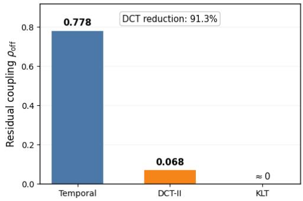

(b) Gaussian optimal-CFM coupling  
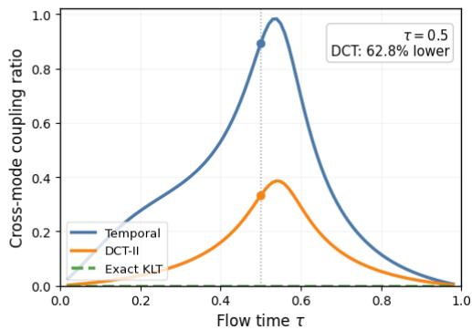  
Figure 5: Empirical and theoretical motivation for the temporal DCT representation. (a) Residual off-diagonal temporal covariance, $\rho _ { \mathrm { o f f } } ( K ) = \| K - \mathrm { d i a g } ( K ) \| _ { F } / \| K \| _ { F } ,$ , for standardized log-GVD trajectories from BNCI2014\_001. The full orthonormal DCT-II reduces residual temporal covariance coupling from 0.778 to 0.068, corresponding to a 91.3% reduction, while the empirical Karhunen– Loève transform (KLT) yields numerical zero. (b) Cross-mode coupling ratio of the populationoptimal Gaussian conditional flow-matching field as a function of flow time τ. The exact KLT removes second-order cross-mode coupling, while DCT-II substantially reduces it relative to the original temporal coordinates; at $\tau = 0 . 5$ , the DCT coupling ratio is 62.8% lower. Together, these results show that DCT-II acts as an invertible, data-independent approximation to the temporal KLT that reduces the cross-mode dependency structure presented to the trajectory velocity model.

## C.3 The DCT as an approximate KLT

The DCT-transformed temporal covariance is

$$
K _ { \mathrm { D C T } } = C _ { B } K _ { T } C _ { B } ^ { \top } .\tag{135}
$$

For temporally smooth or approximately stationary processes whose covariance eigenvectors are close to cosine modes,

$$
C _ { B } K _ { T } C _ { B } ^ { \top } \approx \Lambda .\tag{136}
$$

We quantify residual temporal coupling using

$$
\rho _ { \mathrm { o f f } } ( K ) = \frac { \| K - \mathrm { d i a g } ( K ) \| _ { F } } { \| K \| _ { F } } .\tag{137}
$$

The residual coupling in the temporal and DCT bases is then

$$
\rho _ { \mathrm { t i m e } } = \rho _ { \mathrm { o f f } } ( K _ { T } )\tag{138}
$$

and

$$
\rho _ { \mathrm { D C T } } = \rho _ { \mathrm { o f f } } \left( C _ { B } K _ { T } C _ { B } ^ { \top } \right) .\tag{139}
$$

A reduction

$$
\rho _ { \mathrm { D C T } } < \rho _ { \mathrm { t i m e } }\tag{140}
$$

indicates that the DCT has reduced second-order temporal dependence.

## C.4 Separable trajectory covariance

Let

$$
x = \operatorname { v e c } ( Z ^ { \top } ) \in \mathbb { R } ^ { B m } ,\tag{141}
$$

which stacks the windows $z _ { 1 } , \dots , z _ { B }$ , and suppose

$$
\Sigma = K _ { T } \otimes K _ { S } ,\tag{142}
$$

where $K _ { S }$ represents covariance between log-connectivity coordinates.

Proposition 8 (Temporal KLT decouples temporal covariance). If

$$
K _ { T } = U \Lambda _ { T } U ^ { \top } ,\tag{143}
$$

then with

$$
\boldsymbol { Q } = \boldsymbol { U } ^ { \intercal } \otimes \boldsymbol { I } _ { m } ,
$$

we have

(144)

$$
\boldsymbol { Q } \boldsymbol { \Sigma } \boldsymbol { Q } ^ { \intercal } = \boldsymbol { \Lambda } _ { T } \otimes \boldsymbol { K } _ { S } .\tag{145}
$$

Proof. Using the mixed-product property of the Kronecker product,

$$
Q \Sigma Q ^ { \top } = ( U ^ { \top } \otimes I _ { m } ) ( K _ { T } \otimes K _ { S } ) ( U \otimes I _ { m } )\tag{146}
$$

$$
= ( U ^ { \top } K _ { T } U ) \otimes K _ { S }
$$

$$
= \Lambda _ { T } \otimes K _ { S } .\tag{147}
$$

(148)

Therefore the KLT removes cross-temporal second-order coupling while leaving the within-mode connectivity covariance $K _ { S }$ unchanged.

Replacing $U ^ { \top }$ with $C _ { B }$ yields the approximate DCT analogue

$$
\Sigma _ { \mathrm { D C T } } = ( C _ { B } K _ { T } C _ { B } ^ { \top } ) \otimes K _ { S } .\tag{149}
$$

## C.5 Gaussian conditional flow matching

Assume

$$
\begin{array} { r } { x _ { 0 } \sim \mathcal { N } ( 0 , I ) , \qquad x _ { 1 } \sim \mathcal { N } ( 0 , \Sigma ) , } \end{array}\tag{150}
$$

with $x _ { 0 }$ and $x _ { 1 }$ independent, and define

$$
x _ { \tau } = ( 1 - \tau ) x _ { 0 } + \tau x _ { 1 } .\tag{151}
$$

The conditional target velocity is

$$
\boldsymbol { u } _ { \tau } = \boldsymbol { x } _ { 1 } - \boldsymbol { x } _ { 0 } .\tag{152}
$$

For squared-error conditional flow matching, the population-optimal field is

$$
v _ { \tau } ^ { \star } ( x ) = \mathbb { E } [ u _ { \tau } \mid x _ { \tau } = x ] .\tag{153}
$$

Proposition 9 (Optimal Gaussian CFM field). The optimal field is linear:

$$
\boldsymbol { v } _ { \tau } ^ { \star } ( \boldsymbol { x } ) = \boldsymbol { A } _ { \tau } \boldsymbol { x } ,\tag{154}
$$

where

$$
A _ { \tau } = \left[ \tau \Sigma - ( 1 - \tau ) I \right] \left[ ( 1 - \tau ) ^ { 2 } I + \tau ^ { 2 } \Sigma \right] ^ { - 1 } .\tag{155}
$$

Proof. Since $( u _ { \tau } , x _ { \tau } )$ is jointly Gaussian,

$$
\mathbb { E } [ u _ { \tau } \mid x _ { \tau } = x ] = \operatorname { C o v } ( u _ { \tau } , x _ { \tau } ) \operatorname { C o v } ( x _ { \tau } ) ^ { - 1 } x .\tag{156}
$$

Using independence of x0 and $x _ { 1 }$

$$
\mathrm { C o v } ( x _ { \tau } ) = ( 1 - \tau ) ^ { 2 } I + \tau ^ { 2 } \Sigma ,\tag{157}
$$

and

$$
\mathrm { C o v } ( u _ { \tau } , x _ { \tau } ) = \tau \Sigma - ( 1 - \tau ) I .\tag{158}
$$

Substitution proves the result.

Now let

$$
\Sigma = V \Lambda V ^ { \top } .\tag{159}
$$

Corollary 3 (Mode-wise Gaussian flow). In coordinates

$$
y = V ^ { \top } x ,\tag{160}
$$

the optimal field is diagonal:

$$
v _ { \tau , k } ^ { \star } ( y ) = a _ { \tau , k } y _ { k } ,\tag{161}
$$

with

$$
a _ { \tau , k } = \frac { \tau \lambda _ { k } - ( 1 - \tau ) } { ( 1 - \tau ) ^ { 2 } + \tau ^ { 2 } \lambda _ { k } } .\tag{162}
$$

Proof. Substituting

$$
\Sigma = V \Lambda V ^ { \top }\tag{163}
$$

into Proposition 9 gives

$$
A _ { \tau } = V \left[ \tau \Lambda - ( 1 - \tau ) I \right] \left[ ( 1 - \tau ) ^ { 2 } I + \tau ^ { 2 } \Lambda \right] ^ { - 1 } V ^ { \top } .\tag{164}
$$

Since the middle term is diagonal, the result follows.

This proves Theorem 1. In an exact covariance eigenbasis, the optimal Gaussian conditional flow field requires no cross-mode coupling.

Corollary 4 (Mode-wise Gaussian flow under optimal-transport coupling). Let $x _ { 0 } \sim \mathcal { N } ( 0 , I )$ and x ∼ $\mathcal { N } ( 0 , \Sigma )$ with $\Sigma = V \Lambda V ^ { \top } \succ 0 ,$ , and couple them by the quadratic-cost optimal-transport map $x _ { 1 } = \Sigma ^ { 1 / 2 } x _ { 0 }$ (Dowson and Landau, 1982; Villani, 2009). Along $x _ { \tau } = ( 1 - \tau ) x _ { 0 } + \tau x _ { 1 }$ , the conditional target $\boldsymbol { u } _ { \tau } = \boldsymbol { x } _ { 1 } - \boldsymbol { x } _ { 0 }$ is a deterministicfunction $o f x _ { \tau } ,$ and in coordinates $y = V ^ { \top }$ x

$$
v _ { \tau , k } ^ { \star } ( y ) = \frac { \sqrt { \lambda _ { k } } - 1 } { ( 1 - \tau ) + \tau \sqrt { \lambda _ { k } } } y _ { k } .\tag{165}
$$

Proof. Let $M _ { \tau } = ( 1 - \tau ) I + \tau \Sigma ^ { 1 / 2 }$ . Since $\Sigma ^ { 1 / 2 } \succ 0 , M _ { \tau }$ is positive definite for every $\tau \in [ 0 , 1 ]$ , and $x _ { \tau } = M _ { \tau } x _ { 0 }$ . Hence $x _ { 0 } = M _ { \tau } ^ { - 1 } x ,$ τ and

$$
\begin{array} { r } { u _ { \tau } = ( \Sigma ^ { 1 / 2 } - I ) x _ { 0 } = ( \Sigma ^ { 1 / 2 } - I ) M _ { \tau } ^ { - 1 } x _ { \tau } , } \end{array}\tag{166}
$$

so $\mathbb { E } [ u _ { \tau } \mid x _ { \tau } = x ] = ( \Sigma ^ { 1 / 2 } - I ) M _ { \tau } ^ { - 1 } x$ . Both factors are diagonal in the basis V, with entries $\sqrt { \lambda _ { k } } - 1$ and $( 1 - \tau ) + \tau \sqrt { \lambda _ { k } }$ □

Minibatch Sinkhorn coupling approximates this population coupling within each class, with Σ replaced by the class-conditional trajectory covariance. Under both couplings the optimal field is diagonal in the KLT basis, so the motivation for spectral coordinates does not depend on the coupling. The DCT is not generally the exact KLT, but whenever

$$
C _ { B } K _ { T } C _ { B } ^ { \top }\tag{167}
$$

is more diagonal than $K _ { T } ,$ , the DCT reduces the amount of second-order temporal interaction that must be represented by the velocity network.

## C.6 Residual coupling

Write

$$
C _ { B } K _ { T } C _ { B } ^ { \top } = D _ { T } + E _ { T } ,\tag{168}
$$

where

$$
D _ { T } = \mathrm { d i a g } \left( C _ { B } K _ { T } C _ { B } ^ { \top } \right)\tag{169}
$$

and

$$
E _ { T } = C _ { B } K _ { T } C _ { B } ^ { \top } - D _ { T } .\tag{170}
$$

Define

$$
\epsilon _ { \mathrm { D C T } } = \frac { \Vert E _ { T } \Vert _ { F } } { \Vert C _ { B } K _ { T } C _ { B } ^ { \top } \Vert _ { F } } .\tag{171}
$$

For the exact KLT,

$$
\epsilon _ { \mathrm { K L T } } = 0 .\tag{172}
$$

Hence ϵDCT measures the residual second-order coupling remaining after the fixed spectral transform.

## C.7 Orthogonal invariance of the GVD-CFM representation

Proposition 10 (DCT isometry). For any trajectory Z,

$$
\| C _ { B } Z \| _ { F } = \| Z \| _ { F } .\tag{173}
$$

Likewise, for any two velocity fields V and U,

$$
\lVert C _ { B } ( V - U ) \rVert _ { F } ^ { 2 } = \lVert V - U \rVert _ { F } ^ { 2 } .\tag{174}
$$

Proof. Since

$$
C _ { B } ^ { \top } C _ { B } = I _ { B } ,\tag{175}
$$

$$
\| C _ { B } Z \| _ { F } ^ { 2 } = \mathrm { t r } \left( Z ^ { \top } C _ { B } ^ { \top } C _ { B } Z \right)\tag{176}
$$

$$
= \operatorname { t r } ( Z ^ { \top } Z )
$$

$$
= \| Z \| _ { F } ^ { 2 } .\tag{177}
$$

(178)

□

Therefore the DCT does not alter the Euclidean flow-matching metric or reduce the objective by rescaling the trajectory. Its effect is purely a change of coordinates.

## C.8 Energy organization

The KLT additionally orders directions by variance. If

$$
\lambda _ { 1 } \geq \lambda _ { 2 } \geq \cdot \cdot \cdot \geq \lambda _ { B } ,\tag{179}
$$

then the first r KLT modes retain the largest possible amount of expected second-order energy among all orthonormal r-dimensional projections.

When the DCT approximates the KLT, temporally persistent structure is therefore expected to concentrate toward lower-order cosine modes. GVD-CFM does not truncate this representation: all B modes are retained. Thus this is an organization of temporal variation rather than a dimensionality-reduction argument.

## D Continuous-Grid Decoding as Band-Limited Interpolation

## D.1 Cosine-basis decoding of GVD trajectories

A distinctive consequence of the DCT-coordinate representation is that a generated trajectory is not restricted to the temporal grid used during training. The generated DCT coefficients define a finite cosine trajectory over normalized time, and may therefore be evaluated at an arbitrary number of temporal locations without retraining the generative model. We test this with an intentionally low native resolution: the spectral-only GVD-CFM network is trained once at $B _ { \mathrm { t r a i n } } = 2 5$ windows, and the same generated coefficients are decoded at $M \in \{ 2 5 , 5 0 , 1 0 0 , 2 0 0 , 4 0 0 \}$ , with the real reference trajectories recomputed natively at each M. The protocol is given in Section D.2.

Moderate upsampling preserves both discriminative and temporal structure. A 4× denser grid $( M = 1 0 0 )$ changes generated-to-real AUC only from 0.803 to 0.802, and at $M = 2 0 0$ it remains 0.794 with lag-ACF agreement 0.959. Every generated matrix stays SPD at every tested resolution. Evaluating at $M > B$ is interpolation of a finite-bandwidth function: it does not increase the generated temporal bandwidth. Table 5 reports the full comparison and the finite-bandwidth limit that appears at $M = 4 0 0$

The composite diffeomorphism introduced in Section 4.2.1 maps a GVD trajectory to the DCT-coordinate representation

$$
\bar { Z } = C _ { B } \widetilde { Z } \in \mathbb { R } ^ { B \times m } ,
$$

where B is the temporal resolution of the GVD trajectory, $m = d ( d + 1 ) / 2 , \widetilde { Z }$ denotes the standardized log-Euclidean trajectory, and $C _ { B }$ is the orthonormal DCT-II matrix. In the standard GVD-CFM decoder, a generated coefficient tensor $\widehat { \bar { Z } }$ is mapped back to the original B temporal locations using the inverse DCT,

$$
\widehat { \widetilde { Z } } = C _ { B } ^ { \top } \widehat { \bar { Z } } .
$$

We additionally exploit the fact that the inverse DCT is an evaluation of a finite cosine basis. Rather than restricting decoding to the original B DCT sampling locations, the generated coefficients can therefore be interpreted as defining a continuous trajectory and evaluated on an arbitrary temporal grid.

Continuous cosine representation. Let

$$
\begin{array} { r } { \widehat { \bar { Z } } = \left[ \begin{array} { c } { \widehat { \mathbf c } _ { 0 } ^ { \top } } \\ { \vdots } \\ { \widehat { \mathbf c } _ { B - 1 } ^ { \top } } \end{array} \right] , \qquad \widehat { \mathbf c } _ { k } \in \mathbb R ^ { m } , } \end{array}
$$

denote the DCT-coordinate trajectory generated by GVD-CFM. We associate these coefficients with the continu ous standardized tangent trajectory

$$
\widehat { \widetilde { \mathbf { z } } } ( \xi ) = \sum _ { k = 0 } ^ { B - 1 } \alpha _ { k } \widehat { \mathbf { c } } _ { k } \cos ( \pi k \xi ) , \qquad \xi \in [ 0 , 1 ] ,\tag{180}
$$

where $\xi$ denotes normalized EEG trajectory time and is distinct from the flow-time variable τ. The orthonormal DCT-II normalization is

$$
\alpha _ { k } = \left\{ \begin{array} { l l } { { B ^ { - 1 / 2 } , } } & { { k = 0 , } } \\ { { \sqrt { 2 / B } , } } & { { k > 0 . } } \end{array} \right.\tag{181}
$$

Hence, GVD-CFM generates a finite set of frequency coefficients, but those coefficients define a function over continuous trajectory time. The output temporal resolution is consequently determined during decoding rather than being restricted to the resolution at which the coefficient representation was generated.

Evaluation at an arbitrary temporal resolution. Suppose that the generated trajectory is to be evaluated at M temporal locations. We use the centered grid

$$
\xi _ { j } ^ { ( M ) } = \frac { j + \frac 1 2 } { M } , \qquad j = 0 , \dots , M - 1 .\tag{182}
$$

Evaluating Equation 180 on this grid gives

$$
\widehat { \widetilde { { \bf z } } } _ { j } ^ { ( M ) } = \sum _ { k = 0 } ^ { B - 1 } \alpha _ { k } \widehat { \bf c } _ { k } \cos \left[ \pi k \frac { j + \frac { 1 } { 2 } } { M } \right] .\tag{183}
$$

Equivalently, define the continuous DCT synthesis matrix

$$
A _ { M  B } \in \mathbb { R } ^ { M \times B } , \qquad [ A _ { M  B } ] _ { j , k } = \alpha _ { k } \cos [ \pi k \frac { j + \frac { 1 } { 2 } } { M } ] .\tag{184}
$$

The complete M-point standardized trajectory is then obtained by the single matrix operation

$$
\boxed { \hat { \tilde { Z } } ^ { ( M ) } = A _ { M  B } \hat { \hat { Z } } } .\tag{185}
$$

Thus,

$$
\widehat { \bar { Z } } \in \mathbb { R } ^ { B \times m } , \qquad \widehat { \widetilde { Z } } ^ { ( M ) } \in \mathbb { R } ^ { M \times m } ,
$$

and $M$ does not need to equal B. The same generated GVD trajectory can therefore be sampled at its native resolution, at a denser temporal resolution, or at a coarser temporal resolution without retraining GVD-CFM.

Exact agreement with the original GVD-CFM decoder. The continuous formulation is a strict extension of the inverse-DCT decoder already used by GVD-CFM. When $M = B$

$$
\xi _ { j } ^ { ( B ) } = \frac { j + \frac { 1 } { 2 } } { B } ,
$$

and therefore

$$
[ A _ { B  B } ] _ { j , k } = \alpha _ { k } \cos [ \frac { \pi } { B } ( j + \frac { 1 } { 2 } ) k ] .\tag{186}
$$

This is exactly the orthonormal inverse DCT-II basis, giving

$$
A _ { B  B } = C _ { B } ^ { \top } .\tag{187}
$$

Consequently,

$$
\widehat { \widetilde { Z } } ^ { ( B ) } = C _ { B } ^ { \top } \widehat { \bar { Z } } ,\tag{188}
$$

which recovers the original GVD-CFM decoding operation exactly. Continuous basis decoding therefore does not alter the learned representation or introduce an additional generative model; it generalizes the temporal evaluation of the existing DCT representation.

Mapping the continuous trajectory back to the SPD manifold. After continuous basis evaluation, the same inverse log-Euclidean mapping used by GVD-CFM is applied independently at each temporal location. Using the training-set coordinate statistics $\mu , \sigma \in \mathbb { R } ^ { m }$

$$
\widehat { \mathbf { z } } _ { j } ^ { ( M ) } = \widehat { \widetilde { \mathbf { z } } } _ { j } ^ { ( M ) } \odot \sigma + \mu .\tag{189}
$$

The corresponding symmetric tangent matrix is

$$
\begin{array} { r } { \widehat { X } _ { j } ^ { ( M ) } = \operatorname { s v e c } ^ { - 1 } \left( \widehat { \mathbf { z } } _ { j } ^ { ( M ) } \right) , } \end{array}\tag{190}
$$

and the GVD matrix is reconstructed as

$$
\widehat { \Delta } _ { j } ^ { ( M ) } = \exp \left( \widehat { X } _ { j } ^ { ( M ) } \right) , \qquad j = 0 , \ldots , M - 1 .\tag{191}
$$

Since $\widehat { X } _ { j } ^ { ( M ) }$ is symmetric, its matrix exponential is strictly positive definite. Hence,

$$
\widehat { \Delta } _ { j } ^ { ( M ) } \in \mathbb { S } _ { + + } ^ { d } \qquad \forall j ,\tag{192}
$$

so changing the temporal evaluation resolution does not compromise the manifold constraint.

Interpretation. The DCT-token representation used by GVD-CFM can therefore be viewed not only as a convenient Euclidean coordinate system for a discrete product-SPD trajectory, but also as the coefficient representation of a continuous cosine trajectory. All B generated modes are retained; no spectral truncation is introduced. Continuous decoding changes only the set of temporal locations at which this same generated trajectory is evaluated.

This separates generative resolution from sampling resolution: GVD-CFM learns the joint distribution of B cosine modes, while the resulting trajectory may be evaluated at any desired number M of temporal locations. In particular, choosing $M > B$ produces a denser realization of the generated dynamic connectivity trajectory while preserving the same underlying DCT coefficients and the SPD geometry of every reconstructed GVD matrix.

## D.2 Method

The DCT representation used by GVD-CFM permits a generated coefficient trajectory to be evaluated on a temporal grid different from the one used during training. We evaluate this property directly by deliberately training the generative model at a low temporal resolution and decoding its outputs on progressively denser grids.

All experiments in this section use

$$
B _ { \mathrm { t r a i n } } = 2 5 .
$$

For a generated DCT-coordinate trajectory

$$
\begin{array} { r } { \widehat { \bar { Z } } = \left[ \begin{array} { c } { \widehat { c } _ { 0 } ^ { \top } } \\ { \vdots } \\ { \widehat { c } _ { B - 1 } ^ { \top } } \end{array} \right] \in \mathbb { R } ^ { B \times m } , \qquad B = 2 5 , } \end{array}
$$

the continuous standardized tangent trajectory is

$$
\widehat { z } ( \xi ) = \sum _ { k = 0 } ^ { B - 1 } \alpha _ { k } \widehat { c } _ { k } \cos ( \pi k \xi ) , \qquad \xi \in [ 0 , 1 ] ,
$$

where

$$
\alpha _ { k } = \left\{ \begin{array} { l l } { B ^ { - 1 / 2 } , } & { k = 0 , } \\ { \sqrt { 2 / B } , } & { k > 0 . } \end{array} \right.
$$

For a target resolution M, we evaluate this function on the centered grid

$$
\xi _ { j } ^ { ( M ) } = \frac { j + \frac 1 2 } { M } , \qquad j = 0 , \dots , M - 1 .
$$

Equivalently,

$$
\widehat { Z } ^ { ( M ) } = A _ { M  B } \widehat { \bar { Z } } ,
$$

with

$$
[ A _ { M  B } ] _ { j , k } = \alpha _ { k } \cos [ \pi k \frac { j + \frac 1 2 } { M } ] .
$$

The resulting standardized tangent coordinates are inverse-standardized,

$$
\widehat { z } _ { j } ^ { ( M ) } = \widehat { \widetilde { z } } _ { j } ^ { ( M ) } \odot \sigma + \mu ,
$$

mapped back to symmetric matrices using svec−1,

$$
\widehat { X } _ { j } ^ { ( M ) } = \mathrm { s v e c } ^ { - 1 } \left( \widehat { z } _ { j } ^ { ( M ) } \right) ,
$$

Table 5: Dataset-balanced continuous-resolution results on BNCI2014\_001, BNCI2014\_002, BNCI2015\_001, Shin2017A, and Zhou2016. A single spectral-only GVD-CFM is trained at $B _ { \mathrm { t r a i n } } = 2 5$ for each dataset and decoded at the indicated target resolution M without retraining.
<table><tr><td>M</td><td>Rel. Fréchet</td><td>Temp. corr.</td><td>Lag-ACF</td><td>Dyn. energy</td><td>SPD</td><td>Gen→Real AUC</td><td>Gen→Real F1</td><td>Real→Real AUC</td><td>Real→Real F1</td></tr><tr><td>25</td><td>1.098</td><td>0.944</td><td>0.995</td><td>0.978</td><td>1.000</td><td>0.803</td><td>0.739</td><td>0.838</td><td>0.764</td></tr><tr><td>50</td><td>0.983</td><td>0.853</td><td>0.960</td><td>0.595</td><td>1.000</td><td>0.804</td><td>0.739</td><td>0.838</td><td>0.761</td></tr><tr><td>100</td><td>0.919</td><td>0.860</td><td>0.960</td><td>0.350</td><td>1.000</td><td>0.802</td><td>0.734</td><td>0.831</td><td>0.756</td></tr><tr><td>200</td><td>0.880</td><td>0.780</td><td>0.959</td><td>0.199</td><td>1.000</td><td>0.794</td><td>0.715</td><td>0.832</td><td>0.760</td></tr><tr><td>400</td><td>0.872</td><td>0.506</td><td>0.822</td><td>0.105</td><td>1.000</td><td>0.785</td><td>0.647</td><td>0.810</td><td>0.732</td></tr></table>

and finally reconstructed on the SPD manifold through

$$
\widehat { \Delta } _ { j } ^ { ( M ) } = \exp \left( \widehat { X } _ { j } ^ { ( M ) } \right) .
$$

Because $\widehat { X } _ { j } ^ { ( M ) }$ is symmetric,

$$
\widehat { \Delta } _ { j } ^ { ( M ) } \in { S } _ { + + } ^ { d } \qquad \forall j , M .
$$

We evaluate

$$
M \in \{ 2 5 , 5 0 , 1 0 0 , 2 0 0 , 4 0 0 \} ,
$$

corresponding to $1 \times , 2 \times , 4 \times , 8 \times$ , and 16× the training-grid density.

A single generated coefficient tensor $\widehat { \bar { Z } }$ is reused across all values of M. Differences across resolutions therefore arise only from evaluating the same learned continuous cosine trajectory on different temporal grids. No GVD-CFM model is retrained for any target resolution.

For each M, the corresponding real reference trajectories are recomputed directly from raw EEG using M GVD windows. The experiment therefore compares

$$
\mathrm { G V D - C F M \ t r a i n e d \ a t \ } B = 2 5 \quad \longrightarrow \quad \mathrm { c o n t i n u o u s \ d e c o d e \ a t \ } M
$$

against

$$
\mathrm { r e a l \ E E G } \longrightarrow \mathrm { n a t i v e \ G V D \ c o n s t r u c t i o n \ a t \ } M .
$$

The same pooled cross-session/cross-run train–test protocol used in the main benchmark is retained. Results are reported for BNCI2014-001, BNCI2014-002, BNCI2015-001, Shin2017A, and Zhou2016.

## D.3 Dataset-balanced results

The principal observation is that substantial temporal densification remains possible without retraining. Relative to native-resolution decoding,

$$
\mathrm { A U C _ { 2 5  2 5 } = 0 . 8 0 3 , ~ F 1 _ { 2 5  2 5 } = 0 . 7 3 9 , }
$$

while 4× denser decoding gives

$$
\mathrm { A U C _ { 2 5  1 0 0 } = 0 . 8 0 2 , \qquad F 1 _ { 2 5  1 0 0 } = 0 . 7 3 4 . }
$$

Thus,

$$
\Delta \mathrm { A U C } = - 0 . 0 0 1 , \qquad \Delta \mathrm { F } 1 = - 0 . 0 0 5 .
$$

At the same resolution, temporal-correlation agreement remains 0.860 and lag-ACF agreement remains 0.960.

Even at $M = 2 0 0 .$ , corresponding to 8× denser evaluation, generated-to-real AUC remains 0.794 and lag-ACF agreement remains 0.959. The corresponding temporal-correlation agreement is 0.780.

The real-to-real classifier provides useful context for these changes. At $M = 1 0 0$ , its dataset-balanced AUC is 0.831, compared with 0.802 for generated-to-real classification, a gap of

$$
0 . 0 2 9 .
$$

At M = 200, the corresponding values are 0.832 and 0.794, respectively.

All generated matrices remain SPD at every tested resolution:

$$
\mathrm { S P D \ v a l i d i t y = 1 . 0 0 0 }
$$

for every dataset and every M.

At the highest tested resolution, $M = 4 0 0$ , generated-to-real AUC remains 0.785, whereas temporal-correlation agreement decreases to 0.506. This is consistent with the finite-bandwidth limitation of evaluating a trajectory represented by only 25 learned cosine modes on a substantially denser temporal grid

Table 6: Per-dataset continuous-resolution results for a single spectral-only GVD-CFM trained at $B _ { \mathrm { t r a i n } } = 2 5$ . The same generated DCT coefficient tensor is evaluated at M ∈ {25, 50, 100, 200, 400} without retraining, while the corresponding real GVD trajectories are recomputed natively at each target resolution.
<table><tr><td>Dataset</td><td>M</td><td>Rel. Fréchet</td><td>Temp. corr.</td><td>Lag-ACF</td><td>Dyn. energy</td><td>Gen→Real AUC</td><td>Gen→Real F1</td><td>Real→Real AUC</td><td>Real→Real F1</td></tr><tr><td>BNCI2014-001</td><td>25</td><td>1.163</td><td>0.977</td><td>0.995</td><td>1.041</td><td>0.814</td><td>0.724</td><td>0.863</td><td>0.775</td></tr><tr><td></td><td>50</td><td>1.021</td><td>0.875</td><td>0.977</td><td>0.622</td><td>0.824</td><td>0.748</td><td>0.866</td><td>0.784</td></tr><tr><td></td><td>100</td><td>0.979</td><td>0.890</td><td>0.958</td><td>0.360</td><td>0.816</td><td>0.727</td><td>0.857</td><td>0.783</td></tr><tr><td></td><td>200</td><td>0.958</td><td>0.778</td><td>0.959</td><td>0.195</td><td>0.806</td><td>0.704</td><td>0.821</td><td>0.739</td></tr><tr><td></td><td>400</td><td>0.943</td><td>0.440</td><td>0.558</td><td>0.103</td><td>0.778</td><td>0.497</td><td>0.797</td><td>0.710</td></tr><tr><td>BNCI2014-002</td><td>25</td><td>1.008</td><td>0.911</td><td>0.999</td><td>0.964</td><td>0.791</td><td>0.746</td><td>0.797</td><td>0.721</td></tr><tr><td></td><td>50</td><td>0.841</td><td>0.822</td><td>0.984</td><td>0.560</td><td>0.792</td><td>0.742</td><td>0.802</td><td>0.714</td></tr><tr><td></td><td>100</td><td>0.790</td><td>0.778</td><td>0.972</td><td>0.319</td><td>0.787</td><td>0.730</td><td>0.799</td><td>0.721</td></tr><tr><td></td><td>200</td><td>0.768</td><td>0.643</td><td>0.961</td><td>0.184</td><td>0.772</td><td>0.714</td><td>0.841</td><td>0.771</td></tr><tr><td></td><td>400</td><td>0.789</td><td>0.377</td><td>0.884</td><td>0.097</td><td>0.769</td><td>0.736</td><td>0.792</td><td>0.717</td></tr><tr><td>BNCI2015-001</td><td>25</td><td>1.070</td><td>0.963</td><td>0.998</td><td>0.882</td><td>0.766</td><td>0.697</td><td>0.793</td><td>0.714</td></tr><tr><td></td><td>50</td><td>1.269</td><td>0.889</td><td>0.990</td><td>0.526</td><td>0.764</td><td>0.694</td><td>0.794</td><td>0.723</td></tr><tr><td></td><td>100</td><td>1.246</td><td>0.894</td><td>0.988</td><td>0.291</td><td>0.764</td><td>0.700</td><td>0.779</td><td>0.701</td></tr><tr><td></td><td>200</td><td>1.183</td><td>0.806</td><td>0.988</td><td>0.160</td><td>0.756</td><td>0.682</td><td>0.763</td><td>0.693</td></tr><tr><td></td><td>400</td><td>1.145</td><td>0.439</td><td>0.923</td><td>0.080</td><td>0.744</td><td>0.681</td><td>0.753</td><td>0.682</td></tr><tr><td>Shin2017A</td><td>25</td><td>1.199</td><td>0.945</td><td>0.984</td><td>1.219</td><td>0.673</td><td>0.621</td><td>0.759</td><td>0.691</td></tr><tr><td></td><td>50</td><td>0.898</td><td>0.840</td><td>0.896</td><td>0.812</td><td>0.675</td><td>0.625</td><td>0.752</td><td>0.676</td></tr><tr><td></td><td>100</td><td>0.771</td><td>0.889</td><td>0.936</td><td>0.532</td><td>0.673</td><td>0.631</td><td>0.747</td><td>0.672</td></tr><tr><td></td><td>200</td><td>0.733</td><td>0.886</td><td>0.942</td><td>0.325</td><td>0.671</td><td>0.628</td><td>0.767</td><td>0.690</td></tr><tr><td></td><td>400</td><td>0.723</td><td>0.843</td><td>0.829</td><td>0.187</td><td>0.677</td><td>0.553</td><td>0.742</td><td>0.660</td></tr><tr><td>Zhou2016</td><td>25</td><td>1.052</td><td>0.926</td><td>1.000</td><td>0.783</td><td>0.968</td><td>0.907</td><td>0.977</td><td>0.917</td></tr><tr><td></td><td>50</td><td>0.888</td><td>0.838</td><td>0.953</td><td>0.451</td><td>0.965</td><td>0.889</td><td>0.973</td><td>0.910</td></tr><tr><td></td><td>100</td><td>0.806</td><td>0.850</td><td>0.946</td><td>0.245</td><td>0.965</td><td>0.882</td><td>0.971</td><td>0.907</td></tr><tr><td></td><td>200</td><td>0.756</td><td>0.787</td><td>0.945</td><td>0.130</td><td>0.966</td><td>0.850</td><td>0.969</td><td>0.902</td></tr><tr><td></td><td>400</td><td>0.761</td><td>0.430</td><td>0.918</td><td>0.062</td><td>0.955</td><td>0.772</td><td>0.963</td><td>0.887</td></tr></table>

## D.4 Per-dataset results

The per-dataset results show that resolution transfer is not driven by a single dataset. BNCI2014-001 preserves generated-to-real AUC from 0.814 at M = 25 to 0.816 at M = 100 and 0.806 at M = 200. BNCI2014-002 similarly remains near 0.79 through M = 100, while BNCI2015-001 changes only from 0.766 at M = 25 to 0.764 at M = 100.

Shin2017A also shows stable discriminative performance under substantial densification. Its generated-to-real AUC is

$$
0 . 6 7 3 , 0 . 6 7 5 , 0 . 6 7 3 , 0 . 6 7 1 , 0 . 6 7 7
$$

at M = 25, 50, 100, 200, 400, respectively. Thus, the classifier-level utility of the generated trajectories is essentially unchanged across the entire range of target resolutions. Temporal-correlation agreement is 0.945 at native resolution, 0.889 at M = 100, and 0.886 at M = 200. Lag-ACF agreement remains 0.936 at M = 100 and 0.942 at M = 200.

Zhou2016 shows particularly strong preservation of discriminative structure:

$$
0 . 9 6 8 , \ 0 . 9 6 5 , \ 0 . 9 6 5 , \ 0 . 9 6 6
$$

generated-to-real AUC at M = 25, 50, 100, 200, respectively, and remains at 0.955 even at M = 400.

Across the five datasets, the effect of increasing M is therefore more apparent in the temporal-dynamics diagnostics than in generated-to-real classification. Dataset-balanced generated-to-real AUC changes only from 0.803 at M = 25 to 0.802 at M = 100, 0.794 at M = 200, and 0.785 at M = 400. In contrast, the dataset-balanced dynamic-energy ratio decreases from 0.978 at M = 25 to 0.350 at M = 100, 0.199 at M = 200, and 0.105 at M = 400.

This behavior is expected from finite-bandwidth cosine decoding. Increasing M evaluates the same $B _ { \mathrm { t r a i n } } = 2 5$ learned cosine modes on a denser temporal grid; it does not introduce additional high-frequency modes. Consequently, continuous-grid decoding can preserve class-discriminative and broad temporal structure under substantial densification, while increasingly fine-scale dynamic amplitudes cannot match native high-resolution GVD trajectories indefinitely.

At M = 400, corresponding to 16× the training-grid density, the limitation is visible in the dataset-balanced temporal-correlation agreement of 0.506 and dynamic-energy ratio of 0.105. Nevertheless, generated-to-real AUC remains 0.785, lag-ACF agreement remains 0.822, and every generated matrix remains SPD. This supports interpreting the procedure as continuous-resolution evaluation of a finite-bandwidth trajectory rather than recovery of temporal frequencies absent from the original 25-mode representation

## D.5 Interpretation and limitation

The experiment demonstrates that output temporal resolution is not fixed by the grid used during GVD-CFM training. In particular, a model trained on only 25 temporal positions can be evaluated at 100 or 200 positions while retaining much of its discriminative and temporal structure.

However, increasing M does not create additional temporal bandwidth. The learned trajectory contains only the B = 25 cosine modes generated by the model:

$$
{ \widehat { z } } ( \xi ) = \sum _ { k = 0 } ^ { 2 4 } \alpha _ { k } { \widehat { c } } _ { k } \cos ( \pi k \xi ) .
$$

Hence, evaluating this function on a denser grid provides a finer sampling of the same finite-dimensional trajectory rather than synthesizing additional high-frequency modes.

This distinction is visible at $M = 4 0 0$ . Although generated-to-real AUC remains 0.785 and SPD validity remains perfect, temporal-correlation agreement falls to 0.506. This regime corresponds to 16× denser temporal evaluation than training and exposes the finite-bandwidth limitation of the 25-mode representation.

We therefore use the term continuous-resolution decoding to mean that a generated GVD trajectory can be evaluated on arbitrary temporal grids without retraining, while explicitly not claiming that arbitrarily dense evaluation recovers temporal frequencies absent from the learned coefficient representation.

## E Regional and Physiological Plausibility of Generated GVD Dynamics

Here, we ask whether GVD-CFM reproduces physiologically structured spatiotemporal connectivity rather than only aggregate statistics. We performed the analysis on BNCI2014\_001 by grouping its 22 scalp electrodes into four broad regions: Frontal/FC, Central, Centro-parietal and Parietal/Occipital. For each pair of regions we computed the mean magnitude of the corresponding GVD edges for held-out real and generated trials, and followed representative regional interactions across all B = 100 windows (Figure 6 in the main text). Finally, we compared a generated single-trial sequence with its nearest held-out real trial.

Regional connectivity organization. Figure 2 shows that the generated data preserve the large-scale regional organization of held-out EEG. Mean Frontal/FC connectivity is 0.847 in held-out real data and 0.835 in generated data, and Parietal/Occipital connectivity is 0.894 and 0.880. Central–Centro-parietal connectivit is similarly preserved (0.717 real against 0.706 generated), while the weaker Frontal/FC–Parietal/Occipital interaction remains weak (0.437 against 0.420). GVD-CFM therefore preserves the relative spatial organization of interactions across the scalp, with strong local and adjacent-region coupling and weaker long-range frontal-to posterior coupling. Motor-imagery EEG is classically associated with strong modulation of sensorimotor activity over central and neighboring centro-parietal regions, with distributed involvement of frontal and posterior areas (Pfurtscheller and da Silva, 1999). The preserved central and centro-parietal structure is consistent with this.

Temporal regional dynamics. Across the Frontal/FC–Central, Central–Central, Central–Centro-parietal, Centro-parietal–Parietal/Occipital and Frontal/FC–Parietal/Occipital interactions of Figure 6, real and generated data both show a pronounced early transient followed by a fall to a lower connectivity regime. Around the middle of the trial several interactions fall further, after which connectivity gradually recovers and continues to fluctuate. These changes occur together across related regions; the generated interactions do not fluctuate independently around a static mean. Such non-stationarity is compatible with the sequence of preparation, imagery and recovery within a motor-imagery trial.

Single-trial connectivity reconfiguration. Population-level agreement could in principle arise from a generator that learned only an average connectivity template. Figure 7 therefore compares one generated trial with its nearest held-out real trial over ten consecutive intervals. The real sequence reconfigures substantially over time, with periods of strong, spatially distributed connectivity alternating with weaker or more concentrated interactions. The generated sequence shows a comparable degree of restructuring and passes through a series of distinct channel-level patterns rather than holding a fixed matrix. The two sequences are not identical, which is consistent with generation of a new trajectory from the learned distribution rather than reproduction of a training trial.

Node-strength dynamics. The scalp node-strength maps of Figure 8 give a more interpretable view of the same trials. In the held-out trial, different intervals emphasize central, centro-parietal, posterior or more broadly distributed patterns. The generated trial shows similarly heterogeneous organization: high-strength regions shift across windows rather than remaining locked to one set of electrodes, prominent modulation recurs around central and centro-parietal locations, and frontal and posterior contributions vary over time. The model is therefore not scaling a fixed graph uniformly; the relative contribution of electrode groups changes over time.

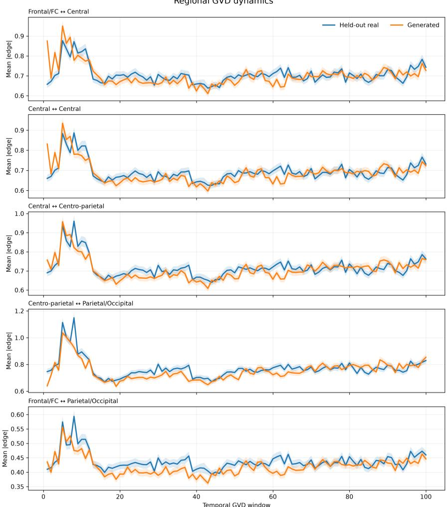  
Figure 6: Regional GVD dynamics on BNCI2014\_001. Mean GVD edge magnitude of five representative regional interactions over the B = 100 windows for held-out real and GVD-CFM trajectories. The generated trajectories reproduce the early transient, the fall to a lower connectivity regime, the mid-trial reduction and the gradual recovery of the real data, and these changes are aligned across regions. Shaded regions show the variability around each mean trajectory.

Interpretation. These analyses show agreement at different levels: the time-averaged regional connectivity, its evolution over the trial, the reconfiguration of single-trial connectivity matrices, and the spatial distribution of node strength over time, which repeatedly involves the central and centro-parietal scalp regions relevant to motor imagery. We interpret this as evidence of regional physiological plausibility.

## F Additional Ablations

## F.1 Efficiency

Figure 9 summarizes training and generation cost. For GVD-CFM, 1000 training epochs take 304 s on average across the five main datasets and three seeds, and generating a batch of 32 trajectories with 50 RK4 steps takes 3.92 s (Appendix A).

## F.2 Temporal-Resolution Audit of Stable-Support Information

To determine whether the discriminative information in GVD comes from the stable support W, from the instantaneous term $J _ { t } ,$ or from their interaction, we evaluated four representations of real data over B ∈ {8, 16, 32, 64, 128, 256, 512} windows with the CAS classifier and the cross-session protocol of the main

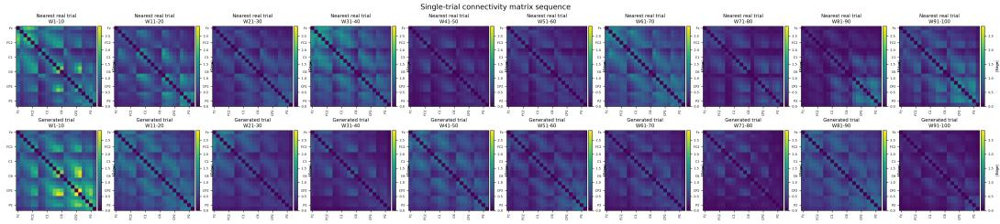  
Figure 7: Single-trial GVD connectivity-matrix sequence on BNCI2014\_001. One generated trial and its nearest held-out real trial are shown over ten consecutive temporal intervals. Both sequences exhibit substantial time-dependent reconfiguration of channel-level connectivity rather than a static graph template.

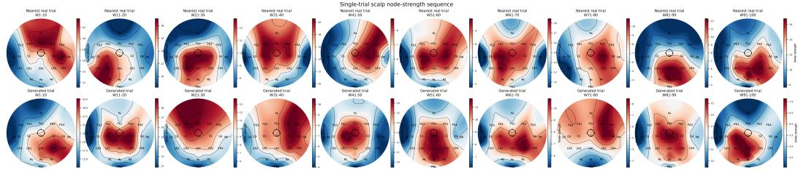  
Figure 8: Single-trial scalp node-strength sequence on BNCI2014\_001. Scalp node-strength maps for the same generated trial and nearest held-out real trial across ten temporal intervals. Both sequences display spatially heterogeneous and time-varying patterns involving frontal, central, centroparietal, and posterior electrodes. The generated sequence preserves broad sensorimotor-centered spatial dynamics without reproducing the real trial exactly.

benchmark: the stable-support trajectory $W \odot J _ { t } ;$ the no-support trajectory $J _ { t } + \epsilon I ;$ the static support W alone;   
and $W \odot J _ { t } ^ { \mathrm { G a u s s i a n } }$ , in which the node activity is replaced by independent Gaussian noise.

Table 7 shows that the stable-support representation keeps CAS AUC between 0.83 and 0.84 and weighted F1 between 0.76 and 0.77 from $\bar { B } = 8 \bar { \mathrm { t o } } B = 1 2 8$ , and only falls to 0.807 and 0.738 at sample resolution. The no-support representation is informative at coarse resolution (AUC 0.816 at $B = 8 )$ but falls steadily as B increases, to 0.745 at $B = 6 4$ and 0.690 at $B = 5 1 2 .$ . This is the expected behavior of a covariance estimated from fewer and fewer samples. The static support alone reaches AUC 0.822 and weighted F1 0.747, so W itself carries substantial class information. It does not explain the full representation, however: $W \odot J _ { t }$ exceeds W alone at every resolution up to $B = 2 5 6$ , and replacing the real node activity with Gaussian noise drops performance to near chance (AUC 0.51–0.57). The temporal modulation must therefore carry real structure from the EEG. At $B = 5 1 2$ the full representation falls slightly below the support alone, so at sample resolution the instantaneous noise outweighs the added dynamic information; the loss is still much smaller than for the no-support representation. Essentially, the stable support acts as a variance-reducing structural prior that keeps informative dynamic modulation while avoiding the instability of an independent covariance estimate in every short window.

## F.3 Amplitude Bias and the Temporal Branch

GVD-CFM transports the trajectory in DCT coordinates, but the decoder exponentiates each window separately. Remark 3 shows that errors which are unbiased in log coordinates inflate the expected power of the decoded windows. Figure 11 shows this failure mode. The generated trajectory reproduces the broad shape of the real mean GVD edge trajectory, including the early transient and the subsequent recovery, but after the initial period it stays above the real trajectory for much of the trial. The global temporal shape is preserved while the time-loca amplitude is biased.

The temporal branch of Section 4.2.2 addresses this bias without introducing a second dynamical state. It reads the current DCT state z in the window basis, $C _ { B } ^ { \top } z _ { \tau } ,$ processes it with two AdaLN blocks, and returns the result to DCT alignment before the gated fusion (Figure 3). The velocity is still predicted in DCT coordinates and only the DCT state is integrated, but the network now sees directly the quantity that the decoder exponentiates. Figure 12 shows a generated mean GVD edge trajectory from the full model that follows the real one through the initial transient, the subsequent decline and the middle and later portions of the trial. Quantitatively, the branch reduces dynamic energy on every dataset and moves it towards 1 where the spectral-only network overshoots, while leaving the aggregate fidelity and utility metrics essentially unchanged (Table 3).

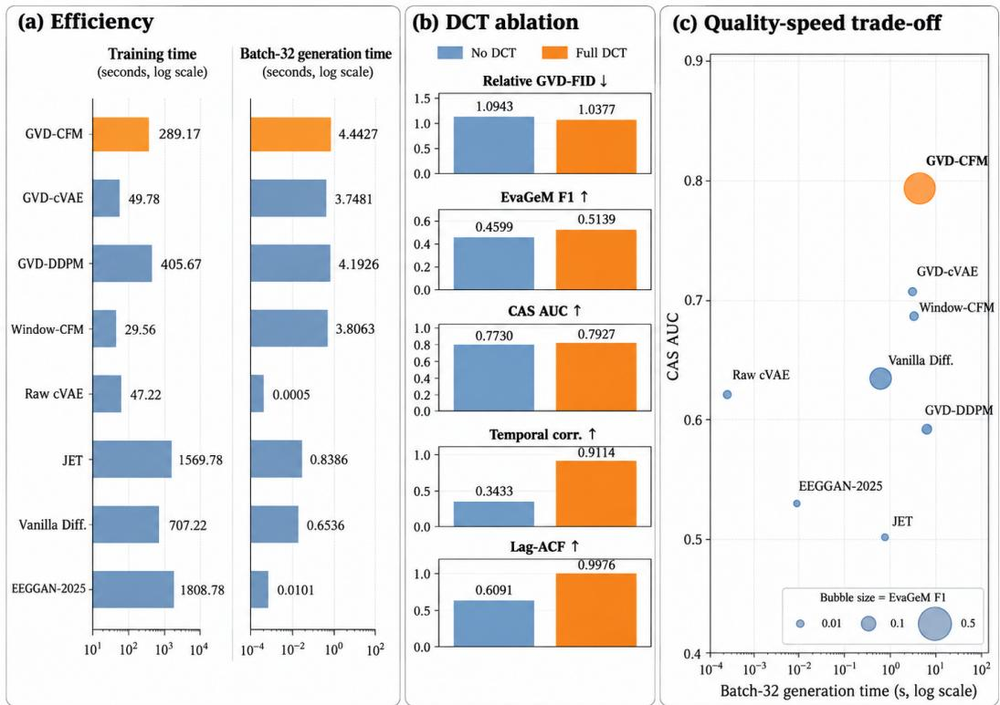  
Efficiency and ablation analyses  
Figure 9: Efficiency and ablation analysis of GVD-CFM. (a) Average training time and batch-32 generation latency across five datasets and three generator seeds, shown on logarithmic axes. GVD-CFM is substantially faster to train than the large raw-signal generative baselines while retaining practical sampling cost. (b) DCT ablation with the spectral-only velocity network, comparing the full orthonormal DCT-II representation against direct temporal log-svec coordinates. The DCT improves relative GVD-FID, EvaGeM F1, CAS AUC, temporal-correlation agreement, and lag-autocorrelation agreement, with the largest gains observed in temporal structure. (c) Quality–speed trade-off across generators. The horizontal axis shows batch-32 generation time, the vertical axis shows CAS AUC, and marker size is proportional to EvaGeM F1. GVD-CFM combines strong downstream utility with substantially stronger trajectory-level distributional overlap than competing methods at practical generation cost.

Remark 3 (Why spectral errors inflate decoded amplitudes). Let $\widehat { \bar { Z } } = \bar { Z } ^ { \star } + E$ be a generated DCT-coordinate trajectory with error $E .$ Window b is decoded as $\widehat { \Delta } _ { b } = \exp \bigl ( \mathrm { s v e c } ^ { - 1 } ( \widehat { z } _ { b } ) \bigr )$  with $\widehat { z } _ { b } = z _ { b } ^ { \star } + \sigma \odot ( C _ { B } ^ { \top } E ) _ { b } ,$ so the log-coordinate error of every window is a superposition of the errors of all modes. The map X 7→ tr exp(X) is convex on symmetric matrices. If the window error has zero mean, Jensen’s inequality gives

$$
\mathbb { E } \big [ \mathrm { t r } \widehat { \Delta } _ { b } \big ] \geq \mathrm { t r } \exp \big ( \mathrm { s v e c } ^ { - 1 } ( z _ { b } ^ { \star } ) \big ) ,\tag{193}
$$

so unbiased errors in the log chart inflate the expected total power of each decoded window. The spectral Transformer sees E only mode by mode, whereas the temporal branch sees $C _ { B } ^ { \top } \widehat { \bar { Z } } .$ , the quantity that is exponentiated window by window.

## F.4 Nearest-Neighbor Memorization Diagnostic

Table 8 compares the ratio $M = d _ { 1 } / d _ { 2 }$ of the first and second nearest same-class training neighbors of generated samples with the same ratio for held-out real samples. A generator that copies training data would have M well below the held-out value. For GVD-CFM the two agree to within 0.001, and no generator produces exact copies. GVD-CFM has a near-copy rate of 0.16, against 0.98 for GVD-cVAE, whose samples collapse towards the training data.

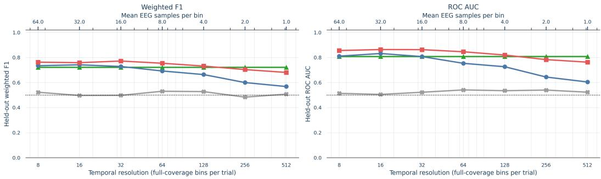  
W only (exact trial support) Instantaneous J (no W)W Hadamard Gaussian JReal Delta (W Hadamard J)  
Figure 10: Temporal-resolution ablation of graph-variate connectivity. Weighted F1 (left) and ROC AUC (right) on the held-out evaluation split as the number of full-coverage bins increases from $B = 8$ to sample resolution $( B = 5 1 2 )$ . The upper axis gives the mean number of EEG samples per bin. We compare the trial-level support W, the instantaneous covariance J without support, the control $W \odot J ^ { \mathrm { G a u s s i a n } }$ , and the real graph-variate trajectory $\Delta = W \odot J$ . The Gaussian control remains close to chance, so arbitrary temporal modulation of W does not reproduce the discriminative information of the real trajectory. At fine resolutions J degrades as its estimates become noisier, whereas modulation by the stable support is far more robust.

Table 7: Temporal-resolution support audit (Figure 10). Held-out classification of real trajectories with the CAS classifier, dataset-balanced over five datasets and three seeds, as a function of the number of windows B. Stable support is $W \odot J _ { t } ,$ no support is $J _ { t } + \epsilon I$ with $\epsilon = 1 0 ^ { - 6 }$ , support only is the static W and Gaussian dynamics is $W \odot J _ { t } ^ { \mathrm { G a u s s i a n } }$ . Best value in each column is bold.
<table><tr><td>Representation</td><td> $B = 8$ </td><td>16</td><td>32</td><td>64</td><td>128</td><td>256</td><td>512</td></tr><tr><td>CAS AUC ↑</td><td></td><td></td><td></td><td></td><td></td><td></td><td></td></tr><tr><td>Stable support</td><td>0.841</td><td>0.838</td><td>0.840</td><td>0.833</td><td>0.837</td><td>0.827</td><td>0.807</td></tr><tr><td>No support</td><td>0.816</td><td>0.797</td><td>0.765</td><td>0.745</td><td>0.756</td><td>0.738</td><td>0.690</td></tr><tr><td>Support only</td><td>0.822</td><td>0.822</td><td>0.822</td><td>0.822</td><td>0.822</td><td>0.822</td><td>0.822</td></tr><tr><td>Gaussian dynamics</td><td>0.512</td><td>0.518</td><td>0.527</td><td>0.545</td><td>0.574</td><td>0.558</td><td>0.528</td></tr><tr><td>CAS weighted F1 ↑</td><td></td><td></td><td></td><td></td><td></td><td></td><td></td></tr><tr><td>Stable support</td><td>0.770</td><td>0.772</td><td>0.766</td><td>0.764</td><td>0.759</td><td>0.747</td><td>0.738</td></tr><tr><td>No support</td><td>0.747</td><td>0.735</td><td>0.698</td><td>0.684</td><td>0.693</td><td>0.673</td><td>0.640</td></tr><tr><td>Support only</td><td>0.747</td><td>0.747</td><td>0.747</td><td>0.747</td><td>0.747</td><td>0.747</td><td>0.747</td></tr><tr><td>Gaussian dynamics</td><td>0.505</td><td>0.512</td><td>0.513</td><td>0.526</td><td>0.550</td><td>0.535</td><td>0.506</td></tr></table>

## F.5 Ablation: Removing Generated Eigenvalue Clipping

To assess whether the performance of GVD-CFM depends on post-generation eigenvalue stabilization, we repeated the full generative benchmark with generated log-eigenvalue clipping disabled. All other components were unchanged: the full GVD-CFM with its temporal branch, the standard normal source, classwise Sinkhorn coupling, full orthonormal DCT coordinates, RK4 integration with 50 steps and the canonical stable-support GVD representation with B = 100 windows. We evaluated GVD-CFM, GVD-DDPM and GVD-cVAE on all five datasets with three generator seeds per dataset.

Table 9 reports the dataset-balanced results. Disabling clipping has a negligible effect on GVD-CFM. Its relative GVD Fréchet distance is 1.016, EvaGeM F1 0.609, CAS AUC 0.792 and CAS weighted F1 0.724, against 1.022, 0.613, 0.790 and 0.725 with clipping (Table 1). Temporal agreement remains high (temporal correlation 0.942, lag-ACF 0.998), and the dynamic-energy and dynamic-fraction ratios remain close to 1 (0.975 and 0.982). The reported performance of GVD-CFM is therefore not driven by clipping, which acts as a numerical safeguard.

The ablation also shows the different failure modes of the GVD-space controls. Without clipping, GVD-DDPM becomes unstable on some datasets, with a relative GVD Fréchet distance of $1 . 7 9 6 \pm 1 . 5 3 3$ across datasets and a dynamic-energy ratio of 1.840±2.007. GVD-cVAE again attains a low Fréchet distance with near-zero EvaGeM F1 (0.003) and strongly attenuated dynamics (dynamic-energy ratio 0.230), so a favorable second-order distance does not imply faithful recovery of the dynamic distribution. Novelty metrics are unaffected: GVD-CFM has $M ^ { 2 } = 0 . 9 8 \dot { 8 }$ against a held-out value of 0.990, no exact copies, and training coverage 0.227, against 0.039 for GVD-DDPM and 0.103 for GVD-cVAE.

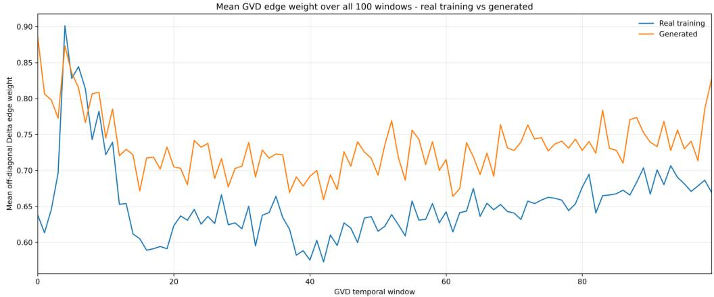  
Figure 11: Temporal amplitude bias in generated GVD dynamics. Mean off-diagonal GVD edge weight over the $B = 1 0 0$ windows for real training trials and generated trials. The generated sequence captures the broad temporal organization, including the early transient, but shows a persistent positive amplitude offset over much of the later trajectory.

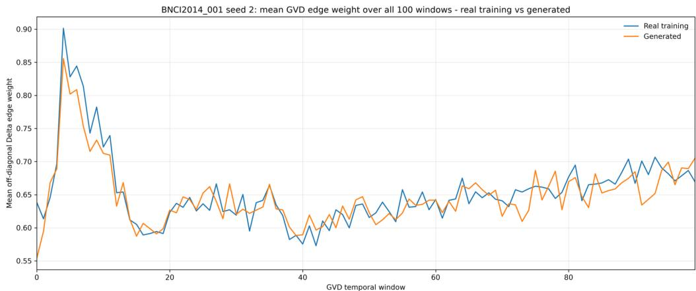  
Figure 12: Temporal alignment of the full GVD-CFM model. Mean off-diagonal GVD edge weight over all $B = 1 0 0$ windows for real training trials and generated trials on BNCI2014\_001. The generated trajectory follows the real sequence through the initial transient, the subsequent reduction, the intermediate fluctuations and the later recovery.

## F.6 Extended Tables

Table 8: Nearest-neighbor memorization analysis. $M = d _ { 1 } / d _ { 2 }$ compares the first and second nearest same-class training neighbors. The held-out-real reference provides the target local-neighbor geometry; for GVD-CFM it is computed in the same run as its samples.
<table><tr><td>Method</td><td> $M _ { \mathrm { g e n } }$ </td><td> $M _ { \mathrm { h e l d } }$ </td><td> $| \Delta M | \downarrow$ </td><td> $M _ { \mathrm { g e n } } ^ { 2 }$ </td><td> $M _ { \mathrm { h e l d } } ^ { 2 }$ </td><td>Near-copy ↓</td><td>Exact-copy ↓</td></tr><tr><td>GVD-CFM</td><td>0.99400</td><td>0.99501</td><td>0.00101</td><td>0.98803</td><td>0.99004</td><td>0.16155</td><td>0.00000</td></tr><tr><td>GVD-cVAE</td><td>0.99316</td><td>0.99516</td><td>0.00200</td><td>0.98636</td><td>0.99034</td><td>0.98171</td><td>0.00000</td></tr><tr><td>GVD-DDPM</td><td>0.99671</td><td>0.99516</td><td>0.00156</td><td>0.99344</td><td>0.99034</td><td>0.18854</td><td>0.00000</td></tr><tr><td>Window-DIFFEO-CFM</td><td>0.99678</td><td>0.99516</td><td>0.00162</td><td>0.99357</td><td>0.99034</td><td>0.00000</td><td>0.00000</td></tr><tr><td>cVAE</td><td>0.99555</td><td>0.99516</td><td>0.00040</td><td>0.99113</td><td>0.99034</td><td>0.01807</td><td>0.00000</td></tr><tr><td>JET</td><td>0.99298</td><td>0.99516</td><td>0.00218</td><td>0.98605</td><td>0.99034</td><td>0.00000</td><td>0.00000</td></tr><tr><td>Vanilla-Diffusion</td><td>0.99397</td><td>0.99516</td><td>0.00119</td><td>0.98799</td><td>0.99034</td><td>0.00005</td><td>0.00000</td></tr><tr><td>EEGGAN-2025</td><td>0.99169</td><td>0.99516</td><td>0.00347</td><td>0.98351</td><td>0.99034</td><td>0.00000</td><td>0.00000</td></tr></table>

Table 9: Dataset-balanced results over five EEG datasets and three generator seeds per dataset with generated log-eigenvalue clipping disabled. GVD-CFM is the full model with the temporal branch. Values are mean ± standard deviation across datasets after averaging generator seeds within each dataset.
<table><tr><td>Metric</td><td>GVD-CFM</td><td>GVD-DDPM</td><td>GVD-cVAE</td></tr><tr><td>Relative GVD-FID + increments</td><td> $1 . 0 1 5 8 \pm 0 . 0 6 9 2$ </td><td> $1 . 7 9 5 5 \pm 1 . 5 3 2 8$ </td><td> $0 . 8 1 3 1 \pm 0 . 0 7 8 9$ </td></tr><tr><td>Relative GVD-FID, positions only</td><td> $1 . 0 0 4 0 \pm 0 . 0 4 5 3$ </td><td> $1 . 7 3 5 4 \pm 1 . 2 1 1 8$ </td><td> $0 . 9 0 1 4 \pm 0 . 0 7 0 8$ </td></tr><tr><td>EvaGeM F1 + increments</td><td> $0 . 6 0 8 6 \pm 0 . 2 4 4 0$ </td><td> $0 . 0 4 8 0 \pm 0 . 0 3 7 2$ </td><td> $0 . 0 0 2 8 \pm 0 . 0 0 3 4$ </td></tr><tr><td>EvaGeM F1, positions only</td><td> $0 . 6 4 4 2 \pm 0 . 1 7 7 8$ </td><td> $0 . 0 0 4 6 \pm 0 . 0 0 5 8$ </td><td> $0 . 0 0 3 5 \pm 0 . 0 0 4 8$ </td></tr><tr><td>CAS AUC</td><td> $0 . 7 9 2 0 \pm 0 . 0 9 7 3$ </td><td> $0 . 6 0 7 1 \pm 0 . 1 3 1 7$ </td><td> $0 . 7 3 3 4 \pm 0 . 0 9 8 3$ </td></tr><tr><td>CAS weighted F1</td><td> $0 . 7 2 4 0 \pm 0 . 0 9 6 3$ </td><td> $0 . 5 7 5 9 \pm 0 . 1 0 2 0$ </td><td> $0 . 6 7 6 6 \pm 0 . 0 8 4 0$ </td></tr><tr><td>Temporal correlation agreement</td><td> $0 . 9 4 1 9 \pm 0 . 0 1 9 8$ </td><td> $0 . 7 4 4 2 \pm 0 . 3 2 3 3$ </td><td> $0 . 8 2 5 5 \pm 0 . 0 6 9 0$ </td></tr><tr><td>Lag-ACF agreement</td><td> $0 . 9 9 8 0 \pm 0 . 0 0 1 6$ </td><td> $0 . 9 4 6 2 \pm 0 . 0 8 8 5$ </td><td> $0 . 9 9 6 4 \pm 0 . 0 0 1 1$ </td></tr><tr><td>Dynamic-energy ratio</td><td> $0 . 9 7 5 0 \pm 0 . 0 7 7 4$ </td><td> $1 . 8 3 9 6 \pm 2 . 0 0 7 1$ </td><td> $0 . 2 3 0 1 \pm 0 . 0 5 9 6$ </td></tr><tr><td>Dynamic-fraction ratio</td><td> $0 . 9 8 1 8 \pm 0 . 0 9 6 8$ </td><td> $1 . 6 0 4 2 \pm 1 . 4 5 8 2$ </td><td> $0 . 2 5 8 7 \pm 0 . 0 7 8 7$ </td></tr><tr><td> $\dot { M } ^ { 2 }$ </td><td> $0 . 9 8 8 1 \pm 0 . 0 0 1 8$ </td><td> $0 . 9 9 3 1 \pm 0 . 0 0 2 7$ </td><td> $0 . 9 8 5 5 \pm 0 . 0 0 2 4$ </td></tr><tr><td>Held-out  $M ^ { 2 }$ </td><td> $0 . 9 9 0 0 \pm 0 . 0 0 2 5$ </td><td> $0 . 9 9 0 0 \pm 0 . 0 0 2 5$ </td><td> $0 . 9 9 0 0 \pm 0 . 0 0 2 5$ </td></tr><tr><td>Exact-copy rate</td><td>0.0000</td><td>0.0000</td><td>0.0000</td></tr><tr><td>Training coverage</td><td> $0 . 2 2 7 3 \pm 0 . 0 4 5 5$ </td><td> $0 . 0 3 8 5 \pm 0 . 0 1 8 9$ </td><td> $0 . 1 0 2 6 \pm 0 . 0 3 0 5$ </td></tr></table>

Table 10: Full per-dataset generative performance corresponding to Table 1. Entries are mean±standard deviation over three generator seeds. The real-data reference uses real training trajectories against held-out real test trajectories for EvaGeM, and the corresponding TRTR classifier reference for CAS. Real-data references are excluded from generator rankings. Best generator values within each dataset are bold; second-best generator values are underlined italics.
<table><tr><td>Method</td><td>Dataset</td><td>Rel. GVD-FID ↓</td><td>Eva α↑</td><td>Evaβ↑</td><td>Eva F1 ↑</td><td>CAS AUC ↑</td><td>CAS F1 ↑</td></tr><tr><td>GVD-CFM</td><td>BNCI2014 001</td><td>1.006±0.014</td><td>0.897±0.057</td><td>0.836±0.025</td><td>0.864±0.027</td><td>0.789±0.015</td><td>0.707±0.007</td></tr><tr><td></td><td>BNCI2014_002</td><td>0.977±0.016</td><td>0.837±0.046</td><td>0.666±0.055</td><td>0.740±0.022</td><td>0.780±0.015</td><td>0.709±0.005</td></tr><tr><td></td><td>BNCI2015_001</td><td>0.978±0.005</td><td>0.842±0.050</td><td>0.719±0.090</td><td>0.775±0.073</td><td>0.746±0.011</td><td>0.681±0.002</td></tr><tr><td></td><td>Shin2017A</td><td>1.190±0.084</td><td>0.369±0.032</td><td>0.696±0.049</td><td>0.482±0.039</td><td>0.672±0.029</td><td>0.622±0.025</td></tr><tr><td></td><td>Zhou2016</td><td>0.959±0.033</td><td>0.440±0.143</td><td>0.133±0.081</td><td>0.203±0.110</td><td>0.965±0.003</td><td>0.905±0.014</td></tr><tr><td></td><td>5-dataset avg.</td><td>1.022</td><td>0.677</td><td>0.610</td><td>0.613</td><td>0.790</td><td>0.725</td></tr><tr><td>GVD-cVAE</td><td>BNCI2014_001</td><td>0.813±0.005</td><td>0.018±0.001</td><td>0.007±0.006</td><td>0.009±0.006</td><td>0.742±0.033</td><td>0.683±0.020</td></tr><tr><td></td><td>BNCI2014_002</td><td>0.734±0.008</td><td>0.027±0.022</td><td>0.001±0.002</td><td>0.002±0.003</td><td>0.727±0.020</td><td>0.669±0.024</td></tr><tr><td></td><td>BNCI2015_001</td><td>0.961±0.005</td><td>0.020±0.001</td><td> $0 . 0 1 0 { \scriptstyle \pm 0 . 0 0 4 }$ </td><td>0.013±0.004</td><td>0.701±0.013</td><td>0.644±0.007</td></tr><tr><td></td><td>Shin2017A</td><td>0.796±0.008</td><td>0.008±0.013</td><td>0.002±0.002</td><td>0.000±0.000</td><td>0.575±0.026</td><td>0.552±0.016</td></tr><tr><td></td><td>Zhou2016</td><td>0.770±0.002</td><td>0.012±0.004</td><td>0.002±0.001</td><td>0.003±0.002</td><td>0.888±0.059</td><td>0.828±0.036</td></tr><tr><td></td><td>5-dataset avg.</td><td>0.815</td><td>0.017</td><td>0.004</td><td>0.005</td><td>0.727</td><td>0.675</td></tr><tr><td>GVD-DDPM</td><td>BNCI2014_001</td><td>0.967±0.013</td><td>0.064±0.025</td><td>0.023±0.012</td><td>0.034±0.016</td><td>0.530±0.049</td><td>0.513±0.031</td></tr><tr><td></td><td>BNCI2014_002</td><td>1.019±0.001</td><td>0.110±0.011</td><td>0.051±0.006</td><td>0.070±0.008</td><td>0.583±0.029</td><td>0.541±0.005</td></tr><tr><td></td><td>BNCI2015_001</td><td>1.000±0.013</td><td>0.186±0.044</td><td>0.107±0.022</td><td>0.135±0.029</td><td>0.536±0.031</td><td>0.516±0.026</td></tr><tr><td></td><td>Shin2017A</td><td>4.778±0.014</td><td>0.006±0.008</td><td>0.000±0.000</td><td> $0 . 0 0 1 { \scriptstyle \pm 0 . 0 0 1 }$ </td><td>0.529±0.004</td><td>0.507±0.013</td></tr><tr><td></td><td>Zhou2016</td><td>1.004±0.007</td><td>0.077±0.018</td><td>0.014±0.004</td><td>0.024±0.006</td><td>0.815±0.032</td><td>0.723±0.039</td></tr><tr><td></td><td>5-dataset avg.</td><td>1.753</td><td>0.089</td><td>0.039</td><td>0.053</td><td>0.599</td><td>0.560</td></tr><tr><td>Window-DIFFEO-CFM</td><td>BNCI2014_001</td><td>1.412±0.003</td><td>0.004±0.003</td><td>0.071±0.003</td><td>0.008±0.005</td><td>0.638±0.001</td><td>0.616±0.003</td></tr><tr><td></td><td>BNCI2014_002</td><td>1.577±0.005</td><td>0.002±0.002</td><td>0.026±0.005</td><td>0.004±0.004</td><td>0.637±0.004</td><td>0.587±0.001</td></tr><tr><td></td><td>BNCI2015_001</td><td>1.311±0.009</td><td>0.012±0.004</td><td>0.050±0.001</td><td>0.019±0.005</td><td>0.662±0.010</td><td>0.594±0.003</td></tr><tr><td></td><td>Shin2017A</td><td>2.864±0.021</td><td>0.005±0.009</td><td>0.021±0.004</td><td>0.006±0.010</td><td>0.589±0.008</td><td>0.563±0.010</td></tr><tr><td></td><td>Zhou2016</td><td>1.323±0.007</td><td>0.003±0.001</td><td>0.242±0.009</td><td>0.006±0.002</td><td>0.889±0.003</td><td>0.810±0.006</td></tr><tr><td></td><td>5-dataset avg.</td><td>1.697</td><td>0.005</td><td>0.082</td><td>0.009</td><td>0.683</td><td>0.634</td></tr><tr><td>Real data reference</td><td>BNCI2014 001</td><td></td><td>0.911±0.001</td><td></td><td>0.902±0.001</td><td></td><td></td></tr><tr><td></td><td>BNCI2014_002</td><td></td><td>0.673±0.001</td><td>0.894±0.000 0.328±0.001</td><td>0.441±0.001</td><td>0.856±0.003 0.801±0.005</td><td>0.763±0.008 0.733±0.007</td></tr><tr><td></td><td>BNCI2015_001</td><td></td><td>0.926±0.001</td><td>0.882±0.003</td><td>0.904±0.001</td><td>0.780±0.002</td><td>0.703±0.004</td></tr><tr><td></td><td>Shin2017A</td><td></td><td>0.639±0.003</td><td>0.883±0.002</td><td>0.741±0.002</td><td>0.745±0.001</td><td>0.676±0.009</td></tr><tr><td></td><td>Zhou2016</td><td></td><td></td><td></td><td>0.488±0.004</td><td></td><td></td></tr><tr><td></td><td>5-dataset avg.</td><td></td><td>0.880±0.004 0.806</td><td>0.337±0.004 0.665</td><td>0.695</td><td>0.972±0.000 0.831</td><td>0.907±0.002 0.756</td></tr></table>

Table 11: Full per-dataset generative performance (continued).
<table><tr><td>Method</td><td>Dataset</td><td>Rel. GVD-FID ↓</td><td>Eva α ↑</td><td>Evaβ↑</td><td>Eva F1 ↑</td><td>CAS AUC ↑</td><td>CAS F1 ↑</td></tr><tr><td>cVAE</td><td>BNCI2014 001</td><td>1.374±0.020</td><td>0.621±0.090</td><td>0.002±0.002</td><td>0.004±0.003</td><td>0.588±0.013</td><td>0.555±0.015</td></tr><tr><td></td><td>BNCI2014_002</td><td>1.154±0.008</td><td>0.486±0.045</td><td>0.006±0.004</td><td>0.012±0.008</td><td>0.550±0.022</td><td>0.491±0.066</td></tr><tr><td></td><td>BNCI2015_001</td><td>1.885±0.052</td><td>0.023±0.005</td><td>0.005±0.001</td><td>0.007±0.001</td><td>0.584±0.002</td><td>0.546±0.011</td></tr><tr><td></td><td>Shin2017A</td><td>1.617±0.055</td><td>0.668±0.140</td><td>0.002±0.002</td><td>0.003±0.003</td><td>0.514±0.013</td><td>0.470±0.043</td></tr><tr><td></td><td>Zhou2016</td><td>1.049±0.003</td><td>0.240±0.043</td><td>0.018±0.006</td><td>0.034±0.011</td><td>0.920±0.007</td><td>0.799±0.026</td></tr><tr><td></td><td>5-dataset avg.</td><td>1.416</td><td>0.407</td><td>0.006</td><td>0.012</td><td>0.631</td><td>0.572</td></tr><tr><td>JET</td><td>BNCI2014_001</td><td>4.794±0.294</td><td>0.004±0.002</td><td>0.002±0.001</td><td>0.002±0.001</td><td>0.467±0.011</td><td>0.333±0.000</td></tr><tr><td></td><td>BNCI2014_002</td><td>3.402±0.053</td><td>0.000±0.000</td><td>0.000±0.000</td><td>0.000±0.000</td><td>0.494±0.033</td><td>0.333±0.000</td></tr><tr><td></td><td>BNCI2015_001</td><td>3.864±0.035</td><td>0.014±0.007</td><td>0.007±0.009</td><td>0.008±0.009</td><td>0.501±0.016</td><td>0.342±0.015</td></tr><tr><td></td><td>Shin2017A</td><td>3.753±0.097</td><td>0.005±0.005</td><td>0.000±0.000</td><td>0.000±0.000</td><td>0.498±0.009</td><td>0.333±0.000</td></tr><tr><td></td><td>Zhou2016</td><td>3.726±1.331</td><td>0.003±0.003</td><td>0.000±0.000</td><td>0.000±0.000</td><td>0.516±0.151</td><td>0.405±0.067</td></tr><tr><td></td><td>5-dataset avg.</td><td>3.908</td><td>0.005</td><td>0.002</td><td>0.002</td><td>0.495</td><td>0.349</td></tr><tr><td>Vanilla-Diffusion</td><td>BNCI2014_001</td><td>1.566±0.370</td><td>0.314±0.194</td><td>0.448±0.347</td><td>0.366±0.250</td><td>0.646±0.050</td><td>0.514±0.094</td></tr><tr><td></td><td>BNCI2014_002</td><td>1.444±0.084</td><td>0.242±0.031</td><td>0.370±0.273</td><td>0.264±0.072</td><td>0.598±0.013</td><td> $0 . 5 7 6 { \pm } 0 . 0 1 6$ </td></tr><tr><td></td><td>BNCI2015_001</td><td>1.667±0.184</td><td>0.240±0.053</td><td>0.746±0.096</td><td>0.363±0.072</td><td>0.578±0.012</td><td>0.526±0.050</td></tr><tr><td></td><td>Shin2017A</td><td>3.230±0.109</td><td>0.007±0.008</td><td>0.004±0.003</td><td>0.004±0.005</td><td>0.509±0.016</td><td>0.419±0.037</td></tr><tr><td></td><td>Zhou2016</td><td>1.427±0.205</td><td>0.284±0.059</td><td>0.264±0.188</td><td>0.240±0.074</td><td>0.870±0.027</td><td>0.712±0.089</td></tr><tr><td></td><td>5-dataset avg.</td><td>1.867</td><td>0.217</td><td>0.366</td><td>0.247</td><td>0.640</td><td>0.549</td></tr><tr><td>EEGGAN-2025</td><td>BNCI2014_001</td><td>4.943±0.023</td><td>0.008±0.009</td><td>0.001±0.001</td><td>0.001±0.001</td><td>0.516±0.044</td><td>0.336±0.004</td></tr><tr><td></td><td>BNCI2014_002</td><td>3.424±0.033</td><td>0.000±0.000</td><td>0.000±0.000</td><td>0.000±0.000</td><td>0.513±0.043</td><td>0.465±0.019</td></tr><tr><td></td><td>BNCI2015_001</td><td>4.005±0.027</td><td>0.014±0.007</td><td>0.007±0.006</td><td>0.009±0.006</td><td>0.518±0.069</td><td>0.391±0.042</td></tr><tr><td></td><td>Shin2017A</td><td>3.856±0.032</td><td>0.005±0.005</td><td>0.000±0.000</td><td>0.000±0.000</td><td>0.501±0.018</td><td>0.405±0.063</td></tr><tr><td></td><td>Zhou2016</td><td>2.249±0.054</td><td>0.002±0.001</td><td>0.000±0.000</td><td>0.000±0.000</td><td>0.573±0.123</td><td>0.408±0.028</td></tr><tr><td></td><td>5-dataset avg.</td><td>3.696</td><td>0.006</td><td>0.002</td><td>0.002</td><td>0.524</td><td>0.401</td></tr></table>

Table 12: Full per-dataset complementary diagnostics corresponding to Table 2: temporal and dynamic fidelity. Entries are mean±standard deviation over three generator seeds. For ratio metrics, ranking is by proximity to 1.
<table><tr><td>Method</td><td>Dataset</td><td>Temp. corr. ↑</td><td>Lag-ACF ↑</td><td>Energy → 1</td><td>Dyn. frac. → 1</td><td>Adjacent → 1</td></tr><tr><td>GVD-CFM</td><td>BNCI2014_001</td><td>0.920±0.006</td><td>0.999±0.000</td><td>0.995±0.023</td><td>1.024±0.052</td><td>1.070±0.013</td></tr><tr><td></td><td>BNCI2014 002</td><td>0.838±0.003</td><td>0.999±0.000</td><td>0.948±0.018</td><td>0.938±0.036</td><td>0.977±0.017</td></tr><tr><td></td><td>BNCI2015 001</td><td>0.958±0.001</td><td>0.999±0.000</td><td>0.938±0.016</td><td>0.976±0.007</td><td>0.976±0.015</td></tr><tr><td></td><td>Shin2017A</td><td>0.958±0.002</td><td>0.994±0.001</td><td>1.068±0.006</td><td>1.161±0.011</td><td>1.317±0.005</td></tr><tr><td></td><td>Zhou2016</td><td>0.877±0.017</td><td>0.992±0.005</td><td>0.815±0.039</td><td>0.835±0.011</td><td>0.871±0.027</td></tr><tr><td></td><td>5-dataset avg.</td><td>0.910</td><td>0.997</td><td>0.953</td><td>0.987</td><td>1.042</td></tr><tr><td>GVD-cVAE</td><td>BNCI2014_001</td><td>0.816±0.024</td><td>0.998±0.000</td><td>0.219±0.005</td><td>0.239±0.007</td><td>0.193±0.002</td></tr><tr><td></td><td>BNCI2014_002</td><td>0.704±0.038</td><td>0.997±0.002</td><td>0.371±0.012</td><td>0.408±0.009</td><td>0.327±0.008</td></tr><tr><td></td><td>BNCI2015_001</td><td>0.852±0.012</td><td>0.995±0.000</td><td>0.382±0.026</td><td>0.446±0.034</td><td>0.306±0.023</td></tr><tr><td></td><td>Shin2017A</td><td>0.802±0.039</td><td>0.995±0.002</td><td>0.134±0.020</td><td>0.159±0.026</td><td>0.117±0.016</td></tr><tr><td></td><td>Zhou2016</td><td>0.699±0.034</td><td>0.992±0.003</td><td>0.193±0.011</td><td>0.192±0.014</td><td>0.182±0.009</td></tr><tr><td></td><td>5-dataset avg.</td><td>0.774</td><td>0.995</td><td>0.260</td><td>0.289</td><td>0.225</td></tr><tr><td>GVD-DDPM</td><td>BNCI2014_001</td><td>0.038±0.004</td><td>0.183±0.077</td><td>0.694±0.020</td><td>0.714±0.014</td><td>0.863±0.025</td></tr><tr><td></td><td>BNCI2014_002</td><td>0.029±0.004</td><td>0.215±0.284</td><td>0.759±0.006</td><td>0.871±0.005</td><td>0.930±0.009</td></tr><tr><td></td><td>BNCI2015_001</td><td>0.138±0.009</td><td>0.791±0.048</td><td>0.788±0.013</td><td>0.877±0.015</td><td>0.972±0.014</td></tr><tr><td></td><td>Shin2017A</td><td>-0.011±0.002</td><td>-0.274±0.150</td><td>5.466±0.020</td><td>4.467±0.025</td><td>8.566±0.028</td></tr><tr><td></td><td>Zhou2016</td><td>0.103±0.023</td><td>0.718±0.066</td><td>0.732±0.012</td><td>0.788±0.026</td><td>0.916±0.016</td></tr><tr><td></td><td>5-dataset avg.</td><td>0.059</td><td>0.327</td><td>1.688</td><td>1.543</td><td>2.450</td></tr><tr><td>Window-DIFFEO-CFM</td><td>BNCI2014 001</td><td>0.011±0.006</td><td>0.201±0.167</td><td>1.487±0.005</td><td>1.464±0.009</td><td>1.846±0.010</td></tr><tr><td></td><td>BNCI2014_002</td><td>0.003±0.009</td><td>0.157±0.268</td><td>1.746±0.009</td><td>1.794±0.010</td><td>2.142±0.012</td></tr><tr><td></td><td>BNCI2015_001</td><td>0.018±0.014</td><td>0.053±0.244</td><td>1.256±0.007</td><td>1.299±0.014</td><td>1.553±0.010</td></tr><tr><td></td><td>Shin2017A</td><td>-0.003±0.017</td><td>-0.214±0.070</td><td>3.174±0.035</td><td>2.980±0.018</td><td>4.981±0.055</td></tr><tr><td></td><td>Zhou2016</td><td>0.029±0.001</td><td>0.080±0.210</td><td>1.308±0.019</td><td>1.238±0.011</td><td>1.641±0.024</td></tr><tr><td></td><td>5-dataset avg.</td><td>0.012</td><td>0.055</td><td>1.794</td><td>1.755</td><td>2.433</td></tr></table>

Table 13: Full per-dataset temporal and dynamic diagnostics (continued).
<table><tr><td>Method</td><td>Dataset</td><td>Temp. corr. ↑</td><td>Lag-ACF ↑</td><td>Energy → 1</td><td>Dyn. frac. → 1</td><td>Adjacent → 1</td></tr><tr><td>cVAE</td><td>BNCI2014_001</td><td>0.399±0.031</td><td>0.948±0.017</td><td>0.986±0.014</td><td> $1 . 3 8 1 { \pm } 0 . 0 3 1$ </td><td>1.039±0.023</td></tr><tr><td></td><td>BNCI2014_002</td><td>0.512±0.060</td><td>0.976±0.006</td><td>0.956±0.011</td><td>0.850±0.014</td><td>1.013±0.008</td></tr><tr><td></td><td>BNCI2015_001</td><td>0.798±0.019</td><td>0.990±0.003</td><td>1.023±0.014</td><td>0.520±0.001</td><td>1.038±0.013</td></tr><tr><td></td><td>Shin2017A</td><td>0.216±0.033</td><td>0.913±0.026</td><td>0.651±0.018</td><td>1.290±0.060</td><td>0.886±0.023</td></tr><tr><td></td><td>Zhou2016</td><td>0.710±0.018</td><td>0.958±0.004</td><td>0.876±0.005</td><td>0.862±0.006</td><td>0.955±0.006</td></tr><tr><td></td><td>5-dataset avg.</td><td>0.527</td><td>0.957</td><td>0.898</td><td>0.981</td><td>0.986</td></tr><tr><td>JET</td><td>BNCI2014_001</td><td>0.357±0.037</td><td>0.937±0.012</td><td>1.897±0.235</td><td>9.197±1.470</td><td>1.268±0.096</td></tr><tr><td></td><td>BNCI2014_002</td><td>0.399±0.051</td><td>0.983±0.003</td><td>1.474±0.087</td><td>9.324±0.386</td><td>1.177±0.025</td></tr><tr><td></td><td>BNCI2015_001</td><td>0.490±0.040</td><td>0.985±0.006</td><td>1.542±0.109</td><td>6.338±0.175</td><td>1.146±0.019</td></tr><tr><td></td><td>Shin2017A</td><td>0.375±0.047</td><td>0.785±0.037</td><td>2.080±0.138</td><td>8.183±0.626</td><td>1.456±0.056</td></tr><tr><td></td><td>Zhou2016</td><td>0.306±0.035</td><td>0.977±0.017</td><td>2.709±0.502</td><td>1.135±0.361</td><td>1.912±0.242</td></tr><tr><td></td><td>5-dataset avg.</td><td>0.385</td><td>0.933</td><td>1.940</td><td>6.835</td><td>1.392</td></tr><tr><td>Vanilla-Diffusion</td><td>BNCI2014_001</td><td>0.930±0.013</td><td>0.998±0.002</td><td>0.992±0.024</td><td>1.185±0.403</td><td>1.041±0.013</td></tr><tr><td></td><td>BNCI2014_002</td><td>0.832±0.006</td><td>0.998±0.000</td><td>0.954±0.075</td><td>0.943±0.256</td><td>0.973±0.051</td></tr><tr><td></td><td>BNCI2015_001</td><td>0.955±0.003</td><td>0.999±0.000</td><td>0.949±0.011</td><td>0.688±0.104</td><td>0.948±0.014</td></tr><tr><td></td><td>Shin2017A</td><td>0.323±0.063</td><td>0.996±0.002</td><td>1.023±0.096</td><td>3.645±0.568</td><td>1.282±0.108</td></tr><tr><td></td><td>Zhou2016</td><td>0.875±0.027</td><td>0.998±0.000</td><td>0.788±0.139</td><td>2.337±1.953</td><td>0.831±0.097</td></tr><tr><td></td><td>5-dataset avg.</td><td>0.783</td><td>0.998</td><td>0.941</td><td>1.759</td><td>1.015</td></tr><tr><td>EEGGAN-2025</td><td>BNCI2014_001</td><td>-0.079±0.004</td><td>-0.228±0.011</td><td>0.830±0.044</td><td>3.490±0.378</td><td>1.038±0.055</td></tr><tr><td></td><td>BNCI2014_002</td><td>0.078±0.008</td><td>0.820±0.089</td><td>0.622±0.018</td><td>8.267±0.550</td><td>0.761±0.024</td></tr><tr><td></td><td>BNCI2015_001</td><td>0.098±0.023</td><td>0.759±0.142</td><td>0.574±0.020</td><td>6.277±0.214</td><td>0.706±0.024</td></tr><tr><td></td><td>Shin2017A</td><td>-0.020±0.011</td><td>-0.206±0.141</td><td>0.408±0.006</td><td>2.072±0.231</td><td>0.640±0.010</td></tr><tr><td></td><td>Zhou2016</td><td>0.035±0.045</td><td>0.385±0.650</td><td>0.610±0.027</td><td>4.216±0.671</td><td>0.765±0.031</td></tr><tr><td></td><td>5-dataset avg.</td><td>0.022</td><td>0.306</td><td>0.609</td><td>4.864</td><td>0.782</td></tr></table>

Table 14: Full per-dataset novelty, diversity, and coverage diagnostics corresponding to Table 2. Entries are mean±standard deviation over three generator seeds. Diversity has ideal value 1.
<table><tr><td>Method</td><td>Dataset</td><td>Precision ↑</td><td>Diversity → 1</td><td>Coverage ↑</td></tr><tr><td>GVD-CFM</td><td>BNCI2014_001</td><td> $0 . 9 6 7 { \scriptstyle \pm 0 . 0 1 2 }$ </td><td> $0 . 9 4 5 { \scriptstyle \pm 0 . 0 0 2 }$ </td><td> $\mathbf { 0 . 1 7 5 { \scriptstyle \pm 0 . 0 0 8 } }$ </td></tr><tr><td></td><td>BNCI2014_002</td><td> $0 . 8 9 9 { \scriptstyle \pm 0 . 0 2 6 }$ </td><td>0.952±0.012</td><td> $\mathbf { 0 . 2 1 1 { \pm } 0 . 0 0 3 }$ </td></tr><tr><td></td><td>BNCI2015_001</td><td> $0 . 8 5 9 { \pm } 0 . 0 3 7$ </td><td>0.956±0.007</td><td> $\mathbf { 0 . 2 0 3 { \scriptstyle \pm 0 . 0 0 6 } }$ </td></tr><tr><td></td><td>Shin2017A</td><td> $0 . 0 3 2 { \scriptstyle \pm 0 . 0 3 6 }$ </td><td>1.168±0.005</td><td>0.222±0.017</td></tr><tr><td></td><td>Zhou2016</td><td>1.000±0.000</td><td>0.914±0.022</td><td>0.317±0.012</td></tr><tr><td></td><td>5-dataset avg.</td><td>0.751</td><td>0.987</td><td>0.226</td></tr><tr><td>GVD-cVAE</td><td>BNCI2014_001</td><td> $\mathbf { 1 . 0 0 0 { \overset { . } { \bot } } 0 . 0 0 0 }$ </td><td> $0 . 3 6 3 { \scriptstyle \pm 0 . 0 1 3 }$ </td><td>0.131±0.009</td></tr><tr><td></td><td>BNCI2014_002</td><td> $\mathbf { 1 . 0 0 0 { \overset { . } { \bot } } 0 . 0 0 0 }$ </td><td>0.505±0.003</td><td>0.138±0.004</td></tr><tr><td></td><td>BNCI2015_001</td><td> $\mathbf { 1 . 0 0 0 { \overset { . } { \bot } } 0 . 0 0 0 }$ </td><td> $0 . 4 9 7 { \scriptstyle \pm 0 . 0 1 8 }$ </td><td>0.129±0.011</td></tr><tr><td></td><td>Shin2017A</td><td> $\mathbf { 0 . 9 9 9 } \pm \mathbf { 0 . 0 0 } 2$ </td><td>0.276±0.027</td><td>0.058±0.014</td></tr><tr><td></td><td>Zhou2016</td><td> $I . 0 0 0 { \pm } 0 . 0 0 0$ </td><td>0.338±0.021</td><td>0.185±0.006</td></tr><tr><td></td><td>5-dataset avg.</td><td>1.000</td><td>0.396</td><td>0.128</td></tr><tr><td>GVD-DDPM</td><td>BNCI2014_001</td><td>1.000±0.000</td><td>0.827±0.014</td><td>0.030±0.006</td></tr><tr><td></td><td>BNCI2014_002</td><td>1.000±0.000</td><td>0.871±0.000</td><td>0.025±0.002</td></tr><tr><td></td><td>BNCI2015_001</td><td>1.000±0.000</td><td>0.884±0.011</td><td>0.034±0.001</td></tr><tr><td></td><td>Shin2017A</td><td>0.000±0.000</td><td>3.391±0.000</td><td>0.039±0.004</td></tr><tr><td></td><td>Zhou2016</td><td>1.000±0.001</td><td>0.863±0.002</td><td>0.063±0.006</td></tr><tr><td></td><td>5-dataset avg.</td><td>0.800</td><td>1.367</td><td>0.038</td></tr><tr><td>Window-DIFFEO-CFM</td><td>BNCI2014_001</td><td>0.000±0.000</td><td>1.156±0.003</td><td>0.030±0.003</td></tr><tr><td></td><td>BNCI2014_002</td><td>0.000±0.000</td><td>1.133±0.006</td><td>0.021±0.001</td></tr><tr><td></td><td>BNCI2015_001</td><td>0.000±0.000</td><td>1.077±0.004</td><td>0.031±0.001</td></tr><tr><td></td><td>Shin2017A</td><td>0.000±0.000</td><td>1.488±0.007</td><td>0.014±0.002</td></tr><tr><td></td><td>Zhou2016</td><td>0.000±0.000</td><td>1.092±0.001</td><td>0.057±0.002</td></tr><tr><td></td><td>5-dataset avg.</td><td>0.000</td><td>1.189</td><td>0.031</td></tr></table>

Table 15: Full per-dataset novelty, diversity, and coverage diagnostics (continued).
<table><tr><td>Method</td><td>Dataset</td><td>Precision ↑</td><td>Diversity → 1</td><td>Coverage ↑</td></tr><tr><td rowspan="6">cVAE</td><td>BNCI2014_001</td><td> $0 . 7 9 9 { \pm } 0 . 0 9 0$ </td><td> $0 . 7 0 9 { \scriptstyle \pm 0 . 0 0 2 }$ </td><td> $0 . 0 2 7 { \scriptstyle \pm 0 . 0 0 1 }$ </td></tr><tr><td>BNCI2014 002</td><td> $0 . 6 1 5 { \scriptstyle \pm 0 . 0 1 6 }$ </td><td> $0 . 8 9 0 { \scriptstyle \pm 0 . 0 1 5 }$ </td><td> $0 . 0 2 9 { \scriptstyle \pm 0 . 0 0 2 }$ </td></tr><tr><td>BNCI2015_001</td><td> $0 . 1 0 1 { \scriptstyle \pm 0 . 0 3 1 }$ </td><td> $I . 0 3 7 { \pm } 0 . 0 I 2$ </td><td> $0 . 0 2 2 { \scriptstyle \pm 0 . 0 0 3 }$ </td></tr><tr><td>Shin2017A</td><td> $0 . 8 7 5 { \scriptstyle \pm 0 . I 2 2 }$ </td><td> $0 . 5 0 3 { \scriptstyle \pm 0 . 0 3 4 }$ </td><td>0.008±0.000</td></tr><tr><td>Zhou2016</td><td> $\overline { { 0 . 5 7 2 { \pm } 0 . 0 2 4 } }$ </td><td> $\mathbf { 0 . 9 4 6 { \scriptstyle \pm 0 . 0 0 9 } }$ </td><td>0.085±0.005</td></tr><tr><td>5-dataset avg.</td><td>0.593</td><td>0.817</td><td>0.034</td></tr><tr><td rowspan="6">JET</td><td>BNCI2014_001</td><td> $0 . 0 0 0 { \scriptstyle \pm 0 . 0 0 0 }$ </td><td> $1 . 3 4 0 { \scriptstyle \pm 0 . 1 6 9 }$ </td><td> $0 . 0 1 1 { \scriptstyle \pm 0 . 0 0 5 }$ </td></tr><tr><td>BNCI2014_002</td><td> $0 . 0 0 0 { \scriptstyle \pm 0 . 0 0 0 }$ </td><td> $0 . 8 7 0 { \scriptstyle \pm 0 . 0 6 3 }$ </td><td>0.004±0.001</td></tr><tr><td>BNCI2015_001</td><td> $0 . 0 0 0 { \scriptstyle \pm 0 . 0 0 0 }$ </td><td> $0 . 8 3 3 { \scriptstyle \pm 0 . 0 3 2 }$ </td><td> $0 . 0 0 4 { \scriptstyle \pm 0 . 0 0 1 }$ </td></tr><tr><td>Shin2017A</td><td> $0 . 0 0 0 { \scriptstyle \pm 0 . 0 0 0 }$ </td><td> $1 . 5 2 8 { \pm } 0 . 1 1 2$ </td><td>0.006±0.000</td></tr><tr><td>Zhou2016</td><td> $0 . 0 0 0 { \scriptstyle \pm 0 . 0 0 0 }$ </td><td> $2 . 9 3 6 { \pm } 0 . 3 3 1$ </td><td>0.023±0.020</td></tr><tr><td>5-dataset avg.</td><td>0.000</td><td>1.501</td><td>0.009</td></tr><tr><td rowspan="6">Vanilla-Diffusion</td><td>BNCI2014_001</td><td> $0 . 0 2 2 { \scriptstyle \pm 0 . 0 2 3 }$ </td><td> $\mathbf { 1 . 0 4 6 { \scriptstyle \pm 0 . 0 0 6 } }$ </td><td>0.089±0.034</td></tr><tr><td>BNCI2014_002</td><td> $0 . 0 9 8 { \pm } 0 . 0 0 8$ </td><td> $\mathbf { 1 . 0 3 2 \pm 0 . 0 3 8 }$ </td><td> $0 . 1 1 1 { \pm } 0 . 0 1 6$ </td></tr><tr><td>BNCI2015_001</td><td> $0 . 0 4 9 { \scriptstyle \pm 0 . 0 0 7 }$ </td><td> $\mathbf { 1 . 0 2 7 { \scriptstyle \pm 0 . 0 0 6 } }$ </td><td> $0 . 0 9 4 { \scriptstyle \pm 0 . 0 0 5 }$ </td></tr><tr><td>Shin2017A</td><td> $0 . 0 0 0 { \scriptstyle \pm 0 . 0 0 0 }$ </td><td> $1 . 3 0 3 { \pm } 0 . 1 3 4$ </td><td> $0 . 0 1 1 { \scriptstyle \pm 0 . 0 0 4 }$ </td></tr><tr><td>Zhou2016</td><td> $0 . 1 1 0 { \scriptstyle \pm 0 . 0 5 3 }$ </td><td> $0 . 9 4 3 { \scriptstyle \pm 0 . 2 0 3 }$ </td><td>0.119±0.034</td></tr><tr><td>5-dataset avg.</td><td>0.056</td><td>1.070</td><td>0.085</td></tr><tr><td rowspan="6">EEGGAN-2025</td><td>BNCI2014_001</td><td> $0 . 0 0 0 { \scriptstyle \pm 0 . 0 0 0 }$ </td><td> $1 . 3 9 2 { \scriptstyle \pm 0 . 0 6 0 }$ </td><td> $0 . 0 0 4 { \scriptstyle \pm 0 . 0 0 0 }$ </td></tr><tr><td>BNCI2014_002</td><td> $0 . 0 0 0 { \scriptstyle \pm 0 . 0 0 0 }$ </td><td> $0 . 7 7 8 { \scriptstyle \pm 0 . 0 4 6 }$ </td><td> $0 . 0 0 2 { \scriptstyle \pm 0 . 0 0 1 }$ </td></tr><tr><td>BNCI2015_001</td><td> $0 . 0 0 0 { \scriptstyle \pm 0 . 0 0 0 }$ </td><td> $0 . 7 0 7 { \scriptstyle \pm 0 . 0 3 3 }$ </td><td> $0 . 0 0 1 { \scriptstyle \pm 0 . 0 0 0 }$ </td></tr><tr><td>Shin2017A</td><td> $0 . 0 0 0 { \scriptstyle \pm 0 . 0 0 0 }$ </td><td> $I . I 8 2 { \pm } 0 . 0 4 6$ </td><td> $0 . 0 0 3 { \scriptstyle \pm 0 . 0 0 1 }$ </td></tr><tr><td>Zhou2016</td><td> $0 . 0 0 0 { \scriptstyle \pm 0 . 0 0 0 }$ </td><td> $\overline { { 1 . 1 0 6 { \pm } 0 . 0 1 6 } }$ </td><td> $0 . 0 0 4 { \scriptstyle \pm 0 . 0 0 1 }$ </td></tr><tr><td> $5 \mathrm { - } d a t a s e t a \nu g .$ </td><td>0.000</td><td>1.033</td><td>0.003</td></tr></table>

Table 16: Full per-dataset DCT and temporal-branch ablation corresponding to Table 3: generative fidelity and utility. No DCT and DCT, spectral only are trained without the temporal branch; the last row of each block is the full GVD-CFM. Entries are mean±standard deviation over three generator seeds. Best values are bold; second-best values are underlined italics.
<table><tr><td>Dataset</td><td>Variant</td><td>Rel. GVD-FID ↓</td><td>Eva F1 ↑</td><td>CAS AUC ↑</td><td>CAS F1 ↑</td></tr><tr><td>BNCI2014 001</td><td>No DCT</td><td> $1 . 0 3 0 { \scriptstyle \pm 0 . 0 1 7 }$ </td><td> $0 . 6 4 1 { \scriptstyle \pm 0 . 0 9 0 }$ </td><td> $0 . 7 7 3 { \scriptstyle \pm 0 . 0 2 7 }$ </td><td>0.691±0.023</td></tr><tr><td></td><td>DCT, spectral only</td><td> $I . O I 6 { \pm } O . O I 5$ </td><td> $0 . 8 2 5 { \scriptstyle \pm 0 . 0 2 I }$ </td><td> $0 . 7 8 4 { \scriptstyle \pm 0 . 0 0 6 }$ </td><td> $0 . 6 9 5 { \scriptstyle \pm 0 . 0 0 5 }$ </td></tr><tr><td></td><td>GVD-CFM (DCT + temporal branch)</td><td> $\overline { { { 1 . 0 0 6 } \pm 0 . 0 1 4 } }$ </td><td> $\mathbf { 0 . 8 6 4 \pm 0 . 0 2 7 }$ </td><td> $\mathbf { 0 . 7 8 9 \pm 0 . 0 1 5 }$ </td><td> $\mathbf { 0 . 7 0 7 \pm 0 . 0 0 7 }$ </td></tr><tr><td>BNCI2014_002</td><td>No DCT</td><td> $1 . 0 3 6 { \pm } 0 . 0 0 9$ </td><td> $0 . 6 2 8 { \pm } 0 . 0 9 0$ </td><td> $0 . 7 5 7 { \scriptstyle \pm 0 . 0 0 9 }$ </td><td> $0 . 6 8 5 { \pm } 0 . 0 0 9$ </td></tr><tr><td></td><td>DCT, spectral only</td><td>0.988±0.012</td><td> $0 . 7 2 3 { \scriptstyle \pm 0 . 0 4 2 }$ </td><td>0.789±0.006 0.716±0.006</td><td></td></tr><tr><td></td><td>GVD-ĊFM (DCT + temporal branch)</td><td>0.977±0.016</td><td>0.740±0.022</td><td> $\underline { { 0 . 7 8 0 \pm 0 . 0 I 5 } }$ </td><td> $\underline { { 0 . 7 0 9 \pm 0 . 0 0 5 } }$ </td></tr><tr><td>BNCI2015_001</td><td>No DCT</td><td>1.009±0.006</td><td>0.889±0.026</td><td>0.704±0.002</td><td>0.640±0.011</td></tr><tr><td></td><td>DCT, spectral only</td><td>0.992±0.002</td><td>0.789±0.059</td><td>0.761±0.003</td><td>0.692±0.004</td></tr><tr><td></td><td>GVD-ČFM (DCT + temporal branch)</td><td>0.978±0.005</td><td> $\overline { { 0 . 7 7 5 { \pm } 0 . 0 7 3 } }$ </td><td> $\underline { { 0 . 7 4 6 \pm 0 . 0 I I } }$ </td><td> $0 . 6 8 I \pm 0 . 0 0 2$ </td></tr><tr><td>Shin2017A</td><td>No DCT</td><td> $1 . 4 0 0 { \scriptstyle \pm 0 . 1 4 3 }$ </td><td> $0 . 1 7 8 { \pm } 0 . 0 4 5$ </td><td>0.661±0.015</td><td>0.601±0.018</td></tr><tr><td></td><td>DCT, spectral only</td><td>1.153±0.022</td><td> $0 . 3 5 I \pm 0 . 0 2 8$ </td><td> $0 . 6 6 4 { \scriptstyle \pm 0 . 0 0 8 }$ </td><td> $0 . 6 0 5 { \scriptstyle \pm 0 . 0 1 7 }$ </td></tr><tr><td></td><td>GVD-CFM (DCT + temporal branch)</td><td> $\underline { { 1 . 1 9 0 { \pm } 0 . 0 8 4 } }$ </td><td> $\overline { { { \bf 0 . 4 8 2 } \pm 0 . 0 3 9 } }$ </td><td> $\mathbf { 0 . 6 7 2 { \scriptstyle \pm 0 . 0 2 9 } }$ </td><td> $\mathbf { 0 . 6 2 2 { \scriptstyle \pm 0 . 0 2 5 } }$ </td></tr><tr><td>Zhou2016</td><td>No DCT</td><td>0.985±0.002</td><td>0.364±0.021</td><td>0.967±0.009</td><td>0.903±0.007</td></tr><tr><td></td><td>DCT, spectral only</td><td>0.978±0.003</td><td> $0 . 3 I I { \pm } 0 . 0 4 7$ </td><td> $0 . 9 6 4 { \scriptstyle \pm 0 . 0 0 2 }$ </td><td>0.896±0.003</td></tr><tr><td></td><td>GVD-CFM (DCT + temporal branch)</td><td>0.959±0.033</td><td>0.203±0.110</td><td> $0 . 9 6 5 { \scriptstyle \pm 0 . 0 0 3 }$ </td><td>0.905±0.014</td></tr><tr><td>5-dataset avg.</td><td>No DCT</td><td>1.092</td><td>0.540</td><td>0.772</td><td>0.704</td></tr><tr><td>5-dataset avg.</td><td>DCT, spectral only</td><td>1.025</td><td>0.600</td><td>0.792</td><td>0.721</td></tr><tr><td>5-dataset avg.</td><td>GVD-ĊFM (DCT + temporal branch)</td><td>1.022</td><td>0.613</td><td>0.790</td><td>0.725</td></tr></table>

Table 17: Full per-dataset DCT and temporal-branch ablation: temporal and dynamic fidelity. Entries are mean±standard deviation over three generator seeds. For ratio metrics, ranking is by proximity to 1. Best values are bold; second-best values are underlined italics.
<table><tr><td>Dataset</td><td>Variant</td><td>Temp. corr. ↑</td><td>Lag-ACF ↑</td><td>Energy → 1</td><td>Dyn. frac. → 1</td><td>Adjacent → 1</td></tr><tr><td>BNCI2014_001</td><td>No DCT</td><td>0.065±0.022</td><td>0.465±0.158</td><td> $0 . 9 9 2 { \scriptstyle \pm 0 . 0 2 7 }$ </td><td> $\mathbf { 1 . 0 0 5 { \scriptstyle \pm 0 . 0 5 9 } }$ </td><td>1.231±0.034</td></tr><tr><td></td><td>DCT, spectral only</td><td>0.939±0.003</td><td>0.999±0.000</td><td> $\overline { { 1 . 0 1 3 { \pm } 0 . 0 2 6 } }$ </td><td> $1 . 0 2 5 { \pm } 0 . 0 3 1$ </td><td>1.052±0.024</td></tr><tr><td></td><td>GVD-CFM (DCT + temporal branch)</td><td>0.920±0.006</td><td>0.999±0.000</td><td>0.995±0.023</td><td> $\underline { { I . 0 2 4 \pm 0 . 0 5 2 } }$ </td><td> $\underline { { I . O 7 O } } \pm 0 . O I 3$ </td></tr><tr><td>BNCI2014_002</td><td>No DCT</td><td>0.140±0.018</td><td>0.649±0.177</td><td> $0 . 9 7 4 { \scriptstyle \pm 0 . 0 I 9 }$ </td><td> $\mathbf { 0 . 9 8 0 { \pm } 0 . 0 1 3 }$ </td><td>1.193±0.024</td></tr><tr><td></td><td>DCT, spectral only</td><td>0.842±0.003</td><td>0.999±0.001</td><td>0.984±0.032</td><td> $0 . 9 6 3 { \scriptstyle \pm 0 . 0 0 2 }$ </td><td>0.990±0.024</td></tr><tr><td></td><td>GVD-CFM (DCT + temporal branch)</td><td>0.838±0.003</td><td>0.999±0.000</td><td> $0 . 9 4 8 { \pm } 0 . 0 1 8$ </td><td> $\overline { { 0 . 9 3 8 { \pm } 0 . 0 3 6 } }$ </td><td> $\underline { { 0 . 9 7 7 } } \pm 0 . 0 I 7$ </td></tr><tr><td>BNCI2015_001</td><td>No DCT</td><td>0.934±0.003</td><td>0.984±0.002</td><td>0.971±0.005</td><td>1.010±0.010</td><td>1.051±0.007</td></tr><tr><td></td><td>DCT, spectral only</td><td>0.956±0.000</td><td>0.999±0.000</td><td>0.953±0.015</td><td>0.995±0.004</td><td>0.971±0.015</td></tr><tr><td></td><td>GVD-CFM (DCT + temporal branch)</td><td>0.958±0.001</td><td>0.999±0.000</td><td>0.938±0.016</td><td>0.976±0.007</td><td>0.976±0.015</td></tr><tr><td>Shin2017A</td><td>No DCT</td><td>0.016±0.020</td><td>0.252±0.251</td><td>1.084±0.074</td><td>1.199±0.051</td><td>1.695±0.116</td></tr><tr><td></td><td>DCT, spectral only</td><td>0.961±0.003</td><td>0.995±0.000</td><td>1.080±0.033</td><td>1.170±0.022</td><td>1.318±0.020</td></tr><tr><td></td><td>GVD-CFM (DCT + temporal branch)</td><td>0.958±0.002</td><td>0.994±0.001</td><td>1.068±0.006</td><td>1.161±0.011</td><td>1.317±0.005</td></tr><tr><td>Zhou2016</td><td>No DCT</td><td>0.865±0.006</td><td>0.981±0.003</td><td>0.842±0.002</td><td>0.861±0.030</td><td>0.942±0.004</td></tr><tr><td></td><td>DCT, spectral only</td><td>0.895±0.009</td><td>0.994±0.003</td><td>0.847±0.001</td><td>0.898±0.035</td><td>0.898±0.005</td></tr><tr><td></td><td>GVD-CFM (DCT + temporal branch)</td><td>0.877±0.017</td><td>0.992±0.005</td><td>0.815±0.039</td><td>0.835±0.011</td><td>0.871±0.027</td></tr><tr><td>5-dataset avg.</td><td>No DCT</td><td>0.404</td><td>0.666</td><td>0.973</td><td>1.011</td><td>1.222</td></tr><tr><td>5-dataset avg.</td><td>DCT, spectral only</td><td>0.919</td><td>0.997</td><td>0.975</td><td>1.010</td><td>1.046</td></tr><tr><td>5-dataset avg.</td><td>GVD-ĊFM (DCT + temporal branch)</td><td>0.910</td><td>0.997</td><td>0.953</td><td>0.987</td><td>1.042</td></tr></table>

Table 18: Paired per-dataset comparison for the DCT and temporal-branch ablation. Each entry is the change in the dataset mean (second variant minus first) followed by the Welch t-statistic computed from three generator seeds per variant, $t = \Delta / \sqrt { ( \sigma _ { 1 } ^ { 2 } + \sigma _ { 2 } ^ { 2 } ) / 3 } .$ . Entries with $| t | \geq 2$ are bold; a dash marks zero seed variance. For Rel. GVD-FID a negative change is an improvement; for Energy the ideal value is 1.
<table><tr><td>Comparison</td><td>Metric</td><td>BNCI2014_001</td><td>BNCI2014_002</td><td>BNCI2015_001</td><td>Shin2017A</td><td>Zhou2016</td></tr><tr><td>No DCT → DCT, spectral only</td><td>Rel. GVD-FID</td><td>-0.014 (-1.1)</td><td>-0.048 (-5.5)</td><td>-0.017 (-4.7)</td><td>-0.247 (-3.0)</td><td>-0.007 (-3.4)</td></tr><tr><td></td><td>Eva F1</td><td>+0.184 (3.4)</td><td>+0.095 (1.7)</td><td>-0.100 (-2.7)</td><td>+0.173 (5.7)</td><td>-0.053 (-1.8)</td></tr><tr><td></td><td>CAS AUC</td><td>+0.011 (0.7)</td><td>+0.032 (5.1)</td><td>+0.057 (27.4)</td><td>+0.003 (0.3)</td><td>-0.003 (-0.6)</td></tr><tr><td></td><td>CAS F1</td><td>+0.004 (0.3)</td><td>+0.031 (5.0)</td><td>+0.052 (7.7)</td><td>+0.004 (0.3)</td><td>-0.007 (-1.6)</td></tr><tr><td></td><td>Temp. corr.</td><td>+0.874 (68.2)</td><td>+0.702 (66.6)</td><td>+0.022 (12.7)</td><td>+0.945 (80.9)</td><td>+0.030 (4.8)</td></tr><tr><td></td><td>Lag-ACF</td><td>+0.534 (5.9)</td><td>+0.350 (3.4)</td><td>+0.015 (13.0)</td><td>+0.743 (5.1)</td><td>+0.013 (5.3)</td></tr><tr><td></td><td>Energy</td><td>+0.021 (1.0)</td><td>+0.010 (0.5)</td><td>-0.018 (-2.0)</td><td>-0.004 (-0.1)</td><td>+0.005 (3.9)</td></tr><tr><td>DCT, spectral only → GVD-CFM</td><td>Rel. GVD-FID</td><td>-0.010 (-0.8)</td><td>-0.011 (-1.0)</td><td>-0.014 (-4.5)</td><td>+0.037 (0.7)</td><td>-0.019 (-1.0)</td></tr><tr><td></td><td>Eva F1</td><td>+0.039 (2.0)</td><td>+0.017 (0.6)</td><td>-0.014 (-0.3)</td><td>+0.131 (4.7)</td><td>-0.108 (-1.6)</td></tr><tr><td></td><td>CAS AUC</td><td>+0.005 (0.5)</td><td>-0.009 (-1.0)</td><td>-0.015 (-2.3)</td><td>+0.008 (0.5)</td><td>+0.001 (0.5)</td></tr><tr><td></td><td>CAS F1</td><td>+0.012 (2.4)</td><td>-0.007 (-1.6)</td><td>-0.011 (-4.3)</td><td>+0.017 (1.0)</td><td>+0.009 (1.1)</td></tr><tr><td></td><td>Temp. corr.</td><td>-0.019 (-4.9)</td><td>-0.004 (-1.6)</td><td>+0.002 (3.5)</td><td>-0.003 (-1.4)</td><td>-0.018 (-1.6)</td></tr><tr><td></td><td>Lag-ACF</td><td>+0.000 (−)</td><td>+0.000 (0.0)</td><td>+0.000 (−)</td><td>-0.001 (-1.7)</td><td>-0.002 (-0.6)</td></tr><tr><td></td><td>Energy</td><td>-0.018 (-0.9)</td><td>-0.036 (-1.7)</td><td>-0.015 (-1.2)</td><td>-0.012 (-0.6)</td><td>-0.032 (-1.4)</td></tr></table>

Table 19: Full per-dataset stable-support ablation summarized in Section 6.3. GVD-CFM uses the canonical ridge-free stable support; the no-support control uses the ridge required to obtain SPD matrices and the spectral-only velocity network. Entries are mean±standard deviation over three generator seeds. Best values are bold; second-best values are underlined italics.
<table><tr><td>Dataset</td><td>Variant</td><td>Rel. GVD-FID ↓</td><td>Eva F1 ↑</td><td>CAS AUC ↑</td><td>CAS F1 ↑</td><td>Temp. corr. ↑</td><td>Lag-ACF ↑</td><td>Energy → 1</td></tr><tr><td rowspan="2">BNCI2014_001</td><td>GVD-CFM (stable support)</td><td>1.006±0.014</td><td>0.864±0.027</td><td>0.789±0.015</td><td>0.707±0.007</td><td>0.920±0.006</td><td>0.999±0.000</td><td>0.995±0.023</td></tr><tr><td>No support + ridge</td><td>0.917±0.006</td><td>0.292±0.032</td><td>0.667±0.019</td><td>0.614±0.017</td><td>0.977±0.001</td><td>1.000±0.000</td><td>0.826±0.007</td></tr><tr><td rowspan="2">BNCI2014_002</td><td>GVD-CFM (stable support)</td><td>0.977±0.016</td><td>0.740±0.022</td><td>0.780±0.015</td><td> $\mathbf { 0 . 7 0 9 \pm 0 . 0 0 5 }$ </td><td>0.838±0.003</td><td>0.999±0.000</td><td>0.948±0.018</td></tr><tr><td>No support + ridge</td><td>0.909±0.001</td><td>0.481±0.024</td><td>0.736±0.009</td><td> $\underline { { 0 . 6 7 4 \pm 0 . 0 I O } }$ </td><td>0.929±0.001</td><td>0.999±0.000</td><td>0.850±0.010</td></tr><tr><td rowspan="2">BNCI2015 001</td><td>GVD-CFM (stable support)</td><td>0.978±0.005</td><td>0.775±0.073</td><td>0.746±0.011</td><td> $\mathbf { 0 . 6 8 1 \pm 0 . 0 0 2 }$ </td><td>0.958±0.001</td><td>0.999±0.000</td><td>0.938±0.016</td></tr><tr><td>No support + ridge</td><td>0.921±0.005</td><td>0.372±0.050</td><td>0.698±0.012</td><td> $\underline { { 0 . 6 3 8 { \pm } 0 . 0 0 6 } }$ </td><td>0.980±0.000</td><td>0.999±0.000</td><td>0.874±0.006</td></tr><tr><td rowspan="2">Shin2017A</td><td>GVD-CFM (stable support)</td><td></td><td></td><td></td><td></td><td></td><td></td><td></td></tr><tr><td>No support + ridge</td><td>1.190±0.084 0.999±0.010</td><td>0.482±0.039 0.800±0.035</td><td>0.672±0.029 0.622±0.008</td><td>0.622±0.025</td><td>0.958±0.002 0.971±0.002</td><td>0.994±0.001 0.996±0.000</td><td>1.068±0.006 0.990±0.021</td></tr><tr><td rowspan="2">Zhou2016</td><td></td><td></td><td></td><td></td><td> $\underline { { 0 . 5 8 4 \pm 0 . 0 0 5 } }$ </td><td></td><td></td><td></td></tr><tr><td>GVD-CFM (stable support)</td><td>0.959±0.033</td><td>0.203±0.110</td><td>0.965±0.003</td><td>0.905±0.014</td><td>0.877±0.017</td><td>0.992±0.005</td><td>0.815±0.039</td></tr><tr><td rowspan="2"></td><td>No support + ridge</td><td>0.922±0.004</td><td>0.237±0.021</td><td>0.955±0.007</td><td>0.883±0.010</td><td>0.905±0.007</td><td>0.980±0.007</td><td>0.794±0.007</td></tr><tr><td>GVD-CFM (stable support)</td><td>1.022</td><td>0.613</td><td>0.790</td><td>0.725</td><td>0.910</td><td>0.997</td><td>0.953</td></tr><tr><td>5-dataset avg. 5-dataset avg.</td><td>No support + ridge</td><td>0.934</td><td>0.436</td><td>0.736</td><td>0.679</td><td>0.952</td><td>0.995</td><td>0.867</td></tr></table>

Table 20: Full temporal-basis ablation across the five main EEG datasets: generative fidelity and downstream utility. Each per-dataset entry is mean±standard deviation over three generator seeds. All four variants retain all B = 100 temporal coordinates. Random orthogonal uses a fixed random orthogonal basis, KLT the training-set empirical temporal Karhunen–Loève basis, and GVD-CFM (DCT) the fixed orthonormal DCT-II basis with the full network including the temporal branch; the other variants use the spectral-only velocity network. Best values are bold; second-best values are underlined italics.
<table><tr><td>Dataset</td><td>Basis</td><td>Rel. GVD-FID ↓</td><td>Eva F1 ↑</td><td>CAS AUC ↑</td><td>CAS F1 ↑</td></tr><tr><td>BNCI2014_001</td><td>No DCT</td><td>1.030±0.017</td><td>0.641±0.090</td><td> $0 . 7 7 3 { \scriptstyle \pm 0 . 0 2 7 }$ </td><td> $0 . 6 9 1 { \scriptstyle \pm 0 . 0 2 3 }$ </td></tr><tr><td></td><td>Random orthogonal</td><td>1.071±0.003</td><td>0.461±0.045</td><td> $0 . 7 8 0 { \scriptstyle \pm 0 . 0 2 1 }$ </td><td> $0 . 6 9 5 { \scriptstyle \pm 0 . 0 1 1 }$ </td></tr><tr><td></td><td>GVD-CFM (DCT)</td><td>1.006±0.014</td><td>0.864±0.027</td><td>0.789±0.015</td><td>0.707±0.007</td></tr><tr><td></td><td>KLT</td><td>1.023±0.006</td><td>0.802±0.008</td><td>0.787±0.012</td><td> $0 . 6 9 7 { \scriptstyle \pm 0 . 0 I O }$ </td></tr><tr><td>BNCI2014_002</td><td>No DCT</td><td>1.036±0.009</td><td>0.628±0.090</td><td>0.757±0.009</td><td> $0 . 6 8 5 { \scriptstyle \pm 0 . 0 0 9 }$ </td></tr><tr><td></td><td>Random orthogonal</td><td>1.048±0.015</td><td>0.578±0.050</td><td> $0 . 7 8 3 { \scriptstyle \pm 0 . 0 0 6 }$ </td><td> $0 . 7 0 0 { \scriptstyle \pm 0 . 0 1 5 }$ </td></tr><tr><td></td><td>GVD-CFM (DCT)</td><td>0.977±0.016</td><td>0.740±0.022</td><td>0.780±0.015</td><td> $0 . 7 0 9 { \scriptstyle \pm 0 . 0 0 5 }$ </td></tr><tr><td></td><td>KLT</td><td> $0 . 9 8 4 { \scriptstyle \pm 0 . 0 0 2 }$ </td><td>0.758±0.025</td><td> $\mathbf { 0 . 7 9 4 } \pm \mathbf { 0 . 0 3 5 }$ </td><td>0.737±0.039</td></tr><tr><td>BNCI2015_001</td><td>No DCT</td><td></td><td></td><td>0.704±0.002</td><td>0.640±0.011</td></tr><tr><td></td><td>Random orthogonal</td><td>1.009±0.006 1.031±0.019</td><td>0.889±0.026 0.652±0.121</td><td>0.754±0.014</td><td> $0 . 6 8 3 { \pm } 0 . 0 1 3$ </td></tr><tr><td></td><td>GVD-CFM (DCT)</td><td>0.978±0.005</td><td>0.775±0.073</td><td> $\overline { { 0 . 7 4 6 { \pm 0 . 0 1 1 } } }$ </td><td> $\overline { { 0 . 6 8 1 \pm 0 . 0 0 2 } }$ </td></tr><tr><td></td><td>KLT</td><td>0.994±0.003</td><td>0.846±0.022</td><td>0.755±0.013</td><td> $\mathbf { 0 . 6 9 0 { \overset { . } { \bot } } 0 . 0 1 0 }$ </td></tr><tr><td>Shin2017A</td><td></td><td></td><td></td><td></td><td></td></tr><tr><td></td><td>No DCT Random orthogonal</td><td>1.400±0.143 1.304±0.041</td><td>0.178±0.045</td><td> $0 . 6 6 1 { \scriptstyle \pm 0 . 0 1 5 }$ </td><td> $0 . 6 0 1 { \scriptstyle \pm 0 . 0 1 8 }$   $0 . 5 9 6 { \pm } 0 . 0 1 5$ </td></tr><tr><td></td><td>GVD-CFM (DCT)</td><td>1.190±0.084</td><td>0.075±0.009 0.482±0.039</td><td> $0 . 6 5 9 { \pm } 0 . 0 1 4$   $0 . 6 7 2 { \scriptstyle \pm 0 . 0 2 9 }$ </td><td> $\mathbf { 0 . 6 2 2 { \scriptstyle \pm 0 . 0 2 5 } }$ </td></tr><tr><td></td><td>KLT</td><td>1.183±0.036</td><td>0.316±0.036</td><td>0.675±0.006</td><td> $\underline { { 0 . 6 2 0 \pm 0 . 0 0 8 } }$ </td></tr><tr><td>Zhou2016</td><td></td><td></td><td></td><td></td><td></td></tr><tr><td></td><td>No DCT</td><td>0.985±0.002</td><td>0.364±0.021</td><td>0.967±0.009</td><td> $0 . 9 0 3 { \scriptstyle \pm 0 . 0 0 7 }$ </td></tr><tr><td></td><td>Random orthogonal</td><td>1.013±0.018</td><td>0.636±0.172</td><td> $0 . 9 6 4 { \scriptstyle \pm 0 . 0 0 2 }$ </td><td> $\overline { { 0 . 8 9 1 { \pm } 0 . 0 0 6 } }$ </td></tr><tr><td></td><td>GVD-CFM (DCT) KLT</td><td>0.959±0.033 0.979±0.003</td><td>0.203±0.110 0.277±0.035</td><td> $0 . 9 6 5 { \scriptstyle \pm 0 . 0 0 3 }$ </td><td> $\mathbf { 0 . 9 0 5 \pm 0 . 0 1 4 }$ </td></tr><tr><td></td><td></td><td></td><td></td><td> $\underline { { 0 . 9 6 6 \pm 0 . 0 0 2 } }$ </td><td> $0 . 9 0 1 { \scriptstyle \pm 0 . 0 0 5 }$ </td></tr><tr><td>5-dataset avg.</td><td>No DCT</td><td>1.092</td><td>0.540</td><td>0.772</td><td>0.704</td></tr><tr><td>5-dataset avg.</td><td>Random orthogonal</td><td>1.093</td><td>0.480</td><td>0.788</td><td>0.713</td></tr><tr><td>5-dataset avg.</td><td>GVD-CFM (DCT)</td><td>1.022</td><td>0.613</td><td>0.790</td><td>0.725</td></tr><tr><td>5-dataset avg.</td><td>KLT</td><td>1.033</td><td>0.600</td><td>0.795</td><td>0.729</td></tr></table>