# Human-inspired, Task-Dimension-Guided Exploration for Efficient Learning in High Dimensions

Beijing Institute for Brain Research, Chinese Academy of Medical Sciences & Peking Union Medical College Chinese Institute for Brain Research, Beijing Beijing Key Laboratory of Brain Science and Brain-Machine Interface zhufanyu@cibr.ac.cn

Jiahui An State Key Laboratory of Cognitive Neuroscience and Learning, Beijing Normal University Beijing Institute for Brain Research, Chinese Academy of Medical Sciences & Peking Union Medical College Chinese Institute for Brain Research, Beijing Beijing Key Laboratory of Brain Science and Brain-Machine Interface anjiahui@cibr.ac.cn

Ni Ji∗ Beijing Institute for Brain Research, Chinese Academy of Medical Sciences & Peking Union Medical College Chinese Institute for Brain Research, Beijing Beijing Key Laboratory of Brain Science and Brain-Machine Interface niji@cibr.ac.cn

## Abstract

Efficient exploration in high-dimensional decision spaces remains a central challenge for decision-making systems. Humans, in contrast, can navigate large decision spaces with remarkable efficiency. Recent behavioral studies suggest that humans reduce dimensionality in large decision spaces by probing candidate feature dimensions, identifying reward-relevant ones, and restricting the effective decision space. Inspired by this mechanism, we propose TDGE (Task-Dimension-Guided Exploration), a human-inspired, model-agnostic algorithm with an automatically constructed task-dimension–feature–item hierarchy. TDGE follows a top-down exploration strategy: it first selects task-relevant feature dimensions, then identifies informative features within those dimensions, and finally recommends concrete items based on the selected features. Experiments on MovieLens-20M, Last.fm, and Amazon recommendation datasets show that TDGE substantially improves exploration efficiency and cold-start adaptation over baseline algorithms. Comparisons with other structured algorithms and ablation studies attribute these gains to TDGE’s hierarchical structure and semantic feature-space exploration, with robust results across clustering methods and hierarchy depths. Recommendation-trajectory visualizations also show exploration patterns similar to human dimension-guided behavior. Code is available at https://anonymous.4open.science/r/TDGE-74B0.

## 1 Introduction

Exploration in large decision spaces remains a central challenge in reinforcement learning and other sequential decision-making settings. Classical strategies such as ϵ-greedy [31, 28], upper confidence bound (UCB) [2], and Thompson sampling [30] provide established approaches to balancing exploration and exploitation. However, efficient exploration becomes challenging when the action space is large and reward-relevant structure is unknown. Agents may spend many interactions evaluating low-reward actions while learning the context–reward relationship under partial feedback. Work on high-dimensional Bayesian optimization suggests that exploiting structured low-dimensional decompositions can improve search efficiency [10, 23]. These findings motivate exploration strategies that identify and exploit task-relevant structure in large decision spaces.

Humans often navigate large decision spaces efficiently. For example, when choosing a movie, a person may first narrow the search along abstract feature dimensions, such as genre, mood, or period, and then select specific titles within the reduced space. Recent behavioral work [1] suggests that humans actively reduce the effective dimensionality of a task by probing candidate feature dimensions, identifying those predictive of reward, and restricting subsequent exploration accordingly. Applying this principle to real-world decision problems requires constructing meaningful feature dimensions and learning their relevance from feedback.

This problem is especially important in online recommendation, where an agent selects items from a large catalog for each arriving user and receives click or rating feedback as reward. This setting is naturally formulated as a contextual bandit [14], with neural variants extending reward estimation to nonlinear context–reward relationships [36, 34]. A further challenge is the user cold-start problem, where the system must adapt to new users with limited interaction feedback [24, 17]. Together, online learning and user cold-start adaptation provide a practical setting for evaluating exploration methods in large decision spaces.

Prior work has explored various approaches to exploration in large decision spaces. Representative examples in reinforcement learning include continuous action embeddings with nearest-neighbor search [6], action elimination using auxiliary environmental signals [33], and policy learning in a learned low-dimensional action space to enable generalization across similar actions [5]. In contextual bandits, CoFineUCB [32] uses a coarse parameter subspace to guide learning in the full linear reward parameter space, while H N-Bandit [19] filters candidate arms through a predefined item-category hierarchy. These methods illustrate different ways of incorporating structure into exploration. TDGE constructs semantic dimensions from item-descriptive features and treats dimensions and features as explicit intermediate actions for exploration and candidate generation.

Motivated by human dimension-level exploration, we propose TDGE (Task-Dimension-Guided Exploration), a model-agnostic exploration framework for contextual-bandit recommendation. TDGE automatically groups item-descriptive features into semantic task dimensions using clustering and a KGS-based selection criterion [11]. It then organizes exploration in a top-down manner: selecting task-relevant dimensions, selecting features within those dimensions, and recommending an item from the induced candidate pool. Selected feature scores and item–feature relevance jointly determine candidate ranking. The observed item reward updates the item-level agent and is propagated to matched selected features and their source dimensions through relevance-weighted updates. This coupling of hierarchical selection, candidate generation, and credit assignment enables feedbackdriven exploration in the semantic feature space.

Our contributions are as follows.

• Inspired by human dimension-level exploration, we propose TDGE, a model-agnostic framework that makes explicit online dimension–feature–item decisions over a semantic hierarchy automatically constructed from item metadata, without substantially increasing inference time. Feature-level scores guide candidate generation, while item feedback updates matched features and their source dimensions.

• We evaluate TDGE with three contextual-bandit backbones on MovieLens-20M, Last.fm, and Amazon. TDGE significantly reduces both online and cold-start adaptation regret on all three datasets, demonstrating high sample efficiency and rapid adaptation to unseen users.

• Comparisons with structured contextual-bandit baselines and ablation studies support the effectiveness of semantic feature-space exploration and dimension-level routing. Additional experiments demonstrate that TDGE is robust to the choice of clustering method and hierarchy depth within the evaluated settings.

## 2 Background and Related Work

## 2.1 Human exploration in high-dimensional environments

A substantial body of work in cognitive science has studied how humans learn and make decisions in environments with many candidate features. A recurring finding is that humans selectively attend to reward-relevant features, thereby reducing the effective dimensionality of the learning problem [16, 20, 1]. Behavioral and neuroimaging studies of multidimensional learning tasks provide evidence that attention supports the identification of reward-relevant dimensions [16]. Using eye tracking and fMRI, Leong et al. [13] further demonstrated a bidirectional interaction: attention influences value estimation and updating, while feedback guides subsequent allocation of attention. These findings support the role of dimension-level selection in learning under uncertainty. TDGE draws on this principle by constructing semantic feature dimensions and learning which dimensions to explore through recommendation feedback.

## 2.2 Exploration in large decision spaces

Efficient exploration in large action spaces remains a central challenge in reinforcement learning and bandit learning. Representative reinforcement learning approaches include continuous action embeddings with nearest-neighbor search [6], action representations learned from state transitions to support generalization across similar actions [5], and action elimination using auxiliary environmental signals [33]. These methods improve learning or action selection by exploiting relationships among actions or restricting the available choices.

In bandit learning, zooming algorithms exploit similarity information over arms or context–arm pairs to adaptively refine exploration [12, 26], while hierarchical optimistic optimization guides exploration through hierarchical partitions of the search space [4]. Other methods introduce structure into reward estimation or candidate selection. CoFineUCB [32] uses a coarse parameter subspace to guide linear reward estimation in the full feature space. Taxonomy-based bandits exploit known relationships among arms [18], and $\mathrm { H _ { 2 } N }$ -Bandit [19] uses available item categories in a bi-level neural architecture for category and item selection. Zhu et al. [37] further develop an efficient contextual-bandit algorithm for continuous, linearly structured action spaces using supervised-learning and action-optimization oracles.

Related ideas appear in high-dimensional Bayesian optimization. Representative approaches include additive models [10, 23], tree-structured additive decompositions [7], random tree-based decompositions [38], and group testing to identify active variables [8]. These methods improve optimization efficiency through objective-function decomposition or input-variable selection. TDGE instead explicitly models user preferences across semantic feature space and item space, allowing item feedback to inform preference learning over shared features and thereby supporting sample-efficient exploration and rapid user adaptation.

## 2.3 Contextual bandits and reinforcement learning for recommendation

Online recommendation provides a natural setting for exploration algorithms, as the agent must select items from large catalogs and adapt to users with limited feedback. Contextual bandits model each recommendation as a one-step decision and capture the exploration–exploitation trade-off [14]. LinUCB uses linear reward estimation with upper-confidence-bound exploration, while NeuralUCB and NeuralTS combine nonlinear reward models with uncertainty-based action selection [36, 34]. Neural approaches to Thompson sampling also include approximate Bayesian methods evaluated by Riquelme et al. [22]. Beyond these approaches, EE-Net [3] uses separate exploitation and exploration networks, with the latter learning potential gains relative to the current reward estimate. Bandit methods have also been studied for personalized recommendation and the user cold-start problem [29, 25].

Reinforcement learning methods extend recommendation to sequential decisions that optimize long-term user engagement [35, 9, 15]. For example, SlateQ decomposes the long-term value of a recommendation slate into item-level quantities under assumptions on user choice, making learning tractable in a combinatorial action space [9]. TDGE focuses on a complementary aspect of recommendation: organizing candidate generation through semantic dimension–feature decisions before item-level selection. We evaluate this mechanism with linear and neural contextual-bandit backbones in online learning and user cold-start adaptation.

## 3 Task-Dimension-Guided Exploration

We begin with the behavioral observation that motivates TDGE, and then present its three main components: feature-dimension construction from item metadata, multi-level value and uncertainty estimation with standard bandit backbones, and top-down recommendation through dimension-, feature-, and item-level selection. Full mathematical details are deferred to Appendix C.

## 3.1 Inspiration from Human Exploration

A recent behavioral study [1] examined how humans explore high-dimensional decision spaces using a food recommendation task. As shown in Figure 1(a), participants were asked to infer a customer’s preferences by arranging food combinations to maximize reward. Each food item was described by multiple feature dimensions, but only two dimensions were reward-relevant in each session. Participants were not told which dimensions were relevant or how many dimensions mattered.

Participants adopted a structured exploration strategy consistent with dimension-guided exploration (DGE). Specifically, they first selected one feature dimension for exploratory processing. Within the chosen dimension, they repeatedly sampled different feature combinations by rearranging items across rows, allowing them to assess the relationship between that dimension and reward outcomes. After sufficiently probing one dimension, they switched to another untested dimension and repeated the same process. This sequential, dimension-wise exploration continued until the candidate dimensions had been evaluated, after which participants shifted from exploration to exploitation to maximize reward. Figure 1(b,d) illustrates this dimension-wise exploration process.

Figure 1(c) shows that DGE is strongly associated with task performance: as the proportion of DGE rounds increases, so does the probability of achieving a full score. This dimension-wise exploration pattern motivates TDGE, which extends the same principle into a scalable exploration framework for contextual bandit recommendation.

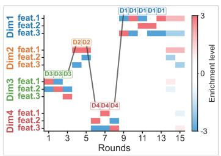

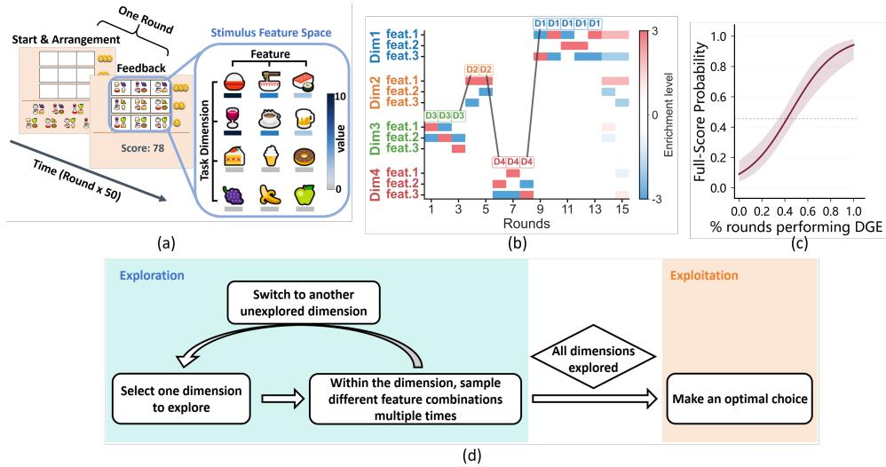

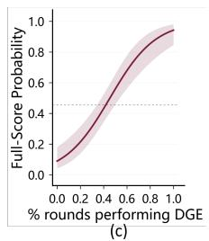  
Figure 1: Human exploration through dimension-level search. (a) Behavioral task setup. (b) Rewardrelevant dimensions reduce the effective action space. (c) Association between the proportion of DGE rounds and the probability of achieving a full score. (d) Schematic illustration of the observed dimension-wise exploration strategy. Adapted from An et al. [1] with permission.

## 3.2 Problem formulation

We formulate recommendation as a contextual bandit problem with partial feedback. Let I denote the full item catalog. At round t, the agent observes a user representation $u _ { t } .$ , recommends one item

$a _ { t } \in \mathcal { T } ,$ , and observes reward only for that item. For item i, the item-level context is

$$
\begin{array} { r } { x _ { i , t } ^ { \mathrm { i t e m } } = \operatorname { n o r m } ( u _ { t } \oplus v _ { i } \oplus b ) , } \end{array}
$$

where $v _ { i }$ is the item representation, b is a constant bias feature, ⊕ denotes concatenation, and norm(·) denotes $\ell _ { 2 }$ normalization. The observed reward is

$$
r _ { t } = h ( x _ { a _ { t } , t } ^ { \mathrm { i t e m } } ) + \xi _ { t } ,
$$

where $h : \mathbb { R } ^ { d }  [ 0 , 1 ]$ is an unknown expected reward function and $\xi _ { t }$ is zero-mean conditionally ν-sub-Gaussian noise. The objective is to minimize cumulative regret,

$$
R _ { T } = \sum _ { t = 1 } ^ { T } \Bigl [ h ( x _ { a _ { t } ^ { * } , t } ^ { \mathrm { i t e m } } ) - h ( x _ { a _ { t } , t } ^ { \mathrm { i t e m } } ) \Bigr ] , \qquad a _ { t } ^ { * } \in \arg \operatorname* { m a x } _ { i \in \mathcal { T } } h ( x _ { i , t } ^ { \mathrm { i t e m } } ) ,
$$

where $a _ { t } ^ { * }$ is an optimal item for the current user over the full catalog, independent of candidate sampling or filtering. Higher-level contexts for feature dimensions and features are defined analogously; full details and the offline candidate-sampling and reward protocol are given in Appendix A.

Dimension-guided exploration objective The key distinction from a standard contextual bandit lies in how exploration is structured. A standard item-level policy explores directly over candidate items, without explicitly restricting search through intermediate semantic dimensions. TDGE instead first selects a small set of feature dimensions, then selects candidate features within those dimensions, and finally performs item-level selection within the candidate pool $\mathcal { P } _ { t } \subseteq \mathcal { T } \mathrm { : }$

$$
a _ { t } = \arg \operatorname* { m a x } _ { i \in \mathcal { P } _ { t } } s _ { i , t } ^ { \mathrm { i t e m } } ,
$$

where $s _ { i , t } ^ { \mathrm { i t e m } }$ is the item-level selection score. TDGE does not change the final reward objective; instead, it improves exploration by using feature-dimension selection to construct a task-adaptive candidate pool before item-level scoring. In this sense, its benefit comes from better candidate-space restriction as well as more efficient item-level search within that restricted space.

## 3.3 Task-dimension extraction

TDGE requires a dimension-level exploration space that groups item-descriptive features into semantically coherent dimensions. Let $\mathbf { \bar { \mathcal { F } } } = \{ f _ { 1 } , \dotsc , f _ { M } \}$ denote the feature set, such as item tags in recommendation datasets. We seek a partition $\mathcal { C } = \overline { { \{ C _ { 1 } , \ldots , C _ { k ^ { * } } \} } }$ of $\mathcal { F }$ , where each cluster corresponds to one task dimension used by the dimension-level agent.

We embed each feature $f _ { j }$ as a normalized vector $e _ { j } \in \mathbb { R } ^ { 7 6 8 }$ using a pretrained Sentence-BERT model [21, 27], and cluster the embeddings to obtain C. We use agglomerative hierarchical clustering with Ward’s linkage as the default method. Its dendrogram allows feature dimensions to be extracted at different resolutions without rerunning clustering and supports extensions with nested dimension levels. The standard three-level TDGE framework requires only one feature partition and can also use other clustering methods.

We determine the number of task dimensions using a KGS-based criterion that balances cluster compactness against over-partitioning. Each cut of the dendrogram defines a candidate partition. Among partitions satisfying a minimum cluster-size constraint, we select the lowest-scoring partition and denote its number of clusters by $k ^ { * }$ (Figure 2(a)). Full details of the criterion and constrained selection rule are given in Appendix B. The resulting clusters capture related semantic aspects of items, such as genre, mood, topic, or style. Choosing a task dimension therefore directs exploration toward a coherent group of descriptive features. Figure 2(b) shows representative tag clusters extracted from MovieLens-20M. Clustering is performed once during preprocessing and reused throughout training and evaluation.

## 3.4 Multi-Level Exploration Schedule

TDGE performs top-down exploration over three levels: task dimension, feature, and item. The dimension-level agent identifies promising semantic aspects of the current user’s preferences and restricts feature exploration to the selected dimensions. The feature-level agent identifies specific

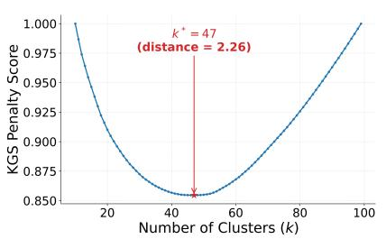  
(a)

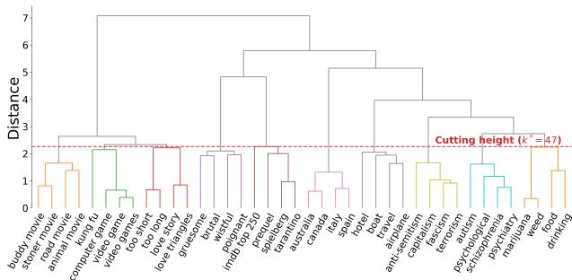  
(b)  
Figure 2: (a) Normalized KGS penalty versus cluster count on MovieLens-20M; $k ^ { * }$ minimizes the penalty among candidate partitions satisfying the cluster-size constraint. (b) Representative portion of the feature dendrogram: semantically related tags of the same color form a task dimension.

attributes within those dimensions and uses their scores to guide item candidate generation. The item-level agent evaluates concrete items in the resulting pool and makes the final recommendation. Each level maintains a separate contextual-bandit agent instantiated with the same backbone.

All three levels score arms using the current user representation and the corresponding arm representation. Let $x _ { z , t } ^ { ( \ell ) }$ be the context of arm z at level $\ell \in \{ \mathrm { d i m , f e a t , i t e m } \}$ . The scoring and selection procedures are

$$
\left\{ \begin{array} { l l } { s _ { c , t } ^ { ( \mathrm { d i m } ) } = \mathcal { A } _ { t } ^ { ( \mathrm { d i m } ) } \big ( x _ { c , t } ^ { ( \mathrm { d i m } ) } \big ) , \quad \mathcal { D } _ { t } = \mathrm { T o p K } _ { C _ { c } \in \mathcal { C } } \big ( s _ { c , t } ^ { ( \mathrm { d i m } ) } , K _ { 1 } \big ) , } \\ { s _ { j , t } ^ { ( \mathrm { f e a t } ) } = \mathcal { A } _ { t } ^ { ( \mathrm { f e a t } ) } \big ( x _ { j , t } ^ { ( \mathrm { f e a t } ) } \big ) , \quad \mathcal { F } _ { t } = \mathrm { T o p K } _ { f _ { j } \in \cup _ { C _ { c } \in \mathcal { D } _ { t } } C _ { c } } \big ( s _ { j , t } ^ { ( \mathrm { f e a t } ) } , K _ { 2 } \big ) , } \\ { s _ { i , t } ^ { ( \mathrm { i t e m } ) } = \mathcal { A } _ { t } ^ { ( \mathrm { i t e m } ) } \big ( x _ { i , t } ^ { ( \mathrm { i t e m } ) } \big ) , \quad a _ { t } \in \arg \underset { i \in \mathcal { P } _ { t } } { \operatorname* { m a x } } s _ { i , t } ^ { ( \mathrm { i t e m } ) } . } \end{array} \right.\tag{1}
$$

Here, $\mathbf { \mathcal { A } } _ { t } ^ { ( \ell ) }$ denotes the arm-scoring rule of the corresponding agent, incorporating reward estimation and the backbone’s exploration mechanism. TopK retains up to the specified number of highestscoring arms. Context construction and backbone-specific scoring rules are given in Appendices A and C.

The feature level connects semantic exploration to item selection. Among items supplied by the candidate-sampling procedure, TDGE ranks those sharing at least one selected feature using

$$
S _ { t } ( i ) = \sum _ { j : f _ { j } \in \mathcal { F } _ { t } \cap \mathrm { f e a t } ( i ) } s _ { j , t } ^ { ( \mathrm { f e a t } ) } \rho _ { i , j } ,\tag{2}
$$

where feat(i) denotes the descriptive features of item i and $\rho _ { i , j }$ is its relevance to feature $f _ { j }$ . The top K matching items form $\mathcal { P } _ { t }$ , from which the item-level agent selects $a _ { t }$ according to Eq. 1.

Hierarchical update After observing reward $r _ { t } .$ , TDGE updates the item agent with unit sample weight and propagates feedback through the matched features

$$
{ \mathcal { H } } _ { t } = { \mathcal { F } } _ { t } \cap \operatorname { f e a t } ( a _ { t } ) .\tag{3}
$$

Each $f _ { j } \in \mathcal { H } _ { i }$ updates the feature agent using $r _ { t }$ with sample weight $\rho _ { a _ { t } , j } .$ . Each source dimension $C _ { c }$ containing matched features is updated using the same reward with weight

$$
\omega _ { a _ { t } , c } = \operatorname* { m a x } _ { j : f _ { j } \in C _ { c } \cap \mathcal { H } _ { t } } \rho _ { a _ { t } , j } .\tag{4}
$$

The intersection determines which selected features and dimensions receive feedback, while relevance weights determine their contribution to learning. This connects item-level outcomes with preference learning over shared semantic features, allowing each interaction to inform subsequent recommendations.

The full procedure is illustrated in Figure 3. Detailed update equations and pseudocode are provided in Appendix C.

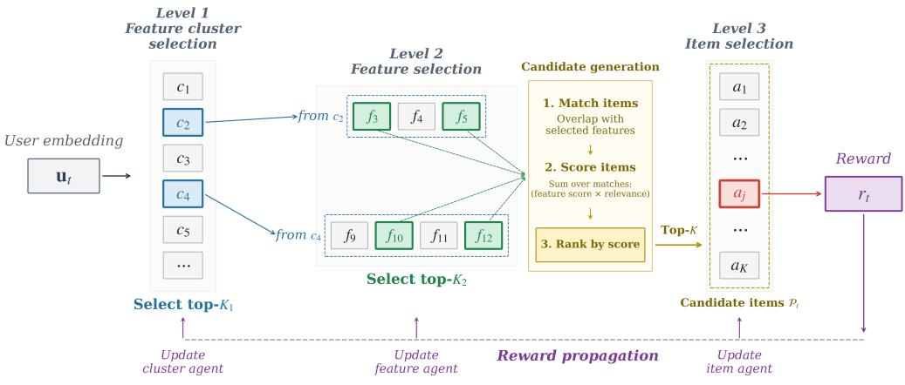  
Figure 3: The TDGE exploration schedule. The dimension agent selects promising semantic aspects, the feature agent identifies specific attributes and guides candidate generation, and the item agent makes the final recommendation. The observed reward updates the item agent and the matched selected features and their source dimensions.

## 4 Experiments

We evaluate TDGE by addressing four questions: (1) whether it improves sample efficiency in online learning and cold-start adaptation across different contextual-bandit backbones; (2) how it compares with other structured exploration methods; (3) which components account for its gains; and (4) how robust it is to the choice of clustering method and hierarchy depth.

## 4.1 Experiment Setup

Datasets We evaluate TDGE on MovieLens-20M, Last.fm, and the Beauty and Personal Care subset of Amazon. For each dataset, item tags are extracted from metadata as descriptive features. Dataset statistics, tag-selection details, and preprocessing procedures are provided in Appendix D. Users are split into an online training pool and a user cold-start pool with a 9:1 ratio.

Baselines We compare TDGE-LinUCB, TDGE-NeuralUCB, and TDGE-NeuralTS with their corresponding item-level backbones: LinUCB [14], NeuralUCB [36], and NeuralTS [34]. We also compare with two structured contextual-bandit methods: CoFineUCB [32], which uses a prior coarse parameter subspace to guide linear reward estimation, and H N-Bandit [19], which filters candidate arms through a predefined item-category hierarchy.

Evaluation Protocol All methods follow the same offline evaluation protocol, detailed in $\mathsf { A p - }$ pendix D. Within each matched TDGE–baseline pair, we hold fixed the dataset preprocessing, user splits, item-level contexts, interaction horizons, item-level agent configuration, and final item budget $( K = 1 0 )$ ; only the exploration and candidate-generation mechanism differs. We report online cumulative regret (CReg) and cold-start final-round regret as mean ± standard deviation over five seeds, with significance assessed using two-sided Welch t-tests: $^ { * } p < 0 . 0 5 , ^ { * * } p < 0 . 0 1 , \mathrm { a n d } ^ { * * * } p < 0 . 0 0 1$ n.s. denotes $p \geq 0 . 0 5$

## 4.2 Online and Cold-Start Recommendation Results

For online evaluation, each method interacts with training users for $T = 1 0 , 0 0 0$ rounds. For cold-start evaluation, we randomly sample 100 held-out users, initialize them with the same mean training-user representation, and run an independent 10-step interaction trajectory for each user.

Table 1 summarizes both settings. Across the neural backbones, TDGE significantly reduces online cumulative regret by 4.5%–31.0% across all six dataset–backbone comparisons. It reduces final-round cold-start regret by 10.5%–74.9%, with statistically significant gains in five of the six comparisons. The improvement for NeuralTS on Last.fm does not reach statistical significance $( p = 0 . 0 6 4 )$ consistent with the higher across-run variability observed for TDGE-NeuralTS. The weaker linear results on Last.fm and Amazon may reflect the limited expressiveness of the linear reward model for capturing complex user–item interactions. The cold-start results further show that, particularly with neural backbones, the shared feature hierarchy and learned routing policy benefits adaptation to unseen users without user-specific historical contexts.

Table 1: Online cumulative regret at $T = 1 0 , 0 0 0$ and final-round cold-start regret at $t = 1 0$ for TDGE and its corresponding item-level baselines. Lower is better. Results are mean ± sample standard deviation over five seeds. Superscripts compare TDGE with its corresponding backbone using two-sided Welch t-tests.
<table><tr><td>Metric</td><td>Dataset</td><td>Backbone</td><td>Baseline</td><td>TDGE</td></tr><tr><td rowspan="3">Online CReg ↓</td><td>MovieLens-20M</td><td>LinUCB NeuralUCB NeuralTS</td><td>2299.697±20.439 2417.798±15.161 2418.077±15.964</td><td> $1 5 7 3 . 1 4 2 { \pm } 4 3 . 4 9 9 ^ { * * * }$   $1 6 6 9 . 3 0 3 { \scriptstyle \pm 9 1 . 1 6 2 ^ { * * * } }$   $1 7 0 5 . 5 4 2 { \pm } 5 2 . 7 6 9 ^ { * * * }$ </td></tr><tr><td>Last.fm</td><td>LinUCB NeuralUCB NeuralTS</td><td>2438.154±43.877 2233.387±13.230 2234.352±16.528</td><td>2453.269±27.544 n.s. 1960.563±57.620***  $1 9 7 5 . 3 6 5 { \scriptstyle \pm 8 1 . 5 3 8 ^ { * * } }$ </td></tr><tr><td>Amazon</td><td>LinUCB NeuralUCB NeuralTS</td><td>1314.280±30.398 1245.925±22.689 1233.443±30.148</td><td> $1 3 0 3 . 8 4 1 { \pm } 2 9 . 0 5 0 \mathrm { n } . \mathrm { s } .$   $1 1 6 9 . 5 6 7 { \scriptstyle \pm 3 2 . 9 4 5 ^ { * * } }$   $1 1 7 7 . 8 8 6 { \pm } 2 6 . 2 4 6 ^ { * }$ </td></tr><tr><td rowspan="3">Cold-start Regret (t = 10) ↓</td><td>MovieLens-20M</td><td>LinUCB NeuralUCB NeuralTS</td><td>0.234±0.004 0.239±0.013 0.236±0.014</td><td> $0 . 0 8 0 { \scriptstyle \pm 0 . 0 1 3 ^ { * * * } }$   $0 . 0 6 0 { \scriptstyle \pm 0 . 0 1 5 ^ { * * * } }$   $0 . 0 7 8 { \scriptstyle \pm 0 . 0 2 6 ^ { * * * } }$ </td></tr><tr><td>Last.fm</td><td>LinUCB NeuralUCB NeuralTS</td><td>0.260±0.006 0.239±0.007 0.240±0.010</td><td> $0 . 2 6 0 { \pm } 0 . 0 0 5 \mathrm { n . s . }$   $0 . 2 1 4 { \pm } 0 . 0 0 7 ^ { \ast \ast * }$  0.212±0.024 n.s.</td></tr><tr><td>Amazon</td><td>LinUCB NeuralUCB NeuralTS</td><td>0.137±0.023 0.099±0.012 0.104±0.010</td><td> $0 . 1 4 0 { \pm } 0 . 0 2 8 \mathrm { n . s . }$   $0 . 0 6 5 { \pm } 0 . 0 2 2 ^ { \ast }$   $0 . 0 6 1 { \scriptstyle \pm 0 . 0 1 2 ^ { * * * } }$ </td></tr></table>

## 4.3 Comparison with Structured Exploration Methods

CoFineUCB structures exploration in the reward-parameter space, while $\mathrm { H _ { 2 } N }$ -Bandit uses a predefined item-category hierarchy. TDGE instead explores automatically constructed semantic feature dimensions. We compare CoFineUCB with LinUCB and TDGE-LinUCB as linear methods, and $\mathrm { H _ { 2 } N } .$ -Bandit with NeuralUCB and TDGE-NeuralUCB as neural methods. We evaluate these methods on MovieLens-20M using the same protocol as in Section 4.2.

As shown in Table 2, TDGE-LinUCB reduces online cumulative regret and final-round cold-start regret relative to CoFineUCB by 30.7% and 66.4%, respectively. TDGE-NeuralUCB reduces the corresponding regret relative to H N-Bandit by 29.9% and 74.6%. All four comparisons are significant at $p < 1 0 ^ { - 4 }$ , showing that TDGE also improves over methods pursuing related structured-exploration objectives.

Table 2: Online cumulative regret at $T = 1 0 , 0 0 0$ and final-round cold-start regret at $t = 1 0$ on MovieLens-20M. Lower is better. Results are mean ± standard deviation over five seeds. Superscripts compare TDGE-LinUCB with CoFineUCB and TDGE-NeuralUCB with $\mathrm { H _ { 2 } N } .$ -Bandit using two-sided Welch t-tests.
<table><tr><td>Metric</td><td>LinUCB</td><td>CoFineUCB</td><td>TDGE-LinUCB</td><td>NeuralUCB</td><td>H2N-Bandit</td><td>TDGE-NeuralUCB</td></tr><tr><td>Online CReg ↓</td><td>2299.697±18.281</td><td></td><td>2271.580±34.295 1573.142±38.906***</td><td>2417.798±13.561</td><td>2379.700±17.122</td><td>1669.303±81.538***</td></tr><tr><td>Cold-start Regret (t = 10) ↓</td><td>0.234±0.004</td><td>0.237±0.010</td><td>0.080±0.011***</td><td>0.239±0.011</td><td>0.235±0.008</td><td>0.060±0.014***</td></tr></table>

## 4.4 Ablation Studies

All ablations are conducted on MovieLens-20M with the five-run protocol used for the main experiments.

## 4.4.1 Semantic Feature-Space Structure

We compare TDGE’s feature-space hierarchy with a two-level item-space alternative that clusters semantic item embeddings and selects item-cluster–item routes. We reconstruct the feature dimensions with Ward hierarchical clustering, k-means, spectral clustering, and Gaussian mixture models. Each feature-clustering method operates on the same tag embeddings and uses the constrained KGS criterion to choose its number of dimensions.

Table 3: Feature-space and clustering-method ablations on MovieLens-20M. Lower regret is better. The superscript indicates that hierarchical feature-space TDGE outperforms the corresponding itemclustering alternative under a two-sided Welch t-test.
<table><tr><td>Metric</td><td>Backbone</td><td>Item clustering</td><td>Hierarchical</td><td>k-means</td><td>Spectral</td><td>GMM</td></tr><tr><td rowspan="3">Online CReg</td><td>LinUCB</td><td> $\overline { { 2 1 0 1 . 5 0 0 \pm 3 7 . 5 3 5 ^ { * * * } } }$ </td><td> $1 5 7 3 . 1 4 2 \pm 3 8 . 9 0 6$ </td><td> $\overline { { 1 6 0 8 . 4 0 4 \pm 4 9 . 5 1 1 } }$ </td><td> $\overline { { 1 6 3 9 . 9 6 2 \pm 1 3 5 . 7 9 9 } }$ </td><td> $\overline { { 1 5 5 8 . 2 8 2 \pm 6 3 . 6 9 1 } }$ </td></tr><tr><td>NeuralUCB</td><td> $2 2 2 3 . 9 0 0 \pm 4 5 . 9 8 3 ^ { \ast \ast \ast }$ </td><td> $1 6 6 9 . 3 0 3 \pm 8 1 . 5 3 8$ </td><td>1839.836 ± 124.657</td><td> $1 8 5 4 . 6 1 6 \pm 4 2 . 4 4 4$ </td><td> $1 7 8 6 . 9 7 5 \pm 3 5 . 0 2 5$ </td></tr><tr><td>NeuralTS</td><td> $2 2 9 5 . 8 0 0 \pm 1 3 . 9 5 2 ^ { * * * }$ </td><td> $1 7 0 5 . 5 4 2 \pm 4 7 . 1 9 8$ </td><td> $1 8 1 5 . 2 5 4 \pm 1 1 2 . 5 9 5$ </td><td> $1 7 9 2 . 3 2 1 \pm 1 8 0 . 3 8 7$ </td><td> $1 7 0 9 . 1 8 2 \pm 9 4 . 6 9 0$ </td></tr><tr><td rowspan="3">Cold-start Regret (t = 10)</td><td>LinUCB</td><td> $0 . 2 1 9 \pm 0 . 0 1 1 ^ { \ast \ast * }$ </td><td> $0 . 0 8 0 \pm 0 . 0 1 1$ </td><td> $0 . 1 2 7 \pm 0 . 0 0 5$ </td><td> $0 . 1 1 8 \pm 0 . 0 1 6$ </td><td> $0 . 1 3 3 \pm 0 . 0 2 4$ </td></tr><tr><td>NeuralUCB</td><td> $0 . 2 1 0 \pm 0 . 0 1 4 ^ { \ast \ast \ast }$ </td><td> $0 . 0 6 0 \pm 0 . 0 1 4$ </td><td> $0 . 0 7 5 \pm 0 . 0 1 1$ </td><td> $0 . 0 7 2 \pm 0 . 0 1 5$ </td><td> $0 . 0 7 2 \pm 0 . 0 1 5$ </td></tr><tr><td>NeuralTS</td><td> $0 . 2 1 2 \pm 0 . 0 1 8 ^ { * * * }$ </td><td> $0 . 0 7 8 \pm 0 . 0 2 3$ </td><td> $0 . 0 7 7 \pm 0 . 0 0 7$ </td><td> $0 . 0 6 5 \pm 0 . 0 0 7$ </td><td> $0 . 0 6 9 \pm 0 . 0 1 4$ </td></tr></table>

Feature-space TDGE substantially outperforms item-space clustering for every backbone and metric, while the four feature-clustering algorithms yield comparable results. The gains therefore arise from exploring the semantic feature space and do not depend on a particular clustering method.

## 4.4.2 Hierarchy Depth

The main model uses the three-level routefine dimension →feature → item. We compare it with a four-level route, coarse dimension →fine dimension →feature → item. Both dimension levels are obtained from the same feature dendrogram. The four-level model retains two coarse dimensions, five fine dimensions, ten features, and at most ten items.

Table 4: Online cumulative regret and cold-start final-round regret for the hierarchy-depth ablation on MovieLens-20M. Lower is better.
<table><tr><td>Metric</td><td>Backbone</td><td>TDGE (3 levels)</td><td>TDGE (4 levels)</td></tr><tr><td rowspan="3">Online CReg</td><td>LinUCB</td><td> $1 5 7 3 . 1 4 2 \pm 3 8 . 9 0 6$ </td><td> $1 5 8 6 . 1 6 0 \pm 6 9 . 1 1 5$ </td></tr><tr><td>NeuralUCB</td><td> $1 6 6 9 . 3 0 3 \pm 8 1 . 5 3 8$ </td><td> $1 7 6 8 . 7 4 0 \pm 1 4 2 . 4 3 8$ </td></tr><tr><td>NeuralTS</td><td> $1 7 0 5 . 5 4 2 \pm 4 7 . 1 9 8$ </td><td> $1 6 0 6 . 2 2 0 \pm 9 0 . 4 4 9$ </td></tr><tr><td rowspan="3">Cold-start Regret (t = 10)</td><td>LinUCB</td><td> $0 . 0 8 0 \pm 0 . 0 1 1$ </td><td> $0 . 0 9 0 \pm 0 . 0 2 2$ </td></tr><tr><td>NeuralUCB</td><td> $0 . 0 6 0 \pm 0 . 0 1 4$ </td><td> $0 . 0 7 8 \pm 0 . 0 1 7$ </td></tr><tr><td>NeuralTS</td><td> $0 . 0 7 8 \pm 0 . 0 2 3$ </td><td> $0 . 0 6 0 \pm 0 . 0 1 7$ </td></tr></table>

None of the differences between three- and four-level TDGE is statistically significant under twosided Welch t-tests over five runs. Adding a coarse dimension level therefore provides no consistent improvement on MovieLens-20M. We use the three-level hierarchy because it preserves explicit dimension–feature–item semantics with lower routing and inference complexity. The effective hierarchy depth may depend on the semantic structure of the dataset, and deeper hierarchies may be beneficial for data with more complex multi-level structure.

## 4.5 TDGE exhibits human-like dimension-persistent probing

The behavioral study of An et al. [1] found that participants often explored several features within one task dimension before switching to another. We examine whether TDGE produces a similar trajectory pattern in cold-start recommendation, without claiming equivalence to human cognitive mechanisms.

Figure $\mathbf { 4 } ( \mathbf { a } , \mathbf { b } )$ compares TDGE-NeuralUCB and NeuralUCB for the same cold-start user. Because the baseline does not explicitly select dimensions, both trajectories are represented by the dominant feature dimension of the final recommended item, determined by majority vote over its tags. TDGE exhibits more persistent within-dimension exploration, whereas the baseline switches more frequently.

We quantify this behavior using the run lengths of consecutive same-dimension recommendations across all MovieLens-20M cold-start users. Figure 4(c) shows that TDGE-NeuralUCB places more probability mass on run lengths 2–5, while NeuralUCB is concentrated at length 1. Thus, TDGE produces exploration trajectories resembling the dimension-persistent pattern observed in human exploration.

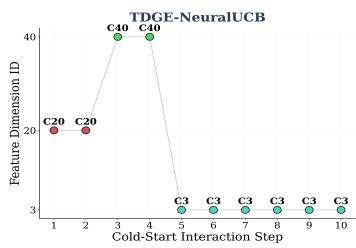  
(a)

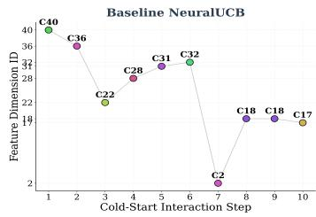  
(b)

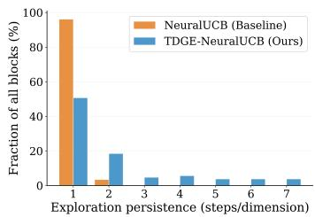  
(c)  
Figure 4: Feature-dimension trajectories over 10 cold-start interactions and the distribution of consecutive same-dimension run lengths on MovieLens-20M. (a) TDGE-NeuralUCB. (b) NeuralUCB. Each step in (a,b) is represented by the dominant feature dimension of the recommended item. (c) Same-dimension run-length distributions aggregated across cold-start users.

## 5 Conclusion

We presented TDGE, a model-agnostic exploration framework inspired by human dimension-level exploration. TDGE explicitly models user preferences at the semantic dimension, feature, and item levels, coupling exploration in semantic feature space with selection in item space. Experiments on MovieLens-20M, Last.fm, and Amazon show significant reductions in online cumulative regret and cold-start final-round regret, particularly with the neural backbones. Ablations support the effectiveness of semantic feature-space exploration and dimension-level routing, and demonstrate robustness to different clustering methods.

However, the current version of TDGE still has several limitations. First, the retention sizes $K _ { 1 }$ and $K _ { 2 }$ are fixed. Ideally, they could be selected adaptively or learned online to better match different datasets and user regimes. Second, the limited effect of hierarchy depth in our ablations may be due to the structure of the evaluated data. Experiments on datasets with more complex hierarchical structure could help determine when deeper hierarchies are beneficial. Third, we evaluate TDGE only with contextual bandit backbones; extending the same dimension-guided exploration principle to general reinforcement learning is an important direction for future work.

In conclusion, these findings support explicit exploration over semantic dimensions as an effective way to improve sample efficiency in contextual-bandit recommendation.

## 6 Acknowledgments

This study was funded by Project (2025ZD0217400) supported by Brain Science and Brain-Like Intelligence Technology —National Science and Technology Major Project; and the CAMS Innovation Fund for Medical Sciences (CIFMS), 2024-RC180-02. We acknowledge Beijing Key Laboratory of Brain Science and Brain-Machine Interface; and Fundamental and Interdisciplinary Disciplines Breakthrough Plan of the Ministry of Education of China (JYB2025XDXM504).

## References

[1] Jiahui An, Jiewen Hu, Yilin Elaine Wu, Siyu Ning, Chun Liu, Yuhang Pan, Fanyu Zhu, Ruosi Wang, and Ni Ji. Task-space dimensions guide human exploration in complex environments. bioRxiv, 2026. doi: 10.64898/2026.04.29.720265. URL https://www.biorxiv.org/content/early/2026/05/04/202 6.04.29.720265.

[2] Peter Auer, Nicolo Cesa-Bianchi, and Paul Fischer. Finite-time analysis of the multiarmed bandit problem. Machine learning, 47(2):235–256, 2002.

[3] Yikun Ban, Yuchen Yan, Arindam Banerjee, and Jingrui He. EE-net: Exploitation-exploration neural networks in contextual bandits. In International Conference on Learning Representations, 2022. URL https://openreview.net/forum?id=X\_ch3VrNSRg.

[4] Sébastien Bubeck, Rémi Munos, Gilles Stoltz, and Csaba Szepesvári. X-armed bandits. Journal of Machine Learning Research, 12(5), 2011.

[5] Yash Chandak, Georgios Theocharous, James Kostas, Scott Jordan, and Philip Thomas. Learning action representations for reinforcement learning. In International conference on machine learning, pages 941–950. PMLR, 2019.

[6] Gabriel Dulac-Arnold, Richard Evans, Hado van Hasselt, Peter Sunehag, Timothy Lillicrap, Jonathan Hunt, Timothy Mann, Theophane Weber, Thomas Degris, and Ben Coppin. Deep reinforcement learning in large discrete action spaces. arXiv preprint arXiv:1512.07679, 2015.

[7] Eric Han, Ishank Arora, and Jonathan Scarlett. High-dimensional bayesian optimization via tree-structured additive models. In Proceedings of the AAAI Conference on Artificial Intelligence, volume 35, pages 7630–7638, 2021.

[8] Erik Orm Hellsten, Carl Hvarfner, Leonard Papenmeier, and Luigi Nardi. High-dimensional bayesian optimization with group testing. arXiv preprint arXiv:2310.03515, 2023.

[9] Eugene Ie, Vihan Jain, Jing Wang, Sanmit Narvekar, Ritesh Agarwal, Rui Wu, Heng-Tze Cheng, Tushar Chandra, and Craig Boutilier. Slateq: A tractable decomposition for reinforcement learning with recommendation sets. In IJCAI, volume 19, pages 2592–2599, 2019.

[10] Kirthevasan Kandasamy, Jeff Schneider, and Barnabás Póczos. High dimensional bayesian optimisation and bandits via additive models. In International conference on machine learning, pages 295–304. PMLR, 2015.

[11] Lawrence A Kelley, Stephen P Gardner, and Michael J Sutcliffe. An automated approach for clustering an ensemble of nmr-derived protein structures into conformationally related subfamilies. Protein Engineering, Design and Selection, 9(11):1063–1065, 1996.

[12] Robert Kleinberg, Aleksandrs Slivkins, and Eli Upfal. Multi-armed bandits in metric spaces. In Proceedings ofthefortieth annual ACM symposium on Theory ofcomputing, pages 681–690, 2008.

[13] Yuan Chang Leong, Angela Radulescu, Reka Daniel, Vivian DeWoskin, and Yael Niv. Dynamic interaction between reinforcement learning and attention in multidimensional environments. Neuron, 93(2):451–463, 2017.

[14] Lihong Li, Wei Chu, John Langford, and Robert E Schapire. A contextual-bandit approach to personalized news article recommendation. In Proceedings of the 19th international conference on World wide web, pages 661–670, 2010.

[15] Yuanguo Lin, Yong Liu, Fan Lin, Lixin Zou, Pengcheng Wu, Wenhua Zeng, Huanhuan Chen, and Chunyan Miao. A survey on reinforcement learning for recommender systems. IEEE Transactions on Neural Networks and Learning Systems, 35(10):13164–13184, 2023.

[16] Yael Niv, Reka Daniel, Andra Geana, Samuel J Gershman, Yuan Chang Leong, Angela Radulescu, and Robert C Wilson. Reinforcement learning in multidimensional environments relies on attention mechanisms. Journal ofNeuroscience, 35(21):8145–8157, 2015.

[17] Deepak Kumar Panda and Sanjog Ray. Approaches and algorithms to mitigate cold start problems in recommender systems: a systematic literature review. Journal ofIntelligent Information Systems, 59(2): 341–366, 2022.

[18] Sandeep Pandey, Deepak Agarwal, Deepayan Chakrabarti, and Vanja Josifovski. Bandits for taxonomies: A model-based approach. In Proceedings of the 2007 SIAM international conference on data mining, pages 216–227. SIAM, 2007.

[19] Yunzhe Qi, Yao Zhou, Yikun Ban, Allan Stewart, Chuanwei Ruan, Jiachuan He, Shishir Kumar Prasad, Haixun Wang, and Jingrui He. Bi-level hierarchical neural contextual bandits for online recommendation. Transactions on Machine Learning Research, 2026. ISSN 2835-8856. URL https://openreview.net /forum?id=k3XsA75SGv. J2C Certification.

[20] Angela Radulescu, Yeon Soon Shin, and Yael Niv. Human representation learning. Annual review of neuroscience, 44(1):253–273, 2021.

[21] Nils Reimers and Iryna Gurevych. Sentence-bert: Sentence embeddings using siamese bert-networks. In Proceedings of the 2019 conference on empirical methods in natural language processing and the 9th international joint conference on natural language processing (EMNLP-IJCNLP), pages 3982–3992, 2019.

[22] Carlos Riquelme, George Tucker, and Jasper Snoek. Deep bayesian bandits showdown: An empirical comparison of bayesian deep networks for thompson sampling. In International Conference on Learning Representations, 2018. URL https://openreview.net/forum?id=SyYe6k-CW.

[23] Paul Rolland, Jonathan Scarlett, Ilija Bogunovic, and Volkan Cevher. High-dimensional bayesian optimization via additive models with overlapping groups. In International conference on artificial intelligence and statistics, pages 298–307. PMLR, 2018.

[24] Andrew I Schein, Alexandrin Popescul, Lyle H Ungar, and David M Pennock. Methods and metrics for cold-start recommendations. In Proceedings ofthe 25th annual international ACM SIGIR conference on Research and development in information retrieval, pages 253–260, 2002.

[25] Nicollas Silva, Thiago Silva, Heitor Werneck, Leonardo Rocha, and Adriano Pereira. User cold-start problem in multi-armed bandits: When the first recommendations guide the user’s experience. ACM Transactions on Recommender Systems, 1(1):1–24, 2023.

[26] Aleksandrs Slivkins. Contextual bandits with similarity information. In Proceedings ofthe 24th annual Conference On Learning Theory, pages 679–702. JMLR Workshop and Conference Proceedings, 2011.

[27] Kaitao Song, Xu Tan, Tao Qin, Jianfeng Lu, and Tie-Yan Liu. Mpnet: Masked and permuted pre-training for language understanding. Advances in neural information processing systems, 33:16857–16867, 2020.

[28] Richard S Sutton, Andrew G Barto, et al. Reinforcement learning: An introduction, volume 1. MIT press Cambridge, 1998.

[29] Liang Tang, Yexi Jiang, Lei Li, Chunqiu Zeng, and Tao Li. Personalized recommendation via parameterfree contextual bandits. In Proceedings of the 38th international ACM SIGIR conference on research and development in information retrieval, pages 323–332, 2015.

[30] William R Thompson. On the likelihood that one unknown probability exceeds another in view of the evidence of two samples. Biometrika, 25(3/4):285–294, 1933.

[31] C. J. C. H. Watkins. Learningfrom Delayed Rewards. PhD thesis, King’s College, Cambridge, 1989.

[32] Yisong Yue, Sue Ann Hong, and Carlos Guestrin. Hierarchical exploration for accelerating contextual bandits. In Proceedings of the 29th International Conference on Machine Learning, ICML’12, page 979–986, Madison, WI, USA, 2012. Omnipress. ISBN 9781450312851.

[33] Tom Zahavy, Matan Haroush, Nadav Merlis, Daniel J Mankowitz, and Shie Mannor. Learn what not to learn: Action elimination with deep reinforcement learning. Advances in neural information processing systems, 31, 2018.

[34] Weitong Zhang, Dongruo Zhou, Lihong Li, and Quanquan Gu. Neural thompson sampling. In International Conference on Learning Representations, 2021. URL https://openreview.net/forum?id=tkAtoZ kcUnm.

[35] Guanjie Zheng, Fuzheng Zhang, Zihan Zheng, Yang Xiang, Nicholas Jing Yuan, Xing Xie, and Zhenhui Li. Drn: A deep reinforcement learning framework for news recommendation. In Proceedings ofthe 2018 world wide web conference, pages 167–176, 2018.

[36] Dongruo Zhou, Lihong Li, and Quanquan Gu. Neural contextual bandits with ucb-based exploration. In International conference on machine learning, pages 11492–11502. PMLR, 2020.

[37] Yinglun Zhu, Dylan J Foster, John Langford, and Paul Mineiro. Contextual bandits with large action spaces: Made practical. In International Conference on Machine Learning, pages 27428–27453. PMLR, 2022.

[38] Juliusz Krzysztof Ziomek and Haitham Bou Ammar. Are random decompositions all we need in high dimensional bayesian optimisation? In International Conference on Machine Learning, pages 43347– 43368. PMLR, 2023.

## A Full Problem Formulation, Exploration Schedule, and Evaluation Protocol

## A.1 Recommendation Formulation and Context Construction

We formulate recommendation as a contextual-bandit problem with partial feedback. Let I be the item catalog and $\mathcal { U }$ the user set. At round t, the agent observes a user representation $u _ { t } \in \mathbb { R } ^ { 5 0 }$ recommends one item $a _ { t }$ , and observes feedback only for that item.

For offline evaluation, let $\mathcal { T } _ { t } ^ { \mathrm { e v a l } } = \mathcal { T } _ { t } ^ { + }$ contain the items with recorded feedback for the current user. We do not add unobserved user–item pairs to this set or impute rewards for missing feedback. Before selecting an item, an agent observes the item contexts but not their logged rewards; after selecting $a _ { t }$ , only its normalized logged reward is revealed. Both the flat baselines and TDGE make the final decision over at most $K = 1 0$ item arms. Items remain available after selection, as in the standard repeated-arm contextual-bandit setting.

The representation of an action $z { \mathrm { - } } \mathrm { a }$ feature dimension, feature, or item—is denoted by $v _ { z } \in \mathbb { R } ^ { 5 0 }$ Its contextual representation is

$$
\begin{array} { r } { \boldsymbol { x } _ { z , t } = \mathrm { n o r m } \left( \boldsymbol { u } _ { t } \oplus \boldsymbol { v } _ { z } \oplus \boldsymbol { 0 } . \boldsymbol { 0 } 1 \right) \in \mathbb { R } ^ { 1 0 1 } , } \end{array}\tag{5}
$$

where $\oplus$ denotes concatenation and norm denotes $\ell _ { 2 }$ normalization. Item and feature representations are obtained by projecting their semantic embeddings to 50 dimensions. A dimension representation is the normalized centroid of the projected features assigned to that dimension. This common context construction allows the same contextual-bandit backbone to operate at every TDGE level.

## A.2 Multi-Level Selection and Candidate Construction

Let C be the set of feature dimensions and $C _ { c }$ the features in dimension c. At round t, the dimensionlevel agent retains

$$
\begin{array} { r } { \mathcal { D } _ { t } = \mathrm { T o p K } _ { c \in \mathcal { C } } \left( s _ { c , t } ^ { ( \mathrm { d i m } ) } , K _ { 1 } \right) . } \end{array}\tag{6}
$$

The feature-level agent then forms

$$
\mathcal { G } _ { t } = \bigcup _ { c \in \mathcal { D } _ { t } } C _ { c }\tag{7}
$$

and retains

$$
\mathcal { F } _ { t } = \mathrm { T o p K } _ { j \in \mathcal { G } _ { t } } \left( s _ { j , t } ^ { ( \mathrm { f e a t } ) } , K _ { 2 } \right) .\tag{8}
$$

Let $q _ { t , j } = s _ { j , t } ^ { ( \mathrm { f e a t } ) }$ be the score of selected feature $j , \rho _ { i , j }$ the relevance of feature j to item i, and $\operatorname { f e a t } ( i )$ the feature set of item i. If continuous relevance is unavailable, $\rho _ { i , j } = 1$ for $j \in \mathrm { f e a t } ( i )$ . The eligible item set is

$$
\mathcal { E } _ { t } = \left\{ i \in \mathcal { T } _ { t } ^ { \mathrm { e v a l } } : \mathcal { F } _ { t } \cap \mathrm { f e a t } ( i ) \neq \emptyset \right\} .\tag{9}
$$

TDGE scores each eligible item by

$$
S _ { t } ( i ) = \sum _ { j \in \mathcal { F } _ { t } \cap \mathrm { f e a t } ( i ) } q _ { t , j } \rho _ { i , j } ,\tag{10}
$$

and retains

$$
\mathcal { P } _ { t } = \mathrm { T o p K } _ { i \in \mathcal { E } _ { t } } \left( S _ { t } ( i ) , K \right) .\tag{11}
$$

If $\mathcal { E } _ { t }$ is empty, TDGE resamples the dimension–feature route before making a recommendation rather than introducing an item outside the selected semantic route. The item-level bandit then selects $a _ { t }$ from $\mathcal { P } _ { t }$

## A.3 Reward, Regret, and Hierarchical Credit Assignment

The selected item receives reward

$$
\begin{array} { r } { r _ { t } = h ( x _ { a _ { t } , t } ) + \xi _ { t } , } \end{array}\tag{12}
$$

where $h : \mathbb { R } ^ { 1 0 1 }  [ 0 , 1 ]$ is the unknown expected reward and $\xi _ { t }$ is zero-mean conditionally sub-Gaussian noise. In the offline evaluation, the oracle is the highest-reward observed item,

$$
a _ { t } ^ { * } = \arg \operatorname* { m a x } _ { i \in \mathcal { T } _ { t } ^ { + } } h ( x _ { i , t } ) ,\tag{13}
$$

and cumulative regret is

$$
R _ { T } = \sum _ { t = 1 } ^ { T } \left[ h ( x _ { a _ { t } ^ { * } , t } ) - h ( x _ { a _ { t } , t } ) \right] .\tag{14}
$$

The item agent is updated at every completed round. Credit is propagated to the upper levels only through features shared by the selected route and the recommended item:

$$
{ \mathcal { H } } _ { t } = { \mathcal { F } } _ { t } \cap \operatorname { f e a t } ( a _ { t } ) .\tag{15}
$$

Each $j \in \mathcal { H } _ { t }$ is updated with sample weight $\rho _ { a _ { t } , j }$ , and each source dimension c is updated with

$$
\omega _ { a _ { t } , c } = \operatorname* { m a x } _ { j \in \mathcal { H } _ { t } \cap C _ { c } } \rho _ { a _ { t } , j } .\tag{16}
$$

Thus, the hard intersection determines which upper-level actions receive credit, while $\rho$ provides graded credit among matched actions. For MovieLens, $\rho$ is the genome relevance; for Last.fm and Amazon it is one. Because the item pool contains only items matched by at least one selected feature, $\mathcal { H } _ { t }$ is nonempty for every completed recommendation round.

## B Task-Dimension Extraction with KGS-Based Clustering

Let $\mathcal { F } = \{ f _ { 1 } , \ldots , f _ { M } \}$ be the descriptive feature set and $e _ { j } ~ \in ~ \mathbb { R } ^ { 7 6 8 }$ the normalized Sentence-BERT embedding of feature $f _ { j }$ . Ward hierarchical clustering produces a dendrogram over $\mathcal { F }$ . A cut yielding $k$ clusters defines $\Pi _ { k } = \{ C _ { 1 } ^ { ( k ) } , \ldots , C _ { k } ^ { ( k ) } \}$ . We select k with the constrained Kelley– Gardner–Sutcliffe (KGS) criterion.

For partition $\Pi _ { k }$ , its within-cluster sum of squares is

$$
\mathcal { W } ( k ) = \sum _ { c = 1 } ^ { k } \sum _ { f _ { j } \in C _ { c } ^ { ( k ) } } \left. e _ { j } - \mu _ { c } ^ { ( k ) } \right. _ { 2 } ^ { 2 } , \qquad \mu _ { c } ^ { ( k ) } = \frac { 1 } { | C _ { c } ^ { ( k ) } | } \sum _ { f _ { j } \in C _ { c } ^ { ( k ) } } e _ { j } .\tag{17}
$$

Over candidate values $\kappa$ , the KGS penalty is

$$
\mathrm { K G S } ( k ) = \frac { \mathcal { W } ( k ) - \mathcal { W } _ { \operatorname* { m i n } } } { \mathcal { W } _ { \operatorname* { m a x } } - \mathcal { W } _ { \operatorname* { m i n } } } + \frac { k - k _ { \operatorname* { m i n } } } { k _ { \operatorname* { m a x } } - k _ { \operatorname* { m i n } } } .\tag{18}
$$

The first term favors compact clusters and the second penalizes excessive fragmentation. A cut is valid only if every cluster contains at least $\eta = 5$ features. The selected number of dimensions is

$$
k ^ { * } = \arg \operatorname* { m i n } _ { k \in \Omega } \mathrm { K G S } ( k ) , \qquad \Omega = \{ k \in { \cal K } : | C _ { c } ^ { ( k ) } | \ge 5 \forall c \} .\tag{19}
$$

We search $k \in \{ 1 0 , \ldots , 9 9 \}$ for all three datasets. This procedure yields 47, 37, and 35 fine-grained task dimensions for MovieLens-20M, Last.fm, and Amazon, respectively.

## C Value Estimators and Full TDGE Procedure

TDGE uses the same top-down routing procedure with different contextual-bandit backbones. For level $\ell \in$ {dim, feat, item}, let $( x , r , \omega )$ denote an update observation. Item updates use $\omega = 1 ;$ matched feature and dimension updates use the relevance weights defined above. It should be noted that our NeuralUCB and NeuralTS implementations estimate uncertainty using penultimate-layer features rather than full-network gradients. The same variants are used for the item-level TDGE and baselines.

LinUCB At level $\ell ,$ LinUCB maintains $P _ { t } ^ { ( \ell ) } = ( A _ { t } ^ { ( \ell ) } ) ^ { - 1 }$ and $b _ { t } ^ { ( \ell ) }$ , with $\widehat { \theta } _ { t } ^ { ( \ell ) } = P _ { t } ^ { ( \ell ) } b _ { t } ^ { ( \ell ) }$ . The score of action z is

$$
s _ { z , t } ^ { ( \ell ) } = ( x _ { z , t } ^ { ( \ell ) } ) ^ { \top } \widehat { \theta } _ { t } ^ { ( \ell ) } + \alpha _ { \ell } \sqrt { ( x _ { z , t } ^ { ( \ell ) } ) ^ { \top } P _ { t } ^ { ( \ell ) } x _ { z , t } ^ { ( \ell ) } } .\tag{20}
$$

For $( x , r , \omega )$ , the weighted update is

$$
P ^ { ( \ell ) } \gets P ^ { ( \ell ) } - \frac { \omega P ^ { ( \ell ) } x x ^ { \top } P ^ { ( \ell ) } } { 1 + \omega x ^ { \top } P ^ { ( \ell ) } x } , \qquad b ^ { ( \ell ) } \gets b ^ { ( \ell ) } + \omega r x .\tag{21}
$$

Within each round, the feature agent is updated once per matched feature, and the dimension agent once per matched source dimension, with updates applied sequentially within each agent.

NeuralUCB NeuralUCB maintains a reward network $f _ { \theta _ { t } ^ { ( \ell ) } }$ and an inverse uncertainty matrix $P _ { t } ^ { ( \ell ) }$ Let $\phi _ { \theta _ { t } ^ { ( \ell ) } } ( x )$ be its penultimate-layer feature. The action score is

$$
s _ { z , t } ^ { ( \ell ) } = f _ { \theta _ { t } ^ { ( \ell ) } } ( x _ { z , t } ^ { ( \ell ) } ) + \alpha _ { \ell } \sqrt { \phi _ { \theta _ { t } ^ { ( \ell ) } } ( x _ { z , t } ^ { ( \ell ) } ) ^ { \top } P _ { t } ^ { ( \ell ) } \phi _ { \theta _ { t } ^ { ( \ell ) } } ( x _ { z , t } ^ { ( \ell ) } ) } .\tag{22}
$$

Observations are stored in a level-specific replay buffer and optimized with weighted squared loss,

$$
\mathcal { L } ^ { ( \ell ) } ( \theta ) = \frac { 1 } { | B ^ { ( \ell ) } | } \sum _ { ( x _ { \tau } , r _ { \tau } , \omega _ { \tau } ) \in B ^ { ( \ell ) } } \omega _ { \tau } \big ( f _ { \theta } \big ( x _ { \tau } \big ) - r _ { \tau } \big ) ^ { 2 } .\tag{23}
$$

After updating the network, $P _ { t } ^ { ( \ell ) }$ is updated by the same weighted Sherman–Morrison rule using the new penultimate-layer feature.

NeuralTS NeuralTS uses the same reward network, replay training, and uncertainty matrix, but samples

$$
s _ { z , t } ^ { ( \ell ) } \sim \mathcal { N } \Big ( f _ { \theta _ { t } ^ { ( \ell ) } } ( x _ { z , t } ^ { ( \ell ) } ) , \alpha _ { \ell } ^ { 2 } \phi _ { \theta _ { t } ^ { ( \ell ) } } ( x _ { z , t } ^ { ( \ell ) } ) ^ { \top } P _ { t } ^ { ( \ell ) } \phi _ { \theta _ { t } ^ { ( \ell ) } } ( x _ { z , t } ^ { ( \ell ) } ) \Big )\tag{24}
$$

and selects the action with the largest sampled value.

Algorithm 1 Three-level TDGE used in the main recommendation experiments   
Require: Dimensions $\mathcal { C } = \{ C _ { 1 } , \ldots , C _ { k ^ { * } } \}$ ; agents $\overline { { \mathcal { A } ^ { ( \mathrm { d i m } ) } , \mathcal { A } ^ { ( \mathrm { f e a t } ) } , \mathcal { A } ^ { ( \mathrm { i t e m } ) } } }$ ; budgets $K _ { 1 } , K _ { 2 } , K .$   
1: for $t = 1 , \dots , T$ do   
2: Observe $u _ { t }$ and construct $\mathbf { \mathbf { \mathbf { \mathit { T } } } } _ { t } ^ { \mathrm { e v a l } } .$   
3: Construct dimension contexts using (5) and score them with the dimension-level agent; retain   
the top $K _ { 1 }$ dimensions $\mathcal { D } _ { t }$   
4: Score the features in $\textstyle \bigcup _ { c \in { \mathcal { D } } _ { t } } C _ { c } ;$ retain the top $K _ { 2 }$ features $\mathcal { F } _ { t }$ and their scores $q _ { t , j } .$   
5: Compute $S _ { t } ( i )$ by (10) for evaluation candidates having nonempty overlap with $\mathcal { F } _ { t } .$   
6: if at least one overlapping candidate exists then   
7: Retain the top K scored items as $\mathcal { P } _ { t }$   
8: else   
9: Resample the dimension–feature route before making a recommendation; do not add an   
item outside the selected route.   
10: end if   
11: The item agent recommends $a _ { t } = \arg \operatorname* { m a x } _ { i \in \mathcal { P } _ { t } } s _ { i , t } ^ { ( \mathrm { i t e m } ) }$ and observes $r _ { t } .$   
12: Update the item agent with $( x _ { a _ { t } , t } ^ { ( \mathrm { i t e m } ) } , r _ { t } , 1 )$   
13: Set $\mathcal { H } _ { t } = \mathcal { F } _ { t } \cap$ feat $\mathrm { ~ ; ~ } ( a _ { t } )$   
14: for $j \in \mathcal { H } _ { t }$ do   
15: Update the feature agent with $( x _ { j , t } ^ { ( \mathrm { f e a t } ) } , r _ { t } , \rho _ { a _ { t } , j } )$   
16: end for   
17: for $c \in \mathcal { D } _ { t }$ such that $\mathcal { H } _ { t } \cap C _ { c } \neq \emptyset$ do   
18: Update the dimension agent with $( x _ { c , t } ^ { ( \mathrm { d i m } ) } , r _ { t } , \operatorname* { m a x } _ { j \in \mathcal { H } _ { t } \cap C _ { c } } \rho _ { a _ { t } , j } )$   
19: end for   
20: end for

## D Recommendation Datasets and Preprocessing

Table 5: Recommendation-dataset statistics after preprocessing.
<table><tr><td>Dataset</td><td># Users</td><td># Items</td><td># Features</td><td># Dimensions  $( k ^ { * } )$ </td><td># Interactions</td><td>Sparsity</td></tr><tr><td>MovieLens-20M</td><td>5,000</td><td>10,000</td><td>1,128</td><td>47</td><td>5,068,810</td><td>89.86%</td></tr><tr><td>Last.fm</td><td>1,892</td><td>10,000</td><td>2,074</td><td>37</td><td>84,365</td><td>99.55%</td></tr><tr><td>Amazon</td><td>5,000</td><td>43,724</td><td>5,743</td><td>35</td><td>494,083</td><td>99.77%</td></tr></table>

MovieLens-20M We retain the 10,000 most frequently rated movies with tag-genome coverage and the 5,000 most active users. Ratings are divided by five. For hierarchical routing and credit assignment, each movie is associated with its ten highest-relevance genome tags. Its semantic item representation is the relevance-weighted average of its 50 highest-relevance tag embeddings before PCA projection.

Last.fm We retain the 10,000 most frequently interacted artists with tag annotations and up to 2,000 active users, resulting in 1,892 users after preprocessing. Listening counts are transformed by log(1 + x) and scaled by each user’s maximum to [0.1, 1.0]. Tags used at most five times globally are removed. Artist–tag relevance is binary, and up to ten associated tags define the route and credit set of each artist. The semantic artist representation averages up to 50 associated tag embeddings.

Amazon We use the Beauty and Personal Care subset, retain the 5,000 most active users, and keep products with at least five interactions among those users. We extract informative metadata key–value pairs and convert each pair into a textual feature such as “Skin Type: Oily.” Features occurring on fewer than five products are removed, and each product retains up to five features. Ratings are divided by five, and a product representation is the unweighted average of its retained feature embeddings.

Shared semantic preprocessing Feature strings are encoded with sentence-transformers(all-mpnetbase-v2 [27]) and $\ell _ { 2 }$ normalized. Clustering is performed in the original 768-dimensional embedding space. Item embeddings are then reduced to 50 dimensions with $\bar { \mathrm { P C A } } ;$ the same PCA transform is applied to feature embeddings, and dimension arms are normalized feature-centroid vectors in this shared space. Users are split before factorization, and 50-dimensional truncated-SVD representations are fitted using only the online-training users. Each evaluated cold-start user is initialized with the same normalized mean training-user representation, so no user-specific interaction history is included in its context.

Offline evaluation-environment construction. For each seed, retained users are split into onlinetraining and held-out cold-start pools with a 9:1 ratio before fitting the user representation model. The truncated-SVD model is fitted only to the online-training users. For cold-start evaluation, 100 held-out users are sampled, and each begins an independent 10-step trajectory with the same normalized mean training-user representation. The held-out users’ logged interactions are used only by the offline evaluator to define the recorded-feedback decision sets and rewards; they are not used to fit the representation model or construct user contexts.

For user $u _ { t } ,$ , the evaluation decision set $\mathcal { T } _ { t } ^ { \mathrm { e v a l } }$ contains the items with recorded feedback for that user. Missing user–item pairs are excluded rather than treated as negative feedback. The logged reward of an item is hidden until that item is selected. All compared methods use the same preprocessing, user splits, recorded-feedback decision sets, reward definition, random seeds, interaction horizons, and final item budget.

Fair comparison of candidate generation. All methods use the same evaluation decision sets, contexts, rewards, interaction horizons, and final item-level budget of $K = 1 0$ . The item-level agent in each TDGE variant has exactly the same architecture and hyperparameters as its corresponding flat baseline. A flat baseline uniformly samples up to K items from $\mathcal { T } _ { t } ^ { \mathrm { e v a l } }$ for item-level scoring, whereas TDGE uses its learned dimension–feature route to construct the $\check { K }$ -item pool. Candidate generation is part of the TDGE algorithm and is therefore included in end-to-end regret. The NoFD ablation provides a feature-only semantic retrieval control with the same downstream retrieval, item-level selection, and update rules, thereby isolating the additional contribution of learned dimension-level routing.

This design directly evaluates TDGE’s central advantage. In a large item catalog, uniform sampling is unlikely to retrieve high-reward items within a limited item-scoring budget. TDGE instead narrows the catalog through learned user preferences at the semantic dimension and feature levels, enabling the item-level agent to evaluate more relevant candidates and improving sample efficiency.

## E Experimental Configuration

All main recommendation results use five independent runs with seeds 2026–2030. Statistical significance is assessed on run-level final metrics using two-sided Welch t-tests.

Table 6: Shared recommendation hyperparameters.
<table><tr><td>Parameter</td><td>Value</td></tr><tr><td>Online rounds (T)</td><td>10,000</td></tr><tr><td>Independent runs</td><td>5</td></tr><tr><td>Final item budget (K)</td><td>10</td></tr><tr><td>Train/cold-start user split</td><td>90%/10%</td></tr><tr><td>Cold-start users per run</td><td>100</td></tr><tr><td>Cold-start steps per user</td><td>10</td></tr><tr><td>Recommendation context dimension</td><td>101</td></tr><tr><td>Semantic embedding dimension after PCA</td><td>50</td></tr><tr><td>Base random seeds</td><td>2026-2030</td></tr></table>

Hyperparameter selection Hyperparameters are selected separately for each dataset–backbone pair. For the flat backbones, we tune the exploration coefficient α and regularization parameter λ by grid search over

$$
\alpha \in \{ 0 . 0 1 , 0 . 1 , 1 , 1 0 \} , \qquad \lambda \in \{ 0 . 0 1 , 0 . 1 , 1 , 1 0 \} .
$$

For TDGE, the dimension- and feature-level values of α and λ are selected from the same grids. The retention budgets are selected from $K _ { 1 } \in \{ 1 , 2 , 3 , 5 , 8 \}$ and $K _ { 2 } \in \{ 4 , 6 , 1 0 , 1 6 , 2 4 \}$

To ensure a controlled comparison at the item level, we first tune each flat backbone and then fix its selected $( \alpha , \lambda )$ pair for the item-level agent of the corresponding TDGE variant. The item-level agent also uses exactly the same architecture, optimizer, learning rate, batch size, replay-buffer size, and update schedule as the corresponding flat baseline. Only the dimension- and feature-level agents and their retention budgets are specific to TDGE. Thus, performance differences cannot be attributed to a stronger item-level reward estimator in TDGE.

Table 7: Selected dimension and feature retention budgets $( K _ { 1 } , K _ { 2 } )$
<table><tr><td>Method</td><td>MovieLens-20M</td><td>Last.fm</td><td>Amazon</td></tr><tr><td>TDGE-LinUCB</td><td>(5, 10)</td><td>(2, 4)</td><td>(1, 6)</td></tr><tr><td>TDGE-NeuralUCB</td><td>(5, 10)</td><td>(3, 10)</td><td>(3, 24)</td></tr><tr><td>TDGE-NeuralTS</td><td>(5, 10)</td><td>(1, 24)</td><td>(5, 24)</td></tr></table>

Table 8: Selected exploration and regularization parameters (α, λ) for the flat backbones.
<table><tr><td>Backbone</td><td>MovieLens-20M</td><td>Last.fm</td><td>Amazon</td></tr><tr><td>LinUCB</td><td>(0.01, 1)</td><td>(0.01, 1)</td><td>(1,0.01)</td></tr><tr><td>NeuralUCB</td><td>(0.01,0.1)</td><td>(0.01,0.01)</td><td>(1,0.1)</td></tr><tr><td>NeuralTS</td><td>(0.1,10)</td><td>(0.01, 10)</td><td>(0.1, 10)</td></tr></table>

Neural network configuration All neural agents use a two-hidden-layer feedforward network d → 128 → 128 → 1 with ReLU activations, Adam with learning rate $1 0 ^ { - 3 }$ , ten gradient steps per update, and a replay buffer containing at most 2,000 observations. The dimension- and feature-level agents use a batch size of 128, whereas the flat baselines and the item-level agents of TDGE use a batch size of 64. When the replay buffer contains fewer observations than the specified batch size, all available observations are used. Therefore, within each dataset–backbone pair, TDGE and it corresponding baseline use the same item-level model and training configuration.

Table 9: Selected TDGE parameters. Each cell lists $( \alpha , \lambda ) _ { \mathrm { d i m } } / ( \alpha , \lambda ) _ { \mathrm { f e a t } } / ( \alpha , \lambda ) _ { \mathrm { i t e m } }$ . For each dataset–backbone pair, the item-level parameters are identical to those of the corresponding flat backbone in Table 8.
<table><tr><td>Method</td><td>MovieLens-20M</td><td>Last.fm</td><td>Amazon</td></tr><tr><td>TDGE-LinUCB</td><td> $( 1 , 1 ) / ( 1 , 1 ) / ( 0 . 0 1 , 1 )$ </td><td> $( 0 . 1 , 1 ) / ( 1 , 0 . 1 ) / ( 0 . 0 1 , 1 )$ </td><td> $( 1 , 1 ) / ( 0 . 1 , 1 ) / ( 1 , 0 . 0 1 )$ </td></tr><tr><td>TDGE-NeuralUCB</td><td> $( 0 . 1 , 1 ) / ( \dot { 0 . 1 } , 0 . \dot { 1 } ) / ( 0 . 0 1 , 0 . 1 )$ </td><td> $( \dot { 1 } , 1 0 ) / ( \dot { 0 } . \dot { 1 } , 1 0 ) / ( 0 . 0 1 , 0 . \dot { 0 } 1 )$ </td><td> $( \dot { 0 . 1 } , \ddot { 1 0 } ) / ( 0 . 1 , \ddot { 1 0 } ) / ( 1 , 0 . \dot { 1 } )$ </td></tr><tr><td>TDGE-NeuralTS</td><td> $( 0 . 1 , \mathrm { { i } } ) / ( 0 . 1 , 1 ) / ( 0 . 1 , 1 0 )$ </td><td> $( 0 . 1 , \overset { \cdot } { 1 0 } ) / ( 0 . 1 , \overset { \cdot } { 1 0 } ) / ( 0 . \overset { \cdot } { 0 } 1 , 1 0 )$ </td><td> $( \dot { 0 } . 1 , 0 . 1 ) / ( 0 . 1 , 0 . 1 ) / ( 0 . 1 , 1 0 )$ </td></tr></table>

Structured baselines The matched MovieLens comparison includes CoFineUCB and H N-Bandit. CoFineUCB uses a five-dimensional coarse parameter subspace learned only from training-user preference profiles; its fine and coarse exploration coefficients and regularization parameters match the LinUCB configuration. H2N-Bandit uses the raw MovieLens genre taxonomy, retains its top four genre categories, and applies its neural item selector to at most ten items. All compared methods use the same five seeds, user split, interaction horizon, initial candidate-sampling protocol, item-level context representations, and final item budget.

## F Additional ablation studies

## F.1 Importance of the Feature-Dimension Level

The NoFD ablation serves as a feature-only semantic candidate-generation control. It removes the dimension-level agent while retaining the same feature-level agent, semantic candidate scoring, item retrieval, item-level agent, and update procedure as full TDGE. At each round, it uniformly samples 50 features from the full feature vocabulary, applies the same feature-level agent to retain the top $K _ { 2 }$ features, and then uses the same candidate-generation, item-selection, and update procedures as full TDGE.

Table 10: Online cumulative regret and cold-start final-round regret for the feature-dimension-level ablation on MovieLens-20M. Lower is better. Superscripts compare full TDGE with NoFD using two-sided Welch t-tests.
<table><tr><td>Metric</td><td>Backbone</td><td>NoFD</td><td>Full TDGE</td></tr><tr><td rowspan="3">Online  $\mathrm { C R e g }$ </td><td>LinUCB</td><td> $1 8 8 5 . 9 3 4 \pm 3 3 . 8 8 5$ </td><td> $\mathbf { 1 5 7 3 . 1 4 2 \pm 3 8 . 9 0 6 ^ { \ast \ast \ast } }$ </td></tr><tr><td>NeuralUCB</td><td> $2 0 5 9 . 0 7 6 \pm 2 9 . 6 5 9$ </td><td> $\mathbf { 1 6 6 9 . 3 0 3 \pm 8 1 . 5 3 8 ^ { \ast \ast \ast } }$ </td></tr><tr><td>NeuralTS</td><td> $2 0 7 4 . 0 5 1 \pm 1 5 . 4 2 7$ </td><td> $\mathbf { 1 7 0 5 . 5 4 2 \pm 4 7 . 1 9 8 ^ { \ast \ast \ast } }$ </td></tr><tr><td rowspan="3">Cold-start Regret (t = 10)</td><td>LinUCB</td><td> $0 . 1 7 0 \pm 0 . 0 1 4$ </td><td> $\mathbf { 0 . 0 8 0 \pm 0 . 0 1 1 ^ { \ast \ast * } }$ </td></tr><tr><td>NeuralUCB</td><td> $0 . 1 7 3 \pm 0 . 0 1 5$ </td><td> $\mathbf { 0 . 0 6 0 \pm 0 . 0 1 4 ^ { \ast \ast * } }$ </td></tr><tr><td>NeuralTS</td><td> $0 . 1 7 5 \pm 0 . 0 0 8$ </td><td> $\mathbf { 0 . 0 7 8 \pm 0 . 0 2 3 ^ { \ast \ast \ast } }$ </td></tr></table>

Removing dimension-level routing consistently increases both online cumulative regret and cold-start final-round regret across all three backbones, showing that TDGE’s gains cannot be explained by feature-level semantic retrieval alone and specifically support the contribution of learned dimensionlevel routing.

## G Regret Trajectories

Figure 5 reports the complete online cumulative-regret trajectories. TDGE reduces cumulative regret for all three backbones on MovieLens-20M and for both neural backbones on Last.fm and Amazon. TDGE-LinUCB remains comparable to LinUCB on Amazon but does not improve over it on Last.fm, consistent with the endpoint comparisons in Table 1. On MovieLens-20M, the corresponding TDGE variants also maintain lower regret than CoFineUCB and H2N-Bandit throughout online training.

Figure 6 shows cumulative regret over the 10-step zero-history cold-start trajectory. TDGE accumulates substantially less regret for all three backbones on MovieLens-20M. On Last.fm, all TDGE variants also end with numerically lower cumulative regret. On Amazon, the neural TDGE variants reduce cumulative regret, while TDGE-LinUCB is comparable to LinUCB, likely due to the limited expressiveness of the linear reward model for capturing complex user–item interactions, as we mentioned in previous Section 4.2. For completeness, we also report the regret trajectories of CoFineUCB and $\mathrm { H _ { 2 } N } .$ -Bandit, further supporting the structured-baseline results reported in Section 4.3. The main text reports regret at the tenth interaction to measure recommendation quality at the end of adaptation; the cumulative trajectories additionally show the regret incurred throughout the adaptation process.

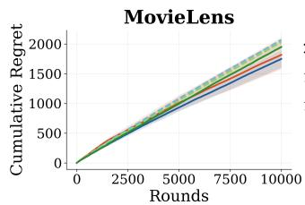

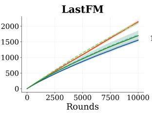

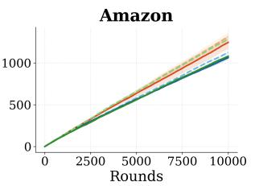  
Figure 5: Online cumulative regret over 10,000 interaction rounds. Curves show the mean over five runs, and shaded regions denote one standard deviation. Dashed curves are the item-level baselines, and solid curves are the corresponding TDGE variants. Dotted and dash-dotted curves denote CoFineUCB and $\mathrm { H _ { 2 } N } .$ -Bandit, respectively, where results are available. Lower is better.

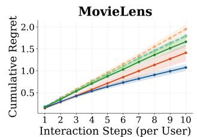

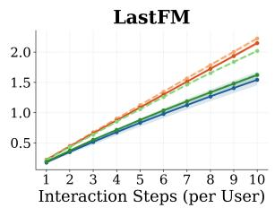

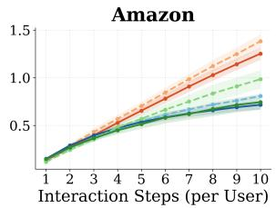

Figure 6: Cold-start cumulative regret over 10 interactions per held-out user. Within each run, regret at each step is averaged over 100 users before accumulation. Curves show the mean over five runs, and shaded regions denote one standard deviation. Dashed curves are the item-level baselines, and solid curves are the corresponding TDGE variants. Dotted and dash-dotted curves denote CoFineUCB and $\mathrm { H _ { 2 } N } .$ -Bandit, respectively, where results are available. Lower is better.

Figure 7 provides the corresponding per-step view of cold-start adaptation. Each point is the average instantaneous regret at that interaction step, and the point at step 10 is exactly the final-round regret reported in Table 1. The trajectories verify that the final-round differences appear directly in instantaneous regret rather than being induced by cumulative aggregation. The reduction is most pronounced across all three backbones on MovieLens-20M and for the neural backbones on Amazon; the Last.fm endpoints also favor the corresponding TDGE variants.

## H Inference-Time Analysis

TDGE introduces dimension- and feature-level scoring before item selection. To quantify the resulting overhead at a large arm-set size, we benchmark neural inference on an NVIDIA GeForce RTX 4090 using 101-dimensional synthetic contexts. Both the flat backbone and its TDGE variant score 100,000 item arms per decision; TDGE additionally scores 5,000 dimension arms and 5,000 feature arms. We use 50 warm-up passes followed by 150 timed passes and report median and 95th-percentile latency. Context tensors are constructed before timing and retained on the GPU, so the benchmark measures model scoring and action selection rather than data loading.

Despite the two additional routing stages, TDGE adds only 0.2637 ms for NeuralUCB and 0.3186 ms for NeuralTS at the median, while the complete scored decision in this benchmark remains close to 2 ms. This benchmark is conservative with respect to TDGE’s intended deployment: it assigns the same 100,000 item arms to the item-level model for both methods and therefore does not credit TDGE for the computation saved by narrowing the item pool before final scoring. Moreover, the dimension and feature arm sets are determined by the metadata vocabulary and do not scale directly with the catalog size. These results show that TDGE introduces modest scoring overhead even for a large item set and support the practical scalability of its semantic routing in large recommendation systems.

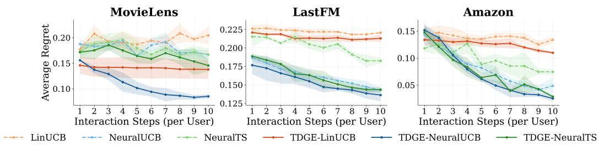  
Figure 7: Average instantaneous regret at each step of the 10-step cold-start trajectory. At each step, regret is averaged over 100 held-out users within each run. Curves show the mean over five runs, and shaded regions denote one standard deviation. The values at step 10 correspond to the final-round regret reported in Table 1. Lower is better.

Table 11: Per-decision neural inference latency with 100,000 item arms. TDGE additionally scores 5,000 dimension arms and 5,000 feature arms. Measurements use an NVIDIA GeForce RTX 4090 after 50 warm-up passes; 150 passes are timed.
<table><tr><td>Method</td><td>Median (ms)</td><td>P95 (ms)</td></tr><tr><td>NeuralUCB</td><td>1.6716</td><td>1.7666</td></tr><tr><td>TDGE-NeuralUCB</td><td>1.9353</td><td>1.9538</td></tr><tr><td>NeuralTS</td><td>1.7218</td><td>1.7504</td></tr><tr><td>TDGE-NeuralTS</td><td>2.0404</td><td>2.0606</td></tr></table>