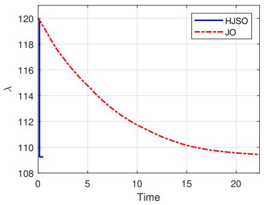
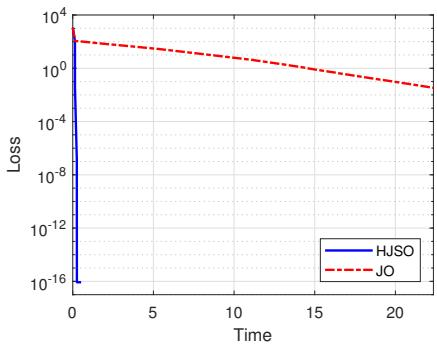
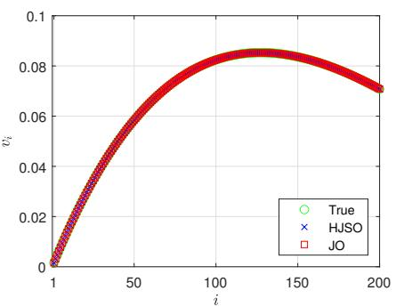
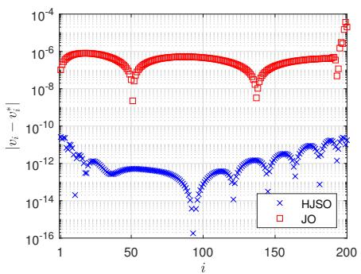
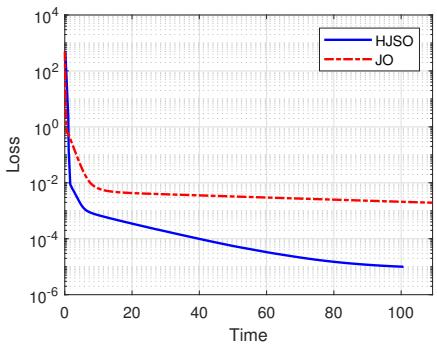
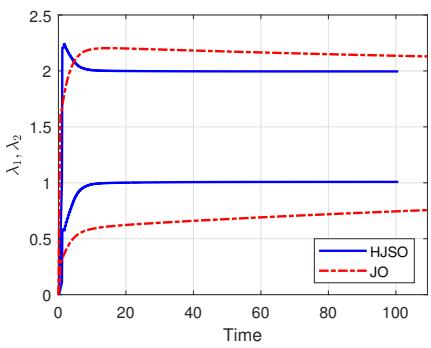
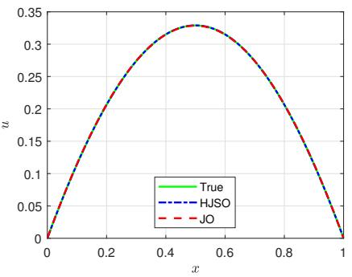
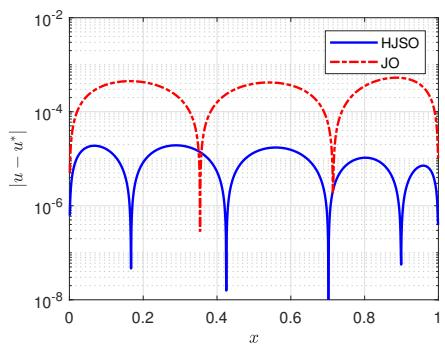
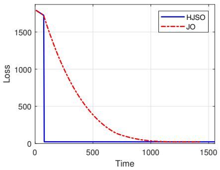
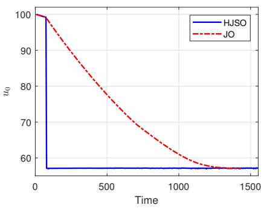

# Hybrid Joint–Selective Optimization: Reduced-Space Levenberg–Marquardt Refinement of Low-Dimensional Parameters of Interest

Muhammad Luthfi Shahaba, Gabriella Alfa Indahsaria, Imam Mukhlasha, Hadi Susantob

aDepartment of Mathematics, Institut Teknologi Sepuluh

Nopember, Surabaya, 60111, Indonesia

bDepartment of Mathematics, Khalifa University of Science & Technology, Abu Dhabi, PO Box 127788, United Arab Emirates

## Abstract

This paper introduces a hybrid joint–selective optimization (HJSO) framework for large-scale numerical problems in which a small subset of trainable quantities is of primary interest. We partition the full parameter vector into a high-dimensional remaining block and a low-dimensional block of parameters of interest (POIs), perform joint first-order optimization over the full parameter set, and then freeze the remaining variables while applying a reduced-space Levenberg–Marquardt (LM) refinement to the POIs. The method is designed for settings in which the POIs are low-dimensional but strongly influence the quality of the computed solution, while the full parameter space remains too large for full-space second-order methods.

The framework is evaluated on three representative problems: a matrix eigenvalue problem, an inverse Bratu problem solved with a physicsinformed neural network, and a 100-dimensional nonlinear Black–Scholes problem solved with the DeepBSDE method. In each test, HJSO reaches prescribed POI-error thresholds faster than the corresponding joint first-order baseline and improves the final POI accuracy for the reported solver configurations. The contribution is therefore not a universal optimizer, but a practical reduced-space strategy for problems with known low-dimensional parameters of interest and expensive high-dimensional training variables.

Keywords: Hybrid joint–selective optimization, Joint optimization, Levenberg–Marquardt algorithm, Parameters of interest, Inverse problems, Physics-informed neural networks, DeepBSDE

## 1. Introduction

Large-scale numerical optimization is central to modern scientific computing, especially in neural-network-based methods for diferential equations and stochastic control problems [1]. Physics-informed neural networks (PINNs) [2], DeepBSDE formulations for high-dimensional parabolic PDEs [3], and other data-driven discretizations often involve a large number of trainable parameters. In these settings, first-order methods such as gradient descent, steepest descent [4], or Adam [5] remain the default choice because they scale naturally to large models and avoid the cost of constructing or factorizing full Hessians.

However, many problems are not equally sensitive in all directions of the parameter space. A small subset of variables may have a disproportionately large efect on the quantity of interest, even when the total parameter count is large. This is common in inverse problems, eigenvalue problems, and stochastic PDE approximations, where the unknowns of primary interest may be a scalar or a few coeficients rather than the full network parameter vector itself. In PINNs, for example, imbalanced convergence among loss components and gradient-flow pathologies are well documented [6, 7]; in other settings, the final accuracy of a target quantity can be limited by slow convergence of a low-dimensional block that influences the solution disproportionately [8].

This observation motivates a structured optimization viewpoint. Rather than optimizing all parameters with a single generic first-order update, it can be advantageous to distinguish between the large remaining parameter block and a small set of quantities that are mathematically or physically central to the application. This idea echoes classical separable-variable and blockstructured optimization methods, including variable projection [9], coordinate descent [10, 11], and block coordinate updates [12, 13]. Related ideas have also been explored in neural-network training, where parameters are grouped according to architecture or linear/nonlinear structure [14, 15, 16].

The present work difers in a key respect: the selected parameters are not chosen solely by network architecture or algebraic structure, but by their problem-specific role as low-dimensional parameters of interest (POIs) [17]. We consider settings such as an unknown eigenvalue in a spectral problem, an unknown coeficient pair in an inverse diferential equation, and an unknown initial value in a DeepBSDE formulation. In all of these cases, the POIs are few in number but they determine the numerical output of primary interest. This structure is common in computational science and motivates reducedspace optimization strategies that use second-order-type information only on the small POI block rather than on the full parameter vector.

Accordingly, the trainable vector is partitioned into a high-dimensional remaining block and a low-dimensional POI block. A standard joint method updates both blocks simultaneously but does not exploit their diferent roles; the formal partition is introduced in Section 2.

Curvature-based optimization provides a potential mechanism for accelerating POI refinement. In particular, the Levenberg–Marquardt (LM) algorithm [18, 19] is well suited to nonlinear least-squares problems because it exploits local Gauss–Newton curvature information without requiring the exact Hessian. The LM algorithm has also been applied to neural-network training, including its incorporation into backpropagation for feedforward neural networks [20]. Applying LM to the complete high-dimensional parameter vector, however, can be computationally demanding because of the associated Jacobian and linear-algebra costs. This motivates restricting curvature-based refinement to a low-dimensional parameter subspace.

Hybrid strategies involving first-order and curvature-based optimization have also been investigated. Berra et al. [21] combined projected Newton and gradient steps for box-constrained root-finding problems. Costilla-Enriquez et al. [22] combined Newton–Raphson and stochastic gradient descent for power-flow analysis, switching between the two algorithms according to convergence behavior. These approaches apply diferent optimization algorithms over essentially the same variable space. In contrast, the present work explicitly partitions the trainable parameters and restricts curvature-based refinement to a low-dimensional POI block.

This structure motivates the hybrid joint–selective optimization (HJSO) method. Within each outer cycle, all trainable parameters are first optimized jointly using a first-order method. The remaining parameters are then fixed, and the LM algorithm selectively refines only the POIs. The refined POIs are subsequently recombined with the remaining parameters to initialize the next outer cycle. Thus, the defining feature of HJSO is not merely the combination of first-order and curvature-based optimization, but the joint optimization of the complete parameter vector followed by selective curvature-based refinement of a low-dimensional POI block. Since the POI dimension is much smaller than that of the remaining parameter space, the resulting LM subproblem is substantially smaller than curvature-based optimization of the complete model.

HJSO should be viewed as a reduced-space optimization framework rather than as a new variant of LM. Its contribution is the systematic placement of a standard damped Gauss–Newton refinement inside repeated joint optimization, with the reduced variables chosen according to their mathematical role in the problem. This interpretation also distinguishes the proposed strategy from variable projection: HJSO does not require the POI block to be eliminated exactly, and the remaining variables continue to be updated jointly with the POIs between selective refinements.

The proposed method is evaluated on three numerical problems. First, the largest eigenvalue of a 200 × 200 Lehmer matrix is considered, with the eigenvalue treated as a scalar POI. Second, an inverse Bratu problem is solved using PINNs [23], where two unknown coeficients, $\lambda _ { 1 }$ and $\lambda _ { 2 }$ , form a twodimensional POI block. Finally, a 100-dimensional nonlinear Black–Scholes equation with default risk is solved using DeepBSDE [3], where the unknown initial value $u _ { 0 } = u ( 0 , X _ { 0 } )$ is treated as the POI. These examples cover scalar and vector-valued POIs, deterministic and stochastic formulations, and lowand high-dimensional numerical problems.

The main contributions of this work are summarized as follows:

1. A hybrid joint–selective optimization framework is proposed that combines joint first-order optimization of all trainable parameters with selective LM refinement of a low-dimensional POI block.

2. The framework accommodates both scalar and vector-valued POIs while restricting curvature-based optimization to a substantially smaller parameter subspace.

3. The reduced-space formulation is discussed in terms of its computational role and its interaction with the joint optimization phase, which clarifies when selective refinement is a practical and scalable strategy for problems with low-dimensional POIs.

The remainder of this paper is organized as follows. Section 2 presents the proposed HJSO formulation and computational algorithm. Section 3 presents the numerical experiments, and Section 4 discusses their scope and limitations. Finally, Section 5 summarizes the main conclusions and outlines promising directions for future work.

## 2. Hybrid Joint–Selective Optimization (HJSO)

We now formulate HJSO for the prescribed POI block introduced in Section 1.

Let the full trainable parameter vector be partitioned as

$$
\theta = \left[ \theta _ { \mathrm { r o i } } \right] , \qquad \theta _ { \mathrm { r } } \in \mathbb { R } ^ { p } , \qquad \theta _ { \mathrm { p o i } } \in \mathbb { R } ^ { q } , \qquad q \ll p ,\tag{1}
$$

where $\theta _ { \mathrm { r } }$ denotes the high-dimensional remaining parameter block and $\pmb { \theta } _ { \mathrm { p o i } }$ denotes the low-dimensional POI block. In neural-network-based problems, for example, $\theta _ { \mathrm { r } }$ may contain the network weights and biases, while $\pmb { \theta } _ { \mathrm { p o i } }$ may encode model coeficients, eigenvalues, or other quantities of primary scientific relevance.

In a conventional joint optimization strategy, all trainable parameters are updated simultaneously. For example, gradient descent updates the complete parameter vector according to

$$
\pmb { \theta } ^ { ( m + 1 ) } = \pmb { \theta } ^ { ( m ) } - \alpha _ { m } \nabla _ { \pmb { \theta } } \mathcal { L } \left( \pmb { \theta } ^ { ( m ) } \right) ,\tag{2}
$$

where $\alpha _ { m } > 0$ is the learning rate and $\mathcal { L }$ is the objective function. This is often attractive because it is simple and scalable, but it does not distinguish between globally large parameter blocks and the small subset that directly controls the output of interest.

The proposed framework, hybrid joint–selective optimization (HJSO), addresses this imbalance by alternating between an outer joint update and a reduced-space refinement. The method is not tied to a specific optimizer in principle: the joint phase may use any scalable first-order procedure, while the selective phase may use a local reduced-space method for the POIs. In the present implementation, a first-order optimizer is used in the joint phase, while the Levenberg–Marquardt (LM) algorithm is used in the selective phase. This combination is chosen because it preserves the scalability of first-order optimization over the large parameter space while exploiting curvature information only in the substantially smaller POI subspace.

The key structural idea is therefore to perform a full-space joint update, freeze the large remaining block, and then refine only the low-dimensional POI block. The refined POIs are then recombined with the remaining parameters and used to initialize the next outer cycle. This makes the method particularly relevant for large-scale scientific problems in which the dominant objective is not the full parameter vector itself but a small set of physically or mathematically meaningful quantities derived from it. At the k-th outer cycle, $k = 0 , 1 , \ldots , T - 1$ , let

$$
\pmb { \theta } ^ { ( k ) } = \left[ \pmb { \theta } _ { \mathrm { r } } ^ { ( k ) } \right]\tag{3}
$$

denote the current parameter vector. In the joint phase, consider the optimization problem

$$
\operatorname* { m i n } _ { \pmb { \theta } } \mathcal { L } ( \pmb { \theta } ) .\tag{4}
$$

Starting from

$$
\vartheta ^ { [ 0 ] } = \theta ^ { ( k ) } ,\tag{5}
$$

where $\pmb { \vartheta } ^ { [ j ] }$ denotes the $j \cdot$ -th inner first-order iterate, the complete parameter vector is updated according to

$$
\vartheta ^ { [ j + 1 ] } = \mathrm { F O U p d a t e } \left( \vartheta ^ { [ j ] } \right) , \qquad j = 0 , 1 , \ldots , T _ { \mathrm { F O } } - 1 ,\tag{6}
$$

where $T _ { \mathrm { F O } }$ is the prescribed maximum number of first-order iterations. The joint phase may terminate earlier according to the stopping criterion of the selected solver. Its final iterate is denoted by

$$
\pmb { \theta } ^ { ( k + \frac { 1 } { 2 } ) } = \left[ \pmb { \theta } _ { \mathrm { r } } ^ { ( k + \frac { 1 } { 2 } ) } \right] = \pmb { \vartheta } ^ { [ T _ { \mathrm { F O } } ] } .\tag{7}
$$

Hence, both the remaining parameters and the POIs are updated during the joint phase.

In the selective phase, the remaining parameter block is fixed at

$$
{ \overline { { \theta } } } _ { \mathrm { r } } = \theta _ { \mathrm { r } } ^ { ( k + { \frac { 1 } { 2 } } ) } ,\tag{8}
$$

and only the POIs are further optimized. The reduced problem is written in nonlinear least-squares form as

$$
\operatorname* { m i n } _ { \theta _ { \mathrm { p o i } } } \ \Phi ( \theta _ { \mathrm { p o i } } ) = \frac { 1 } { 2 } \left\| r \left( \overline { { \theta } } _ { \mathrm { r } } , \theta _ { \mathrm { p o i } } \right) \right\| _ { 2 } ^ { 2 } ,\tag{9}
$$

where

$$
r \left( \overline { { \theta } } _ { \mathrm { r } } , \theta _ { \mathrm { p o i } } \right) = \left[ r _ { 1 } \left( \overline { { \theta } } _ { \mathrm { r } } , \theta _ { \mathrm { p o i } } \right) \quad \cdot \cdot \cdot \quad r _ { N _ { r } } \left( \overline { { \theta } } _ { \mathrm { r } } , \theta _ { \mathrm { p o i } } \right) \right] ^ { T } \in \mathbb { R } ^ { N _ { r } }\tag{10}
$$

is the residual vector.

The Jacobian of the residual with respect to the POIs is

$$
J _ { \mathrm { p o i } } = \frac { \partial r \left( \overline { { \pmb { \theta } } } _ { \mathrm { r } } , \pmb { \theta } _ { \mathrm { p o i } } \right) } { \partial \pmb { \theta } _ { \mathrm { p o i } } } \in \mathbb { R } ^ { N _ { r } \times q } .\tag{11}
$$

For $q = 1 , J _ { \mathrm { p o i } }$ consists of a single sensitivity column, whereas for $q > 1$ it contains one column for each POI. LM is particularly suitable for this reduced nonlinear least-squares problem because it exploits Gauss–Newton curvature information while introducing a damping term that improves robustness when $J _ { \mathrm { p o i } } ^ { T } J _ { \mathrm { p o i } }$ is singular, rank-deficient, or ill-conditioned [23].

The selective phase is initialized by

$$
\pmb { \theta } _ { \mathrm { p o i } } ^ { [ 0 ] } = \pmb { \theta } _ { \mathrm { p o i } } ^ { ( k + \frac { 1 } { 2 } ) } .\tag{12}
$$

At the j-th LM refinement, the increment is obtained from

$$
\left[ \left( \boldsymbol { J } _ { \mathrm { p o i } } ^ { [ j ] } \right) ^ { T } \boldsymbol { J } _ { \mathrm { p o i } } ^ { [ j ] } + \mu _ { j } \boldsymbol { I } _ { q } \right] \Delta \boldsymbol { \theta } _ { \mathrm { p o i } } ^ { [ j ] } = \left( \boldsymbol { J } _ { \mathrm { p o i } } ^ { [ j ] } \right) ^ { T } \boldsymbol { r } ^ { [ j ] } ,\tag{13}
$$

followed by

$$
\mathbf { \theta } _ { \mathrm { p o i } } ^ { [ j + 1 ] } = \mathbf { \theta } _ { \mathrm { p o i } } ^ { [ j ] } - \Delta \theta _ { \mathrm { p o i } } ^ { [ j ] } , \qquad j = 0 , 1 , \dotsc , T _ { \mathrm { L M } } - 1 ,\tag{14}
$$

where

$$
r ^ { [ j ] } = r \left( \overline { { \theta } } _ { \mathrm { r } } , \pmb { \theta } _ { \mathrm { p o i } } ^ { [ j ] } \right) ,\tag{15}
$$

$\mu _ { j } > 0$ is the LM damping parameter, and $\pmb { I } _ { q } \in \mathbb { R } ^ { q \times q }$ is the identity matrix. The selective phase may terminate before reaching $T _ { \mathrm { L M } }$ iterations according to the stopping criterion of the LM solver. Depending on the numerical software, its computational budget may instead be specified by a maximum number of residual function evaluations.

The damping parameter allows LM to interpolate between Gauss–Newton and a gradient-like update. For suficiently small $\mu _ { j }$ , Eq. (13) approaches

$$
J _ { \mathrm { p o i } } ^ { T } J _ { \mathrm { p o i } } \Delta \pmb { \theta } _ { \mathrm { p o i } } = J _ { \mathrm { p o i } } ^ { T } r ,\tag{16}
$$

which is the Gauss–Newton system. For relatively large $\mu _ { j }$ ,

$$
\Delta \theta _ { \mathrm { p o i } } \approx \frac { 1 } { \mu _ { j } } J _ { \mathrm { p o i } } ^ { T } { \pmb r } .\tag{17}
$$

Since

$$
\begin{array} { r } { \nabla _ { \theta _ { \mathrm { p o i } } } \Phi = J _ { \mathrm { p o i } } ^ { T } \pmb { r } , } \end{array}\tag{18}
$$

the latter resembles a scaled gradient step. LM therefore combines local curvature information with damping that improves numerical robustness.

Let $j _ { k }$ denote the final accepted selective iterate in outer cycle k; $j _ { k } = T _ { \mathrm { L M } }$ if the iteration limit is reached. After the selective phase, the refined POIs are recombined with the fixed remaining parameters,

$$
\pmb { \theta } ^ { ( k + 1 ) } = \left[ \begin{array} { c } { \pmb { \theta } _ { \mathrm { r } } ^ { ( k + \frac { 1 } { 2 } ) } \mp } \\ { \pmb { \theta } _ { \mathrm { p o i } } ^ { [ j _ { k } ] } } \end{array} \right] .\tag{19}
$$

The resulting vector initializes the joint phase of the next outer cycle. The complete HJSO procedure is summarized in Algorithm 1.

The principal structural advantage of HJSO follows from $q \ll p .$ . Curvaturebased optimization is restricted to the q-dimensional POI subspace, while the high-dimensional remaining parameter block is handled by a scalable firstorder method. The two phases therefore play complementary roles: the joint phase allows the complete parameter vector to adapt simultaneously, whereas the selective phase provides focused refinement of the POIs. These refined POIs are then returned to the complete parameter vector and influence the joint optimization in the next outer cycle.

The small size of the linear system does not, by itself, make the selective phase inexpensive. If the residual contains $N _ { r }$ components, forming a dense POI Jacobian and its normal matrix requires, respectively, $O ( N _ { r } q )$

storage and $O ( N _ { r } q ^ { 2 } )$ arithmetic, in addition to the cost of residual and sensitivity evaluations. Solving the resulting dense LM system costs $O ( q ^ { 3 } )$ Consequently, selective refinement is most attractive when $q$ is small and residual/Jacobian evaluations can be reused, diferentiated eficiently, or computed at a cost well below curvature calculations in the full $( p { + } q )$ -dimensional space.

The following elementary property records the descent mechanism used by the framework. It is conditional because practical first-order and LM solvers may terminate inexactly and stochastic objectives may change between batches.

Theorem 2.1 (Conditional cycle-wise descent). Suppose that, during one outer cycle, the joint phase returns $\pmb { \theta } ^ { ( k + \frac { 1 } { 2 } ) }$ satisfying

$$
\begin{array} { r } { \mathcal { L } \Big ( \pmb { \theta } ^ { ( k + \frac { 1 } { 2 } ) } \Big ) \leq \mathcal { L } \big ( \pmb { \theta } ^ { ( k ) } \big ) . } \end{array}\tag{20}
$$

Assume further that, with $\theta _ { \mathrm { r } }$ fixed, the joint objective can be written as

$$
\begin{array} { r } { \mathcal { L } ( \overline { { \theta } } _ { \mathrm { r } } , \theta _ { \mathrm { p o i } } ) = c \Phi ( \theta _ { \mathrm { p o i } } ) + C , \qquad c > 0 , } \end{array}\tag{21}
$$

where $C$ may depend on the frozen block $\overline { { \pmb { \theta } } } _ { \mathrm { r } }$ but is independent of $\pmb { \theta } _ { \mathrm { p o i } }$ during the selective phase. If every accepted LM step does not increase $\Phi$ , then the completed HJSO cycle satisfies

$$
{ \mathcal { L } } { \big ( } \pmb { \theta } ^ { ( k + 1 ) } { \big ) } \leq { \mathcal { L } } { \big ( } \pmb { \theta } ^ { ( k ) } { \big ) } ~ .\tag{22}
$$

Proof. Let $j _ { k }$ denote the final accepted selective iterate. The LM acceptance condition requires $\Phi ( \pmb \theta _ { \mathrm { p o i } } ^ { [ j _ { k } ] } ) \leq \Phi ( \pmb \theta _ { \mathrm { p o i } } ^ { ( k + \frac { 1 } { 2 } ) } )$ . Moreover, the initial and final selective-phase vectors have the same frozen remaining block $\overline { { \pmb { \theta } } } _ { \mathrm { r } }$ . Since $c > 0$ multiplying this inequality by $c$ and adding the same constant $C$ preserves its direction. Equation (21) and the assumed joint-phase decrease therefore give the complete chain

$$
\begin{array} { r l } & { \mathcal { L } \big ( \theta ^ { ( k + 1 ) } \big ) = c \Phi \Big ( \theta _ { \mathrm { p o i } } ^ { [ j _ { k } ] } \Big ) + C } \\ & { \qquad \leq c \Phi \Big ( \theta _ { \mathrm { p o i } } ^ { ( k + \frac { 1 } { 2 } ) } \Big ) + C } \\ & { \qquad = \mathcal { L } \Big ( \theta ^ { ( k + \frac { 1 } { 2 } ) } \Big ) \leq \mathcal { L } \big ( \theta ^ { ( k ) } \big ) . } \end{array}
$$

This is the stated cycle-wise descent.

The compatibility condition holds when the omitted residual terms are constant with respect to the frozen-block selective problem, as in the experiments below. The theorem does not assert convergence to a global minimizer,

nor does it apply directly when independently resampled stochastic batches define successive objective values.

Algorithm 1 Hybrid Joint–Selective Optimization (HJSO)   
Require: Initial parameters $\pmb { \theta } ^ { ( 0 ) } = \bigg [ \pmb { \theta } _ { \mathrm { r } } ^ { ( 0 ) } \bigg ]$ ; number of outer cycles $T ;$ maxi  
mum first-order iterations $T _ { \mathrm { F O } } ;$ maximum LM iterations $T _ { \mathrm { L M } }$   
Ensure: Optimized parameters $\pmb { \theta } ^ { * }$   
1: for $k = 0 , 1 , \ldots , T - 1$ do   
2: Joint phase: optimize all parameters   
3: $\pmb { \vartheta } ^ { [ 0 ] }  \mathbf { \big \acute { \pmb { \theta } } } ^ { ( k ) }$   
4: for $j = 0 , 1 , \dots , T _ { \mathrm { F O } } - 1$ do   
5: ϑ[j+1] ← FOUpdate $\left( \vartheta ^ { [ j ] } \right)$   
6: if first-order stopping criterion is satisfied then   
7: break   
8: end if   
9: end for   
10: $\pmb { \theta } ^ { ( k + \frac { 1 } { 2 } ) }  \pmb { \vartheta } ^ { [ j + 1 ] }$   
11: Split $\pmb { \theta } ^ { ( k + \frac { 1 } { 2 } ) } = \left[ \pmb { \theta } _ { \mathrm { r o i } } ^ { ( k + \frac { 1 } { 2 } ) } \right]$   
12: Selective phase: refine only the POIs   
13: Freeze $\overline { { \pmb { \theta } } } _ { \mathrm { r } }  \pmb { \theta } _ { \mathrm { r } } ^ { ( k + \frac { 1 } { 2 } ) }$   
14: $\pmb { \theta } _ { \mathrm { p o i } } ^ { [ 0 ] }  \pmb { \theta } _ { \mathrm { p o i } } ^ { ( k + \frac { 1 } { 2 } ) }$   
15: for $j = 0 , 1 , \dots , T _ { \mathrm { L M } } - 1$ do   
16: $\pmb { \theta } _ { \mathrm { p o i } } ^ { [ j + 1 ] }  \mathrm { L M U p d a t e } ( \overline { { \theta } } _ { \mathrm { r } } , \pmb { \theta } _ { \mathrm { p o i } } ^ { [ j ] } )$   
17: if LM stopping criterion is satisfied then   
18: break   
19: end if   
20: end for   
21: Recombination   
22: $\pmb { \theta } ^ { ( k + 1 ) } \gets \left[ \pmb { \theta } _ { \mathrm { p o i } } ^ { ( k + \frac { 1 } { 2 } ) } \right]$   
23: end for   
24: return $\pmb { \theta } ^ { * }  \pmb { \theta } ^ { ( T ) }$

## 3. Experimental Results

The proposed HJSO method is evaluated on three representative numerical problems with distinct characteristics: a matrix eigenvalue problem, an inverse Bratu problem solved using physics-informed neural networks (PINNs) [23], and a 100-dimensional nonlinear Black–Scholes problem solved using the DeepBSDE framework [3]. These examples are chosen to test the framework in diferent settings: a simple low-dimensional spectral parameter, a nonlinear inverse problem with a learned state representation, and a high-dimensional stochastic PDE approximation.

For each problem, HJSO is compared with the corresponding standard joint optimization (JO) baseline under the same problem formulation, initialization, and first-order optimizer. In JO, all trainable parameters are updated jointly without the selective POI refinement phase. This setup is intended to isolate the incremental efect of the reduced-space selective update while keeping the rest of the optimization problem unchanged.

Performance is measured in terms of convergence speed, final solution or parameter accuracy, loss reduction, and wall-clock time. Since each HJSO outer cycle includes both a full-space joint phase and an additional reducedspace LM step, wall-clock time is used for the comparison rather than iteration count alone. The optimization and problem-specific settings are summarized in Tables 1 and 2.

The comparisons are designed to test the mechanism of selective refinement, not to claim universal superiority over all optimization methods. JO isolates the benefit of adding the selective phase, but stronger full-space, block-structured, or problem-specific solvers may lead to diferent rankings. Likewise, wall-clock times depend on the implementation and hardware. The reported timings are therefore most informative as within-example comparisons under the present settings.

In the implementation, the selective LM refinement in HJSO is performed using standard LM solvers. For the eigenvalue and inverse Bratu problems, MATLAB’s fsolve with the Levenberg–Marquardt algorithm is used, whereas SciPy’s least squares with method=’lm’ is used for the DeepB-SDE problem. The Jacobian approximation, damping adjustment, step acceptance, and internal stopping criteria are therefore delegated to the corresponding numerical solver.

## 3.1. Eigenvalue Problem

The first numerical experiment considers the matrix eigenvalue problem. Given a matrix $A \in \mathbb { R } ^ { n \times n }$ , the objective is to determine a scalar $\lambda \in \mathbb { R }$ and

Table 1: Optimization settings used for JO and HJSO in the numerical experiments.
<table><tr><td>Setting</td><td>Eigenvalue Problem</td><td>Inverse Bratu PINNs</td><td>Black-Scholes DeepBSDE</td></tr><tr><td>Outer cycles, T</td><td>200</td><td>400</td><td>100</td></tr><tr><td>Joint-phase solver</td><td>MATLAB fminunc</td><td>MATLAB fminunc</td><td>TensorFlow Adam</td></tr><tr><td>Joint-phase algorithm</td><td>Steepest descent</td><td>Steepest descent</td><td>Adam</td></tr><tr><td>Joint-phase iterations,  $T _ { \mathrm { F O } }$ </td><td>50</td><td>50</td><td>100</td></tr><tr><td>Joint-phase step tolerance</td><td> $1 0 ^ { - 1 2 }$ </td><td> $1 0 ^ { - 1 2 }$ </td><td></td></tr><tr><td>Selective-phase solver</td><td>MATLAB fsolve</td><td>MATLAB fsolve</td><td>SciPy least_squares</td></tr><tr><td>Selective-phase algorithm</td><td>Levenberg-Marquardt</td><td>Levenberg-Marquardt</td><td>Levenberg-Marquardt</td></tr><tr><td>Selective-phase iterations,  $T _ { \mathrm { L M } }$ </td><td>10</td><td>10</td><td>10</td></tr><tr><td>Selective-phase step tolerance</td><td> $1 0 ^ { - 1 2 }$ </td><td> $1 0 ^ { - 1 2 }$ </td><td> $1 0 ^ { - 6 }$ </td></tr><tr><td>POI dimension, q</td><td>1</td><td>2</td><td>1</td></tr></table>

Table 2: Problem-specific settings used in the numerical experiments.
<table><tr><td>Setting</td><td>Eigenvalue Problem</td><td>Inverse Bratu PINNs</td><td>Black-Scholes DeepBSDE</td></tr><tr><td>Problem dimension</td><td> $\overline { { n = 2 0 0 } }$ </td><td>One-dimensional</td><td> $\overline { { d = 1 0 0 } }$ </td></tr><tr><td>Parameter(s) of interest</td><td>λ</td><td> $( \lambda _ { 1 } , \lambda _ { 2 } )$ </td><td>u0</td></tr><tr><td>Initial POI(s)</td><td> $\lambda ^ { ( 0 ) } = 1 2 0$ </td><td> $( \lambda _ { 1 } ^ { ( 0 ) } , \lambda _ { 2 } ^ { ( 0 ) } ) = ( 0 , 0 )$ </td><td> $u _ { 0 } ^ { ( 0 ) } = 1 0 0$ </td></tr><tr><td>Remaining trainable parameters</td><td>Eigenvector v</td><td>NN weights and biases w</td><td>DeepBSDE NN parameters</td></tr><tr><td>Neural-network architecture</td><td></td><td>NN(1, 20, 20, 1)</td><td>Hidden layers (110, 110)</td></tr><tr><td>Training/collocation points</td><td></td><td>99</td><td>Batch size 64</td></tr><tr><td>Fixed LM/monitoring samples</td><td></td><td></td><td>256</td></tr><tr><td>Time horizon</td><td></td><td></td><td> $T _ { \mathrm { B S } } = 1$ </td></tr><tr><td>Time intervals</td><td></td><td></td><td>40</td></tr><tr><td>Data weighting parameter</td><td></td><td> $\alpha = 1 0 0$ </td><td></td></tr><tr><td>Initial remaining parameters</td><td>Normalized all-ones vector</td><td>Glorot-type initialization</td><td>DeepBSDE initialization</td></tr></table>

a nonzero vector $\pmb { v } \in \mathbb { R } ^ { n }$ satisfying

$$
A \pmb { v } = \lambda \pmb { v } ,\tag{23}
$$

where λ denotes an eigenvalue and v is its corresponding eigenvector.

In this experiment, a Lehmer matrix of dimension $n = 2 0 0$ is employed. Its entries are defined by

$$
A _ { i j } = \frac { \operatorname* { m i n } ( i , j ) } { \operatorname* { m a x } ( i , j ) } , \qquad i , j = 1 , 2 , \ldots , n .\tag{24}
$$

The Lehmer matrix is symmetric and positive definite, therefore all of its eigenvalues are real and positive. The objective is to determine its largest eigenvalue, whose reference value is $\lambda ^ { * } \approx 1 0 9 . 2 5 1 6$ , together with the corresponding eigenvector.

The eigenvalue problem is formulated as an optimization problem in which the eigenvalue and eigenvector are estimated simultaneously and iteratively from prescribed initial values. For the joint phase, the objective function is defined as

$$
\mathcal { L } ( \lambda , \pmb { v } ) = \frac { 1 } { 2 } \left\| \boldsymbol { A } \pmb { v } - \lambda \pmb { v } \right\| _ { 2 } ^ { 2 } .\tag{25}
$$

The initial eigenvalue is set to

$$
\lambda ^ { ( 0 ) } = 1 2 0 ,\tag{26}
$$

while the initial eigenvector is chosen as the normalized all-ones vector,

$$
{ \pmb v } ^ { ( 0 ) } = \frac { 1 } { \sqrt { n } } \left[ 1 \quad 1 \quad \cdots \quad 1 \right] ^ { T } .\tag{27}
$$

To prevent convergence toward the trivial solution $\mathbf { \nabla } _ { v } = \mathbf { 0 }$ , the eigenvector is normalized according to

$$
{ \overline { { \pmb { v } } } } = { \frac { \pmb { v } } { \Vert \pmb { v } \Vert _ { 2 } } } .\tag{28}
$$

This normalization is applied throughout the numerical procedure.

Following the parameter decomposition introduced in Section 2, the parameter blocks are defined as

$$
\pmb { \theta } _ { \mathrm { r } } = \pmb { v } , \qquad \pmb { \theta } _ { \mathrm { p o i } } = \lambda .\tag{29}
$$

During the joint phase, λ and v are optimized simultaneously. After this phase, the resulting eigenvector is normalized and held fixed, while LM is applied exclusively to the POI λ in the selective phase.

For a fixed normalized eigenvector ${ \overline { { v } } } ,$ the reduced problem solved during the selective phase is

$$
\operatorname* { m i n } _ { \lambda } \ \Phi ( \lambda ) = \frac { 1 } { 2 } \left\| \pmb { r } ( \lambda , \pmb { \overline { { v } } } ) \right\| _ { 2 } ^ { 2 } = \frac { 1 } { 2 } \left\| A \pmb { \overline { { v } } } - \lambda \pmb { \overline { { v } } } \right\| _ { 2 } ^ { 2 } .\tag{30}
$$

The Jacobian of the residual with respect to the scalar POI is

$$
J _ { \mathrm { p o i } } = \frac { \partial \pmb { r } } { \partial \lambda } = - \overline { { \pmb { v } } } .\tag{31}
$$

This example has an additional structure that makes the selective update particularly transparent. Because $\| \overline { { \pmb { v } } } \| _ { 2 } = 1$ , the exact minimizer of Eq. (30) is the Rayleigh quotient

$$
\lambda _ { \mathrm { s e l } } = { \overline { { { \pmb { v } } } } } ^ { T } A { \overline { { { \pmb { v } } } } } .\tag{32}
$$

Thus, an undamped Gauss–Newton step obtains the reduced minimizer in one iteration, and LM approaches this update as its damping decreases. The eigenvalue experiment is consequently an illustrative limiting case of HJSO, not evidence that an iterative LM solve is preferable to the available closedform update. In addition, the residual objective vanishes at every normalized eigenpair; selection of the largest eigenpair in this experiment depends on the stated initialization and is not guaranteed by the residual objective alone.

  
(a)

  
(b)

  
(c)

  
(d)  
Figure 1: Numerical results for the largest eigenpair of the $2 0 0 \times 2 0 0$ Lehmer matrix: (a) loss versus computational time; (b) estimated largest eigenvalue versus computational time; (c) reference and computed eigenvectors; and (d) pointwise absolute error of the computed eigenvector.

Figure 1 presents the numerical comparison between HJSO and JO. As shown in Figure 1a, HJSO rapidly reduces the loss and reaches a low-loss regime considerably earlier than JO, whose loss decreases more gradually over the reported computational interval. This behavior indicates that selective LM refinement of the eigenvalue accelerates the reduction of the eigenpair residual. Figure 1b shows the convergence of the estimated eigenvalue. Both methods start from $\lambda ^ { ( 0 ) } = 1 2 0$ and approach the reference value $\lambda ^ { * } \approx 1 0 9 . 2 5 1 6$ . However, HJSO approaches the reference value substantially earlier in computational time than JO. Figures 1c and 1d compare the corresponding eigenvectors. The computed eigenvectors reproduce the reference profile, while the pointwise errors provide a more detailed assessment of their numerical accuracy.

Table 3: Comparison of JO and HJSO for the largest eigenvalue of the $2 0 0 \times 2 0 0$ Lehmer matrix.
<table><tr><td>Method</td><td>Loss</td><td> $\bar { \lambda }$ </td><td> $\overline { { \mathrm { A P E } \lambda } }$ </td><td>Time (s)</td><td>Time to 1% APE (s)</td></tr><tr><td>HJSO</td><td> $\overline { { 8 . 5 \times 1 0 ^ { - 1 7 } } }$ </td><td>109.2516</td><td> $\overline { { 8 . 4 \times 1 0 ^ { - 1 3 } } }$ </td><td>0.54</td><td>0.13</td></tr><tr><td>JO</td><td> $3 . 4 \times 1 0 ^ { - 2 }$ </td><td>109.4358</td><td> $1 . 6 \times 1 0 ^ { - 1 }$ </td><td>22</td><td>14</td></tr></table>

The final numerical results are summarized in Table 3, including the absolute percentage error (APE) of the estimated eigenvalue and the computational time required to reach an APE of 1%. HJSO obtains an eigenvalue of 109.2516 with an APE of $8 . 4 \times 1 0 ^ { - 1 3 0 } \%$ , whereas JO obtains 109.4358 with an APE of $1 . 6 \times 1 0 ^ { - 1 } \%$ . HJSO reaches an APE of 1% in approximately 0.13 s, compared with 14 s for JO.

These results illustrate the efect of selective reduced-space refinement of the scalar POI. The joint phase updates the eigenvalue and eigenvector simultaneously, whereas the selective phase holds the normalized eigenvector fixed and moves the eigenvalue toward the Rayleigh quotient in Eq. (32). The large improvement relative to JO in this example should therefore be interpreted in light of this favorable closed-form reduced structure.

## 3.2. Bratu Equation in an Inverse-Problem PINN Framework

The second numerical experiment considers an inverse problem associated with a two-parameter form of the Bratu equation [23],

$$
\frac { d ^ { 2 } u } { d x ^ { 2 } } + \lambda _ { 1 } \exp { ( \lambda _ { 2 } u ) } = 0 , \qquad x \in ( 0 , 1 ) ,\tag{33}
$$

subject to the homogeneous Dirichlet boundary conditions

$$
u ( 0 ) = u ( 1 ) = 0 .\tag{34}
$$

Here, $u ( x )$ denotes the unknown solution, while $\lambda _ { 1 }$ and $\lambda _ { 2 }$ are unknown parameters to be identified.

The reference parameters are set to

$$
\lambda _ { 1 } ^ { * } = 2 , \qquad \lambda _ { 2 } ^ { * } = 1 ,\tag{35}
$$

with the corresponding analytical solution [24, 25]

$$
u ^ { * } ( x ) = 2 \log \left[ \frac { \cosh ( \vartheta ) } { \cosh \left( \vartheta ( 1 - 2 x ) \right) } \right] ,\tag{36}
$$

where

$$
\vartheta \approx 0 . 5 8 9 3 8 7 7 6 3 4 6 9 3 5 1 .\tag{37}
$$

To solve the inverse problem using PINNs, the computational domain is discretized at the interior points

$$
x _ { i } = 0 . 0 1 i , \qquad i = 1 , 2 , \ldots , 9 9 ,\tag{38}
$$

giving $N _ { f } = N _ { u } = 9 9$ collocation and training points. A fully connected feedforward neural network with architecture NN(1, 20, 20, 1) is employed to approximate the solution [23]. Let $\tilde { u } ( x ; { \pmb w } )$ denote the raw network output, where w contains the network weights and biases. The boundary conditions are imposed exactly through

$$
u ( x ; \pmb { w } ) = x ( 1 - x ) \widetilde { u } ( x ; \pmb { w } ) ,\tag{39}
$$

which automatically satisfies $u ( 0 ) = u ( 1 ) = 0$

The joint-phase loss is defined as

$$
\begin{array} { r } { \mathcal { L } = \mathrm { M S E } _ { f } + \alpha ^ { 2 } \mathrm { M S E } _ { u } , } \end{array}\tag{40}
$$

where

$$
\mathrm { M S E } _ { f } = \frac { 1 } { N _ { f } } \sum _ { i = 1 } ^ { N _ { f } } \left( u _ { x x } ( x _ { i } ) + \lambda _ { 1 } \exp \left( \lambda _ { 2 } u ( x _ { i } ) \right) \right) ^ { 2 } ,\tag{41}
$$

$$
\mathrm { M S E } _ { u } = \frac { 1 } { N _ { u } } \sum _ { i = 1 } ^ { N _ { u } } \left( u ( x _ { i } ) - u ^ { * } ( x _ { i } ) \right) ^ { 2 } .\tag{42}
$$

The network weights are initialized using a Glorot-type uniform initialization, while the biases are initialized to zero. The POIs are initialized as

$$
\theta _ { \mathrm { p o i } } ^ { ( 0 ) } = \left[ \begin{array} { c c c } { { 0 } } \\ { { 0 } } \end{array} \right] .\tag{43}
$$

Following the parameter decomposition introduced in Section 2, the parameter blocks are defined as

$$
\pmb { \theta } _ { \mathrm { r } } = \pmb { w } , \qquad \pmb { \theta } _ { \mathrm { p o i } } = \left[ \lambda _ { 1 } \right] .\tag{44}
$$

During the joint phase, $w , \lambda _ { 1 }$ , and $\lambda _ { 2 }$ are optimized simultaneously. After this phase, the neural-network parameters are held fixed, while LM is applied only to the coupled POI block $( \lambda _ { 1 } , \lambda _ { 2 } ) ^ { T }$

For fixed neural-network parameters $\pmb \theta _ { \mathrm { r } } = \overline { { \pmb w } }$ , the reduced problem solved during the selective phase is

$$
\operatorname* { m i n } _ { \lambda _ { 1 } , \lambda _ { 2 } } \ \Phi ( \lambda _ { 1 } , \lambda _ { 2 } ) = \frac { 1 } { 2 } \left\| \pmb { r } _ { f } \left( \pmb { \overline { { w } } } , \lambda _ { 1 } , \lambda _ { 2 } \right) \right\| _ { 2 } ^ { 2 } ,\tag{45}
$$

where the physics residual vector is

$$
\begin{array} { r } { r _ { f } = \left[ \begin{array} { c c c c } { r _ { f } ( x _ { 1 } ) } \\ { r _ { f } ( x _ { 2 } ) } \\ { \vdots } \\ { r _ { f } ( x _ { N _ { f } } ) } \end{array} \right] , \qquad r _ { f } ( x _ { i } ) = u _ { x x } ( x _ { i } ; \overline { { \boldsymbol { w } } } ) + \lambda _ { 1 } \exp \left[ \lambda _ { 2 } u ( x _ { i } ; \overline { { \boldsymbol { w } } } ) \right] . } \end{array}\tag{46}
$$

The data residual does not appear in the reduced problem because, once w is fixed, it is independent of $\lambda _ { 1 }$ and $\lambda _ { 2 }$ and therefore does not afect the selective POI refinement. The Jacobian of the physics residual with respect to the POIs is

$$
J _ { \mathrm { p o i } } = \left[ \frac { \partial \pmb { r } _ { f } } { \partial \lambda _ { 1 } } \quad \frac { \partial \pmb { r } _ { f } } { \partial \lambda _ { 2 } } \right] \in \mathbb { R } ^ { N _ { f } \times 2 } ,\tag{47}
$$

with row i given by

$$
\left[ \exp \left( \lambda _ { 2 } u ( x _ { i } ) \right) , \quad \lambda _ { 1 } u ( x _ { i } ) \exp \left( \lambda _ { 2 } u ( x _ { i } ) \right) \right] .\tag{48}
$$

Figure 2 presents the numerical comparison between HJSO and JO. As shown in Figure $2 \mathrm { a } .$ , HJSO rapidly reduces the loss and reaches a substantially lower final value than JO. In contrast, JO exhibits a rapid initial reduction followed by a considerably slower convergence regime. This behavior indicates that the selective LM phase provides additional refinement after the joint optimization. Figure 2b shows the convergence of the identified parameters. HJSO rapidly approaches the reference values $( \lambda _ { 1 } ^ { * } , \lambda _ { 2 } ^ { * } ) = ( 2 , 1 )$ and remains close to them, whereas the parameters obtained using JO remain noticeably separated from the reference values over the reported computational interval. Figures 2c and 2d compare the corresponding solution approximations. Both methods reproduce the overall reference solution profile, but HJSO provides a more accurate pointwise approximation over most of the domain. The results also show that a visually accurate state approximation does not necessarily imply equally accurate identification of the unknown parameters.

Table 4: Comparison of JO and HJSO for the inverse Bratu problem.
<table><tr><td>Method</td><td>Loss</td><td> $\overline { { \lambda _ { 1 } } }$ </td><td> $\lambda _ { 2 }$ </td><td>APE  $\lambda _ { 1 }$ </td><td>APE  $\overline { { \lambda _ { 2 } } }$ </td><td>Time (s)</td><td>Time to 1% APE (s)</td></tr><tr><td>HJSO</td><td> $\overline { { 9 . 9 \times 1 0 ^ { - 6 } } }$ </td><td>1.9955</td><td>1.0082</td><td>0.2236</td><td>0.8250</td><td>99</td><td>9.1</td></tr><tr><td>JO</td><td> $1 . 9 \times 1 0 ^ { - 3 }$ </td><td>2.1295</td><td>0.7559</td><td>6.4772</td><td>24.4068</td><td>109</td><td></td></tr></table>

The final numerical results are summarized in Table 4, including the APEs of the identified parameters and the computational time required for both POIs to reach an APE below 1%. HJSO identifies $\lambda _ { 1 } = 1 . 9 9 5 5$ and $\lambda _ { 2 } =$

  
(a)

  
(b)

  
(c)

  
(d)  
Figure 2: Numerical results for the inverse Bratu problem: (a) loss versus computational time; (b) identified parameters $\lambda _ { 1 }$ and $\lambda _ { 2 }$ versus computational time; (c) analytical reference and predicted solutions; and (d) pointwise absolute error $\left| u - u ^ { * } \right|$

1.0082, with APEs of 0.2236% and 0.8250%, respectively. In comparison, JO obtains $\lambda _ { 1 } = 2 . 1 2 9 5$ and $\lambda _ { 2 } = 0 . 7 5 5 9$ , with APEs of 6.4772% and 24.4068%, respectively. HJSO reaches an APE below 1% for both POIs in 9.1678 s, whereas JO does not reach this threshold during the reported computational interval. HJSO also achieves a lower final loss $9 . 9 \times 1 0 ^ { - 6 }$ compared with $1 . 9 \times 1 0 ^ { - 3 }$ for JO.

These results show how selective refinement behaves for a two-dimensional POI block. The joint phase updates the neural-network parameters and both unknown coeficients simultaneously, whereas the selective phase fixes the network parameters and directly refines $( \lambda _ { 1 } , \lambda _ { 2 } ) ^ { T }$ . This experiment therefore extends the HJSO mechanism from a scalar POI to multiple coupled POIs.

The experiment uses dense, noise-free synthetic observations at the same locations as the collocation points. It is designed to isolate optimization behavior under controlled conditions, rather than to establish robustness to sparse or noisy inverse data. In particular, the reported parameter errors should not be extrapolated to observational settings with measurement noise

or model discrepancy.

## 3.3. High-Dimensional Black–Scholes Equation Using the DeepBSDE Method

The third numerical experiment considers a high-dimensional nonlinear Black–Scholes equation with default risk, introduced as a benchmark problem for the Deep Backward Stochastic Diferential Equation (DeepBSDE) method [3]. The model incorporates the possibility of default of the claim issuer, resulting in a nonlinear pricing equation. Let

$$
u : [ 0 , T _ { \mathrm { B S } } ] \times \mathbb { R } ^ { d }  \mathbb { R }\tag{49}
$$

denote the value of a European contingent claim depending on d underlying assets. For the default-risk model considered here, the underlying assets follow independent geometric Brownian motions,

$$
d X _ { t } ^ { i } = \bar { \mu } X _ { t } ^ { i } d t + \bar { \sigma } X _ { t } ^ { i } d W _ { t } ^ { i } , \qquad i = 1 , 2 , \ldots , d ,\tag{50}
$$

and the resulting nonlinear Black–Scholes equation is

$$
\frac { \partial u } { \partial t } + \bar { \mu } \mathbf { { x } } \cdot \nabla _ { x } u + \frac { \bar { \sigma } ^ { 2 } } { 2 } \sum _ { i = 1 } ^ { d } x _ { i } ^ { 2 } \frac { \partial ^ { 2 } u } { \partial x _ { i } ^ { 2 } } - ( 1 - \delta ) Q ( u ) u - R u = 0 ,\tag{51}
$$

where $\delta$ is the recovery rate, R is the risk-free interest rate, and the default intensity is defined by

$$
\begin{array} { r } { Q ( u ) = \left\{ \begin{array} { l l } { \gamma ^ { h } , } & { u < v ^ { h } , } \\ { \gamma ^ { h } + \displaystyle \frac { \gamma ^ { l } - \gamma ^ { h } } { v ^ { l } - v ^ { h } } ( u - v ^ { h } ) , } & { v ^ { h } \leq u < v ^ { l } , } \\ { \gamma ^ { l } , } & { u \geq v ^ { l } . } \end{array} \right. } \end{array}\tag{52}
$$

Following the benchmark in [3], the dimension is $d = 1 0 0$ , with

$$
T _ { \mathrm { B S } } = 1 , \qquad \delta = \frac { 2 } { 3 } , \qquad R = 0 . 0 2 , \qquad \bar { \mu } = 0 . 0 2 , \qquad \bar { \sigma } = 0 . 2 ,\tag{53}
$$

and

$$
v ^ { h } = 5 0 , \qquad v ^ { l } = 7 0 , \qquad \gamma ^ { h } = 0 . 2 , \qquad \gamma ^ { l } = 0 . 0 2 .\tag{54}
$$

The terminal payof is

$$
g ( \pmb { x } ) = \operatorname* { m i n } _ { 1 \leq i \leq d } x _ { i } ,\tag{55}
$$

and the initial state is

$$
\begin{array} { r } { \pmb { X } _ { 0 } = \left[ 1 0 0 \quad 1 0 0 \quad \cdots \quad 1 0 0 \right] ^ { T } \in \mathbb { R } ^ { 1 0 0 } . } \end{array}\tag{56}
$$

The reference value reported for this benchmark is $u ^ { * } ( 0 , X _ { 0 } ) \approx 5 7 . 3$ [3]. Since no closed-form solution is available, this benchmark value is used as the reference. Its reported precision should be kept in mind when interpreting percentage errors below the one-percent level.

The DeepBSDE method reformulates the PDE through the corresponding forward–backward stochastic diferential equations. Along a stochastic trajectory, define

$$
u _ { t } = u ( t , \boldsymbol { X } _ { t } ) , \qquad \boldsymbol { Z } _ { t } = \sigma ( t , \boldsymbol { X } _ { t } ) ^ { T } \nabla _ { x } u ( t , \boldsymbol { X } _ { t } ) ,\tag{57}
$$

where $u _ { t }$ denotes the solution evaluated along the forward stochastic process. The corresponding backward process satisfies

$$
d u _ { t } = - f ( t , \boldsymbol { X } _ { t } , u _ { t } , \boldsymbol { Z } _ { t } ) d t + \boldsymbol { Z } _ { t } ^ { T } d W _ { t } ,\tag{58}
$$

where $f$ denotes the nonlinear generator associated with the PDE, subject to the terminal condition

$$
u _ { T _ { \mathrm { B S } } } = g ( { X } _ { T _ { \mathrm { B S } } } ) .\tag{59}
$$

The interval $[ 0 , T _ { \mathrm { B S } } ]$ is divided into $N = 4 0$ subintervals. The forward and backward processes are approximated by

$$
X _ { n + 1 } = { \mathbf { { X } } _ { n } } + \pmb { \mu } ( t _ { n } , \pmb { X } _ { n } ) \Delta t _ { n } + \pmb { \sigma } ( t _ { n } , \pmb { X } _ { n } ) \Delta \pmb { W } _ { n } ,\tag{60}
$$

and

$$
u _ { n + 1 } = u _ { n } - f ( t _ { n } , \pmb { X } _ { n } , u _ { n } , \pmb { Z } _ { n } ) \Delta t _ { n } + \pmb { Z } _ { n } ^ { T } \Delta \pmb { W } _ { n } ,\tag{61}
$$

respectively.

The unknown process $Z _ { n }$ is approximated using neural networks,

$$
\pmb { Z } _ { n } \approx \mathcal { N } _ { n } \left( \pmb { X } _ { n } ; \pmb { w } _ { n } \right) ,\tag{62}
$$

with two hidden layers of 110 neurons each. Starting from the unknown initial value $u _ { 0 } .$ the system is propagated to the terminal time. The initial value $u _ { 0 }$ and the neural-network parameters are then determined by minimizing the terminal discrepancy. The joint-phase loss is defined as

$$
\mathcal { L } = \frac { 1 } { M } \sum _ { m = 1 } ^ { M } \left( u _ { N } ^ { ( m ) } - g ( \mathbf { X } _ { N } ^ { ( m ) } ) \right) ^ { 2 } = \frac { 1 } { M } \| \pmb { r } \| _ { 2 } ^ { 2 } ,\tag{63}
$$

where M denotes the number of simulated trajectories and the terminal residual for the m-th trajectory is

$$
r _ { m } = u _ { N } ^ { ( m ) } - g \left( { \pmb X } _ { N } ^ { ( m ) } \right) , \qquad m = 1 , 2 , \ldots , M .\tag{64}
$$

In the numerical implementation, the joint phase uses stochastic mini-batches of 64 trajectories, while a fixed set of 256 trajectories is used for the selective LM refinement and for monitoring the reported loss. To examine convergence from an initialization far from the reference value, the POI is initialized as

$$
u _ { 0 } ^ { ( 0 ) } = 1 0 0 .\tag{65}
$$

Following the parameter decomposition introduced in Section 2, the parameter blocks are defined as

$$
\begin{array} { r } { \pmb { \theta } _ { \mathrm { r } } = \pmb { \theta } _ { \mathrm { n n } } , \qquad \pmb { \theta } _ { \mathrm { p o i } } = \boldsymbol { u } _ { 0 } , } \end{array}\tag{66}
$$

where $\pmb { \theta } _ { \mathrm { n n } }$ contains the neural-network parameters used to approximate $Z _ { n }$ The scalar $u _ { 0 }$ is selected as the POI because it directly represents the desired solution $u ( 0 , \pmb { X } _ { 0 } )$ . During the joint phase, $\pmb \theta _ { \mathrm { n n } }$ and $u _ { 0 }$ are optimized simultaneously. After this phase, the neural-network parameters are held fixed, while LM is applied exclusively to $u _ { 0 }$ . The optimization settings are summarized in Table 1.

For fixed neural-network parameters $\overline { { \pmb { \theta } } } _ { \mathrm { r } }$ , the reduced problem solved during the selective phase is

$$
\operatorname* { m i n } _ { u _ { 0 } } \ \Phi ( u _ { 0 } ) = \frac { 1 } { 2 } \left\| r \left( \overline { { \theta } } _ { \mathrm { r } } , u _ { 0 } \right) \right\| _ { 2 } ^ { 2 } ,\tag{67}
$$

where

$$
\boldsymbol { r } \left( \overline { { \boldsymbol { \theta } } } _ { \mathrm { r } } , \boldsymbol { u } _ { 0 } \right) = \left[ \begin{array} { c } { u _ { N } ^ { ( 1 ) } - g ( \boldsymbol { X } _ { N } ^ { ( 1 ) } ) } \\ { u _ { N } ^ { ( 2 ) } - g ( \boldsymbol { X } _ { N } ^ { ( 2 ) } ) } \\ { \vdots } \\ { u _ { N } ^ { ( M ) } - g ( \boldsymbol { X } _ { N } ^ { ( M ) } ) } \end{array} \right] \in \mathbb { R } ^ { M } .\tag{68}
$$

Here, the neural-network parameters are fixed at $\overline { { \theta } } _ { \mathrm { r } } ,$ so the terminal residual depends only on the scalar POI $u _ { 0 }$ during the selective refinement. The corresponding POI Jacobian is

$$
J _ { \mathrm { p o i } } = \frac { \partial \pmb { r } } { \partial u _ { 0 } } \in \mathbb { R } ^ { M \times 1 } ,\tag{69}
$$

which is approximated using finite diferences in the numerical implementation. Hence, despite the 100-dimensional stochastic problem and the highdimensional neural-network parameter space, the selective LM problem remains scalar.

Figure 3 presents the numerical comparison between HJSO and JO. As shown in Figure 3a, both HJSO and JO reduce the monitored loss to similar levels, with HJSO achieving a slightly lower final value. Because the fixed trajectories are also used during selective LM refinement, this quantity is a monitoring loss rather than an independent out-of-sample validation loss. Figure 3b shows the convergence of the estimated initial value. Both methods start from $u _ { 0 } ^ { ( 0 ) } = 1 0 0$ and approach the reference value 57.3. However, HJSO moves the POI toward the reference value substantially earlier in computational time than JO.

  
(a)

  
(b)  
Figure 3: Numerical results for the 100-dimensional nonlinear Black–Scholes problem: (a) monitored fixed-sample loss versus computational time; and (b) estimated initial value $u _ { 0 } = u ( 0 , X _ { 0 } )$ versus computational time.

Table 5: Comparison of JO and HJSO for the 100-dimensional nonlinear Black–Scholes problem.
<table><tr><td>Method</td><td>Loss</td><td> $u _ { 0 }$ </td><td> $\overline { { \mathrm { A P E } \ u _ { 0 } } }$ </td><td> $\overline { { \mathrm { T i m e \ ( s ) } } }$ </td><td>Time to 1% APE (s)</td></tr><tr><td>HJSO</td><td>22.6285</td><td>57.1889</td><td>0.1938</td><td>1553</td><td>78</td></tr><tr><td>JO</td><td>22.7697</td><td>57.0165</td><td>0.4948</td><td>1432</td><td>1198</td></tr></table>

The final numerical results are summarized in Table 5, including the APE of the estimated initial value and the computational time required to reach an APE of 1%. HJSO obtains $u _ { 0 } = 5 7 . 1 8 8 9$ with an APE of 0.1938%, whereas JO obtains $u _ { 0 } = 5 7 . 0 1 6 5$ with an APE of 0.4948%. HJSO reaches an APE of 1% in 78 s, compared with 1198 s for JO. Although the total computational time of HJSO is slightly longer due to the additional LM refinement, it reaches the 1% APE threshold substantially earlier.

These results illustrate the HJSO mechanism in a high-dimensional stochastic setting. The joint phase optimizes the neural-network parameters together with the POI, whereas the selective phase fixes the network parameters and directly refines the scalar quantity $u _ { 0 } = u ( 0 , X _ { 0 } )$ . Thus, the curvature-based refinement remains low-dimensional despite the high dimensionality of the underlying problem. The experiment supports faster POI refinement for this fixed sampling configuration, but it does not by itself quantify variation across independent trajectory sets or random initializations.

## 4. Discussion and Limitations

The numerical experiments consistently indicate that, when the quantity of interest is tied to a small parameter block, a reduced-space LM update can accelerate convergence relative to continued joint first-order updates. This is the central empirical observation behind HJSO. The method is therefore best understood as a structured reduced-space refinement strategy rather than as a universal replacement for standard optimizers.

Several points are important for interpreting the reported results. First, HJSO does not resolve the nonconvexity of the underlying joint optimization problem and does not guarantee the selection of a desired solution branch. Second, the cost of evaluating residuals and Jacobians can still dominate the computation, even when the LM system itself is small. Third, the present experiments isolate the value of the selective phase by comparing against a joint first-order baseline; they are not intended as a broad benchmarking study against all first-order, quasi-Newton, block-coordinate, or variableprojection alternatives. Finally, the results correspond to the specified initializations and sampling configurations, and the PINN and DeepBSDE examples do not yet establish a full statistical robustness study across random seeds or data realizations.

These limitations define the intended scope of the method. HJSO is most appropriate when the POIs are known in advance, their dimension is small, the governing residual is informative in that reduced subspace, and the full parameter vector is too large to allow afordable full-space secondorder updates. Under these conditions, the method provides a practical compromise between scalability and targeted refinement of the quantities that matter most.

## 5. Conclusion

In this work, we proposed a hybrid joint–selective optimization (HJSO) framework for problems in which the full parameter vector is large, but the parameter block of primary interest is low-dimensional. The method partitions the trainable variables into a high-dimensional remaining block, $\pmb \theta _ { \mathrm { r } } \in \mathbb { R } ^ { p }$ , and a low-dimensional POI block, $\pmb \theta _ { \mathrm { p o i } } \in \mathbb { R } ^ { q }$ with $q \ll p$ . A firstorder optimization stage updates the full parameter set, and a reduced-space LM refinement then updates the POIs while holding the remaining variables fixed. This combination preserves the scalability of the joint optimization step while exploiting curvature information only in the reduced subspace that matters most for the target quantity.

The method was evaluated on three representative problems: an eigenvalue problem for a 200 × 200 Lehmer matrix, an inverse Bratu problem formulated with a PINN, and a high-dimensional nonlinear Black–Scholes problem solved with the DeepBSDE method. In all three cases, HJSO reached prescribed POI-error thresholds faster than the corresponding joint first-order baseline and produced more accurate final estimates for the target quantities under the stated settings.

Within the scope stated in Section 4, the results support HJSO as a practical reduced-space strategy when a small, prescribed parameter block directly governs the target output.

Future work may consider larger POI blocks, systematic selection of POIs, comparisons with quasi-Newton and variable-projection methods, and statistical studies across initializations and stochastic realizations. These directions would clarify the range of applicability of the method and help establish when reduced-space refinement is most beneficial.

## Declaration of competing interest

The authors declare that they have no known competing financial interests or personal relationships that could have appeared to influence the work reported in this paper.

Declaration of generative AI and AI-assisted technologies in the writing process

During the preparation of this work, the authors used ChatGPT to improve the language and readability. After using this tool, the authors reviewed and edited the content as needed and take full responsibility for the content of the publication.

## References

[1] R. T. Chen, Y. Rubanova, J. Bettencourt, D. K. Duvenaud, Neural ordinary diferential equations, Advances in Neural Information Processing Systems 31 (2018).

[2] M. Raissi, P. Perdikaris, G. E. Karniadakis, Physics-informed neural networks: A deep learning framework for solving forward and inverse problems involving nonlinear partial diferential equations, Journal of Computational Physics 378 (2019) 686–707.

[3] J. Han, A. Jentzen, W. E, Solving high-dimensional partial diferential equations using deep learning, Proceedings of the National Academy of Sciences 115 (34) (2018) 8505–8510.

[4] E. K. Chong, W.-S. Lu, S. H. Zak, An Introduction to Optimization: With Applications to Machine Learning, John Wiley & Sons, 2023.

[5] D. P. Kingma, J. Ba, Adam: A method for stochastic optimization, arXiv preprint arXiv:1412.6980 (2014).

[6] S. Wang, Y. Teng, P. Perdikaris, Understanding and mitigating gradient flow pathologies in physics-informed neural networks, SIAM Journal on Scientific Computing 43 (5) (2021) A3055–A3081.

[7] S. Wang, X. Yu, P. Perdikaris, When and why PINNs fail to train: A neural tangent kernel perspective, Journal of Computational Physics 449 (2022) 110768.

[8] E. R. Putri, M. L. Shahab, M. Iqbal, I. Mukhlash, A. Hakam, L. Mardianto, H. Susanto, A deep-genetic algorithm (deep-GA) approach for high-dimensional nonlinear parabolic partial diferential equations, Computers & Mathematics with Applications 154 (2024) 120–127.

[9] G. Golub, V. Pereyra, Separable nonlinear least squares: the variable projection method and its applications, Inverse Problems 19 (2) (2003) R1–R26.

[10] Y. Nesterov, Eficiency of coordinate descent methods on huge-scale optimization problems, SIAM Journal on Optimization 22 (2) (2012) 341–362.

[11] S. J. Wright, Coordinate descent algorithms, Mathematical Programming 151 (1) (2015) 3–34.

[12] M. Blondel, K. Seki, K. Uehara, Block coordinate descent algorithms for large-scale sparse multiclass classification, Machine Learning 93 (1) (2013) 31–52.

[13] P. Richt´arik, M. Tak´aˇc, Parallel coordinate descent methods for big data optimization, Mathematical Programming 156 (1) (2016) 433–484.

[14] S. McLoone, M. D. Brown, G. Irwin, A. Lightbody, A hybrid linear/nonlinear training algorithm for feedforward neural networks, IEEE Transactions on Neural Networks 9 (4) (1998) 669–684.

[15] E. C. Cyr, M. A. Gulian, R. G. Patel, M. Perego, N. A. Trask, Robust training and initialization of deep neural networks: An adaptive basis viewpoint, in: Mathematical and Scientific Machine Learning, PMLR, 2020, pp. 512–536.

[16] R. G. Patel, N. A. Trask, M. A. Gulian, E. C. Cyr, A block coordinate descent optimizer for classification problems exploiting convexity, arXiv preprint arXiv:2006.10123 (2020).

[17] M. Naderibeni, M. J. Reinders, L. Wu, D. M. Tax, Learning solutions of parametric Navier-Stokes with physics-informed neural networks, arXiv preprint arXiv:2402.03153 (2024).

[18] K. Levenberg, A method for the solution of certain non-linear problems in least squares, Quarterly of Applied Mathematics 2 (2) (1944) 164–168.

[19] D. W. Marquardt, An algorithm for least-squares estimation of nonlinear parameters, Journal of the Society for Industrial and Applied Mathematics 11 (2) (1963) 431–441.

[20] M. T. Hagan, M. B. Menhaj, Training feedforward networks with the Marquardt algorithm, IEEE Transactions on Neural Networks 5 (6) (1994) 989–993.

[21] S. Berra, A. La Torraca, F. Benvenuto, S. Sommariva, Combined Newton-gradient method for constrained root-finding in chemical reaction networks, Journal of Optimization Theory and Applications 200 (1) (2024) 404–427.

[22] N. Costilla-Enriquez, Y. Weng, B. Zhang, Combining Newton-Raphson and stochastic gradient descent for power flow analysis, IEEE Transactions on Power Systems 36 (1) (2020) 514–517.

[23] M. L. Shahab, I. Mukhlash, H. Susanto, Do physics-informed neural networks (PINNs) need to be deep? Shallow PINNs using the Levenberg-Marquardt algorithm, arXiv preprint arXiv:2602.08515 (2026).

[24] M. L. Shahab, H. Susanto, H. Hatzikirou, A finite diference method with symmetry properties for the high-dimensional Bratu equation, Applied Mathematics and Computation 489 (2025) 129136.

[25] M. L. Shahab, H. Susanto, Neural networks for bifurcation and linear stability analysis of steady states in partial diferential equations, Applied Mathematics and Computation 483 (2024) 128985.