# IDENTIFYING ODES FROM UNSTRUCTURED DATAWITH CAUSAL REPRESENTATION LEARNING

Alessandro Trenta∗   
Department of Computer Science   
University of Pisa   
alessandro.trenta@phd.unipi.it Davide Bacciu   
Department of Computer Science University of Pisa   
davide.bacciu@unipi.it   
Riccardo Massidda   
Department of Computer Science   
University of Pisa   
riccardo.massidda@di.unipi.it   
Sara Magliacane   
Saarland Informatics Campus   
Saarland University & University of Amsterdam   
sara.magliacane@gmail.com

## ABSTRACT

We study the problem of recovering the governing ODE of a dynamical system from unstructured, high-dimensional observations such as images. Existing methods for ODE discovery typically assume direct measurements of the variables, or do not provide theoretical guarantees on the learned variables and equations. While Causal Representation Learning (CRL) methods provide guarantees on identifying variables from high-dimensional observations up to component-wise diffeomorphisms, we show that in general these variables cannot be used directly as input to equation discovery methods, which typically assume that the variables will lead to sparse equations. So we introduce SParse Equivalent Equation Discovery AutoEncoder (SPEED-AE), a framework that combines a pretrained CRL method with a component-wise autoencoder that learns transformations of variables that are amenable to sparse ODE discovery. We show that for polynomial ODEs, this additional step allows us to restrict the identifiability of each variable from polynomial to monomial diffeomorphisms. Experiments on Lotka-Volterra, Lorenz, and a two-pendulum system show that SPEED-AE improves on the disentanglement of the CRL methods and that it recovers ODEs that are closest to the ground truth, while achieving state-of-the-art forecasting performance.

## 1 INTRODUCTION

Machine learning is increasingly used for scientific discovery, especially for dynamical systems and Ordinary Differential Equations (ODEs). Much of this work targets prediction and forecasting aspects of physical systems (Chen et al., 2018; Hochreiter & Schmidhuber, 1997; Vaswani et al., 2017), possibly using ODEs as a tool to model the unknown dynamics of the system (Chen et al., 2018; Dupont et al., 2019; Heinonen et al., 2018; Rubanova et al., 2019). Equation discovery, i.e., learning ODE systems from data, has been extensively studied when direct access to the variables is available, both from a theoretical (Scholl et al., 2024; Yao et al., 2024) and a practical point of view (Brunton et al., 2016; Kaheman et al., 2020; Chen et al., 2024). Most results focus on identifiability in linear ODEs from single trajectories (Stanhope et al., 2014; Qiu et al., 2022), sparse coefficients (Casolo et al., 2025), and discrete observations (Wang et al., 2024b). By contrast, theoretical identifiability in non-linear ODEs remains limited to known functional forms (Grewal & Glover, 1976; Stanhope et al., 2014) or single initial conditions (Yao et al., 2024).

Few works address settings where variables are not directly observed, and only high-dimensional measurements (e.g., images or videos) are available. Existing approaches either learn equations on latent variables without guarantees that these variables correspond to the ground-truth (Champion et al., 2019; Auzina et al., 2023), or assume the underlying functional form of the ODE is known (Linial et al., 2021) and focus on parameter identification.

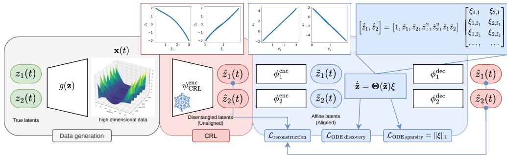  
Figure 1: SPEED-AE pipeline: we observe high-dimensional data from an invertible mapping ${ \bf x } ( t ) = g ( { \bf z } ( t ) )$ of the true latents ${ \bf z } ( t )$ . First, SPEED-AE employs a pretrained CRL model to obtain low-dimensional latents ${ \hat { \mathbf { z } } } ( t )$ (red block). We assume that the recovered latents correspond to the ground-truth z up to a permutation and component-wise diffeomorphism $z _ { i } = \hat { h } _ { i } ( \hat { z } _ { \pi ( i ) } )$ . For simplicity, in the figure we assume that the permutation is the identity function. SPEED-AE learns a set of component-wise autoencoders $( \phi _ { i } ^ { \mathrm { e n c } } , \phi _ { i } ^ { \mathrm { d e c } } )$ and an ODE by combining the functions in a library $\Theta ( \tilde { \mathbf { z } } )$ , imposing sparsity of this representation (blue block). The output latents $\tilde { \mathbf { z } } ( t )$ identify the ground-truth up to permutation and monomial and, in most cases, linear transformation.

In this work, we provide theoretical guarantees for identifying the true variables from unstructured data up to simple indeterminacies, on which we then learn ODE equations that correspond up to similar indeterminancies to the ground truth ones. We build on Causal Representation Learning (CRL) (Scholkopf et al., 2021) methods, which provide guarantees on identifying variables from¨ high-dimensional observations up to permutations and component-wise diffeomorphisms. We first show that the variables learned by CRL methods cannot in general be used directly as input to common equation discovery methods, e.g., SiNDy (Brunton et al., 2016), which typically assume that the variables will lead to sparse equations. To tackle this problem, we introduce SPEED-AE (SParse Equivalent Equation Discovery AutoEncoder) a framework that combines a pretrained CRL method with a component-wise autoencoder that learns transformations of variables that are amenable to sparse ODE discovery. Figure 1 shows our SPEED-AE works: the frozen CRL model, which identifies the latents up to permutation and component-wise diffeomorphism, is followed by a componentwise AE. In the resulting latent space, the ODE is built from a predefined library, with sparsity imposed to recover an equation close to the true one.

We also investigate the identifiability of these learned variables and their equations, showing that, in general, we cannot have any guarantees on their relation to the ground truth ones, even if we assume sparsity in the equations or disentangled representations. In Lemma 3.1 we show that for polynomial ODEs, considering sparsity in the learned equations allows us to restrict the identifiability of each variable from component-wise polynomial to monomial diffeomorphisms. Experiments on Lotka-Volterra, Lorenz, and a two-pendulum system show that SPEED-AE improves on the disentanglement of the CRL methods and that it recovers ODEs that are closest to the ground truth, while achieving state-of-the-art forecasting performance.

## 2 BACKGROUND

Ordinary Differential Equations (ODEs). Dynamical systems are commonly represented by ODEs (Strogatz, 2019), which model the evolution of their state z through an equation of the form

$$
\dot { { \bf z } } ( t ) = \frac { \mathrm { d } { \bf z } } { \mathrm { d } t } = { \cal f } ( { \bf z } ( t ) ) , \qquad { \bf z } ( 0 ) = { \bf z } _ { 0 } ,\tag{1}
$$

where $\mathbf { z } _ { 0 }$ is the initial state. We focus on autonomous ODEs, for which $f$ does not explicitly depend on $t ,$ so that ${ \dot { \mathbf { z } } } ( t )$ solely depends on the current state ${ \bf z } ( t )$ . If $f$ is Lipschitz continuous with respect to z, the ODE admits a unique solution. Here, we address the recovery of the underlying ODE of a low-dimensional system $\mathbf { \bar { z } } ( t ) \in \mathcal { Z } \subseteq \mathbb { R } ^ { d }$ having access only to high-dimensional trajectories of unstructured data $\mathbf { x } ( t ) = g ( \mathbf { z } ( t ) )$ with $\mathbf { \bar { x } } \in \mathcal { X } \subseteq \mathbb { R } ^ { D }$ and $D \gg d .$ , where $g : { \mathcal { Z } }  { \mathcal { X } }$ is an unknown invertible mixing function, as assumed in Causal Representation Learning (Scholkopf et al., 2021).¨

Equation Discovery. ODE discovery aims to recover the symbolic expression of a dynamical system from measurements of the state variables z along one or more trajectories. SINDy (Brunton et al., 2016) applies a library Θ of $L$ candidate functions, usually polynomials and some trigonometric functions, to the state variables z and seeks a sparse coefficient matrix Ξ by minimizing

$$
\mathcal { L } _ { \mathrm { S I N D y } } ( \Xi ) = \left. \dot { \mathbf { z } } - \Xi ^ { \top } \Theta ( \mathbf { z } ) \right. _ { 2 } ^ { 2 } + \beta _ { 1 } \left. \Xi \right. _ { 0 } .\tag{2}
$$

Here, $\Theta ( { \mathbf { z } } ) \in \mathbb { R } ^ { L }$ contains the candidate functions evaluated at $\mathbf { z } ,$ while $\Xi \in \mathbb { R } ^ { L \times d }$ selects them through its coefficients; the $L _ { 0 }$ term promotes sparsity. In practice, derivatives z˙ are unavailable and must be estimated from data, e.g. via finite differences. SINDyAE extends SINDy to recover ODEs on hidden state variables $\mathbf { z } \in \bar { \mathbb { R } } ^ { d }$ from high-dimensional observations $\mathbf { x } \in \mathbb { R } ^ { D }$ (Champion et al., 2019), jointly learning an encoder $\psi ^ { \mathrm { e n c } } \colon \mathbb { R } ^ { \breve { D } }  \mathbb { R } ^ { d }$ and a decoder $\psi ^ { \mathrm { d e c } } \colon \mathbb { R } ^ { d } \to \mathbb { R } ^ { \dot { D } }$ by minimizing

$$
\begin{array} { r l } & { \mathcal { L } _ { \mathrm { S I N D y A E } } ( \Xi , \psi ^ { \mathrm { e n c } } , \psi ^ { \mathrm { d e c } } ) = \underbrace { { \left\| { \bf x } - \psi ^ { \mathrm { d e c } } ( \psi ^ { \mathrm { e n c } } ( { \bf x } ) ) \right\} | _ { 2 } ^ { 2 } } _ { \mathrm { R e c o n s t u r c i o n ~ l o s s } } + \beta _ { \bf z } \underbrace { { \left\| { [ \nabla \psi ^ { \mathrm { e n c } } ( { \bf x } ) ] \dot { \bf x } } - \Xi ^ { \top } \Theta ( \psi ^ { \mathrm { e n c } } ( { \bf x } ) ) ] \right\| _ { 2 } ^ { 2 } } } _ { \mathrm { S I N D y l o s s i n } \dot { z } } } \\ & { \quad \quad \quad + \beta _ { \bf x } \underbrace { { { \left\| { \dot { \bf x } } - [ \nabla \psi ^ { \mathrm { d e c } } ( \psi ^ { \mathrm { e n c } } ( { \bf x } ) ) ] ] \Xi ^ { \top } \Theta ( \psi ^ { \mathrm { e n c } } ( { \bf x } ) ) \right\} | _ { 2 } ^ { 2 } } } _ { \mathrm { S I N D y l o s s i n } \dot { \bf z } } + \beta _ { \bf l } \underbrace { { { \left\| { \Xi } \right\| _ { 1 } } } } _ { \mathrm { s p a r s i t y } } . } \end{array}\tag{3}
$$

Here $[ \nabla \psi ^ { \mathrm { e n c } } ( \mathbf { x } ) ] \in \mathbb { R } ^ { d \times D }$ and $\left[ \nabla \psi ^ { \mathsf { d e c } } ( \psi ^ { \mathsf { e n c } } ( \mathbf { x } ) ) \right] \in \mathbb { R } ^ { D \times d }$ are the encoder and decoder Jacobians evaluated at x and $\psi ^ { \mathrm { e n c } } ( \mathbf { x } )$ , respectively; $\{ \beta _ { \mathbf { x } } , \beta _ { \mathbf { z } } , \beta _ { 1 } \}$ weigh the different loss terms. The $L _ { 1 }$ penalty, coupled with sequential thresholding, is used as a smooth proxy of the $L _ { 0 }$ optimization. Pervez et al. (2024) and Chen et al. (2024) propose a related approach that replaces derivative fitting by a Mechanistic Neural Network (MNN) that learns the coefficients Ξ and efficiently simulates trajectories. In our experiments, we compare to SINDyAE and MNNAE, which we further discuss in Appendix C.

Causal Representation Learning (CRL). CRL methods (Scholkopf et al., 2021) can provably¨ recover the ground truth latent variables $\mathbf { z } \in \mathbb { R } ^ { d }$ from observations $\bar { \mathbf { x } } \in \mathbb { R } ^ { D }$ up to certain specific classes of transformations, under different sets of assumptions or types of data. A CRL method typically learns a disentangled encoder $\psi ^ { \mathrm { e n c } } \colon \mathbb { R } ^ { D } \to \mathbb { R } ^ { d }$ where the latent space $\hat { \mathbf { z } } = \psi ^ { \mathrm { e n c } } ( \mathbf { x } )$ relates to the ground-truth variables z through a diffeomorphism $h \colon  { \mathbb { R } } ^ { d } \to  { \mathbb { R } } ^ { d }$ . We focus on methods guaranteeing identifiability up to permutation and component-wise diffeomorphisms, i.e., $z _ { i } = h _ { i } ( \bar { \hat { z } } _ { \pi ( i ) } )$ for each $i \in \{ 1 , \ldots , d \}$ and permutation π. This type of identifiability guarantee on the learned variables is often also called disentanglement. In our experiments, we consider methods that use temporal data and interventions or actions to identify these variables, in particular CITRIS (Lippe et al., 2022) and DMSVAE (Lachapelle et al., 2022; 2026), which we also discuss in App. D, but in general our method is agnostic to the specific CRL method with the same identifiability class.

## 3 IDENTIFIABILITY ANALYSIS FOR POLYNOMIAL ODES

We study the identifiability of systems governed by a latent ODE ${ \dot { \mathbf { z } } } = f ( \mathbf { z } )$ from high-dimensional observations $\mathbf { x } ( t ) = g ( \mathbf { z } ( t ) )$ , where g is an invertible mixing function. Given a smooth invertible encoder $\tilde { \mathbf { z } } = \psi ^ { \mathrm { e n c } } ( \mathbf { x } )$ , the map h from the latent space z˜ to the ground-truth variables z is a diffeomorphism. Consequently, as we derive in Prop. A.1, the encoded latent variables $\tilde { \mathbf { z } }$ are also governed by an ODE $\dot { \tilde { \mathbf { z } } } = \tilde { \pmb { f } } ( \tilde { \mathbf { z } } ) = [ \nabla h ( \tilde { \mathbf { z } } ) ] ^ { - 1 } \pmb { f } ( h ( \tilde { \mathbf { z } } ) )$ ). Formally, whenever the variables of the two ODEs are related by a diffeomorphism, we say that the two ODEs are conjugate (Sideris, 2013).

By jointly learning an autoencoder $\psi ^ { \mathrm { d e c } } \circ \psi ^ { \mathrm { e n c } }$ and an ODE $\tilde { \pmb f }$ over the latent space $\tilde { \mathbf { z } } = \psi ^ { \mathrm { e n c } } ( \mathbf { z } )$ SINDyAE (Champion et al., 2019) effectively recovers a diffeomorphically conjugate ODE. However, despite enforcing sparsity in ${ \tilde { f } } ,$ , SINDyAE does not provide any guarantee on the recovery of the form of the true ODE or the ground-truth variables. As we show in a toy example in App. A.2, even for polynomial ODEs, the SINDyAE loss cannot guarantee that the learned variables correspond one-to-one to the state variables. Intuitively, this suggests that the equations learned on these variables might in general be of a more complicated form than the ground truth ones.

CRL methods learn a disentangled representation zˆ that identifies the true latents z up to permutation π and component-wise diffeomorphism $z _ { i } = h _ { i } ( \hat { z } _ { \pi ( i ) } )$ . Yet, even if we used an equation discovery method, e.g., SINDy (Brunton et al., 2016), directly on these variables and the learned ODE ${ \hat { f } } ,$ this could potentially still have an arbitrary form. In particular, given the transformations $\{ h _ { i } \} _ { i = 1 } ^ { d }$ induced by a perfectly disentangled encoder $\psi _ { \mathrm { C R I } } ^ { \mathrm { e n c } }$ , we can always write a conjugate ODE as

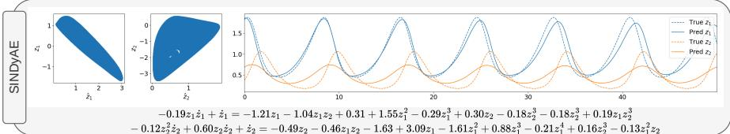

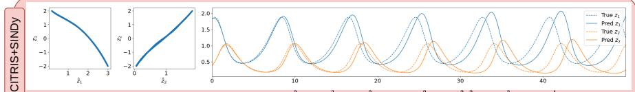

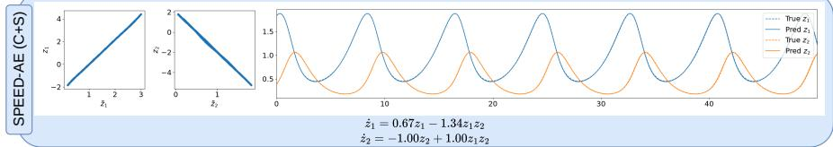  
Figure 2: Comparison between SINDyAE, SINDy applied to CRL latents (using CITRIS), and SPEED-AE (with CITRIS as CRL method and SINDy as equation discovery method) on the Lotka-Volterra dataset $( { \dot { z } } _ { 1 } = 0 . 6 6 z _ { 1 } - 1 . 3 3 z _ { 1 } z _ { 2 } , { \dot { z } } _ { 2 } = - z _ { 2 } + z _ { 1 } z _ { 2 } )$ . For each model, the left box reports scatter plots of the true versus learned latents. We then compare a test trajectory with the one predicted from only the initial condition and the discovered equation, after converting both to the true latent space, following the evaluation protocol in Section 6. SPEED-AE is the only method that recovers a sparse equation and achieves strong long-term prediction performance.

$$
\dot { \hat { z } } _ { \pi ( i ) } = \hat { f } _ { \pi ( i ) } ( \hat { \mathbf { z } } ) = [ h _ { i } ^ { \prime } ( \hat { z } _ { \pi ( i ) } ) ] ^ { - 1 } f _ { i } ( h _ { 1 } ( \hat { z } _ { \pi ( 1 ) } ) , \dots , h _ { d } ( \hat { z } _ { \pi ( d ) } ) ) \quad \mathrm { f o r ~ } i = 1 , \dots , d ,\tag{4}
$$

where $h _ { i } ^ { \prime } \big ( \hat { z } _ { \pi ( i ) } \big )$ are the the component-wise derivatives. Thus, even with perfect disentanglement, we cannot in general guarantee that the learned ODE will be similar to the ground truth one. We therefore restrict ourselves to polynomial ODEs and assume that these component-wise diffeomorphisms are polynomial. In particular, we show that if the learned representations are disentangled and governed by a sparse polynomial ODE, we can identify the true latents up to component-wise monomial transformations. For tractability reasons, we introduce two assumptions (see Ass. A.3): after the change of variables, powers of polynomials and their full expansion do not undergo cancellations of terms (as per our remarks in App. A.3, this happens rarely).

Lemma 3.1. Let ${ \dot { \mathbf { z } } } = f ( \mathbf { z } )$ and $\dot { \tilde { \mathbf { z } } } = \tilde { f } ( \tilde { \mathbf { z } } )$ be two polynomial ODEs such that for every $i \in [ d ]$ $z _ { i } = h _ { i } ( \tilde { z } _ { \pi ( i ) } )$ for an invertible polynomial $h _ { i }$ and permutation π. Let $q _ { i } ( z _ { i } )$ be the highest degree polynomial such that $f _ { i } ( { \bf z } ) = q _ { i } ( z _ { i } ) r _ { i } ( { \bf z } )$ , where $r _ { i } ( \mathbf { z } )$ is the remainder polynomial and $N ( r _ { i } )$ be the number ofmonomial terms in $r _ { i } ( \mathbf { z } )$ . Similarly, we define $\tilde { r } _ { \pi ( i ) } ( \tilde { \mathbf { z } } )$ and ${ \cal N } ( \tilde { r } _ { \pi ( i ) } ) f o r \tilde { f } _ { \pi ( i ) }$ . Under Ass. A.2 and A.3, $N ( \tilde { r } _ { \pi ( i ) } ) \geq N ( r _ { i } ) . \ I f N ( \tilde { r } _ { \pi ( i ) } ) = N ( r _ { i } )$ , then $h _ { i }$ is a monomial transformation, $i . e . , z _ { i } = h _ { i } ( \tilde { z } _ { \pi ( i ) } ) = a _ { i } \tilde { z } _ { \pi ( i ) } ^ { p _ { i } }$ with $p _ { i } \in \mathbb { N } ^ { + }$ . Moreover, $i f q _ { i }$ is constant, then $p _ { i } = 1$ , and $h _ { i }$ is affine.

The proof is in App. A.3. Intuitively, Theorem 3.1 states that for polynomial ODEs, if the learned variables $\tilde { \mathbf { z } }$ correspond to the ground truth ones z up to permutations and component-wise polynomial diffeomorphisms, and we learn $\tilde { f } ( \tilde { \mathbf { z } } )$ that is as sparse as possible $( \mathrm { i . e . }$ , the number of its active monomial terms is as low as possible, which is $N ( \tilde { r } _ { \pi ( i ) } ) = N ( r _ { i } ) )$ , then this will lead to componentwise transformations that are monomials. Although this result holds only for polynomial ODEs and polynomial diffeomorphisms, we conjecture that if a representation is informed by sparsity and the form of the governing ODE, it results in a simpler component-wise transformation than with a standard causal representation learning method. The intuition of learning transformations of variables that have sparse ODE equations is similar to SINDyAE (Champion et al., 2019), but we can now provide theoretical guarantees on the identifiability of the variables up to simple indeterminacies.

## 4 SPARSE EQUIVALENT EQUATION DISCOVERY AUTOENCODER

The analysis in Sec. 3 shows that learning sparse equations does not provide any guarantees on the learned variables, while disentanglement of the learned variables in general does not provide guarantees on the learned equations. Moreover, as shown in Fig. 2, the representations learned by CRL methods might not be amenable to equation discovery methods, leading to complicated equations that are far from the ground truth, even in simple cases, like polynomial ODEs. So we propose SParse Equivalent Equation Discovery AutoEncoder (SPEED-AE), which introduces an additional step after a pretrained CRL method: a component-wise autoencoder that learns a transformation of each CRL variable, such that these transformed variables have sparse ODE equations.

As a first step, SPEED-AE runs a CRL method to obtain latents $\hat { \textbf { z } } = \psi _ { \mathrm { C R L } } ^ { \mathrm { e n c } } ( \mathbf { x } )$ that we assume recover the true variables up to permutation and component-wise diffeomorphism $z _ { i } = \hat { h } _ { i } ( \hat { z } _ { \pi ( i ) } )$ Using these variables, it learns component-wise autoencoders $\tilde { z } _ { i } = \phi _ { i } ^ { \mathrm { e n c } } ( \hat { z } _ { i } )$ together with a sparse ODE over $\tilde { z } _ { i } .$ , via an equation discovery model. The component-wise autoencoders of SPEED-AE guarantee that the new latents z˜ are still disentangled with respect to the true variables z. Our model does not assume any latent ODE form. However, under the assumptions of Theorem 3.1, SPEED-AE identifies the true latents up to simple monomial transformations. SPEED-AE is agnostic about the CRL methods (as long as they guarantee identifiability up to permutation and component-wise diffeomorphisms) and about the equation discovery approaches.

$$
\mathcal { L } _ { \mathrm { S P E E D - A E } } = \sum _ { i = 1 } ^ { d } \left. \phi ^ { \mathrm { d e c } } \left( \phi ^ { \mathrm { e n c } } ( \hat { z } _ { i } ) \right) - \hat { z } _ { i } \right. _ { 2 } ^ { 2 } , + \mathcal { L } _ { \mathrm { O D E ~ d i s c o v e r y } } + \mathcal { L } _ { \mathrm { O D E ~ s p a r s i t y } } .\tag{5}
$$

For instance, we can use a SINDy-based loss representing the ODE as $\dot { \mathbf { z } } = \Xi ^ { \top } \Theta ( \tilde { \mathbf { z } } )$ , where $\Theta ( \tilde { \mathbf { z } } ) \in$ $\mathbb { R } ^ { L }$ is a library of L functions of z˜ weighted by coefficients $\Xi \in \mathbb { R } ^ { L \times d }$

$$
\mathcal { L } _ { \mathrm { O D E d i s c o v e r y } } = \beta _ { \mathbf { z } } \left. \left[ \nabla \phi ^ { \mathrm { e n c } } ( \hat { \mathbf { z } } ) \right] ( \dot { \hat { \mathbf { z } } } ) - \boldsymbol { \Xi } ^ { \top } \boldsymbol { \Theta } ( \tilde { \mathbf { z } } ) \right. _ { 2 } ^ { 2 } + \beta _ { \mathbf { x } } \left. \dot { \hat { \mathbf { z } } } - [ \nabla \phi ^ { \mathrm { d e c } } ( \tilde { \mathbf { z } } ) ] ( \boldsymbol { \Xi } ^ { \top } \boldsymbol { \Theta } ( \tilde { \mathbf { z } } ) ) \right. _ { 2 } ^ { 2 } .\tag{6}
$$

The same framework can instead use an MNN-based loss:

$$
\mathcal { L } _ { \mathrm { O D E d i s c o v e r y } } = \beta _ { \mathbf { z } } \left. \tilde { \mathbf { z } } - \mathbf { M N N } ( \tilde { \mathbf { z } } ( 0 ) ) \right. _ { 2 } ^ { 2 } + \beta _ { \mathbf { x } } \left. \hat { \mathbf { z } } - \phi ^ { \mathrm { d e c } } ( \mathbf { M N N } ( \phi ^ { \mathrm { e n c } } ( \hat { \mathbf { z } } ( 0 ) ) ) \right. _ { 2 } ^ { 2 } ,\tag{7}
$$

where $\mathbf { M N N } ( \tilde { \mathbf { z } } _ { 0 } )$ is the solution to the learned ODE $\dot { \tilde { \mathbf { z } } } = \Xi ^ { \top } \Theta ( \tilde { \mathbf { z } } )$ simulated by the MNN. In both variants, the second term, weighted by $\beta _ { { \bf x } } ,$ prevents collapse of z˜ by enforcing consistency between dynamics in z˜ and their push-forward $\hat { \mathbf { z } } ,$ similarly to Champion et al. (2019). For the sparsity loss, we follow Brunton et al. (2016); Champion et al. (2019); Chen et al. (2024) and use an $L _ { 1 }$ penalty with sequential thresholding as a proxy for the $L _ { 0 }$ norm. The penalty sparsifies $\Xi ,$ , while coefficients below the threshold are periodically set to 0. To reflect the setting of Sec. 3, we first implement the encoder $\phi ^ { \mathrm { e n c } }$ and decoder $\phi ^ { \mathrm { d e c } }$ as learnable polynomial functions. However, our results on simple synthetic experiments (App. G) are unsatisfactory, as these representations were not flexible enough during training. Hence, in our final model, we use MLPs for both $\phi ^ { \mathrm { e n c } }$ and $\phi ^ { \mathrm { d e c } }$ This is also justified empirically that the CRL methods we use only guarantee identifiability up to general diffeomorphism only. Thus, it is not enough to only consider polynomial transformations and the autoencoder has to represent a more general function. Implementation details are in App. B.

## 5 RELATED WORK

Equation discovery. Learning ODE systems from data has been extensively studied when we can observe the state variables directly, both from a theoretical (Scholl et al., 2024) and a practical point of view (Brunton et al., 2016; Kaheman et al., 2020; Chen et al., 2024). SINDY (Brunton et al., 2016), the principal sparse regression approach, considers a library of functions evaluated on the variables $\Theta ( \hat { \mathbf { z } } )$ (usually polynomials and some trigonometric functions) and learns the coefficients Ξ of a linear model that predicts the variables’ derivatives ˙zˆ from the linear combination of the functions in the library $\bar { \Xi } ^ { \top } \dot { \Theta } ( \hat { \mathbf { z } } )$ . With the implicit assumption that most dynamical systems in nature have a sparse representation, a sparsity regularization on ξ is employed to select the simplest model among all solutions. Mechanistic Neural Networks (MNNs, (Pervez et al., 2024; Chen et al., 2024)) are general approaches to model the evolution of dynamical systems by building an internal ODE representation. The mechanistic encoder maps the trajectory into the coefficients and other parameters of the ODE, whose solution is then calculated by solving an equivalent linear system efficiently. By using the state variables z directly as the internal ODE variables and matching the available trajectories, the MNN can be effectively used for equation discovery (Pervez et al., 2024) based on a library of basis functions. Finally, symbolic recovery approaches (Becker et al., 2023; D’Ascoli et al., 2022; 2024) treat variables and operation operators (such as addition, multiplication, exponential) as tokens in a transformer-based regression approach. Recent work on theoretical results for ODE identifiability focuses on linear or affine ODEs (Qiu et al., 2022; Duan et al., 2020), and on particular settings such as unobserved variables (Wang et al., 2024a), discrete observations (Wang et al., 2024c), or sparse coefficients Casolo et al. (2025). By contrast, theoretical identifiability in non-linear ODEs remains limited to known functional forms (Grewal & Glover, 1976; Stanhope et al., 2014) or single initial conditions (Yao et al., 2024).

Equation discovery on unstructured data. Few works address settings where variables are not directly observed, and only high-dimensional measurements (e.g., images or videos) are available. Existing approaches either learn equations on latent variables without guarantees that these variables correspond to the ground-truth (Champion et al., 2019; Auzina et al., 2023), or assume the underlying functional form of the ODE is known (Linial et al., 2021) and focus on parameter identification. The most related work to us, SindyAE (Champion et al., 2019) uses an autoencoder to learn representations of the state variables in the latent space, on which it then learns ODEs with Sparse Identification for Nonlinear Dynamics (SINDy) (Brunton et al., 2016). Similarly to us it encourages learning representations that can be used in sparse equations, but as opposed to us it does not provide any theoretical guarantee or analysis on the quality of the learned representations.

Causal Representation Learning. Causal Representation Learning (CRL) (Scholkopf et al.,¨ 2021) methods provably identify a latent representation zˆ that identifies the true latents z up to permutation and a component-wise transformation. CRL methods exploit multi-view and multienvironment settings (Kugelgen et al., 2021; Xu et al., 2024; Yao et al., 2023), interventional data¨ (Lippe et al., 2022; von Kugelgen et al., 2023; Ahuja et al., 2023; Squires et al., 2023), temporal¨ data and actions (Lippe et al., 2023; Lachapelle et al., 2022; 2026) or partially observable settings (Xu et al., 2024). While CRL methods focus on identifiability of state variables from unstructured data, they generally do not learn ODE systems, and do not leverage sparsity in the resulting equations to improve identifiability, as we do. Recently, Yao et al. (2024) identify time-invariant trajectory-specific parameters, but then assume that the state variables are directly observed and that the trajectories are generated from a single initial condition. In our work we do not assume neither of these assumptions, but we then assume that the parameters of the ODE we are learning are the same across all trajectories. These works are therefore complementary and could be potentially combined.

## 6 EXPERIMENTS

We evaluate SPEED-AE on different versions of three dynamical systems: Lotka-Volterra, Lorenz, and two pendulum dynamical systems, but instead of observing the state directly, we observe highdimensional measurements x, produced by an invertible mixing function on the true state variables z. We discuss in detail the data generation and model training in App. E, including the pretraining of the CRL models in each setting by considering a separate dataset of trajectories that also contains interventions on each variable $z _ { i }$ with probability $p = 0 . 0 1$

We consider two CRL approaches, CITRIS (Lippe et al., 2022) and DMSVAE (Lachapelle et al., 2022; 2026) and two ODE discovery approaches, SINDy (Brunton et al., 2016) and MNN (Pervez et al., 2024; Chen et al., 2024). We denote each combination as SPEED-AE(X+Y), where X indi cates the CRL method (C for CITRIS or D for DMSVAE), and Y indicates the equation discovery method (S for SINDy or M for MNN). We compare with the only two baselines that learn both the latents z˜ and the governing equations without additional information: SINDyAE Champion et al. (2019) and MNNAE, which combines the MNN with an AE, discussed in App. C. In the original SINDyAE, the true image derivatives x˙ are provided as input; we instead use empirical derivatives to better reflect realistic conditions. Moreover, we also compare, as an ablation, a direct combination of the CRL methods that we use with the equation discovery methods that we use.

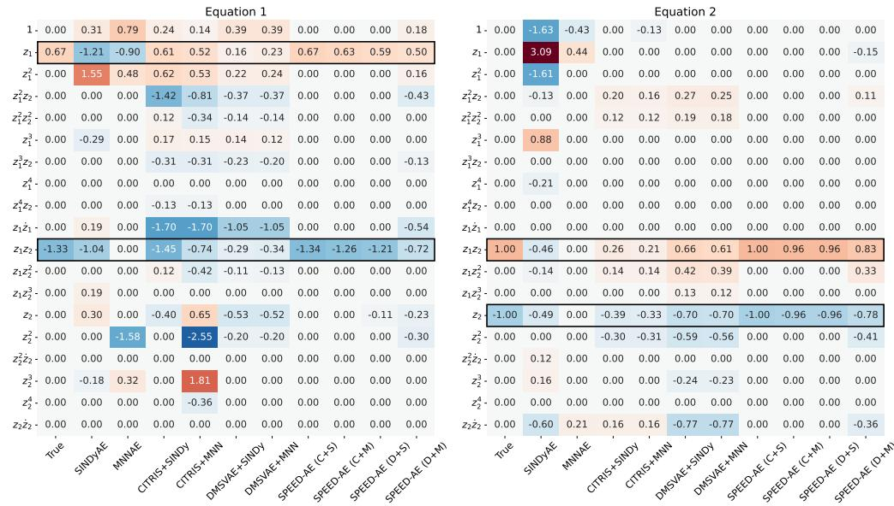  
Figure 3: Learned coefficients for Lotka-Volterra for each polynomial of the state variables (each row) and different methods (each column, where the last four are versions of SPEED-AE). The first column shows the ground truth coefficients and the black boxes highlight the non-zero coefficients.

We evaluate three different metrics: (a) correlation discrepancy between the ground truth and learned variables, (b) trajectory prediction, and (c) ODE recovery. We define the correlation discrepancy (CorrD) as the MAE between the Pearson correlation of the ground truth variables z and the cross-correlation matrix between the ground truth z and learned variables z˜, defined as $\begin{array} { r } { C o r r D = \frac { 1 } { d ^ { 2 } } \sum _ { i , j } ^ { d } \vert \rho ( { \bf z } _ { i } , \tilde { \bf z } _ { j } ) - \rho ( { \bf z } _ { i } , { \bf z } _ { j } ) \vert } \end{array}$ . We use this metric to evaluate the quality of disentanglement of the state variables, while allowing for dependences between each ground truth state variables. Intuitively, lower is better and $C o r r D = 0$ corresponds to perfect disentangelment. For trajectory prediction and ODE recovery, we have to first address a key challenge: after training, each model represents the system in its own latent space, which means that they are not directly comparable. To compare them, we therefore convert all of the learned representations to the same space, the space of true latents z. Here we summarize our evaluation and provide more details in App. F.

For trajectory prediction evaluation, we first learn a component-wise $\mathrm { M L P } \sigma _ { i }$ mapping each learned variable $\tilde { \mathbf { z } } _ { i }$ to the ground-truth variable $\mathbf { z } _ { \pi ( i ) }$ by choosing a permutation π that maximises their correlation. We then compute the latent prediction error zErr as the $L ^ { 2 }$ distance between the true trajectories ${ \bf z } ( t )$ and the predicted trajectories projected to the same space $\sigma ( \tilde { \mathbf { z } } ) ( t )$ , averaging over all timesteps t. We then compare the observation prediction error $\mathrm { \mathbf { x E r r } }$ , as the $L ^ { 2 }$ distance between the observations ${ \bf x } ( t )$ and predicted observations $\tilde { \mathbf { x } } ( t ) = \psi ^ { \mathrm { d e c } } ( \phi ^ { \mathrm { d e c } } ( \tilde { \mathbf { z } } ) ) ( t )$ , where $\phi ^ { \mathrm { d e c } }$ is the SPEED-AE decoder and $\psi ^ { \mathrm { d e c } }$ is the CRL decoder.

For ODE discovery, we first learn d component-wise polynomial maps $\tilde { z } _ { i } = \mathrm { P o l y } _ { i } ( z _ { i } )$ , then express the recovered ODEs $\dot { \tilde { \mathbf { z } } } = \tilde { f } ( \tilde { \mathbf { z } } )$ via a change of variable through the learned polynomial, as shown in Prop. A.1. We compare the resulting coefficients with those of the true ODE using the Sum of Absolute and Squared Errors (CoeffSAE and CoeffSSE). Since both the ODEs and the maps are polynomial, the converted ODE remains polynomial, although possibly implicit. In this case, the error increases due to the presence of terms such as $z _ { i } \dot { z _ { i } }$ , which are penalised. The best case is when the map is affine, $\tilde { z } _ { i } = a _ { i } z _ { i } + c _ { i }$ , which always leads to an explicit ODE and lower coefficient error. Since SINDyAE and MNNAE do not define an assignment between z˜ and z, we select the permutation with the best Mean Correlation Coefficient before learning the map.

App. G reports ablations on the CRL latents and SPEED-AE architecture. With perfect disentanglement, SPEED-AE achieves negligible errors in CorrD and ODE recovery. This indicates that performance from our models is only limited by the disentanglement of the CRL method. Our experiments with polynomial encoders and decoders show that, even with perfect disentanglement and the simplest diffeomorphisms between true and CRL latents, these maps are not flexible or stable enough during training to provide good results, motivating the choice of $\phi ^ { \mathrm { e n c } } , \phi ^ { \mathrm { d e c } }$ being MLPs.

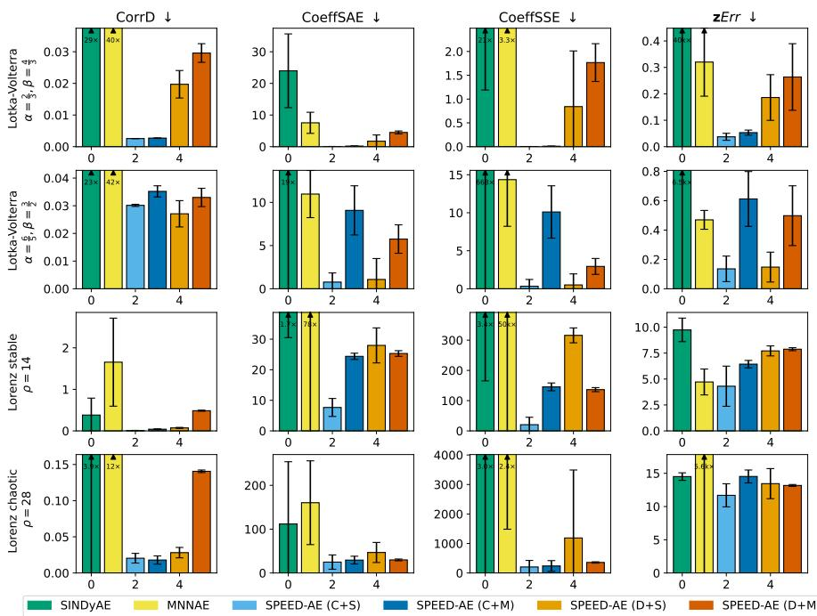  
Figure 4: Results for the Lotka-Volterra and Lorenz experiments with mean and standard deviation over 10 seeds. For all metrics, lower is better. We limit the height of the boxes for better readability, reporting the actual scales of the outlier results inside their bars.

## 6.1 LOTKA-VOLTERRA AND LORENZ WITH POLYNOMIAL LIBRARIES

We consider two systems with polynomial libraries of order 3: Lotka-Volterra and Lorenz. The Lotka-Volterra model (Strogatz, 2019) is a system of two first-order ODEs

$$
\dot { z } _ { 1 } = \alpha z _ { 1 } - \beta z _ { 1 } z _ { 2 } ,
$$

$$
\dot { z } _ { 2 } = - \gamma z _ { 2 } + \delta z _ { 1 } z _ { 2 } ,\tag{8}
$$

for prey $z _ { 1 }$ and predator $z _ { 2 }$ populations. We fix $\delta = \gamma = 1$ and consider two cases for $\alpha , \beta$ . In the first, we set $\alpha \stackrel { \textstyle - } { = } \frac { 2 } { 3 } , \beta = \frac { 4 } { 3 }$ and train the whole pipeline. In the second, we set $\begin{array} { r } { \alpha = \frac { 6 } { 5 } , \beta = \frac { 3 } { 2 } } \end{array}$ but use the same CRL models from the first case, i.e., we train only the component-wise autoencoders and the equation discovery components of SPEED-AE, while the baselines are trained from scratch. The objective is to show that SPEED-AE allows us to transfer learned disentangled representations to new dynamics without performance drops. We generate 120 trajectories of 5000 steps with $\Delta t =$ 0.01 and an $8 0 / 2 0 / 2 0$ split. The observation x is generated as in the Lorenz setting of Champion et al. (2019). On [−1, 1], we evaluate the first four Legendre polynomials on a grid of 128 points, obtaining ${ \pmb u } _ { 1 } , { \pmb u } _ { 2 } , \dot { \pmb u } _ { 3 } , { \pmb u } _ { 4 } ^ { - } \in \mathbb { R } ^ { 1 2 8 }$ , and define

$$
\begin{array} { r } { \mathbf { x } ( t ) = \mathbf { u } _ { 1 } z _ { 1 } ( t ) + \mathbf { u } _ { 2 } z _ { 2 } ( t ) + \mathbf { u } _ { 3 } z _ { 1 } ^ { 3 } ( t ) + \mathbf { u } _ { 4 } z _ { 2 } ^ { 3 } ( t ) \in \mathbb { R } ^ { 1 2 8 } . } \end{array}\tag{9}
$$

This map from $\mathbb { R } ^ { 2 }$ to its image in $\mathbb { R } ^ { 1 2 8 }$ is non-linear, smooth, and invertible on its image, since Legendre polynomials are a complete basis in [−1, 1] and are therefore linearly independent. The Lorenz system (Strogatz, 2019) is a system of three ODEs describing atmospheric convection:

$$
\dot { z } _ { 1 } = \sigma ( z _ { 2 } - z _ { 1 } ) , \quad \dot { z } _ { 2 } = z _ { 1 } ( \rho - z _ { 3 } ) - z _ { 2 } , \quad \dot { z } _ { 3 } = z _ { 1 } z _ { 2 } - \beta z _ { 3 } ,\tag{10}
$$

where $\sigma , \rho , \beta$ are physical fluid constants. We set $\textstyle \sigma = 1 0 , \beta = { \frac { 8 } { 3 } }$ , and consider $\rho = 1 4$ and $\rho = 2 8 .$ which produce stable and chaotic trajectories, respectively. Following Champion et al. (2019), we generate trajectories of 250 time steps with $\Delta t = 0 . 0 2$ . The observations are generated in the same way as Champion et al. (2019) and analogous to the Lotka-Volterra setup. With $3$ variables, we use 6 Legendre polynomials, obtaining a non-linear, smooth and map between $\mathbb { R } ^ { 3 }$ and $\mathbb { R } ^ { 1 2 8 }$

Table 1: Results for the Pendulum experiment for the model.
<table><tr><td>Model</td><td>CorrD</td><td>xErr</td><td>zErr</td><td>Recovered ODE</td></tr><tr><td rowspan="4">SINDyAE</td><td rowspan="4">0.431</td><td rowspan="4">18.888</td><td rowspan="4">1.621</td><td> $\ddot { z } _ { 1 } - 0 . 3 0 2 \ddot { z } _ { 1 } z _ { 1 } + 1 . 2 0 \ddot { z } _ { 1 } z _ { 1 } ^ { 2 } + 2 . 3 9 \ddot { z } _ { 1 } \dot { z } _ { 1 } z _ { 1 } =$ </td></tr><tr><td> $= - 0 . 3 2 + 0 . 7 5 z _ { 2 } - 0 . 4 3 z _ { 1 } + 0 . 1 7 z _ { 1 } ^ { 3 } + 0 . 0 6 z _ { 1 } ^ { 2 } + . . .$ </td></tr><tr><td> $\ddot { z } _ { 2 } + 0 . 0 1 \ddot { z } _ { 2 } z _ { 2 } + 0 . 0 3 \ddot { z } _ { 2 } z _ { 2 } ^ { 2 } + 0 . 0 5 \ddot { z } _ { 2 } \dot { z } _ { 2 } z _ { 2 } =$ </td></tr><tr><td> $= 0 . 0 3 + 0 . 1 8 z _ { 1 } - 0 . 0 7 z _ { 1 } ^ { 3 } - 0 . 0 3 z _ { 1 } ^ { 2 } + . . .$ </td></tr><tr><td rowspan="3">CITRIS+SINDy</td><td rowspan="3">0.020</td><td rowspan="3"></td><td rowspan="3"></td><td> $\ddot { z } _ { 1 } - 0 . 1 5 \dot { z } _ { 1 } ^ { 2 } + 0 . 1 5 \ddot { z } _ { 1 } z _ { 1 } + 0 . 0 2 \dot { z } _ { 1 } ^ { 2 } z _ { 1 } ^ { 2 } - 0 . 0 1 2 \dot { z } _ { 2 } ^ { 2 } z _ { 2 } ^ { 2 } + \dots =$ </td></tr><tr><td> $= 0 . 6 4 + 1 1 . 3 1 z _ { 1 } - 1 3 1 z _ { 1 } ^ { 2 } + \cos ( 0 . 1 4 \dot { z } _ { 1 } z _ { 1 } - 0 . 9 3 z _ { 1 } ) + . . .$ </td></tr><tr><td> $\Ddot { z } _ { 2 } - 0 . 1 6 \Ddot { z } _ { 2 } z _ { 2 } - 0 . 1 6 \dot { z } _ { 2 } ^ { 2 } + 0 . 3 2 \dot { z } _ { 2 } z _ { 2 } + . . . =$ </td></tr><tr><td rowspan="2">SPEED-AE (C+S)</td><td rowspan="2">0.004</td><td rowspan="2">6.155</td><td rowspan="2">0.177</td><td> $= 1 . 4 8 + 4 . 0 3 z _ { 2 } - 0 . 0 4 z _ { 2 } ^ { 2 } + \cos ( 0 . 1 4 z _ { 2 } \dot { z } _ { 2 } + 0 . 8 4 z _ { 2 } - 0 . 4 3 ) \dots$   $\ddot { z } _ { 1 } = - 0 . 2 7 z _ { 1 } - 0 . 6 1 \sin ( 1 . 0 5 z _ { 1 } )$ </td></tr><tr><td> $\ddot { z } _ { 2 } = - 0 . 2 7 z _ { 2 } - 0 . 6 1 \sin ( 1 . 0 7 z _ { 2 } )$ </td></tr></table>

Fig. 3 shows the learned coefficients for both equations of Lotka-Volterra for all of the evaluated methods. SPEED-AE recovers ODEs that after conversion, are closest to the ground truth, especially when using CITRIS, while the baselines recover more complicated equations with multiple unnecessary terms. In particular, the coefficients of the CRL methods used directly with the equation discovery methods (e.g., CITRIS + SINDy) perform worse than the corresponding versions of our framework (e.g., SPEED-AE $\left( \mathbf { C } + \mathbf { S } \right) )$ , showing the effectiveness of SPEED-AE and that disentanglement alone is insufficient The results for Lorenz are in App. H.2, showing similar trends.

Fig. 4 shows that for Lotka-Volterra all SPEED-AE variants beat the baselines by a large margin, except for MNNAE on zErr. However, MNNAE’s strong performance on forecasting comes at the cost of no identifiable latents. For Lorenz, the stable case $( \rho = 1 4 )$ , correlation and ODE recovery results (Figure 4) show that SPEED-AE outperforms both baselines. The slight performance drop of DMSVAE-based variants reflects a weaker disentanglement compared to CITRIS (see App. H.2). The strong forecasting results of MNNAE are again countered by poor correlation and ODE recovery. Under chaotic dynamics $( \rho = 2 8 )$ , SPEED-AE remains unmatched in ODE recovery. Forecasting results are similar to the stable case, except that MNNAE fails in more than one seed.

We report the results on the xErr metric in App. H, where we also compare with a Long Short-Term Memory (LSTM) (Hochreiter & Schmidhuber, 1997) and a Transformer (Vaswani et al., 2017), which learn to predict x directly. These models are effective on short trajectories, such as the Lorenz ones, but collapse on the longer ones from Lotka-Volterra, where recovering the underlying set of variables and ODEs yields stable long-horizon performance with errors up to 20 times lower.

## 6.2 PENDULUMS AND NON-POLYNOMIAL LIBRARIES

We test SPEED-AE on a second-order system and actual image data. We consider a system of two independent pendulums governed by $\ddot { z } _ { 1 } = - \sin ( z _ { 1 } )$ and $\ddot { z } _ { 2 } = - \sin ( z _ { 2 } )$ , similarly to Champion et al. (2019). Images have resolution 64 × 64 and separate channels for the two pendulums. We use a library that includes sin(z), as in SINDyAE, the main baseline for this experiment. Given their consistently strong performance, we only use CITRIS for CRL and SINDy for ODE discovery.

Tab. 1 shows that SPEED-AE reduces forecasting errors by a factor of 3 − 4 relative to SINDyAE, which fails to identify and disentangle the two pendulums, instead learning only one variable correlated with a pendulum (see App. H.3). The ODEs recovered by SPEED-AE are nearly identical to each other and to the the true ones, reflecting that the pendulums share the same dynamics. Although CITRIS+SINDy forecasts accurately, its equations are less simple and interpretable than those of SPEED-AE, providing empirical support for our discussion in Sec. 3 beyond the polynomial case.

## 7 CONCLUSION

We show that neither disentanglement nor sparsity alone is enough to simultaneously learn the true structural variables and their governing equations from high-dimensional data. We propose SPEED-AE, a pipeline that learns a componentwise transformation of disentangled variables from a any CRL model that is informed by sparsity of the learned equations given a library of functions. SPEED-AE achieves the best performance among baselines, especially in terms of correlation with the true latents and the recovered ODEs. While our methodology is general, as any CRL and ODE recovery methods can be plugged into our pipeline, one of our limitations it that the results depend on the performance of each step. In particular, a poor disentanglement can hinder the final performance, although SPEED-AE can drastically improve CRL results even in this case. Moreover, our theoret ical analysis is limited by the non-cancellation assumptions and polynomial diffeomorphisms. We believe the empirical and theoretical results of this work represent a step forward towards learning meaningful and transferable representations of dynamical systems from unstructured data and that these results can be further improved in future works by the community.

## REFERENCES

John Abbott. Sparse Squares of Polynomials. Mathematics of Computation, 71(237):407–413, 2002. ISSN 0025-5718.

Kartik Ahuja, Divyat Mahajan, Yixin Wang, and Yoshua Bengio. Interventional Causal Representation Learning. In Proceedings of the 40th International Conference on Machine Learning, pp. 372–407. PMLR, July 2023.

Ilze Amanda Auzina, Cagatay Yildiz, Sara Magliacane, Matthias Bethge, and Efstratios Gavves. Modulated Neural ODEs. In Thirty-Seventh Conference on Neural Information Processing Systems, November 2023.

Soren Becker, Michal Klein, Alexander Neitz, Giambattista Parascandolo, and Niki Kilbertus. Pre-¨ dicting Ordinary Differential Equations with Transformers. In Proceedings of the 40th International Conference on Machine Learning, pp. 1978–2002. PMLR, July 2023.

Steven L. Brunton, Joshua L. Proctor, and J. Nathan Kutz. Discovering governing equations from data by sparse identification of nonlinear dynamical systems. Proceedings of the National Academy of Sciences, 113(15):3932–3937, April 2016. doi: 10.1073/pnas.1517384113.

Cecilia Casolo, Soren Becker, and Niki Kilbertus. Identifiability Challenges in Sparse Linear Ordi-¨ nary Differential Equations. In The Fourteenth International Conference on Learning Representations, October 2025.

Kathleen Champion, Bethany Lusch, J. Nathan Kutz, and Steven L. Brunton. Data-driven discovery of coordinates and governing equations. Proceedings of the National Academy of Sciences, 116 (45):22445–22451, November 2019. doi: 10.1073/pnas.1906995116.

Jiale Chen, Dingling Yao, Adeel Pervez, Dan Alistarh, and Francesco Locatello. Scalable Mechanistic Neural Networks. In The Thirteenth International Conference on Learning Representations, October 2024.

Ricky T. Q. Chen, Yulia Rubanova, Jesse Bettencourt, and David K Duvenaud. Neural Ordinary Differential Equations. In Advances in Neural Information Processing Systems, volume 31. Curran Associates, Inc., 2018.

Don Coppersmith and James Davenport. Polynomials whose powers are sparse. Acta Arithmetica, 58(1):79–87, 1991. ISSN 0065-1036.

Stephane D’Ascoli, Pierre-Alexandre Kamienny, Guillaume Lample, and Francois Charton. Deep´ symbolic regression for recurrence prediction. In Proceedings of the 39th International Conference on Machine Learning, pp. 4520–4536. PMLR, June 2022.

Stephane D’Ascoli, S´ oren Becker, Philippe Schwaller, Alexander Mathis, and Niki Kilbertus. ODE-¨ Former: Symbolic Regression of Dynamical Systems with Transformers. International Conference on Learning Representations, 2024:21943–21976, May 2024.

Brian De Silva, Kathleen Champion, Markus Quade, Jean-Christophe Loiseau, J. Kutz, and Steven Brunton. PySINDy: A Python package for the sparse identification of nonlinear dynamical systems from data. Journal of Open Source Software, 5(49):2104, May 2020. ISSN 2475-9066. doi: 10.21105/joss.02104.

X Duan, J E Rubin, and D Swigon. Identification of affine dynamical systems from a single trajectory. Inverse Problems, 36(8):085004, August 2020. ISSN 0266-5611. doi: 10.1088/1361-6420/ ab958e.

Emilien Dupont, Arnaud Doucet, and Yee Whye Teh. Augmented Neural ODEs. In Advances in Neural Information Processing Systems, volume 32. Curran Associates, Inc., 2019.

M. Grewal and K. Glover. Identifiability of linear and nonlinear dynamical systems. IEEE Transactions on Automatic Control, 21(6):833–837, December 1976. ISSN 1558-2523. doi: 10.1109/TAC.1976.1101375.

Markus Heinonen, Cagatay Yildiz, Henrik Mannerstrom, Jukka Intosalmi, and Harri L ¨ ahdesm ¨ aki.¨ Learning unknown ODE models with Gaussian processes. In Proceedings of the 35th Interna tional Conference on Machine Learning, pp. 1959–1968. PMLR, July 2018.

Sepp Hochreiter and Jurgen Schmidhuber. Long Short-Term Memory. ¨ Neural Computation, 9(8): 1735–1780, November 1997. ISSN 0899-7667. doi: 10.1162/neco.1997.9.8.1735.

Kadierdan Kaheman, J. Nathan Kutz, and Steven L. Brunton. SINDy-PI: A robust algorithm for parallel implicit sparse identification of nonlinear dynamics. Proceedings of the Royal Society A: Mathematical, Physical and Engineering Sciences, 476(2242):20200279, October 2020. ISSN 1364-5021. doi: 10.1098/rspa.2020.0279.

Alan Kaptanoglu, Brian De Silva, Urban Fasel, Kadierdan Kaheman, Andy Goldschmidt, Jared Callaham, Charles Delahunt, Zachary Nicolaou, Kathleen Champion, Jean-Christophe Loiseau, J. Kutz, and Steven Brunton. PySINDy: A comprehensive Python package for robust sparse system identification. Journal of Open Source Software, 7(69):3994, January 2022. ISSN 2475- 9066. doi: 10.21105/joss.03994.

Diederik P. Kingma and Jimmy Ba. Adam: A Method for Stochastic Optimization, January 2017.

Julius Von Kugelgen, Yash Sharma, Luigi Gresele, Wieland Brendel, Bernhard Sch¨ olkopf, Michel¨ Besserve, and Francesco Locatello. Self-Supervised Learning with Data Augmentations Provably Isolates Content from Style. In Advances in Neural Information Processing Systems, November 2021.

Sebastien Lachapelle, Pau Rodriguez, Yash Sharma, Katie E. Everett, Remi LE Priol, Alexandre´ Lacoste, and Simon Lacoste-Julien. Disentanglement via Mechanism Sparsity Regularization: A New Principle for Nonlinear ICA. In Proceedings of the First Conference on Causal Learning and Reasoning, pp. 428–484. PMLR, June 2022.

Sebastien Lachapelle, Pau Rodr´ ´ıguez Lopez, Yash Sharma, Katie Everett, R´ emi Le Priol, Alexan-´ dre Lacoste, and Simon Lacoste-Julien. Nonparametric Partial Disentanglement via Mechanism Sparsity: Sparse Actions, Interventions and Sparse Temporal Dependencies. Journal ofMachine Learning Research, 27(71):1–90, 2026. ISSN 1533-7928.

Ori Linial, Neta Ravid, Danny Eytan, and Uri Shalit. Generative ODE Modeling with Known Unknowns. In Proceedings of the Conference on Health, Inference, and Learning, pp. 79–94, April 2021. doi: 10.1145/3450439.3451866.

Phillip Lippe, Sara Magliacane, Sindy Lowe, Yuki M. Asano, Taco Cohen, and Stratis Gavves.¨ CITRIS: Causal Identifiability from Temporal Intervened Sequences. In Proceedings of the 39th International Conference on Machine Learning, pp. 13557–13603. PMLR, June 2022.

Phillip Lippe, Sara Magliacane, Sindy Lowe, Yuki M. Asano, Taco Cohen, and Efstratios Gavves.¨ BISCUIT: Causal Representation Learning from Binary Interactions. In The 39th Conference on Uncertainty in Artificial Intelligence, June 2023.

Adeel Pervez, Francesco Locatello, and Stratis Gavves. Mechanistic Neural Networks for Scientific Machine Learning. In Proceedings of the 41st International Conference on Machine Learning, pp. 40484–40501. PMLR, July 2024.

Xing Qiu, Tao Xu, Babak Soltanalizadeh, and Hulin Wu. Identifiability analysis of linear ordinary differential equation systems with a single trajectory. Applied Mathematics and Computation, 430:127260, October 2022. ISSN 0096-3003. doi: 10.1016/j.amc.2022.127260.

Alfred R ´ enyi. On the Minimal Number of Terms of the Square of a Polynomial. ´ Hungarica Acta Mathematica, 1:30–34, 1947. ISSN 0001-5954.

Yulia Rubanova, Ricky T. Q. Chen, and David K Duvenaud. Latent Ordinary Differential Equations for Irregularly-Sampled Time Series. In Advances in Neural Information Processing Systems, volume 32. Curran Associates, Inc., 2019.

Andrzej Schinzel and Umberto Zannier. On the number of terms of a power of a polynomial. Rendiconti Lincei, 20(1):95–98, March 2009. ISSN 1120-6330. doi: 10.4171/rlm/534.

Bernhard Scholkopf, Francesco Locatello, Stefan Bauer, Nan Rosemary Ke, Nal Kalchbrenner,¨ Anirudh Goyal, and Yoshua Bengio. Toward Causal Representation Learning. Proceedings of the IEEE, 109(5):612–634, May 2021. ISSN 1558-2256. doi: 10.1109/JPROC.2021.3058954.

Philipp Scholl, Aras Bacho, Holger Boche, and Gitta Kutyniok. Symbolic Recovery of Differential Equations: The Identifiability Problem, October 2024.

Thomas C. Sideris. Ordinary Differential Equations and Dynamical Systems, volume 2 of Atlantis Studies in Differential Equations. Atlantis Press, Paris, 2013. ISBN 978-94-6239-020-1 978-94- 6239-021-8. doi: 10.2991/978-94-6239-021-8.

Chandler Squires, Anna Seigal, Salil S. Bhate, and Caroline Uhler. Linear Causal Disentanglement via Interventions. In Proceedings of the 40th International Conference on Machine Learning, pp. 32540–32560. PMLR, July 2023.

S. Stanhope, J. E. Rubin, and D. Swigon. Identifiability of Linear and Linear-in-Parameters Dynamical Systems from a Single Trajectory. SIAM Journal on Applied Dynamical Systems, 13(4): 1792–1815, January 2014. doi: 10.1137/130937913.

Steven Strogatz. Nonlinear Dynamics and Chaos: With Applications to Physics, Biology, Chemistry, and Engineering. A Chapman & Hall Book. CRC Press, Boca Raton London New York, second edition, first issued in hardback edition, 2019. ISBN 978-0-8133-4910-7 978-0-367-09206-1.

Ashish Vaswani, Noam Shazeer, Niki Parmar, Jakob Uszkoreit, Llion Jones, Aidan N Gomez, Ł ukasz Kaiser, and Illia Polosukhin. Attention is All you Need. In Advances in Neural Information Processing Systems, volume 30. Curran Associates, Inc., 2017.

Pauli Virtanen, Ralf Gommers, Travis E. Oliphant, Matt Haberland, Tyler Reddy, David Cournapeau, Evgeni Burovski, Pearu Peterson, Warren Weckesser, Jonathan Bright, Stefan J. Van´ Der Walt, Matthew Brett, Joshua Wilson, K. Jarrod Millman, Nikolay Mayorov, Andrew R. J. Nelson, Eric Jones, Robert Kern, Eric Larson, C J Carey, ˙Ilhan Polat, Yu Feng, Eric W. Moore, Jake VanderPlas, Denis Laxalde, Josef Perktold, Robert Cimrman, Ian Henriksen, E. A. Quintero, Charles R. Harris, Anne M. Archibald, Antonio H. Ribeiro, Fabian Pedregosa, Paul Van Mul-ˆ bregt, SciPy 1.0 Contributors, Aditya Vijaykumar, Alessandro Pietro Bardelli, Alex Rothberg, Andreas Hilboll, Andreas Kloeckner, Anthony Scopatz, Antony Lee, Ariel Rokem, C. Nathan Woods, Chad Fulton, Charles Masson, Christian Haggstr¨ om, Clark Fitzgerald, David A. Nichol-¨ son, David R. Hagen, Dmitrii V. Pasechnik, Emanuele Olivetti, Eric Martin, Eric Wieser, Fabrice Silva, Felix Lenders, Florian Wilhelm, G. Young, Gavin A. Price, Gert-Ludwig Ingold, Gregory E. Allen, Gregory R. Lee, Herve Audren, Irvin Probst, J´ org P. Dietrich, Jacob Sil-¨ terra, James T Webber, Janko Slavic, Joel Nothman, Johannes Buchner, Johannes Kulick, Jo-ˇ hannes L. Schonberger, Jos ¨ e Vin ´ ´ıcius De Miranda Cardoso, Joscha Reimer, Joseph Harrington, Juan Luis Cano Rodr´ıguez, Juan Nunez-Iglesias, Justin Kuczynski, Kevin Tritz, Martin Thoma, Matthew Newville, Matthias Kummerer, Maximilian Bolingbroke, Michael Tartre, Mikhail Pak,¨ Nathaniel J. Smith, Nikolai Nowaczyk, Nikolay Shebanov, Oleksandr Pavlyk, Per A. Brodtkorb, Perry Lee, Robert T. McGibbon, Roman Feldbauer, Sam Lewis, Sam Tygier, Scott Sievert, Sebastiano Vigna, Stefan Peterson, Surhud More, Tadeusz Pudlik, Takuya Oshima, Thomas J. Pingel, Thomas P. Robitaille, Thomas Spura, Thouis R. Jones, Tim Cera, Tim Leslie, Tiziano Zito, Tom

Krauss, Utkarsh Upadhyay, Yaroslav O. Halchenko, and Yoshiki Vazquez-Baeza. SciPy 1.0: Fun-´ damental algorithms for scientific computing in Python. Nature Methods, 17(3):261–272, March 2020. ISSN 1548-7091, 1548-7105. doi: 10.1038/s41592-019-0686-2.

Julius von Kugelgen, Michel Besserve, Wendong Liang, Luigi Gresele, Armin Keki¨ c, Elias Barein-´ boim, David Blei, and Bernhard Scholkopf. Nonparametric Identifiability of Causal Represen-¨ tations from Unknown Interventions. In Thirty-Seventh Conference on Neural Information Processing Systems, November 2023.

Yuanyuan Wang, Biwei Huang, Wei Huang, Xi Geng, and Mingming Gong. Identifiability Analysis of Linear ODE Systems with Hidden Confounders. Advances in Neural Information Processing Systems, 37:59054–59092, December 2024a.

Yuanyuan Wang, Wei Huang, Mingming Gong, Xi Geng, Tongliang Liu, Kun Zhang, and Dacheng Tao. Identifiability and Asymptotics in Learning Homogeneous Linear ODE Systems from Discrete Observations. Journal of Machine Learning Research, 25(154):1–50, 2024b. ISSN 1533- 7928.

Yuanyuan Wang, Wei Huang, Mingming Gong, Xi Geng, Tongliang Liu, Kun Zhang, and Dacheng Tao. Identifiability and Asymptotics in Learning Homogeneous Linear ODE Systems from Discrete Observations, June 2024c.

Danru Xu, Dingling Yao, Sebastien Lachapelle, Perouz Taslakian, Julius Von Kugelgen, Francesco¨ Locatello, and Sara Magliacane. A Sparsity Principle for Partially Observable Causal Representation Learning. In Proceedings of the 41st International Conference on Machine Learning, pp. 55389–55433. PMLR, July 2024.

Dingling Yao, Danru Xu, Sebastien Lachapelle, Sara Magliacane, Perouz Taslakian, Georg Martius, Julius von Kugelgen, and Francesco Locatello. Multi-View Causal Representation Learning ¨ with Partial Observability. In The Twelfth International Conference on Learning Representations, October 2023.

Dingling Yao, Caroline Muller, and Francesco Locatello. Marrying Causal Representation Learning with Dynamical Systems for Science. Advances in Neural Information Processing Systems, 37: 71705–71736, December 2024.

Umberto Zannier. On composite lacunary polynomials and the proof of a conjecture of Schinzel. Inventiones mathematicae, 174(1):127–138, October 2008. ISSN 1432-1297. doi: 10.1007/ s00222-008-0136-8.

## A PROOFS OF THE THEORETICAL STATEMENTS AND DISCUSSION

In this Section, we provide proofs of the theoretical statements and discuss the limits and challenges of the problems in Section 3.

## A.1 PRELIMINARIES

First, we report a simple proposition that shows that for any $\mathrm { O D E } \dot { \mathbf { z } } = f ( \mathbf { z } )$ defined on z and any diffeomorphism h that maps z˜ to z, we can define a conjugated ODE with the change of variable formula. Intuitively this means that learning an ODE on our learned variables z˜ does not provide any constraints in terms of the class of functions h.

Proposition A.1 (Change of Variable). Consider an ODE ${ \dot { \mathbf { z } } } = f ( \mathbf { z } )$ defined on z, and let h be a diffeomorphism that maps a different set ofvariables z˜ to ${ \bf z } = h ( \tilde { \bf z } )$ . Then, given a solution ${ \bf z } ( t )$ with initial condition $\mathbf { z } _ { 0 } ,$ , the transformed trajectory $\tilde { \mathbf { z } } = h ^ { - 1 } ( \mathbf { z } )$ solves thefollowing Cauchy problem:

$$
\dot { \tilde { \mathbf { z } } } = [ \nabla h ( \tilde { \mathbf { z } } ) ] ^ { - 1 } \pmb { f } ( h ( \tilde { \mathbf { z } } ) ) \qquad \hat { \mathbf { z } } ( 0 ) = h ^ { - 1 } ( \mathbf { z } _ { 0 } )\tag{11}
$$

Proof. It is sufficient to consider the time derivative of ${ \bf z } = h ( \tilde { \bf z } )$ and apply the chain rule on the right-hand side, obtaining

$$
\dot { \mathbf { z } } = [ \nabla h ( \tilde { \mathbf { z } } ) ] \dot { \tilde { \mathbf { z } } } .\tag{12}
$$

Then, we can substitute the ODE for z on the left-hand side, obtaining

$$
f ( \mathbf { z } ) = [ \nabla h ( \tilde { \mathbf { z } } ) ] \dot { \tilde { \mathbf { z } } } .\tag{13}
$$

Finally, we substitute ${ \bf z } = h ( \tilde { \bf z } )$ :

$$
[ \nabla h ( \tilde { \mathbf { z } } ) ] \dot { \tilde { \mathbf { z } } } = f ( h ( \tilde { \mathbf { z } } ) ) .\tag{14}
$$

Since h is a diffeomorphism, $[ \nabla h ( \tilde { \mathbf { z } } ) ]$ is invertible everywhere and thus $\dot { \tilde { \mathbf { z } } } = [ \nabla h ( \tilde { \mathbf { z } } ) ] ^ { - 1 } f ( h ( \tilde { \mathbf { z } } ) )$ .

## A.2 SINDYAE LOSS CANNOT GUARANTEE DISENTANGLEMENT FOR POLYNOMIAL ODES

We show that following two polynomial ODEs are equivalent in terms of the SINDyAE loss, since they are related by a diffeomorphism and have the same number of terms

$$
{ \pmb f } ( { \bf z } ) = \left( \begin{array} { c } { { - z _ { 2 } + z _ { 1 } ^ { 3 } + z _ { 1 } z _ { 2 } ^ { 2 } } } \\ { { z _ { 1 } + z _ { 1 } ^ { 2 } z _ { 2 } + z _ { 2 } ^ { 3 } } } \end{array} \right) \qquad { \tilde { \pmb f } } ( { \tilde { \bf z } } ) = \left( \begin{array} { c } { { { \tilde { z } } _ { 2 } + 2 \tilde { z } _ { 1 } ^ { 3 } + 2 \tilde { z } _ { 1 } \tilde { z } _ { 2 } ^ { 2 } } } \\ { { - { \tilde { z } } _ { 1 } + 2 \tilde { z } _ { 1 } ^ { 2 } \tilde { z } _ { 2 } + 2 \tilde { z } _ { 2 } ^ { 3 } , } } \end{array} \right)\tag{15}
$$

although their representations are not disentangled (as we see below).

Let $A = { \binom { 1 } { 1 } } \quad { \begin{array} { r l } { 1 } \\ { 1 } & { - 1 } \end{array} } { \bmod {array} } { \bmod { \bmod { \varepsilon } } }$ , consider the diffeomorphism

$$
{ \bf z } = h ( { \tilde { \bf z } } ) = A { \tilde { \bf z } } = \left( { \tilde { z } } _ { 1 } + { \tilde { z } } _ { 2 } , { \tilde { z } } _ { 1 } - { \tilde { z } } _ { 2 } \right) .
$$

Since $h$ is a linear transformation, it holds $\nabla h ( \tilde { \mathbf { z } } ) = A$ for every $\tilde { \mathbf { z } } .$ Furthermore, since $\begin{array} { r } { A ^ { - 1 } = \frac { 1 } { 2 } A . } \end{array}$ we can also compute $[ \nabla h ( \tilde { z } ) ] ^ { - 1 } = \textstyle { \frac { 1 } { 2 } } A$ . We rewrite slightly the original polynomial ODE as

$$
\pmb { f } ( \mathbf { z } ) = \left( \begin{array} { r } { - z _ { 2 } + z _ { 1 } ^ { 3 } + z _ { 1 } z _ { 2 } ^ { 2 } } \\ { z _ { 1 } + z _ { 1 } ^ { 2 } z _ { 2 } + z _ { 2 } ^ { 3 } } \end{array} \right) = J \mathbf { z } + | \mathbf { z } | ^ { 2 } \mathbf { z } ,
$$

using matrix $J = \left( \begin{array} { c c } { 0 } & { - 1 } \\ { 1 } & { 0 } \end{array} \right)$ and notation $| \mathbf { z } | ^ { 2 } = z _ { 1 } ^ { 2 } + z _ { 2 } ^ { 2 }$

We can write the conjugate ODE, using the change of variable form from Theorem A.1, as

$$
\pmb { \tilde { f } } ( \tilde { \mathbf { z } } ) = [ \nabla h ( \tilde { z } ) ] ^ { - 1 } \pmb { f } ( h ( \tilde { z } ) )
$$

$$
= { \frac { 1 } { 2 } } A \left( J A { \tilde { \mathbf { z } } } + | A { \tilde { \mathbf { z } } } | ^ { 2 } A { \tilde { \mathbf { z } } } \right)\tag{16}
$$

(17)

$$
= { \frac { 1 } { 2 } } A J A { \tilde { \mathbf { z } } } + { \frac { 1 } { 2 } } A | A { \tilde { \mathbf { z } } } | ^ { 2 } A { \tilde { \mathbf { z } } }\tag{18}
$$

$$
= - J { \tilde { \bf z } } + \frac { 1 } { 2 } A | A { \tilde { \bf z } } | ^ { 2 } A { \tilde { \bf z } }\tag{19}
$$

$$
= - J { \tilde { \mathbf { z } } } + { \frac { 1 } { 2 } } A 2 | { \tilde { \mathbf { z } } } | ^ { 2 } A { \tilde { \mathbf { z } } }\tag{20}
$$

$$
= - J \tilde { \mathbf { z } } + | \tilde { \mathbf { z } } | ^ { 2 } A A \tilde { \mathbf { z } }\tag{21}
$$

$$
= - J \tilde { \mathbf { z } } + | \tilde { \mathbf { z } } | ^ { 2 } 2 I \tilde { \mathbf { z } }\tag{22}
$$

$$
= - J \tilde { \mathbf { z } } + 2 | \tilde { \mathbf { z } } | ^ { 2 } \tilde { \mathbf { z } }\tag{23}
$$

$$
= \binom { \tilde { z } _ { 2 } + 2 \tilde { z } _ { 1 } ^ { 3 } + 2 \tilde { z } _ { 1 } \tilde { z } _ { 2 } ^ { 2 } } { - \tilde { z } _ { 1 } + 2 \tilde { z } _ { 1 } ^ { 2 } \tilde { z } _ { 2 } + 2 \tilde { z } _ { 2 } ^ { 3 } . }\tag{24}
$$

In particular, even if both ODE systems are polynomial and each component of $h$ is a polynomial function, the SINDy loss cannot guarantee on its own that the learned variables z˜ are disentangled, i.e., they correspond to the ground truth variables z up to permutation π and component-wise transformations $h _ { i }$ that only depend on a single $z _ { \pi ( i ) }$ . This suggests that the learned equations on these variables might in general be more complicated than the ground truth ones.

## A.3 IDENTIFIABILITY OF LATENT VARIABLES AND ODE

Before proceeding to the proof of the main result, we pose the following assumptions on the polynomial functions involved in our problem.

Assumption A.2 (No cancellations in Powers of Polynomials). Let $\begin{array} { r } { h _ { i } ( \tilde { z } _ { \pi ( i ) } ) = \sum _ { k \le p } \beta _ { k } \tilde { z } _ { \pi ( i ) } ^ { k } } \end{array}$ be any of the component-wise polynomial diffeomorphisms that we consider, with degree $p .$ Then, the symbolic representation of $\bar { h _ { i } } ( \tilde { z } _ { \pi ( i ) } ) ^ { \ell }$ has the maximum possible number of terms, i.e., no terms cancel out.

Consider the square of a generic polynomial of degree $d = 2 \colon ( 1 + \beta _ { 1 } z + \beta _ { 2 } z ^ { 2 } ) ^ { 2 }$ , which expands to

$$
1 + 2 \beta _ { 1 } z + ( \beta _ { 1 } ^ { 2 } + 2 \beta _ { 2 } ) z ^ { 2 } + 2 \beta _ { 1 } \beta _ { 2 } z ^ { 3 } + \beta _ { 2 } ^ { 2 } z ^ { 4 } .
$$

Then, under assumption A.2, all the monomials appearing in the expansion must have a non-zero coefficient. In other terms, it implies that $\beta _ { 1 } \neq 0 , \mathsf { \beta _ { 2 } \neq 0 }$ , and $\beta _ { 1 } ^ { 2 } ^ { * } + 2 \beta _ { 2 } \neq 0$ . This assumption does not say that in every possible polynomial power, every possible term $z ^ { k }$ with degree between 0 and $p \ell$ has a non-zero coefficient. For example, $( 1 + \dot { \beta _ { 2 } } \dot { z } ^ { 2 } + \beta _ { 4 } z ^ { 4 } ) ^ { 2 }$ expands to a polynomial containing only only even powers of z. Here, Assumption $\mathrm { A } . 2$ indicates that all even exponents appear. We remark that this assumption is not restrictive since, if we assume that the coefficients of $\bar { P ( z ) }$ are chosen at random in some interval, having cancellations has zero probability. Finally, we remark that powers of polynomials are an active research topic in algebra (Zannier, 2008; Schinzel & Zannier, 2009). Without assumptions, no bounds on the number of terms in a power of a polynomial would be helpful for our theoretical analysis. In particular, by accurately selecting the coefficients of $P ( z )$ , one can even find cases where $P \dot { ( } z \mathbf { ) } ^ { \ell }$ has fewer terms than $P ( z )$ (Renyi, 1947; Coppersmith´ & Davenport, 1991; Abbott, 2002).

Assumption A.3 (Variable changes do not annihilate terms). Consider component-wise polynomial maps $z _ { i } = h ( \tilde { z } _ { \pi ( i ) } )$ ). In the context of Theorem 3.1, with $f _ { i } ( z _ { i } ) = q _ { i } ( z _ { i } ) r _ { i } ( \mathbf { z } )$ , when performing the variable change on the system of ODEs, obtaining a new system of equations

$$
\dot { \tilde { z } } _ { \pi ( i ) } = \frac { q _ { i } ( h _ { i } ( \tilde { z } _ { \pi ( i ) } ) ) } { h _ { i } ^ { \prime } ( \tilde { z } _ { \pi ( i ) } ) } r _ { i } ( h _ { 1 } ( \tilde { z } _ { \pi ( 1 ) } ) , \dots , h _ { d } ( \tilde { z } _ { \pi ( d ) } ) ) ,\tag{25}
$$

all monomial terms that appear in the symbolic expansion of $r _ { i } ( h ( \tilde { \mathbf { z } } _ { \pi ( i ) } ) )$ have non-zero coefficients.

Similar remarks apply to Assumption A.3, where cancellation of terms in the expansion of $r _ { i } ( h ( \mathbf { z } ) )$ requires specific conditions on the coefficients of $r _ { i }$ and $h _ { j }$ , which have measure zero when the coefficients are sampled randomly. For instance, the ODE $f ( z ) = z + z ^ { 2 } - z ^ { 3 }$ can be decomposed as $f ( z ) = q ( z ) r ( z )$ where $q ( z ) = z$ and $r ( z ) = 1 + z - z ^ { 2 }$ . The diffeomorphism $h ( \tilde { z } ) = \bar { \tilde { z } } + \alpha$ produces the conjugate ODE $\dot { \tilde { z } } = \left( { \alpha } + { \alpha } ^ { 2 } - { \alpha } ^ { 3 } \right) + \left( 1 + 2 { \alpha } - 3 { \alpha } ^ { 2 } \right) \tilde { z } + \left( 1 - 3 { \alpha } \right) { \tilde { z } } ^ { 2 } - { \tilde { z } } ^ { 3 }$ , which in turn factorizes as $[ h ^ { \prime } ( \tilde { z } ) ] ^ { - 1 } q ( h ( \tilde { z } ) ) h ^ { \prime } ( \tilde { z } ) r ( h ( \tilde { z } ) )$ , where

$$
q ( h ( \tilde { z } ) ) = \tilde { z } + \alpha\tag{26}
$$

$$
h ^ { \prime } ( \tilde { z } ) = 1\tag{27}
$$

$$
r ( h ( \tilde { z } ) ) = \left( 1 + \alpha - \alpha ^ { 2 } \right) + \left( 1 - 2 \alpha \right) \tilde { z } - \tilde { z } ^ { 2 } .\tag{28}
$$

Hence, satisfying Assumption A.3 requires that $1 + \alpha - \alpha ^ { 2 } \neq 0$ and $1 - 2 \alpha \neq 0$

Then, before proving our main result, we introduce a technical lemma, which sets a lower bound on the number of terms in the symbolic representation of a power of a polynomial.

Lemma A.4 (Number of terms in a polynomial power). Let $P ( z )$ be a polynomial with degree p, $\begin{array} { r } { P ( z ) = \sum _ { j \leq p } \beta _ { j } z ^ { j } } \end{array}$ and let n be the number of non-zero coefficients. Then, assuming that no cancellations happen (Assumption A.2), the number ofterms in $P ( z ) ^ { \ell }$ is at least $1 + ( n - 1 ) \ell .$

Proof. We assume that the polynomial $P ( z )$ has a non-zero constant term $\beta _ { 0 }$ . If not, it is sufficient to factor out the smallest power of z and work with the remaining polynomial, which has the same number of terms. Therefore, we prove the statement by induction on the power ℓ:

• Base case. $\ell = 1$ . The statement holds as the polynomial has $1 + ( n - 1 ) \ell = n$ terms.

• Inductive step $\ell \implies \ell + 1$ . Consider the ℓ + 1-th power as the following product:

$$
P ( z ) ^ { \ell + 1 } = P ( z ) ^ { \ell } P ( z ) = \left( \sum _ { j \le \ell p } \gamma _ { j } z ^ { j } \right) ( \beta _ { 0 } + \dots \beta _ { p } z ^ { p } ) ,\tag{29}
$$

where the first parentheses is the result of expanding $P ( z ) ^ { \ell }$ . We now expand this product by considering two particular terms: one given by the highest-degree term of $\beta _ { p } z ^ { p }$ of $P ( z )$ multiplied by $P ( z ) ^ { \ell }$ and the other given by the remainder of the difference $P ( z ) - \beta _ { p } z ^ { p }$ multiplied by γ0:

$$
\begin{array} { l } { { \displaystyle P ( z ) ^ { \ell + 1 } = \left( \sum _ { j \le \ell p } \gamma _ { j } z ^ { j } \right) ( \beta _ { 0 } + \dots \beta _ { p } z ^ { p } ) } } \\ { { \displaystyle \qquad = \beta _ { p } z ^ { p } \left( \sum _ { j \le \ell p } \gamma _ { j } z ^ { j } \right) + \gamma _ { 0 } \left( \beta _ { 0 } + \dots \beta _ { p - 1 } z ^ { p - 1 } \right) + Q ( z ) , } } \end{array}\tag{30}
$$

where $Q ( z )$ is the remainder of terms. The first term of this sum involves only terms with degree at least $p$ and has the same number of terms as $P ( z ) ^ { \ell }$ , which, by inductive hypothesis, is at least $1 + ( n - 1 ) \ell$ . The second term, instead, has one fewer term than $P ( z )$ and maximum degree $p - 1$ . Assuming no cancellations (Assumption A.2), the number of terms in equation 30 is at least the sum of the number of terms in its two terms. Hence, $P ( z ) ^ { \ell + 1 }$ has at least $1 + ( n - 1 ) \ell + ( n - 1 ) = 1 + ( n - 1 ) ( l + 1 )$ terms as wanted.

In the following, we denote monomials through multi-indexes $\ell \in \mathbb { N } ^ { d }$ with degree $\begin{array} { r } { | \ell | = \sum _ { i = 1 } ^ { d } \ell _ { i } } \end{array}$ Therefore, we indicate multi-powers of vectors as $\mathbf { z } ^ { \ell } = z _ { 1 } ^ { \ell _ { 1 } } \cdot \cdot \cdot z _ { d } ^ { \ell _ { d } }$ . We are now ready to prove our main result, which we restate here.

Lemma A.5. Let ${ \dot { \mathbf { z } } } = f ( \mathbf { z } )$ and $\dot { \tilde { \mathbf { z } } } = \tilde { f } ( \tilde { \mathbf { z } } )$ be two polynomial ODEs such that for every $i \in [ d ]$ $z _ { i } = h _ { i } ( \tilde { z } _ { \pi ( i ) } )$ for an invertible polynomial $h _ { i }$ and permutation π. Let $q _ { i } ( z _ { i } )$ be the highest degree polynomial such that $f _ { i } ( { \bf z } ) = q _ { i } ( z _ { i } ) r _ { i } ( { \bf z } )$ , where $r _ { i } ( \mathbf { z } )$ is the remainder polynomial and $N ( r _ { i } )$ be the number ofmonomial terms in $r _ { i } ( \mathbf { z } )$ . Similarly, we define $\tilde { r } _ { \pi ( i ) } ( \tilde { \mathbf { z } } )$ and ${ \cal N } \big ( \tilde { r } _ { \pi ( i ) } \big )$ for $\tilde { f } _ { \pi ( i ) }$ . Under Ass. A.2 and A.3, $N ( \tilde { r } _ { \pi ( i ) } ) \geq N ( r _ { i } )$ $I f N ( \tilde { r } _ { \pi ( i ) } ) = N ( r _ { i } )$ , then $h _ { i }$ is a monomial transformation, $i . e . , z _ { i } = h _ { i } ( \tilde { z } _ { \pi ( i ) } ) = a _ { i } \tilde { z } _ { \pi ( i ) } ^ { p _ { i } }$ with $p _ { i } \in \mathbb { N } ^ { + }$ . Moreover, $i f q _ { i }$ is constant, then $p _ { i } = 1$ , and $h _ { i }$ is affine.

Proof. We start from the implicit version of the transformed ODE (Prop. A.1) for a generic index i:

$$
[ h _ { i } ^ { \prime } ( \tilde { z } _ { \pi ( i ) } ) ] \dot { \tilde { z } } _ { \pi ( i ) } = f _ { i } ( h _ { 1 } ( \tilde { z } _ { \pi ( 1 ) } ) , \dots , h _ { d } ( \tilde { z } _ { \pi ( d ) } ) ) .\tag{31}
$$

For the new ODE to be polynomial, it is necessary that

$$
\dot { \tilde { z } } _ { \pi ( i ) } = \tilde { f } _ { i } ( \tilde { \mathbf { z } } ) = \frac { f _ { i } ( h _ { 1 } ( \tilde { z } _ { \pi ( 1 ) } ) , \dots , h _ { d } ( \tilde { z } _ { \pi ( d ) } ) ) } { h _ { i } ^ { \prime } ( \tilde { z } _ { \pi ( i ) } ) }\tag{32}
$$

is a polynomial and, thus, that $f _ { i } \big ( h _ { 1 } \big ( \tilde { z } _ { \pi ( 1 ) } \big ) , \dots , h _ { d } \big ( \tilde { z } _ { \pi ( d ) } \big ) \big )$ is divisible by $h _ { i } ^ { \prime } \big ( \tilde { z } _ { \pi ( i ) } \big )$ . Most importantly, if $h _ { i } ^ { \prime } ( \zeta ) = 0$ for some $\zeta \in \mathbb { R } , \mathrm { i . e . , } \zeta$ is a root of $h _ { i } ^ { \prime } ( \tilde { z } _ { \pi ( i ) } )$ , we must have that

$$
f _ { i } ( h _ { 1 } ( \tilde { z } _ { \pi ( 1 ) } ) , \ldots , h _ { i } ( \zeta ) , \ldots , h _ { d } ( \tilde { z } _ { \pi ( d ) } ) ) = 0\tag{33}
$$

for every value of the other $\tilde { z } _ { j } ,$ as otherwise $\tilde { f } _ { i }$ would not be a polynomial. Thus, $h _ { i } ( \zeta )$ always annihilates $f _ { i } ( \mathbf { z } )$ , and $z _ { i } - h _ { i } ( \zeta )$ must divide $f _ { i }$

We now consider the decomposition $f _ { i } ( { \bf z } ) = q _ { i } ( z _ { i } ) r _ { i } ( { \bf z } )$ where $q _ { i } ( z _ { i } )$ has the highest degree. In this composition, it must be that $z _ { i } - h _ { i } ( \zeta )$ does not divide $r _ { i } ( \mathbf { z } )$ , as otherwise we could write $f _ { i } ( \mathbf { z } ) = \overset { \_ } { q } _ { i } ( z _ { i } ) ( z _ { i } - h _ { i } ( \zeta ) ) r _ { i } ^ { \prime } ( \mathbf { z } )$ and $q _ { i }$ would not have the highest degree possible. Thus, we must have $h _ { i } ^ { \prime } ( \tilde { z } _ { \pi ( i ) } ) | q _ { i } ( h _ { i } ( \tilde { z } _ { \pi ( i ) } ) )$ and

$$
\tilde { f } ( \tilde { \mathbf { z } } ) = \frac { q _ { i } ( h _ { i } ( \tilde { z } _ { \pi ( i ) } ) ) } { h _ { i } ^ { \prime } ( \tilde { z } _ { \pi ( i ) } ) } r _ { i } ( h ( \tilde { \mathbf { z } } _ { \pi } ) )\tag{34}
$$

and, for $\tilde { f }$ to be a polynomial, $h _ { i } ^ { \prime } \big ( \tilde { z } _ { \pi ( i ) } \big )$ must divide $q _ { i } \big ( h _ { i } \big ( \tilde { z } _ { \pi ( i ) } \big ) \big )$ , leaving $r _ { i } ( h (  { { \widetilde { \mathbf { z } } } } _ { \pi } ) )$ untouched. Thus, we can decompose the conjugated ODE as $\tilde { f } ( \tilde { \mathbf { z } } ) = \tilde { q } _ { i } ( \tilde { z } _ { \pi ( i ) } ) \tilde { r } _ { i } ( \tilde { \mathbf { z } } )$ , where

$$
\tilde { q } _ { i } ( \tilde { z } _ { \pi ( i ) } ) = \frac { q _ { i } ( h _ { i } ( \tilde { z } _ { \pi ( i ) } ) ) } { h _ { i } ^ { \prime } ( \tilde { z } _ { \pi ( i ) } ) }\tag{35}
$$

$$
\tilde { r } _ { i } ( \tilde { \mathbf { z } } ) = r _ { i } ( h ( \tilde { \mathbf { z } } _ { \pi } ) ) .\tag{36}
$$

Thus, the sparsity in $\tilde { f } _ { \pi ( i ) }$ is strongly related to the sparsity of $\tilde { r } _ { \pi ( i ) } ( \tilde { \bf z } ) = r _ { i } ( h ( \tilde { \bf z } _ { \pi } ) )$ . In general, $r _ { i } ( \mathbf { z } )$ has the form $\begin{array} { r c l } { r _ { i } ( { \bf z } ) } & { = } & { \sum _ { | \ell | \leq \deg ( f _ { i } ) } \alpha _ { i , \ell } z _ { 1 } ^ { \ell _ { 1 } } \cdot \cdot \cdot z _ { d } ^ { \ell _ { d } } } \end{array}$ We start by expanding $r _ { i } \big ( h _ { 1 } \big ( \tilde { z } _ { \pi ( 1 ) } \big ) , \ldots , h _ { d } \big ( \tilde { z } _ { \pi ( d ) } \big ) \big )$ , where we recall $h _ { j } ( \tilde { z } )$ are all polynomials as well:

$$
\begin{array} { r l r } {  { \widetilde { r } _ { i } ( \widetilde { \mathbf { z } } ) = r _ { i } ( h _ { 1 } ( \widetilde { z } _ { \pi ( 1 ) } ) , \dots , h _ { d } ( \widetilde { z } _ { \pi ( d ) } ) ) = \sum _ { | \ell | \leq \deg ( f ) } \alpha _ { i , \ell } h _ { 1 } ( \widetilde { z } _ { \pi ( 1 ) } ) ^ { \ell _ { 1 } } \cdot \cdot \cdot h _ { d } ( \widetilde { z } _ { \pi ( d ) } ) ^ { \ell _ { d } } } } \\ & { } & { = \sum _ { | \ell | \leq \deg ( f ) } \alpha _ { i , \ell } \prod _ { j = 1 } ^ { d } ( \sum _ { k \leq p _ { j } } \beta _ { j k } \widetilde { z } _ { \pi ( j ) } ^ { k } ) ^ { \ell _ { j } } . } \end{array}\tag{37}
$$

We now focus on a single term related to the coefficient $\alpha _ { i , \ell }$ . Our objective is to calculate the total number of terms that will appear once we expand the calculations. To do $\mathbf { s o } ,$ we need to evaluate the number of terms resulting from taking the $\ell _ { j }$ power of the polynomials. If we let $n _ { j }$ be the number of terms in $h _ { j } ( \tilde { z } _ { \pi ( j ) } )$ , Lemma A.4 tells us that $h _ { j } \big ( \tilde { z } _ { \pi ( j ) } \big ) ^ { \ell _ { j } }$ has at least $1 + ( n _ { j } -$ $1 ) \ell _ { j }$ terms. Furthermore, since they all involve a single variable and they are all different, the symbolic expansion of the product $h _ { 1 } ( \tilde { z } _ { \pi ( 1 ) } ) ^ { \ell _ { 1 } } \cdot \cdot \cdot h _ { d } ( \tilde { z } _ { \pi ( d ) } ) ^ { \ell _ { d } }$ will have the maximum number of terms possible, which is at least $\textstyle \prod _ { j = 1 } ^ { d } ( 1 + ( n _ { j } - 1 ) \ell _ { j } )$ . In the end, a single term $\alpha _ { i , \ell }$ now accounts for at least $\textstyle \prod _ { j = 1 } ^ { d } ( 1 + ( n _ { j } - 1 ) \ell _ { j } )$ new ones.

Additionally, we notice that the highest-degree monomial among these is given by $\Pi _ { j = 1 } ^ { d } \tilde { z } _ { \pi ( j ) } ^ { p _ { j } \ell _ { j } }$ . This is because this term comes from the product of the highest-degree monomial in each diffeomorphism $h _ { j } ( \tilde { z } _ { \pi ( j ) } )$ , which has degree $p _ { j }$ as defined above, and the exponent $\ell _ { j }$ . We call this monomial term the representative of the multi-index $\ell .$

Given two multi-indices $\ell ^ { ( 1 ) } , \ell ^ { ( 2 ) }$ , their representative monomials are distinct (in terms of degrees of their variables). This is because if they were to be equal, we would have that, for each $j , \ell _ { j } ^ { ( 1 ) } p _ { j } =$ $\ell _ { j } ^ { ( 2 ) } p _ { j }$ and, thus, $\ell _ { j } ^ { ( 1 ) } = \ell _ { j } ^ { ( 2 ) }$ . In particular, since the representatives are all distinct, $\tilde { r } _ { \pi ( i ) }$ has at least one term for each monomial in $r _ { i } .$ , that is $N ( \tilde { r } _ { \pi ( i ) } ) \geq N ( r _ { i } )$

Clearly, we can have that different multi-indices $\ell ^ { ( 1 ) } , \ell ^ { ( 2 ) } , \dots , \ell ^ { ( K ) }$ all produce a monomial term related to some multi-index $\tilde { \ell }$ in the new variables $\tilde { \mathbf { z } } .$ . However, Assumption ${ \mathrm { A } } . 3$ ensures that this term remains active and the contributions coming from the different $\ell ^ { ( j ) }$ do not cancel out. Hence, minimizing the number of terms in the transformed ODE requires minimizing $\textstyle \prod _ { k = 1 } ^ { d } ( 1 + ( n _ { j } - 1 ) l _ { j } )$ as all the terms will survive.

Since the multi-indices $\ell ,$ the corresponding powers $\ell _ { j }$ , and the coefficients $\alpha _ { j }$ are all given by the original ODE and are thus fixed, this leaves us with a single option for minimizing the number of terms after the change of variable: minimizing $n _ { j } , \mathrm { i . e . }$ ., the number of terms in $h _ { j } ( \tilde { z } _ { \pi ( j ) } ) =$ $\scriptstyle \sum _ { k = 1 } ^ { p _ { j } } \beta _ { j k } \tilde { z } _ { \pi ( j ) } ^ { k }$ . In fact, if $n _ { j } = 1$ , each power will involve exactly one term, and the ODE keeps the same number of terms. This means that, to have the minimal number of terms, we must have that all $\beta _ { j k }$ are zero except one, $\mathrm { i . e . , } h _ { j }$ are all monomial transformations $h _ { j } ( \tilde { z } _ { \pi ( j ) } ) = a _ { j } z _ { \pi ( j ) } ^ { p _ { j } }$

For the special case, we now look again at the structure of

$$
\tilde { f } ( \tilde { \mathbf { z } } ) = \frac { q _ { i } ( h _ { i } ( \tilde { z } _ { \pi ( i ) } ) ) } { h _ { i } ^ { \prime } ( \tilde { z } _ { \pi ( i ) } ) } r _ { i } ( h ( \tilde { \mathbf { z } } _ { \pi } ) )\tag{38}
$$

and we ask when $h _ { i } ^ { \prime } ( \tilde { z } _ { \pi ( i ) } )$ divides $q _ { i } ( h _ { i } ( \tilde { z } _ { \pi ( i ) } ) )$ . As stated earlier, whenever $\zeta$ is a root of $h _ { i } \big ( \tilde { z } _ { \pi ( i ) } \big )$ $h _ { i } ( \zeta )$ annihilates $f _ { i }$ and $z _ { i } - h _ { i } ( \zeta )$ must divide $f _ { i }$ . This necessary condition limits which polynomial transformations $h _ { i }$ are admissible given the form of $f _ { i } ( z )$ . In particular, if $q _ { i } ( z _ { i } ) = d _ { i }$ is a constant, it means that $h _ { i } ^ { \prime } ( \tilde { z } _ { \pi ( i ) } )$ must be a constant as well: $h _ { i } ^ { \prime } ( \tilde { \mathbf { z } } ) = a _ { i } \in \mathbb { R }$ . Thus, $h _ { i } ( \tilde { z } _ { \pi ( i ) } ) = a _ { i } \tilde { z } _ { \pi ( i ) } + b _ { i }$ and $h _ { i }$ is necessarily an affine function. i

Counterexample to the general case. Theorem 3.1 shows that an affine map $h _ { i }$ can be recovered if $q _ { i } ( z _ { i } )$ is a constant. One can also show that if $q _ { i }$ has a single root $d _ { i } ( z _ { i } - c _ { i } ) ^ { k _ { i } }$ , then $h _ { i } ( \tilde { z } _ { i } ) =$ $a _ { i } ( \tilde { z } _ { \pi ( i ) } - b _ { i } ) ^ { k } + c _ { i }$ . This comes from the fact that, for $h _ { i } ^ { \prime } ( \tilde { z } _ { \pi ( i ) } )$ to divide $q _ { i } ( h _ { i } ( \tilde { z } _ { \pi ( i ) } ) ) , h ^ { \prime }$ must have a single root, with arbitraty multiplicity.

One might wonder what happens if $q _ { i } ( z _ { i } )$ is in a very general form. Unfortunately, we found no satisfactory property for $h _ { i } ( \tilde { z } _ { i } )$ in this case, and we provide a counterexample in this sense.

Consider $\pi ( i ) = i$ and a system of polynomial ODEs with the i-th component being

$$
\dot { z } _ { i } = f _ { i } ( z ) = ( z _ { i } + 2 ) ( z _ { i } - 2 ) r _ { i } ( \mathbf { z } ) .\tag{39}
$$

For $h _ { i } ( \tilde { z } _ { i } )$ to be admissible, the only condition is that $h ^ { \prime } ( \tilde { z } _ { i } )$ must divide $( h _ { i } ( \tilde { z } _ { i } ) + 2 ) ( h _ { i } ( \tilde { z } _ { i } ) -$ 2). For example, the polynomial $h ( \tilde { z } _ { i } ) = \tilde { z } _ { i } ^ { 3 } - 3 \tilde { z } _ { i }$ fulfills these requests, and if restricted to an appropriate domain, constitutes a diffeomorphism. Even more complex cases can be constructed as, the divisibility condition provides a way to construct examples.

On the assumption that h is polynomial. In our theoretical results, we assume that $h$ is polynomial, which might not be true, especially in the experimental settings. We remark that, in compact spaces, any function can be approximated up to arbitrary precision by a polynomial with sufficient degree.

We investigated whether this hypothesis is necessary for our theoretical analysis. In particular, we tried to understand ${ \mathrm { i f } } ,$ given $\dot { z } = f ( z )$ polynomial and $\dot { \tilde { z } } = \tilde { f } ( \tilde { z } )$ polynomial as well, it is necessary that $h ( \tilde { z } )$ is polynomial. Unfortunately, this is not the case, which makes the assumption necessary. Consider

$$
{ \dot { z } } = f ( z ) = 1 ,\tag{40}
$$

Now, consider the mapping $z = h ( \tilde { z } ) = \arctan ( \tilde { z } )$ . By applying the change of variable, we have

$$
\frac { 1 } { 1 + \tilde { z } ^ { 2 } } \dot { \tilde { z } } = 1\tag{41}
$$

and, consequently, $\dot { \tilde { z } } = 1 + \tilde { z } ^ { 2 }$ . Both ODEs are polynomial, but the diffeomorphisms $h : \mathbb { R } $ $( - \pi / 2 , \pi / 2 )$ and its inverse are not polynomial.

## B SPEED-AE IMPLEMENTATION DETAILS

In this Section, we describe the implementation of SPEED-AE for the SINDy and MNN loss cases.

In each case, the architecture of SPEED-AE consists of a set of d component-wise encoders $\phi _ { i } ^ { \mathrm { e n c } }$ and d component-wise decoders $\phi _ { i } ^ { \mathrm { d e c } }$ , as well as the set of ODE coefficients Ξ for the library $\Theta ( \tilde { \mathbf { z } } )$ . The encoders map each variable $\hat { \mathbf { z } } _ { i }$ coming from the disentangled CRL representation to a new encoding $\tilde { z } _ { i } = \phi _ { i } ^ { \mathrm { e n c } } ( \hat { z } _ { i } )$ , while the decoders aim to recover the CRL variables $\hat { z } _ { i }$ . The ODE coefficients $\bar { \Xi }$ define the learned ODE as $\dot { \tilde { \mathbf { z } } } = \Theta ( \tilde { \mathbf { z } } ) { } ^ { \top } \Xi$ , similar to (Brunton et al., 2016; Champion et al., 2019; Chen et al., 2024). Below, we describe the two specific modes we used to train SPEED-AE.

SINDy-based loss: SPEED-AE (X+S) We use a similar approach to Champion et al. (2019), where the key idea is to learn a SINDy-like loss $\begin{array} { r } { \left. \dot { \tilde { \mathbf { z } } } - \Theta ( \tilde { \mathbf { z } } ) ^ { \top } \Xi \right. _ { 2 } } \end{array}$ both on the learned representations z˜ and on the original variables zˆ. To calculate this loss, we need to obtain the reference values for the derivatives z˜˙ , which can be obtained via the chain rule $\dot { \tilde { \mathbf { z } } } ~ = ~ ( \nabla _ { \hat { \mathbf { z } } } \phi ^ { \mathrm { e n c } } ) ( \dot { \hat { \mathbf { z } } } )$ . In contrast, the derivatives of the CRL-encoded trajectories ˙zˆ are calculated via finite differences with the pysindy library (De Silva et al., 2020; Kaptanoglu et al., 2022). The complete loss reads as:

$$
\begin{array} { r l } & { \mathcal { L } _ { \mathrm { S P E E D - A E ( X + S ) } } = \displaystyle \sum _ { i = 1 } ^ { d } { \| \phi _ { i } ^ { \mathrm { d e c } } ( \phi _ { i } ^ { \mathrm { e n c } } ( \hat { z } _ { i } ) ) - \hat { z } _ { i } \| _ { 2 } ^ { 2 } } + \beta _ { \mathbf { z } } \| ( \nabla _ { \hat { \mathbf { z } } } \phi ^ { \mathrm { e n c } } ) ( \dot { \hat { \mathbf { z } } } ) - \Theta ( \tilde { \mathbf { z } } ) ^ { \top } \Xi \| _ { 2 } ^ { 2 } + } \\ & { \qquad +  \beta _ { \mathbf { x } } \| \dot { \hat { \mathbf { z } } } - ( \nabla _ { \tilde { \mathbf { z } } } \phi ^ { \mathrm { d e c } } ) ( \Theta ( \tilde { \mathbf { z } } ) ^ { \top } \Xi ) \| _ { 2 } ^ { 2 } + \beta _ { 1 } \| \Xi \| _ { 1 } , } \end{array}\tag{42}
$$

where the names of the weights are chosen for consistency with those of MNNAE and SINDyAE. The first term imposes a low reconstruction error on the autoencoders, the second is the SINDy los on $\dot { \tilde { \mathbf { z } } }$ with the push-forwarded derivatives from $\dot { \hat { \mathbf { z } } } ,$ and the third term calculates the SINDy loss on the original variables zˆ, based on the push-forward of the SINDy derivatives through the decoder $\dot { \hat { \mathbf { z } } } _ { \mathrm { S I N D y } } = ( \nabla _ { \tilde { \mathbf { z } } } \phi ^ { \mathrm { d e c } } ) ( \Theta ( \tilde { \mathbf { z } } ) ^ { \top } \Xi )$ . The last term induces sparsity with the $L ^ { 1 }$ norm, while sequential thresholding is applied every 100 epochs.

MNN-based loss: SPEED-AE (X+M) In case of the MNN (Pervez et al., 2024; Chen et al., 2024), derivatives are not necessary for both z˜ and zˆ. Instead, the MNN calculates the trajectory from the initial condition and the ODE given by $\dot { \tilde { \mathbf { z } } } = \Theta ( \tilde { \mathbf { z } } ) ^ { \top } \Xi$ . The complete loss reads at

$$
\begin{array} { r l } { \displaystyle \mathcal { L } _ { \mathrm { S P E E D - A E ( X + M ) } } = \sum _ { i = 1 } ^ { d } \big \| \phi _ { i } ^ { \mathrm { d e c } } \left( \phi _ { i } ^ { \mathrm { e n c } } ( { \hat { z } } _ { i } ) \right) - { \hat { z } } _ { i } \big \| _ { 2 } ^ { 2 } + \beta _ { \mathbf { z } } \big \| \tilde { \mathbf { z } } - \mathbf { M N N } ( \tilde { \mathbf { z } } ( 0 ) ) \big \| _ { 2 } ^ { 2 } + } & { } \\ { \displaystyle \qquad + \beta _ { \mathbf { x } } \big \| \hat { \mathbf { z } } - \phi ^ { \mathrm { d e c } } ( \mathbf { M N N } ( \phi ^ { \mathrm { e n c } } ( \hat { \mathbf { z } } ( 0 ) ) ) \big \| _ { 2 } ^ { 2 } + \beta _ { 1 } \| { \boldsymbol { \Xi } } \| _ { 1 } , } & { } \end{array}\tag{43}
$$

where the names of the weights are chosen for consistency with those of MNNAE and SINDyAE. Similar to the above case, the third term ensures that the AE and the MNN model work together to reconstruct the trajectories from the initial condition, avoiding the collapse of the learned representation. As in the SINDy-based loss, the last term induces sparsity with the $L ^ { 1 }$ norm, while sequential thresholding is applied every 100 epochs. For this model, the training dataset is generated by unfolding trajectories of a fixed length from the available trajectories, i.e., considering almost every point in the dataset as an initial condition.

## C BASELINES

Here we provide the details on the definitions and implementation of the employed baselines.

SINDyAE. SINDyAutoencoder was introduced in Champion et al. (2019) to recover latent coordinates and governing equations in a single step. It consists of

• an Autoencoder, i.e., an encoder $\tilde { \mathbf { z } } = \psi _ { \mathrm { s } } ^ { \mathrm { e n c } } ( \mathbf { z } )$ and a decoder $\tilde { \mathbf { x } } = \psi _ { \mathrm { s } } ^ { \mathrm { d e c } } ( \tilde { \mathbf { z } } )$ , both of which are implemented with MLPs.

• An underlying SINDy model, consisting of a library of functions $\boldsymbol { \Theta } ( \tilde { \mathbf { z } } ) \in \mathbb { R } ^ { L \times d }$ and the learnable linear coefficients $\Xi \in \mathbb { R } ^ { L }$ that define the ODE as $\Theta ( \tilde { \mathbf { z } } ) ^ { \top } \Xi$

The model is trained with the following loss:

$$
\begin{array} { r l } & { { \mathcal { L } } _ { \mathrm { S I N D y A E } } = \left\| { \bf x } - \psi _ { \bf S } ^ { \mathrm { e n c } } \psi _ { \bf S } ^ { \mathrm { d e c } } ( { \bf x } ) \right\| _ { 2 } ^ { 2 } + \beta _ { \bf x } \left\| \dot { \bf x } - ( \nabla _ { \tilde { \bf z } } \psi _ { \bf S } ^ { \mathrm { d e c } } ) ( \Theta ( \tilde { \bf z } ) ^ { \top } \Xi ) \right\| _ { 2 } ^ { 2 } + } \\ & { \quad \quad \quad \quad + \beta _ { \bf z } \left\| ( \nabla _ { \bf x } \psi _ { \bf S } ^ { \mathrm { e n c } } ) ( \dot { \bf x } ) - \Theta ( \tilde { \bf z } ) ^ { \top } \Xi \right\| _ { 2 } ^ { 2 } + \beta _ { 1 } \left\| \Xi \right\| _ { 1 } , } \end{array}\tag{44}
$$

where each term represents, in order:

• The reconstruction of the autoencoder.

• The loss on the derivative of $\mathbf { x } ,$ which is compared to the pushforward of the predicted derivative $\dot { \tilde { \mathbf { z } } } = \Theta ( \tilde { \mathbf { z } } ) ^ { \top } \Xi$ through the decoder $\psi _ { \mathrm { S } } ^ { \mathrm { d e c } }$ with the chain rule.

• The loss on the derivative of z, which compares the predicted derivative $\dot { \tilde { \mathbf { z } } } = \Theta ( \tilde { \mathbf { z } } ) ^ { \top } \Xi$ with the pushforward of the ground truth one x˙ through the encoder $\psi _ { \mathrm { { S } } } ^ { \mathrm { { e n c } } }$

• The sparsity loss $\mathrm { o n } \Xi .$

To actually sparsify the equations, every 500 epochs, the coefficients in $\Xi$ below a certain threshold are zeroed and masked. We use the original implementation available on SINDyAutoencoder’s GitHub.

MNNAE. We employ the original MNN model from Pervez et al. (2024); Chen et al. (2024) and combine it with an Autoencoder, i.e., similarly to the PDE solving and Discovery of Physical Parameters experiments in Pervez et al. (2024). MNNAE consists of:

• an Autoencoder, i.e., an encoder $\tilde { { \mathbf { z } } } = \psi _ { \mathrm { M } } ^ { \mathrm { e n c } } ( \mathbf { z } )$ and a decoder $\tilde { \mathbf { x } } = \psi _ { \mathbf { M } } ^ { \mathrm { d e c } } ( \tilde { \mathbf { z } } )$ , both of which are implemented with MLPs.

• An underlying Mechanistic Neural Network, as detailed in the Lorenz experiment from Pervez et al. (2024). A mechanistic encoder inputs a trajectory and predicts the coefficients and parameters of the underlying ODE. The fast ODE solver of Chen et al. (2024) solves the ODE as a constrained optimization problem and predicts the trajectory from the initial condition, which is then matched to the data.

As a preprocessing step, the model unrolls trajectories with $t = 5 0$ steps per batch, resulting in batches of shape $( B , t , D )$ . The model is trained with the following loss:

$$
\begin{array} { r l } & { \mathcal { L } _ { \mathrm { M N N A E } } = \left\| \mathbf { x } - \psi _ { \mathrm { M } } ^ { \mathrm { e n c } } \psi _ { \mathrm { M } } ^ { \mathrm { d e c } } ( \mathbf { x } ) \right\| _ { 2 } ^ { 2 } + \beta _ { \mathbf { z } } \left\| \tilde { \mathbf { z } } - \mathbf { M N N } ( \tilde { \mathbf { z } } ( 0 ) ) \right\| _ { 2 } ^ { 2 } + } \\ & { \quad \quad \quad + \beta _ { \mathbf { x } } \left\| \mathbf { x } - \psi _ { \mathrm { M } } ^ { \mathrm { d e c } } ( \mathbf { M N N } ( \tilde { \mathbf { z } } ( 0 ) ) \right\| _ { 2 } ^ { 2 } + \beta _ { 1 } \| \boldsymbol { \Xi } \| _ { 1 } , } \end{array}\tag{45}
$$

where each term represents, in order:

• The reconstruction of the autoencoder.

• The loss between the true encoded trajectory z˜ and the one predicted by the MNN from the initial condition of the batch $\mathbf { M N N } ( \tilde { \mathbf { z } } ( 0 ) )$ ).

• The loss between the true high-dimensional trajectory x and the decoded trajectory predicted by the MNN: $\psi _ { \mathrm { M } } ^ { \mathrm { d e c } } ( \mathbf { M N N } ( \tilde { \mathbf { z } } ( 0 ) ) )$ .

• The sparsity loss on $\Xi .$

Here, MNN(z˜(0) represents the solution of the ODE defined by the mechanistic encoder for the same number of steps as the batch, i.e., 50. Similar to SINDyAE, the equation is sparsified by thresholding coefficients below 0.1 every 100 epochs, for 10 times in total, as in Pervez et al. (2024). We use the original implementation available on GitHub.

Long Short-Term Memory. We implement an LSTM Hochreiter & Schmidhuber (1997) with linear readout layer and dropout with $p = 0 . 1$ . To train the LSTM, we roll out the time series in batches of 50 steps. The LSTM receives as input the first $n _ { \mathrm { i n } }$ steps of the x batch, and predicts the following $5 0 - n _ { \mathrm { i n } }$ steps autoregressively. We select the best model on the validation trajectories, choosing between $\{ 1 , 2 , 3 \}$ layers and ${  { n _ { \mathrm { i n } } } } \in \{ 1 , 1 0 , 2 5 , 4 9 \}$ with the same batch size of SPEED-AE models. LSTMs are trained for 500 epochs with the ADAM optimizer and learning rate 0.001.

Transformer. We use a Transformer encoder model (Vaswani et al., 2017) with linear readout and positional encoding to predict the next steps of x from previous ones. Data is processed similarly to the LSTM model, where we roll out batches of trajectories of length 50. The Transformer receives as input the first $n _ { \mathrm { i n } }$ steps and autoregressively predicts the rest of the trajectory. We train the Transformer with the ADAM optimizer and cosine warmup scheduling for 500 epochs. We select the best model from {2, 3} layers, {4, 8} attention heads, and ${  { n _ { \mathrm { i n } } } } \in \{ 1 , 1 0 , 2 5 , 4 9 \}$

## D DETAILS ON THE CRL METHODOLOGIES

In this Section, we provide additional details on the CRL methods we used for the disentanglement step of our training pipeline. We remark that our work is not specifically tied to these methodologies, as any model capable of disentangling causal variables can be adopted.

## D.1 CITRIS

CITRIS (Lippe et al., 2022) is a CRL approach designed for temporally intervened sequences, under the assumption that each true variable can be intervened upon in the data. While the method is designed for a more general setting with possibly multi-dimensional causal variables and minimal causal variables (i.e., the smallest set of variables that can be identified), in this work, we always assume that each variable can be intervened on at any time t. CITRIS needs to know the variable that has been intervened on at time t, that is, the intervention target $I _ { t } \in \{ 0 , 1 , \ldots , d \}$ , where 0 means no intervention. For our purposes, we utilize CITRIS-NF, which consists of a pre-trained autoencoder that maps the images to a lower-dimensional space, followed by an invertible Normalizing Flow model that actually performs the disentanglement, as described in the original implementation by Lippe et al. (2022), which outputs the final latents $\hat { \mathbf { z } } ^ { t } = \hat { \mathbf { z } } ( t )$ The model then consists of:

• a learnable assignment function $\psi : \{ 1 , \dots , M \} \to \{ 0 , \dots , K \}$ , where, in our case, both M (the number of latent variables) and K (the number of causal blocks, together with an additional dimension for non-intervened ones) are set to d, the number of true latents,

• an autoregressive transition prior $p _ { t 1 } \big ( \hat { \mathbf { z } } ^ { t } \vert \hat { \mathbf { z } } ^ { t - 1 } , I ^ { t } \big )$ , which is factorized as $p ( \hat { \mathbf { z } } ^ { t } | \hat { \mathbf { z } } ^ { t - 1 } , I ^ { t } ) =$ $\begin{array} { r } { \prod _ { i = 1 } ^ { d } p ( \hat { z } _ { \psi _ { i } } ^ { t } | \hat { \mathbf { z } } ^ { t - 1 } , I _ { i } ^ { t } ) } \end{array}$ , so that each varible $\hat { z } _ { i }$ depends only on the past state and on its own intervention target,

• a target classifier, which is a small additional network trained to predict the intervention target $I ^ { t + 1 }$ given the past and current state, which adds stability to the training procedure.

The overall loss is given by an ELBO calculated from the reconstruction error and the KL divergence on the transition prior, weighted by a hyperparameter $\beta _ { t 1 }$ , and the classification error from the target classifier, weighted by a hyperparameter $\beta _ { \mathrm { c l a s s i f i e r } }$

## D.2 DMSVAE

Disentanglement via Mechanism Sparsity (Lachapelle et al., 2022; 2026) assumes that the causal graph between variables at two time steps is sparse, i.e., the graph $G ^ { z }$ that represents the influences between $z _ { i } ( t - 1 )$ and $z _ { j } ( t )$ is sparse, or that the causal graphs $\bar { G } ^ { a }$ between some observed auxiliary variables $a _ { i } ( t )$ and the state $z _ { j } ( t )$ is sparse. Since in most dynamical systems the first assumption is very uncommon (usually, each ODE ${ \dot { z } } _ { i } = f _ { i } ( \mathbf { z } ( t ) ) ,$ ) involves almost every variable), we exploit the second one in a similar setting to CITRIS. In fact, we use the interventional targets $I ( t )$ as observed auxiliary variables $a ( t )$ , which leads to a causal graph $G ^ { a }$ being equal to the identity and, therefore, sparse. The identifiability comes from imposing such sparsity in the learned transition model. The full model (DMSVAE) consists of:

Table 2: Data generation parameters.
<table><tr><td>Parameter</td><td>Lotka-Volterra</td><td>Lorenz</td><td>Pendulum</td></tr><tr><td> $n _ { \mathrm { t r a i n } }$ </td><td>20</td><td>1024</td><td>100</td></tr><tr><td> $n _ { \mathrm { v a l } }$ </td><td>5</td><td>256</td><td>25</td></tr><tr><td> $n _ { \mathrm { t e s t } }$ </td><td>5</td><td>256</td><td>25</td></tr><tr><td> $T$ </td><td>50</td><td>5</td><td>10</td></tr><tr><td> $\Delta t$ </td><td>0.01</td><td>0.02</td><td>0.02</td></tr><tr><td>num. steps</td><td>5000</td><td>250</td><td>500</td></tr><tr><td>Sampled Variables</td><td>z1,Z2</td><td> $z _ { 1 } , z _ { 2 } , z _ { 3 }$ </td><td> $z _ { 1 } , \dot { z _ { 1 } } , z _ { 2 } , \dot { z _ { 2 } }$ </td></tr><tr><td>Sample distribution</td><td>Uniform  $[ 0 , 3 ] ^ { 2 }$ </td><td>See Champion et al. (2019)</td><td> $\mathrm { U n i f o r m } [ - 2 , 2 ] ^ { 4 }$ </td></tr><tr><td> $s _ { \mathrm { t r a i n } }$ </td><td>100000</td><td>256000</td><td>50000</td></tr><tr><td> $s _ { \mathrm { v a l } }$ </td><td>25000</td><td>64000</td><td>12500</td></tr><tr><td> $s _ { \mathrm { t e s t } }$ </td><td>10000</td><td>25600</td><td>5000</td></tr></table>

• a variational autoencoder $\psi _ { \mathrm { C R L } } ^ { \mathrm { e n c } } , \psi _ { \mathrm { C R L } } ^ { [ d e c ] }$

• a transition model $p ( \hat { z } _ { i } ( t ) | \hat { \mathbf { z } } ( t - 1 ) , I ( t ) )$ , parametrized by d MLPs,

• a causal graph $\hat { G } ^ { a }$ , learned by binary masks applied on the transition model inputs, gating which variables it can use to predict the next one.

The model is trained with an ELBO loss based on the reconstruction error and the transition prior, weighted by $\beta _ { t 1 }$ , and a sparsity loss (the $L ^ { 0 }$ norm), on the causal graph $\hat { G } ^ { a }$ , weighted by $\beta _ { \mathrm { s p a r s e } }$

## E DETAILS ON THE EXPERIMENTAL SETUP

In this Section, we describe the complete setup of our experiments, from data generation to model selection and training, and provide the specific parameters and hyperparameters of each experiment.

Data Generation. In the experiments, we consider two kinds of trajectories: standard and interventional ones. To generate the first, we consider the ground truth ODE ${ \dot { \mathbf { z } } } = f ( \mathbf { z } )$ and sample $n _ { \mathrm { t r a i n } } , n _ { \mathrm { v a l } } , n _ { \mathrm { t e s t } }$ initial conditions respectively for the training, validation, and test datasets. Each trajectory is calculated from the ODE and initial condition up to time T with time step $\Delta t$ using the Runge-Kutta 45 solver from the SciPy library (Virtanen et al., 2020).

To generate the interventional trajectories, we instead iterate through the time dimension and, at each time step, choose a variable to intervene on with the same probability $p _ { \mathrm { i n t e r v e n t i o n } } = 0 . 0 1$ , or choose not to intervene with the remaining probability. If a variable i is selected, its next value $z _ { i } ( t + \Delta t )$ is randomly sampled, while the others evolve normally from ${ \bf z } ( t )$ . If no variable is selected, all of them evolve normally. This is the same procedure used in CITRIS (Lippe et al., 2022), which we also adapt for DMSVAE (Lachapelle et al., 2022). Starting from a randomly sampled initial condition, we generate $s _ { \mathrm { t r a i n } } , s _ { \mathrm { v a l } } , s _ { \mathrm { t e s t } }$ time steps for the training, validation, and test interventional trajectories, respectively. We provide the specific parameters of data generation in Table 2. To ensure that the standard trajectories are in-distribution for the CRL models, we first generate the interventional ones, and then generate standard ones until we have enough withing within the bounds of the interventional data. Finally, all trajectories ${ \bf z } ( t )$ are mapped to the higher-dimensional ones ${ \bf x } ( t )$ via an experiment-specific mapping, which we describe in the following appendices.

CRL model training. To obtain disentangled representations $\hat { \mathbf { z } } ,$ we use CITRIS (Lippe et al., 2022) or DMSVAE (Lachapelle et al., 2022), which we discuss in Appendix D. After training, CRL models have learned an encoder $\hat { \mathbf { z } } = \psi _ { \mathrm { C R L } } ^ { \mathrm { e n c } } ( \mathbf { x } )$ as well as a permutation π that assigns the true latent $z _ { i }$ to the corresponding found latent $\hat { z } _ { \pi ( i ) }$ . In general, such an optimal permutation can be found via the best mean correlation coefficient across permutations. On validation trajectories, the $R ^ { 2 }$ between each $z _ { i }$ and the corresponding $\hat { z } _ { \pi ( i ) }$ is calculated, and the average across the variables is taken. We select the model with the highest statistic from a simple grid search on hyperparameters with values in {0.001, 0.01, 0.1, 1.0, 10.0}. We report the best combinations in Table 3. Details on the architectures for each experiment are provided in the following Appendices. The setup for both models is the same as in Lippe et al. (2022; 2023).

Table 3: CRL model hyperparameters. Lotka-Volterra with $\begin{array} { r } { \alpha = \frac { 6 } { 5 } , \beta = \frac { 3 } { 2 } } \end{array}$ values are not reported, as in this experiment, we use the same pre-trained CRL models coming from $\begin{array} { r } { \alpha = \frac { 2 } { 3 } , \beta = \frac { 4 } { 3 } } \end{array}$
<table><tr><td rowspan="2"></td><td colspan="5">CITRIS</td><td rowspan="2"></td></tr><tr><td> $\begin{array} { r } { \alpha = \frac { 2 } { 3 } , \beta = \frac { 4 } { 3 } } \end{array}$ </td><td></td><td> $\begin{array} { r } { \alpha = \frac { 6 } { 5 } , \beta = \frac { 3 } { 2 } } \end{array}$ </td><td> $\rho = 1 4$ </td><td>Hyperparameter Lotka-Volterra Lotka-Volterra Lorenz (Stable) Lorenz (Chaotic) Pendulums  $\rho = 2 8$ </td></tr><tr><td> $\beta _ { \mathrm { t l } }$  βclassifier</td><td>10 1</td><td></td><td>/</td><td>0.01</td><td>0.1</td><td>0.01</td></tr><tr><td></td><td></td><td></td><td>1 DMSVAE</td><td>0.001</td><td>0.01</td><td>0.001</td></tr><tr><td>Hyperparameter</td><td>Lotka-Volterra  $\begin{array} { r } { \alpha = \frac { 2 } { 3 } , \beta = \frac { 4 } { 3 } } \end{array}$ </td><td></td><td> $\begin{array} { r } { \alpha = \frac { 6 } { 5 } , \beta = \frac { 3 } { 2 } } \end{array}$ </td><td> $\rho = 1 4$ </td><td>Lotka-Volterra Lorenz (Stable) Lorenz (Chaotic) Pendulums  $\rho = 2 8$ </td><td></td></tr><tr><td> $\beta _ { \mathrm { t l } }$  βsparse</td><td>1.0 0.01</td><td></td><td>/ 1</td><td>1.0 0.01</td><td>1.0 0.01</td><td>1 1</td></tr></table>

We train the CRL methods on every dataset, except for Lotka-Volterra with $\begin{array} { r } { \alpha = \frac { 6 } { 5 } , \beta = \frac { 3 } { 2 } } \end{array}$ , where we used the one from the other Lotka-Volterra experiment to show representation transferability.

SPEED-AE training Once the CRL model is trained, we consider the high-dimensional standard trajectories x we generated (with no interventions), and encode them through the CRL model $\hat { \mathbf { z } } = \psi _ { \mathrm { C R L } } ^ { \mathrm { e n c } } ( \mathbf { x } )$ Then, we permute the latents following the learned assignments π, so that we can assume $\hat { z } _ { i }$ corresponds $\mathrm { t o } ~ z _ { i }$ with $\pi ( i ) = i$ . Then, for the SINDy-based versions of SPEED-AE, we calculate the derivatives of these trajectories using second-order finite differences. For SPEED-AE models with the MNN-based loss, we instead unroll trajectories with $t = 5 0$ steps per batch, similar to Pervez et al. (2024), obtaining batches with shape $( B , t , d )$ Then, model selection is performed on the hyperparameters of each version of SPEED-AE: $\beta _ { \mathbf { z } }$ and $\beta _ { \mathbf { x } }$ are chosen from $\{ 1 0 ^ { - 5 } , 1 0 ^ { - 4 } , 0 . 0 0 1 , \overset { \cdot } { 0 . } 0 1 , 0 . 1 , 1 . 0 , 1 0 . 0 \}$ , while $\beta _ { 1 }$ is chosen from {0.001, 0.0001, 0.00001}. Final values are reported in Table 4. To select the best model, we consider forecasting performance from the initial condition on validation trajectories. In particular, we first encode the validation trajectories through the CRL model $\hat { \mathbf { z } } = \psi _ { \mathrm { C R L } } ^ { \mathrm { e n c } } ( \mathbf { x } )$ and the SPEED-AE one $\tilde { z } _ { i } ( 0 ) = \phi _ { i } ^ { \mathrm { e n c } } ( \hat { z } _ { i } ( 0 ) )$ . Then, the trajectory is predicted using the Runge-Kutta 45 solver on the learned ODE $\dot { \tilde { \mathbf { z } } } = \Theta ( \tilde { \mathbf { z } } ) ^ { \top } \Xi .$ Finally, the whole trajectories are decoded via the component-wise decoders $\phi _ { i } ^ { \mathrm { d e c } }$ and compared to the original values of zˆ. Table 4 reports the best combinations for each SPEED-AE model, which depend on the CRL model as well. In each case, the component-wise encoders and decoders are MLPs with 2 layers of 64 units each. The models are trained with the ADAM optimizer (Kingma & Ba, 2017) with a learning rate of 0.0005 for the SINDy-based loss and 0.0001 for the MNN-based one. The models are trained for 1000 epochs with sequential thresholding: every 100 epochs, coefficients $\Xi _ { i }$ below 0.1 are zeroed and masked. The batch size is chosen so that each epoch consists of around 100 steps and is reported in Table 4 for each experiment.

SINDyAE baseline. The SINDyAutoencoder model implementation is taken directly from Champion et al. (2019). Training follows the same procedure as in their original work. The loss weights are chosen in $\{ 1 0 ^ { - 5 } , 1 0 ^ { - 4 } , 0 . 0 0 1 , 0 . 0 1 , 0 . 1 , 1 . 0 , 1 0 . 0 \}$ for the Lotka-Volterra and Pendulums experiments, while we use the authors’ parameters for Lorenz, since the standard trajectory generation is the same. To select the best model, we first encode the validation trajectories ${ \bf x } ( t )$ in the learned representation space $\tilde { \mathbf { z } } ( t )$ . We calculate a prediction of these trajectories from the initial condition $\tilde { \mathbf { z } } ( 0 )$ and the learned ODE, obtaining $\tilde { \mathbf { z } } _ { \mathrm { p r e d } } ( t )$ , and we decode into the predicted $\mathbf { x } _ { \mathrm { p r e d } } ( t )$ . Finally we calculate the $L ^ { 2 }$ error between these $\mathbf { x } _ { \mathrm { p r e d } }$ and $\mathbf { x _ { \mathrm { t r u e } } }$ . This measures how well the learned ODEs describe the encoded data. Models consist of MLPs with the same architecture as SPEED-AE for direct comparability. The model is trained with the ADAM optimizer with learning rate 0.0001 (as in Champion et al. (2019)), and the same batch size as SPEED-AE. Models are trained for 5000 epochs with thresholding every 500, and 1000 epochs of refinement (same as Champion et al. (2019)).

MNNAE baseline. The implementation of the MNN is the one of Pervez et al. (2024); Chen et al. (2024), where the underlying MNN is coupled with an Autoencoder, as detailed in Appendix C. The loss weights are chosen among {0.001, 0.01, 0.1, 1.0, 10.0} for $\beta _ { \mathbf { z } } , \beta \mathbf { z }$ and {0.001, 0.0001, 0.00001} for $\beta _ { 1 }$ . The model selection procedure follows that of SINDyAE. The architecture is the same as SPEED-AE for direct comparability. Finally, MNNAE is trained with the ADAM optimizer and learning rate 0.0005, with batch size, number of epochs, and sequential thresholding as those of SPEED-AE.

Table 4: SPEED-AE models hyperparameters.
<table><tr><td rowspan="2">Hyperparameter</td><td colspan="5">SPEED-AE (CITRIS + SINDy-based loss)</td></tr><tr><td>Lotka-Volterra  $\begin{array} { r } { \alpha = \frac { 2 } { 3 } , \beta = \frac { 4 } { 3 } } \end{array}$ </td><td>Lotka-Volterra  $\begin{array} { r } { \alpha = \frac { 6 } { 5 } , \beta = \frac { 3 } { 2 } } \end{array}$ </td><td> $\rho = 1 4$ </td><td>Lorenz (Stable) Lorenz (Chaotic)  $\rho = 2 8$ </td><td>Pendulums</td></tr><tr><td> $\beta _ { \mathbf { x } }$ </td><td>0.01</td><td>0.01</td><td>0.01</td><td>0.01</td><td>0.01</td></tr><tr><td> $\beta _ { \mathbf { z } }$ </td><td>0.001</td><td>0.0001</td><td>0.001</td><td>0.0001</td><td>0.0001</td></tr><tr><td> $\beta _ { 1 }$ </td><td>0.0001</td><td>0.0001</td><td>0.00001</td><td>0.0001</td><td>0.0001</td></tr><tr><td>batch_size</td><td>4096</td><td>4096</td><td>2048</td><td>2048</td><td>512</td></tr><tr><td colspan="6">Hyperparameter Lotka-Volterra</td></tr><tr><td></td><td> $\begin{array} { r } { \alpha = \frac { 2 } { 3 } , \beta = \frac { 4 } { 3 } } \end{array}$ </td><td> $\begin{array} { r } { \alpha = \frac { 6 } { 5 } , \beta = \frac { 3 } { 2 } } \end{array}$ </td><td> $\rho = 1 4$ </td><td>Lotka-Volterra Lorenz (Stable) Lorenz (Chaotic)  $\rho = 2 8$ </td><td>Pendulums</td></tr><tr><td> $\beta _ { { \bf x } }$ </td><td>0.01</td><td>0.01</td><td>0.001</td><td>0.001</td><td>1</td></tr><tr><td> $\beta _ { \mathbf { z } }$   $\beta _ { 1 }$ </td><td>0.001</td><td>0.0</td><td>0.01</td><td>0.001</td><td>1</td></tr><tr><td>batch_size</td><td>0.00001</td><td>0.00001</td><td>0.001 2048</td><td>0.00001 2048</td><td>1 1</td></tr><tr><td></td><td>4096</td><td>4096</td><td>SPEED-AE (CITRIS + MNN-based loss)</td><td></td><td></td></tr><tr><td>Hyperparameter</td><td>Lotka-Volterra  $\begin{array} { r } { \alpha = \frac { 2 } { 3 } , \beta = \frac { 4 } { 3 } } \end{array}$ </td><td>Lotka-Volterra  $\begin{array} { r } { \alpha = \frac { 6 } { 5 } , \beta = \frac { 3 } { 2 } } \end{array}$ </td><td> $\rho = 1 4$ </td><td>Lorenz (Stable) Lorenz (Chaotic)  $\rho = 2 8$ </td><td>Pendulums</td></tr><tr><td> $\beta _ { { \bf x } }$   $\beta _ { \mathbf { z } }$ </td><td>0.01</td><td>0.1</td><td>0.01</td><td>0.01</td><td>/</td></tr><tr><td> $\beta _ { 1 }$ </td><td>10.0</td><td>10.0</td><td>10.0</td><td>1.0</td><td>1</td></tr><tr><td>batch_size</td><td>0.001 4096</td><td>0.001</td><td>0.001 2048</td><td>0.0001 2048</td><td>1 1</td></tr><tr><td></td><td></td><td>4096</td><td></td><td></td><td></td></tr><tr><td>Hyperparameter</td><td>Lotka-Volterra</td><td>Lotka-Volterra</td><td>SPEED-AE (DMSVAE + MNN-based loss) Lorenz (Stable) Lorenz (Chaotic)</td><td></td><td>Pendulums</td></tr><tr><td> $\beta _ { \mathbf { x } }$ </td><td> $\begin{array} { r } { \alpha = \frac { 2 } { 3 } , \beta = \frac { 4 } { 3 } } \end{array}$  0.01</td><td> $\begin{array} { r } { \alpha = \frac { 6 } { 5 } , \beta = \frac { 3 } { 2 } } \end{array}$  0.01</td><td>ρ = 14 0.01</td><td> $\rho = 2 8$  0.1</td><td>/</td></tr><tr><td> $\beta _ { \mathbf { z } }$ </td><td>10.0</td><td>0.1</td><td>1.0</td><td>1.0</td><td>1</td></tr><tr><td> $\beta _ { 1 }$ </td><td>0.00001</td><td>0.00001</td><td>0.00001</td><td>0.00001</td><td>1</td></tr><tr><td>batch_size</td><td>4096</td><td>4096</td><td>2048</td><td>2048</td><td>1</td></tr></table>

Evaluation. The final evaluation is performed on the test trajectories following the evaluation pipeline in Appendix F.

## E.1 HARDWARE AND COMPUTATIONAL COSTS

For all experiments, we use a machine with NVIDIA H100 GPUs, and each model has access to one GPU and at most 2 CPUs. We report the training time for the Lotka-Volterra experiment, for reference, in Table 5. Thus, the full SPEED-AE pipeline (including disentanglement), requires approximately the same or less time than the other two baselines (SINDyAE and MNNAE).

## F EVALUATION PIPELINE

In this Section, we detail the two protocols used for evaluating the performance of each model in terms of ODE discovery and trajectory prediction. A detailed graphical representation is provided in Figure 5, which we use in the next paragraphs to describe the protocols. The green boxes represent the true latent variables z and the ground truth ODEs ${ \dot { \mathbf { z } } } = f ( \mathbf { z } )$ , which are kept unknown during training and used only during evaluation. Models have access only to the images/high-dimensional data x(t) in the top-left corner, while the blue boxes on the right represent their outputs, namely the encodings z˜(t) and the recovered ODEs in terms of z˜.

Each model learns a specific set of latent variables, e.g. z˜SINDyAE, z˜SPEED-AE(D+S), which live in different spaces, each with its own ODE, making them not directly comparable. To evaluate them on a common ground, our approach consists of selecting a representative latent space, where the encoded trajectories and recovered ODEs are converted. Since we want to stay unbiased towards which methodology should be preferred, we make the most natural choice possible, which consists of using the true latent space of z as a common evaluation space. Since the true latent variables z are used only during this evaluation, the models will have no access to them before this phase.

Table 5: Training time for each model on the Lotka-Volterra experiment.
<table><tr><td>Model</td><td>Training Time (mins)</td></tr><tr><td>LSTM Transformer</td><td>≈ 45 ≈62</td></tr><tr><td>SINDyAE</td><td>≈100</td></tr><tr><td>MNNAE</td><td>≈191</td></tr><tr><td>Autoencoder (CITRIS-NF)</td><td>≈ 22</td></tr><tr><td>CITRIS-NF</td><td>≈52</td></tr><tr><td>DMSVAE</td><td>≈41</td></tr><tr><td>SPEED-AE SINDy-based</td><td>≈57</td></tr><tr><td>SPEED-AE MNN-based</td><td>≈39</td></tr></table>

Evaluation protocol: Correlation Discrepancy. We measure how well the encoded data z˜ is correlated to the true latents z by comparing the true Pearson’s correlation coefficient matrix $\rho _ { i j } =$ $\frac { \mathrm { c o v } ( z _ { i } , z _ { j } ) } { \sigma _ { z _ { i } } \sigma _ { z _ { j } } }$ and its cross version between true and found latents $\begin{array} { r } { \tilde { \rho } _ { i j } = \frac { \mathrm { c o v } ( z _ { i } , \tilde { z } _ { j } ) } { \sigma _ { z _ { i } } \sigma _ { \tilde { z } _ { j } } } } \end{array}$ . Once these matrices are calculated on the train or test trajectories, we compare the two matrices by averaging the absolute error (Correlation Discrepancy) $\begin{array} { r } { \mathrm { C o r r D } = \frac { 1 } { N ^ { 2 } } \sum _ { i , j = 1 } ^ { N } \left| \rho _ { i j } - \tilde { \rho } _ { i j } \right| } \end{array}$

Evaluation protocol: time-series prediction. With the second set of metrics, we evaluate how well the models and, consequently, the learned ODEs, can predict the long-term behavior of the dynamical systems from just their initial conditions. Hence, we let each model encode the given initial condition ${ \bf x } ( 0 )$ and evolve it via the dynamics it has learned, obtaining the full trajectory $\tilde { \mathbf { z } } _ { \mathrm { p r e d } } ( t )$ One natural metric to calculate is the error in the final prediction of ${ \bf x } ( t )$ , obtained by decoding the predicted trajectory in the latent space onto the higher-dimensional space. However, to gain insight into the learned latents and their dynamics, we also want to evaluate them directly against the true ones ${ \bf z } ( t )$ . As above, we need to evaluate the models on a reference space, that is, the space of true latents z. However, here we do not need to stick to polynomial mappings and transformations, as we instead care solely about the predictive capabilities. Hence, we learn an oracle MLP for each model that converts the model latents $\tilde { \mathbf { z } } _ { \mathrm { p r e d } } ( t )$ into the true ones. Then, the time-averaged $L ^ { 2 }$ distance

$$
\frac { 1 } { n _ { \mathrm { s t e p s } } } \sum _ { i = 1 } ^ { n _ { \mathrm { s t e p s } } } \| \mathbf { M L P } ( \tilde { \mathbf { z } } ( t _ { i } ) ) - \mathbf { z } ( t _ { i } ) \| _ { 2 } ^ { 2 }\tag{46}
$$

or any other metric between true and converted latents can be calculated. While CRL models provide an assignment between true and found latents, for SINDyAE and MNNAE we consider the permutation given by the best Mean Correlation Coefficient, as described above.

Evaluation protocol: ODE discovery evaluation Now that we have set the reference space for evaluation, we define the exact protocol to transform the discovered ODEs from the latent space of the model ${ \mathcal { Z } } _ { \mathrm { m o d e l } }$ to the true latent space $\mathcal { Z }$ . We work with the simplifications used previously, and hence we assume that the two spaces are separated by a component-wise polynomial transformation, that is $\tilde { z } _ { i } = \mathrm { P o l y } _ { i , \mathrm { m o d e l } } ( z _ { i , \mathrm { m o d e l } } )$ . This is helpful to convert the ODEs between one space and the other, preserving a polynomial representation. Furthermore, on compact spaces, polynomial functions are a complete basis and can therefore approximate any map between learned and true latents. This polynomial transformation $\tilde { z } _ { i } = \mathrm { P o l y } _ { i , \mathrm { m o d e l } } ( z _ { i , \mathrm { m o d e l } } )$ is calculated via linear regression on polynomial features starting from degree 1 and up to degree 3, which we found to be enough in all cases, stopping when the score is higher than 0.99 (purple box). This greedy approach ensures that the learned transformation is both accurate and simple, using higher-degree polynomials only if necessary. Otherwise, the transformed ODE would present more terms. Finally, the found ODE function $\dot { \tilde { { \mathbf { z } } } } = \tilde { f } ( \tilde { { \mathbf { z } } } )$ (blue box in the bottom rectangle) is transformed via a change of variable with the fitted polynomial mapping (purple box), obtaining an ODE written in terms of the true latent variables ${ \dot { \mathbf { z } } } = f _ { \mathrm { m o d e l } } ( \mathbf { z } )$ (blue box). Since we always considered a polynomial library and polynomial transformations, this new $\mathrm { O D E } ~ f _ { \mathrm { m o d e l } } ( \mathbf { z } )$ will necessarily be polynomial, possibly in implicit form. Before calculating the error, we remove coefficients below the 0.001 threshold, which do not influece the results and provide a cleaner ODE representation. This ODE can be easily compared to the true one $f ( \mathbf { z } )$ by looking at their coefficients Ξ and $\Xi _ { \mathrm { m o d e l } }$ when expressed in library form. Practically, we consider the sum of absolute $\| \Xi - \Xi _ { \mathrm { m o d e l } } \|$ and squared $\lVert \boldsymbol { \Xi } - \boldsymbol { \Xi } _ { \mathrm { m o d e l } } \rVert _ { 2 } ^ { 2 }$ values of their difference as a measure of their distance. In case an ODE is implicit, we also consider all terms $z ^ { \ell } \dot { z } _ { i }$ in the library. Since these terms do not appear in the true ODE, we penalize models that find an ODE equivalent to an implicit one. Our theoretical discussion shows that implicit terms appear if and only if the map is monomial or polynomial with degree greater than one instead of linear, and we want to penalize modes that cannot find such simple maps and reward those that do. This way, we reward those modes that are more interpretable and achieve a better identifiability result.

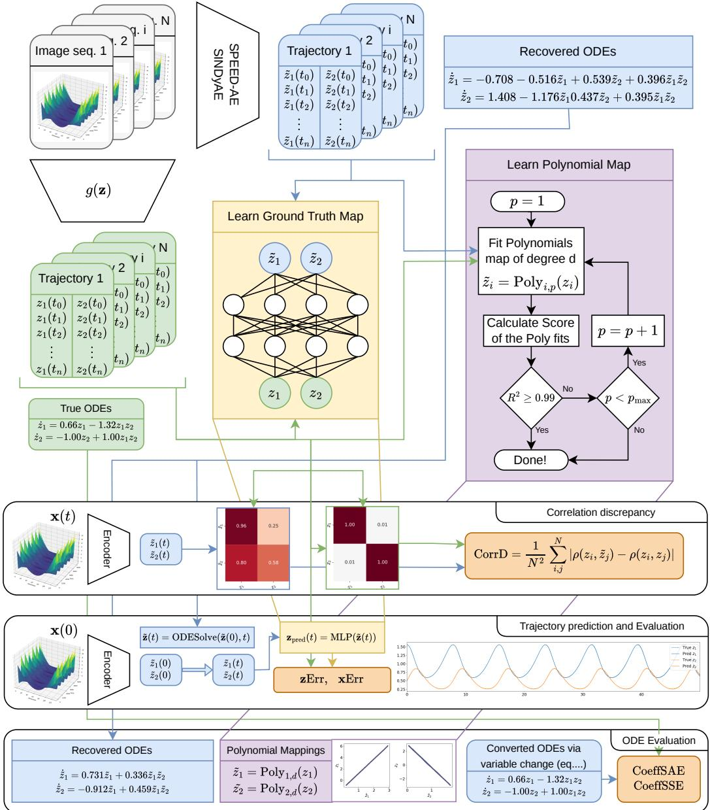  
Figure 5: Evaluation pipeline of our experiments.

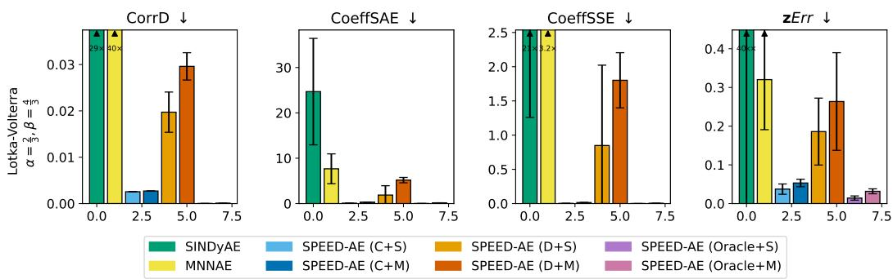  
Figure 6: Experimental results for the ablation on the independence from CRL method. Lotka-Volterra dataset with an additional version of SPEED-AE with an oracle CRL model that achieves perfect disentanglement and SINDy-based loss.

SINDyAE and MNNAE present a particular challenge within this framework, as they do not provide a valid variable assignment between real and found latents. Furthermore, disentanglement is not guaranteed. To solve this issue, we do the following: we first calculate the Mean Correlation Coefficient (MCC) among all possible permutations, hence finding the best variable assignment $z _ { i } = \tilde { z } _ { \pi ( i ) }$ . Then, we proceed as above from the polynomial mapping step.

## G ABLATIONS

Independence from the CRL method. We isolate the main component of SPEED-AE, that is, the component-wise autoencoder coupled with sparse ODE recovery, to show that it is independent of the CRL method used. To do so, we assume an oracle CRL method that achieves perfect disentanglement and identifies the true latents up to permutation and component-wise diffeomorphism. To implement this, we first choose random coefficients $\alpha _ { i , j } \in ( 0 , 1 )$ with $i = 1 , \ldots , d$ and $j = 0 , 1 , 3$ defining the polynomials

$$
P _ { i } ( z _ { i } ) = \alpha _ { i , 0 } + \alpha _ { i , 1 } ( z _ { i } + 1 ) + \alpha _ { i , 3 } ( z _ { i } + 1 ) ^ { 3 } ,\tag{47}
$$

and the oracle CRL variables as $\hat { z } _ { i } = P _ { i } ( z _ { i } )$ . We use $( z _ { i } + 1 )$ to (i) offset the variables from their original values, and (ii) have a polynomial mapping that also has $\texttt { a } z _ { i } ^ { 2 }$ term. Given the form of Equation 47, their derivatives are always positive because they include only even-power terms of $( z _ { i } + 1 )$ with positive coefficients, guaranteeing monotonicity and thus invertibility.

We consider the Lotka-Volterra experiment in Section 6. We calculate the zˆ variables directly from the true latents z during data preparation. The rest of the experiment proceeds as described in Appendix E, starting with SPEED-AE training on the latents zˆ. We remark that SPEED-AE never has access to the true latents z.

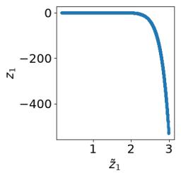

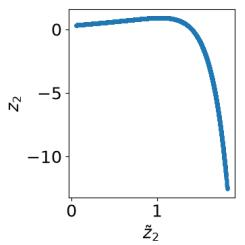  
(a)

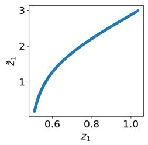

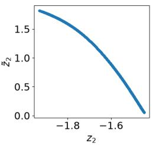  
(b)  
Figure 7: Results on the synthetic experiments with perfect disentanglement, polynomial identifiability in the CRL latents, and SPEED-AE encoder and decoders implemented as polynomials. (a) Some of the runs show strong instabilities, while others (b) remain stable but with flat dynamics. In general, the polynomial functions are hard to optimize simultaneously to the dynamics.

Results are reported in Figure 6. SPEED-AE with the SINDy-based loss (Oracle+S) and MNNbased one (Oracle+M) achieve the lowest errors across every metric. Thus, SPEED-AE can virtually achieve almost perfect results if the disentanglement is good enough. We notice that the MNN-based model has slightly worse performance, which is also reflected in the real results, where SINDy-based combinations of SPEED-AE are often better.

Polynomial diffeomorphisms. Inspired by our discussion in Section 3 and Appendix A, we first experimented with a fully polynomial setting. In particular, we ran synthetic experiments similar to the ones above, with perfect disentanglement and identifiability up to polynomial transformation. The only difference is in the SPEED-AE encoders and decoders $\stackrel { \cdot } { \phi ^ { \mathrm { e n c } } } , \stackrel { \cdot } { \phi ^ { \mathrm { d e c } } }$ , which we implemented as polynomial functions. In such a case, we would have the guarantee that the new latents $z _ { i }$ are a polynomial transformation of the found ones, as $z _ { i } = \hat { h } _ { i } \circ \phi _ { i } ^ { \mathrm { d e c } } ( \tilde { z } _ { \pi ( i ) } )$ , where both $\phi _ { i } ^ { \mathrm { d e c } }$ and $z _ { i } =$ $\hat { h } \big ( \hat { z } _ { \pi ( i ) } \big )$ , the diffeomorphism between $z _ { i }$ and $\hat { z } _ { i } ^ { \phantom { } } .$ , are both polynomial.

Unfortunately, the results were not satisfactory. Using polynomial functions as diffeomorphisms leads to strong instabilities in the model, and we observed either blow-ups in the solutions or flat dynamics. We also tried to simplify the setting by considering two simple oracle CRL variables: ${ \hat { z } } _ { i } = a _ { i } \sqrt [ 3 ] { z _ { i } } .$ , for which the polynomial encoder would only need to learn to use the cubic power term, and $\hat { z } _ { i } = a _ { i } z _ { i }$ , i.e., the CRL variables are already an affine transformation of the true ones. Even in these cases, we were not able to effectively train the models, as the polynomial functions make it difficult to train the autoencoder and the dynamics simultaneously. We report some plots in Figure 7. As a consequence, we use MLPs to implement the encoder and decoders.

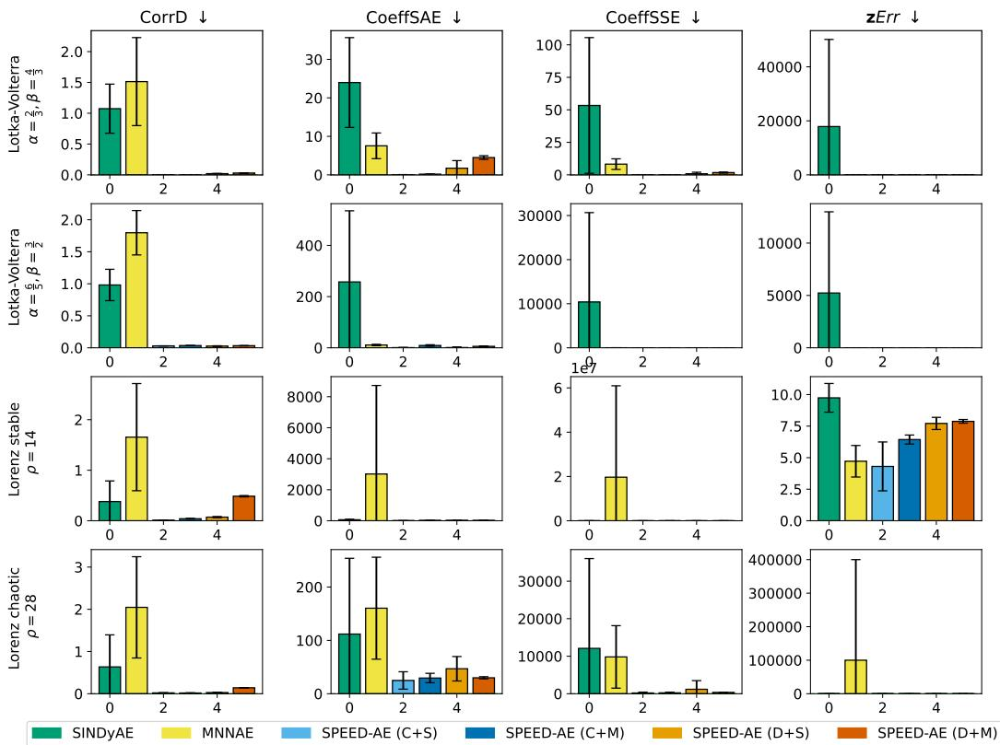  
Figure 8: Experimental results for the Lotka-Volterra and the Lorenz experiments.

## H ADDITIONAL EXPERIMENTAL RESULTS

We report the uncut version of Figure 4 in Figure 8. In many plots, especially those related to the Correlation Discrepancy and errors in the Recovered ODE coefficients, SINDyAE and MNNAE are out of scale compared with all combinations of SPEED-AE.

Forecasting error on x. We report the results on the xErr metric in Table 6, with the additional baselines of LSTM and Transformer. Traditional ML baselines perform well on the short trajectories of the Lorenz experiment (250 steps), even in the chaotic case. However, on the longer trajectories of the Lotka-Volterra experiment (5000 steps), the predictions collapse (see Figure 13 and Figure 14) and the errors are almost 20 times higher than SPEED-AE. In general, MNNAE performs well across experiments, although it fails on the chaotic case of Lorenz. However, as already discussed in Section 6, this performance comes at the cost of no identifiability of the latents.

In the following results, we always permute the recovered latents to match the true ones so that, for the ease of readability, π(i) = i. We remark that CRL latents identify the true ones up to permutation.

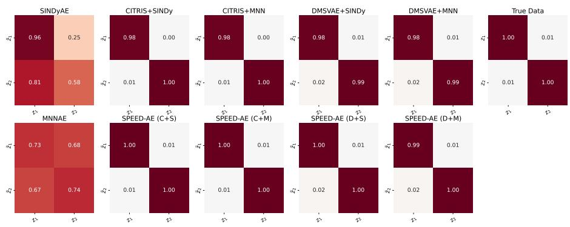

(a) Lotka-Volterra with $\begin{array} { r } { \alpha = \frac { 2 } { 3 } , \beta = \frac { 4 } { 3 } } \end{array}$  
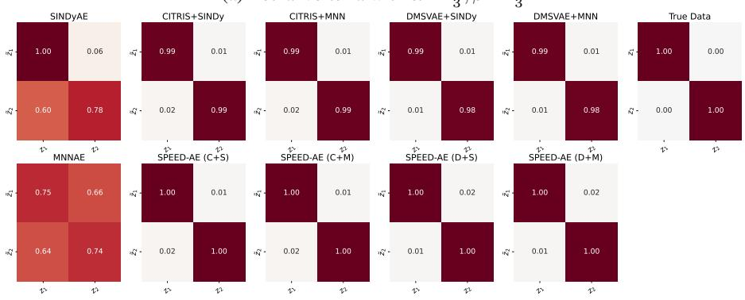

(b) Lotka-Volterra with $\begin{array} { r } { \alpha = \frac { 6 } { 5 } , \beta = \frac { 3 } { 2 } } \end{array}$  
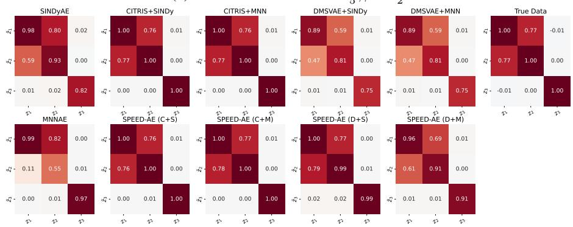

(c) Lorenz stable with $\rho = 1 4$  
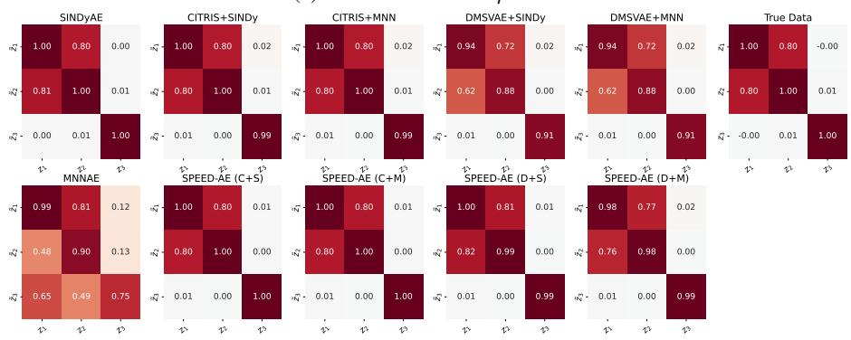  
(d) Lorenz chaotic with $\rho = 2 8$  
Figure 9: Pearson cross correlation matrices between z˜ and z for all experiments and models. The rightmost matrix in each subfigure corresponds to the true correlation matrix (i.e., between z and z).

Table 6: xErr: mean and standard deviation across 10 seeds.
<table><tr><td>Model</td><td>Lotka-Volterra  $\begin{array} { r } { \alpha = \frac { 2 } { 3 } , \beta = \frac { 4 } { 3 } } \end{array}$ </td><td>Lotka-Volterra  $\begin{array} { r } { \alpha = \frac { 6 } { 5 } , \beta = \frac { 3 } { 2 } } \end{array}$ </td><td>Lorenz (Stable)  $\rho = 1 4$ </td><td>Lorenz (Chaotic)  $\rho = 2 8$ </td></tr><tr><td>LSTM</td><td> $1 3 . 8 6 0 _ { \pm 2 . 6 0 9 }$ </td><td> $2 9 . 3 1 3 _ { \pm 1 4 . 7 1 9 }$ </td><td> $0 . 1 5 7 _ { \pm 0 . 0 5 6 }$ </td><td> $1 . 6 2 4 _ { \pm 0 . 2 1 0 }$ </td></tr><tr><td>Transformer</td><td> $1 6 . 0 0 1 { \scriptstyle \pm 2 . 0 7 6 }$ </td><td> $2 5 . 9 9 9 _ { \pm 6 . 9 1 9 }$ </td><td> $0 . 4 2 2 _ { \pm 0 . 0 7 6 }$ </td><td> $1 . 9 0 2 _ { \pm 0 . 2 1 0 }$ </td></tr><tr><td>SINDyAE</td><td> $2 3 . 0 7 5 _ { \pm 1 1 . 6 1 1 }$ </td><td> $1 7 . 6 1 0 { \scriptstyle \pm 2 . 8 9 8 }$ </td><td> $1 . 9 8 8 _ { \pm 0 . 3 2 3 }$ </td><td> $3 . 1 3 7 _ { \pm 0 . 1 2 0 }$ </td></tr><tr><td>MNNAE</td><td> $1 . 2 5 7 { \scriptstyle \pm 0 . 2 4 0 }$ </td><td> $0 . 9 3 0 { \scriptstyle \pm 0 . 2 9 0 }$ </td><td> $0 . 4 4 8 _ { \pm 0 . 1 0 2 }$ </td><td> $\approx 1 0 ^ { 5 } \ ( \mathrm { f a i l e d } )$ </td></tr><tr><td>SPEED-AE (C+S)</td><td> $1 . 2 7 9 _ { \pm 0 . 4 8 3 }$ </td><td> $3 . 9 9 9 _ { \pm 2 . 3 9 0 }$ </td><td> $0 . 8 5 1 _ { \pm 0 . 3 8 4 }$ </td><td> $2 . 4 1 1 { \scriptstyle \pm 0 . 3 7 9 }$ </td></tr><tr><td>SPEED-AE (C+M)</td><td> $1 . 5 5 2 _ { \pm 0 . 2 1 1 }$ </td><td> $1 6 . 0 4 1 _ { \pm 4 . 8 0 1 }$ </td><td> $1 . 2 5 6 _ { \pm 0 . 0 6 6 }$ </td><td> $2 . 9 8 4 _ { \pm 0 . 2 1 5 }$ </td></tr><tr><td>SPEED-AE (D+S)</td><td> $4 . 6 6 9 _ { \pm 2 . 0 7 4 }$ </td><td> $4 . 8 8 1 { \scriptstyle \pm 2 . 3 6 3 }$ </td><td> $1 . 3 9 9 _ { \pm 0 . 0 3 6 }$ </td><td> $2 . 7 3 6 { \scriptstyle \pm 0 . 5 0 9 }$ </td></tr><tr><td>SPEED-AE (D+M)</td><td> $7 . 2 3 9 _ { \pm 3 . 4 4 2 }$ </td><td> $1 3 . 6 8 6 _ { \pm 5 . 8 1 1 }$ </td><td> $1 . 6 1 9 _ { \pm 0 . 0 3 9 }$ </td><td> $2 . 6 8 4 _ { \pm 0 . 2 6 0 }$ </td></tr></table>

## H.1 LOTKA-VOLTERRA EXPERIMENT

To visualize how the learned latents of each model z˜ are related to the true ones z, we scatter plot them for the whole dataset in Figure 10 and Figure 11. In both Lotka-Volterra experiments, SINDyAE and MNNAE do not disentangle the variables, as there is no one-to-one correspondence between each $\tilde { z } _ { i }$ and $z _ { i } .$ . Similarly, their correlation matrices in Figure 9a and Figure 9b are very different from the true one. On the other hand, CITRIS and DMSVAE successfully disentangle the variables, but the mapping is not linear. SPEED-AE improves on this in almost every case, indicating that the model achieves identifiability up to linear transformation. We also report the recovered ODE coefficients in the true latent space z for the Lotka-Volterra experiment with transfer of CRL representations and $\begin{array} { r } { \alpha = \frac { 6 } { 5 } , \beta = \frac { 3 } { 2 } } \end{array}$ . A similar conclusion to the results in Section 6 holds even in this case: SPEED-AE recovers the sparsest and most similar equations, while SINDy and MNN applied to CRL latents have to sacrifice sparsity and interpretability for good forecasting.

Finally, we report representative plots of x forecasting (first 10 components out of 128) for the employed ML baselines in Figure 13 and Figure 14. In both cases, model rollout trajectories collapse in less than 1000 steps.

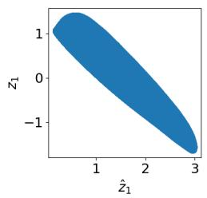

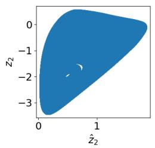  
(a) SINDyAE

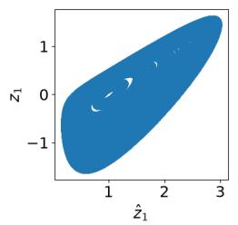

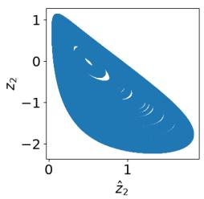  
(b) MNNAE

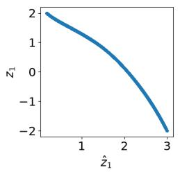

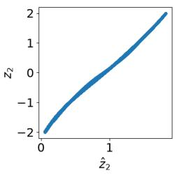  
(c) CITRIS

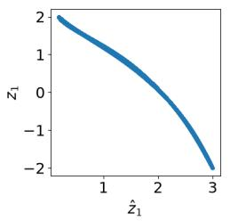

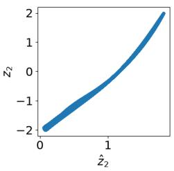  
(d) DMSVAE

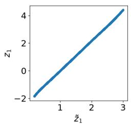

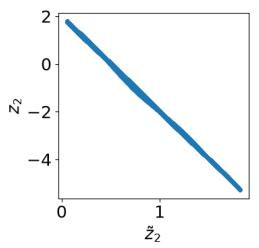  
(e) SPEED-AE (C+S)

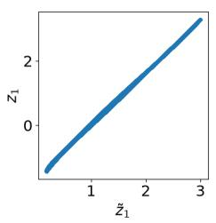

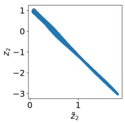  
(f) SPEED-AE (D+S)

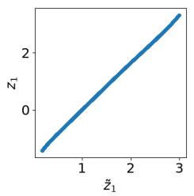

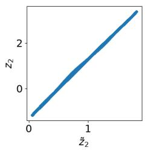  
(g) SPEED-AE (C+M)

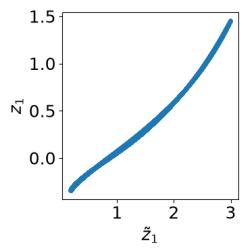

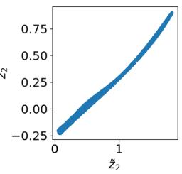  
(h) SPEED-AE (D+M)

Figure 10: Lotka-Volterra experiment with $\begin{array} { r } { \alpha = \frac { 2 } { 3 } , \beta = \frac { 4 } { 3 } } \end{array}$ . Scatter plots of the found latents z˜ against the true ones z. If their function is well defined, the plots well represent the maps $z _ { i } = h _ { i } ( \tilde { z } _ { i } )$ . In the second row, we include the same plots for the CRL latents zˆ from CITRIS and DMSVAE. In most cases, SPEED-AE can go from a general diffeomorphism h to a linear one.

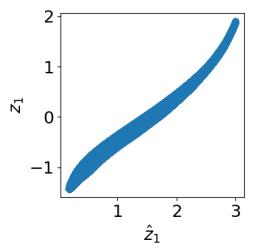

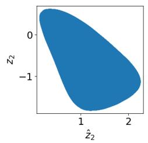  
(a) SINDyAE

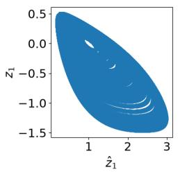

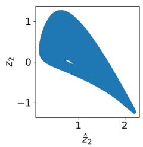  
(b) MNNAE

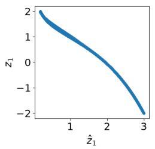

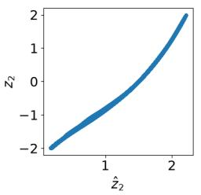  
(c) CITRIS

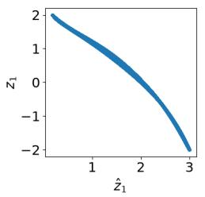

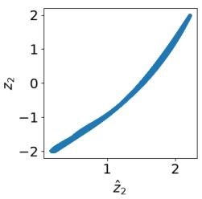  
(d) DMSVAE

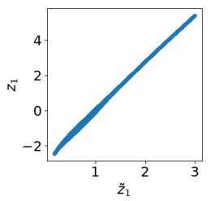

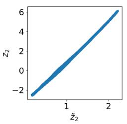

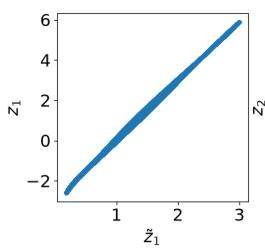  
(e) SPEED-AE (C+S)

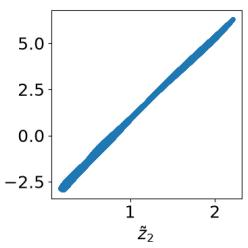  
(f) SPEED-AE (D+S)

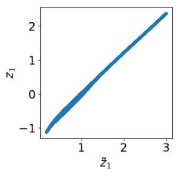

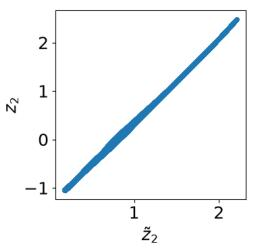  
(g) SPEED-AE (C+M)

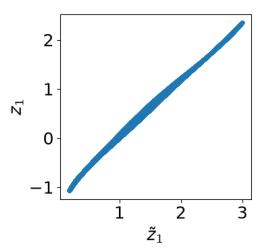

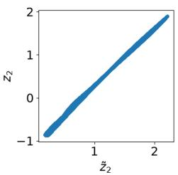  
(h) SPEED-AE (D+M)

Figure 11: Lotka-Volterra experiment woth $\begin{array} { r } { \alpha = \frac { 6 } { 5 } , \beta = \frac { 3 } { 2 } } \end{array}$ . Scatter plots of the found latents z˜ against the true ones z. If their function is well defined, the plots well represent the maps $z _ { i } = h _ { i } ( \tilde { z } _ { i } )$ In the second row, we include the same plots for the CRL latents zˆ from CITRIS and DMSVAE. In most cases, SPEED-AE can go from a general diffeomorphism h to a linear one.

<table><tr><td rowspan=4 colspan=1>1- 0z1z2</td><td rowspan=1 colspan=1></td><td rowspan=1 colspan=1></td><td rowspan=1 colspan=1></td><td rowspan=1 colspan=1></td><td rowspan=1 colspan=1>Equation</td><td rowspan=1 colspan=2>1</td><td rowspan=1 colspan=1></td><td rowspan=1 colspan=1></td><td rowspan=1 colspan=1></td><td rowspan=1 colspan=1></td></tr><tr><td rowspan=1 colspan=1>.00</td><td rowspan=1 colspan=1>0.00</td><td rowspan=1 colspan=1>1.04</td><td rowspan=1 colspan=1>0.59</td><td rowspan=1 colspan=1>0.18</td><td rowspan=1 colspan=2>0.340.44</td><td rowspan=1 colspan=1>0.00</td><td rowspan=1 colspan=1>0.13</td><td rowspan=1 colspan=1>0.00</td><td rowspan=1 colspan=1>0.16</td></tr><tr><td rowspan=1 colspan=1>1.20</td><td rowspan=1 colspan=1>0.68</td><td rowspan=1 colspan=1>0.00</td><td rowspan=1 colspan=1>0.00</td><td rowspan=1 colspan=1>0.84</td><td rowspan=1 colspan=2>0.680.78</td><td rowspan=1 colspan=1>1.14</td><td rowspan=1 colspan=1>1.08</td><td rowspan=1 colspan=1>1.11</td><td rowspan=1 colspan=1>1.01</td></tr><tr><td rowspan=1 colspan=1>0.00</td><td rowspan=1 colspan=1>-0.90</td><td rowspan=1 colspan=1>0.00</td><td rowspan=1 colspan=1>0.48</td><td rowspan=1 colspan=1>0.49</td><td rowspan=1 colspan=1>0.50</td><td rowspan=1 colspan=1>0.48</td><td rowspan=1 colspan=1>0.00</td><td rowspan=1 colspan=1>0.00</td><td rowspan=1 colspan=1>0.00</td><td rowspan=1 colspan=1>0.00</td></tr><tr><td rowspan=1 colspan=1>z221</td><td rowspan=1 colspan=1>0.00-</td><td rowspan=1 colspan=1>-0.31</td><td rowspan=1 colspan=1>0.00</td><td rowspan=1 colspan=1>0.00</td><td rowspan=1 colspan=1>0.00</td><td rowspan=1 colspan=1>0.00</td><td rowspan=1 colspan=1>0.00</td><td rowspan=1 colspan=1>0.00</td><td rowspan=1 colspan=1>0.00</td><td rowspan=1 colspan=1>0.00</td><td rowspan=1 colspan=1>0.00</td></tr><tr><td rowspan=1 colspan=1>z{z2</td><td rowspan=1 colspan=1>0.00</td><td rowspan=1 colspan=1>-0.68</td><td rowspan=1 colspan=1>0.00</td><td rowspan=1 colspan=1>-0.39</td><td rowspan=1 colspan=1>-0.32</td><td rowspan=1 colspan=1>-0.41</td><td rowspan=1 colspan=1>-0.37</td><td rowspan=1 colspan=1>0.00</td><td rowspan=1 colspan=1>0.00</td><td rowspan=1 colspan=1>0.00</td><td rowspan=1 colspan=1>0.00</td></tr><tr><td rowspan=1 colspan=1>z2-</td><td rowspan=1 colspan=1>0.00</td><td rowspan=1 colspan=1>-0.38</td><td rowspan=1 colspan=1>0.00</td><td rowspan=1 colspan=1>-0.19</td><td rowspan=1 colspan=1>-0.17</td><td rowspan=1 colspan=1>-0.37</td><td rowspan=1 colspan=1>-0.34</td><td rowspan=1 colspan=1>0.00</td><td rowspan=1 colspan=1>0.00</td><td rowspan=1 colspan=1>0.00</td><td rowspan=1 colspan=1>0.00</td></tr><tr><td rowspan=1 colspan=1>z2</td><td rowspan=1 colspan=1>0.00</td><td rowspan=1 colspan=1>0.00</td><td rowspan=1 colspan=1>0.00</td><td rowspan=1 colspan=1>0.00</td><td rowspan=1 colspan=1>0.00</td><td rowspan=1 colspan=1>0.00</td><td rowspan=1 colspan=1>0.00</td><td rowspan=1 colspan=1>0.00</td><td rowspan=1 colspan=1>0.00</td><td rowspan=1 colspan=1>0.00</td><td rowspan=1 colspan=1>0.00</td></tr><tr><td rowspan=1 colspan=1>z{</td><td rowspan=1 colspan=1>0.00</td><td rowspan=1 colspan=1>1.87</td><td rowspan=1 colspan=1>0.00</td><td rowspan=1 colspan=1>0.17</td><td rowspan=1 colspan=1>0.12</td><td rowspan=1 colspan=1>0.17</td><td rowspan=1 colspan=1>0.11</td><td rowspan=1 colspan=1>0.00</td><td rowspan=1 colspan=1>0.00</td><td rowspan=1 colspan=1>0.00</td><td rowspan=1 colspan=1>0.00</td></tr><tr><td rowspan=1 colspan=1>z22</td><td rowspan=1 colspan=1>0.00</td><td rowspan=1 colspan=1>0.66</td><td rowspan=1 colspan=1>0.00</td><td rowspan=1 colspan=1>-0.13</td><td rowspan=1 colspan=1>0.00</td><td rowspan=1 colspan=1>-0.11</td><td rowspan=1 colspan=1>0.00</td><td rowspan=1 colspan=1>0.00</td><td rowspan=1 colspan=1>0.00</td><td rowspan=1 colspan=1>0.00</td><td rowspan=1 colspan=1>0.00</td></tr><tr><td rowspan=1 colspan=1>z2-</td><td rowspan=1 colspan=1>0.00</td><td rowspan=1 colspan=1>0.29</td><td rowspan=1 colspan=1>0.00</td><td rowspan=1 colspan=1>0.00</td><td rowspan=1 colspan=1>0.00</td><td rowspan=1 colspan=1>-0.11</td><td rowspan=1 colspan=1>0.00</td><td rowspan=1 colspan=1>0.00</td><td rowspan=1 colspan=1>0.00</td><td rowspan=1 colspan=2>0.000.00</td></tr><tr><td rowspan=1 colspan=1>2</td><td rowspan=1 colspan=1>0.00</td><td rowspan=1 colspan=1>0.00</td><td rowspan=1 colspan=1>0.00</td><td rowspan=1 colspan=1>0.00</td><td rowspan=1 colspan=1>0.00</td><td rowspan=1 colspan=1>0.00</td><td rowspan=1 colspan=1>0.00</td><td rowspan=1 colspan=1>0.00</td><td rowspan=1 colspan=1>0.00</td><td rowspan=1 colspan=2>0.000.00</td></tr><tr><td rowspan=1 colspan=1>z{-</td><td rowspan=1 colspan=1>0.00</td><td rowspan=1 colspan=1>-1.94</td><td rowspan=1 colspan=1>0.00</td><td rowspan=1 colspan=1>0.00</td><td rowspan=1 colspan=1>0.00</td><td rowspan=1 colspan=1>0.00</td><td rowspan=1 colspan=1>0.00</td><td rowspan=1 colspan=1>0.00</td><td rowspan=1 colspan=1>0.00</td><td rowspan=1 colspan=2>0.000.00</td></tr><tr><td rowspan=1 colspan=1>z{z2</td><td rowspan=1 colspan=1>0.00</td><td rowspan=1 colspan=1>-0.31</td><td rowspan=1 colspan=1>0.00</td><td rowspan=1 colspan=1>0.00</td><td rowspan=1 colspan=1>0.00</td><td rowspan=1 colspan=1>0.00</td><td rowspan=1 colspan=1>0.00</td><td rowspan=1 colspan=1>0.00</td><td rowspan=1 colspan=1>0.00</td><td rowspan=1 colspan=2>0.000.00</td></tr><tr><td rowspan=1 colspan=1>z{2</td><td rowspan=1 colspan=1>0.00</td><td rowspan=1 colspan=1>-0.12</td><td rowspan=1 colspan=1>0.00</td><td rowspan=1 colspan=1>0.00</td><td rowspan=1 colspan=1>0.00</td><td rowspan=1 colspan=1>0.00</td><td rowspan=1 colspan=1>0.00</td><td rowspan=1 colspan=1>0.00</td><td rowspan=1 colspan=1>0.00</td><td rowspan=1 colspan=2>0.000.00</td></tr><tr><td rowspan=1 colspan=1>2{23-</td><td rowspan=1 colspan=1>0.00</td><td rowspan=1 colspan=1>0.00</td><td rowspan=1 colspan=1>0.00</td><td rowspan=1 colspan=1>0.00</td><td rowspan=1 colspan=1>0.00</td><td rowspan=1 colspan=1>0.00</td><td rowspan=1 colspan=1>0.00</td><td rowspan=1 colspan=1>0.00</td><td rowspan=1 colspan=1>0.00</td><td rowspan=1 colspan=2>0.000.00</td></tr><tr><td rowspan=1 colspan=1>z</td><td rowspan=1 colspan=1>0.00</td><td rowspan=1 colspan=1>1.21</td><td rowspan=1 colspan=1>0.00</td><td rowspan=1 colspan=1>0.00</td><td rowspan=1 colspan=1>0.00</td><td rowspan=1 colspan=1>0.00</td><td rowspan=1 colspan=1>0.00</td><td rowspan=1 colspan=1>0.00</td><td rowspan=1 colspan=1>0.00</td><td rowspan=1 colspan=2>0.000.00</td></tr><tr><td rowspan=1 colspan=1>z{2z2</td><td rowspan=1 colspan=1>0.00</td><td rowspan=1 colspan=1>0.00</td><td rowspan=1 colspan=1>0.00</td><td rowspan=1 colspan=1>0.00</td><td rowspan=1 colspan=1>0.00</td><td rowspan=1 colspan=1>0.00</td><td rowspan=1 colspan=1>0.00</td><td rowspan=1 colspan=1>0.00</td><td rowspan=5 colspan=3>0.000.000.00</td></tr><tr><td rowspan=1 colspan=1>z2</td><td rowspan=1 colspan=1>0.00</td><td rowspan=1 colspan=1>0.00</td><td rowspan=1 colspan=1>0.00</td><td rowspan=1 colspan=1>0.00</td><td rowspan=1 colspan=1>0.00</td><td rowspan=1 colspan=1>0.00</td><td rowspan=1 colspan=1>0.00</td><td rowspan=1 colspan=1>0.00</td><td rowspan=1 colspan=1>0.00</td><td rowspan=1 colspan=2>0.00 0.00</td></tr><tr><td rowspan=1 colspan=1>zi-</td><td rowspan=1 colspan=1>0.00</td><td rowspan=1 colspan=1>-0.47</td><td rowspan=1 colspan=1>0.00</td><td rowspan=1 colspan=2>0.000.00</td><td rowspan=1 colspan=1>0.00</td><td rowspan=1 colspan=1>0.00</td><td rowspan=1 colspan=1>0.00</td><td rowspan=1 colspan=1>0.00</td><td rowspan=1 colspan=2>0.00 0.00</td></tr><tr><td rowspan=1 colspan=1>z-</td><td rowspan=1 colspan=1>0.00</td><td rowspan=1 colspan=1>0.12</td><td rowspan=1 colspan=1>0.00</td><td rowspan=1 colspan=2>0.000.00</td><td rowspan=1 colspan=1>0.00</td><td rowspan=1 colspan=1>0.00</td><td rowspan=1 colspan=1>0.00</td><td rowspan=1 colspan=1>0.00</td><td rowspan=1 colspan=2>0.00 0.00</td></tr><tr><td rowspan=1 colspan=1>z1ż₁</td><td rowspan=1 colspan=1>0.00-</td><td rowspan=1 colspan=1>0.89</td><td rowspan=1 colspan=1>-0.24</td><td rowspan=1 colspan=2>-0.34-0.34</td><td rowspan=1 colspan=2>-0.94-0.94</td><td rowspan=1 colspan=1>0.00</td></tr></table>

<table><tr><td>z1z1</td><td>0.00</td><td>0.89</td><td>-0.24</td><td>-0.34</td><td>-0.34</td><td>-0.94</td><td>-0.94</td><td>0.00</td><td>0.00</td><td>0.00</td><td>0.00</td></tr><tr><td>Z1Z2</td><td>-1.50</td><td>-0.16</td><td>0.00</td><td>-0.13</td><td>-0.59</td><td>-0.63</td><td>-0.59</td><td>-1.40</td><td>-1.34</td><td>-1.39</td><td>-1.26</td></tr><tr><td>2122</td><td>0.00</td><td>0.17</td><td>0.00</td><td>0.00</td><td>-0.29</td><td>-0.55</td><td>-0.52</td><td>0.00</td><td>0.00</td><td>0.00</td><td>0.00</td></tr><tr><td>2123</td><td>0.00</td><td>0.22</td><td>0.00</td><td>0.00</td><td>0.00</td><td>0.16</td><td>0.14</td><td>0.00</td><td>0.00</td><td>0.00</td><td>0.00</td></tr><tr><td>z1z2</td><td>0.00</td><td>0.00</td><td>0.00</td><td>0.00</td><td>0.00</td><td>0.00</td><td>0.00</td><td>0.00</td><td>0.00</td><td>0.00</td><td>0.00</td></tr><tr><td>z1z2-</td><td>0.00</td><td>0.00</td><td>0.00</td><td>0.00</td><td>0.00</td><td>0.00</td><td>0.00</td><td>0.00</td><td>0.00</td><td>0.00</td><td>0.00</td></tr><tr><td>Z2</td><td>0.00</td><td>-0.40</td><td>-0.55</td><td>-0.44</td><td>0.00</td><td>-0.12</td><td>-0.34</td><td>-0.12</td><td>-0.17</td><td>0.00</td><td>-0.21</td></tr><tr><td>z2</td><td>0.00</td><td>0.00</td><td>-0.73</td><td>-0.24</td><td>-0.11</td><td>-0.15</td><td>-0.29</td><td>0.00</td><td>0.00</td><td>0.00</td><td>0.00</td></tr><tr><td>z{22</td><td>0.00</td><td>0.00</td><td>0.00</td><td>0.00</td><td>0.00</td><td>0.00</td><td>0.00</td><td>0.00</td><td>0.00</td><td>0.00</td><td>0.00</td></tr><tr><td>z2-</td><td>0.00</td><td>0.13</td><td>0.00</td><td>0.00</td><td>-0.11</td><td>0.00</td><td>0.00</td><td>0.00</td><td>0.00</td><td>0.00</td><td>0.00</td></tr><tr><td>z2-</td><td>0.00</td><td>-0.15</td><td>0.00</td><td>0.00</td><td>0.00</td><td>0.00</td><td>0.00</td><td>0.00</td><td>0.00</td><td>0.00</td><td>0.00</td></tr><tr><td rowspan="2">Z2ż2</td><td>0.00 True</td><td>0.00</td><td>0.00 MNNAE</td><td>0.00</td><td>0.00</td><td>0.00</td><td>0.00</td><td>0.00</td><td>0.00</td><td>0.00</td><td>0.00</td></tr><tr><td colspan="10">SINDyAE CITRIS+SINDY CITRIS+MNN DMSVAE+SINDY DMSVAE+MNN SPEED-AE (C+S)</td><td>SPEED-AE (C+M) SPEED-AE (D+S) SPEED-AE (D+M)</td></tr></table>

<table><tr><td rowspan=1 colspan=1></td><td rowspan=1 colspan=1></td><td rowspan=1 colspan=6>Equation 2</td><td rowspan=1 colspan=5></td></tr><tr><td rowspan=1 colspan=1>1-</td><td rowspan=1 colspan=1>0.00</td><td rowspan=1 colspan=1>-0.48</td><td rowspan=1 colspan=1>-2.49</td><td rowspan=1 colspan=1>-0.39</td><td rowspan=1 colspan=1>-0.49</td><td rowspan=1 colspan=1>0.00</td><td rowspan=1 colspan=1>0.00</td><td rowspan=1 colspan=1>0.00</td><td rowspan=1 colspan=1>0.00</td><td rowspan=1 colspan=1>0.00</td><td rowspan=1 colspan=1>0.00</td><td rowspan=2 colspan=1></td></tr><tr><td rowspan=1 colspan=1>z1-</td><td rowspan=1 colspan=1>0.00</td><td rowspan=1 colspan=1>1.74</td><td rowspan=1 colspan=1>0.00</td><td rowspan=1 colspan=1>0.29</td><td rowspan=1 colspan=1>0.59</td><td rowspan=1 colspan=1>-0.14</td><td rowspan=1 colspan=1>-0.27</td><td rowspan=1 colspan=1>0.00</td><td rowspan=1 colspan=1>0.00</td><td rowspan=1 colspan=1>0.00</td><td rowspan=1 colspan=1>0.00</td></tr><tr><td rowspan=1 colspan=1>z2</td><td rowspan=1 colspan=1>0.00</td><td rowspan=1 colspan=1>-0.31</td><td rowspan=1 colspan=1>1.15</td><td rowspan=1 colspan=1>0.00</td><td rowspan=1 colspan=1>0.00</td><td rowspan=1 colspan=1>0.00</td><td rowspan=1 colspan=1>0.00</td><td rowspan=1 colspan=1>0.00</td><td rowspan=1 colspan=1>0.00</td><td rowspan=1 colspan=1>0.00</td><td rowspan=1 colspan=1>0.00</td><td rowspan=1 colspan=1></td></tr><tr><td rowspan=1 colspan=1>z{z1</td><td rowspan=1 colspan=1>0.00</td><td rowspan=1 colspan=1>0.00</td><td rowspan=1 colspan=1>0.00</td><td rowspan=1 colspan=1>0.00</td><td rowspan=1 colspan=1>0.00</td><td rowspan=1 colspan=1>0.00</td><td rowspan=1 colspan=1>0.00</td><td rowspan=1 colspan=1>0.00</td><td rowspan=1 colspan=1>0.00</td><td rowspan=1 colspan=1>0.00</td><td rowspan=1 colspan=1>0.00</td><td rowspan=1 colspan=1></td></tr><tr><td rowspan=1 colspan=1>z{z2</td><td rowspan=1 colspan=1>0.00</td><td rowspan=1 colspan=1>2.19</td><td rowspan=1 colspan=1>0.00</td><td rowspan=1 colspan=1>0.00</td><td rowspan=1 colspan=1>0.00</td><td rowspan=1 colspan=1>0.33</td><td rowspan=1 colspan=1>0.31</td><td rowspan=1 colspan=1>0.00</td><td rowspan=1 colspan=1>0.00</td><td rowspan=1 colspan=1>0.00</td><td rowspan=1 colspan=1>0.00</td><td rowspan=1 colspan=1></td></tr><tr><td rowspan=1 colspan=1>z2</td><td rowspan=1 colspan=1>0.00</td><td rowspan=1 colspan=1>1.57</td><td rowspan=1 colspan=1>0.00</td><td rowspan=1 colspan=1>0.00</td><td rowspan=1 colspan=1>0.00</td><td rowspan=1 colspan=1>0.36</td><td rowspan=1 colspan=1>0.34</td><td rowspan=1 colspan=1>0.00</td><td rowspan=1 colspan=1>0.00</td><td rowspan=1 colspan=1>0.00</td><td rowspan=1 colspan=1>0.00</td><td rowspan=1 colspan=1></td></tr><tr><td rowspan=1 colspan=1>z2</td><td rowspan=1 colspan=1>0.00</td><td rowspan=1 colspan=1>0.23</td><td rowspan=1 colspan=1>0.00</td><td rowspan=1 colspan=1>0.00</td><td rowspan=1 colspan=1>0.00</td><td rowspan=1 colspan=1>0.00</td><td rowspan=1 colspan=1>0.00</td><td rowspan=1 colspan=1>0.00</td><td rowspan=1 colspan=1>0.00</td><td rowspan=1 colspan=1>0.00</td><td rowspan=1 colspan=1>0.00</td><td rowspan=1 colspan=1></td></tr><tr><td rowspan=1 colspan=1>z</td><td rowspan=1 colspan=1>0.00</td><td rowspan=1 colspan=1>-1.89</td><td rowspan=1 colspan=1>0.27</td><td rowspan=1 colspan=1>0.00</td><td rowspan=1 colspan=1>0.00</td><td rowspan=1 colspan=1>0.00</td><td rowspan=1 colspan=1>0.00</td><td rowspan=1 colspan=1>0.00</td><td rowspan=1 colspan=1>0.00</td><td rowspan=1 colspan=1>0.00</td><td rowspan=1 colspan=1>0.00</td><td rowspan=1 colspan=1></td></tr><tr><td rowspan=1 colspan=1>zz2</td><td rowspan=1 colspan=1>0.00</td><td rowspan=1 colspan=1>-2.38</td><td rowspan=1 colspan=1>0.00</td><td rowspan=1 colspan=1>0.00</td><td rowspan=1 colspan=1>0.00</td><td rowspan=1 colspan=1>0.00</td><td rowspan=1 colspan=1>0.00</td><td rowspan=1 colspan=1>0.00</td><td rowspan=1 colspan=1>0.00</td><td rowspan=1 colspan=1>0.00</td><td rowspan=1 colspan=1>0.00</td><td rowspan=1 colspan=1></td></tr><tr><td rowspan=1 colspan=1>z</td><td rowspan=1 colspan=1>0.00</td><td rowspan=1 colspan=1>-1.11</td><td rowspan=1 colspan=1>0.00</td><td rowspan=1 colspan=1>0.00</td><td rowspan=1 colspan=1>0.00</td><td rowspan=1 colspan=1>0.00</td><td rowspan=1 colspan=1>0.00</td><td rowspan=1 colspan=1>0.00</td><td rowspan=1 colspan=1>0.00</td><td rowspan=1 colspan=1>0.00</td><td rowspan=1 colspan=1>0.00</td><td rowspan=1 colspan=1></td></tr><tr><td rowspan=1 colspan=1>2</td><td rowspan=1 colspan=1>0.00</td><td rowspan=1 colspan=1>0.23</td><td rowspan=1 colspan=1>0.00</td><td rowspan=1 colspan=1>0.00</td><td rowspan=1 colspan=1>0.00</td><td rowspan=1 colspan=1>0.00</td><td rowspan=1 colspan=1>0.00</td><td rowspan=1 colspan=1>0.00</td><td rowspan=1 colspan=1>0.00</td><td rowspan=1 colspan=1>0.00</td><td rowspan=1 colspan=1>0.00</td><td rowspan=1 colspan=1></td></tr><tr><td rowspan=1 colspan=1>z4-</td><td rowspan=1 colspan=1>0.00</td><td rowspan=1 colspan=1>2.41</td><td rowspan=1 colspan=1>0.00</td><td rowspan=1 colspan=1>0.00</td><td rowspan=1 colspan=1>0.00</td><td rowspan=1 colspan=1>0.00</td><td rowspan=1 colspan=1>0.00</td><td rowspan=1 colspan=1>0.00</td><td rowspan=1 colspan=1>0.00</td><td rowspan=1 colspan=1>0.00</td><td rowspan=1 colspan=1>0.00</td><td rowspan=1 colspan=1></td></tr><tr><td rowspan=1 colspan=1>z{z2</td><td rowspan=1 colspan=1>0.00</td><td rowspan=1 colspan=1>1.15</td><td rowspan=1 colspan=1>0.00</td><td rowspan=1 colspan=1>0.00</td><td rowspan=1 colspan=1>0.00</td><td rowspan=1 colspan=1>0.00</td><td rowspan=1 colspan=1>0.00</td><td rowspan=1 colspan=1>0.00</td><td rowspan=1 colspan=1>0.00</td><td rowspan=1 colspan=1>0.00</td><td rowspan=1 colspan=1>0.00</td><td rowspan=1 colspan=1></td></tr><tr><td rowspan=1 colspan=1>z{z2</td><td rowspan=1 colspan=1>0.00</td><td rowspan=1 colspan=1>0.46</td><td rowspan=1 colspan=1>0.00</td><td rowspan=1 colspan=1>0.00</td><td rowspan=1 colspan=1>0.00</td><td rowspan=1 colspan=1>0.00</td><td rowspan=1 colspan=1>0.00</td><td rowspan=1 colspan=1>0.00</td><td rowspan=1 colspan=1>0.00</td><td rowspan=1 colspan=1>0.00</td><td rowspan=1 colspan=1>0.00</td><td rowspan=1 colspan=1></td></tr><tr><td rowspan=1 colspan=1>2i2</td><td rowspan=1 colspan=1>0.00</td><td rowspan=1 colspan=1>-0.17</td><td rowspan=1 colspan=1>0.00</td><td rowspan=1 colspan=1>0.00</td><td rowspan=1 colspan=1>0.00</td><td rowspan=1 colspan=1>0.00</td><td rowspan=1 colspan=1>0.00</td><td rowspan=1 colspan=1>0.00</td><td rowspan=1 colspan=1>0.00</td><td rowspan=1 colspan=1>0.00</td><td rowspan=1 colspan=1>0.00</td><td rowspan=1 colspan=1></td></tr><tr><td rowspan=1 colspan=1>z</td><td rowspan=1 colspan=1>0.00</td><td rowspan=1 colspan=1>-1.55</td><td rowspan=1 colspan=1>0.00</td><td rowspan=1 colspan=1>0.00</td><td rowspan=1 colspan=1>0.00</td><td rowspan=1 colspan=1>0.00</td><td rowspan=1 colspan=1>0.00</td><td rowspan=1 colspan=1>0.00</td><td rowspan=1 colspan=1>0.00</td><td rowspan=1 colspan=1>0.00</td><td rowspan=1 colspan=1>0.00</td><td rowspan=1 colspan=1></td></tr><tr><td rowspan=1 colspan=1>z{z2</td><td rowspan=1 colspan=1>0.00</td><td rowspan=1 colspan=1>-0.26</td><td rowspan=1 colspan=1>0.00</td><td rowspan=1 colspan=1>0.00</td><td rowspan=1 colspan=1>0.00</td><td rowspan=1 colspan=1>0.00</td><td rowspan=1 colspan=1>0.00</td><td rowspan=1 colspan=1>0.00</td><td rowspan=1 colspan=1>0.00</td><td rowspan=1 colspan=1>0.00</td><td rowspan=1 colspan=1>0.00</td><td rowspan=1 colspan=1></td></tr><tr><td rowspan=1 colspan=1>z2</td><td rowspan=1 colspan=1>0.00</td><td rowspan=1 colspan=1>-0.11</td><td rowspan=1 colspan=1>0.00</td><td rowspan=1 colspan=1>0.00</td><td rowspan=1 colspan=1>0.00</td><td rowspan=1 colspan=1>0.00</td><td rowspan=1 colspan=1>0.00</td><td rowspan=1 colspan=1>0.00</td><td rowspan=1 colspan=1>0.00</td><td rowspan=1 colspan=1>0.00</td><td rowspan=1 colspan=1>0.00</td><td rowspan=2 colspan=1></td></tr><tr><td rowspan=1 colspan=1>z5</td><td rowspan=1 colspan=1>0.00</td><td rowspan=1 colspan=1>0.62</td><td rowspan=1 colspan=1>0.00</td><td rowspan=1 colspan=1>0.00</td><td rowspan=1 colspan=1>0.00</td><td rowspan=1 colspan=1>0.00</td><td rowspan=1 colspan=1>0.00</td><td rowspan=1 colspan=1>0.00</td><td rowspan=1 colspan=1>0.00</td><td rowspan=1 colspan=1>0.00</td><td rowspan=1 colspan=1>0.00</td></tr><tr><td rowspan=1 colspan=1>z1</td><td rowspan=1 colspan=1>0.00</td><td rowspan=1 colspan=1>-0.16</td><td rowspan=1 colspan=1>0.00</td><td rowspan=1 colspan=1>0.00</td><td rowspan=1 colspan=1>0.00</td><td rowspan=1 colspan=1>0.00</td><td rowspan=1 colspan=1>0.00</td><td rowspan=1 colspan=1>0.00</td><td rowspan=1 colspan=1>0.00</td><td rowspan=1 colspan=1>0.00</td><td rowspan=1 colspan=1>0.00</td><td rowspan=1 colspan=1></td></tr><tr><td rowspan=1 colspan=1>z1ż1-</td><td rowspan=1 colspan=1>0.00</td><td rowspan=1 colspan=1>0.00</td><td rowspan=1 colspan=1>0.00</td><td rowspan=1 colspan=1>0.00</td><td rowspan=1 colspan=1>0.00</td><td rowspan=1 colspan=1>0.00</td><td rowspan=1 colspan=1>0.00</td><td rowspan=1 colspan=1>0.00</td><td rowspan=1 colspan=1>0.00</td><td rowspan=1 colspan=1>0.00</td><td rowspan=1 colspan=1>0.00</td><td rowspan=1 colspan=1></td></tr><tr><td rowspan=1 colspan=1>Z1Z2</td><td rowspan=1 colspan=1>1.00</td><td rowspan=1 colspan=1>1.41</td><td rowspan=1 colspan=1>0.00</td><td rowspan=1 colspan=1>0.40</td><td rowspan=1 colspan=1>0.49</td><td rowspan=1 colspan=1>0.88</td><td rowspan=1 colspan=1>0.82</td><td rowspan=1 colspan=1>1.07</td><td rowspan=1 colspan=1>0.98</td><td rowspan=1 colspan=1>0.93</td><td rowspan=1 colspan=1>0.89</td><td rowspan=1 colspan=1></td></tr><tr><td rowspan=1 colspan=1>2122</td><td rowspan=1 colspan=1>0.00</td><td rowspan=1 colspan=1>-0.99</td><td rowspan=1 colspan=1>-0.11</td><td rowspan=1 colspan=1>0.50</td><td rowspan=1 colspan=1>0.43</td><td rowspan=1 colspan=1>0.95</td><td rowspan=1 colspan=1>0.88</td><td rowspan=1 colspan=1>0.00</td><td rowspan=1 colspan=1>0.00</td><td rowspan=1 colspan=1>0.00</td><td rowspan=1 colspan=1>0.00</td><td rowspan=2 colspan=1></td></tr><tr><td rowspan=1 colspan=1>2123</td><td rowspan=1 colspan=1>0.00</td><td rowspan=1 colspan=1>-1.45</td><td rowspan=1 colspan=1>0.00</td><td rowspan=1 colspan=1>0.31</td><td rowspan=1 colspan=1>0.18</td><td rowspan=1 colspan=1>0.14</td><td rowspan=1 colspan=1>0.13</td><td rowspan=1 colspan=1>0.00</td><td rowspan=1 colspan=1>0.00</td><td rowspan=1 colspan=1>0.00</td><td rowspan=1 colspan=1>0.00</td></tr><tr><td rowspan=1 colspan=1>z1z2-</td><td rowspan=1 colspan=1>0.00</td><td rowspan=1 colspan=1>0.22</td><td rowspan=1 colspan=1>0.00</td><td rowspan=1 colspan=1>0.00</td><td rowspan=1 colspan=1>0.00</td><td rowspan=1 colspan=1>0.00</td><td rowspan=1 colspan=1>0.00</td><td rowspan=1 colspan=1>0.00</td><td rowspan=1 colspan=1>0.00</td><td rowspan=1 colspan=1>0.00</td><td rowspan=1 colspan=1>0.00</td><td rowspan=1 colspan=1></td></tr><tr><td rowspan=3 colspan=1>z12Z2</td><td rowspan=1 colspan=1>0.00</td><td rowspan=1 colspan=1>0.18</td><td rowspan=1 colspan=1>0.00</td><td rowspan=1 colspan=1>0.00</td><td rowspan=1 colspan=1>0.00</td><td rowspan=1 colspan=1>0.00</td><td rowspan=1 colspan=1>0.00</td><td rowspan=1 colspan=1>0.00</td><td rowspan=1 colspan=1>0.00</td><td rowspan=1 colspan=2>0.000.00</td><td rowspan=1 colspan=1></td></tr><tr><td rowspan=1 colspan=1>-1.00</td><td rowspan=1 colspan=1>-2.30</td><td rowspan=1 colspan=1>1.44</td><td rowspan=1 colspan=1>-0.35</td><td rowspan=1 colspan=1>-0.32</td><td rowspan=1 colspan=2>-1.00-0.98</td><td rowspan=1 colspan=1>-1.06</td><td rowspan=1 colspan=3>-0.98-0.94-0.89</td><td rowspan=1 colspan=1></td></tr><tr><td rowspan=1 colspan=1>0.00</td><td rowspan=1 colspan=1>-0.14</td><td rowspan=1 colspan=1>1.59</td><td rowspan=1 colspan=1>-0.53</td><td rowspan=1 colspan=1>-0.33</td><td rowspan=1 colspan=2>-1.13-1.11</td><td rowspan=1 colspan=1>0.00</td><td rowspan=1 colspan=3>0.000.000.00</td><td rowspan=2 colspan=1></td></tr><tr><td rowspan=1 colspan=1>z222</td><td rowspan=1 colspan=1>0.00</td><td rowspan=1 colspan=1>0.45</td><td rowspan=1 colspan=1>0.00</td><td rowspan=1 colspan=1>0.00</td><td rowspan=1 colspan=1>0.00</td><td rowspan=1 colspan=2>0.000.00</td><td rowspan=1 colspan=1>0.00</td><td rowspan=1 colspan=3>0.000.000.00</td></tr><tr><td rowspan=1 colspan=1>z2</td><td rowspan=1 colspan=1>0.00</td><td rowspan=1 colspan=1>0.97</td><td rowspan=1 colspan=1>-0.99</td><td rowspan=1 colspan=1>-0.36</td><td rowspan=1 colspan=1>-0.17</td><td rowspan=1 colspan=2>-0.26-0.26</td><td rowspan=1 colspan=1>0.00</td><td rowspan=1 colspan=3>0.000.000.00</td><td rowspan=2 colspan=1></td></tr><tr><td rowspan=2 colspan=13>z2TrueSINDyAEMNNAECITRIS+SINDYCITRIS+MNNDMSVAE+SINDYDMSVAE+MNNSPEED-AE (C+S)SPEED-AE (C+M)SPEED-AE (D+S)SPEED-AE (D+M)Z222</td></tr><tr><td rowspan=1 colspan=1>0.00</td><td rowspan=1 colspan=1>-0.80</td><td rowspan=1 colspan=1>-2.72</td><td rowspan=1 colspan=1></td><td rowspan=1 colspan=1></td><td rowspan=1 colspan=2>-2.00 -2.00</td><td rowspan=1 colspan=1>0.00</td><td rowspan=1 colspan=3>0.00 0.00 0.00</td><td rowspan=1 colspan=1></td></tr></table>

Figure 12: Identified coefficients for the Lotka-Volterra experiment with transfer of CRL models and $\begin{array} { r } { \alpha = \frac { 6 } { 5 } , \beta = \frac { 3 } { 2 } } \end{array}$ . The true ones are in the leftmost column and highlighted by the black borders. For comparison, we include four baselines that consist of equation discovery directly applied to the CRL latents zˆ.

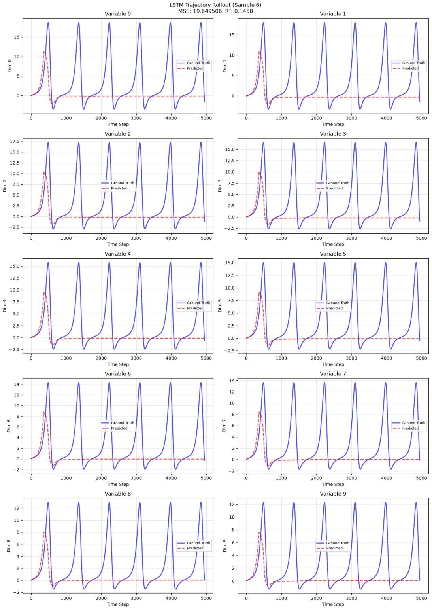  
Figure 13: Example test trajectory of the Lotka-Volterra experiment (first 10 dimensions of x). Ground truth (blue) against the predicted trajectory from the LSTM model (red). During rollout, the model collapses after around 500 steps.

  
Figure 14: Example test trajectory of the Lotka-Volterra experiment (first 10 dimensions of x). Ground truth (blue) against the predicted trajectory from the Transformer model (red). During rollout, the model collapses after a few iterations.

  
(a) SINDyAE

  
(b) MNNAE

  
(c) CITRIS

(d) DMSVAE  

(e) SPEED-AE (C+S)  

(f) SPEED-AE (D+S)  

  
(g) SPEED-AE (C+M)

  
(h) SPEED-AE (D+M)  
Figure 15: Lorenz experiment with stable trajectories $\rho = 1 4$ . Scatter plots of the found latents z˜ against the true ones z. If their function is well defined, the plots well represent the maps $z _ { i } = h _ { i } ( \tilde { z } _ { i } )$ In the second row, we include the same plots for the CRL latents zˆ from CITRIS and DMSVAE. SPEED-AE models with DMSVAE as disentangler suffer more due to the CRL latents being less disentangled, although the SINDy-based loss is actually able to recover a linear map h.

## H.2 LORENZ EXPERIMENT

We report similar scatter plots for the Lorenz stable and chaotic experiments, respectively, in Figure 15 and Figure 16, with cross-correlation matrices in Figure 9c and Figure 9d. SINDyAE learns variables with good disentanglement and cross-correlation in the chaotic case, which data and parameters come directly from the original work of Champion et al. (2019), but struggles in the stable case. MNNAE has strong forecasting performance, but learns variables that do not easily relate to the true ones. In these experiments, DMSVAE performs significantly worse than CITRIS. However, SPEED-AE is actually able to improve both in terms of cross-correlation and identifiability (compare Figure 15d with Figure 15f and Figure 16d with Figure 16f, and the matrices in Figure 9c).

Finally, we report the identified ODE coefficients in Figure 17.

  
(a) SINDyAE

  
(b) MNNAE

(c) CITRIS  

  
(e) SPEED-AE (C+S)

(d) DMSVAE  

  
(f) SPEED-AE (D+S)

  
(g) SPEED-AE (C+M)

  
(h) SPEED-AE (D+M)

Figure 16: Scatter plots of the found latents z˜ against the true ones z. If their function is welldefined, the plots well represent the maps $z _ { i } = h _ { i } ( \tilde { z } _ { i } )$ . In the second row, we include the same plots for the CRL latents zˆ from CITRIS and DMSVAE. SPEED-AE models with DMSVAE as disentangler suffer more due to the CRL latents being less disentangled, although the SINDy-based loss is actually able to recover a linear map h.

<table><tr><td colspan="10">1- 0.00 0.00 0.40 -1.03</td><td colspan="5">Equation 2 45.29 -12.94 -1.57 -0.30</td><td>1.35 -4.03</td><td>Equation 3</td><td>23.50 16.71</td><td></td><td>11.52</td><td></td><td></td><td></td><td>9.01</td><td></td><td></td><td>-2.77</td><td></td><td></td><td>-8.91</td><td></td><td></td><td></td><td>-15.54</td><td></td></tr><tr><td>Z1 -10.00 -3.64</td><td>0.82</td><td>-9.43</td><td>-8.98</td><td></td><td></td><td>-14.51 -13.72</td><td></td><td>-9.44</td><td></td><td>-5.55</td><td>-8.38 -12.16</td><td></td><td></td><td>z1 14.00 31.10 34.62</td><td>13.89 19.42 11.27</td><td>5.49 14.43 10.33 5.88</td><td>2z1-0.00</td><td></td><td>-19.37</td><td>0.00</td><td>0.00</td><td>1.04</td><td></td><td>3.35</td><td></td><td></td><td>0.14</td><td>0.50</td><td></td><td>0.00</td><td>0.00</td><td></td><td>0.41</td><td></td><td>-0.11</td></tr><tr><td>z-0.00 0.00</td><td></td><td>0.00 0.00</td><td></td><td>0.00</td><td></td><td>0.00</td><td>0.00</td><td>0.00</td><td></td><td></td><td>0.00</td><td>0.00</td><td>0.00</td><td>2-0.00</td><td>0.00 0.00 0.00</td><td>0.00 0.00 0.00 0.00 0.00</td><td>0.00</td><td>z 0.00</td><td></td><td>1.04</td><td></td><td>0.98</td><td></td><td>0.00</td><td></td><td>0.00</td><td></td><td>0.00</td><td></td><td>0.00</td><td>0.00</td><td></td><td>0.00</td><td>0.11</td><td>0.11</td></tr><tr><td>z3 0.00</td><td>0.00</td><td>0.00</td><td>0.00</td><td>0.00</td><td></td><td>0.00</td><td>0.00</td><td></td><td>0.00</td><td></td><td>0.00</td><td>0.00</td><td>0.00</td><td></td><td>z{- 0.00 -0.22 0.00</td><td>0.00 0.00 0.00 0.00 0.00</td><td>0.00 0.00</td><td></td><td>z30.00</td><td></td><td>0.00</td><td>0.00</td><td></td><td>0.00</td><td>0.00</td><td></td><td></td><td>0.00</td><td></td><td>0.00</td><td>0.00</td><td></td><td>0.00</td><td>0.00</td></tr><tr><td>Z122- 0.00</td><td>0.00</td><td>0.00</td><td>0.00</td><td>0.00</td><td></td><td>0.00</td><td>0.00</td><td></td><td>0.00</td><td></td><td>0.00</td><td>0.00</td><td>0.00</td><td>Z2122 - 0.00</td><td>0.00 0.00 0.00</td><td>0.00 0.00 0.00 0.00 0.00</td><td>0.00 0.00</td><td>Z12z2 1.00</td><td></td><td>0.00</td><td></td><td>0.00</td><td>0.90</td><td></td><td>1.06</td><td></td><td>0.00</td><td></td><td>0.24</td><td></td><td>1.03</td><td>0.91</td><td></td><td>0.80</td><td>0.00 0.38</td></tr><tr><td>Z1Z3- - 0.00</td><td>0.00</td><td>0.00</td><td>0.00</td><td>0.00</td><td></td><td>0.00</td><td>0.00</td><td></td><td>0.00</td><td></td><td>0.00</td><td>0.00</td><td>0.00</td><td>Z1Z3</td><td>-1.00 -2.77 -2.33</td><td>-1.08 -1.29 -1.09 -1.17 -1.00</td><td>-0.74 -0.45 -1.06</td><td>Z1Z3-0.00</td><td></td><td>0.00</td><td></td><td>0.00</td><td></td><td>0.00</td><td></td><td>0.00</td><td></td><td>0.00</td><td></td><td>0.00</td><td>0.00</td><td></td><td>0.00</td><td>0.00</td><td>0.00</td></tr><tr><td>2123-0.00</td><td>0.00</td><td>0.00</td><td>0.00</td><td>0.00</td><td></td><td>0.00</td><td>0.00</td><td></td><td>0.00</td><td></td><td>0.00</td><td>0.00</td><td>0.00</td><td>2z123-0.00</td><td>0.12 0.00 0.00</td><td>0.00 0.00 0.00 0.00 0.00</td><td>0.00</td><td>2z12z3- 0.00</td><td></td><td>0.00</td><td></td><td>0.00</td><td>0.00</td><td></td><td>0.00</td><td></td><td></td><td>0.00</td><td>0.00</td><td>0.00</td><td></td><td>0.00</td><td></td><td>0.00</td><td>0.00</td></tr><tr><td>2210.00 z2- 0.00</td><td>4.45 2.85</td><td></td><td>9.02</td><td>9.49</td><td></td><td>10.92</td><td>13.34</td><td>9.52</td><td></td><td></td><td>5.85</td><td>7.01</td><td>11.48</td><td></td><td>-1.00 -3.27 -8.25</td><td>-0.92 -2.75 -9.54 5.91 -1.41</td><td>0.00 0.00 2.32</td><td>Z2- 0.00</td><td></td><td>0.00</td><td></td><td>0.00</td><td>-0.40</td><td></td><td>3.79</td><td></td><td></td><td></td><td>-0.29-0.42</td><td>0.00</td><td></td><td>0.00</td><td></td><td>-0.68</td><td>0.00</td></tr><tr><td>Z2Z3- 0.00</td><td>0.00 0.00</td><td></td><td>0.00</td><td>0.00</td><td></td><td>0.00</td><td>0.00</td><td></td><td>0.00</td><td></td><td>0.00</td><td>0.00</td><td>0.00</td><td>z2- 0.00</td><td>0.00 0.00 0.00</td><td>0.00 0.00 0.00 0.00</td><td>0.00 0.00</td><td>z2- 0.00</td><td></td><td>0.00</td><td>0.00</td><td></td><td>0.00</td><td></td><td>0.11</td><td></td><td>0.00</td><td></td><td>0.00</td><td>0.00</td><td></td><td>0.00</td><td></td><td>0.00</td><td>0.00</td></tr><tr><td>Z3 - 0.00</td><td>0.00 0.00</td><td></td><td>0.00</td><td>0.00</td><td></td><td>0.00</td><td>-0.17</td><td></td><td>0.00</td><td></td><td>0.00</td><td>0.00</td><td>0.00</td><td></td><td>Z2Z3- 0.00 0.00 0.00</td><td>0.00 0.00 0.27 -0.52</td><td>0.00 0.00 -0.13</td><td>Z2Z3- 0.00</td><td></td><td>0.00</td><td></td><td>0.00</td><td>0.00</td><td></td><td>0.00</td><td></td><td>0.00</td><td></td><td>0.00</td><td></td><td>0.00</td><td>0.00</td><td></td><td>0.00</td><td>0.00</td></tr><tr><td>23-0.00</td><td>0.00 0.00</td><td></td><td>0.00 0.00</td><td>0.00</td><td>0.61</td><td>-0.42 0.00</td><td>0.00 0.00</td><td></td><td>0.00</td><td></td><td>0.00 0.00</td><td>0.00 0.00</td><td>0.00 0.00</td><td></td><td>Z3 - 0.00 0.00 0.00 23-0.00 0.00 0.00</td><td>-0.13 -3.60 2.31 0.24 0.00</td><td>-0.20 -0.12</td><td>23-2.67</td><td></td><td>0.00</td><td></td><td>-2.90</td><td>-2.40</td><td></td><td>-3.11</td><td>-1.71</td><td></td><td></td><td>-4.02</td><td>-2.51</td><td>-1.99</td><td></td><td></td><td>-1.68</td><td>-3.50</td></tr><tr><td>True</td><td>0.00</td><td>0.00</td><td></td><td></td><td>CITRIS+MNN</td><td>DMSVAE+MNN DMSVAE+SINDY</td><td></td><td></td><td></td><td></td><td>SPEED-AE (D+S)</td><td></td><td></td><td>SPEED-AE (D+M)</td><td>True SINDyAE MNNAE</td><td>0.00 0.00 -0.17 0.00 0.00</td><td>0.00 0.00 SPEED-AE (C+M) SPEED-AE (D+S) SPEED-AE (D+M)</td><td></td><td>z3- 0.00</td><td>0.00</td><td></td><td>0.00</td><td>0.00</td><td></td><td>0.00</td><td></td><td>0.00</td><td></td><td>0.21</td><td>0.00</td><td></td><td>0.00</td><td>0.00</td><td></td><td>0.14</td></tr><tr><td></td><td>SINDyAE MNNAE</td><td>CITRIS+SINDY</td><td></td><td></td><td></td><td></td><td></td><td></td><td></td><td></td><td>SPEED-AE (C+S) SPEED-AE (C+M)</td><td></td><td></td><td></td><td></td><td>CITRIS+SINDY CITRIS+MNN DMSVAE+MNN DMSVAE+SINDY SPEED-AE (C+S)</td><td></td><td></td><td>True</td><td>SINDyAE</td><td>MNNAE</td><td>CITRIS+SINDY</td><td>CITRIS+MNN</td><td></td><td></td><td></td><td></td><td>DMSVAE+SINDY</td><td>DMSVAE+MNN</td><td></td><td>SPEED-AE (C+S)</td><td></td><td>SPEED-AE (C+M) SPEED-AE (D+S)</td><td></td><td>SPEED-AE (D+M)</td></tr><tr><td></td><td></td><td></td><td></td><td></td><td></td><td></td><td></td><td></td><td></td><td></td><td></td></table>

<table><tr><td colspan="10">Equation 1 1- 0.00 0.00 -22.38 -2.95 0.23</td><td>103.6922.05 11.1817.61 14.82</td><td>Equation 2</td><td>3.80 0.39</td><td>3.10 1.61</td><td></td><td></td><td></td><td></td><td></td><td>1- 0.00</td><td></td><td></td><td>0.94</td><td></td><td></td><td></td><td>26.50</td><td></td><td>2.22 11.41 0.00</td><td>17.84</td><td></td><td>-4.80</td><td></td><td></td><td></td><td>-1.58</td><td></td><td></td><td></td><td></td><td></td><td>0.00</td></tr><tr><td>21-10.00 -8.76 0.00 0.00</td><td>-0.52 0.00</td><td>-9.84 0.00</td><td>-7.66 -12.13 -10.34 -8.58 0.00</td><td></td><td>0.00</td><td></td><td>0.00</td><td></td><td>0.00</td><td></td><td>-5.36 -10.98 -8.29 0.00</td><td>0.00</td><td></td><td></td><td></td><td>z1</td><td>-0.00</td><td></td><td>28.00 24.86 30.82</td><td></td><td>27.5835.91</td><td></td><td></td><td></td><td></td><td>20.8526.83 27.4018.64 13.6426.60</td><td></td><td>Z1- 0.00</td><td>0.00 2.67</td><td>1.17</td><td>1.17</td><td>-0.15</td><td>0.22</td><td></td><td>0.00</td><td>0.00</td><td>0.00 0.18</td></tr><tr><td>z Z1Z2- 0.00 Z1Z3 - 0.00 0.00 Z210.00</td><td>0.00</td><td>0.00 0.00</td><td></td><td>0.00</td><td>0.00</td><td></td><td>0.00</td><td></td><td>0.00</td><td></td><td>0.00</td><td>0.00</td><td>0.00 0.00</td><td></td><td></td><td>Z1Z2</td><td>z2 0.00</td><td>0.00</td><td>0.00 -1.04 0.00</td><td>-0.10 0.17 0.13</td><td>0.00</td><td></td><td></td><td>0.00 0.00 0.00</td><td>0.00</td><td>0.00 0.00 0.00 0.00</td><td>0.00 0.00</td><td>z2-0.00 0.00 Z1Z2 1.00</td><td>0.00</td><td>0.97 0.49</td><td>0.00 0.71</td><td></td><td>0.00 0.00 0.73</td><td>0.65</td><td>0.00</td><td></td><td></td><td></td><td>0.00</td><td></td><td></td><td></td><td></td><td></td><td>0.21 0.00</td><td></td><td></td><td>0.99</td><td>0.00</td><td></td><td></td><td></td><td></td><td></td><td></td><td></td><td></td><td>0.78</td><td></td><td></td><td></td><td></td><td></td><td>0.00</td><td></td><td></td><td>0.00</td><td>0.94</td><td></td><td></td><td></td><td></td><td></td><td></td><td></td><td></td><td></td><td></td><td></td><td>0.00</td><td></td><td></td><td></td><td>0.45 0.00</td><td></td><td>0.26 0.00</td><td></td><td>0.00</td><td></td><td></td><td></td><td></td><td></td><td></td><td></td><td></td><td></td><td></td><td></td><td>0.12</td><td></td><td></td><td></td><td></td><td></td><td></td><td></td><td></td><td></td><td></td><td>0.13</td><td>0.00 0.00</td><td></td><td></td><td></td><td></td><td></td><td></td><td></td><td>0.00</td><td>0.00</td><td></td><td></td><td></td><td></td><td>0.00</td><td></td><td></td><td></td><td>0.00</td><td></td><td></td><td>0.00</td><td></td><td></td><td></td><td></td><td></td><td></td><td></td><td></td><td></td><td>0.00</td><td></td><td></td><td></td><td></td><td></td><td></td><td></td><td></td><td></td><td>0.00</td><td></td><td></td><td></td><td></td><td></td><td></td><td>0.00</td><td></td><td></td><td>0.00</td><td></td><td></td><td></td><td></td><td></td><td></td><td></td><td></td><td></td><td></td><td></td><td></td><td></td><td>0.00</td><td></td><td></td><td></td><td></td><td></td><td></td><td></td><td>0.00</td><td></td><td></td><td></td><td></td><td></td><td>-3.13</td><td></td><td></td><td></td><td></td><td></td><td></td><td></td><td></td><td></td><td>0.00</td><td></td><td>0.00</td><td></td><td></td><td></td><td></td><td></td><td></td><td></td><td></td><td></td><td></td><td></td><td></td><td></td><td></td><td></td><td>0.00</td><td></td><td></td><td></td><td></td><td></td><td></td><td></td><td></td><td></td><td>-2.72</td><td></td><td></td><td></td><td></td><td></td><td></td><td>-2.40</td><td>0.00</td><td></td><td></td><td></td><td></td><td>0.00</td><td></td><td></td><td></td><td></td><td></td><td></td><td></td><td></td><td></td><td></td><td></td><td></td><td></td><td></td><td></td><td>-3.16</td><td></td><td></td><td></td><td></td><td></td><td></td><td></td><td></td><td></td><td></td><td></td><td></td><td></td><td></td><td></td><td>0.00</td><td></td><td></td><td></td><td></td><td></td><td></td><td></td><td></td><td></td><td></td><td></td><td></td><td></td><td></td><td></td><td></td><td></td><td></td><td></td><td></td><td></td><td>SPEED-AE (C+M)</td><td></td><td></td><td></td><td></td><td></td><td></td><td></td><td></td><td></td><td></td><td></td><td></td><td></td><td></td><td></td><td></td><td></td><td></td><td></td><td></td><td></td><td></td><td></td><td></td><td></td><td>SPEED-AE (C+S)</td><td></td><td></td><td></td><td></td><td></td><td></td><td></td><td></td><td></td><td></td><td></td><td></td><td></td><td></td><td></td><td></td><td></td><td></td><td></td><td></td><td></td><td></td><td></td><td></td><td></td><td></td><td></td><td></td><td></td><td></td><td></td><td></td><td></td><td></td><td></td><td></td><td></td><td></td><td></td><td>DMSVAE+MNN</td><td></td><td></td><td>CITRIS+MNN</td><td></td><td></td><td></td><td></td><td></td><td></td><td></td><td>DMSVAE+SINDY</td><td></td><td></td><td></td><td></td><td></td><td></td><td></td><td></td><td></td><td></td><td></td><td></td><td></td><td></td><td></td><td></td><td></td><td></td><td></td><td></td><td></td><td></td><td></td><td></td><td></td><td></td><td></td><td></td><td></td><td></td><td></td><td></td><td></td><td></td><td></td><td></td><td></td><td></td><td></td><td></td><td></td><td></td><td></td><td></td><td>SPEED-AE (D+S)</td></table>

Figure 17: Identified coefficients for the Lorenz experiments in the stable (ρ = 14, left) and chaotic case $( \rho = 2 8 $ , right). The true ones are in the leftmost column and highlighted by the black borders. For comparison, we include four baselines that consist of equation discovery directly applied to the CRL latents zˆ.

  
Figure 18: Example images from the experiment with two pendulums. Pendulums are colored differently to ensure invertibility of the mixing function.

## H.3 PENDULUMS EXPERIMENT

We first include example images of the dataset in Figure 18. Different pendulums are represented on different channels to ensure the mixing function is invertible and the two pendulums are distinguishable. This should also help disentanglement for all models.

Figure 19 shows the scatter plots of true against found latents. CITRIS achieves disentanglement, but not identifiability up to a linear function, where SPEED-AE succeeds. SINDyAE has a very interesting behavior: it learns a variable that is linearly related to one of the two pendulum angles, while the other is completely disaligned. Since the pendulums have equal dynamics, and thus their motion is the same except for a constant phase, SINDyAE might have learned one variable for the common dynamics and one that maps the two pendulums to each other. This, however, has the limitation of not being able to identify one of the two pendulums correctly. We identify this behavior in all 10 seeds we ran the experiment with.

  
(a) SINDyAE

  
(b) CITRIS

  
(c) SPEED-AE (C+S)  
Figure 19: Pendulums experiment. Scatter plots of the found latents z˜ against the true ones z. If their function is well defined, the plots well represent the maps $z _ { i } = h _ { i } ( \tilde { z } _ { i } )$ . In the second plot, we include the same for the CRL latents zˆ from CITRIS. SPEED-AE is able to achieve linear identifiability from the general diffeomorphism of CITRIS. SINDyAE only identifies one variable, while the other likely represents a mapping between the two pendulums.