# IMPROVED DISTRIBUTIONAL DIFFUSION MODELS

Tommaso Martorella<sup>1,2</sup> Alexandre Galashov<sup>3,4</sup> Felix Krause<sup>1,2</sup>

Stefan Andreas Baumann<sup>1,2</sup> Valentin De Bortoli<sup>3</sup> Arthur Gretton<sup>3,4</sup> Björn Ommer<sup>1,2</sup>

<sup>1</sup>CompVis @ LMU Munich <sup>2</sup>Munich Center for Machine Learning (MCML)

<sup>3</sup>Google DeepMind <sup>4</sup>Gatsby Unit @ UCL

## ABSTRACT

Distributional Diffusion Models (DDMs) replace the standard mean-prediction denoiser with a distributional denoiser trained via a scoring rule objective, learning a stochastic approximation to p(x | x ) rather than its conditional mean. However, scaling DDMs to modern image-generation settings faces two obstacles: (i) multiparticle training incurs overhead that scales with the number of particles, (ii) DDMs use globally fixed scoring rule hyperparameters, forcing a single trade-off across sampling budgets. We mitigate these limitations by deferring particle expansion to late transformer layers, and the hyperparameter trade-off by introducing timedependent scoring rule schedules informed by the dynamical regimes of Biroli et al. (2024). Combined with a DiT-based latent setup, these changes make DDM training practical on class-conditional ImageNet-256<sup>2</sup>, achieving 4.48 FID at 4 steps and 2.38 at 50 steps with DiT-XL/2, from a single model trained from scratch in one stage, without a teacher, self-distillation or JVPs. The result is a stochastic few-step generator whose FID does not degrade as the sampling budget grows from 4 to 50 NFE, and the same recipe transfers to text-to-image generation. Code and pre-trained models available at https://github.com/CompVis/iDDM.

4steps

  
50steps

  
Figure 1: Improved Distributional Diffusion Models (iDDM) achieve competitive sample quality across 4–50 steps with a single model and an FID on ImageNet-256<sup>2</sup> of 4.48 and 2.38 while offering a single-stage training without distillation, CFG during training or self-bootstrapping.

## 1 INTRODUCTION

Diffusion models (Sohl-Dickstein et al., 2015; Ho et al., 2020; Song et al., 2021) and flow-based variants (Lipman et al., 2023; Liu et al., 2023b; Albergo et al., 2025) have established themselves as a leading paradigm in generative modeling and found many applications in high-quality synthesis of images (Rombach et al., 2022; Saharia et al., 2022), video (Ho et al., 2022; Polyak et al., 2025), audio (Kong et al., 2021; Liu et al., 2023a) and proteins (Watson et al., 2023; Abramson et al., 2024). Adopting flow-matching notation $( p _ { 0 }$ : noise, $p _ { 1 }$ : data), samples are generated by numerically integrating an Ordinary Differential Equation from noise to data. High-fidelity approximation of this dynamics typically requires a large number of function evaluations (NFE). This becomes especially challenging in the few-step regime, where the conditional law $p ( x _ { 1 } | x _ { t } )$ can exhibit substantial variance at coarse discretizations. In this regime, trained denoisers which model the conditional mean $\mathbb { E } [ x _ { 1 } \mid x _ { t } ]$ provide an insufficient summary of the posterior distribution.

Most existing approaches reduce this cost by improving the numerical solver (Karras et al., 2022; Lu et al., 2022; 2025; Zheng et al., 2023), distilling a multi-step model (Luhman & Luhman, 2021; Salimans & Ho, 2022; Sauer et al., 2025; Yin et al., 2024; Salimans et al., 2024), or directly training a few-step generator, often with consistency- or flow-map-based self-distillation objectives (Song et al., 2023; Frans et al., 2025; Boffi et al., 2025; Dieleman, 2026). Distributional Diffusion Model (DDMs) (De Bortoli et al., 2025b) pursue a complementary direction: they replace conditional-mean regression with a stochastic denoiser $\hat { x } _ { \theta } ( t , x _ { t } , \xi )$ that, for each auxiliary noise $\xi \sim \mathcal { N } ( 0 , \mathrm { I d } )$ , returns a sample from a learned approximation to $p ( x _ { 1 } \mid x _ { t } )$ . The model is trained with a generalized energy score parameterized by an exponent $\beta \in ( 0 , 2 ]$ and a trade-off weight $\lambda \in [ 0 , 1 ]$ , with a confinement term $\lVert x _ { 1 } - \hat { x } _ { \theta } ( x _ { t } , t , \xi ) \rVert _ { 2 } ^ { \beta }$ which encourages the fidelity to the target, while an interaction term, weighted by $\lambda ,$ penalizes collapse of the sample population to a single prediction. In the limiting case, setting $\lambda = 0 , \beta = 2$ recovers the standard MSE diffusion loss. DDMs thus offer a non-adversarial alternative to modeling the full conditional distribution, not only its mean.

Despite their promise, DDMs remain impractical at modern model scale. We therefore ask: what prevents distributional denoising from scaling, and what is needed to make it practical? We identify two bottlenecks, both of which must be removed for DDMs to scale. First, the DDM objective draws m noise samples $\xi$ per training example, with each particle requiring a separate denoiser evaluation, resulting in an $O ( m )$ computational overhead. Yet most of this computation extracts the same features from $x _ { t } .$ . Second, the original DDM uses fixed scoring rule hyperparameters $( \lambda , \beta )$ across all noise levels, imposing the same fidelity–diversity trade-off throughout the diffusion trajectory, including near $t \approx 1$ , where $p ( x _ { 1 } \mid x _ { t } )$ becomes concentrated, so that no single setting serves both coarse and fine sampling budgets (as De Bortoli et al. (2025b) showed both in the Gaussian case and on ImageNet). We remove both bottlenecks with two orthogonal modifications:

• Reduced particle cost: we process $x _ { t }$ once through most of the transformer and expand into m particles only in the final few layers, reducing the marginal cost of additional particles to a fraction of a full forward pass.

• Adaptive objective: we replace fixed $( \lambda , \beta )$ with time-dependent schedules $( \lambda ( t ) , \beta ( t ) )$ that tie the scoring rule to how concentrated $p ( x _ { 1 } \mid x _ { t } )$ is at each noise level. This lets the model emphasize diversity when $p ( x _ { 1 } \mid x _ { t } )$ is broad and more concentrated predictions when it is narrow following the work of Biroli et al. (2024).

Removing both bottlenecks makes distributional denoising practical with large transformer backbones while retaining the goal of modeling $p ( x _ { 1 } \mid x _ { t } )$ rather than only its conditional mean. The result is a stochastic few-step generator, trained from scratch in a single stage, whose FID is non-increasing from 4 to 50 steps, so one checkpoint serves every budget in that range. We demonstrate results on class-conditional ImageNet- $2 5 6 ^ { 2 }$ with a DiT backbone (Peebles & Xie, 2023) and show that the same approach transfers to text-to-image (T2I), where iDDM nearly halves the 4-step MS-COCO FID of a matched flow-matching baseline (41.05 vs. 78.20).

## 2 BACKGROUND

## 2.1 FLOW MATCHING

Flow matching is a specific instantiation of diffusion models (Lipman et al., 2023; Albergo et al., 2025; Liu et al., 2023b) where we learn a time-dependent velocity field $v _ { \theta } ( t , x _ { t } )$ that transports samples from $p _ { 0 } \ ( \mathrm { n o i s e } )$ to $p _ { 1 }$ (data) distributions. Given a data sample $x _ { 1 } \sim p _ { \mathrm { d a t a } }$ and noise $x _ { 0 } \sim \mathcal { N } ( 0 , \mathrm { I d } )$ we define the interpolant

$$
x _ { t } = \left( 1 - t \right) x _ { 0 } + t x _ { 1 } , \quad t \in \left[ 0 , 1 \right] ,\tag{1}
$$

The model is trained by regressing on the conditional velocity field $u _ { t } ( x _ { t } | x _ { 0 } , x _ { 1 } ) = x _ { 1 } - x _ { 0 }$ via

$$
\mathcal { L } _ { \mathrm { F M } } ( \theta ) = \mathbb { E } _ { t , x _ { 0 } , x _ { 1 } } \left[ \| \hat { v } _ { \theta } ( t , x _ { t } ) - u _ { t } ( x _ { t } \vert x _ { 0 } , x _ { 1 } ) \| ^ { 2 } \right] .\tag{2}
$$

The minimizer of this objective is the conditional mean velocity, i.e. $\hat { v } _ { \theta ^ { \star } } ( t , x _ { t } ) \approx \mathbb { E } [ x _ { 1 } - x _ { 0 } \mid x _ { t } ]$ At inference, samples are generated by integrating the learned velocity field from t=0 to t=1 using a numerical ODE solver $( e . g .$ , Euler). For K steps with uniform spacing $\Delta t = 1 / K$ , starting from $x _ { 0 } \sim \mathcal { N } ( 0 , \mathrm { I d } )$ , it yields the following iterative procedure.

$$
x _ { t + \Delta t } = x _ { t } + \Delta t \cdot \hat { v } _ { \theta ^ { \star } } ( t , x _ { t } ) .\tag{3}
$$

## 2.2 DISTRIBUTIONAL DIFFUSION MODELS

Standard diffusion models learn $\hat { x } _ { \theta } ( t , x _ { t } ) \approx \mathbb { E } [ x _ { 1 } | x _ { t } ]$ , the conditional mean of the clean data, connected to the velocity field via $\hat { x } _ { \theta } ( t , x _ { t } ) = \bar { x } _ { t } + ( 1 - t ) \hat { v } _ { \theta } ( t , x _ { t } )$ . For sufficiently fine time discretization (large $K ) ,$ the Euler iterates equation $^ 3$ with this learned model approximate the target distribution $p _ { \mathrm { { d a t a } } } ;$ see e.g. (Song et al., 2021). However, for coarse discretization (small $K )$ , this guarantee no longer holds.

Distributional Diffusion Models (DDMs) (De Bortoli et al., 2025b) address this by learning a generative model $\hat { x } _ { \theta } ( t , x _ { t } , \xi )$ that takes an additional noise input $\xi \sim \mathcal { N } ( 0 , \mathrm { I d } )$ and aims to approximate $p ( x _ { 1 } | x _ { t } )$ . It is trained by maximizing a generalized energy score (De Bortoli et al., 2025b; Gneiting & Raftery, 2007; Bouchacourt et al., 2016) parameterized by $\beta \in ( 0 , 2 ]$ and $\lambda \in [ 0 , 1 ] \colon$

$$
\begin{array} { r } { S _ { \lambda , \beta } ( p , y ) = - \mathbb { E } _ { p } \Big [ \| X - y \| _ { 2 } ^ { \beta } \Big ] + \frac { \lambda } { 2 } \mathbb { E } _ { p \otimes p } \Big [ \| X - X ^ { \prime } \| _ { 2 } ^ { \beta } \Big ] , } \end{array}\tag{4}
$$

where $p$ is the learned distribution, $y \sim q$ is a sample from a target distribution. In equation 4 $\lambda \in \left[ 0 , 1 \right]$ controls the relative weight of the interaction term. When $\beta \in ( 0 , 2 )$ and $\lambda = \bar { 1 } , S _ { \lambda , \beta }$ is strictly proper (Gneiting & Raftery, 2007) with the unique maximizer equal to the target distribution, while $\bar { \beta } = \bar { 2 } , \lambda = 0$ recovers the standard MSE regression objective, targeting only the conditional mean.

The DDM training loss integrates this score over diffusion time, yielding the following objective

$$
\begin{array} { r } { \mathcal { L } _ { \mathrm { D D M } } ( \theta ) = - \int _ { 0 } ^ { 1 } w ( t ) \mathbb { E } _ { p ( t ) } \left[ \mathbb { E } _ { p ( x _ { 0 } , x _ { 1 } , x _ { t } ) } \left[ S _ { \lambda , \beta } \big ( p ^ { \theta } ( \cdot \vert x _ { t } ) , x _ { 1 } \big ) \right] \right] \mathrm { d } t , } \end{array}\tag{5}
$$

where $w ( t )$ is a loss weighting function and $p ( t )$ is a time distribution (typically uniform). In practice, $p ^ { \theta } ( \cdot \mid x _ { t } )$ is represented by $\{ \hat { x } _ { \theta } ( t , x _ { t } , \xi _ { j } ) \} _ { j = 1 } ^ { m }$ with m samples $\xi _ { j } \overset { \mathrm { i . i . d . } } { \sim } \mathcal { N } ( 0 , \mathrm { I d } )$ . The loss equation 5 can equivalently be expressed in terms of a velocity field $\hat { v } _ { \theta } ( t , x _ { t } , \xi )$ using the relationship

$$
\hat { x } _ { \theta } ( t , x _ { t } , \xi ) = x _ { t } + ( 1 - t ) \hat { v } _ { \theta } ( t , x _ { t } , \xi )\tag{6}
$$

At inference, a single $\xi \sim \mathcal { N } ( 0 , \mathrm { I d } )$ is drawn per denoising step. The stochastic prediction $\hat { x } _ { \theta } ( t , x _ { t } , \xi )$ induces a stochastic velocity $\hat { v } _ { \boldsymbol { \theta } } ( t , \boldsymbol { x } _ { t } , \xi )$ via equation $^ { 6 , }$ which is then used in an Euler update (Eq. 3).

## 2.3 DYNAMICAL REGIMES OF THE REVERSE PROCESS

Biroli et al. (2024) study the Ornstein–Uhlenbeck forward diffusion process<sup>1</sup>

$$
\mathrm { d } x _ { \tau } = - x _ { \tau } \mathrm { d } \tau + \sqrt { 2 } \mathrm { d } W _ { \tau } , \qquad x _ { 0 } \sim p _ { \mathrm { d a t a } } ,
$$

for which the noised distribution is obtained by convolution with a Gaussian of variance $\Delta _ { \tau } : =$ $1 - \mathrm { e } ^ { - 2 \tau }$ . Under the exact empirical score assumption, they analyze the corresponding reverse dynamics in the large-dimensional regime and show that it passes through three regimes separated by two characteristic times. The first transition is the speciation time $\tau _ { s } ,$ , defined by $\Lambda \mathrm { e } ^ { - \dot { 2 } \tau _ { s } } = 1$ where $\Lambda$ is the top eigenvalue of the data covariance matrix $C _ { 0 } ~ = ~ \bar { \mathbb { E } } [ X _ { 0 } X _ { 0 } ^ { \top } ]$ for $X _ { 0 } ~ \sim ~ p _ { \mathrm { d a t a } }$ (assuming that it is centered). At this point, coarse structure in the data becomes distinguishable from noise. The second transition is the collapse time $\tau _ { c } ,$ defined by $H ( \tau _ { c } ) = H ^ { \mathrm { s e p } } ( \tau _ { c } )$ where $H ( \tau ) =$ $\begin{array} { r } { - \frac { 1 } { d } \int \mathrm { d } x p _ { \tau } ( x ) \log p _ { \tau } ( x ) } \end{array}$ is the per-dimension entropy of $p _ { \tau }$ , and $\begin{array} { r } { H ^ { \mathrm { s e p } } ( \tau ) = \frac { \log n } { d } + \frac { 1 } { 2 } + \frac { 1 } { 2 } \log ( 2 \pi \Delta _ { \tau } ) } \end{array}$ is the entropy of n well-separated Gaussians with variance $\Delta _ { \tau }$ (n : dataset size).

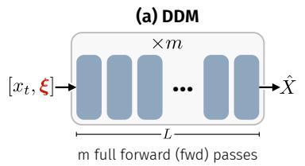

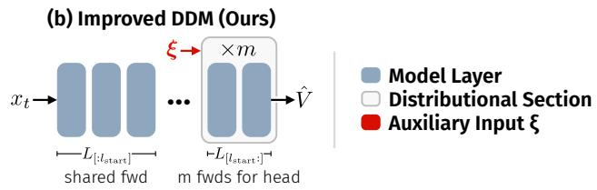  
Figure 2: Deferred Population Expansion. (a) Standard DDM replicates the input m times and processes all particles with the full model (m× cost), concatenating $\xi$ at the input. (b) Our approach processes the shared representation through layers $0 , \ldots , \ell _ { \mathrm { s t a r t } } { - 1 }$ once, then replicates and injects ξ conditioning at layer $\ell _ { \mathrm { s t a r t } }$ . Only the remaining $L - \ell _ { \mathrm { s t a r t } }$ layers pay the m× cost.

These two transition times define three regimes: before speciation, the reverse process remains essentially undifferentiated; between $\tau _ { s }$ and $\tau _ { c } .$ , the dynamics captures coarse structure without collapsing onto a training example; after collapse, a trajectory is attracted toward a particular training datum. The mapping to our parameterization and the associated schedule construction are in Sections 3.2 and Appendix C.

## 3 METHOD

We build on DDMs in two orthogonal directions. Section 3.1 reduces the cost of multi-particle training through deferred population expansion and the associated $\xi$ conditioning. Section 3.2 modifies the training objective through time-dependent scoring rule schedules.

## 3.1 EFFICIENT MULTI-PARTICLE TRAINING AND $\xi$ CONDITIONING

Multi-Particle Training. The DDM objective (Eq. (5)) requires, for each training example, a population of m predictions $\{ \hat { v } _ { \theta } ( t , x _ { t } , \xi _ { j } ) \} _ { i = 1 } ^ { m } ( \mathrm { E q . } 6 )$ obtained from the same $( x _ { t } , t )$ with independent auxiliary noises $\xi _ { 1 } , \ldots , \xi _ { m }$ . We call this replication population expansion. Naïvely, expansion happens at the network input, so the transformer reprocesses the same $x _ { t } \ m$ times $( \mathrm { F i g . } 2 )$ , although particle-specific variation enters only through $\xi _ { j }$ . We instead defer expansion: for a minibatch of size $B ,$ , layers $0 , \ldots , \ell _ { \mathrm { s t a r t } } - 1$ run once at batch size $B ;$ the hidden state is then replicated, ξ is injected, and layers $\ell _ { \mathrm { s t a r t } } , \dots , L - 1$ run at batch size $B \times m \left( \mathrm { F i g . ~ 2 b } \right)$ . Unlike shared-trunk architectures with independently parameterized heads, all particles pass through the same remaining blocks and differ only in the injected noise. This reduces training-step compute to ${ \left( \ell _ { \mathrm { s t a r t } } + \left( L - \bar { \ell } _ { \mathrm { s t a r t } } \right) m \right) } / { \left( L m \right) }$ of naïve DDM, $\mathrm { i . e . } \approx 3 6 \%$ for DiT-XL $( L { = } 2 8 , \ell _ { \mathrm { s t a r t } } { = } 2 4 , m { = } 4 )$ ; we ablate $\ell _ { \mathrm { s t a r t } }$ in Section 4.1.

ξ Conditioning. After expansion, each particle’s noise $\xi _ { j }$ must be injected into the replicated hidden state. We compare four mechanisms (Fig. 3): channel-wise concatenation, residual addition, adaptive normalization, and register tokens. Concatenating $\xi _ { j }$ widens the residual stream from d to $d + d _ { \mathrm { c a t } }$ channels, so we test three variants: (i) widening all late-layer attention and MLP projections accordingly, (ii) widening only the residual stream while keeping attention and MLP at their original inner width (fixed inner width), or (iii) replacing $d _ { \mathrm { c a t } }$ existing channels with $\xi _ { j }$ so the width stays d. We adopt fixed-inner-width concatenation, as it gives the lowest 4-step FID at roughly the baseline parameter count, whereas adaptive normalization and register tokens break down at few steps (Tab. 2b). Concretely, $h _ { j } = [ h , \xi _ { j } ] \in \mathbb { R } ^ { N \times ( d + d _ { \mathrm { c a t } } ) }$ for N tokens is carried through all remaining blocks, and the velocity is read from the first d channels. A learned t-dependent gate (Eq. 24, App. E) further lets the model scale $\xi _ { j }$ per noise level. All choices are ablated in Section 4.1.

## 3.2 TIME-DEPENDENT SCORING RULE SCHEDULES

De Bortoli et al. (2025b) found that the best $\left( \lambda , \beta \right) \left( \operatorname { E q . } 5 \right)$ depends on the sampling budget: models trained with $\lambda \approx 1 , \beta \approx 1$ sample best with few steps, whereas $\lambda \approx 0 , \beta \approx 2$ is best with many steps. A key insight from DDM is that $\lambda < 1$ causes the model to underestimate the variance of $p ( x _ { 1 } | x _ { t } )$ biasing learning toward the conditional mean. When the posterior is already concentrated $( \mathbf { e } . \mathbf { g } . \ t \approx 1 )$ this bias is beneficial; when it is broad, it is harmful. This motivates making $( \lambda , \beta )$ depend on t.

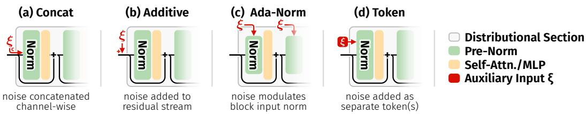  
Figure 3: ξ-conditioning mechanisms. After expansion, ξ is injected by (a) channel-wise concatenation, which appends ξ-features to the residual stream, (b) residual addition, which adds projected ξ-features to hidden states, (c) AdaNorm modulation, which conditions the normalization path, (d) or register tokens, which expose ξ through additional tokens.

We propose time-dependent schedules $( \lambda ( t ) , \beta ( t ) )$ to allocate the model’s finite capacity by linking the training objective to the complexity of $p ( x _ { 1 } \mid x _ { t } )$ at each phase of the diffusion process, using the dynamical regimes of Biroli et al. (2024) to locate where the objective should transition from distributional toward regression-like behavior. App. D further motivates this orientation through a posterior-covariance bias criterion, which determines the direction of the schedule not its exact shape.

## 3.2.1 UNDERSTANDING THE POSTERIOR EVOLUTION THROUGH DYNAMICAL REGIMES

As described in Section 2.3, the dynamical regimes framework of Biroli et al. (2024) identifies three phases of the reverse dynamics separated by two characteristic transition times. We use these transition times as anchors for schedule design, linking the dynamical picture to the evolution of the conditional law $p ( x _ { 1 } \mid x _ { t } )$ . In Biroli et al. (2024), we have that $x _ { \tau } = \exp [ - \tau ] x _ { \mathrm { d a t a } } + ( 1 - \exp [ - 2 \tau ] ) ^ { 1 / 2 } z$ whereas in equation 1 we have $x _ { t } = ( 1 - t ) z + t x _ { \mathrm { d a t a } }$ . In order to transfer the learning of Biroli et al. (2024) to our setting we perform the time change of variable $t \mapsto \phi ( t )$ such that $\begin{array} { r } { \rho ( t ) = \frac { \exp [ - 2 \phi ( t ) ] } { 1 - \exp [ - 2 \phi ( t ) ] } = \frac { t ^ { 2 } } { ( 1 - t ) ^ { 2 } } , } \end{array}$ thereby effectively mapping the Signal-to-Noise Ratio (SNR) of Flow Matching to the one of Biroli et al. (2024).

For schedule design, we therefore use the following regime picture:

Regimes I-II $( \rho < \rho _ { c } ) \colon$ Prior and Manifold Localization. Below speciation $( \rho < \rho _ { s } ) , p ( x _ { 1 } \mid x _ { t } )$ is close to the data prior; between speciation and collapse it localizes onto a lower-dimensional manifold as a complex, multimodal distribution.

Scheduling Implication (Regime I and II): Favor a more distributional objective.

Regime III $( \rho \geq \rho _ { c } ) { : }$ Collapse. After collapse, the posterior is mode-dominated but not necessarily concentrated. We refine this regime with a geometric separation threshold $\rho _ { \mathrm { s e p } } ( \varepsilon ) = 4 \chi _ { d , 1 - \varepsilon } ^ { 2 } / d _ { \mathrm { m i n } } ^ { 2 } ,$ where $d _ { \mathrm { m i n } }$ is the minimum pairwise distance between training points and $\chi _ { d , 1 - \varepsilon } ^ { 2 }$ the $( 1 - \varepsilon )$ -quantile of a $\chi _ { d } ^ { 2 }$ variable: at this SNR, the $( 1 - \varepsilon )$ -quantile noise ball around each noised training point fits within half the distance to its nearest neighbor (derivation in App. C.2). This splits Regime III into an ambiguous window IIIa $( \rho _ { c } \le \rho < \rho _ { \mathrm { s e p } } )$ and an unambiguous data-end regime IIIb $( \rho \geq \rho _ { \mathrm { s e p } } )$ .

Scheduling Implication (Regime IIIa): Maintain spread while tapering to a sharper objective.

Scheduling Implication (Regime IIIb): Regression-dominated objective.

We instantiate time-dependent schedules for the generalized energy score equation 4, varying both the interaction weight $\lambda \in [ 0 , 1 ]$ and the norm exponent $\beta \in ( 0 , 2 ]$ through shape functions $s _ { \lambda } ( t ) , s _ { \beta } ( t ) \in$ [0, 1]:

$$
\lambda ( t ) \ : = \ : \lambda _ { \mathrm { m a x } } \cdot s _ { \lambda } ( t ) , \qquad \beta ( t ) \ : = \ : 2 - ( 2 - \beta _ { \mathrm { m i n } } ) \cdot s _ { \beta } ( t ) .\tag{7}
$$

The shape functions control how strongly the objective departs from the regression-like limit: $s _ { \lambda } ( t ) =$ 0 removes the interaction term, $s _ { \beta } ( t ) = 0$ gives $\beta ( t ) = 2$ , and $\beta _ { \mathrm { m i n } } = 1$ gives the standard energy score at the schedule peak. We use five profile families (Appendix D): constant (the original DDM), linear, step, SNR, and dynamical-regimes (dyn-reg), which is piecewise linear in t with $s ( t ) = 1$ for $t \leq t _ { s }$ and $s ( t ) = 0$ for $t \geq t _ { \mathrm { s e p } }$ . By default, we use the linear profile $s _ { \lambda } ( t ) = s _ { \beta } ( t ) = \dot { 1 } - t$ with $\beta _ { \mathrm { m i n } } = 0 . 1$ , which matches dyn-reg (Tab. 3b) without requiring the regime thresholds.

Table 1: Main Ablation. Starting from DDM (De Bortoli et al., 2025b) baseline (DiT-B, ImageNet-256<sup>2</sup>), we gradually add our proposed components. (CONFIG F) achieves the best performance.
<table><tr><td rowspan="2">Method</td><td rowspan="2">Train Cost</td><td colspan="4">FID↓ (by steps)</td></tr><tr><td>50</td><td>20</td><td>10</td><td>4</td></tr><tr><td>FM Reference</td><td>1.0×</td><td>4.97</td><td>5.64</td><td>8.11</td><td>26.53</td></tr><tr><td>A DDM Baseline (naïve adaptation to transformers)</td><td>4.0×</td><td>10.04</td><td>10.16</td><td>11.85</td><td>43.68</td></tr><tr><td>B + Deferred Expansion</td><td>1.5×</td><td>5.41</td><td>5.71</td><td>7.25</td><td>17.51</td></tr><tr><td>C + t-Adaptive Noise Gating</td><td>1.5×</td><td>5.50</td><td>5.70</td><td>7.02</td><td>16.02</td></tr><tr><td>D + Improved ξ Conditioning</td><td>1.5×</td><td>5.47</td><td>5.62</td><td>6.97</td><td>15.74</td></tr><tr><td>E + Time-dependent Scoring Rule Schedules</td><td>1.5×</td><td>5.69</td><td>5.98</td><td>7.11</td><td>14.33</td></tr><tr><td>F + Improved Train-time t Sampling</td><td>1.5×</td><td>4.56</td><td>4.98</td><td>6.42</td><td>13.13</td></tr></table>

## 4 EXPERIMENTS

The section is organized as follows. We first ablate our design choices (Tab. 1), then compare against few-step methods in a controlled setting (Tab. 4a) and finally at system level at large scale (Tab. 4b).

Experiment Settings. We train B-scale latent DiTs (depth 12, width 768) (Peebles & Xie, 2023; Vaswani et al., 2017; Dosovitskiy et al., 2021; Rombach et al., 2022) on class-conditional ImageNet 256<sup>2</sup> (Russakovsky et al., 2015) for 400k steps using AdamW (Loshchilov & Hutter, 2019) unless noted otherwise (all hyperparameters in Table 5). Evaluations primarily use FID@50k↓ (Heusel et al., 2017) in many- (50) and few-step (4) settings, with individually swept CFG scales (Ho & Salimans, 2022). We report FD-DINOv2, KID, KDD, Inception Score, precision, and recall in Appendix B.

## 4.1 ABLATION STUDY

We ablate the design decisions of Section 3 along three axes: (i) architectural choices, including deferred particle expansion (Sec 3.1), t-dependent ξ gating (App E), and noise conditioning variants (Fig 3); (ii) time-dependent scoring rule schedules (λ(t), β(t)) (Sec 3.2); and (iii) the training time distribution p(t) in equation 5. Table 1 adds them step by step, from a DDM (De Bortoli et al., 2025b) baseline (CONFIG A) to our final method (CONFIG F). To disentangle individual contributions, Table 8 adds each independently to CONFIG B, and all improve the 4-step result without retuning.

## 4.1.1 DEFERRED EXPANSION & ARCHITECTURAL IMPROVEMENTS

In Table 1, we gradually add deferred expansion and architectural improvements (CONFIGS A→D).   
Then in Table 2 and Fig. 4, we report results starting from CONFIG D to account for joint interactions.

Deferred Expansion (CONFIG B). Compared to a FM (Lipman et al., 2023) baseline, DDMs (De Bortoli et al., 2025b) incur a large training cost overhead proportional to the number of particles m <sup>2</sup>.

How much should expansion be deferred? In Fig. 4 and Table 2a, we vary the number of distributional layers. Without guidance (Fig. 4a, w = 1), less deferral leads to better performance, leading to a direct trade-off between training cost and generation quality. However, in practical settings, CFG (Ho & Salimans, 2022) is typically applied to obtain better generation quality. Once applied, the behavior is reversed: models withfewer distributional layers tolerate high guidance scales, enabling improved performance under guidance (Fig. 4b). This leads to simultaneous reductions in training costs (to 1.5× of FM cost compared to 4× of baseline DDM) and improvements in generation quality.

Timestep-Adaptive Noise Gating (CONFIG C). We study the impact of a learned t-dependent gating mechanism equation 24 which controls the magnitude of noise ξ (see App. E). This slightly reduces many-step performance but boosts few-step generation quality (Tab 1 B→C; Tab 2c).

Improved ξ Conditioning (CONFIG D). Compared to DDM (De Bortoli et al., 2025b), which concatenates ξ channel-wise to the model input in pixel space, our deferred expansion affords a larger design space, explored in Tab. 2b. Among concatenation variants, full widening expands all late-layer projections, fixed-inner-width widening carries $\xi$ only in the residual stream, and substitution overwrites channels. Fixed-inner-width concatenation gives the best trade-off, so we adopt it. Adaptive norms and token conditioning underperform severely, especially with few steps.

Table 2: Architecture Design Space. Starting from CONFIG D (Table 1), we explore optimal hyperparameters for our architectural changes using FID↓. Best, 2nd, and final choices are highlighted.  
(a) Expansion Start Layer. Few-step inference performs best for $\ell _ { \mathrm { s t a r t } } \in [ 8 , 1 0 ]$ . We choose $\ell _ { \mathrm { s t a r t } } =$ 10 as it combines good few-step results with low extra cost.  
(b) ξ Conditioning.  
Ada-norms/ξ tokens work poorly; fixed concat works best.  
(c) Noise Gating. Learned t-adaptive gating improves few-step results.
<table><tr><td> $\ell _ { \mathrm { s t a r t } }$ </td><td>Cost</td><td></td><td>50-step 4-step</td><td> $\ell _ { \mathrm { s t a r t } }$ </td><td>Cost</td><td>50-step</td><td>4-step</td></tr><tr><td>0</td><td>4.00×</td><td>7.67</td><td>26.62</td><td>6</td><td>2.50×</td><td>6.39</td><td>20.27</td></tr><tr><td>1</td><td>3.75×</td><td>7.79</td><td>24.27</td><td>7</td><td>2.25×</td><td>6.30</td><td>16.23</td></tr><tr><td>2</td><td>3.50×</td><td>7.39</td><td>22.21</td><td>8</td><td>2.00×</td><td>5.55</td><td>15.43</td></tr><tr><td>3</td><td>3.25×</td><td>7.03</td><td>24.41</td><td>9</td><td>1.75×</td><td>5.59</td><td>14.96</td></tr><tr><td>4</td><td>3.00×</td><td>6.99</td><td>25.85</td><td>10</td><td>1.50×</td><td>5.47</td><td>15.74</td></tr><tr><td>5</td><td>2.75×</td><td>6.61</td><td>24.51</td><td>11</td><td>1.25×</td><td>5.41</td><td>18.15</td></tr></table>

<table><tr><td>Mechanism</td><td>50-step 4-step</td><td></td></tr><tr><td>ada-norm</td><td>6.63</td><td>97.06</td></tr><tr><td>additive</td><td>5.49</td><td>17.00</td></tr><tr><td>tokens</td><td>6.38</td><td>70.17</td></tr><tr><td>concat subst.</td><td>5.51</td><td>16.02</td></tr><tr><td>concat+fixed</td><td>5.47</td><td>15.74</td></tr><tr><td>concat+scale†</td><td>5.23</td><td>16.29</td></tr></table>

<table><tr><td>Gating</td><td>50-step 4-step</td></tr><tr><td>static</td><td>5.35</td><td>17.46</td></tr><tr><td>t-adaptive</td><td>5.47</td><td>15.74</td></tr></table>

<sup>†</sup>adds substantial additionaltrainable parameters (∼10M)

Table 3: Training Objective Design Space. We explore the optimal choice of hyperparameters and ablate our training objective improvements, using FID↓. Best, 2nd, and final choices are highlighted.  
(a) Initial Exponent.
<table><tr><td>β(t = 0)</td><td>50-step</td><td>4-step</td></tr><tr><td>1.00</td><td>5.34</td><td>14.80</td></tr><tr><td>0.50</td><td>5.43</td><td>15.04</td></tr><tr><td>0.10</td><td>5.69</td><td>14.33</td></tr><tr><td>0.01</td><td>5.89</td><td>14.42</td></tr></table>

(b) Scoring Rule Scheduling. (i) Linear scheduling gives the best few-step results. Note however that the landscape changes as the number of steps increase. For 50-steps, step combination, with early switch to diffusion-like behavior dominate (ii-iii) We also explore omitting either scheduler. While most of those combinations underperform, we find surprisingly that keeping λ = 1 and a step schedule for $\beta$ yields good results.

(c) Train t Sampling.
<table><tr><td>p(t)</td><td>50-step 4-step</td><td></td></tr><tr><td>imf</td><td>5.18</td><td>13.98</td></tr><tr><td>jit</td><td>4.57</td><td>13.13</td></tr><tr><td>logit</td><td>5.70</td><td>14.58</td></tr><tr><td>uniform</td><td>6.61</td><td>15.39</td></tr></table>

(i) Schedule β(t), λ(t). (ii) Ablation: only $\beta ( t ) , \lambda = 1$ (iii) Ablation: only $\lambda ( t ) , \beta = 1$

<table><tr><td colspan="2">(d) Kernel sp. mode.</td></tr><tr><td>Kernel</td><td>50-step 4-step</td></tr><tr><td>global</td><td>5.51 18.36</td></tr><tr><td>local</td><td>5.42 15.88</td></tr></table>

<table><tr><td>Sched. Profile</td><td>50-step</td><td>4-step</td><td>Sched. Profile</td><td> $5 0 \mathrm { - s t e p }$ </td><td>4-step</td><td>Sched. Profile</td><td>50-step</td><td>4-step</td></tr><tr><td>linear</td><td>5.69</td><td>14.33</td><td>linear</td><td>6.12</td><td>16.90</td><td>linear</td><td>5.35</td><td>14.87</td></tr><tr><td>dyn-reg</td><td>5.73</td><td>14.27</td><td>dyn-reg</td><td>6.34</td><td>16.66</td><td>dyn-reg</td><td>5.35</td><td>13.60</td></tr><tr><td>snr</td><td>6.42</td><td>14.64</td><td>snr</td><td>6.96</td><td>17.71</td><td>snr</td><td>5.24</td><td>14.26</td></tr><tr><td>step-0.90</td><td>7.94</td><td>19.94</td><td>step-0.90</td><td>7.95</td><td>22.31</td><td>step-0.90</td><td>5.46</td><td>16.49</td></tr><tr><td>step-0.75</td><td>12.28</td><td>25.16</td><td>step-0.75</td><td>12.64</td><td>28.58</td><td>step-0.75</td><td>5.62</td><td>14.07</td></tr><tr><td>step-0.50</td><td>8.77</td><td>20.18</td><td>step-0.50</td><td>9.21</td><td>18.35</td><td>step-0.50</td><td>5.38</td><td>14.11</td></tr><tr><td>step-0.25</td><td>5.42</td><td>16.30</td><td>step-0.25</td><td>5.61</td><td>14.38</td><td>step-0.25</td><td>5.28</td><td>15.08</td></tr><tr><td>step-0.10</td><td>4.91</td><td>16.23</td><td>step-0.10</td><td>5.10</td><td>13.06</td><td>step-0.10</td><td>5.74</td><td>17.31</td></tr></table>

## 4.1.2 TRAINING OBJECTIVE IMPROVEMENTS

We explore training improvements: time-dependent schedules $( \lambda ( t ) , \beta ( t ) )$ (Section 3.2), the training time distribution p(t), and kernel spatial modes (see Appendix F). The results are in Table 3.

Time-dependent Scoring Rule Schedulers (CONFIG E). Following section 3.2, we use timedependent schedules for $( \lambda ( t ) , \beta ( t ) )$ – hyperparameters of the generalized energy score equation 4. The results for many options of different schedules are given in Table 3b. The linear schedule overall leads to the best trade off in performance for 50 and 4 steps regime. The rest of the results in Table 3 are using this linear schedule.

Do both the norm exponent $\beta$ and the interaction weight λ require scheduling? We also explore omitting the scheduler for either $\beta$ or λ in Table 3b-ii and Table 3b-iii. While most combinations underperform, scheduling only $\beta$ with $\lambda = 1$ and an early switch at $t = 0 . 1$ yields particularly strong FID. We do not adopt this setting as our default because at $( \lambda , \beta ) = ( \bar { 1 , 2 } )$ the score reduces to $\| \mu - y \| ^ { 2 }$ , independent of the population covariance, so the spread of the model’s samples is left unconstrained for $t > 0 . 1$ . Under our schedules, where $\lambda < 1$ , the variance remains identified. A theoretically optimal choice of λ(t) and $\beta ( t )$ remains an open question.

How to set the initial norm exponent $\beta ( t = 0 ) ?$ The schedule for $\beta ( t )$ is an increasing function of t with the lowest value at $\beta ( t = 0 )$ . In Table 3a we run the ablation over this value and find that a value of 0.1 yields the best trade-off between different sampling budgets.

Improved Train-time t Sampling (CONFIG F). Finally, Table 3c compares different distributions from which to sample t during training. Since we apply no further t-dependent loss weighting, these control both the implicit time-dependent weighting of the objective and the distribution of

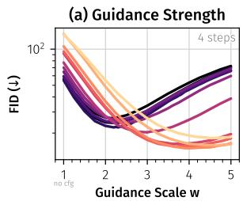

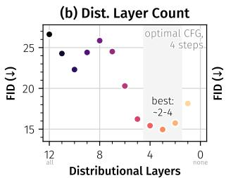

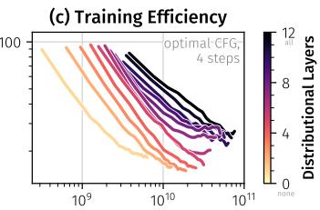  
Training Compute (GFLOP)

Figure 4: Few-Step Generation Quality vs. Number of Distributional Layers. We train a DiT-B on ImageNet for 400k steps and evaluate FID on 50k 4-step samples, optionally using CFG. (a) In the unguided setting, more distributional layers improve generation quality. However, this trend reverses in the practical setting with CFG, with models withfewer distributional layers performing better. (b) Under optimal guidance, 2-4 distributional layers lead to to the best results. (c) Training efficiency decreases significantly with many distributional layers, but convergence bottoms out early with too few (notably, also for some models with higher distributional layer count). Similarly to the step-matched setting in (b), around 2-5 distributional layers offer a good efficiency-quality trade-off.

interpolants $x _ { t }$ seen during training. We observe that jit distribution leads to the best results. This noise distribution biases the time towards the initial noise, where distributional losses matter more.

For compactness, we report FID only in the main text. The improvements persist across all additional metrics, including FD-DINOv2, KID, KDD, Inception Score, precision, and recall and are reported in Table 9. Repeated sampling from fixed $x _ { t }$ further confirms that iDDM produces conditional diversity that deterministic FM cannot (Table 11). Accounting for iDDM’s higher per-step training cost, a compute-matched comparison shows the same few-step advantage: at the training budget of the 400k-step FM baseline, iDDM (260k steps) improves 4-step FID from 26.70 to 14.33, while FM remains slightly better at 50 steps (4.97 vs. 5.62); see Table 10 for the full compute sweep.

## 4.2 COMPARISON WITH PREVIOUS METHODS

Controlled Comparison on ImageNet-256<sup>2</sup>. Existing few-step methods (Zhou et al., 2025a; Geng et al., 2025; 2026; Potaptchik et al., 2026) typically report results in highly varying settings, making fair comparisons challenging. We therefore compare with them in a controlled setting, retraining all models from scratch at B-scale with comparable settings. We re-sweep relevant hyperparameters to ensure a fair comparison. As shown in Table 4a, iDDM substantially improves over naïve DDM, reducing 4-step FID from 43.68 to 13.13 and 50-step FID from 10.04 to 4.57, and the deterministic baselines, while remaining competitive with stochastic flow-map methods across sampling budgets.

System-Level Results. At XL scale, iDDM-XL/2 reaches 2.38 FID at 50 steps and 4.48 at 4 steps after 200 epochs (samples in Fig. 1). Table 4b compares iDDM against deterministic few-step flow-map methods trained from scratch (Frans et al., 2025; Geng et al., 2025; 2026; Zhou et al., 2025a) and against MFM (Potaptchik et al., 2026), which uses multi-stage training from a pretrained model. Entries marked <sup>∗</sup> are taken from the respective papers, all others are evaluated by us with official checkpoints and code. Both DDM and iDDM are trained from scratch.

Positioning w.r.t. MeanFlow-style and few-step methods. At 1-2 steps, teacher-based distillation such as sCD (Lu & Song, 2025) and ADD (Sauer et al., 2025) achieves the lowest FID, but targets a different operating point: it requires a pretrained many-step teacher and a second training stage while iDDM doesn’t. Among methods trained from scratch, published iMF and IMM checkpoints attain lower FID than iDDM at every inference budget, at a substantially higher training cost: iMF uses a 48-layer model and roughly 17.6× our total training budget, and IMM 19× more training epochs. iDDM instead combines three properties that no baseline in Table 4 offers together. (i) It is stochastic: it learns a conditional predictor trained to sample from $p ( x _ { 1 } \mid x _ { t } )$ , whereas MeanFlow, iMF, and IMM learn deterministic maps (see App. B.1, par. "Posterior Diversity" and Tab. 11 for a comparison with FM). (ii) It is trained from scratch in a single stage, whereas the published MFM results rely on a pretrained flow map and multi-stage training. (iii) A single checkpoint serves the full 4-50 step range without degrading: its FID is non-increasing in the number of steps (4.48 → 2.38), whereas MeanFlow (2.93 → 3.29) and MFM (1.97 → 5.74) are stronger at 4-8 steps but get worse with additional sampling compute. iDDM is also relatively inexpensive to train: per training step it costs 1.41× flow matching, versus 1.96× for MeanFlow and 6.20× for iMF (Table 12). Finally,

Table 4: Few-Step Comparison on ImageNet-256<sup>2</sup> (FID↓). iDDM significantly improves upon DDM and achieves competitive FID across all steps while training from scratch in a single stage.  
(a) Controlled Comparison at DiT-B scale (depth 12, width 768), retrained from scratch under same standard settings (400k steps/80ep).
<table><tr><td>Method</td><td>50-step</td><td>4-step</td></tr><tr><td colspan="2">Deterministic Methods</td><td></td></tr><tr><td>Shortcut</td><td>9.858</td><td>15.02</td></tr><tr><td>IMM</td><td>7.57</td><td>24.85</td></tr><tr><td>Stochastic Methods</td><td></td><td></td></tr><tr><td>MFM</td><td>7.72</td><td>9.17</td></tr><tr><td>DDM (naïve)</td><td>10.04</td><td>43.68</td></tr><tr><td>iDDM (ours)</td><td>4.57</td><td>13.13</td></tr></table>

(b) System-level Comparison at DiT-XL scale (depth 28, width 1152). <sup>†</sup>iMF uses a much deeper transformer (28→48 layers).
<table><tr><td>Method</td><td>#Epochs</td><td>50-step</td><td>16-step</td><td>8-step</td><td>4-step</td></tr><tr><td colspan="6">Deterministic Few-step Flow-map models from scratch</td></tr><tr><td>Shortcut-XL/2</td><td>162</td><td>4.688</td><td>5.39</td><td>5.74</td><td>7.8 *</td></tr><tr><td>MeanFlow-XL/2</td><td>240</td><td>3.29</td><td>3.06</td><td>2.93</td><td>2.93</td></tr><tr><td>iMF-XL/2†</td><td>800</td><td>1.43</td><td>1.43</td><td>1.50</td><td>1.51</td></tr><tr><td>IMM-XL/2</td><td>3840</td><td>1.82</td><td>1.86</td><td>1.99*</td><td>2.51*</td></tr><tr><td colspan="6">Stochastic Few-step Flow-map (multi-stage training)</td></tr><tr><td>MFM-XL/2</td><td>800+80+28</td><td>5.74</td><td>3.29</td><td>2.19</td><td>1.97*</td></tr><tr><td colspan="6">Stochastic Few-step diffusion/FM from scratch</td></tr><tr><td>DDM-XL/2 (naïve)</td><td>200</td><td>4.71</td><td>4.50</td><td>5.70</td><td>23.25</td></tr><tr><td>iDDM-XL/2 (ours)</td><td>200</td><td>2.38</td><td>3.03</td><td>3.04</td><td>4.48</td></tr></table>

<sup>§</sup>evaluated at 64 sampling steps since Shortcut only supports powers of two.

against flow matching at matched training compute (Table 10), iDDM halves 4-step FID (13.13 vs.   
26.36) while staying within 0.40 FID at 50 steps (4.61 vs. 4.21).

Transfer to T2I. We transfer iDDM to a 1.6B-parameter text-to-image model. Relative to a matched FM baseline, iDDM degrades far less as the budget decreases, improving MS-COCO FID from 78.20 to 41.05 at 4 steps and from 26.33 to 19.40 at 8 steps (App. B.2). Samples in Fig. 5.

  
Figure 5: Example images generated by our text-to-image model at $5 1 2 ^ { 2 }$ resolution. For this, we finetune for 20k training steps our model pretrained on $2 \breve { 5 } 6 ^ { 2 }$ resolution.

## 5 RELATED WORK

Accelerating diffusion sampling. Distillation (Luhman & Luhman, 2021; Sauer et al., 2025; Yin et al., 2024; Salimans & Ho, 2022; Liu et al., 2024; Song et al., 2023; Xu et al., 2024; Salimans et al., 2024) trains a few-step student against a many-step teacher; improved samplers (Lu et al., 2022; 2025; Zheng et al., 2023; Karras et al., 2022) reduce discretization error of a frozen model; parallel and speculative methods (Shih et al., 2023; Chen et al., 2024; De Bortoli et al., 2025a) address the sequential nature of diffusion models. Our work is complementary to all three: we modify the training objective, not the sampler. For instance, our method integrates with the Universal Inverse Distillation framework of Kornilov et al. (2025) by swapping the diffusion loss for a distributional one.

Learning the diffusion posterior. Several approaches enrich the standard mean-prediction denoiser with (co)variance information for few-step sampling (Ho et al., 2020; Nichol & Dhariwal, 2021; Bao et al., 2022a;b; Ou et al., 2025). Diffusion-GAN (Xiao et al., 2022) and UFOGen (Xu et al., 2024) learn multimodal conditional generators via adversarial training conditioned on a noise variable ξ—architecturally close to DDMs but trained against a discriminator instead of a proper scoring rule. Aiello et al. (2024) and Galashov et al. (2025) use MMD on CLIP features and MMD gradient flows respectively; Wang & He (2025) regularises representations for diversity without explicit distributional training. We build directly on the generalized energy score formulation of (De Bortoli et al., 2025b; Shen et al., 2025), addressing its training cost and its static hyperparameters. Very recent works also investigate the use of distributional losses in representation space Yang et al. (2026). Extended related work on the distributional lineage of our method can be found in Section H.

Consistency, moment-matching, and fastforward methods. Consistency Models (Song et al., 2023; Song & Dhariwal, 2024) and extensions like Consistency Trajectory Models (Kim et al., 2024) and Shortcut Models (Frans et al., 2025) learn self-consistent few-step generators. MeanFlow (Geng et al., 2025) learns an average velocity field for one-step generation, and the improved iMF variant addresses training stability and recovers inference flexibility (Geng et al., 2026). AlphaFlow (Zhang et al., 2026) interpolates between flow matching and MeanFlow via a schedule. Our method takes a different approach and share the multi-particle philosophy with IMM (Zhou et al., 2025a) and our focus remains only on the few-step regime (4-50).

Meta Flow Maps and stochastic flow maps. MFM (Potaptchik et al., 2026) amortises stochastic flow maps producing i.i.d. samples from $p _ { 1 | t } ( \cdot \mid x _ { t } )$ via diagonal flow matching and consistency losses. MFM and DDM target the same object $( p _ { 1 | t } )$ but differ in the training principle — consistency along auxiliary ODEs versus a proper scoring rule on populations. The emphasis of Potaptchik et al. (2026) is reward alignment through efficient value-function estimation from stochastic endpoint samples, whereas our focus is multi-step generation under direct scoring rule training. Our experiments therefore address a different operating regime with late expansion and time-dependent schedules.

## 6 CONCLUSION

We presented a method that makes efficient stochastic few-step generation with DDMs feasible at DiT scale via two complementary contributions. First, deferred population expansion enables efficient multi-particle training: it shares the early transformer layers across particles and injects particle-specific noise only in a late distributional section, reducing the cost of m = 4 DDM training from roughly 4× flow matching to about 1.5×. Second, time-dependent scoring rule schedules and improved training-time sampling provide time-adaptive distributional objectives, improving few-step performance. Overall, our results suggest that shared computation, carefully placed stochasticity, and adaptive objectives make DDMs practical for stochastic few-step generation from scratch.

Limitations. The regime anchors are derived from a mean-field analysis and are approximate at finite scale. Smooth schedules are more robust than hard steps. At 1-2 steps, distilled and fastforward methods remain stronger. Our gains hold from ImageNet-256<sup>2</sup> and transfer to T2I.

## AI USE STATEMENT

In this work, we used generative AI tools for designing and providing feedback on methodology and experiments, as well as assistance implementing methods. We have not used generative AI tools for help developing theoretical or conceptual frameworks, formulating mathematical claims, providing critical ingredients for proving mathematical claims, proposing or refining hypotheses, assistance with translation, cleaning and reformatting datasets, support in qualitative and thematic data analysis, and interpretation of results and synthetic data generation, as well as assistance in the writing of proofs, are not applicable to this work. Additionally, we used generative AI tools for creating or modifying scientific figures, creating and editing software code, summarizing existing literature, brainstorming, sourcing/searching for information, editing the research paper for readability, and the identification of relevant literature. We have reviewed all AI-assisted work. Methodology and experiments as well as brainstorming results were discussed among at least two researchers, LLM-generated code was verified and tested for correctness, LLM-assisted literature search was followed up by manual literature review as well as verification of correct summaries by at least two researchers. Finally, AI-generated figures were manually verified and improved. Figures were discussed with at least two researchers to ensure correctness and understandability. We take responsibility for the final content of this work, including text, claims or artifacts produced with the aid of generative AI.

## REPRODUCIBILITY STATEMENT

iDDM is trained using publicly available datasets. We detail data processing and training in Appendix. iDDM is a simple method that works with standard transformers requiring only minimal modifications. Additionally, we detail hyperparameter settings in the Appendix A. We build upon existing evaluation pipelines and detail evaluation protocols and metrics in Appendix B.1. Therefore, iDDM is easy to reproduce from scratch. To further facilitate reproduction, released code and model checkpoints are available at https://github.com/CompVis/iDDM.

## REFERENCES

Josh Abramson, Jonas Adler, Jack Dunger, Richard Evans, Tim Green, Alexander Pritzel, Olaf Ronneberger, Lindsay Willmore, Andrew J Ballard, Joshua Bambrick, et al. Accurate structure prediction of biomolecular interactions with AlphaFold 3. Nature, 630(8016):493–500, 2024.

Emanuele Aiello, Diego Valsesia, and Enrico Magli. Fast inference in denoising diffusion models via mmd finetuning. IEEE Access, 12:106912–106923, 2024.

Michael Albergo, Nicholas M Boffi, and Eric Vanden-Eijnden. Stochastic interpolants: A unifying framework for flows and diffusions. Journal ofMachine Learning Research, 26(209):1–80, 2025.

Fan Bao, Chongxuan Li, Jiacheng Sun, Jun Zhu, and Bo Zhang. Estimating the optimal covariance with imperfect mean in diffusion probabilistic models. In Kamalika Chaudhuri, Stefanie Jegelka, Le Song, Csaba Szepesvari, Gang Niu, and Sivan Sabato (eds.), Proceedings of the 39th International Conference on Machine Learning, volume 162 of Proceedings ofMachine Learning Research, pp. 1555–1584. PMLR, 17–23 Jul 2022a. URL https://proceedings.mlr. press/v162/bao22d.html.

Fan Bao, Chongxuan Li, Jun Zhu, and Bo Zhang. Analytic-DPM: an analytic estimate of the optimal reverse variance in diffusion probabilistic models. In International Conference on Learning Representations, 2022b. URL https://openreview.net/forum?id=0xiJLKH-ufZ.

Mikołaj Binkowski, Danica J Sutherland, Michael Arbel, and Arthur Gretton. Demystifying mmd ´ gans. arXiv preprint arXiv:1801.01401, 2018.

Giulio Biroli, Tony Bonnaire, Valentin de Bortoli, and Marc Mézard. Dynamical regimes of diffusion models. Nature Communications, 15(1):9957, Nov 2024. ISSN 2041-1723. doi: 10.1038/ s41467-024-54281-3. URL https://doi.org/10.1038/s41467-024-54281-3.

Black Forest Labs. FLUX.2: Frontier Visual Intelligence. https://bfl.ai/blog/flux-2, 2025.

Nicholas Matthew Boffi, Michael Samuel Albergo, and Eric Vanden-Eijnden. How to build a consistency model: Learning flow maps via self-distillation. In The Thirty-ninth Annual Conference on Neural Information Processing Systems, 2025. URL https://openreview.net/forum? id=Di5apl8HSH.

Diane Bouchacourt, Pawan K Mudigonda, and Sebastian Nowozin. Disco nets : Dissimilarity coefficients networks. In D. Lee, M. Sugiyama, U. Luxburg, I. Guyon, and R. Garnett (eds.), Advances in Neural Information Processing Systems, volume 29. Curran Associates, Inc., 2016. URL https://proceedings.neurips.cc/paper\_files/paper/ 2016/file/c0e190d8267e36708f955d7ab048990d-Paper.pdf.

Minwoo Byeon, Beomhee Park, Haecheon Kim, Sungjun Lee, Woonhyuk Baek, and Saehoon Kim. Coyo-700m: Image-text pair dataset. https://github.com/kakaobrain/ coyo-dataset, 2022.

Haoxuan Chen, Yinuo Ren, Lexing Ying, and Grant M. Rotskoff. Accelerating diffusion models with parallel sampling: Inference at sub-linear time complexity. In The Thirty-eighth Annual Conference on Neural Information Processing Systems, 2024. URL https://openreview. net/forum?id=F9NDzHQtOl.

Katherine Crowson, Stefan Andreas Baumann, Alex Birch, Tanishq Mathew Abraham, Daniel Z Kaplan, and Enrico Shippole. Scalable high-resolution pixel-space image synthesis with hourglass diffusion transformers. In Forty-first International Conference on Machine Learning, 2024. URL https://openreview.net/forum?id=WRIn2HmtBS.

Valentin De Bortoli, Alexandre Galashov, Arthur Gretton, and Arnaud Doucet. Accelerated diffusion models via speculative sampling. In Forty-second International Conference on Machine Learning, 2025a. URL https://openreview.net/forum?id=BTJSkPpH1t.

Valentin De Bortoli, Alexandre Galashov, J Swaroop Guntupalli, Guangyao Zhou, Kevin Patrick Murphy, Arthur Gretton, and Arnaud Doucet. Distributional diffusion models with scoring rules. In Forty-second International Conference on Machine Learning, 2025b. URL https: //openreview.net/forum?id=N82967FcVK.

Mingyang Deng, He Li, Tianhong Li, Yilun Du, and Kaiming He. Generative modeling via drifting. arXiv preprint arXiv:2602.04770, 2026.

Prafulla Dhariwal and Alexander Quinn Nichol. Diffusion models beat GANs on image synthesis. In A. Beygelzimer, Y. Dauphin, P. Liang, and J. Wortman Vaughan (eds.), Advances in Neural Information Processing Systems, 2021. URL https://openreview.net/forum?id= AAWuCvzaVt.

Sander Dieleman. Learning the integral of a diffusion model, 2026. URL https://sander.ai/ 2026/05/06/flow-maps.html.

Alexey Dosovitskiy, Lucas Beyer, Alexander Kolesnikov, Dirk Weissenborn, Xiaohua Zhai, Thomas Unterthiner, Mostafa Dehghani, Matthias Minderer, Georg Heigold, Sylvain Gelly, Jakob Uszkoreit, and Neil Houlsby. An image is worth 16x16 words: Transformers for image recognition at scale. In International Conference on Learning Representations, 2021. URL https://openreview. net/forum?id=YicbFdNTTy.

Patrick Esser, Sumith Kulal, Andreas Blattmann, Rahim Entezari, Jonas Müller, Harry Saini, Yam Levi, Dominik Lorenz, Axel Sauer, Frederic Boesel, et al. Scaling rectified flow transformers for high-resolution image synthesis. arXiv preprint arXiv:2403.03206, 2024.

Kevin Frans, Danijar Hafner, Sergey Levine, and Pieter Abbeel. One step diffusion via shortcut models. In The Thirteenth International Conference on Learning Representations, 2025. URL https://openreview.net/forum?id=OlzB6LnXcS.

Alexandre Galashov, Valentin De Bortoli, and Arthur Gretton. Deep MMD gradient flow without adversarial training. In The Thirteenth International Conference on Learning Representations, 2025. URL https://openreview.net/forum?id=Pf85K2wtz8.

Zhengyang Geng, Mingyang Deng, Xingjian Bai, J Zico Kolter, and Kaiming He. Mean flows for one-step generative modeling. In The Thirty-ninth Annual Conference on Neural Information Processing Systems, 2025. URL https://openreview.net/forum?id=uWj4s7rMnR.

Zhengyang Geng, Yiyang Lu, Zongze Wu, Eli Shechtman, J Zico Kolter, and Kaiming He. Improved mean flows: On the challenges of fastforward generative models. In Proceedings ofthe IEEE/CVF Conference on Computer Vision and Pattern Recognition, pp. 30467–30476, 2026.

Dhruba Ghosh, Hannaneh Hajishirzi, and Ludwig Schmidt. Geneval: An object-focused framework for evaluating text-to-image alignment. Advances in Neural Information Processing Systems, 36: 52132–52152, 2023.

Tilmann Gneiting and Adrian E Raftery. Strictly proper scoring rules, prediction, and estimation. Journal of the American Statistical Association, 102(477):359–378, 2007. doi: 10.1198/ 016214506000001437. URL https://doi.org/10.1198/016214506000001437.

Jiatao Gu, Tianrong Chen, David Berthelot, Huangjie Zheng, Yuyang Wang, Ruixiang Zhang, Laurent Dinh, Miguel Angel Bautista, Josh Susskind, and Shuangfei Zhai. Starflow: Scaling latent normalizing flows for high-resolution image synthesis. NeurIPS, 2025.

Jiaqi Han, Puheng Li, Qiushan Guo, Renyuan Xu, Stefano Ermon, and Emmanuel J. Candès. One-step generative modeling via wasserstein gradient flows, 2026. URL https://arxiv.org/abs/ 2605.11755.

Martin Heusel, Hubert Ramsauer, Thomas Unterthiner, Bernhard Nessler, and Sepp Hochreiter. Gans trained by a two time-scale update rule converge to a local nash equilibrium. Advances in neural information processing systems, 30, 2017.

Jonathan Ho and Tim Salimans. Classifier-free diffusion guidance, 2022. URL https://arxiv. org/abs/2207.12598.

Jonathan Ho, Ajay Jain, and Pieter Abbeel. Denoising diffusion probabilistic models. In H. Larochelle, M. Ranzato, R. Hadsell, M.F. Balcan, and H. Lin (eds.), Advances in Neural Information Processing Systems, volume 33, pp. 6840–6851. Curran Associates, Inc., 2020. URL https://proceedings.neurips.cc/paper\_files/paper/2020/ file/4c5bcfec8584af0d967f1ab10179ca4b-Paper.pdf.

Jonathan Ho, Tim Salimans, Alexey A. Gritsenko, William Chan, Mohammad Norouzi, and David J. Fleet. Video diffusion models. In Alice H. Oh, Alekh Agarwal, Danielle Belgrave, and Kyunghyun Cho (eds.), Advances in Neural Information Processing Systems, 2022. URL https://openreview.net/forum?id=f3zNgKga\_ep.

Kaiyi Huang, Kaiyue Sun, Enze Xie, Zhenguo Li, and Xihui Liu. T2i-compbench: A comprehensive benchmark for open-world compositional text-to-image generation. Advances in Neural Information Processing Systems, 36:78723–78747, 2023.

Tero Karras, Miika Aittala, Timo Aila, and Samuli Laine. Elucidating the design space of diffusion-based generative models. In Alice H. Oh, Alekh Agarwal, Danielle Belgrave, and Kyunghyun Cho (eds.), Advances in Neural Information Processing Systems, 2022. URL https://openreview.net/forum?id=k7FuTOWMOc7.

Tero Karras, Miika Aittala, Jaakko Lehtinen, Janne Hellsten, Timo Aila, and Samuli Laine. Analyzing and improving the training dynamics of diffusion models. In 2024 IEEE/CVF Conference on Computer Vision and Pattern Recognition (CVPR), pp. 24174–24184. IEEE, 2024.

Dongjun Kim, Chieh-Hsin Lai, Wei-Hsiang Liao, Naoki Murata, Yuhta Takida, Toshimitsu Uesaka, Yutong He, Yuki Mitsufuji, and Stefano Ermon. Consistency trajectory models: Learning probability flow ODE trajectory of diffusion. In The Twelfth International Conference on Learning Representations, 2024. URL https://openreview.net/forum?id=ymjI8feDTD.

Zhifeng Kong, Wei Ping, Jiaji Huang, Kexin Zhao, and Bryan Catanzaro. Diffwave: A versatile diffusion model for audio synthesis. In International Conference on Learning Representations, 2021. URL https://openreview.net/forum?id=a-xFK8Ymz5J.

Nikita Kornilov, David Li, Tikhon Mavrin, Aleksei Leonov, Nikita Gushchin, Evgeny Burnaev, Iaroslav Koshelev, and Alexander Korotin. Universal inverse distillation for matching models with real-data supervision (no gans). arXiv preprint arXiv:2509.22459, 2025.

Tuomas Kynkäänniemi, Tero Karras, Samuli Laine, Jaakko Lehtinen, and Timo Aila. Improved precision and recall metric for assessing generative models. Advances in neural information processing systems, 32, 2019.

Kyungmin Lee, Sihyun Yu, and Jinwoo Shin. Decoupled meanflow: Turning flow models into flow maps for accelerated sampling. In The Fourteenth International Conference on Learning Representations, 2026. URL https://openreview.net/forum?id=P4VsQexEPe.

Xingjian Leng, Jaskirat Singh, Yunzhong Hou, Zhenchang Xing, Saining Xie, and Liang Zheng. REPA-E: Unlocking VAE for end-to-end tuning with latent diffusion transformers, 2025. URL https://arxiv.org/abs/2504.10483.

Mingxin Li, Yanzhao Zhang, Dingkun Long, Keqin Chen, Sibo Song, Shuai Bai, Zhibo Yang, Pengjun Xie, An Yang, Dayiheng Liu, et al. Qwen3-vl-embedding and qwen3-vl-reranker: A unified framework for state-of-the-art multimodal retrieval and ranking. arXiv preprint arXiv:2601.04720, 2026.

Tianhong Li and Kaiming He. Back to basics: Let denoising generative models denoise, 2025. URL https://arxiv.org/abs/2511.13720.

Yujia Li, Kevin Swersky, and Rich Zemel. Generative moment matching networks. In International conference on machine learning, pp. 1718–1727. PMLR, 2015.

Yaron Lipman, Ricky TQ Chen, Heli Ben-Hamu, Maximilian Nickel, and Matt Le. Flow matching for generative modeling. In The Eleventh International Conference on Learning Representations, 2023.

Haohe Liu, Zehua Chen, Yi Yuan, Xinhao Mei, Xubo Liu, Danilo Mandic, Wenwu Wang, and Mark D Plumbley. AudioLDM: Text-to-audio generation with latent diffusion models. In Andreas Krause, Emma Brunskill, Kyunghyun Cho, Barbara Engelhardt, Sivan Sabato, and Jonathan Scarlett (eds.), Proceedings of the 40th International Conference on Machine Learning, volume 202 of Proceedings of Machine Learning Research, pp. 21450–21474. PMLR, 23–29 Jul 2023a. URL https://proceedings.mlr.press/v202/liu23f.html.

Xingchao Liu, Chengyue Gong, and Qiang Liu. Flow straight and fast: Learning to generate and transfer data with rectified flow. In The Eleventh International Conference on Learning Representations, 2023b.

Xingchao Liu, Xiwen Zhang, Jianzhu Ma, Jian Peng, and Qiang Liu. InstaFlow: One step is enough for high-quality diffusion-based text-to-image generation. In The Twelfth International Conference on Learning Representations, 2024. URL https://openreview.net/forum? id=1k4yZbbDqX.

Ze Liu, Han Hu, Yutong Lin, Zhuliang Yao, Zhenda Xie, Yixuan Wei, Jia Ning, Yue Cao, Zheng Zhang, Li Dong, et al. Swin transformer v2: Scaling up capacity and resolution. In Proceedings of the IEEE/CVF conference on computer vision and pattern recognition, pp. 12009–12019, 2022.

Ilya Loshchilov and Frank Hutter. Decoupled weight decay regularization. In International Conference on Learning Representations, 2019. URL https://openreview.net/forum?id= Bkg6RiCqY7.

Cheng Lu and Yang Song. Simplifying, stabilizing and scaling continuous-time consistency models. In The Thirteenth International Conference on Learning Representations, 2025. URL https: //openreview.net/forum?id=LyJi5ugyJx.

Cheng Lu, Yuhao Zhou, Fan Bao, Jianfei Chen, Chongxuan Li, and Jun Zhu. DPM-solver: A fast ODE solver for diffusion probabilistic model sampling in around 10 steps. In Alice H. Oh, Alekh Agarwal, Danielle Belgrave, and Kyunghyun Cho (eds.), Advances in Neural Information Processing Systems, 2022. URL https://openreview.net/forum?id=2uAaGwlP\_V.

Cheng Lu, Yuhao Zhou, Fan Bao, Jianfei Chen, Chongxuan Li, and Jun Zhu. Dpm-solver++: Fast solver for guided sampling of diffusion probabilistic models. Machine Intelligence Research, 22(4):730–751, June 2025. ISSN 2731-5398. doi: 10.1007/s11633-025-1562-4. URL http: //dx.doi.org/10.1007/s11633-025-1562-4.

Eric Luhman and Troy Luhman. Knowledge distillation in iterative generative models for improved sampling speed. arXiv preprint arXiv:2101.02388, 2021.

Nanye Ma, Mark Goldstein, Michael S Albergo, Nicholas M Boffi, Eric Vanden-Eijnden, and Saining Xie. Sit: Exploring flow and diffusion-based generative models with scalable interpolant transformers. In European Conference on Computer Vision, pp. 23–40. Springer, 2024.

Alexander Quinn Nichol and Prafulla Dhariwal. Improved denoising diffusion probabilistic models. In Marina Meila and Tong Zhang (eds.), Proceedings of the 38th International Conference on Machine Learning, volume 139 of Proceedings ofMachine Learning Research, pp. 8162–8171. PMLR, 18–24 Jul 2021. URL https://proceedings.mlr.press/v139/nichol21a.html.

Zijing Ou, Mingtian Zhang, Andi Zhang, Tim Z. Xiao, Yingzhen Li, and David Barber. Improving probabilistic diffusion models with optimal diagonal covariance matching. In The Thirteenth International Conference on Learning Representations, 2025. URL https://openreview. net/forum?id=fV0t65OBUu.

William Peebles and Saining Xie. Scalable diffusion models with transformers. In Proceedings of the IEEE/CVF International Conference on Computer Vision, pp. 4195–4205, 2023.

Yansong Peng, Kai Zhu, Yu Liu, Pingyu Wu, Hebei Li, Xiaoyan Sun, and Feng Wu. FACM: Flow-anchored consistency models. In The Fourteenth International Conference on Learning Representations, 2026. URL https://openreview.net/forum?id=k9BpW1c4in.

Adam Polyak, Amit Zohar, Andrew Brown, Andros Tjandra, Animesh Sinha, Ann Lee, Apoorv Vyas, Bowen Shi, Chih-Yao Ma, Ching-Yao Chuang, David Yan, Dhruv Choudhary, Dingkang Wang, Geet Sethi, Guan Pang, Haoyu Ma, Ishan Misra, Ji Hou, Jialiang Wang, Kiran Jagadeesh, Kunpeng Li, Luxin Zhang, Mannat Singh, Mary Williamson, Matt Le, Matthew Yu, Mitesh Kumar Singh, Peizhao Zhang, Peter Vajda, Quentin Duval, Rohit Girdhar, Roshan Sumbaly, Sai Saketh Rambhatla, Sam Tsai, Samaneh Azadi, Samyak Datta, Sanyuan Chen, Sean Bell, Sharadh Ramaswamy, Shelly Sheynin, Siddharth Bhattacharya, Simran Motwani, Tao Xu, Tianhe Li, Tingbo Hou, Wei-Ning Hsu, Xi Yin, Xiaoliang Dai, Yaniv Taigman, Yaqiao Luo, Yen-Cheng Liu, Yi-Chiao Wu, Yue Zhao, Yuval Kirstain, Zecheng He, Zijian He, Albert Pumarola, Ali Thabet, Artsiom Sanakoyeu, Arun Mallya, Baishan Guo, Boris Araya, Breena Kerr, Carleigh Wood, Ce Liu, Cen Peng, Dimitry Vengertsev, Edgar Schonfeld, Elliot Blanchard, Felix Juefei-Xu, Fraylie Nord, Jeff Liang, John Hoffman, Jonas Kohler, Kaolin Fire, Karthik Sivakumar, Lawrence Chen, Licheng Yu, Luya Gao, Markos Georgopoulos, Rashel Moritz, Sara K. Sampson, Shikai Li, Simone Parmeggiani, Steve Fine, Tara Fowler, Vladan Petrovic, and Yuming Du. Movie gen: A cast of media foundation models, 2025. URL https://arxiv.org/abs/2410.13720.

Peter Potaptchik, Adhi Saravanan, Abbas Mammadov, Alvaro Prat, Michael S. Albergo, and Yee Whye Teh. Meta flow maps enable scalable reward alignment, 2026. URL https: //arxiv.org/abs/2601.14430.

Robin Rombach, Andreas Blattmann, Dominik Lorenz, Patrick Esser, and Björn Ommer. Highresolution image synthesis with latent diffusion models. In Proceedings ofthe IEEE Conference on Computer Vision and Pattern Recognition (CVPR), 2022. URL https://github.com/ CompVis/latent-diffusionhttps://arxiv.org/abs/2112.10752.

Olga Russakovsky, Jia Deng, Hao Su, Jonathan Krause, Sanjeev Satheesh, Sean Ma, Zhiheng Huang, Andrej Karpathy, Aditya Khosla, Michael Bernstein, et al. Imagenet large scale visual recognition challenge. International Journal ofComputer Vision, 115(3):211–252, 2015.

Chitwan Saharia, William Chan, Saurabh Saxena, Lala Li, Jay Whang, Emily L Denton, Kamyar Ghasemipour, Raphael Gontijo Lopes, Burcu Karagol Ayan, Tim Salimans, et al. Photorealistic text-to-image diffusion models with deep language understanding. Advances in neural information processing systems, 35:36479–36494, 2022.

Tim Salimans and Jonathan Ho. Progressive distillation for fast sampling of diffusion models. In International Conference on Learning Representations, 2022. URL https://openreview. net/forum?id=TIdIXIpzhoI.

Tim Salimans, Ian Goodfellow, Wojciech Zaremba, Vicki Cheung, Alec Radford, and Xi Chen. Improved techniques for training gans. In Proceedings of the 30th International Conference on Neural Information Processing Systems, NIPS’16, pp. 2234–2242, Red Hook, NY, USA, 2016. Curran Associates Inc. ISBN 9781510838819.

Tim Salimans, Thomas Mensink, Jonathan Heek, and Emiel Hoogeboom. Multistep distillation of diffusion models via moment matching. Advances in Neural Information Processing Systems, 37: 36046–36070, 2024.

Axel Sauer, Katja Schwarz, and Andreas Geiger. StyleGAN-XL: Scaling StyleGAN to large diverse datasets. In ACM SIGGRAPH 2022 Conference Proceedings, SIGGRAPH ’22, New York, NY, USA, 2022. Association for Computing Machinery. ISBN 9781450393379. doi: 10.1145/3528233. 3530738. URL https://doi.org/10.1145/3528233.3530738.

Axel Sauer, Dominik Lorenz, Andreas Blattmann, and Robin Rombach. Adversarial diffusion distillation. In Aleš Leonardis, Elisa Ricci, Stefan Roth, Olga Russakovsky, Torsten Sattler, and Gül Varol (eds.), Computer Vision – ECCV 2024, pp. 87–103, Cham, 2025. Springer Nature Switzerland. ISBN 978-3-031-73016-0.

Noam Shazeer. Glu variants improve transformer. arXiv preprint arXiv:2002.05202, 2020.

Xinwei Shen, Nicolai Meinshausen, and Tong Zhang. Reverse markov learning: Multi-step generative models for complex distributions. arXiv preprint arXiv:2502.13747, 2025.

Andy Shih, Suneel Belkhale, Stefano Ermon, Dorsa Sadigh, and Nima Anari. Parallel sampling of diffusion models. In Thirty-seventh Conference on Neural Information Processing Systems, 2023. URL https://openreview.net/forum?id=bpzwUfX1UP.

Jascha Sohl-Dickstein, Eric Weiss, Niru Maheswaranathan, and Surya Ganguli. Deep unsupervised learning using nonequilibrium thermodynamics. In Francis Bach and David Blei (eds.), Proceedings of the 32nd International Conference on Machine Learning, volume 37 of Proceedings of Machine Learning Research, pp. 2256–2265, Lille, France, 07–09 Jul 2015. PMLR. URL https:// proceedings.mlr.press/v37/sohl-dickstein15.html.

Yang Song and Prafulla Dhariwal. Improved techniques for training consistency models. In The Twelfth International Conference on Learning Representations, 2024. URL https: //openreview.net/forum?id=WNzy9bRDvG.

Yang Song, Jascha Sohl-Dickstein, Diederik P Kingma, Abhishek Kumar, Stefano Ermon, and Ben Poole. Score-based generative modeling through stochastic differential equations. In International Conference on Learning Representations, 2021. URL https://openreview.net/forum? id=PxTIG12RRHS.

Yang Song, Prafulla Dhariwal, Mark Chen, and Ilya Sutskever. Consistency models. In Andreas Krause, Emma Brunskill, Kyunghyun Cho, Barbara Engelhardt, Sivan Sabato, and Jonathan Scarlett (eds.), Proceedings ofthe 40th International Conference on Machine Learning, volume 202 of Proceedings ofMachine Learning Research, pp. 32211–32252. PMLR, 23–29 Jul 2023. URL https://proceedings.mlr.press/v202/song23a.html.

George Stein, Jesse Cresswell, Rasa Hosseinzadeh, Yi Sui, Brendan Ross, Valentin Villecroze, Zhaoyan Liu, Anthony L Caterini, Eric Taylor, and Gabriel Loaiza-Ganem. Exposing flaws of generative model evaluation metrics and their unfair treatment of diffusion models. Advances in Neural Information Processing Systems, 36:3732–3784, 2023.

Jianlin Su, Murtadha Ahmed, Yu Lu, Shengfeng Pan, Wen Bo, and Yunfeng Liu. Roformer: Enhanced transformer with rotary position embedding. Neurocomputing, 568:127063, 2024.

Peng Sun, Zhenglin Cheng, Deyuan Liu, Jun Xie, Xinyi Shang, and Tao Lin. Three-body scattering for generative modeling, 2026. URL https://arxiv.org/abs/2607.18198.

Keyu Tian, Yi Jiang, Zehuan Yuan, Bingyue Peng, and Liwei Wang. Visual autoregressive modeling: Scalable image generation via next-scale prediction. Advances in neural information processing systems, 37:84839–84865, 2024.

Ashish Vaswani, Noam Shazeer, Niki Parmar, Jakob Uszkoreit, Llion Jones, Aidan N Gomez, Łukasz Kaiser, and Illia Polosukhin. Attention is all you need. Advances in neural information processing systems, 30, 2017.

Runqian Wang and Kaiming He. Diffuse and disperse: Image generation with representation regularization, 2025. URL https://arxiv.org/abs/2506.09027.

Joseph L Watson, David Juergens, Nathaniel R Bennett, Brian L Trippe, Jason Yim, Helen E Eisenach, Woody Ahern, Andrew J Borst, Robert J Ragotte, Lukas F Milles, et al. De novo design of protein structure and function with RFdiffusion. Nature, 620(7976):1089–1100, 2023.

Xiaoshi Wu, Yiming Hao, Keqiang Sun, Yixiong Chen, Feng Zhu, Rui Zhao, and Hongsheng Li. Human preference score v2: A solid benchmark for evaluating human preferences of text-to-image synthesis. 2023.

Zhisheng Xiao, Karsten Kreis, and Arash Vahdat. Tackling the Generative Learning Trilemma with Denoising Diffusion GANs. In International Conference on Learning Representations (ICLR), 2022.

Yanwu Xu, Yang Zhao, Zhisheng Xiao, and Tingbo Hou. Ufogen: You Forward Once Large Scale Text-to-Image Generation via Diffusion GANs. In IEEE/CVF Conference on Computer Vision and Pattern Recognition (CVPR), 2024.

Jiawei Yang, Zhengyang Geng, Xuan Ju, Yonglong Tian, and Yue Wang. Representation fréchet loss for visual generation, 2026. URL https://arxiv.org/abs/2604.28190.

Jingfeng Yao, Bin Yang, and Xinggang Wang. Reconstruction vs. generation: Taming optimization dilemma in latent diffusion models. In 2025 IEEE/CVF Conference on Computer Vision and Pattern Recognition (CVPR), pp. 15703–15712. IEEE, 2025.

Tianwei Yin, Michaël Gharbi, Richard Zhang, Eli Shechtman, Frédo Durand, William T. Freeman, and Taesung Park. One-step diffusion with distribution matching distillation. In Proceedings of the IEEE/CVF Conference on Computer Vision and Pattern Recognition (CVPR), pp. 6613–6623, June 2024.

Biao Zhang and Rico Sennrich. Root mean square layer normalization. Advances in neural information processing systems, 32, 2019.

Huijie Zhang, Aliaksandr Siarohin, Willi Menapace, Michael Vasilkovsky, Sergey Tulyakov, Qing Qu, and Ivan Skorokhodov. Alphaflow: Understanding and improving meanflow models. In International Conference on Learning Representations, volume 2026, pp. 144056–144094, 2026.

Boyang Zheng, Nanye Ma, Shengbang Tong, and Saining Xie. Diffusion transformers with representation autoencoders. arXiv preprint arXiv:2510.11690, 2025.

Kaiwen Zheng, Cheng Lu, Jianfei Chen, and Jun Zhu. DPM-solver-v3: Improved diffusion ODE solver with empirical model statistics. In Thirty-seventh Conference on Neural Information Processing Systems, 2023. URL https://openreview.net/forum?id=9fWKExmKa0.

Linqi Zhou, Stefano Ermon, and Jiaming Song. Inductive moment matching. In Forty-second International Conference on Machine Learning, 2025a. URL https://openreview.net/ forum?id=pwNSUo7yUb.

Linqi Zhou, Mathias Parger, Ayaan Haque, and Jiaming Song. Terminal velocity matching, 2025b. URL https://arxiv.org/abs/2511.19797.

## A MODEL CONFIGURATION

Table 5: Training configuration for latent-space distributional diffusion on ImageNet $2 5 6 \times 2 5 6$ DiT-B/2 and DiT-XL/2 use the same recipe except where model scale requires architecture-specific values.
<table><tr><td>Config</td><td>DiT-B/2</td></tr><tr><td colspan="2">Data and autoencoder</td></tr><tr><td>Dataset</td><td>ImageNet  $- 2 5 6 ^ { 2 }$  (Russakovsky et al., 2015)</td></tr><tr><td>Preprocessing</td><td>resize, center crop, random horizontal flip</td></tr><tr><td>Autoencoder</td><td>REPA-E (SD-VAE, f8d4),  $3 2 \times 3 2 \times 4 ($  (Leng et al., 2025)</td></tr><tr><td colspan="2">Architecture</td></tr><tr><td>Depth L</td><td></td></tr><tr><td>Hidden dim</td><td></td></tr><tr><td>Head dim</td><td></td></tr><tr><td>Parameters</td><td></td></tr><tr><td>Patch size</td><td> $2 \times 2$ </td></tr><tr><td>Positional encoding</td><td>Axial RoPE 2D (Su et al., 2024; Crowson et al., 2024)</td></tr><tr><td>Normalization</td><td>Adaptive RMSNorm</td></tr><tr><td>FFN</td><td>SwiGLU  $( d _ { \mathrm { f f } } = 3 d )$ </td></tr><tr><td>Attention scaling</td><td>Cosine similarity, learnable per head (Liu et al., 2022; Crowson et al., 2024)</td></tr><tr><td colspan="2">Conditioning</td></tr><tr><td>Class dropout</td><td>0.1</td></tr><tr><td>ξ conditioning</td><td>Concat. fixed Attn./FFN width</td></tr><tr><td>ξdim</td><td> $d _ { \mathrm { c a t } } = 2 5 6 \ p e r – \mathrm { t o k e n }$  24</td></tr><tr><td> $\ell _ { \mathrm { s t a r t } }$ </td><td></td></tr><tr><td colspan="2">Distributional objective</td></tr><tr><td>Population size m</td><td></td></tr><tr><td>λ(t) &amp; β(t) schedule</td><td>4 linear</td></tr><tr><td>Loss weighting</td><td>uniform</td></tr><tr><td>Kernel spatial mode</td><td>local</td></tr><tr><td colspan="2">Training</td></tr><tr><td>Training steps</td><td></td></tr><tr><td>Global batch size</td><td>256</td></tr><tr><td>Optimizer</td><td>AdamW (Loshchilov &amp; Hutter, 2019), (β1, β2) = (0.9, 0.95)</td></tr><tr><td>Dropout</td><td></td></tr><tr><td>Learning rate</td><td> $\begin{array} { c } { 0 . 0 } \\ { 1 \times 1 0 ^ { - 4 } } \end{array}$ </td></tr><tr><td>LR schedule</td><td>constant, 300-step warmup</td></tr><tr><td>Weight decay</td><td>0</td></tr><tr><td>Gradient clipping</td><td>1.0</td></tr><tr><td>Precision</td><td>bfloat16 AMP</td></tr><tr><td>EMA</td><td>EDM-2 EMA (Karras et al., 2024),  $\sigma _ { \mathrm { r e l } } \in \{ 0 . 0 5 , 0 . 1 0 \}$ </td></tr><tr><td colspan="2">t sampler</td></tr><tr><td>Sampling and evaluation</td><td></td></tr><tr><td>ODE solver</td><td>Euler</td></tr><tr><td>steps grid</td><td>{4, 8, 16, 50}</td></tr></table>

Table 6: Training and evaluation configuration for FM and iDDM. Block indices are zero-based.
<table><tr><td>Configuration</td><td>FM</td><td>iDDM</td></tr><tr><td>Data and architecture</td><td colspan="2"></td></tr><tr><td>Dataset</td><td colspan="2">Recaptioned COYO (Byeon et al., 2022) subset</td></tr><tr><td>Resolution</td><td colspan="2"> $2 5 6 \times 2 5 6$ </td></tr><tr><td>Autoencoder</td><td colspan="2">FLUX.2 (Black Forest Labs, 2025), frozen</td></tr><tr><td>Text encoder</td><td colspan="2">Qwen3-VL-Embedding-2B (Li et al., 2026), frozen language tower</td></tr><tr><td>Text adapter</td><td colspan="2">2 layers, output dimension 2048</td></tr><tr><td>Maximum text length</td><td colspan="2">256 tokens</td></tr><tr><td>Depth / base width</td><td colspan="2">28 / 1536</td></tr><tr><td>Patch size / head dimension</td><td colspan="2"> $2 \times 2 / 9 6$ </td></tr><tr><td>Objective and conditioning</td><td colspan="2"></td></tr><tr><td>Text dropout</td><td colspan="2"></td></tr><tr><td>ξ conditioning</td><td colspan="2"></td></tr><tr><td>ξdim</td><td colspan="2"></td></tr><tr><td> $\ell _ { \mathrm { s t a r t } }$ </td><td colspan="2"></td></tr><tr><td>Width in blocks 20–25</td><td colspan="2">1536</td></tr><tr><td>Population size</td><td colspan="2"></td></tr><tr><td>Objective</td><td colspan="2">Velocity MSE</td></tr><tr><td> $\lambda ( t ) / \beta ( t )$ </td><td colspan="2"></td></tr><tr><td>Kernel spatial mode</td><td colspan="2"></td></tr><tr><td>Loss weighting</td><td colspan="2">uniform</td></tr><tr><td>Training</td><td colspan="2"></td></tr><tr><td>Evaluated checkpoint</td><td colspan="2">300k steps</td></tr><tr><td>Global batch size</td><td colspan="2">1024</td></tr><tr><td>Optimizer</td><td colspan="2">AdamW (Loshchilov &amp; Hutter,  $2 0 1 9 ) , ( \beta _ { 1 } , \beta _ { 2 } ) = ( 0 . 9 , 0 . 9 5 )$ </td></tr><tr><td>Dropout</td><td colspan="2"></td></tr><tr><td>Learning rate</td><td colspan="2"> $\begin{array} { c } { { 0 . 0 } } \\ { { 1 \times 1 0 ^ { - 4 } } } \end{array}$ </td></tr><tr><td>LR schedule</td><td colspan="2">constant, 300-step warmup</td></tr><tr><td>Weight decay</td><td colspan="2"> $1 \times 1 0 ^ { - 3 }$ </td></tr><tr><td>Gradient clipping</td><td colspan="2">1.0</td></tr><tr><td>Precision</td><td colspan="2">bfloat16 AMP</td></tr><tr><td>Evaluation EMA</td><td colspan="2">EDM-2 EMA (Karras et al., 2024),  $\sigma _ { \mathrm { r e l } } \in \{ 0 . 0 5 , 0 . 1 0 \}$ </td></tr><tr><td></td><td colspan="2"> $\operatorname { l o g i t n o r m } ( \mu = 0 , \sigma = 1 )$ </td></tr><tr><td>t sampler</td><td colspan="2"></td></tr><tr><td>Sampling and evaluation</td><td colspan="2"></td></tr><tr><td>ODE Solver</td><td colspan="2">Euler</td></tr><tr><td>steps grid</td><td colspan="2"> $\{ 4 , 8 , 1 6 \}$ </td></tr><tr><td>CFG search grid</td><td colspan="2"> $\{ 3 , 3 . 5 , \ldots , 7 \}$ </td></tr><tr><td>Benchmarks</td><td colspan="2">MS-COCO FID, CLIPScore, GenEval, T2I-CompBench; HPS v2.1</td></tr></table>

## B EXTENDED QUANTITATIVE EVALUATIONS

## B.1 IMAGENET 256<sup>2</sup>

All FID scores are computed using 50,000 generated samples compared against the full ImageNet training set statistics, following the ADM evaluation protocol (Dhariwal & Nichol, 2021). We use the same Inception-V3 features and reference statistics as prior work to ensure comparability. For each model (including methods from other papers), we sweep CFG scales in [1.0, 6.0] at 0.1 intervals and report the best. Posthoc EMA (Karras et al., 2024) with $\sigma _ { \mathrm { r e l } } = 0 . 0 5$ is used unless otherwise noted.

For completeness, Table 7 provides broader system-level context on ImageNet-256<sup>2</sup> across heterogeneous training paradigms. As they differ in architecture, parameter count, and training data pipeline, they should be read as context rather than a controlled comparison.

Table 7: Reference Methods on ImageNet-256<sup>2</sup>. FID↓ of representative methods from other model families, as reported in the respective publications.
<table><tr><td>Method</td><td>Parameters</td><td>Steps</td><td>FID↓</td></tr><tr><td>GANs</td><td></td><td></td><td></td></tr><tr><td>StyleGAN-XL (Sauer et al., 2022)</td><td>166M</td><td>1</td><td>2.30</td></tr><tr><td>Autoregressive/Masking</td><td></td><td></td><td></td></tr><tr><td>STARFlow (Gu et al., 2025)</td><td>1.4B</td><td></td><td>3.80</td></tr><tr><td>VAR-d30 (Tian et al., 2024)</td><td>2B</td><td>10</td><td>1.92</td></tr><tr><td>Many-step diffusion/FM</td><td></td><td></td><td></td></tr><tr><td>ADM-G (Dhariwal &amp; Nichol, 2021)</td><td>554M</td><td>250</td><td>4.59</td></tr><tr><td>DiT-XL/2 (Peebles &amp; Xie, 2023)</td><td>675M</td><td>250</td><td>2.27</td></tr><tr><td>SiT-XL/2 (Ma et al., 2024)</td><td>675M</td><td>250</td><td>2.06</td></tr><tr><td>LightningDiT-XL/2 (Yao et al., 2025)</td><td>675M</td><td>250</td><td>1.35</td></tr><tr><td>RAE + DiTDH-XL (Zheng et al., 2025)</td><td>839M</td><td>50</td><td>1.13</td></tr><tr><td>Consistency Models</td><td></td><td></td><td></td></tr><tr><td>iCT-XL/2 (Song &amp; Dhariwal, 2024) via (Zhou et al., 2025a)</td><td>675M</td><td>2</td><td>20.3</td></tr><tr><td>FACM (Peng et al., 2026)</td><td>675M</td><td>2</td><td>1.32</td></tr><tr><td>Flow Maps</td><td></td><td></td><td></td></tr><tr><td>TVM-XL/2 (Zhou et al., 2025b)</td><td>678M</td><td>4</td><td>1.99</td></tr><tr><td>α-Flow-XL/2+ (Zhang et al., 2026)</td><td>676M</td><td>2</td><td>1.95</td></tr><tr><td>DMF-XL/2 (Lee et al., 2026)</td><td>675M</td><td>4</td><td>1.51</td></tr><tr><td>Direct Distribution Matching</td><td></td><td></td><td></td></tr><tr><td>Drifting Model, L/2 (Deng et al., 2026)</td><td>463M</td><td>1</td><td>1.54</td></tr><tr><td>W-Flow, XL/2 (Han et al., 2026)</td><td>679M</td><td>1</td><td>1.29</td></tr><tr><td>TBSM-XL/2 (Sun et al., 2026)</td><td>675M</td><td>1</td><td>1.63</td></tr></table>

Additional Metrics. In addition to FID, we report FD-DINOv2, precision, and recall. FD-DINOv2 follows Stein et al. (Stein et al., 2023) and computes the Fréchet distance in DINOv2-ViT-L/14 feature space. Precision and recall follow Kynkäänniemi et al. (Kynkäänniemi et al., 2019), using k-nearest neighbor estimates of the real and generated manifolds. Precision reflects sample fidelity, while recall reflects distributional coverage, with higher values being better for both. KID follows Binkowski´ et al. (Binkowski et al., 2018) and computes the squared maximum mean discrepancy between´ Inception-V3 features of real and generated images using a polynomial kernel. KDD computes the analogous kernel distance in DINOv2-ViT-L/14 feature space. Inception Score follows Salimans et al. (Salimans et al., 2016) and measures the KL divergence between the conditional class distribution predicted by an Inception-V3 classifier and its marginal over the generated set. Precision and recall follow Kynkäänniemi et al. (Kynkäänniemi et al., 2019), using k-nearest-neighbor estimates of the real and generated manifolds. Precision reflects sample fidelity, while recall reflects distributional coverage, with higher values being better for both.

Additional Ablations. To verify that the gains in Table 1 are not an artifact of the A→F ordering, Table 8 adds each refinement independently to CONFIG B rather than cumulatively. All three components improve 4-step FID in isolation (17.51 → 17.21 for ξ-conditioning, →17.34 for tsampling, →15.77 for the $\bar { ( } \lambda , \beta )$ schedule), confirming that none of the gains in Table 1 depends on the presence of the other components. Improved ξ-conditioning is the most uniformly beneficial change, improving FID, FD-DINOv2, KID, KDD, and precision at both step counts, at the cost of a small reduction in 4-step recall (0.154 → 0.139).

Table 9 extends the main FM/DDM/iDDM comparison of Table 1 with the same additional metrics. At 4 steps, iDDM improves over every metric relative to both baselines simultaneously: FID (43.6→13.2 vs. DDM), FD-DINOv2 (801.8→318.8), KID (0.0337→0.0030), KDD (1.854→0.335), Inception Score (40.3→162.5), precision (0.704→0.778), and recall (0.164→0.226) – ruling out a fidelity/diversity trade-off as the source of iDDM’s FID gain over naïve DDM. iDDM also matches or exceeds the FM reference on every metric at both 4 and 50 steps at matched training steps, including precision and recall, which are otherwise close to identical between the two at 50 steps (0.834 vs. 0.833 precision, 0.592 vs. 0.590 recall). Naïve DDM’s precision remains close to FM’s at both step counts (and is marginally higher at 50 NFE), indicating that its poor FID, FD-DINOv2, and Inception Score at 4 steps reflect a broader degradation in sample quality rather than a precision-specific failure.

Table 8: Independent Component Ablations. We independently add each proposed component to CONFIG B and evaluate generation quality across multiple metrics.
<table><tr><td>NFE</td><td>Configuration</td><td>FID</td><td>FD-DINOv2 ↓</td><td>KID↓</td><td>KDD↓</td><td>IS↑</td><td>Prec. ↑</td><td>Rec. ↑</td></tr><tr><td rowspan="4">4</td><td>CONFIG B</td><td>17.510</td><td>496.437</td><td>0.00416</td><td>0.7158</td><td>128.48</td><td>0.757</td><td>0.154</td></tr><tr><td>B + Improved ξ-conditioning</td><td>17.214</td><td>464.758</td><td>0.00403</td><td>0.6272</td><td>128.85</td><td>0.773</td><td>0.139</td></tr><tr><td>B + Improved t-sampling</td><td>17.338</td><td>528.844</td><td>0.00418</td><td>0.8124</td><td>134.44</td><td>0.763</td><td>0.153</td></tr><tr><td>B + (λ, β) schedule</td><td>15.770</td><td>353.751</td><td>0.00384</td><td>0.3968</td><td>130.25</td><td>0.738</td><td>0.226</td></tr><tr><td rowspan="4">50</td><td>CONFIG B</td><td>5.447</td><td>204.023</td><td>0.00130</td><td>0.2354</td><td>142.84</td><td>0.840</td><td>0.568</td></tr><tr><td>B + Improved ξ-conditioning</td><td>5.356</td><td>195.764</td><td>0.00123</td><td>0.2211</td><td>145.51</td><td>0.847</td><td>0.563</td></tr><tr><td>B + Improved t-sampling</td><td>5.141</td><td>225.909</td><td>0.00108</td><td>0.2813</td><td>161.42</td><td>0.836</td><td>0.576</td></tr><tr><td>B + (λ, β) schedule</td><td>5.851</td><td>168.054</td><td>0.00158</td><td>0.1660</td><td>143.15</td><td>0.837</td><td>0.562</td></tr></table>

Table 9: Additional Evaluation Metrics. We add additional metrics commonly used for evaluation on ImageNet-256 for our final models.
<table><tr><td>NFE</td><td>Method</td><td>FID↓</td><td>FD-DINOv2↓</td><td>KID↓</td><td>KDD↓</td><td>IS↑</td><td>Prec. ↑</td><td>Rec. ↑</td></tr><tr><td rowspan="3">4</td><td>FM</td><td>26.699</td><td>418.711</td><td>0.00870</td><td>0.5153</td><td>99.10</td><td>0.712</td><td>0.116</td></tr><tr><td>DDM</td><td>43.637</td><td>801.812</td><td>0.03367</td><td>1.8544</td><td>40.33</td><td>0.704</td><td>0.164</td></tr><tr><td>iDDM</td><td>13.224</td><td>318.794</td><td>0.00300</td><td>0.3348</td><td>162.45</td><td>0.778</td><td>0.226</td></tr><tr><td rowspan="3">50</td><td>FM</td><td>4.970</td><td>175.700</td><td>0.00121</td><td>0.1869</td><td>151.30</td><td>0.833</td><td>0.590</td></tr><tr><td>DDM</td><td>10.094</td><td>244.954</td><td>0.00300</td><td>0.2768</td><td>111.77</td><td>0.845</td><td>0.487</td></tr><tr><td>iDDM</td><td>4.614</td><td>173.983</td><td>0.00109</td><td>0.1833</td><td>159.43</td><td>0.834</td><td>0.592</td></tr></table>

Matched Compute Comparison with Flow Matching We report iDDM at fractions of its full training run, with the FM baseline extended correspondingly to 600k train steps, so both are compared at matched compute budget rather than matched update count. Training compute is normalized to FM’s full budget (400k steps); per-step training cost is 1× (FM), 1.5× (iDDM), 4× (DDM). Step counts are chosen so FM and iDDM are compute-matched exactly (up to checkpoint granularity of 10k steps). Where exact matching is off-grid, iDDM and DDM checkpoints are rounded down to the nearest 10k steps, i.e., they receive at most equal training compute. † marks each method’s full training run as reported in the paper. The CFG scale is selected independently per method and per inference-step budget with respect to FID; FD-DINOv2 is reported at that same CFG. All other evaluation settings (number of samples, reference statistics, sampler) are identical across all cells.

Posterior Diversity Direct posterior metrics (e.g., MMD or mean and variance errors against p(x<sub>1</sub> | x<sub>t</sub>)) require reference samples from the posterior, which are unavailable at this scale, and importance-weighting the training set degenerates in the 4096-dimensional latent space. We therefore measure how much a model’s samples vary for a fixed $x _ { t } .$ , and whether that variation depends on $x _ { t }$ For each of the 1,000 ImageNet classes, we noise one training image to a fixed t, draw 50 samples from each resulting $x _ { t }$ with 8 Euler steps from t to 1, and compute the FID of the 50,000 pooled samples against the standard full-dataset reference statistics (DiT-B; Table 11).

Table 10: Compute-matched comparison for 4-step and 50-step inference. † denotes the reference compute settings.  
(a) 4-step inference
<table><tr><td></td><td colspan="3">Training Steps</td><td colspan="3">FID↓</td><td colspan="3">FD-DINOv2 ↓</td></tr><tr><td>Compute</td><td>FM</td><td>iDDM</td><td>DDM</td><td>FM</td><td>iDDM</td><td>DDM</td><td>FM</td><td>iDDM</td><td>DDM</td></tr><tr><td>0.60×</td><td>240k</td><td>160k</td><td>60k</td><td>29.04</td><td>16.94</td><td>67.85</td><td>462.63</td><td>416.87</td><td>1091.38</td></tr><tr><td>0.75×</td><td>300k</td><td>200k</td><td>70k</td><td>27.07</td><td>15.80</td><td>64.01</td><td>437.26</td><td>382.58</td><td>1060.85</td></tr><tr><td>0.90×</td><td>360k</td><td>240k</td><td>90k</td><td>27.85</td><td>14.43</td><td>63.05</td><td>434.98</td><td>362.17</td><td>1021.61</td></tr><tr><td> $1 . 0 0 \times ^ { \dagger }$ </td><td>400k</td><td>260k</td><td>100k</td><td>26.70</td><td>14.33</td><td>59.91</td><td>418.71</td><td>355.91</td><td>999.49</td></tr><tr><td>1.20×</td><td>480k</td><td>320k</td><td>120k</td><td>27.70</td><td>13.69</td><td>53.09</td><td>436.41</td><td>337.14</td><td>927.10</td></tr><tr><td>1.35×</td><td>540k</td><td>360k</td><td>130k</td><td>27.00</td><td>13.25</td><td>55.47</td><td>413.03</td><td>326.29</td><td>945.77</td></tr><tr><td> $1 . 5 0 \times ^ { \dagger }$ </td><td>600k</td><td>400k</td><td>150k</td><td>26.36</td><td>13.13</td><td>52.63</td><td>406.10</td><td>318.79</td><td>915.72</td></tr></table>

(b) 50-step inference
<table><tr><td></td><td colspan="3">Training Steps</td><td colspan="3">FID↓</td><td colspan="3">FD-DINOv2↓</td></tr><tr><td>Compute</td><td>FM</td><td>iDDM</td><td>DDM</td><td>FM</td><td>iDDM</td><td>DDM</td><td>FM</td><td>iDDM</td><td>DDM</td></tr><tr><td>0.60×</td><td>240k</td><td>160k</td><td>60k</td><td>6.35</td><td>7.13</td><td>32.92</td><td>195.51</td><td>223.20</td><td>535.76</td></tr><tr><td>0.75×</td><td>300k</td><td>200k</td><td>70k</td><td>5.64</td><td>6.42</td><td>30.25</td><td>186.62</td><td>208.76</td><td>492.68</td></tr><tr><td>0.90×</td><td>360k</td><td>240k</td><td>90k</td><td>5.32</td><td>5.79</td><td>26.03</td><td>171.86</td><td>202.33</td><td>438.58</td></tr><tr><td>1.00x†</td><td>400k</td><td>260k</td><td>100k</td><td>4.97</td><td>5.62</td><td>23.60</td><td>175.70</td><td>182.12</td><td>421.34</td></tr><tr><td>1.20×</td><td>480k</td><td>320k</td><td>120k</td><td>4.63</td><td>5.07</td><td>20.74</td><td>177.23</td><td>176.69</td><td>371.56</td></tr><tr><td>1.35×</td><td>540k</td><td>360k</td><td>130k</td><td>4.41</td><td>4.81</td><td>19.35</td><td>169.73</td><td>181.21</td><td>362.33</td></tr><tr><td> $1 . 5 0 \times ^ { \dagger }$ </td><td>600k</td><td>400k</td><td>150k</td><td>4.21</td><td>4.61</td><td>17.76</td><td>163.87</td><td>173.98</td><td>331.29</td></tr></table>

A deterministic predictor produces only 1,000 distinct images, so its FID stays at this limit for every t, FM indeed shows this with FID≈ 38 independent of t. A predictor that ignored $x _ { t }$ would also be flat in t, but low. A sampler that follows the posterior must instead be diverse at low t and approach the 1,000-image limit as the posterior concentrates, so its FID increases with t. Both distributional models show this profile. iDDM is more diverse than DDM at low t and less at high t, consistent with its schedule, which moves the objective toward regression as the posterior concentrates. This diagnostic detects missing or unconditioned diversity, it does not measure posterior accuracy.

Table 11: FID@50k with samples drawn starting from 1,000 fixed $x _ { t }$ (DiT-B, 8 steps).
<table><tr><td>Method</td><td>t=0.2</td><td>t=0.4</td><td>t=0.6</td><td>t=0.8</td></tr><tr><td>FM (deterministic)</td><td>37.90</td><td>37.70</td><td>37.81</td><td>38.75</td></tr><tr><td>DDM</td><td>17.31</td><td>16.54</td><td>17.64</td><td>21.07</td></tr><tr><td>iDDM</td><td>13.77</td><td>16.12</td><td>18.96</td><td>23.88</td></tr></table>

Training Compute Comparison To fairly compare training compute, we reimplemented iDDM in JAX inside the MeanFlow/iMF repository and ran a performance benchmark on 4×A100-80GB with local batch 32 / global 128 and DiT-XL/2 architecture. As can be seen in Table 12, iDDM is the cheapest of the three alternatives per step. Combined with the reported training lengths (240 epochs for MeanFlow-XL/2 and 800 for iMF-XL/2 against 200 for iDDM-XL/2) MeanFlow’s total training budget is roughly 1.67× ours and iMF’s roughly 17.6× ours.

## B.2 TEXT-TO-IMAGE

Architecture. Our backbone consists of 28 transformer blocks with hidden dimension 1536 and head dimension 96. We use adaptive RMSNorm (Zhang & Sennrich, 2019), SwiGLU feedforward layers (Shazeer, 2020) with expansion factor 3, and axial rotary position embeddings (Su et al., 2024; Crowson et al., 2024). Attention uses cosine similarity with learnable per-head scaling (Liu et al., 2022).

Table 12: Training throughput benchmarked on 4×A100-80GB, local batch 32 / global 128, DiT-XL/2
<table><tr><td>Method</td><td>it/s</td><td>img/s</td><td>ms/it</td><td>× slower vs. FM</td></tr><tr><td>FM</td><td>2.79</td><td>357</td><td>358.1</td><td>1.00×</td></tr><tr><td>iDDM</td><td>1.98</td><td>254</td><td>504.2</td><td>1.41×</td></tr><tr><td>MeanFlow</td><td>1.42</td><td>182</td><td>705.1</td><td>1.96×</td></tr><tr><td>iMF</td><td>0.45</td><td>57</td><td>2228.2</td><td>6.20×</td></tr></table>

Model. We encode images using the frozen FLUX.2 autoencoder (Black Forest Labs, 2025), producing $3 2 \times 3 2 \times 3 2$ latents at $2 5 \bar { 6 } \times 2 5 6$ resolution, and use $2 \times 2$ latent patches. Text conditioning uses the frozen language tower of Qwen3-VL-Embedding-2B (Li et al., 2026), followed by two trainable transformer layers. FM and iDDM share this backbone. For iDDM, we concatenate 384 gated noise channels before block 20 and remove them before block 26, increasing the width of these six blocks to 1920. Block indices are zero-based.

Data and Training. Both models use a recaptioned subset of COYO (Byeon et al., 2022). FM minimizes velocity prediction error, while iDDM uses a generalized energy-kernel objective with four predictions per training example. We evaluate the 300k-step checkpoints using post-hoc EMA (Karras et al., 2024). Table 6 summarizes the configuration.

Evaluation. Fidelity to natural images is measured by COCO-FID, computed against 30,000 reference images following the standard MS-COCO evaluation protocol, together with CLIP Cosine similarity between generated images and their conditioning captions. We additionally evaluate compositional alignment on GenEval (Ghosh et al., 2023) and T2I-CompBench (Huang et al., 2023), and human preference alignment using HPS v2.1 (Wu et al., 2023). We use uniform Euler sampling with 4, 8, and 16 steps and sweep CFG for each model and step combination for FID and CLIP Cosine similarity jointly, and sweep individually for HPS v2.1 and T2I-CompBench.

## C DYNAMICAL REGIMES OF DIFFUSION MODELS

This appendix gives the details needed for the schedule construction in Section 3.2.1. The central object is not an equivalence between the OU reverse SDE and the flow-matching probability path, but the conditional law induced by an isotropic Gaussian corruption after normalization.

## C.1 SNR COORDINATE AND OU/FM MAPPING

Consider any isotropic Gaussian corruption

$$
x = \alpha x _ { 1 } + \sigma \epsilon , \qquad \epsilon \sim \mathcal { N } ( 0 , I ) , \qquad \rho = \frac { \alpha ^ { 2 } } { \sigma ^ { 2 } } .\tag{8}
$$

For $\alpha > 0$ , the deterministic normalization

$$
z = \frac { x } { \alpha } = x _ { 1 } + \rho ^ { - 1 / 2 } \epsilon\tag{9}
$$

shows that the conditional law $p ( x _ { 1 } \mid z )$ depends on the corruption process through the normalized observation z and the scalar $\rho .$ This is the only sense in which we compare OU and FM time: matched SNR defines the same normalized denoising problem, not the same stochastic process, reverse dynamics, path measure, or raw-coordinate marginal entropy.

The Ornstein–Uhlenbeck forward process used by Biroli et al. (2024), which is the constant-rate case of the VP-SDE family, is

$$
\mathrm { d } x _ { \tau } = - x _ { \tau } \mathrm { d } \tau + \sqrt { 2 } \mathrm { d } W _ { \tau } , \qquad x _ { \tau = 0 } \sim p _ { \mathrm { d a t a } } ( x ) ,\tag{10}
$$

with solution kernel

$$
x _ { \tau } \mid x _ { 1 } \sim { \mathcal { N } } { \bigl ( } e ^ { - \tau } x _ { 1 } , ( 1 - e ^ { - 2 \tau } ) I { \bigr ) } ~ , \qquad \mathrm { S N R o u } ( \tau ) = { \frac { e ^ { - 2 \tau } } { 1 - e ^ { - 2 \tau } } } ~ .\tag{11}
$$

Table 13: Performance at 16, 8, and 4 sampling steps. Parentheses show absolute changes relative to each method’s 16-step result. For HPS v2.1 and T2I-CompBench, CFG is selected separately per method, step count, and benchmark. T2I-CompBench selection maximizes the mean of its six category scores.
<table><tr><td>Metric</td><td>Method</td><td>16 steps (reference)</td><td>8 steps (∆)</td><td>4 steps (∆)</td></tr><tr><td rowspan="2">FID↓</td><td>FM</td><td>11.200</td><td>26.327 (+15.127)</td><td>78.195 (+66.995)</td></tr><tr><td>iDDM</td><td>11.265</td><td>19.403 (+8.138)</td><td>41.046 (+29.781)</td></tr><tr><td rowspan="2">CLIP Cosine ↑</td><td>FM</td><td>0.3141</td><td>0.3080 (-0.0061)</td><td>0.2744 (-0.0397)</td></tr><tr><td>iDDM</td><td>0.3102</td><td>0.3030 (−0.0072)</td><td>0.2840 (−0.0262)</td></tr><tr><td rowspan="2">GenEval ↑</td><td>FM</td><td>0.364</td><td>0.285 (-0.079)</td><td>0.122 (−0.242)</td></tr><tr><td>iDDM</td><td>0.353</td><td>0.297 (−0.056)</td><td>0.209 (−0.144)</td></tr><tr><td rowspan="2">HPS v2.1 ↑</td><td>FM</td><td>22.845</td><td>19.141 (-3.703)</td><td>13.913 (-8.932)</td></tr><tr><td>iDDM</td><td>22.510</td><td>19.820 (-2.691)</td><td>16.968 (-5.542)</td></tr><tr><td>T2I CompBench</td><td>FM</td><td></td><td></td><td></td></tr><tr><td rowspan="2">Color ↑</td><td>iDDM</td><td>0.6786 0.5680</td><td>0.5282 (-0.1505)</td><td>0.3185 (-0.3602)</td></tr><tr><td>FM</td><td></td><td>0.4820 (-0.0860)</td><td>0.4151 (-0.1529)</td></tr><tr><td rowspan="2">Shape ↑</td><td>iDDM</td><td>0.4351 0.3857</td><td>0.3476 (-0.0875)</td><td>0.2484 (-0.1867)</td></tr><tr><td>FM</td><td></td><td>0.3406 (-0.0451)</td><td>0.3061 (-0.0796)</td></tr><tr><td rowspan="2">Texture ↑</td><td>iDDM</td><td>0.6274</td><td>0.4960 (−0.1314)</td><td>0.3189 (-0.3085)</td></tr><tr><td></td><td>0.5932</td><td>0.5348 (-0.0585)</td><td>0.4755 (−0.1177)</td></tr><tr><td rowspan="2">Spatial ↑</td><td>FM</td><td>0.2901</td><td>0.1628 (−0.1272)</td><td>0.0443 (-0.2457)</td></tr><tr><td>iDDM</td><td>0.1178</td><td>0.0657 (-0.0521)</td><td>0.0232 (−0.0946)</td></tr><tr><td rowspan="2">Non-spatial ↑</td><td>FM</td><td>0.3021</td><td>0.2879 (-0.0142)</td><td>0.2532 (−0.0489)</td></tr><tr><td>iDDM</td><td>0.2923</td><td>0.2809 (−0.0114)</td><td>0.2596 (−0.0327)</td></tr><tr><td rowspan="2">Complex ↑</td><td>FM</td><td>0.3517</td><td>0.2956 (-0.0561)</td><td>0.2102 (-0.1415)</td></tr><tr><td>iDDM</td><td>0.3525</td><td>0.3234 (-0.0291)</td><td>0.2891 (-0.0634)</td></tr></table>

Our models use the standard linear interpolant $x _ { t } = ( 1 - t ) x _ { 0 } + t x _ { 1 } , x _ { 0 } \sim \mathcal { N } ( 0 , I ) , t \in [ 0 , 1 ]$ . The corresponding kernel is

$$
x _ { t } \mid x _ { 1 } \sim { \mathcal { N } } { \big ( } t x _ { 1 } , ( 1 - t ) ^ { 2 } I { \big ) } ~ , \qquad \mathrm { S N R } _ { \mathrm { F M } } ( t ) = { \frac { t ^ { 2 } } { ( 1 - t ) ^ { 2 } } } .\tag{12}
$$

Equating the two SNRs gives the coordinate conversion

$$
t = { \frac { \sqrt { \rho } } { 1 + { \sqrt { \rho } } } } = { \frac { e ^ { - \tau } } { e ^ { - \tau } + { \sqrt { 1 - e ^ { - 2 \tau } } } } } , \qquad \tau = - { \textstyle { \frac { 1 } { 2 } } } \log { \frac { \rho } { 1 + \rho } } .\tag{13}
$$

Applying Eq. 13 to a threshold means only that the two corruptions induce the same normalized denoising problem of Eq. 9.

## C.2 REGIME ANCHORS

Speciation $\rho _ { s }$ . Biroli et al. (2024) define $\tau _ { s }$ as the OU time at which the noise variance along the principal axis matches the signal variance, $\Lambda \cdot e ^ { - 2 \tau _ { s } } = 1$ . Equivalently, the variance of the leading mode of the OU noised marginal becomes informative about the data-manifold direction at this point. Expressed as an SNR value, $e ^ { - 2 \tau _ { s } } = 1 / \Lambda$ gives

$$
\rho _ { s } = \frac { 1 / \Lambda } { 1 - 1 / \Lambda } = \frac { 1 } { \Lambda - 1 } .\tag{14}
$$

For $\Lambda \gg 1 , \rho _ { s } \approx 1 / \Lambda$ . We use this OU-derived SNR as a schedule anchor; its FM coordinate is $t _ { s } ^ { \mathrm { F M } } = 1 / ( 1 + \sqrt { \Lambda - 1 } )$ .

Collapse $\rho _ { c }$ . The collapse criterion of Biroli et al. (2024) is OU-specific: it balances the differential entropy density of the empirical OU noised marginal $H ( \tau )$ against the per-coordinate entropy density of n well-separated Gaussian blobs of variance $\Delta _ { \tau } = \dot { 1 } - e ^ { - 2 \tau }$

$$
H ( \tau _ { c } ) = H ^ { \mathrm { s e p } } ( \tau _ { c } ) , \qquad H ^ { \mathrm { s e p } } ( \tau ) = \frac { \log n } { d } + { \textstyle { \frac { 1 } { 2 } } } \big ( 1 + \log ( 2 \pi \Delta _ { \tau } ) \big ) .\tag{15}
$$

The collapse time $\tau _ { c }$ is the smallest OU time at which Eq. 15 holds; below $\tau _ { c } ,$ the empirical OU noised distribution is geometrically dominated by isolated training-example components, and a typical normalized observation has an identity posterior concentrated on a single index. We convert this OU diagnostic to an SNR anchor by setting

$$
\rho _ { c } = \frac { e ^ { - 2 \tau _ { c } } } { 1 - e ^ { - 2 \tau _ { c } } } .\tag{16}
$$

Because $H ( \tau )$ has no closed form, $\tau _ { c }$ is computed numerically following Biroli et al. (2024).

Separation $\rho _ { \mathbf { s e p } } ( \varepsilon )$ . For the empirical finite-sample distribution, we use a geometric containment criterion: the $( 1 - \varepsilon )$ -quantile OU noise ball around a training point should fit inside half the nearest-neighbor distance. With

$$
d _ { \operatorname* { m i n } } = \operatorname* { m i n } _ { i \neq j } \| x _ { 1 } ^ { ( i ) } - x _ { 1 } ^ { ( j ) } \| ,
$$

and with $\chi _ { d , 1 - \varepsilon } ^ { 2 }$ denoting the $( 1 - \varepsilon )$ -quantile of a $\chi _ { d } ^ { 2 }$ random variable, this criterion is

$$
\sqrt { 1 - e ^ { - 2 \tau _ { \mathrm { s e p } } } } \sqrt { \chi _ { d , 1 - \varepsilon } ^ { 2 } } = e ^ { - \tau _ { \mathrm { s e p } } } \frac { d _ { \mathrm { m i n } } } 2 .\tag{17}
$$

Solving and converting to SNR gives

$$
\rho _ { \mathrm { s e p } } ( \varepsilon ) = \frac { e ^ { - 2 \tau _ { \mathrm { s e p } } } } { 1 - e ^ { - 2 \tau _ { \mathrm { s e p } } } } = \frac { 4 \chi _ { d , 1 - \varepsilon } ^ { 2 } } { d _ { \mathrm { m i n } } ^ { 2 } } .\tag{18}
$$

This is a high-probability containment anchor. As with $\rho _ { c }$ , its ordering relative to the other anchors should be treated as a measured property of the dataset rather than a universal theorem.

## C.3 IMAGENET LATENT ESTIMATES AND SCHEDULE CONSTRUCTION

We compute the characteristic times on REPA-E (Leng et al., 2025) (SD-VAE backbone) latents of ImageNet-256. Images are center-cropped to $2 5 6 \times 2 5 6 ,$ , rescaled to $[ - 1 , 1 ]$ , and encoded with the frozen autoencoder; the resulting latent is $3 2 \times 3 2 \times 4$ , of which we keep the first channel only, giving feature dimension $d = 3 2 { \times } 3 2 = 1 0 2 4$ . The analyzed set $\{ x _ { 1 } ^ { ( i ) } \} _ { i = 1 } ^ { n }$ is a uniformly sampled subset of $n = 5 0 { , } 0 0 0$ training latents drawn across all 1,000 ImageNet classes, centered to zero per-coordinate mean. From this set: Λ is the largest eigenvalue of the empirical $d \times d$ covariance, giving $\rho _ { s } ; \rho _ { c }$ is obtained by solving the OU entropy balance $H ( \tau _ { c } ) = \dot { H ^ { \mathrm { s e p } } } ( \tau _ { c } )$ numerically, with the empirical entropy density estimated by Monte Carlo from the n-component mixture using $n ^ { \prime } = 2 0 { , } 0 0 0$ noisy probe samples; $d _ { \mathrm { m i n } }$ is computed by an exact pairwise distance scan over the centered set, and used with containment level $1 - \varepsilon = 0 . 9$ to instantiate $\rho _ { \mathrm { s e p } } ( \varepsilon )$ via Eq. 18. Table 14 reports the resulting SNR characteristic times and their OU/FM coordinate images.

We instantiate our piecewise schedule to be 1 when $\rho < \rho _ { s } , 0$ when $\rho > \rho _ { \mathrm { s e p } }$ and a linear interpolation in between.

## D ON SCHEDULING λ(t) AND $\beta ( t )$

Regarding $( \lambda ( t ) , \beta ( t ) )$ schedules, conditional on introducing regression bias, its orientation toward the high-SNR/data end minimizes an explicit posterior-covariance bias criterion.

In our FM convention,

$$
Y _ { \rho } = X _ { 1 } + \rho ^ { - 1 / 2 } Z , \qquad \rho = \frac { t ^ { 2 } } { ( 1 - t ) ^ { 2 } } .
$$

Table 14: Characteristic times on centered first-channel REPA-E latents for ImageNet-256 (n = $5 0 { , } 0 0 0$ samples drawn across all classes). $\rho _ { s }$ and $\rho _ { c }$ are OU-derived posterior-concentration diagnostics; $\rho _ { \mathrm { s e p } }$ is an empirical high-probability containment diagnostic using the $\chi ^ { 2 }$ noise norm. The τ and t columns are coordinate images from Eq. 14, not an equivalence of OU and FM dynamics.
<table><tr><td>Threshold</td><td>Definition</td><td> $\rho$ </td><td>TOU</td><td> $t _ { \mathrm { F M } }$ </td></tr><tr><td> $\rho _ { s }$ </td><td> $1 / ( \Lambda - 1 )$ </td><td>0.015</td><td>2.11</td><td>0.11</td></tr><tr><td>ρc</td><td> $\dot { H } ( \tau _ { c } ) = \dot { H } ^ { \mathrm { s e p } } ( \tau _ { c } )$ </td><td>0.03</td><td>1.77</td><td>0.15</td></tr><tr><td> $\rho _ { \mathrm { s e p } } ( 0 . 1 )$ </td><td> $4 \chi _ { d , 0 . 9 } ^ { 2 } / d _ { \mathrm { m i n } } ^ { 2 }$ </td><td>33.11</td><td>0.015</td><td>0.85</td></tr></table>

For $X _ { 1 } \in L ^ { 2 }$ , the average posterior variance

$$
v ( \rho ) = d ^ { - 1 } \mathbb { E } \operatorname { t r } \operatorname { C o v } ( X _ { 1 } \mid Y _ { \rho } )
$$

satisfies $v ( \rho ) \leq \rho ^ { - 1 }$ , since the conditional mean has no larger MSE than the estimator $Y _ { \rho } .$ . It is also non-increasing in $\rho ,$ because a lower-SNR Gaussian observation is a degradation of a higher-SNR one. Thus, throughout IIIb, $v ( \rho ) \leq \rho _ { \mathrm { s e p } } ^ { - 1 }$

Under the isotropic-Gaussian population surrogate of De Bortoli et al. (2025b), the generalized energy-score optimum preserves the conditional mean and multiplies its covariance by

$$
f ( \lambda , \beta ) = \left( 2 \lambda ^ { - 2 / ( 2 - \beta ) } - 1 \right) ^ { - 1 } ,
$$

for $0 < \lambda \leq 1 , 0 < \beta < 2$ . Hence, writing $a _ { t } = 1 - f _ { t }$ , the expected covariance removed per coordinate is

$$
a _ { t } v ( \rho _ { t } ) \leq { \frac { a _ { t } } { \rho _ { t } } } .
$$

A finite FM transition introduces only the additional factor $( ( u - t ) / ( 1 - t ) ) ^ { 2 }$ ; Proposition C.7 in De Bortoli et al. (2025b) gives the analogous decomposition for the Gaussian diffusion bridge.

Finally, for a fixed collection of shrinkage values, define

$$
B ( a ) = \int a _ { t } v ( \rho _ { t } ) d \nu ( t ) .
$$

If $t _ { 1 } < t _ { 2 }$ , then $v ( \rho _ { t _ { 1 } } ) \geq v ( \rho _ { t _ { 2 } } )$ ; swapping incorrectly ordered values $a _ { t _ { 1 } } > a _ { t _ { 2 } }$ changes $\boldsymbol { B }$ by

$$
\begin{array} { r } { ( a _ { t _ { 1 } } - a _ { t _ { 2 } } ) \big ( v ( \rho _ { t _ { 2 } } ) - v ( \rho _ { t _ { 1 } } ) \big ) \leq 0 . } \end{array}
$$

Therefore B is minimized by assigning the largest shrinkage to the highest SNRs. This proves the schedule orientation for this covariance criterion, not a uniquely optimal smooth profile or terminal-FID optimum. The regime anchors motivate the transition locations, while the precise profile and separate $\lambda / \beta$ schedules remain empirical and are ablated in Table 3.

Empirically, we consider the following shape functions:

$$
\mathrm { C o n s t a n t : \quad } s ( t ) = 1 \quad \big ( \lambda ( t ) = \lambda _ { \operatorname* { m a x } } , \beta ( t ) = \beta _ { \operatorname* { m i n } } \big ) ,\tag{19}
$$

$$
\mathrm { L i n e a r } ; \quad s ( t ) = 1 - t ,\tag{20}
$$

$$
\mathrm { D y n a m i c a l r e g i m e s : \quad } s ( t ) = \mathrm { c l i p } \left( \frac { t _ { \mathrm { s e p } } - t } { t _ { \mathrm { s e p } } - t _ { s } } , 0 , 1 \right) ,\tag{21}
$$

$$
\mathrm { S t e p } \mathrm { : } \quad s ( t ) = { \mathcal { H } } [ t \leq \kappa ] ,\tag{22}
$$

$$
\mathrm { S N R : } \quad s ( t ) = { \frac { ( 1 - t ) ^ { 2 p } } { ( 1 - t ) ^ { 2 p } + t ^ { 2 p } } } = { \frac { 1 } { 1 + \mathrm { S N R } ( t ) ^ { p } } } , \qquad \mathrm { S N R } ( t ) = { \frac { t ^ { 2 } } { ( 1 - t ) ^ { 2 } } } ,\tag{23}
$$

where step-κ in Table 3 refers to Eq. 22.

Finally, we provide some visualization of the different schedules as a function of the SNR in Figure 6.

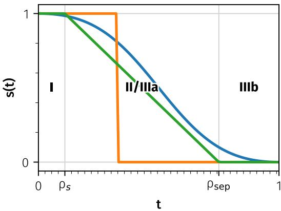  
Figure 6: Schedule & Regime Illustration.

## E ξ CONDITIONING

We explore various conditioning mechanisms, summarized in Section 3.1 and Fig. 3 and Table 2b. After deferred expansion, each population member carries an independent noise tensor $\xi \in \mathbb { R } ^ { H ^ { \prime } \times W ^ { \prime } \times d _ { \mathrm { n o i s e } } }$ that must be injected into the model (starting) at layer $\ell _ { \mathrm { s t a r t } }$ . We consider four relevant families of mechanisms, each combined with adaptive gating, detailed in the following paragraphs.

Adaptive Gating. With the exception of the input-level concatenation baseline from DDM (De Bortoli et al., 2025b), every mechanism passes $\xi _ { j }$ through a shared adaptive multiplicative gate

$$
\tilde { \xi } _ { j } = \xi _ { j } \odot ( W _ { \mathrm { g a t e } } c + 1 ) ,\tag{24}
$$

where $W _ { \mathrm { g a t e } }$ is a zero-initialized linear layer mapping the conditioning vector $c \in \mathbb { R } ^ { d _ { \mathrm { c o n d } } }$ (a combined embedding of timestep t and, in the case of class-conditional image generation, the class) to a per-element multiplicative gate. Zero initialization ensures that the gate starts at 1 (identity scaling), so the model initially behaves identically to standard DDM model (De Bortoli et al., 2025b) and gradually learns to modulate $\xi$ as needed.

## E.1 CONDITIONING MECHANISMS

Channel-wise Concatenation. Concatenation appends $\tilde { \xi } _ { j }$ to the residual stream along the channel dimension at layer $\ell _ { \mathrm { s t a r t } }$ . In the simplest setting, this results in a widening of the per-token feature width from d to $, d + d _ { \mathrm { { c a t } } }$ . This widened residual stream is processed by all subsequent layers, and the velocity predictions are read out only from the original channels of the final hidden state as

$$
\hat { v } _ { \theta } \ = \ \mathrm { U n e m b e d } \big ( h _ { L } [ \ldots , : d ] \big ) .\tag{25}
$$

We study three variants of this family:

• Cat (widen). All projections in layers $\ell _ { \mathrm { s t a r t } } , \dots , L - 1$ operate at the widened width $d + d _ { \mathrm { c a t } }$ Since attention QKV and FFN intermediate dimensions are typically determined based on the residual stream width, all are enlarged proportionally. This is the most expressive variant, but adds extra learnable parameters and FLOPS in the late layers, conflating results with overall improved capacity.

• Cat (fixed inner). The residual stream is widened to $d + d _ { \mathrm { c a t } }$ as before, but each block’s inner computation is held at the original width. The signal $\tilde { \xi } _ { j }$ can persist in the residual stream across layers, while the bulk of the computation is unchanged. This is our default, as it preserves the approx. parameter count of the baseline.

• Cat (substitute). The final variant preserves the number of trainable parameters and the computation of the distributional layers exactly identical. This is achieved by not widening the residual stream to accommodate $d _ { \mathrm { c a t } }$ , but instead narrowing the previous residual information to $d - d _ { \mathrm { c a t } }$ dimensions (by dropping a set of dimensions) before concatenation.

Residual Addition. Instead of concatenating the gated noise, it is directly added to the residual stream at layer $\ell _ { \mathrm { s t a r t } }$ . To project it to the model width, a linear map $W _ { \mathrm { a d d } } \in \dot { \mathbb { R } ^ { d _ { \mathrm { c a t } } \times d } }$ is used, resulting in the residual stream update

$$
h  h + \tilde { \xi } _ { j } W _ { \mathrm { a d d } } .\tag{26}
$$

This preserves both width and parameter count of the late layers, with only the linear map introducing additional learnable parameters.

Adaptive Normalization (Ada-Norm). $\tilde { \xi } _ { j }$ is mapped through a per-token MLP to scale (and, optionally, shift, if using LayerNorm instead of RMSNorm) parameters that are added to the existing adaptive pre-norms typically used for timestep and class conditioning in diffusion transformers. This keeps the residual stream width unchanged.

Register Tokens/Sequence-wise Concatenation. $\tilde { \xi } _ { j }$ is projected and reshaped into $n _ { \mathrm { t o k } }$ additional sequence tokens with learned positional embeddings, and appended to the token stream at layer $\ell _ { \mathrm { s t a r t } }$ The extra tokens participate in self-attention but are dropped from the velocity readout, similar to the additional channels introduced in channel-wise concatenation.

Concatenation at Input (Naïve Baseline). Finally, we also consider the original DDM formulation (De Bortoli et al., 2025b), where $\tilde { \xi } _ { j }$ is reshaped to the spatial grid of $x _ { t }$ and concatenated to it along the channel dimension before the patch embedding, with all L transformer layers processing the noise. This variant is incompatible with deferred expansion $( \ell _ { \mathrm { s t a r t } } > 0 )$ and is reported as a reference only; it is strictly dominated by the post-expansion variants in our experiments.

Discussion. Table 2b shows that fixed-inner concatenation performs substantially better than Ada-Norm and token conditioning in the few-step regime. We hypothesize that, with only a few particle-specific layers after expansion, directly carrying ξ in the residual stream makes the auxiliary signal easier to preserve than routing it indirectly through normalization parameters or attention.

Fixed-inner concatenation gives every spatial token a persistent particle-specific feature subspace throughout the remaining residual blocks, while leaving the expensive internal attention and MLP dimensions unchanged. Additive conditioning instead superposes the auxiliary signal onto the shared representation, making it easier for subsequent transformations to attenuate or entangle that signal. Ada-Norm routes $( \xi )$ indirectly through modulation parameters, while token conditioning requires attention to propagate particle information from a small number of auxiliary tokens to every spatial token. This may be difficult when only a few distributional layers remain after expansion.

These mechanisms are all reasonable a priori; Table 2b provides the empirical reason for selecting fixed-inner concatenation. We present this explanation as an hypothesis consistent with the observed results, rather than as a theoretically established mechanism.

## F KERNEL SPATIAL MODES

The generalized energy score in Eq. (4) is defined for vector-valued predictions, but in our setting, each prediction $\hat { x } _ { \theta } ( t , x _ { t } , \xi _ { j } ) \in \mathbb { R } ^ { \bar { H } ^ { \prime } \times W ^ { \prime } \times C }$ is a sequence of patch tokens. The score, therefore, admits two natural instantiations that differ in the geometry over which the kernel norm $\| \cdot \| _ { 2 } ^ { \beta }$ is evaluated.

Global Kernel. Each prediction is flattened into a single $H ^ { \prime } W ^ { \prime } C .$ -dimensional vector and the score $S _ { \lambda , \beta }$ is evaluated on the resulting vector space:

$$
\begin{array} { r } { S _ { \lambda , \beta } ^ { \mathrm { g l o b a l } } ( p , y ) \ = \ - \mathbb { E } _ { p } \Big [ \| \mathrm { v e c } ( X ) - \mathrm { v e c } ( y ) \| _ { 2 } ^ { \beta } \Big ] + \frac { \lambda } { 2 } \mathbb { E } _ { p \otimes p } \Big [ \| \mathrm { v e c } ( X ) - \mathrm { v e c } ( X ^ { \prime } ) \| _ { 2 } ^ { \beta } \Big ] \ . } \end{array}\tag{27}
$$

This is the implicit choice in most MMD/energy-distance work (Gneiting & Raftery, 2007; De Bortoli et al., 2025b) – it imposes a single global geometry over the entire prediction.

Local Kernel. Alternatively, the score is evaluated independently on each spatial position $X _ { h , w } \in \mathbb { R } ^ { C }$ and averaged over positions,

$$
S _ { \lambda , \beta } ^ { \mathrm { l o c a l } } ( p , y ) = \frac { 1 } { H ^ { \prime } W ^ { \prime } } \sum _ { h , w } S _ { \lambda , \beta } \bigl ( p _ { h , w } , y _ { h , w } \bigr ) ,\tag{28}
$$

which corresponds to a separable product kernel over the spatial grid. Each per-position score is strictly proper on its slice of $\mathbb { R } ^ { C }$ , so the average is also strictly proper as a scoring rule for the per-position marginals of $p .$ . The local mode emphasizes the local structure of the velocity prediction, at the cost of decoupling the score from cross-spatial dependencies. We use the local mode by default since it offers significant practical performance improvements; the comparison is reported in Table 3d.

## G TRAINING-TIME t SAMPLING

The DDM loss in $\mathrm { E q . } \left( 5 \right)$ composes a per-time score with a sampling density $p ( t )$ and a loss weighting $w ( t )$ . We hold $w ( t ) \equiv 1$ throughout and ablate only the sampling density. Since reweighting the sampling density without compensating in $w ( t )$ amounts to an effective t-dependent loss weighting, this also controls the relative supervision allocated to each noise level.

We compare four samplers, three of which belong to the logit-normal family $t = \sigma ( \mu + s Z )$ with $Z \sim { \mathcal { N } } ( 0 , 1 )$ and σ the logistic sigmoid:

• uniform: $t \sim \mathcal { U } ( 0 , 1 )$ . Unbiased baseline with constant density on [0, 1].

• logit-normal $( \mu = 0 , s = 1 )$ : the default of Esser et al. (2024); symmetric and peaked at $t = 0 . 5$

$\mathrm { j i t } \left( \mu = - 0 . 8 , s = 0 . 8 \right)$ : the sampler used by Li & He (2025); mode at $t \approx 0 . 2 5$ , shifted toward the noise end (low SNR).

${ \mathrm { i m f ~ } } ( \mu = - 0 . 4 , s = 1 )$ : the sampler used by Geng et al. (2026); mode at $t \approx 0 . 3 2$ , with a similar bias to jit but broader support.

In terms of the anchors of Table 14, jit places its mode at $t \approx 0 . 2 5 ( \rho \approx 0 . 1 )$ , inside Regime IIIa. It allocates 72.5% of training times to $\rho \in [ \rho _ { c } , 1 ]$ , compared with 35.2% for uniform and $4 6 . 0 \%$ for logit-normal(0, 1). This is the low-SNR part of the post-collapse regime, where the posterior is modedominated but still broad and where our schedule moves the objective from distributional toward regression-like behaviour. Table 3c shows that this allocation improves both few- and many-step FID.

The FM reference and Configs A-E use the logit-normal sampler. Only F switches to ${ \dot { ] } } { \dot { 1 } } \tplus$ . The sampler-matched comparison is FM and Config E and therefore isolates the distributional components, which reduce 4-step FID from 26.53 to 14.33 (about 91% of the total 4-step gain).

## H MMD LINEAGE

The generalized energy score $( \mathrm { E q . 4 } )$ can be modified to yield a generalized kernel score (see (De Bortoli et al., 2025b)) by replacing $- | | x - y | | _ { 2 } ^ { \beta }$ by a positive definite kernel $k ( x , y )$ . Such kernel score then reduces to a Dirac-target MMD objective up to a target-dependent constant when λ=1; MMD-based generative training has a long history spanning GMMNs (Li et al., 2015) and early kernel score objectives such as DISCO Nets (Bouchacourt et al., 2016). IMM (Zhou et al., 2025a) is the population-vs-population MMD generalisation in which the right-hand argument is itself a population, with Consistency Models (Song et al., 2023; Song & Dhariwal, 2024) appearing as a single-particle, first-moment limit in the IMM analysis. DDMs and IMM are therefore instances of the same kernel score family with different right-hand arguments; our proposed schedules clarify this connection.

## I COMPUTE REQUIREMENTS

All iDDM models were trained on ImageNet- $\cdot 2 5 6 ^ { 2 }$ with $4 \times \mathrm { H } 2 0 0$ for B-sized models for roughly 12 hours and $8 \times \mathrm { H } 2 0 0$ for XL-sized models. Reproduced models may differ in computational requirements based on their additional training overhead.

Algorithm 1 DDM training with deferred population expansion. The first $\ell _ { \mathrm { s t a r t } }$ layers run once at batch size B; after population expansion and ξ conditioning, the final H layers run at effective batch size B × m.

```julia
# model: DistributionalTransformer with L layers; expansion at layer L-
H
# kernel: GeneralizedKernelScore with schedules lambda(t), beta(t)
# FM time; t=0 noise, t=1 data
t = sample_t(B)
x0 = randn_like(x1)
xt = (1 - t) x0 + t x1
# one xi per population member
xi = sample_xi(B <sub>*</sub> m)
h, cond = model.embed(xt), model.condition(t, y)
# shared trunk at batch B
for layer in model.layers[:L-H]:
h = layer(h, cond)
# population expansion
h = repeat(h, "b ... -> (b m) ...", m=m)
cond = repeat(cond, "b ... -> (b m) ...", m=m)
# AdaLN / additive / concat / tokens
h, cond = inject_xi(h, cond, xi)
# repeated head at batch B m
for layer in model.layers[L-H:]:
h = layer(h, cond)
v_pred = model.unembed(h)
v_pred = rearrange(v_pred, "(b m) ... -> b m ...", m=m)
tgt = repeat(x1 - x0, "b ... -> b m ...", m=m)
loss = -kernel.score(v_pred, tgt, t)
loss.mean().backward()
```

## J ADDITIONAL VISUALIZATIONS

We provide additional uncurated samples using 4 and 50 steps, respectively, in Figure 7-Figure 18.

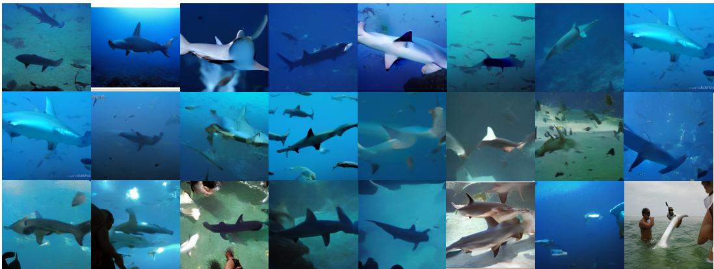  
Figure 7: Uncurated ImageNet-256<sup>2</sup> samples using 4 steps.

  
Figure 8: Uncurated ImageNet-256<sup>2</sup> samples using 4 steps.

  
Figure 9: Uncurated ImageNet-256<sup>2</sup> samples using 4 steps.

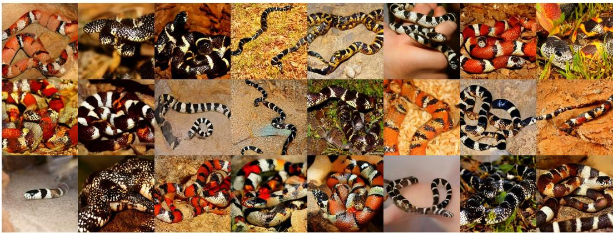  
Figure 10: Uncurated ImageNet-256<sup>2</sup> samples using 4 steps.

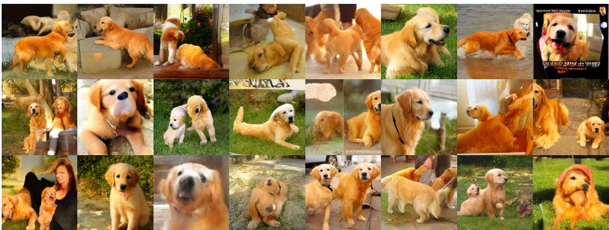  
Figure 11: Uncurated ImageNet-256<sup>2</sup> samples using 4 steps.

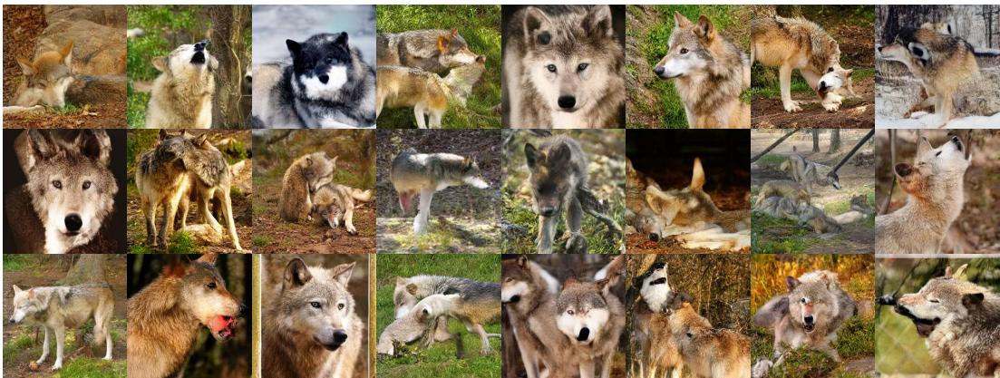  
Figure 12: Uncurated ImageNet-256<sup>2</sup> samples using 4 steps.

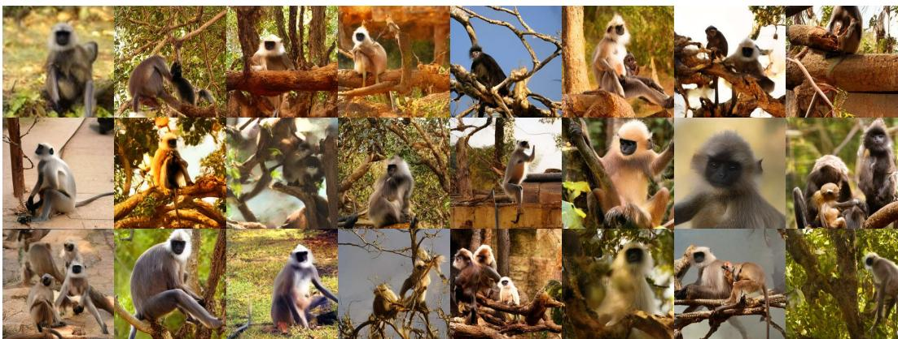  
Figure 13: Uncurated ImageNet-256<sup>2</sup> samples using 4 steps.

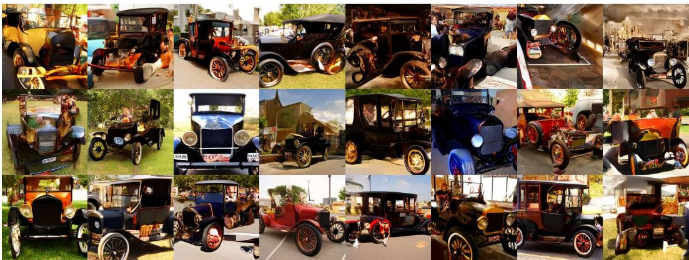  
Figure 14: Uncurated ImageNet-256<sup>2</sup> samples using 4 steps.

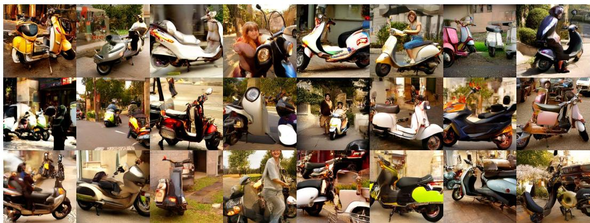  
Figure 15: Uncurated ImageNet-256<sup>2</sup> samples using 4 steps.

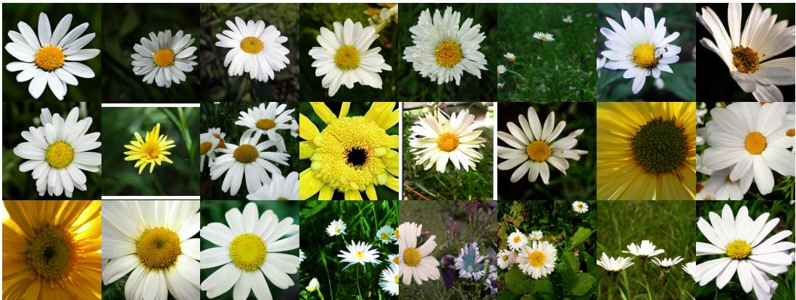  
Figure 16: Uncurated ImageNet-256<sup>2</sup> samples using 50 steps.

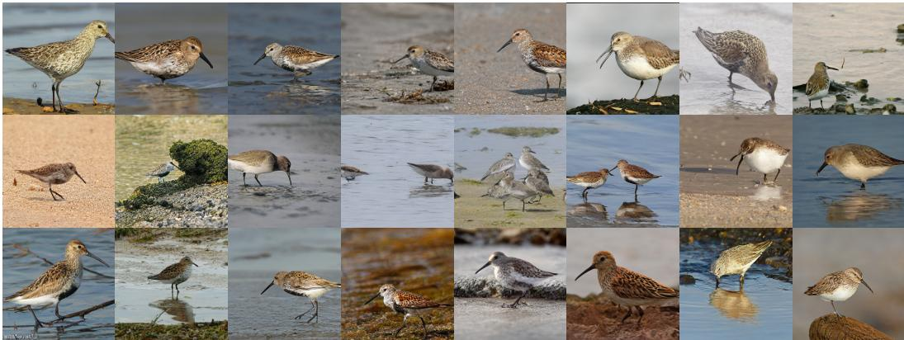  
Figure 17: Uncurated ImageNet-256<sup>2</sup> samples using 50 steps.

  
Figure 18: Uncurated ImageNet-256<sup>2</sup> samples using 50 steps.

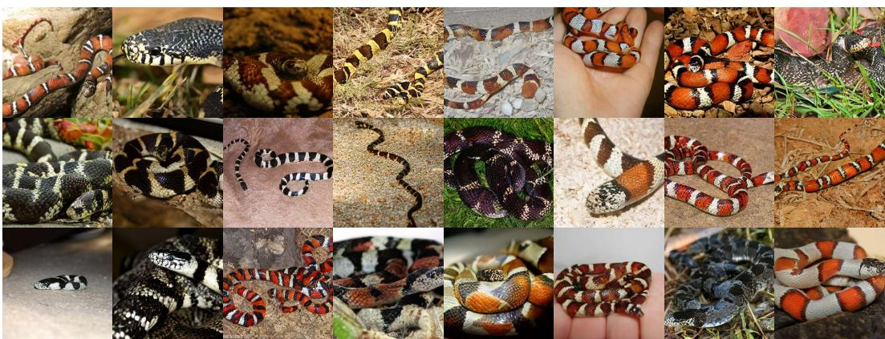  
Figure 19: Uncurated ImageNet-256<sup>2</sup> samples using 50 steps.

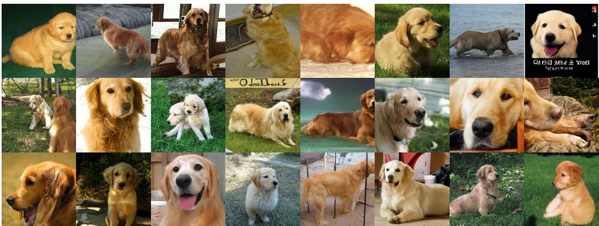  
Figure 20: Uncurated ImageNet-256<sup>2</sup> samples using 50 steps.

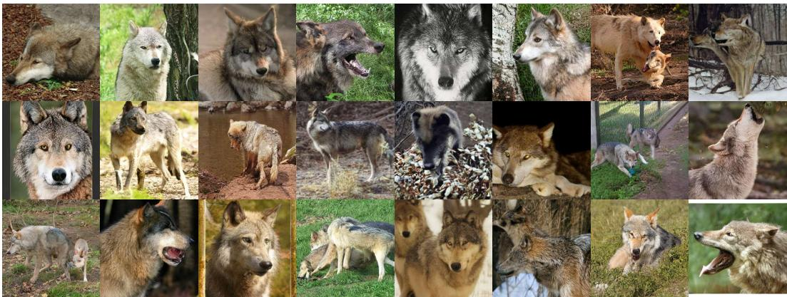  
Figure 21: Uncurated ImageNet-256<sup>2</sup> samples using 50 steps.

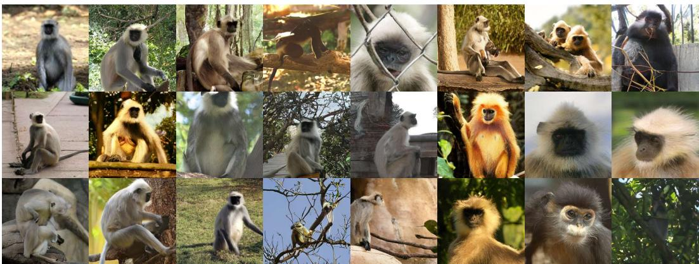  
Figure 22: Uncurated ImageNet-256<sup>2</sup> samples using 50 steps.

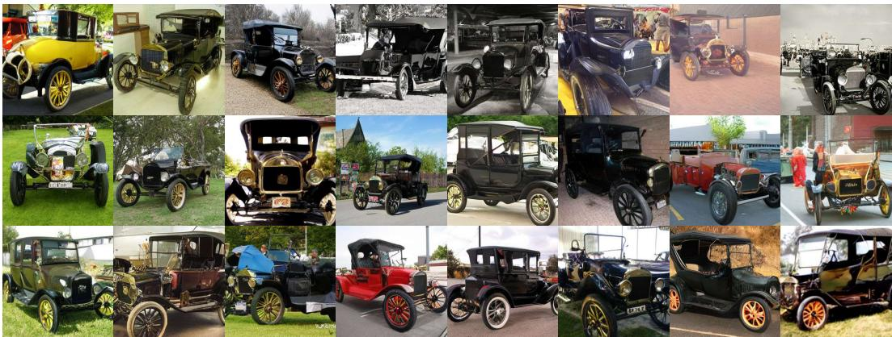  
Figure 23: Uncurated ImageNet-256<sup>2</sup> samples using 50 steps.

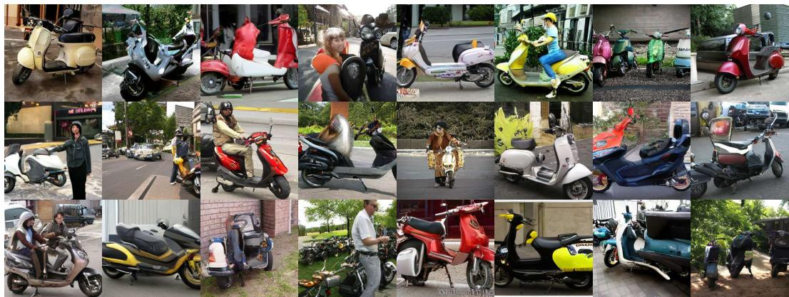  
Figure 24: Uncurated ImageNet-256<sup>2</sup> samples using 50 steps.