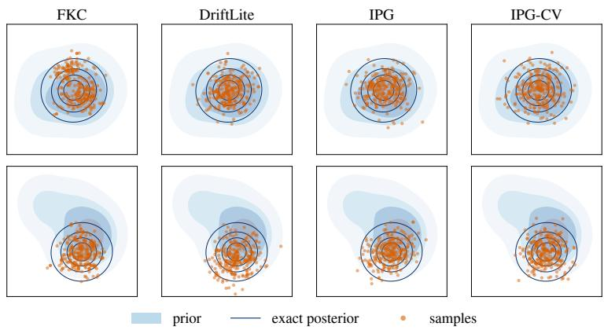
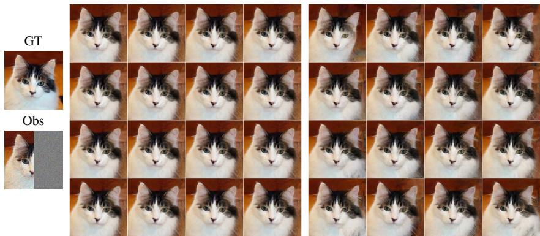
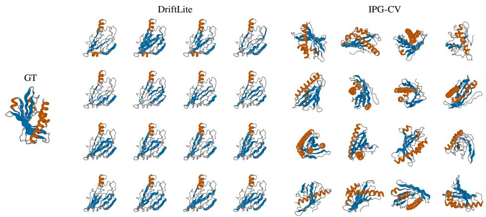
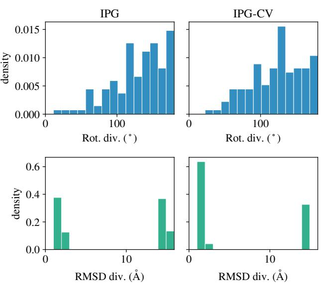
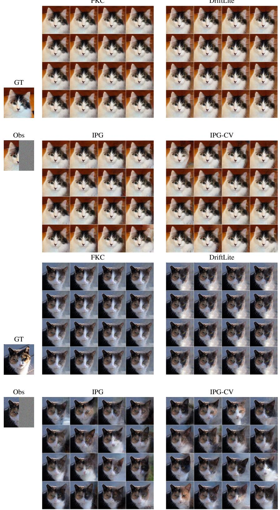
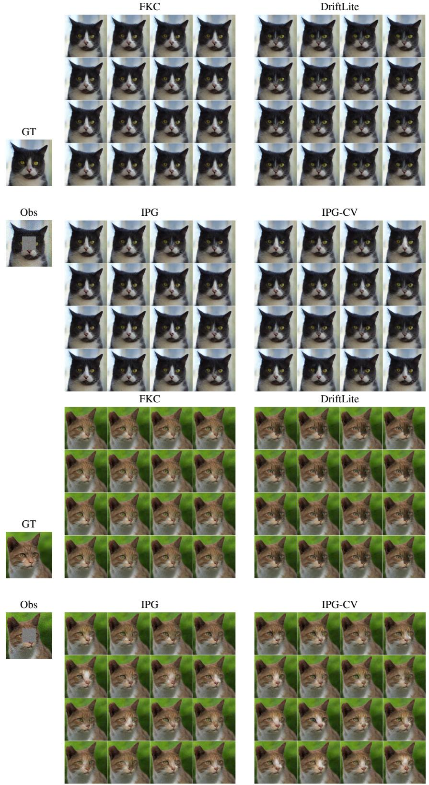
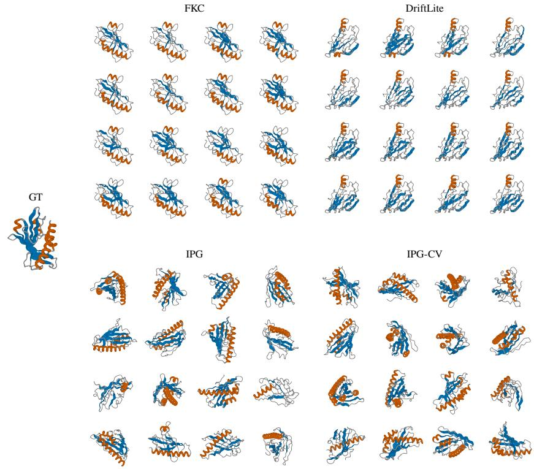
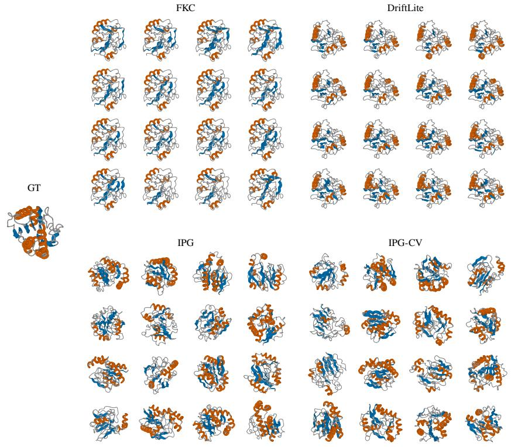

# INTERACTING PARTICLE GUIDANCE FOR SAMPLING REWARD-TILTED GENERATIVE PRIORS

Adhithyan Kalaivanan<sup>1</sup> Zheng Zhao<sup>1</sup> Jens Sjolund ¨ <sup>2</sup> Fredrik Lindsten<sup>1</sup>

<sup>1</sup>Linkoping University, Sweden¨ <sup>2</sup>Uppsala University, Sweden

{adhithyan.kalaivanan,zheng.zhao,fredrik.lindsten}@liu.se jens.sjolund@it.uu.se

## ABSTRACT

Inference-time steering adapts pretrained diffusion and flow-based models to new tasks, e.g., to generate samples from a conditional distribution or samples with desired properties, without retraining. This can be formalized as sampling from a reward-tilted generative prior. As exact sampling from this distribution is intractable, guidance-based methods rely on approximations producing biased samples, and sequential Monte Carlo (SMC) methods correct for this bias using importance weights. However, while exact in the large particle limit, SMC suffers from weight degeneracy and particle collapse in practice. We propose interacting particle guidance (IPG), which replaces reweighting with transport. The particles interact through an additional drift, derived from the Feynman–Kac PDE to cancel the reweighting term, and remain unweighted. Choosing the drift in a reproducing kernel Hilbert space yields a closed-form solution that is cheap to compute, with negligible overhead compared to SMC. We demonstrate the method on Gaussian mixtures with known posteriors, and on high-dimensional image inpainting and protein structure inference tasks.

## 1 INTRODUCTION

Generative models based on dynamic measure transport, such as diffusion (Ho et al., 2020; Song et al., 2021) and flow-based models (Lipman et al., 2023; Liu et al., 2023; Albergo et al., 2025), are the state of the art approaches in a wide range of domains. Often, beyond unconditionally sampling from the data distribution, we may want to generate samples with specific properties or conditionally on some observed data. A convenient way to do so is to steer the generation process at test time, which allows reusing pretrained models without task-specific retraining. For a given reward function or observation likelihood, this can be formalized as sampling from an exponentially reward-tilted generative prior.

For differentiable reward functions, a heuristic approach is to include the reward gradient as a guidance term during generation (Chung et al., 2023; Boys et al., 2024). However, the modified process does not offer any guarantees of sampling from the reward-tilted prior. A principled approach is to correct for this using sequential Monte Carlo (SMC) methods (Naesseth et al., 2019), in which particles with self-normalized importance weights provide a weighted empirical distribution that converges to the target distribution in the large particle limit. In practice, however, when the prior is given by a generative model, the number of particles is limited by GPU memory, leading to pronounced weight degeneracy and particle collapse (Wu et al., 2023; Singhal et al., 2025; Skreta et al., 2025; Ekstrom Kelvinius et al.¨ , 2025). As a result, in practical implementations of SMC-based methods with generative priors and a moderate number of particles, reweighting and resampling are often interpreted as local best-of-N search strategies (Millard et al., 2026, Appendix A.6).

To mitigate the weight degeneracy, we analyze the dynamics of the intermediate target densities in the continuous time limit, given by the Feynman–Kac PDE (Skreta et al., 2025). By introducing an additional transport term that cancels the reweighting term, we aim to derive unweighted particle updates. Similar approaches that minimize the reweighting term have been explored for sampling unnormalized densities, where the added transport is parameterized by a neural network and learned over simulated trajectories (Albergo & Vanden-Eijnden, 2025), or at each intermediate step using the current particles (Arbel et al., 2021). To preserve the training-free nature of inference-time steering, the drift must be parameterized such that it admits a closed-form solution. Prior work has studied linear parameterizations with predefined bases (Ren et al., 2026), but as these do not fully cancel the reweighting term, they still require periodic resampling to maintain a high effective sample size. Building on Stein transport (Nusken¨ , 2024), we show that choosing the drift in a reproducing kernel Hilbert space (RKHS) is surprisingly effective and enables sampling with an unweighted interacting particle system. The drift is available in closed form, and is cheap to compute for the moderate number of particles used with generative priors.

Contributions. (i) We propose interacting particle guidance (IPG), which augments guidancebased methods with an interacting drift estimated to cancel the reweighting term in the Feynman– Kac PDE, enabling sampling from a reward-tilted generative prior with an unweighted interacting particle system. The drift admits a closed-form solution, with negligible overhead to compute. (ii) We empirically show that IPG avoids particle collapse and outperforms prior methods, on Gaussian mixtures with known posteriors, as well as on high-dimensional image inpainting and protein structure inference with flow-based generative priors.

## 2 PRELIMINARIES

## 2.1 DIFFUSION AND FLOWS

Consider a generative model that transports samples $\{ X _ { 0 } ^ { i } \} _ { i = } ^ { N }$ from a simple base distribution $q _ { 0 }$ at time $t = 0$ to the data distribution $q _ { 1 }$ at $t = 1$ along a learned vector field $v _ { t } ( x )$ , by solving the ordinary differential equation (ODE)

$$
\mathrm { d } X _ { t } ^ { i } = v _ { t } ( X _ { t } ^ { i } ) \mathrm { d } t , \quad X _ { 0 } ^ { i } \sim q _ { 0 } .\tag{1}
$$

Both flow-based models (Lipman et al., 2023; Liu et al., 2023; Albergo et al., 2025) and diffusion models using the probability flow ODE (Song et al., 2021) can be viewed as instances of this model class. The intermediate marginal densities $q _ { t }$ satisfy the continuity equation,

$$
\partial _ { t } q _ { t } ( x ) = - \nabla \cdot ( v _ { t } ( x ) q _ { t } ( x ) ) .\tag{2}
$$

In the next section, we derive an analogous PDE for reward-tilted intermediate densities.

## 2.2 REWARD TILTING

Generating samples with specific properties or conditionally on observed data can be formulated as sampling from a reward-tilted prior $p _ { 1 } ( x ) \propto q _ { 1 } ( x ) \exp ( R ( x ) )$ ) for a reward function $R ( x )$ . We can do this by evolving particles along an interpolating path of densities $p _ { t } ( x ) \propto q _ { t } ( x ) \exp ( r ( x , t ) )$ , with $r ( x , 0 ) \overset { \cdot } { = } 0$ and $r ( x , 1 ) = R ( x )$ , so that $p _ { 0 } = q _ { 0 }$ is the base distribution. We show in Appendix A that $p _ { t }$ satisfies

$$
\partial _ { t } p _ { t } ( x ) = - \nabla \cdot ( v _ { t } ( x ) p _ { t } ( x ) ) + p _ { t } ( x ) ( g _ { t } ( x ) - \mathbb { E } _ { p _ { t } } [ g _ { t } ] ) ,\tag{3}
$$

where $g _ { t } ( x ) = \partial _ { t } r ( x , t ) + \langle v _ { t } ( x ) , \nabla r ( x , t ) \rangle$

Equation (3) takes the form of a Feynman–Kac PDE (Skreta et al., 2025), and can be simulated with a weighted particle system $\{ ( X _ { t } ^ { i } , \dot { w } _ { t } ^ { i } ) \} _ { i = 1 } ^ { N }$ whose weighted empirical distribution approximates $p _ { t }$ ,

$$
\mathrm { d } X _ { t } ^ { i } = v _ { t } ( X _ { t } ^ { i } ) \mathrm { d } t , \quad \mathrm { d } \omega _ { t } ^ { i } = g _ { t } ( X _ { t } ^ { i } ) \mathrm { d } t ,\tag{4}
$$

where the log-weights $\omega _ { t } ^ { i }$ are initialized at zero, and $w _ { t } ^ { i } = \exp ( \omega _ { t } ^ { i } ) / \sum _ { k } \exp ( \omega _ { t } ^ { k } )$ are the selfnormalized importance weights. However, this approach is equivalent to importance sampling with the prior $q _ { 1 }$ as the proposal, and performs poorly for small values of N.

Adding drift-diffusion. A popular strategy to let the reward influence the particle updates is to add and subtract $\sigma _ { t } \Delta p _ { t } ( x )$ , for $\sigma _ { t } \in \mathbb { R } _ { > 0 }$ , in equation (3), and write

$$
- \sigma _ { t } \Delta p _ { t } ( x ) = - \nabla \cdot \big ( \big ( \sigma _ { t } \nabla \log p _ { t } ( x ) \big ) p _ { t } ( x ) \big ) .\tag{5}
$$

The resulting modified PDE for $p _ { t }$ is given by

$$
\partial _ { t } p _ { t } ( x ) = - \nabla \cdot ( ( v _ { t } ( x ) + \sigma _ { t } \nabla \log p _ { t } ( x ) ) p _ { t } ( x ) ) + \sigma _ { t } \Delta p _ { t } ( x ) + p _ { t } ( x ) ( g _ { t } ( x ) - \mathbb { E } _ { p _ { t } } [ g _ { t } ] ) ,\tag{6}
$$

which, as before, can be simulated using the weighted stochastic differential equations (SDEs),

$$
\mathrm { d } X _ { t } ^ { i } = \big ( v _ { t } \big ( X _ { t } ^ { i } \big ) + \sigma _ { t } \nabla \log p _ { t } \big ( X _ { t } ^ { i } \big ) \big ) \mathrm { d } t + \sqrt { 2 \sigma _ { t } } \mathrm { d } W _ { t } , \quad \mathrm { d } \omega _ { t } ^ { i } = g _ { t } \big ( X _ { t } ^ { i } \big ) \mathrm { d } t .\tag{7}
$$

Here, ∇ log $p _ { t } ( x ) = \nabla \log q _ { t } ( x ) + \nabla r ( x , t )$ , where the score ∇ log $q _ { t } ( x )$ is directly estimated in diffusion models, or computed from $v _ { t }$ in flow-based models with a Gaussian base distribution (Albergo et al., 2025). For the choice $r ( x , t ) = \beta _ { t } R ( x )$ , equation (7) recovers the reward-tilted SDE of Skreta et al. (2025), where the weighted SDEs are simulated using SMC, resampling the particles whenever the weights become too skewed. However, in high dimensions and with the few particles affordable with generative priors, the weights degenerate and resampling leads to particle collapse (Naesseth et al., 2019).

## 3 METHOD

The Langevin terms in equation (7) influence the particle updates, but leave the weights unchanged.   
Our methodology is based on compensating for the weights by an additional drift, as detailed below.

Adding drift-reweighting. For any vector field $u _ { t }$ , we add and subtract $\nabla \cdot ( u _ { t } ( x ) p _ { t } ( x ) )$ in equation (3), and write

$$
\begin{array} { r } { \nabla \cdot ( u _ { t } ( x ) p _ { t } ( x ) ) = p _ { t } ( x ) ( S _ { p _ { t } } u _ { t } ( x ) ) , } \end{array}\tag{8}
$$

where $S _ { p _ { t } } u _ { t } = \nabla \cdot u _ { t } + \langle u _ { t } , \nabla$ log p<sub>t</sub>⟩ is the Stein operator. The modified PDE for $p _ { t }$ is

$$
\partial _ { t } p _ { t } ( x ) = - \nabla \cdot ( ( v _ { t } ( x ) + u _ { t } ( x ) ) p _ { t } ( x ) ) + p _ { t } ( x ) ( S _ { p _ { t } } u _ { t } ( x ) + g _ { t } ( x ) - \mathbb { E } _ { p _ { t } } [ g _ { t } ] ) .\tag{9}
$$

As $\mathbb { E } _ { p _ { t } } [ S _ { p _ { t } } u _ { t } ( x ) ] = 0$ by Stein’s identity, p<sub>t</sub> can be approximated with the weighted particle system

$$
\mathrm { d } X _ { t } ^ { i } = \big ( v _ { t } ( X _ { t } ^ { i } ) + u _ { t } ( X _ { t } ^ { i } ) \big ) \mathrm { d } t , \quad \mathrm { d } \omega _ { t } ^ { i } = \big ( S _ { p _ { t } } u _ { t } ( X _ { t } ^ { i } ) + g _ { t } ( X _ { t } ^ { i } ) \big ) \mathrm { d } t .\tag{10}
$$

As before, the Langevin terms can be added without changing the weight updates, since they leave $p _ { t }$ invariant.

We note that the drift $u _ { t }$ can be chosen to reduce the variance of the particle weights, and in particular, if $u _ { t }$ solves the PDE

$$
S _ { p _ { t } } u _ { t } ( x ) + g _ { t } ( x ) - \mathbb { E } _ { p _ { t } } [ g _ { t } ] = 0 ,\tag{11}
$$

then the log-weights remain constant and $p _ { t }$ is approximated by unweighted particles. We refer to such $u _ { t }$ as a corrective drift.

## 3.1 INTERACTING PARTICLE GUIDANCE

As solving the PDE (11) exactly is intractable, we minimize the squared residual locally at each time. Following Stein transport (Nusken ¨ , 2024), choosing $u _ { t } \in \mathcal { H } _ { k } ^ { d }$ , where $\mathcal { H } _ { k }$ is the reproducing kernel Hilbert space (RKHS) for a kernel k and $\mathcal { H } _ { k } ^ { d }$ is its d-fold Cartesian product, and adding Tikhonov regularization with $\lambda > 0 .$ , yields the objective

$$
\mathcal { L } ( u _ { t } ) = \mathbb { E } _ { p _ { t } } [ ( S _ { p _ { t } } u _ { t } ( x ) + g _ { t } ( x ) - \mathbb { E } _ { p _ { t } } [ g _ { t } ] ) ^ { 2 } ] + \lambda \| u _ { t } \| _ { \mathcal { H } _ { \iota } ^ { d } } ^ { 2 } .\tag{12}
$$

Approximating $\mathbb { E } _ { p _ { t } } [ \cdot ]$ with the empirical distribution given by the particles $\{ X _ { t } ^ { i } \} _ { i = 1 } ^ { N }$ , the unique minimizer is

$$
u _ { t } ( x ) = \frac { 1 } { N } \sum _ { j = 1 } ^ { N } \phi _ { j } [ k ( x , X _ { t } ^ { j } ) \nabla \log p _ { t } ( X _ { t } ^ { j } ) + \nabla _ { X _ { t } ^ { j } } k ( x , X _ { t } ^ { j } ) ] , \quad \left( \frac { 1 } { N } \xi + \lambda I _ { N } \right) \phi = - \mathrm { g } _ { t } ,\tag{13}
$$

where the coefficients $\{ \phi _ { j } \} _ { j = 1 } ^ { N }$ are obtained by solving the $N \times N$ linear system. Here, $ { \boldsymbol { \xi } } \in \mathbb { R } ^ { N \times N }$ is the Gram matrix of the Stein kernel, with $[ \xi ] _ { i j } = S _ { p _ { t } } ^ { X _ { t } ^ { i } } S _ { p _ { t } } ^ { X _ { t } ^ { j } } k ( X _ { t } ^ { i } , X _ { t } ^ { j } )$ and the superscript denoting the variable the Stein operator acts on, and $\begin{array} { r } { [ \mathrm { g } _ { t } ] _ { i } = g _ { t } ( X _ { t } ^ { i } ) - \frac { 1 } { N } \sum _ { j = 1 } ^ { N } g _ { t } ( X _ { t } ^ { j } ) } \end{array}$

As the self-normalized importance weights are invariant to adding a constant to the log-weights of all particles, the weight updates reduce to

$$
\mathrm { d } \omega _ { t } ^ { i } = \big ( S _ { p _ { t } } u _ { t } \big ( X _ { t } ^ { i } \big ) + g _ { t } \big ( X _ { t } ^ { i } \big ) - \frac { 1 } { N } \sum _ { j = 1 } ^ { N } g _ { t } \big ( X _ { t } ^ { j } \big ) \big ) \mathrm { d } t = \bigg ( \frac { 1 } { N } \xi \phi + \mathtt { g } _ { t } \bigg ) _ { i } \mathrm { d } t = - \lambda \phi _ { i } \mathrm { d } t .\tag{14}
$$

However, as in Stein transport, the weight updates can be ignored in practice by choosing a small $\lambda ,$ yielding an unweighted interacting particle system that we refer to as interacting particle guidance (IPG), described in Algorithm 1.

```latex
Algorithm 1 Interacting particle guidance (IPG and IPG-CV)
Require: $v _ { t }$ and $\nabla \log q _ { t } ( x )$ from the generative prior, reward schedule $r ( x , t )$ , kernel k, regular
ization λ, noise schedule $\sigma _ { t }$ , time steps $\{ t _ { k } \} _ { k = 0 } ^ { K } ,$ number of particles N
Initialize $X _ { 0 } ^ { i } \sim q _ { 0 }$ for $i = 1 , \ldots , N$
for $t = t _ { 0 } , \ldots , t _ { K - 1 }$ do
∇ l $\begin{array} { r } { \mathrm { { o g } } p _ { t } ( X _ { t } ^ { i } )  \nabla \log q _ { t } ( X _ { t } ^ { i } ) + \nabla r ( X _ { t } ^ { i } , t ) . } \end{array}$
Compute ${ \dot { u _ { t } } } ( X _ { t } ^ { i } )$ using equations (13) for IPG, or (15) for IPG-CV,
$X _ { t + \Delta t } ^ { i } \gets X _ { t } ^ { i } + ( v _ { t } ( \bar { X } _ { t } ^ { i } ) ^ { \top } + \sigma _ { t } \nabla \log p _ { t } ( X _ { t } ^ { i } ) + u _ { t } ( X _ { t } ^ { i } ) ) \Delta t + \sqrt { 2 \sigma _ { t } \Delta t } \epsilon _ { t } ^ { i } , \quad \epsilon _ { t } ^ { i } \sim \mathcal { N } ( 0 , I )$
return $\{ X _ { 1 } ^ { i } \} _ { i = 1 } ^ { N }$
```

Using a control variate. Alternatively, $\mu _ { t } = \mathbb { E } _ { p _ { t } } [ g _ { t } ]$ in objective (12) can be treated as a free parameter to be jointly minimized. With the empirical approximation for the outer expectation, the optimal $\begin{array} { r } { \mu _ { t } = \frac { 1 } { N } \sum _ { i = 1 } ^ { N } ( S _ { p _ { t } } u _ { t } ( X _ { t } ^ { i } ) + g _ { t } ( X _ { t } ^ { i } ) ) } \end{array}$ resembles using a Stein control variate (Oates et al., 2017) to estimate $\mathbb { E } _ { p _ { t } } [ g _ { t } ]$ . The unique minimizer is now given by (see Appendix B),

$$
u _ { t } ( x ) = \frac { 1 } { N } \sum _ { j = 1 } ^ { N } ( \Pi \phi ) _ { j } [ k ( x , X _ { t } ^ { j } ) \nabla \log p _ { t } ( X _ { t } ^ { j } ) + \nabla _ { X _ { t } ^ { j } } k ( x , X _ { t } ^ { j } ) ] , \quad \left( \frac { 1 } { N } \Pi \xi \Pi + \lambda I _ { N } \right) \phi = - \mathrm { g } _ { t } ,\tag{15}
$$

where $\begin{array} { r } { \Pi = I _ { N } - \frac { 1 } { N } \mathbf { 1 } \mathbf { 1 } ^ { \top } } \end{array}$ is the centering matrix. The weight updates once again reduce to,

$$
\mathrm { d } \omega _ { t } ^ { i } = \left( S _ { p _ { t } } u _ { t } ( X _ { t } ^ { i } ) + g _ { t } ( X _ { t } ^ { i } ) - \mu _ { t } \right) \mathrm { d } t = \left( \frac { 1 } { N } \Pi \xi \Pi \phi + \mathrm { g } _ { t } \right) _ { i } \mathrm { d } t = - \lambda \phi _ { i } \mathrm { d } t ,\tag{16}
$$

and can be ignored by choosing a small λ. We refer to the resulting method as IPG-CV in Algorithm 1, emphasizing the use of a Stein control variate.

Connection to Stein transport. The objective (12) has the same form as in Stein transport (Nusken ¨ , 2024), where particles are transported deterministically from a tractable prior $\pi _ { 0 }$ to the posterior along $\pi _ { t } \propto \pi _ { 0 } \exp ( t h )$ , where h is the log-likelihood, by the corrective drift alone. In our notation, this corresponds to the case with $v _ { t } = 0 , \sigma _ { t } = 0 , q _ { t } = \pi _ { 0 }$ and $r ( x , t ) = t h ( x )$ . In IPG, the path is induced by a generative model whose pointwise density is unavailable, particles are transported by the generative drift and guidance, and the corrective drift only accounts for the remaining reweighting term.

## 4 CONNECTIONS TO PRIOR WORK

We give an overview of inference-time steering methods in Section 4.1, and relate our framework to prior work by discussing alternative approaches to the corrective drifts and $p _ { t }$ invariant correctors in Sections 4.2 and 4.3, respectively.

## 4.1 GUIDANCE AND MONTE CARLO APPROXIMATIONS

Guidance methods. Sampling from a reward-tilted generative prior can be achieved either by finetuning the model (Venkatraman et al., 2024; Domingo i Enrich et al., 2025; Potaptchik et al., 2026a), or by modifying the generation process at test time. Training-free guidance methods (Chung et al., 2023; Song et al., 2023; Pokle et al., 2024; Kim et al., 2025) adapt the generative ODE/SDE by adding the reward gradient, typically evaluated at the denoised estimate, but do not sample from the target distribution due to the approximations involved. Nguyen et al. (2026) consider correcting the distribution of denoised estimates using Stein variational gradient descent (SVGD), but this relies on the prior score evaluated at clean data where it is unreliable.

Monte Carlo methods. SMC-based methods correct for the bias in guidance through weighted particles and resampling (Wu et al., 2023; Dou & Song, 2024; Singhal et al., 2025; Skreta et al., 2025; Ekstrom Kelvinius et al. ¨ , 2025). Alternatively, when flow maps trained for one-step sampling of the final state given an intermediate noisy state are available, a consistent Monte Carlo estimate of the guidance drift itself can be obtained (Potaptchik et al., 2026b; Holderrieth et al., 2026; Pan et al., 2026). Markov chain Monte Carlo (MCMC) methods that sample the pullback of the reward-tilted prior onto the base also target the correct distribution, and are asymptotically exact in the large time limit (Kalaivanan et al., 2025; Wang et al., 2026).

## 4.2 PARAMETRIC APPROXIMATIONS OF THE CORRECTIVE DRIFT

Neural networks. In the related task of sampling unnormalized probability densities, weight degeneracy is mitigated by learning additional transport, where the corrective drift is parameterized by a neural network (Arbel et al., 2021; Vargas et al., 2024; Albergo & Vanden-Eijnden, 2025). As a specific example, NETS (Albergo & Vanden-Eijnden, 2025) parameterizes both the drift $u ( x , t )$ and the log-partition function $\begin{array} { r } { F ( t ) = \log Z _ { t } = \log Z _ { 0 } + \int _ { 0 } ^ { t } \mathbb { E } _ { p _ { s } } [ g _ { s } ] } \end{array}$ ds with a network, trained over simulated trajectories to minimize

$$
\mathcal { L } ( u , F ) = \int _ { 0 } ^ { 1 } \mathbb { E } _ { p _ { t } } [ ( S _ { p _ { t } } u ( t , x ) + g _ { t } ( x ) - \partial _ { t } F ( t ) ) ^ { 2 } ] \mathrm { d } t .\tag{17}
$$

For fixed t, this coincides with the IPG-CV objective up to regularization, where $\mu _ { t }$ denotes $\partial _ { t } F ( t )$

Predefined bases. DriftLite (Ren et al., 2026) adapts NETS for reward-tilting by minimizing objective (12), without regularization, over drifts of the form

$$
u _ { t } ( x ) = \phi _ { 1 } v _ { t } ( x ) + \phi _ { 2 } \nabla \log q _ { t } ( x ) + \phi _ { 3 } \nabla r ( x , t ) .\tag{18}
$$

Approximating the expectations in the objective with the weighted empirical distribution yields a closed-form solution by solving a $3 \times 3$ linear system. However, it requires evaluating the Stein operator $S _ { p _ { t } } u _ { t }$ at the particles and involves $\nabla \cdot v _ { t } , \Delta$ log $q _ { t }$ and $\Delta r .$ These are coarsely approximated with Hutchinson’s trace estimator, and as the corrective drift does not drive the reweighting term close to zero, reweighting and resampling are necessary.

Gradient field. Restricting the corrective drift to a gradient field $\boldsymbol u _ { t } ( \boldsymbol x ) = \nabla \psi _ { t } ( \boldsymbol x )$ for $\psi _ { t } \colon  { \mathbb { R } ^ { d } } \to$ R allows using an alternate objective

$$
\mathcal { L } ( \psi _ { t } ) = \mathbb { E } _ { p _ { t } } \bigg [ \frac { 1 } { 2 } \| \nabla \psi _ { t } ( x ) \| ^ { 2 } - \psi _ { t } ( x ) ( g _ { t } ( x ) - \mathbb { E } _ { p _ { t } } [ g _ { t } ] ) \bigg ] .\tag{19}
$$

This has been explored for $\psi _ { t }$ parameterized by a neural network (Albergo & Vanden-Eijnden, 2025) and as a linear combination over predefined bases (Ren et al., 2026). However, these do not perform as well as directly parameterizing $u _ { t }$ . The objective (19) also admits a closed-form solution for $\psi _ { t } \in \mathcal { H } _ { k }$ , which resembles the kernel Fisher–Rao flow of Maurais & Marzouk (2024) for sampling unnormalized probability densities, similar to how IPG relates to Stein transport.

## 4.3 PREDICTOR-CORRECTOR METHODS

In SMC methods, resample-move (Gilks & Berzuini, 2001) rejuvenates particles after resampling by applying a $p _ { t } .$ -invariant MCMC kernel. The Langevin terms in equation (7) can be seen as an infinitesimal such move applied jointly with the transport rather than as a separate step as in predictorcorrector methods (Song et al., 2021). Consequently, we can replace the Langevin terms by any continuous time process that leaves $p _ { t }$ invariant, and apply any number of such corrector steps at a fixed time t after resampling in SMC, or directly in the case of IPG.

Interacting correctors. More generally, we can consider the N-particle system on the augmented state space $\bar { \boldsymbol { x } } = ( x ^ { 1 } , \dots , x ^ { N } )$ with $\begin{array} { r } { p _ { t } ^ { N } ( \bar { x } ) = \prod _ { i = 1 } ^ { N } p _ { t } ( x ^ { i } ) } \end{array}$ , and use processes that leave $p _ { t } ^ { N }$ invariant as correctors. This includes interacting dynamics such as affine invariant Langevin dynamics (Garbuno-Inigo et al., 2020) and suitably noise-perturbed SVGD (Gallego & Insua, 2018; Nusken¨ & Renger, 2023). In Appendix D.1, we evaluate using noisy SVGD in place of the Langevin terms.

## 5 EXPERIMENTS

We evaluate our interacting particle guidance (IPG) and its control variate version $( \mathrm { I P G } \mathrm { - } \mathrm { C V } )$ , as described in Algorithm 1, on high-dimensional Gaussian mixture models (GMMs) with known posteriors, and on image inpainting and protein structure inference problems. In all our experiments, we choose the radial basis function (RBF) kernel, with the bandwidth set using the median heuristic at each time step. We compare against methods designed to be consistent, such as Feynman–Kac correctors (FKC) (Skreta et al., 2025) which simulates the weighted SDE in equation (7), and DriftLite (Ren et al., 2026) which adds a corrective drift restricted to predefined bases.

Table 1: Mean and standard deviation of the metrics on the GMM experiment. We use systematic resampling and “Adaptive” refers to resampling whenever ESS/N falls below 0.5.
<table><tr><td>Method</td><td>Resampling</td><td>ESS/N ↑</td><td>Mean error ↓</td><td>MMD↓</td><td>SWD↓</td></tr><tr><td rowspan="3">FKC</td><td>None</td><td> $0 . 0 0 6 \pm 0 . 0 0 2$ </td><td> $7 . 5 9 3 \pm 1 . 3 3 7$ </td><td> $0 . 8 7 6 \pm 0 . 1 6 5$ </td><td> $0 . 6 8 2 \pm 0 . 1 1 2$ </td></tr><tr><td>Adaptive</td><td> $0 . 7 7 1 \pm 0 . 2 0 3$ </td><td> $4 . 4 8 5 \pm 0 . 8 7 2$ </td><td> $0 . 1 8 4 \pm 0 . 0 4 2$ </td><td> $0 . 3 1 1 \pm 0 . 0 5 5$ </td></tr><tr><td>Every step</td><td> $1 . 0 0 0 \pm 0 . 0 0 0$ </td><td> $3 . 6 8 5 \pm 0 . 7 4 1$ </td><td> $0 . 1 4 8 \pm 0 . 0 2 1$ </td><td> $0 . 2 6 0 \pm 0 . 0 4 3$ </td></tr><tr><td rowspan="3">DriftLite</td><td>None</td><td> $0 . 0 1 1 \pm 0 . 0 0 4$ </td><td> $5 . 6 9 1 \pm 1 . 1 9 4$ </td><td> $0 . 6 1 9 \pm 0 . 1 3 9$ </td><td> $0 . 5 0 9 \pm 0 . 0 9 2$ </td></tr><tr><td>Adaptive</td><td> $0 . 8 6 4 \pm 0 . 1 6 9$ </td><td> $2 . 1 7 8 \pm 0 . 3 5 7$ </td><td> $0 . 0 9 7 \pm 0 . 0 0 7$ </td><td> $0 . 1 6 8 \pm 0 . 0 2 1$ </td></tr><tr><td>Every step</td><td> $1 . 0 0 0 \pm 0 . 0 0 0$ </td><td> $2 . 4 8 3 \pm 0 . 2 4 3$ </td><td> $0 . 0 8 5 \pm 0 . 0 0 4$ </td><td> $0 . 1 8 2 \pm 0 . 0 1 2$ </td></tr><tr><td>IPG</td><td>None</td><td></td><td> $\mathbf { 0 . 8 4 1 \pm 0 . 0 5 1 }$ </td><td> $\mathbf { 0 . 0 1 2 \pm 0 . 0 0 2 }$ </td><td> $\mathbf { 0 . 0 9 3 \pm 0 . 0 0 2 }$ </td></tr><tr><td>IPG-CV</td><td>None</td><td>一 一</td><td> $0 . 8 4 2 \pm 0 . 0 3 1$ </td><td> $0 . 0 1 3 \pm 0 . 0 0 2$ </td><td> $\mathbf { 0 . 0 9 3 \pm 0 . 0 0 2 }$ </td></tr></table>

  
Figure 1: Samples on random 2-D slices of the 256-dimensional posterior.

## 5.1 GAUSSIAN MIXTURE MODELS

We consider a 256-dimensional GMM as the prior $q _ { 1 } ( x )$ , and a linear-Gaussian observation $y = A x + \sigma _ { \mathrm { o b s } } \epsilon$ , where $y ~ \in ~ \mathbb { R } ^ { 1 2 8 }$ . To sample from the posterior $p _ { 1 } ( x ) \ = \ q _ { 1 } ( x | y )$ , we set the log-likelihood as the reward $R ( x )$ , and propagate particles along the interpolation $p _ { t } ( x ) \ \propto$ $q _ { t } ( x ) \exp { ( t R ( x ) ) }$ from $t = 0 \mathrm { \ t o \ } t \mathrm { \Omega } = 1$ . The intermediate marginal densities $q _ { t } ( x )$ correspond to those of a noising Ornstein–Uhlenbeck (OU) process, whose time-reversed SDE is known. We use the associated probability flow ODE as the generative process instead of training a flow-based model, and compare samples against the exact posterior, which is available in closed form.

We evaluate FKC and DriftLite under different resampling policies, and compare them against both versions of interacting particle guidance, which do not require resampling. We run the methods with $N = 2 5 6$ particles and report the effective sample size (ESS), mean error, maximum mean discrepancy (MMD), and sliced 2-Wasserstein distance (SWD), over 5 randomly generated priors and observations in Table 1. Figure 1 compares samples from FKC and DriftLite, both using systematic resampling at every step, with those from IPG and IPG-CV. Further details on the hyperparameters and metrics can be found in Appendix D. Additional experiments replacing the Langevin terms with noisy SVGD (Gallego & Insua, 2018; Nusken & Renger¨ , 2023), and using a neural corrective drift, are in Appendices D.1 and D.2, respectively.

Without resampling, the baselines suffer from severe weight degeneracy, with one to three effective particles out of 256. While resampling at each step trivially yields $\mathrm { E S S } / N = 1$ , it does not imply accurate samples as shown by the other metrics. With a small regularization constant, the weight updates in IPG and IPG-CV are negligible, and they outperform the baselines across every metric.

Table 2: Results on the image inpainting tasks with N = 16 particles. “Avg.” refers to the mean of the metrics computed between each of the N samples and the ground truth, and “Best” takes the best-of-N sample metrics before averaging across the test images.
<table><tr><td></td><td></td><td colspan="2">PSNR ↑</td><td colspan="2">SSIM ↑</td><td colspan="2">LPIPS ↓</td><td colspan="2">Diversity ↑</td></tr><tr><td>Mask</td><td>Method</td><td>Avg.</td><td>Best</td><td>Avg.</td><td>Best</td><td>Avg.</td><td>Best</td><td>Cov. trace</td><td>LPIPS div.</td></tr><tr><td rowspan="4">Half</td><td>FKC</td><td>15.99</td><td>15.99</td><td>0.4534</td><td>0.4537</td><td>0.3352</td><td>0.3341</td><td>24.61</td><td>0.0041</td></tr><tr><td>DriftLite</td><td>15.51</td><td>15.52</td><td>0.4392</td><td>0.4401</td><td>0.3466</td><td>0.3443</td><td>70.56</td><td>0.0125</td></tr><tr><td>IPG</td><td>15.74</td><td>17.98</td><td>0.4427</td><td>0.4894</td><td>0.3455</td><td>0.3058</td><td>7990.21</td><td>0.2307</td></tr><tr><td>IPG-CV</td><td>15.68</td><td>17.79</td><td>0.4418</td><td>0.4889</td><td>0.3462</td><td>0.3060</td><td>7742.43</td><td>0.2311</td></tr><tr><td rowspan="4">Box</td><td>FKC</td><td>24.53</td><td>24.53</td><td>0.6737</td><td>0.6739</td><td>0.1866</td><td>0.1859</td><td>14.02</td><td>0.0020</td></tr><tr><td>DriftLite</td><td>24.45</td><td>24.45</td><td>0.6742</td><td>0.6750</td><td>0.1884</td><td>0.1863</td><td>46.97</td><td>0.0065</td></tr><tr><td>IPG</td><td>24.29</td><td>25.22</td><td>0.6624</td><td>0.6708</td><td>0.1981</td><td>0.1830</td><td>1005.08</td><td>0.0957</td></tr><tr><td>IPG-CV</td><td>24.26</td><td>25.28</td><td>0.6622</td><td>0.6711</td><td>0.1994</td><td>0.1819</td><td>1028.86</td><td>0.0964</td></tr></table>

DriftLite  
IPG-CV  
  
Figure 2: DriftLite suffers from particle collapse, producing indistinguishable samples, while IPG-CV produces samples with perceptible differences.

## 5.2 IMAGE INPAINTING

We now evaluate the methods on inpainting high-resolution $( 2 5 6 \times 2 5 6 )$ images, using a flow-based model (Liu et al., 2023) trained on AFHQ Cat (Choi et al., 2020) as the generative prior $q _ { 1 } ( x )$ Given a noisy observation $y = A x + \sigma _ { \mathrm { o b s } } \epsilon$ , we aim to sample the posterior $p _ { 1 } ( x ) = q _ { 1 } ( x | y )$ , which corresponds to a reward-tilted prior with the log-likelihood as the reward $R ( x )$ . Here, A denotes an operator that either applies a box mask at the center of the image or masks the entire right half of the image. We propagate particles along the interpolation $p _ { t } ( x ) \propto q _ { t } ( x ) \exp ( t R ( \hat { x } _ { t } ) )$ from t = 0 to t = 1, where $\hat { x } _ { t } = x _ { t } + ( 1 - t ) v _ { t } ( x _ { t } )$ is the denoised estimate.

All methods use N = 16 particles, limited by GPU memory. Unlike in the GMM case, evaluating $S _ { p _ { t } } u _ { t } ( x )$ exactly for DriftLite is prohibitively expensive, as it requires $\nabla \cdot v _ { t } ( x ) , \Delta \log q _ { t } ( x )$ and $\bar { \Delta r } ( x , t )$ , which we approximate using Hutchinson’s trace estimator. Following Skreta et al. (2025), we apply systematic resampling at each time step for both FKC and DriftLite.

We report the commonly used performance metrics, peak signal-to-noise ratio (PSNR), structural similarity index measure (SSIM) and learned perceptual image patch similarity (LPIPS). Additionally, we measure the diversity among the samples generated per observation using the trace of the sample covariance in the raw pixel space and the mean pairwise LPIPS. The average values of these metrics, computed over 50 test images, are given in Table 2. Samples from DriftLite are compared against those from IPG-CV in Figure 2. Further details on the metrics and additional visualizations of the generated samples are provided in Appendix E.

The diversity metrics indicate that FKC and DriftLite suffer from severe particle collapse, producing near identical samples, whereas IPG and IPG-CV yield perceptually diverse samples. While the baselines achieve marginally higher average metrics, we note that the mean PSNR, SSIM and LPIPS computed between the generated samples and ground truth image are imperfect measures of posterior sample quality. Samples from a diverse posterior might yield worse average scores than collapsed samples that happen to be close to the ground truth. We therefore also report best-of-N metrics, which show that IPG and IPG-CV produce samples that fit the ground truth better as well.

We note that both IPG and IPG-CV incur negligible computational overhead (122.9s per test image) compared to FKC (122.1s per test image). This is because the cost of the $N \times N$ linear solve is low for the typical number of particles used when sampling reward-tilted generative priors, and the matrix entries only require the kernel, its gradients, and terms already used in the particle updates. In contrast, DriftLite requires evaluating Hutchinson estimates of $S _ { p _ { t } } u _ { t } ( x )$ at the particle positions and is much slower (444.3s per test image).

## 5.3 PROTEIN STRUCTURES FROM PAIRWISE DISTANCE MEASUREMENTS

We compare the methods on inferring the backbone structure of M-residue proteins from interresidue distances, using the flow-based model Proteina (Geffner et al., 2025) as the generative prior $q _ { 1 } ( x )$ . The backbone structure $\boldsymbol { x } = ( x _ { 1 } , \dots , x _ { M } ) \in \mathbb { R } ^ { M \times 3 }$ is given by the position of α-carbon in each residue, and the observation $y = \mathcal { A } ( x ) + \sigma _ { \mathrm { o b s } } \epsilon \in \mathbb { R } ^ { K }$ consists of $K$ noisy pairwise distances, $[ \mathcal { A } ( \boldsymbol { x } ) ] _ { k } = \| \boldsymbol { x } _ { i _ { k } } - \boldsymbol { x } _ { j _ { k } } \|$ <sub>2</sub> for distinct pairs $( i _ { k } , j _ { k } )$ of residues drawn uniformly at random, with K as 3% of all possible pairs. As in the image inpainting task, we sample the posterior $p _ { 1 } ( x ) = q _ { 1 } ( x | y )$ which corresponds to setting the log-likelihood as the reward $R ( x )$ , by propagating particles along the interpolation $p _ { t } ( x ) \propto q _ { t } ( x ) \exp ( t R ( \hat { x } _ { t } ) )$ . Here, $\hat { x } _ { t } = x _ { t } + ( 1 - t ) v _ { t } ( x _ { t } )$ is the denoised estimate.

As the observation operator depends only on pairwise distances, which are invariant to rotations, and Proteina is trained with random rotations as data augmentation, the orientation of the structures is uniform under the posterior. This is a deliberate choice which lets us test whether the methods preserve this diversity. We also note that Proteina produces designable structures at a rate below 20%, unless heuristic noise reduction is applied during generation (Geffner et al., 2025). As we focus on evaluating inference-time steering, we use the unmodified prior for all methods and accept the low designability as a byproduct.

All methods use $N = 1 6$ particles. As in the image inpainting task, the divergences required for DriftLite are approximated with Hutchinson’s trace estimator, and systematic resampling is applied at each time step for both FKC and DriftLite. We measure accuracy using the root mean square deviation (RMSD) between the generated structures $\{ x ^ { i } \} _ { i = 1 } ^ { N }$ and the ground truth structure after rotational alignment $\mathrm { ( R M S D _ { g t } ) }$ , and the RMSD between the pairwise distances in the generated samples $\{ \mathcal { A } ( x ^ { i } ) \} _ { i = 1 } ^ { N }$ and the observation $y \ ( \mathrm { R M S D _ { o b s } ) }$ . To measure the diversity, for each pair of generated structures, we compute the angle of rotation needed to align them in degrees (Rot. div.) and the RMSD between them after this alignment (RMSD div.). The expected Rot. div. is $1 2 6 . 5 ^ { \circ }$ which is the average angle of rotation between two independent random orientations of a structure. Following standard practice, a structure is considered designable when its self-consistency RMSD (see Appendix F) is below 2 A. We report the fraction of test cases for which a method generates at<sup>˚</sup> least one designable structure. The average metrics computed over 15 protein structures are given in Table 3. Further details on the test proteins and evaluation metrics, along with visualizations of the generated samples, are provided in Appendix F.

Both the diversity metrics in Table 3 and the samples visualized in Figure 3 show that FKC and DriftLite suffer from severe particle collapse, producing structures with near identical shapes and orientations. In contrast, both IPG and $\mathrm { I P G - C V }$ produce samples with diverse orientations, with Rot. div. close to the expected value of $1 2 6 . 5 ^ { \circ }$ . The average $\mathrm { R M S D _ { \mathrm { g t } } }$ is high for all the methods, which is consistent with the low designability of the Proteina prior. However, the best-of-N $\mathrm { R M S D _ { g t } }$ shows that both IPG and IPG-CV generate structures close to the ground truth, and IPG-CV produces at least one designable structure in every test case. The baselines, on the other hand, collapse around structures that are often undesignable, resulting in a much higher best-of- $\begin{array} { r } { N \mathrm { \ R M S D _ { \mathrm { g t } } } . } \end{array}$ In terms of runtime, IPG and IPG-CV (126.0s per test structure) are nearly as fast as FKC (125.7s per test structure), while DriftLite is much slower (460.6s per test structure).

Table 3: Results on the protein structure inference task with $N = 1 6$ particles. “Avg.” refers to the mean of the metrics computed between each of the N samples and the ground truth, and “Best” takes the best-of-N sample metrics for each test protein before averaging.
<table><tr><td></td><td colspan="2"> $\mathrm { R M S D } _ { \mathrm { o b s } } \left( \mathring { \mathrm { A } } \right) \downarrow$ </td><td colspan="2"> $\mathrm { R M S D } _ { \mathrm { g t } } \left( \mathring { \mathrm { A } } \right) \downarrow$ </td><td colspan="2">Diversity ↑</td><td rowspan="2">Any designable ↑</td></tr><tr><td>Method</td><td> $\operatorname { A v g } .$ </td><td>Best</td><td> $\operatorname { A v g } .$ </td><td>Best</td><td>Rot. div. (°)</td><td>RMSD div. (Å)</td></tr><tr><td>FKC</td><td>1.225</td><td>1.200</td><td>8.119</td><td>8.060</td><td>0.6</td><td>0.677</td><td>7/15</td></tr><tr><td>DriftLite</td><td>1.188</td><td>1.163</td><td>6.907</td><td>6.840</td><td>0.7</td><td>0.756</td><td>8/15</td></tr><tr><td>IPG</td><td>1.308</td><td>1.053</td><td>7.881</td><td>1.298</td><td>122.1</td><td>7.981</td><td>13/15</td></tr><tr><td>IPG-CV</td><td>1.290</td><td>1.048</td><td>7.543</td><td>1.232</td><td>126.9</td><td>7.800</td><td>15/15</td></tr></table>

  
Figure 3: Samples produced on the backbone structure inference task for protein 30JI. They are intentionally not aligned with the ground truth to highlight the particle collapse in DriftLite. Samples from IPG-CV contain structures close to the ground truth, and have random orientations as expected.

## 6 CONCLUSION

We introduce interacting particle guidance (IPG), a training-free method for sampling reward-tilted generative priors, in which an interacting corrective drift is derived to cancel the reweighting term in the Feynman–Kac PDE. Solving for the drift in an RKHS yields a closed-form solution with negligible computational overhead compared to existing SMC methods. We evaluate IPG on highdimensional Gaussian mixtures, image inpainting and protein structure inference problems, and show significant improvements over prior work. Specifically, we see improvements over SMC-based formulations, despite the fact that IPG and SMC/FKC are derived from the same Feynman–Kac PDE. We conjecture that the continuous “nudging” of particles in combination with Langevin-style guidance allows IPG to track the evolution of $p _ { t }$ closely despite finite-sample errors in the forces. This is in contrast with a pure SMC-based method where any lag in the sampling dynamics with respect to $p _ { t }$ accumulates in the importance weights until they degenerate or trigger resampling.

Despite the compelling empirical performance, like any sampling algorithm, the method has practical limitations. By replacing reweighting and resampling with transport, the method avoids particle collapse, but may struggle to move particles across large energy barriers in a multi-modal distribution when the intermediate reward gradients $\| \nabla r ( x , \bar { t } ) \|$ are much weaker than the prior score $\| \nabla \log q _ { t } ( x ) \|$ . This could be remedied either by tuning the interpolating path $p _ { t }$ , or by increasing the regularization constant $\lambda ,$ which reintroduces particle weights, and thereby resampling, while retaining the variance-reducing corrective transport. Here, we demonstrated the method using a simple RBF kernel, which performs well but is agnostic to the data. A promising direction for future work is to use learned kernels (Galashov et al., 2025) or to operate in a pretrained latent space, either of which could improve the performance further.

## AI USE STATEMENT

In this work, we used coding agents to implement the methods used in our experiments, and verified the outputs for correctness. Additionally, we used generative AI tools to polish the writing, with minor revisions to grammar and phrasing. We did not use generative AI tools for any other tasks that require disclosure. We take full responsibility for the final content of this work, including all text and artifacts produced with the aid of generative AI.

## REPRODUCIBILITY STATEMENT

We clearly describe our algorithm in Section 3. Details of our experiments, including the models, datasets, and hyperparameters used, are described in Section 5 and the appendix. Our code is not included with this submission, but will be made publicly available upon publication.

## ACKNOWLEDGMENTS

This work was financially supported by the Wallenberg AI, Autonomous Systems and Software Program (WASP) funded by the Knut and Alice Wallenberg Foundation, the Swedish Research Council (project no: 2024-05011), and the Excellence Center at Linkoping–Lund in Information¨ Technology (ELLIIT). Computational resources were provided on the Berzelius system funded by the Knut and Alice Wallenberg foundation and operated by NAISS.

## REFERENCES

Michael Albergo, Nicholas M Boffi, and Eric Vanden-Eijnden. Stochastic interpolants: A unifying framework for flows and diffusions. Journal ofMachine Learning Research, 26(209):1–80, 2025.

Michael Samuel Albergo and Eric Vanden-Eijnden. NETS: A non-equilibrium transport sampler. In International Conference on Machine Learning, 2025.

Michael Arbel, Alex Matthews, and Arnaud Doucet. Annealed flow transport Monte Carlo. In International Conference on Machine Learning, 2021.

Benjamin Boys, Mark Girolami, Jakiw Pidstrigach, Sebastian Reich, Alan Mosca, and Omer Deniz Akyildiz. Tweedie moment projected diffusions for inverse problems. Transactions on Machine Learning Research, 2024. ISSN 2835-8856.

Yunjey Choi, Youngjung Uh, Jaejun Yoo, and Jung-Woo Ha. StarGAN v2: Diverse image synthesis for multiple domains. In IEEE/CVF Conference on Computer Vision and Pattern Recognition (CVPR), pp. 8185–8194, 2020.

Hyungjin Chung, Jeongsol Kim, Michael Thompson Mccann, Marc Louis Klasky, and Jong Chul Ye. Diffusion posterior sampling for general noisy inverse problems. In International Conference on Learning Representations, 2023.

Justas Dauparas, Ivan Anishchenko, Nathaniel Bennett, Hua Bai, Robert J Ragotte, Lukas F Milles, Basile IM Wicky, Alexis Courbet, Rob J de Haas, Neville Bethel, et al. Robust deep learning– based protein sequence design using ProteinMPNN. Science, 378(6615):49–56, 2022.

Carles Domingo i Enrich, Michal Drozdzal, Brian Karrer, and Ricky TQ Chen. Adjoint matching: Fine-tuning flow and diffusion generative models with memoryless stochastic optimal control. In International Conference on Learning Representations, volume 2025, pp. 53791–53846, 2025.

Zehao Dou and Yang Song. Diffusion posterior sampling for linear inverse problem solving: A filtering perspective. In International Conference on Learning Representations, 2024.

Filip Ekstrom Kelvinius, Zheng Zhao, and Fredrik Lindsten. Solving linear-Gaussian Bayesian¨ inverse problems with decoupled diffusion sequential Monte Carlo. In International Conference on Machine Learning, 2025.

Alexandre Galashov, Valentin De Bortoli, and Arthur Gretton. Deep MMD gradient flow without adversarial training. In International Conference on Learning Representations, 2025.

Victor Gallego and David Rios Insua. Stochastic gradient MCMC with repulsive forces. arXiv preprint arXiv:1812.00071, 2018.

Alfredo Garbuno-Inigo, Nikolas Nusken, and Sebastian Reich. Affine invariant interacting Langevin ¨ dynamics for Bayesian inference. SIAM Journal on Applied Dynamical Systems, 19(3):1633– 1658, 2020.

Tomas Geffner, Kieran Didi, Zuobai Zhang, Danny Reidenbach, Zhonglin Cao, Jason Yim, Mario Geiger, Christian Dallago, Emine Kucukbenli, Arash Vahdat, and Karsten Kreis. Proteina: Scal ing flow-based protein structure generative models. In International Conference on Learning Representations, 2025.

Walter R Gilks and Carlo Berzuini. Following a moving target—Monte Carlo inference for dynamic Bayesian models. Journal of the Royal Statistical Society: Series B (Statistical Methodology), 63 (1):127–146, 2001.

Jonathan Ho, Ajay Jain, and Pieter Abbeel. Denoising diffusion probabilistic models. Advances in Neural Information Processing Systems, 33:6840–6851, 2020.

Peter Holderrieth, Douglas Chen, Luca Eyring, Ishin Shah, Giri Anantharaman, Yutong He, Zeynep Akata, Tommi Jaakkola, Nicholas Matthew Boffi, and Max Simchowitz. Diamond maps: Efficient reward alignment via stochastic flow maps. In International Conference on Machine Learning, 2026.

Adhithyan Kalaivanan, Zheng Zhao, Jens Sjolund, and Fredrik Lindsten. ESS-Flow: Training-free¨ guidance of flow-based models as inference in source space. arXiv preprint arXiv:2510.05849, 2025.

Jeongsol Kim, Bryan Sangwoo Kim, and Jong Chul Ye. FlowDPS: Flow-driven posterior sampling for inverse problems. In IEEE/CVF International Conference on Computer Vision (ICCV), pp. 12328–12337, 2025.

Patrick Kunzmann and Kay Hamacher. Biotite: a unifying open source computational biology framework in Python. BMC bioinformatics, 19(1):346, 2018.

Zeming Lin, Halil Akin, Roshan Rao, Brian Hie, Zhongkai Zhu, Wenting Lu, Nikita Smetanin, Robert Verkuil, Ori Kabeli, Yaniv Shmueli, et al. Evolutionary-scale prediction of atomic-level protein structure with a language model. Science, 379(6637):1123–1130, 2023.

Yaron Lipman, Ricky TQ Chen, Heli Ben-Hamu, Maximilian Nickel, and Matthew Le. Flow matching for generative modeling. In International Conference on Learning Representations, 2023.

Xingchao Liu, Chengyue Gong, and Qiang Liu. Flow straight and fast: Learning to generate and transfer data with rectified flow. In International Conference on Learning Representations, 2023.

Aimee Maurais and Youssef Marzouk. Sampling in unit time with kernel Fisher-Rao flow. In International Conference on Machine Learning, 2024.

Andrew Millard, Fredrik Lindsten, and Zheng Zhao. Particle-guided diffusion models for partial differential equations. In Forty-third International Conference on Machine Learning, 2026.

Christian A Naesseth, Fredrik Lindsten, and Thomas B Schon. Elements of sequential Monte Carlo.¨ Foundations and Trends® in Machine Learning, 12(3):187–306, 2019.

Van Khoa Nguyen, Lionel Blonde, and Alexandros Kalousis. Stein diffusion guidance: Training- ´ free posterior correction for sampling beyond high-density regions. In Forty-third International Conference on Machine Learning, 2026.

Nikolas Nusken. Stein transport for Bayesian inference.¨ arXiv preprint arXiv:2409.01464, 2024.

Nikolas Nusken and Michiel Renger. Stein variational gradient descent: Many-particle and long-¨ time asymptotics. Foundations ofData Science, 5(3):286–320, 2023.

Chris J Oates, Mark Girolami, and Nicolas Chopin. Control functionals for Monte Carlo integration. Journal ofthe Royal Statistical Society Series B: Statistical Methodology, 79(3):695–718, 2017.

Zhengkai Pan, Peter Potaptchik, Wenxi Yao, Michael S Albergo, and Jakiw Pidstrigach. Ito mapsˆ for any-step SDEs. arXiv preprint arXiv:2606.11156, 2026.

Ashwini Pokle, Matthew J. Muckley, Ricky T. Q. Chen, and Brian Karrer. Training-free linear image inverses via flows. Transactions on Machine Learning Research, 2024. ISSN 2835-8856.

Peter Potaptchik, Lee Cheuk Kit, and Michael Samuel Albergo. Tilt matching for scalable sampling and fine-tuning. In International Conference on Machine Learning, 2026a.

Peter Potaptchik, Adhi Saravanan, Abbas Mammadov, Alvaro Prat, Michael Samuel Albergo, and Yee Whye Teh. Meta flow maps enable scalable reward alignment. In International Conference on Machine Learning, 2026b.

Yinuo Ren, Wenhao Gao, Lexing Ying, Grant Rotskoff, and Jiequn Han. DriftLite: Lightweight drift control for inference-time scaling of diffusion models. In International Conference on Learning Representations, 2026.

Raghav Singhal, Zachary Horvitz, Ryan Teehan, Mengye Ren, Zhou Yu, Kathleen McKeown, and Rajesh Ranganath. A general framework for inference-time scaling and steering of diffusion models. In International Conference on Machine Learning, 2025.

Marta Skreta, Tara Akhound-Sadegh, Viktor Ohanesian, Roberto Bondesan, Alan Aspuru-Guzik, Arnaud Doucet, Rob Brekelmans, Alexander Tong, and Kirill Neklyudov. Feynman-Kac correctors in diffusion: Annealing, guidance, and product of experts. In International Conference on Machine Learning, 2025.

Jiaming Song, Arash Vahdat, Morteza Mardani, and Jan Kautz. Pseudoinverse-guided diffusion models for inverse problems. In International Conference on Learning Representations, 2023.

Yang Song, Jascha Sohl-Dickstein, Diederik P Kingma, Abhishek Kumar, Stefano Ermon, and Ben Poole. Score-based generative modeling through stochastic differential equations. In International Conference on Learning Representations, 2021.

Mihaly Varadi, Stephen Anyango, Mandar Deshpande, Sreenath Nair, Cindy Natassia, Galabina Yordanova, David Yuan, Oana Stroe, Gemma Wood, Agata Laydon, et al. AlphaFold protein structure database: massively expanding the structural coverage of protein-sequence space with high-accuracy models. Nucleic acids research, 50(D1):D439–D444, 2022.

Francisco Vargas, Shreyas Padhy, Denis Blessing, and Nikolas Nusken. Transport meets variational¨ inference: Controlled Monte Carlo diffusions. In International Conference on Learning Representations, pp. 55236–55278, 2024.

Siddarth Venkatraman, Moksh Jain, Luca Scimeca, Minsu Kim, Marcin Sendera, Mohsin Hasan, Luke Rowe, Sarthak Mittal, Pablo Lemos, Emmanuel Bengio, et al. Amortizing intractable inference in diffusion models for vision, language, and control. Advances in Neural Information Processing Systems, 37:76080–76114, 2024.

Zifan Wang, Alice Harting, Matthieu Barreau, Michael Zavlanos, and Karl H Johansson. Sourceguided flow matching. In International Conference on Learning Representations, 2026.

Luhuan Wu, Brian Trippe, Christian Naesseth, David Blei, and John P Cunningham. Practical and asymptotically exact conditional sampling in diffusion models. Advances in Neural Information Processing Systems, 36:31372–31403, 2023.

## A REWARD-TILTED FEYNMAN–KAC PDE

For the interpolation $p _ { t } ( x ) \propto q _ { t } ( x ) \exp ( r ( x , t ) )$ defined in Section 2.2, with the normalizing constant $\begin{array} { r } { Z _ { t } = \int _ { \mathbb { R } ^ { d } } q _ { t } ( x ) \exp ( r ( x , t ) ) } \end{array}$ dx, we have

$$
\log p _ { t } ( x ) = \log q _ { t } ( x ) + r ( x , t ) - \log Z _ { t } .\tag{20}
$$

Differentiating with respect to time gives

$$
\begin{array} { r l } & { \frac { \partial _ { t } p _ { t } ( x ) } { p _ { t } ( x ) } = \frac { \partial _ { t } q _ { t } ( x ) } { q _ { t } ( x ) } + \partial _ { t } r ( x , t ) - \partial _ { t } \log Z _ { t } } \\ & { \qquad = - \nabla \cdot v _ { t } ( x ) - \left. v _ { t } ( x ) , \nabla \log q _ { t } ( x ) \right. + \partial _ { t } r ( x , t ) - \partial _ { t } \log Z _ { t } } \\ & { \qquad = - \nabla \cdot v _ { t } ( x ) - \left. v _ { t } ( x ) , \nabla \log p _ { t } ( x ) - \nabla r ( x , t ) \right. + \partial _ { t } r ( x , t ) - \partial _ { t } \log Z _ { t } , } \end{array}\tag{21}
$$

where we use the continuity equation for $q _ { t }$ and substitute ∇ log $q _ { t } = \nabla \log p _ { t } - \nabla r ( x , t )$ . This can be rewritten as

$$
\begin{array} { r } { \partial _ { t } p _ { t } ( x ) = - \nabla \cdot \big ( v _ { t } ( x ) p _ { t } ( x ) \big ) + p _ { t } ( x ) \big ( \partial _ { t } r ( x , t ) + \langle v _ { t } ( x ) , \nabla r ( x , t ) \rangle - \partial _ { t } \log Z _ { t } \big ) . } \end{array}\tag{22}
$$

Since $\begin{array} { r } { \int _ { \mathbb { R } ^ { d } } p _ { t } ( x ) \mathrm { d } x = 1 } \end{array}$ for all $t ,$ differentiating both sides with respect to t gives $\begin{array} { r } { \int _ { \mathbb { R } ^ { d } } \partial _ { t } p _ { t } ( x ) \mathrm { d } x = } \end{array}$ 0, which yields

$$
\begin{array} { r } { \partial _ { t } \log Z _ { t } = \mathbb { E } _ { p _ { t } } [ \partial _ { t } r ( x , t ) + \langle v _ { t } ( x ) , \nabla r ( x , t ) \rangle ] . } \end{array}\tag{23}
$$

Substituting the expression for $\partial _ { t }$ log $Z _ { t }$ back, and defining $g _ { t } ( x ) = \partial _ { t } r ( x , t ) + \langle v _ { t } ( x ) , \nabla r ( x , t ) \rangle$ we obtain

$$
\partial _ { t } p _ { t } ( x ) = - \nabla \cdot \big ( v _ { t } ( x ) p _ { t } ( x ) \big ) + p _ { t } ( x ) \big ( g _ { t } ( x ) - \mathbb { E } _ { p _ { t } } [ g _ { t } ] \big ) .\tag{24}
$$

## B DERIVATION OF IPG AND IPG-CV DRIFTS

We obtain the minimizer of objective (12) for a general regularization constant $\lambda > 0$ with weighted particles $\{ ( X _ { t } ^ { i } , w _ { t } ^ { i } ) \} _ { i = 1 } ^ { N }$ , adapting the proof from Nusken¨ (2024, Appendix A.1). In both IPG and IPG-CV, we choose a small λ such that the weight updates can be ignored, and setting $w _ { t } ^ { i } = 1 / N$ recovers equations (13) and (15).

Let $W = \mathrm { d i a g } ( w _ { t } ) \in \mathbb { R } ^ { N \times N }$ , and $\begin{array} { r } { \langle x , y \rangle _ { w _ { t } } = \sum _ { i = 1 } ^ { N } w _ { t } ^ { i } x _ { i } y _ { i } } \end{array}$ denote the weighted inner product on $\mathbb { R } ^ { N }$ . We define the sample Stein operator $S _ { p _ { t } , N } \colon \bar { \mathcal { H } } _ { k } ^ { d } \to \mathbb { R } ^ { N }$ by $( S _ { p _ { t } , N } u _ { t } ) _ { i } = S _ { p _ { t } } u _ { t } ( X _ { t } ^ { i } )$ , the weighted centering operator $\Pi _ { w } = I _ { N } - \mathbf { 1 } w _ { t } ^ { \intercal }$ , and the vector $\mathbf { g } _ { t } ~ \in \mathbb { R } ^ { N }$ by $[ \mathrm { g } _ { t } ] _ { i } = g _ { t } ( X _ { t } ^ { i } ) -$ $\textstyle \sum _ { j = 1 } ^ { N } w _ { t } ^ { j } g _ { t } ( X _ { t } ^ { j } )$ . Approximating $\mathbb { E } _ { p _ { t } } [ \cdot ]$ in objective (12) with the weighted particles, we get the empirical version

$$
\hat { \mathcal { L } } ( u _ { t } ) = \| S _ { p _ { t } , N } u _ { t } + \mathrm { g } _ { t } \| _ { w _ { t } } ^ { 2 } + \lambda \| u _ { t } \| _ { \mathcal { H } _ { k } ^ { d } } ^ { 2 } .\tag{25}
$$

For IPG-CV, using the optimal $\begin{array} { r } { \mu _ { t } = \sum _ { i = 1 } ^ { N } w _ { t } ^ { i } ( S _ { p _ { t } } u _ { t } ( X _ { t } ^ { i } ) + g _ { t } ( X _ { t } ^ { i } ) ) } \end{array}$ yields

$$
\begin{array} { r } { \hat { \mathcal { L } } ( u _ { t } ) = \| \Pi _ { w } S _ { p _ { t } , N } u _ { t } + \mathrm { g } _ { t } \| _ { w _ { t } } ^ { 2 } + \lambda \| u _ { t } \| _ { \mathcal { H } _ { k } ^ { d } } ^ { 2 } . } \end{array}\tag{26}
$$

Therefore, both the objectives are of the form

$$
\hat { \mathcal { L } } ( u _ { t } ) = \| P S _ { p _ { t } , N } u _ { t } + \mathrm { g } _ { t } \| _ { w _ { t } } ^ { 2 } + \lambda \| u _ { t } \| _ { \mathcal { H } _ { k } ^ { d } } ^ { 2 } ,\tag{27}
$$

with $P = I _ { N }$ for IPG and $P = \Pi _ { w }$ for IPG-CV.

Following the Tikhonov regression approach of Nusken ¨ (2024, Appendix A.1.2), the minimizer of equation (27) is

$$
u _ { t } = ( P S _ { p _ { t } , N } ) ^ { * } ( \lambda I _ { N } + ( P S _ { p _ { t } , N } ) ( P S _ { p _ { t } , N } ) ^ { * } ) ^ { - 1 } ( - \mathrm { { g } } _ { t } ) ,\tag{28}
$$

where the adjoint is taken with respect to $\langle \cdot , \cdot \rangle _ { w _ { t } }$ and the inner product of $\mathcal { H } _ { k } ^ { d }$ . For any $x , y \in \mathbb { R } ^ { N }$

$$
\langle x , \Pi _ { w } y \rangle _ { w _ { t } } = \sum _ { i = 1 } ^ { N } w _ { t } ^ { i } x _ { i } y _ { i } - \big ( \sum _ { i = 1 } ^ { N } w _ { t } ^ { i } x _ { i } \big ) \big ( \sum _ { j = 1 } ^ { N } w _ { t } ^ { j } y _ { j } \big ) = \langle \Pi _ { w } x , y \rangle _ { w _ { t } } ,\tag{29}
$$

from which it follows that $\Pi _ { w }$ is self-adjoint, and in both cases $P ^ { * } = P$ and $( P S _ { p _ { t } , N } ) ^ { * } = S _ { p _ { t } , N } ^ { * } P$ The adjoint $S _ { p _ { t } , N } ^ { * } \colon \mathbb { R } ^ { N } \mathrm { ~  ~ } \mathcal { H } _ { k } ^ { d }$ , satisfying $\langle c , S _ { p _ { t } , N } v \rangle _ { w _ { t } } = \langle S _ { p _ { t } , N } ^ { * } c , v \rangle _ { \mathcal { H } _ { k } ^ { d } }$ for all $v \in \mathcal { H } _ { k } ^ { d }$ and $c \in \mathbb { R } ^ { N }$ , is given by Nusken ¨ (2024, Remark 11)

$$
S _ { p _ { t } , N } ^ { * } c = \sum _ { j = 1 } ^ { N } w _ { t } ^ { j } c _ { j } [ k ( \cdot , X _ { t } ^ { j } ) \nabla \log p _ { t } ( X _ { t } ^ { j } ) + \nabla _ { X _ { t } ^ { j } } k ( \cdot , X _ { t } ^ { j } ) ] .\tag{30}
$$

By direct calculation, $\begin{array} { r } { ( S _ { p _ { t } , N } S _ { p _ { t } , N } ^ { * } c ) _ { i } = \sum _ { j = 1 } ^ { N } \xi _ { i j } w _ { t } ^ { j } c _ { j } , \mathrm { i . e . , } S _ { p _ { t } , N } S _ { p _ { t } , N } ^ { * } = \xi W } \end{array}$ , and

$$
( P S _ { p _ { t } , N } ) ( P S _ { p _ { t } , N } ) ^ { * } = P S _ { p _ { t } , N } S _ { p _ { t } , N } ^ { * } P = P \xi W P .\tag{31}
$$

Using these results, equation (28) can be rewritten as

$$
u _ { t } = S _ { p _ { t } , N } ^ { * } P \phi , \quad ( P \xi W P + \lambda I _ { N } ) \phi = - \mathrm { g } _ { t } .\tag{32}
$$

For IPG, this gives $\begin{array} { r } { u _ { t } ( x ) = \sum _ { j } w _ { t } ^ { j } \phi _ { j } [ k ( x , X _ { t } ^ { j } ) \nabla \log p _ { t } ( X _ { t } ^ { j } ) + \nabla _ { X _ { t } ^ { j } } k ( x , X _ { t } ^ { j } ) ] } \end{array}$ with $( \xi W + \lambda I _ { N } ) \phi =$ $- \mathrm { g } _ { t }$ , and for $\mathrm { I P G - C V } ,$ the same u<sub>t</sub> with ϕ replaced by $\Pi _ { w } \phi _ { : }$ , and $( \Pi _ { w } \xi W \Pi _ { w } + \lambda I _ { N } ) \phi = - \mathrm { g } _ { t }$ . Setting $w _ { t } ^ { i } = 1 / N$ , such that $W = I _ { N } / N$ and $\Pi _ { w } = \Pi$ , recovers our equations (13) and (15).

On expanding the Stein operators, the entries in the Gram matrix are given by,

$$
\begin{array} { r } { [ \xi ] _ { i j } = \langle \nabla \log p _ { t } ( X _ { t } ^ { i } ) , \nabla _ { X _ { t } ^ { j } } k ( X _ { t } ^ { i } , X _ { t } ^ { j } ) \rangle + \langle \nabla \log p _ { t } ( X _ { t } ^ { j } ) , \nabla _ { X _ { t } ^ { i } } k ( X _ { t } ^ { i } , X _ { t } ^ { j } ) \rangle } \\ { + k ( X _ { t } ^ { i } , X _ { t } ^ { j } ) \langle \nabla \log p _ { t } ( X _ { t } ^ { i } ) , \nabla \log p _ { t } ( X _ { t } ^ { j } ) \rangle + \nabla _ { X _ { t } ^ { i } } \cdot \nabla _ { X _ { t } ^ { j } } k ( X _ { t } ^ { i } , X _ { t } ^ { j } ) , } \end{array}\tag{33}
$$

and are cheap to compute as they involve the kernel, its gradients, and terms already used in the particle updates.

## C ADDING DIFFUSION-REWEIGHTING

The methods discussed so far are motivated by the different degrees of freedom in the Feynman–Kac PDE (3), such as adding drift-diffusion and drift-reweighting terms, and so it is natural to consider adding diffusion-reweighting terms.

For a symmetric positive semi-definite diffusion tensor $D _ { t } ( x ) \ \in \ \mathbb { R } ^ { d \times d }$ , let us add and subtract $\nabla \cdot \nabla \cdot \dot { ( } D _ { t } ( x ) p _ { t } ( \dot { x } ) )$ in equation (3), and write $- \nabla \cdot \nabla \cdot ( D _ { t } ( \dot { x } ) \dot { p } _ { t } ( x ) ) = - p _ { t } ( x ) ( A _ { p _ { t } } D _ { t } ( x ) )$ where

$$
\begin{array} { r l } & { \mathcal { A } _ { p _ { t } } D _ { t } ( x ) = \nabla \cdot \nabla \cdot D _ { t } ( x ) + 2 \langle \nabla \cdot D _ { t } ( x ) , \nabla \log p _ { t } ( x ) \rangle + \langle D _ { t } ( x ) , \nabla ^ { 2 } \log p _ { t } ( x ) \rangle _ { F } } \\ & { \phantom { \mathcal { A } _ { p _ { t } } D _ { t } ( x ) } + \nabla \log p _ { t } ( x ) ^ { \top } D _ { t } ( x ) \nabla \log p _ { t } ( x ) , } \end{array}\tag{34}
$$

where $\begin{array} { r } { ( \nabla \cdot D _ { t } ( x ) ) _ { i } = \sum _ { i = 1 } ^ { d } \partial _ { x _ { j } } D _ { t } ( x ) _ { i j } , \nabla \cdot \nabla \cdot D _ { t } ( x ) = \sum _ { i , i = 1 } ^ { d } \partial _ { x _ { i } } \partial _ { x _ { j } } D _ { t } ( x ) _ { i j } } \end{array}$ and $\langle \cdot , \cdot \rangle _ { F }$ denotes the Frobenius inner product. The modified PDE for $p _ { t }$ is given by

$$
\partial _ { t } p _ { t } ( x ) = - \nabla \cdot \left( v _ { t } ( x ) p _ { t } ( x ) \right) + \nabla \cdot \nabla \cdot \left( D _ { t } ( x ) p _ { t } ( x ) \right) + p _ { t } ( x ) \big ( g _ { t } ( x ) - \mathcal { A } _ { p _ { t } } D _ { t } ( x ) - \mathbb { E } _ { p _ { t } } [ g _ { t } ] \big ) .\tag{35}
$$

Following our earlier procedures, $p _ { t }$ can be approximated with a weighted stochastic particle system

$$
\begin{array} { r } { \mathrm { d } X _ { t } ^ { i } = v _ { t } ( X _ { t } ^ { i } ) \mathrm { d } t + \sqrt { 2 D _ { t } ( X _ { t } ^ { i } ) \mathrm { d } W _ { t } , \quad \mathrm { d } \omega _ { t } ^ { i } = \left( g _ { t } ( X _ { t } ^ { i } ) - \mathcal { A } _ { p _ { t } } D _ { t } ( X _ { t } ^ { i } ) \right) \mathrm { d } t . } } \end{array}\tag{36}
$$

As before, $D _ { t }$ can be estimated to minimize the variance of the particle weights. However, since $\nabla \cdot \nabla \cdot \left( D _ { t } ( x ) p _ { t } ( x ) \right) = - \nabla \cdot \left( u _ { t } ( x ) p _ { t } ( x ) \right)$ for $\boldsymbol { u } _ { t } ( \boldsymbol { x } ) = - D _ { t } ( \boldsymbol { x } ) \nabla \log p _ { t } ( \boldsymbol { x } ) - \nabla \cdot D _ { t } ( \boldsymbol { x } )$ , diffusionreweighting can be treated as a specific instance of drift-reweighting, and may not offer any additional capabilities.

## D ADDITIONAL DETAILS ON THE GMM EXPERIMENT

Prior. We consider a 256-dimensional GMM with 10 equally weighted components as the prior $q _ { 1 } ( x )$ . The component means are drawn i.i.d. from $U [ - 1 . 3 , 1 . 3 ] ^ { 2 5 6 }$ , and are then centered so that the mixture mean is zero. The isotropic per-component variance is chosen such that the total variance of

the GMM is 1. The intermediate densities $q _ { t }$ correspond to the marginals of the noising OU process at time $s = 1 - t .$

$$
\mathrm { d } Z _ { s } = - a Z _ { s } \mathrm { d } s + b \mathrm { d } W _ { s } , \quad Z _ { 0 } \sim q _ { 1 } ,\tag{37}
$$

where $a = 3$ and $b = { \sqrt { 6 } }$ . The generative process is given by the probability flow ODE associated with the time-reversal of the noising SDE, $\mathrm { { \bar { d } } } X _ { t } = v _ { t } ( \mathrm { { \bar { X } } } _ { t } )$ dt, initialized as $X _ { 0 } \sim q _ { 0 }$ , with

$$
v _ { t } ( x ) = a x + \frac { b ^ { 2 } } { 2 } \nabla \log q _ { t } ( x ) .\tag{38}
$$

In this case, $q _ { t } ( x )$ is available in closed form for $t \in [ 0 , 1 ]$

Reward. We consider a linear-Gaussian observation $y = A x + \sigma _ { \mathrm { o b s } } \epsilon \in \mathbb { R } ^ { 1 2 8 }$ with $\sigma _ { \mathrm { o b s } } ^ { 2 } = 0 . 1$ , for which the likelihood function is $\mathcal { N } ( \boldsymbol { y } ; A \boldsymbol { x } , \sigma _ { \mathrm { o b s } } ^ { 2 } I )$ . The entries in observation matrix $A \in \mathbb { R }$ 128×256 are drawn i.i.d. from $\mathcal { N } ( 0 , 1 )$ , and then the rows are unit normalized. The posterior GMM $p _ { 1 } ( x )$ corresponds to a reward-tilted prior where the reward $R ( x )$ is the log-likelihood, and is known analytically.

All methods propagate particles along time $t \in [ 0 , 1 ]$ , uniformly discretized into 500 steps, with a constant Langevin noise scale $\sigma _ { t } = 3 .$ . For both IPG and IPG-CV, we use $\lambda = 1 0 ^ { - 3 }$ and RBF kernel with adaptive bandwidth chosen at each time step as the median of pairwise distances

$$
\sigma _ { k } ^ { 2 } = \mathrm { m e d i a n } ^ { 2 } / \log N .\tag{39}
$$

Metrics. The effective sample size (ESS) is computed using the self-normalized particle weights at final time $t = 1$ The other metrics are reported over 256 unweighted particles obtained after systematic resampling, which has no effect if the particles are equally weighted at $t = 1$ . The mean error is the $L _ { 2 }$ norm of the difference between the empirical sample mean and the exact posterior mean. $\mathrm { { \bf M M D } ^ { 2 } }$ is computed using the unbiased estimator, against $\dot { M } = 2 5 6$ samples drawn from the exact posterior. We use an RBF kernel with the bandwidth

$$
\sigma _ { \mathrm { M M D } } ^ { 2 } = \mathrm { m e d i a n } ^ { 2 } / ( 2 \log M ) ,\tag{40}
$$

where the median is over pairwise distances of the posterior samples. The sliced 2-Wasserstein distance (SWD) is also reported against the posterior samples with $\bar { 1 } 0 ^ { 3 }$ random projections.

## D.1 REPLACING OVERDAMPED LANGEVIN WITH NOISY SVGD

The equations (13) and (15) resemble the SVGD drift targeting $p _ { t }$ at each time t, up to coefficients $\{ \phi _ { j } \} _ { j = 1 } ^ { N }$ . Therefore, as mentioned in Section 4.3, we consider replacing the overdamped Langevin terms in the particle updates with a suitably noise perturbed version of SVGD (Gallego & Insua, 2018; Nusken & Renger¨ , 2023). The resulting modified particle update is given by

$$
\begin{array} { r } { \mathrm { d } X _ { t } ^ { i } = \bigg ( v _ { t } ( X _ { t } ^ { i } ) + u _ { t } ( X _ { t } ^ { i } ) + \frac { 1 } { N } \displaystyle \sum _ { j = 1 } ^ { N } [ k ( X _ { t } ^ { i } , X _ { t } ^ { j } ) \nabla \log p _ { t } ( X _ { t } ^ { j } ) + \nabla _ { X _ { t } ^ { j } } k ( X _ { t } ^ { i } , X _ { t } ^ { j } ) ] \bigg ) \mathrm { d } t } \\ { + \displaystyle \sum _ { j = 1 } ^ { N } \bigg ( \sqrt { \frac { 2 } { N } D _ { t } } \bigg ) _ { i j } \mathrm { d } W _ { t } ^ { j } , } \end{array}\tag{41}
$$

where $D _ { t } \in \mathbb { R } ^ { d N \times d N }$ is a block-structured matrix with the $( i , j )$ -th block as $k ( X _ { t } ^ { i } , X _ { t } ^ { j } ) I _ { d } , ( \sqrt { D _ { t } } ) _ { i j }$ denotes the $( i , j )$ -th block of the matrix square root, and $W _ { t } ^ { j } \in \mathbb { R } ^ { d }$ are independent standard Brownian motions. We use an RBF kernel with unit bandwidth and compare methods with different corrective drifts. The performance metrics computed over 5 randomly generated priors and observations are shown in Table 4.

FKC and DriftLite show improvements, but both are still behind IPG and IPG-CV, which perform as well as they do when using overdamped Langevin. This indicates that the SVGD-like interactions alone are not enough to replace using the IPG corrective drift.

Table 4: Mean and standard deviation of the metrics when overdamped Langevin is replaced with noisy SVGD on the GMM experiment.
<table><tr><td>Method</td><td>Resampling</td><td>ESS/N ↑</td><td>Mean error ↓</td><td>MMD↓</td><td>SWD↓</td></tr><tr><td rowspan="2">FKC</td><td>None</td><td> $0 . 0 0 6 \pm 0 . 0 0 2$ </td><td> $7 . 5 9 3 \pm 1 . 3 3 7$ </td><td> $0 . 8 7 6 \pm 0 . 1 6 5$ </td><td> $0 . 6 8 2 \pm 0 . 1 1 2$ </td></tr><tr><td>Every step</td><td> $1 . 0 0 0 \pm 0 . 0 0 0$ </td><td> $0 . 8 6 7 \pm 0 . 0 7 0$ </td><td> $0 . 1 8 4 \pm 0 . 0 1 8$ </td><td> $0 . 1 7 3 \pm 0 . 0 1 1$ </td></tr><tr><td rowspan="2">DriftLite</td><td>None</td><td> $0 . 0 1 1 \pm 0 . 0 0 5$ </td><td> $5 . 9 7 3 \pm 1 . 8 5 7$ </td><td> $0 . 6 5 8 \pm 0 . 1 8 8$ </td><td> $0 . 5 3 4 \pm 0 . 1 3 6$ </td></tr><tr><td>Every step</td><td> $1 . 0 0 0 \pm 0 . 0 0 0$ </td><td> $1 . 2 2 6 \pm 0 . 1 1 7$ </td><td> $0 . 1 2 4 \pm 0 . 0 0 9$ </td><td> $0 . 1 4 6 \pm 0 . 0 0 7$ </td></tr><tr><td>IPG</td><td>None</td><td></td><td> $\mathbf { 0 . 8 5 0 \pm 0 . 0 5 4 }$ </td><td> $0 . 0 1 3 \pm 0 . 0 0 3$ </td><td> $0 . 0 9 3 \pm 0 . 0 0 2$ </td></tr><tr><td>IPG-CV</td><td>None</td><td>一 一</td><td> $\mathbf { 0 . 8 5 0 \pm 0 . 0 4 7 }$ </td><td> $\mathbf { 0 . 0 1 1 \pm 0 . 0 0 2 }$ </td><td> $\mathbf { 0 . 0 9 2 \pm 0 . 0 0 2 }$ </td></tr></table>

Table 5: Mean and standard deviation of the metrics using neural network based corrective drifts.
<table><tr><td>Method</td><td>Resampling</td><td>ESS/N ↑</td><td>Mean error ↓</td><td>MMD↓</td><td>SWD↓</td></tr><tr><td>MLP</td><td>None</td><td> $0 . 9 8 2 \pm 0 . 0 0 3$ </td><td> $0 . 6 4 9 \pm 0 . 0 8 9$ </td><td> $0 . 0 2 2 \pm 0 . 0 0 2$ </td><td> $0 . 0 8 9 \pm 0 . 0 0 4$ </td></tr><tr><td>MLP-CV</td><td>None</td><td> $0 . 9 8 3 \pm 0 . 0 0 4$ </td><td> $0 . 6 9 7 \pm 0 . 0 3 5$ </td><td> $0 . 0 1 9 \pm 0 . 0 0 4$ </td><td> $0 . 0 8 9 \pm 0 . 0 0 1$ </td></tr><tr><td>Transformer</td><td>None</td><td> $0 . 9 8 6 \pm 0 . 0 0 2$ </td><td> $0 . 6 7 5 \pm 0 . 0 3 3$ </td><td> $0 . 0 2 0 \pm 0 . 0 0 2$ </td><td> $0 . 0 8 8 \pm 0 . 0 0 1$ </td></tr><tr><td>Transformer-CV</td><td>None</td><td> $0 . 9 8 5 \pm 0 . 0 0 1$ </td><td> $0 . 6 8 7 \pm 0 . 0 2 0$ </td><td> $0 . 0 2 1 \pm 0 . 0 0 3$ </td><td> $0 . 0 8 9 \pm 0 . 0 0 2$ </td></tr></table>

## D.2 NEURAL NETWORK BASED CORRECTIVE DRIFTS

We briefly explore parameterizing the corrective drift $u _ { t }$ with a neural network. At each time step t, the network weights are warm-started from the previous time step and updated for 50 iterations by minimizing the objective (12) without regularization. We consider approximating $\mathbb { E } _ { p _ { t } } [ g _ { t } ]$ in the objective both with and without the Stein control variate. Evaluating the objective requires computing $S _ { p _ { t } } u _ { t } ( x )$ involving $\nabla \cdot u _ { t } ( x )$ , which we approximate using Hutchinson’s trace estimator, where the Jacobian-vector product (JVP) is obtained with torch.func.jvp.

We consider an MLP with 2 hidden layers of size 512 and GELU activations. Additionally, to obtain an interacting drift, we consider a small transformer with no positional encoding that treats each particle position as a token. The network consists of 2 pre-norm encoder layers with 8 attention heads, a feedforward width of size $4 \times 1 2 8 .$ , GELU activations and a linear output layer. Similar to DriftLite, as the reweighting term may not be driven close to zero here, these are run as weighted particle systems, but without resampling. We denote the drifts trained with the control variate in the objective using the suffix “-CV”, and report the metrics in Table 5.

The neural network based corrective drifts achieve marginally lower mean error and SWD than IPG and IPG-CV, but higher MMD. Moreover, computing the divergence $\nabla \cdot \boldsymbol u _ { t } ( \boldsymbol x )$ and optimizing the objective with inner iterations at each time step significantly increases the computational cost without a corresponding large gain in performance.

## E ADDITIONAL DETAILS ON IMAGE INPAINTING

Prior and Reward. We use the 1-rectified flow model of Liu et al. (2023), trained on highresolution (256 × 256) AFHQ Cat (Choi et al., 2020) images, as our prior $q _ { 1 } ( x )$ . For the inpainting task, observations are obtained by either applying a square mask with side length 0.3× the image size at the center of the image, or masking the right half of the image. In both cases, we add Gaussian noise with $\sigma _ { \mathrm { o b s } } ^ { 2 } = 0 . 0 5$

All methods are run by uniformly discretizing time $t \in [ 0 , 1 ]$ into 200 steps. For the Langevin noise schedule, we use $\sigma _ { t } = 1 - t .$ , since the score ∇ log $q _ { t } ( x )$ , and in turn $\nabla \log p _ { t } ( x )$ , blows up as t approaches 1. In DriftLite, the divergences required to evaluate $S _ { p _ { t } } u _ { t } ( x )$ are approximated with Hutchinson’s trace estimator using the central difference method

$$
\nabla \cdot f ( x ) \approx \frac { 1 } { 2 \delta } \langle \epsilon , f ( x + \delta \epsilon ) - f ( x - \delta \epsilon ) \rangle ,\tag{42}
$$

where $\delta = 0 . 0 1$ and $\epsilon \sim \mathcal { N } ( 0 , I )$ . For IPG and IPG-CV, we use $\lambda = 1 0 ^ { - 1 }$ which keeps the linear solve well-conditioned, and verify that $\mathrm { E S S } / N \geq 0 . 9 9 9$ if weighted particles are used.

Metrics. PSNR, SSIM and LPIPS are computed against the ground truth image using their standard implementation in TorchMetrics. To measure diversity among the generated samples $\{ x ^ { i } \} _ { i = 1 } ^ { N }$ 1 per test image, we report the sample covariance trace

$$
\mathrm { C o v . \ t r a c e } = \frac { 1 } { N - 1 } \sum _ { i = 1 } ^ { N } \| x ^ { i } - \bar { x } \| _ { 2 } ^ { 2 } , \quad \bar { x } = \frac { 1 } { N } \sum _ { i = 1 } ^ { N } x ^ { i } ,\tag{43}
$$

where the per-pixel values are in $[ - 1 , 1 ]$ , and the mean pairwise LPIPS,

$$
\mathrm { L P I P S ~ d i v . } = \frac { 2 } { N ( N - 1 ) } \sum _ { i < j } \mathrm { L P I P S } ( x ^ { i } , x ^ { j } ) .\tag{44}
$$

For both measures, values close to zero indicate particle collapse.

We visualize the samples produced by different methods for inpainting in Figures 5 and 6. While IPG and IPG-CV produce diverse samples from the posterior, both FKC and DriftLite suffer from severe particle collapse.

## F ADDITIONAL DETAILS ON PROTEIN BACKBONE STRUCTURE INFERENCE

Prior and Reward. We use Proteina (Geffner et al., 2025), specifically the 60M parameter flowbased model that generates protein backbone structures, as our prior $q _ { 1 } ( x )$ . It is trained on a subset of AFDB (Varadi et al., 2022) which includes synthetic structures up to 256 residues in length, and predicts only the α-carbon position in each residue. For the observation, we take K pairwise distances between uniformly sampled distinct pairs of residues, with K as 3% of all available pairs, and add Gaussian noise with $\sigma _ { \mathrm { o b s } } = 1 . 0 \textup { \AA }$

Metrics. To ensure that the generated structures do not deviate substantially from the observation, we measure the RMSD between the pairwise distances in the samples and those in the observation $y \ \left( \mathrm { R M S D _ { o b s } } \right)$ . We also measure the RMSD between the generated samples and the ground truth after rotational alignment using the Kabsch algorithm $\mathrm { ( R M S D _ { g t } ) }$ . Following common practice, the quality of generated protein structures is assessed with the following procedure.

1. For each generated structure, 8 amino-acid sequences are predicted using the inverse folding model ProteinMPNN (Dauparas et al., 2022).

2. Each of these sequences is refolded using ESMFold (Lin et al., 2023), and the RMSD between the refolded structure and the original generated structure is measured.

3. If the lowest such RMSD, defined as the self-consistency RMSD, is below $2 \textrm { \AA }$ , then the structure is considered designable.

We report the fraction of test cases in which a method produces at least one designable structure as “Any designable”.

The methods are run by uniformly discretizing time $t \in [ 0 , 1 ]$ into 500 steps. As in the image inpainting task, we use the Langevin noise schedule $\sigma _ { t } \ = \ 1 - \ t ,$ and compute the divergences required for DriftLite with Hutchinson’s trace estimator using the central difference method. For IPG and IPG-CV, we use $\lambda = 1 0 ^ { - 2 }$ which keeps the linear solve well-conditioned and yields ESS/N = 0.999 with weighted particles. We note that Proteina, when used with the generative ODE, produces designable samples at a rate below 20%. Geffner et al. (2025) suggest using a heuristic generative SDE with noise level $\gamma < 1$ to improve designability at the cost of diversity,

$$
\mathrm { d } X _ { t } = \left( v _ { t } ( X _ { t } ) + \sigma _ { t } \nabla \log q _ { t } ( X _ { t } ) \right) \mathrm { d } t + \sqrt { 2 \sigma _ { t } \gamma } \mathrm { d } W _ { t } .\tag{45}
$$

However, for $\gamma \neq 1$ , the marginal densities of this SDE are not $q _ { t } ( x )$ , and the score in the Langevin term within our framework can no longer be estimated from $v _ { t } ( x )$ . While equation (45) can be used for the particle updates by adjusting the reweighting term accordingly, we leave this for future work and do not use it in our experiments for simplicity.

Table 6: Target proteins used for the structure inference task. In some cases, the terminal residues are not resolved, resulting in a lower modeled residue count than the deposited count.
<table><tr><td rowspan="2"></td><td colspan="2">Residue count</td></tr><tr><td>Modeled</td><td>Deposited Resolution (Å)</td></tr><tr><td>12FG</td><td>166 171</td><td>1.43</td></tr><tr><td>28HS</td><td>138 142</td><td>1.10</td></tr><tr><td>28RZ</td><td>186 186</td><td>2.50</td></tr><tr><td>30JI</td><td>173 173</td><td>1.75</td></tr><tr><td>30ZU</td><td>223 246</td><td>1.05</td></tr><tr><td>32HC</td><td>190 197</td><td>1.40</td></tr><tr><td>38LJ</td><td>210 216</td><td>1.40</td></tr><tr><td>9SM9</td><td>129 129</td><td>1.96</td></tr><tr><td>9WGR</td><td>134 145</td><td>1.53</td></tr><tr><td>9WRY</td><td>205 211</td><td>2.02</td></tr><tr><td>9XFS</td><td>230 241</td><td>2.20</td></tr><tr><td>9YKH</td><td>165 170</td><td>1.02</td></tr><tr><td>9YZ6</td><td>128 128</td><td>2.47</td></tr><tr><td>9ZKD</td><td>208 208</td><td>2.32</td></tr><tr><td>9ZU4</td><td>103 129</td><td>1.05</td></tr></table>

Test cases. We collect 15 structures from the Protein Data Bank that were deposited after the release date of the model weights, with lengths between 100 and 250 residues. All structures were determined using X-ray diffraction, with the exception of 9ZKD, which was determined using electron microscopy, and all were deposited at a resolution at or below 2.5 A. Further details on the<sup>˚</sup> individual structures are provided in Table 6.

Samples produced by different methods are visualized in Figures 7 and 8. As Proteina predicts only the α-carbon positions, secondary structures are assigned based on the P-SEA algorithm from the biotite package (Kunzmann & Hamacher, 2018). Samples are intentionally not rotation aligned with the ground truth structure to highlight the particle collapse in FKC and DriftLite, while IPG and IPG-CV produce random orientations, as expected. Histograms of pairwise diversity metrics for IPG and IPG-CV on one test case (30JI) are shown in Figure 4. The bimodal distribution of RMSD div. indicates that the methods produce some undesignable structures close to reflected versions of the ground truth. This is to be expected when the designability of the Proteina prior is below 20% as discussed above.

  
Figure 4: Distribution of pairwise diversity metrics for IPG and IPG-CV on 30JI. The bimodal RMSD div. indicates that structures close to reflections of the ground truth are occasionally sampled due to the imperfect generative prior.

  
Figure 5: Samples produced by the methods along with the ground truth (GT) and observation (Obs) for the half-mask inpainting task.

  
Figure 6: Samples produced by the methods along with the ground truth (GT) and observation (Obs) for the box-mask inpainting task.



Figure 7: Samples produced from observing random inter-residue distances for protein 30JI, visualized without Kabsch alignment to the ground truth (GT).  
  
Figure 8: Samples produced from observing random inter-residue distances for protein 9XFS, visu alized without Kabsch alignment to the ground truth (GT).