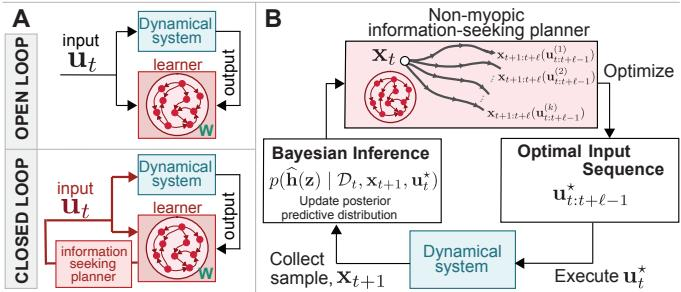
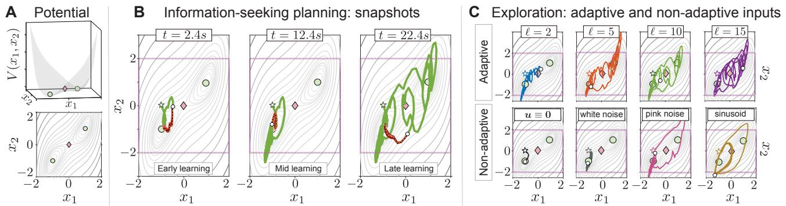
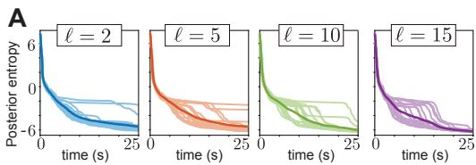
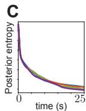
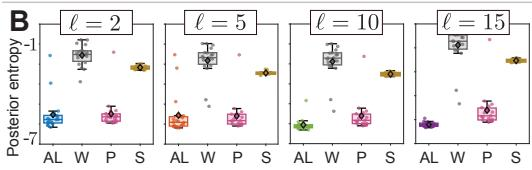
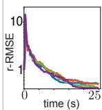

# Information-theoretic receding-horizon active learning of nonlinear dynamical systems

Juncal Arbelaiz<sup>a</sup>, Anushri Arora<sup>b</sup>, Jonathan W. Pillow<sup>a</sup>

Abstract— Accurately learning nonlinear dynamics from a finite-duration experiment requires the efficient collection of informative data. We address this challenge for stochastic controlled nonlinear dynamical systems whose state is observed along a single trajectory. Our goal is to reconstruct the unknown controlled state-increment map over a prescribed compact subset of state–input space. We construct a parametric estimator of the map using fixed nonlinear features, so that the model is nonlinear in the state and input, but linear in the unknown parameters. A Gaussian prior over the parameters yields recursive Bayesian posterior updates as data stream in, enabling online quantification of predictive uncertainty in the reconstructed dynamics over the target set. We formulate an optimal adaptive-design problem over an information state, using a prediction-oriented acquisition criterion based on the mean marginal mutual information between candidate future trajectories and the reconstructed dynamics over the target set. We then approximate the resulting adaptive-design problem by a non-myopic receding-horizon formulation, evaluate its remaining expectation using a scenario-based sample average, and solve the resulting deterministic program with the crossentropy method, leveraging parallel candidate–scenario evaluations. Numerical experiments on a noisy multistable system demonstrate that the proposed adaptive information-seeking strategy reduces predictive uncertainty and reconstruction error more efficiently than common excitation baselines under comparable experimental constraints.

## I. INTRODUCTION

Accurate models of nonlinear dynamics are essential for prediction and control, yet are often unavailable or vary across operating conditions, individuals, and environments. We therefore consider the problem of online learning of stochastic nonlinear dynamical systems driven by control inputs, where the dynamics are inferred sequentially from a single observed state trajectory. When the system can be externally excited, the inputs themselves can be adaptively designed to acquire informative observations, leading to the problem of active learning—closely related to sequential optimal experimental design [1] and optimal exploration [2]. This setting naturally couples inference and decision-making: model uncertainty is updated from streaming observations while future inputs are designed to improve learning. Fig. 1A contrasts the corresponding open- and closed-loop online identification architectures.

  
Fig. 1: Online system identification and the proposed closedloop information-seeking architecture. (A) Open-loop (top) and closed-loop (bottom) online system identification. The learner (red), parameterized by weights W, reconstructs the unknown controlled dynamics from state observations generated by the dynamical system (blue). In the open-loop setting, the excitation input is specified independently of the learner. In the closed-loop setting, an information-seeking planner uses the learner’s evolving uncertainty to adaptively select inputs that produce informative observations. (B) Receding-horizon Bayesian active-learning loop at time t. Given the current information state (x<sub>t</sub>, m<sub>t</sub>, Ω<sub>t</sub>), the non-myopic planner evaluates candidate input sequences and their predicted state trajectories according to their expected informativeness about the reconstructed dynamics. The optimal input sequence is selected, but only u<sup>⋆</sup> is applied to the system. After observing $\mathbf { x } _ { t + 1 } .$ , Bayesian inference updates the posterior predictive distribution, and the cycle is repeated from the resulting updated information state.

Related work: Input design for dynamical system identification has a long history [3], [4]. Finite-sample guarantees for learning nonlinear dynamics from trajectory data have been developed in [5], [6], with active identification studied in [7]. Related approaches include receding-horizon and model-predictive input-design methods [8]–[11], greedy Doptimal exploration (FLEX) [12], GP-based informationseeking control [13], [14], optimistic active exploration (OPAX) [15], and space-filling input design that promotes coverage of a prescribed state–input region [16]. A related line instead tailors exploration to downstream control performance; see, e.g., [2], [17]. Our active learning approach is prediction-oriented: we quantify informativeness directly through uncertainty reduction in the reconstructed dynamics over a prescribed region of state-input space, connecting to goal-oriented Bayesian experimental design [18] and expected predictive information gain [19]. Policybased Bayesian experimental-design methods such as DAD [20] approximate the adaptive design policy directly; in contrast, we solve a constrained non-myopic receding-horizon stochastic input-design problem online and replan with an updated model after each observation.

Main contributions: We introduce a prediction-oriented Bayesian active-learning framework for the online identification of nonlinear stochastic dynamical systems over a prescribed region of state–input space. First, we formulate informativeness directly in terms of the reconstructed dynamics, using a mutual information criterion that quantifies the expected reduction in predictive uncertainty over the target region. Second, we cast adaptive input design as a sequential decision problem over an information state comprising the physical state and the current Bayesian posterior, and introduce a constrained, non-myopic receding-horizon approximation to the resulting causal design problem (see Fig. 1B). Third, for a nonlinear feature model that is linear in the unknown parameters, the Bayesian updates are recursive and the predictive information gain is available analytically; the remaining expectation over uncertain future trajectories is approximated by a scenario-based sample average and optimized using CEM. We illustrate the resulting closed-loop information-seeking strategy on a noisy multistable system, where it reduces predictive uncertainty and reconstruction error more efficiently than power-matched excitation baselines.

Paper structure: The remainder of the paper is organized as follows. §II introduces mathematical preliminaries. §III presents the model of the controlled dynamics and the learning objective, and §IV develops the corresponding Bayesian inference framework. §V formulates the prediction-oriented information objective and the recedinghorizon stochastic input-design problem, together with its scenario-based approximation. §VI summarizes the resulting algorithm, §VII presents a numerical case study, and §VIII concludes.

## II. MATHEMATICAL PRELIMINARIES

a) Notation: We use $a \in \mathbb { R }$ for scalars, $\textbf { a } \in \ \mathbb { R } ^ { k }$ for vectors and $\begin{array} { r c l } { A } & { { } \in } & { \mathbb { R } ^ { n \times m } } \end{array}$ for matrices. $A ^ { \top }$ denotes the transpose of $A . \ \mathbb { I } _ { n }$ denotes the n-dimensional identity matrix. The symbol := denotes equality by definition. We use $\mathbf { a } _ { t : t + \ell } : = ( \mathbf { a } _ { t } , \mathbf { a } _ { t + 1 } , \dots , \mathbf { a } _ { t + \ell } )$ for temporal sequences. The superscript <sup>⋆</sup> denotes optimality—not to be confused with $^ { * } ,$ which we use to denote quantities evaluated over a set of grid points. Given a matrix $A \in \mathbb { R } ^ { n \times m } , \mathbf { a } : = \operatorname { v e c } ( A ) \in \mathbb { R } ^ { n m }$ denotes the vectorization of $A ,$ obtained by stacking the columns of A on top of one another. A useful identity is $\operatorname { v e c } ( A \mathbf { x } ) = ( \mathbb { I } _ { n } \otimes \mathbf { x } ^ { \top } ) \mathbf { v e c } ( A ^ { \top } ) = ( \mathbf { x } ^ { \top } \otimes \mathbb { I } _ { n } ) \mathbf { v e c } ( A )$ , where ⊗ is the Kronecker product.

b) Definitions: Let x be a continuous random vector supported on $\mathcal { X } \subseteq \mathbb { R } ^ { n }$ with density $p _ { \mathbf { x } }$ . Its differential entropy is defined as $\begin{array} { r } { \mathcal { H } ( \mathbf { x } ) \ : = \ - \int _ { \mathcal { X } } p _ { \mathbf { x } } ( \mathbf { z } ) \ln p _ { \mathbf { x } } ( \mathbf { z } ) } \end{array}$ dz = $- \mathbb { E } [ \ln p _ { \mathbf { x } } ( \mathbf { x } ) ]$ . The differential entropy quantifies the average uncertainty associated with x. $\mathrm { I f } ~ \mathbf { x } \sim { \mathcal { N } } ( { \boldsymbol { \mu } } , { \boldsymbol { \Sigma } } )$ with $\Sigma \succ 0 .$ then $\begin{array} { r } { \mathcal { H } ( { \bf x } ) = \frac { 1 } { 2 } \ln \bigl ( ( 2 \pi e ) ^ { n } \operatorname* { d e t } ( \Sigma ) \bigr ) } \end{array}$ . The conditional $d i f f e r -$ ential entropy of a random vector y given a random vector x is defined by $\begin{array} { r } { \mathcal { H } ( \mathbf { y } \mid \mathbf { x } ) : = - \int _ { \mathcal { X } } \int _ { \mathcal { V } } p ( \mathbf { y } , \mathbf { x } ) \ln p ( \mathbf { y } \mid \mathbf { x } ) d \mathbf { y } d \mathbf { x } } \end{array}$

Finally, the mutual information between the random vectors x and y can be written as

$$
\sf M I ( \mathbf { x } ; \mathbf { y } ) = \mathcal { H } ( \mathbf { x } ) - \mathcal { H } ( \mathbf { x } \mid \mathbf { y } ) = \mathcal { H } ( \mathbf { y } ) - \mathcal { H } ( \mathbf { y } \mid \mathbf { x } ) .
$$

From a Bayesian perspective, we can view $p ( \mathbf { x } )$ as the prior distribution for x and $p ( \mathbf { x } | \mathbf { y } )$ as the posterior distribution after observation of data y. The $\mathbf { M I } ( \mathbf { x } ; \mathbf { y } )$ therefore measures the expected reduction in the entropy of x upon observing $\mathbf { y } .$ . This interpretation is central to the present work.

## III. MODEL OF THE SYSTEM DYNAMICS

We consider the online identification of a discrete-time stochastic controlled Markov process of the form

$$
{ \bf x } _ { t + 1 } = { \bf x } _ { t } + { \bf h } ( { \bf x } _ { t } , { \bf u } _ { t } ) + \pmb { \xi } _ { t } ,\tag{1}
$$

where $\mathbf { x } _ { t } ~ \in ~ \mathbb { R } ^ { n }$ is the system state, $\mathbf { u } _ { t } \in \mathbb { R } ^ { m }$ is the control input, and $\pmb { \xi } _ { t } \overset { \mathrm { i . i . d . } } { \sim } \mathcal { N } ( \mathbf { 0 } , \Sigma _ { \xi } )$ with $\Sigma _ { \xi } \succ 0$ , assumed known. The unknown map h $: \mathbb { R } ^ { \mathit { \bar { n } } + \mathit { m } } \to \bar { \mathbb { R } } ^ { \mathit { n } }$ denotes the deterministic one-step state increment induced jointly by the current state and control input. Defining the augmented state– input variable $\mathbf { z } _ { t } \ : = \ \left[ \mathbf { x } _ { t } ^ { \top } \quad \mathbf { u } _ { t } ^ { \top } \right] ^ { \top } \ \in \ \mathbb { R } ^ { n + m }$ , we use the shorthand $\mathbf { h } ( \mathbf { z } _ { t } ) : = \mathbf { h } ( \bar { \mathbf { x } } _ { t } , \mathbf { u } _ { t } )$ . Our objective is to learn the controlled state-increment map over a prescribed compact region of interest (ROI) $\mathcal { Z } \subset \mathbb { R } ^ { n + m }$ from a single controlled trajectory of finite length T. Thus, the learning target is the restriction $\mathbf { h } | _ { \mathcal { Z } } .$ , rather than the parameters of a particular representation of h.

We model the unknown dynamics using a fixed nonlinear feature map $\phi : \mathbb { R } ^ { n + m }  \mathbb { R } ^ { d _ { \phi } }$ and a matrix of unknown weights $W ~ \in ~ \mathbb { R } ^ { d _ { \phi } \times n }$ , defining the parametric estimator $\widehat { \mathbf { h } } ( { \mathbf { z } } ; W ) : = W ^ { \top } \phi ( { \mathbf { z } } )$ . This class of models can capture many types of dynamics and is used widely in system identification [2], [7]. Let $\mathbf { w } : = \mathrm { v e c } ( W ) \in \mathbb { R } ^ { n d _ { \phi } }$ and define $\Phi ( \mathbf { z } ) : = \mathbb { I } _ { n } \otimes \phi ( \mathbf { z } ) ^ { \top } \in \mathbb { R } ^ { n \times n d _ { \phi } }$ . Then $\widehat { \mathbf { h } } ( \mathbf { z } ; \mathbf { w } ) = \Phi ( \mathbf { z } ) \mathbf { w } .$ and the corresponding reconstructed dynamics model is

$$
\mathbf { x } _ { t + 1 } = \mathbf { x } _ { t } + \Phi ( \mathbf { x } _ { t } , \mathbf { u } _ { t } ) \mathbf { w } + \pmb { \xi } _ { t } .\tag{2}
$$

Assumption 3.1 (Full-state measurements): The state $\mathbf { x } _ { t }$ is observed without measurement noise at each sampling instant t.

Assumption 3.2 (Realizability): There exists $\mathbf { w } ^ { \dag } \in \mathbb { R } ^ { n d _ { \phi } }$ such that $\mathbf { h } ( \mathbf { z } ) = \Phi ( \mathbf { z } ) \mathbf { w } ^ { \dag }$ for all state–input pairs z considered during learning and planning, including all $\mathbf { z } \in { \mathcal { Z } }$

Feature $\phi$ choice: In practice, we use a random-feature model with single-hidden-layer features of the form $\phi ( \mathbf { z } ) =$ tanh $\left( J \mathbf { z } + \mathbf { b } \right)$ , where $J \in \overset { \cdot } { \mathbb { R } } ^ { d _ { \phi } \times ( n + m ) }$ and b $\in \mathbb { R } ^ { d _ { \phi } }$ are sampled before learning starts and subsequently held fixed; only the output weights $W$ are inferred. This corresponds to a random-hidden-layer (ELM/RVFL) model [21], [22]. Finite linear combinations of sigmoidal features are dense in spaces of continuous functions on compact domains [23], [24], while related results establish universal approximation for random-hidden-layer models under suitable sampling schemes [22]. The feature distribution should be scaled to the characteristic length scales of $\mathcal { Z }$ so as to avoid widespread saturation; the construction used in our experiments is described in Appendix A.

Learning objective: Given a finite learning horizon $T ,$ our goal is to accurately reconstruct the restriction $\mathbf { h } | _ { \mathcal { Z } }$ from the sequentially collected data. To this end, we maintain a posterior distribution over the weights w, which induces a posterior predictive distribution over $\widehat { \mathbf { h } } | _ { \mathcal { Z } }$ . This domainlevel objective distinguishes dynamical-system reconstruction from merely fitting the observed trajectory [25]. When a finite-dimensional representation of the ROI is required computationally, we denote by $\mathcal { Z } ^ { \ast } : = \{ \mathbf { z } _ { \ast } ^ { ( i ) } \} _ { i = 1 } ^ { N _ { \ast } } \subset \bar { \mathcal { Z } }$ the corresponding evaluation grid with a total of $\dot { N _ { * } }$ grid points.

The Bayesian posterior predictive distribution underlying the learning and planning components of the active learning method is developed next.

## IV. BAYESIAN LEARNING

At time t, given the dataset $\mathcal { D } _ { t } ~ : = ~ \{ \mathbf { x } _ { 0 : t } , \mathbf { u } _ { 0 : t - 1 } \}$ , we maintain a Gaussian posterior over the unknown weights, $p ( \mathbf { w } \mid \mathcal { D } _ { t } ) = \mathcal { N } ( \mathbf { m } _ { t } , \Omega _ { t } )$ . The linear-in-parameters dynamics and Gaussian additive process noise yield closed-form Bayesian linear-regression updates: recursive updates are used to assimilate streaming observations, while their batch counterpart is used to evaluate hypothetical multi-step updates during planning. For fixed $d _ { \phi } .$ , all previously collected data are summarized by the fixed-dimensional sufficient statistics $\left( \mathbf { m } _ { t } , \Omega _ { t } \right)$ .

a) Prior over w: ${ \mathrm { \bf A t } } \ t = 0 .$ , we place the Gaussian prior $\mathbf { w } \sim \mathcal { N } ( \mathbf { m } _ { 0 } , \Omega _ { 0 } )$ , with $\Omega _ { 0 } \ \succ \ 0 . \ ( \mathbf { m } _ { 0 } , \Omega _ { 0 } )$ encode prior knowledge and regularize estimation in the small-data regime.

b) Posterior updates over w: Define the observed state increment $\mathbf { y } _ { t + 1 } : = \mathbf { x } _ { t + 1 } - \mathbf { x } _ { t }$ , so that, from (2), $\mathbf { y } _ { t + 1 } ~ =$ $\Phi ( \mathbf { x } _ { t } , \mathbf { u } _ { t } ) \mathbf { w } + \pmb { \xi } _ { t }$ . For notational compactness, let $\Phi _ { \tau - 1 } : =$ $\Phi ( \mathbf { x } _ { \tau - 1 } , \mathbf { u } _ { \tau - 1 } )$ . Starting from $p ( \mathbf { w } \mid \mathcal { D } _ { t } ) = \mathcal { N } ( \mathbf { m } _ { t } , \Omega _ { t } )$ and assimilating a batch of ℓ additional observations yields

$$
\Omega _ { t + \ell | t } ^ { - 1 } = \Omega _ { t } ^ { - 1 } + \sum _ { \tau = t + 1 } ^ { t + \ell } \Phi _ { \tau - 1 } ^ { \top } \Sigma _ { \xi } ^ { - 1 } \Phi _ { \tau - 1 } ,\tag{3a}
$$

$$
\mathbf { m } _ { t + \ell | t } = \Omega _ { t + \ell | t } \left( \Omega _ { t } ^ { - 1 } \mathbf { m } _ { t } + \sum _ { \tau = t + 1 } ^ { t + \ell } \Phi _ { \tau - 1 } ^ { \top } \Sigma _ { \xi } ^ { - 1 } \mathbf { y } _ { \tau } \right) .\tag{3b}
$$

The derivation is given in Appendix B.

For online assimilation $\begin{array} { r l r } { ( \ell } & { { } = } & { 1 ) } \end{array}$ , after observing $\left( \mathbf { x } _ { t } , \mathbf { u } _ { t } , \mathbf { x } _ { t + 1 } \right)$ , define the Kalman gain $K _ { t + 1 } \quad : =$ $\Omega _ { t } \boldsymbol { \Phi } _ { t } ^ { \top } \left( \Sigma _ { \xi } + \boldsymbol { \Phi } _ { t } \Omega _ { t } \boldsymbol { \Phi } _ { t } ^ { \top } \right) ^ { - 1 }$ . The recursive posterior update is

$$
\mathbf { m } _ { t + 1 } = \mathbf { m } _ { t } + K _ { t + 1 } \left( \mathbf { y } _ { t + 1 } - \Phi _ { t } \mathbf { m } _ { t } \right) ,\tag{4a}
$$

$$
\Omega _ { t + 1 } = \Omega _ { t } - K _ { t + 1 } \Phi _ { t } \Omega _ { t } .\tag{4b}
$$

c) Posterior predictive distribution: The posterior over w induces, at every $\mathbf { z } \in { \mathcal { Z } }$ , the Gaussian posterior predictive distribution

$$
p \Big ( \widehat { \mathbf { h } } ( \mathbf { z } ) \mid \mathcal { D } _ { t } \Big ) = \mathcal { N } \left( \boldsymbol { \Phi } ( \mathbf { z } ) \mathbf { m } _ { t } , C _ { t } ( \mathbf { z } ) \right) ,\tag{5}
$$

where $C _ { t } ( \mathbf { z } ) : = \Phi ( \mathbf { z } ) \Omega _ { t } \Phi ( \mathbf { z } ) ^ { \top }$ quantifies the local epistemic uncertainty in the reconstructed controlled state-increment map.

Importantly, our learning objective is goal-oriented and, more specifically, prediction-oriented: w is an intermediate representation, whereas the quantity of interest is $\widehat { \mathbf { h } } | _ { \mathcal { Z } }$ . Reducing uncertainty in w need not imply a commensurate reduction in uncertainty in the reconstructed dynamics over the target region, since different parameter directions can have different predictive relevance on $\mathcal { Z } .$ This perspective connects to goal-oriented Bayesian experimental design [18] and, in particular, to prediction-oriented Bayesian active learning and its expected predictive information gain (EPIG) criterion [19], which targets information about predictions rather than model parameters. In §V, we develop a multi-step dynamical analogue in which candidate control sequences are evaluated by the information their induced future trajectories are expected to provide about $\hat { \bf h } ( { \bf z } )$ across Z.

## V. INFORMATION-SEEKING PLANNING

We now turn to the planning component of the activelearning loop in Fig. 1B. The objective is to design control inputs that steer the system toward observations that are informative about the controlled state-increment map over the target region $\mathcal { Z } .$ . We first define the prediction-oriented information criterion to be used as acquisition function, then formulate the adaptive design problem over causal feedback policies, and finally introduce the receding-horizon and sample-average approximations used in our implementation.

## A. Prediction-oriented information objective

As discussed in $\ S \mathrm { I V } ,$ , the quantity of interest is the restriction of the reconstructed map $\widehat { \mathbf { h } } | _ { \mathcal { Z } }$ . At a target location $\mathbf { z } \in { \mathcal { Z } }$ and time $t ,$ its uncertainty is quantified by the differential entropy of its posterior predictive distribution

$$
{ \mathcal { H } } \Big ( \widehat { \mathbf { h } } ( \mathbf { z } ) \mid { \mathcal { D } } _ { t } \Big ) = \frac { 1 } { 2 } \ln [ ( 2 \pi e ) ^ { n } \operatorname* { d e t } C _ { t } ( \mathbf { z } ) ] ,
$$

where $C _ { t } ( \mathbf { z } )$ is given in (5).

Let d denote a prospective design and let $\mathcal { D } _ { d }$ denote the future state observations generated under that design. Let $\rho$ be a probability density over ${ \mathcal { Z } } ,$ describing the relative importance assigned to different parts of the learning region. We define the mean marginal mutual information (mmMI) of the design as [26, §4.1]

$$
\mathsf { m m M } \mathsf { I } _ { t } ( d ) : = \int _ { \mathcal { Z } } \rho ( \mathbf { z } ) \mathsf { M I } \Big ( \mathcal { V } _ { d } ; \widehat { \mathbf { h } } ( \mathbf { z } ) \mid \mathcal { D } _ { t } , d \Big ) d \mathbf { z } .\tag{6}
$$

That ${ \mathrm { i s } } ,$ mm ${ \sf M I } _ { t } ( d )$ is the expected reduction in posterior predictive entropy induced by the candidate experiment, averaged over the region Z where accurate reconstruction matters.

For numerical evaluation, we discretize the integral over $\mathcal { Z }$ using the grid $\mathcal { Z } ^ { * } = \{ \mathbf { z } _ { * } ^ { ( i ) } \} _ { i = 1 } ^ { N _ { * } }$ introduced in §III. Let $\omega _ { i } \geq 0$ $\begin{array} { r } { \sum _ { i = 1 } ^ { N _ { * } } \omega _ { i } = 1 } \end{array}$ , denote the associated quadrature weights. We define the grid approximation

$$
\mathsf { m m } \mathsf { M } \mathsf { I } _ { t } ^ { \ast } ( d ) : = \sum _ { i = 1 } ^ { N _ { \ast } } \omega _ { i } \mathsf { M } \mathsf { I } \left( \mathcal { V } _ { d } ; \widehat { \mathbf { h } } ( \mathbf { z } _ { \ast } ^ { ( i ) } ) \mid \mathcal { D } _ { t } , d \right) .\tag{7}
$$

For the linear-in-parameters Gaussian model of §III-IV, the marginal mutual information at each target location,

mMI<sub>t</sub> $( d , \mathbf { z } ) : = \mathsf { M I } \big ( \mathcal { V } _ { d } ; \widehat { \mathbf { h } } ( \mathbf { z } ) \mid \mathcal { D } _ { t } , d \big )$ , admits the following analytic log-determinant representation

$$
\mathsf { m } \mathsf { M } \mathsf { I } _ { t } ( d , \mathbf { z } ) = \frac { 1 } { 2 } \mathbb { E } \left[ \ln \frac { \operatorname* { d e t } C _ { t } ( \mathbf { z } ) } { \operatorname* { d e t } C _ { t | \mathcal { V } _ { d } } ( \mathbf { z } ) } \right] ,\tag{8}
$$

where $C _ { t | \mathcal { V } _ { d } } ( \mathbf { z } )$ denotes the predictive covariance after assimilating the hypothetical observations $\mathcal { D } _ { d } .$ and the expectation is taken with respect to their predictive distribution under design d.

## B. Optimal adaptive design & receding-horizon planning

Let $b _ { t } ( \mathbf { w } ) : = p ( \mathbf { w } | \mathcal { D } _ { t } )$ denote the posterior belief over the weights w at time t. Under the Gaussian model of §IV, $b _ { t }$ is completely specified by $\left( \mathbf { m } _ { t } , \Omega _ { t } \right)$ . Hence,

$$
\mathbf { s } _ { t } : = ( \mathbf { x } _ { t } , b _ { t } ) \equiv ( \mathbf { x } _ { t } , \mathbf { m } _ { t } , \Omega _ { t } )
$$

forms a sufficient information state for sequential decisionmaking: the physical state specifies the current system configuration, while the posterior summarizes the information contained in all previous observations [27]–[29]. Accordingly, under the physical dynamics (1) and Bayesian update (4), the information-state process is controlled Markov.

Let $\mathcal { U } \subset \mathbb { R } ^ { m }$ denote the admissible input set. A causal design policy $\pi _ { t : T - 1 } : = \{ \pi _ { t } , . . . , \pi _ { T - 1 } \}$ consists of decision rules $\pi _ { \tau } : S  \mathcal { U }$ such that

$$
\mathbf { u } _ { \tau } = \pi _ { \tau } ( \mathbf { s } _ { \tau } ) , \qquad \tau = t , \dots , T - 1 ,
$$

where $s$ denotes the information state-space. Thus, each input may depend on information available up to the current time, but not on future observations.

Specializing the prediction-oriented criterion (6) to the causal design policy $d = \pi _ { t : T - 1 }$ and conditioning on the information-state $\mathbf { s } _ { t }$ at time t, the corresponding remaininghorizon objective is

$$
J _ { t } ( \mathbf { s } _ { t } ; \boldsymbol { \pi } _ { t : T - 1 } ) : = \int _ { \mathcal { Z } } \rho ( \mathbf { z } ) \mathsf { M } | \Big ( \widehat { \mathbf { h } } ( \mathbf { z } ) ; \mathbf { x } _ { t + 1 : T } | \mathbf { s } _ { t } , \boldsymbol { \pi } _ { t : T - 1 } \Big ) d \mathbf { z } .
$$

Accordingly, the remaining-horizon active-design problem is

$$
\begin{array} { r l } & { \boldsymbol { \pi } _ { t : T - 1 } ^ { \star } \in \arg \operatorname* { m a x } _ { \boldsymbol { \pi } _ { t : T - 1 } } J _ { t } ( \mathbf { s } _ { t } ; \boldsymbol { \pi } _ { t : T - 1 } ) } \\ & { \qquad \mathrm { s . t . } \quad \mathbf { u } _ { \tau } = \boldsymbol { \pi } _ { \tau } ( \mathbf { s } _ { \tau } ) \in \mathcal { U } , \ \tau = t , \ldots , T - 1 } \end{array}\tag{OPT1}
$$

where the information state evolves according to the physical dynamics (1) and the Bayesian update (4). Thus, (OPT1) seeks a causal feedback policy that maximizes the information acquired about the reconstructed dynamics over the remainder of the experiment.

By the chain rule for mutual information and sufficiency of the information state, the objective in (OPT1) admits an additive representation in terms of successive conditional mutualinformation terms. Define the one-step mutual-information reward $\begin{array} { r l r } { r ( \mathbf { s } , \mathbf { u } ) } & { : = } & { \int _ { \mathcal { Z } } \rho ( \mathbf { z } ) \mathsf { M I } \bigl ( \widehat { \mathbf { h } } ( \mathbf { z } ) ; \mathbf { x } ^ { + } \mid \mathbf { s } , \mathbf { u } \bigr ) d \mathbf { z } } \end{array}$ , where $\mathbf { x } ^ { + }$ denotes the next state. Then, for any causal policy $\begin{array} { r } { \pi _ { t : T - 1 } , \ J _ { t } ( \mathbf { s } _ { t } ; \pi _ { t : T - 1 } ) \ = \ \mathbb { E } ^ { \pi } \big [ \sum _ { \tau = t } ^ { T - 1 } r \big ( \mathbf { s } _ { \tau } , \pi _ { \tau } ( \mathbf { s } _ { \tau } ) \big ) \big | \ \mathbf { s } _ { t } \big ] } \end{array}$ where $\mathbb { E } ^ { \pi }$ denotes expectation under policy $\pi _ { t : T - 1 }$ . Together with the controlled-Markov property of ${ \bf s } _ { \tau }$ , this allows the exact adaptive-design problem to be formulated through a Bellman recursion over the information state: $V _ { t } ( \mathbf { s } ) \ =$ max<sub>u∈U</sub> $\left\{ r ( \mathbf { s } , \mathbf { u } ) + \mathbb { E } [ V _ { t + 1 } ( \mathbf { s } ^ { + } ) \vert \mathbf { s } , \mathbf { u } ] \right\}$ , where $\mathbf { s } ^ { + }$ denotes the next information state and $V _ { t } ( \mathbf { s } )$ is the optimal expected cumulative information reward from time t to T, with $V _ { T } ( \mathbf { s } ) = 0$ . Exact dynamic programming is, however, generally impractical here because the information state $\left( \mathbf { x } _ { \tau } , \mathbf { m } _ { \tau } , \Omega _ { \tau } \right)$ is continuous and high-dimensional, the system dynamics are nonlinear and stochastic, and the inputs are constrained. Related policy-based Bayesian experimentaldesign methods parameterize and approximate the adaptive design policy directly [20], [30]. Instead, we use a recedinghorizon approximation. At each realized information state $\mathbf { s } _ { t } .$ we replace the remaining causal policy by a finite open-loop control sequence of length ℓ,

$$
\mathbf { U } _ { t } ^ { ( \ell ) } : = \left( \mathbf { u } _ { t \mid t } , \ldots , \mathbf { u } _ { t + \ell - 1 \mid t } \right) , \qquad 1 \le \ell \le T - t .
$$

Specializing the mmMI criterion (6) to the finite open-loop design $d = \mathbf { U } _ { t } ^ { ( \ell ) }$ , define

$$
J _ { t } ^ { ( \ell ) } \Big ( \mathbf { U } _ { t } ^ { ( \ell ) } ; \mathbf { s } _ { t } \Big ) : = \int _ { \mathcal { Z } } \rho ( \mathbf { z } ) \mathsf { M } \mathsf { I } \Big ( \widehat { \mathbf { h } } ( \mathbf { z } ) ; \mathbf { x } _ { t + 1 : t + \ell } \Big | \mathbf { s } _ { t } , \mathbf { U } _ { t } ^ { ( \ell ) } \Big ) d \mathbf { z } .
$$

Accordingly, the stochastic receding-horizon design problem is

$$
\begin{array} { r l } { \mathbf { U } _ { t } ^ { ( \ell ) \star } \in \arg \operatorname* { m a x } _ { \mathbf { U } _ { t } ^ { ( \ell ) } } } & { J _ { t } ^ { ( \ell ) } \Big ( \mathbf { U } _ { t } ^ { ( \ell ) } ; \mathbf { s } _ { t } \Big ) } \\ { \mathbf { s . t . } } & { \mathbf { u } _ { \tau \mid t } \in \mathcal { U } , \qquad \tau = t , \dots , t + \ell - 1 , } \end{array}\tag{OPT2}
$$

where the distribution of the hypothetical trajectories entering $J _ { t } ^ { ( \ell ) }$ is induced by the dynamics (1) and Bayesian updates (4), initialized at the current information state $\mathbf { s } _ { t } .$

At each t, only the first optimized input is applied, $\mathbf { u } _ { t } = \mathbf { u } _ { t \mid t } ^ { \star } .$ After observing $\mathbf { x } _ { t + 1 }$ , the posterior is updated and (OPT2) is solved again from the newly realized information state. Thus, each individual planning problem is open loop over its prediction horizon, while repeated replanning induces an implicit closed-loop policy. The nonmyopic planning horizon $\ell > 1$ permits the planner to steer toward informative regions that may not be reached greedily, while limiting the online computational cost.

## C. Sample-average approximation

Problem (OPT2) is a nonlinear stochastic program. We approximate its remaining expectation by a scenario-based sample-average approximation (SAA).

At each replanning time t, draw $\mathbf { w } ^ { ( j ) } \sim \mathcal { N } ( \mathbf { m } _ { t } , \Omega _ { t } ) , j =$ $1 , \ldots , N _ { w }$ , and independently draw $N _ { \xi }$ process-noise sequences $\pmb { \xi } _ { t : t + \ell - 1 } ^ { ( k ) } : = \left( \pmb { \xi } _ { t | t } ^ { ( k ) } , \cdot \cdot \cdot , \pmb { \xi } _ { t + \ell - 1 | t } ^ { ( k ) } \right)$ with $\begin{array} { r l } { \pmb { \xi } _ { \tau | t } ^ { ( k ) } } & { { } \overset { \mathrm { i . i . d . } } { \sim } } \end{array}$ $\mathcal { N } ( \mathbf { 0 } , \Sigma _ { \xi } )$ , for $k = 1 , \ldots , N _ { \xi } .$ . We use the Cartesian product of these samples, yielding $N _ { w } N _ { \xi }$ rollout scenarios. For each pair $( j , k )$ and candidate sequence $\mathbf { U } _ { t } ^ { ( \ell ) }$ , set $\mathbf { x } _ { t \mid t } ^ { ( j , k ) } = \mathbf { x } _ { t }$ and propagate

$$
\begin{array} { r } { \mathbf { x } _ { \tau + 1 | t } ^ { ( j , k ) } = \mathbf { x } _ { \tau | t } ^ { ( j , k ) } + \Phi \left( \mathbf { x } _ { \tau | t } ^ { ( j , k ) } , \mathbf { u } _ { \tau | t } \right) \mathbf { w } ^ { ( j ) } + \pmb { \xi } _ { \tau | t } ^ { ( k ) } , } \end{array}
$$

for $\tau = t , \dots , t + \ell - 1$ . Denote $\Phi _ { \tau | t } ^ { ( j , k ) } : = \Phi \Big ( \mathbf { x } _ { \tau | t } ^ { ( j , k ) } , \mathbf { u } _ { \tau | t } \Big )$ Then, the corresponding hypothetical terminal posterior covariance satisfies

$$
\left( \Omega _ { t + \ell | t } ^ { ( j , k ) } \right) ^ { - 1 } = \Omega _ { t } ^ { - 1 } + \sum _ { \tau = t } ^ { t + \ell - 1 } \Phi _ { \tau | t } ^ { ( j , k ) \top } \Sigma _ { \xi } ^ { - 1 } \Phi _ { \tau | t } ^ { ( j , k ) } .
$$

Conditioned on the current information state $\begin{array} { r l } { \mathbf { s } _ { t } } & { { } = } \end{array}$ $\left( \mathbf { x } _ { t } , \mathbf { m } _ { t } , \Omega _ { t } \right)$ , using the empirical average over the sampled trajectories to approximate the acquisition function yields the deterministic SAA problem

N<sub>w</sub> <sup>N</sup>ξ N<sub>∗</sub>   
min N<sub>w</sub>N<sub>ξ</sub> 1 X X X ωi ln detΦ<sup>∗</sup><sub>i</sub> Ω (j,k) ∗⊤   
s.t. $\begin{array} { r } { \mathbf { x } _ { t \mid t } ^ { ( j , k ) } = \mathbf { x } _ { t } , } \end{array}$   
$\mathbf { x } _ { \tau + 1 | t } ^ { ( j , k ) } = \mathbf { x } _ { \tau | t } ^ { ( j , k ) } + \boldsymbol { \Phi } _ { \tau | t } ^ { ( j , k ) } \mathbf { w } ^ { ( j ) } + \boldsymbol { \xi } _ { \tau | t } ^ { ( k ) } ,$   
$\left( \Omega _ { t + \ell | t } ^ { ( j , k ) } \right) ^ { - 1 } = \Omega _ { t } ^ { - 1 } + \sum _ { \tau = t } ^ { t + \ell - 1 } \Phi _ { \tau | t } ^ { ( j , k ) \top } \Sigma _ { \xi } ^ { - 1 } \Phi _ { \tau | t } ^ { ( j , k ) } ,$   
u<sub>τ|t</sub> ∈ U, τ = t, . . . , t + ℓ − 1,   
j = 1, . . . , N<sub>w</sub>, k = 1, . . . , N<sub>ξ</sub> ,   
(OPT

3)

where $\Phi _ { i } ^ { * } \ : = \ \Phi ( \mathbf { z } _ { * } ^ { ( i ) } ) , i \ = \ 1 , \ldots , N _ { * }$ . We denote the objective in (OPT3) by $\mathcal { C } _ { t } ^ { ( \ell ) } ( \mathbf { U } _ { t } ^ { ( \ell ) } ; \mathbf { s } _ { t } )$

Finally, we note that a generic expected-information-gain objective may require a nested Monte Carlo calculation to estimate the information criterion, which can lead to unfavorable statistical and computational properties [31, §3]. Here, by contrast, the linear-in-parameters Gaussian structure provides the predictive information gain analytically through the log-determinant expression $( 8 ) ;$ Monte Carlo is used only for the outer expectation over uncertain future trajectories. In §VI we solve problem (OPT3) online using the cross-entropy method (CEM).

## VI. ALGORITHM FOR RECEDING-HORIZON BAYESIAN ACTIVE LEARNING

The complete receding-horizon Bayesian active-learning framework is summarized in Algorithm 1, with the CEM solver for the deterministic SAA problem OPT3 detailed in Algorithm 2. At each replanning time, a common batch of $N _ { w } N _ { \xi }$ parameter–noise scenarios is sampled once and reused to score all P candidate input sequences throughout the CEM iterations. The candidate–scenario rollouts can be evaluated in parallel (across CPU threads or GPU cores). CEM iteratively samples input sequences, retains the lowestcost elite set, and refits its Gaussian sampling distribution. After each planning solve, the final sampling distribution is shifted one step forward to warm-start the next solve. Only the first input of the best sequence is applied before the posterior is updated and planning is repeated—see Fig. 1B.

```latex
Algorithm 1 Receding-horizon active learning
Require: Learning horizon $T ;$ maximum planning horizon $\ell _ { m } ;$
feature map Φ; initial information state ${ \bf s } _ { 0 } = ( { \bf x } _ { 0 } , { \bf m } _ { 0 } , \Omega _ { 0 } )$
CEM parameters $\Theta _ { \mathrm { C E M } }$
1: Initialize CEM distribution $( \mu _ { U } , \sigma _ { U } )$
2: for $t = 0 , \ldots , T - 1$ do
3: $\ell \gets \operatorname* { m i n } \{ \ell _ { m } , T - t \}$
4: $[ \mathbf { U } _ { t } ^ { ( \ell ) \star } , \mu _ { U } , \pmb { \sigma } _ { U } ] \gets \mathrm { C E M \mathrm { - } P L A N } \big ( \mathbf { s } _ { t } , \ell , \pmb { \mu } _ { U } , \pmb { \sigma } _ { U } ; \ominus _ { \mathrm { C E M } } \big )$
5: $\mathbf { u } _ { t } \gets \mathbf { u } _ { t | t } ^ { \star }$
6: Apply u<sub>t</sub> and observe $\mathbf { x } _ { t + 1 }$
7: $\mathbf { y } _ { t + 1 }  \mathbf { x } _ { t + 1 } - \mathbf { x } _ { t }$
8: Update $\left( \mathbf { m } _ { t + 1 } , \Omega _ { t + 1 } \right)$ using (4)
9: end for
10: return $\mathbf { m } _ { T } , \Omega _ { T }$
```

```tcl
Algorithm 2 CEM solver for SAA planning (CEM-PLAN)
Require: Current information state $( \mathbf { x } _ { t } , \mathbf { m } _ { t } , \Omega _ { t } ) ;$ horizon ℓ; CEM
distribution $( \mu _ { U } , \pmb { \sigma } _ { U } ) ; P$ candidates; $P _ { e }$ elites; $N _ { \mathrm { C E M } }$ itera
tions; $N _ { w } , \ddot { N _ { \xi } } ;$ minimum standard deviation $\sigma _ { \mathrm { { m i n } } } ;$ smoothing
parameter $\beta$
1: $\begin{array} { r } { \hat { ( } \pmb { \mu } _ { U } , \pmb { \sigma } _ { U } \big ) _ { . . }  ( \pmb { \mu } _ { U } ( : , 1 : \ell ) , \pmb { \sigma } _ { U } ( : , 1 : \ell ) ) } \end{array}$
2: Draw $\mathbf { w } ^ { ( j ) } \sim \mathcal { N } ( \mathbf { m } _ { t } , \Omega _ { t } ) , j = 1 , \dots , N _ { w }$
3: Draw $\pmb { \xi } _ { t : t + \ell - 1 } ^ { ( k ) } , k = 1 , \ldots , N _ { \xi } ,$ with $\pmb { \xi } _ { \tau | t } ^ { ( k ) } \overset { \mathrm { i . i . d . } } { \sim } \mathcal { N } ( \mathbf { 0 } , \Sigma _ { \xi } )$
4: Form all $\dot { N } _ { w } N _ { \xi }$ parameter–noise scenario pairs
5: $\mathcal { C } _ { \mathrm { b e s t } }  + \infty$
6: for $r = 1 , \ldots , N _ { \mathrm { C E M } }$ do
7: for $p = 1 , \ldots , P$ do
8: Sample $\mathbf { U } _ { \therefore } ^ { ( p ) }  \pmb { \mu } _ { U } + \pmb { \sigma } _ { U } \odot \mathbf { E } ^ { ( p ) } , E _ { a b } ^ { ( p ) } \overset { \mathrm { i . i . d . } } { \sim } \mathcal { N } ( 0 , 1 )$
9: Project $\mathbf { U } ^ { ( p ) }$ onto the admissible input set $\mathcal { U } ^ { \ell }$
10: $\mathcal { C } ^ { ( \boldsymbol { p } ) } \gets \mathcal { C } _ { t } ^ { ( \ell ) } ( \mathbf { U } ^ { ( \boldsymbol { p } ) } ; \mathbf { s } _ { t } )$ using the shared $N _ { w } N _ { \xi }$ scenarios
11: end for
12: $\varepsilon \gets$ indices of the $P _ { e }$ lowest-cost candidates
13: $\begin{array} { r } { p ^ { \star }  \arg \operatorname* { m i n } _ { p = 1 , \dots , P } \mathcal { C } ^ { ( p ) } } \end{array}$
14: if $\mathcal { C } ^ { ( { p } ^ { \star } ) } < \mathcal { C } _ { \mathrm { b e s t } }$ then
15: $( \mathcal { C } _ { \mathrm { { b e s t } } } , \mathbf { U } _ { t } ^ { ( \ell ) \star } )  ( \mathcal { C } ^ { ( p ^ { \star } ) } , \mathbf { U } ^ { ( p ^ { \star } ) } )$
16: end if
17: $( { \bar { \pmb { \mu } } } _ { U } , { \bar { \pmb { \sigma } } } _ { U } ) \gets \left( \mathrm { M e a n } _ { p \in { \mathcal { E } } } { \bf U } ^ { ( p ) } , \mathrm { S t d } _ { p \in { \mathcal { E } } } { \bf U } ^ { ( p ) } \right)$
18: ${ \pmb \mu } _ { U }  \beta { \pmb \mu } _ { U } + ( 1 - \beta ) { \pmb \mu } _ { U }$
19: σ ← max $\lbrace \beta \dot { \pmb { \sigma } } _ { U } + ( \dot { 1 } - \beta ) \overline { { \pmb { \sigma } } } _ { U } , \sigma _ { \operatorname* { m i n } } \rbrace$
20: end for
21: $\pmb { \mu } _ { U }  [ \pmb { \mu } _ { U } ( : , 2 : \ell ) , \pmb { \mu } _ { U } ( : , \ell ) ]$
22: $\pmb { \sigma } _ { U } \gets [ \pmb { \sigma } _ { U } ( : , 2 : \ell ) , \pmb { \sigma } _ { U } ( : , \ell ) ]$
23: return $\mathbf { U } _ { t } ^ { ( \ell ) \star } , \mu _ { U } , \sigma _ { U }$
```

## VII. NUMERICAL CASE STUDY: ACTIVE LEARNING OF A NOISY BISTABLE SYSTEM

We illustrate the proposed active-learning strategy on a controlled stochastic bistable system<sup>1</sup>. The autonomous drift is generated by the potential

$$
V ( x _ { 1 } , x _ { 2 } ) = a \left( \frac { x _ { 1 } ^ { 4 } } 4 - \frac { x _ { 1 } ^ { 2 } } 2 \right) + \frac k 2 ( x _ { 2 } - x _ { 1 } ) ^ { 2 } ,\tag{9}
$$

where $a > 0$ sets the depth of its two wells and $k > 0$ couples the two state coordinates. The associated deterministic gradient flow, $\dot { \mathbf { x } } = - \nabla V ( \mathbf { x } )$ , has two stable equilibria at $( x _ { 1 } , x _ { 2 } ) \ : = \ : ( \pm 1 , \pm 1 )$ , separated by a saddle at the origin; see Fig. 2A. When subject to weak stochastic forcing, double-well gradient systems provide canonical examples of metastable dynamics: trajectories can remain in one potential well for long periods before noise induces a transition across the separating barrier. Such noise-driven transitions arise naturally in overdamped Langevin models and, in the small-noise regime, are classically described by Kramerstype barrier-crossing theory [32]. This behavior makes the example useful to test active learning strategies, as passive trajectories may provide highly redundant samples within one basin while leaving other regions of state space poorly explored. Accordingly, we consider the controlled stochastic dynamics

$$
\begin{array} { r } { d \mathbf { X } ( t ) = \left[ - \nabla V ( \mathbf { X } ( t ) ) + \mathbf { g } ( \mathbf { X } ( t ) ) u ( t ) \right] d t + Q ^ { 1 / 2 } d \mathbf { W } ( t ) , } \end{array}\tag{10}
$$

where W is a two-dimensional standard Wiener process, $Q \succ 0$ is the diffusion covariance, and $u ( t ) \in \mathbb { R }$ is a scalar control input; the system is therefore underactuated. The state-dependent input map is $\begin{array} { r } { \mathbf { g } ( \mathbf { x } ) = [ 0 1 + \frac { 1 } { 2 } \operatorname { t a n h } ( x _ { 1 } ) ] ^ { \top } } \end{array}$ making the effectiveness of the single actuator vary across state space. The learner reconstructs the controlled flow field jointly as a function of state and input—neither the autonomous drift nor the state-dependent input map is supplied.

a) Numerical setup: We simulate (10) using the Euler– Maruyama scheme with sampling interval $\Delta t = 0 . 1$ . Denoting the resulting discrete states by $\mathbf { x } _ { t }$

$$
\mathbf { x } _ { t + 1 } = \mathbf { x } _ { t } + \mathbf { h } ( \mathbf { x } _ { t } , u _ { t } ) + \pmb { \xi } _ { t } ,\tag{11}
$$

where $\pmb { \xi } _ { t } \overset { \mathrm { i . i . d . } } { \sim } \mathcal { N } ( \mathbf { 0 } , \Sigma _ { \xi } )$ with $\Sigma _ { \xi } : = \Delta t Q$ and $\mathbf { h } ( \mathbf { x } , u ) : =$ $- \Delta t \nabla V ( \mathbf { x } ) + \Delta t \mathbf { g } ( \mathbf { x } ) \bar { \mathbf { \eta } }$ u denotes the deterministic one-step state increment.

We collect $T = 2 5 0$ samples during learning, corresponding to a total duration of the experiment of 25 s. The learner uses the estimator $\widehat { \bf h } ( { \bf x } , u ) \ = \ \Phi ( { \bf x } , u ) { \bf w } - { \bf v }$ with $d _ { \phi } ~ = ~ 7 5$ fixed random tanh features chosen as described in Appendix A— together with the Gaussian posterior described in §IV, initialized with a zero-mean isotropic Gaussian prior. The input is constrained to $u _ { t } \in [ - 3 , 3 ]$ and we consider planning horizons $\ell \in \{ 2 , 5 , 1 0 , 1 5 \}$ . The ROI over which the learner aims to reproduce dynamics is $\mathcal { Z } ~ = ~ [ - 2 , 2 ] ^ { 2 } \times [ - 3 , 3 ]$ discretized using a $1 7 \times 1 7 \times 1 1$ target grid. At each replanning step, the CEM uses 200 candidate control sequences, 25 elites, and 7 optimization iterations. Candidate scores are approximated using $N _ { w } = 1 0$ posterior parameter samples and $N _ { \xi } = 1 0$ process-noise realizations. Each experiment is repeated over 20 stochastic realizations. These seeds determine the realized process noise, the Monte Carlo scenarios used to evaluate candidate control sequences, and the stochastic realizations of the open-loop baselines. That is, each seed corresponds to a new stochastic realization of the same underlying identification problem.

b) Numerical results: We compare the proposed adaptive strategy against passive excitation $( \mathrm { i . e . , ~ } u _ { t } \equiv 0 )$ and three non-adaptive inputs: white noise, pink noise, and sinusoidal forcing. All driven baselines satisfy the same input constraint and are matched to the empirical input power of the corresponding active-learning realization. We evaluate learning primarily through the average posterior differential entropy of the estimated controlled flow field over the target grid in ${ \mathcal { Z } } ,$ , and use the relative root-mean-square error (r-RMSE) over the same grid as an offline validation metric: $\begin{array} { r }  \mathrm { r } { \mathrm { - } \mathrm { R M S E } _ { t } : = \left[ \frac { 1 } { N _ { * } } \sum _ { i = 1 } ^ { N _ { * } } \frac { \mathbf { \bar { \phi } } } { ( \mathbf { \bar { \phi } } \| \mathbf { \hat { h } } ( \mathbf { z } _ { * } ^ { ( i ) } ) - \mathbf { h } ( \mathbf { z } _ { * } ^ { ( i ) } ) \| _ { 2 } ^ { 2 } } \right] ^ { 1 / 2 } } \end{array}$ , where ϵ is a small constant preventing singular normalization near zeroflow locations.

Fig. 2B illustrates the non-myopic information-seeking mechanism underlying the closed-loop. The resulting trajectories in Fig. 2C show qualitatively different state-space coverage across planning horizons and excitation strategies, with longer-horizon policies more readily producing excursions between attraction basins. Fig. 3A shows the evolution of the posterior entropy across stochastic realizations for different planning horizons ℓ: longer planning horizons generally accelerate learning and reduce the prevalence of realizations that remain at high posterior uncertainty at the end of the experiment. Fig. 3B compares terminal performance with the non-adaptive baselines. The active controller substantially outperforms spectrally white excitation, while pink noise is the strongest open-loop competitor in this bistable system— as the long temporal correlations of pink noise can generate sustained forcing and induce large excursions across the bistable landscape. However, this favorable temporal structure is specified a priori, whereas the proposed controller adapts online to the evolving posterior uncertainty and observed state in an automated manner. The same qualitative trend is reflected by the offline r-RMSE results in Fig. 3C, indicating that reductions in posterior entropy are accompanied by improved reconstruction of the underlying controlled flow field.

## VIII. CONCLUSION

We introduced a prediction-oriented Bayesian activelearning framework for online identification of stochastic nonlinear dynamical systems over a prescribed region of state–input space. Informativeness is quantified in terms of the reconstructed dynamics through a mean marginal mutualinformation criterion. We cast adaptive input design as a sequential decision problem over an information state comprising the physical state and the current Bayesian posterior, and approximate the resulting causal design problem using non-myopic receding-horizon planning. For dynamics models that are linear in the unknown parameters, the predictive information gain can be evaluated analytically, while the remaining expectation over uncertain future trajectories is approximated using a scenario-based sample average and optimized with CEM. Numerical experiments on a noisy bistable system show that the resulting closed-loop strategy efficiently reduces predictive uncertainty and reconstruction error over the target region.

## ACKNOWLEDGMENT

JA acknowledges useful discussions with Memming Park and Hyungju Jeon (Champalimaud Centre for the Unknown), and with Prof. H. J. Kappen (Radboud University).

  
Fig. 2: Bistable system geometry, non-myopic information-seeking planning, and resulting exploration trajectories. (A) Potential landscape of the unforced double-well system with $a = k = 1 .$ , showing the two attraction basins and the state-space projection of the state-input region $\mathcal { Z }$ where we aim to learn the dynamics—represented by a dotted purple square in the remaining panels. (B) Information-seeking planning snapshots $\begin{array} { r } { ( \ell = 1 0 ) \colon } \end{array}$ Representative non-myopic planning snapshots for the active-learning controller at early, intermediate, and late stages of learning. Thin red curves show the state rollouts associated with the top 20 candidate control sequences from the final CEM iteration, ranked according to their objective values (darker curves correspond to higher informativeness), while the gold dotted curve denotes the selected plan; the executed state trajectory is shown for context (in green). The star indicates the initial condition $( - 1 , 0 )$ , and the current state is represented by a white circle. (C) State-space trajectories generated by adaptive and non-adaptive excitation strategies for the same experiment. (Top row) Adaptive inputs with planning horizons $\ell \in \{ 2 , 5 , 1 \bar { 0 } , 1 5 \}$ , as indicated; (bottom row) the non-adaptive baselines are passive forcing $( \pmb { u } \equiv \mathbf { 0 } )$ , white noise, pink noise, and sinusoidal forcing. All inputs satisfy the imposed control bounds, and the non-adaptive baselines are power-matched to the active-learning realization corresponding to $\ell = \mathrm { i } 0$







  
Fig. 3: Learning performance across stochastic realizations and comparison with non-adaptive excitation strategies. (A) Time evolution of the grid-averaged posterior entropy for planning horizons $\ell \in \{ 2 , 5 , 1 0 , 1 5 \}$ over 20 stochastic realizations. Each thin curve corresponds to one realization, while the thick curve denotes the pointwise mean across seeds; the same axes are used for all horizons. Longer planning horizons generally yield greater uncertainty reduction and lower terminal posterior entropy, although individual learning trajectories vary across realizations. (B) Distribution of the final grid-averaged posterior entropy for the active-learning controller (AL) and the power-matched nonadaptive baselines: white noise (W), pink noise $( \mathrm { P } ) ,$ and sinusoidal forcing (S). Dots denote individual seeds, diamonds sample means, horizontal lines in each box the corresponding median, and the box spans the interquartile range. Each panel corresponds to the planning horizon ℓ indicated above it. (C) Mean learning trajectories across seeds for all planning horizons, using the same horizon color coding as in (A), shown for grid-averaged posterior entropy (top) and relative RMSE (bottom).

## APPENDIX

## Appendix A: Random-feature construction

We construct the fixed random features over the state– input ROI $\begin{array} { r } { \mathcal { Z } = \prod _ { p = 1 } ^ { n + m } [ z _ { p } ^ { \operatorname* { m i n } } , z _ { p } ^ { \operatorname* { m a x } } ] \subset \mathbb { R } ^ { n + m } } \end{array}$ . Let $L _ { p } : =$ $z _ { p } ^ { \mathrm { m a x } } - z _ { p } ^ { \mathrm { m i n } }$ and $\begin{array} { r } { \overline { { L } } : = \frac { 1 } { n + m } \sum _ { p = 1 } ^ { n + m } L _ { p } } \end{array}$ denote the coordinate widths of $\mathcal { Z }$ and their mean, respectively. For each feature $\phi _ { i } ( { \bf z } ) = \operatorname { t a n h } ( { \bf j } _ { i } ^ { \top } { \bf z } + b _ { i } ) , i = 1 , \ldots , d _ { \phi }$ , we draw $\mathbf { g } _ { i } \sim$ $\begin{array} { r } { \mathcal { N } ( \mathbf { 0 } , \mathbb { I } _ { n + m } ) , \ : \mathbf { v } _ { i } : = \frac { \mathbf { g } _ { i } } { \| \mathbf { g } _ { i } \| _ { 2 } } } \end{array}$ , and set $\mathbf { j } _ { i } : = \textstyle { \frac { \rho } { \tau } } \mathbf { v } _ { i }$ , where $\rho > 0$ controls the characteristic variation of the features over the ROI. We then sample a center $\mathbf { z } _ { i } ^ { \circ }$ uniformly from $\mathcal { Z }$ and choose $b _ { i } : = - \mathbf { j } _ { i } ^ { \top } \mathbf { z } _ { i } ^ { \circ }$ . Hence, $\phi _ { i } ( \mathbf { z } ) = \operatorname { t a n h } \bigl ( \mathbf { j } _ { i } ^ { \top } ( \mathbf { z } - \mathbf { z } _ { i } ^ { \circ } ) \bigr )$ , so the zero-level hyperplane of each feature passes through a randomly sampled point in the ROI.

Normalizing the random directions removes variability in their norms, while scaling their norms inversely with the characteristic width of $\mathcal { Z }$ and distributing their transition regions throughout the ROI helps avoid widespread feature saturation. The sampled feature parameters $( J , \mathbf { b } )$ are held fixed throughout learning; in the numerical experiments we use $\rho = 1$

## Appendix B: Posterior over w

We derive the batch posterior update in (3). Given the dataset $\begin{array} { r c l } { \mathcal { D } _ { t } } & { : = } & { \{ \mathbf { x } _ { 0 : t } , \mathbf { u } _ { 0 : t - 1 } \} } \end{array}$ , a sequence of inputs $\mathbf { u } _ { t : t + \ell - 1 }$ , and the resulting state observations $\mathbf { x } _ { t + 1 : t + \ell } ,$ Bayes’ rule gives $p ( \mathbf { w } \mid \mathbf { x } _ { t + 1 : t + \ell } , \mathbf { u } _ { t : t + \ell - 1 } , \mathcal { D } _ { t } ) \qquad \propto$ $p ( \mathbf { x } _ { t + 1 : t + \ell } \mid \mathbf { w } , \mathbf { u } _ { t : t + \ell - 1 } , \mathcal { D } _ { t } ) p ( \mathbf { w } \mid \mathbf { \phi } \mathcal { D } _ { t } )$ . Conditioned on w, the dynamics in (2) are controlled Markov and the process disturbances are independent; hence, $\begin{array} { r l r } { p ( \mathbf { x } _ { t + 1 : t + \ell } \mid \mathbf { w } , \mathbf { u } _ { t : t + \ell - 1 } , \mathcal { D } _ { t } ) } & { { } \quad } & { = } \end{array}$ $\begin{array} { r } { \prod _ { \tau = t + 1 } ^ { t + \ell } p ( \mathbf x _ { \tau } \mid \mathbf x _ { \tau - 1 } , \mathbf u _ { \tau - 1 } , \mathbf w ) } \end{array}$ . Defining $\mathbf { y } _ { \tau } : = \mathbf { x } _ { \tau } - \mathbf { x } _ { \tau - 1 }$ and $\begin{array} { r l r l } { \Phi _ { \tau - 1 } } & { { } : = } & { } & { { } \Phi ( \mathbf { x } _ { \tau - 1 } , \mathbf { u } _ { \tau - 1 } ) } \end{array}$ each likelihood factor is equivalently $\begin{array} { r l r } { p ( \mathbf { y } _ { \tau } \mid \mathbf { w } ) } & { { } = } & { \mathcal { N } ( \Phi _ { \tau - 1 } \mathbf { w } , \Sigma _ { \xi } ) } \end{array}$ Combining these likelihood terms with $p ( \mathbf { w } \mid \mathcal { D } _ { t } )$ = $\mathcal { N } ( \mathbf { m } _ { t } , \Omega _ { t } )$ and dropping terms independent of w yields log $p ( \mathbf { w } \lrcorner \mathbf { x } _ { t + 1 : t + \ell } , \mathbf { u } _ { t : t + \ell - 1 } , \mathcal { D } _ { t } )$ $\begin{array} { r } { - \frac { 1 } { 2 } \sum _ { \tau = t + 1 } ^ { t + \ell } \left( \mathbf { y } _ { \tau } - \Phi _ { \tau - 1 } \mathbf { w } \right) ^ { \top } \Sigma _ { \xi } ^ { - 1 } \left( \mathbf { y } _ { \tau } - \Phi _ { \tau - 1 } \mathbf { w } \right) } \end{array}$ $\begin{array} { r } { \frac { 1 } { 2 } \left( \mathbf { w } - \mathbf { m } _ { t } \right) ^ { \top } \Omega _ { t } ^ { - 1 } \left( \mathbf { w } - \mathbf { m } _ { t } \right) } \end{array}$ + const. Collecting the quadratic and linear terms in w gives the Gaussian posterior with mean and covariance in (3). Setting $\ell = 1$ and applying the matrix inversion lemma (Woodbury identity) yields the recursive update in (4).

[1] X. Huan, J. Jagalur, and Y. Marzouk, “Optimal experimental design: Formulations and computations,” Acta Numer., vol. 33, pp. 715–840, 2024.

[2] A. Wagenmaker, G. Shi, and K. G. Jamieson, “Optimal exploration for model-based RL in nonlinear systems,” Adv. Neural Inf. Process. Syst., vol. 36, pp. 15 406–15 455, 2023.

[3] M. Gevers, X. Bombois, R. Hildebrand, and G. Solari, “Optimal experiment design for open- and closed-loop system identification,” Commun. Inf. Syst., vol. 11, no. 3, pp. 197–224, 2011.

[4] A. T. Taylor, T. A. Berrueta, and T. D. Murphey, “Active learning in robotics: A review of control principles,” Mechatronics, vol. 77, 2021, art. no. 102576.

[5] D. J. Foster, T. Sarkar, and A. Rakhlin, “Learning nonlinear dynamical systems from a single trajectory,” in Proc. 2nd Conf. Learn. Dyn. Control (L4DC), 2020, pp. 851–861.

[6] Y. Sattar and S. Oymak, “Non-asymptotic and accurate learning of nonlinear dynamical systems,” J. Mach. Learn. Res., vol. 23, no. 140, pp. 1–49, 2022.

[7] H. Mania, M. I. Jordan, and B. Recht, “Active learning for nonlinear system identification with guarantees,” J. Mach. Learn. Res., vol. 23, no. 32, pp. 1–30, 2022.

[8] J. Hu, D. Zachariah, T. Wigren, and P. Stoica, “Adaptive experiment design for nonlinear system identification with operational constraints,” IEEE Signal Process. Lett., vol. 33, pp. 151–155, 2026.

[9] M. Toyoda and T. Shen, “A receding horizon D-optimization approach for model identification-oriented input design and application in combustion engines,” Appl. Math. Model., vol. 42, pp. 175–187, 2017.

[10] M. Schultheis, B. Belousov, H. Abdulsamad, and J. Peters, “Receding horizon curiosity,” in Proc. Conf. Robot Learn. (CoRL), 2020, pp. 1278–1288.

[11] M. Zeydabadinezhad, A. Afkhami Ardekani, and B. Mahmoudi, “ACUMEN: Active cross-entropy method with uncertainty-driven neural ODEs for data-efficient system identification in healthcare,” in NeurIPS 2025 Workshop: Learningfrom Time Seriesfor Health, 2025.

[12] M. Blanke and M. Lelarge, “FLEX: An adaptive exploration algorithm for nonlinear systems,” in Proc. 40th Int. Conf. Mach. Learn. (ICML), 2023, pp. 2577–2591.

[13] A. Capone, G. Noske, J. Umlauft, T. Beckers, A. Lederer, and S. Hirche, “Localized active learning of Gaussian process state-space models,” in Proc. 2nd Conf. Learn. Dyn. Control (L4DC), 2020, pp. 490–499.

[14] V.-A. Le and T. X. Nghiem, “A receding horizon approach for simultaneous active learning and control using Gaussian processes,” in Proc. 5th IEEE Conf. Control Technol. Appl. (CCTA), 2021, pp. 453–458.

[15] B. Sukhija, L. Treven, C. Sancaktar, S. Blaes, S. Coros, and A. Krause, “Optimistic active exploration of dynamical systems,” Adv. Neural Inf. Process. Syst., vol. 36, pp. 38 122–38 153, 2023.

[16] M. Kiss, R. Toth, and M. Schoukens, “Space-filling input design´ for nonlinear state-space identification,” IFAC-PapersOnLine, vol. 58, no. 15, pp. 562–567, 2024.

[17] B. D. Lee, I. Ziemann, G. J. Pappas, and N. Matni, “Active learning for control-oriented identification of nonlinear systems,” in Proc. 63rd IEEE Conf. Decis. Control (CDC), 2024, pp. 3011–3018.

[18] S. Zhong, W. Shen, T. Catanach, and X. Huan, “Goal-oriented Bayesian optimal experimental design for nonlinear models using Markov chain Monte Carlo,” SIAM/ASA J. Uncertain. Quantif., vol. 14, no. 1, pp. 19–47, 2026.

[19] F. Bickford Smith, A. Kirsch, S. Farquhar, Y. Gal, A. Foster, and T. Rainforth, “Prediction-oriented Bayesian active learning,” in Proc. 26th Int. Conf. Artif. Intell. Statist. (AISTATS), 2023, pp. 7331–7348.

[20] A. Foster, D. R. Ivanova, I. Malik, and T. Rainforth, “Deep adaptive design: Amortizing sequential Bayesian experimental design,” in Proc. 38th Int. Conf. Mach. Learn. (ICML), 2021, pp. 3384–3395.

[21] G.-B. Huang, Q.-Y. Zhu, and C.-K. Siew, “Extreme learning machine: Theory and applications,” Neurocomputing, vol. 70, no. 1–3, pp. 489– 501, 2006.

[22] B. Igelnik and Y.-H. Pao, “Stochastic choice of basis functions in adaptive function approximation and the functional-link net,” IEEE Trans. Neural Netw., vol. 6, no. 6, pp. 1320–1329, 1995.

[23] G. Cybenko, “Approximation by superpositions of a sigmoidal function,” Math. Control Signals Syst., vol. 2, no. 4, pp. 303–314, 1989.

[24] M. Leshno, V. Y. Lin, A. Pinkus, and S. Schocken, “Multilayer feedforward networks with a nonpolynomial activation function can approximate any function,” Neural Netw., vol. 6, no. 6, pp. 861–867, 1993.

[25] N. A. Goring, F. Hess, M. Brenner, Z. Monfared, and D. Durstewitz,¨ “Out-of-domain generalization in dynamical systems reconstruction,” in Proc. 41st Int. Conf. Mach. Learn. (ICML), 2024, pp. 16 071– 16 114.

[26] D. J. C. MacKay, “Information-based objective functions for active data selection,” Neural Comput., vol. 4, no. 4, pp. 590–604, 1992.

[27] H. J. Kappen, “Optimal control theory and the linear Bellman equation,” in Bayesian Time Series Models, D. Barber, A. T. Cemgil, and S. Chiappa, Eds. Cambridge Univ. Press, 2011, pp. 363–387.

[28] W. Shen and X. Huan, “Bayesian sequential optimal experimental design for nonlinear models using policy gradient reinforcement learning,” Comput. Methods Appl. Mech. Eng., vol. 416, 2023, art. no. 116304.

[29] P. R. Kumar and P. Varaiya, Stochastic Systems: Estimation, Identification, and Adaptive Control. SIAM, 2016.

[30] M. Hedman, D. R. Ivanova, C. Guan, and T. Rainforth, “Step-DAD: Semi-amortized policy-based Bayesian experimental design,” in Proc. 42nd Int. Conf. Mach. Learn. (ICML), 2025, pp. 22 904–22 923.

[31] T. Rainforth, A. Foster, D. R. Ivanova, and F. Bickford Smith, “Modern Bayesian experimental design,” Statist. Sci., vol. 39, no. 1, pp. 100– 114, 2024.

[32] H. A. Kramers, “Brownian motion in a field of force and the diffusion model of chemical reactions,” Physica, vol. 7, no. 4, pp. 284–304, 1940.