# Interpretable intrinsic dimension estimation through componentwise calibration of distance and angle

Chih-Hsuan Huanga, Chih-Wei Chena, Szu-Chi Chunga,∗

aDepartment of Applied Mathematics, National Sun Yat-sen University, No. 70, Lienhai Rd., Kaohsiung, 80424, Taiwan

## Abstract

DANCo (Dimensionality from Angle and Norm Concentration) jointly calibrates nearest-neighbor distance and angular statistics and consistently reaches state-of-theart accuracy on clean intrinsic-dimension (ID) benchmarks. Practical data, however, introduce neighborhood-relative noise and sample-amplitude heterogeneity that can distort these geometric signals. We reformulate DANCo componentwise, retaining separate distance and angular discrepancy curves so that the source of an estimate can be identified and interpreted. For the distance component, we derive a closed-form Kullback–Leibler divergence for the generic-order ratios of the generalized ratios ID estimator (Gride); when both angular parameters are matched (Full), Gride reduces mean percentage error from 27.7% to 17.6% at noise equal to 40% of typical neighbor spacing on 24 manifolds. For the angular component, two sampling regimes motivate aligning mean direction while retaining concentration matching (Profiled). On a Gaussian scale mixture with generating dimension 70 embedded in 100 dimensions, profiling raises the Minimum Neighbor Distance (MiND) estimate from 22.8 to 66.7, while removing the known amplitudes restores MiND–Full to 71.9; the control thus attributes the Full shortfall to amplitude heterogeneity. On CIFAR-10 and ImageNet, amplitude-reducing normalizations move angular location toward the references and narrow the Full–Profiled gap, an observational counterpart to the controlled mixture. Across four pretrained convolutional neural networks, Gride–Profiled, the two-nearestneighbor estimator (TWO-NN), and the maximum-likelihood estimator (MLE) exhibit similar rise-and-fall profiles, while Full–Profiled diferences identify the layers most

Keywords: Intrinsic dimension, model-based estimation, nearest neighbor, angular concentration, Kullback–Leibler divergence, DANCo

## 1. Introduction

Intrinsic dimension (ID) helps characterize dataset complexity, guide dimensionality reduction, and interpret geometric changes across neural-network representations [1, 2]. It is the number of coordinates needed to represent local variability within a higher-dimensional observation space. Two local geometric signatures carry information about ID: nearest-neighbor distances reflect volume growth, while angles between neighbor displacements reflect angular concentration. Calibrating these signatures connects the geometry of an observed sample to a dimension estimate.

Dimensionality from Angle and Norm Concentration (DANCo) calibrates both signatures against simulated references indexed by candidate dimension. Their finitesample errors respond diferently to neighborhood geometry: distance-based estimates tend to underestimate the generating dimension, whereas angle-based estimates tend to overestimate it. The original DANCo study describes these errors as loosely counterbalancing [3], and subsequent work quantifies angular overestimation [4]. Joint reference matching lets the two signals support a common candidate and reduces the finite-sample high-ID bias of purely distance-based estimates. Across independent clean benchmarks, DANCo is consistently among the state of the art: DANCo has the lowest mean percentage error and leading Friedman rank in the Campadelli et al. benchmark [5], and independent evaluations place it first or among the most accurate [6, 7, 8, 9]. A recent comparison finds its spline-based variant, FastDANCo, most reliable at high dimension [10]. DANCo serves as a state-of-the-art reference in comparisons of local estimators [11, 12, 13].

Practical data add three conditions these benchmarks do not stress. First, measurement and preprocessing noise perturb the smallest neighbor distance first, so ratios based on larger neighbor orders are more robust to it (Section 4.3). Second, image contrast and unnormalized neural activations produce observations with diferent centered norms, a condition we call sample-amplitude heterogeneity. Through neigh bor selection, this variation changes both distance and angular statistics even when the distance-ratio orders are fixed. Third, learned representations require candidate dimensions in the hundreds, where the thin-shell angular regime makes sample-amplitude efects on angular location consequential (Section 3.4), while ordinary Bessel evaluation of the angular reference can also overflow (Section 3.5). A combined dimension estimate alone does not show which component determined its value or how these conditions afected it.

We develop a componentwise formulation that makes those influences explicit and lets each part of the calibration address its condition. Separate distance, angular, and combined discrepancy curves reveal agreement between the geometric signals and identify which term shifts the minimum. For the distance component, we use the generic-order ratio introduced by Gride [11] and derive the Kullback–Leibler (KL) divergence needed to calibrate its law. For the angular component, two sampling regimes distinguish concentration from a mean direction that changes with geometry and sample amplitude. We call matching both von Mises parameters Full and aligning mean direction before matching concentration Profiled; reporting both exposes the efect of angular location. Stable Bessel evaluation extends the calibrated analysis to candidate dimensions in the hundreds.

We make four contributions:

1. We formulate componentwise calibration through explicit statistics, references, discrepancies, and nuisance-parameter treatments. Separate and joint minima make the influence of distance and angular geometry interpretable. The formulation also supports interchangeable components: a statistic can fill either slot when its dimension-indexed reference law carries a computable discrepancy

(Section 3.2).

2. We derive a closed-form KL divergence for generic-order Gride ratios. This brings their robustness to neighborhood-relative noise into the calibrated objective (Section 3.3).

3. We distinguish local-interior and high-dimension, low-sample-size angular limits to motivate mean-direction profiling. A Gaussian scale mixture tests profiling under controlled sample-amplitude heterogeneity, and dividing out the known simulated amplitudes recovers Full calibration by removing the angularreference mismatch (Sections 3.4 and 4.4.1).

4. We carry componentwise analysis into learned representations. Scaled Bessel evaluation and distance-specific reference surfaces built from a shared simulation grid make calibrated estimation practical through candidate dimension 400. On natural images, the component statistics show how amplitude-reducing normalization moves angular location toward the reference. Across four pretrained convolutional neural networks (CNNs), Gride–Profiled layer-wise profiles share the rise-and-fall course of the two-nearest-neighbor and maximum-likelihood estimators, and paired Full–Profiled comparisons place the largest median separation at the Profiled peak, with Full estimates 100–214 dimensions lower (Sections 3.5 and 4).

## 2. Related work

## 2.1. Local geometric estimators and their calibration

ID estimators difer in the geometric information they use: projections, global scaling, and local distances provide distinct starting points [1, 9]. Local principal components recover afine structure [14], and correlation methods use fractal scaling [15]. Nearest-neighbor methods infer dimension from local volume growth. The Levina– Bickel maximum-likelihood estimator (MLE) uses several neighbor radii through a local Poisson model [16], the two-nearest-neighbor estimator (TWO-NN) retains only the ratio of the first two neighbor distances [12], and Gride extends that ratio to generic neighbor orders [11]. Larger orders trade locality for robustness to short-scale noise, which otherwise inflates the estimate toward the ambient dimension [11].

Angular geometry supplies a complementary source of dimension information, used by the angle-based intrinsic dimensionality (ABID) estimator. ABID estimates intrinsic dimension from the second moment of cosine similarities between pairs of normalized neighbor-displacement directions [4], whereas expected simplex skewness (ESS) uses simplex geometry [17]. DANCo models mutual neighbor angles with a von Mises law whose concentration grows with dimension and combines this angular information with distance evidence [3]. In ABID and DANCo, angular spread therefore carries the dimension information.

The treatment of finite-sample efects provides a second organizing distinction. At high generating dimension, neighbors occupy a sizable fraction of the support, inflating the distance ratio that a local estimator inverts and producing underestimation [3, 5]. One response fits explicit corrections: the corrected median Farahmand– Szepesvári–Audibert estimator (cmFSA) rescales a median local estimate [6], and GeoMLE combines evidence across neighborhood sizes [13]. Distribution matching provides another response by placing finite-sample efects on both sides of the comparison. The Minimum Neighbor Distance KL estimator $( \mathrm { M i N D _ { K L } } )$ matches distance statistics to uniform-ball references [18, 19], and DANCo adds angular KL matching [3]. Recent methods correct underestimation [7, 8] or learn dimension from neighbor statistics [20]. Implementations of related estimators are available in scikit-dimension [21], DADApy [22], and intRinsic [23]. Distribution matching is the basis of the calibration studied here.

## 2.2. Intrinsic dimension in learned representations

ID estimates also provide a way to examine geometry across learned representations. Ansuini et al. [2] reported layer-wise TWO-NN curves that rise, peak, and decline toward the output, with last-hidden-layer estimates strongly associated with test accuracy. Pope et al. [24] linked lower dataset ID to lower sample complexity. Related studies analyze generative and difusion models [25, 26, 27] and transformers [28], and layer-wise ID profiles also characterize variational autoencoders, whose curves change shape once the bottleneck exceeds the data ID [29].

Interpreting such profiles requires distinguishing the behavior of an estimator from the dimension of the underlying representation. Schulte and Rügamer [30] show that pointwise and Hausdorf dimensions are nonincreasing through Lipschitz network maps, while rising nearest-neighbor estimates can reflect distance ratios and representation expansion. This distinction motivates our use of CNN curves to study representation geometry and sensitivity to calibration.

## 3. Method

Our construction retains DANCo’s joint calibration while making each component available for interpretation and adjustment. Generic-order ratios address neighborhood-relative noise, mean-direction profiling addresses sample-amplitude heterogeneity, and scaled Bessel evaluation reaches candidates in the hundreds, within one objective.

Let $\boldsymbol { X } = \{ x _ { i } \} _ { i = 1 } ^ { N } \subset \mathbb { R } ^ { D }$ be sampled near a �-dimensional manifold. Uppercase $X _ { i }$ denotes a random vector and lowercase $x _ { i }$ its observed value. $\operatorname { I f } x _ { i ( j ) }$ is the �-th nearest neighbor of $x _ { i }$ , define

$$
r _ { i , j } = \| x _ { i ( j ) } - x _ { i } \| _ { 2 } , \qquad u _ { i , j } = \frac { x _ { i ( j ) } - x _ { i } } { r _ { i , j } } , \qquad \theta _ { j \ell } ^ { ( i ) } = \operatorname { a r c c o s } \langle u _ { i , j } , u _ { i , \ell } \rangle .\tag{1}
$$

Here � is sample size, � is ambient dimension, and � is generating ID when known.

In Eq. (1), the distance $r _ { i , j }$ measures local separation, while $\theta _ { j \ell } ^ { ( i ) } ~ \in ~ [ 0 , \pi ]$ is an angle between neighbor displacements. The centered norm $a _ { i } \ = \ \| x _ { i } - { \bar { x } } \| _ { 2 }$ , with $\begin{array} { r } { \bar { x } = N ^ { - 1 } \sum _ { i } x _ { i } } \end{array}$ , measures an observation’s displacement from the global mean and is an observable measure of its amplitude. We use � for the working �-nearest-neighbor (kNN) neighborhood size.

## 3.1. Local statistics and DANCo calibration

Distance calibration will use two published ratio laws: the generic-order Gride law and DANCo’s first-neighbor law. The Gride ratio $\mu _ { i ; k _ { 1 } , k _ { 2 } } = r _ { i , k _ { 2 } } / r _ { i , k _ { 1 } }$ , for neighbor orders $k _ { 1 } < k _ { 2 }$ , has the following density under the local Poisson model, where $B ( a , b )$ is the beta function:

$$
f ( \mu ; d , k _ { 1 } , k _ { 2 } ) = \frac { d ( \mu ^ { d } - 1 ) ^ { k _ { 2 } - k _ { 1 } - 1 } } { \mu ^ { d ( k _ { 2 } - 1 ) + 1 } B ( k _ { 2 } - k _ { 1 } , k _ { 1 } ) } , \qquad \mu > 1 .\tag{2}
$$

Denti et al. [11] derive this law; the TWO-NN ratio of the first two neighbor distances is its $( k _ { 1 } , k _ { 2 } ) = ( 1 , 2 )$ case [12, 11]. DANCo [3] pairs a first-neighbor distance statistic with angular statistics and calibrates them against samples simulated at each candidate dimension.

Distance statistic. For each point, let $\rho _ { i } = r _ { i , 1 } / r _ { i , k + 1 }$ . Under the DANCo local model, this ratio has density

$$
g ( \rho ; k , d ) = k d \rho ^ { d - 1 } ( 1 - \rho ^ { d } ) ^ { k - 1 } , \qquad 0 < \rho < 1 .
$$

Maximum likelihood over $\{ \rho _ { i } \}$ gives $\hat { d } _ { \mathrm { d i s t } }$

Angular statistic. The $\binom { k } { 2 }$ pairwise neighbor angles are modeled by

$$
q ( \theta ; \nu , \tau ) = \frac { e ^ { \tau \cos ( \theta - \nu ) } } { 2 \pi I _ { 0 } ( \tau ) } ,
$$

where $I _ { 0 }$ is the modified Bessel function of the first kind of order zero. The physical neighbor angles lie in [0, �]; DANCo embeds them in the circle and uses this 2�- periodic von Mises model. Mean direction � locates the angles, while concentration $\tau \geq 0$ measures their spread and carries the dimension dependence in the DANCo model.

The circular mean is the direction of the mean resultant vector. For angles $\alpha _ { 1 } , \ldots , \alpha _ { n }$ , it is computed as atan $2 ( \Sigma ,$ sin $\textstyle \alpha _ { r } , \sum _ { r }$ cos $\alpha _ { r } )$ [31, Sec. 2.3, Eqs. (2.7)– (2.9)]. Per-center $\hat { \nu } _ { i }$ applies this definition to the $\binom { k } { 2 }$ angles, while $\hat { \tau } _ { i }$ uses Fisher’s three-branch maximum-likelihood approximation [31, Sec. 3.3.6, Eq. (3.47)]. DANCo aggregates centers by

$$
\hat { \nu } = { \bf a t a n 2 } \left( \sum _ { i } \sin \hat { \nu } _ { i } , \sum _ { i } \cos \hat { \nu } _ { i } \right) , \quad \quad \hat { \tau } = \frac { 1 } { N } \sum _ { i = 1 } ^ { N } \hat { \tau } _ { i } .
$$

When the per-center directions cancel, the circular mean is undefined; such zero resultants use the distance fallback described in Supplementary Algorithm S1.

Distribution matching. DANCo creates one reference for each candidate $m \in$ $\{ 1 , \dots , m _ { \mathrm { m a x } } \}$ . It simulates � points from the �-dimensional unit hyperball $\{ y \in \mathbb { R } ^ { m } : \| y \| _ { 2 } \leq 1 \}$ and records

$$
( \hat { d } _ { m } ^ { \mathrm { r e f } } , \nu _ { m } ^ { \mathrm { r e f } } , \tau _ { m } ^ { \mathrm { r e f } } ) .
$$

The candidate � difers from the unknown $d$ and ambient dimension $D$ . For densities $p$ and $q ,$ , define

$$
\mathrm { K L } ( p \| q ) = \int p ( t ) \log \{ p ( t ) / q ( t ) \} d t .
$$

DANCo’s spherical reference model factorizes the distance and angular laws, so their KL divergences add [3]. This joint calibration uses radial volume growth and direc-

tional concentration to support the same candidate dimension. DANCo selects

$$
\hat { d } = \mathrm {  ~ a r g m i n ~ K L } \big ( g ( \cdot ; k , \hat { d } _ { \mathrm { d i s t } } ) \big | \big | g ( \cdot ; k , \hat { d } _ { m } ^ { \mathrm { r e f } } ) \big ) + \mathrm {  ~ K L } \big ( q ( \cdot ; \hat { \nu } , \hat { \tau } ) \big | \big | q ( \cdot ; \nu _ { m } ^ { \mathrm { r e f } } , \tau _ { m } ^ { \mathrm { r e f } } ) \big ) .\tag{3}
$$

For $q _ { a } = q ( \cdot ; \nu _ { a } , \tau _ { a } ) , a \in \{ 1 , 2 \}$ , the von Mises term is [32]

$$
\mathrm { K L } ( q _ { 1 } | | q _ { 2 } ) = \log \frac { I _ { 0 } ( \tau _ { 2 } ) } { I _ { 0 } ( \tau _ { 1 } ) } + \frac { I _ { 1 } ( \tau _ { 1 } ) } { I _ { 0 } ( \tau _ { 1 } ) } \big ( \tau _ { 1 } - \tau _ { 2 } \cos ( \nu _ { 2 } - \nu _ { 1 } ) \big ) ,\tag{4}
$$

where $I _ { 0 }$ and $I _ { 1 }$ are modified Bessel functions. Writing $A = I _ { 1 } / I _ { 0 }$ , Eq. (4) separates into a concentration term, log $\{ I _ { 0 } ( \tau _ { 2 } ) / I _ { 0 } ( \tau _ { 1 } ) \} + A ( \tau _ { 1 } ) ( \tau _ { 1 } - \tau _ { 2 } )$ , and the nonnegative angular-location penalty $A ( \tau _ { 1 } ) \tau _ { 2 } \{ 1 - \cos ( \nu _ { 2 } - \nu _ { 1 } ) \}$ . For a mean-direction gap that is not a multiple of $2 \pi$ and positive observed concentration, the penalty grows with the reference concentration $\tau _ { 2 }$ . When the gap varies across candidates, its trend depends on both reference parameters; a rising penalty favors lower candidates even when the concentrations agree. This separates two influences within angular calibration: agreement in concentration and the cost of a diference in mean direction.

Optional interpolation around the minimum yields a fractional estimate. We call Eq. (3) a composite calibration objective. To reduce repeated reference-generation cost, FastDANCo replaces simulation at evaluation time with precomputed smoothing splines over $( N , m )$ [3, Sec. 4.2]. Computational complexity and memory bounds are derived in Supplementary Section S2.2.

## 3.2. Componentwise model-based calibration

To interpret the estimate in Eq. (3), we retain its distance and angular discrepancy curves separately throughout calibration. Let $\Delta _ { \mathrm { d i s t } } ( m )$ and $\Delta _ { \mathrm { a n g } } ( m )$ denote these discrepancies between the observed statistics and their dimension-� references. Their pointwise sum defines the componentwise estimate:

$$
\hat { d } = \operatorname * { a r g m i n } _ { m \in \{ 1 , \ldots , m _ { \operatorname* { m a x } } \} } J ( m ) , \qquad J ( m ) = \Delta _ { \mathrm { d i s t } } ( m ) + \Delta _ { \mathrm { a n g } } ( m ) .\tag{5}
$$

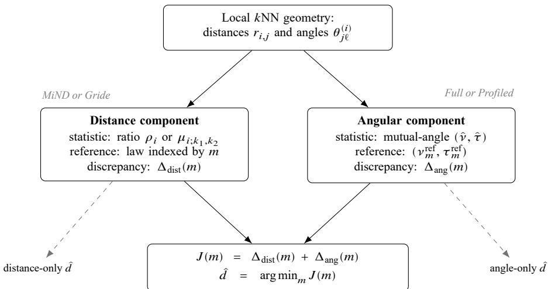  
Figure 1: Componentwise calibration. Minimum Neighbor Distance (MiND) or the generalized ratios ID estimator (Gride) supplies the distance discrepancy; Full or Profiled matching supplies the angular discrepancy. Each curve can be minimized separately, and their pointwise sum forms the combined objective. Solid arrows feed the combined objective; dashed branches lead to the component-only minima. Comparing the three minima shows how each component afects the estimate.

The combination retains DANCo’s equal weights. We use composite for the summed curve � and componentwise for the formulation that keeps both terms visible.

The componentwise formulation specifies four elements for each component: observed statistic, dimension-indexed reference, discrepancy, and treatment of nuisance parameters. The component boxes of Figure 1 show the first three; the labels identify the distance statistic and the angular nuisance treatment.

MiND–Full is the original DANCo objective. The two choices yield four variants on identical data, candidate dimensions, and reference construction. Changing MiND to Gride replaces the distance statistic and reference law; changing Full to Profiled replaces the angular discrepancy with the profiled form of Eq. (6) below, specialized to the angular component in Eq. (9). The separate curves then reveal the influence of each change on the combined minimum.

Nuisance parameters control aspects of the match that need not carry the target dimension information. For component �, let $\lambda _ { c } \in \Lambda _ { c }$ be such a parameter in the reference. Profiling compares the data with the best-aligned reference within that

family:

$$
\Delta _ { c } ^ { \mathrm { p r o f } } ( m ) = \operatorname * { i n f } _ { \lambda _ { c } \in \Lambda _ { c } } \Delta _ { c } ( m ; \lambda _ { c } ) .\tag{6}
$$

We report both Full and Profiled curves; their diference quantifies the contribution of mean-direction alignment.

The construction extends beyond these four combinations under a common admission condition: a statistic enters either slot when its reference law is indexed by a fitted dimension and carries a computable discrepancy. The distance component admits analytic examples. For the TWO-NN case $( k _ { 1 } , k _ { 2 } ) = ( 1 , 2 )$ of Eq. (2), the factor $k _ { 2 } - k _ { 1 } - 1$ of the generic-order divergence derived in Section 3.3 vanishes and the divergence collapses to the closed form log $( \hat { d } _ { \mathrm { d i s t } } / \hat { d } _ { m } ^ { \mathrm { r e f } } ) + \hat { d } _ { m } ^ { \mathrm { r e f } } / \hat { d } _ { \mathrm { d i s t } } - 1$ . The Levina–Bickel log-ratio sum $\begin{array} { r } { \sum _ { j = 1 } ^ { k - 1 } \log ( r _ { i , k } / r _ { i , j } ) } \end{array}$ is Gamma $( k - 1 , 1 / d )$ , with shape $k - 1$ and scale $1 / d .$ , under the same Poisson-process approximation [16]. Both examples therefore enter the calibrated objective without new derivations.

For the angular component, ABID’s pairwise-cosine second moment, $\mathbb { E } [ C ^ { 2 } ] = 1 / d$ under its isotropic model [4], can supply a moment-based discrepancy, and simplex statistics such as ESS enter through Monte Carlo reference laws.

## 3.3. Generic-order distance calibration

DANCo’s MiND statistic, $\rho _ { i } = r _ { i , 1 } / r _ { i , k + 1 }$ , anchors the distance comparison at the first neighbor. To reduce sensitivity to short-scale noise, we substitute the Gride ratio $\mu _ { i ; k _ { 1 } , k _ { 2 } } = r _ { i , k _ { 2 } } / r _ { i , k _ { 1 } }$ from Eq. (2), using $k _ { 1 } = \lceil k / 2 \rceil$ and $k _ { 2 } = 2 k _ { 1 }$ . The largest neighbor orders are comparable: MiND uses order $k + 1$ , whereas Gride uses order � when � is even. Gride supplies the generic-order ratio law and likelihood estimator [11]. Integrating this statistic into Eq. (5) requires a divergence between its fitted data law and each finite-sample reference law, which we derive below.

We fit the observed dimension $\hat { d } _ { \mathrm { d i s t } }$ with the published Gride maximum-likelihood procedure [11]. Applying the same procedure to the reference sample simulated at candidate dimension � gives $\hat { d } _ { m } ^ { \mathrm { r e f } }$

Let the data and dimension-� reference laws be $f = f ( \cdot ; \hat { d } _ { \mathrm { d i s t } } , k _ { 1 } , k _ { 2 } )$ and $f _ { m } =$ $f ( \cdot ; \hat { d } _ { m } ^ { \mathrm { r e f } } , k _ { 1 } , k _ { 2 } )$ , and define $\gamma _ { m } = \hat { d } _ { m } ^ { \mathrm { r e f } } / \hat { d } _ { \mathrm { d i s t } } > 0$ . Their KL divergence is

$$
\begin{array} { r } { \mathbf { K L } ( f \| f _ { m } ) = \log \frac { \hat { d } _ { \mathrm { d i s t } } } { \hat { d } _ { m } ^ { \mathrm { r e f } } } + ( k _ { 2 } - 1 ) \Big ( \frac { \hat { d } _ { m } ^ { \mathrm { r e f } } } { \hat { d } _ { \mathrm { d i s t } } } - 1 \Big ) \big ( \Psi ( k _ { 2 } ) - \Psi ( k _ { 1 } ) \big ) } \\ { + ( k _ { 2 } - k _ { 1 } - 1 ) \Big [ \Psi ( k _ { 2 } - k _ { 1 } ) - \Psi ( k _ { 1 } ) - \hat { J } ( \gamma _ { m } ) \Big ] . } \end{array}\tag{7}
$$

Here $\Psi$ is the digamma function. For the integer neighbor orders used throughout, the beta-prime expectation ${ \cal T } ( \gamma _ { m } )$ reduces to a finite sum of $k _ { 2 } - k _ { 1 }$ digamma terms, so the divergence is available in closed form. Supplementary Section S1.1 derives the transformation, the closed form, and the check $\operatorname { K L } ( f \| f ) = 0$ . Substituting the ratio changes only the distance slot of $\operatorname { E q } .$ . (5); the angular statistic and the equal-weight combination are unchanged, so any accuracy diference from MiND–Full isolates the distance statistic.

## 3.4. Angular concentration and profiled divergence

Angular calibration compares both concentration � and mean direction �, but these parameters have diferent geometric roles. Distinguishing them explains when location alignment can preserve useful concentration matching. We develop this distinction in two sampling regimes, with proofs in Supplementary Section S1.2.

Proposition 1 (The mean direction is dimension-free under symmetry). Let �, � be independent uniform directions in $\mathbb { R } ^ { d }$ and � the angle between them. Then � has density proportional to sin $\cdot ^ { d - 2 } \theta$ on [0, �] [33, Lemmas 11–12, Eqs. (12)–(13)], symmetric about � $/ 2 ;$ in particular $\mathbb { E } [ \theta ] = \pi / 2$ exactly for every $d \ge 2$

Proposition 1 applies to a manifold neighborhood under the local-symmetry condition of Supplementary Section S1.2: at an interior point, with � and � fixed while $N  \infty$ , the normalized kNN displacements converge to independent uniform directions on the unit sphere of the tangent space. Taking the sample limit before � grows then gives angles with mean $\pi / 2$ and variance of order $1 / d .$ . A data–reference gap in the finite-sample �ˆ then diagnoses a mismatch with the calibrated reference geometry. Concentration retains the dimension information posited by the DANCo model, $\tau \approx d \left[ 3 \right]$

The second regime fixes � and � while $d  \infty$ , so neighborhoods can span nonlocal geometry. The following lemma states the thin-shell and near-orthogonality limits used throughout this regime. We write −→ for convergence in probability. $\xrightarrow { p }$

Lemma 1 (Thin-shell concentration and near-orthogonality). For each � in a fixed finite index set, let $Z _ { s , 1 } , Z _ { s , 2 } , . . .$ . be an independent and identically distributed $( i . i . d . )$ sequence with mean zero, variance one, and finite fourth moment. Assume the sequences are mutually independent, and let $Z _ { s } ^ { ( d ) } = ( Z _ { s , 1 } , \ldots , Z _ { s , d } ) \in \mathbb { R } ^ { d }$ be the vector of its first � coordinates. Then, simultaneously over the fixed collection,

$$
\frac { \| Z _ { s } ^ { ( d ) } \| ^ { 2 } } { d } \stackrel { p } {  } 1 , \qquad \frac { \langle Z _ { s } ^ { ( d ) } , Z _ { t } ^ { ( d ) } \rangle } { d } \stackrel { p } {  } 0 \quad ( s \neq t ) .
$$

Lemma 1 places observations on an asymptotically thin shell with nearly orthogonal directions. These limits are the elementary coordinatewise case of standard highdimension, low-sample-size geometry [34]; Supplementary Section S1.2 gives the proof. The estimator uses angles between displacements from a shared center. The next proposition translates the concentration limits into that geometry, including unequal shell radii.

Proposition 2 (Displacement-angle limit under norm and inner-product concentration). For each �, let $X _ { s } ^ { ( d ) } \in \mathbb { R } ^ { d }$ and let $\theta _ { j \ell } ^ { ( i , d ) }$ be the angle between $X _ { j } ^ { ( d ) } - X _ { i } ^ { ( d ) }$ and $X _ { \ell } ^ { ( d ) } - X _ { i } ^ { ( d ) }$ . Suppose there are nonnegative constants $R _ { s }$ such that, simultaneously for fixed $i , j , \ell , \| X _ { s } ^ { ( d ) } \| ^ { 2 } / d \xrightarrow { p } R _ { s } ^ { 2 } f o r s \in \{ i , j , \ell \} a n d \langle X _ { s } ^ { ( d ) } , X _ { t } ^ { ( d ) } \rangle / d \xrightarrow { p } 0 f o r s \neq t ,$ with $\begin{array} { r } { ( R _ { i } ^ { 2 } + R _ { j } ^ { 2 } ) ( R _ { i } ^ { 2 } + R _ { \ell } ^ { 2 } ) > 0 . } \end{array}$ . Then

$$
\cos \theta _ { j \ell } ^ { ( i , d ) } \stackrel { p } { \longrightarrow } \frac { R _ { i } ^ { 2 } } { \sqrt { ( R _ { i } ^ { 2 } + R _ { j } ^ { 2 } ) ( R _ { i } ^ { 2 } + R _ { \ell } ^ { 2 } ) } } .\tag{8}
$$

With fixed �, the convergence is simultaneous over all triples whenever the assumptions hold simultaneously.

On a homogeneous thin shell, $R _ { i } = R _ { j } = R _ { \ell }$ , so $\theta \stackrel { p } { \longrightarrow } \pi / 3$ . This connects the classical concentration ofhigh-dimensional samples near a shell with the displacementangle geometry used by DANCo. Supplementary Corollaries S1.5–S1.7 specialize the result to i.i.d. coordinates, uniform hyperballs, and Gaussian scale mixtures. Figure 2 illustrates the transition from the local-interior regime toward this limit.

The efect of unequal amplitudes can be isolated without changing generating dimension. Define the Gaussian scale mixture (GSM)

$$
X _ { s } ^ { ( d ) } = S _ { s } Z _ { s } ^ { ( d ) } , \qquad Z _ { s } ^ { ( d ) } \overset { \mathrm { i . i . d . } } { \sim } N ( 0 , { \bf I } _ { d } ) , \qquad \log S _ { s } ^ { \mathrm { ~ i . i . d . } } N ( 0 , \sigma _ { S } ^ { 2 } ) .
$$

Here $S _ { s } > 0$ is the multiplicative amplitude of one observation, $\mathbf { I } _ { d }$ is the $d { \times } d$ identity matrix, and $\sigma _ { S }$ is the standard deviation of log amplitude. The amplitude and Gaussian sequences are mutually independent.

Unequal amplitudes preserve ID but afect neighbor selection. In a Gaussian scale mixture, the pairwise distance obeys

$$
d ^ { - 1 } \| X _ { j } ^ { ( d ) } - X _ { i } ^ { ( d ) } \| _ { 2 } ^ { 2 } \overset { p } { \longrightarrow } S _ { i } ^ { 2 } + S _ { j } ^ { 2 } .
$$

For a fixed center, $S _ { i } ^ { 2 }$ is common to all limiting distances, so lower-amplitude observations tend to be closer and are preferentially selected as neighbors.

Proposition 2 gives the angular consequence. When both selected-neighbor amplitudes are below the center amplitude, the numerator in Eq. (8) remains $S _ { i } ^ { 2 }$ , while each denominator factor is below $2 S _ { i } ^ { 2 }$ . The limiting cosine therefore exceeds $1 / 2$ , and the angle falls below $\pi / 3$

Figure 2 tests the finite-sample transition between the local-interior and shell regimes and then isolates the location shift from sample-amplitude heterogeneity. The sampled mean direction leaves $\pi / 2$ and approaches $\pi / 3$ as � grows, and falls below $\pi / 3$ as $\sigma _ { S }$ grows. At the center level, a larger centered norm goes with a smaller percenter mean direction: in Eq. (8) with $R _ { s } = S _ { s }$ , raising the center amplitude relative to its selected neighbors raises the limiting cosine and lowers the angle. Supplementary Figure S1 shows this monotone decrease across centered-norm deciles.

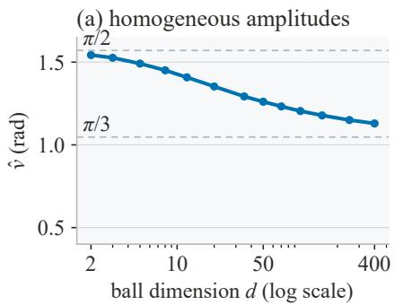

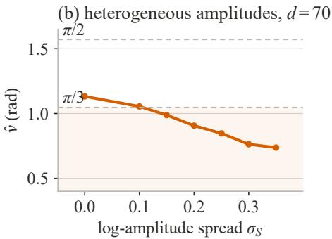  
Figure 2: Finite-sample checks of the two angular regimes $( N { = } 2 5 0 0 , \ k { = } 1 0 )$ . Dashed lines mark the local-interior mean $\pi / 2$ and homogeneous-shell limit $\pi / 3 .$ . (a) Uniform �-balls as $^ d$ varies at fixed sample size. (b) Gaussian scale mixtures at $d = 7 0$ as the log-amplitude spread $\sigma _ { S }$ varies over the grid of the Section 4.4.1 sweep, the range anchored by the image classes.

Because physical neighbor angles occupy [0, �] whereas DANCo uses a circular von Mises approximation, Supplementary Section S1.4 contrasts the exact locally symmetric angle density with the movable-location von Mises family and then assesses separately fitted pooled von Mises laws (Figure S2). Their mass outside $[ 0 , \pi ]$ is at most $5 . 0 \times 1 0 ^ { - 8 }$ , and the fitted laws pass descriptive checks of fit.

The two regimes distinguish a dimension-bearing concentration from a location that also responds to geometry and amplitude. This motivates profiling angular location while retaining concentration matching, recognizing that concentration may itself be afected by the changed geometry. Following Eq. (6), let $\delta \in [ 0 , 2 \pi )$ rotate the reference mean direction. Comparing the von Mises laws modulo this rotation gives

$$
\Delta _ { \mathrm { a n g } } ^ { \mathrm { p r o f } } ( m ) = \operatorname* { i n f } _ { \delta } \mathrm { K L } \bigl ( q ( \cdot ; \hat { \nu } , \hat { \tau } ) \parallel q ( \cdot ; \nu _ { m } ^ { \mathrm { r e f } } + \delta , \tau _ { m } ^ { \mathrm { r e f } } ) \bigr ) .\tag{9}
$$

Aligning their mean directions gives

$$
\Delta _ { \mathrm { a n g } } ^ { \mathrm { p r o f } } ( m ) = \log \frac { I _ { 0 } ( \tau _ { m } ^ { \mathrm { r e f } } ) } { I _ { 0 } ( \hat { \tau } ) } + A \left( \hat { \tau } \right) \left( \hat { \tau } - \tau _ { m } ^ { \mathrm { r e f } } \right) .\tag{10}
$$

Supplementary Section S1.3 derives the profiled infimum in Eq. (9) and its closed form in Eq. (10). The profiled angular discrepancy therefore depends on the observed angular statistics only through �ˆ; it equals the concentration term of Eq. (4), so profiling removes the angular-location penalty exactly. When concentration remains informative, this removes the influence of location mismatch while preserving concentration evidence. Full matching retains additional information when data and references share the same finite-sample geometry.

## 3.5. Numerical evaluation

The four variants share the neighbor geometry, reference construction, and curveminimization procedure. Stable angular evaluation carries this comparison into the candidate range of learned representations. At reference sample size 500, ordinary Bessel evaluation first overflows at candidate $m = 2 7 8$ , and the boundary is similar across the precomputed sample sizes 450–700. Exponentially scaled Bessel evaluation keeps both angular objectives finite through the CNN study’s bound $m _ { \mathrm { m a x } } = 4 0 0$ Supplementary Section S2.3 defines the scaled identities and reports the observed overflow boundary.

To avoid regenerating one reference per candidate for every CNN layer, we precompute FastDANCo-style smoothing-spline reference surfaces. One ofline procedure builds a surface for each distance statistic on a shared simulation grid (Supplementary Section S3.7). Supplementary Algorithm S1 (Section S2.1) states the complete estimator, including our chosen low-dimension rule: a preliminary distance fit at most five is returned directly, without reference matching. Section S2.4 maps each computational measurement to its timed steps. Supplementary Figures S3–S4 show the overflow boundary and workload-aligned central-processing-unit (CPU) and graphicsprocessing-unit (GPU) scaling. At sample size 500, ambient dimension 400, and ten neighbors, complete evaluation through candidate 400 with precomputed references finishes in well under one second on both devices.

## 4. Experiments

The experiments examine when the two geometric components support a common estimate and how targeted changes improve calibration. Clean manifolds test accuracy and component agreement; neighborhood-relative noise tests the distance statistic; and a known-� GSM tests profiling under sample-amplitude heterogeneity. Natural images and CNN representations, with candidates through 400, then show what the component statistics reveal when generating dimension is unknown.

## 4.1. Experimental design and metrics

Estimators and datasets. We combine MiND or Gride distance calibration with Full or Profiled angular calibration. Distance-only and angle-only objectives isolate the contribution of each component. Calibrated objectives use $k = 1 0$ except where a sweep varies it; Gride uses neighbor orders $( k _ { 1 } , k _ { 2 } ) = ( 5 , 1 0 )$ . The primary benchmark uses the 24 manifolds returned by scikit-dimension’s BenchmarkManifolds generator, whose suite extends the benchmark introduced by Campadelli et al. [5, 21].

The nine reference estimators are the Levina–Bickel maximum-likelihood estimator (MLE) [16], TWO-NN, computed throughout with its original discarded-tail fit [12], local principal component analysis (lPCA) [14], expected simplex skewness (ESS) [17], manifold-adaptive dimension estimation (MADA) [35], the tight local estimator (TLE) [36], correlation dimension (CorrInt) [15], MiND maximum likelihood (MiND–ML) [18], and Fisher separability (FisherS) [37].

For the primary benchmark over collection B, let $d _ { M }$ denote the generating ID of manifold $M \in { \mathcal { B } }$ and let $\hat { d } _ { M }$ denote its estimate averaged over replicates. We report

mean percentage error (MPE) [18],

$$
\mathrm { M P E } = \frac { 1 0 0 } { \left| \mathcal { B } \right| } \sum _ { M \in \mathcal { B } } \frac { | \hat { d } _ { M } - d _ { M } | } { d _ { M } } .
$$

The sensitivity, component, noise, and GSM comparisons compute MPE within each replicate before summarizing across replicates. Supplementary Section S3 defines the datasets, comparison units, and aggregation rules for every experiment, and Table S1 reports the sample-size-specific angular reference ranges.

Controlled data models. The amplitude experiment uses the GSM defined in Section 3.4. We set $d = 7 0$ , embed each sample in $D = 1 0 0$ so that the candidate search covers 1–100, and evaluate $\sigma _ { S } \in \{ 0 , 0 . 1 , 0 . 1 5 , 0 . 2 , 0 . 2 5 , 0 . 3 , 0 . 3 5 \}$ } over 30 replicates, a range that brackets the centered-norm variation of the 17 image classes surveyed in Supplementary Table S9; configurations share data and reference replicates (Supplementary Section S3.1).

Profiling tests whether removing the angular-location penalty improves the combined estimate. A second control divides each observation by its known simulated amplitude, $X _ { i } / S _ { i } = Z _ { i }$ . Within each replicate, this operation holds $Z _ { i }$ , the generating dimension, and the reference replicate fixed. Multiplicative amplitude is the only generating factor removed, so recovery of Full calibration identifies its efect within the GSM.

For additive noise, let $X _ { i } ^ { ( 0 ) } \in \mathbb { R } ^ { D }$ be the clean observation and let $r _ { i , 1 0 } ^ { ( 0 ) }$ be its Euclidean distance to the tenth nearest neighbor in the clean sample. Conditional on that sample, we observe

$$
X _ { i } ^ { \mathrm { o b s } } = X _ { i } ^ { ( 0 ) } + \varepsilon _ { i } , \qquad \varepsilon _ { i } \stackrel { \mathrm { i . i . d . } } { \sim } N ( 0 , \sigma _ { \varepsilon } ^ { 2 } { \bf I } _ { D } ) ,
$$

where $\mathbf { I } _ { D }$ is the $D \times D$ identity matrix. We set the coordinate scale by

$$
\sigma _ { \varepsilon } = \eta \frac { \mathrm { m e d i a n } _ { i } r _ { i , 1 0 } ^ { ( 0 ) } } { \sqrt { 2 D } } .\tag{11}
$$

The dimensionless parameter � measures noise relative to local neighbor spacing. Conditional on the clean sample, two independent noise vectors satisfy

$$
\begin{array} { r } { \mathbb { E } \| \varepsilon _ { i } - \varepsilon _ { j } \| _ { 2 } ^ { 2 } = 2 D \sigma _ { \varepsilon } ^ { 2 } = \eta ^ { 2 } \{ \operatorname* { m e d i a n } _ { i } r _ { i , 1 0 } ^ { ( 0 ) } \} ^ { 2 } . } \end{array}
$$

Thus the median spacing adapts the perturbation to the dataset’s global scale, and $\sqrt { 2 D }$ removes the ambient-dimensional growth of the root-mean-square noise displacement. At $\eta = 1$ , that displacement equals the median clean tenth-neighbor distance. We measure error against the pre-noise generating dimension (Supplementary Section S3.4).

The image experiments assess calibration sensitivity through two descriptive normalizations. Centered radial normalization first sets $c _ { i } = x _ { i } - \bar { x }$ within a class and maps every nonzero $c _ { i }$ to $c _ { i } / \Vert c _ { i } \Vert _ { 2 }$ 2. Per-image contrast normalization maps coordinate � to $x _ { i j } ^ { \prime } = ( x _ { i j } - { \bar { x } } _ { i } ) / s _ { i }$ , where ${ \bar { x } } _ { i }$ and $s _ { i }$ are that image’s coordinate mean and standard deviation. Both transformations reduce sample-amplitude variation and support the reference-mismatch interpretation of Section 4.4.2 (Supplementary Section S3.6).

## 4.2. Clean-manifold accuracy

The clean benchmark establishes the accuracy of the joint calibration on which the componentwise formulation builds. Under the shared twenty-replicate design, MiND– Full has the lowest MPE in Table 1: 6.33%, followed by TWO-NN at 11.12% and MiND–ML at 13.58%. This agrees with earlier comparisons placing DANCo among the strongest ID estimators [5, 11]. MiND–Full’s error rate, the fraction of individual estimates with more than 10% relative error, is 0.138. Accuracy, cost, and reliability distinguish the alternatives: ESS reaches 20.20% MPE at a median 101.61 seconds per dataset, and FisherS returns 19 failed cells. Supplementary Section S4.1, Table S2, and Figure S5 report the per-manifold estimates and signed-error curves. These distinguish MiND–Full’s high-dimensional accuracy from its remaining geometry-specific errors. Supplementary Section S4.3 and Table S4 record the neighborhood and sample-size sweeps specified in Section S3.3. There the two MiND objectives remain the top pair of the five compared methods across neighborhood sizes, and every calibrated configuration improves with sample size.

Table 1: Ten intrinsic-dimension estimators on 24 manifolds with 20 data replicates per estimator. MPE averages each manifold’s estimate over its successful replicates and then averages the relative errors over the 24 manifolds; failures count as errors in the error rate. The last column reports the median time in seconds to estimate one dataset on an Intel i7-10700 CPU, and MiND–Full excludes the shared reference construction.
<table><tr><td>Estimator</td><td>MPE (%)</td><td>&gt; 10% error</td><td>failed</td><td>median time (s)</td></tr><tr><td>MiND–Full (DANCo)</td><td>6.33</td><td>0.138</td><td>0</td><td>0.03</td></tr><tr><td>TWO-NN</td><td>11.12</td><td>0.442</td><td>0</td><td>0.01</td></tr><tr><td>MiND-ML</td><td>13.58</td><td>0.537</td><td>0</td><td>0.06</td></tr><tr><td>MLE</td><td>18.84</td><td>0.596</td><td>0</td><td>0.05</td></tr><tr><td>ESS</td><td>20.20</td><td>0.417</td><td>0</td><td>101.61</td></tr><tr><td>TLE</td><td>20.45</td><td>0.667</td><td>0</td><td>0.51</td></tr><tr><td>MADA</td><td>28.71</td><td>0.594</td><td>0</td><td>0.42</td></tr><tr><td>FisherS</td><td>37.97</td><td>0.613</td><td>19</td><td>0.44</td></tr><tr><td>CorrInt</td><td>38.19</td><td>0.660</td><td>0</td><td>0.08</td></tr><tr><td>1PCA</td><td>49.81</td><td>0.625</td><td>0</td><td>&lt; 0.01</td></tr></table>

A separate comparison isolates the contribution of combining distance and angle on matched clean geometry. It retains the 14 manifolds on which all eight objectives are defined; the preliminary-distance cutof excludes the other ten (Supplementary Section S3.2). With five shared reference replicates for every objective, MiND–Full has the lowest observed mean MPE at $8 . 6 \pm 0 . 7 \%$ , below MiND distance-only at $1 0 . 1 \pm 0 . 2 \%$ and Full angle-only at $1 5 . 9 \pm 0 . 7 \%$ . MiND–Profiled also improves on both corresponding components: its MPE is $9 . 7 \pm 0 . 2 \%$ , below MiND distance-only at $1 0 . 1 \pm 0 . 2 \%$ and Profiled angle-only at $1 2 . 2 \pm 0 . 3 \%$ . Both combined objectives therefore have lower observed mean error than their corresponding component-only objectives, with MiND–Full lowest on this comparison set.

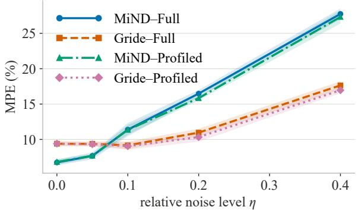  
Figure 3: MPE over 24 manifolds under Gaussian noise scaled by Eq. (11) (ten data replicates; bands show one standard deviation). MiND–Full has lower clean-data error; Gride–Full has lower error for $\eta \geq 0 . 1$ Color, line style, and marker jointly identify each method

The combined signed errors in Table S3 are each closer to the distance-only values than to the angle-only values. Equal objective weights need not imply equal local influence: a local quadratic analysis of the sampled reference curves supports stronger distance influence for the Profiled objectives. Supplementary Section S4.2 and Table S3 give the derivation, the numerical diagnostics, and all eight objectives.

## 4.3. Robustness to neighborhood-relative noise

The noise experiment tests the practical consequence of replacing the first neighbor with larger orders. Figure 3 compares the combined estimates as noise increases relative to neighborhood spacing.

Figure 3 identifies the conditions favoring the larger-order ratio. MiND–Full leads on clean data (6.75% versus 9.39% MPE under this ten-replicate design). At $\eta = 0 . 1$ , Gride–Full reaches 9.16%, compared with 11.38% for MiND–Full; at $\eta = 0 . 4$ the corresponding errors are 17.64% and 27.74%. The larger-order ratio improves accuracy for $\eta \geq 0 . 1$ within the evaluated range. Supplementary Section S4.4 and Table S5 report the full comparison, in which both Gride-based combined objectives degrade more slowly with � than their MiND counterparts.

## 4.4. Angular-reference mismatch

We examine the angular component first in a setting with known generating dimension, where the GSM isolates amplitude variation, and then on natural images. This separates a controlled accuracy test from the descriptive question of how reference mismatch appears in observed data.

## 4.4.1. Known-dimension Gaussian scale mixture

The GSM connects the accuracy benefit of angular profiling to its removal of the location penalty (Figure 4). $\mathrm { A t } \sigma _ { S } = 0 . 2 5$ , the focal level inside the image-class range, MiND–Full estimates $2 2 . 8 0 \pm 1 . 7 6$ and has 67.43% MPE, whereas MiND–Profiled estimates $6 6 . 6 7 \pm 1 . 8 1$ (4.76% MPE) and MiND distance-only $7 1 . 2 0 \pm 1 . 7 5 ( 2 . 4 8 \%$ MPE) against the generating dimension 70. Profiling leaves the distance objective unchanged and removes the angular-location penalty, returning the combined estimate to the distance evidence.

The efect follows the penalty in Section 3.1: the observed mean direction, $0 . 8 3 2 { \scriptstyle \pm 0 . 0 1 4 }$ , has no candidate reference mean direction below it. Over five focal-level replicates, the angular-location penalty rises across nearly all candidates (Supplementary Section S4.5). This penalty shifts the joint minimum to 22.80; profiling removes it exactly.

The sweep establishes the extent of this benefit. Across the seven tested levels, MiND–Full falls monotonically from 71.90 at $\sigma _ { S } = 0$ to $1 8 . 0 8$ at $\sigma _ { S } = 0 . 3 5$ , while MiND–Profiled stays near the generating dimension with means between 62.47 and 73.70. Profiling therefore brings the combined estimate closer to the generating dimension at every nonzero amplitude level (Supplementary Sections S3.5 and S4.5 and Tables S6–S7).

The amplitude-removal control at $\sigma _ { S } ~ = ~ 0 . 2 5$ moves the mean direction from $0 . 8 3 2 \pm 0 . 0 1 4 \mathrm { t o } 1 . 1 3 7 \pm 0 . 0 0 3$ radians and MiND–Full from $2 2 . 8 0 \pm 1 . 7 6 \mathrm { t o } 7 1 . 9 0 \pm$ 3.30, recovering the amplitude-free $\sigma _ { S } = 0$ sample exactly; within the GSM, Full underestimation is thus attributable to the amplitudes alone.

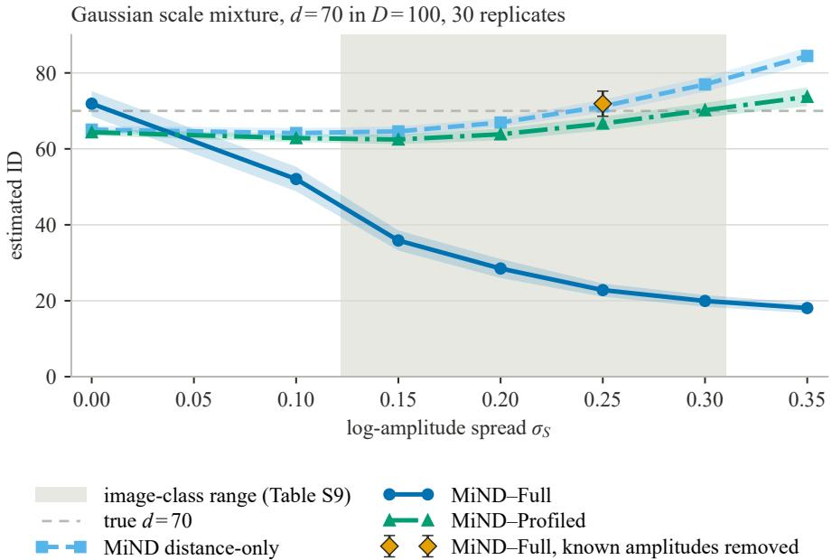  
Figure 4: Gaussian scale-mixture sweep at $d = 7 0$ embedded in $D = 1 0 0$ over 30 data replicates. The log-amplitude standard deviation is $\sigma _ { S } ; S _ { i } > 0$ is the simulated amplitude in $X _ { i } \ = \ S _ { i } Z _ { i } ,$ , and $Z _ { i }$ is a standard Gaussian vector before embedding. Curves show the mean estimated ID with bands of ± one standard deviation; the shaded band approximately maps the centered-norm variation of the 17 surveyed image classes (Supplementary Table S9) onto the log-amplitude spread; the diamond is MiND–Full after the known-amplitude control $X _ { i } / S _ { i } = Z _ { i }$ at $\sigma _ { S } = 0 . 2 5 ;$ the dashed line marks the generating dimension.

## 4.4.2. Natural images and normalization

Natural images test whether the angular signature identified in the GSM is also visible in data with uncontrolled amplitude structure. Gaussian scale mixtures model multiscale image coeficients [38], motivating images as an observational counterpart to the controlled study.

Table 2 reports all four variants on the six raw image classes. MNIST lies inside its sample-size-specific reference range, its �ˆ exceeds one, and the four variants agree: MiND–Full and Gride–Full agree to the reported precision, and the reported means of the two Profiled objectives agree within 0.6 dimensions (20.20 versus 20.00 for digit 3 and 14.80 versus 14.20 for digit 7). CIFAR-10 and ImageNet have mean directions below their reference ranges and below one, with larger Full–Profiled separations, and the two Full estimates separate (18.78 versus 15.80 on CIFAR-10 bird). This pattern is consistent with angular-location mismatch, which also makes the Full estimate depend on the distance statistic. Gride–Profiled combines the generic-order distance statistic with angular-location profiling and returns the lowest profiled estimate on these four CIFAR-10 and ImageNet classes.

Table 2: Estimated ID and angular statistics on six raw image classes. Calibrated estimates are means over five reference replicates; �ˆ is the observed mean direction in radians and �ˆ is the dimensionless observed von Mises concentration. Reference-replicate standard deviations reach 2.1 for the Profiled objectives and 4.6 for the Full objectives.
<table><tr><td rowspan="2">Dataset</td><td colspan="2">Full</td><td colspan="2">Profiled</td><td rowspan="2">TWO-NN</td><td rowspan="2">ν</td><td rowspan="2">τ</td></tr><tr><td>MiND</td><td>Gride</td><td>MiND</td><td>Gride</td></tr><tr><td>MNIST digit 3</td><td>20.39</td><td>20.39</td><td>20.20</td><td>20.00</td><td>14.88</td><td>1.166</td><td>41.3</td></tr><tr><td>MNIST digit 7</td><td>14.40</td><td>14.40</td><td>14.80</td><td>14.20</td><td>12.19</td><td>1.157</td><td>27.7</td></tr><tr><td>CIFAR-10 bird</td><td>18.78</td><td>15.80</td><td>34.00</td><td>33.20</td><td>25.55</td><td>0.898</td><td>63.2</td></tr><tr><td>CIFAR-10 cat</td><td>21.21</td><td>17.60</td><td>32.80</td><td>32.20</td><td>26.11</td><td>0.946</td><td>56.8</td></tr><tr><td>ImageNet koala</td><td>24.86</td><td>20.71</td><td>45.00</td><td>38.80</td><td>31.32</td><td>0.934</td><td>90.1</td></tr><tr><td>ImageNet butterfly</td><td>28.07</td><td>22.20</td><td>58.80</td><td>54.60</td><td>36.11</td><td>0.915</td><td>134.6</td></tr></table>

The Profiled estimates, larger than the raw MiND–Full and TWO-NN values, lie within the range reported for image data by other ID approaches. Earlier pixel-space studies report estimates on the tens-of-dimensions scale: Pope et al. [24] give datasetlevel MLE ranges of 7–13 for MNIST, 13–26 for CIFAR-10, and 26–43 for ImageNet across neighborhood sizes, and Ansuini et al. [2] report class-level ImageNet estimates on that scale, although the estimators and sampling units difer from ours. More recent difusion-based estimators give substantially larger values: for MNIST, Stanczuk et al. [26] report 66–152 per digit, compared with 13.3–14.1 from dataset-level MLE at the neighborhood sizes considered in that study, with average difusion-based estimates near 130 in related work [25]. Estimates above classical local-MLE values are therefore not by themselves anomalous.

The normalization comparison shows how angular-location calibration afects the reported estimates. For ImageNet koala, contrast normalization moves �ˆ from 0.934 to 1.080 and the MiND–Full/MiND–Profiled estimates from 24.9/45.0 to 72.2/70.0; the shift narrows the Full–Profiled gap from 20.1 to 2.2, consistent with angular-location mismatch contributing to the raw-image discrepancy. On the same raw class, Gride– Profiled gives 38.80, which is 6.2 dimensions below MiND–Profiled, showing the additional efect of the distance-statistic choice within the profiled objective. Supplementary Section S3.6 and Table S1 report the reference ranges; Supplementary Section S4.6, Tables S8–S9, and Figures S6–S7 report the normalization controls, component curves, per-center relation, and additional classes. Normalization moves angular location toward the reference range and narrows the Full–Profiled separation in each CIFAR-10 and ImageNet class of Table S8.

## 4.5. Layer-wise profiles in convolutional neural networks

Layer-wise analysis extends the calibration question from pixel-space images to learned representations. Prior work traces ID through network depth [2]; here the candidate range reaches the hundreds. Gride–Profiled suits this setting: Section 4.3 found the generic-order ratio more robust to noise, and the layer mean directions reported below fall under the reference mean-direction range, the regime that profiling addresses. The CNN study evaluates AlexNet [39], VGG-16 [40], and ResNet-18/34 [41] on subsamples of 500 images. At each checkpoint, Gride–Profiled, TWO-NN, and MLE share the activation matrix after exact-duplicate rows are removed; Gride–Profiled evaluates the precomputed Gride reference surface of Section 3.5 at the resulting sample size. Curves are plotted against relative depth, which places every network on a common input-to-output interval (Supplementary Section S3.7).

The three estimators share a rise-and-fall profile: Gride–Profiled, TWO-NN, and MLE rise through intermediate layers and decline toward the output (Figure 5). Among the sampled checkpoints, the Gride–Profiled peak falls at the second max-pooling checkpoint of AlexNet and VGG-16, at 22.2–23.5% relative depth, and the second residual stage of ResNet-18 and ResNet-34, at 42.9–47.4%. These checkpoints place the peak before the later pooling or residual stages. This early peak is consistent with near-one neighbor-distance ratios inflating the estimate in learned representations [30]. Further downsampling coincides with descending estimates toward the output, the same early-peak-then-compression course that Ansuini et al. report for TWO-NN [2]. The shared rise-and-fall shape recurs across categories, subsamples, and the three estimators, which supports interpreting profile shape and calibration sensitivity (Supplementary Section S4.7).

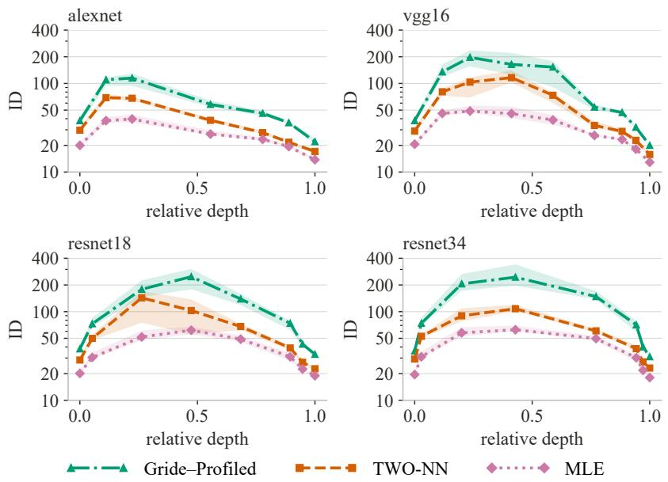  
Figure 5: Layer-wise ID profiles on identical activations in four pretrained CNNs. Gride–Profiled uses � = 10 and precomputed smoothing-spline references through candidate 400. Lines show the median over seven ImageNet categories and three 500-image subsamples; bands show their interquartile range. Color, line style, and marker jointly identify each estimator. The ID axis is logarithmic.

In every architecture, the largest median paired Full–Profiled separation sits at the Profiled peak, where �ˆ lies between 0.80 and 0.92: Gride–Full reports 17–37 while Gride–Profiled reports 115–248, a median paired diference of −100 to −214 dimensions (Table S10). Layer medians of �ˆ span 0.780–1.106 and stay below the CNN reference surface’s mean-direction range (Supplementary Section S3.7). They reach 0.78–0.87 at the first pooling checkpoint of each network and rise to 1.04–1.11 toward the output, where the two objectives converge (Table S10). Supplementary Section S4.7 and Table S10 report the peak layer, �ˆ, Gride–Full, Gride–Profiled, and their diference for each architecture.

## 5. Discussion and conclusion

On clean benchmarks, joint calibration is among the state of the art (lowest MPE of ten estimators, Table 1), and MiND–Full $( 8 . 6 \pm 0 . 7 \% \ \mathrm { M P E } )$ improves on both components on 14 manifolds. Componentwise calibration keeps this strength and addresses each practical condition: neighborhood-relative noise by generic-order ratios, sample-amplitude heterogeneity by profiling, and high candidate dimension by scaled Bessel evaluation. In the thin-shell regime of high dimension, amplitude shifts angular location, so profiling serves the third condition as well.

For distance calibration, the closed-form Gride KL admits the generic-order ratio, which trades a clean-data margin for improved accuracy at every evaluated level $\eta \geq 0 . 1$

For angular calibration, the local-interior and thin-shell regimes distinguish the dimension-bearing concentration from a mean direction afected by geometry and amplitude. Under amplitude heterogeneity $( \sigma _ { S } = 0 . 2 5 )$ , the angular-location penalty drives MiND–Full to $2 2 . 8 0 \pm 1 . 7 6$ against a generating dimension of 70. Profiling removes that penalty and returns the estimate to $6 6 . 6 7 \pm 1 . 8 1 ;$ ; dividing out the known simulated amplitudes recovers the amplitude-free sample and its Full calibration. Full and Profiled therefore have complementary uses: retain angular location when references match the finite-sample geometry, and align it when location mismatch obscures informative concentration. Making these choices explicit lets the distance statistic and angular discrepancy be assessed separately within one combined estimate.

The image and CNN studies, reaching candidates to 400, turn this structure into a tool for learned representations. On CIFAR-10 and ImageNet, the Full–Profiled separation accompanies an angular location below the reference range, and amplitudereducing normalization moves the location toward that range and narrows the separation. Across four CNNs, the paired Full–Profiled comparison locates the layers most sensitive to angular-location calibration: the largest median separation occurs at the Profiled peak, where Full estimates are 100–214 dimensions lower.

The component structure also suggests extensions through dependence-aware weights, adaptive neighbor orders, and amplitude-aware angular references. More generally, other statistics can enter the framework once a dimension-indexed reference law and discrepancy are available. By exposing the statistical choices within geometric calibration, the framework provides a basis for such extensions and for adapting estimates to practical data.

## CRediT authorship contribution statement

Chih-Hsuan Huang: Conceptualization, Methodology, Software, Investigation, Writing – original draft. Chih-Wei Chen: Supervision, Funding acquisition, Writing – review & editing. Szu-Chi Chung: Conceptualization, Supervision, Funding acquisition, Writing – review & editing.

## Funding

This work was supported by the National Science and Technology Council (NSTC), Taiwan, under grants NSTC 114-2118-M-110-002-MY3 and NSTC 113-2115-M-110- 009-MY2. The funder had no role in the study design, data collection and analysis, interpretation of the results, preparation of the manuscript, or the decision to submit the article for publication.

## Declaration of competing interest

The authors declare that they have no competing financial interests or personal relationships that could have influenced the work reported in this paper.

## Declaration of generative AI and AI-assisted technologies in the manuscript preparation process

During the preparation of this work, the authors used Claude (Anthropic) and OpenAI Codex for language editing, for consistency and mathematical checking of the text, and for manuscript and code organization. After using these tools, the authors reviewed and edited the content as needed and take full responsibility for the content of the published article.

## Data and code availability

The code supporting this study will be made publicly available on Zenodo upon acceptance of the manuscript. The datasets used in the experiments are publicly available. Synthetic benchmark datasets were generated using scikit-dimension [21]; MNIST [42] and CIFAR-10 [43] were accessed through torchvision; and the ImageNet data [44] were obtained from the single-object subsets provided by [2]. Access instructions and processed results will be included in the Zenodo archive. Raw images are not redistributed.

## References

[1] F. Camastra, A. Staiano, Intrinsic dimension estimation: Advances and open problems, Information Sciences 328 (2016) 26–41. doi:10.1016/j.ins. 2015.08.029.

[2] A. Ansuini, A. Laio, J. H. Macke, D. Zoccolan, Intrinsic dimension of data representations in deep neural networks, in: Advances in Neural Information Processing Systems, Vol. 32, 2019, pp. 6111–6122.

[3] C. Ceruti, S. Bassis, A. Rozza, G. Lombardi, E. Casiraghi, P. Campadelli, DANCo: An intrinsic dimensionality estimator exploiting angle and norm concentration, Pattern Recognition 47 (8) (2014) 2569–2581. doi:10.1016/j. patcog.2014.02.013.

[4] E. Thordsen, E. Schubert, ABID: Angle based intrinsic dimensionality — theory and analysis, Information Systems 108 (2022) 101989. doi:10.1016/j.is. 2022.101989.

[5] P. Campadelli, E. Casiraghi, C. Ceruti, A. Rozza, Intrinsic dimension estimation: Relevant techniques and a benchmark framework, Mathematical Problems in Engineering 2015 (2015) 759567. doi:10.1155/2015/759567.

[6] Z. Benkő, M. Stippinger, R. Rehus, A. Bencze, D. Fabó, B. Hajnal, L. G. Eröss, A. Telcs, Z. Somogyvári, Manifold-adaptive dimension estimation revisited, PeerJ Computer Science 8 (2022) e790. doi:10.7717/peerj-cs.790.

[7] H. Qiu, Y. Yang, S. Rezakhah, Intrinsic dimension estimation method based on correlation dimension and kNN method, Knowledge-Based Systems 235 (2022) 107627. doi:10.1016/j.knosys.2021.107627.

[8] H. Qiu, Y. Yang, H. Pan, Underestimation modification for intrinsic dimension estimation, Pattern Recognition 140 (2023) 109580. doi:10.1016/j.patcog. 2023.109580.

[9] J. A. D. Binnie, P. Dłotko, J. Harvey, J. Malinowski, K. M. Yim, A survey of dimension estimation methods (2025). arXiv:2507.13887, doi:10.48550/ arXiv.2507.13887.

[10] F. Tosti Guerra, A. Napoletano, A. Zaccaria, The intrinsic dimension of neural network ensembles, Entropy 27 (4) (2025) 440. doi:10.3390/e27040440.

[11] F. Denti, D. Doimo, A. Laio, A. Mira, The generalized ratios intrinsic dimension estimator, Scientific Reports 12 (1) (2022) 20005. doi:10.1038/ s41598-022-20991-1.

[12] E. Facco, M. d’Errico, A. Rodriguez, A. Laio, Estimating the intrinsic dimension of datasets by a minimal neighborhood information, Scientific Reports 7 (2017) 12140. doi:10.1038/s41598-017-11873-y.

[13] M. Gomtsyan, N. Mokrov, M. Panov, Y. Yanovich, Geometry-aware maximum likelihood estimation of intrinsic dimension, in: Proceedings of the Eleventh Asian Conference on Machine Learning, Vol. 101 of Proceedings of Machine Learning Research, PMLR, 2019, pp. 1126–1141.

[14] K. Fukunaga, D. R. Olsen, An algorithm for finding intrinsic dimensionality of data, IEEE Transactions on Computers C-20 (2) (1971) 176–183. doi: 10.1109/T-C.1971.223208.

[15] P. Grassberger, I. Procaccia, Measuring the strangeness of strange attractors, Physica D: Nonlinear Phenomena 9 (1–2) (1983) 189–208. doi:10.1016/ 0167-2789(83)90298-1.

[16] E. Levina, P. J. Bickel, Maximum likelihood estimation of intrinsic dimension, in: Advances in Neural Information Processing Systems, Vol. 17, 2004, pp. 777–784.

[17] K. Johnsson, C. Soneson, M. Fontes, Low bias local intrinsic dimension estimation from expected simplex skewness, IEEE Transactions on Pattern Analysis and Machine Intelligence 37 (1) (2015) 196–202. doi:10.1109/TPAMI.2014. 2343220.

[18] G. Lombardi, A. Rozza, C. Ceruti, E. Casiraghi, P. Campadelli, Minimum neighbor distance estimators of intrinsic dimension, in: Machine Learning and Knowledge Discovery in Databases (ECML PKDD), Springer, 2011, pp. 374–389. doi:10.1007/978-3-642-23783-6\_24.

[19] Q. Wang, S. R. Kulkarni, S. Verdú, A nearest-neighbor approach to estimating divergence between continuous random vectors, in: 2006 IEEE International Symposium on Information Theory, 2006, pp. 242–246. doi:10.1109/ISIT. 2006.261842.

[20] E.-J. Ong, O. Bobrowski, G. Reinert, P. Skraba, A universal nearest-neighbor estimator for intrinsic dimensionality (2026). arXiv:2603.10493, doi:10. 48550/arXiv.2603.10493.

[21] J. Bac, E. M. Mirkes, A. N. Gorban, I. Tyukin, A. Zinovyev, Scikit-dimension: A Python package for intrinsic dimension estimation, Entropy 23 (10) (2021) 1368. doi:10.3390/e23101368.

[22] A. Glielmo, I. Macocco, D. Doimo, M. Carli, C. Zeni, R. Wild, M. d’Errico, A. Rodriguez, A. Laio, DADApy: Distance-based analysis of data-manifolds in Python, Patterns 3 (10) (2022) 100589. doi:10.1016/j.patter.2022. 100589.

[23] F. Denti, intRinsic: An R package for model-based estimation of the intrinsic dimension of a dataset, Journal of Statistical Software 106 (9) (2023) 1–45. doi:10.18637/jss.v106.i09.

[24] P. Pope, C. Zhu, A. Abdelkader, M. Goldblum, T. Goldstein, The intrinsic dimension of images and its impact on learning, in: International Conference on Learning Representations (ICLR), 2021.

[25] H. Kamkari, B. L. Ross, R. Hosseinzadeh, J. C. Cresswell, G. Loaiza-Ganem, A geometric view of data complexity: Eficient local intrinsic dimension estimation with difusion models, in: Advances in Neural Information Processing Systems, Vol. 37, 2024, pp. 38307–38354. doi:10.52202/079017-1211.

[26] J. P. Stanczuk, G. Batzolis, T. Deveney, C.-B. Schönlieb, Difusion models encode the intrinsic dimension of data manifolds, in: Proceedings of the 41st International Conference on Machine Learning, Vol. 235 of Proceedings of Machine

Learning Research, PMLR, 2024, pp. 46412–46440.

[27] J. Choi, G. Hwang, H. Cho, M. Kang, Analyzing the latent space of GAN through local dimension estimation for disentanglement evaluation, Pattern Recognition 157 (2025) 110914. doi:10.1016/j.patcog.2024.110914.

[28] L. Valeriani, D. Doimo, F. Cuturello, A. Laio, A. Ansuini, A. Cazzaniga, The geometry of hidden representations of large transformer models, in: Advances in Neural Information Processing Systems, Vol. 36, 2023, pp. 51234–51252. doi:10.52202/075280-2230.

[29] C. Camboulin, D. Doimo, A. Glielmo, Understanding variational autoencoders with intrinsic dimension and information imbalance, in: NeurIPS 2024 Workshop on Unifying Representations in Neural Models (UniReps), 2024. arXiv:2411. 01978.

[30] R. Schulte, D. Rügamer, Rethinking intrinsic dimension estimation in neural representations, in: Proceedings of the 29th International Conference on Artificial Intelligence and Statistics, Vol. 300 of Proceedings of Machine Learning Research, PMLR, 2026, pp. 10–18. arXiv:2604.20276.

[31] N. I. Fisher, Statistical Analysis of Circular Data, Cambridge University Press, Cambridge, 1993. doi:10.1017/CBO9780511564345.

[32] A. P. N. Vo, S. Oraintara, T. T. Nguyen, Statistical image modeling using von Mises distribution in the complex directional wavelet domain, in: 2008 IEEE International Symposium on Circuits and Systems (ISCAS), 2008, pp. 2885– 2888. doi:10.1109/ISCAS.2008.4542060.

[33] T. Cai, J. Fan, T. Jiang, Distributions of angles in random packing on spheres, Journal of Machine Learning Research 14 (2013) 1837–1864.

[34] P. Hall, J. S. Marron, A. Neeman, Geometric representation of high dimension, low sample size data, Journal of the Royal Statistical Society: Series B 67 (3) (2005) 427–444. doi:10.1111/j.1467-9868.2005.00510.x.

[35] A. M. Farahmand, C. Szepesvári, J.-Y. Audibert, Manifold-adaptive dimension estimation, in: Proceedings of the 24th International Conference on Machine Learning (ICML), 2007, pp. 265–272. doi:10.1145/1273496.1273530.

[36] L. Amsaleg, O. Chelly, M. E. Houle, K.-i. Kawarabayashi, M. Radovanović, W. Treeratanajaru, Intrinsic dimensionality estimation within tight localities, in: Proceedings of the 2019 SIAM International Conference on Data Mining, 2019, pp. 181–189. doi:10.1137/1.9781611975673.21.

[37] L. Albergante, J. Bac, A. Zinovyev, Estimating the efective dimension of large biological datasets using Fisher separability analysis, in: 2019 International Joint Conference on Neural Networks (IJCNN), 2019, pp. 1–8. doi:10.1109/IJCNN. 2019.8852450.

[38] M. J. Wainwright, E. P. Simoncelli, Scale mixtures of Gaussians and the statistics of natural images, in: Advances in Neural Information Processing Systems, Vol. 12, 1999, pp. 855–861.

[39] A. Krizhevsky, I. Sutskever, G. E. Hinton, ImageNet classification with deep convolutional neural networks, in: Advances in Neural Information Processing Systems, Vol. 25, 2012.

[40] K. Simonyan, A. Zisserman, Very deep convolutional networks for large-scale image recognition, in: International Conference on Learning Representations (ICLR), 2015.

[41] K. He, X. Zhang, S. Ren, J. Sun, Deep residual learning for image recognition, in: IEEE Conference on Computer Vision and Pattern Recognition (CVPR), 2016, pp. 770–778.

[42] Y. LeCun, L. Bottou, Y. Bengio, P. Hafner, Gradient-based learning applied to document recognition, Proceedings of the IEEE 86 (11) (1998) 2278–2324. doi:10.1109/5.726791.

[43] A. Krizhevsky, Learning multiple layers of features from tiny images, Tech. rep.,

University of Toronto (2009).

[44] O. Russakovsky, J. Deng, H. Su, J. Krause, S. Satheesh, S. Ma, Z. Huang, A. Karpathy, A. Khosla, M. Bernstein, A. C. Berg, L. Fei-Fei, ImageNet large scale visual recognition challenge, International Journal of Computer Vision 115 (3) (2015) 211–252. doi:10.1007/s11263-015-0816-y.

# Supplementary Material: Interpretable intrinsic dimension estimation through componentwise calibration of distance and angle

Notation and conventions We follow the notation and method definitions in the Main paper. In particular, $d , D ,$ and m denote generating, ambient, and candidate dimension; $m _ { \mathrm { m a x } }$ is the candidate bound; and $k _ { 1 } < k _ { 2 }$ are Gride neighbor orders. We write $Y _ { d } \xrightarrow { p } c$ as $d \to \infty$ when $\operatorname* { P r } ( | Y _ { d } - c | > \varepsilon ) \to 0$ for every $\varepsilon > 0$ and $h ( x ) = O \{ g ( x ) \}$ when $| h ( x ) | \leq C | g ( x ) |$ near the stated limit. The symbol $\mathbf { I } _ { d }$ denotes the $d \times d$ identity matrix. The abbreviation i.i.d. means independent and identically distributed. The material follows the dependencies of the Main argument: Section S1 supplies its derivations, Section S2 connects the estimator to computation and numerical stability, Section S3 specifies the experimental designs, and Section S4 gives the extended evidence and component-level interpretations.

## S1 Theory and derivations

## S1.1 Gride Kullback–Leibler divergence

Calibrating a generic-order distance statistic requires its divergence from each candidate reference law. For neighbor orders $k _ { 1 } ~ < ~ k _ { 2 }$ , define the ratio $\mu = r _ { i , k _ { 2 } } / r _ { i , k _ { 1 } } \in \left( 1 , \infty \right)$ . Under the local Poisson model, its dimension-d density is [1, Thm. 2.3, Eq. (10)]

$$
f ( \mu ; d , k _ { 1 } , k _ { 2 } ) = \frac { d ( \mu ^ { d } - 1 ) ^ { k _ { 2 } - k _ { 1 } - 1 } } { \mu ^ { d ( k _ { 2 } - 1 ) + 1 } B ( k _ { 2 } - k _ { 1 } , k _ { 1 } ) } , \qquad \mu > 1 ,\tag{S1.1}
$$

where $B ( \alpha , \beta ) = \Gamma ( \alpha ) \Gamma ( \beta ) / \Gamma ( \alpha + \beta )$ is the beta function [2, Secs. 5.2 and 5.12].

Let $d _ { 1 } ~ = ~ \hat { d } _ { \mathrm { { d i s t } } }$ be the fitted data dimension and $d _ { 2 } \ = \ d _ { m } ^ { \mathrm { r e f } }$ the fitted dimension of the candidate-m reference. The two laws compared by calibration are

$$
f ( \mu ) = f ( \mu ; d _ { 1 } , k _ { 1 } , k _ { 2 } ) , \qquad f _ { m } ( \mu ) = f ( \mu ; d _ { 2 } , k _ { 1 } , k _ { 2 } ) .
$$

Their KL divergence is

$$
\mathrm { K L } ( f \| f _ { m } ) = \mathbb { E } _ { f } \left[ \log \frac { f ( \mu ) } { f _ { m } ( \mu ) } \right] .
$$

Taking logarithms in Eq. (S1.1) gives

$$
\begin{array} { r l } & { \log f ( \mu ) = \log d _ { 1 } + ( k _ { 2 } - k _ { 1 } - 1 ) \log ( \mu ^ { d _ { 1 } } - 1 ) } \\ & { \qquad - \left[ d _ { 1 } ( k _ { 2 } - 1 ) + 1 \right] \log \mu - \log B ( k _ { 2 } - k _ { 1 } , k _ { 1 } ) , } \\ & { \log f _ { m } ( \mu ) = \log d _ { 2 } + ( k _ { 2 } - k _ { 1 } - 1 ) \log ( \mu ^ { d _ { 2 } } - 1 ) } \\ & { \qquad - \left[ d _ { 2 } ( k _ { 2 } - 1 ) + 1 \right] \log \mu - \log B ( k _ { 2 } - k _ { 1 } , k _ { 1 } ) . } \end{array}
$$

The common beta normalizer cancels. Subtracting and taking expectation yields

$$
\begin{array} { l } { { \displaystyle \mathrm { K L } ( f \| f _ { m } ) = \log \frac { d _ { 1 } } { d _ { 2 } } + ( k _ { 2 } - 1 ) ( d _ { 2 } - d _ { 1 } ) \mathbb { E } _ { f } [ \log \mu ] } \ ~ } \\ { { \displaystyle ~ + ( k _ { 2 } - k _ { 1 } - 1 ) \left\{ \mathbb { E } _ { f } [ \log ( \mu ^ { d _ { 1 } } - 1 ) ] - \mathbb { E } _ { f } [ \log ( \mu ^ { d _ { 2 } } - 1 ) ] \right\} . } \ ~ } \end{array}\tag{S1.2}
$$

Equation (S1.2) separates the required divergence into three expectations. The following lemma evaluates two beta-prime log moments in closed form, leaving one reference-side expectation, evaluated below in closed form or by one-dimensional quadrature.

Lemma S1.1 (Beta-prime log moments). $I f \alpha , \beta > 0$ and $z \sim \beta ^ { \prime } ( \alpha , \beta )$ with density $z ^ { \alpha - 1 } ( 1 + z ) ^ { - \alpha - \beta } / B ( \alpha , \beta )$ ， then

$$
\begin{array} { r } { \mathbb { E } [ \log ( 1 + z ) ] = \Psi ( \alpha + \beta ) - \Psi ( \beta ) , \qquad \mathbb { E } [ \log z ] = \Psi ( \alpha ) - \Psi ( \beta ) , } \end{array}
$$

where Γ is the gamma function and

$$
B ( \alpha , \beta ) = \frac { \Gamma ( \alpha ) \Gamma ( \beta ) } { \Gamma ( \alpha + \beta ) } , \qquad \Psi ( x ) = \frac { d } { d x } \log \Gamma ( x )
$$

define the beta and digamma functions $\left[ { \mathcal { Q } } , \right.$ Secs. 5.2 and ${ 5 . 1 2 } ]$

Proof. The beta-prime normalizer is

$$
B ( \alpha , \beta ) = \int _ { 0 } ^ { \infty } z ^ { \alpha - 1 } ( 1 + z ) ^ { - \alpha - \beta } d z .
$$

Near zero, the kernel multiplied by the logarithmic factors is of order $z ^ { \alpha - 1 } | \log z | ;$ near infinity it is of order $z ^ { - \beta - 1 } \log z .$ Both are integrable for $\alpha , \beta > 0$ . The same bounds hold uniformly on a small closed neighborhood of $( \alpha , \beta )$ , so the derivative may pass under the integral sign. Writing $\partial _ { \beta }$ for the derivative with respect to $\beta$ while α is held fixed, diferentiation and division by $B ( \alpha , \beta )$ give

$$
\partial _ { \beta } \log B ( \alpha , \beta ) = - \mathbb { E } [ \log ( 1 + z ) ] = \Psi ( \beta ) - \Psi ( \alpha + \beta ) .
$$

Diferentiating while holding $\beta$ fixed similarly gives

$$
\partial _ { \alpha } \log B ( \alpha , \beta ) = \operatorname { \mathbb { E } } [ \log z - \log ( 1 + z ) ] = \Psi ( \alpha ) - \Psi ( \alpha + \beta ) .
$$

The first identity yields the stated expectation of $\log ( 1 + z )$ ; substituting it into the second yields the expectation of log z. □

To evaluate the three expectations in Eq. (S1.2), transform $z = \mu ^ { d _ { 1 } } - 1$ . The inverse and Jacobian are

$$
\mu = ( 1 + z ) ^ { 1 / d _ { 1 } } , \qquad { \frac { d \mu } { d z } } = { \frac { 1 } { d _ { 1 } } } ( 1 + z ) ^ { 1 / d _ { 1 } - 1 } .
$$

The change-of-variables formula gives the transformed density explicitly:

$$
\begin{array} { l } { \displaystyle p _ { Z } ( z ) = f \big ( ( 1 + z ) ^ { 1 / d _ { 1 } } ; d _ { 1 } , k _ { 1 } , k _ { 2 } \big ) \left. \frac { d \mu } { d z } \right. } \\ { \displaystyle = \frac { z ^ { k _ { 2 } - k _ { 1 } - 1 } } { B ( k _ { 2 } - k _ { 1 } , k _ { 1 } ) } ( 1 + z ) ^ { - \{ d _ { 1 } ( k _ { 2 } - 1 ) + 1 \} / d _ { 1 } + 1 / d _ { 1 } - 1 } } \\ { \displaystyle = \frac { z ^ { k _ { 2 } - k _ { 1 } - 1 } ( 1 + z ) ^ { - k _ { 2 } } } { B ( k _ { 2 } - k _ { 1 } , k _ { 1 } ) } , \qquad z > 0 . } \end{array}
$$

Thus $z \sim \beta ^ { \prime } ( k _ { 2 } - k _ { 1 } , k _ { 1 } )$ , as also noted in the Supplementary Material of Denti et al. [1], and Lemma S1.1 gives

$$
\mathbb { E } _ { f } [ \log \mu ] = \frac { \Psi ( k _ { 2 } ) - \Psi ( k _ { 1 } ) } { d _ { 1 } } ,\tag{S1.3}
$$

and

$$
\mathbb { E } _ { f } [ \log ( \mu ^ { d _ { 1 } } - 1 ) ] = \Psi ( k _ { 2 } - k _ { 1 } ) - \Psi ( k _ { 1 } ) .\tag{S1.4}
$$

The reference-side term uses the same substitution. Let $\gamma _ { m } = d _ { 2 } / d _ { 1 } > 0$ denote the ratio of the fitted reference dimension to the fitted data dimension, so that $d _ { 2 } = \gamma _ { m } d _ { 1 }$ ; the two fitted distance laws coincide exactly when $\gamma _ { m } = 1$ . Since $\mu = ( 1 + z ) ^ { 1 / d _ { 1 } }$ ,

$$
\begin{array} { c } { { \log ( \mu ^ { d _ { 2 } } - 1 ) = \log \biggl \{ \left( ( 1 + z ) ^ { 1 / d _ { 1 } } \right) ^ { \gamma _ { m } d _ { 1 } } - 1 \biggr \} } } \\ { { = \log \{ ( 1 + z ) ^ { \gamma _ { m } } - 1 \} . } } \end{array}
$$

For $\gamma _ { m } \neq .$ 1 this is neither of the two log moments of Lemma S1.1, so its expectation under $z \sim \beta ^ { \prime } ( k _ { 2 } - k _ { 1 } , k _ { 1 } )$ ， denoted $\mathcal { T } ( \gamma _ { m } )$ , has to be evaluated separately. By definition,

$$
\mathcal { Z } ( \gamma _ { m } ) = \int _ { 0 } ^ { \infty } \frac { z ^ { k _ { 2 } - k _ { 1 } - 1 } ( 1 + z ) ^ { - k _ { 2 } } } { B ( k _ { 2 } - k _ { 1 } , k _ { 1 } ) } \log ( ( 1 + z ) ^ { \gamma _ { m } } - 1 ) d z .\tag{S1.5}
$$

For the integer neighbor orders used throughout, $\mathcal { T } ( \gamma _ { m } )$ also has a closed form. The derivation moves the integral to the unit interval, splits the logarithm into a known moment and a finite binomial sum, and evaluates each summand with a second digamma identity. Transform $T = ( 1 + z ) ^ { - 1 } = \mu ^ { - d _ { 1 } } \in ( 0 , 1 )$ . The inverse and Jacobian are

$$
z = T ^ { - 1 } - 1 , \left| \frac { d z } { d T } \right| = T ^ { - 2 } ,
$$

so the change-of-variables formula applied to $p _ { Z }$ gives

$$
\begin{array} { c } { { p _ { T } ( t ) = p _ { Z } ( t ^ { - 1 } - 1 ) t ^ { - 2 } = \displaystyle \frac { ( t ^ { - 1 } - 1 ) ^ { k _ { 2 } - k _ { 1 } - 1 } t ^ { k _ { 2 } } t ^ { - 2 } } { B ( k _ { 2 } - k _ { 1 } , k _ { 1 } ) } } } \\ { { = \displaystyle \frac { t ^ { k _ { 1 } - 1 } ( 1 - t ) ^ { k _ { 2 } - k _ { 1 } - 1 } } { B ( k _ { 2 } - k _ { 1 } , k _ { 1 } ) } , \qquad 0 < t < 1 , } } \end{array}
$$

because $( t ^ { - 1 } - 1 ) ^ { k _ { 2 } - k _ { 1 } - 1 } = t ^ { - ( k _ { 2 } - k _ { 1 } - 1 ) } ( 1 - t ) ^ { k _ { 2 } - k _ { 1 } - 1 }$ and the exponents of t add to $k _ { 1 } - 1$ . Thus $T \sim$ Bet $\mathrm { { a } } ( k _ { 1 } , k _ { 2 } - k _ { 1 } )$ , with the same normalizer since $B ( \alpha , \beta ) = B ( \beta , \alpha )$ . In the new variable, $( 1 + z ) ^ { \gamma _ { m } } - 1 =$ $T ^ { - \gamma _ { m } } ( 1 - T ^ { \gamma _ { m } } )$ , so the logarithm splits into two terms, each absolutely integrable under $p _ { T } \colon$ near $t = 0$ the density-weighted magnitudes are of order $t ^ { k _ { 1 } - 1 }$ | log t| and $t ^ { k _ { 1 } + \gamma _ { m } - 1 }$ , and near $t = 1$ of order $( 1 - t ) ^ { k _ { 2 } - k _ { 1 } }$ and $( 1 - t ) ^ { k _ { 2 } - k _ { 1 } - 1 } | \log ( 1 - t ) |$ . Hence

$$
\begin{array} { r } { \mathcal { I } ( \gamma _ { m } ) = \gamma _ { m } \mathbb { E } [ - \log T ] + \mathbb { E } [ \log ( 1 - T ^ { \gamma _ { m } } ) ] . } \end{array}\tag{S1.6}
$$

The first expectation is already known: $- \log T = \log ( 1 + z )$ , so Lemma S1.1 with $( \alpha , \beta ) = ( k _ { 2 } - k _ { 1 } , k _ { 1 } )$ gives $\mathbb { E } [ - \log T ] = \Psi ( k _ { 2 } ) - \Psi ( k _ { 1 } )$ , the moment behind $\mathrm { E q . \ ( S 1 . 3 ) }$ . For the second, write $n = k _ { 2 } - k _ { 1 } - 1$ . Because n is a nonnegative integer, the factor $( 1 - t ) ^ { n }$ of the density is a finite binomial sum, $\begin{array} { r } { ( 1 - t ) ^ { n } = \sum _ { j = 0 } ^ { n } ( - 1 ) ^ { j } \binom { n } { j } t ^ { j } } \end{array}$ and each term multiplies $t ^ { k _ { 1 } - 1 }$ to a pure power. Hence

$$
\mathbb { E } [ \log ( 1 - T ^ { \gamma _ { m } } ) ] = \frac { 1 } { B ( k _ { 2 } - k _ { 1 } , k _ { 1 } ) } \sum _ { i = 0 } ^ { n } ( - 1 ) ^ { j } \binom { n } { j } \mathcal { I } ( k _ { 1 } + j , \gamma _ { m } ) , \qquad \mathcal { I } ( s , \gamma ) = \int _ { 0 } ^ { 1 } t ^ { s - 1 } \log ( 1 - t ^ { \gamma } ) d t .\tag{S1.7}
$$

To evaluate ${ \mathcal { I } } ,$ substitute $u = t ^ { \gamma }$ , so that $t = u ^ { 1 / \gamma }$ and $d t = \gamma ^ { - 1 } u ^ { 1 / \gamma - 1 } d u$

$$
\mathcal { I } ( s , \gamma ) = \frac { 1 } { \gamma } \int _ { 0 } ^ { 1 } u ^ { s / \gamma - 1 } \log ( 1 - u ) d u .
$$

The remaining integral is a beta log moment of the type treated in Lemma S1.1. Diferentiating $B ( a , b ) =$ $\textstyle \int _ { 0 } ^ { 1 } u ^ { a - 1 } ( 1 - u ) ^ { b - 1 }$ du with respect to b, under the integral sign by the same domination argument as in the lemma, gives $\begin{array} { r } { \int _ { 0 } ^ { 1 } u ^ { a - 1 } ( 1 - u ) ^ { b - 1 } \log ( 1 - u ) d u = B ( a , b ) \{ \Psi ( b ) - \Psi ( a + b ) \} } \end{array}$ , and setting $b = 1$ , where $B ( a , 1 ) = 1 / a$ , yields

$$
\int _ { 0 } ^ { 1 } u ^ { a - 1 } \log ( 1 - u ) d u = { \frac { \Psi ( 1 ) - \Psi ( 1 + a ) } { a } } , \qquad a > 0 .
$$

With $a = s / \gamma$ the prefactor $1 / \gamma$ cancels against $\gamma / s ,$ , so

$$
\mathcal { I } ( s , \gamma ) = \frac { \Psi ( 1 ) - \Psi ( 1 + s / \gamma ) } { s } = \frac { \Psi ( 1 ) - \Psi ( s / \gamma ) } { s } - \frac { \gamma } { s ^ { 2 } } ,\tag{S1.8}
$$

where the second form uses the digamma recurrence $\Psi ( 1 + x ) = \Psi ( x ) + 1 / x$ at $x = s / \gamma$ . Inserting $\operatorname { E q } .$ . (S1.8) with $s = k _ { 1 } + j$ into $\operatorname { E q . }$ (S1.7) produces two sums. The second one is the same binomial expansion applied to the first expectation in Eq. (S1.6): since $\textstyle \int _ { 0 } ^ { 1 } t ^ { s - 1 } ( - \log t ) d t = 1 / s ^ { 2 }$

$$
- \frac { \gamma _ { m } } { B ( k _ { 2 } - k _ { 1 } , k _ { 1 } ) } \sum _ { j = 0 } ^ { n } \frac { ( - 1 ) ^ { j } \binom { n } { j } } { ( k _ { 1 } + j ) ^ { 2 } } = - \frac { \gamma _ { m } } { B ( k _ { 2 } - k _ { 1 } , k _ { 1 } ) } \int _ { 0 } ^ { 1 } t ^ { k _ { 1 } - 1 } ( 1 - t ) ^ { n } ( - \log t ) d t = - \gamma _ { m } \mathbb { E } [ - \log T ] .
$$

This second sum cancels the first term of Eq. (S1.6) exactly, and only the first sum survives:

$$
\mathcal { Z } ( \gamma _ { m } ) = \frac { 1 } { B ( k _ { 2 } - k _ { 1 } , k _ { 1 } ) } \sum _ { j = 0 } ^ { k _ { 2 } - k _ { 1 } - 1 } \frac { ( - 1 ) ^ { j } \binom { k _ { 2 } - k _ { 1 } - 1 } { j } } { k _ { 1 } + j } \left\{ \Psi ( 1 ) - \Psi \left( \frac { k _ { 1 } + j } { \gamma _ { m } } \right) \right\} .\tag{S1.9}
$$

The released implementation evaluates Eq. (S1.5) by adaptive one-dimensional quadrature; over the candidate ranges used in this study $( m \leq 1 0 0 $ for $k \in \{ 5 , 1 5 , 2 0 \}$ and $m \leq 4 0 0$ for $k = 1 0 )$ the two evaluations agree to within $1 0 ^ { - 6 }$ . Substituting Eqs. (S1.3)–(S1.5) into Eq. (S1.2) gives the complete calibrated divergence:

$$
\begin{array} { r l } & { { \mathrm { K L } } ( f \| f _ { m } ) = \log \displaystyle \frac { \hat { d } _ { \mathrm { d i s t } } } { \hat { d } _ { m } ^ { \mathrm { r e f } } } + ( k _ { 2 } - 1 ) \left( \displaystyle \frac { \hat { d } _ { m } ^ { \mathrm { r e f } } } { \hat { d } _ { \mathrm { d i s t } } } - 1 \right) \left\{ \Psi ( k _ { 2 } ) - \Psi ( k _ { 1 } ) \right\} } \\ & { ~ + \left( k _ { 2 } - k _ { 1 } - 1 \right) \left\{ \Psi ( k _ { 2 } - k _ { 1 } ) - \Psi ( k _ { 1 } ) - \mathcal { I } ( \gamma _ { m } ) \right\} . } \end{array}\tag{S1.10}
$$

Equation (S1.10) gives Main Eq. (7), with $\mathcal { T } ( \gamma _ { m } )$ given by Eq. (S1.9) or by the quadrature of Eq. (S1.5). For the matching-law consistency check, $\gamma _ { m } = 1$ gives $\mathcal { T } ( 1 ) = \mathbb { E } [ \log z ] = \Psi ( k _ { 2 } - k _ { 1 } ) - \Psi ( k _ { 1 } )$ , so every term vanishes and $\operatorname { K L } ( f \| f ) = 0$

## S1.2 Angular limits and the amplitude mechanism

The angular analysis separates local symmetry from fixed-sample high-dimensional geometry. Across these two regimes, the mean direction of neighbor angles has three limiting descriptions: the dimension-free $\pi / 2$ of the local-interior regime (Proposition S1.2), the value $\pi / 3$ reached at fixed N as $d \to \infty$ under a common amplitude (Lemma S1.3, Proposition S1.4, and Corollaries S1.5 and S1.6), and an amplitude-dependent limit below $\pi / 3$ when both neighbor amplitudes are smaller than the center amplitude (Corollary S1.7).

Proposition S1.2 uses the following local-symmetry condition. At an interior point of a smooth manifold [3, Secs. 2.1 and 3.1], we assume that the sampling density is continuous and positive, that the kNN radius shrinks, and that the normalized neighbor displacements converge to independent uniform directions on the unit sphere of the tangent space. Because $\theta ,$ sin $\theta ,$ and cos θ are bounded and continuous, this convergence carries the arithmetic and circular means over to the limit law. This is the manifold condition needed to apply the statement below, which is Main Proposition 1.

Proposition S1.2 (Dimension-free mean direction under local symmetry). Let $u , v$ be independent uniform directions $i n \mathbb { R } ^ { d }$ , and let θ be their angle. Its probability density is

$$
h _ { d } ( \theta ) = \frac { \Gamma ( d / 2 ) } { \sqrt { \pi } \Gamma ( ( d - 1 ) / 2 ) } \sin ^ { d - 2 } \theta , \qquad 0 \leq \theta \leq \pi .\tag{S1.11}
$$

Here Γ is the gamma function. The density is symmetric about $\pi / 2$ , so the arithmetic mean and circular mean direction both equal $\pi / 2 ~ f o r$ every $d \geq 2$

Proof. The angle density follows from rotational invariance and the standard law of the inner product of two random directions [4, Lemmas 11–12, Eqs. (12)–(13)]. Because $h _ { d } ( \pi - \theta ) = h _ { d } ( \theta )$

$$
\mathbb { E } ( \theta ) - \frac { \pi } { 2 } = \int _ { 0 } ^ { \pi } \left( \theta - \frac { \pi } { 2 } \right) h _ { d } ( \theta ) d \theta = 0 .
$$

The cosine is antisymmetric about $\pi / 2$ , whereas the sine is positive on $( 0 , \pi )$ , so

$$
\mathbb { E } ( \cos \theta ) = 0 , \qquad \mathbb { E } ( \sin \theta ) = \int _ { 0 } ^ { \pi } \sin \theta h _ { d } ( \theta ) d \theta > 0 .
$$

The circular mean of Main Section 3.1 therefore gives

$$
\nu = \operatorname { a t a n 2 } \{ \mathbb { E } ( \sin \theta ) , \mathbb { E } ( \cos \theta ) \} = \operatorname { a t a n 2 } ( > 0 , 0 ) = \frac { \pi } { 2 } .
$$

Cai et al. further show, in their growing-sample, growing-dimension regime, that the empirical distribution of $\sqrt { d - 2 } ( \pi / 2 - \theta )$ converges to the standard normal law, so the unscaled angle deviations have a $d ^ { - 1 / 2 }$ scale around $\pi / 2$ [4, Thm. 4]. Original DANCo combines this limit with the large-concentration von Mises approximation: under the ideal symmetric model, $\nu = \pi / 2$ while $\tau / d  1 [ 5$ , Sec. 3.2, Prop. 1]. ABID expresses the same dimension-dependent spread through $\mathbb { E } ( \cos ^ { 2 } \theta ) = 1 / d \ [ 6 , \mathrm { C o r . \ 1 } ]$

The fixed-sample, increasing-dimension regular-simplex geometry is classical $\left[ 7 , \mathrm { S e c . 3 . 1 } \right]$ . The following i.i.d.-coordinate lemma is a direct specialization to the norm and cross-inner-product limits used here.

Lemma S1.3 (Thin-shell concentration and near-orthogonality). For each s in a fixed finite index set, let $Z _ { s , 1 } , Z _ { s , 2 } , . . .$ be an i.i.d. sequence with mean zero, variance one, and finite fourth moment. Assume the sequences are mutually independent and let $Z _ { s } ^ { ( d ) } = ( Z _ { s , 1 } , \ldots , Z _ { s , d } ) \in \mathbb { R } ^ { d }$ be the vector of its first d coordinates. Then

$$
\frac { \| Z _ { s } ^ { ( d ) } \| ^ { 2 } } { d } \stackrel { p } {  } 1 , \qquad \frac { \langle Z _ { s } ^ { ( d ) } , Z _ { t } ^ { ( d ) } \rangle } { d } \stackrel { p } {  } 0 \quad ( s \neq t )
$$

simultaneously over the fixed collection.

Proof. Fix s and put $Y _ { r } = Z _ { s , r } ^ { 2 }$ . Then $\mathbb { E } ( Y _ { r } ) = \mathrm { V a r } ( Z _ { s , r } ) + \{ \mathbb { E } ( Z _ { s , r } ) \} ^ { 2 } = 1 + 0 = 1$ and $\mathrm { V a r } ( Y _ { r } ) = \mathbb { E } ( Z _ { s , r } ^ { 4 } ) - 1$ a finite constant; this is the only place where the finite fourth moment is used. The $Y _ { r }$ are therefore i.i.d. with finite variance, and the weak law of large numbers [8, Thm. 2.4] gives $\begin{array} { r } { d ^ { - 1 } \sum _ { r = 1 } ^ { d } Y _ { r } \stackrel { p } { \to } 1 } \end{array}$ , which is the first limit.

For $s \neq t$ put $W _ { r } ~ = ~ Z _ { s , r } Z _ { t , r }$ The two sequences are mutually independent, so the $W _ { r }$ are i.i.d. with $\mathbb { E } ( W _ { r } ) = \mathbb { E } ( Z _ { s , r } ) \mathbb { E } ( Z _ { t , r } ) = 0 \cdot 0 = 0$ and $\operatorname { V a r } ( W _ { r } ) = \mathbb { E } ( Z _ { s , r } ^ { 2 } ) \mathbb { E } ( Z _ { t , r } ^ { 2 } ) = 1$ . The same theorem gives $\begin{array} { r } { d ^ { - 1 } \sum _ { r = 1 } ^ { d } W _ { r } \stackrel { p } { \to } 0 } \end{array}$ , which is the second limit.

Both limits hold simultaneously over the fixed collection. That collection indexes finitely many events, one per norm and one per pair. $\operatorname { F i x } \varepsilon > 0$ and let $E _ { d }$ be the event that at least one of them deviates from its limit by more than $\varepsilon ;$ then $\operatorname* { P r } ( E _ { d } )$ is at most the sum of the finitely many individual probabilities, each of which tends to zero, so $\mathrm { P r } ( E _ { d } )  0$ □

To translate these limits into displacement angles, the next proof uses an elementary consequence of convergence in probability. If finitely many quantities converge jointly to constants, then their sums, products, and any continuous function of them also converge. A ratio may be included when its limiting denominator is nonzero; this is the continuous-mapping theorem and the special case of Slutsky’s theorem needed below. The statement that follows is Main Proposition 2.

Proposition S1.4 (Displacement-angle limit under norm and inner-product concentration). Fix N and k while $d \to \infty$ . For each d, let $X _ { s } ^ { ( d ) } \in \mathbb { R } ^ { d } , s \in \{ i , j , \ell \}$ , and suppose that there are nonnegative constants $R _ { s }$ such that, simultaneously,

$$
\| X _ { s } ^ { ( d ) } \| ^ { 2 } / d \xrightarrow { p } R _ { s } ^ { 2 } , \qquad \langle X _ { s } ^ { ( d ) } , X _ { t } ^ { ( d ) } \rangle / d \xrightarrow { p } 0 \quad ( s \neq t ) .
$$

Assume additionally that $( R _ { i } ^ { 2 } + R _ { i } ^ { 2 } ) ( R _ { i } ^ { 2 } + R _ { \ell } ^ { 2 } ) > 0$ . Then

$$
\cos \theta _ { j \ell } ^ { ( i ) } \stackrel { p } {  } \frac { R _ { i } ^ { 2 } } { \sqrt { ( R _ { i } ^ { 2 } + R _ { j } ^ { 2 } ) ( R _ { i } ^ { 2 } + R _ { \ell } ^ { 2 } ) } } .\tag{S1.12}
$$

$I f$ the assumptions hold simultaneously for all observations, the convergence is simultaneous over all selected triples.

Proof. Write the cosine as a normalized numerator divided by two normalized displacement lengths:

$$
\cos \theta _ { j \ell } ^ { ( i ) } = \frac { A _ { d } } { ( B _ { j , d } B _ { \ell , d } ) ^ { 1 / 2 } } , \quad A _ { d } = \frac { \langle X _ { j } ^ { ( d ) } - X _ { i } ^ { ( d ) } , X _ { \ell } ^ { ( d ) } - X _ { i } ^ { ( d ) } \rangle } { d } ,
$$

where

$$
B _ { j , d } = \frac { \| X _ { j } ^ { ( d ) } - X _ { i } ^ { ( d ) } \| ^ { 2 } } { d } , \qquad B _ { \ell , d } = \frac { \| X _ { \ell } ^ { ( d ) } - X _ { i } ^ { ( d ) } \| ^ { 2 } } { d } .
$$

Expanding all four inner-product terms in $A _ { d }$ gives

$$
A _ { d } = \frac { \langle X _ { j } ^ { ( d ) } , X _ { \ell } ^ { ( d ) } \rangle - \langle X _ { j } ^ { ( d ) } , X _ { i } ^ { ( d ) } \rangle - \langle X _ { \ell } ^ { ( d ) } , X _ { i } ^ { ( d ) } \rangle + \| X _ { i } ^ { ( d ) } \| ^ { 2 } } { d } .
$$

The three cross terms vanish in the limit by the inner-product assumption and the last term converges to $R _ { i } ^ { 2 }$ by the norm assumption, so $A _ { d } \ \stackrel { p } {  } \ R _ { i } ^ { 2 }$ . The same expansion for the squared lengths leaves two norm terms and one cross term in each, whence $B _ { j , d } \stackrel { p } {  } R _ { j } ^ { 2 } + R _ { i } ^ { 2 }$ and $B _ { \ell , d } \stackrel { p } {  } R _ { \ell } ^ { 2 } + R _ { i } ^ { 2 }$ . The positivity assumption $( R _ { i } ^ { 2 } + R _ { j } ^ { 2 } ) ( R _ { i } ^ { 2 } + R _ { \ell } ^ { 2 } ) > 0$ makes the limiting denominator strictly positive, so the square root and the division are continuous at the limit point; the continuous-mapping theorem and Slutsky’s theorem then give $\mathrm { E q . \ ( S 1 . 1 2 ) }$ . Simultaneity over the finitely many possible triples, and hence over any selected subset, follows from the same finite union bound as in Lemma S1.3. □

Corollary S1.5 (Homogeneous thin shell). Suppose each observation consists of the first d coordinates of an infinite i.i.d. sequence with mean zero, variance $\sigma ^ { 2 } > 0$ , and finite fourth moment, and the sequences are mutually independent. Then

$$
{ \frac { \| X _ { s } ^ { ( d ) } \| ^ { 2 } } { d } } \stackrel { p } \to \sigma ^ { 2 } , \qquad { \frac { \langle X _ { s } ^ { ( d ) } , X _ { t } ^ { ( d ) } \rangle } { d } } \stackrel { p } \to 0 ,
$$

and every selected triple satisfies

$$
\cos \theta _ { j \ell } ^ { ( i ) } \stackrel { p } {  } \frac { 1 } { 2 } , \qquad \theta _ { j \ell } ^ { ( i ) } \stackrel { p } {  } \frac { \pi } { 3 } .
$$

Proof. The coordinates of $X _ { s } ^ { ( d ) } / \sigma$ are i.i.d. with mean zero, variance one, and finite fourth moment, so Lemma S1.3 applies to them; multiplying back by σ gives the stated norm and inner-product limits. Substituting $R _ { i } = R _ { j } = R _ { \ell } = \sigma$ in Proposition S1.4 gives cos $\theta _ { j \ell } ^ { ( i ) } \stackrel { p } {  } 1 / 2$ , and continuity of arccos at $1 / 2$ gives the angle limit. □

Corollary S1.6 (Uniform hyperball). Let $X _ { 1 } ^ { ( d ) } , \dots , X _ { N } ^ { ( d ) }$ be independent and uniformly distributed in the d-dimensional unit ball. For fixed N, all selected-neighbor angles converge in probability to $\pi / 3$ as $d \to \infty$

Proof. Write $X _ { s } ^ { ( d ) } = \rho _ { s } ^ { ( d ) } U _ { s } ^ { ( d ) }$ , where $\rho _ { s } ^ { ( d ) }$ and $U _ { s } ^ { ( d ) }$ are its radius and direction. The ball of radius $1 - \varepsilon$ occupies the fraction $( 1 - \varepsilon ) ^ { d }$ of the volume of the unit ball, so uniform-ball sampling gives $\operatorname* { P r } \{ \rho _ { s } ^ { ( d ) } \leq 1 - \varepsilon \} =$ $( 1 - \varepsilon ) ^ { d } \to 0$ for every $\varepsilon \in ( 0 , 1 )$ [8, Sec. 2.3]; since $\rho _ { s } ^ { ( d ) } \leq 1$ , this is exactly $\rho _ { s } ^ { ( d ) } \xrightarrow { p }$ 1 and the mass collects on the boundary shell. Independent uniform directions satisfy $\langle U _ { s } ^ { ( d ) } , U _ { t } ^ { ( d ) } \rangle \stackrel { p } {  } 0 \ [ 4$ , Lemmas 11–12]. Hence $\parallel X _ { s } ^ { ( d ) } \parallel ^ { 2 } \xrightarrow { p } 1$ and $\langle X _ { s } ^ { ( d ) } , X _ { t } ^ { ( d ) } \rangle \stackrel { p } {  } 0$ . Rescaling all points by the common factor $\sqrt { d }$ leaves every displacement angle unchanged, so Proposition S1.4 may be applied to $\dot { \widetilde X } _ { s } ^ { ( d ) } = \sqrt { d } X _ { s } ^ { ( d ) }$ , which satisfies its hypotheses with $R _ { i } = R _ { j } = R _ { \ell } = 1$ and gives

$$
\cos \theta _ { j \ell } ^ { ( i ) } \stackrel { p } {  } \frac { 1 } { 2 } , \qquad \theta _ { j \ell } ^ { ( i ) } \stackrel { p } {  } \frac { \pi } { 3 } .
$$

Corollary S1.7 (Gaussian scale mixture). Let $X _ { s } ^ { ( d ) } = S _ { s } Z _ { s } ^ { ( d ) }$ , where the $Z _ { s } ^ { ( d ) } \sim \mathcal { N } ( 0 , \mathbf { I } _ { d } )$ are independent and the scale vector $( S _ { 1 } , \ldots , S _ { N } )$ is independent of all Gaussian vectors. Conditional on the positive amplitudes,

$$
\| X _ { s } ^ { ( d ) } \| ^ { 2 } / d \xrightarrow { p } S _ { s } ^ { 2 } , \qquad \langle X _ { s } ^ { ( d ) } , X _ { t } ^ { ( d ) } \rangle / d \xrightarrow { p } 0 .
$$

For selected neighbors with amplitudes $S _ { j }$ and $S _ { \ell }$

$$
\frac { \| X _ { j } ^ { ( d ) } - X _ { i } ^ { ( d ) } \| ^ { 2 } } { d } \overset { p } { \to } S _ { i } ^ { 2 } + S _ { j } ^ { 2 } ,
$$

and

$$
\cos \theta _ { j \ell } ^ { ( i ) } \stackrel { p } {  } \frac { S _ { i } ^ { 2 } } { \sqrt { ( S _ { i } ^ { 2 } + S _ { j } ^ { 2 } ) ( S _ { i } ^ { 2 } + S _ { \ell } ^ { 2 } ) } } .
$$

If $S _ { j } < S _ { i }$ and $S _ { \ell } < S _ { i }$ , the limiting angle is below $\pi / 3$ , including the case $S _ { j } \neq S _ { \ell }$

Proof. Condition on the positive amplitudes. The Gaussian vectors remain independent with i.i.d. standard normal coordinates, whose fourth moment is finite, so Lemma S1.3 applies to them; multiplying by the conditionally constant $S _ { s }$ scales the norm limit to $S _ { s } ^ { 2 }$ and leaves the inner-product limit at zero. Expanding the displacement length gives the distance limit, and Proposition S1.4 with $R _ { s } = S _ { s }$ gives the cosine; the positive amplitudes make $( S _ { i } ^ { 2 } + S _ { j } ^ { 2 } ) ( S _ { i } ^ { 2 } + S _ { \ell } ^ { 2 } ) > 0 .$ , so its positivity assumption holds. If both selected amplitudes are below $S _ { i } ,$ , each denominator factor is below $2 S _ { i } ^ { 2 }$ ; the limiting cosine exceeds $1 / 2 ,$ and the decreasing function arccos gives an angle below $\pi / 3$ □

For the lognormal GSM used in the finite-sample experiments, $S _ { s } ~ > ~ 0$ are independent with log $S _ { s } \sim$ $\mathcal { N } ( 0 , \sigma _ { S } ^ { 2 } )$ , independently of the Gaussian vectors. Thus $\sigma _ { S }$ is the standard deviation of log amplitude: $\sigma _ { S } = 0$ gives a common amplitude, while larger values increase sample-amplitude heterogeneity without changing the generating dimension.

Purpose and construction of the finite-sample diagnostics The finite-sample diagnostic uses centered norm $a _ { i } = \| x _ { i } - \bar { x } \| _ { 2 }$ , with $\bar { x } = N ^ { - 1 } \sum _ { i } x _ { i }$ , as the observable measure of an observation’s amplitude, and reports it relative to its sample mean $\bar { a } = N ^ { - 1 } \sum _ { i } a _ { i }$ . By Corollary S1.7, the limiting cosine increases with the center amplitude relative to its selected neighbors, so a larger centered norm, the observable proxy for that amplitude, is expected to go with a smaller per-center mean direction. Figure S1 bins centered norm into deciles in a separate GSM sample at the focal level $\sigma _ { S } = 0 . 2 5$ of Section S3.5 and reports the mean and within-decile standard deviation of $\hat { \nu } _ { i } ;$ the decile means decrease monotonically from 1.031 to 0.668 radians. Main Figure 2 examines the finite-N transition between angular regimes using the design in Section S3.5.

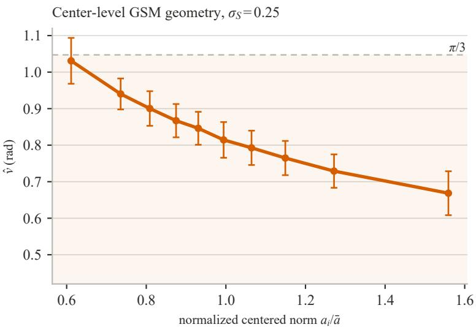  
Figure S1: Normalized centered norm $a _ { i } / \bar { a }$ and per-center mean direction within a d = 70, σ = 0.25 GSM sample, with ¯a the mean centered norm. Deciles contain equal numbers of centers; error bars show within-decile standard deviations, and the dashed horizontal line marks $\pi / 3$

## S1.3 Profiled circular von Mises divergence

The circular von Mises KL divergence in Main Eq. (4), taken from Vo et al. [9], is

$$
\operatorname { K L } \{ q ( \cdot ; \nu _ { 1 } , \tau _ { 1 } ) \parallel q ( \cdot ; \nu _ { 2 } , \tau _ { 2 } ) \} = \log \frac { I _ { 0 } ( \tau _ { 2 } ) } { I _ { 0 } ( \tau _ { 1 } ) } + A ( \tau _ { 1 } ) \{ \tau _ { 1 } - \tau _ { 2 } \cos ( \nu _ { 2 } - \nu _ { 1 } ) \} , \qquad A ( \tau ) = \frac { I _ { 1 } ( \tau ) } { I _ { 0 } ( \tau ) } .
$$

Adding and subtracting $A ( \tau _ { 1 } ) \tau _ { 2 }$ gives the decomposition stated after Main Eq. (4): a concentration term plus an angular-location penalty,

$$
\mathrm { K L } \{ q _ { 1 } \| q _ { 2 } \} = \underbrace { \log { \frac { I _ { 0 } ( \tau _ { 2 } ) } { I _ { 0 } ( \tau _ { 1 } ) } } + A ( \tau _ { 1 } ) ( \tau _ { 1 } - \tau _ { 2 } ) } _ { \mathrm { c o n c e n t r a t i o n } } + \underbrace { A ( \tau _ { 1 } ) \tau _ { 2 } \{ 1 - \cos ( \nu _ { 2 } - \nu _ { 1 } ) \} } _ { \mathrm { l o c a t i o n ~ p e n a l t y } } .
$$

The previous subsection shows that sample-amplitude heterogeneity can move the mean direction without changing the generating dimension, so the relative mean direction is treated as a nuisance parameter. Following the general rule of Main Eq. (6), let $\delta$ rotate the reference mean direction; the profiled angular discrepancy of Main Eq. (9) substitutes $\left( \nu _ { 1 } , \tau _ { 1 } \right) = \left( \hat { \nu } , \hat { \tau } \right)$ and $( \nu _ { 2 } , \tau _ { 2 } ) = ( \nu _ { m } ^ { \mathrm { r e f } } + \delta , \tau _ { m } ^ { \mathrm { r e f } } )$ and takes the infimum over δ:

$$
\Delta _ { \mathrm { a n g } } ^ { \mathrm { p r o f } } ( m ) = \operatorname* { i n f } _ { \delta } \Bigl [ \log \frac { I _ { 0 } ( \tau _ { m } ^ { \mathrm { r e f } } ) } { I _ { 0 } ( \hat { \tau } ) } + A ( \hat { \tau } ) ( \hat { \tau } - \tau _ { m } ^ { \mathrm { r e f } } ) + A ( \hat { \tau } ) \tau _ { m } ^ { \mathrm { r e f } } \{ 1 - \cos ( \nu _ { m } ^ { \mathrm { r e f } } + \delta - \hat { \nu } ) \} \Bigr ] .
$$

Only the last term depends on δ. For $\tau \geq 0$ the integral representation gives $I _ { 0 } ( \tau ) > 0$ and $I _ { 1 } ( \tau ) \geq 0$ , so $A ( \hat { \tau } ) \tau _ { m } ^ { \mathrm { r e f } } \geq 0$ , and $1 - \cos x \geq 0$ makes the term nonnegative. It attains its minimum value zero when the mean directions are aligned, $\nu _ { m } ^ { \mathrm { r e f } } + \delta = \hat { \nu }$ modulo $2 \pi ;$ if $A ( \hat { \tau } ) \tau _ { m } ^ { \mathrm { r e f } } = 0$ , the bracket does not depend on $\delta$ and the same value results. Therefore

$$
\Delta _ { \mathrm { a n g } } ^ { \mathrm { p r o f } } ( m ) = \log \frac { I _ { 0 } ( \tau _ { m } ^ { \mathrm { r e f } } ) } { I _ { 0 } ( \hat { \tau } ) } + A ( \hat { \tau } ) ( \hat { \tau } - \tau _ { m } ^ { \mathrm { r e f } } ) ,
$$

which is Main Eq. (10): the infimum is attained by aligning the mean directions, and only the concentration term remains.

Full matching keeps the original reference mean direction, so its angular discrepancy $\Delta _ { \mathrm { a n g } } ( m )$ in Main Eq. (5) is Main Eq. (4) at $\delta = 0$ , and its excess over the profiled discrepancy is

$$
\Delta _ { \mathrm { a n g } } ( m ) - \Delta _ { \mathrm { a n g } } ^ { \mathrm { p r o f } } ( m ) = A ( \hat { \tau } ) \tau _ { m } ^ { \mathrm { r e f } } \{ 1 - \cos ( \nu _ { m } ^ { \mathrm { r e f } } - \hat { \nu } ) \} \geq 0 .
$$

Profiling therefore removes exactly the angular-location penalty of Main Eq. (4) while retaining the concentration comparison. For a fixed ofset that is not a multiple of 2π and $\hat { \tau } > 0$ , this penalty increases with $\tau _ { m } ^ { \mathrm { r e f } }$ ; when both the ofset and the reference concentration vary across candidates, its candidate-wise behavior depends on both quantities.

## S1.4 Adequacy of the circular von Mises approximation

Under local symmetry the angle density is exactly $h _ { d } ( \theta ) \propto \sin ^ { d - 2 } \theta$ on $[ 0 , \pi ]$ (Proposition S1.2, Eq. (S1.11)). The exact density is therefore the locally symmetric benchmark. Its symmetry about $\pi / 2$ also fixes its mean direction there for every $d ,$ so it has no parameter with which to express the data–reference diference in angular location that the observed samples display.

DANCo accommodates variable angular location through the von Mises family: it represents each observed and reference mutual-neighbor angle distribution with a fitted circular von Mises approximation [5, Sec. 3.2], and that family is the standard parametric model for circular data [10, Sec. 3.3.6]. Writing qcirc for the density $q ( \cdot ; \nu , \tau )$ of Main Section 3.1, we separately fit this law by maximum likelihood to the pooled neighbor angles and assess its descriptive fit. These parameters difer from the aggregated per-center statistics used for calibration.

Because the physical angles occupy [0, π] while $q _ { \mathrm { c i r c } }$ is circular, we first measure its outside-range mass,

$$
\epsilon ( \nu , \tau ) = 1 - \int _ { 0 } ^ { \pi } q _ { \mathrm { c i r c } } ( \theta ; \nu , \tau ) d \theta\tag{S1.13}
$$

and then assess its fit on the physical range with the renormalized density

$$
q _ { [ 0 , \pi ] } ( \theta ; \nu , \tau ) = \frac { q _ { \mathrm { c i r c } } ( \theta ; \nu , \tau ) } { 1 - \epsilon ( \nu , \tau ) } \mathbf { 1 } _ { [ 0 , \pi ] } ( \theta ) .\tag{S1.14}
$$

For these fitted pooled models, $\operatorname { E q . }$ (S1.13) gives ϵ at most $5 . 0 \times 1 0 ^ { - 8 }$ and falls below $1 0 ^ { - 8 }$ on every real dataset, so the circular approximation places essentially all fitted mass in the physical range.

For the pooled $M = { \bar { N ( } } _ { 2 } ^ { k } )$ angles, let Q denote the cumulative distribution function (CDF) of Eq. (S1.14) and let $\theta _ { ( 1 ) } \leq \dots \leq \theta _ { ( M ) }$ be the ordered observations. We report

$$
D ^ { + } = \operatorname* { m a x } _ { r } \left\{ \frac { r } { M } - Q ( \theta _ { ( r ) } ) \right\} , \qquad D ^ { - } = \operatorname* { m a x } _ { r } \left\{ Q ( \theta _ { ( r ) } ) - \frac { r - 1 } { M } \right\} , \qquad G = \operatorname* { m a x } ( D ^ { + } , D ^ { - } ) .
$$

The gaps G are 0.004 for the uniform 70-ball, 0.017 for MNIST digit 3, 0.011 for raw ImageNet koala, and 0.022 for the GSM $( \sigma _ { S } = 0 . 2 5 )$ ). Together with the small outside-range mass ϵ, these checks support the separately fitted pooled von Mises laws in the evaluated settings, including the GSM. They do not assess the aggregated $( \hat { \nu } , \hat { \tau } )$ pair used in calibration: for raw koala the pooled fit has $\tau = 3 9 . 9 8$ , while calibration uses $\hat { \tau } = 9 0 . 1$ . Figure S2 shows representative uniform-ball and ImageNet koala comparisons.

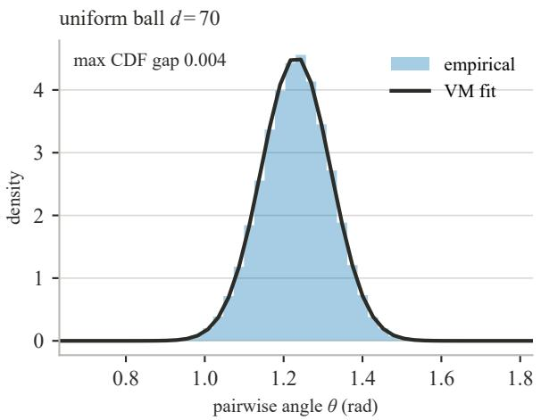

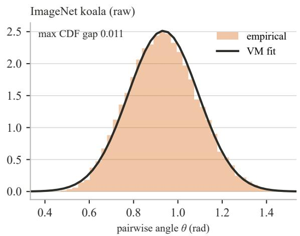  
Figure S2: Representative pooled neighbor-angle distributions and fitted von Mises (VM) laws for the uniform 70-ball and raw ImageNet koala. The koala fit has a modest descriptive CDF gap; its dominant data–reference discrepancy occurs in angular location.

## S2 Model and numerical validity

## S2.1 Algorithm

Algorithm S1 connects the componentwise objective to a complete estimation procedure. Its steps also identify the operations used in the complexity and timing analyses below. As an implementation convention, the procedure applies one uniform lower cutof: it skips angular calibration whenever the distance estimate is at most five and returns the distance estimate alone.

Algorithm S1 Componentwise calibrated intrinsic-dimension estimation   
Require: data X , neighborhood size $k ,$ candidates 1:mmax, distance model, angular mode, reference source   
1: Find the $k + 1$ nearest neighbors and distances of every $x _ { i }$   
2: Form MiND or Gride ratios and fit $\hat { d } _ { \mathrm { d i s t } }$   
3: if $\hat { d } _ { \mathrm { { d i s t } } } \leq 5$ then   
4: return $\hat { d } _ { \mathrm { d i s t } }$   
5: end if   
6: Compute the $\binom { k } { 2 }$ neighbor angles at every observation $x _ { i } ,$ the center of its neighborhood   
7: Fit $( \hat { \nu } _ { i } , \hat { \tau } _ { i } )$ and aggregate $( \hat { \nu } , \hat { \tau } )$ by circular and arithmetic means, respectively   
8: if a circular resultant vector is zero then   
9: return $\hat { d } _ { \mathrm { d i s t } }$   
10: end if   
11: for $m = 1 , \ldots , m _ { \mathrm { m a x } }$ do   
12: Obtain dimension-m reference statistics from a newly simulated uniform hyperball, reused Monte   
Carlo reference statistics, or the precomputed spline surface   
13: Compute $\Delta _ { \mathrm { d i s t } } ( m )$ and the Full and Profiled angular discrepancies   
14: end for   
15: Minimize each component curve and each pointwise combined curve   
16: Optionally refine an interior integer minimum by interpolation on $[ 1 , m _ { \mathrm { m a x } } ]$   
17: return the selected estimate and all component curves

Here a Monte Carlo reference is a simulation-based finite-sample calibration. For each candidate $m ,$ it draws N points uniformly from the m-dimensional unit hyperball and computes $( \hat { d } _ { m } ^ { \mathrm { r e f } } , \nu _ { m } ^ { \mathrm { r e f } } , \tau _ { m } ^ { \mathrm { r e f } } )$ . Repeating this construction across all candidates forms one reference replicate.

## S2.2 Computational complexity

Time complexity The analysis follows the steps of Algorithm S1 and separates the observed-data steps 1–7 from the candidate loop, steps 11–16, for two reasons. Steps 1–7 form the observed-data pipeline of every variant: the distance model selects the fit at step 2, whereas the angular mode and the reference source change nothing before step 8; the exit at step 3 skips the angular steps 6–7, and the exit at step 8 skips the loop. They are also the only steps that involve the ambient dimension $D ,$ whereas the loop is governed by the candidate bound $m _ { \mathrm { m a x } }$ and the reference source. The loop is analyzed for the three reference sources admitted at step 12, because the divergences at step 13 cost $O ( k )$ per candidate independently of $N ,$ , so the reference source is what sets the loop’s cost.

Observed data, steps 1–7. Under the exact pairwise-distance model used by the experiments, the neighbor search at step 1 costs $O ( N ^ { 2 } D )$ and the $\binom { k } { 2 }$ angles per center at step 6 cost $O ( N k ^ { 2 } D )$ . The remaining steps are cheaper. At step 2, forming the MiND first-neighbor ratios or the Gride generic-order ratios from the stored $( k + 1 )$ -nearest-neighbor distances costs $O ( N k )$ , and one evaluation of the distance log-likelihood during the fit of $\hat { d } _ { \mathrm { d i s t } }$ costs $O ( N )$ ; the integer grid search that initializes the MiND fit evaluates it at $d = 1 , \ldots , D ,$ for $O ( N D )$ . At step $^ { 7 , }$ fitting the per-center von Mises statistics accumulates the $\binom { k } { 2 }$ angle sines and cosines at every center for $O ( N k ^ { 2 } )$ and inverts one Bessel ratio per center for $O ( N )$ ; the exits at steps 3 and 8 inspect quantities already computed. All of these terms are dominated by the neighbor search, so the observed-data time is

$$
T _ { \mathrm { d a t a } } = O \big \{ N ( N + k ^ { 2 } ) D \big \} ,
$$

in which $N ^ { 2 } D$ is the search and $N k ^ { 2 } D$ the angle construction.

Candidate loop and selection, steps $1 1 - 1 6$ Each candidate divergence at step 13 costs $O ( k )$ and does not depend on $N { : }$ a finite digamma series of k+1 terms for MiND, a finite digamma sum of $k _ { 2 } - k _ { 1 }$ terms for Gride, or the adaptive one-dimensional quadrature of the released implementation (at most 50 subintervals). With the neighbor orders fixed, the minimization and optional refinement at steps 15–16 scan the $m _ { \mathrm { m a x } }$ candidates once, for $O ( m _ { \mathrm { m a x } } )$ . The loop cost therefore depends on how step 12 obtains the reference statistics, and three sources are admitted. A newly simulated hyperball for every candidate is the calibration of the original DANCo [5], which rebuilds every reference for every dataset; it is the cost that the other two sources avoid.

The precomputed spline surface is the FastDANCo route and serves the CNN profiles of Section S3.7, where hundreds of layers are calibrated up to $m _ { \mathrm { m a x } } = 4 0 0$ . Reused Monte Carlo references are the design of the synthetic, noise, GSM and image experiments of Section S3.1: one reference replicate at the observed sample size is simulated once and shared by every component objective and configuration compared on it, which is what the growing calibration cache of the released implementation does. The last two sources are the modes run in this study; the first is analyzed as their baseline.

With a newly simulated hyperball, step 12 repeats steps 1, 2, 6 and 7 inside a simulated dimension-m hyperball of N points, so one reference costs $O \{ N ( N + k ^ { 2 } ) m \}$ . Because $\sum _ { m = 1 } ^ { m _ { \mathrm { m a x } } } m = m _ { \mathrm { m a x } } ( m _ { \mathrm { m a x } } + 1 ) / 2$ , the candidate sweep contributes a factor quadratic in the candidate bound, giving

$$
T _ { \mathrm { M C } } = O \big \{ N ( N + k ^ { 2 } ) ( D + m _ { \mathrm { m a x } } ^ { 2 } ) \big \} ,\tag{S2.1}
$$

whose first summand is the observed geometry and whose second the accumulated reference simulation. With the precomputed surface of FastDANCo, defined in Main Section 3.1, step 12 is one $O ( 1 )$ lookup per candidate, so steps 11–16 together cost $O ( m _ { \mathrm { m a x } } )$ and the online time becomes

$$
T _ { \mathrm { F a s t } } = O \big \{ N ( N + k ^ { 2 } ) D + m _ { \mathrm { m a x } } \big \} ,\tag{S2.2}
$$

in which the simulation summand of (S2.1) collapses to a single scan over candidates. With reused Monte Carlo references, step 12 reads statistics simulated before the run, so the online cost has the form of $T _ { \mathrm { F a s t } }$ with the simulation term already paid. For a sample-size grid $\mathcal { G } _ { N }$ and $n _ { \mathrm { s i m } }$ simulated references per grid cell, the one-time construction cost of the surface is

$$
T _ { \mathrm { o f f i n e } } = O \left\{  { n _ { \mathrm { s i m } } } \sum _ { N _ { g } \in \mathcal { G } _ { N } } N _ { g } ( N _ { g } + k ^ { 2 } )  { m _ { \mathrm { m a x } } } ^ { 2 } \right\} ,
$$

paid once for every sample size on the grid. The packaged surface uses five sample sizes, $m _ { \mathrm { m a x } } = 4 0 0$ , and $n _ { \mathrm { s i m } } = 3 5$ , for $5 \times 4 0 0 \times 3 5 = 7 0 , 0 0 0$ calibration simulations. Ceruti et al. report the original FastDANCo bound under their nearest-neighbor search model and a candidate range tied to ambient dimension [5]. Equations (S2.1)–(S2.2) instead match the exact search used here and keep ambient dimension D separate from candidate bound $m _ { \mathrm { m a x } }$

Space complexity For on-the-fly Monte Carlo calibration, an unchunked exact distance matrix uses $O ( N ^ { 2 } )$ workspace; query batches of size b reduce this term to $O ( b N )$ ), giving the peak storage

$$
O \left\{ N \operatorname* { m a x } ( D , m _ { \mathrm { m a x } } ) + b N + N k ^ { 2 } \right\} ,
$$

whose three terms hold the data matrix together with the largest candidate reference point set of step 12, the step-1 bufer that scores b query rows against all N points at once, and the $\binom { k } { 2 }$ neighbor-pair angles of step 6 at each of the N centers.

For FastDANCo evaluation on the precomputed surface, the peak storage is

$$
O \big ( N D + b N + N k ^ { 2 } + m _ { \mathrm { m a x } } + S _ { \mathrm { s p l i n e } } \big ) ,
$$

which adds the candidate curves of steps 13–15 and the fitted surface $S _ { \mathrm { s p l i n e } }$ read at step 12 to the same three data-side terms.

## S2.3 Numerical implementation and safeguards

Two safeguards stabilize candidate selection. The angular discrepancy uses exponentially scaled Bessel functions before any overflowing intermediate is formed. Fractional refinement is restricted to the computed candidate interval $[ 1 , m _ { \mathrm { m a x } } ]$ , preventing extrapolated minima.

When a circular resultant vector is zero, its mean direction is undefined; the angular component is marked unavailable and the estimator returns the distance estimate.

Define the exponentially scaled modified Bessel function by

$$
I _ { \alpha } ^ { e } ( x ) = e ^ { - | x | } I _ { \alpha } ( x ) ,\tag{S2.3}
$$

where α denotes the Bessel order and is unrelated to the angular mean direction ν. Then

$$
\begin{array} { c } { { \log \displaystyle \frac { I _ { 0 } ( \tau _ { 2 } ) } { I _ { 0 } ( \tau _ { 1 } ) } = | \tau _ { 2 } | - | \tau _ { 1 } | + \log \displaystyle \frac { I _ { 0 } ^ { e } ( \tau _ { 2 } ) } { I _ { 0 } ^ { e } ( \tau _ { 1 } ) } , } } \\ { { \displaystyle \frac { I _ { 1 } ( \tau ) } { I _ { 0 } ( \tau ) } = \displaystyle \frac { I _ { 1 } ^ { e } ( \tau ) } { I _ { 0 } ^ { e } ( \tau ) } . } } \end{array}\tag{S2.4}
$$

Both identities follow directly from $I _ { \alpha } ( x ) = e ^ { | x | } I _ { \alpha } ^ { e } ( x )$ : taking logarithms turns the exponential factors into $\left| \tau _ { 2 } \right| - \left| \tau _ { 1 } \right|$ , while the common factor cancels in the $I _ { 1 } / I _ { 0 }$ ratio. Ordinary double-precision evaluation overflows near concentration 709.78. Let $N _ { \mathrm { r e f } }$ be the number of points in a reference. The illustrated calibration uses $N _ { \mathrm { r e f } } = 5 0 0$ , and its first afected candidate is $m = 2 7 8 $ ; the boundary is similar across the five precomputed sample sizes 450–700. The corrupted ordinary calculation first becomes negative at $m = 2 8 4$ , violating KL non-negativity and creating a possible false minimum. Equations (S2.3) and (S2.4) keep the KL finite and positive through candidate 400 (Figure S3).

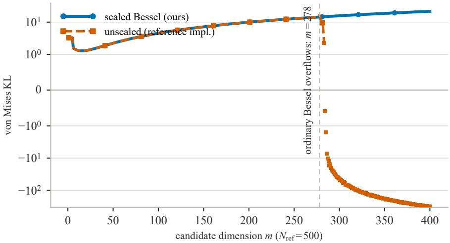  
Figure S3: Calibration-side Bessel overflow for fixed data statistics and the $N _ { \mathrm { r e f } } = 5 0 0$ calibration. Ordinary evaluation loses validity at candidate $m = 2 7 8$ and becomes negative at $m \ : = \ : 2 8 4$ . Scaled evaluation remains finite and positive through candidate 400; dashed squares and solid circles denote ordinary and scaled evaluation, respectively.

## S2.4 Computational scaling by workload

The four timed workloads are step ranges of Algorithm S1 with the costs of Section S2.2. Observed-data statistics runs steps 1–7 and stops before the candidate loop, so its time is $T _ { \mathrm { d a t a } }$ . The three complete evaluations run all steps and difer only in the reference source at step 12: precomputed spline references give $T _ { \mathrm { F a s t } }$ of Eq. (S2.2), newly generated Monte Carlo references give $T _ { \mathrm { M C } }$ of Eq. (S2.1), and reused Monte Carlo references give the form of $T _ { \mathrm { F a s t } }$ with the simulation term paid before timing.

Figure S4a varies ambient dimension at $N = 2 5 0 0 , k = 1 0$ while timing only observed-data steps, thereby isolating the cost that grows with D. CPU is faster for the two smallest workloads, where device transfer and process initialization dominate, while GPU becomes faster at $D \geq 1 0 ^ { 4 } ;$ ; at $D = 1 0 ^ { 5 }$ the observed-data computation takes about 51 s on CPU and 34 s on GPU, with median per-process peak resident memory of 3761 MB on CPU and 3824 MB of allocated device memory on GPU.

Figure S4b fixes $N = 5 0 0 , D = 4 0 0$ , and $k = 1 0$ and varies $m _ { \mathrm { m a x } }$ to isolate reference construction and candidate evaluation. At $m _ { \mathrm { m a x } } = 4 0 0$ , precomputed and reused references remain below 0.5 s on both backends, whereas regenerating Monte Carlo references takes seconds and grows with the candidate bound because it constructs more references; the observed data are small in this setting, so GPU setup costs exceed the observed-data savings.

The precomputed and reused evaluations in Figure S4b therefore finish one dataset in under 0.5 s on both backends; Main Table 1 separately reports a median of 0.03 seconds for MiND–Full, which excludes the shared reference construction. These measurements place componentwise calibration in the practical cost range of the estimators collected in scikit-dimension [11] for the evaluated workloads and data sizes.

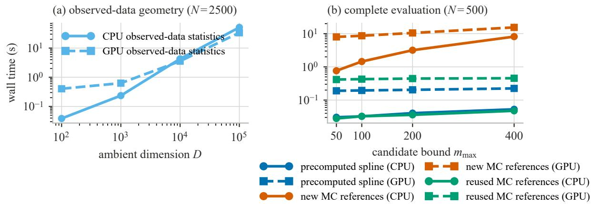  
Figure S4: Wall time for the explicitly defined workloads, shown as the median of three fresh-process measurements after warm-up. (a) Observed-data statistics versus ambient dimension. (b) Complete evaluation with precomputed spline, newly generated Monte Carlo, or reused Monte Carlo references versus candidate bound; solid lines with circles are CPU, while dashed lines with squares are GPU.

## S3 Experimental design and reporting

## S3.1 Common settings

Where an implementation is available, the reference estimators come from scikit-dimension [11]. The synthetic, noise, GSM, and image experiments construct Monte Carlo references at the observed sample size by the construction of Section S2.1. One reference replicate therefore holds $( \hat { d } _ { m } ^ { \mathrm { r e f } } , \nu _ { m } ^ { \mathrm { r e f } } , \tau _ { m } ^ { \mathrm { r e f } } )$ at every candidate, and the component objectives entering a comparison reuse it. Each data replicate draws every dataset afresh and independently. Data and reference replicates are shared across configurations whenever a comparison changes one estimator component or one perturbation level, which keeps the data and calibration realization matched for the comparison. Unless stated otherwise, MPE is computed within each replicate and reported as a mean ± standard deviation over replicates. Each experiment is summarized within its own replicate design, so summaries at nominally identical settings difer slightly across experiments: the clean MiND–Full MPE is 6.33% under the twenty-replicate aggregation of Main Table 1, 6.24% at $k = 1 0 ,$ N = 2500 in the five-replicate sensitivity sweep (Table S4), and 6.75% at $\eta = 0$ in the ten-replicate noise design (Table S5).

The candidate search runs over $m = 1 , \ldots , \operatorname* { m i n } ( m _ { \mathrm { m a x } } , D )$ with $m _ { \mathrm { m a x } } = 1 0 0$ for the standard synthetic experiments, 200 for the image experiments, and 400 for the CNN profiles; benchmark manifolds whose ambient dimension lies below $m _ { \mathrm { m a x } }$ are therefore searched up to D. Reference angular statistics and penalty curves are reported over the valid candidates, those whose reference distance estimate exceeds five, which start at $m = 6$ . The search itself runs over every candidate; references with a distance estimate of at most five carry zero concentration and are excluded only from the reported ranges.

## S3.2 Clean-manifold benchmark

The primary benchmark uses 24 manifolds with N = 2500 points each. Twenty data replicates form the sampling design, and the ten estimators of the primary comparison evaluate the same replicates, so estimator diferences carry no sampling ofset; MiND–Full uses the matching Monte Carlo reference replicate.

The component comparison keeps the 14 benchmark manifolds on which all eight component objectives are defined: on the other ten, a preliminary MiND distance estimate at most five omits angular calibration,

so the angle-only objectives are undefined. Five reference replicates, with one data replicate per manifold, supply the replicate summary.

## S3.3 Sensitivity sweeps

The sensitivity study sweeps the neighborhood size over $k \in \{ 5 , 1 0 , 1 5 , 2 0 \}$ at $N = 2 5 0 0$ and the sample size over $N \in \{ 6 2 5 , 1 2 5 0 , 2 5 0 0 , 5 0 0 0 \}$ at $k = 1 0$ . Each setting uses five data replicates of the 24-manifold suite.

## S3.4 Neighborhood-relative noise

The noise levels are $\eta \in \{ 0 , 0 . 0 5 , 0 . 1 , 0 . 2 , 0 . 4 \}$ under Main $\operatorname { E q . }$ (11). Ten data replicates of 2500 observations per manifold are generated. Within a replicate, the clean data are shared across noise levels, so a change in accuracy follows the added noise.

## S3.5 Gaussian scale mixture

The amplitude experiment uses the lognormal GSM of Section S1.2 with generating dimension $d = 7 0$ and $N = 2 5 0 0$ observations per sample. Each sample is zero-padded into $D = 1 0 0$ , an isometric embedding that leaves every neighbor distance and angle unchanged and extends the candidate search to 100. The sweep varies $\sigma _ { S } \in \{ 0 , 0 . 1 , 0 . 1 5 , 0 . 2 , 0 . 2 5 , 0 . 3 , 0 . 3 5 \}$ over 30 data replicates at each level. Within a replicate, the latent Gaussian draws are reused across amplitude levels, so every comparison changes one factor at a time.

To relate the simulated amplitude sweep to the amplitude variation observed in real images, we summarize sample-to-sample radial variation by the coeficient of variation (CV) of the centered norm. For centered norms $a _ { i } = \| x _ { i } - \bar { x } \| _ { 2 }$ , the CV, computed with population standard deviation, is

$$
{ \bar { a } } = { \frac { 1 } { N } } \sum _ { i = 1 } ^ { N } a _ { i } , \qquad \mathrm { C V } ( a ) = { \frac { \{ N ^ { - 1 } \sum _ { i = 1 } ^ { N } ( a _ { i } - { \bar { a } } ) ^ { 2 } \} ^ { 1 / 2 } } { { \bar { a } } } } , \quad { \bar { a } } > 0 .
$$

For the lognormal amplitude, $\mathrm { C V } _ { S } = \{ \mathrm { V a r } ( S _ { i } ) \} ^ { 1 / 2 } / \mathbb { E } ( S _ { i } ) = ( e ^ { \sigma _ { S } ^ { 2 } } - 1 ) ^ { 1 / 2 }$ , and $\mathrm { C V } _ { Z }$ denotes the coeficient of variation of $\Vert Z _ { i } \Vert$ , equal to 0.085 at $d = 7 0$ . Under population centering, $\| X _ { i } \| \ : = \ : S _ { i } \| Z _ { i } \|$ , and the independence of $S _ { i }$ and $Z _ { i }$ gives

$$
1 + \mathrm { C V } ^ { 2 } = ( 1 + \mathrm { C V } _ { \cal S } ^ { 2 } ) ( 1 + \mathrm { C V } _ { \cal Z } ^ { 2 } ) .
$$

The sample-centered $\mathrm { C V } ( a )$ follows this relation approximately, so the sweep brackets the values $\mathrm { C V } ( a ) =$ 0.15–0.33 observed across the 17 image classes of Table S9. The level $\sigma _ { S } = 0 . 2 5$ lies inside this range and serves as the focal level for the detailed comparison and the control.

At the focal level, two diagnostics complement the sweep. The first follows the angular-location penalty along the candidate axis over five replicates and is reported in Section S4.5. The second is a knownamplitude control that divides each observation by its simulated amplitude, $X _ { i } / S _ { i } = Z _ { i }$ All data-side statistics are recomputed from $Z _ { i } { \mathrm { : } }$ the neighbor search, the distance ratios, and the neighbor angles. The latent Gaussian draws, the generating dimension $d = 7 0$ , and the paired reference realization are retained, so the transformation removes only the multiplicative amplitude factor. Because the same $Z _ { i }$ draws are used across amplitude levels, the control coincides with the matched $\sigma _ { S } = 0$ sample by construction.

A separate simulation examines the regime transition of Main Figure 2 with $N = 2 5 0 0 , k = 1 0$ , exact nearest-neighbor search, and the same angular estimator. The homogeneous-amplitude panel varies the ball dimension over $d \in \{ 2 , 3 , 5 , 8 , 1 2 , 2 0 , 3 5 , 5 0 , 7 0 , 1 0 0 , 1 5 0 , 2 5 0 , 4 0 0 \}$ , and the heterogeneous-amplitude panel fixes $d = 7 0$ and varies $\sigma _ { S }$ over the sweep grid above. The center-level diagnostic of Figure S1 uses one sample at the focal level $\sigma _ { S } = 0 . 2 5$

## S3.6 Image data

The image classes are MNIST digits 3 and 7 [12], CIFAR-10 birds and cats [13], and the ImageNet koala and milkweed-butterfly classes [14, 15]. They contain 1010/1028, 5000, and $5 4 7 / 6 4 8$ observations, and their ambient dimensions are 784, 3072, and 150528. Main Section 4.1 defines the two normalizations, centered radial and per-image contrast. A zero centered vector remains zero, a constant image maps to zero, and every observed-data statistic (neighbor search, distance ratios, angles) is recomputed on the transformed sample.

Each class contributes one fixed sample, so the observed angular statistics stay fixed while the calibration side varies. Five reference replicates serve every image estimate, and each calibrated estimate averages over the five. Over the valid candidates $m = 6 , \ldots , 2 0 0$ , the five replicates give mean-direction ranges within [1.142, 1.495] radians; Table S1 reports the range matched to each sample size together with the observed data value.

Table S1: Sample-size-specific reference mean-direction ranges. Each image row uses the five reference replicates over candidates $m = 6 , \ldots , 2 0 0 ;$ the last row gives the Gride reference surface of the CNN study at its efective sample sizes over $m = 6 , \ldots , 4 0 0 .$ The observed gap is the lower reference boundary minus the data mean direction. A negative gap places the data value above the lower boundary, and both MNIST values also lie below the upper boundary, hence inside the range.
<table><tr><td>N</td><td>Data</td><td>reference min</td><td>reference max</td><td>observed û</td><td>gap</td></tr><tr><td>547</td><td>ImageNet koala</td><td>1.142</td><td>1.443</td><td>0.934</td><td>0.208</td></tr><tr><td>648</td><td>ImageNet butterfly</td><td>1.144</td><td>1.447</td><td>0.915</td><td>0.229</td></tr><tr><td>1010</td><td>MNIST 3</td><td>1.150</td><td>1.464</td><td>1.166</td><td>-0.016</td></tr><tr><td>1028</td><td>MNIST 7</td><td>1.150</td><td>1.467</td><td>1.157</td><td>-0.006</td></tr><tr><td>5000</td><td>CIFAR-10 bird</td><td>1.169</td><td>1.495</td><td>0.898</td><td>0.271</td></tr><tr><td>5000</td><td>CIFAR-10 cat</td><td>1.169</td><td>1.495</td><td>0.946</td><td>0.223</td></tr><tr><td>495-500</td><td>CNN surface (Gride)</td><td>1.115</td><td>1.431</td><td></td><td>一</td></tr></table>

## S3.7 CNN study

The CNN study evaluates AlexNet [16], VGG-16 [17], and ResNet-18/34 [18] on seven single-object ImageNet categories, with three independent 500-image subsamples for every architecture and category. At each checkpoint, exact-duplicate activation rows are removed once, and Gride–Profiled, TWO-NN, and MLE read the resulting common matrix. The efective sample size used by the Gride reference surface is therefore the number of unique rows. Over the efective sample sizes of this study (495–500 unique rows) and candidates $m = 6 , \ldots , 4 0 0$ , the surface’s reference mean direction ranges from 1.115 to 1.431 radians (Table S1) and decreases overall with the candidate dimension. A single Gride–Profiled cell (ResNet-18, second residual stage, one subsample) returns the candidate bound 400; the reported medians are unafected. Both Gride variants use integer candidate minima in this study. TWO-NN uses the discarded-tail fit of Facco et al. via scikitdimension; MLE uses the package’s k = 10 Levina–Bickel estimate. Checkpoints record pooling, stage, and linear outputs, so the sampled grid resolves layer-wise change to the nearest such transition. Relative depth divides the cumulative number of convolutional, linear, and final adaptive-pooling transformations at a checkpoint by the maximum such count, placing every network on a common input-to-output interval; residual projection shortcuts are not counted separately.

The packaged Gride reference surface of Main Section 3.5 covers m = 1, . . . , 400 at sample sizes 450, 500, 580, 640, and 700, and every grid point averages 35 independently simulated hyperballs. The MiND surface comes from the same grid and the same simulated hyperballs, so the two surfaces agree grid point by grid point on their angular entries and difer only in the distance statistic.

## S4 Extended experimental results

## S4.1 Benchmark detail and reference estimators

Table S2 and Figure S5 expand Main Table 1 with per-manifold estimates and signed errors.

Table S 2 : Est imated ID of ten est imators on all 24 benchmark manifolds (mean over the successful dat a replicates out of 20 ) . FisherS on M 1 0d Cubic averages its single successful replicat e ; it s ot her 1 9 replicat es failed
<table><tr><td>Manifold</td><td></td><td>d CorrInt</td><td>MiND–Full (DANCo)</td><td>ESS</td><td>FisherS</td><td>MADA</td><td>MLE</td><td>MiND-ML</td><td>TLE</td><td>TWO-NN</td><td>IPCA</td></tr><tr><td>M10a_Cubic</td><td>10</td><td>8.6</td><td></td><td>10.1 10.2</td><td>10.3</td><td>9.2</td><td>8.7</td><td>8.9</td><td>9.6</td><td>9.1</td><td>11.0</td></tr><tr><td>M10b_Cubic</td><td>17</td><td>12.7</td><td></td><td>17.1 17.3</td><td>17.0</td><td>13.9</td><td>13.2</td><td>13.7</td><td>14.2</td><td>14.2</td><td>18.0</td></tr><tr><td>M10c_Cubic</td><td>24</td><td>16.2</td><td></td><td>24.5 24.4</td><td>24.0</td><td>18.0</td><td>17.2</td><td>18.0</td><td>18.1</td><td>18.8</td><td>25.0</td></tr><tr><td>M10d_Cubic</td><td>70</td><td>31.8</td><td></td><td>70.6 70.0</td><td>57.1</td><td>36.8</td><td>35.7</td><td>38.0</td><td>35.0</td><td>40.2</td><td>71.0</td></tr><tr><td>M11_Moebius</td><td>2</td><td>2.0</td><td>2.0</td><td>2.5</td><td>2.0</td><td>2.1</td><td>2.0</td><td>2.0</td><td>2.2</td><td>2.0</td><td>3.0</td></tr><tr><td>M12_Norm</td><td>20</td><td>12.7</td><td>20.0</td><td>19.8</td><td>20.0</td><td>16.2</td><td>15.5</td><td>16.3</td><td>15.5</td><td>17.0</td><td>20.0</td></tr><tr><td>M13a_Scurve</td><td>2</td><td>2.0</td><td>2.0</td><td>2.1</td><td>2.9</td><td>2.1</td><td>2.0</td><td>2.0</td><td>2.1</td><td>2.0</td><td>3.0</td></tr><tr><td>M13b_Spiral</td><td>1</td><td>4.6</td><td>1.1</td><td>2.0</td><td>2.0</td><td>3.8</td><td>1.6</td><td>1.1</td><td>1.9</td><td>1.0</td><td>2.0</td></tr><tr><td>M1_Sphere</td><td>10</td><td>8.9</td><td>10.7</td><td>10.2</td><td>11.0</td><td>9.6</td><td>9.0</td><td>9.2</td><td>10.1</td><td>9.4</td><td>11.0</td></tr><tr><td>M2_Affine_3to5</td><td>3</td><td>2.9</td><td>2.9</td><td>2.9</td><td>2.9</td><td>3.0</td><td>2.8</td><td>2.9</td><td>3.1</td><td>2.9</td><td>3.0</td></tr><tr><td>M3_Nonlinear_4to6</td><td>4</td><td>3.5</td><td>3.8</td><td>4.0</td><td>3.4</td><td>4.1</td><td>3.7</td><td>3.8</td><td>4.2</td><td>3.8</td><td>5.0</td></tr><tr><td>M4_Nonlinear</td><td>4</td><td>3.8</td><td>3.9</td><td>5.0</td><td>5.8</td><td>4.4</td><td>4.0</td><td>3.9</td><td>4.5</td><td>3.9</td><td>8.0</td></tr><tr><td>M5a_Helix1d</td><td>1</td><td>1.0</td><td>1.0</td><td>1.6</td><td>2.9</td><td>1.1</td><td>1.0</td><td>1.0</td><td>1.1</td><td>1.0</td><td>3.0</td></tr><tr><td>M5b_Helix2d</td><td>2</td><td>2.8</td><td>2.3</td><td>2.9</td><td>2.9</td><td>3.1</td><td>2.6</td><td>2.3</td><td>2.9</td><td>2.0</td><td>3.0</td></tr><tr><td>M6_Nonlinear</td><td>6</td><td>5.9</td><td>6.4</td><td>8.5</td><td>8.5</td><td>7.2</td><td>6.4</td><td>6.1</td><td>7.1</td><td>6.0</td><td>12.0</td></tr><tr><td>M7_Roll</td><td>2</td><td>1.9</td><td>2.0</td><td>2.1</td><td>2.9</td><td>2.1</td><td>2.0</td><td>2.0</td><td>2.1</td><td>2.0</td><td>3.0</td></tr><tr><td>M8_Nonlinear</td><td>12</td><td>11.4</td><td>17.3</td><td>19.6</td><td>17.4</td><td>14.6</td><td>13.5</td><td>13.5</td><td>14.0</td><td>13.3</td><td>24.0</td></tr><tr><td>M9_Affine</td><td>20</td><td>13.7</td><td>19.6</td><td>19.4</td><td>18.9</td><td>15.2</td><td>14.5</td><td>15.0</td><td>15.3</td><td>15.5</td><td>20.0</td></tr><tr><td>Mbeta</td><td>10</td><td>3.4</td><td>6.4</td><td>6.0</td><td>5.3</td><td>6.6</td><td>5.8</td><td>6.2</td><td>6.2</td><td>6.4</td><td>10.0</td></tr><tr><td>Mn1_Nonlinear</td><td>18</td><td>12.5</td><td></td><td>17.818.4</td><td>17.1</td><td>14.2</td><td>13.5</td><td>14.0</td><td>14.2</td><td>14.3</td><td>27.0</td></tr><tr><td>Mn2_Nonlinear</td><td>24</td><td>15.4</td><td>24.4</td><td>24.8</td><td>23.1</td><td>17.7</td><td>16.9</td><td>17.7</td><td>17.5</td><td>18.4</td><td>36.0</td></tr><tr><td>Mp1_Paraboloid</td><td>3</td><td>2.1</td><td>2.9</td><td>2.9</td><td>0.9</td><td>3.1</td><td>2.8</td><td>2.9</td><td>3.1</td><td>3.0</td><td>1.0</td></tr><tr><td>Mp2_Paraboloid</td><td>6</td><td>2.7</td><td>6.3</td><td>4.9</td><td>0.9</td><td>5.1</td><td>4.7</td><td>5.1</td><td>5.3</td><td>5.4</td><td>1.0</td></tr><tr><td>Mp3_Paraboloid</td><td>9</td><td>3.1</td><td>8.1</td><td>6.2</td><td>0.9</td><td>6.5</td><td>5.9</td><td>6.8</td><td>6.7</td><td>7.3</td><td>1.0</td></tr></table>

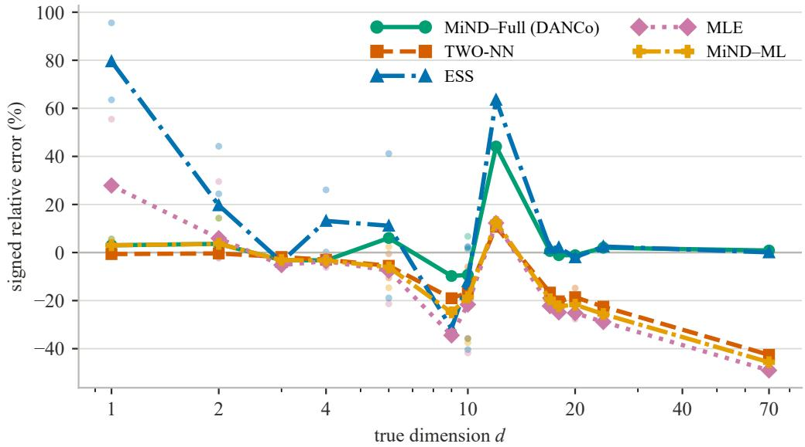  
Figure S5: Signed relative error on the 24-manifold benchmark. Faint points are individual manifolds; lines are means by generating dimension. Color, line style, and marker jointly identify each estimator.

## S4.2 Clean component agreement

Table S3 reports MPE and signed error for all eight objectives on the complete-case set of Main Section 4.2, the 14 manifolds whose preliminary MiND distance estimate exceeds five (Section S3.2).

Table S3: Clean component comparison on 14 eligible manifolds over five shared reference replicates. Entries are mean ± standard deviation across replicates. MPE gives error magnitude; signed error retains direction, with negative values denoting underestimation. All eight objectives minimize a calibrated KL objective with fractional refinement.
<table><tr><td>Objective</td><td>MPE (%)</td><td>Signed error (%)</td></tr><tr><td>MiND distance-only</td><td> $1 0 . 1 \pm 0 . 2$ </td><td> $- 1 . 6 \pm 0 . 3$ </td></tr><tr><td>Gride distance-only</td><td> $1 1 . 9 \pm 0 . 6$ </td><td> $- 1 . 8 \pm 0 . 4$ </td></tr><tr><td>Full angle-only</td><td> $1 5 . 9 \pm 0 . 7$ </td><td> $+ 1 0 . 7 \pm 0 . 7$ </td></tr><tr><td>Profiled angle-only</td><td> $1 2 . 2 \pm 0 . 3$ </td><td> $+ 6 . 2 \pm 0 . 2$ </td></tr><tr><td>MiND-Full</td><td> $8 . 6 \pm 0 . 7$ </td><td> $+ 0 . 9 \pm 0 . 9$ </td></tr><tr><td>MiND-Profiled</td><td> $9 . 7 \pm 0 . 2$ </td><td> $- 0 . 6 \pm 0 . 2$ </td></tr><tr><td>Gride-Full</td><td> $1 1 . 6 \pm 0 . 7$ </td><td> $- 1 . 2 \pm 0 . 8$ </td></tr><tr><td>Gride-Profiled</td><td> $1 1 . 7 \pm 0 . 4$ </td><td> $- 2 . 5 \pm 0 . 3$ </td></tr></table>

All four combined objectives have lower observed mean MPE than either of their own components on matched clean geometry; for the two Gride objectives the margin over Gride distance-only is 0.2–0.3 MPE points, within one reference-replicate standard deviation. Both distance-only objectives sit below the generating dimension and both angle-only objectives above it, matching the directions reported for the raw statistics in the original DANCo study [5]. The four combined objectives have mean signed errors within 2.6 percentage points of zero, each closer to the corresponding distance-only mean signed error than to the angle-only one.

To interpret this pattern, note that equal objective weights need not imply equal local influence. Averages across manifolds should not be interpreted as convex combinations of the component averages; for an individual manifold whose component minima are suficiently close, a local quadratic approximation makes this influence explicit. Along the candidate coordinate x = log m, write the combined objective as $\Delta _ { \mathrm { d i s t } } ( x ) + \Delta _ { \mathrm { a n g } } ( x )$ , let $x _ { \mathrm { d i s t } }$ and $x _ { \mathrm { a n g } }$ be the minimizers of the two components, and let $x _ { \mathrm { j o i n t } }$ be the minimizer of their sum, so that $\exp ( x _ { \mathrm { j o i n t } } )$ is the estimate returned by the combined objective. Expand each

component about its own minimum,

$$
\begin{array} { r } { \Delta _ { \mathrm { d i s t } } ( x ) \approx \Delta _ { \mathrm { d i s t } } ( x _ { \mathrm { d i s t } } ) + \frac 1 2 H _ { \mathrm { d i s t } } ( x - x _ { \mathrm { d i s t } } ) ^ { 2 } , \qquad \Delta _ { \mathrm { a n g } } ( x ) \approx \Delta _ { \mathrm { a n g } } ( x _ { \mathrm { a n g } } ) + \frac 1 2 H _ { \mathrm { a n g } } ( x - x _ { \mathrm { a n g } } ) ^ { 2 } , } \end{array}
$$

where $H _ { \mathrm { d i s t } } = \Delta _ { \mathrm { d i s t } } ^ { \prime \prime } ( x _ { \mathrm { d i s t } } )$ and $H _ { \mathrm { a n g } } = \Delta _ { \mathrm { a n g } } ^ { \prime \prime } ( x _ { \mathrm { a n g } } )$ . Setting the derivative of the sum of the two quadratic approximations to zero gives

$$
x _ { \mathrm { j o i n t } } \approx \frac { H _ { \mathrm { d i s t } } x _ { \mathrm { d i s t } } + H _ { \mathrm { a n g } } x _ { \mathrm { a n g } } } { H _ { \mathrm { d i s t } } + H _ { \mathrm { a n g } } } .
$$

Thus, locally and when the two minima are nearby, the more strongly curved component has the greater influence on the joint minimum. To compare the component curvatures analytically, consider an exact match between an observed statistic and its reference value. There the divergence and its gradient vanish, so its second derivative in the reference parameter equals the Fisher information of the fitted law and the chain rule leaves no term from the curvature of the reference trajectory; the curvature of each component in x is therefore the Fisher information of its parameter times the squared rate at which the reference moves that parameter. The next proposition gives the corresponding Fisher informations.

Proposition S4.1 (Fisher curvature of the distance and concentration parameters). (a) Under the local Poisson model of Section $S 1 . 1 ,$ let $W = d \log ( r _ { k _ { 2 } } / r _ { k _ { 1 } } )$ for neighbor orders $k _ { 1 } < k _ { 2 } ,$ at $( k _ { 1 } , k _ { 2 } ) = ( 1 , k + 1 )$ this is the MiND quantity −d log ρ. Then $e ^ { - W } \sim \mathrm { B e t a } ( k _ { 1 } , k _ { 2 } - k _ { 1 } )$ for every $d ,$ and the Fisher information of log d carried by the observed ratio is

$$
\mathcal { F } = 1 + ( k _ { 2 } - k _ { 1 } - 1 ) \mathbb { E } \left[ \frac { W ^ { 2 } e ^ { W } } { ( e ^ { W } - 1 ) ^ { 2 } } \right] \geq 1 ,\tag{S4.1}
$$

with equality exactly for adjacent orders. (b) Under a von Mises law with concentration $\tau > 0$ , the Fisher information of log τ is $: C ( \tau ) = \tau ^ { 2 } A ^ { \prime } ( \tau ) > 0$ , which extends continuously to $C ( 0 ) = 0$ and satisfies $C ( \tau )  1 / 2$ as $\tau \to \infty$

Proof. (a) Substituting $v = \mu ^ { - d }$ in the Gride density of Main $\operatorname { E q . } \left( 2 \right)$ gives $v ^ { k _ { 1 } - 1 } ( 1 - v ) ^ { k _ { 2 } - k _ { 1 } - 1 } / B ( k _ { 2 } - k _ { 1 } , k _ { 1 } )$ on $( 0 , 1 )$ , the stated Beta law, which at $( 1 , k + 1 )$ is the MiND law $\rho ^ { d } \sim \mathrm { B e t a } ( 1 , k )$ . The observed log ratio $W / d$ therefore has log density log $d - k _ { 1 } W + ( k _ { 2 } - k _ { 1 } - 1 ) \log ( 1 - e ^ { - W } )$ up to a constant, with score $1 - k _ { 1 } W + ( k _ { 2 } - k _ { 1 } - 1 ) W / ( e ^ { W } - 1 )$ in log d. Diferentiating once more and using the zero mean of the score gives Eq. (S4.1) as the expected negative second derivative. The expectation in Eq. (S4.1) is positive because $W > 0$ almost surely, so $\mathcal { F } = 1$ for adjacent orders and $\mathcal { F } > 1$ otherwise.

(b) For $\tau > 0 .$ , with θ measured from the mean direction, the von Mises log density is τ cos $\theta { - } \log \lbrace 2 \pi I _ { 0 } ( \tau ) \rbrace$ so the score of log τ is $\tau \{ \cos \theta - A ( \tau ) \}$ and $C ( \tau ) = \tau ^ { 2 } \mathrm { V a r } ( \cos \theta ) = \tau ^ { 2 } A ^ { \prime } ( \tau ) > 0$ . The relations $I _ { 0 } ^ { \prime } = I _ { 1 }$ and $I _ { 1 } ^ { \prime } = I _ { 0 } - I _ { 1 } / \tau ~ [ 2$ , Sec. 10.29] give $A ^ { \prime } = 1 - A / \tau - A ^ { 2 }$ , so with $y = \tau A , C = \tau ^ { 2 } - y - y ^ { 2 }$ , and $C \to 0 \mathrm { \ a s \ } \tau \to 0 .$ The large-argument expansions of $I _ { 0 }$ and $I _ { 1 } \ [ 2 ,$ , Eq. 10.40.1] give $A ( \tau ) = 1 - 1 / ( 2 \tau ) - 1 / ( 8 \tau ^ { 2 } ) + { \cal O } ( \tau ^ { - 3 } )$ , so $y = \tau - 1 / 2 - 1 / ( 8 \tau ) + O ( \tau ^ { - 2 } )$ and $C ( \tau ) = 1 / 2 + O ( \tau ^ { - 1 } )$ □

This comparison becomes especially simple for Profiled calibration. For a smooth reference trajectory, let $\beta _ { d } = d \log { \hat { d } _ { m } ^ { \mathrm { r e f } } } / d x$ and $\beta _ { \tau } = d \log \tau _ { m } ^ { \mathrm { r e f } } / d x$ be the local log-slopes at which the reference moves the two parameters along $x = \log m$ , with $\beta _ { d } \neq 0$ . At an exact component match, Proposition S4.1 gives the distance and Profiled angular curvatures

$$
H _ { \mathrm { d i s t } } = \mathcal { F } \beta _ { d } ^ { 2 } , \qquad H _ { \mathrm { p r o f } } = C ( \hat { \tau } ) \beta _ { \tau } ^ { 2 } ,
$$

the latter, the $H _ { \mathrm { a n g } }$ of the Profiled objective, because the Profiled angular term is a KL divergence between von Mises laws with aligned mean directions (Section S1.3). Their relative local influence is therefore summarized directly by

$$
R = \frac { H _ { \mathrm { p r o f } } } { H _ { \mathrm { d i s t } } } = \frac { C ( \hat { \tau } ) } { \mathcal { F } } \left( \frac { \beta _ { \tau } } { \beta _ { d } } \right) ^ { 2 } .
$$

At exact matching, $\hat { \tau } = \tau _ { m } ^ { \mathrm { r e f } }$ , so the candidate-wise diagnostic evaluates $C$ at $\tau _ { m } ^ { \mathrm { r e f } }$ . On the sampled reference curves, we estimate these local slopes as follows. The curves are the Monte Carlo references behind Table S3, rebuilt from the benchmark’s five calibration seeds at $N = 2 5 0 0$ over $m = 6 , \ldots , 1 0 0$ and averaged over the replicates. At each sampled candidate m we estimate the two local log-slopes $\beta _ { d , m }$ and $\beta _ { \tau , m }$ by separate regressions of log $\hat { d } _ { m } ^ { \mathrm { r e f } }$ and log $\tau _ { m } ^ { \mathrm { r e f } }$ on log m over the $m \pm 1 0$ window, using the available candidates near the boundaries, and evaluate

$$
R _ { m } = \frac { C ( \tau _ { m } ^ { \mathrm { r e f } } ) } { \mathcal { F } } \left( \frac { \beta _ { \tau , m } } { \beta _ { d , m } } \right) ^ { 2 } ,
$$

where $\mathcal { F }$ comes from quadrature of Eq. (S4.1) and equals 5.86 for MiND at $k = 1 0$ and 4.79 for Gride at $( k _ { 1 } , k _ { 2 } ) = ( 5 , 1 0 )$ . On the clean-benchmark references used for Table S3, the maximum $R _ { m }$ is 0.31 for MiND and 0.38 for Gride; both remain below one under the wider $m \pm 2 0$ window. These ratios are diagnostics on the sampled reference curves, not bounds on an underlying continuous derivative. Thus the distance component is locally more curved than the Profiled concentration component on these sampled references.

At a match of both angular parameters, Full calibration adds the mean-direction curvature $A ( \hat { \tau } ) \hat { \tau } ( d \nu _ { m } ^ { \mathrm { r e f } } / d x ) ^ { 2 }$ to $H _ { \mathrm { p r o f } }$ . Because the Profiled comparison does not control this additional term, its curvature ordering does not automatically extend to Full. This distinction is itself informative: Profiled isolates the concentration contribution, whereas Full retains the additional location geometry. The proximity of the Full estimates to the distance-only values in Table S3 is therefore treated as an empirical pattern, whereas the sampled-reference diagnostics support stronger local distance influence for the Profiled combinations.

## S4.3 Sensitivity to neighborhood and sample size

Table S4 reports the Main Section 4.2 neighborhood and sample-size sweeps for five methods.

Table S4: MPE (%) across neighborhood and sample-size sweeps, each averaged over five data replicates. The first block varies k at $N = 2 5 0 0 ;$ the second varies N at k = 10.
<table><tr><td>Setting</td><td>MiND-Full</td><td>Gride-Full</td><td>MiND-Profiled</td><td>Gride-Profiled</td><td>TWO-NN</td></tr><tr><td colspan="6">Neighborhood sweep (N = 2500)</td></tr><tr><td>5</td><td>6.04</td><td>7.37</td><td>5.84</td><td>6.45</td><td>11.91</td></tr><tr><td>10</td><td>6.24</td><td>9.50</td><td>6.73</td><td>9.39</td><td>11.91</td></tr><tr><td>15</td><td>7.18</td><td>13.46</td><td>7.60</td><td>13.53</td><td>11.91</td></tr><tr><td>20</td><td>8.09</td><td>16.78</td><td>8.49</td><td>16.91</td><td>11.91</td></tr><tr><td colspan="6">Sample-size sweep (k = 10)</td></tr><tr><td>625</td><td>14.06</td><td>17.22</td><td>13.73</td><td>17.03</td><td>15.46</td></tr><tr><td>1250</td><td>9.03</td><td>15.25</td><td>8.99</td><td>15.12</td><td>13.28</td></tr><tr><td>2500</td><td>6.24</td><td>9.50</td><td>6.73</td><td>9.39</td><td>11.91</td></tr><tr><td>5000</td><td>5.38</td><td>6.63</td><td>5.56</td><td>6.97</td><td>10.76</td></tr></table>

The two Gride variants track each other across both sweeps: Gride–Profiled is lower at k = 5, 10 and N = 625, 1250, 2500, while Gride–Full is lower at $k = 1 5 , 2 0$ and $N = 5 0 0 0 ;$ their largest diference is 0.92 MPE points. TWO-NN uses only the first two neighbor distances, so its column is constant across k by construction.

## S4.4 Neighborhood-relative noise

The noise sweep identifies the crossover from MiND’s clean-data advantage to the benefit of larger-order Gride ratios. Table S5 reports all five noise levels.

Table S5: Neighborhood-relative Gaussian noise. Upper panel: MPE (%) of the four combined objectives over all 24 manifolds, with a final row at $\eta = 0 . 4$ restricted to the 17 manifolds that remain after excluding those with $d > 5$ and $D \leq d + 1 .$ Lower panel: signed error (%) of all eight objectives on the 14-manifold complete-case set of Section S4.2, with negative values denoting underestimation. Entries are mean ± standard deviation over the ten data replicates of the noise design; its $\eta = 0$ column therefore difers slightly from the five-replicate clean values of Table S3.
<table><tr><td>η</td><td> $\mathrm { M i N D - F u l l }$ </td><td> $\mathrm { G r i d e { \mathrm { - } } F u l l }$ </td><td>MiND-Profiled</td><td>Gride-Profiled</td></tr><tr><td>0</td><td> $6 . 7 5 \pm 0 . 4 1$ </td><td> $9 . 3 9 \pm 0 . 3 8$ </td><td> $6 . 8 2 \pm 0 . 3 8$ </td><td> $9 . 4 1 \pm 0 . 2 6$ </td></tr><tr><td>0.05</td><td> $7 . 6 7 \pm 0 . 4 9$ </td><td> $9 . 3 7 \pm 0 . 3 4$ </td><td> $7 . 6 9 \pm 0 . 2 8$ </td><td> $9 . 3 2 \pm 0 . 2 8$ </td></tr><tr><td>0.1</td><td> $1 1 . 3 8 \pm 0 . 9 3$ </td><td> $9 . 1 6 \pm 0 . 5 3$ </td><td> $1 1 . 3 6 \pm 0 . 6 9$ </td><td> $9 . 0 5 \pm 0 . 5 0$ </td></tr><tr><td>0.2</td><td> $1 6 . 4 8 \pm 0 . 5 1$ </td><td> $1 0 . 9 6 \pm 0 . 5 5$ </td><td> $1 5 . 8 4 \pm 0 . 3 2$ </td><td> $1 0 . 3 3 \pm 0 . 6 5$ </td></tr><tr><td>0.4</td><td> $2 7 . 7 4 \pm 0 . 7 7$ </td><td> $1 7 . 6 4 \pm 0 . 5 8$ </td><td> $2 7 . 3 2 \pm 0 . 9 4$ </td><td> $1 6 . 9 6 \pm 0 . 4 3$ </td></tr></table>

$$
3 7 . 6 2 \pm 1 . 0 0
$$

$$
2 3 . 4 3 \pm 0 . 6 6
$$

$$
3 6 . 9 3 \pm 1 . 2 0
$$

$$
2 2 . 4 9 \pm 0 . 4 0
$$

<table><tr><td>Objective</td><td> $\eta = 0$ </td><td> $\eta = 0 . 0 5$ </td><td> $\eta = 0 . 1$ </td><td> $\eta = 0 . 2$ </td><td> $\eta = 0 . 4$ </td></tr><tr><td>MiND distance-only</td><td> $- 1 . 0 \pm 0 . 7$ </td><td> $- 0 . 4 \pm 0 . 7$ </td><td> $+ 0 . 4 \pm 0 . 5$ </td><td> $+ 2 . 1 \pm 0 . 6$ </td><td> $+ 1 2 . 0 \pm 0 . 8$ </td></tr><tr><td>Gride distance-only</td><td> $- 2 . 1 \pm 0 . 3$ </td><td> $- 1 . 9 \pm 0 . 6$ </td><td> $- 1 . 3 \pm 0 . 7$ </td><td> $+ 1 . 4 \pm 0 . 3$ </td><td> $+ 8 . 7 \pm 0 . 8$ </td></tr><tr><td>Full angle-only</td><td> $+ 1 0 . 9 \pm 1 . 1$ </td><td> $+ 1 1 . 4 \pm 0 . 7$ </td><td> $+ 1 1 . 8 \pm 0 . 9$ </td><td> $+ 1 7 . 0 \pm 1 . 9$ </td><td> $+ 3 2 . 9 \pm 1 . 2$ </td></tr><tr><td>Profiled angle-only</td><td> $+ 6 . 2 \pm 0 . 6$ </td><td> $+ 6 . 8 \pm 0 . 6$ </td><td> $+ 8 . 7 \pm 0 . 5$ </td><td> $+ 1 2 . 3 \pm 1 . 1$ </td><td> $+ 2 4 . 1 \pm 0 . 4$ </td></tr><tr><td> $\mathrm { M i N D - F u l l }$ </td><td> $+ 1 . 4 \pm 1 . 1$ </td><td> $+ 1 . 6 \pm 1 . 1$ </td><td> $+ 2 . 2 \pm 0 . 6$ </td><td> $+ 4 . 6 \pm 1 . 4$ </td><td> $+ 1 4 . 7 \pm 1 . 2$ </td></tr><tr><td> $\mathrm { M i N D - P r o f i l e d }$ </td><td> $+ 0 . 1 \pm 0 . 8$ </td><td> $+ 0 . 6 \pm 0 . 5$ </td><td> $+ 0 . 8 \pm 0 . 5$ </td><td> $+ 3 . 0 \pm 0 . 6$ </td><td> $+ 1 3 . 0 \pm 1 . 6$ </td></tr><tr><td> $\mathrm { G r i d e { - } F u l l }$ </td><td> $- 1 . 1 \pm 0 . 8$ </td><td> $- 0 . 5 \pm 1 . 2$ </td><td> $+ 1 . 1 \pm 0 . 8$ </td><td> $+ 5 . 7 \pm 0 . 9$ </td><td> $+ 1 2 . 8 \pm 0 . 8$ </td></tr><tr><td> $\mathrm { G r i d e - P r o f i l e d }$ </td><td> $- 2 . 8 \pm 0 . 4$ </td><td> $- 2 . 2 \pm 0 . 9$ </td><td> $- 0 . 5 \pm 0 . 7$ </td><td> $+ 3 . 5 \pm 1 . 0$ </td><td> $+ 1 0 . 6 \pm 0 . 7$ </td></tr></table>

Gride–Full overtakes MiND–Full between $\eta = 0 . 0 5$ and 0.1 and retains its advantage through the largest evaluated noise level, as its wider neighbor orders spread the added displacement over a longer baseline. Excluding the seven benchmark manifolds with $d > 5$ whose ambient dimension caps the candidate search at $D \leq d + 1$ preserves this ordering at $\eta = 0 . 4$ (restricted-subset row of Table S5: Gride–Full 23.4% against MiND–Full 37.6% MPE).

The lower panel of Table S5 gives the direction of this efect on the 14-manifold complete-case subset on which all eight objectives are defined (Section S4.2): the signed mean error of every objective rises monotonically with η, and all eight are positive at $\eta = 0 . 4 ,$ , so noise inflates the estimates. The inflation is strongest for Full angle-only, from +10.9% at $\eta = 0$ to +32.9% at $\eta = 0 . 4 .$ , and at $\eta = 0 . 4$ each Gride objective is less inflated than its MiND counterpart (Gride–Full +12.8% against +14.7% for MiND–Full, and Gride distance-only +8.7% against +12.0% for MiND distance-only). The direction matches the short-scale noise inflation described by Denti et al. [1], and the Gride ordering reflects the larger scale at which its ratio is read.

## S4.5 Profiling and distance drift under amplitude heterogeneity

Table S6 gives all eight objectives, and Table S7 shows how the three MiND objectives change as amplitude heterogeneity increases across the image-class range. At the focal level $\sigma _ { S } = 0 . 2 5$ , no candidate reference mean direction lies below the observed one, so the angular-location penalty of Section S1.3 is paid at every candidate. Across five replicates its mean rises from 1.28 to 14.76 nats (KL divergence in natural-logarithm units) over $m = 6 , \ldots , 1 0 0$ , increasing at 87.4 of the 94 candidate steps on average; this rising penalty is what pulls the Full minimum below the distance evidence in Table S7.

Table S6: Eight calibrated objectives on amplitude-heterogeneous GSM samples at d = 70 in $D = 1 0 0$ $\sigma _ { S } = 0 . 2 5 ,$ , over 30 replicates. Entries are mean ± standard deviation.
<table><tr><td>Objective</td><td>Estimated ID</td><td>MPE (%)</td></tr><tr><td>MiND distance-only</td><td> $7 1 . 2 0 \pm 1 . 7 5$ </td><td> $2 . 4 8 \pm 1 . 7 2$ </td></tr><tr><td>Gride distance-only</td><td> $6 4 . 6 3 \pm 1 . 5 9$ </td><td> $7 . 6 7 \pm 2 . 2 7$ </td></tr><tr><td>Full angle-only</td><td> $6 . 2 6 \pm 0 . 0 3$ </td><td> $9 1 . 0 6 \pm 0 . 0 5$ </td></tr><tr><td>Profiled angle-only</td><td> $5 6 . 0 7 \pm 3 . 2 6$ </td><td> $1 9 . 9 0 \pm 4 . 6 5$ </td></tr><tr><td>MiND-Full</td><td> $2 2 . 8 0 \pm 1 . 7 6$ </td><td> $6 7 . 4 3 \pm 2 . 5 1$ </td></tr><tr><td>MiND-Profiled</td><td> $6 6 . 6 7 \pm 1 . 8 1$ </td><td> $4 . 7 6 \pm 2 . 5 8$ </td></tr><tr><td>Gride-Full</td><td> $1 7 . 2 2 \pm 1 . 6 4$ </td><td> $7 5 . 4 0 \pm 2 . 3 4$ </td></tr><tr><td>Gride-Profiled</td><td> $6 1 . 1 7 \pm 2 . 3 1$ </td><td> $1 2 . 6 2 \pm 3 . 2 9$ </td></tr></table>

Table S7: Observed mean direction ˆν and MiND estimates across the GSM amplitude sweep (d = 70 in D = 100; 30 replicates). Entries are mean ± standard deviation. The known-amplitude control at $\sigma _ { S } = 0 . 2 5$ reuses the latent draws of the $\sigma _ { S } = 0 ~ \mathrm { l e v e l }$ so its values are those of the σ = 0 row.
<table><tr><td>σs</td><td>ν</td><td>Distance-only</td><td>Full</td><td> $\mathrm { P r o f i l e d }$ </td></tr><tr><td>0</td><td> $1 . 1 3 7 \pm 0 . 0 0 3$ </td><td> $6 5 . 0 7 \pm 1 . 0 1$ </td><td> $7 1 . 9 0 \pm 3 . 3 0$ </td><td> $6 4 . 3 7 \pm 0 . 8 9$ </td></tr><tr><td>0.1</td><td> $1 . 0 5 5 \pm 0 . 0 0 8$ </td><td> $6 4 . 1 7 \pm 1 . 3 1$ </td><td> $5 2 . 0 5 \pm 3 . 2 3$ </td><td> $6 2 . 8 3 \pm 1 . 0 9$ </td></tr><tr><td>0.15</td><td> $0 . 9 8 0 \pm 0 . 0 1 0$ </td><td> $6 4 . 6 0 \pm 1 . 3 0$ </td><td> $3 5 . 8 7 \pm 2 . 6 6$ </td><td> $6 2 . 4 7 \pm 1 . 2 5$ </td></tr><tr><td>0.2</td><td> $0 . 9 0 3 \pm 0 . 0 1 2$ </td><td> $6 6 . 9 3 \pm 1 . 1 4$ </td><td> $2 8 . 4 9 \pm 2 . 5 0$ </td><td> $6 3 . 8 3 \pm 1 . 5 5$ </td></tr><tr><td>0.25</td><td> $0 . 8 3 2 \pm 0 . 0 1 4$ </td><td> $7 1 . 2 0 \pm 1 . 7 5$ </td><td> $2 2 . 8 0 \pm 1 . 7 6$ </td><td> $6 6 . 6 7 \pm 1 . 8 1$ </td></tr><tr><td>0.3</td><td> $0 . 7 6 9 \pm 0 . 0 1 4$ </td><td> $7 6 . 9 7 \pm 1 . 9 6$ </td><td> $1 9 . 9 5 \pm 1 . 5 5$ </td><td> $7 0 . 2 0 \pm 1 . 8 8$ </td></tr><tr><td>0.35</td><td> $0 . 7 1 5 \pm 0 . 0 1 4$ </td><td> $8 4 . 4 7 \pm 2 . 1 6$ </td><td> $1 8 . 0 8 \pm 1 . 3 3$ </td><td> $7 3 . 7 0 \pm 2 . 4 9$ </td></tr></table>

As amplitude heterogeneity rises, Full moves away from the distance-only result while Profiled follows it, because profiling removes the angular-location penalty. In this controlled setting, profiling returns the combined estimate to the distance evidence, and Profiled then reflects only the distance and concentration discrepancies. The distance-only column of Table S7 also records an upward drift, from 65.07 to 84.47, produced by the same preferential selection of low-amplitude neighbors (Main Section 3.4 and Corollary S1.7).

## S4.6 Angular-reference transfer and normalization on images

The raw CIFAR-10 and ImageNet mean directions lie below their reference ranges, and a Full–Profiled separation accompanies the gap. Main Table 2 gives the raw statistics and estimates; Figure S6 shows the underlying objectives. For the fixed koala reference, angular discrepancy increases with candidate dimension (Spearman correlation 0.998), consistent with the angular-location penalty of Main Section 3.1, which profiling removes exactly. The Full angular component reaches its minimum at m = 6, the Full objective at m = 21, and both the distance component and the Profiled objective at $m = 4 5$ . The two panels connect these minima to the reference ranges in Table S1.

Normalization controls and per-center geometry Reducing sample-amplitude variation moves the observed mean direction toward the reference range and narrows the Full–Profiled separation. Table S8 reports the full normalization results, and Figure S7 shows the center-level relation for ImageNet koala.

In the generative model of Section S1.2 the amplitude $S _ { i }$ multiplies every coordinate of observation $i ,$ and per-image contrast normalization divides by exactly such a per-observation scale: the Gaussian scale mixture reading of natural images treats contrast as the per-observation scale variable. Coordinate-wise standardization or range scaling instead applies a common translation and one diagonal rescaling to all observations. With equal scaling factors across coordinates this reduces to a single global rescaling, which leaves the coeficient of variation of centered norm, the neighbor selection, and the mean direction unchanged.

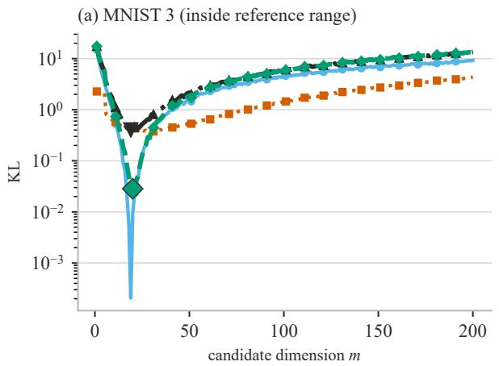

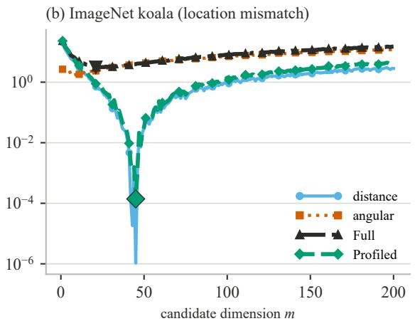  
Figure S6: Complete KL analysis for MNIST digit 3 and ImageNet koala using one fixed reference replicate and the MiND distance model. The legend distinguishes components by color, line style, and marker; enlarged symbols mark the Full and Profiled joint minima.

Table S8: Normalization controls. The observed-data mean direction and Full and Profiled estimates are reported for raw, centered-radial, and contrast-normalized data over five reference replicates. Full and Profiled denote MiND–Full and MiND– Profiled.
<table><tr><td rowspan="2">Dataset</td><td colspan="3">raw</td><td colspan="3">centered radial</td><td colspan="3">contrast-norm.</td></tr><tr><td>ν</td><td>Full</td><td>Profiled</td><td>ν</td><td>Full</td><td>Profiled</td><td>ν</td><td>Full</td><td>Profiled</td></tr><tr><td>MNIST 3</td><td>1.166</td><td>20.4</td><td>20.2</td><td>1.198</td><td>20.2</td><td>20.0</td><td>1.135</td><td>20.8</td><td>20.8</td></tr><tr><td>MNIST 7</td><td>1.157</td><td>14.4</td><td>14.8</td><td>1.201</td><td>14.8</td><td>14.8</td><td>1.143</td><td>14.8</td><td>14.8</td></tr><tr><td>CIFAR-10 bird</td><td>0.898</td><td>18.8</td><td>34.0</td><td>0.982</td><td>22.5</td><td>33.0</td><td>1.064</td><td>28.2</td><td>34.0</td></tr><tr><td>CIFAR-10 cat</td><td>0.946</td><td>21.2</td><td>32.8</td><td>1.030</td><td>24.4</td><td>32.8</td><td>1.087</td><td>30.6</td><td>35.4</td></tr><tr><td>ImageNet koala</td><td>0.934</td><td>24.9</td><td>45.0</td><td>1.028</td><td>40.6</td><td>53.4</td><td>1.080</td><td>72.2</td><td>70.0</td></tr><tr><td>ImageNet butterfly</td><td>0.915</td><td>28.1</td><td>58.8</td><td>1.027</td><td>60.3</td><td>74.8</td><td>1.040</td><td>85.2</td><td>104.0</td></tr></table>

For CIFAR-10 and ImageNet, both normalizations raise ˆν toward the reference range and narrow the Full–Profiled separation. MNIST begins inside its reference range, and its Full and Profiled estimates stay close under all transformations. Gride–Profiled shows the same upward shift under contrast normalization.

The centered-norm measure uses CV(a) defined in Section S3.5. Raw koala and butterfly have Pearson correlations of −0.60 between centered norm and per-center mean direction, while contrast normalization reduces the koala correlation to −0.03. Their centered-norm variation, $\mathrm { C V } ( a ) = 0 . 1 5 \ – 0 . 1 8$ , is also much larger than that of a uniform 70-ball sample (0.014). Together with the GSM control, these observations support amplitude variation as a substantial contributor to the image angular shift.

Additional image classes The class survey examines whether low angular location extends beyond the examples analyzed in the Main paper.

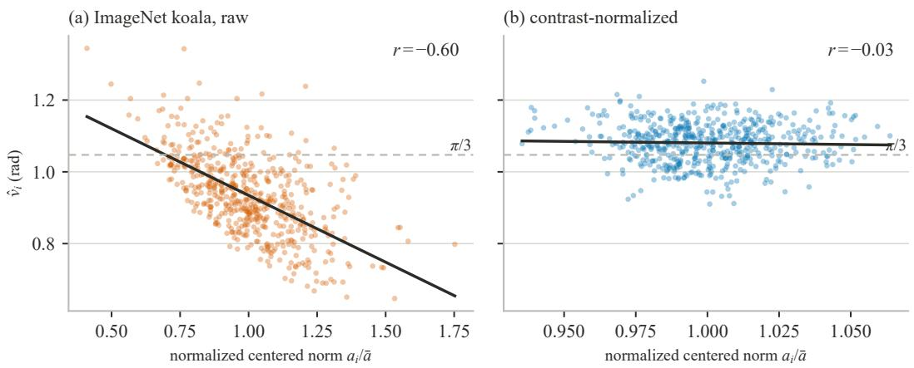  
Figure S7: Per-center mean direction against normalized centered norm $a _ { i } / \bar { a }$ for raw and contrast-normalized ImageNet koala data. Normalization largely removes the broad norm tail and weakens the negative relation. Solid lines are least-squares trends; the dashed horizontal line marks $\pi / 3$ , and r denotes the Pearson correlation between centered norm and per-center mean direction.

Table S9: Per-class angular statistics at $k = 1 0 ,$ . Here r is the Pearson correlation between per-center mean direction and centered norm, and $\operatorname { C V } ( a )$ is the population standard deviation of $a _ { i } = \lVert x _ { i } - { \bar { x } } \rVert _ { 2 }$ divided by their mean, with ¯x the class mean. ImageNet class codes are WordNet synset identifiers.
<table><tr><td>Source</td><td>Class</td><td>N</td><td>D</td><td>ν</td><td> $\mathrm { C V } ( a )$ </td><td> $r ( \hat { \nu } _ { i } , \| x _ { i } - \bar { x } \| )$ </td></tr><tr><td>CIFAR-10</td><td>airplane</td><td>5000</td><td>3072</td><td>0.939</td><td>0.291</td><td>-0.08</td></tr><tr><td>CIFAR-10</td><td>automobile</td><td>5000</td><td>3072</td><td>1.037</td><td>0.219</td><td>-0.04</td></tr><tr><td>CIFAR-10</td><td>bird</td><td>5000</td><td>3072</td><td>0.898</td><td>0.330</td><td>-0.10</td></tr><tr><td>CIFAR-10</td><td>cat</td><td>5000</td><td>3072</td><td>0.946</td><td>0.256</td><td>-0.08</td></tr><tr><td>CIFAR-10</td><td>deer</td><td>5000</td><td>3072</td><td>0.903</td><td>0.312</td><td>-0.13</td></tr><tr><td>CIFAR-10</td><td>dog</td><td>5000</td><td>3072</td><td>0.938</td><td>0.243</td><td>-0.10</td></tr><tr><td>CIFAR-10</td><td>frog</td><td>5000</td><td>3072</td><td>0.917</td><td>0.320</td><td>0.08</td></tr><tr><td>CIFAR-10</td><td>horse</td><td>5000</td><td>3072</td><td>0.986</td><td>0.240</td><td>-0.25</td></tr><tr><td>CIFAR-10</td><td>ship</td><td>5000</td><td>3072</td><td>0.936</td><td>0.279</td><td>-0.08</td></tr><tr><td>CIFAR-10</td><td>truck</td><td>5000</td><td>3072</td><td>1.022</td><td>0.196</td><td>-0.33</td></tr><tr><td>ImageNet</td><td>n01882714</td><td>547</td><td>150528</td><td>0.934</td><td>0.180</td><td>-0.60</td></tr><tr><td>ImageNet</td><td>n02086240</td><td>548</td><td>150528</td><td>0.940</td><td>0.200</td><td>-0.50</td></tr><tr><td>ImageNet</td><td>n02087394</td><td>947</td><td>150528</td><td>0.900</td><td>0.222</td><td>-0.39</td></tr><tr><td>ImageNet</td><td>n02094433</td><td>766</td><td>150528</td><td>0.982</td><td>0.196</td><td>-0.53</td></tr><tr><td>ImageNet</td><td>n02100583</td><td>826</td><td>150528</td><td>0.892</td><td>0.240</td><td>-0.33</td></tr><tr><td>ImageNet</td><td>n02100735</td><td>614</td><td>150528</td><td>0.912</td><td>0.201</td><td>-0.15</td></tr><tr><td>ImageNet</td><td>n02279972</td><td>648</td><td>150528</td><td>0.915</td><td>0.149</td><td>-0.60</td></tr></table>

Fifteen of the 17 classes in Table S9 have $\begin{array} { r } { \hat { \nu } < 1 . 0 . } \end{array}$ , and within CIFAR-10 the two exceptions also have the smallest centered-norm spread, consistent with an amplitude efect on angular location.

## S4.7 Layer-wise CNN profiles

Table S10 reports, for each architecture, the interior peak of the median Gride–Profiled curve together with the largest magnitude of the median paired diference between Gride–Full and Gride–Profiled; that largest diference coincides with the peak in every architecture. Relative depth follows the definition of Section S3.7. On AlexNet, the TWO-NN medians over the seven categories of the first subsample at the input, the three max-pooling checkpoints, and the three linear layers (29.7, 69.1, 65.3, 38.6, 28.0, 21.7, 17.2) closely reproduce the class-averaged profile reported by Ansuini et al. [15, Fig. 3A]. Layer medians of the observed mean direction ˆν range from 0.780 to 1.106 over the four networks: they lie at 0.78–0.87 at the first pooling checkpoint of each network, rise through depth, and reach 1.04–1.11 at the output layer. There the median paired Full−Profiled diference is at most six dimensions (Table S10, lower panel).

Table S10: Peak of the median Gride–Profiled curve across seven categories and three subsamples. Full and Profiled denote Gride–Full and Gride–Profiled, and the largest absolute diference between them occurs at the same layer in each architecture. The last column is the median of the per-cell paired Full−Profiled diferences across category–subsample cells, not the diference of the two reported medians. Layer names denote mathematical checkpoints along the sequence of network transformations. Lower panel: mean direction at the first pooling checkpoint and at the output layer, with the output medians of both objectives and their paired diference.
<table><tr><td>Architecture Peak layer</td><td></td><td>depth (%)</td><td></td><td> Full Profiled Median paired Full-Profiled</td></tr><tr><td>AlexNet</td><td>second max-pooling checkpoint</td><td>22.2 0.800</td><td>17 115</td><td>-100</td></tr><tr><td>VGG-16</td><td>second max-pooling checkpoint</td><td>23.5 0.802</td><td>18 197</td><td>-179</td></tr><tr><td>ResNet-18</td><td>second residual stage</td><td>47.4 0.916</td><td>37 248</td><td>-214</td></tr><tr><td>ResNet-34</td><td>second residual stage</td><td>42.9 0.919</td><td>37 245</td><td>-208</td></tr></table>

<table><tr><td>Architecture  first pooling  output Full output Profiled output Median paired Full-Profiled</td><td></td><td></td><td></td><td></td><td></td></tr><tr><td>AlexNet</td><td>0.801</td><td>1.106</td><td>22</td><td>22</td><td>-1</td></tr><tr><td>VGG-16</td><td>0.780</td><td>1.106</td><td>18</td><td>20</td><td>-2</td></tr><tr><td>ResNet-18</td><td>0.873</td><td>1.069</td><td>29</td><td>33</td><td>-4</td></tr><tr><td>ResNet-34</td><td>0.855</td><td>1.038</td><td>24</td><td>31</td><td>-6</td></tr></table>

## References

[1] F. Denti, D. Doimo, A. Laio, A. Mira, The generalized ratios intrinsic dimension estimator, Scientific Reports 12 (1) (2022) 20005. doi:10.1038/s41598-022-20991-1.

[2] F. W. J. Olver, D. W. Lozier, R. F. Boisvert, C. W. Clark (Eds.), NIST Handbook of Mathematical Functions, Cambridge University Press, 2010.

[3] M. Meil˘a, H. Zhang, Manifold learning: What, how, and why, Annual Review of Statistics and Its Application 11 (2024) 393–417. doi:10.1146/annurev-statistics-040522-115238.

[4] T. Cai, J. Fan, T. Jiang, Distributions of angles in random packing on spheres, Journal of Machine Learning Research 14 (2013) 1837–1864.

[5] C. Ceruti, S. Bassis, A. Rozza, G. Lombardi, E. Casiraghi, P. Campadelli, DANCo: An intrinsic dimensionality estimator exploiting angle and norm concentration, Pattern Recognition 47 (8) (2014) 2569–2581. doi:10.1016/j.patcog.2014.02.013.

[6] E. Thordsen, E. Schubert, ABID: Angle based intrinsic dimensionality — theory and analysis, Information Systems 108 (2022) 101989. doi:10.1016/j.is.2022.101989.

[7] P. Hall, J. S. Marron, A. Neeman, Geometric representation of high dimension, low sample size data, Journal of the Royal Statistical Society: Series B 67 (3) (2005) 427–444. doi:10.1111/j.1467-9868. 2005.00510.x.

[8] A. Blum, J. Hopcroft, R. Kannan, Foundations of Data Science, Cambridge University Press, 2020. doi:10.1017/9781108755528.

[9] A. P. N. Vo, S. Oraintara, T. T. Nguyen, Statistical image modeling using von Mises distribution in the complex directional wavelet domain, in: 2008 IEEE International Symposium on Circuits and Systems (ISCAS), 2008, pp. 2885–2888. doi:10.1109/ISCAS.2008.4542060.

[10] N. I. Fisher, Statistical Analysis of Circular Data, Cambridge University Press, Cambridge, 1993. doi: 10.1017/CBO9780511564345.

[11] J. Bac, E. M. Mirkes, A. N. Gorban, I. Tyukin, A. Zinovyev, Scikit-dimension: A Python package for intrinsic dimension estimation, Entropy 23 (10) (2021) 1368. doi:10.3390/e23101368.

[12] Y. LeCun, L. Bottou, Y. Bengio, P. Hafner, Gradient-based learning applied to document recognition, Proceedings of the IEEE 86 (11) (1998) 2278–2324. doi:10.1109/5.726791.

[13] A. Krizhevsky, Learning multiple layers of features from tiny images, Tech. rep., University of Toronto (2009).

[14] O. Russakovsky, J. Deng, H. Su, J. Krause, S. Satheesh, S. Ma, Z. Huang, A. Karpathy, A. Khosla, M. Bernstein, A. C. Berg, L. Fei-Fei, ImageNet large scale visual recognition challenge, International Journal of Computer Vision 115 (3) (2015) 211–252. doi:10.1007/s11263-015-0816-y.

[15] A. Ansuini, A. Laio, J. H. Macke, D. Zoccolan, Intrinsic dimension of data representations in deep neural networks, in: Advances in Neural Information Processing Systems, Vol. 32, 2019, pp. 6111–6122.

[16] A. Krizhevsky, I. Sutskever, G. E. Hinton, ImageNet classification with deep convolutional neural networks, in: Advances in Neural Information Processing Systems, Vol. 25, 2012.

[17] K. Simonyan, A. Zisserman, Very deep convolutional networks for large-scale image recognition, in: International Conference on Learning Representations (ICLR), 2015.

[18] K. He, X. Zhang, S. Ren, J. Sun, Deep residual learning for image recognition, in: IEEE Conference on Computer Vision and Pattern Recognition (CVPR), 2016, pp. 770–778.